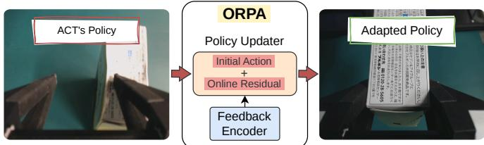
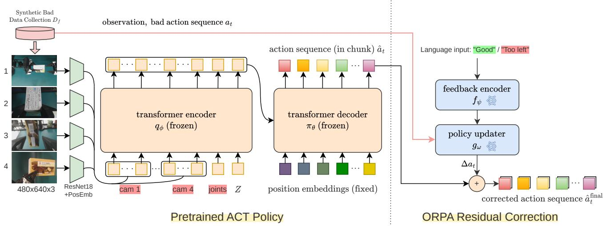
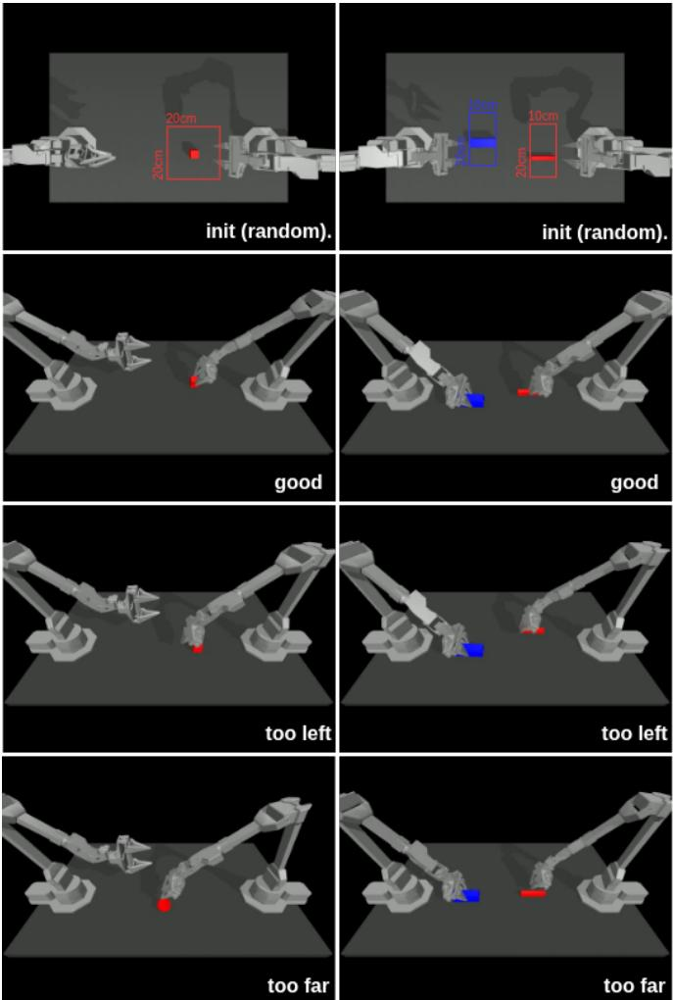
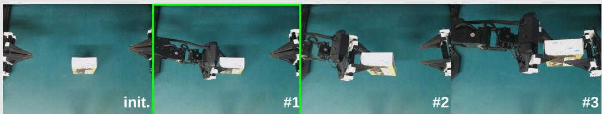
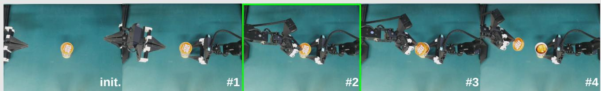
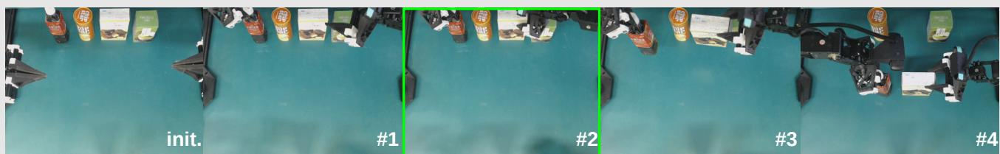
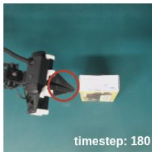
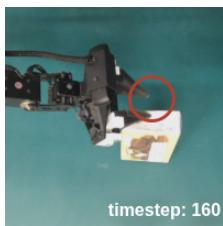
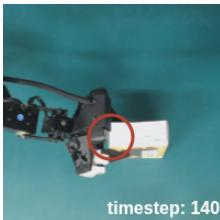

# ORPA: Online Residual Policy Adaptation for Robot Manipulation Control with Human Feedback

1st Muhammad A. Muttaqien∗ 2nd Tomohiro Motoda∗

Embodied AI Research Team National Institute of AIST Tokyo, Japan muha.muttaqien@aist.go.jp

Embodied AI Research Team National Institute of AIST Tokyo, Japan tomohiro.motoda@aist.go.jp

3rd Ryo Hanai

Embodied AI Research Team   
National Institute of AIST   
Tokyo, Japan   
ryo.hanai@aist.go.jp 4th Yukiyasu Domae   
Embodied AI Research Team   
National Institute of AIST Tokyo, Japan   
domae.yukiyasu@aist.go.jp

Abstract—Robotic manipulation policies trained via imitation learning, such as Action Chunking with Transformers (ACT), can achieve strong performance under ideal conditions but often remain sensitive to small execution errors and distribution shifts. Correcting these failures typically requires dataset aggregation and full-policy retraining, which is computationally expensive and unsuitable for real-time deployment. In this work, we propose Online Residual Policy Adaptation (ORPA), a framework that enables immediate, feedback-driven correction of robot actions without modifying the underlying policy parameters. ORPA augments a pretrained control policy with a lightweight, feedback-conditioned module that predicts residual adjustments directly in joint space, allowing the system to adapt its behavior at runtime. We evaluate ORPA on a set of precision-sensitive manipulation tasks using the ALOHA platform, demonstrating improvements in success rate and recovery from small perturbations compared to baseline control policies and rule-based inverse kinematics corrections.

Index Terms—Robot Control, Robot Manipulation, Imitation Learning, Human Feedback Integration

## I. INTRODUCTION

Recent advances in imitation learning have enabled robotic manipulation systems to achieve impressive performance across a wide range of tasks [1], [2]. In particular, transformer-based policies such as Action Chunking with Transformers (ACT) have demonstrated strong capabilities in learning long-horizon manipulation behaviors directly from human demonstrations. Combined with low-cost bimanual robotic platforms such as ALOHA, these approaches have accelerated research toward scalable and accessible robot learning systems. Despite these advances, imitation learning policies often remain highly sensitive to small execution errors, environmental variations, and distribution shifts encountered during real-world deployment.

In practical robotic manipulation scenarios, even small deviations in end-effector position, orientation, or timing can lead to task failure. This issue becomes particularly critical in precision-sensitive tasks such as cluttered object grasping, narrow-space pick-and-place, and coordinated bimanual manipulation, where minor spatial offsets may cause collisions, unstable grasps, or failed object transfers. Although pretrained policies may achieve high success rates under nominal conditions, their performance can degrade when objects are slightly displaced, viewpoints change, or execution conditions differ from the training distribution.

A common approach to improving policy robustness is to collect additional demonstrations and retrain or finetune the policy using dataset aggregation techniques [3]–[5]. While effective, retraining-based pipelines are computationally expensive, require repeated data collection, and are often unsuitable for interactive or real-time robotic deployment. Moreover, these approaches typically modify the entire policy network even when failures originate only from small local execution errors. Another straightforward alternative is to apply rule-based geometric corrections using forward and inverse kinematics, where feedback signals such as “too left” or “too high” are translated into predefined end-effector offsets and projected back into joint space. Although intuitive, such methods assume that identical feedback always corresponds to identical corrective behavior, despite the fact that appropriate corrections often depend on task phase, object configuration, and execution context. Consequently, both retraining-based adaptation and fixed rule-based correction methods struggle to provide efficient and flexible real-time adaptation during manipulation tasks.

Instead of modifying the underlying policy parameters, ORPA augments a pretrained control policy with a feedbackconditioned residual module that predicts corrective action adjustments directly in joint space. Given the current policy output and external feedback, the proposed module produces temporally consistent residual corrections that refine robot behavior during execution while preserving the original policy performance. Unlike retraining-based approaches, ORPA enables immediate adaptation without requiring additional optimization of the base policy. Furthermore, by learning residual corrections rather than relying on predefined geometric rules, the proposed framework can capture contextdependent and behavior-level adjustments that extend beyond simple end-effector offsets.

We evaluate ORPA on a set of precision-sensitive robotic manipulation tasks using the ALOHA platform. Our experiments focus on scenarios where small execution errors significantly affect task success, including spatial perturbations and coordination-sensitive bimanual tasks. Experimental results demonstrate that ORPA improves task robustness and recovery performance compared to baseline ACT policies and rule-based inverse kinematics correction methods.

  
Fig. 1: Overview of proposed ORPA. Online residual corrections generated from human feedback refine pretrained ACT actions for robust manipulation.

## II. RELATED WORK

Imitation learning has become one of the dominant paradigms for robotic manipulation due to its ability to learn complex behaviors directly from human demonstrations [6]. Recent advances in transformer-based architectures have significantly improved the capability of manipulation policies to model sequential actions and multimodal observations. In particular, Action Chunking with Transformers (ACT) introduced action chunking strategies for efficient and stable policy learning in bimanual robotic manipulation tasks. Combined with platforms such as ALOHA, these approaches have enabled scalable collection of manipulation demonstrations and strong performance across diverse tabletop tasks. However, despite their effectiveness, imitation learning policies often remain sensitive to small distribution shifts and execution perturbations encountered during deployment.

Several studies have explored methods for improving policy robustness through online adaptation and iterative refinement. A common strategy is dataset aggregation and policy retraining, where new demonstrations or corrective samples are incorporated to improve future performance. Representative approaches such as DAgger [3] and HG-Dagger [7] iteratively collect corrective supervision to reduce compounding errors during policy execution. More recent methods have investigated online policy adaptation for robotic manipulation through feedback-driven updates and continual learning mechanisms. However, many of these approaches require expensive optimization procedures, repeated retraining, or modification of the underlying policy parameters, limiting their applicability in real-time robotic systems.

Among recent works, OLAF [8] and YAY Robot [9] introduced an interactive learning framework that incorporates human verbal corrections for robotic manipulation. OLAF demonstrates the effectiveness of language-guided corrective supervision and offline policy refinement for improving robotic behavior through iterative data collection and finetuning. Another common strategy for handling manipulation errors is the use of rule-based geometric correction through forward and inverse kinematics, where human feedback or task errors are mapped into predefined end-effector offsets and converted back into joint-space actions using inverse kinematics solvers. While such approaches are intuitive and computationally efficient for simple local adjustments, they assume that identical feedback always corresponds to identical corrective behavior. In practice, however, appropriate corrections often depend on the task phase, object configuration, robot pose, and execution context. For example, the same feedback signal such as “too left” may require different correction magnitudes during object approach, grasping, or placement stages.

In contrast to prior approaches, ORPA combines the efficiency of lightweight online adaptation with the flexibility of learning-based residual correction. By conditioning corrective actions on human feedback while preserving the pretrained manipulation policy, ORPA enables real-time behavioral refinement without requiring full-policy retraining or manually designed geometric correction rules.

## III. EXPERIMENT SETUP

The proposed Online Residual Policy Adaptation (ORPA) framework, shown in Figure 1, was evaluated in both simulation and real-world environments using the ALOHA platform. The experimental setup consists of a dual-arm bimanual manipulation system with vision and joint-state information, along with precision manipulation tasks that require coordinated control and tight tolerance specifications. This section describes the experimental setup used throughout the experiments.

## A. ALOHA Simulation

Simulation experiments were conducted using a MuJoCobased [10] ALOHA simulation environment integrated with the ACT framework. The simulator models a synchronized dual-arm manipulation system consisting of two 6-DOF manipulators with parallel-jaw grippers, resulting in a 14- dimensional joint-space action representation including gripper actuation. The environment operates at a control frequency of 50 Hz and supports multi-view RGB observations captured from four virtual cameras with image resolutions of 640 × 480.

## B. ALOHA Workspace

The real-world experiments were conducted using the ALOHA platform, a dual-arm robotic manipulation system designed for bimanual imitation learning and manipulation research. The system configuration consists of two collaborative manipulators, parallel-jaw grippers, and a multi-view RGB vision setup, as described below.

• Robotic Arm: The real-world robotic platform is based on the ALOHA system consisting of two synchronized 6-DOF manipulators configured for bimanual manipulation tasks. Both arms are controlled through a ROSbased [11] joint-space interface operating at 50 Hz, providing a combined 14-dimensional control space including gripper actuation. ACT predicts chunked joint trajectories while ORPA generates online residual jointspace corrections during execution.

  
Fig. 2: Training pipeline of the proposed Online Residual Policy Adaptation (ORPA) framework. Left: A pretrained ACT policy generates nominal joint-space actions from visual observations and robot states. Structured perturbations are introduced to create synthetic errors together with corresponding corrective feedback labels. Right: The Feedback Encoder (FE) and Policy Updater (PU) are trained to predict residual action corrections conditioned on RGB images, robot states, bad actions, and human feedback. The predicted residual is supervised using the difference between perturbed and reference actions.

• Gripper: Each manipulator is equipped with a paralleljaw gripper supporting variable-width grasping for both pinch and encompassing grasps. The grippers support real-time actuation control and are integrated directly into the policy action representation for coordinated bimanual manipulation.

• Vision System: The platform utilizes four synchronized RGB cameras, including two wrist-mounted cameras and two external tabletop cameras, providing multi-view observations of the workspace. All RGB images are resized to 640×480 resolution and directly processed by the ACT visual encoder without explicit object detection or segmentation modules.

## IV. ONLINE RESIDUAL POLICY ADAPTATION

The proposed Online Residual Policy Adaptation (ORPA) framework builds upon a pretrained Action Chunking with Transformers (ACT) policy as the underlying manipulation controller. ACT is an imitation learning framework that predicts temporally coherent chunks of joint-space actions from multimodal observations, including multi-view RGB images and robot joint states. By predicting action sequences rather than individual low-level commands, ACT enables smooth and stable execution of long-horizon manipulation tasks.

In this work, ACT serves as a frozen base policy and is not modified during ORPA training or deployment. Given the current observation $o _ { t } ,$ ACT predicts a chunk of future actions $\hat { a } _ { t : t + k }$ , which provides the nominal manipulation behavior. While ACT demonstrates strong performance under nominal conditions, its performance can degrade when execution errors, object perturbations, or distribution shifts occur during deployment. ORPA addresses this limitation by introducing a feedback-conditioned residual adaptation module that refines ACT actions online without requiring retraining of the underlying policy, making it well suited for real-time correction.

## A. ORPA Architecture

Figure 2 illustrates the overall architecture of the proposed ORPA framework. The framework consists of a pretrained ACT policy, a Feedback Encoder, and a Policy Updater module. During execution, ACT first generates a nominal action chunk $\hat { a } _ { t : t + k }$ based on the current visual observations and robot states. Simultaneously, external corrective feedback provided by a human operator is encoded into a compact latent representation. The encoded feedback is combined with the current robot state, visual observations, and ACT predictions to estimate a residual action correction $\Delta a _ { t }$ Instead of replacing the original ACT output, ORPA performs residual adaptation by adding the predicted correction to the ACT action:

$$
a _ { t : t + k } ^ { f i n a l } = \hat { a } _ { t : t + k } + \Delta a _ { t }\tag{1}
$$

where $\hat { a } _ { t : t + k }$ denotes the nominal ACT prediction and $\Delta a _ { t }$ represents the feedback-conditioned residual correction. This residual formulation preserves the original manipulation behavior learned by ACT while allowing local corrective adjustments during execution. Since ORPA operates directly in joint space, corrective actions can be applied without requiring explicit forward or inverse kinematics computations.

## B. Feedback Encoder and Policy Updater

To enable online corrective adaptation, ORPA introduces two lightweight transformer-based components, a Feedback Encoder and a Policy Updater. The Feedback Encoder converts human corrective feedback into a latent representation suitable for policy adaptation. During training and evaluation, feedback signals consist of directional correction commands such as too left, too right, too high, and good. Each feedback signal is first represented as a discrete token and then mapped into a learnable embedding space. Let $f _ { t }$ denote the feedback signal at timestep t. The Feedback Encoder produces a latent feedback representation:

$$
r _ { t } = f _ { \psi } ( f _ { t } )\tag{2}
$$

where $r _ { t }$ captures the semantic meaning of the corrective instruction. The Policy Updater receives the encoded feedback representation together with the current robot observation and ACT prediction. The module predicts a residual action correction:

$$
\Delta a _ { t } = g _ { \omega } ( r _ { t } , o _ { t } , a _ { t : t + k } )\tag{3}
$$

where $o _ { t }$ denotes the current observation and $a _ { t : t + k }$ denotes the action trajectory associated with the current manipulation context. By conditioning residual actions on both feedback and execution context, ORPA can generate contextdependent corrections whose magnitude and direction vary according to the task stage, object configuration, and robot state. This differs from rule-based inverse kinematics approaches, which apply identical corrections regardless of execution context.

## C. Synthetic Data Generation

Collecting large-scale corrective demonstrations from human operators can be expensive and time-consuming. To address this limitation, ORPA generates corrective training samples automatically from successful demonstration trajectories. As illustrated in Figure 3, successful manipulation trajectories are first collected using teleoperation and used to train the ACT policy. Controlled perturbations are then introduced into the manipulation environment by modifying object positions and orientations within predefined ranges. These perturbations create failure scenarios that mimic common execution errors encountered during deployment.

For each perturbation, a corresponding feedback label is assigned according to the perturbation direction. For example, leftward object displacements are labeled as too left, while upward displacements are labeled as too high. The resulting dataset consists of perturbed observations, corrective feedback labels, and corresponding reference actions obtained from the original successful demonstrations. The residual correction target is computed as the difference between the reference action and the perturbed action:

$$
\Delta a _ { t } ^ { * } = a _ { t } ^ { r e f } - a _ { t } ^ { p e r t u r b e d }\tag{4}
$$

where $a _ { t } ^ { r e f }$ denotes the action from the successful trajectory and $a _ { t } ^ { p e r t u r b e d }$ denotes the action associated with the perturbed execution. This procedure enables scalable generation of corrective supervision without requiring additional teleoperation demonstrations.

## D. Training Objective

ORPA is trained while keeping the ACT policy fixed. During training, the pretrained ACT policy first predicts a nominal action chunk based on the current observation.

Algorithm 1 ACT Training   
1: Given: Demo dataset $\mathcal { D } ,$ chunk size $k ,$ weight $\beta .$   
2: Let $a _ { t } , o _ { t }$ represent action and observation at timestep t,   
$\bar { o } _ { t }$ represent $o _ { t }$ without image observations.   
3: Initialize encoder $q _ { \phi } ( z \mid a _ { t : t + k } , \bar { o } _ { t } )$   
4: Initialize decoder πθ $\left( \hat { a } _ { t : t + k } \mid o _ { t } , z \right)$   
5: for iteration $n = 1 , 2 , \ldots$ . do   
6: Sample $o _ { t } , a _ { t : t + k }$ from D   
7: Sample z from $q _ { \phi } ( z \mid a _ { t : t + k } , \bar { o } _ { t } )$   
8: Predict $\hat { a } _ { t : t + k }$ from $\pi _ { \boldsymbol { \theta } } \big ( \widehat { a } _ { t : t + k } \ | \ o _ { t } , z \big )$   
9: $\mathcal { L } _ { \mathrm { r e c o n s t } } = M S E ( \widehat { a } _ { t : t + k } , a _ { t : t + k } )$   
10: $\mathcal { L } _ { \mathrm { r e g } } = D _ { K L } \big ( q _ { \phi } ( z \mid a _ { t : t + k } , \bar { o } _ { t } ) \big | \big | \mathcal { N } ( 0 , I ) \big )$   
11: Update $\theta , \phi$ with ADAM and $\mathscr { L } = \mathscr { L } _ { \mathrm { r e c o n s t } } + \beta \mathscr { L } _ { \mathrm { r e g } }$   
12: end for

Algorithm 2 ORPA Training with Pretrained ACT Policy   
1: Given: Pretrained ACT policy $\pi _ { \theta } ,$ feedback dataset $\mathcal { D } _ { f } .$   
2: Initialize feedback encoder $f _ { \psi } .$   
3: Initialize policy updater $g _ { \omega }$   
4: for iteration $n = 1 , 2 , \ldots$ . do   
5: Sample $\left( o _ { t } , f _ { t } , a _ { t : t + k } \right)$ from $\mathcal { D } _ { f }$   
6: Predict ACT action chunk: $\hat { a } _ { t : t + k } = \pi _ { \theta } ( o _ { t } )$   
7: Encode feedback signal: $r _ { t } = f _ { \psi } ( f _ { t } )$   
8: Predict residual correction: $\Delta a _ { t } = g _ { \omega } ( r _ { t } , o _ { t } , a _ { t : t + k } )$   
9: Apply residual correction: $\hat { a } _ { t : t + k } ^ { \mathrm { f i n a l } } = \hat { a } _ { t : t + k } + \Delta a _ { t }$   
10: Compute residual loss: LORPA   
$M S E ( \widehat { a } _ { t : t + k } ^ { \mathrm { f i n a l } } , a _ { t : t + k } )$   
11: Update $\psi , \omega$ with ADAM   
12: end for

The Feedback Encoder and Policy Updater then estimate a residual correction conditioned on the feedback signal and execution context. The final corrected action is computed as:

$$
a _ { t : t + k } ^ { f i n a l } = \hat { a } _ { t : t + k } + \Delta a _ { t }\tag{5}
$$

The residual adaptation module is optimized using a meansquared error objective between the corrected action and the reference action:

$$
L _ { O R P A } = \frac { 1 } { N } \sum _ { i = 1 } ^ { N } { \left\| a _ { i } ^ { f i n a l } - a _ { i } ^ { r e f } \right\| ^ { 2 } }\tag{6}
$$

where $a _ { i } ^ { r e f }$ denotes the target action obtained from the original successful demonstration. The complete training procedure is summarized in Algorithm 2. Since only the Feedback Encoder and Policy Updater are optimized, ORPA introduces minimal computational overhead while preserving the original ACT policy parameters.

## V. EXPERIMENTS AND ANALYSIS

## A. Tasks

We evaluate the proposed ORPA framework on several precision-sensitive bimanual manipulation tasks using the ALOHA platform [19]–[21]. The evaluation tasks include precision pick-and-place, cluttered object grasping, constrained placement, and coordinated bimanual manipulation scenarios. These tasks were selected because small spatial or temporal deviations can significantly affect task success. During evaluation, object poses were randomly perturbed relative to demonstration trajectories to simulate realistic distribution shifts and execution errors. Corrective feedback signals such as “too left,” “too right,” and “too high” were provided online during task execution to evaluate the effectiveness of residual action-level adaptation.

  
Fig. 3: Generation of synthetic manipulation errors for ORPA training. Objects are randomly initialized within predefined workspace boundaries (top row), and successful demonstrations are first collected as reference trajectories (good). Cartesian perturbations are then introduced to the target object pose, producing failure scenarios (too left and too far).

## B. ACT Hyper-parameters Tuning

The ACT policy was trained using chunked joint-space action prediction with a Transformer-based architecture. The action chunk size was set to 100 control steps with a policy update frequency of 50 Hz. Multi-view RGB observations with resolution 640 × 480 were encoded using convolutional visual backbones before fusion with proprioceptive robot states. Hyperparameters were selected based on validation success rate and trajectory stability during manipulation execution. The detailed hyperparameter settings are summarized in Table I.

TABLE I: Hyperparameters used for ORPA training.
<table><tr><td colspan="2">ORPA Training</td></tr><tr><td>Batch Size Chunk Size</td><td>8 100</td></tr><tr><td>KL Weight Learning Rate</td><td>10</td></tr><tr><td>Number of Epochs</td><td>1e-5 2000</td></tr><tr><td>ORPA (Feedback Encoder) Embedding Dimension</td><td>32</td></tr><tr><td>Hidden Dimension</td><td>128</td></tr><tr><td>Output Dimension Learning Rate</td><td>64 1e-5</td></tr><tr><td>ORPA (Policy Updater)</td><td></td></tr><tr><td></td><td></td></tr><tr><td>Action Dimension</td><td>14</td></tr><tr><td>Feedback Dimension</td><td>64</td></tr><tr><td>Hidden Dimension</td><td>128</td></tr><tr><td>Number of Attention Heads</td><td>6</td></tr><tr><td>Number of Layers</td><td>2</td></tr><tr><td>Learning Rate</td><td>1e-5</td></tr></table>

## C. Experiment Results

Our experiments demonstrate that the proposed ORPA framework improves manipulation robustness under small execution perturbations and distribution shifts compared to baseline ACT policies and rule-based inverse kinematics (IK) correction methods. As shown in Table II, ORPA consistently achieved higher success rates across all evaluated tasks. For the Cube Transfer task, the original ACT policy achieved 60.0% success under failure conditions, while ORPA improved performance to 92.3% and 91.7% using discrete and continuous feedback, respectively. Similar improvements were observed in the Bimanual Insertion task, where success rates increased from 60.0% to 80.3% and 84.7%.

The Bimanual Insertion task proved more challenging than Cube Transfer due to its tighter geometric constraints. While Cube Transfer only requires the receiving gripper to securely hold the cube, successful insertion requires accurate peg-target alignment and physical contact, making the task significantly less tolerant to small positional, rotational, and timing errors. Nevertheless, ORPA maintained substantial performance gains over the baseline ACT policy, demonstrating its effectiveness in precision-sensitive manipulation scenarios.

ORPA also consistently outperformed the rule-based IK baseline. Fixed IK correction assumes that identical feedback always corresponds to identical corrective motion, which can lead to over-correction or under-correction when the true error magnitude varies. In contrast, ORPA predicts feedbackconditioned residual actions directly from visual inputs, robot states, and policy outputs, enabling context-dependent adaptation of correction magnitude without requiring a forwardkinematics and inverse-kinematics conversion cycle during execution. Another limitation of rule-based IK is its lack of task-phase awareness. The same correction is applied regardless of whether the robot is approaching, grasping, lifting, or transferring an object. Consequently, corrections that are beneficial during one stage may interfere with later stages requiring precise contact or coordination. By learning corrective behavior from demonstration trajectories, ORPA implicitly captures task context and can determine when strong, weak, or no correction should be applied. Finally, the results obtained using combined translational and rotational feedback highlight the flexibility of the proposed approach. Rotational corrections are generally more challenging than translational adjustments due to the additional orientation constraints involved.

TABLE II: Performance under failure conditions in simulation. All methods achieve 90.0% (Cube Transfer) and 84.0% (Bimanual Insertion) success under normal conditions.
<table><tr><td rowspan=1 colspan=2>Method</td><td rowspan=1 colspan=2>Feedback</td><td rowspan=1 colspan=1>Data Type</td><td rowspan=1 colspan=1>Failures</td></tr><tr><td rowspan=1 colspan=6>Cube Transfer (Sim)</td></tr><tr><td rowspan=1 colspan=2>Original ACT</td><td rowspan=1 colspan=2>Translation</td><td rowspan=1 colspan=1></td><td rowspan=1 colspan=1>60.0%</td></tr><tr><td rowspan=5 colspan=2>ACT + ORPA (Ours)ACT + ORPA (Ours)ACT + ORPA (Ours)ACT + Rule-based IKACT + Rule-based IK $\mathrm { A C T + O L A F }$ </td><td rowspan=1 colspan=2>Translation</td><td rowspan=2 colspan=1>DiscreteContinuous</td><td rowspan=3 colspan=1>92.3%91.7%85.9%</td></tr><tr><td rowspan=1 colspan=1></td><td rowspan=2 colspan=2>Trans. + Rotation</td><td rowspan=1 colspan=1>n</td></tr><tr><td rowspan=1 colspan=1>Discrete</td></tr><tr><td rowspan=1 colspan=2>Translation</td><td rowspan=1 colspan=1>Discrete</td><td rowspan=1 colspan=1>81.0%</td></tr><tr><td rowspan=1 colspan=2>TranslationTranslation</td><td rowspan=1 colspan=1>Continuous一</td><td rowspan=1 colspan=1>78.5%</td></tr><tr><td rowspan=1 colspan=6>Bimanual Insertion (Sim)</td></tr><tr><td rowspan=1 colspan=2>Original ACTACT + ORPA (Ours) $\mathrm { A C T + O R P A }$ (Ours)</td><td rowspan=1 colspan=2>TranslationTranslationTranslation</td><td rowspan=1 colspan=1>DiscreteContinuous</td><td rowspan=1 colspan=1>60.0%80.3%84.7%</td></tr></table>

## D. Comparison with OLAF

We additionally compare ORPA with OLAF, a languagebased correction framework that incorporates human feedback through large language model (LLM) reasoning. When adapted for online correction, OLAF achieves a success rate of 78.5%, demonstrating the effectiveness of feedback-guided manipulation recovery. However, its performance remains below the proposed ORPA framework. A key limitation of OLAF for real-time deployment is inference latency, as each correction requires an additional LLM inference step. Furthermore, corrective decisions are generated at individual execution steps rather than directly over action trajectories, which may reduce temporal consistency during manipulation. OLAF also requires a forward-kinematics and inversekinematics conversion pipeline to translate feedback into executable actions. In contrast, ORPA predicts residual corrections directly in joint space and operates on chunked action trajectories generated by ACT.

## VI. REAL-WORLD VALIDATION

## A. Deployment Setup

To evaluate the practical applicability of the proposed ORPA framework, we deployed the system on the real-world ALOHA robotic platform. Experiments were conducted on three precision-sensitive manipulation tasks: snack box transfer, bottle cap opening, and object sorting. These tasks require accurate grasping, coordinated motion, and precise object interaction, making them suitable for evaluating online corrective adaptation under real-world conditions. The original ACT policy was trained using 100 successful teleoperated demonstrations for each task. The trained ACT policy exhibited strong manipulation capabilities and was able to perform limited recovery behaviors in certain situations. For example, when object grasping initially failed, the policy occasionally re-attempted grasping and successfully completed the task. For training the ORPA modules, namely the Feedback Encoder and Policy Updater, corrective data were generated using two strategies: (1) action perturbation only, and (2) action perturbation combined with perturbed observations.

## B. Task Evaluation

Table III summarizes the real-world performance of the original ACT policy and the proposed ORPA variants on three manipulation tasks: snack box transfer, bottle cap opening, and object sorting. Task performance was evaluated over 30 trials for each task using a task completion score, where full success received a score of 1.0 and partial completion received a score of 0.5. Partial scores were assigned to intermediate outcomes, such as successful grasping without successful placement. The results show that the original ACT policy already achieves strong performance across all tasks. This observation is consistent with qualitative findings that ACT exhibits a degree of robustness and can occasionally recover from execution failures, such as re-attempting object grasping after an initial miss. Such behaviors suggest that ACT possesses both interpolation capability within the training distribution.

TABLE III: Real-world task performance. Partial task completion receives a score of 0.5, while complete task success receives a score of 1.0.
<table><tr><td>Method</td><td>Transfer</td><td>Open</td><td>Sort</td></tr><tr><td>Original ACT</td><td>0.83</td><td>0.79</td><td>0.80</td></tr><tr><td> $\mathrm { A C T + O R P A }$  (Action Only)</td><td>0.85</td><td>0.81</td><td>0.81</td></tr><tr><td> $\mathrm { A C T } + \mathrm { O R P A } \ ( \mathrm { A c t i o n } + \mathrm { O b s e r v a t i o n } )$ </td><td>0.86</td><td>0.82</td><td>0.83</td></tr></table>

Nevertheless, the bottle cap opening task remains particularly challenging due to its contact-rich interactions, precise alignment requirements, and sensitivity to timing errors, resulting in the lowest baseline performance among the evaluated tasks. Introducing ORPA with action perturbation alone improves the task scores, demonstrating that residual policy adaptation can effectively correct execution failures during deployment. Furthermore, incorporating perturbed observations further enhances robustness and improves performance across all tasks. These results indicate that a small amount of additional observation-level correction data can significantly improve robustness while maintaining data efficiency. Importantly, real-world failures are not limited to translation and rotation errors. Additional failure modes include timing mismatches, imperfect contact interactions, and execution inconsistencies arising from object dynamics. Consequently, ORPA is designed to perform corrective adaptation based on the provided feedback signal rather than assuming predefined categories of failure.

  
Snack Box Transfer: Both arms in the workspace move to their initial positions (subtask init). The left arm grasps the snack box (subtask #1). The left arm lifts the snack box (subtask #2). The snack box is transferred to the right arm (subtask #3).

  
Chip Tube Opening: Both arms in the workspace move to their initial positions (subtask init). The right arm grasps and stabilizes the tube (subtask #1). The left arm grasps the lid (subtask #2). The left arm lifts the lid (subtask #3). The lid is removed from the tube (subtask #4).

  
Object Sorting: Both arms in the workspace move to their initial positions (subtask init). The left arm grasps the rst object (subtask #1). The right arm grasps the second object (subtask #2). Both arms lift their respective objects (subtask #3). Both objects are placed at their designated locations (subtask #4).  
Fig. 4: Qualitative results of the proposed ORPA framework on three real-world manipulation tasks: snack box transfer, chip tube opening, and object sorting. Each sequence illustrates the initialization stage followed by key manipulation subtasks. The ones with green boxes indicate the subtasks during which online adaptation usually occurs.

## C. Qualitative Results

Figure 4 presents representative execution sequences of the proposed ORPA framework on three real-world manipulation tasks: snack box transfer, bottle cap opening, and object sorting. Each sequence illustrates the robot’s behavior under online corrective feedback, highlighting both failure recovery and successful task completion. Real-world experiments demonstrate that ORPA can effectively improve manipulation robustness through online corrective feedback. When the robot encountered execution failures, feedback signals such as too left, too right, or too high generated residual corrections that refined the action trajectory without modifying the underlying ACT policy. Unlike fixed rule-based correction methods, ORPA adapts its corrective behavior according to the current execution context and task phase.

Qualitative observations indicate that ORPA preserves the smooth and temporally consistent behavior of ACT while enabling additional corrective adaptation during deployment. In snack box transfer, ORPA successfully corrected grasping and placement errors caused by object displacement. In bottle cap opening, ORPA improved manipulation stability under contactrich interactions and timing-sensitive motions. In object sorting, ORPA demonstrated robustness across multiple object configurations and target locations, suggesting improved generalization under distribution shifts. Importantly, real-world failures were not limited to translation and rotation errors. Additional failure modes included timing mismatches, imperfect contact interactions, and execution uncertainties arising from object dynamics. By generating residual corrections directly in joint space, ORPA was able to recover from diverse failure scenarios while preserving the original manipulation behavior learned by ACT. Notably, corrective feedback was not always necessary. As illustrated in Figure 5, the too low perturbation remained within the recovery capability of the original ACT policy and still resulted in successful task completion.

  
(a) Too Left

  
(b) Too Far

  
(c) Too Low  
Fig. 5: Representative close-up views of manipulation outcomes under execution perturbations. Spatial errors such as too $l e f t$ and too $f a r$ lead to task failures, whereas the too low case still results in successful grasping execution.

## VII. CONCLUSION

In this work, we presented Online Residual Policy Adaptation (ORPA), a lightweight framework for real-time corrective adaptation in robotic manipulation control through human feedback. By augmenting a pretrained control policy with a feedback-conditioned residual module, ORPA enables immediate action-level refinement without requiring retraining of the underlying policy. Unlike rule-based IK correction approaches, the proposed method learns context-aware and temporally consistent joint-space control adjustments that improve robustness under small execution perturbations and distribution shifts. Experimental results on precision-sensitive manipulation tasks using the ALOHA platform demonstrate improved task recovery and success rates compared to baseline ACT policies and inverse kinematics-based correction methods. These findings suggest that online residual adaptation provides a practical direction toward more adaptive and interactive robot manipulation control systems.

## ACKNOWLEDGMENT

We express our sincere gratitude to the National Institute of Advanced Industrial Science and Technology (AIST) for their invaluable support and resources that made this research possible. Their contribution was essential in the successful completion of this research work.

## REFERENCES

[1] Torabi, F., Warnell, G., and Stone, P. (2018). ”Behavioral Cloning from Observation.” In Proceedings of the 27th International Joint Conference on Artificial Intelligence (IJCAI).

[2] Chi, C., Feng, S., Du, Y., et al. (2023). ”Diffusion Policy: Visuomotor Policy Learning via Action Diffusion.” In Proceedings of Robotics: Science and Systems (RSS 2023).

[3] Ross, S., Gordon, G. J., and Bagnell, J. A. (2011). ”A Reduction of Imitation Learning and Structured Prediction to No-Regret Online Learning.” In Proceedings of the Fourteenth International Conference on Artificial Intelligence and Statistics (AISTATS).

[4] Lee, J., Fox, R., Dragan, A., et al. (2017). ”DART: Noise Injection for Robust Imitation Learning.” In Proceedings of the 1st Annual Conference on Robot Learning (CoRL 2017).

[5] Bi, J., Dhiman, V., Xiao, T., et al. (2020). ”Learning from Interventions using Hierarchical Policies for Safe Learning.” In Proceedings of the AAAI Conference on Artificial Intelligence (AAAI 2020).

[6] Zare, M., Kebria, P. M., Khosravi, A., et al. (2024). ”A Survey of Imitation Learning: Algorithms, Recent Developments, and Challenges.” IEEE Transactions on Cybernetics, vol. 54, no. 12.

[7] Kelly, M., Sidrane, C., Driggs-Campbell, K., et al. (2019). ”HG-DAgger: Interactive Imitation Learning with Human Experts.” In Proceedings of the IEEE International Conference on Robotics and Automation (ICRA 2019).

[8] Liu, H., Chen, A., Zhu, Y., et al. (2023). ”Interactive Robot Learning from Verbal Correction.” In CoRL 2023 Workshop on Language and Robot Learning (LangRob).

[9] Shi, L. X., Hu, Z., Zhao, T. Z., et al. (2024). ”Yell At Your Robot: Improving On-the-Fly from Language Corrections.” In Proceedings of Robotics: Science and Systems (RSS 2024).

[10] Todorov, E., Erez, T., & Tassa, Y. (2012). ”Mujoco: A Physics Engine for Model-Based Control.” Proceedings of the IEEE International Conference on Robotics and Automation (ICRA), 5026-5033.

[11] Quigley, M., Conley, K., et al. (2009). ”ROS: An Open-Source Robot Operating System.” In ICRA Workshop on Open Source Software.

[12] Devlin, J., Chang, M.-W., Lee, K., et al. (2019). ”BERT: Pre-training of Deep Bidirectional Transformers for Language Understanding.” In Proceedings of the 2019 Conference of the North American Chapter of the Association for Computational Linguistics: Human Language Technologies (NAACL-HLT 2019).

[13] Brown, T. B., Mann, B., Ryder, N., et al. (2020). ”Language Models are Few-Shot Learners.” In Advances in Neural Information Processing Systems (NeurIPS 2020).

[14] Vaswani, A., Shazeer, N., et al. (2017). ”Attention Is All You Need.” In Advances in Neural Information Processing Systems, 30 (NeurIPS).

[15] Hochreiter, S., & Schmidhuber, J. (1997). ”Long Short-Term Memory.” Neural Computation, 9(8), 1735-1780.

[16] He, K., Zhang, X., Ren, S., et al. (2016). ”Deep Residual Learning for Image Recognition.” In Proceedings of the IEEE Conference on Computer Vision and Pattern Recognition (CVPR 2016).

[17] Redmon, J., Divvala, S., Girshick, R., et al. (2016). ”You Only Look Once: Unified, Real-Time Object Detection.” In Proceedings of the IEEE Conference on Computer Vision and Pattern Recognition (CVPR 2016).

[18] Paszke, A., Gross, S., Massa, F., et al. (2019). ”PyTorch: An Imperative Style, High-Performance Deep Learning Library.” Advances in Neural Information Processing Systems (NeurIPS), 32.

[19] Zhao, T. Z., Kumar, V., et al. (2023). ”Learning Fine-Grained Bimanual Manipulation with Low-Cost Hardware.” In Proceedings of Robotics: Science and Systems (RSS).

[20] Fu, Z., Zhao, T. Z., and Finn, C. (2024). ”Mobile ALOHA: Learning Bimanual Mobile Manipulation with Low-Cost Whole-Body Teleoperation.” In Proceedings of the IEEE International Conference on Robotics and Automation (ICRA 2024).

[21] Aldaco, J., Armstrong, T., Baruch, R., et al. (2024). ”ALOHA 2: An Enhanced Low-Cost Hardware for Bimanual Teleoperation.” arXiv preprint arXiv:2405.02292.