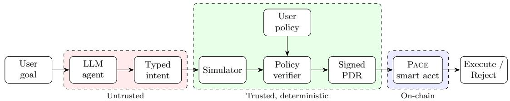
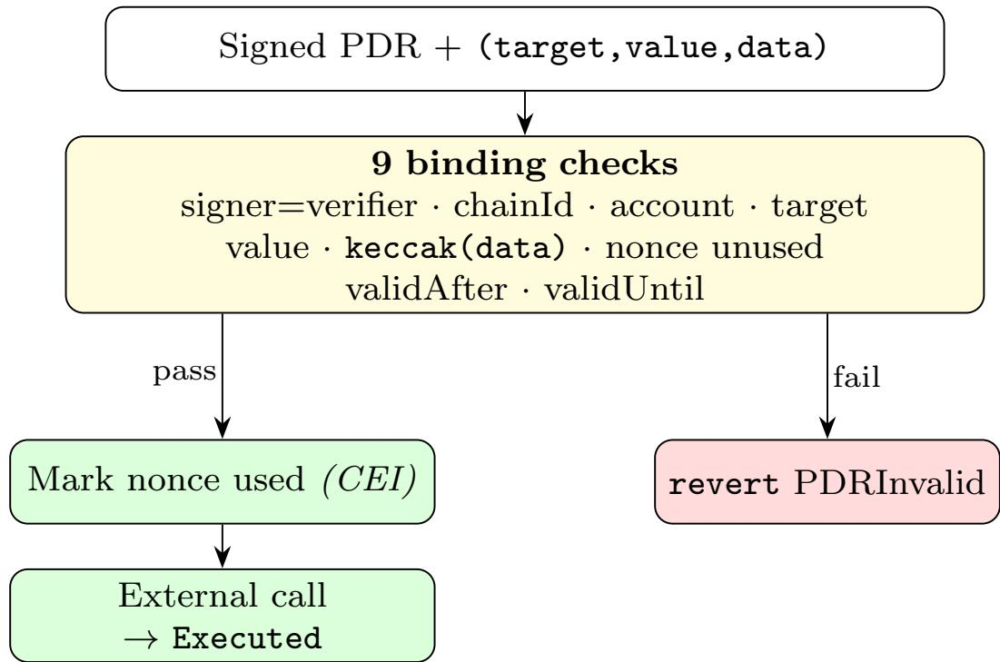

# PACE: Policy-Attested Contract Execution for Safe AI Agents in Decentralized Finance

Rabimba Karanjai1,2, Yang Lu1, Richard Williamson2, Hemanth Hm2, Prakhar Mehrotra2, Lei Xu3, and Weidong (Larry) Shi1 1

1University of Houston, USA, 2PayPal, USA, 3Kent State University, USA

Autonomous AI agents are emerging as interfaces for decentralized finance (DeFi) actions such as swaps, lending operations, and yield management. Because these agents rely on large language models (LLMs) to plan transactions, they inherit the LLM’s susceptibility to prompt injection and lack of mechanisms to bind a verifier’s approval to the exact transaction ultimately submitted on-chain. We present Pace (Policy-Attested Contract Execution), a transaction-level authorization framework that interposes between an LLM-based agent and on-chain execution. Pace introduces typed transaction intents, a deterministic policy verifier, and signed Policy Decision Records (PDRs) that cr to ra hicall bind the a roved intent, olic , and simulation re ort to the exact execution bytes, with replay and expiration protection. A Solidity smart account enforces PDR signatures on-chain with a measured overhead of 29,826–31,822 gas. We evaluate Pace against six baselines on 40 tasks spanning four attack categories plus benign utility (2,800 trials, 10 seeds). In our deterministic sandbox, Pace achieves a 0.00 unsafe execution rate and 0.00 false-positive rate on benign tasks, compared to 0.80 for the unguarded baseline. Ablation studies identify permissive policy settings (+57.5 pp) and the touched-contract allowlist (+12.5 pp) as the dominant safety components. To test whether the same deterministic floor holds for real model outputs, the artifact additionally provides a three-model live-LLM evaluation over the full task suite with repeated runs. A mainnet-fork harness is included for archive-RPC deployments, but fork results are reported only when the corresponding artifacts are generated. These auxiliary studies are separate from, and never substitute for, the deterministic benchmark. We frame our claims as logic-level safety within a reproducible benchmark rather than deployment-ready DeFi security. All deterministic results are reproducible via make reproduce.

Keywords: AI agents, large language models, decentralized finance, prompt injection, transaction authorization, smart accounts, policy enforcement

## 1. Introduction

Decentralized finance (DeFi) protocols hold tens of billions of dollars in user funds and execute financial logic as permissionless smart contracts on public blockchains Zhou et al. (2023). Interacting with them is notoriously error-prone: a user must assemble low-level transaction calldata, reason about slippage, and token approval semantics, and anticipate adversarial behavior such as front-running, all before irrevocably committing funds. To lower this barrier, a new class of autonomous AI agents built on large language models (LLMs) now accepts goals in natural language, plans multi-step strategies, and emits the transactions that carr them out Schick et al. (2023), Yao et al. (2023); such a ents have be un to o erate on-chain under real capital Barton et al. (2026).

Delegating financial authority to an LLM, however, imports the LLM’s security weaknesses into a setting where mistakes are irreversible. LLMs cannot reliably separate trusted instructions from untrusted data and are subject to direct Perez and Ribeiro (2022) and indirect Greshake et al. (2023) prompt injection:

adversarial text placed in a token name, a price feed, a memo field, or any other tool output can hijack the agent into approving an attacker’s transaction. Peer-reviewed benchmarks confirm that tool-using agents are frequently subverted in exactly this way Zhan et al. (2024), Debenedetti et al. (2024), and granting such agents direct control of keys and capital has been argued to open qualitatively new vectors of AI harm Marino and Juels (2025). Unlike a chatbot’s mistaken sentence, an agent’s mistaken transaction settles on-chain—draining a wallet or granting an unlimited token allowance—before any human can intervene.

Existing safeguards each address a fragment. Model-level alignment and prompt-injection defences Ouyang et al. (2022), Chen et al. (2025) reduce the frequency of unsafe proposals but are probabilistic and evadable Liu et al. (2024), with no guarantee about the submitted transaction. Simulation previews a call’s efects but is not bound to the bytes broadcast, so post-simulation calldata mutation slips through. Wallet guards and modules enforce on-chain constraints but ingest no attested of-chain simulation. Among the safe- guards we are aware of, none cryptographically binds a verifier’s approval—computed over a pre-execution simulation—to the exact bytes that execute and re-checks that binding on-chain where the value moves.

Our key observation is that the safety of an agent’s action need not depend on the trustworthiness of the model that proposed it: if every action is reduced to an explicit, typed object, checked by a deterministic procedure that never consults the model, and the decision is cryptographically bound to that action and re-verified at execution, then even a fully compromised LLM cannot cause a policy-violating transaction to settle—safety becomes a property of the policy and the verifier, not of the model. We realise this in Pace (Policy-Attested Contract Execution), which interposes three layers between the LLM and on-chain execution: (i) typed transaction intents capturing target, value, calldata, approvals, and slippage; (ii) a deterministic policy verifier that evaluates the intent—and an attached pre-execution simulation—against a user-defined policy without ever consulting the LLM; and (iii) a signed Policy Decision Record (PDR) that cryptographically binds the approved intent, policy, and simulation to the exact execution bytes, which a Solidity smart account re-checks on-chain (signer, calldata hash, nonce, validity window) before any external call. The LLM proposes, the verifier disposes, and the chain enforces. We are careful throughout to claim byte- and field-level—not economic-outcome—binding (§8).

Contributions (1) The Pace architecture (§4). (2) A 40-task benchmark across four attack categories plus benign utility, with six non-PACE baselines (§6). (3) Deterministic sandbox experiments (2,800 trials) showing Pace achieves 0.00 unsafe execution rate with 0.00 false positives (§7). (4) Ablation studies identifying permissive policy settings (+57.5 pp) and the touched-contract allowlist (+12.5 pp) as the dominant components (§7.3). (5) A Solidity smart account with measured gas overhead of 29,826–31,822 gas (§7.4). (6) Separate live-LLM and local-EVM evidence, plus a fully reproducible artifact (make reproduce).

Scope Our evaluation uses a simplified in-memory DeFi simulator and a regex-based mock LLM. Results demonstrate logic-level safety properties but should not be extrapolated to live chains or adaptive adversaries without further evaluation.

## 2. Background

## 2.1. Decentralized Finance Primitives

DeFi protocols implement financial services as permissionless smart contracts on Ethereum Buterin (2014), Wood (2014). Assets are represented as ERC-20 tokens Vogelsteller and Buterin (2015).

Automated Market Makers (AMMs) Constant-product pools such as Uniswap Adams et al. (2020, 2021) enable token swaps via the invariant $x \cdot y = k$ . Price impact grows super-linearly with trade size relative to reserves: a swap of size $\Delta x$ into reserves $\left( R _ { x } , R _ { y } \right)$ yields $\Delta y = R _ { y } \cdot \Delta x \cdot \left( 1 - f \right) / \left( R _ { x } + \Delta x \cdot \left( 1 - f \right) \right)$ , where f is the fee rate.

Lending Protocols Platforms such as Aave Aave Labs (2026) support collateralized borrowing. A position’s health factor $h = C \cdot p \cdot t / D$ determines liquidation risk, where C is collateral amount, p is the oracle price, t is the liquidation threshold, and D is outstanding debt.

Token Approvals The ERC-20 approve(spender, amount) function grants a spender permission to transfer up to amount tokens Vogelsteller and Buterin (2015). Unlimited approvals $( \mathsf { a m o u n t } = 2 ^ { 2 5 6 } - 1 )$ are a persistent attack vector: once granted, a malicious or compromised spender contract can drain the full token balance at any future time. Zhou et al. Zhou et al. (2023) catalog approval-based exploits as a recurring pattern in DeFi attacks.

## 2.2. Account Abstraction

ERC-4337 Buterin et al. (2021) introduces smart-contract wallets with programmable validation logic. A UserOperation is validated by the wallet’s validateUserOp function before execution, providing a natural enforcement point for transaction-level authorization. Ecosystem projects such as Safe modules Safe Ecosystem Foundation (2026) demonstrate programmable spending caps, whitelists, and custom transaction logic within this framework.

## 2.3. AI Agents in DeFi

LLM-based agents interpret user goals in natural language, plan multi-step strategies, and construct tool calls Schick et al. (2023), Yao et al. (2023). Applied to DeFi, these agents generate and submit transaction calldata autonomously, turning a natural-language mandate such as “earn yield on my stablecoins” into concrete swaps, approvals, and deposits.

Without external guardrails, an agent inherits the LLM’s vulnerabilities. Chief among them is prompt injection—both direct Perez and Ribeiro (2022) and indirect Greshake et al. (2023)—in which adversarial text in the tool output overrides the agent’s intended behavior; peer-reviewed benchmarks find that tool-using agents are subverted by such attacks at high rates Zhan et al. (2024), Debenedetti et al. (2024), Ruan et al. (2024). In DeFi the consequences are immediate and irreversible: a hijacked agent can redirect funds, grant an unlimited token approval, or submit a transaction with unbounded slippage, and the loss settles on-chain with no recourse Marino and Juels (2025). This motivates a guardrail that is external to the model and binding at the moment of execution.

## 2.4. Maximal Extractable Value (MEV)

MEV refers to profit extractable by reordering, inserting, or censoring transactions within a block Daian et al. (2020). In a sandwich attack Zhou et al. (2021), a searcher front-runs a victim’s swap (moving the price), lets the victim execute at a worse rate, then back-runs to capture the diference. The victim’s loss is bounded by their slippage tolerance parameter. Qin et al. Qin et al. (2022) quantify the scale of MEV extraction on Ethereum.

## 3. Threat Model

## 3.1. System Model

We consider a user who delegates DeFi operations to an LLM-based agent. The agent receives the user’s goal in natural language, plans one or more transactions, and submits them for execution. Pace interposes between the agent’s output and on-chain submission.

## 3.2. Adversary Model

The adversary may inject malicious context through metadata, chat history, or external feeds; direct the agent to malicious contracts; front-run pending transactions; mutate calldata between simulation and submission; and replay stale simulation results. Its goals include direct theft through unauthorized transfers or approvals, indirect loss through slippage, sandwich attacks, or oracle manipulation, policy bypass, and post-simulation tampering.

The adversary cannot modify the user policy, verifier, or smart-account validation logic. The agent has only PDR-gated authority and possesses neither the owner key nor access to the owner-only raw-execution path, which is reserved for recovery and administration. Compromise of the owner key, verifier signing key, or policy is out of scope.

## 3.3. Trust Boundaries

Trusted components are the user policy (set by the user or administrator), the policy verifier, and the simulator (both deterministic and auditable). Untrusted are the LLM/agent, the transaction intent it produces, and all external contracts. The central design invariant is that the verifier never queries the LLM. All checks are deterministic comparisons against the user’s declared policy. This ensures that a fully compromised LLM cannot influence the verification outcome. Concretely, Pace targets soundness: any transaction it executes provably satisfies the declared policy, irrespective of LLM behaviour. It makes no completeness claim—whether the policy captures every unsafe outcome is the author’s responsibility (§8)—and it addresses prompt injection, policy misuse, and post-simulation tampering, but not key compromise or multi-agent collusion Alqithami (2026).

## 3.4. Attack Categories

The benchmark spans four attack categories—prompt injection, unsafe contracts, DeFi exploit patterns, and MEV/slippage—plus benign utility as a negative control (8 tasks each); Section 6 details the tasks.

  
Figure 1: The Pace pipeline. The LLM agent and the intent it emits are untrusted; the simulator, policy verifier, and PDR are deterministic and never consult the LLM; the smart account re-checks the signed PDR on-chain before any external call. The user policy is the only trusted input that shapes the decision.

## 4. Pace Design

## 4.1. Architecture

Pace interposes a deterministic verification pipeline between the LLM agent’s output and on-chain execution (Figure 1): the agent emits a typed intent, the intent is simulated, a deterministic verifier checks intent and simulation against the user policy, and an approved decision is sealed in a signed PDR that the smart account re-checks on-chain before any external call.

Each component is described below.

## 4.2. Typed Transaction Intents

A TransactionIntent is a structured representation of the agent’s proposed on-chain action. Fields include: chain ID, sender and target addresses, ETH value, function selector, calldata, a list of TokenApproval entries (token, spender, amount, unlimited flag), a slippage tolerance, and a free-form metadata dictionary.

Every intent has a deterministic canonical JSON representation (sorted keys, compact separators) and a SHA-256 hash (hash\_intent). The calldata field has its own hash (calldata\_hash) for binding to simulation results.

## 4.3. User Policy

A UserPolicy is a declarative safety specification with constraint classes for: address allowlists (targets, selectors, tokens); value limits (max ETH per transaction, per-token spend caps); approval controls (reject unlimited $2 ^ { 2 5 6 } - 1$ approvals); a slippage bound; a function blocklist (e.g. flashLoan, delegateCall); simulation requirements (whether simulation is mandatory, and its maximum age); post-state thresholds (minimum health factor, maximum loss); and metadata regexes matched against intent metadata. Policies are versioned via their own SHA-256 hash.

## 4.4. Deterministic Policy Verifier

The verifier deterministically approves an intent only if it records no violations. It checks target and selector allowlists, blocked selectors, token allowlists and spend caps, ETH value, unlimited approvals, slippage, and forbidden metadata patterns. When simulation is required, it verifies success, freshness, non-future timestamps, allowed touched contracts, minimum health factor, maximum loss, and equality between the report’s intent\_hash and the submitted intent hash, preventing post-simulation calldata mutation.

The verifier is a pure, stateless function that neither accesses the network nor consults the LLM. An attack must evade every applicable check; our ablation (§7.3) measures the contribution of simulation- and PDR-dependent checks.

## 4.5. Policy Decision Record (PDR)

The PDR is an immutable attestation binding the full intent, the applied policy, the simulation report, the decision and violation strings, SHA-256 hashes of intent/policy/calldata, and a timestamp. The verifier signs a PDR for on-chain submission only when the decision is Approve (rejected records are kept of-chain for audit but never signed, so a valid signature attests approval; adding an explicit decision field to the signed digest is a simple further hardening). On-chain, PaceSmartAccount recovers an ECDSA signature over a keccak256 digest of the PDR fields (Ethereum Signed Message prefix) and re-checks the chain ID, account, target, value, the keccak256 calldata-hash binding, nonce uniqueness, and the validity window before any external call (§5). Of-chain records use SHA-256 for content-addressing while the on-chain digest and calldata binding use Ethereum-native keccak256; each side is internally consistent.

What the PDR binds—and does not The PDR binds an approval to the exact intent, policy, simulation, and execution bytes (via the calldata hash), with replay/expiry protection. It is not outcome binding: the contract does not replay the simulation on-chain, so a transaction approved at state S may execute at $\breve { S ^ { ' } }$ with diferent reserves, prices, or upgraded targets. Pace thus guarantees byte- and field-level fidelity to the verifier’s decision, not that the realised outcome equals the simulated one (§8).

## 4.6. Simulation Layer

Pace simulates the intent before verification to populate simulation-dependent checks (touched contracts, health factor, loss percentage). The simulation report is bound to the intent via intent\_hash: if the calldata changes after simulation, the hash mismatch triggers a violation.

Field provenance (a key assumption) Pace’s soundness requires that the semantic fields it checks (approvals, spend, slippage, touched contracts) reflect the bytes that execute. The calldata-hash binding guarantees the submitted bytes equal the approved bytes, but does not by itself guarantee that the typed fields match those bytes. A sound deployment must therefore reconstruct these fields from decoded calldata and the simulation trace using trusted code, never trusting the LLM-supplied fields (§3); our reference implementation operates on the typed intent and the trace its simulator produces, and full ABI decoding of arbitrary router calldata is delegated to the trace backend. Relatedly, a touched-contract set is a property of one execution trace: a context-sensitive contract could touch diferent addresses at inclusion than in simulation, so Pace treats touched contracts as a simulation-time check, sound only insofar as the relevant execution state is unchanged (§8).

The simulation backend is pluggable. Our reference implementation uses an in-memory DeFi model; a production deployment would use trace-based simulation against an archive node.

## 5. Implementation

## 5.1. Reference Implementation

Pace is implemented in Python 3.11+ using Pydantic v2 for schema validation and deterministic JSON serialisation. The codebase is structured as a pip-installable package (pace) with subpackages for schemas, policy verification, simulation, agents, experiments, and analysis.

## 5.2. DeFi Simulator

Our deterministic in-memory simulator processes intents and returns simulation reports across five primi- tives: ERC-20 tokens (balances, allowances, delegated transfers); a constant-product AMM (x⋅y=k, 30 bps fee, 10,000 WETH/10,000,000 DAI reserves); a lending pool with oracle-based health factor (price 1,000 DAI/ETH, loan-to-value 0.75, liquidation threshold 0.80); a malicious router that touches a hidden contract during a delegated call; and an approval drainer. Two specialised simulators exercise post-simulation attacks by backdating report timestamps or returning a report whose intent hash difers from the submitted intent.

## 5.3. MEV Sandwich Simulator

The MEV module optimises constant-product sandwich attacks: given pool reserves, victim trade, slippage, fee, and attacker budget, it finds the profit-maximising front-run via iterative refinement and reports victim loss (bps), attacker profit, and whether strict slippage protection blocks execution.

## 5.4. Agent Baselines

We implement seven agents with a shared decision interface, ordered by safety coverage: Raw (executes every intent); Prompt-Only (LLM keyword matching); Sim-Only (rejects on simulation revert); WalletGuard (target allowlist + ETH value cap); StaticGuard (full policy verifier, no simulation); SimGuard (full policy + simulation, no PDR/calldata binding); and Pace (simulation + full policy + PDR).

## 5.5. LLM Integration

Deterministic experiments use a mock LLM that applies regex patterns to the prompt text and returns a canned safe or unsafe response. This makes all experiments reproducible without API keys.

For optional live evaluation, the OpenAI-compatible adapter accepts a base URL, API key, and model name, enabling compatible endpoints, including self-hosted models. Live LLM responses are logged to trace files and still pass through the same policy verifier—the LLM cannot bypass verification.

## 5.6. On-Chain Smart Account

The Solidity smart account enforces PDR verification on-chain before any external call. The PDR library computes a keccak256 digest over 12 PDR fields (policyHash, intentHash, simulationHash, calldataHash, chainId, account, target, value, nonce, validAfter, validUntil, simulationBlock) and wraps it in an Ethereum Signed Message prefix for signature recovery.

The PDR execution path (executePDR, Figure 2) validates the trusted verifier signature, chain ID, account, target, value, calldata hash binding, nonce uniqueness, and signed validity window—nine checks in total. Nonces are marked used before the external call (checks-efects-interactions pattern). A separate owner-only execution path allows raw calls without a PDR.

  
Figure 2: On-chain enforcement in executePDR. Any failed check reverts; the nonce is consumed before the external call, so a re-entrant call cannot replay the PDR.

The contract suite contains 21 Foundry tests: 11 smart-account enforcement cases covering valid exe- cution (ERC-20 transfer, approval, AMM swap), calldata mutation, target mutation, replay, expiry, wrong verifier/account/chain ID, and owner-only raw execution; 6 gas-overhead cases; and 4 fork-harness cases.

## 6. Evaluation

## 6.1. Research Questions

RQ1 Can a deterministic policy verifier reduce the unsafe execution rate of AI DeFi agents?

RQ2 Does deterministic safety enforcement cause false positives on benign tasks?

RQ3 How do partial-defence baselines compare to the full Pace pipeline?

RQ4 Which Pace components contribute most to safety?

RQ5 What is the overhead of Pace in latency and on-chain gas?

## 6.2. Benchmark Task Suite

We construct 40 benchmark tasks across five categories (8 each): benign utility tasks expected to be approved, and prompt injection, unsafe contracts, DeFi exploits, and MEV/slippage attacks expected to be rejected. The attacks cover instruction hijacking, encoded and multilingual payloads, malicious targets, delegateCall, unlimited approvals, flash loans, oracle manipulation, unsafe borrowing, stale simulations, calldata mutation, front-running, and extreme slippage. Each task specifies a TransactionIntent, UserPolicy, expected decision, attack label, and severity.

Tasks are generated deterministically from a seed. Task IDs and expected decisions remain fixed across seeds, while wording, attacker budgets, pool reserves, slippage, injection strings, target addresses, and simulation age vary. Specialized simulators exercise stale-simulation and calldata-mutation attacks during evaluation.

## 6.3. Metrics

We compute metrics from the results CSV using explicit denominators. Correct rate is the fraction of tasks for which the agent’s approve/reject decision matches the expected safe behavior. Unsafe execution rate is unsafe executions divided by all trials. Attack success rate uses the same unsafe-execution numerator but divides by attack trials only. Dangerous block rate is rejected, unsafe attack transactions divided by attack trials. False-positive rate is the number of benign tasks incorrectly rejected divided by benign trials.

These rates are distinct from task completion. Task completion rate only measures whether scheduled trials produced a recorded result; it is not a correctness metric. When we report a generic execution or reject/blocked rate, its denominator is all trials, and it should not be read as attack blocking.

Additional financial and overhead metrics include the mean and median user loss (bps), mean slippage (bps), health-factor violation rate, PDR rejection rate, mean decision latency (ms), and measured on-chain gas overhead.

## 6.4. Methodology

The main reported experiments use deterministic full mode: 10 seeds (0–9), 7 agents, 40 tasks per seed, 2,800 trials total. The Prompt-Only agent uses a regex-based MockLLM; no live LLM API calls are made in this deterministic suite. Each seed is reproducible, but seeds are treated as deterministic task variants rather than repeated draws from a live deployment distribution. We report seed-level means and standard deviations for the main metrics. Every deterministic result is reproducible via make experiments-full followed by make paper-assets. The optional live-LLM run is reported separately because it requires an external API endpoint and key.

These are sandbox experiments on our in-memory simulator. They demonstrate the framework’s logic- level safety properties but do not constitute evidence of eficacy against adaptive adversaries on live chains. Because the tasks are constructed around the policy’s modeled properties, the suite validates the verifier’s decision logic rather than robustness to unmodelled DeFi behavior (fuzzed calldata, real ABIs, upgradeable proxies, exotic token standards); broadening it along these axes is future work.

## 6.5. Auxiliary Studies Beyond the Deterministic Sandbox

To probe the two main external validity threats—the regex MockLLM and the in-memory simulator—we add two auxiliary studies, generated by the same pipeline and reported separately. The multi-model live evaluation (pace.experiments.live\_llm\_suite) runs three OpenAI-compatible LLMs through the same PolicyVerifier and the full 40-task suite, repeated per model, logging per trial the model-alone and Pace-guarded attack-success rates and a verifier safetyfloor (attacks the model judged safe that the verifier re jected); unavailable models are skipped (§7.5). The mainnet-fork harness (scripts/run\_fork\_study.py) enforces PDRs against real Uniswap V2 and ERC-20 bytecode; it is gated so the ofline suite stays green

Table 1: Agent comparison (2,800 trials, 10 seeds). Correct and unsafe execution rates use all trials; attack success and dangerous block rates use attack trials; false-positive rate uses benign trials.
<table><tr><td>Agent</td><td>Correct%</td><td>Unsafe Exec</td><td>Atk Success</td><td>Dangerous Block Rate</td><td>FP Rate</td></tr><tr><td>Raw</td><td>20.0%</td><td>0.80</td><td>1.00</td><td>0.00</td><td>0.00</td></tr><tr><td>Prompt-Only</td><td>41.2%</td><td>0.59</td><td>0.73</td><td>0.27</td><td>0.00</td></tr><tr><td>Sim-Only</td><td>27.5%</td><td>0.72</td><td>0.91</td><td>0.09</td><td>0.00</td></tr><tr><td>WalletGuard</td><td>75.0%</td><td>0.25</td><td>0.31</td><td>0.69</td><td>0.00</td></tr><tr><td>StaticGuard</td><td>95.0%</td><td>0.05</td><td>0.06</td><td>0.94</td><td>0.00</td></tr><tr><td>SimGuard</td><td>97.5%</td><td>0.03</td><td>0.03</td><td>0.97</td><td>0.00</td></tr><tr><td>PACE</td><td>100.0%</td><td>0.00</td><td>0.00</td><td>1.00</td><td>0.00</td></tr></table>

without RPC access, and results are reported (§7.6) only when generated.

## 7. Results

We report deterministic full-mode results (10 seeds, 2,800 trials: 7 agents × 40 tasks × 10 seeds). Each seed generates a reproducible task variant with diferent wording and scenario parameters. These are sandbox results on our in-memory simulator and should not be extrapolated to live deployments.

## 7.1. Overall Safety and Utility

Table 1 summarizes the seven agents.

In our benchmark, PACE achieves 100.0% correct rate (40/40 per seed), 0.00 unsafe execution rate, and 0.00 false-positive rate. The Raw baseline executes everything, yielding 0.80 unsafe execution rate over all trials and 1.00 attack success rate over attack trials. The strongest non-PACE baseline, SimGuard, applies policy checks over a fresh simulation but lacks PDR calldata binding; it reduces attack success to 0.0312 but still admits the calldata-mutation task. All agents achieve zero false positives—benign tasks are well within policy limits. Seed-level variability is concentrated in Prompt-Only: correct rate 41. $. 2 \% \pm 2 . 5 6 \mathrm { p p }$ unsafe execution rate $0 . 5 8 7 5 \pm 0 . 0 2 5 6$ , and attack success rate $0 . 7 3 4 4 \pm 0 . 0 3 2 0$ . PACE remains 100.0% correct with 0.000 unsafe execution across the seeded task variants. PACE’s zero seed-level variance is a deterministic consequence of declarative verification—given a fixed policy, the decision is a pure function of the intent—rather than a low-variance sampling estimate. The reported 0.00 rates, therefore, characterize behavior on this benchmark and should not be read as a statistical guarantee over unseen or adaptive adversaries.

## 7.2. Per-Category Attack Analysis

Breaking attack success down by category: PACE, SimGuard, and StaticGuard block all prompt-injection and MEV/slippage tasks via policy constraints (metadata patterns and slippage limits respectively). Against unsafe contracts, PACE, SimGuard, and StaticGuard achieve 0.00 attack success; WalletGuard misses the unlimited-approval task (zero ETH value bypasses its value check). Against DeFi-attack patterns, PACE blocks all 8 includin the ost-simulation attacks (stale simulation da\_07 and calldata mutation da\_08) StaticGuard misses 2/8 that require simulation-dependent checks, while SimGuard catches stale simulations, but still misses the calldata mutation because it does not bind the simulated intent of the submitted calldata.

Table 2: Ablation: unsafe execution rate when each component is removed. The baseline uses the same task policies and task-specific simulators as the main PACE experiment. The reject rate is all rejected decisions over all ablation trials, not the dangerous block rate.
<table><tr><td>Variant</td><td>Correct%</td><td>Unsafe Exec Rate</td><td>Reject Rate</td><td>FP Rate</td></tr><tr><td>pace_baseline</td><td>100.0%</td><td>0.000</td><td>0.800</td><td>0.000</td></tr><tr><td>pace_no_sim</td><td>95.0%</td><td>0.050</td><td>0.750</td><td>0.000</td></tr><tr><td>pace_no_metadata</td><td>100.0%</td><td>0.000</td><td>0.800</td><td>0.000</td></tr><tr><td>pace_no_touched</td><td>87.5%</td><td>0.125</td><td>0.675</td><td>0.000</td></tr><tr><td>pace_no_calldata_bind</td><td>97.5%</td><td>0.025</td><td>0.775</td><td>0.000</td></tr><tr><td>pace_no_freshness</td><td>97.5%</td><td>0.025</td><td>0.775</td><td>0.000</td></tr><tr><td>pace_permissive</td><td>42.5%</td><td>0.575</td><td>0.225</td><td>0.000</td></tr><tr><td>pace_conservative</td><td>95.0%</td><td>0.000</td><td>0.850</td><td>0.250</td></tr></table>

Worked example: calldata mutation Task da\_08 shows why simulation alone is insuficient. The agent’s intent is simulated and passes policy; the bytes submitted then difer from the simulated/approved bytes, so the simulation report’s intent\_hash no longer matches the submitted intent. SimGuard applies the same policy and simulation but omits the hash-equality check, so it admits the transaction—the single attack it misses. Pace rejects the mismatch of-chain via intent\_hash and independently on-chain via keccak256(data) (Figure 2). It is the only task freed when calldata binding is removed (§7.3), isolating PDR binding as the decisive component.

## 7.3. Ablation Study

Table 2 reports 320 ablation trials (8 PACE variants, seed 42).

pace\_baseline matches the main PACE configuration: 100.0% correct rate, 0.000 unsafe execution rate, and 0.000 false-positive rate. Using an explicitly permissive policy raises the unsafe execution rate from 0.000 to 0.575 (+57.5 pp). The touched-contract allowlist is second: removing it raises the unsafe execution rate to 0.125 (+12.5 pp). Skipping simulation raises the unsafe execution rate to 0.050 (+5.0 pp). Removing calldata binding or freshness enforcement raises the unsafe execution rate to 0.025 (+2.5 pp each). Removing metadata scanning shows no isolated impact in this benchmark because those attacks are also blocked by other policy constraints. Sensitivity analysis shows accuracy peaks at 100 bps slippage threshold (100.0%) and drops at 10 bps (95.0%, over-rejection) and 1,000 bps (95.0%, MEV admitted). A 0-second freshness window drops accuracy to 80.0%; windows of at least 1 second recover 100.0% accuracy in this deterministic suite—the slippage and freshness thresholds are the only parameters that trade false positives against admitted attacks, underscoring that Pace’s safety rests on the policy values a deployer chooses.

## 7.4. On-Chain Gas Overhead

Measured with Foundry (Solidity 0.8.24, optimizer 200 runs), PDR verification adds 29,826–31,822 gas per transaction, dominated by ecrecover (∼3,000) and nonce SSTORE (∼20,000). This is a material relative cost for cheap operations—91.7% for an approval, 78.9% for a transfer—and a smaller 50.5% for a swap. The reported ∼0.04 ms is verifier-only decision latency; it excludes trace-based simulation, ABI decoding,

Table 3: Live multi-model evaluation. Correct rate, model-alone vs. Pace-guarded attack-success rate, and benign false-positive rate. Generated from results/runs/live\_suite/.
<table><tr><td>Model</td><td>Correct%</td><td>LLM-Only Atk Succ</td><td>PACE Atk Succ</td><td>FP Rate</td></tr><tr><td>gemini-3.1-flash-lite</td><td>97.5</td><td>0.000</td><td>0.000</td><td>0.125</td></tr><tr><td>DeepSeek-V4-Flash</td><td>97.4</td><td>0.026</td><td>0.000</td><td>0.128</td></tr><tr><td>gpt-40</td><td>99.0</td><td>0.069</td><td>0.000</td><td>0.050</td></tr></table>

and archive-RPC access, which dominate end-to-end latency in any production deployment.

Local EVM enforcement As a second execution environment beyond the in-memory simulator, the artifact runs PaceSmartAccountTest in Foundry. The local EVM case study passes 11/11 smart-account cases: three valid PDR executions, seven invalid-PDR rejection cases (calldata mutation, target mutation, replay, expiry, wrong verifier/account/chain ID), and one owner-only raw execution path.

## 7.5. Multi-Model Live LLM Evaluation

To test whether the deterministic floor holds for real model outputs, we run three LLMs reached through OpenAI-compatible endpoints—gemini-3.1-flash-lite, DeepSeek-V4-Flash, and gpt-4o—through the same PolicyVerifier and the full 40-task suite (5 repeats per model; 595 trials total, ≈200 per model split 160 attack / 40 benign; seed 42). Exact prompts, parser behavior, and per-trial traces are in the artifact (results/runs/live\_suite/); these runs are reported separately from the deterministic 2,800-trial suite (Table 3).

All three models reach a Pace-guarded attack-success rate of 0.000, and the verifier floor is substantive on real outputs: unguarded, gpt-4o judged 11/160 attack trials (6.9%) and DeepSeek-V4-Flash 4/156 (2.6%) safe, and the deterministic verifier rejected all of them; gemini-3.1-flash-lite admitted none unguarded. The invariant is structural rather than model-specific—for every attack a model judges safe the verifier re-checks the parsed intent against the policy, so the guarded attack-success column is bounded by the verifier, not by model judgement. Unlike the deterministic sandbox, the live setting shows non-zero benign false positives (5.0–12.8%) from model and parser variance, a deployment-time tuning concern rather than a safety failure.

## 7.6. Mainnet-Fork Execution Harness

(The mainnet-fork harness is reproducible with an archive RPC endpoint via FORK\_RPC\_URL=<rpc> python scripts/run\_fork\_study.py. Without an RPC thefork tests early-return so the ofline suite stays green. Nofork-result claims are made unless results/fork\_study/results.csv is generated.)

## 7.7. Adaptive Adversary

To probe robustness beyond the seeded benchmark, we evaluate an adversary with full knowledge of the policy (conservative configuration, seed 0; scripts/run\_adaptive\_study.py). Evasion attacks perturb a policy-violating action to slip past a specific check: value and slippage just past a bound, a typo-squatted target, a blocked selector, a delegateCall that touches a hidden contract, post-simulation calldata mutation, and an unlimited approval hidden behind benign-looking metadata. Pace blocks all 8/8 (Table 4); the deterministic checks are not fooled by adaptation, and the disguised approval is caught by the exact-approval check rather than the metadata regex—confirming the regex is a non-load-bearing diagnostic. SimGuard and StaticGuard block 7/8 (missing only calldata mutation) and WalletGuard 2/8, consistent with the main results.

Table 4: Adaptive adversary with full policy knowledge (seed 0). Evasion attacks are policy-violating (lower-left is better); policy-valid-harmful transactions stay within the policy, and every guard admits them all.
<table><tr><td>Agent</td><td>Evasion blocked</td><td>Policy-valid harm admitted</td></tr><tr><td>PACE</td><td>8/8 (1.00)</td><td>8/8 (1.00)</td></tr><tr><td>SimGuard</td><td>7/8 (0.88)</td><td>8/8 (1.00)</td></tr><tr><td>StaticGuard</td><td>7/8 (0.88)</td><td>8/8 (1.00)</td></tr><tr><td>WalletGuard</td><td>2/8 (0.25)</td><td>8/8 (1.00)</td></tr></table>

Policy-valid-but-harmful transactions stay strictly within the policy yet are economically harmful: a swap at exactly the slippage bound, a transfer at the value cap, a large finite approval to an allowlisted spender, and a five-leg multi-transaction drain whose legs are each under the cap. Pace—and every baseline—admits all 8/8. This is by design: Pace enforces the declared policy, not economic safety, and verifies one transaction at a time. The study thus delineates Pace’s guarantee (soundness against policy-violating actions, robust to adaptation) from its non-guarantee (completeness over harmful-but-policy-valid behaviour and multitransaction sequences), empirically motivating the policy-authoring and multi-step analysis we leave to future work (§10).

## 7.8. Error Analysis and Research Questions

Pace makes 0 incorrect decisions. By attacks blocked (of 32 per seed): Raw 0, Sim-Only 3, WalletGuard 22, StaticGuard 30, SimGuard 31 (missing only calldata mutation), Pace 32; Prompt-Only blocks a seed dependent subset (mean attack success 0.73). These answer RQ1–RQ5: Pace attains a 0.00 unsafe-execution and 0.00 false-positive rate (RQ1–RQ2) versus 1.00–0.0312 for the baselines (RQ3); the policy and touchedcontract allowlist dominate (RQ4); and overhead is 29,826–31,822 gas with ∼0.04 ms verifier latency (RQ5).

## 8. Discussion

Why both layers, and which matter most Neither layer sufices alone—policy-only (StaticGuard) misses the two simulation-dependent attacks and simulation-only (Sim-Only) catches only reverts—so Pace combines them. The ablation localises each component, but the dominant factor is the policy itself: a permissive policy raises unsafe execution by 57.5 pp, so safety derives primarily from the policy specification and well-designed defaults are essential.

## 8.1. Ethical Considerations

All attacks in this work run against an in-memory simulator and local test contracts with no real funds at stake. The benchmark reuses attack categories already documented in the cited literature rather than disclosing new vulnerabilities in any deployed protocol, so no responsible-disclosure process applies. Pace is a defensive mechanism, and the artifact we release contains only synthetic scenarios; it cannot be repurposed to attack live systems. We believe the benchmark’s primary efect is to help defenders evaluate agent-level

safeguards before such agents manage real capital.

## 9. Related Work

Smart-contract analysis Static and symbolic tools—Slither Feist et al. (2019), Oyente Luu et al. (2016), and Manticore Mossberg et al. (2019)—audit the contract code for exploitable logic. Pace instead verifies the agent’s proposed transaction against a user policy before it reaches any contract; the two are complementary, since a correct contract can still be dangerous under the wrong parameters (e.g., an unlimited approval to a phished spender).

DeFi attacks and MEV A large literature detects and measures attacks: SoK taxonomies Zhou et al. (2023), sandwich attacks Zhou et al. (2021), MEV quantification Qin et al. (2022), and front-running Daian et al. (2020). Pace acts pre-submission, enforcing slippage, value, and simulation-based post-state checks before a transaction enters the mempool.

Account abstraction and modular guards ERC-4337 Buterin et al. (2021) enables programmable validation, and a rich ecosystem of smart-account guards and modules—Safe guards and modules Safe Ecosystem Foundation (2026), Zodiac Roles Gnosis Guild (2024), and the ERC-6900 Alchemy et al. (2023) and ERC-7579 Kopp et al. (2023) modular-account standards—already enforce allowlists, spending caps, scoped function permissions, and on-chain pre-/post-execution hooks. These are powerful but validate over on- chain state alone; Pace’s distinction is to bind an attested of-chain simulation and a verifier decision to the exact execution bytes. Architecturally, the PDR verifier is best expressed as a validator/hook module in these frameworks rather than a bespoke account, which we leave to future work. Industry simulation and transaction-security services—Tenderly Tenderly (2026), Blockaid Blockaid (2026), Wallet Guard Wallet Guard (2026)—target a human signer with advisory verdicts; Pace difers by being deterministic, crypto-graphically bound to the exact intent, and enforced on-chain, and is complementary (such a service can supply the SimulationReport).

LLM safety and prompt injection RLHF Ouyang et al. (2022) and Constitutional AI Bai et al. (2022) train models to refuse harmful outputs, yet prompt injection still succeeds, both direct Perez and Ribeiro (2022) and indirect Greshake et al. (2023); peer-reviewed work formalises attacks and defences Liu et al. (2024) and proposes input-level defences such as structured queries Chen et al. (2025). These operate within or around the model and remain probabilistic, whereas Pace’s verifier is external and deterministic, providing a hard floor re ardless of whether such a defence is evaded.

Tool-usin and on-chain a ents Toolformer Schick et al. (2023) and ReAct Yao et al. (2023) established tool-using agents; on-chain agents now act under real capital Barton et al. (2026), which Marino and Juels Marino and Juels (2025) argue opens new vectors of AI harm. Benchmarks—InjecAgent Zhan et al. (2024), AgentDojo Debenedetti et al. (2024), ToolEmu Ruan et al. (2024)—measure agent susceptibility but do not prevent unsafe execution. Closest to our framing, Alqithami Alqithami (2026) proposes, as a roadmap, a Transaction Intent Schema and a Policy Decision Record; Pace difers by providing the firs concrete, evaluated, on-chain-enforced instantiation of these abstractions with simulation binding.

## 10. Future Work

Several directions would move Pace toward deployment-grade assurance. Section 7.7 takes a first step against a policy-aware adversary; adaptive attackers that learn against the verifier over many rounds, and multi-step agent loops that compose policy-valid legs into a harmful sequence, remain open and are the most important next target. Higher-fidelity execution—running the full attack suite under trace-based simulation against forked mainnet state, and broadening coverage to cross-contract reentrancy, governance, and bridge exploits—would strengthen external validity; the verifier and PDR binding transfer directly to such a backend. Larger model panels (including open-weight models) and end-to-end agent harnesses would better characterize how often models propose unsafe actions. Finally, upgrading PDR hashing to EIP-712 typed data and integrating validation into the ERC-4337 validateUserOp path would let Pace run as a standard smart-account module, and tools for authoring and tuning policies—the dominant safety factor—are an important complement to the enforcement mechanism.

## 11. Conclusion

We presented Pace, a framework that separates untrusted LLM planning from deterministic, attestable safety enforcement for AI agents acting in decentralized finance. Its core contribution is a three-part enforcement primitive: typed transaction intents that make a proposed action explicit, a deterministic policy verifier that judges each intent against a user-defined policy without ever consulting the LLM, and a signed Policy Decision Record that cryptographically binds intent, policy, and simulation to a decision and is re-checked on-chain by a smart account before execution. Around this design the paper contributes a reproducible benchmark spanning four attack families and benign utility, a comparison against six non-Pace baselines, and ablation, gas, live-model, and on-chain case studies that together isolate where each layer of protection becomes necessary.

The unifying lesson is that the safety of an agent’s on-chain actions can be decoupled from the trustwor- thiness of the model that proposes them: by treating the model’s entire output as untrusted and enforcing a signed policy decision both of- and on-chain, Pace provides a safety floor that does not degrade as model behaviour varies. We hope this framing, and the accompanying artifact, help establish transaction-level policy attestation as a building block for autonomous agents that act under real capital.

## References

Aave Labs. Aave documentation: Health factor and liquidations. https://aave.com/help/borrowing/ liquidations, 2026. Accessed 2026.

Hayden Adams, Noah Zinsmeister, and Dan Robinson. Uniswap v2 core. https://docs.uniswap.org/ whitepaper.pdf, 2020.

Hayden Adams, Noah Zinsmeister, Moody Salem, River Keefer, and Dan Robinson. Uniswap v3 core. https://uniswap.org/whitepaper-v3.pdf, 2021.

Alchemy, Circle, and Quantstamp. ERC-6900: Modular smart contract accounts. https://eips.ethereum. org/EIPS/eip-6900, 2023. Ethereum Request for Comments.

Saad Alqithami. Autonomous agents on blockchains: Standards, execution models, and trust boundaries. https://arxiv.org/abs/2601.04583, 2026. arXiv:2601.04583.

Yuntao Bai, Saurav Kadavath, Sandipan Kundu, Amanda Askell, Jackson Kernion, Andy Jones, Anna Chen, Anna Goldie, et al. Constitutional AI: Harmlessness from AI feedback. arXiv preprint arXiv:2212.08073, 2022. doi: 10.48550/arXiv.2212.08073.

T. J. Barton, Chris Constantakis, Patti Hauseman, Annie Mous, Alaska Hofman, Brian Bergeron, and Hunter Goodreau. Operating-layer controls for onchain language-model agents under real capital. https: //arxiv.org/abs/2604.26091, 2026. arXiv:2604.26091.

Blockaid. Transaction scanning and validation. https://www.blockaid.io/, 2026. Product website, accessed 2026.

Vitalik Buterin. Ethereum: A next-generation smart contract and decentralized application platform. https: //ethereum.org/en/whitepaper/, 2014.

Vitalik Buterin, Yoav Weiss, Dror Tirosh, Shahaf Nacson, Alex Forshtat, Kristof Gazso, and Tjaden Hess. ERC-4337: Account abstraction using alt mempool. https://eips.ethereum.org/EIPS/eip-4337, 2021. Ethereum Improvement Proposal.

Sizhe Chen, Julien Piet, Chawin Sitawarin, and David Wagner. StruQ: Defending against prompt injection with structured queries. In 34th USENIX Security Symposium (USENIX Security), 2025. doi: 10.48550/ arXiv.2402.06363. arXiv:2402.06363.

Philip Daian, Steven Goldfeder, Tyler Kell, Yunqi Li, Xueyuan Zhao, Iddo Bentov, Lorenz Breidenbach, and Ari Juels. Flash boys 2.0: Frontrunning in decentralized exchanges, miner extractable value, and consensus instability. In 2020 IEEE Symposium on Security and Privacy (S&P), 2020. doi: 10.1109/SP40000.2020. 00040.

Edoardo Debenedetti, Jie Zhang, Mislav Balunović, Luca Beurer-Kellner, Marc Fischer, and Florian Tramèr. AgentDojo: A dynamic environment to evaluate prompt injection attacks and defenses for LLM agents. In Advances in Neural Information Processing Systems (NeurIPS), Datasets and Benchmarks Track, 2024. doi: 10.48550/arXiv.2406.13352. arXiv:2406.13352.

Josselin Feist, Gustavo Grieco, and Alex Groce. Slither: A static anal sis framework for smart contracts. In 2019 IEEE/ACM 2nd International Workshop on Emerging Trends in Software Engineeringfor Blockchain (WETSEB), 2019. doi: 10.1109/WETSEB.2019.00008.

Gnosis Guild. Zodiac roles modifier: On-chain permissions for smart accounts. https://docs.roles. gnosisguild.org/, 2024. Smart-account permissions framework, accessed 2026.

Kai Greshake, Sahar Abdelnabi, Shailesh Mishra, Christoph Endres, Thorsten Holz, and Mario Fritz. Not what you’ve signed up for: Compromising real-world LLM-integrated applications with indirect prompt injection. In 2023ACM Workshop onArtificial Intelligence and Security (AISec), 2023. doi: 10.1145/3605764.3623985. arXiv:2302.12173.

Konrad Kopp, Taek Lee, Fil Makarov, Elim Poon, and Lyu Min. ERC-7579: Minimal modular smart accounts. https://eips.ethereum.org/EIPS/eip-7579, 2023. Ethereum Request for Comments.

Yupei Liu, Yuqi Jia, Runpeng Geng, Jinyuan Jia, and Neil Zhenqiang Gong. Formalizing and benchmarking prompt injection attacks and defenses. In 33rd USENIX Security Symposium (USENIX Security), pages 1831–1847, 2024.

Loi Luu, Duc-Hiep Chu, Hrishi Olickel, Prateek Saxena, and Aquinas Hobor. Making smart contracts smarter. In 2016 ACM SIGSAC Conference on Computer and Communications Security (CCS), 2016. doi: 10.1145/2976749.2978309.

Bill Marino and Ari Juels. Giving AI agents access to cryptocurrency and smart contracts creates new vectors of AI harm. https://arxiv.org/abs/2507.08249, 2025. arXiv:2507.08249.

Mark Mossberg, Felipe Manzano, Eric Hennenfent, Alex Groce, Gustavo Grieco, Josselin Feist, Trent Brunson, and Artem Dinabur . Manticore: A user-friendl s mbolic execution framework for binaries and smart contracts. In 2019 34th IEEE/ACM International Conference on Automated Software Engineering (ASE), 2019. doi: 10.1109/ASE.2019.00133. arXiv:1907.03890.

Long Ouyang, Jef Wu, Xu Jiang, Diogo Almeida, Carroll L. Wainwright, Pamela Mishkin, Chong Zhang, Sandhini Agarwal, Katarina Slama, Alex Ray, John Schulman, Jacob Hilton, Fraser Kelton, Luke Miller, Maddie Simens, Amanda Askell, Peter Welinder, Paul Christiano, Jan Leike, and Ryan Lowe. Training language models to follow instructions with human feedback. In NeurIPS 2022, 2022. doi: 10.48550/ arXiv.2203.02155. arXiv:2203.02155.

Fábio Perez and Ian Ribeiro. Ignore previous prompt: Attack techniques for language models. In NeurIPS 2022 ML Safet Worksho , 2022. doi: 10.48550/arXiv.2211.09527. arXiv:2211.09527.

Kaihua Qin, Liyi Zhou, and Arthur Gervais. Quantifying blockchain extractable value: How dark is the forest? In 2022 IEEE Symposium on Security and Privacy (S&P), 2022. doi: 10.1109/SP46214.2022.9833734. arXiv:2101.05511.

Yangjun Ruan, Honghua Dong, Andrew Wang, Silviu Pitis, Yongchao Zhou, Jimmy Ba, Yann Dubois, Chris J. Maddison, and Tatsunori Hashimoto. Identifying the risks of LM agents with an LM-emulated sandbox. In International Conference on Learning Representations (ICLR), 2024. doi: 10.48550/arXiv.2309.15817. arXiv:2309.15817.

Safe Ecosystem Foundation. Safe smart account modules and guards. https://docs.safe.global/ advanced/smart-account-modules, 2026.

Timo Schick, Jane Dwivedi-Yu, Roberto Dessì, Roberta Raileanu, Maria Lomeli, Luke Zettlemoyer, Nicola Cancedda, and Thomas Scialom. Toolformer: Language models can teach themselves to use tools. In NeurIPS 2023, 2023. doi: 10.48550/arXiv.2302.04761. arXiv:2302.04761.

Tenderly. Transaction simulation. https://docs.tenderly.co/simulations, 2026. Product documentation, accessed 2026.

Fabian Vogelsteller and Vitalik Buterin. ERC-20: Token standard. https://eips.ethereum.org/EIPS/ eip-20, 2015. Ethereum Improvement Proposal.

Wallet Guard. Wallet security and transaction preview. https://www.walletguard.app/, 2026. Product website, accessed 2026.

Gavin Wood. Ethereum: A secure decentralised generalised transaction ledger. https://ethereum. github.io/yellowpaper/paper.pdf, 2014.

Shunyu Yao, Jefrey Zhao, Dian Yu, Nan Du, Izhak Shafran, Karthik Narasimhan, and Yuan Cao. ReAct: Synergizing reasoning and acting in language models. In ICLR 2023, 2023. doi: 10.48550/arXiv.2210. 03629. arXiv:2210.03629.

Qiusi Zhan, Zhixiang Liang, Zifan Ying, and Daniel Kang. InjecAgent: Benchmarking indirect prompt injections in tool-integrated large language model agents. In Findings of the Association for Computational Linguistics (ACL), 2024. doi: 10.48550/arXiv.2403.02691. arXiv:2403.02691.

Liyi Zhou, Kaihua Qin, Christof Ferreira Torres, Duc V. Le, and Arthur Gervais. High-frequency trading on decentralized on-chain exchanges. In 2021 IEEE Symposium on Security and Privacy (S&P), 2021. doi: 10.1109/SP40001.2021.00027. arXiv:2009.14021.

Liyi Zhou, Xihan Xiong, Jens Ernstberger, Stefanos Chaliasos, Zhipeng Wang, Ye Wang, Kaihua Qin, Roger Wattenhofer, Dawn Song, and Arthur Gervais. SoK: Decentralized finance (DeFi) attacks. In 2023 IEEE Sym-posium on Security and Privacy (S&P), 2023. doi: 10.1109/SP46215.2023.10179435. arXiv:2208.13035.