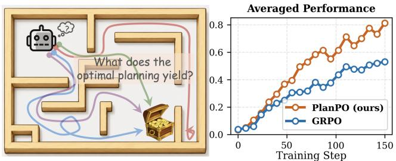
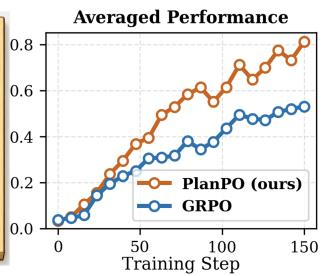
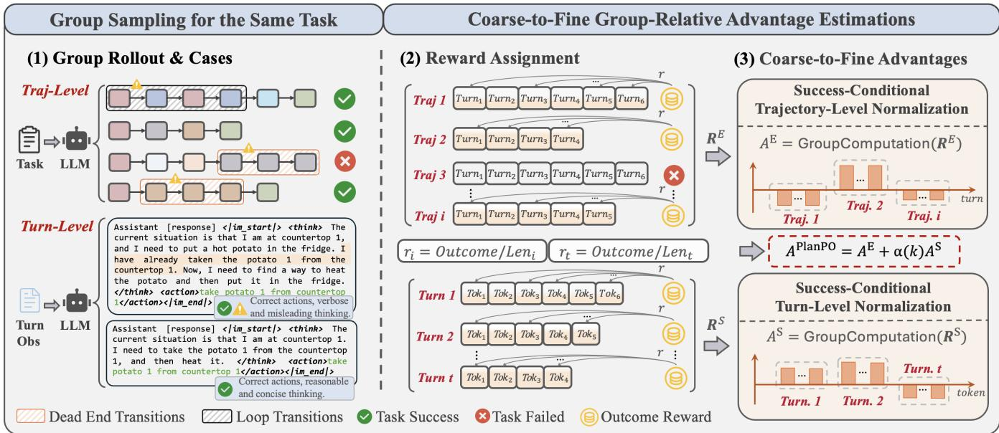
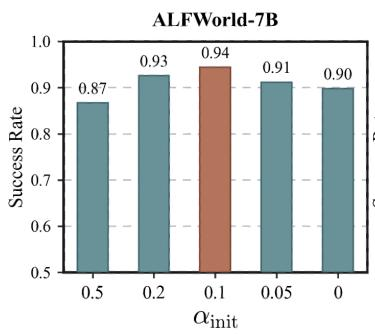
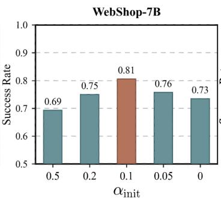
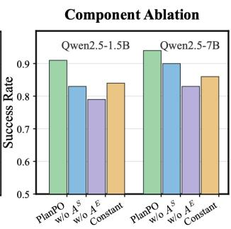
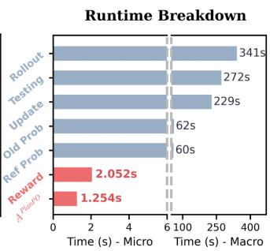
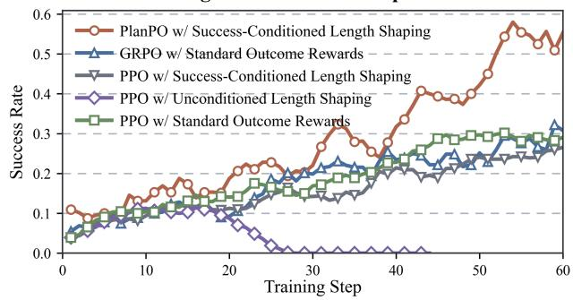
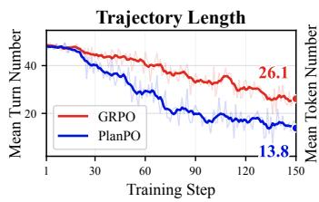
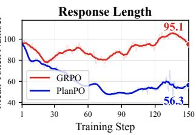

# PlanPO: Group Planning-Aware Policy Optimization for Multi-Turn Agentic LLMs

Dayang Liang1, Liyuan He2, Xuan Feng3, Shuxin Li4, Bo An4, Yunlong Liu1∗

1Department of Automation, Xiamen University, Xiamen, China

2School of Artificial Intelligence, Shanghai Jiaotong University, Shanghai, China

3College of Cyberspace Security, Jinan University, Guangzhou, China

4College of Computing and Data Science, Nanyang Technological University, Singapore Corresponding Email: ylliu@xmu.edu.cn

## Abstract

Group-relative policy optimization has emerged as a key paradigm for training agentic large language models (LLMs) on multi-turn interactive tasks. However, most existing variants fail to distinguish advantages among successful trajectories even when these trajectories difer substantially in their interaction eficiency. For instance, circuitous successes are often assigned the identical outcome reward, causing advantage collapse and severe performance bottlenecks. To this end, we propose Group Planning-aware Policy Optimization (PlanPO), a simple yet efective RL method for learning generalizable planning abilities beyond task-specific high-quality behavior patterns. Specifically, PlanPO introduces coarse-tofine advantage signals, which capture the relative diferences in trajectory-level lengths and turn-level response lengths conditioned on successful trajectories sampled for the same task. Within the group-relative optimization structure, this enables agents to actively learn generalizable and deliberate behaviors spanning interaction planning and textual generation from high-quality rollouts, without degenerating into vanilla length minimization. Experimentally, PlanPO improves over GRPO by 27.2% on average across the challenging multi-turn benchmarks ALFWorld, WebShop, and SciWorld, outperforming recent powerful baselines while incurring negligible additional training cost.

## Introduction

Large Language Models (LLMs) have demonstrated remarkable progress across a wide range of complex multi-turn tasks, including information retrieval (Liao, Liao, and Gadiraju 2025; Eugene et al. 2026), web navigation (Rawles et al. 2025)(Zhang et al. 2026a), code generation (Zhang et al. 2024; Dai et al. 2026), and embodied interaction (Li et al. 2024; Zhang et al. 2026d). Recent work has increasingly explored agentic reinforcement learning (RL) with verifiable outcome rewards (Zhao et al. 2025a; Dai et al. 2026; Li et al. 2026), particularly Group Relative Policy Optimization (GRPO) (Shao et al. 2024), to fine-tune open-source LLMs such as Qwen2.5 (Yang et al. 2024), thereby improving the capabilities of LLM agents in multi-turn tasks.

However, a central challenge in on-policy agentic RL lies in enriching the reward signals of rollout trajectories while improving data utilization (Zhang et al. 2025a,b; Wang et al.

2026a; Peng et al. 2026). Many early studies addressed this issue by introducing value models, such as critics (Schulman et al. 2017; Dai et al. 2025) and process reward models (PRMs) (Chae et al. 2026), to evaluate turn-level behaviors. Yet these models may introduce estimation or proxy bias, and incur substantial memory costs (Chae et al. 2026). Recent group-optimization approaches instead mine informative rollouts to craft turn-level reward signals and achieve discriminative advantages. For example, HiPER (Peng et al. 2026) computes the multiple returns of trajectory segments via sub-task decomposition, while GiGPO (Feng et al. 2026) constructs step advantage signals over the action space by identifying repeated anchor states. Other methods, such as R3L (Shi et al. 2026) and GVPO (Zhang et al. 2026c), establish turn-level credit from failure reflection and diverse code execution feedback. However, most methods rely on laborintensive manual design and empirical heuristics, which limits their generality across task settings. As a result, advantage collapse within successful rollout groups remains dificult to mitigate in a broadly applicable way (Zhao et al. 2026).

This motivates the question ofhow to enrich rollout-driven training signalsfor long-horizon tasks in a simple, efective, and more task-general manner. We begin by revisiting a naturally available yet underutilized signal in group rollouts, i.e., the length profiles across both turn-level interaction trajectories and token-level generated responses. Figure 1 provides an abstract illustration of this intuition. Specifically, our key observation is that many ineficiencies in agentic RL manifest as excessive interaction or generation length. In multi-turn interactions, agents may hesitate between states, repeatedly visit similar observations, or enter dead ends before eventually completing the task. A similar issue arises in token-level textual responses. Given the same question or turn-level observation, sampled responses may produce correct actions while still containing unnecessarily verbose, convoluted, or even logically flawed reasoning traces. Nevertheless, both ineficient turns and reasoning tokens can still share identical success rewards just like the superior solutions. Crucially, treating such heterogeneous successes as equally preferable weakens distinguishable signals and the underlying abilities, while allowing noisy rollouts to degrade training quality and impose substantial performance bottlenecks.

To address this, we present Group Planning-aware Policy Optimization (PlanPO), an efective group-based RL method for learning generalizable planning abilities beyond specific planful behaviors. Specifically, within the set of successful trajectories sampled in same task, PlanPO normalizes outcome rewards by turn-level trajectory lengths and token-level response lengths, constructing coarse-to-fine dense reward signals. Rather than directly summing these dense rewards, PlanPO then computes their relative advantages separately and combines them through a weighted formulation, preserving discriminative information at diferent granularities (Liu et al. 2026). Additionally, unlike generic length-based reward shaping (Pardo et al. 2018; Liu et al. 2025a), PlanPO performs multiscale length normalization only conditioned on successes with group-relative structure. Thus, successful completion is a prerequisite for group length normalization. Empirically, we show that these success-conditioned relative advantages help agents acquire planning behaviors that generalize beyond specific high-quality trajectories, rather than merely imitating task-specific success patterns.

  
Figure 1: Left: Successful rollouts are not equally informative. Rollouts that reach the same task goal, can difer substantially in length, directness, and reasoning quality, while the most optimal strategies may reveal more sophisticated and generalizable capabilities. Right: Averaged normalization performance comparison across ALFWorld, WebShop, and SciWorld environments using the Qwen2.5-1.5b model.

We evaluate PlanPO on three challenging multi-turn benchmarks, ALFWorld (Shridhar et al. 2020), WebShop (Yao et al. 2022a), and SciWorld (Wang et al. 2022), using Qwen2.5-1.5B-Instruct and Qwen2.5-7B-Instruct. PlanPO consistently outperforms recent strong baselines while incurring negligible additional training cost, specifically improving over GRPO by 27.2% on average and notably achieving a 24.3% gain on out-of-distribution tasks in ALFWorld. Extensive ablations and analyses further validate its efectiveness and generalizability. Our contributions are threefold.

• We identify successful-rollout heterogeneity as a critical bottleneck in group-relative optimization, where redundant turns and reasoning can mask rollout quality and then limit policy learning.

• We propose PlanPO, which constructs successconditioned length-normalized advantages, encouraging agents to learning planning-aware abilities beyond specific behavioral patterns.

• We show that PlanPO consistently outperforms recent strong baselines across ALFWorld, WebShop, and Sci-World, while incurring negligible additional training cost.

## Preliminaries

Multi-Turn Agentic RL. We consider RL for LLM-based agents that interact with an environment over multiple turns, where the interaction process is formulated as a finite-horizon Markov Decision Process (MDP). Given a task instance $x \in p ( X )$ , at each turn $t = 1 , 2 , \dots , T .$ , an agent policy $\pi _ { \theta }$ observes a state $\mathbf { \boldsymbol { s } } _ { t } \in \mathcal { S }$ and generates a textual action $\mathbf { \boldsymbol { a } } _ { t } \in \mathcal { A }$ and then transitions to the next state $\mathbf { { s } } _ { t + 1 } \in S$ while yielding a scalar reward $\boldsymbol { r } _ { t } \in \mathbb { R }$ . The interaction unfolds as a trajectory $\pmb { \tau } = \{ ( \pmb { s } _ { 1 } , \pmb { a } _ { 1 } , r _ { 1 } ) , ( \pmb { s } _ { 2 } , \pmb { a } _ { 2 } , r _ { 2 } ) , . . . , ( \pmb { s } _ { T } , \pmb { a } _ { T } , r _ { T } ) \}$ , where $\dot { T }$ denotes the trajectory length in interaction turns. In practical tasks such as ALFWorld, the agent generates a response as its action for each observation. This response is structured within <think></think> and <action></action> tags, where the former contains the reasoning process, while the latter specifies the actual action executed in the environment. Notably, for most task settings, reward signals are sparse and delayed, e.g., the environment provides an outcome reward $R ( \tau )$ only after the trajectory terminates.

## Group-relative Policy Optimization

Recent agentic RL methods for LLMs commonly adopt a group-relative policy optimization paradigm. Given a task instance x, the old policy $\pi _ { \theta _ { \mathrm { o l d } } }$ samples a group of N candidate trajectories $\mathcal { G } _ { x } = \{ \tau _ { 1 } , \bar { \tau _ { 2 } } , . . . , \tau _ { N } \}$ , where each trajectory corresponds to one complete rollout. Each trajectory $\tau _ { i }$ receives a scalar reward $R ( \tau _ { i } )$ that reflects the overall quality or success of the generated outcome. Instead of learning an advantage function $A ( s _ { t } , a _ { t } )$ with critic networks in PPO (Schulman et al. 2017), group-based RL computes the advantage using only statistics within the sampled group:

$$
A ( \pmb { \tau } _ { i } ) = \mathtt { G r o u p N o r m a l i z a t i o n } \left( \{ R ( \pmb { \tau } _ { i } ) \} _ { i = 1 } ^ { N } \right)
$$

In GRPO (Shao et al. 2024), the advantage is evaluated by normalizing each trajectory reward with the mean and variance of group rewards $( \{ \dot { R } ( \tau _ { i } ) \} _ { i = 1 } ^ { N } )$ . This sampling-based estimator reduces the memory and computational overhead introduced by the critic architecture in conventional PPO.

## Group Planning-Aware Policy Optimization for Multi-turn Agentic LLMs

We propose group-relative Planning-aware Policy Optimization (PlanPO), a simple and efective group-relative RL method for learning high-level planning strategies beyond task-specific high-quality rollouts. We begin with our motivation, followed by the introduction of the coarse-to-fine advantage design, and conclude with the policy optimization loss and theoretical analysis.

## Motivation

As illustrated in the right of Figure 2, given the same task, some rollouts reach the goal through short and coherent interaction paths, whereas others involve redundant state transitions or even enter loops and dead ends. At the turn level, verbose reasoning can also introduce inconsistencies or misleading intermediate claims. For example, as illustrated, given a task or turn observation, although the final sampled actions "<action>take potato 1 from countertop 1</action>" are all correct, the thought process "I have already taken the potato ..." treats it as already happened. Such cases are common in the rollouts yet introduce hallucinated or logically inconsistent reasoning traces.

  
Figure 2: Overview of PlanPO. Left: Rollouts sampled for the same task can reach the same outcome through interaction paths and textual responses of markedly diferent quality. Middle: PlanPO converts the outcome into success-conditioned trajectoryand turn-level scores using trajectory and response lengths, respectively. Right: The two scores are normalized separately within the same-task group and combined into a coarse-to-fine advantage for policy optimization.

How should we quantify the quality of successful rollouts? Existing solutions may introduce post-hoc reflection (Shi et al. 2026) or agentic verifier models (Zhang et al. 2026b), but these signals are often costly and heuristic. The aforementioned observations motivate us to leverage multiscale rollout length as an initial signal. However, unconditional length-based reward shaping would degenerate into meaningless length minimization, even distorting the representation space of LLMs. Our goal is instead to comparatively learn planful behaviors within successful rollouts, while promoting task-general planning capabilities rather than fitting task-specific patterns. This objective naturally aligns with group-relative policy optimization. Below, we progressively construct the above conditional advantage signals.

## Trajectory Length-Normalized Advantage

To achieve this, we first instantiate the success-conditioned length signal at the trajectory (or episode) level. For successful rollouts with the same outcome reward, trajectory length serves as a coarse proxy for planning eficiency across environment interactions. We therefore normalize the outcome reward by trajectory length only for successful rollouts, and compute the conditional group-relative advantage.

Formally, given a task instance x, the policy $\pi _ { \theta _ { \mathrm { o l d } } }$ samples $N$ trajectories $\{ \tau _ { 1 } , \tau _ { 2 } , \dots , \tau _ { N } \}$ start from the identical and initial state $\scriptstyle { \pmb { s } } _ { 0 }$ . Each rollout trajectory is represented as $\tau _ { i } =$ $\left\{ { \left( { { s } _ { i , 1 } } , { { a } _ { i , 1 } } , { { r } _ { i , 1 } } \right) } ,  { \left( { { s } _ { i , 2 } } , { { a } _ { i , 2 } } , { { r } _ { i , 2 } } \right) } , . . . , { \left( { { s } _ { i , T _ { i } } } , { { { a } _ { i , T _ { i } } } } , { { r } _ { i , T _ { i } } } \right) } \right\}$ where $T _ { i }$ represents the number of turns in i-th trajectory.

In our task setting, each trajectory receives only a terminal outcome reward $R ( \tau _ { i } ) = 1 0$ when the task goal is reached. We then denote the trajectory-level group of sampled trajectories and rewards as:

$$
\mathcal { G } _ { x } ^ { \mathrm { E } } = \left\{ \left( \tau _ { 1 } , R ( \tau _ { 1 } ) \right) , \left( \tau _ { 2 } , R ( \tau _ { 2 } ) \right) , \ldots , \left( \tau _ { N } , R ( \tau _ { N } ) \right) \right\} _ { \mathcal { K } }\tag{1}
$$

where the superscript E denotes the episode, i.e., trajectory level. Let $\mathcal { G } _ { x } ^ { \mathrm { U } } \subseteq \mathcal { G } _ { x } ^ { \mathbf { k } }$ denote the subset of successful trajectories, and let $\mathbb { 1 } [ \tau _ { i } ^ { \mathrm { ~ \tiny ~ \in ~ } } \mathcal { G } _ { x } ^ { \mathrm { U } } ]$ indicate whether $\tau _ { i }$ succeeds. For each trajectory, we define its length-normalized episode reward as,

$$
R ^ { \mathrm { E } } ( \pmb { \tau } _ { i } ) = \mathbb { 1 } [ \pmb { \tau } _ { i } \in \mathcal { G } _ { \pmb { x } } ^ { \mathrm { U } } ] R ( \pmb { \tau } _ { i } ) / T _ { i } ,\tag{2}
$$

where $T _ { i }$ is the number of valid interaction turns in $\tau _ { i }$ . The corresponding trajectory-level advantage $A ^ { \mathrm { E } }$ is computed by group-relative normalization:

$$
A ^ { \mathrm { E } } ( \pmb { \tau } _ { i } ) = \frac { R ^ { \mathrm { E } } ( \pmb { \tau } _ { i } ) - \mathrm { m e a n } \left( \left\{ R ^ { \mathrm { E } } ( \pmb { \tau } _ { j } ) \right\} _ { j = 1 } ^ { N } \right) } { F _ { \mathrm { n o r m } } \left( \left\{ R ^ { \mathrm { E } } ( \pmb { \tau } _ { j } ) \right\} _ { j = 1 } ^ { N } \right) } .\tag{3}
$$

Here, $F _ { \mathrm { n o r m } } ( \cdot )$ is the normalization factor, instantiated as either std(·) + ϵ or 1 (Feng et al. 2026), with the former usually used by default, where ϵ is a small constant for numerical stability (Shao et al. 2024). The trajectory-level $A ^ { \mathrm { E } } ( \tau _ { i } )$ is broadcast to each turn in the i-th trajectory, providing a trajectory-wide discrimination signal among successful rollout trajectories that complete the same task but difer in process quality or long-term planning.

## Response Length-Normalized Advantage

While the above advantage provides learning signals for discriminating trajectories, each response turn within a trajectory still lacks fine-grained credit. Next, we compute grouprelative advantages only among successful responses, so that the agent learns that planful responses are desirable only when the corresponding actions remain correct. Additionally, we flatten all successful responses generated for the same task into one group for advantage computation.

We then employ a similar group relative advantage structure to achieve the above idea. Formally, for the t-th interaction turn in trajectory $\tau _ { i } ,$ we collect all active responses into a turn-level group,

$$
\mathcal { G } _ { { \pmb x } , t } ^ { \mathrm { S } } = \left\{ \left( { \pmb a } _ { i , t } , R ( { \pmb \tau } _ { i } ) \right) | { \pmb \tau } _ { i } \in \mathcal { G } _ { { \pmb x } } ^ { \mathrm { E } } , t \leq T _ { i } \right\} ,\tag{4}
$$

where $\mathrm { S }$ denotes the step, i.e., turn level, and $L _ { i , t } = | \pmb { a } _ { i , t } |$ is the token length of the response generated by trajectory $\tau _ { i }$ at turn t. Similar to the trajectory-level case, we define the response length-normalized reward as,

$$
R ^ { \mathrm { S } } ( { \bf a } _ { i , t } ) = \mathbb { 1 } [ \pmb { \tau } _ { i } \in \mathcal { G } _ { \pmb { x } } ^ { \mathrm { U } } ] R ( \pmb { \tau } _ { i } ) / L _ { i , t } .\tag{5}
$$

The turn-level relative advantage is then computed within the active response group:

$$
A ^ { \mathrm { S } } ( \pmb { a } _ { i , t } ) = \frac { R ^ { \mathrm { S } } ( \pmb { a } _ { i , t } ) - \mathrm { m e a n } \left( \left\{ R ^ { \mathrm { S } } ( \pmb { a } _ { j , t } ) \ | \ \pmb { a } _ { j , t } \in \mathcal { G } _ { x , t } ^ { S } \right\} \right) } { F _ { \mathrm { n o r m } } \left( \left\{ R ^ { \mathrm { S } } ( \pmb { a } _ { j , t } ) \ | \ \pmb { a } _ { j , t } \in \mathcal { G } _ { x , t } ^ { S } \right\} \right) } .\tag{6}
$$

Here, the resulting turn advantage $A ^ { \mathrm { S } } ( a _ { i , t } )$ is assigned to all tokens in the response ${ \pmb { a } } _ { i , t } .$ , which provides a fine-grained supervision signal for successful responses.

## Coarse-to-Fine Group Policy Optimization

We integrate the trajectory-level and turn-level advantages into a multiscale group-relative advantage for policy optimization. For the response ${ \bf { a } } _ { i , t }$ in trajectory $\tau _ { i }$ , the final PlanPO advantage is defined as,

$$
A ^ { \mathrm { P l a n P O } } ( \pmb { a } _ { i , t } ) = A ^ { \mathrm { E } } ( \pmb { \tau } _ { i } ) + \alpha ( k ) A ^ { \mathrm { S } } ( \pmb { a } _ { i , t } ) ,\tag{7}
$$

$$
\mathrm { w i t h ~ } \alpha ( k ) = \mathtt { L i n e a r D e c a y ( } k ; \alpha _ { \mathrm { i n i t } } , \alpha _ { \mathrm { f i n a l } } ) ,\tag{8}
$$

where $\alpha ( k )$ denotes the decay weight with training step k for balancing the two level signals. We set the turn-level coeficient smaller than the trajectory-level coeficient, i.e., $0 ~ \leq ~ \alpha _ { \mathrm { f i n a l } } ~ \leq ~ \alpha ( k ) ~ < ~ \alpha _ { \mathrm { i n i t } } ~ \leq ~ 1$ . This design keeps trajectory-level planning quality as the dominant signal and uses response length signals only as a refinement. Although the response constraint is applied only to successful trajectories, an overly large $\alpha ( k )$ experimentally over-penalize response length, thereby hurting task performance. Please see the ablation study for details. Therefore, we gradually decay α(k) during training to reduce the strength of responselength normalization as the policy becomes more capable.

Finally, PlanPO optimizes the policy with the same clipped group-relative objective backbone as GRPO-style methods:

$$
\begin{array} { r l r } {  { \mathcal { I } ^ { \mathrm { P l a n P O } } ( \boldsymbol { \theta } ) = \mathbb { E } \quad } } & { \underset { \{ \boldsymbol { \tau } _ { i } \} _ { i = 1 } ^ { N } \sim \pi _ { \boldsymbol { \theta } _ { \mathrm { o l d } } } } { \mathbb { E } } [ \frac { 1 } { \sum _ { i = 1 } ^ { N } T _ { i } } \sum _ { i = 1 } ^ { N } \sum _ { t = 1 } ^ { T _ { i } } \ell _ { i , t }  } & \\ & { } & {  -  \beta \mathbb { D } _ { \mathrm { K L } } ( \pi _ { \boldsymbol { \theta } } ( \cdot \vert \boldsymbol { x } )  \pi _ { \mathrm { r e f } } ( \cdot \vert \boldsymbol { x } ) ) ] , } \end{array}\tag{9}
$$

$$
\begin{array} { r l } & { \ell _ { i , t } = \operatorname* { m i n } \Big ( \rho _ { \theta } ( { \pmb a } _ { i , t } ) A ^ { \mathrm { P l a n P O } } ( { \pmb a } _ { i , t } ) , } \\ & { \qquad \mathrm { c l i p } ( \rho _ { \theta } ( { \pmb a } _ { i , t } ) , 1 - \epsilon , 1 + \epsilon ) A ^ { \mathrm { P l a n P O } } ( { \pmb a } _ { i , t } ) \Big ) . } \end{array}\tag{10}
$$

Here, $\rho _ { \theta } ( { \pmb a } _ { i , t } ) = \pi _ { \theta } ( { \pmb a } _ { i , t } \mid { \pmb s } _ { i , t } , { \pmb x } ) / \pi _ { \theta _ { \mathrm { o l d } } } ( { \pmb a } _ { i , t } \mid { \pmb s } _ { i , t } , { \pmb x } )$ is the importance sampling ratio, ϵ is the clipping coeficient, and $\beta$ controls the strength of KL regularization with respect to the reference policy $\pi _ { \mathrm { r e f } }$

Theorem 1 (Bias–variance trade-of in PlanPO). Consider a fixed response $a _ { i , t }$ at optimization step k, with the randomness induced by repeated same-task group sampling. Let $A ^ { E , \star } = \mathbb { E } _ { \mathcal { G } } [ A ^ { \check { E } } ]$ and $A ^ { S , \star } = \mathbb { E } _ { \mathcal { G } } [ A ^ { S } ]$ denote the expected trajectory-level signal and turn-level refinement, respectively. Assume that their centered estimation errors have variances v and v and non-negative covariance c. Relative to thefull-refinement target $A ^ { \star } = A ^ { E , \star } + A ^ { S , \star }$ , the PlanPO estimator $\overset { \cdot } { A _ { \alpha } } = \overset { \cdot } { A ^ { E } } + \overset { \cdot } { \alpha } \overset { \cdot } { A ^ { S } }$ , where $\alpha \in [ 0 , 1 ]$ , satisfies

$$
\begin{array} { r l } & { \mathrm { B i a s } ^ { 2 } ( A _ { \alpha } ) = ( 1 - \alpha ) ^ { 2 } ( A ^ { S , \star } ) ^ { 2 } , } \\ & { \quad \mathrm { V a r } ( A _ { \alpha } ) = v _ { E } + \alpha ^ { 2 } v _ { S } + 2 \alpha c . } \end{array}
$$

Consequently, increasing α decreases the squared bias while increasing the variance, with:

$$
\begin{array} { r l } & { 0 \le \mathrm { B i a s } ^ { 2 } ( A _ { \alpha } ) \le ( A ^ { S , \star } ) ^ { 2 } , } \\ & { v _ { E } \le \mathrm { V a r } ( A _ { \alpha } ) \le ( \sqrt { v _ { E } } + \sqrt { v _ { S } } ) ^ { 2 } . } \end{array}
$$

This theorem shows that $\alpha ( k )$ relates to PlanPO’s bias– variance trade-of. A larger $\alpha ( k )$ preserves more turn-level refinement but raises sampling variance, whereas a smaller $\alpha ( k )$ reduces variance at the cost of greater shrinkage bias. The technical supplement provides detailed proof.

## Experiments

We evaluate PlanPO across a range of multi-turn environments. Specifically, the experiments aim to answer three questions: (1) How well does PlanPO perform overall across these challenging environments? (2) How does PlanPO achieve its performance gains? (3) Does PlanPO acquire the capabilities of task generalization and planning awareness rather than overfitting to task-specific success patterns?

## Experimental Setup

Benchmarks. We train and evaluate PlanPO on three challenging multi-turn benchmarks: ALFWorld (Shridhar et al. 2020), WebShop (Yao et al. 2022a), and SciWorld (Wang et al. 2022). ALFWorld is an embodied household environment for evaluating long-horizon textual reasoning and decision-making. In each episode, the agent receives a concrete task instruction sampled from 3,827 tasks from six categories. WebShop is an interactive web-shopping environment containing nearly 1.1 million products and 12,000 user instructions. SciWorld is designed for scientific tasks and provides APIs through which agents can manipulate scientific instruments and conduct experiments. The technical supplement provides further descriptions of the benchmarks.

<table><tr><td rowspan="2">Type</td><td rowspan="2">Method</td><td colspan="7">ALFWorld</td><td colspan="2">WebShop</td></tr><tr><td>Pick</td><td>Look</td><td>Clean</td><td>Heat</td><td>Cool</td><td>Pick2</td><td>All</td><td>Score</td><td>Succ.</td></tr><tr><td colspan="2">Closed-Source Model</td><td></td><td></td><td></td><td></td><td></td><td></td><td></td><td></td><td></td></tr><tr><td>Prompting</td><td> $\mathrm { G P T - } 4 0$ </td><td>75.3</td><td>60.8</td><td>31.2</td><td>56.7</td><td>21.6</td><td>49.8</td><td>48.0</td><td>31.8</td><td>23.7</td></tr><tr><td>Prompting</td><td> $\mathrm { G e m i n i } { - 2 . 5 – P r o }$ </td><td>92.8</td><td>63.3</td><td>62.1</td><td>69.0</td><td>26.6</td><td>58.7</td><td>60.3</td><td>42.5</td><td>35.9</td></tr><tr><td colspan="2">Qwen2.5-1.5B-Instruct</td><td></td><td></td><td></td><td></td><td></td><td></td><td></td><td></td><td></td></tr><tr><td>Prompting</td><td>ReAct</td><td>17.4</td><td>20.5</td><td>15.7</td><td>6.2</td><td>7.7</td><td>2.0</td><td>12.8</td><td>40.1</td><td>11.3</td></tr><tr><td>Prompting</td><td>Reflexion</td><td>35.3</td><td>22.2</td><td>21.7</td><td>13.6</td><td> $1 9 . 4$ </td><td>3.7</td><td>21.8</td><td>55.8</td><td>21.9</td></tr><tr><td>RL Training</td><td>PPO (with critic)</td><td> $6 4 . 8 _ { \pm 3 . 5 }$ </td><td> $4 0 . 5 _ { \pm 6 . 9 }$ </td><td> $5 7 . 1 _ { \pm 4 . 9 }$ </td><td> $6 0 . 6 _ { \pm 6 . 6 }$ </td><td> $4 6 . 4 _ { \pm 4 . 0 }$ </td><td> $4 7 . 4 _ { \pm 1 . 9 }$ </td><td> $5 4 . 4 _ { \pm 3 . 1 }$ </td><td> $7 3 . 8 _ { \pm 3 . 0 }$ </td><td> $5 1 . 5 _ { \pm 2 . 9 }$ </td></tr><tr><td>RL Training</td><td>RLOO</td><td> $8 8 . 3 _ { \pm 3 . 0 }$ </td><td> $5 2 . 8 _ { \pm 8 . 6 }$ </td><td> $7 1 . 0 _ { \pm 5 . 9 }$ </td><td> $6 2 . 8 _ { \pm 8 . 7 }$ </td><td> $6 6 . 4 _ { \pm 5 . 5 }$ </td><td> $5 6 . 9 _ { \pm 4 . 7 }$ </td><td> $6 9 . 7 _ { \pm 2 . 5 }$ </td><td> $7 3 . 9 _ { \pm 5 . 6 }$ </td><td> $5 2 . 1 _ { \pm 6 . 7 }$ </td></tr><tr><td>RL Training</td><td>GRPO</td><td> $8 5 . 3 _ { \pm 1 . 5 }$ </td><td> $5 3 . 7 _ { \pm 8 . 0 }$ </td><td> $8 4 . 5 _ { \pm 6 . 8 }$ </td><td> $7 8 . 2 _ { \pm 7 . 9 }$ </td><td> $5 9 . 7 _ { \pm 5 . 0 }$ </td><td> $5 3 . 5 _ { \pm 5 . 6 }$ </td><td> $7 2 . 8 _ { \pm 3 . 6 }$ </td><td> $^ { 7 5 . 8 _ { \pm 3 . 5 } } _ { 8 0 . 4 }$ </td><td> $5 6 . 8 _ { \pm 3 . 8 }$ </td></tr><tr><td>RL Training</td><td>EMPG</td><td> $8 5 . 5$ </td><td>33.5</td><td>78.9</td><td>76.2</td><td> $7 4 . 7$ </td><td>89.1</td><td> $7 3 . 7$ </td><td></td><td>60.8</td></tr><tr><td>RL Training</td><td> $\mathrm { G i G P O _ { w / s t d } }$ </td><td> $9 4 . 4 _ { \pm 5 . 9 }$ </td><td> $6 7 . 5 _ { \pm 4 . 6 }$ </td><td> $9 4 . 8 _ { \pm 3 . 8 }$ </td><td> $\mathbf { 9 4 . 4 } _ { \pm 7 . 8 }$ </td><td> $7 9 . 8 _ { \pm 4 . 7 }$ </td><td> $7 6 . 4 _ { \pm 5 . 4 }$ </td><td> $8 6 . 7 _ { \pm 1 . 7 }$ </td><td> $8 3 . 1 _ { \pm 1 . 6 }$ </td><td> $6 5 . 0 _ { \pm 3 . 2 }$ </td></tr><tr><td>RL Training</td><td> $\mathrm { G i G P O _ { w / o s t d } }$ </td><td> $9 6 . 0 _ { \pm 1 . 4 }$ </td><td> $7 6 . 5 _ { \pm 3 . 9 }$ </td><td> $9 1 . 8 _ { \pm 5 . 5 }$ </td><td> $9 1 . 3 _ { \pm 6 . 3 }$ </td><td> $7 1 . 7 _ { \pm 8 . 4 }$ </td><td> $7 9 . 5 _ { \pm 7 . 7 }$ </td><td> $8 6 . 1 _ { \pm 4 . 7 }$ </td><td> $8 3 . 5 _ { \pm 1 . 8 }$ </td><td> $6 7 . 4 _ { \pm 4 . 5 }$ </td></tr><tr><td colspan="2">RL Training PlanPO</td><td> $\pm { \bf 9 8 . 2 } _ { \pm 1 . 1 }$ </td><td> ${ \mathbf { 8 5 . 1 } } _ { \pm 4 . 6 }$ </td><td> $\mathbf { 9 4 . 6 _ { \pm 4 . 7 } }$ </td><td> $9 3 . 8 _ { \pm 6 . 0 }$ </td><td> $\mathbf { 8 2 . 4 _ { \pm 6 . 7 } }$ </td><td> $\mathbf { 8 3 . 7 _ { \pm 8 . 0 } }$ </td><td> ${ \bf 9 1 . 3 _ { \pm 4 . 1 } }$ </td><td> ${ \mathbf { 8 6 . 8 _ { \pm 1 . 5 } } }$ </td><td> $7 7 . 2 _ { \pm 5 . 6 }$ </td></tr><tr><td colspan="2">Qwen2.5-7B-Instruct</td><td></td><td></td><td></td><td></td><td></td><td></td><td></td><td></td><td></td></tr><tr><td>Prompting</td><td>ReAct</td><td>48.5</td><td>35.4</td><td>34.3</td><td>13.2</td><td>18.2</td><td>17.6</td><td>31.2</td><td>46.2</td><td>19.5</td></tr><tr><td>Prompting</td><td>Reflexion</td><td>62.0</td><td>41.6</td><td>44.9</td><td>30.9</td><td>36.3</td><td>23.8</td><td>42.7</td><td>58.1</td><td>28.8</td></tr><tr><td>RL Training</td><td>PPO (with critic)</td><td> $9 2 . 3 _ { \pm 4 . 0 }$ </td><td> $6 4 . 0 _ { \pm 8 . 4 }$ </td><td> $9 2 . 5 _ { \pm 2 . 4 }$ </td><td> $8 9 . 5 _ { \pm 7 . 0 }$ </td><td> $8 0 . 3 _ { \pm 2 . 0 }$ </td><td> $6 8 . 8 _ { \pm 8 . 3 }$ </td><td> $8 0 . 4 _ { \pm 2 . 7 }$ </td><td> $8 1 . 4 _ { \pm 3 . 1 }$ </td><td> $6 8 . 7 _ { \pm 5 . 1 }$ </td></tr><tr><td>RL Training</td><td>RLOÒ</td><td> $8 7 . 6 _ { \pm 4 . 3 }$ </td><td> $7 8 . 2 _ { \pm 8 . 3 }$ </td><td> $8 7 . 3 _ { \pm 5 . 8 }$ </td><td> $8 1 . 3 _ { \pm 7 . 6 }$ </td><td> $7 1 . 9 _ { \pm 5 . 2 }$ </td><td> $4 8 . 9 _ { \pm 8 . 4 }$ </td><td> $7 5 . 5 _ { \pm 4 . 6 }$ </td><td> $8 0 . 3 _ { \pm 3 . 2 }$ </td><td> $6 5 . 7 _ { \pm 4 . 0 }$ </td></tr><tr><td>RL Training</td><td>GRPO</td><td> $9 0 . 8 _ { \pm 5 . 1 }$ </td><td> $6 6 . 1 _ { \pm 6 . 7 }$ </td><td> $8 9 . 3 _ { \pm 5 . 4 }$ </td><td> $7 4 . 7 _ { \pm 6 . 9 }$ </td><td> $7 2 . 5 _ { \pm 5 . 4 }$ </td><td> $6 4 . 7 _ { \pm 7 . 3 }$ </td><td> $7 7 . 6 _ { \pm 5 . 2 }$ </td><td> $7 9 . 3 _ { \pm 2 . 8 }$ </td><td> $6 6 . 1 _ { \pm 3 . 7 }$ </td></tr><tr><td>RL Training</td><td>EMPG</td><td> $9 2 . 9$ </td><td> $7 5 . 2$ </td><td> $7 4 . 8$ </td><td>86.3</td><td> $7 3 . 7$ </td><td>65.3</td><td> $7 8 . 5$ </td><td> $8 1 . 0$ </td><td>69.3</td></tr><tr><td>RL Training</td><td> $\mathrm { G i G P O _ { w / s t d } }$ </td><td> $9 7 . 7 _ { \pm 1 . 6 }$ </td><td> $8 2 . 7 _ { \pm 7 . 9 }$ </td><td> $\mathbf { 9 8 . 8 _ { \pm 1 . 6 } }$ </td><td> $8 3 . 7 _ { \pm 7 . 2 }$ </td><td> $\mathbf { 8 9 . 3 _ { \pm 8 . 2 } }$ </td><td> $7 9 . 2 _ { \pm 6 . 6 }$ </td><td> $9 0 . 8 _ { \pm 1 . 3 }$ </td><td> $8 4 . 4 _ { \pm 2 . 9 }$ </td><td> $7 2 . 8 _ { \pm 3 . 2 }$ </td></tr><tr><td>RL Training</td><td> $\mathrm { G i G P O _ { w / o s t d } }$ </td><td> $9 1 . 8 _ { \pm 5 . 4 }$ </td><td> $8 8 . 6 _ { \pm 6 . 3 }$ </td><td> $9 5 . 9 _ { \pm 3 . 2 }$ </td><td> $9 0 . 2 _ { \pm 2 . 6 }$ </td><td> $8 6 . 5 _ { \pm 5 . 5 }$ </td><td> $8 5 . 2 _ { \pm 7 . 5 }$ </td><td> $9 0 . 2 _ { \pm 2 . 3 }$ </td><td> $8 6 . 2 _ { \pm 2 . 6 }$ </td><td> $7 5 . 2 _ { \pm 3 . 8 }$ </td></tr><tr><td>RL Training</td><td> $\mathbf { P l a n P O }$ </td><td> $\mathbf { 1 0 0 . 0 } _ { \pm 0 . 0 }$ </td><td> ${ \bf 9 2 . 1 _ { \pm 6 . 3 } }$ </td><td> $9 6 . 8 _ { \pm 2 . 5 }$ </td><td> $\mathbf { 9 9 . 0 _ { \pm 1 . 4 } }$ </td><td> $8 8 . 3 _ { \pm 6 . 8 }$ </td><td> $\mathbf { 8 9 . 7 _ { \pm 7 . 8 } }$ </td><td> $\mathbf { 9 4 . 4 } _ { \pm 2 . 1 }$ </td><td> $\mathbf { 8 8 . 5 _ { \pm 3 . 2 } }$ </td><td> $\mathbf { 8 0 . 6 _ { \pm 4 . 7 } }$ </td></tr></table>

Table 1: Evaluation results on ALFWorld and WebShop. For each RL training method, we report the mean and variance over three random seeds. The ALFWorld contains six categories: Pick & Place (Pick), Examine in Light (Look), Clean & Place (Clean), Heat & Place (Heat), Cool & Place (Cool), and Pick Two & Place (Pick2). Most entries in this table are reported by Feng et al. (Feng et al. 2026). Notably, the baseline $\mathrm { G i G P O _ { w / s t d } }$ denotes $F _ { \mathrm { n o r m } } = \mathrm { s t d } .$ , and $\mathrm { G i G P O _ { w / o s t d } }$ denotes $F _ { \mathrm { n o r m } } = 1$

Baselines. For ALFWorld and WebShop, we compare PlanPO against three categories of competitive baselines: (1) Proprietary models: GPT-4o (Achiam et al. 2023) and Gemini-2.5-Pro (Team et al. 2023); (2) training-free prompting agents: ReAct (Yao et al. 2022b) and Reflexion (Shinn et al. 2023); and (3) RL-based methods: PPO (Schulman et al. 2017), RLOO (Ahmadian et al. 2024), GRPO (Shao et al. 2024), EMPG (Wang et al. 2026b), and GiGPO (Feng et al. 2026), which cover representative actor–critic and grouprelative optimization approaches. For SciWorld, we consider (1) training-free agents based on the OpenAI (Achiam et al. 2023), Gemini (Team et al. 2023), Qwen (Yang et al. 2025), Llama (Grattafiori et al. 2024), and DeepSeek (Liu et al. 2024; Guo et al. 2025) model families, spanning both proprietary models and open-source models of diferent scales; and (2) RL-based methods: AgentGym-RL (Xi et al. 2026), a GRPO framework for training across multiple environments, and ScalingInter (Xi et al. 2026), a group-based RL method that reports strong performance on SciWorld.

World and 0.01 for the other environments. The maximum number of interaction turns is set to 50 for ALFWorld, 15 for WebShop, and 20 for SciWorld. We train for 150 steps on ALFWorld and WebShop and for 200 steps on SciWorld. On ALFWorld and WebShop, we set the turn-level weight $\alpha _ { \mathrm { i n i t } } = 2 \alpha _ { \mathrm { f i n a l } } = 0 . 1$ in PlanPO. For the exploratory Sci-World, we reduce it to 0.05 without further tuning to improve training stability. Finally, all our experiments were run on 6 NVIDIA H200s and 8 NVIDIA A40s. The technical supplement provides additional implementation details.

## Experiment Results

Implementation details. We employ Qwen2.5-1.5B-Instruct and Qwen2.5-7B-Instruct as the base models for training experiments. To ensure fair comparisons, the hyperparameter settings of PlanPO follow the existing RL framework (Feng et al. 2026; Xi et al. 2026) in each benchmark. Specifically, we use a group size of $N = 8 ,$ , a learning rate of $1 \times 1 0 ^ { - 6 }$ , and a KL-penalty coeficient of $1 \times 1 0 ^ { - 3 }$ for Sci-

Performance on ALFWorld and WebShop. As shown in Table 1, PlanPO substantially outperforms advanced closedsource models on both benchmarks. For the open-source Qwen2.5-1.5B-Instruct and Qwen2.5-7B-Instruct models, RL methods are significantly stronger than prompting-based methods. Nevertheless, PlanPO also outperforms existing powerful baselines, e.g., GiGPO and EMPG. For example, on the 1.5B model, PlanPO achieves an overall success rate of 91.3% across the six ALFWorld categories, improving over GRPO by +18.5 points, while requiring only several regularization operations with negligible computational cost.

Performance on SciWorld. In Table 2, PlanPO achieves consistently the best overall scores on complex and exploratory scientific scenarios, notably improving the GRPObased AgentGym-RL from 50.5 to 68.46. However, we observe that RL training methods exhibit a consistent failure pattern in the Chem-Mix domain, which may be due to the model’s limited understanding and exploration ability required for rigorous scientific analysis (Xi et al. 2026).

<table><tr><td>Type</td><td>Model</td><td>Measure</td><td>Test-Cond.</td><td>Find</td><td>Chem-Mix</td><td>Lifespan</td><td>Overall</td></tr><tr><td rowspan="6">Proprietary</td><td>GPT-40</td><td>15.09</td><td>6.02</td><td>38.64</td><td>20.00</td><td>73.33</td><td>21.00</td></tr><tr><td>Qwen-Max</td><td>9.43</td><td>0.00</td><td>34.09</td><td>20.00</td><td>40.00</td><td>13.50</td></tr><tr><td>Ġemini-2.5-Flash</td><td>11.32</td><td>0.00</td><td>54.55</td><td>0.00</td><td>80.00</td><td>21.00</td></tr><tr><td>OpenAI o4-mini</td><td>20.75</td><td>14.46</td><td>47.73</td><td>0.00</td><td>100.00</td><td>29.50</td></tr><tr><td>OpenAI o3</td><td>47.17</td><td>25.30</td><td>56.82</td><td>40.00</td><td>66.67</td><td>41.50</td></tr><tr><td>Gemini-2.5-Pro</td><td>9.43</td><td>0.00</td><td>29.55</td><td>0.00</td><td>46.67</td><td>12.50</td></tr><tr><td rowspan="3">Models ≥100B</td><td>Qwen3-235B-A22B</td><td>11.32</td><td>4.82</td><td>59.09</td><td>20.00</td><td>66.67</td><td>23.50</td></tr><tr><td>DeepSeek-V3-0324</td><td>0.00</td><td>0.00</td><td>2.27</td><td>0.00</td><td>0.00</td><td>0.50</td></tr><tr><td>DeepSeek-R1-0528</td><td>1.89</td><td>0.00</td><td>11.36</td><td>0.00</td><td>20.00</td><td>4.50</td></tr><tr><td rowspan="3">Models &lt;100B</td><td>Qwen2.5-72B-Instruct</td><td>7.55</td><td>1.20</td><td>15.91</td><td>20.00</td><td>40.00</td><td>9.50</td></tr><tr><td>Qwen3-32B</td><td>5.66</td><td>1.20</td><td>31.82</td><td>0.00</td><td>66.67</td><td>14.00</td></tr><tr><td>Llama-3.1-70B-Instruct</td><td>24.53</td><td>4.82</td><td>40.91</td><td>40.00</td><td>86.67</td><td>25.00</td></tr><tr><td rowspan="3">RL Training</td><td>AgentGym-RL-3B</td><td>20.75</td><td>28.92</td><td>0.00</td><td>0.00</td><td>66.67</td><td>22.50</td></tr><tr><td>AgentGym-RL-7B</td><td>24.53</td><td>59.04</td><td>65.91</td><td>0.00</td><td>66.67</td><td>50.50</td></tr><tr><td>ScalingInter-7B</td><td>33.96</td><td>55.42</td><td>88.64</td><td>0.00</td><td>73.33</td><td>57.00</td></tr><tr><td></td><td>PlanPO-7B</td><td>40.52</td><td>69.38</td><td>91.67</td><td>0.00</td><td>85.94</td><td>68.46</td></tr></table>

Table 2: Evaluation results on SciWorld over three random seeds. The task Test-Cond. means test conductivity and Chem-Mix means chemistry mix. Baseline entries are reported by Zhang et al. (Zhang et al. 2026b).

  
Figure 3: Left two panels: Ablation study on the weight schedule $\alpha ( k )$ with $\alpha _ { \mathrm { i n i t } } ~ = ~ 2 \alpha _ { \mathrm { f i n a l } }$ in PlanPO. Third panel: Component ablation. We compared the ablation results of PlanPO with default decay, trajectory-level advantage $A ^ { \bar { E } }$ only, turn-level advantage $A ^ { S }$ only, and PlanPO with constant $\alpha = 0 . 1$ . Right panel: Runtime breakdown of each PlanPO iteration on four NVIDIA A40 GPUs. Compared to the GRPO, the additional computation introduced by PlanPO lies in the reward and advantage stages, which is negligible. Conversely, PlanPO can reduce overall task runtime by 12.5%

## In-depth Analysis

Ablation Study. To verify how PlanPO achieves performance gains, we performed two ablation studies on the scheduling coeficient $\alpha ( k )$ and each component. As shown in left Figure 3, we compared a series of initial $\alpha _ { \mathrm { i n i t } } = \{ 0 . 5 , 0 . 2 , 0 . 1 , 0 . 0 5 , 0 \}$ . We observed that $\alpha _ { \mathrm { i n i t } } = 0 . 1$ achieved the best performance, while both smaller values $( { \bf e . g . } , \ \alpha _ { \mathrm { i n i t } } \ = \ 0 )$ and excessively large values (e.g., 0.5) degraded performance. This matches the theoretical bias– variance trade-of, i.e., the turn-level signal is useful as a refinement, but should not dominate the trajectory-level planning signal. In the third panel of Figure 3, we observe that ablating any level signal significantly degrades PlanPO’s performance, especially without $A ^ { E }$ . Regarding turn-level advantages, PlanPO with coeficient decay settings consistently outperforms those using constant coeficients. In summary, its performance gains primarily stem from the $A ^ { E } ,$ , while a properly weighted $A ^ { S }$ further enables optimal performance.

Generalization Verification. The gains of PlanPO remain strong when the evaluation tasks difer from the training distribution. As shown in Table 3, PlanPO achieves 87.1% success on out-of-distribution ALFWorld tasks, improving over GRPO by +17.0 points and over GiGPO by +4.7 points. The gap between in-distribution and out-of-distribution performance is also modest, decreasing from 91.3% to 87.1%. This suggests that group-based PlanPO does not merely memorize some better planning templates, but learns planning-aware abilities that generalize to unseen task configurations.

<table><tr><td>Type</td><td>Method</td><td>In-Success</td><td>Out-Success</td></tr><tr><td>Prompting</td><td>GPT-40</td><td>48.0</td><td>46.0</td></tr><tr><td>Prompting</td><td>Gemini2.5</td><td>60.3</td><td>50.5</td></tr><tr><td>RL Training</td><td>PPO</td><td> $5 4 . 4 _ { \pm 3 . 1 }$ </td><td> $5 0 . 9 _ { \pm 7 . 6 }$ </td></tr><tr><td>RL Training</td><td>RLOO</td><td> $6 9 . 7 _ { \pm 2 . 5 }$ </td><td> $6 8 . 7 _ { \pm 1 0 . 7 }$ </td></tr><tr><td>RL Training</td><td>GRPO</td><td> $7 2 . 8 _ { \pm 3 . 6 }$ </td><td> $7 0 . 1 _ { \pm 2 . 5 }$ </td></tr><tr><td>RL Training</td><td>GiGPO</td><td> $\mathbf { 8 6 . 7 _ { \pm 1 . 7 } }$ </td><td> $\mathbf { 8 } 2 . 4 _ { \pm 2 . 0 }$ </td></tr><tr><td>RL Training</td><td>PlanPO</td><td> $9 1 . 3 _ { \pm 4 . 1 }$ </td><td> $8 7 . 1 _ { \pm 3 . 6 }$ </td></tr></table>

Table 3: Generalization evaluation with three seeds in ALF-World using Qwen2.5-1.5B-Instruct. Some entries are reported by He et al. (He et al. 2026). The In-Success reports the success rate on the in-distribution tasks, while the Out-Success reports the success rate on out-of-distribution tasks.

Length-Normalized Method Comparison. Figure 4 further isolates the role of success-conditioned length normalization. Directly applying unconditional length shaping in PPO quickly collapses to nearly zero success, showing that shorter generations or trajectories are not intrinsically better. Success conditioning alone is also insuficient, as PPO with success-conditioned length shaping remains close to standard PPO. By contrast, PlanPO steadily improves after training begins and reaches around 0.55 success near the end, clearly above GRPO and PPO variants. These results indicate that the key benefit comes from coupling length-induced signals with group-relative policy optimization, which turns heterogeneous successful rollouts into useful supervision. Note that the reward shaping operation and outcome reward size $R ( \tau ) = 1 0$ involved are consistent with PlanPO settings, except for the condition control and basic algorithm.

Planning-Aware Strategies. We further examine whether PlanPO induces planning-aware behavior beyond improving final task success. As shown in Figure 5, PlanPO consistently produces shorter trajectories than GRPO during training, reducing the mean number of interaction turns to 13.8 compared with 26.1 for GRPO. This suggests that PlanPO learns to reach task goals through more direct interaction paths, avoiding redundant transitions, repeated trials, and unnecessary detours. At the response level, PlanPO also yields more compact generations, with the mean response length decreasing to 56.3 tokens, while GRPO remains substantially more verbose at 95.1 tokens. Importantly, this behavior does not arise from naive length minimization: as shown in Figure $^ { 4 , }$ unconditional length shaping hurts task success, whereas PlanPO applies length normalization only under successconditioned group-relative comparisons. These results indicate that PlanPO encourages planning-aware strategies by preferring successful rollouts that are both interactioneficient and response-concise, thereby turning heterogeneity among successful trajectories into a useful signal for learning generalizable agentic planning abilities.

Length-Normalized Comparison  
  
Figure 4: Length-normalized Comparison Analysis with different reward shaping settings in ALFWorld.

  
Figure 5: Mean Length Comparison in ALFWorld tasks.

## Related Work

RL has become a central recipe for improving LLM reasoning and interactive agents (Sheng et al. 2025; Shao et al. 2024; Zeng et al. 2026; Team et al. 2026). PPO-based RLHF (Schulman et al. 2017) trains a value model to reduce variance, while lighter critic-free alternatives such as ReMax (Li et al. 2023), RLOO (Ahmadian et al. 2024), and GRPO (Shao et al. 2024) replace the learned critic with sampled baselines or group-relative rewards, improving scalability for LLMs. Recent GRPO variants further refine this objective (Liu et al. 2025a; Cui et al. 2025; Zheng et al. 2025; Lin et al. 2026). DAPO improves stability with decoupled clipping, dynamic sampling, and overlong-response shaping (Yu et al. 2026), Dr. GRPO analyzes length and rewardvariance normalization biases (Liu et al. 2025b), and GMPO stabilizes updates by changing the aggregation of token-level rewards (Zhao et al. 2025b). In parallel, agentic RL methods extend outcome-reward optimization to long-horizon interaction, including WebSailor (Li et al. 2025), GiGPO (Feng et al. 2026), HGPO (He et al. 2026), and A2TGPO (Chen et al. 2026), which study credit assignment through episode-, state-, history-, or turn-grouped advantages. Diferent from these methods, our work focuses on planning-aware credit assignment under successful-rollout heterogeneity.

## Conclusion

This paper addresses successful-rollout heterogeneity in group-relative RL for multi-turn agentic LLMs. We propose PlanPO, which constructs success-conditioned lengthinduced advantages from trajectory-level interaction and token-level response generation. The experiments across multiple benchmarks demonstrate that PlanPO consistently outperforms existing methods and achieves the best task performance with stronger generalization, planful Strategies, and negligible overhead. Our results suggest that successfulrollout heterogeneity provides a simple and scalable signal for learning planning-aware and generalizable behaviors.

## References

Achiam, J.; Adler, S.; Agarwal, S.; Ahmad, L.; Akkaya, I.; Aleman, F. L.; Almeida, D.; Altenschmidt, J.; Altman, S.; Anadkat, S.; et al. 2023. Gpt-4 technical report.

Ahmadian, A.; Cremer, C.; Gallé, M.; Fadaee, M.; Kreutzer, J.; Pietquin, O.; Üstün, A.; and Hooker, S. 2024. Back to basics: Revisiting REINFORCE-style optimization for learning from human feedback in LLMs. In Proceedings ofthe 62nd Annual Meeting of the Association for Computational Linguistics (Volume 1: Long Papers), 12248–12267.

Chae, H.; Kim, S.; Cho, J.; Kim, S.; Moon, S.; Hwangbo, G.; Lim, D.; Kim, M.; Hwang, Y.; Gwak, M.; et al. 2026. Web-shepherd: Advancing prms for reinforcing web agents.

Chen, D.; Zong, Z.; Ma, Z.; Luo, L.; Li, Y.; Li, C.; Chen, P.; and Jiang, J. 2026. A2TGPO: Agentic Turn-Group Policy Optimization with Adaptive Turn-level Clipping.

Cui, G.; Zhang, Y.; Chen, J.; Yuan, L.; Wang, Z.; Zuo, Y.; Li, H.; Fan, Y.; Chen, H.; Chen, W.; et al. 2025. The entropy mechanism of reinforcement learning for reasoning language models.

Dai, R.; Song, L.; Liu, H.; Liang, Z.; Yu, D.; Mi, H.; Tu, Z.; Liu, R.; Zheng, T.; Zhu, H.; et al. 2025. Cde: Curiosity-driven exploration for eficient reinforcement learning in large language models.

Dai, S.; Sun, C.; Wu, H.; Zheng, H.; Ji, T.; Yan, J.; Wu, Y.; Zhang, D.; Wang, X.; and Li, X. 2026. Group Verificationbased Policy Optimization for Interactive Coding Agents. In The Fourteenth International Conference on Learning Representations.

Eugene, J. Y.; Zhang, X.; Xia, Y.; Ge, T.; Wang, X.; Kartik, F.; Suryanarayanan, V.; Yang, C.; Jiang, A.; Ding, J.; et al. 2026. FormAct: Agentic Source Editing for Rich-Format Document Generation. In Forty-third International Conference on Machine Learning.

Feng, L.; Xue, Z.; Liu, T.; and An, B. 2026. Group-in-group policy optimization for llm agent training.

Grattafiori, A.; Dubey, A.; Jauhri, A.; Pandey, A.; Kadian, A.; Al-Dahle, A.; Letman, A.; Mathur, A.; Schelten, A.; Vaughan, A.; et al. 2024. The llama 3 herd of models.

Guo, D.; Yang, D.; Zhang, H.; Song, J.; Wang, P.; Zhu, Q.; Xu, R.; Zhang, R.; Ma, S.; Bi, X.; et al. 2025. Deepseek-r1: Incentivizing reasoning capability in llms via reinforcement learning.

He, S.; Feng, L.; Wei, Q.; Cheng, X.; Feng, L.; and An, B. 2026. Hierarchy-of-groups policy optimization for longhorizon agentic tasks.

Li, K.; Zhang, Z.; Yin, H.; Zhang, L.; Ou, L.; Wu, J.; Yin, W.; Li, B.; Tao, Z.; Wang, X.; et al. 2025. Websailor: Navigating super-human reasoning for web agent.

Li, M.; Zhao, S.; Wang, Q.; Wang, K.; Zhou, Y.; Srivastava, S.; Gokmen, C.; Lee, T.; Li, L. E.; Zhang, R.; et al. 2024. Embodied agent interface: Benchmarking llms for embodied decision making.

Li, Y.; Zhang, C.; Lv, R.; Liu, A.; Deng, K.; Zhang, Y.; Liu, J.; and Zhou, B. 2026. Relook: Vision-grounded rl with a multimodal llm critic for agentic web coding. In Proceedings

of the 64th Annual Meeting of the Association for Computational Linguistics (Volume 1: Long Papers), 25471–25485.

Li, Z.; Xu, T.; Zhang, Y.; Lin, Z.; Yu, Y.; Sun, R.; and Luo, Z.-Q. 2023. Remax: A simple, efective, and eficient reinforcement learning method for aligning large language models.

Liao, C. C.; Liao, D.; and Gadiraju, S. S. 2025. Agentmaster: A multi-agent conversational framework using a2a and mcp protocols for multimodal information retrieval and analysis. In Proceedings of the 2025 Conference on Empirical Methods in Natural Language Processing: System Demonstrations, 52–72.

Lin, Z.; Lin, M.; Xie, Y.; and Ji, R. 2026. Cppo: Accelerating the training of group relative policy optimization-based reasoning models. Advances in Neural Information Processing Systems, 38: 61043–61068.

Liu, A.; Feng, B.; Xue, B.; Wang, B.; Wu, B.; Lu, C.; Zhao, C.; Deng, C.; Zhang, C.; Ruan, C.; et al. 2024. Deepseek-v3 technical report.

Liu, S.-Y.; Dong, X.; Lu, X.; Diao, S.; Belcak, P.; Liu, M.; Chen, M.-H.; Yin, H.; Wang, Y.-C. F.; Cheng, K.-T.; et al. 2026. Gdpo: Group reward-decoupled normalization policy optimization for multi-reward rl optimization.

Liu, W.; Zhou, R.; Deng, Y.; Huang, Y.; Liu, J.; Deng, Y.; Zhang, Y.; and He, J. 2025a. Learn to reason eficiently with adaptive length-based reward shaping.

Liu, Z.; Chen, C.; Li, W.; Qi, P.; Pang, T.; Du, C.; Lee, W. S.; and Lin, M. 2025b. Understanding r1-zero-like training: A critical perspective.

Pardo, F.; Tavakoli, A.; Levdik, V.; and Kormushev, P. 2018. Time limits in reinforcement learning. In International Conference on Machine Learning, 4045–4054. PMLR.

Peng, J.; Liu, Y.; Zhou, R.; Fleming, C.; Wang, Z.; Garcia, A.; and Hong, M. 2026. HiPER: Hierarchical Plan–Execute RL for Multi-Turn LLM Agents. In Forty-third International Conference on Machine Learning.

Rawles, C.; Clinckemaillie, S.; Chang, Y.; Waltz, J.; Lau, G.; Fair, M.; Li, A.; Bishop, W.; Li, W.; Campbell-Ajala, F.; et al. 2025. Androidworld: A dynamic benchmarking environment for autonomous agents. In International Conference on Learning Representations, volume 2025, 406–441.

Schulman, J.; Wolski, F.; Dhariwal, P.; Radford, A.; and Klimov, O. 2017. Proximal policy optimization algorithms.

Shao, Z.; Wang, P.; Zhu, Q.; Xu, R.; Song, J.; Bi, X.; Zhang, H.; Zhang, M.; Li, Y.; Wu, Y.; et al. 2024. Deepseekmath: Pushing the limits of mathematical reasoning in open language models.

Sheng, G.; Zhang, C.; Ye, Z.; Wu, X.; Zhang, W.; Zhang, R.; Peng, Y.; Lin, H.; and Wu, C. 2025. Hybridflow: A flexible and eficient rlhf framework. In Proceedings of the Twentieth European Conference on Computer Systems, 1279–1297.

Shi, W.; Chen, Y.; Li, Z.; Pan, X.; Sun, Y.; Xu, J.; Zhou, X.; and Li, Y. 2026. R3L: Reflect-then-Retry Reinforcement Learning with Language-Guided Exploration, Pivotal Credit, and Positive Amplification.

Shinn, N.; Cassano, F.; Gopinath, A.; Narasimhan, K.; and Yao, S. 2023. Reflexion: Language agents with verbal reinforcement learning.

Shridhar, M.; Yuan, X.; Côté, M.-A.; Bisk, Y.; Trischler, A.; and Hausknecht, M. 2020. Alfworld: Aligning text and embodied environments for interactive learning.

Team, G.; Anil, R.; Borgeaud, S.; Alayrac, J.-B.; Yu, J.; Soricut, R.; Schalkwyk, J.; Dai, A. M.; Hauth, A.; Millican, K.; et al. 2023. Gemini: a family of highly capable multimodal models.

Team, K.; Bai, T.; Bai, Y.; Bao, Y.; C., M.; Cai, J.; Cai, X.; Cao, P.; Cao, Y.; Chai, Z.; Charles, Y.; Che, H. S.; Chen, G.; Chen, G.; Chen, G.; et al. 2026. Kimi K3: Open Frontier Intelligence. arXiv:2607.24653.

Wang, G.; Dai, S.; Ye, G.; Gan, Z.; Yao, W.; Deng, Y.; Wu, X.; and Ying, Z. 2026a. Information gain-based policy optimization: A simple and efective approach for multi-turn search agents. In The Fourteenth International Conference on Learning Representations.

Wang, J.; Liu, J.; Fu, Y.; Li, Y.; Wang, X.; Lin, Y.; Yue, Y.; Zhang, L.; Wang, Y.; and KE, W. 2026b. Harnessing Uncertainty: Entropy-Modulated Policy Gradients for Long-Horizon LLM Agents. In Forty-third International Conference on Machine Learning.

Wang, R.; Jansen, P.; Côté, M.-A.; and Ammanabrolu, P. 2022. Scienceworld: Is your agent smarter than a 5th grader? In Proceedings of the 2022 Conference on Empirical Methods in Natural Language Processing, 11279–11298.

Xi, Z.; Huang, J.; Liao, C.; Huang, B.; Liu, J.; Guo, H.; yajie yang; Zheng, R.; Ye, J.; Zhang, J.; Chen, W.; He, W.; Ding, Y.; Li, G.; Chen, Z.; Du, Z.; Yao, X.; Xu, Y.; Chen, J.; Gui, T.; Wu, Z.; Zhang, Q.; Huang, X.; and Jiang, Y.-G. 2026. AgentGym-RL: An Open-Source Framework to Train LLM Agents for Long-Horizon Decision Making via Multi-Turn RL. In The Fourteenth International Conference on Learning Representations.

Yang, A.; Li, A.; Yang, B.; Zhang, B.; Hui, B.; Zheng, B.; Yu, B.; Gao, C.; Huang, C.; Lv, C.; et al. 2025. Qwen3 technical report.

Yang, A.; Yang, B.; Zhang, B.; Hui, B.; Zheng, B.; Yu, B.; Li, C.; Liu, D.; Huang, F.; Wei, H.; Lin, H.; Yang, J.; Tu, J.; Zhang, J.; Yang, J.; Yang, J.; Zhou, J.; Lin, J.; Dang, K.; Lu, K.; Bao, K.; Yang, K.; Yu, L.; Li, M.; Xue, M.; Zhang, P.; Zhu, Q.; Men, R.; Lin, R.; Li, T.; Xia, T.; Ren, X.; Ren, X.; Fan, Y.; Su, Y.; Zhang, Y.; Wan, Y.; Liu, Y.; Cui, Z.; Zhang, Z.; and Qiu, Z. 2024. Qwen2.5 Technical Report.

Yao, S.; Chen, H.; Yang, J.; and Narasimhan, K. 2022a. Webshop: Towards scalable real-world web interaction with grounded language agents.

Yao, S.; Zhao, J.; Yu, D.; Du, N.; Shafran, I.; Narasimhan, K.; and Cao, Y. 2022b. React: Synergizing reasoning and acting in language models.

Yu, Q.; Zhang, Z.; Zhu, R.; Yuan, Y.; Zuo, X.; Yue, Y.; Dai, W.; Fan, T.; Liu, G.; Liu, L.; et al. 2026. Dapo: An open-source llm reinforcement learning system at scale.

Zeng, A.; Lv, X.; Hou, Z.; Du, Z.; Zheng, Q.; Chen, B.; Yin, D.; Ge, C.; Huang, C.; Xie, C.; et al. 2026. Glm-5: from vibe coding to agentic engineering.

Zhang, G.; Geng, H.; Yu, X.; Yin, Z.; Zhang, Z.; Tan, Z.; Zhou, H.; Li, Z.; Xue, X.; Li, Y.; et al. 2025a. The landscape of agentic reinforcement learning for llms: A survey.

Zhang, J.; Chen, K.; Lu, Z.; Zhou, E.; Yu, Q.; and Zhang, J. 2026a. Prune4web: Dom tree pruning programming for web agent. In Proceedings of the AAAI Conference on Artificial Intelligence, volume 40, 34710–34718.

Zhang, J.; Fu, Z.; Xi, Z.; Jing, W.; Chai, M.; He, W.; Zhang, G.; Fan, C.; An, C.; Chen, W.; et al. 2026b. AgentV-RL: Scaling Reward Modeling with Agentic Verifier. In Findings ofthe Associationfor Computational Linguistics: ACL 2026, 23078–23100.

Zhang, K.; Hong, Y.; Bao, J.; Jiang, H.; Song, Y.; Dingqian, H.; and Xiong, H. 2026c. Gvpo: Group variance policy optimization for large language model post-training.

Zhang, K.; Li, J.; Li, G.; Shi, X.; and Jin, Z. 2024. Codeagent: Enhancing code generation with tool-integrated agent systems for real-world repo-level coding challenges. In Proceedings of the 62nd Annual Meeting of the Association for Computational Linguistics (Volume 1: Long Papers), 13643– 13658.

Zhang, W.; Wang, M.; Liu, G.; Xu, H.; Jiang, Y.; Shen, Y.; Hou, G.; Zheng, Z.; Zhang, H.; Li, X.; et al. 2026d. Embodied-reasoner: Synergizing visual search, reasoning, and action for embodied interactive tasks. In Proceedings of the 64th Annual Meeting of the Association for Computational Linguistics (Volume 1: Long Papers), 41178–41207.

Zhang, X.; Li, R.; Zhou, Z.; Li, L.; Qin, Y.; Li, K.; Sun, X.; Tan, X.; Qu, C.; and Qi, Y. 2025b. Count Counts: Motivating Exploration in LLM Reasoning with Count-based Intrinsic Rewards.

Zhao, H.; Zhou, S.; Zhang, Y.; Yau, S. S.-T.; Zhang, W.; Tian, L.; Zhu, T.; Huang, Y.; Zeng, Y.; Gu, J.; et al. 2026. AEM: Adaptive Entropy Modulation for Multi-Turn Agentic Reinforcement Learning.

Zhao, X.; Kang, Z.; Feng, A.; Levine, S.; and Song, D. 2025a. Learning to reason without external rewards.

Zhao, Y.; Liu, Y.; Liu, J.; Chen, J.; Wu, X.; Hao, Y.; Lv, T.;Huang, S.; Cui, L.; Ye, Q.; et al. 2025b. Geometric-meanpolicy optimization.

Zheng, C.; Liu, S.; Li, M.; Chen, X.-H.; Yu, B.; Gao, C.; Dang, K.; Liu, Y.; Men, R.; Yang, A.; et al. 2025. Group sequence policy optimization.