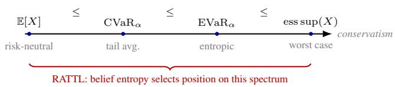
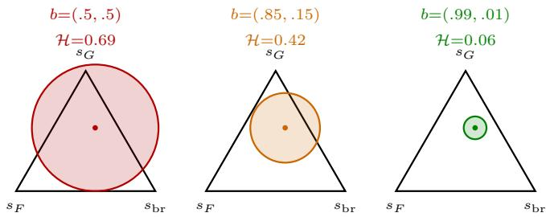
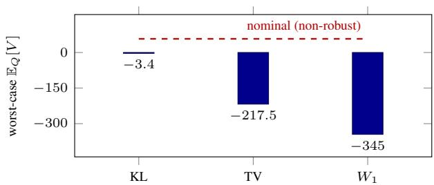
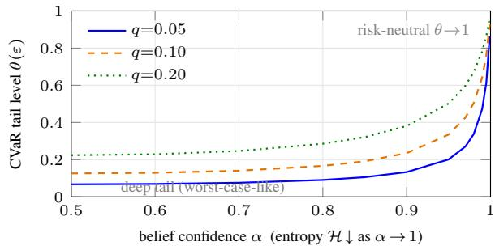
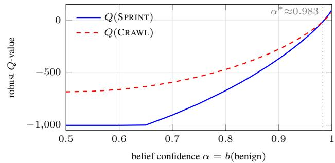
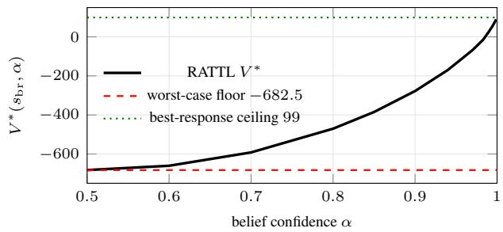

# Quantifying Risk Under Evolving Uncertainty: Belief-Dependent Robustness for Safe Sequential Decision Making

Deep Kumar Ganguly1 , Jan Kretˇ ´ınsky´1,2

1Technical University of Munich, Germany 2Masaryk University, Brno, Czech Republic deep.ganguly@tum.de, jan.kretinsky@tum.de

## Abstract

Many agents must act while still learning what environment they are in, which raises a basic question: how cautious should they be? A fixed answer is rarely right—too much caution wastes opportunity once the environment is understood, while planning for the average case can be unsafe early on. We propose RATTL (Risk-Adversarial Total-Reward Learning), a framework that ties an agent’s caution to how much it still does not know. The agent keeps a Bayesian belief about the unknown parts of its environment and hedges against a range of plausible dynamics whose size grows with the uncertainty of that belief, measured through a Wasserstein (optimal-transport) distance; as it learns, this range shrinks and behaviour shifts smoothly from worst-case caution toward ordinary reward maximization. The idea follows the Entropic Value-at-Risk, which recasts “how cautious should I be?” as “how large should my set of plausible models be?”. We put the framework on a formal footing: the planning problem is well posed, and its value always sits between a fully cautious baseline and the best one could do with full knowledge—a Safety Sandwich—with the gap closing as the environment is identified. We also begin to pin down what kind of risk this caution encodes, showing that in a canonical safety setting it matches a familiar tail-risk measure (Conditional Value-at-Risk) whose severity is set by the belief entropy. A simple worked example shows the agent holding back until it is confident, then switching to the efficient action at a clear threshold. RATTL targets runtime safety for agents—including LLMbased systems—that must act under uncertainty.

  
Figure 1: The coherent-risk hierarchy: EVaR is the single-parameter coherent family sweeping E to ess sup. RATTL uses belief entropy H(b) to slide along it.

## 1 The Problem: Risk That Changes as You Learn

Consider an autonomous system that must act in real time while gradually identifying its environment: a self-driving car facing a driver of unclear intent, a medical AI choosing a treatment before a diagnostic returns, or an LLM-based agent invoking tools against an adversary of unknown sophistication. The agent holds a belief over hidden environmental parameters and updates it through observation, yet must commit to actions now. How much risk should it tolerate at each moment? This depends on how much uncertainty remains: early on, even a small probability of catastrophe warrants caution; once the environment is largely identified, risk-neutral optimization is appropriate. The agent’s risk attitude should be a function of its epistemic state, decreasing in conservatism as information accumulates. Neither classical robust control (uniform worst-case reasoning) nor Bayesian RL (expected value under a diffuse belief) does this. A principled mechanism is needed that continuously adjusts the agent’s position on the risk spectrum (Figure 1).

Contributions. (i) We formalize RATTL: a reduction of a partially-observed turn-based stochastic game to a subjective robust MDP whose Wasserstein ambiguity radius equals the Shannon entropy of the Bayesian belief (§3). (ii) We prove three guarantees—contractivity, a Safety Sandwich, and convergence to best response—each with the precise, adversarially-checked conditions under which it holds (§4). (iii) We make first progress on the risk-measure identity of Wasserstein ambiguity: the inner robust value is coherent and equals a Lipschitz-regularized expectation, and on the two-point catastrophe it is exactly a CVaR with an entropycontrolled tail level (§5). (iv) We give a complete worked example with a sharp safety switch (§6).

## 2 The Risk Spectrum and Why EVaR

For a random cost X, the standard coherent risk measures form a hierarchy of increasing conservatism [Ahmadi-Javid, 2012]: $\mathbb { E } [ X ] \overset {  } { \leq } \mathrm { { C V a R } } _ { \alpha } ( X ) \overset {  } { \leq } \mathrm { { E V a R } } _ { \alpha } ( X ) \leq \mathrm { { e s s } s u p } ( X )$ The Entropic Value-at-Risk is the tightest upper bound on CVaR obtainable from exponential moments:

$$
\begin{array} { r } { \mathrm { E V a R } _ { \alpha } ( X ) = \underset { t > 0 } { \operatorname* { i n f } } \left\{ \frac { 1 } { t } \ln \frac { \mathbb { E } [ e ^ { t X } ] } { \alpha } \right\} . } \end{array}\tag{1}
$$

Two precise properties make EVaR the natural motivating dial. First, it is a single-parameter coherent family with full spectrum coverage: $\mathrm { \bar { E } V a R _ { 1 } } = \mathbb { E }$ and $\mathrm { E V a R } _ { \alpha } $ ess sup as $\alpha  0 ^ { + }$ (we use it for this coverage and its KL-DRO dual, not as the only such family). Second, it has an exact DRO dual,

$$
\operatorname { E V a R } _ { \alpha } ( X ) = \operatorname* { s u p } _ { { D _ { \operatorname { K L } } ( Q \| P ) } \leq - \ln \alpha } \mathbb { E } _ { Q } [ X ] ,\tag{2}
$$

so choosing a confidence level α is equivalent to choosing a KL-ball radius − ln α around the nominal P. This is the equivalence we exploit: it converts “how conservative should the agent be $\varTheta ^ { \ast }$ into “how large should the ambiguity set be $\langle ? ^ { \flat } -$ and the latter has a natural answer in the agent’s epistemic uncertainty. We are careful to claim only this: EVaR supplies the conceptual bridge. RATTL’s operational ambiguity sets are Wasserstein, for a safety reason developed in §5, and the precise risk measure they induce is the subject of that section.

## 3 RATTL: Belief Entropy as a Risk Dial

Setting. A partially-observed turn-based stochastic game (PO-TBSG) has finite states S, finite actions A, a finite set of opponent types ${ \mathcal { Z } } ,$ a terminal set $\tau \subset s$ , and for each $\mathrm { t y p e } \ z \textbf { a }$ transition kernel $P ( \cdot \mid s , a , z ) \in \Delta ( S )$ . Rewards $r ( s , a )$ are bounded and terminal rewards $r ( s )$ are defined for $s \in \ \mathcal T$ . We use the undiscounted total-reward criterion (a proper / stochastic-shortest-path MDP). The agent maintains a Bayesian belief $b \in \Delta ( \mathcal { Z } )$ over the type, updated by

$$
\psi ( b , s , a , s ^ { \prime } ) ( z ) = \frac { P ( s ^ { \prime } \mid s , a , z ) b ( z ) } { \sum _ { z ^ { \prime } } P ( s ^ { \prime } \mid s , a , z ^ { \prime } ) b ( z ^ { \prime } ) } ,\tag{3}
$$

and the belief-averaged (nominal) kernel $\bar { P } _ { b } ( \cdot , \ | \ s , a ) \ =$ $\textstyle \sum _ { z } b ( z ) P ( \cdot \mid s , a , z )$

Definition 1 (Entropy-modulated ambiguity set). For a ground metric d on S and risk-sensitivity $\bar { \beta } > 0 .$

$$
\mathcal { U } ( b \mid s , a ) = \big \{ Q \in \Delta ( \mathcal { S } ) : W _ { 1 } \big ( Q , \bar { P } _ { b } ( \cdot \mid s , a ) \big ) \leq \beta \mathcal { H } ( b ) \big \} ,\tag{4}
$$

where $W _ { 1 }$ is the 1-Wasserstein distance and $\begin{array} { r l } { \mathcal { H } ( b ) } & { { } = } \end{array}$ $- \textstyle \sum _ { z } b ( z )$ ln $b ( z )$ is the Shannon entropy.

The radius $\varepsilon ( b ) ~ = ~ \beta \mathcal { H } ( b )$ implicitly selects the agent’s conservatism: a diffuse belief gives wide ambiguity (effectively worst-case), a sharp belief gives tight ambiguity (effectively risk-neutral), with graduated conservatism in between (Figure 2). The induced Nash-Robust Bellman operator on bounded $V : \mathcal { S } \times \Delta ( \mathcal { Z } )  \mathbb { R }$ with $V ( s , \cdot ) = r ( s ) $ for $s \in \tau$ is

$$
( \mathbb { T } V ) ( s , b ) = \operatorname* { m a x } _ { a } \Big [ r ( s , a ) + \operatorname* { i n f } _ { Q \in \mathcal { U } ( b \mid s , a ) } \sum _ { s ^ { \prime } } Q ( s ^ { \prime } ) V \big ( s ^ { \prime } , \psi ( b , s , a , s ^ { \prime } ) \big ) \Big ] .\tag{5}
$$

  
Figure 2: Wasserstein ambiguity balls $\mathcal { U } ( b )$ on the next-state simplex for three beliefs of decreasing entropy. The ball shrinks (and its center $\bar { P } _ { b }$ moves) as the belief sharpens: high entropy lets the adversary push mass toward catastrophic states; low entropy renders it nearly powerless.

The belief update ψ is applied inside the expectation, coupling the adversary’s kernel choice with the agent’s future information state. The operator has a game reading: the agent (Max) picks an action; a fictitious adversary (Nature/Min) picks the worst kernel within the current ambiguity budget. RATTL goes in the opposite direction to the known RMDP → stochastic-game reduction [Chatterjee et al., 2024]: rather than expanding an RMDP into a game, we compress a partially-observed game into a subjective robust MDP whose uncertainty set is non-stationary, evolving with belief.

Assumptions. We isolate the conditions our theorems need.

Assumption 1 (Properness). Under every policy and every kernel selection in every $\mathcal { U } ( b )$ , the terminal set $\dot { \tau }$ is reached with probability 1.

Assumption 2 (Uniform reachability). There exist $m \geq 1$ and $\eta \in ( 0 , 1 ]$ such that from every non-terminal $( s , b )$ , under every admissible control and adversary kernel, T is reached within m steps with probability $\geq \eta .$

Assumption 3 (Identifiability). For all $z \neq z ^ { \prime }$ there is an $( s , a )$ with $P ( \cdot \mid s , a , z ) \neq P ( \cdot \mid s , a , z ^ { \prime } )$

Assumption 2 is the quantitative strengthening that the belief continuum forces: a.s. reachability alone (Ass. 1) need not give a uniformly bounded expected hitting time over $\Delta ( \mathcal { Z } )$ With finite $s , A , \mathcal { Z }$ it holds whenever the onestep absorption probability is bounded below over the (compact) action×adversary sets. Rewards are assumed bounded throughout.

## 4 Theoretical Guarantees

Theorem 1 (Contractivity). Under Assumptions 1–2, let $\begin{array} { r } { w ( s ) = \operatorname* { s u p } _ { b } \operatorname* { s u p } _ { \mathrm { a d m . } } \mathbb { E } ^ { ( s , b ) } [ \tau \tau ] } \end{array}$ be the worst-case expected hitting time. Then $1 \leq w ( s ) \leq W : = m / \eta < \infty ,$ and T is a contraction ofmodulus $\rho = 1 - 1 / W < 1$ in the weighted sup-norm $\begin{array} { r } { \| V \| _ { w } = \operatorname* { m a x } _ { s \not \in { \mathcal T } , b } | V ( \mathring s , b ) | / w ( s ) } \end{array}$ on the affine space $\{ V : V ( s , \cdot ) = r ( s ) \tilde { \forall } s \in \mathcal { T } \}$ . Hence T has a unique fixed point $V ^ { * }$ and $\mathbb { T } ^ { k } V \stackrel { \cdot } { \to } V ^ { * }$ geometrically.

Proof sketch. Iterating Assumption 2 over blocks of m steps gives $\mathrm { P r } ( \tau _ { \mathcal { T } } > k m ) \ \leq \ ( 1 \ - \ \eta ) ^ { k }$ , so $w ( s ) \leq m / \eta$ uniformly in b and strategy; thus $\| \cdot \| _ { w }$ is a genuine norm on the affine space (differences vanish on T) equivalent to $\| \cdot \| _ { \infty } .$ which is complete. The inner inf over a fixed set is nonexpansive, $| \operatorname * { i n f } _ { Q } f - \operatorname * { i n f } _ { Q } g | \leq \operatorname * { s u p } _ { Q } | f - g |$ , and since $r ( s , a )$ cancels and ma $\mathrm { x } _ { a }$ is non-expansive, a one-step drift inequality $( \mathcal L w ) ( s ) \leq w ( s ) - 1$ (worst-case unit-cost SSP, [Bertsekas and Tsitsiklis, 1996]) yields $| ( \mathbb { T } V - \mathbb { T } V ^ { \prime } ) ( s , b ) | \leq$ $\| V - V ^ { \prime } \| _ { w } \left( w ( s ) - 1 \right)$ ; dividing by $w ( s )$ and using $w \leq W$ gives modulus $1 - 1 / W$ . Belief augmentation is harmless: ψ is a deterministic function of the history, rewards depend only on $( s , a )$ , and $\tau \subset S$ so reachability is independent of b. Full proof in Appendix A. □

The next result is the one reviewers asked us to make concrete: what does robustness-with-learning do, behaviorally? It brackets the value between two reference policies.

Theorem 2 (Safety Sandwich). Let $V _ { \mathrm { m a x i m i n } }$ be the fixed point of the operator identical to (5) but with the radius frozen $u t \varepsilon _ { \mathrm { m a x } } = \bar { \beta \ln } | \mathcal { Z } |$ (same center $\bar { P } _ { b } )$ , and let $V _ { \mathrm { B R } } ( \cdot , z )$ be the optimal value of the non-robust MDP with known type z. Under Assumptions $I { - } 3 ,$

$$
V _ { \mathrm { m a x i m i n } } ( s , b ) \leq V ^ { \ast } ( s , b ) \leq \sum _ { z \in \mathcal { Z } } b ( z ) V _ { \mathrm { B R } } ( s , z ) \quad \forall ( s , b ) .\tag{6}
$$

Proof. Lower bound. Since $\mathcal { H } ( b ) \leq \ln | \mathcal { Z } |$ and both balls share the center $\bar { P } _ { b } , \mathcal { U } ( b ) \subseteq \mathcal { U } _ { \operatorname* { m a x } } ( b )$ ; the inf over the larger set is no larger, so $\mathbb { T } _ { \operatorname* { m a x } } V ~ \leq ~ \mathbb { T } V$ pointwise for every $V .$ Starting value iteration from $V ^ { * }$ and using monotonicity, $\mathbb { T } _ { \operatorname* { m a x } } ^ { k } \breve { V ^ { * } } \leq \mathbb { T } V ^ { * } = V ^ { * }$ for all k; letting $k  \infty$ gives Vmaximin $\leq V ^ { * }$ . Upper bound. For any policy π, the nominal kernel is feasible $\hat { ( P _ { b } } \in \mathcal { U } ( b ) )$ , so the robust value $V _ { \mathrm { r o b } } ^ { \pi } ~ \leq$ $V _ { \mathrm { n o m } } ^ { \pi } .$ . Running $\bar { P } _ { b }$ with ψ-updates is exactly the marginaland-posterior factorization of the mixture process “draw $z \sim$ b once, then follow $P ( \cdot \mid \cdot , \cdot , z ) ^ { \rangle \ , }$ ; hence the trajectory laws coincide and $\begin{array} { r } { V _ { \mathrm { n o m } } ^ { \pi } ( s , \dot { b } ) \stackrel { \cdot } { = } \sum _ { z } b ( z ) V _ { z } ^ { \pi } ( s ) } \end{array}$ . As $V _ { z } ^ { \pi } ( s ) ~ \leq$ $V _ { \mathrm { B R } } ( s , z )$ for every type, $\begin{array} { r } { V _ { \mathrm { r o b } } ^ { \overline { { \pi } } } ( \tilde { s } , \dot { b } ) \leq \sum _ { z } b ( z ) V _ { \mathrm { B R } } ^ { \sim } ( \tilde { s } , z ) ; } \end{array}$ taking $\operatorname { s u p } _ { \pi }$ gives the claim. Full proof in Appendix B.

Remark 1 (Why the belief-averaged ceiling). The stronger ceiling $V ^ { * } \le \dot { V } _ { \mathrm { B R } } ( s , z ^ { * } )$ at the realized true type $z ^ { * }$ is false in general: $V ^ { * }$ is a deterministic function of $( s , b )$ while $z ^ { * }$ is random, and the true kernel $\textstyle P ( \cdot \mid s , a , z ^ { * } )$ typically lies out-$s i d e U ( b )$ when b is not a point mass (Identifiability makes the types $\dot { W _ { 1 } }$ -separated). $\mathrm { \bf A s } \ b \to \delta _ { z } \mathrm { \bf , \Phi }$ ∗ both bounds coincide: the radius vanishes and $\begin{array} { r } { \sum _ { z } b ( z ) V _ { \mathrm { B R } } ( s , z ) \to V _ { \mathrm { B R } } ( s , z ^ { * } ) } \end{array}$ . This is exactly the asymptotic role of Theorem 3.

Theorem 3 (Convergence to best response). Assume 1, 3, and persistent identification (PI): along the realized trajectory,for each pair of types an identifying $( s , a )$ is visited infinitely often a.s. (automatic under any proper, fully-exploring behavior policy). Then $b _ { t } \to \delta _ { z }$ ∗ a.s. [Schwartz, 1965], so $\bar { \mathcal { H } } ( b _ { t } )  0$ and ${ \cal U } ( b _ { t } )$ collapses to $\{ P ( \cdot \mid \cdot , \cdot , z ^ { * } ) \}$ in Hausdorff distance; consequently $V ^ { * } ( \bar { s } , b _ { t } ) \stackrel { \cdot } {  } V _ { \mathrm { B R } } ( \stackrel { \cdot } { s } , z ^ { * } )$ a.s. If in addition the per-step log-likelihood separation is bounded below (persistent excitation; $e . g .$ all positive transition probabilities $\geq p _ { \mathrm { m i n } } > 0 )$ , then $\mathbb { E } [ \mathcal { \tilde { H } } ( b _ { t } ) ] \stackrel { \cdot } { = } O ( | \mathcal { Z } | \log t / t )$ and the price of robustness obeys $| \dot { V } _ { \mathrm { B R } } ( s , z ^ { * } ) - \ddot { V } ^ { * } \dot { ( } s , \check { b } _ { t } \dot { ) } | = O ( \log \hat { t / } t )$

<table><tr><td></td><td> $W _ { 1 }$ </td><td>TV</td><td>KL</td></tr><tr><td>Worst-case  $\mathbb { E } _ { Q } [ V ] , \varepsilon { = } 0 . 2 5$ </td><td>-345.0</td><td>-217.5</td><td>-3.4</td></tr><tr><td>Mass moved onto catastrophe</td><td>0.40</td><td>0.25</td><td>0.00</td></tr></table>

Table 1: Inner adversary at radius $\varepsilon { = } 0 . 2 5$ on a cliff transition whose catastrophe carries zero nominal mass (nominal value $+ 5 7 . 5 )$ . KL cannot place any mass on the off-support catastrophe $( D _ { \mathrm { K L } } { = } + \infty ) .$ so its mass there stays 0 and it cannot price the tail even as it reweights on-support mass; only Wasserstein reaches the catastrophe.

Proofsketch. PI supplies the excitation that Identifiability alone lacks, giving Bayesian consistency (Doob/Schwartz). The value-continuity step is the delicate one: $V ^ { * } ( \cdot , b )$ is not the fixed point of any per-belief operator because ψ shifts the belief; instead one shows T maps the class of value functions with belief-modulus $\leq L$ near $\delta _ { z }$ ∗ into itself, provided the Bayes normalizer is bounded below on the realized support (so ψ is locally Lipschitz), and the unique fixed point inherits the modulus—hence continuity at $\delta _ { z ^ { * } }$ . The rate follows from $\mathbb { E } [ \mathcal { H } ( b _ { t } ) ] = O ( \log t / t )$ under persistent excitation. Full statement and proof in Appendix $\mathrm { C } .$ □

Tractability. The inner inf is a finite linear program. By Kantorovich–Rubinstein duality [Villani, 2009],

$$
\operatorname* { i n f } _ { Q \in \mathcal { U } ( b ) } \sum _ { s ^ { \prime } } Q ( s ^ { \prime } ) V ( s ^ { \prime } ) = \operatorname* { s u p } _ { \lambda \geq 0 } \Big \{ \mathbb { E } _ { \widehat { P } _ { b } } \big [ \operatorname* { m i n } _ { s ^ { \prime } } ( V ( s ^ { \prime } ) + \lambda d ( s ^ { \prime } , \cdot ) ) \big ] - \lambda \varepsilon ( b ) \Big \} ,\tag{7}
$$

so belief-augmented robust value iteration over a belief grid $\mathcal { G } \subset \Delta ( \mathcal { Z } )$ solves $| S | | \mathcal { G } | | \mathcal { A } | \ \mathrm { L P s }$ of size $O ( | S | )$ per sweep. For large type spaces a particle/variational posterior approximates $b ,$ and (7) keeps the inner problem tractable regardless of belief representation; the continuous-state case (a Lipschitz-critic realization of (7)) we leave as an explicit open item (§8).

## 5 From KL to Wasserstein: A Coherent-Risk Reading

EVaR is a KL-ball worst case (2); RATTL uses a Wasserstein ball. This is deliberate. Under KL the adversary cannot place mass where the nominal has none $( D _ { \mathrm { K L } } = + \infty$ off-support), so precisely when the agent grows confident—and $\bar { P } _ { b }$ concentrates away from rare catastrophes—the KL adversary loses the ability to model the catastrophe. Wasserstein prices perturbations by physical distance, letting the adversary reach any state at proportional cost.

This is not merely rhetorical. Table 1 reports the inner worst case on a 5-state “cliff” transition where the catastrophic state carries zero nominal mass. The KL adversary cannot place any mass on the catastrophe (it lies off the nominal support, where $D _ { \mathrm { K L } } ~ = ~ + \infty )$ , so it cannot price the tail event even though it still perturbs the on-support mass; Wasserstein transports mass onto the catastrophe at finite cost and reports a worst case two orders of magnitude lower.

What coherent risk measure, then, does a Wasserstein ball induce? Assembling standard duality results, we record the following characterization.

  
Figure 3: The KL support catastrophe, visualized (radius $\varepsilon { = } 0 . 2 5 )$ The KL adversary cannot reach the off-support catastrophe (its mass there stays 0), so it barely departs from the non-robust value (dashed line) despite reweighting on-support mass; only Wasserstein transports mass onto the catastrophe and reports the true tail risk (−345).

Theorem 4 (Coherence and Lipschitz-regularization). $F i x f i -$ nite S with a metric ground cost d, $\bar { P } \in \Delta ( { \cal S } ) , \varepsilon \geq 0$ , and $\begin{array} { r } { \rho _ { \varepsilon } ( X ) : = \operatorname* { s u p } _ { Q : W _ { 1 } ( Q , \bar { P } ) \leq \varepsilon } \mathbb { E } _ { Q } [ X ] } \end{array}$ . Then $( 1 ) \rho _ { \varepsilon }$ is a coherent risk measure (monotone, translation-equivariant, positively homogeneous, subadditive), being the Artzner et al. [Artzner et al., 1999] worst-case-expectation functional of the convex compact scenario set $\begin{array} { r } { \mathcal { U } _ { \varepsilon } ; } \end{array}$ and (2) it equals a Lipschitzregularized expectation,

$$
\operatorname* { i n f } _ { Q : W _ { 1 } ( Q , \bar { P } ) \leq \varepsilon } \mathbb { E } _ { Q } [ f ] = \operatorname* { s u p } _ { \lambda \geq 0 } \big \{ \mathbb { E } _ { \bar { P } } [ f _ { \lambda } ] - \lambda \varepsilon \big \} ,\tag{8}
$$

with $\begin{array} { r } { f _ { \lambda } ( s ) = \operatorname* { m i n } _ { s ^ { \prime } } ( f ( s ^ { \prime } ) + \lambda d ( s ^ { \prime } , s ) ) } \end{array}$ ) the inf-convolution of f with λd, and the optimal $\lambda ^ { \star } \le \operatorname { L i p } _ { d } ( f )$ [Gao and Kleywegt, 2023; Mohajerin Esfahani and Kuhn, 2018].

Proof. (1) Uε is nonempty $( \bar { P } \in \ U _ { \varepsilon } )$ , convex (the map $Q \mapsto W _ { 1 } ( Q , \bar { P } )$ is convex, by averaging optimal couplings), and compact (it is a closed subset of the simplex, $\dot { W _ { 1 } } ( \cdot , \stackrel { - } { P } )$ being continuous via Kantorovich duality). The four axioms follow from properties of a supremum of linear functionals over a fixed convex set; the Artzner representation is then immediate. (2) is finite-S LP strong duality: the transport LP I $\mathrm { n i n } _ { \pi } \sum \pi ( s , s ^ { \prime } ) f ( s ^ { \prime } )$ s.t. first marginal $\bar { P }$ and $\textstyle \sum \pi d \leq \varepsilon$ has Lagrangian dual ma $\mathfrak { c } _ { \lambda \ge 0 } \big \{ \mathbb { E } _ { \bar { P } } [ \check { f } _ { \lambda } ] - \lambda \varepsilon \big \}$ , strictly feasible hence no gap. Details in Appendix D. □

On the canonical safety instance—a good state g and a catastrophe f—the identity is sharp and, strikingly, is a CVaR, not an EVaR.

Proposition 1 (Two-point Wasserstein risk is CVaR). Let $\quad S = \{ g , f \} \quad$ with $V ( g ) = v _ { g } > v _ { f } = V ( f )$ , nominal catastrophe mass $q \in ( 0 , 1 ) , d ( \bar { g } , f ) \bar { = } D ,$ , loss $L = - V$ . For $\varepsilon < ( 1 - q ) D$ the worst-case value is

$$
\begin{array} { r } { \underline { { V } } ( \varepsilon ) = \big ( 1 - p ^ { \star } \big ) v _ { g } + p ^ { \star } v _ { f } , \quad p ^ { \star } = q + \frac { \varepsilon } { D } , } \end{array}\tag{9}
$$

and the associated robust loss is exactly a Conditional Valueat-Risk,

$$
- \underline { { { V } } } ( \varepsilon ) = \operatorname { C V a R } _ { \theta ( \varepsilon ) } ( L ) , \qquad \theta ( \varepsilon ) = \frac { q } { q + \varepsilon / D } .\tag{10}
$$

Since $\mathrm { C V a R } \leq \mathrm { E V a R }$ at a matched tail level, the Wasserstein risk is in turn dominated by an EVaR; the matching EVaR level depends on ε with no closedform, which is why CVaR— not EVaR—is the clean object here.

  
Figure 4: Entropy is a CVaR dial (Proposition 1). As the belief sharpens $( \alpha  1 , \mathcal { H }  0 )$ , the induced CVaR tail level $\theta ( \varepsilon ) \ = \ { \mathrm { { ' } } } \ q / ( q + \beta { \mathcal { H } } / D )$ rises from a deep tail (worst-case-like caution) toward 1 (risk-neutrality), for catastrophe masses $q \in$ {0.05, 0.1, 0.2}. This is the risk spectrum of Figure 1, now traversed automatically by learning.

Proof. The two-point ball is $\{ p : | p - q | \le \varepsilon / D \} ; \mathbb { E } _ { Q } [ V ]$ decreases in the catastrophe mass p, so the worst case is $p ^ { \star } =$ min $\left( 1 , q + \varepsilon / D \right)$ . Substituting $p ^ { \star } = q / \theta$ into the two-point $\begin{array} { r } { \mathrm { C V a R } _ { \theta } \dot { ( } L \mathrm { ~ ) } \stackrel { } { = } \frac { 1 } { \theta } ( q L ( f ) + ( \theta - q ) L ( \dot { g } ) ) } \end{array}$ recovers $p ^ { \star } L ( { \bar { f } } ) +$ $( 1 - p ^ { \star } ) L ( g ) \stackrel { \smile } { = } - \underline { { V } } ( \varepsilon )$ as an exact algebraic identity. The EVaR bound is the $\mathrm { C V a R } \leq \mathrm { E V a R }$ ordering [Ahmadi-Javid, 2012]. Details in Appendix D. □

Because $\varepsilon ~ = ~ \beta \mathcal { H } ( b )$ , the tail level $\theta ( b ) ~ = ~ q / ( q ~ +$ $\beta \mathcal { H } ( b ) / D )$ decreases as belief entropy grows: the entropy dial is literally a CVaR-tail dial (Figure 4). This is a concrete, exact instance of the paper’s slogan.

Two honest caveats: for $\left| { \mathcal { S } } \right| \ \geq \ 3$ the worst case spreads mass to the nearest low-value states, giving a d-weighted “transport-CVaR” rather than ordinary CVaR; and a single, ε-uniform EVaR-level identity does not hold (the matching EVaR level depends transcendentally on $\varepsilon ) .$ The general transport-CVaR↔EVaR comparison is the headline open problem; Proposition 1 settles the canonical case.

## 6 Worked Example: The Ambiguous Bridge

(All curves below are closed-form evaluations of the robust backup, not learning runs; here $\alpha = b ( b e n i g n )$ denotes belief confidence.)

To make every quantity concrete we instantiate RATTL on a diagnostic with three states $\{ s _ { \mathrm { b r } } , s _ { G } , s _ { F } \}$ (bridge, goal, fall), two actions {SPRINT, CRAWL}, and two types {benign, adversarial}. SPRINT reaches s under the benign type but falls to $s _ { F }$ under the adversarial type; CRAWL always reaches $s _ { G }$ . Rewards: $r ( s _ { \mathrm { b r } } , \mathbf { S P R I N T } ) { = } { - } 1$ ， $r ( s _ { \mathrm { b r } } , \mathbf { C R A W L } ) { = } { - } 2 0 , r ( s _ { G } ) { = } { + } 1 0 0 , r ( s _ { F } ) { = } { - } 1 0 0 0 ; { \mathrm { g r o u n c } }$ 1 distance $D = d ( s _ { G } , s _ { F } ) = 1 ; \ \beta = 1$ . Writing $\alpha \ = \ b ( { \mathrm { b e n i g n } } )$ and $\begin{array} { r c l } { \varepsilon ( \alpha ) } & { = } & { { \mathcal { H } } ( \alpha ) } \end{array}$ , both successor states are terminal, so a single robust backup with the two-point transport $W _ { 1 } ( \mu , \nu ) { = } D | \mu _ { 1 } - \nu _ { 1 } |$ gives closed-form robust Q-values:

$$
Q ( \mathrm { S P R I N T } , \alpha ) = - 1 0 0 1 + 1 1 0 0 \operatorname* { m a x } \big ( 0 , \alpha - \varepsilon ( \alpha ) \big ) ,\tag{11}
$$

$$
Q ( \mathrm { C R A W L } , \alpha ) = 8 0 - 1 1 0 0 \operatorname* { m i n } \big ( \varepsilon ( \alpha ) , 1 \big ) .\tag{12}
$$

Setting them equal, the ε terms cancel and 1100α = 1081, so the safety switch is at

$$
\begin{array} { r } { \alpha ^ { * } = \frac { 1 0 8 1 } { 1 1 0 0 } \approx 0 . 9 8 3 . } \end{array}\tag{13}
$$

<table><tr><td>α</td><td> $\varepsilon ( \alpha )$ </td><td>Q(SPRINT)</td><td> $Q \mathrm { ( C R A W L ) }$ </td><td> $\pi ^ { * }$ </td></tr><tr><td>0.50</td><td>0.6931</td><td>-1001.00</td><td>-682.46</td><td>CRAWL</td></tr><tr><td>0.85</td><td>0.4227</td><td>-530.98</td><td>-384.98</td><td>CRAWL</td></tr><tr><td>0.99</td><td>0.0560</td><td>+26.40</td><td>+18.40</td><td>SPRINT</td></tr><tr><td> $\alpha ^ { * } { = } 1 0 8 1 / 1 1 0 0$ </td><td>0.0872</td><td>-15.95</td><td>-15.95</td><td>switch</td></tr></table>

Table 2: Robust value iteration on the Ambiguous Bridge $\scriptstyle ( \beta = 1 .$ $D { = } 1 )$ . The safety floor is $V _ { \mathrm { m a x i m i n } } ( 0 . 5 ) ~ = ~ 8 0 - 1 1 0 0 \ln$ 2 = −682.46; the best-response ceiling is VBR = 99 as α → 1. The threshold $\alpha ^ { * } = 1 0 8 1 \hat { / } $ 1100 is β-independent here.

  
Figure 5: The safety switch. CRAWL dominates while uncertain; at $\alpha ^ { * } \approx 0 . 9 8 3$ the risky action’s worst-case value overtakes the safe one and the agent switches to SPRINT.

The agent CRAWLs until it is ∼98% confident the conditions are benign, then SPRINTs (Figure 5, Table 2). In this symmetric environment the threshold is determined purely by the reward asymmetry and is independent of β (both actions face the same per-unit transport penalty); β controls the conservatism of the value and shifts the threshold only when the safe and risky actions face different ambiguity. Well-posedness requires $\boldsymbol { \varepsilon } ( b ) \leq D , \mathrm { i . e . } \ \beta < D / \ln | \mathcal { Z } | \ \approx 1 . 4 4 3$

## 7 Related Work

RATTL sits at the intersection of robust MDPs, risk-sensitive RL, and Bayesian opponent modeling. Robust MDPs with static, rectangular uncertainty sets [Iyengar, 2005; Nilim and El Ghaoui, 2005; Wiesemann et al., 2013] are RATTL’s ancestor; our radius is belief-dependent and non-stationary, and we go in the opposite direction to the RMDP↔game equivalence [Chatterjee et al., 2024]. On the risk side, EVaR [Ahmadi-Javid, 2012] and CVaR [Rockafellar and Uryasev, 2000] supply the coherent backbone [Artzner et al., 1999]; Ni & Bhat [Ni and Bhat, 2024] show stationary policies suffice for EVaR total-reward MDPs—justifying RATTL’s policy class—but at a fixed risk level, whereas ours is belief-selected. The closest competitors couple ambiguity to Bayesian posteriors: Russel & Petrik [Russel and Petrik, 2019] adapt sets to the policy (not the belief); Choi and Li [Choi and Li, 2025] contract interval credible sets rather than entropy-modulated Wasserstein balls and lack a riskmeasure reading; Nakao et al. [Nakao et al., 2025] study DR-POMDPs with static distance-based ambiguity. Derman & Mannor [Derman and Mannor, 2020] relate Wasserstein DRO to value regularization, which Theorem 4 sharpens into an explicit coherent-risk identity. To our knowledge, no prior work couples a Wasserstein radius to Shannon belief entropy (as opposed to posterior credible-set width, cf. Choi and Li), nor derives the resulting Safety Sandwich and two-point CVaR identity.

  
Figure 6: The Safety Sandwich, instantiated. RATTL’s value rises from the worst-case floor $( V _ { \mathrm { m a x i m i n } } .$ , never-shrinking ambiguity) toward the full-information ceiling $( V _ { \mathrm { B R } } )$ as the belief sharpens— never less safe than maximin, never more reckless than the informed optimum. The two reference lines are constant bounds (−682.5 and 99); $V ^ { * }$ provably stays between them at every belief.

## 8 Limitations, Future Work, and Conclusion

Limitations. We are explicit about the current scope. (a) Tabular. The exact algorithm discretizes the belief simplex and is feasible only for small |Z|; we give a scalable roadmap (§4) but no large-scale empirical validation yet. (b) Added conditions. The guarantees need more than bare properness: uniform reachability (Assumption 2) for the contraction over the belief continuum, and persistent identification/excitation for convergence and its rate—degenerate exploration is excluded. (c) Two points. The exact CVaR identity (Proposition 1) is proven only for the canonical two-point catastrophe; for $| { \dot { S } } | \geq 3$ it becomes a d-weighted “transport-CVaR” and the EVaR comparison is only one-sided. (d) Calibration. $\beta$ must satisfy $\beta < D / \ln | \mathcal { Z } |$ , and the threshold’s β- independence is specific to symmetric environments like the Bridge.

Future work. (i) The general transport-CVaR↔EVaR comparison for $| { \mathcal { S } } | \geq 3 .$ (ii) Hybrid Wasserstein+KL ambiguity combining reachability with tail sensitivity. (iii) Renyi/Tsallis entropy as alternative dials—does the Safety´ Sandwich survive for any concave, zero-at-point-mass information measure? (iv) Sample complexity of belief-adaptive robust RL, where the radius shrinks at rate $O ( \log t / t )$ . (v) Scaling the dual (7) to continuous spaces via Lipschitz critics. (vi) Multi-agent risk composition under private beliefs. The headline applied direction—and the workshop motivation— is runtime safety for agentic GenAI: agents that plan, retrieve, and invoke tools hold a Bayesian or surrogate belief over latent context and face deployment-time distribution shift and adversarial tail risk, exactly RATTL’s structure. Beliefentropy-modulated robustness then offers a principled dial for abstention and graduated conservatism, with the Safety Sandwich providing a value-level bracket—a worst-case floor and a Bayesian-best-response ceiling—rather than a runtime behavioral guarantee; turning it into an actionable runtime certificate, and validating it on real LLM-agent pipelines, is the main empirical goal.

Conclusion. RATTL makes an agent’s risk attitude a function of its epistemic state by tying a Wasserstein ambiguity radius to belief entropy. We proved a contraction theorem, a Safety Sandwich bracketing the value between a worst-case floor and a Bayesian-best-response ceiling, and almost-sure convergence to best response, each with explicit, adversarially-checked conditions. We took a first step on the risk-measure identity of Wasserstein ambiguity: it is coherent and equals a Lipschitz-regularized expectation in general, and an exact CVaR with an entropy-controlled tail level on the canonical catastrophe—so the belief literally selects a position on the coherent-risk spectrum. The Ambiguous Bridge makes the resulting safety switch sharp and interpretable. The thesis is simple: robustness should decrease with epistemic certainty, and belief entropy is the principled dial that achieves it.

## Acknowledgments

We thank the RobustifAI workshop reviewers for constructive feedback that substantially shaped this extended version.

## A Full Proof of Theorem 1

Work on the affine space $B _ { T } = \{ V$ bounded : $V ( s , \cdot ) =$ $r ( s ) \forall s \in \mathcal { T } \}$ , on which differences vanish on $\tau$ so $\| \cdot \| _ { w }$ separates points and is equivalent ${ \mathrm { ~ t o ~ } } \parallel \cdot \parallel _ { \infty }$ over $s \notin \tau ;$ $B _ { T }$ is complete and $\mathbb { T } : \bar { B _ { \mathcal { T } } } \ :  \ : B _ { \mathcal { T } }$ Iterating Assumption 2 over blocks of m steps gives $\mathrm { P r } ( \tau \tau > k m ) \leq$ $( 1 - \eta ) ^ { k }$ , hence $\begin{array} { r } { w ( s ) \ = \ \bar { \mathbb { E } } \bar { [ \tau _ { \mathcal { T } } ] } ^ { \cdot } \ \leq \ \sum _ { k > 0 } m ( 1 - \eta ) ^ { k } \ = \ } \end{array}$ $m / \eta \ = : \ W$ uniformly in b and strategy, and $w ( s ) ~ \geq ~ 1$ since a non-terminal state needs a transition. For bounded $f , g$ on any set, $f ~ \leq ~ g + \operatorname* { s u p } | f - g |$ gives inf $f \quad \leq$ inf g + sup $f - g | ; { \mathrm { s y m m e t r i z i n g ~ y i e l d s ~ } } | { \mathrm { i n f } } _ { Q } \ f - { \mathrm { i n f } } _ { Q } g | \leq$ su $) _ { Q } \left| f - g \right|$ . With $\begin{array} { r } { f ( Q ) = \bar { \sum _ { s ^ { \prime } } } Q ( s ^ { \prime } ) V ( \bar { s ^ { \prime } } , \psi ) , g ( \bar { Q } ) = } \end{array}$ $\begin{array} { r } { \sum _ { s ^ { \prime } } \dot { Q } ( s ^ { \prime } ) V ^ { \prime } ( s ^ { \prime } , \psi ) } \end{array}$ and $Q \in \Delta ( S )$ , the inner terms differ by at most $\begin{array} { r } { \operatorname* { s u p } _ { Q \in \mathcal { U } ( b ) } \sum _ { s ^ { \prime } \not \in \mathcal { T } } Q ( \dot { s } ^ { \prime } ) \dot { | } V - V ^ { \prime } | ( s ^ { \prime } , \psi ) } \end{array}$ . Using $| V - V ^ { \prime } | ( s ^ { \prime } , \psi ) \overset {  } { \leq } \| V - \bar { V } ^ { \prime } \| _ { w } ^ { - } w ( s ^ { \prime } )$ on $s ^ { \prime } \notin \mathcal { T }$ (and 0 on T ), cancellation of $r ( s , a )$ , and non-expansiveness of $\mathrm { m a x } _ { a }$

$$
| ( \mathbb { T } V - \mathbb { T } V ^ { \prime } ) ( s , b ) | \leq \| V - V ^ { \prime } \| _ { w } \operatorname* { s u p } _ { Q \in \mathcal { U } ( b \vert s , a ) } \sum _ { s ^ { \prime } \notin \mathcal { T } } Q ( s ^ { \prime } ) w ( s ^ { \prime } ) .
$$

The worst-case expected hitting time satisfies the unit-cost SSP drift inequality $\begin{array} { r } { \operatorname* { s u p } _ { a , b , Q } \sum _ { s ^ { \prime } \notin \mathcal { T } } Q ( s ^ { \prime } ) w ( s ^ { \prime } ) \leq w ( s ) - 1 } \end{array}$ (one admissible step costs 1 and leaves residual worst-case $\mathrm { t i m e } \le \ w ( s ^ { \prime } )$ ; [Bertsekas and Tsitsiklis, 1996]). Hence $| ( \mathbb { T } V ^ { - } \mathbb { T } \hat { V } ^ { \prime } ) ( s , b ) | \leq | | V - V ^ { \prime } | | _ { w } ( w ( s ) - 1 ) ;$ dividing by $\overset { \cdot \cdot } { w } ( s ) \in [ 1 , \dot { W } ] \mathrm { g i v e s } \| \mathbb { T } \ddot { V } - \mathbb { T } V ^ { \prime } \| _ { w } \leq ( \dot { 1 } - 1 / \dot { W } ) \| V - \bar { V ^ { \prime } } \| _ { w } .$ Banach’s theorem completes the proof. □

## B Full Proof of Theorem 2

Both T and the frozen-radius $\mathbb { T } _ { \mathrm { m a x } }$ are monotone self-maps of $B _ { T }$ with unique fixed points $V ^ { * } , V _ { \mathrm { m a x i m i n } }$ (Theorem 1 applies to each, with $\varepsilon _ { \mathrm { m a x } }$ a valid radius), and value iteration converges for both. Lower bound. $0 \leq \mathcal { H } ( b ) \leq \ln | \mathcal { Z } |$ , so $\varepsilon ( b ) \leq \varepsilon _ { \operatorname* { m a x } }$ with common center, giving $\mathcal { U } ( b ) \subseteq \mathcal { U } _ { \operatorname* { m a x } } ( b )$

and $\mathrm { i n f } _ { { \mathcal { U } } _ { \operatorname* { m a x } } } \leq \mathrm { i n f } _ { { \mathcal { U } } } ;$ adding r and taking max , $\mathbb { T } _ { \operatorname* { m a x } } V \leq$ $\mathbb { T } V$ for all $\ddot { V }$ . Induct: $\mathbb { T } _ { \operatorname* { m a x } } ^ { 0 } \breve { V } ^ { * } = V ^ { * } ; \mathrm { i f } \breve { \mathbb { T } } _ { \operatorname* { m a x } } ^ { k } V ^ { * } \leq \overleftarrow { V } ^ { * }$ then by monotonicity $\mathbb { T } _ { \operatorname* { m a x } } ^ { k + 1 } V ^ { * } \leq \mathbb { T } _ { \operatorname* { m a x } } V ^ { * } \leq \mathbb { T } V ^ { * } = V ^ { * } .$ . Limit: $\dot { V _ { \mathrm { m a x i m i n } } } \leq V ^ { * }$ . Upper bound. Fix a policy π. (a) $\bar { P } _ { b } \in \mathcal { U } ( b )$ (zero transport), so the robust value $\bar { V } _ { \mathrm { r o b } } ^ { \pi } \overset { \cdot } { \leq } V _ { \mathrm { n o m } } ^ { \pi } .$ , the value under the nominal kernel with ψ-updates. (b) The joint law of $( z , s ^ { \prime } )$ with $z \sim b , s ^ { \prime } \sim P ( \cdot \bar { \mid } s , a , z )$ has $s ^ { \prime }$ -marginal $\bar { P } _ { b } ( \cdot \mid s , a )$ and z-posterior $\psi ( b , s , a , s ^ { \prime } )$ ; by induction on t the nominal process and the mixture process “draw $z \sim b$ once, then follow $P ( \cdot \mid \cdot , \cdot , z ) ^ { \uparrow , }$ induce the same trajectory law and maintain $b _ { t } = \operatorname* { P r } ^ { \operatorname* { m i x } } ( z \mid h _ { t } )$ . Since the return depends only on the observable trajectory, $V _ { \mathrm { n o m } } ^ { \pi } ( s , b ) = \mathbb { E } ^ { \mathrm { m i x } } [ \bar { G } ] =$ $\begin{array} { r } { \sum _ { z } \bar { b } ( z ) V _ { z } ^ { \pi } ( s ) } \end{array}$ by the tower property. $\begin{array} { r } { \overline { { \left( \mathbf { c } \right) } } V _ { z } ^ { \pi } ( s ) \leq V _ { \mathrm { B R } } \overline { { \left( s , z \right) } } } \end{array}$ since π is feasible in the type-z MDP. Chaining and taking $\operatorname { s u p } _ { \pi }$ (with $V ^ { * } = \operatorname* { s u p } _ { \pi } V _ { \mathrm { r o l } } ^ { \bar { \pi } }$ from proper minimax SSP theory) gives $\begin{array} { r } { V ^ { * } ( s , b ) \le \sum _ { z } \breve { b } ( z ) V _ { \mathrm { B R } } \bar { ( } s , \bar { z } ) . \boxed { \begin{array} { r l } \end{array} } } \end{array}$

## C Statement and Proof of Theorem 3

Consistency. Under (PI) an identifying $( s , a )$ for each type pair is visited infinitely often, so the realized log-likelihood ratio of $z ^ { * }$ against any $z \neq z ^ { * }$ diverges to $+ \infty \ \mathbf { a . s . }$ . (a sum of i.o. strictly positive-mean, bounded-variance increments), giving $b _ { t } ~  ~ \delta _ { z ^ { * } } ~ \mathrm { a . s . }$ . [Schwartz, 1965]; thus $\mathcal { H } ( b _ { t } ) ~  ~ 0$ and $\varepsilon ( b _ { t } ) \  \ 0$ , and ${ \mathcal U } ( b _ { t } \ \mid \ s , a ) \ \to \ \{ P ( \cdot \ \mid \ s , a , z ^ { * } ) \}$ in the W1-Hausdorff metric. Continuity. Let N be a neighborhood of $\delta _ { z ^ { * } }$ on which the Bayes normalizer is $\geq p _ { \mathrm { m i n } } > 0 .$ so $\psi ( \cdot , s , a , s ^ { \prime } )$ is $L _ { \psi } - 1$ Lipschitz on N. The class ${ \mathcal { C } } _ { L } = \{ V \in$ $\mathcal { B } _ { T } : \left| V ( s , b ) - V ( \acute { s } , b ^ { \prime } ) \right| \leq L \left\| b - b ^ { \prime } \right\| \forall b , b ^ { \prime } \in N \}$ is closed and T-invariant once $L$ is large enough that the per-step belief-modulus contraction $( 1 - 1 / W ) L _ { \psi } < 1$ holds (the only place this extra condition enters); the unique fixed point $V ^ { * }$ therefore lies in $\mathcal { C } _ { L }$ and is continuous at $\delta _ { z ^ { * } }$ . Combined with $b _ { t } \to \delta _ { z }$ ∗ and $\mathcal { U } ( b _ { t } ) \to \{ P _ { z ^ { * } } \} , V ^ { * } ( s , b _ { t } ) \to V _ { \mathrm { B R } } ( s , z ^ { * } )$ a.s. Rate. Under persistent excitation the posterior on each wrong type decays geometrically in the number of identifying visits, and with $\dot { \Theta } ( \bar { t } )$ such visits $\mathbb { E } [ \mathcal { H } ( b _ { t } ) ] = O ( | \mathcal { Z } | \log { \dot { t } } / t ) \dot { : }$ since $\begin{array} { r } { | V _ { \mathrm { B R } } ( s , z ^ { * } ) - V ^ { * } ( s , b _ { t } ) | \leq \overleftarrow { C } \sum _ { z \neq z ^ { * } } b _ { t } ( \overleftarrow { z } ) } \end{array}$ for a constant C (both the floor gap and the averaged-ceiling gap vanish with the residual mass on wrong types), the price of robustness is $O ( \log t / t ) . \left. \right.$

## D Details for §5

Convexity of $\operatorname { \mathcal { U } } _ { \varepsilon } \colon$ for optimal couplings $\pi _ { 0 } , \pi _ { 1 }$ of $Q _ { 0 } , Q _ { 1 }$ with $\bar { P } _ { ; }$ , the coupling $\theta \pi _ { 0 } + ( 1 - \theta ) \pi _ { 1 }$ 1 has marginals $\theta Q _ { 0 } + ( 1 - \theta ) Q _ { 1 }$ and ${ \bar { P } } ,$ so $\dot { W } _ { 1 } \bar { ( } \theta Q _ { 0 } + ( 1 - \theta ) Q _ { 1 } , \bar { P } ) \stackrel { < } { \le } \theta W _ { 1 } ( \bar { Q } _ { 0 } , \bar { P } ) + ( 1 -$ $\theta ) W _ { 1 } ( Q _ { 1 } , \bar { P } )$ Coherence axioms follow because $\mathcal { U } _ { \varepsilon }$ does not depend on $X$ : monotonicity and positive homogeneity are termwise; translation-equivariance uses $\langle Q , \mathbf { 1 } \rangle = { \mathit { 1 } } ;$ subadditivity uses that the two suprema decouple. The duality is finite-LP strong duality with multipliers $u ( s )$ (marginals) and $\lambda ~ \geq ~ 0$ (budget); optimizing $\begin{array} { r } { \dot { u ( s ) } ~ = ~ \operatorname* { m i n } _ { s ^ { \prime } } ( f \bar { ( s ^ { \prime } ) } ~ - } \end{array}$ $\lambda d ( s , s ^ { \prime } ) ) = f _ { \lambda } ( \bar { s } )$ gives the boxed form, and $f _ { \lambda } = f$ once $\lambda \ \overset { \cdot } { = } \ \operatorname { L i p } _ { d } ( f )$ , bounding $\lambda ^ { \star }$ . For Proposition 1, the twopoint ball is $\{ p : | p - q | \leq \varepsilon / D \}$ by Kantorovich duality $\dot { ( | h ( g ) - h ( f ) | } \le \dot { \operatorname { D } } )$ , the worst case is the right endpoint $p ^ { \star }$ , and substituting $p ^ { \star } = q / \theta$ (with $\theta = q / ( q \stackrel { - } { + } \varepsilon / D ) \rangle$ into $\mathrm { \hat { C } V a R } _ { \theta } ( L ) = \textstyle { \frac { 1 } { \theta } } ( \bar { q } \hat { L ( f ) } + \mathrm { \hat { ( } } \theta - q ) L ( g ) )$ reproduces $- \underline { { V } } ( \varepsilon )$

exactly; the CVaR ≤ EVaR ordering [Ahmadi-Javid, 2012] gives the one-sided EVaR bound. □

## References

[Ahmadi-Javid, 2012] Amir Ahmadi-Javid. Entropic valueat-risk: A new coherent risk measure. Journal of Optimization Theory and Applications, 155(3):1105–1123, 2012.

[Artzner et al., 1999] Philippe Artzner, Freddy Delbaen, Jean-Marc Eber, and David Heath. Coherent measures of risk. Mathematical Finance, 9(3):203–228, 1999.

[Bertsekas and Tsitsiklis, 1996] Dimitri P. Bertsekas and John N. Tsitsiklis. Neuro-Dynamic Programming. Athena Scientific, 1996.

[Chatterjee et al., 2024] Krishnendu Chatterjee, Jan Kret´ınsky, Mohammadsadegh Mohagheghi, Maxim-´ ilian Sadigh, et al. Solving long-run average reward robust MDPs via stochastic games. In Proceedings of the 33rd International Joint Conference on Artificial Intelligence (IJCAI), 2024.

[Choi and Li, 2025] Jimin Choi and Max Z. Li. Bayesian ambiguity contraction-based adaptive robust Markov decision processes for adversarial surveillance missions. arXiv preprint arXiv:2512.01660, 2025.

[Derman and Mannor, 2020] Esther Derman and Shie Mannor. Distributional robustness and regularization in reinforcement learning. arXiv preprint arXiv:2003.02894, 2020.

[Gao and Kleywegt, 2023] Rui Gao and Anton J. Kleywegt. Distributionally robust stochastic optimization with Wasserstein distance. Mathematics of Operations Research, 48(2):603–655, 2023.

[Iyengar, 2005] Garud N. Iyengar. Robust dynamic programming. Mathematics of Operations Research, 30(2):257– 280, 2005.

[Mohajerin Esfahani and Kuhn, 2018] Peyman Mohajerin Esfahani and Daniel Kuhn. Data-driven distributionally robust optimization using the Wasserstein metric: Performance guarantees and tractable reformulations. Mathematical Programming, 171:115–166, 2018.

[Nakao et al., 2025] Hideaki Nakao, Ruiwei Jiang, and Siqian Shen. Distributionally robust POMDPs with distance-based ambiguity sets. IISE Transactions, 2025.

[Ni and Bhat, 2024] Xihong Ni and Sanjay P. Bhat. Stationary policies are optimal in risk-averse total-reward MDPs with EVaR. arXiv preprint arXiv:2408.17286, 2024.

[Nilim and El Ghaoui, 2005] Arnab Nilim and Laurent El Ghaoui. Robust control of Markov decision processes with uncertain transition matrices. Operations Research, 53(5):780–798, 2005.

[Rockafellar and Uryasev, 2000] R. Tyrrell Rockafellar and Stanislav Uryasev. Optimization of conditional value-atrisk. Journal ofRisk, 2:21–42, 2000.

[Russel and Petrik, 2019] Reazul Hasan Russel and Marek Petrik. Beyond confidence regions: Tight Bayesian ambiguity sets for robust MDPs. In Advances in Neural Information Processing Systems (NeurIPS), 2019.

[Schwartz, 1965] Lorraine Schwartz. On Bayes procedures. Zeitschrift fur Wahrscheinlichkeitstheorie und verwandte¨ Gebiete, 4(1):10–26, 1965.

[Villani, 2009] Cedric Villani. ´ Optimal Transport: Old and New. Springer, 2009.

[Wiesemann et al., 2013] Wolfram Wiesemann, Daniel Kuhn, and Berc¸ Rustem. Robust Markov decision processes. Mathematics of Operations Research, 38(1):153–183, 2013.