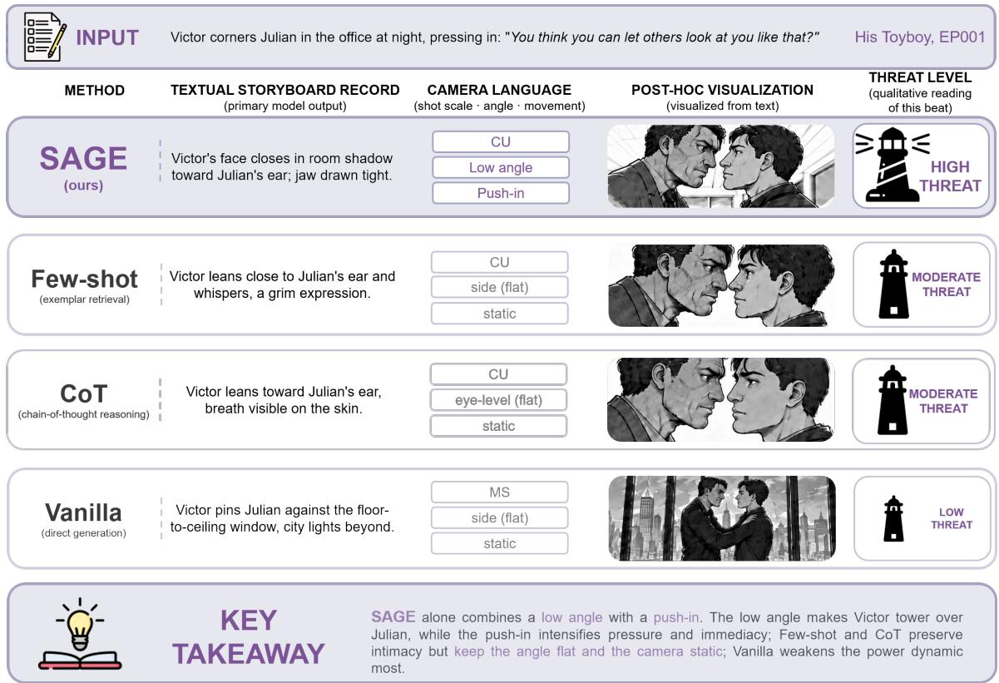
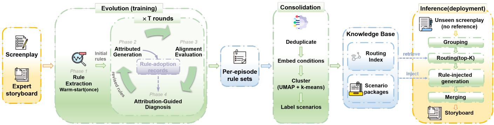
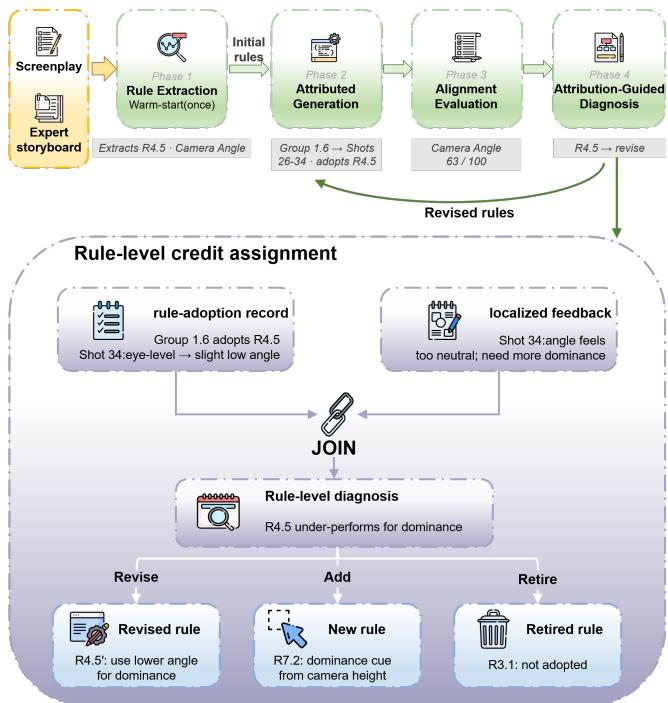
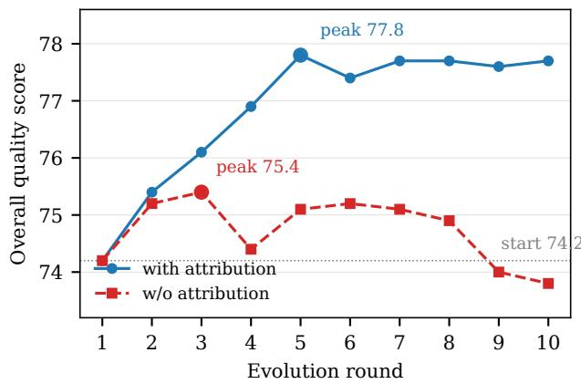
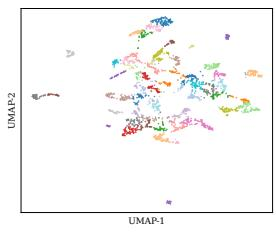
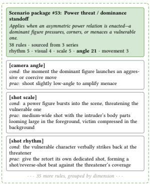
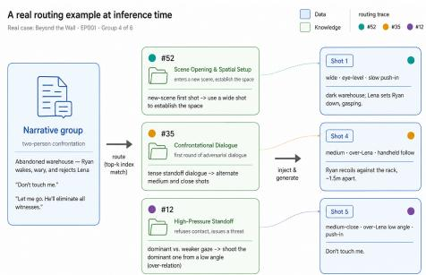
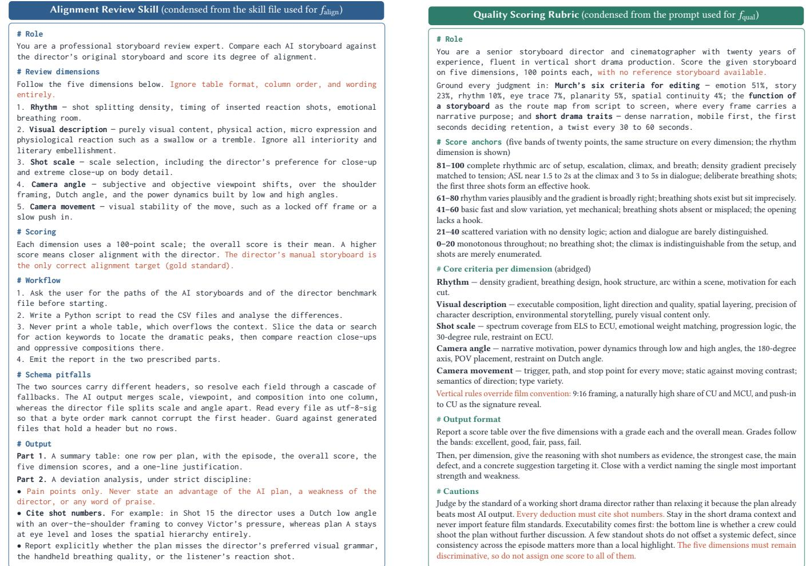

# SAGE: Self-Evolving Storyboard Skills via Atribution-Guided Rule Evolution

Maolin Ran Shanghai Jiao Tong University Shanghai, China maolinr03@sjtu.edu.cn

Jian Wang   
CreativeFitting   
Shanghai, China   
jim.wang@creativefitting.ai

Xiaoyang Lu Shanghai Jiao Tong University Shanghai, China xiaoyangl@sjtu.edu.cn

Weiwen Liu Shanghai Jiao Tong University Shanghai, China wwliu@sjtu.edu.cn

Yong Yu Shanghai Jiao Tong University Shanghai, China yyu@sjtu.edu.cn

Jiaqi Liu Shanghai Jiao Tong University Shanghai, China jkliu189@gmail.com

Jianghao Lin Shanghai Jiao Tong University Shanghai, China linjianghao@sjtu.edu.cn

Weinan Zhang Shanghai Jiao Tong University Shanghai, China wnzhang@sjtu.edu.cn

## Abstract

Storyboards decompose screenplays into shot-by-shot visual plans that drive automated short drama production. Because high-quality storyboarding rests on the tacit expertise of professional directors, it remains a capacity bottleneck at industrial scale. Large language models can automate this step, yet existing ways of equipping them with directorial knowledge face three challenges: (1) Knowledge acquisition: the craft stays implicit in exemplars or must be authored by hand, so explicit knowledge exists only where a hu man writes it. (2) Knowledge refinement: authored knowledge is never evaluated against execution outcomes, and opaque generation prevents feedback from being attributed to the knowledge behind each decision. (3) Knowledge injection: injecting everything exceeds the usable context, yet hand-picking knowledge for every narrative group does not scale. In light of these challenges, we present SAGE (Skill with Attribution-Guided Evolution). SAGE is a deployed framework that learns, attributes, and evolves di recting knowledge from expert demonstrations. It first extracts content-free rules by contrasting each training screenplay with its expert storyboard. During generation, the model declares which rules each narrative group adopts. Joining these records with lo calized feedback yields attribution at the level of individual rules, which drives targeted rule updates. Evolved rules are then consol idated into scenario packages accessed through a routing index. Each group therefore retrieves only a bounded set of scenario packages matched to its situation, without expert intervention. On 18 test episodes across three genres, SAGE scored 77.8 on an expertvalidated rubric, exceeding professional directors’ 77.1. Deployed for 14 days in Virtual Film Studio, a commercial short drama produc tion platform, it produced 1,344 narrative group outputs. Of these, 87.2% were accepted without substantive edits, and the production team recorded a drop of over 83% in authoring time per episode. We release PROSE, the first public dataset pairing screenplays with storyboards authored by professional directors, spanning 68 episodes at https://github.com/creDreams/PROSE.

CCS Concepts • Computing methodologies → Artificial intelligence.

Keywords   
self-evolving agents, skill learning, credit assignment, storyboard   
generation

## 1 Introduction

As video generation models mature, automated film production systems increasingly transform screenplays into videos [14, 40]. In these systems, the storyboard is the intermediate artifact connecting creative intent to video synthesis [14, 53]. It specifies, shot by shot, the visual content, shot scale, camera angle, and camera movement. Its quality directly constrains the fidelity, coherence, and cinematic expressiveness of the downstream video.

Manual storyboarding constrains throughput across the short drama industry. Tens of thousands of serialized episodes ship annually on platforms such as Douyin and TikTok, yet the timeline from concept to release often spans only weeks or even days, which forces creators into multiple roles at once to meet the eficiency demands of the industry [4]. Storyboards are still authored by hand, and this manual stage caps the speed of short drama production [32, 37]. The bottleneck persists because storyboarding rests on tacit directorial expertise [26]. A director jointly decides shot rhythm, visual description, shot scale, camera angle, and camera movement, yet the craft behind these decisions is rarely articulated as explicit principles. On the commercial platform studied in this work, a director spends more than one hour on a single episode. Large language models (LLMs) can automate this process. Benchmarks nevertheless show that frontier models lack professional competence in camera language [17, 34]. Figure 1 illustrates this deficit on one dramatic beat, where direct generation defaults to a flat angle that does not convey the scene’s power dynamic. Efective automation therefore requires equipping LLMs with this domain knowledge.

  
Figure 1: Camera language decisions on one screenplay beat from His Toyboy EP001, a held-out test episode, under an identical screenplay, backbone LLM, and storyboard schema. SAGE alone selects a low-angle push-in that reinforces Victor’s dominance, whereas Few-shot and CoT keep the angle flat and Vanilla widens to a composition that weakens the power dynamic. Only the textual records are system outputs; thumbnails and threat labels are post-hoc readings, excluded from evaluation.

Prior eforts inject such knowledge into LLMs through three mechanisms. Few-shot prompting supplies screenplay and story board exemplars, and chain-of-thought (CoT) prompting [36] adds reasoning chains written by experts. Skills [3] package a stable workflow together with separate knowledge files, a design that has become an industrial practice. These mechanisms let LLMs exploit directorial knowledge, yet three challenges remain.

C1: Knowledge acquisition. In existing mechanisms, knowledge is either implicit in exemplars or authored by hand. Few-shot exemplars encode the craft implicitly, so the model must re-induce it at inference time and never obtains an inspectable, reusable form. CoT chains and skill files state the knowledge explicitly, but directors must author every chain and every file themselves. Explicit knowledge is thus available only where a human writes it, and the challenge is to extract it automatically from expert demonstrations.

C2: Knowledge refinement. Once authored, the knowledge stays fixed and is never evaluated against execution outcomes, so its defects remain undetected. Refinement must therefore use execution feedback. Feedback alone is nevertheless insuficient, because generation is opaque: it does not reveal which piece of the injected knowledge shaped which decision. Existing pipelines judge knowledge at extraction time or by votes over whole trajectories, without tracing its use in generation [43, 49], and self-correction without such localization is reported to degrade performance [13]. Efective refinement therefore requires generation to be traceable, so that feedback can be attributed to the knowledge responsible for each decision.

C3: Knowledge injection. At inference time, the knowledge given to the model must be selected automatically. Current practice secures relevance by manual selection, and prior automatic retrieval still operates over knowledge units defined by hand [10]. Manual selection cannot scale when every narrative group demands its own decision over thousands of entries, and injecting everything exceeds the usable context.

We present SAGE (Skill with Attribution-Guided Evolution), a framework that resolves the three challenges on the skill substrate, which already separates a stable workflow from an explicit knowledge base. For acquisition, SAGE contrasts each training screenplay with its expert storyboard and extracts content-free rules automatically (C1). For refinement, generation declares which rules each narrative group adopts. Joining these rule-adoption records with localized feedback yields three evolution operations: misfiring rules are revised, new rules are added for coverage gaps, and unused rules are retired (C2). For injection, evolved rules are consolidated by semantic clustering into scenario packages with a routing index, so each narrative group retrieves only the packages matched to its situation (C3).

On a test set of 18 episodes spanning three drama genres, SAGE scored 77.8, exceeding the professional directors’ 77.1. All scores come from an LLM rubric whose agreement with three professional directors exceeds inter-human agreement (§4.6). It also outperformed strong baselines given reasoning chains authored by directors and exemplars from adjacent episodes. Attribution-guided iteration contributed 3.6 points over rule warm-start, whereas iteration without attribution peaked early and then fell below its starting point. The consolidated rules transferred unchanged to three other backbone LLMs, with relative gains of 8.1% to 21.2%.

Our contributions are:

• Framework. SAGE treats the knowledge base of an LLM skill as learnable parameters and evolves it from expert demonstrations. To our knowledge, SAGE was the first framework to evolve such a knowledge base under credit assignment at the granularity of individual rules, rather than a single validation score over the whole skill document. The framework spans evolution, consolidation, and deployment, and it runs in commercial production.

• Mechanism. A rule-level attribution mechanism that assigns credit over knowledge expressed in natural language. It links authoring to execution feedback, a connection that static skills lack. Our ablation and iteration studies show that iteration without it peaks early and then declines.

• Dataset. We release PROSE, to our knowledge the first open dataset pairing screenplays with storyboards authored by professional human directors1. It spans 68 episodes across three professionally produced series of distinct genres. Prior resources instead provide shot annotations that models reverse-engineer from finished videos [32, 53].

• Deployment. We deployed SAGE in Virtual Film Studio (VFS), a commercial short drama production platform, and report a 14-day study on three unseen ongoing dramas. Of 1,344 narrative group outputs, 87.2% entered production without substantive edits. Au thoring time per episode fell from over one hour to roughly 10 minutes, a reduction of over 83%. Storyboarding therefore shifted from manual authoring to review, which is what removes the capacity bottleneck.

## 2 Related Work

LLM-based storyboard generation. FilmAgent [40] and Movie-Agent [38] coordinate role-playing agents. FilMaster [14] instead retrieves camera language conventions from 440K film clips. Neither learns an explicit, inspectable knowledge base from professional storyboard demonstrations. DramaDirector [53] is the closest system to our task, since it fine-tunes an LLM planner with SFT and GRPO for short drama storyboards, but it keeps cinematic knowledge implicit in model weights. A parallel line generates image storyboards [7, 39], addressing visual consistency rather than the directorial decomposition studied here, and earlier engine-based previsualization renders shot candidates under manually specified rules [28]. Benchmark studies consistently find that frontier models lack professional competence in camera language [17, 34], which motivates explicit knowledge injection.

Storyboard datasets. SkyScript-100M [32] and DramaBoard [53] pair short drama scripts with shot-level annotations. Their storyboards, however, are reverse-engineered from finished videos, so they capture what ended up on screen rather than the decisions the director made. PROSE instead releases the directors’ original pre-production storyboards, the decision traces that demonstrationsupervised evolution requires.

Experiential knowledge in self-evolving agents. Self-evolving agents [11] improve from their own experience; we focus on the branch that evolves context rather than weights. Self-Refine [20] and Reflexion [30] iterate on individual outputs or store trajectorylevel reflections, without accumulating knowledge that persists beyond the task. Unaided self-correction is also known to be unreliable [13]. A second family distills experience into persistent natural-language knowledge, expressed as failure-derived rules, state-conditioned guidelines, causal abstractions, or distilled insights and procedural memory [8, 10, 21, 43, 49]. A third family stores capabilities as executable skills. Voyager [33] grows a code skill library through environment feedback, and successors extend the idea to other interactive domains [31, 35, 51]; industrial standards package such procedural instructions with resources [3], and memory architectures manage the state generically [24, 48]. Across this family the maintenance signal is coarse: items are added or voted on from trajectory outcomes, without tracking which item influenced which output. Sound and harmful items therefore receive the same credit, and the noise grows as the store accumulates entries. AutoManual [5] comes closest, since its planner cites the rules it engages, but it learns from binary episodic rewards and revises rules by post-hoc judgment over whole trajectories. SAGE instead aligns against expert demonstrations, the only supervision available without an environment that verifies success, and joins per-group adoption records with localized feedback (§4.4). Agent-Pro [47] and AgentEvolver [45] also use reflection or self-attribution, but operate over policy prompts and RL action steps rather than declarative knowledge items.

Natural-language component optimization. Manually supplied context is brittle, since in-context learning is sensitive to exemplar relevance and ordering, and selecting efective exemplars is itself a retrieval problem [18, 19, 29, 50]. Treating the natural-language components of a frozen-LLM system as optimizable parameters began with instruction and evolutionary prompt search [9, 12, 41, 54]. The idea then matured into gradient-like frameworks. ProTeGi [27] edits prompts along critique-derived textual gradients, while TextGrad [44] and Trace [6] backpropagate language feedback through computation graphs and execution traces. DSPy [15] compiles declarative pipelines with learnable instructions, and later frameworks train agent functions as weights [46] or show that language-level reflection can outperform RL in sample eficiency [1]. Most recently the paradigm has reached skills. EvoSkill [2] edits skill folders from failure analysis, and SkillOpt [42] treats skill documents as trainable state. In both, the learning signal remains a single scalar validation score over the whole skill, so edits are retained or discarded in bulk and an individual rule’s contribution is never measured. SAGE shares the view of knowledge as learnable parameters, but maintains rule-adoption records that assign credit to individual rules, so one round can revise, add, and retire diferent rules at once. Our experiments show that this granularity keeps iteration productive where document-level optimization plateaus (§4.2).

## 3 Methodology

We present SAGE, a framework that enables the knowledge component of an LLM skill to evolve autonomously from expert demon strations.

## 3.1 Problem Formulation

Storyboard generation. A screenplay � consists of scenes with dialogue, action descriptions, and character information. The goal is to produce a storyboard $B = \langle b _ { 1 } , \ldots , b _ { n } \rangle$ , an ordered sequence of shots. Each shot $b _ { i }$ is a structured tuple specifying visual content, shot scale, camera angle, camera movement, characters, and dialogue. Operationally, each scene is partitioned into narrative groups; every group yields a storyboard segment of one or more shots, and these segments are merged into �. Producing � requires joint decisions across five professional dimensions: shot rhythm, visual description, shot scale, camera angle, and camera movement. These dimensions encode tacit directorial knowledge that is dificult to specify exhaustively in a static prompt.

Skill as workflow and knowledge. We define a skill as a pair $\Sigma = ( \mathcal { W } , \mathcal { R } )$ . The workflow W is a fixed multi-step procedural scafold. It specifies how the screenplay is partitioned, which knowl edge is retrieved at each step, and how partial outputs are merged. The knowledge base R holds the declarative rules that the workflow consumes. This decomposition follows emerging industrial standards for agent skills [3]. Each rule $r \in { \mathcal { R } }$ is a pair

$$
r = ( c o n d , p r a c ) ,\tag{1}
$$

where cond describes the narrative situation in which the rule applies, such as a shock reaction within a high-intensity dialogue. The second element prac is an executable directive, such as not inserting a breathing shot between that shock reaction and the follow-up question. Each rule is tagged with one of the five dimensions. Rules are further constrained to be content-free: they must not contain concrete shot content or verbatim material from expert storyboards, which prevents data leakage and encourages generalization.

Learning view. The workflow $\mathcal { W }$ is easy to fix by design, whereas skill quality is dominated by R. We therefore cast rule acquisition as optimization. Let $g _ { \Sigma } ( S )$ denote the storyboard generated by an LLM equipped with skill Σ. Let $f _ { \mathrm { a l i g n } } ( g _ { \Sigma } ( S ) , B ^ { * } ) \in [ 0 , 1 0 0 ]$ measure how closely that storyboard matches the expert reference $B ^ { * }$ across the five dimensions. Given a corpus of expert demonstrations $\mathcal { D } =$ $\{ ( S _ { j } , B _ { j } ^ { * } ) \} _ { j = 1 } ^ { m }$ , training seeks

$$
\begin{array} { r } { \mathcal { R } ^ { \star } = \arg \operatorname* { m a x } _ { \mathcal { R } } ~ \mathbb { E } _ { ( S , B ^ { \star } ) \sim \mathcal { D } } \left[ f _ { \mathrm { a l i g n } } \big ( g _ { ( \mathcal { W } , \mathcal { R } ) } \big ( S \big ) , B ^ { \star } \big ) \right] . } \end{array}\tag{2}
$$

This formulation yields a direct analogy to standard machine learning. The rule set $\mathcal { R }$ plays the role of learnable parameters, and $f _ { \mathrm { a l i g n } }$ acts as the training objective. The test metric is a separate reference-free quality score $f _ { \mathrm { q u a l } } .$ , which measures absolute professional quality without access to $B ^ { * }$ . Two properties distinguish this setting from gradient-based learning. The “parameters” are discrete natural-language rules, and the optimization signal must be routed to individual rules through an explicit attribution mechanism (§3.3).

## 3.2 Framework Overview

As shown in Figure 2, SAGE operates in three stages. All three share a unified generation pipeline of narrative grouping, scenario routing, rule injection, attributed generation, and segment merging. Stage 1 (evolution, §3.3) refines a per-episode rule set through a four-phase loop whose key ingredient is rule-level attribution. Stage 2 (consolidation, §3.4) deduplicates and clusters the large, redundant union of per-episode rule sets into scenario packages with a routing index. Stage 3 (inference, §3.5) routes each group of an unseen screenplay to its top-� packages and generates a segment with the retrieved rules injected.

## 3.3 Stage 1: Attribution-Guided Rule Evolution

The evolution stage refines the rule set for each training episode over � rounds. Each round executes the four phases shown in Figure 3, and Algorithm 1 summarizes the loop.

Phase 1: Rule Extraction. In the first round, an initial rule set $\mathcal { R } ^ { ( 1 ) }$ is extracted by contrasting screenplay with expert storyboard. The screenplay is first partitioned into a two-level hierarchy, in which scenes at level 1 are split into narrative groups at level 2. A group is a dialogue exchange, an action sequence, or an emotional beat, and is the minimal unit of analysis. For every group, the extractor examines how the director decomposed it into shots, then induces content-free rules (cond, prac) that explain the observed decisions. Subsequent rounds inherit the revised rule set from the previous round’s Phase 4.

Phase 2: Attributed Generation. The model generates one segment per group from three inputs. These are the screenplay, a director vocabulary defining the legal shot scales, angles, and movements, and the current rule set $\bar { \mathcal { R } ^ { ( t ) } }$ . The expert storyboard is withheld. The defining feature of this phase is the rule-adoption record: for each group �, the model declares the adopted rules $A _ { u } \ \subseteq \ \mathcal { R } ^ { ( t ) }$ alongside the segment it produces. The full attribution map $\mathcal { A } ^ { ( t ) } =$ $\{ ( u , A _ { u } ) \} _ { u \in \mathrm { g r o u p s } ( S ) }$ makes every generation decision traceable to the rules that informed it.

Phase 3: Alignment Evaluation. The storyboard is scored against the expert reference by $f _ { \mathrm { a l i g n } }$ , which produces an overall score, five per-dimension scores, and natural-language feedback that localizes each deviation. One such deviation reads that the confrontation in scene 4 lacks a re-establishing two-shot after three consecutive close-ups. The expert storyboard is visible only to the evaluator, never to the generator. Appendix C details the review protocol.

Phase 4: Attribution-Guided Diagnosis. Diagnosis joins the feedback with $\mathcal { A } ^ { ( t ) }$ to perform rule-level credit assignment. Deviations fall into two classes with distinct remedies. In Class A (misfiring rule), a dimension deviates in groups where some rule � is adopted. That rule is implicated, so its condition or practice is revised. In Class B (coverage gap), a dimension deviates in groups where no adopted rule governs it. No existing rule is at fault, so a new rule is induced from the feedback. Rules never adopted throughout the episode are retired, which keeps the set minimal. At most 30% of rules may be modified per round, a cap that prevents destructive oscillation. The revised set R(�+1) seeds the next round.

  
Figure 2: Overview of SAGE. Stage 1 (Evolution): for each training episode, a four-phase loop generates storyboards with per-group rule attribution, evaluates them against the expert reference, and revises the rule set through attribution-guided diagnosis. Stage 2 (Consolidation): rules evolved across all episodes are deduplicated, embedded, and clustered into scenario packages with a routing index. Stage 3 (Inference): on unseen screenplays, narrative groups are routed to their matched scenario packages, whose rules are injected into generation; no expert reference is required.

  
Figure 3: One round of attribution-guided rule evolution, on a real trace from Beyond the Wall. Attributed generation (Phase 2) records which rules each group adopted; diagnosis (Phase 4) joins these records with dimension-level feedback to decide, per rule, whether to revise, add, or retire.

Without attribution, feedback can only be assigned at the episode level. The optimizer then knows that a dimension scored poorly but not which rule caused it, so revisions become undirected rewrites. Our ablations identify this shift from episode-level to rule-level credit assignment as the condition for sustained improvement (§4).

## 3.4 Stage 2: Rule Consolidation

Evolution is per-episode by design. The union across the corpus reaches the order of 10 rules per episode and several thousand in total, and is redundant and in places contradictory. Consolidation compresses it into a retrievable knowledge base in three steps.

Deduplication. A two-level union-find procedure runs within each dimension. At level 1, rules whose condition embeddings exceed a cosine similarity of 0.90 are merged into a condition group. At level 2, within each condition group, rules whose practice embeddings also exceed the threshold are collapsed to their semantic centroid. Practices below the threshold are preserved as alternative practices of a single multi-practice rule. One pass thus resolves both redundancy, where condition and practice coincide, and latent contradiction, where a shared condition maps to divergent practices. The threshold is deliberately conservative because the two error directions are not symmetric. Merging rules that difer in meaning destroys knowledge irrecoverably, whereas failing to merge equivalent rules only leaves redundancy, since divergent practices survive as alternatives of one rule instead of being collapsed into a centroid.

Algorithm 1 Attribution-Guided Rule Evolution for a Single   
Episode   
Require: screenplay �, expert storyboard �∗, rounds �   
Ensure: evolved rule set R(�+1)   
1: � ← Group(�) {two-level narrative grouping}   
2: R (1) ← ExtractRules(�, �∗, � ) {Phase 1}   
3: for � = 1 to � do   
4: (� (�), A (�) ) ← AtrGen(�, �, R (�) ) {Phase 2}   
5: (� (�) , �(�) ) ← �align (� (�) , �∗) {Phase 3}   
6: for all deviations � ∈ �(�) do   
7: if ∃ � ∈ �� governing dim(�) for the group � of � then   
8: revise � {Class A: misfiring rule}   
9: else   
10: R (�) ← R (�) ∪ {InduceRule(�)} {Class B: gap}   
11: end if   
12: end for   
13: retire rules never adopted in A (�)   
14: R (�+1) ← revised set {≤ 30% of rules modified}   
15: end for

Embedding and clustering. Each deduplicated rule is represented by its condition embedding, capturing the narrative situation it targets. Embeddings are $\ell _ { 2 } \cdot$ -normalized, reduced with UMAP [22], and clustered with �-means. A grid search selects the number of clusters and the UMAP hyperparameters, jointly scoring dimension coverage, cluster size compliance, size uniformity, and silhouette quality. The number of scenario packages is therefore determined by the data rather than fixed a priori. Rules triggered by similar situations thus become co-located and co-retrieved, regardless of their source episode or drama.

Scenario packaging. An LLM agent labels each cluster with a human-readable scenario name, such as emotional climax under psychological pressure, together with a short applicability description. The agent then materializes the cluster as a scenario package, a document that groups the cluster’s rules by dimension. A compact routing index is built alongside, listing every package’s name, description, and rule inventory. Appendix A shows the resulting cluster structure and an example package.

## 3.5 Stage 3: Scenario-Aware Inference

At deployment the evolved skill runs on unseen screenplays with no expert reference and no iteration, reusing the training pipeline. The screenplay is partitioned into the same two-level hierarchy used during evolution. For each group, the model matches its situation against the routing index and selects the top-� packages, recording a justification per match. We set �=3 to match the three reference episodes supplied to Few-shot and CoT, which equalizes the injection budget across knowledge-injection methods. Routing over the index rather than scanning all rules keeps the injected con text bounded as the knowledge base grows. Each group’s segment is then generated independently and in parallel, conditioned on the group’s screenplay content, the retrieved packages, and the director vocabulary. Generation also emits a rule-adoption record, which preserves traceability in deployment. Finally, segments are concatenated in screenplay order and their shots renumbered into the final storyboard. Because packages encode situation-conditioned knowledge rather than model-specific tricks, the consolidated base is backbone-agnostic and can be injected into other LLMs unchanged. Appendix B traces one real group through routing and generation.

## 4 Experiments

We evaluate SAGE around four research questions. (RQ1) Does the evolved skill close the quality gap to professional directors, and how does it compare with strong prompting and skill optimization baselines? (RQ2) How much does each component contribute, namely rule warm-start, iteration, and attribution? (RQ3) Does attribution make quality improve over rounds instead of fluctuating? (RQ4) Is the consolidated knowledge base portable across backbone LLMs?

## 4.1 Experimental Setup

Dataset. PROSE comprises three professionally produced short drama series of distinct genres, namely a sci-fi suspense series of 20 episodes (Beyond the Wall), an urban romance series of 23 (His Toyboy), and an emotional healing series of 25 (My Cure). Each episode pairs a screenplay, comprising a synopsis, character profiles, and a scene-level script, with the storyboard authored by the series’ professional director. We held out 6 episodes per series, 18 in total, as the test set. The consolidated knowledge base is built exclusively from rules evolved on the remaining 50 training episodes.

Evaluation protocol. All systems were scored by a reference-free quality rubric on the five dimensions of shot rhythm, visual description, shot scale, camera angle, and camera movement. Each dimension uses a 100-point scale, and the overall score is their average. Scoring used Claude Opus 4.6 under a fixed rubric prompt, whose score anchors are given in Appendix D. This metric is distinct from the alignment score $f _ { \mathrm { a l i g n } }$ used as the training signal: quality measures how good a storyboard is against professional standards, whereas alignment measures how close it is to a specific expert reference. The scorer’s reliability is validated against human experts in §4.6.

Baselines. We compared six alternatives under the same backbone (Claude Opus 4.6) and output schema. Director is the human storyboard, which serves as the expert reference. Vanilla generates directly with no external knowledge. Few-shot is conditioned on ⟨screenplay, storyboard⟩ pairs from the three nearest neighboring episodes ofthe same series, never the target episode itself. CoT adds reasoning chains that encode decomposition thinking authored by directors on those same reference episodes. EvoSkill [2] and SkillOpt [42] are representative skill optimization methods, reimplemented faithfully on the same test set. The strong baselines thus receive demonstrations from adjacent episodes, whereas SAGE uses none at inference, which makes the comparison conservative for our method.

Implementation. Rule evolution ran �=10 rounds per training episode with at most 30% of rules modified per round. Conditions were embedded with Qwen3-Embedding-8B; consolidation yielded 55 scenario packages from 2,036 deduplicated rules. Inference routed each group to its top-3 packages. Unless stated otherwise, SAGE results use the round-5 knowledge base, which is the best-performing round on the test set. The no-attribution ablation is likewise reported at its own best round (§4.4), so this oracle round selection is applied symmetrically and characterizes each variant’s upper bound.

## 4.2 Main Results (RQ1)

Table 1 reports the main comparison, from which three findings emerge. Expert-level quality. At 77.8 overall, SAGE was the only AI system to exceed the human director at 77.1. It was also the closest system to the director on camera angle and camera movement, the two dimensions on which Vanilla scored lowest. Knowledge versus exemplars. Both prompting baselines received demonstrations from adjacent episodes and reasoning authored by directors, yet Few-shot reached only 71.2 and CoT 76.0. SAGE encodes the same knowledge explicitly, instead of leaving it latent in exemplars for the model to induce anew. Generic skill optimization. EvoSkill and SkillOpt both scored below SAGE, with their largest deficits on camera movement, the dimension with the lowest scores overall. SAGE thus gained most where Vanilla was weakest, and its visual description even surpassed the director. We attribute this to evolved rules that enforce compositional completeness in lighting, blocking, and framing, which human storyboards often leave implicit.

Table 1: Main comparison on the 18-episode test set (quality scores, 100-point scale). Bold: best among AI systems; underline: exceeds the human director.
<table><tr><td>Method</td><td>Rhythm</td><td>Visual</td><td>Scale</td><td>Angle</td><td>Move.</td><td>Overall</td></tr><tr><td>Director</td><td>80.1</td><td>75.1</td><td>81.7</td><td>76.8</td><td>71.6</td><td>77.1</td></tr><tr><td>Vanilla</td><td>68.2</td><td>67.4</td><td>74.4</td><td>62.1</td><td>53.8</td><td>65.2</td></tr><tr><td>Few-shot</td><td>73.1</td><td>73.3</td><td>78.2</td><td>68.0</td><td>64.1</td><td>71.2</td></tr><tr><td>CoT</td><td>79.4</td><td>80.8</td><td>79.5</td><td>72.1</td><td>68.4</td><td>76.0</td></tr><tr><td>EvoSkill</td><td>73.9</td><td>72.2</td><td>74.3</td><td>62.8</td><td>59.7</td><td>68.7</td></tr><tr><td>SkillOpt</td><td>78.9</td><td>74.9</td><td>79.5</td><td>74.4</td><td>68.1</td><td>75.1</td></tr><tr><td>SAGE (ours)</td><td>79.2</td><td>85.1</td><td>78.8</td><td>74.6</td><td>71.2</td><td>77.8</td></tr></table>

Table 2: Ablation on the 18-episode test set. Each row adds one component.
<table><tr><td></td><td>Configuration</td><td>Overall</td><td>∆</td></tr><tr><td>A</td><td>Vanilla (no external knowledge)</td><td>65.2</td><td>1</td></tr><tr><td>B</td><td>+ rule warm-start (no iteration)</td><td>74.2</td><td>+9.0</td></tr><tr><td>C</td><td>+ iteration (no attribution)</td><td>75.4</td><td>+1.2</td></tr><tr><td>D</td><td>+ attribution (full SAGE)</td><td>77.8</td><td>+2.4</td></tr></table>

## 4.3 Ablation Study (RQ2)

Table 2 isolates each component. The contrastive warm-start in row B provided the largest single gain, since rules extracted by contrasting screenplays with expert storyboards already capture substantial explicit knowledge. Iteration without attribution in row C added little, because episode-level feedback cannot identify which rules to fix. Adding attribution in row D more than doubled the iteration benefit, with its largest gains on shot scale and visual description, the two dimensions where row C remained weakest. This pattern confirms the argument of §3.3: rule-level credit assignment converts iteration from perturbation into optimization.

## 4.4 Iteration Dynamics (RQ3)

Figure 4 tracks quality across 10 rounds from an identical warmstart set. With attribution, quality rose over the first five rounds and then held stable through round 10. Without attribution, it peaked earlier at a lower value and ended below its starting point, so attribution changes both the magnitude and the stability of improvement.

  
Figure 4: Quality on the test set over 10 evolution rounds. Both settings share the same round-1 rule set at 74.2. With attribution, quality rises to 77.8 by round 5 and stays within 77.4 to 77.7 through round 10; without attribution, it peaks at 75.4 in round 3 and degrades to 73.8 by round 10.

## 4.5 Cross-Model Generalization (RQ4)

If the evolved rules encode directorial domain knowledge rather than backbone-specific tricks, they should transfer to other LLMs unchanged. We injected the identical scenario packages, evolved entirely with Claude Opus 4.6, into three backbones and modified nothing else in the pipeline. As Figure 5 shows, every target improved by 8.1% to 21.2% relative, and GPT-5.4 approached the source model’s own quality. Two patterns are notable. First, weaker backbones benefited more, because the rules supply structure that compensates for missing domain knowledge, whereas the strongest backbone gained least from the highest baseline. Second, visual description transferred most universally, which makes compositional checklists the most portable evolved knowledge. Absolute scores nonetheless tracked backbone capability, since rules supply domain knowledge but not generation capability.

## 4.6 Validity of the Automatic Scorer

All reported scores come from an LLM scorer, a paradigm whose reliability and biases are well documented [25, 52]. We therefore validated it against human judgment. Three professional directors and the scorer independently scored the 18 director storyboards on the five dimensions, yielding 90 score pairs. Table 3 reports Lin’s concordance correlation coeficient [16]. The scorer’s agreement with the human consensus exceeded inter-human agreement on four of the five dimensions, the sole exception being shot scale. Human scores were on average lower by a small margin, a systematic ofset that does not afect relative rankings. Self-preference bias [25] is also unlikely to favor our method, since all AI systems in Table 1 share the scorer’s backbone and any such bias applies uniformly. We conclude the scorer is a reliable proxy for expert judgment in this domain.

## 5 Production Deployment

CreativeFitting is an AI native entertainment company based in Shanghai. It operates Reel.AI, among the first AI generated short drama apps distributed to overseas audiences on the App Store and Google Play, and VFS, its in-house creation platform on which over a thousand creators produce content. To test whether ofline gains translate into production value, we deployed SAGE in VFS, using the same framework trained on a larger proprietary corpus of director demonstrations. The evaluation covered three ongoing productions disjoint from the public 68-episode corpus. Over 14 days, platform logs recorded 12 production users, 1,344 narrative group outputs, and 2,038 generation and revision operations.

We computed acceptance at the narrative group level, the unit of independent generation. Following the production team’s operational criterion, an output is accepted if it can enter downstream production without substantive edits, where changes limited to asset references, formatting, punctuation, or wording count as nonsubstantive.

Table 3: Scorer validity on 18 director storyboards: agreement of Claude Opus 4.6 with the consensus of three professional directors, vs. inter-human agreement, measured by Lin’s CCC.
<table><tr><td>Dimension</td><td>Claude vs. human consensus</td><td>Inter-human</td></tr><tr><td>Shot rhythm</td><td>0.717</td><td>0.689</td></tr><tr><td>Visual description</td><td>0.893</td><td>0.664</td></tr><tr><td>Shot scale</td><td>0.674</td><td>0.708</td></tr><tr><td>Camera angle</td><td>0.873</td><td>0.809</td></tr><tr><td>Camera movement</td><td>0.873</td><td>0.627</td></tr><tr><td>Mean</td><td>0.806</td><td>0.699</td></tr></table>

Table 4: Production acceptance on three ongoing dramas. Each output corresponds to one narrative group and is a segment that may contain multiple shots.
<table><tr><td></td><td>Prod. A</td><td>Prod. B</td><td>Prod. C</td><td>Overall</td></tr><tr><td>Narrative group outputs</td><td>559</td><td>453</td><td>332</td><td>1,344</td></tr><tr><td>Accepted outputs</td><td>460</td><td>380</td><td>332</td><td>1,172</td></tr><tr><td>Acceptance (%)</td><td>82.3</td><td>83.9</td><td>100.0</td><td>87.2</td></tr></table>

Table 4 shows that 1,172 of 1,344 outputs were accepted without substantive edits, an overall rate of 87.2% that ranged from 82.3% to 100.0% across the three productions. The production team further reported that typical authoring time per episode fell from over one hour to roughly 10 minutes, an approximately sixfold acceleration. The acceptance rate is computed from platform interaction logs, whereas the turnaround was tracked by the production team over the same period.

Two properties ofthe deployed pipeline keep the residual manual efort bounded. The unit of acceptance coincides with the unit of generation, so a rejected output calls for a local regeneration of one narrative group rather than a revision pass over the episode. The system also emits rule-adoption records at inference time (§3.5), so every rejected output stays traceable to the rules that informed it.

## 6 Conclusion

Professional storyboarding depends on directorial knowledge that experts cannot exhaustively articulate, so every existing injection path relies on manual externalization. SAGE removes this dependence by evolving the knowledge component of a skill from the expert demonstrations released in PROSE. Rule-adoption records route feedback to individual rules, and the evolved rules are consolidated into scenario packages for deployment without a reference. The evolved knowledge exceeded the professional directors on our test set, transferred unchanged to three other backbones, and held these gains in a production deployment on live dramas.

Our iteration study also generalizes beyond storyboarding. The granularity of credit assignment determines whether knowledge evolution converges: rule-level attribution reached a stable optimum, whereas episode-level feedback declined. Systems that treat natural-language knowledge as learnable parameters therefore need to localize feedback to individual items. This requirement is architectural rather than domain specific, since any pipeline whose generation step declares the knowledge it consumed can route feedback to that knowledge.

## References

[1] Lakshya A. Agrawal, Shangyin Tan, Dilara Soylu, Noah Ziems, Rishi Khare, Krista Opsahl-Ong, Arnav Singhvi, Herumb Shandilya, Michael J. Ryan, Meng Jiang, Christopher Potts, Koushik Sen, Alexandros G. Dimakis, Ion Stoica, Dan Klein, Matei Zaharia, and Omar Khattab. 2026. GEPA: Reflective Prompt Evolution Can Outperform Reinforcement Learning. In The Fourteenth International Conference on Learning Representations (ICLR). Oral. arXiv:2507.19457.

[2] Salaheddin Alzubi, Noah Provenzano, Jaydon Bingham, Weiyuan Chen, and Tu Vu. 2026. EvoSkill: Automated Skill Discovery for Multi-Agent Systems. arXiv preprint arXiv:2603.02766 (2026).

[3] Anthropic. 2025. Equipping Agents for the Real World with Agent Skills. https://www.anthropic.com/engineering/equipping-agents-for-the-realworld-with-agent-skills. Engineering blog; Agent Skills open standard. Accessed 2026-07-13.

[4] Gengchen Cao, Tianke He, Yixuan Liu, and RAY LC. 2026. Audience in the Loop: Viewer Feedback-Driven Content Creation in Micro-drama Production on Social Media. In Proceedings ofthe 2026 CHI Conference on Human Factors in Computing Systems. ACM. doi:10.1145/3772318.3790592

[5] Minghao Chen, Yihang Li, Yanting Yang, Shiyu Yu, Binbin Lin, and Xiaofei He. 2024. AutoManual: Constructing Instruction Manuals by LLM Agents via Interactive Environmental Learning. In Advances in Neural Information Processing Systems 37 (NeurIPS).

[6] Ching-An Cheng, Allen Nie, and Adith Swaminathan. 2024. Trace is the Next AutoDif: Generative Optimization with Rich Feedback, Execution Traces, and LLMs. In Advances in Neural Information Processing Systems (NeurIPS). arXiv:2406.16218.

[7] David Dinkevich, Matan Levy, Omri Avrahami, Dvir Samuel, and Dani Lischinski. 2025. Story2Board: A Training-Free Approach for Expressive Storyboard Generation. arXiv preprint arXiv:2508.09983 (2025).

[8] Runnan Fang, Yuan Liang, Xiaobin Wang, Jialong Wu, Shuofei Qiao, Pengjun Xie, Fei Huang, Huajun Chen, and Ningyu Zhang. 2026. Memp: Exploring Agent Procedural Memory. In Findings ofthe Association for Computational Linguistics: ACL 2026. arXiv:2508.06433.

[9] Chrisantha Fernando, Dylan Banarse, Henryk Michalewski, Simon Osindero, and Tim Rocktäschel. 2024. Promptbreeder: Self-Referential Self-Improvement via Prompt Evolution. In Proceedings of the 41st International Conference on Machine Learning (ICML). 13481–13544. arXiv:2309.16797.

[10] Yao Fu, Dong-Ki Kim, Jaekyeom Kim, Sungryull Sohn, Lajanugen Logeswaran, Kyunghoon Bae, and Honglak Lee. 2024. AutoGuide: Automated Generation and Selection of Context-Aware Guidelines for Large Language Model Agents. In Advances in Neural Information Processing Systems 37 (NeurIPS).

[11] Huan-ang Gao, Jiayi Geng, Wenyue Hua, Mengkang Hu, Xinzhe Juan, Hongzhang Liu, Shilong Liu, Jiahao Qiu, Xuan Qi, Yiran Wu, Hongru Wang, et al. 2026. A Survey of Self-Evolving Agents: What, When, How, and Where to Evolve on the Path to Artificial Super Intelligence. Transactions on Machine Learning Research (2026). arXiv:2507.21046.

[12] Qingyan Guo, Rui Wang, Junliang Guo, Bei Li, Kaitao Song, Xu Tan, Guoqing Liu, Jiang Bian, and Yujiu Yang. 2024. Connecting Large Language Models with Evolutionary Algorithms Yields Powerful Prompt Optimizers. In The Twelfth International Conference on Learning Representations (ICLR). arXiv:2309.08532.

[13] Jie Huang, Xinyun Chen, Swaroop Mishra, Huaixiu Steven Zheng, Adams Wei Yu, Xinying Song, and Denny Zhou. 2024. Large Language Models Cannot Self-Correct Reasoning Yet. In The Twelfth International Conference on Learning Representations (ICLR).

[14] Kaiyi Huang, Yukun Huang, Xintao Wang, Zinan Lin, Xuefei Ning, Pengfei Wan, Di Zhang, Yu Wang, and Xihui Liu. 2025. FilMaster: Bridging Cinematic Principles and Generative AI for Automated Film Generation. arXiv preprint arXiv:2506.18899 (2025). doi:10.48550/arXiv.2506.18899

[15] Omar Khattab, Arnav Singhvi, Paridhi Maheshwari, Zhiyuan Zhang, Keshav Santhanam, Sri Vardhamanan, Saiful Haq, Ashutosh Sharma, Thomas T. Joshi, Hanna Moazam, Heather Miller, Matei Zaharia, and Christopher Potts. 2024. DSPy: Compiling Declarative Language Model Calls into State-of-the-Art Pipelines. In The Twelfth International Conference on Learning Representations (ICLR). arXiv:2310.03714. https://openreview.net/forum?id=sY5N0zY5Od

[16] Lawrence I-Kuei Lin. 1989. A Concordance Correlation Coeficient to Evaluate Reproducibility. Biometrics 45, 1 (1989), 255–268.

[17] Hongbo Liu, Jingwen He, Yi Jin, Dian Zheng, Yuhao Dong, et al. 2025. ShotBench: Expert-Level Cinematic Understanding in Vision-Language Models. In Advances in Neural Information Processing Systems (NeurIPS). arXiv:2506.21356.

[18] Jiachang Liu, Dinghan Shen, Yizhe Zhang, Bill Dolan, Lawrence Carin, and Weizhu Chen. 2022. What Makes Good In-Context Examples for GPT-3?. In Proceedings of Deep Learning Inside Out (DeeLIO 2022): The 3rd Workshop on Knowledge Extraction and Integration for Deep Learning Architectures. 100–114.

[19] Yao Lu, Max Bartolo, Alastair Moore, Sebastian Riedel, and Pontus Stenetorp. 2022. Fantastically Ordered Prompts and Where to Find Them: Overcoming Few-Shot Prompt Order Sensitivity. In Proceedings ofthe 60th Annual Meeting of the Association for Computational Linguistics (ACL). 8086–8098.

[20] Aman Madaan, Niket Tandon, Prakhar Gupta, Skyler Hallinan, Luyu Gao, Sarah Wiegrefe, Uri Alon, Nouha Dziri, Shrimai Prabhumoye, Yiming Yang, Shashank Gupta, Bodhisattwa Prasad Majumder, Katherine Hermann, Sean Welleck, Amir Yazdanbakhsh, and Peter Clark. 2023. Self-Refine: Iterative Refinement with Self-Feedback. In Advances in Neural Information Processing Systems 36 (NeurIPS).

[21] Bodhisattwa Prasad Majumder, Bhavana Dalvi Mishra, Peter Jansen, Oyvind Tafjord, Niket Tandon, Li Zhang, Chris Callison-Burch, and Peter Clark. 2023. CLIN: A Continually Learning Language Agent for Rapid Task Adaptation and Generalization. arXiv preprint arXiv:2310.10134 (2023).

[22] Leland McInnes, John Healy, and James Melville. 2018. UMAP: Uniform Manifold Approximation and Projection for Dimension Reduction. arXiv preprint arXiv:1802.03426 (2018).

[23] Walter Murch. 2001. In the Blink of an Eye: A Perspective on Film Editing (2nd ed.). Silman-James Press, Los Angeles, CA.

[24] Charles Packer, Sarah Wooders, Kevin Lin, Vivian Fang, Shishir G. Patil, Ion Stoica, and Joseph E. Gonzalez. 2023. MemGPT: Towards LLMs as Operating Systems. arXiv preprint arXiv:2310.08560 (2023).

[25] Arjun Panickssery, Samuel R. Bowman, and Shi Feng. 2024. LLM Evaluators Recognize and Favor Their Own Generations. In Advances in Neural Information Processing Systems 37 (NeurIPS 2024).

[26] Michael Polanyi. 1966. The Tacit Dimension. Doubleday, Garden City, NY.

[27] Reid Pryzant, Dan Iter, Jerry Li, Yin Tat Lee, Chenguang Zhu, and Michael Zeng. 2023. Automatic Prompt Optimization with “Gradient Descent” and Beam Search. In Proceedings ofthe 2023 Conference on Empirical Methods in Natural Language Processing (EMNLP). 7957–7968. arXiv:2305.03495.

[28] Anyi Rao, Xuekun Jiang, Yuwei Guo, Linning Xu, Lei Yang, Libiao Jin, Dahua Lin, and Bo Dai. 2023. Dynamic Storyboard Generation in an Engine-based Virtual Environment for Video Production. In ACM SIGGRAPH 2023 Posters. Association for Computing Machinery, New York, NY, USA, 1–2. arXiv:2301.12688. doi:10. 1145/3588028.3603647

[29] Ohad Rubin, Jonathan Herzig, and Jonathan Berant. 2022. Learning To Retrieve Prompts for In-Context Learning. In Proceedings of the 2022 Conference of the North American Chapter ofthe Association for Computational Linguistics (NAACL). 2655–2671.

[30] Noah Shinn, Federico Cassano, Ashwin Gopinath, Karthik Narasimhan, and Shunyu Yao. 2023. Reflexion: Language Agents with Verbal Reinforcement Learning. In Advances in Neural Information Processing Systems 36 (NeurIPS). 8634–8652.

[31] Weihao Tan, Wentao Zhang, Xinrun Xu, Haochong Xia, Ziluo Ding, Boyu Li, Bo han Zhou, Junpeng Yue, Jiechuan Jiang, Yewen Li, Ruyi An, Molei Qin, Chuqiao Zong, Longtao Zheng, Yujie Wu, Xiaoqiang Chai, Yifei Bi, Tianbao Xie, Pengjie Gu, Xiyun Li, Ceyao Zhang, Long Tian, Chaojie Wang, Xinrun Wang, Börje F. Karlsson, Bo An, Shuicheng Yan, and Zongqing Lu. 2025. Cradle: Empowering Foundation Agents Towards General Computer Control. In Proceedings ofthe 42nd International Conference on Machine Learning (ICML), PMLR 267. arXiv:2403.03186.

[32] Jing Tang, Quanlu Jia, Yuqiang Xie, Zeyu Gong, Xiang Wen, Jiayi Zhang, Yalong Guo, Guibin Chen, and Jiangping Yang. 2024. SkyScript-100M: 1,000,000,000 Pairs of Scripts and Shooting Scripts for Short Drama. arXiv preprint arXiv:2408.09333 (2024).

[33] Guanzhi Wang, Yuqi Xie, YunfanJiang, Ajay Mandlekar, Chaowei Xiao, Yuke Zhu, Linxi Fan, and Anima Anandkumar. 2024. Voyager: An Open-Ended Embodied Agent with Large Language Models. Transactions on Machine Learning Research (2024). arXiv:2305.16291.

[34] Xinran Wang, Songyu Xu, Xiangxuan Shan, Yuxuan Zhang, Muxi Diao, Xueyan Duan, Yanhua Huang, Kongming Liang, and Zhanyu Ma. 2025. CineTechBench: A Benchmark for Cinematographic Technique Understanding and Generation. In Advances in Neural Information Processing Systems 38 (NeurIPS 2025). 60372– 60408. arXiv:2505.15145. doi:10.52202/085713-1810

[35] Zora Zhiruo Wang, Jiayuan Mao, Daniel Fried, and Graham Neubig. 2025. Agent Workflow Memory. In Proceedings ofthe 42nd International Conference on Machine Learning (ICML), PMLR 267. arXiv:2409.07429.

[36] Jason Wei, Xuezhi Wang, Dale Schuurmans, Maarten Bosma, Brian Ichter, Fei Xia, Ed Chi, Quoc V. Le, and Denny Zhou. 2022. Chain-of-Thought Prompting Elicits Reasoning in Large Language Models. In Advances in Neural Information Processing Systems 35 (NeurIPS). 24824–24837. arXiv:2201.11903.

[37] Zheng Wei, Hongtao Wu, Lvmin Zhang, Xian Xu, Yefeng Zheng, Pan Hui, Maneesh Agrawala, Huamin Qu, and Anyi Rao. 2025. CineVision: An Interactive Pre-visualization Storyboard System for Director–Cinematographer Collaboration. In Proceedings of the 38th Annual ACM Symposium on User Interface Software and Technology (UIST). ACM. doi:10.1145/3746059.3747793

[38] Weijia Wu, Zeyu Zhu, and Mike Zheng Shou. 2025. Automated Movie Generation via Multi-Agent CoT Planning. arXiv preprint arXiv:2503.07314 (2025)

[39] Jinheng Xie, Jiajun Feng, Zhaoxu Tian, Kevin Qinghong Lin, Yawen Huang, et al. 2024. Learning Long-form Video Prior via Generative Pre-Training. arXiv preprint arXiv:2404.15909 (2024).

[40] Zhenran Xu, Longyue Wang, Jifang Wang, Zhouyi Li, Senbao Shi, et al. 2025. FilmAgent: A Multi-Agent Framework for End-to-End Film Automation in Virtual

3D Spaces. arXiv preprint arXiv:2501.12909 (2025).

[41] Chengrun Yang, Xuezhi Wang, Yifeng Lu, Hanxiao Liu, Quoc V. Le, Denny Zhou, and Xinyun Chen. 2024. Large Language Models as Optimizers. In The Twelfth International Conference on Learning Representations (ICLR). arXiv:2309.03409.

[42] Yifan Yang, Ziyang Gong, Weiquan Huang, Qihao Yang, Ziwei Zhou, Zisu Huang, Yan Li, Xuemei Gao, Qi Dai, Bei Liu, Kai Qiu, Yuqing Yang, Dongdong Chen, Xue Yang, and Chong Luo. 2026. SkillOpt: Executive Strategy for Self-Evolving Agent Skills. arXiv preprint arXiv:2605.23904 (2026).

[43] Zeyuan Yang, Peng Li, and Yang Liu. 2023. Failures Pave the Way: Enhancing Large Language Models through Tuning-free Rule Accumulation. In Proceedings of the 2023 Conference on Empirical Methods in Natural Language Processing (EMNLP). 1751–1777.

[44] Mert Yuksekgonul, Federico Bianchi, Joseph Boen, Sheng Liu, Pan Lu, Zhi Huang, Carlos Guestrin, and James Zou. 2025. Optimizing generative AI by backpropagating language model feedback. Nature 639 (2025), 609–616. Framework known as TextGrad; preprint: arXiv:2406.07496.

[45] Yunpeng Zhai, Shuchang Tao, Cheng Chen, et al. 2025. AgentEvolver: Towards Eficient Self-Evolving Agent System. arXiv preprint arXiv:2511.10395 (2025).

[46] Shaokun Zhang, Jieyu Zhang, Jiale Liu, Linxin Song, Chi Wang, Ranjay Krishna, and Qingyun Wu. 2024. Ofline Training of Language Model Agents with Func tions as Learnable Weights. In Proceedings ofthe 41st International Conference on Machine Learning (ICML). 60315–60335. arXiv:2402.11359.

[47] Wenqi Zhang, Ke Tang, Hai Wu, Mengna Wang, Yongheng Shen, Guiyang Hou, Zeqi Tan, Peng Li, Yueting Zhuang, and Weiming Lu. 2024. Agent-Pro: Learning to Evolve via Policy-Level Reflection and Optimization. In Proceedings ofthe 62nd Annual Meeting of the Association for Computational Linguistics (ACL). 5348–5375.

[48] Zeyu Zhang, Quanyu Dai, Xiaohe Bo, Chen Ma, Rui Li, Xu Chen, Jieming Zhu, Zhenhua Dong, and Ji-Rong Wen. 2025. A Survey on the Memory Mechanism of Large Language Model-based Agents. ACM Transactions on Information Systems 43, 6, Article 155 (2025), 47 pages. arXiv:2404.13501. doi:10.1145/3748302

[49] Andrew Zhao, Daniel Huang, Quentin Xu, Matthieu Lin, Yong-Jin Liu, and Gao Huang. 2024. ExpeL: LLM Agents Are Experiential Learners. In Proceedings of the AAAI Conference on Artificial Intelligence, Vol. 38. 19632–19642.

[50] Zihao Zhao, Eric Wallace, Shi Feng, Dan Klein, and Sameer Singh. 2021. Calibrate Before Use: Improving Few-Shot Performance of Language Models. In Proceedings ofthe 38th International Conference on Machine Learning (ICML). 12697–12706.

[51] Boyuan Zheng, Michael Y. Fatemi, Xiaolong Jin, Zora Zhiruo Wang, Apurva Gandhi, Yueqi Song, Yu Gu, Jayanth Srinivasa, Gaowen Liu, Graham Neubig, and Yu Su. 2025. SkillWeaver: Web Agents can Self-Improve by Discovering and Honing Skills. arXiv preprint arXiv:2504.07079 (2025).

[52] Lianmin Zheng, Wei-Lin Chiang, Ying Sheng, Siyuan Zhuang, Zhanghao Wu, Yonghao Zhuang, Zi Lin, Zhuohan Li, Dacheng Li, Eric P. Xing, Hao Zhang, Joseph E. Gonzalez, and Ion Stoica. 2023. Judging LLM-as-a-Judge with MT-Bench and Chatbot Arena. In Advances in Neural Information Processing Systems 36 (NeurIPS 2023), Datasets and Benchmarks Track.

[53] Hengji Zhou, Sijie Liu, Jianrun Chen, Xingchen Zou, Lianghao Xia, and Liqiang Nie. 2026. DramaDirector: Geometry-Guided Short Drama Generation. arXiv preprint arXiv:2606.24107 (2026). doi:10.48550/arXiv.2606.24107

[54] Yongchao Zhou, Andrei Ioan Muresanu, Ziwen Han, Keiran Paster, Silviu Pitis, Harris Chan, and Jimmy Ba. 2023. Large Language Models Are Human-Level Prompt Engineers. In The Eleventh International Conference on Learning Representations (ICLR). arXiv:2211.01910.

## A Rule Consolidation Details

Figure 6 shows that rules learned across episodes and series form coherent, well-separated clusters (a). Each cluster becomes a selfcontained scenario package, routable by its natural-language description and organized by professional dimension (b). This is how evolved knowledge is stored and retrieved at inference time (§3.4).

Two properties are worth noting. First, clusters mix rules from all three series rather than separating by source, indicating that the learned conditions describe narrative situations rather than one drama’s idiosyncrasies. The example package contains 38 rules contributed by all three series, and the recovered scenario carries no trace of its source episodes. Second, the distribution across dimensions is intentionally uneven: camera angle dominates this power-asymmetry package, whereas an emotional-release package concentrates on shot scale and rhythm. Consolidation therefore preserves each situation’s dimensional signature rather than balancing dimensions artificially.

  
(a)

  
(b)  
Figure 6: Rule consolidation. (a) UMAP projection of rulecondition embeddings, colored by cluster. (b) A representative scenario package shown in translation: a routable natural-language description over rules grouped by professional dimension. The package contains 38 rules in total; representative rules are shown for space.

## B Scenario-Aware Inference Example

Figure 7 traces one real narrative group from a test episode through the scenario-aware inference pipeline of §3.5. A two-person confrontation is matched against the routing index and dispatched to its top-3 scenario packages, whose rules are injected into generation; the produced shots then carry rule-adoption records back to the packages that informed them. No expert reference is involved.

The three retrieved packages are complementary rather than redundant. One supplies the angle vocabulary for power asymmetry, another governs the rhythm of a verbal exchange, and the third covers the framing of a physical intrusion. Their rules therefore act on diferent shots of the same segment, and the adoption records make this division visible after the fact, which is what allows a rejected output to be traced to the rule that shaped it.

  
Figure 7: A real routing example from Beyond the Wall EP001, a held-out test episode, translated. Each shot is marked with the primary package whose rules it adopted, and one representative rule per package is shown.

## C Alignment Review Skill

The alignment score $f _ { \mathrm { a l i g n } }$ of §3.1 is produced by a review skill that compares a generated storyboard against the director reference. Figure 8 reproduces that skill file, translated and condensed to fit the column. The reviewer receives both artifacts, whereas the generator never sees the reference. Comparison proceeds over the five professional dimensions, and the director storyboard is treated as the sole correct target on every one of them.

Two design choices make the resulting signal usable for rule level diagnosis. First, the skill discards all surface variation. Table layout, column order, and wording are excluded from the comparison, so a deviation reflects a directorial decision rather than a formatting artifact. Second, the report records only deviations. Praise and hedging are suppressed, and each deviation must cite the shot numbers at which the two storyboards diverge. A deviation without such a citation cannot be attributed and is therefore rejected. Phase 4 of evolution consumes these localized deviations and joins them with the rule adoption records, as described in §3.3.

## D Quality Scoring Rubric

The quality metric $f _ { \mathrm { q u a l } }$ of §4.1 scores a storyboard on absolute professional standards without any reference. Figure 9 reproduces the scoring prompt, translated and condensed to fit the column. Its grounding is the editing priority of Walter Murch, which ranks emotion and story above rhythm and continuity [23]. Every dimension is read in the context of vertical short drama, where narrative density is high and the opening seconds govern retention.

Figure 8: The skill file behind $f _ { \mathrm { a l i g n } } ,$ translated and condensed to fit the column. Section headings and the wording of every directive follow the original. The director storyboard is the gold standard and stays hidden from the generator.  
  
Figure 9: The scoring prompt behind $f _ { \mathrm { q u a l } } .$ , translated and condensed to fit the column. The five bands are shown for the rhythm dimension; the other four share the same structure and are abridged to their core criteria.

Each dimension carries a 100 point scale divided into five bands of twenty points, and the overall score is their unweighted mean. Every band is anchored by the observable evidence expected at that level rather than by an adjective, which keeps runs comparable. The bands share one structure across the five dimensions, so a score reads the same wherever it appears. Three protocol rules govern the output. Every credit or deduction cites specific shot numbers. Judgment follows short drama practice instead of feature film convention. Section 4.6 validates the rubric against three professional directors.