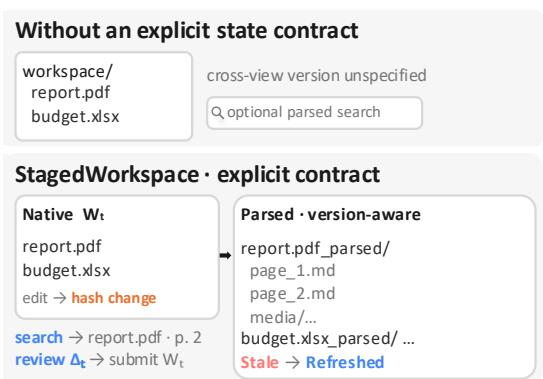
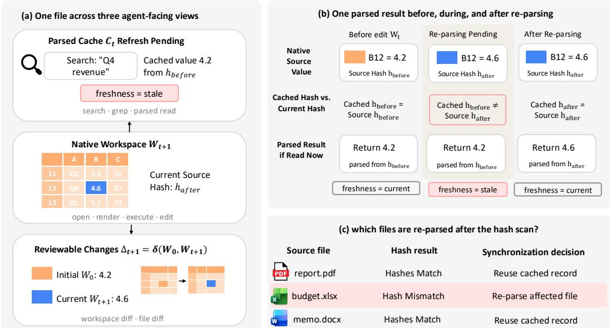
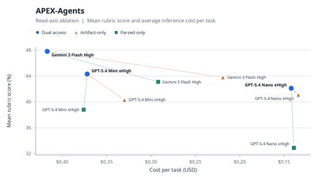
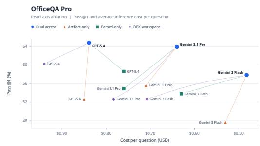

# StagedWorkspace: A Versioned Workspace for Knowledge-Work Agents

Yining Hua1,2 Hongbin Na3 Yifan Zhou2,4 Akshay Kalose2,5 Cyrus Ayubcha1 Levi Lian2,5∗

1Harvard University 2Raycaster AI 3University of Technology Sydney 4University of Washington 5Stanford University

## Abstract

AI agents increasingly perform knowledge work (i.e., produce and modify persistent digital artifacts such as code repositories, documents, spreadsheets, slides, reports), yet the parsed views they search, the native files they edit, the changes they review, and the artifacts they submit can refer to different versions of the same work product. We formulate this as a workspace-state contract: every view should be explicitly tied to a version of the evolving workspace state. Coding agents partly address this need through repository contracts for search, diffs, and tests, whereas an analogous contract is less explicit for PDFs, spreadsheets, slides, notebooks, and mixed-format project folders. We propose Staged-Workspace, a versioned workspace for knowledge-work agents. The workspace binds parsed records and review diffs to content hashes of the native files as they change. In fixed-harness ablations on OFFICEQA PRO and APEX-AGENTS, dual parsed/native access has the highest point estimate for every tested model; relative to the more limiting single view, it improves OfficeQA Pass@1 by 8.3–12.1 points and APEX mean rubric score by 4.7–9.2 points. SW-AGENT scores 63.9% with Gemini 3.1 Pro on OfficeQA and 42.1 with GPT-5.4 Nano on APEX, compared with published same-model scores of 29.3% and 25.5, respectively. A paired review-axis ablation on 57 file-editing tasks further finds higher observed scores when diffs are visible. These results identify workspace state as an experimental variable in knowledge-work agents and motivate benchmarks that score evidence, staged edits, and submitted artifacts as explicit state transitions.

## 1 Introduction

Recent large language model (LLM) agent research has moved from isolated text-only tasks toward work grounded in digital artifacts: coding agents repair repositories [12, 35], document and office agents answer questions or edit files [28, 32], and web, computer-use, and workplace agents operate across browsers, desktops, and enterprise tools [33, 34]. These settings differ, but they share a target: knowledge work. Classic accounts define knowledge work as producing or transforming information through interpretation, judgment, and revision [6, 3]. Following Hua et al. [11], we treat coding, document, office, web, and workplace agents as branches of this broader class, in which an agent is ultimately judged by the work product it leaves behind.

Work-product evaluations judge persistent outputs such as answers, edits, or deliverables against criteria applied by a grader or reviewer [11, 22, 30]. An agent can otherwise retrieve a column definition from one workbook version, edit another version in its sandbox, and submit a deliverable inconsistent with the evidence it used. This motivates a workspace-state contract: parsed search, native operations, review, and submission must each identify the workspace version they expose or modify. Coding agents partly instantiate such a contract through a repository checkout that keeps search, edits, and tests in a shared state [12, 35]. Non-coding workspace interfaces do not always expose an equivalent contract, even though their tasks still require source reading, mixed-format project work, and materialized deliverables [22, 30, 29]. Without that contract, parsed search, native edits, and the submitted file can drift to different versions of the same work product.

The need for such a contract arises from three recurring interface trade-offs. First, artifact-only systems preserve complete native artifacts but make search difficult, forcing agents to page through large files and carry irrelevant context. Second, parsed-only systems support search but can lose layout hierarchy, formulas, and visual evidence. Third, an unversioned mutable workspace lets an agent overwrite, move, or delete files without a durable diff for model or human review. Together, these trade-offs motivate two separable interface requirements: complementary parsed and native views tied to explicit file versions, and a reviewable record of changes to the submitted state.

In response, we propose StagedWorkspace, a workspace layer for knowledge-work agents built around an explicit workspace-state contract. As illustrated in Figure 1, Staged-Workspace provides complementary parsed and native artifact views and ties parsed records, staged changes, review state, and submitted artifacts to the same evolving workspace state. We make three core contributions: (1) we define a workspace-state contract for mixed-format knowledge work; (2) we instantiate it in SW-AGENT through version-aware artifact views, source-hash-based cache invalidation and refresh, and journaled review diffs; and (3) we evaluate SW-AGENT on APEX-AGENTS [30] and OFFICEQA PRO [22] using matched ablations that isolate the roles of artifact-view availability and review visibility.

  
Figure 1: An explicit workspace-state contract ties native artifacts, parsed views, review state, and submission to the evolving workspace.

## 2 Related Work

Knowledge-Work Agents and Work-Product Evaluation. Hua et al. [11] frame knowledgework benchmarks around a work activity, a tested setting, and a scored work product. The gap is not a lack of benchmarks. WorkArena and WorkArena++ emphasize enterprise web workflows [5, 1]; TheAgentCompany and OSWorld stress workplace or desktop control [34, 33]; OfficeBench and OdysseyBench cover office automation across documents, spreadsheets, and longer workflows [32, 31]; APEX-AGENTS and Workspace-Bench add larger project folders and materialized deliverables [30, 29]; and FileGram studies behavioral traces over file systems [17]. These settings exercise pieces of knowledge work, but they usually score a task, environment, trace, or final product without making the shared artifact state itself the experimental object. StagedWorkspace targets that missing contract.

Agent Infrastructure and Retrieval. ReAct interleaves model reasoning with external actions, allowing a model to choose its next step based on intermediate observations [36]. Retrieval-augmented generation conditions its output on retrieved passages [16], and dense passage retrieval supplies the neural lookup that finds those passages in open-domain corpora [13]. These methods govern how an agent obtains context, but do not specify the version relation among mutable artifacts: parsed search results, native files, staged edits, and the final submission are never required to refer to one workspace version. Retrieval can then return evidence from a snapshot that the agent has already changed. StagedWorkspace makes that relation explicit.

Patch-Based Software-Engineering Agents. Software-engineering agents come closest to a shared workspace-state contract. In SWE-bench, a repository snapshot defines source state, and a test suite gives partial feedback on a proposed patch [12], and SWE-agent exposes patch-oriented tools over that same repository interface [35]. What transfers from this design is the convention: the agent, evaluator, and reviewer agree on how to represent the current state, proposed changes, and partial verification. It assumes line-addressable text and exact search, both of which are available for source code. Other knowledge-work projects break that assumption: they mix binary office files, notebooks, and layout-heavy PDFs that cannot be diffed line by line. For these formats, the parsed, searchable view must stay aligned with the native copy the agent edits and submits, a coupling that the repository interface does not provide.

Document Editing and Versioned Artifacts. The mechanisms that would supply such a contract appear in document AI and versioned authoring, but each covers only part of it. Document AI studies layout-aware question answering over scanned documents [19] and long research papers [2], which addresses reading rather than editing. A separate line studies localized document editing [20], layout-grounded edit commands [28], and document-level model editing [37]. Verifiable-editing systems make model edits inspectable through edit operations [8], warnings and verification steps [15], or process traces [26], and anchored feedback ties suggestions to specific text spans to support localized revision [18]. Versioned authoring tools record replayable manuscript histories [10], AIassisted manuscript updates [25], and version-controlled transcription editing [39], while researchdata systems version datasets and track provenance for review [9, 7]. These systems give a human author edit inspection and version history. None of them keep a parsed, machine-readable cache synchronized in real time with the native files an agent searches, edits, and submits, which is the coupling StagedWorkspace contributes.

## 3 Methods

## 3.1 StagedWorkspace: A Version-controlled Workspace

Knowledge-work agents often require complementary representations of the same artifact. Parsed representations support search and evidence localization, while native artifacts preserve layout, formulas, executability, and the object that is ultimately edited or submitted. StagedWorkspace therefore keeps different workspace file views tied to the same evolving file state.

Figure 2 gives the overall view of StagedWorkspace. The task corpus, policy prompt, tool-call budget, and grading rubric are held fixed across conditions, so the read-axis ablations change only the artifact interface.

At synchronization point t, taken after a tool batch, StagedWorkspace represents a task with three agent-facing views:

Wt = current native workspace files,

Ct = parsed records tagged by source path and hash,

The native workspace $W _ { t }$ is the authoritative state used for execution and submission. Each record in $C _ { t }$ identifies the source path and content hash of the file version from which it was parsed. A record is current when its source hash matches the corresponding file in $W _ { t } ;$ otherwise it is explicitly marked stale until refreshed. Parsed tools read $C _ { t } .$ , native operations read or edit $W _ { t } .$ , and review tools expose $\Delta _ { t } ,$ the changes between the starting workspace $W _ { 0 }$ and the current workspace $W _ { t }$

The parsed cache and review diff are derived views, not separate document copies. Internally, the workspace also keeps an accepted artifact tree and a staged-change journal. The journal adds operation-level state on top of the workspace snapshots, allowing StagedWorkspace to detect stale edits, expose pending changes for review, and promote or roll back accepted changes.

Appendix B.1 specifies the parsed, visual, and native tool surfaces, and Appendix A gives the lowerlevel journal, promotion, and conflict rules. After each batch of mutations, StagedWorkspace synchronizes the sandbox back to the workspace state. A hash scan identifies changed native files, updates $W _ { t }$ , and refreshes the affected parsed records in $C _ { t }$

$$
\begin{array} { r c l } { { } } & { { } } & { { W _ { t }  W _ { t + 1 } , } } \\ { { } } & { { } } & { { C _ { t + 1 } = \mathrm { s y n c } ( C _ { t } , W _ { t + 1 } ) , } } \\ { { } } & { { } } & { { \Delta _ { t + 1 } = \delta ( W _ { 0 } , W _ { t + 1 } ) . } } \end{array}
$$

  
Figure 2: Workspace synchronization across three agent-facing views. (a) After editing budget.xlsx at Sheet1!B12 and scanning content hashes, the native workspace contains $W _ { t + 1 }$ , the review view compares $W _ { 0 }$ with $W _ { t + 1 }$ , and a parsed read may still return the prior value with freshness = stale. (b) The parsed result remains stale while $h _ { \mathrm { b e f o r e } } \neq h _ { \mathrm { a f t e r } }$ and becomes current after asynchronous re-parsing. (c) Matching hashes reuse cached records; in this example, only the mismatched budget.xlsx is re-parsed.

Here, sync immediately marks hash-mismatched records stale and replaces them when asynchronous parsing completes. Thus, the agent can search parsed files, open the corresponding originals, and inspect edits against the file state that will be submitted.

## 3.2 Agent Turn Loop

The state model above defines what must stay synchronized; the agent turn loop defines when synchronization occurs. Each benchmark item starts by materializing task files into Wt and recording path-level content hashes. The agent then acts in a ReAct-style tool loop until it submits or reaches the tool budget.

At the beginning of a turn, the sandbox is hydrated from the current $W _ { t }$ . After each mutating tool batch, the harness hash-scans the sandbox and advances the workspace to point t+1 through the update defined in Section 3.1. Changed hashes invalidate only the affected parsed records before the next parsed observation.

This protocol gives the agent a version-aware read-after-write contract: after an edit, native operations resolve against the updated workspace, while parsed results either match that version or are labeled stale until refreshed. Before the final handoff, the submitted answer or deliverable is produced from the staged workspace state. When diff tools are visible, the agent can inspect $\Delta _ { t }$ before submission; journals, diffs, and traces are retained for replay and post-hoc trajectory analysis.

The ablations perturb this operational contract through three mechanisms.

## 3.3 Synchronized dual artifact access

Dual artifact access is the primary read interface of StagedWorkspace: parsed views support evidence localization, while native artifacts support faithful inspection, execution, and editing. The loop above combines the three workspace mechanisms tested or held fixed in the ablations:

Dual artifact views expose two synchronized read paths over the same $W _ { t }$ . Parsed search and parsed reads localize evidence across large document collections. Native reads preserve layout, formulas, and executable office files. Because both paths derive from the same workspace state, the agent can search a parsed cache and then open or execute the corresponding native file without crossing artifact versions.

Hash-keyed synchronization keeps the parsed cache as derived state. Each parsed record is keyed to the source path and content hash. When sandbox synchronization observes a changed hash, Staged-Workspace marks only the affected parsed records stale and queues them for refresh. Unchanged files reuse their prior parsed records. This rule prevents vector search, grep, and parsed reads from presenting evidence from an earlier file version as current.

Journaled review records staged edits in the same workspace state that drives submission. The review surface $\Delta _ { t }$ is computed from the starting and current workspace files, so workspace\_diff and workspace\_file\_diff show the edits that would be handed off. In our implementation, this surface is format-specific: text files use line diffs, spreadsheets expose row- and cell-level changes, slide decks expose slide-level changes, and unsupported binaries fall back to before/after file previews. Appendix A describes the format-dependent diff surface.

## 3.4 Experimental Design

We use one full-system benchmark comparison and two mechanism ablations. The comparison runs StagedWorkspace, implemented in SW-AGENT, under the original benchmark graders. The read-axis ablation tests synchronized dual views against artifact-only and parsed-only access while holding the model, prompt, parser, retriever, grader, file tracker, and tool budget fixed. The reviewaxis ablation changes only whether tracked diffs are visible before submission. We report latency and agent-run cost as diagnostics, not as primary outcomes.

## 3.4.1 Complete-System Benchmark Study

The full-system comparison evaluates SW-AGENT with the complete StagedWorkspace workspace, including synchronized parsed and native views. It measures end-to-end task performance under the benchmark protocols. The mechanism claims come from the ablations in Section 3.4.2.

We evaluate on two public knowledge-work agent benchmarks with published graders and task pools, without retrofitting corpora or rubrics. The two benchmarks span complementary regimes: OFFICEQA PRO tests read-heavy corpus QA, with full-library retrieval and numerical grounding over a fixed document collection; APEX-AGENTS tests deliverable-heavy professional work, with cross-format project folders and multi-criterion rubric grading on materialized outputs.

• OFFICEQA PRO. OFFICEQA PRO is a grounded numerical QA benchmark over the U.S. Treasury Treasury Bulletin [22]: 104 document-only questions and 29 questions that require live web evidence. Each evaluation loads a shared workspace of ≈697 bulletin PDFs (1939–2025); agents must locate one or a few sources per question. The primary outcome is exact-match Pass@1 over the benchmark question set. The internet subset uses web tools, while the remaining questions are document-only. Efficiency diagnostics add the benchmark’s released text-export baseline as context.

• APEX-AGENTS. APEX-AGENTS measures cross-application professional work across 33 worlds (Management Consulting, Investment Banking, Law) with 480 rubric-graded tasks; each task folder averages ≈166 mixed-format files [30]. We exclude the 28 tasks in Investment Banking Worlds 244 and 246 because they depend on external APIs (EDGAR) that were not configured. Each task has 1–10 pass/fail criteria (4.06 on average), evaluated on the materialized deliverable. The primary outcomes are task pass rate and mean rubric score.

Published benchmark rows are included only as contextual comparisons because they use different harnesses, corpora, or attempt budgets. The paired ablation studies below provide the controlled evidence for the workspace mechanisms.

Both benchmarks use the same SW-AGENT harness for our runs: ReAct-style interleaved reasoning and tool calls until submission or a 250-tool-call budget, which remains unchanged across artifactview ablations. On APEX-AGENTS, that loop matches the public protocol; published OFFICEQA PRO rows use the benchmark’s custom agent [22]. We quote those published rows without rerunning the benchmark agent, but run our ablations on the same question set with matched models and the same exact-match grader. Uploads or journaled edits enqueue hash-keyed re-parsing and reindexing, so the parsed view stays aligned with the sandbox files. Appendix B.1 gives the toolrouting details and the released text-export baseline.

## 3.4.2 Mechanism Ablation Studies

Mechanism studies isolate two workspace components. The read-axis ablation maps the formal workspace views to experimental arms: dual exposes both the native working tree $W _ { t }$ and the hashkeyed parsed cache $C _ { t } ;$ artifact-only exposes only $W _ { t }$ ; and parsed-only exposes only $C _ { t }$ . Records in $C _ { t }$ are keyed to their source paths and content hashes; a record whose source hash no longer matches the corresponding file in $W _ { t }$ is marked stale until refreshed. Dual and parsed-only share the same parsed index; artifact-only disables access to the parsed index. File tracking, prompts, parser, retriever, grader, and tool budget are fixed across these arms. The review-axis ablation holds dual views fixed and changes only whether the agent can inspect tracked file changes before submission.

Table 1: Read-axis artifact-view arms. Original artifacts are the hydrated workspace source files $W _ { t }$ the parsed index is the hash-keyed searchable cache $C _ { t } ,$ with each record labeled current or stale according to whether its source hash matches $W _ { t }$
<table><tr><td>Arm</td><td>Originals</td><td>Parsed search</td><td>Hash sync</td><td>Mechanism isolated</td></tr><tr><td>Dual</td><td>Yes (Wt)</td><td>Yes (Ct)</td><td>Yes</td><td>Synchronized native and parsed access.</td></tr><tr><td>Artifact-only</td><td>Yes  $( W _ { t } )$ </td><td>No</td><td>N/A</td><td>Native access without indexed parsed search.</td></tr><tr><td>Parsed-only</td><td>No</td><td>Yes (Ct)</td><td>Yes</td><td>Parsed search without native inspection or execution.</td></tr></table>

File tracking is enabled in all three read-axis arms; only the read views change. The review-axis ablation is separate: both conditions use dual views and identical file tracking, but only the diffvisible arm exposes workspace\_diff and workspace\_file\_diff before submission. OfficeQA is excluded from the review-axis ablation because it scores final text answers rather than edited files.

Main-text read-axis tables include only models with completed three-arm runs, because a paired contrast needs dual, artifact-only, and parsed-only for the same model; partial sweeps are dropped by this completeness rule, not by their scores.

## 3.4.3 Metrics and Uncertainty

We use the outcome definitions supplied by each benchmark. OfficeQA reports exact-match accuracy over its question set [22]; each run has one graded attempt per question, so this accuracy is also run-level Pass@1. APEX reports task pass rates and rubric scores over professional-work tasks [30]; a task passes only when all rubric criteria pass on the materialized deliverable, and mean rubric score is a task-uniform average under the benchmark rubric.

Attempt budgets differ by run role. Models in the read- and review-axis ablations, the GPT-5.4 family and Gemini 3 Flash, use three independent attempts per task, which keeps the paired contrasts on a uniform budget for statistical testing. Context-only dual runs that appear only in the published comparisons, Gemini 3.1 Pro and Kimi K2.6, use a single attempt. We report cost and latency only as diagnostic quantities.

All uncertainty intervals are nonparametric bootstrap intervals computed over the benchmark unit: questions for OfficeQA and tasks for APEX. We draw 10,000 resamples with seed 20260515 and report point estimates with the half-width of the central 95% interval, computed from the 2.5/97.5 percentile endpoints and rounded to one decimal point. These half-widths are uncertainty intervals, not sample standard deviations. For paired ablations, each bootstrap sample resamples matched items and recomputes the within-item contrast. This preserves the covariance between arms and is the primary uncertainty estimate for read-axis effects.

## 4 Results

## 4.1 Complete-System Benchmark Results

We first place the full SW-AGENT stack in the original benchmark settings. Table 2 compares SW-AGENT with public leaderboard results on the same model where available, plus the strongest available reference row where the benchmark reports one. These comparisons locate the system against published agents; they do not identify causality. The fixed-harness ablations in Table 3 provide the one-to-one controls over workspace mechanisms.

On OFFICEQA PRO, the main comparison is against the best published Full row for the same model. Here Full means the full Treasury corpus is available, rather than the Oracle setting that receives gold source documents; dual views means SW-AGENT exposes both native files and parsed search over that full corpus. SW-AGENT improves over the best published Full row by 8.3 Pass@1 points for GPT-5.4 (64.7 vs. 56.4), 34.6 points for Gemini 3.1 Pro (63.9 vs. 29.3), and 24.7 points for Gemini 3 Flash (57.8 vs. 33.1). The Oracle rows remain useful references, but they are an easier source-injected setting without the complexity that comes with search and retrieval, and should be interpreted as the ceiling.

On APEX-AGENTS, SW-AGENT is compared with the matched published leaderboard row for each model. The largest gains are for GPT-5.4 Nano (+8.1 Pass@1 and +16.6 mean-score points) and Gemini 3 Flash (+6.9 Pass@1 and +8.3 mean-score points). The gains exist for frontier models too: GPT-5.4 improves by +1.7 Pass@1 and +0.9 mean-score points, and Gemini 3.1 Pro improves by +2.6 and +2.3 points. The GPT-5.4 SW-AGENT row also exceeds the Opus 4.7 reference row reported by the benchmark (37.7 vs. 33.9 Pass@1; 53.6 vs. 50.6 mean score).

The two benchmarks expose complementary failure modes for agentic knowledge work. OFFICEQA PRO exposes the challenges of search, source localization and table-grounded reading over a large PDF collection, while APEX-AGENTS stresses the combination of evidence retrieval in a massive enterprise corpus and implementing professionally valuable work. The mechanism ablations below test whether those gains come from synchronized artifact views and visible review state rather than from the benchmark setting alone.

## 4.2 Mechanism Ablations

The ablations test two workspace mechanisms from Section 3.4.2: synchronized read views and visible review diffs. We report dual vs. artifact-only vs. parsed-only on both benchmarks, and diffs visible vs. hidden on APEX only, since OfficeQA tasks do not involve file editing.

On OfficeQA (Table 3a), the largest gap is between dual and artifact-only. Artifact-only agents can open PDFs but lack indexed evidence localization, so they spend more calls scanning broad files and are more likely to read the wrong table region. Dual improves Pass@1 by 8.3 to 12.1 points over artifact-only, with paired bootstrap significance for all three models. Parsed-only is closer to dual because the task is mostly find-and-read over a fixed PDF archive; the native view still helps on layout-heavy or fallback cases, but parsed search is the load-bearing mechanism.

On APEX (Table 3b), the pattern reverses. Parsed-only agents can find relevant instructions but cannot reliably execute on the native files. Dual improves mean rubric score by 4.7 to 9.2 points over parsed-only for all three mechanism models. The lift is largest for GPT-5.4 Nano, which is consistent with smaller models benefiting more from a synchronized workspace in this setting. Against artifactonly, paired lifts are positive for every model but smaller, which is consistent with APEX requiring both evidence localization and native execution. The read-axis results split cleanly by task regime. OfficeQA depends most on evidence localization, while APEX also requires execution on the file state that will be graded.

The paired bootstrap tests are consistent with this interpretation. OfficeQA dual vs. artifact-only is significant for all three models $( p _ { \mathrm { b o o t } } { = } 0 . 0 0 5$ for GPT-5.4, 0.010 for Gemini 3 Flash, and 0.041 for Gemini 3.1 Pro); Gemini 3.1 Pro is also significant vs. parsed-only $( p _ { \mathrm { b o o t } } { = } 0 . 0 1 8 )$ . On APEX, dual vs. parsed-only is significant for all three mechanism models $( p _ { \mathrm { b o o t } } { = } 2 { \times } 1 0 ^ { - 4 }$ for Nano, 0.014 for Mini, and 0.028 for Flash). APEX dual vs. artifact-only has positive paired lifts for every model, but the paired-bootstrap p values remain above 0.05.

Table 2: Complete-system comparisons. In Panel (a), “Full corpus + dual views” means SW-AGENT runs on the full OfficeQA corpus with native files and parsed search; Oracle rows receive gold sources. Panel (b) includes matched APEX rows and an Opus reference. N/A = not reported; – = not applicable.  
(a) OFFICEQA PRO: quoted public rows vs. dual SW-AGENT on matched models. Comparisons are nonpaired.
<table><tr><td>System</td><td>Configuration</td><td></td><td>Acc. Latency</td><td>Tools</td><td>Cost</td></tr><tr><td colspan="6">GPT-5.4</td></tr><tr><td>OfficeQA</td><td>Full corpus + artifact-only</td><td>36.1</td><td>13.1m</td><td></td><td>57.0 $1.79</td></tr><tr><td>OfficeQA</td><td>Full corpus + parsed (Databricks)</td><td>56.4</td><td>3.6m</td><td></td><td>34.5 $1.26</td></tr><tr><td>OfficeQA</td><td>Oracle sources + artifact-only</td><td>54.9</td><td>4.4m</td><td></td><td>31.6 $0.44</td></tr><tr><td>OfficeQA</td><td>Oracle sources + parsed (Databricks)</td><td>65.4</td><td>2.2m</td><td></td><td>20.7 $0.33</td></tr><tr><td></td><td>SW-AGENT Full corpus + dual views</td><td>64.7 ± 8.3</td><td>6.1m</td><td></td><td>30.4 $0.84</td></tr><tr><td colspan="6">Gemini 3.1 Pro</td></tr><tr><td>OfficeQA</td><td>Full corpus + artifact-only</td><td>18.1</td><td>26.4m</td><td></td><td>75.2 $6.21</td></tr><tr><td>OfficeQA</td><td>Full corpus + parsed (Databricks)</td><td>29.3</td><td>2.9m</td><td></td><td>12.8$1.61</td></tr><tr><td>OfficeQA</td><td>Oracle sources + artifact-only</td><td>39.1</td><td>4.2m</td><td></td><td>28.4 $0.76</td></tr><tr><td>OfficeQA</td><td>Oracle sources + parsed (Databricks)</td><td>46.6</td><td>2.6m</td><td></td><td>11.4 $0.23</td></tr><tr><td>SW-AGENT</td><td>Full corpus + dual views</td><td>63.9±7.9</td><td>10.3m</td><td></td><td>25.9 $0.64</td></tr><tr><td colspan="6">Gemini 3 Flash</td></tr><tr><td>OfficeQA</td><td>Full corpus + artifact-only</td><td>N/A</td><td>N/A</td><td>N/A</td><td>N/A</td></tr><tr><td>OfficeQA</td><td>Full corpus + parsed (Databricks)</td><td>33.1</td><td>3.0m</td><td></td><td>40.6 $0.79</td></tr><tr><td></td><td>SW-AGENT Full corpus + dual views</td><td>57.8±8.6</td><td>15.3m</td><td></td><td>39.8 $0.48</td></tr></table>

(b) APEX-AGENTS: dual SW-AGENT vs. published rows. Comparisons are non-paired.
<table><tr><td>System</td><td>Match</td><td>Pass@1†</td><td>Mean ∆ Pass@1 ∆ mean</td><td></td><td></td></tr><tr><td>Kimi K2.6</td><td>vendor row</td><td>27.9</td><td>N/A</td><td></td><td></td></tr><tr><td>SW-AGENT Kimi K2.6</td><td>same model 31.2 ± 4.7</td><td></td><td>N/A</td><td>+3.3</td><td>N/A</td></tr><tr><td>APEX GPT-5.4 Nano (xHigh)</td><td>same model</td><td>16.9±2.6</td><td>25.5±2.6</td><td></td><td></td></tr><tr><td>SW-AGENT GPT-5.4 Nano</td><td>same model</td><td>25.0±3.4</td><td>42.1±4.1</td><td>+8.1</td><td>+16.6</td></tr><tr><td>APEX Gemini 3 Flash (High)</td><td>same model</td><td>24.0 ±3.3</td><td>39.5 ± 3.3</td><td></td><td></td></tr><tr><td>SW-AGENT Gemini 3 Flash</td><td>same model</td><td>30.9±2.6</td><td>47.8±2.4</td><td>+6.9</td><td>+8.3</td></tr><tr><td>APEX GPT-5.4 Mini (xHigh)</td><td>same model</td><td>24.6±3.2 37.5 ±3.1</td><td></td><td></td><td></td></tr><tr><td>SW-AGENT GPT-5.4 Mini</td><td>same model</td><td>28.2±3.5</td><td>44.3±4.4</td><td>+3.6</td><td>+6.8</td></tr><tr><td>APEX Gemini 3.1 Pro (High)</td><td>same model 33.5 ± 3.6</td><td></td><td>48.2±3.4</td><td></td><td></td></tr><tr><td>SW-AGENT Gemini 3.1 Pro</td><td></td><td>same model 36.1 ± 3.8</td><td>50.5±3.3</td><td>+2.6</td><td>+2.3</td></tr><tr><td>APEX GPT-5.4 (xHigh)</td><td>same model 36.0 ± 3.8</td><td></td><td>52.7±3.4</td><td>1</td><td></td></tr><tr><td>SW-AGENT GPT-5.4</td><td>same model</td><td>37.7±4.0</td><td>53.6±3.5</td><td>+1.7</td><td>+0.9</td></tr><tr><td>APEX Opus 4.7</td><td>reference</td><td>33.9 ± 3.8 50.6 ± 3.5</td><td></td><td>一</td><td></td></tr></table>

Table 3: Mechanism ablations. Panel (a) reports the OFFICEQA PRO read-axis ablation using Pass@1. Panel (b) reports the APEX-AGENTS read-axis ablation using mean rubric score. Panel (c) reports the APEX-AGENTS review-axis ablation on paired file-editing tasks. In Panels (a) and (b), lift columns show signed paired lift from dual with the bootstrap half-width in parentheses.  
(a) OFFICEQA PRO: read-axis ablation. Pass@1 is shown as point ± question-bootstrap 95% half-width.
<table><tr><td>Model</td><td></td><td>Dual Artifact-only Parsed-only Lift vs art. Lift vs par.</td><td></td><td></td><td></td></tr><tr><td>GPT-5.4</td><td> $6 4 . 7 \pm 8 . 3$ </td><td> $5 2 . 6 \pm 8 . 7$ </td><td> $5 8 . 6 \pm 8 . 3$ </td><td> $+ 1 2 . 1 ( 7 . 6 )$ </td><td> $+ 6 . 1 ( 7 . 5 )$ </td></tr><tr><td>Gemini 3 Flash</td><td> $5 7 . 8 \pm 8 . 6$ </td><td> $4 7 . 7 \pm 8 . 7$ </td><td> $5 3 . 8 \pm 8 . 5$ </td><td> $+ 1 0 . 1 ( 7 . 2 )$ </td><td>+4.0(5.6)</td></tr><tr><td>Gemini 3.1 Pro</td><td> $6 3 . 9 \pm 7 . 9$ </td><td> $5 5 . 6 \pm 8 . 3$ </td><td> $5 4 . 9 \pm 8 . 3$ </td><td> $+ 8 . 3 \left( 7 . 9 \right)$ </td><td>+9.0(7.5)</td></tr></table>

(b) APEX-AGENTS: read-axis ablation. Mean rubric score is shown as point ± task-bootstrap 95% half-width.
<table><tr><td>Model</td><td></td><td>Dual Artifact-only Parsed-only Lift vs art. Lift vs par.</td><td></td><td></td><td></td></tr><tr><td>Gemini 3 Flash High</td><td> $4 7 . 8 \pm 2 . 4$ </td><td> $4 3 . 8 \pm 4 . 1$ </td><td> $4 3 . 1 \pm 4 . 4$ </td><td> $+ 4 . 0 ( 3 . 4 ) $ </td><td>+4.7(3.2)</td></tr><tr><td>GPT-5.4 Mini xHigh</td><td> $4 4 . 3 \pm 4 . 4$ </td><td> $4 0 . 3 \pm 4 . 4$ </td><td> $3 8 . 8 \pm 4 . 0$ </td><td> $+ 4 . 0 ( 3 . 7 ) $ </td><td>+5.5(3.9)</td></tr><tr><td>GPT-5.4 Nano xHigh</td><td> $4 2 . 1 \pm 4 . 1$ </td><td> $4 1 . 1 \pm 4 . 4$ </td><td> $3 2 . 9 \pm 5 . 2$ </td><td> $+ 1 . 0 ( 3 . 9 )$ </td><td>+9.2(5.9)</td></tr></table>

(c) APEX-AGENTS: review-axis ablation on 57 file-editing tasks. Both arms use dual views and identical file tracking; only agent-visible diff tools change.
<table><tr><td>Model</td><td>Diffs hidden</td><td>Diffs visible</td><td>Lift</td></tr><tr><td>Gemini 3 Flash High</td><td>47.6</td><td>50.2</td><td>+2.5</td></tr><tr><td>GPT-5.4 Mini xHigh</td><td>40.9</td><td></td><td> $4 9 . 4 \quad + 8 . 5 \quad$ </td></tr><tr><td>GPT-5.4 Nano xHigh</td><td>48.1</td><td></td><td> $5 1 . 9 + 3 . 8 $ </td></tr></table>

Appendix Table A.3 shows the same pattern as paired win counts. OfficeQA has many more dual wins than artifact-only wins for GPT-5.4 and Gemini 3 Flash, while APEX has its clearest discrete advantage against parsed-only. The artifact-only comparison on APEX is closer: dual wins slightly more often for Gemini 3 Flash and GPT-5.4 Mini, but not enough to separate the arms under the secondary sign-style checks.

In the review-axis ablation, exposing workspace diffs raises scores on APEX file-editing subset by 2.5 to 8.5 points (Table 3c). Both review-axis arms record the same file changes; only the visible arm exposes workspace\_diff and workspace\_file\_diff before submission. The subset is small, roughly 12% of APEX, so it does not explain the full benchmark gains; it isolates a separate review mechanism for tasks where submitted files are modified.

The lift is largest for GPT-5.4 Mini (+8.5) and smallest for Gemini 3 Flash High (+2.5), so this slice suggests that weaker editors may benefit more from a final diff. A workspace diff does not prove semantic correctness, but it gives the model a compact chance to compare intended and actual edits before handoff. The review-axis result points to final inspection as a supporting mechanism, not the whole system.

The narrow claim is that synchronized artifact state matters when the same agent loop must search, read, edit, and submit files. OfficeQA gives the retrieval-side case: dual access beats artifact-only on full-corpus find/read tasks. HarFeast gives the APEX-side case: parsed search identifies the surveycolumn guide, and native execution applies it to the same workbook that is later graded (Figure 4).

## 4.3 Efficiency Diagnostics

Accuracy does not rise simply because the dual runs are longer or more expensive. In OfficeQA, Figure 3 places the three dual rows on the upper-right frontier: each dual row has the highest score for its model, and for Gemini 3 Flash and Gemini 3.1 Pro it is also the lowest-cost row. GPT-5.4 dual is nearly cost-matched with artifact-only (\$0.84 vs. \$0.85 per question) and costs less than the Databricks parsed-only baseline (\$0.94), while improving Pass@1 over both. Dual is also faster than Reducto parsed-only for all three OfficeQA models: 6.1 vs. 17.3 minutes for GPT-5.4, 15.3 vs. 18.8 minutes for Gemini 3 Flash, and 10.3 vs. 18.7 minutes for Gemini 3.1 Pro.

The APEX panel shows a different tradeoff. Dual is the highest-scoring diagnostic row for Gemini 3 Flash and GPT-5.4 Mini, and for Mini it is also faster than both restricted views (7.7 minutes vs. 8.8 for artifact-only and 10.3 for parsed-only). For GPT-5.4 Nano, artifact-only is a small diagnostic cost-score exception, but dual still avoids the parsed-only problem at essentially the same agent-run cost. The Pareto plots therefore support the mechanism results rather than replacing them: the APEX gains sometimes trade some cost for better execution on native files, whereas the OfficeQA gains do not.

  
(a) APEX-AGENTS: cost vs. Pass@1.

  
(b) OFFICEQA PRO: cost vs. mean score.  
Figure 3: Diagnostic cost–score ablations. Lower and further right is better: a run scores more while spending less. Each arrow points from an ablated access configuration to the dual-access result for the same model. Dual access generally improves diagnostic score, although the associated cost change varies across models and benchmarks.

## 4.4 Mechanism and Error Analysis

Trajectory review supports the benchmark-level pattern. In OfficeQA, dual wins over artifact-only; most gains come from the parsed view; visual fallback matters less often but helps on layout-heavy scans. In APEX, dual often uses the parsed view to find instructions and the native view to execute on deliverables.

A concrete HarFeast workforce task shows the APEX mechanism at the trace level. The agent had to interpret a survey column guide and then filter a 3,000-row workbook. In the dual arm, parsed search exposed the relevant guide text, and the subsequent pandas operation ran on the same hydrated workbook that would be graded. Artifact-only could open the workbook, but miscomposed the filtering logic. Parsed-only could find instructions but could not execute on the native workbook. Figure 4 shows why the two views need to be synchronized: the parsed evidence identifies the column semantics, while native execution applies that interpretation to the workbook used for grading.

<table><tr><td colspan="3">[parsed_cache] view → Survey_Column_Guide/page_1.md</td></tr><tr><td>Q#</td><td>Rubric field</td><td>Excel header</td></tr><tr><td>Q4</td><td>Plant / site identifier</td><td>plant_id</td></tr><tr><td>Q56</td><td>Willingness to adopt digital tools</td><td>digital_will</td></tr><tr><td>Q57</td><td>Preferred training length (hours)</td><td>train_pref_hrs</td></tr><tr><td>Q69</td><td>Role / job category</td><td>role_category</td></tr><tr><td colspan="3">&gt; filter HarFeast_Survey.xlsx (3,000 rows) after guide read</td></tr></table>

Figure 4: APEX-AGENTS HarFeast trace. The parsed cache identifies the relevant survey-column guide, and native workbook execution applies that interpretation to the same 3,000-row spreadsheet that is later graded. The example illustrates the APEX mechanism: evidence localization and native execution must refer to the same workspace state.

Across dual-win model-task instances, parsed-cache use and native-file execution account for most coded mechanisms (Table A.6).

The remaining failures show the limits of workspace synchronization. OfficeQA losses often involve subtle numerical reasoning, ambiguous table scope, or a correct source followed by an incorrect computation. On APEX, 188 of 452 evaluated tasks are all-arm zeros for at least one completed model triplet, with Investment Banking accounting for the largest share (Table A.7). These failures are not primarily state-sync failures; they require stronger planning, domain reasoning, validation, or task-specific tooling.

## 5 Discussion

The paired ablations isolate the effects of artifact access and review visibility within this workspace design. The failure is mundane but consequential: an agent can reason over one file state and submit another. The claim is not that agents simply need more tools; removing a view changes performance in the direction predicted by each task mechanism. Large all-arm-zero residuals show that artifactstate synchronization does not remove planning, domain reasoning, or rubric-following failures.

The size of the read-axis effect depends on the base model: non-frontier models gain most (Gemin 3.1 Pro rises from 29.3% to 63.9% on OfficeQA), while frontier models change little. We read this as evidence of a possible interaction between artifact-state access and model capability: in these runs, a synchronized workspace recovers some of the gap that a larger model may otherwise compensate for through repeated search and re-reading. A ceiling effect for the strongest models remains possible, so we report this as an interaction rather than a clean substitution. Either way, a benchmark that leaves the workspace uncontrolled can mix model capability with workspace-state access. Because the two interact in our ablations, cross-harness leaderboard gaps may overstate the capability difference between small and large models on knowledge-work tasks.

Limitations. We designed the study to control the main confounds, and three limits remain. First, the benchmark graders score only the final answer or materialized deliverable, not whether retrieval, workspace sync, or diff visibility succeeded at intermediate checkpoints. Neither rubric scores trajectories or checkpointed mini-successes (e.g., opening the correct source, reading the correct table region, or making a valid tracked edit). To recover part of that signal, we hand-code trajectories (Sections 4.4 and 4.4); this labeling is illustrative rather than exhaustive and can vary across coders, so we read it as supporting evidence rather than a verifier on the level of executable patch tests (Section 2). Second, the published comparison rows are not one-to-one, since they differ in attempt budget (†), agent harness, retrieval backend, and parser choice. We therefore rest every causal read-axis claim on paired three-arm ablations that hold the model, prompt, parser, retriever, grader, file tracker, and tool budget fixed. A parser-sensitivity check adds support: parsed-only Pass@1 shifts by <2 pp across two exports of the same Treasury PDFs (Table 3a). These ablations still hold the parser and retriever fixed, so they do not yet separate the workspace-state contract from those two components. Because existing benchmarks score final answers or deliverables rather than checkpointed state transitions, our ablations test the separable artifact-view and review-view effects available under these interfaces; they do not establish that the proposed state model is the unique minimal abstraction.

Third, synchronization does not remove every failure: 188/452 evaluated APEX tasks are all-arm zeros for at least one model (Table A.7) and do not move under read-axis toggles, which marks where state-management gains end and planning, domain-reasoning, and rubric-following errors begin (Section 4.4).

Future Directions. Workspace state is a systems question, not only a model-scaling or prompttuning question. Several tests remain open. Our ablations fix one agent stack, parser, retriever, and prompt, so a direct next step is to vary these components. That means testing transfer across parsers, retrievers, prompts, and human-in-the-loop review policies, and running component-level ablations that separate the workspace-state contract from the parser and retriever themselves. The review-axis result rests on the ≈12% file-editing slice of APEX (Section 4.2), so a larger edit-heavy evaluation would test how dual views interact with diff visibility and cell-level edit tools. On the benchmark side, future suites should expose which state is evaluated (accepted files, parsed records, or staged edits) rather than only terminal success. They should also move toward software-engineering-style acceptance criteria, including patch-and-test contracts, trajectory analysis, and verifiers adapted to retrieval, read-region, and edit checks rather than inferred from traces alone.

## 6 Conclusion

Long-horizon knowledge-work agents must find sources, read layout-heavy evidence, edit deliverables, and produce reviewable outputs over many turns. Reliability can break when parsed cache, semantic search, and final artifacts refer to different versions of the same files. We formalize synced retrieval, editing, and review through dual artifact views, hash-keyed parsed-index refresh, and diff exposure on edits. Fixed-harness ablations on OFFICEQA PRO and APEX-AGENTS provide evidence that this versioned-workspace invariant can improve read-axis performance in these benchmarks and help on a small edited-deliverable slice; the efficiency diagnostics indicate that these gains are not simply higher-cost runs. Dual views do not eliminate reasoning, convention, or tooluse failures; a large APEX residual is unchanged by read-axis toggles. Outcome-only rubrics reveal whether an answer passed, not whether retrieval, reading, or edit validity failed. Next-generation knowledge-work agent benchmarks should pair work requests with inspectable acceptance criteria over evidence, staged edits, and final work products.

## Acknowledgments and Disclosure of Funding

Funding in direct support of this work: Reducto provided in-kind API credits used to instantiate the document parser in our SW-AGENT deployment.

## References

[1] L. Boisvert, M. Thakkar, M. Gasse, M. Caccia, T. Le Sellier de Chezelles, Q. Cappart, N. Chapados, A. Lacoste, and A. Drouin. WorkArena++: Towards compositional planning and reasoning-based common knowledge work tasks. In Advances in Neural Information Processing Systems, 2024. URL https://arxiv.org/abs/2407.05291.

[2] P. Dasigi, K. Lo, I. Beltagy, A. Cohan, N. A. Smith, and M. Gardner. QASPER: A dataset of information-seeking questions and answers anchored in research papers. In Proceedings of the 2021 Conference of the North American Chapter of the Association for Computational Linguistics: Human Language Technologies, pages 4599–4610, 2021. URL https://acla nthology.org/2021.naacl-main.365/.

[3] T. H. Davenport. Thinking for a Living: How to Get Better Performance and Results from Knowledge Workers. Harvard Business School Press, Boston, MA, 2005.

[4] X. Deng, J. Da, E. Pan, Y. Y. He, C. Ide, K. Garg, N. Lauffer, A. Park, N. Pasari, C. Rane, K. Sampath, M. Srivatsa, S. Kundurthy, S. Hendryx, Z. Wang, V. Bharadwaj, J. Holm, R. Aluri, C. Bo, C. Zhang, N. Jacobson, B. Liu, and B. Kenstler. SWE-Bench Pro: Can AI agents solve long-horizon software engineering tasks? arXiv preprint arXiv:2509.16941, 2025. doi: 10.48550/arXiv.2509.16941. URL https://arxiv.org/abs/2509.16941.

[5] A. Drouin, M. Gasse, M. Caccia, I. H. Laradji, M. Del Verme, T. Marty, D. Vazquez, N. Chapados, and A. Lacoste. WorkArena: How capable are web agents at solving common knowledge work tasks? In Proceedings ofthe 41st International Conference on Machine Learning, pages 11642–11662, 2024. URL https://proceedings.mlr.press/v235/drouin24a.html.

[6] P. F. Drucker. Knowledge-worker productivity: The biggest challenge. California Management Review, 41(2):79–94, 1999. doi: 10.2307/41165987.

[7] D. S. Falster, R. G. FitzJohn, M. W. Pennell, and W. K. Cornwell. Datastorr: a workflow and package for delivering successive versions of Evolving Data directly into R. GigaScience, 8 (5):giz035, 2019. doi: 10.1093/gigascience/giz035. URL https://doi.org/10.1093/gi gascience/giz035.

[8] D. Gruenert, A. de Spindler, and V. Dellwo. GOOSVC: Version control for content creation with generative AI. In Proceedings of the 10th edition of the Swiss Text Analytics Conference (SwissText), pages 66–74, Winterthur, Switzerland, May 2025. Association for Computational Linguistics. URL https://aclanthology.org/2025.swisstext-1.6/.

[9] Y. O. Halchenko, K. Meyer, B. Poldrack, D. S. Solanky, A. S. Wagner, J. Gors, D. MacFarlane, D. Pustina, V. Sochat, S. S. Ghosh, C. Mönch, C. J. Markiewicz, L. Waite, I. Shlyakhter, A. de la Vega, S. Hayashi, C. O. Häusler, J.-B. Poline, T. Kadelka, K. Skytén, D. Jarecka, D. Kennedy, T. Strauss, M. Cieslak, P. Vavra, H.-I. Ioanas, R. Schneider, M. Pflüger, J. V. Haxby, S. B. Eickhoff, and M. Hanke. Datalad: distributed system for joint management of code, data, and their relationship. Journal of Open Source Software, 6(63):3262, 2021. doi: 10.21105/joss.03262. URL https://joss.theoj.org/papers/10.21105/joss.03262.

[10] D. S. Himmelstein, V. Rubinetti, D. R. Slochower, D. Hu, V. S. Malladi, C. S. Greene, and A. Gitter. Open collaborative writing with Manubot. PLOS Computational Biology, 15(6): e1007128, 2019. doi: 10.1371/journal.pcbi.1007128. URL https://journals.plos.org/ ploscompbiol/article?id=10.1371/journal.pcbi.1007128.

[11] Y. Hua, H. Na, C. Ayubcha, and L. Lian. Design and report benchmarks for knowledge work. arXiv preprint arXiv:2605.23262, 2026. URL https://arxiv.org/abs/2605.23262.

[12] C. E. Jimenez, J. Yang, A. Wettig, S. Yao, K. Pei, O. Press, and K. Narasimhan. SWE-bench: Can language models resolve real-world GitHub issues? arXiv preprint arXiv:2310.06770, 2023. doi: 10.48550/arXiv.2310.06770. URL https://arxiv.org/abs/2310.06770.

[13] V. Karpukhin, B. Oguz, S. Min, P. Lewis, L. Wu, S. Edunov, D. Chen, and W.-t. Yih. Dense passage retrieval for open-domain question answering. In B. Webber, T. Cohn, Y. He, and Y. Liu, editors, Proceedings of the 2020 Conference on Empirical Methods in Natural Language Processing (EMNLP), pages 6769–6781, Online, Nov. 2020. Association for Computational Linguistics. doi: 10.18653/v1/2020.emnlp-main.550. URL https: //aclanthology.org/2020.emnlp-main.550/.

[14] A. Kottamasu, C. Mahapatra, S. Lee, B. Pan, A. Barthwal, A. Datta, A. Gupta, P. Mehta, A. Arun, S. Alberti, A. Hiremath, B. Foody, and B. Vidgen. APEX-SWE. arXiv preprint arXiv:2601.08806, 2026. doi: 10.48550/arXiv.2601.08806. URL https://arxiv.org/ab s/2601.08806.

[15] P. Laban, J. Vig, M. A. Hearst, C. Xiong, and C.-S. Wu. Beyond the chat: Executable and verifiable text-editing with LLMs. In Proceedings ofthe 37th Annual ACM Symposium on User Interface Software and Technology (UIST ’24), Pittsburgh, PA, USA, Oct. 2024. Association for Computing Machinery. doi: 10.1145/3654777.3676419. URL https://arxiv.org/ab s/2309.15337.

[16] P. Lewis, E. Perez, A. Piktus, F. Petroni, V. Karpukhin, N. Goyal, H. Küttler, M. Lewis, W.-t. Yih, T. Rocktäschel, S. Riedel, and D. Kiela. Retrieval-Augmented Generation for knowledgeintensive NLP tasks. In H. Larochelle, M. Ranzato, R. Hadsell, M. Balcan, and H. Lin, editors, Advances in Neural Information Processing Systems, volume 33, pages 9459–9474. Curran Associates, Inc., 2020. URL https://proceedings.neurips.cc/paper\_files/paper /2020/file/6b493230205f780e1bc26945df7481e5-Paper.pdf.

[17] S. Liu, S. Tian, K. Hu, Y. Dong, Z. Yang, B. Li, J. Yang, C. C. Loy, and Z. Liu. FileGram: Grounding agent personalization in file-system behavioral traces. arXiv preprint arXiv:2604.04901, 2026. URL https://arxiv.org/abs/2604.04901.

[18] M. Lou, J. Crowley, S. Dodson, and D. Yoon. AnchoredAI: Contextual anchoring of AI comments improves writer agency and ownership, 2025. URL https://arxiv.org/abs/2509 .16128.

[19] M. Mathew, D. Karatzas, and C. V. Jawahar. Docvqa: A dataset for vqa on document images. In Proceedings ofthe IEEE/CVF Winter Conference on Applications ofComputer Vision (WACV), pages 2200–2209, 2021. doi: 10.1109/WACV48630.2021.00225. URL https://openacce ss.thecvf.com/content/WACV2021/html/Mathew\_DocVQA\_A\_Dataset\_for\_VQA\_on \_Document\_Images\_WACV\_2021\_paper.html.

[20] P. Mathur, R. Jain, J. Gu, F. Dernoncourt, D. Manocha, and V. I. Morariu. Docedit: Languageguided document editing. In Thirty-Seventh AAAI Conference on Artificial Intelligence (AAAI), 2023. URL https://research.adobe.com/publication/docedit-language-guide d-document-editing/.

[21] OpenAI. Introducing SWE-bench Verified, 2024. URL https://openai.com/index/i ntroducing-swe-bench-verified/. Human-validated subset of SWE-bench released in collaboration with the SWE-bench authors.

[22] K. Opsahl-Ong, A. Singhvi, J. Collins, I. Zhou, C. Wang, A. Baheti, O. Oertell, J. Portes, S. Havens, E. Elsen, M. Bendersky, M. Zaharia, and X. Chen. OfficeQA Pro: An enterprise benchmark for end-to-end grounded reasoning. arXiv preprint arXiv:2603.08655, 2026. URL https://arxiv.org/abs/2603.08655.

[23] L. Ouyang, Y. Qu, H. Zhou, J. Zhu, R. Zhang, Q. Lin, B. Wang, et al. OmniDocBench: Benchmarking diverse PDF document parsing with comprehensive annotations. arXiv preprint arXiv:2412.07626, 2024. URL https://arxiv.org/abs/2412.07626.

[24] B. Pfitzmann, C. Auer, M. Dolfi, A. S. Nassar, and P. Staar. DocLayNet: A large humanannotated dataset for document-layout analysis. In Proceedings of the 28th ACM SIGKDD Conference on Knowledge Discovery and Data Mining, pages 3743–3751, 2022. doi: 10.114 5/3534678.3539043. URL https://arxiv.org/abs/2206.01062.

[25] M. Pividori and C. S. Greene. A publishing infrastructure for Artificial Intelligence (AI)- assisted academic authoring. Journal ofthe American Medical Informatics Association, 31(9): 2103–2113, 2024. doi: 10.1093/jamia/ocae139. URL https://academic.oup.com/jamia /article/31/9/2103/7693927.

[26] M. N. Siddiqui, N. Nasseri, A. Coscia, R. Pea, and H. Subramonyam. DraftMarks: Enhancing transparency in human-AI co-writing through interactive skeuomorphic process traces. arXiv preprint arXiv:2509.23505, 2025. URL https://arxiv.org/abs/2509.23505.

[27] B. Smock, R. Pesala, and R. Abraham. PubTables-1M: Towards comprehensive table extraction from unstructured documents. arXiv preprint arXiv:2110.00061, 2021. URL https: //arxiv.org/abs/2110.00061.

[28] M. Suri, P. Mathur, F. Dernoncourt, R. Jain, V. I. Morariu, R. Sawhney, P. Nakov, and D. Manocha. Docedit-v2: Document structure editing via multimodal llm grounding. In Proceedings of the 2024 Conference on Empirical Methods in Natural Language Processing, pages 15485–15505, 2024. doi: 10.18653/v1/2024.emnlp-main.867. URL https: //aclanthology.org/2024.emnlp-main.867/.

[29] Z. Tang, X. Zhou, Y. Liu, L. Li, W. Wang, H. Huang, J. Zhou, J. Song, S. Yu, J. Wang, Z. Zhou, H. Zhou, Y. Lv, J. Li, J. Liu, R. Chen, C. Liu, G. Li, J. Kang, and F. Wu. Workspace-Bench 1.0: Benchmarking AI agents on workspace tasks with large-scale file dependencies. arXiv preprint arXiv:2605.03596, 2026. URL https://arxiv.org/abs/2605.03596.

[30] B. Vidgen, A. Mann, A. Fennelly, J. W. Stanly, L. Rothman, M. Burstein, J. Benchek, D. Ostrofsky, A. Ravichandran, D. Sur, N. Venugopal, A. Hsia, I. Robinson, C. Huang, O. Varones, D. Khan, M. Haines, Z. Richards, C. Mahapatra, B. Foody, and O. Nitski. APEX-Agents: The AI productivity index for agents. arXiv preprint arXiv:2601.14242, 2026. URL https://arxiv.org/abs/2601.14242.

[31] W. Wang, D. Han, D. Madrigal, J. Xu, V. Rühle, and S. Rajmohan. OdysseyBench: Evaluating LLM agents on long-horizon complex office application workflows. arXiv preprint arXiv:2508.09124, 2025. doi: 10.48550/arXiv.2508.09124. URL https://arxiv.org/ab s/2508.09124.

[32] Z. Wang, Y. Cui, L. Zhong, Z. Zhang, D. Yin, B. Y. Lin, and J. Shang. OfficeBench: Benchmarking language agents across multiple applications for office automation. arXiv preprint arXiv:2407.19056, 2024. URL https://arxiv.org/abs/2407.19056.

[33] T. Xie, D. Zhang, J. Chen, X. Li, S. Zhao, R. Cao, T. J. Hua, Z. Cheng, D. Shin, F. Lei, Y. Liu, Y. Xu, S. Zhou, S. Savarese, C. Xiong, V. Zhong, and T. Yu. OSWorld: Benchmarking multimodal agents for open-ended tasks in real computer environments. In The Thirty-eight Conference on Neural Information Processing Systems Datasets and Benchmarks Track, 2024. URL https://openreview.net/forum?id=tN61DTr4Ed.

[34] F. F. Xu, Y. Song, B. Li, Y. Tang, K. Jain, M. Bao, Z. Z. Wang, X. Zhou, Z. Guo, M. Cao, M. Yang, H. Y. Lu, A. Martin, Z. Su, L. Maben, R. Mehta, W. Chi, L. Jang, Y. Xie, S. Zhou, and G. Neubig. TheAgentCompany: Benchmarking LLM agents on consequential real world tasks. arXiv preprint arXiv:2412.14161, 2024. URL https://arxiv.org/abs/2412.14161.

[35] J. Yang, C. E. Jimenez, A. Wettig, K. Lieret, S. Yao, K. R. Narasimhan, and O. Press. SWEagent: Agent-computer interfaces enable automated software engineering. In The Thirty-eighth Annual Conference on Neural Information Processing Systems, 2024. URL https://openre view.net/forum?id=mXpq6ut8J3.

[36] S. Yao, J. Zhao, D. Yu, N. Du, I. Shafran, K. R. Narasimhan, and Y. Cao. ReAct: Synergizing reasoning and acting in language models. In The Eleventh International Conference on Learning Representations, 2023. URL https://openreview.net/forum?id=WE\_vluYUL-X.

[37] L. Zeng, Z. Liu, C. Feng, H. Huang, and Y. Guo. Docmedit: Towards document-level model editing. In Findings ofthe Associationfor Computational Linguistics: ACL 2025, pages 19725– 19743, 2025. doi: 10.18653/v1/2025.findings-acl.1012. URL https://aclanthology.org /2025.findings-acl.1012/.

[38] B. Zhang, S. G. Acosta, P. Carlson, S. Bron, P.-L. Doulcet, D. B. Ospina, and S. Suo. ParseBench: A document parsing benchmark for AI agents. arXiv preprint arXiv:2604.08538, 2026. URL https://arxiv.org/abs/2604.08538.

[39] S. Zhang and A. Zeldes. GitDOX: A linked version controlled online XML editor for manuscript transcription. In Proceedings of the Thirtieth International Florida Artificial Intelligence Research Society Conference (FLAIRS-30), pages 619–623, Marco Island, FL, USA, 2017. AAAI Press.

## A Implementation Details

The workspace-state model (Figure 2) and agent turn loop (Section 3.2) are defined in Section 3;   
this appendix records operational specifics and update rules omitted there.

## Commit and Promotion Semantics. Let t index the current agent turn.

The implementation keeps an accepted file tree and an ordered journal of proposed file operations, but the agent-facing state remains the three-view workspace from Section 3.1: native files W , parsed cache Ct, and review diff ∆t. Each file operation records the actor, target path, base hash, operation type, and payload. If the recorded base hash no longer matches the current accepted hash of the target path, the operation is treated as stale and left for agent or reviewer reconciliation. Non-conflicting operations remain in journal order and define the current native workspace W . If verification passes and the edit is accepted, those operations are promoted to the accepted file tree; otherwise they remain staged. After promotion or staging changes, the parsed cache is recomputed or marked stale for changed files before the next search call.

The diff surface is format-aware: line diffs for text, document previews for word-processing files, row- and cell-level spreadsheet views, slide-level presentation views, and before/after previews for binary artifacts.

Versioned Workspace and Branches. The workspace is a tree of directories and artifacts with per-user, kind-scoped branches (chat, review, evaluation). Each agent turn creates a turn-scoped patch; human edits use lazily created human patches on the same branch chain. The reducer maps the accepted tree and staged operations to $\Vec { W _ { t } }$ , diffs, a commit plan, and conflicts; commit is transactional and rollback uses inverse patches. Citations resolve to artifact addresses and page numbers shared by diffs, action items, and chat.

Parsing, Retrieval, and Sandbox Sync. Section 3.3 states the main implementation contract: hydrated sandbox files are native access, and Reducto-derived records and search are parsed access. Parser-generated companions and in-sandbox parse outputs are excluded from the journal and regenerated on commit. Format-specific skill packs for spreadsheets, documents, and slides run inside the sandbox rather than on the first-class tool surface. The benchmark corpora exercise hash-keyed reuse at two file-count regimes: one shared OfficeQA workspace with ≈697 PDFs and APEX task folders averaging ≈166 mixed-format files. We do not claim a separate asymptotic scalability benchmark beyond those workloads; large repositories still pay the cost of initial parse and index construction.

## B Experimental Protocols

## B.1 Agent Execution Environment

Sandbox. Each agent turn runs in an isolated Linux sandbox (Daytona) using the small resource profile: 1 vCPU, 1 GiB RAM, and 3 GiB disk. The sandbox is created on first tool use in a turn. Shell and Python tools use a 30 s default timeout and a 600 s maximum.

Tools. Benchmark agents share the standard tool surface: sandbox execution (bash, python), file inspection (view, list\_dir), workspace search (grep, file\_search, vector\_search), tracked-change inspection (workspace\_diff, workspace\_file\_diff), light file edits, session notes (read\_whiteboard, write\_whiteboard), and, on the OfficeQA internet subset only, web\_search and web\_fetch. Artifact-view arms disable parsed search (artifact-only) or remove originals from the sandbox (parsed-only) as in Section 3.4.2. All runs share the 250-tool-call budget from Section 3.4.1.

Agent Prompting. Every read-axis arm uses the same base agent system prompt, so any score movement is attributable to artifact views rather than to instruction wording. The prompt states the agent’s role, the workspace conventions (paths under /root/workspace/, parsed companions, and freshness labels), the tool surface in Table A.1, and each benchmark’s submission rule; the same text is used in all three arms even though the available tools differ. The verbatim agent prompts ship with the sanitized implementation (Appendix F).

Agent-Visible Reads, Search, and Parse Freshness. On first tool use the sandbox hydrates Wt under /root/workspace/: each artifact (e.g. report.pdf) plus a parsed companion tree (report.pdf\_parsed/page\_N.md) when $C _ { t }$ is enabled. Reducto output is per-page markdown with body text, HTML tables for complex layouts, media/ figure paths, and optional agentic captions, chunked for vector\_search.

Text views on a parseable file return parsed pages with metadata for source, parse time, source update time, and freshness. A stale freshness value means the source changed before re-parse could finish, so the agent should prefer source files or wait for re-indexing. When $C _ { t }$ is disabled or missing, view labels output as pdftotext or Office fallback. Visual file views render selected PDF or Office pages to images for layout, charts, and scans; they are available whenever originals are in the sandbox (dual and artifact-only). grep on a PDF path resolves to parsed page files and returns path:page locators; without $C _ { t } ,$ content search over legacy scans is often empty and agents fall back to shell extraction (Section 4.4). python/bash operate on native files (openpyxl, etc.) and drive APEX deliverable edits.

Table A.1: Read-path tool routing by artifact-view arm.
<table><tr><td>Tool</td><td>Dual</td><td>Artifact-only</td><td>Parsed-only</td></tr><tr><td>view(text)</td><td>Parsed pages with freshness meta- pdf totext/Office fallback data</td><td></td><td>Parsed pages only</td></tr><tr><td>view(visual)</td><td>Native render</td><td>Native render</td><td>Unavailable</td></tr><tr><td>grep/file_search</td><td>Parsed page locators</td><td>Raw paths only; weak for PDFs</td><td>Parsed page locators</td></tr><tr><td>vector_search</td><td>Page-chunk embeddings</td><td>Disabled</td><td>Page-chunk embeddings</td></tr><tr><td>python/bash</td><td>Native bytes and deliverables</td><td>Native bytes and deliverables</td><td>No native deliverables</td></tr></table>

OFFICEQA PRO Databricks .txt Baseline vs. Live Parser. Opsahl-Ong et al. [22] evaluate agents on a pre-exported .txt corpus: parsed elements from Databricks ai\_parse\_document concatenated in reading order, with figures omitted. Our primary parsed-only and dual arms instead use live Reducto parsing over hydrated PDFs, hash-keyed re-indexing, and the tool routes in Table A.1; the Databricks .txt baseline is a leaderboard-aligned comparison.

Replication Pointers. Graders and task definitions follow the benchmark protocols in Section 3.4.1; baseline rows in headline tables are quoted without recomputation. The grader system prompts and protocols are provided in Appendix B.2.

## B.2 Grading Protocols and Grader Prompts

Our SW-AGENT eval harness runs a separate grader LLM session after each agent attempt. The grader user message always includes <ORIGINAL\_TASK> (case prompt plus optional run extra prompt), <TEXT\_RESPONSE> (final assistant message), optional <ARTIFACTS> (workspace-relative paths of files the agent created or modified versus the run baseline; omitted when empty), and <RUBRIC> (benchmark rubric items). Grader model, decoding settings, and prompt version are fixed per run and identical across artifact-view ablations (Table 1); only the agent artifact-view arm varies.

OFFICEQA PRO. Each question has one answer-match rubric item with the gold string embedded in the rubric text. The grader may call only submit\_eval\_grade (no file tools). Scoring follows deterministic exact-match semantics aligned with the public benchmark’s reward.py convention: 0.0% allowable absolute relative error, with no partial credit [22]. Pass@1 is the fraction of questions with grader score=1. The system prompt is given verbatim below.

You are evaluating answer correctness for a Document QA benchmark.   
# Your Computer   
You have access to only one tool: \`submit\_eval\_grade\`. You are not allowed to use any   
other tool.   
# Numeric Matching Rules   
When checking numeric answers:   
- Compare based on value, not presentation.   
- Accept equivalent renderings such as:   
- 1,250 = 1250   
- \$1,250 = 1250   
- 0.25 = 25%   
- 3.500 = 3.5   
- Reject:   
- rounded answers when the exact value is expected,   
- answers with the wrong unit or scale,   
- ranges when a single value is expected,   
- values that require unstated assumptions to be considered correct.   
- If a unit is required by the criterion, the unit must also be correct.   
# Instructions   
Compare the agent's final answer to the expected answer.   
- Mark correct only if they match exactly in meaning.   
- If the expected answer contains multiple values (e.g. [a, b]), all required values must   
be present and correct.   
- Order matters unless the Evaluation Criteria explicitly states otherwise.   
- If the response contains conflicting or inconsistent values for the same answer, mark   
incorrect.   
- For numeric answers, require exact equivalence under the Numeric Matching Rules (no   
approximation or "close enough").   
- Ignore formatting differences (commas, symbols, whitespace) but not value, units, or   
scale.   
- Partial correctness counts as incorrect.   
After deciding, call \`submit\_eval\_grade\` with \`score = 1.0\` only for fully correct   
answers; otherwise \`score = 0.0\`.

APEX-AGENTS. Each task has multiple pass/fail rubric criteria (Section 3.4.1). The grader runs google/gemini-3-flash-preview with thinking level low, matching Vidgen et al. [30]. The grader may call view on paths listed in <ARTIFACTS> (or paths named in the task) and must return one submit\_eval\_grade with a score per rubric id; a task passes only if every criterion receives score=1 on that attempt. The system prompt is given verbatim below.

You are an expert evaluator grading an AI agent's work. Determine if each rubric criterion was met from the agent's final response and/or changed files. Be precise, evidence-based, and objective.

## <GRADING\_PRINCIPLES>

\- Grade only what that criterion asks--nothing more, nothing less.

\- Do not penalize for issues the criterion does not mention.

\- Use evidence allowed for that criterion (see <TASK\_SCOPE>); infer chat vs file grading from <ORIGINAL\_TASK> plus that criterion's wording.

\- Be consistent; do not fabricate file contents or facts that do not appear in allowed evidence.

## </GRADING\_PRINCIPLES>

## <YOUR-COMPUTER>

## <TASK\_SCOPE>

1. The user message contains <ORIGINAL\_TASK>, <TEXT\_RESPONSE>, optional <ARTIFACTS>, and <RUBRIC>. You do not receive the rest of the conversation.

2. Deliverable first: If <ORIGINAL\_TASK> requires creating or editing a file or artifact, rubric items about that deliverable's existence or contents must be graded from the actual file via \`view\` (paths in <ARTIFACTS> and/or named in the task). Chat alone is insufficient for those. If the deliverable cannot be identified from the task + <ARTIFACTS>, do not guess--fail that file-related criterion (or "uncertain" only if the rubric allows).

3. Answer-only: If the task does not require producing or changing a deliverable--only a reply in chat--then rubric items about what the agent said, concluded, mentioned, or explained are graded only from <TEXT\_RESPONSE>. Do not fail those items because you did not \`view\` source materials.

4. Hybrid: If the task requires both a deliverable and chat, decide per rubric item: file/content checks -> \`view\` the artifact; chat wording or reasoning called for in that item -> <TEXT\_RESPONSE>.

5. "Do not infer": Do not invent text, numbers, or file contents that are not in allowed evidence. It does not mean "reject <TEXT\_RESPONSE> unless files were opened" for items graded from chat. For file items, missing paths or ambiguous artifact identity -> fail if the rubric does not allow uncertainty.   
</TASK\_SCOPE>

## <VIEW\_USAGE>

\- Call \`view\` when the criterion requires file/artifact content, or when <ARTIFACTS> lists paths and the criterion is about those changes.

\- Use only paths inside <ARTIFACTS> (or paths the task explicitly names as the deliverable). Do not derive paths from \`file://\` or other citations in the reply; do not guess filenames.

- If file content is needed for a criterion but no allowed path exists, you cannot verify from disk--grade that item from <TEXT\_RESPONSE> only when the criterion is purely about chat coverage; otherwise fail (or uncertain if allowed).   
</VIEW\_USAGE>

## <ARTIFACT\_RULES>

\- For file-change criteria, evidence is inspected content at <ARTIFACTS> paths only; chat claims like "I updated the file" are not proof.

\- If there is no <ARTIFACTS> section, treat as no staged file changes: criteria that require edited/new file proof fail; criteria that only judge chat may still pass.

- Do not hallucinate file contents--open with \`view\` when the criterion depends on   
artifact content.   
- If the agent claims edits but <ARTIFACTS> does not support a required deliverable,   
file-dependent criteria fail.   
</ARTIFACT\_RULES>   
<EVALUATION\_STANDARD>   
Two kinds (check which applies to this criterion):   
(i) Chat coverage -- Criterion asks whether the response states, concludes, finds,   
mentions, explains, or identifies something:   
Pass if <TEXT\_RESPONSE> clearly conveys the required position. Reasonable paraphrase and   
careful/qualified phrasing count unless the criterion demands exact terms. Nuance in   
another paragraph does not fail the item unless it contradicts the required claim on that   
point. If the criterion also requires the reasoning to align with the conclusion, fail   
when the explanation contradicts the conclusion for that claim.   
(ii) Verified facts / files / numbers -- Everything else (including artifact correctness):   
Match closely--partial or wrong details fail unless <TOLERANCE\_RULES> apply.   
Shared rules:   
- When file or artifact proof is required, use \`view\` only on allowed paths from   
<ARTIFACT\_RULES> / <VIEW\_USAGE>.   
- Conjunctive "X and Y": verify each part.   
- Specificity: broad category -> address all required members; specific term -> a vaguer   
substitute may fail unless (i) clearly applies.   
- File-specific: If the criterion names a specific file or type for content, only that   
target counts; other files are irrelevant; agent prose cannot substitute for \`view\` when   
the item is about file content; if the target is missing, fail.   
</EVALUATION\_STANDARD>   
<TOLERANCE\_RULES>   
- Numeric formatting that preserves the value is OK (e.g. \$153.5 vs \$153.50; 10 vs 10.0).   
- Values that round to the precision stated in the criterion are OK (e.g. \$2.07B for   
"\$2.1bn"; \$26.83B for "\$26.8bn"); use the criterion's rounding rule if it gives one.   
- Treat .xls/.xlsx, .doc/.docx, .ppt/.pptx as the same format when matching.   
</TOLERANCE\_RULES>   
<RATIONALE\_FORMAT>   
Each \`note\`: Evidence (1-3 short quotes or file/location refs) and Assessment (quote the   
criterion; pass/fail with why). Under \~400 words. For chat-graded items, quote   
<TEXT\_RESPONSE>; for file items, cite path + location (sheet/row/section).   
</RATIONALE\_FORMAT>   
<OUTPUT\_FORMAT>   
Call \`submit\_eval\_grade\` exactly once: \`{ results: [{ id, score: 0|1, note? }] }\` for   
every rubric id, then stop.   
Each \`note\` must follow <RATIONALE\_FORMAT>.   
</OUTPUT\_FORMAT>

## B.3 Efficiency Protocols

Pass@k and Multi-Attempt Rates (GPT Family, Three Attempts). Table A.2 summarizes the same GPT-family dual runs as Section 3.4.3. Our headline APEX Pass@1 follows the benchmark’s per-attempt reporting convention over three reruns per task, not the fraction of tasks passed on at least one attempt. Pass×3 means all three attempts pass; Pass@any means at least one of the three attempts passes. The public APEX-AGENTS leaderboard reports Pass@1 with eight independent attempts per task (Section 3.4.3); we quote those cells as published (APEX-AGENTS public leaderboard).

Cost and Latency. Cost per graded completion is mean logged agent-run spend: we sum cost\_micros on assistant and tool-call turns in the eval session at public list rates for the model and run date. Background workspace parsing (Reducto credits, Mistral OCR pages) and Daytona sandbox host CPU are recorded as separate internal usage and are not included in the cost columns in Tables A.4 and A.5. Dual and parsed-only arms therefore omit one-time ingest cost for the search cache; reported costs compare in-run model spend across artifact-view arms on the same workspace. For the efficiency tables and Pareto figures, latency is the mean agent time per graded completion: wall-clock time from agent start to agent finish minus sandbox startup time recorded on the chat turn. Startup time is excluded from the reported latency column, but it still constrains when tools can return; configurations with longer per-case setup times therefore see higher end-to-end wall times than the table latency alone suggests. Tool-call counts and cost use the full graded completion. Means are taken over graded completions in each configuration on the benchmark pools defined in Section 3.4.1. Published OfficeQA agent rows are descriptive leaderboard metrics reported in Table 2.

Table A.2: APEX-AGENTS: Historical multi-attempt diagnostic for GPT-family dual runs. Pass@1 is the mean per-attempt pass rate in that diagnostic. $\mathbf { P a s s } ^ { \times 3 } \colon$ all three attempts pass. Pass@any: at least one passing attempt. This diagnostic is not used for the main paired ablations.
<table><tr><td>Model</td><td>Pass@1 (%)  $\mathrm { P a s s ^ { \times 3 } }$  (%) Pass@any (%)</td></tr><tr><td>GPT-5.4</td><td>37.7 29.0</td></tr><tr><td>27.7</td><td>47.3 16.5 39.6</td></tr><tr><td>GPT-5.4 Mini GPT-5.4 Nano</td><td>14.6 35.9</td></tr></table>

Ablation Table Alignment. Tables 3a and 3b are the source of the primary paired read-axis estimates: OfficeQA Pass@1 lifts and APEX mean rubric-score lifts with bootstrap intervals as defined in Section 3.4.3. The cost-score panels and efficiency tables are diagnostic surfaces: they use the logged latency, cost, and tool-count export and should not be read as a replacement for the paired intervals in Tables 3a and 3b. The OfficeQA efficiency table lists all OfficeQA artifact-view arms with latency, cost, and tool counts. Table 2a quotes published OFFICEQA PRO Full and Oracle agent rows alongside our dual runs on matched models. Table 2b quotes published APEX-AGENTS leaderboard rows alongside our dual runs on matched models. OfficeQA has 133 questions; APEX has 480 tasks, of which our evaluated pool contains 452. For the APEX baseline, we report published cost or latency values when available and mark unavailable cells N/A.

Paired Discordance Checks on Ablation Triplets. Tables 3a and 3b report paired ∆ values from the bootstrap contrasts. Section 4.2 reports the two-sided $p _ { \mathrm { b o o t } }$ values, and Table ${ \mathrm { A } } . 3$ adds McNemar/sign tests on per-task win counts as secondary checks. Dual wins and Restr. wins count tasks where dual beat the restricted arm named in Contrast, or the reverse (ties excluded). On APEX, all three models have $p _ { \mathrm { b o o t } } { < } 0 . 0 5$ vs. parsed-only; none do vs. artifact-only (e.g., Gemini 3 Flash: 68 dual wins vs. 65 restricted wins, $p _ { \mathrm { b o o t } } { = } 0 . 2 3 )$ . Every evaluated model still has at least one row with $p _ { \mathrm { b o o t } } { < } 0 . 0 5$ (from OFFICEQA and/or APEX vs. parsed-only).

Table A.3: Read-axis paired-discordance checks. $p _ { \mathrm { d i s c } }$ is McNemar for OfficeQA and a sign test for APEX; these count paired wins and losses as a discrete check on the bootstrap contrasts.
<table><tr><td>Bench.</td><td>Model</td><td>Contrast</td><td>Dual wins Restr. wins</td><td> $p _ { \mathrm { d i s c } }$ </td></tr><tr><td>OFFICEQA GPT-5.4</td><td></td><td>vs artifact-only</td><td>20</td><td>6 0.009</td></tr><tr><td>OFFICEQA GPT-5.4</td><td></td><td>vs parsed-only</td><td>16</td><td>100.327</td></tr><tr><td></td><td>OFFICEQA Gemini 3 Flash</td><td>vs artifact-only</td><td>17</td><td>5 0.017</td></tr><tr><td></td><td>OFFICEQA Gemini 3 Flash</td><td>vs parsed-only</td><td>9</td><td>5 0.424</td></tr><tr><td></td><td>OFFICEQA Gemini 3.1 Pro</td><td>vs artifact-only</td><td>20</td><td>90.061</td></tr><tr><td></td><td>OFFICEQA Gemini 3.1 Pro</td><td>vs parsed-only</td><td>19</td><td>7 0.029</td></tr><tr><td>APEX</td><td>Gemini 3 Flash High</td><td>vs artifact-only</td><td>68</td><td>65 0.862</td></tr><tr><td>APEX</td><td>Gemini 3 Flash High</td><td>1 vs parsed-only</td><td>85</td><td>60 0.046</td></tr><tr><td>APEX</td><td>GPT-5.4 Mini xHigh</td><td>1 vs artifact-only</td><td>100</td><td>860.341</td></tr><tr><td>APEX</td><td>GPT-5.4 Mini xHigh vs parsed-only</td><td></td><td>107</td><td>87 0.172</td></tr><tr><td>APEX</td><td></td><td>GPT-5.4 Nano xHigh vs artifact-only</td><td>85</td><td>990.338</td></tr><tr><td>APEX</td><td>GPT-5.4 Nano xHigh vs parsed-only</td><td></td><td>110</td><td>79 0.029</td></tr></table>

## C Benchmark Selection

Section 3.4.1 describes the two evaluated benchmarks, OFFICEQA PRO and APEX-AGENTS. Before settling on this pair, we surveyed knowledge-work agent benchmarks cited in Section 2 against the evaluation needs of our versioned workspace: isolating whether parsed search, native reads, and edit visibility refer to the same hash-versioned working tree. A later appendix records desiderata for future benchmark design; here we summarize inclusion criteria and why several widely used alternatives were not used as primary evaluators.

## Inclusion Criteria. We required benchmarks that:

• target knowledge-work products, such as professional PDFs, spreadsheets, decks, and memos, rather than code repositories or single-page trivia QA;

• expose real file complexity, including large shared corpora or per-task project folders with mixed formats and layout-heavy tables;

• demand a long-horizon agent loop spanning retrieve, read, plan/execute, and submit, rather than one-shot parsing, layout detection, or GUI clicking alone;

• ship public task pools and graders so we do not retrofit unrelated QA sets into artificial sharedcontext groups; and

• run on our fixed SW-AGENT harness with identical prompts, tool budgets, and three-way artifact-view ablations.

GUI- and Application-Control Suites. OSWorld [33], The Agent Company [34], and Odyssey-Bench [31] stress multi-app GUI control and long office workflows. They measure action reliability in real desktops, but they under-specify the read-axis question we ablate: whether the parsed cache and sandbox originals stay synchronized when the agent searches, opens, and edits files. Failures on those leaderboards often mix UI grounding, app state, and file-state errors; our study instead holds the UI surface fixed while toggling artifact views for knowledge-work tasks.

Parsing- and Layout-Fidelity Benchmarks. DocLayNet [24], PubTables [27], OmniDocBench [23], and ParseBench [38] score component- or page-level conversion quality. They do not instantiate a multi-turn agent over a versioned workspace, so they cannot test whether hashkeyed re-parsing keeps search aligned with the source files even after edits. We use a document parser inside SW-AGENT, but parser F1 is not a substitute for end-to-end artifact-view ablations.

Software-Engineering Benchmarks. SWE-bench introduced the repository-and-test interface for real-world software issues [12]. SWE-bench Verified refines the task set [21], and SWE-Bench Pro extends the setting to longer-horizon software tasks [4]. Together, these benchmarks are the closest systems analog because they use a tracked tree, derived retrieval, and executable verifiers. Their artifact surface is source code with line-addressable grep and patch tests, not layout-heavy office deliverables. APEX-SWE [14] targets the same professional-work theme as APEX-AGENTS yet remains code-centric; it does not cover the read-heavy Treasury corpus regime that OfficeQA supplies.

Lighter Office-Automation Suites. OfficeBench [32] benchmarks multi-app office automation with shorter task chains than APEX-AGENTS and without OfficeQA’s full-corpus retrieval stress (≈697 shared PDFs). It is a useful complement, but pairing OfficeQA with APEX-AGENTS already covers static-corpus find, read, and answer work and cross-format deliverable rubrics in a single harness, without a third leaderboard protocol.

Why OfficeQA Pro and APEX-AGENTS. Together they are the closest public pair that satisfies all inclusion criteria while covering complementary regimes: OfficeQA for read-heavy numerical QA over a fixed bulletin library; APEX-AGENTS for deliverable-heavy professional folders where agents must search an index and execute on native files. Neither is a complete map of knowledge work. GUI suites, parsing leaderboards, and coding benchmarks remain important, but OfficeQA and APEX-AGENTS are the best available instruments for causal read-axis and review-axis ablations on a single workspace-state stack.

## C.1 Early Design Probes

While building the read surface, we tried simpler layouts on OfficeQA trajectories before the threeway artifact-view ablations in Section 3.4.2. Three failures were the most instructive.

Parsed companions as the read surface. Early builds allowed view on \*\_parsed/page\_N.md after vector\_search hits. Agents often read one indexed page and answered as if they had seen the full bulletin. We now treat the parsed cache as a search layer only: vector\_search and grep query parsed chunks; view must use the source artifact path and optional $\mathtt { p a g e s = [ \dots \dots ] }$ (and rejects \*\_parsed/ paths).

grep on \*.pdf without the parsed cache. Without a parsed index, grep does not match inside PDF bytes; trajectories show repeated failed grep calls and compensatory bash/pdftotext loops in the artifact-only arm. Keyword search runs over the parsed cache; reads and visual checks use hydrated originals under /root/workspace/.

Static release parse without hash sync. OfficeQA’s published Databricks .txt export is a strong baseline but ships no live PDFs, no post-edit re-index, and no native execution on the eval workspace. It confounds parser quality with keeping search and sandbox bytes on one tree (Appendix Table A.4). Headline ablations use live parsing with a hash-keyed parsed cache; the static export is reported only as a leaderboard-aligned comparison.

## D Extended Ablation Analysis

The full three-arm read-axis ablation and paired-discordance checks appear in Section 4.2. This appendix keeps supporting diagnostics: efficiency accounting, the OfficeQA parser-sensitivity check, qualitative coding detail, and residual slices that would crowd the main Results section.

## D.1 Supplementary Efficiency and Parser Checks

The OfficeQA efficiency table adds the released Databricks .txt export as a parser-sensitivity check, while the APEX efficiency table reports only latency, cost, and tool counts to avoid repeating scores from the main Results.

Table A.4: OFFICEQA PRO: artifact-view ablation efficiency. Rows are grouped by model; latency excludes sandbox startup.
<table><tr><td>Model</td><td>Configuration</td><td></td><td>Accuracy Latency (min)</td><td>Cost ($)</td><td>Tools</td></tr><tr><td>GPT-5.4</td><td>Artifact-only</td><td> $5 2 . 6 \pm 8 . 7$ </td><td>8.1</td><td>0.85</td><td>34.7</td></tr><tr><td>GPT-5.4</td><td>Parsed-only (Reducto)</td><td> $5 8 . 6 \pm 8 . 3$ </td><td>17.3</td><td>0.76</td><td>34.3</td></tr><tr><td>GPT-5.4</td><td>Parsed-only (Databricks)</td><td> $6 0 . 2 \pm 8 . 3$ </td><td>7.9</td><td>0.94</td><td>30.6</td></tr><tr><td>GPT-5.4</td><td>Dual</td><td> $6 4 . 7 \pm 8 . 3$ </td><td>6.1</td><td>0.84</td><td>30.4</td></tr><tr><td>Gemini 3 Flash Artifact-only</td><td></td><td> $4 7 . 7 \pm 8 . 7$ </td><td>16.9</td><td>0.53</td><td>41.7</td></tr><tr><td></td><td>Gemini 3 Flash Parsed-only (Reducto)</td><td> $5 3 . 8 \pm 8 . 5$ </td><td>18.8</td><td>0.63</td><td>50.0</td></tr><tr><td></td><td>Gemini 3 Flash Parsed-only (Databricks)</td><td> $5 2 . 6 \pm 8 . 7$ </td><td>11.6</td><td>0.71</td><td>54.5</td></tr><tr><td>Gemini 3 Flash Dual</td><td></td><td> $5 7 . 8 \pm 8 . 6$ </td><td>15.3</td><td>0.48</td><td>39.8</td></tr><tr><td>Gemini 3.1 Pro Artifact-only</td><td></td><td> $5 5 . 6 \pm 8 . 3$ </td><td>8.6</td><td>0.71</td><td>33.6</td></tr><tr><td></td><td>Gemini 3.1 Pro Parsed-only (Reducto)</td><td> $5 4 . 9 \pm 8 . 3$ </td><td>18.7</td><td>0.76</td><td>33.9</td></tr><tr><td></td><td>Gemini 3.1 Pro Parsed-only (Databricks)</td><td> $5 2 . 6 \pm 8 . 7$ </td><td>7.3</td><td>0.78</td><td>26.7</td></tr><tr><td>Gemini 3.1 Pro Dual</td><td></td><td> $6 3 . 9 \pm 7 . 9$ </td><td>10.3</td><td>0.64</td><td>25.9</td></tr></table>

Table A.5: APEX-AGENTS: artifact-view efficiency diagnostics (latency, agent-run cost, and tool counts per arm). Rubric scores are not repeated here; full-pool scores are in Table 2 and paired ablation scores in Table 3b.
<table><tr><td>Model</td><td>Arm</td><td>Latency (min)</td><td>Cost ($) Tools</td></tr><tr><td>GPT-5.4</td><td>Dual</td><td>5.0</td><td>1.41 28.1</td></tr><tr><td>GPT-5.4 Mini</td><td>Artifact-only</td><td>8.8</td><td>0.33 44.0</td></tr><tr><td>GPT-5.4 Mini</td><td>Parsed-only</td><td>10.3</td><td>0.38 45.5</td></tr><tr><td>GPT-5.4 Mini</td><td>Dual</td><td>7.7</td><td>0.37 42.2</td></tr><tr><td>GPT-5.4 Nano</td><td>Artifact-only</td><td>11.7</td><td>0.13 44.3</td></tr><tr><td>GPT-5.4 Nano</td><td>Parsed-only</td><td>10.6</td><td>0.14 36.1</td></tr><tr><td>GPT-5.4 Nano</td><td>Dual</td><td>11.5</td><td>0.14 39.6</td></tr><tr><td>Gemini 3 Flash Artifact-only</td><td></td><td>5.3</td><td>0.22 31.2</td></tr><tr><td>Gemini 3 Flash Parsed-only</td><td></td><td>5.4</td><td>0.29 23.4</td></tr><tr><td>Gemini 3 Flash Dual</td><td></td><td>3.2</td><td>0.42 28.8</td></tr><tr><td>Gemini 3.1 Pro</td><td>Dual</td><td>3.9</td><td>0.39 25.3</td></tr><tr><td>Kimi K2.6</td><td>Artifact-only</td><td>5.5</td><td>0.39 30.5</td></tr><tr><td>Kimi K2.6</td><td>Dual</td><td>5.8</td><td>0.44 32.3</td></tr></table>

## D.2 Qualitative Trajectory Review

We code chat logs and grader notes into trajectory labels: which files were opened, which cells or sections were read, and what appeared in the final answer or deliverable. OfficeQA and APEX-AGENTS use different label sets matched to each benchmark’s trace shape (golden-source pipeline vs. workbook/memo deliverables). Section 4.4 presents the HarFeast trace (Figure 4); this appendix adds aggregate mechanism counts and an all-arm-zero domain slice rather than reproducing every trajectory checkpoint.

APEX-AGENTS: Why Dual Scored Higher. Among 452 evaluated tasks, 72 have task-level best dual above at least one restricted-view arm (27 strictly above both). Table A.6 codes chat logs on dual-win model-task instances (one row per mechanism model and task where dual scores at least as high as both restricted-view arms and strictly beats at least one): 356 such instances (253 unique tasks) vs. 147 strict instances that beat both restricted-view arms (130 unique tasks). The instance counts exceed the task-level totals because the same task can dual-win under more than one model. Percentages in the table are for each instance slice, not across the full task pool. Mechanism label are rubric-grounded workspace tags, not OfficeQA golden-source labels.

Table A.6: APEX-AGENTS: documented mechanisms on dual-win instances. Percentages are within each slice.
<table><tr><td>Mechanism</td><td>Count (% of slice)</td></tr><tr><td>Strict: dual &gt; parsed-only and dual &gt; artifact-only (n=147 instances)</td><td></td></tr><tr><td>Workspace file discovery (losing arm missed source)</td><td>16/147 (11%)</td></tr><tr><td>Within-file navigation (sheet/section/clause)</td><td>35/147 (24%)</td></tr><tr><td>Table or cell extraction from source</td><td>25/147 (17%)</td></tr><tr><td>Layout or visual read (PDF/deck structure)</td><td>14/147 (10%)</td></tr><tr><td>Model propagation or calculation chain</td><td>28/147 (19%)</td></tr><tr><td>Spreadsheet deliverable execution</td><td>15/147 (10%)</td></tr><tr><td>Document deliverable execution</td><td>3/147 (2%)</td></tr><tr><td>Slide deliverable execution</td><td>1/147 (1%)</td></tr><tr><td>Marginal rubric gain; mechanism unclear</td><td>10/147 (7%)</td></tr><tr><td>All dual wins (n=356 instances): primary route</td><td></td></tr><tr><td>Parsed cache (search, tables, sections)</td><td>148/356 (42%)</td></tr><tr><td>Originals (native files, PDF layout, execution)</td><td>144/356 (40%)</td></tr><tr><td>Both views needed</td><td>33/356 (9%)</td></tr><tr><td>Similar tooling; gap unclear</td><td>31/356 (9%)</td></tr></table>

## D.3 Residual Failure Slice

Table A.7 counts APEX-AGENTS all-arm-zero tasks by domain (452 evaluated tasks). Section 4.4 interprets this slice; Appendix D.2 gives compact dual-win traces.

Table A.7: All-arm-zero tasks by APEX-AGENTS domain (452 evaluated tasks). All-arm zero = dual, artifact-only, and parsed-only all score 0 on the same task for at least one completed model triplet.
<table><tr><td>Domain</td><td>Evaluated</td><td>All-arm zero</td><td>Rate</td></tr><tr><td>All domains</td><td>452</td><td>188</td><td>41.6%</td></tr><tr><td>Investment Banking</td><td>132</td><td>82</td><td>62.1%</td></tr><tr><td>Management Consulting</td><td>160</td><td>55</td><td>34.4%</td></tr><tr><td>Law</td><td>160</td><td>51</td><td>31.9%</td></tr></table>

All-arm-zero counts in Table A.7 are computed from completed three-arm triplets; they are not trajectory labels. Section 4.4 interprets these residual failures; compact dual-win traces are in Appendix D.2.

## E Benchmark Evaluation Outlook

Section 5 argues that outcome-only scoring limits how sharply workspace-state mechanisms can be validated. A benchmark for stateful knowledge-work agents should make those mechanisms explicit before scoring final task success. Following software-engineering benchmarks (Section 2), knowledge-work agent benchmarks should pair natural-language tasks with inspectable acceptance criteria over files, evidence, and staged edits. The target extends beyond a better final rubric to include checkpointed scoring of mini-successes (correct source, correct read region, valid staged edit) and task formats that specify which intermediate-state properties are expected and which checks are executable, visual, or human-audited. The protocol should define:

• the accepted project files, including paths, content hashes, and which mutations require explicit commit;

• the parsed or indexed state available for retrieval, including whether pages, tables, cells, layout regions, comments, tracked changes, formulas, and embedded objects are represented;

• the sandbox or execution state available to the agent, including whether generated files, parsed companions, scratch files, and staged edits can be read or modified;

• the operation representation for proposed changes, including edit granularity, admissible create/move/delete/replace actions, conflict rules, and source-version requirements;

• the verification protocol, including which checks run before commit and whether the agent can inspect their outputs; and

• the acceptance or submission rule, including whether a human reviewer, benchmark policy, or automatic grader authorizes the final state.

Task construction should also control the distribution of task surfaces, including single-file lookup, multi-file retrieval, spreadsheet edits, slide/document edits, chart or visual reads, and mixed evidence-to-edit workflows, and reserve held-out or private projects when contamination and overfitting are material risks.

Useful labels would include source-version correctness, retrieval-region correctness, evidence-toedit alignment, staged-operation validity, sandbox-to-journal synchronization correctness, conflict detection, format fidelity, numerical consistency, and verification outcome. These labels would allow future work to separate reasoning errors from state-management errors. They would also allow benchmark reports to state which state-transition properties were measured and which were only exercised by the system.

## F Reproducibility, Assets, and Responsible-Release Notes

Reproducibility Status. The experimental design needed to interpret the reported results is described in Section 3.4.1 (benchmarks, metrics, and ablation design) and Appendix B. Runs use the original benchmark task sets, graders, and metrics. The implementation materializes outputs through the reducer before submitting them to the original graders. Logs retain the operation journal, retrieval traces, diffs, and evidence references for replay and error analysis.

Compute and Cost Accounting. The framework does not train new models. Model inference uses hosted model APIs at the configurations named in Section 3.4.1. Local computation consists of parsing, retrieval, sandboxed Python or shell execution, diff materialization, and grading. The cost protocol in Appendix B.3 records per-completion agent-run token charges (excluding background parsing and sandbox host CPU) and wall-clock agent latency at worker concurrency 1.

Existing Assets. The experiments use public benchmark assets and graders where released, including APEX-AGENTS and OFFICEQA PRO, cited in the relevant setup and results sections. This study uses these assets for evaluation without repackaging their data. The final artifact release should include a license and terms-of-use table for each benchmark, parser, and baseline implementation.

Released Code. This paper does not release a new dataset, model, or high-risk pretrained model. We plan to release a sanitized research implementation of the workspace and evaluation interface via GitHub; it documents workspace materialization, parsed-cache access, tool routing (Table A.1), staging, the agent system prompts, and benchmark submission, but was not used for the reported production runs.

Responsible Use. StagedWorkspace is intended to make artifact-modifying agents more inspectable by keeping source hashes, tracked file operations, format-aware diffs, and verification traces available during agent work. These safeguards reduce silent workspace mutation but do not guarantee factual correctness. High-stakes uses still require qualified human review, especially in legal, financial, clinical, and regulatory settings.

Ethics, Human Subjects, and LLM Usage. The work evaluates LLM-based agents on professional-document tasks and does not collect personal data, conduct user studies, or involve human-subject interventions. Error-mode coding concerns model traces and benchmark artifacts rather than human-subject data. LLMs are central to the evaluated systems: the models listed in Section 3.4.1 serve as the agent’s policy and reasoning component, while StagedWorkspace provides the workspace, file tracking, and diff surface.