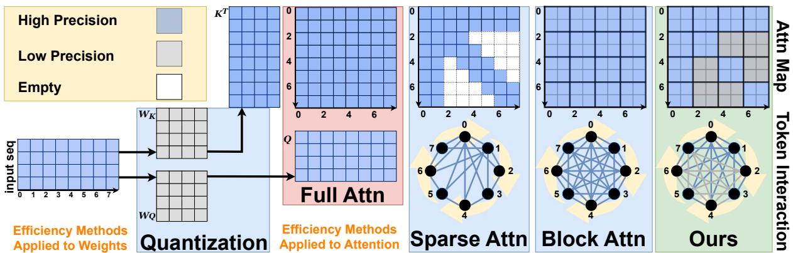
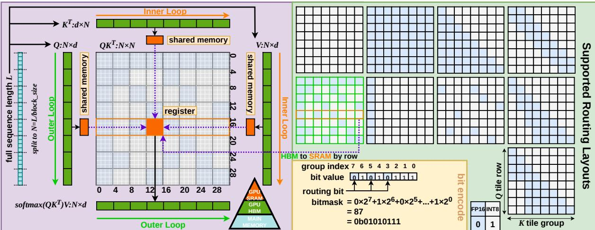
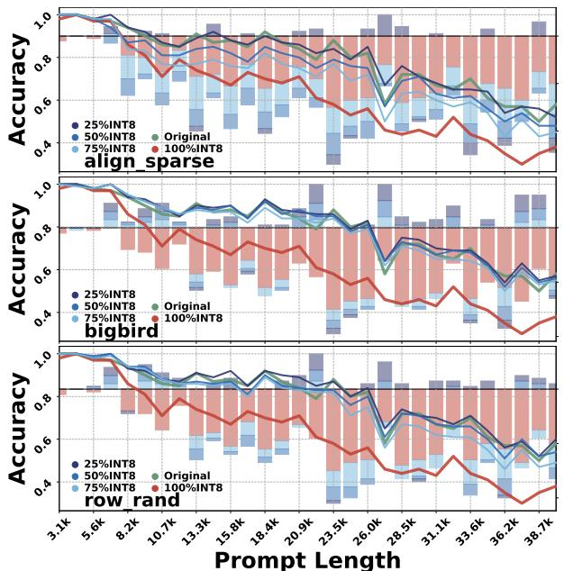
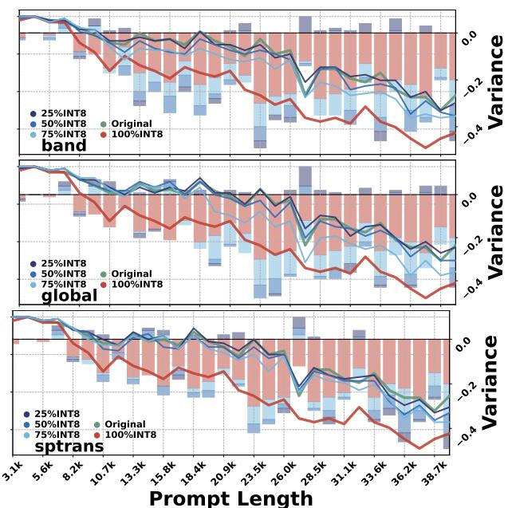
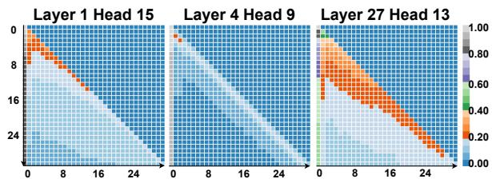
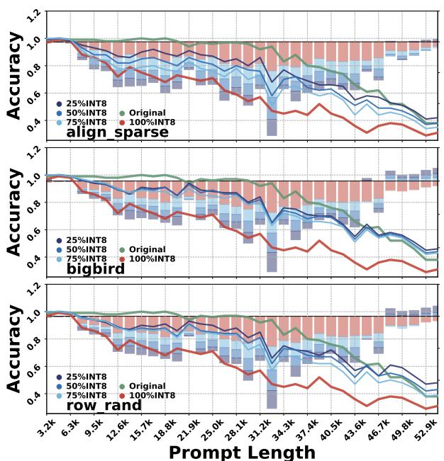
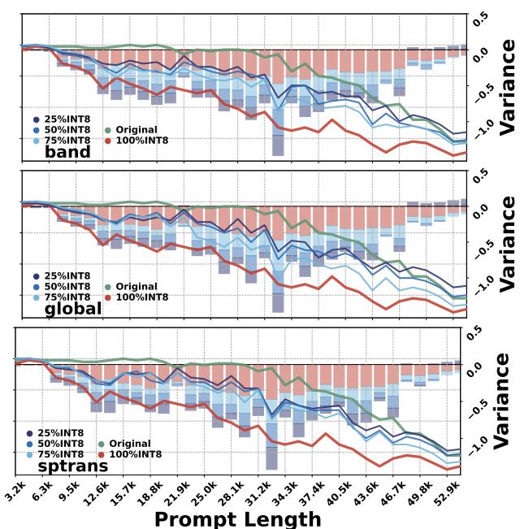
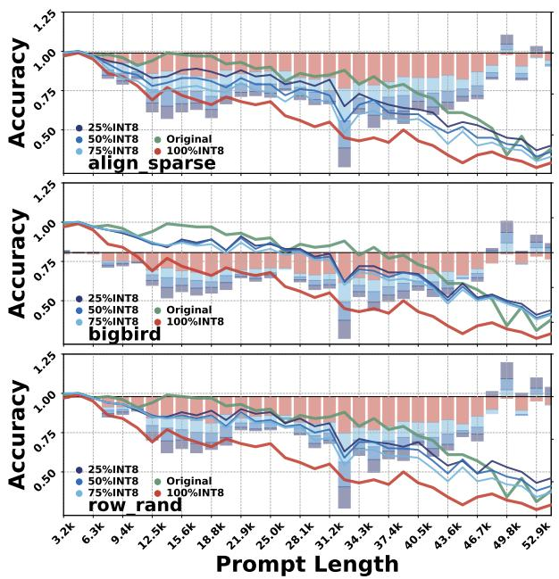
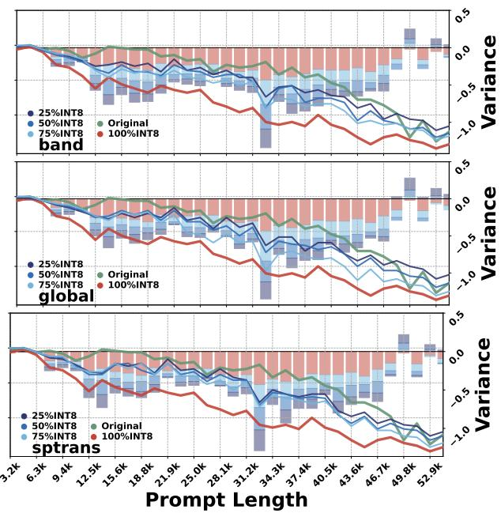

# TileMix: Tile-Centric Mixed-Precision Attention for LLM Inference Acceleration

Hanzhi Zhang1, Qiao Zhang2, Qinglei Cao2, Heng Fan1, Yan Huang1, Kewei Sha3, Yunhe Feng1 1LLaVi Lab, Computer Science & Engineering, University of North Texas 2Computer Science, Saint Louis University; 3Data Science, University of North Texas {hanzhi.zhang,heng.fan,yan.huang,kewei.sha,yunhe.feng}@unt.edu {qiao.zhang,qinglei.cao}@slu.edu

## Abstract

Long-context prefill in large language models (LLMs) incurs substantial computation and memory traffic because dense self-attention computes quadratic query-key scores. Existing methods either use a uniform low-precision path or select token interactions, leaving spatial precision routing over hardware-aligned score tiles outside fused dense attention. We introduce TileMix, a tile-centric precision-routing kernel that makes numerical precision an executable spatial decision over score-tile groups within fused dense attention. TileMix partitions the attention matrix into hardwarealigned score tiles, packs routing decisions into compact bitmasks, and dispatches each tile group through FP16 or INT8 score computation while both paths update a shared online-softmax state. Scalable precision grouping lets each routing bit govern multiple adjacent key tiles, preserving hardware-aligned compute tiles and compact metadata at long contexts. By routing all legal tile groups, TileMix preserves dense token connectivity, requires no training, and supports groupedquery attention, variable-length batches, and INT8 key/value caches. Across LongEval, LV-Eval, and A100 prefill benchmarks on LLaMA, Qwen, and Vicuna, TileMix recovers longcontext quality lost under uniform INT8 and improves prefill throughput over FP16, yielding a controllable accuracy-efficiency frontier across model families. The implementation is available at https://github.com/ HanzhiZhang-Ulrica/TileMix.

## 1 Introduction

Transformer models increasingly rely on long contexts for document summarization (Cohan et al., 2018), multi-page question answering (Tito et al., 2023), and retrieval-augmented generation (Lewis et al., 2020), making efficient long-sequence processing central to practical LLM inference. During prefill, dense self-attention computes interactions between all query and key tokens, producing O(L2) score computation for sequence length L. This quadratic computation makes attention a primary execution bottleneck for long documents and other context-intensive workloads.

Existing acceleration methods mainly optimize numerical format, token connectivity, or IO scheduling, represented in Figure 1 by quantization, sparsity, and IO-aware fused attention. (1) Lowprecision quantization such as INT8 (Xiao et al., 2023; Zhang et al., 2025) improves arithmetic and memory efficiency across model operators including weight, activation, and attention. Quantized attention kernels commonly use one arithmetic path per invocation or stage, leaving spatial precision routing over the L×L score tiles outside the streaming loop. (2) Sparsity-based methods (Yuan et al., 2026; Zaheer et al., 2021; Beltagy et al., 2020) reduce computation by selecting active token interactions. (3) IO-aware fused attention (Dao et al., 2022) partitions attention into hardware-aligned tiles and fuses score computation, online softmax, and value aggregation. These kernels use tiles for data movement and work partitioning, while retaining a uniform score-computation path. Together, these directions suggest using hardware-aligned score tiles as the spatial unit of precision. A fused kernel can preserve the complete attention graph while routing score-tile groups through multiple arithmetic paths in one streaming computation.

Modern fused-attention kernels achieve high utilization through regular Tensor Core tiling and coordinated work partitioning, online softmax, and data movement across the GPU memory hierarchy (Dao, 2023; Shah et al., 2024). Tile-group precision routing must reconcile distinct FP16 and INT8 Tensor Core paths, including INT8 rescaling, before both paths update the shared row-wise maximum, normalizer, and output accumulator (Choquette et al., 2021; Chen et al., 2024). Precision dispatch therefore falls inside the latency-critical inner loop, making compact tile-aligned routing essential for regular long-context execution and creating a kernel-design problem beyond invocation-level precision selection.

  
Figure 1: Comparison of attention efficiency strategies. Colors denote execution states: blue for high precision, gray for low precision, and white for removed interactions. Quantization reduces weight/activation memory but often keeps attention softmax and accumulation in higher precision. Sparse/block attention executes a selected subset of token interactions through structured or dynamic patterns. TileMix preserves all legal token interactions and routes score-tile groups through FP16 or INT8 paths inside one fused attention kernel.

To address these challenges, we introduce TileMix, a tile-centric precision-routing kernel that integrates heterogeneous score arithmetic into a single FlashAttention-style execution. For each query-tile row, TileMix loads a packed routing word, decodes each key-tile-group decision with constant-time bit operations, and dispatches QK computation to FP16 or INT8 Tensor Core paths. After rescaling, both paths update the shared onlinesoftmax state, preserving dense streaming execution. Scalable precision grouping lets each routing bit govern adjacent key tiles while retaining the underlying hardware-aligned compute tiles and compact metadata as context length grows. The resulting kernel combines the dense connectivity of full attention with the arithmetic flexibility of mixed precision under training-free deployment. It also supports grouped-query attention, variablelength batching, and INT8 key/value caches, and exposes a controllable accuracy-efficiency frontier between FP16 and uniform INT8 attention.

Our contributions are as follows:

1. Tile-Centric Precision Routing for Dense Attention: We introduce tile-group precision as a spatial execution abstraction for fused dense attention, enabling fine-grained FP16/INT8 allocation across all legal token interactions.

2. Shared-State Heterogeneous Score Execution: We design a fused kernel that aligns FP16 and INT8 score paths to a common score domain and integrates them through one onlinesoftmax recurrence.

3. Compact and Scalable Kernel-Native Routing: We develop packed bitmask routing with constant-time inner-loop lookup and $\mathcal { O } ( H _ { k } T _ { m } )$ metadata, together with precision grouping that scales routing to long contexts while retaining hardware-aligned compute tiles.

4. Practical Long-Context Inference and Evaluation: We implement grouped-query attention, variable-length batching, and INT8 key/value cache support, and validate TileMix through long-context retrieval, question answering, prefill efficiency, and numerical analyses across LLaMA, Qwen, and Vicuna models.

## 2 Related Work

Transformer acceleration primarily follows three directions: low-precision quantization, IO-aware tiled attention, and structural sparsity. These approaches reduce long-context inference cost through numerical compression, data-movement optimization, or selective token connectivity.

Low-precision quantization reduces memory and arithmetic costs by representing weights and activations in formats such as INT8 (Van Baalen et al., 2023; Srinivasa Kumar, 2025) and INT4 (Zhao et al., 2024). Quantization-aware and post-training methods improve robustness through calibration, activation transformation, outlier handling, and blockwise scaling (Yao et al., 2022; Xiao et al., 2023; Saxena et al., 2024). Recent quantized attention kernels integrate low-precision score computation, value aggregation, and numerical approximation into fused execution (Chen et al., 2024; Kang et al., 2024; Zhang et al., 2025; Sharratt, 2026). These designs typically assign formats at the tensor, operator, attention-stage, or quantization-block level, while two-dimensional score-tile groups follow one arithmetic path within the streaming loop (Dettmers et al., 2022; Van Baalen et al., 2023; Kluska et al., 2024).

IO-aware attention kernels (Dao et al., 2022; Dao, 2023; Dege et al., 2025) process attention in SRAM-resident tiles and fuse score computation, online softmax, and value aggregation, avoiding full attention-matrix materialization in HBM. These tiles govern data movement and work partitioning, while arithmetic precision is commonly fixed per kernel invocation or attention stage (Shah et al., 2024; Chen et al., 2024).

Sparse attention methods reduce computation by selecting token interactions through slidingwindow, strided, dilated, or mixed local-global patterns (Beltagy et al., 2020; Child et al., 2019; Zaheer et al., 2021; Ainslie et al., 2020). Other systems use content-based selection and clustering (Roy et al., 2020; Wang et al., 2021; Kitaev et al., 2020), positional mechanisms (Dai et al., 2019a; Zhang et al., 2023), adaptive architectures (Correia et al., 2019), or dynamically constructed active block sets (Jiang et al., 2024; Lai et al., 2025; Yuan et al., 2026). These methods use spatial structure to select executed token interactions, changing attention connectivity while keeping precision outside the selection decision.

## 3 Preliminaries

We briefly review (i) FlashAttention-style tiled attention with online softmax, and (ii) blockwise quantization for low-precision matrix multiplication. Their interaction defines the central kernel challenge addressed by TileMix: FP16 and INT8 score tiles follow different arithmetic paths but contribute to one shared streaming softmax state. Appendix Table 4 summarizes the notation used throughout the paper.

## 3.1 Tiled Attention with Online Softmax

Consider one self-attention head with $Q , K , V \in$ $\mathbb { R } ^ { L \times d }$ , where L is the sequence length and d is the head dimension. Attention computes the score matrix $S ~ \in ~ \mathbb { R } ^ { L \times L }$ , attention weights $P \in \mathbb { R } ^ { L \times L }$ and output $\begin{array} { r } { { \cal O } ~ \in ~ \mathbb { R } ^ { L \times d } \mathrm { a s } { \cal S } ~ = ~ \frac { Q K ^ { \top } } { \sqrt { d } } , { \cal P } ~ = ~ } \end{array}$ softmax $( S ) , O = P V$ . Materializing $S$ and $P$ in GPU high-bandwidth memory (HBM) requires an $\mathcal { O } ( L ^ { 2 } )$ intermediate-memory footprint and substantial HBM read/write traffic at long context lengths.

FlashAttention streams key/value tiles while keeping score and probability tiles on chip and writing only normalized outputs to HBM, providing the execution substrate for TileMix’s tile-group precision routing. The kernel partitions $Q$ into $T _ { m } ~ = ~ \lceil L / b _ { q } \rceil$ tiles $\{ Q _ { m } \} _ { m = 1 } ^ { T _ { m } }$ and $( K , V )$ into $T _ { n } ~ = ~ \lceil L / b _ { k v } \rceil$ tiles $\{ ( K _ { n } , \bar { V _ { n } } ) \} _ { n = 1 } ^ { T _ { n } }$ . For each $Q _ { m } .$ , it streams over $n = 1 , \ldots , T _ { n }$ while maintaining the shared online-softmax state $\left( \tilde { m } _ { m } ^ { n } , \tilde { z } _ { m } ^ { n } , \tilde { O } _ { m } ^ { n } \right)$ comprising the row-wise maximum and normalizer $\bar { m } _ { m } ^ { n } , \bar { z _ { m } ^ { n } } \in \mathbb { R } ^ { b _ { q } }$ and unnormalized accumulator $\tilde { O } _ { m } ^ { n } \in \mathbb { R } ^ { b _ { q } \times d }$ . Initialized by $\tilde { m } _ { m } ^ { 0 } = - \infty , \tilde { z } _ { m } ^ { 0 } = 0$ and $\tilde { O } _ { m } ^ { 0 } = 0$ , the state updates as

$$
\begin{array} { r l } & { \tilde { m } _ { m } ^ { n } = \operatorname* { m a x } \Bigl \{ \tilde { m } _ { m } ^ { n - 1 } , \mathrm { r o w m a x } ( S _ { m } ^ { n } ) \Bigr \} , } \\ & { \quad \tilde { z } _ { m } ^ { n } = e ^ { \tilde { m } _ { m } ^ { n - 1 } - \tilde { m } _ { m } ^ { n } } \tilde { z } _ { m } ^ { n - 1 } + \mathrm { r o w s u m } \bigl ( e ^ { S _ { m } ^ { n } - \tilde { m } _ { m } ^ { n } } \bigr ) , } \\ & { \quad \tilde { O } _ { m } ^ { n } = e ^ { \tilde { m } _ { m } ^ { n - 1 } - \tilde { m } _ { m } ^ { n } } \tilde { O } _ { m } ^ { n - 1 } + e ^ { S _ { m } ^ { n } - \tilde { m } _ { m } ^ { n } } V _ { n } , } \\ & { \quad S _ { m } ^ { n } = \frac { Q _ { m } K _ { n } ^ { \top } } { \sqrt { d } } . } \end{array}
$$

Here, rowmax(·) and rowsum(·) reduce across the $b _ { k v }$ columns of $\dot { S } _ { m } ^ { n } \in \mathbb { R } ^ { b _ { q } \times b _ { k v } }$ . After tile $T _ { n }$ , rowwise division of $\tilde { O } _ { m } ^ { T _ { n } }$ by $\tilde { z } _ { m } ^ { T _ { n } }$ yields the output for $Q _ { m }$

## 3.2 Blockwise Quantization

For a matrix product $C = A B$ , blockwise quantization applies $\psi ( \cdot )$ independently to operand blocks, producing low-precision representations and their scale factors:

$$
( \hat { A } , \delta _ { A } ) = \psi ( A ) , ( \hat { B } , \delta _ { B } ) = \psi ( B ) , C \approx \delta _ { A } \delta _ { B } ( \hat { A } \hat { B } ) .
$$

The representations $\hat { A }$ and $\hat { B }$ may use INT8, FP8, or other low-precision formats. We instantiate ψ(·) with INT8 because NVIDIA A100 GPUs provide optimized INT8 Tensor Core primitives for highthroughput matrix multiplication. These Tensor Cores execute MMA (matrix multiply-accumulate) instructions that multiply INT8 fragments and accumulate partial sums in INT32 registers. Aligning the quantization blocks with attention tiles allows the corresponding scales $\delta _ { A }$ and $\delta _ { B }$ to be applied efficiently during fused execution.

FP16 and INT8 score tiles exhibit different rounding, accumulation, and rescaling behavior. Because every score tile contributes to the shared state $( \tilde { m } _ { m } ^ { n } , \tilde { z } _ { m } ^ { n } , \tilde { O } _ { m } ^ { n } )$ , path-specific numerical effects propagate through running-maximum tracking, normalization, and output accumulation. Mixed-precision attention is therefore a sharedstate kernel problem: heterogeneous score paths must enter a common score domain before updating the same running maximum, normalizer, and output accumulator.

  
Figure 2: TileMix fused attention with tile-group precision routing. $L e f t .$ : The $L _ { q } \times L _ { k }$ attention matrix is processed in $\mathrm { B L O C K } _ { M } \times \mathrm { B L O C K } _ { N }$ compute tiles. For each query-tile row m (outer loop), the kernel streams key/value tiles n (inner loop) from HBM to on-chip SRAM and registers, dispatches the score tile $S _ { m } ^ { n } = Q _ { m } K _ { n } ^ { \top } / \sqrt { d }$ to either FP16 matmul or INT8 Tensor Core MMA with INT32 accumulation and rescaling, and updates a shared FP16 online-softmax state to produce $O _ { m }$ without materializing the full score matrix. Right: A binary routing map is grouped along the key-tile dimension with width $\mathrm { B L O C K } _ { N } ^ { \mathrm { m a s k } } = g \mathrm { B L O C K } _ { N }$ and packed per $( h _ { k } , m )$ into a 64-bit mask $b _ { h _ { k } , m } .$ The bit at position $g _ { j } = \lfloor n / g \rfloor$ selects the arithmetic path for the corresponding key-tile group (1: INT8, 0: FP16). Kernel-side legality masks, including causality and boundary conditions, are enforced independently of the routing map.

## 4 TileMix: Tile-Group Precision Routing

TileMix realizes tile-group precision routing without retraining by combining: (i) a precision policy that assigns each legal score-tile group to FP16 or INT8 score computation, (ii) packed bitmasks that convert the policy into constant-time inner-loop dispatch, and (iii) a FlashAttention-style fused kernel in which both score paths update one shared online-softmax state. For each KV head and querytile row, the inner loop reads one packed routing word and extracts the arithmetic-path decision for each key-tile group. The fused kernel natively supports grouped-query attention (GQA) and variable-length batching through prefix-sum metadata, while the implementation provides an INT8 key/value cache interface for decode.

## 4.1 TileMix Overview

TileMix partitions the $L _ { q } \ \times \ L _ { k }$ attention into hardware-aligned two-dimensional score tiles of size $\mathrm { B L O C K } _ { M } \times \mathrm { B L O C K } _ { N }$ (Figure 2), with $\mathrm { B L O C K } _ { M } \equiv b _ { q }$ and $\mathrm { B L O C K } _ { N } \equiv b _ { k v }$ . The compute tile remains the execution unit, while one routing group may govern multiple adjacent compute tiles along the key dimension. The fused kernel follows the two-level structure of IO-aware attention:

Outer loop (over query tiles). The kernel iterates over query tiles $\{ Q _ { m } \} _ { m = 1 } ^ { T _ { m } }$ , where $T _ { m }$ $\lceil L _ { q } / \mathrm { B L O C K } _ { M } \rceil$ . Each Triton program instance owns one query-tile row m.

Inner loop (streaming key/value tiles). For each $Q _ { m } .$ the kernel streams key/value tiles $\{ ( K _ { n } , V _ { n } ) \} _ { n = 1 } ^ { T _ { n } }$ from HBM into SRAM and registers, where $T _ { n } = \lceil L _ { k } / \mathrm { B L O C K } _ { N } \rceil$ . Across this inner loop, the kernel updates one online-softmax state and retains the output accumulator on chip until normalization after the final tile.

For each compute tile $( m , n )$ , the routing group containing key-tile index n selects the FP16 or INT8 score-computation path. Kernel-side causal and boundary masks determine legal interactions, while the routing policy determines the arithmetic path of each legal tile group.

TileMix supports grouped-query attention (GQA) and variable-length batching through one routing interface. Let $H _ { q }$ and $H _ { k }$ denote the numbers of query and KV heads. Each query head $h _ { q } \in \{ 0 , \ldots , H _ { q } - 1 \}$ maps to a KV head $h _ { k } =$ $\left\lfloor { \frac { h _ { q } } { H _ { q } / H _ { k } } } \right\rfloor$ , which indexes routing lookup. Query heads mapped to the same KV head share tilegroup routing decisions. For variable-length batching, flattened inputs use cu\_seqlens and prefix-sum metadata for padding-free routing and execution.

## 4.2 Routing Policy and Bitmask Encoding

Fused attention kernels derive tile execution from pointers, strides, legality masks, and a shared arithmetic configuration. TileMix introduces binary routing metadata that selects the score-computation path inside the inner loop.

Policy definition. TileMix accepts a binary tilegroup routing map R indexed by KV head $h _ { k }$ query-tile row $m ,$ and key-tile group $g _ { j }$ . In our evaluation, static, data-free structured templates instantiate $R ,$ distributing FP16-routed groups spatially under configurable INT8 coverage budgets. The decision $R _ { h _ { k } , m , g _ { j } } = 1$ dispatches the corresponding group to INT8, while $R _ { h _ { k } , m , g _ { j } } = 0$ dispatches it to FP16. (See Appendix B for the full list of precision layouts and their definitions.)

<table><tr><td rowspan="3">Grouping factor: Key tile index n:</td><td colspan="9">g=1 many bits usage</td><td colspan="9">g=2 fewer bits usage</td></tr><tr><td>7</td><td>6</td><td>5</td><td>4</td><td>3</td><td>2</td><td>1</td><td></td><td>0</td><td>7</td><td>6</td><td>5</td><td>4</td><td>3</td><td>2</td><td>1</td><td>0</td></tr><tr><td>7</td><td>V &#x27;6</td><td>Y &#x27;5</td><td>K 4</td><td>3 X</td><td>4 2</td><td></td><td>1</td><td>0</td><td>À 3</td><td>3</td><td>V 2</td><td>+2</td><td>1 中</td><td>1</td><td>0</td><td>4 0</td></tr><tr><td>Groups [n/g]:</td><td></td><td>N</td><td></td><td>1</td><td></td><td>1</td><td></td><td></td><td>1</td><td></td><td></td><td colspan="2">è</td><td colspan="2"></td><td></td></tr><tr><td>Packed mask  $\mathsf { b } _ { \mathsf { h } , \mathsf { m } } \mathrm { : }$ </td><td></td><td></td><td>0</td><td></td><td></td><td></td><td>1</td><td></td><td></td><td>1</td><td colspan="2">0</td><td colspan="2">1</td><td colspan="2">0</td></tr></table>

Figure 3: Key-tile grouping and bitmask encoding for one query-tile row m. Adjacent compute tiles along the key dimension form routing groups $g _ { j }$ , each controlled by one bit in the packed mask $b _ { h _ { k } , m }$ (1: INT8, 0: FP16).

Why grouping is needed. TileMix targets constant-time routing lookup inside the attention inner loop. As Figure3 shows, we pack up to 64 keytile-group decisions for each query-tile row into a single 64-bit word. To extend the same routing word across longer key sequences while retaining hardware-aligned compute tiles, TileMix defines the routing-group width $\mathrm { B L O C K } _ { N } ^ { \mathrm { m a s k } }$ through a grouping factor $g \in \mathbb { Z } ^ { + }$

$$
\mathrm { B L O C K } _ { N } ^ { \mathrm { m a s k } } = g { \cdot } \mathrm { B L O C K } _ { N } , T _ { \mathrm { m a s k } } = \left\lceil \frac { L _ { k } } { \mathrm { B L O C K } _ { N } ^ { \mathrm { m a s k } } } \right\rceil \leq 6 4 .
$$

When $g > 1$ , one routing bit controls a contiguous group of $g$ adjacent key tiles (Figure 3). Each decision therefore spans $g \cdot \mathrm { B L O C K } _ { N }$ key tokens. This grouping extends one routing word across long key sequences while preserving the hardware-aligned compute-tile structure.

$$
\begin{array}{c} \begin{array}{c} \begin{array}{c} \begin{array}{c} \begin{array} { r } { 9 \mathsf { r o u p \ i n d e x : } [ \begin{array} { l l l } { 7 \mathsf { o u p \ i n d e x : } } & { 7 \mathsf { \ - o \ - } } & { 6 } & { 3 } \\ { \mathsf { P a c k e d \ m a s k \ b _ { h , m } : } } & { [ \begin{array} { l } { 0 } \\ { 0 } \end{array} ] ( \begin{array} { l } { 1 } \end{array} ) ( 0  \begin{array} { l } { 1 } \end{array}  1 } & { 0 } \\ { 1 } \end{array} ] \cdot 1 \mathsf { s t \ s h i f t } } \\ { \mathsf { D e c i s i o n \ P _ { g r o u p } : } [ \begin{array} { l } { 6 } \\ { 1 } \end{array} ] \qquad [ \begin{array} { l } { 6 } \\ { 6 } \\ { 1 } \end{array} ] ( \begin{array} { l } { 5 \sqrt { 6 } } \\ { 1 } \end{array} ) ( \begin{array} { l } { 1 } \\ { 0 } \end{array} ) ( 1 } \end{array}  1  & { 0 } \\ { 1 } \end{array} ] \cdot 1 \mathsf { e n d \ s h i f t }  \\ { \mathsf { D e c i s i o n \ P _ { g r o u p \ e : } } [ \begin{array} { l } { 1 } \\ { 1 } \end{array} ] } & { [ \begin{array} { l } { 5 \sqrt { 6 } } \\ { 0 } \end{array} ] ( \begin{array} { l } { 1 } \end{array} ) ( 1 } \\ { 1 } \end{array} ) ( 1  \end{array} )  \end{array}
$$

Figure 4: Constant-time shift-and-mask routing lookup. Shifting bit $g _ { j }$ to the least-significant position yields the arithmetic-path decision $R _ { h _ { k } , m , g _ { j } }$ for the corresponding key-tile group.

Bitmask packing. After grouping, the routing map R is indexed by KV head $\begin{array} { r } { h _ { k } , } \end{array}$ query-tile row $m ,$ and key-tile group $g _ { j } \in \{ 0 , \ldots , \hat { T _ { \mathrm { m a s k } } } ^ { } - 1 \}$ . For each $( h _ { k } , m )$ , we pack the group decisions into a 64-bit integer, or packed bitmask word,

$$
b _ { h _ { k } , m } = \sum _ { g _ { j } = 0 } ^ { T _ { \mathrm { m a s k } } - 1 } R _ { h _ { k } , m , g _ { j } } 2 ^ { g _ { j } } , R _ { h _ { k } , m , g _ { j } } \in \{ 0 , 1 \} .
$$

Constant-time lookup. Inside the kernel, one shift-and-mask operation retrieves the routing decision for group $g _ { j }$ (Figure 4):

$$
R _ { h _ { k } , m , g _ { j } } = \left( \left( b _ { h _ { k } , m } \gg g _ { j } \right) \& \ 1 \right) .
$$

The general representation requires one 64-bit word per $( h _ { k } , m )$ , totaling $\mathcal { O } ( H _ { k } T _ { m } )$ routing metadata. Packed bitmasks therefore provide compact kernelnative routing metadata consumed directly by the streaming inner loop.

## 4.3 Tile-Group Mixed-Precision Attention

TileMix preserves the FlashAttention-style onlinesoftmax recurrence defined in Section $_ { 3 ; }$ routing changes only the arithmetic path used to construct each score tile $S _ { m } ^ { n }$

The FP16 and INT8 paths contribute distinct rounding, accumulation, and rescaling behavior. The FP16 and INT8 paths use different multiplication, accumulation, and scale-restoration procedures. After INT8 scale restoration, score tiles from both paths enter a common floating-point domain before updating the shared running maximum, normalizer, and output accumulator. TileMix maintains this shared online-softmax state in FP16, while the routing map R assigns FP16 or INT8 score computation to each legal tile group. Both arithmetic paths apply the same $1 / \sqrt { d }$ scaling and exponentiation implementation before contributing to the shared normalization.

Tile-group dispatch. For query-tile row m and key-tile index n, the routing-group index is $g _ { j } =$ $\lfloor n / g \rfloor$ , with $\mathrm { B L O C K } _ { N } ^ { \mathrm { m a s k } } \ : = \ : g \mathrm { B L O C K } _ { N }$ . The corresponding routing bit defines the routed score tile $S _ { m } ^ { \hat { n } }$

$$
S _ { m } ^ { n } = \left\{ \begin{array} { l l } { \mathrm { R e s c a l e } _ { m , n } \left( Q _ { 8 , m } K _ { 8 , n } ^ { \top } \right) / \sqrt { d } , } & { R _ { h _ { k } , m , g _ { j } } = 1 , } \\ { Q _ { m } K _ { n } ^ { \top } / \sqrt { d } , } & { R _ { h _ { k } , m , g _ { j } } = 0 . } \end{array} \right.
$$

INT8 path and scale alignment. For the primary evaluated score-routing path, TileMix quantizes $Q$ and K blockwise to produce $Q _ { 8 }$ and $K _ { 8 }$ together with per-block scales, while $V$ and the $P V$ computation remain in FP16. The quantizeonce mode prepares $Q _ { 8 } , K _ { 8 }$ , and their scales once per attention call and reuses them across all INT8- routed tile groups.

  
Figure 5: Line-level retrieval accuracy on the LongEval benchmark for LLaMA 3.2 3B under different tile-group routing layouts, evaluated across prompt lengths from 3.1k to 38.7k tokens. Line plots (left y-axis) report exactmatch retrieval accuracy, while bar plots (right y-axis, ∆ accuracy vs. FP16) show differences relative to the FP16 attention baseline. Each panel corresponds to a routing layout with 25%, 50%, or 75% of tile groups routed to INT8. Colors indicate routing settings: green denotes the original FP16 attention baseline, red denotes One (all legal score-tile groups routed to INT8), and blue denotes mixed configurations with partially INT8-routed tile groups.

The INT8 path computes $Q _ { 8 , m } K _ { 8 , n } ^ { \top }$ with INT8 MMA and INT32 accumulation, then applies block scales and $1 / \sqrt { d }$ to produce $S _ { m } ^ { n }$ . FP16-routed tiles compute $Q _ { m } K _ { n } ^ { \top } / \sqrt { d }$ through the FP16 path and update the same online-softmax state. Variablelength execution stores compact per-block scales indexed through the fused kernel’s prefix-sum metadata. Appendix D distinguishes this cache interface from the prefill path and details the tensor, scale, temporary-buffer, and data-movement layouts.

Finally, tile-group policies become inner-loop dispatch through constant-time bitmask lookup. The selected FP16 and INT8 score paths update a shared FP16 online-softmax state. Together, compact metadata, constant-time lookup, and sharedstate execution integrate heterogeneous score arithmetic into one dense fused attention computation.

## 5 Experiments

## 5.1 Experimental Setup

We evaluate TileMix from four perspectives: (i) long-context retrieval, (ii) long-context question answering, (iii) prefill efficiency, and (iv) numerical behavior under routed precision. The main evaluation uses LLaMA 3.2 3B (AI, 2024). Appendix E extends quality evaluation to Vicuna-7B, Qwen-2- 7B (Team et al., 2024), and Qwen-2.5-7B (Team, 2024), while Appendix F reports efficiency across the same model families.

Dataset and Metrics. We evaluate long-context question answering on LV-Eval (Yuan et al., 2024), which covers 11 English and Chinese datasets at context lengths from 16k to 64k tokens. We use LongEval (Li et al., 2023) to evaluate line-level retrieval with exact-match accuracy. Each LongEval example embeds a uniquely labeled target line in a sequence of up to 54k tokens and queries the model for its associated content.

Baselines. We compare against (i) dense FP16 attention as the full-precision reference, (ii) One, which routes all legal score-tile groups to INT8 using the same TileMix kernel substrate, (iii) FlashAttention as the IO-aware FP16 execution baseline, (iv) MInference (Jiang et al., 2024) and FlexPrefill (Lai et al., 2025) as sparse long-context baselines, and (v) SageAttention (Zhang et al., 2025) as a representative INT8 attention kernel.

Hardware and Measurement. All experiments run on NVIDIA A100 40GB GPUs. TileMix’s offline autotuner selects an A100 kernel configuration that remains fixed throughout evaluation. Throughput evaluation uses batch size 8, three warmup iterations, and five timed iterations with the same hardware and model wrapper for all methods. Timings include quantization, scale restoration, routing, memory staging, and kernel-scheduling costs. We therefore report end-to-end prefill throughput rather than isolated MMA throughput.

<table><tr><td rowspan=1 colspan=9>Dataset | Len | FP16 | One | SpTrans25SpTrans50 SpTrans75 | BigBird25 BigBird50 BigBird75 | MInference | FlexPrefill | SageAttn</td></tr><tr><td rowspan=3 colspan=1>116k32.04①  132k15.08164k 7.75</td><td rowspan=1 colspan=1>28.78</td><td rowspan=1 colspan=1>31.75</td><td rowspan=1 colspan=1>32.18     30.25</td><td rowspan=1 colspan=1>31.27</td><td rowspan=1 colspan=1>29.64    29.75</td><td rowspan=1 colspan=1>26.93</td><td rowspan=1 colspan=1>27.11</td><td rowspan=1 colspan=1>29.79</td></tr><tr><td rowspan=2 colspan=2>11.62   15.565.42    8.01</td><td rowspan=1 colspan=1>14.77     14.37</td><td rowspan=1 colspan=1>15.22</td><td rowspan=1 colspan=1>14.02    13.55</td><td rowspan=1 colspan=1>11.55</td><td rowspan=1 colspan=1>11.74</td><td rowspan=1 colspan=1>13.50</td></tr><tr><td rowspan=1 colspan=1>7.44      6.83</td><td rowspan=1 colspan=1>8.01</td><td rowspan=1 colspan=1>6.47     5.72</td><td rowspan=1 colspan=1>5.31</td><td rowspan=1 colspan=1>5.39</td><td rowspan=1 colspan=1>5.77</td></tr><tr><td rowspan=3 colspan=1>116k 18.49②  132k 15.12164k11.84</td><td rowspan=1 colspan=2>15.62   18.64</td><td rowspan=1 colspan=1>18.08     16.78</td><td rowspan=1 colspan=1>18.61</td><td rowspan=1 colspan=1>16.98     16.62</td><td rowspan=1 colspan=1>14.61</td><td rowspan=1 colspan=1>14.92</td><td rowspan=1 colspan=1>16.67</td></tr><tr><td rowspan=2 colspan=1>12.027.79</td><td rowspan=1 colspan=1>15.27</td><td rowspan=1 colspan=1>14.69     14.18</td><td rowspan=1 colspan=1>15.14</td><td rowspan=1 colspan=1>13.53     13.28</td><td rowspan=1 colspan=1>12.01</td><td rowspan=1 colspan=1>11.64</td><td rowspan=1 colspan=1>14.59</td></tr><tr><td rowspan=1 colspan=1>12.06</td><td rowspan=1 colspan=1>11.34     11.04</td><td rowspan=1 colspan=1>12.04</td><td rowspan=1 colspan=1>10.28     10.03</td><td rowspan=1 colspan=1>7.96</td><td rowspan=1 colspan=1>6.81</td><td rowspan=1 colspan=1>11.22</td></tr><tr><td rowspan=5 colspan=1>|16k 6.72③ 132k 3.78164k 3.38</td><td rowspan=3 colspan=3>4.45   21.04     20.53     21.65</td><td></td><td></td><td></td><td></td><td></td></tr><tr><td rowspan=2 colspan=1>6.29</td><td></td><td></td><td></td><td></td></tr><tr><td rowspan=1 colspan=1>6.97     4.57</td><td rowspan=1 colspan=1>5.41</td><td rowspan=1 colspan=1>5.01</td><td rowspan=1 colspan=1>5.88</td></tr><tr><td rowspan=2 colspan=3>1.95    3.35      2.78      2.681.42    3.24      2.67      2.47</td><td rowspan=1 colspan=1>2.35</td><td rowspan=1 colspan=1>1.81      1.20</td><td rowspan=1 colspan=1>2.75</td><td rowspan=1 colspan=1>2.51</td><td rowspan=1 colspan=1>3.15</td></tr><tr><td rowspan=1 colspan=1>3.24</td><td rowspan=1 colspan=1>1.70      1.37</td><td rowspan=1 colspan=1>2.13</td><td rowspan=1 colspan=2>1.91     2.73</td></tr><tr><td rowspan=5 colspan=1>|16k 6.00④  132k 18.00164k 14.50</td><td rowspan=5 colspan=2>2.27    6.0013.98   18.0010.07</td><td rowspan=3 colspan=1>5.43      5.04</td><td></td><td></td><td></td><td></td><td></td></tr><tr><td rowspan=2 colspan=1>6.00</td><td rowspan=2 colspan=1>4.46     4.49</td><td></td><td></td><td></td></tr><tr><td rowspan=1 colspan=1>4.77</td><td rowspan=1 colspan=2>4.53      5.19</td></tr><tr><td rowspan=1 colspan=1>17.43     17.54</td><td rowspan=1 colspan=1>18.50</td><td rowspan=1 colspan=1>16.46    15.99</td><td rowspan=1 colspan=1>12.99</td><td rowspan=1 colspan=1>11.99</td><td rowspan=1 colspan=1>15.08</td></tr><tr><td rowspan=1 colspan=1>15.00</td><td rowspan=1 colspan=1>14.43     14.04</td><td rowspan=1 colspan=1>15.00</td><td rowspan=1 colspan=1>13.46     12.49</td><td rowspan=1 colspan=1>9.03</td><td rowspan=1 colspan=1>8.31</td><td rowspan=1 colspan=1>11.55</td></tr><tr><td rowspan=3 colspan=1>|16k17.51⑤  132k 10.80164k 6.82</td><td rowspan=3 colspan=2>12.86   17.668.38   11.015.32    7.63</td><td rowspan=1 colspan=1>17.09     16.88</td><td rowspan=1 colspan=1>17.66</td><td rowspan=1 colspan=1>15.17     14.84</td><td rowspan=1 colspan=1>13.97</td><td rowspan=1 colspan=1>13.16</td><td rowspan=1 colspan=1>15.27</td></tr><tr><td rowspan=1 colspan=1>10.44     10.06</td><td rowspan=1 colspan=1>10.61</td><td rowspan=1 colspan=1>9.07     9.00</td><td rowspan=1 colspan=1>7.81</td><td rowspan=1 colspan=1>7.20</td><td rowspan=1 colspan=1>9.11</td></tr><tr><td rowspan=1 colspan=1>6.25      5.97</td><td rowspan=1 colspan=1>7.63</td><td rowspan=1 colspan=1>6.09     5.62</td><td rowspan=1 colspan=1>4.26</td><td rowspan=1 colspan=1>3.86</td><td rowspan=1 colspan=1>5.50</td></tr><tr><td rowspan=3 colspan=1>|16k12.33⑥  132k 6.73164k 1.84</td><td rowspan=1 colspan=3>8.51    12.31     11.74     11.03</td><td rowspan=1 colspan=1>12.38</td><td rowspan=1 colspan=1>10.40     10.30</td><td rowspan=1 colspan=1>9.82</td><td rowspan=1 colspan=1>9.28</td><td rowspan=1 colspan=1>10.69</td></tr><tr><td rowspan=2 colspan=1>3.220.74</td><td rowspan=1 colspan=2>7.08      6.51      5.95</td><td rowspan=1 colspan=1>6.52</td><td rowspan=1 colspan=1>5.18      4.45</td><td rowspan=1 colspan=1>4.88</td><td rowspan=1 colspan=1>4.48</td><td rowspan=1 colspan=1>5.69</td></tr><tr><td rowspan=1 colspan=2>1.97      1.37      1.22</td><td rowspan=1 colspan=1>1.91</td><td rowspan=1 colspan=1>1.35      1.13</td><td rowspan=1 colspan=1>1.12</td><td rowspan=1 colspan=1>1.07</td><td rowspan=1 colspan=1>1.44</td></tr><tr><td rowspan=2 colspan=1>|16k121.75⑦  132k 19.89164k 14.18</td><td rowspan=2 colspan=3>15.69   22.07     21.16     21.0512.11   19.91     19.37     18.566.93   14.23     13.66     13.34</td><td rowspan=1 colspan=1>21.9620.17</td><td rowspan=1 colspan=1>20.81     20.0918.41     17.79</td><td rowspan=1 colspan=1>15.5912.23</td><td rowspan=1 colspan=1>14.0510.95</td><td rowspan=1 colspan=1>19.9415.92</td></tr><tr><td rowspan=1 colspan=2>14.09     12.37     11.97</td><td rowspan=1 colspan=1>7.85</td><td rowspan=1 colspan=2>6.67     11.24</td></tr><tr><td rowspan=2 colspan=1>|16k18.24⑧  i32k 14.25164k11.08</td><td rowspan=2 colspan=3>12.72   17.53     16.99     17.469.12   13.63     13.18     13.007.54   11.31     10.65     10.38</td><td rowspan=2 colspan=2>17.57     16.45     15.9613.73     12.73    12.2911.05     9.60     9.04</td><td rowspan=1 colspan=1>12.32</td><td rowspan=2 colspan=2>11.39     13.937.40     10.545.08     9.45</td></tr><tr><td rowspan=1 colspan=1>9.267.24</td></tr><tr><td rowspan=2 colspan=1>116k145.68⑨  132k26.84164k 16.36</td><td rowspan=2 colspan=3>34.70   45.77     44.60     44.8818.17   26.05     25.94     25.119.19   16.03     15.25     14.71</td><td rowspan=2 colspan=2>45.13     43.66     43.8626.47    24.94    23.7815.72     14.18     14.04</td><td rowspan=1 colspan=1>38.1620.09</td><td rowspan=2 colspan=2>35.24    42.1221.40     22.5010.69     13.21</td></tr><tr><td rowspan=1 colspan=1>10.24</td></tr><tr><td rowspan=3 colspan=1>116k28.88132k 18.33164k15.75</td><td rowspan=3 colspan=3>22.37   29.10     28.31     27.2313.66   18.26     17.65     17.4112.81   15.94     15.32     15.39</td><td rowspan=1 colspan=2>28.95    27.57    26.33</td><td rowspan=1 colspan=1>23.28</td><td rowspan=1 colspan=2>23.43     25.18</td></tr><tr><td rowspan=1 colspan=2>18.17     16.70    16.88</td><td rowspan=2 colspan=1>12.709.42</td><td rowspan=2 colspan=2>10.28     13.947.68     13.37</td></tr><tr><td rowspan=1 colspan=2>15.93     14.22     13.88</td></tr><tr><td rowspan=2 colspan=1>|16k22.44132k14.85164k 9.26</td><td rowspan=1 colspan=3>16.97   22.94     22.37     21.7412.02   15.61     15.04     15.06</td><td rowspan=1 colspan=2>22.44     20.24     20.7616.11    14.57     13.34</td><td rowspan=1 colspan=1>15.9911.33</td><td rowspan=2 colspan=2>12.64     18.1910.25     14.574.02     5.79</td></tr><tr><td rowspan=1 colspan=3>3.41    8.92      8.35      7.40</td><td rowspan=1 colspan=2>8.92     8.38     7.91</td><td rowspan=1 colspan=1>3.10</td></tr></table>

Table 1: LV-Eval long-context question answering accuracy for LLaMA 3.2 3B. We compare FP16 attention, One (100% INT8), representative TileMix routing layouts, sparse long-context baselines (MInference and FlexPrefill), and an INT8 attention baseline (SageAttention). Sparse baselines reduce computation by pruning token interactions, whereas TileMix preserves dense legal connectivity and routes legal tile groups to different score-computation paths. Cells are color-coded by comparison to One and FP16: red indicates performance below One, blue indicates performance between One and FP16, and green indicates performance above FP16.

## 5.2 Model Performance

Long-context Retrieval. LongEval evaluates exact retrieval from sequences of labeled lines. Each input contains entries such as “line wacky-cob: CON-TENT”, and the query specifies a label. The model returns the associated content, with exact-match accuracy measuring retrieval success.

Figure 5 reports LLaMA 3.2 3B retrieval accuracy from 3.1k to 38.7k tokens. FP16 and One provide the full-precision and matched uniform-INT8 references, respectively. Each panel shows one spatial routing layout at 25%, 50%, and 75% INT8 tilegroup coverage. Retrieval quality depends on FP16 placement in addition to nominal INT8 coverage. row\_rand and sptrans retain stronger accuracy as INT8 coverage increases, while align\_sparse, band, and global retain more quality under conservative coverage. Together, routing layout determines where FP16 computation is retained, while coverage controls INT8 execution.

Long-context Question Answering. LV-Eval covers 11 English and Chinese long-context QA datasets under confusing-fact insertion (CFI), keyword and phrase replacement (KPR), and keywordrecall (AK) settings. Datasets 1 cmrc\_mixup and 2 dureader\_mixup cover Chinese machine reading comprehension and question answering, and datasets 3 factrecall\_en and 4 factrecall\_zh cover bilingual factual recall. Dataset 5 hotpotwikiqa\_mixup evaluates multi-hop retrieval, dataset 6 lic\_mixup evaluates precise information localization, and datasets 7 loogle\_CR\_mixup, 8 loogle\_MIR\_mixup, and 9 loogle\_SD\_mixup evaluate content recall, multi-information retrieval, and sequential dependency retrieval. Datasets 10 multifieldqa\_en\_mixup and 11 multifieldqa\_zh\_mixup evaluate bilingual multi-field question answering.

Table 1 compares FP16, the uniform-INT8 reference One, representative TileMix configurations, sparse methods, and SageAttention. One often trails FP16, showing that uniform INT8 can be too coarse for long-context QA. TileMix narrows this gap by assigning FP16 to selected score-tile groups and INT8 to the rest while preserving all legal interactions. The strong sptrans result at 16k factual recall recurs across LLaMA and Qwen models at all coverage ratios, indicating a consistent layout–task interaction. Appendix E reports complete results across models and routing layouts.

<table><tr><td colspan="12">Len | Metric | Torch | FlashAttn | One | SpTrans25 | SpTrans50 | SpTrans75 | BigBird25 | BigBird50 | BigBird75 | MInference | FlexPrefill | SageAttn</td></tr><tr><td>1k | Thpt</td><td>| TOPS</td><td>11.14 41.70</td><td>17.45 65.31</td><td>32.27 120.80</td><td>27.66 103.50</td><td>32.11 120.20</td><td>33.50 125.38</td><td>26.92 100.78</td><td>31.48 117.85</td><td>32.37 121.17</td><td>1.96 7.33</td><td>8.01 29.98</td><td>19.91 74.54</td></tr><tr><td></td><td>2k | Thpt TOPS</td><td>7.78 30.50</td><td>16.48 64.64</td><td>32.06 125.70</td><td>27.11 106.32</td><td>31.46 123.38</td><td>33.92</td><td>26.57 104.23</td><td>28.83 113.05</td><td>32.71</td><td>2.79 10.93</td><td>12.32 48.30</td><td>20.20 79.19</td></tr><tr><td></td><td>4k | Thpt</td><td>OOM</td><td>14.33</td><td>29.80</td><td>27.14</td><td>30.59</td><td>132.99 31.80</td><td>24.69</td><td>26.84</td><td>128.31 27.48</td><td>4.70</td><td>15.45</td><td>19.91</td></tr><tr><td></td><td>| TOPS 8k | Thpt | TOPS</td><td>OOM 00M OOM</td><td>61.31 OOM</td><td>127.48 27.41</td><td>116.09 22.81 113.83</td><td>130.85 25.69</td><td>136.03 26.61</td><td>105.63 23.02</td><td>114.83 25.17</td><td>117.56 25.84</td><td>20.13 7.24 36.13</td><td>66.11 15.80</td><td>85.19 18.79 93.79</td></tr></table>

Table 2: Implementation-level prefill throughput (Thpt, K tokens/s) and TOPS for LLaMA 3.2 3B-Instruct. All methods use the same A100 40GB hardware, batch size 8, three warmup iterations, five timed iterations, and model wrapper; timings include method-specific quantization, scale restoration, routing, memory staging, and scheduling costs. TOPS uses a common dense-attention operation count divided by measured end-to-end time. Colors compare each row with FlashAttention and One: red indicates performance below FlashAttention, blue indicates performance between FlashAttention and One, and green indicates performance above One; OOM entries are gray.

<table><tr><td>Seq Len I</td><td>0%</td><td>5%</td><td>10%</td></tr><tr><td>1k</td><td> $1 7 . 2 7 \times 1 0 ^ { - 5 }$ </td><td> $7 . 4 7 \times 1 0 ^ { - 4 }$ </td><td> $1 . 1 9 \times 1 0 ^ { - 3 }$ </td></tr><tr><td>2k 1</td><td> $5 . 8 9 \times 1 0 ^ { - 5 }$ </td><td> $4 . 2 9 \times 1 0 ^ { - 4 }$ </td><td> $1 . 1 6 \times 1 0 ^ { - 3 }$ </td></tr><tr><td>4k</td><td> $1 \ 4 . 8 7 \times 1 0 ^ { - 5 }$ </td><td> $6 . 7 1 \times 1 0 ^ { - 4 }$ </td><td> $1 . 1 0 \times 1 0 ^ { - 3 }$ </td></tr><tr><td>8k</td><td> $1 6 . 8 4 \times 1 0 ^ { - 5 }$ </td><td> $8 . 3 4 \times 1 0 ^ { - 4 }$ </td><td> $6 . 3 2 \times 1 0 ^ { - 3 }$ </td></tr><tr><td>Seq Len I</td><td>15%</td><td>20%</td><td>25%</td></tr><tr><td>1k</td><td> $1 \ 1 . 5 6 \times 1 0 ^ { - 3 }$ </td><td> $1 . 6 7 \times 1 0 ^ { - 3 }$ </td><td> $2 . 0 3 \times 1 0 ^ { - 3 }$ </td></tr><tr><td>2k</td><td> ${ \mid 1 . 4 9 \times 1 0 ^ { - 3 } }$ </td><td> $1 . 6 6 \times 1 0 ^ { - 3 }$ </td><td> $1 . 8 4 \times 1 0 ^ { - 3 }$ </td></tr><tr><td>4k</td><td> $1 \ 1 . 4 1 \times 1 0 ^ { - 3 }$ </td><td> $1 . 5 9 \times 1 0 ^ { - 3 }$ </td><td> $1 . 7 8 \times 1 0 ^ { - 3 }$ </td></tr><tr><td>8k</td><td> ${ | 6 . 5 9 \times 1 0 ^ { - 3 } }$ </td><td> $6 . 7 1 \times 1 0 ^ { - 3 }$ </td><td> $6 . 8 4 \times 1 0 ^ { - 3 }$ </td></tr></table>

Table 3: Mean absolute output deviation from the fixed Torch FP16 reference under different score-tile-group INT8 coverage ratios; lower values indicate closer agreement with the reference implementation.

## 5.3 Efficiency

Table 2 reports prefill throughput and TOPS for LLaMA 3.2 3B-Instruct from 1k to 8k tokens. Under this protocol, TileMix improves throughput over FlashAttention by routing score-tile groups to INT8 Tensor Cores. At 4k tokens, SpTrans75 reaches 31.80 K tokens/s, compared with 14.33 K tokens/s for FlashAttention and 29.80 K tokens/s for One. TileMix preserves dense legal connectivity while changing selected tile-group arithmetic paths. End-to-end throughput includes quantization, scale restoration, routing, memory staging, and kernel scheduling. The ordering between One and highcoverage mixed configurations reflects the complete pipeline, including layout-dependent dispatch and memory behavior. Appendix F reports complete throughput and TOPS across models.

## 5.4 Attention-Kernel Numerical Behavior

We measure mean absolute deviation from a fixed Torch FP16 reference on randomized attention inputs. Differences reflect quantization, scale restoration, accumulation, reduction order, and rounding across routed FP16 and INT8 score paths.

Table 3 reports deviation across INT8 coverage ratios and sequence lengths. The 0% configuration remains close to FP16, while deviation generally increases with INT8 coverage. At 8k tokens, deviation increases markedly between 5% and 10% coverage and remains at a similar scale through 25%, showing that coverage provides a practical numerical-control knob. Appendix G extends the analysis with model-depth and sequence-length studies, fused-kernel comparisons, FP16-versus-FP32 accumulation controls, larger-model checks, and heavy-hitter exposure under static routing.

## 6 Conclusion

TileMix establishes score-tile-group precision routing as a kernel-native abstraction for long-context attention. Its kernel assigns FP16 and INT8 paths across legal tile groups, preserving the attention graph while varying precision within one computation. Scalable grouping lets each routing decision span adjacent key tiles while retaining hardware-aligned compute tiles and compact metadata. Packed bitmasks and constant-time lookup provide inner-loop control, while both paths update a shared online-softmax state. It supports trainingfree deployment, grouped-query attention, variablelength batching, and INT8 KV caches. Across LongEval, LV-Eval, prefill benchmarks, and numerical analyses on LLaMA, Qwen, and Vicuna, TileMix recovers long-context quality from uniform INT8 while improving prefill throughput over FP16. This establishes a controllable accuracy-efficiency frontier and demonstrates spatial precision control as a practical dimension for dense attention kernels.

## Limitations

TileMix targets forward inference during longcontext prefill, the deployment setting evaluated throughout this work. The current implementation instantiates tile-group routing with FP16 and INT8 Tensor Core paths on NVIDIA A100 GPUs. Other numerical formats require format-specific scale handling and kernel scheduling. Static routing templates provide deterministic policy construction, compact metadata, and constant-time kernel dispatch. The kernel interface can consume alternative static or adaptive routing policies.

## Ethical Considerations

TileMix is a systems method for improving the efficiency of long-context LLM inference and does not introduce new training data, human-subject data, or model capabilities. Its primary broader impact is computational. Improved attention efficiency may reduce GPU time and energy consumption per supported workload, while lower inference cost may also increase aggregate deployment and total compute demand.

## References

Meta AI. 2024. Llama 3.2 model card.

Joshua Ainslie, Santiago Ontanon, Chris Alberti, Vaclav Cvicek, Zachary Fisher, Philip Pham, Anirudh Ravula, Sumit Sanghai, Qifan Wang, and Li Yang. 2020. Etc: Encoding long and structured inputs in transformers. Preprint, arXiv:2004.08483.

Iz Beltagy, Matthew E Peters, and Arman Cohan. 2020. Longformer: The long-document transformer. arXiv preprint arXiv:2004.05150.

Shimao Chen, Zirui Liu, Zhiying Wu, Ce Zheng, Peizhuang Cong, Zihan Jiang, Yuhan Wu, Lei Su, and Tong Yang. 2024. Int-flashattention: Enabling flash attention for int8 quantization. arXiv preprint arXiv:2409.16997.

Rewon Child, Scott Gray, Alec Radford, and Ilya Sutskever. 2019. Generating long sequences with sparse transformers. Preprint, arXiv:1904.10509.

Jack Choquette, Wishwesh Gandhi, Olivier Giroux, Nick Stam, and Ronny Krashinsky. 2021. Nvidia a100 tensor core gpu: Performance and innovation. IEEE Micro, 41(2):29–35.

Arman Cohan, Franck Dernoncourt, Doo Soon Kim, Trung Bui, Seokhwan Kim, Walter Chang, and Nazli Goharian. 2018. A discourse-aware attention model for abstractive summarization of long documents. In Proceedings of the 2018 Conference of the North

American Chapter of the Association for Computational Linguistics: Human Language Technologies, Volume 2 (Short Papers), pages 615–621.

Gonçalo M. Correia, Vlad Niculae, and André F. T. Martins. 2019. Adaptively sparse transformers. Preprint, arXiv:1909.00015.

Zihang Dai, Zhilin Yang, Yiming Yang, Jaime Carbonell, Quoc V. Le, and Ruslan Salakhutdinov. 2019a. Transformer-xl: Attentive language models beyond a fixed-length context. Preprint, arXiv:1901.02860.

Zihang Dai, Zhilin Yang, Yiming Yang, Jaime G Carbonell, Quoc Le, and Ruslan Salakhutdinov. 2019b. Transformer-xl: Attentive language models beyond a fixed-length context. In Proceedings of the 57th annual meeting ofthe associationfor computational linguistics, pages 2978–2988.

Tri Dao. 2023. Flashattention-2: Faster attention with better parallelism and work partitioning. arXiv preprint arXiv:2307.08691.

Tri Dao, Daniel Y. Fu, Stefano Ermon, Atri Rudra, and Christopher Ré. 2022. Flashattention: Fast and memory-efficient exact attention with io-awareness. Preprint, arXiv:2205.14135.

Pengcuo Dege, Qiuming Luo, Rui Mao, and Chang Kong. 2025. Flashmla-etap: Efficient transpose attention pipeline for accelerating mla inference on nvidia h20 gpus. In International Conference on Neural Information Processing, pages 3–17. Springer.

Tim Dettmers, Mike Lewis, Younes Belkada, and Luke Zettlemoyer. 2022. Gpt3. int8 (): 8-bit matrix multiplication for transformers at scale. Advances in neural information processing systems, 35:30318– 30332.

Huiqiang Jiang, Yucheng Li, Chengruidong Zhang, Qianhui Wu, Xufang Luo, Surin Ahn, Zhenhua Han, Amir H Abdi, Dongsheng Li, Chin-Yew Lin, et al. 2024. Minference 1.0: Accelerating pre-filling for long-context llms via dynamic sparse attention. Advances in Neural Information Processing Systems, 37:52481–52515.

Hao Kang, Srikant Bharadwaj, James Hensman, Tushar Krishna, Victor Ruhle, and Saravan Rajmohan. 2024. Turboattention: Efficient attention approximation for high throughputs llms. Preprint, arXiv:2412.08585.

Nikita Kitaev, Łukasz Kaiser, and Anselm Levskaya. 2020. Reformer: The efficient transformer. Preprint, arXiv:2001.04451.

Piotr Kluska, Adrián Castelló, Florian Scheidegger, A Cristiano I Malossi, and Enrique S Quintana-Ortí. 2024. Qattn: Efficient gpu kernels for mixedprecision vision transformers. In Proceedings of the IEEE/CVF Conference on Computer Vision and Pattern Recognition, pages 3648–3657.

Xunhao Lai, Jianqiao Lu, Yao Luo, Yiyuan Ma, and Xun Zhou. 2025. Flexprefill: A context-aware sparse attention mechanism for efficient long-sequence inference. arXiv preprint arXiv:2502.20766.

Patrick Lewis, Ethan Perez, Aleksandra Piktus, Fabio Petroni, Vladimir Karpukhin, Naman Goyal, Heinrich Küttler, Mike Lewis, Wen-tau Yih, Tim Rocktäschel, et al. 2020. Retrieval-augmented generation for knowledge-intensive nlp tasks. Advances in neural information processing systems, 33:9459–9474.

Dacheng Li, Rulin Shao, Anze Xie, Ying Sheng, Lianmin Zheng, Joseph Gonzalez, Ion Stoica, Xuezhe Ma, and Hao Zhang. 2023. How long can context length of open-source llms truly promise? In NeurIPS 2023 Workshop on Instruction Tuning and Instruction Following.

Ofir Press, Noah A Smith, and Mike Lewis. 2021. Train short, test long: Attention with linear biases enables input length extrapolation. arXiv preprint arXiv:2108.12409.

Aurko Roy, Mohammad Saffar, Ashish Vaswani, and David Grangier. 2020. Efficient content-based sparse attention with routing transformers. Preprint, arXiv:2003.05997.

Utkarsh Saxena, Sayeh Sharify, Kaushik Roy, and Xin Wang. 2024. Resq: Mixed-precision quantization of large language models with low-rank residuals. arXiv preprint arXiv:2412.14363.

Jay Shah, Ganesh Bikshandi, Ying Zhang, Vijay Thakkar, Pradeep Ramani, and Tri Dao. 2024. Flashattention-3: Fast and accurate attention with asynchrony and low-precision. Advances in Neural Information Processing Systems, 37:68658–68685.

Joe Sharratt. 2026. Thriftattention: Selective mixed precision for long-context fp4 attention. arXiv preprint arXiv:2605.23081.

Prawin Kumar Srinivasa Kumar. 2025. Evaluating full int8 quantization and inference techniques for causal language model. Master’s thesis, University of Twente.

Qwen Team. 2024. Qwen2.5: A party of foundation models.

Qwen Team et al. 2024. Qwen2 technical report. arXiv preprint arXiv:2407.10671, 2(3).

Rubèn Tito, Dimosthenis Karatzas, and Ernest Valveny. 2023. Hierarchical multimodal transformers for multipage docvqa. Pattern Recognition, 144:109834.

Mart Van Baalen, Andrey Kuzmin, Suparna S Nair, Yuwei Ren, Eric Mahurin, Chirag Patel, Sundar Subramanian, Sanghyuk Lee, Markus Nagel, Joseph Soriaga, et al. 2023. Fp8 versus int8 for efficient deep learning inference. arXiv preprint arXiv:2303.17951.

Shuohang Wang, Luowei Zhou, Zhe Gan, Yen-Chun Chen, Yuwei Fang, Siqi Sun, Yu Cheng, and Jingjing Liu. 2021. Cluster-former: Clustering-based sparse transformer for long-range dependency encoding. Preprint, arXiv:2009.06097.

Guangxuan Xiao, Ji Lin, Mickael Seznec, Hao Wu, Julien Demouth, and Song Han. 2023. Smoothquant: Accurate and efficient post-training quantization for large language models. In International conference on machine learning, pages 38087–38099. PMLR.

Z Yao, RY Aminabadi, M Zhang, X Wu, C Li, and Y Zeroquant He. 2022. Efficient and affordable post-training quantization for large-scale transformers, 2022. URL https://arxiv. org/abs/2206.01861.

Jiayi Yuan, Cameron Shinn, Kai Xu, Jingze Cui, George Klimiashvili, Guangxuan Xiao, Perkz Zheng, Bo Li, Yuxin Zhou, Zhouhai Ye, et al. 2026. Blasst: Dynamic blocked attention sparsity via softmax thresholding. Proceedings of Machine Learning and Systems, 8:843–859.

Tao Yuan, Xuefei Ning, Dong Zhou, Zhijie Yang, Shiyao Li, Minghui Zhuang, Zheyue Tan, Zhuyu Yao, Dahua Lin, Boxun Li, et al. 2024. Lv-eval: A balanced long-context benchmark with 5 length levels up to 256k. arXiv preprint arXiv:2402.05136.

Manzil Zaheer, Guru Guruganesh, Avinava Dubey, Joshua Ainslie, Chris Alberti, Santiago Ontanon, Philip Pham, Anirudh Ravula, Qifan Wang, Li Yang, and Amr Ahmed. 2021. Big bird: Transformers for longer sequences. Preprint, arXiv:2007.14062.

Jintao Zhang, Jia Wei, Haofeng Huang, Pengle Zhang, Jun Zhu, and Jianfei Chen. 2025. Sageattention: Accurate 8-bit attention for plug-and-play inference acceleration. Preprint, arXiv:2410.02367.

Xuanyu Zhang, Zhepeng Lv, and Qing Yang. 2023. Adaptive attention for sparse-based long-sequence transformer. In Findings of the Association for Computational Linguistics: ACL 2023, pages 8602–8610, Toronto, Canada. Association for Computational Linguistics.

Yilong Zhao, Chien-Yu Lin, Kan Zhu, Zihao Ye, Lequn Chen, Size Zheng, Luis Ceze, Arvind Krishnamurthy, Tianqi Chen, and Baris Kasikci. 2024. Atom: Lowbit quantization for efficient and accurate llm serving. Proceedings ofMachine Learning and Systems, 6:196–209.

## A Notations

For clarity and ease of reference, we group notation in Table 4 by functional role rather than by order of appearance. This organization reflects the structure of the attention computation and kernel design: core attention definitions, tiling and indexing used by IO-aware kernels, online-softmax state variables, blockwise quantization primitives, head mappings for grouped-query attention, and tile-group routing metadata. Grouping symbols in this way allows readers to quickly locate related quantities when following the kernel execution flow and routing logic described in Sections 3 and 4.

  
Figure 6: Visualization of attention layouts across layers and heads. The figure compares the attention values from a LLaMA 3.2 3B Instruct model on the Multi-News dataset.

## B Precision Layouts

Figure 6 visualizes attention maps across layers and heads for LLaMA 3.2 3B on the Multi-News dataset. The maps provide qualitative motivation for structured tile-group precision allocation by showing that attention values are distributed nonuniformly across the query–key plane. The evaluated routing templates are statically constructed and do not use benchmark outputs for policy selection. In TileMix, these layouts do not remove interactions; they only determine whether each legal tile group is routed to FP16 or INT8. These observations motivate a precision-routing view of attention acceleration.

TileMix supports block-level routing layouts that specify whether each legal tile group is computed through the FP16 or INT8 score path. These layouts reuse spatial structures studied in prior sparseattention work as precision-routing templates. The resulting policies preserve dense token connectivity while assigning selected spatial regions to FP16 and the remaining legal regions to INT8.

Policy Construction and Sharing. For each sequence length and block geometry, a layout is instantiated as a two-dimensional routing template $\overline { { R } } _ { m , g _ { j } } \in \{ 0 , 1 \}$ , where m is the query-tile row and $g _ { j }$ is the key-tile-group index. The convention is

$$
\overline { { { R } } } _ { m , g _ { j } } = \left\{ \begin{array} { l l } { { 1 , } } & { { \mathrm { I N T 8 ~ s c o r e ~ p a t h } , } } \\ { { 0 , } } & { { \mathrm { F P 1 6 ~ s c o r e ~ p a t h } . } } \end{array} \right.
$$

Causal and sequence-boundary masks determine whether token interactions are legal independently of this precision decision.

The same template is reused across transformer layers and batch examples and is broadcast across KV heads:

$$
R _ { h _ { k } , m , g _ { j } } = \overline { { R } } _ { m , g _ { j } } , \qquad h _ { k } \in \{ 0 , \ldots , H _ { k } - 1 \} .
$$

Query heads mapped to the same KV head and read the same packed routing word. The layer and batch indices are omitted from R because the evaluated routing values are shared along these dimensions.

To keep one routing word sufficient at long sequence lengths, the routing-group width is selected as a multiple of the key compute-tile width: $b _ { 6 4 } =$ $\left\lceil \frac { L _ { k } } { 6 4 } \right\rceil$ , BL $\begin{array} { r } { \mathrm { \tilde { \cal ~ O } C K } _ { N } ^ { \mathrm { m a s k } } = \mathrm { \bar { \ B L o C K } } _ { N } \left\lceil \frac { \operatorname* { m a x } ( b _ { 6 4 } , \mathrm { B L O C K } _ { N } ) } { \mathrm { B L O C K } _ { N } } \right\rceil } \end{array}$ Consequently, $\begin{array} { r l r } { g } & { = } & { \frac { \mathrm { B L O C K } _ { N } ^ { \mathrm { m a s k } } } { \mathrm { B L O C K } _ { N } } , \quad T _ { \mathrm { m a s k } } \quad = } \end{array}$ $\left\lceil \frac { L _ { k } } { \mathrm { B L O C K } _ { N } ^ { \mathrm { m a s k } } } \right\rceil \leq 6 4$ , and key compute tile n uses routing-group index $\begin{array} { r } { g _ { j } = \left\lfloor \frac { n } { g } \right\rfloor } \end{array}$

For each query-tile row, the decisions are packed into $\begin{array} { r } { \boldsymbol { b } _ { h _ { k } , m } \ = \ \sum _ { g _ { j } = 0 } ^ { T _ { \mathrm { m a s k } } - 1 } R _ { h _ { k } , m , g _ { j } } \ : 2 ^ { g _ { j } } } \end{array}$ . The template is regenerated when the sequence length or selected block geometry changes and is cached otherwise.

Coverage Accounting. Let $\begin{array} { r l } { \mathcal { G } } & { { } = } \end{array}$ $\left\{ \left( h _ { k } , m , g _ { j } \right) : \mathcal { T } _ { m } \times \mathcal { T } _ { g _ { j } } \right\}$ denote the set of legal routing groups. The realized INT8 coverage is

$$
\widehat { \rho } _ { \mathrm { I N T 8 } } = \frac { \sum ( h _ { k } , m , g _ { j } ) \in \mathcal { G } ^ { \textit { R } _ { h _ { k } , m , g _ { j } } } } { | \mathcal { G } | } .
$$

The reported 25%, 50%, and 75% settings denote legal score-tile-group INT8 coverage. They do not denote the fraction of total attention FLOPs executed in INT8. For each layout, its parameters are selected at tile-group granularity to match the requested coverage as closely as possible. Minor differences between requested and realized coverage may arise from discrete routing groups and sequence boundaries.

For query-tile row m, let $\mathcal { G } _ { m }$ $\{ g _ { j } : ( h _ { k } , m , g _ { j } ) \in \mathcal { G } \}$ denote its legal key-tile groups, and let $\mathcal { F } _ { m } = \left\{ g _ { j } \in \mathcal { G } _ { m } : R _ { h _ { k } , m , g _ { j } } = 0 \right\}$ denote its FP16-routed groups. The layouts below differ in the spatial construction of $\mathcal { F } _ { m }$

One (All INT8). All legal tile groups are routed to INT8: $\mathcal { F } _ { m } ^ { \mathrm { O n e } } = \emptyset , ~ R _ { h _ { k } , m , g _ { j } } = 1$ . This pattern corresponds to uniform INT8 score computation and serves as the matched low-precision reference using the same TileMix execution substrate.

Zero (All FP16). All legal tile groups are routed to FP16: $\mathcal { F } _ { m } ^ { \mathrm { Z e r o } } = \mathcal { G } _ { m } , ~ R _ { h _ { k } , m , g _ { j } } = 0$ . This pattern corresponds to all-FP16 of the TileMix kernel and serves as its full-precision reference.

Band (Local Template). (Beltagy et al., 2020; Dai et al., 2019b) Band retains a contiguous FP16 region around the query–key diagonal. Let $\gamma ( m ) =$ $\underline { { { m \mathrm { B L O C K } _ { M } } } } _ { \mathrm { B L O C K } _ { N } ^ { \mathrm { m a s k } } } \rfloor$ denote the key-group index aligned with the beginning of query-tile row m. For a half-width w, the FP16 set is $\mathcal { F } _ { m } ^ { \mathrm { B a n d } } ( w ) ~ =$ $\{ g _ { j } \in \mathcal G _ { m } : | g _ { j } - \gamma ( m ) | \le w \}$ . Groups inside the band are routed to FP16, while the remaining legal groups are routed to INT8. The width w is selected to match the requested INT8 coverage at tile-group granularity. This template transfers the locality bias of sliding-window attention into precision allocation while preserving the complete attention.

<table><tr><td>Category</td><td>Symbol</td><td>Description</td></tr><tr><td rowspan="6">Attention</td><td> $Q , K , V$   $L _ { q } , L _ { k }$ </td><td>Query, key, and value matrices:  $Q \in \mathbb { R } ^ { L _ { q } \times d } , K \in \mathbb { R } ^ { L _ { k } \times d } , V \in \mathbb { R } ^ { L _ { k } \times d }$  Query and key lengths;  $L _ { q } = L _ { k } \mathrm { \bar { = } } L$  for self-attention</td></tr><tr><td> $d$ </td><td>Query, key, and value head dimension</td></tr><tr><td> $S$ </td><td> $S = Q K ^ { \top } / \sqrt { d } \in \mathbb { R } ^ { L _ { q } \times L _ { k } }$ </td></tr><tr><td></td><td>Scaled score matrix:</td></tr><tr><td> $P$ </td><td>Attention weights:  $P = \mathrm { s o f t m a x } ( S ) \in \mathbb { R } ^ { L _ { q } \times L _ { k } }$ </td></tr><tr><td> $O$ </td><td>Attention output:  $O = P V \in \mathbb { R } ^ { L _ { q } \times d }$ </td></tr><tr><td rowspan="6">Tiling</td><td> $b _ { q } , b _ { k v }$ </td><td>Query and key/value tile sizes</td></tr><tr><td> $\mathrm { B L O C K } _ { M }$ </td><td>, BLOCKNHardware-aligned compute-tile sizes; BLOCKM ≡ bq, BLOCKN ≡ bkv</td></tr><tr><td> $T _ { m }$ </td><td>Query-tile count:  $T _ { m } \doteq \lceil L _ { q } / \mathrm { B L O C K } _ { M } \rceil$ </td></tr><tr><td> $T _ { n }$ </td><td>Key/value-tile count:  $T _ { n } \dot { = } \dot { \lceil { L _ { k } / \mathrm { B L O C K } _ { N } } \rceil }$ </td></tr><tr><td> $i , j$ </td><td>Query and key token indices</td></tr><tr><td> $m , n$ </td><td>Query and key/value tile indices</td></tr><tr><td rowspan="3">Online Softmaxzη</td><td> $\tilde { m } _ { m } ^ { n }$ </td><td>Row-wise maximum for query tile m after tile n</td></tr><tr><td> ${ \tilde { O } } _ { m } ^ { n }$ </td><td>Row-wise normalizer for query tile m after tile n</td></tr><tr><td></td><td>Unnormalized output accumulator after tile n</td></tr><tr><td rowspan="4">Quantization</td><td> $\psi ( \cdot )$ </td><td>Blockwise quantization operator</td></tr><tr><td> ${ \hat { A } } , { \hat { B } }$ </td><td>Low-precision forms of operands A and B</td></tr><tr><td> $\delta _ { A } , \delta _ { B }$ </td><td>Block scales for  and β</td></tr><tr><td> $Q _ { 8 } , K _ { 8 }$ </td><td>INT8 query and key representations</td></tr><tr><td rowspan="2">Heads</td><td> $H _ { q } , H _ { k }$ </td><td>Numbers of query and KV heads</td></tr><tr><td> $h _ { q } , h _ { k }$ </td><td>Query-head and mapped KV-head indices</td></tr><tr><td rowspan="8">Routing Policy</td><td> $\mathrm { B L O C K } _ { N } ^ { \mathrm { m a s k } }$ </td><td>Routing-group width along the key dimension</td></tr><tr><td>g</td><td></td></tr><tr><td> $T _ { \mathrm { m a s k } }$ </td><td>Key-tile grouping factor:  $\mathrm { B L O C K } _ { N } ^ { \mathrm { m a s k } } = g \mathrm { B L O C K } _ { N }$ </td></tr><tr><td> $g _ { j }$ </td><td>Groups per query-tile row:  $T _ { \mathrm { m a s k } } = \lceil L _ { k } / \mathrm { B L O C K } _ { N } ^ { \mathrm { m a s k } } \rceil \leq 6 4$ </td></tr><tr><td></td><td>Group index for key tile n:  $g _ { j } = \lfloor n / g \rfloor$  Binary route: 1 for INT8 and 0 for FP16</td></tr><tr><td> $R _ { h _ { k } , m , g _ { j } }$   $b _ { h _ { k } , m }$ </td><td>Packed 64-bit routing word</td></tr><tr><td> $\rho _ { \mathrm { I N T 8 } }$ </td><td>Fraction of legal groups routed to INT8</td></tr><tr><td></td><td></td></tr></table>

Table 4: Notation for attention, tiling, online softmax, quantization, head mapping, and routing.

Global. (Zaheer et al., 2021; Beltagy et al., 2020) Let $\mathcal { G } _ { \mathrm { g l o b a l } } \subseteq \{ 0 , \dots , T _ { \mathrm { m a s k } } - 1 \}$ denote a fixed set of key-tile groups associated with designated global positions. Global uses $\mathcal { F } _ { m } ^ { \mathrm { G l o b a l } } = \mathcal { G } _ { \mathrm { g l o b a l } } \cap \mathcal { G } _ { m }$ . The selected global groups remain in FP16 for every query-tile row, while the remaining legal groups are routed to INT8. The number of global groups is selected to match the requested INT8 coverage. This template follows the global-token bias used in BigBird- and Longformer-style mechanisms.

Row-Random. (Zaheer et al., 2021) Each querytile row independently selects a fixed-size subset of legal key-tile groups uniformly at random for FP16 $( \mathcal { G } _ { m } , k _ { m } )$ ， where km = round $\left( \left( 1 - \rho _ { \mathrm { I N T 8 } } \right) \left| \mathcal { G } _ { m } \right| \right)$ . Sampling is performed without replacement using a fixed random seed, and the resulting routing template is reused throughout evaluation. The remaining groups are routed to INT8. This template follows the random component of BigBird and distributes FP16 across nearby and long-range positions.

Aligned Sparse. (Dai et al., 2019a; Press et al., 2021) Aligned Sparse assigns a right-aligned region of legal key-tile groups to FP16. Let $a ( m ) = \operatorname* { m i n } \left( | \mathcal { G } _ { m } | , \lceil \alpha + \beta m \rceil \right)$ denote the number of FP16 groups assigned to query-tile row $m ,$ where α controls the initial width and $\beta$ controls its growth. If $g _ { m } ^ { \operatorname* { m a x } } = \operatorname* { m a x } { \mathcal G _ { m } }$ , then $\mathcal { F } _ { m } ^ { \mathrm { A l i g n } } =$ $\{ g _ { j } \in \mathcal { G } _ { m } : g _ { j } \geq g _ { m } ^ { \operatorname* { m a x } } - a ( m ) + 1 \}$ . The number of FP16-routed groups therefore increases monotonically with the query index, producing a rightaligned template with an expanding FP16 region. The parameters α and $\beta$ are selected to match the requested INT8 coverage.

BigBird. (Zaheer et al., 2021) This template combines (i) local-band routing, (ii) global-token routing, and (iii) row-wise random routing. Its FP16 set is $\mathcal { F } _ { m } ^ { \mathrm { B i g B i r d } } = \mathcal { F } _ { m } ^ { \mathrm { B a n d } } \cup \mathcal { F } _ { m } ^ { \mathrm { G l o b a l } } \cup \mathcal { F } _ { m } ^ { \mathrm { R o w R a n d } } .$ A legal tile group selected by any component remains on the FP16 path, while the remaining legal groups use INT8. The local, global, and random component sizes are selected jointly to match the requested tile-group INT8 coverage. TileMix therefore interprets the corresponding spatial topology as a composite precision-routing template rather than a structural attention mask.

Sparse Transformer (SpTrans). (Child et al., 2019) SpTrans combines (i) the local stride containing the current query position and (ii) the final c positions of each preceding stride. For stride length s and query position i, let $\begin{array} { r } { u ( i ) = \left\lfloor \frac { i } { s } \right\rfloor } \end{array}$ denote its current stride. The selected FP16 key positions are $\mathcal { K } _ { i } ^ { \mathrm { { S p T r a n s } } } = [ u ( i ) s , i ] \cup$ $\begin{array} { r } { \bigcup _ { r = 0 } ^ { u ( i ) - 1 } \left[ \operatorname* { m a x } ( r s , ( r + 1 ) s - c ) , ( r + 1 ) s - 1 \right] } \end{array}$ For query-tile row m, the corresponding FP16 routing set is $\begin{array} { r l } { \mathcal { F } _ { m } ^ { \mathrm { S p T r a n s } } } & { { } = } \end{array}$ $\left\{ g _ { j } \in \mathcal { G } _ { m } : \exists i \in \mathcal { T } _ { m } \right.$ such that $\mathcal { I } _ { g _ { j } } \cap \mathcal { K } _ { i } ^ { \mathrm { S p T r a n s } } \neq \emptyset \}$ These selected tile groups are routed to FP16, while the remaining legal tile groups are routed to INT8. The stride length s and tail width c determine the spatial structure, and the resulting tile-group allocation is configured for the requested INT8 coverage.

Layouts Reported in the Main Evaluation. The main LV-Eval table reports BigBird and SpTrans as representative structured layouts with complementary spatial organizations and empirical quality– efficiency behavior. Complete results for Band, Global, Row-Random, Aligned Sparse, BigBird, and SpTrans are reported in this appendix across models, context lengths, and INT8 coverage levels.

The supported routing layouts do not introduce sparsity into the attention computation. Instead, TileMix translates established spatial structures into hardware-aligned, block-level precision-routing decisions. This decouples which interactions are legal from which arithmetic path computes them, enabling training-free heterogeneous-precision execution with dense token connectivity.

## C Quantization Configuration

This section specifies the numerical configuration of the primary score-routing implementation. Blockwise INT8 quantization is applied to Q and K, while V and the P V computation remain in FP16. Both score paths enter one common floatingpoint score domain before updating the shared online-softmax state.

Blockwise INT8 Quantization. For a valid floating-point block $X ^ { ( r ) }$ , TileMix uses signed symmetric INT8 quantization with absmax scale $\delta _ { X } ^ { ( r ) } = \frac { \operatorname* { m a x } _ { x \in X ^ { ( r ) } } | x | } { 1 2 7 }$ . The quantized representation is obtained by nearest-integer conversion: $\widehat { X } ^ { \left( r \right) } =$ round $\begin{array} { r } { \left( \frac { X ^ { ( r ) } } { \delta _ { X } ^ { ( r ) } } \right) , \widehat { X } ^ { ( r ) } \in \{ - 1 2 7 , \ldots , 1 2 7 \} } \end{array}$ . Because the scale is determined by the block maximum, finite normalized values lie within the stated signed range.

The quantization kernel converts block values to FP32 when computing the scale and quantized representation. The resulting scale tensors are stored in the operand dtype by the production wrapper; the FP16 experiments therefore use FP16 scale tensors. Quantization Granularity. The evaluated scorerouting path uses $\mathrm { B L K } _ { Q } = 1 2 8 , \mathrm { B L K } _ { K } =$ 64. Each query block has shape $1 2 8 \times d ,$ and each key block has shape $6 4 \times d ,$ , with one scale per .block and attention head.

For variable-length batches, the scale tensors have logical shapes $\left[ \sum _ { b } \left\lceil \frac { L _ { q , b } } { 1 2 8 } \right\rceil , H _ { q } \right]$ and $\left[ \sum _ { b } \left[ \frac { \mathbf { \check { L } } _ { k , b } } { 6 4 } \right] , H _ { k } \right]$ Prefix-sum metadata maps each sequence and token block to its scale entry.

INT8 Score Computation. For query block r and key block $s ,$ an INT8-routed score tile first computes $C _ { r , s } ^ { \mathrm { I N T 3 2 } } = Q _ { 8 } ^ { ( r ) } \left( K _ { 8 } ^ { ( s ) } \right) ^ { \top }$ using INT8 Tensor Core multiplication with INT32 accumulation. The accumulator is converted to floating point and rescaled as $\begin{array} { r } { S _ { r , s } ^ { \mathrm { I N T 8 } } = \frac { \delta _ { Q } ^ { ( r ) } \delta _ { K } ^ { ( s ) } C _ { r , s } ^ { \mathrm { I N T 3 2 } } } { \sqrt { d } } } \end{array}$ . An FP16-routed tile computes $S _ { r , s } ^ { \mathrm { F P 1 6 } } = \frac { \stackrel { \cdot } { Q ^ { ( r ) } } \big ( K ^ { ( s ) } \big ) ^ { \top } } { \sqrt { d } }$ Both paths enter FP16 score domain before exponentiation and update shared online-softmax state.

The running maximum, normalizer, and output accumulator are stored in FP16. Tile maxima, exponentiation, and row reductions use FP32 intermediates before their results are incorporated into the shared FP16 state. The resulting probability tile and the PV update use FP16.

Quantize-Once Execution. The implementationlevel prefill path generates $Q _ { 8 } , K _ { 8 }$ , and their compact block scales once before the attention launch. These operands are reused by all INT8-routed score-tile groups, while FP16-routed groups read the original FP16 Q and K tensors. The all-FP16 configuration skips this quantization step. Reported implementation-level timings include operand quantization, scale preparation, routing, rescaling, memory staging, and fused attention.

Additional Execution Interfaces. The implementation also provides an on-the-fly operandgeneration mode and an INT8 key/value cache interface. The cache interface stores $K _ { 8 }$ and $V _ { 8 }$ together with compact per-block scales. During decode, cached $K _ { 8 }$ participates in the routed INT8 score path; cached $V _ { 8 }$ is converted to FP16 on chip, with its block scale folded into the probability tile before the $P V$ dot product. This interface is separate from the primary prefill configuration, which quantizes the routed $Q / K$ score operands and retains FP16 V for every PV update.

## D Storage and Execution Layout

Building on the numerical configuration in $\mathsf { A p - }$ pendix C, TileMix keeps the dense FP16 Q, K, V tensors in the standard contiguous HBM layout and stores routing metadata separately as one packed 64-bit word for each $( h _ { k } , m )$ , where $h _ { k }$ is a KVhead index and m is a query-tile row. The fused inner loop reads this word to select the FP16 or INT8 score path for each legal tile group. Tensor addressing, token connectivity, and tile legality retain the dense FlashAttention-style execution structure.

TileMix supports two operand-preparation modes, as illustrated in Figure 7. The quantizeonce mode is used by the reported quality and implementation-level efficiency evaluations. It generates temporary INT8 $Q / K$ tensors and their block scales once per attention call and reuses them across all INT8-routed groups. The original FP16 $Q / K$ tensors remain available to FP16- routed groups, while V and $P V$ computation remain FP16 throughout the primary evaluated path.

The fused on-the-fly mode is an additional implementation mode that loads the FP16 operands and generates INT8 fragments only for groups selected by the routing map. This mode removes the attention-call-local $Q _ { 8 } / K _ { 8 }$ scratch tensors from HBM and performs scale computation and quantization on-chip. Both modes use the same packed routing policy, routed score computation, and shared online-softmax update.

The kernel interface additionally supports INT8 key/value caches with per-block scale metadata. In this cache path, cached $K _ { 8 }$ supplies the routed INT8 score computation, while cached $V _ { 8 }$ is converted to FP16 on chip and used in the floatingpoint P V update. This cache interface is described separately from the primary prefill path illustrated in Figure 7. The primary evaluation uses routed FP16/INT8 $Q K ^ { \top }$ score computation with FP16

$V / P V$ , as specified in Appendix C.

For clarity, Table 5 reports attention-call-local memory and data-movement accounting under one representative configuration: $H _ { q } = 3 2 , H _ { k } = 8 .$ $L _ { q } = L _ { k } = 8 1 9 2$ $d = 1 2 8$ , BL $\mathrm { K } _ { Q } = 1 2 8$ , and BL $\mathrm { K } _ { K } = 6 4$ . Here, $H _ { q }$ and $H _ { k }$ are the queryhead and KV-head counts, $L _ { q }$ and $L _ { k }$ are the query and key sequence lengths, d is the per-head dimension, and $\mathrm { B L K } _ { Q }$ and $\mathrm { B L K } _ { K }$ are the query and key quantization-block sizes.

The accounting distinguishes: (i) tensors resident in HBM during one attention call; (ii) global/L2 operand reads for one routed QK or optional PV tile event; and (iii) the simultaneously live on-SM working state for one FP16 tile event. The INT8 QK column corresponds to the primary score-routing path, while the $V _ { 8 }$ -backed PV column separately characterizes value-cache traffic in the INT8 key/value cache interface. Resident HBM for the TileMix quantize-once row reports the primary score-only prefill configuration. These quantities describe operator-local storage and traffic, distinct from full-model peak GPU memory.

Under this representative configuration, quantize-once uses 136.01 MiB of resident HBM because it materializes reusable INT8 scratch tensors and their scales for the duration of the attention call. This preparation reduces the operand read for one INT8-routed QK tile event from 32 KB in fused on-the-fly execution to 16.25 KB. The same traffic relation applies to $V _ { 8 }$ -backed PV reads in the optional INT8 key/value cache interface.

Fused on-the-fly retains the same 96 MB resident-HBM footprint as the FlashAttention configuration in this accounting and generates INT8 operands from FP16 tiles on chip. For FP16-routed QK and PV events, the TileMix tile path uses a 96 KB on-SM live set and a 32 KB Tensor Core accumulator, compared with 128 KB and 64 KB, respectively, under the reported FlashAttention accounting. These measurements characterize the local storage and data-movement behavior of the attention implementations; full-model OOM behavior is considered separately from this operator-level accounting.

## E Model Performance

## Long-context Retrieval.

Figure 8 and Figure 9 report LongEval results for Qwen 2.5 7B and Qwen 2 7B across extended context lengths. Vicuna 7B, however, supports a maximum context length of 16k tokens. To avoid sparsely populated plots and to present results at all supported lengths clearly, we report Vicuna 7B performance in tabular form (Table 6) instead of figures. The table follows the same evaluation protocol, precision layouts, and INT8 ratios as the figure-based results, allowing direct comparison across models within their respective context limits.

TileMix quantize-once TileMix fused on-the-fly   
[HBM] FP16 Q/K/V [HBM] FP16 Q/K/V   
| |   
|-- pre-quantization pass |-- no separate pre-quantization pass   
| [L2] stream BLK x d tiles into quant kernel |   
| [On-SM] compute scales, quantize to INT8 |   
| [HBM] write temporary QINT8/KINT8 + scales |   
v v   
[HBM] Q/K/V + QINT8/KINT8 + scales + bitmask [HBM] Q/K/V + bitmask   
| |   
v v   
[L2 / On-SM] [L2 / On-SM]   
| |   
| load Q or QINT8 once per query row | load FP Q once per query row   
| stream K/V tiles | stream FP K/V tiles   
| online-softmax in registers | compute scales on chip   
| | quantize only INT8-dispatched groups   
| | online-softmax in registers   
| |   
v v   
[Tensor Cores] [Tensor Cores]   
| |   
| INT8 QK: qint8 @ kint8 -> int32 MMA -> rescale | INT8 QK: qint8 @ kint8 -> int32 MMA -> rescale   
| FP QK: q @ k -> fp16/fp32 MMA | FP QK: q @ k -> fp16/fp32 MMA   
| FP PV: p @ v | FP PV: p @ v   
| FP PV: p @ v | FP PV: p @ v   
| |   
v v   
[HBM] Out [HBM] Out  
Figure 7: Storage and execution layout of the two TileMix operand-preparation modes for the primary prefill path. Quantize-once materializes temporary INT8 $Q / K$ tensors and their scales once per attention call and reuses them across INT8-routed score-tile groups. Fused on-the-fly generates INT8 $Q / K$ fragments inside the kernel only for INT8-routed groups. Both modes retain V and the PV $P V$ computation in FP16. The separate INT8 key/value cache interface is described in the surrounding text.

<table><tr><td>Route</td><td>Resident HBM</td><td>INT8 QK tile global/L2 read</td><td>V8-backed PV tile global/L2 read</td><td>FP QK tile on-SM live set</td><td>FP PV tile on-SM live set</td><td>FP QK/PV Tensor Core accumulator</td></tr><tr><td>FlashAttention</td><td>96 MB</td><td></td><td></td><td>128 KB</td><td>128 KB</td><td>64 KB</td></tr><tr><td>TileMix quantize-once</td><td>136.01 MiB</td><td>16.25 KB</td><td>16.25 KB</td><td>96 KB</td><td>96 KB</td><td>32 KB</td></tr><tr><td>TileMix fused on-the-fly</td><td>96 MB</td><td>32 KB</td><td>32 KB</td><td>96 KB</td><td>96 KB</td><td>32 KB</td></tr></table>

Table 5: Memory and data-movement accounting for FlashAttention and TileMix under $H _ { q } = 3 2 , H _ { k } = 8 ,$ $L _ { q } = L _ { k } = 8 1 9 2 .$ , d = 128, $\mathrm { B L K } _ { Q } = 1 2 8$ , and $\mathrm { B L K } _ { K } = 6 4 $ . Resident HBM counts persistent tensors and route-specific temporary scratch tensors during the attention call. Global/L2 reads are reported for one INT8-routed QK or PV tile event. The on-SM live set reports the simultaneously live on-chip working state for the corresponding FP16-routed tile event.

Together, Figure 8, Figure 9, and Table 6 show similar qualitative trends across Qwen 2.5 7B, Qwen 2 7B, and Vicuna 7B. Across models, uniform INT8 attention (One) often degrades retrieval accuracy as prompt length increases, showing that a single low-precision arithmetic path can be too aggressive for long-context retrieval. In contrast, mixed-routing configurations generally recover accuracy by keeping selected tile groups on the FP16 path while routing the remaining groups to INT8.

Across the three model families, mixed-routing configurations recover substantial retrieval quality relative to One, while sensitivity to layout and INT8 coverage varies with the model and prompt length. bigbird, row\_rand, and sptrans provide the most consistent recovery across the evaluated models, particularly at higher INT8 coverage.

Overall, these results suggest that tile-group precision routing provides a useful precision-budget

  
Figure 8: Line-level retrieval accuracy on the LongEval benchmark for Qwen 2.5 7B under different tile-group routing layouts, evaluated across prompt lengths from 3.1k to 38.7k tokens. Line plots (left y-axis) report exactmatch retrieval accuracy, while bar plots (right y-axis, ∆ accuracy vs. FP16) show differences relative to the FP16 attention baseline. Each panel corresponds to a routing layout with 25%, 50%, or 75% of tile groups routed to INT8. Colors indicate routing settings: green denotes the original FP16 attention baseline, red denotes One (all legal score-tile groups routed to INT8), and blue denotes mixed configurations with partially INT8-routed tile groups.

  
Figure 9: Line-level retrieval accuracy on the LongEval benchmark for Qwen 2 7B under different precision policy Figure 9: Line-level retrieval accuracy on the LongEval layouts, evaluated across prompt lengths from 3.1k to 38.7k tokens. layouts, evaluated across prompt lengths from 3.1k to 38  
mechanism across model families, while the best routing layout and INT8 ratio remain model- and task-dependent.

Long-context Question Answering. Table 7 isolates the comparison against sparse long-context and INT8 attention baselines on Qwen 2 7B. Across the reported LV-Eval subsets, SpTrans mixedprecision configurations close much of the gap to FP16 while outperforming or matching sparse baselines in most settings. This supports the central distinction of TileMix: it recovers long-context quality through precision routing while preserving dense token connectivity.

Tables 8, 9, and 10 report LV-Eval accuracy for LLaMA 3.2 3B, Qwen 2 7B, and Qwen 2.5 7B across context lengths from 16k to 64k under FP16 attention (Baseline), One (100% INT8 tiles), and mixed-precision configurations with different precision layouts and INT8 ratios (25/50/75%).

<table><tr><td rowspan="2">Line</td><td rowspan="2">Len</td><td rowspan="2">FP16</td><td rowspan="2">INT8</td><td rowspan="2"></td><td colspan="3">AlignSparse</td><td colspan="3">Band</td><td colspan="3">BigBird</td><td colspan="3">Global</td><td colspan="3">RowRand</td><td colspan="3">SpTrans</td></tr><tr><td>50</td><td>75</td><td>25</td><td>50</td><td>75</td><td>1 25</td><td>50</td><td>75</td><td>25</td><td>50</td><td>75</td><td>I 25</td><td>50</td><td>75</td><td>25</td><td>50</td><td></td><td>75</td></tr><tr><td>200</td><td>4776.33</td><td>0.99</td><td>0.97</td><td>10.99</td><td>0.99</td><td>1.00 | 0.99</td><td></td><td>0.99</td><td>1.00 | 1.00</td><td></td><td>1.00</td><td>1.00 | 0.99</td><td></td><td>1.00</td><td></td><td>1.00 | 1.00</td><td>1.00</td><td>1.001</td><td>1.00</td><td>1.00</td><td></td><td>1.00</td></tr><tr><td>300</td><td>7081.42</td><td>1.00 一</td><td>0.99</td><td>11.00</td><td>1.00</td><td></td><td>1.00 |1.00</td><td>1.00</td><td>1.00 | 1.00</td><td></td><td></td><td>1.00</td><td>1.00 | 0.99</td><td></td><td>1.00</td><td>1.00 | 1.00</td><td></td><td>1.00</td><td>1.00</td><td>1.00</td><td>1.00</td><td>1.00</td></tr><tr><td>400 1 500</td><td>9384.62 |11691.21|</td><td>0.99 0.85 1</td><td>0.98 0.76</td><td>10.98 10.82</td><td>0.99</td><td>0.99 1 0.98</td><td></td><td>0.99 0.81</td><td>0.99 1 0.99 0.82 | 0.82</td><td></td><td>0.99 0.82</td><td></td><td>0.99 1 0.98</td><td>0.99</td><td></td><td>0.99 1 0.99</td><td></td><td>0.99</td><td></td><td>0.99 1 0.99</td><td>0.99</td><td>0.99</td></tr><tr><td></td><td></td><td>1</td><td>0.63</td><td>10.69</td><td>0.80</td><td>0.78 | 0.82</td><td></td><td>0.69</td><td></td><td></td><td></td><td>0.83 | 0.82</td><td></td><td>0.82</td><td></td><td>0.82 | 0.82</td><td></td><td>0.82</td><td></td><td>0.82 | 0.81</td><td>0.82</td><td>0.82</td></tr><tr><td>700 | 16294.20 | 0.52</td><td>600 | 13991.58 | 0.73</td><td>1</td><td>0.44</td><td>10.48</td><td>0.65 0.47</td><td>0.63 |0.69 0.45|0.49</td><td></td><td>0.48</td><td>0.68 | 0.69 0.46|0.49</td><td></td><td>0.70 0.49</td><td>0.70 | 0.69 0.50 |0.49</td><td></td><td>0.69 0.49</td><td></td><td>0.70 |0.69 0.50 | 0.49</td><td>0.69 0.49</td><td></td><td>0.48 |0.49</td><td>0.69 | 0.69</td><td>0.69</td><td>0.67 0.48 0.47</td></tr></table>

Table 6: Line-level retrieval accuracy on the LongEval benchmark for Vicuna 7B under different precision layouts inspired by sparse-attention patterns. The task requires the model to scan long input sequences and exactly retrieve the content associated with a queried line identifier. Accuracy is measured as exact-match retrieval rate, reported across increasing input lengths. Results compare full FP16 attention, pure INT8 attention, and mixed-precision configurations with varying precision layouts and INT8 ratios, illustrating how different precision-allocation patterns affect robustness under low-precision execution.

Across datasets and lengths, One generally underperforms the FP16 baseline, indicating that uniform INT8 attention can be too coarse for long-context QA. Mixed-routing configurations usually narrow this gap, especially at moderate INT8 ratios. The effect of increasing INT8 coverage is layout dependent: align\_sparse, band, and global often benefit from more conservative INT8 ratios, whereas bigbird, row\_rand, and sptrans often tolerate higher INT8 coverage. A consistent layout–task interaction appears on the 16k factrecall\_en setting. Across Sp-Trans25, SpTrans50, and SpTrans75, the scores reach 21.04/20.53/21.65 on LLaMA 3.2 3B, 50.6/49.7/52.0 on Qwen 2 7B, and 31.4/30.7/32.2 on Qwen 2.5 7B, compared with the corresponding FP16 scores of 6.72, 16.39, and 10.22. The recurrence across model families and all three routing ratios shows a cross-model consistent layout–task interaction at this setting, while the corresponding SpTrans results at 32k and 64k return to the usual quality range. Overall, these tables support the use of tile-group routing as a controllable precisionbudget mechanism for long-context QA, while the best routing layout depends on the model, task, and context length.

## F Efficiency

Tables 11, 12, 13, and 14 report implementationlevel prefill efficiency across LLaMA 3.2 3B, Qwen 2.5 7B, Qwen 2 7B, and Vicuna 7B using throughput (Thpt, K tokens/s) and TOPS from 1k to 8k where executable, with model-dependent maximum sequence lengths (batch size 8; 3 warmup iterations; 5 measurement iterations). We compare the standard Torch implementation, FlashAttention as an IO-aware FP16 baseline, One (uniform all legal score-tile groups routed to INT8) as an efficiency-oriented reference, and TileMix mixedrouting variants under different routing layouts and INT8 ratios (25/50/75%).

Across models and lengths, Torch provides the lowest throughput and exhibits earlier OOM behavior, while FlashAttention serves as a strong baseline when it fits in memory. One provides the uniform INT8 reference, while mixed-routing layouts form nearby empirical operating points whose ordering depends on complete-pipeline execution. Across models, higher INT8 coverage generally increases throughput and TOPS, and several mixed-routing configurations match or exceed One. Differences among layouts reflect complete-pipeline dispatch, rescaling, memory-access, and scheduling behavior under different spatial routing arrangements; all layouts preserve the same dense legal connectivity. Overall, the results suggest that TileMix provides a practical accuracy-efficiency knob: higher INT8 ratios increase low-precision execution, while more conservative ratios preserve more FP16-routed tile groups for layouts or tasks that are more accuracysensitive.

## G Numerical Analysis

The fixed Torch FP16 implementation provides a common reference for comparing kernel schedules and routed arithmetic paths. Reported deviations measure implementation-level output agreement with this reference across differences in quantization, accumulation order, rounding behavior, and reduction schedule.

This appendix complements the main numerical analysis in Section 5.4. We examine numerical behavior from six perspectives: (i) kernel-level output deviation on random attention inputs, (ii) modeldepth and sequence-length effects, (iii) INT8 coverage ratio, (iv) direct comparison with FlashAttention, (v) accumulation precision and larger-model accumulation checks, and (vi) static-routing exposure of high-mass attention interactions.

<table><tr><td>One| SpTrans25 | SpTrans50 | SpTrans75 |MInference</td><td>Dataset | Len I</td><td></td><td></td><td></td><td></td><td></td><td>FlexPrefill</td><td>SageAttn</td></tr><tr><td rowspan="3">①</td><td>|16k</td><td>31.60</td><td>36.00</td><td>34.30</td><td>33.40</td><td>29.00</td><td>26.13</td><td>32.60</td></tr><tr><td>132k</td><td>14.70</td><td>20.00</td><td>19.00</td><td>18.50</td><td>15.00</td><td>11.89</td><td>16.90</td></tr><tr><td>164k</td><td>6.60</td><td>9.70</td><td>8.80</td><td>8.20</td><td>6.40</td><td>8.98</td><td>9.10</td></tr><tr><td rowspan="3">②</td><td>|16k</td><td>13.90</td><td>16.70</td><td>16.20</td><td>15.10</td><td>14.10</td><td>15.74</td><td>14.20</td></tr><tr><td>132k</td><td>11.40</td><td>15.10</td><td>14.60</td><td>14.00</td><td>11.50</td><td>15.24</td><td>13.50</td></tr><tr><td>164k</td><td>8.70</td><td>13.20</td><td>12.50</td><td>12.10</td><td>9.50</td><td>12.65</td><td>10.80</td></tr><tr><td rowspan="3">⑦</td><td></td><td></td><td></td><td></td><td></td><td></td><td></td><td></td></tr><tr><td>|16k</td><td>12.20</td><td>17.10</td><td>16.50</td><td>16.30</td><td>14.90</td><td>17.09</td><td>15.80</td></tr><tr><td>132k</td><td>9.30</td><td>15.30</td><td>14.90</td><td>14.40</td><td>12.60</td><td>16.08</td><td>13.80</td></tr><tr><td rowspan="3">8</td><td>164k</td><td>5.80</td><td>11.70</td><td>11.10</td><td>10.80</td><td>9.00</td><td>10.29</td><td>11.40</td></tr><tr><td></td><td></td><td></td><td></td><td>16.70</td><td></td><td></td><td></td></tr><tr><td>|16k 132k</td><td>12.10 8.40</td><td>16.90 12.60</td><td>16.30 12.20</td><td>12.00</td><td>15.20 10.80</td><td>13.65 12.26</td><td>15.10 10.80</td></tr><tr><td rowspan="3">9</td><td>164k</td><td>7.30</td><td>10.80</td><td>10.10</td><td>9.90</td><td>8.10</td><td>9.46</td><td>9.50</td></tr><tr><td></td><td></td><td></td><td></td><td></td><td></td><td></td><td></td></tr><tr><td>|16k</td><td>25.70</td><td>33.80</td><td>33.10</td><td>33.30</td><td>28.50</td><td>29.07</td><td>31.40</td></tr><tr><td rowspan="3"></td><td>132k 164k</td><td>15.70</td><td>22.90</td><td>22.60</td><td>22.10</td><td>18.10</td><td>20.71</td><td>21.00</td></tr><tr><td></td><td>9.00</td><td>15.90</td><td>15.50</td><td>15.00</td><td>11.40</td><td>14.53</td><td>13.70</td></tr><tr><td>|16k</td><td></td><td></td><td>24.60</td><td>24.00</td><td></td><td></td><td></td></tr><tr><td rowspan="3">10</td><td>132k</td><td>19.30 14.20</td><td>25.10 19.30</td><td></td><td>18.20</td><td>21.20</td><td>23.89</td><td>22.60</td></tr><tr><td></td><td></td><td></td><td>18.60</td><td></td><td>15.30</td><td>17.67</td><td>17.90</td></tr><tr><td>164k</td><td>14.00</td><td>17.50</td><td>16.90</td><td>17.00</td><td>12.80</td><td>15.95</td><td>15.90</td></tr><tr><td rowspan="3">11)</td><td>|16k</td><td></td><td></td><td></td><td></td><td></td><td></td><td></td></tr><tr><td></td><td>25.30</td><td>34.30</td><td>33.50</td><td>32.30</td><td>28.70</td><td>22.74</td><td>31.40</td></tr><tr><td>132k 164k</td><td>20.10 6.90</td><td>25.30 18.40</td><td>24.60 17.20</td><td>24.50 15.30</td><td>19.30 13.00</td><td>15.98 15.22</td><td>23.50 16.10</td></tr></table>

Table 7: LV-Eval long-context question answering results on Qwen2-7B. We compare TileMix pure INT8 (One), TileMix SpTrans mixed-precision variants, and long-context attention baselines. SpTrans25, SpTrans50, and SpTrans75 denote configurations with 25%, 50%, and 75% INT8-routed tile groups. Datasets are denoted by the same indices defined in the experimental setup.
<table><tr><td rowspan="2">Dataset  Len 1</td><td rowspan="2">一</td><td rowspan="2">FP16</td><td rowspan="2">One 25</td><td colspan="3">AlignSparse</td><td rowspan="2"></td><td colspan="2">Band</td><td colspan="2">BigBird</td><td colspan="2"></td><td colspan="2">Global</td><td colspan="2">RowRand</td><td colspan="2">SpTrans</td></tr><tr><td>50</td><td>75</td><td>I 25</td><td>50</td><td>75 1 25</td><td>50</td><td>75 I</td><td>25 50</td><td>75</td><td>25</td><td>50</td><td>75</td><td>25 50</td><td>75</td></tr><tr><td>①</td><td>116k 132k 164k</td><td>32.04 15.08 7.75</td><td>28.78 11.62 5.42</td><td>32.91 15.75 7.81</td><td>32.77 13.38 6.86</td><td>32.78 12.42 5.86</td><td>32.52 12.28 13.18 7.81 5.84</td><td>30.76 30.86 13.61 5.81</td><td>31.27 15.22 8.01</td><td>29.64 14.02 6.47</td><td>29.75 13.55 5.72</td><td>|31.75 30.18 15.56 14.24 8.01 7.03</td><td>29.87 13.86 6.25</td><td>31.89 15.26 8.01</td><td>30.94 13.23 6.32</td><td>30.64 12.61 6.08</td><td>131.75 15.56 14.77 8.01 7.44</td><td>32.1830.25 14.37 6.83</td></tr><tr><td>②</td><td>116k 132k 164k</td><td>18.49 15.12 11.84</td><td>15.62 12.02 7.79</td><td>18.95 15.18 12.15</td><td>17.08 14.34 10.00</td><td>16.83 13.16 9.12</td><td>19.16 15.48 12.30</td><td>16.57 17.23 13.59 13.09 10.17 10.10</td><td>18.61 15.14 12.04</td><td>16.98 13.53 10.28</td><td>16.62 13.28 10.03</td><td>18.64 17.62 15.27 14.78 12.06 10.96</td><td>16.88 13.59 10.28</td><td>18.39 15.58 12.19</td><td>16.58 14.15 10.39</td><td>16.56 13.09 10.13</td><td>18.64 15.27 12.06</td><td>18.08 16.78 14.69 14.18 11.34</td></tr><tr><td>③</td><td>16k 132k 164k</td><td>6.72 3.78 3.38</td><td>4.45 1.:2</td><td>6.46 3.77 3.43</td><td>5.62 3.07 2.34</td><td>4.93 2.92 1.54</td><td>6.52 3.64 3.40</td><td>24.37 4.37 1.35 1.49 1.42 1.41</td><td>6.29 2.35 3.24</td><td>6.97 1.81 1.70</td><td>4.57 1.20 1.37</td><td>6.29 5.31 3.35 2.37 3.24 2.26</td><td>4.50 1.70 1.45</td><td>6.57 5.96 3.40</td><td>4.72 2.04</td><td>4.61 2.65</td><td>121.04 20.53 3.35 2.78 3.24</td><td>11.04 21.65 2.68</td></tr><tr><td>④</td><td>116k 132k 164k 116k</td><td>6.00 2.27 18.00 14.50</td><td>13.98 10.07</td><td>7.50 18.50 15.00</td><td>6.00 17.10 14.20</td><td>5.50 14.20 12.50</td><td>5.50 18.50 14.00</td><td>4.50 4.20 16.50 17.00 12.00 12.00</td><td>6.00 18.50 15.00</td><td>4.46 16.46 13.46</td><td>4.49 6.00 15.99 18.00 12.49 15.00</td><td>5.02 17.02 14.02</td><td>4.21 16.71 12.71</td><td>6.00 18.50</td><td>1.51 4.76 16.26</td><td>1.43 5.02 16.02</td><td>2.67 6.00 5.43 18.00 17.43</td><td>2.47 5.04 17.54</td></tr><tr><td>⑤</td><td>132k 164k</td><td>17.51 12.86 10.80 8.38 6.82 5.32</td><td></td><td>17.21 11.01 7.70</td><td>17.21 10.15 6.39</td><td>16.19 9.01 5.70</td><td>17.69 15.51 10.85 8.79 6.89 5.97</td><td>15.25 8.49 5.39</td><td>17.66 10.61 7.63</td><td>15.17 9.07 9.00 6.09 5.62</td><td>14.84 117.66 11.01 7.63</td><td>15.87 10.03 6.65</td><td>15.87 8.75 5.84</td><td>15.50 117.66 10.80</td><td>13.26 15.92 9.28</td><td>13.02 16.49 9.21 11.01</td><td>15.00 14.43 17.66 17.09 10.44</td><td>14.04 16.88 10.06</td></tr><tr><td>⑥</td><td>|16k 12.33 132k 6.73 164k 1.84</td><td>8.51 837</td><td></td><td>12.43 6.12 1.99</td><td>11.77 5.76 1.87</td><td>9.79 3.88 1.02</td><td>11.66 9.70 7.04 4.84 0.84 0.86</td><td>6.91 4.90 0.86</td><td>12.38 6.52 1.91</td><td>10.40 5.18 4.45 1.35</td><td>10.30 12.31 7.08 1.13 1.87</td><td>11.33 6.10 1.59</td><td>10.52 4.73 1.05</td><td>7.70 12.02 6.66</td><td>5.96 10.27 5.19</td><td>4.91 10.53 4.56</td><td>7.63 6.25 12.31 11.74 7.08 6.51</td><td>5.97 11.03 5.95</td></tr><tr><td>⑦</td><td>|16k 21.75 132k 19.89 164k</td><td>15.69 12.11 14.18 6.93</td><td></td><td>21.88 19.16 14.13</td><td>22.36 17.35 13.98</td><td>20.47 14.23 10.91</td><td>27.84 19.86 19.39 17.36 14.13 12.45</td><td>19.03 16.63 11.25</td><td>21.96 20.17 14.09</td><td>20.81 20.09 18.41 17.79 12.37 11.97</td><td>22.07 19.91 14.23</td><td>21.08 19.07 13.31</td><td>20.23 17.99 12.23</td><td>1.99 22.41 19.88</td><td>1.89 20.10 17.96</td><td>1.24 20.08 17.47</td><td>1.97 1.37 22.07 21.16 19.91 19.37</td><td>1.22 21.05 18.56</td></tr><tr><td>⑧</td><td>116k 18.24 132k 14.25 164k 11.08</td><td>12.72 9.12 7.54</td><td></td><td>18.16 16.12 13.98 12.13 11.06 9.11</td><td></td><td>13.13 11.43 8.28</td><td>18.50 16.65 14.44 12.64 11.22 9.23</td><td>15.53 11.40 8.07</td><td>17.57 13.73 11.05</td><td>16.45 15.96 12.73 12.29 9.60 9.04</td><td>17.53 13.63 11.31</td><td>16.97 13.03 10.09</td><td>15.75 12.21 9.56</td><td>14.14 18.12 14.19 11.08</td><td>12.27 11.79 16.27 16.28 12.35 12.17 9.18 8.73</td><td>14.23 17.53 13.63</td><td>13.66 16.99 13.18 10.65</td><td>13.34 17.46 13.00 10.38</td></tr><tr><td>⑨</td><td>16k 45.68 132k 26.84 164k 16.36</td><td>34.70 18.17 9.19</td><td></td><td>46.02 43.19 25.76 23.20 15.60 14.58</td><td></td><td>39.69 45.91 21.69 26.08 11.96 16.30</td><td>43.60 42.61 24.36 23.41 14.21 12.45</td><td></td><td>45.13 26.47 15.72</td><td>43.66 43.86 24.94 23.78 14.18 14.04</td><td>45.77 26.05 16.03</td><td>44.79 25.49 14.85</td><td>43.52 24.71 14.24</td><td>45.52 43.93 26.90 25.05 16.14 14.26</td><td>44.04 24.58 13.78</td><td>i11.31 45.77 26.05 16.03</td><td>44.60 25.94 15.25</td><td>44.88 25.11 14.71</td></tr><tr><td>10</td><td>116k 132k 164k</td><td>28.88 22.37 18.33 13.66 15.75 12.81</td><td></td><td>28.26 26.21 18.03 15.99 16.08 15.91</td><td>22.64</td><td>25.80 15.98 14.98</td><td>28.80 27.06 17.84 16.20 14.13 21.03</td><td>25.79 15.13</td><td>28.95 18. 15.93 22.44</td><td>27.57 16.70 14.22</td><td>26.33 29.10 16.88 18.26 13.88 20.76</td><td>28.13 17.35 14.94</td><td>27.15 16.44 14.13</td><td>28.17 26.31 18.25 16.55 15.85 14.77</td><td>26.42 16.51 14.41</td><td>29.10 18.26 15.94</td><td>28.31 17.65 15.32</td><td>27.23 17.41 15.39</td></tr><tr><td></td><td>16k 132k 164k</td><td>22.44 16.97 14.85 12.02 9.26 3.41</td><td></td><td>23.56 15.53 8.36</td><td>15.28 7.36</td><td>20.75 14.49 5.57</td><td>16.18 22.36 15.28 8.36</td><td>13.28 6.36</td><td>13.18 19.89 14.18 16.11 5.36 8.92</td><td>20.24 14.57 8.38</td><td>13.34 7.91</td><td>15.94 |20.29 15.61 8.92 7.94</td><td>21.46 26.06 14.63 13.56 7.13</td><td>21.74 15.81 8.92</td><td>20.34 21.62 13.57 13.54 7.12 6.38</td><td>22.94 15.61 8.92</td><td>15.04 8.35</td><td>22.37 21.74 15.06 7.40</td></tr></table>

Table 8: LV-Eval long-context question answering for LLaMA 3.2 3B. Cells are color-coded by comparison to One and Baseline: red indicates performance below One, blue indicates performance between One and the Baseline, and green indicates performance above the Baseline.

<table><tr><td></td><td></td><td></td><td></td><td></td><td></td><td></td><td></td><td></td><td></td><td></td><td></td><td></td></tr><tr><td></td><td></td><td></td><td></td><td></td><td></td><td></td><td></td><td></td><td></td><td></td><td></td><td></td></tr><tr><td></td><td></td><td></td><td></td><td></td><td></td><td></td><td></td><td></td><td></td><td></td><td></td><td></td></tr><tr><td></td><td>64k 5.33</td><td>5.4</td><td></td><td></td><td></td><td></td><td></td><td></td><td></td><td></td><td></td><td></td></tr><tr><td>⑤</td><td>16k 14. .21 32k 8.16 64k 6.81</td><td>10.6 14.2 33 8.3 7.6</td><td></td><td>3.9 2.6 5.4 14.1 13.2 14.4</td><td>3.9 2.4 2.4 12.8 12.5</td><td>6.2 5.2 2.7 14.4 12.4</td><td>3.1 2.3 12.1 14.4</td><td>4.7 2.4 12.9 12.8</td><td>15.7 5.5 14.3</td><td>6.8 2.4</td><td>9.1 74.3 5.3</td><td>4.0</td></tr><tr><td></td><td>16k .28 16.0 23. 13.73 32k 6.6 64k 6.91 2.9</td><td></td><td>23.3 22.1</td><td>7.6 6.7 8.1 6.3 5.6 7.4 18.6 21.9</td><td>6.6 6.4 6.4 5.7 18.2 13.3</td><td>8.0 6.9 7.7 6.6 23.2 19.7</td><td>6.8 8.3 6.1 7.7 19.4 23.0</td><td>7.6 6.7 6.7 6.0 21.2 19.8</td><td>12.7 一 8.2 7.1 7.8 6.1 22.6</td><td>13.5 7.0 一 5.1</td><td>14.5 14.0 8.3 7.8 7.7 6.3</td><td>13.8 7.5 6.0</td></tr><tr><td>⑥</td><td>16k 12.2 16.96 98 32k 15.09 64k 11. 1.62 0</td><td></td><td>12.3 13.1 7.4 7.0 17.3 17.1</td><td>8. .3 14.4 3.8 3.2 15.9 21.1</td><td>9.9 10.0 3.3 3.3 12.9 15. .1</td><td>13.4 10.7 9. 7.2 5.1 4.3 17.0 15.9 15.</td><td>.1 14.6 7.0</td><td>9.7 12. .6 6.0 3.9 15.</td><td>19.3 13.8 10.7 7.4 7.0 17. 15.</td><td>19.9 9.7 9.</td><td>23.2 22. 1 14.6 13. .5 7.3 5.2</td><td>1233 12. 4.6</td></tr><tr><td>⑦</td><td>16k 17.36 8943 12.1 32k 13.03 64k 10.73</td><td>11. 14.7 11:6 12.2 15.3</td><td></td><td>14. 11:í 8.7 12.5 17.7</td><td>13: .3 12: 9.2 10.1 140.9 16.0</td><td>號 10.2 15.4 14. 13. 11.6 16.8 15.7</td><td>13.2 11.6 16.6 16.1</td><td>196.0 87. 13: 10.2i 10.9 15.1</td><td>.3 .6 15.1 13: .8 10.1 11.6 17.2 </td><td>15. 5.5 13: .4 15. 9.6</td><td>17.1 16.5 .3 14.9 11.7 11.1</td><td>16.3 14.4 tn 10. .8</td></tr><tr><td>⑧</td><td>1 16k 32k 64k</td><td>2 11. 10.8 9.1 31.7</td><td></td><td>.0 10.2 13. .3 11. .6 8.2 11.0 9.3 29.1 33. .8 32.2</td><td>8.2 31.5 21.3</td><td>1.3 12. 11. .6 11 9.2 33.4 32.2 32.4</td><td>12.4 11. 8.7 10.9 9. 33.7</td><td>.8 11.1 .8 9.3 33.0 32.1</td><td>15.6 13.1 11 .5 10.7 9. .3 33.6 32.4</td><td>15. .7 11: 3 8.9</td><td>16.9 16.3 12.6 12. .2 10.8 10.1</td><td>16.7 12. .0 9.9</td></tr><tr><td>⑨</td><td></td><td>33.66 25. 33.7 23. .30 15.7 22.6 15.95 16.0</td><td></td><td>20.5 19.0 22. .8 14.8 12:1 15.9 22.5 25.0 18.8</td><td>2.5 13.9 23.3 22.2 17.1 16.1</td><td>253 23. 21.2 14.2 23.9</td><td>20.9 22.9 22. 14.1 16.0 23.0 25.3</td><td>2.4 21: 1.6 14.9 14.3 24.5 23.7</td><td>23.6 22: 0 16.1 14.4 24.7</td><td>32.6 359 25.1</td><td>33.8 33.1 22.9 22.6 15.9 15.5 24.6</td><td>33.3 22: 15.0 24.0</td></tr><tr><td></td><td>16k 32k</td><td>24.88 19.3 24.4 19.22 14.2 18.8 17.20 14.0 17.7</td><td></td><td>22.9 16.7 16.5 17.2 16.3 17.6 31.2 33.5</td><td>15.4 14.6 31.5 29.8 22.0 23. .6 13.1 11.1</td><td>25.2 19.1 17.6 17.4 15.7 33.7 30.3 23. 7</td><td>17.3 19.3 15. .4 17.5 31.0 33.9</td><td>18. .4 17.5 16.4 15.6 31.2</td><td>27.5 19.2 17.3 16.2 33.6 31.0</td><td>23 19.3 15.9 17.5 32.1</td><td>18. .6 16.9 33.5</td><td>18. .2 17.0 32.</td></tr><tr><td></td><td>64k 16k 32k 64k</td><td>33.70 25.3 35.3 24.82 20.9 25.6 18.51 17.1</td><td></td><td>33.9 25.0 23.7 25.2 15.3 11.6 17.1</td><td></td><td>26.2 18.3 17.2</td><td>21. 83 25. .4 16: 18. .3</td><td>3288 23 22: .1 16. 14.9</td><td>25.9 22: .3 18. 3.2 14.6</td><td>34.3 22. 2 25.3 13.1 18.4</td><td>24. .6 17.2</td><td>3.53 25</td></tr></table>

Table 9: LV-Eval for Qwen 2 7B. Cells are color-coded by comparison to One and Baseline: red indicates performance below One, blue indicates performance between One and the Baseline, and green indicates performance above the Baseline.
<table><tr><td colspan="11">21 Metie 一 Torh 1 一</td><td colspan="2">Band 50 75</td><td colspan="3">BigBird 25</td><td colspan="4">Global</td><td colspan="4">SpTrans</td></tr><tr><td>1k | Thpt</td><td colspan="11">ash Oe 1 25 50 75 25</td><td colspan="4">50 75 25</td><td colspan="2">50 75</td><td colspan="2">25 50</td><td colspan="2">75</td><td colspan="2">25 50</td><td>75</td></tr><tr><td> TOPS</td><td></td><td>11.14 41.70</td><td>17.45 65.31</td><td></td><td>32.27 120.80</td><td>29.22 109.38</td><td>32.02 119.86</td><td>33.48 27.06 125.29 101.31</td><td>29.30 109.71</td><td>34.56 129.42</td><td>26.92 31.48 100.78 117.85</td><td>32.37 121.17</td><td>26.71 99.98</td><td></td><td>29.59 110.75</td><td>32.03 119.92</td><td>28.66 107.25</td><td>32.09 120.12</td><td>34.95 130.80</td><td>27.66 103.50</td><td>32.11 120.20</td><td>33.50 125.38</td></tr><tr><td>2k | Thpt I TOPS</td><td></td><td>7.78 30.50</td><td>16.48 64.64</td><td></td><td>32.06 125.70</td><td>29.50 32.41 115.70 127.08</td><td>33.84 132.67</td><td>26.77 104.99</td><td>28.89 34.30 113.30 134.48</td><td>26.57 104.23</td><td>28.83 113.05</td><td>32.71 128.31</td><td>26.45 103.69</td><td>29.29 114.83</td><td>31.74 124.46</td><td>26.34</td><td>31.35 103.28 122.91</td><td></td><td>34.88 136.77</td><td>27.11 106.32</td><td>31.46 123.38</td><td>33.92 132.99</td></tr><tr><td>4k | Thpt / OOM I TOPS </td><td></td><td>OOM</td><td>14.33 i61.31</td><td></td><td>29.80 127.48</td><td>27.71 30.35 118.53 129.85</td><td>31.62 135.26</td><td>25.65 109.76</td><td>28.59 122.32</td><td>32.81 140.39</td><td>24.69 26.84 105.63 114.83</td><td>27.48 117.56</td><td>24.50 104.82</td><td>27.19 116.35</td><td></td><td>29.35 125.56</td><td>26.97 115.37</td><td>30.06 128.62</td><td>32.89 140.73</td><td>27.14 i116.09</td><td>30.59 130.85</td><td>31.80 136.03</td></tr><tr><td>8k | Thpt | OOM I TOPS</td><td>OOM</td><td></td><td>00M OOM</td><td>27.41 136.76</td><td>23.17 115.64</td><td>25.39 126.72</td><td>26.44 131.96</td><td>23.23 115.89</td><td>25.03 124.89</td><td>28.19 140.73</td><td>23.02 114.92</td><td>25.17 25.84 125.58 128.90</td><td></td><td>22.84 113.98</td><td>25.39 126.74</td><td>27.47 137.09</td><td>22.78 113.72</td><td>25.33 126.35</td><td>27.74 138.42</td><td>22.81 113.83</td><td>25.69 128.21</td><td>26.61 132.84</td></tr></table>

Table 11: Throughput (Thpt, K tokens/s) and TOPS on LLaMA 3.2 3B-Instruct across sequence lengths. All methods are evaluated on the same A100 40GB hardware with batch size 8, 3 warmup iterations, and 5 measurement iterations under the same model wrapper. One denotes all legal score-tile groups routed to INT8. OOM entries are shown in gray and excluded from relative color comparisons.

<table><tr><td colspan="2">Ioreh I 一</td><td rowspan="2">Lsdh</td><td rowspan="2">1 1</td><td rowspan="2">One I</td><td rowspan="2">1 25</td><td rowspan="2">AlignSparse</td><td rowspan="2"></td><td colspan="3">Band</td><td rowspan="2"></td><td colspan="2">BigBird</td><td rowspan="2">75</td><td colspan="2">Global</td><td colspan="2">RowRand</td><td colspan="2"></td><td rowspan="2">SpTrans</td><td rowspan="2">75</td></tr><tr><td></td><td>50</td><td>75</td><td>一 25</td><td>50 75</td><td>1 25</td><td>50</td><td>25</td><td>50 75</td><td>25 50</td><td>75 25</td><td>50</td></tr><tr><td>1k | Thpt I TOPS</td><td></td><td>6.98 55.11 63.01</td><td>7.98 152.10</td><td></td><td>19.27</td><td>15.10 119.20</td><td>16.12</td><td>18.06 127.24 142.63</td><td>14.28 112.75</td><td>16.98 134.02</td><td>17.59 138.79</td><td>15.03 118.71</td><td>16.47 130.01</td><td>18.18 143.58</td><td>14.74 116.37</td><td>16.53 130.48</td><td>17.93 141.49</td><td>14.90 117.63</td><td>15.87 125.32 141.87</td><td>17.96</td><td>15.09 119.14</td><td>16.05 126.73</td><td>17.76 140.17</td></tr><tr><td>2k | Thpt I TOPS</td><td></td><td>5.21 42.23 62.54</td><td>7.72 155.00</td><td></td><td>19.13</td><td>14.95 121.07</td><td>129.05</td><td>15.93</td><td>17.84 144.61</td><td>14.18 114.88</td><td>16.80 136.17</td><td>17.41 140.99</td><td>14.88 120.58</td><td>16.23 17.94 131.59 145.36</td><td></td><td>14.63 118.51</td><td>16.35 17.76 132.50 143.85</td><td></td><td>14.71 15.71 119.23 127.32</td><td>17.76 143.91</td><td>14.89 120.61</td><td>15.84 128.32</td><td>17.52 141.98</td></tr><tr><td>4k | Thpt / OOM TOPS OOM</td><td></td><td>7.09</td><td>18.03 60.41</td><td>153.54</td><td></td><td>14.09 120.09</td><td>127.37</td><td>14.95 142.70</td><td>16.74</td><td>13.50 115.00</td><td>15.98 136.10 139.94</td><td>16.43</td><td>14.12 120.31</td><td>15.37 130.89</td><td>16.84 143.35</td><td>13.89 118.25</td><td>15.43 131.40 141.80</td><td>16.65</td><td>13.89 14.75 118.37 125.64</td><td>16.65 141.89</td><td>14.03 119.51</td><td>14.97 127.56</td><td>16.49 140.44</td></tr></table>

Table 12: Throughput (Thpt, K tokens/s) and TOPS on Qwen 2.5 7B across sequence lengths.

<table><tr><td rowspan="2"></td><td rowspan="2"></td><td rowspan="2"></td><td colspan="2"></td><td colspan="2"></td><td colspan="2"></td><td colspan="2"></td><td colspan="2"></td><td colspan="2"></td><td colspan="2"></td></tr><tr><td></td><td></td><td></td><td></td><td></td><td></td><td></td><td></td><td></td><td></td><td></td><td></td></tr><tr><td></td><td></td><td></td><td></td><td></td><td></td><td></td><td></td><td></td><td></td><td></td><td></td><td></td></tr><tr><td></td><td>|16k</td><td>10.22 6.7</td><td></td><td></td><td></td><td></td><td></td><td></td><td></td><td></td><td></td><td></td></tr><tr><td>③</td><td>32k 6.03 I 164k 3.17 16k 4.64</td><td>313 5.8 4.6</td><td>9.8 6.0 3.2</td><td>8.6 7.6 4.8 4.6 5.7 2.3 1.5 3.2</td><td>9.9 3.7 2.1 1.4</td><td>6.8 9.6 2.3 3.7 1.4 3.1</td><td>10.4 6.9 2.9 .9 1.6 1.3</td><td>9.6 5.5 3.1</td><td>8.2 7.0 3.9 2.8 2.1 1.4</td><td>10.1 7.2 9.4 3.3 3.3 1.5</td><td>6.9 4.1 5.4 1.4 3.2</td><td>31.4 30.7 32.2 4.4 4.2 2.6 2.4</td></tr><tr><td>④</td><td>32k 3.58 1 164k 1.74 |16k 19.13</td><td>2.2</td><td>3.7 3.4 2.8 一 1.8 1.7 1.5 I</td><td>4.3</td><td>4.3 3.6 3.3 3.7 3.3 3.4 3.7 1.7 1.5 1.4 1.8</td><td>4.6</td><td>3.5 3.5 3.3 1.5 1.6</td><td>4.6 3.9 3.6 3.4 1.8 1.6</td><td>3.3 4.7 1.5 3.7 1.9</td><td>3.8 4.0 3.3 1.5 1.6</td><td>4.6 4.1 3.6 3.5 1.8 1.7</td><td>3.8 3.6 1.6</td></tr><tr><td>⑤</td><td>14.2 32k 8.72 I 164k 8.09</td><td>6.8</td><td>18.9 18.8 17.9 8.9 8. .1 7.3 9.0 7.5 6.7</td><td>19.2 8.7 8.8</td><td>17.1 16.7 7.1 6.9 7.7 6.9</td><td>19.2 8.6 9.1</td><td>16.7 16.4 7.4 7.3 7.8 7.2</td><td>19.2 17.3 8.9 8.0 9.1 7.9</td><td>17.1 7.1 7.1</td><td>19.1 17.0 8.8 7.6 9.2 7.2</td><td>18.0 19.3 7.5 8.9 6.0 9.0</td><td>18.7 18.2 8.3 8.0 7.4 7.1</td></tr><tr><td>⑥</td><td>|16k 23.19 16.0 132k 16.05 7.7 164k 5.58 2.3 116k</td><td></td><td>23.2 22.018.5 I15.3 14.4 9.7 6.0</td><td>16.9 5.7 3.1 1 2.6 2.7 2.71</td><td>21.8 18.1 13.1 11.6 11.8</td><td>|23.1 19.6 15.7 12.5 5.8</td><td>19.3 10.7 4.1 3.4</td><td>1 22.9 21.1 17.1 14.8 5.7 4.9</td><td>19.7 1 22.5 11.4 16.1 3.2 I 6.0</td><td>19.2 19.8 12.5 11.0 5.7 3.8</td><td>23.1 17.1 5.9</td><td>22.0 21.2 15.8 14.4 4.2 3.7</td></tr><tr><td>⑦</td><td>21.60 15.5 32k 18.85 11.6 I 164k 12.67 6.3 21.27 14.8</td><td></td><td>21.8 22.1 20.3 18.3 16.9 13.8 12.6 12.1 9.4 I</td><td>1 26.8 18.7 12.5</td><td>19.1 18.5 16.7 16.0 11.0 10.0 </td><td>121.7 20.4 1 19.4 17.8 I12.6 11.1</td><td>19.8 |21.9 17.0 19.2 10.7 12.7</td><td>20.9 18.4 11.9</td><td>20.1| 22.020.2 17.3 19.117.4 11.1i 12.6</td><td>16.9 5 11.0 10.5 </td><td>20.0| 21.8 19.3 i 12.7</td><td>21.0 20.9 18.8 18.1 12.1 11.8</td></tr><tr><td>⑧</td><td>116k 32k 16.56 10.7 1 164k 12.90 8.8</td><td></td><td>21.1 18.7 15.2 16.2 14.1 13.1 12.9 10.9 9.8</td><td>21.6 16.9 13.2</td><td>19.5 18.2 14.8 13.4 11.1 9.8</td><td>20.5 19.2 16.1 14.9 12.8 i1:</td><td>18.6 20.3 14.4 15.9 10.4 13.1</td><td>19.7 15.2 11.8</td><td>18.4 21.1 14.3 16.7 17:2 12.9</td><td>19.1 19.2 14.6 14.4 11.2 10.7</td><td>20.6 16.1 15.6 13.0 12.2</td><td>19.8 20.3 15.4 11.9</td></tr><tr><td>⑨</td><td>|16k 41.68 31.8 32k 26.25 17.7 I 7.9 1 64k 14.08</td><td></td><td>41.9 39.3 36.1 25.4 23.0 21.3 14.1 13.0 10.6</td><td>41.8 25.7 14.0</td><td>39.9 39.0 24.0 23.2 12.2 11:0</td><td>41.3 39.9 26.1 24.6 13.8 12.5</td><td>40.1 41.7 23.5 25.8 12.4 14.1</td><td>40.9 25.2 13.1</td><td>39.7 41.6 24.3 26.6 12.6 14.2</td><td>40.1 40.3 24.8 24.2 12.7 x 12.2</td><td>141.8 41.0 25.9 25.6 14.0 13.6</td><td>41.2 25.0 13.1</td></tr><tr><td></td><td>16k 26.81 20.8 32k 18.63 13.8 16.42</td><td></td><td>26.3 24.6 24.2 18.2 16.2 16.0 16.9</td><td>26.9 25.1 18.2 16.6</td><td>23.9 27.1 15.6 18.5 13.9 116.6</td><td>25.7</td><td>24.7 17.1 16.8 15.0 14.7</td><td>27.2 26.3 18.7 17.8 16.7 15.7</td><td>25.5 26.6 16.9 18.6 14.9 16.5</td><td>24.9 25.1 16.9 16.7 15.4 15.1</td><td>27.0 26.4 18.7 18.0 16.7 16.1</td><td>25.8 17. .6 16.2</td></tr><tr><td></td><td>64k 13.4 16k 33.47 32k 22.36 18. 64k 14.06</td><td>23.1 22.6 12.9 11.5 8.8</td><td>16.4 35.1 33.7 31.0</td><td>15.5 16.8 14.7 33.3 31.3 21.4 22.7</td><td>29.6 19.8 21.2 13.0 9.9 8.4</td><td>33.5 23.6 13.9</td><td>30.1 30.8 21.3 19.6 13.0 12.3</td><td>33.7 32.2 22.9 21.4 13.9 12.4 11.2</td><td>31.0 33.4 19.9 23.3 13.8</td><td>30.8 31.91 20.1 20.0 11.0 9.9</td><td>34.1 33.3 22.8 22.1 14.0 13.1</td><td>32.1 22.0 11.6</td></tr></table>

Table 10: LV-Eval long-context question answering for Qwen 2.5 7B under different precision layouts and INT8 ratios (25/50/75%). Results are reported for FP16 attention (Baseline), One (all legal score-tile groups routed to INT8), and mixed-precision configurations. Cells are color-coded by comparison to One and Baseline: red indicates performance below One, blue indicates performance between One and the Baseline, and green indicates performance above the Baseline.
<table><tr><td colspan="2">50</td><td rowspan="2">Flash 一</td><td rowspan="2">One</td><td rowspan="2">一 I 25</td><td rowspan="2"></td><td rowspan="2">AlignSparse</td><td rowspan="2"></td><td rowspan="2"></td><td colspan="3">Band</td><td rowspan="2"></td><td colspan="3">BigBird</td><td rowspan="2">Global</td><td colspan="3"></td><td colspan="3">RowRand SpTrans</td></tr><tr><td>50</td><td>75</td><td>25</td><td>75</td><td>25</td><td>50 75</td><td>25</td><td>50</td><td>75 25</td><td>50</td><td>75</td><td>25 50</td><td>75</td></tr><tr><td>1k | Thpt I TOPS</td><td></td><td>7.16 56.51</td><td>8.21 64.81</td><td></td><td>19.78 156.18</td><td>16.20 127.94</td><td>19.82 156.43</td><td>18.04 142.38</td><td>16.12 127.26</td><td>17.93 6141.56</td><td>17.95 141.74</td><td>16.23 128.19</td><td>18.09 142.87</td><td>18.07 142.69</td><td>16.20 127.95</td><td>18.04 142.38</td><td>20.56 162.36</td><td>16.25 128.23</td><td>18.02 17.98 142.28 141.99</td><td>16.25 128.34</td><td>20.26 159.91</td><td>20.14 159.07</td></tr><tr><td>2k | Thpt I TOPS</td><td></td><td>5.35 43.34</td><td>7.89 63.93</td><td>158.52</td><td>19.56</td><td>15.99 129.50</td><td>19.56 158.47</td><td>17.77 143.92</td><td>15.89 128.76</td><td>18.52 150.08</td><td>19.29 156.33</td><td>16.04 129.92</td><td>17.86 144.62</td><td>17.78 144.07</td><td>16.02 129.79</td><td>17.78 144.14</td><td>20.29 164.38</td><td>16.01 129.65</td><td>17.77 17.77 144.00 144.00</td><td>16.01 129.76</td><td>19.86 160.98</td><td>19.76 160.15</td></tr><tr><td>4k | Thpt / OOM I TOPS </td><td></td><td>|OOM</td><td>7.22 61.48</td><td></td><td>18.49 157.51</td><td>15.17 129.19</td><td>16.80 143.03</td><td>143.12</td><td>16.80</td><td>15.17 17.62 129.21 150.04</td><td>18.31 156.04</td><td>15.26 130.00</td><td>16.91 144.09</td><td>16.80 143.19</td><td>15.25 129.94</td><td>16.91 144.05</td><td>19.23 163.77</td><td>15.22 129.58</td><td>16.85 143.53</td><td>16.82 143.21</td><td>15.07 18.76 128.32</td><td>18.66 159.69 158.85</td></tr></table>

Table 13: Throughput (Thpt, K tokens/s) and TOPS on Qwen 2 7B across sequence lengths.
<table><tr><td colspan="2">1 Toreh I</td><td>一 lash</td><td>1</td><td>1</td><td>One</td><td rowspan="2">I</td><td rowspan="2"></td><td rowspan="2">AlignSparse</td><td rowspan="2"></td><td rowspan="2">Band 50</td><td rowspan="2"></td><td rowspan="2">75 一 25</td><td rowspan="2">BigBird</td><td rowspan="2">50 75 一</td><td rowspan="2">25</td><td rowspan="2">Global 50</td><td rowspan="2">75</td><td rowspan="2">25 50</td><td rowspan="2">RowRand 75</td><td rowspan="2">25</td><td rowspan="2">SpTrans</td><td rowspan="2">50 75</td></tr><tr><td></td><td>1k | Thpt</td><td>6.52</td><td>I 8.40</td><td>I 25</td><td>50 75</td><td>25</td></tr><tr><td></td><td>TOPS</td><td></td><td>44.86</td><td>66.30</td><td></td><td>18.13 124.65</td><td>15.54 106.85</td><td>16.71 114.97</td><td>18.02 123.98</td><td>15.38 105.80</td><td>16.71 114.97</td><td>18.02 123.98</td><td>15.32 105.39</td><td>16.48 113.33</td><td>17.88 15.23 122.93 104.72</td><td>16.38 112.67</td><td>18.36 126.36</td><td>15.08 103.68</td><td>16.54 113.78</td><td>17.83 122.71</td><td>15.01 103.28</td><td>16.15 111.07</td><td>17.52 120.47</td></tr><tr><td></td><td>2k | Thpt I TOPS</td><td></td><td>4.60 32.88</td><td>8.07 65.40i</td><td></td><td>17.35 124.02</td><td>14.91</td><td>16.05 106.64 114.82</td><td>17.30 123.67</td><td>14.76</td><td>16.05 105.58 114.82</td><td>17.30 123.67</td><td>14.66 104.81</td><td>15.88 113.53</td><td>17.11 122.37</td><td>14.61 104.51</td><td>15.73 112.53</td><td>17.64 14.46 126.05 103.47</td><td>15.89 113.64</td><td>17.13 122.40i</td><td>14.37 102.72</td><td>15.56 111.26</td><td>16.77 119.93</td></tr><tr><td></td><td>4k | Thpt TOPS</td><td>|00M| OOM</td><td></td><td>7.39 62.89</td><td>15.80 121.58</td><td></td><td>13.78 106.03</td><td>14.80 113.93</td><td>15.92 122.50</td><td>13.64 104.98</td><td>14.80 113.93</td><td>15.92 122.50</td><td>13.51 103.93</td><td>14.67 15.66 112.87 120.48</td><td>13.51 103.91</td><td>14.51 111.65</td><td>16.22 124.85</td><td>13.37 102.88</td><td>14.65 112.76</td><td>15.75 121.24 </td><td>13.24 101.85</td><td>14.38 110.62</td><td>15.35 118.07</td></tr></table>

Table 14: Throughput (Thpt, K tokens/s) and TOPS on Vicuna 7B across sequence lengths.

<table><tr><td>Seq Len | Torch Value |</td><td>Flash</td><td>1100% INT8 | 75% INT8 |50% INT8 |25% INT8</td></tr><tr><td></td><td>一  $5 . 4 0 \times 1 0 ^ { - 2 }$ </td><td> $1 . 6 8 \times 1 0 ^ { - 2 }$ </td></tr><tr><td>1024 1  $2 . 8 5 \times 1 0 ^ { 0 }$   $2 . 8 2 \times 1 0 ^ { 0 }$ </td><td> $1 1 . 5 7 \times 1 0 ^ { - 2 }$ </td><td> $\phantom { + } 1 3 . 5 4 \times 1 0 ^ { - 2 }$  _  ${ \mid 4 . 2 5 \times 1 0 ^ { - 2 } }$ </td><td>一  $1 . 9 5 \times 1 0 ^ { - 3 }$  一  $1 . 9 5 \times 1 0 ^ { - 3 }$ </td></tr><tr><td>2048 1</td><td>一  ${ | 1 . 4 2 \times 1 0 ^ { - 2 } }$ </td><td>一  $6 . 4 9 \times 1 0 ^ { - 2 }$  一  $5 . 8 6 \times 1 0 ^ { - 2 }$   ${ \mid 4 . 0 0 \times 1 0 ^ { - 2 } }$ </td><td>一  $2 . 2 0 \times 1 0 ^ { - 2 }$  一  $2 . 0 0 \times 1 0 ^ { - 2 }$  一  $1 . 9 5 \times 1 0 ^ { - 3 }$ </td></tr><tr><td>4096 1  $2 . 9 8 \times 1 0 ^ { 0 }$ </td><td>一  $| 1 . 1 2 \times 1 0 ^ { - 2 }$ </td><td>一  $6 . 2 5 \times 1 0 ^ { - 2 }$ </td><td>一  $2 . 1 0 \times 1 0 ^ { - 2 }$  一  $1 . 9 5 \times 1 0 ^ { - 3 }$ </td></tr><tr><td>81921  $3 . 4 6 \times 1 0 ^ { 0 }$ </td><td> ${ \mid 1 . 2 2 \times 1 0 ^ { - 2 } }$ </td><td></td><td> ${ \mathsf { I } } 4 . 1 0 \times 1 0 ^ { - 2 }$ </td></tr></table>

Table 15: Single-layer model on random inputs. Torch Value reports the maximum absolute logit magnitude under the fixed Torch FP16 reference; all other columns report maximum absolute deviation from this reference.
<table><tr><td>Seq Len | Torch Value |</td><td>Flash | 100% INT8 | 75% INT8 | 50% INT8 | 25% INT8</td></tr><tr><td> $1 1 . 4 8 \times 1 0 ^ { - 1 }$  一</td><td> $2 . 0 3 \times 1 0 ^ { - 1 }$   $1 1 . 3 4 \times 1 0 ^ { - }$  -1  $6 . 9 3 \times 1 0 ^ { - 2 }$  一  $3 . 9 1 \times 1 0 ^ { - 3 }$ </td></tr><tr><td>10241  $2 . 9 1 \times 1 0 ^ { 0 }$ </td><td></td></tr><tr><td>20481  $2 . 7 9 \times 1 0 ^ { 0 }$   ${ \mid 1 . 4 0 \times 1 0 ^ { - 1 } }$  一</td><td> $1 . 7 5 \times 1 0 ^ { - 1 }$   ${ \mid 1 . 2 3 \times 1 0 ^ { - 1 } }$  一  $6 . 4 0 \times 1 0 ^ { - 2 }$  一  $3 . 1 7 \times 1 0 ^ { - 3 }$ </td></tr><tr><td>40961  $3 . 0 5 \times 1 0 ^ { 0 }$  81921  $3 . 2 2 \times 1 0 ^ { 0 }$ </td><td> $1 1 . 4 7 \times 1 0 ^ { - 1 }$  一  $2 . 1 9 \times 1 0 ^ { - 1 }$   $1 1 . 4 6 \times 1 0 ^ { - 1 }$  一  $7 . 4 2 \times 1 0 ^ { - 2 }$  一  $3 . 4 2 \times 1 0 ^ { - 3 }$   $| \ 1 . 5 2 \times 1 0 ^ { - 1 }$  一  $2 . 2 2 \times 1 0 ^ { - 1 }$   $1 1 . 4 8 \times 1 0 ^ { - 1 }$  一  $7 . 2 5 \times 1 0 ^ { - 2 }$  13.91×10−3</td></tr></table>

Table 16: Numerical behavior of a 12-layer attention model on random inputs. Torch Value reports the maximum absolute logit magnitude under the selected Torch FP16 reference; all other columns report maximum absolute deviation from this reference.
<table><tr><td></td><td>Seq Len | Torch Value | FlashAttn | 100% INT8 | 75% INT8 | 50% INT8 | 25% INT8</td></tr><tr><td></td><td>一  $1 . 1 4 \times 1 0 ^ { - 1 }$  一  $\phantom { 0 } { | 5 . 8 6 \times 1 0 ^ { - 3 } }$ </td></tr><tr><td>10241  $3 . 0 2 \times 1 0 ^ { 0 }$  一 20481  $2 . 9 0 \times 1 0 ^ { 0 }$  一</td><td> $| 3 . 5 5 \times 1 0 ^ { - 1 }$  一  $3 . 5 6 \times 1 0 ^ { - 1 }$   ${ \ K \ 2 . 2 2 \times 1 0 ^ { - 1 } }$ </td></tr><tr><td>一  $4 . 4 8 \times 1 0 ^ { - 1 }$   $1 2 . 9 6 \times 1 0 ^ { - 1 }$  一  $1 . 3 7 \times 1 0 ^ { - 1 }$  一  $5 . 0 0 \times 1 0 ^ { - 3 }$ </td><td> $3 . 1 8 \times 1 0 ^ { - 1 }$ </td></tr><tr><td>40961  $3 . 1 3 \times 1 0 ^ { 0 }$   ${ \phantom { - } 1 3 . 7 9 \times 1 0 ^ { - 1 } }$  一 81921  $3 . 2 1 \times 1 0 ^ { 0 }$   $| 3 . 3 1 \times 1 0 ^ { - 1 }$  一  $3 . 9 8 \times 1 0 ^ { - 1 }$ </td><td> $3 . 6 9 \times 1 0 ^ { - 1 }$   $\lvert 2 . 5 1 \times 1 0 ^ { - 1 }$  一  $1 . 2 8 \times 1 0 ^ { - 1 }$  一  $5 . 8 6 \times 1 0 ^ { - 3 }$ </td></tr></table>

Table 17: Numerical behavior of a 32-layer attention model on random inputs. Torch Value reports the maximum absolute logit magnitude under the selected Torch FP16 reference; all other columns report maximum absolute deviation from this reference.

range.

## G.1 Depth and Sequence-Length Effects

Tables 15, 16, and 17 report results for a singlelayer model, a 12-layer model, and a 32-layer model, respectively. All experiments use identical random inputs and shared weights across attention implementations. For each sequence length, the Torch Value column reports the maximum absolute logit magnitude produced by the selected Torch FP16 reference, serving as a scale anchor. All other entries report maximum absolute deviation of model logits relative to this reference.

Across model depths, deviations generally increase as depth increases, reflecting accumulation of implementation-level differences across layers. Uniform INT8 attention produces larger deviations than mixed-routing configurations. Reducing the fraction of INT8-routed tile groups generally reduces deviation from the fixed Torch FP16 reference. Within this controlled setup, model depth and INT8 coverage produce larger changes in logit deviation than sequence length over the evaluated

## G.2 Direct Comparison with FlashAttention

Table 18 reports direct output differences between TileMix and FlashAttention under different precision layouts and INT8 ratios.

A nonzero difference exists at 0% INT8 because TileMix and FlashAttention use different fused-kernel schedules. Within most structured layouts, MeanDiff increases with INT8 coverage; repeated MaxDiff or MeanDiff entries indicate equality at the reported numerical precision, not bitwiseidentical outputs.

## G.3 Pattern and Accumulation Effects

Table 19 separates the effects of precision layout, INT8 coverage, and accumulation precision.

The results show that numerical behavior depends mainly on the precision layout and INT8 coverage ratio, while FP16 and FP32 accumulation produce similar deviations in this setting.

Table 20 directly compares FP16 and FP32 accumulation under matched precision layouts.

The small differences across configurations indicate that routing layout and INT8 coverage produce much larger numerical effects than accumulation precision in the evaluated setting.

<table><tr><td>Config</td><td>MaxDiff</td><td>MeanDiff | Config</td><td>MaxDiff</td><td>MeanDiff</td></tr><tr><td>Zero (0% INT8)</td><td> $1 . 9 6 \times 1 0 ^ { - 4 }$ </td><td> $5 . 2 5 \times 1 0 ^ { - 6 }$  | BigBird75</td><td> $1 . 9 6 \times 1 0 ^ { - 4 }$ </td><td> $8 . 4 5 { \times } 1 0 ^ { - 6 }$ </td></tr><tr><td>One (100% INT8)</td><td> $1 . 9 6 \times 1 0 ^ { - 4 }$ </td><td> $5 . 2 5 \times 1 0 ^ { - 6 }$  | Global0</td><td> $1 . 9 6 \times 1 0 ^ { - 4 }$ </td><td> $5 . 2 5 { \times } 1 0 ^ { - 6 }$ </td></tr><tr><td>AlignSparse0</td><td> $1 . 9 6 \times 1 0 ^ { - 4 }$ </td><td> $5 . 2 5 \times 1 0 ^ { - 6 }$  |Global25</td><td> $1 . 9 6 \times 1 0 ^ { - 4 }$ </td><td> $6 . 7 5 { \times } 1 0 ^ { - 6 }$ </td></tr><tr><td>AlignSparse25</td><td> $1 . 9 6 \times 1 0 ^ { - 4 }$ </td><td> $7 . 0 1 \times 1 0 ^ { - 6 }$  | Global50</td><td> $1 . 9 6 \times 1 0 ^ { - 4 }$ </td><td> $8 . 0 1 \times 1 0 ^ { - 6 }$ </td></tr><tr><td>AlignSparse50</td><td> $1 . 9 6 \times 1 0 ^ { - 4 }$ </td><td> $7 . 2 3 \times 1 0 ^ { - 6 }$  |Global75</td><td> $1 . 9 6 \times 1 0 ^ { - 4 }$ </td><td> $8 . 4 1 \times 1 0 ^ { - 6 }$ </td></tr><tr><td>AlignSparse75</td><td> $1 . 9 6 \times 1 0 ^ { - 4 }$ </td><td> $7 . 9 3 \times 1 0 ^ { - 6 }$  | RowRand0</td><td> $1 . 9 6 \times 1 0 ^ { - 4 }$ </td><td> $5 . 2 5 { \times } 1 0 ^ { - 6 }$ </td></tr><tr><td>Band0</td><td> $1 . 9 6 \times 1 0 ^ { - 4 }$ </td><td> $5 . 2 5 \times 1 0 ^ { - 6 }$  | RowRand25</td><td> $1 . 9 6 \times 1 0 ^ { - 4 }$ </td><td> $6 . 6 2 \times 1 0 ^ { - 6 }$ </td></tr><tr><td>Band25</td><td> $1 . 9 6 \times 1 0 ^ { - 4 }$ </td><td> $6 . 5 2 \times 1 0 ^ { - 6 }$  |RowRand50</td><td> $1 . 9 6 \times 1 0 ^ { - 4 }$ </td><td> $8 . 0 7 \times 1 0 ^ { - 6 }$ </td></tr><tr><td>Band50</td><td> $1 . 9 6 \times 1 0 ^ { - 4 }$ </td><td> $7 . 6 7 \times 1 0 ^ { - 6 }$  一  $\mathrm { R o w R a n d } 7 5$ </td><td> $1 . 9 6 \times 1 0 ^ { - 4 }$ </td><td> $8 . 4 5 { \times } 1 0 ^ { - 6 }$ </td></tr><tr><td>Band75</td><td> $4 . 8 4 \times 1 0 ^ { - 4 }$ </td><td> $8 . 8 8 \times 1 0 ^ { - 6 }$  I SpTrans0</td><td> $1 . 9 6 \times 1 0 ^ { - 4 }$ </td><td> $5 . 2 5 { \times } 1 0 ^ { - 6 }$ </td></tr><tr><td>BigBird0</td><td> $1 . 9 6 \times 1 0 ^ { - 4 }$ </td><td> $5 . 2 5 \times 1 0 ^ { - 6 }$  I SpTrans25</td><td> $1 . 9 6 \times 1 0 ^ { - 4 }$ </td><td> $6 . 3 3 \times 1 0 ^ { - 6 }$ </td></tr><tr><td> $\mathrm { B i g B i r d } 2 5$ </td><td> $1 . 9 6 \times 1 0 ^ { - 4 }$ </td><td> $6 . 6 2 \times 1 0 ^ { - 6 }$  一  $\mathrm { S p T r a n s } 5 0$ </td><td> $1 . 9 6 \times 1 0 ^ { - 4 }$ </td><td> $6 . 8 4 \times 1 0 ^ { - 6 }$ </td></tr><tr><td> $\mathrm { B i g B i r d } 5 0$ </td><td> $1 . 9 6 \times 1 0 ^ { - 4 }$ </td><td> $8 . 0 7 \times 1 0 ^ { - 6 }$  I SpTrans75</td><td> $4 . 8 4 \times 1 0 ^ { - 4 }$ </td><td> $8 . 6 8 \times 1 0 ^ { - 6 }$ </td></tr></table>

Table 18: Direct numerical difference between TileMix and FlashAttention under different precision layouts. A nonzero gap exists even at 0% INT8 due to fused-kernel implementation differences.

<table><tr><td>Config</td><td>MaxAbsDiff</td><td>MeanAbsDiff | Config</td><td>MaxAbsDiff</td><td>MeanAbsDiff</td></tr><tr><td>One (fp16acc)</td><td> $6 . 5 9 \times 1 0 ^ { - 1 }$ </td><td> $6 . 9 9 \times 1 0 ^ { - 3 }$  | Global25 (fp16acc)</td><td> $1 . 2 4 \times 1 0 ^ { - 1 }$ </td><td> $2 . 4 4 \times 1 0 ^ { - 3 }$ </td></tr><tr><td>One (fp32acc)</td><td> $6 . 5 9 \times 1 0 ^ { - 1 }$ </td><td> $6 . 9 9 \times 1 0 ^ { - 3 }$   $\mid \mathbf { G } \mathrm { l o b a l } 2 5 \ : ( \mathrm { f p } 3 2 \mathrm { a c c } )$ </td><td> $1 . 2 4 \times 1 0 ^ { - 1 }$ </td><td> $2 . 4 4 \times 1 0 ^ { - 3 }$ </td></tr><tr><td>FP16 (fp16acc)</td><td> $2 . 9 3 \times 1 0 ^ { - 4 }$ </td><td> $1 . 0 2 \times 1 0 ^ { - 5 }$  | Global50 (fp16acc)</td><td> $1 . 8 0 \times 1 0 ^ { - 1 }$ </td><td> $4 . 2 9 \times 1 0 ^ { - 3 }$ </td></tr><tr><td>FP16 (fp32acc)</td><td>0</td><td>0  $\vert \mathbf { G } \vert \mathbf { o b a l } 5 0 \ : ( \mathrm { f p } 3 2 \mathrm { a c c } )$ </td><td> $1 . 8 0 \times 1 0 ^ { - 1 }$ </td><td> $4 . 2 8 \times 1 0 ^ { - 3 }$ </td></tr><tr><td>AlignSparse25 (fp16acc)</td><td> $2 . 3 8 \times 1 0 ^ { - 1 }$ </td><td> $2 . 7 1 \times 1 0 ^ { - 3 }$  | Global75 (fp16acc)</td><td> $1 . 8 0 \times 1 0 ^ { - 1 }$ </td><td> $4 . 6 4 \times 1 0 ^ { - 3 }$ </td></tr><tr><td>AlignSparse25 (fp32acc)</td><td> $2 . 3 8 \times 1 0 ^ { - 1 }$ </td><td> $2 . 7 1 \times 1 0 ^ { - 3 }$  | Global75 (fp32acc)</td><td> $1 . 8 0 \times 1 0 ^ { - 1 }$ </td><td> $4 . 6 4 \times { 1 0 } ^ { - 3 }$ </td></tr><tr><td>AlignSparse50 (fp16acc)</td><td> $2 . 3 8 \times 1 0 ^ { - 1 }$ </td><td> $2 . 9 2 \times 1 0 ^ { - 3 }$  | RowRand25 (fp16acc)</td><td> $1 . 5 6 \times 1 0 ^ { - 1 }$ </td><td> $2 . 3 9 \times 1 0 ^ { - 3 }$ </td></tr><tr><td>AlignSparse50 (fp32acc)</td><td> $2 . 3 8 \times 1 0 ^ { - 1 }$ </td><td> $2 . 9 1 \times 1 0 ^ { - 3 }$  I RowRand25 (fp32acc)</td><td> $1 . 5 6 \times 1 0 ^ { - 1 }$ </td><td> $2 . 3 8 \times 1 0 ^ { - 3 }$ </td></tr><tr><td>AlignSparse75 (fp16acc)</td><td> $2 . 3 8 \times 1 0 ^ { - 1 }$ </td><td> $3 . 8 2 \times 1 0 ^ { - 3 }$  | RowRand50 (fp16acc)</td><td> $2 . 2 7 \times 1 0 ^ { - 1 }$ </td><td> $4 . 3 4 \times 1 0 ^ { - 3 }$ </td></tr><tr><td>AlignSparse75 (fp32acc)</td><td> $2 . 3 8 \times 1 0 ^ { - 1 }$ </td><td> $3 . 8 1 \times 1 0 ^ { - 3 }$  I RowRand50 (fp32acc)</td><td> $2 . 2 7 \times 1 0 ^ { - 1 }$ </td><td> $4 . 3 4 \times 1 0 ^ { - 3 }$ </td></tr><tr><td>Band25 (fp16acc)</td><td> $1 . 1 0 \times 1 0 ^ { - 1 }$ </td><td> $1 . 9 1 \times { 1 0 } ^ { - 3 }$  I RowRand75 (fp16acc)</td><td> $2 . 1 2 \times 1 0 ^ { - 1 }$ </td><td> $4 . 6 0 \times 1 0 ^ { - 3 }$ </td></tr><tr><td>Band25 (fp32acc)</td><td> $1 . 1 0 \times 1 0 ^ { - 1 }$ </td><td> $1 . 9 0 \times 1 0 ^ { - 3 }$  I RowRand75 (fp32acc)</td><td> $2 . 1 2 \times 1 0 ^ { - 1 }$ </td><td> $4 . 6 0 \times 1 0 ^ { - 3 }$ </td></tr><tr><td>Band50 (fp16acc)</td><td> $2 . 3 8 \times 1 0 ^ { - 1 }$ </td><td> $3 . 6 2 \times 1 0 ^ { - 3 }$  一  $\mathtt { S p T r a n s 2 5 } \mathtt { ( f p 1 6 a c c ) }$ </td><td> $1 . 4 0 \times 1 0 ^ { - 1 }$ </td><td> $1 . 7 3 \times 1 0 ^ { - 3 }$ </td></tr><tr><td>Band50 (fp32acc)</td><td> $2 . 3 8 \times 1 0 ^ { - 1 }$ </td><td> $3 . 6 1 \times 1 0 ^ { - 3 }$   $\mathsf { I S p T r a n s 2 5 ( f p 3 2 a c c ) }$ </td><td> $1 . 4 1 \times 1 0 ^ { - 1 }$ </td><td> $1 . 7 2 \times 1 0 ^ { - 3 }$ </td></tr><tr><td>Band75 (fp16acc)</td><td> $6 . 5 9 \times 1 0 ^ { - 1 }$ </td><td> $5 . 2 1 \times 1 0 ^ { - 3 }$  一  $\mathtt { S p T r a n s 5 0 ( f p 1 6 a c c ) }$ </td><td> $1 . 4 0 \times 1 0 ^ { - 1 }$ </td><td> $2 . 5 0 \times 1 0 ^ { - 3 }$ </td></tr><tr><td>Band75 (fp32acc)</td><td> $6 . 5 9 \times 1 0 ^ { - 1 }$ </td><td> $5 . 2 1 \times 1 0 ^ { - 3 }$  I SpTrans50 (fp32acc)</td><td> $1 . 4 1 \times 1 0 ^ { - 1 }$ </td><td> $2 . 4 9 \times 1 0 ^ { - 3 }$ </td></tr><tr><td>BigBird25 (fp16acc)</td><td> $1 . 5 6 \times 1 0 ^ { - 1 }$ </td><td> $2 . 3 9 \times 1 0 ^ { - 3 }$  I SpTrans75 (fp16acc)</td><td> $6 . 5 9 \times 1 0 ^ { - 1 }$ </td><td> $5 . 0 9 \times 1 0 ^ { - 3 }$ </td></tr><tr><td>BigBird25 (fp32acc)</td><td> $1 . 5 6 \times 1 0 ^ { - 1 }$ </td><td> $2 . 3 8 \times 1 0 ^ { - 3 }$  I SpTrans75 (fp32acc)</td><td> $6 . 5 9 \times 1 0 ^ { - 1 }$ </td><td> $5 . 0 9 \times 1 0 ^ { - 3 }$ </td></tr><tr><td>BigBird50 (fp16acc)</td><td> $2 . 2 7 \times 1 0 ^ { - 1 }$ </td><td> $4 . 3 4 \times 1 0 ^ { - 3 }$  | BigBird75 (fp16acc)</td><td> $2 . 1 2 \times 1 0 ^ { - 1 }$ </td><td> $4 . 6 0 \times 1 0 ^ { - 3 }$ </td></tr><tr><td>BigBird50 (fp32acc)</td><td> $2 . 2 7 \times 1 0 ^ { - 1 }$ </td><td> $4 . 3 4 \times 1 0 ^ { - 3 }$  | BigBird75 (fp32acc)</td><td> $2 . 1 2 \times 1 0 ^ { - 1 }$ </td><td> $4 . 6 0 \times 1 0 ^ { - 3 }$ </td></tr></table>

Table 19: Numerical differences compared to full FP16 with FP32 accumulation under different precision layouts and mixing ratios. Each configuration is evaluated with FP16 accumulation and FP32 accumulation.

## G.4 Larger-Model Accumulation Stability

## G.5 Positional Routing and Heavy-Hitter Exposure

We further compare TileMix with FP16 accumulation against TileMix with FP32 accumulation on LLaMA3.1-8B and Qwen2.5-14B. Tables 21 and 22 show that FP16 accumulation remains close to FP32 accumulation across larger models.

We quantify how static SpTrans layouts distribute INT8 execution over high-importance interactions while retaining constant-time routing lookup inside the kernel.

For each layer-head attention map, we define first-order query-key importance as

On LLaMA 3.1 8B, the maximum layer-wise difference remains on the order of $1 0 ^ { - 2 } ,$ , while most mean differences stay around $1 0 ^ { - 3 }$ or lower. On Qwen 2.5 14B, maximum differences are larger but remain stable across layers, and mean differences stay around $1 0 ^ { - 4 }$ . Together, these larger-model checks show that FP16-to-FP32 accumulation differences remain smaller than the routed-precision effects characterized above.

$$
I _ { q k } = \left| P _ { q k } \frac { \partial \mathcal { L } } { \partial P _ { q k } } \right|
$$

For each query $q ,$ let $\mathcal { H } _ { q } ^ { \tau }$ be the smallest key set whose cumulative importance reaches $\tau \%$ , where $\tau \in \{ 5 , 1 0 , 2 0 , 3 0 \}$ . Let $D _ { q k } = 1$ indicate that position (q, k) is routed to INT8. We define the weighted INT8 exposure of heavy hitters as

$$
E ^ { \tau } = \frac { \sum _ { q } \sum _ { k \in \mathcal { H } _ { q } ^ { \tau } } I _ { q k } D _ { q k } } { \sum _ { q } \sum _ { k \in \mathcal { H } _ { q } ^ { \tau } } I _ { q k } } .
$$

<table><tr><td>Config</td><td>MaxAbsDiff</td><td>MeanAbsDiff | Config</td><td>MaxAbsDiff</td><td>MeanAbsDiff</td></tr><tr><td>One</td><td> $3 . 9 1 \times 1 0 ^ { - 4 }$ </td><td> $1 . 5 1 \times 1 0 ^ { - 5 }$  | Global25</td><td> $2 . 9 3 \times 1 0 ^ { - 4 }$ </td><td> $1 . 2 1 \times 1 0 ^ { - 5 }$ </td></tr><tr><td>FP16</td><td> $2 . 9 3 \times 1 0 ^ { - 4 }$ </td><td> $1 . 0 2 \times 1 0 ^ { - 5 }$   $\mid \mathrm { G l o b a l } 5 0$ </td><td> $3 . 9 1 \times 1 0 ^ { - 4 }$ </td><td> $1 . 3 6 \times 1 0 ^ { - 5 }$ </td></tr><tr><td>AlignSparse25</td><td> $3 . 9 1 \times 1 0 ^ { - 4 }$ </td><td> $1 . 2 4 \times 1 0 ^ { - 5 }$  一  $\mid \mathrm { G l o b a l } 7 5$ </td><td> $3 . 9 1 \times 1 0 ^ { - 4 }$ </td><td> $1 . 4 4 \times 1 0 ^ { - 5 }$ </td></tr><tr><td>AlignSparse50</td><td> $3 . 9 1 \times 1 0 ^ { - 4 }$ </td><td> $1 . 2 7 \times 1 0 ^ { - 5 }$  一  $\mid { \mathrm { R o w R a n d } } 2 5$ </td><td> $3 . 9 1 \times 1 0 ^ { - 4 }$ </td><td> $1 . 1 7 \times 1 0 ^ { - 5 }$ </td></tr><tr><td> $\mathrm { A l i g n S p a r s e } 7 5$ </td><td> $2 . 9 3 \times 1 0 ^ { - 4 }$ </td><td> $1 . 3 7 \times 1 0 ^ { - 5 }$   $\mid \mathrm { R o w R a n d } 5 0$ </td><td> $3 . 9 1 \times 1 0 ^ { - 4 }$ </td><td> $1 . 3 7 \times 1 0 ^ { - 5 }$ </td></tr><tr><td>Band25</td><td>3.91×10−⁴</td><td> $1 . 1 9 \times 1 0 ^ { - 5 }$  I RowRand75</td><td> $3 . 9 1 \times 1 0 ^ { - 4 }$ </td><td> $1 . 4 6 \times 1 0 ^ { - 5 }$ </td></tr><tr><td>Band50</td><td> $3 . 9 1 \times 1 0 ^ { - 4 }$ </td><td> $1 . 3 2 \times 1 0 ^ { - 5 }$  一  $\mathrm { S p T r a n s } 2 5$ </td><td> $3 . 9 1 \times 1 0 ^ { - 4 }$ </td><td> $1 . 1 5 { \times } 1 0 ^ { - 5 }$ </td></tr><tr><td>Band75</td><td> $3 . 4 2 \times 1 0 ^ { - 4 }$ </td><td> $1 . 4 1 \times 1 0 ^ { - 5 }$   $\mid \mathrm { S p T r a n s } 5 0$ </td><td> $4 . 3 9 \times 1 0 ^ { - 4 }$ </td><td> $1 . 2 1 \times 1 0 ^ { - 5 }$ </td></tr><tr><td>BigBird25</td><td> $3 . 9 1 \times 1 0 ^ { - 4 }$ </td><td> $1 . 1 7 \times 1 0 ^ { - 5 }$  一  $\mathrm { S p T r a n s } 7 5$ </td><td> $4 . 3 9 \times 1 0 ^ { - 4 }$ </td><td> $1 . 3 7 \times 1 0 ^ { - 5 }$ </td></tr><tr><td>BigBird50</td><td> $3 . 9 1 \times 1 0 ^ { - 4 }$ </td><td> $1 . 3 7 \times 1 0 ^ { - 5 }$   $| { \mathrm { ~ B i g B i r d } } 7 5 $ </td><td> $3 . 9 1 \times 1 0 ^ { - 4 }$ </td><td> $1 . 4 6 \times 1 0 ^ { - 5 }$ </td></tr></table>

<table><tr><td>L</td><td>Max</td><td>Mean</td><td>IL</td><td>Max</td><td>Mean</td><td>IL</td><td>Max</td><td>Mean</td><td>IL</td><td>Max</td><td>Mean</td></tr><tr><td>0</td><td>0.00</td><td>0.00</td><td>18</td><td> $1 . 0 9 \times 1 0 ^ { - 2 }$ </td><td> $8 . 1 7 \times 1 0 ^ { - 4 } \mid 1 6$ </td><td></td><td> $1 . 1 0 \times 1 0 ^ { - 2 }$ </td><td> $1 . 4 7 \times 1 0 ^ { - 3 }$ </td><td>124</td><td> $1 . 1 1 \times 1 0 ^ { - 2 }$ </td><td> $3 . 5 2 \times 1 0 ^ { - 3 }$ </td></tr><tr><td>1</td><td> $1 . 0 8 \times 1 0 ^ { - 5 }$ </td><td> $1 . 7 5 \times 1 0 ^ { - 6 } \mid 9$ </td><td></td><td> $1 . 0 9 \times 1 0 ^ { - 2 }$ </td><td> $9 . 8 1 \times 1 0 ^ { - 4 } \mid 1 7$ </td><td></td><td> $1 . 1 0 \times 1 0 ^ { - 2 }$ </td><td> $1 . 6 2 \times 1 0 ^ { - 3 } \mid 2 5$ </td><td></td><td> $1 . 1 1 \times 1 0 ^ { - 2 }$ </td><td> $3 . 9 6 \times 1 0 ^ { - 3 }$ </td></tr><tr><td>2</td><td> $1 . 0 8 \times 1 0 ^ { - 5 }$ </td><td>3.91×10−⁶|10</td><td></td><td> $1 . 1 0 \times 1 0 ^ { - 2 }$ </td><td> $1 . 0 6 \times 1 0 ^ { - 3 } \mid 1 8$ </td><td></td><td> $1 . 1 0 \times 1 0 ^ { - 2 }$ </td><td> $1 . 8 1 \times 1 0 ^ { - 3 } \mid 2 6$ </td><td></td><td> $1 . 1 1 \times 1 0 ^ { - 2 }$ </td><td> $4 . 3 9 \times 1 0 ^ { - 4 }$ </td></tr><tr><td>3</td><td> $1 . 0 9 \times 1 0 ^ { - 5 }$ </td><td> $5 . 5 8 \times 1 0 ^ { - 6 } \mid 1 1$ </td><td></td><td> $1 . 1 0 \times 1 0 ^ { - 2 }$ </td><td> $1 . 0 6 \times 1 0 ^ { - 3 } \mid 1 9$ </td><td></td><td> $1 . 1 1 \times 1 0 ^ { - 2 }$ </td><td> $2 . 1 1 \times 1 0 ^ { - 3 } \mid 2 7$ </td><td></td><td> $1 . 1 1 \times 1 0 ^ { - 2 }$ </td><td> $4 . 9 8 \times 1 0 ^ { - 4 }$ </td></tr><tr><td>4</td><td> $1 . 0 9 \times 1 0 ^ { - 5 }$ </td><td> $6 . 4 2 \times 1 0 ^ { - 6 } \mid 1 2$ </td><td></td><td> $1 . 1 0 \times 1 0 ^ { - 2 }$ </td><td> $1 . 1 0 \times 1 0 ^ { - 3 } \mid 2 0$ </td><td></td><td>1.11×10−²</td><td>2.31×10−3|28</td><td></td><td> $1 . 1 1 \times 1 0 ^ { - 2 }$ </td><td> $5 . 5 4 \times 1 0 ^ { - 4 }$ </td></tr><tr><td>5</td><td> $1 . 0 9 \times 1 0 ^ { - 5 }$ </td><td> $6 . 9 5 \times 1 0 ^ { - 6 } \mid 1 3$ </td><td></td><td> $1 . 1 0 \times 1 0 ^ { - 2 }$ </td><td> $1 . 1 1 \times 1 0 ^ { - 3 } \mid 2 1$ </td><td></td><td> $1 . 1 1 \times 1 0 ^ { - 2 }$ </td><td> $2 . 6 0 \times 1 0 ^ { - 3 } \mid 2 9$ </td><td></td><td> $1 . 1 1 \times 1 0 ^ { - 2 }$ </td><td> $6 . 6 5 \times 1 0 ^ { - 4 }$ </td></tr><tr><td>6</td><td> $1 . 0 9 \times 1 0 ^ { - 5 }$ </td><td> $7 . 2 0 \times 1 0 ^ { - 6 } \mid 1 4$ </td><td></td><td> $1 . 1 0 \times 1 0 ^ { - 2 }$ </td><td> $1 . 2 0 \times 1 0 ^ { - 3 } \mid 2 2$ </td><td></td><td> $1 . 1 1 \times 1 0 ^ { - 2 }$ </td><td> $2 . 8 2 \times 1 0 ^ { - 3 } \mid 3 0$ </td><td></td><td> $1 . 1 6 \times 1 0 ^ { - 2 }$ </td><td> $8 . 4 2 \times 1 0 ^ { - 4 }$ </td></tr><tr><td>7</td><td> $1 . 0 9 \times 1 0 ^ { - 5 }$ </td><td> $7 . 5 1 \times 1 0 ^ { - 6 } \mid 1 5$ </td><td></td><td> $1 . 1 1 \times 1 0 ^ { - 2 }$ </td><td>1.35×10−3|23</td><td></td><td> $1 . 1 1 \times 1 0 ^ { - 2 }$ </td><td>3.14×10−3|31</td><td></td><td> $1 . 9 4 \times 1 0 ^ { - 2 }$ </td><td> $1 . 2 7 \times 1 0 ^ { - 5 }$ </td></tr></table>

<table><tr><td>L</td><td>Max</td><td>Mean</td><td>IL</td><td>Max</td><td>Mean</td><td>IL</td><td>Max</td><td>Mean</td><td>IL</td><td>Max</td><td>Mean</td></tr><tr><td>0</td><td> $_ { 0 . 0 0 }$ </td><td>0.00</td><td>112</td><td> $5 . 6 3 \times 1 0 ^ { - 2 }$ </td><td> $1 . 0 7 \times 1 0 ^ { - 4 } \mid 2 4$ </td><td></td><td> $5 . 8 2 \times 1 0 ^ { - 2 }$ </td><td> $1 . 1 8 \times 1 0 ^ { - 4 } \mid 3 6$ </td><td></td><td> $5 . 9 7 \times 1 0 ^ { - 2 }$ </td><td> $1 . 2 9 \times 1 0 ^ { - 4 }$ </td></tr><tr><td>1</td><td> $3 . 2 3 \times 1 0 ^ { - 3 }$ </td><td> $2 . 3 0 \times 1 0 ^ { - 5 }$ </td><td>113</td><td> $5 . 6 3 \times 1 0 ^ { - 2 }$ </td><td> $1 . 0 8 \times 1 0 ^ { - 4 } \mid 2 5$ </td><td></td><td> $5 . 8 2 \times 1 0 ^ { - 2 }$ </td><td> $1 . 1 9 \times 1 0 ^ { - 4 } \mid 3 7$ </td><td></td><td> $5 . 9 5 \times 1 0 ^ { - 2 }$ </td><td> $1 . 3 1 \times 1 0 ^ { - 4 }$ </td></tr><tr><td>2</td><td> $6 . 3 8 \times 1 0 ^ { - 3 }$ </td><td> $3 . 5 0 \times 1 0 ^ { - 5 } \mid 1 4$ </td><td></td><td> $5 . 6 2 \times 1 0 ^ { - 2 }$ </td><td> $1 . 0 8 \times 1 0 ^ { - 4 } \mid 2 6$ </td><td></td><td> $5 . 8 8 \times 1 0 ^ { - 2 }$ </td><td> $1 . 1 9 \times 1 0 ^ { - 4 } \mid 3 8$ </td><td></td><td> $5 . 9 2 \times 1 0 ^ { - 2 }$ </td><td> $1 . 3 4 \times 1 0 ^ { - 4 }$ </td></tr><tr><td>3</td><td> $9 . 7 8 \times 1 0 ^ { - 3 }$ </td><td> $5 . 8 2 \times 1 0 ^ { - 5 } \mid 1 5$ </td><td></td><td> $5 . 6 2 \times 1 0 ^ { - 2 }$ </td><td> $1 . 0 9 \times 1 0 ^ { - 4 } \mid 2 7$ </td><td></td><td> $5 . 9 0 \times 1 0 ^ { - 2 }$ </td><td> $1 . 2 0 \times 1 0 ^ { - 4 } \mid 3 9$ </td><td></td><td> $5 . 8 8 \times 1 0 ^ { - 2 }$ </td><td> $1 . 3 5 \times 1 0 ^ { - 4 }$ </td></tr><tr><td>4</td><td> $5 . 1 0 \times 1 0 ^ { - 2 }$ </td><td> $7 . 9 2 \times 1 0 ^ { - 5 } \mid 1 6$ </td><td></td><td> $5 . 6 2 \times 1 0 ^ { - 2 }$ </td><td> $1 . 0 9 \times 1 0 ^ { - 4 } \mid 2 8$ </td><td></td><td> $5 . 9 4 \times 1 0 ^ { - 2 }$ </td><td> $1 . 2 1 \times 1 0 ^ { - 4 } \mid 4 0$ </td><td></td><td> $5 . 8 2 \times 1 0 ^ { - 2 }$ </td><td> $1 . 3 7 \times 1 0 ^ { - 4 }$ </td></tr><tr><td>5</td><td> $5 . 4 3 \times { { 1 0 } ^ { - 2 } }$ </td><td> $8 . 4 0 \times 1 0 ^ { - 5 } \mid 1 7$ </td><td></td><td> $5 . 6 3 \times { { 1 0 } ^ { - 2 } }$ </td><td> $1 . 1 0 \times 1 0 ^ { - 4 } \mid 2 9$ </td><td></td><td> $5 . 9 6 \times { { 1 0 } ^ { - 2 } }$ </td><td> $1 . 2 1 \times 1 0 ^ { - 4 } \mid 4 1$ </td><td></td><td> $5 . 7 6 \times 1 0 ^ { - 2 }$ </td><td> $1 . 3 9 \times 1 0 ^ { - 4 }$ </td></tr><tr><td>6</td><td> $5 . 6 4 \times { { 1 0 } ^ { - 2 } }$ </td><td> $8 . 9 5 \times 1 0 ^ { - 5 } \mid 1 8$ </td><td></td><td> $5 . 6 2 \times { { 1 0 } ^ { - 2 } }$ </td><td> $1 . 1 0 \times 1 0 ^ { - 4 } \mid 3 0$ </td><td></td><td> $5 . 9 6 \times { { 1 0 } ^ { - 2 } }$ </td><td> $1 . 2 2 \times 1 0 ^ { - 4 } \mid 4 2$ </td><td></td><td> $5 . 7 4 \times 1 0 ^ { - 2 }$ </td><td> $1 . 4 1 \times { { 1 0 } ^ { - 4 } }$ </td></tr><tr><td>7</td><td>5.65×10−2</td><td> $9 . 9 4 \times 1 0 ^ { - 5 } \mid 1 9$ </td><td></td><td> $5 . 6 2 \times { { 1 0 } ^ { - 2 } }$ </td><td> $1 . 1 1 \times 1 0 ^ { - 4 } \mid 3 1$ </td><td></td><td> $5 . 9 8 \times { { 1 0 } ^ { - 2 } }$ </td><td> $1 . 2 3 \times 1 0 ^ { - 4 } \mid 4 3$ </td><td></td><td> $5 . 7 1 \times 1 0 ^ { - 2 }$ </td><td> $1 . 4 4 \times { { 1 0 } ^ { - 4 } }$ </td></tr><tr><td>8</td><td> $5 . 6 4 \times 1 0 ^ { - 2 }$ </td><td> $1 . 0 2 \times 1 0 ^ { - 4 } \mid 2 0$ </td><td></td><td> $5 . 6 2 \times 1 0 ^ { - 2 }$ </td><td> $1 . 1 2 \times 1 0 ^ { - 4 } \mid 3 2$ </td><td></td><td> $5 . 9 8 \times 1 0 ^ { - 2 }$ </td><td> $1 . 2 4 \times 1 0 ^ { - 4 } \mid 4 4$ </td><td></td><td> $3 . 6 5 \times 1 0 ^ { - 2 }$ </td><td> $1 . 3 7 \times 1 0 ^ { - 4 }$ </td></tr><tr><td>9</td><td> $5 . 6 4 \times 1 0 ^ { - 2 }$ </td><td> $1 . 0 5 \times 1 0 ^ { - 4 } \mid 2 1$ </td><td></td><td> $5 . 6 2 \times 1 0 ^ { - 2 }$ </td><td> $1 . 1 2 \times 1 0 ^ { - 4 } \mid 3 3$ </td><td></td><td> $5 . 9 8 \times 1 0 ^ { - 2 }$ </td><td> $1 . 2 5 \times 1 0 ^ { - 4 } \mid 4 5$ </td><td></td><td> $2 . 9 6 \times 1 0 ^ { - 2 }$ </td><td> $1 . 3 9 \times 1 0 ^ { - 4 }$ </td></tr><tr><td>10</td><td> $5 . 6 4 \times 1 0 ^ { - 2 }$ </td><td> $1 . 0 6 \times 1 0 ^ { - 4 }$ </td><td>122</td><td> $5 . 7 8 \times 1 0 ^ { - 2 }$ </td><td>1.14×10−4|34</td><td></td><td> $5 . 9 8 \times 1 0 ^ { - 2 }$ </td><td> $1 . 2 6 \times 1 0 ^ { - 4 } \mid 4 6$ </td><td></td><td> $2 . 9 8 \times 1 0 ^ { - 2 }$ </td><td> $1 . 7 6 \times 1 0 ^ { - 4 }$ </td></tr><tr><td>11</td><td> $5 . 6 4 \times 1 0 ^ { - 2 }$ </td><td> $1 . 0 7 \times 1 0 ^ { - 4 } \ |$ </td><td>23</td><td> $5 . 7 9 \times 1 0 ^ { - 2 }$ </td><td> $1 . 1 7 \times 1 0 ^ { - 4 } \mid 3 5$ </td><td></td><td> $5 . 9 8 \times 1 0 ^ { - 2 }$ </td><td> $1 . 2 7 \times 1 0 ^ { - 4 } \mid 4 7$ </td><td></td><td>8.93×10−4</td><td> $1 . 8 3 \times 1 0 ^ { - 5 }$ </td></tr></table>

Table 22: Layer-wise numerical differences between FP16 and FP32 accumulation on Qwen 2.5 14B. Max and Mean report the maximum and mean absolute differences at each layer.
<table><tr><td>Config</td><td>Top5</td><td>Top10</td><td>Top20</td><td>Top30</td></tr><tr><td>SpTrans25</td><td>8.57%</td><td>8.63%</td><td>8.63%</td><td>8.48%</td></tr><tr><td>SpTrans50</td><td>19.19%</td><td>19.15%</td><td>18.63%</td><td>17.76%</td></tr><tr><td>SpTrans75</td><td>21.55%</td><td>21.66%</td><td>21.60%</td><td>21.15%</td></tr></table>

Table 23: Weighted INT8 exposure of heavy-hitter importance under SpTrans precision layouts. Lower values indicate that less high-importance attention mass is routed to INT8.

A lower Eτ indicates stronger protection of highimportance attention mass from INT8 routing.

Table 23 shows that SpTrans25 routes only about 8.5% of the selected high-importance mass to INT8, substantially below its nominal 25% tile-group coverage.

Across all three coverage levels, structured spatial routing retains a larger share of highimportance interactions in FP16 without online detection.