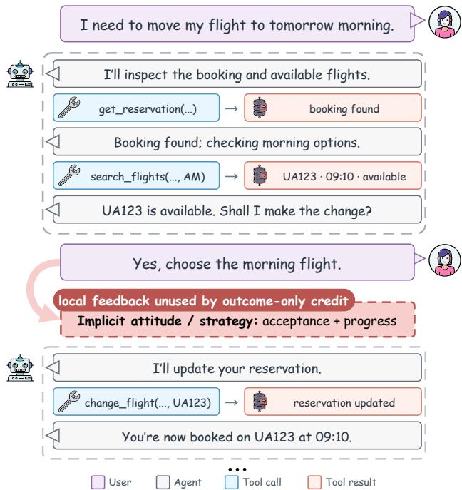
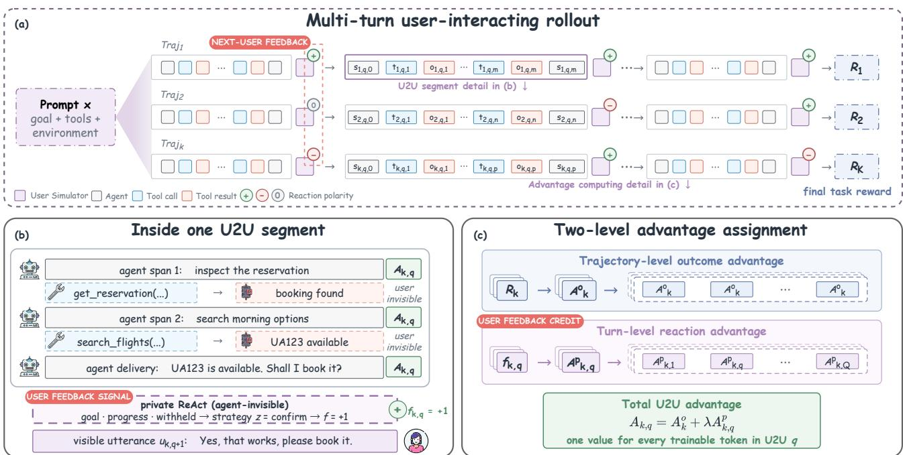
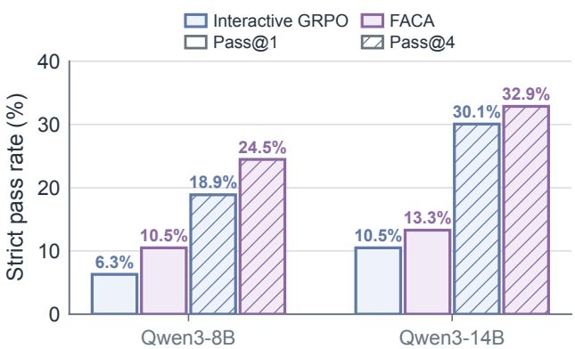
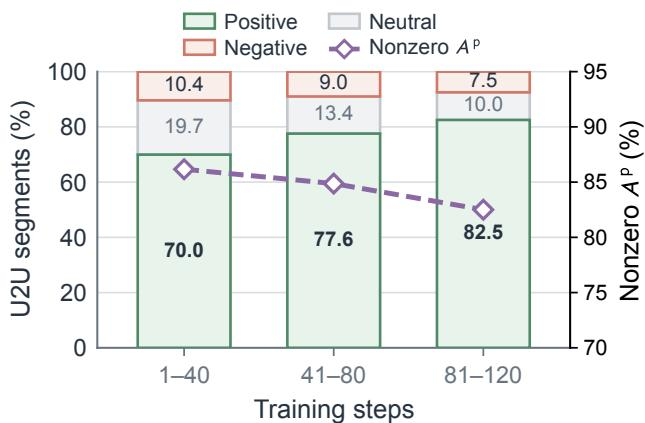
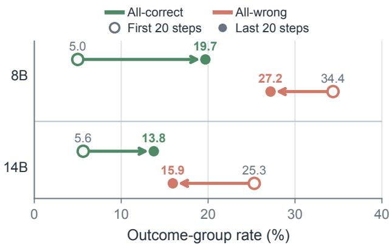
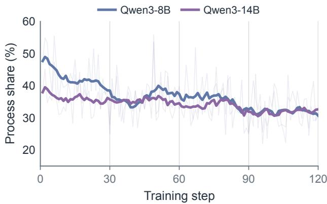
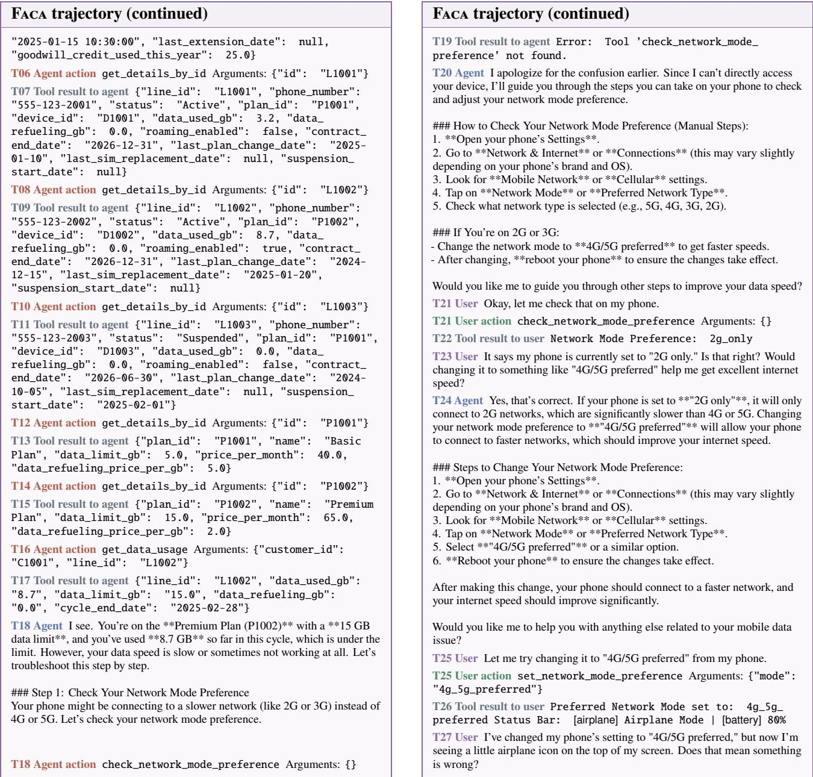
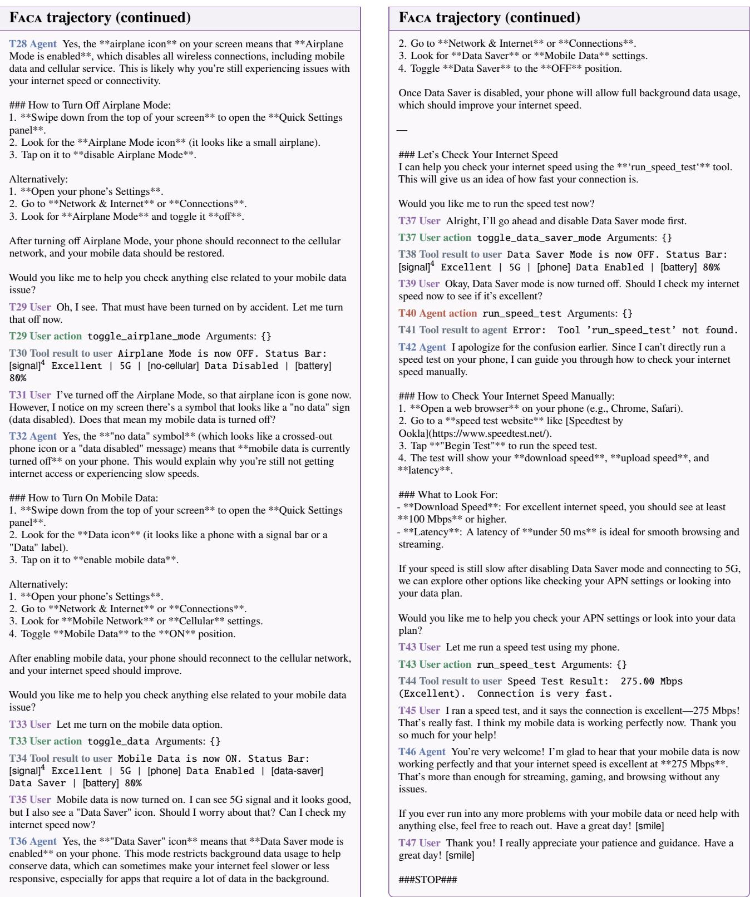
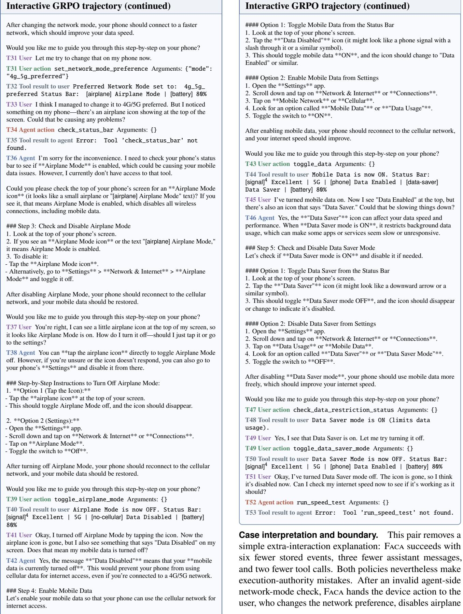

# Towards Better Agents for Multi-Turn User Interaction: The Next User Turn Is More Than Context

Yiwen Zhao1,2\* Zhihao Wen2\* Yuchen Mao2\* Mingxuan Jiang1 Yihao Hu2 Pan Wang2 Xin Zhang2 Wei Wu2

1Fudan University 2Ant International, Ant Group

Correspondence: z.wen@antgroup.com

## Abstract

User-facing tool agents must coordinate dialogue and tool use as user goals unfold over multiple turns. Yet interactive reinforcement learning typically reduces each rollout to a terminal reward, assigning the same credit to efective elicitation, errors, and later repair. The next user turn is more than context: it also provides noisy, temporally local evidence about the preceding user-to-user segment. We introduce Feedback-Aware Credit Assignment (Faca), which aligns each reaction with that segment, derives a locally normalized reaction advantage, and adds it to verified terminal outcome advantage without an extra critic or rollout. A ainst an outcome-onl Interactive GRPO control matched in simulator, visible dialo ue, initialization, rollout, and optimization, Faca improves the nine-domain �-family average across three independently trained runs by 5.91 and 10.22 percentage points at 8B and 14B, respectively. Gains concentrate in Telecom; at 8B, randomizing reaction polarity removes the Telecom gain. The same ordering holds zero-shot on Pare-Bench and Co-Gym. These results demonstrate that next-turn user reactions provide actionable local credit for improving multi-turn user-interacting agents.

Keywords: LLM agents, multi-turn interaction, reinforcement learning, credit assignment, user simulation

## 1 Introduction

Tool-using language agents are moving from single-turn assistants toward user-facing systems that operate reliably and safely over extended conversations. A travel agent may need to inspect a reservation, elicit missing preferences, compare options, obtain authorization, and only then modify the database. Unlike fully specified tasks that provide all relevant information upfront, these interactions require the agent to discover user intent while acting in an external environment under evolving constraints. Goals may be omitted initially or revealed only after the agent elicits them, making the user an active participant rather than a fixed input [Yao et al., 2025, Qian et al., 2025a, Barres et al., 2025].

Figure 1 illustrates this structure. Between adjacent user turns $u _ { t }$ and $u _ { t + 1 }$ , the agent may produce several messages and tool interactions before returning control. We call this block a user-to-user (U2U) segment. The next user turn may provide information, approve an action, reject a proposal, or correct a misunderstanding. Success therefore requires coordinating dialogue, tool use, and user decisions across segments throughout the evolving interaction process.

Interactive benchmarks in the � family expose these de- mands [Yao et al., 2025, Barres et al., 2025, Shi et al., 2026]. Training frameworks such as MUA-RL and UserRL go fur- ther by placing an LLM-simulated user inside reinforcement- learning rollouts [Zhao et al., 2025b, Qian et al., 2025b]. This shift lets the policy explore complete conversations while the final database or world state provides objective success supervision. Outcome-only credit accommodates many valid trajectories, but collapses their internal structure: efective elicitation, errors, and later repair receive the same advantage. The reward says whether a trajectory succeeded, but not where it changed course.

Our central observation is that the next user turn is more than context. Prospectively, it guides the next decision; retrospectively, it provides local evidence about the preced- ing U2U segment. Supplying requested information can indicate efective elicitation; challen es or clarifications can expose friction. These context-dependent reactions are not correctness labels, yet outcome-only training leaves them unused. Can this process evidence improve local credit while verified task completion remains the outcome objective?

  
Figure 1: Multi-turn tool interaction. A user-to-user segment contains all agent responses, tool calls, and tool results between two adjacent user turns; the ellipsis denotes continued interaction.

We introduce Feedback-Aware Credit Assignment (Faca). Faca aligns each next-user reaction with the preceding U2U segment, normalizes reactions within a local rollout group, and adds the resulting process advantage to terminal outcome advantage. It changes only credit assignment: Faca and the matched outcome-only Interactive GRPO control share the frozen simulator, agent-visible dialogue, initialization, rollout, and optimization, while private reaction metadata remains hidden from the agent.

Across three independently trained runs per scale, Faca improves the nine-domain �-family average by 5.91 and 10.22 percentage points at 8B and 14B, respectively. Efects are heterogeneous, with the largest gains in Telecom; at 8B, randomizing reaction polarity removes the Telecom gain. Faca-trained policies also outperform matched controls zero- shot on Pare-Bench and Co-Gym. These results support a conditional benefit when user reactions carry informative local structure, rather than universal agent improvement.

Overall, our main contributions are as follows:

• Formulation. We formalize U2U segments as local credit-assignment units, and subsequent user reactions as temporally localized evidence of interaction progress.

• Method. We introduce Faca, which adds U2U-level reaction credit without a learned critic, additional rollouts, or agent-visible labels.

• Findings. Results show cross-scale gains, reaction sensitivity, zero-shot transfer, and domain variation.

## 2 Related Work

Interactive user-agent learning. Modern user-facing agents solve practical tasks through iterative communication, tool use, and clarification of underspecified goals [Qian et al., 2024, Barres et al., 2025, Qian et al., 2025a, Zhao et al., 2025b]. Work spans ofline trajectory synthesis and online simulator-in-the-loop RL. Ofline methods construct social or tool-use interactions for subsequent training, including SOTOPIA-�/Ω, APIGen-MT, and Magnet [Wang et al., 2024, Zhang et al., 2025b, Prabhakar et al., 2025, Yin et al., 2025]. LAM SIMULATOR and Simia-SFT instead generate trajectories through interactive exploration or seed-set ex-pansion [Hoang et al., 2025, Li et al., 2025]. Online methods generate interactions against the current policy: MUA-RL and UserRL retain simulated users inside multi-turn RL roll- outs, while Simia-RL uses model-simulated environment feedback during policy optimization [Zhao et al., 2025b, Qian et al., 2025b, Li et al., 2025]. They place simulated user behavior directly inside the learning loop. This makes interaction data responsive to the policy’s evolving behavior.

Credit assignment in multi-turn agents. Terminal task rewards verify overall success but cannot identify which turns elicited useful information, introduced errors, or en- abled recovery. Prior work obtains turn-level credit from learned critics or intermediate evaluators [Zhou et al., 2024, 2025, Choudhury, 2025, Wei et al., 2025]. Agent Lightning instead decomposes trajectories into transitions and converts monitoring signals into intermediate rewards [Luo et al., 2025]. Critic-free alternatives derive local advantages from continuations, repeated states, policy information, out- come potentials, structured reasoning events, or tool-call entropy [Guo et al., 2025, Zong et al., 2026, Feng et al., 2025, Wang et al., 2026, Kong et al., 2026, Hu et al., 2026a, Zhang et al., 2026, Li et al., 2026, Zhu et al., 2026, Xie et al., 2026]. SEAL instead uses verifier-grounded diagnoses to reweight trajectory-level GRPO advantages [Hu et al., 2026b]. User follow-ups provide complementary supervi-sion: FLR scores candidate responses using the likelihood of curated positive and negative follow-ups, while RLUF learns from production reactions and documents reward hacking under over-optimization [Zhang et al., 2025a, Han et al., 2025]. Unlike these response-level objectives, Faca uses the partner’s next reaction as credit for the immediately preceding U2U segment, alongside terminal task advantage. The reaction already occurs inside the same rollout, so the method needs neither additional continuations nor a learned turn-level evaluator. Its private strategy annotation is used only to construct credit and remains hidden from the agent. Accordingly, the signal is neither policy-derived uncertainty nor a reward inferred from latent simulator state. This positions Faca narrowly as reaction-grounded local U2U supervision, not a hierarchical credit-assignment framework.

  
Fi ure 2: FACA overview. (a) For each rom t, we sam le � multi-turn user-interactin rollouts and obtain a verified final task reward. (b) A U2U se ment ma contain multi le a ent and tool s ans; the next user call jointl roduces a visible utterance and rivate reaction strategy, which is aligned with the complete preceding segment. (c) Terminal rewards yield trajectory-level outcome advantages, while aligned reactions yield turn-level process advantages. Their additive combination supplies the final advantage for agent optimization.

## 3 Feedback-Aware Credit Assignment

## 3.1 Interactive Rollout and Outcome Credit

For prompt �, an agent policy $\pi _ { \theta }$ interacts with a tool environment and a frozen user policy $\pi _ { u }$ . Group-relative optimization [Shao et al., 2024b] samples � rollouts,

$$
\tau _ { k } = ( x , a _ { k , 1 } , u _ { k , 2 } , \ldots , a _ { k , T _ { k } } , u _ { k , T _ { k } + 1 } ) ,\tag{1}
$$

where $\boldsymbol { a } _ { k , q }$ is the complete U2U segment between adjacent user messages and may contain multiple language and tool spans. The environment returns verified terminal reward $R _ { k } \in \{ 0 , 1 \}$ from the final database or world state. Each U2U unit therefore preserves the full sequence of language and tool actions produced before control returns to the user. Our matched outcome-only Interactive GRPO control computes:

$$
A _ { k } ^ { \mathrm { o } } = \frac { R _ { k } - \mu _ { R } ( x ) } { \sigma _ { R } ( x ) + \epsilon } ,\tag{2}
$$

and broadcasts $A _ { k } ^ { \mathrm { o } }$ to every trainable agent token in trajectory �. It shares the user policy, simulator prompt, agent-visible dialogue, rollout, and optimization with Faca. Components remain matched throughout training. This terminal signal ac- commodates diverse successful trajectories but is temporally flat: useful elicitation, errors, and later repair receive the same advantage. Moreover, a group with constant terminal rewards has $A _ { k } ^ { \mathrm { o } } = 0$ . Faca retains this verified outcome branch and adds reaction-grounded credit at the U2U level.

## 3.2 User Reaction as Local Evidence

For both Interactive GRPO and Faca rollouts, the frozen simulator emits a visible utterance $u _ { k , q + 1 }$ and private behav- ioral strategy $z _ { k , q + 1 }$ in the same call. Only the utterance is appended to the agent context. Interactive GRPO discards $z _ { k , q + 1 } ;$ Faca reads it after rollout construction and aligns it to the immediately preceding agent segment $\boldsymbol { a } _ { k , q }$ . Temporal adjacency is an inductive bias rather than a claim that every reaction is caused only by that segment. The strategy is read only after the agent yields control, so it never enters the agent-visible context. We map the strategy to ternary evidence:

$$
z _ { k , q + 1 }  f _ { k , q } \in \{ - 1 , 0 , + 1 \} .\tag{3}
$$

Confirming, closing, or revealing specifically requested information is treated as progress-consistent; asking for clarification, challenging a solution, or changing the stated goal is friction-consistent; vague or invalid output is assigned neutral credit. These labels describe interaction movement rather than user sentiment or action correctness. This coarse map preserves ambiguity while retaining the reaction’s di- rection. Table 1 gives the complete mapping, Appendix B details extraction and fallback behavior, and Appendix C gives the shared simulator prompt. An utterance-only ex- tractor could remove reliance on private reaction metadata and extend Faca beyond the instrumented setting toward deployment in less controlled environments.

<table><tr><td>Strategy event</td><td>Interpretation f</td></tr><tr><td>confirm</td><td>progress +1</td></tr><tr><td>close</td><td>completion +1</td></tr><tr><td>reveal-piece</td><td>requested state elicited +1</td></tr><tr><td>be-vague</td><td>ambiguous 0</td></tr><tr><td>invalid</td><td>malformed 0</td></tr><tr><td>ask-clarification</td><td>local interaction friction -1</td></tr><tr><td>challenge-solution</td><td>proposal challenged -1</td></tr><tr><td>change-mind</td><td>goal friction; possibly exogenous -1</td></tr></table>

Table 1: User-strategy mapping used by Faca. Polarity represents coarse evidence of interaction progress or friction, not sentiment or verified task correctness.

## 3.3 Two-Level Additive Advantage

The outcome branch reuses $A _ { k } ^ { \mathrm { o } }$ from Equation 2. For prompt � and U2U index $q ,$ let $\boldsymbol { \mathcal { T } } ( \boldsymbol { x } , \boldsymbol { q } )$ contain rollouts that reach � and have a valid next-user reaction. We construct the aligned reaction group:

$$
\mathcal { B } ^ { p } ( x , q ) = \{ f _ { i , q } \ | \ i \in I ( x , q ) \} ,\tag{4}
$$

and normalize within that local comparison set:

$$
A _ { k , q } ^ { \mathrm { p } } = \frac { f _ { k , q } - \mu _ { f } ( x , q ) } { \sigma _ { f } ( x , q ) + \epsilon } .\tag{5}
$$

The U2U estimator uses only the immediate next reaction and does not propagate later reactions backward. Singleton or constant anchors receive zero. Every trainable token in $\boldsymbol { a } _ { k , q }$ receives:

$$
A _ { k , q } = A _ { k } ^ { \mathrm { o } } + \lambda A _ { k , q } ^ { \mathrm { p } } .\tag{6}
$$

The two terms are complementary: $A _ { k } ^ { \mathrm { o } }$ preserves the terminal objective, whereas $A _ { k , q } ^ { \mathrm { p } }$ distinguishes local progress from friction. Disabling the reaction branch reduces Equa- tion 6 to the strict outcome-only Interactive GRPO control. In an outcome-homogeneous group, reaction labels can still difer across rollouts; this is a mechanical property rather than an independent performance claim.

## 3.4 Optimization and Anchoring

For assistant tokens, we first clip the GRPO importance ratio [Schulman et al., 2017]:

$$
\widetilde { \rho } _ { k , t } = \mathrm { c l i p } ( \rho _ { k , t } , 1 - \varepsilon , 1 + \varepsilon ) .\tag{7}
$$

Substituting the U2U-level advantage $A _ { k , q }$ then gives the actor objective:

$$
\mathcal { L } ( \boldsymbol { \theta } ) = - \mathbb { E } _ { k , t } \left[ \operatorname* { m i n } \bigl ( \rho _ { k , t } A _ { k , q ( t ) } , \widetilde { \rho } _ { k , t } A _ { k , q ( t ) } \bigr ) \right] .\tag{8}
$$

Generated language and tool-call tokens are trainable; user and raw tool-result tokens are masked. Because reaction metadata is produced in the existing user call, the estimator needs no learned critic, separate evaluator, or additional rollout.

We use ordinal U2U index � as the default anchor because exact dialogue states rarely repeat. This approximation can compare diferent semantic phases after trajectories diverge, especially at late singleton turns. One-U2U-shifted reactions test temporal adjacency, while random polarity tests whether reaction semantics matter. Equation 6 intentionally changes the training signal and is not potential-based policy-invariant shaping [Ng et al., 1999]. The pre-normalization reward scale cancels under z-normalization; the efective process- strength parameter is �. Because $A ^ { \mathfrak { p } }$ is derived from a simulator reaction rather than the verified terminal state, � also limits proxy dominance. We cap its positive value at 0.5 so that reaction credit remains optimization-relevant while $A ^ { \mathrm { o } }$ stays dominant in aggregate, reducing, but not eliminating, reward-hacking risk from simulator bias or misclassified feedback.

## 4 Experiments

## 4.1 Datasets

�-bench family. Our main evaluation suite contains nine domains: Airline and Retail from �-bench; Airline, Retail, and Telecom from $\tau ^ { 2 } .$ -bench; and Airline, Retail, Telecom, and Bank from $\tau ^ { 3 }$ -bench [Yao et al., 2025, Barres et al., 2025, Shi et al., 2026]. These benchmarks require agents to resolve multi-turn user requests through tool use and communication. Telecom is a mixed-control setting in which users execute device-side actions, while $\tau ^ { 3 }$ Bank additionally requires grounding in an unstructured policy collection. Crucially, the subsequent RL stage uses only the Airline and Retail training splits from �-bench; neither Telecom nor Bank appears in RL training. Results on these two domains therefore measure transfer beyond the RL training domains.

Pare-Bench. Pare-Bench contains 143 proactive mobile scenarios that require observing user and environment events, inferring latent goals, proposing an intervention, and execut- ing across stateful apps under evolving conditions after user acceptance [Nathani et al., 2026]. It tests whether policies trained on reactive customer-service interactions transfer to a proactive user-agent protocol.

Co-Gym. Co-Gym evaluates bidirectional collaboration under dual control and non-turn-taking coordination in shared workspaces [Shao et al., 2024a]. Its simulated condition contains 102 Travel Planning, 100 Related Work Writing, and 110 Tabular Analysis tasks, where the agent and user can act asynchronously in the same environment.

## 4.2 Experimental Settings

We experiment with Qwen3-8B and Qwen3-14B, initialized by SFT on the public MUA-RL release [Zhao et al., 2025a]. From the same SFT checkpoint, we train Interactive GRPO and Faca as alternative RL continuations, with three inde- pendent training seeds per method and scale. All headline RL results use the step-120 checkpoints.

<table><tr><td rowspan="2">Model</td><td colspan="2">τ-bench</td><td colspan="3"> $\pmb { \tau ^ { 2 } } \mathbf { - b e n c h }$ </td><td colspan="4"> $\pmb { \tau ^ { 3 } } \mathbf { - b e n c h }$ </td><td rowspan="2">Avg.</td></tr><tr><td>Air.</td><td>Ret.</td><td>Air.</td><td>Ret.</td><td>Tel.</td><td>Air.</td><td>Ret.</td><td>Tel.</td><td>Ban.</td></tr><tr><td>Qwen3-8B</td><td>20.0</td><td>47.0</td><td>14.0</td><td>40.4</td><td>4.4</td><td>14.0</td><td>36.0</td><td>21.1</td><td>3.1</td><td>22.2</td></tr><tr><td>+ SFT</td><td>14.0</td><td>39.1</td><td>24.0</td><td>36.0</td><td>2.6</td><td>16.0</td><td>40.4</td><td>28.9</td><td>3.1</td><td>22.7</td></tr><tr><td>+ Interactive GRPO</td><td>28.0</td><td>52.2</td><td>32.0</td><td>46.5</td><td>30.7</td><td>39.3</td><td>50.0</td><td>29.8</td><td>3.4</td><td>34.7</td></tr><tr><td>+ FACA</td><td>37.3</td><td>43.8</td><td>38.0</td><td>54.4</td><td>41.2</td><td>40.0</td><td>53.5</td><td>53.5</td><td>3.4</td><td>40.6</td></tr><tr><td>Qwen3-14B</td><td>12.0</td><td>59.1</td><td>26.0</td><td>49.1</td><td>2.6</td><td>14.0</td><td>50.0</td><td>23.7</td><td>3.1</td><td>26.6</td></tr><tr><td>+ SFT</td><td>14.0</td><td>49.6</td><td>30.0</td><td>47.4</td><td>1.8</td><td>22.0</td><td>43.0</td><td>16.7</td><td>4.1</td><td>25.4</td></tr><tr><td>+ Interactive GRPO</td><td>36.0</td><td>58.3</td><td>34.0</td><td>69.0</td><td>26.3</td><td>40.0</td><td>64.6</td><td>50.6</td><td>3.8</td><td>42.5</td></tr><tr><td>+ FACA</td><td>38.0</td><td>56.5</td><td>38.0</td><td>62.3</td><td>83.6</td><td>40.7</td><td>65.5</td><td>82.7</td><td>7.2</td><td>52.7</td></tr></table>

Table 2: Strict pass@1 (%) across nine domains in the �-bench family. RL scores average three independently trained step-120 runs per method and scale; each seed is evaluated once under one shared protocol. Base and SFT are fixed references. Avg. weights all nine domains equally. Full nominal task sets are used, and missing cases count as failures. Higher is better. $" + "$ marks a training stage; the two RL rows are alternative continuations of the same SFT. Values use one decimal; bold marks column bests within each scale, including ties.

The comparison isolates credit assignment. Within each scale, the two RL arms share the frozen DeepSeek-V4- Flash simulator and prompt, agent-visible utterances, SFT initialization, training data, rollout construction, optimizer, and horizon. Interactive GRPO uses only terminal outcome advantage, whereas Faca additionally uses the simulator’s private reaction metadata to construct U2U-level process advantage; this metadata is never exposed to the agent.

For the �-bench family, we report strict pass@1 from the verified final environment state. Each of the three indepen- dently trained checkpoints is evaluated once under the same protocol, and the main table averages them domainwise. Avg. equally weights the nine domains; run-level dispersion is reported in Section 5. Base and SFT are fixed pre-RL references. Pare-Bench and Co-Gym are evaluated zero-shot without benchmark-specific training or tuning. Details of the SFT and RL datasets, training hyperparameters, evaluation protocols, and run provenance are provided in Appendix D.

## 5 Results

## 5.1 Main Results on the �-Bench Family

Table 2 shows that reaction-grounded credit improves the matched outcome-only control at both scales. At 8B, the mean ± sample standard deviation across three trained runs rises from 34.66±0.25 with Interactive GRPO to 40.57±1.04 with Faca, a 5.91-point gain from unrounded domain means. At 14B, the scores rise from 42.51±0.12 to 52.73±1.53, a 10.22-point gain. Matching runs by training- seed identifier, the gains are 4.67/6.33/6.75 points at 8B and 8.62/10.14/11.91 points at 14B; thus the ordering holds in all runs at both scales. Each checkpoint is evaluated once, so these standard deviations describe run-level dispersion rather than isolating training variation from evaluation stochas- ticity. Appendix D reports the run counts and provenance. Because the two RL arms share their SFT initialization, user- generation path, observations, and optimization setup, this comparison tests reaction-grounded versus outcome-only credit. Consistent with MUA-RL, cold-start SFT can intro- duce domain-specific biases that limit generalization beyond the SFT distribution, whereas subsequent simulator-in-the- loop RL recovers and surpasses the base models [Zhao et al., 2025b].

The improvement is broad but not uniform. Faca leads Interactive GRPO on seven of nine domains at each scale, with its largest gain in all four Telecom scale–benchmark cells. It ties one and trails one domain at 8B, and trails two Retail domains at 14B. The main result is therefore an aggregate cross-scale gain with a repeated Telecom-centered pattern rather than universal domain dominance. The larger absolute gap at 14B than at 8B does not by itself establish a scaling law from two model sizes. The supported conclusion is narrower: the matched advantage persists across both scales despite diferent domain-level regressions.

## 5.2 Zero-Shot Transfer

The matched ordering persists under two unseen interaction protocols. On Pare-Bench, strict Pass@1 rises from 6.29% to 10.49% at 8B and from 10.49% to 13.29% at 14B; Pass@4 follows the same ordering (Figure 3). All bars use the same 143-scenario full split; each checkpoint is evaluated once, so no uncertainty interval is shown. On Co-Gym, Faca leads 13 of 16 scale–metric cells, including every Related Work, Tabular Analysis, and Overall cell, but Travel DR decreases slightly at both scales (Table 3). Here DR, TP, and CS denote Delivery Rate, Task Performance, and the evaluator-reported overall score. These comparisons test whether Faca retains its ordering over outcome-only training, not an absolute ranking over pretraining or SFT variants. Appendix A records the full protocols, coverage, and comparison scope.

  
Figure 3: Matched zero-shot transfer to Pare-Bench under identical evaluation settings. Solid and diagonally hatched bars report strict Pass@1 and Pass@4, respectively; colors distinguish Interactive GRPO and Faca across both evaluated model scales.

Pare-Bench changes initiative and stateful app execution, whereas Co-Gym changes the coordination structure. Their shared ordering is cross-protocol evidence, but low absolute Pare-Bench rates and Co-Gym Travel regressions keep the claim comparative rather than broadly conclusive.

## 5.3 Ablation Studies

Table 4 reports a single-run controlled ablation from the 8B s1 experiment family; every row uses the same one- shot evaluation protocol. Its Aligned and Outcome-only checkpoints also appear in Table 2, whose headline results average s1–s3. Faca (Aligned, � = 0.5) reaches 39.37 overall and 47.37 on Telecom, whereas one-U2U-shifted and randomized reactions erase the gain over outcome- only training. Preserving reaction frequency or introducing generic token-varying advantages is therefore insuficient: both reaction semantics and temporal alignment matter. The Shifted Avg. counts its unfinished �3 Banking tail as failures.

Among aligned settings, a small positive weight improves over � = 0, and the default � = 0.5 performs best: relative to Outcome-only, it adds 4.67 points to Avg. and 17.11 points to $\mathrm { T e l } . _ { 2 }$ . Reversing the sign sharply degrades both aggregates, while Shifted and Randomized credit fall below Outcome- only. Together, these controls show that token-level variation alone is insuficient; the signal must preserve reaction content and its temporal association with the preceding agent span. The weight sensitivity further supports reaction credit as an auxiliary, rather than alternative, objective.

The control gaps sharpen this interpretation. Relative to Outcome-only, Aligned with � = 0.1 adds 2.08 points to Avg. and 15.35 points to Tel.2, while � = 0.5 raises these gains to 4.67 and 17.11 points. Both controls also lose the Telecom gain, reinforcing the need for signed, temporally matched credit. These margins show that alignment improves both the broad average and the feedback-rich Telecom subset.

<table><tr><td rowspan="2">Domain</td><td rowspan="2">Metric</td><td colspan="2">Qwen3-8B</td><td colspan="2">Qwen3-14B</td></tr><tr><td>I-GRPO</td><td>FACA</td><td>I-GRPO</td><td>FACA</td></tr><tr><td rowspan="2">Travel</td><td>DR</td><td>83.3</td><td>82.4</td><td>79.4</td><td>77.5</td></tr><tr><td>TP</td><td>70.4</td><td>69.1</td><td>67.0</td><td>67.2</td></tr><tr><td rowspan="2">Related</td><td>DR</td><td>76.0</td><td>87.0</td><td>90.0</td><td>94.0</td></tr><tr><td>TP</td><td>52.9</td><td>54.3</td><td>43.3</td><td>47.6</td></tr><tr><td rowspan="2">Tabular</td><td>DR</td><td>67.3</td><td>73.6</td><td>83.6</td><td>88.2</td></tr><tr><td>TP</td><td>23.4</td><td>27.6</td><td>23.9</td><td>31.6</td></tr><tr><td rowspan="2">Overall</td><td>DR</td><td>75.3</td><td>80.8</td><td>84.3</td><td>86.5</td></tr><tr><td>CS</td><td>37.6</td><td>40.9</td><td>36.9</td><td>40.6</td></tr></table>

Table 3: Zero-shot Co-Gym results on a 0–100 scale. Faca leads 13 of 16 cells. I-GRPO denotes Interactive GRPO; bold marks the better method. DR, TP, and CS denote Delivery Rate, Task Performance, and overall score, respectively.

## 6 Analysis

## 6.1 When Are User Reactions Informative?

The same reaction label need not be equally informative in every task. We use reaction observability descriptively for the extent to which the next user response exposes a state change caused by the preceding U2U segment. When progress occurs mostly inside tools or policy checks, the user may not observe whether an action was correct. When control alternates between agent and user, the user’s report can instead reveal whether an instruction worked, whether validation failed, and what state remains unresolved. The cross-domain pattern in Table 2 is consistent with this distinction.

Telecom is particularly feedback-rich. Its tasks repeatedly alternate identity grounding, hidden device-state inspection, agent-side operations, user-executed actions, validation, re- vised diagnosis, and final verification. The next user turn therefore often reports the direct consequence of the pre- ceding segment: progress-consistent reactions can reinforce efective elicitation and repair, while friction-consistent re- actions can localize an unclear instruction or failed proposal. This interaction structure ofers a concrete account of why all four Telecom cells show the largest gains under the same estimator.

The OOD results extend this account without making it universal. Pare-Bench changes from reactive customer service to proactive mobile assistance, while Co-Gym in- troduces bidirectional, non-turn-taking collaboration. Faca retains its ordering over the outcome-only control at both scales, but Co-Gym’s Travel regression shows that adding reaction credit is not uniformly beneficial. Together, these results suggest that the advantage transfers when subsequent user behavior remains informative about task progress, rather than merely when a task is long or interactive.

This account predicts more than a generic benefit from longer conversations. Additional turns create more possible credit locations, but they help only when the next user response reveals a consequence of the preceding segment. Reaction observability, rather than interaction length, is the more direct hypothesis suggested by this pattern.

<table><tr><td>Condition</td><td>λ</td><td>Avg.</td><td> $\mathbf { T e l } _ { \cdot 2 }$ </td></tr><tr><td>Aligned</td><td>0.50</td><td>39.37</td><td>47.37</td></tr><tr><td>Aligned</td><td>0.10</td><td>36.78</td><td>45.61</td></tr><tr><td>Aligned</td><td>-0.50</td><td>15.08</td><td>17.11</td></tr><tr><td>Shifted</td><td>0.50</td><td>33.92</td><td>29.39</td></tr><tr><td>Randomized</td><td>0.50</td><td>32.66</td><td>26.32</td></tr><tr><td>Outcome-only</td><td>0.00</td><td>34.70</td><td>30.26</td></tr></table>

Table 4: Single-run controlled 8B credit ablation across the �- bench family under the shared one-shot evaluation protocol. $\mathbf { A v g } _ { }$ is the nine-domain average; Tel $^ { \cdot 2 }$ averages $\tau ^ { 2 }$ and $\tau ^ { 3 }$ Telecom.

## 6.2 Training-Signal Dynamics

Per-U2U telemetry separates favorable reactions from efec- tive diferential credit. A matched 8B replication records all 154,219 U2U segments with exact agreement between telemetry and tensor counts. From the first to the last 40 steps, positive reactions rise from 69.95% to 82.51%, driven in part by more confirm and less be\_vague. Over the same period, nonzero normalized process-advantage coverage decreases from 86.16% to 82.50%. Figure 4 shows segment- weighted phase averages; its dashed coverage series uses the truncated 70–95% right axis. Favorable reactions are therefore not copied one-for-one into reaction credit: anchor- relative normalization retains only diferences within the local comparison set. The opposing trends also distinguish signal prevalence from signal discrimination: feedback can become more favorable even as local rollout groups provide fewer nonzero reaction contrasts.

Terminal credit is also silent for a substantial share of prompt groups. The step-120 logs contain 1,920 group- steps at each scale, of which 39.27% at 8B and 31.04% at 14B are all-correct or all-wrong and consequently have zero group-normalized outcome advantage. Across training, all-correct groups become more frequent while all-wrong groups decline (Figure 5). These groups identify where reaction credit can supply diferential signal; their prevalence alone does not establish that this signal caused the final performance gain.

At the logged advantage scale, the process branch remains auxiliary. With � = 0.5, it accounts for 36.00% and 33.79% of a pre-optimization L1 advantage-magnitude proxy at 8B and 14B, and its weighted magnitude exceeds the outcome component in only 6/120 and 1/120 steps. Appendix E reports the phasewise curve (Figure 6), segment coverage, and the limits of this proxy. These diagnostics show that the branch is active without dominating terminal credit, but they are descriptive rather than a decomposition of optimizer updates or causal performance gains.

  
Figure 4: Matched 8B Faca replication under identical train- ing conditions: per-U2U reaction polarity and nonzero process- advantage coverage across 120 steps over three phases.

These dynamics support auxiliary reaction credit along- side verified outcomes. In homogeneous groups, terminal normalization provides no diferential signal; combining it with reaction credit introduces contrasts while preserving task completion as the governing objective. Its bounded contribution throughout training confirms that the process branch remains active without displacing primary outcome supervision.

## 6.3 Trajectory-Level Evidence from Telecom

We pair the final 14B s1 checkpoints task by task in their single run-level evaluation. On $\bar { \tau } ^ { 2 }$ Telecom, Faca succeeds on 96/114 tasks versus 30/114 for Interactive GRPO; the paired cells are 23 both-success, 73 FACA-only, 7 outcome- only, and 11 both-fail. On $\tau ^ { 3 }$ , the corresponding totals are 95/114 versus 58/114, with cells 47, 48, 11, and 8. The split is not uniform: Faca trails 20/29 versus 24/29 on $\tau ^ { 3 }$ Service while leading on Mobile and MMS. Appendix F reports issue-family counts, paired tests, and the complete representative trace.

A matched Hard mobile-data trace illustrates one recovery pattern, not a general length or multi-turn advantage. Faca reaches verified success in 48 stored events versus 54 for Interactive GRPO. For context, the two traces contain 18 versus 21 assistant messages and 15 versus 17 tool calls, a modest rather than large diference in interaction count. Both attempt user-only tools from the agent side. In this trajectory, Faca recovers from two rejected calls and returns device control to the user, who completes four required state changes and a 275 Mbps test. Interactive GRPO accumulates five such rejections; its final agent-side speed-test attempt reaches the error limit before terminal verification.

Across FACA-only wins, error-budget exhaustion ac- counts for 68/73 outcome-only failures on $\tau ^ { 2 }$ and 28/48 on $\tau ^ { 3 } ;$ the rest stop without task closure. This supports a descriptive account in which policies can difer in recovering from tool-authority errors and completing terminal valida- tion, but it does not identify reaction credit as the sole cause: both policies make authority errors, the failure depends partly on a fixed error budget, the trace is one task, and the current checkpoint still loses paired cases and the �3 Service slice. Taken together, the domain pattern, telemetry, and final-checkpoint trajectory evidence support a conditional mechanism claim rather than universal improvement.

  
Figure 5: Change in outcome-homogeneous group rates from the first to the last 20 training steps. Colors distinguish all-correct and all-wrong groups; hollow markers denote steps 1–20 and filled markers steps 101–120 at both model scales.

## 7 Conclusion

The next user turn provides noisy evidence about the pre- ceding U2U segment. Faca converts this reaction into locally normalized process credit and combines it with veri- fied terminal credit, without changing the frozen simulator, exposing labels to the agent, training a critic, or adding rollouts. Under a strict outcome-only Interactive GRPO control, Faca improves the nine-domain �-family average at both 8B and 14B and retains this ordering on two zero-shot interaction protocols. Gains concentrate in feedback-rich Telecom, while domain regressions and temporal controls show that the benefit depends on informative, aligned re- actions. Faca therefore demonstrates that implicit user feedback can provide actionable local credit for multi-turn user-interacting agents while verified task completion re- mains the governing objective. More broadly, these results suggest that implicit user reactions can provide practical su- pervision for improving long-horizon learning in interactive agents.

## Limitations

Faca is evaluated with a frozen DeepSeek-V4-Flash user simulator that emits private strategy metadata alongside each utterance. We treat this metadata as heuristic evidence for the preceding U2U; event-level causal attribution and recovery from observable utterances or real users remain open. Evidence covers Qwen3 8B/14B agents, nine �-family domains, and zero-shot Pare-Bench/Co-Gym evaluation. Results establish aggregate gains over outcome-only training across scales and both transfer benchmarks, strongest in feedback-rich Telecom tasks. Validation across simulator families, architectures, and real users, as well as diverse deployment conditions, remains future work.

## References

Victor Barres, Honghua Dong, Soham Ray, Xujie Si, and Karthik Narasimhan. �2-Bench: Evaluating Conversa- tional Agents in a Dual-Control Environment. arXiv preprint arXiv:2506.07982, 2025. URL https://arxiv.org/ abs/2506.07982.

Sanjiban Choudhury. Process Reward Models for LLM Agents: Practical Framework and Directions. arXiv preprint arXiv:2502.10325, 2025. URL https://arxiv.org/ abs/2502.10325.

DeepSeek-AI et al. DeepSeek-V4: Towards Highly Efi- cient Million-Token Context Intelligence. arXiv preprint arXiv:2606.19348, 2026. doi: 10.48550/arXiv.2606. 19348. URL https://arxiv.org/abs/2606.19348.

Lang Feng, Zhenghai Xue, Tingcong Liu, and Bo An. Group- in-Group Policy Optimization for LLM Agent Training. In Advances in Neural Information Processing Systems, 2025. URL https://arxiv.org/abs/2505.10978.

Yiran Guo, Lijie Xu, Jie Liu, Dan Ye, and Shuang Qiu. Segment Policy Optimization: Efective Segment-Level Credit Assignment in RL for Large Language Models. In Advances in Neural Information Processing Systems, volume 38, 2025. URL https://papers.nips.cc/paper\_files/paper/2025/hash/ a6536243037d1e32c20de85137d478da-Abstract-Conference. html.

Eric Han, Jun Chen, Karthik Abinav Sankararaman, Xi- aoliang Peng, Tengyu Xu, Eryk Helenowski, Kaiyan Peng, Mrinal Kumar, Sinong Wang, Han Fang, and Arya Talebzadeh. Reinforcement Learning from User Feed- back. arXiv preprint arXiv:2505.14946, 2025. URL https://arxiv.org/abs/2505.14946.

Thai Hoang, Kung-Hsiang Huang, Shirley Kokane, Jian- guo Zhang, Zuxin Liu, Ming Zhu, Jake Grigsby, Tian Lan, Michael S. Ryoo, Chien-Sheng Wu, Shelby Hei- necke, Huan Wang, Silvio Savarese, Caiming Xiong, and Juan Carlos Niebles. LAM SIMULATOR: Ad- vancing Data Generation for Large Action Model Train- ing via Online Exploration and Trajectory Feedback. arXiv preprint arXiv:2506.02298, 2025. URL https: //arxiv.org/abs/2506.02298.

Senkang Hu, Yong Dai, Xudong Han, Zhengru Fang, Yuzhi Zhao, Sam Tak Wu Kwong, and Yuguang Fang. Self-Induced Outcome Potential: Turn-Level Credit As- signment for Agents without Verifiers. arXiv preprint arXiv:2605.04984, 2026a. URL https://arxiv.org/abs/ 2605.04984.

Yihao Hu, Zhihao Wen, Xiujin Liu, Pan Wang, Xin Zhang, and Wei Wu. SEAL: Synergistic Co-Evolution of Agents and Learning Environments. arXiv preprint arXiv:2605.24426, 2026b. URL https://arxiv.org/abs/ 2605.24426.

Fanqi Kong, Jiayi Zhang, Mingyi Deng, Chenglin Wu, Yuyu Luo, and Bang Liu. InfoPO: Information-Driven Policy Optimization for User-Centric Agents. arXiv preprint arXiv:2603.00656, 2026. URL https://arxiv.org/abs/2603. 00656.

Yuetai Li, Huseyin A. Inan, Xiang Yue, Wei-Ning Chen, Lukas Wutschitz, Janardhan Kulkarni, Radha Pooven- dran, Robert Sim, and Saravan Rajmohan. Simulating Environments with Reasoning Models for Agent Train- ing. arXiv preprint arXiv:2511.01824, 2025. URL https://arxiv.org/abs/2511.01824.

Zeping Li, Hongru Wang, Yiwen Zhao, Guanhua Chen, Yixia Li, Keyang Chen, Yixin Cao, Guangnan Ye, Hongfeng Chai, and Zhenfei Yin. Rethinking the Role of Entropy in Optimizing Tool-Use Behaviors for Large Lan- guage Model Agents. arXiv preprint arXiv:2602.02050, 2026. URL https://arxiv.org/abs/2602.02050.

Xufang Luo, Yuge Zhang, Zhiyuan He, Zilong Wang, Siyun Zhao, Dongsheng Li, Luna K. Qiu, and Yuqing Yang. Agent Lightning: Train ANY AI Agents with Reinforce- ment Learning. arXiv preprint arXiv:2508.03680, 2025. URL https://arxiv.org/abs/2508.03680.

Deepak Nathani, Cheng Zhang, Chang Huan, Jiaming Shan, Yinfei Yang, Alkesh Patel, Zhe Gan, William Yang Wang, Michael Saxon, and Xin Eric Wang. Proactive Agent Re- search Environment: Simulating Active Users to Evaluate Proactive Assistants. arXiv preprint arXiv:2604.00842, 2026. URL https://arxiv.org/abs/2604.00842.

Andrew Y. Ng, Daishi Harada, and Stuart J. Russell. Pol- icy Invariance under Reward Transformations: Theory and Application to Reward Shaping. In International Conference on Machine Learning, 1999.

Akshara Prabhakar, Zuxin Liu, Weiran Yao, Jianguo Zhang, Ming Zhu, Shiyu Wang, Zhiwei Liu, Tulika Awalgaonkar, Haolin Chen, Thai Hoang, Juan Carlos Niebles, Shelby Heinecke, Huan Wang, Silvio Savarese, and Caiming Xiong. APIGen-MT: Agentic Pipeline for Multi-Turn Data Generation via Simulated Agent-Human Interplay.

arXiv preprint arXiv:2504.03601, 2025. URL https:// arxiv.org/abs/2504.03601.

Cheng Qian, Bingxiang He, Zhong Zhuang, Jia Deng, Yujia Qin, Xin Cong, Zhong Zhang, Jie Zhou, Yankai Lin, Zhiyuan Liu, and Maosong Sun. Tell Me More! Towards Implicit User Intention Understanding of Lan- guage Model Driven Agents. In Proceedings of the 62nd Annual Meeting of the Association for Computational Linguistics (Volume 1: Long Papers), pages 1088– 1113, 2024. doi: 10.18653/v1/2024.acl-long.61. URL https://aclanthology.org/2024.acl-long.61/.

Cheng Qian, Zuxin Liu, Akshara Prabhakar, Zhiwei Liu, Jianguo Zhang, Haolin Chen, Heng Ji, Weiran Yao, Shelby Heinecke, Silvio Savarese, Caiming Xiong, and Huan Wang. UserBench: An Interactive Gym Environment for User-Centric Agents. arXiv preprint arXiv:2507.22034, 2025a. URL https://arxiv.org/abs/2507.22034.

Cheng Qian, Zuxin Liu, Akshara Prabhakar, Jielin Qiu, Zhiwei Liu, Haolin Chen, Shirley Kokane, Heng Ji, Weiran Yao, Shelby Heinecke, Silvio Savarese, Caim- ing Xiong, and Huan Wang. UserRL: Training In- teractive User-Centric Agent via Reinforcement Learn- ing. arXiv preprint arXiv:2509.19736, 2025b. URL https://arxiv.org/abs/2509.19736.

John Schulman, Filip Wolski, Prafulla Dhariwal, Alec Rad- ford, and Oleg Klimov. Proximal Policy Optimization Algorithms. arXiv preprint arXiv:1707.06347, 2017. URL https://arxiv.org/abs/1707.06347.

Yijia Shao, Vinay Samuel, Yucheng Jiang, John Yang, and Diyi Yang. Collaborative Gym: A Framework for Enabling and Evaluating Human-Agent Collaboration. arXiv preprint arXiv:2412.15701, 2024a. URL https: //arxiv.org/abs/2412.15701.

Zhihong Shao, Peiyi Wang, Qihao Zhu, Runxin Xu, Junxiao Song, Xiao Bi, Haowei Zhang, Mingchuan Zhang, Y. K. Li, Y. Wu, and Daya Guo. DeepSeekMath: Pushing the Limits of Mathematical Reasoning in Open Language Models. arXiv preprint arXiv:2402.03300, 2024b. URL https://arxiv.org/abs/2402.03300.

Quan Shi, Alexandra Zytek, Pedram Razavi, Karthik Narasimhan, and Victor Barres. �-Knowledge: Evaluat- ing Conversational Agents over Unstructured Knowledge, 2026. URL https://arxiv.org/abs/2603.04370.

Guoqing Wang, Sunhao Dai, Guangze Ye, Zeyu Gan, Wei Yao, Yong Deng, Xiaofeng Wu, and Zhenzhe Ying. In- formation Gain-based Policy Optimization: A Simple and Efective Approach for Multi-Turn Search Agents. In International Conference on Learning Representations, 2026. URL https://arxiv.org/abs/2510.14967.

Ruiyi Wang, Haofei Yu, Wenxin Zhang, Zhengyang Qi, Maarten Sap, Graham Neubig, Yonatan Bisk, and Hao Zhu. SOTOPIA-�: Interactive Learning of Socially Intel- ligent Language Agents. arXivpreprint arXiv:2403.08715, 2024. URL https://arxiv.org/abs/2403.08715.

Quan Wei, Siliang Zeng, Chenliang Li, William Brown, Oana Frunza, Wei Deng, Anderson Schneider, Yuriy Nevmyvaka, Yang Katie Zhao, Alfredo Garcia, and Mingyi Hong. Reinforcing Multi-Turn Reasoning in LLM Agents via Turn-Level Reward Design. arXiv preprint arXiv:2505.11821, 2025. URL https://arxiv.org/abs/2505. 11821.

Yutao Xie, Nathaniel Thomas, Nicklas Hansen, Yang Fu, Li Erran Li, and Xiaolong Wang. TIPS: Turn- Level Information-Potential Reward Shaping for Search- Augmented LLMs. arXiv preprint arXiv:2603.22293, 2026. URL https://arxiv.org/abs/2603.22293.

An Yang et al. Qwen3 Technical Report. arXiv preprint arXiv:2505.09388, 2025. doi: 10.48550/arXiv.2505. 09388. URL https://arxiv.org/abs/2505.09388.

Shunyu Yao, Noah Shinn, Pedram Razavi, and Karthik Narasimhan. �-bench: A Benchmark for Tool-Agent- User Interaction in Real-World Domains. In International Conference on Learning Representations, 2025. URL https://arxiv.org/abs/2406.12045.

Fan Yin, Zifeng Wang, I-Hung Hsu, Jun Yan, Ke Jiang, Yanfei Chen, Jindong Gu, Long T. Le, Kai-Wei Chang, Chen-Yu Lee, Hamid Palangi, and Tomas Pfister. Magnet: Multi-turn Tool-use Data Synthesis and Distillation via Graph Translation. arXiv preprint arXiv:2503.07826, 2025. URL https://arxiv.org/abs/2503.07826.

Chen Zhang, Dading Chong, Feng Jiang, Chengguang Tang, Anningzhe Gao, Guohua Tang, and Haizhou Li. Align- ing Language Models Using Follow-up Likelihood as Reward Signal. In Proceedings of the AAAI Conference on Artificial Intelligence, volume 39, pages 25832– 25841, 2025a. doi: 10.1609/aaai.v39i24.34776. URL https://ojs.aaai.org/index.php/AAAI/article/view/34776.

Wenyuan Zhang, Tianyun Liu, Mengxiao Song, Xiaodong Li, and Tingwen Liu. SOTOPIA-Ω: Dynamic Strategy Injection Learning and Social Instruction Following Evaluation for Social Agents. arXiv preprint arXiv:2502.15538, 2025b. URL https://arxiv.org/abs/2502.15538.

Zijing Zhang, Ziyang Chen, Mingxiao Li, Zhaopeng Tu, and Xiaolong Li. RLVMR: Reinforcement Learn- ing with Verifiable Meta-Reasoning Rewards for Ro- bust Long-Horizon Agents. In International Conference on Learning Representations, 2026. URL https: //openreview.net/forum?id=cTbAevdwBE.

Weikang Zhao, Xili Wang, Chengdi Ma, Lingbin Kong, Zhaohua Yang, Mingxiang Tuo, Xiaowei Shi, Yitao Zhai, and Xunliang Cai. MUA-RL Cold-Start Dataset. Hugging Face dataset, 2025a. URL https://huggingface.co/datasets/ zzwkk/MUA-RL-Dataset.

Weikang Zhao, Xili Wang, Chengdi Ma, Lingbin Kong, Zhaohua Yang, Mingxiang Tuo, Xiaowei Shi, Yitao Zhai, and Xunliang Cai. MUA-RL: Multi-turn User-interacting Agent Reinforcement Learning for Agentic Tool Use. arXiv preprint arXiv:2508.18669, 2025b. URL https: //arxiv.org/abs/2508.18669.

Yifei Zhou, Andrea Zanette, Jiayi Pan, Sergey Levine, and Aviral Kumar. ArCHer: Training Language Model Agents via Hierarchical Multi-Turn RL. arXiv preprint arXiv:2402.19446, 2024. URL https://arxiv.org/abs/2402. 19446.

Yifei Zhou, Song Jiang, Yuandong Tian, Jason We- ston, Sergey Levine, Sainbayar Sukhbaatar, and Xian Li. SWEET-RL: Training Multi-Turn LLM Agents on Collaborative Reasoning Tasks. arXiv preprint arXiv:2503.15478, 2025. URL https://arxiv.org/abs/2503. 15478.

Rongzhi Zhu, Xiang Huang, Yuchuan Wu, Rui Wang, Zequn Sun, Tao Ren, Weiyao Luo, Bingxue Qiu, Jieping Ye, Yongbin Li, and Wei Hu. EIBench: A Simulator-Based Benchmark and Turn-Credit RL for Emotion Management. arXiv preprint arXiv:2606.15532, 2026. URL https://arxiv. org/abs/2606.15532.

Zefang Zong, Dingwei Chen, Yang Li, Qi Yi, Bo Zhou, Chengming Li, B. O. Qian, Peng Chen, and Jie Jiang. AT2PO: Agentic Turn-based Policy Optimization via Tree Search. In Proceedings of the 64th Annual Meeting of the Association for Computational Linguistics (Volume 1: Long Papers), pages 24120–24143, 2026. doi: 10. 18653/v1/2026.acl-long.1106. URL https://aclanthology. org/2026.acl-long.1106/.

## A Zero-Shot Transfer Protocols

## A.1 Pare-Bench

The four plotted RL checkpoints were trained only on the Airline and Retail training splits of �-bench; no Pare-Bench scenario was used for training, checkpoint selection, or prompt tuning. All use the same 143-scenario full split. DeepSeek-V4-Flash is the active user with thinking enabled and high reasoning efort; evaluated agents use temperature 0, thinking disabled, and a 2,048-token response limit. The same checkpoint powers the Observe and Execute roles. Strict denominators retain all exceptions as failures. Inter- active GRPO versus Faca yields Pass@1 counts of 9/143 versus 15/143 at 8B and 15/143 versus 19/143 at 14B. The corresponding Pass@4 counts are 27/143 versus 35/143 and 43/143 versus 47/143.

Figure 3 is restricted to the scale-matched RL methods under the same formal protocol. This design tests whether reaction-grounded credit preserves its ordering after a proto- col shift; it is not a comparison of the complete pretraining and optimization ladder.

## A.2 Collaborative Gym

The Co-Gym evaluation uses its simulated collaborative con dition [Shao et al., 2024a]. Each checkpoint is evaluated on 312 instances: 102 Travel Planning, 100 Related Work Writ- ing, and 110 Tabular Analysis tasks. These environments require the agent and simulated user to communicate while acting in shared editors, search interfaces, or notebooks under a non-turn-taking notification protocol. No Co-Gym instance is used for training, checkpoint selection, or prompt tuning.

Table 3 reports the matched Interactive-GRPO/Faca pairs on a 0–100 scale. Overall DR improves by 5.5 points at 8B and 2.2 points at 14B; Overall CS improves by 3.3 and 3.7 points. The evaluator-provided overall values are rescaled by 100 for presentation rather than reconstructed from rounded task-level cells. $H _ { \mathrm { i n i t } }$ was not produced by this evaluation, so we do not infer initiative balance from these trajectories. As in Pare-Bench, the comparison is restricted to the matched RL pair.

## B Reaction Mapping and Extraction

Missing, malformed, or ambiguous strategy metadata maps to neutral and creates no signed process credit. The mapping is an inductive bias: reveal-piece can reward unnecessary questioning, challenge-solution can follow a correct refusal, change-mind can be exogenous, and close partly overlaps terminal success. The terminal branch remains responsible for verified world-state correctness.

## C Shared Frozen-User Prompt

All main-table Interactive GRPO and Faca runs use the same frozen-simulator path (USERSIM\_PLAIN=0) and the following semantic prompt. The simulator emits a private reaction strategy and visible utterance in one response; only the utterance enters the agent context.

## Frozen User Simulator Prompt

You are simulating a USER talking to a customer- service agent.

Instruction (your situation and goal): {INTENT}

Your job: Produce the user’s NEXT single reply to the agent, together with a short private reasoning, as a JSON object.

## Rules:

• Reply with ONE short, natural customer message at a time. Do not dump the whole instruction; reveal only what the current step needs.

• NEVER invent information that is not in the Instruction. If the agent asks for an absent ID, email, name, or date, say you do not have it.

• Only state facts in the Instruction. Stay faithful to the goal.

• If the goal is fully satisfied, set utterance to ###STOP###.

• Use your own words; do not quote the Instruction verbatim.

Output ONLY a JSON object with exactly these keys: {

"goal\_recap": "true goal including key entities",

"progress": "what the agent has learned so far",

"withheld": "unrevealed facts, or   
none",

"strategy": "ONE of: be\_vague |   
reveal\_piece |

ask\_clarification | change\_mind |   
challenge\_solution |

confirm | close",

"utterance": "one short natural customer message"

Strategy guide:

• reveal\_piece: give one requested fact.

• confirm: agree with the right proposed action.

• close: goal satisfied; utterance = ###STOP###.

• ask\_clarification: ask the agent to explain an unclear response.

• challenge\_solution: push back on a wrong pro-posal.

## Frozen User Simulator Prompt (continued)

• change\_mind: realize a diferent need (rare).

• be\_vague: remain unsure or withhold information (rare).

The utterance is the ONLY field visible to the agent.

Interactive GRPO discards the remaining fields, whereas Faca reads strategy only after rollout construction. For the simulator view, original system and raw tool messages are dropped, roles are swapped, empty tool-call-only assistant messages are removed, and prior private reasoning is stripped. Structured tool names, arguments, and raw results are not shown to the user simulator.

## D Training and Evaluation Details

## D.1 SFT and RL Configuration

We use Qwen3-8B and Qwen3-14B [Yang et al., 2025]. Both backbones are cold-started on the public MUA-RL release, which contains 1,580 annotated multi-turn tool-use trajectories spanning five mock and four MCP tasks [Zhao et al., 2025a]. Each trajectory pairs a dialogue with its tool schema. SFT supervises assistant responses and tool calls while masking user and tool-result tokens, thereby initializing interaction and tool-use behavior before RL.

For each scale, Interactive GRPO and Faca are alternative continuations from the same SFT checkpoint, with three independent training seeds per method. Both use only the Airline and Retail training splits of �-bench, the frozen DeepSeek-V4-Flash user path [DeepSeek-AI et al., 2026], and agent-only optimization. All reported DeepSeek-backed runs use the frozen service version available before the July 31, 2026 update. For 8B, the prompt batch size is 16, rollout group size is � = 8, learning rate is 10−6, and KL coeficient is 10−3. All reported RL runs use the step- 120 checkpoint. Faca uses true U2U segments, immediate reactions without backward propagation, ordinal turn-index anchors, and � = 0.5.

The matched RL arms share the simulator prompt (USERSIM\_PLAIN=0), agent-visible utterances, training data, rollout construction, optimizer, and horizon. The simulator emits the same private strategy metadata and visible utter- ance in both arms. Interactive GRPO ignores the metadata and broadcasts only $A ^ { \mathrm { o . } }$ Faca additionally uses �p.

## D.2 Evaluation and Run Aggregation

For the �-bench family, pass@1 is determined from the veri- fied final environment state under the oficial non-thinking protocol. Strict denominators are 50/115 for �, 50/114/114 for $\tau ^ { 2 }$ , and 50/114/114/97 for $\tau ^ { 3 } { \mathrm { ; } }$ ; unscored tasks remain failures. Each of the three independently trained step-120 checkpoints is evaluated once under the same protocol and is reused across every � domain rather than selecting domain- specific peaks. Domain entries in Table 2 are arithmetic means over these runs; Avg. is the unweighted mean of the nine domains. Its sample standard deviation is computed across the three run-level averages. Because every trained checkpoint has one evaluation, this dispersion may include residual evaluation stochasticity and does not separately identify either component.

Pare-Bench and Co-Gym use one designated step-120 checkpoint per scale and method and are reported sepa- rately from the three-run � aggregate. The complete OOD protocols and coverage are given in Appendix A.

## D.3 Seed-Level Results and Ablations

Table 5 gives the complete run-level source counts behind the primary � comparison. Here s1–s3 denote independently trained RL checkpoints with distinct training seeds, not repeated evaluations of one checkpoint. Each step-120 checkpoint is evaluated once under the same strict protocol. Consequently, the run-level standard deviations reported in Section 5 measure dispersion across complete evaluations and may include residual evaluation stochasticity; they do not separately identify either component.

Matching methods by training-seed identifier, the nine- domain improvements are 4.67, 6.33, and 6.75 points at 8B and 8.62, 10.14, and 11.91 points at 14B. The Aligned (� = 0.5) and Outcome-only rows in Table 4 are exactly the 8B s1 checkpoints listed here. The remaining ablation conditions use the same reference experiment family and are evaluated once, keeping the ablation internally con- trolled while the main table estimates performance across independent training runs.

## E Strategy and Credit Telemetry

The step-120 Faca logs contain 120 × 128 = 15,360 trajec tories at each scale. The derived telemetry summaries verify 16 prompt groups per step and reproduce the aggregates in Table 6. The zero consistency/span/debug counts are mechanical implementation checks, not evidence that the reaction labels are semantically correct.

A configuration-matched 8B replication augments the rollout logs with one record for every U2U segment. Its 120 telemetry files contain 154,219 records; at every step, the file count equals the tensor-level segment count, with zero embedded-step mismatches or telemetry write errors. Each record includes the training step, prompt group, rollout, U2U ordinal, domain, strategy, mapped polarity, anchor size, normalized process advantage, and a nonzero-credit indicator. Table 7 therefore reports full per-U2U frequencies rather than the terminal representative stored by the original main-run rollout logs. Positive reactions rise from 66.17% to 79.51% in Airline and from 71.71% to 84.18% in Retail. Among positive segments, nonzero-credit coverage never- theless decreases from 85.20% in steps 1–40 to 80.51% in steps 81–120; negative-segment coverage remains above

(a) Qwen3-8B raw successes / nominal tasks
<table><tr><td>Method</td><td>T1 Air.</td><td>T1 Ret.</td><td>T2 Air.</td><td>T2 Ret.</td><td>T2 Tel.</td><td>T3 Air.</td><td>T3 Ret.</td><td>T3 Tel.</td><td>T3 Bank</td><td>Pooled</td><td>Avg.</td></tr><tr><td>Base</td><td>10/50</td><td>54/115</td><td>7/50</td><td>46/114</td><td>5/114</td><td>7/50</td><td>41/114</td><td>24/114</td><td>3/97</td><td>197/818</td><td>22.20</td></tr><tr><td>MUA-SFT</td><td>7/50</td><td>45/115</td><td>12/50</td><td>41/114</td><td>3/114</td><td>8/50</td><td>46/114</td><td>33/114</td><td>3/97</td><td>198/818</td><td>22.68</td></tr><tr><td>Interactive GRPO (s1)</td><td>14/50</td><td>60/115</td><td>16/50</td><td>53/114</td><td>35/114</td><td>20/50</td><td>57/114</td><td>34/114</td><td>3/97</td><td>292/818</td><td>34.70</td></tr><tr><td>Interactive GRPO (s2)</td><td>15/50</td><td>58/115</td><td>15/50</td><td>55/114</td><td>33/114</td><td>20/50</td><td>59/114</td><td>36/114</td><td>3/97</td><td>294/818</td><td>34.89</td></tr><tr><td>Interactive GRPO (s3)</td><td>13/50</td><td>62/115</td><td>17/50</td><td>51/114</td><td>37/114</td><td>19/50</td><td>55/114</td><td>32/114</td><td>4/97</td><td>290/818</td><td>34.39</td></tr><tr><td>FACA (s1)</td><td>17/50</td><td>49/115</td><td>18/50</td><td>62/114</td><td>47/114</td><td>18/50</td><td>61/114</td><td>61/114</td><td>3/97</td><td>336/818</td><td>39.37</td></tr><tr><td>FACA (s2)</td><td>20/50</td><td>52/115</td><td>19/50</td><td>60/114</td><td>49/114</td><td>21/50</td><td>63/114</td><td>59/114</td><td>3/97</td><td>346/818</td><td>41.22</td></tr><tr><td>FACA (s3)</td><td>19/50</td><td>50/115</td><td>20/50</td><td>64/114</td><td>45/114</td><td>21/50</td><td>59/114</td><td>63/114</td><td>4/97</td><td>345/818</td><td>41.14</td></tr></table>

(b) Qwen3-14B raw successes / nominal tasks
<table><tr><td>Method</td><td>T1 Air.</td><td>T1 Ret.</td><td>T2 Air.</td><td>T2 Ret.</td><td>T2 Tel.</td><td>T3 Air.</td><td>T3 Ret.</td><td>T3 Tel.</td><td>T3 Bank</td><td>Pooled</td><td>Avg.</td></tr><tr><td>Base</td><td>6/50</td><td>68/115</td><td>13/50</td><td>56/114</td><td>3/114</td><td>7/50</td><td>57/114</td><td>27/114</td><td>3/97</td><td>240/818</td><td>26.63</td></tr><tr><td>MUA-SFT</td><td>7/50</td><td>57/115</td><td>15/50</td><td>54/114</td><td>2/114</td><td>11/50</td><td>49/114</td><td>19/114</td><td>4/97</td><td>218/818</td><td>25.38</td></tr><tr><td>Interactive GRPO (s1)</td><td>18/50</td><td>67/115</td><td>17/50</td><td>79/114</td><td>30/114</td><td>20/50</td><td>74/114</td><td>58/114</td><td>4/97</td><td>367/818</td><td>42.64</td></tr><tr><td>Interactive GRPO (s2)</td><td>19/50</td><td>65/115</td><td>18/50</td><td>76/114</td><td>32/114</td><td>19/50</td><td>71/114</td><td>60/114</td><td>4/97</td><td>364/818</td><td>42.48</td></tr><tr><td>Interactive GRPO (s3)</td><td>17/50</td><td>69/115</td><td>16/50</td><td>81/114</td><td>28/114</td><td>21/50</td><td>76/114</td><td>55/114</td><td>3/97</td><td>366/818</td><td>42.40</td></tr><tr><td>FACA (s1)</td><td>14/50</td><td>65/115</td><td>18/50</td><td>71/114</td><td>96/114</td><td>19/50</td><td>75/114</td><td>95/114</td><td>7/97</td><td>460/818</td><td>51.26</td></tr><tr><td>FACA (s2)</td><td>22/50</td><td>63/115</td><td>19/50</td><td>74/114</td><td>92/114</td><td>21/50</td><td>72/114</td><td>91/114</td><td>6/97</td><td>460/818</td><td>52.62</td></tr><tr><td>FACA (s3)</td><td>21/50</td><td>67/115</td><td>20/50</td><td>68/114</td><td>98/114</td><td>21/50</td><td>77/114</td><td>97/114</td><td>8/97</td><td>477/818</td><td>54.31</td></tr></table>

Table 5: Raw counts from the independent training runs underlying Table 2. For each RL method, s1–s3 are distinct training seeds that produce separate step-120 checkpoints, each evaluated once. The seed labels align the two RL methods by training-seed identifier; the main table averages these runs domainwise. Base and SFT are fixed pre-RL references. Pooled counts sum successes across unequal domain sizes and are therefore not the primary metric; Avg. gives each of the nine domains equal weight. All strict scores retain the nominal denominator.

  
Figure 6: Process-credit share over the common first 120 training steps. Faint lines show per-step values and solid lines a 10-step moving average. The quantity is a pre-optimization advantage L1 proxy, not optimizer-update or gradient mass.

93%. This further distinguishes raw reaction prevalence from anchor-relative diferential credit.

Quantities that cannot be reconstructed. The evalu-ated 8B and 14B training logs do not contain the replication’s complete per-U2U schema, so their phasewise reaction distributions cannot be reconstructed. In addition, their singleton-segment counts do not identify the total number of anchors or how many non-singleton anchors have con- stant reactions, so no valid/nonconstant-anchor rate can be reported from the available summaries. Finally, 0.5E|�p| and E $| A ^ { \mathrm { o } } |$ precede PPO clipping, log-probability weight- ing, and backpropagation. They are advantage-magnitude proxies, not branch-level update or gradient mass, including within outcome-homogeneous groups, and should not be interpreted as such.

## F Telecom Audit and Case Study

We audit the final 14B s1 Faca and outcome-only Interac- tive GRPO checkpoints in their paired run-level evaluation. Within each benchmark, the two archives share the same 114 task IDs, seeds, initial states, criteria, and scenarios. On $\tau ^ { 2 }$ Telecom, both methods succeed on 23 tasks, Faca alone succeeds on 73, Interactive GRPO alone on 7, and neither on 11 (exact paired McNemar $p = 5 . 8 0 \times 1 0 ^ { - 1 5 } )$ . On $\tau ^ { 3 }$ Telecom, the corresponding cells are 47, 48, 11, and 8 $( p = 1 . 2 4 \times 1 0 ^ { - 6 } )$ . These are task-level paired audits of the single s1 evaluation; Table 2 instead averages three independently trained checkpoints, each evaluated once.

The discordant failures expose two directly recorded modes that clarify how the two training objectives diverge during interaction. Among the Faca-only wins, Interactive GRPO exhausts the environment error budget on $6 8 / 7 3 \tau ^ { 2 }$ tasks and $2 8 / 4 8 \tau ^ { 3 }$ tasks; the remaining 5 and 20 end in a normal user stop without satisfying the task. Conversely, all 7 and 11 Interactive-GRPO-only wins correspond to unsuccessful user stops for Faca, indicating that its gains do not eliminate every failure mode. Table 8 keeps the negative $\tau ^ { 3 }$ Service slice visible rather than treating the Telecom gain as uniform.

To avoid selecting a success that merely receives more interaction time, the complete trace below uses a $\tau ^ { 2 }$ Faca- only win in which Faca has fewer stored events, assistant messages, and tool calls than Interactive GRPO, providing a stricter qualitative comparison.

<table><tr><td>Metric</td><td>Count unit</td><td>8B (120 steps)</td><td>14B (120 steps)</td></tr><tr><td>Training coverage</td><td>steps × rollouts/step</td><td>120 × 128</td><td>120 × 128</td></tr><tr><td>Complete trajectories</td><td>trajectory</td><td>15,360</td><td>15,360</td></tr><tr><td>All-correct groups</td><td>group-step</td><td>224 (11.67%)</td><td>212 (11.04%)</td></tr><tr><td>All-wrong groups</td><td>group-step</td><td>530 (27.60%)</td><td>384 (20.00%)</td></tr><tr><td>Mixed groups</td><td>group-step</td><td>1,166 (60.73%)</td><td>1,324 (68.96%)</td></tr><tr><td>Outcome-homogeneous groups</td><td>group-step</td><td>754 (39.27%)</td><td>596 (31.04%)</td></tr><tr><td>U2U segments</td><td>segment</td><td>145,214</td><td>116,022</td></tr><tr><td>Singleton-anchor segments</td><td>segment</td><td>5,507 (3.79%)</td><td>3,760 (3.24%)</td></tr><tr><td>Multi-span U2U segments</td><td>segment</td><td>61,965 (42.67%)</td><td>73,105 (63.01%)</td></tr><tr><td>Process/outcome L1 proxy</td><td>ratio</td><td>0.563</td><td>0.510</td></tr><tr><td>Process component share</td><td>advantage L1 proxy</td><td>36.00%</td><td>33.79%</td></tr><tr><td>Weighted process &gt; outcome</td><td>training step</td><td>6/120</td><td>1/120</td></tr><tr><td>Consistency/span/debug failures</td><td>event</td><td>0/0/0</td><td>0/0/0</td></tr></table>

Table 6: Recoverable telemetry from the step-120 Faca runs. A group-step is one prompt group at one optimizer step (16 groups per step). Singleton statistics count segments assigned to singleton anchors; they are not a nonconstant-anchor rate. Process quantities use 0.5 E|�p| and E|�o| before PPO clipping and are advantage-magnitude proxies rather than optimizer-update or gradient mass.

<table><tr><td>Strategy</td><td>Polarity</td><td>Steps 1–40</td><td>Steps 41–80</td><td>Steps 81-120</td><td>Overall</td></tr><tr><td>reveal_piece</td><td>positive</td><td>36.30</td><td>36.90</td><td>36.18</td><td>36.46</td></tr><tr><td>confirm</td><td>positive</td><td>26.48</td><td>32.55</td><td>37.23</td><td>31.91</td></tr><tr><td>be_vague</td><td>neutral</td><td>17.23</td><td>11.37</td><td>8.18</td><td>12.41</td></tr><tr><td>close</td><td>positive</td><td>7.17</td><td>8.11</td><td>9.10</td><td>8.10</td></tr><tr><td>ask_clarification</td><td>negative</td><td>5.33</td><td>4.11</td><td>3.05</td><td>4.20</td></tr><tr><td>challenge_solution</td><td>negative</td><td>3.10</td><td>2.81</td><td>2.39</td><td>2.78</td></tr><tr><td>invalid</td><td>neutral</td><td>2.43</td><td>2.07</td><td>1.83</td><td>2.12</td></tr><tr><td>change_mind</td><td>negative</td><td>1.95</td><td>2.07</td><td>2.04</td><td>2.02</td></tr><tr><td>U2U segments</td><td>count</td><td>53,935</td><td>51,397</td><td>48,887</td><td>154,219</td></tr></table>

Table 7: Complete per-U2U strategy distribution (%) in the telemetry-enabled 8B replication. Unlike a terminal representative field, every row here uses the U2U segment as its verified count unit. The largest phasewise changes are confirm (+10.75 points) and be\_vague (−9.06 points).

## F.1 Matched Multi-Fault Telecom Case

We compare matched trajectories for a $\tau ^ { 2 }$ Telecom task that requires four user-side device-setting changes followed by a user-run speed test. Faca completes the required changes and both terminal checks, reaching 275 Mbps. Interactive GRPO reaches the same four state changes, but its fifth rejected agent-issued call to a user-side device tool exhausts the error budget at the final speed-test step, so the run ends before terminal verification. The two trajectories contain 48 versus 54 stored events, 18 versus 21 assistant messages, and 15 versus 17 tool calls, respectively.

## F.1.1 Successful FACA trajectory

## Faca (successful; reward 1)

## T00 Agent Hi! How can I help you today?

T01 User Hi, I’m havin some trouble with m mobile data. Sometimes it just stops working altogether, and other times it’s reall slow. I want to get this fixed and I absolutely need excellent internet speed on my phone—not just "okay" or "good." Can you help me with that?

T02 Agent Sure, I can help you with that. Let’s start by identifying your account. Could you please provide me with your phone number or customer ID? If you don’t have your customer ID, I can also look up your account using your full name and date of birth.

T03 User My phone number is 555-123-2002. My name is John Smith.

T04 Agent action get\_customer\_by\_phone Arguments: {"phone\_ number": "555-123-2002"}

T05 Tool result to agent {"customer\_id": "C1001", "full\_name": "John Smith", "date\_of\_birth": "1985-06-15", "email": "john.smith@example.com", "phone\_number": "555-123-2002", "address": {"street": "123 Main St", "city": "Anytown", "state": "CA", "zip\_code": "90210"}, "account\_status": "Active", "payment\_methods": [{"method\_type": "Credit Card", "account\_number\_last\_4": "1235", "expiration\_date": "12/2026"}], "line\_ids": ["L1001", "L1002", "L1003"], "bill\_ids": ["B1001", "B1002", "B1003"], "created\_at":

<table><tr><td>Benchmark</td><td>Subset</td><td>N</td><td>FACA</td><td>Int. GRPO</td><td>FACA-only / GRPO-only</td></tr><tr><td rowspan="4">τ2 Telecom</td><td>Overall</td><td>114</td><td>96/114</td><td>30/114</td><td>73/7</td></tr><tr><td>Mobile</td><td>36</td><td>32/36</td><td>14/36</td><td>20/2</td></tr><tr><td>Service</td><td>29</td><td>23/29</td><td>8/29</td><td>19/4</td></tr><tr><td>MMS</td><td>49</td><td>41/49</td><td>8/49</td><td>34/1</td></tr><tr><td rowspan="4">τ3 Telecom</td><td>Overall</td><td>114</td><td>95/114</td><td>58/114</td><td>48 / 11</td></tr><tr><td>Mobile</td><td>36</td><td>33/36</td><td>22/36</td><td>13/2</td></tr><tr><td>Service</td><td>29</td><td>20/29</td><td>24/29</td><td>4/8</td></tr><tr><td>MMS</td><td>49</td><td>42/49</td><td>12/49</td><td>31 /1</td></tr></table>

Table 8: Final-14B paired Telecom audit on the s1 run-level evaluation. The two methods share task IDs, evaluation seeds, initial states, criteria, and scenarios. The last column reports discordant task counts. The �3 Service reversal shows that the checkpoint-level gain is not uniform within Telecom.

## F.1.2 Failed Interactive-GRPO trajectory

## Interactive GRPO (failed; reward 0)

## T00 Agent Hi! How can I help you today?

T01 User Hi, I’m hoping you can help me. My mobile data isn’t working right—sometimes it stops working or it’s really slow. I really need great internet speed on my phone when I’m out and about. Can you help me get this fixed? I don’t have Wi-Fi at home, so I’m using my mobile data.

## T02 Agent action check\_network\_status Arguments: {}

T03 Tool result to agent Error: Tool ’check\_network\_status’ not found.

T04 Agent I’m sorry for the inconvenience. I need to check your phone’s network status to help resolve the issue. However, I currently don’t have access to that tool. Could you please provide your phone number so I can look up your account and help further?

## T05 User Sure, my phone number is 555-123-2002.

T06 Agent action get\_customer\_by\_phone Arguments: {"phone\_ number": "555-123-2002"}

T07 Tool result to a ent {"customer\_id": "C1001", "full\_name": "John Smith", "date\_of\_birth": "1985-06-15", "email": "john.smith@example.com", "phone\_number": "555-123-2002", "address": {"street": "123 Main St", "city": "Anytown", "state": "CA", "zip\_code": "90210"}, "account\_status": "Active", "payment\_methods": [{"method\_type": "Credit Card", "account\_number\_last\_4": "1235", "expiration\_date": "12/2026"}], "line\_ids": ["L1001", "L1002", "L1003"], "bill\_ids": ["B1001", "B1002", "B1003"], "created\_at": "2025-01-15 10:30:00", "last\_extension\_date": null, "goodwill\_credit\_used\_this\_year": 25.0}

T08 Agent action get\_details\_by\_id Arguments: {"id": "L1001"} T09 Tool result to agent {"line\_id": "L1001", "phone\_number": "555-123-2001", "status": "Active", "plan\_id": "P1001", "device\_id": "D1001", "data\_used\_gb": 3.2, "data\_ refueling\_gb": 0.0, "roaming\_enabled": false, "contract\_ end\_date": "2026-12-31", "last\_plan\_change\_date": "2025- 01-10", "last\_sim\_replacement\_date": null, "suspension\_ start\_date": null}

T10 Agent action get\_details\_by\_id Arguments: {"id": "L1002"} T11 Tool result to agent {"line\_id": "L1002", "phone\_number": "555-123-2002", "status": "Active", "plan\_id": "P1002", "device\_id": "D1002", "data\_used\_gb": 8.7, "data\_ refueling\_gb": 0.0, "roaming\_enabled": true, "contract\_ end\_date": "2026-12-31", "last\_plan\_change\_date": "2024- 12-15", "last\_sim\_replacement\_date": "2025-01-20", "suspension\_start\_date": null}

T12 A ent action get\_details\_by\_id Ar uments: {"id": "L1003"} T13 Tool result to agent {"line\_id": "L1003", "phone\_number": "555-123-2003", "status": "Suspended", "plan\_id": "P1001", "device\_id": "D1003", "data\_used\_gb": 0.0, "data\_ refueling\_gb": 0.0, "roaming\_enabled": false, "contract\_ end\_date": "2026-06-30", "last\_plan\_change\_date": "2024- 10-05", "last\_sim\_replacement\_date": null, "suspension\_ start\_date": "2025-02-01"}

T14 Agent action get\_details\_by\_id Arguments: {"id": "P1001"} T15 Tool result to agent {"plan\_id": "P1001", "name": "Basic Plan", "data\_limit\_gb": 5.0, "price\_per\_month": 40.0, "data\_refueling\_price\_per\_gb": 5.0}

T16 Agent action get\_details\_by\_id Arguments: {"id": "P1002"} T17 Tool result to agent {"plan\_id": "P1002", "name": "Premium Plan", "data\_limit\_gb": 15.0, "price\_per\_month": 65.0, "data\_refueling\_price\_per\_gb": 2.0}

T18 A ent I see that ou’re usin the line with hone number \*\*555-123-2002\*\* which is associated with the \*\*Premium Plan (P1002)\*\*. This plan provides \*\*15 GB of data per month\*\*. However, your current data usage is \*\*8.7 GB\*\*, which is under the limit.

Since your data usage is within the plan’s limit, the issue might be related to \*\*network performance\*\*, \*\*data roaming\*\*, or \*\*device settings\*\*. Let’s check a few things:

1. \*\*Network Mode Preference\*\*: Your hone mi ht be connectin to a slower network (e.g., 2G/3G) instead of 4G/5G. I can check your network mode preference.

## Interactive GRPO trajectory (continued)

2. \*\*Data Saver Mode\*\*: If Data Saver is enabled, it might be restricting background data usage, which could slow down your internet speed. 3. \*\*Roaming Status\*\*: Your line has roaming enabled, but if you’re in an area with poor signal, it might be afecting your speed.

## Would you like me to check your network mode preference or data saver status?

T19 User Thank you for checking. To be honest, I get a bit lost with all these technical details. Could you please tell me what you’d like me to do first? I’ll try my best to follow your instructions.

T20 Agent action check\_network\_mode\_preference Arguments: {}

## T21 Tool result to agent Error: Tool ’check\_network\_mode\_ preference’ not found.

T22 Agent I’m sorry for the inconvenience. I need to check your phone’s network mode preference to help resolve the issue. However, I currently don’t have access to that tool. Could you please try the following steps on your phone?

1. \*\*Check Network Mode Preference\*\*:

- Go to your phone’s settings.

- Look for "Network & Internet" or "Connections."

- Tap on "Mobile Network" or "Cellular."

- Check the "Network Mode" or "Preferred Network Type" setting.

\- Ensure it is set to "4G/5G" or "4G LTE/5G" (not 2G or 3G).

2. \*\*Check Data Saver Mode\*\*:   
- Go to your phone’s settings.   
- Look for "Network & Internet" or "Connections."   
- Tap on "Data Usage" or "Mobile Data."   
- Check if "Data Saver" is enabled. If it is, disable it.

## Would you like me to guide you through these steps in more detail?

T23 User I’ll try to check what you suggested, but I’m not too comfortable navigating through the settings on my own. Could you please guide me one step at a time? I’d rather not get confused with too many steps at once.

T24 Agent Sure, I can guide you step by step. Let’s start with checking your \*\*Network Mode Preference\*\*.

## ### Step 1: Check Network Mode Preference #### Step 1: Check Network Mode Preference

1. Open the \*\*Settings\*\* app on your phone.   
2. Scroll down and tap on \*\*Network & Internet\*\* or \*\*Connections\*\* (the exact name may vary slightly depending on your phone’s manufacturer). 3. Ta on \*\*Mobile Network\*\* or \*\*Cellular\*\*.   
4. Look for an option called \*\*Network Mode\*\*, \*\*Preferred Network Type\*\*, or \*\*Network Selection\*\*.   
5. Tap on it to see what network type your phone is currently using (e.g., 5G, 4G, 3G, 2G).   
6. If it’s set to \*\*2G\*\* or \*\*3G\*\*, we can chan e it to \*\*4G/5G\*\* or \*\*4G LTE/5G\*\* for better speed.

## Would you like me to guide you through this step-by-step on your phone?

T25 User action check\_network\_mode\_preference Arguments: {}

T27 User I just checked, and it looks like my phone is set to 2G only. I’m not really sure how that happened. What should I do next?

T28 Agent action set\_network\_mode\_preference Arguments: {"mode": "4g\_5g\_preferred"}

T29 Tool result to agent Error: Tool ’set\_network\_mode\_ preference’ not found.

T30 Agent I’m sorry for the inconvenience. I need to change your phone’s network mode preference to \*\*4G/5G\*\* to improve your data speed. However, I currently don’t have access to that tool.

Could you please follow these steps on your phone to change the network mode preference manually?

\### Step 2: Change Network Mode Preference

1. Open the \*\*Settings\*\* app on your phone.

2. Scroll down and tap on \*\*Network & Internet\*\* or \*\*Connections\*\*.

3. Tap on \*\*Mobile Network\*\* or \*\*Cellular\*\*.

4. Look for an option called \*\*Network Mode\*\*, \*\*Preferred Network Type\*\*, or \*\*Network Selection\*\*.

5. Tap on it and select \*\*4G/5G\*\* or \*\*4G LTE/5G\*\* (not 2G or 3G).

6. Save your changes.

mode, enables mobile data, and disables Data Saver. When Faca later attempts the speed test from the agent side, it again recovers by asking the user to run it; the resulting 275 Mbps measurement satisfies both terminal assertions. Interactive GRPO also elicits the four state-changing user calls, but intersperses five rejected agent-side calls to user-only tools. Its final agent-side speed-test attempt exhausts the error budget before terminal validation. The trace therefore illustrates recovery from repeated execution-authority errors and task closure without a longer trajectory. It remains one task, both policies make such errors, and the baseline failure depends partly on the environment’s fixed error limit; the pair does not by itself identify the causal contribution of reaction-grounded training.

## G Algorithm and Reproducibility

1. Sample � complete user–agent–tool rollouts per prompt and compute terminal rewards.

2. Group all assistant spans between adjacent user mes-sages into one U2U segment and attach the immediately following reaction.

3. Normalize terminal rewards by prompt to obtain $A ^ { \mathrm { o } }$ and reactions by prompt/ordinal U2U to obtain $A ^ { \mathrm { p } }$

4. Broadcast $A ^ { \circ } + \lambda A ^ { \mathsf { p } }$ to assistant language and generated tool-call tokens; mask user and raw tool-result tokens.

5. Log reaction validity, homogeneous groups, singleton anchors, advantage magnitudes, and segment invariants.

Compute and configuration. Each main training run uses one node with eight NVIDIA B200 GPUs (180 GB HBM3e each; 1.44 TB aggregate). Training uses VERL with SGLang rollouts, and evaluation follows the oficial benchmark im- plementations. Matched arms share the optimizer, batch and rollout settings, horizon, simulator endpoint, and container. We fix $\lambda = 0 . 5$ for the main Faca runs; Table 4 compares $\lambda \in \{ - 0 . 5 , 0 , 0 . 1 , 0 . 5 \}$ . All methods use the fixed step-120 checkpoint, with no benchmark-specific peak selection.

Frozen simulator. Every reported arm trains only the agent; the frozen user server isolates credit assignment from user-policy drift and fabricated task entities.