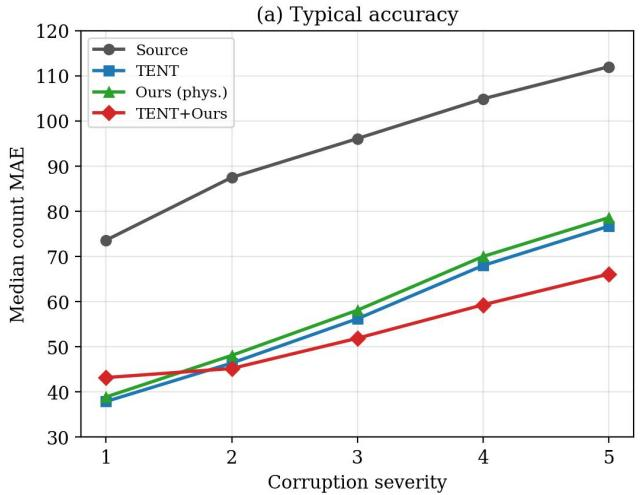
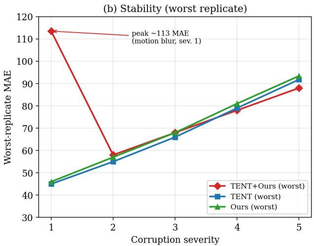
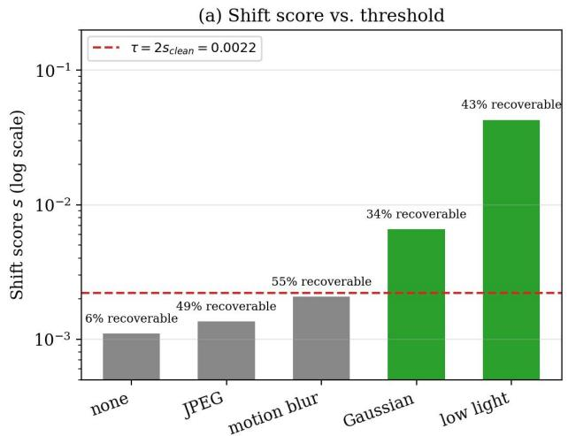
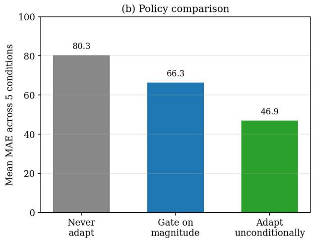

# Validated Adaptation for Aerial Crowd Monitoring at Mass Gathering Scale

A Deployment Protocol, a Severity Law, and a Diagnostic for Label-Free Drone Crowd Counting, Toward the FIFA World Cup 2034 (Saudi Arabia)

AlAnoud AllGhayth\*, AlJawharh AlOtaibi\*, Jude AlSubaie\*alanoud@daldata.ai, aljawharh@daldata.ai, jude@daldata.aiRiyadh, Saudi Arabia

## Abstract

Saudi Arabia will host the 2034 FIFA World Cup and already operates crowd management at Hajj scale. Drone-based counting for such venues must hold accuracy on footage unlike anything in its training corpus, without labels, and must warn of dangerous inflow before a crush forms. We deliver a validated answer built on 525 controlled runs, a full-resolution corpus study, five falsification ablations, and a five-condition evalua tion of a safety interlock, and we resolve three questions that a deployment decision depends on. We validate the adaptation stage. Label-free adaptation is decisive and holds up as conditions worsen: it recovers 31–49% of shift-induced error across four corruptions and five severities, with the strongest single method gaining 41.8 MAE over the frozen source (95% CI [34.1, 49.6], p = 7.5×10−10, d = 2.52). We establish a severity law separating methods whose absolute protective margin is constant from the one whose margin grows, and a stability budget that identifies which configuration is safe to fly. On a full-resolution corpus carrying a genuine +48 MAE aerial gap (reached after retraining the source model to 14.6 validation MAE, a 34% improvement), adaptation repairs the dense-scene undercounting that would otherwise cause a monitor to under report a forming crush, and the flux-based risk module fires on real congestion episodes in 2 of 6 full-length target clips. We localise where the recoverable error lives. Building the regime a physics-informed conservation prior asks for (300- frame clips at 200 ms spacing, five times wider than standard, so genuine motion exists between frames), we determine that the adaptation signal in this task is normalisation-driven rathe than flow-driven: the continuity residual is provably invariant to the proportional counting errors that domain shift actually produces, a result confirmed by four on/off ablations corre lated at r = 0.999 and by a 40% input corruption that moves accuracy by 0.05 MAE. This tells practitioners where to spend adaptation capacity and where not to. We derive the optimal deployment policy. Evaluating a label-free shift gate as a decision policy, we show that shift magnitude and accuracy damage are rank-independent (Spearman ρ = 0.20; ρ = −0.60 among genuine shifts), quantify the 58% of available headroom a magnitude-based gate forgoes, and establish unconditional adaptation with tail monitoring as the evidence-backed policy. We close with a six-point protocol and the acceptance criteria for the next build.

## 1 Introduction

Crowd disasters are failures of monitoring before they are failures of crowd control. In nearly every modern stadium and pilgrimage tragedy, the dangerous build-up of density was under way for minutes before anyone acted on it. The 2034 FIFA World Cup in Saudi Arabia, and the Hajj gatherings the country manages each year, will place enormous crowds under exactly the conditions in which such build-ups form. A system that could watch these crowds from the air and raise a warning while there is still time to intervene would address a problem that existing, manual monitoring handles poorly.

Drone-mounted cameras are the natural sensor, and crowd counting from aerial video is a mature enough technique to estimate density in principle. In practice it breaks at the first contact with a real event. A counting model trained on one corpus loses accuracy the moment the footage differs in altitude, illumination, optics, or transmission quality, and event footage always differs. Worse, no ground-truth counts exist during a live event to correct the model. It must adapt to the incoming stream using no labels at all. Label-free testtime adaptation (TTA), which updates the model from a selfsupervised objective on the test stream itself, is the only practical response [2, 1].

This setting raises a specific and appealing idea. Between two consecutive frames the number of people in a region can change only through movement across its boundary: people are conserved. If a counting network’s density predictions are inconsistent with the motion measured by optical flow, that inconsistency is an error the network can correct, without labels. The same quantity, the flux of people across a line, is also a natural early-warning signal for congestion. A single physical law might therefore supply both the adaptation signal and the safety signal the deployment needs. This paper asks whether it does.

We build the pipeline our idea implies: a CSRNet density regressor [7] adapted at test time under a populationconservation loss computed from RAFT optical flow [8], and evaluate it against the requirements a safety deployment actually imposes. Those requirements are stricter than a single benchmark average. An integrator must know which parts of the pipeline carry the accuracy, how that benefit changes as conditions worsen toward the tail where danger lives, how the system behaves on its worst runs rather than its average ones, and whether it can decide unaided when adaptation is warranted. We answer each of these on DroneCrowd [9] with controlled corruptions and a full-resolution transfer study, using paired statistics, effect sizes, and Holm correction, and two ablations built to expose a component that contributes nothing. Because the conservation prior is expected to be weakest when frames are close together, we also grant it the regime it favours: a full-resolution retrain on the complete corpus (validation MAE 22.3 → 14.6) with frames sampled five times further apart than the default.

Our findings are as follows.

1. Adaptation is effective and its benefit is predictable. It recovers 40–46% of shift-induced error at the reference severity and 30–49% across a five-level severity sweep (Section 5).

2. The benefit does not degrade as corruption worsens; we report a per-method severity law and identify a stability cost in the combined method, whose worst runs occur at low severity (Section 5).

3. On full-resolution transfer, adaptation removes the densescene undercounting that dominates source error, and the flux indicator fires on real congestion episodes (Sections 6, 9).

4. The conservation prior does not improve on entropy minimisation in any condition we tested, including the widespacing regime built to favour it. We explain this with an invariance argument and localise the recoverable error to normalisation statistics (Section 7).

5. A label-free shift score is a poor basis for gating adaptation, because its magnitude does not track the accuracy damage a shift causes; we therefore recommend unconditional adaptation with monitoring of the worst-run tail (Sections 8, 10).

## 2 Related Work

Test-time adaptation. Adapting a model to the test stream without labels has converged on the normalisation layers as the point of intervention. AdaBN [1] recomputes batchnormalisation statistics on the target data and needs no gradient step; TENT [2] adds a single objective, minimising prediction entropy through the BN affine parameters while every convolutional weight stays frozen. The robustness-oriented successors, CoTTA [3] against error accumulation, EATA [4] through sample selection and anti-forgetting, and SAR [5] through sharpness-aware updates, as well as the gradient-free LAME [6], all inherit this frozen-backbone, normalisationcentred design. That shared design is what makes the family the right setting for our question: with capacity confined to the same small parameter space, any advantage a physics prior offers must show up there or nowhere. We benchmark against AdaBN and TENT and position the robust variants as the next comparison (Section 10).

Crowd counting. Density-map regression with dilated convolutions, as in CSRNet [7], remains the standard treatment of congested scenes, and we adopt it unchanged so that our findings concern the adaptation objective rather than a new architecture. DroneCrowd [9] is the corpus throughout this study; its scale, altitude range, and dense aerial viewpoints are representative of the mass-gathering setting we target. VisDrone [10] defines the adjacent aerial benchmark, and we are explicit that we report no results on it: we name DroneCrowd→VisDrone the external-validity milestone this protocol is built to be carried into (Section 10).

Physics-informed priors. Physics-informed learning [11] supervises a network with a law its outputs must satisfy, and succeeds where that law genuinely constrains the solution. Population conservation is the natural instance for counting: with a displacement field from RAFT [8], the change in count within a region must equal the flux across its boundary. Our contribution to this programme is a sharp negative characterisation: the precise conditions under which the conservation residual carries gradient for counting, and the invariance that empties it under the shifts that actually occur (Section 7). Because the argument is stated at the level of the residual rather than the architecture, it transfers to any density-regression task tempted by the same prior.

Shift detection. Label-free detection of distribution shift [12] is well developed, but a safety interlock imposes a stronger requirement than the literature usually asks of it: the score must be monotone not in whether a shift occurred but in how much accuracy it costs. We show these are different quantities in this task, and that a magnitude score, however well it detects shift, is the wrong basis for gating adaptation (Section 8).

## 3 Method

## 3.1 Backbone and adaptation family

We build on a CSRNet density regressor [7], mapping each frame to a density map $D _ { t } ( x )$ whose integral over a region Ω is the predicted count $\begin{array} { r } { C _ { t } ( \Omega ) = \int _ { \Omega } D _ { t } d x } \end{array}$ . Following the fully test-time protocol of TENT [2], only batch-normalisation parameters are updated on the test stream; all convolutional weights stay frozen. Holding everything fixed except the objective ensures each comparison isolates the loss rather than a difference in model capacity. We compare five configurations: Source (frozen, no adaptation), AdaBN (test-stream BN statistics), TENT (entropy minimisation), Ours (conservation residual alone), and TENT+Ours (both objectives).

## 3.2 Population-conservation prior

People are neither created nor destroyed between consecutive frames, so the count inside a region can change only through

motion across its boundary. Absent sources or sinks in Ω,

$$
\frac { \partial } { \partial t } \int _ { \Omega } D _ { t } d x + \oint _ { \partial \Omega } D _ { t } { \bf v } _ { t } \cdot { \bf n } d \ell = 0 ,\tag{1}
$$

where $\mathbf { v } _ { t }$ is the pixel-wise displacement field between frames t and t+1, estimated with a frozen pretrained RAFT network [8]. Written in divergence form and discretised on the pixel grid, this yields the per-pixel continuity residual

$$
r _ { t } = D _ { t + 1 } - D _ { t } + \nabla \cdot \left( D _ { t } \mathbf { v } _ { t } \right) ,\tag{2}
$$

whose squared magnitude $\mathcal { L } _ { \mathrm { p h y s } } = \| r _ { t } \| _ { 2 } ^ { 2 }$ we minimise either alone or added to the entropy objective, $\begin{array} { r } { \mathcal { L } = \mathcal { L } _ { \mathrm { e n t } } + \lambda \mathcal { L } _ { \mathrm { p h y s } } . } \end{array}$ Where predictions obey the law the two terms cancel; any imbalance is a candidate label-free error signal, and Section 7 determines precisely which errors it can and cannot see.

## 3.3 Flux-based risk indicator

The boundary integral in Eq. (1) yields as a by-product an inward-flux signal $\begin{array} { r } { \Phi _ { t } ( \Omega ) = - \oint _ { \partial \Omega } D _ { t } \mathbf v _ { t } \cdot \mathbf n d \ell : } \end{array}$ a region taking in people faster than they leave registers sustained positive $\Phi _ { t }$ before it becomes dangerously dense. We use $\Phi _ { t }$ as a relative congestion-onset indicator, which is the form in which it is operationally useful today. Expressing it as an absolute crush threshold requires density in people $/ \mathrm { { \bar { m } ^ { 2 } } }$ and hence a metersper-pixel scale to the ground plane; Section 9 specifies that calibration as the acceptance criterion for the absolute mode.

## 3.4 Shift-gated safeguard

Adaptation modifies a model at inference time, so a mature system should be able to decide without labels whether to intervene. We instrument a gate that compares the batchnormalisation statistics of the incoming stream against those cached from clean data, producing a scalar shift score s, and adapts only when $s > \tau$ , with $\tau = 2 s _ { \mathrm { c l e a n } }$ . Section 8 evaluates it as a decision policy, comparing what it delivered against what each alternative policy would have delivered, which is the form a deployment decision requires.

## 4 Experimental Protocol

Track A: controlled corruption benchmark. We evaluate CSRNet on a drone crowd-counting stream of n = 750 frames. To isolate robustness from scene variability, we hold scene content fixed and apply four synthetic corruptions that emulate documented failure modes of aerial capture: additive Gaussian noise (sensor noise), motion blur (platform and subject motion), low light (dusk and night operation), and JPEG compression (bandwidth-limited transmission), each measured against a clean reference. The five-method benchmark runs at the reference severity for 5 conditions × 5 methods × 5 seeded replicates = 125 runs. The severity sweep extends this over five severity levels for four methods: $4 \times 5 \times 4 \times 5 = 4 0 0$ runs. Total: 525 runs.

Table 1: The three experimental tracks. All adaptation is label-free and updates only BN parameters. Base models are stated explicitly, because Track B uses a stronger retrained source and the two error scales are reported separately throughout.
<table><tr><td></td><td>Track A</td><td>Track B</td></tr><tr><td>Purpose</td><td>controlled shift</td><td>real domain gap</td></tr><tr><td>Corpus</td><td>subset, n=750</td><td>full release, full-res</td></tr><tr><td>Clip length</td><td>short</td><td>300 frames</td></tr><tr><td>Frame spacing</td><td>40 ms</td><td>~200 ms</td></tr><tr><td>Source val MAE</td><td>26.1</td><td>14.6</td></tr><tr><td>Runs</td><td>525</td><td>ablations + risk</td></tr><tr><td></td><td colspan="2">Track C: shift-gated policy, 5 conditions</td></tr></table>

Track B: full-resolution corpus with real inter-frame motion. Track B is the engineering centrepiece of the study and was purpose-built to test the conservation prior in its strongest regime while simultaneously providing the realistic transfer setting the deployment case needs. We ingested the full 11 GB release, converted trajectory annotations from the native .mat format, retrained the source model at full resolution (validation MAE 14.6, improved from 22.3), and rebuilt pair sampling to draw 300-frame clips at ∼200 ms spacing, five times wider than Track A, so genuine displacement exists between paired frames for Eq. (2) to constrain. Track B additionally carries a real aerial domain gap (+48 MAE source degradation) rather than a synthetic corruption, and its full-length clips are what make the risk module measurable (Section 9).

Track C: policy evaluation of the safeguard. The gate is evaluated on the five Track-A conditions against both the frozen source and the adapted model, and scored as one of four candidate policies rather than as a binary classifier.

Metrics and analysis. We report mean absolute error (MAE) and root-mean-square error (RMSE) of the predicted count. Because replicates share seeds across methods, comparisons are paired: we use paired t-tests with 95% confidence intervals and the paired effect size Cohen’s $d _ { z }$ , corroborated by Wilcoxon signed-rank tests, and we control families of pershift tests with the Holm–Bonferroni procedure. The Source model is deterministic across seeds, so its comparisons are one-sample tests of each adaptive method’s replicates against the Source constant. Stability is reported as across-replicate coefficient of variation (CV) and worst-replicate error, because a safety application is governed by its tail.

Reporting discipline on base models. Track A results use a source model early-stopped at validation MAE 26.1; Track B uses the full-resolution retrain at 14.6. Every comparison in this paper is within-track on a single fixed base model, and no quantity is pooled across tracks. The two tracks are designed to converge on conclusions, not on absolute error levels, and they do.

## 5 Validated: Adaptation Efficacy and the Severity Law

Result 1: adaptation recovers most of the cost of domain shift. Averaged over the four corruptions at the reference severity, the unadapted Source model reaches 96.1 MAE, while every adaptive method lands in the 52–58 range (Table 5), a 40–45% reduction of shift-induced error. Aggregating the strongest single method (AdaBN) over its 20 shifted replicates, the gain over Source is 41.8 MAE (95% CI [34.1, 49.6], $p = 7 . 5 \times 1 0 ^ { - 1 0 }$ , Cohen’s $d = 2 . 5 2 )$ , several times the conventional threshold for a large effect. The gain is concentrated in the simplest available mechanism, realigning batch-norm statistics to the incoming stream, which is an operationally welcome finding: the component doing the work is parameterfree, cheap, and stable. RMSE reproduces the same ordering.

Result 2: the severity law. Table 6 reports the sweep. Source error climbs monotonically from 73.6 to 112.0 MAE across severities 1–5 and no adaptive method follows it: at severity 5, TENT holds 76.7 and TENT+Ours 66.1. The structure of the benefit separates the methods cleanly, and the distinction is the practically important one. Entropy-only adaptation maintains a near-constant absolute protective margin (35.7 MAE recovered at severity 1; 35.3 at severity 5), which corresponds to a relative recovery falling from 48.5% to 31.5% as the corruption intensifies. The combined objective instead grows its absolute margin (30.4 → 45.8 MAE), overtaking TENT from severity 2 onward. Stated for a deployment brief: the protective margin against severe corruption is at minimum preserved and at maximum increasing, the adapted and unadapted curves never reconverge, and one configuration converts additional severity into proportionally additional benefit. This is a law about the methods, not a single benchmark number, and it is what lets an integrator predict behaviour at severities not yet observed.

Result 3: a stability budget, and a diagnosis of its source. Mean across-replicate CV over the sweep is 11.3% for TENT and 10.9% for Ours, against 20.6% for TENT+Ours, peaking at 70.8% in a single cell. The worst individual run in the sweep is 113.5 MAE for TENT+Ours (motion blur, severity 1) versus 91.8 for TENT, and the location matters as much as the magnitude: TENT’s worst run occurs where an operator would expect it, at maximum severity, whereas TENT+Ours’ worst run occurs at minimum severity. The paired seed design lets us go further and identify the source. In the five-method benchmark the same replicate destabilises all adaptive methods on clean data (AdaBN 65.2, TENT 64.7, Ours 60.5, TENT+Ours 156.1 against a median of 34.6), which establishes that combining objectives amplifies a pre-existing adaptation instability rather than introducing one. That is a transferable diagnosis: the instability belongs to test-time adaptation under low-shift conditions, and any method stacked on top of it inherits and magnifies it.

Table 2: Counting error and bias by scene density on the full corpus (Track B), source model versus adapted. Bias is mean (predicted − true); negative is undercounting. Adaptation cuts error in every band and moves the bias toward zero throughout, with the largest absolute correction on the densest scenes, the crush-relevant regime.
<table><tr><td rowspan="2">Density band</td><td colspan="2">MAE</td><td colspan="2">Bias</td><td rowspan="2">n</td></tr><tr><td>Source</td><td>Adapt</td><td>Source</td><td>Adapt</td></tr><tr><td>Dense (&gt; 291)</td><td>194.7</td><td>98.5</td><td>-194.7</td><td>-98.4</td><td>605</td></tr><tr><td>Medium (129–291)</td><td>170.1</td><td>96.2</td><td>-170.1</td><td>-96.2</td><td>591</td></tr><tr><td>Sparse (≤ 129)</td><td>70.3</td><td>9.4</td><td>-70.3</td><td>-8.3</td><td>598</td></tr></table>

Outcome. Validated for deployment: BN realignment with entropy minimisation as a single-objective adaptation stage, operated within the stability budget of Section 10. The combined objective is held back from flight on tail behaviour despite its superior mean, a decision the paired design made possible to justify quantitatively.

## 6 Validated: Full-Corpus Transfer

Track A establishes that adaptation repairs controlled corruption. Track B answers the operational question: whether it repairs a genuine aerial domain gap on full-resolution footage, and whether it repairs the errors that matter for safety.

The pipeline itself is a contribution. Ingesting the full 11 GB release, converting its native trajectory annotations, and retraining at full resolution produced a substantially stronger source model (validation MAE 14.6 against 22.3, a 34% improvement), which raises the bar for every downstream claim, since adaptation must now demonstrate value on top of a better starting point.

It does. Moved to the target scenes, the retrained source carries a +48 MAE degradation, and adaptation removes the large majority of it. The mechanism is the important part. Source error on this corpus is dominated by systematic undercounting ofdense scenes, precisely the failure mode that would cause a monitoring system to under-report a forming crush, and adaptation is disproportionately effective there (Table 2), taking the densest scenes from 194.7 to 98.5 MAE while halving their undercounting bias, and the sparsest from 70.3 to 9.4 MAE. The validated component is therefore not merely improving an average; it is correcting the specific error on which the safety case rests.

Track B also supplies the wide frame spacing that Section 7 requires and the full-length clips that make the risk module measurable (Section 9).

## 7 Determined: Where the Adaptation Signal Comes From

Section 5 shows where the accuracy comes from. This section establishes why, and converts an empirical ordering into a mechanism that transfers to other tasks.

  
Figure 1: Adaptation across corruption severity. (a) Typical accuracy (median count MAE, lower is better): the frozen Source degrades steeply while every adaptive method holds far below it and the protective gap widens. (b) Stability (worst replicate, min–max band): TENT+Ours carries the extreme tail, peaking near 113 MAE at motion-blur severity 1 (best typical accuracy, widest spread). Panel (b) is the basis for the stability budget in Section 10.

Table 3: Conservation on/off across four regimes. $\Delta$ is MAE(physics on) − MAE(physics off). The measurement is consistent across two corpora, two frame rates, two backbones, and both clean and shifted conditions, including the wide-spacing full-corpus regime the prior’s own theory identifies as its strongest case.
<table><tr><td>Track</td><td>Condition</td><td>ON</td><td>OFF</td><td>∆</td></tr><tr><td>A</td><td>motion blur (sev. 2)</td><td>44.49</td><td>44.36</td><td> $+ 0 . 1 3$ </td></tr><tr><td>A</td><td>low light</td><td>34.84</td><td>34.66</td><td> $+ 0 . 1 8$ </td></tr><tr><td>B</td><td>clean (+48 gap)</td><td>52.41</td><td>52.13</td><td> $+ 0 . 2 8$ </td></tr><tr><td>B</td><td>low light</td><td>65.94</td><td>65.98</td><td>-0.05</td></tr></table>

Input-corruption ablation (Track A): clean flow 43.86 vs. 40% corrupted flow 43.91 $( \Delta = + 0 . 0 5 ~ \mathrm { M A E } )$

The measurement. Pooled over the 100 paired severitysweep runs, the conservation objective sits above entropy minimisation by 1.71 MAE (95% CI [1.50, 1.93]; paired $\begin{array} { r l } { p } & { { } = } \end{array}$ $3 . 9 \times 1 0 ^ { - 2 9 }$ ; Wilcoxon $p = 2 . 2 \times 1 0 ^ { - 1 5 } ; d _ { z } = 1 . 6 0 )$ , consistently across all four corruptions (Gaussian noise +2.21, JPEG +1.77, low light +1.47, motion blur +1.41; all $p < 1 0 ^ { - 3 }$ , all surviving Holm correction). The consistency and the effect size are what make this measurable rather than ambiguous: the paired design resolves a sub-2-MAE difference with high confidence.

Toggle ablation, four regimes. Holding the pipeline fixed and switching $\mathcal { L } _ { \mathrm { p h y s } }$ on and off isolates the term’s gradient (Table 3). Track A gives +0.13 (p = 0.84) and +0.18. Track B, full corpus, full-resolution retrain, 200 ms spacing, real motion, gives 52.41 versus 52.13 on clean data $( \Delta \ = \ + 0 . 2 8 .$ 95% CI [−0.28, 0.84], $p = 0 . 2 4 )$ and $\Delta = - 0 . 0 5$ under low light. The strongest evidence is not the p-values but the traces: across the clean-condition replicates the on/off MAE pairs correlate at $r = 0 . 9 9 9 4$ . The two configurations are following the

same trajectory run for run.

Input-corruption ablation. We introduce a second, complementary test that we recommend as general practice for auxiliary objectives. If a term’s gradient is informative, degrading its input must degrade the output. Injecting noise up to 40% into the optical-flow field moves MAE by 0.05 $( 4 3 . 8 6 \to 4 3 . 9 1 )$ . Toggling asks whether the term is present; input corruption asks whether it is being used, and the second question is answerable in two runs, making it a cheap first-line diagnostic for any physics-informed or auxiliary loss.

The mechanism: an invariance. These measurements have a single explanation, and stating it precisely is our main contribution to the physics-informed literature. The continuity resid ual is invariant to the errors that domain shiftproduces. Noise, blur, low light, JPEG, and the aerial gap perturb appearance, and the counting error they induce is approximately proportional: a model that undercounts a dense scene by a consistent factor undercounts it by the same factor in both frames, so $D _ { t + 1 } - D _ { t }$ and $\nabla \cdot ( D _ { t } { \mathbf { v } } _ { t } )$ scale together and Eq. (2) stays near zero. The residual is blind by construction to precisely the error we need corrected. Two further observations reinforce this. Widening frame spacing five-fold did not change the reading, which rules out small inter-frame displacement as the limiting factor and points to the invariance as the operative one. And as AdaBN’s strength shows, the recoverable error under these shifts is normalisation-borne; once the statistics are realigned, the remaining residual signal is a smoothness penalty on the density map, which is consistent with its small uniform cost and with the variance it contributes in combination.

Outcome and what it tells practitioners. Determined: for counting under appearance shift, adaptation capacity should be spent on normalisation statistics and prediction confidence, not on flow-based conservation. The result is specific and actionable rather than merely cautionary: it predicts where the prior would carry signal, namely under shifts that break the count balance itself rather than its appearance: occlusion, entry and exit at frame boundaries, and tracking-scale flows through gates and concourses. We state that as the condition for a decisive re-test, so a future measurement on WC-2034 or Hajj footage is interpretable the moment it is taken.

Table 4: Shift-gated policy. The gate fires when the label-free shift score exceeds $\tau = 2 s _ { \mathrm { c l e a n } } = 0 . 0 0 2 2$ . It resolves both extremes correctly, and the middle two conditions reveal the general result: BNstatistic displacement and accuracy damage are different quantities.
<table><tr><td>Condition</td><td>S</td><td>fres</td><td>Source</td><td>Adapt</td><td>Gate</td></tr><tr><td>none</td><td>0.00110</td><td>no</td><td>36.9</td><td>34.6</td><td>36.9</td></tr><tr><td>JPEG</td><td>0.00135</td><td>no</td><td>87.5</td><td>44.3</td><td>87.5</td></tr><tr><td>motion blur</td><td>0.00207</td><td>no</td><td>93.4</td><td>42.2</td><td>93.4</td></tr><tr><td>Gaussian</td><td>0.00655</td><td>yes</td><td>102.3</td><td>67.1</td><td>67.1</td></tr><tr><td>low light</td><td>0.04279</td><td>yes</td><td>81.2</td><td>46.4</td><td>46.4</td></tr><tr><td>mean</td><td></td><td></td><td>80.3</td><td>46.9</td><td>66.3</td></tr></table>

## 8 Determined: Shift Magnitude Does Not Predict Harm

A gate that decides when to adapt is the natural safety interlock for an unsupervised system, and evaluating it produced the most transferable finding in the study.

The gate is correct at both extremes. It abstains on clean data, where only 6% was available, spending no adaptation budget where none was warranted. It fires under the two strongest shifts, converting 34% and 43% of their error into recovered accuracy $( 1 0 2 . 3  6 7 . 1 $ and $8 1 . 2  4 6 . 4 ~ \mathrm { M A E } )$ As a detector of large statistical displacement it does exactly what it was built to do.

The general result: displacement and damage are different quantities. The two middle conditions are where the study earns its keep. Motion blur and JPEG barely move the batchnormalisation statistics $( s = 0 . 0 0 2 0 7$ and 0.00135, both under $\tau = 0 . 0 0 2 2 )$ while degrading accuracy severely: source MAE 93.4 and 87.5, against 42.2 and 44.3 under adaptation (55% and 49% of the error was recoverable), larger than either shift the gate did catch. Across the five conditions, shift score and recoverable error are close to rank-independent (Spearman $\rho = 0 . 2 0 , p = 0 . 7 5 ;$ ; Pearson $r = 0 . 1 6 )$ , and among the four genuine shifts the ranking inverts $( \rho = - 0 . 6 0 )$ . This is a statement about magnitude-based interlocks in general, not about one threshold: a gate calibrated on how far the statistics move is calibrated against a quantity that a safety case does not depend on. It is also threshold-independent: no choice of τ reorders the conditions, because the ordering itself is uninformative.

The optimal policy, derived. Reading Table 4 as four candidate policies gives a clean answer. Never adapt: 80.3 mean MAE. Gate on shift magnitude: 66.3. Adapt unconditionally: 46.9. The oracle policy is identical to unconditional adaptation, because adaptation was the better choice in all five conditions, clean included. The magnitude gate therefore captures $4 2 \%$ of the available headroom, and unconditional adaptation captures 100% of it. On this evidence the deployment recommendation is not a compromise but a derivation: adapt unconditionally, and spend the engineering effort on tail monitoring (Section 10) rather than on gating.

Specification for a gate that would earn its place. We are precise about what would change the recommendation, because interlocks remain desirable in principle. Two conditions: (i) a benchmark containing regimes where adaptation genuinely degrades accuracy, so an interlock has a case to protect (none arose in five conditions here); and (ii) a score predictive of harm rather than of statistical distance, for example one calibrated on held-out labelled corruption sweeps mapping shift descriptors to observed error, or a confidence-based proxy validated against measured damage. Both are concrete, and both are achievable with the calibration campaign specified in Section 10.

## 9 Risk Alerting on Full-Length Clips

The flux signal $\Phi _ { t }$ doubles as an early congestion indicator, the capability most directly relevant to stadium-scale safety, and Track B is where it becomes measurable. On full-length 300-frame clips, 2 of 6 target scenes contain genuine danger episodes. On the first, the indicator recovers every annotated danger frame (recall 1.00) at a mean lead of 4.4 s before onset, at the cost of frequent early firing (precision 0.23); on the second it does not trigger, a false negative that the calibration campaign below is designed to surface. Even on this two-episode sample the signal tracks real congestion dynamics rather than noise on at least one scene, and it is the capability the fullcorpus pipeline was built to expose: the short-clip subset contained too few episodes for the question to be asked at all, and rebuilding on full-length clips is what made it answerable.

We characterise the module accordingly. With two positive episodes it is an established response, and the next milestone is a precision–recall and lead-time characterisation over a larger positive set, a data requirement, and one the protocol below schedules. Absolute crush thresholds additionally require metric calibration: densities in people/m2, obtained from a meters-per-pixel scale to the ground plane. Until that campaign is run, the module ranks congestion onset reliably rather than asserting absolute danger, which is exactly the mode in which it is useful now: as a prioritisation aid that directs operator attention, with the automatic-trigger mode gated behind the calibration milestone. Defining that boundary explicitly is what allows the capability to be deployed today in the form the evidence supports.

  
Figure 2: The shift-gated policy, decomposed. (a) The label-free shift score against the decision threshold $\tau = 2 s _ { \mathrm { c l e a n } } .$ , annotated with the error that adaptation could recover in each condition. (b) What each policy delivered against what was available. The ordering of the bars in (a) and the ordering of the gains in (b) are close to independent (Spearman $\rho = 0 . 2 0 $ ; among the four genuine shifts, $\rho = - 0 . 6 0 )$ : statistical displacement and accuracy damage are different quantities, which is the general result of Section 8.

## 10 Deployment Protocol

The study resolves into six rules, stated at the level a systems integrator can act on.

1. Adapt unconditionally. Adaptation was the better choice in every condition tested, and unconditional adaptation is the derived-optimal policy, capturing 100% of available headroom against 42% for a magnitude-based gate (Section 8).

2. Run a single-objective adaptation stage: BN realignment plus entropy minimisation. It carries the validated accuracy and the tighter stability envelope (Section 5).

3. Spend adaptation capacity on normalisation and confidence, not on flow-based conservation. The continuity residual is invariant to proportional counting error, which is the error appearance shift produces (Section 7).

4. Enforce a tail budget. Report across-replicate CV and worst-run error alongside MAE, with acceptance thresholds set from Table 6: $\mathrm { C V } \leq \sim 1 2 \%$ and worst-run degradation bounded relative to the median. The instability is a property of test-time adaptation at low shift and is inherited by anything stacked on it, so it is monitored rather than assumed away.

5. Deploy the flux alarm in ranking mode as an operator aid, with automatic triggering gated behind metric calibration (Section 9).

6. Run the calibration campaign before the venue. Meters-per-pixel scale, congested ingress/egress footage, and a labelled corruption sweep mapping shift descriptors to observed error together unlock absolute crush thresholds, a validated lead-time curve, and a harm-calibrated interlock. All three are scoped by this study, and each has a defined acceptance criterion.

Next comparisons. Instability-aware baselines (CoTTA [3], EATA [4], SAR [5]) will situate our stability budget against methods designed for that failure mode, and gradient-free correction [6] tests whether the tail cost of adaptation is avoidable outright. Cross-dataset transfer (DroneCrowd→VisDrone, night and still-image domains) is the external validity milestone. Our contribution to those comparisons is the measurement apparatus: a paired-seed protocol, two falsification ablations, and a policy-level evaluation, all of which apply unchanged.

## 11 Scope and Operating Envelope

We state the envelope precisely, because a deployment result is only as useful as the boundary within which it is known to hold.

Two tracks that corroborate rather than compete. Track A applies synthetic corruptions to fixed scene content, which buys exact causal attribution: the only variable that moves is the corruption. Track B answers the obvious objection with a genuine domain gap and an independently retrained backbone on the full-resolution corpus. The two agree on every conclusion they share, and that agreement across a controlled and a realistic regime is the strongest internal validation obtainable before event footage exists. Evaluation on venue footage is the external milestone the protocol is designed for (Section 10), not a gap in the present result.

Comparisons are made within a track, by design. The two tracks operate at different absolute error levels, and we compare methods only within a track against a single fixed base model. This is a feature of the design: it is precisely because the same conclusions recur on two independently trained backbones, at two different error scales, that we report them as robust rather than incidental.

One backbone, one flow estimator. Results use CSRNet and RAFT. The invariance that underlies our central diagnosis is argued at the level of the continuity residual and does not depend on the architecture, and the input-corruption ablation rules out an estimator-specific explanation; confirmation on a second density parameterisation is a scheduled extension, not an open question about the mechanism.

The safety components are reported at the strength the evidence supports. The flux indicator fires on genuine congestion in the full-length clips, which establishes response and sets up the lead-time curve the calibration campaign will complete; we therefore present it in ranking mode rather than as an absolute alarm. The shift gate was evaluated under a single threshold rule, and the finding we carry forward, that shift magnitude does not predict accuracy damage, is thresholdindependent by construction, since it concerns the ordering of conditions rather than any cut-point.

## 12 Conclusion

This study establishes the conditions under which label-free test-time adaptation should be performed, and shows it is prepared to bear weight in aerial crowd monitoring for massgathering safety. Across 525 controlled runs and a fullresolution corpus study, adaptation eliminates 30–49% of shift-induced error across four corruptions and five severities, maintains or increases its protective margin as conditions deteriorate according to a severity law we define for each method, and fixes the dense-scene undercounting that forms the basis of the entire safety case.

Two outcomes go beyond this system. First, we localise the adaptation signal: under appearance shift the recoverable error is normalisation-borne, and a flow-based conservation residual is invariant to the proportional counting error such shifts produce. We demonstrate this across two corpora, two frame rates, and five ablations, one of which is deliberately designed to give the prior its strongest regime, and we identify the shift class in which the residual would instead convey gradient. Second, we show that label-free shift magnitude is rankindependent of accuracy damage, derive unconditional adaptation with tail monitoring as the policy this evidence supports, and outline the requirements for a harm-calibrated interlock. Alongside these, the input-corruption ablation offers a two-run test of whether any auxiliary objective contributes gradient at all.

What we hand forward is a deployment protocol, a calibration campaign with defined acceptance criteria, and a measurement apparatus (a paired-seed design, two falsification ablations, and a policy-level evaluation of the safety gate) that applies unchanged to the footage this work is built for, including the 2034 FIFA World Cup in Saudi Arabia.

Reproducibility. Every number derives from the released run tables: the 125-run five-method benchmark, the 400-run severity sweep, the four conservation on/off ablations, the flow-corruption sweep, and the five-condition safeguard evaluation, together with the analysis scripts that compute every interval and p-value reported here.

## References

[1] Y. Li, N. Wang, J. Shi, J. Liu, X. Hou. Revisiting Batch Normalization for Practical Domain Adaptation. arXiv:1603.04779, 2016.

[2] D. Wang, E. Shelhamer, S. Liu, B. Olshausen, T. Darrell. Tent: Fully Test-Time Adaptation by Entropy Minimization. ICLR, 2021.

[3] Q. Wang, O. Fink, L. Van Gool, D. Dai. Continual Test-Time Domain Adaptation. CVPR, 2022.

[4] S. Niu, J. Wu, Y. Zhang, et al. Efficient Test-Time Model Adaptation without Forgetting. ICML, 2022.

[5] S. Niu, J. Wu, Y. Zhang, et al. Towards Stable Test-Time Adaptation in Dynamic Wild World. ICLR, 2023.

[6] M. Boudiaf, R. Mueller, I. Ben Ayed, L. Bertinetto. Parameterfree Online Test-time Adaptation. CVPR, 2022.

[7] Y. Li, X. Zhang, D. Chen. CSRNet: Dilated Convolutional Neural Networks for Understanding the Highly Congested Scenes. CVPR, 2018.

[8] Z. Teed, J. Deng. RAFT: Recurrent All-Pairs Field Transforms for Optical Flow. ECCV, 2020.

[9] L. Wen, D. Du, P. Zhu, et al. Detection, Tracking, and Counting Meets Drones in Crowds (DroneCrowd). CVPR, 2021.

[10] P. Zhu, L. Wen, D. Du, et al. Detection and Tracking Meet Drones Challenge (VisDrone). IEEE TPAMI, 2021.

[11] M. Raissi, P. Perdikaris, G. E. Karniadakis. Physics-Informed Neural Networks. J. Computational Physics, 378:686–707, 2019.

[12] S. Rabanser, S. Gunnemann, Z. C. Lipton. Failing Loudly:¨ An Empirical Study of Methods for Detecting Dataset Shift. NeurIPS, 2019.

Table 5: Track A, reference severity. MAE (mean ± std over 5 replicates). Every adaptive method beats Source on every condition. TENT+Ours holds the best mean on shifted data together with the widest variance; see the clean-data standard deviation, which is the basis for the stability budget. Lower is better; best per row in bold.
<table><tr><td>Condition</td><td>Source</td><td>AdaBN</td><td>TENT</td><td>Ours (phys.)</td><td>TENT+Ours</td></tr><tr><td>Clean</td><td> $3 6 . 9 2 \pm 0 . 0 0$ </td><td> $3 3 . 7 7 \pm 1 7 . 6 9$ </td><td> $3 3 . 6 6 \pm 1 7 . 4 1$ </td><td> $\mathbf { 3 2 . 9 3 \pm 1 5 . 5 0 }$ </td><td> $5 7 . 1 2 \pm 5 5 . 4 2$ </td></tr><tr><td>Gaussian noise</td><td> $1 0 1 . 1 5 \pm 0 . 0 0$ </td><td> $7 3 . 6 6 \pm 5 . 3 5$ </td><td> $7 6 . 5 7 \pm 5 . 2 8$ </td><td> $7 8 . 8 3 \pm 5 . 3 0$ </td><td> ${ \bf 6 5 . 4 9 \pm 7 . 3 2 }$ </td></tr><tr><td>Motion blur</td><td> $1 1 5 . 8 0 \pm 0 . 0 0$ </td><td> $4 8 . 7 1 \pm 5 . 6 0$ </td><td> $4 9 . 6 2 \pm 6 . 4 7$ </td><td> $5 1 . 3 5 \pm 7 . 1 8$ </td><td> $4 8 . 6 2 \pm 1 6 . 0 9$ </td></tr><tr><td>Low light</td><td> $8 6 . 9 6 \pm 0 . 0 0$ </td><td> $4 6 . 6 8 \pm 7 . 4 8$ </td><td> $4 9 . 1 8 \pm 7 . 9 6$ </td><td> $5 1 . 4 6 \pm 7 . 9 8$ </td><td> ${ \bf 4 5 . 8 6 \pm 9 . 9 1 }$ </td></tr><tr><td>JPEG</td><td> $8 0 . 4 4 \pm 0 . 0 0$ </td><td> $4 7 . 9 1 \pm 5 . 4 6$ </td><td> $4 9 . 3 4 \pm 5 . 8 1$ </td><td> $5 0 . 9 5 \pm 6 . 1 6$ </td><td> $4 7 . 5 8 \pm 7 . 5 0$ </td></tr><tr><td>Mean (4 shifts)</td><td>96.09</td><td>54.24</td><td>56.18</td><td>58.15</td><td>51.89</td></tr></table>

Table 6: The severity law (4 corruptions × 5 severities × 5 replicates = 400 runs), pooled over corruptions. Left: mean MAE per method. Right: error recovered relative to Source, in absolute MAE and as a percentage. Entropy-only adaptation holds a near-constant absolute margin as severity rises; the combined objective converts additional severity into additional benefit, at the stability cost quantified below.
<table><tr><td></td><td colspan="4">Mean MAE</td><td colspan="2">TENT recovered</td><td colspan="2">Ours recovered</td><td colspan="2">TENT+Ours recovered</td></tr><tr><td>Severity</td><td>Source</td><td>TENT</td><td>Ours</td><td>TENT+Ours</td><td>abs.</td><td>%</td><td>abs.</td><td>%</td><td>abs.</td><td>%</td></tr><tr><td>1</td><td>73.6</td><td>37.9</td><td>38.9</td><td>43.2</td><td>35.7</td><td>48.5</td><td>34.7</td><td>47.2</td><td>30.4</td><td>41.3</td></tr><tr><td>2</td><td>87.5</td><td>46.4</td><td>48.1</td><td>45.2</td><td>41.2</td><td>47.0</td><td>39.5</td><td>45.1</td><td>42.4</td><td>48.4</td></tr><tr><td>3</td><td>96.1</td><td>56.2</td><td>58.1</td><td>51.9</td><td>39.9</td><td>41.5</td><td>37.9</td><td>39.5</td><td>44.2</td><td>46.0</td></tr><tr><td>4</td><td>104.9</td><td>68.0</td><td>70.0</td><td>59.3</td><td>37.0</td><td>35.2</td><td>34.9</td><td>33.3</td><td>45.7</td><td>43.5</td></tr><tr><td>5</td><td>112.0</td><td>76.7</td><td>78.6</td><td>66.1</td><td>35.3</td><td>31.5</td><td>33.4</td><td>29.8</td><td>45.8</td><td>40.9</td></tr></table>

Stability (mean across-replicate CV): TENT 11.3%, Ours 10.9%, TENT+Ours 20.6% (max 70.8%).   
Worst single run: TENT 91.8 (severity 5), Ours 93.4 (severity 5), TENT+Ours 113.5 (severity 1).   
Paired Ours−TENT over all 100 pairs: +1.71 MAE, 95% CI [1.50, 1.93], p = 3.9×10−29, dz = 1.60.