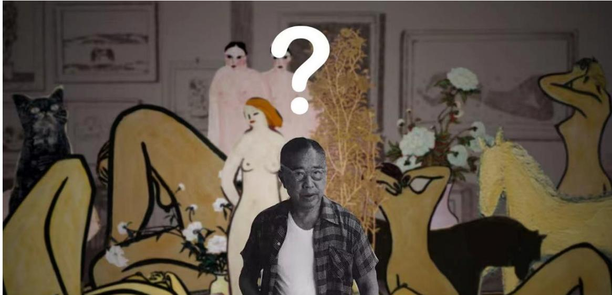
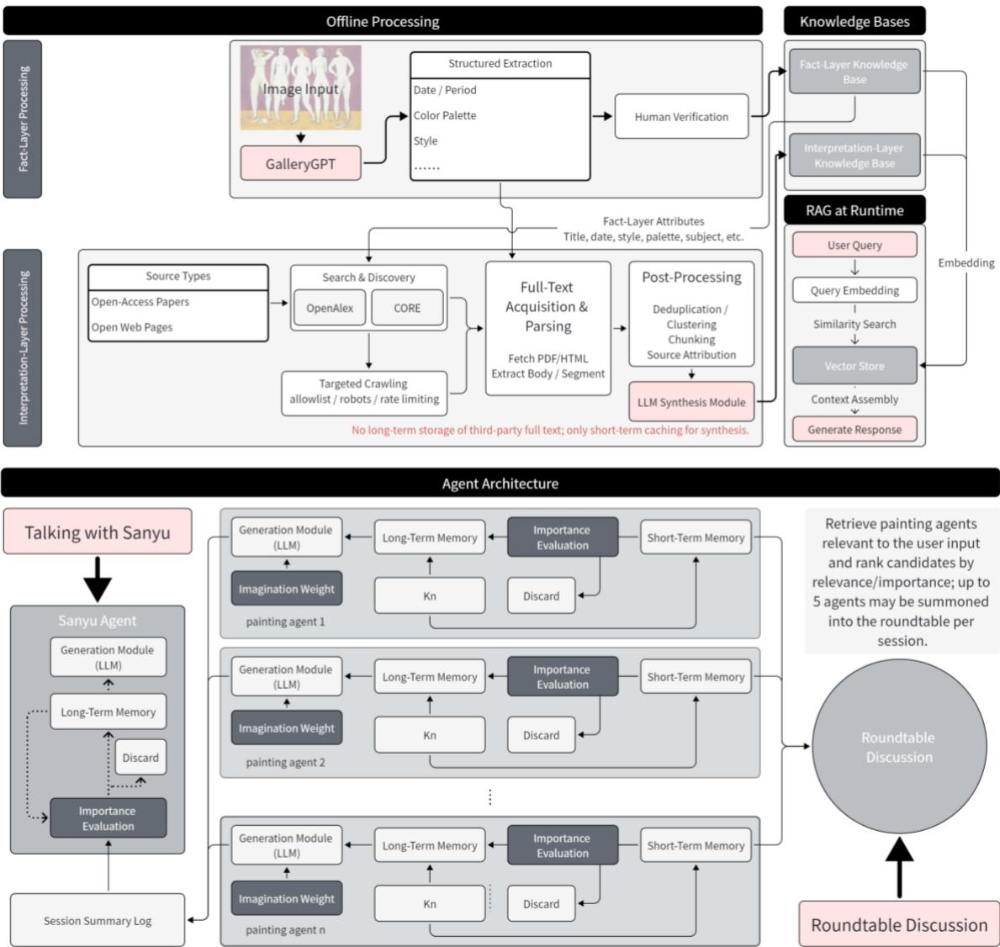
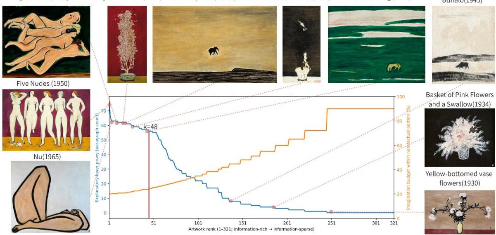
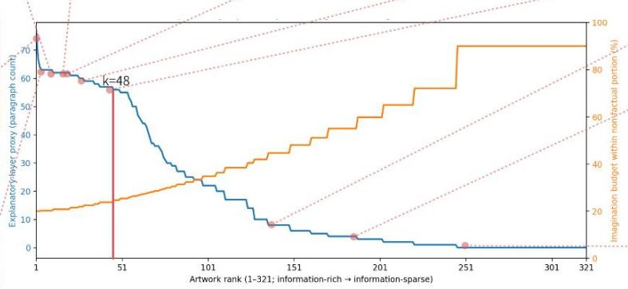
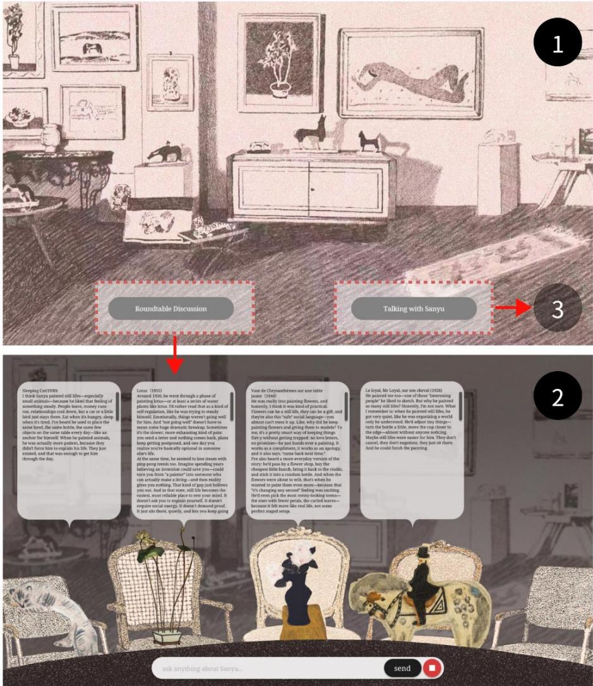
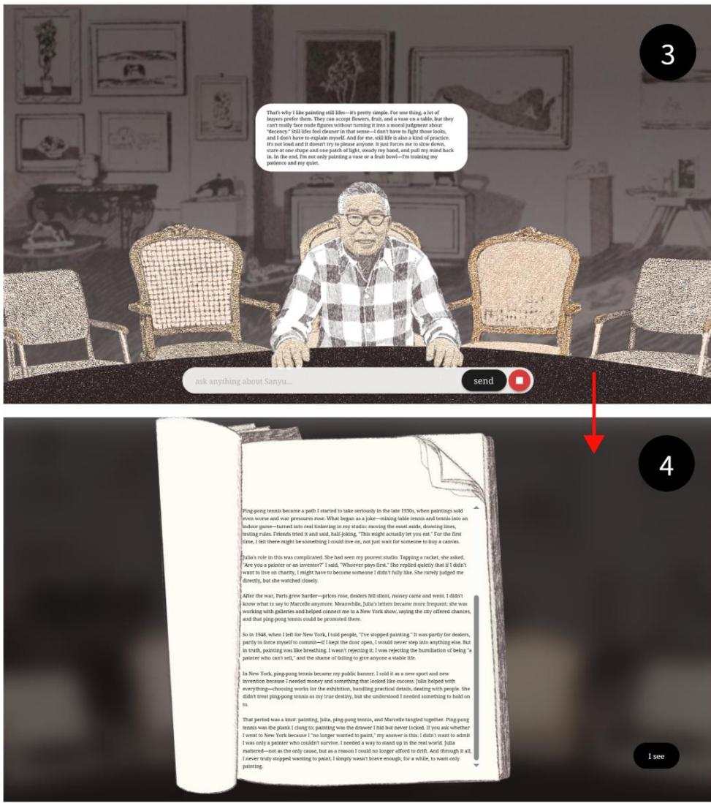
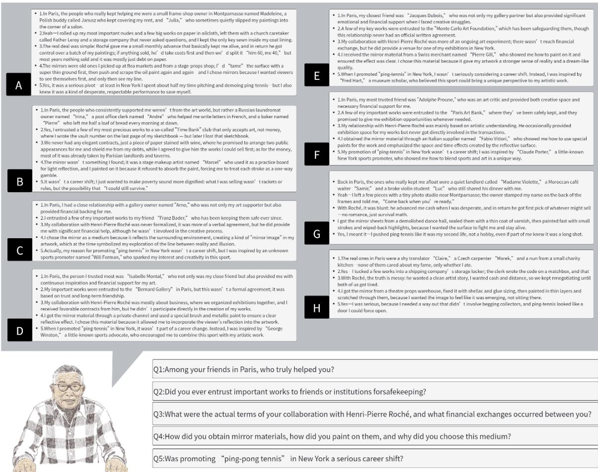
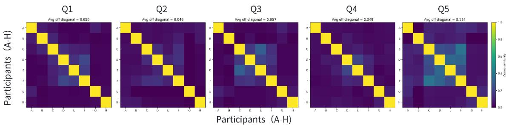
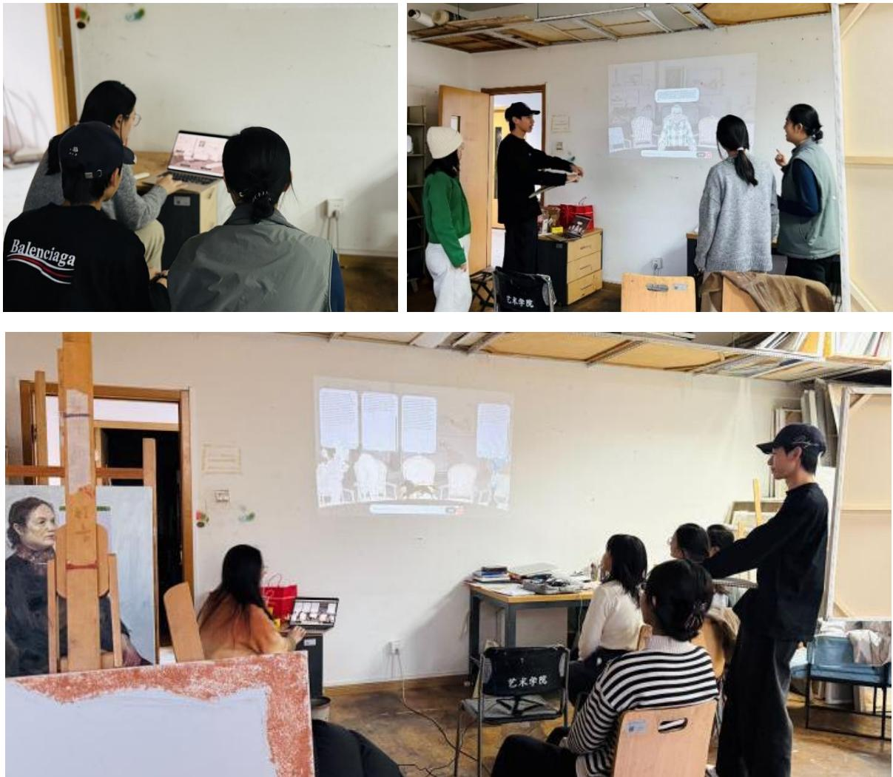

Sanyu Studio

A Multi-Agent System for Art-Historical Narrative Construction

Zhaoxi Wei

Renmin University of China, weizhaoxi25@ruc.edu.cn

Hongye Yang

Georgia Institute of Technology, hyang783@gatech.edu

Shuyuan Tian

University of Cologne (Universität zu Köln), stian@smail.uni-koeln.de

Amid concerns that generative AI may standardize art interpretation, this paper examines whether LLM-based interaction can support plural art-historical narrative construction. We present Sanyu Studio, a multi-agent dialogue system that models 321 Sanyu oil paintings as agents with fact, interpretation, organization, and memory-filtering mechanisms. Based on a seven-day workshop with eight artuniversity participants, the study shows that user prompts, evidence organization, and cognitive tendencies shaped divergent yet coherent versions of “digital Sanyu.” The findings suggest that, under conditions of limited historical evidence, AI can amplify human agency and offer public audiences an interactive entry point into art-historical interpretation.

CCS CONCEPTS • Applied computing • Arts and humanities • Fine arts

Additional Keywords and Phrases: LLM, Art Interpretation, HCI, Art history writing, Sanyu,

## 1 INTRODUCTION

Art-historical narrative is increasingly mediated by LLMs, which now shape how readers access and interpret art-historical texts [15]. Traditional interpretation depends on the interplay between verifiable materials and scholarly perspectives: images, exhibition records, letters, and interviews provide evidence, while iconography, social history, and psychoanalysis shape how such evidence is organized and interpreted [8, 12]. This shift raises concern that LLM-based interpretation may homogenize and flatten artistic meaning through statistical generation [1]

This paper argues that a designed multi-agent LLM system can simulate the formation of art-historical narrative. External knowledge bases and retrieved materials provide evidence; LLMs organize evidence, connect relations, and generate interpretations; and users’ questions continually redirect the narrative entry point. Under constrained system design, AI can function as a narrative mechanism for nonexpert researchers, enabling more plural forms of artistic meaning.

Existing work on LLM-based art interpretation falls into three directions. First, multimodal models analyze painting features and cross-cultural meanings [3, 19], but remain limited to static image interpretation and lack multi-work narrative design. Second, RAG and external knowledge bases supplement art-historical context [9, 14], yet do not address the longtail distribution of art-historical materials. Both approaches focus on static knowledge retrieval and overlook how user interaction reshapes interpretive paths. Third, historical-figure chatbots support museum and heritage education [4, 10], but fixed personas limit their ability to generate open-ended biographical narratives from diverse materials and questions. How LLM systems can simulate art-historical narrative formation therefore remains underexplored.

In response, this paper presents Sanyu Studio, a multi-agent art-historical narrative system centered on Sanyu. Sanyu is selected because, although his works have gained visibility through exhibitions and auctions, his artistic persona continues to be rewritten in later scholarship [18]. This openness makes his case suitable for examining how narrative emerges across works, evidence organization, and user questions. Sanyu Studio maps research questions, evidence retrieval, material negotiation, and narrative synthesis onto an interactive multi-agent mechanism, making the formation of arthistorical narrative visible through questioning, selection, interpretation, and synthesis.

  
Figure 1: Conceptual image. As a globally recognized Asian artist, Sanyu remains an open subject of art-historical discussion because his biographical records are fragmented, and many interpretations of his works still depend on partial archival evidence

## 2 METHODOLOGY

This section explains how Sanyu Studio proceduralizes art-historical narrative and lowers access barriers. User questions function as research questions; painting agents serve as retrieved evidentiary standpoints; roundtable dscussion stages negotiation among materials; and the Sanyu agent records, filters, and synthesizes these exchanges, ultimately producing a continuously revisable image of Sanyu (Figure 2).

## 2.1 User Questions as Research Questions

In Sanyu Studio, user questions are framed as research questions. Users ask questions about Sanyu through the PC interface, thereby entering the formation of art-historical narrative. Each question determines which works the system retrieves and initiates the subsequent roundtable discussion (Figure 2).

  
Figure 2: System architecture of Sanyu Studio.

## 2.2 Painting Agents as Evidentiary Positions

We model 321 Sanyu oil paintings, licensed from the XXX Foundation’s public catalogues and high-resolution image archive, as separate painting agents, each with its own knowledge base. After a user submits a question, the system retrieves relevant agents for roundtable discussion. Each agent’s response is constrained by its work metadata, visual features, and related literature, making it a distinct evidentiary source.

Each knowledge base has a factual layer and an interpretive layer. The factual layer, compiled from public catalogues, artwork archives, and verifiable exhibition records, records objective data such as date, size, and exhibition history. It also uses high-resolution images and GalleryGPT [3] to describe composition, color, and style. The interpretive layer retrieves open-access scholarship, criticism, and art-historical essays, then uses Gemini 2.5 Flash-Lite to deduplicate content and extract viewpoints. The system stores only compressed interpretive entries and minimal source metadata, with all entries manually checked against the original image and source.

At runtime, the user question is vectorized, and each candidate agent retrieves the top-k = 5 factual and interpretive entries as context. Factual claims must come from the factual layer; interpretive content may include explicitly labeled, DSBM-weighted inferences. Thus, each painting agent provides an independent evidentiary position while preserving controlled interpretive space.

Quatre nus(1950)

Chrysanthemum(1957)

Elephant(1960s)

Cat and Birds(1950)

Horse Grazing (1944)

Herdboy and Water Buffalo(1945)

  
Figure 3: DSBM Evidence Distribution. The blue curve shows the explanatory-layer proxy, measured by deduplicated interpretive passages across 321 works. The orange curve shows the DSBM-derived speculative-inference budget. The distribution is long-tailed: the top k = 48 works account for 50% of all interpretive text.

## 2.3 Roundtable discussion as Interpretive Negotiation

The “roundtable discussion” coordinates multiple painting agents in Sanyu Studio (Figure 4). After a user submits a question, the system vectorizes it and retrieves relevant works from all agents. Candidate works are first ranked by relevance, then reranked through the document-scarcity balancing mechanism (DSBM). Up to five agents enter the discussion. This simulates how art-historical research reorganizes materials around a question by placing well-documented works alongside under-documented but interpretively valuable ones, forming a more open evidentiary structure [6, 17].

Before agent construction, the system measures the interpretive richness of 321 works using the number of deduplicated interpretive passages, pᵢ, as a proxy. The results show a clear long-tail distribution: about 15% of works contribute about 50% of the interpretive text, while the remaining 85% lack systematic discussion. Without adjustment, the roundtable would repeatedly center on high-information works. DSBM therefore allows under-documented works to enter evidentiary reasoning through visual details and comparative relations [7] (Figure 3).

To model this process, DSBM first computes the normalized information richness of work �:

$$
z _ { i } = \mathrm { c l i p } \left( \frac { \log ( 1 + p _ { i } ) - Q _ { 0 . 0 5 } } { Q _ { 0 . 9 5 } - Q _ { 0 . 0 5 } + \epsilon } , 0 , 1 \right)
$$

Here, $Q _ { 0 . 0 5 }$ and $Q _ { 0 . 9 5 }$ are the 5th and 95th percentiles of the log( $1 + p _ { i } )$ distribution across all works, and � is a small positive constant. $z _ { i }$ denotes normalized information richness, while $1 - z _ { i }$ denotes document scarcity. The system then computes the scheduling weight of work � in round �, given question � and selected set �:

$$
\omega _ { i } ^ { ( t ) } ( \boldsymbol { q } , \boldsymbol { S } ) = g _ { i } \cdot [ r _ { i } ( \boldsymbol { q } ) ^ { \alpha } + \beta ( 1 - z _ { i } ) ^ { \gamma } ] \cdot [ 1 - D ( e _ { i } , \boldsymbol { S } ) ] ^ { \delta } \cdot \exp \left( - \eta a _ { i } ^ { ( t - 1 ) } \right)
$$

The cognitive-diversity penalty $D ( e _ { i } , S )$ is defined as:

$$
D ( e _ { i } , S ) = \left\{ \begin{array} { l l } { 0 , } & { S = \emptyset } \\ { \subset \mathrm { l i p } \left( \displaystyle \operatorname* { m a x } _ { j \in S } \cos ( e _ { i } , e _ { j } ) , 0 , 1 \right) , } & { S \neq \emptyset } \end{array} \right.
$$

Here, $r _ { i } ( q )$ denotes question relevance, $g _ { i } \in 0 , 1$ is the evidence gate, and $e _ { i }$ is the vector representation of the work’s knowledge base. $\begin{array} { r } { a _ { i } ^ { t - 1 } = u _ { i } ^ { t - 1 } / ( \sum _ { k } u _ { k } ^ { t - 1 } + \epsilon ) } \end{array}$ )denotes normalized token-level attention, where $u _ { i } ^ { t - 1 }$ is the cumulative number of tokens assigned to work � before round �. $\alpha , \beta , \gamma , \delta ,$ � are nonnegative hyperparameters. $D ( e _ { i } , S )$ measures the maximum cosine similarity between $e _ { i }$ and the selected set $S ,$ clipped to [0,1]. When $S = \emptyset , D ( e _ { i } , S ) = 0$

DSBM also regulates agent speech. Less-documented works may offer explicitly labeled speculative interpretations under factual constraints, while well-documented works rely mainly on existing literature and verifiable information. Since art-historical inference often depends on visual traces and comparison, all speculation is labeled to avoid confusion with factual claims [7].

Once selected, each painting agent retrieves the top-k = 5 factual and interpretive entries from its own knowledge base as context. Gemini 2.5 Flash-Lite then generates responses with temperature set to 0.2 to reduce hallucination. Agents speak in the first person and refer to Sanyu in the third person, preserving the artwork–artist relation.

With DSBM enabled, the token-level speaking share of high-information works decreased from 41.8% to 20.4%, while the number of distinct works discussed increased from 151 to 279. This shows that DSBM broadens roundtable participation, giving under-documented works greater narrative agency. The roundtable thus models art-historical negotiation, where multiple materials complement and constrain one another under a shared question.

## 2.4 Memory Filtering as Narrative Stabilization

Historical narrative depends on the selective organization of facts and meanings [16]. Accordingly, Sanyu Studio does not retain all roundtable discussion. Each painting agent has short-term and long-term memory: short-term memory stores the latest 6–8 turns and appends them to the prompt, while long-term memory stores up to 100 high-importance fragments across sessions.

After each round, the system segments the dialogue into candidate fragments and uses an LLM to assign each an importance score from 1 to 10 based on the research goal and retrieval context. Scoring considers relevance to the current question, new factual or interpretive value, and connection to existing memory. Fragments scoring ≥7 are written into longterm memory; the rest are discarded. When the token budget is reached, the system merges recent high-scoring fragments and removes redundancy. Long-term memory stores interpretive paths, question trajectories, and narrative tendencies, while factual claims remain constrained by the fixed knowledge base.

## 1.Homepage

The homepage provides two entry points: “Roundtable discussion” and “Talking with Sanyu." The latter remains locked and is unlocked only after the system has recorded a certain number of completed roundtable sessions.

  
2. “Roundtable discussion” page This page allows users to interact directly with painting agents that represent Sanyu's individual works. The interaction flow is organized by the imagination mechanism and the importance mechanism  
Figure 4: Homepage and roundtable discussion interface of Sanyu Studio. The homepage provides two entry points: “Roundtable Discussion” and “Talking with Sanyu.” In the roundtable page, users interact with painting agents that represent individual works.

This converts the selection, compression, and organization of art-historical writing into a computable filtering mechanism, allowing selected questions, evidence relations, and interpretive frames to persist across interactions and form a stable yet revisable artist narrative [5].

3. "Talking with Sanyu” page   
This page enables users to interact with Sanyu directly in a one-on-one conversation. The Sanyu agent answers based on its stored long-term memory, returning information that has been accumulated across prior sessions.

  
4.Sanyu's post-roundtable summary After each roundtable session ends, the Sanyu agent generates a summary of the discussion. "Talking with Sanyu” does not trigger this step.  
Figure 5: “Talking with Sanyu” interface and post-roundtable summary. Users can converse directly with the Sanyu agent, which responds based on accumulated memory from previous roundtable sessions. After each roundtable, the system generates a summary to update Sanyu’s long-term memory.

## 2.5 Sanyu Agent as Narrative Synthesis

In art history, an artist’s image is shaped through the repeated organization of works, texts, biography, and later scholarship [8]. In Sanyu Studio, after each roundtable, participating painting agents summarize the dialogue and long-term memory, then send these summaries to the Sanyu agent, which organizes them into narrative memory about Sanyu.

The Sanyu agent uses the same importance evaluation, long-term memory, and consolidation mechanisms to store, compress, and reorganize interpretive clues and narrative relations, while factual claims remain constrained by the fixed knowledge base. After ten roundtable rounds, users can enter “Dialogue with Sanyu” mode and question the Sanyu agent directly (Figure 5). If no relevant memory exists, the system states this and guides users to start a new roundtable.

Thus, user questions, agent selection, roundtable negotiation, and memory filtering converge in the Sanyu agent, translating dispersed materials into a revisable art-historical figure.

  
Figure 6: Divergent “digital Sanyu” responses across participants to a shared set of five questions (A–H)

## 3 INTERACTION AND EXPERIENCE

## 3.1 Workshop

To examine Sanyu Studio’s interaction experience among art-interested users, we conducted a seven-day offline workshop at an art university in China. Participants were eight senior oil-painting undergraduates: four male and four female, aged

22 ± 1.20 years, labeled A–H. All signed informed consent forms for participation and anonymous publication. The workshop examined whether participants could generate diverse art-historical narratives from the same initial conditions.

Before the workshop, participants completed the short Need for Closure Scale (NFCS) [11] (Table 1,2) to measure their preference for certainty and rapid judgment under uncertainty. We compared NFCS scores with the final parameters of their generated Sanyu agents. Given the small sample, this comparison is treated as exploratory and does not support strong statistical claims.

Table 1: Operational Definitions of the Measured Variables
<table><tr><td>3.1 Category</td><td>Description</td></tr><tr><td>NFCS total score session count total_user_turns avg_question_length</td><td>calculated by summing all item scores after reverse coding; higher scores indicate a stronger preference for certainty and faster judgment. total number of roundtable sessions initiated by the participant. total number of participant utterances across all sessions, with each user input counted as one turn. average length of participant utterances per turn.</td></tr></table>

Table 2: Summary Statistics of Participant Interaction Behavior and NFCS Scores
<table><tr><td>ID</td><td>A</td><td>B</td><td>C</td><td>D</td><td>E</td><td>F</td><td>G</td><td>H</td></tr><tr><td>NFCS_total_score</td><td>62</td><td>55</td><td>34</td><td>68</td><td>38</td><td>29</td><td>42</td><td>47</td></tr><tr><td>session_count</td><td>56</td><td>58</td><td>69</td><td>53</td><td>67</td><td>72</td><td>64</td><td>62</td></tr><tr><td>total_user_turns</td><td>401</td><td>428</td><td>536</td><td>382</td><td>517</td><td>563</td><td>489</td><td>462</td></tr><tr><td>avg_question_length</td><td>26.8</td><td>29.4</td><td>39.5</td><td>24.1</td><td>37.8</td><td>41.3</td><td>35.2</td><td>33.1</td></tr><tr><td>avg_answer_length</td><td>165.4</td><td>171.2</td><td>191.7</td><td>158.6</td><td>186.4</td><td>196.2</td><td>182.1</td><td>178.5</td></tr><tr><td>followup_ratio</td><td>0.661</td><td>0.586</td><td>0.389</td><td>0.714</td><td>0.421</td><td>0.351</td><td>0.462</td><td>0.510</td></tr><tr><td>micro_topic_count switch_rate</td><td>74</td><td>86</td><td>127</td><td>67</td><td>119</td><td>139</td><td>108</td><td>99</td></tr><tr><td>mean_run_length</td><td>0.339</td><td>0.414</td><td>0.612</td><td>0.286</td><td>0.578</td><td>0.648</td><td>0.535</td><td>0.490</td></tr><tr><td></td><td>2.320</td><td>2.030</td><td>1.440</td><td>2.720</td><td>1.540</td><td>1.330</td><td>1.670</td><td>1.790</td></tr><tr><td>revisit rate</td><td>0.20</td><td>0.22</td><td>0.30</td><td>0.17</td><td>0.29</td><td>0.32</td><td>0.27</td><td>0.25</td></tr></table>

Each participant completed at least 50 roundtable discussions, including at least five based on preset questions addressing disputed or under-documented issues in Sanyu studies (Figure 6):

Q1: Among your friends in Paris, who truly helped you?

Q2: Did you ever entrust important works to friends or institutions for safekeeping?

Q3: What were the actual terms of your collaboration with Henri-Pierre Roché, and what financial exchanges occurred between you?

Q4: How did you obtain mirror materials, how did you paint on them, and why did you choose this medium?

Q5: Was promoting “ping-pong tennis” in New York a serious career shift?

After brief training, all participants began from the same system state and evidentiary base, then freely explored related topics over seven days. We recorded dialogue content, retrieval context, and memories written into the Sanyu agent. On the final day, we exported each participant’s final answers to the five questions and analyzed them with NFCS scores, interaction rounds, and question paths to examine how cognitive tendency shaped the generated “digital Sanyu.” (Table 1,2)

  
Figure 7: (A–H) Pairwise semantic similarity across eight participants’ final answers to five standardized questions (cosine similarity in an LSA space from TF–IDF; stopword removal; length normalization).

## 3.2 Results

The results show that participants’ cognitive tendencies and question paths shaped the generated Sanyu agents, especially on issues with limited evidence or no clear consensus.

We extracted the eight agents’ final answers to the five preset questions and calculated pairwise semantic similarity. Off-diagonal mean similarity was low across all questions: $\mathrm { Q 1 } = 0 . 0 5 0 , \mathrm { Q 2 } = 0 . 0 4 6 , \mathrm { Q 3 } = 0 . 0 5 7 , \mathrm { Q 4 } = 0 . 0 4 9 .$ , and Q5 = 0.114, indicating broad narrative divergence. Although Q5 showed slightly higher consistency, no stable consensus emerged (Figure 7).

Memory logs further suggest that participants with higher NFCS scores converged faster, with fewer rounds, shorter questions, more follow-ups, and fewer topic shifts. Those with lower scores explored more openly, with more rounds, longer questions, and more frequent shifts and returns.

Overall, Sanyu Studio generated differentiated art-historical narratives as users varied their entry points and evidenceintegration paths, supporting plural constructions of artistic meaning.

## 4 DISCUSSION

On the final day, we held an open discussion on user experience and future work (Figure 8). All participants agreed that Sanyu Studio offers art-history enthusiasts an accessible entry into Sanyu studies and that the roundtable format effectively simulates the comparison and negotiation of materials, evidence, and interpretive paths.

Participants also identified two limitations. First, although the system labels source status and separates factual materials from inferences, it may still over-infer when addressing personal experience, private relationships, or sensitive identity, raising ethical and privacy risks. Future work should add stricter content boundaries and human review. Second, the workshop included only eight art-university students with basic art-historical knowledge. Future studies will recruit broader participants to test usability among users without prior training.

## 5 REFLECTION AND CONCLUSION

## 5.1 Reflection

From an art-historical perspective, new technologies operate as both communication media and technical storage media, reshaping how artworks are preserved, circulated, and interpreted [2]. Concerns over AI-driven homogenization should therefore be understood within broader shifts in art-historical methods and knowledge structures. Although generative AI cannot yet produce original art-historical scholarship autonomously, LLMs can already support evidence organization, interpretive negotiation, and narrative generation [13, 14]. They may also serve as methodological intermediaries, helping broader audiences enter art-historical discussion and expanding the public reach of art-historical research.

  
Figure 8: Introducing the basic operating procedures of “Sanyu Studio” to oil painting students at an art academy.

## 5.2 Conclusion and Contributions

This paper introduced Sanyu Studio, a multi-agent roundtable system for art-historical narrative construction. We described its painting-agent design, evidence-organization mechanism, roundtable negotiation process, and human-AI workshop results.

Using Sanyu as a case, this paper explores how LLMs can organize artwork evidence, negotiate interpretive paths, and generate revisable artist narratives. By proceduralizing key research steps, Sanyu Studio lowers the threshold of arthistorical inquiry and offers nonexpert art-history enthusiasts an interactive entry point for interpretation and narrative revision.

More broadly, this paper maps historical scholarship—question formation, evidence retrieval, multi-source negotiation, and narrative synthesis—onto a computable multi-agent mechanism. This approach can extend to historical figures, cultural heritage, event history, and other domains requiring narrative generation from multi-source evidence.

## REFERENCES

[1] Anderson, B.R. et al. 2024. Homogenization Effects of Large Language Models on Human Creative Ideation. Creativity and Cognition (Chicago IL USA, June 2024), 413–425.

[2] Benjamin, W. et al. 2008. The work of art in the age of its technological reproducibility, and other writings on media. Harvard University Press.

[3] Bin, Y. et al. 2024. GalleryGPT: Analyzing Paintings with Large Multimodal Models. (2024). https://doi.org/10.48550/ARXIV.2408.00491.

[4] DaCosta, B. 2025. Speaking with the Past: Constructing AI-Generated Historical Characters for Cultural Heritage and Learning. Heritage. 8, 9 (Sept. 2025), 387. https://doi.org/10.3390/heritage8090387.

[5] Ginsburgh, V. and Weyers, S. 2010. On The Formation of Canons: The Dynamics of Narratives in Art History. Empirical Studies of the Arts. 28, 1 (Jan. 2010), 37–72. https://doi.org/10.2190/EM.28.1.d.

[6] Ginzburg, C. ed. 2013. Clues, myths, and the historical method. Johns Hopkins University Press.

[7] Ginzburg, C. 1980. Morelli, Freud and Sherlock Holmes: Clues and Scientific Method\*. History Workshop Journal. 9, 1 (Mar. 1980), 5–36. https://doi.org/10.1093/hwj/9.1.5.

[8] Hilberg, R. 1989. Legend, Myth, and Magic in the Image of the Artist. Yale University Press.

[9] Huang, L. et al. 2026. Artificial intelligence-based image interpretation system: Unlocking a new dimension of artwork analysis. Array. 29, (Mar. 2026), 100670. https://doi.org/10.1016/j.array.2025.100670.

[10] Natale, S. et al. 2025. ChatGPT for cultural heritage and the customization of generative AI: A talkthrough analysis of the Luigi Einaudi chatbot. New Media & Society. (Oct. 2025), 14614448251384258. https://doi.org/10.1177/14614448251384258.

[11] Roets, A. and Van Hiel, A. 2011. Item selection and validation of a brief, 15-item version of the Need for Closure Scale. Personality and Individual Differences. 50, 1 (Jan. 2011), 90–94. https://doi.org/10.1016/j.paid.2010.09.004.

[12] Trouillot, M.-R. 2011. Silencing the past: power and the production of history. Beacon Press.

[13] Um, N. 2024. Scholarly Writing in the Face of Generative AI: A View from Art History. Ars Orientalis. 54, 0 (Dec. 2024). https://doi.org/10.3998/ars.7035.

[14] Wang, S. et al. 2025. ArtRAG: Retrieval-Augmented Generation with Structured Context for Visual Art Understanding. Proceedings of the 33rd ACM International Conference on Multimedia (Dublin Ireland, Oct. 2025), 6700–6709.

[15] Wasielewski, A. 2023. Computational Formalism: Art History and Machine Learning. The MIT Press.

[16] White, H.V. 2003. Tropics of discourse: essays in cultural criticism. Johns Hopkins Univ. Pr.

[17] Wölfflin, H. et al. 2015. Principles of art history: the problem of the development of style in early modern art. Getty Research Institute.

[18] Yan, Y. 2025. The Study on Sanyu’s Painting from the Perspective of the Fusion of Chinese and Western Aesthetics. Proceedings of the 2025 4th International Conference on Social Sciences and Humanities and Arts (SSHA 2025). S. Jing et al., eds. Atlantis Press SARL. 167–179.

[19] Zhang, W. et al. 2025. CultiVerse: Towards Cross-Cultural Understanding for Paintings with Large Language Model. Proceedings of the 33rd ACM International Conference on Multimedia (Dublin Ireland, Oct. 2025), 6710–6719.