# ADEPT: Accelerating Dexterity via Pre-Training and Post-Training using Reinforcement LearningSim-to-Real 23 DoF Kuka-Allegro Vision-based ( ) Dish Placement

Jayjun Lee†‡ Jessica Yin† Asif Rana† Nicholas Blauch† Sam Mady† Mohak Bhardwaj† Nima Fazeli‡ Nathan Ratliff† Karl Van Wyk† Ankur Handa† †NVIDIA Corporation ‡Robotics Department, University of Michigan

adept-dexterity.github.io

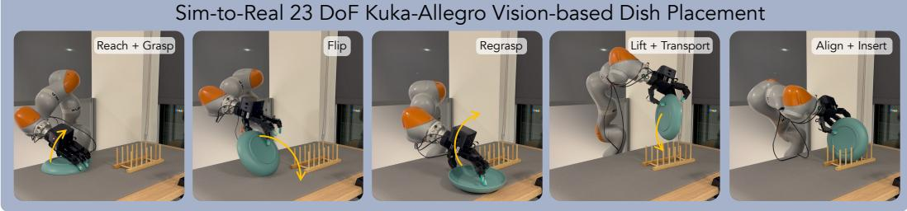

Sim-to-Real 29 DoF Flexiv-Sharpa Visuo-Tactile FMB Insertion  
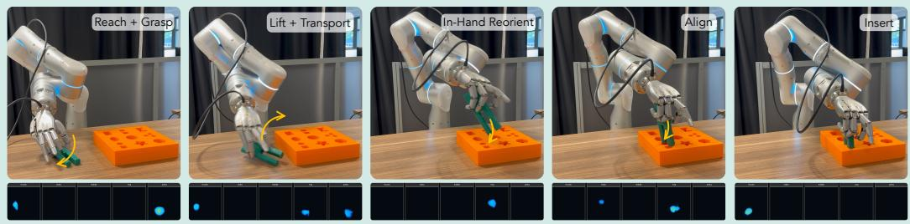  
Figure 1: ADEPT enables sim-to-real RL of high DoF arm-hand robots to reach, grasp, lift, reorient, transport, align, and insert. We demonstrate on a 23 DoF Kuka-Allegro from two RGB cameras and on a 29 DoF Flexiv-Sharpa from two RGB cameras and five fingertip tactile sensors.

Abstract: We introduce Accelerating DExterity via Pre-Training (ADEPT), a large-scale reinforcement learning (RL) framework for learning sim-to-real transferable dexterity across high degree-of-freedom (DoF) robot embodiments that can solve long-horizon tasks directly from raw visuo-tactile perception. ADEPT pretrains a dexterous policy on a generic object reposing task, then post-trains downstream policies with this pretrained behavior as a prior. ADEPT enables learning new behaviors that are otherwise difficult to discover from scratch on multi-fingered robots and avoids learning the same set of skills over again for every new downstream task. The pretrained policy zero-shots the reposing phase of downstream tasks, but na¨ıve RL fine-tuning rapidly degrades this capability during transfer. We address this with a stable post-training recipe combining behaviorcloning distillation, critic warm-up, and conservative on-policy updates. To safely exploit the full kinematic dexterity, we introduce a joint-space Geometric Fabric that mediates between the RL policy and the robot. We distill post-trained teachers into perceptive students that zero-shot sim-to-real transfer on two embodiments: a 23 DoF Kuka-Allegro with two RGB cameras, and a 29 DoF Flexiv-Sharpa with two RGB cameras and five vision-based tactile sensors, and can solve longhorizon tasks from challenging initial states with dexterity at human-level speed.

Keywords: Multisensory Dexterity, Sim-to-Real Reinforcement Learning

## 1 Introduction

Dexterous manipulation with high degrees-of-freedom robotic systems, such as arms equipped with anthropomorphic multi-fingered hands, remains a major challenge for robot learning [1, 2, 3, 4]. Multi-fingered arm-hand systems combine high-dimensional state and action spaces with contactrich interactions, making useful behaviors hard to discover from sparse task-specific rewards. Even with massively parallel GPU simulation [5], RL policies trained from scratch for one task rarely transfer to another; each new task starts over, rediscovering the same low-level skills like reaching, grasping, lifting, and reorientation before any task-specific behavior can emerge.

This motivates a different paradigm. Rather than training an RL specialist from scratch for each new dexterous task, we propose first acquiring a general-purpose dexterous foundation and then adapting it for specific downstream tasks [6, 7]. The policy’s initialization in parameter space is as consequential as the downstream objective it must adapt to. A generic pretraining task that exercises the underlying motor primitives lands the network in a region from which task-specific behaviors build on, rather than overwrite, the pretrained skills [8].

We introduce Accelerating DExterity via Pre-Training (ADEPT), a framework that pretrains foundational arm-hand-object dexterity on a generic object reposing task [9] and post-trains it for downstream contact-rich tasks. We find that this pretrained policy zero-shots the reposing segment of downstream tasks despite never having seen them during training, but transferring the policy and fast adaptation to a contact-rich downstream task is non-trivial. Na¨ıve RL fine-tuning often collapses the pretrained behaviors before they can be specialized to the new task [10]. We trace this failure to mismatched observation spaces, misaligned value estimates, and excessive policy drift during early PPO [11] updates, and address it with a structured post-training procedure of actor distillation, critic warm-up, and conservative on-policy updates, respectively.

We finally distill post-trained teachers into deployable end-to-end perceptive students through a twostage distillation curriculum and deploy them zero-shot on two arm-hand embodiments. On a 23 DoF Kuka iiwa7 + Allegro system, an RGB student solves the Functional Manipulation Benchmark (FMB) [12] peg insertion task end-to-end as a single learned policy on two peg geometries that span the benchmark’s difficulty range: a symmetric star peg and the asymmetric square-and-round peg, the most challenging geometry in FMB, and additionally solves dish-rack placement. On a 29 DoF Flexiv-Sharpa system, a visuo-tactile student solves FMB peg insertion from two RGB cameras and five fingertip tactile sensors. FMB was originally set up for parallel-jaw grippers, which require external fixtures to reorient and multiple stages of interaction with the object, both of which our approach eschews by using multi-fingered hands while discovering in-hand dexterous manipulations not easily possible with human demonstrations. To summarize, our contributions are:

• ADEPT, a framework for pretraining foundational arm–hand–object dexterity on a generic reposing task using RL and post-training it for contact-rich downstream tasks that accelerates and makes full DoF dexterous state-based RL tractable.

• A novel full joint configuration space (Cspace) geometric fabric [13] that gives the RL policy access to the full kinematic dexterity of high-DoF arm–hand systems while enforcing hardware safety (preventing collisions and hitting joint limits), in contrast to prior fabric-guided dexterous policies [3, 14] that restrict the hand to a low-dimensional PCA grasp subspace.

• A structured RL post-training recipe and distillation curriculum that together enable zero-shot sim-to-real on contact-rich, long-horizon dexterous insertion tasks across multiple arm-hand embodiments. Our results represent the first demonstration of challenging pick-reorient-insert with robotic arm-hand systems via sim-to-real RL from raw perception without demonstrations or pose trackers, on a vision-based Kuka-Allegro and a visuo-tactile Flexiv-Sharpa. Each task and embod iment is trained independently, using the same pre-trained policies specific to that embodiment.

• A 2×–14× execution-time speedup over the FMB [12] parallel-jaw pipeline: our multi-fingered policies solve each task in 5–10 s per trial, compared to 20–70 s per trial for the FMB parallel-jaw pipeline that relies on external fixtures and multi-stage regrasp decomposition.

## 2 Related Work

Sim-to-Real Dexterous Manipulation. [15, 1] established large-scale PPO with domain randomization for sim-to-real dexterity, followed by in-hand reorientation works [2, 16, 4, 17, 18]. ManipGen [19] composes local sim-only policies with motion planners for long-horizon real-world tasks, and OmniReset [20] diversifies reset-state distributions to elicit emergent dexterity from PPO, a form of generality that we instead achieve at the policy level through reposing pretraining. Sim-ToolReal [21] similarly trains a task-agnostic object-centric RL policy on procedurally generated primitives for zero-shot real-world tool use, but its deployed state-based policy is explicitly condi tioned on estimated object and goal poses. ADEPT instead deploys perception-based students that consume raw RGB and fingertip tactile directly, without a pose estimator in the loop. DextrAH-G and DextrAH-RGB [3, 14] use geometric fabrics as a low-level controller for sim-to-real grasping. DemoStart [22] learns grasp–reorient–insert behaviors on a three-fingered hand from pixels but requires demonstrations to seed learning. To our knowledge, prior work has not demonstrated zeroshot sim-to-real RL for long-horizon pick–reorient–insert on a high-DoF arm–hand system directly from raw visual or visuo-tactile perception, without demonstrations or a pose estimator.

Reinforcement Learning Pretraining and Transfer. Prior work studies pretraining and fine-tuning for RL [6], including behavior priors and regularization methods that mitigate distribution shift or forgetting during online adaptation [23, 24, 7, 10, 8]. ADEPT operates in this regime but is tailored to high-DoF dexterous policies trained from scratch in simulation: rather than regularizing with an explicit KL or EWC penalty, ADEPT initializes the downstream actor through behavior distillation, warms up the critic, and uses a substantially reduced actor learning rate during PPO post-training. Contemporaneously with our work, Play2Perfect [25] pretrains a goal-conditioned RL policy through task-agnostic dexterous play and fine-tunes it on precise contact-rich assembly, but, like SimToolReal [21], takes object pose as an input observation rather than raw perception and deploys state-based teachers in the real world.

Geometric Fabrics for Policy Learning. Geometric fabrics [13] provide a smooth, second-order action prior that RL policies command at the acceleration level, yielding reactive motions with provable stability guarantees and built-in collision and joint-limit avoidance, extending a line of work on geometrically consistent reactive control [26, 27, 28]. DextrAH-G [3] and DextrAH-RGB [14] use geometric fabrics for sim-to-real grasping but restrict hand control to a 5D PCA subspace of retargeted human grasps plus a 6D palm pose target, limiting the finger coordination needed for contact-rich manipulation. ADEPT instead drives geometric fabrics in the full joint configuration space (Cspace fabrics), exposing the full arm–hand kinematic space to the policy at the cost of a substantially harder learning problem.

Tactile Sensing for Sim-to-Real Dexterous Manipulation. Prior sim-to-real dexterous policies have largely relied on vision alone, since simulated contact signals cross the sim-to-real gap far less cleanly than images. Recent work bridges this gap by grounding both domains in a shared representation. HydroShear [29] simulates hydroelastic shear for vision-based tactile sensors, enabling zero-shot sim-to-real manipulation with parallel-jaw grippers. TacMap [30] instead represents tactile observations as geometry-consistent penetration-depth maps shared between simulation and hardware. SaTA [31] spatially anchors per-finger tactile features using FiLM conditioning on fingertip positions. ADEPT combines TacMap-derived penetration-depth and binary contact maps with SaTA-style FiLM anchoring on fingertip positions to provide explicit, spatially disambiguated per-finger contact information for sim-to-real dexterous manipulation.

## 3 Methodology

We propose a framework for pretraining foundational dexterity on a generic task objective and posttraining for contact-rich downstream tasks as outlined in Fig. 2. Our approach consists of three stages: (1) pretraining a dexterous policy in simulation on a generic object manipulation task, (2) transferring the pretrained behavior through distillation and adapting through massively parallel on policy RL post-training while preventing catastrophic forgetting through stable policy updates, and (3) teacher-student distillation using a task specialist teacher distilled into a stereo RGB vision-based student that can be zero-shot deployed in the real-world.

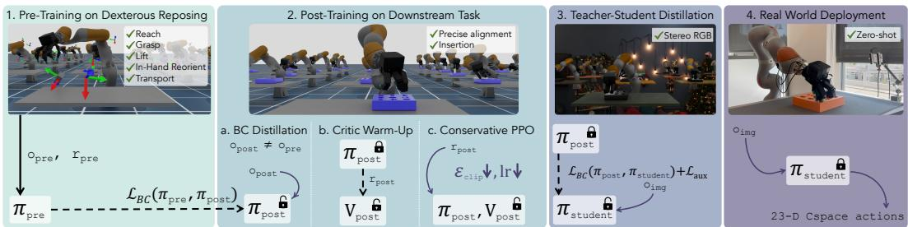  
Figure 2: ADEPT Overview. (1) Pre-train $( \pi _ { \mathrm { p r e } } , V _ { \mathrm { p r e } } )$ via PPO on a generic reposing task. (2) Post-train into $( \pi _ { \mathrm { p o s t } } , V _ { \mathrm { p o s t } } )$ for the downstream contact-rich task via BC distillation, frozen actor critic warm-up, and conservative PPO. (3) Distill $\pi _ { \mathrm { p o s t } }$ into a stereo RGB student $\pi _ { \mathrm { s t u d e n t } }$ . (4) Deploy $\pi _ { \mathrm { s t u d e n t } }$ zero-shot on the real robot.

## 3.1 Problem Formulation

We cast dexterous manipulation as a discrete-time Markov decision process (MDP) $\begin{array} { r l } { \mathcal { M } } & { { } = } \end{array}$ $( S , \mathcal { A } , p , r , \gamma )$ with continuous state space $s ,$ action space $\mathcal { A } = [ - 1 , 1 ] ^ { n _ { q } } ( n _ { q } = 2 3 )$ , transition dynamics $p ,$ scalar reward $r ,$ and discount factor $\gamma$ . We learn a stochastic policy $\pi _ { \boldsymbol { \theta } } ( a _ { t } \mid o _ { t } )$ that maximizes the expected discounted return $\begin{array} { r } { J ( \theta ) = \mathbb { E } _ { \tau \sim \pi _ { \theta } } \left[ \sum _ { t = 0 } ^ { T } \gamma ^ { t } r ( s _ { t } , a _ { t } ) \right] } \end{array}$ via PPO [11] with an asymmetric actor-critic. ADEPT operates over two MDPs $\mathcal { M } _ { \mathrm { p r e } }$ and $\mathcal { M } _ { \mathrm { p o s t } }$ for the pretraining (Sec. 3.2) and post-training (Sec. 3.3) tasks respectively. They share the action space A but differ in observation space, dynamics, and reward; in particular, $\boldsymbol { o } ^ { \mathrm { p o s t } }$ extends $o ^ { \mathrm { p r e } }$ with task-specific signals: receptacle pose $\scriptstyle \mathbf { p } _ { \mathrm { r e c } }$ and object–receptacle contact forces $\mathbf { f } _ { \mathrm { o r } }$ . We first solve $\mathcal { M } _ { \mathrm { p r e } }$ with PPO to obtain a pretrained actor-critic $( \pi _ { \mathrm { p r e } } , V _ { \mathrm { p r e } } )$ , then bootstrap from this pretrained actor to learn a downstream actor–critic $( \pi _ { \mathrm { p o s t } } , V _ { \mathrm { p o s t } } )$ ) on $\mathcal { M } _ { \mathrm { p o s t } }$ via the structured post-training of Sec. 3.3.

## 3.2 Pre-Training Foundational Dexterity

We pretrain a dexterous teacher actor-critic with PPO on a generic object reposing task designed to instill broad manipulation capabilities. At each episode, one of 16 primitive shapes (cylinders, cuboids, spheres, cones) at a randomized scale is spawned on the table, and the policy must execute a full sequence of reaching, grasping, lifting, in-hand reorientation, transporting, and reposing the object to a sampled target goal pose. Following [1, 2], we adopt ADR as an online curriculum that advances task goal and increases environmental complexity as the agent’s success rate improves, and additionally use Population-Based Training (PBT) [32, 9] (Appx. C) to search over PPO hyperparameters, and gravity is ADR-annealed from $\mathrm { 0 \ t o - 9 . 8 1 m / s ^ { 2 } }$ . This setup encourages the emergence of reusable dexterous skills (precise grasps, coordinated finger motion, and in-hand reorientation across varied object geometries and scales), yielding foundational dexterity that solves the reposing segment of downstream tasks in a zero-shot manner (Tab. 2). Refer to Appx. A.1 for the full task specification, observation space, and reward function. Note that we use object point clouds to represent objects, which has shown better zero-shot generalization for downstream tasks.

## 3.3 Post-training Dexterous RL Specialists on Downstream Tasks

Challenges in Transferring Pretrained Dexterity. Directly fine-tuning the pretrained policy on a downstream task using standard reinforcement learning leads to rapid degradation of its behavior as shown in Sec. 4.1 by the inset of Fig. 3 where it loses the ability to zero-shot the reposing segment of the task immediately after some policy updates (0% success). We observe that this degradation occurs even when the pretrained policy exhibits strong zero-shot performance, indicating that the failure arises during training rather than from insufficient pretraining. We attribute this to a number of mismatches under the transfer learning setup: (1) change in task reward function, (2) extra observations that are only available in the downstream task (e.g. contact forces between object-receptacle and pose of the receptacle), (3) poor value or advantage estimates, and thus (4) large policy updates.

Structured RL Adaptation. We frame downstream learning as layering new behaviors on top of the pretrained dexterous prior rather than relearning manipulation from scratch: each iteration of on-policy PPO is restricted to a local region of the pretrained policy space, so the policy retains core reaching, grasping, lifting, and reorientation skills while incorporating downstream task-specific observations $\scriptstyle \mathbf { p } _ { \mathrm { r e c } }$ and $\mathbf { f } _ { \mathrm { o r } }$ and reward. Instead, ADEPT stabilizes transfer through actor distillation, critic calibration, and conservative policy updates while still allowing downstream behavioral adaptation. Concretely, we transfer the pretrained actor–critic $( \pi _ { \mathrm { p r e } } , V _ { \mathrm { p r e } } )$ into the downstream task in three steps. (1) BC actor distillation. We distill $\pi _ { \mathrm { p r e } }$ into a new downstream actor $\pi _ { \mathrm { p o s t } }$ with the downstream observation space using supervised imitation for 40k iterations. (2) Critic warm-up. We then freeze $\pi _ { \mathrm { p o s t } }$ and train a fresh downstream critic $V _ { \mathrm { p o s t } }$ on rollouts collected by the frozen $\pi _ { \mathrm { p o s t } }$ under the downstream reward, aligning value estimates with the new task over 20 PPO iterations (∼ 1M env steps per GPU with 4096 envs) before any policy updates are applied. (3) Conservative PPO. We finally unfreeze $\pi _ { \mathrm { p o s t } }$ and jointly update $( \pi _ { \mathrm { p o s t } } , V _ { \mathrm { p o s t } } )$ with PPO using conservative updates (actor LR 1e-3 → 1e-5 with linear decay, PPO clip $\epsilon \colon 0 . 2  0 . 0 5$ , critic LR fixed at 5e-5). BC distillation (1) runs against the single ADR 20 goal pose on the goal path illustrated in Fig. 7 by grey spheres; critic warm-up (2) and conservative PPO (3) then train directly against the final insertion goal at ADR 50 while the remaining ADR randomizations anneal from level 20; training from scratch must follow the same curriculum from ADR 0. Controlled ablations (Tab. 3) show that the reduced actor learning rate is what prevents collapse, while BC and critic warm-up improve success, stability, and adaptation speed; the tightened clip has little effect. Refer to Alg. 1 for the full algorithm and Tab. 5 in Appx. A.3 for the training hyperparameters.

## 3.4 Teacher-Student Distillation

Setup. After RL post-training yields a state-based teacher for a contact-rich downstream task, we distill it into a deployable student that consumes only proprioception, fabric state, two RGB images, and, on the Flexiv-Sharpa embodiment, five per-finger tactile maps as outlined in Tab. 6 in Appx. A.4 and can be deployed zero-shot on the real robot. The student is trained with DAgger [33]: the teacher provides per-step action targets (mean and variance) over rollouts collected from the student in the same task environment, and the student uses an initially frozen pretrained ResNet backbone with a DextrAH-RGB-style [14] unfreeze schedule.

Auxiliary loss. The action-cloning loss alone does not reliably teach the student to perceive the peg’s orientation, which is the dominant failure mode on our insertion task: the peg must be inserted at a specific orientation, so small errors in predicted yaw or tilt translate directly into missed insertions. Following DextrAH-RGB [14], which uses object position prediction as the auxiliary loss, we add an 8-keypoint object pose prediction head on top of the shared stereo image features and supervise it against the ground-truth peg pose available in simulation. The full distillation objective is the sum of the BC and auxiliary losses, $\mathcal { L } = \mathcal { L } _ { \mathrm { B C } } + \mathcal { L } _ { \mathrm { a u x } }$ , with more details in Appx. G.

Two-stage student curriculum. Mirroring the pretraining/post-training structure of our RL pipeline, we introduce a vision-side student pretraining stage that isolates the perceptual prerequisites of the downstream task (the peg detection and 8-keypoint pose prediction that $\mathcal { L } _ { \mathrm { a u x } }$ supervises) from the policy-learning objective driven by $\mathcal { L } _ { \mathrm { B C } }$ . (1) Student pretraining via the reposing teacher. We re-task the pretrained reorientation teacher (Sec. 3.2) to perform a perception-heavy surrogate of the downstream task (lifting and reorienting the peg to an upright pose at a fixed receptacle location) and distill it into the stereo RGB student. The student must learn from RGB alone to detect the peg, predict its 8-keypoint pose as an auxiliary prediction, track it through the grasp and lift, and reproduce the teacher’s reorientation behavior. (2) Vision distillation from the downstream teacher. We then initialize the student in the downstream distillation from the Stage-1 checkpoint and continue training against the post-trained downstream teacher on the insertion task.

This two-stage curriculum keeps a single dominant learning objective at each stage: $\mathcal { L } _ { \mathrm { a u x } }$ shapes the visual encoder in Stage 1 while $\mathcal { L } _ { \mathrm { B C } }$ then drives contact-rich policy refinement in Stage 2 on top of an already-competent encoder, removing the conflict between perception and policy learning that arises when the two are trained jointly from scratch.

Tactile perception for visuo-tactile students. For the Flexiv-Sharpa robot, we extend the student’s observation space with per-finger tactile images from all five fingertip vision-based tactile sensors. Following TacMap [30], we simulate each fingertip’s output as a geometry-consistent penetration-depth map that shares its representation with the calibrated real-sensor output, so the student consumes tactile signals without additional sim-to-real bridging. From each depth map we derive a binary contact map by thresholding, encode both channels with a per-finger CNN shared across fingers, and spatially anchor the resulting features via SaTA-style [31] FiLM conditioning on the fingertip position obtained via forward kinematics. The per-finger tactile embeddings are then fused with the stereo RGB and proprioception latents, giving the policy a spatially grounded view of hand-object contact. Full architecture and dimensions are deferred to Appx. H.

Randomization. Both distillation stages use aggressive domain randomization on physics, object perturbations via random wrenches, visual conditions (lighting, background, camera intrinsics and pose), and sensor noise on proprioception and contact signals. Refer to Appx. I for more details.

## 3.5 Joint Configuration Space Geometric Fabrics

We place a geometric fabric [13] between the policy and the robot to enforce hardware constraints (joint limits, self- and environmental collision), provide a smooth second-order action prior that shapes RL exploration, and guarantee the same low-level controller in simulation and on the real robot. A fabric is an autonomous second-order system on configuration space, ${ \bf M } _ { f } ( { \bf q } _ { f } , \dot { \bf q } _ { f } ) \ddot { \bf q } _ { f } +$ $\mathbf { f } _ { f } ( \mathbf { q } _ { f } , { \dot { \mathbf { q } } } _ { f } ) + \mathbf { f } _ { \pi } ( \mathbf { a } ) = \mathbf { 0 }$ , where $\mathbf { f } _ { f }$ collects autonomous geometric and dissipative terms (collision and joint-limit repulsion, Cspace damping, speed control) and ${ \bf f } _ { \pi } ( { \bf a } )$ is the policy-driven forcing term. To support behaviors such as in-hand reposing, finger gaiting, and contact-rich manipulation, we drive the fabric in the full joint configuration space: the policy outputs $\mathbf { a } _ { t } \in [ - 1 , 1 ] ^ { n _ { q } } ( n _ { q } = 2 3$ for Kuka-Allegro), interpreted as per-joint relative deltas that map to a Cspace target consumed by $\mathbf { f } _ { \pi }$ . This exposes the full 23-DoF kinematic dexterity of the arm–hand system to the policy while retaining the fabric’s safety and stability guarantees [13]. The same fabric instance runs in simulation and on the real robot, minimizing the controller gap from the sim-to-real problem. Full fabric components, the relative-target mapping, and the integration loop are deferred to Appx. B.

## 4 Experiments

## 4.1 Simulation Experiments

How well does the pretrained teacher generalize to unseen objects? We evaluate the pretrained teacher on the reposing task across three object categories in Tab. 1: the 16 in-distribution primitive shapes used during pretraining, the FMB pegs (star and square/round) from downstream insertion task, and VisDex [4] objects. Despite training only on primitives, the Kuka-Allegro teacher matches or slightly exceeds its in-distribution success rate on both out-of-distribution (OOD) sets, and the Flexiv-Sharpa teacher stays close to the in-distribution success rate rather than failing to generalize.

How far can the pretrained teacher zero-shot the downstream task? We evaluate the teacher on FMB peg insertion across ADR levels with no post-training in Tab. 2. Goal poses are laid out along an L-shaped path indexed by ADR level, as visualized by the grey spheres in Fig. 7 in Appx. A.2: a horizontal lift-and-transport segment from above the peg spawn to above the board hole (ADR 0 to 25), then a vertical insertion segment descending into the hole (ADR 25 to 50). Zero-shot success stays above 50% through ADR 35 and reaches 0% at the actual insertion goal (ADR 50) as it starts making contact with the receptacle, which is OOD. We therefore begin all downstream post-training at ADR 20: BC distillation clones the teacher against the ADR 20 goal pose, and from critic warm-up onward the goal pose is set directly to the final insertion goal at ADR 50, the endpoint of the path, while the remaining ADR randomizations anneal from level 20. For FMB peg insertion the pretrained policy zero-shots the reposing portion reliably at this level, so only the contact-rich insertion segment remains to be learned. For dish placement the reposing prior transfers only up to reaching, not grasping, since the 16 primitive pretraining objects include nothing close to the plate’s large and flat geometry. We later show that post-training nevertheless learns the full task.

Table 1: Episodic success rates (SR) of pre-trained reposing teacher on unseen objects. Mean ± std across seeds at the final ADR level.
<table><tr><td>Metric</td><td>Primitive</td><td>FMB Peg</td><td>VisDex [4] (Fixed Goal)</td></tr><tr><td>Number of objects</td><td>16</td><td>2</td><td>152</td></tr><tr><td>Kuka-Allegro SR ↑</td><td> $0 . 7 3 \pm 0 . 0 0 3$ </td><td> $0 . 7 6 \pm 0 . 0 0 3$ </td><td> $0 . 7 7 \pm 0 . 0 1 1$ </td></tr><tr><td>Flexiv-Sharpa SR ↑</td><td> $0 . 6 4 \pm 0 . 0 0 7$ </td><td> $0 . 5 8 \pm 0 . 0 1 1$ </td><td> $0 . 6 1 \pm 0 . 0 1 5$ </td></tr></table>

Table 2: Zero-shot success rate of the pretrained reposing teacher on FMB peg reposing across ADR.

<table><tr><td rowspan="2">Task (Embodiment)</td><td rowspan="2">0</td><td colspan="9"></td><td rowspan="2">50</td></tr><tr><td>5</td><td>10</td><td>15</td><td>20</td><td>25</td><td>30</td><td>35</td><td>40</td><td>45</td></tr><tr><td>FMB Peg (Kuka-Allegro)</td><td>98.6</td><td>94.1</td><td>84.7</td><td>78.6</td><td>71.9</td><td>67.9</td><td>58.7</td><td>52.5</td><td>39.6</td><td>18.0</td><td>0.00</td></tr><tr><td>FMB Peg (Flexiv-Sharpa)</td><td>94.5</td><td>87.1</td><td>80.3</td><td>76.8</td><td>74.9</td><td>70.4</td><td>66.8</td><td>59.2</td><td>52.3</td><td>22.9</td><td>0.70</td></tr></table>

How does ADEPT compare to training from scratch? Fig. 3 plots ADR level over environment steps for (1) training from scratch on the downstream task, (2) direct PPO finetuning of the pretrained reposing teacher with extra observations, and (3) ADEPT post-training. Fig. 8 in Appx. E shows the same plot with wall-clock time. ADEPT trains a downstream-task teacher in 3B environment steps on top of the 8B-step reposing pretraining, for a total of 11B steps. Training from scratch is highly seed-sensitive, with most seeds plateauing well below ADR 6

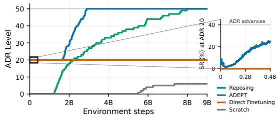  
Figure 3: Training curves on FMB peg insertion comparing (1) training from scratch, (2) direct PPO finetuning of the pretrained reposing teacher, and (3) ADEPT post-training. Blue inset: success-rate collapse for (2) during transfer.

as shown in Fig. 9 in Appx. E and only a few reaching it after about 9B steps. More importantly, the 8B pretraining cost is amortized across every downstream task, so the marginal cost per new task reduces to the 3B post-training.

Why does na¨ıve RL finetuning fail? The blue inset of Fig. 3 zooms in on the success rate at ADR level 20, where (2) and (3) both begin from the same pretrained teacher: na¨ıve PPO finetuning drives the success rate to zero within a small number of updates, while ADEPT post-training continues to improve. The pretrained critic $V _ { \mathrm { p r e } }$ is calibrated to the reposing reward, so under the new insertion reward its value estimates are off and the advantages it feeds to PPO are unreliable. The resulting policy gradients push the actor away from its pretrained distribution faster than the critic can recalibrate; each subsequent rollout is collected from a worse policy operating on a worse critic, and within a few iterations the pretrained behavior is destroyed. ADEPT’s post-training addresses this directly: BC actor distillation transfers the pretrained teacher actor’s knowledge into the downstream actor with the new observation space $\mathrm { \Gamma } _ { o } \mathrm { p o s t }$ , critic warm-up recalibrates $V _ { \mathrm { p o s t } }$ under the new reward with the actor frozen so subsequent policy updates see reliable advantages, and conservative PPO bounds the on-policy update to prevent large drifts from the pretrained policy manifold.

Which post-training components matter? Controlled ablations in Tab. 3 decompose the recipe over five independent (non-PBT) seeds per variant, all initialized from the same pretrained checkpoint. The reduced actor learning rate is the necessary component: every $1 0 ^ { - 3 }$ variant collapses at ADR 20 with zero success, even with BC and critic warm-up in place. A KL penalty $D _ { \mathrm { K L } } ( \pi _ { \mathrm { p o s t } } | \pi _ { \mathrm { p r e } } )$ , which regularizes the post-training policy does not rescue it, and at a learning rate of $1 0 ^ { - 5 }$ , adding the penalty with $\beta { = } 1$ still yields 0% across all five seeds. Given the low learning rate, critic warm-up is worth +17.6 SR (row c) and BC nearly halves adaptation time (19.9 vs. 35.2 h, row b); removing both stalls every seed below ADR 40. Without BC, the ten new observation dimensions must be injected into the pretrained actor, and we test both constructions: row (g) remaps the actor input layer (nine obsolete inputs removed, ten zero-initialized inputs added), while row $( \mathbf { g } ^ { \dagger } )$ keeps all 391 pretraining inputs and appends the ten. Both stall, so the gap is not an artifact of the remapping. The tightened clip has little effect: loosening it to 0.20 (row f) matches or exceeds the full recipe on every column. All policies deployed in this paper use the tight clip, and the ablation makes the loose clip a sound default for future post-training runs.

Table 3: Post-training component ablations on KUKA-Allegro FMB peg insertion; 5 independent non-PBT seeds per row, all from one pretrained checkpoint. ADR50 counts seeds reaching the final ADR level; time is averaged over seeds that reached it. Train SR is the instantaneous training success rate over parallel environments.
<table><tr><td></td><td>Variant</td><td>BC</td><td>WU</td><td>LR</td><td>Clip</td><td>ADR50</td><td>Train SR (%)</td><td>Time to ADR 50</td></tr><tr><td>(a)</td><td>ADEPT (full)</td><td>√</td><td>√</td><td> $1 0 ^ { - 5 }$ </td><td>.05</td><td>5/5</td><td> $4 6 . 0 \pm 1 . 1$ </td><td> $1 9 . 9 \pm 1 . 0 \mathrm { h }$ </td></tr><tr><td>(b)</td><td>No BC</td><td>x</td><td>√</td><td> $1 0 ^ { - 5 }$ </td><td>.05</td><td>4/5</td><td> $3 8 . 5 \pm 1 . 2$ </td><td> $3 5 . 2 \pm 4 . 9 \mathrm { h }$ </td></tr><tr><td>(c)</td><td>No warm-up</td><td>√</td><td>x</td><td> $1 0 ^ { - 5 }$ </td><td>.05</td><td>4/5</td><td> $2 8 . 4 \pm 3 . 7$ </td><td> $2 0 . 2 \pm 1 . 5 \mathrm { h }$ </td></tr><tr><td>(d)</td><td>Standard PPO</td><td>√</td><td>√</td><td> $1 0 ^ { - 3 }$ </td><td>.20</td><td>0/5</td><td> $0 . 0 \pm 0 . 0$ </td><td>Collapse (ADR 20)</td></tr><tr><td>(e)</td><td>High LR only</td><td>√</td><td>√</td><td> $1 0 ^ { - 3 }$ </td><td>.05</td><td>0/5</td><td> $0 . 0 \pm 0 . 0$ </td><td>Collapse (ADR 20)</td></tr><tr><td>(f)</td><td>Loose clip</td><td>√</td><td>√</td><td> $1 0 ^ { - 5 }$ </td><td>.20</td><td>5/5</td><td> $4 6 . 8 \pm 2 . 0$ </td><td>17.6 ± 1.8 h</td></tr><tr><td>(g)</td><td>No BC/WU (remapped)</td><td>x</td><td>x</td><td> $1 0 ^ { - 5 }$ </td><td>.05</td><td>0/5</td><td> $2 6 . 6 \pm 7 . 9$ </td><td>Stall (ADR 29–39)</td></tr><tr><td>(g†)</td><td>No BC/WU (append-only)</td><td>x</td><td>x</td><td> $1 0 ^ { - 5 }$ </td><td>.05</td><td>0/5</td><td> $2 7 . 0 \pm 1 0 . 7$ </td><td>Stall (ADR 43)</td></tr><tr><td>(h)</td><td>Direct FT</td><td>x</td><td>x</td><td> $1 0 ^ { - 3 }$ </td><td>.20</td><td>0/5</td><td> $0 . 0 \pm 0 . 0$ </td><td>Collapse (ADR 20)</td></tr><tr><td>(i)</td><td>Direct  $\mathrm { F T + K L }$ </td><td>x</td><td>x</td><td> $1 0 ^ { - 3 }$ </td><td>.20</td><td>0/5</td><td> $0 . 0 \pm 0 . 0$ </td><td>Collapse (ADR 20)</td></tr></table>

Emergent natural grasps from ADEPT and refinement from post-training. ADEPT offers more than accelerated dexterous policy learning and a stable post-training framework: it has the emergent property of synthesizing natural grasps. The insertion reward does not constrain how the peg is grasped; both natural and unnatural grasps can satisfy it. From a random initialization, PPO converges to whichever policy maximizes the reward, often synthesizing an unnatural grasp as in Fig. 12(c) and performance varies significantly across seeds. What truly produces the natural grasps is reposing pretraining, which initializes the policy in a region of policy parameter space where natural grasps emerge. Post-training then applies local policy updates from this initialization against the same reward; rather than discovering new grasp modes, it refines the pretrained natural grasps to specialize for the downstream task. Task-misaligned grasps that the reposing teacher occasionally produced in Fig. 12(b) (e.g., grasping from the bottom of the peg at ADR level 20) disappear under post-training refinement as guided by the downstream hand-to-object and object-to-goal alignment reward. Refer to Appx. J for representative ADEPT, pretrained teacher, and from-scratch grasps. The plate in the dish task is larger and flatter than any object seen during pretraining, and no pretrained grasp works on it. Starting from reaching that transfers zero-shot and the policy’s natural grasping attempts, post-training learns the entire new task with the downstream reward.

Can we learn novel behaviors through post-training? If post-training could only refine behaviors already present in the pretrained policy, its usefulness would be limited by pre-training coverage. The dish task shows that post-training can go beyond straightforward refinement. Reaching transfers zero-shot: the pretrained policy reliably approaches the plate. Grasping, however, does not. Unlike the FMB pegs, which remain within the pretrained policy’s grasp repertoire (Tab. 1 and Fig. 12), the plate is geometrically far from the 16 simple primitives (Fig. 6) used during pre-training, and none of the pretrained grasps succeed on it zero-shot. Post-training therefore begins without a competent grasping behavior to preserve or refine. What pre-training provides instead is a useful starting distribution: the policy already reaches the plate and produces plausible, though unsuccessful, grasp attempts near meaningful contact configurations. From this initialization, downstream RL learns successful plate grasping and, for upside-down initializations, a flip-and-regrasp strategy not successfully exhibited by the pretrained policy. This contrasts with FMB, where post-training primarily selects and refines grasp modes already available in the pretrained policy (Fig. 12, Appx. J). Thus, pre-training need not already solve the downstream behavior; it is sufficient for the prior to place the policy in a region from which downstream RL can discover a successful solution. For tasks requiring qualitatively different manipulation skills with little overlap with the pretrained prior, additional pre-training coverage may be necessary.

## 4.2 Real World Experiments

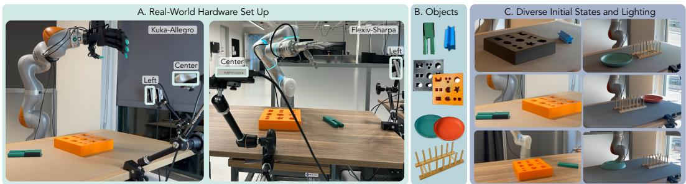  
Figure 4: Real-world setup. (A) The 23 DoF Kuka-Allegro and 29 DoF Flexiv-Sharpa platforms, each with two RealSense RGB cameras (left and center). (B) FMB pegs and boards, plates, and dish rack. (C) Diverse initial states and lighting used in real-world testing.

Hardware Setup. We deploy on two arm-hand platforms: a 7 DoF Kuka iiwa7 with a 16 DoF Allegro four-fingered hand $( n _ { q } ~ = ~ 2 3 )$ , and a 7 DoF Flexiv Rizon with a 22 DoF Sharpa fivefingered hand $( n _ { q } ~ = ~ 2 9 )$ , each rigidly mounted to a workbench and observed by two calibrated Intel RealSense RGB cameras in the same left-and-center layout (Fig. 4). Each Sharpa fingertip additionally carries a vision-based tactile sensor whose deformation is exposed to the policy as perfinger TacMap depth maps, the same representation rendered in simulation during training. Student policies run on a separate workstation and zero-shot transfer from simulation by sharing the same geometric-fabric action interface (Sec. 3.5), and, on Flexiv-Sharpa, the same tactile interface, in both simulation and on the real robot. We provide the full deployment topology in Appx. F, sample real-world camera views in Fig. 10, and the visuo-tactile student architecture in Appx. H.

Task Setup. We evaluate on two FMB [12] pegs in Fig. 4 that span the benchmark’s geometric difficulty: a symmetric star peg, whose rotational and top-down symmetry admits multiple valid insertion orientations, and the asymmetric square-and-round peg, the most challenging geometry in FMB, whose square and round legs admit only a single valid insertion orientation. We initialize pegs flat on the table over 30 cm × 25 cm in spawn range as illustrated in Fig. 7 and $[ - \pi , \pi ]$ rad in yaw and count a trial successful when the peg is fully inserted.

On Kuka-Allegro we additionally evaluate dish-rack placement (Fig. 4): the policy must grasp a plate, reorient it upright, and seat it into a slot of a wooden dish rack, a flip-and-regrasp pattern that never appears in reposing pre-training. Plates are initialized flat on the table, either upright or upside down, over a spawn range similar to the FMB pegs, and a trial counts as successful when the plate is fully seated in a rack slot. In the per-stage breakdown of Tab. 4, the flip-and-regrasp of upside-down plates is counted as part of the Grasp stage.

Results. A single Kuka-Allegro reposing checkpoint post-trains to three downstream tasks, FMB star insertion, FMB square/round insertion, and dish-rack placement, with one post-trained teacher per task and no task-specific pre-training. Zero-shot in the real world, the vision student reaches 5/10 (star) and $3 / 1 0$ (square/round) on FMB and $6 / 1 0$ on dish placement; the visuo-tactile Flexiv-Sharpa student reaches 8/10 on FMB square/round, the only peg trained on that embodiment (Tab. 4). Post-trained teachers evaluate at 85.0% (Kuka-Allegro, aggregated over both pegs) and 89.2% (Flexiv-Sharpa, square/round) in simulation, and the Kuka-Allegro vision student evaluates at 46.7%/65.2% (square/round, star). All numbers here are episodic success rates over 1024 episodes at ADR 50; training curves elsewhere report the instantaneous fraction of environments in the success state, which resets after sustained success and is not comparable to episodic evaluation.

Star vs. square/round. The star peg’s ridges allow fingers to wrap between them for stable grasps, and its symmetry admits multiple valid insertion orientations. The asymmetric peg’s round leg yields unstable point contacts, producing the largest per-stage drops at lifting and reorienting (Tab. 4) and a lower overall success rate.

Vision vs. visuo-tactile. In real deployment, tactile sensing is decisive (8/10 vs. 3/10 overall on Flexiv-Sharpa). The failure mode is not grasp execution but grasp confidence: the vision-only student cannot tell whether a grasp has succeeded, so even after a good grasp it often reopens the hand, drops the object, and loops between grasping and regrasping, and these failures cascade through lifting and reorientation (Tab. 4). With fingertip tactile sensing the policy is certain of its contacts: it grasps and lifts successfully in every trial and carries that reliability through reorientation, alignment, and insertion.

Distillation curriculum. The single-stage baseline fails to transfer entirely (0/10 on both pegs), while the two-stage curriculum outperforms it by roughly 10% in instantaneous success rates across parallel environments throughout training, confirming that Stage-1 perception pretraining is critical for sim-to-real transfer.

Human-level speed. Our policies execute the entire manipulation sequence as a single continuous behavior at human-comparable timescales (5–10 s per trial), reorienting objects in-hand with a single hand. FMB [12] human demonstrations with a parallel-jaw gripper instead decompose the task into grasp, place-on-fixture, regrasp, rotate, and insert primitives, rely on external fixtures, and require 20–70 s per trial, a 2×–14× execution-time difference.

Table 4: Per-stage success rates on real-world long-horizon manipulation, trained with ADEPT. Each stage is cumulative: success at stage k requires success at all earlier stages.
<table><tr><td>Modality</td><td>Robot</td><td>Task</td><td>Reach</td><td>Grasp</td><td>Lifting</td><td>Reorient</td><td>Align</td><td>Insert (SR)</td></tr><tr><td>Vision</td><td>Kuka-Allegro</td><td>FMB Star</td><td>10/10</td><td>9/10</td><td>8/10</td><td>8/10</td><td>7/10</td><td>5/10</td></tr><tr><td>Vision</td><td>Kuka-Allegro</td><td>FMB Square/Round</td><td>10/10</td><td>8/10</td><td>6/10</td><td>4/10</td><td>3/10</td><td>3/10</td></tr><tr><td>Vision</td><td>Flexiv-Sharpa</td><td>FMB Square/Round</td><td>10/10</td><td>7/10</td><td>5/10</td><td>3/10</td><td>3/10</td><td>3/10</td></tr><tr><td>Visuo-Tactile</td><td>Flexiv-Sharpa</td><td>FMB Square/Round</td><td>10/10</td><td>10/10</td><td>10/10</td><td>9/10</td><td>8/10</td><td>8/10</td></tr><tr><td>Vision</td><td>Kuka-Allegro</td><td>Dish</td><td>10/10</td><td>10/10</td><td>8/10</td><td>7/10</td><td>6/10</td><td>6/10</td></tr></table>

## 5 Limitations

Although the real-world policies exhibit behaviors closely matching those observed in simulation, perception remains the primary bottleneck for distillation. Failures frequently coincide with incorrect estimates of the asymmetric peg’s orientation under occlusion, while grasp instability can arise from the small contact patch between the rounded Allegro fingertips and the rounded side of the peg under fast arm motion. Fingertip tactile sensing on Flexiv-Sharpa mitigates contact ambiguity, but robust object-centric perception under occlusion remains open. A wrist-mounted camera and tactile sensing on additional platforms may help address these limitations.

## 6 Conclusion and Discussion

We presented ADEPT, a pre-training and post-training framework for learning dexterous arm-hand manipulation with reinforcement learning. A generic reposing task provides a reusable initialization for downstream manipulation, while structured post-training preserves useful pretrained behaviors as the policy adapts and aligns to new contact-rich task objectives. Across Kuka-Allegro and Flexiv-Sharpa, the same approach supports long horizon behaviors including grasping, reorientation, transport, and insertion, and transfers to real robots through vision and visuo-tactile student policies. Our results suggest that reusable dexterous pre-training can reduce how much must be rediscovered for each new manipulation problem, while still leaving room for downstream RL to adapt and acquire task-specific behavior. An important next step is to broaden the pre-training distribution to more diverse interactions, including in-hand manipulation, tool use, clutter, and bimanual manipulation, and study how far the resulting priors can transfer to tasks that differ more substantially from pretraining.

## References

[1] I. Akkaya, M. Andrychowicz, M. Chociej, M. Litwin, B. McGrew, A. Petron, A. Paino, M. Plappert, G. Powell, R. Ribas, et al. Solving rubik’s cube with a robot hand. arXiv preprint arXiv:1910.07113, 2019.

[2] A. Handa, A. Allshire, V. Makoviychuk, A. Petrenko, R. Singh, J. Liu, D. Makoviichuk, K. Van Wyk, A. Zhurkevich, B. Sundaralingam, et al. Dextreme: Transfer of agile in-hand manipulation from simulation to reality. In 2023 IEEE International Conference on Robotics and Automation (ICRA), pages 5977–5984. IEEE, 2023.

[3] T. G. W. Lum, M. Matak, V. Makoviychuk, A. Handa, A. Allshire, T. Hermans, N. D. Ratliff, and K. Van Wyk. DextrAH-G: Pixels-to-action dexterous arm-hand grasping with geometric fabrics. In Conference on Robot Learning (CoRL), 2024.

[4] T. Chen, M. Tippur, S. Wu, V. Kumar, E. Adelson, and P. Agrawal. Visual dexterity: In-hand reorientation of novel and complex object shapes. Science Robotics, 8(84), 2023.

[5] V. Makoviychuk, L. Wawrzyniak, Y. Guo, M. Lu, K. Storey, M. Macklin, D. Hoeller, N. Rudin, A. Allshire, A. Handa, and G. State. Isaac gym: High performance GPU-based physics simulation for robot learning. In Neural Information Processing Systems (NeurIPS) Datasets and Benchmarks Track, 2021.

[6] M. Laskin, D. Yarats, H. Liu, K. Lee, A. Zhan, K. Lu, C. Cang, L. Pinto, and P. Abbeel. URLB: Unsupervised reinforcement learning benchmark. In Neural Information Processing Systems (NeurIPS) Datasets and Benchmarks Track, 2021.

[7] M. Nakamoto, Y. Zhai, A. Singh, M. Sobol Mark, Y. Ma, C. Finn, A. Kumar, and S. Levine. Cal-QL: Calibrated offline rl pre-training for efficient online fine-tuning. In Neural Information Processing Systems (NeurIPS), 2023.

[8] J. Kirkpatrick, R. Pascanu, N. Rabinowitz, J. Veness, G. Desjardins, A. A. Rusu, K. Milan, J. Quan, T. Ramalho, A. Grabska-Barwinska, et al. Overcoming catastrophic forgetting in neural networks. Proceedings of the national academy of sciences, 114(13):3521–3526, 2017.

[9] A. Petrenko, A. Allshire, G. State, A. Handa, and V. Makoviychuk. Dexpbt: Scaling up dexterous manipulation for hand-arm systems with population based training, 2023. URL https://arxiv.org/abs/2305.12127.

[10] I. Shenfeld, J. Pari, and P. Agrawal. RL’s razor: Why online reinforcement learning forgets less. arXiv preprint arXiv:2509.04259, 2025.

[11] J. Schulman, F. Wolski, P. Dhariwal, A. Radford, and O. Klimov. Proximal policy optimization algorithms. arXiv preprint arXiv:1707.06347, 2017.

[12] J. Luo, C. Xu, F. Liu, L. Tan, Z. Lin, J. Wu, P. Abbeel, and S. Levine. FMB: a functional manipulation benchmark for generalizable robotic learning. International Journal ofRobotics Research (IJRR), 2024.

[13] K. V. Wyk, A. Handa, V. Makoviychuk, Y. Guo, A. Allshire, and N. D. Ratliff. Geometric fabrics: a safe guiding medium for policy learning. In Proceedings of the IEEE International Conference on Robotics and Automation (ICRA), 2024.

[14] R. Singh, A. Allshire, A. Handa, N. Ratliff, and K. Van Wyk. DextrAH-RGB: Visuomotor policies to grasp anything with dexterous hands. arXiv preprint arXiv:2412.01791, 2024.

[15] M. Andrychowicz, B. Baker, M. Chociej, R. Jozefowicz, B. McGrew, J. Pachocki, A. Petron, M. Plappert, G. Powell, A. Ray, J. Schneider, S. Sidor, J. Tobin, P. Welinder, L. Weng, and W. Zaremba. Learning dexterous in-hand manipulation. International Journal of Robotics Research (IJRR), 39(1):3–20, 2020.

[16] T. Chen, J. Xu, and P. Agrawal. A system for general in-hand object re-orientation. In Conference on Robot Learning (CoRL), 2022.

[17] H. Qi, A. Kumar, R. Calandra, Y. Ma, and J. Malik. In-hand object rotation via rapid motor adaptation. In Conference on Robot Learning (CoRL), 2022.

[18] H. Qi, B. Yi, S. Suresh, M. Lambeta, Y. Ma, R. Calandra, and J. Malik. General in-hand object rotation with vision and touch. In Conference on Robot Learning (CoRL), 2023.

[19] M. Dalal, M. Liu, W. Talbott, C. Chen, D. Pathak, J. Zhang, and R. Salakhutdinov. Local policies enable zero-shot long-horizon manipulation. In IEEE International Conference on Robotics and Automation (ICRA), 2025.

[20] P. Yin, T. Westenbroek, Z. Zhang, J. Tran, I. Dagnino, E. Shilamkar, N. Mbiziwo-Tiapo, S. Bagaria, X. Liu, G. Mullins, A. Kolobov, and A. Gupta. Emergent dexterity via diverse resets and large-scale reinforcement learning. In The Fourteenth International Conference on Learning Representations, 2026. URL https://arxiv.org/abs/2603.15789.

[21] K. Kedia, T. G. W. Lum, J. Bohg, and C. K. Liu. SimToolReal: An object-centric policy for zero-shot dexterous tool manipulation. In Robotics: Science and Systems (RSS), 2026.

[22] M. Bauza, J. E. Chen, V. Dalibard, N. Gileadi, R. Hafner, M. F. Martins, J. Moore, R. Pevceviciute, A. Laurens, D. Rao, M. Zambelli, M. Riedmiller, J. Scholz, K. Bousmalis, F. Nori, and N. Heess. Demostart: Demonstration-led auto-curriculum applied to sim-to-real with multifingered robots. In IEEE International Conference on Robotics and Automation (ICRA), 2025.

[23] Z. Zhou, A. Peng, Q. Li, S. Levine, and A. Kumar. Efficient online reinforcement learning fine-tuning need not retain offline data. International Conference on Learning Representations (ICLR), 2025.

[24] Y. Zhao, R. Boney, A. Ilin, J. Kannala, and J. Pajarinen. Adaptive behavior cloning regularization for stable offline-to-online reinforcement learning. In European Symposium on Artificial Neural Networks (ESANN), 2022.

[25] T. G. W. Lum, K. Kedia, C. K. Liu, and J. Bohg. Play2Perfect: What matters in dexterous play pretraining for precise assembly? arXiv preprint arXiv:2606.26428, 2026.

[26] N. D. Ratliff, J. Issac, D. Kappler, S. Birchfield, and D. Fox. Riemannian motion policies. arXiv preprint arXiv:1801.02854, 2018.

[27] C.-A. Cheng, M. Mukadam, J. Issac, S. Birchfield, D. Fox, B. Boots, and N. Ratliff. RMPflow: A computational graph for automatic motion policy generation. In Workshop on the Algorithmic Foundations ofRobotics (WAFR), 2018.

[28] N. D. Ratliff, K. Van Wyk, M. Xie, A. Li, and M. A. Rana. Optimization fabrics. arXiv preprint arXiv:2008.02399, 2020.

[29] A. T. Dang, J. Lee, M. Mukadam, X. A. Wu, B. Bucher, M. Nambi, and N. Fazeli. HydroShear: Hydroelastic shear simulation for tactile sim-to-real reinforcement learning. In Robotics: Science and Systems (RSS), 2026.

[30] L. Su, Z. Peng, R. Ren, S. Mao, J. Du, K. Zhang, and X. Zhu. TacMap: Bridging the tactile simto-real gap via geometry-consistent penetration depth map. arXiv preprint arXiv:2602.21625, 2026.

[31] J. Huang, Y. Ye, Y. Gong, X. Zhu, Y. Gao, and K. Zhang. Spatially anchored tactile awareness for robust dexterous manipulation. arXiv preprint arXiv:2510.14647, 2025.

[32] M. Jaderberg, V. Dalibard, S. Osindero, W. M. Czarnecki, J. Donahue, A. Razavi, O. Vinyals, T. Green, I. Dunning, K. Simonyan, C. Fernando, and K. Kavukcuoglu. Population based training of neural networks. arXiv preprint arXiv:1711.09846, 2017.

[33] S. Ross, G. Gordon, and D. Bagnell. A reduction of imitation learning and structured prediction to no-regret online learning. In Proceedings of the fourteenth international conference on artificial intelligence and statistics, pages 627–635. JMLR Workshop and Conference Proceedings, 2011.

## A Task MDPs

## A.1 Reposing Task

The total reward is:

$$
r = \underbrace { w _ { r } \cdot \exp ( - \alpha _ { r } d _ { h } ) } _ { \mathrm { h a n d - t o - o b j e c t ~ a l i g n m e n t } } + \underbrace { w _ { g } \cdot \exp ( - \alpha _ { g } e _ { \mathrm { k p } } ) \cdot g _ { c } } _ { \mathrm { o b j e c t - t o - g o a l ~ a l i g n m e n t } } + \underbrace { w _ { b } \cdot g _ { c } } _ { \mathrm { c o n t a c t ~ g a t i n g } }\tag{1}
$$

where:

• Reward component weights: $w _ { r } = 1 , w _ { g } = 5 , w _ { b } = 0 . 0 1$

$\alpha _ { r } = 1 0 . ~ d _ { h } = \operatorname* { m a x } _ { j } \| \mathbf { p } _ { j } ^ { \mathrm { h a n d } } - \mathbf { p } \| _ { 2 }$ is the maximum hand-to-object distance across all hand bodies.

$\alpha _ { g } \colon 1 5  3 0 ( \mathrm { A D R } ) . e _ { \mathrm { k p } }$ is the pose error, measured as the mean distance between 8 boundingbox keypoints of a cube of half-extent $h = 0$ .15m of the current and goal object poses:

$$
e _ { \mathbf { k p } } = \frac { 1 } { 8 } \sum _ { i = 1 } ^ { 8 } \| \mathbf { K } _ { i } ( \mathbf { p } , \mathbf { q } ) - \mathbf { K } _ { i } ( \mathbf { p } ^ { * } , \mathbf { q } ^ { * } ) \| _ { 2 }\tag{2}
$$

where ${ \bf K } ( { \bf p } , { \bf q } ) \in \mathbb { R } ^ { 8 \times 3 }$ maps an object pose to its bounding-box corners in world frame.

$g _ { c } \in \{ 0 , 1 \}$ is a contact gate active when the thumb and at least one other finger exert force above threshold $\tau = 1 \Nu$

• $\mathbf q _ { h }$ are hand joint positions and $\bar { \mathbf q } _ { h }$ is a nominal uncurled configuration.

• Gravity is annealed from $\mathrm { 0 ~ t o \mathrm { ~ - } 9 . 8 1 m / s ^ { 2 } }$ and object scale from $0 . 5 – 1 . 0 \times$ over 50 ADR increments, advancing when success rate exceeds 0.4. An episode succeeds when $e _ { \mathrm { k p } } ~ < ~ 0 . 1 0 \mathrm { m }$ Episodes last 4 s.

## Domain Randomization (ADR)

The following parameters are annealed from easy to hard over 50 ADR increments, triggered when the running success rate exceeds 0.4:

• Gravity: $\mathrm { 0 \to - 9 . 8 1 m / s ^ { 2 } }$ (gravity annealing)

• Fabric damping gain: $1 0  2 0$

• Goal sharpness: $- 1 5  - 3 0$ (tighter precision required)

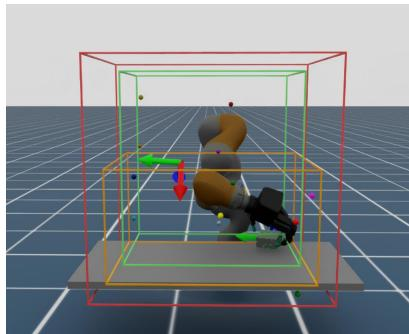  
(a)

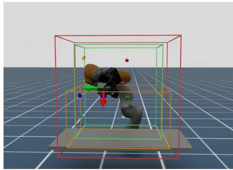  
(b)  
Figure 5: Reposing Task. Visualizes the out-of-bound range in red, the goal sampling range in green, and the object spawn range in orange. (a) visualizes a frame of the initial grasp of the object and (b) visualizes a frame where the robot has completed the task by reaching the target pose frame. The object point clouds can be seen in green spheres, which are on the object.

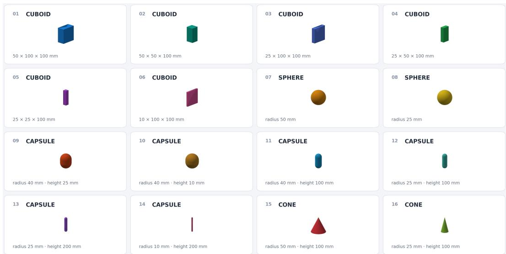  
Figure 6: 16 primitive objects used during pre-training reposing task. The scale and physical properties of the objects are randomized during pre-training.

## A.2 Downstream Tasks from Scratch and Post-training

All downstream manipulation tasks share a common reward function. Both training-from-scratch and bootstrapped policies use the same reward parameters; the only difference is initialization.

The total reward is:

$$
r = \underbrace { w _ { r } \cdot \exp ( - \alpha _ { r } d _ { h } ) } _ { \mathrm { h a n d - t o - o b j e c t ~ a l i g n m e n t } } + \underbrace { w _ { g } \cdot \exp ( - \alpha _ { g } e _ { \mathrm { k p } } ) } _ { \mathrm { o b j e c t - t o - g o a l ~ a l i g n m e n t } }\tag{3}
$$

where:

• Both regimes use identical reward parameters: $w _ { r } = 1 , \alpha _ { r } = 1 0 , w _ { g } = 5 , \alpha _ { g } = 1 5 \mathrm { ( c o n s t a n t ) } ,$ with the finger-curl and lift terms disabled $( w _ { c } = w _ { \ell } = 0 )$

• Goal tolerance anneals from $0 . 0 5  0 . 0 2 \mathrm { m }$ for both regimes over 50 ADR increments, advancing when success rate exceeds 0.4. An episode succeeds when $e _ { \mathrm { p o s } } < \epsilon _ { \mathrm { g o a l } }$

$d _ { h } = \operatorname* { m a x } _ { j } \| \mathbf { p } _ { j } ^ { \mathrm { h a n d } } - \mathbf { p } \| _ { 2 }$ is the maximum hand-to-object distance across all hand bodies.

• $\mathbf q _ { h }$ are hand joint positions and $\bar { \mathbf q } _ { h }$ is a nominal uncurled configuration.

$\Delta z = | p _ { z } - p _ { z } ^ { * } |$ is the vertical distance between the object and its goal.

• Reward component weights and sharpness values depend on the training regime:

$$
\begin{array} { c c c c } & { { \mathrm { F r o m ~ s c r a t c h } } } & { { \mathrm { B o o t s t r a p } } } \\ { { w _ { r } , \alpha _ { r } } } & { { 1 , 1 0 } } & { { 1 , 1 0 } } \\ { { w _ { g } , \alpha _ { g } } } & { { 5 , \mathrm { 1 5 ~ ( c o n s t a n t ) } } } & { { 5 , \mathrm { 1 5 ~ ( c o n s t a n t ) } } } \end{array}
$$

• Goal tolerance anneals from $0 . 0 5  0 . 0 2$ m over 50 ADR increments, advancing when success rate exceeds 0.4. An episode succeeds when $e _ { \mathrm { p o s } } < \epsilon _ { \mathrm { g o a l } } .$

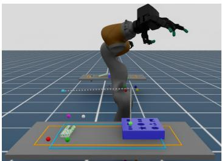  
(a)

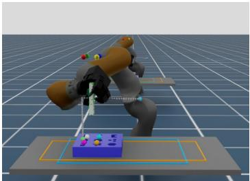  
(b)

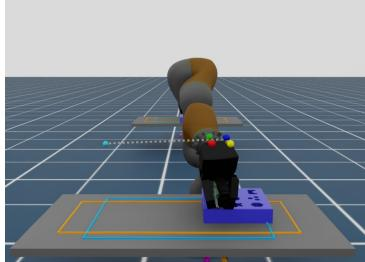  
(c)  
Figure 7: Downstream FMB Task. Visualizes the peg (orange) and board (sky blue) spawn ranges, object keypoints and goal pose keypoints. Grey keypoints represent the path set by the ADR level (denoted goal path annealing). At ADR 0, the goal is set to where the light blue sphere is placed and at ADR 50, the goal is set to the insertion goal where the light green sphere is placed. (a) shows sample initialization of the scene where the peg is dropped on to the table. In (b), we show how the reposing teacher reaches the goal at ADR 20, which is above the board. In (c), we visualize a sample policy rollout that inserts the peg into the board successfully where the keypoints align by the matching colors. The object point clouds in green spheres can be seen on the peg.

## A.3 ADEPT Pre-training and Post-training Algorithm

Table 5 compares the PPO hyperparameters used for reposing pretraining and FMB post-training. Pretraining uses a higher actor learning rate, looser PPO clip, and adaptive learning-rate schedule to encourage exploration of the broad reposing task; post-training reduces both substantially and switches to a linear learning-rate decay to keep the adapted policy close to the pretrained behavior. The critic learning rate is held constant at $5 \times 1 0 ^ { - 5 }$ across both stages, and the discount factor $\gamma$ and GAE τ are unchanged.

Table 5: PPO hyperparameter comparison between reposing pretraining and FMB post-training. The actor learning rate is reduced by 100× and the PPO clip is tightened by 4× during posttraining, while the critic learning rate is held constant. The actor learning-rate schedule changes from KL-adaptive (pretraining, with target $\operatorname { K L } = \operatorname { A c t o r }$ KL threshold) to linear decay over Max epochs (post-training); the Actor KL threshold is logged but not used during post-training under the linear schedule.
<table><tr><td>Hyperparameter</td><td>Pretraining (reposing)</td><td>Post-training (FMB)</td></tr><tr><td>PPO Actor learning rate</td><td> $1 \times 1 0 ^ { - 3 }$ </td><td> $1 \times 1 0 ^ { - 5 }$ </td></tr><tr><td>Actor LR schedule</td><td> ${ \mathrm { K L - a d a p t i v e } }$ </td><td>linear decay over Max epochs</td></tr><tr><td>BC actor learning rate</td><td></td><td> $\mathrm { i \times 1 0 ^ { - 4 } }$ </td></tr><tr><td>Max epochs</td><td> $7 5 0 { , } 0 0 0$ </td><td> $^ { 2 0 0 , 0 0 0 }$ </td></tr><tr><td>Critic learning rate</td><td> $5 \times 1 0 ^ { - 5 }$ </td><td> $5 \times 1 0 ^ { - 5 }$ </td></tr><tr><td>PPO clip €</td><td>0.20</td><td>0.05</td></tr><tr><td>Actor KL threshold</td><td>0.010</td><td></td></tr><tr><td>Critic KL threshold</td><td>0.016</td><td>0.016</td></tr><tr><td>Discount factor γ</td><td>0.998</td><td>0.998</td></tr><tr><td>GAE τ</td><td>0.95</td><td>0.95</td></tr><tr><td>Mini-epochs (actor / critic)</td><td>5/5</td><td>4/4</td></tr><tr><td>Horizon length</td><td>32</td><td>16</td></tr><tr><td>Minibatch size</td><td>16,384</td><td>24,576</td></tr><tr><td>Entropy coefficient</td><td> $1 \times 1 0 ^ { - 3 }$ </td><td> $2 \times 1 0 ^ { - 4 }$ </td></tr><tr><td>Critic coefficient</td><td>4</td><td>4</td></tr><tr><td>Gradient-norm clip</td><td>1.0</td><td>1.0</td></tr><tr><td>Reward scale</td><td>0.01</td><td>0.01</td></tr></table>

Algorithm 1 Pretraining and Post-training for Bootstrapped Downstream Task Learning   
Input: pretraining MDP $\mathcal { M } _ { \mathrm { p r e } }$ with obs $o ^ { \mathrm { p r e } }$ , post-training MDP $\mathcal { M } _ { \mathrm { p o s t } }$ with obs $o ^ { \mathrm { p o s t } } \neq o ^ { \mathrm { p r e } }$   
(overlapping; neither is a superset), PPO clip ϵ   
Stage 1: reposing Teacher RL Training on $\mathcal { M } _ { \mathrm { p r e } }$   
1: Initialize pretrained policy $\pi _ { \mathrm { p r e } } ( \cdot ; \psi )$ and critic $\dot { V } _ { \mathrm { p r e } } ( \cdot ; \phi _ { \mathrm { p r e } } )$   
2: for iteration $\underline { { \underline { { \mathbf { \Pi } } } } } = 1 , 2 , \overline { { \underline { { \mathbf { \Pi } } } } } . . .$ do   
3: Collect trajectories $\tau \sim \pi _ { \mathrm { p r e } } ( \cdot \ | \ o _ { t } ^ { \mathrm { p r e } } )$ in $\mathcal { M } _ { \mathrm { p r e } }$   
4: Update $\psi , \phi _ { \mathrm { p r e } }$ with PPO   
5: end for   
Stage 2: Actor Warm-Start via BC Distillation   
6: Initialize downstream policy $\pi _ { \mathrm { p o s t } } ( \cdot ; \theta )$   
7: for iteration $= 1 , 2 , \ldots$ do   
8: Collect trajectories $\tau \sim \pi _ { \mathrm { p o s t } } ( \cdot \mid o _ { t } ^ { \mathrm { p o s t } } )$ in $\mathcal { M }$ post   
9: Query teacher actions: $\underline { { \mu _ { \mathrm { p r e } } } } , \sigma _ { \mathrm { p r e } } \gets \pi _ { \mathrm { p r e } } ( \cdot \ : | \ : \dot { o } _ { t } ^ { \mathrm { p r e } } )$   
10: $\begin{array} { r } { \mathcal { L } _ { \mathrm { B C } } \gets \sqrt { \sum _ { i } \frac { ( \mu _ { \mathrm { p o s t } } ^ { i } ( o _ { t } ^ { \mathrm { p o s t } } ) - \mu _ { \mathrm { p r e } } ^ { i } ) ^ { 2 } } { \sigma _ { \mathrm { p r e } } ^ { i 2 } } + \| \sigma _ { \mathrm { p o s t } } ( o _ { t } ^ { \mathrm { p o s t } } ) - \sigma _ { \mathrm { p r e } } \| _ { 2 } } } \end{array}$   
11: Update θ to minimize $\mathcal { L } _ { \mathrm { B C } }$   
12: end for   
Stage 3: Frozen Actor Critic Warm-Up   
13: Initialize critic $V _ { \mathrm { p o s t } } ( \cdot ; \phi )$ , freeze θ   
14: for iteration $= 1 , 2 , \ldots$ . do   
15: Collect trajectories $\tau \sim \pi _ { \mathrm { p o s t } } ( \cdot \mid o _ { t } ^ { \mathrm { p o s t } } )$ in $\mathcal { M } _ { \mathrm { p o s t } }$ , compute returns $\hat { R } _ { t }$ via GAE   
16: Update $\phi$ to minimize $\mathbb { E } _ { t } [ ( V _ { \mathrm { p o s t } } ( s _ { t } ) - \hat { R } _ { t } ) ^ { 2 } ]$   
17: end for   
Stage 4: RL Post-Training on $\mathcal { M } _ { \mathrm { p o s t } }$   
18: Unfreeze θ   
19: for iteration $= 1 , 2 , \ldots$ . do   
20: Collect trajectories $\tau \sim \pi _ { \mathrm { p o s t } } ( \cdot \mid o _ { t } ^ { \mathrm { p o s t } } )$ in $\mathcal { M } _ { \mathrm { p o s t } }$ , compute $\hat { R } _ { t } , \hat { A } _ { t }$   
21: Update $\theta , \overset { \cdot } { \phi }$ with PPO (clip ϵ)   
22: end for   
Stage 5: Vision-Based Student Distillation   
23: Initialize vision policy $\pi _ { \omega }$   
24: for iteration $= \bar { 1 , 2 , . . }$ . do   
25: Collect trajectories $\tau \sim \pi _ { \omega } ( \cdot \mid o _ { t } ^ { \mathrm { i m g } } )$ in $\mathcal { M } _ { \mathrm { p o s t } }$ with cameras   
26: Query teacher actions: µpost, σpost $ \pi _ { \mathrm { p o s t } } ( \cdot \mid o _ { t } ^ { \mathrm { p o s t } } )$   
27: $\begin{array} { r } { \mathcal { L } _ { \mathrm { D T } }  \sqrt { \sum _ { i } \frac { ( \mu _ { \omega } ^ { i } ( o _ { t } ^ { \mathrm { i m g } } ) - \mu _ { \mathrm { p o s t } } ^ { i } ) ^ { 2 } } { \sigma _ { \mathrm { p o s t } } ^ { i 2 } } + \| \sigma _ { \omega } ( o _ { t } ^ { \mathrm { i m g } } ) - \sigma _ { \mathrm { p o s t } } \| } } \end{array}$ ∥2   
28: Update ω to minimize $\mathcal { L } _ { \mathrm { D T } }$   
29: end for   
30: return $\pi _ { \omega }$

## A.4 Observations per stage.

Stage 1: reposing pretraining. PPO from scratch. Teacher (reposing policy) has privileged state; actor policy uses proprioceptive state + contacts + point cloud; critic adds privileged object state. No receptacle-specific observations.

Stage 2: Bootstrap to downstream task. BC warm-start + conservative PPO. Initializes from the Stage 1 reposing actor. Adds receptacle pose and object–receptacle contact to both actor and critic. Critic keeps Stage 1’s privileged object state.

Stage 3: Distillation (state → vision). BC from the Stage 2 state actor (now playing the teacher role). The new student replaces the point cloud with two RGB camera images (left and center).

Table 6: Observation fields consumed at each pipeline stage in the current Cspace-mode codebase. Stage 1 = reposing pretraining (PPO, actor + asymmetric critic); Stage 2 = FMB post-training (PPO, actor + asymmetric critic); Stage 3 = two-camera RGB vision distillation, where a student network is supervised by the Stage 2 actor (treated as the teacher) via behavior cloning. Actor and student rows read the noisy variant of each proprioceptive field; the critic reads the corresponding clean variant. Each cell shows the dimensionality of the field when it is consumed at that stage; ✗ means the field is not consumed at that stage, and “image” denotes an image-tensor input. Rows newly introduced at Stage 2 (FMB extras / nominal delta) and Stage 3 (two-camera RGB) are highlighted.
<table><tr><td rowspan="2">Observation field</td><td colspan="2">Stage 1: reposing</td><td colspan="2">Stage 2: FMB</td><td colspan="2">Stage 3: Distillation</td></tr><tr><td>Actor</td><td>Critic</td><td>Actor</td><td>Critic</td><td>Teacher (actor)</td><td>Student (actor)</td></tr><tr><td colspan="7">Proprioceptive / robot state</td></tr><tr><td>robot_dof_pos (noisy)</td><td>23</td><td>23</td><td>23</td><td>23</td><td>23</td><td>23</td></tr><tr><td>robot_dof_vel (noisy)</td><td>23</td><td>23</td><td>23</td><td>23</td><td>23</td><td>23</td></tr><tr><td>hand_pos (5 bodies × 3)</td><td>15</td><td>15</td><td>15</td><td>15</td><td>15</td><td>15</td></tr><tr><td>hand_vel (5 bodies × 3)</td><td>15</td><td>15</td><td>15</td><td>15</td><td>15</td><td>15</td></tr><tr><td>actions</td><td>23</td><td>23</td><td>23</td><td>23</td><td>23</td><td>23</td></tr><tr><td>fabric_q, qd, qdd (cspace, 3×23)</td><td>69</td><td>69</td><td>69</td><td>69</td><td>69</td><td>69</td></tr><tr><td>fingertip-contacts (5 × 3)</td><td>15</td><td>15</td><td>15</td><td>15</td><td>15</td><td>X</td></tr><tr><td>nominal delta (joint + fingertip)</td><td>x</td><td>x</td><td>x</td><td>38</td><td>x</td><td>38</td></tr><tr><td colspan="7">Task / object state</td></tr><tr><td>object_pos (noisy)</td><td>3</td><td>x</td><td>x</td><td>x</td><td>x</td><td>x</td></tr><tr><td>object_rot (noisy)</td><td>4</td><td>x</td><td>x</td><td>x</td><td>x</td><td>x</td></tr><tr><td>object state (pos + quat + vel)</td><td>X</td><td>13</td><td>x</td><td>13</td><td>x</td><td>x</td></tr><tr><td>object-goal (position)</td><td>3</td><td>3</td><td>3</td><td>3</td><td>3</td><td>x</td></tr><tr><td>object-goal_quat</td><td>4</td><td>4</td><td>4</td><td>4</td><td>4</td><td>X</td></tr><tr><td>multi_object_idx_onehot</td><td>1</td><td>1</td><td>x</td><td>x</td><td>x</td><td>x</td></tr><tr><td>object_scale</td><td>1</td><td>1</td><td>x</td><td>x</td><td>x</td><td>x</td></tr><tr><td colspan="7">Point cloud / vision</td></tr><tr><td>pointcloud (64 pts × 3)</td><td>192</td><td>192</td><td>192</td><td>x</td><td>192</td><td>x</td></tr><tr><td>RGB left camera (H × W × 3) RGB center camera (H × W × 3)</td><td>x x</td><td>x</td><td>x</td><td>x</td><td>x</td><td>image</td></tr><tr><td></td><td></td><td>x</td><td>x</td><td>x</td><td>x</td><td>image</td></tr><tr><td colspan="7">Receptacle (FMB-specific) extras</td></tr><tr><td>receptacle pose</td><td>x</td><td>x</td><td>7</td><td>7</td><td>7</td><td>x</td></tr><tr><td>object ↔ receptacle contact force</td><td>x</td><td>x</td><td>3</td><td>3</td><td>3</td><td>x</td></tr><tr><td colspan="7">Privileged sim-only signals (critic only)</td></tr><tr><td>hand body ang. vel. (5 bodies × 3)</td><td>x</td><td>15</td><td>x</td><td>x</td><td>x</td><td>x</td></tr><tr><td>palm force (first 3 of wrench)</td><td>X</td><td>3</td><td>x</td><td>x</td><td>x</td><td>X</td></tr><tr><td>palm wrench (full 6-D)</td><td>x</td><td>x</td><td>x</td><td>6</td><td>x</td><td>x</td></tr><tr><td>joint torque (measured)</td><td>x</td><td>23</td><td>x</td><td>23</td><td>x</td><td>x</td></tr><tr><td>Flat dim total</td><td>391</td><td>438</td><td>392</td><td>280</td><td>392</td><td>206 + imgs</td></tr></table>

Table 7: Flexiv–Sharpa (29 DoF). Observation fields consumed by the Rizon–Sharpa Cspace pipeline. Stage 1 uses the reposing PBT actor and asymmetric critic; Stage 2 uses the FMB bootstrap teacher; Stage 3 distills that state-based teacher into the stereo RGB + five-fingertip TacMap student. The entries and dimensions follow the checked-in agent configurations. “Image” denotes a tensor encoded outside the flat low-dimensional input.
<table><tr><td rowspan="2"></td><td colspan="2">Stage 1: reposing</td><td colspan="2">Stage 2: FMB</td><td colspan="2">Stage 3: Distillation</td></tr><tr><td>Actor</td><td>Critic</td><td>Actor</td><td>Critic</td><td>Teacher (actor)</td><td>Student (actor)</td></tr><tr><td colspan="7">Proprioceptive / robot state</td></tr><tr><td>proprio (29 joints + 6 FK bodies)</td><td>94</td><td>94</td><td>94</td><td>94</td><td>94</td><td>94</td></tr><tr><td>last_actions</td><td>29</td><td>29</td><td>29</td><td>29</td><td>29</td><td>x</td></tr><tr><td>fabric_q, qd, qdd (3 × 29)</td><td>87</td><td>87</td><td>87</td><td>87</td><td>87</td><td>87</td></tr><tr><td>proprio_nominal_delta (29 joint + 18 FK)</td><td>X</td><td>X</td><td>x</td><td>X</td><td>X</td><td>X</td></tr><tr><td>contact_forces_obs (5 fingers × 3)</td><td>15</td><td>15</td><td>15</td><td>15</td><td>15</td><td>X</td></tr><tr><td>contact_force_palm</td><td>3</td><td>3</td><td>3</td><td>3</td><td>3</td><td>x</td></tr><tr><td colspan="7">Task / object state</td></tr><tr><td>object_pos_noisy</td><td>3</td><td>x</td><td>x</td><td>X</td><td>x</td><td>x</td></tr><tr><td>object_rot_noisy</td><td>4</td><td>x</td><td>x</td><td>x</td><td>x</td><td></td></tr><tr><td>object_state (pos + quat + velocity)</td><td>x</td><td>13</td><td>x</td><td>13</td><td>x</td><td>××</td></tr><tr><td>object_goal</td><td>3</td><td>3</td><td>3</td><td>3</td><td>3</td><td>×</td></tr><tr><td>object_goal_quat</td><td>4</td><td>4</td><td>4</td><td>4</td><td>4</td><td>x</td></tr><tr><td>multi_object_idx_onehot</td><td>1</td><td>1</td><td>x</td><td>1</td><td>x</td><td>x</td></tr><tr><td>object_scale</td><td>1</td><td>1</td><td>x</td><td>1</td><td>x</td><td>x</td></tr><tr><td colspan="7">Point cloud / RGB / tactile perception</td></tr><tr><td>pc_obs (64 points × 3)</td><td>192</td><td>192</td><td>192</td><td>192</td><td>192</td><td>x</td></tr><tr><td>stereo RGB (left + right)</td><td>X</td><td>X</td><td>X</td><td>X</td><td>X</td><td>2 images</td></tr><tr><td>sharpa_tactile_deform</td><td>x</td><td>x</td><td>x</td><td>x</td><td>x</td><td>5 images</td></tr><tr><td>sharpa_tactile_anchor_xyz(5 × 3)</td><td>x</td><td>x</td><td>x</td><td>x</td><td>x</td><td>15</td></tr><tr><td colspan="7">FMB receptacle extras</td></tr><tr><td>board_pose</td><td>X</td><td>X</td><td>7</td><td>7</td><td>7</td><td>X</td></tr><tr><td>object_target_contact_force</td><td>x</td><td>x</td><td>3</td><td>3</td><td>3</td><td>x</td></tr><tr><td colspan="7">Privileged sim-only critic signals</td></tr><tr><td>hand_forces (palm wrench)</td><td>X</td><td>6</td><td>x</td><td>6</td><td>x</td><td>x</td></tr><tr><td>measured_joint_torque</td><td>x</td><td>29</td><td>x</td><td>29</td><td>x</td><td>x</td></tr><tr><td>Flat dim total</td><td>436</td><td>477</td><td>437</td><td>487</td><td>437</td><td>196 + images</td></tr></table>

## B Joint Configuration Space Geometric Fabric Setup

This appendix details the geometric fabric components, parameters, and policy–fabric integration loop summarized in Sec. 3.5. We adopt the notation of [3]: the fabric state $\mathbf { q } _ { f } , \dot { \mathbf { q } } _ { f } , \ddot { \mathbf { q } } _ { f } \in \mathbb { R } ^ { n _ { q } }$ evolves according to

$$
\mathbf { M } _ { f } ( \mathbf { q } _ { f } , { \dot { \mathbf { q } } } _ { f } ) { \ddot { \mathbf { q } } } _ { f } \ + \ \mathbf { f } _ { f } ( \mathbf { q } _ { f } , { \dot { \mathbf { q } } } _ { f } ) \ + \ \mathbf { f } _ { \pi } ( \mathbf { a } _ { t } ) \ = \ \mathbf { 0 } ,\tag{4}
$$

where ${ \mathbf { M } } _ { f } \succ 0$ is the system metric (mass) assembled from all fabric components by pull-back, $\mathbf { f } _ { f }$ is the nominal path-generating geometric force, and $\mathbf { f } _ { \pi }$ is the action-driven forcing term. The policy emits a cspace target $\mathbf { q } _ { t } ^ { * } = \pi ( \mathbf { a } _ { t } ) \in \mathbb { R } ^ { n _ { q } }$ at 60 Hz; the fabric is forward-integrated with the second-order Runge–Kutta scheme of [3] at 60 Hz. For the 23 DoF KUKA-Allegro system $( n _ { q } ~ = ~ 7 ~ \mathrm { a r m } + 1 6 ~$ finger) and the 29 DoF Flexiv-Sharpa system $( n _ { q } ~ = ~ 7$ arm + 22 finger), we partition the cspace target into arm and hand slices, $\mathbf q _ { t } ^ { * } = [ \mathbf q _ { t } ^ { * , a } ; \mathbf q _ { t } ^ { * , h } ]$ with $\mathbf { q } _ { t } ^ { * , a } \in \mathbb { R } ^ { 7 }$ and $\mathbf { q } _ { t } ^ { * , h } \in \mathbb { R } ^ { 1 6 } \mathrm { o r } \mathbf { q } _ { t } ^ { * , h } \in \mathbb { R } ^ { 2 2 }$ respectively.

## B.1 Pull-Back from Taskmaps to the Root

Every fabric component lives on a taskmap $\mathbf { x } = \phi ( \mathbf { q } _ { f } )$ with Jacobian $\mathbf { J } = \partial \phi / \partial \mathbf { q } _ { f }$ and contributes a leaf metric $\mathbf { M } ( \mathbf { x } , { \dot { \mathbf { x } } } )$ and leaf force $\mathbf { f } ( \mathbf { x } , { \dot { \mathbf { x } } } )$ . Root-space contributions are

$$
\mathbf { M } _ { f } { \bf \Psi } + = { \bf J } ^ { \top } { \bf M } { \bf J } , \qquad { \bf f } _ { f } { \bf \Psi } + = { \bf J } ^ { \top } \left( { \bf f } { \bf \Psi } + { \bf M } { \bf \dot { J } } { \bf \dot { q } } _ { f } \right) ,\tag{5}
$$

the second term being the curvature force required to keep the leaf acceleration equal to the pulled back leaf force under the chain rule.

## B.2 Cspace Attractors

For each body part $p \in \{ a , h \}$ (arm and hand), the cspace taskmap is the slice $\mathbf { x } ^ { p } = \mathbf { S } _ { p } \mathbf { q } _ { f }$ with $\mathbf { S } _ { p }$ the constant index-selector. The position error is $\mathbf e ^ { p } = \mathbf x ^ { p } - \mathbf q _ { t } ^ { * , p }$

Mass. The metric is isotropic with a smooth switch between a minimum and maximum mass around the error norm:

$$
m ^ { p } ( \mathbf { e } ^ { p } ) \ = \ ( m _ { \mathrm { m a x } } ^ { p } - m _ { \mathrm { m i n } } ^ { p } ) \sigma \big ( - \sigma _ { m } ^ { p } \big ( \lVert \mathbf { e } ^ { p } \rVert - \delta _ { m } ^ { p } \big ) \big ) \ + \ m _ { \mathrm { m i n } } ^ { p } , \qquad \mathbf { M } ^ { p } ( \mathbf { e } ^ { p } ) \ = \ m ^ { p } ( \mathbf { e } ^ { p } ) \mathbf { I } ,\tag{6}
$$

where $\begin{array} { r } { \sigma ( z ) = \frac { 1 } { 2 } ( \operatorname { t a n h } { z } + 1 ) , \sigma _ { m } ^ { p } } \end{array}$ is the mass sharpness and $\delta _ { m } ^ { p }$ the mass switch offset. By default, $m _ { \operatorname* { m i n } } ^ { p } = m _ { \operatorname* { m a x } } ^ { p }$ , so the switch is inert and $\mathbf { M } ^ { p } = m ^ { p } \mathbf { I }$

Forcing attractor. A homogeneous-degree-one (HD1) acceleration pulls $\mathbf { x } ^ { p }$ toward $\mathbf q _ { t } ^ { * , p }$ with conical shaping along the error direction and a soft attraction-radius damping:

$$
\ddot { \mathbf { x } } _ { \mathrm { f o r c } } ^ { p } = - \ k _ { a } ^ { p } \operatorname { t a n h } \left( \alpha _ { a } ^ { p } \lVert \mathbf { e } ^ { p } \rVert \right) \frac { \mathbf { e } ^ { p } } { \lVert \mathbf { e } ^ { p } \rVert } \ - \ b ^ { p } ( \mathbf { e } ^ { p } ) \dot { \mathbf { x } } ^ { p } ,\tag{7}
$$

$$
b ^ { p } ( \mathbf { e } ^ { p } ) = b _ { \mathrm { m a x } } ^ { p } \sigma \bigl ( - \sigma _ { d } ^ { p } \bigl ( \| \mathbf { e } ^ { p } \| - r _ { d } ^ { p } \bigr ) \bigr ) ,\tag{8}
$$

with conical gain $k _ { a } ^ { p }$ , conical sharpness $\alpha _ { a } ^ { p } .$ , damping ceiling $b _ { \operatorname* { m a x } } ^ { p } .$ , damping sharpness $\boldsymbol { \sigma } _ { d } ^ { p } ,$ and damping radius $r _ { d } ^ { p }$ . The damping engages only inside the attraction radius $r _ { d } ^ { p } .$ , providing critical damping near the target without slowing long approaches.

Geometric attractor. In parallel with the forcing term we attach a homogeneous-degree-two (HD2) geometric attractor with the same direction but quadratic-in-velocity scaling

$$
\ddot { \bf x } _ { \mathrm { g e o m } } ^ { p } = - k _ { a } ^ { p , g } \left\| \dot { \bf x } ^ { p } \right\| ^ { 2 } \operatorname { t a n h } \left( \alpha _ { a } ^ { p , g } \left\| { \bf e } _ { g } ^ { p } \right\| \right) \frac { { \bf e } _ { g } ^ { p } } { \left\| { \bf e } _ { g } ^ { p } \right\| } ,\tag{9}
$$

where $\mathbf { e } _ { q } ^ { p } = \mathbf { x } ^ { p } - \mathbf { q } _ { \mathrm { p o s t } } ^ { p }$ and $\mathbf { q } _ { \mathrm { p o s t } } ^ { p }$ is a config-driven default that postures the elbow out and fingers curled. Since $\ddot { \mathbf { x } } _ { \mathrm { g e o m } } ^ { p }$ is HD2 in $\dot { \mathbf { x } } ^ { p }$ , it produces speed-invariant paths and does not bias convergence to $\mathbf q _ { t } ^ { * , p }$ in steady state [3].

## B.3 Body Sphere Collision Avoidance

We approximate the robot geometry with $N _ { s } = 3 1$ collision spheres covering the arm links, palm, knuckles, and finger phalanges. Forward kinematics maps $\mathbf { q } _ { f }$ to sphere origins $\mathbf { x } _ { s } ^ { ( i ) } = \phi _ { \mathrm { f k } , i } ( \mathbf { q } _ { f } )$ with Jacobian $\mathbf { J } _ { s } ^ { ( i ) } \in \mathbb { R } ^ { 3 \times n _ { q } }$ . For each sphere–obstacle pair (environment meshes and declared self-collision sphere–sphere pairs), let $r _ { i }$ be the sphere radius, $d _ { i }$ the signed clearance, $\hat { \bf n } _ { i } = ( { \bf r } _ { i } - { \bf \rho }$ $\mathbf { x } _ { s } ^ { ( i ) } ) / \| \mathbf { r } _ { i } - \mathbf { x } _ { s } ^ { ( i ) } \|$ the unit direction to the nearest obstacle point $\mathbf { r } _ { i } ,$ and $\dot { \mathbf { x } } _ { s } ^ { ( i ) }$ the sphere velocity. The signed closing speed is

$$
v _ { i } ~ = ~ - \hat { \bf n } _ { i } \cdot \big ( \dot { \bf x } _ { s } ^ { ( i ) } - { \bf v } _ { i } ^ { \mathrm { o b s } } \big ) ,\tag{10}
$$

with ${ \bf v } _ { i } ^ { \mathrm { o b s } }$ the velocity of the closest point on the obstacle (rigid composition of linear and angular velocity, supporting moving obstacles). Following [3], define

$$
\begin{array} { r } { s _ { i } \ = \ \frac { 1 } { 2 } \big ( \mathrm { t a n h } \big ( - \alpha _ { 1 } \big ( v _ { i } - \alpha _ { 2 } \big ) \big ) + 1 \big ) , \qquad \mathrm { ( s m o o t h ~ v e l o c i t y ~ g a t e ) } } \end{array}\tag{11}
$$

$$
\bar { d } _ { i } = \operatorname* { m a x } ( d _ { \operatorname* { m i n } } , d _ { i } ) ,\tag{12}
$$

where $s _ { i }$ vanishes when the sphere retreats and saturates to 1 when it approaches. The leaf metric and leaf acceleration for sphere i are

$$
{ \bf M } _ { b } ^ { ( i ) } = \frac { s _ { i } } { \bar { d } _ { i } ^ { 3 } } \hat { \bf n } _ { i } \otimes \hat { \bf n } _ { i } , \ddot { \bf x } _ { b } ^ { ( i ) } = \frac { s _ { i } } { \bar { d } _ { i } ^ { 3 } } \hat { \bf n } _ { i } .\tag{13}
$$

A per-sphere Frobenius normalization preserves Eigen-directions while making the response invariant to absolute distance, $\widehat { \mathbf { M } } _ { b } ^ { ( i ) } = \mathbf { M } _ { b } ^ { ( i ) } / \| \mathbf { M } _ { b } ^ { ( i ) } \| _ { F }$ , and the resulting block is rescaled by a budget allocated weight that caps the aggregate stiffness across all spheres,

$$
w _ { i } = \frac { \kappa ( r _ { i } / | | \mathbf { r } | | _ { 2 } ) } { \widetilde { d } _ { i } ^ { 2 } } , \qquad \widetilde { w } _ { i } = \frac { \operatorname* { m i n } \bigl ( \sum _ { j } w _ { j } , \mathcal { B } \bigr ) w _ { i } } { \sum _ { j } w _ { j } } , \qquad \widetilde { \mathbf { M } } _ { b } ^ { ( i ) } = \widetilde { w } _ { i } \widehat { \mathbf { M } } _ { b } ^ { ( i ) } ,\tag{14}
$$

where κ is a metric scalar and B is the total metric budget (separate values for forcing vs. geometric channels). The leaf acceleration is split into a forcing and a geometric component:

$$
\ddot { \mathbf { x } } _ { b , \mathrm { f o r c } } ^ { ( i ) } \ = \ - k _ { f } \hat { \mathbf { n } } _ { i } \ - \ b _ { c } \big ( \dot { \mathbf { x } } _ { s } ^ { ( i ) } - \mathbf { v } _ { i } ^ { \mathrm { o b s } } \big ) ,\tag{15}
$$

$$
\ddot { \mathbf { x } } _ { b , \mathrm { g e o m } } ^ { ( i ) } = - k _ { g } \| \dot { \mathbf { x } } _ { s } ^ { ( i ) } - \mathbf { v } _ { i } ^ { \mathrm { o b s } } \| ^ { 2 } \hat { \mathbf { n } } _ { i } .\tag{16}
$$

Each is pulled back through its own sphere Jacobian and summed:

$$
{ \bf M } _ { f } ^ { \mathrm { c o l l } } = \sum _ { i } { \bf J } _ { s } ^ { ( i ) \top } \widetilde { { \bf M } } _ { b } ^ { ( i ) } { \bf J } _ { s } ^ { ( i ) } , \qquad { \bf f } _ { f } ^ { \mathrm { c o l l } } = - \sum _ { i } { \bf J } _ { s } ^ { ( i ) \top } \widetilde { { \bf M } } _ { b } ^ { ( i ) } \ddot { \bf x } _ { b } ^ { ( i ) } .\tag{17}
$$

Per-sphere pull-back (rather than stacked-vector pull-back) ensures that the budget weighting acts on the unit-Frobenius blocks $\widehat { \mathbf { M } } _ { b } ^ { ( i ) }$ rather than on the cross-sphere normalization, eliminating dilution as $N _ { s }$ grows.

## B.4 Joint Limit Repulsion

Two taskmaps, one per limit side, are defined for each joint i:

$$
x _ { i } ^ { U } = \frac { \bar { q } _ { i } - q _ { f , i } } { \bar { q } _ { i } - \underline { { q } } _ { i } } , \qquad x _ { i } ^ { L } = \frac { q _ { f , i } - \underline { { q } } _ { i } } { \bar { q } _ { i } - \underline { { q } } _ { i } } , \qquad x _ { i } ^ { U } , x _ { i } ^ { L } \in [ 0 , 1 ] ,\tag{18}
$$

i.e. the signed clearance is normalized by the joint range, so all tuning parameters live in “fraction of range” units regardless of physical units (rad vs. m for revolute vs. prismatic joints). The Jacobian rows are ±diag $\left( 1 / { \left( \bar { q } _ { i } - \underline { { q } } _ { i } \right) } \right)$ . The leaf metric and acceleration on each side are

$$
\mathbf { M } ^ { J } ( \mathbf { x } , \dot { \mathbf { x } } ) = \mathrm { d i a g } \bigg ( g _ { i } \big ( \dot { x } _ { i } \big ) \frac { k _ { b } } { ( \mathrm { m a x } ( x _ { i } - \delta _ { J } , \epsilon ) ) ^ { 2 } } \bigg ) ,\tag{19}
$$

$$
g _ { i } ( \dot { x } _ { i } ) \ : = \ : \sigma ( - \sigma _ { g } ( \dot { x } _ { i } - \delta _ { g } ) ) \in [ 0 , 1 ] ,\tag{20}
$$

$$
\ddot { \mathbf { x } } _ { \mathrm { f o r c } } ^ { J } = \mathbf { g } k _ { r } - b _ { J } \mathbf { 1 } \{ \dot { \mathbf { x } } < 0 \} \odot \dot { \mathbf { x } } ,\tag{21}
$$

$$
\ddot { \bf x } _ { \mathrm { g e o m } } ^ { J } = \| \dot { \bf x } \| ^ { 2 } k _ { r } { \bf g } ,\tag{22}
$$

where $k _ { b }$ is the metric scalar, $\delta _ { J }$ the metric-exploder offset (the barrier saturates within the last $\delta _ { J }$ of the range), ϵ clamps the metric below a configured maximum, $k _ { r }$ is the soft-ReLU repulsion gain, and $b _ { J }$ a damping gain that engages only when $\dot { x } _ { i } < 0$ . The gate $g _ { i }$ is a smooth tanh switch (replacing the bang-bang gate of [3]) that tapers the barrier when the joint retreats from the limit, suppressing chatter at the approach/retreat boundary while preserving the unbounded $1 / ( x - \delta _ { J } ) ^ { 2 }$ stiffness as $x \to \delta _ { J }$

Per-joint acceleration and jerk caps. On top of the JL barrier, a post-hoc quadratic-program step [3] rescales the integrated acceleration to respect per-joint caps,

$$
\ddot { q } _ { f , i } ^ { \operatorname* { m a x } } = \operatorname* { m i n } \biggl ( \ddot { q } _ { i } ^ { \operatorname* { m a x } } , \Delta t \cdot \frac { \ddot { q } _ { i } ^ { \operatorname* { m a x } } } { 2 \ddot { q } _ { i } ^ { \operatorname* { m a x } } } \biggr ) ,\tag{23}
$$

with per-joint values $\ddot { q } _ { a } ^ { \mathrm { m a x } } ~ = ~ \{ 7 . 5 , 7 . 5 , 1 0 , 1 0 , 1 0 , 2 0 , 2 0 \} \mathrm { r a d / s } ^ { 2 }$ for the arm and $\ddot { q } _ { h } ^ { \operatorname* { m a x } } =$ $2 2 . 5 \mathrm { r a d / s } ^ { 2 }$ for all sixteen hand joints (jerk caps scale accordingly).

## B.5 Cspace Damping and Speed Control

Two velocity-dependent terms regulate end-to-end motion smoothness and speed. The first is a constant cspace damping applied to the mass-momentum $\mathbf { M } _ { f } \dot { \mathbf { q } } _ { f }$

$$
{ \bf f } _ { f } ^ { \mathrm { \tiny { d a m p } } } \ = \ k _ { d } { \bf M } _ { f } \dot { \bf q } _ { f } , \qquad k _ { d } = 1 0 \ \mathrm { ( e x p o s e d t o \ A D R ) } .\tag{24}
$$

The second is a speed-control term that caps the full system kinetic-energy level $E ^ { \star }$ . We attach Euclidean energies to two taskmaps: (i) a slice $\mathbf { x } ^ { \overline { { h } } } = \mathbf { S } _ { \overline { { h } } } \mathbf { q } _ { f }$ over the non-hand joints (here, the 7 arm joints) with scale $\beta _ { \overline { { h } } } = 0 . 7 5$ , and (ii) a robot-frame-origins taskmap $\mathbf { x } ^ { \mathrm { p a l m } } \in \mathbb { R } ^ { 3 }$ over the palm origin with scale $\beta _ { \mathrm { p a l m } } = 0 . 2 5$ . Each contributes

$$
\begin{array} { r } { \mathbf { M } _ { E } ^ { ( k ) } = \beta _ { k } \mathbf { I } , \qquad E ^ { ( k ) } = \frac { 1 } { 2 } \beta _ { k } \dot { \mathbf { x } } ^ { ( k ) \top } \dot { \mathbf { x } } ^ { ( k ) } , \qquad k \in \{ \overline { { h } } , \mathrm { p a l m } \} . } \end{array}\tag{25}
$$

Hand joints are deliberately excluded so finger motion is decoupled from the energization budget (finger joints are free to move as fast as fabric terms allow). The pulled-back energy metric and total energy are

$$
\mathbf { M } _ { E } = \sum _ { k } \mathbf { J } ^ { ( k ) \top } \mathbf { M } _ { E } ^ { ( k ) } \mathbf { J } ^ { ( k ) } , \qquad E ( \mathbf { q } _ { f } , { \dot { \mathbf { q } } } _ { f } ) = \sum _ { k } E ^ { ( k ) } .\tag{26}
$$

The energization coefficient [3] that holds $E$ constant under the current geometric force is

$$
\boldsymbol \alpha = - \frac { \dot { \mathbf { q } } _ { f } ^ { \intercal } ( \mathbf { M } _ { E } \ddot { \mathbf { q } } _ { f , \mathrm { g e o m } } + \mathbf { f } _ { E } ) } { \dot { \mathbf { q } } _ { f } ^ { \intercal } \mathbf { M } _ { E } \dot { \mathbf { q } } _ { f } + \varepsilon } , \qquad \ddot { \mathbf { q } } _ { f , \mathrm { g e o m } } = - \mathbf { M } _ { f } ^ { - 1 } \mathbf { f } _ { f } ,\tag{27}
$$

with $\mathbf { f } _ { E } = \mathbf { 0 }$ for Euclidean energies. The energized force is $\mathbf f _ { f } ^ { \star } = \mathbf f _ { f } - \alpha \mathbf M _ { f } \dot { \mathbf q } _ { f } .$ , which annihilates the velocity component along the geometric flow. Finally, the speed-control damping engages only when the current energy exceeds the target:

$$
\mathbf { f } _ { f } ^ { \mathrm { ^ { s c } } } = b _ { \mathrm { s c } } \mathbf { 1 } \{ E > E ^ { \star } \} \mathbf { M } _ { f } \dot { \mathbf { q } } _ { f } , \qquad E ^ { \star } = 1 . 0 , b _ { \mathrm { s c } } = 1 0 0 ( \mathrm { b o t h e x p o s e d t o A D R } ) .\tag{28}
$$

Equations (24)–(28) yield a trajectory whose end-to-end speed is consistent across configurations: long motions are energized to the target, short motions are passively damped.

## B.6 Action-to-Cspace Mapping

The policy outputs $\mathbf { a } _ { t } \in [ - 1 , 1 ] ^ { n _ { q } }$ with $n _ { q } = 2 3$ for the KUKA-iiwa7 + Allegro system (7 $\mathrm { a r m } + 1 6$ finger joints), interpreted as per-joint relative deltas scaled by $\delta _ { \mathrm { m a x } } = 0 . 1$ rad. The Cspace target that enters the policy forcing term f is $\mathbf { q } _ { t } ^ { * } = \mathbf { q } _ { f } ^ { ( t - 1 ) } + \delta _ { \operatorname* { m a x } } \mathbf { a } _ { t }$ , clamped to the URDF joint limits, where $\mathbf { q } _ { f } ^ { ( t - 1 ) }$ is the fabric’s integrated joint configuration from the previous step. This relative formulation keeps each policy step bounded in magnitude and avoids the large position jumps that an absolute target would allow, while still letting the policy exploit the full 23-DoF action manifold over the course of a trajectory.

## B.7 Policy–Fabric Integration Loop

At each control step, the action-mapped Cspace target $\mathbf { q } _ { t } ^ { * }$ is broadcast to the fabric. The fabric performs K inner integration steps of the fabric ODE with timestep $\Delta t$ via a displacement integrator (default $K = 2 )$ , producing $( \mathbf { q } _ { f } , \dot { \mathbf { q } } _ { f } , \ddot { \mathbf { q } } _ { f } )$ . The integrated position and velocity are then issued to the underlying joint controller (PD in simulation, an admittance controller on the real robot). The fabric is captured into a CUDA graph so the per-step cost remains negligible at the parallel scale required for large-batch RL.

## B.8 ADR-Annealed Fabric Parameters

Several fabric parameters are part of the ADR curriculum rather than fixed at YAML defaults:

• Cspace damping gain. Annealed from a high value (heavily smoothed, easy to control) toward a lower value (more reactive) as success rate improves.

• Speed-control energy target. Annealed to broaden the range of motion speeds the policy is exposed to.

• Velocity attenuation. A scalar applied between the fabric velocity output and the joint controller, also annealed via ADR.

The fabric is therefore not treated as a fixed black-box controller but as part of the curriculum: as policy competence grows, the regularization the fabric provides is gradually relaxed.

## C Population-Based Training

We train the reposing pretraining teacher with decentralized Population-Based Training (PBT) [32] to efficiently search the joint PPO + ADR hyperparameter space.

Ranking and replacement. We launch $N ~ = ~ 1 6$ policies in parallel. After a warm-up of $T _ { \mathrm { s t a r t } } ~ = ~ 2 0 0 \mathbf { M }$ environment frames, every policy independently performs a PBT check every $T _ { \mathrm { P B T } } = 2 0 0 \mathbf { M }$ frames: it reads the latest metadata files from all other policies, restricts the comparison to checkpoints from policies that have collected approximately the same number of frames (so newer policies are not penalized for having less data), and ranks the population by target objective. The bottom $r _ { \mathrm { r e p l a c e } } = 0 . 4$ fraction of the population is eligible for replacement: a bottom-quartile policy within a small fractional-standard-deviation and absolute threshold of the population leader only has its hyperparameters mutated, while one significantly behind the leader additionally has its policy weights overwritten with those of a uniformly-randomly-selected top-rreplace policy.

ADR is preserved on replacement. When a low-performing policy’s weights are rewritten from a top performer, it continues training from its own ADR level rather than the donor’s. Because the receiving policy typically has a lower ADR level than the donor, the rewritten policy effectively resumes training against an easier curriculum slice but with the donor’s well-shaped weights, letting it climb back toward the population frontier without re-discovering the basic dexterous behaviors the donor already encodes.

Mutation. At every PBT check, each of the following PPO hyperparameters is independently resampled with probability $p _ { \mathrm { m u t } } = 0 . 2 5$ via a log-uniform perturbation (multiplied or divided by a factor sampled uniformly in [1.1, 2.0]):

• Learning rate, gradient-norm clip, entropy coefficient, critic coefficient, bounds-loss coefficient, and KL threshold (all via mutate float).

• PPO clip ϵ via mutate eps clip, clamped to [0.01, 0.3].

• Number of PPO mini-epochs via mutate mini epochs, clamped to [1, 12] with ±1–3 integer steps.

• Discount factor $\gamma$ and $\mathrm { G A E } \tau$ via mutate discount, which mutates 1 − x rather than x to be conservative on values close to 1.

Target objective. Policies are ranked by their running success rate at their current ADR level, exposed to PBT via the simulator’s true objective info field rather than the shaped reward. Using the unshaped success rate as the ranking signal means PBT compares policies on actual task progress rather than on shaped-reward magnitudes that fluctuate with mutated PPO hyperparameters (e.g. entropy coefficient, value loss scale) and with each policy’s ADR level.

## D Post-Training Recipes

This appendix documents the practical recipe choices that make the structured RL post-training of Sec. 3.3 work in practice. PPO hyperparameter values are in Tab. 5; the items below are the higherlevel knobs that govern Stages 2–4 of Alg. 1.

Stage 2 — Actor warm-start via BC distillation.

• BC for 40,000 iterations is sufficient to converge the student’s action distribution to the teacher’s on the downstream observation space.

• BC rollouts use a mixed student-teacher policy that alternates between teacher and student actions, which keeps the BC dataset on the states the student will visit at deployment while remaining anchored on teacher-reachable states.

• The critic is not updated during BC; only the actor minimizes the Mahalanobis-weighted distance to the teacher action distribution.

• BC is pinned at ADR step 20 (Sec. 4.1), where the pretrained teacher zero-shots reliably: the goal is the single ADR 20 pose on the lift-and-transport segment, and ADR advancement is disabled during BC. The goal-path annealing flag is kept on so the student tracks the teacher through the lift-and-transport segment.

## Stage 3 — Critic warm-up with frozen actor.

• From this stage onward, goal-path annealing is turned off and the goal is set to the final insertion endpoint at ADR 50; the ADR randomizations continue to advance. For the first 20 post-BC epochs the actor is frozen and only the critic updates against $r _ { \mathrm { p o s t } }$ . This aligns value estimates with $\mathcal { M } _ { \mathrm { p o s t } }$ before any policy-gradient step modifies the actor.

• During this window the actor’s log-std is fixed at $\sigma = - 2$ (≈ 0.14 in linear scale), keeping exploration narrow around the BC-distilled mean so the critic targets stay on-distribution.

• The critic learning rate is $5 \times 1 0 ^ { - 5 }$ throughout (unchanged from Stage 4).

## Stage 4 — Conservative PPO post-training.

• Actor learning rate drops to $1 \times 1 0 ^ { - 5 }$ (100× lower than pretraining) with linear decay over 200,000 epochs; PPO clip tightens to $\epsilon = 0 . 0 5$ (4× tighter) to bound each policy update.

• Goal-path annealing is turned off in PPO: the goal sits at the actual insertion endpoint so PPO learns the contact-rich insertion itself, while ADR can continue to advance.

• The post-training actor–critic uses separate actor and critic trunks (rather than the shared-trunk architecture of pretraining), allowing the critic to specialize on $r _ { \mathrm { p o s t } }$ without contaminating actor features.

• Observation clipping is relaxed from 5.0 (default) to 100.0 to accommodate the larger magnitude of receptacle pose and object–receptacle contact-force observations introduced at post-training.

## Task-specific reward shaping for FMB peg insertion.

• Both peg–board contact penalty and receptacle contact penalty are set to 0. The pretrained policy already handles contacts gracefully, and insertion explicitly requires sustained contact between the peg, fingertips, and receptacle.

• External object wrenches are disabled during post-training, since the peg is grasped throughout.

• Peg orientation randomization is set to its maximum range ([1.0, 1.0]) from the start of posttraining rather than ramped via ADR, and the object-to-goal reward sharpness is fixed at 15 rather than annealed.

## E ADEPT Training Efficiency

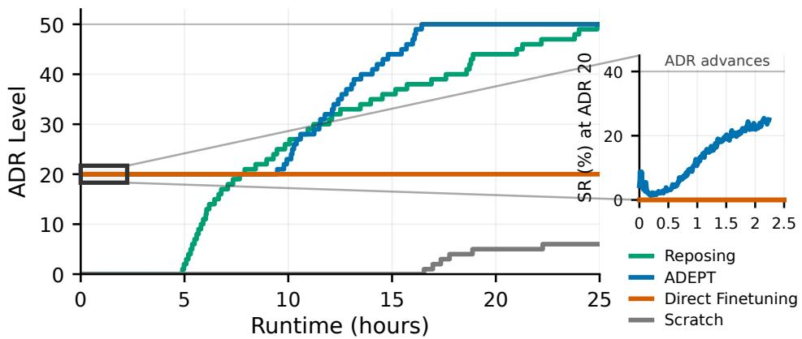  
Figure 8: Training curves on FMB peg insertion comparing (1) training from scratch, (2) direct PPO finetuning of the pretrained reposing teacher, and (3) ADEPT post-training. Blue inset: success-rate collapse for (2) during transfer.

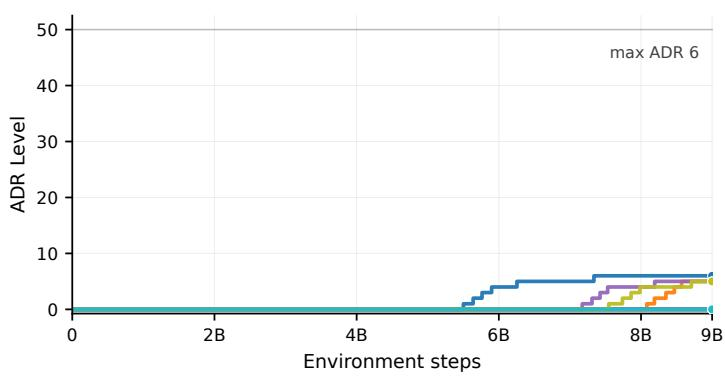

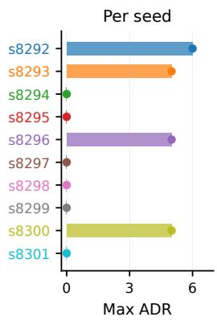  
Figure 9: Training curves across different seeds for training from scratch. ADEPT post-training reliably converges to a solution while most seeds for training from scratch either plateau or take a very long time to train for a fixed compute budget.

## F Real-World Deployment Topology

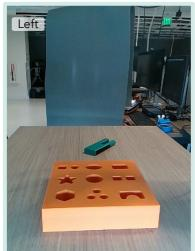

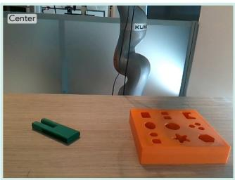  
(a)

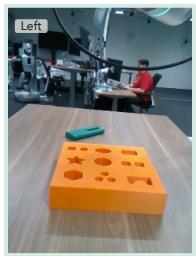

(b)  
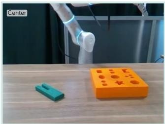  
Figure 10: Real-world camera views for (a) Kuka-Allegro and (b) Flexiv-Sharpa setups.

The real-world deployment of ADEPT preserves the exact action interface used in simulation. The policy commands a Cspace target through the geometric fabric and receives observations from a graph identical to the one used during training; the only substantive change is that the C++ admittance controller and RealSense driver replace the sim physics and renderer.

Camera transport. The two Intel RealSense cameras (one mounted to the left of the workspace, one centered above the workbench) are read by a C++ camera driver that resizes the images on-board to $3 2 0 \times 2 4 0$ and publishes them to the policy process over ZMQ.

Compute split and processes. The control stack is split across two machines. An NVIDIA Jetson AGX Orin sits next to the robot and hosts (i) a real-time C++ admittance controller that integrates the fabric-derived mass-and-force pair $\left( \mathbf { M } _ { f } , \mathbf { f } _ { f } + \mathbf { f } _ { \pi } \right)$ from the fabric ODE in Sec. 3.5 into joint position and velocity commands, and (ii) the Python fabric process that evaluates the geometric fabric of Sec. 3.5. The student policy runs on a separate workstation with a discrete GPU and receives proprioception and the two RGB streams over ZMQ; it issues 23-D Cspace targets back to the fabric, which integrates them into the smooth joint trajectories consumed by the admittance controller. Joint state and the $\left( \mathbf { M } _ { f } , \mathbf { f } _ { f } + \mathbf { f } _ { \pi } \right)$ pair are exchanged between the C++ controller and the fabric process through POSIX shared memory on the Jetson.

Rate hierarchy. The C++ admittance controller runs at 1 kHz, with the underlying KUKA control loop at 1 kHz and the Allegro control loop at 333 Hz. All Python-side processes (fabric, sensor, policy) share a common 60 Hz cadence, while the high-rate hardware loops run underneath.

## G Distillation Loss Details

This appendix gives the full forms of the behavior-cloning and auxiliary losses that constitute the distillation objective $\mathcal { L } = \mathcal { L } _ { \mathrm { B C } } + \mathcal { L } _ { \mathrm { a u x } }$ introduced in Sec. 3.4. The student policy $\pi _ { \boldsymbol { \theta } } ( a _ { t } \mid o _ { t } )$ is a stochastic Gaussian with mean $\mu _ { \theta } ( o _ { t } )$ and standard deviation $\sigma _ { \theta } ( o _ { t } )$ , and the teacher $\pi _ { T } ( a _ { t } \mid o _ { t } ^ { T } )$ has mean $\mu _ { T } ( o _ { t } ^ { T } )$ and fixed standard deviation $\sigma _ { T }$

## G.1 Behavior-Cloning Loss

The BC term matches both moments of the student’s action distribution to the teacher’s via a Mahalanobis-weighted L2 distance,

$$
\mathcal { L } _ { \mathrm { B C } } ( o _ { t } , o _ { t } ^ { T } ; \theta ) = \sqrt { \sum _ { i = 1 } ^ { n _ { q } } \frac { \left( \mu _ { \theta } ^ { i } ( o _ { t } ) - \mu _ { T } ^ { i } ( o _ { t } ^ { T } ) \right) ^ { 2 } } { ( \sigma _ { T } ^ { i } ) ^ { 2 } } } ~ + ~ \sqrt { \sum _ { i = 1 } ^ { n _ { q } } \frac { \left( \sigma _ { \theta } ^ { i } ( o _ { t } ) - \sigma _ { T } ^ { i } \right) ^ { 2 } } { ( \sigma _ { T } ^ { i } ) ^ { 2 } } } ,\tag{29}
$$

where $n _ { q } ~ = ~ 2 3$ for the KUKA-iiwa7 + Allegro system. The teacher’s fixed std-dev σT serves as a per-dimension precision weighting: joints the teacher is more confident about (smaller σT) contribute more strongly to the loss.

## G.2 Auxiliary 8-Keypoint Pose Loss

The auxiliary head predicts the eight bounding-box corners of the peg in the world frame, and the loss is the L2 norm of the per-corner residuals,

$$
\mathcal { L } _ { \mathrm { a u x } } ( o _ { t } ; \theta ) = \sqrt { \sum _ { i = 1 } ^ { 8 } \lVert \hat { \mathbf { k } } _ { \theta } ^ { i } ( o _ { t } ) - \mathbf { k } _ { t } ^ { \star , i } \rVert _ { 2 } ^ { 2 } } ,\tag{30}
$$

where $\hat { \mathbf { k } } _ { \theta } ^ { i } ( o _ { t } ) ~ \in ~ \mathbb { R } ^ { 3 }$ is the student’s predicted 3D world-frame position of the i-th corner, and $\mathbf { k } _ { t } ^ { \star , i } \in \mathbb { R } ^ { 3 }$ is the corresponding ground-truth corner position obtained by rotating the eight halfextent offsets of the peg by the simulator’s peg orientation and adding the peg position.

## G.3 Total Distillation Objective

Combining the two terms with their respective weighting coefficients,

$$
\begin{array} { r } { \mathcal { L } _ { \mathrm { d i s t i l l } } ( \theta ) = \mathbb { E } _ { o _ { t } \sim \pi _ { \theta } } \left[ w _ { \mathrm { B C } } \cdot \mathcal { L } _ { \mathrm { B C } } ( o _ { t } , o _ { t } ^ { T } ; \theta ) \ + \ w _ { \mathrm { a u x } } \cdot \mathcal { L } _ { \mathrm { a u x } } ( o _ { t } ; \theta ) \ \right] , } \end{array}\tag{31}
$$

where w and $w _ { \mathrm { a u x } }$ are scalar weighting coefficients and the expectation is over rollouts $o _ { t } \sim \pi _ { \theta }$ collected by the student in the same task environment. We use $w _ { \mathrm { B C } } = 1$ and $w _ { \mathrm { a u x } } = 2 0$

## H Visuo-Tactile Student Architecture

This appendix details the visuo-tactile student used on the Flexiv-Sharpa embodiment. The visiononly KUKA-Allegro student is a strict subset of the same architecture with the tactile branch removed.

Observations. The student consumes the two-camera RGB pair $( \mathbf { I } _ { t } ^ { L } , \mathbf { I } _ { t } ^ { C } )$ from left and center cameras, noisy proprioception $\mathbf { q } _ { t } ,$ fabric state $\mathbf { q } _ { t } ^ { f }$ , per-finger TacMap depth maps $\{ \mathbf { T } _ { t } ^ { k } \} _ { k = 1 } ^ { 5 } ,$ , and perfinger fingertip positions $\{ \mathbf { x } _ { t } ^ { k } \} _ { k = 1 } ^ { 5 } \in \mathbb { R } ^ { 3 }$ obtained via forward kinematics on the noisy joint state.

Vision encoder. The two-camera pair is passed through a shared ResNet backbone followed by a cross-attention fuser [14] to a $d _ { \mathrm { v i s } }$ -dimensional vision latent $( d _ { \mathrm { v i s } } = 2 5 6 )$ . The backbone is initialized from the Stage-1 pretrained student (Sec. 3.4) and unfrozen on the DextrAH-RGB [14] schedule.

Tactile encoder. Each per-finger depth map $\mathbf { T } _ { t } ^ { k } \in \mathbb { R } ^ { H \times W }$ is stacked with its thresholded binary contact map $\mathcal { H } [ \mathbf { T } _ { t } ^ { k } \geq \tau ] \left( \tau = 1 / 2 5 5 \right)$ into a two-channel input, and passed through a small CNN (two 3×3 convolutions with stride 2 and channel widths 16 then 32, adaptive average pooling, and a linear projection with LayerNorm and ELU) shared across fingers. The CNN emits a per-finger feature $\mathbf { u } _ { t } ^ { k } \in \mathbb { R } ^ { d _ { f } }$ with $d _ { f } = 3 2$

FiLM spatial anchoring. Each fingertip position $\mathbf { x } _ { t } ^ { k }$ is expanded with B=4 Fourier bands, $\gamma ( \mathbf { x } ) =$ [x, sin $( 2 ^ { 0 } \pi \mathbf { x } )$ , cos(20πx), . . . , sin $\left( 2 ^ { B - 1 } \pi \mathbf { x } \right)$ , cos $\bigl ( 2 ^ { \mathbf { \bar { \boldsymbol { B } } } - 1 } \pi \mathbf { x } \bigr ) ^ { \mathbf { \bar { \boldsymbol { \mathbf { \Lambda } } } } }$ ], and mapped through a two-layer MLP (hidden 128, ELU) to per-finger FiLM parameters $( \gamma _ { t } ^ { k } , \beta _ { t } ^ { k } ) \overset { \cdot } { \in } \mathbb { R } ^ { d _ { f } } \times \mathbb { R } ^ { d _ { f } }$ . The modulated per-finger feature is

$$
\tilde { \mathbf { u } } _ { t } ^ { k } = \left( 1 + \alpha \gamma _ { t } ^ { k } \right) \odot \mathbf { u } _ { t } ^ { k } + \alpha \beta _ { t } ^ { k } ,\tag{32}
$$

with $\alpha = 0 . 1$ scaling the modulation to keep it a soft perturbation on the shared per-finger CNN features rather than a hard override. The five modulated per-finger features are flattened into a tactile latent $\mathbf { u } _ { t } \in \mathbb { R } ^ { d _ { \mathrm { t a c } } }$ with ${ d _ { \mathrm { t a c } } = 5 \cdot d _ { f } = 1 6 0 }$

Fusion and policy trunk. The vision, tactile, and proprioception latents are concatenated with the fabric state and passed through a two-layer MLP with widths [512, 512] and ELU activations, followed by a 1024-unit LSTM (layer-normalized, placed before the final linear heads). The final head emits a mean action $\pmb { \mu } _ { \theta } ( o _ { t } ) \in \mathbb { R } ^ { n _ { q } }$ with a fixed log-standard-deviation, matching the teacher’s action parameterization.

Training objective. The student is trained with pure teacher BC using the objective in Appx. G, with a single auxiliary term supervising an 8-keypoint peg pose prediction from the shared vision features. On Flexiv-Sharpa FMB the aux term uses a peg-tight-keypoints target with coefficient $w _ { \mathrm { a u x } } = 2 0 $ other auxiliary heads (object position, object 6-D rotation, board pose, per-finger contact force and binary contact) are exposed by the codebase but disabled for this experiment. The BC target is filtered through a soft z-mask that down-weights teacher actions in low-height regions of the state distribution (threshold 0.08 m, softness 0.02, floor 0.1) to avoid over-fitting to teache table-clearance behavior that the real robot cannot exactly reproduce.

## I Distillation Domain Randomization

To enable zero-shot sim-to-real transfer, both stages of the teacher–student distillation curriculum (Sec. 3.4) apply aggressive domain randomization across physics, scene layout, sensor noise, and visual rendering. The randomization schedule for each stage matches the corresponding RL training stage so that the student observes the same environmental distribution that the teacher was trained on. Table 8 summarizes the full set of parameters and their ranges; the values reported correspond to the Stage 2 (downstream FMB) regime, with the analogous Stage 1 ranges differing only in scene layout (single fixed receptacle, full $\mathrm { S O ( 3 ) }$ peg orientation).

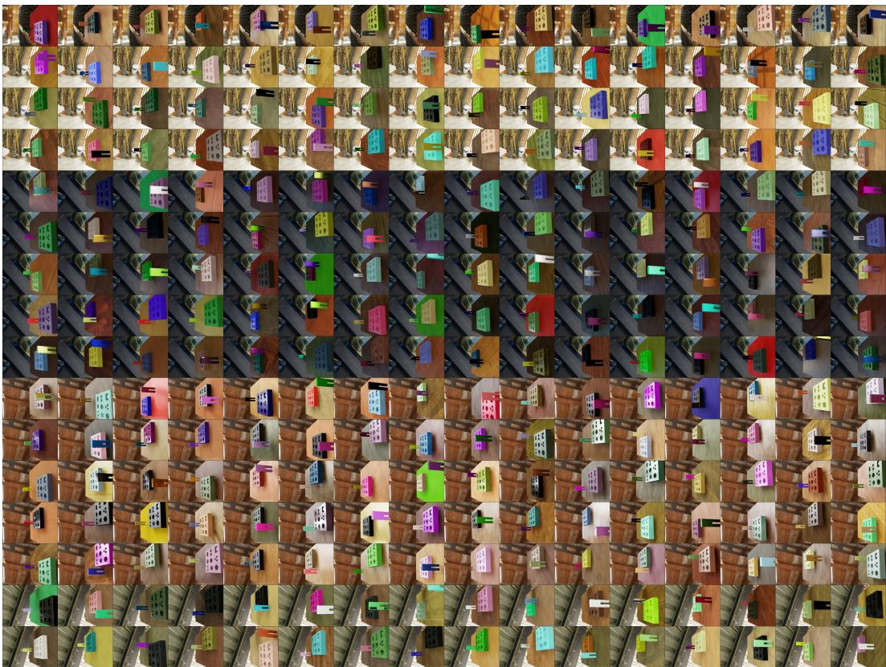  
Figure 11: A sample 16x16 grid of visual randomizations on the left camera of the FMB training scene for distillation.

Table 8: Domain randomization parameters used during teacher–student distillation. Per-env ranges are sampled uniformly at episode reset; ADR-annealed ranges advance from the lower bound to the upper bound over training as the running success rate exceeds the ADR threshold; per-step noise is added at every control step; per-frame randomization is applied at each camera render.
<table><tr><td>Parameter Range / Distribution</td></tr><tr><td>Physics (per-env at reset, ADR-annealed)</td></tr><tr><td>Object mass scale (0.5, 3.0) × nominal</td></tr><tr><td>Object static friction (0.5, 1.2)</td></tr><tr><td>Object dynamic friction (0.3, 1.0)</td></tr><tr><td>Object restitution (0.8, 1.0)</td></tr><tr><td>Robot joint stiffness scale (0.5, 2.0)× default</td></tr><tr><td>Robot joint damping scale (0.5, 2.0)× default</td></tr><tr><td>Robot joint friction U(0, 5.0) Nm</td></tr><tr><td>Scene and object spawn (per-env at reset, ADR-annealed)</td></tr><tr><td>Peg spawn position (x, y) jitter up to ±15 cm per axis</td></tr><tr><td>Peg spawn orientation full SO(3) at final ADR</td></tr><tr><td>Random wrench on peg up to  $\mathrm { 1 0 m / s ^ { 2 } }$  linear acceleration equivalent</td></tr><tr><td>Receptacle / board pose jitter max range [−7, 12] cm in x, [−30, 10] cm in y</td></tr><tr><td>Proprioception and object-state noise (per-step on observations)</td></tr><tr><td>Joint position Gaussian noise  $\mathcal { N } ( 0 , 0 . 0 8 ^ { 2 } )$  rad</td></tr><tr><td>Joint position bias (per-env) U(−0.08, 0.08) rad</td></tr><tr><td>Joint velocity Gaussian noise N(0, 0.182) rad/s</td></tr><tr><td>Joint velocity bias (per-env) U(−0.08, 0.08) rad/s</td></tr><tr><td>Object position Gaussian noise  $\mathcal { N } ( 0 , 0 . 0 3 ^ { 2 } )$  m</td></tr><tr><td>Object orientation Gaussian noise  $\mathcal { N } ( 0 , 0 . 1 ^ { 2 } )$  rad</td></tr><tr><td>Visual randomization (per-frame at camera rendering)</td></tr><tr><td>Lighting (intensity, color, direction) random per env</td></tr><tr><td>Dome / background texture random from texture library</td></tr><tr><td></td></tr><tr><td>Table material random color and roughness</td></tr><tr><td>Robot link materials random color and roughness</td></tr><tr><td>Peg diffuse tint (RGB) per-channel U(0.90, 1.0) (near-white)</td></tr><tr><td>Board diffuse tint (RGB) per-channel U(0.04, 0.12) (near-black)</td></tr><tr><td>Camera position jitter ±3 cm from calibrated pose</td></tr><tr><td></td></tr><tr><td>Camera rotation jitter ±3° from calibrated pose</td></tr></table>

## J Qualitative Analysis of Emergent Grasping Behaviors

Fig. 12 highlights representative grasp modes from each training condition. Panels (e, f) show the reposing teacher applied zero-shot at ADR level 20: the grasps look natural, with the fingers wrapping around the peg in multi-contact closure, but they are not always task-aligned. A common failure mode is grasping the peg bottom-up with the hand below the peg as shown in (f). This works for the reposing segment but cannot complete insertion, which requires grasping the peg from above with its legs pointing down toward the hole. Panels (g) and (h) show that ADEPT post-training removes the bottom-up grasps entirely while preserving the natural finger-wrap behavior inherited from reposing pretraining. Panels (a-d) show that policies trained from scratch do not develop the natural finger-wrap behavior at all; the grasps are functional for insertion but lack the multi-contact stability that reposing pretraining produces. For example, (a) and (c) grasp the peg using only the index and pinky fingers, a configuration that is highly unusual for precise human manipulation. In (b) and (d), the fingers are curled to their extreme with just one finger wrapping around the peg to stably grasp yet this is also very unusual and unnatural compared to the emergent grasp qualities displayed by the policies that have pre-training knowledge on manipulating diverse objects on a generic reposing task objective like in (e-h).

Grasps from Downstream Task Teacher Trained from Scratch

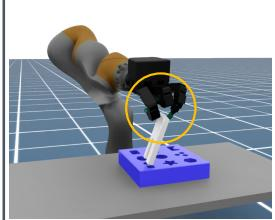  
(a)

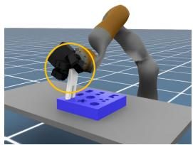  
(b)

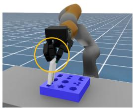  
(c)

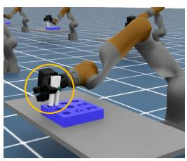  
(d)

Zero-shot Grasps by Reposing Teacher on Downstream Task Grasps from ADEPT after Post-Training on Downstream Task  
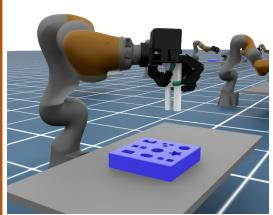  
(e)

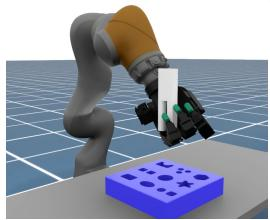  
(f)

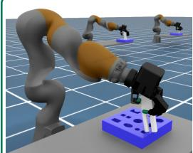  
(g)

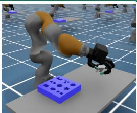  
(h)

Figure 12: Comparison of grasp behaviors. (a, b, c, d) Downstream-task teacher trained from scratch at ADR level 50, with grasps that lack the natural finger gaits emerging from reposing pretraining. (e, f) Pretrained reposing teacher applied zero-shot to FMB peg insertion at ADR level 20, occasionally producing undesirable grasps (e.g., bottom-end, upside-down) that solve the reposing segment but fail at insertion. (g, h) Downstream-task teacher trained with ADEPT at ADR level 50, with natural grasps where the fingers wrap around the peg and caging.