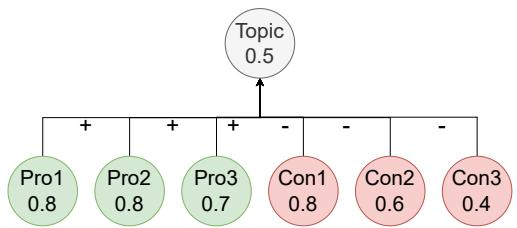
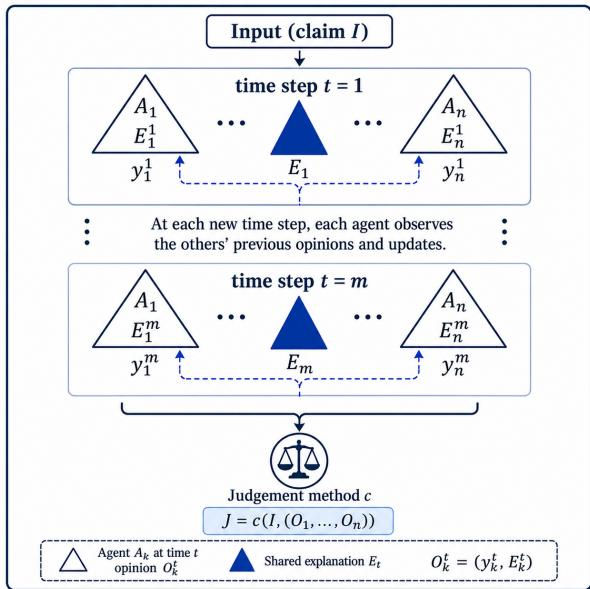

# A Theory of Post-hoc Debate Judgement

Xiang Yin<sup>1∗</sup>, Adam Dejl<sup>1∗</sup>, Antonio Rago<sup>2</sup>, Lihu Chen<sup>1</sup>, Francesca Toni<sup>1</sup>

<sup>1</sup>Imperial College London, UK

<sup>2</sup>King’s College London, UK

{x.yin20, lihu.chen, f.toni}@imperial.ac.uk, antonio.rago@kcl.ac.uk

## Abstract

Debates have recently emerged as a useful methodology for agentic AI to improve performance as well as to aid explainability. In many settings where debates are used, debates outcomes and resulting outputs are determined post-hoc by externaljudges, often LLMs. In this paper we develop and test a novel theory of debate judgement applicable to all settings where agents engage in debates by providing pros and cons for their opinions therein. Specifically, we identify a number of formal properties that debate judgement may be required to satisfy in general, as concerns reproducibility, robustness, groundedness and explainability. Then, we explore their satisfaction experimentally, for claim verification settings, for two specific alternative debate judgement methods: variants of the LLMs as ajudge idea and formal semantics drawn from computational argumentation. We show that the two methods give similar accuracy performances but the latter shows better property satisfaction. Overall, our study indicates argumentation semantics as an ideal candidate for principled judges in debate-driven AI.

## 1 Introduction

Debates have recently emerged as a useful methodology for agentic AI to improve performance (Irving, Christiano, and Amodei 2018; Tillmann 2025; Khan et al. 2024; Li et al. 2024). When agents are empowered by LLMs, they may debate internally (with themselves), e.g. for explainable and contestable claim verification (Freedman et al. 2025), and/or externally (with other agents), e.g. for modelling collaboration mechanisms (Zhang et al. 2024). Debate frameworks may thus involve multiple agents to generate potentially different answers and argue with each other, which may lead to better answers (Irving, Christiano, and Amodei 2018; Khan et al. 2024; Li et al. 2024). One such line of research studies the structure of debating agents (Tillmann 2025), ranging from homogeneous settings, where all agents share the same base model, to heterogeneous settings that adopt models with diferent capabilities or roles. Early work mainly uses homogeneous agents, e.g. (Du et al. 2024), which limits diversity and may lead to error aggregation, whereas more recent work introduces heterogeneous agents to improve debate quality, e.g. (Chen, Saha, and Bansal 2024). Another line investigates debate protocols with multiple rounds, which often improve performance over single-round debate (Liang et al. 2024). However, recent studies show that increasing rounds alone brings diminishing returns (Hu et al. 2025), and debate performance is more influenced by diversity and argument confidence (Zhu et al. 2026; Lin and Hooi 2025). More broadly, debate has been applied to a wide range of tasks, including reasoning enhancement (Du et al. 2024), claim verification (Freedman et al. 2025), AI safety (Brown-Cohen, Irving, and Piliouras 2024), fairness (Ki et al. 2025), and explainability (Kim et al. 2024).

In many settings where debates are used, their outcomes and resulting outputs are determined post-hoc by external judges. These are often LLMs (Liang et al. 2024; Hu et al. 2025; Feng et al. 2025), suitably prompted with information drawn from the debates. While these LLM-basedjudges have shown good performance in a number of tasks, they inherit issues from the underpinning LLM, e.g. their outputs cannot be explained or contested, as is the case with other uses of LLMs (Freedman et al. 2025). In general, an understanding of the formal properties of judges, which are orthogonal to downstream performance, is lacking, potentially hindering the quality of debate judgement in high-stakes settings where performance alone is not suficient.

In this paper we develop a novel theory of debate judgement that is applicable to all settings where agents engage in debates by providing pros and cons for their opinions therein. Specifically, we identify a number of formal properties that debate judgement may be required to satisfy in general, as concerns reproducibility (in terms of deterministic behaviour and agents’ permutation independence), robustness (with respect to small variations of agents’ opinions and judgement method), groundedness (as concerns faithfully drawing from agents’ opinions) and contestability (with respect to the agents’ ability to influence the judge). We see these properties not as strict requirements on all debate judges, but rather as a way to guide the choice of appropriate judges for debate settings of choice.

Finally, we explore the satisfaction of these properties experimentally, for claim verification settings, for two specific alternative debate judgement methods: variants of the LLMs as a judge idea and formal semantics drawn from computational argumentation (see (Atkinson et al. 2017; Cyras et al. 2021) for an overview of this research area and its use to support explainability). For the experiments, we consider two debate scenarios: one where LLM agents generate their opinions in isolation, following internal debate, and one where LLM agents take turns to refine their opinions. For both scenarios, judges may be presented the raw agents’ opinions or an aggregation of these opinions, before being asked to decide on a final output. The experiments show that the two methods give similar accuracy performances in all scenarios, but latter shows better property satisfaction.

## 2 Related Work

Despite the progress seen in debate-based approaches, existing work mainly focuses on improving debate generation, while paying little attention to how debates should be judged. We see debate judgement as a principled object of study, and we thus focus here on the works in this area of research.

Non-argumentative Debate Judgement Existing approaches mainly adopt two forms of debate judgement. The first form uses voting methods to aggregate outputs of debate agents, including majority voting (Yin et al. 2023; Chan et al. 2024) and weighted voting (Wang et al. 2023). While simple and eficient, these methods consider only the final answers and largely ignore the debate itself. The second relies on LLMs as a judge, where one or more LLMs evaluate the debate and determine the final outcome (Liang et al. 2024; Hu et al. 2025; Feng et al. 2025). Although LLM-based judges generally outperform voting-based methods, they remain sensitive to inconsistency and positional bias (Wang et al. 2024). In contrast, we study post-hoc debate judgement by comparing LLMs as a judge with formal semantics drawn from computational argumentation, demonstrating that the former may lack formal guarantees that the latter brings.

Argumentative Debate Judgement Given their dialectical nature, argumentation’s many frameworks have long been used as a means for representing, reasoning about and judging debates. These debates concerning judgement were initially exclusively between humans, whether amongst the general public (Lawrence, Visser, and Reed 2023), online users (Karamlou, Cyras, and Toni 2019; Young et al. 2021; Sia et al. 2022; Ruiz-Dolz, Heras, and García-Fornes 2023; Oluokun et al. 2024), judgemental forecasters (Irwin, Rago, and Toni 2022; Gorur, Rago, and Toni 2025) or politicians (Gofredo et al. 2025). However, aligning with recent findings showing that debates between machines may improve their performance along diferent metrics (Du et al. 2024), argumentative approaches have been introduced to judge debates between machines in various tasks, e.g. to determine classifications of images (Kori, Glocker, and Toni 2024; Kori, Rago, and Toni 2025) and bias detection (Ayoobi et al. 2026), amongst others (Rago, Li, and Toni 2023; Ayoobi, Potyka, and Toni 2023; Bezou-Vrakatseli, Cocarascu, and Modgil 2024). More recently, the framing of LLMs’ reasoning as debates in the form of argumentation frameworks, where the judgement determines a claim’s verification, has demonstrated benefits in explainability and contestability (Freedman et al. 2025), with other improvements becoming possible when a multi-agent approach is taken (Gorur, Rago, and Toni 2025). Further, Sanayei et al. (2025) use quantitative argumentation frameworks to assess whether LLMs are well-placed to judge debates. However, none of the above approaches introduce a general model for debate judgement.

  
Figure 1: Example of a QBAF modelling a simple family debate about going to the zoo on Sunday. The central claim is the Topic argument; green and red nodes are pro and con arguments, respectively. Edges labelled + and − denote support and attack relations, and values denote base scores.

## 3 Background

We use Quantitative Bipolar Argumentation Frameworks (QBAFs) (Baroni et al. 2015), i.e. tuples $\langle \mathcal { A } , \mathcal { R } ^ { - } , \mathcal { R } ^ { + } , \tau \rangle$ where A is a finite set of arguments; $\mathcal { R } ^ { - } \subseteq \mathcal { A } \times \mathcal { A }$ is a binary attack relation; $\mathcal { R } ^ { + } \subseteq \mathcal { A } \times \mathcal { A }$ is a binary support relation; $\mathcal { R } ^ { - } \cap \mathcal { R } ^ { + } = \emptyset ; \tau : \mathcal { A } \to [ 0 , 1 ]$ is a base score function. The latter assigns an a-priori belief to arguments.

The structure of QBAFs is often shown graphically, as in Figure 1. This QBAF illustrates a simple family debate on the claim “We should go to the zoo this Sunday.” Dad gives two con arguments, about needing rest after work (Con2) and possible crowds or long queues (Con3). Mum gives one con argument about rain and animals staying inside (Con1), and one pro argument about family time (Pro3). The child gives two pro arguments, based on Dad’s promise (Pro1) and learning about wild animals (Pro2).

The dialectical strength of arguments in QBAFs can be evaluated by (gradual) semantics $\sigma : \mathcal { A }  [ 0 , 1 ]$ , as defined, for example, in (Baroni et al. 2015; Amgoud and Ben-Naim 2018; Potyka 2018, 2021). In this paper, we focus on the DF-QuAD semantics (Rago et al. 2016) due to its broad applicability (Rago et al. 2016; Kotonya and Toni 2019; Cocarascu, Rago, and Toni 2019; Chi et al. 2021). In DF-QuAD, for any argument $A \in { \mathcal { A } } , \sigma ( A ) = \tau ( A ) - \tau ( A ) \cdot ( v _ { A a } - v _ { A s } )$ $\mathrm { i f } \ v _ { A a } \geq v _ { A s }$ , and σ $\mathfrak { r } ( A ) = \tau ( A ) + ( 1 - \tau ( A ) ) \cdot ( v _ { A s } - v _ { A a } )$ if $v _ { A a } < v _ { A s } .$ , where $\begin{array} { r } { v _ { A a } = 1 - \prod _ { \{ X \in \mathcal { A } | ( X , A ) \in \mathcal { R } ^ { - } \} } \bigl ( 1 - \sigma ( X ) \bigr ) } \end{array}$ is the aggregation strength of all the attackers against A, and $\begin{array} { r } { v _ { A s } = \bar { 1 } - \bar { \prod } _ { \{ X \in \mathcal { A } | ( X , A ) \in \mathcal { R } ^ { + } \} } \mathopen { } \mathclose \bgroup \left( 1 - \sigma \mathopen { } \mathclose \bgroup \left( X \aftergroup \egroup \right) \aftergroup \egroup \right) } \end{array}$ is the aggregation strength of all the supporters for A.

For illustration, we apply DF-QuAD to the QBAF in Figure 1. Since none of the three pro and three con arguments have attackers or supporters, their strengths are equal to their base scores shown in the figure. Then, by applying aggregation and influence function, we have $\sigma ( T o p i c ) = 0 . 5 1 8$ This may be deemed to supports the claim (topic argument) because its strength is greater than the neutral value of 0.5.

DF-QuAD also satisfies several desirable properties (Rago et al. 2016). For example, it satisfies balance (Baroni, Rago, and Toni 2018): when a supporter and an attacker have the same strength, their efects on the topic argument cancel each other out (Pro2 and Con1 in Figure 1). It also satisfies monotonicity (Baroni, Rago, and Toni 2018): increasing the strength of a supporter (attacker), or adding a new supporter (attacker), cannot decrease (increase) the final strength of the topic argument. These properties play an important role when DF-QuAD is used to judge a debate.

## 4 Abstract Framework

In this section, we set out an abstract framework for evaluating post-hoc debate judgement, whereby a judge needs to determine the veracity of a claim given the opinions expressed by a number of agents in a debate. We do not impose any restriction on the agents and how they operate. Also, we mostly ignore how the debate is conducted, specifically whether it is single-round, with each agent giving its opinion in isolation, as in (Jiang, Ren, and Lin 2023), or multi-round, with agents engaging in conversations by providing their opinions incrementally and in response to other agents, as in (Du et al. 2024). Our focus instead is on how and what an external judge decides, given the agents’ opinions, after they have been fully expressed by the agents.

## 4.1 Formal set-up

Formally, let A be a set of agents, and let O denote the space of possible opinions expressed in debates amongst the agents about inputs drawn from some set I. Throughout the paper, inputs are claims to be verified. Opinions in O consist of outputs $y \in \mathbb { Y }$ as well as of explanations therefor. Given our focus on inputs as claims, concretely outputs amount to stances on the input claims’ veracity. Given our focus on debates, concretely, explanations consist of pros and cons, $\mathrm { e . g . }$ . as in (Freedman et al. 2025). These pros and cons may, for instance, be simply chunks of text, as in (Freedman et al. 2025) and as illustrated in the toy example in Section $^ { 3 , }$ or take the form of structured reasoning chains towards or against the outputs, as in (Wei et al. 2022), amongst others. Note that the pros and cons, as explanations for the outputs, may or may not faithfully reflect the internal reasoning for the outputs by the agents producing them, as studied in (Jacovi and Goldberg 2020), but ascertaining this is outside the scope of our paper, as our focus is on the behaviour of a judge deciding based on the opinions it sees, independently of the agents’ generation processes.

Let J denote the space of possible judgements by a judge. For a fixed number $n \geq 1$ of agents $A _ { 1 } , \dots , A _ { n } \in \mathbb { A }$ and an input $I \in \mathbb { I }$ , an opinion profile (for I) is a sequence

$$
\mathcal { O } = ( O _ { 1 } , \dots , O _ { n } ) \in \mathbb { O } ^ { n } ,
$$

where $O _ { i } = ( y _ { i } , e _ { i } )$ is the opinion produced by A<sub>i</sub> on $I ,$ y<sub>i</sub> is the stance and $e _ { i }$ comprises the pro and con explanations for $y _ { i }$ . Abstractly, a judgement method can be represented as

$$
c : \mathbb { I } \times \mathbb { O } ^ { n } \to \mathbb { J }
$$

where, given an opinion profile $\mathcal { O } , c ( I , \mathcal { O } ) = ( y ^ { * } , e ^ { * } ) =$ $J \in \mathbb { J }$ denotes the final judgement returned by the method. We do not impose that judgements are drawn from the same space as agents’ opinions and, in general, J may be diferent from O. Specifically, a judgement method may return an explicit uncertainty or abstention outcome when the agents opinions do not support a suficiently confident choice among the outputs in Y.

## 4.2 Properties

In the remainder of this section we focus on general formal properties that judgement methods may satisfy (besides standard quantitative measures in the downstream task of interest, e.g. accuracy). Note that we do not necessarily see all these properties as universally desirable; rather, we see them as formal guidelines to discriminate amongst diferent candidate judgement methods and to guide their choice.

In formalising the properties, we assume as given some input $I \in \mathbb { I } ;$ all opinion profiles O will be implicitly intended to be for I. Also, in order to assess similarities, we make use of distance measures, as follows:

• a distance measure $d _ { \mathbb { O } ^ { n } }$ over opinion profiles;

• a distance measure $d _ { \mathbb { Y } }$ over stances in judgements;

• a distance measure d<sub>C</sub> over judgement methods.

We keep these distance measures abstract, as suitable choices therefor depend on the particular types of opinion profiles, stances, explanations, and judgement methods being considered. For instance, categorical outputs may be compared using a discrete metric, whereas textual opinions or explanations may be compared using semantic distance measures.

We now introduce our properties for evaluating post-hoc debate judgement methods, with a particular focus on the components of the judgements they generate.

Property 1 (Determinism). A method $c \in \mathbb { C }$ satisfies determinism if, for every opinion profile $\mathcal { O } = ( O _ { 1 } , \ldots , O _ { n } ) \in$ $\mathbb { O } ^ { n }$ , there exists a unique $y ^ { * }$ such that $c ( I , \mathcal { O } ) = ( y ^ { \ast } , e ^ { \ast } )$ for some explanation $e ^ { * }$

Intuitively, determinism requires that the judgement should be the same if identical input and opinion profile are given. This property is provably satisfied if c is a function, but may or may not be satisfied when c is defined stochastically.

Property 2 (Permutation Independence). A method $c \in \mathbb { C }$ satisfies permutation independence if,for every opinion profile $\bar { \mathcal { O } } = \bar { ( } O _ { 1 } , \dots , O _ { n } ) \in \bar { \mathbb { O } } ^ { n }$ and everypermutation $\mathcal { O } ^ { \prime } o f \mathcal { O }$ $i f c ( I , \mathcal { O } ) = ( y ^ { \ast } , e ^ { \ast } )$ and $c ( I , \mathcal { O } ^ { \prime } ) = \bar { ( y ^ { \prime } , e ^ { \prime } ) }$ , then $y ^ { * } = y ^ { \prime } .$

Intuitively, permutation independence requires that the order in which the agents present their opinions does not influence the judgement. It embeds a form of anonymity, requiring the judge to assess opinions based on their content rather than on the identities of the agents expressing them. This is desirable when agent identities may introduce bias into the judgement. However, it may be undesirable when agents differ in expertise or reliability, since the judge may reasonably take such diferences into account. Note that this formulation of the property imposes no restriction on the explanations generated by the judge, but could be extended to do so.

Property 3 (Profile Robustness). A method $c \in \mathbb { C }$ satisfies profile robustness if, for any $\epsilon > 0 ,$ , there exists $\delta > 0$ such that for any $\mathcal { O } , \mathcal { O } ^ { \prime } \in \mathbb { O } ^ { n } , \ i f \ d _ { \mathbb { O } ^ { n } } ( \mathcal { O } , \mathcal { O } ^ { \prime } ) < \delta , \ c ( I , \mathcal { O } ) \ =$ $( y , e )$ , and $c ( I , \mathcal { O } ^ { \prime } ) = ( y ^ { \prime } , e ^ { \prime } )$ , then $d _ { \mathbb { Y } } ( y , y ^ { \prime } ) < \epsilon .$

Intuitively, profile robustness requires that small changes to opinion profiles do not cause large changes in the stances of the resulting judgements. In settings with discrete outputs, such as binary claim verification, this amounts to requiring the output to remain unchanged under suficiently small changes to the opinion profile.

Property 4 (Judge Robustness). A method $c \in \mathbb { C }$ satisfies judge robustness if, for any $\epsilon > 0$ , there exists $\delta > 0$ such that for any ${ \mathcal { O } } \in \mathbb { O } ^ { n }$ , for any $c ^ { \prime } \in \mathbb { C } , i f d _ { \mathbb { C } } ( c , c ^ { \prime } ) < \delta ,$ $c ( I , \mathcal { O } ) = ( y , e )$ , and $c ^ { \prime } ( \boldsymbol { I } , \boldsymbol { \mathcal { O } } ) \stackrel { \cdot } { = } ( \boldsymbol { y } ^ { \prime } , \boldsymbol { e } ^ { \prime } )$ , then $q _ { \mathbb { Y } } ( y , y ^ { \prime } ) < \epsilon .$

Intuitively, judge robustness requires that small changes to the judging method itself do not lead to large changes in the resulting judgements, when the same opinion profile is judged. This property is desirable when small implementation-level changes to the judging method, such as minor prompt variations if the judge is an LLM, should not materially afect the resulting judgement. However, it may be less desirable for cases close to a decision boundary, where even small changes to the judging method may justifiably lead to a change in stance.

Property 5 (Non-hallucination). A method $c \in \mathbb { C }$ satisfies non-hallucination if, for every opinion profile $O =$ $( O _ { 1 } , \dots , O _ { n } ) \in \mathbb { O } ^ { n } , i \bar { f } c ( I , \mathcal { O } ) = ( y ^ { \bar { * } } , e ^ { * } )$ , then there exists $i \in \{ 1 , \ldots , n \}$ such that $y ^ { * } = y _ { i }$

Intuitively, non-hallucination requires the judge to select a stance proposed by at least one agent, rather than introducing a new stance. This may be desirable when the judge is expected to choose among a discrete set of candidate stances, as it prevents the introduction of a stance that has not been proposed or defended during the debate. However, it may be less desirable when all agents provide incorrect stances, since it prevents the judge from returning a correct alternative.

Property 6 (Judge Unanimity). A method c∈C satisfiesjudge unanimity if, for every opinion profile $\mathcal { O } = ( O _ { 1 } , \ldots , O _ { n } ) \in$ $\mathbb { O } ^ { n }$ , if there exists $y ^ { * }$ such that ${ \boldsymbol { y } } ^ { * } = { \boldsymbol { y } } _ { i }$ for all $i \in \{ 1 , \ldots , n \}$ then $c ( I , \mathcal { O } ) = ( y ^ { \ast } , e )$ for some explanation e.

Intuitively, judge unanimity requires the judge to adopt the common stance when all agents agree. It is weaker than non-hallucination, since it applies only to unanimous profiles. Together, the two properties more strongly constrain the judge to follow the agents’ stances. However, like nonhallucination,judge unanimity is undesirable when all agents are collectively mistaken or share the same systematic bias, as the judge would then reproduce their incorrect consensus.

The final property we propose requires a new notion of supportiveness: intuitively, for opinion profiles $\mathcal { O } , \mathcal { O } ^ { \prime } \in \mathbb { O } ^ { n }$ we write $\mathcal { O } \preceq _ { \mathrm { s u p } } \mathcal { O } ^ { \prime }$ if ${ \bar { \mathcal { O } } } ^ { \prime }$ is overall at least as supportive as O; similarly, for judgement outputs $y , y ^ { \prime }$ , we write $y \preceq _ { \operatorname* { s u p } } y ^ { \prime }$ if $y ^ { \prime }$ is at least as supportive as $y .$ . Specifically, for opinion profiles, $\mathcal { O } \preceq _ { \mathrm { s u p } } \hat { \mathcal { O } } ^ { \prime }$ may result from a shift towards a more supportive stance, the addition or strengthening of pro explanations, or the removal or weakening of con explanations. For judgement outputs, in binary claim verification, for example, false ${ \preceq } _ { \operatorname* { s u p } }$ true.

Property 7 (Contestability). A method $c \in \mathbb { C }$ satisfies contestability if, for every $\mathcal { O } , \mathcal { O } ^ { \prime } \in \mathbb { O } ^ { n } , \ i f \ \mathcal { O } \preceq _ { \mathrm { s u p } } \mathcal { O } ^ { \prime }$ $c ( I , \mathcal { O } ) = ( y , e )$ and $c ( I , \dot { \mathcal { O } } ^ { \prime } ) = ( y ^ { \prime } , e ^ { \prime } )$ , then $y \preceq _ { \operatorname* { s u p } } y ^ { \prime }$

Intuitively, contestability requires a judgement method to respond consistently to directed changes in the opinion profile: making the profile overall more supportive should not result in a less supportive judgement, as in (Freedman et al. 2025). In concrete settings, contestability may additionally be studied in terms of the minimal modification required to obtain a desired judgement, as in (Yin, Potyka, and Toni 2024). This property provides users with a mechanism to challenge and potentially correct erroneous judgements, but the same mechanism may also be exploited to manipulate judgements. In practice, this risk may be mitigated by restricting contestation to authorised users (Leofante et al. 2024).

  
Figure 2: Overview of post-hoc debate judgement: $n \geq 1$ agents $( A _ { 1 } , \ldots , A _ { n } )$ debate an input (claim) I over $m \geq 1$ time steps. At time step $t \in \{ 1 , \ldots , m \}$ , agent $A _ { k } \ ( k \ \in$ $\{ 1 , \ldots , { \bar { n } } \} )$ ) produces opinion $O _ { k } ^ { t }$ made up of explanation (pros and cons) $E _ { k } ^ { t }$ and output (stance) $y _ { k } ^ { t }$ ; then, a judge gives a judgement (stance) $\dot { \boldsymbol J }$ determined by a judgement method c applied to the input and $O _ { 1 } , \ldots , O _ { n }$ , drawn from the debate. At each time step $t ,$ agents may contribute to a shared explanation $E _ { t }$ , feeding into $O _ { 1 } , \ldots , O _ { n }$ . At each time step , each agent sees the other agents’ opinions at the previous time step and can adjust its own opinion accordingly.

## 5 Evaluation Setting

We consider two concrete scenarios for the evaluation of post-hoc debate judgement. In both scenarios, we use LLMdriven agents (three in the experiments, empowered by difer ent LLMs), using prompts (as detailed in the Supplementary Material (SM)) to generate stances on input claim veracity and/or explanations thereof, made of pros and cons (but a diferent number in the two evaluation scenarios). In both scenarios, claims’ stances are real numbers in [0, 1]. Also, in both scenarios, the pros and cons amount to textual arguments with associated base scores (in [0, 1]) for the arguments, generated after the arguments by the agents themselves, and expressing their confidence in the arguments, in the spirit of (Wachsmuth et al. 2024).

Both scenarios are instances of Figure 2. In the first, singleturn scenario, $m = 1$ , namely agents generate their opinions independently, in one go. In the experiments, for this scenario we focus on opinions where explanations consist of a single pro and a single con. In the second, multi-turn scenario, $m > 1$ (in the experiments we set $m = 3 )$ and agents can refine or even change completely their opinions over time. In the experiments, for this scenario we focus on opinions with any number of pros and cons in the explanation component.

For both scenarios, we consider two variants for the generation of the stance and explanations components of opinions by each agent: the stance is generated before or after the explanation is generated. We refer to the former variant as prior and to the latter variant aspost. To assess the usefulness of explanations in debates, we also consider a third variant alongside the prior and post variants, where no stance score is generated. We refer to this third variant as none.

In all scenarios and variants, we consider two families of judges: LLM-as-a-judge (in all the experiments we use gpt-4o as its underpinning LLM, see prompts in the SM) and semantics-as-a-judge (in all the experiments in the paper we use the commonly adopted DF-QuAD (Rago et al. 2016) as the semantics). Semantics-as-a-judge maps explanations to QBAFs: input claims become topic arguments, pros and cons become supporting and attacking arguments, their base scores are as in the explanations, and the topic arguments base score may be the neutral 0.5 (in the none variant) or the claim’s stance (in the prior variant).

In all scenarios and variants, each judge is presented with information from (the last time step in) the debate. We consider two settings as concerns this information: in the combined setting, the judge is given a single explanation made of all pros and cons in the explanations from all agents (as in the toy example in Section 3); in the separate setting, it is given the individual explanations from the agents separately.

Finally, in the multi-turn scenario, we consider two subscenarios: a private one where each agent generates its own explanations, but can adjust them depending on the explanations from the other agents, and a shared sub-scenario where the agents collaboratively construct a single explanation $( E _ { 1 } , \ldots , E _ { m }$ in Figure 2). However, note that the agents maintain their own private stances in both sub-scenarios.

For each evaluation scenario and variant thereof, we measure judgement accuracy as well as satisfaction of the properties given earlier. To measure accuracy, we assume that judges predict a positive judgement when computing a stance of 0.5 or over, and a negative judgement otherwise.

## 6 Experiments

## 6.1 Data and Configurations

Data generation We use the claims labelled as True or False in the claim verification dataset from (Freedman et al. 2026). The resulting dataset contains 500 claims, with approximately balanced numbers of True and False instances. For each claim, we construct three LLM-based agents to simulate opinions from diferent sources (A<sub>1</sub>: GPT-4o-mini, A : Llama-3.3-70B-Instruct, A : Qwen/Qwen3.5-9B). With 500 claims and 3 agents, the final dataset for the single-turn scenario contains 1500 agent-level opinions, which are then used in both LLM-as-a-judge and Semantics-as-a-judge experiments. In the multi-turn scenario, we consider the two sub-scenarios (private and shared) described in Section 5. Since we run the debate for three time steps, this results in $5 0 0 \times 3 \times 3 = 4 5 0 0$ agent-level stances for each scenario, 4500 private agent explanations in the private scenario and 1500 shared explanations in the shared scenario. Except where otherwise stated, we only consider stances and explanations from the final round of the debate during judging.

Table 1: Judgement accuracy of LLM-based and semanticsbased judges under diferent scenarios, settings and variants. We also report accuracy for True and False judgements. Overall best results are in bold.
<table><tr><td>Scenario</td><td>Setting</td><td>Variant</td><td>Acc.</td><td>T-Acc. F-Acc.</td><td></td></tr><tr><td>LLM as a judge</td><td></td><td></td><td></td><td></td><td></td></tr><tr><td>Single-turn</td><td>No anon.</td><td>None</td><td>72.20</td><td>54.22</td><td>90.04</td></tr><tr><td>Single-turn</td><td>No anon.</td><td>Prior</td><td>72.80</td><td>53.41</td><td>92.03</td></tr><tr><td>Single-turn</td><td>No anon.</td><td>Post.</td><td>74.60</td><td>57.03</td><td>92.03</td></tr><tr><td>Single-turn</td><td>Anon.</td><td>None</td><td>72.00</td><td>53.41</td><td>90.44</td></tr><tr><td>Single-turn</td><td>Anon.</td><td>Prior</td><td>74.20</td><td>57.03</td><td>91.24</td></tr><tr><td>Single-turn</td><td>Anon.</td><td>Post.</td><td>75.00</td><td>58.63</td><td>91.24</td></tr><tr><td>Multi-t. private</td><td>No anon.</td><td>None</td><td>73.40</td><td>53.01</td><td>93.63</td></tr><tr><td>Multi-t. private</td><td>No anon.</td><td>Prior</td><td>72.40</td><td>51.00</td><td>93.63</td></tr><tr><td>Multi-t. private</td><td>No anon.</td><td>Post.</td><td>73.00</td><td>53.01</td><td>92.83</td></tr><tr><td>Multi-t. private</td><td>Anon.</td><td>None</td><td>74.00</td><td>56.22</td><td>91.63</td></tr><tr><td>Multi-t. private</td><td>Anon.</td><td>Prior</td><td>74.00</td><td>55.02</td><td>92.83</td></tr><tr><td>Multi-t. private</td><td>Anon.</td><td>Post.</td><td>74.00</td><td>56.22</td><td>91.63</td></tr><tr><td>Multi-t. shared</td><td>No anon.</td><td>None</td><td>73.60</td><td>54.22</td><td>92.83</td></tr><tr><td>Multi-t. shared</td><td>No anon.</td><td>Prior</td><td>74.00</td><td>53.82</td><td>94.02</td></tr><tr><td>Multi-t. shared</td><td>No anon.</td><td>Post.</td><td>74.00</td><td>54.62</td><td>93.23</td></tr><tr><td>Multi-t. shared</td><td>Anon.</td><td>None</td><td>73.40</td><td>53.82</td><td>92.83</td></tr><tr><td>Multi-t. shared</td><td>Anon.</td><td>Prior</td><td>74.80</td><td>56.22</td><td>93.23</td></tr><tr><td>Multi-t. shared</td><td>Anon.</td><td>Post.</td><td>74.00</td><td>54.22</td><td>93.63</td></tr><tr><td colspan="6">Semantics-as-a-judge</td></tr><tr><td>Single-turn</td><td>Separate</td><td>0.5</td><td>68.40</td><td>48.59</td><td>88.05</td></tr><tr><td>Single-turn</td><td>Separate</td><td>Prior</td><td>74.40</td><td>59.84</td><td>88.84</td></tr><tr><td>Single-turn</td><td>Combined</td><td>0.5</td><td>64.60</td><td>53.82</td><td>75.30</td></tr><tr><td>Single-turn</td><td>Combined</td><td>Avg. Prior</td><td>76.00</td><td>65.06</td><td>86.85</td></tr><tr><td>Multi-t. private</td><td>Separate</td><td>0.5</td><td>70.40</td><td>49.40</td><td>91.24</td></tr><tr><td>Multi-t. private</td><td>Separate</td><td>Prior</td><td>75.40</td><td>62.25</td><td>88.45</td></tr><tr><td>Multi-t. private</td><td>Combined</td><td>0.5</td><td>72.20</td><td>67.07</td><td>77.29</td></tr><tr><td>Multi-t. private</td><td>Combined</td><td>Avg. Prior</td><td>75.40</td><td>66.67</td><td>84.06</td></tr><tr><td>Multi-t. shared</td><td>Separate</td><td>0.5</td><td>69.80</td><td>53.01</td><td>86.45</td></tr><tr><td>Multi-t. shared</td><td>Separate</td><td>Prior</td><td>73.40</td><td>61.04</td><td>85.66</td></tr><tr><td>Multi-t. shared</td><td>Combined</td><td>0.5</td><td>69.80</td><td>53.01</td><td>86.45</td></tr><tr><td>Multi-t. shared</td><td>Combined</td><td> $\operatorname { A v g } .$ </td><td>Prior 73.40</td><td>61.04</td><td>85.66</td></tr></table>

Configurations For LLM-as-a-judge, we use GPT-4o as the judge model with a prompt-based setup. We consider both non-anonymised and anonymised settings as concerns agents’ identity. The anonymised setting is aligned with semantics-as-a-judge (since argumentation semantics does not use agent identity information). For the latter judge, we use the commonly adopted DF-QuAD (but report on the use of QE (Potyka 2018) as an alternative semantics in the SM). In the multi-turn shared scenario, the private explanations all amount to the same, shared explanation but may difer in the base scores on the topic argument depending on the agents’ private stance scores. To align with the use of LLM-as-ajudge, we test two variants: none and prior (see Section 5). In the second variant, for the separate setting, the topic argument’s base score is the agent’s initial stance score before it has generated an explanation (we do not consider the post variant for semantics-as-a-judge, as the semantics aggregates the arguments and base scores into a final judgement); for the combined setting, we use the average of the three agents’ prior stance scores as the topic argument’s base score.

## 6.2 Accuracy

Table 1 shows that LLM-as-a-judge and semantics-as-ajudge achieve comparable performance, with average accuracies above 70% for both families of judges. The best overall accuracy is obtained by semantics-as-a-judge (76.00%), slightly higher than the best LLM-as-a-judge result (75.00%). In terms of class-wise performance, the highest True accuracy is achieved by the same judge (67.07%), whereas the highest False accuracy is achieved by LLM-as-a-judge (94.02%), possibly because the LLM can leverage its background knowledge to identify implausible or factually inconsistent claims. In addition, across both judge families, incorporating stance-score information (prior and post variants) consistently improves accuracy over the corresponding nostance or neutral-initialization settings (none variants), suggesting that stance scores may provide an agent-level global judgement signal that complements the local evidence captured by pro/con arguments and their base scores.

In the multi-turn scenario, semantics-as-a-judge using private explanations and prior stance scores achieves the best overall accuracy of 75.40%, slightly better than the best performing LLM-as-a-judge variant with an accuracy of 74.80%. However, both of these agent and judge configurations underperform the best-performing configurations from the single-turn scenario, suggesting that an extended debate over multiple turns is not helpful for achieving higher performance on the considered task (in line with prior work (Hu et al. 2025)). Also, compared to the single-turn setting, in the multi-turn, providing the prior and posterior stance scores to the LLM judge tended to have a lower and more variable efect, but still resulted in consistent improvements for semantics-as-a-judge. While the private explanations subscenario was associated with better performance when used with semantics-as-a-judge compared to the shared explanations sub-scenario, there was no substantial diference between the two for LLM judges.

## 6.3 Properties

We provide experimental results from the evaluation of different properties below. Except where otherwise stated, we focus on configurations involving prior stance scores and no anonymisation/separate QBAFs. (The SM includes additional experiments.)

Determinism We evaluate determinism by running matching LLM-as-a-judge configurations three times at the sampling temperature of 0.0 and check whether the resulting accuracies are identical. The resulting accuracy values vary between 73.20% and 73.40%. This suggests that the LLMas-a-judge method is not fully deterministic, even under zerotemperature decoding. A possible reason is that LLM API inference may involve implementation-level nondeterminism, such as batching. In contrast, the semantics-as-a-judge consistently produces exactly the same results, because QBAF semantics is defined by fixed analytical functions and is thus deterministic.

Table 2: Profile-robustness results for semantics-as-a-judge and LLM-as-a-judge, with pro scores increased by 0.1.
<table><tr><td>Method</td><td>Scenario</td><td>Profile</td><td>Acc.</td><td>∆ Acc.</td></tr><tr><td>LLM</td><td>Single-turn</td><td>Baseline</td><td>72.80</td><td>+0.00</td></tr><tr><td>LLM</td><td>Single-turn</td><td>Pro +0.1, capped</td><td>75.20</td><td>+2.40</td></tr><tr><td>LLM</td><td>Multi-t. private</td><td>Baseline</td><td>72.40</td><td>+0.00</td></tr><tr><td>LLM</td><td>Multi-t. private</td><td>Pro +0.1, capped</td><td>74.00</td><td>+1.60</td></tr><tr><td>QBAF</td><td>Single-turn</td><td>Baseline</td><td>74.40</td><td>+0.00</td></tr><tr><td>QBAF</td><td>Single-turn</td><td>Pro +0.1, capped</td><td>74.60</td><td>+0.20</td></tr><tr><td>QBAF</td><td>Multi-t. private</td><td>Baseline</td><td>75.40</td><td>+0.00</td></tr><tr><td>QBAF</td><td>Multi-t. private</td><td>Pro +0.1, capped</td><td>75.00</td><td>-0.40</td></tr></table>

Table 3: Judge-robustness results for the QBAF-based and LLM-based judges, following changes to their parameters.
<table><tr><td>Method</td><td>Scenario</td><td>Temp. / Conserv.</td><td>Acc.</td><td>Δ Acc.</td></tr><tr><td>LLM</td><td>Single-turn</td><td>0.9</td><td>72.40</td><td>-0.40</td></tr><tr><td>LLM</td><td>Single-turn</td><td>1.0</td><td>72.80</td><td>+0.00</td></tr><tr><td>LLM</td><td>Single-turn</td><td>1.1</td><td>73.00</td><td>+0.20</td></tr><tr><td>LLM</td><td>Multi-t. private</td><td>0.9</td><td>72.60</td><td>+0.20</td></tr><tr><td>LLM</td><td>Multi-t. private</td><td>1.0</td><td>72.40</td><td>+0.00</td></tr><tr><td>LLM</td><td>Multi-t. private</td><td>1.1</td><td>72.80</td><td>+0.40</td></tr><tr><td>QBAF</td><td>Single-turn</td><td>1.0</td><td>74.40</td><td>+0.00</td></tr><tr><td>QBAF</td><td>Single-turn</td><td>1.1</td><td>74.40</td><td>+0.00</td></tr><tr><td>QBAF</td><td>Single-turn</td><td>1.2</td><td>74.20</td><td>-0.20</td></tr><tr><td>QBAF</td><td>Multi-t. private</td><td>1.0</td><td>75.40</td><td>+0.00</td></tr><tr><td>QBAF</td><td>Multi-t. private</td><td>1.1</td><td>75.40</td><td>+0.00</td></tr><tr><td>QBAF</td><td>Multi-t. private</td><td>1.2</td><td>75.80</td><td>+0.40</td></tr></table>

Permutation Independence We examine permutation independence by varying the order in which the agents’ opinions are presented to the LLM judge. The results show that the LLM-as-a-judge method is sensitive to agent ordering: the overall accuracy varies from 72.60% to 73.40%, indicating a violation of permutation independence. In contrast, the semantics-as-a-judge satisfies this property, since QBAF semantics does not depend on agent ordering.

Profile Robustness We measure profile robustness by examining the change in accuracy after perturbing the opinion profile, where all pro argument scores are increased by 0.1 and capped at 1.0. A smaller change in accuracy indicates greater profile robustness. As shown in Table 2, the LLM judge accuracy changes by a magnitude of 2.40% for the single-turn and 1.60% for the multi-turn scenario, whereas the QBAF judge changes by only 0.20% and 0.40% in both scenarios, respectively. This indicates that QBAF-based judging is more profile-robust under the same perturbation.

Judge Robustness We measure judge robustness by perturbing method-specific parameters and observing the resulting change in accuracy. For LLM-as-a-judge, we perturb the temperature by ±0.1. For QBAF-based judging, we perturb the conservativeness parameter of the DF-QuAD semantics, which controls how strongly aggregated supporting and attacking arguments influence the final strength of the topic argument. As shown in Table 3, both methods change only slightly by at most 0.40%. This suggests that both methods are relatively stable within the tested parameter ranges. Since temperature and conservativeness afect diferent decision mechanisms, the results illustrate within-method robustness but are not directly comparable.

Table 4: Non-hallucination results for the semantics-based and LLM-basedjudges with prior stance scores. Rate denotes the proportion of judgements satisfying non-hallucination.
<table><tr><td>Method</td><td>Scenario</td><td>Setting</td><td>Satisfied</td><td>Rate</td></tr><tr><td>LLM</td><td>Single-turn</td><td>No anon.</td><td>471/500</td><td>94.20</td></tr><tr><td>LLM</td><td>Single-turn</td><td>Anon.</td><td>471/500</td><td>94.20</td></tr><tr><td>LLM</td><td>Multi-t. private</td><td>No anon.</td><td>475/500</td><td>95.00</td></tr><tr><td>LLM</td><td>Multi-t. private</td><td>Anon.</td><td>480/500</td><td>96.00</td></tr><tr><td>LLM</td><td>Multi-t. shared</td><td>No anon.</td><td>475/500</td><td>95.00</td></tr><tr><td>LLM</td><td>Multi-t. shared</td><td>Anon.</td><td>478/500</td><td>95.60</td></tr><tr><td>QBAF</td><td>Single-turn</td><td>Separate</td><td>489/500</td><td>97.80</td></tr><tr><td>QBAF</td><td>Single-turn</td><td>Combined</td><td>494/500</td><td>98.80</td></tr><tr><td>QBAF</td><td>Multi-t. private</td><td>Separate</td><td>494/500</td><td>98.80</td></tr><tr><td>QBAF</td><td>Multi-t. private</td><td>Combined</td><td>498/500</td><td>99.60</td></tr><tr><td>QBAF</td><td>Multi-t. shared</td><td>Separate</td><td>498/500</td><td>99.60</td></tr><tr><td>QBAF</td><td>Multi-t. shared</td><td>Combined</td><td>498/500</td><td>99.60</td></tr></table>

Table 5: Judge-unanimity results for the semantics-based and LLM-based judges. Rate denotes the proportion of judgements satisfying judge unanimity for unanimous opinions.
<table><tr><td>Method</td><td>Scenario</td><td>Setting</td><td>Satisfied</td><td>Rate</td></tr><tr><td>LLM</td><td>Single-turn</td><td>No anon.</td><td>287/316</td><td>90.82</td></tr><tr><td>LLM</td><td>Single-turn</td><td>Anon.</td><td>287/316</td><td>90.82</td></tr><tr><td>LLM</td><td>Multi-t. private</td><td>No anon.</td><td>291/316</td><td>92.09</td></tr><tr><td>LLM</td><td>Multi-t. private</td><td>Anon.</td><td>296/316</td><td>93.67</td></tr><tr><td>LLM</td><td>Multi-t. shared</td><td>No anon.</td><td>301/326</td><td>92.33</td></tr><tr><td>LLM</td><td>Multi-t. shared</td><td>Anon.</td><td>304/326</td><td>93.25</td></tr><tr><td>QBAF</td><td>Single-turn</td><td>Separate</td><td>305/316</td><td>96.52</td></tr><tr><td>QBAF</td><td>Single-turn</td><td>Combined</td><td>310/316</td><td>98.10</td></tr><tr><td>QBAF</td><td>Multi-t. private</td><td>Separate</td><td>310/316</td><td>98.10</td></tr><tr><td>QBAF</td><td>Multi-t. private</td><td>Combined</td><td>314/316</td><td>99.37</td></tr><tr><td>QBAF</td><td>Multi-t. shared</td><td>Separate</td><td>324/326</td><td>99.39</td></tr><tr><td>QBAF</td><td>Multi-t. shared</td><td>Combined</td><td>324/326</td><td>99.39</td></tr></table>

Non-hallucination Table 4 reports the non-hallucination results, where a judgement satisfies the property if its final decision matches the stance of at least one agent. The QBAFbased methods universally achieve higher satisfaction rates, with the best rate of 99.60%, compared with 96% for the best LLM-based variant. This suggests that QBAF-based judging is less likely to produce a final decision that is unsupported by any agent stance.

Judge Unanimity Table 5 reports the judge-unanimity results. This property is evaluated on the opinion profiles where all three agents have the same stance. The QBAF-based methods achieve higher satisfaction rates, with the best rate of 99.39% compared to 93.67% for LLMs. This suggests that QBAF-based judging better preserves unanimous agent agreement in this experimental setting.

Table 6: Contestability results for increasing all pro scores by 0.1. Score $\geq$ reports cases where the judge score after perturbation is greater than or equal to the original score.
<table><tr><td>Method</td><td>Scenario</td><td>Score  $\geq$ </td><td>F → T</td><td> $\mathbf { T } \to \mathbf { F }$ </td></tr><tr><td>LLM</td><td>Single-turn</td><td>407/500</td><td>14</td><td>6</td></tr><tr><td>LLM</td><td>Multi-t. private</td><td>442/500</td><td>14</td><td>2</td></tr><tr><td>QBAF</td><td>Single-turn</td><td>500/500</td><td>15</td><td>0</td></tr><tr><td>QBAF</td><td>Multi-t. private</td><td>500/500</td><td>6</td><td>0</td></tr></table>

Contestability Using the same perturbation setting as the profile-robustness experiment, we increase all pro argument base scores by 0.1, capped at 1.0, and evaluate whether the judge output moves in the expected positive direction. As shown in Table 6, the semantics-as-a-judge satisfies contestability in all 500 cases. This follows from the monotonicity of DF-QuAD semantics: increasing the base scores of pro arguments cannot decrease the final strength of the topic argument (Baroni, Rago, and Toni 2018). In contrast, the LLM-based judge does not strictly satisfy contestability: up to 93/500 scores decrease and up to 6 predictions change from True to False after strengthening the pro arguments. This indicates that LLM-as-a-judge is not constrained by a monotonic update rule, so increasing pro evidence may still lead to a less supportive final judgement.

## 7 Conclusions

Overall, we make the following contributions: 1) We define a novel set of formal properties for post-hoc debate judgement in the abstract; 2) We instantiate the resulting theory to the setting of claim verification, in a number of diferent scenarios depending on whether agents conduct debates internally or directly interact; 3) We explore the satisfaction of the proposed properties experimentally, when the judges are either LLMs or argumentation semantics. Our study indicates argumentation semantics as an ideal candidate for principled judges in debate-driven AI. Several directions for future work remain open though. First, our list of properties is not exhaustive, e.g. it would be interesting to formalise and evaluate properties of open-mindedness, requiring that judges do not focus only on a subset of the agents’ opinions. Second, it would be interesting to explore a larger number of agents, rounds, diferent LLMs as agents and as judges, and diferent argumentation semantics. Third, we focused on experimental ananlysis of properties, but it would be interesting to conduct a theoretical analysis too. Finally, we focused on claim verification, but other downstream tasks, e.g. questions answering, would be worthwhile.

## References

Amgoud, L.; and Ben-Naim, J. 2018. Evaluation of arguments in weighted bipolar graphs. Int. J. Approx. Reason., 99: 39–55.

Atkinson, K.; Baroni, P.; Giacomin, M.; Hunter, A.; Prakken, H.; Reed, C.; Simari, G. R.; Thimm, M.; and Villata, S. 2017. Towards Artificial Argumentation. AI Mag., 38(3): 25–36.

Ayoobi, H.; Potyka, N.; Rapberger, A.; and Toni, F. 2026. Argumentative Debates for Transparent Bias Detection. In AAAI, 18944–18952.

Ayoobi, H.; Potyka, N.; and Toni, F. 2023. SpArX: Sparse Argumentative Explanations for Neural Networks. In ECAI, 149–156.

Baroni, P.; Rago, A.; and Toni, F. 2018. How Many Properties Do We Need for Gradual Argumentation? In AAAI, 1736– 1743.

Baroni, P.; Romano, M.; Toni, F.; Aurisicchio, M.; and Bertanza, G. 2015. Automatic evaluation of design alternatives with quantitative argumentation. Argument & Computation, 6(1): 24–49.

Bezou-Vrakatseli, E.; Cocarascu, O.; and Modgil, S. 2024. EthiX: A Dataset for Argument Scheme Classification in Ethical Debates. In ECAI, 3628–3635.

Brown-Cohen, J.; Irving, G.; and Piliouras, G. 2024. Scalable AI Safety via Doubly-Eficient Debate. In ICML, 4585–4602.

Chan, C.; Chen, W.; Su, Y.; Yu, J.; Xue, W.; Zhang, S.; Fu, J.; and Liu, Z. 2024. ChatEval: Towards Better LLM-based Evaluators through Multi-Agent Debate. In ICLR.

Chen, J.; Saha, S.; and Bansal, M. 2024. ReConcile: Round-Table Conference Improves Reasoning via Consensus among Diverse LLMs. In ACL, 7066–7085.

Chi, H.; Lu, Y.; Liao, B.; Xu, L.; and Liu, Y. 2021. An Optimized Quantitative Argumentation Debate Model for Fraud Detection in E-Commerce Transactions. IEEE Intell. Syst., 36(2): 52–63.

Cocarascu, O.; Rago, A.; and Toni, F. 2019. Extracting dialogical explanations for review aggregations with argumentative dialogical agents. In AAMAS, 1261–1269.

Cyras, K.; Rago, A.; Albini, E.; Baroni, P.; and Toni, F. 2021. Argumentative XAI: A Survey. In IJCAI, 4392–4399.

Du, Y.; Li, S.; Torralba, A.; Tenenbaum, J. B.; and Mordatch, I. 2024. Improving factuality and reasoning in language models through multiagent debate. In ICML, 11733–11763.

Feng, Z.; Su, J.; Zheng, J.; Ren, J.; Zhang, Y.; Wu, J.; Wang, H.; and Liu, Z. 2025. M-MAD: Multidimensional multiagent debate for advanced machine translation evaluation. In ACL, 7084–7107.

Freedman, G.; Dejl, A.; Gorur, D.; Yin, X.; Rago, A.; and Toni, F. 2025. Argumentative large language models for explainable and contestable claim verification. In AAAI, 14930–14939.

Freedman, G.; Dejl, A.; Gould, A.; Mansi; Chen, L.; Jiang, J.; and Toni, F. 2026. Neurosymbolic Learning for Inference-Time Argumentation. CoRR, abs/2605.20098.

Gofredo, P.; Dore, D.; Cabrio, E.; and Villata, S. 2025. DISPUTool 3.0: Fallacy Detection and Repairing in Argumentative Political Debates. In ACL, 472–480.

Gorur, D.; Rago, A.; and Toni, F. 2025. Argumentatively Coherent Judgmental Forecasting. In ECAI, 1695–1702.

Hu, T.; Tan, Z.; Wang, S.; Qu, H.; and Chen, T. 2025. Multi-Agent Debate for LLM Judges with Adaptive Stability Detection. In NeurIPS.

Irving, G.; Christiano, P. F.; and Amodei, D. 2018. AI safety via debate. CoRR, abs/1805.00899.

Irwin, B.; Rago, A.; and Toni, F. 2022. Forecasting Argumentation Frameworks. In KR.

Jacovi, A.; and Goldberg, Y. 2020. Towards faithfully interpretable NLP systems: How should we define and evaluate faithfulness? In Proceedings of the 58th annual meeting of the associationfor computational linguistics, 4198–4205.

Jiang, D.; Ren, X.; and Lin, B. Y. 2023. LLM-blender: Ensembling large language models with pairwise ranking and generative fusion. In ACL, 14165–14178.

Karamlou, A.; Cyras, K.; and Toni, F. 2019. Deciding the Winner of a Debate Using Bipolar Argumentation. In AA-MAS, 2366–2368.

Khan, A.; Hughes, J.; Valentine, D.; Ruis, L.; Sachan, K.; Radhakrishnan, A.; Grefenstette, E.; Bowman, S. R.; Rocktäschel, T.; and Perez, E. 2024. Debating with More Persuasive LLMs Leads to More Truthful Answers. In ICML.

Ki, D.; Rudinger, R.; Zhou, T.; and Carpuat, M. 2025. Multiple LLM agents debate for equitable cultural alignment. In ACL, 24841–24877.

Kim, K.; Lee, S.; Huang, K.; Chan, H. P.; Li, M.; and Ji, H. 2024. Can LLMs Produce Faithful Explanations For Factchecking? Towards Faithful Explainable Fact-Checking via Multi-Agent Debate. CoRR, abs/2402.07401.

Kori, A.; Glocker, B.; and Toni, F. 2024. Explaining Image Classifiers with Visual Debates. In DS, 200–214.

Kori, A.; Rago, A.; and Toni, F. 2025. Free Argumentative Exchanges for Explaining Image Classifiers. In AAMAS, 1172–1180.

Kotonya, N.; and Toni, F. 2019. Gradual argumentation evaluation for stance aggregation in automated fake news detection. In Argument Mining, 156–166.

Lawrence, J.; Visser, J.; and Reed, C. 2023. Translational argument technology: Engineering a step change in the argument web. J. Web Semant., 77: 100786.

Leofante, F.; Ayoobi, H.; Dejl, A.; Freedman, G.; Gorur, D.; Jiang, J.; Paulino-Passos, G.; Rago, A.; Rapberger, A.; Russo, F.; Yin, X.; Zhang, D.; and Toni, F. 2024. Contestable AI Needs Computational Argumentation. In KR.

Li, X.; Wang, S.; Zeng, S.; Wu, Y.; and Yang, Y. 2024. A survey on LLM-based multi-agent systems: workflow, infrastructure, and challenges. Vicinagearth, 1(1): 9.

Liang, T.; He, Z.; Jiao, W.; Wang, X.; Wang, Y.; Wang, R.; Yang, Y.; Shi, S.; and Tu, Z. 2024. Encouraging divergent thinking in large language models through multi-agent debate. In EMNLP, 17889–17904.

Lin, Z.; and Hooi, B. 2025. Enhancing Multi-Agent Debate System Performance via Confidence Expression. In EMNLP (Findings), 6453–6471.

Oluokun, B.; Paulino-Passos, G.; Rago, A.; and Toni, F. 2024. Predicting Human Judgement in Online Debates with Argumentation. In CMNA.

Potyka, N. 2018. Continuous Dynamical Systems for Weighted Bipolar Argumentation. In KR, 148–157.

Potyka, N. 2021. Interpreting neural networks as quantitative argumentation frameworks. In AAAI, 6463–6470.

Rago, A.; Li, H.; and Toni, F. 2023. Interactive Explanations by Conflict Resolution via Argumentative Exchanges. In KR, 582–592.

Rago, A.; Toni, F.; Aurisicchio, M.; and Baroni, P. 2016. Discontinuity-Free Decision Support with Quantitative Argumentation Debates. In KR, 63–73.

Ruiz-Dolz, R.; Heras, S.; and García-Fornes, A. 2023. Automatic Debate Evaluation with Argumentation Semantics and Natural Language Argument Graph Networks. In EMNLP, 6030–6040.

Sanayei, R.; Vesic, S.; Blanco, E.; and Surdeanu, M. 2025. Can LLMs Judge Debates? Evaluating Non-Linear Reasoning via Argumentation Theory Semantics. In EMNLP, 21244–21262.

Sia, S.; Jaidka, K.; Ahuja, H.; Chhaya, N.; and Duh, K. 2022. Ofer a Diferent Perspective: Modeling the Belief Alignment of Arguments in Multi-party Debates. In EMNLP, 11939– 11950.

Tillmann, A. 2025. Literature Review Of Multi-Agent Debate For Problem-Solving. CoRR, abs/2506.00066.

Wachsmuth, H.; Lapesa, G.; Cabrio, E.; Lauscher, A.; Park, J.; Vecchi, E. M.; Villata, S.; and Ziegenbein, T. 2024. Argument Quality Assessment in the Age of Instruction-Following Large Language Models. In LREC-COLING, 1519–1538.

Wang, P.; Li, L.; Chen, L.; Cai, Z.; Zhu, D.; Lin, B.; Cao, Y.; Kong, L.; Liu, Q.; Liu, T.; et al. 2024. Large language models are not fair evaluators. In ACL, 9440–9450.

Wang, Q.; Wang, Z.; Su, Y.; and Song, Y. 2023. On the discussion of large language models: Symmetry of agents and interplay with prompts. arXiv preprint arXiv:2311.07076.

Wei, J.; Wang, X.; Schuurmans, D.; Bosma, M.; Xia, F.; Chi, E.; Le, Q. V.; Zhou, D.; et al. 2022. Chain-of-thought prompting elicits reasoning in large language models. NeurIPS, 24824–24837.

Yin, X.; Potyka, N.; and Toni, F. 2024. CE-QArg: Counterfactual Explanations for Quantitative Bipolar Argumentation Frameworks. In KR.

Yin, Z.; Sun, Q.; Chang, C.; Guo, Q.; Dai, J.; Huang, X.-J.; and Qiu, X. 2023. Exchange-of-thought: Enhancing large language model capabilities through cross-model communication. In EMNLP, 15135–15153.

Young, A. P.; Joglekar, S.; Boschi, G.; and Sastry, N. 2021. Ranking comment sorting policies in online debates. Argument Comput., 12(2): 265–285.

Zhang, J.; Xu, X.; Zhang, N.; Liu, R.; Hooi, B.; and Deng, S. 2024. Exploring Collaboration Mechanisms for LLM Agents: A Social Psychology View. In ACL, 14544–14607.

Zhu, X.; Zhang, C.; Chi, Y.; Staford, T.; Collier, N.; and Vlachos, A. 2026. Demystifying Multi-Agent Debate: The Role of Confidence and Diversity. In ACL, 33909–33930.

# Supplementary Material for “A Theory of Post-hoc Debate Judgement”

## A Computing Environment

Single-Turn Experiments. All experiments were conducted locally on a personal laptop running Microsoft Windows 11 Home, equipped with an Intel Core Ultra 5 225H CPU (14 cores) and 32 GB of RAM. All computations were performed on the CPU or by remote providers accessed via an API. The software stack consisted of Python 3.11.9, OpenAI 1.40.6, NumPy 2.4.0, pandas 2.3.3, scikit-learn 1.8.0, and Matplotlib 3.10.8.

Multi-Turn Experiments. All experiments were conducted on a desktop computer running a customized distribution of Ubuntu 22.04.5 LTS, equipped with an AMD® Ryzen 7 pro 3700 8-core CPU and 16 GB of RAM. All computations were performed on the CPU or by remote providers accessed via an API. The software stack consisted of Python 3.12.10, OpenAI 2.44.0, Pydantic 2.13.4 and Tenacity 9.1.4.

## B Experimental Results

## B.1 Additional Results for Determinism and Permutation Independence

Table 7: Determinism results for the LLM-as-a-judge method under diferent temperature settings.
<table><tr><td>Scenario</td><td>Temp.</td><td>Run</td><td>Acc.</td><td>T-Acc.</td><td>F-Acc.</td></tr><tr><td>Single-turn</td><td>1.0</td><td>1</td><td>72.40</td><td>52.21</td><td>92.43</td></tr><tr><td>Single-turn</td><td>1.0</td><td>2</td><td>72.60</td><td>52.21</td><td>92.83</td></tr><tr><td>Single-turn</td><td>1.0</td><td>3</td><td>73.60</td><td>54.62</td><td>92.43</td></tr><tr><td>Single-turn</td><td>0.0</td><td>1</td><td>73.00</td><td>53.01</td><td>92.83</td></tr><tr><td>Single-turn</td><td>0.0</td><td>2</td><td>72.60</td><td>52.21</td><td>92.83</td></tr><tr><td>Single-turn</td><td>0.0</td><td>3</td><td>73.20</td><td>53.41</td><td>92.83</td></tr><tr><td>Multi-t. private</td><td>1.0</td><td>1</td><td>72.80</td><td>51.81</td><td>93.63</td></tr><tr><td>Multi-t. private</td><td>1.0</td><td>2</td><td>73.00</td><td>51.81</td><td>94.02</td></tr><tr><td>Multi-t. private</td><td>1.0</td><td>3</td><td>72.20</td><td>50.20</td><td>94.02</td></tr><tr><td>Multi-t. private</td><td>0.0</td><td>1</td><td>73.20</td><td>52.21</td><td>94.02</td></tr><tr><td>Multi-t. private</td><td>0.0</td><td>2</td><td>73.40</td><td>52.61</td><td>94.02</td></tr><tr><td>Multi-t. private</td><td>0.0</td><td>3</td><td>73.20</td><td>52.61</td><td>93.63</td></tr></table>

Table 8: Permutation-independence results for the LLM-as-a-judge method under diferent agent orders.
<table><tr><td>Scenario</td><td>Agent Order</td><td>Acc.</td><td>T-Acc.</td><td>F-Acc.</td></tr><tr><td>Single-turn</td><td>A1-A2-A3</td><td>72.80</td><td>53.41</td><td>92.03</td></tr><tr><td>Single-turn</td><td>A1-A3-A2</td><td>73.80</td><td>55.02</td><td>92.43</td></tr><tr><td>Single-turn</td><td>A2-A1-A3</td><td>72.80</td><td>53.01</td><td>92.43</td></tr><tr><td>Single-turn</td><td>A2-A3-A1</td><td>73.40</td><td>54.62</td><td>92.03</td></tr><tr><td>Single-turn</td><td>A3-A1-A2</td><td>73.60</td><td>54.22</td><td>92.83</td></tr><tr><td>Single-turn</td><td>A3-A2-A1</td><td>74.40</td><td>56.22</td><td>92.43</td></tr><tr><td>Multi-t. private</td><td>A1-A2-A3</td><td>73.20</td><td>51.81</td><td>94.42</td></tr><tr><td>Multi-t. private</td><td>A1-A3-A2</td><td>73.20</td><td>51.81</td><td>94.42</td></tr><tr><td>Multi-t. private</td><td>A2-A1-A3</td><td>73.40</td><td>52.61</td><td>94.02</td></tr><tr><td>Multi-t. private</td><td>A2-A3-A1</td><td>73.20</td><td>52.21</td><td>94.02</td></tr><tr><td>Multi-t. private</td><td>A3-A1-A2</td><td>73.40</td><td>53.41</td><td>93.23</td></tr><tr><td>Multi-t. private</td><td>A3-A2-A1</td><td>72.60</td><td>52.61</td><td>92.43</td></tr></table>

## B.2 Additional Results for QE Semantics

Quadratic Energy Semantics Quadratic Energy Model (QE) (Potyka 2018), like many other QBAF semantics, determines the strength of an argument from its base score and the strengths of its direct supporters and attackers. For an acyclic QBAF, the final strengths can be computed in a single pass by evaluating the arguments in a topological order, beginning with arguments that have no incoming relations. Let $\sigma \colon A  [ 0 , 1 ]$ denote the resulting strength assignment. For every argument $\alpha \in { \mathcal { A } } ,$ QE first computes its energy by subtracting the total strength of its attackers from the total strength of its supporters:

$\begin{array} { r } { E _ { \alpha } = \sum _ { \{ \beta \in \mathcal { A } | ( \beta , \alpha ) \in \mathcal { R } ^ { + } \} } \sigma ( \beta ) - \sum _ { \{ \beta \in \mathcal { A } | ( \beta , \alpha ) \in \mathcal { R } ^ { - } \} } \sigma ( \beta ) } \end{array}$ . Since the arguments are evaluated in topological order, the strengths of all direct supporters and attackers of α are already available when $E _ { \alpha }$ is computed. If $E _ { \alpha } \leq 0$ , the final dialectical strength of α is $\begin{array} { r } { \sigma ( \alpha ) = \tau ( \alpha ) - \tau ( \alpha ) \cdot \frac { E _ { \alpha } ^ { 2 } } { 1 + E _ { \alpha } ^ { 2 } } } \end{array}$ . If $E _ { \alpha } > 0$ , its final dialectical strength is $\begin{array} { r } { \sigma ( \alpha ) = \tau ( \alpha ) + ( 1 - \tau ( \alpha ) ) \cdot \frac { E _ { \alpha } ^ { 2 } } { 1 + E _ { \alpha } ^ { 2 } } } \end{array}$ . Thus, a non-positive energy decreases the strength of the argument relative to its base score, whereas a positive energy increases it. For an argument with no supporters or attackers, $E _ { \alpha } = 0 .$ , and hence $\sigma ( \alpha ) = \tau ( \alpha )$

Table 9: Accuracy results for QBAF-based judging.
<table><tr><td>Scenario</td><td>Setting</td><td>Variant</td><td>Acc.</td><td>T-Acc. F-Acc.</td><td></td></tr><tr><td colspan="6">QE Semantics-as-a-judge</td></tr><tr><td>Single-turn</td><td>Separate Separate</td><td>0.5 Prior</td><td>68.40 75.20</td><td>48.59 63.86</td><td>88.05 86.45</td></tr><tr><td>Single-turn Single-turn Single-turn</td><td>Combined Combined</td><td>0.5 Avg. Prior</td><td>68.40 73.40</td><td>48.59 56.63</td><td>88.05 90.04</td></tr><tr><td>Private</td><td>Separate</td><td>0.5</td><td>72.20</td><td>50.60</td><td>93.63</td></tr><tr><td>Private</td><td>Separate</td><td>Prior</td><td>75.00</td><td>57.83</td><td>92.03</td></tr><tr><td>Private</td><td>Combined</td><td>0.5</td><td>72.00</td><td>50.20</td><td>93.63</td></tr><tr><td>Private</td><td>Combined</td><td>Prior</td><td>72.20</td><td>52.21</td><td>92.03</td></tr><tr><td>Shared</td><td>Separate</td><td>0.5</td><td>68.60</td><td>43.37</td><td>93.63</td></tr><tr><td>Shared</td><td>Separate</td><td>Prior</td><td>69.80</td><td>45.38</td><td>94.02</td></tr><tr><td>Shared</td><td>Combined</td><td>0.5</td><td>68.60</td><td>43.37</td><td>93.63</td></tr><tr><td></td><td></td><td></td><td></td><td></td><td></td></tr><tr><td>Shared</td><td>Combined</td><td>Prior</td><td>69.80</td><td>45.38</td><td>94.02</td></tr></table>

Table 10: Profile-robustness results for QBAF-based judging.
<table><tr><td>Method</td><td>Scenario</td><td>Profile</td><td>Acc.</td><td>∆ Acc.</td></tr><tr><td>QBAF (DF-QuAD)</td><td>Single-turn</td><td>Baseline</td><td>74.40</td><td>+0.00</td></tr><tr><td>QBAF (DF-QuAD)</td><td>Single-turn</td><td>Pro +0.1, capped</td><td>74.60</td><td>+0.20</td></tr><tr><td>QBAF (DF-QuAD)</td><td>Multi-t. private</td><td>Baseline</td><td>75.40</td><td>+0.00</td></tr><tr><td>QBAF (DF-QuAD)</td><td>Multi-t. private</td><td>Pro +0.1, capped</td><td>75.00</td><td>-0.40</td></tr><tr><td>QBAF (QE)</td><td>Single-turn</td><td>Baseline</td><td>75.20</td><td>+0.00</td></tr><tr><td>QBAF (QE)</td><td>Single-turn</td><td>Pro +0.1, capped</td><td>74.80</td><td>-0.40</td></tr><tr><td>QBAF (QE)</td><td>Multi-t. private</td><td>Baseline</td><td>75.00</td><td>+0.00</td></tr><tr><td>QBAF (QE)</td><td>Multi-t. private</td><td>Pro +0.1, capped</td><td>76.00</td><td>+1.00</td></tr></table>

Table 11: Judge-robustness results for QBAF-based judging under diferent conservativeness settings.
<table><tr><td>Method</td><td>Scenario</td><td>Conserv.</td><td>Acc.</td><td>Δ Acc.</td></tr><tr><td>QBAF (DF-QuAD)</td><td>Single-turn</td><td>1.0</td><td>74.40</td><td>+0.00</td></tr><tr><td>QBAF (DF-QuAD)</td><td>Single-turn</td><td>1.1</td><td>74.40</td><td>+0.00</td></tr><tr><td>QBAF (DF-QuAD)</td><td>Single-turn</td><td>1.2</td><td>74.20</td><td>-0.20</td></tr><tr><td>QBAF (DF-QuAD)</td><td>Multi-t. private</td><td>1.0</td><td>75.40</td><td>+0.00</td></tr><tr><td>QBAF (DF-QuAD)</td><td>Multi-t. private</td><td>1.1</td><td>75.40</td><td>+0.00</td></tr><tr><td>QBAF (DF-QuAD)</td><td>Multi-t. private</td><td>1.2</td><td>75.80</td><td>+0.40</td></tr><tr><td>QBAF (QE)</td><td>Single-turn</td><td>1.0</td><td>75.20</td><td>+0.00</td></tr><tr><td>QBAF (QE)</td><td>Single-turn</td><td>1.1</td><td>75.20</td><td>+0.00</td></tr><tr><td>QBAF (QE)</td><td>Single-turn</td><td>1.2</td><td>75.00</td><td>-0.20</td></tr><tr><td>QBAF (QE)</td><td>Multi-t. private</td><td>1.0</td><td>75.00</td><td>+0.00</td></tr><tr><td>QBAF (QE)</td><td>Multi-t. private</td><td>1.1</td><td>74.80</td><td>-0.20</td></tr><tr><td>QBAF (QE)</td><td>Multi-t. private</td><td>1.2</td><td>74.80</td><td>-0.20</td></tr></table>

Table 12: Non-hallucination results for QBAF-based judging.
<table><tr><td>Method</td><td>Scenario</td><td>Setting</td><td>Satisfied</td><td>Rate</td></tr><tr><td>QBAF (DF-QuAD)</td><td>Single-turn</td><td>Separate</td><td>489/500</td><td>97.80</td></tr><tr><td>QBAF (DF-QuAD)</td><td>Single-turn</td><td>Combined</td><td>494/500</td><td>98.80</td></tr><tr><td>QBAF (DF-QuAD)</td><td>Multi-t. private</td><td>Separate</td><td>494/500</td><td>98.80</td></tr><tr><td>QBAF (DF-QuAD)</td><td>Multi-t. private</td><td>Combined</td><td>498/500</td><td>99.60</td></tr><tr><td>QBAF (DF-QuAD)</td><td>Multi-t. shared</td><td>Separate</td><td>498/500</td><td>99.60</td></tr><tr><td>QBAF (DF-QuAD)</td><td>Multi-t. shared</td><td>Combined</td><td>498/500</td><td>99.60</td></tr><tr><td>QBAF (QE)</td><td>Single-turn</td><td>Separate</td><td>497/500</td><td>99.40</td></tr><tr><td>QBAF (QE)</td><td>Single-turn</td><td>Combined</td><td>483/500</td><td>96.60</td></tr><tr><td>QBAF (QE)</td><td>Multi-t. private</td><td>Separate</td><td>482/500</td><td>96.40</td></tr><tr><td>QBAF (QE)</td><td>Multi-t. private</td><td>Combined</td><td>473/500</td><td>94.60</td></tr><tr><td>QBAF (QE)</td><td>Multi-t. private</td><td>Separate</td><td>462/500</td><td>92.40</td></tr><tr><td>QBAF (QE)</td><td>Multi-t. private</td><td>Combined</td><td>462/500</td><td>92.40</td></tr></table>

Table 13: Judge-unanimity results for QBAF-based judging.
<table><tr><td>Method</td><td>Scenario</td><td>Setting</td><td>Satisfied</td><td>Rate</td></tr><tr><td>QBAF (DF-QuAD)</td><td>Single-turn</td><td>Separate</td><td>305/316</td><td>96.52</td></tr><tr><td>QBAF (DF-QuAD)</td><td>Single-turn</td><td>Combined</td><td>310/316</td><td>98.10</td></tr><tr><td>QBAF (DF-QuAD)</td><td>Multi-t. private</td><td>Separate</td><td>310/316</td><td>98.10</td></tr><tr><td>QBAF (DF-QuAD)</td><td>Multi-t. private</td><td>Combined</td><td>314/316</td><td>99.37</td></tr><tr><td>QBAF (DF-QuAD)</td><td>Multi-t. shared</td><td>Separate</td><td>324/326</td><td>99.39</td></tr><tr><td>QBAF (DF-QuAD)</td><td>Multi-t. shared</td><td>Combined</td><td>324/326</td><td>99.39</td></tr><tr><td>QBAF (QE)</td><td>Single-turn</td><td>Separate</td><td>313/316</td><td>99.05</td></tr><tr><td>QBAF (QE)</td><td>Single-turn</td><td>Combined</td><td>299/316</td><td>94.62</td></tr><tr><td>QBAF (QE)</td><td>Multi-t. private</td><td>Separate</td><td>298/316</td><td>94.30</td></tr><tr><td>QBAF (QE)</td><td>Multi-t. private</td><td>Combined</td><td>289/316</td><td>91.46</td></tr><tr><td>QBAF (QE)</td><td>Multi-t. shared</td><td>Separate</td><td>288/326</td><td>88.34</td></tr><tr><td>QBAF (QE)</td><td>Multi-t. shared</td><td>Combined</td><td>288/326</td><td>88.34</td></tr></table>

Table 14: Contestability results for QBAF-based judging.
<table><tr><td>Method</td><td>Scenario</td><td>Score Non-decreasing</td><td>False to True</td><td>True to False</td></tr><tr><td>QBAF (DF-QuAD)</td><td>Single-turn</td><td>500/500</td><td>15</td><td>0</td></tr><tr><td>QBAF</td><td>Multi-t. private</td><td>500/500</td><td>6</td><td>0</td></tr><tr><td>QBAF (QE)</td><td>Single-turn</td><td>500/500</td><td>6</td><td>0</td></tr><tr><td>QBAF (QE)</td><td>Multi-t. private</td><td>500/500</td><td>17</td><td>0</td></tr></table>

## C Proofs

In the following, we prove that the QBAF-based judges used in this paper satisfy determinism and permutation independence.   
For the remaining properties, we provide empirical evaluations and compare QBAF-based judges with LLM-as-a-judge.

Property 1 (Determinism). A method c ∈ C satisfies determinism if, for every opinion profile $\mathcal { O } = ( O _ { 1 } , \ldots , O _ { n } ) \in \mathbb { O } ^ { n }$ , there exists a unique y<sup>∗</sup> such that $c ( I , \mathcal { O } ) = ( y ^ { \ast } , e ^ { \ast } )$ for some explanation e<sup>∗</sup>.

Proposition 1. The QBAF-based judges using DF-QuAD or QE gradual semantics satisfy determinism.

Proof. For any fixed opinion profile O, the QBAF construction gives a fixed set of arguments, relations, and base scores. Both DF-QuAD and QE compute argument strengths using fixed aggregation and influence functions, so all arguments have a unique strength. Hence, the QBAF-based judges using DF-QuAD or QE semantics satisfy determinism. □

Property 2 (Permutation Independence). A method $c \in \mathbb { C }$ satisfies permutation independence if, for every opinion profile $\mathcal { O } = ( O _ { 1 } , \ldots , O _ { n } ) \in \mathbb { O } ^ { n }$ and every permutation O<sup>′</sup> ofO, $i f c ( I , \mathcal { O } ) = ( y ^ { \ast } , e ^ { \ast } )$ and $c ( I , \mathcal { O } ^ { \prime } ) = ( y ^ { \prime } , e ^ { \prime } )$ , then $y ^ { * } = y \prime .$

Proposition 2. The QBAF-based judges using DF-QuAD or QE gradual semantics satisfy permutation independence.

Proof. For any opinion profile O, permuting the order of opinions does not change the constructed QBAF: the same arguments, support/attack relations, and base scores are obtained. Since DF-QuAD and QE compute argument strengths from this fixed QBAF using deterministic aggregation and influence functions, arguments receive the same strength under O and its permutation O<sup>′</sup>. Hence, the QBAF-based judges using DF-QuAD or QE satisfy permutation independence. □

## D Prompts

## D.1 Single-Turn Data Generation Prompts

## Prompt 1: Prior Stance Score Prompt 1: Prior Stance Score

1 System:   
2 You are an independent debate agent. Return only valid JSON.   
3   
4 User:   
5 You are one LLM debate agent.   
6   
7 Claim:   
8 {claim}   
9   
10 Task:   
11 Assign your final stance score toward the truthfulness of the claim.   
12   
13 Definitions:   
14 - 0.0 means you think the claim is very likely false.   
15 - 0.5 means you think the evidence is balanced or uncertain.   
16 - 1.0 means you think the claim is very likely true.   
17   
18 Important constraints:   
19 - You do not know the gold label.   
20 - Do not generate pro/con arguments.   
21 - Do not generate base scores.   
22 - Do not output a support/oppose label; the script will derive it from the score.   
23 - Output the score with exactly two decimal places.   
24 - Return only valid JSON with exactly one key named "stance\_score".   
25   
26 Return exactly this JSON structure:   
27 {"stance\_score": SCORE}   
28   
29 Replace SCORE with your own calibrated two-decimal number from 0.00 to 1.00.

## Prompt 2: Pro/Con Argument Generation

1 System:   
2 You generate compact argumentation data. Return only valid JSON.   
3   
4 User:   
5 Please provide a single short argument {supporting/attacking} the following claim.   
6

7 Construct the argument so it refers to the truthfulness of the claim. You must always   
return exactly one argument, even if the argument is weak. If the claim is very likely   
false and you are asked for a supporting argument, provide the best weak steelman   
reason someone might mistakenly think the claim is true. If the claim is very likely   
true and you are asked for an attacking argument, provide the best weak objection   
someone might raise. The argument should be a single short sentence.   
8   
9 {The argument must make the claim more likely to be true. / The argument must make the   
claim more likely to be false.}   
10 {Do not say "no evidence", "not supported", "false", "baseless", or similar refutations in   
a supporting argument. / Do not provide a reason that makes the claim more likely to   
be true.}   
11   
12 Provide your argument in the following JSON form:   
13 [   
14 "Argument text"   
15 ]   
16   
17 Claim: {claim}   
18   
19 Now come up with the argument.

## Prompt 3: Argument Base Score 5

1 System:   
2 You evaluate argument validity and relevance. Return only the requested likelihood line.   
3   
4 User:   
5 You are an analyst evaluating the validity and relevance of arguments.   
6   
7 For the argument:   
8   
9 Argument: "{argument}"   
10   
11 please give your confidence that the argument presents a compelling case {in favour of /   
against} the statement:   
12   
13 Statement: "{claim}"   
14   
15 Your assessment should be based on how well the argument {supports / refutes} the   
considered statement as well as the correctness, accuracy and truthfulness of the   
given argument.   
16   
17 Your response should be between 0% and 100%, with 0% indicating that the considered   
argument is definitely invalid, 100% indicating that the considered argument is   
definitely valid, and values in between indicating various levels of uncertainty. Your   
estimates should be well-calibrated, so feel free to err on the side of caution and   
output moderate probabilities if you are not completely sure in your assessment.   
18   
19 Please respond in the following form:   
20   
21 Likelihood: The predicted likelihood that the considered argument is valid.

## Prompt 4: Posterior Stance Score

1 System:   
2 You are an independent debate agent. Return only valid JSON.   
3   
4 User:   
5 You are one LLM debate agent.   
6   
7 Claim:   
8 {claim}   
9   
10 You have already generated one pro argument, one con argument, and base scores   
11 for both arguments. You may use the current pro/con content and their base   
12 scores when assigning your final posterior stance score.

13   
14 Pro argument:   
15 {pro\_argument}   
16   
17 Pro base score:   
18 {pro\_score}   
19   
20 Con argument:   
21 {con\_argument}   
22   
23 Con base score:   
24 {con\_score}   
25   
26 Task:   
27 Assign your posterior stance score toward the truthfulness of the claim.   
28   
29 Definitions:   
30 - 0.0 means you think the claim is very likely false.   
31 - 0.5 means you think the evidence is balanced or uncertain.   
32 - 1.0 means you think the claim is very likely true.   
33   
34 Important constraints:   
35 - You do not know the gold label.   
36 - Do not generate new pro/con arguments.   
37 - Do not generate new base scores.   
38 - Do not output a support/oppose label; the script will derive it from the score.   
39 - Output the score with exactly two decimal places.   
40 - Return only valid JSON with exactly one key named "posterior\_stance\_score".   
41   
42 Return exactly this JSON structure:   
43 {"posterior\_stance\_score": SCORE}   
44   
45 Replace SCORE with your calibrated two-decimal number from 0.00 to 1.00.

## D.2 Single-Turn Judge Prompts

## Prompt 1: LLM Judge (Named Agents) 0

1 System:   
2 You are a careful judge for claim verification. Return only valid JSON.   
3   
4 User:   
5 You are an LLM judge for a claim verification experiment.   
6   
7 Your task is to decide whether the claim is more likely true or false using only   
8 the evidence below. You do not know the gold label.   
9   
10 Claim:   
11 {claim}   
12   
13 Agent evidence:   
14 Agent A1:   
15 {A1 stance line, optional}   
16 - pro argument: {A1 pro argument}   
17 - pro base score: {A1 pro base score}   
18 - con argument: {A1 con argument}   
19 - con base score: {A1 con base score}   
20   
21 Agent A2:   
22 {A2 stance line, optional}   
23 - pro argument: {A2 pro argument}   
24 - pro base score: {A2 pro base score}   
25 - con argument: {A2 con argument}   
26 - con base score: {A2 con base score}   
27   
28 Agent A3:

29 {A3 stance line, optional}   
30 - pro argument: {A3 pro argument}   
31 - pro base score: {A3 pro base score}   
32 - con argument: {A3 con argument}   
33 - con base score: {A3 con base score}   
34   
35 Instructions:   
36 - {stance instruction}   
37 - Agent identities and each agent’s pro/con grouping are visible.   
38 - Consider both the pro and con arguments and their base scores.   
39 - The base scores are self-assessed by the agent that generated each argument.   
40 - Assign a truth score from 0.0 to 1.0.   
41 - A score of 0.0 means the claim is very likely false.   
42 - A score of 0.5 means the evidence is balanced or uncertain.   
43 - A score of 1.0 means the claim is very likely true.   
44 - Do not output a true/false prediction; the script will convert score >= 0.5   
45 to true and score < 0.5 to false.   
46 - Return only valid JSON.   
47   
48 Required JSON:   
49 {   
50 "score": 0.0   
51 }

## Prompt 2: Judge Evidence Block (Anonymised)

1 The following evidence has been anonymised. Agent identifiers are hidden,   
2 and the order of evidence items should not be interpreted as indicating   
3 which items were generated by the same agent.   
4   
5 Anonymous stance information:   
6 {stance lines, optional}   
7   
8 Support arguments:   
9 - argument: {pro argument 1}   
10 - base score: {pro base score 1}   
11   
12 - argument: {pro argument 3}   
13 - base score: {pro base score 3}   
14   
15 Attack arguments:   
16 - argument: {con argument 1}   
17 - base score: {con base score 1}   
18 ...   
19 - argument: {con argument 3}   
20 - base score: {con base score 3}

## Prompt 3: Judge Instruction Line Variants

```ini
1 Stance note:
2
3 [stance = no]
4 - The agents’ support/oppose predictions and stance scores are intentionally hidden.
5
6 [stance = prior; named agents]
7 - You are allowed to use the agents’ stance scores as evidence; support/oppose
8 predictions are intentionally hidden.
9
10 [stance = prior; anonymised]
11 - You are allowed to use the anonymous stance scores as evidence; support/oppose
12 predictions are intentionally hidden.
13
14 [stance = posterior; named agents]
15 - You are allowed to use the agents’ posterior stance scores as evidence; support/oppose
16 predictions are intentionally hidden.
17
18 [stance = posterior; anonymised]
```

19 - You are allowed to use the anonymous posterior stance scores as evidence; support/oppose   
20 predictions are intentionally hidden.   
21   
22 Identity note:   
23   
24 [named agents]   
25 - Agent identities and each agent’s pro/con grouping are visible.   
26   
27 [anonymised]   
28 - Agent identities and the original agent-level grouping of stance scores,   
29 pro arguments, and con arguments are hidden.

## D.3 Multi-Turn Data Generation Prompts

## Prompt 1: Prior Stance Score (Both Scenarios, Round 0)

1 System:   
2 You are an independent debate agent. Return only valid JSON.   
3   
4 User:   
5 You are one LLM debate agent.   
6   
7 Claim:   
8 {claim}   
9   
10 Task:   
11 Assign your stance score toward the truthfulness of the claim.   
12   
13 Definitions:   
14 - 0.0 means you think the claim is very likely false.   
15 - 0.5 means you think the evidence is balanced or uncertain.   
16 - 1.0 means you think the claim is very likely true.   
17   
18 Important constraints:   
19 - You do not know the gold label.   
20 - Do not generate pro/con arguments.   
21 - Do not generate base scores.   
22 - Do not output a support/oppose label; the script will derive it from the score.   
23 - Output the score with exactly two decimal places.   
24 - Return only valid JSON with exactly one key named "stance\_score".   
25   
26 Return exactly this JSON structure:   
27 {"stance\_score": SCORE}   
28   
29 Replace SCORE with your own calibrated two-decimal number from 0.00 to 1.00.

## Prompt 2: Argument Generation (Both Scenarios, Round 0)

1 System:   
2 You generate compact argumentation data. Return only valid JSON.   
3   
4 User:   
5 Please construct short arguments in favour and against the following claim.   
6   
7 Construct every argument so that it refers to the truthfulness of the claim. You may   
provide any number of pro and con arguments, but try to provide at least one of each,   
even if an argument is weak. If the claim is very likely false, still provide the best   
weak steelman reasons someone might mistakenly think the claim is true as pro   
arguments. If the claim is very likely true, still provide the best weak objections   
someone might raise as con arguments. Each argument must be a single short sentence.   
8   
9 Each pro argument must make the claim more likely to be true, and each con argument must   
make the claim more likely to be false.   
10   
11 Provide your arguments in the following JSON form:   
12 {   
13 "pros": ["Pro argument text", ...],   
14 "cons": ["Con argument text", ...]

15   
16   
17 Claim:   
18 {claim}   
19   
20 Now come up with the arguments.

Prompt 3: Argument Base Score (Both Scenarios)   
1 System:   
2 You evaluate argument validity and relevance. Return only the requested likelihood line.   
3   
4 User:   
5 You are an analyst evaluating the validity and relevance of arguments.   
6   
7 For the argument:   
8   
9 Argument: "{argument}"   
10   
11 please give your confidence that the argument presents a compelling case {in favour of /   
against} the statement:   
12   
13 Statement: "{claim}"   
14   
15 Your assessment should be based on how well the argument {supports / refutes} the   
considered statement as well as the correctness, accuracy and truthfulness of the   
given argument.   
16   
17 Your response should be between 0% and 100%, with 0% indicating that the considered   
argument is definitely invalid, 100% indicating that the considered argument is   
definitely valid, and values in between indicating various levels of uncertainty. Your   
estimates should be well-calibrated, so feel free to err on the side of caution and   
output moderate probabilities if you are not completely sure in your assessment.   
18   
19 Please respond in the following form:   
20   
21 Likelihood: The predicted likelihood that the considered argument is valid.

## Prompt 4: Posterior Stance Score (Private Scenario, Round 0)

1 System:   
2 You are an independent debate agent. Return only valid JSON.   
3   
4 User:   
5 You are one LLM debate agent.   
6   
7 Claim:   
8 {claim}   
9   
10 Your own arguments about this claim:   
11 Pro arguments (supporting the truthfulness of the claim):   
12 - "{pro argument 1}" (base score {pro base score 1})   
13   
14 - "{pro argument P}" (base score {pro base score P})   
15 Con arguments (attacking the truthfulness of the claim):   
16 - "{con argument 1}" (base score {con base score 1})   
17   
18 - "{con argument C}" (base score {con base score C})   
19   
20 Argument base scores indicate the confidence of the agent that added each argument in the   
validity of that argument.   
21   
22 Task:   
23 Taking the information above into account, assign your stance score toward the   
truthfulness of the claim.   
24   
25 Definitions:

26 - 0.0 means you think the claim is very likely false.   
27 - 0.5 means you think the evidence is balanced or uncertain.   
28 - 1.0 means you think the claim is very likely true.   
29   
30 Important constraints:   
31 - You do not know the gold label.   
32 - Do not generate pro/con arguments.   
33 - Do not generate base scores.   
34 - Do not output a support/oppose label; the script will derive it from the score.   
35 - Output the score with exactly two decimal places.   
36 - Return only valid JSON with exactly one key named "stance\_score".   
37   
38 Return exactly this JSON structure:   
39 {"stance\_score": SCORE}   
40   
41 Replace SCORE with your own calibrated two-decimal number from 0.00 to 1.00.

## Prompt 5: Argument Refinement (Private Scenario, Round 1 Onwards)

1 System:   
2 You generate compact argumentation data. Return only valid JSON.   
3   
4 User:   
5 You are an LLM debate agent refining your arguments about the truthfulness of the   
following claim after a round of debate.   
6   
7 Claim:   
8 {claim}   
9   
10 Your previous stance score toward this claim was {your previous stance score} (0.00 = very   
likely false, 1.00 = very likely true). You previously put forward the following   
arguments:   
11 Pro arguments (supporting the truthfulness of the claim):   
12 - "{pro argument 1}" (base score {pro base score 1})   
13   
14 - "{pro argument P}" (base score {pro base score P})   
15 Con arguments (attacking the truthfulness of the claim):   
16 - "{con argument 1}" (base score {con base score 1})   
17   
18 - "{con argument C}" (base score {con base score C})   
19   
20 The other agents put forward the following arguments and stances:   
21 Agent A2 (stance score {A2 stance score}):   
22 Pro arguments (supporting the truthfulness of the claim):   
23 - "{A2 pro argument 1}" (base score {A2 pro base score 1})   
24   
25 - "{A2 pro argument P}" (base score {A2 pro base score P})   
26 Con arguments (attacking the truthfulness of the claim):   
27 - "{A2 con argument 1}" (base score {A2 con base score 1})   
28   
29 - "{A2 con argument C}" (base score {A2 con base score C})   
30   
31 Agent A3 (stance score {A3 stance score}):   
32 Pro arguments (supporting the truthfulness of the claim):   
33 - "{A3 pro argument 1}" (base score {A3 pro base score 1})   
34   
35 - "{A3 pro argument P}" (base score {A3 pro base score P})   
36 Con arguments (attacking the truthfulness of the claim):   
37 - "{A3 con argument 1}" (base score {A3 con base score 1})   
38   
39 - "{A3 con argument C}" (base score {A3 con base score C})   
40   
41 Argument base scores indicate the confidence of the agent that added each argument in the   
validity of that argument.   
42

```jsonl
43 Please provide a revised set of pro and con arguments about the truthfulness of the claim.
You may keep, edit, remove, or add arguments in light of the debate, and you should
engage with the strongest points raised by the other agents.
44
45 Construct every argument so that it refers to the truthfulness of the claim. You may
provide any number of pro and con arguments, but try to provide at least one of each,
even if an argument is weak. If the claim is very likely false, still provide the best
weak steelman reasons someone might mistakenly think the claim is true as pro
arguments. If the claim is very likely true, still provide the best weak objections
someone might raise as con arguments. Each argument must be a single short sentence.
46
47 Each pro argument must make the claim more likely to be true, and each con argument must
make the claim more likely to be false.
48
49 Provide your arguments in the following JSON form:
50 {
51 "pros": ["Pro argument text", ...],
52 "cons": ["Con argument text", ...]
53 }
```

## Prompt 6: Posterior Stance Score (Private Scenario, Round 1 Onwards)

1 System:   
2 You are an independent debate agent. Return only valid JSON.   
3   
4 User:   
5 You are one LLM debate agent.   
6   
7 Claim:   
8 {claim}   
9   
10 Your previous stance score toward this claim was {your previous stance score}.   
11   
12 Your own arguments about this claim:   
13 Pro arguments (supporting the truthfulness of the claim):   
14 - "{pro argument 1}" (base score {pro base score 1})   
15   
16 - "{pro argument P}" (base score {pro base score P})   
17 Con arguments (attacking the truthfulness of the claim):   
18 - "{con argument 1}" (base score {con base score 1})   
19   
20 - "{con argument C}" (base score {con base score C})   
21   
22 Arguments and stances put forward by the other agents:   
23 Agent A2 (stance score {A2 stance score}):   
24 Pro arguments (supporting the truthfulness of the claim):   
25 - "{A2 pro argument 1}" (base score {A2 pro base score 1})   
26   
27 - "{A2 pro argument P}" (base score {A2 pro base score P})   
28 Con arguments (attacking the truthfulness of the claim):   
29 - "{A2 con argument 1}" (base score {A2 con base score 1})   
30   
31 - "{A2 con argument C}" (base score {A2 con base score C})   
32   
33 Agent A3 (stance score {A3 stance score}):   
34 Pro arguments (supporting the truthfulness of the claim):   
35 - "{A3 pro argument 1}" (base score {A3 pro base score 1})   
36   
37 - "{A3 pro argument P}" (base score {A3 pro base score P})   
38 Con arguments (attacking the truthfulness of the claim):   
39 - "{A3 con argument 1}" (base score {A3 con base score 1})   
40   
41 - "{A3 con argument C}" (base score {A3 con base score C})   
42   
43 Argument base scores indicate the confidence of the agent that added each argument in   
validity of that argument.

44   
45 Task:   
46 Taking the information above into account, assign your stance score toward the   
truthfulness of the claim. You may keep or revise your previous view; be persuaded   
only to the extent the arguments warrant it.   
47   
48 Definitions:   
49 - 0.0 means you think the claim is very likely false.   
50 - 0.5 means you think the evidence is balanced or uncertain.   
51 - 1.0 means you think the claim is very likely true.   
52   
53 Important constraints:   
54 - You do not know the gold label.   
55 - Do not generate pro/con arguments.   
56 - Do not generate base scores.   
57 - Do not output a support/oppose label; the script will derive it from the score.   
58 - Output the score with exactly two decimal places.   
59 - Return only valid JSON with exactly one key named "stance\_score".   
60   
61 Return exactly this JSON structure:   
62 {"stance\_score": SCORE}   
63   
64 Replace SCORE with your own calibrated two-decimal number from 0.00 to 1.00.

## Prompt 7: Shared Framework Edit (Shared Scenario)

1 System:   
2 You generate compact argumentation data. Return only valid JSON.   
3   
4 User:   
5 You are one LLM debate agent collaboratively building a shared argumentation framework   
about the truthfulness of a claim.   
6   
7 Claim:   
8 {claim}   
9   
10 Current shared argumentation framework:   
11 Pro arguments (supporting the truthfulness of the claim):   
12 [pro1] "{pro argument 1}" (base score {pro base score 1}) - added by you   
13   
14 [proP] "{pro argument P}" (base score {pro base score P}) - added by another agent   
15 Con arguments (attacking the truthfulness of the claim):   
16 [con1] "{con argument 1}" (base score {con base score 1}) - added by you   
17   
18 [conC] "{con argument C}" (base score {con base score C}) - added by another agent   
19   
20 Most recent stance scores toward the truthfulness of the claim (0.00 = very likely false,   
1.00 = very likely true):   
21 you: {your stance score}; agent A2: {A2 stance score}; agent A3: {A3 stance score}   
22   
23 Task:   
24 You may (a) edit arguments that you previously added and (b) add new pro and/or con   
arguments. You do not have to make any change if you are satisfied with the framework.   
25   
26 Constraints:   
27 - You may only edit arguments marked "added by you". Edits to any other argument will be   
ignored.   
28 - To edit one of your arguments, refer to it by its identifier and provide a revised "   
argument" text and/or a revised "base\_score". For example, set the base score to 0.0   
if you now consider one of your arguments irrelevant.   
29 - Every new argument must refer to the truthfulness of the claim and be a single short   
sentence. New pro arguments must make the claim more likely to be true; new con   
arguments must make it more likely to be false.   
30 - Do not provide base scores for new arguments; they will be scored separately.   
31 - Any "base\_score" you provide for an edit must be between 0.0 and 1.0.   
32

33 Return only valid JSON in exactly this structure, using empty lists for anything you do   
not want to change:   
34   
35 {   
36 "edits": [   
37 {   
38 "id": "pro1",   
39 "argument": "Revised argument text",   
40 "base\_score": 0.50   
41 },   
42 {   
43 "id": "con3",   
44 "argument": "Revised argument text",   
45 "base\_score": 0.50   
46 }   
47 ],   
48 "new\_pros": [   
49 "New pro argument text"   
50 ], "new\_cons": [   
51 "New con argument text"   
52 ]   
53 }   
54   
55 In each edit, "argument" and "base\_score" are optional; include only the fields you want   
to change.

## Prompt 8: Posterior Stance Score (Shared Scenario)

1 System:   
2 You are an independent debate agent. Return only valid JSON.   
3   
4 User:   
5 You are one LLM debate agent.   
6   
7 Claim:   
8 {claim}   
9   
10 Your previous stance score toward this claim was {your previous stance score} (0.00 = very   
likely false, 1.00 = very likely true).   
11   
12 The current shared argumentation framework, built collaboratively by all agents, is:   
13 Pro arguments (supporting the truthfulness of the claim):   
14 - "{pro argument 1}" (base score {pro base score 1})   
15   
16 - "{pro argument P}" (base score {pro base score P})   
17 Con arguments (attacking the truthfulness of the claim):   
18 - "{con argument 1}" (base score {con base score 1})   
19   
20 - "{con argument C}" (base score {con base score C})   
21   
22 Argument base scores indicate the confidence of the agent that added each argument in the   
validity of that argument.   
23   
24 Task:   
25 Taking the shared argumentation framework into account, assign your stance score toward   
the truthfulness of the claim. You may keep or revise your previous view; be persuaded   
only to the extent the arguments warrant it.   
26   
27 Definitions:   
28 - 0.0 means you think the claim is very likely false.   
29 - 0.5 means you think the evidence is balanced or uncertain.   
30 - 1.0 means you think the claim is very likely true.   
31   
32 Important constraints:   
33 - You do not know the gold label.   
34 - Do not generate pro/con arguments.

35 - Do not generate base scores.   
36 - Do not output a support/oppose label; the script will derive it from the score.   
37 - Output the score with exactly two decimal places.   
38 - Return only valid JSON with exactly one key named "stance\_score".   
39   
40 Return exactly this JSON structure:   
41 {"stance\_score": SCORE}   
42   
43 Replace SCORE with your own calibrated two-decimal number from 0.00 to 1.00.

## D.4 Multi-Turn Judge Prompts

Prompt 1: LLM Judge (Private Scenario, Named Agents, Prior Stances)

1 System:   
2 You are a careful judge for claim verification. Return only valid JSON.   
3   
4 User:   
5 You are an LLM judge for a claim verification experiment.   
6   
7 Your task is to decide whether the claim is more likely true or false using only   
8 the evidence below. You do not know the gold label.   
9   
10 Claim:   
11 {claim}   
12   
13 The evidence below was produced by 3 LLM debate agents after {r} rounds of debate. In each   
round every agent generated its own pro and con arguments; from the second round   
onward each agent could revise its arguments after seeing the other agents’ arguments   
and stances. You are shown each agent’s arguments as they stood at the end of the most   
recent round.   
14   
15 Agent evidence:   
16 Agent A1:   
17 - prediction: {support/oppose}   
18 - prediction score: {A1 prior stance score}   
19 Pro arguments:   
20 - {A1 pro argument 1}   
21 - base score: {A1 pro base score 1}   
22   
23 - {A1 pro argument P}   
24 - base score: {A1 pro base score P}   
25 Con arguments:   
26 - {A1 con argument 1}   
27 - base score: {A1 con base score 1}   
28 ...   
29 - {A1 con argument C}   
30 - base score: {A1 con base score C}   
31   
32 Agent A2:   
33 - prediction: {support/oppose}   
34 - prediction score: {A2 prior stance score}   
35 Pro arguments:   
36 - {A2 pro argument 1}   
37 - base score: {A2 pro base score 1}   
38   
39 - {A2 pro argument P}   
40 - base score: {A2 pro base score P}   
41 Con arguments:   
42 - {A2 con argument 1}   
43 - base score: {A2 con base score 1}   
44   
45 - {A2 con argument C}   
46 - base score: {A2 con base score C}   
47   
48 Agent A3:

49 - prediction: {support/oppose}   
50 - prediction score: {A3 prior stance score}   
51 Pro arguments:   
52 - {A3 pro argument 1}   
53 - base score: {A3 pro base score 1}   
54 .   
55 - {A3 pro argument P}   
56 - base score: {A3 pro base score P}   
57 Con arguments:   
58 - {A3 con argument 1}   
59 - base score: {A3 con base score 1}   
60   
61 - {A3 con argument C}   
62 - base score: {A3 con base score C}   
63   
64 Instructions:   
65 - You are allowed to use the agents’ support/oppose predictions and prediction scores as   
evidence. These predictions are the agents’ initial assessments of the claim, formed   
independently before any arguments were generated, and they were not updated over the   
course of the debate.   
66 - Agent identities and each agent’s pro/con grouping are visible.   
67 - Consider both the pro and con arguments and their base scores.   
68 - The base scores are self-assessed by the agent that generated each argument.   
69 - Assign a truth score from 0.0 to 1.0.   
70 - A score of 0.0 means the claim is very likely false.   
71 - A score of 0.5 means the evidence is balanced or uncertain.   
72 - A score of 1.0 means the claim is very likely true.   
73 - Do not output a true/false prediction; the script will convert score >= 0.5   
74 to true and score < 0.5 to false.   
75 - Return only valid JSON.   
76   
77 Required JSON:   
78 {   
79 "score": 0.0   
80 }

## Prompt 2: LLM Judge (Shared Scenario, Named Agents, Prior Stances)

1 System:   
2 You are a careful judge for claim verification. Return only valid JSON.   
3   
4 User:   
5 You are an LLM judge for a claim verification experiment.   
6   
7 Your task is to decide whether the claim is more likely true or false using only   
8 the evidence below. You do not know the gold label.   
9   
10 Claim:   
11 {claim}   
12   
13 The evidence below was produced by 3 LLM debate agents after {r} rounds of debate. The   
agents collaboratively built a single shared argumentation framework: in each round   
every agent could edit the arguments it had previously added and append new arguments   
of its own. You are shown the shared framework as it stood at the end of the most   
recent round.   
14   
15 Agent evidence:   
16 The agents contributed to the shared argumentation framework in this order during this   
round: A1, A2, A3.   
17   
18 Agent predictions:   
19 Agent A1:   
20 - prediction: {support/oppose}   
21 - prediction score: {A1 prior stance score}   
22 Agent A2:   
23 - prediction: {support/oppose}

24 - prediction score: {A2 prior stance score}   
25 Agent A3:   
26 - prediction: {support/oppose}   
27 - prediction score: {A3 prior stance score}   
28   
29 Shared argumentation framework:   
30 Pro arguments:   
31 - {pro argument 1}   
32 - base score: {pro base score 1}   
33 - added by: Agent A1   
34 ...   
35 - {pro argument P}   
36 - base score: {pro base score P}   
37 - added by: Agent A2   
38 Con arguments:   
39 - {con argument 1}   
40 - base score: {con base score 1}   
41 - added by: Agent A1   
42 ..   
43 - {con argument C}   
44 - base score: {con base score C}   
45 - added by: Agent A3   
46   
47 Instructions:   
48 - You are allowed to use the agents’ support/oppose predictions and prediction scores as   
evidence. These predictions are the agents’ initial assessments of the claim, formed   
independently before any arguments were generated, and they were not updated over the   
course of the debate.   
49 - Agent identities and the authorship of the individual arguments in the shared framework   
are visible.   
50 - Consider both the pro and con arguments and their base scores.   
51 - The base scores are self-assessed by the agent that generated each argument.   
52 - Assign a truth score from 0.0 to 1.0.   
53 - A score of 0.0 means the claim is very likely false.   
54 - A score of 0.5 means the evidence is balanced or uncertain.   
55 - A score of 1.0 means the claim is very likely true.   
56 - Do not output a true/false prediction; the script will convert score >= 0.5   
57 to true and score < 0.5 to false.   
58 - Return only valid JSON.   
59   
60 Required JSON:   
61 {   
62 "score": 0.0   
63 }

## Prompt 3: Judge Evidence Block (Private Scenario, Anonymised)

1 The following evidence has been anonymized. Agent identifiers are hidden,   
2 and the order of predictions and arguments should not be interpreted as   
3 indicating that they were generated by the same agent.   
4   
5 Anonymous predictions:   
6 - prediction: {support/oppose}   
7 - prediction score: {prediction score 1}   
8 - prediction: {support/oppose}   
9 - prediction score: {prediction score 2}   
10 - prediction: {support/oppose}   
11 - prediction score: {prediction score 3}   
12   
13 Pro arguments:   
14 - {pro argument 1}   
15 - base score: {pro base score 1}   
16 ...   
17 - {pro argument P}   
18 - base score: {pro base score P}   
19

20 Con arguments:   
21 - {con argument 1}   
22 - base score: {con base score 1}   
23   
24 - {con argument C}   
25 - base score: {con base score C}   
Prompt 4: Judge Evidence Block (Shared Scenario, Anonymised)   
1 The following evidence has been anonymized. Agent identifiers are hidden,   
2 and the order of predictions and arguments should not be interpreted as   
3 indicating that they were generated by the same agent.   
4   
5 Anonymous predictions:   
6 - prediction: {support/oppose}   
7 - prediction score: {prediction score 1}   
8 - prediction: {support/oppose}   
9 - prediction score: {prediction score 2}   
10 - prediction: {support/oppose}   
11 - prediction score: {prediction score 3}   
12   
13 Shared argumentation framework:   
14 Pro arguments:   
15 - {pro argument 1}   
16 - base score: {pro base score 1}   
17   
18 - {pro argument P}   
19 - base score: {pro base score P}   
20 Con arguments:   
21 - {con argument 1}   
22 - base score: {con base score 1}   
23   
24 - {con argument C}   
25 - base score: {con base score C}   
Prompt 5: Judge Instruction Line Variants   
1 Prediction note (first instruction bullet):   
2   
3 [stance = no]   
4 - The agents’ support/oppose predictions and prediction scores are intentionally hidden.   
5   
6 [stance = prior; named agents]   
7 - You are allowed to use the agents’ support/oppose predictions and prediction scores as   
evidence. These predictions are the agents’ initial assessments of the claim, formed   
independently before any arguments were generated, and they were not updated over the   
course of the debate.   
8   
9 [stance = prior; anonymised]   
10 - You are allowed to use the anonymous support/oppose predictions and prediction scores as   
evidence. These predictions are the agents’ initial assessments of the claim, formed   
independently before any arguments were generated, and they were not updated over the   
course of the debate.   
11   
12 [stance = posterior; named agents]   
13 - You are allowed to use the agents’ support/oppose predictions and prediction scores as   
evidence. These predictions are the stances the agents held at the end of the most   
recent round, after taking the debate into account.   
14   
15 [stance = posterior; anonymised]   
16 - You are allowed to use the anonymous support/oppose predictions and prediction scores as   
evidence. These predictions are the stances the agents held at the end of the most   
recent round, after taking the debate into account.   
17   
18 Identity note (second instruction bullet):   
19   
20 [scenario = private; named agents]

21 - Agent identities and each agent’s pro/con grouping are visible.   
22   
23 [scenario = private; anonymised]   
24 - Agent identities and the pairing between a prediction, pro arguments, and con arguments   
are hidden.   
25   
26 [scenario = shared; named agents]   
27 - Agent identities and the authorship of the individual arguments in the shared framework   
are visible.   
28   
29 [scenario = shared; anonymised]   
30 - Agent identities and the authorship of the individual arguments in the shared framework   
are hidden.