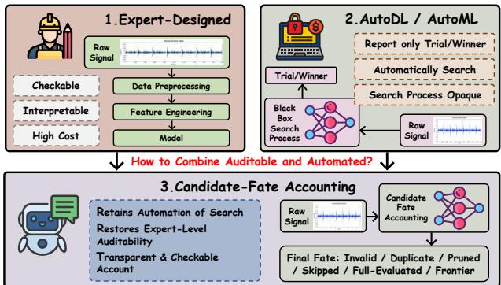
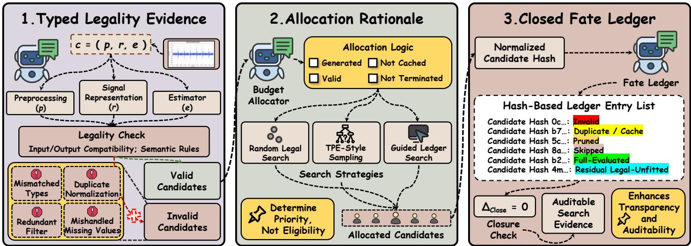
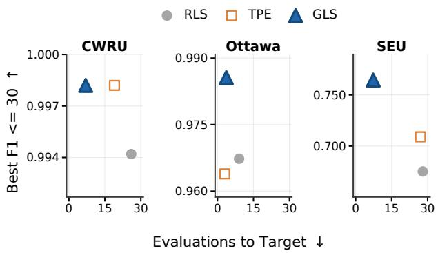

# Candidate-Fate Accounting for Transparent Sensor Diagnostic Pipeline Search

Haotao Xie Hangzhou International Innovation Institute, Beihang University Hangzhou, China haotaoxie@buaa.edu.cn

Yangqi Liu College of Cyber Security, Jinan University Guangzhou, China yangqilau@163.com

Yutian Chen Hangzhou International Innovation Institute, Beihang University Hangzhou, China 25601153@buaa.edu.cn

Xiaoyu Jiang ✉ Hangzhou International Innovation Institute, Beihang University Hangzhou, China jiangxiaoyu@buaa.edu.cn

## Abstract

Industrial sensor diagnostics relies on preprocessing, representation, and classification pipelines, making automated pipeline search useful for reducing manual design cost. However, existing automated machine/deep learning (AutoML/AutoDL) reports typically retain only fited trials, scores, and winners, omiting generated candidates that are invalid, pruned, skipped, cached, or unfited. This omission limits reviewers’ ability to check signal constraints, budget use, and unevaluated legal alternatives. To address this, we propose candidate-fate accounting, a candidate-level audit framework for diagnostic search traces. It records each observed candidate as auditable evidence: hashes merge repeated observations, legality checks flag invalid candidates, allocation rationales explain budget decisions, and a closed fate ledger assigns one terminal fate to each candidate. Experiments on three bearing-diagnostic datasets show that the framework detects invalid candidates and identifies 30–41 candidates omited by fited-trial-only reports, with closed fate records verifying complete candidate accounting while maintain ing competitive diagnostic performance. The code is available at https://github.com/XXIE999/candidate-fate-accounting.

## CCS Concepts

• Computing methodologies → Machine learning; • Information systems → Data mining; • Applied computing → Industry and manufacturing.

## Keywords

industrial sensor diagnostics, search transparency, candidate-fate accounting

## ACM Reference Format:

Haotao Xie, Yutian Chen, Yangqi Liu, and Xiaoyu Jiang. 2026. Candidate-Fate Accounting for Transparent Sensor Diagnostic Pipeline Search. In

Proceedings of the 35th ACM International Conference on Information and Knowledge Management (CIKM ’26), November 7–11, 2026, Rome, Italy. ACM, New York, NY, USA, 6 pages. https://doi.org/10.1145/3799682. 3839938

  
Figure 1: Motivating comparison among expert-designed workflows, AutoML/AutoDL search, and candidate-fate accounting.

## 1 Introduction

Industrial sensor diagnostics depends on pipelines that convert machine signals into reliable fault decisions [31]. In deployed maintenance setings, these pipelines must be both accurate and inspectable: engineers need to know which signal transforms are admissible, which classifiers can consume each representation, and why a selected model is plausible [14, 25]. Expert-built pipelines provide this reviewability, but the same reasoning is costly to repeat across machines, channels, and operating regimes [32]. Automated pipeline search [5, 20, 24] reduces this manual burden by generating and evaluating candidate preprocessing, representation, and classification pipelines. However, automation should not remove the evidence needed to review the search process. A useful diagnostic search report should show not only which pipeline won, but also what happened to generated candidates that were never fited. Figure 1 summarizes this contrast.

Existing work [13, 19, 33] addresses parts of this problem but does not close the generated-candidate audit gap. AutoML and AutoDL methods report fited configurations; hyperparameteroptimization frameworks such as Optuna record scheduled-trial states such as completed, failed, or pruned trials [1, 7, 12, 17, 26]; grammar and validity methods reject illegal programs; and provenance systems track executed artifacts [2, 8–10, 18, 21, 22, 27, 29]. These tools are useful, but their reporting units are usually fited configurations, scheduled trials, rejected programs, or executed artifacts rather than canonical generated candidates. As a result, repeated proposals, type-invalid candidates that never become trials, and legal candidates skipped by budget or cache decisions may lack one terminal explanation, leaving search validity and budget use dificult to audit at the candidate level. Candidate-fate accounting complements rather than replaces these systems: it adds a canonical candidate-level partition that also covers invalid and non-executed alternatives. This common reporting unit supports reproducible, optimizer-independent comparison of legality and budget traces across AutoML search policies.

A simple diagnostic trace illustrates the gap. Suppose a search generates a short-time Fourier transform (STFT) map with logistic regression, a z-score plus log-mel support vector machine (SVM) pipeline, and a highpass raw-vector XGBoost pipeline, but fits only the third candidate. A fited-trial report records only the evaluated pipeline and score, hiding that the first is type-invalid and the second is legal but cost-blocked. These hidden outcomes mater under small budgets because they expose legality checks, budget allocation, cache reuse, and untested legal alternatives.

To address this gap, we design candidate-fate accounting, a candidate-level audit framework for emited diagnostic search traces. The framework closes the record over observed canonical candidates rather than enumerating candidates that never appear. It uses stable hashes to merge repeated observations, typed legality checks to expose type and semantic failures before fiting, allocation rationales to explain budget decisions for legal candidates, and a closed fate ledger with $\Delta _ { \mathrm { c l o s e } }$ to verify that each observed candidate receives exactly one terminal fate. Thus, non-fited candidates become reportable evidence rather than optimizer bookkeeping. Allocation policies remain replaceable: guided ledger search is one allocator designed in our experiments, while candidate-fate accounting is the paper’s main contribution. Figure 2 summarizes the workflow.

We evaluate candidate-fate accounting on three bearingdiagnostic datasets: the Case Western Reserve University (CWRU) bearing dataset, the University ofOtawa bearing dataset (Otawa), and the Southeast University (SEU) bearing dataset. The experiments test whether the framework detects invalid candidates before fiting, accounts for candidates omited by fited-trial-only reports with complete fate accounting, and preserves useful diagnostic performance under a controlled protocol.

The main contributions are:

(1) We define the generated-candidate audit gap in automated industrial diagnostic search, showing why non-fited candidates should be treated as evidence about validity, budget use, and untested legal alternatives.

(2) We design a typed candidate-fate accounting framework that maps observed canonical candidates to auditable legality, allocation rationale, terminal fate, and closure evidence.

(3) We evaluate the framework on CWRU, Otawa, and SEU through invalid-candidate probes, closed fate ledgers, allocation checks, and controlled-protocol diagnostic performance.

## 2 Method

We formalize candidate-fate accounting as a reporting contract over emited diagnostic search traces. As shown in Figure 2, the framework records typed legality evidence, allocation rationale, and terminal fates in closed fate ledger. These records make signal constraints, budget use, and unevaluated legal alternatives inspectable while keeping the audit layer optimizer-independent. Section 2.1 defines legal diagnostic candidates, Section 2.2 defines budget allocation, and Section 2.3 assigns final fates.

## 2.1 Typed Legality Evidence

A generated candidate is a diagnostic program $\begin{array} { r } { c = ( p , r , e ) ; } \end{array}$ , where � is a preprocessing chain, � is a signal representation, and � is an estimator. The objects exchanged by these components have declared types, such as waveform, vector, time–frequency map, and patch sequence. Each primitive � declares an input type $\tau _ { \mathrm { i n } } ( u )$ , an output type $\tau _ { \mathrm { o u t } } ( u ) .$ and lightweight metadata for semantic checks. The first legality condition is type compatibility:

$$
{ \mathcal { C } } _ { \mathrm { t y p e } } = \{ c = ( p , r , e ) : \tau _ { \mathrm { o u t } } ( p ) = \tau _ { \mathrm { i n } } ( r ) , \tau _ { \mathrm { o u t } } ( r ) = \tau _ { \mathrm { i n } } ( e ) \} .
$$

The set $\mathcal { C } _ { \mathrm { t y p e } }$ contains candidates whose adjacent signatures agree. It captures syntactic feasibility before any search policy is considered. This rule turns signal-type constraints into pre-fit evidence by rejecting errors such as feeding a map representation to a vector-only classifier. A deterministic semantic map $\rho : \mathcal { C } _ { \mathrm { t y p e } }  \{ 0 , 1 \}$ resolves conflicts by conservative rejection: a missing-value primitive is invalid when dataset metadata reports zero missingness, while a second z-score normalization or filtering step is invalid as redundant. Fixed rule precedence records one reason when checks overlap.

The second step distinguishes intrinsic legality from budget admissibility. Given budget � and its cost guard CostOK(�; �), we define

$$
\begin{array} { c } { \mathrm { L e g a l } ( c ) \equiv c \in \mathcal { C } _ { \mathrm { t y p e } } \land \rho ( c ) = 1 , } \\ { \mathrm { A d m i s s i b l e } ( c ; B ) \equiv \mathrm { L e g a l } ( c ) \land \mathrm { C o s t O K } ( c ; B ) . } \end{array}
$$

Thus $\mathcal { C } _ { \mathrm { l e g } } = \{ c \ : \ \mathrm { L e g a l } ( c ) \}$ is the legal candidate space independent ofbudget. Type/semantic-incompatible candidates are invalid before fiting, while legal candidates blocked by cost, cache, or termination remain legal and later receive a non-evaluated fate.

## 2.2 Allocation Rationale

Allocation rationale makes budget use reviewable without changing candidate legality. At search step �, fiting budget [16] may be spent only on candidates that are generated, legal, not cached, and not already assigned a terminal fate. Let $\mathcal { G } _ { t }$ be generated candidates, $\mathcal { H } _ { t - 1 }$ be cached canonical hashes, $h ( c )$ be the stable hash of candidate �, and ℓ(�) be its current ledger state. The allocatable set

  
Figure 2: Overview of candidate-fate accounting. Typed legality checks classify generated candidates; a replaceable allocator prioritizes eligible ones; and a hash-based ledger consolidates repeats and assigns one terminal fate—including non-fitted outcomes—to each observed candidate. The closure condition $\Delta _ { \mathrm { c l o s e } } = 0$ verifies complete, non-overlapping accounting.

is

$$
\mathcal { A } _ { t } = \{ c \in \mathcal { G } _ { t } \cap \mathcal { C } _ { \mathrm { l e g } } : h ( c ) \not \in \mathcal { H } _ { t - 1 } , \ell ( c ) \mathrm { u n a s s i g n e d } \} .
$$

Search policies operate only on $\mathcal { A } _ { t } \colon$ RLS [4] samples uniformly, the TPE-style sampler [3] adapts primitive distributions from observed validation macro-F1, and GLS [15] uses MCTS-style selection over grammar-approved macro actions. They change only legal-candidate priority, not legality, budget eligibility, cache handling, or terminal fate.

Optional training-split, label-free descriptors such as impulsive ness, spectral entropy, support, and missingness define $r _ { \mathrm { g u i d e } }$ by adjusting primitive-family priority, but cannot bypass legality or ledger rules.

## 2.3 Closed Fate Ledger

The closed ledger reports the fate of every observed canonical candidate, including candidates that were generated but never fited. The reporting unit is a canonical hash because one diagnostic program may appear through proposal, cache, probe, or evaluation records. In our implementation, ℎ(�) is a SHA-256- derived identifier over a deterministic sorted-key serialization of the ordered preprocessing steps, representation, estimator, and their parameters. Each hash bucket stores the serialized candi date, legality result, allocation reason, and observed event types. Repeated proposal, cache, probe, or evaluation records update the existing bucket rather than increasing �. Because component order and parameters are included, the same configuration maps to one identity independently of its event path, while structurally diferent pipelines remain distinct. Ledger construction therefore separates identity resolution from fate assignment: records are first consolidated by ℎ(�), precedence is then applied per bucket, and closure is computed over � unique entries. This prevents repeated observations from inflating generated-candidate counts while preserving the event evidence needed to justify the final state.

Let $\bar { \mathcal { G } } _ { T }$ be the observed canonical generated set at the end of a run. The fate function $\ell \quad : \quad \bar { \mathcal { G } } _ { T }  \mathcal { S }$ maps each candidate to one state in $\mathcal { S } \ = \ \{ s _ { \mathrm { { i n v } } } , s _ { \mathrm { { d u p } } } , s _ { \mathrm { { p r n } } } , s _ { \mathrm { { s k p } } } , s _ { \mathrm { { e v a l } } } , s _ { \mathrm { { r e s } } } \} :$ invalid, duplicate/cache, pruned, skipped, full-evaluated, or residual legalunfited.

Fates are assigned by a fixed precedence order so that each observed canonical candidate contributes to one table cell. The order makes late evidence decisive when a candidate is first proposed cheaply and later fited. Candidates failing type or semantic checks become invalid. Any candidate that consumes fiting budget becomes full-evaluated, even ifearlier records only proposed or probed it. Legal candidates observed only through cache reuse become duplicate/cache. Legal non-duplicates removed by cost, complexity, or multi-fidelity guards become pruned. Legal candidates selected for execution but blocked before fiting become skipped. Remaining legal non-duplicates that are observed but never fited become residual legal-unfited.

The closure check tests whether terminal fates form a mutually exclusive and exhaustive partition of the observed set:

$$
\bar { \mathcal { G } } _ { T } = \bigcup _ { s \in \mathcal { S } } \bar { \mathcal { G } } _ { T } ^ { s } , \qquad \Delta _ { \mathrm { c l o s e } } = | \bar { \mathcal { G } } _ { T } | - \sum _ { s \in \mathcal { S } } | \bar { \mathcal { G } } _ { T } ^ { s } | = 0 .
$$

Here $\dot { \cup }$ denotes a disjoint union, $\bar { \mathcal { G } } _ { T } ^ { s }$ is the subset assigned fate �, and $\Delta _ { \mathrm { c l o s e } }$ is zero only when no observed canonical candidate is missing or double-counted.

For each observed canonical candidate, the evidence tuple is

$$
\mathcal { E } ( c ) = ( r _ { \mathrm { t y p e } } ( c ) , r _ { \mathrm { g u i d e } } ( c ) , \ell ( c ) ) ,
$$

where $r _ { \mathrm { t y p e } }$ is the legality rationale, $r _ { \mathrm { g u i d e } }$ is optional allocation metadata or rationale, and $\ell ( c )$ is the terminal fate. The run-level report is

$$
\mathcal { R } _ { T } = ( c ^ { \star } , \{ \mathcal { E } ( c ) : c \in \bar { \mathcal { G } } _ { T } \} , B _ { T } , \Delta _ { \mathrm { c l o s e } } ) .
$$

Here $c ^ { \star }$ is the selected pipeline and $B _ { T } \ = \ | \bar { \mathcal { G } } _ { T } ^ { S _ { \mathrm { e v a l } } } | \ \le \ B .$ This report states which pipeline won, why candidates were ruled out, where budget was spent, and which legal alternatives remained unseen by fiting. For � trace records, � unique candidates, and serialized candidate size �, ledger construction costs �(��) hashing plus expected �(� ) hash-table updates; the in-memory uniquecandidate ledger needs �(�) storage, and closure is �(�), with no additional model fiting. Each incoming record requires one hash and an expected �(1) lookup/update. In our $B = 5 0 ~ \mathrm { G L S }$ runs, the main JSON ledger occupies 32.8–37.7 KB per run; exact disk use depends on schema and serialization. At the accounting layer, a new domain supplies a canonical serializer, type/semantic rules, and a mapping from search events to the six terminal fates; hash consolidation, precedence, and closure remain unchanged.

Table 1: Closed � = 50 GLS ledger counts under typed legal search, averaged over three seeds.
<table><tr><td>Dataset</td><td>Unique Generated</td><td>Invalid</td><td>Pruned</td><td>Skipped</td><td>Duplicate/ Cache</td><td>Full Evaluated</td><td>Residual Legal- Unfitted</td><td>Closure Gap</td></tr><tr><td>CWRU</td><td> $4 9 . 7 { \pm } 0 . 5 $ </td><td>0±0</td><td> $6 . 7 { \pm } 0 . 9$ </td><td> $2 3 . 0 { \pm } 2 . 8 $ </td><td>0±0</td><td> $2 0 . 0 { \pm } 2 . 9 $ </td><td>0±0</td><td>0</td></tr><tr><td>Ottawa</td><td> $4 9 . 7 { \pm } 0 . 5 $ </td><td> $0 { \pm } 0$ </td><td> $2 0 . 3 { \pm } 2 . 9 $ </td><td> $1 8 . 7 { \pm } 4 . 7 $ </td><td> $2 . 3 { \pm } 0 . 9$ </td><td> $8 . 3 { \pm } 2 . 1 $ </td><td>0±0</td><td>0</td></tr><tr><td>SEU</td><td> $4 9 . 7 { \pm } 0 . 5 $ </td><td>0±0</td><td> $6 . 3 { \pm } 2 . 1 $ </td><td> $2 3 . 7 { \pm } 3 . 1 $ </td><td> $4 . 3 { \pm } 2 . 1 $ </td><td> $1 5 . 3 { \pm } 2 . 5 $ </td><td>0±0</td><td>0</td></tr></table>

## 3 Experiments

We evaluate four research questions (RQs) aligned with the audit framework: whether typed legality exposes invalid candidates be fore fiting (RQ1), whether the candidate-fate ledger closes over observed generated candidates (RQ2), whether allocation behavior is comparable under the same legal space (RQ3), and whether audited search still returns useful diagnostic pipelines under a controlled protocol (RQ4).

## 3.1 Experimental Setup

Protocol. We use a controlled small-budget protocol to compare audit counts and diagnostic utility across search policies. For each dataset and seed, all main search conditions share the same typed legal space, primitive cost model, split, and macro-F1 metric, with at most $\textit { B } = \ 5 0$ full model-fiting atempts. This cap applies to fited candidates, not generated candidates: generated candidates may instead be skipped, pruned, cached, or recorded as residual legal-unfited. Results are averaged over seeds 42, 43, and 44.

Datasets. We evaluate three bearing-diagnostic datasets with dataset-appropriate window-level splits. CWRU [11, 23, 28] and Ottawa use approximately 60/20/20 train/validation/test splits. SEU uses a cross-condition split $3 0 \_ 2 \to 2 0 \_ 0$ , with the source condition for training and the target condition split equally for validation and testing.

## 3.2 Typed Legality Probe

RQ1 tests whether typed legality exposes invalid candidates before fiting. We generate 100 weakly constrained skeletons over the shared primitive inventory and label each skeleton with type and semantic checks.

The probe yields 48 type-invalid, 20 semantic-invalid, and 32 legal skeletons. Type failures capture object mismatches such as time–frequency maps followed by vector-only classifiers; semantic failures capture conservative metadata conflicts such as duplicate normalization or repeated filtering. The 68/100 invalid count is a legality-layer stress test, not an estimate oftyped main-run invalidity: because the main searches operate within the typed legal space, zero invalid candidates there is expected. Rather than weakening the audit claim, this zero-invalid main-run outcome makes the invariant checkable: the ledger confirms that invalid candidates do not consume fiting budget, and the weak probe identifies the failures that less constrained generation would need to catch and explain.

## 3.3 Closed Ledger Accounting

RQ2 tests whether candidate-fate accounting accounts for emited candidates dropped by fited-trial reporting and verifies complete accounting over observed canonical candidates. Each record stores legality evidence, allocation rationale when available, a terminal fate, and a reason. Table 1 gives a � = 50 GLS accounting example aggregated over three seeds.

The main finding is that fited-trial-only reporting omits substantial trace evidence: the ledger records about 30, 41, and 34 non-full-evaluated canonical candidates on CWRU, Otawa, and SEU, respectively. The closure check verifies that these fate counts form a complete and non-overlapping partition, with all GLS ledger rows in Table 1 satisfying $\Delta _ { \mathrm { c l o s e } } = 0$

For example, fited-trial-only reporting on Otawa exposes only 8.3±2.1 full-evaluated candidates, whereas the ledger atributes 41.3 others on average to pruning, skipping, or duplicate/cache. The later comprise 20.3 pruned, 18.7 skipped, and 2.3 duplicate/cache candidates, so the shortfall from generated candidates to fited trials becomes atributable rather than unexplained. The interpretability is process-level: legality decisions, candidate fate, and budget consequence, not post-hoc explanations of a fited model. These fates make the search reviewable but do not rank optimizers.

## 3.4 Early Allocation

RQ3 uses GLS as an allocator case study and compares allocation behavior with the legal space and budget fixed. All rows share typed legality, cache rules, semantic guards, and fiting budget. Best $\mathrm { F } 1 \leq 3 0$ is the best validation macro-F1 within 30 full evaluations; Target Success counts seeds that reach the final RLS validation score, used as a dataset-specific reference target; Evaluations to Target measures the first full-evaluation index at which a run reaches the final RLS validation score, computed only over successful seeds. Low Target Success therefore indicates unstable early allocation.

Table 2: Early allocation under a shared typed legal space. Bold marks the best F1 and, among 3/3-success rows, the fewest Evaluations to Target.
<table><tr><td></td><td>Dataset Method</td><td>Best F1≤30 ↑</td><td>Target Success</td><td>Evaluations to Target ↓</td></tr><tr><td>CWRU</td><td>RLS</td><td> $0 . 9 9 4 2 { \scriptstyle \pm 0 . 0 0 0 9 }$ </td><td>3/3</td><td>26.00±7.87</td></tr><tr><td>CWRU</td><td>TPE</td><td>0.9982±0.0009</td><td>3/3</td><td>19.00±4.32</td></tr><tr><td>CWRU</td><td>GLS</td><td> $\mathbf { 0 . 9 9 8 2 { \scriptstyle \pm 0 . 0 0 0 2 } }$ </td><td>3/3</td><td> $\mathbf { 7 . 0 0 { \pm } 4 . 5 5 }$ </td></tr><tr><td>Ottawa</td><td>RLS</td><td>0.9673±0.0063</td><td>3/3</td><td>9.00±5.89</td></tr><tr><td>Ottawa</td><td>TPE</td><td>0.9639±0.0038</td><td>1/3</td><td>3.00±0.00</td></tr><tr><td>Ottawa</td><td>GLS</td><td>0.9856±0.0026</td><td>3/3</td><td>3.67±1.70</td></tr><tr><td>SEU</td><td>RLS</td><td>0.6751±0.0458</td><td>3/3</td><td>28.00±3.56</td></tr><tr><td>SEU</td><td>TPE</td><td> $0 . 7 0 9 0 { \scriptstyle \pm 0 . 0 1 6 7 }$ </td><td>1/3</td><td>27.00±0.00</td></tr><tr><td>SEU</td><td>GLS</td><td>0.7646±0.0185</td><td>3/3</td><td> $7 . 3 3 { \pm } 6 . 8 5 $ </td></tr></table>

  
Figure 3: Best validation macro-F1 within 30 full evaluations versus Evaluations to Target; upper-left is better.

Table 2 and Figure 3 summarize early-allocation speed and budget-30 utility. GLS gives the most consistent early-allocation profile: it reaches the random-search target in 3/3 seeds on all datasets, requires the fewest Evaluations to Target among 3/3- success rows, atains the best budget-30 F1 on Otawa and SEU, and ties TPE to four decimals on CWRU. This should be read as an auditability check, not as a broad optimizer ranking: allocation choices can be reported alongside fited-trial outcomes under the same legal space.

## 3.5 Protocol Utility

RQ4 asks whether the audit framework retains controlled-protocol diagnostic utility. Table 3 reports controlled-protocol final-test macro-F1 for selected same-space search pipelines, fixed diagnostic recipes, a one-dimensional convolutional neural network (1D-CNN), and AutoML references. Random forest (RF) denotes the estimator used in two fixed recipes. Search rows are matched by split, channel, windowing, label map, metric, and data limit;

neural and AutoML rows use diferent input representations and serve only as scale references.

Table 3: Protocol-scoped final-test macro-F1; search rows show three-seed mean (standard deviation), with the best matched search policy per dataset in bold.
<table><tr><td>Method</td><td>CWRU F1 ↑</td><td>Ottawa F1 ↑</td><td>SEU F1 ↑</td></tr><tr><td>RLS TPE</td><td>0.9951(0.0004)</td><td>0.9851(0.0046) 0.9691(0.0119)</td><td>0.7130(0.0514) 0.7128(0.0242)</td></tr><tr><td>GLS</td><td>0.9978(0.0028) 0.9968(0.0000)</td><td>0.9862(0.0032) 0.7341(0.0134)</td><td></td></tr><tr><td>Statistical + RF</td><td>0.8200</td><td>0.6216</td><td>0.0748</td></tr><tr><td>Spectral classical</td><td>0.7068</td><td>0.6181</td><td>0.0593</td></tr><tr><td>Envelope classical</td><td>0.5364</td><td>0.5926</td><td>0.5899</td></tr><tr><td>Wavelet + RF</td><td>0.8324</td><td>0.7490</td><td>0.0901</td></tr><tr><td>1D-CNN</td><td>0.7414</td><td>0.0667</td><td>0.2380</td></tr><tr><td>AutoGluon [6]</td><td>0.9172</td><td>0.8776</td><td>0.2647</td></tr><tr><td>FLAML [30]</td><td>0.9022</td><td>0.8821</td><td>0.1371</td></tr></table>

Table 3 shows that accountable search retains controlledprotocol diagnostic utility. Same-space search rows achieve high macro-F1 on CWRU and Otawa; among matched search policies, TPE is highest on CWRU while GLS is highest on Otawa and SEU. Because selected pipelines vary across setings, the report records the selected family, transform, estimator, and seed. These results support the scoped claim that candidate-fate accounting can expose terminal fates and allocation outcomes while still selecting plausible final models.

## 4 Conclusion

Candidate-fate accounting addresses the generated-candidate audit gap in automated diagnostic search. By merging repeated trace records, recording legality and allocation rationales, and checking ledger closure with $\Delta _ { \mathrm { c l o s e } } ,$ it turns rejected, skipped, cached, and unfited candidates into reviewable evidence. Experiments on CWRU, Otawa, and SEU show that the framework exposes invalid skeletons, atributes non-full-evaluated candidates to explicit fates, and retains useful final-test performance under a controlled protocol. The accounting contract can be adapted through domainspecific candidate schemas and semantic rules, but empirical crossdomain validation remains future work.

## Acknowledgments

This work was supported in part by the National Natural Science Foundation of China under Grant 62403425, in part by the Zhejiang Provincial Natural Science Foundation of China under Grant LMS26F030019, in part by the Hangzhou Natural Science Foundation under Grant 2025SZRJJ2330, in part by the Youth Talent Support Project of the Zhejiang Provincial Association for Science and Technology, and in part by the Jiangsu Provincial Scientific Research Center of Applied Mathematics under Grant BK20233002.

## Generative AI (GenAI) Usage Disclosure

The authors used generative AI tools in a limited assistive capacity for manuscript language polishing and for code debugging/checking. These tools were not used to generate experimental data, alter results, or make scientific decisions; all code, results, technical claims, and final manuscript text were reviewed and verified by the authors.

## References

[1] Takuya Akiba, Shotaro Sano, Toshihiko Yanase, Takeru Ohta, and Masanori Koyama. 2019. Optuna: A Next-generation Hyperparameter Optimization Framework. Proceedings ofthe 25th ACM SIGKDD International Conference on Knowledge Discovery & Data Mining (2019). https://api.semanticscholar.org CorpusID:196194314

[2] Khalid Belhajjame, Reza B’Far, James Cheney, Sam Coppens, Stephen Cresswell, Yolanda Gil, Paul Groth, Graham Klyne, Timothy Lebo, Jamie McCusker, Simon Miles, James D. Myers, Satya Sanket Sahoo, and Curt Tilmes. 2013. PROV-DM: The PROV Data Model. https://api.semanticscholar.org/CorpusID:65235238

[3] James Bergstra, Rémi Bardenet, Yoshua Bengio, and Balázs Kégl. 2011. Algorithms for Hyper-Parameter Optimization. In Neural Information Processing Sys tems. https://api.semanticscholar.org/CorpusID:11688126

[4] James Bergstra and Yoshua Bengio. 2012. Random search for hyper-parameter optimization. Journal of machine learning research 13, 2 (2012).

[5] Iddo Drori, Yamuna Krishnamurthy, Rémi Rampin, Raoni Lourenço, Jorge Piazentin Ono, Kyunghyun Cho, Cláudio T. Silva, and Juliana Freire. 2021. AlphaD3M: Machine Learning Pipeline Synthesis. ArXiv abs/2111.02508 (2021). https://api.semanticscholar.org/CorpusID:198940685

[6] Nick Erickson, Jonas W. Mueller, Alexander Shirkov, Hang Zhang, Pedro Larroy, Mu Li, and Alex Smola. 2020. AutoGluon-Tabular: Robust and Accurate AutoML for Structured Data. ArXiv abs/2003.06505 (2020). https://api.semanticscholar. org/CorpusID:212725762

[7] Stefan Falkner, Aaron Klein, and Frank Huter. 2018. BOHB: Robust and Eficient Hyperparameter Optimization at Scale. ArXiv abs/1807.01774 (2018). https: //api.semanticscholar.org/CorpusID:49571505

[8] Luís Ferreira, André Pilastri, Filipe Romano, and Paulo Cortez. 2022. Using su pervised and one-class automated machine learning for predictive maintenance. Applied Soft Computing 131 (2022), 109820. doi:10.1016/j.asoc.2022.10982

[9] Mathias Feurer, Aaron Klein, Katharina Eggensperger, Jost Springenberg, Manuel Blum, and Frank Huter. 2015. Eficient and Robust Automated Ma chine Learning. In Advances in Neural Information Processing Systems, C. Cortes, N. Lawrence, D. Lee, M. Sugiyama, and R. Garnet (Eds.), Vol. 28. Curran Associates, Inc. https://proceedings.neurips.cc/paper\_files/paper/2015/file/ 11d0e6287202fced83f79975ec59a3a6-Paper.pdf

[10] Russul H. Hadi, Haider Najy Hady, Ahmed Mudheher Hasan, Ammar Abdulhussein Lafta Al-Jodah, and Amjad Jaleel Humaidi. 2023. Improved Fault Classification for Predictive Maintenance in Industrial IoT Based on AutoML: A Case Study of Ball-Bearing Faults. Processes (2023). https://api.semanticscholar.org/ CorpusID:258749232

[11] Jacob Hendriks, Patrick Dumond, and David Knox. 2022. Towards beter bench marking using the CWRU bearing fault dataset. Mechanical Systems and Signal Processing (2022). https://api.semanticscholar.org/CorpusID:245603873

[12] Frank Huter, Holger H. Hoos, and Kevin Leyton-Brown. 2011. Sequential Model-Based Optimization for General Algorithm Configuration. In Learning and Intelligent Optimization. https://api.semanticscholar.org/CorpusID:6944647

[13] Frank Huter, Lars Kothof, and Joaquin Vanschoren. 2019. Automated Machine Learning - Methods, Systems, Challenges. doi:10.1007/978-3-030-05318-5

[14] Xiaoyu Jiang, Haotao Xie, Jiayu Wang, Zeyu Yang, Yuanqiang Zhou, Le Yao, and Zheren Zhu. 2026. Agentic AI for Safety-Aware Process Monitoring and Fault Diagnosis: A Review. Processes 14, 13 (2026). doi:10.3390/pr14132112

[15] Levente Kocsis and Csaba Szepesvari. 2006. Bandit Based Monte-Carlo Planning. In European Conference on Machine Learning. https://api.semanticscholar.org CorpusID:15184765

[16] Lisha Li, Kevin G. Jamieson, Giulia DeSalvo, Afshin Rostamizadeh, and Ameet Talwalkar. 2016. Hyperband: A Novel Bandit-Based Approach to Hyperparameter Optimization. J. Mach. Learn. Res. 18 (2016), 185:1–185:52. https: //api.semanticscholar.org/CorpusID:11971778

[17] Liam Li, Kevin G. Jamieson, Afshin Rostamizadeh, Ekaterina Gonina, Jonathan Ben-tzur, Moritz Hardt, Benjamin Recht, and Ameet Talwalkar. 2018. A System for Massively Parallel Hyperparameter Tuning. arXiv: Learning (2018). https: //api.semanticscholar.org/CorpusID:216245794

[18] Radu Marinescu, Akihiro Kishimoto, Parikshit Ram, Ambrish Rawat, Martin Wistuba, Paulito Palmes, and Adi Botea. 2021. Searching for Machine Learning Pipelines Using a Context-Free Grammar. In AAAI Conference on Artificial Intelligence. https://api.semanticscholar.org/CorpusID:235349043

[19] Margaret Mitchell, Simone Wu, Andrew Zaldivar, Parker Barnes, Lucy Vasserman, Ben Hutchinson, Elena Spitzer, Inioluwa Deborah Raji, and Timnit Gebru. 2018. Model Cards for Model Reporting. Proceedings ofthe Conference on Fairness, Accountability, and Transparency (2018). https://api.semanticscholar.org/ CorpusID:52946140

[20] Felix Mohr, Marcel Wever, and Eyke Hüllermeier. 2018. ML-Plan: Automated machine learning via hierarchical planning. Machine Learning 107 (2018), 1495– 1515. https://api.semanticscholar.org/CorpusID:51886269

[21] Tien-Dung Nguyen, Bogdan Gabrys, and Katarzyna Musial. 2020. AutoWeka4MCPS-AVATAR: Accelerating Automated Machine Learning Pipeline Composition and Optimisation. Expert Syst. Appl. 185 (2020), 115643. https://api.semanticscholar.org/CorpusID:227151926

[22] Randal S. Olson andJason H. Moore. 2019. TPOT: A Tree-Based Pipeline Optimization Tool for Automating Machine Learning. Springer International Publishing, Cham, 151–160. doi:10.1007/978-3-030-05318-5\_8

[23] Rodrigo Kobashikawa Rosa, Danilo Braga, and Danilo Silva. 2024. Benchmarking deep learning models for bearing fault diagnosis using the CWRU dataset: A multi-label approach. https://api.semanticscholar.org/CorpusID:271328200

[24] Manuel Martin Salvador, Marcin Budka, and Bogdan Gabrys. 2016. Automatic Composition and Optimization of Multicomponent Predictive Systems With an Extended Auto-WEKA. IEEE Transactions on Automation Science and Engineering 16 (2016), 946–959. https://api.semanticscholar.org/CorpusID:18001834

[25] Lichen Shi, Jiahang Guo, and Haitao Wang. 2024. A Precision Machining Equipment Fault Diagnosis Based on CWT and Improved ResNeXt. Instrumentation 11, 2 (2024), 36–43. doi:10.15878/j.instr.202400030

[26] Jasper Snoek, H. Larochelle, and Ryan P. Adams. 2012. Practical Bayesian Optimization of Machine Learning Algorithms. In Neural Information Processing Systems. https://api.semanticscholar.org/CorpusID:632197

[27] Chris J. Thornton, Frank Huter, Holger H. Hoos, and Kevin Leyton-Brown. 2012. Auto-WEKA: combined selection and hyperparameter optimization of classification algorithms. Proceedings of the 19th ACM SIGKDD international conference on Knowledge discovery and data mining (2012). https://api.semanticscholar.org/ CorpusID:13952689

[28] João Paulo Vieira, Victor Afonso Bauler, Rodrigo Kobashikawa Rosa, and Danilo Silva. 2025. Towards a more realistic evaluation of machine learning models for bearing fault diagnosis. ArXiv abs/2509.22267 (2025). https://api. semanticscholar.org/CorpusID:281659355

[29] Tobias Wagner, Alexander Gepperth, and Elmar Engels. 2023. A framework for the automated parameterization of a sensorless bearing fault detection pipeline. Journal of Applied Research on Industrial Engineering 10, 4 (Oct. 2023). doi:10. 22105/jarie.2023.391005.1538

[30] Chi Wang, Qingyun Wu, Markus Weimer, and Erkang Zhu. 2019. FLAML: A Fast and Lightweight AutoML Library. In Conference on Machine Learning and Systems. https://api.semanticscholar.org/CorpusID:229348714

[31] Haitao Wang and Xiang Liu. 2024. Research on Rotating Machinery Fault Diagnosis Based on Improved Multi-target Domain Adversarial Network. Instrumentation 11, 1 (2024), 38–50. doi:10.15878/j.instr.202300151

[32] Chen Yang, Jianwen Yan, Yixiong Feng, Lei Li, and Jianrong Tan. 2026. Hybrid Deep Learning for Hydraulic Cylinder Fault Diagnosis under Complex Conditions via Multi-Source Signal Fusion. Instrumentation 13, 1 (2026), 40–56. doi:10.15878/j.instr.20260031

[33] Marc-André Zöller and Marco F. Huber. 2019. Benchmark and Survey of Au tomated Machine Learning Frameworks. J. Artif. Intell. Res. 70 (2019), 409–472. https://api.semanticscholar.org/CorpusID:210064426