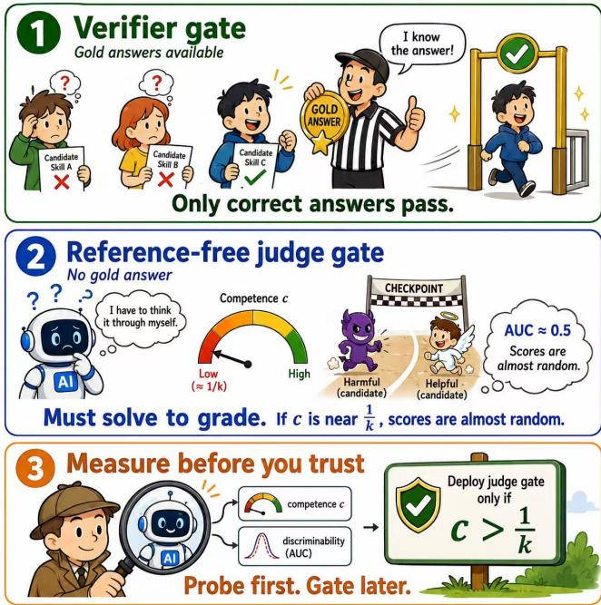
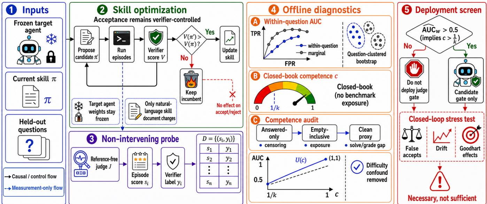
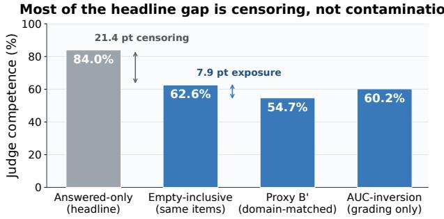
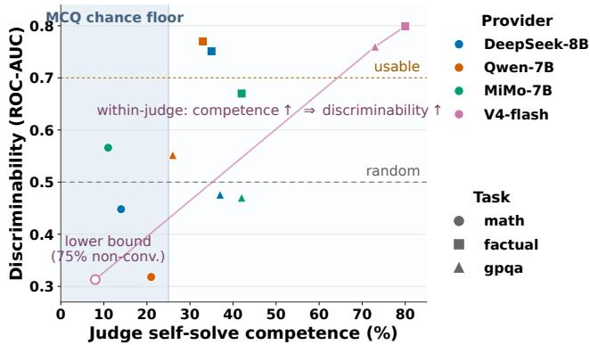

# Competence, Not Accuracy: A Diagnostic for Reference-Free Judge Gates in Skill Optimization

Chenle Chen1 Yangbo Wei2 Chao Yao3 Shaoqiang Lu2

Junhong Qian2 Chen Wu4 Lei He4

1University of California, Los Angeles 2Shanghai Jiao Tong University

3Arizona State University 4Eastern Institute of Technology, Ningbo

chenle@ucla.edu

## Abstract

Text-space skill optimization adapts a frozen agent by evolving a natural-language skill document, accepting each candidate through a validation gate. Existing gates rely on verifiable rewards, confining these methods to tasks with an automatic verifier. Replacing the verifier with an LLM-judge gate would lift that restriction, but whether such a gate carries usable signal is untested. We ask a prior question: can we tell, before placing a judge in the loop, whether its scores separate correct from incorrect answers at all? We formalize a referencefree judge as a latent solver—its verdict rests on agreement with whatever it would itself conclude, so its capacity to evaluate is bounded by its capacity to solve. The model yields a closed-form bound on discriminability (ROC-AUC) in the judge’s competence c and answer-space size k, a necessary condition c > 1/k, and the result that the marginal AUC is confounded by item difficulty while a within-question estimator is not. A non-intervening probe records judge scores on genuine optimization runs without altering any decision. We find discriminability at chance where competence sits near the floor and usable above it; that a judge’s benchmark accuracy overstates the competence that matters; and, in a closed-loop study, that the screen predicts which kind of gating error occurs. The result is a cheap pre-deployment diagnostic for judge gates.

## 1 Introduction

Recent work adapts frozen language-model agents to new domains by evolving a compact, natural-language skill document rather than updating weights [Yang et al., 2026, Alzubi et al., 2026]. These optimizers run a candidate skill, score it, and use a validation gate to keep the candidate only if it improves a held-out score—directly analogous to model selection in supervised learning. Crucially, the gate score comes from a verifiable signal: exact match against a gold answer, or an executable check. This works well when such a verifier exists, but it confines the paradigm to verifiable tasks. Figure 1 summarizes the problem and our response. The long-run motivation for lifting that constraint is openended generation—writing, dialogue, design rationale—but we state at the outset that the present study does not reach that far. Our model and measurements both require a single gold answer and a verifier label, so the tasks studied here are objectively checkable ones; extending the diagnostic to genuinely open-ended tasks, where correctness is not binary, the answer space has no natural size, and judging is rubric-driven rather than agreement-driven, is future work. What we can do now is answer the prerequisite question on tasks where ground truth is available to audit against.

A natural way to lift this restriction is to replace the verifier gate with an LLM-judge gate: score each candidate skill by how a judge model rates its outputs, and accept on the judge’s preference. In reinforcement learning, judge-based signals have extended optimization beyond verifiable rewards [Corbitt et al., 2025], but always in weight space; they have not been brought into text-space skill optimization, where weights are frozen and the optimized object is a persistent document. Moreover, judge reliability cannot be assumed: judges are known to be biased and gameable, and coupling a judge to an acceptance loop creates selection pressure that can amplify reward hacking [Zheng et al., 2023].

This paper asks a question that must be answered before any judge gate is deployed: when can a judge gate substitute for a verifier gate, and when does it fail? Rather than swap the gate and hope, we take a diagnostic approach. We instrument an existing optimizer’s gate with a judge probe that scores every candidate but does not affect any accept/reject decision, leaving the optimization dynamics unchanged. This lets us measure, on real runs, whether the judge signal is trustworthy—operationalized as discriminability: can the judge score separate answers the verifier marks correct from those it marks wrong (ROC-AUC)?

Our findings are threefold. (i) Judge discriminability varies sharply across tasks—at chance on research mathematics, usable on factual QA and graduate science—so judge signal cannot be assumed. (ii) Where the judge’s own competence sits near the chance floor, discriminability collapses, as the model predicts; and the closed-form bound holds wherever it can be tested without difficulty confounding. (iii) A judge’s headline benchmark accuracy is an optimistic input to this test: decomposing the gap to genuine competence shows censoring convention, benchmark exposure, and the solve/grade context gap each contribute, all in the same direction.

  
Figure 1: (1) A verifier gate has gold answers, so only correct candidates pass. (2) A reference-free judge has none and must in effect re-solve each item to grade it, so once its competence c nears the chance floor 1/k its scores are near-random. (3) We therefore measure competence and discriminability before deployment, screening out judges that do not clear the floor—necessary, though not sufficient.

Contributions. (1) Theory. We model a reference-free judge as a latent solver and derive a closed-form bound on discriminability in its competence c and answer-space size k, a necessary but not sufficient condition c > 1/k for any discrimination, and an identification result: the marginal AUC is confounded by item difficulty—a judge reading only difficulty and never the answer can score above chance—while a within-question estimator is invariant to it. (2) Measurement. We give a non-intervening probe that records judge signal on genuine optimization runs without altering acceptance, together with a reusable protocol—episode-level scoring, answer-content feeding, within-question stratification with a question-clustered bootstrap, and proxy-based decontamination—for auditing a candidate judge gate before deployment. (3) Findings. Discriminability collapses to chance where competence approaches the floor, and the predicted bound holds wherever it can be cleanly tested; a judge’s headline benchmark accuracy overstates competence, for three separable reasons that we decompose using estimators with orthogonal error sources; and in a closed-loop study the screen predicts which kind of gating error occurs—judges that fail it import regressions, while one that passes imports none and errs only by over-rejection.

## 2 Related Work

Self-evolving agent skills. A rapidly growing line of work equips frozen agents with reusable, natural-language skills [Zhang et al., 2025] and optimizes them automatically: offline distillation from execution traces [Ni et al., 2026, Wang et al., 2026], and online evolution through failure-driven reflection [Alzubi et al., 2026], validation-gated updates [Yang et al., 2026], adversarial co-evolution against a verifier [Zhang et al., 2026], shared asset layers [Ma et al., 2026], credit signals [Tu et al., 2026], reinforcement learning over skill libraries [Xia et al., 2026], and skill–tool co-evolution [Wei et al., 2026]; reflective textual evolution can even outperform scalar-reward RL in sample efficiency [Agrawal et al., 2025]. Despite their diversity, these systems share one commitment: acceptance is decided by a verifiable signal— exact match, an executable check, or a programmatic scorer. Our work targets that shared assumption and asks whether a judge can stand in for the verifier, and when.

Judges already inside the evaluation loop. The assumption is not that judges are absent from this setting, but that where they appear they are reference-based. SealQA [Pham et al., 2025], a benchmark used throughout the skill-evolution literature, is scored by a frozen judge model that receives the question, the gold answer, and the agent’s response before returning a binary verdict. Supplying the gold answer converts judging into a comparison task and sidesteps the question we study. Our concern is the reference-free regime that a judge gate necessarily occupies: during optimization no gold answer exists for the candidate being evaluated, so the judge must supply the standard itself.

Reward-free and judge-based optimization. In RL posttraining, LLM judges supply learning signal where verifiable rewards are unavailable, e.g. by ranking rollouts [Corbitt et al., 2025] or combining preference, judge, and programmatic signals to curb reward hacking [Peng et al., 2025]. This work operates in weight space and assumes the judge provides usable signal; it does not characterize when that assumption holds. We transpose the judge-signal idea into frozen-weight, text-space skill optimization and treat judge trustworthiness as the object of study.

LLM-as-judge reliability. LLM judges exhibit systematic biases and can be gamed [Zheng et al., 2023]. We add a task-dependent axis: a judge’s ability to evaluate answers is bounded by its ability to solve them, and this bound—not generic bias—explains where judge gating fails.

## 3 Method

Figure 2 gives the overall pipeline. Where does a judge’s verdict get its information, if it cannot see the gold answer? Our starting point is a minimal hypothesis: a referencefree judge has no source of ground truth independent of its own ability to solve, so evaluation degenerates informationally into an implicit re-solving—to grade, one must first be able to answer. We first set up the judge-as-latentsolver model, then derive the closed-form relation between ROC-AUC and competence together with its testable predictions, and finally present the corresponding measurement instruments—the non-intervening probe, episode-level estimation, and competence measurement.

## 3.1 Setup and Model Assumptions

Consider a task whose answer space has size $k \geq 2$ (fouroption MCQ gives $k { = } 4 ;$ free-text is the limit $k  \infty )$ , with gold answer $a ^ { * }$ . An episode consists of a candidate answer a produced by the optimized system and its verifier label $y = \mathcal { H } [ a = a ^ { * } ] \in \{ 0 , 1 \}$ . Without access to $a ^ { * }$ , the judge emits a score s for the pair (question, a). Writing $S _ { 1 } , S _ { 0 }$ for scores sampled under $y { = } 1$ and $y { = } 0$ , discriminability is $\begin{array} { r } { \mathrm { A U C } : = \mathrm { P r } ( S _ { 1 } > S _ { 0 } ) + \frac { 1 } { 2 } \mathrm { P r } ( S _ { 1 } = S _ { 0 } ) } \end{array}$ , the Mann–Whitney probability that a random positive–negative pair is correctly ordered.

We model a reference-free judge with three assumptions. (A1) Implicit re-solving: the judge forms an internal solution ${ \hat { a } } ,$ , conditionally independent of $^ { a , }$ with $\operatorname* { P r } ( { \hat { a } } = a ^ { * } ) = c ,$ where $c \in [ 0 , 1 ]$ is its competence in the grading context. (A2) Error dispersion: on $\{ \hat { a } ~ \ne ~ a ^ { * } \}$ , aˆ is uniform over the remaining $k - 1$ answers. (A3) Consistency scoring: $s = \mathbb { K } [ a = { \hat { a } } ]$ . The model is in the tradition of Dawid–Skene noisy-annotator models [Dawid and Skene, 1979], differing in that the annotator’s confusion structure is realized as an explicit re-solving process, which makes c separately measurable by closed-book self-solve accuracy.

Scope of the model. (A1) does not assert that verification is universally as hard as generation. Where a rubric or external evidence supplies a solution-independent standard, or where a cheap local check suffices—units, a boundary condition, one step of a supplied proof—verification is easier and (A1) understates the judge. We accordingly scope the model to single-answer tasks judged without rubric or external evidence, where the verdict rests on agreement between the candidate and what the judge would itself conclude. Within that scope (A1) is falsifiable: it predicts collapse to chance as $c  1 / k$ , which our experiments test. Rubric-based and evidence-grounded judging are natural extensions.

## 3.2 Analytic Characterization of Discriminability

Proposition 1. Under $( A I ) { - } ( A 3 )$

$$
\operatorname { A U C } = { \frac { 1 } { 2 } } \left( 1 + c - { \frac { 1 - c } { k - 1 } } \right) = { \frac { 1 } { 2 } } + { \frac { c k - 1 } { 2 ( k - 1 ) } } .\tag{1}
$$

Proofsketch. When $y { = } 1 , a = a ^ { * }$ , so $\mathrm { T P R } = \mathrm { P r } ( \hat { a } = a ^ { * } ) =$ c. When $y { = } 0$ , the event $\{ \hat { a } = a \}$ implies $\{ \hat { a } \neq a ^ { * } \}$ , so by $( \mathbf { A } 1 ) – ( \mathbf { A } 2 )$ F $\mathrm { P R } \ = \ ( 1 - c ) / ( k - 1 )$ ). For a binary score, $\mathrm { A U C } = \textstyle { \frac { 1 } { 2 } } ( 1 + \mathrm { T P R } - \mathrm { F P R } )$ ; substituting gives (1). □

Equation (1) exhibits a threshold structure: $\mathrm { A U C } - \textstyle { \frac { 1 } { 2 } }$ has the same sign as $c k - 1$ . Two results show this threshold is robust to realistic departures, while the closed-form value should be read as an upper bound.

Lemma 1 (noise shrinks toward chance). Let $\boldsymbol { s ^ { \prime } } = \boldsymbol { s } + \boldsymbol { \varepsilon }$ $w i t h \ \varepsilon \ i . i . d .$ , independent of $( s , y )$ , continuously distributed. Then $\mathrm { A U C ^ { \prime } } - \textstyle { \frac { 1 } { 2 } } = ( \mathrm { A U C } - \textstyle { \frac { 1 } { 2 } } ) ( 2 q - 1 )$ with $q : = \operatorname* { P r } ( Z <$ $\begin{array} { r } { 1 ) \in ( \frac { 1 } { \circ } , 1 ] , Z \overset { = } : = \varepsilon _ { 0 } - \varepsilon _ { 1 } } \end{array}$ . Noise therefore shrinks AUC toward $\bar { \frac { 1 } { 2 } } \ \mathsf { b y }$ a factor in (0, 1] without changing its sign relative to ${ \frac { 1 } { 2 } } .$

Remark 1 (collusion and upper-boundedness). Relaxing (A1)–(A2) to specify only the collusion rate $\rho : = \mathrm { P r } ( \hat { a } =$ $a \ \mid \ y = 0 )$ gives $\mathrm { A U C } ~ = ~ \textstyle { \frac { 1 } { 2 } } ( 1 + c - \rho )$ , strictly decreasing in $\rho . ~ ( \mathrm { A } 1 ) { - } ( \mathrm { A } 2 )$ correspond to $\rho ~ = ~ ( 1 - c ) / ( k - 1 )$ When judge and evaluated model err in correlated ways— both drawn to the same distractor, typical of models sharing a training distribution—ρ exceeds that value, so at fixed c Proposition 1 is an attainable upper bound. With Lemma 1, the model’s commitment is to bounds and thresholds, not a fitted curve, matching the necessary-condition phrasing we keep throughout.

Corollary 1 (chance-floor threshold). (i) Under $( A I ) – ( A 3 )$ with or without the noise of Lemma $I , { \mathrm { A U C } } > { \frac { 1 } { 2 } } \Longleftrightarrow c >$ 1/k. (ii) In the relaxedfamily ofRemark 1 with super-uniform collusion $\rho \geq ( 1 - c ) / ( k - 1 )$ , only the forward implication survives:

$$
\operatorname { A U C } > { \frac { 1 } { 2 } } \implies c > 1 / k .\tag{2}
$$

Proof. (i) is immediate from (1), whose sign relative to $\frac { 1 } { 2 }$ is that of $c k - 1 ;$ Lemma 1 rescales the deviation by a strictly positive factor and cannot change its sign. For (ii), Remark 1 gives $\begin{array} { r } { \mathrm { A U C } > \frac { 1 } { 2 } \iff c > \rho ; } \end{array}$ combining with $\rho \ge ( 1 -$ $c ) / ( k - 1 ) \mathrm { y i e l } \bar { \mathrm { d s } } c ( k - 1 ) > 1 - c , \mathrm { i . e . } c > 1 / k . \boxed { }$

The converse fails in the relaxed family: whenever $\rho \geq$ c—judge and candidate erring together at least as often as the judge is right—discriminability is at or below chance even though $c > 1 / k$ . We therefore state the chancefloor threshold throughout as a necessary but not sufficient condition: above-chance competence must hold for a judge gate to discriminate at all, but it does not guarantee that it does. Correspondingly AUC $\downarrow \ : \ : \frac { 1 } { 2 }$ as $c \downarrow 1 / k$ , and low-k tasks whose models share a training distribution are precisely where $\rho$ is expected to be large.

Corollary 2 (free-text limit). lim $\begin{array} { r } { \mathbf { \ i } _ { k  \infty } \mathrm { A U C } = ( 1 + c ) / 2 } \end{array}$ Two independent errors almost never coincide verbatim in free text $( \rho \to 0 )$ , so errors cannot collude and a unit of competence buys the most discriminability; at small k the judge’s wrong solution may coincide with—and thereby endorse— the candidate’s wrong answer. Discriminability is thus ordered jointly by (c, k), not by task difficulty alone.

  
Figure 2: Overview. Skill optimization (2) remains verifier-controlled: $\pi ^ { \prime }$ is accepted only when its verifier score improves, while target weights stay frozen. A non-intervening probe (3) records $( s _ { i } , y _ { i } )$ per episode without affecting acceptance, yielding $\mathcal { D } = \{ ( s _ { i } , y _ { i } ) \}$ . Offline diagnostics (4) estimate within-question AUC with a question-clustered bootstrap, closed-book competence, and the effects of censoring, exposure, and the solve/grade gap. The deployment screen (5) rules out judge gating unless competence exceeds the chance floor—a necessary but not sufficient condition.

Corollary 3 (AUC-inversion competence meter). Under $( \mathrm { A } 1 ) { - } ( \mathrm { A } 3 ) , \ c$ is identified by $( \mathrm { A U C } , k ) \colon \hat { c } _ { \mathrm { A U C } } ~ = ~ [ ( k ~ -$ $1 ) ( 2 \mathrm { A U C } - 1 ) + 1 ] / k$ , degenerating to $2 \mathrm { A U C } - 1$ in the free-text limit. By Lemma 1 and Remark 1 both noise and super-uniform collusion depress the observed AUC, so $\hat { c } _ { \mathrm { A U C } }$ is systematically conservative. Methodologically this matters because it is constructed purely from grading behavior, never routing through the closed-book answering path, and is therefore an estimator orthogonal to benchmark contamination.

Remark 2 (difficulty heterogeneity confounds the marginal AUC). Let item t have target accuracy $p _ { t }$ and judge competence $c _ { t }$ , with (A1)–(A3) holding conditionally. Tilting the item distribution by class yields

$$
\begin{array} { r l } & { \mathrm { A U C } _ { \mathrm { m a r g } } = \underbrace { \frac { 1 } { 2 } \Big ( 1 + \bar { c } - \frac { 1 - \bar { c } } { k - 1 } \Big ) } _ { \mathrm { P r o p . ~ l ~ a t } \bar { c } } + \frac { 1 } { 2 } \mathrm { C o v } ( p _ { T } , c _ { T } ) \Delta _ { k } , } \\ & { \quad \quad \Delta _ { k } : = \frac { 1 } { \mathbb { E } [ p _ { T } ] } - \frac { 1 } { ( k - 1 ) \mathbb { E } [ 1 - p _ { T } ] } . } \end{array}
$$

When difficulty acts on both models, $\mathrm { C o v } ( p _ { T } , c _ { T } ) > 0 $ : positive episodes are enriched in easy items, negatives in hard ones. If $\mathbb { E } [ p _ { T } ] < ( k - 1 ) / k$ —always true in the free-text limit—then $\Delta _ { k } > 0$ and the marginal AUC is systematically inflated. In the extreme, a judge that scores only by perceived difficulty and never reads the answer attains $\mathrm { A U C } > \frac { 1 } { 2 }$ with no answer-level discrimination. The marginal AUC therefore does not identify the quantity of interest.

Proposition 2 (stratified discriminability is invariant). Define the within-question AUC $\begin{array} { r } { \mathrm { A U C } _ { w } : = \sum _ { t } \omega _ { t } \mathrm { A U C } _ { t } , } \end{array}$ pairing positives and negatives only within the same item, with ω the normalized count ofsuch pairs. Then (i) Proposition 1 holds per item; (ii) by linearity in $c _ { t } , \mathrm { A U C } _ { w }$ equals (1) at the pair-weighted competence $\begin{array} { r } { \tilde { c } : = \sum _ { t } \omega _ { t } c _ { t } ; } \end{array}$ and (iii) $\mathrm { A U C } _ { w } \ i s$ invariant to any additive item-only score component $g ( T )$ since all episodes in a stratum shift by the same constant.

Corollary 4 (stratified threshold). $\mathrm { A U C } _ { w } > \frac { 1 } { 2 } \iff \tilde { c } >$ 1/k: the necessary condition survives difficulty heterogeneity, with the competence parameter refined from the population mean to the pair-weighted mean. The gap $\mathrm { { A U C } _ { \mathrm { { m a r g } } } - }$ $\mathrm { A U C } _ { w }$ directly estimates the difficulty-confound share, and we report both side by side.

## 3.3 The Non-Intervening Probe

Let the optimizer [Yang et al., 2026] hold the incumbent skill π and accept a candidate $\pi ^ { \prime } \ \mathrm { b y }$ the rule $\mathcal { H } [ V ( \pi ^ { \prime } ) > V ( \pi ) ]$ on a verifier score V . The quantity in Proposition 1 requires the pairs $( s _ { i } , y _ { i } )$ to be drawn from the episode distribution induced by the genuine optimization process: once judge scores enter the acceptance rule, selection pressure changes the candidate distribution, and what one measures is discriminability already distorted by that pressure.

We therefore record judge scores $J ( \cdot )$ on the selection set in parallel while leaving the acceptance rule unchanged. Since the decision is a deterministic function of V and J does not enter its domain, the probed and unprobed runs are path-wise identical in distribution; the probe’s entire output is the episode-level sample $\mathcal { D } = \{ ( s _ { i } , y _ { i } ) \} _ { i = 1 } ^ { n }$ . The instrument therefore measures discriminability on the distribution induced by the verifier gate—a necessary condition for a usable judge gate; sufficiency under judge control is a separate question we take up in the closed-loop study below.

## 3.4 Estimating Episode-Level Discriminability

Given D with positive and negative index sets $\mathcal { P } , \mathcal { N } ,$ , we estimate discriminability by the Mann–Whitney statistic $\widehat { \mathrm { A U C } } =$ $\begin{array} { r } { \frac { 1 } { n _ { 1 } n _ { 0 } } \sum _ { i \in \mathcal { P } } \sum _ { j \in \mathcal { N } } [ \dot { \mathcal { H } } ( s _ { i } > s _ { j } ) + \frac { 1 } { 2 } \mathcal { H } ( s _ { i } = s _ { j } ) ] } \end{array}$ ], and its stratified counterpart $\widehat { \mathrm { A U C } } _ { w }$ by restricting pairs to a common item and weighting strata by their pair counts; only items carrying both classes form valid strata. We report both, their difference estimating the difficulty-confound share. Because episodes cluster within items, confidence intervals for both come from a question-clustered bootstrap—episode-level resampling would understate variance. AUC is chosen over accuracy because it is exactly the quantity characterized by Propositions 1–2, and because it is insensitive to class imbalance and to strictly monotone rescaling of scores.

Two design choices follow directly from the model. Granularity: the consistency event $\mathbb { H } [ a \ = \ \hat { a } ]$ is defined per episode; averaging scores at the skill level erases this structure before measurement and leaves only sparse samples, since candidate skills update only occasionally. Episode-level scoring builds D from stored rollouts with no reruns. Answercontent feed: (A3) requires s to be a function of the answer’s content. A feed that renders s independent of a—for instance a bare multiple-choice letter with no option text—implies $s \perp y$ and $\mathrm { A U C } \equiv { \frac { 1 } { 2 } }$ under the model: a measurement artifact unrelated to judge competence. An early version of our probe fell into exactly this degenerate case and produced a spurious null. We feed answer content and report both the chosen option’s text and the full reasoning; the model further predicts a small advantage for the latter, as intermediate derivations give the judge’s implicit re-solving checkable alignment points.

## 3.5 Measuring Competence and Decontamination

Closed-book self-solve. The judge answers each task without access to the gold answer, which is used only for offline scoring. We adopt the empty-inclusive accuracy $\hat { c } _ { \mathrm { s o l v e } } =$ $\begin{array} { r } { \frac { 1 } { n } \sum _ { t } \mathcal { H } [ \hat { a } _ { t } = a _ { t } ^ { * } ] } \end{array}$ , counting episodes that fail to produce a parseable answer within the generation budget as unsolved. Answered-only accuracy would introduce survivorship bias, since models are more likely to fail to converge on items they cannot solve.

Two notions of competence. The parameter c in (A1) denotes grading-context competence, $c _ { \mathrm { g r a d e } }$ , whereas closedbook evaluation measures $c _ { \mathrm { s o l v e } }$ . Because the candidate answer and its reasoning may scaffold re-solving, we expect $c _ { \mathrm { s o l v e } } ~ \leq ~ c _ { \mathrm { g r a d e } }$ in recall-friendly domains, making $c _ { \mathrm { s o l v e } }$ a lower-bound proxy. Since $\begin{array} { r } { U ( c ) = \frac { 1 } { 2 } + ( c k - 1 ) / ( 2 ( k - 1 ) ) } \end{array}$ increases with $c ,$ an observed AUC below $U ( c _ { \mathrm { s o l v e } } )$ conservatively supports the bound. An observation above it does not falsify the theory, as it may reflect either difficulty confounding or underestimation of $c _ { \mathrm { g r a d e } } .$ . Likewise, we invoke the chance-floor test only when a plausible upward correction still leaves $c _ { \mathrm { s o l v e } }$ near $1 / k$

Cross-validation under contamination. Accuracy on a public benchmark B may be inflated by memorized question–answer mappings, which may transfer differently between direct answering and rollout grading. We therefore use two estimators with distinct error sources. First, we measure $\hat { c } _ { \mathrm { s o l v e } } ( B ^ { \prime } )$ on a domain- and difficulty-matched but lessexposed benchmark $B ^ { \prime }$ , with $\widehat { \Delta } = \widehat { c } _ { \mathrm { s o l v e } } ( B ) - \widehat { c } _ { \mathrm { s o l v e } } ( B ^ { \prime } )$ estimating memorization inflation. Second, we use the gradingonly inversion estimate $\hat { c } _ { \mathrm { A U C } }$ . The former depends on the cleanliness and match of $B ^ { \prime } ,$ , whereas the latter depends on the model assumptions and is conservative. If the two agree and both lie well below the surface accuracy, then the conclusion that the headline figure is inflated does not rely on either estimator alone.

## 4 Experiments

## 4.1 Setup

The optimizer is SkillOpt, the target Haiku, the judge Claude Sonnet (fixed throughout), with its prompt reusing the optimizer’s template. We evaluate three tasks spanning distinct competence regimes: research mathematics (MCQ), factual QA (free-text), and GPQA-Diamond [Rein et al., 2023] (graduate-science MCQ), with episode counts (pos/neg) 210 (87/123), 360 (223/137), and 198 (141/57).

## 4.2 Discriminability Varies Sharply Across Tasks

Table 1 reports discriminability for the primary judge (Claude Sonnet). The marginal AUC ranges from near-random on mathematics (0.46) to strong on factual QA (0.86), with GPQA in between (0.74). By Remark 2, however, the marginal estimate conflates answer-level discrimination with a shared difficulty axis; the identifying quantity is the withinquestion estimate $\widehat { \mathrm { A U C } } _ { w }$ (Proposition 2), which pairs only positive and negative episodes of the same question. On factual QA a large difficulty-confound share (+0.12) is removed, dropping the honest reading to 0.735; on mathematics the two agree (≈ 0). GPQA is evaluated in a single pass and admits no within-question strata, so only the (optimistic) marginal AUC is available. Even after stratification, the task ordering is preserved and mathematics stays near chance: judge signal is task-dependent and cannot be assumed.

## 4.3 Testing the Closed-Form Bound

Proposition 1 predicts an upper bound on discriminability given an independent measurement of competence. We supply that independent measurement with closed-book selfsolve accuracy $\hat { c } _ { \mathrm { s o l v e } } ;$ note that $\hat { c } _ { \mathrm { A U C } }$ cannot serve here, since inversion and forward prediction are mutual inverses and the test would be vacuous. Table 2 reports the comparison for two judges. The prediction to be tested is the inequality, not equality: by Lemma 1 and Remark 1, label-independent noise and super-uniform collusion both depress the observed value below the bound.

<table><tr><td>Task</td><td>k</td><td>AUC</td><td> $\overline { { \overline { { \mathrm { A U C } } } _ { w } } }$ </td><td>confound</td></tr><tr><td>Research math</td><td>5</td><td>0.457</td><td>0.489</td><td> $- 0 . 0 3$ </td></tr><tr><td>Factual QA</td><td>∞</td><td>0.855</td><td>0.735</td><td> $+ 0 . 1 2$ </td></tr><tr><td>GPQA-Diamond</td><td>4</td><td>0.735</td><td>n/a</td><td></td></tr></table>

Table 1: Marginal vs. within-question discriminability (Sonnet judge), with the difficulty-confound share $\widehat { \mathrm { A U C } } - \widehat { \mathrm { A U C } } _ { w }$ . 0.5 is chance. GPQA has no within-question strata.
<table><tr><td>Task</td><td>Judge</td><td> $k$ </td><td> $\hat { c } _ { \mathrm { s o l v e } }$ </td><td>pred.</td><td>obs.</td><td>obs ≤ pred</td></tr><tr><td>Math</td><td>Sonnet</td><td>5</td><td>0.267</td><td>0.542</td><td> $\overline { { 0 . 4 8 9 ^ { w } } }$ </td><td>√</td></tr><tr><td>Factual</td><td>Sonnet</td><td>∞</td><td>0.567</td><td>0.783</td><td> $0 . 7 3 5 ^ { w }$ </td><td>√</td></tr><tr><td>Factual</td><td>Haiku</td><td>∞</td><td>0.633</td><td>0.817</td><td> $0 . 6 3 4 ^ { w }$ </td><td>√</td></tr><tr><td>GPQA</td><td>Sonnet</td><td>4</td><td>0.626</td><td>0.751</td><td> $0 . 7 3 5 ^ { m }$ </td><td>√</td></tr><tr><td>GPQA</td><td>Haiku</td><td>4</td><td>0.540</td><td>0.694</td><td> $0 . 7 9 4 ^ { m }$ </td><td>×</td></tr></table>

Table 2: Closed-form bound (Proposition 1) against observation. wwithin-question $\widehat { \mathrm { A U C } } _ { w } ;$ mmarginal $\widehat { \mathrm { A U C } }$ (GPQA admits no strata). The single violation falls in the only cell lacking both a stratified estimate and a contamination-free competence measurement; see text.

The bound holds on every task that admits within-question stratification. The one violation, GPQA×Haiku, falls in the only cell meeting neither condition for a clean test, and two mechanisms are jointly consistent with its +0.10 excess. First, GPQA is evaluated in a single pass, so no strata exist and the observation is necessarily the marginal AUC, which Remark 2 shows is inflated by the difficulty confound; the sign of the excess matches that prediction. Second, $\hat { c } _ { \mathrm { s o l v e } }$ lower-bounds grading-context competence, so $U ( \hat { c } _ { \mathrm { s o l v e } } ) =$ 0.694 may be evaluated below $U ( c _ { \mathrm { g r a d e } } ) { : }$ a grading competence of 0.66, well within the gap our estimators span here, would place the bound above the observation. Separating the two requires a task that is both contamination-controlled and multiply evaluated.

Turning to the chance floor, mathematics is the clearest case for Corollary 1: $\hat { c } _ { \mathrm { s o l v e } } ~ = ~ 0 . 2 6 7$ against $1 / k \ = \ 0 . 2 .$ and even a substantial scaffolding correction leaves competence near the floor, where discriminability should be barely above $\textstyle { \frac { 1 } { 2 } }$ . We observe 0.489, marginally below chance. Competence this close to the floor cannot support a usable gate, while competence above it does not guarantee one.

## 4.4 Decomposing the Gap Between Benchmark and Genuine Competence

Corollary 3 supplies an estimator built purely from grading behavior, bypassing the answering path where memorized question–answer mappings are cued. Table 3 places it beside the proxy estimate and two surface figures. The headline gap for Sonnet—0.840 reported against ≈ 0.55 genuine (Figure 3)—decomposes into distinct mechanisms that we separate rather than attribute wholesale to contamination.

<table><tr><td>Judge</td><td>Answered-only</td><td>Empty-incl.</td><td>Proxy  $\overline { { B ^ { \prime } } }$ </td><td>Inversion</td></tr><tr><td>Sonnet</td><td>0.840</td><td>0.626</td><td>0.547</td><td>0.602</td></tr><tr><td>Haiku</td><td></td><td>0.540</td><td>0.353</td><td>0.691</td></tr></table>

Table 3: Competence estimates on GPQA-Diamond. The first two differ only in counting non-convergent episodes; the last two are independent estimators with orthogonal errors.

(i) Censoring, not exposure: $0 . 8 4 0  0 . 6 2 6 .$ The larger part of the gap, 21.4 points, is a scoring convention. Both figures are the same judge on the same items; they differ only in whether episodes that fail to converge within the generation budget enter the denominator. Reasoning judges fail to converge precisely on items they cannot solve, so discarding them selects for solvable items. This is survivorship bias and has nothing to do with benchmark exposure; it is, however, the convention under which headline accuracies are frequently reported, which is why we flag it first.

(ii) Exposure: $0 . 6 2 6 \  \ 0 . 5 4 7 .$ The part plausibly attributable to benchmark exposure [Golchin and Surdeanu, 2024] is the residual 7.9 points between the empty-inclusive GPQA figure and a domain-matched proxy $B ^ { \prime } \colon$ the harddifficulty physics, chemistry and biology subset of SuperG-PQA [Du et al., 2026], same subjects as GPQA-Diamond but larger and more recent, hence less per-item exposure. This is what our decontamination design estimates, and it is materially smaller than the raw gap. It also inherits the proxy’s uncertainty: $B ^ { \prime }$ matches on domain and difficulty but is not the same instrument, so part of these 7.9 points may reflect dataset mismatch rather than memorization.

(iii) The inversion estimate, and estimator disagreement. For Sonnet, the inversion estimate corroborates the other measures: $\hat { c } _ { \mathrm { A U C } } = 0 . 6 0 2$ lies between the empty-inclusive and proxy estimates. Despite different error sources—scoring convention, dataset match, and model assumptions—all three fall in the 0.55–0.63 range, well below the answered-only headline. For Haiku, however, the proxy (0.353) and inversion (0.691) differ by 0.34, so we do not claim agreement. As noted above, the inversion estimates $c _ { \mathrm { g r a d e } } .$ , whereas the proxy measures $c _ { \mathrm { s o l v e } } .$ Their gap may therefore reflect a stronger scaffolding effect for the weaker judge, which benefits more from seeing a candidate answer. Thus, the two estimates may bracket Haiku’s competence, but too widely to support a point estimate. We therefore restrict the agreement claim to Sonnet and treat Haiku as a case of estimator divergence, also consistent with the competencemismatch explanation for its bound violation above. For deployment, the key point is directional: censoring, exposure, and the solve/grade gap all make the uncorrected benchmark figure an optimistic input to the chance-floor test.

Figure 3: Competence-gap decomposition for Sonnet on GPQA-Diamond.
<table><tr><td></td><td colspan="2">Math</td><td colspan="2">Factual</td><td colspan="2">GPQA</td></tr><tr><td>Judge</td><td>comp.</td><td>AUC</td><td>comp.</td><td>AUC</td><td>comp.</td><td>AUC</td></tr><tr><td>DeepSeek-8B</td><td>14%</td><td>0.45</td><td>35%</td><td>0.75</td><td>37%</td><td>0.48</td></tr><tr><td>Qwen-7B</td><td>21%</td><td>0.32</td><td>33%</td><td>0.77</td><td>26%</td><td>0.55</td></tr><tr><td>MiMo-7B</td><td>11%</td><td>0.57</td><td>42%</td><td>0.67</td><td>42%</td><td>0.47</td></tr><tr><td>V4-flash</td><td>8%*</td><td>0.31</td><td>80%</td><td>0.80</td><td>73%</td><td>0.76</td></tr></table>

Table 4: Cross-provider competence (empty-inclusive) and discriminability. ∗high non-convergence (75% empty); competence is a bound.

## 4.5 Cross-Provider Generalization

To test whether the competence–discriminability relationship generalizes, we repeat the diagnostic with four judges from independent model families: DeepSeek-8B, Qwen-7B, Xiaomi MiMo-7B, and DeepSeek-V4-flash (a reasoning model), through the identical harness path with a matched 16k-token budget. Table 4 and Figure 4 report emptyinclusive self-solve competence (non-convergent episodes counted as unsolved) and discriminability.

The task-level pattern reproduces across every provider: on mathematics, where competence is at or below the chance floor (8–21%), discriminability is near-random (0.31– 0.57); on factual QA, where competence is moderate-tohigh (33–80%), it is usable (0.67–0.80). That four independently trained families reproduce the same collapse-on-math / usable-on-factual pattern indicates the relationship is not an artifact of any single provider. DeepSeek-V4-flash is the clearest case because it varies competence within a single judge: competent on GPQA (73%) and discriminable (0.76), yet not competent on mathematics (8%) and near-random (0.31)—holding the judge fixed and giving within-judge evidence consistent with competence as an important driver.

Measurement note. Reasoning judges emit long chains of thought and frequently exhaust the generation budget without emitting an answer. We count such non-convergent episodes as unsolved rather than excluding them: an answered-only accuracy inflates competence by survivorship (V4-flash scores 94.8% over answered GPQA items but 73.0% once nonconvergence is included). We flag V4-flash on mathematics (75% non-convergence) as a bound, consistent with genuine inability. This matrix covers the four open-weight judges, and so replicates on independent families the pattern first observed on Claude.

Figure 4: Discriminability versus genuine competence across four judges and three tasks. It approaches chance near the competence floor and becomes usable only clearly above it. The solid line connects V4-flash across tasks, giving within-judge evidence.
<table><tr><td>Task</td><td>Gate</td><td> $\widehat { \mathrm { A U C } _ { w } }$ </td><td>Final</td><td>FA</td><td>FR</td></tr><tr><td>Factual</td><td>Verifier Judge (passes) Judge (fails)</td><td>0.735 0.620</td><td>0.908 0.825 0.842 0.875</td><td>0.00 0.00 0.33</td><td>0.00 0.44 0.33</td></tr><tr><td>Math</td><td>Random Verifier Judge (fails) Random</td><td>0.425</td><td>0.363 0.238 0.350</td><td>0.33 0.00 0.50 0.25</td><td>0.50 0.00 0.50 0.25</td></tr></table>

Table 5: Diagnostic discriminability against closed-loop outcome. “Final” is the held-out verifier score of the final skill, averaged over seeds (3 for factual QA, 2 for math); FA/FR are false-accept and false-reject rates. “Passes” denotes a judge whose $\widehat { \mathrm { A U C } } _ { w }$ interval excludes 12 .

Estimator caveat. This matrix reports marginal AUC, since per-episode scores were not retained for these judges. The confound it carries lands where it does not bear on the claim: in our main analysis the share is +0.12 to +0.19 on free-text factual QA but ≈ 0 on mathematics—the column that carries the collapse result.

## 4.6 From Discriminability to Closed-Loop Safety

The probe deliberately withholds control from the judge, which raises the question of whether the offline screen anticipates how a judge behaves once it controls acceptance. We test this at small scale. For a fixed judge we measure $\widehat { \mathrm { A U C } } _ { w }$ on stored rollouts, then run optimization under gates that differ only in the signal driving accept/reject: the verifier score, the judge score, or a random gate. In the judge and random arms the verifier is used only for offline evaluation and never enters a decision. Target and optimizer models are fixed; only the gate varies.

Table 5 separates two questions the aggregate score conflates: whether gating on a judge helps, and what mistakes it makes—the latter being where the screen is informative.

Failing the screen predicts harmful acceptance. Both judges whose discriminability interval includes or falls below $\textstyle { \frac { 1 } { 2 } }$ accept candidates that measurably hurt: false-accept rates of 0.33 on factual QA and 0.50 on mathematics, the latter matching a coin flip. On mathematics, where the point estimate is below $\frac { 1 } { 2 } - \mathbf { a }$ weakly anti-correlated signal—the judge gate is worse than random (0.238 vs. 0.350; per-seed ranges [0.225, 0.250] and [0.325, 0.375] do not overlap). A judge that fails the screen is thus not merely uninformative but can be actively harmful, since optimizing against an anticorrelated signal drives the system away from improvement rather than leaving it where it started.

Passing the screen avoids harmful acceptance in this pilot. The judge that passes behaves qualitatively differently: its false-accept rate is 0.00—across seeds it never admitted a candidate that hurt—and it issued the same number of accepts and rejects as the verifier gate. Its errors are one-sided over-rejection (FR = 0.44): it forgoes some improvements rather than importing regressions, and on the aggregate score it is conservative, matching the random gate rather than the verifier (0.825 vs. 0.875 vs. 0.908; the judge and random perseed ranges [0.800, 0.850] and [0.825, 0.925] overlap). At this scale, then, the screen is informative about the composition of a gate’s errors—and specifically about harmful acceptance— rather than about final performance, which depends on further factors it does not capture.

Interpretation. Read as a screen, clearing the chance floor is a prerequisite for safe judge-driven optimization, not a guarantee of competitive performance—predicting the latter needs criteria beyond discriminability. These are preliminary observations: at two to three seeds they support ordering and error-type claims, not effect-size estimates, and on mathematics the verifier gate itself barely separates from random (0.363 vs. 0.350), so the informative comparison there is judge against random.

## 5 Conclusion

Before an LLM judge can gate skill optimization, one must know whether its scores carry signal at all. Modeling a reference-free judge as a latent solver makes this precise: discriminability is bounded by the judge’s competence, giving a necessary—though not sufficient—condition, competence above the chance floor. A non-intervening probe provides support on the tested tasks—discriminability approaches chance where measured competence is near the floor, and a judge that fails the screen can gate worse than randomly. The upshot is a cheap pre-deployment screen: estimate uncontaminated competence on the target task, and decline to gate on a judge that does not clear the floor. The competence that governs discriminability is the judge’s genuine ability, not its headline benchmark accuracy—a distinction that matters most exactly where contamination is most likely, on the standard benchmarks a practitioner would reach for first. Whether a judge that clears the screen survives sustained optimization—under drift and Goodhart pressure—is the question our necessary condition leaves open, and the natural next step.

## References

Lakshya A Agrawal, Shangyin Tan, Dilara Soylu, Noah Ziems, Rishi Khare, Krista Opsahl-Ong, Arnav Singhvi, Herumb Shandilya, Michael J Ryan, Meng Jiang, et al. Gepa: Reflective prompt evolution can outperform reinforcement learning. arXiv preprint arXiv:2507.19457, 2025.

Salaheddin Alzubi, Noah Provenzano, Jaydon Bingham, Weiyuan Chen, and Tu Vu. Evoskill: Automated skill discovery for multi-agent systems, 2026. URL https://arxiv. org/abs/2603.02766.

Kyle Corbitt, Saumya Gandhi, Angky William, Andie Jones, Brad Hilton, David Corbitt, and Bohdan Kovalevski. RULER: Relative universal LLM-elicited rewards. https: //openpipe.ai/blog/ruler, 2025. Blog post, OpenPipe.ai. Part of the Agent Reinforcement Trainer (ART) framework.

Alexander Philip Dawid and Allan M Skene. Maximum likelihood estimation of observer error-rates using the em algorithm. Journal ofthe Royal Statistical Society: Series C (Applied Statistics), 28(1):20–28, 1979.

Xeron Du, Yifan Yao, Kaijing Ma, Bingli Wang, Tianyu Zheng, Minghao Liu, Yiming Liang, Xiaolong Jin, Zhenlin Wei, Chujie Zheng, et al. Supergpqa: Scaling llm evaluation across 285 graduate disciplines. Advances in Neural Information Processing Systems, 38, 2026.

Shahriar Golchin and Mihai Surdeanu. Time travel in LLMs: Tracing data contamination in large language models. In The Twelfth International Conference on Learning Representations, 2024. URL https://openreview.net/forum?id= 2Rwq6c3tvr.

Ziyu Ma, Shidong Yang, Yuxiang Ji, Xucong Wang, Yong Wang, Yiming Hu, Tongwen Huang, and Xiangxiang Chu. Skillclaw: Let skills evolve collectively with agentic evolver. arXiv preprint arXiv:2604.08377, 2026.

Jingwei Ni, Yihao Liu, Xinpeng Liu, Yutao Sun, Mengyu Zhou, Pengyu Cheng, Dexin Wang, Erchao Zhao, Xiaoxi Jiang, and Guanjun Jiang. Trace2skill: Distill trajectorylocal lessons into transferable agent skills. arXiv preprint arXiv:2603.25158, 2026.

Hao Peng, Yunjia Qi, Xiaozhi Wang, Zijun Yao, Bin Xu, Lei Hou, and Juanzi Li. Agentic reward modeling: Integrating human preferences with verifiable correctness signals for reliable reward systems. In Proceedings of the 63rd Annual Meeting of the Association for Computational Linguistics (Volume 1: Long Papers), pages 15934–15949, 2025.

Thinh Pham, Nguyen Nguyen, Pratibha Zunjare, Weiyuan Chen, Yu-Min Tseng, and Tu Vu. Sealqa: Raising the bar for reasoning in search-augmented language models. arXiv preprint arXiv:2506.01062, 2025.

David Rein, Betty Li Hou, Asa Cooper Stickland, Jackson Petty, Richard Yuanzhe Pang, Julien Dirani, Julian Michael, and Samuel R Bowman. Gpqa: A graduatelevel google-proof q&a benchmark. arXiv preprint arXiv:2311.12022, 2023.

Songjun Tu, Chengdong Xu, Qichao Zhang, Yaocheng Zhang, Xiangyuan Lan, Linjing Li, Dong Li, and Dongbin Zhao. Dynamic dual-granularity skill bank for agentic rl. arXiv preprint arXiv:2603.28716, 2026.

Chenxi Wang, Zhuoyun Yu, Xin Xie, Wuguannan Yao, Runnan Fang, Shuofei Qiao, Kexin Cao, Guozhou Zheng, Xiang Qi, Peng Zhang, et al. Skillx: Automatically constructing skill knowledge bases for agents. arXiv preprint arXiv:2604.04804, 2026.

Yangbo Wei, Zhen Huang, Shaoqiang Lu, Junhong Qian, Qifan Wang, Chen Wu, and Lei He. Skillsmith: Co-evolving skills and tools for self-improving agent systems. arXiv preprint arXiv:2606.01314, 2026.

Peng Xia, Jianwen Chen, Hanyang Wang, Jiaqi Liu, Kaide Zeng, Yu Wang, Siwei Han, Yiyang Zhou, Xujiang Zhao, Haifeng Chen, et al. Skillrl: Evolving agents via recursive skill-augmented reinforcement learning. arXiv preprint arXiv:2602.08234, 2026.

Yifan Yang, Ziyang Gong, Weiquan Huang, Qihao Yang, Ziwei Zhou, Zisu Huang, Yan Li, Xuemei Gao, Qi Dai, Bei Liu, Kai Qiu, Yuqing Yang, Dongdong Chen, Xue Yang, and Chong Luo. Skillopt: Executive strategy for selfevolving agent skills, 2026. URL https://arxiv.org/abs/ 2605.23904.

Barry Zhang, Keith Lazuka, and Mahesh Murag. Equipping agents for the real world with agent skills. https://www.anthropic.com/engineering/equippingagents-for-the-real-world-with-agent-skills, 2025.

Hanrong Zhang, Shicheng Fan, Henry Peng Zou, Yankai Chen, Zhenting Wang, Jiayu Zhou, Chengze Li, Wei-Chieh Huang, Yifei Yao, Kening Zheng, et al. Coevoskills: Self-evolving agent skills via co-evolutionary verification. arXiv preprint arXiv:2604.01687, 2026.

Lianmin Zheng, Wei-Lin Chiang, Ying Sheng, Siyuan Zhuang, Zhanghao Wu, Yonghao Zhuang, Zi Lin, Zhuohan Li, Dacheng Li, Eric Xing, et al. Judging llm-as-a-judge with mt-bench and chatbot arena. Advances in neural information processing systems, 36:46595–46623, 2023.