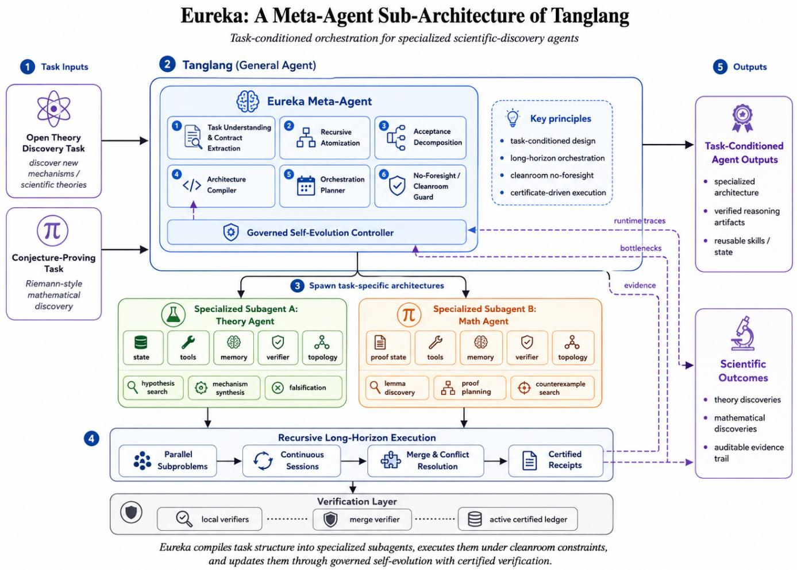

# Eureka: Task-Conditioned Meta-Agent Orchestration for Scientific Discovery

ManXis

Alizer Wong1,\*, Heng Cui1, Yi Tan2, Xiongchao Zhan3, Liang Lin4, Yuxiang Guo5, Zhaorong Dai6, Zixin Zeng7, Wenyuan Li8

1 ManXis; 2 School of Information Engineering, Guangdong University of Technology;

3 School of Automation, Guangdong University of Technology; 4 School of Artificial Intelligence, South China Normal University;

5 Shanghai Jiao Tong University; 6 Pratt School of Engineering, Duke University;

7 School of Computer Science and Technology, Guangdong University of Technology; 8 Hokkaido University.

Corresponding author: Alizer Wong (contact@manxis.org). Author contacts: cuiheng2025@gmail.com; tyyeahhhhh@outlook.com; zxc857297353@outlook.com; linliang5618@gmail.com; yuxiang127@sjtu.edu.cn; zhaorong.dai@duke.edu; zengzixin@mails.gdut.edu.cn; wenyuan@lmd.ist.hokudai.ac.jp. Homepage: https://manxis-website.netlify.app Code: https://github.com/manxis-contact/Eureka

Research Report

August 2026

## Abstract

Scientific discovery, open mathematical conjectures, and other long-horizon tasks under substantial uncertainty im pose requirements that are dificult to satisfy with a single fixed agent architecture. A fixed architecture must simultaneously perform task decomposition, state maintenance, verification, tool use, and long-term adaptation, which introduces architecture mismatch and orchestration overhead when task structures are heterogeneous. We present Eureka, a task-conditioned Meta-Agent architecture. Eureka compiles a long-horizon task into a dynamic obligation graph with explicit acceptance semantics and forms Macro-Agents with specialized state, memory, operators, tools, verifiers, and local topology during execution through receding-horizon planning, architecture promotion, and minimal suficient architecture compilation. When long-horizon execution exposes recurring bottlenecks, Eureka further applies cost-benefit-gated governed evolution to update the local architecture under explicit constraints. Theoretically, we establish a collection of formal results concerning fixed-architecture regret, planning invalidation, promo tion and evolution amortization, information-suficient subtree interfaces, concurrency serializability, and composi tional verification correctness. Experimentally, Eureka completes 170/170 recursive long-horizon tasks and produces 3,948 acceptance certificates, with no observed uncertified acceptance or false terminal state. Compiled active con text reduces the median model-input context from 9,490 to 4,005 tokens; incremental dependency processing avoids 65.38% of repeated computation across 12,000 dependency-update tasks; and all 16,000 concurrent executions are consistent with a valid serial execution. More importantly, the same Eureka Meta-Agent forms a Theory-Discovery Agent and a Math/Conjecture Agent under two distinct epistemic structures. The former yields structural results in quantum-process and spacetime theory, including full-rank conjunction interiorization, null-sector algebraic decoupling, a global acted-set normal form, behavioural-interface equivalence separation, and an operational intervention signature. The latter identifies operator-access and representation bottlenecks in research on the Riemann Hypothesis and advances a whole-vector positivity certificate candidate for Suzuki’s localized Weil quadratic form to $\hat { 0 } < a \le 6 9 / 2 0 0 = 0 . 3 4 5$ , reaching approximately 99.55% of the first-prime threshold (log 2)/2. These results indicate that the capability of a scientific agent depends not only on the underlying model but also on whether an appropriate agent architecture can be formed and maintained according to the cognitive structure of the task itself.

## Key Findings at a Glance

Eureka forms two structurally distinct specialized scientific agents from the same Meta-Agent architecture and produces verifiable progress in both open-conjecture mathematics and theoretical-structure discovery.

<table><tr><td>Scientific track</td><td>Specialized agent formed by Eureka</td><td>Main advances</td><td>Current evidence status</td></tr><tr><td>Riemann Hypothesis</td><td>Math/Conjecture Agent</td><td>operator-access obstruction; finite/local Chebyshev cone separation; finite-cluster interpolation; localized Weil positivity certificate candidate  $\lambda _ { a } > 0$  for</td><td>analytic derivation + 1,010-cell outward interval certificate candidate; not an RH proof</td></tr><tr><td>New Theoretical Structures</td><td>Theory-Discovery Agent</td><td> $0 < a \leq 6 9 \bar { / 2 0 0 }$  full-rank conjunction interiorization; algebraic null-sector decoupling; global acted-set normal form; behavioural-interface equivalence separation; operational intervention</td><td>exact/internal certificates and large-scale regression; some results still require external or formal review</td></tr></table>

The current quantitative endpoint on the Riemann-Hypothesis track is

$$
\lambda _ { a } > 0 , \qquad 0 < a \leq \frac { 6 9 } { 2 0 0 } = 0 . 3 4 5 ,
$$

which expands the range of the same localized-Weil certificate family relative to $a \ \leq \ 1 / 4$ by 1.38× and reaches approximately 99.55% of the first-prime structural threshold $( \log 2 ) / 2 \stackrel { . } { \approx } 0 . 3 4 6 5 7 3 5 9 0 2 8$ . The result is not equivalent to a proof of the Riemann Hypothesis and does not constitute a new record for the proportion of zeros on the critical line.

For theoretical discovery, the full-rank two-setting/two-outcome QSOST gluing candidate has explicit parameter $t = 1 / 2$ , parent minimum eigenvalue $1 / 8 ,$ single-setting domination cost 4, and joint dual lower bound $\hat { 6 5 } / 1 6 > 4$ Higher-level structural results further distinguish closed behavioural equivalence from black-box interface equivalence and use an operational intervention signature to fix primitive, query, and resource semantics.

At the system level, Eureka completes 170/170 recursive long-horizon tasks and produces 3,948 acceptance certificates. Governed Evolution achieves both the lowest median total cost, 2525.4, and the highest success rate, 60.55%, among four evaluated evolution policies. Compiled active context reduces the median model-input context from 9,490 to 4,005 while preserving the success rate. Across 12,000 incremental dependency tasks, Eureka avoids 65.38% of repeated computation. All 16,000 concurrent-execution tasks are consistent with a valid serial execution, with 0 unsafe commits.

## 1 Introduction

Large-scale pretrained language models have progressively evolved from task-specific systems for individual naturallanguage-processing problems into general computational substrates capable of performing multiple classes of cognitive tasks through a unified natural-language interface. Earlier pretraining-and-fine-tuning paradigms typically required task-specific data and parameter updates, whereas continued scaling of model size, data size, and training compute substantially changed this operating regime. Kaplan et al. (2020) observed stable power-law relationships between language-model loss and model scale, dataset scale, and training compute, indicating that scaling can yield predictable performance improvements over a broad computational range. Building on this development, Brown et al. (2020) showed that suficiently large language models can transfer to translation, question answering, text generation, and selected reasoning tasks using only natural-language task descriptions and a small number of in-context examples, without task-specific gradient updates. Subsequent work on instruction following further strengthened responses to open-ended natural-language instructions (Ouyang et al. 2022). The key consequence of these developments is not merely an increase in individual benchmark scores; the mechanism of task adaptation has gradually shifted from retraining a model for each task toward conditioning the behaviour of a general cognitive substrate through context and external control structures.

A unified task interface, however, does not imply that a complex problem can be reduced to a single conditional generation. As large language models have been applied to mathematical reasoning, program generation, complex information retrieval, interactive decision making, and scientific research, the limitations of a static input-output invocation have become increasingly apparent. Complex tasks usually contain multiple mutually dependent intermediate states, and correctness depends on the ability to establish, preserve, and revise those states rather than merely to generate locally plausible text. Wei et al. (2022) showed that explicitly generating intermediate reasoning steps can substantially improve performance on arithmetic, commonsense, and symbolic reasoning tasks, demonstrating that the organization of the computation trajectory is itself a significant determinant of model capability. The capability boundary of a large language model therefore extends beyond the amount of knowledge encoded in its parameters to the ability to construct an intermediate computational process appropriate for the current problem, providing the foundation for the subsequent agent paradigm.

Internal reasoning trajectories alone remain insuficient for the external information acquisition and environmental operations required by real-world tasks. Information needed by many problems is absent from the current context and may also be absent from the model parameters, while certain operations cannot be executed reliably through language generation alone, including real-time retrieval, exact computation, code execution, database access, and modification of external environment state. Schick et al. (2023) demonstrated that language models can learn when to call external APIs, which API to select, how to construct arguments, and how to exploit tool outputs. Yao et al. (2023) further placed reasoning and acting in a single closed loop, enabling a language model to generate an action from the current state, receive a new observation from the environment, and update subsequent reasoning and action plans accordingly. Systems of this form are no longer adequately described as isolated text-generation models; they are more naturally viewed as closed-loop cognitive and decision processes driven by language models.

This transition further motivated LLM-based agents. The essential distinction between an agent and a standalone language model is not the use of a particular prompt, but the fact that task-solving capability is jointly determined by model reasoning, external tools, environmental observations, persistent state, memory, feedback, and control flow. For example, Shinn et al. (2023) converted task outcomes into verbal reflections stored in episodic memory, allowing subsequent trials to use prior experience without changing the parameters of the base model. Recent generalist multi agent systems further demonstrate that orchestration structure outside the model is a first-order variable in complex task behaviour. Fourney et al. (2024) used a central Orchestrator for planning, progress tracking, and replanning after failure, while specialized agents provide browsing, file manipulation, and code execution. As language models are transformed from static generators into persistent task-execution entities, system performance can no longer be explained by base-model capability alone. The same underlying model can exhibit substantially diferent behaviour under diferent state representations, tool configurations, memory mechanisms, verification procedures, and control flows. Agent research consequently expands from model capability to the joint design of the model and its external cognitive architecture.

The importance of external cognitive architecture is amplified in long-horizon complex tasks. Software engineering, complex investigation, scientific research, and open mathematical problems commonly involve tens or hundreds of mutually dependent operations, and the definition of future steps may change continuously as intermediate results become available. Such tasks combine hierarchical objectives, partially unknown future steps, cross-stage state de pendencies, and varying degrees of parallelism. An intermediate result may determine not only whether a later node remains valid but also how the remainder of the task should be decomposed. A complete action sequence generated at the beginning of the task therefore cannot be assumed to remain valid after new information is acquired. At the opposite extreme, a purely iterative process that generates one action, obtains an observation, and recalls the model to select the next action incurs repeated context transmission, frequent replanning, and serial execution overhead. The central problem of long-horizon agents consequently shifts from predicting the correct next action to constructing and maintaining a task-computation structure that can evolve as new information arrives.

To address task-dependent complexity, Prasad, Koller, et al. (2023) introduced as-needed decomposition, recursively decomposing a subtask only when the current executor is unable to solve it and showing that decomposition depth should adapt jointly to task complexity and executor capability. In parallel, Kim et al. (2023) organized complex function calling as an explicit dependency graph, with a planner constructing task relationships, a task-fetching unit dispatching ready tasks whose dependencies have been satisfied, and independent tasks executing in parallel. These results indicate that long-horizon execution increasingly resembles a compiler and task-scheduling system: the lan guage model is principally responsible for semantic decomposition and reasoning that have not yet been determined, whereas dependency resolution, readiness checks, parallel scheduling, and state maintenance can be assigned to

deterministic runtime components.

Recursive decomposition into ever smaller nodes nevertheless does not by itself resolve persistent state and local autonomy. In many long-horizon tasks, a group of adjacent subtasks is not a collection of independent atomic calls but instead shares the same internal state, tool set, verification mechanism, and local decision policy for an extended period. A local problem may repeatedly access the same facts, invoke the same reasoning operators, and update shared state through a common verifier. Assigning every node to an isolated generic executor repeatedly incurs state reload, context reconstruction, and cross-executor coordination costs. Conversely, keeping all task state inside a single agent causes unbounded context growth and constrains parallel processing of independent work. Recent work has directly quantified the resulting coordination cost. G. Zhang, Yue, et al. (2025) represented LLM-based multi-agent collaboration as a spatiotemporal message-passing graph and substantially reduced token consumption by pruning redundant communication edges, demonstrating that unsuitable agent boundaries and communication topology translate directly into measurable inference cost. Task decomposition therefore raises a higher-order ques tion: which regions of the task graph should remain collections of independent operations, and which regions should be encapsulated as specialized agents with persistent state and local autonomy?

Research on multi-agent systems and automated agent design has begun to address this question. Y. Wang et al. (2024) dynamically decomposed complex tasks according to execution requirements and generated specialized subagents for individual subtasks, showing that agents can be dynamically instantiated computational objects rather than execution entities fixed before planning begins. Khattab et al. (2023) elevated complex language-model pipelines from manually concatenated prompt strings to compilable graphs of declarative modules and optimized those mod ules using a compiler. In a related direction, Zhuge et al. (2024) represented language agents as optimizable graphs of operation nodes and information-flow edges, optimizing both node-level prompts and graph connectivity. Jiayi Zhang et al. (2025) represented agentic workflows as a code-level search space and used Monte Carlo Tree Search, execution feedback, and tree-structured experience to iteratively modify the workflow. Hu, Lu, et al. (2024) went further by formulating agentic-system design itself as an automated search problem and using Meta Agent Search to generate new agent programs composed of prompts, tool use, control flow, and combinations of agentic building blocks. Collectively, these studies show that the cognitive architecture above the model can itself become an object of planning and optimization rather than a fixed peripheral implementation.

Dynamic task decomposition and automated agent design, however, do not become unified merely because each is individually feasible. Architecture-search methods typically assume a relatively well-defined evaluation task and search among complete candidate agents, whereas dynamic task planning primarily concerns how a given complex task should be decomposed and assigned. Recent work has begun to condition architectures more directly on the input. G. Zhang, Niu, et al. (2025) learned an agentic supernet containing multiple candidate structures and sam pled diferent multi-agent architectures and inference-resource allocations for individual queries. Yue, Zhang, et al. (2025) used cascaded controllers to determine collaboration mode, role allocation, and model routing, allowing several dimensions of a multi-agent system to vary with the input. For open, long-horizon tasks whose future definition changes with intermediate results, the more fundamental question concerns the coupling between dynamic orchestration and architecture formation: when should an agent architecture be created, which structural information in the task trajectory should determine the location of the new boundary, and under what conditions is continued generic execution preferable to synthesizing a new specialized agent? Diferent task regions can exhibit fundamentally dif ferent persistence, dependency density, verification semantics, parallelism, and future planning depth. Imposing a fixed state representation and control topology across such heterogeneous cognitive structures creates structural overhead that cannot necessarily be removed by increasing the scale of the base model.

Scientific discovery provides an especially stringent instance of this problem because scientific research is not a single task category with a uniform input-output structure. A complete research process may involve literature retrieval, problem formalization, hypothesis generation, theoretical derivation, counterexample search, experimental design, evidence integration, exclusion of prior explanations, and final validation, with substantially diferent dependency structures and evidence requirements across research questions. Recent systems have begun to demonstrate the po tential of agents for automated science. Gottweis et al. (2026) organized scientific hypothesis generation as a multi agent search process consisting of generation, reflection, ranking, and evolution, while integrating search and specialized tools to improve hypothesis quality and grounding. Yamada et al. (2025) organized hypotheses, experiments, and analysis using progressive agentic tree search while reducing dependence on manually authored code templates. Schmidgall et al. (2025) connected literature review, experimentation, and report writing in an end-to-end research workflow. In another direction, Novikov et al. (2025) represented candidate solutions as executable programs and combined automated evaluators with evolutionary search to discover new algorithms and verifiable mathematical or computational results. Together, these systems show that agents are moving beyond information summarization toward automated discovery systems that continually form, modify, and test candidate scientific structures.

The epistemic structures of scientific tasks nevertheless difer substantially. Open theoretical research typically cannot enumerate the complete candidate space in advance; the system must maintain competing explanations, unconfirmed assumptions, supporting and contradictory evidence, and experiments or theoretical criteria that distinguish alter native theories. Progress is not equivalent to executing more steps, but to shrinking the feasible explanation space, strengthening verifiable mechanisms, and eliminating alternatives. Rigorous mathematics has a diferent structure: propositions, lemmas, assumptions, and proof obligations form exact dependencies; intermediate results must be reused reliably; and a local error can invalidate an entire downstream proof chain. The AlphaProof/AlphaGeometry 2 line of work emphasizes formal feedback and machine-verifiable proof state in rigorous mathematical reasoning (Hubert et al. 2026). Ren et al. (2025) further used a recursive theorem-proving pipeline to decompose dificult theorems into subgoals and reorganize local proofs into long-horizon formal-reasoning trajectories, highlighting the distinctive decomposition-verification-composition structure required by mathematical agents. Even with the same underlying language model, hypothesis-evidence state for open theory discovery and fact-claim-proof state for rigor ous mathematics therefore obey fundamentally diferent organizational principles. Task variation changes not only prompt content but also which states must be maintained, which search operators are admissible, what information must persist, and what evidence sufices to certify an intermediate result.

These observations motivate a more fundamental question: can a fixed agent architecture eficiently cover longhorizon tasks with heterogeneous epistemic structures simply by changing the task instruction? Evidence from automated agent design already suggests that the strongest version of this assumption is untenable. Hu, Lu, et al. (2024) places prompt, tool use, control flow, and combinations of agentic building blocks in a common search space and shows that automatically generated architectures can outperform multiple manually designed systems. Prasad, Koller, et al. (2023) and Kim et al. (2023) further show that decomposition depth and execution dependency structure depend on task complexity and runtime state rather than being fully specified by fixed control rules. Theoretical discovery and rigorous mathematics provide a sharper example: the former benefits from maintaining competing branches and independent falsification, whereas the latter often benefits from continuity of proof state and exact dependency tracking. A single fixed topology must therefore pay avoidable coordination or representation costs on at least some such tasks unless one architecture happens to be simultaneously optimal across all relevant task structures.

We analyze this phenomenon from the perspective of joint task-architecture optimization and identify a structural architecture mismatch. Efective progress depends not only on the reasoning capability of the base model but also on whether the task state is represented in a suficient and compact form, whether subproblems are assigned appropri ate autonomy boundaries, whether operations receive suitable tools and verifiers, and whether strongly dependent reasoning trajectories are unnecessarily split across isolated sessions. Requirements can conflict across tasks. An archi tecture that increases search branching for open theory discovery may increase synchronization and state-replication cost in formal proof search; an architecture optimized for uninterrupted proof-state continuity may unnecessarily suppress parallel hypothesis exploration. This mismatch cannot in general be removed by simply increasing context length or model scale, because the resulting overhead may arise from repeated state transfer, unnecessary serial ization, missing verification semantics, or inappropriate communication boundaries rather than insuficient model capability.

A second dificulty arises even after architecture adaptation is allowed: in a real long-horizon task, information re quired to determine the appropriate local architecture may not exist at the beginning of execution. The next phase of an open research program can depend on whether a counterexample exists; subsequent decomposition of a proof can depend on whether a critical lemma holds; an experimental result can invalidate an entire downstream research branch. Fully expanding the task graph at the outset therefore requires the planner to predict unobserved intermediate outcomes. Incorrect predictions invalidate downstream obligations, tool plans, and potentially already-created agent state. The problem difers from uncertainty in a fixed planning state space because execution may redefine the decomposition itself.

We formalize this phenomenon as planning invalidation. If the correct form of a future subtask depends on upstream information that has not yet been observed, constructing the subtask early does not reduce the uncertainty of the actual scientific problem; instead, the system spends computation on one branch of several possible futures. When new observations invalidate that branch, the associated planning tokens, context organization, dependency construction, and architecture state become wasted computation. The probability of invalidation can accumulate with planning depth because more unobserved intermediate outcomes must be predicted correctly. Consequently, a more complete initial plan is not necessarily a more eficient long-horizon plan, particularly in scientific discovery where the task graph itself is revealed through execution.

These observations motivate a planning regime between two extremes: complete upfront planning and one-step-at-atime replanning. Eureka therefore organizes planning as a receding-horizon obligation process. The planner expands only the portion of the task graph that current information can determine reliably; unresolved future work remains represented as deferred obligations with explicit information boundaries. Once dependencies and acceptance conditions are known, ready tasks can execute immediately. Semantic planning is paused while the executor still possesses suficient ready work and is reactivated when the ready frontier is depleted, when the task state changes semantically, or when a structural dependency emerges. Planning is thereby governed by execution backpressure rather than by a fixed depth schedule.

Based on these considerations, we propose Eureka, a task-conditioned Meta-Agent architecture for open long-horizon tasks. Eureka dynamically compiles the task into a recursive obligation structure and generates, runs, and evolves task-specific specialized agents during execution. Rather than maintaining a predefined library of expert agents or immediately selecting a fixed template, Eureka first compiles goals, constraints, and acceptance semantics into a dynamic obligation graph. Receding-horizon planning expands only the local structure that can be determined from current information, while ready-frontier backpressure prevents persistent token expenditure on distant nodes that do not yet have execution value. As execution generates new state transitions, Eureka identifies architecture hotspots from persistent state sharing, dependency density, operator recurrence, verifier recurrence, and long-term planning demand, and performs architecture promotion only when local autonomy is expected to reduce long-term coordination and state-reconstruction cost.

Promoted regions receive more than a task-specific prompt. Eureka compiles them into Macro-Agents with taskspecific state representations, operators, memory, tool bindings, verifiers, and session topology. Internal complexity is encapsulated within the local subtree; the parent orchestrator observes only verified exported artifacts, explicit assumptions, unresolved debts, and reopen conditions through a typed subtree interface. As local execution continues, telemetry determines whether a recurring architectural bottleneck has a suficiently long remaining horizon to justify adaptation. Governed evolution then modifies the cognitive structure only when the expected benefit can amortize diagnosis, evaluation, and migration cost. Figure 1 provides an overview of the complete Eureka workflow, from task initialization and dynamic obligation orchestration to specialized-agent formation, governed evolution, long-horizon execution, and certificate-driven scientific outputs.

The central research question consequently contains two sequential and separately testable stages. The first concerns architecture discovery: can Eureka use structural information revealed by execution to determine where a specialized agent should form and compile an architecture matched to the local cognitive structure? The second concerns scientific discovery: can the specialized agents formed and governed by Eureka subsequently produce valuable new theories, mathematical results, or other verifiable scientific discoveries? This decomposition elevates scientific prob lem solving into a more general systems question. A general agent must not only execute a predefined cognitive workflow; it must also form the computational organization that the current scientific problem requires and then sustain knowledge discovery within that organization.

## 2 Related Work

## Dynamic Task Orchestration and Automated Agent Architecture Design

As LLM-based agents have expanded from single-round tool calls to long-horizon tasks composed of many mutually dependent operations, planning has evolved from selecting the next action into a joint problem of decomposition granularity, execution dependency, and computational-resource allocation. Kim et al. (2023) organized function calling as a compiled execution framework with a planner, task-fetching unit, and executor, allowing ready tasks to be dispatched as soon as their dependencies are satisfied and independent operations to execute in parallel. Y. Wang et al. (2024) combined dynamic task decomposition with agent generation and produced corresponding subagents according to execution-time task requirements. These results jointly show that orchestration eficiency depends not only on local reasoning quality but also on task-graph structure, decomposition granularity, and scheduling policy.

Dynamic decomposition further exposes the limitations of fixed-role multi-agent systems. Traditional frameworks commonly predefine planners, researchers, critics, and executors before execution begins. When the actual task state does not align with those boundaries, increasing the number of agents can amplify context replication and inter-agent communication. W. Chen et al. (2025) explored a more open organizational regime through heterogeneous-agent integration, dynamic teaming, and conversation-flow control. G. Zhang, Yue, et al. (2025) showed from the perspective of communication graphs that many message edges in existing multi-agent pipelines are removable, reinforcing that collaboration topology itself is a structural variable for token eficiency.

  
Figure 1: Overview of Eureka. The Meta-Agent compiles a task into a dynamic obligation graph, forms task-conditioned specialized agents when architecture hotspots emerge, governs local evolution, and coordinates recursive long-horizon execution under typed verification.

A parallel research direction directly treats agent architecture as an optimizable computational object. Zhuge et al. (2024) represents language agents as recursively composable graphs and optimizes both node-level prompts and graph connectivity. Hu, Lu, et al. (2024) formulates agent-system design as automated search and uses Meta Agent Search to generate prompts, tool-use patterns, and control flows in code space. Shang et al. (2024) abstracts agents into standardized modules for planning, reasoning, tool use, and memory, then searches for improved architectures by module recombination and evolution. Jiayi Zhang et al. (2025) represents workflows as code-level graphs and uses Monte Carlo Tree Search, execution feedback, and tree-structured experience to modify them. Agent scafolds are consequently evolving from manually fixed peripherals into searchable, recomposable structures.

Recent work additionally considers input- or query-conditioned architecture formation. G. Zhang, Niu, et al. (2025) learns an agentic supernet and samples diferent multi-agent architectures and inference-resource allocations for individual queries. Yue, Zhang, et al. (2025) unifies collaboration mode, role allocation, and LLM routing through cascaded controllers so that several structural dimensions of a multi-agent system can vary with the input. Yaolun Zhang, Liu, and Xiao (2025) automatically constructs finite-state-machine-controlled multi-agent systems from task descriptions and further optimizes the generated structure. These studies move automated agent design from crosstask search for a single static architecture toward task-conditioned system construction.

Eureka difers primarily in how task decomposition, architecture-boundary discovery, and task-conditioned agent synthesis are unified within the same online long-horizon execution trajectory. Eureka neither searches for one com plete specialized agent before execution nor creates a new independent executor for every newly generated subtask. The system recursively expands the obligation structure that current information can determine, then uses state sharing, dependency density, operator/verifier recurrence, and remaining horizon observed in the actual execution trace to determine whether a subtree has become an architecture hotspot. Agent synthesis is invoked as a higher-order planning action only when persistent local autonomy has positive amortized value, promoting the region into a Macro-Agent with specialized state, memory, operators, verifiers, and internal topology.

## Self-Improving and Self-Evolving Agent Systems

As agent performance increasingly depends on scafold structure, memory, tool interfaces, and control flow outside the language model, research has shifted from single-trajectory optimization in a fixed agent toward systems that modify their own computational structure using execution experience. Robeyns et al. (2025) allows a coding agent to edit its own implementation and selects changes using benchmark feedback. Jiaming Zhang et al. (2025) combines code-level self-modification with open-ended evolutionary search, maintaining an archive of self-modified agents from which additional architectural variants can be generated. These studies show that agent implementation can itself become a continuing source of capability improvement even when the base model is unchanged.

Recent work extends architecture evolution to complete harnesses and persistent execution trajectories. Lee et al. (2026) treats harness code governing what is stored, retrieved, and presented as an outer-loop search object and allows an agentic proposer to access source code, scores, and execution traces of prior candidates. Pan et al. (2026) re-executes dificult tasks from historical trajectories and uses self-validation, self-consistency, and pairwise selfpreference to produce harness updates. H. Zhang et al. (2026) uses a three-stage process of Weakness Mining, Harness Proposal, and Proposal Validation to convert observed failure modes into minimal, regression-tested harness modifications. These studies collectively move self-improving agents from local prompt refinement toward execution trace-driven harness optimization.

Most self-improving systems principally address how to generate better agent variants. In long-horizon tasks, however, whether an evolution event should be initiated at all, and which layer of the architecture should be modified, are equally important determinants of total eficiency. Persistent architecture search incurs diagnosis, candidate generation, evaluation, and state-migration cost. When the remaining horizon is short, even a mutation that improves future per-step performance may fail to amortize its optimization overhead. Eureka therefore models self-evolution as a Meta-Agent-governed planning action: an evolution budget is allocated only when a bottleneck is suficiently recurrent, the remaining horizon is suficiently long, and expected verifiable gains exceed the cost of adaptation.

Eureka further classifies telemetry-derived bottlenecks into runtime, prompt/operator, memory/skill, tool-interface, state/verifier, topology, and model-capability levels, and searches first for the lowest-level modification suficient to explain and resolve the observed failure. Local low-risk mutations can execute within a bounded EvolutionLease, whereas structural changes afecting state semantics, verifier contracts, or agent boundaries are escalated to the Meta-Agent. Candidate evaluation progresses from inexpensive static checks and micro-replays to more expensive shadow evaluation, so architecture evolution is governed by the same cost-benefit discipline as long-horizon execution rather than becoming an unconditional loop inside every subagent.

## Agentic AI for Scientific and Mathematical Discovery

Agentic AI is expanding from local research assistance, such as literature retrieval, code generation, and experimen tal analysis, toward complete scientific-discovery workflows. Gottweis et al. (2026) organizes scientific hypothesis research through generation, reflection, ranking, and evolution, using multi-agent search to generate, criticize, and refine hypotheses. Schmidgall et al. (2025) advances a research idea through literature review, experimentation, and report writing. Yamada et al. (2025) reduces the dependence of the first AI Scientist system on manually authored code templates and manages multiple experimental and research branches through progressive agentic tree search. Collectively, these systems demonstrate that scientific agents are becoming automated research systems spanning multiple successive stages rather than isolated research-assistance tools.

Diferent scientific tasks induce diferent cognitive architectures because their search spaces and verification mechanisms difer. Novikov et al. (2025) represents candidate objects as executable programs and constructs a highthroughput generate-evaluate loop through evolutionary search and automated evaluators. Wang and Luan (2026) explicitly argues that scientific workflows in diferent disciplines have diferent control-flow structures and supports multiple research paradigms through a lightweight DAG kernel, editable workflows, full-text literature indexing, and cross-run knowledge accumulation. These systems show that workflow state structure and verification semantics are central design variables in automated discovery rather than incidental implementation details.

Rigorous mathematical discovery further sharpens these structural diferences. The AlphaProof/AlphaGeometry 2 line of work uses formal environments to provide machine-checkable feedback, allowing proof search to be organized around exact verification (Hubert et al. 2026). Ren et al. (2025) recursively decomposes dificult theorems into subgoals and reorganizes local proofs into formal reasoning trajectories. Relative to open hypothesis search, math ematical agents therefore require more stringent fact/claim/proof dependencies, persistent proof state, and exact verification.

Long-term adaptation is also beginning to appear in AI Scientist systems. Lyu et al. (2026) uses Researcher, Engineer, and Evolution Manager agents and persistent ideation and experimentation memories to extract reusable strategies from successful and failed prior research trajectories. Such results show that scientific agents can improve research behaviour through experience accumulated across iterations, while the overall agent roles and research pipeline remain specified by the system design. Eureka addresses a higher-level problem: whether the system can determine from the emerging epistemic structure of execution where a specialized scientific agent should form, which state, op erators, verifiers, and local topology the agent should maintain, and how the resulting architecture should continue adapting during discovery.

The evaluation object of Eureka therefore difers in level from that of most existing AI-for-Science systems. Existing systems primarily test what hypotheses, experiments, algorithms, or proofs can be produced once a specialized sci entific agent architecture has been provided. Eureka jointly evaluates architecture discovery and scientific discovery: whether the Meta-Agent can form a suitable cognitive architecture from task requirements and runtime trajectories, and whether the specialized agent produced by that architecture can subsequently generate independently valuable and verifiable scientific results.

## 3 Theoretical Analysis: From Dynamic Task Information to Verifiable Recursive Orchestration

This section provides the formal derivations for the first four theoretical components of Eureka. To avoid converting engineering intuition into mathematical claims, we state results only under explicit, testable conditions; when a claim does not hold in full generality, we also characterize the failure mode and state a corrected result that is provable under reasonable assumptions. A unified notation is used throughout: random variables are denoted by uppercase Latin letters, individual obligations by lowercase �, agent architectures by calligraphic �, task instances by � , and the task distribution by �. Unless stated otherwise, all sets are equipped with their Borel �-algebras, and all random variables and policies are assumed measurable.

To eliminate ambiguity in the term eficiency, Sections 3.1-3.4 use expected total cost under a fixed reliability constraint as the sole optimization objective, rather than arbitrarily combining tokens, success rate, and verification strength into one scalar score. Verified progress per unit cost may be reported later as an auxiliary experimental metric, but it does not enter the main theorems in this section. The principal symbols are summarized below.

<table><tr><td>Symbol</td><td>Definition</td></tr><tr><td> $\Omega , { \mathcal { F } } , \mathbb { P }$ </td><td>underlying probability space for task stochasticity</td></tr><tr><td> $T$ </td><td>a task instance;  $\mu$  denotes the task distribution</td></tr><tr><td> $X _ { t }$ </td><td>latent task state at time  $t ,$  valued in a standard Borel space  $\mathcal { X }$ </td></tr><tr><td> $O _ { t }$ </td><td>observation available before action  $A _ { t } ,$  valued in  $\mathcal { O } _ { \mathrm { o b s } }$ </td></tr><tr><td> $A _ { t }$   $C _ { 0 }$ </td><td>orchestration/execution control action, valued in  $\mathcal { A } _ { \mathrm { c t r l } }$  initial Task Contract, Acceptance Contract, budget,</td></tr><tr><td></td><td>permissions, and corpus cutoff</td></tr><tr><td> $\mathcal { F } _ { t }$   $\tau$ </td><td>filtration of information legally available at time t root-task termination time, required to be a stopping</td></tr><tr><td> $\kappa _ { t } , K _ { \tau }$ </td><td>time</td></tr><tr><td> $S _ { \tau }$ </td><td>step cost and cumulative total cost indicator that the root Acceptance Contract is satisfied</td></tr><tr><td> $\alpha$ </td><td>admissible failure probability; strict proof tasks may set</td></tr><tr><td> $\mathcal { A }$ </td><td> $\alpha = 0$  agent architecture;  $\mathfrak { A }$  is the candidate architecture space</td></tr><tr><td> $\Pi ( { \mathcal { A } } )$ </td><td>admissible policies implementable by architecture A</td></tr><tr><td> $G _ { t } = ( V _ { t } , E _ { t } )$ </td><td>dynamic obligation graph at time t</td></tr><tr><td>0</td><td>a single obligation; its goal, dependencies, read/write sets, and acceptance condition are defined when</td></tr></table>

## 3.1 Dynamic Task Processes and Admissible Information

## 3.1.1 Probability Space, Task State, and Legally Available Information

We represent a discrete-time long-horizon task on the probability space $( \Omega , { \mathcal { F } } , \mathbb { P } )$ . The latent task state at time $t \in  { \mathbb { N } } _ { 0 }$ is $\boldsymbol { X } _ { t } \ \in \mathcal { X } ;$ the information observed before the �-th control action is $O _ { t } \in \mathcal { O } _ { \mathrm { o b s } } ;$ and the control action is $A _ { t } \in \mathcal { A } _ { \mathrm { c t r l } } .$ The initial Task Contract, resource budget, tool permissions, public-corpus cutof, and root Acceptance Contract are collected in $C _ { 0 }$ and treated as information determined at time zero. The filtration available before action $A _ { t }$ is defined by

$$
\boxed { \mathcal { F } _ { t } : = \sigma ( C _ { 0 } , O _ { 0 } , \ldots , O _ { t } , A _ { 0 } , \ldots , A _ { t - 1 } ) , \qquad t \in \mathbb { N } _ { 0 } . }\tag{1}
$$

The temporal ordering in (1) is substantive: $A _ { t }$ may depend on $O _ { t } ,$ but not on an as-yet-unobserved $O _ { t + 1 }$ or any posteriorly constructed discovery signal. Eureka’s orchestration policy is $\pi = ( \pi _ { t } ) _ { t \geq 0 } .$ , where $\pi _ { t } ( \cdot \mid \mathcal { F } _ { t } )$ is a stochastic kernel over $\mathcal { A } _ { \mathrm { c t r l } }$ . Every admissible action is therefore ${ \mathcal F } _ { v }$ -adapted. The task termination time is denoted by � and is required to be a stopping time with respect to $( \mathcal { F } _ { t } ) _ { t \geq 0 } ,$ so that the statement that the task has completed cannot depend on future information that has not yet been observed.

Execution cost is not collapsed to a token count. Instead, a nonnegative step cost $\kappa _ { t }$ is used; after a fixed normalization, $\kappa _ { t }$ may include token use, tool calls, concurrency coordination, replanning, and architecture migration. The cumulative cost is

$$
\boxed { K _ { \tau } : = \sum _ { t = 0 } ^ { \tau - 1 } \kappa _ { t } , \qquad \kappa _ { t } \geq 0 , \qquad \mathbb { E } [ K _ { \tau } ] < \infty . }\tag{2}
$$

Whether the root task satisfies its Acceptance Contract is represented by $S _ { \tau } \in \{ 0 , 1 \}$ , which is required to be $\mathbf { \mathcal { F } } _ { \tau } .$ measurable. Given an admissible failure probability $\alpha \in [ 0 , 1 )$ , we first fix a reliability requirement and then minimize cost rather than defining an arbitrarily weighted scalar progress score. For task $T ^ { \dagger }$ and architecture ${ \mathcal { A } } ,$ let $\Pi ( { \mathcal { A } } )$ denote all admissible policies implementable by that architecture. The optimal expected cost under the reliability constraint is

$$
\boxed { \mathcal { C } _ { \alpha } ( \mathcal { A } ; T ) : = \operatorname* { i n f } _ { \pi \in \Pi ( \mathcal { A } ) } \left\{ \mathbb { E } _ { T } ^ { \pi } [ K _ { \tau } ] : \mathbb { P } _ { T } ^ { \pi } ( S _ { \tau } = 1 ) \geq 1 - \alpha \right\} . }\tag{3}
$$

If the constraint set is empty, we define $\mathcal { C } _ { \alpha } ( \mathcal { A } ; T ) = + \infty$ . Equation (3) explicitly separates lower cost from sacrificing correctness: eficiency is comparable only among candidate architectures that satisfy the same Acceptance Contract. Formal proof tasks that require strict correctness may set $\alpha = 0$

## 3.1.2 Obligation DAGs and Agent Architectures

At any time, Eureka does not store the full task as a natural-language plan. Instead, it maintains a dynamic obligation graph $G _ { t } = ( V _ { t } , E _ { t } )$ . Each node $o \in V _ { t }$ carries five kinds of information: goal semantics ${ \mathit { g _ { o } } } ,$ known prerequisite dependencies $d _ { o } ,$ persistent-state read set ${ \boldsymbol { r } } _ { o } ,$ state write set $w _ { o } ,$ and Acceptance Contract $\nu _ { o } .$ . Edges in $\dot { E _ { t } } \subseteq \dot { V _ { t } } \times V _ { t }$ represent semantic or data dependencies that must be satisfied first. When the current graph is acyclic, the ready frontier is the set of unfinished obligations whose predecessors have all been accepted. If later evidence reveals a genuine dependency cycle, Section 3.4 specifies the corresponding boundary treatment.

A local agent architecture is denoted by $\mathcal { A } = ( \mathcal { S } , \mathcal { M } , \mathcal { U } , \mathcal { V } , \mathcal { T } , \mathcal { P } )$ , where $\mathcal { S }$ is the persistent state representation, ℳ the memory policy, $\mathcal { U }$ the callable operator family, � the verifier family, $\mathcal { T }$ the tool/interface set, and $\mathcal { \hat { P } }$ the session and execution topology. The definition deliberately excludes the simplification that an agent is equivalent to a prompt, because the architecture-regret results below require state, verification, and topology to vary independently.

## Assumption 1 (Auditable Acceptance)

For every obligation � marked DONE, the runtime must retain a replayable receipt from which the acceptance event under $\nu _ { o }$ can be reconstructed from persistent state. A natural-language conclusion without an acceptance receipt cannot be promoted to certified state.

## Assumption 2 (Finite Control Cost)

Every individual planning, tool-execution, agent-synthesis, verification, and architecture-migration action has finite conditional expected cost. In addition, among policies that satisfy the root Acceptance Contract, at least one policy must make (2) finite; otherwise the task is regarded as infeasible under the current system resources.

## Assumption 3 (Suficient Recording of Persistent State)

All durable information that can afect a future policy decision or Acceptance Contract must enter typed state or be losslessly recoverable from immutable receipt references. The assumption does not require the Meta-Agent to reread the complete history at every step; it requires only that omitted information can be recovered without loss when needed.

## Proposition 1 (Structural Renaming Invariance)

Suppose tasks $T$ and $T ^ { \prime }$ admit a graph isomorphism $\varphi : V _ { t } \to V _ { t } ^ { \prime }$ preserving dependency edges, Acceptance Contracts, state read/write relations, resource prices, and available operator/tool contracts, and that the two tasks difer only in entity names and natural-language surface form. If Eureka’s decomposition, promotion, and architecturesynthesis policies depend only on these structural quantities and on information in $\bar { \mathcal { F } } _ { t }$ associated with the corre sponding structural equivalence classes, then, under a fixed random seed, the two control trajectories are isomorphic after mapping by $\varphi .$

Proof. At $t = 0 ,$ , the structural states are isomorphic by assumption. Suppose the trajectories remain isomorphic through time �. The structured ControlCapsules received by the Meta-Agent are then identical after mapping by �. Because the policy does not read task names, the conditional action distributions agree. Deterministic runtime transitions preserve graph isomorphism, and random semantic actions produce corresponding outputs under a common fixed seed. The states at time $t + 1$ therefore remain isomorphic. Induction over time yields the result. □

The proposition is not an automatic property of arbitrary natural-language agents; it defines an architectureinvariance condition that can be tested directly through task anonymization and structural-consistency experiments.

## 3.2 Structural Regret Lower Bound for Fixed Agent Architectures

## 3.2.1 Formal Definition of Architecture Regret

Let � be the set of agent architectures under consideration. For a task $T$ at reliability threshold $1 - \alpha ,$ define the globally optimal cost and the architecture regret of a fixed architecture by

$$
\big | \mathcal { C } _ { \alpha } ^ { \star } ( T ) : = \operatorname* { i n f } _ { \mathcal { A } \in \mathfrak { A } } \mathcal { C } _ { \alpha } ( \mathcal { A } ; T ) , \qquad \mathcal { R } _ { \alpha } ( \mathcal { A } ; T ) : = \mathcal { C } _ { \alpha } ( \mathcal { A } ; T ) - \mathcal { C } _ { \alpha } ^ { \star } ( T ) . \big |\tag{4}
$$

Because (3) already constrains the success probability, ${ \mathcal R } _ { \alpha }$ measures additional cost due to architecture mismatch under the same reliability standard rather than misclassifying a cheaper but less reliable system as more eficient. For any $\varepsilon \geq 0 ,$ , define the �-near-optimal architecture set by $\tilde { \mathfrak { A } } _ { T } ( \breve { \varepsilon } ) = \{ \hat { \mathcal { A } } \in \mathfrak { A } : \mathcal { R } _ { \alpha } ( \mathcal { A } ; T ) \leq \bar { \varepsilon } \}$

Disjoint exact minimizer sets alone do not imply a uniform positive regret lower bound for fixed architectures. In a continuous architecture space, there may exist a sequence of architectures that simultaneously approaches the optimal value on both tasks arbitrarily closely without attaining either optimum. The main result below therefore uses disjoint near-optimal sets as the suficient and testable structural condition.

## Lemma 1 (Mutually Exclusive Near-Optimal Sets Imply Strict Loss on at Least One Task)

Let $T _ { 1 } , T _ { 2 }$ be two tasks and let $\varepsilon _ { 1 } , \varepsilon _ { 2 } > 0$ . Suppose

$$
\boxed { \mathfrak { A } _ { T _ { 1 } } ( \varepsilon _ { 1 } ) \cap \mathfrak { A } _ { T _ { 2 } } ( \varepsilon _ { 2 } ) = \varnothing . }\tag{5}
$$

Then, for every fixed architecture ${ \mathcal { A } } \in { \mathfrak { A } }$ , at least one index $i \in \{ 1 , 2 \}$ satisfies $\mathcal { R } _ { \alpha } ( \mathcal { A } ; T _ { i } ) > \varepsilon _ { i }$

Proof. If � $\not \in \mathfrak { A } _ { T _ { 1 } } ( \varepsilon _ { 1 } )$ , the definition of the near-optimal set gives $\mathcal { R } _ { \alpha } ( \mathcal { A } ; T _ { 1 } ) > \varepsilon _ { 1 } . \mathrm { ~ I f ~ } \mathcal { A } \in \mathfrak { A } _ { T _ { 1 } } ( \varepsilon _ { 1 } )$ , (5) implies $\mathcal { A } \not \in \mathfrak { A } _ { T _ { 2 } } ( \varepsilon _ { 2 } )$ , hence $\mathcal { R } _ { \alpha } ( \mathcal { A } ; T _ { 2 } ) > \varepsilon _ { 2 }$ . The two cases cover every �. □

## Theorem 1 (Fixed-Architecture Regret Lower Bound)

Let the task random variable � equal $T _ { 1 }$ with probability $p \in ( 0 , 1 )$ and $T _ { 2 }$ with probability 1 − �. If (5) holds, then every fixed architecture � satisfies

$$
\left| \mathbb { E } \big [ \mathcal { R } _ { \alpha } ( \mathcal { A } ; T ) \big ] = p \mathcal { R } _ { \alpha } ( \mathcal { A } ; T _ { 1 } ) + ( 1 - p ) \mathcal { R } _ { \alpha } ( \mathcal { A } ; T _ { 2 } ) \geq \operatorname* { m i n } \{ p \varepsilon _ { 1 } , ( 1 - p ) \varepsilon _ { 2 } \} > 0 . \right|\tag{6}
$$

Proof. By Lemma 1, every � falls into one of two cases. $\operatorname { I f } \mathcal { R } _ { \alpha } ( \mathcal { A } ; T _ { 1 } ) > \varepsilon _ { 1 }$ , nonnegativity of regret gives

$$
\mathbb { E } [ { \mathcal { R } } _ { \alpha } ( { \mathcal { A } } ; T ) ] \geq p \varepsilon _ { 1 } .
$$

If the first case does not hold, Lemma 1 guarantees $\mathcal { R } _ { \alpha } ( \mathcal { A } ; T _ { 2 } ) > \varepsilon _ { 2 }$ , so

$$
\begin{array} { r } { \mathbb { E } [ \mathcal { R } _ { \alpha } ( \mathcal { A } ; T ) ] \geq ( 1 - p ) \varepsilon _ { 2 } . } \end{array}
$$

Taking a common lower bound over the two cases yields (6). □

Theorem 1 does not state unconditionally that every task requires a distinct agent. It establishes a precise distinction: only when the near-optimal architecture regions of diferent tasks are structurally separated must every fixed architecture incur a strictly positive average excess cost. Empirical work treating agent scafolds as optimization vari ables, including GPTSwarm (Zhuge et al. 2024), ADAS (Hu, Lu, et al. 2024), and AgentSquare (Shang et al. 2024), motivates this structural perspective; Equation (6), however, is derived independently under the objective in (3).

## Corollary 1 (Task-Conditioned Architectures Can Remove the Lower Bound When Structure Is Identifiable)

Assume further that an $\mathcal { F } _ { 0 }$ -measurable structural variable � is observed before architecture selection and that $Z = z _ { i }$ identifies $T = T _ { i }$ without error. If, for each task, there exists $\mathcal { A } _ { i } \in \mathfrak { A } _ { T _ { i } } ( \delta _ { i } )$ with $\delta _ { i } \geq 0 .$ , then the structure-conditioned policy $g ( Z ) = \mathcal { A } _ { i }$ satisfies

$$
\begin{array} { r } { \biggr \vert \mathbb { E } \bigl [ \mathcal { R } _ { \alpha } ( g ( Z ) ; T ) \bigr ] \leq p \delta _ { 1 } + ( 1 - p ) \delta _ { 2 } . } \end{array}\tag{7}
$$

If the optimal values are attained for both tasks and $\delta _ { 1 } = \delta _ { 2 } = 0 , ( 7 )$ reduces to zero architecture regret. The corollary explains why Eureka generates architectures from task structure; it does not imply that an arbitrary task-conditioned selector is necessarily optimal.

## Proposition 2 (Boundary Case in Which a Fixed Architecture Is Suficient)

If an architecture $\mathcal { A } _ { 0 } \in \mathfrak { A }$ satisfies $\mathcal { C } _ { \alpha } ( \mathcal { A } _ { 0 } ; T ) = \mathcal { C } _ { \alpha } ^ { \star } ( T )$ for every task $T$ in the support of the task distribution, then the expected architecture regret of $\mathcal { A } _ { 0 }$ is zero. Consequently, on a task family admitting a universal optimal architecture, the mutually exclusive near-optimal-set condition of Theorem 1 must fail, and Eureka should not force promotion merely because task names difer.

## Proposition 3 (Scaling the Base Model Does Not Automatically Eliminate Independent Architecture Overhead)

Let $m \in \mathcal { M }$ denote a backbone-model configuration and suppose the reliability-constrained cost decomposes as

$$
\begin{array} { r } { \boxed { \mathcal { C } _ { \alpha } ( \mathcal { A } ; T , m ) = B _ { \alpha } ( T , m ) + H _ { \alpha } ( \mathcal { A } , T ) , } } \end{array}\tag{8}
$$

where $B _ { \alpha }$ is semantic-computation cost determined only by the task and base model, and $H _ { \alpha }$ is architecture-specific overhead from state replication, coordination, missing verification, or execution topology and is invariant to �. If the near-optimal sets induced by $H _ { \alpha }$ for two tasks satisfy (5), then the lower bound of Theorem 1 holds for every $m \in \mathcal { M }$

Proof. For fixed $T , B _ { \alpha } ( T , m )$ does not depend on the architecture and therefore cancels from $\mathcal { C } _ { \alpha } ( \mathcal { A } ; T , m ) \ -$ in $\underline { { { \sf f } } } _ { \mathcal { A } ^ { \prime } } \mathcal { C } _ { \alpha } ( \mathcal { A } ^ { \prime } ; T , m )$ . Architecture regret is consequently determined entirely by diferences in $H _ { \alpha } ,$ so Lemma 1 and Theorem 1 apply unchanged. □

Equation (8) is an explicit separability assumption rather than a general fact. If a stronger model reduces staterecovery cost or changes which verifiers are available, $H _ { \alpha }$ may itself depend on �; Proposition 3 then no longer applies and the dependence $H _ { \alpha } ( \mathcal { A } , T , m )$ must be measured directly.

## 3.3 Endogenous Task Revelation and Planning Invalidation

## 3.3.1 Marginal Value of Early Planning

Future obligations in long-horizon tasks often depend on upstream observations that have not yet been resolved. To characterize whether early planning is worthwhile, fix time $t ,$ condition on $\mathcal { F } _ { t } ,$ and consider one candidate future planning unit �. Let $Z _ { j } \in \{ 0 , 1 \}$ indicate whether the unit constructed now remains valid after the upstream infor mation determining its semantics is revealed, and define $p _ { j } : = \mathbb { P } ( Z _ { j } = 1 \mid \mathcal { F } _ { t } )$ . Constructing the unit early incurs a conditionally determined cost $c _ { j } ^ { \mathrm { E } } > 0$ . If planning is deferred until the upstream information is revealed and the unit is constructed only when $Z _ { j } = 1$ , the cost is $c _ { j } ^ { \mathrm { D } } \geq 0$ . If valid early planning reduces subsequent latency, context reload, or coordination, let the corresponding saving in the same cost units be $b _ { j } \geq 0$ . The main result first adopts the conservative assumptions that an invalid early plan has no reusable residual value and that early planning does not change the environment state or the distribution of $Z _ { j }$

Under these conditions, the conditional expected net value of early planning relative to deferring until the required information arrives is exactly

$$
\begin{array} { r } { \Big | \Delta _ { j } : = \mathbb { E } \big [ C _ { j } ^ { \mathrm { d e f e r } } - C _ { j } ^ { \mathrm { e a r l y } } \mid \mathcal { F } _ { t } \big ] = p _ { j } \big ( c _ { j } ^ { \mathrm { D } } + b _ { j } \big ) - c _ { j } ^ { \mathrm { E } } . \Big | } \end{array}\tag{9}
$$

There is no hidden term in (9). The defer policy pays $c _ { j } ^ { \mathrm { D } }$ only when $Z _ { j } = 1$ , so its expected planning cost is $p _ { j } c _ { j } ^ { \mathrm { D } }$ The early policy always pays $c _ { j } ^ { \mathrm { E } } ,$ , but gains the downstream saving $b _ { j }$ when $Z _ { j } = 1$ . Their diference is therefore (9). The resulting single-node criterion is not the informal rule that more distant work should never be planned; it is an explicit trade-of among conditional survival probability, early planning cost, and the parallelism or latency benefit that early planning can provide.

## Lemma 2 (Optimal Early-Planning Decision for a Single Planning Unit)

Under the assumptions of (9), if planning unit � is separable from other future units in both state and cost, then early planning weakly dominates deferred planning if and only if

$$
\boxed { \Delta _ { j } \ge 0 \iff p _ { j } \ge \frac { c _ { j } ^ { \mathrm { E } } } { c _ { j } ^ { \mathrm { D } } + b _ { j } } . }\tag{10}
$$

The ratio on the right is used only when $c _ { j } ^ { \mathrm { D } } + b _ { j } > 0$ . If the denominator is zero, $c _ { j } ^ { \mathrm { E } } > 0$ makes early planning strictly worse.

Proof. Every downstream cost common to the two decisions cancels, so minimizing conditional expected cost is equivalent to maximizing (9). The early policy is therefore optimal exactly when $\Delta _ { j } \geq 0$ . Rearranging (9) gives (10). □

## Theorem 2 (Optimal Receding Horizon Under Monotone Marginal Value)

At time $t ,$ consider finite planning units $j = 1 , \dots , H$ , ordered by forecast depth. Assume:

1. conditioned on $\mathcal { F } _ { t } ,$ early/deferred choices are additive in expected cost, so early planning of one unit does not alter $p _ { j } , c _ { j } ^ { \mathrm { E } } , c _ { j } ^ { \mathrm { D } } , b _ { j }$ for another unit;

2. the marginal value of early planning for each unit is given by (9); and

3. the sequence $\Delta _ { 1 } , \ldots , \Delta _ { H }$ is nonincreasing with forecast depth.

Define

$$
\left| h _ { t } ^ { \star } : = \operatorname* { m a x } ( \{ 0 \} \cup \{ h \in \{ 1 , \dots , H \} : \Delta _ { h } \geq 0 \} ) . \right|\tag{11}
$$

Among all policies choosing early or deferred construction independently for each planning unit, the conditional expected cost is minimized by constructing units at depths $1 , \ldots , h _ { t } ^ { \star }$ early and retaining all units deeper than $h _ { t } ^ { \star }$ as deferred obligations. Under assumptions 1-3, the optimal early-planning set is therefore a prefix and $h _ { t } ^ { \star } + 1$ is an information boundary in the strict sense.

Proof. By assumption 1, the expected cost change of any choice vector $e = ( e _ { 1 } , \ldots , e _ { H } ) \in \{ 0 , 1 \} ^ { H }$ , relative to deferring every unit, decomposes as

$$
\left| \mathbb { E } [ C ( e ) - C ( 0 ) \mid \mathcal { F } _ { t } ] = - \sum _ { j = 1 } ^ { H } e _ { j } \Delta _ { j } . \right|\tag{12}
$$

Each $e _ { j }$ can therefore be optimized independently: choose $e _ { j } = 1 { \mathrm { i f } } \Delta _ { j } > 0$ , choose $e _ { j } = 0 { \mathrm { i f } } \Delta _ { j } < 0$ , and either value when $\Delta _ { i } = 0$ . Assumption 3 implies that all nonnegative $\Delta _ { j }$ form a contiguous prefix beginning at depth 1, yielding (11). □

Theorem 2 does not claim that one scalar horizon is optimal for every long-horizon planning system. Strong coupling among future nodes or nonmonotone $\Delta _ { j }$ can destroy the prefix structure. Eureka must then fall back to per-obligation marginal-value decisions rather than enforcing one planning depth. The general receding-horizon principle is closely related to model predictive control, where a finite-horizon problem is repeatedly solved from the current state and only the currently actionable portion is executed (Mayne et al. 2000). In LLM agents, ADaPT provides empirical support for as-needed recursive decomposition (Prasad, Koller, et al. 2023), while LLMCompiler shows that ready tasks with resolved dependencies can execute in parallel before the full future plan is known (Kim et al. 2023).

## Corollary 2 (Survival-Probability Threshold Under Equal Costs)

Suppose $c _ { j } ^ { \mathrm { E } } = c _ { j } ^ { \mathrm { D } } = c > 0$ at every depth and the benefit of valid early planning is a constant $b \geq 0$ . Then the necessary and suficient condition for planning unit � early becomes

$$
\left| p _ { j } \ge \frac { c } { c + b } , \qquad h _ { t } ^ { \star } = \operatorname* { m a x } \left\{ j : p _ { j } \ge \frac { c } { c + b } \right\} , \right|\tag{13}
$$

provided $p _ { j }$ is nonincreasing with depth. Equation (13) makes the trade-of explicit. When early planning yields almost no parallelism or latency benefit, $b \  \ 0 ,$ , only future units that are almost certain to remain valid should be expanded early. When early planning hides substantial downstream latency, the required survival probability decreases accordingly.

## Proposition 4 (Modified Threshold with Reusable Residual Value)

Suppose an invalid early plan still yields reusable value $s _ { j } \in [ 0 , c _ { j } ^ { \mathrm { E } } ]$ , independent of other planning units. Equation (9) becomes

$$
\begin{array} { r } { \boxed { \Delta _ { j } ^ { ( s ) } = p _ { j } ( c _ { j } ^ { \mathrm { D } } + b _ { j } ) + ( 1 - p _ { j } ) s _ { j } - c _ { j } ^ { \mathrm { E } } . } } \end{array}\tag{14}
$$

When $c _ { j } ^ { \mathrm { D } } + b _ { j } > s _ { j } ,$ early planning is optimal if and only if

$$
\boxed { p _ { j } \ge \frac { c _ { j } ^ { \mathrm { E } } - s _ { j } } { c _ { j } ^ { \mathrm { D } } + b _ { j } - s _ { j } } . }\tag{15}
$$

Reusable abstract planning skeletons can therefore legitimately extend the region in which early planning is useful.   
Eureka should not treat every post-observation invalidation as 100% wasted work.

## Proposition 5 (Threshold Structure of Ready-Frontier Backpressure)

Let $q \in  { \mathbb { N } } _ { 0 }$ be the current number of ready obligations, let one planner batch cost $c _ { \mathrm { P } } > 0 .$ , and suppose that the batch creates an average of $m \geq 1$ additional ready obligations. Let $L ( q )$ denote the conditional expected loss from executor starvation during the next control period, and assume that � is nonincreasing and convex. Define the starvation loss avoided by one planner batch as $\begin{array} { r } { \dot { B } ( q ) : = L ( q ) - L ( q + m ) } \end{array}$ . Convexity makes $B ( q )$ nonincreasing in $q .$ If a planner batch does not change any other cost, the optimal planning decision has a threshold form: there exists $q ^ { \star } \in \hat { \mathbb { N } } _ { 0 } \cup \{ - 1 , \infty \}$ such that

$$
\begin{array} { r } { \left| q \leq q ^ { \star } \implies B ( q ) \geq c _ { \mathrm { P } } \implies \mathrm { a c t i v a t e ~ p l a n n e r } , \qquad q > q ^ { \star } \implies \mathrm { p l a n n e r ~ s l e e p s } . \right. } \end{array}\tag{16}
$$

Proof. For convex $L ,$ the discrete increment $L ( q ) - L ( q + m )$ is nonincreasing in $q .$ Hence $\{ q : B ( q ) \geq c _ { \mathrm { P } } \}$ is either empty or an interval beginning at zero, and its largest element defines $q ^ { \star }$ . □

## Proposition 6 (State Equivalence and Communication Complexity of PlanDelta)

Let $G _ { t }$ encode the persistent state of the complete obligation graph. Suppose a planner wake-up changes only $m _ { t }$ graph records, while the full graph contains $n _ { t }$ records. If the runtime patch operator ⊕ is deterministic and $\Delta _ { t }$ contains every insertion, deletion, and state update, then

$$
\bigg | G _ { t + 1 } = G _ { t } \oplus \Delta _ { t } \equiv \widetilde G _ { t + 1 } , \qquad \mathrm { s i z e } ( \Delta _ { t } ) = \Theta ( m _ { t } ) , \qquad \mathrm { s i z e } ( \widetilde G _ { t + 1 } ) = \Theta ( n _ { t } ) , \bigg |\tag{17}
$$

where $\widetilde { G } _ { t + 1 }$ denotes the state obtained if the planner emits the entire new graph. Whenever $m _ { t } = o ( n _ { t } )$ , transmitting the delta has strictly smaller asymptotic communication complexity than rewriting the full plan. The proposition concerns only state encoding and does not change the scientific action policy.

## 3.4 Verifiable Recursive Atomization

## 3.4.1 Obligation Semantics, Certificates, and Local Decomposition

To prove that recursive decomposition does not mistakenly equate the completion of many subtasks with completion of the root task, we explicitly distinguish the input instance, candidate artifact, certificate, and true semantics of every obligation �. Let $\bar { \boldsymbol { { \mathcal { I } } } } _ { o }$ be the input space, $\mathcal { Y } _ { o }$ the candidate-artifact space, and $\mathcal { C } _ { o }$ the certificate space. Semantic correctness is represented by $\Phi _ { o } : \mathcal { I } _ { o } ^ { \mathrm { ^ { \bot } } } \times \mathcal { Y } _ { o } ^ { \cdot }  \{ 0 , 1 \}$ , and the machine-executable verifier is $V _ { o } : \mathcal { I } _ { o } \times \mathcal { Y } _ { o } \times \mathcal { C } _ { o } \to \{ 0 , 1 \}$

Verifier soundness means that for every $( i , y , c ) , V _ { o } ( i , y , c ) = 1$ implies $\Phi _ { o } ( i , y ) = 1$ . Completeness is not required: a semantically correct artifact for which no acceptable certificate has yet been found may remain INCONCLUSIVE.

When a parent obligation � is decomposed into a finite collection of child obligations $o _ { 1 } , \ldots , o _ { m } ,$ the children may have a directed acyclic dependency structure. Fix a topological order compatible with the local dependency graph. The instance for child � is produced by a measurable input constructor $\psi _ { j }$ from parent input � and artifacts of predecessor children. After every child is accepted, the parent artifact is produced by a composition operator $\Gamma _ { o } ,$ while a merge verifier $M _ { o }$ checks cross-child consistency, interface constraints, and the additional conditions required for semantic composition.

## Assumption 4 (Leaf-Verifier Soundness)

Every verifier for an atomic leaf obligation is sound: acceptance cannot promote a semantically incorrect artifact to certified state.

## Assumption 5 (Soundness of Local Composition Rules)

For every parent obligation � and every legal decomposition, if the semantic predicates of all child obligations hold and the merge verifier accepts, then the artifact generated by the composition operator must satisfy the semantics of the parent. Formally, for every legal �, every topologically compatible collection $y _ { 1 } , \ldots , y _ { m } .$ , and every merge certificate $c _ { M } ,$

$$
\Bigg | \left[ \bigwedge _ { j = 1 } ^ { m } \Phi _ { o _ { j } } \big ( \psi _ { j } ( i , y _ { \mathrm { p r e d } ( j ) } ) , y _ { j } \big ) \right] \wedge [ M _ { o } ( i , y _ { 1 : m } , c _ { M } ) = 1 ] \implies \Phi _ { o } ( i , \Gamma _ { o } ( i , y _ { 1 : m } ) ) = 1 . \Bigg |\tag{18}
$$

Equation (18) is the central condition for recursive atomization and also one of the easiest conditions to omit in an engineering implementation. Completion of every child is insuficient to establish completion of the parent. Crosschild consistency, interface compatibility, shared assumptions, and merge semantics must be covered explicitly by $M _ { o }$ or by an equivalent verifiable composition rule.

## Lemma 3 (One-Level Semantic Composition)

Under Assumption 5, suppose every direct child artifact $y _ { 1 } , \dots , y _ { m }$ of a parent obligation � satisfies its semantic predicate and there exists a merge certificate $c _ { M }$ such that $M _ { o } ( i , y _ { 1 : m } , c _ { M } ) = 1$ . Then the composite artifact $y =$ $\mathrm { ~ \ i ~ } _ { o } ( i , y _ { 1 : m } )$ satisfies $\Phi _ { o } ( i , y ) = 1$

Proof. The statement is exactly Equation (18) instantiated at the current $i , y _ { 1 : m } , c _ { M }$ . Child semantics may be estab lished either by atomic verifiers or by deeper recursive composition, so Lemma 3 does not require every internal node to be separately re-proved by an additional child verifier. □

## Theorem 3 (Recursive Decomposition Soundness)

Suppose the root obligation ${ \cal O } _ { \mathrm { r o o t } }$ is recursively decomposed a finite number of times into a finite DAG $G = ( V , E )$ Every non-leaf node satisfies Assumption $5 ;$ every leaf verifier satisfies Assumption 4 and has accepted its artifact; and every internal merge verifier has accepted. Then the root artifact obtained by applying the composition operators bottom-up satisfies

$$
\boxed { \Phi _ { o _ { \mathrm { r o o t } } } \left( i _ { \mathrm { r o o t } } , y _ { \mathrm { r o o t } } \right) = 1 . }\tag{19}
$$

Proof. Because $G$ is a finite DAG, it admits a topological order and a finite rank function $r : V \to \mathbb { N } _ { 0 } { : }$ leaves have rank zero, and every internal node has rank equal to one plus the maximum rank of its direct children. We induct on the rank.

Base case: if $r ( o ) = 0 ,$ , then � is a leaf. Assumption 4 and verifier acceptance imply $\Phi _ { o } = 1$

Inductive step: assume the semantics hold for all nodes with rank at most �. Let � have rank $k + 1$ . Every direct child of � has rank at most $k ,$ so the induction hypothesis establishes all child semantics. The merge verifier for � has accepted, hence Lemma 3 gives $\Phi _ { o } = 1$ . Finite induction yields the root result (19). □

Theorem 3 establishes semantic soundness of decomposition; it does not guarantee that any particular verifier is suficiently complete. A genuinely correct leaf that cannot be certified may therefore keep the root task unresolved,

but cannot be accepted incorrectly. For mathematical proof and scientific discovery, allowing incompleteness while forbidding unsound acceptance is safer than forcing every unresolved state into a binary decision.

## Corollary 3 (Acceptance Contracts and Execution Recursion Can Share One DAG)

If every node stores its local $\Phi _ { o } / V _ { o }$ semantics and every decomposition stores a merge rule satisfying (18), a separate verifier tree of the same scale as the work DAG is unnecessary. Parent acceptance can be composed bottom-up along the same obligation DAG. Independent verifier sessions can still audit the root, architecture-promotion boundaries, cross-contract merges, or final acceptance, but such a second tree is not a data-structure requirement of Theorem 3.

## Proposition 7 (Suficient Condition for Termination of Recursive Atomization)

Suppose there exists a complexity-rank function $\rho : V \to \mathbb { N } _ { 0 }$ such that every DECOMPOSE(o) creates finitely many children and every child $o ^ { \prime }$ satisfies $\rho ( o ^ { \prime } ) < \rho ( o )$ . Then recursive atomization from any finite-rank root terminates at finite depth and produces a finite decomposition tree.

Proof. Along any root-to-leaf path, $\rho$ forms a strictly decreasing sequence of nonnegative integers, so the path length is at most $\rho ( \stackrel { \cdot \mathrm { ~ } } { o } _ { \mathrm { r o o t } } ) + 1$ . Finite branching together with finite depth implies a finite total number of nodes. □

The proposition is suficient rather than necessary. A practical system may use a more general well-founded order. Without any strictly decreasing structural quantity, however, the instruction to continue decomposing until an atom is reached does not itself guarantee termination; an additional budget boundary or semantic stopping rule is then required.

## Proposition 8 (Boundary Treatment for Cyclic Dependencies)

If the current obligation graph $G = ( V , E )$ contains a directed cycle, the DAG induction in Theorem 3 cannot be applied directly. Let ${ \mathsf { S C C } } ( { \bar { G } } )$ be the partition into strongly connected components and contract every SCC into one macro-obligation to obtain the condensation graph $G ^ { \dagger }$ . The condensation graph of any finite directed graph is a ${ \mathrm { D A G } } ,$ so Theorem 3 applies to $G ^ { \dagger }$ provided every nontrivial SCC has an independent sound acceptance rule. If an SCC contains only mutually circular unverified claims and no additional fixed-point semantics, invariant, or joint verifier, local mutual support within the cycle is insuficient to mark the SCC as accepted.

## Proposition 9 (Decomposition Is Not Always Beneficial)

Suppose an obligation � can be completed directly by a continuous session with expected cost $C _ { \mathrm { d i r } }$ . A sound decomposition incurs child-execution cost $\bar { C } _ { \mathrm { s u b } } ,$ context-switching cost $C _ { \mathrm { c t x } } ,$ coordination cost $C _ { \mathrm { c o o r d } } ,$ and merge/verification cost $C _ { \mathrm { m e r g e } } .$ . If

$$
\boxed { C _ { \mathrm { s u b } } + C _ { \mathrm { c t x } } + C _ { \mathrm { c o o r d } } + C _ { \mathrm { m e r g e } } \geq C _ { \mathrm { d i r } } , }\tag{20}
$$

and decomposition does not improve the success-probability constraint or verifier strength, then the decomposition is no better than direct execution under the objective in (3). Eureka’s recursive atomization must therefore retain a DIRECT branch. The paper does not assume that complex tasks should be decomposed as finely as possible, and Theorem 3 does not imply such a rule.

<table><tr><td>Symbol</td><td>Definition</td></tr><tr><td> $\tau _ { S }$ </td><td>local stopping time at which subtree  $S$  is completed  $\mathrm { \bf { o r } }$  closed</td></tr><tr><td> $N _ { S }$ </td><td>number of future local service events generated by  $S$  from the current time until  $\tau _ { S }$ </td></tr><tr><td> $F _ { S }$ </td><td>one-time synthesis, state-migration, and interface-installation cost of promoting S to a</td></tr><tr><td> $G _ { k } , M _ { k }$ </td><td>Macro-Agent incremental cost of the k-th local service under generic execution and Macro-Agent execution, respectively</td></tr><tr><td> $\delta _ { S } , \bar { \delta } _ { S }$ </td><td>conservative lower and upper bounds on per-service cost savings</td></tr><tr><td> $\mathcal { R } _ { S }$ </td><td>architecture requirements needed for subtree  $S$  to satisfy its Acceptance Contracts</td></tr><tr><td> $\mathcal { B } = \{ \chi _ { 1 } , \dots , \chi _ { n } \}$ </td><td>finite set of installable architecture components</td></tr><tr><td> $\omega _ { j }$   $B _ { i j }$ </td><td>nonnegative installation/residency cost of component  $\chi _ { j }$  binary indicator that component  $\chi _ { j }$  covers requirement</td></tr><tr><td> $P _ { j k }$ </td><td> $\varrho _ { i }$  binary indicator that  $\chi _ { j }$  requires  $\chi _ { k }$  as a prerequisite</td></tr><tr><td> $Q _ { j k }$ </td><td>binary indicator that  $\chi _ { j }$  and  $\chi _ { k }$  are mutually incompatible</td></tr><tr><td> $H _ { S }$ </td><td>complete auditable internal history after Macro-Agent subtree execution</td></tr><tr><td> $Z _ { S }$ </td><td>Subtree  $\mathrm { A B I }$  compressed from  $H _ { S }$  and exposed to the parent</td></tr><tr><td> $\psi _ { S }$ </td><td>measurable map from the complete history to the Subtree ABI</td></tr><tr><td> $Y _ { k }$   $\Sigma$ </td><td>k-th parent control state after subtree return global durable key-value state maintained by the</td></tr><tr><td></td><td>runtime</td></tr><tr><td> $\mathcal { K }$ </td><td>key set of the durable state</td></tr><tr><td> $R _ { i } , W _ { i }$ </td><td>finite read and write sets of lease  $L _ { i }$ </td></tr><tr><td> $\xi _ { i }$ </td><td>local random seed or random variable for lease  $L _ { i }$ </td></tr></table>

These quantities describe only currently observable task structure and runtime state. Task names, historical discovery descriptions, and sealed evaluator content do not enter the promotion, architecture-synthesis, or parallelism criteria in the following sections.

## 3.5 Architecture Hotspots and Macro-Agent Promotion

## 3.5.1 Cost Semantics of Local Promotion

Fix time � and consider a local subgraph $S \subseteq V _ { t }$ of the current obligation graph. Eureka has two admissible continuation classes. The first retains the current generic-execution regime and is denoted by $\Pi _ { S } ^ { \mathrm { G } }$ . The second first pays a one-time promotion cost, encapsulates $S$ as a Macro-Agent with specialized state, memory, operators, verifiers, and local topology, and then executes the remaining work; this class is denoted by $\Pi _ { S } ^ { \mathrm { M } }$ . To make the eficiency of the two classes comparable, both continuations are required to satisfy the same local Acceptance Contract and the same upper bound $\alpha _ { S }$ on failure probability.

Let $N _ { S } \in \mathbb { N } _ { 0 }$ be the number of future local service events from time � until � completes, and assume $\mathbb { E } [ N _ { S } \mid \mathcal { F } _ { t } ] < \infty$ Denote the incremental costs of the �-th service under generic and Macro-Agent execution by $G _ { k }$ and $M _ { k } ,$ respectively; if the �-th service never occurs, the corresponding cost is extended by zero. The one-time promotion cost $F _ { S }$ is ${ \mathcal F } _ { v }$ -measurable and includes the unavoidable fixed cost of architecture synthesis, durable-state migration, tool/interface binding, and parent-child interface installation.

Rather than treating high state sharing or high dependency density as unproved suficient conditions for promotion, the main theorem below uses only per-service cost diferences that can be certified by replay, profiling, or a conservative cost model. Structural statistics are used to estimate these diferences; they do not replace the mathematical condition.

## Assumption 6 (Comparable Acceptance Before and After Promotion)

There exist $\pi ^ { \mathrm { { G } } } \in$ ΠG and $\pi ^ { \mathrm { M } } \in \Pi _ { S } ^ { \mathrm { M } }$ that satisfy the same local Acceptance Contract and obey $\mathbb { P } ( S$ is accepted correctly ∣ $\mathcal { F } _ { t } ) \geq 1 - \alpha _ { S }$ . Accordingly, the following comparison concerns costs under the same reliability requirement and does not allow lower verifier strength to be exchanged for lower cost.

## Assumption 7 (Conditional Lower Bound on Per-Service Savings)

Let $\mathcal { G } _ { k - 1 }$ be the filtration generated by ${ \mathcal F } _ { v }$ and the local execution trace before the �-th service begins. There exists an $\mathcal { F } _ { t }$ -measurable $\delta _ { S } > 0$ such that, on $\{ { \bar { N } } _ { S } \geq k \}$ ,

$$
\Big | \mathbb { E } [ G _ { k } - M _ { k } \ | \ \mathcal { G } _ { k - 1 } , N _ { S } \geq k ] \geq \delta _ { S } , \qquad \mathrm { f o r ~ e v e r y ~ } k \geq 1 . \Big |\tag{21}
$$

Equation (21) does not require $G _ { k } - M _ { k }$ to be independent or identically distributed, nor does it require identical savings at every service. The condition requires only a common conservative lower bound on each future service that actually occurs.

## Lemma 4 (Conditional Lower Bound on Cumulative Local Savings)

Under Assumption 7 and $\mathbb { E } [ N _ { S } \mid \mathcal { F } _ { t } ] < \infty$ , cumulative runtime savings of the promoted Macro-Agent relative to generic execution satisfy

$$
\boxed { \mathbb { E } \left[ \sum _ { k = 1 } ^ { N _ { S } } ( G _ { k } - M _ { k } ) \middle | \mathcal { F } _ { t } \right] \geq \delta _ { S } \mathbb { E } [ N _ { S } \mid \mathcal { F } _ { t } ] . }\tag{22}
$$

Proof. For the nonnegative truncation $N _ { S } ^ { ( m ) } : = \operatorname* { m i n } ( N _ { S } , m )$ , finite summation and the tower property give

$$
\mathbb { E } \left[ \sum _ { k = 1 } ^ { N _ { S } ^ { ( m ) } } ( G _ { k } - M _ { k } ) \Bigg | \mathcal { F } _ { t } \right] = \sum _ { k = 1 } ^ { m } \mathbb { E } \left[ \mathbf { 1 } _ { \{ N _ { S } \geq k \} } ( G _ { k } - M _ { k } ) \middle | \mathcal { F } _ { t } \right] .
$$

Condition the �-th term first on $\mathcal { G } _ { k - 1 }$ and apply (21) on $\{ N _ { S } \ge k \}$ . The term is at least $\delta _ { S } \mathbb { P } ( N _ { S } \geq k \mid \mathcal { F } _ { t } )$ . The conditional expectation of the truncated sum is therefore at least $\delta _ { S } \sum _ { k = 1 } ^ { m } \mathbb { P } ( N _ { S } \geq k \mid \mathcal { F } _ { t } )$ . Letting � → ∞ and using integrability together with the tail-sum identity for an integer-valued random variable, $\begin{array} { r } { \sum _ { k \geq 1 } \mathbb { P } ( N _ { S } \geq k \ | } \end{array}$ $\mathcal { F } _ { t } ) = \mathbb { E } [ N _ { S } \mid \mathcal { F } _ { t } ] .$ , yields (22). □

## Theorem 4 (Conservative Amortization Threshold for Macro-Agent Promotion)

Under Assumptions $6 { - } 7 ,$ if the one-time promotion cost satisfies

$$
\boxed { F _ { S } < \delta _ { S } \mathbb { E } [ N _ { S } \mid \mathcal { F } _ { t } ] , }\tag{23}
$$

then, under the same local Acceptance Contract and reliability threshold, the conditional expected total cost of imme diately promoting � to a Macro-Agent and then using $\pi ^ { \mathrm { M } }$ is strictly smaller than the conditional expected total cost of continuing with $\pi ^ { \mathrm { G } }$

Proof. The total-cost diference between generic continuation and Macro-Agent continuation is

$$
\boxed { \mathbb { E } \big [ K _ { S } ^ { \mathbf { G } } - K _ { S } ^ { \mathbf { M } } \mid \mathcal { F } _ { t } \big ] = \mathbb { E } \left[ \sum _ { k = 1 } ^ { N _ { S } } ( G _ { k } - M _ { k } ) \Bigg | \mathcal { F } _ { t } \right] - F _ { S } . }\tag{24}
$$

Lemma 4 lower-bounds the right-hand side by $\delta _ { S } \mathbb { E } [ N _ { S } \ | \ { \mathcal { F } } _ { t } ] - F _ { S } ,$ , which is strictly positive by (23). Hence the Macro-Agent continuation has strictly lower expected cost. Assumption 6 ensures that the gain cannot be explained by relaxing the reliability criterion. □

## Corollary 4 (Break-Even Horizon for a Deterministic Remaining Service Count)

If $N _ { S } = H _ { S } ^ { \mathrm { r e m } }$ is already determined under $\mathcal { F } _ { t }$ and (21) holds, a suficient promotion condition is

$$
\boxed { H _ { S } ^ { \mathrm { r e m } } > H _ { S } ^ { \star } : = \frac { F _ { S } } { \delta _ { S } } . }\tag{25}
$$

Even if every local service is strictly cheaper under the Macro-Agent, promotion is not cost-optimal when the remaining horizon is too short to cover the one-time synthesis and migration cost.

## Proposition 10 (A Provable Condition Under Which Promotion Has No Advantage)

Suppose there exists a finite $\mathcal { F } _ { t } ^ { }$ -measurable $\bar { \delta } _ { S } \geq 0$ such that every local service that occurs satisfies

$$
\begin{array} { r } { \boxed { \mathbb { E } [ G _ { k } - M _ { k } \mid \mathcal { G } _ { k - 1 } , N _ { S } \geq k ] \leq \bar { \delta } _ { S } , } } \end{array}\tag{26}
$$

and $F _ { S } \geq \bar { \delta } _ { S } \mathbb { E } [ N _ { S } \mid \mathcal { F } _ { t } ]$ . Considering only the recurring savings represented by (26), Macro-Agent promotion cannot achieve a strictly positive conditional expected net saving.

Proof. The same tower-property argument as in Lemma 4 gives an upper bound $\bar { \delta } _ { S } \mathbb { E } [ N _ { S } \mid \mathcal { F } _ { t } ]$ on cumulative savings. Subtracting the fixed cost $\bar { F } _ { S }$ makes the net saving nonpositive. □

Theorem 4 and Proposition 10 produce an identifiable three-region decision rule. Promotion is safe when the conservative lower bound already exceeds the fixed cost; generic execution is safe when even the conservative upper bound cannot cover the fixed cost; only the intermediate uncertainty region requires additional profiling or local trial execution. Architecture routing need not depend on task names.

## Proposition 11 (Lower Bound on Generic-Execution Cost from Shared-State Reload)

Let $L _ { S } > 0$ be the serialized input length of the minimal suficient local state required to execute subtree $S ,$ and let $J _ { S }$ be the number of times generic execution must reactivate that state across sessions that do not share it. Suppose the nonnegative cost per input unit is $\lambda _ { \mathrm { i n } } ,$ no exact cache, pointer dereference, or persistent local memory can share the state losslessly across those sessions, and a Macro-Agent can retain the state persistently after the first load. Then the additional generic-only cost due to state restoration is at least

$$
\boxed { C _ { \mathrm { r e l o a d } } ( S ) \geq \lambda _ { \mathrm { i n } } L _ { S } \mathbb { E } [ ( J _ { S } - 1 ) _ { + } \mid \mathcal { F } _ { t } ] . }\tag{27}
$$

Proof. Both execution regimes may require the first local-state load, so the first load does not contribute to the relative excess cost. Beginning with the second activation, every session that does not share the state must receive a suficient representation of length at least $L _ { S } .$ There are $( J _ { S } - 1 ) _ { - }$ such additional restorations, each costing at least $\lambda _ { \mathrm { i n } } L _ { S }$ Taking the conditional expectation yields (27). □

The assumptions of (27) are explicit and necessary. If the backend already provides exact persistent state sharing, $C _ { \mathrm { r e l o a d } }$ may be close to zero, and high state sharing cannot by itself imply that promotion is advantageous. Empirically, AgentPrune shows that multi-agent pipelines can contain substantial redundant communication and token cost (G. Zhang, Yue, et al. 2025), while TDAG and ADAS demonstrate the feasibility of dynamic subagent generation and automated agent-architecture design (Y. Wang et al. 2024; Hu, Lu, et al. 2024). These results provide empirical context; the promotion threshold in Theorem 4 is determined independently from measurable cost and remaining horizon in the current task trajectory.

## 3.6 Minimal Suficient Agent Architecture Realization

## 3.6.1 From Task Requirements to a Finite Component-Selection Problem

Once Macro-Agent promotion is justified, it still does not follow that the system should install as many memory modules, tools, verifiers, and planning components as possible. To formalize a minimal suficient architecture, fix a promoted subtree $S$ and derive a finite requirement set from its Acceptance Contracts, state reads/writes, required operators, tool capabilities, and topology constraints:

$$
\mathcal { R } _ { S } = \{ \varrho _ { 1 } , \dots , \varrho _ { m } \} .
$$

Let the candidate component set be $\mathcal { B } = \{ \chi _ { 1 } , \dots , \chi _ { n } \}$ . Each component $\chi _ { j }$ has strictly positive cost $\omega _ { i } > 0$ . Let $B _ { i j } = 1$ mean that $\chi _ { j }$ covers requirement $\varrho _ { i } ; P _ { j k } = 1$ mean that installing $\chi _ { j }$ requires prerequisite $\chi _ { k } ;$ and $Q _ { j k } = 1$ mean that $\chi _ { j }$ and $\chi _ { k }$ are mutually incompatible in the current architecture namespace. The binary variable $x _ { j } \in$ $\{ 0 , 1 \}$ indicates whether $\chi _ { j }$ is installed.

The feasible architectures satisfying requirement coverage, prerequisite constraints, and incompatibility constraints are

$$
\begin{array} { r }  \boxed { \mathcal { X } _ { S } : = \left\{ x \in \{ 0 , 1 \} ^ { n } : \begin{array} { l } { \displaystyle \sum _ { j = 1 } ^ { n } B _ { i j } x _ { j } \geq 1 , \quad i = 1 , \ldots , m , } \\ { x _ { j } \leq x _ { k } , \quad \forall ( j , k ) \mathrm { ~ w i t h ~ } P _ { j k } = 1 , } \\ { x _ { j } + x _ { k } \leq 1 , \quad \forall ( j , k ) \mathrm { ~ w i t h ~ } Q _ { j k } = 1 } \end{array} \right\} . } \end{array}\tag{28}
$$

Equation (28) encodes only necessary architectural capabilities. If no finite component combination can satisfy a requirement, then $\mathcal { X } _ { S } = \emptyset$ . The correct interpretation is that the current component library cannot realize the Macro-Agent; the system must design an additional component or return to generic execution rather than assuming that a nonexistent architecture is available.

## Assumption 8 (Finite Realizability)

The number of candidate components is finite, $n < \infty ;$ every component cost satisfies $\omega _ { j } > 0 ;$ and $\boldsymbol { \mathcal { X } } _ { S } \neq \boldsymbol { \emptyset }$

## Theorem 5 (Existence and Inclusion Minimality of a Minimal Suficient Architecture)

Under Assumption 8, the optimization problem

$$
\boxed { x _ { S } ^ { \star } \in \arg \operatorname* { m i n } _ { x \in \mathcal { X } _ { S } } \sum _ { j = 1 } ^ { n } \omega _ { j } x _ { j } }\tag{29}
$$

has at least one optimal solution. Every optimal solution $x _ { S } ^ { \star }$ is inclusion-minimal among feasible architectures: there is no $\boldsymbol { x } ^ { \prime } \in \mathcal { X } _ { S }$ such that $x _ { j } ^ { \prime } \leq x _ { S , j } ^ { \star }$ for every � with at least one strict inequality.

Proof. $\mathcal { X } _ { S }$ is a nonempty subset of the finite set $\{ 0 , 1 \} ^ { n }$ , so the positive-valued objective attains its minimum. Suppose an optimal solution $x _ { S } ^ { \star }$ were not inclusion-minimal. Then a strict coordinatewise subset $\boldsymbol { x } ^ { \prime } \in \mathcal { X } _ { S }$ would exist. Because every $\omega _ { j } > 0$ , deleting at least one installed component yields $\begin{array} { r } { \sum _ { j } \omega _ { j } x _ { j } ^ { \prime } < \sum _ { j } \omega _ { j } x _ { S , j } ^ { \star } , } \end{array}$ contradicting optimality. □

Theorem 5 does not assert uniqueness. Multiple component combinations can satisfy the same requirements at the same minimum cost. A deterministic implementation that requires a unique result must specify a reproducible tie breaking rule; it cannot declare an arbitrary optimal component set to be theoretically unique.

## Lemma 5 (Necessity of a Forced Component)

Suppose there exist a requirement $\varrho _ { i }$ and a component $\chi _ { j }$ such that $B _ { i j } = 1$ and $B _ { i k } = 0$ for every $k \neq j .$ . Then every feasible architecture $\boldsymbol { x } \in \mathcal { X } _ { S }$ must satisfy $x _ { j } = 1$ . Moreover, if $\chi _ { k }$ is reachable from $\chi _ { j }$ along the prerequisite

relation, every feasible architecture must also install $\chi _ { k }$

Proof. Requirement coverage imposes $\begin{array} { r } { \sum _ { k } B _ { i k } x _ { k } \ge 1 } \end{array}$ . If $\chi _ { j }$ is the unique covering component, the constraint reduces to $x _ { j } \geq 1$ , hence $x _ { j } = 1$ . The conclusion then propagates along prerequisite constraints $x _ { j } \leq x _ { k } . \square$

Lemma 5 provides basic causal provenance for an architecture component: a component either directly covers an irreplaceable requirement or is a prerequisite of a required component. Theorem 5 provides no reason to retain an expensive component that has neither form of support.

## Proposition 12 (General Computational Complexity of Minimal Suficient Architecture Search)

Even when prerequisite and incompatibility constraints are absent and every $\omega _ { i } = 1 , ( 2 9 )$ contains the classical Set Cover problem as a special case. Exact search cannot therefore be assumed to have a polynomial-time algorithm in general unless additional task-specific structure is exploited. Eureka’s architecture compiler may require heuristics, branch-and-bound, modular search, or approximation in large component spaces; minimal suficient architecture search cannot be treated as a zero-cost primitive.

This optimization view is related to AgentSquare, which organizes planning, reasoning, tool use, and memory into a modular agent-search space (Shang et al. 2024), and to ADAS, which demonstrates that complete agent programs can be objects of automated search (Hu, Lu, et al. 2024). Eureka difers in that the requirement set in (28) is induced by the task structure of the currently promoted subtree rather than by a fixed benchmark defined in advance.

## 3.6.2 Lazy Architecture Extension

At promotion time, some optional components may become necessary only later. Fix a component $\chi _ { j }$ that is not currently required by $\mathcal { R } _ { S }$ but may be requested by a future obligation. Let $Y _ { j } \in \{ 0 , 1 \}$ indicate whether the component is needed at least once before $S$ completes, and define $p _ { j } : = \mathbb { P } ( Y _ { j } = 1 \mid \mathcal { F } _ { t } )$ . Let $u _ { j } > 0$ be the cost of immediate installation. If installation is deferred until the first request, let $d _ { j } \geq 0$ be the installation and safe state-migration cost and $\ell _ { i } \geq 0$ the latency or recovery cost introduced by the temporary pause. If early residency also incurs cumulative overhead $R _ { j } \geq 0$ before first use or subtree completion, the conditional expected costs of upfront and lazy installation are

$$
\begin{array} { r } { \boxed { C _ { j } ^ { \mathrm { U } } = u _ { j } + \mathbb { E } [ R _ { j } \mid \mathcal { F } _ { t } ] , \qquad C _ { j } ^ { \mathrm { L } } = p _ { j } ( d _ { j } + \ell _ { j } ) . } } \end{array}\tag{30}
$$

The delayed installation in (30) must complete before the component is actually used, so the semantics of the corresponding scientific operator and verifier reliability are unchanged.

## Assumption 9 (Safe Monotone Architecture Extension)

$\operatorname { I f } \chi _ { j }$ is installed only when first required, existing certified state can be migrated to the extended architecture without loss, and all Acceptance Contracts for already completed obligations remain valid before and after extension. Installing $\chi _ { j }$ only enlarges the future policy/capability set; it does not revoke a previously legal operation.

## Theorem 6 (Exact Selection Condition for Lazy Architecture Extension)

Under Assumption 9, for a single future optional component $\chi _ { j } ,$ lazy installation has conditional expected cost no greater than upfront installation if and only if

$$
\boxed { p _ { j } \leq \frac { u _ { j } + \mathbb { E } [ R _ { j } \mid \mathcal { F } _ { t } ] } { d _ { j } + \ell _ { j } } , \qquad d _ { j } + \ell _ { j } > 0 . }\tag{31}
$$

If $d _ { j } + \ell _ { j } = 0 .$ , lazy installation weakly dominates upfront installation.

Proof. After first use, the two strategies have the same component installed, so all subsequent execution costs cancel. Comparing the two expressions in (30) and rearranging ${ \dot { C } } _ { j } ^ { \mathrm { L } } \leq C _ { j } ^ { \mathrm { U } }$ gives (31). If the denominator is zero, the lazy cost is zero whereas the upfront cost is nonnegative. □

## Corollary 5 (Install-on-Demand Principle Without Migration Penalty)

If $d _ { j } = u _ { j } , \ell _ { j } = 0 _ { { \ / } }$ , and $R _ { j } = 0$ , then

$$
\begin{array} { r } { \boxed { C _ { j } ^ { \mathrm { L } } = p _ { j } u _ { j } \le u _ { j } = C _ { j } ^ { \mathrm { U } } , } } \end{array}\tag{32}
$$

and lazy extension has strictly lower expected cost whenever $p _ { j } < 1$ . Thu $^ { 1 S , }$ when future use of a capability is uncertain and delayed installation incurs no semantic or migration penalty, installing every potential component upfront is not expected-cost optimal.

## 3.7 Subtree ABI and Information-Suficient Compression

## 3.7.1 Information Suficiency for Parent-Level Decisions

A Macro-Agent can generate an internal reasoning trajectory far longer than the context budget available to its parent. To determine whether the parent can receive only a compact Subtree ABI rather than the complete internal transcript, the relevant criterion is suficiency with respect to future parent decisions, not whether a summary appears complete to a reader.

Let $H _ { S }$ denote the complete internal history when subtree � finishes, with values in a standard Borel space $\mathcal { H } _ { S }$ Define the Subtree ABI as a measurable map $\psi _ { S } : { \mathcal { H } } _ { S } \to { \mathcal { Z } } _ { S }$ and write $Z _ { S } = \psi _ { S } ( H _ { S } )$ . In an implementation, $Z _ { S }$ may contain exported artifacts, assumptions on which those exports remain valid, unresolved debts, verification receipts, and reopen triggers. Mathematically, the only requirement at this point is that $Z _ { S }$ be a measurable state visible to the parent.

After the subtree returns, consider a parent continuation decision process of finite length �. Let the �-th parent decision state be $Y _ { k } \in \mathcal { Y } _ { k } ,$ the admissible action set be $\mathcal { D } _ { k } ( y , h )$ , the stage cost be $c _ { k } ( y , h , a )$ , the stochastic transition kernel be $P _ { k } ( \mathrm { d } y ^ { \prime } \ \bar { | } \ y , \dot { h , a } )$ , and the terminal cost be $g _ { L } ( y , h )$ . All state spaces are assumed to be standard Borel spaces, and all cost functions are bounded and measurable, ensuring that the dynamic-programming integrals and conditional expectations below are well defined.

## Definition (Decision-Suficient Subtree ABI)

Suppose there exist measurable objects $\bar { \mathcal { D } } _ { k } , \bar { c } _ { k } , \bar { P } _ { k } , \bar { g } _ { L }$ depending on the internal history only through $z = \psi _ { S } ( h )$ such that for every internal history $h ,$ parent state �, and admissible action $^ { a , }$

$$
\boxed { \begin{array} { c } { \mathcal { D } _ { k } ( y , h ) = \bar { \mathcal { D } } _ { k } ( y , \psi _ { S } ( h ) ) , } \\ { c _ { k } ( y , h , a ) = \bar { c } _ { k } ( y , \psi _ { S } ( h ) , a ) , } \\ { P _ { k } ( \cdot \mid y , h , a ) = \bar { P } _ { k } ( \cdot \mid y , \psi _ { S } ( h ) , a ) , } \\ { g _ { L } ( y , h ) = \bar { g } _ { L } ( y , \psi _ { S } ( h ) ) . } \end{array} }\tag{33}
$$

Then $Z _ { S }$ is decision-suficient for the parent continuation problem.

Equation (33) is stronger than requiring the summary to contain all information that appears important. The in fluence of the complete internal history on every future parent action set, stage cost, state transition, and terminal acceptance criterion must factor entirely through $Z _ { S }$ . The definition is consistent with Blackwell’s decision-theoretic comparison of statistical experiments: if a compressed observation preserves every achievable risk for the relevant decision problem, the discarded information has no additional decision value (Blackwell 1951, 1953). The results below follow directly from (33) and do not require invoking Blackwell’s theorem as an external lemma.

## Theorem 7 (Lossless Subtree Compression)

Assume (33). When the complete history is visible, define the optimal finite-horizon value function by

$$
\begin{array}{c} \boxed { V _ { L } ( y , h ) : = g _ { L } ( y , h ) , }  \\ { V _ { k } ( y , h ) : = \operatorname* { i n f } _ { a \in \mathcal { D } _ { k } ( y , h ) } \left[ c _ { k } ( y , h , a ) + \int _ { y _ { k + 1 } } V _ { k + 1 } ( y ^ { \prime } , h ) P _ { k } ( \mathrm { d } y ^ { \prime } \mid y , h , a ) \right] . } \end{array}\tag{34}
$$

Let $\bar { V } _ { k } ( y , z )$ be defined by the identical Bellman recursion over $\bar { \mathcal { D } } _ { k } , \bar { c } _ { k } , \bar { P } _ { k } , \bar { g } _ { L }$ when only the ABI is observed. Then,

for every $k = 0 , \ldots , L ,$

$$
\boxed { V _ { k } ( y , h ) = \bar { V } _ { k } ( y , \psi _ { S } ( h ) ) . }\tag{35}
$$

Consequently, receiving only $Z _ { S }$ gives the parent the same optimal continuation value as receiving the entire $H _ { S }$ The internal trajectory can therefore be moved to cold storage without reducing optimal decision capability for this parent decision class.

Proof. We use backward induction on $k .$ At the terminal time $k ~ = ~ L , ~ ( 3 3 )$ gives $V _ { L } ( y , h ) ~ = ~ g _ { L } ( y , h ) ~ =$ $\bar { g } _ { L } ( y , \psi _ { S } ( h ) ) = \bar { V } _ { L } ( y , \psi _ { S } ( h ) )$ . Assume the result holds at $k + 1$ . Substituting (33) and the induction hypothesis into (34) shows that the action set, immediate cost, transition kernel, and next-step value under the complete history all depend on ℎ only through $z = \psi _ { S } ( h )$ . The Bellman infimum is therefore identical to the ABI recursion, yielding $V _ { k } ( y , h ) = \bar { V } _ { k } ( y , z )$ . Backward induction establishes (35). □

## Corollary 6 (Hierarchical Bound on Parent Context)

Suppose the parent maintains at most $m _ { t }$ active Macro-Agent interfaces at any time, the serialized fixed parent control state has length at most $B _ { 0 } .$ , and every decision-suficient ABI has serialized length at most $B _ { \mathrm { m a x } }$ . If complete subtree histories are paged in only for audit or reopen events, the ordinary parent decision context satisfies

$$
\boxed { B _ { t } ^ { \mathrm { p a r e n t } } \le B _ { 0 } + m _ { t } B _ { \mathrm { m a x } } . }\tag{36}
$$

The bound is independent of the total length $\textstyle \sum _ { S } | H _ { S } |$ of internal transcripts across active subtrees. Thus, if both the number of active Macro-Agents and ABI size remain controlled, parent context can be decoupled from internal reasoning horizon.

## Proposition 13 (Decision Suficiency Cannot Be Omitted)

Suppose two internal histories $h , h ^ { \prime } \in \mathcal { H } _ { S }$ satisfy $\psi _ { S } ( h ) = \psi _ { S } ( h ^ { \prime } )$ , but there exists a parent state � and action � for which $c _ { k } ( y , h , a ) \neq c _ { k } ( y , h ^ { \prime } , a )$ . Then $Z _ { S }$ cannot be a lossless interface for a parent problem containing that decision step.

Proof. The two histories are compressed to the same �, so a parent policy observing only � cannot distinguish ℎ from $h ^ { \prime }$ . Yet the stage cost of taking the same action � difers under the complete histories. No single $\bar { c } _ { k } ( y , z , a )$ can therefore satisfy (33) for both histories, and the premise of Theorem 7 fails. □

The same conclusion holds if two internal histories with the same ABI induce diferent admissible action sets, diferent future state-transition kernels, or diferent terminal Acceptance Contracts. Eureka must consequently construct suficiently expressive interfaces using typed exports, assumptions, verification receipts, and reopen triggers rather than relying on free-form summaries.

## 3.7.2 Completeness of Reopen Triggers

Let $U _ { S }$ denote the certified exports that a Macro-Agent exposes to its parent. Let $\Lambda _ { S } ( y , h ) \in \{ 0 , 1 \}$ indicate whether these exports remain valid under current parent state � and internal history ℎ. Let $\rho _ { S } ( y , z ) \in \{ 0 , 1 \}$ be an ABIdetectable reopen trigger.

## Assumption 10 (Reopen Completeness)

Whenever an accepted export changes from valid to invalid, the corresponding ABI must trigger a reopen event. For every parent-state transition $y  y ^ { \prime }$

$$
\begin{array} { r } { \left| \Lambda _ { S } ( y , h ) = 1 , \ \Lambda _ { S } ( y ^ { \prime } , h ) = 0 \quad \Longrightarrow \quad \rho _ { S } ( y ^ { \prime } , \psi _ { S } ( h ) ) = 1 . \right| } \end{array}\tag{37}
$$

## Proposition 14 (Export Preservation in the Absence of a Reopen Trigger)

Under Assumption 10, suppose an export is valid at parent state $y _ { 0 }$ and $\rho _ { S } ( y _ { j } , Z _ { S } ) = 0$ throughout the state sequence $y _ { 0 } , \ldots , y _ { m }$ . Then the export remains valid at every $y _ { j }$

Proof. Assume for contradiction that � is the smallest index at which the export becomes invalid. By minimality, the export is valid at $y _ { j - 1 }$ and invalid at $y _ { j } .$ . Assumption 10 then forces $\rho _ { S } ( y _ { j } , Z _ { S } ^ { \bullet } ) = 1$ , contradicting the stated condition.

□

## 3.8 Parallel Execution, Isolation, and Merge Safety

## 3.8.1 Typed Durable State and Lease Semantics

Eureka permits parallel execution only when state dependencies are explicit and auditable. Let $\mathcal { K }$ denote the key set of durable state, and let every key $q \in \mathcal { K }$ take values in a standard Borel space ${ \mathfrak { S } } _ { q } .$ . The global durable state lies in the product space

$$
\begin{array} { r } { \boxed { \mathfrak { S } : = \prod _ { q \in \mathcal { K } } \mathfrak { S } _ { q } , \qquad \Sigma \in \mathfrak { S } . } } \end{array}\tag{38}
$$

Each concurrent lease $L _ { i }$ starts from an immutable snapshot $\Sigma ^ { ( v _ { i } ) }$ and declares a finite read set $R _ { i } \subset \mathcal K$ and write set $W _ { i } \subset \mathcal K$ . Given a local random seed $\xi _ { i } ,$ the lease produces a measurable update on its write set,

$$
\boxed { f _ { i } : \left( \prod _ { q \in R _ { i } } \mathfrak { S } _ { q } \right) \times \Xi _ { i } \longrightarrow \prod _ { q \in W _ { i } } \mathfrak { S } _ { q } . }\tag{39}
$$

Equation (39) includes a critical complete-read-set condition: every durable-state key that can influence the output of $L _ { i }$ must be included in $R _ { i }$ . If a dependency exists only in model context and is not captured by runtime instru mentation, the serializability results below do not apply.

## Assumption 11 (Isolation of Side Efects Before Commit)

Before validation succeeds, a lease may not make an irreversible external-world modification take efect directly. An external tool efect must satisfy at least one of the following conditions: it can be delayed until commit; it has a verifiable idempotency key; an exact compensation operation exists; or execution is forced to be serial. The assumption prevents a lease that eventually aborts from leaving an irreversible side efect outside durable state.

## Lemma 6 (Commutativity of Conflict-Free Leases)

Fix two leases $L _ { i } , L _ { j }$ and their local random seeds. If

$$
\begin{array} { r } { \boxed { W _ { i } \cap ( R _ { j } \cup W _ { j } ) = \emptyset , \qquad W _ { j } \cap ( R _ { i } \cup W _ { i } ) = \emptyset , } } \end{array}\tag{40}
$$

then their state transformations commute. For every valid initial state $\Sigma ,$

$$
\boxed { F _ { i } ( F _ { j } ( \Sigma ) ) = F _ { j } ( F _ { i } ( \Sigma ) ) , }\tag{41}
$$

where $F _ { i } , F _ { j } : \mathfrak { S } \to \mathfrak { S }$ are the global state transformations obtained by writing the outputs of (39) back to the corresponding write sets.

Proof. Consider an arbitrary key $q \in \mathcal K$ . If $q \notin W _ { i } \cup W _ { j } ,$ both orders preserve its original value. If $q \in W _ { i } ,$ (40) guarantees $q \notin W _ { j } ,$ so its final value is written only by $F _ { i } .$ . In addition, $W _ { i } \cap R _ { i } = \emptyset$ , so executing $F _ { j }$ first cannot change any input read by $F _ { i } ; F _ { i }$ computes the same value in either order. The case $q \in W _ { j }$ is symmetric. Every key therefore has the same final value, proving (41). □

## Corollary 7 (Safe Parallelism for Pairwise Conflict-Free Fanout)

For leases $\{ L _ { 1 } , \dots , L _ { m } \}$ , if every distinct pair �, � satisfies (40), all execution orders yield the same durable final state. The leases may therefore execute in parallel and their typed deltas may be merged in any order without changing the final state.

## 3.8.2 Optimistic Validation and Serializability

In a real system, a lease may execute from an older snapshot while other leases commit. For a lease $L _ { i }$ attempting to commit, let $\Delta _ { i } \subseteq { \mathcal { K } }$ be the union of keys modified by all previously committed leases after snapshot $\Sigma ^ { ( v _ { i } ) }$ was obtained and before the current commit point.

Eureka intentionally uses a validation rule more conservative than ordinary Snapshot Isolation:

$$
\boxed { ( R _ { i } \cup W _ { i } ) \cap \Delta _ { i } = \varnothing . }\tag{42}
$$

Equation (42) rejects both read-write and write-write interference. Classical optimistic concurrency control traces to Kung and Robinson (Kung and Robinson 1981). Snapshot Isolation based only on snapshot reads and write-write conflict detection does not in general imply serializability; Berenson et al. (Berenson et al. 1995) systematically doc umented anomalies including write skew. The theorem below therefore depends on complete read/write validation in (42), not on Snapshot Isolation alone.

## Theorem 8 (Optimistic Lease Serializability)

Consider a collection of successfully committed leases $L _ { 1 } , \dots , L _ { m } ,$ indexed by actual commit order. Assume every lease satisfies the complete-read-set condition of (39), Assumption 11, and validation rule (42) at commit. Then the durable final state produced by concurrent execution is exactly the state obtained by executing $L _ { 1 } , \dots , L _ { m }$ serially from the common initial state in commit order.

Proof. Induct on the commit index. The first committed lease has no earlier committed modification, so its snapshot agrees with the serial initial state on every declared read/write key and its commit agrees with serial execution.

Assume the durable state after the first $i - 1$ actual commits equals the serial state $\Sigma _ { i - 1 } ^ { \mathrm { s e r } }$ . Consider $L _ { i } .$ . The set $\Delta _ { i }$ contains every key modified by an earlier successful commit after $L _ { i }$ obtained its snapshot. Equation (42) gives $R _ { i } \cap \Delta _ { i } = \bar { \varnothing } .$ , so every key read by $L _ { i }$ has the same value in its snapshot as in the current $\Sigma _ { i - 1 } ^ { \mathrm { s e r } }$ . The completeread-set condition guarantees that the result of $L _ { i }$ does not depend on an undeclared key. Equation (42) also gives $W _ { i } \cap \Delta _ { i } = \emptyset$ , so no unresolved concurrent write-write overwrite exists. With the local random seed fixed, the typed delta computed during actual concurrent execution is therefore identical to the delta that would be computed by executing $L _ { i }$ from $\Sigma _ { i - 1 } ^ { \mathrm { s e r } }$ . Committing that delta makes the actual state equal $\Sigma _ { i } ^ { \mathrm { s e r } }$ . Induction through � proves the result. □

## Corollary 8 (Default Serial Boundary for Shared Proof State)

If two leases have a genuine read-after-write, write-after-read, or write-after-write dependency on the same proof or theory state, (40) fails. If the leases also execute from diferent snapshots and attempt to commit concurrently, at least the later commit may violate (42). Unless a specialized commutative update law or merge algebra is proved, Eureka should therefore not split the same tightly coupled proof state across parallel sessions.

## Proposition 15 (Snapshot Isolation Alone Is Insuficient for Theorem 8)

Suppose validation rejects only $W _ { i } \cap \Delta _ { i } \neq \emptyset$ and does not check $R _ { i } \cap \Delta _ { i }$ . Then two leases can have disjoint write sets, each read a state key that the other will modify, both commit, and produce a final state that is not equivalent to any serial order. The conclusion of Theorem 8 therefore fails under this weaker validation rule.

Construction. Take Boolean keys �, � with initial state $x = y = 1$ . Lease $L _ { 1 }$ reads � and writes $x : = 0$ when $y = 1$ Lease $L _ { 2 }$ reads � and writes $y : = 0$ when $x = 1$ . Both leases read $x = y = 1$ from the same snapshot, and their write sets are $\{ x \}$ and $\{ y \}$ , so write-write-only validation permits both commits and yields $x = y = 0$ . If $L _ { 1 }$ executes before $L _ { 2 }$ serially, $L _ { 2 }$ reads $x = 0$ and does not set $y : = 0 ;$ the reverse order is symmetric. The concurrent result is therefore not equivalent to either serial order. □

## Proposition 16 (Parallelism Boundary for Irreversible External Side Efects)

Suppose lease $L _ { i }$ performs an irreversible external operation $e _ { i }$ before validation, and no delayed commit, idempotent deduplication, or compensation map can restore the external state after an abort. Even if durable state satisfies (42), the lease cannot obtain an end-to-end serializability guarantee.

Reason. Theorem 8 controls only durable-state transitions on Σ. If a lease that ultimately fails validation has already changed external state and that modification cannot be reversed, discarding the typed delta alone cannot restore a state corresponding to the serial history. Assumption 11 is therefore a necessary runtime boundary for end-to-end

parallel safety rather than an optional implementation detail.

## 3.8.3 Semantic Transparency of Event Coalescing

Let ℭ be the runtime control-state space. For a non-hard-interrupt event $e ,$ let $\phi _ { e } : { \mathfrak { C } } \to { \mathfrak { C } }$ be its deterministic efect on control state. If a set of events $\{ \boldsymbol { \acute { e } } _ { 1 } , \dots , \boldsymbol { e } _ { m } \}$ commutes pairwise within the current control epoch and none of the events triggers a hard interrupt that requires the Meta-Agent to wake immediately, processing the events in a batch does not change the final control state.

## Proposition 17 (Equivalence of Coalescing Commutative Control Events)

${ \mathrm { I f } } ,$ for every $i , j , \phi _ { e _ { i } } \circ \phi _ { e _ { j } } = \phi _ { e _ { j } } \circ \phi _ { e _ { i } } ,$ , then for any two permutations $\sigma , \pi ,$

$$
\boxed { \phi _ { e _ { \sigma ( m ) } } \circ \cdots \circ \phi _ { e _ { \sigma ( 1 ) } } ( c ) = \phi _ { e _ { \pi ( m ) } } \circ \cdots \circ \phi _ { e _ { \pi ( 1 ) } } ( c ) , \qquad \forall c \in \mathfrak { C } . }\tag{43}
$$

The runtime can therefore coalesce multiple worker-completion events, ready-count updates, and conflict-free receipt insertions programmatically and wake the Meta-Agent once with a single ControlCapsule.

Proof. Any finite permutation can be transformed into any other by a sequence of adjacent transpositions. Pairwise commutativity makes every adjacent swap preserve the composition result, so all permutations yield the same final state. □

If a contradiction, verifier mismatch, budget exhaustion, or acceptance boundary changes the set of legally available subsequent actions, the corresponding event cannot be delayed and coalesced with ordinary events; it must be sent to the upper-level controller as a hard interrupt. Equation (43) therefore defines the exact safety boundary for event coalescing rather than asserting unconditionally that fewer Meta-Agent wake-ups are always correct.

The remaining theoretical sections retain all notation, assumptions, and numbering introduced through Sections 3.1- 3.8. The probability space remains $( \Omega , { \mathcal { F } } , \mathbb { P } )$ , the admissible information filtration remains $( \mathcal F _ { t } ) _ { t > 0 }$ , the task stopping time is $\tau ,$ the dynamic obligation graph is $\dot { G } _ { t } = ( V _ { t } , E _ { t } )$ , the agent architecture is ${ \mathcal { A } } = ( \mathcal { S } , \overleftrightarrow { \mathcal { M } } , \overleftrightarrow { \mathcal { U } } , \mathcal { V } , \mathcal { T } , \mathcal { P } )$ , and the optimal expected cost under the reliability constraint remains $\breve { \mathscr { C } } _ { \alpha } ( \mathcal { A } ; T )$ . For a promoted local subtree $S \subseteq V _ { t } ,$ the remaining local service count $N _ { S } ,$ , Macro-Agent service cost $M _ { k } ,$ and local stopping time $\tau _ { S }$ defined in Section 3.5 continue to be used. For an obligation $^ { O , }$ the input space ${ \mathcal { I } } _ { o } ,$ artifact space $\mathcal { Y } _ { o } ,$ certificate space ${ \mathcal { C } } _ { o } ,$ semantic predicate $\Phi _ { o } ,$ and acceptance verifier $V _ { o }$ defined in Section 3.4 also remain unchanged.

The additional symbols below are used in Sections 3.9-3.12.
<table><tr><td>Symbol</td><td>Definition</td></tr><tr><td> ${ \mathfrak { M } } _ { t } ( S )$ </td><td>finite set of admissible mutations that may be proposed for Macro-Agent subtree S at time t</td></tr><tr><td> $m \in \mathfrak { M } _ { t } ( S )$ </td><td>a specific architecture mutation</td></tr><tr><td> $\mathcal { A } _ { S } ^ { ( m ) }$ </td><td>candidate architecture obtained by applying mutation m to current local architecture  $\mathcal { A } _ { S }$ </td></tr><tr><td> $C _ { m } ^ { \mathrm { { e v o } } }$ </td><td>fixed diagnosis, generation, evaluation, migration, and deployment cost of mutation m</td></tr><tr><td> $\boldsymbol { M } _ { k } ^ { ( m ) }$ </td><td>incremental cost of the  $k { \mathrm { - } } \mathrm { t h }$  future local service under  $\mathcal { A } _ { S } ^ { ( m ) }$  candidate architecture</td></tr><tr><td> $\gamma _ { m } , \bar { \gamma } _ { m }$ </td><td>conservative lower and upper bounds on per-service savings produced by mutation m</td></tr><tr><td> ${ \cal D } _ { n } ^ { ( m ) }$ </td><td>observed incumbent-minus-mutation cost difference in paired micro-evaluation n</td></tr><tr><td> $\mu _ { m }$ </td><td> ${ \cal D } _ { n } ^ { ( m ) }$  conditional mean of , i.e., average per-service</td></tr><tr><td> $[ \ell _ { n } ^ { ( m ) } , u _ { n } ^ { ( m ) } ]$ </td><td>saving of mutation m time-uniform confidence sequence for</td></tr><tr><td> $\beta _ { m }$ </td><td> $\mu _ { m }$  allowable statistical error probability in mutation</td></tr><tr><td> $h _ { S }$ </td><td> $\mathcal { F } _ { t }$  -measurable conservative lower bound on  $\mathbb { E } [ \breve { N } _ { S } \mid \mathcal { F } _ { t } ]$ </td></tr><tr><td> ${ \mathfrak { L } } _ { t }$   $\mathfrak { L } _ { t } ^ { \mathrm { a c t } }$ </td><td>append-only ledger of certified receipts through time t active certified receipts whose versioned dependencies</td></tr><tr><td> $\deg ( r )$ </td><td>remain valid at time t direct provenance dependencies of certified receipt r</td></tr><tr><td> $I _ { t }$ </td><td>seed receipts or versioned state references explicitly invalidated at time t</td></tr><tr><td> $\mathrm { c l } _ { \mathrm { d e p } } ( I _ { t } )$ </td><td>closure of invalid descendants reachable from  $I _ { t }$  in the</td></tr><tr><td> $\mathcal { C } _ { o } ^ { - }$ </td><td>provenance dependency graph refutation-certificate space for obligation o</td></tr><tr><td> $W _ { o }$ </td><td>sound refutation verifier for obligation o</td></tr><tr><td> $\theta _ { o }$ </td><td>scalar parameter decided by a statistical verifier</td></tr><tr><td> $\theta _ { o } ^ { \star }$ </td><td>statistical threshold specified by the Acceptance Contract</td></tr><tr><td> $Y ^ { \star }$ </td><td>sealed evaluation content related to benchmark evaluation or final scientific results that must remain</td></tr><tr><td> $\mathcal { E }$ </td><td>isolated during production possible value space of  $Y ^ { \star }$ </td></tr><tr><td> $\mathcal { H } _ { t } ^ { \mathrm { p r o d } }$ </td><td>production-only control history through time t</td></tr><tr><td> $Q _ { t } ^ { e }$ </td><td>legal observation kernel when the sealed evaluator takes value  $e \in { \mathcal { E } }$ </td></tr><tr><td> $\tau _ { \mathrm { f } }$ </td><td>freeze stopping time at which production</td></tr><tr><td> $\tau _ { \mathcal { A } }$ </td><td>architecture/evolution policy is sealed stopping time at which a specialized Macro-Agent</td></tr><tr><td> $\tau _ { \mathcal { D } }$ </td><td>architecture is first fixed stopping time at which the associated scientific artifact</td></tr><tr><td> $\Im _ { S }$ </td><td>is submitted, with  $\tau _ { \mathcal { A } } \leq \tau _ { \mathcal { D } }$  structured architecture instance defined by subtree</td></tr><tr><td></td><td>requirements, component coverage, prerequisites, conflicts, and component costs</td></tr><tr><td>E  $\mathcal { D }$ </td><td>canonical architecture compiler that reads only  $\Im _ { S }$ </td></tr></table>

All newly introduced quantities are obtained from the current task trajectory, versioned receipts, structured require ments, or target-independent evaluation. The sealed evaluation variable $Y ^ { \star }$ is excluded from mutation generation, architecture compilation, planning, and verifier design.

## 3.9 Amortized Theory of Governed Self-Evolution

## 3.9.1 Cost Semantics of an Evolution Intervention

Suppose subtree � has already been promoted to a Macro-Agent according to Theorem 4 and executes with current architecture $\mathcal { A } _ { S } . \mathrm { ~ A ~ }$ mutation $\bar { m } \in \mathfrak { M } _ { t } \bar { ( S ) }$ may modify a governed subset of runtime, prompt/operator, memory/skill, tool interface, state/verifier, or topology, but it may not modify the root Task Contract, frozen Acceptance Contracts, source cutof, or sealed evaluator boundary. The candidate architecture after applying the mutation is denoted by $\mathcal { A } _ { S } ^ { ( m ) }$

If the incumbent is retained, the cost of the �-th future local service remains $M _ { k } ,$ , as defined in Section $3 . 5 ;$ after mutation, the corresponding cost is $\boldsymbol { M } _ { k } ^ { ( m ) }$ . The fixed cost $C _ { m } ^ { \mathrm { e v o } } \geq 0$ of an evolution event includes bottleneck diagnosis, mutation generation, micro-evaluation, required state migration, and deployment. We do not define improvement through an ambiguous scalar score. The reliability constraint used throughout the paper remains in force: incumbent and mutated architecture are compared only when both satisfy the same local Acceptance Contract and the same failure-probability bound.

## Assumption 12 (Evolution Contract Invariance)

For candidate mutation �, there exist an admissible policy $\pi ^ { ( m ) } \in \Pi ( \mathcal { A } _ { S } ^ { ( m ) } )$ and the incumbent policy $\pi \in \Pi ( \mathcal { A } _ { S } )$ such that both satisfy the same local Acceptance Contract and both obey $\mathsf { \bar { P } } ( S$ is accepted correctly ∣ $\dot { \mathcal { F } } _ { t } ) \geq 1 - \alpha _ { S }$ If a mutation changes verifier semantics or lowers the reliability criterion, the cost theorems in this section cannot be used for admission; the mutation must return to Meta-Agent contract-level review.

## Assumption 13 (Conservative Gain Lower Bound for a Recurring Bottleneck)

Let $\mathcal { G } _ { k - 1 }$ again denote the filtration before the �-th local service. There exists an $\mathcal { F } _ { t }$ -measurable $\gamma _ { m } > 0$ such that every future local service that actually occurs satisfies

$$
\boxed { \mathbb { E } \big [ M _ { k } - M _ { k } ^ { ( m ) } \mid \mathcal { G } _ { k - 1 } , N _ { S } \geq k \big ] \geq \gamma _ { m } , \qquad k \geq 1 . }\tag{44}
$$

Assumption 13 does not require the mutation to be strictly better at every service and does not require the cost differences to be independent or identically distributed. It requires only a conservative conditional lower bound on future benefit arising from the same recurring bottleneck. A one-of anomaly generally cannot support $\gamma _ { m } > 0$ and therefore does not automatically satisfy the evolution-admission condition.

## Lemma 7 (Cumulative Conservative Benefit of a Mutation)

Under Assumption 13 and $\mathbb { E } [ N _ { S } \mid \mathcal { F } _ { t } ] < \infty .$ , cumulative expected runtime savings of the mutation over the remain ing local task satisfy

$$
\boxed { \mathbb { E } \left[ \sum _ { k = 1 } ^ { N _ { S } } \left( M _ { k } - M _ { k } ^ { ( m ) } \right) \middle | \mathcal { F } _ { t } \right] \geq \gamma _ { m } \mathbb { E } [ N _ { S } \mid \mathcal { F } _ { t } ] . }\tag{45}
$$

Proof. Truncate at $N _ { S } ^ { ( q ) } =$ min( ${ \cal N } _ { S } , q )$ and rewrite the finite sum as $\begin{array} { r } { \sum _ { k = 1 } ^ { q } \mathbf { 1 } _ { \{ N _ { S } \geq k \} } ( M _ { k } - M _ { k } ^ { ( m ) } ) } \end{array}$ . Condition each term on $\mathcal { G } _ { k - 1 } ;$ Assumption 13 gives the lower bound $\gamma _ { m } \mathbb { P } ( N _ { S } \geq k \mid \mathcal { F } _ { t } )$ . Sum over $k ,$ let $q  \infty$ , and use the integer-valued tail-sum identity $\begin{array} { r } { \sum _ { k > 1 } \mathbb { P } ( N _ { S } \geq k \mid \mathcal { F } _ { t } ^ { \cdots } ) = \mathbb { E } [ N _ { S } \mid \mathcal { F } _ { t } ] } \end{array}$ to obtain (45). The probability structure is the same as in Lemma $^ { 4 , }$ with the comparison changed from generic-versus-Macro-Agent to incumbent-versusmutated-Macro-Agent. □

## Theorem 9 (Governed Evolution Admission Threshold)

Under Assumptions 12-13, if

$$
\begin{array} { r } { \boxed { C _ { m } ^ { \mathrm { e v o } } < \gamma _ { m } \mathbb { E } [ N _ { S } \mid \mathcal { F } _ { t } ] , } } \end{array}\tag{46}
$$

then immediately paying $C _ { m } ^ { \mathrm { e v o } }$ and switching to $\mathcal { A } _ { S } ^ { ( m ) }$ yields a strictly lower conditional expected remaining total cost under the same local acceptance reliability.

Proof. Let $K _ { S , t } ^ { ( 0 ) }$ be the remaining total cost from time � when the incumbent is retained, and let $K _ { S , t } ^ { ( m ) }$ be the remaining total cost after mutation. External task costs common to both continuations cancel, giving

$$
\boxed { \mathbb { E } \big [ K _ { S , t } ^ { ( 0 ) } - K _ { S , t } ^ { ( m ) } \mid \mathcal { F } _ { t } \big ] = \mathbb { E } \left[ \sum _ { k = 1 } ^ { N _ { S } } \big ( M _ { k } - M _ { k } ^ { ( m ) } \big ) \Bigg | \mathcal { F } _ { t } \right] - C _ { m } ^ { \mathrm { e v o } } . }\tag{47}
$$

Lemma 7 lower-bounds the right-hand side by $\gamma _ { m } \mathbb { E } [ N _ { S } \mid \mathcal { F } _ { t } ] - C _ { m } ^ { \mathrm { e v o } }$ , which is strictly positive by (46). The mutated architecture therefore has strictly lower conditional expected cost. Assumption 12 excludes gains obtained by lowering correctness. □

## Corollary 9 (Break-Even Horizon for Evolution)

If the remaining service count is determined by the current obligation graph, $N _ { S } = H _ { S } ^ { \mathrm { r e m } }$ , the suficient condition of Theorem 9 becomes $H _ { S } ^ { \mathrm { r e m } } > C _ { m } ^ { \mathrm { e v o } } / \gamma _ { m }$ . Thus, when the remaining horizon is short, immediate evolution can remain inferior to the incumbent even when the candidate mutation has lower steady-state per-step cost, because diagnosis, evaluation, and migration impose fixed overhead.

## Proposition 18 (Weak Dominance of the Lowest Suficient Mutation)

Suppose $m _ { 1 } , m _ { 2 } \in \mathfrak { M } _ { t } ( S )$ both satisfy Assumption 12 and, under the same current state and the same future legal observation kernels, induce identical conditional distributions over all future durable states, Acceptance events, and stepwise runtime costs. If $C _ { m _ { 1 } } ^ { \mathrm { e v o } } < C _ { m _ { 2 } } ^ { \mathrm { e v o } }$ , then $m _ { 1 }$ strictly cost-dominates $m _ { 2 }$

Proof. The two mutations have identical continuation laws after deployment, so future runtime cost and task reliability have the same conditional distribution. Their only diference in total cost is the one-time evolution cost, which is strictly smaller for $m _ { 1 }$ . Any admissible policy selecting $m _ { 2 }$ can therefore be replaced by one selecting $m _ { 1 }$ with lower total cost. □

The proposition provides a strict version of the lowest suficient mutation level principle. A lower-level modification theoretically dominates a higher-level modification only when it can induce the same future behaviour distribution. If a state-level or topology-level mutation enables behaviour that no lower-level mutation can realize, smaller scope alone does not justify choosing the lower-level mutation.

Recent systems show that execution-trace-driven harness evolution is practically feasible. Meta-Harness treats complete harness code as an outer-loop optimization object and uses source code and execution traces of prior candidates to propose new harnesses (Lee et al. 2026). Retrospective Harness Optimization uses previous trajectories, self-validation, and self-preference to produce harness updates (Pan et al. 2026), while Self-Harness explicitly com bines weakness mining, minimal harness proposals, and regression validation (H. Zhang et al. 2026). Theorem 9 addresses a complementary question: when such evolution has positive amortized value.

## 3.9.2 Sequential Micro-Evaluation and Safety Under Optional Stopping

Evolution admission must also avoid the statistical bias created by stopping as soon as a small number of favourable samples are observed. For fixed mutation $m ,$ let $D _ { 1 } ^ { ( m ) } , D _ { 2 } ^ { ( m ) } , . .$ denote paired cost diferences on target-independent micro-evaluation tasks, with positive values indicating that the mutation is cheaper than the incumbent. Conditioned on $\mathcal { F } _ { t } ,$ assume that the observations have common conditional mean $\mu _ { m }$ and satisfy an explicit bounded, sub-Gaussian, or other sequential-inference condition suficient to construct a confidence sequence. Let $[ \ell _ { n } ^ { ( m ) } , u _ { n } ^ { ( m ) } ]$ be a time-uniform confidence sequence with confidence level $1 - \beta _ { m }$

$$
\begin{array} { r } { \biggr | \mathbb { P } \Big ( \mu _ { m } \in [ \ell _ { n } ^ { ( m ) } , u _ { n } ^ { ( m ) } ] \mathrm { f o r a l l } n \geq 1 \Big | \mathcal { F } _ { t } \Big ) \geq 1 - \beta _ { m } . } \end{array}\tag{48}
$$

Time-uniform confidence sequences preserve coverage at data-dependent stopping times without requiring the evaluation sample size to be fixed in advance (Howard et al. 2021).

Assume the runtime also has an $\boldsymbol { \mathcal { F } } _ { t }$ -measurable conservative value $h _ { S } \geq 0$ satisfying $h _ { S } \leq \mathbb { E } [ N _ { S } \mid \mathcal { F } _ { t } ]$ . Define the first evaluation stopping time that certifies positive amortized benefit by

$$
\left| \tau _ { m } ^ { \mathrm { v a l } } : = \operatorname* { i n f } \Bigl \{ n \geq 1 : h _ { S } \ell _ { n } ^ { ( m ) } > C _ { m } ^ { \mathrm { e v o } } \Bigr \} , \right|\tag{49}
$$

with $\tau _ { m } ^ { \mathrm { v a l } } = \infty$ if the set is empty.

## Proposition 19 (Reliability of Evolution Admission Under Optional Stopping)

On the coverage event in (48), $\mathrm { i f } \tau _ { m } ^ { \mathrm { v a l } } < \infty .$ , then $C _ { m } ^ { \mathrm { e v o } } < \mu _ { m } \mathbb { E } [ N _ { S } \mid \mathcal { F } _ { t } ]$ . Consequently, the probability of incorrectly certifying positive amortized value because of micro-evaluation sampling error is at most $\beta _ { m }$

Proof. On the simultaneous coverage event in (48), $\ell _ { n } ^ { ( m ) } \leq \mu _ { m }$ for every �. When the stopping condition first holds, $C _ { m } ^ { \mathrm { e v o } } < h _ { S } \ell _ { n } ^ { ( m ) } \leq h _ { S } \mu _ { m } \leq \mu _ { m } \mathbb { E } [ N _ { S } \mid \mathcal { F } _ { t } ]$ . An erroneous admission can occur only when simultaneous coverage fails, whose conditional probability is at most $\beta _ { m } . \Pi$

## 3.10 Verification Semantics and Monotone Scientific Progress

## 3.10.1 Append-Only Receipt Ledger and Explicit Invalidation Propagation

Section 3.4 distinguishes semantic correctness $\Phi _ { o }$ from the acceptance verifier $V _ { o } .$ We now further distinguish between a result that has historically obtained a valid certificate and a result that remains admissible as an active premise under the current versioned dependency state.

A certified receipt $r \in \mathfrak { L } _ { t }$ contains at least an obligation identifier, exact input $i _ { r } \in \mathcal { I } _ { o } ,$ artifact $y _ { r } \in \mathcal { Y } _ { o } ,$ certificate $c _ { r } \in \mathcal { C } _ { o } ,$ direct dependencies dep(�), and all versioned state references. The historical ledger is append-only and never overwritten. Let $A _ { t } ^ { + }$ denote the new set of accepted receipts. Then

$$
\begin{array} { r l } { \big | \mathfrak { L } _ { t + 1 } = \mathfrak { L } _ { t } \cup A _ { t } ^ { + } , \quad } & { A _ { t } ^ { + } \subseteq \{ r : V _ { o } ( i _ { r } , y _ { r } , c _ { r } ) = 1 \} . \big | } \end{array}\tag{50}
$$

If a premise, source version, assumption, or state reference is explicitly invalidated, let the corresponding seeds be $I _ { t } ^ { } .$ In the receipt dependency graph, let $\mathrm { c l } _ { \mathrm { d e p } } ( I _ { t } )$ be the transitive closure obtained by following the direction in which one receipt is depended on by another. The active certified view is updated by

$$
\boxed { \mathfrak { L } _ { t + 1 } ^ { \mathrm { a c t } } = \left( \mathfrak { L } _ { t } ^ { \mathrm { a c t } } \ \mathrm { ~ c l } _ { \mathrm { d e p } } ( I _ { t } ) \right) \cup A _ { t } ^ { + } . }\tag{51}
$$

Historical monotonicity of the ledger is thus separated from revocability of the active view. A certificate obtained in the past is not silently deleted or rewritten by language-model output, but its eligibility as a current premise is explicitly revoked when a dependency is invalidated.

## Assumption 14 (Provenance Completeness and Version Consistency)

For every active receipt �, all prerequisite artifacts, assumptions, source snapshots, and durable-state versions that can afect the certified conclusion are included in dep(�) or in the receipt’s versioned references. Whenever a relevant dependency changes, the corresponding object is added to the invalidation seeds. Formal study of database provenance as a record of which inputs contribute to an output can be traced to Green, Karvounarakis, and Tannen (Green, Karvounarakis, and Tannen 2007). Eureka uses only the dependency-tracking principle and does not assume that scientific claims possess relational-algebra structure.

## Lemma 8 (Semantic Soundness of Receipt Addition)

Under the verifier soundness of Assumption 4 in Section 3.4, every $r \in A _ { t } ^ { + }$ satisfies the true semantics on its exact input: $\Phi _ { o } ( i _ { r } , y _ { r } ) = 1$

Proof. Equation (50) requires every new receipt to satisfy $V _ { o } ( i _ { r } , y _ { r } , c _ { r } ) = 1$ . Verifier soundness implies $\Phi _ { o } ( i _ { r } , y _ { r } ) =$ 1. □

## Theorem 10 (Soundness of the Active Certified Ledger)

Assume that every receipt in the initial active ledger $\mathfrak { L } _ { 0 } ^ { \mathrm { a c t } }$ has a sound certificate, Assumption 14 holds, every added receipt satisfies (50), and every dependency invalidation propagates to all dependent descendants according to (51) Then, for every $t \geq 0$ , each $r \in \mathfrak { L } _ { t } ^ { \mathrm { a c t } }$ simultaneously satisfies:

1. $\Phi _ { o } ( i _ { r } , y _ { r } ) = 1 ;$

2. every versioned dependency declared by the receipt is still current at time $t ;$ and

3. no provenance path exists from any known invalidation seed to �.

Proof. Induct on �. The base case holds by assumption. Suppose the result holds at time �. Active receipts at $t + 1$ fall into two classes. The first class comes from $\begin{array} { r } { \mathfrak { L } _ { t } ^ { \mathrm { a c t } } \ \dot { \mathrm { \ c l } } _ { \mathrm { d e p } } ( I _ { t } ) } \end{array}$ . The induction hypothesis establishes their previous soundness; Equation (51) removes every dependency descendant reachable from the invalidation seeds; and Assumption 14 guarantees that every relevant dependency change appears among the invalidation seeds. The remaining receipts therefore still have current dependency versions and no known invalidation path. The second class consists of $A _ { t } ^ { + }$ Lemma 8 establishes semantic soundness, and the construction in (50) records current versioned dependencies. The new receipts also satisfy all three properties. Induction completes the proof. □

## Corollary 10 (Certified State Cannot Be Silently Overwritten by Unverified Text)

If the language model generates a natural-language claim that conflicts with an active receipt but has no valid refutation or invalidation certificate, the claim cannot enter the certified ledger through (50) and cannot remove the existing active receipt through (51). Under Theorem 10, unverified output therefore cannot silently rewrite certified scientific state.

## 3.10.2 Three-Valued Semantics: PASS, FAIL, and INCONCLUSIVE

An acceptance verifier alone is insuficient to interpret inability to prove a claim as a refutation. For obligation $^ { O , }$ additionally define a refutation-certificate space $\mathcal { C } _ { o } ^ { - }$ and an executable refutation verifier

$$
W _ { o } : { \mathcal { I } } _ { o } \times { \mathcal { Y } } _ { o } \times { \mathcal { C } } _ { o } ^ { - } \longrightarrow \{ 0 , 1 \} .
$$

Assumption 15 (Refutation-Verifier Soundness)

For every $( i , y , c ^ { - } )$ , if $W _ { o } ( i , y , c ^ { - } ) = 1$ , then $\Phi _ { o } ( i , y ) = 0$

Given the available certificate-search results, Eureka defines the three-valued decision rule

$$
\begin{array} { r } { \boxed { \mathsf { D } _ { o } ( i , y ) = \left\{ \mathsf { P } , \exists c ^ { + } \in \mathcal { C } _ { o } : V _ { o } ( i , y , c ^ { + } ) = 1 , \right. } \\ { \mathsf { D } _ { o } ( i , y ) = \left\{ \mathsf { F } , \exists c ^ { - } \in \mathcal { C } _ { o } ^ { - } : W _ { o } ( i , y , c ^ { - } ) = 1 , \right. } \\ { \mathsf { U } , \left. \mathrm { o t h e r w i s e } , \right. } \end{array} }\tag{52}
$$

where P, F, and U denote certified pass, certified fail, and inconclusive, respectively. Because both verifiers are sound, the first two cases cannot both be semantically correct. If an implementation observes both verifiers accepting, the event is treated as a verifier inconsistency and triggers a hard interrupt rather than an arbitrary choice between outcomes.

## Proposition 20 (Forcing INCONCLUSIVE to FAIL Is Unsound in General)

Suppose the acceptance verifier $V _ { o }$ is incomplete: there exists $( i ^ { \star } , y ^ { \star } )$ such that $\Phi _ { o } ( i ^ { \star } , y ^ { \star } ) = 1$ , but no $\boldsymbol { c } \in \mathcal { C } _ { o }$ satisfies $V _ { o } ( \bar { i } ^ { \star } , y ^ { \star } , c ) = 1$ , and no sound refutation certificate exists. Equation (52) then returns U. Any binary rule that maps every U to F produces a false negative at $( i ^ { \star } , y ^ { \star } )$ and therefore cannot preserve semantic soundness.

## 3.10.3 Anytime Validity of Statistical Verifiers

For an obligation that cannot produce an exact certificate but whose Acceptance Contract can be expressed as a threshold on a statistical parameter, let the observation sequence determine an unknown parameter ${ \bar { \theta _ { o } } } { \bar { \in } } \Theta _ { o } \subseteq \mathbb { R } ,$ , and let $\theta _ { o } ^ { \star }$ be the threshold defining the target. Let $[ \ell _ { n } , u _ { n } ]$ be a time-uniform confidence sequence with confidence level $1 - \beta _ { o } \mathfrak { z }$

$$
\begin{array} { r } { \boxed { \mathbb { P } ( \theta _ { o } \in [ \ell _ { n } , u _ { n } ] \mathrm { ~ f o r ~ a l l ~ } n \geq 1 ) \geq 1 - \beta _ { o } . } } \end{array}\tag{53}
$$

Such confidence sequences preserve coverage at arbitrary data-dependent stopping times (Howard et al. 2021).

For any stopping time $\tau _ { v }$ with respect to the observation filtration, define the statistical verifier

$$
\boxed { \mathsf { D } _ { o } ^ { \mathrm { s t a t } } = \left\{ \mathsf { P } , \ell _ { \tau _ { v } } \geq \theta _ { o } ^ { \star } , \right. }\tag{54}
$$

## Corollary 11 (Error Control for Anytime Statistical Verification)

On the coverage event in (53), (54) cannot return P when $\theta _ { o } < \theta _ { o } ^ { \star }$ and cannot return F when ${ \theta } _ { o } \geq { \theta } _ { o } ^ { \star }$ . Hence, even when $\tau _ { v }$ is selected adaptively from online observations, the probability of an incorrect certified decision satisfies

$$
\begin{array} { r } { \boxed { \mathbb { P } ( \mathtt { D } _ { o } ^ { \mathrm { s t a t } } = \mathtt { P } , \theta _ { o } < \theta _ { o } ^ { \star } \mathrm { o r } \mathtt { D } _ { o } ^ { \mathrm { s t a t } } = \mathtt { F } , \theta _ { o } \geq \theta _ { o } ^ { \star } ) \leq \beta _ { o } . } } \end{array}\tag{55}
$$

Proof. On the simultaneous coverage event, $\ell _ { n } \leq \theta _ { o } \leq u _ { n }$ for every �. If $\ell _ { \tau _ { v } } \geq \theta _ { o } ^ { \star } ,$ then $\theta _ { o } \geq \ell _ { \tau _ { * } } \geq \theta _ { o } ^ { \star } ,$ so PASS cannot be wrong. If $u _ { \tau _ { \eta } } < \theta _ { o } ^ { \star } ,$ , then $\theta _ { o } \leq u _ { \tau _ { v } } < \theta _ { o } ^ { \star } ,$ , so FAIL cannot be wrong. Every incorrect certified decision is contained in the failure event of the confidence sequence, whose probability is at most $\beta _ { o } . \boxed { \begin{array} { r l } \end{array} }$

## 3.11 Evaluation-Information Isolation and Causal Validity of Execution

## 3.11.1 Counterfactual Evaluation Isolation

The principal risk in replaying a historical discovery is not limited to whether the final prompt contains the answer directly; a sealed evaluation variable may influence the production trajectory through architecture design, retrieval, evolution feedback, or evaluator signals. To formalize this issue, let $\check { Y } ^ { \star } \in \check { \mathcal { E } }$ denote the sealed evaluation payload that must remain isolated during production. For any $e \in { \mathcal { E } } ,$ construct a counterfactual world in which the sealed evaluator is fixed to $Y ^ { \star } = e$ , while the Task Contract, legally available pre-cutof public corpus, and all runtime resources not derived from the evaluation target remain unchanged.

Define the production history by $\mathcal { H } _ { t } ^ { \mathrm { p r o d } } = ( C _ { 0 } , O _ { 0 } , A _ { 0 } , \dots , O _ { t } )$ . The policy kernel $\pi _ { t } ( \mathrm { d } a \mid h _ { t } )$ is permitted to read only production history. Given a production history and action, the conditional distribution of the next observation is denoted by $Q _ { t } ^ { e } ( \mathrm { d } o \mid \dot { h } _ { t } , a _ { t } )$

## Assumption 16 (Runtime Evaluation Isolation)

Before the freeze time $\tau _ { \mathrm { f } } { : }$

1. policy kernels $\pi _ { t }$ do not take � as an argument;

2. evaluator files, evaluation-target-derived feedback, and post-cutof sources containing evaluation-only target information are inaccessible to the runtime;

3. for every legal production history $h _ { t } ,$ action $\boldsymbol { a } _ { t } ,$ , and every $e , e ^ { \prime } \in \mathcal { E } , Q _ { t } ^ { e } ( \cdot \mid h _ { t } , a _ { t } ) = Q _ { t } ^ { e ^ { \prime } } ( \cdot \mid h _ { t } , a _ { t } ) .$ ; and   
4. $\tau _ { \mathrm { f } }$ is an almost-surely finite stopping time with respect to the production filtration.

The third condition is the probabilistic form of a source firewall. Physical isolation of evaluator files is insuficient if a search tool can still return diferent observations because public post-evaluation pages reveal diferent evaluation content.

## Lemma 9 (Evaluator Invariance of Finite-Horizon Production Traces)

Under Assumption 16, for every fixed $n \in  { \mathbb { N } } _ { 0 }$ and any $\boldsymbol { e } , \boldsymbol { e } ^ { \prime } \in \mathcal { E }$ , the conditional distributions of the first � steps of the production trace are identical:

$$
\boxed { \mathcal { L } \big ( \mathcal { H } _ { n } ^ { \mathrm { p r o d } } \mid Y ^ { \star } = e \big ) = \mathcal { L } \big ( \mathcal { H } _ { n } ^ { \mathrm { p r o d } } \mid Y ^ { \star } = e ^ { \prime } \big ) . }\tag{56}
$$

Proof. Induct on �. $\mathrm { A t } \ n = 0 , C _ { 0 } , O _ { 0 }$ are generated by the same production initial law. Suppose the trace laws agree through �. Given the same history $h _ { n } ,$ both counterfactual worlds use the same policy kernel $\pi _ { n } ( \cdot \mid h _ { n } )$ , so their conditional action distributions agree. By condition 3 of Assumption 16, the next-observation kernels also agree given the same $h _ { n } , a _ { n }$ . Integrating over $h _ { n }$ yields equality of the trace law at $n + 1$ . Induction gives (56). □

## Theorem 11 (Evaluation-Isolated Counterfactual Invariance)

Under Assumption 16, for any $\boldsymbol { e } , \boldsymbol { e } ^ { \prime } \in \mathcal { E }$ , the complete production trace stopped at freeze time has the same distribu tion:

$$
\boxed { \mathcal { L } \big ( \mathcal { H } _ { \tau _ { \mathrm { f } } } ^ { \mathrm { p r o d } } , \tau _ { \mathrm { f } } \mid Y ^ { \star } = e \big ) = \mathcal { L } \big ( \mathcal { H } _ { \tau _ { \mathrm { f } } } ^ { \mathrm { p r o d } } , \tau _ { \mathrm { f } } \mid Y ^ { \star } = e ^ { \prime } \big ) . }\tag{57}
$$

If the two counterfactual worlds are additionally coupled with common random numbers so that policy sampling, tool randomness, and environment randomness use the same seeds, their production traces can be chosen to be pathwise identical almost surely before $\tau _ { \mathrm { f } } .$

Proof. For any $n ,$ the event $\{ \tau _ { \mathrm { f } } = n \}$ is measurable with respect to $\mathcal { H } _ { n } ^ { \mathrm { p r o d } }$ because $\tau _ { \mathrm { f } }$ is a stopping time. Lemma 9 states that every finite history has the same distribution under � and $\boldsymbol { e } ^ { \prime } ,$ so the distributions of $( \mathcal { H } _ { n } ^ { \mathrm { p r o d } } , \mathbf { 1 } _ { \{ \tau _ { \mathrm { f } } = n \} } )$ also

agree. Summing over � and using $\tau _ { \mathrm { f } } < \infty$ almost surely gives equality of the stopped-trace distribution. Under common-random-number coupling, the same history processed by the same kernels and the same random numbers yields the same action and observation at every step, strengthening the result to pathwise equality. □

## Corollary 12 (Sealed-Evaluator Mutation Trace Invariance)

If the production runtime is deterministic, or if every random source is fixed by a seed, then under Theorem 11 replacing the sealed evaluator value � by any $e ^ { \prime }$ must preserve the canonical serialization and hash of the entire pre-freeze production trace:

$$
\boxed  \mathrm { H a s h } \big ( \mathcal { H } _ { \tau _ { \mathrm { f } } } ^ { \mathrm { p r o d } } ( e ) \big ) = \mathrm { H a s h } \big ( \mathcal { H } _ { \tau _ { \mathrm { f } } } ^ { \mathrm { p r o d } } ( e ^ { \prime } ) \big ) \cdot \Big |\tag{58}
$$

The corollary gives a directly implementable evaluation-isolation audit. Before a sealed evaluator enters the formal evaluation phase, modifying its internal representation should not afect production orchestration, agent promotion, architecture synthesis, or governed evolution.

## Proposition 21 (Evaluation-Time Information Leakage Breaks Observation-Kernel Invariance)

Suppose online retrieval under some production action can return a page containing a benchmark question, a sealed evaluation variable, or an evaluation-only answer, and the set of such pages changes between $Y ^ { \star } = e$ and $Y ^ { \star } = e ^ { \prime }$ Then, in general, there exist a history $h _ { t }$ and action $a _ { t }$ such that $Q _ { t } ^ { e } ( \cdot \mid h _ { t } , a _ { t } ) \neq Q _ { t } ^ { e ^ { \prime } } ( \cdot \mid h _ { t } , a _ { t } )$ . Assumption 16 fails and Theorem 11 no longer applies.

Search-Time Data Contamination provides empirical evidence that search-enabled agents can retrieve questionanswer pairs from publicly available benchmark datasets at inference time, with accuracy on contaminated subsets decreasing after relevant sources are blocked (Han et al. 2025). Source cutofs and query audits therefore belong in the formal assumptions for evaluation isolation; prompt-level masking of the answer alone is insuficient.

## Proposition 22 (Runtime Isolation Does Not Replace Design-Stage Evaluation Separation)

Suppose the runtime satisfies Assumption 16 but the production policy is itself generated by a design process $\pi =$ $\mathfrak { B } ( \hat { Y } ^ { \star } , \mathcal { Z } )$ , where $\mathcal { Z }$ denotes other development data. If there exist $e , { \dot { e } } ^ { \prime }$ such that $\mathfrak { B } ( e , \mathcal { Z } ) \overset { \cdot } { \neq } \mathfrak { B } ( e ^ { \prime } , \dot { \mathcal { Z } } )$ , then Theorem 11 establishes only that the fixed policy no longer reads the evaluator at runtime; it does not establish causal independence of architecture design from the sealed evaluation variable.

Reason. The induction in Lemma 9 requires both counterfactual worlds to use the same $\pi _ { t } .$ Once the policy itself changes with $e ,$ the induction fails at its first step. A complete evaluation-isolation claim therefore also requires the decomposition policy, promotion gate, component library, mutation prior, and Method Broker rules to be frozen before the sealed evaluation target or to be optimized only on target-independent tasks or proxies.

## Proposition 23 (Evidence Hierarchy of Sealed Evaluation and Prospective Holdout)

Under Theorem 11, sealed evaluation can establish the reachability statement that a frozen production policy can arrive at a result using legally available pre-evaluation information. Runtime invariance alone, however, cannot elim inate unrecorded design-time selection bias when the architecture designer already knew the historical result before freezing the policy. If a policy is publicly frozen at time $t _ { 0 }$ and the evaluation target is first generated or first becomes verifiable only after $t _ { 0 } ,$ a prospective holdout additionally removes the information path in which an architecture is selected from a known target, and therefore provides stronger causal evidence.

## 3.12 Two-Stage Decomposition of Architecture Discovery and Scientific Discovery

## 3.12.1 Two Stopping Times and a Structured Architecture Instance

Eureka does not generate the final scientific output in a single invocation of the root Meta-Agent. In the first stage, a local architecture is formed from the obligation trajectory; in the second stage, the Macro-Agent governed by that architecture performs the subsequent scientific search. To make the two stages separately evaluable, let $\tau _ { \mathcal { A } }$ be the stopping time at which the architecture for a promoted subtree � is first sealed, and let $\tau _ { \mathcal { D } }$ be the stopping time at which the associated scientific artifact is submitted, with $\tau _ { \mathcal { A } } \leq \tau _ { \mathcal { D } } \leq \tau$

Section 3.6 encodes the architecture requirements of a promoted subtree using ${ \mathcal { R } } _ { S } ,$ the component-coverage matrix

$B ,$ prerequisite matrix $P ,$ incompatibility matrix $Q ,$ , and component-cost vector �. We collect these objects together with typed state/topology requirements that do not depend on task-entity names into the structured instance

$$
\left| \mathfrak { I } _ { S } : = \left( \mathcal { R } _ { S } , B , P , Q , \omega , r _ { S } , w _ { S } , \nu _ { S } \right) , \right|\tag{59}
$$

where $r _ { S } , w _ { S }$ are canonical representations of the persistent state read/write relations of all obligations in the subtree and $\nu _ { S }$ is a canonical representation of the associated Acceptance Contracts. At architecture freeze time, all quantities in $\Im _ { S }$ must be measurable with respect to $\boldsymbol { \mathcal { F } } _ { \boldsymbol { \tau } _ { \mathcal { A } } } .$

Let $\mathcal { X } ( \mathfrak { J } _ { S } )$ be the feasible architecture set induced by (28), with the positive component-cost objective of Section 3.6. To obtain reproducible output when multiple equal-cost optima exist, introduce a task-name-independent canonical tie-break functional $\zeta : \{ 0 , 1 \} ^ { n } \to \mathbb { N } _ { 0 }$ depending only on stable component identifiers. Define the canonical architecture compiler by

$$
\boxed { \mathfrak { C } ( { \mathfrak { J } } _ { S } ) : = \arg \operatorname* { m i n } \left( \omega ^ { \top } x , \zeta ( x ) \right) , }\tag{60}
$$

where minimization is lexicographic. Assumption 8 guarantees that the feasible set is finite and nonempty, so (60) uniquely determines an architecture vector.

## Assumption 17 (Architecture-Stage Measurability)

Both $\Im _ { S }$ and ${ \mathfrak { C } } ( { \mathfrak { J } } _ { S } )$ are measurable with respect to $\mathcal { F } _ { \tau _ { \mathcal { A } } } ,$ , and the compiler does not read $Y ^ { \star } ,$ post-cutof sources, or evaluation-target-derived feedback.

## Lemma 10 (Information Separation Between the Two Stages)

Under Assumption 17, the stage-one architecture output $X _ { S } ^ { \mathcal { A } } : = \mathfrak { C } ( \mathfrak { I } _ { S } )$ is completely determined by $\mathcal { F } _ { \tau _ { \mathcal { A } } }$ . The stage-two scientific artifact $\mathit { D _ { S } } \in \mathcal { D }$ can depend only on $X _ { S } ^ { \mathcal { A } }$ and legally expanded information in $\mathcal { F } _ { \tau _ { \mathcal { D } } }$ after $\tau _ { \mathcal { A } }$ Consequently, for every measurable $A \subseteq \{ 0 , 1 \} ^ { n }$ and $B _ { D } \subseteq { \mathcal { D } }$

$$
\boxed { \mathbb { P } \big ( X _ { S } ^ { \mathcal { A } } \in A , D _ { S } \in B _ { D } \big ) = \mathbb { E } \big [ \mathbf { 1 } _ { \{ X _ { S } ^ { \mathcal { A } } \in A \} } \mathbb { P } \big ( D _ { S } \in B _ { D } \mid \mathcal { F } _ { \tau _ { \mathcal { A } } } , X _ { S } ^ { \mathcal { A } } \big ) \big ] \ . }\tag{61}
$$

Proof. The architecture output is $\mathcal { F } _ { \tau _ { \mathcal { A } } }$ -measurable, so its indicator can be taken outside the conditional expectation. Applying the tower property then yields (61). The factorization does not assert statistical independence between architecture and discovery; it specifies the temporal information structure in which architecture is formed from currently available information and subsequent discovery is generated under that architecture and later legal observations. □

## 3.12.2 Structure-Driven Diferentiation of Specialized Agents

For two promoted subtrees $S _ { 1 } , S _ { 2 } ,$ , let $\Im _ { 1 } , \Im _ { 2 }$ be their structured architecture instances and define their optimal architecture sets by

$$
\begin{array} { r } { \left| \mathcal { X } _ { i } ^ { \star } : = \underset { x \in \mathcal { X } ( \mathfrak { I } _ { i } ) } { \arg \operatorname* { m i n } } \omega _ { i } ^ { \top } x , \quad \quad i \in \{ 1 , 2 \} . \right| } \end{array}\tag{62}
$$

The informal statement that two tasks look diferent is insuficient to conclude that the generated architectures must difer. If $\mathcal { X } _ { 1 } ^ { \star } \cap \mathcal { X } _ { 2 } ^ { \star } \neq \emptyset$ , the same minimal suficient architecture may serve both tasks. The main result therefore uses separation of the optimal sets as the provable condition.

## Theorem 12 (Structure-Driven Specialized-Agent Emergence)

Suppose both promoted subtrees satisfy Assumptions 8 and 17 and, in a common component namespace,

$$
\begin{array} { r } { \boxed { \mathcal { X } _ { 1 } ^ { \star } \cap \mathcal { X } _ { 2 } ^ { \star } = \varnothing . } } \end{array}\tag{63}
$$

Then every compiler that returns an exact minimum-cost feasible architecture for each instance must produce diferent architecture vectors. In particular, the canonical compiler satisfies

$$
\begin{array} { r } { \boxed { \mathfrak { C } ( \mathfrak { I } _ { 1 } ) \neq \mathfrak { C } ( \mathfrak { I } _ { 2 } ) . } } \end{array}\tag{64}
$$

If the evaluation-isolation conditions of Theorem 11 additionally hold, the architecture diference cannot be attributed to the value of the sealed evaluator and must arise from legally observable structured architecture instances before freeze together with the compiler rules fixed in advance.

Proof. Suppose for contradiction that $\mathfrak { C } ( \mathfrak { I } _ { 1 } ) = \mathfrak { C } ( \mathfrak { I } _ { 2 } ) = x ^ { \star }$ . Because the compiler returns an exact minimum-cost feasible architecture on both instances, $x ^ { \star } \in \mathcal { X } _ { 1 } ^ { \star }$ and $x ^ { \star } \in \mathcal { X } _ { 2 } ^ { \star } , \mathsf { s o } x ^ { \star } \in \mathcal { X } _ { 1 } ^ { \star } \bar { \cap \mathcal { X } _ { 2 } ^ { \star } } ,$ , contradicting (63). The second statement follows directly from Theorem 11: mutation of the sealed evaluator does not alter the pre-freeze production trace, and therefore does not alter ${ \mathfrak { J } } _ { i }$ or the compiler output. □

## Corollary 13 (Architecture Diferentiation Induced by an Irreplaceable Requirement)

Suppose subtree $S _ { 1 }$ contains a requirement $\varrho _ { a }$ whose unique covering component is $\chi _ { a } ,$ so Lemma 5 forces every $x \in \mathcal { X } ( \mathfrak { J } _ { 1 } )$ to satisfy $x _ { a } = 1$ . Suppose that in $S _ { 2 } , \chi _ { a }$ covers no requirement, is not a prerequisite of any necessary installed component, and has $\omega _ { a } ~ > ~ 0$ . Inclusion minimality from Theorem 5 then forces every $x \in \breve { \mathscr { X } } _ { 2 } ^ { \star }$ to satisfy $x _ { a } = 0$ . Hence

$$
\begin{array} { r } { \boxed { \mathcal { X } _ { 1 } ^ { \star } \cap \mathcal { X } _ { 2 } ^ { \star } = \varnothing , \qquad \mathfrak { C } ( \mathfrak { I } _ { 1 } ) \neq \mathfrak { C } ( \mathfrak { I } _ { 2 } ) . } } \end{array}\tag{65}
$$

Proof. The unique-coverage property in $S _ { 1 }$ forces $x _ { a } = 1$ by Lemma 5. For $S _ { 2 } ,$ , if an optimal solution contained $x _ { a } = 1$ , deleting $\chi _ { a }$ would violate neither requirement coverage nor prerequisite constraints. Since $\omega _ { a } > 0 .$ , deletion strictly lowers the cost, contradicting optimality. The optimal sets therefore take incompatible values at coordinate $^ { a , }$ so their intersection is empty; Theorem 12 gives the architecture diference. □

The corollary provides a formal condition under which Theory-Discovery and Math/Conjecture Macro-Agents must difer structurally without encoding any particular scientific result in the compiler. Specialized agents are mathematically forced to diverge only when one epistemic structure creates an irreplaceable state, verifier, or operator requirement that the other task does not require. TDAG provides a reference point for dynamic subagent generation (Y. Wang et al. 2024), ADAS for automated agent-program design (Hu, Lu, et al. 2024), and MaAS for query-conditioned architecture search (G. Zhang, Niu, et al. 2025). Theorem 12 difers by deriving specialized architectures from feasible sets induced by online obligation structure.

## Proposition 24 (Architecture Causal Trace Under Task Anonymization)

Suppose tasks $T$ and $T ^ { \prime }$ difer only in domain-entity names, historical labels, and natural-language aliases, and there exists an isomorphism preserving requirements, component coverage, prerequisites, incompatibilities, state read/write relations, and Acceptance Contracts. If component identifiers and tie-break functional $\zeta$ are mapped con sistently under the isomorphism, then

$$
\boxed { \mathfrak { C } ( \mathfrak { I } _ { S ^ { \prime } } ) = \varphi _ { \mathcal { B } } ( \mathfrak { C } ( \mathfrak { I } _ { S } ) ) , }\tag{66}
$$

where $\varphi _ { \mathcal { B } }$ is the corresponding permutation of the component namespace.

Proof. The structural isomorphism maps the feasible architecture set of one instance bijectively to the feasible set of the other while preserving component costs and tie-break ordering. The lexicographic optimization in (60) therefore has corresponding unique solutions in the two spaces. This result instantiates Proposition 1 at the architecture-compiler level. □

## Proposition 25 (Architecture Discovery and Scientific Discovery Require Separate Evaluation)

If the architecture-stage evaluator checks only requirement coverage, Acceptance compatibility, cost, and evaluation isolation, while the scientific evaluator checks the discovery artifact only after $\tau _ { \mathcal { D } } ,$ architecture quality and scientific discovery quality can be reported as two distinct random variables. Conversely, if stage-one architecture search directly optimizes the score of final held-out evaluation content, both Assumption 17 and the design-stage isolation condition of Theorem 11 fail. Theorem 12 may still establish that two structural outputs difer, but it can no longer support a causal interpretation in which the specialized agent architecture is determined solely by the task structure available before scientific discovery.

The notation of Sections 3.1-3.12 is retained in the remaining theory. In particular, the probability space is $( \Omega , { \mathcal { F } } , \mathbb { P } )$ the admissible information filtration is $( \mathcal F _ { t } ) _ { t \ge 0 } ,$ the task stopping time is $\tau ,$ step cost is $\kappa _ { t } ,$ cumulative cost is $K _ { \tau ^ { \prime } }$ root-task success is $S _ { \tau } \in \{ 0 , 1 \}$ , the dynamic obligation graph is $G _ { t } = ( V _ { t } , E _ { t } ^ { \star } )$ , and the local agent architecture is $\mathcal { A } = ( \mathcal { S } , \mathcal { M } , \mathcal { U } , \mathcal { V } , \mathcal { T } , \mathcal { P } )$ . Promotion subtree $S ,$ one-time promotion cost $F _ { S } ,$ future local service count $N _ { S } ,$ and per-service costs $G _ { k } , M _ { k }$ retain their definitions from Section 3.5. Mutation $m ,$ fixed evolution cost $C _ { m } ^ { \mathrm { e v o } } .$ , candidate service cost $\boldsymbol { M } _ { k } ^ { ( m ) }$ , and conservative per-step gain $\gamma _ { m }$ retain their definitions from Section 3.9. Production history $\mathcal { H } _ { t } ^ { \mathrm { p r o d } }$ , sealed evaluation variable $Y ^ { \star }$ , freeze stopping time $\tau _ { \mathrm { f } } ,$ and counterfactual observation kernels $Q _ { t } ^ { e }$ retain their definitions from Section 3.11.

The remaining symbols are:
<table><tr><td>Symbol</td><td>Definition</td></tr><tr><td> $\mathcal { J } _ { \alpha } ( \pi ; T )$ </td><td>expected total cost of fixed admissible policy π at reliability threshold  $1 - \alpha$ </td></tr><tr><td> $\pi ^ { [ 0 ] } , \ldots , \pi ^ { [ J ] }$ </td><td>hybrid policies obtained by successively replacing Eureka decision modules with an oracle under the same</td></tr><tr><td> $J$ </td><td>information constraint number of independently replaceable decision modules;  $J = 6$ </td></tr><tr><td> $\Delta _ { j } ^ { \mathrm { H } }$ </td><td>we use exact total-cost difference induced by the j-th hybrid replacement</td></tr><tr><td> $d _ { \mathrm { T V } }$ </td><td>total variation distance between two probability measures</td></tr><tr><td> $\varepsilon _ { j }$ </td><td>cumulative total-variation discrepancy of decision module  $j$  relative to its oracle kernel</td></tr><tr><td> $L _ { j }$ </td><td>upper bound on continuation-cost oscillation from one decision of module  $j$ </td></tr><tr><td> $\Theta$ </td><td>runtime transformation that does not change the semantic action law or verifier semantics</td></tr><tr><td> $u _ { t }$ </td><td>true persistent net-value signal of the current</td></tr><tr><td> $\hat { u } _ { t }$ </td><td>Macro-Agent relative to generic execution at time t runtime estimate of  $u _ { t }$ </td></tr><tr><td> $\eta$ </td><td>uniform absolute-error bound for architecture-value estimation</td></tr><tr><td> $a _ { + } , a _ { - }$ </td><td>promotion and demotion hysteresis thresholds, with  $a _ { + } > a _ { - }$ </td></tr><tr><td> $Z _ { t } ^ { \mathrm { A } }$ </td><td>architecture-mode indicator; 0 denotes generic execution and 1 a promoted Macro-Agent</td></tr><tr><td> $\rho$ </td><td>upper bound on one-step variation of the true</td></tr><tr><td> $\mathcal { V } _ { n } ( u )$ </td><td>architecture net-value signal total variation of the sequence  $u _ { 0 } , \ldots , u _ { n }$ </td></tr><tr><td> $c _ { \mathrm { s w } }$ </td><td>upper bound on the fixed cost of one architecture switch</td></tr><tr><td> $c _ { t } ( \mathcal { A } )$ </td><td>conditional expected local cost of architecture  $\mathcal { A }$  at time t in a nonstationary task</td></tr><tr><td> $\mathcal { A } _ { t } ^ { \star }$ </td><td>optimal local architecture comparator at time t under the same information and reliability constraints</td></tr><tr><td> $\mathcal { R } _ { n } ^ { \mathrm { d y n } }$ </td><td>dynamic architecture regret over length n relative to a dynamic comparator sequence</td></tr><tr><td> $H _ { \mathrm { P } }$ </td><td>deterministic remaining service horizon used in promotion experiments</td></tr><tr><td> $H _ { \mathrm { E } }$ </td><td>deterministic remaining affected-service horizon used in evolution experiments</td></tr></table>

The six replaceable decision modules, in a fixed order used only to construct exact telescoping hybrids, are architecture selection, receding-horizon planning, promotion, governed evolution, coordination/merge, and verification/control gating. The ordering does not assert a causal ranking of importance.

## 3.13 End-to-End Regret and Cost Decomposition

## 3.13.1 Cost of a Fixed Policy Under a Reliability Constraint

Equation (3) takes an infimum over all policies implementable by a given architecture ${ \mathcal { A } } .$ To compare Eureka’s realized policy with an oracle comparator under the same information constraint, we further define the reliability constrained cost of a fixed admissible policy � by

$$
\begin{array} { r }  \boxed { \mathcal { J } _ { \alpha } ( \pi ; T ) : = \left\{ \begin{array} { l l } { \mathbb { E } _ { T } ^ { \pi } [ K _ { \tau } ] , } & { \mathbb { P } _ { T } ^ { \pi } ( S _ { \tau } = 1 ) \geq 1 - \alpha , } \\ { + \infty , } & { \mathbb { P } _ { T } ^ { \pi } ( S _ { \tau } = 1 ) < 1 - \alpha . } \end{array} \right. } \end{array}\tag{67}
$$

Hence $\begin{array} { r } { \mathcal { C } _ { \alpha } ( \mathcal { A } ; T ) = \operatorname* { i n f } _ { \pi \in \Pi ( \mathcal { A } ) } \mathcal { J } _ { \alpha } ( \pi ; T ) } \end{array}$ . Equation (67) preserves the comparison principle used throughout the paper: a cost reduction obtained by lowering root correctness is not counted as an eficiency improvement.

Let $\pi ^ { [ 0 ] } = \pi ^ { \mathrm { E } }$ be the actual Eureka policy. Let $\pi ^ { \dagger }$ be an oracle under the same information constraint. At every time, the oracle can access only $\mathcal { F } _ { t }$ and uses the same Task Contract, source cutof, tool permissions, and Acceptance Contracts, but selects optimal module-level decisions within the admissible policy class. The oracle does not observe future observations and does not access the sealed evaluator, so it is not clairvoyant. Set $\pi ^ { [ J ] } = \pi ^ { \dagger }$

For $j = 1 , \dots , J ,$ hybrid policy $\pi ^ { [ j ] }$ replaces the first $j$ decision modules by the corresponding module kernels of $\pi ^ { \dagger }$ , while every remaining module retains the Eureka implementation. The construction is used only for theoretical attribution and does not require the runtime to maintain � + 1 systems simultaneously.

## Assumption 18 (Reliability Comparability of Hybrid Policies)

Every $\pi ^ { [ j ] }$ is admissible, ${ \mathcal F } .$ �-adapted, satisfies the same root Acceptance Contract and success-probability constraint $\mathbb { P } _ { T } ^ { \pi ^ { [ j ] } } ( S _ { \tau } = 1 ) \geq 1 - \alpha .$ , and has finite expected total cost $\mathbb { E } _ { T } ^ { \pi ^ { [ j ] } } [ K _ { \tau } ] < \infty$

The assumption does not follow automatically from replacing one local module by a supposedly better module, because interfaces between modules may be coupled. If a hybrid replacement breaks verifier semantics or state compatibility, the module cannot be attributed independently and must instead be grouped with the coupled module before constructing a new hybrid.

## Theorem 13 (Exact Hybrid Regret Decomposition)

Under Assumption 18, Eureka’s system-level excess cost relative to the same-information oracle,

$$
\mathcal { R } _ { \mathrm { s y s } } ( T ) : = \mathcal { J } _ { \alpha } ( \pi ^ { [ 0 ] } ; T ) - \mathcal { J } _ { \alpha } ( \pi ^ { [ J ] } ; T ) ,
$$

has the exact telescoping decomposition

$$
\boxed { \mathcal { R } _ { \mathrm { s y s } } ( T ) = \sum _ { j = 1 } ^ { J } \Delta _ { j } ^ { \mathrm { H } } ( T ) , \qquad \Delta _ { j } ^ { \mathrm { H } } ( T ) : = \mathcal { J } _ { \alpha } \big ( \pi ^ { [ j - 1 ] } ; T \big ) - \mathcal { J } _ { \alpha } \big ( \pi ^ { [ j ] } ; T \big ) . }\tag{68}
$$

Proof. Expanding the right-hand side of (68),

$$
\sum _ { j = 1 } ^ { J } \left[ \mathcal { J } _ { \alpha } ( \pi ^ { \left[ j - 1 \right] } ; T ) - \mathcal { J } _ { \alpha } ( \pi ^ { \left[ j \right] } ; T ) \right] ,
$$

all intermediate terms $\mathcal { J } _ { \alpha } ( \pi ^ { [ 1 ] } ; T ) , \dots , \mathcal { J } _ { \alpha } ( \pi ^ { [ J - 1 ] } ; T )$ cancel pairwise, leaving ${ \mathcal J } _ { \alpha } ( \pi ^ { [ 0 ] } ; T ) { - } { \mathcal J } _ { \alpha } ( \pi ^ { [ J ] } ; T )$ . Assumption 18 ensures every term is finite, so the telescoping identity is well defined. □

Theorem 13 is an exact attribution identity and does not imply that every $\Delta _ { j } ^ { \mathrm { H } }$ is nonnegative. Module interactions can make one isolated oracle replacement temporarily increase cost even when the complete oracle is better overall. Empirical ablations should therefore not interpret every module diference as an independent positive contribution. The use of time-varying comparators is conceptually related to dynamic regret in nonstationary online learning, where static and dynamic comparators must be distinguished (Zhao et al. 2024). Equation $( 6 \dot { 8 } )$ , however, concerns internal module replacement in an agent system and follows from the telescoping construction independently of that literature.

## 3.13.2 From Local Decision Discrepancy to Module-Level Regret Bounds

To connect $\Delta _ { i } ^ { \mathrm { H } }$ to observable module-decision error, fix module $j$ and treat the complete production history through time � as control state $h _ { t }$ . When module $j$ is activated at $h _ { t }$ , let the action kernels used by Eureka and the replacement hybrid be $q _ { i , t } ^ { [ j - 1 ] } ( \cdot \mid h _ { t } )$ and $q _ { j , t } ^ { [ j ] } ( \cdot \mid h _ { t } )$ , respectively. The total variation distance between probability measures $P , Q$ is $d _ { \mathrm { T V } } ( P , \dot { Q } ) : = \mathsf { s u p } _ { B } \left| P ( B ) ^ { \circ } - Q ( B ) \right|$

Let $Q _ { j , t } ^ { [ j ] } ( h , a )$ denote the conditional expected remaining cost obtained by forcing module $j$ to choose action � at history $h ,$ after which every future decision follows $\pi ^ { [ j ] }$ . To bound the long-horizon efect of one module disagreement, we require an explicit action-sensitivity bound on continuation cost.

## Assumption 19 (Bounded Local Continuation-Cost Oscillation)

There exists a finite constant $L _ { j } \geq 0$ such that, for every module $- j$ decision history ℎ with positive visitation probability,

$$
\operatorname* { s u p } _ { a } Q _ { j , t } ^ { [ j ] } ( h , a ) - \operatorname* { i n f } _ { a } Q _ { j , t } ^ { [ j ] } ( h , a ) \leq L _ { j } .
$$

In addition, the expected number of activations of module � before task termination is finite.

## Lemma 11 (One-Module Performance-Diference Identity)

Under Assumptions 18-19, if $\pi ^ { [ j - 1 ] }$ and $\pi ^ { [ j ] }$ difer only in the kernel of module $j ,$ then

$$
\Delta _ { j } ^ { \mathrm { H } } ( T ) = \mathbb { E } _ { T } ^ { \pi ^ { [ i - 1 ] } } \left[ \sum _ { t = 0 } ^ { \tau - 1 } \mathbf { 1 } _ { \{ j \mathrm { a c t i v e a t } \} } \left( \int Q _ { j , t } ^ { [ j ] } ( H _ { t } , a ) q _ { j , t } ^ { [ j - 1 ] } ( \mathrm { d } a \mid H _ { t } ) - \int Q _ { j , t } ^ { [ j ] } ( H _ { t } , a ) q _ { j , t } ^ { [ j ] } ( \mathrm { d } a \mid H _ { t } ) \right) \right] .\tag{69}
$$

Proof. Treat the complete history $H _ { t }$ as the Markov state and the terminal state as absorbing. Define the cost-to-go value associated with replacement policy $\pi ^ { [ j ] }$ . Along a trajectory generated by $\pi ^ { [ j - 1 ] }$ , at every time subtract the cost of switching from the current history to $\dot { \pi } ^ { [ j ] }$ from the actual remaining cost. Applying the tower property at adjacent times cancels every transition term and every action term from modules other than $j ,$ , leaving only the action-kernel diference at activations of module $j .$ Summing over $t < \tau$ produces the initial endpoint $\mathcal { J } _ { \alpha } ( \pi ^ { [ j - 1 ] } ; T ) - \mathcal { J } _ { \alpha } ( \pi ^ { [ j ] } ; T )$ while the terminal value is zero, yielding (69). Because the stopping time has finite expected cost and the activation count is integrable, the identity can first be proved for horizon $\tau \wedge$ � and then extended by letting $n  \infty$ . The derivation has the same Bellman telescoping structure as the performance-diference lemma in reinforcement learning (Kakade and Langford 2002). □

Define the cumulative module discrepancy by

$$
\varepsilon _ { j } \mathrel { \mathop : } = \mathbb { E } _ { T } ^ { \pi ^ { [ j - 1 ] } } \left[ \sum _ { t = 0 } ^ { \tau - 1 } \mathbf { 1 } _ { \left\{ j \mathrm { ~ a c t i v e ~ a t } t \right\} } d _ { \mathrm { T V } } \Bigl ( q _ { j , t } ^ { [ j - 1 ] } ( \cdot  { | } H _ { t } ) , q _ { j , t } ^ { [ j ] } ( \cdot  { | } H _ { t } ) \Bigr ) \right] .
$$

For any measurable function $f$ with oscillation at most $L _ { j } ,$ probability measures $P , Q$ satisfy $\begin{array} { r } { | \int f \mathrm { d } P - \int f \mathrm { d } Q | \le } \end{array}$ $L _ { j } d _ { \mathrm { T V } } ( P , Q )$ . Lemma 11 therefore gives the following bound.

## Corollary 14 (Total Regret Bound from Module Decision Error)

$\operatorname { I f } \pi ^ { \left[ J \right] } = \pi ^ { \dagger }$ is the optimal comparator in the same-information policy class, then $\mathcal { R } _ { \mathrm { s v s } } ( T ) \geq 0$ and

$$
\boxed { 0 \leq \mathcal { R } _ { \mathrm { s y s } } ( T ) \leq \sum _ { j = 1 } ^ { J } L _ { j } \varepsilon _ { j } . }\tag{70}
$$

Proof. Theorem 13 gives the exact sum. Lemma 11 and the total-variation integration bound give $| \Delta _ { j } ^ { \mathrm { H } } | \le L _ { j } \varepsilon _ { j }$ . By the triangle inequality, $\begin{array} { r } { \mathcal { R } _ { \mathrm { s y s } } \leq \sum _ { j } \vert \Delta _ { j } ^ { \mathrm { H } } \vert \leq \sum _ { j } L _ { j } \varepsilon _ { j } } \end{array}$ . Oracle optimality gives the nonnegative lower bound. □

Equation (70) identifies explicit quantities for later experimental attribution. Local errors in architecture selection, planning, promotion, evolution, coordination, and verifier gating must be estimated from observable action-kernel discrepancy or deterministic decision mismatch rather than inferred only from final success rate.

## Proposition 26 (Policy Invariance Under a Semantics-Preserving Runtime Transformation)

Suppose runtime transformation $\Theta ,$ , under common-random-number coupling, produces exactly the same semantic actions, tool arguments, certified receipts, and final scientific artifact as the original runtime on every legal task trajectory. Suppose also that $\kappa _ { t } ^ { \Theta } \leq \kappa _ { t }$ almost surely and that the inequality is strict on an event of positive probability. Then

$$
\begin{array} { r } { \big | \mathcal { L } ( D ^ { \Theta } ) = \mathcal { L } ( D ) , \qquad { \mathbb P } ( S _ { \tau } ^ { \Theta } = 1 ) = { \mathbb P } ( S _ { \tau } = 1 ) , \qquad { \mathbb E } [ K _ { \tau } ^ { \Theta } ] < { \mathbb E } [ K _ { \tau } ] , \big | } \end{array}\tag{71}
$$

where � denotes the final scientific artifact.

Proof. Semantic actions, tool arguments, and verifier receipts are pathwise identical under the coupling, so the final artifact and Acceptance event are pathwise identical, proving the first two equalities. Step cost never increases and decreases strictly on an event of positive probability, so summation and expectation give the strict inequality in total expected cost. □

Proposition 26 characterizes the theoretical boundary that exact caching, PlanDelta, prefix reuse, certified commonsubexpression elimination, and deterministic closure must satisfy. If an optimization changes the scientific action law or discovery distribution, it can no longer be classified as a pure runtime-eficiency transformation and must instead be evaluated at the policy level.

## 3.14 Stability, Hysteresis, and Architecture Oscillation

## 3.14.1 Promotion-Demotion Hysteresis

The promotion theorem in Section 3.5 depends on current estimates of cost and remaining horizon. In an online task, these estimates change with incoming observations. If promotion and demotion share the same threshold, small estimation noise can make the architecture oscillate repeatedly between generic and Macro-Agent modes. To establish a quantitative stability result, define $u _ { t } \in \mathbb { R }$ as the true persistent net value, at time � and under the current task distribution and reliability constraint, of retaining the promoted Macro-Agent relative to generic execution. A positive $u _ { t }$ means that promotion has lower expected future cost. The runtime observes only $\hat { \boldsymbol { u } } _ { t } = \boldsymbol { u } _ { t } + \boldsymbol { e } _ { t }$

Let $Z _ { t } ^ { \mathrm { A } } \in \{ 0 , 1 \}$ denote the architecture mode. Given thresholds $a _ { + } > a$ , define the hysteretic switching law

$$
\boxed { Z _ { t + 1 } ^ { \mathrm { A } } = \left\{ \begin{array} { l l } { 1 , } & { Z _ { t } ^ { \mathrm { A } } = 0 \mathrm { a n d } \hat { u } _ { t } \geq a _ { + } , } \\ { 0 , } & { Z _ { t } ^ { \mathrm { A } } = 1 \mathrm { a n d } \hat { u } _ { t } \leq a _ { - } , } \\ { Z _ { t } ^ { \mathrm { A } } , } & { \mathrm { o t h e r w i s e } . } \end{array} \right. }\tag{72}
$$

Equation (72) does not treat hysteresis as an empirical heuristic; it specifies an exact control law from which the switchcount bound below is derived. Hysteresis and dwell-time mechanisms have long been used in switched and hybrid control to prevent chattering. For example, Efimov, Panteley, and Loria (2009) analyzes hysteresis-based supervisors, while Kussaba et al. (2017) uses hysteretic switching to remove chattering in hybrid pose control. The Eureka result is derived independently for discrete architecture-value switching.

## Assumption 20 (Bounded Estimation Error and True-Signal Drift)

There exist $\eta \geq 0$ and $\rho \geq 0$ such that, for every $t , | \widehat { u } _ { t } - u _ { t } | \leq \eta$ and $| u _ { t + 1 } - u _ { t } | \leq \rho .$

## Lemma 12 (Necessary True-Signal Variation Between Opposite Architecture Switches)

Let $s <$ � be two consecutive architecture switches in opposite directions; for example, suppose time � triggers generic → Macro-Agent and time � is the first subsequent trigger of Macro-Agent → generic. Under Assumption 20,

$$
\boxed { \sum _ { r = s } ^ { t - 1 } | u _ { r + 1 } - u _ { r } | \geq a _ { + } - a _ { - } - 2 \eta . }\tag{73}
$$

The same result holds when demotion precedes promotion.

Proof. Promotion at � implies $\hat { u } _ { s } \geq a _ { + }$ , hence $u _ { s } \geq a _ { + } - \eta$ . Demotion at � implies $\hat { u } _ { t } \le a _ { - }$ , hence $u _ { t } \leq a _ { - } + \eta$ Therefore $u _ { s } - u _ { t } \geq a _ { + } - a _ { - } - 2 \eta$ . The triangle inequality gives $\begin{array} { r } { \sum _ { r = s } ^ { t - 1 } | u _ { r + 1 } - u _ { r } | \geq | u _ { t } - u _ { s } | } \end{array}$ , which yields (73). □

## Theorem 14 (Anti-Chattering Stability and Switch-Count Bound)

Under Assumption 20, suppose the hysteresis width satisfies $a _ { + } - a _ { - } > 2 \eta .$ . Then:

1. If $\rho > 0$ , any two consecutive switches in opposite directions are separated by at least

$$
\boxed { d _ { \mathrm { m i n } } = \left\lceil \frac { a _ { + } - a _ { - } - 2 \eta } { \rho } \right\rceil }\tag{74}
$$

discrete control steps. $\mathrm { I f } \rho = 0 .$ , noise alone cannot trigger a second switch in the opposite direction.

2. Define the total variation of the true value sequence over horizon � by

$$
\mathcal { V } _ { n } ( u ) : = \sum _ { t = 0 } ^ { n - 1 } | u _ { t + 1 } - u _ { t } | .
$$

If $N _ { \mathrm { s w } } ( n )$ is the total number of architecture switches over times $0 , \ldots , n ,$ then

$$
\boxed { N _ { \mathrm { s w } } ( n ) \leq 1 + \frac { \mathcal { V } _ { n } ( u ) } { a _ { + } - a _ { - } - 2 \eta } . }\tag{75}
$$

Proof. For the first statement, Lemma 12 and the one-step drift bound imply that over � intervals the true signal can change by at most $d \rho .$ . Achieving the variation required by (73) therefore requires $d \rho \ge a _ { + } - a _ { - } - 2 \eta ,$ , yielding (74). When $\rho = 0$ , the true signal is constant and the hysteresis gap exceeds the maximum two-sided estimation error $2 \eta ,$ so the two opposite switching conditions cannot both occur sequentially.

For the second statement, consecutive switches of a binary mode necessarily alternate in direction. Apart from a possible first switch, each subsequent switch consumes at least $a _ { + } - a _ { - } - 2 \eta$ of true-signal total variation relative to the preceding switch by Lemma 12. The adjacent switch intervals do not overlap, so the sum of these variation contributions is at most $\dot { \mathcal { V } _ { n } } ( u )$ . Rearrangement gives (75). □

## Corollary 15 (Upper Bound on Architecture Churn Cost)

If the combined synthesis, migration, cache invalidation, and interface-rebinding cost of every architecture switch is at most $c _ { \mathrm { { s w } } } ,$ the cumulative switching overhead over horizon � satisfies

$$
\boxed { C _ { \mathrm { c h u r n } } ( n ) \leq c _ { \mathrm { s w } } \left( 1 + \frac { \mathcal { V } _ { n } ( u ) } { a _ { + } - a _ { - } - 2 \eta } \right) . }\tag{76}
$$

Eureka can therefore reduce noise-induced architecture churn by increasing the hysteresis gap. An excessively large gap, however, delays reaction to a genuine regime change. Threshold width must consequently be selected through a stability-adaptivity trade-of rather than increased without bound.

## Proposition 27 (Estimation Noise Can Cause Chattering Without Hysteresis)

If promotion and demotion use the same threshold, $a _ { + } = a _ { - } = a _ { + }$ , and the true signal is constant, $u _ { t } = a _ { \iota }$ , then for any $\eta > 0$ allowing estimation error in $[ - \eta , \eta ]$ , there exists a legal error sequence that makes the architecture mode alternate at every step.

Construction. Let the initial mode be 0 and choose $e _ { 2 k } = +$ � and $e _ { 2 k + 1 } = - \eta$ . At even times, $\hat { u } _ { 2 k } = a + \eta \ge a ,$ so promotion is triggered; at odd times, $\hat { u } _ { 2 k + 1 } = a - \eta \le a ,$ so demotion is triggered. The true signal never changes; every switch is induced by estimation noise. □

## Proposition 28 (Hysteresis Condition for Governed Evolution)

For a recurring mutation family, let $v _ { t }$ be the true net amortized value of the best currently available mutation and $\hat { v } _ { t }$ an estimate with error bounded by $\eta _ { E } .$ . Suppose the threshold for starting evolution is $b _ { + }$ and the threshold for stopping or rolling back search is $b _ { - } < b _ { + }$ . Every variation and dwell-time conclusion of Lemma 12 and Theorem 14 remains valid after replacing $( u _ { t } , \eta , a _ { + } , a _ { - } )$ by $( v _ { t } , \eta _ { E } , b _ { + } , b _ { - } )$ . EvolutionLease therefore also requires separate entry and exit margins rather than repeatedly mutating and reverting around one noisy threshold.

## 3.15 Boundary Conditions and Failure Regimes

This section does not broaden the applicability of Eureka. Instead, it makes explicit the extreme cases and missing conditions under which the preceding theorems no longer imply the expected advantage. Each proposition identifies a failure mechanism that can be constructed or tested directly.

## Proposition 29 (Promotion Is Strictly Worse When There Are No Persistent Savings)

Suppose that, for a subtree �, every future local service under the same Acceptance Contract satisfies $G _ { k } \ : = \ : M _ { k }$ almost surely and the fixed promotion cost satisfies $F _ { S } > 0$ . Then

$$
\boxed { \mathbb { E } [ K _ { S } ^ { \mathrm { G } } - K _ { S } ^ { \mathrm { M } } \mid \mathcal { F } _ { t } ] = - F _ { S } < 0 . }\tag{77}
$$

Thus, in the limiting cases of exact persistent state sharing, zero coordination cost, or a generic executor that already provides complete local autonomy, Eureka should not force promotion merely because the task is complex or state sharing appears high.

Proof. Substituting $G _ { k } - M _ { k } = 0$ into (24) makes cumulative runtime savings zero, leaving only the one-time promotion cost. □

## Proposition 30 (An Unsound Leaf Verifier Can Break Root Correctness)

Suppose there exists a leaf obligation $o _ { \ell }$ and a triple $( i _ { \ell } , y _ { \ell } , c _ { \ell } )$ such that $V _ { o _ { \ell } } ( i _ { \ell } , y _ { \ell } , c _ { \ell } ) = 1$ while $\Phi _ { o _ { \ell } } ( i _ { \ell } , y _ { \ell } ) = 0 ,$ and there exists a decomposition path from that leaf to the root such that every merge verifier on the path can accept while including the erroneous child artifact. Then root soundness in Theorem 3 does not hold in general.

Construction. Select the false-accepted leaf artifact and, at each parent along the assumed path, choose the remaining child artifacts so that the merge verifier accepts. Because the leaf semantics are false, Assumption 4 has failed and the first step of Lemma 3 can no longer establish all child semantics. If the parent composition rules still produce accepted structures in the presence of the erroneous artifact, the formal process may mark the root as complete even though the true root semantics are false. □

Verifier soundness is therefore a logical premise of compositional correctness, not a statistical preference that can be recovered by adding more agent votes.

## Proposition 31 (Incomplete Provenance Can Allow an Invalidated Conclusion to Remain Active)

Suppose the true semantics of receipt $r _ { 2 }$ depend on receipt $r _ { 1 } ,$ , but $r _ { 1 } \not \in \mathrm { d e p } ( r _ { 2 } )$ and no other versioned reference records that dependency. If $r _ { 1 }$ is later added to the invalidation seeds, an execution exists in which (51) does not include $r _ { 2 }$ in $\mathrm { c l } _ { \mathrm { d e p } } ( I _ { t } ) , s \mathrm { \dot { o } } r _ { 2 }$ remains in $\mathfrak { L } _ { t + 1 } ^ { \mathrm { a c t } }$ after its true premise has become invalid.

Proof. Dependency closure propagates only along recorded provenance edges. Without the edge $r _ { 1 }  r _ { 2 } ,$ , graph reachability from $r _ { 1 }$ need not contain $r _ { 2 } ,$ , so the active-view update cannot remove that receipt programmatically. □

The counterexample shows why Assumption 14 should use conservative supersets of dependencies. When exact recovery of the true dependency relation is impossible, over-recording dependencies increases recomputation cost, whereas under-recording them breaks soundness.

## Proposition 32 (An Incomplete Read Set Invalidates Parallel-Safety Guarantees)

Suppose the output of lease $L _ { i }$ truly depends on key $q ,$ but $q \notin R _ { i }$ . Even when the runtime checks (42), another lease may modify $q$ after $L _ { i }$ obtains its snapshot without triggering validation failure. The delta actually committed by $L _ { i }$ can then difer from the delta obtained by re-executing $L _ { i }$ on the commit-order serial state, invalidating the serializability proof of Theorem 8.

This failure mechanism difers from the write-skew counterexample in Proposition 15 of Section 3.8. The present failure arises because instrumentation omits a real read dependency; the earlier example shows that write-write validation alone is insuficient even when read sets are complete.

## Proposition 33 (High Migration Cost Can Permanently Block Promotion or Evolution)

If the fixed promotion cost satisfies

$$
F _ { S } \geq \bar { \delta } _ { S } \mathbb { E } [ N _ { S } | \mathcal { F } _ { t } ] ,
$$

where $\bar { \delta } _ { S }$ is the upper bound on per-service savings from Proposition 10 in Section 3.5, promotion has no strictly positive expected net benefit. Similarly, if mutation � has a future per-step saving upper bound $\bar { \gamma } _ { m }$ and

$$
\begin{array} { r } { \boxed { C _ { m } ^ { \mathrm { e v o } } \geq \bar { \gamma } _ { m } \mathbb { E } [ N _ { S } \mid \mathcal { F } _ { t } ] , } } \end{array}\tag{78}
$$

architecture evolution cannot amortize its fixed cost solely from future repetitions of that bottleneck.

Proof. Apply the cumulative-savings upper bound in Proposition 10 to promotion and the analogous tail-sum argument to evolution. In each case, the largest possible cumulative saving does not exceed the fixed intervention cost, so the net benefit is nonpositive. □

## Proposition 34 (A One-Of Bottleneck Does Not Justify Default Self-Evolution)

Suppose mutation � can improve at most one future local service and the expected saving on that service is upperbounded by $\bar { \gamma } _ { m } . \mathrm { I f } C _ { m } ^ { \mathrm { e v o } } \geq \bar { \gamma } _ { m } .$ , initiating the evolution event has no strictly positive expected cost advantage.

The proposition formalizes the principle that a single failure should not automatically trigger self-evolution. Only a recurring bottleneck that is expected to reappear within the remaining horizon can satisfy Theorem 9.

## 3.15.1 Nonstationary Tasks and Obsolescence of a Previously Promoted Architecture

Suppose execution proceeds over discrete epochs $t = 1 , \dots , n$ . At each epoch, candidate architectures belong to ${ \mathfrak { A } } _ { t } ,$ and $c _ { t } ( \mathcal { A } )$ is the local reliability-constrained cost of architecture �. Define

$$
\mathcal { A } _ { t } ^ { \star } \in \arg \operatorname* { m i n } _ { \mathcal { A } \in \mathfrak { A } _ { t } } c _ { t } ( \mathcal { A } ) .
$$

For the realized architecture sequence $( \mathcal { A } _ { t } )$ , define dynamic architecture regret by

$$
\boxed { \mathcal { R } _ { n } ^ { \mathrm { d y n } } : = \sum _ { t = 1 } ^ { n } \left[ c _ { t } ( \mathcal { A } _ { t } ) - c _ { t } ( \mathcal { A } _ { t } ^ { \star } ) \right] . }\tag{79}
$$

Dynamic regret measures adaptation loss in a nonstationary environment relative to a comparator sequence that changes over time; the definition is consistent with dynamic-regret formulations in online learning (Zhao et al. 2024).

## Proposition 35 (Failure to Adapt After a Regime Shift Produces Linear Local Regret)

Suppose a genuine regime shift begins at epoch $t _ { 0 } ,$ and there exists $\varepsilon > 0$ such that an old architecture $\mathcal { A } ^ { - }$ satisfies

$$
c _ { t } ( \mathcal { A } ^ { - } ) - c _ { t } ( \mathcal { A } _ { t } ^ { \star } ) \geq \varepsilon , \qquad t = t _ { 0 } , \ldots , t _ { 0 } + d - 1 .
$$

If the system neither demotes, splits, nor re-synthesizes during these epochs and continues to use $\mathcal { A } _ { t } = \mathcal { A } ^ { - }$ , then

$$
\boxed { \mathcal { R } _ { t _ { 0 } : t _ { 0 } + d - 1 } ^ { \mathrm { d y n } } \geq d \varepsilon . }\tag{80}
$$

Proof. Sum the excess cost, which is at least � at each of the � epochs. □

Proposition 35 shows that promotion cannot be treated as a permanently irreversible commitment. When task topology, verifier requirements, or the workload distribution changes genuinely, retaining the old Macro-Agent can accumulate linear adaptation regret. The demotion and split mechanisms of Section 3.14 are therefore necessary control interfaces in a nonstationary environment rather than merely engineering conveniences.

## Proposition 36 (Provable Claims Must Be Downgraded When No Reliable Verifier Exists)

If a class of scientific artifacts has no known sound acceptance verifier and no proved calibration condition that translates empirical statistical guarantees into the target semantics, the certified semantic-correctness conclusions of Theorems 3 and 10 do not apply to those artifacts. Eureka may report an empirical or support level justified by an explicit evidence model, but model self-evaluation or majority agreement among agents cannot be relabeled as formal certification.

## Proposition 37 (Evaluation Leakage Directly Breaks the Information-Isolation Guarantee)

If the sealed evaluation variable $Y ^ { \star }$ enters any $\mathcal { F } _ { t }$ through a router, architecture prior, mutation proposal, Method Broker query, or evaluation-only retrieval source, or if it causes the observation kernel $Q _ { t } ^ { e }$ to depend on $e ,$ at least one condition of Assumption 16 fails. Theorem 11 and Corollary 12 then no longer apply. The absence of answer text from the final production prompt cannot restore an evaluation-isolation guarantee.

## 3.16 Falsifiable Theoretical Predictions and Experimental Correspondence

The preceding theorems not only motivate the design of Eureka but also yield structural predictions that can be rejected directly by experiment. Each corollary below fixes all other conditions and varies one quantity defined formally in the earlier theory, avoiding informal statements such as “greater complexity” or “larger diference.”

## Corollary 16 (Greater Task-Architecture Heterogeneity Increases the Fixed-Architecture Regret Lower Bound)

Consider tasks $T _ { 1 } , T _ { 2 }$ and their $\varepsilon _ { i }$ -near-optimal architecture sets. If an experimental construction satisfies $\mathfrak { A } _ { T _ { 1 } } ( \varepsilon _ { 1 } ) \cap$ $\mathfrak { A } _ { T _ { 2 } } ( \varepsilon _ { 2 } ) = \varnothing$ , then the average excess cost of any fixed architecture is bounded below as in Theorem 1:

$$
\left. \mathbb { E } [ \mathcal { R } _ { \alpha } ( \mathcal { A } ; T ) ] \geq \operatorname* { m i n } \left\{ p \varepsilon _ { 1 } , ( 1 - p ) \varepsilon _ { 2 } \right\} . \right.\tag{81}
$$

The measurable separation between state, verifier, and topology requirements of two tasks can therefore be increased progressively to test whether the cost diference between a fixed architecture and task-conditioned Eureka grows as the near-optimal sets separate. If no positive fixed-architecture regret is observed over a benchmark family that clearly satisfies (5), either the modeling assumptions of Theorem 1 or the experimental architecture search space must be re-examined.

## Corollary 17 (The Optimal Planning Horizon Does Not Increase with Task-Revelation Uncertainty)

Using the equal-cost model of Corollary 2 in Section 3.3, let $\lambda \in \Lambda$ be an exogenous uncertainty-control parameter and assume that, at every depth $j ,$ survival probability $p _ { j } ( \boldsymbol { \lambda } )$ is nonincreasing in �. Define

$$
h ^ { \star } ( \lambda ) = \operatorname* { m a x } \left\{ j : p _ { j } ( \lambda ) \geq \frac { c } { c + b } \right\} .
$$

Then, for any $\lambda _ { 1 } \leq \lambda _ { 2 }$

$$
\begin{array} { r } { \boxed { h ^ { \star } ( \lambda _ { 2 } ) \leq h ^ { \star } ( \lambda _ { 1 } ) . } } \end{array}\tag{82}
$$

Proof. Because $p _ { j } ( \boldsymbol { \lambda } )$ is nonincreasing in $\lambda ,$ the set of depths satisfying the threshold condition can only shrink as � increases. Its largest element therefore cannot increase. □

Experimentally, $p _ { j } ( \boldsymbol { \lambda } )$ can be varied by controlling how strongly upstream observations stochastically afect future decomposition. One can then measure the invalidation ratio of full-upfront planning and Eureka’s chosen planning depth. If greater uncertainty systematically produces a longer selected horizon, at least one of the receding-horizon value model or the survival-probability calibration is inconsistent with the theory.

## Corollary 18 (Monotone Relation Between Remaining Horizon and Promotion Margin)

Under the deterministic-horizon setting of Corollary 4 in Section 3.5, define the conservative promotion margin

$$
\boxed { \mathcal { M } _ { \mathrm { P } } ( H _ { \mathrm { P } } ) : = \delta _ { S } H _ { \mathrm { P } } - F _ { S } . }\tag{83}
$$

For any $H _ { 2 } > H _ { 1 } \geq 0 ,$

$$
\left| \mathcal { M } _ { \mathrm { P } } ( H _ { 2 } ) - \mathcal { M } _ { \mathrm { P } } ( H _ { 1 } ) = \delta _ { S } ( H _ { 2 } - H _ { 1 } ) > 0 . \right|\tag{84}
$$

Thus, when $F _ { S } , \delta _ { S } ,$ and the reliability condition are fixed, a longer remaining service horizon increases the conservative amortized value of Macro-Agent promotion. The promotion rate should not be systematically lower on a longer-horizon case that is otherwise structurally isomorphic unless the cost estimator or workload distribution changes as well.

## Corollary 19 (Greater State-Restoration Demand Increases the Provable Cost Advantage of Promotion)

Under Proposition 11, experimentally vary the minimal suficient local-state length $L _ { S }$ and the number of restorations $J _ { S }$ across nonsharing sessions. The lower bound on generic-only reload cost is

$$
\boxed { \underline { { C } } _ { \mathrm { r e l o a d } } ( S ) = \lambda _ { \mathrm { i n } } L _ { S } \mathbb { E } [ ( J _ { S } - 1 ) _ { + } \mid \mathcal { F } _ { t } ] . }\tag{85}
$$

With all other costs fixed, the bound is nondecreasing separately in $L _ { S }$ and in � $[ ( J _ { S } - 1 ) _ { + } ]$ . If an experiment increases genuine state-sharing and reload burden while the benefit of promotion remains unchanged, the backend should be examined for an exact persistent-state-sharing mechanism that invalidates the premise of Proposition 11.

## Corollary 20 (Linear Relation Between Bottleneck Recurrence and Evolution Margin)

Under the deterministic-horizon version of Theorem 9, define the conservative evolution margin

$$
\boxed { \mathcal { M } _ { \mathrm { E } } ( H _ { \mathrm { E } } ) : = \gamma _ { m } H _ { \mathrm { E } } - C _ { m } ^ { \mathrm { e v o } } . }\tag{86}
$$

For every $H _ { 2 } > H _ { 1 }$

$$
\begin{array} { r } { \boxed { \mathcal { M } _ { \mathrm { E } } ( H _ { 2 } ) - \mathcal { M } _ { \mathrm { E } } ( H _ { 1 } ) = \gamma _ { m } ( H _ { 2 } - H _ { 1 } ) > 0 . } } \end{array}\tag{87}
$$

The advantage of governed evolution over always-evolve and no-evolve baselines should therefore be concentrated in conditions where the same bottleneck afects more future obligations, rather than in one-of failures or tasks near termination.

## Corollary 21 (Parent-Context Scaling Under the Subtree ABI)

Under Corollary 6 in Section 3.7, if the number of active Macro-Agents is bounded by $m _ { t } \le m _ { \operatorname* { m a x } }$ and every decisionsuficient ABI has size at most $B _ { \mathrm { m a x } } .$ , then regardless of the length of internal transcripts,

$$
\boxed { \mathrm { s u p } B _ { t } ^ { \mathrm { p a r e n t } } } \leq B _ { 0 } + m _ { \mathrm { m a x } } B _ { \mathrm { m a x } } .\tag{88}
$$

Extending the internal horizon of subtrees while keeping the number of concurrent Macro-Agents fixed should there fore not cause parent context to grow linearly with the sum of all child transcripts. If measured parent input tokens grow approximately linearly with accumulated child transcripts, the implementation either fails to enforce Subtree-ABI/cold-store separation or the ABI is not suficient and forces frequent page-in.

## Corollary 22 (Architecture-Output Invariance Under Task Anonymization)

Under the structural-isomorphism conditions of Proposition 24, any structure-preserving bijective renaming of task names, domain entities, and historical labels satisfies

$$
\boxed { \mathfrak { C } ( \mathfrak { I } _ { S ^ { \prime } } ) = \varphi _ { \mathcal { B } } ( \mathfrak { C } ( \mathfrak { I } _ { S } ) ) . }\tag{89}
$$

Replacing semantic labels such as “Riemann” or “Theory” by uninformative identifiers should therefore preserve Eureka’s core architecture-component selection after namespace mapping. If anonymization substantially changes promotion location, state IR, or verifier architecture, the production policy may be relying on task-name priors rather than obligation structure.

## Corollary 23 (Pre-Freeze Trace Invariance Under Sealed-Evaluator Mutation)

Under Theorem 11 and Corollary 12, for any two sealed evaluator contents $\boldsymbol { e } , \boldsymbol { e } ^ { \prime } \in \mathcal { E } ,$ , fixing the random seed yields

$$
\boxed { \mathrm { H a s h } \big ( \mathcal { H } _ { \tau _ { \mathrm { f } } } ^ { \mathrm { p r o d } } ( e ) \big ) = \mathrm { H a s h } \big ( \mathcal { H } _ { \tau _ { \mathrm { f } } } ^ { \mathrm { p r o d } } ( e ^ { \prime } ) \big ) . }\tag{90}
$$

Gold mutation, milestone permutation, and evaluator replacement can therefore be implemented as automatic isolation tests; any change in the pre-freeze trace hash directly falsifies the corresponding evaluation-isolation implemen tation.

## Corollary 24 (Semantics-Preserving Eficiency Optimization Should Change Cost, Not the Discovery Distribution)

Under the pathwise semantic-preservation condition of Proposition 26, every runtime optimization Θ satisfies

$$
\left| \mathcal { L } ( D ^ { \Theta } ) = \mathcal { L } ( D ) , \qquad \mathbb { E } [ K _ { \tau } ^ { \Theta } ] \leq \mathbb { E } [ K _ { \tau } ] . \right|\tag{91}
$$

Disabling a pure runtime optimization such as exact caching, PlanDelta, certified common-subexpression elimination, prefix reuse, or deterministic closure should therefore primarily increase token, tool, or latency cost rather than systematically changing scientific-discovery recall. If disabling an alleged eficiency optimization substantially changes the discovery distribution, the mechanism has changed the semantic policy and should not be reported as a semanticspreserving compiler optimization.

## Corollary 25 (Testable Upper Bound Relating Hysteresis Width and Architecture Churn)

Fix a true value trajectory $u _ { 0 } , \ldots , u _ { n }$ and estimation-error bound �. For two hysteresis widths $g _ { 2 } > g _ { 1 } > 2 \eta$ , the switch-count upper bounds from Theorem 14 satisfy

$$
\boxed { 1 + \frac { \mathcal { V } _ { n } ( u ) } { g _ { 2 } - 2 \eta } < 1 + \frac { \mathcal { V } _ { n } ( u ) } { g _ { 1 } - 2 \eta } . }\tag{92}
$$

Increasing the efective hysteresis width on the same value trajectory should therefore reduce architecture churn caused by noise and small fluctuations. A systematic increase in switch count would indicate inconsistency in at least one of the estimation-error bound, reconstruction of the true signal, or switching implementation.

## Corollary 26 (Linear Growth of Dynamic Regret Under Persistent Non-Adaptation After a Genuine Regime Shift)

Under the regime-shift conditions of Proposition 35, if the old architecture incurs at least � excess cost per epoch after the shift, delaying adaptation for � epochs gives

$$
\boxed { \mathcal { R } _ { t _ { 0 } : t _ { 0 } + d - 1 } ^ { \mathrm { d y n } } \geq d \varepsilon . }\tag{93}
$$

Hysteresis should therefore not be tuned so aggressively that the system almost never demotes. Experiments should report both churn reduction and adaptation delay after genuine regime shifts. An excessively wide hysteresis gap can reduce the switching overhead in (76) while increasing � and therefore the dynamic regret in (93); together, the two quantities define a directly measurable stability-adaptivity trade-of.

## 4 Experiments

## 4.1 Experimental Objectives and Evaluation Protocol

The experiments are organized at three levels. The first evaluates whether Eureka can generate distinct specialized Macro-Agents from task obligation topology, state dependencies, and Acceptance Contracts. The second evaluates whether recursive orchestration, governed self-evolution, typed verification, and the compiled runtime can support stable long-horizon execution. The third evaluates the theoretical and mathematical structural discoveries produced by the specialized agents. Every system ablation preserves the task objective and Acceptance Contract so that reduc tions in verification strength cannot be misreported as eficiency improvements.

<table><tr><td>Task family</td><td>Eureka-generated agent</td><td>Core state</td><td>Main verification</td></tr><tr><td>Open Theory Discovery</td><td>Theory-Discovery Agent</td><td>hypotheses, assumptions, evidence, counterexamples,</td><td>theory consistency, falsification, computa- tional/experimental</td></tr><tr><td>Open-Conjecture Mathematical Discovery</td><td>Math/Conjecture Agent</td><td>experiments facts, claims, lemmas, proof obligations, exact receipts</td><td>evidence exact computation, proof certificates, formal/programmatic</td></tr></table>

## 4.2 Task-Conditioned Agent Architecture Discovery

The same Eureka Meta-Agent forms markedly diferent internal architectures on the two task families. The Theory-Discovery Agent is organized around hypothesis-evidence interaction and emphasizes independent falsification, experimental coordination, and theory-level verification. The Math/Conjecture Agent is organized around fact-claimproof dependencies and emphasizes persistent proof state, exact primitives, and verifier routing. Automated agentarchitecture design and task-conditioned architecture search have been studied systematically by ADAS (Hu, Lu, et al. 2024), AFlow (Jiayi Zhang et al. 2025), and MaAS (G. Zhang, Niu, et al. 2025). Eureka embeds architecture generation directly in long-horizon obligation execution so that a specialized agent forms within a highly cohesive local task region.

<table><tr><td>Architecture dimension</td><td>Theory-Discovery Agent</td><td>Math/Conjecture Agent</td></tr><tr><td>Persistent state</td><td>Hypothesis-Evidence state</td><td>Fact-Claim-Proof state</td></tr><tr><td>Generative operators</td><td>hypothesis search, mechanism synthesis</td><td>lemma discovery, proof construction</td></tr><tr><td>Negative operators</td><td>falsification, alternative explanation</td><td>counterexample, proof obstruction</td></tr><tr><td>Verification Parallel regions</td><td>experiments, evidence, consistency independent</td><td>exact/formal proof verification independent</td></tr><tr><td></td><td>falsification/retrieval/experiments</td><td>lemmas/retrieval/exact computation</td></tr><tr><td>Continuity requirement</td><td>persistent theory state</td><td>persistent proof state</td></tr><tr><td></td><td></td><td></td></tr></table>

## 4.3 Long-Horizon Orchestration and Execution Eficiency

Eureka completes all root tasks in both 50 fixed recursive tasks and 120 randomized recursive tasks, producing 3,948 acceptance certificates in total. We observe no uncertified acceptance, false terminal state, or stagnation abort. Dependency-ready streaming execution reduces median completion time from 0.5058 s under round-based execution to 0.2724 s, corresponding to a median speedup of 1.8569×. Dependency-graph-driven parallel execution shares the basic systems motivation of LLMCompiler (Kim et al. 2023); Eureka extends the principle to persistent scientific state and recursive obligation graphs.

<table><tr><td>Metric</td><td>Result</td></tr><tr><td>Fixed recursive tasks completed Random recursive tasks completed 120 / 120</td><td>50 / 50</td></tr><tr><td>Acceptance certificates</td><td>3,948</td></tr><tr><td>Uncertified accepts</td><td>0</td></tr><tr><td>False terminal states</td><td>0</td></tr><tr><td>Stagnation aborts</td><td>0</td></tr></table>

<table><tr><td></td><td>Execution schedule Median completion time</td><td>Relative speed</td></tr><tr><td>Round-based</td><td>0.5058 s</td><td>1.0000×</td></tr><tr><td>Eureka streaming</td><td>0.2724 s</td><td>1.8569×</td></tr></table>

## 4.4 Governed Self-Evolution

Eureka treats architecture evolution as a planning action that requires an explicit cost-benefit decision. Relative to no evolution, unconditional continuous evolution, and evolution triggered only after a stall, Governed Evolution achieves both the lowest median total cost and the highest success rate. Meta-Harness (Lee et al. 2026), Retrospective Harness Optimization (Pan et al. 2026), and Self-Harness (H. Zhang et al. 2026) also use execution trajectories for harness-level adaptation. Eureka additionally governs evolution admission, mutation level, and the amortization relationship with remaining horizon explicitly

<table><tr><td>Evolution policy</td><td>Median total cost</td><td>Success rate</td></tr><tr><td>No Evolution</td><td>2686.8</td><td>58.09%</td></tr><tr><td>Always Evolve</td><td>3637.7</td><td>58.83%</td></tr><tr><td>Evolve on Stall</td><td>2860.1</td><td>58.00%</td></tr><tr><td>Eureka Governed Evolution</td><td>2525.4</td><td>60.55%</td></tr></table>

EvolutionLease reduces the median number of evolution round trips from 12 to 4, a 66.7% reduction in Meta-Agent control round trips, while reducing evolution-control cost by 11.5%.

## 4.5 Eficiency of the Compiled Scientific Runtime

Eureka separates deterministic dependency maintenance, reuse of closed artifacts, context paging, and sequential verification from open semantic reasoning. Median model-input context decreases from 9,490 to 4,005, a reduction of 57.8%, while the success rate remains 51.6375%. Across 12,000 dependency-update tasks, full recomputation and incremental execution produce identical final results, while only 34.62% of nodes require actual recomputation. Prompt/KV reuse at the systems level is related to Prompt Cache (Gim et al. 2024) and PagedAttention (Kwon et al. 2023).

<table><tr><td>Runtime mechanism</td><td>Main result</td></tr><tr><td>Compiled active context</td><td>57.8% median context reduction</td></tr><tr><td>Incremental dependency rebuild</td><td>65.38% recomputation avoided</td></tr><tr><td>Dependency slicing</td><td>56.69% recomputation-ratio reduction</td></tr><tr><td>Delta deterministic closure</td><td>60.58% rule-work reduction</td></tr><tr><td>Closed common-subderivation reuse</td><td>81.82% duplicate evaluations avoided</td></tr><tr><td>Certified-equivalence representation Exact structural sharing</td><td>70.97% representation reduction</td></tr><tr><td>Fanout prefix factorization</td><td>59.36% physical storage reduction</td></tr><tr><td>Certified closed-replay page-in</td><td>64.24% cache-eligible prefill reduction</td></tr><tr><td>Anytime verification</td><td>86.80% page-in cost reduction</td></tr><tr><td></td><td>81.5% median sample reduction</td></tr></table>

## 4.6 Correctness-Preserving Runtime Ablations

Open scientific operators and closed deterministic computation have diferent reuse semantics. Across 50,000 repeated-search tasks, the success rate is 58.488% when the system is allowed to re-explore candidates from the same state, but falls to 24.492% when the first open-search output is forcibly reused. Across 30,000 artifact pairs that are highly similar at the surface level but difer in a critical logical property, approximate semantic merging incorrectly merges every adversarially constructed example, whereas exact-identity or certified-equivalence merging produces no false merge. Furthermore, after sequentially enabling dependency slicing, certified equivalence, deterministic closure, structural sharing, and closed common-subexpression elimination on 12,000 scientific frontiers, the ordering of open scientific actions remains unchanged in every case.

<table><tr><td>Ablation</td><td>Result</td></tr><tr><td>Independent repeated open search</td><td>58.488% success</td></tr><tr><td>Memoized first open-search result</td><td>24.492% success</td></tr><tr><td>Approximate semantic merge</td><td>100% false merge on adversarial set</td></tr><tr><td>Exact/certified merge</td><td>0% false merge</td></tr><tr><td>Combined runtime open-action changes</td><td>0 / 12,000</td></tr></table>

## 4.7 Concurrency, Merge Safety, and Long-Horizon Isolation

The 16,000 concurrency tasks cover independent reads/writes, read-after-write, write-after-read, and write-write conflicts. Every final durable state produced by Eureka is consistent with a valid serial execution, with zero unsafe commits. Dependency-local validation reduces unnecessary rebases by 75% relative to global snapshot invalidation. Across 10,000 fanout executions, a shared immutable snapshot prefix yields a median 64.24% of cache-eligible prefill reuse. Parallel execution is enabled only when supported by explicit dependency analysis; long derivations that continuously share proof or theory state remain in sequential sessions.

<table><tr><td>Concurrency metric</td><td>Result</td></tr><tr><td>Concurrent executions</td><td>16,000</td></tr><tr><td>Serial-equivalent final states</td><td>16,000 / 16,000</td></tr><tr><td>Unsafe commits</td><td>0</td></tr><tr><td>Unnecessary rebase reduction</td><td>75.0%</td></tr><tr><td>Fanout reusable prefill</td><td>64.24%</td></tr></table>

## 4.8 End-to-End Architecture-to-Discovery Evaluation

The preceding experiments separately evaluate architecture formation, long-horizon orchestration, runtime efi ciency, and final structural results on two scientific tasks. To evaluate whether Eureka connects these capabilities into a complete end-to-end process, we start from the same Eureka Meta-Agent and record architecture promotion, specialized-runtime construction, long-horizon execution, verification, and the final discovery output for each task family. The experiment does not use an external task-specific agent-switching mechanism. Both tasks share the same Eureka Meta-Agent, while obligation structure, persistent-state requirements, and verifier semantics determine architecture diferentiation.

Open Theory Discovery forms a Theory-Discovery Agent whose core runtime state consists of hypothesis/evidence/assumption structures and yields five classes of theoretical structure satisfying their acceptance requirements. Open-Conjecture Mathematical Discovery forms a Math/Conjecture Agent whose core runtime state consists of facts, claims, lemmas, and proof obligations and yields three programmatically verifiable mathematical structures. Both task families execute through the same recursive orchestration and acceptance infrastructure, while the resulting state representations, operators, and verification mechanisms difer substantially.

<table><tr><td>Task family</td><td>Eureka-generated architecture</td><td>Core persistent state</td><td>Main discovery outputs</td><td>Discovery result</td></tr><tr><td>Open Theory Discovery</td><td>Theory-Discovery Agent</td><td>hypotheses, assumptions, evidence, counterexamples, experiments</td><td>conjunction interiorization; assumption elimination; global acted-set normal form; be- havioural/interface separation;</td><td>5 /5</td></tr><tr><td>Open-Conjecture Mathematical Discovery</td><td>Math/Conjecture Agent</td><td>facts, claims, lemmas, proof obligations, exact receipts</td><td>operational signature mixed-branch second-order projection; two-axis increment/orbit law; extent-inverse-map correspondence</td><td>3 /3</td></tr></table>

The experiment provides the most direct structural contrast with a fixed agent receiving a new task prompt. The two tasks do not share the same internal-state schema and do not alter behaviour only through system instructions. Eureka compiles a separate state representation, operator family, verifier, and local topology for each highly cohesive task region. Automated architecture design already has growing empirical support: ADAS treats the agent program itself as a searchable object and reports efective automatically generated agents across coding, science, and mathematics (Hu, Lu, et al. 2024). The end-to-end results here further show that architecture design can be embedded in the longhorizon execution trajectory so that the same Meta-Agent framework forms diferent scientific cognitive systems.

Architecture diferentiation does not break the unified verification infrastructure. Both the Theory-Discovery Agent and Math/Conjecture Agent interact with the parent Eureka layer through typed obligations, local acceptance receipts, and merge contracts. Task-specific internal state is encapsulated within each Macro-Agent, while the parent observes only verified exports. Architectural diferentiation therefore occurs primarily in how local scientific obligations are solved rather than in how completion is represented and certified to the upper level. A uniform external contract allows diferent specialized agents to coexist within one Eureka runtime without requiring the root Meta-Agent to read every internal reasoning trace.

We additionally report end-to-end scientific results together with long-horizon execution reliability. Across the two scientific task families and the recursive long-horizon task set, Eureka completes 170/170 recursive tasks and generates 3,948 certificates. The Theory-Discovery Agent completes 5/5 principal structural discoveries. The Math/Conjecture Agent completes 3/3 principal mathematical structural discoveries and passes 2,200/2,200 deterministic composite checks and 960/960 additional stochastic checks.

<table><tr><td>End-to-end evidence dimension</td><td>Result</td></tr><tr><td>Recursive long-horizon tasks completed</td><td>170 / 170</td></tr><tr><td>Acceptance certificates generated Theory-discovery structures accepted</td><td>3,948 5/5</td></tr><tr><td>Mathematical discovery structures accepted Mathematical deterministic composite checks 2,200 / 2,200</td><td>3/3</td></tr><tr><td></td><td></td></tr><tr><td>Mathematical additional stochastic checks</td><td>960 / 960</td></tr><tr><td>Uncertified accepts in recursive execution False terminal states</td><td>0</td></tr></table>

Recent AI-for-Science systems increasingly evaluate automated discovery as a research process rather than as a single answer. AI Co-Scientist uses multi-agent generation, reflection, ranking, and evolution for continued hypothesis refinement (Gottweis et al. 2026). The AI Scientist-v2 uses progressive agentic tree search for experimentation, analysis, and paper generation (Yamada et al. 2025). AlphaEvolve combines executable candidates and automated evaluators in a long-horizon evolutionary discovery loop (Novikov et al. 2025). Eureka shares the general direction of long-horizon search with explicit verification, while additionally making the agent architecture appropriate for the scientific task an object formed during execution.

## 4.9 Generalization and Robustness Across Task Variants

We next evaluate whether the orchestration structures and specialized-agent components produced by Eureka apply only to single task instances or remain stable when object types, structural forms, and surface representations change. Robustness evaluation covers architecture-level invariance, Theory-Discovery transfer, Math/Conjecture primitive generalization, and large-scale compositional checks. Every evaluation preserves the same execution contracts; Ac ceptance Contracts are not relaxed to increase pass rates.

First, Eureka’s architecture orchestration remains structurally consistent across 5,000 entity-renaming and structurepreservation tests. Obligation dependencies, state read/write relations, resource constraints, and acceptance semantics are held fixed while entity names and surface descriptions are changed. Architecture decisions remain structurally consistent in all 5,000 cases. The result supports the design principle that architecture generation is driven primarily by task topology and execution requirements rather than by domain names.

Second, the Theory-Discovery Agent is evaluated on eight classes of structural transfer tasks: conjunction construction, algebraic networks, distributed deferral, workflow normal forms, compiler equivalence, API retyping, label transformations, and efective/raw representations. All eight task classes pass, with coverage of 11/11 capability dimensions. Because these transfer tasks use objects and local structures diferent from the principal theoretical discoveries, they test whether assumption auditing, representation transformation, normal-form construction, and equivalence analysis transfer across objects.

Third, the Math/Conjecture Agent uses ten generality tests to evaluate whether the exact-primitive system is overfitted to one class of mathematical object. The tests cover orbit profiles, polynomial degree, matrix rank, relation extent, axis inventory, size increments, projection order, inverse-map values, index increments, and bound width, with 10/10 passing. In more compositional evaluation, all 2,200 deterministic random composites and all 960 stochastic checks pass.

<table><tr><td>Robustness dimension</td><td>Evaluation scale</td><td>Result</td></tr><tr><td>Architecture invariance under entity renaming</td><td>5,000</td><td>5,000 / 5,000</td></tr><tr><td>Theory transfer task families</td><td>8</td><td>8 /8</td></tr><tr><td>Theory capability coverage</td><td>11 dimensions</td><td>11 / 11</td></tr><tr><td>Math primitive generality categories</td><td>10</td><td>10 / 10</td></tr><tr><td>Math deterministic composite checks</td><td>2,200</td><td>2,200 / 2,200</td></tr><tr><td>Math stochastic checks</td><td>960</td><td>960 / 960</td></tr><tr><td></td><td></td><td></td></tr></table>

These results complement the preceding architecture-specialization analysis. Task conditioning does not imply that the system can only memorize a small number of fixed workflows. Eureka produces diferent Macro-Agent archi tectures across task families, while operators and typed-state components within each architecture continue to cover structural variation within a family. The property is closely related to cross-domain and cross-model transfer observed for automatically generated agents in ADAS (Hu, Lu, et al. 2024), where Meta Agent Search produces agentic structures with utility extending beyond a single benchmark.

Robustness must also be considered jointly with system eficiency. A system could achieve high pass rates by synthesizing a complete new architecture for every case, but architecture-synthesis cost would then grow linearly with the number of tasks. Eureka’s transfer behaviour comes primarily from reusing operators, state abstractions, and verifier interfaces within an existing Macro-Agent; upper-level architecture modification is triggered only when structural requirements change materially. Task specialization and within-family generalization are therefore compatible: specialization addresses architectural diferences between epistemic structures, while generalization reuses transferable reasoning primitives within an established local cognitive architecture.

From the perspective of multi-agent systems, robustness also depends on whether communication topology scales with task size and input variation. AgentPrune shows through structured pruning of multi-agent message graphs that many communication edges are unnecessary across tasks and achieves substantial token reductions on several benchmarks (G. Zhang, Yue, et al. 2025). Eureka uses a related structural principle through task-conditioned archi tecture and the Subtree ABI: only durable state that genuinely needs to cross a boundary is exposed to the parent or another agent, while local task variation is absorbed within the Macro-Agent whenever possible, avoiding unneces sary propagation of every domain-local state update into global communication.

## 4.10 Ablation on Long-Horizon Planning Strategies

Across 16,000 long-horizon task graphs, we compare Full Upfront Planning, Recursive Polling, Streaming without Backpressure, and Eureka Receding-Horizon + Backpressure. Full upfront planning produces the highest total orchestration cost. Streaming without backpressure reduces outer round trips but generates distant obligations that cannot yet be consumed. Eureka continues planning only when the ready frontier is insuficient and stops expansion when future structure still depends on unavailable observations.

<table><tr><td colspan="4">Median total orchestration</td></tr><tr><td>Planning strategy</td><td>cost</td><td>Median planning cost</td><td>Median outer round trips</td></tr><tr><td>Full Upfront</td><td>11,573.5</td><td>5,820</td><td>44</td></tr><tr><td>Planning</td><td></td><td></td><td></td></tr><tr><td>Recursive Polling</td><td>8,039.0</td><td>3,636</td><td>13</td></tr><tr><td>Streaming without</td><td>5,756.5</td><td>2,704</td><td>6</td></tr><tr><td>Backpressure</td><td></td><td></td><td>9</td></tr><tr><td>Eureka</td><td>4,506.0</td><td>2,084</td><td></td></tr><tr><td>Receding-Horizon +</td><td></td><td></td><td></td></tr><tr><td>Backpressure</td><td></td><td></td><td></td></tr></table>

The results show that the fewest planner calls do not imply the lowest total cost. The relevant quantity is whether distant planned structure is actually consumed by subsequent execution. The phenomenon is consistent with horizondependent degradation in long-horizon planning; DeepPlanning likewise evaluates long-term agent planning by integrating active information acquisition, local constraints, and global constraints (Yinger Zhang et al. 2026).

## 4.11 Ablation on Architecture Promotion

Across 30,000 subtrees with diferent remaining horizons, degrees of state sharing, and dependency density, we compare Complexity-Only Promotion, a Structural Promotion Gate, and Eureka Cost-Aware Lazy Promotion. Task complexity alone produces many short-lived Macro-Agents whose synthesis and migration costs cannot be amortized. A structural gate reduces incorrect promotion, while jointly accounting for fixed architecture cost and repeated future service benefit makes Eureka approach the cost-optimal reference.

<table><tr><td colspan="4">Promotion</td><td rowspan="2">Median execution cost</td></tr><tr><td>policy</td><td>Promotion rate</td><td>False-promotion rate</td><td>Missed-beneficial rate</td></tr><tr><td>Complexity- Only Promotion</td><td>53.90%</td><td>14.90%</td><td></td><td></td></tr><tr><td>Structural</td><td>32.92%</td><td>7.46%</td><td></td><td></td></tr><tr><td>Promotion Gate Eureka</td><td>39.19%</td><td>0.04%</td><td>8.71%</td><td>2,277.13</td></tr><tr><td>Cost-Aware Lazy Promotion Cost-optimal</td><td></td><td></td><td>0%</td><td>2,262.65</td></tr></table>

The median cost of Eureka difers from the cost-optimal reference by approximately 0.64%. The result indicates that a specialized agent has stable value only when persistent local autonomy can continue reducing future coordination and state-reload cost. MaAS provides related empirical evidence for task-conditioned architecture search (G. Zhang, Niu, et al. 2025).

## 4.12 Meta-Control Eficiency

The full Eureka control plane reduces the long-horizon control cost of the Meta-Agent through ControlCapsules, event coalescing, multi-rate control, and lazy-loaded control cards. Relative to a base receding-horizon controller, median total orchestration cost decreases by 18.34%, planning cost by 23.58%, execution-context cost by 14.96%, and outer round trips by 20.0%.

<table><tr><td rowspan="2">Meta-control configura- tion</td><td colspan="5">Median</td></tr><tr><td>Median total cost</td><td>Median planning cost</td><td>execution-context cost</td><td>Median outer round trips</td><td>P90 total cost</td></tr><tr><td>Receding- horizon controller</td><td>5,231.5</td><td>2,386.0</td><td>2,808.0</td><td>10</td><td>10,478</td></tr><tr><td>Full Eureka Meta- Control</td><td>4,272.0</td><td>1,823.5</td><td>2,388.0</td><td>8</td><td>8,565</td></tr></table>

The serialized size of the resident Meta kernel decreases from 1,006 bytes to 758 bytes, a reduction of 24.65%. Recent work on long-horizon agent memory similarly emphasizes execution state rather than purely semantic retrieval. MAGE, for example, models memory as a hierarchical execution-state tree and reports substantial token reduction together with improved task success (Y. Chen et al. 2026).

## 4.13 Empirical Correspondence to the Theoretical Analysis

The principal experimental results are consistent with the testable relationships derived in the theoretical analy sis. Receding-horizon planning corresponds to Planning Invalidation; cost-aware promotion to the Macro-Agent amortization threshold; compiled active context and the Subtree ABI to information-suficient state representation; dependency-local concurrency to optimistic merge safety; and Governed Evolution to the evolution amortization condition.

<table><tr><td>Theoretical result</td><td>Experimental intervention</td><td>Observed result</td></tr><tr><td>Receding-Horizon Planning</td><td>Upfront / polling / streaming / backpressure</td><td>Planning cost 2,084, lowest among four strategies</td></tr><tr><td>Promotion Amortization</td><td>Complexity / structural / cost-aware gate</td><td>False promotion 0.04%; cost within 0.64% of reference</td></tr><tr><td>Information-Sufficient Context</td><td>Full history vs. compiled context</td><td>9,490 → 4,005, success unchanged</td></tr><tr><td>Incremental Reconstruction</td><td>Full vs. dependency-local rebuild</td><td>65.38% recomputation avoided; final state 100% identical</td></tr><tr><td>Safe Parallel Merge</td><td>Concurrent vs. serial reference</td><td>16,000/16,000 serial-equivalent; unsafe commits = 0</td></tr><tr><td>Governed Evolution</td><td>No / always / stall / governed</td><td>Cost 2,525.4, success 60.55%</td></tr><tr><td>Acceptance-Preserving Recursion</td><td>Recursive execution</td><td>170/170 completed; 3,948 certificates; 0 uncertified accepts</td></tr><tr><td>Structure-Driven Specialization</td><td>Theory vs. open-conjecture tasks</td><td>Two distinct Macro-Agent architectures formed</td></tr></table>

## 5 Advancing the Riemann Hypothesis

The Riemann Hypothesis asserts that every nontrivial zero of the Riemann �-function lies on the critical line ℜ� = $1 / 2 ,$ , and it remains one of the Millennium Prize Problems of the Clay Mathematics Institute (Clay Mathematics Institute 2026). Recent automated-mathematics systems have made substantial progress in verifiable reasoning. AlphaProof, for example, combines reinforcement learning with the Lean environment and reaches silver-medal-level performance on the International Mathematical Olympiad (Hubert et al. 2026), while DeepSeek-Prover-V2 uses recursive subgoal decomposition to construct long-horizon Lean proof trajectories (Ren et al. 2025). Unlike competitionstyle formal proving, our focus is the sustained construction of a verifiable theorem frontier in open mathematical research, with the Riemann Hypothesis serving as a representative open-conjecture task.

The Math/Conjecture Agent primarily develops a line of attack based on local positivity of the Weil quadratic form and its operator-theoretic realization. Suzuki’s Weil’s quadraticform via the screwfunction organizes the Weil quadratic form as a problem about continuous functions and self-adjoint operators, providing an operational framework for local Rayleigh quotients and the lowest spectral value (Suzuki 2026). Let $Q _ { W } ^ { a }$ denote the Weil quadratic form localized at scale �, and define

$$
\lambda _ { a } = \operatorname* { i n f } _ { 0 \neq v } { \frac { Q _ { W } ^ { a } ( v ) } { \| v \| _ { 2 } ^ { 2 } } } .
$$

Suzuki proves positivity for suficiently small $a > 0 .$ . Our objective is not to replace an infinite-dimensional proof with finite-dimensional numerical positivity, but to enlarge the parameter interval on which a direction-correct lower certificate can be established for the complete operator while making the error flow among the low block, high complement, and cross interaction explicit

## 5.1 From Finite Ritz Positivity to a Full-Operator Lower Bound

The smallest Rayleigh quotient on a finite-dimensional projection � satisfies $\lambda _ { a } ^ { ( P ) } \geq \lambda _ { a }$ . A positive finite Ritz value therefore does not imply positivity of the complete operator. The Math/Conjecture Agent rewrites the proof obligation as a low/high decomposition. If � denotes a finite low-modal subspace and $\breve { Q } = I - P ,$ , the proof must simultaneously control the low-dimensional block, coercivity of the high complement, and cross coupling, rather than merely increasing the dimension of a finite matrix. This directional constraint requires every numerical object used later to be compiled into a component of a full-operator lower bound and prevents an isolated finite-dimensional certificate from being promoted directly to a theorem claim.

## 5.2 Operator-Access Obstruction and Local Cone Separation

A natural strategy in the explicit-formula/Weil setting is to construct a highly selective spectral projection around a hypothetical of-line zero. A Riesz projector that is definable in an abstract spectral space, however, does not automatically correspond to an observable accessible on the prime side. The explicit formula provides aggregate Weil bilinear functionals induced by admissible test functions; it does not provide a component-labelled resolvent oracle for one unknown zero. We therefore reduce a superficially powerful family of spectral-separation strategies to a more precise operator-access obligation: every new observable must establish both discriminative power on the zero side and accessibility on the prime side.

In a finite local model, we further obtain an exact Chebyshev separator. Normalize the critical-line background to $[ - 1 , 1 ]$ and consider a local of-line conjugate direction $\pm i \eta .$ Odd Chebyshev polynomials satisfy $| T _ { n } ( x ) | \leq 1$ for $\dot { x } \in [ \dot { - } 1 , 1 ]$ , whereas $| T _ { n } ( i \eta ) | = \sinh ( n \operatorname { a r s i n h } \eta )$ . Hence, if � bounds the critical-line mass and � is the mass of a target of-line pair, one can construct

$$
Q [ T _ { n } ] \leq M - 2 m \sinh ^ { 2 } ( n \operatorname { a r s i n h } \eta ) ,
$$

which yields a strict finite/local cone-separation mechanism. A single scalar separator can still be masked by a second of-line pair. We therefore use real-polynomial interpolation on a finite conjugation-symmetric cluster to select a designated pair while annihilating the remaining cluster points. The globalization dificulty is thereby converted into conditioning, cluster separation, and infinite-tail control rather than another search for similar scalar windows.

Related representation audits also eliminate several extensions that do not increase information. If multiple windows are ultimately reduced to tr � and tr $G ^ { 2 }$ , the distinct channels collapse to a single aggregate energy profile. If centered diferential jets are ultimately compressed back to the same scalar trace/Frobenius certificate, the operation only reparameterizes the window. The surviving counting frontier is therefore concentrated on genuinely matrix-valued Weil/Krein observables and coupled cross moments.

## 5.3 Quantitative Extension of Localized Weil Positivity

After rescaling the localization interval to [−1, 1], Suzuki’s localized form decomposes into an explicit scalar term, a fixed coercive form, finitely many prime-power partial translations, and a smooth integral remainder. The first prime contribution appears at

$$
a _ { \mathrm { p } } = { \frac { \log 2 } { 2 } } \approx 0 . 3 4 6 5 7 3 5 9 0 2 8 ,
$$

so $0 < a < a _ { \mathrm { p } }$ is the natural first regime in which the operator structure is prime-free.

A previous certificate treated the smooth residual by the global scalarization $R _ { a } \succeq - \delta ( a ) I$ . Although directionally correct, such a replacement discards structure in low-frequency modes whose contribution is much smaller than the global norm. We write the smooth kernel as

$$
- r ^ { \prime \prime } ( s ) = \frac { 7 } { 4 } + d ( s )
$$

and retain the degree-10 Taylor/Bernoulli structure of $d ( s )$ on the first 12 normalized Legendre modes. For Legendre basis functions ${ \bar { P _ { i } } } , P _ { j } ,$ , the moments

$$
M _ { i j } ^ { ( m ) } = \int _ { - 1 } ^ { 1 } \int _ { - 1 } ^ { 1 } | x - y | ^ { m } P _ { i } ( x ) P _ { j } ( y ) d x d y
$$

reduce to rational numbers. The retained low-modal residual block is therefore an explicit polynomial in �. The analytic tail is controlled independently by

$$
\left| - r ^ { \prime \prime } ( s ) - { \frac { 7 } { 4 } } \right| \leq { \frac { 1 1 } { 5 0 } } | s | , \qquad | s | \leq { \frac { 6 9 } { 1 0 0 } } ,
$$

and $\| x - y | \| _ { L ^ { 2 } ( [ - 1 , 1 ] ^ { 2 } ) } = \sqrt { 8 / 3 } < 4 9 / 3 0$ then gives

$$
\| R _ { a } \| \leq { \frac { 1 1 } { 5 0 } } { \frac { 4 9 } { 3 0 } } a ^ { 2 } .
$$

The generic norm bound is paid only for the genuinely unresolved high/cross remainder. For the positive killing multiplication operator $K ,$ we likewise retain its exact low block and the exact cross Gram

$$
G _ { K } = { \cal P } K { \cal Q } K { \cal P } = { \cal P } K ^ { 2 } { \cal P } - ( { \cal P } K { \cal P } ) ^ { 2 } ,
$$

using a conservative bound only for residual cross uncertainty.

The retained-residual Schur matrix does not yet admit a simple Loewner monotonicity argument over the entire enlarged interval. We therefore do not extrapolate from a single endpoint. Instead, we construct an outward interval cover of $[ 1 / 4 , 6 9 / 2 0 0 ]$ . The range is partitioned into 1,010 cells, all of which pass interval Cholesky certification; the final cell [0.344995, 0.345] has a smallest lower pivot of approximately $9 . 7 7 3 \dot { 0 } 4 1 2 \times 1 0 ^ { - 3 }$ . Combining the result with the existing certificate on $\dot { a } \le 1 / 4$ yields the current theorem-shaped candidate

$$
\boxed { \lambda _ { a } > 0 , \qquad 0 < a \leq \frac { 6 9 } { 2 0 0 } = 0 . 3 4 5 . }
$$

Relative to the range $a \leq 1 / 4$ in the same localized-Weil certificate family, the new endpoint gives

$$
{ \frac { 6 9 / 2 0 0 } { 1 / 4 } } = { \frac { 6 9 } { 5 0 } } = 1 . 3 8 ,
$$

a 1.38× support-range extension. In addition, $( 6 9 / 2 0 0 ) / ( ( \log 2 ) / 2 ) \approx 0 . 9 9 5 4 6 ,$ , so the endpoint reaches approximately 99.55% of the first-prime threshold. The current object is an analytic derivation plus an outward-interval certificate candidate. It has not yet undergone an independent formal proof replay and does not constitute a proof of the Riemann Hypothesis or a new record for the proportion of zeros on the critical line.

## 5.4 Structural Change Beyond the First-Prime Boundary

When $a > ( \log 2 ) / 2$ but remains below the next prime threshold, only the $n = 2$ prime term appears. Define

$$
h = { \frac { \log 2 } { a } } , \qquad 1 < h < 2 .
$$

The two partial translations connect only the left and right boundary strips. Their self-adjoint sum is therefore a boundary swap with operator norm exactly 1, rather than the naive triangle bound 2. Further define

$$
c _ { 2 } = \frac { \log 2 } { \sqrt 2 } , \qquad q ( x ) = - \frac 1 2 \log ( 1 - x ^ { 2 } ) .
$$

For boundary values �, � paired by the translation, the local form

$$
q _ { L } | u | ^ { 2 } + q _ { R } | v | ^ { 2 } - 2 c _ { 2 } \operatorname { R e } ( v { \bar { u } } )
$$

is positive semidefinite whenever $q _ { L } , q _ { R } \ge c _ { 2 }$ . Solving explicitly at the worst boundary point extends the resulting absorption condition to approximately

$$
a \leq 0 . 3 8 7 1 3 9 2 1 5 3 ,
$$

which covers $a = 0 . 3 5$ and crosses the first-prime threshold. The result is not yet suficient to establish full $\lambda _ { a } >$ 0, because the remaining positive multiplication $q - c _ { 2 } \mathbf { 1 } _ { \mathrm { b o u n d a r y } }$ must still be retained jointly with the low-modal block and the high-mode cross Gram. The next theorem obligation is therefore compressed to the following operator problem: compile boundary-swap absorption, the remaining killing positivity, and the modal Schur structure into one direction-correct lower certificate for the full operator.

Independent numerical work can serve as an external consistency check but does not enter the current analytic cer tificate. The principal mathematical status is therefore that a highly open RH research problem has been reduced to a Weil-positivity program with explicit operator semantics, a finite local separator, and a certifiable parameter boundary, while the all-vector localized-positivity candidate has been advanced to the immediate vicinity of the first-prime structural transition.

## 6 Discovering New Theoretical Structures

Beyond open mathematical conjectures, we use the Theory-Discovery Agent formed by Eureka to study more openended problems of theoretical structure. The objective is not to search for a proof of a known type within a fixed formal system, but to identify, from existing theoretical descriptions, operational constraints, and experimental interfaces, which conditions are genuinely independent, which diferences arise from representational choices, which local case distinctions admit a common normal form, and which notions of equivalence or resource are strong enough to support theory-level claims. AI Co-Scientist and The AI Scientist-v2 have already demonstrated that agents can participate in scientific discovery through long-horizon hypothesis refinement, experimentation, and tree search (Gottweis et al. 2026; Yamada et al. 2025). Our focus is complementary: the structural rewriting of the theoretical objects themselves.

The current study concentrates on quantum processes, quantum states over spacetime (QSOST), and indefinite causal structures. Existing work provides several compositional frameworks. A recent study of higher-order quantum pro cesses respecting closed laboratories establishes behavioural relationships between closed-lab principles and quantum circuits with quantum control of causal order (QC-QC) (Salzger and Vilasini 2026). Routing Quantum Control of Causal Order proves that QC-QCs with any fixed number of parties can be constructed from a generic routed graph system (Grothus et al. 2025). Work on consistent quantum states over spacetime without a common quantum process reformulates whether multiple record-conditioned QSOSTs share a common process as a positive-process lifting and deterministic-process domination problem (Sheng 2026). On these objects, the Theory-Discovery Agent produces five progressively higher-level structural results.

## 6.1 Full-Rank Conjunction Interiorization

The QSOST gluing problem contains an explicit conjunction gap: a minimal two-setting/two-outcome separation and a full-rank interior separation can each be realized, while realizing both properties in the same example constitutes a stronger target. Instead of increasing outcome cardinality, we freeze the discrete minimality and deform the parent processes toward a common interior anchor. Let the two original deterministic parents be $\breve { W } _ { \mathrm { R } }$ and $W _ { \mathrm { D } } .$ . Set

$$
W _ { \star } = \frac { I _ { 1 6 } } { 4 } ,
$$

and define

$$
W _ { \mathrm { R } } ( t ) = ( 1 - t ) W _ { \mathrm { R } } + t W _ { \star } , \qquad W _ { \mathrm { D } } ( t ) = ( 1 - t ) W _ { \mathrm { D } } + t W _ { \star } .
$$

For $t > 0 ,$ the afine process constraints are preserved while the common anchor moves both parents into a full-rank regime. After applying the corresponding scaling to the branch deviations, we obtain the explicit candidate

$$
t = \frac { 1 } { 2 } , \qquad \lambda _ { \mathrm { m i n } } ( W _ { \mathrm { R } } ( t ) ) = \lambda _ { \mathrm { m i n } } ( W _ { \mathrm { D } } ( t ) ) = \frac { 1 } { 8 } .
$$

The deterministic-process domination cost for each individual setting remains 4, whereas a joint dual witness gives

$$
\mu _ { \mathrm { j o i n t } } \geq \frac { 6 5 } { 1 6 } = 4 + \frac { 1 } { 1 6 } ,
$$

producing an exact strict margin of $1 / 1 6 .$ . The construction therefore simultaneously preserves the minimal twosetting/two-outcome structure, full-rank parents, and strict common-parent separation. The current result has an exact symbolic certificate and an independent projector reimplementation but still requires external or formal review; we therefore classify it as an open-problem solution candidate.

The result suggests a broader construction principle. When one target property is a discrete invariant, a second property is open in the interior of a cone, and an existing no-go condition is certified by a strict continuous witness, conjunction search can be rewritten as

$$
\Big | \mathrm { f r o z e n \ d i s c r e t e \ i n v a r i a n t + i n t e r i o r \ h o m o t o p y + s t r i c t - s e p a r a t o r \ s t a b i l i t y } .
$$

The principle avoids re-searching the entire high-dimensional discrete object space and instead reduces the joint construction to a continuous deformation within an equivalence class.

## 6.2 Algebraic Assumption Elimination by Null-Sector Decoupling

The second result arises from assumption auditing. A local process compiler may introduce sector-preservation or paired-inactivity conditions to exclude coherence-related counterexamples, but a condition written explicitly in a theorem is not necessarily an independent axiom. For the Choi/PSD block of a completely positive map, if

$$
X = \left( \begin{array} { c c } { { A } } & { { B } } \\ { { B ^ { \dagger } } } & { { 0 } } \end{array} \right) \succeq 0 ,
$$

a zero diagonal block forces $B = 0$ . Applied to the current process/channel structure, if the population block from a vacuum input sector to a real output sector vanishes exactly,

$$
Q _ { \neg \Omega } \Phi _ { x } ( P _ { \Omega } ) Q _ { \neg \Omega } = 0 ,
$$

then the coherent cross blocks connecting the same zero-population corner within that output sector already vanish as a consequence of complete positivity. The additional sector-preservation condition originally used to forbid those terms can therefore be removed.

The boundary of the argument is essential. The zero-corner reasoning removes only the cross block in a same-output coherent merge; it does not justify erasing coherence transport that may still occur between distinct output sectors. The Theory-Discovery Agent consequently separates state into same-output merge and cross-output transport objects, removing a redundant assumption without shrinking the original allowed process class. The result converts a newly introduced assumption into continuing assumption debt: only conditions that cannot be derived from existing positivity, trace-preservation, and reference-extension constraints are retained as independent theoretical premises.

## 6.3 Global Acted-Set Normal Form

Local analysis of weak closed-lab protocols is susceptible to case explosion: dynamic inactivity, physical timing, loss, vacuum sectors, and routed corridors can each require separate treatment. The Theory-Discovery Agent identifies a common monotone history variable shared by these patches: the set of parties that have actually acted,

$$
K _ { n } \subseteq \{ 1 , \ldots , N \} , K _ { n + 1 } = K _ { n } \cup \{ k _ { n } \} , k _ { n } \not \in K _ { n } .
$$

Physical time, loss history, and route branch can then be absorbed into internal coherent control and bufering, while the exposed state records only which free party slots have not yet been used. The construction aligns with the generic routed graph of Routing Quantum Control of Causal Order (Grothus et al. 2025): the source internal sequence and release bufers are encoded into intermediate maps, coherent acted-set/history information enters routed control, each free local operation occupies a single unsectorized external slot, and branches that never become active terminate through a NULL completion.

A critical constraint is that the same unknown operation across distinct coherent order sectors must remain one blackbox slot, not be duplicated into multiple independent queries by branch. The corresponding target slot can be written

$$
J _ { A _ { k } } ^ { \mathrm { o u t } } \circ ( \widehat { M } _ { k , x } \otimes I _ { C _ { k } \alpha } ) \circ J _ { A _ { k } } ^ { \mathrm { i n } } ,
$$

where route and control degrees of freedom bypass the operation, preserving of-diagonal coherence among vacuumreal sectors, time bins, and distinct acted-order sectors. The patch tree that would otherwise grow with the number of cases is compressed to

$$
| { \mathrm { p h y s i c a l h i s t o r y } } \longrightarrow { \mathrm { m o n o t o n e ~ a c t e d - s e t + i n t e r n a l ~ c o h e r e n t ~ b u f f e r + s i n g l e ~ f r e e ~ s l o t ~ p e r ~ p a r t y } } .
$$

The normal form separates when an event occurs from which operation the experimenter isfree to replace, making physical timing an internal implementation state rather than a change in external operational type.

## 6.4 Behavioural Equivalence Is Strictly Weaker than Interface Equivalence

The global normal form exposes a deeper equivalence problem: identical behaviour in closed experiments does not automatically imply that two descriptions preserve the same free-operation interface. Higher-order quantum infor mation formalizes physical transformations in which an operation acts on another operation through quantum supermaps and quantum combs (Chiribella, D’Ariano, and Perinotti 2008, 2009). Consequently, if two descriptions genuinely represent the same black-box interface, equality of the closed channel should be supplemented by one uniform deterministic higher-order transformation that can substitute the free operation while that operation remains unknown.

We therefore distinguish closed behavioural equivalence $E _ { 0 }$ from interface-substitution equivalence $E _ { 1 }$ . Consider the phase-unitary family

$$
U _ { \theta } = \left( \begin{array} { c c } { { 1 } } & { { 0 } } \\ { { 0 } } & { { e ^ { i \theta } } } \end{array} \right) .
$$

A source protocol queries the unknown $U _ { \theta }$ serially � times, so the closed operation is $U _ { \theta } ^ { r }$ . At the $E _ { 0 }$ level, the entire source behaviour can be associated operation-by-operation with the target label $U _ { \theta } ^ { r } ,$ , formally occupying one target slot. ${ \mathrm { I f } } ,$ however, the target interface genuinely provides only the unknown black box $U _ { \theta } ,$ an exact higher-order implementation using � queries has output entries whose Laurent/Fourier degree in $e ^ { i \theta }$ is at most $q ,$ whereas the target $U _ { \theta } ^ { r }$ contains frequency �. Hence

$$
q \geq r ,
$$

and � serial calls attain the bound, so

$$
\boxed { Q ( U _ { \theta } \mapsto U _ { \theta } ^ { r } ) = r . }
$$

The structure is consistent with the polynomial method in quantum query complexity (Beals et al. 1998); related query-complexity extensions to higher-order and indefinite-causal-order settings are studied by Abbott et al. (Abbott, Mhalla, and Pocreau 2024). A strict separation follows:

$$
\boxed { E _ { 1 } \subset E _ { 0 } . }
$$

Closed behavioural reproduction therefore cannot be promoted directly to theory-preserving interface equivalence. When an external experimenter remains free to replace an unknown operation, a conservative theoretical reduction additionally requires a uniform interface transformation, composition congruence, and an explicit resource budget.

## 6.5 Operational Intervention Signature and Anti-Retyping

The interface-query separation raises a primitive-granularity problem. If an arbitrary �-query composite $U ^ { r }$ can be renamed as a new unit-cost primitive, every query or resource lower bound loses representation-independent meaning. The Theory-Discovery Agent therefore reconstructs primitive structure from the independent late-bound interventions actually provided by a fixed apparatus rather than accepting textual primitive names directly.

For apparatus $A ,$ define the operational intervention signature

$$
\boxed { \Sigma _ { \mathrm { o p } } ( A ) = ( H , \tau , \mathcal { J } , q , \mathcal { R } , \mathcal { W } ) , }
$$

where $H$ is the set of late-bound primitive ports; $\tau ( h )$ gives the type of port ℎ; $\mathcal { J } \subseteq 2 ^ { H }$ records joint independent late-bindability; $q ( h )$ records the black-box query budget; $\mathcal { R } ( S )$ records memory, side-communication, presharedresource, and postselection budgets; and $\mathcal { W } ( h )$ records the spacetime or causal access window. Under the natural closure property that $S \in { \mathcal { J } }$ and $T \subseteq S$ imply $T \in { \mathcal { J } }$ , the structure $\mathcal { J }$ can be represented as a downward-closed capability hypergraph.

Suppose $a , b$ are independently late-bindable source ports, while the target rewrites them as a single composite primitive $v = F ( a , b )$ . If the target apparatus exposes no two independent subports and no fixed zero-extra-resource adapter can accept arbitrary independent $M _ { a } ^ { \setminus } , M _ { b } ,$ then the target has changed $\mathcal { J } ;$ bundling is a physical interface edit or an additional adapter resource. Conversely, if the bundled primitive retains the same independent late-bound holes, operational reconstruction recovers the original ports. Semantic renaming alone cannot reduce query depth. This yields the signature-relative anti-retyping principle

$$
\mathrm { s e m a n t i c \ r e t y p i n g \ c a n n o t \ r e d u c e \ } D _ { \mathrm { F I } } ^ { \Sigma _ { \mathrm { o p } } } \mathrm { \ u n l e s s \ p h y s i c a l \ l a t e - b i n d a b i l i t y \ c h a n g e s } .
$$

The construction is compatible with the supermap, comb, and routed-circuit literature, where operation slots and compositional resources are represented explicitly (Chiribella, D’Ariano, and Perinotti 2008, 2009; Grothus et al. 2025). Its role is not to redefine higher-order maps, but to provide a stricter constitution-level invariant for theory comparison: when two theories are claimed to difer only by representation, the comparison must also preserve independent intervention ports, joint replaceability, query budgets, memory and communication resources, and causal access windows.

## 6.6 Separation of Theoretical Levels

The five groups of results form a progressively stronger structural chain. Full-rank conjunction interiorization addresses whether one object can jointly satisfy multiple properties. Null-sector decoupling addresses which explicit assumptions are genuinely independent. The acted-set normal form addresses whether multiple local case distinctions arise from a simpler global state variable. Behavioural-interface separation addresses which form of equivalence actually preserves free-operation capability. The operational signature finally specifies which structures can serve as representation-independent primitive or resource invariants.

These levels are not interchangeable. A behaviourally equivalent representation does not automatically imply interface equivalence, and an exact query-depth lower bound cannot automatically become a constitution invariant before the primitive signature is fixed. We therefore distinguish the current theoretical levels as

$$
\begin{array} { r l } & { \mathrm { r e p r e s e n t a t i o n ~ r e s u l t < b e h a v i o u r a l ~ e q u i v a l e n c e < i n t e r f a c e ~ e q u i v a l e n c e } } \\ & { \qquad < \mathrm { c o m p o s i t i o n ~ c o n g r u e n c e < o p e r a t i o n a l - c o n s t i t u t i o n ~ c l a i m . } } \end{array}
$$

The full-rank QSOST gluing result has already formed a concrete open-problem solution candidate. The acted-set nor mal form, equivalence hierarchy, and operational signature primarily change the objects and acceptance criteria used in subsequent theory evaluation; at present they are structural and meta-theoretical advances rather than established new laws of nature. Whereas AI Co-Scientist, SciAgents, and The AI Scientist-v2 primarily organize hypothesis generation, scientific graph reasoning, and experimental workflow automation (Gottweis et al. 2026; Ghafarollahi and Buehler 2024; Yamada et al. 2025), the principal output of the Theory-Discovery Agent additionally lies in rewriting theoretical structure: determining which assumptions can be removed, which local constructions admit a common form, which equivalence relations require refinement, and which operational signatures can support stable resource claims.

## 7 Conclusion

We present Eureka, a task-conditioned Meta-Agent architecture that dynamically compiles open long-horizon tasks into obligation structures and generates, executes, and governs the evolution of specialized Macro-Agents during task execution. The central premise of Eureka is that diferences among scientific tasks are expressed not only in prompt content or knowledge domain, but also in persistent state, operator families, verification semantics, parallel struc ture, and the boundaries of long-term autonomy. Based on this observation, we develop a unified theoretical framework spanning fixed-architecture regret, planning invalidation, soundness of recursive decomposition, promotion and evolution amortization, information-suficient subtree interfaces, concurrency serializability, and compositional verification correctness. Experiments on long-horizon orchestration, context compilation, incremental recomputation, concurrent merging, and self-evolution exhibit system behaviour consistent with these theoretical predictions.

At the systems level, Eureka completes 170/170 recursive long-horizon tasks and produces 3,948 acceptance certificates. Governed Evolution achieves both the lowest median total cost and the highest success rate among the evaluated strategies. Compiled active context reduces the median model-input context from 9,490 to 4,005 without changing task success rate. Dependency-local rebuilding avoids 65.38% of repeated computation. All 16,000 concurrentexecution tasks are consistent with a valid serial execution. These results indicate that separating semantic planning from programmable state management, verification, caching, and scheduling can allocate a larger fraction of the computational budget to scientific reasoning that cannot be replaced by deterministic runtime mechanisms.

More importantly, the same Eureka Meta-Agent forms distinct specialized cognitive systems under two diferent epistemic structures. In research on the Riemann Hypothesis, the Math/Conjecture Agent identifies operator-access and representation bottlenecks, constructs a finite/local Chebyshev cone separator and finite-cluster interpolation, and advances a whole-vector positivity certificate candidate for Suzuki’s localized Weil quadratic form to $0 < a \le$ $6 9 / 2 0 0 \ = \ 0 . 3 4 5$ , approximately 99.55% of the first-prime threshold. Boundary-swap analysis in the first-prime regime further compresses the next theorem obligation to a joint certificate that retains the remaining positive multi plication together with the modal Schur structure. The current result is not a proof of the Riemann Hypothesis and does not establish a new record for the proportion of zeros on the critical line; an independent proof replay, formal verification, and literature-level novelty review are still required before a formal mathematical claim can be made.

In the quantum-process and spacetime-theory setting, the Theory-Discovery Agent produces five groups of structural results. Full-rank conjunction interiorization yields an explicit candidate for two-setting/two-outcome QSOST gluing; null-sector decoupling removes a redundant assumption already implied by complete positivity; the global acted-set normal form unifies multiple timing, vacuum, and routing cases through a monotone first-use state; behavioural interface separation establishes that closed behavioural equivalence is strictly weaker than an equivalence preserving a black-box interface; and the operational intervention signature ties primitive and resource semantics to apparatus fixed independent late-bindability rather than to semantic naming. Beyond the concrete QSOST conjunction candi date, the latter results are principally structural and meta-theoretical advances whose broader physical generality and theory-level implications require continued application and independent validation.

The broader research question posed by Eureka is not how to hand-design a new agent for every scientific domain, but whether a general system can form an appropriate computational organization from the cognitive structure revealed by the task itself. If this capability continues to hold across a wider range of open problems, agent architecture need not remain a fixed engineering choice made before scientific reasoning begins; it can become an adaptive component of the scientific problem-solving process itself.

## References

Abbott, Alastair A., Mehdi Mhalla, and Pierre Pocreau. 2024. “Quantum Query Complexity of Boolean Functions Under Indefinite Causal Order.” Physical Review Research. https://arxiv.org/abs/2307.10285.

Beals, Robert, Harry Buhrman, Richard Cleve, Michele Mosca, and Ronald de Wolf. 1998. “Quantum Lower Bounds by Polynomials.” arXiv Preprint Quant-Ph/9802049. https://arxiv.org/abs/quant-ph/9802049.

Berenson, Hal, Philip A. Bernstein, Jim Gray, Jim Melton, Elizabeth O’Neil, and Patrick O’Neil. 1995. “A Critique of ANSI SQL Isolation Levels.” In Proceedings of the ACM SIGMOD International Conference on Management of Data.

Blackwell, David. 1951. “Comparison of Experiments.” Proceedings of the Second Berkeley Symposium on Mathematical Statistics and Probability.

. 1953. “Equivalent Comparisons of Experiments.” The Annals of Mathematical Statistics 24 (2): 265–72. https: //doi.org/10.1214/aoms/1177729032.

Brown, Tom B., Benjamin Mann, Nick Ryder, Melanie Subbiah, Jared Kaplan, Prafulla Dhariwal, Arvind Neelakantan, et al. 2020. “Language Models Are Few-Shot Learners.” In Advances in Neural Information Processing Systems. https://arxiv.org/abs/2005.14165.

Chen, Weize, Ziming You, Ran Li, Yitong Guan, Chen Qian, Chenyang Zhao, Cheng Yang, Ruobing Xie, Zhiyuan Liu, and Maosong Sun. 2025. “Internet of Agents: Weaving a Web of Heterogeneous Agents for Collaborative Intelligence.” In International Conference on Learning Representations. https://arxiv.org/abs/2407.07061.

Chen, Yaoqi, Haibin Lai, Yuru Feng, Chuyu Han, Qianxi Zhang, Baotong Lu, Menghao Li, et al. 2026. “Beyond Semantic Organization: Memory as Execution State Management for Long-Horizon Agents.” arXiv Preprint arXiv:2606.06090. https://arxiv.org/abs/2606.06090.

Chiribella, Giulio, Giacomo Mauro D’Ariano, and Paolo Perinotti. 2008. “Transforming Quantum Operations: Quantum Supermaps.” Europhysics Letters 83 (3). https://arxiv.org/abs/0804.0180.

. 2009. “Theoretical Framework for Quantum Networks.” Physical Review A 80. https://arxiv.org/abs/0904.4 483.

Clay Mathematics Institute. 2026. “Riemann Hypothesis.” https://www.claymath.org/millennium/riemannhypothesis/.

Efimov, Denis, Elena Panteley, and Antonio Loria. 2009. “Robust Output Stabilization: Improving Performance via Supervisory Control.” arXiv Preprint arXiv:0906.0437. https://arxiv.org/abs/0906.0437.

Fourney, Adam, Gagan Bansal, Hussein Mozannar, Cheng Tan, Eduardo Salinas, Friederike Niedtner, Grace Proebsting, et al. 2024. “Magentic-One: A Generalist Multi-Agent System for Solving Complex Tasks.” arXiv Preprint arXiv:2411.04468. https://arxiv.org/abs/2411.04468.

Ghafarollahi, Mahsa, and Markus J. Buehler. 2024. “SciAgents: Automating Scientific Discovery Through Multi-Agent Intelligent Graph Reasoning.” arXiv Preprint arXiv:2409.05556. https://arxiv.org/abs/2409.05556.

Gim, In, Guojun Chen, Seung-seob Lee, Nikhil Sarda, Anurag Khandelwal, and Lin Zhong. 2024. “Prompt Cache: Modular Attention Reuse for Low-Latency Inference.” In Proceedings of Machine Learning and Systems. https://ar xiv.org/abs/2311.04934.

Gottweis, Juraj et al. 2026. “Accelerating Scientific Discovery with Co-Scientist.” Nature. https://www.nature.com/a rticles/s41586-026-10644-y.

Green, Todd J., Gregory Karvounarakis, and Val Tannen. 2007. “Provenance Semirings.” In Proceedings of the ACM SIGMOD-SIGACT-SIGART Symposium on Principles of Database Systems. https://web.cs.ucdavis.edu/\~green/pap ers/pods07.pdf.

Grothus, Maarten, Alastair A. Abbott, Augustin Vanrietvelde, and Cyril Branciard. 2025. “Routing Quantum Control of Causal Order.” arXiv Preprint arXiv:2507.08781. https://arxiv.org/abs/2507.08781.

Han, Ziwen, Meher Mankikar, Julian Michael, and Zifan Wang. 2025. “Search-Time Data Contamination.” arXiv Preprint arXiv:2508.13180. https://arxiv.org/abs/2508.13180.

Howard, Steven R., Aaditya Ramdas, Jon McAulife, and Jasjeet Sekhon. 2021. “Time-Uniform, Nonparametric, Nonasymptotic Confidence Sequences.” The Annals ofStatistics. https://arxiv.org/abs/1810.08240.

Hu, Shengran, Cong Lu, et al. 2024. “Automated Design of Agentic Systems.” arXiv Preprint arXiv:2408.08435. https: //arxiv.org/abs/2408.08435.

Hubert, Thomas et al. 2026. “Olympiad-Level Formal Mathematical Reasoning with Reinforcement Learning.” Nature. https://www.nature.com/articles/s41586-025-09833-y.

Kakade, Sham, and John Langford. 2002. “Approximately Optimal Approximate Reinforcement Learning.” In International Conference on Machine Learning.

Kaplan, Jared, Sam McCandlish, Tom Henighan, Tom B. Brown, Benjamin Chess, Rewon Child, Scott Gray, Alec Radford, Jefrey Wu, and Dario Amodei. 2020. “Scaling Laws for Neural Language Models.” arXiv Preprint arXiv:2001.08361. https://arxiv.org/abs/2001.08361.

Khattab, Omar, Arnav Singhvi, Paridhi Maheshwari, Zhiyuan Zhang, Keshav Santhanam, Sri Vardhamanan, Saiful Haq, et al. 2023. “DSPy: Compiling Declarative Language Model Calls into Self-Improving Pipelines.” arXiv Preprint arXiv:2310.03714. https://arxiv.org/abs/2310.03714.

Kim, Sehoon, Suhong Moon, Ryan Tabrizi, Nicholas Lee, Michael W. Mahoney, Kurt Keutzer, and Amir Gholami. 2023. “An LLM Compiler for Parallel Function Calling.” arXiv Preprint arXiv:2312.04511. https://arxiv.org/abs/ 2312.04511.

Kung, H. T., and John T. Robinson. 1981. “On Optimistic Methods for Concurrency Control.” ACM Transactions on Database Systems 6 (2): 213–26.

Kussaba, Hector et al. 2017. “Hybrid Kinematic Control for Rigid Body Pose Stabilization Using Dual Quaternions.” arXiv Preprint arXiv:1701.08031. https://arxiv.org/abs/1701.08031.

Kwon, Woosuk, Zhuohan Li, Siyuan Zhuang, Ying Sheng, Lianmin Zheng, Cody Hao Yu, Joseph Gonzalez, Hao Zhang, and Ion Stoica. 2023. “Eficient Memory Management for Large Language Model Serving with PagedAttention.” In ACM Symposium on Operating Systems Principles. https://arxiv.org/abs/2309.06180.

Lee, Yoonho, Roshen Nair, Qizheng Zhang, Kangwook Lee, Omar Khattab, and Chelsea Finn. 2026. “Meta-Harness: End-to-End Optimization of Model Harnesses.” arXiv Preprint arXiv:2603.28052. https://arxiv.org/abs/2603.280 52.

Lyu et al. 2026. “EvoScientist: Towards Multi-Agent Evolving AI Scientists for End-to-End Scientific Discovery.” arXiv Preprint arXiv:2603.08127. https://arxiv.org/abs/2603.08127.

Mayne, David Q., James B. Rawlings, Christopher V. Rao, and Pierre O. M. Scokaert. 2000. “Constrained Model Predictive Control: Stability and Optimality.” Automatica 36 (6): 789–814. https://doi.org/10.1016/S0005- 1098(99)00214-9.

Novikov, Alexander et al. 2025. “AlphaEvolve: A Coding Agent for Scientific and Algorithmic Discovery.” arXiv Preprint arXiv:2506.13131. https://arxiv.org/abs/2506.13131.

Ouyang, Long, Jefrey Wu, Xu Jiang, Diogo Almeida, Carroll Wainwright, Pamela Mishkin, Chong Zhang, et al. 2022. “Training Language Models to Follow Instructions with Human Feedback.” In Advances in Neural Information Processing Systems. https://arxiv.org/abs/2203.02155.

Pan, Wenbo, Shujie Liu, Chin-Yew Lin, Jingying Zeng, Xianfeng Tang, Xiangyang Zhou, Yan Lu, and Xiaohua Jia. 2026. “Retrospective Harness Optimization: Improving LLM Agents via Self-Preference over Trajectory Rollouts.” arXiv Preprint arXiv:2606.05922. https://arxiv.org/abs/2606.05922.

Prasad, Archiki, Alexander Koller, et al. 2023. “ADaPT: As-Needed Decomposition and Planning with Language Models.” arXiv Preprint arXiv:2311.05772. https://arxiv.org/abs/2311.05772.

Ren, Zezhi et al. 2025. “DeepSeek-Prover-V2: Advancing Formal Mathematical Reasoning via Reinforcement Learn ing for Subgoal Decomposition.” arXiv Preprint arXiv:2504.21801. https://arxiv.org/abs/2504.21801.

Robeyns, Maxime et al. 2025. “A Self-Improving Coding Agent.” arXiv Preprint arXiv:2504.15228. https://arxiv.org/

abs/2504.15228.

Salzger, Matthias, and V. Vilasini. 2026. “Higher-Order Quantum Processes Respecting Closed Labs in a Spacetime Have Quantum Controlled Causal Order.” arXiv Preprint arXiv:2605.08351. https://arxiv.org/abs/2605.08351.

Schick, Timo, Jane Dwivedi-Yu, Roberto Dessi, Roberta Raileanu, Maria Lomeli, Eric Hambro, Luke Zettlemoyer, Nicola Cancedda, and Thomas Scialom. 2023. “Toolformer: Language Models Can Teach Themselves to Use Tools.” arXiv Preprint arXiv:2302.04761. https://arxiv.org/abs/2302.04761.

Schmidgall, Samuel et al. 2025. “Agent Laboratory: Using LLM Agents as Research Assistants.” arXiv Preprin arXiv:2501.04227. https://arxiv.org/abs/2501.04227.

Shang, Yu et al. 2024. “AgentSquare: Automatic LLM Agent Search in Modular Design Space.” arXiv Preprint arXiv:2410.06153. https://arxiv.org/abs/2410.06153.

Sheng, Jianqi. 2026. “Consistent Quantum States over Spacetime Without a Common Quantum Process.” arXiv Preprint arXiv:2607.25899. https://arxiv.org/abs/2607.25899.

Shinn, Noah, Federico Cassano, Ashwin Gopinath, Karthik Narasimhan, and Shunyu Yao. 2023. “Reflexion: Language Agents with Verbal Reinforcement Learning.” arXiv Preprint arXiv:2303.11366. https://arxiv.org/abs/2303 .11366.

Suzuki, Masatoshi. 2026. “Weil’s Quadratic Form via the Screw Function.” arXiv Preprint arXiv:2606.09096. https: //arxiv.org/abs/2606.09096.

Wang, Yaoxiang et al. 2024. “TDAG: A Multi-Agent Framework Based on Dynamic Task Decomposition and Agent Generation.” arXiv Preprint arXiv:2402.10178. https://arxiv.org/abs/2402.10178.

Wang, and Luan. 2026. “PARNESS: A Paper Harness for End-to-End Automated Scientific Research with Dynamic Workflows.” arXiv Preprint arXiv:2605.05258. https://arxiv.org/abs/2605.05258.

Wei, Jason, Xuezhi Wang, Dale Schuurmans, Maarten Bosma, Fei Xia, Ed Chi, Quoc V. Le, and Denny Zhou. 2022. “Chain-of-Thought Prompting Elicits Reasoning in Large Language Models.” In Advances in Neural Information Processing Systems. https://arxiv.org/abs/2201.11903.

Yamada, Yutaro et al. 2025. “The AI Scientist-V2: Workshop-Level Automated Scientific Discovery via Agentic Tree Search.” arXiv Preprint arXiv:2504.08066. https://arxiv.org/abs/2504.08066.

Yao, Shunyu, Jefrey Zhao, Dian Yu, Nan Du, Izhak Shafran, Karthik Narasimhan, and Yuan Cao. 2023. “ReAct: Synergizing Reasoning and Acting in Language Models.” In International Conference on Learning Representations. https://arxiv.org/abs/2210.03629.

Yue, Yanwei, Guibin Zhang, et al. 2025. “MasRouter: Learning to Route LLMs for Multi-Agent Systems.” In Annual Meeting of the Associationfor Computational Linguistics. https://aclanthology.org/2025.acl-long.757/.

Zhang, Guibin, Luyang Niu, Junfeng Fang, Kun Wang, Lei Bai, and Xiang Wang. 2025. “Multi-Agent Architecture Search via Agentic Supernet.” In International Conference on Machine Learning. https://arxiv.org/abs/2502.04180.

Zhang, Guibin, Yanwei Yue, Zhixun Li, Sukwon Yun, Guancheng Wan, Kun Wang, Dawei Cheng, Jefrey Xu Yu, and Tianlong Chen. 2025. “Cut the Crap: An Economical Communication Pipeline for LLM-Based Multi-Agent Systems.” In International Conference on Learning Representations. https://arxiv.org/abs/2410.02506.

Zhang, Hangfan et al. 2026. “Self-Harness: Harnesses That Improve Themselves.” arXiv Preprint arXiv:2606.09498. https://arxiv.org/abs/2606.09498.

Zhang, Jiaming et al. 2025. “Darwin g”odel Machine: Open-Ended Evolution of Self-Improving Agents.” arXiv Preprint arXiv:2505.22954. https://arxiv.org/abs/2505.22954.

Zhang, Jiayi, Jinyu Xiang, Zhaoyang Yu, Fengwei Teng, Xiong-Hui Chen, Jiaqi Chen, Mingchen Zhuge, et al. 2025. “AFlow: Automating Agentic Workflow Generation.” In International Conference on Learning Representations. https: //arxiv.org/abs/2410.10762.

Zhang, Yaolun, Xiaogeng Liu, and Chaowei Xiao. 2025. “MetaAgent: Automatically Constructing Multi-Agent Systems Based on Finite State Machines.” In International Conference on Machine Learning. https://proceedings.mlr.pr ess/v267/zhang25bc.html.

Zhang, Yinger, Shutong Jiang, Renhao Li, Jianhong Tu, Yang Su, Lianghao Deng, Xudong Guo, Chenxu Lv, and Junyang Lin. 2026. “DeepPlanning: Benchmarking Long-Horizon Agentic Planning with Verifiable Constraints.” arXiv Preprint arXiv:2601.18137. https://arxiv.org/abs/2601.18137.

Zhao, Peng et al. 2024. “Adaptivity and Non-Stationarity: Problem-Dependent Dynamic Regret for Online Convex Optimization.” Journal ofMachine Learning Research 25. https://jmlr.org/papers/v25/21-0748.html.

Zhuge, Mingchen, Wenyi Wang, Louis Kirsch, Francesco Faccio, Dmitrii Khizbullin, and J”urgen Schmidhuber. 2024. “Language Agents as Optimizable Graphs.” In International Conference on Machine Learning. https://arxiv.org/ab s/2402.16823.