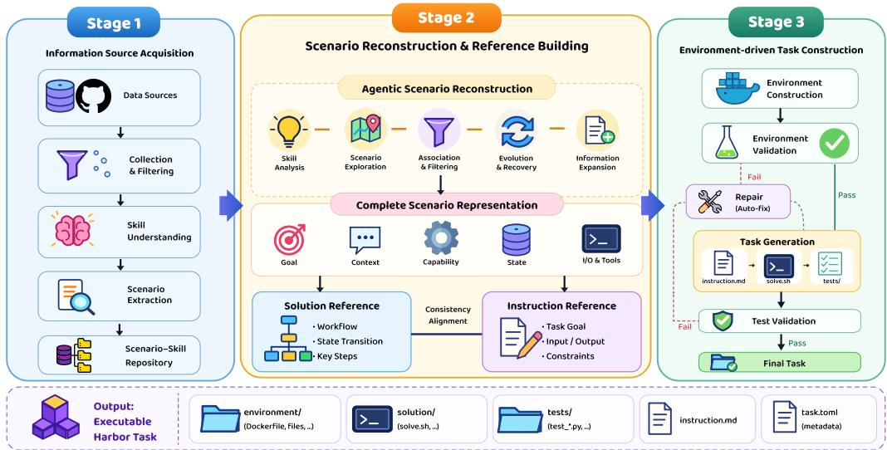
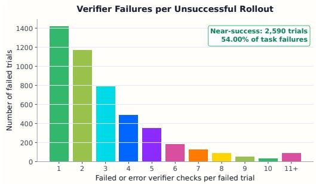
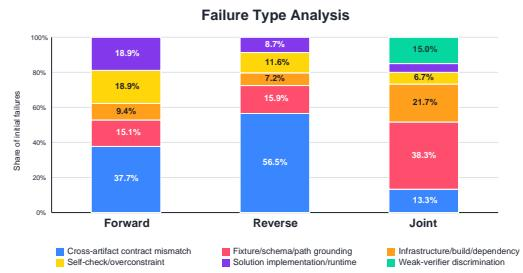
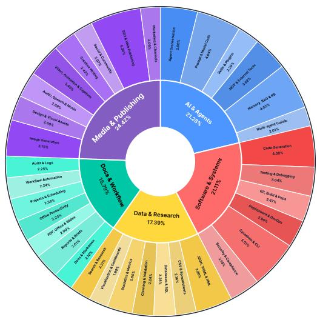
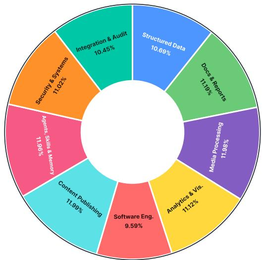
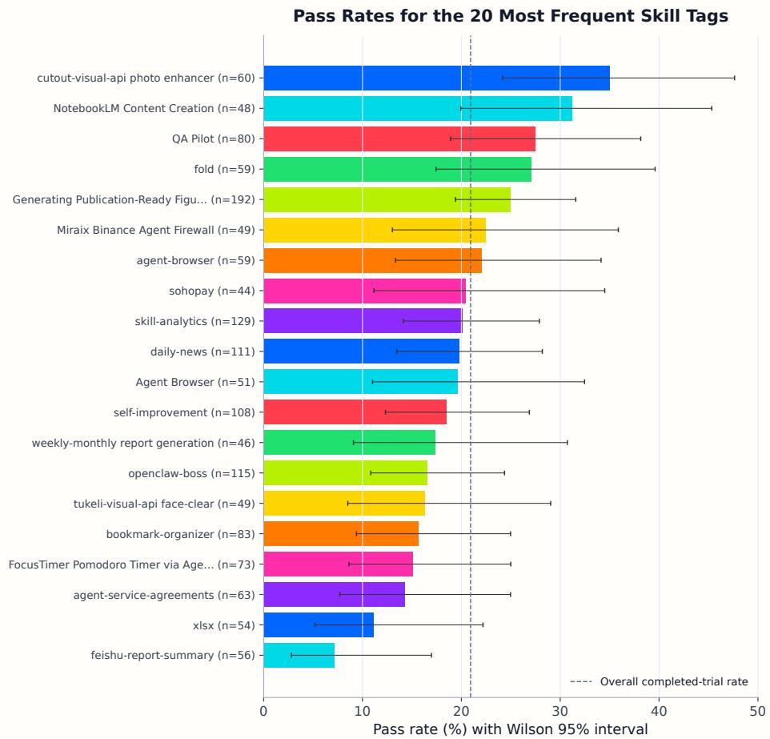
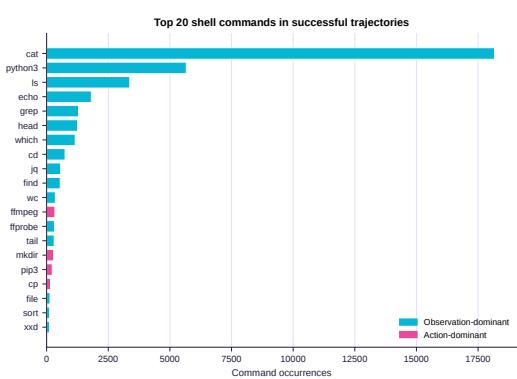
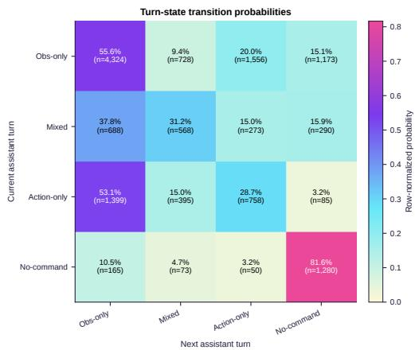

# FACET: PRESERVING SOURCE INTENT AND EXE-CUTABLE STATE IN TERMINAL TASK SYNTHESIS

Kou Shi1, Zun Wang2, Qisheng Su1,2, Shiting Huang1, Ziao Zhang1, Zhen Fang1, Qingnan Ren1 Jin Liu3, Yu Zeng1, Yiming Zhao1, Lin Chen1, Zehui Chen1, Feng Zhao1,\*

1MoE Key Lab of BIPC, University of Science and Technology of China

2Shanghai AI Laboratory, 3Fudan University

Contact: stokou@mail.ustc.edu.cn

Correspondence: fzhao956@ustc.edu.cn

§ Code Æ Model & Datasets € Project Page

## ABSTRACT

Training terminal agents requires scalable executable supervision, yet synthesizing high-quality terminal tasks remains challenging. Each task couples an instruction, an initialized environment, a reference solution, and an executable verifier; if these artifacts are generated from inconsistent assumptions, the resulting task may be unsolvable or incorrectly evaluated. Meanwhile, multi-stage synthesis can discard the goals, dependencies, state transitions, and procedural constraints encoded in the original sources. We present FACET (Fine-grained Agentic Construction of Executable Tasks), a framework that addresses both information preservation and cross-artifact consistency. FACET reconstructs related agent skills into coherent, information-rich scenarios, then realizes and repairs the execution environment before generating the final task artifacts. The resulting container state serves as shared grounding for the instruction, solution, and verifier, while execution-based validation and targeted repair correct artifact-specific failures without unnecessarily regenerating valid components. FACET produces complex terminal tasks with dense executable checks, and successful trajectories collected from these tasks provide effective, data-efficient supervision. Fine-tuning models across multiple scales consistently improves performance on Terminal-Bench 2.1, while analyses of alternative generation schemes support the importance of environment-grounded construction for task validity and solution–verifier alignment. These results establish source-intent preservation and shared executable-state grounding as key principles for scalable terminal-task synthesis.

## 1 INTRODUCTION

A central goal in the pursuit of artificial general intelligence is to develop systems that can not only reason about complex goals, but also act autonomously and adapt in open-ended environments. Recent advances in language models have shifted this pursuit beyond passive text generation toward agents that interact with external tools and computer systems (OpenAI, 2025b; Anthropic, 2025b; Mullen & Salva, 2025; Dohmke, 2025; OpenAI, 2026c). To operate effectively in these environments, agents must manipulate files, install dependencies, invoke command-line tools, recover from execution failures, and complete long-horizon workflows (OpenAI, 2025a; Anthropic, 2026; NVIDIA, 2026; METR, 2025). Terminal environments provide a natural interface for studying these capabilities because success depends not only on generating plausible text or code, but also on interacting correctly with a changing execution state (Anthropic, 2025c;d; OpenAI, 2026a;b). Benchmarks such as Terminal-Bench (Merrill et al., 2026; Terminal-Bench, 2026b) have therefore become important testbeds for evaluating agentic capabilities, while recent work further shows that executable terminal tasks can provide effective supervision for post-training language agents (Gandhi et al., 2026; Pi et al., 2026; Peng et al., 2026; Ivison et al., 2026).

The growing demand for such supervision has motivated a range of synthetic terminal-data pipelines. Existing approaches construct tasks from domain specifications, skill taxonomies, reusable repositories (Anthropic, 2025a), terminal recordings, community Q&A, and procedurally generated task signatures (Fan et al., 2026; Chu et al., 2026; Peng et al., 2026; Pi et al., 2026; Gandhi et al., 2026; Yang et al., 2026; Zhao et al., 2026; Ivison et al., 2026). These efforts demonstrate the potential of synthetic executable environments for scaling terminal-agent training. However, increasing the number and diversity of source materials does not by itself guarantee high-quality executable tasks. A terminal task is a tightly coupled bundle of an instruction, an initialized environment, a reference solution, and an executable verifier (Harbor Framework, 2026); inconsistencies among any of these components can render the entire task invalid.

We identify two challenges that become particularly important in multi-stage terminal-task synthesis. First, source information is easily lost during generation. Rich source materials may contain capabilities, dependencies, intermediate states, input–output contracts, and procedural constraints, yet successive generation stages can progressively compress this information into a simplified task description. Consequently, the synthesized task may preserve only a fraction of the structure and complexity available in the original sources. Second, task artifacts can drift apart during generation. An instruction may refer to a file that is not realized in the environment, a solution may assume a different schema or dependency, or a verifier may test a state that the generated task cannot produce. Passing textual specifications between generation stages can mitigate this problem, but does not ensure that all artifacts are grounded in the same realized execution state.

To address these challenges, we introduce FACET, a framework for synthesizing verifiable terminal tasks from large collections of reusable agent skills. Rather than directly translating sampled skills into task descriptions, FACET first performs agentic scenario reconstruction to recover coherent user scenarios, cross-skill dependencies, intermediate states, and solution workflows while retaining information from the original sources. It then constructs and repairs the execution environment before finalizing the task artifacts. The realized container state is exposed as a shared grounding interface, allowing the instruction, solution, and verifier to be generated against the same files, schemas, services, dependencies, and runtime state. Finally, execution-based validation and targeted repair identify and correct artifact-level failures while preserving components that are already valid.

## Our main contributions are threefold:

• We introduce FACET, a framework for synthesizing complex and verifiable terminal tasks from heterogeneous agent skills. Rather than treating skills as isolated task templates, our framework reconstructs their underlying scenarios and workflows to better preserve the richness of the source information during synthesis.

• We propose an executable-state-grounded construction paradigm that coordinates task artifacts through a shared, realized environment. This shifts terminal-task synthesis from independently generating plausible components toward constructing a coherent executable task as a whole.

• We build a complete synthesis and validation pipeline for producing reliable terminal-agent supervision. Extensive analyses characterize the effects of generation design on task quality, while post-training experiments across multiple model scales demonstrate the effectiveness of the resulting data.

## 2 FACET

## 2.1 PROBLEM FORMULATION

Let $\operatorname { X } = \{ x _ { 1 } , \ldots , x _ { m } \}$ denote a set of related agent skills. Our goal is to synthesize a terminal task bundle

$$
\mathcal { T } = ( \mathcal { T } , \mathcal { E } , \mathcal { S } , \mathcal { V } , \mathcal { M } ) ,\tag{1}
$$

where I is the user instruction, E is the environment specification, S is the reference solution, V is the executable verifier, and M contains the runtime metadata.

Initializing E produces the initial state $e _ { 0 } = \operatorname { I n i t } ( \mathcal { E } )$ , while executing $s$ produces $e _ { T } = \mathrm { R u n } ( S , e _ { 0 } )$ or failure ⊥. Let $B ( \mathcal { E } )$ indicate whether the environment builds successfully and $\nu _ { \mathcal { V } } ( e )$ denote the verifier outcome on state e. A synthesized task is accepted when

$$
\begin{array} { r } { A ( \mathcal { T } ) = B ( \mathcal { E } ) \wedge \neg \nu _ { \mathcal { V } } ( e _ { 0 } ) \wedge ( e _ { T } \ne \bot ) \wedge \nu _ { \mathcal { V } } ( e _ { T } ) . } \end{array}\tag{2}
$$

This criterion requires a buildable environment, a non-trivial initial state, an executable reference solution, and a verifier-accepted final state.

## 2.2 INFORMATION SOURCE ACQUISITION

Collection and filtering. We collect publicly available skill packages from OpenClaw (OpenClaw Contributors, 2026), ClawHub (ClawHub, 2026), and GitHub. We remove skills containing unsafe instructions, requiring access to private websites or information, or depending on non-public resources. Unreadable, non-actionable, and duplicate records are also discarded.

Skill understanding. Each retained skill is normalized into a structured record containing its description, required tools, inputs and outputs, procedural steps, and source provenance. This process yields more than 71K valid skills, with detailed statistics reported in Appendix A.

Scenario extraction. For each skill, an extraction agent identifies possible application contexts, user goals, initial states, and desired final states. We embed these scenario hypotheses and retrieve similar hypotheses from other skills to identify potentially related skill combinations.

Scenario–skill repository construction. Similar hypotheses are grouped to construct candidate scenario–skill pairs $p _ { c } = \left( c , X _ { c } \right)$ . A model-based judge evaluates whether each scenario and its associated skills are relevant, complementary, non-redundant, and executable as a terminal workflow. Only candidates accepted by the judge are retained:

$$
\mathcal { P } = \{ p _ { c } \ | \ J ( p _ { c } ) = 1 \} ,\tag{3}
$$

where P is the final scenario–skill repository used by the subsequent reconstruction stage. For analysis, we organize the retained skills into five top-level and 34 fine-grained categories, and group the final validated tasks into nine task families; detailed distributions are provided in Appendix A and Figure 3.

## 2.3 SCENARIO RECONSTRUCTION AND REFERENCE BUILDING

A scenario–skill pair provides sufficient information for task generation, but directly converting it into final task artifacts can compress the source information too early. This often produces shallow workflows that use only the most apparent capability of each skill, while omitting cross-skill dependencies, intermediate states, and procedural constraints. Stage 2 therefore first reconstructs a richer compositional scenario, describes it from five complementary dimensions, and then converts the resulting description into aligned references:

$$
\begin{array} { r } { p _ { c } \xrightarrow [ ] { \mathrm { \normalfont ~ { \fontfamily { q p l } \selectfont ~ 1 \selectfont ~ c e n s t r u c t i o n } } } \textit { D } _ { c } \xrightarrow [ ] { \mathrm { \normalfont ~ s c e n a r i o ~ s y n t h e s i s } } \textit { C } \xrightarrow [ ] { \mathrm { \normalfont ~ r e f e r e n c e ~ b u i l d i n g } } ( R _ { S } , R _ { I } ) , } \end{array}\tag{4}
$$

where $D _ { c }$ is the five-dimensional scenario representation, C is its complete natural-language description, and $R _ { S }$ and $R _ { I }$ are the solution and instruction references.

Agentic scenario reconstruction. We progressively reconstruct the scenario through five modules. Skill analysis identifies the capabilities, tools, inputs, outputs, preconditions, and observable effects of each skill. Scenario exploration proposes concrete application settings in which the selected skills can contribute to a shared user objective. Association and filtering retains scenarios that make meaningful use of the skills rather than placing unrelated operations side by side. Evolution and recovery organizes the selected capabilities into a coherent workflow and recovers the crossskill dependencies, intermediate artifacts, and state transitions connecting their operations. Finally, information expansion enriches the recovered workflow with concrete resources, formats, constraints, and observable success conditions. Together, these modules transform a broad skill combination into a compositional scenario with explicit interactions among its capabilities.

  
Figure 1: Overview of FACET. Stage 1 collects skills and constructs the scenario–skill repository. Stage 2 understands the selected skills, explores and recovers a joint scenario, expands it into a complete representation, and builds aligned solution and instruction references. Stage 3 constructs and validates the environment before generating the final task artifacts, with bounded repair loops for failed builds and tests.

Scenario representation and reference building. To preserve the reconstructed information, we separately describe the scenario from five dimensions:

$$
D _ { c } = \left\{ d _ { \mathrm { g o a l } } , d _ { \mathrm { c o n t e x t } } , d _ { \mathrm { c a p a b i l i t y } } , d _ { \mathrm { s t a t e } } , d _ { \mathrm { i o - t o o l } } \right\} .\tag{5}
$$

The goal dimension defines the user objective and expected deliverables; context describes the application setting and motivation; capability specifies the role of each skill and its relationships with other skills; state records the initial, intermediate, and desired final states; and inputs/outputs and tools specifies the required files, formats, schemas, paths, tools, services, and dependencies.

A model then integrates these five descriptions into a complete natural-language scenario C. This integration preserves the information from each dimension while expressing the task as a coherent user workflow. The resulting description serves as the shared semantic reference for downstream construction.

Based on $C ,$ we first generate the solution reference $R _ { S }$ , which records the setup actions, execution workflow, intermediate artifacts, state transitions, and key solution steps. We then generate the instruction reference $R _ { I }$ from both C and $R _ { S }$ , specifying the task goal, inputs, outputs, deliverables, and constraints:

$$
R _ { S } = f _ { S } ( C ) , \qquad R _ { I } = f _ { I } ( C , R _ { S } ) .\tag{6}
$$

A consistency-alignment model checks that the two references share the same initial state and target outcome, that every instruction requirement is supported by the solution workflow, and that every required effect is observable in the final state. The complete scenario and its aligned references are passed to Stage 3 as the shared specification for environment and task construction.

Algorithm 1 summarizes Stage 3, from environment realization to shared-state artifact generation and validation.

## 2.4 EXECUTABLE-STATE-GROUNDED TASK CONSTRUCTION

Stage 3 converts the reconstructed specification $Z = ( C , R _ { S } , R _ { I } )$ into an executable task bundle. It first constructs and repairs the execution environment, exposes the realized container state as shared context for task-artifact generation, and finally validates and repairs the complete task. Algorithm 1 summarizes this procedure.

Algorithm 1 Executable-state-grounded task construction   
Require: Reconstructed specification Z = (C, RS, RI)   
Ensure: Validated task bundle T or failure   
1: Plan an environment manifest from Z   
2: Materialize the required files, services, dependencies, and assets   
3: Retrieve and localize public resources when needed   
4: Augment or perturb fixtures while preserving task semantics   
5: repeat   
6: Build and initialize the environment   
7: if initialization fails then   
8: Repair the environment from the failure trace and Z   
9: end if   
10: until the environment is valid or the repair budget is exhausted   
11: if the environment remains invalid then   
12: return failure   
13: end if   
14: Observe the realized environment state e   
15: Generate instruction I from R and e   
16: Generate solution S from I, R , and e   
17: Execute S to obtain the resulting state e   
18: Generate verifier V from I, R , e , and e   
19: Package the task bundle T   
20: repeat   
21: Validate T from a clean initial state   
22: if validation fails then   
23: Identify the responsible artifact from the execution trace   
24: Repair only the identified artifact   
25: end if   
26: until T is valid or the repair budget is exhausted   
27: if T is valid then   
28: return T   
29: else   
30: return failure   
31: end if

Environment construction and repair. Generating a complete environment in a single model response is unreliable for file-rich tasks involving multiple documents, datasets, media assets, archives, or binary files. We therefore separate environment planning from asset materialization. Given Z, the environment agent first produces a manifest describing the required directories, files, services, dependencies, and their expected properties. It then materializes this manifest within a restricted base image.

During materialization, the agent may use network access together with shell and Python programs to retrieve public resources, transform them into the required formats, or procedurally generate text and binary assets. Retrieved resources are localized into the task build context so that the resulting environment is self-contained and does not require network access during evaluation. To avoid overly simple or template-like fixtures, the agent may also augment and perturb collected or generated data while preserving the intended schema and task semantics. For example, structured fixtures can be expanded with additional records, metadata fields, distractor entries, and cross-file relations. This produces sufficiently rich observable states for constructing non-trivial tasks and verifiers.

The resulting environment contains the Dockerfile, fixture files, local services, and dependencies. We build the image and execute initialization checks before generating the final task artifacts. Compiler errors, missing packages, malformed fixtures, failed downloads, and service failures are returned to the environment agent for targeted repair. We allow at most three environment-repair iterations, rebuilding and reinitializing the environment after each repair. The repair process is conditioned on both the observed failure trace and the reconstructed specification Z, preventing the agent from removing task requirements merely to obtain a successful build.

Table 1: Trajectory- and task-level comparison of terminal-agent datasets. Trajectories are collected using the Terminus-2 scaffold, and task performance is evaluated using DeepSeek-V4-Pro with Terminus-2. Turns and Tests denote the average interaction turns per trajectory and executable checkpoints per task. Detailed protocols are provided in Appendix A.6.
<table><tr><td rowspan="2">Dataset</td><td colspan="2">Trajectory</td><td colspan="4">Task</td></tr><tr><td>#Traj.</td><td>Turns</td><td>#Tasks</td><td>Tests</td><td>P@1</td><td>P@3</td></tr><tr><td>Nemotron-Terminal (Pi et al., 2026)</td><td>5K</td><td>6.12</td><td>15K</td><td>6.18</td><td>40.67</td><td>48.00</td></tr><tr><td>Endless-Terminals (Ġandhi et al., 2026)</td><td>200</td><td>4.53</td><td>2,492</td><td>5.51</td><td>83.00</td><td>87.00</td></tr><tr><td>Terminal-Lego (Yang et al., 2026)</td><td>32K</td><td>5.77</td><td>15K</td><td>16.60</td><td>47.00</td><td>49.00</td></tr><tr><td>TerminalWorld (Chu et al., 2026)</td><td>200</td><td>11.94</td><td>1,530</td><td>3.98</td><td>57.00</td><td>82.00</td></tr><tr><td>Tmax (Ivison et al., 2026)</td><td>500</td><td>11.14</td><td>15K</td><td>3.29</td><td>80.00</td><td>86.00</td></tr><tr><td>FACET (ours)</td><td>1.2K</td><td>11.86</td><td>6K</td><td>22.77</td><td>27.00</td><td>35.00</td></tr></table>

Executable-state sharing. After the environment has been successfully built and initialized, we expose its realized state as a shared grounding interface for all downstream artifact generation. The instruction, solution, and verifier are generated sequentially, with each generator receiving the reconstructed references and read access to the same realized container state. The instruction is therefore grounded in files, services, schemas, and resources that actually exist. The solution is generated from the instruction and solution reference while directly inspecting the same environment. The reference solution is subsequently executed to expose the resulting final state, and the verifier is generated last using the instruction, reference workflow, and observable initial and final states. We favor behavioral and state-based checks over exact command matching so that alternative correct solutions can pass.

The realized environment state serves as a shared coordination channel across artifact generation. If environment construction or repair changes a filename, path, port, package version, service configuration, input schema, or fixture content, all downstream generators observe the updated state. This prevents the instruction, solution, and verifier from being generated against different implicit versions of the environment and reduces cross-artifact inconsistencies.

Validation and targeted repair. Each candidate is packaged in the Harbor format, containing environment/, solution/, tests/, instruction.md, and task.toml. Validation checks that (i) the environment builds and initializes successfully, (ii) the verifier does not pass in the initial state, (iii) the reference solution executes from a clean initial state, and (iv) the verifier passes on the resulting final state.

When validation fails, a constrained router identifies the responsible component from the execution trace and invokes only the corresponding repair procedure. Build and initialization failures are assigned to the environment, solution execution failures to the solution, test collection or assertion defects to the verifier, and instruction–state mismatches to either the instruction or environment according to the source of the inconsistency. Targeted repair preserves valid components and avoids unnecessary regeneration of the complete task bundle. Every repaired candidate is re-evaluated from a clean initial state using the same validation procedure. We allow at most five task-level repair iterations. Candidates that remain invalid after the repair budget is exhausted are discarded. The complete construction funnel and repair statistics are reported in Appendix A.4.

## 3 EXPERIMENTS

## 3.1 EXPERIMENTAL SETUP

Models and training. We use the Terminus-2 agent, powered by DeepSeek-V4-Pro (DeepSeek-AI, 2026), to generate rollouts on approximately 6K validated tasks. From these rollouts, we select 1.2K complete successful trajectories for supervised fine-tuning. We fine-tune Qwen3.5-4B, Qwen3.5-9B, and Qwen3.5-27B (Qwen Team, 2026) using LLaMA-Factory (Zheng et al., 2024).

Benchmark and evaluation protocol. We evaluate the base and fine-tuned models on Terminal-Bench 2.1, which uses containerized tasks and execution-based verification (Terminal-Bench, 2026b). All models use the Terminus-2 scaffold under the same inference configuration. We run three attempts per task and report the mean pass rate. Complete training and evaluation settings are provided in Appendix D.

## 3.2 COMPARISON WITH EXISTING TERMINAL DATASETS

Table 1 compares FACET with existing terminal-agent datasets from both trajectory- and task-level perspectives. Detailed data sources, sampling procedures, and metric definitions are provided in Appendix A.6.

Trajectory-level comparison. FACET contains 1.2K training trajectories, fewer than Nemotron-Terminal and Terminal-Lego, but its trajectories are comparatively long. The average trajectory length of FACET is 11.86 turns, close to TerminalWorld at 11.94 turns and higher than Tmax (11.14), Nemotron-Terminal (6.12), Terminal-Lego (5.77), and Endless-Terminals (4.53). This result is consistent with our agentic scenario-reconstruction pipeline, which combines related skills into workflows involving multiple dependent operations. The resulting trajectories therefore capture relatively long-horizon terminal interactions despite the smaller training-set size.

Task-level comparison. At the task level, FACET contains 6,078 validated tasks and has the largest number of executable tests per task, averaging 22.77. This exceeds Terminal-Lego (16.60), Nemotron-Terminal (6.18), Endless-Terminals (5.51), TerminalWorld (3.98), and Tmax (3.29). A larger number of executable tests indicates that each task contains more independently checked requirements and is evaluated against stricter completion criteria. This reflects our artifact-aware construction pipeline, which verifies not only the primary output but also secondary deliverables, content constraints, cross-artifact consistency, and observable environment behavior.

Correspondingly, FACET obtains 27.00 P@1 and 35.00 P@3, lower than the results on the other datasets. The lower pass rates are consistent with the larger number of task checkpoints: an agent must satisfy all required conditions for the task to pass, and completing the main workflow alone is insufficient if any checked requirement remains unmet. The increase from P@1 to P@3 shows that repeated attempts recover some failures, while the remaining gap indicates that many tasks consistently expose requirement-satisfaction errors.

## 3.3 MAIN RESULTS

Table 2 reports the Terminal-Bench 2.1 performance of our models together with representative systems reported in prior papers, model reports, and our evaluations under the same setting.

Fine-tuning on only 1.2K successful trajectories yields consistent improvements across all three model scales. Qwen3.5-4B improves from 17.60 to 24.72 (+7.12), Qwen3.5-9B from 27.34 to 35.58 (+8.24), and Qwen3.5-27B from 40.82 to 47.57 (+6.75). The 9B model achieves the largest absolute gain, while the 4B model shows the largest relative improvement of 40.5%. These gains across 4B, 9B, and 27B models indicate that the synthesized supervision transfers consistently across model scales rather than benefiting only a particular capacity regime.

The improvement is also substantial when viewed across model scales. Our 27B model reaches 47.57 on Terminal-Bench 2.1, only 1.49 points below the 49.06 achieved by Qwen3.5-397B under the same evaluation setting, despite using a model roughly 15× smaller. Moreover, fine-tuning the 27B model closes most of the performance gap between its 40.82 base score and the much larger Qwen3.5-397B. Together with the gains at 4B and 9B, these results demonstrate that FACET provides effective and data-efficient supervision for improving terminal-agent capabilities.

## 3.4 TASK ANALYSIS

Partial progress is common despite low end-to-end success. Terminal tasks impose conjunctive success criteria: an agent must satisfy all required conditions for the task to pass, even when most of the workflow has been completed correctly. This creates a substantial gap between local progress and task-level success. Across teacher rollouts with parseable verifier results, 89.40% of individual checks are satisfied, whereas only 20.94% of completed rollouts achieve full task success. We do not interpret check-level accuracy as an alternative evaluation metric, since verifier checks differ in granularity and importance. Rather, the gap indicates that unsuccessful trajectories often contain substantial correct progress that is hidden by binary task rewards.

Table 2: Results on Terminal-Bench 2.1. Scores under our evaluation setting are averaged over three independent attempts per task.
<table><tr><td>Model</td><td>Size</td><td>Agent</td><td>Terminal-Bench 2.1</td></tr><tr><td colspan="4">Reported reference models</td></tr><tr><td>GPT-5.5 (xhigh) (Terminal-Bench, 2026a)</td><td></td><td>Terminus-2</td><td>78.00</td></tr><tr><td>Claude Opus 4.7 (max) (Terminal-Bench, 2026a)</td><td></td><td>Terminus-2</td><td>66.10</td></tr><tr><td>Gemini 3 Pro (high) (Terminal-Bench, 2026a)</td><td></td><td>Gemini CLI</td><td>65.80</td></tr><tr><td>Intern-S2-Preview-397B (Bai et al., 2026)</td><td>397B</td><td>Terminus-2</td><td>67.42</td></tr><tr><td>MiniMax M3 (MiniMax, 2026)</td><td>428B</td><td>Terminus-2</td><td>66.00</td></tr><tr><td>GLM-5.1 (max) (Terminal-Bench, 2026a)</td><td>744B</td><td>Claude Code</td><td>58.70</td></tr><tr><td>Models evaluated under our setting</td><td></td><td></td><td></td></tr><tr><td>Qwen3.6-27B</td><td>27B</td><td>Terminus-2</td><td>53.93</td></tr><tr><td>Qwen3.5-397B-A17B</td><td>397B</td><td>Terminus-2</td><td>49.06</td></tr><tr><td>Kimi-K2.6</td><td>1T</td><td>Terminus-2</td><td>59.93</td></tr><tr><td>DeepSeek-V4-Pro-Preview (high)</td><td>1.6T</td><td>Terminus-2</td><td>73.03</td></tr><tr><td>Qwen3.5 base models</td><td></td><td></td><td></td></tr><tr><td>Qwen3.5-4B</td><td>4B</td><td></td><td></td></tr><tr><td>Qwen3.5-9B</td><td>9B</td><td>Terminus-2</td><td>17.60</td></tr><tr><td>Qwen3.5-27B</td><td>27B</td><td>Terminus-2 Terminus-2</td><td>27.34</td></tr><tr><td></td><td></td><td></td><td>40.82</td></tr><tr><td>Fine-tuned models</td><td></td><td></td><td></td></tr><tr><td>FACET-Terminal-Qwen3.5-4B</td><td>4B</td><td>Terminus-2</td><td>24.72 (+7.12)</td></tr><tr><td>FACET-Terminal-Qwen3.5-9B</td><td>9B</td><td>Terminus-2</td><td>35.58 (+8.24)</td></tr><tr><td>FACET-Terminal-Qwen3.5-27B</td><td>27B</td><td>Terminus-2</td><td>47.57 (+6.75)</td></tr></table>

Figure 2(a) further reveals that these failures are concentrated near the success boundary. Among unsuccessful rollouts, 54.00% fail only one or two verifier checks. Qualitative inspection shows that such trajectories frequently construct the primary requested artifact or complete the main workflow, but violate a small residual requirement, such as an incorrect field value, an unmet constraint, or a missing secondary deliverable. Thus, many failures reflect incomplete requirement satisfaction rather than complete inability to solve the task. Importantly, the number of failed checks should not be interpreted directly as repair difficulty: a single failed assertion may encode a critical requirement, while one underlying error may trigger several checks.

Difficulty emerges from compositional requirements. Task difficulty also varies with the structure of the requested workflow. Across frequent skill categories, structured-data tasks tend to be solved more reliably than narrative-document tasks, while performance generally decreases for tasks with longer instructions and broader verifier coverage. These patterns are consistent with the compositional nature of our tasks: longer instructions typically introduce more atomic requirements, cross-file dependencies, and output constraints, increasing the chance that an otherwise successful trajectory misses at least one condition. Because these properties are correlated, we treat them as descriptive characteristics rather than isolated causal factors.

Taken together, the analysis suggests that the difficulty of our tasks lies not only in executing the main workflow, but in satisfying a collection of interdependent requirements precisely and completely. Dense executable verification makes these residual errors observable, distinguishing near-successful trajectories from failures that make little meaningful progress. This fine-grained execution signal provides a richer characterization of terminal-agent behavior than binary task outcomes alone. Detailed task-level analyses are provided in Appendix A.3.

## 3.5 ANALYSIS OF GENERATION SCHEMES

We compare three artifact-generation orders using the same 100 scenario–skill pairs. Forward, adopted by our pipeline, generates the instruction, solution, and solution-aware verifier sequentially (I → S → V) after constructing the environment. Reverse exchanges the order of the final two artifacts $( I \to V \to S )$ , generating the verifier from a shared textual specification before the solution is available. Joint produces all three artifacts together in a single model call.

  
(a) Residual verifier failures.

  
(b) Initial failure composition by generation scheme.  
Figure 2: Analysis of execution and synthesis failures. (a) Distribution of failed or errored verifier checks among unsuccessful teacher rollouts; three rollouts without a parsed FAILED/ERROR result are omitted. (b) Distribution of initial validation failure types under the Forward, Reverse, and Joint generation schemes.

Forward, Reverse, and Joint deliver 99, 91, and 96 tasks to validation, respectively, of which 46, 22, and 36 are initially valid. Their corresponding initial validity rates are 46.5%, 24.2%, and 37.5%. Figure 2(b) further shows that generation order changes not only the overall validity but also where synthesis failures occur. Cross-artifact contract mismatch accounts for 56.5% of Reverse failures, suggesting that generating the verifier before observing the solution makes behavioral alignment more difficult. Joint reduces contract mismatch to 13.3%, but shifts errors toward fixture/schema/path grounding (38.3%) and infrastructure or dependency failures (21.7%). Forward achieves the highest initial validity while exhibiting a more distributed failure profile, with contract mismatch accounting for 37.7%.

The advantage persists after repair. Under the recorded repair settings, Forward recovers 37 of its 53 initial failures and reaches a final yield of 83/100 tasks. Reverse recovers 41 of 69 failures and reaches 63/100, while Joint recovers 29 of 60 and reaches 65/100. Since Forward permits five repair rounds whereas Reverse and Joint permit three, these final yields characterize the complete pipeline configurations rather than repair efficiency under an identical budget.

A paired comparison over the 88 scenario–skill pairs that reach validation under all three schemes provides a more controlled comparison. Forward succeeds on 29 pairs where Reverse fails, compared with only 9 pairs in the opposite direction $( p = 0 . 0 0 1 7$ , two-sided exact sign test). The corresponding Forward–Joint counts are 27 and 18 $( p \ : = \ : 0 . 2 3 3 )$ . These results provide strong evidence that generating the solution before the verifier improves cross-artifact alignment over the Reverse order, while the difference between Forward and Joint is less conclusive. Overall, the results support the sequential, environment-grounded generation order used in FACET, particularly for maintaining alignment between the generated solution and its executable verifier. Appendix B reports the complete metric definitions, coverage statistics, and evaluation qualifications.

## 4 RELATED WORK

Terminal benchmarks and environments. Terminal-Bench 2.0 and 2.1 evaluate agents on realistic, containerized command-line tasks with execution-based verification (Merrill et al., 2026; Terminal-Bench, 2026b), while TerminalWorld constructs validated tasks from real terminal recordings (Chu et al., 2026). Harbor provides a common format for packaging tasks, executing agents, and collecting rollouts (Harbor Framework Team, 2026); our generated tasks follow this format directly.

Scalable task synthesis. Existing pipelines construct terminal tasks through procedural generation, domain specifications, seed datasets, skill composition, and requirement-driven retrieval (Gandhi et al., 2026; Peng et al., 2026; Pi et al., 2026; Ivison et al., 2026; Zhao et al., 2026). Agent Skills provide portable procedural knowledge (Agent Skills, 2025); SkillSynth organizes skills into scenario-mediated graphs (Fan et al., 2026); and Terminal-Lego studies environment-grounded trajectory quality (Yang et al., 2026). Building on these directions, our work focuses on reconstructing complex scenarios from heterogeneous skills and coordinating task artifacts through a shared, realized environment state.

## 5 CONCLUSION

We presented FACET, a framework for synthesizing complex and verifiable terminal tasks from heterogeneous agent skills. FACET reconstructs related skills into coherent, information-rich scenarios, realizes and repairs the execution environment before finalizing task artifacts, and grounds the instruction, solution, and verifier in the same executable state. Together with targeted validation and repair, these designs improve consistency across task components while preserving the information and constraints inherited from the source skills.

Our experiments demonstrate the effectiveness of both the synthesis pipeline and the resulting supervision. The analysis of generation schemes shows that sequential, environment-grounded construction achieves the highest task yield and improves solution–verifier alignment compared with generating the verifier before the solution. More importantly, supervised fine-tuning on the resulting successful trajectories consistently improves Qwen3.5 models from 4B to 27B on Terminal-Bench 2.1, with absolute gains of 7.12, 8.24, and 6.75 points. The resulting 27B model reaches 47.57, approaching the 49.06 performance of the substantially larger Qwen3.5-397B under the same evaluation setting.

These results suggest that carefully coordinating scenario reconstruction, executable-state grounding, and artifact-level validation can provide data-efficient supervision for terminal agents without relying solely on large-scale task generation. Looking forward, we plan to extend FACET to broader sources of procedural knowledge and more diverse interactive environments, and to investigate how the generated tasks and execution feedback can support reinforcement learning and continued agent improvement.

## AI USE STATEMENT

Generative AI tools were used to assist with drafting, language editing, and LaTeX preparation. The authors are responsible for checking all source attributions, experimental records, numerical claims, and generated text, and take responsibility for the final content of the paper.

## REFERENCES

Agent Skills. Agent skills specification. Agent Skills Open Standard, 2025. URL https:// agentskills.io/specification.

Anthropic. Equipping agents for the real world with agent skills. Anthropic Engineering, October 2025a. URL https://www.anthropic.com/engineering/ equipping-agents-for-the-real-world-with-agent-skills.

Anthropic. Claude code: Best practices for agentic coding. Anthropic Engineering, April 2025b. URL https://www.anthropic.com/engineering/claude-code-best-practices.

Anthropic. Effective context engineering for AI agents. Anthropic Engineering, September 2025c. URL https://www.anthropic.com/engineering/ effective-context-engineering-for-ai-agents.

Anthropic. Effective harnesses for long-running agents. Anthropic Engineering, November 2025d. URL https://www.anthropic.com/engineering/ effective-harnesses-for-long-running-agents.

Anthropic. How claude code is used in practice. Anthropic Research, June 2026. URL https: //www.anthropic.com/research/claude-code-expertise.

Lei Bai et al. Intern-S2-Preview: Scientific agentic foundation model. arXiv preprint arXiv:2608.13505, 2026. doi: 10.48550/arXiv.2608.13505. URL https://arxiv.org/abs/ 2608.13505.

Zhaoyang Chu, Jiarui Hu, Xingyu Jiang, Pengyu Zou, Han Li, Chao Peng, Peter O’Hearn, Earl T. Barr, Mark Harman, Federica Sarro, and He Ye. TerminalWorld: Benchmarking agents on real-world terminal tasks. arXiv preprint arXiv:2605.22535, 2026. doi: 10.48550/arXiv.2605.22535. URL https://arxiv.org/abs/2605.22535.

ClawHub. ClawHub: Skill Registry for OpenClaw. https://clawhub.ai/, 2026.

DeepSeek-AI. DeepSeek-V4: Towards highly efficient million-token context intelligence, 2026. URL https://arxiv.org/abs/2606.19348.

Thomas Dohmke. GitHub Copilot: Meet the new coding agent. The GitHub Blog, May 2025. URL https://github.blog/news-insights/product-news/ github-copilot-meet-the-new-coding-agent/.

Zhiyuan Fan, Tinghao Yu, Yuanjun Cai, Jiangtao Guan, Yun Yang, Dingxin Hu, Jiang Zhou, Xing Wu, Zhuo Han, Feng Zhang, and Lilin Wang. Toward scalable terminal task synthesis via skill graphs. arXiv preprint arXiv:2604.25727, 2026. doi: 10.48550/arXiv.2604.25727. URL https://arxiv.org/abs/2604.25727.

Kanishk Gandhi, Shivam Garg, Noah D. Goodman, and Dimitris Papailiopoulos. Endless terminals: Scaling RL environments for terminal agents. arXiv preprint arXiv:2601.16443, 2026. doi: 10.48550/arXiv.2601.16443. URL https://arxiv.org/abs/2601.16443.

Harbor Framework. Harbor: Evaluate agents in sandboxed environments. Harbor Framework Documentation, 2026. URL https://harborframework.com/.

Harbor Framework Team. Harbor: A framework for evaluating and optimizing agents and models in container environments, 2026. URL https://doi.org/10.5281/zenodo.20953922.

Hamish Ivison, Junjie Oscar Yin, Rulin Shao, Teng Xiao, Nathan Lambert, and Hannaneh Hajishirzi. Tmax: A simple recipe for terminal agents. arXiv preprint arXiv:2606.23321, 2026. doi: 10. 48550/arXiv.2606.23321. URL https://arxiv.org/abs/2606.23321.

Mike A. Merrill, Alexander G. Shaw, Nicholas Carlini, Boxuan Li, Harsh Raj, Ivan Bercovich, Lin Shi, Jeong Yeon Shin, Thomas Walshe, E. Kelly Buchanan, et al. Terminal-Bench: Benchmarking agents on hard, realistic tasks in command line interfaces. arXiv preprint arXiv:2601.11868, 2026. doi: 10.48550/arXiv.2601.11868. URL https://arxiv.org/abs/2601.11868.

METR. Measuring AI ability to complete long software tasks. Model Evaluation and Threat Research, March 2025. URL https://metr.org/blog/ 2025-03-19-measuring-ai-ability-to-complete-long-tasks/.

MiniMax. MiniMax M3: Frontier coding, 1m context, native multimodality. MiniMax Research, June 2026. URL https://www.minimax.io/blog/minimax-m3.

Taylor Mullen and Ryan J. Salva. Gemini CLI: Your open-source AI agent. Google Blog, June 2025. URL https://blog.google/innovation-and-ai/technology/developers-tools/ introducing-gemini-cli-open-source-ai-agent/.

NVIDIA. NVIDIA Nemotron 3 Ultra powers faster, more efficient reasoning for long-running agents. NVIDIA Technical Blog, June 2026. URL https://developer.nvidia.com/blog/ nvidia-nemotron-3-ultra-powers-faster-more-efficient-reasoning-for-long-running-agents/.

OpenAI. Introducing GPT-5.2-Codex. OpenAI, December 2025a. URL https://openai.com/ index/introducing-gpt-5-2-codex/.

OpenAI. Introducing codex. OpenAI, May 2025b. URL https://openai.com/index/ introducing-codex/.

OpenAI. Unrolling the codex agent loop. OpenAI, January 2026a. URL https://openai.com/ index/unrolling-the-codex-agent-loop/.

OpenAI. Harness engineering: Leveraging codex in an agent-first world. OpenAI, February 2026b. URL https://openai.com/index/harness-engineering/.

OpenAI. Why SWE-bench Verified no longer measures frontier coding capabilities. OpenAI, February 2026c. URL https://openai.com/index/ why-we-no-longer-evaluate-swe-bench-verified/.

OpenClaw Contributors. OpenClaw. https://github.com/openclaw/openclaw, 2026. GitHub repository.

Xiaoxuan Peng, Kaiqi Zhang, Xinyu Lu, Boxi Cao, Yaojie Lu, Hongyu Lin, Xianpei Han, and Le Sun. LiteCoder-Terminal: Scaling long-horizon terminal environments for learning language agents. arXiv preprint arXiv:2605.29559, 2026. doi: 10.48550/arXiv.2605.29559. URL https: //arxiv.org/abs/2605.29559.

Renjie Pi, Grace Lam, Mohammad Shoeybi, Pooya Jannaty, Bryan Catanzaro, and Wei Ping. On data engineering for scaling LLM terminal capabilities. arXiv preprint arXiv:2602.21193, 2026. doi: 10.48550/arXiv.2602.21193. URL https://arxiv.org/abs/2602.21193.

Qwen Team. Qwen3.5: Towards native multimodal agents, February 2026. URL https://qwen. ai/blog?id=qwen3.5.

Terminal-Bench. Terminal-Bench 2.1 Leaderboard. Terminal-Bench, 2026a. URL https://www. tbench.ai/leaderboard/terminal-bench/2.1.

Terminal-Bench. Terminal-Bench 2.1. Terminal-Bench Release, May 2026b. URL https://www. tbench.ai/news/terminal-bench-2-1.

Sidi Yang, Chaofan Tao, Jierun Chen, Tiezheng Yu, Ruoyu Wang, Yuxin Jiang, Yiming Du, Wendong Xu, Jing Xiong, Taiqiang Wu, Lifeng Shang, Xiaohui Li, Ngai Wong, and Haoli Bai. What makes interaction trajectories effective for training terminal agents? arXiv preprint arXiv:2606.03461, 2026. doi: 10.48550/arXiv.2606.03461. URL https://arxiv.org/abs/2606.03461.

Jiarong Zhao, Zhikai Lei, Zhiheng Xi, Rui Zheng, Hang Yan, Jie Zhou, Qin Chen, and Liang He. NexForge: Scaling agent capabilities through requirement-driven task synthesis for LLMs. arXiv preprint arXiv:2607.14186, 2026. doi: 10.48550/arXiv.2607.14186. URL https://arxiv.org/ abs/2607.14186.

Yaowei Zheng, Richong Zhang, Junhao Zhang, Yanhan Ye, Zheyan Luo, Zhangchi Feng, and Yongqiang Ma. LlamaFactory: Unified efficient fine-tuning of 100+ language models. In Proceedings ofthe 62nd Annual Meeting ofthe Associationfor Computational Linguistics (Volume 3: System Demonstrations), pp. 400–410, Bangkok, Thailand, 2024. Association for Computational Linguistics. doi: 10.18653/v1/2024.acl-demos.38. URL https://aclanthology.org/2024. acl-demos.38/.

  
(a) Source-skill distribution.

  
(b) Synthesized-task distribution.  
Figure 3: Distributions of source skills and synthesized tasks. (a) The retained skill corpus spans five top-level families and 34 fine-grained categories. (b) The 6,078 validated tasks are distributed across nine task families, whose individual shares range from 9.59% to 11.99%.

## A DATASET DETAILS

## A.1 SOURCE-SKILL TAXONOMY

We organize the 71,341 retained skills into five top-level families and 34 fine-grained categories. Table 3 reports the category counts and proportions, computed over the complete corpus without sampling. We separately classify the 6,078 validated tasks into nine task families to characterize the coverage of the synthesized dataset.

Table 3: Top-level source-skill distribution.
<table><tr><td>Category</td><td>Skills</td><td>Share</td></tr><tr><td>AI, agents, and tools</td><td>15,182</td><td>21.28%</td></tr><tr><td>Software, systems, and security</td><td>15,059</td><td>21.11%</td></tr><tr><td>Data, analysis, and research</td><td>12,409</td><td>17.39%</td></tr><tr><td>Documents, productivity, and workflows</td><td>11,267</td><td>15.79%</td></tr><tr><td>Multimedia, creation, and publishing</td><td>17,424</td><td>24.42%</td></tr><tr><td>Total</td><td>71,341</td><td>100.00%</td></tr></table>

## A.2 TASK AND ROLLOUT ACCOUNTING

The final dataset contains 6,078 tasks, of which 6,074 have corresponding rollout records; four jobs fail to produce a record. Among the recorded runs, 1,270 receive reward 1, 4,796 complete execution but fail at least one task requirement, and eight terminate because of infrastructure errors. Excluding infrastructure failures yields 6,066 completed runs and a teacher success rate of 1, 270/6, 066 = 20.94%.

Of the completed runs, 6,064 contain parseable pytest collection summaries and are included in the check-level analysis in Section 3.4. Failed trajectories are retained for error analysis but excluded from supervised fine-tuning. From the successful rollouts, we select 1,200 complete trajectories for the final SFT dataset.

Table 4: Fine-grained source-skill categories. “Global” is the share of all 71,341 skills; “within parent” is the share inside the corresponding top-level category.
<table><tr><td>Parent</td><td>Fine-grained category</td><td>Count</td><td>Global</td><td>Within parent</td></tr><tr><td>AI, agents, and tools</td><td>Agent orchestration and automation</td><td>2,782</td><td>3.90%</td><td>18.32%</td></tr><tr><td></td><td>Prompt and model calls</td><td>3,310</td><td>4.64%</td><td>21.80%</td></tr><tr><td></td><td>Skills, plugins, and extensions</td><td>1,637</td><td>2.29%</td><td>10.78%</td></tr><tr><td></td><td>MCP and external tools</td><td>2,579</td><td>3.62%</td><td>16.99%</td></tr><tr><td></td><td>Memory, RAG, and knowledge bases</td><td>3,439</td><td>4.82%</td><td>22.65%</td></tr><tr><td></td><td>Multi-agent collaboration</td><td>1,435</td><td>2.01%</td><td>9.45%</td></tr><tr><td>Software, systems, and security</td><td>Code generation and development</td><td>3,065</td><td>4.30%</td><td>20.35%</td></tr><tr><td></td><td>Testing, debugging, and code quality</td><td>2,167</td><td>3.04%</td><td>14.39%</td></tr><tr><td></td><td>Git, build, and dependency management</td><td>1,904</td><td>2.67%</td><td>12.64%</td></tr><tr><td></td><td>Deployment, containers, and DevOps</td><td>2,069</td><td>2.90%</td><td>13.74%</td></tr><tr><td></td><td>System administration and CLI</td><td>3,576</td><td>5.01%</td><td>23.75%</td></tr><tr><td></td><td>Security, privacy, and compliance</td><td>2,278</td><td>3.19%</td><td>15.13%</td></tr><tr><td>Data, analysis, and research</td><td>JSON, YAML, and XML</td><td>2,752</td><td>3.86%</td><td>22.18%</td></tr><tr><td></td><td>CSV, Excel, and spreadsheets</td><td>1,544</td><td>2.16%</td><td>12.44%</td></tr><tr><td></td><td>Databases and SQL</td><td>1,627</td><td>2.28%</td><td>13.11%</td></tr><tr><td></td><td>Data cleaning, conversion, and validation</td><td>1,595</td><td>2.24%</td><td>12.85%</td></tr><tr><td></td><td>Statistical analysis and metrics</td><td>1,892</td><td>2.65%</td><td>15.25%</td></tr><tr><td></td><td>Visualization and dashboards</td><td>1,419</td><td>1.99%</td><td>11.44%</td></tr><tr><td></td><td>Search, research, and extraction</td><td>1,580</td><td>2.21%</td><td>12.73%</td></tr><tr><td>Documents, productivity, and workflows</td><td>Documents and Markdown</td><td>1,496</td><td>2.10%</td><td>13.28%</td></tr><tr><td></td><td>Reports, summaries, and briefs</td><td>1,865</td><td>2.61%</td><td>16.55%</td></tr><tr><td></td><td>PDF, Office, and presentations</td><td>1,429</td><td>2.00%</td><td>12.68%</td></tr><tr><td></td><td>Office and personal productivity</td><td>1,592</td><td>2.23%</td><td>14.13%</td></tr><tr><td></td><td>Project, task, and schedule management</td><td>1,682</td><td>2.36%</td><td>14.93%</td></tr><tr><td></td><td>System integration and automation</td><td>1,597</td><td>2.24%</td><td>14.17%</td></tr><tr><td></td><td>Audit, checklists, and operation records</td><td>1,606</td><td>2.25%</td><td>14.25%</td></tr><tr><td>Multimedia, creation, and pub- lishing</td><td>Image generation and editing</td><td>2,699</td><td>3.78%</td><td>15.49%</td></tr><tr><td></td><td>Design, drawing, and visual assets</td><td>1,858</td><td>2.60%</td><td>10.66%</td></tr><tr><td></td><td>Audio, speech, and music</td><td>1,917</td><td>2.69%</td><td>11.00%</td></tr><tr><td></td><td>Video, animation, and captions</td><td>2,491</td><td>3.49%</td><td>14.30%</td></tr><tr><td></td><td>Content writing and creative generation</td><td>1,731</td><td>2.43%</td><td>9.93%</td></tr><tr><td></td><td>Social media and community operations</td><td>1,479</td><td>2.07%</td><td>8.49%</td></tr><tr><td></td><td>SEO, websites, and content publishing</td><td>3,778</td><td>5.30%</td><td>21.68%</td></tr><tr><td></td><td>Marketing campaigns and channels</td><td>1,471</td><td>2.06%</td><td>8.44%</td></tr></table>

## A.3 TASK OUTCOMES AND SKILL-TAG VARIATION

Section 3.4 reports the aggregate task- and check-level results. Here, we examine how task-level success varies across skill tags and broader task characteristics.

Figure 4 shows considerable variation across frequent skill tags, with observed pass rates ranging from 7.14% to 35.00%. Several estimates have wide confidence intervals because their sample sizes are modest. Each task is associated with seven skill tags, so the groups overlap and their estimates are not statistically independent. Moreover, tags co-vary with task topic, output type, instruction length, and other tags. These results should therefore be interpreted as descriptive indicators of task difficulty rather than causal estimates for individual skills.

We additionally group tasks by output structure, instruction length, and verifier breadth. Structureddata tasks have higher observed pass rates than narrative-document tasks, while success generally decreases for longer instructions and broader verifier suites. These properties are correlated: longer instructions typically introduce more atomic requirements, output constraints, and cross-file dependencies, whereas broader verifiers increase the likelihood that a single omission causes the task to fail. The observed trends therefore do not isolate a single source of difficulty, but consistently identify requirement tracking and final-state consistency as important challenges in complex terminal tasks.

## A.4 CONSTRUCTION FUNNEL

Table 5 summarizes the number of candidate tasks retained through environment construction and task validation. Before validation, 58 candidates are excluded for reasons including weak verifiers, ambiguous deliverables, unresolved external dependencies, and workflows that permit trivial bypasses.

  
Figure 4: Strict task-level pass rates for the 20 most frequent skill tags among the 6,066 completed rollouts. Error bars indicate Wilson 95% confidence intervals, and the dashed line denotes the overall pass rate. Tags are selected by frequency and ordered by observed pass rate.

Table 5: Task-construction funnel. Percentages in the last column use the immediately preceding comparable stage.
<table><tr><td>Stage</td><td>Count</td><td>Stage retention</td></tr><tr><td>Scenario-skill seeds</td><td>7,852</td><td></td></tr><tr><td>Seeds with first-build logs</td><td>7,841</td><td>99.86%</td></tr><tr><td>Initial environment success</td><td>6,630</td><td>84.56%</td></tr><tr><td>Environment repair recovery</td><td>874</td><td></td></tr><tr><td>Successful environments</td><td>7,504</td><td>95.70%</td></tr><tr><td>Entering task validation</td><td>7,446</td><td>99.23%</td></tr><tr><td>First-pass valid tasks</td><td>2,856</td><td>38.35%</td></tr><tr><td>Task repair recovery</td><td>3,222</td><td></td></tr><tr><td>Final validated tasks</td><td>6,078</td><td>81.63%</td></tr></table>

Since these exclusion criteria may overlap, we report their aggregate count rather than a mutually exclusive per-category breakdown.

## A.5 DATASET-COMPARISON DETAILS

Table 1 reports trajectory statistics, task-level verifier statistics, and common-solver evaluation result for existing terminal-agent datasets (Pi et al., 2026; Gandhi et al., 2026; Yang et al., 2026; Ivison

et al., 2026; Chu et al., 2026). Because these quantities are computed from different underlying units, we describe their data sources and computation procedures separately.

## A.6 DATASET-COMPARISON DETAILS

Table 1 reports trajectory-level statistics, task-level statistics, and common-solver evaluation results for existing terminal-agent datasets (Pi et al., 2026; Gandhi et al., 2026; Yang et al., 2026; Ivison et al., 2026; Chu et al., 2026). The three groups of columns describe related but distinct aspects of each dataset, and are therefore computed from different units of analysis.

Relationship between trajectory- and task-level data. A task is an executable problem instance containing an instruction, an initial environment, and an executable verifier. A trajectory is an agent interaction record produced while attempting one such task. The two units are related because every trajectory is generated from a task, but they are not necessarily paired one-to-one: a task may have multiple rollout attempts, no available trajectory, or a trajectory excluded by filtering, while a released trajectory collection may cover only a subset of the corresponding task set.

Consequently, the Trajectory columns in Table 1 characterize the available or recollected agent interactions, whereas the Task columns characterize the executable task collection itself. The trajectory sample used to compute average turns, the task sample used to compute average tests, and the 100-task sample used to compute P@1 and P@3 are selected independently. Statistics across these column groups should therefore be interpreted as dataset-level characteristics rather than measurements over exactly the same task instances. To improve comparability, all recollected trajectories and common-solver evaluations use the same Terminus-2 scaffold, and random sampling uses seed 42.

Trajectory data and metrics. For Nemotron-Terminal and Terminal-Lego, we use their released Terminus-2 trajectory collections, containing approximately 5K and 32K trajectories, respectively. For Endless-Terminals and TerminalWorld, we randomly sample 200 tasks from each dataset and collect one rollout per task. For Tmax, we sample 500 tasks and recollect rollouts with Terminus-2 instead of using its released mini-SWE-agent trajectories. Recollected rollouts are generated with DeepSeek-V4-Pro, while the FACET statistics are computed from the 1,200 complete successful trajectories used for supervised fine-tuning.

The #Traj. column reports the number of trajectories included in each sample. A turn corresponds to one assistant interaction step and its resulting environment response. Turns is the average number of turns across successful, parseable trajectories; infrastructure failures, missing records, and unparseable trajectories are excluded.

Task data and verifier metrics. Task-level statistics are computed from executable task bundles independently of rollout success. We use up to 15,000 tasks per dataset, sampling with seed 42 when necessary. This gives 15,000-task samples for Nemotron-Terminal, Terminal-Lego, and Tmax, together with the complete collections of Endless-Terminals (2,492), TerminalWorld (1,530), and FACET (6,078).

The #Tasks column reports the number of tasks included in the analysis. For each task, we execute its verifier through the Harbor testing procedure and record the number of test items collected by pytest. Tests is calculated by summing these per-task counts and dividing by the number of analyzed tasks. It therefore represents the average number of executable checkpoints per task. A higher value indicates that more aspects of task completion are checked and that the task is evaluated against stricter requirements. We count collected pytest items rather than individual assertions, since one test item may contain multiple assertions.

Common-solver evaluation metrics. P@1 and P@3 are computed from 100 tasks sampled from each dataset using seed 42. DeepSeek-V4-Pro attempts every task three times with Terminus-2, and each attempt starts from a clean environment. P@1 is the success rate across all 300 individual attempts, while P@3 is the percentage of tasks solved in at least one of the three attempts.

Comparison scope. The shared scaffold, solver, attempt count, and sampling procedure reduce evaluation-side differences. The results nevertheless remain descriptive dataset-level comparisons because the datasets differ in their domains, construction procedures, task distributions, and verifier designs.

  
(a) Command-occurrence frequency.

  
(b) Adjacent-turn transition probabilities.  
Figure 5: Command-level patterns in successful teacher trajectories. The left panel shows the most frequent shell commands, colored by their dominant contextual class. The right panel reports rownormalized transitions between adjacent assistant-turn states.

## A.7 COMMAND-LEVEL BEHAVIOR IN SUCCESSFUL TRAJECTORIES

We analyze the 1,270 parseable teacher trajectories that receive reward 1, comprising 15,075 assistant turns and 39,136 shell-command occurrences. Commands are classified using both their names and execution contexts. Reads, searches, listings, and checks are treated as observations, whereas writes, installation, movement, deletion, and build operations are treated as actions. For multipurpose commands such as cat and python3, the classification additionally considers arguments, redirection, and script content.

Figure 5(a) shows that successful trajectories use a concentrated terminal vocabulary. The command cat, python3, and ls account for 69.5% of all command occurrences, while the ten most frequent commands account for 88.4%. This pattern suggests that the teacher repeatedly uses a compact interaction interface—file inspection, script-based artifact construction, and output verification— across otherwise heterogeneous tasks. Command names alone do not uniquely determine behavior: for example, cat may either inspect a file or create one through redirection.

Figure 5(b) provides complementary turn-level evidence of an observe–act–verify loop. Most successful trajectories begin with an observation-only turn. Following an action-only turn, the next turn returns to observation in 53.1% of transitions, compared with 28.7% that continue directly to another action-only turn. Observation-only turns also frequently occur consecutively, indicating that the agent often performs multiple checks before modifying the environment.

Table 6 summarizes the command- and turn-level statistics supporting these observations.

These results characterize successful trajectories but do not establish which behaviors cause success. The command parser cannot fully recover dynamically generated shell operations, and comparison with failed trajectories would be required to determine whether the observed patterns reliably distinguish successful from unsuccessful behavior.

## B GENERATION-SCHEME FAILURE ANALYSIS

The three generation schemes begin from the same 100 semantic path IDs. To remain consistent with Figure 2(b) and the associated result table, we retain the original scheme names: Base denotes staged generation, Hint-bundle v2 denotes contract-first generation, and Single-bundle v3 denotes joint generation.

Table 6: Selected command- and turn-level statistics for successful teacher trajectories. Shares for command statistics use all 39,136 command occurrences; transition probabilities are normalized within the current turn state.
<table><tr><td>View</td><td>Statistic</td><td>Value</td></tr><tr><td rowspan="4">Command usage</td><td>cat occurrences</td><td>18,168 (46.4%)</td></tr><tr><td>Top three commands</td><td>27,207 (69.5%)</td></tr><tr><td>Top ten commands</td><td>34,598 (88.4%)</td></tr><tr><td>Observation commands</td><td>33,140 (84.7%)</td></tr><tr><td rowspan="4">Turn dynamics</td><td>Observation-only first turn</td><td>1,214 (95.6%)</td></tr><tr><td>Observation-only → observation-only</td><td>4,324 (55.6%)</td></tr><tr><td>Action-only → observation-only</td><td>1,399 (53.1%)</td></tr><tr><td>Action-only → action-only</td><td>758 (28.7%)</td></tr></table>

Table 7: Outcomes of three artifact-generation orders on 100 shared semantic paths. Initial validity i computed over tasks that reach validation, while final yield is computed over all selected paths.
<table><tr><td>Scheme</td><td>Reached validation</td><td>Initially valid</td><td>Final yield</td></tr><tr><td>Forward (Ours)</td><td>99</td><td>46 (46.5%)</td><td>83/100</td></tr><tr><td>Reverse</td><td>91</td><td>22 (24.2%)</td><td>63/100</td></tr><tr><td>Joint</td><td>96</td><td>36 (37.5%)</td><td>65/100</td></tr></table>

Initial validity requires a task to pass the complete validation sequence before repair. Oracle feasibility requires the reference solution to execute successfully from a clean initial state. Negative discrimination additionally requires incomplete or partial solutions to fail the verifier. Final yield counts all tasks recovered within the repair budget assigned to each scheme.

The schemes operate under different repair budgets. Staged generation permits five repair rounds, whereas contract-first and joint generation permit three. Staged generation repairs 37 of its 53 initial failures and reaches a final yield of 83/100. Contract-first generation repairs 41 of 69 and reaches 63/100, while joint generation repairs 29 of 60 and reaches 65/100. These values describe the end-to-end output of each recorded pipeline configuration; they should not be interpreted as a controlled comparison of repair efficiency per iteration.

For the paired comparison, we restrict the analysis to the 88 semantic paths that reach validation under all three schemes. Staged generation succeeds alone against contract-first generation on 29 paths, while contract-first generation succeeds alone on 9 paths. A two-sided exact sign test gives $p = 0 . 0 0 1 7$ . Staged generation succeeds alone against joint generation on 27 paths, while joint generation succeeds alone on 18, giving p = 0.233.

Staged and joint generation have similar observed oracle feasibility: 46 of 99 staged tasks and 45 of 96 joint tasks have executable reference solutions before repair. Joint generation additionally exposes nine weak-verifier cases in which an incomplete solution passes. However, partial-solution coverage is uneven across schemes: 95/96 for joint generation, 7/99 for staged generation, and 9/91 for contract-first generation. Negative-discrimination results are therefore reported descriptively and should not be directly compared without standardized partial-solution coverage.

The generation-cost analysis measures only the artifact-generation branches. Joint generation uses one model call with 2.80 minutes of referenced call latency per task. Staged and contract-first generation use three calls, with average latencies of 4.14 and 5.19 minutes, respectively. These measurements exclude shared-prefix processing, validation, and repair, and therefore serve as generation-cost proxies rather than complete end-to-end runtime estimates.

## C TASK CONSTRUCTION AND VALIDATION DETAILS

## C.1 HARBOR TASK LAYOUT

Each generated task follows the Harbor directory structure:

Table 8: Shared-state task construction and Docker round-trip validation.
<table><tr><td>Step</td><td>Stage</td><td>Operation</td></tr><tr><td>1</td><td>Materialize environ- ment</td><td>Generate the Dockerfile, fixtures, dependencies, and initialization scripts from the reconstructed task specification.</td></tr><tr><td>2</td><td>Build and repair</td><td>Build the image with docker build. Build or initialization failures are returned to the environment-repair agent for at most three iterations.</td></tr><tr><td>3</td><td>Capture shared state</td><td>Start a temporary container, inspect the task workspace, and record the realized initial state e0.</td></tr><tr><td>4</td><td>Generate artifacts</td><td>Generate the final instruction, reference solution, and verifier using the same reconstructed specification and shared state e0.</td></tr><tr><td>5</td><td>Baseline validation</td><td>Start a clean container, copy and execute the verifier without running the solution, and require reward 0.</td></tr><tr><td>6</td><td>Oracle validation</td><td>Start another clean container, copy and execute solution/solve. sh, run tests/test.sh, and require reward 1.</td></tr><tr><td>7</td><td>Repair and revalidate</td><td>Classify a failure as an instruction, environment, solution, or verifier defect, apply the corresponding repair, and repeat the full validation procedure</td></tr><tr><td>8</td><td>Accept and clean up</td><td>for at most five rounds. Retain the task only after all validation conditions pass, then stop and remove temporary containers and images.</td></tr></table>

task/ instruction.md # user-visible request task.toml # runtime metadata environment/ # Dockerfile and fixtures solution/ # executable reference solution tests/ # verifier and test assets

## C.2 SHARED-STATE CONSTRUCTION AND DOCKER VALIDATION

The environment is built and repaired before the final task artifacts are generated. After the image starts successfully, the system inspects the task workspace and records the realized initial state e0, including available files, directories, schemas, dependencies, and local services. The instruction, solution, and verifier generators receive the same read-only state record, ensuring that they refer to a consistent environment without sharing a mutable container.

Each completed task then undergoes the Docker round-trip procedure summarized in Table 8. Baseline and oracle validation are performed in independent clean containers to prevent state leakage between trials.

A task is accepted only if its image builds successfully, its verifier rejects the untouched initial state, and its reference solution passes from a clean environment. Every repair triggers the complete Docker lifecycle again; tasks are never accepted from an incrementally modified debugging container.

Verifier design. Verifiers evaluate observable final-state content and behavior rather than exact command sequences or intermediate files, allowing alternative correct solutions to pass. Nondeterministic values, such as timestamps, generated identifiers, and irrelevant ordering, are normalized when they are not part of the task requirements. Local services are accessed through deterministic interfaces, and verifier failures provide localized messages that can be routed to the corresponding repair agent.

## D TRAINING AND EVALUATION CONFIGURATION

Table 9 summarizes the principal training and evaluation settings. All full-parameter supervised fine-tuning experiments are conducted with LLaMA-Factory on eight NVIDIA H200 GPUs. The three Qwen3.5 model scales use the same training recipe and are trained for three epochs.

All evaluations use the Terminus-2 agent scaffold with three attempts per task and a two-hour timeout per attempt. The FACET fine-tuned models are evaluated with a maximum context length of 32,768

Table 9: Principal training and evaluation configurations.
<table><tr><td>Setting</td><td>Value</td></tr><tr><td>Supervised fine-tuning</td><td></td></tr><tr><td>Base models</td><td>Qwen3.5-4B, Qwen3.5-9B, Qwen3.5-27B</td></tr><tr><td>Training data</td><td>1.2K complete successful trajectories</td></tr><tr><td>Training strategy</td><td>Full-parameter SFT with BF16 and ZeRO-3</td></tr><tr><td>Epochs / effective batch size</td><td>3 / 64</td></tr><tr><td>Learning rate / schedule</td><td>1 × 10−⁵ / cosine with 0.1 warmup ratio</td></tr><tr><td>Maximum sequence length</td><td>32,768 tokens</td></tr><tr><td>Evaluation</td><td></td></tr><tr><td>Benchmark / agent</td><td>Terminal-Bench 2.1 / Terminus-2</td></tr><tr><td>Attempts / timeout</td><td>3 per task / 2 hours per attempt</td></tr><tr><td>Temperature</td><td>1.0</td></tr><tr><td>Context length</td><td>FACET models: 32,768 tokens; other models: officially supported maximum</td></tr></table>

tokens, while all other models use the maximum context length supported by their official checkpoints or interfaces.

## E END-TO-END PIPELINE ABLATION

We compare three task-construction pipelines using the same 500 accepted skill-pair inputs. All pipelines use DeepSeek-V4-Pro as the generation model (DeepSeek-AI, 2026) and produce tasks in the same Harbor format. The variants differ in scenario construction, artifact organization, information flow, validation, and repair. This experiment therefore compares their end-to-end construction designs rather than isolating a single prompt.

Implementation protocol. The results are obtained from our implementations under a shared experimental setting rather than copied from the corresponding papers. We use Codex (OpenAI, 2025b) to inspect the released repositories, trace their task-construction workflows, and implement the adapters required for the comparison. For reproduced pipelines, we preserve the original prompts, generation order, and artifact-construction logic as closely as possible. Modifications are limited primarily to accepting the common skill-pair records, exporting Harbor-compatible task packages, and connecting the generated tasks to the shared validation and evaluation infrastructure.

## Pipeline variants.

• Baseline is a simplified version of our pipeline without agentic scenario reconstruction. It directly converts each skill pair into a complete task blueprint specifying the intended workflow, artifacts, dependencies, interfaces, and success conditions. This static blueprint then guides the generation of the environment, instruction, solution, and verifier.

• TW is our reproduction of the TerminalWorld-style construction workflow (Chu et al., 2026). Codex is used to analyze and adapt the released implementation to the shared skill-pair inputs. The original prompts and construction logic are retained wherever possible, while the necessary input, Harbor-packaging, and validation interfaces are added. TW separates environment construction from the remaining task artifacts and uses the source skills as references during environment and verifier generation.

• FACET (Ours) first reconstructs an executable scenario from the related skills and preserves the recovered requirements through instruction and solution references. It then generates task artifacts in stages, explicitly builds and repairs the environment, and propagates the shared references across instruction, solution, and verifier generation.

Evaluation. We report both construction yield and the difficulty of the retained tasks. A complete package contains all required Harbor artifacts, whereas a validated task additionally requires a buildable environment, a successful oracle solution, and a verifier that accepts the resulting final state (Harbor Framework Team, 2026). All validated tasks are subsequently evaluated using DeepSeek-V4-Pro with Terminus-2 (Pi et al., 2026). Each task receives three independent attempts from a clean environment.

Table 10: End-to-end comparison over 500 common skill-pair inputs. Packages denotes complete Harbor task packages, Validated denotes tasks passing oracle validation, and Yield is computed over all inputs. P@1 and P@3 are evaluated on the tasks retained by each pipeline, and Avg. Cmds. is the average number of terminal commands per rollout.
<table><tr><td>Pipeline</td><td>Packages</td><td>Validated</td><td>Yield</td><td>P@1</td><td>P@3</td><td>Avg. Cmds.</td></tr><tr><td>Baseline</td><td>437</td><td>78</td><td>15.6%</td><td>80.8%</td><td>85.9%</td><td>12.8</td></tr><tr><td>TW</td><td>449</td><td>139</td><td>27.8%</td><td>58.8%</td><td>64.0%</td><td>17.0</td></tr><tr><td>FACET (Ours)</td><td>395</td><td>350</td><td>70.0%</td><td>25.1%</td><td>33.1%</td><td>21.5</td></tr></table>

The comparison yields three main observations:

• Higher executable-task quality. Although FACET initially produces fewer complete packages, it validates 350 tasks and reaches a 70.0% end-to-end yield. This exceeds TW by 42.2 percentage points and Baseline by 54.4 points. The large gap between package generation and validation for the comparison pipelines shows that producing all required files does not guarantee consistency among the environment, instruction, solution, and verifier. In contrast, a substantially larger proportion of FACET outputs form coherent and executable task bundles.

• Effective validation and repair. Among the 350 accepted FACET tasks, 182 pass initial validation and another 168 are recovered through targeted repair. Execution feedback therefore converts many initially inconsistent candidates into valid tasks while preserving their underlying scenarios and requirements.

• The yield gain does not come from easier tasks. The validated FACET tasks have the lowest P@1 and P@3 and require the largest number of terminal commands on average. The pipeline therefore produces more valid tasks without reducing them to short or easily solved workflows. The retained tasks remain challenging under the same solver and agent scaffold.

Scope of the comparison. TW is a best-effort reproduction under the shared input and evaluation setting. Although its released prompts and workflow are preserved as closely as possible, the adapters required for skill-pair inputs, Harbor packaging, and shared validation may introduce implementation differences from the original system. Moreover, the pipelines retain different subsets of the common inputs, so their P@1 and P@3 differences are descriptive rather than a controlled causal estimate of task difficulty. Construction yield, however, is measured over the same 500 skill pairs and directly compares how reliably each pipeline converts the shared source information into valid executable tasks.