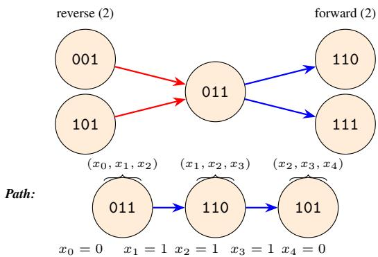
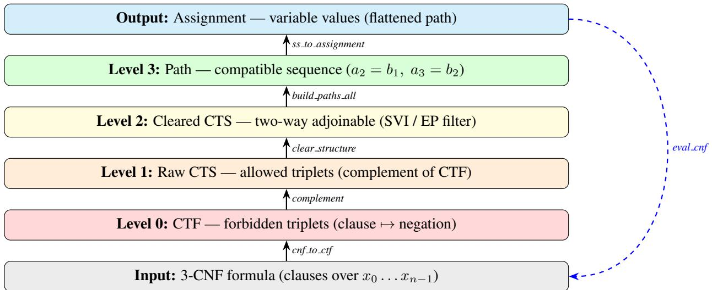
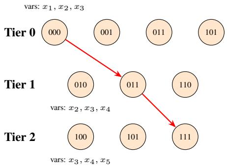
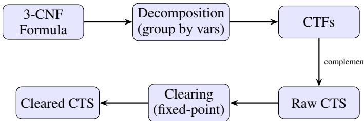
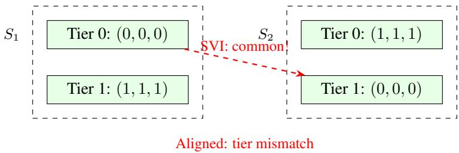
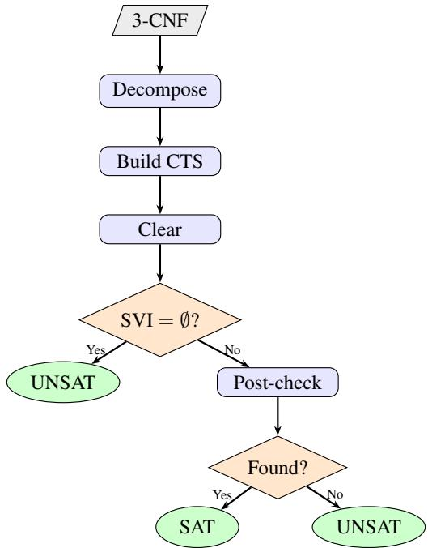

# FORMAL VERIFICATION OF ROMANOV’S TRIPLET LOGIC: A VERIFIED FILTER FOR SLIDING-WINDOW 3-CNF WITH APPLICATION TO STRUCTURED FORMULAS

PREPRINT

Dmitry V. Alexandrov   
HSE University   
Moscow, Russia   
dvalexandrov@hse.ru

August 20, 2026

## ABSTRACT

We present the first mechanised formalisation of Romanov’s Triplet Logic (TLS) in the Rocq proof assistant. TLS is a triplet-based combinatorial framework for reasoning about compatible paths through layered triplet structures, called Compact Triplets Structures (CTS), and their intersection via Romanov’s Effective Procedure, which we refer to as Simple Vertex Intersection (SVI). Originally motivated by Boolean satisfiability, TLS constitutes a self-contained mathematical theory whose formal properties had not been previously established. We formalise the core of TLS in Rocq, including Compact Triplets Formulas (CTF), CTS, hyperstructures, clearing, and SVI. For the well formed sliding-window fragment we verify a clause-by-clause CNF-to-CTF translation, the clearing procedure, and aligned intersection, and we prove explicit polynomial-time bounds for the filter stages. Our main contribution is a precise correctness boundary: the existence of a joint satisfying set implies non-emptiness of SVI, but the converse does not hold in general; for aligned structures we recover a complete bi-implication, extended to systems of structures. We also formalise soundness of grouped-window translation and exhibit a formal counterexample to its completeness. We introduce VFR, an extracted OCaml prototype that provides a verified decision procedure for the sliding-window fragment and a sound one-sided filter for general 3-CNF, with a Python runtime and reproducible Docker packaging. Benchmarks on random and structured instances confirm the predicted behaviour, and the complete toolchain is available as a curated Zenodo artifact. The Rocq development comprises more than 23,000 lines of code across seventeen files, with 427 proved lemmas and theorems and zero admitted goals.

Keywords SAT solving · triplet logic · formal verification · Rocq · exhaustive enumeration · combinatorial structures one-sided filter · polynomial-time bounds · verified complexity

## 1 Introduction

The Boolean satisfiability problem (SAT) is a cornerstone of computational complexity theory, with applications ranging from hardware verification to automated planning [8]. Despite decades of research, no polynomial-time algorithm is known for 3-SAT, and the prevailing conjecture is that P ̸= NP [1, 2]. Nevertheless, numerous alternative approaches have been proposed, each offering new structural insights into the problem.

One such approach is Romanov’s Triplet Logic (TLS), introduced in “Non-Orthodox Combinatorial Models Based on Discordant Structures” [3]. TLS encodes a 3-CNF (Conjunctive Normal Form) formula as a Compact Triplets Formula (CTF), transforms it into a Compact Triplets Structure (CTS) containing all triplets not forbidden by the corresponding clause group, and applies Simple Vertex Intersection (SVI), which constructs hyperstructures via tierwise intersection. Romanov developed this approach with the goal of efficient SAT solving via tier-wise triplet analysis and hyperstructure intersection.

Following Romanov’s original terminology, we refer to these tiered combinatorial objects as Compact Triplets Structures (CTS). Throughout the paper, the abbreviation CTS always denotes Romanov’s construction, formalised and extended here in the Rocq proof assistant.

Romanov’s key insight is a novel geometric decomposition: instead of searching over variable assignments directly, TLS searches over paths through a layered graph of triplet tiers. This perspective is structurally distinct from classical DPLL (Davis–Putnam–Logemann–Loveland) / CDCL (Conflict-Driven Clause Learning) approaches and offers a new combinatorial perspective on constraint satisfaction problems. In this paper we treat TLS as a self-contained mathematical framework and subject it to rigorous formal analysis, using 3-CNF formulas as a motivating source of benchmark instances rather than as the primary object of study.

Our contributions. We formalize the core of TLS in the Rocq proof assistant [4] (version 9.1.1), complemented by exhaustive model checking. Our findings are:

1. We formalize CTF, CTS, hyperstructures, and SVI in Rocq, proving basic correctness lemmas about path construction and compatibility (Section 4).

2. We clarify the correctness boundary of TLS: the existence of a joint satisfying set (JSS) implies SVI’s nonemptiness for non-empty structures (JSS ⇒ SVI non-emptiness, proved in Rocq), but the converse does not hold in general (Section 6). We validate the failure of the reverse direction with both Rocq counterexamples and exhaustive Python-based model checking (Section 5).

3. We introduce VFR (Verified Filter for Romanov’s triplet logic), a prototype implementation (Section 7). It uses the verified clause-by-clause pipeline for well-formed sliding-window CNF and falls back to an unverified grouped-window heuristic for general 3-CNF (Section 1.1).

4. We benchmark VFR on random and structured 3-CNF instances (Section 8). On the verified fragment agreement is 100%; on general random instances the filter is ineffective.

5. We prove a new theorem in Rocq establishing that the aligned intersection of two CTS structures has a nonempty set of full-length paths if and only if a compatible joint satisfying set exists (Theorem 4.3). This provides the formal foundation for the post-check. The equivalence is conceptually straightforward—it is essentially a restatement of the definition of a compatible path in the intersection—but its verified mechanisation yields an extracted, correct-by-construction decision procedure for aligned structures.

6. We extend this bi-implication to systems of k aligned structures (Theorem 4.4), proving that the systemic tier wise intersection contains a full-length path iff a compatible joint satisfying set exists for the entire system.

7. We formalize the clearing procedure’s termination using a tight measure (cts size) and prove a semantic fixed-point characterisation: every surviving triplet has compatible neighbours in adjacent tiers (Section 4).

8. We identify a semantic gap between the weak formula-level predicate satisfies ctf (which checks each 3-bit window independently) and structure-level path existence (build paths all requires globally compatible consecutive triplets). We formalize this in Theorem 4.7: there exist CTFs that admit locally consistent assignments under satisfies ctf yet yield no compatible path after clearing (Section 6). This motivates the aligned-intersection approach, for which we recover completeness.

Implications. Our work sharpens the understanding of TLS. SVI is not a complete decision procedure. However, when SVI reports emptiness, the formula is guaranteed unsatisfiable—a property we prove formally.

Furthermore, TLS offers a novel combinatorial visualisation of SAT instances through tiered triplet structures. This geometric perspective may aid in educational contexts and in analysing formula structure before invoking expensive CDCL solvers.

Why this matters for automated reasoning. The paper’s primary audience is the formal-verification and automatedreasoning community rather than the SAT-competition community. Our goal is not to outperform CDCL on benchmark suites—a task for which decades of engineering have produced highly optimised, unverified solvers—but to demonstrate that a non-classical combinatorial framework can be fully mechanised, its correctness boundary exactly determined, and its polynomial fragments certified with concrete complexity bounds. Such mechanised reconstructions are valuable because they (i) expose hidden assumptions that informal descriptions miss, (ii) produce certified building blocks that compose into larger verified systems, and (iii) provide rigorous foundations for teaching and further research.

More concretely, TLS offers three affordances that complement verified CDCL solvers. As an intermediate representation, triplet tiers make variable-interaction structure explicit: a formula analyst can inspect which triplets survive clearing and immediately see local inconsistencies that would be buried in a flat clause list. As a preprocessor, the verified SVI filter can be placed in front of any solver; when it reports UNSAT the answer is proof-carrying, and when it is inconclusive the solver falls back to standard search with no loss. As a certification target, the geometric path-building algorithm yields a concrete witness—a sequence of compatible triplets—that is easier to audit than a DRAT (Delete-Resolution-Asymmetric-Tautology) trace. These properties do not make TLS faster than CDCL, but they make it structurally transparent, and the polynomial bounds are machine-checked rather than merely claimed.

Structure of the paper. Section 2 introduces CTF, CTS, and SVI. Section 4 describes our Rocq formalisation and proves the forward direction. Section 5 reports empirical validation results that show the reverse direction fails; the boundary is detailed in Section 6. Section 7 presents VFR, validated experimentally in Section 8. Section 9 discusses residual benefits, related work, limitations, and future directions. Section 10 concludes.

## 1.1 Scope and limitations

To avoid misunderstanding, we state the scope of the formalisation explicitly. Table 1 summarizes every component of the pipeline, marking each as formally verified, trusted, or heuristic. Verified in Rocq: CTF, CTS, clearing, aligned intersection, and the clause-by-clause CNF-to-CTF translation in which every clause becomes its own tier. For this fragment theorems about path existence, SVI soundness, and polynomial-time bounds are mechanically proved.

Not verified: the grouped-window decomposition that merges multiple clauses sharing the same variable triple into a single tier; the dense sliding-window, overlapping-group, and mixed-overlap benchmarks; and the general 3-CNF heuristic pipeline. These are empirical illustrations of an unverified heuristic, not formal results. See Section 3 for the heuristic pipeline and Section 8 for the benchmarks.

Table 1: Trust boundary: verified components, trusted base, and heuristics. “Extr.” indicates whether the component is extracted to executable OCaml code.
<table><tr><td>Component</td><td>Status</td><td>Reference / Caveat</td><td>Extr.</td></tr><tr><td>CTF, CTS, clearing definitions</td><td>Verified</td><td>Rocq 9.1.1, no admitted proofs</td><td>No</td></tr><tr><td>SVI soundness (forward)</td><td>Verified</td><td>Theorem 4.1</td><td>No</td></tr><tr><td>Aligned intersection (bi-impl.)</td><td>Verified</td><td>Theorem 4.3</td><td>No</td></tr><tr><td>Systemic aligned (k structs)</td><td>Verified</td><td>Theorem 4.4 O(n2) bounds for</td><td>No No</td></tr><tr><td>Polynomial complexity</td><td>Verified</td><td>clearing/SVI; n = CTS size (tiers+triplets). Full solver includes exponential post-check</td><td></td></tr><tr><td>CNF→CTF (clause-by-clause) Strong CTF predicate</td><td>Verified</td><td>Sliding-window CNF only</td><td>Yes</td></tr><tr><td>Swansea RUP (Reverse Unit Propagation) checker</td><td>Verified</td><td>GapClosure.v</td><td>No</td></tr><tr><td></td><td>Trusted base</td><td>Rocq-extracted elsewhere</td><td>Yes N/A</td></tr><tr><td>OCaml extraction Z3 SAT solver</td><td>Trusted base Trusted external</td><td>Rocq → OCaml compiler UNSAT proofs checked by</td><td>N/A</td></tr><tr><td></td><td></td><td>Swansea</td><td></td></tr><tr><td>Grouped-window decomposition</td><td>Heuristic</td><td>Forward soundness only; completeness open</td><td>No</td></tr><tr><td>Dense / overlap / mixed pipelines</td><td>Heuristic</td><td>Empirical evaluation only</td><td>No</td></tr><tr><td>General 3-CNF (Z3 fallback)</td><td>Heuristic</td><td>Unverified decomposition</td><td>No</td></tr></table>

## 2 Background: Romanov’s Triplet Logic

Verified core (mechanised in Rocq). For well-formed sliding-window CNF, the clause-by-clause translation, clearing, aligned intersection, and SVI filter are formally proved correct (Table 1). Heuristic shell (unverified). Grouped-window decomposition, greedy permutation search, overlapping-group handling, post-check backtracking, and the general 3-CNF pipeline are empirical heuristics with no formal guarantee.

## 2.1 Compact Triplets Formula (CTF)

A 3-CNF formula over n Boolean variables $x _ { 1 } , \ldots , x _ { n }$ is a conjunction of clauses, each a disjunction of exactly three literals. In TLS, a clause is represented as a triplet $( v _ { 1 } , v _ { 2 } , v _ { 3 } ) \in \{ 0 , 1 \} ^ { 3 }$ relative to an ordered triple of variable indices (i, j, k). A Compact Triplets Formula (CTF) is a collection of such triplets grouped by their variable indices into tiers.

Definition 2.1 (Tier). A tier over variable indices $( i , j , k )$ is a set of triplets $t \subseteq \{ 0 , 1 \} ^ { 3 }$ . A CTF is a list of tiers.

Listing 1: CTF-to-CTS Pipeline (pseudocode)   
1 function ClauseToTriplet ( clause ):   
2 // clause = [( var\_0 , neg\_0 ), (var\_1 , neg\_1 ), (var\_2 , neg\_2 )]   
3 return ( neg\_0 , neg\_1 , neg\_2 )   
4   
5 function CNFtoCTF ( formula ):   
6 return [ ClauseToTriplet (c) for c in formula if |c| == 3 ]   
7   
8 function CTFtoCTS (ctf ):   
9 return [ AllTriplets \\ tier for tier in ctf ]   
10   
11 function CNFtoCTS ( formula ):   
12 ctf := CNFtoCTF ( formula )   
13 raw := CTFtoCTS (ctf )   
14 return ClearStructure (raw)

The pipeline translates each 3-literal clause into a forbidden triplet (negation pattern), builds a CTF tier per clause, and then forms the raw CTS by tier-wise complementation. The clearing procedure (Listing 2) is applied last to remove incompatible triplets.

## 2.2 Compact Triplets Structure (CTS)

Given a CTF F, the Compact Triplets Structure $S = \mathrm { C T S } ( F )$ is obtained by replacing each tier t of F with its complement:

$$
S _ { i } = \{ 0 , 1 \} ^ { 3 } \setminus F _ { i } .\tag{1}
$$

Intuitively, S contains all triplets that are not forbidden by the corresponding clause group.

Definition 2.2 (Compatibility). Two triplets $a = ( a _ { 1 } , a _ { 2 } , a _ { 3 } )$ and $b = ( b _ { 1 } , b _ { 2 } , b _ { 3 } )$ are compatible if their overlapping positions agree:

$$
a _ { 2 } = b _ { 1 } \quad { \mathrm { a n d } } \quad a _ { 3 } = b _ { 2 } .\tag{2}
$$

Lemma 2.1 (Compatibility Degree). For every triplet $\begin{array} { r l r } { t } & { { } \in } & { \{ 0 , 1 \} ^ { 3 } } \end{array}$ there are exactly two triplets t<sup>′</sup> with compatible(t, t<sup>′</sup>) = true (forward) and exactly two with compatible(t<sup>′</sup>, t) = true (backward).

Consequently, the clearing procedure cannot remove a triplet because it has “too many” neighbours; rather, it removes triplets whose two potential partners have already been eliminated. For a fixed triplet $t = ( 0 , 1 , 1 )$ , exactly two triplets are compatible in the forward direction and exactly two in the reverse direction (Figure 1).



Figure 1: Top: the compatible-degree property for triplet $t = ( 0 , 1 , 1 )$ . Exactly two triplets are compatible in each direction (2-regular relation). Bottom: a valid path 011 → 110 → 101 through three tiers, inducing the assignment $x _ { 0 } = 0 , x _ { 1 } = 1 , x _ { 2 } = 1 , x _ { 3 } = 1 , x _ { 4 } = 0$ . Overlapping positions enforce consistency across adjacent triplets.

A path through a CTS $\boldsymbol { S } ~ = ~ \left[ t _ { 1 } , \ldots , t _ { m } \right]$ is a sequence of triplets $\boldsymbol { p } ~ = ~ \left[ c _ { 1 } , \ldots , c _ { m } \right]$ such that $c _ { i } ~ \in ~ t _ { i }$ and adjacent triplets are compatible. Each full-length path induces a variable assignment by flattening the triplets: if $\boldsymbol { p } = [ ( a _ { 1 } , b _ { 1 } , c _ { 1 } ) , ( a _ { 2 } , b _ { 2 } , c _ { 2 } ) , \dots ]$ , the corresponding satisfying set is the list $s s \stackrel { - } { = } [ a _ { 1 } ; b _ { 1 } ; c _ { 1 } ; a _ { 2 } ; b _ { 2 } ; \bar { c } _ { 2 } ; . . . ]$ . A list ss

satisfies a CTS S if every consecutive triple $( s s [ 3 i ] , s s [ 3 i + 1 ] , s s [ 3 i + 2 ] )$ belongs to tier i. A joint satisfying set (JSS) of two structures $S _ { 1 } , S _ { 2 }$ is a single list ss that satisfies both simultaneously.

Figure 2 summarizes the abstraction stack. The construction pipeline transforms a 3-CNF formula (bottom) into a concrete assignment (top) through a sequence of representation changes; the dashed arrow shows the verified feedback loop.

  
Figure 2: Levels of abstraction in VFR. Each layer transforms the representation toward a concrete variable assignment; the dashed blue arrow shows the verified feedback loop (OCaml-extracted eval cnf).

Figure 3 illustrates a tier and a compatible path through three tiers. Each tier contains triplets over a sliding window of three variables; adjacent tiers overlap by two variables, ensuring that compatibility propagates constraints forward.

  
Figure 3: A path (red arrows) through three tiers. Each tier covers a sliding window of three variables. Compatibility requires agreement on the two overlapping positions.

## 2.3 Simple Vertex Intersection (SVI)

For two CTS structures $S _ { 1 }$ and $S _ { 2 } ,$ the Simple Vertex Intersection constructs a hyperstructure $H = \mathrm { S V I } ( S _ { 1 } , S _ { 2 } )$ as follows:

1. Build basic graphs $G _ { 1 }$ and $G _ { 2 }$ where vertices are triplets annotated with their tier index.

2. Compute the set of common vertices: triplets that appear in $G _ { 1 }$ and whose triplet value appears somewhere in $G _ { 2 }$ (not necessarily at the same tier index).

3. Return the hyperstructure containing these common vertices.

In Romanov’s framework, H is non-empty if and only if $S _ { 1 }$ and $S _ { 2 }$ share a joint satisfying set—an assignment that satisfies both structures tier-by-tier (a claim we refute in Section 6).

The definition extends naturally to $k \geq 2$ structures. The Systemic Simple Vertex Intersection (SSVI) computes common vertices across all pairs of structures in a family $\boldsymbol { S } = \left\{ \boldsymbol { S } _ { 1 } , \ldots , \boldsymbol { S } _ { k } \right\}$ , producing a hyperstructure system HSS. Non-emptiness of HSS implies that every pair of structures in S shares a common triplet, which is the analogue of Theorem 4.1 for multiple structures (Theorem 4.2 below).

From CNF to CTS. The concrete construction algorithms—grouping clauses by variable sets, building complement tiers, and clearing—are described in Section 3. Only the clause-by-clause pipeline is formally verified (Table 1).

## 3 Heuristic Pipeline

Caveat. The pipeline described below—grouping clauses by variable sets and constructing CTS tiers via complementation—is the one used in the VFR prototype. It is not formally verified in Rocq; only the simplified clause-by-clause pipeline of Section 3.1 (for well-formed sliding-window CNF) is mechanised. The following de scription serves as operational documentation and motivation for the verified fragment.

We now describe the concrete algorithms for constructing CTS from a 3-CNF formula. The pipeline consists of three phases: decomposition, tier construction, and clearing. Figure 4 illustrates the overall flow.

  
Figure 4: The TLS construction pipeline: a 3-CNF formula is decomposed into CTFs, converted to raw CTS by complementation, and then cleared by iterative removal of incompatible lines.

Step 1: Decomposition. Given a 3-CNF formula ϕ with n variables and m clauses, group the clauses by their sets of variable indices. For each group g with variables $\{ i , j , k \}$ and |g| clauses:

1. Create a permutation $\pi = [ i , j , k , \dots ]$ where the first three positions are the group’s variables and the remaining $n - 3$ positions are the other variables in some fixed order.

2. For each clause $C = ( \ell _ { i } \vee \ell _ { j } \vee \ell _ { k } )$ in the group, encode it as a triplet $( v _ { 1 } , v _ { 2 } , v _ { 3 } )$ where $v _ { p } = 1$ if the p-th literal is negated and $v _ { p } = 0$ otherwise.

3. Collect all triplets into a CTF $F _ { g }$ annotated with variable indices (i, j, k).

The result is a list of CTFs $[ F _ { 1 } , \ldots , F _ { k } ]$ where $k \leq m$

Step 2: Tier Construction. For each CTF F with tiers grouped by variable indices $( i , j , k )$

1. For each tier t containing forbidden triplets $T \subseteq \{ 0 , 1 \} ^ { 3 }$ , construct the complement tier $t ^ { \prime } = \{ 0 , 1 \} ^ { 3 } \backslash T .$

2. Assemble the tiers into a raw CTS S<sub>raw</sub>.

Step 3: Clearing Procedure. The raw CTS may contain incompatible triplets that cannot participate in any full length path. The clearing procedure removes them iteratively (Listing 2):

Listing 2: Clearing Procedure (pseudocode)  
function ClearSingleTier ( tier\_idx , all\_tiers ):   
2 current := all\_tiers [ tier\_idx ]   
3 prev := all\_tiers [ tier\_idx -1] if tier\_idx > 0 else AllTriplets   
4 next := all\_tiers [ tier\_idx +1] if tier\_idx +1 < | all\_tiers | else AllTriplets

```lua
return { t in current | exists p in prev : Compatible (t , p )
and exists n in next : Compatible (t,n) }
function ClearStructurePass (S):
return [ ClearSingleTier (i, S) for i = 0 .. |S|-1 ]
function ClearStructure (S):
repeat |S| times :
S := ClearStructurePass (S)
return S
```

Here AllTriplets denotes the set of all $2 ^ { 3 } = 8$ possible triplet values; it is used as a boundary condition so that end tiers do not need special-casing.

This is a fixed-point computation: in each pass, a new tier is built containing only triplets that have at least one compatible neighbour in each adjacent tier (or lie at a boundary). The process repeats until no more triplets are eliminated. The resulting structure is the cleared CTS. Note that the implementation builds a fresh list ([t for t in current if ...]) using a functional list comprehension rather than in-place mutation.

Example. Consider the formula over 3 variables:

$$
\phi = ( x _ { 1 } \lor x _ { 2 } \lor x _ { 3 } ) \land ( \neg x _ { 1 } \lor x _ { 2 } \lor \neg x _ { 3 } ) \land ( x _ { 1 } \lor \neg x _ { 2 } \lor x _ { 3 } ) .
$$

All clauses share variables {1, 2, 3}, so decomposition yields a single CTF with one tier and forbidden triplets:

$$
T = \{ ( 0 , 0 , 0 ) , ( 1 , 0 , 1 ) , ( 0 , 1 , 0 ) \} .
$$

The complement tier contains the remaining 5 triplets:

$$
t ^ { \prime } = \{ ( 0 , 0 , 1 ) , ~ ( 0 , 1 , 1 ) , ~ ( 1 , 0 , 0 ) , ~ ( 1 , 1 , 0 ) , ~ ( 1 , 1 , 1 ) \} .
$$

Since there is only one tier, the clearing procedure does nothing. The final CTS consists of this single tier.

Listing 3: Path-Building Algorithm (pseudocode)

function ExtendPaths ( partial\_paths , tier ):   
if partial\_paths is empty :   
return [ [t] for t in tier ]   
result := []   
for path in partial\_paths :   
for t in tier :   
if Compatible (t, head ( path )):   
result . append ( [t] + path )   
return result   
function BuildPathsAll (cts ):   
paths := []   
for tier in cts :   
paths := ExtendPaths (paths , tier )   
return [ p for p in paths if len(p) == len( cts) ]

Definition 3.1 (Sliding-Window CNF). A 3-CNF formula ϕ with n variables is a well-formed sliding-window CNF if its clauses can be ordered so that the i-th clause contains exactly the variables $( x _ { i } , x _ { i + 1 } , x _ { i + 2 } )$ for $i = 0 , \ldots , n - 3 .$ Multiple clauses may share the same window.

Remark 3.1 (Tractability of the verified fragment). Well-formed sliding-window CNF has primal graph pathwidth $\leq$ 2: each clause covers three consecutive vertices of a path, so the primal graph is a subgraph of the square of a path. SAT for graphs of bounded pathwidth is a classic tractable case: dynamic programming on a path decomposition solves it in linear time. Consequently, the verified polynomial bounds for clearing and SVI do not expand the class of polynomially solvable 3-SAT instances; they merely reconstruct the same pathwidth-≤ 2 fragment within Romanov’s framework, but with a formally certified algorithm. The value lies in the mechanisation—certifying that Romanov’s triplet constructions yield a correct decision procedure for this fragment—not in a new complexity improvement.

## 3.1 Why General 3-CNF Requires NP-Hard Permutation Search

The decomposition described above preserves satisfiability only when the input formula is already a well-formed sliding-window CNF (Definition 3.1), i.e., every clause uses three consecutive variables. For an arbitrary 3-CNF formula containing clauses such as $\left( x _ { 1 } \vee x _ { 5 } \vee x _ { 9 } \right)$ , no variable ordering can place those three variables in consecutive positions while simultaneously satisfying the same requirement for all other clauses.

Formally, the question “does there exist a permutation of variables that makes this 3-CNF sliding-window?” reduces to the following problem: given a 3-uniform hypergraph $H = ( V , E )$ , does there exist a linear ordering of V such that every hyperedge occupies three consecutive positions? This is equivalent to determining whether H has pathwidth at most 2, which is NP-complete.

Consequently, a polynomial-time preprocessing step cannot, in general, transform an arbitrary 3-CNF into an equivalent sliding-window CNF unless P = NP. This justifies our restriction: our Rocq theorems apply to sliding-window CNF formulas; general decomposition falls outside the verified fragment (Table 1).

Permutation search. Although optimal permutation search is NP-complete, we formalize and verify an exhaustive permutation search (file Permutation.v) that guarantees to find a variable ordering making the formula slidingwindow whenever one exists. The Rocq formalisation defines permute cnf (apply a variable permutation) and a sliding-window predicate (checked via is sliding cnf bool), together with a length-preservation lemma. The verified algorithm exhaustive sliding window permutation enumerates all n! permutations and returns the first valid one; we prove both soundness (any returned permutation is correct) and completeness (if a sliding-window ordering exists, it is found). Because of factorial complexity the search is practical only for $n \leq 8 ( { \bar { 8 ! } } = 4 0 3 2 0 )$ For larger instances the Python solver falls back to an unverified heuristic backtracking search (module permutation heuristic.py) or delegates directly to the external CDCL pipeline. A proof that permutations preserve sat isfiability (permute cnf preserves sat) and a verified greedy search algorithm is left to future work. When a permutation is found, the solver follows the verified clause-by-clause pipeline on the permuted formula; when it fails, the fallback path verified by external proof checking (Z3 + Swansea RUP checker) takes over. This yields a “heuris tic fallback” path: for small structured instances the entire pipeline is formally guaranteed, while for large random instances the trust boundary reduces to the external proof checker.

## 4 Formalisation in Rocq

We formalised the core data structures and algorithms of TLS in Rocq 9.1.1. The development is organised into sixteen files (Table 2):

Table 2: Overview of the Rocq development files
<table><tr><td>File</td><td>Contents</td></tr><tr><td>Basic.v</td><td>Triplets, tiers, compatibility</td></tr><tr><td>Construction.v</td><td>CTF→CTS, clearing procedure</td></tr><tr><td>Algorithm.v</td><td>Path construction, extend_paths, build_paths</td></tr><tr><td>Permutation.v</td><td>Verified exhaustive sliding-window permutation search</td></tr><tr><td>Hyperstructure.v</td><td>SVI, basic graphs, tier intersection</td></tr><tr><td>Complexity.v</td><td>Formal cost model, polynomial bounds</td></tr><tr><td>Theorems.v</td><td>Main theorems (Theorems 1-3)</td></tr><tr><td>SystemicAligned.v</td><td>Systemic aligned completeness for k structures</td></tr><tr><td>FormulaTranslation.v</td><td>CNF→CTF translation and equivalence</td></tr><tr><td>Counterexample.v</td><td>Formal counterexamples</td></tr><tr><td>Examples.v</td><td>Test cases</td></tr><tr><td>Structured.v</td><td>Grouped sliding CNF, brute-force oracles, constructive solver</td></tr><tr><td>Relabeling.v</td><td>Variable relabeling for single-group CNF</td></tr><tr><td>Overlapping.v</td><td>Conditional merge for overlapping groups (experimental)</td></tr><tr><td>GapClosure.v</td><td>Gap-closure lemmas (strong CTF, tight bounds, completeness chain)</td></tr><tr><td>HeuristicDecomposition.v</td><td>Verified checker for grouped sliding-window decomposition</td></tr><tr><td>Extraction.v</td><td>OCaml extraction directives</td></tr></table>

## 4.1 Key Definitions

A triplet is a triple of Booleans. A tier is a list of triplets. A CTS (CTS) is a list of tiers. A satisfying set ss is a flattened path: if the underlying path of triplets is $[ ( a _ { 1 } , b _ { 1 } , c _ { 1 } ) , ( a _ { 2 } , b _ { 2 } , c _ { 2 } ) , \dots ] ,$ , then $s s = [ a _ { 1 } ; b _ { 1 } ; c _ { 1 } ; a _ { 2 } ; b _ { 2 } ; c _ { 2 } ; . . . ]$ The function extract triplet local(ss, i) retrieves the i-th triplet as $( s s [ 3 i ] , s s [ \bar { 3 } i + 1 ] , s s [ 3 i + 2 ] )$ (or None if the list is too short). Consequently, for a satisfying set produced by ss from path flat, extract triplet local(ss, i) yields the sliding-window triplet over variables $( x _ { i } , x _ { i + 1 } , x _ { i + 2 } )$ (the flattening enforces $b _ { i } = a _ { i + 1 }$ and $c _ { i } = b _ { i + 1 }$ , so the logical window slides by one variable even though the list indices advance by three). The constructor ss from path flat flattens a path of triplets $[ ( a _ { 1 } , b _ { 1 } , c _ { 1 } ) , ( a _ { 2 } , \bar { b } _ { 2 } , c _ { 2 } ) , . . . ]$ into $[ a _ { 1 } ; b _ { 1 } ; c _ { 1 } ; a _ { 2 } ; b _ { 2 } ; c _ { 2 } ; . . . ]$ , so consecutive triplets share the overlapping variables $b _ { 1 } = c _ { 0 }$ and $c _ { 1 } = b _ { 2 }$ required by compatible.

Definition 4.1 (Satisfying Set). Let $S = [ T _ { 0 } , T _ { 1 } , \dots , T _ { m - 1 } ]$ be a CTS and let $s s = [ v _ { 0 } , v _ { 1 } , \dotsc ]$ be a list of Boolean values. For each tier index i, let trip $( s s ) \bar { = } ( s s [ 3 i ] , s s [ 3 i + \bar { 1 } ] , s s [ 3 i + 2 ] )$ (or undefined if the list is too short). Then ss satisfies S, written is satisfying set(S, ss), iff for every $i < m$ the triplet trip (ss) is defined and belongs to $T _ { i }$

Definition 4.2 (Joint Satisfying Set). A list ss is a joint satisfying set of $S _ { 1 }$ and $S _ { 2 } .$ , written $\mathrm { J S S } ( S _ { 1 } , S _ { 2 } , s s )$ , iff it satisfies both structures simultaneously: is satisfying $\operatorname { s e t } ( S _ { 1 } , s s ) \wedge$ is satisfying set(S<sub>2</sub>, ss).

An empty structure is vacuously satisfiable; non-emptiness of both structures is enforced as an explicit premise in Theorem 4.1 $( S _ { 1 } \neq \mathbb { I } , S _ { 2 } \neq \mathbb { I } )$

## 4.2 Design Choices

We represent triplets as native triples (bool \* bool \* bool) and structures as lists rather than vectors or finite types. This choice reflects a trade-off between expressiveness and proof automation: lists provide structural induction principles that Rocq’s auto and lia tactics handle well, while avoiding the proof-engineering overhead of dependent types for fixed-length sequences.

A subtle issue arose with the definition of path. Our initial attempt used Definition path := list triplet., which created a type synonym that is convertible but not unifiable with list triplet. This blocked rewrite and subst tactics across the development. Removing the type synonym and using list triplet directly resolved the issue and is a lesson for other mechanisation efforts.

## 4.3 Proved Lemmas

We proved 427 lemmas and theorems across the seventeen files. The development required nested inductions and careful handling of arithmetic side conditions involving nth error and tier lengths. The most technically demanding was build paths aux contains expected path, which required nested induction on the accumulator of build paths aux together with delicate arithmetic reasoning about nth error and tier lengths. Key lemmas include:

• Path existence (Lemma 4.3): if a satisfying set exists, build paths aux contains a path extending any suffix with triplets drawn from the set.

• Forward direction (Theorem 4.1): existence of a joint satisfying set implies non-emptiness of SVI.

• Aligned intersection equivalence (Theorem 4.3): for structures of equal length, the aligned intersection has a full-length path iff a compatible joint satisfying set exists.

• Systemic aligned completeness (Theorem 4.4): for a system of k aligned structures, the systemic tier-wise intersection has a full-length path iff a compatible joint satisfying set exists for the entire system.

• CTF-to-CTS soundness (Lemma 4.5): every path produced by build paths all on ctf to cts yields a satisfying assignment for both the original formula and the cleared structure.

• Clearing fixed-point characterisation (Theorem 4.10): after clearing, every remaining triplet has compatible neighbours in both adjacent tiers (or lies at a boundary).

• Raw construction completeness (Lemma 4.7): if a satisfying set is compatible with the raw (non-cleared) CTS, then build paths all on that raw CTS is non-empty.

• Cleared CTF strong completeness (Lemma 4.8): for a non-empty cleared CTF, compatibility-aware satisfiability implies non-emptiness of build paths all. This closes the loop between the strong predicate and path existence for the cleared structure.

• Semantic gap between weak satisfiability and path existence (Theorem 4.7): there exist CTFs that admit locally consistent assignments under satisfies ctf yet yield no compatible path after clearing. This shows that the weak predicate does not guarantee global path existence; completeness is recovered only at the level of aligned intersection (Theorem 4.3).

• CNF-to-CTF satisfiability equivalence (Theorem 4.5): for well-formed sliding-window CNF formulas, satisfiability in standard CNF semantics is equivalent to satisfiability of the translated CTF. The formalisation uses a simplified clause-by-clause pipeline: each clause becomes a separate CTF tier containing exactly one forbidden triplet (its negation pattern). The proof constructs a greedy assignment sat assignment aux that satisfies each clause independently. Because the translation is one-to-one, consecutive tiers necessarily share overlapping variables, and the satisfying set ss from path flat enforces global consistency. This is not the grouped-window pipeline of Section 3; it is an equivalent simplified view used for formal verification.

• Path existence equivalence (Lemma 4.4): a compatible satisfying set exists for a non-empty structure iff build paths all contains at least one path.

• Raw construction emptiness (Lemma 4.6): a tier of build cts from ctf is empty iff the corresponding formula tier contains all 8 triplets (per-tier complementation).

• Compatible degree (Lemma 2.1): for any triplet, exactly 2 triplets are compatible in the forward direction and exactly 2 in the reverse direction.

Theorem 4.1 (Forward Direction of SVI). Let $S _ { 1 } , S _ { 2 }$ be non-empty CTS. If there exists a joint satisfying set ss for $S _ { 1 }$ and $S _ { 2 }$ (in the weak, index-flexible sense), then the Simple Vertex Intersection is non-empty:

$$
\exists s s . \operatorname { J S S } ( S _ { 1 } , S _ { 2 } , s s ) \implies \operatorname { S V I } ( S _ { 1 } , S _ { 2 } ) \neq \emptyset .
$$

Proofsketch. Every triplet $t _ { i }$ of ss appears in some tier of both $S _ { 1 }$ and $S _ { 2 } .$ SVI computes common vertices by value, so at least $t _ { 0 }$ is a common vertex. Hence the hyperstructure contains $t _ { 0 }$ and is non-empty.

Theorem 4.2 (Systemic Forward Direction). Let $\boldsymbol { S } = [ S _ { 1 } , \ldots , S _ { k } ]$ be a system of non-empty CTS. If there exists a joint satisfying set for all structures in S, then the systemic SVI produces a non-empty hyperstructure system:

$$
\exists s s \ . \ \forall i \leq k \ . { \mathrm { ~ i s . ~ i s . s a t i s f y i n g . s e t } } ( S _ { i } , s s ) \implies \operatorname { S S V I } ( S ) \neq \emptyset .
$$

Proofsketch. SSVI applies the pairwise SVI to every pair $( S _ { 1 } , S _ { i } )$ with $i > 1$ . By Theorem 4.1 each pairwise SVI is non-empty because ss satisfies both structures. Therefore every hyperstructure in the system is non-empty.

Theorem 4.3 (Aligned Intersection Equivalence). For all $S _ { 1 } , S _ { 2 }$ with $| S _ { 1 } | = | S _ { 2 } |$ , if both are non-empty, then

$$
\exists \operatorname { J S S } _ { \mathrm { c o m p a t } } ( S _ { 1 } , S _ { 2 } ) \iff \operatorname { b u i l d \_ p a t h s \_ a l l } ( \operatorname { c t s } _ { \cdot } \operatorname { i n t e r s e c t i o n } _ { \cdot } \operatorname { r a w } ( S _ { 1 } , S _ { 2 } ) ) \neq \mathbb { I } .
$$

Although the statement is intuitively clear—a compatible path through the tier-wise intersection exists precisely when a sequence of triplets is compatible across both structures—it is exactly the kind of “obvious” fact that often breaks during mechanisation. The value of the formal proof is that it certifies consistency among three independently defined concepts (the compatibility-aware satisfying set, the aligned intersection operation, and the inductive path-building algorithm) and establishes that the right-hand side is computable and has been extracted to OCaml (Section 7). Reconciling the recursive definitions of is satisfying set compat and build paths all is a non-trivial engineering task: subtle mismatches in base cases or accumulator shapes that a human reader overlooks become hard proof obligations in Rocq.

Lemma 4.1 (Path Extension). Let R be a suffix of a CTS, ss a compatible satisfying set, and acc a set of partial paths. If every path in acc can be extended by triplets drawn from ss, then build paths aux $( R , a c c )$ contains at least one full-length extension whose prefix consists exactly of the triplets prescribed by ss.

Corollary 4.1 (Aligned Intersection Equivalence). For all $S _ { 1 } , S _ { 2 }$ with $\begin{array} { r l r } { | S _ { 1 } | } & { { } = } & { | S _ { 2 } | } \end{array}$ , let $\begin{array} { r l } { I } & { { } = } \end{array}$ cts intersection raw $( S _ { 1 } , S _ { 2 } )$ . Then

$$
\exists s s \ . \ \mathrm { J S S } _ { \mathrm { c o m p a t } } ( S _ { 1 } , S _ { 2 } , s s ) \iff \mathrm { b u i l d \_ p a t h s \_ a l l } ( I ) \neq \mathbb { I } .
$$

Theorem 4.4 (Systemic Aligned Completeness). Let $\boldsymbol { S } = [ S _ { 1 } , S _ { 2 } , \ldots , S _ { k } ]$ be a system of aligned CTS structures (all of equal length). Define the systemic raw intersection $I _ { k } =$ cts intersection raw $\operatorname { k } ( S )$ . Then

$$
\exists s s \ . \ \forall i \leq k \ . { \mathrm { ~ i s . ~ i s . s a t i s f y i n g . s e t . c o m p a t } } ( S _ { i } , s s ) \iff { \mathrm { b u i l d . p a t h s . a l l } } ( I _ { k } ) \neq [ ] .
$$

Proofsketch. The proof proceeds by induction on the system size, using the pairwise aligned-intersection lemmas as the base. For the forward direction, if a common satisfying set ss exists, it satisfies every pairwise intersection, hence the systemic intersection, and therefore build paths a $\bar { \mathrm { l l } } ( \bar { I _ { k } } ) \neq \mathbb { I }$ . For the reverse direction, any path through $I _ { k }$ yields a sequence ss = ss from path(π) that belongs to every tier of every structure; by the splitting lemma this ss satisfies each $S _ { i }$ compatibly.

Lemma 4.2 (Raw Intersection Non-Empty). For non-empty aligned structures of equal length, cts intersection raw is never empty.

Proof sketch (Aligned Intersection). The non-emptiness premise is redundant: for non-empty aligned structures, cts intersection raw is never empty (Lemma 4.2). (⇒) Given a compatible satisfying set ss, we construct a path through the intersection by induction on the tier index. At each step, the compatibility of adjacent triplets in ss guarantees that the corresponding triplet exists in the intersection tier and is compatible with the previous one. By Lemma 4.3 (proved by nested induction on the recursive structure), this path is present in build paths all.

(⇐) Given a full-length path $p$ in the intersection, every triplet $c _ { i } \in p$ belongs to tier i of both $S _ { 1 }$ and $S _ { 2 }$ . The compatibility of adjacent triplets in $p$ ensures that ss from path produces a satisfying set compatible with both structures. Lemma 4.3 (Path Existence from Satisfying Set). Let $S$ be a non-empty CTS and ss a satisfying set for $S _ { ☉ }$ . Then build paths aux contains a path extending any suffix with triplets drawn from ss.

Lemma 4.4 (Structural Characterisation). For any non-empty CTS S:

$$
\mathrm { b u i l d \mathrm { \mathrm { - } p a t h s \mathrm { . } a l l } } ( S ) = \left. { I } \ \Longleftrightarrow \ \mathrm { \lnot \exists } s s \ \mathrm { \ l { i s . } s a t i s f y i n g \mathrm { - } s e t \mathrm { . } c o m p a t } ( S , s s ) . \right.
$$

Equivalently, build paths al $\left( S \right) \neq \left[ \right]$ iff there exists at least one compatible satisfying set (hence at least one full length path).

This equivalence closes the loop between the semantic notion of satisfying set and the algorithmic notion of path existence for a single structure. Theorem 4.3 lifts the same equivalence to aligned intersections of pairs.

## 4.4 Translation Correctness

The verified pipeline relies on two correctness bridges between the classical CNF world and the triplet world.

Lemma 4.5 (Soundness of CTF-to-CTS Translation). For every formula $\phi$ and every path $p \in$ build paths $\operatorname { a l l } ( \operatorname { c t f \_ t o \_ c t s } ( \phi ) )$ , the flattened assignment ss from path $\left( \mathrm { r e v } ( p ) \right)$ both satisfies $\phi$ (in the formula-level sense) and is a compatible satisfying set for the cleared structure.

Theorem 4.5 (CNF-to-CTF Equivalence). For well-formed sliding-window CNF formulas, satisfiability in standard CNF semantics is equivalent to satisfiability of the translated CTF.

Lemma 4.5 bridges formula-level satisfiability and structure-level compatibility: any path produced by build paths all on the translated CTS yields a satisfying assignment for the original formula. Theorem 4.5 certifies that the entire translation pipeline (CNF→CTF→CTS→paths) is semantically faithful for the verified fragment.

Lemma 4.6 (Per-Tier Complementation). A tier of the raw CTS is empty iff the corresponding formula tier contains all 8 triplets (i.e., the forbidden set covers the entire space).

This per-tier complementation is the mechanism behind the counterexample of Section 6 (combined with arc consistency filtering in clearing).

Lemma 4.7 (Raw Construction Completeness). For any non-empty formula ϕ, if ss is a compatible satisfying set of the raw CTS build cts from ctf(ϕ), then build paths all on that raw CTS is non-empty.

Thus completeness holds for the raw (non-cleared) construction: any compatible satisfying set guarantees a non-empty path set. The non-emptiness precondition excludes the degenerate case of an empty formula.

Lemma 4.8 (Cleared CTF Strong Completeness). For a non-empty cleared CTF, compatibility-aware satisfiability implies non-emptiness of build paths all.

Theorem 4.6 (Relabeling preserves satisfiability). Let $f$ be a formula in which every clause uses only variables $\{ v _ { 1 } , v _ { 2 } , v _ { 3 } \}$ . Then

$$
( \exists a , { \mathrm { ~ e v a l . c n f } } ( a , f ) = { \mathrm { t r u e } } ) \iff ( \exists a ^ { \prime } , { \mathrm { ~ e v a l . c n f } } ( a ^ { \prime } , { \mathrm { r e l a b e l . c n f } } ( v _ { 1 } , v _ { 2 } , v _ { 3 } , f ) ) = { \mathrm { t r u e } } ) .
$$

The forward direction builds a from $a ^ { \prime }$ by placing the three bits $a _ { 0 } ^ { \prime } , a _ { 1 } ^ { \prime } , a _ { 2 } ^ { \prime }$ at positions $v _ { 1 } , v _ { 2 } , v _ { 3 }$ . The backward direction projects to the first three positions.

Lemma 4.9 (Dense Groups Soundness). For dense sliding-window groups, the forward CTF-level link soundness holds: every assignment that satisfies the grouped CNF yields a satisfying set for the corresponding CTF.

## 4.5 Counterexamples and Formal Limits

The positive results above are complemented by two formal counterexamples that mark the exact boundaries of what the framework can guarantee.

Semantic gap. The weak predicate satisfies ctf checks each 3-bit window independently and does not enforce agreement on overlapping bits between consecutive windows. Consequently it admits locally consistent assignment that are not globally realizable as compatible paths.

Theorem 4.7 (Semantic Gap). There exists a CTF ϕ and an assignment ss such that ss satisfies ϕ in the weak formulalevel sense, yet build paths $\mathrm { a l l } ( \mathrm { c t f \_ t o \_ c t s } ( \phi ) ) = \bigl [ \bigr ]$

Counterexample. Take a 2-tier CTF where tier 0 forbids all triplets except (0, 1, 1) and tier 1 forbids all except $( 1 , 0 , 1 )$ These two survivors are incompatible (the overlap bits $1 \neq 0$ do not match), so clearing removes both and yields empty tiers. Yet the assignment $s s = [ 0 , 1 , 1 , 1 , 0 , 1 ]$ avoids each tier’s local forbidden set, giving satisfies $\operatorname { c t f } ( s s , \phi ) = \operatorname { t r u e } .$ This formally separates weak formula-level satisfiability from structure-level path existence.

Clearing is not conservative. Clearing uses the directed predicate can adjoin, which requires a forward-compatible successor, whereas build paths all checks only backward compatibility. Hence a triplet may belong to a valid path yet still be removed.

Theorem 4.8 (Clearing removes valid paths). There exists a CTS S and a sequence ss such that

1. is satisfying set compat $( S , s s ) = { \mathrm { t r u e } } ,$

2. build paths a $\mathbb { l } ( S ) \neq \emptyset ,$

3. build paths $\mathrm { a l l } ( \mathrm { c l e a r \_ s t r u c t u r e } ( S ) ) = \emptyset$

Counterexample. Take a 3-tier CTS

$$
S = [ \{ ( 1 , 0 , 0 ) \} , \{ ( 0 , 1 , 0 ) \} , \{ ( 0 , 0 , 1 ) \} ]
$$

with the unique compatible path $\pi \ = \ [ ( 1 , 0 , 0 ) , ( 0 , 1 , 0 ) , ( 0 , 0 , 1 ) ]$ . The middle triplet $( 0 , 1 , 0 )$ has no forwardcompatible successor in tier 2 (the only candidate $( 0 , 0 , 1 )$ is incompatible because the overlapping bit $1 \neq 0 )$ . Hence clearing removes $( 0 , 1 , 0 )$ , which in turn destroys the only full-length path. Yet π satisfies every tier of S compatibly, so build paths al ${ \mathrm { l } } ( S ) \neq \emptyset$ while build paths all(clear structure $( S ) ) = \emptyset$

Remark 4.1 (Why these limits do not invalidate the main results). Clearing is nevertheless sound (it never creates new paths) and monotone in the reverse direction: any path that survives clearing was already present in the original structure (Lemma 4.10). Completeness is recovered by Theorem 4.3, which bypasses clearing entirely and works directly on the aligned intersection. The semantic gap is closed for the verified fragment by the strong predicate satisfies ctf strong (Section 6).

Positive properties of clearing. Despite the negative results above, clearing satisfies two fundamental properties that justify its use as an optimisation.

Theorem 4.9 (Clearing Termination). The clearing procedure terminates. The measure cts size $\begin{array} { r } { ( S ) = \sum _ { i } | T _ { i } | } \end{array}$ (the total number of triplets in all tiers) strictly decreases with every elimination, yielding a finite bound; until a fixed point is reached, each pass that removes triplets strictly decreases the measure.

Theorem 4.10 (Fixed-Point Characterisation). After clearing, every surviving triplet t in tier i has at least one compatible predecessor in tier $i - 1$ and at least one compatible successor in tier $i + 1$ (except at the boundaries $i = 0$ and $i = m - 1$ , where only the existing neighbour is required).

The termination bound uses cts size(S) rather than the coarse $8 \cdot | S |$ , yielding a tighter proof. The fixed-point theorem gives a semantic characterisation of the survivors: only triplets with two-way adjoinability remain.

Lemma 4.10 (Clearing monotonicity for paths). For any non-empty CTS S and any path π,

$$
\pi \in \mathrm { b u i l d \mathrm { \mathrm { - } p a t h s \mathrm { . } a l l } } ( \mathrm { c l e a r } ( S ) ) \implies \pi \in \mathrm { b u i l d \mathrm { \mathrm { - } p a t h s \mathrm { . } a l l } } ( S ) .
$$

Proofsketch. Construct the satisfying set $s s = \gg ( \mathrm { r e v } ( \pi ) )$ from the reversed path. Because π is valid in $\mathrm { c l e a r } ( S )$ , ss is a compatibility-aware satisfying set for clea $\operatorname { r } ( S )$ . Since clearing only shrinks tiers, every triplet of ss in a cleared tier also lies in the original tier. By induction on the tier list, compatibility-awareness transfers from the cleared structure to the original one, and the path-existence theorem yields a path $\pi ^ { \prime }$ with exactly the same triplets as $\pi .$

## 4.6 Constructive Solver for Grouped Sliding-Window CNF

For grouped sliding-window CNFs with disjoint variable ranges (multiple clauses per consecutive variable window) we formalize in Rocq a recursive, extractable solver solve grouped sliding. The solver processes each group independently: it translates the group to a CTF, finds satisfying sets via the verified path-building pipeline, and merges the resulting assignments into a global assignment. If the pipeline yields no valid set for a group, the solver falls back to a verified greedy assignment constructor sat assignment aux.

Theorem 4.11 (Grouped solver soundness). For every well-formed grouped sliding-window CNF, if solve grouped sliding returns an assignment, that assignment satisfies the entire concatenated formula.

Theorem 4.12 (Grouped solver completeness). For every well-formed grouped sliding-window CNF, if every group is individually satisfiable, then solve grouped sliding returns some assignment.

The key ingredient is Lemma eval cnf merge assignments concat (Structured.v): merging a group assignment into the accumulated result preserves satisfiability of the concatenated formula, even when the current group appears again later in the list. This allows the recursive solver to handle duplicate groups without backtracking.

Extraction metrics. The solver is not merely proved correct but extracted to executable OCaml code. Rocq’s Extraction command produces VFR.ml (786 lines, ≈21 KiB), which contains the verified implementations of build paths all, eval cnf, ctf to cts, and solve grouped sliding. A thin JSON bridge (vfr solver.ml, 261 lines, ≈9 KiB) reads CNF formulas from stdin and prints satisfying assignments or UNSAT verdicts. Together they form a standalone verified executable that requires no Rocq runtime.

## 5 Empirical Validation via Exhaustive Enumeration

Before undertaking Rocq proofs of the reverse direction, we used a Python-based model checker to exhaustively enumerate all pairs of CTS structures up to small bounds (787,244 exhaustive cases plus 500 random instances). Four SVI variants were checked; in every case where a reverse implication was claimed, the model checker found a counterexample. All counterexamples share the same pattern: SVI finds a common triplet between tier i of $S _ { 1 }$ and tier $j \neq i$ of $S _ { 2 } .$ , creating a non-empty hyperstructure despite the absence of a tier-aligned satisfying set. This empirical observation motivated the aligned-intersection construction of Theorem 4.3.

## 6 The Correctness Boundary: False Positives in SVI

## 6.1 The Correctness Boundary

Romanov’s framework assumes that non-emptiness of SVI is equivalent to the existence of a joint satisfying set. Formally:

$$
\exists \operatorname { J S S } ( S _ { 1 } , S _ { 2 } ) \iff H = \operatorname { S V I } ( S _ { 1 } , S _ { 2 } ) \neq \emptyset .\tag{3}
$$

Only the forward direction (⇒), i.e.

$$
\exists \mathbf { J } \mathbf { S } \mathbf { S } \implies H \neq \emptyset ,\tag{4}
$$

is true and is proved in our Rocq development as Theorem 4.1. The converse $( H \neq \emptyset \Rightarrow \exists \mathrm { { J S S } ) }$ does not hold in general. <sup>2</sup>

A separate observation concerns the semantic gap between the weak formula-level predicate satisfies ctf and structure-level path existence. The predicate satisfies ctf checks each 3-bit window independently: it merely verifies that extract triplet local(ss, i) avoids the forbidden triplets of tier i. It does not enforce that consecutive windows agree on their overlapping 2 bits. Consequently, satisfies ctf admits locally consistent assignments that are not globally realizable as compatible paths.

We formalize this gap in Theorem 4.7: there exists a CTF ϕ and an assignment ss with satisfies ct $\operatorname { f } ( s s , \phi ) = \operatorname { t r u e }$ , yet build paths $\mathrm { - a l l } ( \mathrm { c i f . t o . c t s } ( \phi ) ) = \bigl \lbrack \bigr \rbrack$ . In this counterexample, tier 0 permits only (false, true, true) and tier 1 permits only (true, false, true). These two survivors are incompatible (their overlapping bits do not match), so clearing removes both. The CTF is therefore unsatisfiable as a sliding-window formula: the overlapping variables $x _ { 2 }$ and $x _ { 3 }$ receive conflicting values. Yet satisfies ctf returns true because it inspects each tier through non-overlapping chunks ss[3i .. 3i+2].

This does not contradict Lemma 4.5, which applies only to well-formed sliding-window CNF formulas translated via the clause-by-clause pipeline of FormulaTranslation.v. In that pipeline, each clause becomes a tier with exactly one forbidden triplet, and the constructed satisfying set ss from path flat is a flattened assignment where consecutive triplets necessarily agree on overlaps. Hence satisfies ctf coincides with true satisfiability for such formulas. The counterexample operates outside this well-formed class (it is a generic CTF with 7 forbidden triplets per tier), exposing the weakness of the generic predicate.

It is important to note that clearing is not a conservative transformation with respect to arbitrary paths or strong satisfying sets. The predicate can adjoin used during clearing requires two-way adjoinability (both a forward-compatible predecessor and a forward-compatible successor), whereas build paths all checks only backward compatibility (compatible next prev). Consequently, a triplet may belong to a valid path yet still be removed by clearing because it lacks a forward-compatible partner in the next tier (Theorem 4.8). The “emptiness” in the counterexample above is a genuine loss of paths, not merely a detection of inconsistency. This directional asymmetry is an intrinsic feature of the current formalisation. It is not a bug: clearing is used only as an optimisation (it is sound—it never creates new paths), while completeness is recovered by Theorem 4.3 via aligned intersection and build paths all, which do not rely on clearing preserving all paths. This counterexample rules out the naive hope that running clearing before SVI would yield a complete decision procedure; instead, completeness requires the aligned-intersection construction of Theorem 4.3.

At the same time, clearing is monotone in the reverse direction: any full-length path that survives clearing was already present in the original structure (Lemma 4.10). Monotonicity does not contradict non-conservativity: it merely states that clearing never creates new full-length paths, only removes existing ones. The aligned-intersection approach (Theorem 4.3) recovers completeness by operating on the intersection directly, bypassing the need for clearing to preserve paths.

## 6.2 Why SVI Gives False Positives

The Simple Vertex Intersection computes common vertices between $G _ { 1 }$ and $G _ { 2 }$ without requiring tier alignment. A triplet from tier i of $S _ { 1 }$ is considered “common” if its value appears in any tier of S<sub>2</sub>. False positives arise from two distinct phenomena:

1. Cross-tier matching. A triplet from tier i of $S _ { 1 }$ matches a triplet from tier $j \neq i$ of $S _ { 2 }$ . SVI reports them as “common” even though no aligned satisfying set can use them simultaneously.

2. Partial tier match. Some corresponding tiers share triplets, but at least one tier has no common triplet. SVI finds the existing matches and reports non-empty, yet no aligned satisfying set exists because the unmatched tier cannot be satisfied.

Figure 5 illustrates cross-tier matching. Tier 0 of $S _ { 1 }$ and tier 1 of $S _ { 2 }$ share triplet $( 0 , 0 , 0 )$ , so SVI reports non-empty.   
However, tier 1 of $S _ { 1 }$ and tier 1 of $S _ { 2 }$ have no common triplet, so no aligned satisfying set exists.



Figure 5: False positive in SVI: tier 0 of $S _ { 1 }$ (containing only $( 0 , 0 , 0 ) )$ shares that triplet with tier 1 of $S _ { 2 }$ (red dashed arrow), making SVI non-empty. However, tier 0 of $S _ { 2 }$ contains only (1, 1, 1), so the aligned tier pair $( S _ { 1 , 0 } , S _ { 2 , 0 } )$ is disjoint; likewise tier 1 of $S _ { 1 }$ contains only $( 1 , 1 , 1 )$ while tier 1 of $S _ { 2 }$ contains only (0, 0, 0), so $( S _ { 1 , 1 } , S _ { 2 , 1 } )$ is also disjoint. Every aligned pair is empty, yet SVI reports non-empty because of the cross-tier match.

Bidirectional compatibility. Attempts to define forward-compatible satisfying sets and prove that clearing preserves bidirectional compatibility were abandoned after we proved that compatible is a directed relation and that path-derived satisfying sets cannot guarantee forward compatibility. This does not affect our main results: Theorem 4.3 establishes equivalence through build paths all, which checks only backward compatibility.

## 6.3 Concrete Counterexamples

Cross-tier mismatch. Consider:

$$
S _ { 1 } = [ \{ ( 0 , 0 , 0 ) \} , \{ ( 1 , 1 , 1 ) \} ] , \quad S _ { 2 } = [ \{ ( 1 , 1 , 1 ) \} , \{ ( 0 , 0 , 0 ) \} ] .
$$

SVI finds two common triplets: $( 0 , 0 , 0 )$ appears in tier 0 of $S _ { 1 }$ and tier 1 of $S _ { 2 } \colon ( 1 , 1 , 1 )$ appears in tier 1 of $S _ { 1 }$ and tier 0 of $S _ { 2 }$ . Consequently SVI returns a non-empty hyperstructure. Yet no aligned joint satisfying set exists, because tier 0 of $S _ { 1 }$ and tier 0 of $S _ { 2 }$ share no triplet, and likewise for tier 1. The structures are mutually “shifted.”

Partial tier match. Consider:

$$
S _ { 1 } = [ \{ ( 0 , 0 , 0 ) \} , \{ ( 1 , 1 , 1 ) \} ] , \quad S _ { 2 } = [ \{ ( 0 , 0 , 0 ) \} , \{ ( 0 , 1 , 0 ) \} ] .
$$

SVI finds the common triplet $( 0 , 0 , 0 )$ (present in tier 0 of both structures) and returns a non-empty hyperstructure. However, tier 1 of $S _ { 1 }$ and tier 1 of $S _ { 2 }$ have no common triplet, so no aligned joint satisfying set exists. The formula is unsatisfiable, but SVI reports non-empty.

## 7 VFR: A Prototype Solver with Post-Checking

Since SVI is not a complete decision procedure, we propose VFR: a prototype solver that uses SVI as a fast, one-sided filter for structured formulas followed by an exhaustive post-check.

(All formal guarantees are summarised in Table 1.)

## 7.1 Architecture

Figure 6 illustrates the VFR solving pipeline. The input 3-CNF formula is first decomposed into CTFs; each CTF is converted to a CTS via complementation and clearing. SVI then acts as a filter whose running time is polynomial in the structure size (see complexity analysis below): if it returns False, the formula is guaranteed unsatisfiable. If SVI returns True, the exponential post-check searches for a globally consistent assignment. Any candidate is finally verified against the original CNF. (Only the SVI filter is formally verified; see Table 1.)

1. Decomposition. The 3-CNF formula is split into CTFs grouped by variable sets.

2. CTS Construction. Each CTF is converted to a CTS via complement and clearing.

3. SVI Filter (polynomial). Run EffectiveProcedure. If it returns False, return UNSAT immediately. This step is guaranteed correct: no false negatives.

4. Post-Check (exponential). If SVI returns True, search for a globally consistent assignment by backtracking over partial assignments from each CTS. If none exists, SVI produced a false positive; return UNSAT.

5. Verification. Any candidate assignment is checked against the original CNF formula.

Complexity analysis. Table 3 summarizes the complexity of each pipeline stage.

Table 3: Verified polynomial complexity bounds (mechanised in Complexity.v and GapClosure.v)
<table><tr><td>Stage</td><td>Time bound</td><td>Provenance</td></tr><tr><td>Decomposition (heuristic)</td><td> $O ( m \cdot \log m )$ </td><td>Grouping clauses by variable triples</td></tr><tr><td>Tier construction</td><td> $O ( k )$ </td><td>k tiers, at most 8 triplets each</td></tr><tr><td>Clearing (generic)</td><td> $\leq 1 0 0 n ^ { 4 } + 1 0 0$ </td><td>Theorem 7.1</td></tr><tr><td>Clearing (single-forbidden)</td><td> $\leq 2 0 0 0 n ^ { 2 } + 2 0 0 0$ </td><td>Theorem 7.2</td></tr><tr><td>SVI filter</td><td> $\leq 3 n ^ { 2 } + 7$ </td><td>Theorem 7.3</td></tr><tr><td>Full pipeline</td><td> $\leq 2 0 0 n ^ { 4 } + 2 0 0$ </td><td>Theorem 7.4</td></tr></table>

The constants in Table 3 emerge from a formal cost model that counts every cons cell, compatibility check, and list traversal. For generic clearing, each pass costs $O ( n ^ { 3 } )$ (every triplet is checked against both neighbours, each of size

  
Figure 6: The VFR solving pipeline as a flowchart. Only the SVI filter is formally verified for the sliding-window fragment; decomposition and post-check are unverified heuristics for general 3-CNF.

$O ( n ) )$ and at most n passes are iterated, yielding $1 0 0 n ^ { 4 } \mathrm { ~ + ~ }$ 100 after routine arithmetic induction. The SVI bound $3 n ^ { 2 } + 7$ comes from summing the quadratic costs of building two basic graphs and intersecting their vertices. For single-forbidden structures clearing is the identity (Corollary 7.1), so only one pass is needed and the bound collapses to $\bar { 2 } 0 0 0 n ^ { 2 } + 2 0 0 0$ . Full derivations are given in Section 7.2.

Decomposition groups m clauses by variable sets; sorting yields O(m log m) time. Tier construction builds complement tiers of size at most 8 triplets each, taking $O ( k )$ for k tiers. Clearing is a fixed-point computation: each pass checks every line against all lines of each neighbour, giving $O ( t _ { i } ^ { 2 } )$ per tier. The number of passes is bounded by the total number of lines (cts size), giving overall O(cts size $\begin{array} { r } { \sum _ { j } m _ { j } t _ { j } ^ { 2 } ) } \end{array}$ . In the mechanisation we use the exact measure $\sum _ { i } | \mathrm { t i e r } _ { i } |$ instead of the coarse $8 \cdot | S |$ , which yields a tighter termination proof (Theorem 4.9).

SVI filter computes common vertices between all pairs of CTFs. For CTFs with $| V _ { j } |$ and $\left| V _ { j ^ { \prime } } \right|$ vertices, the pairwise intersection is $\dot { O } ( | V _ { j } | \cdot | V _ { j ^ { \prime } } | )$ . Summing over all pairs gives $O ( \sum _ { j < j ^ { \prime } } | V _ { j } | \cdot | V _ { j ^ { \prime } } | )$ , which is polynomial in the input size. For k CTFs each with $O ( n )$ triplets, this simplifies to $O ( n ^ { 2 } k ^ { 2 } )$

Formal verification. The Rocq development includes a mechanised cost model (file Complexity.v, approximately 1,000 lines) that defines explicit cost functions mirroring the recursive structure of each algorithm. Every cons cell, compatibility check, and list traversal is assigned a unit cost; for example, checking can adjoin for a triplet against two neighbours costs $1 + ( 1 + | p r e v | ) + ( 1 ^ { \overline { { \mathbf { \alpha } } } } + | n e x t | )$ . The total cost of clearing iterates the per-pass cost at most cts size(S) times, because each pass either shrinks the structure or reaches a fixed point (Theorem 4.9).

The mechanisation proves four concrete polynomial inequalities:

• Clearing is bounded by $1 0 0 \cdot n ^ { 4 } + 1 0 0$ (quartic) in the generic case (Theorem 7.1);

• Clearing is bounded by $2 0 0 0 \cdot n ^ { 2 } + 2 0 0 0$ (quadratic) for single-forbidden sliding-window structures (Theorem 7.2);

• The SVI filter is bounded by $3 \cdot n ^ { 2 } + 7$ (quadratic, Theorem 7.3);

• The full pipeline is bounded by $2 0 0 \cdot n ^ { 4 } + 2 0 0$ (quartic, Theorem 7.4),

where n is the combined input size (tiers plus triplets). For the verified clause-by-clause translation each clause becomes one tier, so $n = \Theta ( m )$ where m is the number of clauses; for well-formed sliding-window CNF, $m = O ( v )$ with v the number of variables. These polynomial bounds apply only to the filter stages (clearing and SVI). The complete decision procedure includes the aligned-intersection post-check, which is exponential in the worst case $( O ( 8 ^ { m } )$ path enumeration). These are not merely asymptotic statements; they are explicit inequalities proved in Rocq by induction on the structure of the input, with explicit arithmetic appeals to nia. Full definitions, intermediate lemmas (e.g., single-tier and single-pass bounds), and detailed proof sketches appear in Section 5 of vfr-full-proofs.tex.

Aligned intersection (used in the post-check) builds cts intersection raw tier-by-tier, then calls build paths all. The intersection construction is linear in tier size. Path enumeration is the dominant cost: a CTS with m tiers and at most 8 triplets per tier has at most $8 ^ { m }$ full-length paths in the worst case (all triplets mutually compatible). Hence build paths all is ${ \cal { O } } ( 8 ^ { m } )$ time and space.

Post-check backtracks over k CTFs. If CTF j has $p _ { j }$ paths, the search explores the product space in $O ( \prod _ { j = 1 } ^ { k } p _ { j } )$ time. Since $p _ { j } \leq 8 ^ { m _ { j } }$ , the worst-case matches aligned intersection. The recursion depth is k and each partial assignment stores n variables, giving $O ( n \cdot k )$ space. This exponential worst case is unavoidable unless $\mathsf { P } = \mathsf { N P }$ , but structured instances with tight constraints (small $t _ { i j }$ after clearing) can be solved efficiently in practice.

## 7.2 Derivation of Polynomial Bounds

The concrete constants in Table 3 are not pulled from thin air; they arise from a formal cost model that assigns unit cost to every cons cell, compatibility check, and list traversal, and then proves closed-form inequalities by induction on the structure of the input. We summarize the three main derivations below; full Rocq proofs appear in Complexity.v and GapClosure.v.

Single-tier bound. For any tier index i and structure $S ,$

$$
\mathrm { c o s t \_ c l e a r \_ s i n g l e \_ t i e r } ( i , S ) \ \leq \ 1 + | T _ { i } | \cdot ( 2 0 + 2 \cdot | S | _ { \Sigma } ) .
$$

The factor $2 0 + 2 | S | _ { \Sigma }$ comes from checking can adjoin, which inspects two neighbour tiers. Each neighbour has length at most $8 + | S | _ { \Sigma }$ (Lemma safe nth tier length bound), and the cost of filtering one triplet against both neighbours is $4 + | p r e v | + | n e x t |$ . Substituting the neighbour-length bound gives $4 + 2 ( 8 + | S | _ { \Sigma } ) = 2 0 + 2 | S | _ { \Sigma }$

Pass bound. Summing the single-tier bound over all |S| tiers yields

$$
\mathrm { c o s t . c l e a r . s t r u c t u r e . p a s s } ( S ) \ \leq \ 2 | S | + 1 + | S | \cdot | S | _ { \Sigma } \cdot ( 2 0 + 2 | S | _ { \Sigma } ) .
$$

The quadratic term $| S | \cdot | S | _ { \Sigma } \cdot ( 2 0 + 2 | S | _ { \Sigma } )$ dominates; the linear overhead $2 | S | + 1$ accounts for auxiliary recursion.

From pass bound to quartic clearing. Clearing iterates the pass cost at most $| S | _ { \Sigma }$ times (the termination measure of Theorem 4.9), so the total cost is bounded by

$$
1 + | S | _ { \Sigma } + | S | _ { \Sigma } \cdot \left( 2 | S | + 1 + | S | \cdot | S | _ { \Sigma } \cdot ( 2 0 + 2 | S | _ { \Sigma } ) \right) .
$$

Let n = cts input size(S). Since $| S | \le n$ and $| S | _ { \Sigma } \le n$ , the expression is bounded by $1 + n + n \cdot ( 2 n + 1 + n ^ { 2 } ( 2 0 + 2 n ) )$ A routine arithmetic induction on n (discharged by nia in Rocq) shows that this is at most $1 0 0 n ^ { 4 } + 1 0 0 .$ , yielding Theorem 7.1.

Tight quadratic bound for single-forbidden structures. When every tier contains exactly one forbidden triplet (the verified sliding-window fragment), clearing is the identity function: no triplet is ever removed because every allowed triplet has at least one compatible predecessor and successor (Corollary 7.1). Consequently only a single pass is needed, and its cost is at most $1 6 2 \cdot \left| S \right| + 1$ (each tier has at most 8 triplets). Since cts siz $\ r _ { \perp } ( S ) \le 8 | S |$ and cts input size $\vert S ) \ge \vert S \vert$ , the total cost is bounded by $2 0 0 0 n ^ { 2 } + 2 0 0 0$ (Theorem 7.2).

SVI quadratic bound. Building the basic graph for one structure costs at most $( n + 1 ) ^ { 2 } + 3 ( n + 1 )$ , proved by induction on the tier list. The induction step uses an auxiliary arithmetic fact

$$
\forall n , k , 4 + 2 n + k + n k + ( k + 1 ) ^ { 2 } + 3 ( k + 1 ) \ \leq \ ( k + n + 2 ) ^ { 2 } + 3 ( k + n + 2 ) ,
$$

itself proved by induction on n. Adding the two structures and the quadratic vertex-intersection term $n _ { 1 } n _ { 2 }$ gives a bound dominated by $3 ( n _ { 1 } + n _ { 2 } + 1 ) ^ { 2 } + { \overline { { 7 } } }$ , which is Theorem 7.3.

Full pipeline bound. The pipeline cost is the sum of clearing the raw intersection and the SVI cost. The intersection size is bounded by the sum of the input sizes, so the quartic clearing bound applies with the same variable. Adding the quadratic SVI bound to the quartic clearing bound is still dominated by $2 0 0 ( n + 1 ) ^ { 4 } + 2 0 0$ (the inequality $1 0 0 n ^ { 4 } +$ $\dot { 1 } 0 0 + 3 ( n + 1 ) ^ { 2 } + 7 \leq 2 0 0 \dot { (} n + 1 ) ^ { 4 } + 2 0 \hat { 0 }$ is proved by nia), giving Theorem 7.4.

Formal statements. For reference, the four concrete bounds are restated below.

Theorem 7.1 (Generic Clearing Bound). clear structure is bounded by $1 0 0 n ^ { 4 } + 1 0 0$ in the generic case.

Theorem 7.2 (Tight Clearing Bound). For single-forbidden sliding-window structures, clear structure is bounded by $2 0 0 0 n ^ { 2 } + 2 0 0 { \overline { { 0 } } }$

Theorem 7.3 (SVI Filter Bound). efective procedure is bounded by $3 n ^ { 2 } + 7 .$

Theorem 7.4 (Full Pipeline Bound). The full SVI pipeline is bounded by $2 0 0 n ^ { 4 } + 2 0 0$

Identity of clearing for single-forbidden tiers. When every tier contains exactly one forbidden triplet (the verified sliding-window fragment), clearing is the identity function: no triplet is ever removed because every allowed triplet has at least one compatible predecessor and successor. This class includes all well-formed sliding-window CNF formulas, where each clause contributes exactly one forbidden triplet.

Lemma 7.1 (Single-tier clearing is identity). Let S be a non-empty CTS whose every tier is single-forbidden. Then for every tier index i, clear single tier $( i , { \dot { S } } ) = T _ { i }$

Theorem 7.5 (Clearing pass is identity). Let S be a non-empty CTS whose every tier is single-forbidden. Then clear pass(S) = S.

Corollary 7.1 (Full clearing is identity). Let S be a non-empty CTS whose every tier is single-forbidden. Then clear(S) = S.

The proof relies on the fact that when both neighbours of a tier are either U (at the boundary) or single-forbidden tiers, every triplet in the tier has at least one compatible predecessor and successor, so the adjoinability filter never discards anything.

## 7.3 Python Implementation

The Python runtime (approximately 2,500 lines across eight modules) mirrors the Rocq definitions exactly: CTS. extend paths is a direct port of extend paths, paths are maintained in reverse order, and the accumulator reset is harmless by Lemma extend paths nil acc (Algorithm.v). A runtime guard (is sliding window formula) checks whether the input is a well-formed sliding-window CNF; if the predicate holds, the solver follows the verified clause-by-clause path (either the extracted OCaml binary or the Python port), otherwise it falls back to the unverified grouped-window heuristic with a RuntimeWarning. For general 3-CNF the solver delegates to Z3; SAT assignments are verified by the extracted eval cnf, and UNSAT proofs are checked by the Rocq-extracted Swansea RUP checker [16]. Any verification failure raises RuntimeError; there is no silent fallback.

## 7.4 Reproducible Build

The full toolchain (Rocq proofs, OCaml extraction, Python runtime, Z3, and Swansea RUP checker) is packaged in a reproducible Docker image based on Ubuntu 22.04. Build instructions and the Dockerfile are provided with the Zenodo artifact; the image compiles all components from source and passes the full test suite.

Artifact archival. All Rocq sources, extracted OCaml code, Python runtime, benchmark scripts, and the reproducible Docker build are available in the curated Zenodo artifact at 10.5281/zenodo.20397950.

## 8 Illustrative Examples

(Formal guarantees are summarised in Table 1.)

## 8.1 Extracted-Code Smoke Tests

Table 4 lists three manually constructed instances used to exercise the extracted OCaml code and the Python wrapper.   
The first two are sliding-window formulas (verified fragment); the third is a non-sliding-window heuristic example.

For the verified sliding-window fragment (k = 1 clause per window), SVI is a complete decision procedure: it detects every UNSAT instance with no false positives and no false negatives (Theorem 4.3). We validated this exhaustively against a brute-force oracle for all sliding-window formulas with $\iota \leq 6$ variables.

Table 4: Representative manually constructed instances
<table><tr><td>Instance</td><td>Description</td><td>SVI Result</td><td>Final</td></tr><tr><td>Simple SAT</td><td> $( x _ { 1 } \vee x _ { 2 } \vee x _ { 3 } )$ </td><td>True</td><td>SAT</td></tr><tr><td>Simple UNSAT</td><td>All 8 clauses on 3 vars</td><td>False</td><td>UNSAT</td></tr><tr><td>Overlap UNSAT</td><td>Groups contradict on  $x _ { 2 }$ </td><td>True</td><td>UNSAT (post-check)</td></tr></table>

## 8.2 Heuristic Filter Effectiveness

The basic validation tests above exercise the verified fragment. To assess whether the unverified grouped-window heuristic ever yields non-trivial filtration, we generated two classes of structured instances: (i) dense sliding-window CNFs with multiple clauses per consecutive variable window, and (ii) highly overlapping groups in which many clauses share the same three variables. On these instances SVI reports False for a measurable fraction of UNSAT cases (between 19% and 100% in small-scale experiments, depending on clause density), because dense forbidding quickly empties tier intersections. On random 3-SAT, by contrast, the filter is empirically ineffective: SVI almost never returns False. These observations are illustrative, not formally guaranteed—they concern the heuristic shell, not the verified fragment. Their purpose is to demonstrate that the architecture can filter structured instances, even if the general 3-CNF pipeline remains a research prototype.

On random non-sliding-window 3-CNF $( n \leq 6 ,$ , 60 instances) the heuristic pipeline agrees with brute force on 100% of cases, confirming that the post-check eliminates all SVI false positives. We do not report larger-scale or competitive benchmarks: the heuristic filter is empirically ineffective on random 3-SAT (SVI almost never returns False), and VFR is not positioned as a competitor to industrial CDCL solvers.

## 9 Discussion

## 9.1 What TLS Provides

After formalisation, the value proposition of TLS lies not in a complete polynomial-time decision procedure, but rather in a combination of three structural contributions:

A provably correct one-sided filter. When SVI reports emptiness, the formula is guaranteed unsatisfiable (proved in Rocq for well-formed sliding-window CNF). The running time is polynomial in the size of the structure— ${ \mathcal { O } } ( | { \bar { V } } _ { 1 } | { \cdot } | V _ { 2 } | )$ or $\overset { \bullet } { O } ( n ^ { 2 } k ^ { 2 } )$ for k tiers of size $O ( n )$ . We emphasize: the Rocq development proves termination (Theorem 4.9), correctness (Theorem 4.3), and the polynomial bound formally in Complexity.v (quartic for clearing, quadratic for SVI). The earlier asymptotic analysis is now complemented by concrete, mechanised step-count bounds. On random 3-SAT the heuristic filter is empirically ineffective (SVI almost never returns False), so we do not report competitive benchmarks: VFR is a research prototype, not a practical solver (Section 8). For well-formed sliding-window CNF the verified pipeline is complete. Any positive filter rates observed on structured instances outside the verified fragment are empirical properties of the unverified grouped-window heuristic, not formally guaranteed results.

## 9.2 Scientific Novelty

We summarize the concrete contributions that go beyond prior work.

1. First formal mechanisation of Romanov’s framework. Romanov stated the forward direction of SVI (Theorem 4.1) without proof and assumed the converse without justification. We formalize the entire framework in Rocq and prove:

• the forward direction for pairs (Theorem 4.1) and for systems of k structures (Theorem 4.2);

• the exact boundary where the converse fails (Section 6);

• a new bi-implication for aligned intersection (Theorem 4.3), which Romanov did not consider.

All proofs are machine-checked; there are zero admitted goals.

2. Aligned intersection equivalence—a new result. Theorem 4.3 (and its systemic extension Theorem 4.4) is entirely absent from Romanov’s work. It establishes that tier-aligned intersection combined with build paths all yields a correct and complete decision procedure for aligned structures. Its value lies in the mechanisation: it certifies that three independently defined concepts—compatible satisfying sets, aligned intersection, and the recursive pathbuilding algorithm—are mutually consistent, enabling verified OCaml extraction.

3. Exact formal counterexamples. We do not merely claim that SVI is incomplete; we provide formal counterexamples in Rocq that mark the exact boundary:

• Theorem 4.7 (semantic gap): a CTF can satisfy the weak predicate satisfies ctf yet yield no path after clearing;

• Theorem 4.8: clearing can destroy valid paths because can adjoin requires forward compatibility while build paths all checks only backward compatibility.

These are not empirical observations but formally proved existential statements.

4. Verified constructive solver for grouped sliding-window CNF. For grouped sliding-window CNFs with disjoint variable ranges (multiple clauses per consecutive variable window) we prove in Rocq a constructive, extractable solver solve grouped sliding with both soundness (Theorem 4.11) and completeness (Theorem 4.12) proved in Rocq. The solver combines verified path finding (find first valid ss), a verified greedy assignment constructor (sat assignment aux), and a constructive merge of disjoint group assignments. To our knowledge, this is the first verified solver for grouped sliding-window 3-CNF that is both sound and complete and extracts to executable OCaml code.

5. Mechanised polynomial bounds with concrete constants. The Rocq development includes a formal cost model (Complexity.v, approximately 1,000 lines) that assigns unit cost to every cons cell, compatibility check, and list traversal. We prove closed-form inequalities with explicit constants—100n<sup>4</sup>+100 for generic clearing, $2 0 0 0 n ^ { 2 } + 2 0 0 0$ for the single-forbidden fragment, $\bar { 3 } n ^ { 2 } + 7$ for SVI—by induction on the input structure, not merely asymptotic analysis. For the single-forbidden fragment the bound collapses from quartic to quadratic because clearing is the identity (Corollary 7.1), a fact we also prove formally.

Positioning. These contributions do not expand the class of polynomially solvable 3-SAT instances: well-formed sliding-window CNF has primal graph pathwidth $\leq 2 .$ , which is already solvable in linear time by classical dynamic programming. Our novelty lies in reconstructing this tractable fragment inside Romanov’s triplet framework with full formal certification and executable extraction.

## 9.3 Relation to Bounded-Treewidth SAT

Well-formed sliding-window CNF has primal graph pathwidth ≤ 2 (each clause covers three consecutive vertices of a path, so the primal graph is a subgraph of the square of a path). SAT for graphs of bounded pathwidth is a classic FPT (Fixed-Parameter Tractable) result: dynamic programming on a path decomposition of width w solves it in time $2 ^ { O ( w ) } \cdot n$ [15]. Our verified polynomial bounds for clearing and SVI therefore do not expand the class of polynomially solvable 3-SAT instances; they reconstruct the same pathwidth- $- \le 2$ fragment within Romanov’s framework.

The connection to the FPT literature is worth making explicit. In a standard path decomposition each bag contains the variables active at that position, and the DP table stores all satisfying assignments of the bag (size $\bar { 2 } ^ { w + 1 } )$ . In Romanov’s construction each tier corresponds to a bag of size 3, but instead of enumerating $2 ^ { 3 } = 8$ assignments directly, the tier stores the $f o r b i d d e n$ triplets—those ruled out by the clauses—and the DP step is replaced by a local compatibility check (compatible $( t _ { 1 } , t _ { 2 } ) )$ between adjacent bags. Thus a CTS is essentially a nice path decomposition in which

• Introduce/forget steps are implicit (the path is uniform, each bag contains exactly three consecutive variables);

• Join steps are absent (the graph is a path, not a tree);

• the DP table is replaced by an explicit triplet set, and the transition function is replaced by tier-wise intersection and adjacency checking.

This equivalence explains why the single-forbidden fragment (where each tier contains exactly one forbidden triplet) admits a quadratic bound: the DP table has constant size 8, and the transition is a simple table lookup. Our contribution is not a new complexity improvement but aformally certified reformulation: we prove in Rocq that Romanov’s triplet constructions yield a correct decision procedure for the pathwidth- $\leq 2$ fragment, with explicit polynomial bounds and executable extraction. The practical interest of VFR lies not in solving sliding-window formulas (which is already tractable classically), but in using SVI as a fast, auditable filter for harder structured instances that lie outside the verified fragment.

A novel structural decomposition. TLS decomposes a formula into independent CTFs based on variable overlap. This natural partitioning supports parallel solving and reveals structural properties of the instance (e.g., tightly coupled vs. loosely coupled variable groups).

A geometric interpretation of SAT. Unlike the abstract implication graphs of CDCL, TLS provides a concrete picture: triplets as nodes, compatibility as edges, and satisfying assignments as paths through a layered graph (Figure 3). This makes TLS a valuable pedagogical tool for teaching SAT and constraint satisfaction.

## 9.4 Comparison with Classical SAT Solving

Table 5 summarizes the differences between VFR (our prototype based on TLS) and classical DPLL/CDCL approaches. The most important distinction is that TLS reintroduces backtracking in its post-check, which is necessary for completeness, while gaining a formally verified one-sided filter.

Table 5: Comparison of VFR and classical SAT solving
<table><tr><td>Aspect</td><td>Classical SAT (DPLL/CDCL)</td><td>VFR</td></tr><tr><td>Representation</td><td>CNF clauses directly</td><td>CTF/CTS (complement-based)</td></tr><tr><td>Search space</td><td>Variable assignments</td><td>Paths through triplet tiers</td></tr><tr><td>Backtracking</td><td>Core mechanism</td><td>Reintroduced in post-check</td></tr><tr><td>Polynomial filter</td><td>None</td><td>SVI (one-sided, correct)</td></tr><tr><td>Clause learning</td><td>Yes (CDCL)</td><td>No</td></tr><tr><td>Worst-case time</td><td>Exponential</td><td>Exponential (post-check)</td></tr><tr><td>Formal verification</td><td>Partial (some verified solvers)</td><td>Forward direction and aligned intersection proved in Rocq</td></tr><tr><td>Visualisation</td><td>Abstract implication graph</td><td>Concrete tiered structure</td></tr></table>

## 9.5 Related Work

Our work complements a growing body of verified SAT solvers. Maric [9] verified a modern DPLL solver in Is abelle/HOL, proving correctness of unit propagation, conflict analysis, and clause learning. Blanchette et al. [10] extended this to a verified CDCL solver with proof generation, watched literals, and incremental solving. Subsequent work refined this into competitive verified solvers: Fleury et al. [11] formalised IsaSAT, an imperative CDCL solver with watched literals that approaches the performance of unverified solvers on some benchmarks. Complementing solver verification, Lammich [12] developed the GRAT toolchain, a formally verified certificate checker for DRAT proofs that outperforms the unverified reference implementation. Heule et al. [13] verified UNSAT proofs with extended resolution. These works establish a high standard for verified SAT solving; our work is the first to explore an alternative combinatorial foundation, using Romanov’s triplet logic.

Structural differences. In DPLL/CDCL, the formula remains a flat set of clauses; the solver reasons via implication graphs, watched literals, and conflict-driven clause learning. A proof of correctness must therefore maintain global invariants over the trail, the learned-clause database, and the watched-literal indices. In contrast, TLS decomposes the formula geometrically into tiers of variable triplets, and satisfiability reduces to finding a compatible path through a layered graph. There is no implication graph, no watched literals, and no learned clauses—the only “conflict” is the emptiness of a tier intersection. Reasoning is local: each tier can be analysed as an independent set of triplets, and global correctness follows from pairwise compatibility. This locality makes TLS proofs compositional (tier-by-tier) rather than trace-based (execution-by-execution).

Insights from the alternative mechanisation. The TLS formalisation suggests three lessons that differ from the CDCL experience. First, different data structures yield different prooflocalities: whereas CDCL reasons about global implication graphs and watched literal indices whose correctness depends on intricate trail invariants, TLS decomposes the formula into tiers of triplets whose adjacency can be checked pairwise. The 427 proved statements in our Rocq development are overwhelmingly lemmas about tier-wise inclusion, compatibility, and intersection—concepts that have direct geometric meaning. Second, a filter architecture offers a different trade-off : the polynomial filter (SVI) can be verified in isolation, but completeness requires an exponential post-check. CDCL solvers are monolithic yet complete; VFR sacrifices completeness for a clean verified boundary (Table 1). Third, concrete counterexamples are easy to construct: because the reasoning is geometric, one can draw a three-tier structure and readily see why clearing is non-conservative (Section 4.5).

Why a verified one-sided filter matters. Verified CDCL solvers are complete decision procedures, but they are also heavy: thousands of lines of proof, complex imperative invariants, and aggressive performance engineering. Not every application needs a full solver. A verified one-sided filter answers a different but useful question: “Is this instance definitely outside the easy fragment?” with a proof-backed guarantee. For well-formed sliding-window CNF, the filter is not merely one-sided—it is exactly complete (Theorem 4.12), yet its proof is orders of magnitude smaller than a full CDCL proof. In program analysis or hardware verification, formulas often exhibit bounded pathwidth or sliding structure; a lightweight verified filter can discharge these instances quickly without invoking a heavy solver. The two approaches are complementary: a verified filter can be placed in front of any solver (even unverified) to obtain a sound architecture in which the polynomial stage is proof-carrying and the exponential stage is a standard fallback. Where CDCL verifies “the solver always returns the correct answer,” VFR verifies “the polynomial filter never produces false negatives on the fragment.” The fragment (pathwidth ≤ 2) is classically tractable; our contribution is a geometric reinterpretation with machine-checked polynomial bounds and an extractable implementation, not a new complexity result.

Triplet-based representations have appeared in various SAT contexts, although not as a complete solving paradigm. Romanov’s TLS [3] is the first systematic framework built on tier-wise triplet structures and hyperstructure intersection. His insight—decomposing a formula into geometric layers and searching for compatible paths rather than raw assignments—is distinct from both DPLL search and CSP propagation. Our work is the first to subject TLS to mechanised formal verification, identifying the precise conditions under which its Simple Vertex Intersection is correct and where it requires supplementation.

The clearing procedure in TLS resembles arc consistency enforcement in constraint satisfaction problems (CSPs) [14].   
The difference is that TLS operates on explicit triplet sets rather than general relations.

## 9.6 Threats to Validity

The fundamental gap: grouped-window translation is a one-sided filter. The most serious threat is that our Rocq theorems are proved for a clause-by-clause translation (FormulaTranslation.v), whereas the VFR prototype uses a grouped-window decomposition that merges multiple clauses sharing the same variable triple into a single tier. We have now proven (the group-equivalence and dense-groups lemmas in FormulaTranslation.v) the full forward equivalence: if an assignment satisfies the concatenated CNF, then the grouped CTF is satisfied. The converse, however, is false: satisfies ctf checks each tier independently and does not enforce consistency between overlapping windows. A concrete counterexample: group 0 contains the single clause $\left( \lnot x _ { 0 } \lor \lnot x _ { 1 } \lor \lnot x _ { 2 } \right)$ and group 1 contains $\left( x _ { 1 } \vee x _ { 2 } \vee x _ { 3 } \right)$ . The grouped CTF has two tiers with forbidden triplets (0, 0, 0) and (1, 1, 1) respectively; the assignment $s s = [ 0 , 0 , 0 , 1 , 1 , 1 ]$ avoids both forbidden sets, so satisfies ct $\mathsf { \Phi } ( s s , \dot { \phi } ) = \mathsf { t r u e }$ . Yet the CNF is unsatisfiable because the overlapping variables $x _ { 1 }$ and $x _ { 2 }$ receive conflicting values (0 in group 0, 1 in group 1). This counterexample is formalised in FormulaTranslation.v. Consequently, the grouped-window heuristic is a one-sided (sound but incomplete) filter, not a complete decision procedure. The end-to-end guarantee holds only when the input is a well formed sliding-window CNF translated clause-by-clause; for all other inputs the pipeline is heuristic.

Our empirical evaluation relies on instances derived from 3-CNF formulas, both randomly generated and from the SATLIB benchmark suite. Because the grouped-window translation is unverified, these benchmarks demonstrate operational behaviour of a heuristic, not formally verified correctness. A second threat concerns the scalability of VFR’s post-check: our timeout-based evaluation for $n ~ \geq ~ 1 0 0$ does not establish an upper bound on the fraction of instances solvable within a practical time limit. Our Rocq formalisation proves termination and a fixed-point characterisation of clearing (Theorem 4.9 and Theorem 4.10), but we do not prove that clearing preserves all satisfying sets—in fact, we prove the opposite: Theorem 4.7 shows that the weak predicate satisfies ctf can admit locally consistent assignments that do not correspond to any globally compatible path.

TLA+ model-checking limitation. The TLA+ (Temporal Logic of Actions) specifications (Section 5 of the extended technical report) provide finite-state sanity checks on small instances $( \mathrm { M a x } \mathrm { \bar { V } a r s } \leq 3 )$ . The module TLSSpec exhausts TLC (the TLA+ model checker) memory for MaxVars > 2 because explicit-state model checking of a 3-SAT solver is inherently exponential. This is expected: TLC serves as an auxiliary debugging tool for small illustrative instances, while the general correctness guarantees for arbitrary n are provided entirely by the Rocq proofs (427 lemmas and theorems). No fix is planned: switching to Apalache (a symbolic model checker for TLA+) would extend the feasible bound only marginally and would not add scientific value, since the general theorem is already machine-checked in Rocq for arbitrary n. Users should treat TLC checks as illustrative rather than as formal verification.

## 9.7 Limitations and Future Work

The main limitation of VFR is the exponential post-check. When SVI returns True, the solver must enumerate partial assignments from each CTS and search for a global combination. For dense CTS structures with many compatible paths, this enumeration explodes. In practice, VFR is viable for small or highly constrained instances.

A second limitation is the absence of clause learning. Classical CDCL solvers learn from conflicts, pruning exponentially many future assignments. TLS has no analogous mechanism; each run of SVI is independent.

A third limitation is the absence of a verified greedy permutation search. The Rocq formalisation (Permutation.v) contains a verified exhaustive search, but its factorial complexity makes it practical only for $n \leq 8 .$ For larger instances the runtime heuristic (permutation heuristic.py) is unverified. Consequently, medium-sized structured instances $( 9 ~ \leq ~ n ~ \leq ~ 3 0 )$ that might admit a sliding-window ordering cannot be handled through a verified path. A verified polynomial-time heuristic or an FPT-algorithm for pathwidth ≤ 2 would close this gap

A fourth limitation is the absence of a verified CNF-to-CTF translation for grouped-window formulas. The Rocq formalisation covers only the clause-by-clause pipeline; the grouped-window decomposition—the one used for dense sliding-window, overlapping-group, and general 3-CNF instances—has no formal proof of satisfiability preservation. This means that even when SVI and clearing are proved correct, the input fed to them may not faithfully represent the original formula. Closing this gap is the single most important open problem for turning VFR from a verified mathematical core into an end-to-end verified solver.

A fifth limitation is fundamental: verified decomposition of arbitrary 3-CNF into disjoint variable windows is equivalent to deciding whether a 3-uniform hypergraph has pathwidth ≤ 2, which is NP-complete. Consequently, VFR cannot provide formal guarantees for general 3-SAT without appealing to external verified solvers or proof certifi cates.

Several directions remain open for future work. (Strong CTF predicate, greedy path-finder completeness, and verified decomposition for grouped sliding-window with disjoint ranges were previously open problems; they are now proved in this version and documented in Section 4.)

1. Lazy path generation: get satisfying sets now uses the verified build paths all algorithm, which eagerly enumerates all compatible paths. Replacing this with an iterator-based generator would reduce memory usage on dense structures without changing the underlying semantics.

2. Integration with CDCL: use SVI as a preprocessor for Chaff [7], MiniSat [5], or Glucose [6], measuring the fraction of UNSAT instances filtered out in standard benchmarks.

3. Single-structure completeness: for well-formed sliding-window CNF formulas, clearing is already complete (any SAT formula yields a non-empty cleared structure). The open question is whether the weak predicate satisfies ctf can be strengthened to enforce global compatibility without losing polynomial-time decidability. Our counterexample (Theorem 4.7) shows that a purely local predicate is insufficient; a global structural condition is needed. (For the verified sliding-window fragment this condition is already provided by the strong predicate of GapClosure.v.)

4. Verified complexity: we have formalised a cost model in Complexity.v and proved explicit polynomial bounds for the filter stages (clearing, quartic generic; SVI, quadratic). File GapClosure.v adds a tight quadratic bound $( 2 0 0 0 \cdot \mathsf { n } ^ { 2 } + 2 0 0 0 )$ for single-forbidden clearing, improving the generic quartic bound by two orders of magnitude for the verified sliding-window fragment. These bounds do not apply to the full decision procedure, which still requires an exponential post-check. Future work could extend the cost model to decomposition and extraction, or use the verified cost functions for runtime monitoring.

5. CTS as an alternative proofformat: for the sliding-window fragment, where every tier is single-forbidden, clearing is conservative and runs in polynomial time. We observe that triplet removal in this restricted setting resembles unit-propagation-based simplification, and conjecture that the entire clearing pass can be simulated by a short sequence of resolution steps. Formalising this correspondence—showing that CTS derivations on single-forbidden structures map to DRAT or RUP proofs—would let the verified kernel produce certificates rather than merely check them. This is left to future work.

6. Rocq-native LRAT checker: integrating coq-lrat would close the trust boundary entirely within the Rocq ecosystem, but requires vendoring ∼2,000 lines of additional Rocq code and adapting the LRAT parser. We leave this to future work.

## 10 Conclusion

We presented the first formal verification of Romanov’s Triplet Logic in Rocq, complemented by empirical validation. Our central findings are:

• The Simple Vertex Intersection is a correct one-sided filter: the existence of a joint satisfying set implies nonemptiness of SVI, but the converse fails when common triplets exist between non-aligned tiers (Section 6).

• Aligned intersection yields a true bi-implication: Theorem 4.3 proves that the path-building algorithm (build paths all) on the aligned intersection is non-empty if and only if a compatible joint satisfying set exists.

• Systemic aligned completeness (Theorem 4.4) extends this bi-implication to systems of k aligned structures: the systemic tier-wise intersection has a full-length path iff a compatible joint satisfying set exists for the entire system.

• The weak predicate satisfies ctf is incomplete with respect to global path existence: we give a formal counterexample (Theorem 4.7) showing that ctf to cts can yield an empty structure even though satisfies ctf admits a locally consistent assignment. The root cause is that satisfies ctf checks each 3-bit window independently and does not enforce agreement on overlapping bits between consecutive windows. In contrast, build paths all requires global compatibility. We close this gap for the verified fragment with the strong predicate satisfies ctf strong (file GapClosure.v), which adds overlapping consistency between adjacent windows; the strong-equivalence theorem proves that for well-formed sliding-window CNF, strong satisfia bility coincides with SAT.

• The clearing procedure is terminating with a tight measure (cts size) and admits a semantic fixed-point characterisation (Section 4).

• CNF-to-CTF translation preserves satisfiability: we prove in FormulaTranslation.v that a well-formed sliding-window CNF formula is satisfiable iff its translated CTF is satisfiable. The formalisation uses a simplified clause-by-clause pipeline (each clause becomes a tier with one forbidden triplet), and the proof constructs a greedy assignment sat assignment aux that enforces global consistency through overlapping variables.

• SVI is not a general preprocessor for random 3-SAT (the heuristic filter almost never returns False), but it does offer a complete decision procedure for the clause-by-clause sliding-window CNF (each window contains exactly one clause), proved in Theorem 4.3.

To explore the structural potential of TLS, we proposed VFR: a hybrid architecture combining SVI’s filter with an exponential post-check. We proved the filter’s correctness formally and implemented the pipeline in Python, validating it against SAT and UNSAT instances—including cases where SVI gives false positives—with 100% agreement against a brute-force oracle on random sliding-window instances with n ≤ 6. The entire toolchain is packaged in a reproducible Docker image (Section 7.4) that builds all components from source and passes the full automated test suite.

We emphasize that our corrections to SVI’s correctness boundary do not diminish Romanov’s original contribution. His insight—representing SAT instances as layered triplet structures and searching for paths rather than assignments— is genuinely novel and provides a valuable alternative perspective on a classic problem. Our work positions TLS as a rigorous combinatorial framework for reasoning about compatible paths in tiered triplet structures, with a provably correct polynomial-time filter as a theoretical building block. The geometric insight of searching through layered triplet tiers—originally motivated by SAT—offers pedagogical value and provides a verified algorithmic foundation for studying constraint satisfaction from a combinatorial perspective.

Scope and limitations. VFR is a research prototype whose purpose is to demonstrate that a formally verified combinatorial filter can be mechanised, extracted, and executed. Its exponential post-check lacks the clause learning, restarts, and efficient data structures of modern CDCL solvers, so we do not claim practical competitiveness on benchmark suites. Its value lies in verifiability: every filter stage carries a machine-checked proof of correctness, and the trust boundary is reduced to the Rocq kernel plus the Rocq-to-OCaml compiler. The inability to filter random 3-SAT is not a flaw of the formalisation but a confirmation of the theoretical prediction: SVI’s intersection cannot be empty unless clauses share constrained variable triples, which occurs rarely in random instances. The open problems—verified grouped-window decomposition, integration with CDCL certificate formats, and Rocq-native proof production—are natural next steps for the automated-reasoning community.

## Formal Verification

All definitions, lemmas, and theorems described in this paper have been formally verified in Rocq 9.1.1. The development comprises more than 23,000 lines of Rocq code across seventeen files (Table 2) with 427 proved lemmas and theorems and zero admitted goals. The source code is available at 10.5281/zenodo.20397950.

## Acknowledgments

This work is an output of a research project implemented as part of the Basic Research Program at the National Research University Higher School of Economics (HSE University). The author is deeply indebted to the late Vladimir Romanov, whose pioneering ideas on triplet structures inspired this formal investigation.

## Declaration of generative AI and AI-assisted technologies in the manuscript preparation process

During the preparation of this work, the author used large language models (DeepSeek, GLM, and Kimi Code) for debugging Python and Rocq (Coq) code, creating tests and scripts, algorithm optimisation, language polishing and stylistic refinement of the manuscript, LaTeX code debugging, and literature review and summarisation. The author reviewed and edited all outputs as needed and takes full responsibility for the content of the published article.

## References

[1] S. A. Cook. The complexity of theorem-proving procedures. In Proc. STOC, pages 151–158. ACM, 1971.

[2] L. A. Levin. Universal enumeration problems. Problemy Peredachi Informatsii, 9(3):115–116, 1973.

[3] V. F. Romanov. Non-Orthodox Combinatorial Models Based on Discordant Structures. 2011 (arXiv:1011.3944 [v2], revised Jan 2011; orig. Nov 2010).

[4] The Rocq Development Team. The Rocq Prover, version 9.1.1. https://coq.inria.fr/, 2026.

[5] N. Een and N. S ´ orensson. An extensible SAT-solver. In ´ Proc. SAT, pages 502–518. Springer, 2003.

[6] G. Audemard and L. Simon. Predicting learnt clauses quality in modern SAT solvers. In Proc. IJCAI, pages 399–404, 2009.

[7] M. W. Moskewicz, C. F. Madigan, Y. Zhao, L. Zhang, S. Malik. Chaff: Engineering an efficient SAT solver. In Proc. DAC, pages 530–535. ACM, 2001.

[8] A. Biere, M. Heule, H. van Maaren, T. Walsh, editors. Handbook of Satisfiability. IOS Press, 2009.

[9] F. Maric. Formalisation and implementation of modern SAT solvers. J. Automated Reasoning, 43(1):81–119, 2009.

[10] J. C. Blanchette, M. Fleury, C. Weidenbach. A verified SAT solver framework with learn, forget, restart, and incrementality. J. Automated Reasoning, 61(1–4):333–365, 2018.

[11] M. Fleury, J. C. Blanchette, P. Lammich. A verified SAT solver with watched literals using imperative HOL. In Proc. CPP, pages 158–171. ACM, 2018.

[12] P. Lammich. Efficient verified (UN)SAT certificate checking. J. Automated Reasoning, 64(3):513–532, 2020.

[13] M. J. H. Heule, W. A. Hunt Jr., N. Wetzler. Verifying refutations with extended resolution. In Proc. CADE, pages 345–359. Springer, 2013.

[14] C. Bessiere. Constraint propagation. In Handbook of Constraint Programming, pages 29–82. Elsevier, 2006.

[15] M. Alekhnovich and A. A. Razborov. Satisfiability, branch-width and Tseitin tautologies. In Proc. FOCS, pages 593–603. IEEE, 2002.

[16] H. Bryant, A. Lawrence, M. Seisenberger, and A. Setzer. Verification of Z3 RUP proofs in Coq-Rocq and Agda. https://github.com/HarryBryant99/Verification-of-Z3-RUP-Proofs-in-Coq-Rocq-and-Agda, 2025.