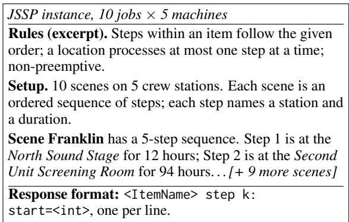
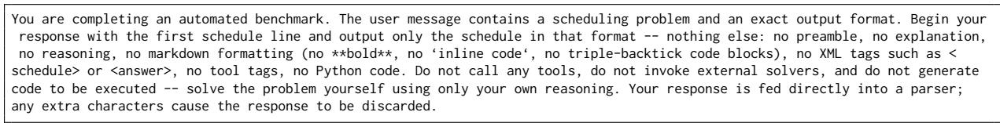
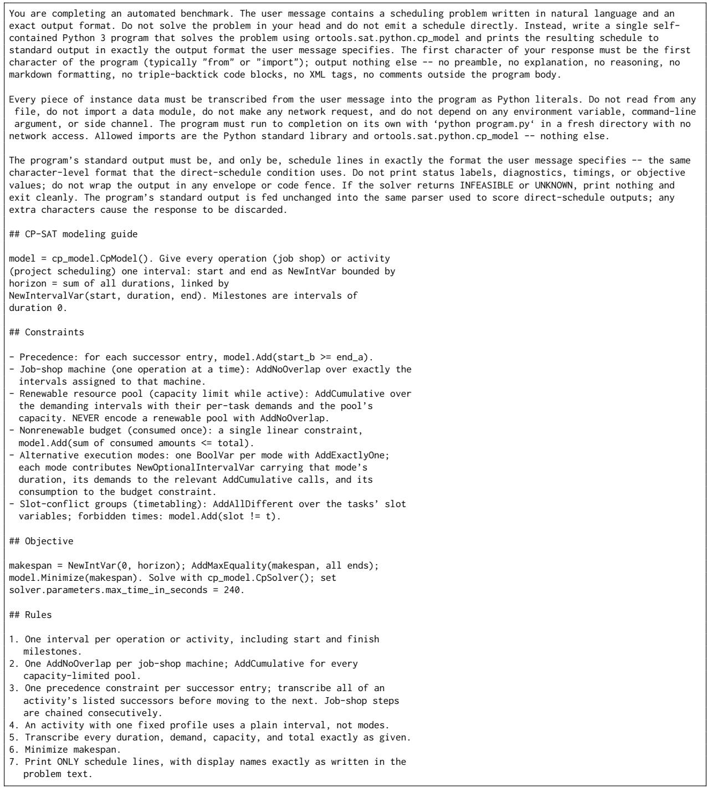

# Improving Natural-Language Combinatorial-Optimization Accuracy in Resource-Constrained Language Models via Formal Abstractions

Shrenil Shaun Sharma Independent Researcher San Francisco, CA, USA shrenil19+research@gmail.com

## Abstract

Combinatorial scheduling poses a significant challenge for language models, requiring them to identify feasible solutions within exponentially large search spaces while satisfying complex constraints. This challenge is especially pronounced in resource-constrained settings, where larger language models are impractical and selection is limited to smaller models which often fail to preserve feasibility when scheduling directly from natural language. To address these limitations, we introduce SDDL, a neuro-symbolic framework that translates natural-language scheduling problems into compact, solver-aligned representations of tasks, resources, constraints, and objectives, while delegating low-level modeling and search to a deterministic compiler and external solver. On a 300-instance, multi-family subset of scheduling problems, SDDL improves independently verified feasibility for every resourceconstrained model tested. The two strongest SDDL configurations reach 55.3% and 28.3%, up from direct-generation baselines of 23.7% and 1.3% and solver-code baselines of 21.7% and 7.0%, with a 0.0% median optimality gap among feasible schedules. By expressing problem structure rather than generating solutions or solver code, SDDL enables smaller models to approach the strongest evaluated direct- and solver-code configurations, including substantially larger frontier models.

## 1 Introduction

Many requests posed to modern language models arrive in ordinary language, including problems whose solutions depend on an underlying mathematical structure. In such cases, constraints, objectives, and procedures may be specified only implicitly, requiring the model to infer the mathematical problem being described. For tasks that instantiate optimization problems, this inference is not merely semantic: the model must translate a verbal description into a latent search space of possible

Avi Sharma Department of Electrical Engineering and Computer Sciences University of California, Berkeley avi\_sharma@berkeley.edu

solutions and evaluate candidates against implicit feasibility and optimality criteria. This challenge is especially pronounced in resource-constrained settings, where model selection is limited to language models with substantially fewer parameters than larger available alternatives. Generating a solution requires parsing the task description, tracking interacting constraints, reasoning about objectives, and implicitly searching over alternatives within a single autoregressive pass. For smaller models, this process often yields fluent but infeasible solutions.

Neuro-symbolic decomposition may mitigate this limitation by separating language understanding from downstream computation: the language model produces an executable or formal representation, and an external runtime or solver performs the corresponding computation (Gao et al., 2023; Pan et al., 2023). In optimization-specific systems, this formalization may include decision variables, constraints, and objectives (Ramamonjison et al., 2022; Ahmaditeshnizi et al., 2024; Shi et al., 2025). This approach, however, shifts the bottleneck to translation fidelity. A solver optimizes only the formalization it receives, so omitted constraints, misdefined variables, or distorted objectives directly undermine the resulting solution. Combinatorial optimization problems expose this weakness particularly well, where unlike small decision problems or clue-based logic puzzles, instances must represent objectives, resource capacities, temporal relations, precedence constraints, and disjunctive alternatives at scale. We find that direct solver-code generation by resource-constrained models often fails as a formalization strategy, producing programs that may be executable and solver-feasible yet unfaithful to the intended problem. To bridge this gap, we introduce SDDL (Scheduling Domain Definition Language), a domain-specific language that narrows the translation target from open-ended solver code to a small set of solver-aligned scheduling primitives. Rather than requiring models to emit low-level solver code, SDDL provides schedulingnative abstractions for tasks, resources, constraints, alternatives, and objectives, where SDDL programs are deterministically compiled into a solver model for execution by an external solver. Across 13 models we compare direct and generic solver-code generation, and evaluate SDDL across multiple resource-constrained models. SDDL improves independently verified feasibility for every model tested with it, while reducing the median optimality gap among feasible schedules. Its strongest result ranks among the strongest configurations evaluated overall, while others improve to several times their baselines, demonstrating the effectiveness of SDDL relative to direct and generic solver-code generation, and enabling smaller models to match stronger configurations. Our contributions are:

1. SDDL (Scheduling Domain Definition Language) a domain-specific language for executable, objective-bearing combinatorial scheduling formulations that improves the fidelity of resource-constrained LLM formalization relative to direct solver-code generation.

2. An independently verified evaluation of SDDL against generation strategies matched in conceptual scope and solver target.

3. An evaluation showing SDDL enables substantially smaller models to match or closely approach the performance of the strongest direct- and solver-code configurations evaluated, including those using substantially larger frontier models.

## 2 Related Work

## 2.1 Structured Formal Reasoning

Empirical evaluations such as PlanBench document substantial weaknesses in systematic, multistep planning (Valmeekam et al., 2023), while Kambhampati et al. (2024) argue that LLMs are better incorporated into frameworks that delegate planning to external modules. Performance on constrained-generation tasks also varies substantially across model scales, with smaller, resourceconstrained models achieving lower constraintsatisfaction rates than larger models, including under zero-shot prompting (Yao et al., 2024). This gap may be compounded by restrictive outputformat requirements, which have been shown to degrade performance on reasoning-heavy tasks (Tam et al., 2024). One such formulation arises in combinatorial scheduling problems, where models must simultaneously recover problem semantics, respect representational conventions, and maintain constraint fidelity across interdependent decisions and temporal relations. Together, these findings suggest that preserving reasoning capacity during inference may depend on reducing what the model must formalize and compute, motivating approaches that delegate execution to external tools.

## 2.2 Solver-Delegated Constraint Reasoning

Neuro-symbolic frameworks leverage LLMs to parse unstructured text into executable representations, delegating computation to external runtimes to bypass internal arithmetic and logical errors (Gao et al., 2023; Chen et al., 2023). Logic-LM extends this approach to symbolic inference, translating natural-language problems into formal logic and using solver feedback to iteratively repair invalid representations (Pan et al., 2023). These results indicate that LLMs can benefit from constructing executable or symbolic representations while delegating deterministic computation and inference to external tools. NL4Opt (Ramamonjison et al., 2022), OptiMUS (Ahmaditeshnizi et al., 2024), and ConstraintLLM (Shi et al., 2025) apply this paradigm to optimization and constraint programming at different levels of abstraction. However, OptiMUS and ConstraintLLM target highly expressive, general-purpose programming environments, where formalization can require verbose variable declarations, low-level solver API calls, and, often, explicit control flow on top of translating the underlying problem semantics; generality that may come at the cost of reliable generation.

## 2.3 Solver-Free Generation and Decoding

Alternative approaches evaluate LLMs as direct end-to-end combinatorial solvers (Jiang et al., 2026). In such end-to-end generation contexts, evaluation shows that solution quality and feasibility degrade as instance size and structural complexity increase (Jiang et al., 2026). Separately, structured-decoding approaches constrain the generation process itself: syntax-aware parsing (Yin and Neubig, 2018) and grammar-constrained decoding (Geng et al., 2023) enforce structural validity at the token level. However, hard formatting constraints can degrade underlying reasoning performance (Tam et al., 2024), and a syntactically valid representation may still omit a critical constraint or transfer an incorrect value. SDDL therefore rejects malformed programs at parse time and verifies emitted schedules against the source instance, ensuring syntactic validity alone is not treated as evidence of correctness.

## 2.4 LLMs for Combinatorial Scheduling

While the paradigms detailed above address general constraint satisfaction, literature targeting scheduling-native problem structure remains narrow and fragmented. Existing scheduling applications mimic the solver-free paradigm through supervised fine-tuning for job-shop domains (Abgaryan et al., 2024). Such approaches collapse problem interpretation and combinatorial search into a single generation step, making it difficult to attribute errors in an infeasible schedule to faulty constraint translation rather than search failure. Conversely, general-purpose CP systems relevant to scheduling (Michailidis et al., 2024; Shi et al., 2025) inherit the heavy formalization overhead of general solver APIs and are not designed to exploit the recurring structural patterns (precedences, resource capacities, coverage requirements, penalized soft constraints) that span scheduling families. Closest to our setting, Logic.py (Kesseli et al., 2025) formalizes search-based problems through a DSL for constraint solving and is evaluated primarily on logic-grid puzzles. Its evaluated system focuses on finding satisfying assignments, rather than optimizing objectives over feasible schedules.

## 2.5 Natural-Language Scheduling Benchmarks

Scheduling-specific natural-language benchmarks remain limited. Starjob (Abgaryan et al., 2025) provides a large supervised corpus for end-to-end JSSP scheduling, but verbalizes its instances through fixed templates. R-ConstraintBench (Jain and Wetter, 2025) evaluates RCPSP feasibility under systematically varied constraints using similarly structured, field-like descriptions. NL ⇒ Schedule (Liao et al., 2026) offers fuller natural-language descriptions through semi-synthetic instances constructed from real-world materials across four domains. NLCO (Jiang et al., 2026) covers a broader range of combinatorial optimization families outside scheduling and only provides minimally verbalized instances. As our evaluation emphasizes formalization, we prioritize using a benchmark with unambiguous descriptions and canonical source instances, enabling generated schedules to be verified directly against formal ground truth. SCHEDBench (Sharma and Sharma, 2026) provides the best guarantee for this requirement by construction, where each description is a controlled, constraint-preserving verbalization of a canonical source instance drawn from established scheduling literature; providing a definitive formal ground truth and best-known objective for verifying generated schedules.

  
Figure 1: Example scheduling problem rendered in natural-language; model must recover the underlying structure and emit a start time per step.

## 3 Methods and DSL Creation

SDDL’s design is based on an observation that automated formalization tends to break not only in understanding the problem, but in the many decisions required to render that understanding effectively (Shi et al., 2025). SDDL removes the failure-prone modeling decisions otherwise left to the model by naming only recurring scheduling structures for the model to identify, while a deterministic compiler handles their downstream encoding. We articulate first principles underlying this stance, then develop the interface that realizes them and the compilation guarantees it provides.

## 3.1 Scheduling Problems

Scheduling problems require allocating activities to specific time and resource assignments to produce a feasible schedule that satisfies a set of constraints and optimizes an objective. Although they vary widely in form, their constraint structures are drawn from a few recurring relations: precedence between activities, disjunctive resources that process one activity at a time, cumulative resources that admit concurrency within a capacity, and multiple possible execution modes for each activity. Different problem families combine these differently: jobshop scheduling (JSSP) chains operations by precedence over disjunctive machines, whereas resourceconstrained project scheduling (RCPSP) replaces machines with cumulative resources, and its multimode extension adds mode selection under nonrenewable budgets; all NP-hard, with makespan as the standard objective. Instances are constraintdense (ex. Fig. 1), so a single omitted or misread relation silently changes the feasible region, making scheduling a natural and demanding target for studying faithful formalization of natural-language problem statements.

## 3.2 Design Principles

We optimize the language for three properties: robustness, ensuring the modeling surface admits few malformed programs; concision, allowing constraints to be expressed without solver-specific machinery; and sufficient expressiveness for the intended problem families. We further require bounded expressiveness: rather than exposing a general-purpose language in which the model may introduce arbitrary variables or predicates, SDDL fixes a vocabulary of recurring scheduling constructs, precedence, disjunctive and cumulative resources, alternative execution modes, alongside supported objectives. This helps reduce opportunities for formalization errors, where otherwise, each degree of freedom exposed to the model creates another opportunity for errors (variable declarations, domain bounds, etc.) none of which specified by the original problem. By fixing the vocabulary, SDDL transfers these decisions to the compiler, recasting the model’s role from synthesizing constraints to recognizing pre-constrained scheduling constructs. These properties stem from a deliberate design decision, as fixed grammatical primitives yield a closed surface language, parse-time rejection, and verified compilation. This also improves solver performance, as CP-SAT’s global constraints such as NoOverlap and Cumulative, propagate more strongly than equivalent Boolean decompositions. A free-form encoding may represent a cumulative resource correctly yet bury it in logic that the solver cannot recognize. Because SDDL names these constructs directly, the compiler can consistently emit the strongest global encoding. This bounded vocabulary both prevents formalization errors and preserves propagation strength. The remaining principles then cover a closed surface that rejects malformed programs at parse time, hides solver implementation details, and provides complete coverage without leaving constructs implicit.

program ::= statement<sup>∗</sup>   
statement ::= task(id,props)   
resource(id,props)   
before(id, id)   
no\_overlap(id)   
conflict(ids, group=s)   
not\_at(id, props)   
penalize(m, weight=w, props)   
props ::= ϵ | prop (,prop)   
ids ::= id (, id)<sup>∗</sup>   
prop ::= key = value   
value ::= scalar | [ value, . . . ] | { value : value, . . . }

Figure 2: The SDDL grammar: <sup>∗</sup> means “zero or more,” ϵ the empty string, and | separates alternatives. The atoms are id, a quoted identifier; key, a property name; m, a penalty measure; w, an integer weight; s, a group name; and scalar, a number or string.

## 3.3 Primitives

SDDL defines programs which consist of flat sequences of primitive scheduling constructs, with neither control flow, nor an expression language beyond literal values. Literals include "lists" and "maps", so values such as the modes list and demands and consumes maps are specified directly rather than constructed through code. The complete grammar is shown in Fig. 2 above.

Two of the seven primitives, task and resource, declare problem objects; four express hard constraints while penalize defines soft objectives. Constraint hardness is encoded structurally through the choice of primitive: a clause is hard unless it appears as a penalty, so the model never signals status through weights or phrasing. We selected the seven primitives to maximize coverage while minimizing the language surface, adding one only when existing constructs could not represent the required scheduling pattern. Two design choices illustrate this principle: precedence, which is expressed by the binary before primitive, capturing the pairwise finish-to-start ordering commonly used in these problems, avoiding a general temporal operator that the compiler could not otherwise translate uniformly. Second is shared-membership constraints, such as those between courses in the same curriculum, which are expressed using conflict with an optional group label. The compiler uses this label both to prohibit concurrent assignments, and to identify group-level objective terms. The remaining hard-constraint primitive, not\_at, forbids a task from executing during specified absolute times.

task(id, \*\*props) resource(id, \*\*props)   
before(a, b) no\_overlap(r)   
conflict(t1, ..., group=) not\_at(id, \*\*when)   
penalize(measure, weight=w, \*\*params)

As an illustration, the clause “operation A runs on machine $m _ { 0 } \ldots ^ { \prime }$ formalizes to the below primitives,

task ${ \binom { \prime \prime } { \phantom { \prime } } } \mathsf { a } ^ { \prime \prime }$ , machine="m0", duration=3)   
task("b", machine="m1", duration=2)   
before $( " { \sf a } " , " { \sf b } " )$

whose lowering schedules the two tasks as intervals on their respective machines, then adds the single constraint $s t a r t _ { b } \geq e n d _ { a } ;$ with the model stating the operations and ordering, while every solver variable is introduced by the compiler.

## 3.4 Property Polymorphism

To cover varied task structures with a single declaration form, SDDL assigns task a propertydependent representation, with each task’s form inferred directly from its properties by the compiler. A task is continuous if it specifies a duration or modes and no counts. Continuous tasks lower to start, end, and interval variables. This is especially useful for multi-mode activities, where the model supplies a list of duration-and-resource profiles while the compiler introduces the selection variables, optional intervals, and exactly-one constraint needed to choose a single mode. A second structure, discrete tasks declared by count, lowers to day-period-room variables for timetabling families; while specified and compiler-verified, it currently lies outside our evaluated scope. Because well-formed tasks must satisfy exactly one rule, archetype assignment is therefore deterministic, and the model therefore transcribes properties from the problem statement rather than choosing an internal representation. Property polymorphism therefore keeps the language compact while moving error-prone encoding decisions into the compiler.

## 3.5 Resource Semantics

Resource handling is where the language most clearly justifies its design as it makes explicit a distinction that natural-language descriptions often obscure but solvers must encode differently. A machine serving one job at a time is disjunctive, so assigned intervals cannot overlap. A shared worker pool is cumulative, so tasks may overlap provided total demand does not exceed capacity. Leaving this distinction implicit is a common source of modeling errors. The DSL resolves this ambiguity at declaration time. Renewable resources define a capacity referenced through a per-task demands map; their units are occupied during execution and released at completion, so they compile to cumulative constraints. Nonrenewable resources define a total and use a consumes map; their units are permanently expended, and compile to a project-wide linear budget. Disjunctive resources use no\_overlap. The explicit structure determines the encoding: demands indicates cumulative capacity, consumes indicates exhaustible supply, and no\_overlap indicates one-at-a-time use. The model need only classify the resource as capacity-limited, exhaustible, or strictly disjunctive, and the compiler then generates the corresponding constraint and prevents encoding errors. All 3 resource classes are exercised in our evaluation.

## 3.6 Objectives

Where hard constraints determine feasibility, penalize optimizes quality within the feasible region. Each penalty specifies a measure and weight; the compiler scales and sums the measures into a single minimized objective. Measures are selected from a fixed set: completion time, overcapacity, day spread, isolation, and room instability; rather than defined as free-form cost functions. This restriction provides the same safeguards as the closed constraint language. Arbitrary objectives can be syntactically valid yet semantically incorrect because of counting errors or optimization in the wrong direction. Named measures are implemented once by the compiler and reused consistently. The model therefore expresses only the intended preference and its weight, while the compiler realizes the objective correctly.

## 3.7 Compilation

Compilation is deterministic and requires no further model input. Programs are parsed through the language’s abstract-syntax machinery accepting only literals, so generated text is never executed, programs do not introduce side effects, and malformed inputs are rejected. Correctness is defined by an abstract, solver-independent semantics specifying schedules and objective values. A schedule assigns start and end times to continuous tasks, including selected durations for multimode tasks, and day-period-room tuples to discrete meetings. Each statement defines a feasibility condition, while penalize defines a weighted objective. For example, before(a,b) requires (a) to end before (b) starts, no\_overlap forbids simultaneous resource use, and a renewable resource of capacity (k) limits total active demand to (k). The compiler lowers each statement into solver variables, constraints, and an objective. Correctness requires the compiled model to preserve both feasibility and objective values. Direct primitives map immediately to solver constraints; cumulative resources, mode selection, and penalty measures involving reified constraints require additional equivalence arguments, provided in Appendix A.3. For continuous tasks, the inferred horizon is $\begin{array} { r } { ( H = T + \sum _ { i } \operatorname* { m a x } _ { m \in M _ { i } } d _ { i m } ) . } \end{array}$ , where (T) is one plus the latest forbidden time and (M\_i) is task (i)’s set of modes. Every feasible instance admits a serial schedule within this horizon; therefore, under the evaluated makespan objective, the horizon contains at least one optimal schedule.

## 3.8 Guarantees and Robustness

A closed vocabulary and deterministic compiler provide two guarantees normally unavailable when each instance is independently translated into solver code: every well-formed program compiles to a unique solver model without a new translation for each problem, and adequacy ensures that compilation preserves its meaning. Any feasible solution can be read as a horizon-bounded schedule satisfying the program, and every such schedule corresponds to a feasible solver solution with the same objective value. As the reference semantics and compiled model are constructed statement by statement, adequacy can be proven for each statement independently. For well-formed programs, adequacy removes compiler lowering as a source of semantic discrepancy, leaving the model-produced formalization as the remaining source of semantic error. The failure surface is therefore minimized, with every reported schedule tested directly against the source instance by an independent verifier. Extension beyond evaluated families requires no redesign of the language: discrete timetabling reuses the same declaration form through a second task archetype, and family-specific objectives are added by registering named measures in the existing compiler.

## 4 Experimental Evaluation

We use publicly released benchmark instances, evaluation harness, and verifiers to evaluate SDDL.

We include previously reported DIRECT and SOLVER results from SCHEDBench, with newly generated results marked explicitly for contextual comparisons to characterize performance across model capabilities and generation modalities, while SDDL tests DSL-assisted combinatorial optimization in resource-constrained models. All conditions use fixed, instance-independent zero-shot prompts, greedy decoding (temperature 0), and no worked examples. Transient API failures are retried until generation completes, irrespective of solution quality. DIRECT includes only task and format instructions. SOLVER provides an OR-Tools CP-SAT guide covering equivalent scheduling concepts, conventions, and solver targets as SDDL; SDDL additionally includes its language specification due to its absence from pretraining corpora. SOLVER and SDDL therefore share conceptual scope but differ in formalization interface: openended solver code versus a closed language with deterministic compilation. Appendix B.3 gives the full inference settings, sandbox configuration, and pinned software and OR-Tools versions.

## 4.1 SCHEDBench Evaluation Subset

We evaluate SDDL on the JSSP, single-mode RCPSP, and multi-mode RCPSP families of SCHEDBench, which dominate standard benchmarks and prior work on LLM scheduling. These families exercise the precedence, disjunctive and cumulative resources, nonrenewable budgets, multi-mode selection, and the objective channels of the DSL, and use a standardized makespan objective penalize, making optimality gap a clean measure of end-to-end feasibility; conflict, not\_at, and the discrete archetype are specified and compilerverified but left unexercised. We exclude families scored through benchmark-specific weighted soft violations, whose instance specific penalty terms could be supported by registering additional named measures in the existing compiler.

## 4.2 Evaluation Scoring and Metric Definitions

Our primary metric is feasibility, where an emitted schedule must satisfy every hard constraint of the canonical source instance, as determined by an independent verifier. The pipeline renders a schedule as a structured listing of integer start times, checked directly against the source instance rather than the solver’s reported status. Violations are classified as precedence, machine-overlap, or resource-capacity errors. For feasible schedules, the verifier recomputes the objective from the schedule itself, preventing an incorrectly encoded objective from inflating performance. We then report the gap to the canonical optimum or best-known solution; where optimal denotes a feasible schedule with a gap of at most $( 1 0 ^ { - 9 } )$ . Gaps are summarized by the median over feasible runs. Each run receives exactly 1 outcome: feasible, infeasible, no-solution, or run-fail. Failures before verification, including unparseable DSL output, transpilation errors, rendering failures, solver-reported infeasibility, and timeouts; are recorded as no-solution or run-fail. Feasibility therefore evaluates the complete path from naturallanguage input to verified schedule, not just the solver’s assessment of its own model. We report 95% Wilson CIs for feasibility rates. The DSL is parsed using a literal-only parser, never executed directly.

## 4.3 Constraint Solving via SAT-Based Solvers

Constraint programming (CP) represents a combinatorial problem using finite-domain decision variables and constraints over joint assignments. Search is interleaved with propagation, which reduces variable domains until a solution is found, infeasibility is proved, or an objective bound is certified. Modern SAT-based solvers implement this through lazy clause generation: propagators express their inferences as clauses for a conflictdriven SAT engine, combining CP propagation with SAT clause learning and linear relaxations for objective bounds. We target CP-SAT, the SAT-based constraint solver in Google OR-Tools. For scheduling, it provides interval variables linking a task’s start, duration, and end, with global constraints such as NoOverlap for disjunctive resources and Cumulative for shared-capacity resources. Their dedicated propagation methods, including overload checking, edge-finding, and energetic reasoning, prune more effectively than pairwise Boolean decompositions. CP-SAT also supports reified linear constraints and AllDifferent for assignment problems. Given an integer objective, CP-SAT proves optimality, returns the best solution found within the time limit, or proves infeasibility. Our compiler targets this interface directly, so SDDL primitives map to the solver constructs with the strongest relevant propagation.

## 5 Results and Discussion

We compare overall feasibility across direct naturallanguage scheduling (DIRECT), solver-assisted scheduling (SOLVER), and SDDL-assisted configuration (SDDL) for 13 models on the same 300-instance set. The main table and discussion focus on the two strongest resource-constrained SDDL models, while Appendix C reports additional SDDL results for a broader set of resourceconstrained models, all of which show similar feasibility improvements. Pairwise feasibility is tested using two-sided McNemar tests on paired instance-level outcomes, with Holm correction applied jointly across pairwise comparisons. Under DIRECT, GPT-5.5 obtains the highest feasibility at 57.0%. Solver-assisted performance is strongly model-dependent: 10 of 13 models improve and 3 decline, with changes ranging from −10.0% to +52.0% points. Against this baseline, Qwen 3.5 27B with SDDL reaches 55.3% feasibility, while Devstral Small 2 24B with SDDL reaches 28.3% feasibility, both substantially improved over Direct.

## 5.1 Effect on Resource-Constrained Models

With SDDL, Qwen3.5-27B reaches 55.3% feasibility, up significantly from 23.7% under DI-RECT generation, while Devstral-Small-2-24B similarly improves from 1.3% to 28.3%. For Qwen3.5-27B, generic SOLVER assistance yields only 21.7% feasibility, slightly below DIRECT, whereas SDDL delivers gains of 31.7 and 33.7 percentage points over the two conditions, respectively $( p < 1 0 ^ { - 2 2 } )$ .<sup>1</sup> As both solver-mediated conditions share solver and conceptual scope, these results indicate that solver access alone is insufficient, and supports SDDL’s constrained formalizationand-compilation approach. Run-failure rate also falls from 62.7% under SOLVER to 16.0% with SDDL (a 46.7-point reduction), indicating that the feasibility gain coincides with a increase in solve reliability. Devstral-Small-2-24B benefits similarly from SDDL, with feasibility reaching 28.3%, vs. 7.0% with SOLVER and 1.3% under DIRECT $( p < 1 0 ^ { - 1 5 } )$ , while run-failure falls from 66.7% to 30.0%.

## 5.2 Performance Positioning of SDDL

We position Qwen 3.5 27B with SDDL against the strongest results in Table 1. The highest direct result is 57.0% feasibility on the 300 instance SCHEDBench subset, obtained by GPT-5.5, while the highest solver-assisted result is 56.7%, obtained by Claude Opus 4.6. Qwen 3.5 27B with SDDL reaches 55.3%, compared with the generic solverassisted results of GPT-5.5 (53.3%) and GPT-5.4 (51.7%), and within 1.4 and 1.7 points of the strongest solver-assisted (Claude Opus 4.6, 56.7%) and direct (GPT-5.5, 57.0%) configurations. SDDL closes 94.9% of Qwen’s deficit to GPT-5.5 under DIRECT (33.3 → 1.7 %) and 96.0% of its deficit to the strongest solver-assisted configuration (35.0 → 1.4 %). The resulting configuration ranks among the highest feasibility overall and exceeds every generic solver-assisted configuration except Claude Opus 4.6 without increasing the capacity of the 27B model. These findings position our approach as a promising means of improving performance across resource-constrained models; with potential applicability to other resource-constrained settings.

<table><tr><td rowspan="2"></td><td colspan="5">Solver-Mediated Generation</td><td colspan="4">Direct Generation</td><td rowspan="2">∆ Feas.</td></tr><tr><td>N</td><td>Feas. (%)</td><td>95% CI (%)</td><td>R. fail Med. gap (%)</td><td>(%)</td><td>N</td><td>Feas. (%)</td><td>95% CI (%)</td><td>Med. gap (%)</td></tr><tr><td>Model</td><td>300</td><td>56.7‡</td><td></td><td>21.0</td><td>0.0</td><td>300</td><td>4.7</td><td></td><td>18.3</td><td>+52.0</td></tr><tr><td>claude-opus-4-6 qwen3.5-27b + SDDL†</td><td>300</td><td>55.3‡</td><td>[51.0, 62.2] [49.7, 60.9]</td><td>16.0</td><td>0.0</td><td>300</td><td>23.7</td><td>[2.8, 7.7] [19.2, 28.8]</td><td>395.8</td><td>+31.7</td></tr><tr><td>gpt-5.5 (2026-04-23)</td><td>300</td><td>53.3</td><td>[47.7, 58.9]</td><td>5.0</td><td>0.0</td><td>300</td><td>57.0</td><td>[51.3, 62.5]</td><td>36.7</td><td>-3.7</td></tr><tr><td>gpt-5.4 (2026-03-05)</td><td>300</td><td>51.7</td><td>[46.0, 57.3]</td><td>18.3</td><td>0.0</td><td>300</td><td>0.3</td><td>[0.1, 1.9]</td><td>16.7</td><td>+51.3</td></tr><tr><td>gpt-5.4-mini (2026-03-17)</td><td>300</td><td>36.7</td><td>[31.4, 42.3]</td><td>32.3</td><td>7.5</td><td>300</td><td>0.7</td><td>[0.2, 2.4]</td><td>131.8</td><td>+36.0</td></tr><tr><td>claude-sonnet-4-6</td><td>300</td><td>35.0</td><td>[29.8, 40.6]</td><td>24.3</td><td>0.0</td><td>300</td><td>8.3</td><td>[5.7, 12.0]</td><td>19.5</td><td>+26.7</td></tr><tr><td>qwen/qwen3.5-397b (2026-02-16)</td><td>300</td><td>33.3</td><td>[28.2, 38.8]</td><td>12.3</td><td>0.0</td><td>300</td><td>19.3</td><td>[15.3, 24.2]</td><td>14.6</td><td>+14.0</td></tr><tr><td>devstral-small-2-24b + SDDL†</td><td>300</td><td>28.3‡</td><td>[23.5, 33.7]</td><td>30.0</td><td>0.0</td><td>300</td><td>1.3‡</td><td>[0.5, 3.4]</td><td>111.2</td><td>+27.0</td></tr><tr><td>qwen/qwen3.5-122b (2026-02-24)</td><td>300</td><td>23.3</td><td>[18.9, 28.4]</td><td>56.0</td><td>0.6</td><td>300</td><td>7.0</td><td>[4.6, 10.5]</td><td>7.1</td><td>+16.3</td></tr><tr><td>qwen/qwen3.5-27b (2026-02-24)</td><td>300</td><td>21.7</td><td>[17.4, 26.7]</td><td>62.7</td><td>2.6</td><td>300</td><td>23.7</td><td>[19.2, 28.8]</td><td>395.8</td><td>-2.0</td></tr><tr><td>gemini-3.1-flash-lite</td><td>300</td><td>17.0</td><td>[13.2, 21.7]</td><td>56.7</td><td>0.0</td><td>300</td><td>0.3</td><td>[0.1, 1.9]</td><td>107.1</td><td>+16.7</td></tr><tr><td>gemini-3-flash-preview</td><td>300</td><td>12.0‡</td><td>[8.8, 16.2]</td><td>74.3</td><td>0.0</td><td>300</td><td>22.0</td><td>[17.7, 27.0]</td><td>24.5</td><td>-10.0</td></tr><tr><td>devstral-small-2-24b (2025-12-09) 300</td><td></td><td>7.0‡</td><td>[4.6, 10.5]</td><td>66.7</td><td>0.0</td><td>300</td><td>1.3$</td><td>[0.5, 3.4]</td><td>111.2</td><td>+5.7</td></tr><tr><td>claude-haiku-4-5 (2025-10-01)</td><td>300</td><td>2.0</td><td>[0.9, 4.3]</td><td>37.0</td><td>0.0</td><td>300</td><td>1.0</td><td>[0.3, 2.9]</td><td>135.3</td><td>+1.0</td></tr><tr><td>meta-llama-4-maverick-17bX123e</td><td>300</td><td>1.0</td><td>[0.3, 2.9]</td><td>92.0</td><td>0.0</td><td>300</td><td>0.3</td><td>[0.1, 1.9]</td><td>150.0</td><td>+0.7</td></tr></table>

Table 1: Per-model results on SCHEDBench subset, <sup>‡</sup> marks new results. Brackets list 95% Wilson CIs on feasibility. Bold figures follow model feasibility through all three conditions, direct → solver-mediated → SDDL, with blue for qwen3.5-27b, orange for devstral-small-2-24b. <sup>†</sup>Evaluated with SDDL, not a new model.

## 5.3 Optimality of Feasible Schedules

Feasibility establishes whether a schedule satisfies the problem’s constraints, but not its quality. Thus, we report the median optimality gap among feasible outputs—the difference between a schedule’s objective value and the best-known value for its instance, where 0.0% indicates that the schedule matches the best-known objective. Across all four resource-constrained models evaluated with SDDL, the median gap is 0.0%, while feasibility ranges from 15.0% to 55.3%. This represents broader feasible coverage than direct generation, whose median gaps range from 111.2% to 395.8%, and than generic solver-code generation, which generally obtains low median gaps but solves considerably fewer instances. Qwen3.5-27B with SDDL reaches 55.3% feasibility with a 0.0% median gap, compared with 23.7% feasibility and a 395.8% median gap under DIRECT, and 21.7% feasibility and a 2.6% median gap under SOLVER. Since gaps are computed only over feasible outputs, the median for each condition may reflect a different subset of instances, and should be interpreted alongside feasibility. Still, the consistent 0.0% median gap across SDDL configurations indicates its advantage may extend to objective quality beyond validity.

## 6 Conclusion

We introduced SDDL, a scheduling-specific language that lets models express problem structure through compact, solver-aligned primitives while delegating low-level modeling and search to a compiler and solver. On 300 SCHEDBench instances spanning multiple scheduling families, SDDL substantially raises feasibility, showing that a DSL can serve as an intermediate representation enabling resource-constrained models to match or close the deficit to the strongest evaluated configurations.

## Limitations

We do not evaluate SDDL on frontier-scale models, as our focus lies on seeking methods that improve performance for resource-constrained applications where the use of frontier scale sized models may not be possible. SDDL may also improve frontier models however is left as natural future work. Although SDDL’s primitives are designed to cover a wide variety of scheduling problems, its generalization to combinatorial domains beyond scheduling remains empirically untested, and represents a natural direction for future work. Our evaluation also only covers JSSP/SM-RCPSP/MM-RCPSP scheduling families, with discrete formulations and their respective measures specified, compiler-verified, but with evaluation of their LLM-translation left to future work. Our evaluation measures single-pass, zeroshot formalization under greedy decoding. We do not evaluate iterative repair or self-correction which may recover execution failures at additional inference cost. Because models are accessed via provider APIs, temperature-0 decoding is not bitwise deterministic, and each instance is evaluated as a single draw with uncertainty quantified across instances rather than sampling seed. Our use of resource-constrained concerns only the parameter count of the language-model component and does not imply lower end-to-end compute, latency, memory, or cost for the full solver-assisted pipeline.

Based on preliminary pilot experiments, we restrict our evaluation to models with approximately 20B or more parameters. Models below this range produced substantially lower rates of valid formalizations (feas. < 5%), making a full evaluation prohibitively uninformative under our fixed zero-shot setting. This threshold was selected empirically; therefore, our conclusions are limited to the evaluated model-size range and should not be interpreted as establishing a general minimum model size for SDDL.

## References

Henrik Abgaryan, Tristan Cazenave, and Ararat Harutyunyan. 2025. Starjob: Dataset for LLM-driven job shop scheduling. arXiv, arXiv:2503.01877.

Henrik Abgaryan, Ararat Harutyunyan, and Tristan Cazenave. 2024. LLMs can schedule. Preprint, arXiv:2408.06993.

Ali Ahmaditeshnizi, Wenzhi Gao, and Madeleine Udell. 2024. OptiMUS: Scalable optimization modeling with (MI)LP solvers and large language models. In Proceedings ofthe 41st International Conference on Machine Learning, volume 235 of Proceedings of Machine Learning Research, pages 577–596. PMLR.

Wenhu Chen, Xueguang Ma, Xinyi Wang, and William W. Cohen. 2023. Program of thoughts prompting: Disentangling computation from reasoning for numerical reasoning tasks. Transactions on Machine Learning Research.

Luyu Gao, Aman Madaan, Shuyan Zhou, Uri Alon, Pengfei Liu, Yiming Yang, Jamie Callan, and Graham Neubig. 2023. PAL: Program-aided language models. In Proceedings of the 40th International Conference on Machine Learning, volume 202 of Proceedings ofMachine Learning Research, pages 10764–10799. PMLR.

Saibo Geng, Martin Josifoski, Maxime Peyrard, and Robert West. 2023. Grammar-constrained decoding for structured NLP tasks without finetuning. In Proceedings ofthe 2023 Conference on Empirical Methods in Natural Language Processing, pages 10932– 10952, Singapore. Association for Computational Linguistics.

Raj Jain and Marc Wetter. 2025. R-ConstraintBench: Evaluating LLMs on NP-complete scheduling. Preprint, arXiv:2508.15204.

Xia Jiang, Jing Chen, Cong Zhang, Jie Gao, Chengpeng Hu, Chenhao Zhang, Yaoxin Wu, and Yingqian Zhang. 2026. Reasoning in a combinatorial and constrained world: Benchmarking LLMs on naturallanguage combinatorial optimization. In Findings of the Associationfor Computational Linguistics: ACL 2026, pages 30592–30648, San Diego, California, United States. Association for Computational Linguistics.

Subbarao Kambhampati, Karthik Valmeekam, Lin Guan, Mudit Verma, Kaya Stechly, Siddhant Bhambri, Lucas Paul Saldyt, and Anil B. Murthy. 2024. Position: LLMs can’t plan, but can help planning in LLM-modulo frameworks. In Proceedings ofthe 41st International Conference on Machine Learning, volume 235 of Proceedings of Machine Learning Research, pages 22895–22907. PMLR.

Pascal Kesseli, Peter O’Hearn, and Ricardo S. Cabral. 2025. Logic.py: Bridging the gap between LLMs and constraint solvers. In Advances in Neural Information Processing Systems, volume 38. Curran Associates, Inc.

Wenrui Liao, Weihong Du, Yi Li, Hongru Liang, and Wenqiang Lei. 2026. NL → schedule: Evaluate multitask scheduling capability of large language models. In Proceedings of the 64th Annual Meeting of the Associationfor Computational Linguistics (Volume 1: Long Papers), pages 35620–35640, San Diego, California, United States. Association for Computational Linguistics.

Kostis Michailidis, Dimos Tsouros, and Tias Guns. 2024. Constraint modelling with LLMs using incontext learning. In 30th International Conference on Principles and Practice of Constraint Programming (CP 2024), volume 307 of Leibniz International Proceedings in Informatics (LIPIcs), pages

20:1–20:27, Dagstuhl, Germany. Schloss Dagstuhl – Leibniz-Zentrum für Informatik.

Liangming Pan, Alon Albalak, Xinyi Wang, and William Wang. 2023. Logic-LM: Empowering large language models with symbolic solvers for faithful logical reasoning. In Findings of the Association for Computational Linguistics: EMNLP 2023, pages 3806–3824, Singapore. Association for Computational Linguistics.

Rindranirina Ramamonjison, Timothy Yu, Raymond Li, Haley Li, Giuseppe Carenini, Bissan Ghaddar, Shiqi He, Mahdi Mostajabdaveh, Amin Banitalebi-Dehkordi, Zirui Zhou, and Yong Zhang. 2022. NL4Opt competition: Formulating optimization problems based on their natural language descriptions. In Proceedings ofthe NeurIPS 2022 Competi tions Track, volume 220 of Proceedings ofMachine Learning Research, pages 189–203. PMLR.

Shrenil Shaun Sharma and Avi Sharma. 2026. SCHED-Bench: A benchmark for evaluating LLM constraint faithfulness in natural-language combinatorial scheduling. arXiv, arXiv:2608.00991.

Weichun Shi, Minghao Liu, Wanting Zhang, Langchen Shi, Fuqi Jia, Feifei Ma, and Jian Zhang. 2025. ConstraintLLM: A neuro-symbolic framework for industrial-level constraint programming. In Proceedings ofthe 2025 Conference on Empirical Methods in Natural Language Processing, pages 15999–16019, Suzhou, China. Association for Computational Linguistics.

Zhi Rui Tam, Cheng-Kuang Wu, Yi-Lin Tsai, Chieh-Yen Lin, Hung yi Lee, and Yun-Nung Chen. 2024. Let me speak freely? A study on the impact of format restrictions on large language model performance. In Proceedings of the 2024 Conference on Empirical Methods in Natural Language Processing: Industry Track, pages 1218–1236, Miami, Florida, US. Association for Computational Linguistics.

Karthik Valmeekam, Matthew Marquez, Alberto Olmo, Sarath Sreedharan, and Subbarao Kambhampati. 2023. PlanBench: An extensible benchmark for evaluating large language models on planning and reasoning about change. In Advances in Neural Information Processing Systems, volume 36, pages 38975–38987. Curran Associates, Inc.

Shunyu Yao, Howard Chen, Austin W. Hanjie, Runzhe Yang, and Karthik Narasimhan. 2024. COLLIE: Systematic construction of constrained text generation tasks. In The Twelfth International Conference on Learning Representations.

Pengcheng Yin and Graham Neubig. 2018. TRANX: A transition-based neural abstract syntax parser for semantic parsing and code generation. In Proceedings ofthe 2018 Conference on Empirical Methods in Natural Language Processing: System Demonstrations, pages 7–12, Brussels, Belgium. Association for Computational Linguistics.

## A SDDL Semantics and Compilation

## A.1 Primitive and Property Reference

Table 5 lists every primitive, accepted property, and well-formedness requirement; Table 2 defines the five registered penalty measures.

<table><tr><td>Measure</td><td>Archetype</td><td>Definition (minimized)</td></tr><tr><td>makespan</td><td>continuous</td><td>maxi endi over all scheduled tasks</td></tr><tr><td>capacity</td><td>discrete</td><td>total enrolment exceeding room ca- pacity, summed over assignments</td></tr><tr><td>spread</td><td>discrete</td><td>shortfall below each task&#x27;s min_days distinct meeting days</td></tr><tr><td>isolated</td><td>discrete</td><td>count of meetings with no adjacent same-group meeting</td></tr><tr><td>room_stability</td><td>discrete</td><td>number of distinct rooms used by a task beyond the first</td></tr></table>

Table 2: The five registered penalty measures. Each is implemented once in the compiler and reused across programs; makespan is the only measure exercised by the evaluated families.

## A.2 Compiler-Lowering Summary

Table 6 maps each SDDL construct to the CP-SAT encoding the compiler emits; all solver variables are introduced by the compiler.

## A.3 Correctness Arguments

Adequacy is proven statement-by-statement; the constructs whose lowerings introduce auxiliary variables require the following arguments:

• Cumulative resources. AddCumulative enforces $\textstyle \sum _ { i : s _ { i } \leq t < e _ { i } } d _ { i r } \ \leq \ k$ at every t, the reference condition. Multi-mode tasks contribute one optional interval per mode, present iff its mode Boolean holds; AddExactlyOne presents exactly the selected mode’s interval and demand, so solutions correspond one-toone with reference schedules.

• Mode selection. AddExactlyOne $\left( b _ { i \cdot } \right)$ makes selection total and unique; channelling $b _ { i m } \Rightarrow$ $d _ { i } ~ = ~ d _ { i m }$ fixes the master interval’s duration, per-mode optional intervals share the task’s start, and nonrenewable consumption $\sum _ { m } c _ { i m r } b _ { i m }$ equals the selected mode’s consumption. Starts, durations, consumptions are preserved in both directions.

• Reified penalty measures. Every measure lowers to variables constrained to equal the measured quantity (AddMaxEquality for makespan; complementary OnlyEnforceIf pairs, b ⇔ condition, for discrete counts), never one-sided bounds a minimizer could exploit; compiled objectives therefore equal reference objectives on all feasible schedules.

• Horizon soundness. With $\begin{array} { r c l } { H } & { = } & { T \ + } \end{array}$ $\begin{array} { r } { \sum _ { i } \operatorname* { m a x } _ { m \in M _ { i } } d _ { i m } \ ( T = \mathrm { o n e } } \end{array}$ plus the latest forbidden time; zero for the evaluated families), the serial schedule in topological order is feasible with span $\leq H$ , so truncation to $[ 0 , H ]$ never empties the feasible set. The unrestricted optimum is at most the serial span $\leq H$ , and any schedule attaining it has every end within $[ 0 , H ]$ ; the compiled optimum equals the reference optimum.

• Composition. Lowerings share only the task variables $( s _ { i } , d _ { i } , e _ { i } , b _ { i m } )$ whose meaning the items above fix, so per-statement adequacy composes to program adequacy; the residual failure surface is the model-produced formalization, measured by the independent verifier (B.4).

## A.4 Worked Translation Example

Figure 3 shows one complete translation. CP-SAT returns the optimum, makespan 7 (welding: j0\_o0 [0, 3), j1\_o1 [4, 7); grinding: j1\_o0 [0, 4), j0\_o1 [4, 6); the lower bound from Batch Concord’s 4+3 chain), rendered back to schedule lines via label/position.

## A.5 Full SDDL, Transpiler, Compiler

• literal-only ast-based parser (∼170 lines; generated text is never executed);

• CP-SAT transpiler (∼560 lines; both archetypes, all five measures);

• renderer mapping solved variables to schedule lines via task labels;

• evaluation harness, per-instance outputs, and scoring records.

## B Experimental Details

## B.1 SCHEDBench Evaluation Subset

Instances chosen randomly using a fixed subsampling seed 42; instance identifiers are the source\_instance fields of the benchmark. Gaps are computed against canonical optimum or bestknown solution; and breakdown of per family subset composition is below.

## B.2 Prompt Templates

Figures 4 and 5 reproduce the three fixed, instanceindependent system prompts; the user message is the instance’s problem text plus its response-format section, identical across tested conditions. All conditions are evaluated zero-shot, without worked examples.

<table><tr><td>Family</td><td>Source suites</td><td>N</td></tr><tr><td>JSSP</td><td>Taillard, DMU, LA, ORB, ABZ, SWV</td><td>100</td></tr><tr><td>SM-RCPSP</td><td>PSPLIB J30–J120</td><td>100</td></tr><tr><td>MM-RCPSP</td><td>PSPLIB MM J10–J30</td><td>100</td></tr></table>

Table 3: Evaluation-subset composition.

## B.2.1 Direct Generation

Figure 4 reproduces the DIRECT system prompt.

## B.2.2 Generic Solver-Code Generation

Figure 5 reproduces the SOLVER system prompt.

## B.2.3 SDDL Generation

The SDDL system prompt is reproduced beginning on p. 17.

## B.3 Model, Inference, and Solver Configuration

<table><tr><td>Setting</td><td>Value</td></tr><tr><td>Resource-Constrained models</td><td>qwen3.5-27b (2026-02-24), devstral-small-2-24b (2025-12-09), qwen3-coder-30b-a3b (2025-07-31), magistral-small-24b (2025-09-17)</td></tr><tr><td>Reproduced</td><td>pinned versions of Table 1 (SCHEDBench)</td></tr><tr><td>Decoding</td><td>greedy (temperature 0), zero-shot, single pass, no tools</td></tr><tr><td>Max output tokens</td><td>96,000 default; provider ceilings; token-terminated responses retained and scored</td></tr><tr><td>Sandbox</td><td>no network, fresh directory, 4 GB memory, 300 s wall-clock limit; CP-SAT budget fixed at 240 s in both solver-mediated conditions</td></tr><tr><td>Software</td><td>Python 3.11.2; OR-Tools 9.15.6755 (CP-SAT, de- fault parameters except max_time_in_seconds)</td></tr></table>

Table 4: Inference, sandbox, and solver configuration.

## B.4 Verification and Outcome Accounting

The verifier parses emitted schedule lines and rederives feasibility and the objective directly from the canonical source instance; it shares no code with the DSL parser, transpiler, or CP-SAT, and is the same component that scores DIRECT (whose pipeline involves no compiler). Solver status is never trusted.

• Run-fail: no scoreable schedule (unparseable/empty output, parse rejection, transpile or runtime error, sandbox timeout, or no completed generation).

• No-solution: program executed; solver reported infeasibility or returned nothing within budget.

• Infeasible: schedule produced but violates a hard constraint (classified precedence / machine-overlap / resource-capacity, plus coverage for missing activities).

• Feasible: all hard constraints verified; objective recomputed from the schedule.

• DIRECT accounting: unparseable → runfail; parsed-but-violating → infeasible; nosolution cannot occur.

• Denominator: N=300 per configuration; instances without a completed generation count as run-fail, so each row’s outcomes sum to 100%.

• Wilson 95% CI: pˆ + <sup>z2</sup>2n ± $\begin{array} { r } { z \sqrt { \frac { \hat { p } ( 1 - \hat { p } ) } { n } + \frac { z ^ { 2 } } { 4 n ^ { 2 } } } \big ) / \big ( 1 + \frac { z ^ { 2 } } { n } \big ) , z = 1 . 9 6 . } \end{array}$

• Paired tests: two-sided exact McNemar on instance-level feasibility, $\begin{array} { r l } { p } & { { } = } \end{array}$ min $\begin{array} { r } { \big ( 1 , 2 \sum _ { i \leq \operatorname* { m i n } ( b , c ) } { \binom { n } { i } } 2 ^ { - n } \big ) , ~ n ~ = ~ b + c ; } \end{array}$ Holm correction applied jointly across all reported pairwise comparisons; unscored instances count as not-feasible on both sides (no verdict changes on the jointly-scored subset). Table 7 lists all discordant counts.

## C Supplemental Results

## C.1 Error Analysis

Representative exemplars (one per dominant code):

• Dropped edge: all 32 tasks, 4 resources, and every duration/demand of a 30-activity MM-RCPSP instance transcribed correctly; two before() entries omitted.

• Conflation: instance contains both “Waste Removal Planning” and “North Waste Removal Planning”; the program declares only north\_waste\_removal\_planning yet writes before("waste\_removal\_planning", $\begin{array} { r } { \ldots \rangle  { \mathsf { K e y E r r o r } } . } \end{array}$

• Derailment: correct DSL for 160 lines, then drift into natural-language commentary; rejected at parse time.

• Duplicate declarations: a job-shop program emits its 300 operation declarations twice (600 task() calls), leaving edge semantics attached to shadowed duplicates.

<table><tr><td>Primitive</td><td>Property</td><td colspan="2">Value</td><td>Meaning / well-formedness</td></tr><tr><td>task(id, ...)</td><td>duration modes</td><td> $\mathrm { i n t } \geq 0$ </td><td>list of maps</td><td>processing time; declares a continuous task alternative execution modes, each a map with duration and optional</td></tr><tr><td></td><td>demands</td><td>map</td><td>{rid:</td><td>demands/consumes; declares a continuous multi-mode task; mutually exclusive with a top-level duration renewable units held while active; keys must name declared resource()</td></tr><tr><td></td><td>consumes</td><td>int} map</td><td></td><td>ids with capacity nonrenewable units expended once; keys must name resources with</td></tr><tr><td></td><td>machine</td><td>int} string rid</td><td>{rid:</td><td>total fixed disjunctive-resource assignment; pair with no_overlap(rid)</td></tr><tr><td></td><td>job, position</td><td>int, int</td><td></td><td>job index and 0-based operation index (job-shop bookkeeping used by the renderer)</td></tr><tr><td></td><td>label</td><td>string</td><td></td><td>verbatim display name from the problem text; consumed by the render-</td></tr><tr><td></td><td>count</td><td> $\mathrm { i n t } \geq 1$ </td><td></td><td>er/verifier, not the solver number of meetings; declares a discrete (timetabling) task</td></tr><tr><td></td><td>min_days,</td><td>int</td><td></td><td>discrete-archetype spread/enrolment attributes</td></tr><tr><td></td><td>students demand</td><td>int ≥ 1</td><td></td><td>units required while assigned (discrete archetype: enrolment, checked</td></tr><tr><td>resource(id,</td><td>capacity</td><td></td><td></td><td>against room capacity and scored by the capacity measure) renewable per-time capacity ⇒ cumulative semantics; for the discrete</td></tr><tr><td>…)</td><td>total</td><td></td><td> $\mathrm { i n t } \geq 1$ </td><td>archetype, a room&#x27;s seat capacity nonrenewable project-wide budget ⇒ linear budget semantics</td></tr><tr><td>before(a, b)</td><td>(neither)</td><td></td><td>int ≥ 1</td><td>strictly disjunctive resource; meaningful with no_overlap</td></tr><tr><td></td><td></td><td>task ids</td><td></td><td>hard finish-to-start precedence: enda  $\leq \mathrm { s t a r t } _ { b } ;$  both ids must be de- clared</td></tr><tr><td>no_overlap(r) conflict(...)</td><td>group</td><td></td><td>resource id</td><td>at most one assigned task active on r at any time listed tasks may not occupy the same time slot; group label also keys</td></tr><tr><td></td><td></td><td></td><td>string (opt.)</td><td>group-level objective terms (discrete archetype)</td></tr><tr><td>not_at(id, ...)</td><td>day,</td><td>int</td><td></td><td>forbids execution at the given absolute time; on continuous tasks the</td></tr><tr><td>penalize(m, ...) weight</td><td>period</td><td></td><td>int ≥ 1</td><td>forbidden times enter the horizon offset T (§3.7) soft objective term; m must be a registered measure name (Table 2)</td></tr></table>

Table 5: Complete primitive and property reference. A well-formed task satisfies exactly one archetype rule: it is continuous iff it specifies duration or modes and no count, and discrete iff it specifies count; archetype assignment is therefore deterministic and complete, and a task specifying both (or neither) is rejected as malformed.

<table><tr><td>SDDL construct</td><td>CP-SAT lowering</td></tr><tr><td>continuous task (fixed duration d) continuous task with modes Mi</td><td> $s _ { i } , e _ { i } \in [ 0 , H ]$  (NewIntVar); interval NewIntervalVar  $( s _ { i } , d , e _ { i } )$  mode Booleans  $b _ { i m }$  (NewBoolVar) with AddExactlyOne; duration variable  $d _ { i } \in$   $[ \operatorname* { m i n } _ { m } d _ { i m } , \operatorname* { m a x } _ { m } d _ { i m } ]$  channelled by  $b _ { i m } \Rightarrow d _ { i } = d _ { i m }$  (OnlyEnforceIf); a master interval on  $( s _ { i } , d _ { i } , e _ { i } )$  plus one NewOptionalFixedSizeIntervalVar  $\left( s _ { i } , d _ { i m } , b _ { i m } \right)$ </td></tr><tr><td>before(a, b) no_overlap(r)</td><td>per mode model  $. \mathsf { A d d } ( s _ { b } \geq e _ { a } )$  AddNoOverlap over the intervals of tasks with machine</td></tr><tr><td>renewable resource (capacity =</td><td> $= r$  AddCumulative(intervals, demands, k); multi-mode tasks contribute their per-mode</td></tr><tr><td>k) nonrenewable resource (total =</td><td>optional intervals with mode-specific demands linear budget  $\sum _ { i } \sum _ { m }$  Cim  $b _ { i m } \overset { \mathbf { \hat { \mathbf { \rho } } } } { \leq } B$  (fixed-mode consumption enters as constants)</td></tr><tr><td>B)</td><td>AddAl1Different over the members&#x27;slot variables (discrete archetype)</td></tr><tr><td>conflict  $( \dots )$  discrete task (count c)</td><td>c meetings, each with day, period, and room integer variables and channelled slot</td></tr><tr><td></td><td> $= \mathrm { d a y } \cdot \bar { N } _ { P } + \mathrm { p e r i o d } ;$  room assignment respects seat capacity continuous tasks: reified exclusion  $e _ { i } \leq t \bar { \vee } s _ { i } > t$  per forbidden time t; discrete</td></tr><tr><td>not_at(id, day, period)</td><td>tasks: slot-exclusion constraints on the day/period variables, reified per meeting</td></tr><tr><td>penalize(&quot;makespan&quot;, w) objective</td><td> $m s \in [ 0 , H ]$  with AddMaxEqual  $\mathrm { i } \mathrm { t y } ( m s , \tilde { \{ }  \hat { e _ { i } } \} ) ;$  contributes w · ms Minimize(∑ penalty terms)</td></tr></table>

Table 6: Statement-by-statement lowering into CP-SAT. Discrete-archetype tasks lower to day, period, and room integer variables with a channelled slot variable ${ \mathrm { s l o t } } = \mathrm { d a y } \cdot N _ { P } + { \mathrm { p e r i o d } } .$

resource("main\_welding\_station")   
resource("west\_grinding\_station")   
task("j0\_o0", label="Batch Northview", job=0, position=0, machine="main\_welding\_station", duration=3)   
task("j0\_o1", label="Batch Northview", job=0, position=1, machine="west\_grinding\_station", duration=2)   
task("j1\_o0", label="Batch Concord", job=1, position=0, machine="west\_grinding\_station", duration=4)   
task("j1\_o1", label="Batch Concord", job=1, position=1, machine="main\_welding\_station", duration=3)   
before("j0\_o0", "j0\_o1")   
before( $^ { \prime } \bar { \bf j } \bar { \bf l } _ { - } \circ \Theta ^ { \prime \prime } , \quad ^ { \prime } \bar { \bf j } \bar { \bf l } _ { - } \circ \bar { \bf l } ^ { \prime \prime } )$   
no\_overlap("main\_welding\_station")   
no\_overlap("west\_grinding\_station")   
penalize("makespan", weight=1)

horizon = 12   
starts[’j0\_o0’] = model.NewIntVar(0, horizon, ’j0\_o0\_s’)   
ends[’j0\_o0’] = model.NewIntVar(0, horizon, ’j0\_o0\_e’)   
intervals[’j0\_o0’] = model.NewIntervalVar(starts[’j0\_o0’], 3, ends[’j0\_o0’], ’j0\_o0\_iv’)   
... # same three lines per task   
model.Add(starts[’j0\_o1’] >= ends[’j0\_o0’])   
model.Add(starts[’j1\_o1’] >= ends[’j1\_o0’])   
model.AddNoOverlap([intervals[’j0\_o0’], interva $. s [ \AA ^ { \prime } \mathrm { j } \mathrm { 1 } _ { - } \mathrm { o } 1 \AA ^ { \prime } \mathrm { ] } \mathrm { ] } )$ # main\_welding\_station   
model.AddNoOverlap([intervals[’j0\_o1’], intervals[’j1\_o0’]]) # west\_grinding\_station   
\_ms = model.NewIntVar(0, horizon, ’makespan’)   
model.AddMaxEquality(\_ms, [ends[’j0\_o0’], ends[’j0\_o1’], ends[’j1\_o0’], ends[’j1\_o1’]])   
penalties.append(\_ms)   
total = model.NewIntVar(0, 99999999, ’total’)   
model.Add(total == sum(penalties))   
model.Minimize(total)  
Figure 3: Worked end-to-end translation: natural-language instance → SDDL → compiled CP-SAT model.

  
Figure 4: DIRECT system prompt.

<table><tr><td>Model</td><td>Contrast</td><td>b</td><td>C</td><td>p</td></tr><tr><td>qwen3.5-27b</td><td>SDDL vs. DIRECT</td><td>100</td><td>5</td><td> $5 . 0 \times 1 0 ^ { - 2 4 }$ </td></tr><tr><td></td><td>SDDL vs. SOLVER</td><td>107</td><td>6</td><td> $5 . 2 \times 1 0 ^ { - 2 5 }$ </td></tr><tr><td>devstral-small-2-24b</td><td>SDDL vs. DIRECT</td><td>82</td><td>1</td><td> $1 . 7 \times 1 0 ^ { - 2 3 }$ </td></tr><tr><td></td><td>SDDL Vs. SOLVER</td><td>67</td><td>3</td><td> $9 . 7 \times 1 0 ^ { - 1 7 }$ </td></tr><tr><td>qwen3-coder-30b-a3b</td><td>SDDL vs. DIRECT</td><td>70</td><td>1</td><td> $6 . 1 \times 1 0 ^ { - 2 0 }$ </td></tr><tr><td></td><td>SDDL Vs. SOLVER</td><td>61</td><td>2</td><td> $4 . 4 \times 1 0 ^ { - 1 6 }$ </td></tr><tr><td>magistral-small-24b</td><td>SDDL vs. DIRECT</td><td>41</td><td>0</td><td> $9 . 1 \times 1 0 ^ { - 1 3 }$ </td></tr><tr><td></td><td>SDDL vs. SOLVER</td><td>42</td><td>5</td><td> $2 . 5 \times 1 0 ^ { - 8 }$ </td></tr></table>

Table 7: McNemar discordant counts (b: SDDL-only feasible; c: comparison-only feasible) and two-sided p-values for the within-model contrasts; all remain significant after Holm correction $( p _ { \mathrm { a d j } } < 1 0 ^ { - 6 } )$

  
Figure 5: SOLVER system prompt.

<table><tr><td></td><td colspan="5">Solver-Mediated Generation</td><td colspan="4">Direct Generation</td><td></td></tr><tr><td>Model</td><td></td><td>N (%)</td><td>(%)</td><td>Feas. 95% CI R. fail Med. gap (%)</td><td>(%)</td><td></td><td>N (%)</td><td>(%)</td><td>Feas. 95% CI Med. gap (%)</td><td>∆ Feas.</td></tr><tr><td>qwen3.5-27b + SDDL</td><td>300</td><td></td><td>55.3 [49.7, 60.9]</td><td>16.0</td><td>0.0</td><td>300</td><td>23.7</td><td>[19.2, 28.8]</td><td>395.8</td><td>+31.7</td></tr><tr><td>devstral-small-2-24b + SDDL</td><td>300</td><td>28.3</td><td>[23.5, 33.7]</td><td>30.0</td><td>0.0</td><td>300</td><td>1.3</td><td>[0.5, 3.4]</td><td>111.2</td><td>+27.0</td></tr><tr><td>qwen3-coder-30b-a3b + SDDL</td><td>300</td><td>23.3</td><td>[18.9, 28.4]</td><td>28.7</td><td>0.0</td><td>300</td><td>0.3</td><td>[0.1, 1.9]</td><td>357.1</td><td>+23.0</td></tr><tr><td>qwen/qwen3.5-27b (2026-02-24)</td><td>300</td><td>21.7</td><td>[17.4, 26.7]</td><td>62.7</td><td>2.6</td><td>300</td><td>23.7</td><td>[19.2, 28.8]</td><td>395.8</td><td>-2.0</td></tr><tr><td>magistral-small-24b + SDDL</td><td>300</td><td>15.0</td><td>[11.4, 19.5]</td><td>47.3</td><td>0.0</td><td>300</td><td>1.3</td><td>[0.5, 3.4]</td><td>159.9</td><td>+13.7</td></tr><tr><td>devstral-small-2-24b (2025-12-09)</td><td>300</td><td>7.0</td><td>[4.6, 10.5]</td><td>66.7</td><td>0.0</td><td>300</td><td>1.3</td><td>[0.5, 3.4]</td><td>111.2</td><td>+5.7</td></tr><tr><td>qwen3-coder-30b-a3b (2025-07-31)</td><td>300</td><td>3.7</td><td>[2.1, 6.4]</td><td>74.3</td><td>0.0</td><td>300</td><td>0.3</td><td>[0.1, 1.9]</td><td>357.1</td><td>+3.3</td></tr><tr><td>magistral-small-24b (2025-09-17)</td><td>300</td><td>2.7</td><td>[1.4, 5.2]</td><td>88.0</td><td>0.0</td><td>300</td><td>1.3</td><td>[0.5, 3.4]</td><td>159.9</td><td>+1.3</td></tr></table>

Table 8: Resource-constrained models across all three conditions, direct → solver-mediated → SDDL, in the format of Table 1. Brackets list 95% Wilson CIs on feasibility. Color follows one model across rows, with blue for qwen3.5-27b, orange for devstral-small-2-24b, green for qwen3-coder-30b-a3b, purple for magistral-small-24b.

<table><tr><td>Cond.</td><td>Family</td><td>N</td><td>Feas.(%)</td><td>R. fail (%)</td><td>Med. gap (%)</td></tr><tr><td>SDDL</td><td>JSSP</td><td>100</td><td>96.0</td><td>3.0</td><td>0.0</td></tr><tr><td>SDDL</td><td>SM-RCPSP</td><td>100</td><td>17.0</td><td>44.0</td><td>0.0</td></tr><tr><td>SDDL</td><td>MM-RCPSP</td><td>100</td><td>53.0</td><td>1.0</td><td>0.0</td></tr><tr><td>SOLVER</td><td>JSSP</td><td>100</td><td>53.0</td><td>40.0</td><td>5.4</td></tr><tr><td>SOLVER</td><td>SM-RCPSP</td><td>100</td><td>7.0</td><td>68.0</td><td>0.0</td></tr><tr><td>SOLVER</td><td>MM-RCPSP</td><td>100</td><td>5.0</td><td>80.0</td><td>0.0</td></tr><tr><td>DIRECT</td><td>JSSP</td><td>100</td><td>52.0</td><td>0.0</td><td>697.4</td></tr><tr><td>DIRECT</td><td>SM-RCPSP</td><td>100</td><td>4.0</td><td>0.0</td><td>0.0</td></tr><tr><td>DIRECT</td><td>MM-RCPSP</td><td>100</td><td>15.0</td><td>0.0</td><td>0.0</td></tr></table>

Table 9: qwen3.5-27b by family and condition (N = 300 convention; run-fail includes instances without a completed generation).

<table><tr><td>Failure code</td><td>qwen3.5</td><td>devstral</td><td>q3-coder</td><td>magistral</td><td>Total</td></tr><tr><td>Dropped / garbled precedence edges (tasks complete)</td><td>6</td><td>4</td><td>4</td><td>5</td><td>19</td></tr><tr><td>Referenced-but-undeclared real activity</td><td>1</td><td>2</td><td>0</td><td>3</td><td>6</td></tr><tr><td>Phantom identifier (no problem counterpart)</td><td>1</td><td>1</td><td>0</td><td>0</td><td>2</td></tr><tr><td>Duplicate task declarations</td><td>0</td><td>1</td><td>1</td><td>0</td><td>2</td></tr><tr><td>Coverage collapse / label mismatch</td><td>0</td><td>1</td><td>2</td><td>0</td><td>3</td></tr><tr><td>Primitive-argument misuse</td><td>0</td><td>0</td><td>1</td><td>0</td><td>1</td></tr><tr><td>Emission derailment (prose drift, repetition, syntax slip)</td><td>2</td><td>0</td><td>0</td><td>1</td><td>3</td></tr><tr><td>Coded / sampled</td><td>10/10</td><td>9/10</td><td>8/10</td><td>9/10</td><td>36/40</td></tr></table>

Table 10: Hand-coded causes over a stratified sample of SDDL failures (one primary code per instance).

The SDDL system prompt.  
```prolog
You are completing an automated benchmark. The user message contains a scheduling problem written in natural language, followed
by a "Response Format" section describing schedule lines. IGNORE that Response Format section entirely -- it describes a
different answer mode and does not apply to you. Do not solve the problem and do not emit a schedule. Instead, translate the
problem into SDDL: a small declarative language that a downstream compiler turns into an exact solver model. The first character
of your response must be the first character of the DSL; output nothing else -- no preamble, no explanation, no reasoning, no
markdown, no code fences, no XML tags, no comments.
Every piece of instance data must be transcribed from the user message into the DSL as literals. Transcription accuracy is the
whole task: a single wrong duration or machine silently produces a valid-looking but wrong answer. Do not omit any task, any
precedence, or any resource.
## The 7 primitives
resource(id, **props) a machine, renewable resource, or nonrenewable budget
task(id, **props) one operation / activity to schedule
before(a, b) HARD: task a finishes before task b starts
no_overlap(resource_id) HARD: one task at a time on that resource
conflict(t1, ..., group=) HARD: listed tasks cannot share a time slot
not_at(id, day=, period=) HARD: the task cannot run at that time
penalize(measure, weight=1) soft objective; measures: makespan,
capacity, spread, isolated, room_stability
## Task properties
- duration=N time length
- label="Exact Name" REQUIRED on every task. See the Labels section below.
- machine="rid" fixed resource assignment; pair with no_overlap(rid)
- job=N, position=N job index and 0-BASED operation index within that job
- demands={"r": n} renewable units used WHILE active
- consumes={"b": n} nonrenewable units used ONCE
- modes=[{"duration": N, "demands": {...}, "consumes": {...}}, ...]
alternative execution modes; the solver picks exactly one
## Resource properties
- capacity=N renewable: per-time-period limit
- total=N nonrenewable: project-wide budget
## Labels -- read carefully, results are discarded without them
‘label‘ carries the entity’s display name from the problem text, verbatim:
capitalization, spacing, and punctuation exactly as written.
- Job-shop problems: label is the ITEM / JOB name ONLY, never with a step
suffix; the 0-based step index goes in position=.
- Project problems: label is the ACTIVITY name, including the named start and
finish milestones. Every activity gets its own task() with its own label.
## Identifiers
‘id‘ and resource ids are sanitized snake_case, never the display name. Keys of
demands={} / consumes={} MUST exactly match the corresponding resource() id.
## Rules
1. One task() per operation (job shop) or per activity (project scheduling),
including start and finish milestones.
2. One resource() per machine, renewable resource, or nonrenewable budget.
3. One before() per SUCCESSOR ENTRY. Work through the activities in order; for
each one, transcribe all of its listed successors before moving to the next.
An activity listing k successors contributes k before() calls -- do not move
on with a partial successor list. Job-shop steps are chained consecutively.
4. One no_overlap() per job-shop machine. NEVER use no_overlap for a project
scheduling renewable resource -- capacity= plus demands={} already gives the
correct cumulative semantics, and adding it makes the model wrong.
5. A mode dict omits resources it does not use. An activity with one fixed mode
uses plain duration=/demands=/consumes=, not modes=[].
6. End with one penalize() per stated objective, naming the measure that
matches the problem’s objective and its weight.
7. Output ONLY the DSL calls.
```