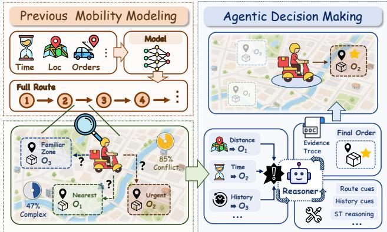
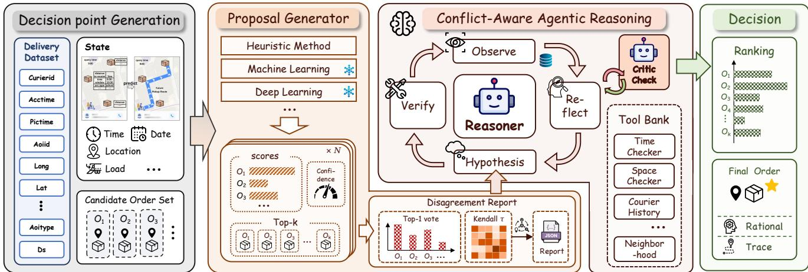
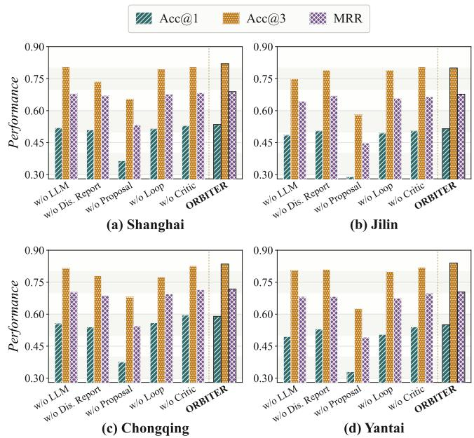
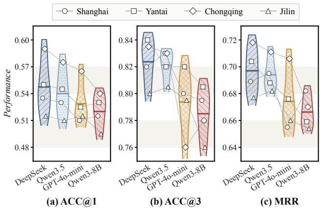
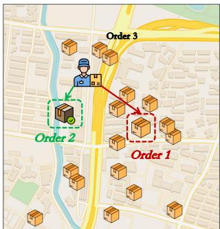
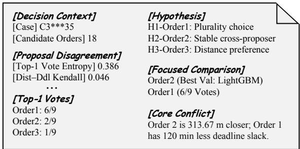

# ORBITER: Conflict-Aware Decision-Making for Agentic Last-Mile Delivery

Mingzhao Li1, Chenxi Liu1, Yan Zhao2, Hao Miao3

1Centre for Artificial Intelligence and Robotics, Hong Kong Institute of Science & Innovation,

Chinese Academy of Sciences, Hong Kong SAR

2Shenzhen Institute for Advanced Study,

University of Electronic Science and Technology of China, Shenzhen, China

3The Hong Kong Polytechnic University, Hong Kong SAR

{mingzhao.li,chenxi.liu}@cair-cas.org.hk, zhaoyan@uestc.edu.cn, haomiao@polyu.edu.hk

## Abstract

Last-mile delivery aims to handle dynamically arriving orders with couriers while modeling complex spatial and temporal correlations. Recent learning-based methods model spatiotemporal dependencies among orders to predict courier service sequences, but leave next-order decision making unexplained. Describing the current delivery state in language allows LLMs to reason explicitly about the spatial, temporal, and behavioral cues behind an individual decision. As direct predictors, however, LLMs remain sensitive to task presentation and often produce unreliable decisions. To address these challenges, we introduce ORBITER, an agentic Order Arbiter for next-order decision-making in last-mile delivery. ORBITER models courier service through decision points, each containing the courier’s spatiotemporal state and visible orders and exposing local trade-ofs for modeling and verification. Fixed proposers rank the candidates, and a structured report identifies where their rankings disagree. The LLM uses task-specific tools to gather evidence on the leading alternatives, while an independent critic checks the resulting decision against that evidence. We conduct extensive evaluations on data in four cities, where ORBITER outperforms existing state-of-the-art baselines by up to 9.2% on average showing its efectiveness.

## Introduction

Last-mile delivery links logistics facilities to end customers and directly afects operational eficiency, courier experience, and customer satisfaction (Merchán et al. 2024). As e-commerce and on-demand services grow, platforms must coordinate rising order volumes across dispersed locations under tight deadlines and changing conditions (Olsson, Hellström, and Pålsson 2019; Boysen, Fedtke, and Schwerdfeger 2021). These demands make last-mile delivery an important problem in logistics and spatiotemporal data mining.

Growing operational logs have made data-driven prediction central to last-mile service. Sequence decoders and graph models capture dependencies among unfinished tasks (Wen et al. 2021, 2022), while related routing models use attention or graph neural networks to model candidate interactions (Kool, van Hoof, and Welling 2019; Prates et al. 2019). Reinforcement and imitation learning model routing policies and service behavior (Kwon et al. 2020; Feng et al.

  
Figure 1: Previous mobility modeling compresses local choices into full routes, whereas agentic decision making resolves conflicting cues with auditable evidence.

2023). These methods predict service sequences, supporting downstream planning and time estimation (Pegado-Bardayo et al. 2024). LLMs ofer in-context adaptation and explicit reasoning (Brown et al. 2020; Kojima et al. 2022), together with tool use (Schick et al. 2023). Mobility predictors combine historical trajectories with temporal, semantic, social, and geographic context (Xue et al. 2021). Recent LLM work represents trajectories and context through language inputs (Li et al. 2024), while agentic methods add personal memory and external tools (Feng et al. 2025; Du et al. 2025). Trained predictors capture task patterns, whereas LLMs relate spatiotemporal and behavioral cues to context.

However, last-mile service consists of local decisions under changing spatiotemporal constraints. Deep models predict full service sequences, folding candidate trade-ofs into the final route. In dynamic pickup, orders arrive as the courier’s location, waiting times, and deadline slack change (Wu et al. 2024). As shown in the left panel of Figure 1, distance, deadlines, and service history may favor diferent candidates, yet end-to-end scores do not explain how conflicts are resolved. LLMs compare these factors but are often used as final predictors. Prompts, memory, retrieval, and tools add context, but irrelevant information can distract the model, making its output sensitive to presentation (Zheng et al. 2024). Tool outputs may not support the final decision, leaving explanations as unverified post-hoc justifications (Turpin et al. 2023).

These limitations leave three challenges for next-order decision making: (1) Decision granularity. Prior work operates at diferent granularities, from generating service sequences over available tasks (Wen et al. 2021, 2022; Liu et al. 2025a; Rashidi, Nourinejad, and Roorda 2025) to classifying or ranking the next location among candidates (Luca et al. 2023). These formulations optimize the final prediction, leaving comparisons among available orders and the local spatiotemporal cues behind each decision implicit. The challenge is to represent each next-order decision together with the context in which it is made. (2) Behavioral complexity. A courier’s next-order decision may depend on distance, deadlines, waiting time, and prior service patterns, which often favor diferent candidates. In the Shanghai pickup records of LaDe, distance and deadline disagree in 55.4% of decisions; after adding waiting time, 92.5% have no order preferred by all three criteria. No single operating rule can therefore account for courier behavior across such conflicts. (3) Statedependent conflict. Not all available information is equally useful for a particular choice. Evidence may rule out one candidate without separating those that remain, changing what needs to be examined next. Presenting all information at once can add irrelevant detail and prompt a decision before the central conflict is settled.

To address these challenges, we propose ORBITER, a conflict-aware agentic framework for spatiotemporal nextorder decision making. ORBITER first shifts the modeling unit from complete routes to individual next-order decisions, as shown on the right of Figure 1. It generates a decision point after each completed service event from spatiotemporal logs, retaining the orders visible at that time while excluding information from later events. All subsequent components operate on this inference-safe local state. To examine behavioral trade-ofs without requiring the LLM to search the full candidate space, ORBITER pairs an LLM agent with heterogeneous proposers. The Heterogeneous Proposal Generator uses a fixed panel of heuristic, statistical, and deep learning models to produce complementary candidate rankings. A structured disagreement report combines their Top-1 votes, full rankings, and candidate attributes to identify model-supported candidates, the reference proposal and its leading rival, and the principal spatiotemporal conflict. The agent receives this bounded hypothesis set, compares the relevant spatial, temporal, and historical cues, and calls taskspecific tools to gather evidence. For conflicts that remain unresolved, we introduce a hypothesis-verification loop in which each candidate becomes a testable next-order hypothesis. Supporting and opposing evidence update its status, while the remaining conflict determines which comparison to examine next. An independent critic reviews the proposal and evidence and may request an additional comparison. The Evidence-Grounded Decision stage then finalizes the nextorder decision, retains the leading alternatives, and records its supporting evidence.

The main contributions are summarized as follows • We propose ORBITER, a conflict-aware agentic framework for spatiotemporal next-order decision making in last-mile delivery, combining the task-specific modeling of trained predictors with explicit reasoning by an LLM.

• We formulate last-mile service as a sequence of decision points, each preserving the local spatiotemporal state and available orders. This formulation makes individual courier decisions explicit for modeling and verification.

• We develop a Heterogeneous Proposal Generator and Conflict-Aware Agentic Reasoning for adjudicating model disagreements. A structured disagreement report narrows the competing hypotheses, while a hypothesisverification loop gathers evidence as the unresolved conflict evolves.

• We conduct extensive evaluations on four city subsets of LaDe-P, where ORBITER consistently outperforms stateof-the-art baselines, with a 9.2% average improvement in next-order decision accuracy.

## Related Work

Deep Learning Based Mobility Prediction. Significant efforts have been made in mobility prediction using deep learning models, encompassing research from both location prediction and route prediction. The former infers where an individual will go next from trajectories and spatiotemporal context, where deep sequential, attention, and graph models dominate (Kong and Wu 2018; Hong, Martin, and Raubal 2022; Sun et al. 2020; Luo, Liu, and Liu 2021; Lin et al. 2021; Yang, Liu, and Zhao 2022; Rao et al. 2022). These methods profile general users over an open location set, while a courier picks from candidate orders fixed by the current task state. The latter predicts the visiting order of unfinished delivery tasks (Pegado-Bardayo et al. 2024): Deep-Route, Graph2Route, DRL4Route, and MRGRP advance it with pointer decoding, dynamic spatiotemporal graphs, reinforcement learning, and multi-relational graphs (Wen et al. 2021, 2022; Mao et al. 2023; Liu et al. 2025a). Both lines are end-to-end black-box mappings: they produce a result but cannot answer why the courier makes a particular choice at a decision point, so the prediction is neither interpretable nor auditable. This motivates us to recast service as a sequence of real decision points and make explicit how each choice is formed, rather than merely fitting the outcomes.

LLM-Based Mobility Reasoning. Large language models have recently been brought into mobility modeling, which studies how individuals move through urban space, from ordinary users visiting the next place to couriers serving pickup and delivery orders. These eforts difer in how much machinery is built around the model. The lightest prompt it directly, casting stays and candidate POIs as text (Wang et al. 2023; Feng et al. 2024). Others adapt or augment the model itself, fine-tuning it on trajectory prompts (Li et al. 2024), injecting geographic encodings (Liu et al. 2025b), or retrieving similar users and trajectories as context (Wu et al. 2026; Li and Lim 2025). The most elaborate are agentic: prediction is decomposed into memory and knowledge modules (Feng et al. 2025), agents gain mobility tools or specialized small models (Chen et al. 2026; Patil et al. 2024), and the recipe reaches delivery route planning (Li et al. 2026). LLM agents also simulate behavior, acting as urban residents (Wang et al. 2024) or delivery riders (Zhang and Xiao 2026). Across these designs, however, the LLM retains the same role: it acts as the predictor or simulator, without explicit checks against task evidence. We flip this role. Rather than adding another predictor, we direct the LLM’s reasoning at the conflicts among heterogeneous predictors, so that disagreement is no longer noise but a signal to be adjudicated against auditable evidence within the candidate set.

## Preliminaries

Definition 1 (Location). In last-mile delivery, a location $p \in { \mathcal { L } }$ is a geographically distributed pickup or drop-of stop, represented by its coordinates and area of interest (AOI). An order o is associated with location $p ( o )$ , acceptance time $t _ { \mathrm { a c c } } ( o )$ , deadline $t _ { \mathrm { d d l } } ( o )$ , and observed completion time $t _ { \mathrm { c m p } } ( o )$

Definition 2 (Courier Trajectory). Let U be the set ofcouriers. For courier $u \in \mathcal { U }$ over a service period, the trajectory is the time-ordered sequence

$$
{ \mathcal { T } } _ { u } = { \big ( } ( p _ { 1 } , \tau _ { 1 } ) , ( p _ { 2 } , \tau _ { 2 } ) , \dots , ( p _ { n } , \tau _ { n } ) { \big ) } ,\tag{1}
$$

where $p _ { i }$ is the i-th location served and $\tau _ { i }$ is the corresponding service time. The trajectory records the realized route, but not the outstanding orders from which each next stop was chosen.

Definition 3 (Decision Point). Consider courier u immediately after completing service at $( p _ { t } , \tau _ { t } )$ . The orders accepted by $\tau _ { t }$ but not yet served form the candidate set $\mathcal { C } _ { t } ^ { \mathrm { ~ ~ } } = \{ \ O \ | \ t _ { \mathrm { a c c } } ( o ) \ \leq \ \tau _ { t } \ < \ t _ { \mathrm { c m p } } ( o ) \}$ . Let $y _ { t }$ denote the order served at the next trajectory record. When $| \mathcal { C } _ { t } | \ge 2$ and $y _ { t } \in \mathcal { C } _ { t }$ , we call this choice opportunity a decision point, represented by

$$
s _ { t } = ( u , p _ { t } , \tau _ { t } , \mathcal { T } _ { u } ^ { < t } , \mathcal { C } _ { t } ) ,\tag{2}
$$

where $\mathcal { T } _ { u } ^ { < t }$ is the prefix of $\mathcal { T } _ { u }$ completed before $\tau _ { t }$ . Each $o \in$ $\mathcal { C } _ { t }$ is described by attributes ${ \bf x } _ { t } ( o )$ observable at that time, including its location and temporal constraints. Anchoring the state at $\tau _ { t }$ makes each decision point reproducible from operational logs while preserving the information available before the next service event.

Problem Definition. We formulate next-order decision making at the level of individual service steps. At decision point $s _ { t }$ , the agent observes an inference-safe state $\Phi ( s _ { t } )$ containing information available by $\tau _ { t } .$ , with candidates presented independently of their future service order. The decision agent π returns a candidate ranking and commits to its first element:

$$
\hat { \rho } _ { t } = \pi ( \Phi ( s _ { t } ) ) , \qquad \hat { y } _ { t } = \hat { \rho } _ { t } ( 1 ) .\tag{3}
$$

The objective is to place $y _ { t }$ as high as possible in $\hat { \rho } _ { t }$ thereby modeling a courier’s service process as a sequence of step-level agent decisions.

## Methodology

Figure 2 gives an overview of ORBITER, which proceeds in four stages. First, Decision Point Generation reconstructs an inference-safe candidate set at each service event from spatiotemporal order logs. Next, Heterogeneous Proposal Generator ranks these candidates with fixed proposers of different inductive biases and summarizes their main disagreements in a structured report. Then, Conflict-Aware Agentic Reasoning examines the resulting hypotheses with taskspecific tools, while an independent critic reviews the conclusion. Finally, Evidence-Grounded Decision determines the next order, retains the leading alternatives, and completes the ranking with the proposer outputs while preserving the accompanying decision record.

## Decision Point Generation

Spatiotemporal order logs record the realized service sequence, but not the choice faced by the courier at each step. ORBITER reconstructs these choices and removes futurecompletion cues through leakage control.

Decision reconstruction. To recover this missing decision context, ORBITER treats each service transition as a decision point with an explicit candidate set, processing each courierday in completion order. After the event $( p _ { t } , \tau _ { t } )$ , the next completed order becomes $y _ { t } ,$ and the orders visible at $\tau _ { t }$ form $\mathcal { C } _ { t }$ as specified in Definition 3. States with $| \mathcal { C } _ { t } | < 2$ contain no meaningful choice, while states with $y _ { t } \notin \mathcal { C } _ { t }$ correspond to an order that was unavailable when the preceding service ended; both are excluded. Writing $\mathcal { I } _ { u }$ for the retained indices of courier $u ,$ the supervision set is

$$
\begin{array} { r l } & { \mathcal { Z } = \big \{ \big ( \Phi ( s _ { t } ) , y _ { t } \big ) \big | u \in \mathcal { U } , t \in \mathcal { T } _ { u } \big \} , } \\ & { \mathcal { T } _ { u } = \big \{ t \big | | \mathcal { C } _ { t } | \geq 2 , y _ { t } \in \mathcal { C } _ { t } \big \} . } \end{array}\tag{4}
$$

Every label in $\mathcal { Z }$ is thus conditioned on the alternatives that were live at the corresponding service transition. To make those alternatives comparable, each candidate $o \in { \mathcal { C } } _ { t }$ is described by

$$
\begin{array} { r l } & { w _ { t } ( o ) = \tau _ { t } - t _ { \mathrm { a c c } } ( o ) , } \\ & { \ell _ { t } ( o ) = t _ { \mathrm { d d l } } ( o ) - \tau _ { t } , } \\ & { d _ { t } ( o ) = \mathrm { d i s t } \big ( p _ { t } , p ( o ) \big ) , } \end{array}\tag{5}
$$

where $w _ { t } ( o )$ is the waiting time since acceptance, $\ell _ { t } ( o )$ the remaining slack to the deadline, and $d _ { t } ( o )$ the courier–order distance. Together with location, $\mathbf { A O I }$ , and time-window attributes, these give every candidate a row $\mathbf { x } _ { t } ( o ) \in \mathbb { R } ^ { d _ { x } }$ with $d _ { x } = 8 ;$ stacking the rows over $\mathcal { C } _ { t }$ yields the candidate matrix $\mathbf { X } _ { t } \in \mathbb { R } ^ { n _ { t } \times d _ { x } } , \bar { n } _ { t } = | \mathcal { C } _ { t } |$ , that every component receives.

Leakage control. Benchmarks built from logs can reward train–test overlap rather than modeling, as shown for nextlocation prediction (Luca et al. 2023). The reconstructed candidate list inherits future completion order, so row position alone would reveal $y _ { t }$ . We therefore sample a permutation $\sigma _ { t }$ of $[ n _ { t } ]$ from an episode-specific deterministic seed and apply it jointly to candidate identifiers, feature rows, and proposer inputs. Consistent with the definition of $\Phi ( s _ { t } )$ in Section $^ { 3 , }$ the agent observes neither $y _ { t }$ nor any future-route field; these variables are retained only as supervision. Finally, $\mathcal { Z }$ is partitioned chronologically by service day so that all test days follow the training days.

  
Figure 2: Overall architecture of ORBITER.

## Heterogeneous Proposal Generator

Given the reconstructed decision points, ORBITER obtains rankings from fixed proposers with diferent inductive biases and organizes their disagreements for subsequent reasoning. It first generates heterogeneous proposals and then summarizes them in a structured disagreement report.

Heterogeneous proposers. LLMs can fall short when a decision requires exploring several plausible alternatives (Yao et al. 2023a). ORBITER therefore uses pretrained proposers to identify model-supported candidates before evidence collection, while preserving their competing views of the decision.

The proposers span three distinct inductive biases: heuristics, statistical machine learning, and deep learning. For proposer $m ,$ , let $\mathbf { z } _ { t } ^ { m } \in \mathbb { R } ^ { n _ { t } }$ denote its candidate scores, which order $\mathcal { C } _ { t }$ by

$$
\begin{array} { r l } & { r _ { t , i } ^ { m } = 1 + \big | \{ j \in [ n _ { t } ] \mid z _ { t , j } ^ { m } > z _ { t , i } ^ { m } \} \big | , } \\ & { c _ { t } ^ { m } = \underset { i \in [ n _ { t } ] } { \arg \operatorname* { m i n } } r _ { t , i } ^ { m } , } \end{array}\tag{6}
$$

so that rank one marks the order proposer m favors. Keeping the whole rank vector rather than the vote alone preserves near ties and consistently supported alternatives.

Because rule scores, probabilities, and model logits are not directly comparable, each nonconstant score vector is min– max normalized and rescaled to a distribution $\mathbf { p } _ { t } ^ { m }$ , whose concentration is

$$
\kappa _ { t } ^ { m } = 1 - \frac { H ( \mathbf { p } _ { t } ^ { m } ) } { \log n _ { t } } , \qquad H ( \mathbf { p } ) = - \sum _ { i } p _ { i } \log p _ { i } .\tag{7}
$$

We set $\kappa _ { t } ^ { m } = 0$ for a constant score vector. Each proposer thus contributes both a preference order over $\mathcal { C } _ { t }$ and a measure of how sharply it separates its top choice.

Disagreement report. Raw proposer rankings do not tell the agent which alternatives merit comparison or what drives the conflict. Following structured prompting (Beurer-Kellner, Fischer, and Vechev 2023; Besta et al. 2024), OR-BITER converts them into a disagreement report $\mathcal { D } _ { t }$ containing candidate hypotheses and focused comparisons.

$\mathcal { H } _ { t } ^ { 0 }$ begins with the distinct Top-1 proposals. To retain alternatives repeatedly placed near the top, ORBITER supplements this set by reciprocal-rank support:

$$
\mathrm { R R F } _ { t } ( i ) = \sum _ { m \in [ M ] } \frac { 1 } { r _ { t , i } ^ { m } } ,\tag{8}
$$

Candidates with the largest values are then added to $\mathcal { H } _ { t } ^ { 0 }$ . The Top-1 choice of the most contextually reliable proposer then serves as a reference:

$$
\begin{array} { r } { m _ { t } ^ { \star } = \arg \operatorname* { m a x } \alpha _ { t } ^ { m } , \qquad \hat { y } _ { t } ^ { 0 } = c _ { t } ^ { m _ { t } ^ { \star } } , } \end{array}\tag{9}
$$

where $\alpha _ { t } ^ { m }$ is estimated from training data. This reference starts the comparison but does not determine its outcome.

The report describes the resulting challenge through Top-1 votes and full rankings:

$$
q _ { t } ( c ) = \frac { 1 } { M } \sum _ { m \in [ M ] } \mathbb { I } \big [ c _ { t } ^ { m } = c \big ] , \qquad V _ { t } = \frac { H ( \mathbf { q } _ { t } ) } { \log M } .\tag{10}
$$

Here, $V _ { t }$ measures how widely the panel splits. Pairwise Kendall correlations show whether that split extends beyond Top-1, while

$$
R _ { t } ( i ) = \operatorname* { m a x } _ { m \in [ M ] } r _ { t , i } ^ { m } - \operatorname* { m i n } _ { m \in [ M ] } r _ { t , i } ^ { m } .\tag{11}
$$

locates candidate-specific disputes. Together with the candidate attributes, these statistics expose the principal trade-of between the reference and its leading rival and formulate the question tested in the next stage.

## Conflict-Aware Agentic Reasoning

The disagreement report identifies the competing candidates but not the evidence that settles their dispute. ORBITER follows the reasoning–action alternation of ReAct (Yao et al. 2023b), while tying each tool call to one unresolved comparison. The resulting loop tests that comparison before an independent critic examines the proposed conclusion.

Hypothesis state. Each candidate $c \in \mathcal { H } _ { t } ^ { 0 }$ induces the testable claim that c should be served next. At step $k ,$ the reasoning state is

$$
\Omega _ { t } ^ { k } = { \left( \mathcal { H } _ { t } ^ { k } , \mathcal { Q } _ { t } ^ { k } , \mathcal { E } _ { t } ^ { k } \right) } ,\tag{12}
$$

where $\mathcal { H } _ { t } ^ { k }$ stores the claims and their status, $\mathcal { Q } _ { t } ^ { k }$ the unresolved comparisons, and $\mathcal { E } _ { t } ^ { k }$ the evidence collected so far. Candidate identities remain fixed; observations mark their claims as supported, contradicted, or contested.

Evidence collection. Given this state, the report, and tool set ${ \mathcal { F } } _ { : }$ the controller chooses

$$
a _ { t } ^ { k } \sim \pi _ { \mathrm { L L M } } \left( \cdot \mid \Omega _ { t } ^ { k } , { \cal D } _ { t } , { \mathcal F } \right) ,\tag{13}
$$

which invokes a tool, formulates the next comparison, or submits a proposal in $\mathcal { H } _ { t } ^ { 0 }$ . Every query names the candidate, its rival, and the outcome that would change their comparison. When $a _ { t } ^ { k }$ invokes tool $f _ { t } ^ { k }$ on candidate c and rival c¯, evidence is acquired by

$$
\begin{array} { r l } & { e _ { t } ^ { k } = f _ { t } ^ { k } ( \Phi ( s _ { t } ) , c , \bar { c } ) , } \\ & { \xi _ { t } ^ { k + 1 } = \Big \{ \xi _ { t } ^ { k } \cup \{ e _ { t } ^ { k } \} , \quad e _ { t } ^ { k } \mathrm { i s ~ a d m i s s i b l e } , } \\ & { \mathrm { o t h e r w i s e } . } \end{array}\tag{14}
$$

Admissibility requires a time-safe, candidate-directed result with traceable provenance. Spatiotemporal tools test the current trade-of, historical tools retrieve comparable decisions, and robustness tools probe plausible perturbations.

Let $\mathcal { E } _ { + } = \mathcal { E } _ { t } ^ { k , + } ( c )$ and $\mathscr { E } _ { - } = \mathscr { E } _ { t } ^ { k , - } ( c )$ denote the admissible evidence supporting and opposing c. The hypothesis status is updated as

$$
h _ { t } ^ { k + 1 } ( c ) = \left\{ \begin{array} { l l } { \mathrm { s u p p o r t e d , } } & { \mathcal { E } _ { + } \neq \emptyset , \mathcal { E } _ { - } = \emptyset , } \\ { \mathrm { c o n t r a d i c t e d , } } & { \mathcal { E } _ { + } = \emptyset , \mathcal { E } _ { - } \neq \emptyset , } \\ { \mathrm { c o n t e s t e d , } } & { \mathcal { E } _ { + } \neq \emptyset , \mathcal { E } _ { - } \neq \emptyset , } \\ { \mathrm { u n t e s t e d , } } & { \mathrm { o t h e r w i s e . } } \end{array} \right.\tag{15}
$$

Critic. The critic reads the proposal and evidence independently and may approve, reject, or request another observation without proposing a candidate itself. It may approve a proposal only if the selected candidate lies in $\mathbf { \dot { \mathcal { H } } } _ { t } ^ { 0 }$ , cites admissible supporting evidence, and addresses its strongest rival. Otherwise, the critic returns the missing comparison to the loop, subject to the evidence budget.

## Evidence-Grounded Decision

Let $\boldsymbol { A } _ { \mathrm { L L M } }$ denote the complete conflict-aware agent, including the hypothesis-verification loop and critic feedback, and $\mathcal { R } _ { t }$ its evidence record. The resulting agentic decision is

$$
\big ( \widehat { y } _ { t } , \mathcal { R } _ { t } \big ) = \mathcal { A } _ { \mathrm { L L M } } \big ( \Phi ( s _ { t } ) , \mathcal { D } _ { t } ; \mathcal { F } \big ) , \qquad \widehat { y } _ { t } \in \mathcal { H } _ { t } ^ { 0 } .\tag{16}
$$

The first component supplies Top-1; proposer outputs only complete the remaining ranking.

Let $\tilde { z } _ { t , i } ^ { m }$ denote candidate $i \mathbf { \ ' } _ { \mathbf { S } }$ min–max normalized score from proposer $m .$ . Using the concentration in Equation (7), its fused score is

$$
g _ { t } ( i ) = \frac { \sum _ { m = 1 } ^ { M } \kappa _ { t } ^ { m } \widetilde { z } _ { t , i } ^ { m } } { \sum _ { m = 1 } ^ { M } \kappa _ { t } ^ { m } } .\tag{17}
$$

Sharper proposer distributions receive greater weight; if all concentration values are zero, we use the unweighted mean.

ORBITER retains the agent decision and two leading rivals from the hypothesis set as its Top-3. The rivals follow $\hat { y } _ { t }$ in decreasing order of $g _ { t } ( i )$ , and the same score ranks all remaining candidates. This keeps the principal conflict visible in the returned ranking. The record $\mathcal { R } _ { t }$ contains the supporting evidence, treatment of the leading counterevidence, and critic review behind the decision.

## Experiments

## Experimental Setup

Datasets. We use four city subsets of LaDe-P (Wu et al. 2024): Shanghai, Chongqing, Jilin, and Yantai. Released by Cainiao, LaDe contains 10.677 million packages served by 21,000 couriers over six months. Shanghai and Chongqing are high-volume cities, with Chongqing featuring a more complex road network; Jilin and Yantai represent mediumand small-sized cities. The pickup records provide locations, service time windows, event times, AOI attributes, and courier information.

<table><tr><td>City</td><td>Packages</td><td>Couriers</td><td>AvgPackage</td></tr><tr><td>Shanghai</td><td>1,450k</td><td>4,502</td><td>15.0</td></tr><tr><td>Chongqing</td><td>1,172k</td><td>2,982</td><td>14.0</td></tr><tr><td>Yantai</td><td>1,146k</td><td>2,593</td><td>16.0</td></tr><tr><td>Jilin</td><td>261k</td><td>665</td><td>13.8</td></tr></table>

Table 1: Statistics of the LaDe-P subsets.

Baselines and Evaluation. We compare ORBITER with thirteen baselines from four categories: heuristic methods (Distance Greedy, Deadline Greedy, and Weighted Rule), machine learning models (LightGBM (Ke et al. 2017), XG-Boost (Chen and Guestrin 2016), and Random Forest), deep learning models (DeepRoute (Wen et al. 2021), Graph2Route (Wen et al. 2022), DRL4Route (Mao et al. 2023), and MR-GRP (Liu et al. 2025a)), and LLM-based methods (LLM-Mob (Wang et al. 2023), LLM-Move (Feng et al. 2024), and AgentMove (Feng et al. 2025)). We report ACC@1, ACC@3, and mean reciprocal rank (MRR) under the same data splits and candidate sets.

## Main Results

Table 2 compares all methods across four LaDe-P city subsets using the same candidate sets. ACC@1 measures the committed next-order decision, while MRR captures the rank of the true order. The following observations are made.

First, ORBITER performs consistently well across cities. It achieves the highest ACC@1 and MRR in every city, outperforming the strongest baseline by 9.2% and 4.9% on average, respectively. By checking competing proposals against taskspecific evidence, the agent can revise an incorrect top choice without discarding the ranking prior supplied by the trained predictors. Its advantage therefore appears in both next-order decision accuracy and the rank of the true order, rather than in a single city or metric. Meanwhile, ORBITER makes efective use of heterogeneous proposals. Among the baselines,

<table><tr><td rowspan="2">Model</td><td colspan="3">Shanghai</td><td colspan="3">Jilin</td><td colspan="3">Chongqing</td><td colspan="3">Yantai</td></tr><tr><td>ACC@1</td><td>ACC@3</td><td>MRR</td><td>ACC@1</td><td>ACC@3</td><td>MRR</td><td>ACC@1</td><td>ACC@3</td><td>MRR</td><td>ACC@1</td><td>ACC@3</td><td>MRR</td></tr><tr><td>Distance Greedy</td><td>0.250</td><td>0.575</td><td>0.452</td><td>0.255</td><td>0.570</td><td>0.465</td><td>0.280</td><td>0.600</td><td>0.478</td><td>0.280</td><td>0.610</td><td>0.483</td></tr><tr><td>Deadline Greedy</td><td>0.205</td><td>0.505</td><td>0.414</td><td>0.185</td><td>0.430</td><td>0.383</td><td>0.220</td><td>0.565</td><td>0.440</td><td>0.210</td><td>0.535</td><td>0.414</td></tr><tr><td>Weighted Rule</td><td>0.435</td><td>0.755</td><td>0.628</td><td>0.350</td><td>0.655</td><td>0.543</td><td>0.470</td><td>0.745</td><td>0.636</td><td>0.480</td><td>0.760</td><td>0.640</td></tr><tr><td>LightGBM</td><td>0.475</td><td>0.735</td><td>0.644</td><td>0.480</td><td>0.755</td><td>0.646</td><td>0.505</td><td>0.785</td><td>0.665</td><td>0.450</td><td>0.790</td><td>0.644</td></tr><tr><td>XGBoost</td><td>0.500</td><td>0.760</td><td>0.660</td><td>0.485</td><td>0.765</td><td>0.655</td><td>0.525</td><td>0.790</td><td>0.680</td><td>0.450</td><td>0.795</td><td>0.642</td></tr><tr><td>Random Forest</td><td>0.450</td><td>0.785</td><td>0.639</td><td>0.405</td><td>0.740</td><td>0.603</td><td>0.480</td><td>0.815</td><td>0.663</td><td>0.460</td><td>0.795</td><td>0.645</td></tr><tr><td>DeepRoute</td><td>0.490</td><td>0.810</td><td>0.664</td><td>0.455</td><td>0.775</td><td>0.636</td><td>0.505</td><td>0.785</td><td>0.661</td><td>0.515</td><td>0.840</td><td>0.686</td></tr><tr><td>Graph2Route</td><td>0.500</td><td>0.795</td><td>0.666</td><td>0.430</td><td>0.740</td><td>0.617</td><td>0.535</td><td>0.790</td><td>0.682</td><td>0.510</td><td>0.820</td><td>0.681</td></tr><tr><td>DRL4Route</td><td>0.495</td><td>0.815</td><td>0.667</td><td>0.460</td><td>0.780</td><td>0.641</td><td>0.520</td><td>0.800</td><td>0.666</td><td>0.525</td><td>0.845</td><td>0.691</td></tr><tr><td>MRGRP</td><td>0.505</td><td>0.830</td><td>0.669</td><td>0.455</td><td>0.785</td><td>0.632</td><td>0.550</td><td>0.805</td><td>0.692</td><td>0.495</td><td>0.810</td><td>0.665</td></tr><tr><td>LLM-Mob</td><td>0.340</td><td>0.680</td><td>0.521</td><td>0.285</td><td>0.630</td><td>0.463</td><td>0.375</td><td>0.695</td><td>0.541</td><td>0.325</td><td>0.665</td><td>0.503</td></tr><tr><td>LLM-Move</td><td>0.355</td><td>0.600</td><td>0.503</td><td>0.285</td><td>0.560</td><td>0.437</td><td>0.325</td><td>0.625</td><td>0.482</td><td>0.335</td><td>0.595</td><td>0.480</td></tr><tr><td>AgentMove</td><td>0.350</td><td>0.640</td><td>0.508</td><td>0.290</td><td>0.535</td><td>0.426</td><td>0.300</td><td>0.555</td><td>0.450</td><td>0.285</td><td>0.580</td><td>0.446</td></tr><tr><td>ORBITER</td><td>0.535</td><td>0.820</td><td>0.689</td><td>0.515</td><td>0.800</td><td>0.677</td><td>0.590</td><td>0.835</td><td>0.718</td><td>0.550</td><td>0.840</td><td>0.704</td></tr></table>

Table 2: Main results on the four city subsets of LaDe-P. All LLM-based methods use DeepSeek-V4-Flash as the backbone.

MRGRP leads ACC@1 in Shanghai and Chongqing, while XGBoost and DRL4Route lead in Jilin and Yantai. These shifts indicate that diferent model families capture complementary decision cues. Rather than committing to one of them, ORBITER retains their competing views as proposals: the disagreement report narrows the comparison to modelsupported candidates, while targeted evidence resolves the remaining conflict. It consequently ranks first in ACC@1 and MRR across all four cities even as the strongest individual predictor changes. Finally, ORBITER makes more efective use of LLM reasoning. Across the four cities, the three LLM baselines achieve an average ACC@1 of 32.1%, 41.4% lower than ORBITER and broadly comparable to the heuristic methods. Designed for mobility prediction, these methods rely heavily on recurring locations and trajectory history. Delivery decision making instead requires choosing from a changing set of orders whose distance, waiting time, and deadlines may conflict. ORBITER preserves the taskspecific ranking priors of its proposers and asks the LLM to resolve disagreements among their leading candidates, rather than choose the next order from scratch.

## Ablation Studies

We study five controlled variants. w/o Proposal Models uses only the candidate state tools. w/o LLM replaces reasoning and evidence collection with confidence-weighted proposer fusion. w/o Disagreement Report gives the agent raw proposer outputs. w/o Reasoning Loop replaces the hypothesisverification loop and evidence revision with a single-pass LLM decision. w/o Critic removes the independent critic.

Figure 3 reports the relative losses from each component removal. (1) The heterogeneous proposers provide OR-BITER’s primary task guidance. Removing proposer guidance lowers mean ACC@1 by 37.98%, bringing performance close to the LLM-based baselines. Candidate states and tools alone do not reliably identify the next order from the full set, making proposer rankings the basis for subsequent reasoning. (2) Evidence-based agent reasoning adds value beyond proposal fusion. Replacing reasoning and evidence collection with confidence-weighted fusion lowers mean ACC@1 by 6.14%. Heterogeneous proposals identify plausible candidates, but score fusion alone cannot resolve the conflicts among them. (3) The disagreement report directs the agent to the relevant conflicts. Without the structured report, mean ACC@1 falls by 4.68%. Encoding split votes and rank spans makes proposer-supported conflicts explicit, rather than leaving the agent to locate them in redundant raw outputs. (4) The hypothesis-verification loop adapts evidence collection to unresolved conflicts. Fixed evidence and one-shot inference lower mean ACC@1 by 4.10%. One observation may rule out a candidate without separating the remaining hypotheses, so evidence collection must follow the conflict left unresolved.

  
Figure 3: Ablation studies.

  
Figure 4: Performance across backbone LLMs.

(5) The independent critic provides a final corrective check. Removing independent review lowers the three metrics by 1.06% on average. Its efect varies by city, indicating modest but measurable corrections to the final decision.

## Sensitivity to the backbone LLM

To assess ORBITER’s sensitivity to its backbone LLM, we evaluate Qwen3.5-Flash,1 GPT-4o-mini,2 and Qwen3- 8B (Qwen Team 2025) alongside DeepSeek-V4-Flash (DeepSeek-AI 2026) across the four cities, keeping the proposers, tools, and reasoning budget fixed. Figure 4 shows that DeepSeek performs best, while Qwen3.5 trails by only 1.4% in mean ACC@1. GPT-4o-mini and Qwen3-8B lower this metric by 3.4% and 5.0%; ACC@3 and MRR follow the same trend. DeepSeek targets agentic tool use, and Qwen3.5 supports tool-oriented workflows, helping both revise hypotheses across calls. GPT-4o-mini lacks documented agentspecific optimization, whereas Qwen3-8B is limited by its parameter scale. Across all backbones, proposer-supplied candidates and ranking priors keep the decision space bounded, preserving performance when LLM reasoning is weaker.

## Case Study

We examine a Shanghai decision point to illustrate how OR-BITER moves from proposer disagreement to an evidencegrounded decision.

Decision context. After completing a pickup, the courier faces 18 visible orders, as shown in Figure 5. The distance rule favors Order 3, only 23.67 m away, whereas the deadline rule favors Order 1, 376.06 m away with 8 min of slack. The courier actually serves Order 2 next: it is 62.39 m away, with 128 min of slack and several orders in the same AOI.

Disagreement report. The nine proposers split 6:2:1 on their Top-1 choices. The report in Figure 6 retains three hypotheses and reveals what the vote count misses: Order 2 receives only two Top-1 votes, but all nine proposers rank it in the Top-3. Confidence-weighted fusion nevertheless selects Order 1.

<table><tr><td>OrderID</td><td>Order 1</td><td colspan="2">Order 2</td><td>Order 3</td></tr><tr><td>Dist (m)</td><td>376.06</td><td colspan="2">62.39</td><td>23.67</td></tr><tr><td>Deadline</td><td>8</td><td colspan="2">128</td><td>248</td></tr><tr><td>Age</td><td>232</td><td colspan="2">316</td><td>251</td></tr><tr><td>AOI</td><td>21225</td><td colspan="2">21523</td><td>21523</td></tr><tr><td>Hyp.</td><td>H1</td><td colspan="2">H2</td><td>H3</td></tr><tr><td>Votes</td><td>6</td><td colspan="2">2</td><td>1</td></tr><tr><td colspan="5">OrderID</td></tr><tr><td></td><td>Dist (m)</td><td>Deadline</td><td>Age</td><td>AOI</td></tr><tr><td>Order 4</td><td>82.57</td><td>128</td><td>275</td><td>21523</td></tr><tr><td>Order 5</td><td>262.12</td><td>368</td><td>200</td><td>19248</td></tr><tr><td>Order 6</td><td>306.94</td><td>368</td><td>105</td><td>19248</td></tr><tr><td>.…</td><td>…</td><td>…</td><td>…</td><td>.…</td></tr><tr><td>Order 18</td><td>360.55</td><td>128</td><td>2986</td><td>1910</td></tr></table>

Figure 5: Conflicting cues among candidate orders.

  
Figure 6: Example of a Structured Disagreement Report.

Agentic reasoning. ORBITER treats deadline pressure and spatial clustering as competing hypotheses. A deadline check confirms Order 1’s urgency, supporting the premise shared by six proposers. An AOI-density query then places Order 2 in a denser cluster of orders from the same AOI, introducing counterevidence. To determine whether it can safely precede Order 1, the agent runs a counterfactual route check. Serving Order 2 first adds only 12.68 m of detour and still reaches Order 1 in 3.62 min, before its deadline. The deadline hypothesis therefore becomes contested: the urgency is real but does not require immediate service. After an independent review, the critic approves the proposal, and ORBITER selects Order 2, matching the courier’s actual next order. The case shows how targeted evidence can overturn a majority proposal while retaining an auditable decision record.

## Conclusion

We present ORBITER, a conflict-aware agentic framework for next-order decision making in last-mile delivery. OR-BITER generates decision points from spatiotemporal order logs, retaining the courier state and visible orders at each service event. Heterogeneous proposers rank these orders by diferent decision cues, while a structured disagreement report identifies competing hypotheses. Conflict-Aware Agentic Reasoning tests these hypotheses with task-specific evidence, and an independent critic reviews the proposed decision. ORBITER returns the next-order decision with an auditable evidence record. Experiments on LaDe-P data from four cities show that ORBITER achieves the best ACC@1 and MRR in every city.

## References

Besta, M.; Blach, N.; Kubicek, A.; Gerstenberger, R.; Podstawski, M.; Gianinazzi, L.; Gajda, J.; Lehmann, T.; Niewiadomski, H.; Nyczyk, P.; and Hoefler, T. 2024. Graph of Thoughts: Solving Elaborate Problems with Large Language Models. In AAAI, 17682–17690.

Beurer-Kellner, L.; Fischer, M.; and Vechev, M. T. 2023. Prompting Is Programming: A Query Language for Large Language Models. PLDI, 7: 1946–1969.

Boysen, N.; Fedtke, S.; and Schwerdfeger, S. 2021. Last-Mile Delivery Concepts: A Survey from an Operational Research Perspective. OR Spectrum, 43(1): 1–58.

Brown, T. B.; Mann, B.; Ryder, N.; Subbiah, M.; Kaplan, J.; Dhariwal, P.; Neelakantan, A.; Shyam, P.; Sastry, G.; Askell,

Chess, B.; Clark, J.; Berner, C.; McCandlish, S.; Radford, A.; Sutskever, I.; and Amodei, D. 2020. Language Models are Few-Shot Learners. In NeurIPS, volume 33, 1877–1901.

Chen, L.; Zhao, Q.; Li, Z.; Li, M.; Ni, L.; Chen, J.; Yao, Y.; Song, X.; Koshizuka, N.; and Kobayashi, H. 2026. Towards Eficient and Evidence-grounded Mobility Prediction with LLM-Driven Agent. arXiv.

Chen, T.; and Guestrin, C. 2016. XGBoost: A Scalable Tree Boosting System. In SIGKDD, 785–794.

DeepSeek-AI. 2026. DeepSeek-V4: Towards Highly Eficient Million-Token Context Intelligence. arXiv.

Du, Y.; Feng, J.; Zhao, J.; and Li, Y. 2025. TrajAgent: An LLM-Agent Framework for Trajectory Modeling via Largeand-Small Model Collaboration. In NeurIPS, volume 38.

Feng, J.; Du, Y.; Zhao, J.; and Li, Y. 2025. AgentMove: A Large Language Model based Agentic Framework for Zeroshot Next Location Prediction. In NAACL, 1322–1338.

Feng, S.; Lyu, H.; Li, F.; Sun, Z.; and Chen, C. 2024. Where to Move Next: Zero-shot Generalization of LLMs for Next POI Recommendation. In CAI, 1530–1535.

Feng, T.; Yan, H.; Wang, H.; Huang, W.; Han, Y.; Liao, H.; Hao, J.; and Li, Y. 2023. ILRoute: A Graph-based Imitation Learning Method to Unveil Riders’ Routing Strategies in Food Delivery Service. In SIGKDD, 4024–4034.

Hong, Y.; Martin, H.; and Raubal, M. 2022. How do you go where? improving next location prediction by learning travel mode information using transformers. In SIGSPATIAL, 1–10.

Ke, G.; Meng, Q.; Finley, T.; Wang, T.; Chen, W.; Ma, W.; Ye, Q.; and Liu, T.-Y. 2017. LightGBM: A Highly Eficient Gradient Boosting Decision Tree. In NeurIPS, volume 30, 3146–3154.

Kojima, T.; Gu, S. S.; Reid, M.; Matsuo, Y.; and Iwasawa, Y. 2022. Large Language Models Are Zero-Shot Reasoners. In NeurIPS, volume 35.

Kong, D.; and Wu, F. 2018. HST-LSTM: A Hierarchical Spatial-Temporal Long-Short Term Memory Network for Location Prediction. In IJCAI, 2341–2347.

Kool, W.; van Hoof, H.; and Welling, M. 2019. Attention, Learn to Solve Routing Problems! In ICLR.

Kwon, Y.-D.; Choo, J.; Kim, B.; Yoon, I.; Gwon, Y.; and Min, S. 2020. POMO: Policy Optimization with Multiple Optima for Reinforcement Learning. In NeurIPS, volume 33.

Li, K.; and Lim, K. H. 2025. RALLM-POI: Retrieval-Augmented LLM for Zero-Shot Next POI Recommendation with Geographical Reranking. In PRICAI, 210–218.

Li, P.; de Rijke, M.; Xue, H.; Ao, S.; Song, Y.; and Salim, F. D. 2024. Large Language Models for Next Point-of-Interest Recommendation. In SIGIR, 1463–1472.

Li, Z.; Liu, M.; Yang, X.-H.; Dai, H.; Zhang, J.; and Jiao, Y. 2026. Talking Trails: LLM-Enhanced Spatiotemporal Trajectory Modeling for E-Bike Delivery Route Planning. In AAAI, volume 40, 40054–40062.

Lin, Y.; Wan, H.; Guo, S.; and Lin, Y. 2021. Pre-training Context and Time Aware Location Embeddings from Spatial-Temporal Trajectories for User Next Location Prediction. In AAAI, 4241–4248.

Liu, C.; Yan, H.; Sui, H.; Wen, H.; Yuan, Y.; Han, Y.; Liao, H.; Ding, X.; Hao, J.; and Li, Y. 2025a. MRGRP: Empowering Courier Route Prediction in Food Delivery Service with Multi-Relational Graph. In WWW Companion, 364–373.

Liu, Z.; Liu, W.; Zhu, H.; Yu, J.; Yin, J.; Lee, W.-C.; and Wang, S. 2025b. Geography-Aware Large Language Models for Next POI Recommendation. arXiv.

Luca, M.; Pappalardo, L.; Lepri, B.; and Barlacchi, G. 2023. Trajectory Test-Train Overlap in Next-Location Prediction Datasets. Machine Learning, 112: 4597–4634.

Luo, Y.; Liu, Q.; and Liu, Z. 2021. STAN: Spatio-Temporal Attention Network for Next Location Recommendation. In WWW, 2177–2185.

Mao, X.; Wen, H.; Zhang, H.; Wan, H.; Wu, L.; Zheng, J.; Hu, H.; and Lin, Y. 2023. DRL4Route: A Deep Reinforcement Learning Framework for Pick-up and Delivery Route Prediction. In SIGKDD, 4628–4637.

Merchán, D.; Arora, J.; Pachon, J.; Konduri, K.; Winkenbach, M.; Parks, S.; and Noszek, J. 2024. 2021 Amazon last mile routing research challenge: Data set. Transportation Science, 58(1): 8–11.

Olsson, J.; Hellström, D.; and Pålsson, H. 2019. Framework of Last Mile Logistics Research: A Systematic Review of the Literature. Sustainability, 11(24): 7131.

Patil, S. G.; Zhang, T.; Wang, X.; and Gonzalez, J. E. 2024. Gorilla: Large language model connected with massive apis. NeurIPS, 37: 126544–126565.

Pegado-Bardayo, A.; Lorenzo-Espejo, A.; Muñuzuri, J.; and Onieva, L. 2024. A predictive framework for last-mile delivery routes considering couriers’ behavior heterogeneity. Computers & Industrial Engineering, 198: 110665.

Prates, M.; Avelar, P. H. C.; Lemos, H.; Lamb, L. C.; and Vardi, M. Y. 2019. Learning to Solve NP-Complete Problems: A Graph Neural Network for Decision TSP. In AAAI, volume 33, 4731–4738.

Qwen Team. 2025. Qwen3 Technical Report. arXiv.

Rao, X.; Chen, L.; Liu, Y.; Shang, S.; Yao, B.; and Han, P. 2022. Graph-Flashback Network for Next Location Recommendation. In SIGKDD, 1463–1471.

Rashidi, H.; Nourinejad, M.; and Roorda, M. 2025. Generating Practical Last-mile Delivery Routes Using a Datainformed Insertion Heuristic. Transportation Research Part C: Emerging Technologies, 179: 105278.

Schick, T.; Dwivedi-Yu, J.; Dessì, R.; Raileanu, R.; Lomeli, M.; Hambro, E.; Zettlemoyer, L.; Cancedda, N.; and Scialom, T. 2023. Toolformer: Language Models Can Teach Themselves to Use Tools. In NeurIPS, volume 36, 68539–68551.

Sun, K.; Qian, T.; Chen, T.; Liang, Y.; Nguyen, Q. V. H.; and Yin, H. 2020. Where to Go Next: Modeling Long- and Short-Term User Preferences for Point-of-Interest Recommendation. In AAAI, 214–221.

Turpin, M.; Michael, J.; Perez, E.; and Bowman, S. R. 2023. Language Models Don’t Always Say What They Think: Unfaithful Explanations in Chain-of-Thought Prompting. In NeurIPS, volume 36, 74952–74965.

Wang, J.; Jiang, R.; Yang, C.; Wu, Z.; Onizuka, M.; Shibasaki, R.; Koshizuka, N.; and Xiao, C. 2024. Large Language Models as Urban Residents: An LLM Agent Framework for Personal Mobility Generation. In NeurIPS, volume 37, 124547–124574.

Wang, X.; Fang, M.; Zeng, Z.; and Cheng, T. 2023. Where Would I Go Next? Large Language Models as Human Mobility Predictors. arXiv.

Wen, H.; Lin, Y.; Mao, X.; Wu, F.; Zhao, Y.; Wang, H.; Zheng, J.; Wu, L.; Hu, H.; and Wan, H. 2022. Graph2Route: A Dynamic Spatial-Temporal Graph Neural Network for Pick-up and Delivery Route Prediction. In SIGKDD, 4143– 4152.

Wen, H.; Lin, Y.; Wu, F.; Wan, H.; Guo, S.; Wu, L.; Song, C.; and Xu, Y. 2021. Package Pick-up Route Prediction via Modeling Couriers’ Spatial-Temporal Behaviors. In ICDE, 2141–2146.

Wu, L.; Wen, H.; Hu, H.; Mao, X.; Xia, Y.; Shan, E.; Zheng, J.; Lou, J.; Liang, Y.; Yang, L.; Zimmermann, R.; Lin, Y.; and Wan, H. 2024. LaDe: The First Comprehensive Last-mile Express Dataset from Industry. In SIGKDD, 5991–6002.

Wu, Z.; Sun, Z.; Wang, D.; Zhang, L.; Zhang, J.; and Ong, Y.- S. 2026. MRP-LLM: Multitask Reflective Large Language Models for Privacy-Preserving Next POI Recommendation. In UMAP, 166–174.

Xue, H.; Salim, F. D.; Ren, Y.; and Oliver, N. 2021. MobT-Cast: Leveraging Auxiliary Trajectory Forecasting for Human Mobility Prediction. In NeurIPS, volume 34.

Yang, S.; Liu, J.; and Zhao, K. 2022. GETNext: Trajectory Flow Map Enhanced Transformer for Next POI Recommendation. In SIGIR, 1144–1153.

Yao, S.; Yu, D.; Zhao, J.; Shafran, I.; Grifiths, T.; Cao, Y.; and Narasimhan, K. 2023a. Tree of thoughts: Deliberate problem solving with large language models. NeurIPS, 36: 11809–11822.

Yao, S.; Zhao, J.; Yu, D.; Du, N.; Shafran, I.; Narasimhan, K. R.; and Cao, Y. 2023b. ReAct: Synergizing Reasoning and Acting in Language Models. In ICLR.

Zhang, C.; and Xiao, Z. 2026. Large Language Models as Delivery Rider: Generating Instant Food Delivery Riders Routing Decision with LLM Agent Framework. arXiv.

Zheng, C.; Liang, D.; Zhang, W.; Wei, X.-Y.; Chua, T.-S.; and Li, Q. 2024. A picture is worth a graph: A blueprint debate paradigm for multimodal reasoning. In Proceedings of the 32nd ACM International Conference on Multimedia, 419–428.