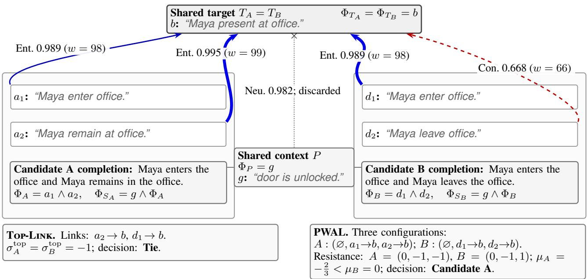
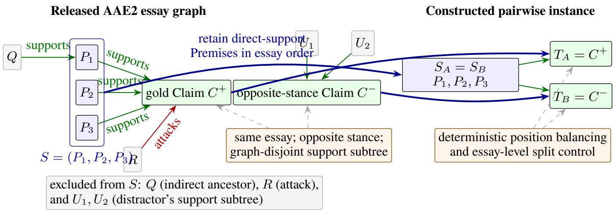
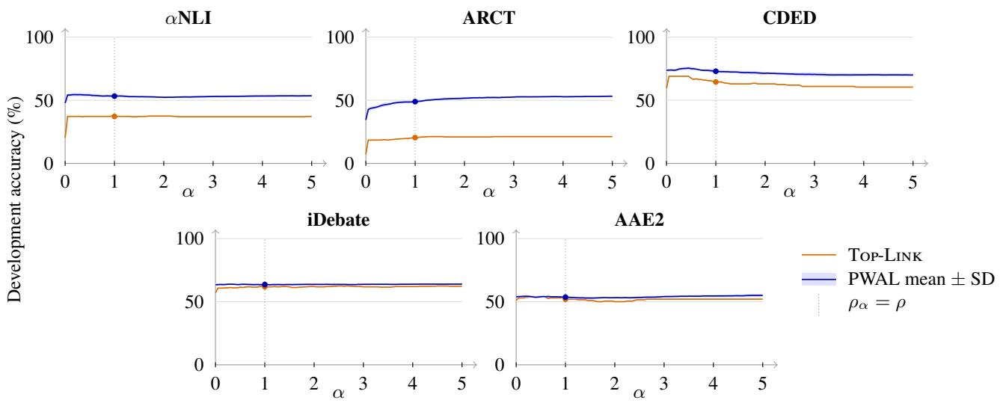

# Pairwise Logical Selection of Enthymeme Completions under Semantic-Link Uncertainty

Xuyao Feng1,\*, Antonis Bikakis2

1Department of Computer Science, University College London

2Department of Information Studies, University College London

London, United Kingdom

\*Corresponding author: Xuyao Feng

xuyao.feng.20@ucl.ac.uk, a.bikakis@ucl.ac.uk

## Abstract

Arguments often omit premises or claims, forming enthymemes. We study pairwise logical selection between two candidates for the omitted component. Natural language processing methods can identify or generate candidates but often do not expose how the selected candidate completes the inference. Logic-based approaches make this inference explicit but usually assume that the required formulae and background knowledge are available. A prior neuro-symbolic pipeline translated the stated text and two generated missing-premise candidates into propositional formulae and tested each candidate independently with a SAT solver; candidates with the same entailment status remained tied even when the task required a single selection. We extend the pipeline to missingclaim selection and replace binary entailment outcomes with logical-resistance scores for pairwise comparison. We define Top-Link, which uses weighted Partial MaxSAT to compute logical resistance under a single configuration of highestconfidence semantic links. We then introduce Possible-World Atom-Link Formalization (PWAL), which keeps translated formulae fixed and marginalizes logical resistance over alternative cross-formula semantic-link configurations. We evaluate five tasks: ARCT and a CDED-derived task for missingpremise selection; iDebate- and AAE2-derived tasks for missing-claim selection; and αNLI for abductive hypothesis selection. Relative to Top-Link, PWAL raises strict accuracy by 2.95–30.86 percentage points and reduces tie rates by 4.57–58.00 percentage points on all five tasks. When ties receive half credit, accuracy still increases by 0.45–6.04 percentage points. For each comparison, PWAL records the translated formulae, sampled link configurations, and resistance components, providing a transparent trace of how the scores are computed.

## Introduction

An enthymeme leaves a premise or claim unstated. For example, the premise the weather report predicts rain does not entail the claim you should take an umbrella without an implicit premise connecting rain to the need for an umbrella. Recovering the omitted component makes the inference explicit and permits logical evaluation. We study pairwise logical selection between two supplied candidate completions, where the omitted component is either a premise or a claim.

Natural language processing methods identify, retrieve, generate, or select omitted argument components, especiall premises (Habernal et al. 2018; Singh et al. 2022; Sviridova, Cabrio, and Villata 2026), but generally do not expose the logical inference completed by a selected or generated component. Symbolic approaches make this inference explicit through abduction and other formal reasoning methods (Hunter 2007; de Saint-Cyr 2011; Black and Hunter 2012; Hosseini, Modgil, and Rodrigues 2014; Xydis et al. 2020; Panisson, McBurney, and Bordini 2022; Hunter 2022; Leiva, Gottifredi, and García 2023; Leiva, García, and Gottifredi 2025; Ben-Naim, David, and Hunter 2025; David and Hunter 2025), but generally assume that the formulae, candidate completions, or background knowledge are available.

A prior neuro-symbolic pipeline combined candidate generation with logical verification (Feng and Hunter 2026). It generated two missing-premise candidates, translated the stated and generated text into propositional formulae, and tested each candidate independently with a SAT solver. Because each candidate received only an entailment or nonentailment result, equal outcomes left the pair unresolved.

We instead assign each candidate a logical-resistance score and compare the two scores. Each candidate c defines a source statement collection $S _ { c }$ evaluated against a target statement collection $T _ { c }$ . Missing-premise tasks vary S while holding $T _ { c }$ fixed; missing-claim tasks hold $S _ { c }$ fixed while varying $\hat { T } _ { c }$ . Because the source and target are translated separately, semantically corresponding or conflicting propositions remain distinct Boolean atoms. We represent these cross-formula semantic relations as atom links encoding exact correspondence, entailment, or contradiction. This creates semantic-link uncertainty: a target atom without an exact correspondence may have several possible entailment or contradiction links, as well as the option of remaining unlinked, and committing to one configuration can change the candidate score.

We instantiate the pairwise logical-resistance score in two ways. Top-Link serves as a single-configuration reference: for each such target atom, it selects the highest-confidence entailment or contradiction link when one is available and evaluates the resulting configuration with weighted Partial MaxSAT. Possible-World Atom-Link Formalization (PWAL) instead keeps the translated statement formulae and exact atom correspondences fixed, assigns a uniform distribution over each target atom’s available entailment or contradiction links and the option of leaving it unlinked, and treats these local choices as independent. PWAL selects the candidate with lower expected logical resistance. A candidate’s logical-resistance score is lower when requiring the target to hold creates less conflict and when more target content is already supported without that requirement. The resulting trace records the translated formulae, evaluated link configurations, and resistance components used in each comparison.

We evaluate Top-Link and PWAL on five pairwise tasks. The Argument Reasoning Comprehension Task (ARCT) (Habernal et al. 2018) and a task derived from Context-Dependent Evidence Detection (CDED) (Rinott et al. 2015) evaluate missing-premise selection. Tasks derived from iDebate (Wang and Ling 2016) and Argument Annotated Essays v2 (AAE2) (Stab and Gurevych 2017) evaluate missing-claim selection. We also evaluate Abductive Natural Language Inference (αNLI) (Bhagavatula et al. 2020) as a pairwise task for abductive hypothesis selection. The four argumentation tasks cover both premise- and claimside completion, while αNLI evaluates the same pairwise selection framework in an abductive setting.

## Background and Related Work

Related Work Neuro-symbolic reasoning systems translate natural-language problems into formal representations and invoke symbolic solvers (Pan et al. 2023; Olausson et al. 2023; Ye et al. 2023; Kirtania, Gupta, and Radhakrishna 2024). Some refine a generated formalization using solver feedback or aggregate predictions across several generated formalizations (Pan et al. 2023; Olausson et al. 2023). Recent enthymeme methods compare supplied premise candidates through natural-language multi-agent debate (Ku et al. 2025), optimize logical formalizations over argument maps (David and Hunter 2025), or axiomatize the evaluation of alternative formalizations (Ben-Naim, David, and Hunter 2025). PWAL instead keeps each statement formula fixed and marginalizes over alternative cross-formula atom-link configurations during pairwise selection.

Weighted and probabilistic logic frameworks attach weights to formulae or rules (Richardson and Domingos 2006; Bach et al. 2017; Riegel et al. 2020). PWAL uses softclause weights for within-world violation costs and world probabilities for uncertainty over which links are active.

Translation of AMR into Logic Abstract Meaning Representation (AMR) represents the semantic structure of a sentence as a rooted, labeled, directed graph (Banarescu et al. 2013). Nodes denote concepts or PropBank frames. In a frame label such as chase-01, chase is the predicate lemma and 01 is its PropBank sense identifier. Labeled edges encode PropBank-derived core roles such as :ARG0 and :ARG1 (Kingsbury and Palmer 2002), alongside general AMR relations such as :location and :time (Banarescu et al. 2013). AMR also represents coordination, conditions, polarity, and reentrancy.

Motivated by compositional AMR semantics (Bos 2016), we use a fixed rule-based compiler that maps an AMR graph to structured semantic atoms and a propositional formula. Coordination, conditions, and formula-level polarity introduce conjunction or disjunction, implication, and negation, respectively, before truth-preserving Boolean simplification. Definition 1 (Statement-Level Propositional Representation). For a finite semantic-atom set ${ \bar { \mathcal { A } } } ,$ let $\mathcal { L } ( A )$ be the smallest formula language containing every $a \in { \mathcal { A } }$ and closed under $\neg , \land , \lor ,$ and →.

For each successfully translated statement x, the solverfacing representation is $\mathsf { R e p } ( x ) = \langle A _ { x } , \Phi _ { x } , \mathcal { V } _ { x } \rangle$ , where:

$\mathcal { A } _ { x }$ is the finite, nonempty set of active semantic atoms;

$\Phi _ { x } \in \mathcal { L } ( \mathcal { A } _ { x } )$ is the propositional formula compiled from the AMR structure; and

$\nu _ { x }$ maps each atom in $\mathcal { A } _ { x }$ to a deterministic, nonempty surface verbalization ending in a full stop. Formula-level polarity is represented in $\Phi _ { x }$ rather than in $\nu _ { x }$

Let $\mathrm { A t o m s } ( \Phi _ { x } )$ denote the atoms occurring in $\Phi _ { x }$ . The translator satisfies Atoms $\left( \Phi _ { x } \right) = \mathcal { A } _ { x } ,$ , so the atom inventory is exactly the set of propositional variables occurring in the formula.

The main atom forms are $\mathrm { U n i } ( u ) , \ \mathrm { D y a } _ { \kappa } ( u , v )$ , and $\mathrm { T r i } _ { \kappa _ { a } , \kappa _ { b } } ( u , e , v )$ . Here $u , v , e$ are AMR terms, with e denoting the predicate occurrence shared by the two roles in a triple, and $\kappa , \kappa _ { a } , \kappa _ { b }$ denoting AMR roles. A unary atom retains a concept that would otherwise have no active proposition or serves as a carrier for local negation. A dyadic atom represents one role-labeled semantic relation. A triple combines two roles licensed by the same predicate occurrence. Additional atom types, scope rules, and fallback cases are specified in the supplementary material.

Example 1 (AMR-to-Logic Translation). Consider $x ^ { + }$ , A cute dog chases a cat, and the corresponding negative statement $x ^ { - }$ , No cute dog chases a cat. After omitting token alignments and renaming variables, their parsed AMRs differ only in the root polarity attribute:

$$
\begin{array} { c c } { { P o s i t i v e A M R } } & { { N e g a t i v e A M R } } \\ { { ( \texttt { c } / { \texttt { c h a s e - 0 1 } } } } & { { ( \texttt { c } / { \texttt { c h a s e - 0 1 } } } } \\ { { : \tt { A R G O  { ( d / \texttt { d o g } } } } } & { { : \tt { p o l a r i t y \_ - } } } \\ { { : \tt { m o d  { ( d / \texttt { d o g } } } } } & { { : \tt { A R G O  { ( d / \texttt { d o g } ) } } } } \\ { { \texttt { c u t e ) ) } } } & { { : \tt { m o d  { ( u / \texttt { d o g } ) } } } } \\ { { : \tt { A R G 1 } } } & { { ( \texttt { a / \texttt { c a t } } ) ) } } & { { \tt c u t e \Rightarrow ) } } \\ { { : \tt { A R G 1 } } } & { { ( \texttt { a / \texttt { c a t } } ) } } & { { ( \texttt { a / \texttt { c a t } } ) } } \end{array}
$$

Using the same names for corresponding atoms, the modifier produces $a _ { 1 } ~ = ~ \mathrm { D y a } _ { \mathrm { m o d } } ( d o g , c u t e )$ , while the shared :ARG0 and :ARG1 roles produce $\begin{array} { r l } { a _ { 2 } } & { { } = } \end{array}$ TriARG0,ARG1(dog, chase-01, cat). Both translations have $\mathcal { A } _ { x ^ { + } } = \mathcal { A } _ { x ^ { - } } \stackrel { \cdot } { = } \left\{ a _ { 1 } , a _ { 2 } \right\}$ and the same surface verbalizations, “cute dog.” and “dog chase cat.” The sense identifier remains part of the structured atom identity but is omitted from its surface verbalization. Polarity changes the propositional formula: $\Phi _ { x ^ { + } } = a _ { 2 } \wedge a _ { 1 }$ , whereas $\Phi _ { x ^ { - } } = \neg ( a _ { 2 } \wedge a _ { 1 } )$

## Pipeline

A pairwise instance contains two candidate-specific source– target pairs, $( S _ { A } , T _ { A } )$ and $( S _ { B } , T _ { B } )$ . For $c \in \{ A , B \}$ , let $S _ { c } = ( s _ { c , 1 } , \ldots , s _ { c , n _ { c } } ) $ and $T _ { c } = ( t _ { c , 1 } , \dots , t _ { c , \bar { m } _ { c } } )$ denote the source and target statement collections for candidate c. Statements within each collection are conjoined. Commonsource tasks satisfy $S _ { A } = S _ { B }$ , while common-target tasks satisfy $T _ { A } = T _ { B }$

The pipeline translates and assembles each candidatespecific source–target pair, constructs cross-formula atom links, and computes candidate-level logical resistance using either Top-Link or PWAL; it selects the lower-scoring candidate or returns a tie.

For each resistance-based scoring method, let $\sigma _ { c }$ denote the score assigned to candidate c. Lower logical scores are preferred. The pipeline returns Tie when $\sigma _ { A } = \sigma _ { B } ;$ ; otherwise, it selects the candidate with the lower score. This compares the two candidate-specific evaluations rather than assigning either candidate an absolute validity label.

## Candidate Source and Target Assembly

Each statement in $S _ { c }$ and $T _ { c }$ is translated independently. Before assembly, statement-local atoms are renamed so that atom namespaces are disjoint across all statement occurrences in $S _ { c }$ and $T _ { c } .$ The same renaming is applied to each statement’s formula and verbalization map. $\mathrm { B e l o w } , \mathcal { A } _ { x _ { i } } , \Phi _ { x _ { i } } ,$ and $\nu _ { x _ { i } }$ denote these renamed representations.

Definition 2 (Candidate Source and Target Representation). For each nonempty collection $X \in \mathsf { \Gamma } \{ S _ { c } , \bar { T _ { c } } \}$ , write $X ~ = ~ ( x _ { 1 } , \dots , x _ { | X | } )$ , and define $\mathcal { A } _ { X } ~ = ~ \lvert \tplus _ { i = 1 } ^ { \lvert X \rvert } \mathcal { A } _ { x _ { i } }$ and $\Phi _ { X } = \bigwedge _ { i = 1 } ^ { | X | } \Phi _ { x _ { i } }$ , where U denotes disjoint union. For each $a \in A _ { X }$ , let $x _ { i }$ be its unique originating statement and set $\mathcal { V } _ { X } ( a ) = \mathcal { V } _ { x _ { i } } ( a )$ . The source and target namespaces satisfy $\mathcal { A } _ { S _ { c } } \cap \mathcal { A } _ { T _ { c } } = \emptyset$

Let CNF(Φ) denote the clause collection in conjunctive normal form (CNF) produced by the fixed SymPy-based conversion used by the solver (Meurer et al. 2017). For $X \in \{ S _ { c } , T _ { c } \}$ , define $\Gamma _ { X } = \lvert \tplus _ { i = 1 } ^ { \lvert X \rvert } \mathrm { C N F } ( \Phi _ { x _ { i } } )$ . For clauses, U preserves statement-indexed clause occurrences. A literal is an atom or its negation; a clause is a disjunction of literals, written $[ \ell _ { 1 } \lor \cdots \lor \ell _ { m } ]$ . Then $\Phi _ { X } \equiv \bigwedge _ { q \in \Gamma _ { X } } q .$

The fixed CNF conversion introduces no auxiliary Boolean atoms.

Example 2 (Source and Target Assembly). Suppose that, after renaming, $\Phi _ { s _ { c , 1 } } = a _ { 0 } , \Phi _ { s _ { c , 2 } } = a _ { 1 } , \Phi _ { s _ { c , 3 } } = \lnot ( a _ { 2 } \wedge a _ { 3 } )$ and $\Phi _ { t _ { c , 1 } } = b _ { 1 } \to \bar { b _ { 2 } }$ . Then $\Phi _ { S _ { c } } = a _ { 0 } \wedge a _ { 1 } \wedge \neg ( a _ { 2 } \wedge a _ { 3 } )$ ) and $\Phi _ { T _ { c } } = b _ { 1 } \to b _ { 2 }$ , with $\Gamma _ { S _ { c } } = \{ [ a _ { 0 } ] , [ a _ { 1 } ] , [ \neg a _ { 2 } \lor \neg a _ { 3 } ] \}$ and $\Gamma _ { T _ { c } } = \{ [ \neg b _ { 1 } \lor b _ { 2 } ] \}$

## Candidate Atom Links

Because source and target atoms are distinct Boolean variables, their semantic relations must be represented explicitly. An atom link connects a source atom to a target atom.

Definition 3 (Natural Language Inference). Let $\begin{array} { r l } { \mathcal { V } } & { { } = } \end{array}$ {Ent, Con, Neu} denote the entailment, contradiction, and neutral labels. For nonempty verbalization strings u and v, let ${ \sf N } ( u , v ) = ( y , p ) \in \mathcal { V } \times \mathrm { ~ \hat { [ 0 , 1 ] } ~ }$ , where u is the NLI premise, v is the hypothesis, y is the predicted label, and p is the confidence assigned to y, rounded to three decimal places.

Definition 4 (Exact and NLI-Derived Atom Links). Let $\operatorname { c f } ( u )$ denote the case-folded form of string u. Define

$$
\mathcal { M } _ { c } ^ { \mathrm { e x } } = \{ ( a , b ) \in \mathcal { A } _ { S _ { c } } \times \mathcal { A } _ { T _ { c } } \ | \ \mathrm { c f } ( \mathcal { V } _ { S _ { c } } ( a ) ) = \mathrm { c f } ( \mathcal { V } _ { T _ { c } } ( b ) ) \} .
$$

$$
\mathcal { U } _ { c } = \{ b \in \mathcal { A } _ { T _ { c } } \ | \ \# a \in \mathcal { A } _ { S _ { c } } : ( a , b ) \in \mathcal { M } _ { c } ^ { \mathrm { e x } } \} .
$$

Every matching source–target pair is retained, so a target atom may have several exact links. If a target atom has an exact link, it is not passed to NLI.

For each $a \in \ A _ { S _ { c } }$ and $b \in \mathcal { U } _ { c }$ , let $\left( y _ { a , b } , p _ { a , b } \right) \ =$ $\mathsf { N } ( \mathcal { V } _ { S _ { c } } ( a ) , \mathcal { V } _ { T _ { c } } ( b ) )$ . The retained non-neutral alternatives are $\begin{array} { r c l c r c l } { \mathcal { R } _ { c } ( b ) } & { = } & { \{ ( a , b , y _ { a , b } , p _ { a , b } ) } & { | } & { a } & { \in } & { \mathcal { A } _ { S _ { c } } , } & { y _ { a , b } } & { \in } \end{array}$ $\{ \mathtt { E n t } , \mathtt { C o n } \} \}$ . Neutral outputs generate no link. $\mathcal { R } _ { c } ( b )$ contains the alternative non-exact links for the unmatched target atom b.

Example 3 (Exact and NLI-Derived Links). Suppose $\mathcal { V } _ { S _ { c } } ( \bar { a _ { 1 } } ) = \mathcal { V } _ { S _ { c } } ( a _ { 2 } ) = \mathcal { V } _ { T _ { c } } ( b _ { 1 } ) = { } ^ { * } d o g b a r k . ^ { , }$ , and these are the only exact matches. Then $\mathcal { M } _ { c } ^ { \mathrm { e x } } = \breve { \{ } ( a _ { 1 } , b _ { 1 } ) , ( a _ { 2 } , b _ { 1 } ) \}$

Let $b _ { 2 }$ have verbalization “animal move.” and no exact match. If the NLI outputs for the pairs $( a _ { 3 } , b _ { 2 } )$ and $( a _ { 4 } , b _ { 2 } )$ are (Ent, 0.88) and $\left( \mathsf { C o n } , 0 . 8 3 \right)$ , respectively, and all other comparisons with $b _ { 2 }$ are neutral, then $\mathcal { R } _ { c } ( b _ { 2 } ) =$ $\{ ( a _ { 3 } , b _ { 2 } , \mathrm { E n t } , 0 . 8 8 ) , ( a _ { 4 } , b _ { 2 } , \mathrm { C o n } , 0 . 8 3 ) \}$

## Weighted Atom-Link Clauses

Atom links are encoded as weighted clauses. We write $( q , \infty )$ for a hard clause and $( q , w )$ , with $w \in  { \mathbb { N } } _ { > 0 }$ , for a soft clause. Every hard clause must be satisfied, while w is the penalty incurred when the soft clause q is violated.

Definition 5 (Weighted Atom-Link Clauses). Let $W _ { \mathrm { m a x } } \in$ $\mathbb { N } _ { > 0 }$ be the maximum finite link weight and define $w ( p ) =$ max $\{ 1 , \lfloor W _ { \mathrm { m a x } } p \rfloor \}$ for $p \in [ 0 , 1 ]$ , where ⌊x⌋ is the greatest integer not exceeding x. Thus, $w \mathbf { \bar { ( } } p \mathbf { ) } \in \{ 1 , \dotsc , W _ { \operatorname* { m a x } } \}$ }, with the outer maximum ensuring a positive weight.

Each exact link $( a , b ) \in \mathcal { M } _ { c } ^ { \mathrm { e x } }$ contributes $\mathbf { \check { \Psi } } ( [ \neg a \lor b ] , W _ { \mathrm { m a x } } )$ and $( [ a \lor \neg b ] , W _ { \mathrm { m a x } } )$ , encoding $a \ \to \ b$ and $b \  \ a ,$ respectively. Together they form a soft equivalence. Define $\begin{array} { r } { \hat { \Omega } _ { c } ^ { \mathrm { e x } } = \bigcup _ { ( a , b ) \in \mathcal { M } _ { \mathrm { \bullet } } ^ { \mathrm { e x } } } \{ ( [ \neg { \bar { a } } \lor b ] , W _ { \mathrm { m a x } } ) , ( [ \bar { a } \lor \neg b ] , W _ { \mathrm { m a x } } ) \} } \end{array}$

For a non-exact link $r = ( a , b , y , p ) , \operatorname { l e t } \operatorname { c l } ( r ) = ( [ \neg a \lor$ $b ] , w ( p ) ) \ { \mathrm { i f } } \ y \ = \ { \mathrm { E n t } }$ , and $\operatorname { c l } ( r ) ~ = ~ ( [ \neg a ~ \lor ~ \neg b ] , w ( p ) )$ if $y = \mathsf { C o n }$

An active non-exact link set $L _ { c } \subseteq \bigcup _ { b \in \mathcal { U } _ { c } } \mathcal { R } _ { c } ( b )$ is admissible if $\left| L _ { c } \cap \mathcal { R } _ { c } ( b ) \right| \ \leq \ 1$ for every $b \in \mathcal { U } _ { c } .$ . Thus, each unmatched target atom has at most one active nonexact link. The atom-link clause collection induced by $L _ { c }$ is $\Omega _ { c } ^ { \mathrm { s e m } } ( L _ { c } ) = \Omega _ { c } ^ { \mathrm { e x } } \cup \{ \mathrm { c l } ( r ) \ | \ r \in L _ { c } \}$

Exact-link clauses occur in $\Omega _ { c } ^ { \mathrm { s e m } } ( L _ { c } )$ for every admissible $L _ { c }$

Example 4 (Weighted Atom-Link Clauses). Continuing Example 3, let $W _ { \mathrm { m a x } } = 1 0 0$ . For each $i \in \{ 1 , 2 \}$ , the exact link $\left( a _ { i } , b _ { 1 } \right)$ ) contributes $( [ \neg a _ { i } \lor b _ { 1 } ]$ , 100) and $( [ \bar { a } _ { i } \lor \neg b _ { 1 } ] , 1 0 0 )$ The two non-exact alternatives map to $( [ \neg \dot { a } _ { 3 } \lor b _ { 2 } ] , \dot { 8 } 8 )$ and $( [ \neg a _ { 4 } \lor \neg b _ { 2 } ] , 8 3 )$ . An admissible configuration may activate either non-exact link for $b _ { 2 } ,$ or neither, but not both.

## Partial MaxSAT Evaluation

For a fixed active non-exact link set $L _ { c } ,$ the evaluator compares a base instance with a forced instance that additionally requires the target clauses. All hard clauses must be satisfied, and the solver minimizes the total weight of violated soft clauses.

Definition 6 (Base and Forced MaxSAT Instances). The hard source clauses are $\Omega _ { c } ^ { \mathrm { h a r d } } = \{ ( q , \infty ) ~ | ~ q \in \Gamma _ { S _ { c } } \}$ , and the target-inertia clauses are $\Omega _ { c } ^ { \mathrm { i n e r t i a } } = \{ ( [ \neg b ] , \epsilon ) ~ | ~ b \in \mathcal { A } _ { T _ { c } } \}$ where $\epsilon \in \mathbb { N } _ { > 0 }$ . Inertia prefers false target atoms but does not require them. Define the base and forced instances by

$$
\begin{array} { r l } & { \mathcal { T } _ { c } ^ { \mathrm { b a s e } } ( L _ { c } ) = \Omega _ { c } ^ { \mathrm { h a r d } } \cup \Omega _ { c } ^ { \mathrm { s e m } } ( L _ { c } ) \cup \Omega _ { c } ^ { \mathrm { i n e r t i a } } , } \\ & { \mathcal { T } _ { c } ^ { \mathrm { f o r c e d } } ( L _ { c } ) = \mathcal { T } _ { c } ^ { \mathrm { b a s e } } ( L _ { c } ) \cup \{ ( q , \infty ) \mid q \in \Gamma _ { T _ { c } } \} . } \end{array}
$$

Let $M _ { c } ^ { \mathrm { b a s e } } ( L _ { c } )$ and $M _ { c } ^ { \mathrm { f o r c e d } } ( L _ { c } )$ be the assignments returned by solving $\mathcal { T } _ { c } ^ { \mathrm { b a s e } } ( \breve { L } _ { c } )$ and $\dot { \mathcal { T } } _ { c } ^ { \mathrm { f o r c e d } } ( L _ { c } )$ , respectively. Each assignment satisfies all hard clauses and minimizes the total weight of violated soft clauses. When either instance has multiple optimal assignments, the corresponding $M _ { c } ^ { \mathrm { b a s e } }$ or $M _ { c } ^ { \mathrm { f o r c e d } }$ is the assignment returned by the solver; no secondary optimization criterion is applied. For any assignment M, define

$$
\mathrm { S e m C o s t } _ { c } ( M , L _ { c } ) = \sum _ { \stackrel { ( q , w ) \in \Omega _ { c } ^ { \mathrm { s e m } } } { M \not \in q } } w .
$$

Both assignments minimize atom-link and inertia costs jointly. Inertia provides a conservative default for otherwise unconstrained target atoms; as an optimization regularizer rather than atom-link evidence, it is excluded from $\mathrm { S e m C o s t } _ { c } .$

The semantic tension is the signed change

$$
\begin{array} { r l } & { \Delta T _ { c } ( L _ { c } ) = \mathrm { S e m C o s t } _ { c } ( M _ { c } ^ { \mathrm { f o r c e d } } ( L _ { c } ) , L _ { c } ) } \\ & { \qquad - \mathrm { S e m C o s t } _ { c } ( M _ { c } ^ { \mathrm { b a s e } } ( L _ { c } ) , L _ { c } ) . } \end{array}
$$

A positive $\Delta T _ { c } ( L _ { c } )$ means that enforcing the target increases conflict with the active atom links; a negative value means that it reduces this conflict.

Semantic tension does not indicate which target clauses already hold in the base optimum. We therefore define a target-clause witness ratio $R _ { \mathrm { s a t } , c } ( L _ { c } )$ . The condition $\mathrm { N e g S u p } _ { c , L _ { c } } ( b )$ prevents target inertia alone from witnessing a negative target literal. Logical resistance combines normalized semantic tension with this ratio. A lower value reflects lower normalized semantic tension, stronger target support, or both; a higher value reflects greater tension, weaker support, or both.

Definition 7 (Target Witness and Logical Resistance). Write $M _ { c } ^ { 0 } \ = \ \stackrel { \cdot } { M } _ { c } ^ { \mathrm { \tiny { b a s e } } } ( L _ { c } )$ . For a target atom $b ,$ define $\mathrm { N e g S u p } _ { c , L _ { c } } ( b )$ to hold if either there exists $a \in \mathcal { A } _ { S _ { c } }$ such that $( a , b ) \ \in \ M _ { c } ^ { \mathrm { e x } }$ and $M _ { c } ^ { 0 } \ \models \ \lnot a .$ , or there exists $( a , b , \mathsf { C o n } , p ) \ \in \ L _ { c }$ such that $M _ { c } ^ { 0 } \ \models a$ . We refer to this requirement as the polarity-aware negative guard.

For a target literal ℓ over atom b, let $\mathrm { W i t } _ { c , L _ { c } } ( \ell ) ~ = ~ 1$ if either $\ell \ = \ b$ and $M _ { c } ^ { 0 } \ \models \ b , \ \mathrm { o r } \ \ell \ = \ \lnot b , \ M _ { c } ^ { 0 } \ \models \ \lnot b ,$ and $\mathrm { N e g S u p } _ { c , L _ { c } } ( b ) ;$ ; otherwise it is 0. For $q ~ \in ~ \Gamma _ { T _ { c } }$ , let $\operatorname { W i t } _ { c , L _ { c } } ( q ) = \tilde { \operatorname* { m a x } } _ { \ell \in q } \operatorname { W i t } _ { c , L _ { c } } ( \ell )$ . For $\Gamma _ { T _ { c } } \neq \emptyset$ , the targetclause witness ratio is

$$
R _ { \mathrm { s a t } , c } ( L _ { c } ) = | \Gamma _ { T _ { c } } | ^ { - 1 } \sum _ { q \in \Gamma _ { T _ { c } } } \mathrm { W i t } _ { c , L _ { c } } ( q ) .
$$

Because the witness ratio is clause-based, the fixed CNF conversion keeps clause granularity consistent across scoring methods.

The total included link weight is

$$
W _ { c } ( L _ { c } ) = W _ { \mathrm { m a x } } | \mathcal { M } _ { c } ^ { \mathrm { e x } } | + \sum _ { ( a , b , y , p ) \in L _ { c } } w ( p ) .
$$

Each exact link contributes $W _ { \mathrm { m a x } } ,$ because an assignment can violate at most one of its two equivalence clauses. Let

$$
C _ { \mathrm { m a x } , c } ( L _ { c } ) = \left\{ \begin{array} { l l } { W _ { c } ( L _ { c } ) , } & { W _ { c } ( L _ { c } ) > 0 , } \\ { | A _ { T _ { c } } | W _ { \mathrm { m a x } } , } & { \mathrm { o t h e r w i s e } . } \end{array} \right.
$$

We use $C _ { \mathrm { m a x } , c } ( L _ { c } )$ as the normalization capacity; it is an upper bound on the active atom-link cost but need not be attainable. When $W _ { c } ( L _ { c } ) = 0$ , no atom-link clause is active and $\Delta T _ { c } ( L _ { c } ) = 0$ , so the fallback denominator only prevents division by zero. The logical resistance is

$$
\rho _ { c } ( L _ { c } ) = \frac { \Delta T _ { c } ( L _ { c } ) } { C _ { \mathrm { m a x } , c } ( L _ { c } ) } - R _ { \mathrm { s a t } , c } ( L _ { c } ) .
$$

Both resistance components are computed from solverreturned optima. In particular, the witness ratio is not logical entailment over all assignments satisfying the source clauses.

Example 5 (Logical Resistance). Let $\Gamma _ { S _ { c } } = \{ [ a ] \} , \Gamma _ { T _ { c } } =$ $\{ [ b ] \} , \mathbf { \dot { W } } _ { \mathrm { m a x } } \dot { \mathbf { \Omega } } = \mathbf { \dot { \Omega } } 1 0 0$ , and $\epsilon = 1$ , with no exact links. For ${ r _ { E } } ~ = ~ ( a , b , { \tt E n t } , 0 . 8 0 )$ and $L _ { c } ~ = ~ \{ r _ { E } \}$ , the hard source clause forces a true. The base optimum sets b true because violating inertia costs 1, whereas violating the entailment link costs 80; the forced optimum also sets b true. Both atom-link costs are 0, so $\bar { \Delta t } T _ { c } ( L _ { c } ) = 0 , R _ { \mathrm { s a t } , c } ( L _ { c } ) = 1$ $C _ { \operatorname* { m a x } , c } ( L _ { c } ) = 8 0 , \mathrm { a n d } \rho _ { c } ( L _ { c } ) \dot { = } - 1$

For $r _ { C } = ( a , b , \mathsf { C o n } , 0 . 7 0 )$ and $L _ { c } = \{ r _ { C } \}$ , the base optimum sets b false, while the forced optimum sets b true and violates the weight-70 contradiction link. Although the forced optimum also violates inertia, inertia is excluded from SemCost . Thus $\Delta T _ { c } ( L _ { c } ) = 7 0 , R _ { \mathrm { s a t } , c } ( L _ { c } ) = 0 \ :$ $C _ { \mathrm { m a x } , c } ( L _ { c } ) = 7 0 , \mathrm { a n d } \rho _ { c } ( L _ { c } ) = 1$

If the target instead contains ¬b without an exact or contradiction link supporting that polarity, inertia may set b false, but ¬b is not witnessed.

## Top-Link and PWAL

The two scoring methods use the same source and target formulae, exact links, non-exact link inventory, clauseconstruction rule, and MaxSAT evaluator. Top-Link evaluates one admissible non-exact link configuration, whereas PWAL averages logical resistance over a distribution of such configurations.

Definition 8 (Top-Link). For each $b \in \mathcal { U } _ { c }$ with $\mathcal { R } _ { c } ( b ) \neq \emptyset$ define $r _ { c } ^ { \star } ( b ) \ \in \ \arg \operatorname* { m a x } _ { ( a , b , y , p ) \in { \mathcal R } _ { c } ( b ) } p$ as a maximumconfidence link, breaking confidence ties by a fixed total order on $\mathbf { \mathcal { A } } _ { S _ { c } }$ induced by source-statement order and the translator’s atom order. Set $L _ { c } ^ { \mathrm { t o p } } = \{ r _ { c } ^ { \star } ( b ) \ | \ b \in \mathcal { U } _ { c } , \mathcal { R } _ { c } ( b ) \neq \emptyset \}$ and $\sigma _ { c } ^ { \mathrm { t o p } } = \rho _ { c } ( L _ { c } ^ { \mathrm { t o p } } )$ . If $\mathcal { R } _ { c } ( b ) = \emptyset$ , no non-exact link is selected for b.

PWAL treats every non-neutral link and the no-link outcome as local alternatives for each unmatched target atom.

  
Figure 1: Constructed common-target trace. Atom identifiers precede their italic sans-serif verbalizations. Arrows show confidence and clause weight (blue: entailment; dashed red: contradiction; thick: Top-Link). PWAL treats non-neutral links and no-link as local alternatives; dotted neutral is discarded.

Definition 9 (PWAL). For each $b \in \mathcal { U } _ { c } .$ , define $\mathcal { Z } _ { c , b } = \{ \emptyset \} \cup$ $\mathcal { R } _ { c } ( b )$ , where ∅ denotes no active non-exact link. PWAL assigns every local outcome equal probability: $\pi _ { c , b } ( z ) =$ $1 / ( | \mathcal { R } _ { c } ( b ) | + 1 )$ for $z \in \mathcal { Z } _ { c , b } . \operatorname { I f } \mathcal { R } _ { c } ( b ) = \emptyset$ , then $\pi _ { c , b } ( \mathcal { O } ) =$ 1.

Let $\begin{array} { r } { \mathcal { W } _ { c } = \prod _ { b \in \mathcal { U } _ { c } } \mathcal { Z } _ { c , b } . } \end{array}$ . Each $\omega _ { c } = ( z _ { b } ) _ { b \in \mathcal { U } _ { c } } \in \mathcal { W } _ { c }$ activates $L _ { c } ^ { \omega _ { c } } = \{ \bar { z _ { b } } \ \top \ z _ { b } \ \ne \ \otimes \}$ . Assuming target-wise independent local link choices, $\begin{array} { r } { \bar { \pi } _ { c } ( \omega _ { c } ) = \prod _ { b \in \mathcal { U } _ { c } } \pi _ { c , b } ( z _ { b } ) = } \end{array}$ $1 / N _ { c } ^ { \mathrm { w o r l d } }$ , where $\begin{array} { r } { N _ { c } ^ { \mathrm { w o r l d } } = | \mathcal { W } _ { c } | = \prod _ { b \in \mathcal { U } _ { c } } ( | \mathcal { \bar { R } } _ { c } ( b ) | + 1 ) } \end{array}$ Logical dependencies among target atoms remain encoded in $\bar { \Phi } _ { T _ { c } }$ and the MaxSAT instances. Exact-link clauses are included in every world and add no local choices.

When all worlds are enumerated, the candidate score is

$$
\sigma _ { c } ^ { \mathrm { P W A L } } = \mu _ { c } = \sum _ { \omega _ { c } \in \mathcal { W } _ { c } } \pi _ { c } ( \omega _ { c } ) \rho _ { c } ( L _ { c } ^ { \omega _ { c } } ) .
$$

For $K \in \mathbb { N } _ { > 0 }$ i.i.d. sampled worlds $\omega _ { c } ^ { ( 1 ) } , \ldots , \omega _ { c } ^ { ( K ) } \sim \pi _ { c } ,$ , it is estimated by

$$
\widehat { \sigma } _ { c } ^ { \mathrm { P W A L } } = \widehat { \mu } _ { c } = K ^ { - 1 } \sum _ { k = 1 } ^ { K } \rho _ { c } \big ( L _ { c } ^ { \omega _ { c } ^ { ( k ) } } \big ) .
$$

Thus, $\widehat { \mu } _ { c }$ is a finite-K Monte Carlo estimator of $\mu _ { c } ,$ the expected logical resistance.

NLI confidence determines the within-world clause weight $w ( p )$ , not the world probability. A world specifies one alternative cross-formula atom-link configuration: the statement formulae and exact-link clauses remain fixed, while the active non-exact links vary. PWAL compares expected resistance rather than the number of worlds won by each candidate.

Figure 1 gives a trace-level illustration of this mechanism.

## Experimental Setup

Tasks and pair construction. Each instance contains two candidate-specific source–target pairs, $( S _ { A } , T _ { A } )$ and $( S _ { B } , T _ { B } )$ , with one designated gold candidate. We use ARCT (Habernal et al. 2018) and αNLI (Bhagavatula et al. 2020) in their original pairwise form, and derive pairwise tasks from CDED (Rinott et al. 2015), iDebate (Wang and Ling 2016), and AAE2 (Stab and Gurevych 2017).

ARCT uses $S _ { c } = ( \mathrm { r e a s o n } , \mathrm { w a r r a n t } _ { c } )$ and $T _ { c } = ( \mathrm { c l a i m } )$ αNLI uses $S _ { c } = ( O _ { 1 }$ , hypothesis ) and $T _ { c } = ( O _ { 2 } )$

For the derived tasks, superscripts + and − denote the gold and distractor items, not candidate positions or stance labels. In CDED, $T _ { A } ~ = ~ T _ { B } ~ = ~ ( C _ { i } )$ and $\left\{ S _ { A } , S _ { B } \right\} \ =$ $\{ ( H _ { i } ^ { + } ) , ( H _ { i } ^ { - } ) \}$ , where $H _ { i } ^ { + }$ is annotated as evidence for $C _ { i } .$ and ${ \cal { H } } _ { i } ^ { - }$ is a same-topic passage annotated as evidence for another claim but not annotated as evidence for $C _ { i }$

For the two derived missing-claim tasks, let $\begin{array} { r l } { P _ { i } } & { { } = } \end{array}$ $( p _ { i , 1 } , \ldots , p _ { i , n _ { i } } )$ denote the source statement collection paired with gold claim $C _ { i } ^ { + }$ . We set $S _ { A } = S _ { B } = P _ { i }$ and $\{ T _ { A } , T _ { B } \} = \{ ( C _ { i } ^ { + } ) , ( C _ { i } ^ { - } ) \}$ . In iDebate, $P _ { i }$ is the argumentative statement collection associated with central claim $C _ { i } ^ { + }$ and $C _ { i } ^ { - }$ is a diferent central claim from the same debate. In $\mathbf { A A } \mathbf { \dot { E } } 2 , P _ { i }$ contains all premise components directly annotated as supporting $C _ { i } ^ { + }$ , and $C _ { i } ^ { - }$ is an opposite-stance claim from the same essay such that no premise in $P _ { i }$ has an annotated relation path to it. Because stance is defined relative to the essay’s major claim, $C _ { i } ^ { - }$ is not assumed to be the logical negation of $C _ { i } ^ { + }$

We evaluate the full 444-example ARCT test set, a fixed 400-instance sample from the oficial αNLI test split, fixed 400-instance samples from the derived CDED and iDebate pools, and a fixed 350-instance AAE2 test set. Construction metadata are excluded from method inputs; development and test groups are disjoint (see supplementary material).

<table><tr><td>Dataset (N)</td><td>Metric</td><td>FH-HARDSAT</td><td>TOP-LINK</td><td>PWAL</td><td>PWAL w/o no-link</td><td>PWAL w/o neg. guard</td><td>Direct NLI</td></tr><tr><td rowspan="3">αNLI (400)</td><td>Acc</td><td>11.00</td><td>36.50</td><td> ${ \bf 4 9 . 5 5 \pm 0 . 9 6 }$ </td><td> $4 6 . 1 5 \pm 0 . 4 1$ </td><td> $4 9 . 4 8 \pm 0 . 8 9$ </td><td>57.75</td></tr><tr><td>Tie</td><td>55.75</td><td>27.25</td><td> $2 . 1 5 \pm 0 . 5 0$ </td><td> $1 1 . 9 8 \pm 0 . 1 4$ </td><td> $4 . 6 3 \pm 0 . 3 8$ </td><td>0.00</td></tr><tr><td>EAcc</td><td>38.88</td><td>50.13</td><td> $5 0 . 6 3 \pm 0 . 9 8$ </td><td> $5 2 . 1 4 \pm 0 . 4 1$ </td><td> $5 1 . 7 9 \pm 0 . 9 3$ </td><td>57.75</td></tr><tr><td rowspan="3">ARCT (444)</td><td>Acc</td><td>7.43</td><td>20.05</td><td> ${ \bf 5 0 . 9 0 \pm 1 . 1 2 }$ </td><td> $4 7 . 7 7 \pm 1 . 2 3$ </td><td> $4 0 . 5 9 \pm 1 . 1 2$ </td><td>70.05</td></tr><tr><td>Tie</td><td>86.71</td><td>64.86</td><td> $6 . 8 7 \pm 0 . 4 1$ </td><td> $1 7 . 3 2 \pm 0 . 2 0$ </td><td> $3 1 . 8 9 \pm 0 . 2 8$ </td><td>0.00</td></tr><tr><td>EAcc</td><td>50.79</td><td>52.48</td><td> $5 4 . 3 4 \pm 1 . 0 7$ </td><td> $5 6 . 4 3 \pm 1 . 1 7$ </td><td> $5 6 . 5 3 \pm 1 . 1 0$ </td><td>70.05</td></tr><tr><td rowspan="3">CDED (400)</td><td>Acc</td><td>34.50</td><td>62.00</td><td> ${ \bf 7 3 . 5 0 \pm 0 . 7 9 }$ </td><td> $7 1 . 5 0 \pm 0 . 5 0$ </td><td> $6 9 . 6 0 \pm 0 . 5 3$ </td><td>80.00</td></tr><tr><td>Tie</td><td>49.75</td><td>13.50</td><td> $2 . 5 8 \pm 0 . 2 9$ </td><td> $5 . 5 8 \pm 0 . 2 1$ </td><td> $8 . 2 3 \pm 0 . 2 5$ </td><td>0.00</td></tr><tr><td>EAcc</td><td>59.38</td><td>68.75</td><td> $7 4 . 7 9 \pm 0 . 7 3$ </td><td> $7 4 . 2 9 \pm 0 . 5 3$ </td><td> $7 3 . 7 1 \pm 0 . 5 1$ </td><td>80.00</td></tr><tr><td rowspan="3">iDebate (400)</td><td>Acc</td><td>33.00</td><td>60.75</td><td> ${ \bf 6 3 . 7 0 \pm 0 . 6 5 }$ </td><td> $6 3 . 4 8 \pm 0 . 5 6$ </td><td> $6 3 . 6 3 \pm 0 . 5 3$ </td><td>72.50</td></tr><tr><td>Tie</td><td>55.00</td><td>5.00</td><td> $0 . 0 0 \pm 0 . 0 0$ </td><td> $0 . 0 3 \pm 0 . 0 8$ </td><td> $0 . 3 3 \pm 0 . 1 2$ </td><td>0.00</td></tr><tr><td>EAcc</td><td>60.50</td><td>63.25</td><td> $6 3 . 7 0 \pm 0 . 6 5$ </td><td> $6 3 . 4 9 \pm 0 . 5 6$ </td><td> $6 3 . 7 9 \pm 0 . 5 6$ </td><td>72.50</td></tr><tr><td rowspan="3">AAE2 (350)</td><td>Acc</td><td>18.86</td><td>51.14</td><td> ${ \bf 5 4 . 4 3 \pm 0 . 5 6 }$ </td><td> $5 3 . 8 9 \pm 0 . 4 5$ </td><td> $5 4 . 1 7 \pm 0 . 7 2$ </td><td>70.57</td></tr><tr><td>Tie</td><td>62.00</td><td>7.43</td><td> $2 . 8 6 \pm 0 . 0 0$ </td><td> $3 . 7 4 \pm 0 . 0 9$ </td><td> $2 . 3 7 \pm 0 . 1 4$ </td><td>0.00</td></tr><tr><td>EAcc</td><td>49.86</td><td>54.86</td><td> $5 5 . 8 6 \pm 0 . 5 6$ </td><td> $5 5 . 7 6 \pm 0 . 4 4$ </td><td> $5 5 . 3 6 \pm 0 . 6 9$ </td><td>70.57</td></tr></table>

Table 1: Pairwise test results (%). PWAL variants report ten-seed means ± sample SD $( K = 1 0 0 ) ;$ other methods are deterministic. Failed FH-HardSAT evaluations count as errors; bold marks the best Acc among non-ablated logical methods.

Compared methods. The controlled comparison is between PWAL and Top-Link. Both use the same source and target formulae, exact links, NLI-derived alternatives, clause weights, and Partial MaxSAT evaluator. We additionally report FH-HardSAT, the prior neuro-symbolic method (Feng and Hunter 2026), and Direct NLI.

FH-HardSAT evaluates the candidates independently and selects a candidate only when exactly one is entailed. Equal valid outcomes produce a tie. Its similarity and contradiction thresholds are selected separately for each dataset using heldout development data.

Direct NLI uses $u _ { c } = \cot ( S _ { c } )$ and $v _ { c } = \cot ( T _ { c } )$ , where cat(X) concatenates the statements in X in their listed order, separated by a single space. It applies the NLI model used for atom-link construction. Let $p _ { \ell } ( u , v )$ denote the probability assigned by this model to label $\ell \in \mathcal { V }$ . It scores candidate c by $s _ { c } ^ { \mathrm { N L \breve { I } } } = p _ { \mathrm { E n t } } ^ { \mathbf { \bar { \Phi } } } ( u _ { c } , v _ { c } ) - p _ { \mathrm { C o n } } ( u _ { c } , v _ { c } )$ . It selects the candidate with the higher score; score diferences within the numerical tolerance specified below are treated as ties. No such ties occur in the reported test sets. It uses no AMR translation, atom links, or MaxSAT inference.

Implementation. Top-Link, PWAL, and the component ablations use the logical-resistance score defined above, without reweighting its two components. We set $W _ { \mathrm { m a x } } = 1 0 0 ,$ the target-inertia weight to ϵ = 1, and the main PWAL sampling budget to K = 100. Sampled PWAL results, including ablations and each sampling budget, use seeds 2026–2035 and are reported as means ± sample standard deviations. Dataset-level metrics are computed separately for each seed before aggregation. Top-Link, FH-HardSAT, Direct NLI, and the fixed exact/105-capped references are reported as single values.

We use Structured-BART for AMR parsing (Zhou et al. 2021; Lee et al. 2022), the frozen rule-based AMR-tologic compiler specified in the supplementary material, mDeBERTa-v3 for NLI-based atom-link construction (He, Gao, and Chen 2023; Laurer 2024), and RC2 in PySAT for Partial MaxSAT inference (Ignatiev, Morgado, and Marques-Silva 2018). In implementation, $| \sigma _ { A } - \sigma _ { B } | \le \tau _ { \mathrm { t i e } }$ is treated as a tie, with $\tau _ { \mathrm { t i e } } \stackrel { \cdot } { = } 1 0 ^ { - 1 2 }$

Metrics. Let $N _ { \mathrm { w i n } } , N _ { \mathrm { e r r } } , N _ { \mathrm { t i e } }$ denote correct unique selections, errors, and valid ties, respectively, with $N =$ $N _ { \mathrm { w i n } } + N _ { \mathrm { e r r } } + N _ { \mathrm { t i e } }$ . A valid tie is a successful evaluation returned as Tie by this decision rule. Errors include incorrect unique selections and failed evaluations. We report Accuracy $\doteq N _ { \mathrm { w i n } } / N _ { : }$ , TieRate = Ntie/N, and $\mathrm { E A c c } = ( N _ { \mathrm { w i n } } + \textstyle { \frac { 1 } { 2 } } N _ { \mathrm { t i e } } ) / N$ . Accuracy is the primary metric. EAcc gives valid ties half credit and errors none, corresponding to uniform random tie-breaking for evaluation only. We use pointwise 95% paired two-way bootstrap intervals over dataset-specific source clusters and seed runs (10,000 replicates).

## Results

Main Results Table 1 reports the test results. All diferences discussed below are computed from unrounded values.

FH-HardSAT returns valid ties on 49.75–86.71% of examples and has lower Acc and EAcc than Top-Link and PWAL on every task. Relative to Top-Link, PWAL raises mean Acc by 2.95–30.86 percentage points, lowers mean Tie by 4.57–58.00 percentage points, and raises mean EAcc by 0.45–6.04 percentage points across the five tasks. On Top-Link ties, PWAL’s mean EAcc is 49.36%–57.13%, versus 50% under uniform tie-breaking. Among Top-Link’s unique decisions, mean wrong-to-correct repairs exceed correct-towrong damages on all five tasks. Full transition matrices are reported in the supplementary material. Paired bootstrap analysis supports the Acc gains on αNLI, ARCT, and CDED, while the smaller Acc gains on iDebate and AAE2 remain uncertain.

<table><tr><td>Dataset</td><td>Metric</td><td> $K = 1 0 0$ </td><td> $K = 2 0 0$ </td><td>Ref.</td></tr><tr><td rowspan="3">αNLI</td><td>Acc</td><td> $4 9 . 5 5 \pm 0 . 9 6$ </td><td> $4 9 . 9 2 \pm 1 . 1 6$ </td><td>49.75</td></tr><tr><td>Tie</td><td> $2 . 1 5 \pm 0 . 5 0$ </td><td> $1 . 4 8 \pm 0 . 2 5$ </td><td>3.25</td></tr><tr><td>EAcc</td><td> $5 0 . 6 3 \pm 0 . 9 8$ </td><td> $5 0 . 6 6 \pm 1 . 1 7$ </td><td>51.38</td></tr><tr><td rowspan="3">ARCT</td><td>Acc</td><td> $5 0 . 9 0 \pm 1 . 1 2$ </td><td> $5 2 . 0 0 \pm 1 . 5 9$ </td><td>48.20</td></tr><tr><td>Tie</td><td> $6 . 8 7 \pm 0 . 4 1$ </td><td> $6 . 7 1 \pm 0 . 5 1$ </td><td>14.41</td></tr><tr><td>EAcc</td><td> $5 4 . 3 4 \pm 1 . 0 7$ </td><td> $5 5 . 3 6 \pm 1 . 4 7$ </td><td>55.41</td></tr><tr><td rowspan="3">CDED</td><td>Acc</td><td> $7 3 . 5 0 \pm 0 . 7 9$ </td><td> $7 3 . 5 5 \pm 0 . 4 5$ </td><td>74.25</td></tr><tr><td>Tie</td><td> $2 . 5 8 \pm 0 . 2 9$ </td><td> $2 . 2 8 \pm 0 . 3 0$ </td><td>1.50</td></tr><tr><td>EAcc</td><td> $7 4 . 7 9 \pm 0 . 7 3$ </td><td> $7 4 . 6 9 \pm 0 . 4 7$ </td><td>75.00</td></tr><tr><td rowspan="3">iDebate</td><td>Acc</td><td> $6 3 . 7 0 \pm 0 . 6 5$ </td><td> $6 3 . 5 0 \pm 0 . 3 1$ </td><td>63.25</td></tr><tr><td>Tie</td><td> $0 . 0 0 \pm 0 . 0 0$ </td><td> $0 . 0 0 \pm 0 . 0 0$ </td><td>0.00</td></tr><tr><td>EAcc</td><td> $6 3 . 7 0 \pm 0 . 6 5$ </td><td> $6 3 . 5 0 \pm 0 . 3 1$ </td><td>63.25</td></tr><tr><td rowspan="3">AAE2</td><td>Acc</td><td> $5 4 . 4 3 \pm 0 . 5 6$ </td><td> $5 4 . 4 3 \pm 0 . 4 9$ </td><td>54.29</td></tr><tr><td>Tie</td><td> $2 . 8 6 \pm 0 . 0 0$ </td><td> $2 . 8 9 \pm 0 . 0 9$ </td><td>2.86</td></tr><tr><td> $\operatorname { E A c c }$ </td><td> $5 5 . 8 6 \pm 0 . 5 6$ </td><td> $5 5 . 8 7 \pm 0 . 4 9$ </td><td>55.71</td></tr></table>

Table 2: Sampling and $\mathrm { e x a c t } / 1 0 ^ { 5 }$ -capped reference results (%). Ref. denotes the $\mathrm { e x a c t } / 1 0 ^ { 5 }$ -capped reference.

Direct NLI has the highest EAcc on every task, exceeding PWAL by 5.21–15.71 percentage points. It is a predictive reference rather than a controlled logical comparator; PWAL and Top-Link share the formalization and scoring pipeline except for the treatment of non-exact link configurations.

Removing the no-link outcome lowers mean Acc and raises mean Tie on all five tasks; the corresponding Full-minusablation Acc intervals exclude zero on αNLI, ARCT, and CDED. Removing the negative guard lowers mean Acc on every task, with intervals excluding zero on ARCT and CDED. EAcc may increase when an ablation produces additional ties because each valid tie receives half credit.

Sampling Approximation and Exact/Capped Reference We evaluate K ∈ {10, 20, 50, 100, 200} over ten seeds. Within each seed, the smaller budgets are prefixes ofthe same $K = 2 0 0$ world stream. For the reference, a candidate is fully enumerated when its world count is at most 105; otherwise, $1 0 ^ { 5 }$ worlds are sampled uniformly without replacement using seed 2026. A pair is fully exact only when both candidate scores are enumerated. The resulting fully exact pair counts are 357/400, 443/444, 216/400, 146/400, and 93/350 for αNLI, ARCT, CDED, iDebate, and AAE2, respectively. Every other pair contains at least one capped candidate. Table 2 reports $K \in \{ 1 0 0 , 2 0 0 \}$ and the exact/105-capped reference; the full budget grid, timing protocol, and runtime distributions are reported in the supplementary material.

At $K \ = \ 1 0 0$ , the across-seed standard deviation is at most 1.12 points for Acc, 0.50 for Tie, and 1.07 for EAcc. Increasing K from 100 to 200 changes mean Acc by at most

1.10 points and mean Tie by at most 0.68 points. Mean EAcc changes by at most 0.20 points on four tasks and by 1.02 points on ARCT. The $K = 1 0 0$ mean EAcc is within 1.07 points of the exact/105-capped reference on every task, supporting $K = 1 0 0$ as a practical cost–stability setting.

ARCT has the largest sampled–reference diference. The reference raises Tie from 6.87% to 14.41%, lowers Acc from 50.90% to 48.20%, and raises EAcc from 54.34% to 55.41%. All 64 reference-tied ARCT pairs are fully exact, with absolute expected-resistance margins of at most $1 0 ^ { - 1 2 }$ . Finite-K Monte Carlo estimates can break these ties, helping explain why sampled strict Acc is higher while sampled EAcc is lower. On the other four tasks, reference EAcc difers from the $K = 1 0 0$ mean by at most 0.75 points.

Restricting the analysis to fully exact pairs, $K \ : = \ : 1 0 0$ agrees with exact marginalization on 83.02%–98.39% of decisions across the five tasks, averaged over ten seeds. Among $K = 1 0 0 ^ { \circ } \mathrm { s }$ incorrect unique decisions on these pairs, 78.72%–98.90% remain incorrect under exact marginalization. Thus, most of these errors are not removed by eliminating finite-K approximation. Dataset-level analyses of score error, margin error, decision transitions, and exact/capped strata are reported in the supplementary material.

On the controlled fully enumerable runtime subset, Top-Link takes 1.10–1.68 ms/example. Relative to Top-Link, the mean task-level runtime multipliers are approximately 84×, 172×, and $5 . 8 \times 1 0 ^ { 3 }$ for $K = 1 0 0$ $K \stackrel { \triangledown } { = } 2 0 0$ , and exact enumeration, respectively.

## Conclusion

We introduced PWAL, a pairwise logical method that averages logical resistance over alternative cross-formula atomlink configurations, rather than committing to a single highest-confidence configuration.

Across five tasks spanning missing-premise, missingclaim, and abductive selection, PWAL achieves higher mean strict accuracy and lower mean tie rates than Top-Link. PWAL also achieves higher mean EAcc on all five tasks. Direct NLI remains the stronger predictive reference, whereas PWAL exposes the formulae, link configurations, and resistance components underlying each decision.

The framework is limited to two candidates, one fixed AMR-derived propositional representation per statement, and independent uniform distributions over local link choices. It also inherits errors from AMR parsing, AMR-tologic compilation, and NLI-based atom-link construction, while its Monte Carlo estimates vary with the sampling budget and seed. Future work will study alternative structured representations and joint uncertainty over representations and links, dependent or learned link distributions, more eficient exact inference and adaptive sampling, absolute verification of individual candidates, and selection among more than two candidates.

## References

Bach, S. H.; Broecheler, M.; Huang, B.; and Getoor, L. 2017. Hinge-Loss Markov Random Fields and Probabilistic Soft

Logic. Journal of Machine Learning Research, 18(109): 1–67.

Banarescu, L.; Bonial, C.; Cai, S.; Georgescu, M.; Grifitt, K.; Hermjakob, U.; Knight, K.; Koehn, P.; Palmer, M.; and Schneider, N. 2013. Abstract Meaning Representation for Sembanking. In Proceedings of the 7th Linguistic Annotation Workshop and Interoperability with Discourse, 178– 186. Association for Computational Linguistics.

Ben-Naim, J.; David, V.; and Hunter, A. 2025. An Axiomatic Study of a Modular Evaluation of Enthymeme Decoding in Weighted Structured Argumentation. In Proceedings of KR’25, 110–120.

Bhagavatula, C.; Le Bras, R.; Malaviya, C.; Sakaguchi, K.; Holtzman, A.; Rashkin, H.; Downey, D.; Yih, S. W.; and Choi, Y. 2020. Abductive Commonsense Reasoning. In International Conference on Learning Representations.

Black, E.; and Hunter, A. 2012. A Relevance-theoretic Framework for Constructing and Deconstructing Enthymemes. Journal ofLogic and Computation, 22(1): 55–78.

Bos, J. 2016. Squib: Expressive Power of Abstract Meaning Representations. Computational Linguistics, 42(3): 527– 535.

David, V.; and Hunter, A. 2025. A Logic-based Framework for Decoding Enthymemes in Argument Maps Involving Implicitness in Premises and Claims. In Proceedings of IJ-CAI’25, 4445–4453. IJCAI Organization.

de Saint-Cyr, F. D. 2011. Handling Enthymemes in Time-Limited Persuasion Dialogs. In Proceedings of SUM’11, volume 6929 of LNCS, 149–162. Springer. ISBN 978-3- 642-23963-2.

Feng, X.; and Hunter, A. 2026. Making Implicit Premises Explicit in Logical Understanding of Enthymemes. arXiv, 2603.06114.

Goodman, M. W. 2020. Penman: An Open-Source Library and Tool for AMR Graphs. In Celikyilmaz, A.; and Wen, T.-H., eds., Proceedings of the 58th Annual Meeting of the Association for Computational Linguistics: System Demonstrations, 312–319. Online: Association for Computational Linguistics.

Habernal, I.; Wachsmuth, H.; Gurevych, I.; and Stein, B. 2018. The Argument Reasoning Comprehension Task: Identification and Reconstruction of Implicit Warrants. In Proceedings ofNAACL’18, 1930–1940. Association for Computational Linguistics.

He, P.; Gao, J.; and Chen, W. 2023. DeBERTaV3: Improving DeBERTa Using ELECTRA-Style Pre-Training with Gradient-Disentangled Embedding Sharing. In The Eleventh International Conference on Learning Representations.

Hosseini, S.; Modgil, S.; and Rodrigues, O. 2014. Enthymeme construction in dialogues using shared knowledge. In Proceedings of COMMA’14, volume 266 of FAIA, 325– 332. IOS Press.

Hunter, A. 2007. Real arguments are approximate arguments. In Proceedings of AAAI’07, 66–71. AAAI Press. ISBN 9781577353232.

Hunter, A. 2022. Understanding Enthymemes in Deductive Argumentation Using Semantic Distance Measures. In Proceedings ofAAAI’22, 5729–5736. AAAI Press.

Ignatiev, A.; Morgado, A.; and Marques-Silva, J. 2018. PySAT: A Python Toolkit for Prototyping with SAT Oracles. In Proc. SAT’18, volume 10929 of LNCS, 428–437. Springer.

Kingsbury, P.; and Palmer, M. 2002. From TreeBank to PropBank. In Proceedings of LREC’02. European Language Resources Association (ELRA).

Kirtania, S.; Gupta, P.; and Radhakrishna, A. 2024. LOGIC-LM++: Multi-Step Refinement for Symbolic Formulations. In Proceedings of the 2nd Workshop on Natural Language Reasoning and Structured Explanations (@ACL 2024), 56– 63. Bangkok, Thailand: Association for Computational Linguistics.

Ku, H. B.; Shin, J.; Lee, H. J.; Na, S.; and Jeon, I. 2025. Multi-Agent LLM Debate Unveils the Premise Left Unsaid. In Proceedings ofthe 12th Argument Mining Workshop, 58–73. Vienna, Austria: Association for Computational Linguistics.

Laurer, M. 2024. mDeBERTa-v3-base-xnli-multilingualnli-2mil7. Hugging Face model card, revision b5113eb38ab63efdd7f280f8c144ea8b13f978ce.

Lee, Y.-S.; Astudillo, R.; Thanh Lam, H.; Naseem, T.; Florian, R.; and Roukos, S. 2022. Maximum Bayes Smatch Ensemble Distillation for AMR Parsing. In Proceedings of the 2022 Conference of the North American Chapter of the Association for Computational Linguistics: Human Language Technologies, 5379–5392. Association for Computational Linguistics.

Leiva, D. S. O.; García, A. J.; and Gottifredi, S. 2025. Principles for Assumptions Generation in Enthymeme-Based Dialogue. Journal of Artificial Intelligence Research, 83.

Leiva, D. S. O.; Gottifredi, S.; and García, A. J. 2023. Automatic knowledge generation for a persuasion dialogue system with enthymemes. International Journal of Approximate Reasoning, 160: 108963.

Meurer, A.; Smith, C. P.; Paprocki, M.; Čertík, O.; Kirpichev, S. B.; Rocklin, M.; Kumar, A.; Ivanov, S.; Moore, J. K.; Singh, S.; Rathnayake, T.; Vig, S.; Granger, B. E.; Muller, R. P.; Bonazzi, F.; Gupta, H.; Vats, S.; Johansson, F.; Pedregosa, F.; Curry, M. J.; Terrel, A. R.; Roučka, Š.; Saboo, A.; Fernando, I.; Kulal, S.; Cimrman, R.; and Scopatz, A. 2017. SymPy: symbolic computing in Python. PeerJ Computer Science, 3: e103.

Olausson, T. X.; Gu, A.; Lipkin, B.; Zhang, C. E.; Solar-Lezama, A.; Tenenbaum, J. B.; and Levy, R. P. 2023. LINC: A Neurosymbolic Approach for Logical Reasoning by Combining Language Models with First-Order Logic Provers. In Proceedings of the 2023 Conference on Empirical Methods in Natural Language Processing, 5153–5176. Singapore: Association for Computational Linguistics.

OpenAI. 2026. GPT-5.6: Frontier Intelligence That Scales with Your Ambition. Available at https://openai.com/index/ gpt-5-6/. Accessed 2026-08-02.

Pan, L.; Albalak, A.; Wang, X.; and Wang, W. Y. 2023. Logic-LM: Empowering Large Language Models with Symbolic Solvers for Faithful Logical Reasoning. In Findings of the Association for Computational Linguistics: EMNLP 2023, 3806–3824. Singapore: Association for Computational Linguistics.

Panisson, A. R.; McBurney, P.; and Bordini, R. H. 2022. Towards an Enthymeme-Based Communication Framework in Multi-Agent Systems. In Proceedings ofKR’22, 267–277.

Richardson, M.; and Domingos, P. 2006. Markov Logic Networks. Machine Learning, 62(1–2): 107–136.

Riegel, R.; Gray, A.; Luus, F.; Khan, N.; Makondo, N.; Akhalwaya, I. Y.; Qian, H.; Fagin, R.; Barahona, F.; Sharma, U.; Ikbal, S.; Karanam, H.; Neelam, S.; Likhyani, A.; and Srivastava, S. 2020. Logical Neural Networks. arXiv:2006.13155.

Rinott, R.; Dankin, L.; Alzate Perez, C.; Khapra, M. M.; Aharoni, E.; and Slonim, N. 2015. Show Me Your Evidence—An Automatic Method for Context Dependent Evidence Detection. In Proceedings of the 2015 Conference on Empirical Methods in Natural Language Processing, 440–450. Lisbon, Portugal: Association for Computational Linguistics.

Singh, K.; Inoue, N.; Mim, F. S.; Naito, S.; and Inui, K. 2022. IRAC: A Domain-Specific Annotated Corpus of Implicit Reasoning in Arguments. In Proceedings of LREC’22, 4674–4683. European Language Resources Association.

Stab, C.; and Gurevych, I. 2017. Parsing Argumentation Structures in Persuasive Essays. Computational Linguistics, 43(3): 619–659.

Sviridova, E.; Cabrio, E.; and Villata, S. 2026. Mining Implicit Arguments for Reasoning: A Survey. Argument & Computation, 17(1): 3–27. First published online 30 June 2025.

Wang, L.; and Ling, W. 2016. Neural Network-Based Abstract Generation for Opinions and Arguments. In Knight, K.; Nenkova, A.; and Rambow, O., eds., Proceedings of the 2016 Conference of the North American Chapter of the Association for Computational Linguistics: Human Language Technologies, 47–57. San Diego, California: Association for Computational Linguistics.

Xiao, S.; Liu, Z.; Zhang, P.; Muennighof, N.; Lian, D.; and Nie, J.-Y. 2024. C-Pack: Packed Resources For General Chinese Embeddings. In Proceedings of SIGIR’24, 641–649. Association for Computing Machinery. ISBN 9798400704314.

Xydis, A.; Hampson, C.; Modgil, S.; and Black, E. 2020. Enthymemes in dialogues. In Proceedings of COMMA’20, volume 326 of FAIA, 395–402. IOS Press.

Ye, X.; Chen, Q.; Dillig, I.; and Durrett, G. 2023. SatLM: Satisfiability-Aided Language Models Using Declarative Prompting. In Advances in Neural Information Processing Systems, volume 36.

Zhou, J.; Naseem, T.; Fernandez Astudillo, R.; Lee, Y.-S.; Florian, R.; and Roukos, S. 2021. Structure-aware Finetuning ofSequence-to-sequence Transformers for Transitionbased AMR Parsing. In Proceedings of the 2021 Conference on Empirical Methods in Natural Language Processing, 6279–6290. Association for Computational Linguistics.

## A Dataset Construction and Validity

Every evaluation instance contains two candidate-specific source–target pairs, $( S _ { A } , T _ { A } )$ and $( S _ { B } , T _ { B } )$ , and a gold candidate $y ~ \in ~ \{ A , B \}$ . Table A.1 summarizes the mapping from each released dataset to this interface, the candidateconstruction rule, the development and test sizes, and the cluster unit. Topic, debate, prompt, stance, and essay identifiers are used only to construct examples, prevent split leakage, and define bootstrap clusters. They are not included in $\bar { S _ { c } } , T _ { c }$ , Direct NLI input, or symbolic solver input.

## A.1 Pair Mappings and Dataset Splits

We retain each complete CDED evidence passage as one source text unit because CDED supervision is passage-level; sentence-level segmentation would introduce an additional unannotated aggregation choice.

For αNLI, NumPy seed 1129 selects 400 examples from the oficial development pool and 400 from the oficial test pool after exact duplicate removal. ARCT development combines 205 deduplicated oficial-development rows with 195 deduplicated oficial-training rows under the same seed; test retains all 444 oficial-test rows in oficial order. Both tasks retain the released candidate order and have no completeexample or candidate-pair overlap between development and test.

The three derived tasks use deterministic distractor rules. CDED first prefers the same released evidence type and then minimizes token-length diference, subject to token Jaccard similarity below 0.90; its token units are lower-cased ASCII alphanumeric substrings. For iDebate, seed 2026 selects 400 eligible test claims and assigns same-debate distractors injectively by minimizing total and then maximum tokenlength diference; its token units are case-folded Unicode word tokens with optional internal apostrophes. AAE2 minimizes claim-length diference subject to nonidentity, token Jaccard below 0.90, no graph reachability, and no supportevidence overlap; indirect ancestors and attack neighbors are excluded from its source. Its tokenizer additionally applies Unicode NFKC normalization before case folding. Residual distractor-assignment ties are resolved deterministically; candidate order is fixed so that gold positions are balanced 1:1 for all three derived tasks.

CDED development and test use 19 and 39 disjoint topics, respectively. iDebate development combines 166 eligible oficial-development claims with 234 oficial-training claims; test contains 400 of the 417 eligible non-singleton oficial-test claims. AAE2 development contains 200 examples from 78 oficial-training essays; its 350-example test set uses 127 disjoint essays and comprises 103 oficial-test and 247 oficial-training targets. Topic, debate, and essay identifiers are disjoint across the corresponding development and test splits, and the task-specific overlap checks find no crosssplit leakage.

iDebate qualification. The same-debate distractor is topiccontrolled but lacks an iDebate annotation establishing that it is unsupported by the source statement collection. It may therefore receive partial support. This ambiguity is not used for filtering or scoring, and debate-clustered intervals account for repeated examples from one debate.

## A.2 AAE2 Graph Extraction

AAE2 requires an explicit distinction between the released essay graph and the text passed to the decoder. For a gold Claim $\mathbf { \bar { \nabla } } C ^ { + }$ , we retain only Premises whose outgoing relation is a direct support edge to $C ^ { + }$ . Premises that support one of those Premises, components that attack $C ^ { + }$ , and the support subtree of the opposite-stance Claim $C ^ { - }$ remain outside the source. Because stance is defined relative to the essay’s major claim, $C ^ { - }$ is not assumed to be the logical negation of $\bar { C } ^ { + }$ Figure A.1 shows this extraction.

The resulting AAE2 sources contain 2.59 Premises on average in development and 2.57 in test; both medians are 2 and both maxima are 7. Development and test use disjoint essays. To comply with the source archive’s redistribution terms, we do not redistribute the full derived text.

## A.3 Automatic Construction Audit

For the automatic checks reported in Table A.2, each string is normalized with Unicode NFKC and case folding; Unicode alphanumeric runs excluding underscores are then joined with single spaces, so punctuation is discarded.

The audit finds no duplicate complete examples, identical within-example candidates, or development–test cluster overlap. For AAE2, revalidation of all 550 development and test examples against the released relation graphs additionally finds no path from a selected source Premise to its distractor and no overlap with the distractor’s support subtree.

One iDebate test example contains the normalized goldclaim string as a substring of the normalized source. We retain the test set rather than replacing the item after observing results. Excluding it changes each reported test accuracy, including PWAL’s ten-seed mean accuracy, by at most 0.17 percentage points and does not alter any comparison.

## A.4 AI-Assisted Validity Audit with Author Verification

We additionally audited a fixed sample of 50 CDED, 50 iDebate, and 100 AAE2 test examples. Within each dataset, seed 2026 fixes stratum quotas proportional to their frequencies in the fixed test set and a deterministic within-stratum order, with distinct topic, debate, or essay clusters preferred before repeats. CDED strata combine evidence type and gold position; iDebate strata use gold position; and AAE2 strata combine stance, gold position, and whether the distractor has an incoming support subtree. OpenAI GPT-5.6-SOL with maximum reasoning efort (OpenAI 2026) produced a firstpass semantic assessment from the displayed source or context and the two candidates. One author then reviewed all 200 items and confirmed the first-pass labels. This is an author verification of an AI-assisted audit, not an independent multi-annotator study, so we do not report inter-annotator agreement. The first pass was strictly blinded for 197 items; the gold/distractor role was inadvertently exposed for one item per dataset. Restricting the summary to the 197 strictly blinded items gives gold-or-both counts of47/49, 49/49, and

<table><tr><td>Dataset</td><td>Candidate pair (Sc, Tc)</td><td>Candidate construction</td><td>Dev/Test; cluster</td></tr><tr><td>αNLI (Bhaga- vatula et al. 2020)</td><td> $S _ { c } = ( O _ { 1 } , H _ { c } ) , T _ { c } = ( O _ { 2 } )$ </td><td>The two released hypotheses are retained in their released order.</td><td>400/400; example</td></tr><tr><td>ARCT (Habernal et al. 2018)</td><td> $S _ { c } = ( R , W _ { c } ) , T _ { c } = ( C )$ </td><td>The two released warrants are retained.</td><td>400/444; example</td></tr><tr><td>CDED (Rinott et al. 2015)</td><td> $S _ { c } = ( H _ { c } ) , T _ { c } = ( C )$ </td><td>Same-topic evidence annotated as evidence for another claim but not annotated as evidence for C.</td><td>200/400; topic</td></tr><tr><td>iDebate (Wang and Ling 2016)</td><td> $S _ { c } = ( P _ { 1 } , \ldots , P _ { m } ) , T _ { c } = ( C _ { c } )$ </td><td>A different central claim from the same debate.</td><td>400/400; debate</td></tr><tr><td>AAE2 (Stab and Gurevych 2017)</td><td> $S _ { c } = ( P _ { 1 } , \ldots , P _ { m } ) , T _ { c } = ( C _ { c } )$ </td><td>An opposite-stance Claim from the same essay with a graph-disjoint support subtree.</td><td>200/350; essay</td></tr></table>

Table A.1: Source–target mappings, split sizes, and cluster units. Dataset subsampling is without replacement. Candidate positions are balanced for the three derived tasks (CDED, iDebate, and AAE2); αNLI and ARCT retain their released candidate order. Parentheses denote ordered statement collections, including singleton targets.

  
Figure A.1: AAE2 extraction. The source contains every Premise with a direct support edge to the gold Claim and no other argument component. The opposite-stance distractor is selected from the same essay but has a graph-disjoint support subtree.

93/99, respectively. Table A.3 reports the author-confirmed outcomes for the complete 200-item sample.

Audit instruction. The complete task-aware instruction used for the first pass was:

You are conducting a validity audit of derived pairwise examples. For each item, use only the displayed task context or source and Candidates A and B. Do not consult gold labels, adjudication keys, model predictions, or solver outputs, and do not replace examples after review.

For CDED, determine whether each candidate provides evidence supporting the displayed claim. For iDebate and AAE2, determine whether the displayed source supports each candidate claim.

Assign supported\_candidate as exactly one

<table><tr><td>Dataset</td><td>N</td><td>Clust.</td><td>Split ov.</td><td>Dup.</td><td>Ident.</td><td>Verb.</td></tr><tr><td>CDED</td><td>400</td><td>39</td><td>0</td><td>0</td><td>0</td><td>0</td></tr><tr><td>iDebate</td><td>400</td><td>128</td><td>0</td><td>0</td><td>0</td><td>1</td></tr><tr><td>AAE2</td><td>350</td><td>127</td><td>0</td><td>0</td><td>0</td><td>0</td></tr></table>

Table A.2: Automatic audit of the three derived pairwise tasks. “Clust.” is the number of test clusters; “Split ov.” counts development–test cluster overlap; “Dup.” counts duplicate complete examples; “Ident.” counts within-example identical candidates; and “Verb.” counts examples in which the normalized gold-candidate text occurs as a substring of the normalized source. A complete example includes its source–target context and both ordered candidates.

of:

A — only Candidate A is supported;

B — only Candidate B is supported;

both — both are plausibly supported;

neither — neither is supported;

unclear — the displayed text does not permit a clear judgment.

Also assign confidence as high, medium, or low,

and give one concise sentence explaining the

judgment.

For AAE2 only, assign

opposite\_stance\_contrast as exactly one of:

meaningful\_contrast;

topic\_related\_not\_contrast;

unrelated;

unclear.

For the AAE2 contrast check, 92 of 100 distractors were judged meaningful opposite-stance contrasts; the other 8 were topic-related but did not form a meaningful contrast. These audit labels were not used to modify the test sets or select any method setting.

<table><tr><td>Dataset</td><td> $N$ </td><td>Only gold</td><td>Both</td><td>Only distractor</td><td>Neither</td><td>Gold or both</td></tr><tr><td>CDED</td><td>50</td><td>39</td><td>9</td><td>0</td><td>2</td><td>48 (96%)</td></tr><tr><td>iDebate</td><td>50</td><td>37</td><td>13</td><td>0</td><td>0</td><td>50 (100%)</td></tr><tr><td>AAE2</td><td>100</td><td>91</td><td>3</td><td>4</td><td>2</td><td>94 (94%)</td></tr></table>

Table A.3: Author-confirmed outcomes of the AI-assisted validity audit. “Gold or both” counts examples for which the gold candidate alone or both candidates were plausible. No item was unclear.

## B Evaluation Protocol and Development Decisions

## B.1 Evaluation Settings and Compute Environment

Experiments were run on 64-bit Windows with an Intel Core i5-13600KF CPU, 32 GB RAM, and an NVIDIA GeForce RTX 4090 GPU with 24 GB memory, using Python 3.8.18, PyTorch 1.13.1 with CUDA 11.7, Transformers 4.34.0, Sentence-Transformers 2.2.2, and PySAT 0.1.8.dev9. The common pipeline uses Structured-BART for AMR parsing (Zhou et al. 2021; Lee et al. 2022), mDeBERTa-v3 for NLI-based atom links (He, Gao, and Chen 2023; Laurer 2024), and RC2 in PySAT for Partial MaxSAT inference (Ignatiev, Morgado, and Marques-Silva 2018). FH-HardSAT additionally uses BAAI/bge-small-en-v1.5 for cosine similarity (Xiao et al. 2024). For method selection, development labels are used only for FH-HardSAT threshold selection. Separately, development labels are used to evaluate the diagnostic resistance-component sweep in Section C.3. No test label is used to choose the scoring rule, sampling budget, seed set, ablation, or reference policy.

For an evaluation set of N examples, let $N _ { \mathrm { w i n } } , N _ { \mathrm { e r r } } , N _ { \mathrm { t i e } }$ denote correct unique decisions, errors, and valid score ties, with $N = N _ { \mathrm { w i n } } + \mathrm { \bar { } } N _ { \mathrm { e r r } } + N _ { \mathrm { t i e } }$ . The reported metrics are

$$
\begin{array} { l l } { { \mathrm { A c c u r a c y } = \displaystyle \frac { N _ { \mathrm { w i n } } } { N } , } } & { { \mathrm { T i e R a t e } = \displaystyle \frac { N _ { \mathrm { t i e } } } { N } , } } \\ { { \mathrm { E A c c } = \displaystyle \frac { N _ { \mathrm { w i n } } + \frac { 1 } { 2 } N _ { \mathrm { t i e } } } { N } . } } \end{array}
$$

Any absolute diference of at most $\tau _ { \mathrm { t i e } } = 1 0 ^ { - 1 2 }$ between the two candidate scores is treated as a valid tie. Invalid outputs are a diagnostic subset of $N _ { \mathrm { e r r } } .$ they receive zero credit and are never relabeled as ties.

## B.2 FH-HardSAT Threshold Selection

FH-HardSAT searches its threshold grid on the corresponding development split and applies the selected pair once to the test split. Table B.1 reports the selected thresholds and held-out test counts without repeating the main-paper metrics.

<table><tr><td>Dataset</td><td> $\tau _ { c }$ </td><td> $\tau _ { m }$ </td><td>Dev Acc. (%)</td><td>Test  $W / L / T$ </td></tr><tr><td>αNLI</td><td>90</td><td>0.55</td><td>11.50</td><td>44/133/223</td></tr><tr><td>ARCT</td><td>100</td><td>0.60</td><td>5.25</td><td>33/26/385</td></tr><tr><td>CDED</td><td>100</td><td>0.60</td><td>35.50</td><td>138/63/199</td></tr><tr><td>iDebate</td><td>100</td><td>0.70</td><td>29.25</td><td>132/48/220</td></tr><tr><td>AAE2</td><td>100</td><td>0.60</td><td>17.50</td><td>66/67/217</td></tr></table>

Table B.1: FH-HardSAT development selection and heldout test counts. $\tau _ { m }$ is the BGE cosine-similarity threshold and $\tau _ { c }$ the NLI contradiction-confidence threshold (in percent). Test W ${ } ^ { 7 / L / T }$ gives correct unique decisions, errors, and valid ties, respectively; L includes unsuccessful evaluations. The corresponding metrics appear in the main results.

## C Decision Diagnostics and Components

## C.1 Top-Link-to-PWAL Transitions

We classify each output as a correct unique decision, an incorrect unique decision, or a valid tie. Top-Link is deterministic, whereas PWAL transitions are computed separately for each of the ten $K = 1 0 0$ seeds before aggregation. Table C.1 reports PWAL EAcc over the Top-Link ties and full-test unique-to-unique repairs and damages. A tied-subset EAcc of 50% is the uniform tie-breaking reference, not a significance threshold.

CDED has the highest tied-subset EAcc (57.13%). Repairs exceed damages on every dataset, although the net diference is small on αNLI, iDebate, and AAE2.

## C.2 Score-Component Error Signatures

For each incorrect unique PWAL decision, we identify which score components favor the selected candidate. The tension component favors it when the gold candidate has higher normalized semantic tension; the witness component favors it when the selected candidate has a higher target-clause witness ratio. For this diagnostic component attribution only, component diferences within $1 0 ^ { - 9 }$ are treated as zero. This diagnostic tolerance does not alter the candidate-score tie rule $\tau _ { \mathrm { t i e } } = 1 0 ^ { - 1 2 }$

Table C.2 reports the resulting score-component categories for all five datasets.

These categories describe score-component signatures, not linguistic causes. Both components favor the incorrect selection in a majority of errors on αNLI, CDED, iDebate, and AAE2; witness-only attribution is the largest category on ARCT.

<table><tr><td>Dataset</td><td>TL ties (N)</td><td>PWAL EAcc on TL ties (%)</td><td>Repairs (N)</td><td>Damages (N)</td></tr><tr><td>αNLI</td><td>109</td><td> $4 9 . 3 6 \pm 1 . 9 7$ </td><td> $3 2 . 1 \pm 2 . 1 3$ </td><td> $2 9 . 4 \pm 1 . 8 4$ </td></tr><tr><td>ARCT</td><td>288</td><td> $5 1 . 8 2 \pm 1 . 4 9$ </td><td> $1 1 . 7 \pm 1 . 1 6$ </td><td> $8 . 7 \pm 1 . 7 7$ </td></tr><tr><td>CDED</td><td>54</td><td> $5 7 . 1 3 \pm 3 . 5 5$ </td><td> $3 9 . 0 \pm 2 . 4 0$ </td><td> $1 8 . 7 \pm 0 . 8 2$ </td></tr><tr><td>iDebate</td><td>20</td><td> $5 2 . 5 0 \pm 2 . 6 4$ </td><td> $3 3 . 9 \pm 1 . 9 7$ </td><td> $3 2 . 6 \pm 1 . 3 5$ </td></tr><tr><td>AAE2</td><td>26</td><td> $5 1 . 1 5 \pm 3 . 1 7$ </td><td> $2 6 . 6 \pm 1 . 0 7$ </td><td> $2 3 . 4 \pm 1 . 1 7$ </td></tr></table>

Table C.1: Top-Link-to-PWAL transition summary. Tied-subset EAcc is PWAL EAcc on the deterministic Top-Link ties. Repairs and damages are full-test mean counts of unique-to-unique transitions from incorrect to correct and correct to incorrect, respectively. Entries are ten-seed means ± sample standard deviations.
<table><tr><td>Dataset</td><td>Wrong</td><td>Tension</td><td>Witness</td><td>Both</td></tr><tr><td>αNLI</td><td> $1 9 3 . 2 0 \pm 4 . 2 6$ </td><td> $3 1 . 7 3 \pm 1 . 7 2$ </td><td> $1 5 . 4 2 \pm 2 . 0 0$ </td><td> $5 2 . 8 6 \pm 2 . 4 7$ </td></tr><tr><td>ARCT</td><td> $1 8 7 . 5 0 \pm 4 . 7 2$ </td><td> $3 3 . 0 7 \pm 2 . 1 7$ </td><td> $4 7 . 3 6 \pm 2 . 3 3$ </td><td> $1 9 . 5 7 \pm 2 . 4 5$ </td></tr><tr><td>CDED</td><td> $9 5 . 7 0 \pm 2 . 7 5$ </td><td> $1 6 . 7 1 \pm 2 . 0 7$ </td><td> $2 7 . 6 0 \pm 2 . 5 3$ </td><td> $5 5 . 6 9 \pm 2 . 9 0$ </td></tr><tr><td>iDebate</td><td> $1 4 5 . 2 0 \pm 2 . 6 2$ </td><td>8.73 ± 1.23</td><td> $9 . 9 1 \pm 1 . 4 5$ </td><td> $8 1 . 3 5 \pm 1 . 5 4$ </td></tr><tr><td>AAE2</td><td> $1 4 9 . 5 0 \pm 1 . 9 6$ </td><td> $1 1 . 2 4 \pm 1 . 3 1$ </td><td> $8 . 1 5 \pm 1 . 0 6$ </td><td> $8 0 . 6 1 \pm 1 . 5 7$ </td></tr></table>

Table C.2: Score-component attribution of PWAL’s incorrect unique decisions at $K = 1 0 0$ . Wrong is the mean count of incorrect unique decisions; the remaining columns are mean percentages. Entries are means ± sample standard deviations over seed 2026–2035.

## C.3 Resistance-Component Sensitivity

To diagnose the relative contribution of the two terms in the fixed logical-resistance score, we evaluate a coeficient sweep on development data only. The reported score remains

$$
\rho = { \frac { \Delta T } { C _ { \mathrm { m a x } } } } - R _ { \mathrm { s a t } } ,
$$

where $\Delta T / C _ { \mathrm { m a x } }$ is normalized semantic tension and $R _ { \mathrm { s a t } }$ is the target-clause witness ratio. The diagnostic sweep defines

$$
\rho _ { \alpha } = \alpha \frac { \Delta T } { C _ { \mathrm { m a x } } } - R _ { \mathrm { s a t } }
$$

and evaluates every $\alpha \in \{ 0 , 0 . 0 5 , \ldots , 5 \}$ . This developmentonly sweep does not tune the test score: $\rho _ { \alpha } = \rho \mathrm { a t } \alpha = 1$ , and all reported test results use $\rho .$ . All other settings remain fixed: Top-Link uses its single highest-confidence link configuration, while PWAL uses $K = 1 0 0$ and seeds 2026–2035.

Figure C.1 shows that, across the ten dataset–method curves, the development accuracy obtained with $\rho$ is 0.25– 4.50 percentage points below the maximum observed on the grid.

## C.4 Component Contrasts

The no-link state permits an unmatched target atom to remain unlinked in a sampled world. The negative guard allows a negative target literal to count as witnessed only when its polarity is supported by an exact link whose source atom is false or by an active contradiction link whose source atom is true; target inertia alone is insuficient. Each ablation changes only the named component and keeps the scoring rule $\rho ,$ $K = 1 0 0$ , seeds 2026–2035, formulae, atom inventories, exact links, NLI alternatives, and clause weights fixed. The negative-guard ablation reuses Full PWAL’s sampled worlds for every example–seed pair and recomputes only witness and resistance terms. Removing no-link changes the local outcome distribution, so it uses the same seed IDs but resamples under the modified distribution. The main paper reports the point estimates; Table E.1 gives paired clusteraware intervals.

AAE2 stance diagnostic. For AAE2, PWAL EAcc is 56.41% for For claims and 54.29% for Against claims, averaged over seeds 2026–2035. This diagnostic was not used to select any method setting.

  
Figure C.1: Development-only diagnostic of the logical-resistance components under $\rho _ { \alpha } = \alpha \Delta T / C _ { \mathrm { m a x } } - R _ { \mathrm { s a t } }$ . Curves contain every point in the fixed grid $\alpha = 0 , 0 . 0 5 , \ldots , 5 .$ . PWAL curves are ten-seed means and shaded bands show one sample standard deviation; Top-Link is deterministic. Filled markers identify the reported score $\rho _ { \alpha } = \rho \mathrm { a t } \alpha = 1$

## D Sampling, Exact/105-Capped Reference, and Runtime

## D.1 Sampling Stability

For each $K \in \{ 1 0 , 2 0 , 5 0 , 1 0 0 , 2 0 0 \}$ , PWAL is evaluated with seeds 2026–2035. Within each seed, the smaller budgets are prefixes of the same $K = 2 0 0$ world stream. Table D.1 reports the corresponding accuracy, tie-rate, and EAcc summaries together with the fixed $\mathrm { e x a c t 1 0 ^ { 5 } }$ -capped reference.

$\mathrm { A t } \ K = 1 0 0$ , the across-seed accuracy standard deviation is at most 1.12 percentage points. Increasing K from 100 to 200 changes mean accuracy and mean tie rate by at most 1.10 and 0.68 percentage points, respectively.

## D.2 Reference Coverage and Approximation

For candidate c with world set $\mathcal { W } _ { c } ,$ let $N _ { c } ^ { \mathrm { w o r l d } } = | \mathcal { W } _ { c } |$ . The reference enumerates all worlds when $\bar { N } _ { c } ^ { \mathrm { w o r l d } } \leq 1 0 ^ { 5 }$ and otherwise draws $1 0 ^ { 5 }$ worlds uniformly without replacement using seed 2026. A pair is fully exact only when both candidates are enumerated. Table D.2 reports the world-space quantities that determine exact coverage; the corresponding reference outcomes are included in Table D.1.

For a dataset of N examples, let $S = \{ 2 0 2 6 , \dots , 2 0 3 5 \}$ and let

$$
\overline { { \mu } } _ { i , c } ^ { ( 1 0 0 ) } = \frac { 1 } { \left| S \right| } \sum _ { s \in S } \widehat { \mu } _ { i , c } ^ { ( 1 0 0 , s ) }
$$

be the ten-seed mean $K = 1 0 0$ score for example i and candidate $c \in \{ A , B \}$ ; let $\mu _ { i , c } ^ { \mathrm { r e f } }$ be its reference score. Define the corresponding candidate-score margins as

$$
m _ { i } ^ { ( 1 0 0 ) } = \overline { { { \mu } } } _ { i , B } ^ { ( 1 0 0 ) } - \overline { { { \mu } } } _ { i , A } ^ { ( 1 0 0 ) } , \qquad m _ { i } ^ { \mathrm { r e f } } = \mu _ { i , B } ^ { \mathrm { r e f } } - \mu _ { i , A } ^ { \mathrm { r e f } } .
$$

The candidate-score and margin mean absolute errors

(MAEs) are

$$
\begin{array} { l } { { \displaystyle \mathrm { M A E } _ { \mathrm { s c o r e } } = \frac { 1 } { 2 N } \sum _ { i = 1 } ^ { N } \sum _ { c \in \{ A , B \} } \left| \overline { { \mu } } _ { i , c } ^ { ( 1 0 0 ) } - \mu _ { i , c } ^ { \mathrm { r e f } } \right| , } } \\ { { \displaystyle \mathrm { M A E } _ { \mathrm { m a r g i n } } = \frac { 1 } { N } \sum _ { i = 1 } ^ { N } \left| m _ { i } ^ { ( 1 0 0 ) } - m _ { i } ^ { \mathrm { r e f } } \right| . } } \end{array}
$$

Decision agreement is the percentage of examples for which the mean-score and reference evaluations return the same $A / B / \mathrm { T i e }$ decision. Tie-status agreement is the percentage for which both evaluations are either tied or unique, irrespective of which candidate wins when both are unique. Table D.3 reports these two agreements together with the two errors and the per-seed attribution of sampled incorrect unique decisions.

Candidate-score MAE is 0.0066–0.0089, margin MAE is 0.0094–0.0122, and mean-score decision agreement is 88.51%–99.71%.

Within the fully exact subsets, 78.72%–98.90% of sampled incorrect unique decisions remain wrong under exact marginalization; 1.10%–10.95% become correct, and the remainder become exact ties. For capped candidates, the reference remains a deterministic uniform $1 0 ^ { 5 }$ -world estimate rather than an exact expectation.

## D.3 Runtime

Runtime isolates logical scoring on the same fixed set of 20 fully enumerable test pairs per dataset for every configuration. The pairs are selected once by a fixed label-independent ranking of sample IDs. Each per-example value is the median of three timed runs after one warm-up; finite-K configurations use seed 2026. Timing begins from prepared logical states and excludes parsing, translation, NLI, and cache construction.

<table><tr><td>Dataset</td><td>K</td><td>Accuracy</td><td>Tie</td><td>EAcc</td></tr><tr><td rowspan="6">αNLI</td><td>10</td><td> $4 7 . 8 3 \pm 1 . 6 2$ </td><td> $5 . 6 3 \pm 0 . 4 8$ </td><td> $5 0 . 6 4 \pm 1 . 6 8$ </td></tr><tr><td>20</td><td> $4 9 . 0 8 \pm 1 . 8 3$ </td><td> $4 . 2 8 \pm 0 . 5 9$ </td><td> $5 1 . 2 1 \pm 1 . 8 0$ </td></tr><tr><td>50</td><td> $4 9 . 3 0 \pm 0 . 8 6$ </td><td> $3 . 1 8 \pm 0 . 5 1$ </td><td> $5 0 . 8 9 \pm 0 . 7 6$ </td></tr><tr><td>100</td><td> $4 9 . 5 5 \pm 0 . 9 6$ </td><td> $2 . 1 5 \pm 0 . 5 0$ </td><td> $5 0 . 6 3 \pm 0 . 9 8$ </td></tr><tr><td>200</td><td> $4 9 . 9 2 \pm 1 . 1 6$ </td><td> $1 . 4 8 \pm 0 . 2 5$ </td><td> $5 0 . 6 6 \pm 1 . 1 7$ </td></tr><tr><td>Ref.</td><td>49.75</td><td>3.25</td><td>51.38</td></tr><tr><td rowspan="6">ARCT</td><td>10</td><td> $4 7 . 5 2 \pm 1 . 4 2$ </td><td> $1 2 . 2 1 \pm 0 . 9 1$ </td><td> $5 3 . 6 3 \pm 1 . 3 9$ </td></tr><tr><td>20</td><td> $4 8 . 5 1 \pm 1 . 8 6$ </td><td> $9 . 1 9 \pm 0 . 5 2$ </td><td> $5 3 . 1 1 \pm 1 . 7 9$ </td></tr><tr><td>50</td><td> $4 9 . 6 6 \pm 2 . 2 7$ </td><td> $7 . 5 9 \pm 0 . 5 1$ </td><td> $5 3 . 4 6 \pm 2 . 1 5$ </td></tr><tr><td>100</td><td> $5 0 . 9 0 \pm 1 . 1 2$ </td><td> $6 . 8 7 \pm 0 . 4 1$ </td><td> $5 4 . 3 4 \pm 1 . 0 7$ </td></tr><tr><td>200</td><td> $5 2 . 0 0 \pm 1 . 5 9$ </td><td> $6 . 7 1 \pm 0 . 5 1$ </td><td> $5 5 . 3 6 \pm 1 . 4 7$ </td></tr><tr><td>Ref.</td><td>48.20</td><td>14.41</td><td>55.41</td></tr><tr><td rowspan="6">CDED</td><td>10</td><td> $7 1 . 5 3 \pm 1 . 2 3$ </td><td> $4 . 7 3 \pm 0 . 4 9$ </td><td> $7 3 . 8 9 \pm 1 . 1 7$ </td></tr><tr><td>20</td><td> $7 1 . 9 3 \pm 1 . 2 3$ </td><td> $4 . 1 8 \pm 0 . 5 4$ </td><td> $7 4 . 0 1 \pm 1 . 3 1$ </td></tr><tr><td>50</td><td> $7 2 . 6 8 \pm 1 . 0 3$ </td><td> $3 . 3 3 \pm 0 . 3 7$ </td><td> $7 4 . 3 4 \pm 0 . 9 5$ </td></tr><tr><td>100</td><td> $7 3 . 5 0 \pm 0 . 7 9$ </td><td> $2 . 5 8 \pm 0 . 2 9$ </td><td> $7 4 . 7 9 \pm 0 . 7 3$ </td></tr><tr><td>200</td><td> $7 3 . 5 5 \pm 0 . 4 5$ </td><td> $2 . 2 8 \pm 0 . 3 0$ </td><td> $7 4 . 6 9 \pm 0 . 4 7$ </td></tr><tr><td>Ref.</td><td>74.25</td><td>1.50</td><td>75.00</td></tr><tr><td rowspan="6">iDebate</td><td>10</td><td> $6 3 . 2 3 \pm 0 . 5 8$ </td><td> $0 . 1 5 \pm 0 . 1 3$ </td><td> $6 3 . 3 0 \pm 0 . 6 4$ </td></tr><tr><td>20</td><td> $6 3 . 7 3 \pm 0 . 9 9$ </td><td> $0 . 0 8 \pm 0 . 1 2$ </td><td> $6 3 . 7 6 \pm 0 . 9 9$ </td></tr><tr><td>50</td><td> $6 3 . 6 5 \pm 1 . 0 6$ </td><td> $0 . 0 8 \pm 0 . 1 2$ </td><td> $6 3 . 6 9 \pm 1 . 0 4$ </td></tr><tr><td>100</td><td> $6 3 . 7 0 \pm 0 . 6 5$ </td><td> $0 . 0 0 \pm 0 . 0 0$ </td><td> $6 3 . 7 0 \pm 0 . 6 5$ </td></tr><tr><td>200</td><td> $6 3 . 5 0 \pm 0 . 3 1$ </td><td> $0 . 0 0 \pm 0 . 0 0$ </td><td> $6 3 . 5 0 \pm 0 . 3 1$ </td></tr><tr><td>Ref.</td><td>63.25</td><td>0.00</td><td>63.25</td></tr><tr><td rowspan="6">AAE2</td><td>10</td><td> $5 3 . 9 4 \pm 0 . 8 1$ </td><td> $3 . 0 9 \pm 0 . 2 3$ </td><td> $5 5 . 4 9 \pm 0 . 8 3$ </td></tr><tr><td>20</td><td> $5 4 . 1 4 \pm 0 . 9 3$ </td><td> $2 . 9 7 \pm 0 . 2 0$ </td><td> $5 5 . 6 3 \pm 0 . 9 2$ </td></tr><tr><td>50</td><td> $5 4 . 5 1 \pm 0 . 9 2$ </td><td> $2 . 8 6 \pm 0 . 0 0$ </td><td> $5 5 . 9 4 \pm 0 . 9 2$ </td></tr><tr><td>100</td><td> $5 4 . 4 3 \pm 0 . 5 6$ </td><td> $2 . 8 6 \pm 0 . 0 0$ </td><td> $5 5 . 8 6 \pm 0 . 5 6$ </td></tr><tr><td>200</td><td> $5 4 . 4 3 \pm 0 . 4 9$ </td><td> $2 . 8 9 \pm 0 . 0 9$ </td><td> $5 5 . 8 7 \pm 0 . 4 9$ </td></tr><tr><td>Ref.</td><td>54.29</td><td>2.86</td><td>55.71</td></tr></table>

Table D.1: PWAL stability and $\mathrm { e x a c t / 1 0 ^ { 5 } } .$ -capped reference results. Finite-K cells are ten-seed mean percentages ± sample standard deviations in percentage points; Ref. is a fixed percentage.

Table D.4 shows that mean K = 100 runtime is 94.04– 142.47 ms per example, compared with 1.10–1.68 ms for Top-Link. $K ~ = ~ 2 0 0$ approximately doubles the $K =$ 100 runtime, while exact enumeration requires 526.31– 14,764.91 ms on the same pairs.

<table><tr><td>Dataset</td><td>Exact pairs</td><td>Capped pairs</td><td>Median</td><td>P95</td></tr><tr><td>αNLI</td><td>357</td><td>43</td><td>294</td><td>205,920</td></tr><tr><td>ARCT</td><td>443</td><td>1</td><td>42</td><td>1,848</td></tr><tr><td>CDED</td><td>216</td><td>184</td><td>6,210</td><td> $7 . 4 7 \times 1 0 ^ { 1 0 }$ </td></tr><tr><td>iDebate</td><td>146</td><td>254</td><td>37,440</td><td> $5 . 0 0 \times 1 0 ^ { 1 1 }$ </td></tr><tr><td>AAE2</td><td>93</td><td>257</td><td>170,586</td><td> $5 . 4 0 \times 1 0 ^ { 1 3 }$ </td></tr></table>

Table D.2: Exact/105-capped reference coverage and world-space scale. World-count summaries are over candidate sides before capping; reference outcomes are included in Table D.1 and summarized in the main paper. A capped pair has at least one candidate with $N _ { c } ^ { \mathrm { w o r l d } } > 1 0 ^ { 5 }$ ; P95 denotes the 95th percentile.

<table><tr><td colspan="5">(a) Ten-seed mean-score approximation</td></tr><tr><td>Dataset</td><td>Score MAE</td><td>Margin MAE</td><td>Decision agr.</td><td>Tie-status agr.</td></tr><tr><td>αNLI</td><td>0.0080</td><td>0.0117</td><td>95.25</td><td>97.25</td></tr><tr><td>ARCT</td><td>0.0078</td><td>0.0111</td><td>88.51</td><td>91.67</td></tr><tr><td>CDED</td><td>0.0069</td><td>0.0105</td><td>98.75</td><td>99.25</td></tr><tr><td>iDebate</td><td>0.0089</td><td>0.0122</td><td>99.00</td><td>100.00</td></tr><tr><td>AAE2</td><td>0.0066</td><td>0.0094</td><td>99.71</td><td>100.00</td></tr></table>

(b) Per-seed exact attribution
<table><tr><td>Dataset</td><td>Sample-exact decision agr.</td><td>Wrong→exact correct</td><td>Wrong→exact tie</td><td>Wrong→exact wrong</td></tr><tr><td>αNLI</td><td> $8 9 . 4 7 \pm 1 . 5 5$ </td><td> $6 . 9 5 \pm 2 . 1 1$ </td><td> $3 . 0 4 \pm 0 . 6 1$ </td><td> $9 0 . 0 2 \pm 2 . 3 4$ </td></tr><tr><td>ARCT</td><td> $8 3 . 0 2 \pm 1 . 3 4$ </td><td> $1 0 . 9 5 \pm 1 . 4 9$ </td><td> $1 0 . 3 3 \pm 1 . 7 7$ </td><td> $7 8 . 7 2 \pm 2 . 3 5$ </td></tr><tr><td>CDED</td><td> $9 6 . 3 4 \pm 0 . 9 9$ </td><td> $5 . 3 6 \pm 2 . 4 3$ </td><td> $0 . 5 6 \pm 0 . 9 0$ </td><td> $9 4 . 0 8 \pm 2 . 7 6$ </td></tr><tr><td>iDebate</td><td> $9 7 . 6 7 \pm 1 . 2 2$ </td><td> $2 . 7 8 \pm 1 . 9 8$ </td><td> $0 . 0 0 \pm 0 . 0 0$ </td><td> $9 7 . 2 2 \pm 1 . 9 8$ </td></tr><tr><td>AAE2</td><td> $9 8 . 3 9 \pm 1 . 5 4$ </td><td> $1 . 1 0 \pm 1 . 4 3$ </td><td> $0 . 0 0 \pm 0 . 0 0$ </td><td> $9 8 . 9 0 \pm 1 . 4 3 $ </td></tr></table>

Table D.3: Reference diagnostics. The first block compares decisions formed from ten-seed K = 100 mean scores with the exact/105-capped reference. In panel (a), MAEs are in resistance-score units and the agreement columns are percentages. The second block compares every K = 100 seed separately with exact marginalization on fully exact pairs; entries are mean percentages ± sample standard deviations over seeds 2026–2035. Its final three columns partition sampled incorrect unique decisions into those that become correct, become a tie, or remain wrong.

<table><tr><td>Dataset</td><td>Configuration</td><td>Mean</td><td>Median</td><td>P95</td></tr><tr><td rowspan="7">αNLI</td><td>TOP-LINK</td><td>1.66</td><td>1.67</td><td>2.16</td></tr><tr><td>PWAL K = 10</td><td>14.58</td><td>14.37</td><td>21.71</td></tr><tr><td>PWAL K = 20</td><td>27.31</td><td>26.19</td><td>41.30</td></tr><tr><td>PWAL K = 50</td><td>68.19</td><td>66.75</td><td>101.80</td></tr><tr><td>PWAL K = 100</td><td>135.59</td><td>133.95</td><td>203.65</td></tr><tr><td>PWAL K = 200</td><td>280.89</td><td>283.08</td><td>411.32</td></tr><tr><td>Exact enumeration</td><td>7,608.02</td><td>354.35</td><td>33,502.77</td></tr><tr><td rowspan="7">ARCT</td><td>ToP-LINK</td><td>1.41</td><td>1.55</td><td>1.84</td></tr><tr><td>PWAL K = 10</td><td>12.08</td><td>11.88</td><td>17.47</td></tr><tr><td>PWAL K = 20</td><td>25.92</td><td>24.83</td><td>34.25</td></tr><tr><td>PWAL K = 50</td><td>61.86</td><td>63.11</td><td>85.55</td></tr><tr><td>PWAL K = 100</td><td>120.22</td><td>119.82</td><td>170.60</td></tr><tr><td>PWAL K = 200</td><td>250.90</td><td>260.40</td><td>333.48</td></tr><tr><td>Exact enumeration</td><td>526.31</td><td>53.88</td><td>1,694.38</td></tr><tr><td rowspan="8">CDED</td><td>TOP-LINK</td><td>1.68</td><td>1.66</td><td>2.28</td></tr><tr><td>PWAL K = 10</td><td>14.63</td><td>15.35</td><td>20.15</td></tr><tr><td>PWAL K = 20</td><td>25.43</td><td>25.16</td><td>36.28</td></tr><tr><td>PWAL K = 50</td><td>62.11</td><td>61.03</td><td>89.96</td></tr><tr><td>PWAL K = 100</td><td>126.53</td><td>126.21</td><td>175.92</td></tr><tr><td>PWAL K = 200</td><td>262.79</td><td>267.03</td><td>379.23</td></tr><tr><td>Exact enumeration</td><td>12,873.73</td><td>1,792.32</td><td>61,171.62</td></tr><tr><td>TOP-LINK</td><td>1.57</td><td>1.48</td><td>2.22</td></tr><tr><td rowspan="7">iDebate</td><td>PWAL K = 10</td><td>15.38</td><td>13.99</td><td>23.13</td></tr><tr><td>PWAL K = 20</td><td>30.79</td><td>28.66</td><td>46.39</td></tr><tr><td>PWAL K = 50</td><td>72.23</td><td>67.55</td><td></td></tr><tr><td>PWAL K = 100</td><td>142.47</td><td>141.32</td><td>101.76 203.66</td></tr><tr><td>PWAL K = 200</td><td></td><td>278.08</td><td>386.68</td></tr><tr><td>Exact enumeration</td><td>289.34</td><td>5,567.09</td><td>78,545.72</td></tr><tr><td></td><td>14,764.91</td><td></td><td></td></tr><tr><td rowspan="7">AAE2</td><td>TOP-LINK</td><td>1.10</td><td>1.06</td><td>1.56</td></tr><tr><td>PWAL K = 10 PWAL K = 20</td><td>9.51</td><td>8.53</td><td>13.45</td></tr><tr><td>PWAL K = 50</td><td>19.60 48.49</td><td>17.38 42.07</td><td>33.37</td></tr><tr><td></td><td></td><td></td><td>81.37</td></tr><tr><td>PWAL K = 100</td><td>94.04</td><td>85.63</td><td>145.66</td></tr><tr><td>PWAL K = 200</td><td>188.33</td><td>165.96</td><td>283.57</td></tr><tr><td>Exact enumeration</td><td>7,886.06</td><td>1,823.10</td><td>24,037.05</td></tr></table>

Table D.4: Controlled logical-scoring runtime on 20 fully enumerable pairs per dataset (ms/example). P95 denotes the 95th percentile.

## E Paired and Clustered Statistical Inference

iDebate and AAE2. For component contrasts, the no-link accuracy interval excludes zero on αNLI, ARCT, and CDED, while the negative-guard interval excludes zero on ARCT and CDED.

The contrasts in Table E.1 use the following bootstrap protocol. Each reported point estimate averages per-example utility over the ten complete K = 100 seed runs. Each of 10,000 bootstrap replicates resamples complete task-specific clusters and whole seed runs with replacement while preserving method pairing. Cluster units are example for αNLI and ARCT, topic for CDED, debate for iDebate, and essay for AAE2. Reported intervals are pointwise two-sided 95% bootstrap percentile intervals; the ten seeds are not treated as ten independent test sets, and an interval containing zero is treated as statistically inconclusive.

Strict-accuracy utility is one only for a correct unique decision; EAcc utility is one for a correct unique decision and one half for a valid score tie; tie utility is one only for a valid score tie. For accuracy and EAcc, a positive main-method contrast favors PWAL and a positive component contrast favors Full. Tie reduction reverses the subtraction order, so a positive value means fewer ties for PWAL or Full.

PWAL’s strict-accuracy interval relative to Top-Link excludes zero on αNLI, ARCT, and CDED but includes zero on

<table><tr><td colspan="5">(a) Main-method contrasts</td></tr><tr><td>Dataset</td><td>Contrast</td><td>∆Acc [95% CI]</td><td>∆EAcc [95% CI]</td><td>Tie reduction [95% CI]</td></tr><tr><td>αNLI</td><td>PWAL – DIRECT NLI</td><td>-8.20 [-14.52, -1.60]†</td><td>-7.12 [-13.46, -0.57]†</td><td>-2.15 [-3.38, -1.10]†</td></tr><tr><td>αNLI</td><td>PWAL – ToP-LINK</td><td>+13.05 [+8.45, +17.68]†</td><td>+0.50 [-3.70, +4.69]</td><td>+25.10 [+21.00, +29.38]†</td></tr><tr><td>αNLI</td><td>PWAL – FH-HARDSAT</td><td>+38.55 [+33.27, +43.85]†</td><td>+11.75 [+6.41, +17.14]†</td><td>+53.60 [+48.62, +58.67]†</td></tr><tr><td>ARCT</td><td>PWAL – DIRECT NLI</td><td>-19.14 [-25.18, -13.11]†</td><td>-15.71 [-21.69, -9.90]†</td><td>-6.87 [-9.14, -4.73]†</td></tr><tr><td>ARCT</td><td>PWAL – ToP-LINK</td><td>+30.86 [+26.80, +34.91]†</td><td>+1.86 [-1.58, +5.24]</td><td>+58.00 [+53.33, +62.50]†</td></tr><tr><td>ARCT</td><td>PWAL – FH-HARDSAT</td><td>+43.47 [+38.81, +48.18]†</td><td>+3.55 [-0.72, +7.92]</td><td>+79.84 [+75.90, +83.58]†</td></tr><tr><td>CDED</td><td>PWAL – DIRECT NLI</td><td>-6.50 [-11.35, -1.78]†</td><td>-5.21 [-9.99, -0.51]†</td><td>-2.57 [-4.12, -1.21]†</td></tr><tr><td>CDED</td><td>PWAL – ToP-LINK</td><td>+11.50 [+7.70, +15.45]†</td><td>+6.04 [+2.28, +9.94]†</td><td>+10.93 [+7.45, +14.67]†</td></tr><tr><td>CDED</td><td>PWAL – FH-HARDSAT</td><td>+39.00 [+32.45, +45.01]†</td><td>+15.41 [+9.99, +20.58]†</td><td>+47.17 [+42.48, +51.99]†</td></tr><tr><td>iDebate</td><td>PWAL – DIRECT NLI</td><td>-8.80 [-13.76, -3.95]†</td><td>-8.80 [-13.76, -3.95]†</td><td>+0.00 [+0.00, +0.00]</td></tr><tr><td>iDebate</td><td>PWAL – ToP-LINK</td><td>+2.95 [-1.15, +6.94]</td><td>+0.45 [-3.55, +4.32]</td><td>+5.00 [+2.77, +7.48]†</td></tr><tr><td>iDebate</td><td>PWAL – FH-HARDSAT</td><td>+30.70 [+25.64, +35.66]†</td><td>+3.20 [-1.17, +7.40]</td><td>+55.00 [+49.88, +59.90]†</td></tr><tr><td>AAE2</td><td>PWAL – DIRECT NLI</td><td>-16.14 [-22.96, -9.40]†</td><td>-14.71 [-21.36, -8.16]†</td><td>-2.86 [-4.58, -1.22]†</td></tr><tr><td>AAE2</td><td>PWAL – ToP-LINK</td><td>+3.29 [-0.38, +6.99]</td><td>+1.00 [-2.54, +4.54]</td><td>+4.57 [+2.51, +6.92]†</td></tr><tr><td>AAE2</td><td>PWAL – FH-HARDSAT</td><td>+35.57 [+29.70, +41.43]†</td><td>+6.00 [+0.64, +11.22]†</td><td>+59.14 [+53.42, +64.86]†</td></tr><tr><td colspan="5">(b) Component contrasts</td></tr><tr><td>Dataset</td><td>Contrast</td><td>∆Acc [95% CI]</td><td>∆EAcc [95% CI]</td><td>Tie reduction [95% CI]</td></tr><tr><td>αNLI</td><td>Full – w/o no-link</td><td>+3.40 [+0.85, +6.02]†</td><td>-1.51 [-3.91, +0.85]</td><td>+9.83 [+7.07, +12.70]†</td></tr><tr><td>αNLI</td><td>Full – w/o negative guard</td><td>+0.07 [-1.03, +1.20]</td><td>-1.16 [-2.26, -0.15]†</td><td>+2.48 [+1.15, +4.08]†</td></tr><tr><td>ARCT</td><td>Full – w/o no-link</td><td>+3.13 [+0.99, +5.36]†</td><td>-2.09 [-3.95, -0.24]†</td><td></td></tr><tr><td>ARCT</td><td>Full — w/o negative guard</td><td>+10.32 [+6.98, +13.67]†</td><td>-2.20 [-4.97, +0.54]</td><td>+10.45 [+7.79, +13.33]† +25.02 [+21.15, +29.05]†</td></tr><tr><td>CDED</td><td></td><td></td><td></td><td></td></tr><tr><td>CDED</td><td>Full – w/o no-link</td><td>+2.00 [+0.08, +4.00]† +3.90 [+1.73, +6.17]†</td><td>+0.50 [-1.15, +2.14]</td><td>+3.00 [+1.46, +4.84]†</td></tr><tr><td></td><td>Full – w/o negative guard</td><td></td><td>+1.07 [-0.23, +2.25]</td><td>+5.65 [+2.98, +8.64]†</td></tr><tr><td>iDebate iDebate</td><td>Full – w/o no-link</td><td>+0.22 [-0.75, +1.21]</td><td>+0.21 [-0.77, +1.19]</td><td>+0.03 [+0.00, +0.15]</td></tr><tr><td></td><td>Full — w/o negative guard</td><td>+0.07 [-0.78, +0.95]</td><td>-0.09 [-1.01, +0.81]</td><td>+0.33 [+0.00, +0.97]</td></tr><tr><td>AAE2 AAE2</td><td>Full – w/o no-link Full — w/o negative guard</td><td>+0.54 [-1.26, +2.38] +0.26 [-1.37, +2.08]</td><td>+0.10 [-1.59, +1.79] +0.50 [-0.91, +2.05]</td><td>+0.89 [+0.00, +1.97] -0.49 [-2.17, +1.18]</td></tr></table>

Table E.1: Paired two-way bootstrap contrasts in percentage points. Brackets are pointwise two-sided 95% bootstrap percentile intervals; † marks an interval that excludes zero.

## F Translator Specification

## F.1 AMR-to-Logic Translation

This section specifies the deterministic AMR-to-logic translation shared by every evaluated symbolic decoder. We use AMR (Banarescu et al. 2013), PropBank for numbered semantic roles (Kingsbury and Palmer 2002), and the opensource Penman library for PENMAN decoding (Goodman 2020). Given one statement x, the fixed parser–translator pipeline either returns a Boolean formula, its active atoms, and their base verbalizations, or fails without emitting a translator frame. A statement is one translator input unit and may contain multiple orthographic sentences; parser multi-sentence branches are compiled conjunctively.

Definition F.1 (AMR Translator Output). Fix an AMR parser configuration ϑ, and let $\mathcal { T } _ { \mathrm { A M R } } ^ { \vartheta }$ be the resulting partial translator. The parser and decoder first convert x into a normalized AMR graph, with supported inverse roles mapped to their base-role directions. For every successfully translated statement, let $( a _ { x , 1 } , \ldots , a _ { x , n _ { x } } )$ be the deterministic activeatom order. The translator returns

$$
\mathfrak { F } _ { x } = \left. \Phi _ { x } , ( \left. \mathrm { i d } ( a _ { x , i } ) , \theta _ { x } ( a _ { x , i } ) , v _ { x } ( a _ { x , i } ) \right. ) _ { i = 1 } ^ { n _ { x } } \right. .
$$

Let

$$
\mathcal { A } _ { x } = \{ a _ { x , 1 } , \ldots , a _ { x , n _ { x } } \}
$$

denote the corresponding active atom set. Here $\Phi _ { x }$ is the emitted formula abstract syntax tree (AST), θ (a) is the structured atom expression, and $v _ { x } ( a )$ is its nonempty unsigned base verbalization. The translator does not add a terminal sentence delimiter, and negation is represented in $\Phi _ { x } .$ , not inserted into $v _ { x } ( a )$ . The downstream surface adapter strips surrounding whitespace from $v _ { x } ( a )$ and appends the string $\cdots$ yielding the main-paper surface $\nu _ { x } ( a )$ . This formatting step is outside $\mathcal { T } _ { \mathrm { A M R } } ^ { \vartheta }$ . The solver-facing representation used

in the main paper is therefore

$$
\mathsf { R e p } ( x ) = \langle A _ { x } , \Phi _ { x } , \mathcal { V } _ { x } \rangle .
$$

If parsing, AMR decoding, compilation, or output validation fails, $\mathcal { T } _ { \mathrm { A M R } } ^ { \vartheta ^ { - } } ( x )$ is undefined; no fallback output is substituted.

Example F.1 (Running translator input). For $x \quad =$ A careful student reads a book, suppose the fixed parser returns

$$
\begin{array} { r l } { ( \Sigma ~ / ~ \mathrm { { \small ~ \mathscr ~ { ~ r e a d - 0 1 } } ~ } ) } & { } \\ & { : \mathrm { { \small ~ \mathscr { A R G } 0 ~ } ~ ( \ s ~ / ~ \sigma ~ s t u d e n t } } \\ & { ~ \ : \mathrm { { \small ~ \mathscr ~ { ~ m o d ~ } ~ } ~ ( \subset ~ / ~ \sigma ~ / ~ \sigma ~ c a r e f u l ) } ~ ) } \\ & { : \mathrm { { \small ~ \mathscr { A R G } 1 ~ } ~ ( b ~ / ~ \sigma ~ b o o k ) ~ } ) } \end{array}
$$

The graph determines the record partition, atom inventory, and Boolean formula. Numbered-role verbalizations additionally use the pinned PropBank role index. The symbols $a _ { i }$ used below are expository labels and need not match emitted xi identifiers or their order.

## F.2 Records, Atoms, and Verbalizations

Definition F.2 (Normalized AMR Records and Endpoint Descriptors). Write the normalized graph for statement x as

$$
G _ { x } = ( \mathcal { N } _ { x } , \mathcal { E } _ { x } ^ { \mathrm { N } } , \mathcal { E } _ { x } ^ { \mathrm { L } } , c _ { x } , t _ { x } ) ,
$$

where $\mathcal { N } _ { x }$ is the node set, $\mathcal { E } _ { x } ^ { \mathrm { N } }$ contains node-valued role records, $\mathcal { E } _ { x } ^ { \mathrm { L } }$ contains literal-valued attribute records, $c _ { x }$ maps nodes to concepts, and $t _ { x }$ is the parser top. Every role or attribute occurrence receives a deterministic within-graph record identifier; the compiler does not reconstruct occurrences from surface text. Let $\mathcal { E } _ { x } = \mathcal { E } _ { x } ^ { \mathrm { N } } \left. \pm \right. \mathcal { E } _ { x } ^ { \mathrm { L } }$ , where U denotes disjoint union. Normalization deterministically partitions the records as

$$
{ { \mathscr E } _ { x } } = { { \mathscr E } _ { x } ^ { \mathrm { s e m } } } \left. \pm \right. { { \mathscr E } _ { x } ^ { \mathrm { s t r } } } \left. \pm \right. { { \mathscr E } _ { x } ^ { \mathrm { m e t a } } } .
$$

Semantic records can produce dyadic records or contribute to triples. Structural records determine Boolean structure. Metadata records may refine endpoint identity or lexical realization; metadata used by neither remains construction-only. Table F.1 gives the principal cases. List indices and descriptor subtrees are metadata under the same partition. The only metadata role that may emit an active atom is the special active :mode case; a mode attached to a structural connective remains construction metadata. Metadata may afect a descriptor, but it does not itself create a separate proposition.

Endpoint identity includes its concept, normalized name, and descriptor metadata. Define

$$
\delta _ { x } ( u ) = \left\{ \begin{array} { l l } { \delta _ { x } ^ { \mathrm { N } } ( u ) , } & { u \in \mathcal { N } _ { x } , } \\ { \delta _ { x } ^ { \mathrm { L } } ( u ) , } & { u \mathrm { ~ i s ~ a ~ l i t e r a l } , } \end{array} \right.
$$

where

$$
\begin{array} { r l } & { \delta _ { x } ^ { \mathrm { N } } ( u ) = \mathrm { N o d e D e s c } \big ( c _ { x } ( u ) , \mathrm { N a m e } _ { x } ( u ) , m _ { x } ( u ) \big ) , } \\ & { \delta _ { x } ^ { \mathrm { L } } ( u ) = \mathrm { L i t D e s c } ( \mathrm { r a w } ( u ) , \mathrm { v a l } ( u ) , \mathrm { t y p e } ( u ) ) . } \end{array}
$$

Here ${ \mathrm { N a m e } } _ { x } ( u )$ is the normalized name, if present. In the descriptor for u, the direct metadata list $m _ { x } ( u )$ excludes :name, name-part, and $\colon { \mathrm { w i k i } }$ records; node-valued metadata targets are serialized recursively. The normalized name is already represented by $\mathrm { N a m e } _ { x } ( u )$ , while direct :wiki metadata is retained only for construction. For literals, the raw PENMAN token, its evaluated value, and its recovered type are retained. Parser node and record identifiers are source-record identifiers and are not inserted into $\delta _ { x }$

Example F.2 (Record partition and endpoint identity). In Example F.1, the role occurrences $: \mathbb { A R G O } \left( \Sigma , \mathrm { { s } } \right)$ $\therefore \mathtt { A R G 1 } \left( \mathtt { r } , \mathtt { b } \right)$ , and :mod $\left( \varsigma , \varsigma \right)$ belong to ${ \mathcal { E } } _ { x } ^ { \mathrm { s e m } }$ . There is no connective or scope record, so $\mathcal { E } _ { x } ^ { \mathrm { s t r } } = \breve { \emptyset }$ . If the book node additionally contained :quant 1, that occurrence would belong to $\dot { \mathcal { E } } _ { x } ^ { \mathrm { m e t a } }$ : it would refine $\delta _ { x } ( b )$ without becoming an independent proposition.

Active Atoms The concrete AMR role labels $r , r _ { a } , r _ { b }$ below instantiate the main-paper role parameters $\kappa , \kappa _ { a } , \kappa _ { b }$ , respectively; the predicate occurrence p corresponds to e in the main paper’s compact atom notation.

Definition F.3 (Role-Aware Dyads and Same-Event Triples). For a semantic record $( p , : r , u )$ , where u may be a node or literal, the compiler first creates the role-aware dyadic record

$$
\mathrm { D y a } _ { r } \big ( \delta _ { x } ( p ) , \delta _ { x } ( u ) \big ) .
$$

Its payload records the role, both typed descriptors, and whether the endpoints are the same node, distinct nodes, or a node and a literal. The originating record identifier is stored separately as provenance.

Two node-valued role records can be compressed into one triple only when they share the same predicate occurrence $p .$ Let

$$
\begin{array} { r l } & { \mathcal { C } _ { \mathrm { c o m p } } = \big \{ \mathtt { A R G 0 } , \dots , \mathtt { A R G 4 } , } \\ & { \qquad \mathtt { a c c o m p a n i e r , b e n e f i c i a r y , c a u s e } , } \\ & { \mathrm { d e s t i n a t i o n , d i r e c t i o n , d u r a t i o n } , } \\ & { \mathrm { e x t e n t , i n s t r u m e n t } , \mathtt { l o c a t i o n } , } \\ & { \mathrm { m a n n e r , m e d i u m , p a t h } , } \\ & { \mathrm { p u r p o s e } , \mathtt { s o u r c e } , \mathtt { t i m e } , \mathtt { t o p i c } \} . } \end{array}
$$

Among the core roles present on $p ,$ the compiler chooses the first available anchor in the fixed order $\mathtt { A R G 0 , \dots , A R G 4 }$ . If $( p , : r _ { a } , u )$ is the anchor edge and $( p , : r _ { b } , v )$ is another edge with $r _ { b } \in \mathcal { C } _ { \mathrm { c o m p } } .$ , they produce

$$
\operatorname { T r i } _ { r _ { a } , r _ { b } } \big ( \delta _ { x } ( u ) , \delta _ { x } ( p ) , \delta _ { x } ( v ) \big ) .
$$

This triple records that, in one occurrence of predicate $p ,$ endpoints u and v fill roles $r _ { a }$ and $r _ { b } .$ . When ARG0 is absent, a later core role can anchor the event; in particular, $\mathtt { A R G 1 + A R G 2 }$ is legal. Cross-event paths are never merged.

For each non-anchor role $r _ { b } \in \mathcal { C } _ { \mathrm { c o m p } } ,$ , the compiler forms a separate triple with the selected anchor role. An event with ARG0, ARG1, and ARG2 yields TriARG0,ARG1 and $\mathrm { T r i } _ { \mathrm { A R G 0 , A R G 2 } } ;$ when ARG0 is available, the compiler does not additionally form an ARG1+ARG2 triple. Component dyads remain in the internal record inventory, but once absorbed they are not active formula atoms. If exactly one endpoint of a candidate triple is a structural connective, the compiler recursively projects that endpoint to its leaf branches, creates one triple per leaf, and preserves the nested connective topology in the formula. If the two endpoints are independently coordinated, the compiler forms no Cartesian product; the corresponding relations remain projected dyads.

<table><tr><td>AMR record</td><td>Compiler action</td><td>Formula effect</td></tr><tr><td>and/or with : opi</td><td>ordered branch traversal</td><td> $\wedge / \vee$ </td></tr><tr><td>multi-sentence with :snti</td><td>ordered sentence traversal</td><td>∧</td></tr><tr><td>or :rel :polarity-</td><td>local scope marker</td><td>¬</td></tr><tr><td>:condition</td><td>antecedent edge</td><td>→</td></tr><tr><td>:name, :quant, :unit, and date/value fields</td><td>endpoint identity or lexical realization</td><td>no separate atom</td></tr><tr><td>:wiki</td><td>construction-only metadata</td><td>no separate atom</td></tr></table>

Table F.1: Principal structural and metadata cases. Records not assigned to a structural or metadata category are semantic records.

Each distinct unconsumed semantic record whose source is not a structural connective and whose target is not a structural connective produces one active dyad. If its target is a structural connective, the relation is projected to one dyad per leaf branch and the formula preserves the connective topology. Duplicate semantic occurrences are represented once, with their record identifiers retained together as internal provenance. A relation whose source is a connective is represented by one opaque atom rather than being distributed over its branches. A unary carrier is retained only when a concept would otherwise have no active proposition or a negative node requires a nonempty local scope.

Let $\bar { \mathcal { D } } _ { x } ^ { \mathrm { r e c } }$ be the dyadic-record inventory, let ${ \bar { \mathcal { C } } } _ { x } \subseteq { \mathcal { D } } _ { x } ^ { \mathrm { r e c } }$ contain the component dyads consumed by successful sameevent composition, and let $\mathrm { a t o m } _ { \mathrm { D } } ( d )$ denote the dyadic proposition represented by record d. The provisional active inventory is

$$
\widetilde { \mathcal { A } } _ { x } = \widetilde { \mathcal { A } } _ { x } ^ { \mathrm { U } } \left\{ \pm \right\} \widetilde { \mathcal { A } } _ { x } ^ { \mathrm { D } } \left\{ \pm \right\} \widetilde { \mathcal { A } } _ { x } ^ { \mathrm { T } } \left\{ \pm \right\} \widetilde { \mathcal { A } } _ { x } ^ { \mathrm { O } } ,
$$

where the four components contain unary carriers, active unconsumed dyads, same-event triples, and opaque atoms. The active dyads may also include the special :mode case described above. Consumed dyads satisfy

$$
\{ \mathrm { a t o m } _ { \mathrm { D } } ( d ) : d \in \mathcal { C } _ { x } \} \cap \widetilde { A } _ { x } = \varnothing .
$$

They remain internal provenance records but cannot also be scored as active atoms.

Example F.3 (Triple composition and a residual dyad). For the graph in Example F.1, the same-event records :ARG0(r,s) and :ARG1(r,b) compose into

$$
a _ { 1 } = \mathrm { T r i } _ { \mathrm { A R G 0 , A R G 1 } } ( s t u d e n t , r e a d \ – 0 l , b o o k ) .
$$

For readability, examples abbreviate typed endpoint descriptors by their lexical heads; the compiler retains the full $\delta _ { x }$ values. The modifier is not part of the event-role pair and remains

$$
a _ { 2 } = \mathrm { D y a } _ { \mathrm { m o d } } ( s t u d e n t , c a r e f u l ) .
$$

Thus $\widetilde { \mathcal { A } } _ { x } = \{ a _ { 1 } , a _ { 2 } \}$ . The ARG0 and ARG1 dyads remain provenance records but are not additional active atoms.

## Atom Identity, Provenance, and Verbalization

Definition F.4 (Atom Identity, Provenance, and Verbalization). For every provisional atom $a , \theta _ { x } ( a )$ is its structured representation: atom kind, role or role pair, ordered endpoint descriptors, and, where applicable, a coreference flag. Its canonical key is

$$
\ker _ { x } ( a ) = \operatorname { C a n o n } ( \theta _ { x } ( a ) ) \ : ,
$$

where Canon is a deterministic serialization independent of parser variable names. In contrast, $\mathrm { p r o v } _ { x } ( a ) \subseteq { \bar { \mathcal { E } } } _ { x }$ records the graph records used to construct $^ { a , }$ and owne $\cdot _ { x } ( a ) \in \mathcal { N } _ { x }$ is the graph node whose local formula body contains the leaf for a. Metadata may afect $\theta _ { x } ( a )$ or $v _ { x } ( a )$ without appearing in $\operatorname { p r o v } _ { x } ( a ) ;$ ; unary carriers may have empty provenance. These fields are compiler-internal and are distinct from the emitted verbalization $v _ { x } ( a )$

For a dyad $\mathrm { D y a } _ { r } ( c , d )$ and a triple $\mathrm { T r i } _ { r _ { a } , r _ { b } } ( c , p , d )$ , let $C = \ell ( c ) , P = \ell ( \overset { \cdot } { p } )$ , and $D = \ell ( d )$ . The deterministic unsigned lexical form ℓ removes a predicate-sense sufix and realizes names, quantities, and descriptor metadata from the AMR payload; it never consults the original sentence. For an endpoint descriptor z and numbered role r, the resolver $\chi ( z , r )$ consults the predicate-sense entry stored in z and returns a semantic relation class from the pinned PropBank roleset, or ⊥ when the roleset or role is unavailable or unresolved. Non-numbered roles are realized directly from their AMR role labels. Write $v _ { \mathrm { D } } ^ { r }$ and $v _ { \mathrm { T } } ^ { r _ { a } , r _ { b } }$ for the base verbalizations of the corresponding dyad and triple. Subscripts D and T denote dyadic and triple forms, respectively. Let $\mathsf { L e x } ^ { \mathrm { D } }$ and $\mathsf { L e x } ^ { \mathrm { T } }$ denote the fixed dyadic and triple realization maps specified below. Then

$$
\mathrm { r e l } _ { \mathrm { D } } = \chi ( c , r ) ,
$$

$$
\mathrm { r e l _ { T } } = \chi ( p , r _ { b } ) ,
$$

$$
\mathrm { s i g _ { D } } = ( r , \mathrm { r e l _ { D } } ) ,
$$

$$
\begin{array} { r } { \mathrm { s i g _ { T } } = ( r _ { a } , r _ { b } , \mathrm { r e l _ { T } } ) , } \end{array}
$$

$$
\begin{array} { r } { f _ { \mathrm { D } } ^ { r } ( c , d ) = \left\{ \begin{array} { l l } { \mathrm { n o r m } ( D C ) , } & { r = \mathrm { A R G } 0 , } \\ { \mathrm { n o r m } ( C D ) , } & { \mathrm { o t h e r w i s e } , } \end{array} \right. } \end{array}
$$

$$
f _ { \mathrm { T } } ( c , p , d ) = \mathrm { n o r m } ( C P D ) ,
$$

$$
v _ { \mathrm { D } } ^ { r } ( c , d ) = \mathsf { L e x } _ { \mathrm { s i g } _ { \mathrm { D } } } ^ { \mathrm { D } } ( C , D ) ,
$$

$$
v _ { \mathrm { T } } ^ { r _ { a } , r _ { b } } ( c , p , d ) = \mathsf { L e x } _ { \mathrm { s i g } _ { \mathrm { T } } } ^ { \mathrm { T } } ( C , P , D ) .
$$

Here norm joins nonempty lexical fields with single spaces. If the relevant resolver output is ⊥, or a supported join has no resolved relation template, $\mathsf { L e x } ^ { \mathrm { D } }$ returns the ordered fallback $f _ { \mathrm { D } } ^ { r }$ , and $\mathsf { L e x } ^ { \mathrm { T } }$ returns $f _ { \mathrm { T } }$ . An opaque atom uses the dyadic template for its retained role. For a unary carrier with concept $c ,$ lexical form $C = \ell ( c )$ , and optional quantity ν, define

$$
\mathsf { L e x } ^ { \mathrm { U } } ( C ; c , \nu ) = \left\{ \begin{array} { l l } { C o c c u r s , } & { c \mathrm { i s ~ s e n s e - t a g g e d } , } \\ { C e x i s t , } & { \nu \mathrm { i s ~ p r e s e n t ~ a n d } \nu \neq 1 , } \\ { C e x i s t s , } & { \mathrm { o t h e r w i s e } . } \end{array} \right.
$$

The selected template depends only on the active atom kind, ordered terms, role or role pair, and, for numbered roles, the specific predicate-sense entry in PropBank. Tables F.2, F.3, and F.4 summarize the surface templates applied after role resolution. The fixed renderer additionally applies the specified PropBank-description refinements, propertypredicate cases, and rule-based inflections. These afect only $v _ { x } .$ , not structured atom identity or the Boolean formula. $\mathbf { A }$ listed metadata or connective role does not itself activate a proposition; activation is fixed by the record partition and atom construction above. In the tables, $\operatorname { p p } ( \cdot )$ is the fixed rule-based past-participle inflector.

Surface realization leaves $\theta _ { x } , \mathrm { k e y } _ { x } , \mathrm { o w n e r } _ { x } , \mathrm { p r o v } _ { x } ,$ and the formula abstract syntax tree unchanged. Negation is carried by $\Phi _ { x }$ and is never inserted into the verbalization.

Example F.4 (Atom identity and verbalization). For the atoms in Example F.3, the structured representation of $a _ { 1 }$ retains the predicate sense, role pair, and endpoint descriptors, while its verbalization omits the sense sufix:

$$
\begin{array} { r l } & { \theta _ { x } ( a _ { 1 } ) = \mathrm { T i } _ { \mathrm { A R G 0 , A R G 1 } } ( s t u d e n t , r e a d \ r { d } , b o o k ) , } \\ & { \mathrm { k e y } _ { x } ( a _ { 1 } ) = \mathrm { C a n o n } ( \theta _ { x } ( a _ { 1 } ) ) , } \\ & { \quad v _ { x } ( a _ { 1 } ) = \ddot { \ddot { \ s } } t u d e n t r e a d b o o k ^ { \prime } , } \\ & { \quad v _ { x } ( a _ { 2 } ) = \ddot { \ddot { \ s } } c a r e f u l s t u d e n t ^ { \prime } . } \end{array}
$$

Thus the structured expression preserves read-01, whereas the verbalization uses read. Formula construction yields $\Phi _ { x } = a _ { 1 } \wedge a _ { 2 }$

## F.3 Formula Construction, Polarity, and Validation

Definition F.5 (Recursive Formula Construction). For specification, let

$$
\mathsf { T r a v } _ { x } = ( \mathrm { o w n e r } _ { x } , \mathrm { C h } _ { x } , \mathrm { O p } _ { x } , \mathrm { C o n d } _ { x } , \mathcal { Q } _ { x } ^ { 0 } )
$$

summarize the compiler’s formula traversal. Here ownerx assigns every provisional atom to one formula owner; $\operatorname { C h } _ { x } ( v )$ is the ordered list of semantic children reached from v through normalized forward or inverse-tree records; $\mathrm { O p } _ { x } ( v )$ contains ordered connective branches; and ${ \mathrm { C o n d } } _ { x } ( v )$ contains condition targets. Condition and connective records are handled separately and are excluded from ordinary child traversal. Metadata and other structural records are excluded from ordinary child traversal. A semantic back-edge to an already open node is also not traversed, because the corresponding relation is already represented by a dyad or triple.

The primary roots $\mathcal { Q } _ { x } ^ { 0 }$ contain the parser top and any incoming-free roots of disconnected graph components. After compiling them, if a provisional atom is absent from the formula, its owner is added as an additional coverage root in Qco $\mathcal { Q } _ { x } ^ { \mathrm { c o v } }$ . Coverage continues until every provisional atom is represented; failure to add a new leaf is an invalid translation. Let

$$
\mathcal { Q } _ { x } = \mathcal { Q } _ { x } ^ { 0 } \bigcup \pm \mathcal { Q } _ { x } ^ { \mathrm { c o v } } .
$$

For a provisional atom $^ { a , }$ let id(a) be its assigned identifier. For a formula $\varphi ,$ let LeafIds(φ) be the set of identifiers on its atom leaves.

For node $v ,$ let ${ \mathrm { L o c a l } } _ { x } ( v )$ be the conjunction of provisional atoms owned by $v ,$ and define

$$
H ( v ) = \bigwedge _ { u \in \mathrm { C h } _ { x } ( v ) } F ( u ) , \qquad B _ { 0 } ( v ) = \operatorname { L o c a l } _ { x } ( v ) \wedge H ( v ) .
$$

We take $\Lambda \alpha ~ = ~ \top$ and $\vee \emptyset \ = \ \bot$ . Let $\begin{array} { r l } { \mathcal { C } _ { \wedge } } & { { } = } \end{array}$ $\{ \mathtt { a n d } , \mathtt { m u l t i - s e n t e n c e } \}$ . For a connective node with ordered branch roots $u _ { i } ,$ define

$$
\mathrm { C o n n } _ { x } ( v ) = \left\{ \bigwedge _ { i } F ( u _ { i } ) , \quad c _ { x } ( v ) \in \mathcal { C } _ { \wedge } , \right.
$$

The targets $u _ { i }$ arise from $: \mathrm { o p } i , : \mathrm { s n t } i ,$ , or a multi-sentence :rel edge. The local body is

$$
B ( v ) = { \left\{ \begin{array} { l l } { B _ { 0 } ( v ) \wedge \mathrm { C o n n } _ { x } ( v ) , } & { \mathrm { C o n n } _ { x } ( v ) { \mathrm { i s ~ d e f i n e d } } , } \\ { B _ { 0 } ( v ) , } & { { \mathrm { o t h e r w i s e } } . } \end{array} \right. }
$$

Node polarity is applied first:

$$
N ( v ) = { \left\{ \begin{array} { l l } { \neg B ( v ) , } & { v { \mathrm { ~ h a s ~ : p o l a r i t y ~ } } - , } \\ { B ( v ) , } & { { \mathrm { ~ o t h e r w i s e , } } } \end{array} \right. }
$$

Conditions are then applied to the resulting local body. If $\operatorname { C o n d } _ { x } ( v ) = \left\{ q _ { 1 } , \dots , { \overset { } { q _ { k } } } \right\}$ , define

$$
F ( v ) = { \left\{ \begin{array} { l l } { { \Bigl ( } \bigwedge _ { j } F ( q _ { j } ) { \Bigr ) } \to N ( v ) , } & { { \mathrm { C o n d } } _ { x } ( v ) \neq \emptyset , } \\ { N ( v ) , } & { { \mathrm { o t h e r w i s e } } . } \end{array} \right. }
$$

Thus polarity on a conditioned node negates its consequent, not the whole implication. AMR reentrancy is not expanded a second time when it points to an already open node; the corresponding relation is already present in a dyad or triple. If a condition target is a proper ancestor already open on the current traversal path, the compiler uses the conjunction of that target node’s locally owned atoms as a finite antecedent. A self-condition or an empty local antecedent is invalid. A cycle formed entirely by structural connective or multi-sentence branch edges is also invalid rather than repaired; a branch already open only through ordinary semantic reentrancy is not expanded again.

The formula before participant-local polarity projection is

$$
\Phi _ { x } ^ { 0 } = \bigwedge _ { q \in \mathcal { Q } _ { x } } F ( q ) .
$$

Coverage-root construction guarantees

$$
\mathrm { L e a f I d s } ( \Phi _ { x } ^ { 0 } ) = \{ \mathrm { i d } ( a ) : a \in \widetilde { \mathcal { A } } _ { x } \} .
$$

<table><tr><td></td><td>(a) PropBank function-tag resolution</td></tr><tr><td>PropBank tag</td><td>Resolved relation class</td></tr><tr><td>PAG, CAU, SRC, EXT, PRP, TMP PPT</td><td>agent, cause, source, extent, purpose, and time, respectively refine to agent, property, instrument, accompaniment, path, source, location, topic,</td></tr><tr><td></td><td>extent, attribute, active theme, or state; otherwise patient</td></tr><tr><td>GOL</td><td>refine to beneficiary, result, location, or instrument; otherwise goal distinguish path, source, and goal; otherwise location</td></tr><tr><td>LOC DIR</td><td>distinguish patient, source, goal, path, location, and beneficiary; otherwise direc-</td></tr><tr><td></td><td>tion</td></tr><tr><td>MNR COM</td><td>refine to instrument or accompaniment; otherwise manner distinguish opponent and companion</td></tr><tr><td>PRD unavailable, missing, VSP, or un-</td><td>patient for ARG1; result otherwise</td></tr><tr><td>recognized</td><td>return ⊥ and use the ordered fallback</td></tr><tr><td></td><td>(b) Numbered-role surface templates</td></tr><tr><td>Resolved relation class</td><td> $v ( \mathrm { D y a } _ { r } ( c , d ) )$ </td></tr><tr><td>agent; active theme</td><td>DC</td></tr><tr><td>patient</td><td>D is pp(C)</td></tr><tr><td>goal</td><td>C is directed to D</td></tr><tr><td>location</td><td>C occurs at D</td></tr><tr><td>path</td><td>C occurs along D</td></tr><tr><td>direction</td><td>C proceeds toward D</td></tr><tr><td>source</td><td>C originates from D</td></tr><tr><td>instrument</td><td>C uses D</td></tr><tr><td>manner</td><td>C occurs by D</td></tr><tr><td>companion; accompaniment</td><td>C occurs with D</td></tr><tr><td>opponent</td><td>C occurs against D</td></tr><tr><td>beneficiary; purpose</td><td>C is for D</td></tr><tr><td>result</td><td>C results in D</td></tr><tr><td></td><td></td></tr><tr><td>extent</td><td>C has extent D</td></tr><tr><td>cause</td><td>C is caused by D</td></tr><tr><td>topic</td><td>C is about D</td></tr><tr><td>time</td><td>C occurs during D</td></tr><tr><td>property</td><td>D is C</td></tr><tr><td>state</td><td>D is in state C</td></tr><tr><td>attribute</td><td>C has attribute D</td></tr><tr><td>unresolved</td><td>fD</td></tr><tr><td>AMR role or atom kind</td><td>Verbalization template</td></tr><tr><td>purpose,beneficiary</td><td>C is for D</td></tr><tr><td>time,location</td><td>C occurs at D</td></tr><tr><td>direction</td><td>C proceeds toward D</td></tr><tr><td>domain</td><td>D is C</td></tr><tr><td>mod</td><td> $D C$ </td></tr><tr><td>manner</td><td>C occurs in manner D</td></tr><tr><td>poss</td><td> $D ' _ { s } C$ </td></tr><tr><td>poss-of</td><td> $C : s D$ </td></tr><tr><td>topic</td><td>C is about D</td></tr><tr><td>part,subevent-of</td><td>D is part of C</td></tr><tr><td>part-of,subevent</td><td> $C \ i s p a r t o f { \cal D }$ </td></tr><tr><td>consist</td><td>D consists of C</td></tr><tr><td>consist-of</td><td>C consists of D</td></tr><tr><td>location-of</td><td>D occurs at C</td></tr><tr><td>dayperiod</td><td>C occurs during D</td></tr><tr><td>destination</td><td>C proceeds to D</td></tr><tr><td>source</td><td>C originates from D</td></tr><tr><td>instrument</td><td>C uses D</td></tr><tr><td>accompanier</td><td>C occurs with D</td></tr><tr><td>path</td><td>C proceeds along D</td></tr><tr><td>medium</td><td>C occurs via D</td></tr><tr><td>cause</td><td>C is caused by D</td></tr><tr><td>concession</td><td>C occurs despite D</td></tr><tr><td>duration</td><td>C lasts for D</td></tr><tr><td>degree, age</td><td>C has degree D; C has age D</td></tr><tr><td>frequency</td><td>C has frequency D</td></tr><tr><td>extent,example</td><td>C has extent D; C has example D</td></tr><tr><td>:prep-q</td><td> $C \ q D$ </td></tr><tr><td>:opi</td><td>CD</td></tr><tr><td>special mode</td><td>C has D mode</td></tr><tr><td>other non-numbered role</td><td>fD</td></tr><tr><td>unary predicate / entity</td><td>Č occurs / C exists (exist when  $\nu \neq 1 )$ </td></tr></table>

Table F.2: PropBank-numbered dyadic verbalization. Panel (a) resolves PropBank function tags to relation classes; panel (b) maps those classes to surface templates. Here C is the predicate surface and D is the argument surface. Relation classes that share a row use the same template.

Table F.3: Surface templates for non-numbered dyads and unary carriers. For :prep-q, q is the role sufix with hyphens replaced by spaces.
<table><tr><td>Join or resolved relation class</td><td> $v ( \mathrm { T r i } _ { r _ { a } , r _ { b } } ( c , p , d ) )$ </td></tr><tr><td>ARG0+ARG1</td><td>CPD</td></tr><tr><td>accompanier;beneficiary/purpose</td><td>C P with D; C P for D</td></tr><tr><td>cause;destination;direction</td><td>C P because of D; C P to D; C P toward D</td></tr><tr><td>duration;extent</td><td>C P for D; C P by D</td></tr><tr><td>instrument;location;manner</td><td>C P using D; C P at D; C P by D</td></tr><tr><td>medium; path; source</td><td>C P via D; C P along D; C P from D</td></tr><tr><td>time;topic</td><td>C P during D; C P about D</td></tr><tr><td>goal; location; path; direction; source</td><td>C P to/at/along/toward/from D</td></tr><tr><td>instrument; manner</td><td>C P using/by D</td></tr><tr><td>companion or accompaniment; opponent</td><td>C P with/against D</td></tr><tr><td>beneficiary or purpose; result</td><td>C P for D; C P D</td></tr><tr><td>extent; cause; topic; time</td><td>C P by/because of/about/during D</td></tr><tr><td>property, state, or attribute</td><td>C P as D</td></tr><tr><td>agent, patient, or active theme as a secondary role</td><td> $f _ { \mathrm { T } }$ </td></tr><tr><td>unresolved numbered role or unsupported join</td><td> $f _ { \mathrm { T } }$ </td></tr></table>

Table F.4: Surface templates for same-event triple atoms. Monospaced entries are AMR roles or joins; roman entries are PropBank-resolved classes or fallbacks. Here C, P, and D are the anchor, predicate, and non-anchor surfaces. Explicit adjunct roles precede PropBank classes. Slash-separated prepositions map in order to the listed classes; no slash is emitted.

Example F.5 (Coordination and condition). Suppose the parser represents The committee chooses tea, or both cofee and cake with an outer or branch whose second child is an and. Let $a _ { t } , a _ { c } , a _ { k }$ denote the three same-event choice atoms. Then Definition F.5 gives

$$
\Phi _ { x } = a _ { t } \vee ( a _ { c } \wedge a _ { k } ) .
$$

For $\begin{array} { r l } { { \mathfrak { g } } \circ - 0 1 } & { { } : { \mathbb { A } } { \mathbb { R } } { \ G } 0 } \end{array}$ child :condition rain-01, let $a _ { g }$ be the ARG0 dyad for the going event and $a _ { r }$ the unary carrier for the otherwise atomless condition node. Since the condition forms the antecedent and the local body forms the consequent, the result is $\Phi _ { x } = a _ { r }  a _ { g }$

## Polarity, Branch Isolation, and Validation

Definition F.6 (Participant-Local Polarity). Node polarity on an event or proposition is handled by $N ( v )$ above. An explicit negative participant requires a narrower operation: only relation atoms containing that participant are negated. Here a participant endpoint is a triple subject or object, or the node-valued target of a dyad; unary and opaque atoms are not projected by this rule. Let

$$
\mathcal { P } _ { x } = \left\{ \mathrm { i d } ( a ) \left| \begin{array} { l } { a \in \widetilde { \mathcal { A } } _ { x } ^ { \mathrm { D } } \cup \widetilde { \mathcal { A } } _ { x } ^ { \mathrm { T } } , } \\ { a \mathrm { c o n t a i n s ~ a n ~ e x p l i c i t l y ~ n e g a t i v e } } \\ { \mathrm { p a r t i c i p a n t ~ e n d p o i n t } } \end{array} \right. \right\} .
$$

For parity bit $b \in \{ 0 , 1 \}$ , define $\Pi _ { \mathcal { P } _ { x } }$ recursively by

$$
\begin{array} { r } { \Pi _ { \mathcal { P } _ { x } } ( a ; b ) = \{ \begin{array} { l l } { \neg a , } & { \mathrm { i d } ( a ) \in \mathcal { P } _ { x } \mathrm { ~ a n d ~ } b = 0 , } \\ { a , } & { \mathrm { o t h e r w i s e } , } \end{array}  } \\ { \Pi _ { \mathcal { P } _ { x } } ( \neg \varphi ; b ) = \neg \Pi _ { \mathcal { P } _ { x } } ( \varphi ; 1 - b ) , \qquad } \\ { \Pi _ { \mathcal { P } _ { x } } ( \bigcirc _ { i = 1 } ^ { k } \varphi _ { i } ; b ) = \bigcirc _ { i = 1 } ^ { k } \Pi _ { \mathcal { P } _ { x } } ( \varphi _ { i } ; b ) , \qquad \bigcirc \in \{ \wedge , \vee \} , } \\ { \Pi _ { \mathcal { P } _ { x } } ( \varphi  \psi ; b ) = \Pi _ { \mathcal { P } _ { x } } ( \varphi ; b )  \Pi _ { \mathcal { P } _ { x } } ( \psi ; b ) . } \end{array}
$$

Constants are unchanged. Let

$$
\widetilde { \Phi } _ { x } = \Pi _ { \mathcal { P } _ { x } } ( \Phi _ { x } ^ { 0 } ; 0 )
$$

be the formula before release finalization. The emitted formula and atom inventory are

$$
\begin{array} { r l } & { \Phi _ { x } = \mathrm { C o n s t N o r m } ( \widetilde { \Phi } _ { x } ) , } \\ & { { \mathcal { A } _ { x } = \Big \{ a \in \widetilde { \mathcal { A } } _ { x } : \mathrm { i d } ( a ) \in \mathrm { L e a f I d s } ( \Phi _ { x } ) \Big \} . } } \end{array}
$$

Here ConstNorm applies the usual truth-preserving identities for $\top , \bot$ , negation, conjunction, disjunction, and implication. Removed atoms are not emitted. The parity guard prevents a second negation when the same leaf occurrence is already under logical negation. Projection preserves every Boolean operator, branch, atom owner, and provenance record; it neither applies De Morgan’s law nor moves participant polarity to the predicate.

Example F.6 (Event and participant polarity). For The teacher did not give the student a book, the event has ARG0, ARG1, ARG2, and :polarity -. Its two active atoms are

$$
\begin{array} { r l } & { g _ { 1 } = \mathrm { T r i } _ { \mathrm { A R G 0 , A R G 1 } } ( t e a c h e r , g i \nu e \mathrm { - } O I , b o o k ) , } \\ & { g _ { 2 } = \mathrm { T r i } _ { \mathrm { A R G 0 , A R G 2 } } ( t e a c h e r , g i \nu e \mathrm { - } O I , s t u d e n t ) . } \end{array}
$$

Event polarity preserves their shared parser scope:

$$
\Phi _ { x } = \lnot ( g _ { 1 } \land g _ { 2 } ) ,
$$

not $( \neg g _ { 1 } ) \land ( \neg g _ { 2 } )$ . By contrast, polarity on an explicit participant is projected locally to each relation atom containing that participant. For an AMR containing play-01 :ARG0 (child :polarity -) :location statue, the output is the single atom $p _ { 1 }$ with $\begin{array} { r l } { v _ { x } ( p _ { 1 } ) \ } & { { } = } \end{array}$ $\ddot { } c h i l d p l a y$ at statue”, under formula $\neg p _ { 1 }$ . This participantonly projection does not change the atom owner, negate the predicate, apply De Morgan’s law, or alter the surrounding and/or branch.

Definition F.7 (Branch Isolation). When compiling one explicit and/or branch, the compiler excludes atoms anchored only to sibling events and blocks inverse traversal into sibling roots. If a shared owner has several event anchors, the anchor reachable only through the active branch is used in that branch’s formula view. A participant descriptor may be shared across branches, but each event atom remains in the branch containing its event occurrence.

Definition F.8 (Translator Validity). The emitted frame contains only a formula AST and active atom records. Each active atom has a unique nonempty identifier, a valid structured expression, and a nonempty unsigned verbalization. The formula AST may use only atom, not, and, or, and implies. A not node has one argument, an and or or node has at least two arguments, and an implies node has an antecedent and a consequent. The formula must satisfy

$$
\operatorname { L e a f I d s } ( \Phi _ { x } ) = \{ \operatorname { i d } ( a ) : a \in { \mathcal { A } } _ { x } \} .
$$

No Boolean constant remains in the emitted formula.

Any parsing, AMR decoding, compilation, or outputvalidation failure yields an invalid translation, including an empty active inventory or a formula–atom closure mismatch. No fallback translator or semantic-repair rule is applied.

Semantic boundary. The translator preserves explicit AMR coordination, conditions, and polarity, but does not infer modal, factive, or discourse-level semantics.

Example F.7 (Isolating reentrant connective branches). Suppose the parser represents The student reads a book and writes an essay with a shared student node reentered by both event branches. Branch-local ownership then yields

$$
\begin{array} { r l } & { \mathrm { T r i } _ { \mathrm { A R G 0 , A R G 1 } } \big ( s t u d e n t , r e a d { - } O I , b o o k \big ) } \\ & { \qquad \textstyle \bigwedge \mathrm { T r i } _ { \mathrm { A R G 0 , A R G 1 } } \big ( s t u d e n t , w r i t e { - } O I , e s s a y \big ) . } \end{array}
$$

## G Detailed Calculation for the Constructed Example

Throughout Sections G–I, candidate and active-link-set subscripts are suppressed when unambiguous. We use the fixed main-paper settings $W _ { \mathrm { m a x } } = 1 0 0$ and $\epsilon = 1$ . Here $M$ base and $M ^ { \mathrm { f o r c e d } }$ are the assignments returned by solving the base and target-forced MaxSAT instances, and SemCost sums the weights of violated atom-link clauses in $\Omega ^ { \mathrm { s e m } }$

This section expands the constructed common-target example from the main paper. It shows how each local link outcome induces a MaxSAT calculation and how the resulting resistances are aggregated by Top-Link and PWAL.

(a) Fixed translations and atom meanings.

$$
\begin{array} { c c } { { \Phi _ { P } = g , } } & { { \Phi _ { A } = a _ { 1 } \wedge a _ { 2 } , } } \\ { { \Phi _ { S _ { A } } = g \wedge a _ { 1 } \wedge a _ { 2 } , } } & { { \Phi _ { T _ { A } } = \Phi _ { T _ { B } } = b , } } \\ { { \Phi _ { B } = d _ { 1 } \wedge d _ { 2 } , } } & { { \Phi _ { S _ { B } } = g \wedge d _ { 1 } \wedge d _ { 2 } . } } \end{array}
$$

$g \colon$ door is unlocked; $a _ { 1 } , d _ { 1 }$ : Maya enter ofice; $a _ { 2 } \mathrm { : }$ Maya remain at ofice; $d _ { 2 } \colon$ Maya leave ofice; b: Maya present at ofice.

(b) NLI outputs and induced semantic clauses. The retained alternatives are

$$
{ \begin{array} { r l } { A : } & { a _ { 1 } \to b { \mathrm { ( E n t , ~ } } p = 0 . 9 8 9 , w = 9 8 { \mathrm { ) } } , } \\ & { a _ { 2 } \to b { \mathrm { ( E n t , ~ } } p = 0 . 9 9 5 , w = 9 9 { \mathrm { ) } } ; } \\ { B : } & { d _ { 1 } \to b { \mathrm { ( E n t , ~ } } p = 0 . 9 8 9 , w = 9 8 { \mathrm { ) } } , } \\ & { d _ { 2 } \to b { \mathrm { ( C o n , ~ } } p = 0 . 6 6 8 , w = 6 6 { \mathrm { ) } } . } \end{array} }
$$

They induce the weighted clauses

$$
{ \begin{array} { r l } { \left[ \neg a _ { 1 } \lor b \right] _ { 9 8 } , } & { \left[ \neg a _ { 2 } \lor b \right] _ { 9 9 } , } \\ { \left[ \neg d _ { 1 } \lor b \right] _ { 9 8 } , } & { \left[ \neg d _ { 2 } \lor \neg b \right] _ { 6 6 } . } \end{array} }
$$

The shared comparison $g  b$ is neutral with confidence 0.982 and is discarded. Each candidate has one unmatched target atom and two non-neutral alternatives. PWAL therefore assigns probability $1 / 3$ to no-link and to each listed candidate-specific link. Confidence determines $w ( p )$ , not the local-outcome probability.

(c) MaxSAT calculation by local outcome. In this constructed example, each active-link source is forced true by its candidate’s hard source formula. With target-inertia weight $\epsilon = 1$ , all displayed semantic-link weights exceed the inertia weight. The resistance score is

$$
\begin{array} { c } { \Delta T = \mathrm { S e m C o s t } ( M ^ { \mathrm { f o r c e d } } ) } \\ { - \mathrm { S e m C o s t } ( M ^ { \mathrm { b a s e } } ) , } \\ { \rho = \displaystyle \frac { \Delta T } { C _ { \mathrm { m a x } } } - R _ { \mathrm { s a t } } . } \end{array}
$$

In the no-link case, the base and forced values of $b$ are false and true, and both semantic costs are zero. Under entailment they are both true and both costs are zero. Under a contradiction of weight w, they are false and true, so the costs are 0 and w. Consequently,

<table><tr><td>Outcome</td><td> $\Delta T / C _ { \mathrm { m a x } }$ </td><td> $R _ { \mathrm { s a t } }$ </td><td> $\rho$ </td></tr><tr><td>No-link</td><td>0</td><td>0</td><td>0</td></tr><tr><td>Entailment</td><td>0</td><td>1</td><td>-1</td></tr><tr><td>Contradiction</td><td>1</td><td>0</td><td>1</td></tr></table>

In the no-link row, $C _ { \mathrm { m a x } } = | A _ { T } | W _ { \mathrm { m a x } } = 1 0 0$ is the zerolink fallback. Inertia afects the two optima but is excluded from SemCost.

(d) Instantiated worlds and pairwise decision. For each world $\omega ,$ report the score tuple $\mathbf { \hat { s } } ( \omega ) = ( \Delta T , C _ { \mathrm { m a x } } , R _ { \mathrm { s a t } } , \rho )$ The complete world spaces, with probability $1 / 3$ per world,

are

$$
\begin{array} { r l } { A : } & { \mathbf { s } ( \omega _ { A 0 } ) = ( 0 , 1 0 0 , 0 , 0 ) , } \\ & { \mathbf { s } ( \omega _ { A 1 } ) = ( 0 , 9 8 , 1 , - 1 ) , \quad \mathbf { s } ( \omega _ { A 2 } ) = ( 0 , 9 9 , 1 , - 1 ) ; } \\ { B : } & { \mathbf { s } ( \omega _ { B 0 } ) = ( 0 , 1 0 0 , 0 , 0 ) , } \\ & { \mathbf { s } ( \omega _ { B 1 } ) = ( 0 , 9 8 , 1 , - 1 ) , \quad \mathbf { s } ( \omega _ { B 2 } ) = ( 6 6 , 6 6 , 0 , 1 ) . } \end{array}
$$

The $\omega _ { A 1 } , \omega _ { A 2 } , \omega _ { B 1 } , \omega _ { B 2 }$ worlds activate $a _ { 1 }  b , a _ { 2 }  b ,$ $d _ { 1 } \to b ,$ and $d _ { 2 } \to b ,$ respectively. Aggregation gives

$$
\begin{array} { r l } { \mathrm { T o P - L I N K : } \quad } & { L _ { A } ^ { \mathrm { t o p } } = \{ a _ { 2 } \to b \} , } \\ & { L _ { B } ^ { \mathrm { t o p } } = \{ d _ { 1 } \to b \} , } \\ & { \sigma _ { A } ^ { \mathrm { t o p } } = \sigma _ { B } ^ { \mathrm { t o p } } = - 1 \Longrightarrow \mathrm { T i e } ; } \\ { \mathrm { P W A L : } \quad } & { \mu _ { A } = \frac { 1 } { 3 } ( 0 - 1 - 1 ) = - \frac { 2 } { 3 } , } \\ & { \mu _ { B } = \frac { 1 } { 3 } ( 0 - 1 + 1 ) = 0 , } \\ & { \mu _ { A } < \mu _ { B } \Longrightarrow \mathrm { C a n d i d a t e ~ A } . } \end{array}
$$

## H Detailed ARCT Success Trace

In this fully enumerable ARCT instance, Top-Link ties, whereas PWAL selects the correct candidate for every seed 2026–2035 and under exact marginalization. It is illustrative only and was not used for method or setting selection. Tables H.1–H.4 report the input, retained links, and complete world aggregation.

(a) Input, fixed translations, and atom meanings. The compiler produces

$$
\begin{array} { r l } & { \Phi _ { S _ { A } } = a _ { 1 } \wedge a _ { 2 } \wedge a _ { 3 } \wedge a _ { 4 } \wedge a _ { 5 } \wedge a _ { 6 } , } \\ & { \Phi _ { S _ { B } } = b _ { 1 } \wedge b _ { 2 } \wedge b _ { 3 } \wedge \neg b _ { 4 } , } \\ & { \Phi _ { T } = \neg f \vee \neg c . } \end{array}
$$

The atom surfaces below are reproduced verbatim from the translator output and were not manually edited. The atom inventory is

$a _ { 1 } , b _ { 1 }$ : comment section,   
$a _ { 2 } , b _ { 2 }$ : person learn lot,   
$a _ { 3 } , b _ { 3 }$ : person learn toward section,   
$a _ { 4 }$ : learn hurt, $a _ { 5 }$ : hurt much, $a _ { 6 }$ : hurt too,   
$b _ { 4 }$ : learn hurt during ever,   
$f$ : section fail, c : comment section.

The negative literal $\neg b _ { 4 }$ is the compiled meaning of “learning never hurts.” Exact surface matching supplies the deterministic semantic links $a _ { 1 }  c$ and $b _ { 1 }  c ,$ , each with fixed exact-link weight 100. Consequently only the unmatched target atom $f$ is sampled.

(b) NLI outputs, clause weights, and local outcomes. For an NLI confidence $p ,$ the solver uses $\begin{array} { r l } { w ( p ) } & { { } = } \end{array}$ max $\{ 1 , \lfloor 1 0 0 p \rfloor \}$ . Entailment induces $[ \neg s \lor f ] _ { w ( p ) }$ , whereas contradiction induces $[ \neg s \lor \neg f ] _ { w ( p ) }$

Notice that the final B-link is built on the unsigned base atom $b _ { 4 } ,$ , while the source formula hard-enforces $\neg b _ { 4 }$ . Its implication is therefore satisfied through $\neg { b _ { 4 } }$ and changes neither the target-clause witness ratio nor semantic tension in the corresponding world. This is why it is not equivalent to A’s positive “hurt much” entailment link.

<table><tr><td>Premise</td><td>People learn a lot from comment sections.</td></tr><tr><td>Candidate A</td><td>too much learning hurts</td></tr><tr><td>Candidate B</td><td>learning never hurts</td></tr><tr><td>Claim</td><td>Comment sections have not failed</td></tr></table>

Table H.1: ARCT success trace. Candidate B is gold.

<table><tr><td>Candidate</td><td>Link</td><td>Source surface</td><td></td><td>Label p</td><td> $w ( p )$ </td><td>Soft clause</td></tr><tr><td>A</td><td> $a _ { 1 }  f$ </td><td>comment section</td><td>Con</td><td>0.848</td><td>84</td><td> $[ \neg a _ { 1 } \lor \neg f ] _ { 8 4 }$ </td></tr><tr><td>A</td><td> $a _ { 2 } \to f$ </td><td>person learn lot</td><td>Con</td><td>0.982</td><td>98</td><td> $[ \neg a _ { 2 } \lor \neg f ] _ { 9 8 }$ </td></tr><tr><td>A</td><td> $a _ { 3 } \to f$ </td><td>person learn toward section</td><td>Con</td><td>0.971</td><td>97</td><td> $[ \neg a _ { 3 } \lor \neg f ] _ { 9 7 }$ </td></tr><tr><td>A</td><td> $a _ { 5 } \to f$ </td><td>hurt much</td><td>Ent</td><td>0.421</td><td>42</td><td> $[ \neg a _ { 5 } \lor f ] _ { 4 2 }$ </td></tr><tr><td>B</td><td> $b _ { 1 } \to f$ </td><td>comment section</td><td>Con</td><td>0.848</td><td>84</td><td> $[ \neg b _ { 1 } \lor \neg f ] _ { 8 4 }$ </td></tr><tr><td>B</td><td> $b _ { 2 } \to f$ </td><td>person learn lot</td><td>Con</td><td>0.982</td><td>98</td><td> $[ \neg b _ { 2 } \lor \neg f ] _ { 9 8 }$ </td></tr><tr><td>B</td><td> $b _ { 3 } \to f$ </td><td>person learn toward section</td><td>Con</td><td>0.971</td><td>97</td><td> $[ \neg b _ { 3 } \lor \neg f ] _ { 9 7 }$ </td></tr><tr><td>B</td><td> $b _ { 4 } \to f$ </td><td>learn hurt during ever</td><td>Ent</td><td>0.587</td><td>58</td><td> $\neg b _ { 4 } \lor f ] _ { 5 8 }$ </td></tr></table>

Table H.2: All retained candidate-specific NLI links. Each candidate’s five local outcomes—the four displayed links and nolink—have probability $1 / 5 .$

<table><tr><td>World</td><td>Link</td><td>n2026</td><td> $( \Delta T , C _ { \mathrm { m a x } } )$ </td><td> $( R _ { \mathrm { s a t } } , \rho )$ </td></tr><tr><td>A0</td><td>no-link</td><td>22</td><td>(0, 100)</td><td>(0,0)</td></tr><tr><td>A1</td><td> $a _ { 1 }  f$ </td><td>17</td><td>(0, 184)</td><td> $( 1 , - 1 )$ </td></tr><tr><td>A2</td><td> $a _ { 2 } \to f$ </td><td>17</td><td>(0, 198)</td><td> $( 1 , - 1 )$ </td></tr><tr><td>A3</td><td> $a _ { 3 } \to f$ </td><td>17</td><td>(0, 197)</td><td> $( 1 , - 1 )$ </td></tr><tr><td>A4</td><td> $a _ { 5 }  f$ </td><td>27</td><td>(42, 142)</td><td> $( 0 , \dot { 0 } . 2 9 5 7 7 5 )$ </td></tr></table>

Table H.3: Candidate-A worlds and seed-2026 counts. Link labels and weights are given in Table H.2.

(c) MaxSAT calculation and all enumerated worlds. The source formula is hard in both MaxSAT instances; Φ is hard only in the forced instance. Unit target inertia participates in optimization but is excluded from semantic cost. For each world,

$$
\begin{array} { l } { \Delta T = \mathrm { S e m C o s t } ( M ^ { \mathrm { f o r c e d } } ) } \\ { \displaystyle \qquad - \mathrm { S e m C o s t } ( M ^ { \mathrm { b a s e } } ) , } \\ { \displaystyle \rho = \frac { \Delta T } { C _ { \mathrm { m a x } } } - R _ { \mathrm { s a t } } . } \end{array}
$$

The exact match contributes 100 to $C _ { \mathrm { m a x } } ;$ an active NLI link contributes its weight. With no active NLI link, $C _ { \mathrm { m a x } } = 1 0 0 .$ The exact link makes c true in the base optimum. An active contradiction link also supports ¬f, thereby witnessing the sole target clause $\neg f \lor \neg c$ and giving $R _ { \mathrm { s a t } } = 1$ . Tables H.3 and H.4 list the two complete five-world spaces. Every world has probability $1 / 5 ; n _ { 2 0 2 6 }$ is its number of occurrences in the fixed seed-2026 sample of 100 worlds for that candidate.

For example, in A4 the hard source formula forces $a _ { 5 }$ true. In the lower-cost forced optimum, the weight-100 exact link is preserved, making c true; the hard target then requires $\neg f ,$ so the active entailment clause $[ \neg a _ { 5 } \lor f ] _ { 4 2 }$ is violated. Hence $\rho _ { A 4 } = 4 2 / 1 4 2 - 0 = 0 . 2 9 5 7 7 5$ . By contrast, A2 supports $\neg f$ with no semantic penalty, so $\rho _ { A 2 } = 0 / 1 9 8 - 1 = - 1$

<table><tr><td>World</td><td>Link</td><td>n2026</td><td> $( \Delta T , C _ { \mathrm { m a x } } )$ </td><td> $( R _ { \mathrm { s a t } } , \rho )$ </td></tr><tr><td>B0</td><td>no-link</td><td>24</td><td>(0,100)</td><td>(0,0)</td></tr><tr><td>B1</td><td> $b _ { 1 } \to f$ </td><td>29</td><td>(0,184)</td><td> $( \mathrm { 1 , - 1 } )$ </td></tr><tr><td>B2</td><td> $b _ { 2 } \to f$ </td><td>18</td><td>(0, 198)</td><td> $( 1 , - 1 )$ </td></tr><tr><td>B3</td><td> $b _ { 3 } \to f$ </td><td>16</td><td>(0, 197)</td><td> $( 1 , - 1 )$ </td></tr><tr><td>B4</td><td> $b _ { 4 } \to f$ </td><td>13</td><td>(0,158)</td><td>(0,0)</td></tr></table>

Table H.4: Candidate-B worlds and seed-2026 counts. Link labels and weights are given in Table H.2.

(d) Aggregation and pairwise decision. Top-Link selects the highest-confidence link for f, namely $a _ { 2 } \to f$ and $b _ { 2 } \to f ,$ in both cases contradiction with $p = 0 . 9 8 2$ . The selected Candidate-A and Candidate-B configurations both have resistance −1, so Top-Link ties. Exact marginalization instead gives

$$
\begin{array} { r l } & { \mu _ { A } = \frac { 1 } { 5 } ( 0 - 1 - 1 - 1 + 0 . 2 9 5 7 7 5 ) = - 0 . 5 4 0 8 4 5 , } \\ & { \mu _ { B } = \frac { 1 } { 5 } ( 0 - 1 - 1 - 1 + 0 ) = - 0 . 6 0 0 0 0 0 , } \end{array}
$$

and therefore selects B because lower resistance is preferred. The seed-2026 Monte Carlo estimate uses the counts in Tables H.3 and H.4:

$$
\begin{array} { r l } & { \widehat { \mu } _ { A } = \frac { 1 7 ( - 1 ) + 1 7 ( - 1 ) + 1 7 ( - 1 ) } { 1 0 0 } } \\ & { \qquad + \frac { 2 7 ( 0 . 2 9 5 7 7 5 ) + 2 2 ( 0 ) } { 1 0 0 } = - 0 . 4 3 0 1 4 1 , } \end{array}
$$

$$
\widehat { \mu } _ { B } = \frac { 2 9 ( - 1 ) + 1 8 ( - 1 ) + 1 6 ( - 1 ) } { 1 0 0 }
$$

Thus sampled PWAL, exact PWAL, and all ten evaluation seeds select the gold Candidate B, while Top-Link ties.

## I Detailed Stable αNLI Failure Trace

In this fully enumerable αNLI instance, Top-Link selects the correct candidate, whereas PWAL selects the wrong candidate for every seed 2026–2035 and under exact marginalization. Candidate A is gold. It is illustrative only and was not used for method or setting selection. Tables I.1–I.5 report the input, atoms, links, categorical choices, and representative worlds.

(a) Input, fixed translations, and atom meanings. The source and target formulae are conjunctions:

$$
\Phi _ { S _ { A } } = \bigwedge _ { i = 1 } ^ { 6 } a _ { i } , \qquad \Phi _ { S _ { B } } = \bigwedge _ { i = 1 } ^ { 4 } b _ { i } , \qquad \Phi _ { T } = \bigwedge _ { j = 1 } ^ { 7 } h _ { j } .
$$

The atom surfaces in Table I.2 are reproduced verbatim from the translator output and were not manually edited.

<table><tr><td>Premise</td><td>Bill was poor.</td></tr><tr><td>Candidate A</td><td>His business went bankrupt and he had to take a new  ${ \mathrm { j o b } } .$ </td></tr><tr><td>Candidate B</td><td>His business is worth millions.</td></tr><tr><td>Outcome</td><td>Bill made less money as a computer scientist than he did before.</td></tr></table>

Table I.1: Stable αNLI failure trace. Candidate A is gold.
<table><tr><td></td><td>Candidate A source</td><td></td><td>Candidate B source</td><td>Target</td></tr><tr><td> $a _ { 1 }$ </td><td>Bill is poor</td><td> $b _ { 1 }$  Bill is poor</td><td></td><td>computer scientist</td></tr><tr><td> $a _ { 2 }$ </td><td>business is bankrupted</td><td> $b _ { 2 }$ </td><td>multiple 1000000 dollars</td><td>Bill make money</td></tr><tr><td> $a _ { 3 }$ </td><td>job is new</td><td> $b _ { 3 }$  he&#x27;s business</td><td></td><td>Bill make money</td></tr><tr><td> $a _ { 4 }$ </td><td>he&#x27;s business</td><td> $b _ { 4 }$  business worth multiple</td><td> $h _ { 4 }$ </td><td>Bill make toward scientist</td></tr><tr><td> $a _ { 5 }$ </td><td>he take job</td><td></td><td> $h _ { 5 }$ </td><td>Bill make during before</td></tr><tr><td> $a _ { 6 }$ </td><td>he obligate take</td><td></td><td> $h _ { 6 }$ </td><td>money have quant by less</td></tr><tr><td></td><td></td><td></td><td> $h _ { 7 }$ </td><td>money have quant money</td></tr></table>

Table I.2: Complete atom inventory. $h _ { 2 }$ and $h _ { 3 }$ are distinct compiled role occurrences even though their verbalizations coincide.

Unlike the ARCT trace, this instance has no exact surface links: all semantic links below are uncertain atom-level NLI links.

(b) Complete NLI link inventory. As before, $w ( p ) \ =$ max{1, ⌊100p⌋}. A retained entailment s → h contributes $[ \neg s \lor h ] _ { w ( p ) }$ , and a retained contradiction contributes [¬s ∨ $\neg h ] _ { w ( p ) }$ . Because $h _ { 2 }$ and $h _ { 3 }$ have identical candidate sets, a row marked $h _ { 2 } , h _ { 3 }$ represents two separate links, one to each target occurrence.

The nine grouped A rows contain 13 links because the first four rows each occur for both $h _ { 2 }$ and $h _ { 3 }$ . The ten grouped B rows similarly contain 14 links. Neutral source–target pairs are absent from the retained inventory and never enter a world.

(c) Categorical world construction. For each target atom, PWAL samples uniformly from its retained non-neutral links plus an explicit no-link outcome. Target atoms are sampled independently. The complete per-target distributions are therefore:

<table><tr><td>Cand.</td><td>Target</td><td>Source</td><td>Source surface</td><td>Label</td><td>p</td><td> $w ( p )$ </td></tr><tr><td>A</td><td> $h _ { 2 } , h _ { 3 }$ </td><td> $a _ { 1 }$ </td><td>Bill is poor</td><td>Con</td><td>0.989</td><td>98</td></tr><tr><td>A</td><td> $h _ { 2 } , h _ { 3 }$ </td><td> $a _ { 2 }$ </td><td>business is bankrupted</td><td>Con</td><td>0.973</td><td>97</td></tr><tr><td>A</td><td> $h _ { 2 } , h _ { 3 }$ </td><td> $a _ { 4 }$ </td><td>he&#x27;s business</td><td>Ent</td><td>0.670</td><td>67</td></tr><tr><td>A</td><td> $h _ { 2 } , h _ { 3 }$ </td><td> $a _ { 6 }$ </td><td>he obligate take</td><td>Ent</td><td>0.587</td><td>58</td></tr><tr><td>A</td><td> $h _ { 5 }$ </td><td> $a _ { 3 }$ </td><td>job is new</td><td>Con</td><td>0.983</td><td>98</td></tr><tr><td>A</td><td> $h _ { 6 }$ </td><td> $a _ { 1 }$ </td><td>Bill is poor</td><td>Ent</td><td>0.579</td><td>57</td></tr><tr><td>A</td><td> $h _ { 6 }$ </td><td> $a _ { 2 }$ </td><td>business is bankrupted</td><td>Ent</td><td>0.423</td><td>42</td></tr><tr><td>A</td><td> $h _ { 7 }$ </td><td> $a _ { 1 }$ </td><td>Bill is poor</td><td>Con</td><td>0.918</td><td>91</td></tr><tr><td>A</td><td> $h _ { 7 }$ </td><td> $a _ { 2 }$ </td><td>business is bankrupted</td><td>Con</td><td>0.886</td><td>88</td></tr><tr><td>B</td><td> $h _ { 2 } , h _ { 3 }$ </td><td> $b _ { 1 }$ </td><td>Bill is poor</td><td>Con</td><td>0.989</td><td>98</td></tr><tr><td>B</td><td> $h _ { 2 } , h _ { 3 }$ </td><td> $b _ { 2 }$ </td><td>multiple 1000000 dollars</td><td>Ent</td><td>0.685</td><td>68</td></tr><tr><td>B</td><td> $h _ { 2 } , h _ { 3 }$ </td><td> $b _ { 3 }$ </td><td>he&#x27;s business</td><td>Ent</td><td>0.670</td><td>67</td></tr><tr><td>B</td><td> $h _ { 2 } , h _ { 3 }$ </td><td> $b _ { 4 }$ </td><td>business worth multiple</td><td>Ent</td><td>0.940</td><td>94</td></tr><tr><td>B</td><td> $h _ { 6 }$ </td><td> $b _ { 1 }$ </td><td>Bill is poor</td><td>Ent</td><td>0.579</td><td>57</td></tr><tr><td>B</td><td> $h _ { 6 }$ </td><td> $b _ { 2 }$ </td><td>multiple 1000000 dollars</td><td>Con</td><td>0.551</td><td>55</td></tr><tr><td>B</td><td> $h _ { 6 }$ </td><td> $b _ { 4 }$ </td><td>business worth multiple</td><td>Con</td><td>0.761</td><td>76</td></tr><tr><td>B</td><td> $h _ { 7 }$ </td><td> $b _ { 1 }$ </td><td>Bill is poor</td><td>Con</td><td>0.918</td><td>91</td></tr><tr><td>B</td><td> $h _ { 7 }$ </td><td> $b _ { 2 }$ </td><td>multiple 1000000 dollars</td><td>Ent</td><td>0.901</td><td>90</td></tr><tr><td>B</td><td> $h _ { 7 }$ </td><td> $b _ { 4 }$ </td><td>business worth multiple</td><td>Ent</td><td>0.774</td><td>77</td></tr></table>

Table I.3: All 27 retained NLI links, grouped only when two target occurrences have identical source, label, and confidence.
<table><tr><td>Target</td><td>Candidate A choices</td><td>Candidate B choices</td></tr><tr><td> $h _ { 1 }$ </td><td>no-link (probability 1)</td><td>no-link (probability 1)</td></tr><tr><td> $h _ { 2 }$ </td><td>no-link,  $a _ { 1 }$  Con,  $a _ { 2 } ~ \mathsf { C o n } , a _ { 4 }$  Ent,  $a _ { 6 }$  Ent (each  $1 / 5 )$ </td><td>no-link,  $b _ { 1 }$  Con,  $b _ { 2 }$  Ent,  $b _ { 3 }$  Ent,  $b _ { 4 }$  Ent (each  $1 / 5 )$ </td></tr><tr><td> $h _ { 3 }$ </td><td>same five A choices as  $h _ { 2 }$  (each  $1 / 5 )$ </td><td>same five B choices as  $h _ { 2 }$  (each  $1 / 5 )$ </td></tr><tr><td> $h _ { 4 }$ </td><td>no-link (probability 1)</td><td>no-link (probability 1)</td></tr><tr><td> $h _ { 5 }$ </td><td>no-link,  $a _ { 3 } \ \mathsf { C o n }$  (each  $1 / 2 )$ </td><td>no-link (probability 1)</td></tr><tr><td> $h _ { 6 }$ </td><td>no-link,  $a _ { 1 }$  Ent,  $a _ { 2 }$  Ent (each 1  $1 / 3 )$ </td><td>no-link,  $b _ { 1 }$  Ent,  $b _ { 2 }$  Con,  $b _ { 4 }$  Con (each  $1 / 4 )$ </td></tr><tr><td> $h _ { 7 }$ </td><td>no-link, a1Con, a2 Con (each  $1 / 3 )$ </td><td>no-link,  $b _ { 1 }$  Con,  $b _ { 2 }$  Ent,  $b _ { 4 }$  Ent (each  $1 / 4 )$ </td></tr></table>

Table I.4: Per-target categorical choices. Every listed choice within a cell has the displayed common probability.

Thus the candidate-specific world counts are

$$
N _ { A } = 1 \cdot 5 \cdot 5 \cdot 1 \cdot 2 \cdot 3 \cdot 3 = 4 5 0 ,
$$

$$
N _ { B } = 1 \cdot 5 \cdot 5 \cdot 1 \cdot 1 \cdot 4 \cdot 4 = 4 0 0 .
$$

All A worlds have probability $1 / 4 5 0$ , and all B worlds have probability 1/400. The displayed sampled run draws 100 worlds per candidate with seed 2026 rather than enumerating these world spaces.

(d) Deterministic Top-Link calculation. Top-Link activates the highest-confidence non-neutral link for every target that has one. Its active sets are

$$
\begin{array} { r l r } & { } & { L _ { A } ^ { \mathrm { t o p } } = \{ a _ { 1 } \to h _ { 2 } ( \mathsf { C o n } ) , a _ { 1 } \to h _ { 3 } ( \mathsf { C o n } ) , } \\ & { } & { a _ { 3 } \to h _ { 5 } ( \mathsf { C o n } ) , a _ { 1 } \to h _ { 6 } ( \mathsf { E n t } ) , } \\ & { } & { a _ { 1 } \to h _ { 7 } ( \mathsf { C o n } ) \} , } \\ & { } & { L _ { B } ^ { \mathrm { t o p } } = \{ b _ { 1 } \to h _ { 2 } ( \mathsf { C o n } ) , b _ { 1 } \to h _ { 3 } ( \mathsf { C o n } ) , \quad } \\ & { } & { b _ { 4 } \to h _ { 6 } ( \mathsf { C o n } ) , b _ { 1 } \to h _ { 7 } ( \mathsf { C o n } ) \} . } \end{array}
$$

For A, the active capacity is $C _ { \mathrm { m a x } } = 9 8 + 9 8 + 9 8 + 5 7 + 9 1 =$ 442. Forcing the positive target conjunction violates the four

contradiction clauses (cost 98 + 98 + 98 + 91 = 385), while the entailment witnesses one of seven target clauses. Hence

$$
\rho _ { A } ^ { \mathrm { t o p } } = 3 8 5 / 4 4 2 - 1 / 7 = 0 . 7 2 8 1 8 4 .
$$

For B, all four selected links are contradictions, so $\Delta T =$ $C _ { \mathrm { m a x } } = 9 8 + 9 8 + 7 6 + 9 1 = 3 6 3$ and no positive target clause is witnessed:

$$
\rho _ { B } ^ { \mathrm { t o p } } = 3 6 3 / 3 6 3 - 0 = 1 .
$$

Lower resistance is preferred; Top-Link therefore selects the gold Candidate A.

(e) PWAL MaxSAT worlds and representative arithmetic. Every sampled or enumerated world uses the same base/forced MaxSAT definition as Section G:

$$
\rho = { \frac { \Delta T } { C _ { \mathrm { m a x } } } } - R _ { \mathrm { s a t } } .
$$

Candidate A and Candidate B have 450 and 400 worlds, respectively. The two candidate-specific spaces are marginalized separately rather than crossed into $4 5 0 \times 4 0 0$ joint worlds. Table I.4 defines both complete world spaces; Table I.5 gives four seed-2026 draws that illustrate the most tense A world, the worlds closest to the two sampled means, and the B world with the largest target-clause witness ratio. Part (f) aggregates all 100 worlds sampled separately for each candidate.

<table><tr><td>Cand.</td><td>Draw</td><td>Active links</td><td>∆T</td><td> $C _ { \mathrm { m a x } }$ </td><td> $R _ { \mathrm { s a t } }$ </td><td></td></tr><tr><td>A</td><td>86</td><td> $a _ { 2 }  h _ { 3 } \subset \mathsf { o n }$ </td><td>97</td><td>97</td><td>0</td><td>1.000000</td></tr><tr><td>A</td><td>76</td><td> $a _ { 1 }  h _ { 2 } \thinspace { \mathrm { C o n } } ; a _ { 6 }  h _ { 3 } \thinspace { \mathrm { E n t } } ; a _ { 3 }  h _ { 5 } \thinspace { \mathrm { C o n } } ; a _ { 2 }  h _ { 6 } \thinspace { \mathrm { E n t } } ; a _ { 1 }  h _ { 7 }$   $\operatorname { C o n }$ </td><td>287</td><td>387</td><td> $2 / 7$ </td><td>0.455888</td></tr><tr><td>B</td><td>12</td><td> $b _ { 4 } \to h _ { 2 } \ \mathrm { E n t } ; b _ { 3 } \to h _ { 3 } \ \mathrm { E n t } ; b _ { 1 } \to h _ { 7 } \ \mathrm { C o n }$ </td><td>91</td><td>252</td><td>2/7</td><td>0.075397</td></tr><tr><td>B</td><td>20</td><td> $b _ { 4 } \to h _ { 2 } \ \mathrm { E n t } ; \ b _ { 4 } \to h _ { 3 } \ \mathrm { E n t } ; \ b _ { 1 } \to h _ { 6 } \ \mathrm { E n t } ; \ b _ { 4 } \to h _ { 7 } \ \mathrm { E n t }$ </td><td>0</td><td>322</td><td> $4 / 7$ </td><td>-0.571429</td></tr></table>

Table I.5: Representative seed-2026 candidate-specific worlds for the stable αNLI failure trace. Con and Ent refer to Table I.3. Draw is the index within the fixed seed-2026 candidate-specific sample.

For example, draw A76 has three contradiction clauses whose weights sum to $9 8 + 9 8 + 9 1 = 2 8 7$ ; those clauses are violated when the positive target is forced. Its two entailment links witness $h _ { 3 }$ and $h _ { 6 } ,$ , giving

$$
\rho _ { A 7 6 } = 2 8 7 / 3 8 7 - 2 / 7 = 0 . 4 5 5 8 8 8 .
$$

In B20 all four active links entail distinct positive target occurrences, so there is no semantic penalty and four of seven clauses are witnessed: $\rho _ { B 2 0 } = 0 / \bar { 3 } 2 2 - \dot { 4 } / 7 = - 0 . 5 7 1 4 2 9$ These rows illustrate why many B worlds receive lower resistance than A worlds.

(f) Monte Carlo aggregation, exact check, and decision. For the $K = 1 0 0$ seed-2026 worlds sampled separately for each candidate, let

$$
\overline { { T } } = \frac { 1 } { K } \sum _ { k = 1 } ^ { K } \frac { \Delta T _ { k } } { C _ { \operatorname* { m a x } , k } } , \qquad \overline { { R } } = \frac { 1 } { K } \sum _ { k = 1 } ^ { K } R _ { \mathrm { s a t } , k } .
$$

Then ${ \widehat { \mu } } = { \overline { { T } } } - { \overline { { R } } } ,$ and the seed-2026 sample averages are

$$
\begin{array} { c c c c } { { } } & { { \overline { { T } } } } & { { \overline { { R } } } } & { { \widehat { \mu } = \overline { { T } } - \overline { { R } } } } \\ { { A } } & { { 0 . 6 6 7 2 6 4 } } & { { 0 . 2 0 4 2 8 6 } } & { { 0 . 4 6 2 9 7 8 } } \\ { { B } } & { { 0 . 3 7 3 7 9 7 } } & { { 0 . 2 8 4 2 8 6 } } & { { 0 . 0 8 9 5 1 2 } } \end{array}
$$

PWAL therefore selects B, the distractor. Exact marginalization over all 450 Candidate-A worlds and 400 Candidate-B worlds gives

$$
\begin{array} { c } { { \mu _ { A } = 0 . 4 4 9 1 5 2 , } } \\ { { \mu _ { B } = 0 . 0 9 8 6 7 8 , } } \\ { { \mu _ { B } - \mu _ { A } = - 0 . 3 5 0 4 7 4 . } } \end{array}
$$

Exact marginalization therefore confirms the same wrong decision. The absolute exact margin is 0.350474; all seeds 2026–2035 choose B, and the smallest sampled absolute margin is 0.2917. Thus the observed failure is separated from the tie threshold and persists across all ten evaluation seeds as well as under exact marginalization.

The arithmetic also localizes the failure mechanism at the score level. In the seed-2026 sample the distractor has both lower normalized semantic tension (0.3738 versus 0.6673) and a larger target-clause witness ratio (0.2843 versus 0.2043). This trace does not, by itself, assign the upstream cause to AMR parsing, formula compilation, atom-level NLI, or the resistance function.