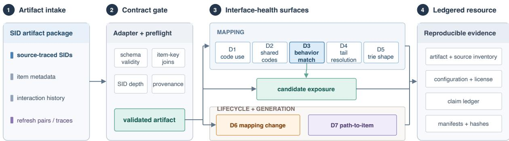
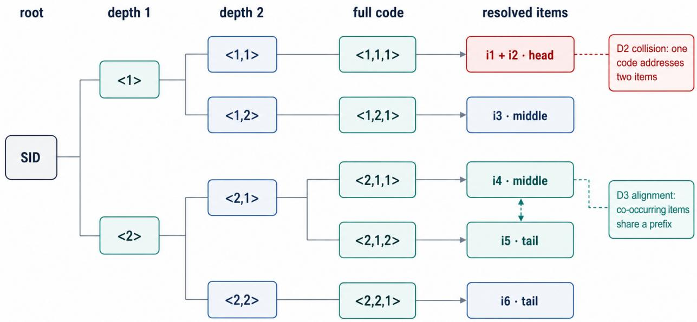
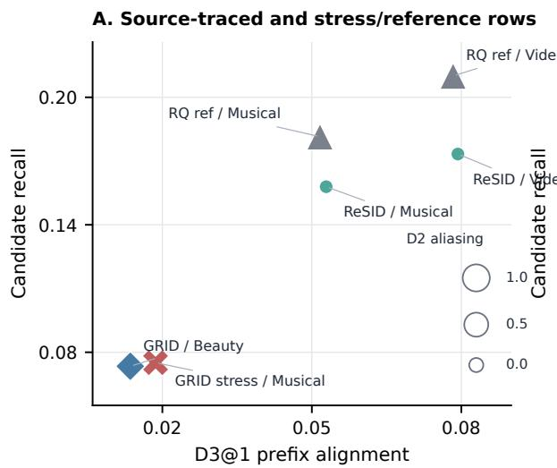
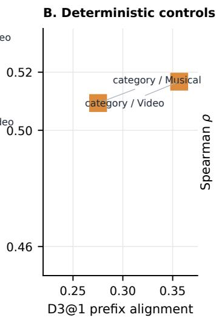
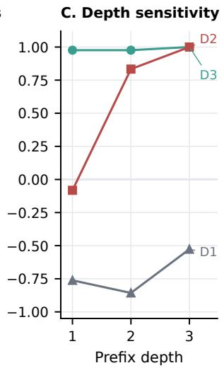
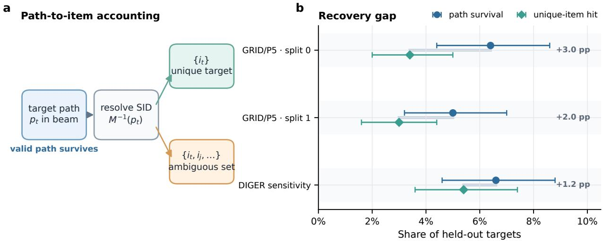

# SIDScope: A Diagnostic Resource for Semantic-ID Interfaces in Generative Recommendation∗

Jiandong Ding†, Huijie Qin, Tiandeng Wu, Yi Cao

Huawei Technologies Co., Ltd., Shanghai, China

{dingjiandong2, qinhuijie, wutiandeng1, caoyi23}@huawei.com

August 19, 2026

## Abstract

Semantic-ID mappings are reusable interfaces between item tokenizers and generative recommenders, yet released mappings rarely state whether they are coherent, what structure they expose, how generated paths resolve, or what must be revalidated after a refresh. SIDScope is a source-traced diagnostic resource for these decisions. It normalizes item-to-code artifacts, verifies provenance and joins, profiles mapping structure, compares paired revisions, and accounts for path-to-item outcomes in generated traces. Across nine source-traced tokenizer exports from seven families on Amazon and Yelp data—eight executable routes plus one auditable snapshot—SIDScope reveals that interface health is multi-signal rather than scalar. Its central finding is mechanism-conditional: prefix alignment strongly tracks held-out candidate exposure when retrieval consumes SID prefixes, then weakens as scoring becomes prefix-independent. Trained trace accounting exposes a second hidden gap: a valid target path can survive without uniquely retrieving the target item by 1.2–3.0 percentage points. A refresh case establishes a third: repairing the mapping does not by itself restore an inherited generator; model reuse requires a separate handof check. The package provides frozen evidence summaries, conformance reports, trace labels, table builders, and CPU-only verifiers. It supports decisions about artifact readiness, interface risks, and revalidation before model reuse.

Keywords: semantic IDs, recommendation interfaces, generative recommendation, artifact-level evaluation, diagnostic evaluation, reproducibility

## 1 Introduction

Semantic-ID generative recommendation turns item identifiers into a structured interface. A tokenizer assigns each item to a discrete code sequence, and a sequence generator later recommends by emitting paths in that code space (Rajput et al., 2023; Ju et al., 2025). Once the item-to-code mapping is exported, it becomes more than an internal representation: it is an address space that must preserve item coverage, expose useful prefixes, avoid harmful aliasing, and remain interpretable when generator beams are decoded back to items.

The field has produced many ways to construct this address space, including residual or hierarchical quantization, learnable item tokenization, collaborative or recommender-native encoders, collision-aware assignment, and variable-length interfaces (Wang et al., 2024a; Zhu et al., 2024;

Zheng et al., 2024; Liang et al., 2026; Wei et al., 2026; Cheng et al., 2026). These methods are usually evaluated through downstream ranking metrics, but a downstream score is a coarse endpoint for an artifact that may later be reused, refreshed, audited, or paired with a diferent generator. Before training a generator, one needs to know whether an exported mapping collapses items onto the same full code, places behaviorally related items under useful prefixes, concentrates too much mass in a small prefix region, or produces paths that cannot be cleanly mapped back to items.

These properties form an interface-health surface, not a single quality score. Full-code uniqueness is necessary for addressability, but it does not determine whether useful items are exposed through prefixes. Prefix organization can improve candidate exposure while concentrating capacity or increasing collision risk. These coordinates must therefore remain separate parts of the exported interface state.

A researcher who receives a SID artifact faces four decisions. Admission: is the mapping coherent, source-traced, and joinable with the intended catalog? Diagnosis: what addressability, prefix organization, allocation, and structural state does it expose? Reach: which candidate or decoding outcomes consume that state, and where does the diagnostic cease to be informative? Handof: after a mapping refresh, what must be re-audited before an existing generator can be reused? These questions arise whether the artifact arrives with a checkpoint, without one, or as a new catalog revision.

SIDScope organizes these decisions into one source-traced inspection scope. Building on the mapping-first view of SIDInspector (Ding et al., 2026), it extends the resource object from a static mapping audit to an artifact record that connects admission, mapping state, candidate exposure, mapping refreshes, and generated traces. A compact adapter contract normalizes item-to-code mappings, item metadata, interaction logs, and optional beams. The same artifact identity then persists as new evidence is added, allowing researchers to distinguish what the address space makes possible from what a particular generator learns.

The article makes three contributions.

1. Source-traced admission. We define a normalized artifact contract, source-role rules, and executable conformance checks. Nine named exports span Amazon and Yelp data: eight executable routes pass C0–C5, while ReSID/Musical remains a source-traced auditable snapshot. Together with the ReSOT intake case, they show how released mappings become comparable under an explicit mapping-level scope (Tables 2–3).

2. Interface-health evidence. D1–D5 reveal that addressability, prefix exposure, allocation, and structural pressure vary independently. D3 provides construct calibration when retrieval or scoring consumes SID prefixes; catalog-level, non-prefix, and trained-model checks delimit that mechanism-conditional reach (Figure 3; Table 5).

3. Trace and lifecycle discoveries. D7 reveals a measurable gap between target-path survival and unique-item retrieval in trained beams (Figure 4; Table 6). D6 is exercised in a preregistered, single-case DACT refresh-and-handof study (Table 7).

Together, these contributions establish one inspection chain from artifact admission to modelfacing decisions. D1–D5 retain distinct coordinates of the mapping state; D3 calibrates only operations that explicitly consume SID prefixes; D7 separates decoding validity, target-path survival, and unique-item retrieval; and the DACT case connects a mapping change to a preregistered generator-handof decision. Source, configuration, license, hashes, deterministic table reconstruction, and CPU-only checks bind each conclusion to its artifact record.

  
Figure 1: SIDScope represents a Semantic-ID mapping as a reusable interface state. A source-traced package passes the adapter contract before mapping, exposure, lifecycle, and trace evidence is bound to source roles and reproducible resource records. D1 measures code-space use, D2 shared-address risk, D3 prefix–behavior alignment, D4 head–tail resolution, D5 trie structure, D6 mapping change, and D7 path-to-item resolution.

Figure 1 summarizes this evidence architecture: a source-traced artifact must pass the contract gate before its mapping, exposure, lifecycle, and trace surfaces are bound to reproducible outputs.

Table 1 makes the extension over SIDInspector V0 self-contained by linking each added capability to its article evidence.

Table 1: Scientific and resource extension beyond SIDInspector V0. The final column points to the evidence introduced and evaluated in this article.
<table><tr><td>Question</td><td>SIDInspector V0</td><td>SIDScope extension</td><td>Where shown</td></tr><tr><td>What is inspected?</td><td>Static item-to-code mappings</td><td>Artifact states spanning mappings, exposure, traces, and package records</td><td>Figure 1; Sections 3 and 7</td></tr><tr><td>Which artifacts enter?</td><td>Reconstructed controls and snapshots</td><td>Source-traced named routes separated from stress and control rows</td><td>Tables 2-3</td></tr><tr><td>What can D3 support?</td><td>D1-D5 diagnostic tables</td><td>Prefix-exposure calibration, fixed-ranker anchors, and non-prefix controls</td><td>Figure 3; Table 5</td></tr><tr><td>What do traces add?</td><td>D7 input hook</td><td>Constraint-aware labels, public-beam joins, and trained-beam observability</td><td>Table 6; Figure 4</td></tr><tr><td>How broad is the matrix?</td><td>Musical worked example</td><td>Twelve artifact clusters, seven named families, two data ecosystems, controls, and trained traces</td><td>Tables 2, 4, and 6</td></tr><tr><td>time?</td><td>What changes over Mapping snapshots</td><td>Paired D6 refresh audit, mapping repair, and generator handoff</td><td>Table 7</td></tr><tr><td>How is it reproduced?</td><td>Toolkit-style release</td><td>C0–C5 conformance, frozen evidence summaries, hashes, and quickstart</td><td>Tables 2, 3, and 8</td></tr></table>

Section 2 positions the interface view. Section 3 defines the artifact and the evidence required to admit and interpret it. Sections 4 and 5 answer what mapping profiles and generated traces reveal. Section 6 follows two researcher workflows, from external-artifact intake to mapping refresh and model handof. Sections 7–8 synthesize implications, reproducibility, and validated scope.

## 2 Related Work

Generative retrieval and SID interfaces. Generative retrieval first made identifiers themselves part of the learned retrieval interface, including learned document IDs, substring identifiers, and neural corpus indexes (Tay et al., 2022; Bevilacqua et al., 2022; Wang et al., 2022). In recommendation, text-to-text and sequence-transduction formulations likewise turn recommendation into generation over tokens or actions (Geng et al., 2022; Zhai et al., 2024). TIGER-style generative retrieval introduced the now-common pattern of assigning items to discrete semantic code sequences and training a sequence model to emit those codes as recommendations (Rajput et al., 2023). Related work has also studied how item identifiers should be indexed for recommendation foundation models and how semantic IDs can improve generalization in ranking or retrieval settings (Hua et al., 2023; Singh et al., 2024). Surveys of generative search and recommendation place these systems in a broader shift from nearest-neighbor retrieval toward sequence-generation interfaces (Li et al., 2024; Hou et al., 2025). SIDScope starts from the same interface view: once a tokenizer exports an item-to-code table, the table becomes a reusable address space that can be inspected independently of one trained generator.

SID tokenizer design. The dominant SID construction path inherits discrete representation learning from VQ-VAE and residual quantization from RQ-VAE (van den Oord et al., 2017; Lee et al., 2022). Subsequent work changes three parts of this construction. First, content, interaction, and multimodal supervision reshape what the codes preserve (Zhu et al., 2024; Wang et al., 2024a; Qu et al., 2025; Zhai et al., 2025; Luo et al., 2025; Zheng et al., 2026a; Wang et al., 2024b; Yang et al., 2025; Chen et al., 2026; Qiao et al., 2026). Second, recommender-native, diferentiable, dynamic, and end-to-end objectives move assignment closer to the downstream model (Liu et al., 2025b; Fu et al., 2026; Liang et al., 2026; Ju et al., 2025; Wang et al., 2026a; Jiang et al., 2026). Binary and tree-structured designs make identifier topology explicit, while joint, transferable, and adaptive schemes broaden the contexts in which an SID must remain useful (Zheng et al., 2026b; Penha et al., 2025; Liu et al., 2025a; Hu et al., 2026a; Wang et al., 2026b; Hou et al., 2026). Time-aware systems further incorporate temporal context or elapsed gaps into the identifier pipeline (Nian et al., 2026; Huang et al., 2026b). SIDScope provides a common artifact surface for checking the mappings exported by these otherwise diferent designs.

Collision, capacity, and code-length trade-ofs. SID assignment is increasingly treated as a constrained interface design problem rather than a single tokenizer accuracy knob. Collision-aware and adaptive-overlap methods distinguish harmful aliasing from admissible sharing (Hu et al., 2026b; Pan et al., 2026), while non-uniform quantization and variable-length designs alter how item mass and semantic resolution are allocated across code paths (Wei et al., 2026; Cheng et al., 2026; Xia et al., 2026; Khrylchenko, 2026; Wang et al., 2026c; Zhang et al., 2026a; Huang et al., 2026a; Yan et al., 2026). Reliability work further shows that SID-level matching can diverge from item-level recommendation when collisions are present (Zhang et al., 2026c). These findings motivate diagnostics that separate full-code aliasing, prefix concentration, co-occurrence alignment, and candidate exposure instead of reporting one aggregate score.

Lifecycle and industrial SID systems. SID artifacts also change across time, domains, and deployment settings. Staleness and refresh work studies how collaborative SIDs drift under new logs (Feng et al., 2026; Baikalov et al., 2026), while dynamic or context-specific assignment systems refine early mappings, live-streaming identifiers, or category-guided prefix tries (Guan et al., 2026;

Shi et al., 2026; Zhang et al., 2026b). Industrial SID work reports use cases in ranking, short-video search, large-scale retrieval, and LLM-enhanced recommendation trade-ofs (Ju et al., 2026; Li et al., 2026a; Xu et al., 2026; Li et al., 2026b). Recent industrial user-modeling work also extends SID vocabularies from item address spaces to SID-based user tokens, making generated-token diversity, cross-scenario conditioning, query integration, and representation refresh part of the SID interface surface (Liu et al., 2026). This lifecycle makes provenance part of the artifact: a resource should record whether a row is source-traced upstream intake, a refresh snapshot, or a stress row used to calibrate diagnostics.

Evaluation and reproducibility resources. Recommendation evaluation has long required more than a single leaderboard metric, from classic collaborative-filtering methodology and sampledmetric validity to later audits of reproducibility and progress (Herlocker et al., 2004; Krichene and Rendle, 2020; Ferrari Dacrema et al., 2021). Recent studies show that even released code may omit the artifacts and protocol detail needed to regenerate full tables, including in LLM-based recommendation (Lops et al., 2024; Shehzad et al., 2025). Toolkits such as LensKit, RecBole, and Elliot package reproducible experimental pipelines, while behavioral testing frameworks such as RecList make recommendation behavior itself inspectable (Ekstrand, 2020; Zhao et al., 2021; Anelli et al., 2021; Chia et al., 2022).

SID artifact resources. SID artifacts add a diferent resource boundary: the object to inspect is not only a trained recommender but also the address space that a generator must navigate. Mappingfirst diagnostics make this address-space layer visible (Ding et al., 2026), and reliability work shows why SID-level and item-level conclusions must be separated when collisions are present (Zhang et al., 2026c). Closed-loop simulation work also finds that feedback can concentrate generated SID code spaces even when item-level exposure metrics look diferent (Yang et al., 2026). Temporal reachability audits likewise separate compositional reuse of observed tokens from genuinely unsupported future SID paths (Peng et al., 2026). SIDScope links source-traced artifact intake, diagnostic snapshots, candidate-exposure probes, constraint-aware trace labels, and verification commands so that SID interfaces can be compared before or alongside downstream training.

Experiment toolkits and artifact inspection. General recommender-system toolkits and SIDScope inspect diferent objects. LensKit, RecBole, and Elliot coordinate datasets, algorithms, splits, and metrics for an experiment (Ekstrand, 2020; Zhao et al., 2021; Anelli et al., 2021). SIDScope instead starts when a tokenizer or upstream release has already produced a discrete address space. That artifact may be consumed by several generators, compared across refreshes, or distributed without the model that produced it. Its identity therefore includes source revision, export branch, codebook configuration, item universe, and reuse terms, while its evaluation includes properties that can be measured before a downstream model exists. An experiment toolkit can train and evaluate a generator; an artifact resource fixes the address space that generator was asked to use.

Behavioral tests and conformance. Behavioral test suites provide another nearby abstraction. RecList organizes tests around expected recommender behavior (Chia et al., 2022); SIDScope similarly avoids reducing quality to one scalar, but locates the tests at the identifier interface. Its controls ask whether a mapping preserves unique leaves, exposes co-occurrence neighborhoods, allocates resolution across popularity strata, or produces resolvable traces. The conformance layer adds a diferent question: whether a result is eligible to become shared evidence at all. This is why parser success, metric success, and route admission are separate states in the resource rather than one adapter flag.

## 3 Making SID Artifacts Comparable

SIDScope binds four research decisions to one persistent artifact record: admission fixes identity and admissible evidence; diagnosis measures mapping state; calibrated comparisons connect that state to candidate exposure; and lifecycle or trace evidence records what happens after refresh and decoding. The stable D1–D7 fields let each layer accumulate without changing the artifact identity.

## 3.1 Artifact Record and Adapter Contract

Let I be the item catalog. A SID artifact assigns each item $i \in \mathcal { T }$ to a code sequence $c ( i ) =$ $( z _ { 1 } , \dots , z _ { L } )$ , where $z _ { \ell } \in \mathcal { A } _ { \ell }$ and $\mathbf { \mathcal { A } } _ { \ell }$ is the discrete alphabet at level ℓ. The full code identifies the leaf address used by a generator, while prefixes $\mathrm { p r e f } _ { k } ( c ( i ) ) = ( z _ { 1 } , \ldots , z _ { k } )$ define intermediate regions in the code trie. SIDScope treats this mapping as the primary resource object and joins it to metadata, interaction logs, and optional generator traces.

We record an artifact as $\mathcal { R } = ( \mathcal { T } , c , P ; M , X , R , T )$ , where P is its provenance record and M, X, $R ,$ and $T$ are optional metadata, interactions, refresh pairs, and generated traces. A named route is admitted only when Adm $( { \mathcal { R } } ) = C 0 \wedge \ldots \wedge C 5 ;$ missing optional evidence limits the available diagnostics rather than changing the mapping identity.

The adapter contract requires an item-to-code table with stable item IDs and one or more code levels; metadata, interactions, and decoded beams are optional. It admits source-traced upstream exports and separately labels local stress/reference rows that have diagnostic value outside named-method coverage.

Adapters translate upstream serialization into normalized tables while tokenizer training remains upstream. A future tokenizer that already exports one row per item can use the generic item\_id plus sid\_level\_\* path directly; a method-specific adapter is needed only when an upstream repository uses a diferent file or checkpoint format. The release includes a minimal adapter template, validated adapter registry, provenance roles, and conformance checks, allowing new routes to retain the same diagnostic definitions.

The contract is layered by available evidence. Mapping diagnostics run from $( \mathrm { i t e m \_ i d } , c ( i ) )$ ; D3 and candidate exposure additionally use interactions, and D7 uses traces. A released index therefore supports collision and prefix-load inspection on its own, while a normalized beam export adds trace accounting.

Each normalized artifact produces three linked outputs: a manifest recording source route and catalog identity, a D1–D5 diagnostic table with row provenance, and optional candidate-exposure or D7 records when interactions or beams are available. The reported tables are compact projections of these outputs.

The physical package mirrors that record structure. It contains adapter and CLI code, normalized evidence summaries, route manifests, C0–C5 conformance reports, source/license/config inventory rows, frozen table snapshots, figure source data, and CPU-only verifiers. Raw upstream archives, checkpoints, and large interaction dumps stay at their source unless redistribution is permitted; the package records their revisions, paths, hashes, and derived compact evidence instead.

A user registers the mapping and provenance once, then adds mapping, interaction, or trace evidence without changing the artifact identity. The resulting inspection record can be compared across mappings, refreshed, or paired with a later generator while preserving its earlier diagnostic state.

  
Figure 2: A worked item-to-SID mapping. Items $i _ { 1 }$ and $i _ { 2 }$ share the full code ⟨1, 1, 1⟩, creating a D2 address collision. Items $i _ { 4 }$ and $i _ { 5 }$ co-occur and share prefix ⟨2, 1⟩ while retaining unique leaves, illustrating the relation tested by D3. Values are illustrative, not measured results.

An artifact route identifies the method family, catalog, and export branch being inspected. Its source role records how the artifact was obtained and what may be redistributed. Measurements such as mapping profiles, candidate exposure, refresh comparisons, and trace accounting are then attached to that route as evidence, rather than treated as new artifacts.

Figure 2 grounds the contract in one illustrative mapping. Six items occupy five full-code leaves: two items share one leaf, two behaviorally related items share an earlier prefix but retain distinct leaves, and a tail item keeps a unique address. These are diferent questions about the same mapping. D1 and D5 describe code-space use and trie shape; D2 detects the shared full address; D3 asks whether a prefix agrees with observed co-occurrence; and D4 checks whether resolution is allocated diferently across popularity strata. The example is explanatory rather than an experimental row.

## 3.2 Mapping Diagnostics and Reporting Units

Reporting units. The evidence layers use diferent reporting units. D1–D5 profile an artifact, D6 compares paired refreshes, and candidate exposure reports artifact–depth user outcomes. Disjoint checks separate D3 construction from held-out ranking; controlled models cluster repeated shard– bucket rows by artifact. These units prevent row counts from masquerading as independent artifact replications.

D1–D5 mapping profile. SIDScope computes D1–D5 over the normalized mapping. Let $n _ { p }$ be the number of items under prefix $p$ at a given depth, let $m _ { s }$ be the number of items assigned to full code $s ,$ and let $S _ { \mathrm { o c c } }$ be the set of occupied full codes. D1 reports utilization of the code space, including unique-code counts, base-2 entropy, and Gini over $\{ n _ { p } \}$ . D2 reports addressability. Its full-code collision-item rate is $\begin{array} { r } { | \mathcal { I } | ^ { - 1 } \sum _ { s \in S _ { \mathrm { o c c } } } m _ { s } \mathbf { 1 } [ m _ { s } > 1 ] ; } \end{array}$ prefix rates use the same denominator and replace $m _ { s }$ by $n _ { p }$ . This difers from D5’s duplicate-SID rate, $1 - | \{ s : m _ { s } > 0 \} | / | \mathbb { Z } |$ : D2 counts every item exposed to a shared address, whereas D5 measures the shortfall in distinct leaves.

D3 reports neighborhood alignment under a declared protocol $\pi = ( m , \boldsymbol { U } , \boldsymbol { B } )$ : at most U mapped items are retained per eligible user, unordered co-occurrence pairs are accumulated up to budget $B ,$ and each item retains its top m neighbors. Let $E _ { \pi }$ be the resulting train-only edge set and $w _ { i j }$ its co-occurrence weight. Weighted prefix recall at depth k is

$$
D 3 ( k ; \pi ) = \frac { \sum _ { ( i , j ) \in E _ { \pi } } w _ { i j } \mathbf { 1 } [ \mathrm { p r e f } _ { k } ( c ( i ) ) = \mathrm { p r e f } _ { k } ( c ( j ) ) ] } { \sum _ { ( i , j ) \in E _ { \pi } } w _ { i j } } ,
$$

with related unweighted rates. D4 reports popularity allocation by comparing head, mid, and tai unique-SID ratios. Train-event counts are ranked within each dataset into equal-count popularity tertiles; deterministic item order breaks ties, and unseen items enter the tail. Each stratum reports distinct full SIDs divided by its item count. D5 reports structural pressure, including declared SID depth, active prefix counts, duplicate-SID rate, and fan-out. The current shared matrix evaluates each artifact at its declared fixed depth; a variable-length route must expose an explicit termination convention and is reported by length stratum rather than padded into a fixed-depth row. D5 quantifies structural load; serving latency additionally depends on a fixed generator, decoding implementation, hardware, and batching policy. These diagnostics are artifact-level and can be computed before training a generator.

All interaction-derived diagnostics use the declared training split (or the provided interactions when no split column exists), remove duplicate user–item events, exclude users with fewer than two mapped items, and break neighbor ties by item ID. The public CLI default is $\pi _ { \mathrm { C L I } } = ( 2 0 , 2 0 0 , 2 , 0 0 0 , 0 0 0 )$ . Table 4 instead binds every executable route to the bounded conformance instance $\pi _ { \mathrm { C 3 } } = ( 5 , 5 0 , 1 0 , 0 0 0 )$ ; 9,817 is the realized pair count for the LETTER and LC-Rec rows, not the shared budget. The evidence ladder in Table 5 follows the protocol recorded by each source manifest rather than assuming C3. Results are reported separately at every available prefix depth. Changing $m , U ,$ or B defines a new protocol instance.

As a secondary robustness check around $\pi _ { \mathrm { { C 3 } } } .$ , we recompute the eight executable routes over $m \in \{ 5 , 1 0 , 2 0 \}$ and $U \in \{ 5 0 , 1 0 0 , 2 0 0 \}$ while holding $B = 1 0 { , } 0 0 0$ . The route ordering is unchanged in all nine configurations (Spearman $\rho = 1 . 0$ against the primary ordering; maximum rank shift 0). This check supports the observed route order within the bounded neighborhood family; it does not make D3 comparable across datasets or replace the fixed primary protocol.

D6 paired refresh. D6 compares old–new mapping churn when paired refresh artifacts are available. Most admitted routes remain single exported mappings, but Section 6 applies D6 to a released DACT 0.6-to-0.7 pair and binds the migration record to a generator-handof audit.

## 3.3 Prefix Exposure Protocol

The candidate-exposure protocol uses the same normalized mapping but no generator scores. For a user u, train-only history $H _ { u } ,$ , prefix depth $k ,$ and target item t, the protocol forms $C _ { u , k } = \{ i \in$ $\mathcal { T } \setminus H _ { u } : \exists j \in H _ { u } , \ \mathrm { p r e f } _ { k } ( c ( i ) ) = \mathrm { p r e f } _ { k } ( c ( j ) ) \}$ and records whether $t \in C _ { u , k }$ . Candidate order is deterministic: popularity is the default ranker; the fixed co-occurrence ranker breaks score ties by training popularity and then item ID. User-level means are accompanied by user-bootstrap intervals, while artifact-level associations collapse repeated rows to the declared artifact or artifact–depth unit before resampling. Candidate recall measures whether the mapping places held-out targets in prefix regions reachable from observed history. Trained-ranker order is evaluated separately.

Disjoint-user sampled ranking. The disjoint-user and sampled-ranking checks use a stricter protocol. Users are assigned deterministically to four folds by a stable hash; D3 is computed from the other three folds, while ranking metrics are computed only on the held-out fold. The sampled protocols add each held-out target to 100 catalog negatives after removing history items. Hard negatives are the most popular remaining items under the diagnostic-user training slice; the falsifier samples the same number uniformly with a seed derived from the artifact, fold, and user. The fixed SID-afinity ranker orders candidates by the number of history items that share the declared prefix, then by train-only co-occurrence, popularity, and item ID. Non-prefix controls replace that first score with metadata-category, co-occurrence, or popularity scores. We report Recall@20, NDCG@20, and MRR@20 over at most 50 held-out users per fold. Artifact–depth associations are descriptive repeated-unit summaries; artifact-collapsed intervals provide the efective-unit check.

Efective evidence unit. The controlled exposure model uses candidate recall as the outcome and a standardized D3 value as the focal coeficient. It adjusts for mean log target popularity, prefix depth, SID length, full- and prefix-collision rates, duplicate-SID rate, and fixed indicators for dataset, artifact family, and popularity bucket. The 1,080 rows are repeated shard–bucket observations. We cluster by the immutable artifact key (dataset, label, method, and manifest row) and report a 4,999-draw Rademacher wild-cluster interval over the 12 efective artifact clusters. Artifact-level collapse is the conservative independence check; the row-level fit describes the declared conditional protocol.

Read together, D2 tests item addressability, D3 tests behavioral neighborhoods, D4 tests head– tail resolution, and D5 measures exposed trie structure. They separate mappings that are unique but behaviorally scattered, expose useful prefixes under concentrated branches, or alias items at full-code leaves.

## 3.4 From Profile to Research Decision

SIDScope interprets a profile as a sequence of targeted checks. Source identity and reuse terms must be known, the level columns must reconstruct the full SID, and item IDs must join the available metadata and interactions. These are admission properties: a failure here stops the row before its metric values are compared with another artifact. The C0–C5 protocol in Section 6 makes this admission path executable.

For an admitted artifact, the next decision concerns leaf addressability. D1 shows whether the nominal code budget is actually used; D2 shows whether multiple items share a full address. A high full-code aliasing rate triggers an inspection of alias-group size, popularity composition, and interaction coverage before any behavioral conclusion is drawn. Low aliasing clears that particular risk; D3 then evaluates whether prefixes carry observed behavioral structure. This separation is important when a collision-free mapping is produced by assigning unique leaves under prefixes that carry little behavioral structure.

We use the terms at diferent evidence layers. Aliasing names the mapping-level phenomenon in which multiple items share an address; collision names the non-singleton full-code or prefix groups and item rates counted by D2. An ambiguous path is a D7 observation: a generated valid full SID reverse-resolves to more than one item. It is the generation-time exposure of full-code aliasing; prefix collision and ambiguous target identity refer to diferent evidence layers.

Prefix semantics are evaluated next. D3 is interpreted at a declared depth, dataset, and interaction split, preferably against controls on the same item universe. D4 then identifies whether the observed structure allocates resolution diferently to head, middle, and tail items. Together they determine the next experiment: weak D3 motivates a depth or neighborhood analysis; high D3 with tail compression motivates a popularity-stratified check; high D3 with prefix collision motivates a capacity check. The output is a documented reason to inspect exposure, allocation, or addressability more closely.

Finally, D5 names the depth, fan-out, and active-prefix structure that a decoder would consume, while D7 accounts for generated paths once beam traces are available.

Table 2: Artifact inventory. Eight executable tokenizer routes pass C0–C5; ReSID/Musical is a source-traced auditable snapshot. Reference and control rows calibrate probe behavior but are not counted as named tokenizer coverage. Data-source labels normalize the ecosystem and subset name; each mapped-item count refers to that export’s pinned item universe. Source evidence records the route used to inspect or reconstruct the mapping.
<table><tr><td>Tokenizer export</td><td>Data source</td><td></td><td>Source evidence</td><td>Mapped items</td><td>SID depth</td></tr><tr><td colspan="6">Source-traced named tokenizer exports</td></tr><tr><td>ReSID</td><td>Amazon / Musical</td><td></td><td>Tracked snapshot</td><td>23,742</td><td>3</td></tr><tr><td>ReSID-GAOQ</td><td></td><td>Amazon / Video Games</td><td>Code-derived export</td><td>24,685</td><td>3</td></tr><tr><td>GRID</td><td></td><td>Amazon / Beauty (P5)</td><td>Rebuilt tokenizer</td><td>12,101</td><td>3</td></tr><tr><td>CARD</td><td></td><td>Amazon / Beauty (P5)</td><td>Code-derived export</td><td>12,101</td><td>4</td></tr><tr><td>DIGER</td><td></td><td>Amazon / Beauty (P5)</td><td>Checkpoint export</td><td>12,101</td><td>3</td></tr><tr><td>DIGER</td><td>Yelp / Business</td><td></td><td>Checkpoint export</td><td>20,033</td><td>3</td></tr><tr><td>ReSOT</td><td></td><td>Amazon / Instruments</td><td>Released archive</td><td>6,250</td><td>4</td></tr><tr><td>LETTER</td><td></td><td>Amazon / Instruments</td><td>Released index</td><td>9,922</td><td>4</td></tr><tr><td>LC-Rec</td><td></td><td>Amazon / Instruments</td><td>Released index</td><td>9,922</td><td>4</td></tr><tr><td colspan="6">Reference and control rows used for interpretation</td></tr><tr><td>GRID-like</td><td>Amazon / Musical</td><td></td><td>Local stress export</td><td>23,742</td><td>3</td></tr><tr><td>Category-prefix</td><td>Amazon / Musical</td><td></td><td>Deterministic mapping</td><td>23,742</td><td>3</td></tr></table>

The admitted routes span two data ecosystems but do not form a balanced cross-ecosystem benchmark. Musical, Video Games, Beauty, and Instruments come from Amazon product reviews; DIGER/Yelp contributes one source-traced business review route. The Yelp route tests whether the same normalized contract and diagnostic engine transfer without dataset-specific metric code. It does not turn cross-route profile diferences into causal dataset efects. The ReSID-GAOQ Video route remains an additional Amazon-2023 catalog.

## 3.5 Route Inventory, Evidence Roles, and Comparison Modes

Table 2 separates named routes from stress and control evidence. Catalog labels preserve the upstream scope, so similarly named routes may have diferent item universes. A source-traced route has a released snapshot, upstream script path, returned archive, or reproducible generation route. A returned archive is a run bundle recovered from an upstream or cloud pipeline with logs, hashes, and normalized item–code outputs. Labels such as the ReSID-GAOQ oficial-code-derived route describe provenance, not new SIDScope methods.

Stress rows and deterministic controls instead calibrate diagnostic behavior. The GRID-like Musical stress route, for example, contains 23,742 items but only 3,749 unique full codes, yielding a full-code aliasing rate of 0.977. It remains separate from the source-traced GRID/P5 Beauty tokenizer-stage row. The two rows therefore document diferent artifact states even though both use GRID-related language.

These roles also govern resource extension. A new named route enters the shared comparison set only when its mapping has a released snapshot, returned archive, upstream script path, or reproducible tokenizer-stage route. Local reconstructions, partial exports, and degenerate controls remain reference rows. This preserves both comparison coverage and the evidence identity of each route.

Valid comparison modes. The resource supports three comparison modes. A same-catalog controlled comparison holds the item universe, interaction split, and diagnostic configuration fixed while changing the SID assignment. This mode can attribute a diference in D1–D5 or candidate exposure to the inspected mapping under that protocol. The Musical stress and control rows share the catalog and interactions, making their contrast interpretable without treating them as a tokenizer leaderboard.

A cross-route profile comparison is broader but less causal. Released indexes, tokenizer-stage rebuilds, and oficial-code-derived exports may difer in catalog, interactions, depth, and upstream objective. SIDScope can still ask whether each artifact is addressable, how its prefixes distribute mass, and whether its source record is reproducible. It cannot treat the resulting metric ordering as a method ranking. This is why Table 2 reports catalog-specific item counts and evidence classes: each denominator belongs to its source catalog, and the comparison concerns observable interface properties rather than universal superiority.

A longitudinal comparison holds the source route and stable item IDs fixed across revisions. It requires paired mappings, an explicit refresh boundary, and old–new join coverage before interpreting D6 or changes in D1–D5. The DACT 0.6–0.7 handof in Section 6 exercises this accounting on one route; dynamic or time-conditioned artifacts should likewise enter as versioned snapshots.

These modes determine what must accompany a reported number. Every diagnostic record names the artifact identity, item universe, interaction split when used, prefix depth, source role, and comparison mode. Same-catalog contrasts can support mapping-level attribution under the fixed protocol; cross-route rows support profile and coverage claims; longitudinal rows support change claims. Keeping these inference units explicit prevents the resource from turning heterogeneous public artifacts into an accidental leaderboard.

## 3.6 Source, Reuse, and Admission Boundaries

Table 2 intentionally stops at fields needed to compare route identity and evidence status. The released inventory binds each route to its upstream URL and immutable revision, dataset and item count, artifact path, SID depth and configuration, license and redistribution policy, evidence path, hashes, and verification date. Natural display labels therefore do not replace stable route identifiers or replay metadata.

The inventory separates source availability from redistribution permission. A public repository or download route makes an artifact inspectable, but it does not by itself authorize SIDScope to republish the upstream archive. For routes without a detected license, the package releases code, summaries, derived tables, and hashes while requiring users to obtain upstream inputs themselves. The GRID source uses a restricted research license, so upstream data are also excluded. This treatment makes licensing an executable package boundary rather than a prose footnote: the inventory verifier rejects redistribution policies that conflict with the recorded license status.

Adapter admission. Parser success alone does not establish adapter conformance. SIDScope evaluates each candidate route through six ordered contracts shown in Table 3. The gates move from source identity to schema coherence, joins, bounded diagnostics, replay identity, and finally eligibility for the shared matrix. Controls, stress rows, and partial-coverage routes remain separate from source-traced named coverage.

Table 3: Adapter admission protocol. A named route enters the shared matrix only when all six gates pass.
<table><tr><td>Gate</td><td>What must be true</td><td>Evidence checked</td><td>Failure action</td></tr><tr><td>C0</td><td>Source identity and reuse terms are explicit</td><td>URL, revision, derivation path, license, redistribution policy</td><td>Hold as discovered source</td></tr><tr><td>C1</td><td>SID tables are internally coherent</td><td>Required columns, level reconstruction, dataset, depth, item count</td><td>Reject normalized mapping</td></tr><tr><td>C2</td><td>Mapping joins metadata and interactions</td><td>Joined-item counts and missing-coverage report</td><td>Hold as partial route</td></tr><tr><td>C3</td><td>Bounded diagnostics execute</td><td>D1-D5 outputs with declared limits Exclude from metric matrix</td><td></td></tr><tr><td>C4</td><td>Inputs are pinned and replayable</td><td>Command, runtime, evidence paths, SHA-256 hashes</td><td>Exclude from release claim</td></tr><tr><td>C5</td><td>Inventory identity matches the matrix role</td><td>Method, catalog, revision, config, depth, license, role</td><td>Keep as reference/control</td></tr></table>

The current release applies the complete C0–C5 protocol to eight heterogeneous routes from seven method families: ReSOT’s released archive, GRID’s tokenizer-stage rebuild, ReSID-GAOQ’s returned mapping, LETTER and LC-Rec’s released indexes, and the CARD and DIGER codederived exports, including DIGER checkpoints for Beauty and Yelp. Each report records normalized row counts, bounded D1–D5 execution, three input hashes, and the exact admission identity without redistributing raw upstream inputs. The ninth named export, ReSID/Musical, remains a sourcetraced auditable snapshot rather than an executable C0–C5 route; it is counted in coverage but not among the eight conformance reports.

## 4 Mapping Profiles Across Admitted Routes

## 4.1 Interface States Across Admitted Routes

The admitted routes occupy distinct points on an interface-health surface. Addressability, prefix organization, tail allocation, and trie structure vary independently, so Table 4 reports D1–D5 together. It includes one bounded C3 diagnostic execution for each of the eight source-traced routes with executable C0–C5 reports. D1 gives the number of active code symbols at the first level; D2 is the fraction of items belonging to a non-singleton full-code group; D3 is train-only weighted co-occurrence recall at depth 1; D4 is the unique-SID ratio in the tail-popularity tertile; and D5 gives unique full-code leaves. The released table snapshot preserves per-level D1 and D5 sequences for auditing. Because catalogs, depths, and construction routes difer, the rows are descriptive interface profiles, not a tokenizer ranking.

The rows expose distinct interface states. CARD and DIGER use nominally similar code alphabets but difer in collision exposure, tail addressability, and active-prefix structure. LETTER and LC-Rec have the same item count, D2 rate, and D4 tail ratio, yet their depth-1 D3 values and prefix states difer. Conversely, ReSID-GAOQ and ReSOT are collision-free while exposing diferent D1, D3, and D5 states. These contrasts show why no one coordinate subsumes the interface. Within DIGER, the Yelp route has more collided items, weaker depth-1 alignment, and lower tail uniqueness than the Beauty route. Because the two rows use diferent checkpoints, configurations, catalogs, and interactions, this contrast demonstrates contract portability and diagnostic resolution rather than a causal domain efect. Cross-route rows do not isolate tokenizer efects across heterogeneous datasets.

Table 4: D1–D5 interface profiles for eight executable source-traced routes. Each row uses its own catalog and declared training interactions. D1 is the active first-level code-symbol count; D3@1 is train-only weighted co-occurrence recall at prefix depth 1 under $\pi _ { \mathrm { { C 3 } } } ;$ D5 is the number of occupied full-code leaves; and D2–D4 are rates. Per-level count sequences are released in the deterministic table snapshot. Cross-route diferences describe interface states under each route’s declared catalog and protocol.
<table><tr><td>Route</td><td>Items Depth</td><td></td><td>D1 symbols</td><td>collision</td><td>D2 D3@1</td><td>D4 tail unique</td><td>D5 leaves</td></tr><tr><td>ReSID-GAOQ / Amazon</td><td>24,685</td><td>3</td><td>32</td><td>0.000</td><td>0.213</td><td>1.000</td><td>24,685</td></tr><tr><td>Video GRID / Amazon Beauty</td><td>12,101</td><td>3</td><td>256</td><td>0.205</td><td>0.038</td><td>0.957</td><td>10,619</td></tr><tr><td>CARD / Amazon Beauty</td><td>12,101</td><td>4</td><td>256</td><td>0.000</td><td>0.023</td><td>1.000</td><td>12,098</td></tr><tr><td>DIGER / Amazon Beauty</td><td>12,101</td><td>3</td><td>256</td><td>0.070</td><td>0.028</td><td>0.982</td><td>11,581</td></tr><tr><td>DIGER / Yelp Business</td><td>20,033</td><td>3</td><td>256</td><td>0.102</td><td>0.010</td><td>0.941</td><td>18,705</td></tr><tr><td>ReSOT / Amazon Instruments</td><td>6,250</td><td>4</td><td>83</td><td>0.000</td><td>0.063</td><td>1.000</td><td>6,250</td></tr><tr><td>LETTER / Amazon Instruments</td><td>9,922</td><td>4</td><td>150</td><td>0.005</td><td>0.108</td><td>0.998</td><td>9,897</td></tr><tr><td>LC-Rec / Amazon Instruments</td><td>9,922</td><td>4</td><td>162</td><td>0.005</td><td>0.055</td><td>0.998</td><td>9,897</td></tr></table>

The LETTER and LC-Rec values difer slightly from the inherited CIKM report because this table uses the common bounded C3 protocol for all executable routes. The normalized mapping, metadata, and interaction rows are unchanged apart from route labels; the earlier values used top-20 neighbors and 1,173,333 pair events, whereas C3 uses top-5 neighbors, 9,817 pair events, and a 50-item per-user cap. This changes LETTER from 0.108577 to 0.107933 and LC-Rec from 0.052369 to 0.054972 before three-decimal rounding.

Figure 3 complements this cross-route profile with same-catalog stress/reference and interpretation controls. Those controls test how D2 aliasing and D3 prefix organization can move independently under a fixed item universe, while Table 5 separately bounds the operational reach of D3.

## 4.2 Construct Calibration and Its Reach

We next link D1–D5 to a train-only prefix-candidate protocol. For each artifact route and prefix depth, the protocol retrieves candidates from shared prefixes and measures whether held-out target items are exposed. The outcome measures the interface layer directly: whether the exported mapping places useful candidates in reachable prefix regions before a generator is trained.

Figure 3 shows that exposure, aliasing, and depth sensitivity move together only in part. Table 5 orders the D3 checks by how far their endpoint moves from the prefix-candidate protocol. The artifact remains the inferential unit: artifact–depth results are descriptive sensitivity checks, whereas artifact collapse and wild-cluster analysis provide the small-cluster uncertainty checks.

Blocks A and B test construct calibration because D3 and candidate exposure consume the same prefix organization. Removing deterministic category controls and local RQ reference rows leaves eight tokenizer-export artifacts with $\rho = 0 . 9 7 6$ (exact $p = 0 . 0 0 0 4 )$ , so those controls do not create the direction. Several exports still share catalogs and interaction logs. Collapsing them to five catalog means gives $\rho = 0 . 9 0 0$ (exact $p = 0 . 0 8 3 )$ ; leave-one-catalog-out values range from 0.800 to 1.000. The direction is stable, but five catalogs do not support a population-level claim. With evaluation users disjoint from D3 construction, the separate eight-artifact Block B collapse remains $\rho = 0 . 9 7 6$ [0.793, 1.000]. Blocks B and C then move to fixed ranking, including hard negatives constructed without prefix retrieval.

Table 5: Evidence ladder for D3 calibration reach. Block A uses the same prefix construction for D3 and candidate recall; Block B separates the users used to construct D3 from held-out exposure and ranking; Block C samples candidates without prefix retrieval and varies the scorer or negative pool; Block D tests transfer to trained generators. Each row reports a Spearman association with the named endpoint. Brackets are 95% percentile bootstraps over the listed unit; rows labeled “exact” use two-sided permutation tests. For SID-code generators, the ρ column gives the range across tested configurations rather than a confidence interval.
<table><tr><td></td><td>Evaluation protocol Measured endpoint</td><td>Reporting unit</td><td>Spearman ρ</td><td>Interval / exact test</td></tr><tr><td colspan="5">A. Same prefix construction</td></tr><tr><td>Per-artifact aggregate</td><td>Prefix-candidate recall</td><td>12 artifacts</td><td>0.958</td><td>[0.778, 1.000]</td></tr><tr><td>Controls and local references removed</td><td>Prefix-candidate recall</td><td>8 tokenizer exports</td><td>0.976</td><td>exact p = 0.0004</td></tr><tr><td>Collapsed by shared catalog</td><td>Prefix-candidate recall</td><td>5 catalogs</td><td>0.900</td><td>exact p = 0.083</td></tr><tr><td colspan="5">B. Held-out users and fxed reranking</td></tr><tr><td>Per-artifact aggregate</td><td>Held-out candidate recall</td><td>8 artifacts</td><td>0.976</td><td>[0.793, 1.000]</td></tr><tr><td>Prefix candidates, fixed reranker</td><td>Recall@20</td><td>22 artifact-depth rows</td><td>0.645</td><td>[0.322, 0.858]</td></tr><tr><td>Prefix candidates, fixed reranker</td><td>NDCG@20</td><td>22 artifact-depth rows</td><td>0.545</td><td>[0.147, 0.797]</td></tr><tr><td colspan="5">C. Candidates sampled without prefx retrieval</td></tr><tr><td>SID-prefix scorer, popular negatives</td><td>Recall@20</td><td>24 artifact-depth rows</td><td>0.817</td><td>[0.484, 0.933]</td></tr><tr><td></td><td>NDCG@20</td><td>24 artifact-depth rows</td><td>0.690</td><td>[0.395, 0.898]</td></tr><tr><td>Per-artifact aggregate</td><td>NDCG@20</td><td>8 artifacts</td><td>0.690</td><td>[-0.095, 0.988]</td></tr><tr><td>Same scorer, popularity controlled</td><td>NDCG@20</td><td>24 rows; 8 artifact clusters</td><td>0.634</td><td>[0.115, 0.951]</td></tr><tr><td>Metadata-category NDCG@20 scorer</td><td></td><td>24 artifact-depth rows</td><td>0.207</td><td>[-0.269, 0.588]</td></tr><tr><td>Random-negative pool</td><td>NDCG@20</td><td>24 artifact-depth rows</td><td>0.001</td><td>[-0.346, 0.383]</td></tr><tr><td colspan="5">D. Transfer to trained generators</td></tr><tr><td>Autoregressive SID NDCG@20 generators</td><td></td><td>5 artifacts</td><td></td><td>[−0.564, 0.205] exact p ≥ 0.400</td></tr><tr><td>Autoregressive item-ID generator</td><td>NDCG@20</td><td>8 artifacts</td><td>0.144</td><td>exact p = 0.736</td></tr></table>

  
Figure 3: Interface health forms a multi-signal surface. Panel A expands the source-traced and stress/reference rows, panel B shows deterministic category controls on their own scale, and marker area encodes D2 full-code aliasing. Panel C shows that D1–D3 associations also change with prefix depth. Category-labeled squares are interpretation controls and are excluded from source-traced tokenizer coverage. Labels spell out the Amazon catalog used by each plotted route.

Uncertainty is reported at the same unit. Artifact clustering handles repeated shard–bucket rows within a route; it does not make routes that share a catalog independent. The five-catalog collapse above is therefore the relevant cross-route sensitivity check. A separate controlled model estimates a D3 coeficient of 0.120 [0.067, 0.172] over 1,080 rows with 12 artifact clusters and a 4,999-draw Rademacher wild-cluster interval. With 12 artifact clusters, the interval serves only as a within-route small-cluster robustness check. Blocks B and C report descriptive artifact–depth intervals. Collapsing hard-negative NDCG to eight artifacts keeps the point correlation but widens its interval across zero [-0.095, 0.988]. The 1080-row model instead estimates a conditional association while clustering over 12 artifacts, hence its narrower interval. Adding Yelp leaves the artifact-level association positive; the catalog-level exact test remains non-significant. These results calibrate the declared prefix-candidate protocol rather than establish generic generator predictivity, which is evaluated in Block D.

Calibration reach. The pattern is mechanism-conditional. Prefix-bucket retrieval and the fixed SID-afinity scorer consume the same prefix organization measured by D3, so D3 can calibrate those interface operations. Descriptive artifact–depth checks for the hard-negative SID-afinity ranker retain positive Recall@20, NDCG@20, and MRR@20 associations, including after target-popularity residualization. The association weakens when scoring is replaced by co-occurrence, popularity, or metadata-category controls. Trie-constrained autoregressive decoding shares the exported trie and enforces valid transitions, while its learned logits are free to use signals beyond the fixed afinity score. Block D yields no stable transfer result: the available trained generators fail the item-popularity validity check and produce weak or sign-unstable D3–NDCG associations. D3 therefore diagnoses prefix-interface organization; trained-generator quality remains a separate empirical question.

## 4.3 Interface Health as a Multi-Signal Profile

The prespecified diagnostic subset contains the four Musical rows (GRID, local RQ reference, ReSID-GAOQ, and category control), three Video rows (local RQ reference, ReSID-GAOQ, and category control), and GRID/P5 Beauty. It shows that exposure is a family of signals. Leave-oneartifact-out checks keep the D3 association positive, with artifact-level Spearman values from 0.821 to 0.964. Popularity-stratified rows remain positive for head, mid, and tail buckets. At artifact level, the prefix-collision variant of D2 is also positively associated with candidate recall, while D1 entropy is negative. This positive association is interpreted together with D2’s capacity-pressure role: prefix sharing can expose candidates while excessive collision or prefix concentration remains an addressability risk. SIDScope’s resource role is to make that trade-of visible.

The trade-of view also explains why stress/reference rows remain in the resource. Degenerate rows with extreme full-code aliasing serve as diagnostic calibrators and are excluded from sourcetraced named-tokenizer coverage: D2 reacts sharply to aliasing, D3 distinguishes semantic or collaborative prefix structure from hash-like collisions, and the package preserves the provenance needed to interpret each row. These stress rows help users test whether their own artifacts exhibit recognizable failure patterns before training a generator. SID artifacts occupy a multi-dimensional surface: addressability, exposure, and structural pressure can improve or degrade separately. The resulting interface-health surface gives later tokenizer and generator studies a shared vocabulary for reporting what changed in the exported address space.

## 5 Generated-Trace Accounting

D7 extends the adapter principle from item mappings to decoded beams. A trace row records the target item when available, the generated SID path, the mapped item, beam rank, score fields when present, and hit or survival flags. Its labels separate unconstrained-only invalid or unresolved paths from accounting issues that can survive constrained decoding, including duplicate items, duplicate paths, ambiguous paths, and high uncertainty. Prefix constraints can therefore remove invalid paths by construction without resolving every item-level failure.

## 5.1 From Generated Paths to Item Outcomes

Generated-path validity and item recovery are separate accounting questions. Mapping diagnostics inspect the address space before decoding; D7 inspects generated paths after they are mapped back to items. Its trace schema records generated SID paths, resolved items, beam ranks, optional scores, and target survival or hit flags. The labeler then assigns deterministic failure or accounting families using the normalized mapping.

The label taxonomy is constraint-aware. Invalid and unresolved out-of-trie paths are recorded as unconstrained-only validity labels. Under prefix-constrained decoding, including recent trievectorized production designs for generative retrieval (Su et al., 2026), those labels should disappear by construction. The resource therefore keeps separate the outcomes that remain meaningful after invalid continuations are masked: duplicate item, duplicate path, ambiguous path, stale/out-ofcatalog resolution, and high uncertainty when score or entropy fields exist.

Flags may overlap, but the primary label follows a fixed precedence: invalid path, ambiguous path, stale/out-of-catalog, duplicate item, duplicate path, prefix loop, high uncertainty, and finally valid hit. Invalid means that the full path resolves to no catalog item; ambiguous means that it resolves to more than one; stale/out-of-catalog means that a unique resolution is absent from the declared active set. Duplicate item and duplicate path are repeats within one target trace, prefix loop denotes a repeated half-path pattern, and high uncertainty requires exported entropy at or above the declared threshold (2.0 here). Row rates use exported beam rows as denominator; “targets afected,” path survival, and unique-item hit use target traces. Path survival requires the target code to occur in the beam, whereas unique-item hit requires that code to resolve only to the target item.

## 5.2 Validity Under Decoding Constraints

Three preparatory cases test complementary trace-contract requirements. The fixture tests label coverage through six constrained-survivable labels and three unconstrained-only invalid cases; duplicate\_path remains schema-covered without a separate fixture row. The public-beam case tests scale by joining 2,000,000 valid item-expanded beam rows to 240,000 target traces and reproducing target-survival labels under the declared beam budgets. It also binds each outcome to artifact-level pressure, prefix-load, and popularity signals. The trained candidate-pool case tests integration with an evaluation loop: all 800 rows from 40 targets are labeled deterministically, and every unique valid SID path resolves to its exported item. Together, these cases establish label coverage, scalable joining, and trained-export compatibility; the constrained-beam cases below carry the quantitative comparison.

The released-checkpoint case tests portability beyond the author-trained generator. We run the DACT TIGER/T5 Tools checkpoint on the same 500 targets with beam width 50 under constrained and unconstrained decoding. The constrained run contains no invalid paths; the unconstrained run contains 988 invalid rows among 25,000 beams, afecting 205 targets. All 35 targets that survive unconstrained decoding also survive constrained decoding, with four additional constrained-only survivors: 39/500 targets versus 35/500. Recall@20 is 0.042 in both modes. The collision-free mapping makes target-path survival equal unique-item hit in both modes, so this case tests constraint handling and released-checkpoint portability rather than ambiguity prevalence. Prefix entropy is not exported by this route, so high-uncertainty prevalence is unavailable.

## 5.3 Path Survival and Item Recovery Diverge

A valid constrained path can still resolve to multiple items. We test this distinction by training the same autoregressive SID generator on two disjoint GRID/P5 folds and decode 500 targets per fold with beam width 50. The model uses a GRU history encoder and autoregressive SID decoder with 128-dimensional item embeddings, 256-dimensional hidden states, 12 epochs, batch size 512, dropout 0.1, learning rate $1 0 ^ { - 3 }$ , and weight decay $1 0 ^ { - 4 }$ . Training uses at most 50,000 examples from users outside the evaluation fold, with up to 50 history items and three targets per user.

Decoding normalizes each step over valid trie children and orders beams by cumulative log probability followed by lexicographic path. Every generated path is resolved against the pinned mapping revision. Table 6 reports target-level rates; 95% intervals resample users 1,000 times while retaining all targets for each sampled user. The base seed is 20260808 with deterministic artifact–fold ofsets.

The table applies the same accounting fields to two GRID/P5 explicit-target splits and one DIGER last-event sensitivity route. Ambiguous-row prevalence is computed over beam rows; the

  
Figure 4: Path-to-item accounting in trained trie-constrained beams. (a) A target SID path may survive decoding yet resolve ambiguously rather than to the target item alone. (b) Target-path survival minus unique-item hit is 2.0–3.0 percentage points in the two GRID/P5 folds and 1.2 points in the DIGER sensitivity route. Points show target-level rates; bars are 95% user-cluster bootstrap intervals over 1,000 resamples. DIGER uses a diferent last-event split and serves as a portability check.

remaining rates are computed over target traces.

Table 6: Trained constrained-beam traces. Ambiguous-row rates use beam rows; path survival, unique-item hit, and their diference use target traces. GRID/P5 uses two disjoint explicit-target splits; DIGER is a last-event portability check. All rates are percentages and the final column is a percentage-point diference.
<table><tr><td>Trace route</td><td>Split</td><td>Targets</td><td>Beam rows</td><td>Ambiguous rows</td><td>Path survives</td><td>Unique-item hit</td><td>Gap</td></tr><tr><td>GRID/P5</td><td>0</td><td>500</td><td>25,000</td><td>34.0%</td><td>6.4%</td><td>3.4%</td><td>3.0 pp</td></tr><tr><td>GRID/P5</td><td>1</td><td>500</td><td>25,000</td><td>37.1%</td><td>5.0%</td><td>3.0%</td><td>2.0 pp</td></tr><tr><td>DIGER sensitivity</td><td>0</td><td>500</td><td>25,000</td><td>10.1%</td><td>6.6%</td><td>5.4%</td><td>1.2 pp</td></tr></table>

Target-path survival exceeds unique-item hit by 2.0–3.0 percentage points across the GRID/P5 splits and by 1.2 points in the DIGER sensitivity route. The corresponding bootstrap intervals are [0.044, 0.086] versus [0.020, 0.050] for fold 0 and [0.032, 0.070] versus [0.016, 0.044] for fold 1. D7 therefore separates code-path survival from unique target addressability. The repeated pattern establishes observability for this mapping family, not universal failure prevalence.

Figure 4 isolates the distinction between target-path survival and unique-item retrieval when a valid path maps to multiple items.

The DIGER sensitivity route preserves the same path-survival versus unique-hit ordering under a diferent mapping and last-event split, thereby testing adapter and label portability. Across all runs, configuration, checkpoint, mapping, interaction, and labeled-trace hashes bind the compact reported rows to the full trace exports.

The mechanism has two observable layers. Full-code aliasing in the mapping is a necessary condition for ambiguous reverse resolution: a leaf must address more than one item before a generated path can be ambiguous. Learned logits, decoding constraints, and beam width then determine how often such leaves enter an exported beam. GRID/P5 and DIGER difer in both mapping and evaluation split, and we did not intervene on beam width while holding those factors fixed. Their 34.0–37.1% versus 10.1% ambiguous-row rates therefore establish sensitivity and portability, not a causal allocation of ambiguity to the mapping or generator.

To make the trace labels directly inspectable, the release includes 125,000 deidentified beam rows from the two GRID/P5 folds, the DIGER sensitivity case, and constrained and unconstrained TIGER/T5 decoding. The released rows retain a within-case trace key, rank, decoding mode, D7 labels, resolution multiplicity, and target path/item outcomes. They omit user and item identities, raw SID paths, scores, and checkpoint identifiers. A metadata record binds the five source exports by hash, and a verifier recomputes row, trace, and label distributions.

D7 provides a common schema for checking whether generated SID paths resolve to items, duplicate items, expose targets inside a finite beam, and remain comparable across decoding regimes. Across repeated folds, the trained case exposes a constrained-survivable ambiguity family and separates path survival from unique-item hits. Causal efects on target misses and predictivity from D1–D5 remain separate questions.

## 6 Using SIDScope: Admission and Model Handof

We follow the released ReSOT text-index artifact for Instruments from upstream archive to route admission. The route exposes a complete item-index mapping and sidecars under a source-only redistribution policy. The case therefore exercises both technical conformance and the source/license boundary: can an external tokenizer artifact enter source-traced coverage, and what can be concluded before downstream use?

## 6.1 Can an External Artifact Enter the Resource?

Intake begins with source discovery. The upstream ReSOT repository links a data.zip archive whose central directory identifies the text and image index branches, the item-ID sidecar, metadata, and interactions. For the selected text branch, Instruments.index\_lemb.json contains 6,250 four-token SIDs and 6,250 unique full paths. The inventory binds this artifact to the upstream revision, the retrieval record, and a conservative no-license-detected policy. SIDScope therefore records the filename and derived evidence but does not redistribute the archive.

The adapter maps ReSOT’s dense integer IDs to stable source item IDs and emits the three normalized tables. The result contains 6,250 SID rows, 6,250 metadata rows, and 136,226 interaction rows, with no metadata or interaction item left without a SID. This step matters because an index file can look complete while its IDs fail to join the evaluation data. The normalized record preserves both the metric-facing item ID and source item ID, so later rows can be traced back without changing the diagnostic engine.

## 6.2 What Decision Does the Profile Support?

ReSOT passes C0–C5: its source boundary is explicit; its full SID exactly matches four contiguous level columns; mapping, metadata, and interactions join; bounded D1–D5 executes; all normalized inputs match predeclared hashes; and the route identity matches the released inventory. The diagnostic snapshot has 6,250 unique full SIDs, zero full-code collision, per-bucket unique-SID ratios of 1.0, and 83, 3,645, 5,729, and 6,250 active prefixes across depths. Its weighted D3 values at depths 1–3 are 0.0629, 0.0108, and 0.0043. A deterministic control built from the same Instruments metadata and interactions removes the shared category root, assigns the next three category levels to prefixes, and uses an item-unique leaf. It reaches D3 values of 0.4056, 0.2094, and 0.0611 at depths 1–3 under the identical bounded protocol. Both mappings reach zero at the item-unique fourth level. The depth-wise comparison provides the same-dataset reference needed to interpret the released mapping.

The resource decision has two parts. First, the artifact is eligible for diagnostic comparison and integration testing: its addresses are unique, its joins are complete, and its provenance is pinned. Second, its prefix semantics should not be inferred from addressability. Relative to the same-dataset category-prefix control, the released mapping’s D3 values show weaker train-only co-occurrence recovery across depths 1–3 under the declared protocol. A researcher can therefore proceed with a generator while treating early-prefix utility as an open design choice. The profile supplies this distinction before final NDCG is available.

Admitting a new route triggers resource-wide regeneration of D1–D5, candidate exposure, and cluster-aware uncertainty. ReSOT remains the detailed case because it exposes the complete path from upstream source to an admissible, interpretable resource record.

## 6.3 When Does a Mapping Refresh Require Adaptation?

A second workflow follows a released DACT Tools mapping refresh. The 0.6 mapping leaves 275 catalog items, including 263 interacted items, without a SID. The 0.7 mapping closes both coverage gaps. Paired D6 re-audit records that 2,271 of 9,610 common-item codes change (23.6% churn), while full-code collision moves from zero to 0.000607 and depth-1 D3 moves from 0.0280 to 0.0306. The repair therefore restores addressability but also changes the interface presented to the released generator; mapping validation alone does not authorize checkpoint reuse.

We test that handof on the same 5,364 held-out users and targets for the old checkpoint, the repaired mapping without adaptation, and three same-architecture adapted models. The reviewed plan and runner predeclare a gate requiring recovery of at least 90% of the common-item NDCG loss caused by the mapping refresh, plus nonzero recall on the 584 new-item targets. The numeric threshold is computed from the two unadapted states before adapted-seed outcomes are inspected. Reviewed-manifest SHA-256 prefix 2f8f276c57f0 binds the plan and runner; the complete hash is released with the protocol record. Test targets are used for neither training nor selection. A paired user-level bootstrap, stratified into 4,780 common-item and 584 new-item targets, quantifies uncertainty within this lifecycle case; it was added as a reporting audit and does not alter the preregistered point-estimate gate.

Table 7 shows that mapping repair alone does not complete the handof: catalog gaps close, but new-item recall remains zero. The mapping-only common-item change relative to the old state is −0.00010 (95% interval [−0.00209, 0.00187]), so the case does not resolve whether the mapping swap itself harms common-item ranking. The point estimate nevertheless misses the predeclared threshold. All three adapted models exceed the mapping-only state with positive paired intervals, reach new items, and pass the complete gate in all 4,999 bootstrap resamples. This released case turns a mapping diagnosis into a testable handof decision while keeping its single-lifecycle scope explicit.

## 6.4 How Are Invalid Artifacts Rejected and Results Replayed?

A public failure fixture tests whether the contract rejects plausible errors. Its CSV schemas and item joins are valid, but one row’s full sid disagrees with its sid\_level\_\* fields. C0, C2, C3, C4, and

Table 7: DACT mapping repair and generator handof on one fixed 5,364-target test universe. D6 churn is measured against mapping 0.6. The preregistered gate requires common-item NDCG@20 of at least 0.01393 and nonzero new-item Recall@20. Brackets are 95% paired user-bootstrap intervals from 4,999 stratified resamples. NDCG is scaled by 103.
<table><tr><td>Mapping and model</td><td>Items without SID</td><td>Code churn vs. 0.6</td><td>NDCG@20 (×103)</td><td>Existing-item New-item Recall@20 Handoff</td><td>gate</td></tr><tr><td>0.6 / released model</td><td>275</td><td>0.0%</td><td>13.94 [11.53, 16.50] 13.84</td><td>0.000</td><td>Baseline</td></tr><tr><td>0.7 / released model</td><td>0</td><td>23.6%</td><td>[11.43, 16.47] 21.00</td><td>[0.000, 0.000] 0.120</td><td>Fail</td></tr><tr><td>0.7 / adapted, seed 2025</td><td>0</td><td>23.6%</td><td>[17.95, 24.12]</td><td>[0.094, 0.147]</td><td>Pass</td></tr><tr><td>0.7 / adapted, seed 2026</td><td>0</td><td>23.6%</td><td>20.57 [17.70, 23.45]</td><td>0.127 [0.101, 0.154]</td><td>Pass</td></tr><tr><td>0.7 / adapted, seed 2027</td><td>0</td><td>23.6%</td><td>20.26 [17.25, 23.24]</td><td>0.127 [0.101, 0.154] Pass</td><td></td></tr></table>

C5 remain independently observable, while C1 fails with the ofending row index. This isolates the rejection to inconsistent address representations, so the artifact cannot enter the shared comparison set.

The public package supports two replay levels. With only the release checkout, a user can validate the nine-route inventory, inspect eight frozen C0–C5 reports and their input hashes, rerun the failure fixture, and deterministically rebuild the machine-readable and Markdown walkthrough. With the upstream ReSOT archive supplied separately, the user can rerun normalization and bounded diagnostics against the pinned files. The first level verifies the released resource contract from released evidence; the second re-executes the source-dependent intake. ReSOT is the detailed walkthrough among eight conformant routes. This separation is the practical contribution of the walkthrough: provenance, licensing, executable checks, diagnostic interpretation, and route admission remain connected even when a journal artifact cannot bundle every upstream input.

## 6.5 When Can a New Route Enter the Evidence Base?

The ReSOT case generalizes through evidence roles rather than method-specific exceptions. A released index enters source-traced coverage only when source identity, normalized addresses, joins, diagnostics, replay identity, and route eligibility agree. A rebuild additionally binds its training configuration; an incompletely regenerable snapshot remains auditable, and a local stress row may calibrate a probe without counting as named-method coverage. C0–C5 makes the missing evidence visible before downstream training and keeps those roles from being conflated as coverage grows.

## 7 Implications for SID Evaluation

## 7.1 Semantic IDs as Interface States

A SID artifact records an interface state between tokenizer construction and downstream generation: which items can be addressed, how they are partitioned by prefixes, which regions receive catalog or interaction mass, and how generated paths resolve back to items. Two systems can use the same model architecture while exposing diferent interface states; conversely, one mapping can be reused by several generators. Recording this state makes a downstream result easier to interpret because it separates what the generator learned from what the address space made possible.

Interface health is multi-signal because D1–D5 measure distinct properties of the exported address space. D1 describes whether code levels are used broadly or concentrated. D2 describes whether leaves and prefixes preserve addressability. D3 describes whether behavioral neighbors occupy shared prefix regions. D4 asks where resolution is allocated across popularity strata, and D5 records the structural footprint exposed to a trie or decoder. Together they form distinct coordinates. A collision-free artifact can have weak behavioral prefixes, as the ReSOT case illustrates; a prefixaligned artifact can expose useful candidates while concentrating too much mass; a shallow or sparse trie can be cheap to traverse without representing enough unique items. The appropriate follow-up depends on which coordinate is weak.

An interface-state record links tokenizer ablation to the conditions underlying final ranking quality. A tokenizer study can report whether its gain comes with lower full-code aliasing, stronger train-only prefix alignment, diferent tail resolution, or changed trie structure. A generator paper can hold the mapping fixed and report D7 outcomes against a known interface state. A lifecycle paper can compare old and new mappings with D6 and preserve the source revisions that define each side. The DACT case makes this concrete: a coverage repair changes 23.6% of common-item codes, so the mapping and model must be re-audited together. These records explain what changed underneath Recall and NDCG.

## 7.2 Mechanism-Conditional Reach of Prefix Alignment

The evidence ladder defines which protocols D3 can inform. Blocks A and B are construct calibration: even with disjoint users, D3 and candidate exposure consume the same prefix organization. The fixed SID-afinity ranker moves the outcome toward ranking but retains a mechanism-aligned scoring primitive; non-prefix scorers weaken the association. Trie-constrained decoding guarantees valid paths while leaving the learned logits free to exploit other signals; the current trained-generator audits yield no stable association. This gradient is part of the metric’s meaning: D3 measures organization of the SID prefix interface, with downstream relevance conditioned on how that interface is consumed.

High D3 motivates closer analysis of prefix-based exposure, especially when D2 and D4 indicate acceptable aliasing and tail allocation. Low D3 shows that early prefixes recover little observed co-occurrence structure at the chosen dataset and depth. The evidence ladder thus connects an artifact-level measurement to concrete inspection decisions while preserving the separate role of downstream model evaluation.

## 7.3 Lifecycle Artifacts Beyond Static Item Codes

The present release uses static item mappings because they ofer a stable unit for source tracing and cross-method intake. Emerging SID systems make the unit more dynamic. A time-conditioned mapping may assign diferent codes to the same item across windows. A closed-loop recommender may concentrate exposure and thereby change the interaction graph used to judge prefix alignment. A generated user token may summarize interests, context, or query state rather than identify a catalog leaf. These objects cannot be forced into a single static item-to-code table without losing their defining behavior.

The artifact-contract approach still applies if the identity is extended carefully. A temporal SID row needs an efective interval or snapshot key, paired old–new mappings, and D6 churn measures over stable item joins. A closed-loop record needs cycle-indexed diagnostics so that code-space concentration, exposure, and feedback can be separated over time. A user-token artifact needs a subject key, generation context, versioned vocabulary, privacy boundary, and tests for collapse or cross-scenario ambiguity. D7 can then record how generated item or user paths resolve at each stage. These extensions preserve distinct artifact identities within the normalized contract.

Dynamic artifacts make source and license records even more important. They are harder to reproduce from a paper description because their state depends on time, upstream logs, refresh policy, and model version. A reproducible manifest therefore fixes revision, configuration, item universe, derivation, and redistribution terms in addition to a repository URL. The current inventory establishes this minimum identity for later lifecycle extensions to augment.

## 7.4 Coverage Expansion and the Evidence Base

Maintained coverage requires stable evidence roles. A conformant named route, an auditable but incompletely regenerable snapshot, and a stress or control row can all be useful, but they license diferent claims. The inventory and C0–C5 reports prevent those roles from silently changing.

A new route also changes artifact-level correlations, efective cluster counts, depth sensitivity, and figure labels. The ReSOT walkthrough therefore ends with comparison-set and uncertainty regeneration, while table builders, claim ledgers, and hashes make that migration reviewable. The resulting artifact record gives tokenizer, generator, and lifecycle studies a common, source-traced interface state to compare.

## 8 Availability and Reproducibility

## 8.1 Released and Verifiable Artifacts

The resource package combines runnable code with frozen evidence summaries. Table 8 separates surfaces that are released and CPU-verifiable from upstream inputs. Large raw data, checkpoints, cloud payloads, and caches remain at their source; compact snapshots, hashes, and regeneration notes bind the reported evidence. D7 adds deidentified beam labels without upstream identities, paths, scores, or checkpoints.

The tagged release is available at https://github.com/jdding/sidscope. The submission gate verifies public clone access without authentication and reruns the package smoke test before the manuscript and resource are uploaded together. The resource, repository, and release archive use the SIDScope name; the Python import path remains sidinspector for compatibility with the CIKM release. The manifest-approved SIDScope surface is separate from the published SIDInspector V0 repository and excludes raw upstream artifacts.

From a clean checkout, a user can run the quickstart, rebuild all eight table snapshots, verify route conformance and D7 labels, and rerun the invalid fixture. The ReSOT walkthrough then demonstrates source registration, diagnostic interpretation, and admission under the same evidence contract.

Maintenance follows the same contract. A new named route must add a route manifest, source/license/config inventory row, C0–C5 conformance report, compact diagnostic summary, and table/claim-ledger updates before it is counted as admitted coverage. Patch releases may add routes, fixtures, or documentation without changing D1–D7 semantics; schema or diagnostic changes receive a new major tag and preserve older table snapshots for replay. Upstream license status is rechecked at each release, and routes whose redistribution terms remain unclear continue to publish summaries and hashes rather than raw archives.

Table 8: Public package contents and verification entry points. The tagged repository release exposes the same frozen evidence and CPU-only checks used for the manuscript; upstream raw artifacts remain at their original sources.
<table><tr><td>Release surface</td><td>Status</td><td>Public record</td><td>Verification gate</td></tr><tr><td>Code and examples</td><td>Yes</td><td>Adapters, CLI, quickstart, failure fixture</td><td>Verify package contents</td></tr><tr><td>Route conformance</td><td>Yes</td><td>Eight C0-C5 reports; one additional auditable snapshot</td><td>Verify route admission and evidence role</td></tr><tr><td>Paper evidence</td><td>Yes</td><td>Eight table snapshots, four figure records</td><td>Rebuild tables and check claims</td></tr><tr><td>D7 trace labels</td><td>Yes</td><td>125,000 deidentified labeled rows</td><td>Verify released trace rows</td></tr><tr><td>Upstream raw inputs</td><td>No</td><td>Source revisions, paths, and hashes Check source inventory only</td><td></td></tr><tr><td>Repository</td><td>Public release</td><td>Immutable tag v1.0.1; MIT license Clone and run the</td><td>verifier</td></tr></table>

This article substantially extends the accepted CIKM resource paper and cites it as prior work. Table 1 identifies the added artifact intake, exposure controls, trace evidence, conformance protocol, and reproducibility records.

## 8.2 Reproducibility

The package binds reported claims to regenerable artifacts. Every table and figure is registered with source rows, package-relative paths, row counts, hashes or regeneration notes, and limitations. A separate builder reconstructs all eight reported table CSVs from compact released evidence, and the verifier compares every generated row with its frozen snapshot. The CPU-only verification path also checks the package, sampled regeneration, archive construction, smoke tests, and provenance ledgers. This prevents a table, figure, or claim from becoming detached from its source rows as the resource changes.

## 8.3 Supported Scope and Open Boundaries

SIDScope validates artifact inspection, candidate-exposure triage, and trace accounting. The D3 ladder in Table 5 supports prefix-structured exposure analysis and shows weaker associations for generic non-prefix rankers; transfer to validity-passing trained generators remains an open empirical question. D7 validates trace observability on public and trained trie-constrained beams, including an ambiguity family and the distinction between path survival and unique-item hit. Causal efects on recommendation errors require a separate intervention study. The artifact inventory includes one source-traced Yelp route alongside eight Amazon-derived product-review routes. This demonstrates contract portability across two data ecosystems; additional non-Amazon routes are needed for broad cross-ecosystem validation. The D6 and generator-handof workflow is validated on one released DACT lifecycle case, supporting reproducible diagnosis, re-audit, and handof testing. General repair efectiveness and causal mapping-to-quality efects require additional lifecycle cases.

Recommended use follows the validated scope. Recommendation-quality studies should pair the diagnostics with validity-passing trained models. Generator-failure studies require traces with generated paths, resolved items, beam ranks, scores, and target survival. The package supplies this schema, representative fixtures, a public-beam accounting case, and compact hashed summaries plus 125,000 deidentified labeled rows from the trained GRID/P5, DIGER, and released TIGER/T5 cases.

## 9 Conclusion

SIDScope treats Semantic-ID mappings as reusable recommendation interfaces. It gives a researcher one record for deciding whether an artifact can be admitted, what interface state it exposes, which downstream mechanisms consume that state, and what must be revalidated after a mapping refresh. The normalized contract, source inventory, C0–C5 checks, and ReSOT walkthrough make admission reproducible through explicit source identity, joins, checks, and conversion records.

Three findings emerge across the evaluated artifacts. First, interface health forms a multi-signal surface: code dispersion, collision, behavioral prefix alignment, tail resolution, and trie structure expose diferent states rather than a single tokenizer score. Second, prefix alignment has a clear mechanism-conditional reach: it calibrates prefix-structured exposure and weakens as the consumer becomes prefix-independent. Third, trained traces expose an operationally important gap between valid-path survival and unique-item retrieval. The DACT case extends the same interface view over time: repairing a mapping and reusing a generator are separate decisions.

The inspection layer complements new tokenizer and generator methods. It gives researchers a common contract for registering SID artifacts, checking addressability and joins, interpreting structure in context, and preserving the provenance needed to reproduce a shared comparison. Each diagnostic also points to a next action: stop an incoherent artifact, inspect alias groups, compare prefix exposure, test allocation by popularity, or collect a trace with the fields needed for D7. As SID systems become dynamic, temporal, or user-specific, the same contract provides a concrete basis for extending artifact-health reporting beyond a single static mapping.

D6 is exercised on one released mapping-refresh case; broader temporal, closed-loop, and user-token lifecycle validation remains future work.

## References

Vito Walter Anelli, Alejandro Bellogin, Antonio Ferrara, Daniele Malitesta, Felice Antonio Merra, Claudio Pomo, Francesco M. Donini, and Tommaso Di Noia. Elliot: A comprehensive and rigorous framework for reproducible recommender systems evaluation. In Proceedings of the 44th International ACM SIGIR Conference on Research and Development in Information Retrieval, SIGIR ’21, pages 2405–2414, New York, NY, USA, 2021. Association for Computing Machinery. doi: 10.1145/3404835.3463245.

Vladimir Baikalov, Iskander Bagautdinov, and Sergey Muravyov. Mitigating collaborative semantic id staleness in generative retrieval. In Proceedings of the 49th International ACM SIGIR Conference on Research and Development in Information Retrieval, SIGIR ’26, pages 3602–3608, New York, NY, USA, 2026. Association for Computing Machinery. doi: 10.1145/3805712.3809877.

Michele Bevilacqua, Giuseppe Ottaviano, Patrick Lewis, Wen-tau Yih, Sebastian Riedel, and Fabio Petroni. Autoregressive search engines: Generating substrings as document identifiers. In Advances in Neural Information Processing Systems, volume 35,

pages 31668–31683, Red Hook, NY, USA, 2022. Curran Associates, Inc. doi: 10. 52202/068431-2296. URL https://proceedings.neurips.cc/paper\_files/paper/2022/ hash/cd88d62a2063fdaf7ce6f9068fb15dcd-Abstract-Conference.html.

Wei Chen, Xingyu Guo, Shuang Li, Fuwei Zhang, Meng Yuan, Jing Fan, Zhao Zhang, Deqing Wang, and Fuzhen Zhuang. Syngr: Unleashing the potential of cross-modal synergy for generative recommendation. Accepted at the 43rd International Conference on Machine Learning, 2026. URL https://icml.cc/virtual/2026/poster/63723.

Wenzhuo Cheng, Menghang Gong, Qixin Guo, Hang Zheng, Zhaobin Yang, Jianguo Lou, and Zhengwei Zheng. Capsid: Soft-routed variable-length semantic ids for generative recommendation, 2026.

Patrick John Chia, Jacopo Tagliabue, Federico Bianchi, Chloe He, and Brian Ko. Beyond ndcg: Behavioral testing of recommender systems with reclist. In Companion Proceedings of the Web Conference 2022, WWW ’22 Companion, pages 99–104, New York, NY, USA, 2022. Association for Computing Machinery. doi: 10.1145/3487553.3524215.

Jiandong Ding, Heng Chang, Huijie Qin, and Tianying Liu. Sidinspector: A mapping-first diagnostic resource for semantic-id tokenizers. In Proceedings of the 35th ACM International Conference on Information and Knowledge Management, CIKM ’26, New York, NY, USA, 2026. Association for Computing Machinery. ISBN 979-8-4007-2539-5. doi: 10.1145/3799682.3840174. URL https://doi.org/10.1145/3799682.3840174.

Michael D. Ekstrand. Lenskit for python: Next-generation software for recommender systems experiments. In Proceedings of the 29th ACM International Conference on Information and Knowledge Management, CIKM ’20, pages 2999–3006, New York, NY, USA, 2020. Association for Computing Machinery. doi: 10.1145/3340531.3412778.

Yuebo Feng, Jiahao Liu, Mingzhe Han, Dongsheng Li, Hansu Gu, Peng Zhang, Tun Lu, and Ning Gu. Drift-aware incremental token adaptation with collaborative semantics for generative recommendation. In Proceedings of the 49th International ACM SIGIR Conference on Research and Development in Information Retrieval, pages 336–346, New York, NY, USA, 2026. Association for Computing Machinery. doi: 10.1145/3805712.3809645. URL https://doi.org/10.1145/ 3805712.3809645.

Maurizio Ferrari Dacrema, Simone Boglio, Paolo Cremonesi, and Dietmar Jannach. A troubling analysis of reproducibility and progress in recommender systems research. ACM Transactions on Information Systems, 39(2), 2021. doi: 10.1145/3434185.

Junchen Fu, Xuri Ge, Alexandros Karatzoglou, Ioannis Arapakis, Suzan Verberne, Joemon M. Jose, and Zhaochun Ren. Diferentiable semantic id for generative recommendation. In Proceedings of the 49th International ACM SIGIR Conference on Research and Development in Information Retrieval, SIGIR ’26, pages 369–379, New York, NY, USA, 2026. Association for Computing Machinery. doi: 10.1145/3805712.3809641.

Shijie Geng, Shuchang Liu, Zuohui Fu, Yingqiang Ge, and Yongfeng Zhang. Recommendation as language processing (rlp): A unified pretrain, personalized prompt and predict paradigm (p5). In Proceedings of the 16th ACM Conference on Recommender Systems, RecSys ’22, pages 299–315, New York, NY, USA, 2022. Association for Computing Machinery. doi: 10.1145/3523227.3546767.

Liwei Guan, Huanjie Wang, Hongwei Zhang, Linxun Chen, and Zhaojie Liu. Dream: Dynamic refinement of early assignment mappings, 2026.

Jonathan L. Herlocker, Joseph A. Konstan, Loren G. Terveen, and John T. Riedl. Evaluating collaborative filtering recommender systems. ACM Transactions on Information Systems, 22(1): 5–53, 2004. doi: 10.1145/963770.963772.

Yupeng Hou, An Zhang, Leheng Sheng, Jiancan Wu, Xiang Wang, Tat-Seng Chua, and Julian McAuley. Towards large generative recommendation: A tokenization perspective. In Proceedings of the 34th ACM International Conference on Information and Knowledge Management, CIKM ’25, pages 6821–6824, New York, NY, USA, 2025. Association for Computing Machinery. doi: 10.1145/3746252.3761451.

Yupeng Hou, Haven Kim, Clark Mingxuan Ju, Eduardo Escoto, Neil Shah, and Julian McAuley. Expressiveness limits of autoregressive semantic id generation in generative recommendation, 2026.

Peiyu Hu, Wayne Lu, and Jia Wang. From ids to semantics: A generative framework for cross-domain recommendation with adaptive semantic tokenization. Proceedings of the AAAI Conference on Artificial Intelligence, 40(17):14874–14882, 2026a. doi: 10.1609/aaai.v40i17.38508.

Zheng Hu, Yuxin Chen, Yongsen Pan, Xu Yuan, Yuting Yin, Daoyuan Wang, Boyang Xia, Zefei Luo, Hongyang Wang, Songhao Ni, Dongxu Liang, Jun Wang, Shimin Cai, Tao Zhou, Fuji Ren, and Wenwu Ou. Stop treating collisions equally: Qualification-aware semantic id learning for recommendation at industrial scale. In Proceedings of the 32nd ACM SIGKDD Conference on Knowledge Discovery and Data Mining V.2, KDD ’26, pages 7401–7411, New York, NY, USA, 2026b. Association for Computing Machinery. doi: 10.1145/3770855.3818486.

Wenyue Hua, Shuyuan Xu, Yingqiang Ge, and Yongfeng Zhang. How to index item ids for recommendation foundation models. In Proceedings of the Annual International ACM SIGIR Conference on Research and Development in Information Retrieval in the Asia Pacific Region, SIGIR-AP ’23, pages 195–204, New York, NY, USA, 2023. Association for Computing Machinery. doi: 10.1145/3624918.3625339.

Bin Huang, Xin Wang, Junwei Pan, Yongqi Zhou, Yifeng Zhou, Zhixiang Feng, Shudong Huang, Haijie Gu, and Wenwu Zhu. Asymmetric generative recommendation via kronecker residual bridge and multi-faceted hierarchical quantization, 2026a.

Chengkai Huang, Tianqi Gao, Hongtao Huang, Quan Z. Sheng, and Lina Yao. Beyond item order: Temporal gap tokenization for generative recommendation with semantic ids, 2026b.

Jie Jiang, Xinxun Zhang, Enming Zhang, Yuling Xiong, Jun Zhang, Jingwen Wang, Huan Yu, Yuxiang Wang, Hao Wang, Xiao Yan, and Jiawei Jiang. End-to-end semantic id generation for generative advertisement recommendation, 2026.

Clark Mingxuan Ju, Liam Collins, Leonardo Neves, Bhuvesh Kumar, Louis Yufeng Wang, Tong Zhao, and Neil Shah. Generative recommendation with semantic ids: A practitioner’s handbook. In Proceedings of the 34th ACM International Conference on Information and Knowledge Management, CIKM ’25, pages 6420–6425, New York, NY, USA, 2025. Association for Computing Machinery. doi: 10.1145/3746252.3761612.

Clark Mingxuan Ju, Tong Zhao, Leonardo Neves, Liam Collins, Bhuvesh Kumar, Jiwen Ren, Lili Zhang, Wenfeng Zhuo, Wen Zhang, Xiao Bai, Jinchao Li, Karthik Iyer, Zihao Fan, Yilun Xu, Yiwen Chen, Peicheng Yu, Manish Malik, and Neil Shah. Semantic ids for recommender systems at snapchat: Use cases, technical challenges, and design choices. In Proceedings of the 49th International ACM SIGIR Conference on Research and Development in Information Retrieval, SIGIR ’26, pages 4694–4699, New York, NY, USA, 2026. Association for Computing Machinery. doi: 10.1145/3805712.3808405.

Kirill Khrylchenko. Variable-length semantic ids for recommender systems, 2026.

Walid Krichene and Stefen Rendle. On sampled metrics for item recommendation. In Proceedings of the 26th ACM SIGKDD International Conference on Knowledge Discovery and Data Mining, KDD ’20, pages 1748–1757, New York, NY, USA, 2020. Association for Computing Machinery. doi: 10.1145/3394486.3403226.

Doyup Lee, Chiheon Kim, Saehoon Kim, Minsu Cho, and Wook-Shin Han. Autoregressive image generation using residual quantization. In Proceedings of the IEEE/CVF Conference on Computer Vision and Pattern Recognition, pages 11523– 11532, Piscataway, NJ, USA, 2022. IEEE. doi: 10.1109/CVPR52688.2022.01123. URL https://openaccess.thecvf.com/content/CVPR2022/html/Lee\_Autoregressive\_Image\_ Generation\_Using\_Residual\_Quantization\_CVPR\_2022\_paper.html.

Guowen Li, Yuepeng Zhang, Shunyu Zhang, Yi Zhang, Xiaoze Jiang, Yi Wang, and Jingwei Zhuo. Sid-coord: Coordinating semantic ids for id-based ranking in short-video search. In Proceedings of the 49th International ACM SIGIR Conference on Research and Development in Information Retrieval, SIGIR ’26, pages 4737–4741, New York, NY, USA, 2026a. Association for Computing Machinery. doi: 10.1145/3805712.3808436.

Lei Li, Yongfeng Zhang, Dugang Liu, and Li Chen. Large language models for generative recommendation: A survey and visionary discussions. In Proceedings of the 2024 Joint International Conference on Computational Linguistics, Language Resources and Evaluation, pages 10146–10159, Torino, Italia, 2024. ELRA and ICCL. URL https://aclanthology.org/2024.lrec-main.886/.

Yuecheng Li, Zeyu Song, Jing Yao, Chi Lu, Peng Jiang, and Kun Gai. Taiji: Pareto optimal policy optimization with semantics-ids trade-of for industrial llm-enhanced recommendation, 2026b.

Yu Liang, Zhongjin Zhang, Yuxuan Zhu, Kerui Zhang, Zhiluohan Guo, Wenhang Zhou, Zonqi Yang, Kangle Wu, Yabo Ni, Anxiang Zeng, Cong Fu, Jianxin Wang, and Jiazhi Xia. Rethinking generative recommender tokenizer: Recsys-native encoding and semantic quantization beyond llms, 2026.

Chang Liu, Yimeng Bai, Xiaoyan Zhao, Yang Zhang, Fuli Feng, and Wenge Rong. Discrec: Disentangled semantic-collaborative modeling for generative recommendation, 2025a.

Enze Liu, Bowen Zheng, Cheng Ling, Lantao Hu, Han Li, and Wayne Xin Zhao. Generative recommender with end-to-end learnable item tokenization. In Proceedings of the 48th International ACM SIGIR Conference on Research and Development in Information Retrieval, SIGIR ’25, pages 729–739, New York, NY, USA, 2025b. Association for Computing Machinery. doi: 10.1145/ 3726302.3729989.

Qingyun Liu, Bo Yan, Yang Liu, Yuji Roh, Ekansh Sharma, Likang Yin, Emma Olowo, Min-hsuan Tsai, Yuxuan Li, Diego Uribe, Saksham Aggarwal, Siqi Wu, Yuan Hao, Vikas Kedigehalli, Lukasz Heldt, Lichan Hong, Li Wei, and Xinyang Yi. Tokenminds: Pretrained user tokens and embeddings for user understanding in large recommender systems, 2026.

Pasquale Lops, Antonio Silletti, Marco Polignano, Cataldo Musto, and Giovanni Semeraro. Reproducibility of llm-based recommender systems: The case study of p5 paradigm. In Proceedings of the 18th ACM Conference on Recommender Systems, RecSys ’24, pages 116–125, New York, NY, USA, 2024. Association for Computing Machinery. doi: 10.1145/3640457.3688072.

Xinchen Luo, Jiangxia Cao, Tianyu Sun, Jinkai Yu, Rui Huang, Wei Yuan, Hezheng Lin, Yichen Zheng, Shiyao Wang, Qigen Hu, Changqing Qiu, Jiaqi Zhang, Xu Zhang, Zhiheng Yan, Jingming Zhang, Simin Zhang, Mingxing Wen, Zhaojie Liu, and Guorui Zhou. Qarm: Quantitative alignment multi-modal recommendation at kuaishou. In Proceedings of the 34th ACM International Conference on Information and Knowledge Management, CIKM ’25, pages 5915–5922, New York, NY, USA, 2025. Association for Computing Machinery. doi: 10.1145/3746252.3761502.

Dongdong Nian, Dongqi Fu, Chenliang Xu, Yinglong Xia, Hong Li, Hong Yan, and Jian Kang. Chronoid: Infusing explicit temporal signals into semantic ids for generative recommendation, 2026.

Yongsen Pan, Yuxin Chen, Zheng Hu, Xu Yuan, Daoyuan Wang, Yuting Yin, Songhao Ni, Hongyang Wang, Jun Wang, Fuji Ren, and Wenwu Ou. Beyond static collision handling: Adaptive semantic id learning for multimodal recommendation at industrial scale, 2026.

Jie Peng, Yanping Zheng, Zhewei Zhe, Bin Tong, Guan Wang, and Bo Zheng. Can generative recommendation reach cold items? a temporal perspective on semantic-id generation, 2026.

Gustavo Penha, Edoardo D’Amico, Marco De Nadai, Enrico Palumbo, Alexandre Tamborrino, Ali Vardasbi, Max Lefarov, Shawn Lin, Timothy Heath, Francesco Fabbri, and Hugues Bouchard. Semantic ids for joint generative search and recommendation. In Proceedings of the Nineteenth ACM Conference on Recommender Systems, RecSys ’25, pages 1296–1301, New York, NY, USA, 2025. Association for Computing Machinery. doi: 10.1145/3705328.3759300.

Shutong Qiao, Wei Yuan, Tong Chen, Xiangyu Zhao, Quoc Viet Hung Nguyen, and Hongzhi Yin. When text-as-vision meets semantic ids in generative recommendation: An empirical study, 2026.

Haohao Qu, Wenqi Fan, Zihuai Zhao, and Qing Li. Tokenrec: Learning to tokenize id for llm-based generative recommendations. IEEE Transactions on Knowledge and Data Engineering, 37(10): 6216–6231, 2025. doi: 10.1109/TKDE.2025.3599265.

Shashank Rajput, Nikhil Mehta, Anima Singh, Raghunandan H. Keshavan, Trung Vu, Lukasz Heldt, Lichan Hong, Yi Tay, Vinh Q. Tran, Jonah Samost, Maciej Kula, Ed H. Chi, and Maheswaran Sathiamoorthy. Recommender systems with generative retrieval. In Advances in Neural Information Processing Systems, volume 36, pages 10299–10315, Red Hook, NY, USA, 2023. Curran Associates, Inc. URL https://proceedings.neurips.cc/paper\_files/paper/ 2023/hash/20dcab0f14046a5c6b02b61da9f13229-Abstract-Conference.html.

Faisal Shehzad, Timo Breuer, Maria Maistro, and Dietmar Jannach. “We Share Our Code Online”: Why this is not enough to ensure reproducibility and progress in recommender systems research. In Proceedings of the Nineteenth ACM Conference on Recommender Systems, RecSys ’25, pages

884–893, New York, NY, USA, 2025. Association for Computing Machinery. doi: 10.1145/3705328. 3748157.

Teng Shi, Zhaoheng Li, Yuanhang Qu, Yi Liu, Lixiang Lai, and Yuning Jiang. Ssrlive: Live streaming recommendation with dynamic semantic id, 2026.

Anima Singh, Trung Vu, Nikhil Mehta, Raghunandan Keshavan, Maheswaran Sathiamoorthy, Yilin Zheng, Lichan Hong, Lukasz Heldt, Li Wei, Devansh Tandon, Ed H. Chi, and Xinyang Yi. Better generalization with semantic ids: A case study in ranking for recommendations. In Proceedings of the 18th ACM Conference on Recommender Systems, RecSys ’24, pages 1039–1044, New York, NY, USA, 2024. Association for Computing Machinery. doi: 10.1145/3640457.3688190.

Zhengyang Su, Isay Katsman, Yueqi Wang, Ruining He, Lukasz Heldt, Raghunandan Keshavan, Shao-Chuan Wang, Xinyang Yi, Mingyan Gao, Onkar Dalal, Lichan Hong, Ed Chi, and Ningren Han. Vectorizing the trie: Eficient constrained decoding for llm-based generative retrieval on accelerators, 2026.

Yi Tay, Vinh Q. Tran, Mostafa Dehghani, Jianmo Ni, Dara Bahri, Harsh Mehta, Zhen Qin, Kai Hui, Zhe Zhao, Jai Gupta, Tal Schuster, William W. Cohen, and Donald Metzler. Transformer memory as a diferentiable search index. In Advances in Neural Information Processing Systems, volume 35, pages 21831–21843, Red Hook, NY, USA, 2022. Curran Associates, Inc. doi: 10.52202/068431-1587. URL https://proceedings.neurips.cc/paper\_files/paper/2022/ hash/892840a6123b5ec99ebaab8be1530fba-Abstract-Conference.html.

Aäron van den Oord, Oriol Vinyals, and Koray Kavukcuoglu. Neural discrete representation learning. In Advances in Neural Information Processing Systems, volume 30, pages 6306–6315, Red Hook, NY, USA, 2017. Curran Associates, Inc. URL https://proceedings.neurips.cc/paper/2017/ hash/7a98af17e63a0ac09ce2e96d03992fbc-Abstract.html.

Huanjie Wang, Xinchen Luo, Honghui Bao, Zixing Zhang, Lejian Ren, Yunfan Wu, Hongwei Zhang, Liwei Guan, and Guang Chen. Pit: A dynamic personalized item tokenizer for end-to-end generative recommendation, 2026a.

Huimu Wang, Xingzhi Yao, Yiming Qiu, Qinghong Zhang, Haotian Wang, Yufan Cui, Songlin Wang, Sulong Xu, and Mingming Li. Towards eficient and generalizable retrieval: Adaptive semantic quantization and residual knowledge transfer. In Proceedings of the 49th International ACM SIGIR Conference on Research and Development in Information Retrieval, SIGIR ’26, pages 4987–4992, New York, NY, USA, 2026b. Association for Computing Machinery. doi: 10.1145/3805712.3808477.

Minhao Wang, Bowen Wu, and Wei Zhang. Learning variable-length tokenization for generative recommendation, 2026c.

Wenjie Wang, Honghui Bao, Xinyu Lin, Jizhi Zhang, Yongqi Li, Fuli Feng, See-Kiong Ng, and Tat-Seng Chua. Learnable item tokenization for generative recommendation. In Proceedings of the 33rd ACM International Conference on Information and Knowledge Management, CIKM ’24, pages 2400–2409, New York, NY, USA, 2024a. Association for Computing Machinery. doi: 10.1145/3627673.3679569.

Ye Wang, Jiahao Xun, Minjie Hong, Jieming Zhu, Tao Jin, Wang Lin, Haoyuan Li, Linjun Li, Yan Xia, Zhou Zhao, and Zhenhua Dong. Eager: Two-stream generative recommender with behaviorsemantic collaboration. In Proceedings of the 30th ACM SIGKDD Conference on Knowledge

Discovery and Data Mining, KDD ’24, pages 3245–3254, New York, NY, USA, 2024b. Association for Computing Machinery. doi: 10.1145/3637528.3671775.

Yujing Wang, Yingyan Hou, Haonan Wang, Ziming Miao, Shibin Wu, Hao Sun, Qi Chen, Yuqing Xia, Chengmin Chi, Guoshuai Zhao, Zheng Liu, Xing Xie, Hao Allen Sun, Weiwei Deng, Qi Zhang, and Mao Yang. A neural corpus indexer for document retrieval. In Advances in Neural Information Processing Systems, volume 35, pages 25600–25614, Red Hook, NY, USA, 2022. Curran Associates, Inc. doi: 10.52202/068431-1856.

Yibiao Wei, Jie Zou, Pengfei Zhang, Xiao Ao, Weikang Guo, Zeyu Ma, and Yang Yang. Card: Non-uniform quantization of visual semantic unit for generative recommendation. In Proceedings of the 49th International ACM SIGIR Conference on Research and Development in Information Retrieval, SIGIR ’26, pages 1959–1970, New York, NY, USA, 2026. Association for Computing Machinery. doi: 10.1145/3805712.3809538.

Ming Xia, Zhiqin Zhou, Guoxin Ma, and Dongmin Huang. Unleash the potential of long semantic ids for generative recommendation, 2026.

Qiuling Xu, Ko-Jen Hsiao, and Moumita Bhattacharya. Towards generalizable and eficient largescale generative recommenders, 2026.

Chenyi Yan, Ruocong Tang, Xing Fang, Yang Huang, He Guo, and Jing Wang. From head to tail: Asymmetric knowledge transfer in long-tail recommendation with generative semantic ids, 2026.

Jiyuan Yang, Gengxin Sun, Mengqi Zhang, Lingjie Wang, Yuanzi Li, Hongxi Cui, Xin Xin, and Pengjie Ren. Do generative recommenders deepen the information cocoon? a closed-loop simulation with llm-powered user simulators, 2026.

Yuhao Yang, Zhi Ji, Zhaopeng Li, Yi Li, Zhonglin Mo, Yue Ding, Kai Chen, Zijian Zhang, Jie Li, Shuanglong Li, and Lin Liu. Sparse meets dense: Unified generative recommendations with cascaded sparse-dense representations. In Advances in Neural Information Processing Systems, volume 38, Red Hook, NY, USA, 2025. Curran Associates, Inc. URL https://proceedings.neurips.cc/paper\_files/paper/2025/hash/ 86ba836d4c5dd859d795a172911745e2-Abstract-Conference.html.

Jianyang Zhai, Zi-Feng Mai, Chang-Dong Wang, Feidiao Yang, Xiawu Zheng, Hui Li, and Yonghong Tian. Multimodal quantitative language for generative recommendation. In The Thirteenth International Conference on Learning Representations, Singapore, 2025. OpenReview.net. URL https://proceedings.iclr.cc/paper\_files/paper/2025/file/ b9121bbb3112975d33c527f046ae68f2-Paper-Conference.pdf.

Jiaqi Zhai, Lucy Liao, Xing Liu, Yueming Wang, Rui Li, Xuan Cao, Leon Gao, Zhaojie Gong, Fangda Gu, Jiayuan He, Yinghai Lu, and Yu Shi. Actions speak louder than words: Trillion-parameter sequential transducers for generative recommendations. In Proceedings of the 41st International Conference on Machine Learning, volume 235 of Proceedings of Machine Learning Research, pages 58484–58509, Brookline, MA, USA, 2024. PMLR. URL https://proceedings.mlr.press/v235/ zhai24a.html.

Aoran Zhang, Yu-Bin Yang, and Yonghong Yu. Hyperbolic RQ-VAE enhanced generative recommendation with diferential-length codebook strategy. Accepted at the 43rd International Conference on Machine Learning, 2026a. URL https://icml.cc/virtual/2026/poster/65614.

Fuwei Zhang, Xiaoyu Liu, Jiajie Jin, Jiale Mao, Wei Chen, Dongbo Xi, Yifan Yang, Peng Yan, Zichao Hao, Zhao Zhang, and Fuzhen Zhuang. Beyond matching: Category-guided latent intent reasoning for generative retrieval in e-commerce, 2026b.

Qian Zhang, Lech Szymanski, Haibo Zhang, and Jeremiah D. Deng. How reliable are semantic-id tokenizer comparisons in generative recommendation?, 2026c.

Wayne Xin Zhao, Shanlei Mu, Yupeng Hou, Zihan Lin, Yushuo Chen, Xingyu Pan, Kaiyuan Li, Yujie Lu, Hui Wang, Changxin Tian, Yingqian Min, Zhichao Feng, Xinyan Fan, Xu Chen, Pengfei Wang, Wendi Ji, Yaliang Li, Xiaoling Wang, and Ji-Rong Wen. Recbole: Towards a unified, comprehensive and eficient framework for recommendation algorithms. In Proceedings of the 30th ACM International Conference on Information and Knowledge Management, CIKM ’21, pages 4653–4664, New York, NY, USA, 2021. Association for Computing Machinery. doi: 10.1145/3459637.3482016.

Bowen Zheng, Yupeng Hou, Hongyu Lu, Yu Chen, Wayne Xin Zhao, Ming Chen, and Ji-Rong Wen. Adapting large language models by integrating collaborative semantics for recommendation. In 2024 IEEE 40th International Conference on Data Engineering (ICDE), pages 1435–1448, Piscataway, NJ, USA, 2024. IEEE. doi: 10.1109/ICDE60146.2024.00118.

Bowen Zheng, Hongyu Lu, Yu Chen, Wayne Xin Zhao, and Ji-Rong Wen. Universal item tokenization for transferable generative recommendation. In Proceedings of the 49th International ACM SIGIR Conference on Research and Development in Information Retrieval, SIGIR ’26, pages 2509–2520, New York, NY, USA, 2026a. Association for Computing Machinery. doi: 10.1145/3805712.3809720.

Ziyu Zheng, Zhengshun Du, Yaming Yang, Bin Tong, Guan Wang, Meng Yan, Ziyu Guan, and Wei Zhao. Topogr: Revealing and preserving latent structure of semantic id in generative recommendation, 2026b.

Jieming Zhu, Mengqun Jin, Qijiong Liu, Zexuan Qiu, Zhenhua Dong, and Xiu Li. Cost: Contrastive quantization based semantic tokenization for generative recommendation. In Proceedings of the 18th ACM Conference on Recommender Systems, RecSys ’24, pages 969–974, New York, NY, USA, 2024. Association for Computing Machinery. doi: 10.1145/3640457.3688178.