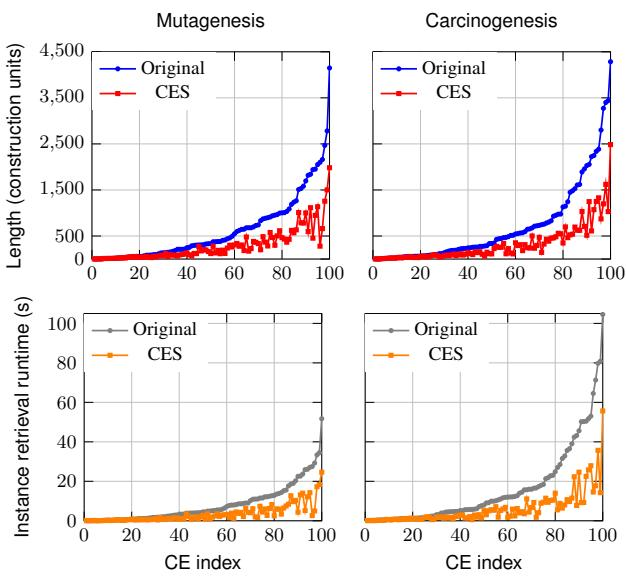

# SYNTACTIC SIMPLIFICATION OF OWL CLASS EXPRESSIONS

Alkid Baci, N’Dah Jean Kouagou, Caglar Demir, Axel-Cyrille Ngonga Ngomo

Department of Computer Science

Paderborn University

Warburger Str. 100, 33098 Paderborn, Germany

{alkid.baci, ndah.jean.kouagou, caglar.demir, axel.ngonga}@upb.de

August 20, 2026

## ABSTRACT

Class Expression Learning (CEL) often produces complex OWL class expressions that are difficult to interpret and reason over. However, by following theoretically grounded simplification principles, this complexity can be reduced. In this paper, we propose Class Expression Simplifier (CES), a novel algorithm for the syntactic simplification of class expressions in Description Logics (DLs). CES aims to preserve formal semantics while reducing representational complexity. It systematically applies rewriting rules to eliminate redundancies and identify simpler yet equivalent expressions, thereby producing more compact and human-readable representations without altering logical entailments. We evaluate the effectiveness of CES on class expressions learned from two medium-sized ontologies, demonstrating measurable improvements in reasoning efficiency and reductions in verbosity. This work contributes to the broader goal of making ontology-driven applications more accessible, maintainable, and scalable, with direct implications for knowledge graph construction, semantic search, and Web-scale reasoning. CES is implemented within the open-source Python framework OWLAPY [1] and is publicly available.

Keywords Syntactic simplification, OWL class expressions, Description Logics, Rule-based rewriting, Semantic Web

## 1 Introduction

Ontologies expressed in the Web Ontology Language (OWL) [2] have become a cornerstone for representing structured knowledge on the Semantic Web [3], powering applications ranging from biomedical data integration to knowledge graph construction and Web-scale reasoning [4, 5]. At the heart of OWL are class expressions, which allow the specification of rich and precise concepts by combining logical operators and role restrictions. While this expressiveness (e.g. SROIQ<sup>(D)</sup>) is essential for capturing domain semantics, it often leads to complex and verbose expressions [6]. Such expressions are not only difficult for ontology engineers to interpret and maintain, but can also introduce inefficiencies in automated reasoning and query answering tasks [6, 7, 8].

The problem of complex class expressions manifests in several ways. From a usability perspective, verbose or redundant expressions reduce the readability of ontologies [9], making collaborative development, reuse and verbalization (e.g. via LLMs) challenging. From a computational perspective, the presence of unnecessary syntactic constructs can increase the size of reasoning tasks, negatively affecting the performance of DLs reasoners [7, 10]. Simplifying class expressions without altering their semantics is therefore a desirable step to improve both the human- and machine-oriented aspects of ontology use. In Web-scale applications, where ontologies are combined with massive knowledge graphs, even small inefficiencies in reasoning can become prohibitive [11].

Existing work has primarily focused on semantic reasoning [12], optimization techniques [12, 13], or ontology modularization [14, 15]. By contrast, systematic methods for the syntactic simplification of OWL class expressions remain largely underexplored. While FaCT++ [16] provides basic simplification like for example, transforming expressions into a simplified normal form (SNF), it represents the closest-yet still limited-point of comparison to our approach.

Contributions. In this paper, we address the challenge of simplifying OWL class expressions by introducing a syntactic rewriting approach rooted in SOIQ<sup>(D)</sup> (restricted to transitive roles and excluding all other RBox axioms), as we adhere strictly to syntactic simplification. Specifically, we:

(C1) Define a set ofDLs-based rewriting rulesfor syntactic simplification over concepts in $s \check { \mathcal { O } } \bar { \mathcal { I } } \mathcal { Q } ^ { \tilde { ( D ) } }$ with restriction to transitive roles.

(C2) Propose CES, a rewriting-based algorithm for syntactic simplification of class expressions, following a recursive approach that guarantees termination.

(C3) Display the effectiveness ofCES in reduction of length and reasoning runtime on 200 class expressions generatedfor two medium-sized datasets.

## 2 Background

OWL ontologies are grounded in DLs, where complex class expressions are constructed using boolean connectives, quantifiers, and role restrictions. Throughout this paper we use the terms ‘concept’ and ‘class expression interchangeably because DLs concepts can be represented in OWL class expressions and vice-versa. In this section, we define the simplification problem and present the simplification principles.

## 2.1 Description Logics

DLs provide the formal foundation of OWL and define concepts using constructors such as conjunction (⊓), disjunction (⊔), negation (¬), existential (∃r.C), and universal (∀r.C) restrictions over roles r. These constructs enable the definition of complex concepts that describe sets of individuals satisfying specific conditions. Formally, each DL expression is interpreted under a model $\mathcal { T } = ( \check { \Delta } ^ { \mathcal { T } } , \cdot ^ { \mathcal { T } } )$ where $\Delta ^ { \underline { { \tau } } }$ is the domain and ·<sup>I</sup> an interpretation function mapping concepts and roles to subsets of $\Delta ^ { \mathcal { I } }$ and binary relations, respectively.

## 2.2 Principles of Syntactic Simplification

Towards the goal of syntactic simplification we propose the following principles:

• Redundancy Elimination: remove duplicates of subexpressions or order/flatten conjuncts and disjuncts.

• Equivalence Preservation: apply algebraic laws/rules to produce shorter but semantically identical expressions.

These principles guide the design of our rewriting algorithm, ensuring termination and semantic soundness. Below, we describe some of the most profound rules applied to simplify class expressions under the equivalence preservation principle. Our function processes expressions according to the unique name assumption (UNA).

Absorption The absorption law eliminates redundant disjunctive or conjunctive constructs by exploiting logical inclusion. Formally, for any class expressions $\breve { C }$ and D, the following equivalences hold:

$$
C \sqcup ( C \sqcap D ) \equiv C \quad { \mathrm { a n d } } \quad C \sqcap ( C \sqcup D ) \equiv C .
$$

Idempotence The idempotence law ensures that repeated occurrences of the same class expression within a conjunction or disjunction do not increase its meaning:

$$
C \sqcap C \equiv C \quad { \mathrm { a n d } } \quad C \sqcup C \equiv C .
$$

Identity and Domination The identity and domination laws describe the interaction of class expressions with the universal concept ⊤ and the empty concept ⊥. The identity law captures neutral behavior while the domination law expresses overriding behavior:

$$
C \sqcap \tau \equiv C , \quad C \sqcup \bot \equiv C , \quad C \sqcup \tau \equiv \tau , \quad C \sqcap \bot \equiv \bot .
$$

Law of the Excluded Middle and Law of Non-Contradiction The law of the excluded middle expresses that, for any class expression $C ,$ , either C or its negation must hold universally whereas the law of non-contradiction states that a class expression and its negation cannot be simultaneously satisfied. Respectively:

$$
C \sqcup \neg C \equiv { \mathsf { T } } \quad { \mathrm { a n d } } \quad C \sqcap \neg C \equiv \bot .
$$

Quantifier Distribution Quantifier distribution combines multiple universal or existential restrictions over the same role (r) into a single restriction with a merged filler expression:

$$
\begin{array} { r l } & { \forall r . C \cap \forall r . D \equiv \forall r . ( C \cap D ) \quad \mathrm { a n d } } \\ & { \qquad \exists r . C \sqcup \exists r . D \equiv \exists r . ( C \sqcup D ) . } \end{array}
$$

Cardinality Restriction Subsumption When multiple cardinality restrictions share the same role and filler, redundant constraints can be eliminated by selecting the less or more restrictive bound, depending on the connective. Formally, for a role $r ,$ a class expression C, and integers m, n with m $< n \colon$

$$
\begin{array} { l } { { ( \geq m r . C ) \sqcup ( \geq n r . C ) \equiv ( \geq m r . C ) \quad \mathrm { a n d } } } \\ { { \qquad ( \geq m r . C ) \sqcap ( \geq n r . C ) \equiv ( \geq n r . C ) . } } \end{array}
$$

Analogous equivalences are used for upper-bound restrictions (≤) as well as for datatype restrictions.

Factorization Factorization exploits distributivity to extract common subexpressions from disjunctions or conjunctions, reducing repetition and structural complexity:

$$
\begin{array} { c } { { ( C \sqcap D ) \sqcup ( C \sqcap E ) \equiv C \sqcap ( D \sqcup E ) \quad \mathrm { a n d } } } \\ { { ( C \sqcup D ) \sqcap ( C \sqcup E ) \equiv C \sqcup ( D \sqcap E ) . } } \end{array}
$$

Factorization is also applied to negated concepts to factor out the negation in order to reduce the amount of negation constructs used to represent the complex concept.

## 3 Methodology

We define syntactic simplification as a transformation function f on the class expression C such that f(C) is syntactically simpler than C in terms of length–i.e. OWL constructs required to represent the expression [8], and semantically equivalent, i.e., $C ^ { \mathcal { T } } = f ( C ) ^ { \mathcal { T } }$ for all interpretations I.

When handling complex class expressions, we often encounter combinations of n-ary boolean connectives (i.e., conjunctions and disjunctions of concepts). For brevity, we refer to these simply as n-ary expressions and to the concepts in such expressions as operands. Our simplifica tion algorithm is particularly effective in this setting, since a larger number of simplification rules can typically be applied. In contrast, when expressions lack such connectives, the simplification process is naturally less extensive.

The objective of the algorithm is to apply as many rules within a single simplification pass as possible (i.e., one execution of the algorithm on a given class expression). To this end, we implemented a recursive function simplify(c, p), where c denotes the current class expression and p denotes its parent n-ary expression. The second parameter is essential for rules that require knowledge of the surrounding context, i.e., the class expression that is one level higher in the recursion. The simplify function is implemented as a single-dispatch function, with different specializations for each type of class expression, which makes recursive traversal both natural and efficient.

## 3.1 Simplification of N-ary Boolean Expressions

For n-ary expressions, simplification proceeds both at the operand level and at the connective level. In Algorithm 1, we show how the simplify function is implemented for ObjectUnionOf. Nested n-ary expressions are first flattened $( \mathbf { e . g . } , ( C \bar { \sqcap } ( D \sqcap E ) )  \bar { ( } C \bar { \sqcap } D \sqcap E ) )$ to facilitate rule application, and then the Law ofIdempotence is applied to remove repeated operands. During recursion, Absorption Law is applied when common elements exist between an expression and its parent, and duplicates are removed using set-based storage. In case the ⊤ or ⊥ concepts occur in the set of operands we apply the Law of Domination/Identity. The algorithm also applies the Law of the Excluded Middle, removing operands that appear alongside their negations, and handles subsumption checks for cardinality restrictions. Finally, factorization is applied via apply\_factorization to reduce structural length.

The simplify function for intersection (ObjectIntersectionOf) follows a similar procedure, with slight differences corresponding to the specific rules applicable to conjunctions. Some minor implementation details have been omitted in Algorithm 1 for clarity, but the overall structure ensures a systematic, recursive application of all relevant simplification rules in a single pass.

Algorithm 1 Recursive function simplify(c, p) for   
ObjectUnionOf   
1: c<sup>′</sup> ← combine\_nary\_expressions(c) ▷ Flatten nested   
unions & apply Idempotence law   
2: if $: c ^ { \prime } \neq $ c then   
3: return simplif $\surd ( c ^ { \prime } , p )$   
4: $O _ { c } \gets$ operands(c)   
5: if $p \neq$ Null then   
6: Apply Absorption law: remove common operands   
with parent p (if any)   
7: S ← map(simplify, $O _ { c } ,$ repeat(c)) ▷ Recursive   
simplification of operands   
8: if $| { \hat { S } } | = 1$ then   
9: return pop(S)   
10: if ${ \mathsf { T } } \in S$ then   
11: return ⊤ ▷ Domination law   
12: $\mathbf { i f } \perp \in S$ then   
13: $S \gets S \setminus \{ \bot \}$ ▷ Identity law   
14: for e ∈ copy(S) do   
15: if isinstance(e, ObjectComplementOf) and   
operand $o _ { e } \in S$ then   
16: Remove $\{ e , o _ { e } \}$ ▷ Law of the excluded middle   
17: if $S = \emptyset$ then   
18: return ⊤   
19: if $| S | = 1$ then   
20: return pop(S)   
21: c ← new ObjectUnionOf(S)   
22: for $o \in$ operands(c) if o is a cardinality restriction do   
23: Merge cardinality restrictions on the same role and   
filler   
24: Update c ← new ObjectUnionOf(S)   
25: break   
26: if $p =$ Null then ▷ Root expression   
27: c ← apply\_factorization(c, True)   
28: return c

## 3.2 Factorization

Factorization is important when it comes to reducing length of the expressions. Throughout the simplification process, intermediate class expressions may remain structurally verbose, even after the application of local rewriting rules and can further benefit from factorization which we apply at the root level of recursive union or intersection simplifications, following the simplification of all operands. We consider this an important step since factorization can substantially reduce the number of OWL constructs required to represent a concept. The high-level pseudocode of the factorization procedure is presented in Algorithm 2.

Factorization is implemented recursively via the recursive function apply\_factorization(c, first\_iteration). On the first call from the simplify function, the class expression c is converted into its top-level disjunctive normal form (DNF). This ensures that all disjunctions are explicitly represented at the outermost level, facilitating the identification of redundant or common subexpressions and reducing repeated traversal of nested structures. Furthermore, in DNF, redundant disjuncts are easier to identify because they appear as explicit top-level components rather than being hidden inside nested structures. To handle both unions and intersections uniformly, two dynamic variables, type\_a and type\_b are assignd the types ObjectUnionOf and ObjectIntersectionOf where type\_a is equal to the type of the class expression c and type\_b is the remaining one. Operands of c are partitioned into those of type\_b $O _ { c , \mathrm { t y p e } , \mathrm { b } }$ , and the rest $O _ { c , \overline { { \mathrm { t y p e } _ { - } \mathrm { b } } } } .$ . The Absorption Law is applied when both sets are non-empty. For multiple operands of type type\_b, common components are identified pairwise, and local factorization is performed, which is then merged with the remaining operands. Depending on the sizes of the operand sets, the function returns either the locally factorized expression or the combination of factorized and remaining operands. Single operands of type type\_b are recursively factorized before being combined with the rest.

This recursive design ensures that factorization proceeds from general to specific cases, repeatedly applying simplification until no further factorization is possible. The final result is a structurally compact class expression that preserves the semantics of the original expression.

```latex
Algorithm 2 Function
apply_factorization(c, first_iteration) for n-ary ex
pressions
1: if first_iteration then
2: c ← get_top_level_dnf(c)
3: Determine type_a and type_b based on c
4: $O _ { c }  \mathsf { o p }$ erands(c)
5: $O _ { c , \mathrm { t y p e \_ b } }  \{ o \in \dot { O } _ { c }$ | isinstance(o, type_b)}
6: $O _ { c , \mathrm { { t y p e } _ { - } \mathrm { { b } } } }  O _ { c } \backslash O _ { c }$ ,type_b
7: if $\partial _ { c , \mathrm { t y p e \_ b } } \neq \emptyset$ and $O _ { c , \mathrm { { r y p e } \_ b } } \neq \emptyset$ then
8: Apply Absorption between sets
9: if $| O _ { c , \mathrm { t y p e \_ b } } | \geq 2$ then
10: for each pair in $O _ { c , \mathrm { t y p e } , \mathrm { b } }$ do
11: Identify common operands and perform local
factorization
12: Merge factorized results with remaining
operands
13: else if $| O _ { c , \mathrm { t y p e \_ b } } | = 1$ then
14: Recursively factorize the single operand and com
bine with $O _ { c , \overline { { \mathrm { t y p e } _ { - } \mathrm { b } } } }$
15: return c
```

## 4 Evaluation

To assess the impact of our syntactic simplification procedure in terms of length reduction and reasoning efficiency, we generated 200 class expressions given random learning problems over two medium-sized datasets, Carcinogenesis and Mutagenesis, from the SML-bench suite [17]. Complex and lengthy class expressions are generated with the Tree-based OWL Class Expression Learner (TDL) [18] from the Ontolearn framework [5], which is known to produce significantly more verbose hypotheses compared to other concept learning algorithms on the framework. We refer to the length of a given class expression as the number of the OWL constructs required to represent it. For reasoning efficiency we measure the runtime of instance retrieval using StructuralReasoner - the native reasoner of OWLAPY [1]. While each individual rewrite rule used by the algorithm is semantics-preserving, proving correctness for their arbitrary composition would require a global confluence and termination proof, which is outside the scope of this work. Consequently, we evaluate correctness empirically via reasoning-based validation by comparing the sets of instances retrieved for the original and the simplified class expressions and confirming their equivalence.

  
Figure 1: Length comparison in terms of construct units (top) and instance retrieval runtime comparison in seconds (bottom), between original and simplified class expressions using CES, generated in Mutagenesis (left) and Carcinogenesis (right). Results are sorted in ascending order from left to right over the original measurement.

The results of the experiments are shown in Figure 1. We recorded the highest length reduction to be 86% less than the original expression and the highest runtime reduction to be 90% less than the original. For the conducted experiments the average runtime of simplification is 0.11s on Mutagenesis and 0.16s on Carcinogensis with the longest expression of length 4284 taking 1.34 seconds to simplify. Our experiments deliberately focused on the TDL, which is known to produce lengthy and complex class expressions. In this setting, the value of our simplifier is particularly evident. For other learners that may generate more compact hypotheses, the gain in simplification may be less pronounced. Nevertheless, the algorithm consistently provides a non-intrusive “bonus” improvement in complexity reduction and reasoning efficiency, since it does not affect the semantics of the resulting expressions.

## 5 Discussion and Conclusion

In this work, we introduced CES, a syntactic simplification algorithm for OWL class expressions, and showed its effectiveness in reducing verbosity and improving reasoning efficiency. We highlight the fact that the method can be seamlessly integrated into class expression learning systems (e.g. with TDL), serving as a default post-processing step before presenting the final hypothesis. Since the simplifications are purely syntactic and semantics-preserving, the procedure introduces no risk of information loss, while consistently offering potential benefits with minimal time overhead. The simplification time cost becomes even less significant when considering the fact that class expressions can be reused.

We also acknowledge certain limitations. First, all tested hypotheses were generated by TDL. Consequently, the reported reduction rates may not be representative of concepts produced by other concept learning systems, particularly those that generate shorter or structurally different expressions. Another limitation of CES is the order of applying specific processes (e.g., factorization, merging of cardinality restrictions). Since the simplification process proceeds in a single pass, the ordering can influence the outcome. Determining an optimal application strategy remains an open question, and exploring multi-pass or ruleprioritization schemes may yield further improvements.

Despite these limitations, our results demonstrate that substantial reductions in class expression complexity can be achieved, improving reasoning efficiency and reducing verbosity. As such, CES provides a practical step towards more interpretable and maintainable ontology-based systems. At present, CES operates exclusively at the syntactic level. This design choice avoids the need to rely on a reasoner, making the method broadly applicable and independent of the presence of a background ontology. Looking ahead, an exciting direction for future work is the incorporation of semantic simplifications, which could further reduce complexity and uncover additional equivalences beyond purely syntactic transformations.

## References

[1] Alkid Baci, Luke Friedrichs, Caglar Demir, and Axel-Cyrille Ngonga Ngomo. Owlapy: A pythonic framework for owl ontology engineering, 2025.

[2] Grigoris Antoniou and Frank van Harmelen. Web ontology language: Owl. In Handbook on ontologies, pages 91–110. Springer, 2009.

[3] Tim Berners-Lee, James Hendler, and Ora Lassila. The semantic web. Scientific American, 284(5):34– 43, May 2001.

[4] Jean-Baptiste Lamy. Owlready: Ontology-oriented programming in python with automatic classification and high level constructs for biomedical ontologies. Artificial intelligence in medicine, 80:11–28, 2017.

[5] Caglar Demir, Alkid Baci, N’Dah Jean Kouagou, Leonie Nora Sieger, Stefan Heindorf, Simon Bin, Lukas Blübaum, Alexander Bigerl, and Axel-Cyrille Ngonga Ngomo. Ontolearn—a framework for large-scale owl class expression learning in python. Journal ofMachine Learning Research, 26(63):1–6, 2025.

[6] Salvatore F Pileggi, Fabian C Peña, Maria Del Pilar Villamil, and Ghassan Beydoun. Analysing the trade-off between computational performance and representation richness in ontology-based systems. In International Conference on Computational Science, pages 237–250. Springer, 2019.

[7] Yong-Bin Kang, Yuan-Fang Li, and Shonali Krishnaswamy. A rigorous characterization of classification performance-a tale of four reasoners. ORE. 2012.

[8] Jens Lehmann, Sören Auer, Lorenz Bühmann, and Sebastian Tramp. Class expression learning for ontology engineering. Journal ofWeb Semantics, 9(1):71– 81, 2011.

[9] Anselm Blumer, Andrzej Ehrenfeucht, David Haussler, and Manfred K Warmuth. Occam’s razor. Information processing letters, 24(6):377–380, 1987.

[10] Yong-Bin Kang, Yuan-Fang Li, and Shonali Krishnaswamy. Predicting reasoning performance using ontology metrics. In International Semantic Web Conference, pages 198–214. Springer, 2012.

[11] Sami Zghal and Marouen Kachroudi. The coevolution of ontologies and extensive knowledge graphs on a web scale. The Journal of Supercomputing, 82(5):264, 2026.

[12] Sunitha Abburu. A survey on ontology reasoners and comparison. International Journal ofComputer Applications, 57(17):33–39, 2012.

[13] Andrés Letelier, Jorge Pérez, Reinhard Pichler, and Sebastian Skritek. Static analysis and optimization of semantic web queries. ACM Transactions on Database Systems (TODS), 38(4):1–45, 2013.

[14] Andrew LeClair, Alicia Marinache, Haya El Ghalayini, Wendy MacCaull, and Ridha Khedri. A review on ontology modularization techniques-a multidimensional perspective. IEEE Transactions on Knowledge and Data Engineering, 35(5):4376–4394, 2022.

[15] Alan L Rector. Modularisation of domain ontologies implemented in description logics and related formalisms including owl. In Proceedings of the 2nd international conference on Knowledge capture, pages 121–128, 2003.

[16] Dmitry Tsarkov and Ian Horrocks. Fact++ description logic reasoner: System description. In International joint conference on automated reasoning, pages 292–297. Springer, 2006.

[17] Patrick Westphal, Lorenz Bühmann, Simon Bin, Hajira Jabeen, and Jens Lehmann. Sml-bench–a benchmarking framework for structured machine learning. Semantic Web, 10(2):231–245, 2019.

[18] Caglar Demir, Moshood Yekini, Michael Röder, Yasir Mahmood, and Axel-Cyrille Ngonga Ngomo. Tree-based owl class expression learner over large graphs. In Machine Learning and Knowledge Discovery in Databases. Research Track, pages 495–511, Cham, 2026. Springer Nature Switzerland.