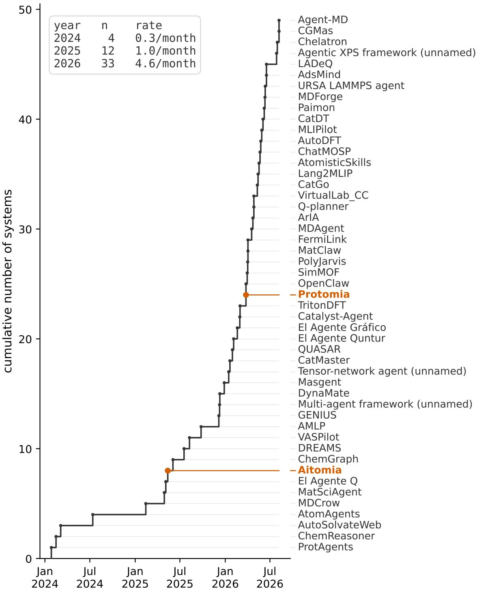
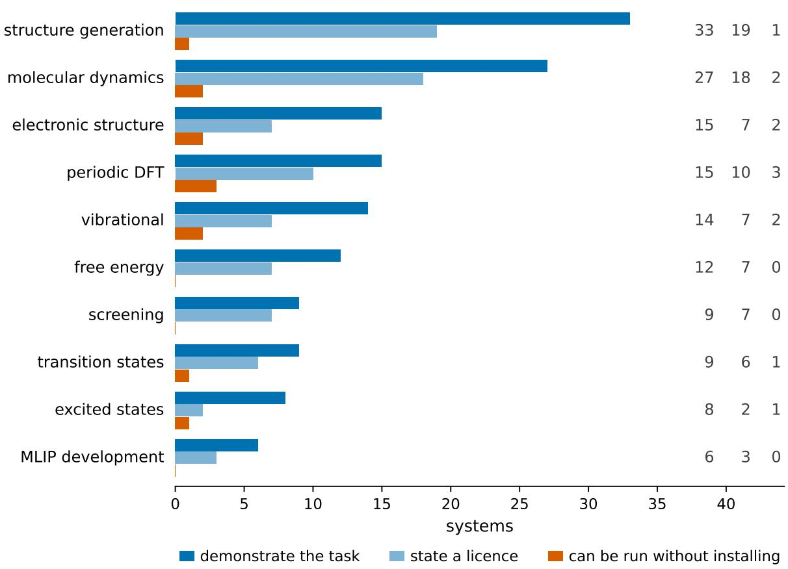
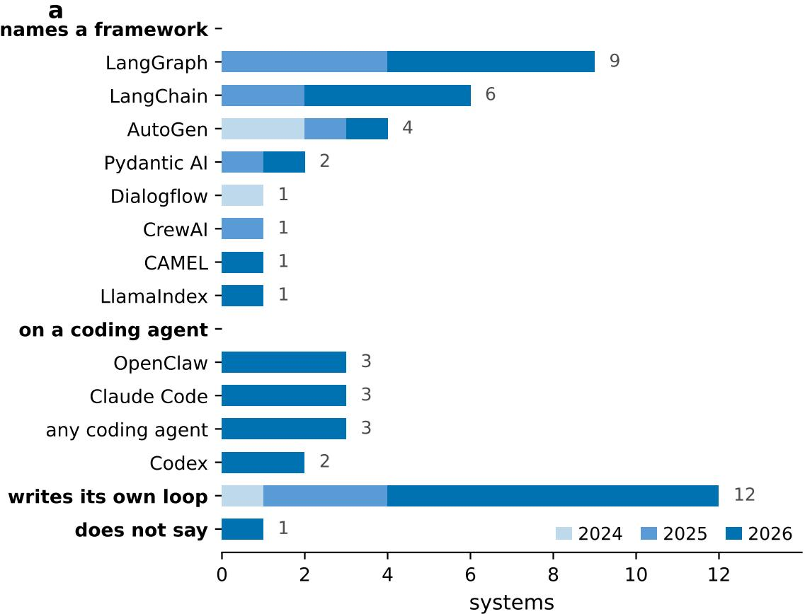
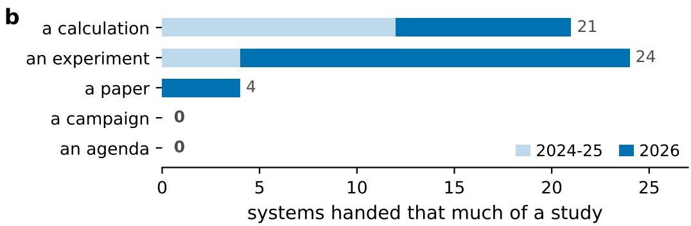
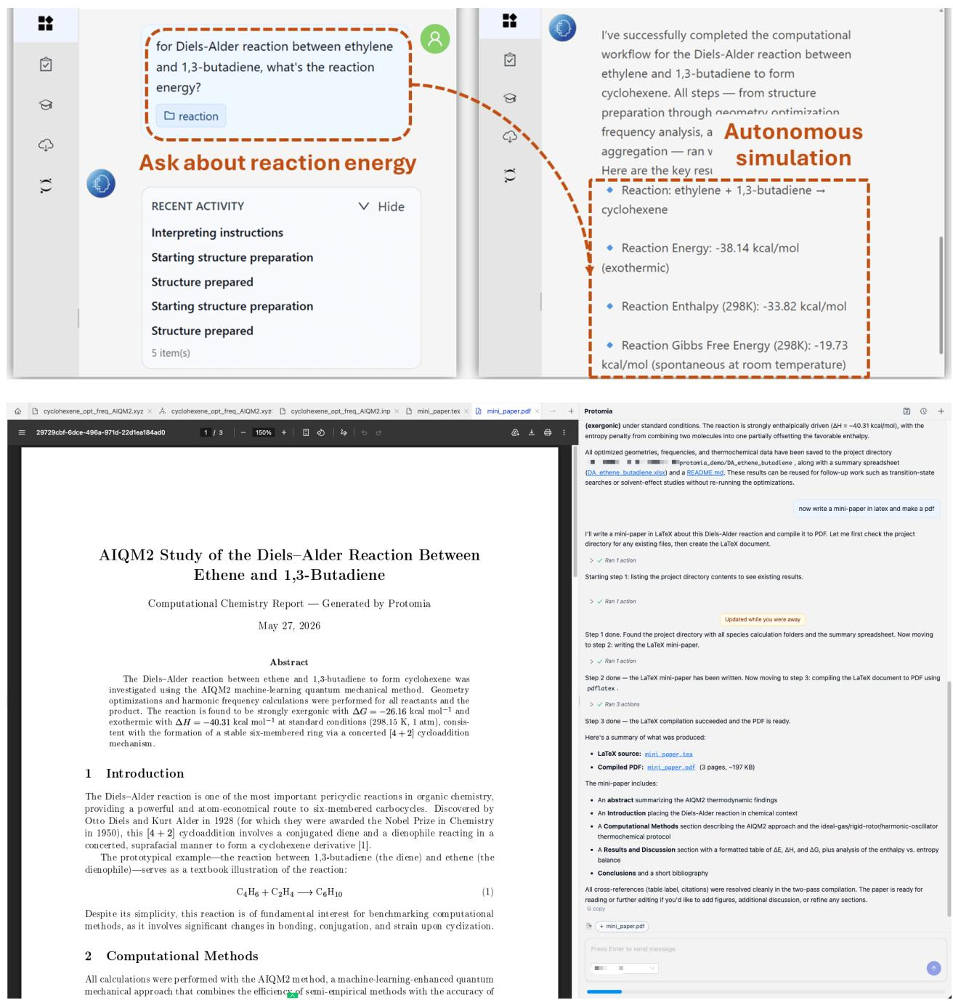

# Science Done on a Machine by a Machine: AI Agents in Computational Chemistry

Pavlo O. Dral,∗,†,‡,¶,§ Hassan Nawaz,† and Arif Ullah∗,∥

State Key Laboratory of Physical Chemistry of Solid Surfaces, College of Chemistry and

Chemical Engineering, and Fujian Provincial Key Laboratory of Theoretical and

Computational Chemistry, Xiamen University, Xiamen, Fujian 361005, China

Institute of Physics, Faculty of Physics, Astronomy, and Informatics, Nicolaus Copernicus

University in Toruń, ul. Grudziadzka 5, 87-100 Toruń, Poland

¶Institute of Advanced Studies, Nicolaus Copernicus University in Toruń, ul. Wileńska 4,

87-100 Toruń, Poland

Aitomistic, Shenzhen 518000, China

School of Physics, Anhui University, Hefei, 230601, Anhui, China

E-mail: dral@xmu.edu.cn; arif@ahu.edu.cn

## Abstract

We are witnessing an explosion of agentic systems for computational chemistry simulations: from half a dozen in 2024 to a dozen in 2025, and the current number approaches fifty, surveyed in this Perspective as of 8 August 2026. The capabilities of these agentic systems are shifting from assisting in performing a selection of computational tasks to autonomous design and execution of in silico experiments, their analysis, and even manuscript writing. The ultimate destination is a fully autonomous AI scientist, where the entirety of computational chemistry is performed on a machine by a machine, without human supervision. While we are not there yet, and all reported systems currently involve a human in the loop, the trend is unmistakable. Even building specialized agentic systems for computational chemistry is increasingly commoditized by generalist agents, which may in the end replace the need for the specialized ones altogether, since adding a new capability will be as easy as asking AI to do it for you. Both the explosion in their number and the very limited adoption beyond their own developers point that way, and we close this Perspective on what it leaves us to do. The speed and scale of disruption agentic systems are bringing to computational chemistry leave many of us dumbfounded about the field’s future and what we should spend our eforts on, as already established specialists, teachers, and students, and we have no answer.

## 1 What is delegated to a machine

Computational chemistry is one of those research fields that benefited most from the advances in computing hardware and software, which enabled ever-increasing size and time scale, accuracy, and usefulness of simulations.1–12 This has created a demand for a now sizable number of experts able to perform such simulations, which are highly non-trivial and require years of honing the skills, which in turn creates a substantial barrier to broader adoption of the best practices of computational chemistry.

Nevertheless, many of the single calculation tasks themselves are rather repetitive and fol low standard protocols. Hence, there was always a desire to automate these repetitive tasks, which was traditionally done with scripts and workflows.13–17 Unfortunately, this automation did not diminish the load on human experts, because their work and decision making are then shifted to a higher level: ideation and planning of what and how to calculate, setting up the calculations, writing scripts, monitoring their completion, analyzing the results and failures, adjusting the plan, recalculating failed or erroneous simulations, etc.

One of us (P.O.D.) set out this vision in print13 a year before the release of the chat models that started the present wave: machines able to “perform all these simulations, analyze results and write papers” and eventually “make a qualitative jump in our understanding of nature”. It has become possible with the emergence of GPT-4 and modern AI agentic systems, which hold the promise of doing the very tasks that only humans could do: make decisions on the fly, ultimately democratizing computational chemistry to researchers without years of specialist training.18

Realizing this breakthrough potential of AI, many research groups set out to build agentic systems specialized in computational chemistry, an undertaking that itself became easier with the emergence of the generalist agents we discuss later in this Perspective. This has led to an explosive growth of the agents for computational chemistry (Figure 1): 4 appear in 2024, 12 in 2025, and 33 up to 8 August 2026 covered by our survey, which is scoped to those whose object is an atomistic simulation, set up, run, and interpreted by AI using quantum-chemical, molecular-dynamics or machine-learning-potential calculations on molecules, materials or catalytic surfaces (see Table 1 for the full list).

  
Figure 1: Every agentic system in the survey, at its first public appearance. The inset gives the count and the rate for each year; 2026 runs only to the cutof of 8 August 2026. Our own Aitomia19 and Protomia20 are marked in colour.

The changes in capabilities and architectures are dramatic over such a short period of two and a half years, as we will dissect in this Perspective by performing a metaanalysis of all 49 systems. By now, the reported systems cover wide ranges of the computational chemistry tasks (Figure 2). While the early systems were specializing on one or a few tasks, the trend is to generalize them to broader capabilities. The most common task, which is the task zero of any computational workflow, is to generate structures, and it runs from embedding a SMILES string in three dimensions19,21,22 to generating hundreds of hypothetical crystals and screening them.23–25 This is followed by molecular dynamics,20,24,26–50 electronic structure,19–22,27,34,35,41,51–57 and periodic density functional theory20,23,24,29,32,33,36,39,41,43,56,58–61 calculations.

Much fewer systems were designed for screening,24,33,36,41,45,57,60,62,63 interatomic-potential development,24,29,38,42,44,60 excited states,19,20,22,34,51–53,64 and free energies. While transition states and reaction barriers are the core business of mechanistic computational chemistry, they are represented by only a few systems,20,34,41,45,53,54,60,65 which is not that surprising in hindsight, considering that it is one of the most challenging tasks of computational chemistry. Free energies appear 12 times, and how they are obtained separates the survey more sharply than the count does. The static route accounts for 8 of them,21,34,41,45,51,53,54,60 converting harmonic frequencies and ideal-gas entropies into a Gibbs energy,21,54 which yields pKa values,34,51,53 ring strains,51 deprotonation energies34,51 and adsorption free-energy diagrams41,45,60 for the price of a frequency calculation. The other 4 sample the ensemble,24,31,40,47 through umbrella-sampling potentials of mean force,40 endpoint MM/PB(GB)SA binding energies,31 and the alchemical-perturbation and thermodynamicintegration family with Bennett and multistate-Bennett estimators.47 Taken together, the survey covers structures and dynamics broadly, reaction mechanism rather thinly.

  
Figure 2: What the surveyed systems do, and how much of that a reader can obtain. For each task: the systems that perform it, those that state a licence, and those that can be run without installing anything. A system may perform several tasks, so the first column sums above 49. Coverage and availability are diferent quantities: free energies, screening and interatomic-potential development are each performed by several systems and by none a reader can run without installing it, and 2 of the 8 excited-state systems state a licence.

## 2 How much is delegated to a machine

From the perspective of the evolution of agentic systems, it is important to consider not just what they can do, but also how much they can accomplish autonomously. As a proxy measurement to answer this question via statistical analysis of the systems, we categorize the size of the autonomous chunk of work from a single calculation (e.g., geometry optimization), to an in silico experiment (including planning and performing of a sequence of calculations and their analysis, etc.), to accomplishing all tasks from ideation up to writing a paper. Beyond that is a bigger campaign scale of autonomy where AI is capable of performing a series of investigations within a scoped project leading to multiple papers and ultimately setting an agenda by itself without any human intervention at all: defining what to investigate, shaping projects, managing resources, and driving them to completion. The latter is when computational chemistry research will be run on a machine by a machine from end to end.

Here, the trend is unmistakable and follows the overall trend in agentic systems: they become more and more capable and autonomous. While the early systems were typically operating on a scale of a single calculation, they quickly shifted to the experiment-scale capabilities, which now constitutes the bulk. The current frontier is pushing those systems to the paper-level, which is claimed by only a few systems without yet clear evidence that they can produce papers en masse without human supervision. None of the systems reports campaign-level autonomy, but public reports lag behind what the frontier labs are pursuing at the moment, i.e., such eforts are already actively undertaken, akin to similar undertakings in other fields;66–68 we can confidently claim this because we pursue such a goal ourselves in our labs. Before the field is solidified at the campaign level, talking about the agenda level is premature, unless we do arrive at a proverbial singularity (superintelligence) faster than we can imagine.

## 3 The evolution of architectures enabling the increasing autonomy

Pushing agentic systems to higher levels of autonomy depends on the maturity of architectures and the intrinsic capabilities of the underlying AI (currently mostly LLM) models, with the state-of-the-art models built by private companies, which do not necessarily pursue goals aligned with the requirements for performing autonomous (computational chemistry) research. Hence, our work as experts boils down to repurposing those tools to our research goals, which is complicated by their extremely rapid change, causing a significant lag in development. Our survey clearly reflects this (Figure 3a): early agentic systems specialized on computational chemistry were based on predefined tool functions (written before the run and shipped with the system),19,21,23,26–32,51,58,62,65,69 which were the only callable tools available to LLMs, whose role was basically to choose the tools and parameters for them, with some departures29,33,59 from this structure when LLMs were fed documentation of the software and asked to generate input files, etc. Later systems increasingly rely on agentwritten code (a script the agent composes during the run and executes),33,34,38–40,44–48,52,55,60,64 the Model Context Protocol (MCP, letting an agent call tools that were not shipped with it),24,37,41,52,53,58,63 and skills libraries (a set of retrieved written procedures the agent follows in place of a function call) to extend their capabilities.24,25,35,39,40,45,46,53,54,60

  
Figure 3: What runs the agent, and how much of a study is delegated to it. (a) The component each system’s own paper names as its orchestrator, coloured by the year the system appeared. Each system is counted once, so the rows sum to their group and the four groups sum to 49: where a paper names both LangGraph and LangChain the row is LangGraph, which that paper makes the runtime, so LangChain appears in ten systems and orchestrates six. A system whose paper names several coding agents is not tied to any one of them, so those share the row any coding agent rather than being counted under each. (b) How much of a study is delegated, split by era. A campaign and an agenda are demonstrated by no system, and neither can be evidenced inside a single paper. The two shifts are concurrent and this survey cannot separate them: every system on a coding agent appeared in 2026, and systems of 2026 are delegated more of a study whatever runs them.

The orchestration layer moved accordingly: LangGraph was the popular backbone of the early architectures,19,21,23,34,48,49,51,53,56 and now a loose collection of skills sitting on a general-purpose agent takes its place.24,35,39,41,50,63 Note that skills often do include predefined functions, so the predefined layer is still present in the architecture, and overall, the newer layers accumulate beside the predefined one rather than replace it.35,45,46,53,60 This shift in architecture naturally enabled agentic systems to perform increasingly complex tasks: while initial systems typically could only do a pre-defined sequence of tasks,19,21,26–29,31,32,58,59,65,69 modern systems typically are capable of working in a loop by letting a result change what runs next.24,33,34,36,38,39,42–48,50,55,57,60,63,64,70

## 4 Where do we stand now and what’s the end game?

At the end of the day, where do we stand now, as of August 18, 2026, when we are writing this? The autonomous tools enabling computational chemistry are here to stay, we do not see going back to hand-writing input files and scripts and manually checking the progress of calculations and analyzing everything by hand. The systems become more capable and trustworthy, as they can work tirelessly and check their own work, while spawning subagents to parallelize work as needed which is beyond any human capabilities. Despite this, practice and our survey show that agents are currently neither an autonomous scientist nor an obedient calculator: the machine performs the work within boundaries set by the user, and the role of human experts is shifting more towards supervision.

One of the biggest challenges is that it is becoming genuinely hard to tell where these systems stand. Evaluating a new computational method is possible by running a benchmark on known reference values. Evaluating agentic systems requires human judgement, which is scarce, and the speed of their evolution, with rapidly changing AI models and architectures, makes it practically impossible to compare various systems on an equal footing. Also, any benchmark, once leaked, contaminates the evaluation of the next systems.

Published claims are also increasingly hard to validate, complicated by the cost of such evaluations in tokens and by the fact that many systems disclose neither their code nor an online platform (Table 1). Whether a reader may legally reuse the code is, for many of these systems, unclear. 27 of the 49 systems state a licence, most often MIT, e.g. our own Aitomia, which is Apache-2.0. For the remaining 22 we could find none, and 6 of those are repositories anyone can open today that carry no licence file at all, which leaves a reader code they can read and may not reuse. Most ship no tests and no continuous integration, and several cannot be run as published at all, through a missing module, a commented-out entry point or a hard-coded path from the author’s own machine. Only 4 can be tried online without installing anything: TritonDFT, VASPilot, AutoSolvateWeb and our own Protomia, which is a hosted service and not an open-source release. Aitomia was the first agentic system for general-purpose computational chemistry publicly available on an online platform, from 11 May 2025;18 it is now superseded by Protomia and is counted here as the open-source framework it remains.

That said, at the level of single calculations the current agentic systems are pretty robust as ours and other evaluations have shown for some time now.19,21,26,51 In the benchmark of our first-generation agentic system Aitomia, the success rate was 99.6% for a low-autonomy single computational task.19 These numbers dropped to 70.9% and 45.6% when tasks demanded higher autonomy. However, those benchmarks were based on the obsolete LangGraph-based architecture and our newest Protomia system still awaits its evaluation (and a formal publication). To give a preview of what Protomia can already do: it provides experiment- and paper-level autonomy, and while it confidently handles experiments, it still needs a substantial amount of human supervision for a work scale from ideation to paper writing (Figure 4).

Our personal experience with agentic systems, since we started to work on them in 2024, has traced a big arc: while early systems were pretty poor but fascinated us by showing the flashes of impressive decision making, now we are frustrated when they do not write a “perfect” paper according to our taste, or miss a flaw in their reasoning when planning a new study that is “obvious” only to an expert who spent decades honing that judgement. Capabilities of the systems have grown, but our appetites have grown even more. Taking a more objective look: in 2025, we started to use Aitomia for teaching students in our Computational Chemistry and AI course and saw that new students by default fall back on it when they need to calculate anything, but its initial versions were not good enough to perform graduate-level research. In 2026, we already use Protomia for performing research in our groups, with the caveats we describe below.

This rapid progress of capabilities of our and other agentic systems is to a great extent explained by the improving capabilities of the general-purpose coding agents such as Claude Code, Github Copilot, Codex, Qoder, and emerging open-source alternatives. However, these same tools that collapsed the barrier to building agentic systems for computational chemistry and led to their explosion, ironically raise the barrier to those systems being used by anyone beyond their developers. It is becoming easier for everyone simply to ask a general-purpose coding agent to get the job done, and those agents are improving faster than any specialized system in Table 1. And once your agentic system reduces to a set of skills and MCP tools, they can be called by a general-purpose coding agent, which is what we see happening in the field. Once a general-purpose coding agent can do the same job as a specialized system, and autonomous research capability is supported by it, as, e.g., in Claude Science, there will be little need for specialized systems in the computational chemistry community and the experts can simply adjust the general-purpose systems to their needs as they do now with skills.

  
Figure 4: What our own Protomia is asked for, and what comes back. Top: from the single question “for Diels–Alder reaction between ethylene and 1,3-butadiene, what’s the reaction energy?” it prepares the structures, runs the calculations and returns the reaction energy, enthalpy and Gibbs free energy, choosing and executing the steps itself. Bottom: in a later session, after the same reaction has been run with AIQM2,71 it is asked to write a mini-paper in LATEX and compile it; it writes the document, compiles it and reports what it produced, with cross-references resolved and every empirical claim carrying provenance that a deterministic auditor checks before it finishes. Reproduced from the Protomia documentation72,73 under CC BY 4.0.

This is no longer speculation: we made our agentic systems publicly available online to democratize simulations, and the uptake was slower than we expected. Despite what Protomia can do, people have a hard time catching up with it. Most members of our own group do not know all of its capabilities: we were recently surprised to learn that some of them have not fully realized that Protomia can fix their scripts online (despite repeated demonstrations), and instead they still copy-paste their scripts to an online GPT chat, and copy-paste them back to an HPC cluster where they run the scripts manually. Many of the other group members prefer to use the general-purpose coding agents to do their research. If the people closest to a free and capable system reach for something else, the binding constraint on this field is not what the systems can do.

Our future competitor may be AI itself, when the entirety of computational chemistry is performed on a machine by a machine, and every component of that is already somewhere in Table 1, just never yet in one system. And right now everyone building agentic systems is digging their own grave, while we compete with each other over who digs faster and deeper; this is our opinion, which we expressed within months of the GPT-4 model that began this wave and have not changed since.74∗

## Authors contributions

A.U. conceived the Perspective and drafted its first version. H.N. extended and revised that draft and prepared the initial survey of the agentic systems. P.O.D. set the argument and scope, built the survey database in its present form, and wrote the final manuscript. All authors discussed and revised the manuscript. The survey database, the intermediate versions of this article and every figure were produced with assistance from the AI Dral Group, the group’s collective of specialized AI research agents, under P.O.D.’s direction and the authors’ verification; the collective also carried out the subsequent polishing. The final version of the manuscript was written by P.O.D. All three authors reviewed and approved the content.

## Conflict of interest

Two of the systems surveyed here, Aitomia and Protomia, are our own, and Protomia was used in preparing this article, as described in Methods. They were scored on the same rules as every other entry, applied from the same public sources, and those rules are stated in Methods before any count is given. P.O.D. is a co-founder of and holds equity in Aitomistic, which develops Protomia, and is an author of Aitomia; the remaining authors declare no competing financial interest.

## Data availability

No data were generated in this work, and the records behind the survey are not deposited, because they consist largely of text quoted verbatim from the surveyed papers, which is copyrighted by its publishers; the survey itself is given in full in Table 1.

## Methods

We surveyed the literature to a cutof of 8 August 2026, working outward from the reference lists of the three existing surveys and from arXiv and ChemRxiv listings in the relevant subject classes, and adding systems that colleagues brought to our attention, so the corpus is not the output of a single reproducible query. Systems are ordered by first public appearance, preprint or journal, whichever came first. Frameworks appeared while this article was being prepared, so Table 1 is a snapshot and 33 is a floor rather than a year’s total, its most recent member having appeared on 7 August 2026.

Two standards are used, and they are stated separately rather than blended. A scientific task counts where the authors report their own system performing it, in their own tense: an implemented capability counts even where the worked example is missing, whereas a task placed in future work, or one performed by a program they merely cite, does not. Delegation is held to the stricter standard and counts only what a paper demonstrates in its body, because the claim made from it is about how far the field has actually got.

The rule selects systems, not tasks: a system in the survey for the simulations it runs is then recorded for every task it performs, cheminformatics included. Agents for adjacent work are cited where they bear on the argument and deliberately not tabulated — retrosynthesis, property prediction with no underlying simulation, robotic synthesis, materials informatics in which first-principles results appear only as an external check, and systems built to do science in general rather than chemistry in particular75 — because including them would broaden the comparison until it said nothing specific about computational chemistry.

Generative AI was used substantively throughout. The survey was assembled, the database built and the intermediate versions of this article written by the AI Dral Group, an AI research-agent collective independent of the underlying runtime; here it operated on the Claude Code agent with the Claude Opus 5 model (Anthropic), and on Protomia20 for literature retrieval, citation verification and date resolution, Protomia being itself one of the systems surveyed in Table 1. The final version was written by P.O.D. and polished by the collective. Figures 1, 2 and 3 are drawn from the database by a single script re-run on every build, so no figure can disagree with a count in the text; Figure 4 is a screenshot and is not generated. That script, and the analysis and gate code behind every count and table, were written by the same agents under the authors’ direction: what they produce is fixed by the data rather than by a model, whereas the prose is not. The authors directed and verified every step, checking the rendered figures and the typeset page rather than the source, and

take full responsibility for the content.

Each tabulated field is recorded against a verbatim passage and a location in the system’s own source, read in full rather than from secondary descriptions, except where the fact is an absence, which is noted in the quote slot; our own Protomia, which has no paper yet, is evidenced from its documentation. Every reference was checked against its primary record — publisher front matter, Crossref, or the arXiv API — a pass that corrected author lists, an identifier pointing to an unrelated paper, and characterisations that did not match the cited work’s findings. Pre-2015 books, reports and printed proceedings carry no persistent identifier and are cited from the printed record alone.

Three limits could each move a number here. We read papers rather than ran systems, so every count measures what a paper shows and a system that works better than it writes is undercounted. We cannot estimate our own recall: the survey grew from 37 to 49 systems during preparation, mostly from papers that already existed and our search had missed, so it is a lower bound. And the placements are ours, with no independent recoding; the margin between the two commonest delegation positions is three systems, and moving the one system we could not place down to a single calculation, with the one compound entry beside it, leaves 23 single calculations against 24 in-silico experiments — so the ordering survives, by one system rather than three.

## Appendix: the surveyed systems

Table 1 lists every system in the survey with the evidence each column is read from. It is placed here rather than in the body because of its length.

Table 1: The 49 agentic systems for atomistic simulation surveyed here, ordered by date of first public appearance and surveyed to a cutof of 8 August 2026. Scientific tasks are those the system performs on its authors’ own account, read paper by paper: an implemented capability is recorded even where the worked example is missing, but a task the authors place in future work, or one performed by a program they merely cite, is not. The Delegation column is what the paper demonstrates in its body; aspirations and future work are deliberately not tabulated. That column uses the five-position delegation scale defined above; a system that occupies more than one position at once carries a compound entry and is counted at the larger. Architecture names how the agent reaches its capabilities and what runs it: predefined tool functions, the Model Context Protocol, retrieved skills or agentwritten code, then, after the separator, the software framework the agent itself runs on. The tool tokens are predefined functions, the Model Context Protocol, retrieved procedural skills, agent-written code, or a combination. A dash marks a system whose agents have no callable tool functions. A question mark marks a value the paper does not record, and $\mathrm { n / a }$ a value for which no source exists, the system having no paper at all.
<table><tr><td></td><td># Framework</td><td>Date</td><td>Scientific tasks</td><td>Architecture</td><td>Delegation Ref.</td><td></td></tr><tr><td>1</td><td>ProtAgents</td><td></td><td>2024-01-27 struct. gen., vib.</td><td>fixed · AutoGen</td><td>calculation</td><td>69</td></tr><tr><td>2</td><td>ChemReasoner</td><td></td><td>2024-02-15 screening, struct.</td><td>fixed · own harness</td><td>calculation</td><td>62</td></tr><tr><td>3</td><td>AutoSolvateWeb</td><td></td><td>gen. 2024-03-05 struct. gen., MD, elec. struct.</td><td>fixed · Dialogflow</td><td>calculation</td><td>27</td></tr><tr><td>4</td><td>AtomAgents</td><td></td><td>2024-07-13 TS, struct. gen.</td><td>fixed · AutoGen</td><td>experiment</td><td>65</td></tr><tr><td>5</td><td>MDCrow</td><td>2025-02-13</td><td>MD</td><td>fixed · LangChain</td><td>calculation</td><td>26</td></tr><tr><td>6</td><td>MatSciAgent</td><td>2025-04-29</td><td>struct. gen., MD</td><td>fixed · LangChain</td><td>calculation</td><td>28</td></tr><tr><td>7</td><td>El Agente Q</td><td>2025-05-05</td><td>elec. struct., excited, fixed · LangGraph</td><td></td><td>experiment</td><td>51</td></tr><tr><td></td><td></td><td></td><td>free energy, struct.</td><td></td><td></td><td></td></tr><tr><td>8</td><td>Aitomia</td><td></td><td>gen., vib.</td><td></td><td></td><td></td></tr><tr><td></td><td></td><td></td><td>2025-05-13 elec. struct., excited, fixed · LangGraph struct. gen., TS, vib.</td><td></td><td>experiment</td><td>19</td></tr><tr><td></td><td>ChemGraph</td><td></td><td>2025-06-03 elec. struct., free</td><td>fixed · LangGraph</td><td>calculation</td><td>21</td></tr><tr><td></td><td></td><td></td><td>energy, struct. gen., vib.</td><td></td><td></td><td></td></tr><tr><td></td><td>10 DREAMS</td><td></td><td>2025-07-18 periodic DFT,</td><td>fixed · LangGraph</td><td>experiment</td><td>23</td></tr><tr><td></td><td></td><td></td><td>struct. gen.</td><td></td><td></td><td></td></tr><tr><td></td><td>11 VASPilot</td><td></td><td>2025-08-09 periodic DFT</td><td>fixed, MCP · CrewAI calculation</td><td></td><td>58</td></tr><tr><td></td><td></td><td></td><td></td><td></td><td></td><td></td></tr><tr><td></td><td>12 AMLP</td><td></td><td></td><td>2025-09-25 MLIP dev., periodic fixed, – · own harness calculation</td><td></td><td>29</td></tr><tr><td></td><td></td><td></td><td></td><td></td><td></td><td></td></tr><tr><td></td><td></td><td></td><td></td><td></td><td></td><td></td></tr><tr><td></td><td></td><td></td><td></td><td></td><td></td><td></td></tr><tr><td></td><td></td><td></td><td>DFT, MD</td><td></td><td></td><td></td></tr><tr><td></td><td></td><td></td><td></td><td></td><td></td><td></td></tr><tr><td></td><td></td><td></td><td></td><td></td><td></td><td></td></tr><tr><td></td><td></td><td></td><td></td><td></td><td></td><td></td></tr><tr><td></td><td></td><td></td><td></td><td></td><td></td><td></td></tr><tr><td></td><td></td><td></td><td></td><td></td><td></td><td></td></tr><tr><td></td><td></td><td></td><td></td><td></td><td></td><td></td></tr><tr><td></td><td></td><td></td><td></td><td></td><td></td><td></td></tr><tr><td></td><td></td><td></td><td></td><td></td><td></td><td></td></tr><tr><td></td><td></td><td></td><td></td><td></td><td></td><td></td></tr><tr><td></td><td></td><td></td><td></td><td></td><td></td><td></td></tr><tr><td></td><td></td><td></td><td></td><td></td><td></td><td></td></tr><tr><td></td><td></td><td></td><td></td><td></td><td></td><td></td></tr><tr><td></td><td></td><td></td><td></td><td></td><td></td><td></td></tr><tr><td></td><td></td><td></td><td></td><td></td><td></td><td></td></tr><tr><td></td><td></td><td></td><td></td><td></td><td></td><td></td></tr><tr><td></td><td></td><td></td><td></td><td></td><td></td><td></td></tr><tr><td></td><td></td><td></td><td></td><td></td><td></td><td></td></tr><tr><td></td><td></td><td></td><td></td><td></td><td></td><td></td></tr><tr><td></td><td></td><td></td><td></td><td></td><td></td><td></td></tr><tr><td></td><td></td><td></td><td></td><td></td><td></td><td></td></tr><tr><td></td><td></td><td></td><td></td><td></td><td></td><td></td></tr><tr><td></td><td></td><td></td><td></td><td></td><td></td><td></td></tr><tr><td></td><td></td><td></td><td></td><td></td><td></td><td></td></tr><tr><td></td><td></td><td></td><td></td><td></td><td></td><td></td></tr><tr><td></td><td></td><td></td><td></td><td></td><td></td><td></td></tr><tr><td></td><td></td><td></td><td></td><td></td><td></td><td></td></tr><tr><td></td><td></td><td></td><td></td><td></td><td></td><td></td></tr><tr><td></td><td></td><td></td><td></td><td></td><td></td><td></td></tr><tr><td></td><td></td><td></td><td></td><td></td><td></td><td></td></tr><tr><td>13 GENIUS</td><td></td><td></td><td></td><td></td><td>calculation</td><td>59</td></tr><tr><td></td><td></td><td></td><td>2025-12-06 periodic DFT</td><td></td><td></td><td></td></tr><tr><td></td><td></td><td></td><td></td><td></td><td></td><td></td></tr><tr><td></td><td></td><td></td><td></td><td>- · own harness</td><td></td><td></td></tr><tr><td></td><td></td></tr><tr><td>#</td><td>Framework</td><td>Date</td><td>Scientific tasks</td><td>Architecture</td><td>Delegation Ref.</td><td></td></tr><tr><td></td><td>14 Multi-agent framework</td><td></td><td>2025-12-09 MD, vib., struct. gen.</td><td>fixed· AutoGen</td><td>calculation</td><td>30</td></tr><tr><td></td><td>(unnamed) 15 DynaMate</td><td>2025-12-10 MD, free energy</td><td></td><td>fixed· own harness</td><td>calculation</td><td>31</td></tr><tr><td>16 Masgent</td><td></td><td>2025-12-28</td><td>MD, periodic DFT,</td><td>fixed · pydantic-ai</td><td>calculation</td><td>32</td></tr><tr><td></td><td>17 Tensor-network</td><td>2026-01-15 excited</td><td>struct. gen.</td><td>fixed, generated .</td><td>experiment</td><td>64</td></tr><tr><td></td><td>agent (unnamed) 18 CatMaster</td><td>2026-01-20 free energy, MLIP</td><td></td><td>LangChain fixed, skills, generated paper</td><td></td><td>60</td></tr><tr><td></td><td></td><td></td><td>dev., periodic DFT,· LangChain screening, struct. gen., TS, vib.</td><td></td><td></td><td></td></tr><tr><td>19 QUASAR 20 E1 Agente</td><td></td><td>2026-01-30</td><td>periodic DFT, MD, screening 2026-02-04 elec. struct., excited, fixed, generated .</td><td>generated, – . LangChain</td><td>experiment</td><td>33</td></tr><tr><td></td><td>Quntur</td><td></td><td>free energy, MD, struct. gen., TS, vib.</td><td>LangGraph</td><td>experiment</td><td>34</td></tr><tr><td>21</td><td>El Agente Gráfico</td><td>2026-02-19</td><td>elec. struct., vib., excited, struct. gen.</td><td>fixed, MCP, generated calculation ·pydantic-ai</td><td></td><td>52</td></tr><tr><td>22</td><td>Catalyst-Agent</td><td>2026-03-01 screening, struct.</td><td>gen.</td><td>MCP· LangGraph</td><td>experiment</td><td>63</td></tr><tr><td></td><td>23 TritonDFT</td><td>2026-03-02</td><td>periodic DFT, vib. MD, elec. struct.,</td><td>fixed · own harness</td><td>calculation</td><td>61</td></tr><tr><td>24 Protomia</td><td></td><td>2026-03-26</td><td>excited, periodic DFT, TS, vib.</td><td>fixed · n/a</td><td>paper</td><td>20</td></tr><tr><td></td><td>25 OpenClaw</td><td>2026-03-26 struct. gen., elec.</td><td>struct., MD</td><td>fixed, skills . OpenClaw</td><td>calculation</td><td>35</td></tr><tr><td>26 SimMOF</td><td></td><td></td><td>2026-03-31 periodic DFT, MD, screening, struct.</td><td>fixed · own harness</td><td>experiment</td><td>36</td></tr><tr><td></td><td>27 PolyJarvis</td><td></td><td>gen. 2026-04-02 struct. gen., MD</td><td>MCP· own harness</td><td>calculation</td><td>37</td></tr><tr><td></td><td>28 MatClaw</td><td>2026-04-03 MLIP dev., MD</td><td></td><td>fixed, generated · own experiment harness</td><td></td><td>38</td></tr><tr><td></td><td>29 FermiLink</td><td></td><td>2026-04-03 MD, periodic DFT</td><td>skills, generated · Claude Code</td><td>experiment</td><td>39</td></tr><tr><td>30 MDAgent</td><td></td><td>2026-04-18 MD, free energy</td><td></td><td>skills, generated ·</td><td>experiment,</td><td>40</td></tr><tr><td></td><td></td><td></td><td></td><td>LangChain</td><td>paper</td><td></td></tr><tr><td></td><td># Framework</td><td>Date</td><td>Scientific tasks</td><td>Architecture</td><td>Delegation Ref.</td><td></td></tr><tr><td>31 ArIA</td><td></td><td></td><td>2026-04-23 elec. struct., excited, fixed · Gradio struct. gen.</td><td></td><td>calculation</td><td>22</td></tr><tr><td></td><td>32 Q-planner</td><td></td><td>2026-04-27 elec. struct., excited, fixed, MCP, skills · free energy, struct. gen., TS, vib.</td><td>LangGraph</td><td>calculation</td><td>53</td></tr><tr><td></td><td>33 VirtualLab_CC</td><td>2026-04-27 elec. struct., free</td><td>energy, struct. gen.,</td><td>skills · LangGraph</td><td>experiment</td><td>54</td></tr><tr><td>34 CatGo</td><td></td><td>2026-05-11 MD, elec. struct.,</td><td>TS, vib. free energy, periodic DFT, screening,</td><td>MCP· Claude Code</td><td>experiment</td><td>41</td></tr><tr><td></td><td>35 Lang2MLIP</td><td>2026-05-14 MLIP dev., struct.</td><td>struct. gen., TS, vib. gen., MD</td><td>?· Claude SDK</td><td>experiment</td><td>42</td></tr><tr><td></td><td>36 AtomisticSkills</td><td>2026-05-18 struct. gen.,</td><td>screening, MD, periodic DFT,</td><td>MCP, skills · Claude Code</td><td>experiment</td><td>24</td></tr><tr><td>37 ChatMOSP</td><td></td><td></td><td>MLIP dev., free energy 2026-05-22 struct. gen.</td><td>skills · OpenClaw</td><td></td><td></td></tr><tr><td></td><td>38 AutoDFT</td><td></td><td>2026-05-25 MD, periodic DFT,</td><td>fixed · AutoGen</td><td>experiment experiment</td><td>25 43</td></tr><tr><td>39 MLIPilot</td><td></td><td>2026-05-29 MLIP dev., MD</td><td>vib.</td><td>fixed, generated · own experiment</td><td></td><td>44</td></tr><tr><td>40 CatDT</td><td></td><td>2026-06-03 free energy, MD,</td><td>screening, struct.</td><td>harness fixed, skills, generated experiment · CAMEL</td><td></td><td>45</td></tr><tr><td>41 Paimon</td><td></td><td></td><td>gen., TS 2026-06-08 MD, struct. gen.</td><td>fixed, skills, generated experiment</td><td></td><td>46</td></tr><tr><td>42 MDForge</td><td></td><td></td><td>2026-06-11 free energy, MD</td><td>· LlamaIndex generated·own</td><td>paper</td><td>47</td></tr><tr><td></td><td>43 URSA LAMMPS</td><td></td><td>2026-06-12 MD, struct. gen.</td><td>harness fixed, generated ·</td><td>experiment</td><td>48</td></tr><tr><td>44 AdsMind</td><td>agent</td><td>2026-06-17 struct. gen.</td><td></td><td>LangGraph fixed · ?</td><td>calculation</td><td>70</td></tr><tr><td>45 LADeQ</td><td></td><td>2026-06-17 elec. struct.</td><td></td><td>generated·own</td><td>experiment</td><td>55</td></tr><tr><td></td><td></td><td></td><td></td><td>harness</td><td></td><td></td></tr></table>

continued on next page

Table 1 (continued)
<table><tr><td></td><td># Framework</td><td>Date</td><td>Scientific tasks</td><td>Architecture</td><td>Delegation Ref.</td><td></td></tr><tr><td></td><td>46 Agentic XPS</td><td></td><td>2026-07-28 elec. struct.,</td><td>fixed · LangGraph</td><td>calculation</td><td>56</td></tr><tr><td></td><td>framework</td><td></td><td>periodic DFT,</td><td></td><td></td><td></td></tr><tr><td></td><td>(unnamed)</td><td></td><td>struct. gen.</td><td></td><td></td><td></td></tr><tr><td>47</td><td>Chelatron</td><td></td><td>2026-07-31 struct. gen.,</td><td>fixed · LangChain</td><td>experiment</td><td>57</td></tr><tr><td></td><td></td><td></td><td>screening, elec.</td><td></td><td></td><td></td></tr><tr><td></td><td></td><td></td><td>struct.</td><td></td><td></td><td></td></tr><tr><td></td><td>48 CGMas</td><td></td><td>2026-08-07 MD, struct. gen.</td><td>fixed · LangGraph</td><td>calculation</td><td>49</td></tr><tr><td></td><td>49 Agent-MD</td><td></td><td>2026-08-07 MD, struct. gen.</td><td>fixed · Codex CLI</td><td>experiment</td><td>50</td></tr></table>

## Acknowledgement

The authors thank Jinming Hu for discussions about agentic systems. Generative AI was used substantively in this work; how, and with what verification, is set out in Methods. A.U. acknowledges funding from the National Natural Science Foundation of China (No. W2433037) and the Natural Science Foundation of Anhui Province (No. 2408085QA002). P.O.D. acknowledges funding by the projects for International Senior Scientists (Project No.: W2531013) and for Outstanding Youth Scholars (Overseas, 2021) of the National Natural Science Foundation of China, via the Lab project of the State Key Laboratory of Physical Chemistry of Solid Surfaces.

## References

(1) Pople, J. A.; Beveridge, D. L. Approximate Molecular Orbital Theory; McGraw-Hill: New York, 1970.

(2) Pople, J. A. Deficiencies of MINDO/3 semiempirical theory. J. Am. Chem. Soc. 1975, 97, 5306–5308, DOI: 10.1021/ja00851a062.

(3) Bartlett, R. J.; Musiał, M. Coupled-cluster theory in quantum chemistry. Rev. Mod. Phys. 2007, 79, 291–352, DOI: 10.1103/revmodphys.79.291.

(4) Kohn, W. Nobel Lecture: Electronic structure of matter—wave functions and density functionals. Rev. Mod. Phys. 1999, 71, 1253–1266, DOI: 10.1103/RevModPhys.71.1253.

(5) Behler, J.; Parrinello, M. Generalized neural-network representation of highdimensional potential-energy surfaces. Phys. Rev. Lett. 2007, 98, 146401, DOI: 10.1103/physrevlett.98.146401.

(6) Bartók, A. P.; Payne, M. C.; Kondor, R.; Csányi, G. Gaussian approximation potentials: The accuracy of quantum mechanics, without the electrons. Phys. Rev. Lett. 2010, 104, 136403, DOI: 10.1103/physrevlett.104.136403.

(7) Smith, J. S.; Isayev, O.; Roitberg, A. E. ANI-1: an extensible neural network potential with DFT accuracy at force field computational cost. Chem. Sci. 2017, 8, 3192–3203, DOI: 10.1039/c6sc05720a.

(8) Zhang, L.; Han, J.; Wang, H.; Car, R.; E, W. Deep Potential Molecular Dynamics: A Scalable Model with the Accuracy of Quantum Mechanics. Phys. Rev. Lett. 2018, 120, 143001, DOI: 10.1103/PhysRevLett.120.143001.

(9) Batatia, I.; Kovács, D. P.; Simm, G. N. C.; Ortner, C.; Csányi, G. MACE: Higher Order Equivariant Message Passing Neural Networks for Fast and Accurate Force Fields. Advances in Neural Information Processing Systems. 2022; pp 11423–11436, DOI: 10.48550/arXiv.2206.07697.

(10) Ramakrishnan, R.; Dral, P. O.; Rupp, M.; von Lilienfeld, O. A. Big Data Meets Quantum Chemistry Approximations: The ∆-Machine Learning Approach. J. Chem. Theory Comput. 2015, 11, 2087–2096, DOI: 10.1021/acs.jctc.5b00099.

(11) Zheng, P.; Zubatyuk, R.; Wu, W.; Isayev, O.; Dral, P. O. Artificial Intelligence-Enhanced Quantum Chemical Method with Broad Applicability. Nat. Commun. 2021, 12, 7022, DOI: 10.1038/s41467-021-27340-2.

(12) Ramakrishnan, R.; Dral, P. O.; Rupp, M.; von Lilienfeld, O. A. Quantum Chemistry Structures and Properties of 134 Kilo Molecules. Sci. Data 2014, 1, 140022.

(13) Dral, P. O. Artificial Intelligence Makes Accurate Quantum Chemical Simulations More Afordable. Springer Nature Research Communities: Chemistry, “Behind the Paper”, 2021; https://communities.springernature.com/posts/artificial-intel ligence-makes-accurate-quantum-chemical-simulations-more-affordable, Posted 2 December 2021, originally at chemistrycommunity.nature.com; migrated with the community to communities.springernature.com. Archived copy: https: //web.archive.org/web/20231022113926/https://chemistrycommunity.nature. com/posts/artificial-intelligence-makes-accurate-quantum-chemical-simul ations-more-affordable. Accessed 11 August 2026.

(14) Wu, T.; Sun, M.; Huang, B. A Review of Automated Workflow Pipelines for Computational Chemists. Small Methods 2025, 9, e2500308.

(15) Zhang, X.; Tan, H.; Liu, J.; Li, Z.; Wang, L.; Chen, B. W. J. CHEMSMART: Chemistry Simulation and Modeling Automation Toolkit for High-Eficiency Computational Chemistry Workflows. arXiv 2025, DOI: 10.48550/arXiv.2508.20042.

(16) Migliaro, I.; Weiss, M. G. S.; Sterling, A. J. ChemRefine: An Open-Source Automated and Interoperable Platform for Machine Learning and Quantum Chemistry Simulations. J. Chem. Theory Comput. 2026, 22, 1736–1747.

(17) Dral, P. O.; Ge, F.; Hou, Y.-F.; Zheng, P.; Chen, Y.; Barbatti, M.; Isayev, O.; Wang, C.; Xue, B.-X.; Pinheiro Jr, M.; Su, Y.; Dai, Y.; Chen, Y.; Zhang, S.; Zhang, L.; Ullah, A.;

Zhang, Q.; Ou, Y. MLatom 3: A Platform for Machine Learning-Enhanced Computational Chemistry Simulations and Workflows. J. Chem. Theory Comput. 2024, 20, 1193–1213, DOI: 10.1021/acs.jctc.3c01203.

(18) Robinson, J. AI agents set to democratise computational chemistry. Chemistry World, 2026; https://www.chemistryworld.com/news/ai-agents-set-to-democratise -computational-chemistry/4022465.article, Published 2 January 2026. Reports Aitomia as publicly available since 11 May 2025, and covers El Agente, ChemGraph and DREAMS alongside it. Accessed 13 August 2026.

(19) Hu, J.; Nawaz, H.; Hou, Y.-F.; Chi, L.; Tong, X.-Y.; Rui, Y.; Chen, Y.; Ullah, A.; Dral, P. O. Aitomia: An Agentic Framework for AI-Driven Atomistic and Quantum Chemical Simulations. J. Chem. Theory Comput. 2026, 22, 6557–6571, DOI: 10.1021/acs.jctc.6c00591.

(20) Pavlo O. Dral and Aitomistic, Protomia: An Autonomous Research Agent for Computational Chemistry. https://aitomistic.com/protomia, 2026; Released March 26, 2026.

(21) Pham, T. D.; Tanikanti, A.; Keçeli, M. ChemGraph: An agentic framework for computational chemistry workflows. Communications Chemistry 2026, 9, 33, First posted as arXiv:2506.06363.

(22) Chanmungkalakul, S.; van der Ree, M.; Giuntoli, A.; Pollice, R. Molecular Simulations Assisted by an Artificial Intelligence Agent (ArIA). ChemRxiv 2026, DOI: 10.26434/chemrxiv.15002344/v1.

(23) Wang, Z.; Huang, H.; Zhao, H.; Xu, C.; Zhu, S.; Janssen, J.; Viswanathan, V. DREAMS: Density functional theory based research engine for agentic materials simulation. arXiv 2025, DOI: 10.48550/arxiv.2507.14267.

(24) Deng, B.; Li, B.; Cox, M.; Chun, H.; Nam, J.; Lyssenko, A.; Edamadaka, S.; Ruza, J.; Du, X.; Segal, N. Harnessing AtomisticSkills for agentic atomistic research. arXiv 2026, DOI: 10.48550/arXiv.2605.24002.

(25) Ye, S.; Qi, R.; Zhu, B.; Gao, Y. ChatMOSP: A Chemistry-Grounded Mobile Agent for Working-State Catalyst Simulations. arXiv 2026, DOI: 10.48550/arXiv.2605.24265.

(26) Campbell, Q.; Cox, S.; Medina, J.; Watterson, B.; White, A. D. MDCrow: Automating molecular dynamics workflows with large language models. Machine Learning: Science and Technology 2026, 7, 025037, First posted as arXiv:2502.09565.

(27) Gadde, R. S. K.; Devaguptam, S.; Ren, F.; Mittal, R.; Dong, L.; Wang, Y.; Liu, F. Chatbot-assisted quantum chemistry for explicitly solvated molecules. Chem. Sci. 2025, 16, 3852–3864, DOI: 10.1039/d4sc08677e.

(28) Chaudhari, A.; Ock, J.; Barati Farimani, A. Modular large language model agents for multi-task computational materials science. Commun. Mater. 2026, 7, 131, DOI: 10.1038/s43246-025-00994-x, First posted as DOI 10.26434/chemrxiv-2025-zkn81.

(29) Lahouari, A.; Rogal, J.; Tuckerman, M. E. Automated Machine Learning Pipeline: Large Language Models-Assisted Automated Data set Generation for Training Machine-Learned Interatomic Potentials. J. Chem. Theory Comput. 2025, 22, 305–317, DOI: 10.1021/acs.jctc.5c01610, First posted as arXiv:2509.21647.

(30) Vriza, A.; Kornu, U.; Koneru, A.; Chan, H.; Sankaranarayanan, S. K. R. S. Multiagentic AI framework for end-to-end atomistic simulations. Digital Discovery 2025, 5, 440–452, DOI: 10.1039/d5dd00435g.

(31) Guilbert, S.; Masschelein, C.; Goumaz, J.; Naida, B.; Schwaller, P. DynaMate: An Autonomous Agent for Protein-Ligand Molecular Dynamics Simulations. arXiv 2025, DOI: 10.48550/arXiv.2512.10034.

(32) Liu, G.; Yang, S.; Zhong, Y. Masgent: An AI-assisted Materials Simulation Agent. arXiv 2025, DOI: 10.48550/arXiv.2512.23010.

(33) Yang, F.; Evans, J. D. QUASAR: A universal autonomous system for atomistic simulation and a benchmark of its capabilities. arXiv 2026, DOI: 10.48550/arXiv.2602.00185.

(34) Pérez-Sánchez, J. B.; Zou, Y.; Campos-Gonzalez-Angulo, J. A.; Müller, M.; Gustin, I.; Wang, A.; Hao, H.; Ko, T. W.; Choi, C.; Isbrandt, E. S.; Vakili, M. G.; Xu, H.; Crebolder, C.; Bernales, V.; Aspuru-Guzik, A. El Agente Quntur: A research collaborator agent for quantum chemistry. arXiv 2026, DOI: 10.48550/arXiv.2602.04850.

(35) Ding, M.; Huang, C.; Hu, Y.; Li, Y.; Lu, Z.; Yu, X.; Zhang, D.; Zhai, W.; Zhu, T.; Gu, Q.; Zeng, J. Automating Computational Chemistry Workflows via OpenClaw and Domain-Specific Skills. J. Chem. Theory Comput. 2026, 22, 5919–5929, DOI: 10.1021/acs.jctc.6c00622, First posted as arXiv:2603.25522.

(36) Lee, J.; Bae, T.; Kim, J. SimMOF: AI agent for Automated MOF Simulations. arXiv 2026, DOI: 10.48550/arXiv.2603.29152.

(37) Zhao, A.; Chandrasekhar, A.; Barati Farimani, A. PolyJarvis: An LLM-Orchestrated Agent for Automated All-Atom Molecular Dynamics of Amorphous Homopolymers. arXiv 2026, DOI: 10.48550/arXiv.2604.02537.

(38) Zhang, C.; Yakobson, B. I. MatClaw: An Autonomous Code-First LLM Agent for End-to-End Materials Exploration. arXiv 2026, DOI: 10.48550/arXiv.2604.02688.

(39) Meng, G.; Vargas, A. F. B.; Ji, X.; Garcia-Gaitan, F.; Reyes-Osorio, F.; Varela-Manjarres, J.; Ren, Y.; Dinpajooh, M.; Nikolić, B. K.; Li, T. E. FermiLink: A Unified Agent Framework for Multidomain Autonomous Scientific Simulations. arXiv 2026, DOI: 10.48550/arXiv.2604.03460.

(40) Ma, Z.; Yang, C.; Song, Y.; Zhu, J.; Yang, L.; Xu, L.; Xiao, M.; Jiang, X. MDAgent: A Multi-Agent Framework for End-to-End Molecular Dynamics Research. arXiv 2026, DOI: 10.48550/arXiv.2604.18622.

(41) Liu, G.; Ma, X.; Zhang, L.; Pascasio, J.; Yang, J.; Chen, Y.; Li, W.-L. CatGo: Bridging CLI coding agents with interactive structure and workflow management for computational chemistry. Digital Discovery 2026, DOI: 10.1039/d6dd00273k.

(42) Li, W.; Orimo, Y.; Charoenphakdee, N. Lang2MLIP: End-to-end language-to-machine learning interatomic potential development with autonomous agentic workflows. arXiv 2026, DOI: 10.48550/arXiv.2605.14527.

(43) Yang, P.; Zhang, Z.; Li, Y.; Wang, X.; Deng, Y.; Lu, Y.; Tang, B.; Liu, Z.; An, B. AutoDFT: A closed-loop multi-agent framework for autonomous DFT calculations. arXiv 2026, DOI: 10.48550/arXiv.2605.26179.

(44) Osaro, E.; Adhikari, S.; Zavitsanou, S.; Parker, K.; Rocca, D. MLIPilot: LLM-Driven Auto-Research for Machine-Learned Interatomic Potentials. arXiv 2026, DOI: 10.48550/arXiv.2605.30889.

(45) Song, Z.; Zhang, Z.; Cheng, L. Autonomous heterogeneous catalyst discovery with a self-evolving multi-agent digital twin. arXiv 2026, DOI: 10.48550/arXiv.2606.05050.

(46) Park, Y.; Chung, Y.; You, J.; Kim, J.; Ju, S.; Han, S. A Robust Agentic Framework for Expert-Level Automation of Atomistic Simulations. arXiv 2026, DOI: 10.48550/arXiv.2606.09422.

(47) Wang, Z.; Ma, Y.; Schmidt, C. R.; Ma, T.; Sun, W.; Li, Z.; Guo, X.; Zhang, C.; Webber, M. J.; Ye, Y. MDForge: Agentic Molecular Dynamics Pipeline Design under Sparse Simulator Feedback. arXiv 2026, DOI: 10.48550/arXiv.2606.12916.

(48) Somasundaram, R.; Habib, A.; Dang, K.; Shivakumar, S.; Hill, R. G.; Wimmer, G.; Mishra, A.; Pachalieva, A.; Lui, A.; Viswanathan, H.; Grosskopf, M.; Fensin, S.; Bent, R.; DeBardeleben, N.; Lawrence, E. An Agentic Orchestration of Atomistic Simulations. arXiv 2026, DOI: 10.48550/arXiv.2607.22596.

(49) Choi, J.; Lee, J.; Ryu, S. A Multi-Agent Framework for Automated Coarse-Grained Molecular Dynamics of Polymers. arXiv 2026, DOI: 10.48550/arXiv.2608.06694.

(50) Wang, Y.; Yin, Z.-Y.; Tang, Z.; Chu, X. Agent-MD: Selective LLM Intervention with Event-Driven Escalation for Stateful GCMC–MD Campaigns. arXiv 2026, DOI: 10.48550/arXiv.2608.07637.

(51) Zou, Y.; Cheng, A. H.; Aldossary, A.; Bai, J.; Leong, S. X.; Campos-Gonzalez-Angulo, J. A.; Choi, C.; Ser, C. T.; Tom, G.; Wang, A.; Zhang, Z.; Yakavets, I.; Hao, H.; Crebolder, C.; Bernales, V.; Aspuru-Guzik, A. El Agente: An autonomous agent for quantum chemistry. Matter 2025, 8, 102263, DOI: 10.1016/j.matt.2025.102263, First posted as arXiv:2505.02484; DOI 10.2139/ssrn.5245665.

(52) Bai, J.; Aldossary, A.; Swanick, T.; Müller, M.; Kang, Y.; Zhang, Z.; Lee, J. W.; Ko, T. W.; Vakili, M. G.; Bernales, V.; Aspuru-Guzik, A. El Agente Grá- fico: Structured Execution Graphs for Scientific Agents. arXiv 2026, DOI: 10.48550/arXiv.2602.17902.

(53) Zhang, R.; Gao, W.; Kurashige, Y. Q-planner: a harness system for quantum chemistry agents. 2026; ChemRxiv preprint.

(54) Kieninger, M.; Segovia, M.; Vega-Teijido, M.; Katz, A.; Martinez, A.; Vuan, E.; Irving, K.; Ventura, O. N. VirtualLab\_CC: An LLM-Augmented Virtual Laboratory for Automated Computational Chemistry Research. 2026; ChemRxiv preprint.

(55) Hagai, M.; Suzuki, Y.; Murata, T.; Kurita, S.; Adachi, M. LLM-Guided Test-

Time Discovery of Quantum-Chemical Approximation Algorithms. arXiv 2026, DOI: 10.48550/arXiv.2606.20729.

(56) Shen, H.; Qian, J. An Agentic Artificial-Intelligence Framework for Automated First-Principles X-ray Photoelectron Spectroscopy Calculations on High-Performance Computing. 2026; ChemRxiv preprint.

(57) Summers, T. J.; Ward, L.; Augustine, L. J.; Lee, J.; Taylor, M. G.; Grosset, P.; Halverson, S.; Zamora, Y.; Wang, X.; Gupta, G.; Perez, D.; Yang, P. Chelatron: Charting Chemical Space with Agentic AI for Metal-Ligand Discovery. 2026; ChemRxiv preprint.

(58) Liu, J.; Zhu, T.; Ye, C.; Fang, Z.; Weng, H.; Wu, Q. VASPilot: MCP-facilitated multiagent intelligence for autonomous VASP simulations. Chinese Physics B 2025, 34, 117106, First posted as arXiv:2508.07035.

(59) Soleymanibrojeni, M.; Aydin, R.; Guedes-Sobrinho, D.; Dias, A. C.; Piotrowski, M. J.; Wenzel, W.; Rêgo, C. R. C. GENIUS: An agentic AI framework for autonomous design and execution of simulation protocols. arXiv 2025, DOI: 10.48550/arXiv.2512.06404.

(60) Chen, H.; Qiu, J.; Tew, Y. S.; Wang, X. Toward Autonomous Computational Catalysis Research via Agentic Systems. arXiv 2026, DOI: 10.48550/arXiv.2601.13508.

(61) Hu, Z.; Talit, K.; Wang, Z.; Ahmad, H.; Lin, Y.; Kaur, P.; Lane, C.; Peterson, E. A.; Hu, Z.; Nowadnick, E. A.; Ding, Y. TritonDFT: Automating DFT with a Multi-Agent Framework. arXiv 2026, DOI: 10.48550/arXiv.2603.03372.

(62) Sprueill, H. W.; Edwards, C.; Agarwal, K.; Olarte, M. V.; Sanyal, U.; Johnston, C.; Liu, H.; Ji, H.; Choudhury, S. ChemReasoner: Heuristic search over a large language model’s knowledge space using quantum-chemical feedback. Proceedings of the 41st International Conference on Machine Learning. 2024; First posted as arXiv:2402.10980.

(63) Chandrasekhar, A.; Ock, J.; Farimani, A. B. Catalyst-Agent: Autonomous heterogeneous catalyst screening with an LLM Agent. arXiv 2026, DOI: 10.48550/arXiv.2603.01311.

(64) Li, W.; Ren, J.; Cheng, L.; Gong, C. Autonomous Quantum Simulation through Large Language Model Agents. arXiv 2026, DOI: 10.48550/arXiv.2601.10194.

(65) Ghafarollahi, A.; Buehler, M. J. AtomAgents: A physics-aware multi-modal multi-agent AI platform for alloy design. Proceedings of the National Academy of Sciences 2025, 122, e2414074122.

(66) Lu, C.; Lu, C.; Lange, R. T.; Foerster, J.; Clune, J.; Ha, D. The AI Scientist: Towards fully automated open-ended scientific discovery. arXiv 2024, DOI: 10.48550/arXiv.2408.06292.

(67) Gottweis, J.; Weng, W.-H.; Daryin, A.; Tu, T.; Sirkovic, P.; Myaskovsky, A.; Glowaty, G.; Weissenberger, F.; Orlandi, A.; Popovici, D.; Palepu, A.; Rong, K.; Tanno, R.; Saab, K.; Zhang, F.; Blum, J.; Carroll, A.; Kulkarni, K.; Tomašev, N.; Zverinski, D.; Rendulic, I.; Vedadi, E.; Hasler, F.; Rimanic, L.; Boia, M.; Budiselic, I.; Feinstein, B.; Bellaiche, M.; Shefer, T.; Freyberg, J.; Ratclif, J.; Bertolli, O.; Chou, K.; Hassidim, A.; Gokturk, B.; Vahdat, A.; Guan, Y.; Dhillon, V.; Vaishnav, E. D.; Lee, B.; Costa, T. R. D.; Penadés, J. R.; Peltz, G.; Matias, Y.; Manyika, J.; Hassabis, D.; Xu, Y.; Kohli, P.; Pawlosky, A.; Karthikesalingam, A.; Natarajan, V. Accelerating scientific discovery with Co-Scientist. Nature 2026, 655, 487–496, DOI: 10.1038/s41586-026-10644-y.

(68) Boiko, D. A.; MacKnight, R.; Kline, B.; Gomes, G. Autonomous chemical research with large language models. Nature 2023, 624, 570–578.

(69) Ghafarollahi, A.; Buehler, M. J. ProtAgents: Protein discovery via large language model multi-agent collaborations combining physics and machine learning. Digital Discovery 2024, 3, 1389–1409, DOI: 10.1039/d4dd00013g.

(70) Zhang, Z.; Lou, Y.; Zhang, B.; Chen, J.; Kuroki, R.; Nguyen, X. V.; Fako, E.; Cheng, L.; Schwaller, P. AdsMind: A Physics-Grounded Multi-Agent System for Self-Correcting Discovery of Adsorption Configurations on Heterogeneous Catalyst Surfaces. arXiv 2026, DOI: 10.48550/arXiv.2606.19152.

(71) Chen, Y.; Dral, P. O. AIQM2: Organic Reaction Simulations Beyond DFT. Chem. Sci. 2025, 16, 15901–15912, DOI: 10.1039/D5SC02802G.

(72) Aitomistic, Protomia documentation: Capabilities. https://aitomistic.com/proto mia/docs/capabilities, 2026; Source of the sessions reproduced in Figure 4. figures on that page are licensed CC BY 4.0, https://creativecommons.org/licenses/by/ 4.0/legalcode.en. Accessed 18 August 2026.

(73) Aitomistic, Protomia documentation: Usage Examples. https://aitomistic.com/p rotomia/docs/research-workflow, 2026; Source of the upper panel of Figure 4. figures on that page are licensed CC BY 4.0, https://creativecommons.org/licens es/by/4.0/legalcode.en. Accessed 18 August 2026.

(74) Dral, P. O.; Ullah, A. Call for Urgent Regulations on Artificial Intelligence. Preprint, Zenodo and SSRN, 2023.

(75) Legrand, M.; Jiang, T.; Feraud, M.; Navet, B.; Taghzouti, Y.; Gandon, F.; Dumont, E.; Nothias, L.-F. Mimosa Framework: Toward Evolving Multi-Agent Systems for Scientific Research. arXiv 2026, DOI: 10.48550/arXiv.2603.28986.