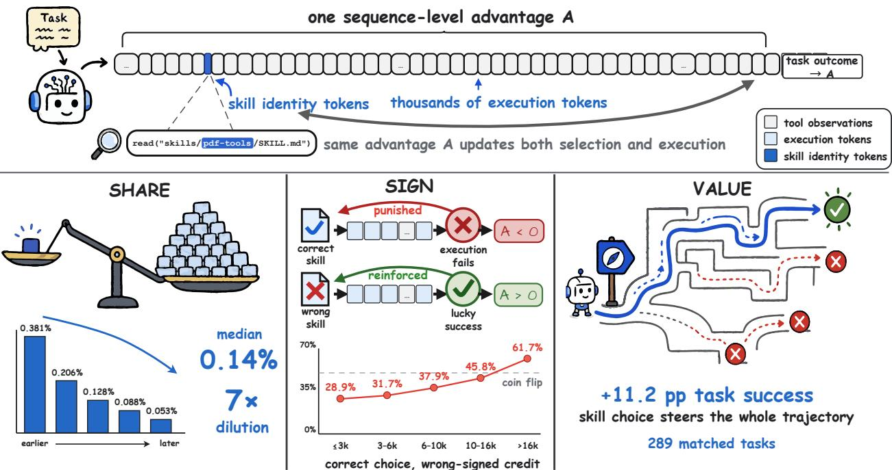
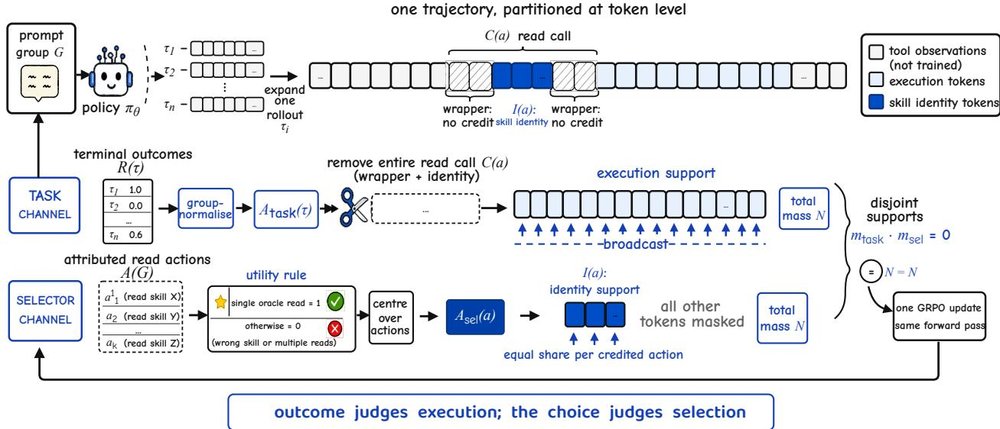
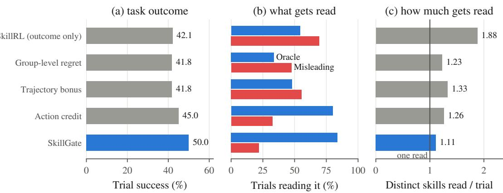
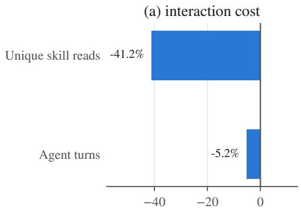
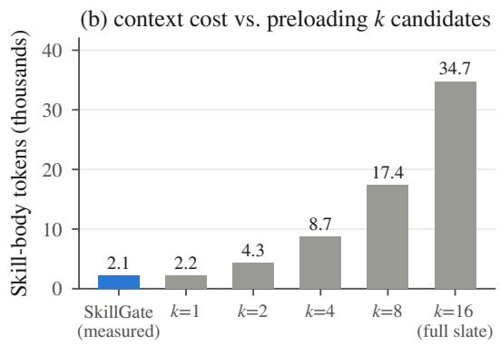
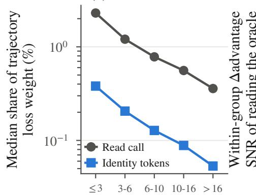
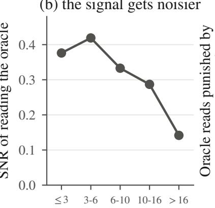
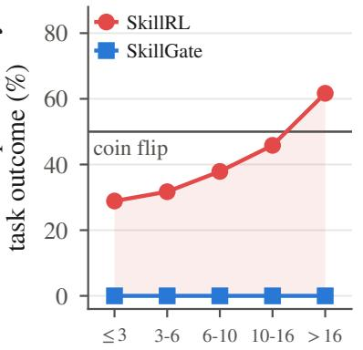
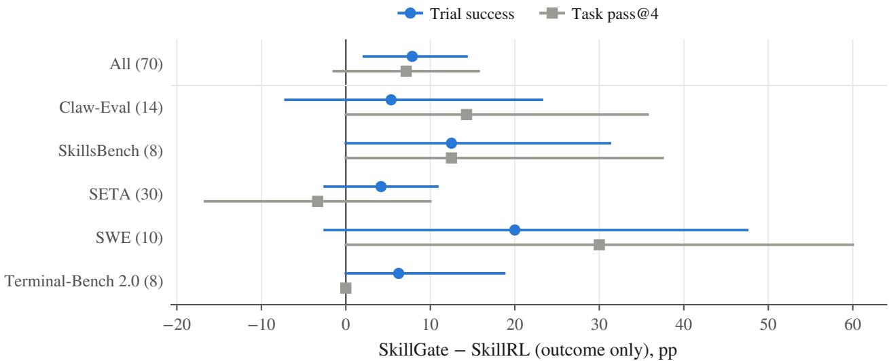

# SkillGate: Training In-Policy Skill Selection in Long-Horizon Agents

Qingyao Li1,2†, Wenxiang Jiao2,#, Shuai Shao1,2†, Kangning Zhang1,2†, Yuan Lu2,#, Yi Guo2, Weiwen Liu1,#, Weinan Zhang1,#, Yong Yu1,#

1Shanghai Jiao Tong University, 2Xiaohongshu Inc.

†Work done during internship at Xiaohongshu Inc., #Corresponding authors

Agent frameworks increasingly package procedural knowledge as skills — instruction files an agent reads on demand — and public libraries now hold thousands of them. Which skill to read has thus become a decision the policy itself makes in the middle of an episode, yet no existing signal trains it. We show that the default remedy — outcome-rewarded RL over the candidate slate — cannot teach it, for a structural reason we identify and name selector credit starvation: under a broadcast, sequence-level advantage, the few tokens that name the chosen skill carry a vanishing share of the loss, and the credit they inherit is increasingly wrong-signed as trajectories lengthen — a correct choice is punished whenever the execution after it fails — even though the choice itself is among the most valuable decisions in the trajectory. Auditing a completed run’s own training artifacts confirms all three properties, each worsening monotonically with horizon. SkillGate removes the failure by construction: it partitions the token support into two disjoint credit channels, outcome credit reaching only execution tokens, and a separate action-local advantage reaching exactly the skill-naming tokens, positive only when a trajectory’s single read is the correct one. On five agentic benchmarks under a 16-candidate slate, SkillGate lifts a 9B policy from 40.8% to 53.2% trial success, well ahead of the identical budget spent on outcome reward alone, while cutting exposure to misleading candidates by two thirds and reading fewer skills.

# Contact: ly890306@sjtu.edu.cn, wenxiangjiaonju@gmail.com, liuww@sjtu.edu.cn   
§ Code: https://github.com/DeepExperience/SkillGate   
ò Models: https://huggingface.co/simonlqy/SkillGate-9B

## 1 Introduction

Large Language Models (LLMs) now act in environments rather than only describe them, using tools, repairing software and controlling computers through multi-turn loops of reasoning, action and observation (Yao et al., 2022; Schick et al., 2023; Shinn et al., 2023; Yang et al., 2024), and are judged on benchmarks that execute their output (Liu et al., 2023; Zhou et al., 2023; Xie et al., 2024; Jimenez et al., 2023). What these agents lack is rarely fluency but procedural knowledge, and the field’s answer has been to package it as skills: reusable procedural modules, now commonly exposed through a name and short description before an agent opens their body on demand (Wang et al., 2023; Zheng et al., 2026; Gao et al., 2026). Public libraries now hold thousands of them, far more than a context window admits. At that scale, when and which skill to use becomes the decision that matters, and the agent must make it from each candidate’s name and one-line description alone, in the middle of an episode, before it can open the file and see what it chose.

Recent work confirms that skill availability alone does not solve this problem. SRA-Bench (Su et al., 2026) pairs thousands of tasks with gold skills and finds that base models often fail to load the right one; Canary Tools (Anand and Chattaraj, 2026) plants decoys that expose systematic selection errors; and expanding what the agent must choose among can lower success through skill shadowing or oversized shortlists (Song and Wei, 2026; Repantis et al., 2026). Two lines of response have followed. One improves routing before execution: SkillReducer (Gao et al., 2026) and Capability Pages (Wang et al., 2026b) rewrite skill representations, while SkillSight (Xiao et al., 2026), SkillRet (Cho et al., 2026) and SkillRouter (Zheng et al., 2026) calibrate, train or evaluate retrieval. The other optimises skill construction and use together under task rewards, as in SkillRL (Xia et al., 2026), Skill1 (Shi et al., 2026) and SkillRise (Yao et al., 2026). Together these results show that coverage is not enough: which skill reaches the agent, and how the

  
Figure 1 Selector credit starvation. One broadcast advantage updates both the few tokens choosing a skill and the thousands executing the task (top); on 12,800 training trajectories, the choice’s loss share dilutes 7× with length (Share), its credit is increasingly wrong-signed (Sign), yet matched prompt groups show a +11.2 pp success gap for the correct read (Value).

agent uses it, determine whether the library helps.

Despite these advances, in-policy skill selection — the policy’s own mid-episode choice of which skill to read — remains under-addressed. However the library is curated or ranked beforehand, the read is still issued by the policy while the task is being solved, and whatever it opens conditions every action after. Choosing is not easy at that moment either: the candidates are written to look alike, and a few tokens separate the right name from a plausible wrong one. The obvious way to train this ability is the objective agentic RL already runs — present the candidates, reward the task outcome, and let the policy gradient reach the read (Shao et al., 2024; Schulman et al., 2017; DeepSeek-AI, 2025). We show that in long-horizon tasks this fails, and fails for a structural reason rather than for want of training, which we identify as the root cause and name selector credit starvation: the few tokens naming the chosen skill are starved of training signal, and much of what they do receive pushes the wrong way (Figure 1). Auditing 12,800 on-policy trajectories of a run trained under exactly this recipe makes the failure precise in three respects. 1) Share: under a broadcast advantage a span’s share of the gradient equals its token share, and the tokens naming the skill are a median 0.14% of a trajectory — a share that dilutes several-fold as trajectories lengthen. 2) Sign: two in five of those tokens receive a negative advantage — the choice was right, the execution afterwards failed — and on the longest trajectories a correct choice is punished more often than rewarded. 3) Value: within matched prompt groups the correct read is nonetheless worth +11.2 points of task success. A decision this valuable thus receives almost no signal, wrongly signed much of the time, and all three quantities worsen monotonically with horizon.

This paper presents a unique perspective on the problem: in-policy skill selection should be optimised on its own, not left buried in the noise of everything else the trajectory does. The two decisions are judged by diferent evidence — whether the right file was named is knowable from the slate alone, while whether the work was done well is knowable only from the outcome — so pooling them into one advantage lets each corrupt the other’s signal. What is needed is therefore not a better reward, nor a finer time-resolution of the same reward, but a separation of credit: give the choice its own objective, computed where the choice is visible, and confine the outcome to the tokens that actually executed.

Building on this perspective, we propose SkillGate, which instantiates the partition as two disjoint credit channels inside one policy-gradient update: (i) a task channel carrying the usual group-normalised outcome advantage, with the entire skill-read tool call removed so that no task outcome can revise a selection; and (ii) a selector channel applying an action-local advantage to exactly the tokens naming the skill, positive only when the trajectory issued a single read and it was the correct one, centred over the prompt group’s read actions. The two supports are disjoint by construction, and both channels carry equal loss weight per batch with each read action taking an equal share — so a selection decision’s weight no longer depends on the length of the trajectory containing it. Our contributions are summarised as follows:

• We identify selector credit starvation as the root cause of why in-policy skill selection resists outcome-only RL, and — to our knowledge for the first time — measure it on a real run’s own training artifacts: the loss-weight share, sign-error rate and within-group signal-to-noise of the selection decision all degrade monotonically with trajectory length, while the decision’s task value does not.

• We propose SkillGate, which partitions one policy’s token support into disjoint execution and selection credit channels, together with the mechanisms that make the partition exact in practice: rollout-time span attribution, a clean single-oracle utility with group centring, and length-invariant reweighting.

• We demonstrate the efectiveness of SkillGate on five agentic benchmarks: 53.2% trial success against 47.0% for the identical budget spent on outcome reward alone, ahead of supervised selection, preference learning, external routers and reference models with roughly forty times the parameters. The gain is behavioural rather than a capability efect, cutting misleading-skill exposure by two thirds while reading fewer skills.

## 2 Problem Setup

Skill slate. A skill s is a triple (name(s), desc(s), body(s)): an identifier, a one-line description, and a SKILL.md body of typically a few thousand tokens. Only name and description are shown up front. For each task the agent sees a slate of K candidates, listed in the system prompt and materialised as files in the sandbox. So that the slate covers the situations a deployed agent meets, it mixes four kinds of candidate: one oracle s⋆, written for the task and verified to solve it; misleading hard negatives, topically adjacent to the task but functionally wrong; and relevant and irrelevant bystanders drawn from a public skill library. Nothing is enforced: the agent is not told which candidate is the oracle, is not required to read anything, and may read as many as it likes, reading being an ordinary tool call against a sandbox path. Every number in this paper is measured under this condition, which we call the standard mixed slate; K, the per-category counts and each category’s construction are given in Section 4.1.

Episodes. An episode is a multi-turn tool-use loop (Yao et al., 2022): the policy πθ emits an assistant message with zero or more tool calls, the environment returns observations, and the loop runs until the agent stops or exhausts a fixed turn and wall-clock budget. A trajectory τ concatenates prompt, assistant messages and observations; only assistant tokens are trained on (mask mbaseτ : 1 on generated tokens, 0 on observations). A terminal verifier returns the task score $R ( \tau ) \in [ 0 , 1 ]$ from the benchmark’s own tests or grader; it is the only reward in the system.

Selection and execution. Some tool calls open a candidate’s body; we call these read actions, writing A(τ) for the ordered list of them in τ. A read is attributed only from assistant-generated text — never from an observation, which could echo a path — and only when it opens a file under a skill directory, whether through the read tool or a shell command; each attributed read therefore carries a skill identity and a slate category. Within a read a we record, against the training tokenizer, the call span C(a) (the whole tool call) and the nested identity span $I ( a ) \subseteq C ( a )$ (the skill name inside the path); a trajectory whose spans fail to align is failed closed rather than silently mis-credited. On these spans we impose the division this paper turns on — ours, not a natural segmentation of the rollout: selection is the identity spans, a handful of tokens settled early whose correctness is knowable from the slate alone; execution is every other assistant token, whose quality is knowable only from the outcome.

## 3 SkillGate

SkillGate trains a single policy to do two things well at once: select the right skill, and execute the task with what it read. It does so through two credit channels that never touch the same token — execution tokens receive the sequence-level task advantage, while the tokens naming the chosen skill receive an action-local advantage that depends on the choice and on nothing else (Figure 2). Rollout, reward and optimiser are untouched: everything in this section is a statement about where an advantage is allowed to land.

  
Figure 2 SkillGate overview. The task channel group-normalises terminal outcomes into $A ^ { \mathrm { t a s k } }$ and broadcasts it over execution tokens with the entire read call cut out; the selector channel scores read actions with the clean single-oracle utility and places $A ^ { \mathrm { s e l } }$ on the identity tokens alone. The supports are disjoint and each channel’s token weights sum to $N$ before λ is applied; both enter one GRPO update.

## 3.1 Token-Level Credit Assignment

SkillGate splits the trained tokens of a trajectory along the read-action spans of Section 2:

• Selection tokens, $\textstyle \bigcup _ { a \in A ( \tau ) } I ( a )$ : the tokens that write a skill’s name. They are the entire surface of the selection decision — change them, and a diferent file is read.

• Execution tokens, every assistant token outside $\textstyle \bigcup _ { a \in A ( \tau ) } C ( a )$ : the reasoning, the other tool calls, the work.

What remains of a call span once its identity span is removed — the tool-call wrapper — belongs to the selection decision but not to its identity, and is trained by neither channel; skill bodies arrive as observations and are never trained. Each kind of token then earns its own credit. Training proceeds in prompt groups — for each task the policy produces a group G of n independent rollouts — and:

• Outcome credit judges execution by whether the task succeeded, relative to the group: the usual group-normalised GRPO advantage (Shao et al., 2024), $A ^ { \mathrm { t a s k } } ( \tau ) = \bigl ( R ( \tau ) - \mu _ { G } \bigr ) / \bigl ( \sigma _ { G } + \epsilon \bigr )$ , constant along the trajectory, where $\mu _ { G }$ and $\sigma _ { G }$ are the mean and standard deviation of the task scores $\{ R ( \tau ) \} _ { \tau \in G }$ and ϵ is a small constant.

• Selection credit judges each read action by the choice it made and nothing else. Writing $A ( G )$ for the read actions of the whole group, an action’s utility asks one question and its advantage is the group-centred answer:

$$
\begin{array} { r } { u ( a ) = \left\{ \begin{array} { l l } { 1 , } & { | A ( \tau _ { a } ) | = 1 \mathrm { ~ a n d ~ } a \mathrm { ~ r e a d s ~ } s ^ { \star } , } \\ { 0 , } & { \mathrm { o t h e r w i s e } , } \end{array} \right. \quad A ^ { \mathrm { s e l } } ( a ) = u ( a ) - \frac { 1 } { | A ( G ) | } \sum _ { a ^ { \prime } \in A ( G ) } u ( a ^ { \prime } ) , } \end{array}\tag{1}
$$

where $\tau _ { a }$ is the trajectory containing a, and no standard-deviation normalisation is applied — action counts are small, and dividing by their spread would amplify noise more than calibrate scale. Reading the oracle and then three more candidates scores zero, as does reading it twice: the single-read requirement is what stops the policy from buying credit by reading everything.

Three properties of Equation (1) bound what the selector term can do. The baseline is over actions, not trajectories, so a promiscuous sibling that reads four candidates lowers it for everyone. The action-weighted sum of $A ^ { \mathrm { s e l } }$ over a group is exactly zero, so the term exerts no standing pressure for or against reading in general — only over which name is written. And it is self-limiting: if a group contains no clean oracle read, or only clean oracle reads, every utility ties, $A ^ { \mathrm { s e l } } \equiv 0 ;$ , and the channel falls silent. Signal appears only where the group disagrees.

## 3.2 Credit Masking and Normalisation

The two channels are kept apart by construction. The task channel deletes every read call whole from the assistant mask — wrapper, function name and path, not merely the skill name — so that no task outcome can revise a selection; what survives is exactly the execution tokens. The selector channel trains only the identity spans of credited actions (those with $A ^ { \mathrm { s e l } } ( a ) \neq 0 )$ , every token of a span carrying its action’s advantage. Because identity spans lie inside the deleted call spans, the two supports are disjoint; the implementation asserts this at three points — mask construction, context-parallel sharding, and the loss itself — and any violation aborts training rather than degrading it silently. An of-slate read is deleted from the task mask like any other read but earns no selector credit, so it cannot be laundered into a positive update by a lucky outcome.

Token weights then set how loudly each channel speaks, and the two need rescaling for opposite reasons. Let $m _ { t } ^ { \mathrm { t } }$ ase be the original assistant-token loss mask and write $\begin{array} { r } { N = \sum _ { t } m _ { t } ^ { \mathrm { b a s e } } } \end{array}$ for its total weight in a batch. After deleting all read calls, let $\begin{array} { r } { N _ { \mathrm { t a s k } } = \sum _ { t } m _ { t } ^ { \mathrm { t a s k } } } \end{array}$ , and let M be the number of credited read actions. We set

$$
w _ { t } ^ { \mathrm { t a s k } } = \frac { N } { N _ { \mathrm { t a s k } } } m _ { t } ^ { \mathrm { t a s k } } , \qquad w _ { t } ^ { \mathrm { s e l } } = \frac { N } { M | I ( a ) | } \quad \mathrm { f o r } t \in I ( a ) ,\tag{2}
$$

with zero selector weight elsewhere. When $M > 0 _ { : }$ , hence $\begin{array} { r } { \sum _ { t } w _ { t } ^ { \mathrm { t a s k } } = N } \end{array}$ and $\begin{array} { r } { \sum _ { t } w _ { t } ^ { \mathrm { s e l } } = N ; } \end{array}$ : this is the $\mathbf { \boldsymbol { \mathrm { \Sigma } } } ^ { * } N = N \mathbf { \boldsymbol { \mathrm { \Sigma } } }$ in Figure 2; when $M = 0$ , the selector channel is silent. Deleting read calls therefore does not quietly lower the task channel’s efective learning rate, while the handful of selector tokens no longer reproduces the starvation of Figure 1. The equality concerns total token-weight mass, not equality of the realised loss values or gradient norms; the intended relative coeficient is still set by λ in Equation (3). It also gives every credited action the same total weight $N / M ,$ independent of trajectory length and of how many tokenizer pieces its skill name occupies. The implementation verifies both sums numerically every batch.

## 3.3 Training Objective

Let $r _ { t } ( \theta ) = \pi _ { \theta } ( y _ { t } \mid y _ { < t } ) / \pi _ { \mathrm { r o l l o u t } } ( y _ { t } \mid y _ { < t } )$ be the importance ratio of token $y _ { t }$ against the rollout policy, and $\ell ^ { \mathrm { { c l i p } } } ( r , A ) = - \operatorname* { m i n } \left( r A , \mathrm { c l i p } ( r , 1 - \varepsilon _ { \mathrm { { l o } } } , 1 + \varepsilon _ { \mathrm { { h i } } } ) A \right)$ the clipped GRPO surrogate (Shao et al., 2024) with clip thresholds $\varepsilon _ { \mathrm { l o } } , \varepsilon _ { \mathrm { h i } }$ . SkillGate optimises

$$
\mathcal { L } ( \theta ) = \underbrace { \sum _ { t } w _ { t } ^ { \mathrm { t a s k } } \ell ^ { \mathrm { c l i p } } \big ( r _ { t } ( \theta ) , A ^ { \mathrm { t a s k } } ( \tau _ { t } ) \big ) } _ { \mathrm { e x c u t i o n } } + \lambda \underbrace { \sum _ { t } w _ { t } ^ { \mathrm { s e l } } \ell ^ { \mathrm { c l i p } } \big ( r _ { t } ( \theta ) , A ^ { \mathrm { s e l } } ( a _ { t } ) \big ) } _ { \mathrm { s e l e c t i o n } } + \beta \mathcal { L } _ { \mathrm { K L } } ,\tag{3}
$$

where $\tau _ { t }$ and $a _ { t }$ are the trajectory and the read action containing token $t , \lambda$ is the selector coeficient, and ${ \mathcal { L } } _ { \mathrm { K L } }$ is a KL penalty of weight $\beta$ against a frozen reference (values in Section 4.1). Both sums run over the same forward pass and both terms are on-policy: the selector term is not behaviour cloning, not cross-entropy and not a reward bonus, and it never sees a token the policy did not itself generate.

The credit semantics are then exhaustive over the four cases that matter. A trajectory that reads only the oracle raises that name whether the task succeeded or failed; one that reads a misleading candidate lowers that name in either case; and the execution tokens are rewarded or penalised on outcome regardless of what was read. A negative value in SkillGate’s selector term therefore means the wrong skill or more than one skill — never the oracle’s content did not work.

## 4 Experiments

## 4.1 Experimental Setup

Datasets. We evaluate on five agentic benchmarks — Claw-Eval, SkillsBench, SETA, SWE and Terminal-Bench 2.0 — under the standard mixed slate of Section 2 with $K = 1 6 \colon$ one oracle written for the task, five misleading hard negatives synthesised to be topically adjacent but functionally wrong, and five relevant plus five irrelevant skills sampled from a public library of 2,045 community skills. Slate order is randomised per task, and each trial runs under a budget of 30 turns and 850 seconds. Training uses 491 tasks containing no Claw-Eval task, and the training and evaluation oracles are disjoint as skill identities, so no result can be explained by memorising which name goes with which task. Task outcome is reported on a 385-trial protocol: four repeats for each of 56 non-Claw tasks and one trial for each of 161 Claw-Eval tasks. Section A describes its construction. Read behaviour in Table 1 is measured on those same 385 trials, so outcome and behaviour share a denominator; the finer behaviour breakdowns, which need per-trial attribution across repeats, use the 280-trial subset (70 tasks with four repeats each) and are labelled as such.

Baselines. We compare SkillGate against four categories of methods:

• Untrained backbones: Qwen3.5-9B and Qwen3.5-27B bracket what the backbone does without adaptation; the 27B row is a capability reference at 3× the parameters.

• Frontier references: DeepSeek-V4-Pro, DeepSeek-V4-Flash, GLM-5, Kimi-K2.6, Qwen3.5-397B-A17B and DeepSeek-V3.2, served through their providers’ APIs with native function calling. They put the trained rows on an absolute scale and are not controlled comparisons; Section B states the interface controls used for these reference models.

• Supervised selection: Selection BC teacher-forces the first turn to read(oracle) on all 491 training tasks; SelSkill-DPO adapts the invoke-versus-skip preference method of Chen et al. (2026) to our 16-way slate by preferring read(oracle) over each hard negative (2,455 pairs) under the DPO objective (Rafailov et al., 2023) — an adaptation, not a reproduction.

• RL with outcome reward: Skill-free RL trains without skills; SkillRL (outcome only) trains on the same slate with task reward alone — an outcome-only skill-augmented RL recipe inspired by Xia et al. (2026), rather than a reproduction of their full skill-evolution system, and the controlled comparison for SkillGate (same initialisation, data, steps and hyperparameters, difering only in what the gradient reaches); Skill1 (no distill) adapts the joint selection-and-use component of Shi et al. (2026), omitting its distillation stage so that it too shares our initialisation and budget; Task-mask only is SkillGate with the selector coeficient set to zero.

Evaluation Metrics. We assess performance along two axes:

• Trial success (%): the fraction of trials whose terminal verifier passes — the primary metric, per benchmark and pooled.

• Read behaviour: oracle and misleading exposure (fraction of trials reading at least one skill of that category; a trial can count in both), P(oracle | read), reads/trial (distinct skill names), and clean single-oracle — exactly one attributed read and it is the oracle, the quantity SkillGate’s utility is defined on.

Implementation Details. All trained rows start from the same Qwen3.5-9B SFT checkpoint, which is also the RL initialisation. RL runs 100 steps of on-policy GRPO (Shao et al., 2024) on the 491 training tasks with 8 rollouts per prompt, a global batch of 128 trajectories, learning rate 10−6 and KL coeficient $3 \times 1 0 ^ { - 5 } ;$ ; SkillGate adds the selector term of Section 3 at λ = 0.20. Each configuration is a single run (100 steps on 16 H800s), so uncertainty is quantified by task-level bootstrap rather than seed replication (Section E) and small diferences are read as directional.

## 4.2 Main Results

SkillGate delivers the strongest task performance at the 9B scale. As shown in Table 1, SkillGate outperforms the shared SFT initialisation, the controlled outcome-only RL run, and the supervised, preference-based and Skill1 alternatives. It is best or tied best among the 9B-scale methods on every benchmark. The comparison with SkillRL (outcome only) is especially informative because the two runs share their initialisation, data, update budget and hyperparameters; their diference isolates the value of token-local selection credit. SkillGate also leads the 9B rows on Claw-Eval despite seeing neither Claw tasks nor the evaluation oracle identities during training, supporting transfer rather than a memorised task–skill mapping.

Reliable skill access is consequential, not merely a behaviour metric. The oracle-only intervention in Table 3 improves the frozen SFT executor by roughly eleven points, establishing that access to the correct skill materially afects task success. Yet outcome-only RL raises both oracle and misleading exposure: it learns to read more, not to discriminate better. Simply masking read calls from the task loss does not fix the problem either. SkillGate instead produces the strongest joint shift toward oracle reads and away from misleading reads, and converts that behavioural improvement into task success. Selection BC improves the choice but not the downstream result to the same degree, showing that reliable agents require selector learning and execution learning together.

Table 1 Trial success (%) on the standard mixed slate, and read behaviour. Oracle/misleading: fraction of trials reading at least one such skill (a trial can read both). Best 9B-scale per column in bold.
<table><tr><td></td><td colspan="6">Trial success (%)</td><td colspan="2">Read behaviour (%)</td></tr><tr><td>Method</td><td>Claw-Eval</td><td>SkillsBench</td><td>SETA</td><td>SWE</td><td>TB2</td><td>Overall</td><td>Oracle ↑</td><td>Mislead. ↓</td></tr><tr><td colspan="9">Frontier models (capability ceiling, not controlled)</td></tr><tr><td>DeepSeek-V4-Flash</td><td>70.2</td><td>15.6</td><td>66.7</td><td>55.0</td><td>46.9</td><td>61.0</td><td>40.8</td><td>23.9</td></tr><tr><td>GLM-5</td><td>75.8</td><td>15.6</td><td>59.2</td><td>45.0</td><td>56.2</td><td>60.8</td><td>39.0</td><td>26.2</td></tr><tr><td>DeepSeek-V4-Pro</td><td>70.8</td><td>12.5</td><td>60.8</td><td>55.0</td><td>62.5</td><td>60.5</td><td>38.2</td><td>20.8</td></tr><tr><td>Kimi-K2.6</td><td>71.4</td><td>12.5</td><td>56.7</td><td>55.0</td><td>71.9</td><td>60.3</td><td>45.7</td><td>21.0</td></tr><tr><td>Qwen3.5-397B-A17B</td><td>60.9</td><td>15.6</td><td>54.2</td><td>45.0</td><td>40.6</td><td>51.7</td><td>16.1</td><td>11.2</td></tr><tr><td>DeepSeek-V3.2</td><td>62.1</td><td>12.5</td><td>42.5</td><td>32.5</td><td>46.9</td><td>47.5</td><td>29.4</td><td>28.3</td></tr><tr><td colspan="9">No adaptation</td></tr><tr><td>Qwen3.5-9B</td><td>44.7</td><td>0.0</td><td>24.2</td><td>15.0</td><td>9.4</td><td>28.6</td><td>5.7</td><td>8.9</td></tr><tr><td>Qwen3.5-27B</td><td>54.0</td><td>9.4</td><td>42.5</td><td>40.0</td><td>34.4</td><td>43.6</td><td>5.7</td><td>8.9</td></tr><tr><td colspan="9">Supervised selection, from SFT</td></tr><tr><td>SFT (RL init)</td><td>50.9</td><td>6.2</td><td>40.0</td><td>45.0</td><td>21.9</td><td>40.8</td><td>37.9</td><td>61.8</td></tr><tr><td>Selection BC</td><td>52.2</td><td>15.6</td><td>43.3</td><td>50.0</td><td>34.4</td><td>44.7</td><td>71.4</td><td>31.4</td></tr><tr><td>SelSkill-DPO</td><td>52.8</td><td>0.0</td><td>47.5</td><td>60.0</td><td>37.5</td><td>46.2</td><td>66.1</td><td>51.8</td></tr><tr><td colspan="9">RL from SFT, 100 steps, identical budget</td></tr><tr><td>Skill-free RL</td><td>55.9</td><td>9.4</td><td>47.5</td><td>42.5</td><td>31.2</td><td>46.0</td><td>35.4</td><td>55.0</td></tr><tr><td>SkillRL (outcome only)</td><td>57.1</td><td>3.1</td><td>50.0</td><td>45.0</td><td>31.2</td><td>47.0</td><td>54.3</td><td>69.6</td></tr><tr><td>Skill1 (no distill)</td><td>57.1</td><td>9.4</td><td>38.3</td><td>52.5</td><td>31.2</td><td>44.7</td><td>53.5</td><td>45.5</td></tr><tr><td>Task-mask only</td><td>54.7</td><td>9.4</td><td>48.3</td><td>45.0</td><td>31.2</td><td>46.0</td><td>48.9</td><td>73.6</td></tr><tr><td>SkillGate</td><td>60.2</td><td>15.6</td><td>54.2</td><td>65.0</td><td>37.5</td><td>53.2</td><td>83.9</td><td>21.8</td></tr></table>

Table 2 Credit-design ablation, 280-trial protocol: five placements of the selector signal from the same initialisation and steps. Clean single-oracle: exactly one attributed read and it is the oracle. Best results in bold.
<table><tr><td>Design</td><td>Where the credit lands</td><td>Trial succ. (%)</td><td>Clean single- oracle (%)</td><td>Oracle (%)</td><td>Mislead. (%)</td><td>Reads/ trial</td></tr><tr><td>SkillRL (outcome only)</td><td>nowhere (anchor)</td><td>42.1</td><td>21.4</td><td>54.3</td><td>69.6</td><td>1.88</td></tr><tr><td>Group-level regret</td><td>the prompt group</td><td>41.8</td><td>15.7</td><td>33.6</td><td>47.5</td><td>1.23</td></tr><tr><td>Trajectory bonus</td><td>the whole trajectory</td><td>41.8</td><td>33.9</td><td>47.9</td><td>55.4</td><td>1.33</td></tr><tr><td>Action credit</td><td>first oracle read</td><td>45.0</td><td>64.6</td><td>80.0</td><td>32.5</td><td>1.26</td></tr><tr><td>SkillGate</td><td>the only read, if oracle</td><td>50.0</td><td>75.4</td><td>83.9</td><td>21.8</td><td>1.11</td></tr></table>

Model scale alone does not solve in-policy skill selection. The frontier rows are scale references rather than controlled comparisons, but they reveal a clear separation between general capability and skill selection. SkillGate surpasses Qwen3.5-397B-A17B and DeepSeek-V3.2 while remaining below the four strongest frontier systems on task success. More importantly, none of the frontier models reads the oracle on even half of the trials. Their general capability can compensate for many missed skills, but it does not produce a reliable selector. The contrast with SkillGate shows that choosing the right skill is a distinct capability that must be trained directly rather than expected to emerge from scale.

## 4.3 Which part of the credit design maters

This ablation asks which part of the credit design does the work. All five rows of Table 2 train from the same initialisation for the same 100 steps and difer only in where the selector signal lands: nowhere (SkillRL (outcome only), the anchor), on the whole prompt group, on the whole trajectory, on the first oracle read, or — SkillGate — on the trajectory’s only read when it is the oracle. Figure 3 plots the same five designs; both use the 280-trial protocol.

Each coarser placement fails in a way that identifies what the next must fix. Group-level regret never touches the tokens that name the skill, and its oracle exposure falls below even the anchor’s: a group-constant shift cancels within the group and cannot say which member chose well. The trajectory bonus pushes the policy to read, not to read correctly — oracle and misleading exposure rise together. Action credit finally lands the signal on the identity tokens and moves both behaviour columns sharply, but it never penalises reading more: a trajectory that reads the oracle and then three other skills keeps its full credit, so clean single-oracle behaviour stalls. Requiring the read to be the trajectory’s only one closes that gap and converts it into task success. Figure 3 makes the mechanism visible: SkillGate not only reads the oracle more often but reads misleading candidates less (b) and reads fewer skills overall (c) — the gain comes from choosing better, not from reading more.

  
Figure 3 The five credit designs of Table 2: task outcome (a), what gets read (b), and how much gets read (c). Only credit that reaches the identity tokens changes the choice, and the single-read rule converts it into success.

Table 3 External selection, 280-trial protocol. Routers advertise one chosen skill to the frozen SFT executor; oracle-only injection is a ceiling that requires knowing the answer. †Top-1 is over 70 routing decisions for routers but SkillGate’s first attributed read over 280 trials — not directly comparable.
<table><tr><td>Setting</td><td>Trial succ. (%)</td><td>Top-1 oracle† (%)</td><td>Oracle (%)</td><td>Mislead. (%)</td><td>Reads/ trial</td></tr><tr><td>SFT, standard mixed slate</td><td>37.1</td><td>一</td><td>37.9</td><td>61.8</td><td>1.34</td></tr><tr><td>SFT + “read only one” prompt</td><td>35.0</td><td>一</td><td>41.4</td><td>59.3</td><td>1.35</td></tr><tr><td>SFT-9B router → SFT</td><td>40.7</td><td>60.0</td><td>57.5</td><td>36.8</td><td>0.94</td></tr><tr><td>Qwen3.5-27B router → SFT</td><td>36.8</td><td>68.6</td><td>68.2</td><td>24.3</td><td>0.95</td></tr><tr><td>Qwen3 reranker top-1 → SFT</td><td>31.8</td><td>27.1</td><td>24.6</td><td>60.4</td><td>0.89</td></tr><tr><td>SkillGate, standard mixed slate</td><td>50.0</td><td>78.9</td><td>83.9</td><td>21.8</td><td>1.11</td></tr><tr><td colspan="6">Ceiling: only the correct skill is advertised</td></tr><tr><td>oracle-only → SFT</td><td>48.2</td><td>100.0</td><td>93.6</td><td>0.0</td><td>0.94</td></tr><tr><td>oracle-only → SkillGate</td><td>52.9</td><td>100.0</td><td>93.6</td><td>0.0</td><td>0.94</td></tr></table>

## 4.4 Would a separate selector be enough?

This experiment asks whether selection is better solved outside the policy. Table 3 varies who chooses while freezing the executor: the SFT model under the standard slate, with and without a “read only one” system prompt; three external selectors — an SFT-9B router, a Qwen3.5-27B router and a retrieval reranker — each advertising its single chosen skill to the frozen SFT executor; SkillGate, choosing by itself from the full slate; and an oracle-only injection that advertises the correct skill alone, a ceiling that requires knowing the answer.

Three conclusions follow from Table 3. First, prompting does not fix selection: instructing the model to read exactly one skill changes neither its reading nor its success, so the behaviour is not an instruction-following failure. Second, a better router is not a better agent: the 27B router routes more accurately than the SFT router yet yields lower downstream success — routing accuracy, whether the executor reads what it is handed, and how well it executes afterwards are three diferent quantities — and the reranker, scoring candidates independently rather than comparing them, is precisely what a slate of near-duplicates defeats. Third, the ceiling is closer than the routers get: SkillGate, choosing from all 16 candidates itself, surpasses even the oracle-only ceiling of the frozen executor, and applying the same injection on top of SkillGate still helps — so selection training did not damage the policy’s ability to use a skill once it has one, and only a few points of selection headroom remain.

(a) the share shrinks  
  
Change vs. SkillRL (%)

  
Figure 4 Inference cost, 280-trial protocol. (a) SkillGate vs. SkillRL (outcome only): reads, turns and token usage. (b) Skill-body tokens loaded: measured on-demand reading vs. preloading k candidates’ SKILL.md bodies.

(b) the signal gets noisier  

(c) SkillGate removes this  
  
Assistant (loss-bearing) tokens per trajectory (thousands)  
Figure 5 Ofline audit of SkillRL (outcome only)’s 12,800 training trajectories, by trajectory-length bin. (a) Median loss-weight share of the read call and of the skill-naming tokens. (b) Within-group signal-to-noise of the read-vs-not advantage gap. (c) Share of oracle reads inheriting a negative advantage; SkillGate’s zero is by construction.

## 4.5 What selection purity costs

This section measures what selection purity costs at inference time. Figure 4(a) compares SkillGate with the outcomeonly baseline on the same 280 trials along reads, turns and token usage; Figure 4(b) compares SkillGate’s measured on-demand skill-body tokens with hypothetically preloading k candidates’ bodies into context.

As Figure 4(a) shows, SkillGate is cheaper than its outcome-only counterpart on every count — fewer distinct reads, fewer turns, fewer cumulative input tokens — with only output tokens rising, consistent with reasoning before a single read rather than trial-and-error after many. On context cost (Figure 4b), SkillGate’s on-demand reading loads about as many body tokens as preloading exactly one skill would, without an external component to say which one; preloading grows linearly in k and reaches 16× the on-demand cost at the full slate.

## 4.6 Why outcome-only credit cannot teach the choice

This section verifies the diagnosis that motivated SkillGate: that under outcome-only credit, the selection decision is starved of signal. The audit is ofline and runs no new training: we re-read SkillRL (outcome only)’s own 100 steps and 12,800 on-policy trajectories, recompute the GRPO advantage under the training normalisation, locate the skill-identity tokens with the training tokenizer, and stratify by trajectory length. Results are shown in Figure 5.

The decision carries almost none of the gradient, and less as trajectories grow. Because the advantage is constant within a trajectory and the loss averages over each trajectory’s mask, a span’s share of the gradient equals its token share. As Figure 5(a) shows, the tokens naming the skill carry a median 0.14% of their trajectory’s loss weight, and the share dilutes roughly 7× from the shortest length bin to the longest. This is a statement about loss weight, not gradient norm.

What little signal arrives is increasingly the wrong sign. Nearly two in five oracle-reading trajectories inherit a negative advantage because the executor later did worse than its group-mates: the policy is told not to make a choice it made correctly. Stratified by length, the rate climbs monotonically and crosses the coin-flip line on the longest trajectories, while the within-group signal-to-noise of the same comparison collapses (Figure 5b,c).

Meanwhile the decision is worth having. Within prompt groups that contain both kinds of rollout — same task, same step, same policy snapshot — reading the oracle is worth +11.2 pp of success. A decision this valuable thus receives a vanishing, increasingly wrong-signed signal precisely where trajectories are longest. The comparison is behaviour-conditioned rather than randomised; its causal counterpart, the oracle-only injection of Table 3, is worth a nearly identical amount to the frozen executor.

SkillGate removes exactly this failure, by construction. With the read call excluded from the task loss, the share of oracle identity tokens receiving a negative task gradient is zero at every length (Figure 5c). The selector channel still delivers negatives, but only for the intended reason — the wrong skill, or more than one read — never because the oracle’s content did not work.

## 5 Related Work

Selecting a skill from a large library. Agent frameworks expose skills by progressive disclosure — the agent sees a name and a one-line description and decides what to open — and recent work shows the dificulty concentrates there. Audits of public libraries find a large share of skills carry no usable routing description at all (Gao et al., 2026), and dedicated benchmarks now measure the resulting confusion at scale (Cho et al., 2026; Su et al., 2026; Ding, 2026). Controlled studies isolate the failure: enlarging a library degrades agents through skill shadowing (Song and Wei, 2026), planted decoy tools expose systematic selection errors (Anand and Chattaraj, 2026), attention analyses find that models often attend to the correct tool definition yet select a diferent tool at readout (Chen, 2026), and both shortlist size and progressive-disclosure depth have become objects of study (Repantis et al., 2026; He et al., 2026b); even whether a tool is needed at all has its own benchmark (Sun et al., 2026). One response improves routing before execution by rewriting skill representations (Wang et al., 2026b; Gao et al., 2026), calibrating retrieval scores (Xiao et al., 2026), or retrieving and reranking candidates (Lewis et al., 2020; Qin et al., 2023; Patil et al., 2023; Zheng et al., 2026). Benchmarks separately diagnose skill triggering and use (Han et al., 2026) or large-scale tool retrieval and navigation (Esfandiarpoor et al., 2025). Methods that explicitly optimise selection often give it a separate training structure: AutoTool uses a KL-regularised Plackett–Luce ranking objective (Zou et al., 2025), while daVinci assigns a dedicated selection agent its own advantage (Fu et al., 2026). SkillGate alters neither the descriptions nor the architecture: it makes the single policy’s own mid-episode read a trained decision inside the trajectory that policy already generates, so selection is learned from the same rollouts that measure execution.

Where the training signal lands in a multi-turn trajectory. Outcome-rewarded policy gradients (Schulman et al., 2017; Shao et al., 2024) attach one advantage to every token of a rollout, and a growing literature identifies that uniformity as the bottleneck for agents (Zhang, 2026). Two results sharpen it: reward-correlated signal concentrates on short action spans rather than the long reasoning around them (He et al., 2026a), and the signal-to-noise of trajectory-level estimators decays as the fraction of consequential turns falls (Pernot and Retault, 2026). Remedies difer mainly in granularity — step-level process supervision (Lightman et al., 2023), per-turn credit (Tao et al., 2026; Liao et al., 2026; Li et al., 2025), segmentation at natural tool-use boundaries (Kumar et al., 2026), counterfactual per-token credit from sibling rollouts (Meng and Chen, 2026), and within-sequence token or segment reweighting (Mou et al., 2026; Li et al., 2026) — while a parallel line adds tool-specific signals: decoupled multi-objective GRPO (Huang et al., 2026), information-gain step scores (Liang et al., 2026), paired advantage channels for tool contribution (Feng et al., 2026), a conditional eficiency channel for tool invocation (Yan et al., 2026), branching and procedure-level credit at selected decision points (Wang et al., 2026a), and empirically calibrated per-turn rewards (Modecrua et al., 2026). Agent Lightning instead decomposes agent trajectories into transitions within a hierarchical RL framework (Luo et al., 2025). Skill-oriented RL co-evolves reusable skills and task policies (Xia et al., 2026; Shi et al., 2026; Yao et al., 2026), trains autonomous skill internalisation from paired skill and no-skill rollouts (Lin et al., 2026), or learns whether to invoke a skill from local preferences (Chen et al., 2026). These methods demonstrate the value of finer credit, but they target diferent events and do not isolate the identity tokens of a policy’s mid-episode multiway skill read as a disjoint, length-independent loss channel. SkillGate instead partitions that support into two disjoint channels: the read call is removed from the task loss outright, its identity tokens carry an action-local utility centred over the group’s read actions, and equal per-batch loss mass renders the decision’s weight length-independent. Because that utility is not derived from the outcome, it also sidesteps the impossibility result that binds outcome-reward weighting schemes (Ding et al., 2026).

## 6 Conclusion

This paper introduces SkillGate, which makes an agent’s mid-episode choice of which skill to read a trained decision by partitioning one trajectory’s token support into two disjoint credit channels: outcome credit reaching only the execution tokens, and an action-local advantage reaching only the tokens that name the chosen skill. The design follows from a measurement on a finished run’s own training artifacts, where that decision is shown to carry a vanishing and increasingly wrong-signed share of the gradient while remaining worth eleven points of task success. Across five agentic benchmarks SkillGate lifts a 9B policy well past the same budget spent on outcome reward alone and past reference models an order of magnitude larger, cutting exposure to misleading candidates by two thirds while reading fewer skills. Its limits are equally plain: each configuration is a single run, the method needs training tasks whose correct skill is known, and an action-local scheme cannot credit an abstention. More broadly, when one trajectory interleaves decisions of genuinely diferent kinds, partitioning the token support is a cheap and verifiable alternative to redistributing a single broadcast advantage.

## References

Atul Anand and Sourav Chattaraj. Diagnosing tool-selection reasoning in llm agents with canary tools. arXiv preprint arXiv:2608.04719, 2026.

Chishui Chen, Jiaye Lin, Te Sun, Junxi Wang, Yi Yang, Cong Qin, Yangen Hu, Lu Pan, and Ke Zeng. Skill or skip? learning selective skill invocation in agentic tasks via dual-granularity preference learning. arXiv preprint arXiv:2606.00510, 2026

Shiyang Chen. Looking is not picking: An attention-segment account of tool-selection failures in llm agents. arXiv preprint arXiv:2606.16364, 2026.

Hongcheol Cho, Ryangkyung Kang, and Youngeun Kim. Skillret: A large-scale benchmark for skill retrieval in llm agents. arXiv preprint arXiv:2605.05726, 2026.

DeepSeek-AI. Deepseek-r1: Incentivizing reasoning capability in llms via reinforcement learning. arXiv preprint arXiv:2501.12948, 2025.

Fei Ding, Yongkang Zhang, Yuhao Liao, Zijian Zeng, and Huiming Yang. On the impossibility of unbiased and length-invariant policy optimization with outcome rewards. arXiv preprint arXiv:2607.23364, 2026.

Jiandong Ding. Skillresolve-bench: Measuring and resolving same-capability ambiguity in agent skill retrieval. arXiv preprint arXiv:2606.10388, 2026.

Reza Esfandiarpoor, Vishwas Suryanarayanan, Stephen H. Bach, Vishal Chowdhary, and Anthony Aue. Themcpcompany: Creating general-purpose agents with task-specific tools. arXiv preprint arXiv:2510.19286, 2025.

Mingkuan Feng, Jinyang Wu, Hao Gu, Fangrui Lv, Ruihan Jin, Chuyuan Zhang, Zhengqi Wen, and Jianhua Tao. Taco: Toolaugmented credit optimization for agentic tool use. arXiv preprint arXiv:2606.30251, 2026.

Dayuan Fu, Mohan Jiang, Tongyu Wang, Dian Yang, Jiarui Hu, Liming Liu, Jinlong Hou, and Pengfei Liu. davinci-kernel: Co evolving skill selection, summarization, and utilization via rl for gpu kernel optimization. arXiv preprint arXiv:2606.16497, 2026.

Yudong Gao, Zongjie Li, Yuanyuan Yuan, Zimo Ji, Pingchuan Ma, and Shuai Wang. Skillreducer: Optimizing llm agent skills for token eficiency. arXiv preprint arXiv:2603.29919, 2026.

Jinyi Han, Yuanjian Xu, Ying Liao, Xinyi Wang, Zishang Jiang, Zixiang Di, Fanyang Lu, Zhichao Hu, and Yanghua Xiao. Skill-use: Can llms actually use skills in agentic harnesses? arXiv preprint arXiv:2608.04828, 2026.

Langzhou He, Junyou Zhu, Yue Zhou, Zhengyao Gu, Junhua Liu, Wei-Chieh Huang, Henry Peng Zou, David Wipf, Philip S. Yu, and Qitian Wu. Resolving action bottleneck: Agentic reinforcement learning informed by token-level energy. arXiv preprint arXiv:2605.14558, 2026a.

Yifeng He, Yinzhe Zhao, Jicheng Wang, and Hao Chen. Is progressive disclosure all you need for long-context agents? arXiv preprint arXiv:2607.17598, 2026b.

Shouzheng Huang, Meishan Zhang, Baotian Hu, and Min Zhang. Toolomni: Enabling open-world tool use via agentic learning with proactive retrieval and grounded execution. arXiv preprint arXiv:2604.13787, 2026.

Carlos E. Jimenez, John Yang, Alexander Wettig, Shunyu Yao, Kexin Pei, Ofir Press, and Karthik Narasimhan. Swe-bench: Can language models resolve real-world github issues? arXiv preprint arXiv:2310.06770, 2023.

Abhijit Kumar, Zoey Wu, and Mohit Suley. Knowing when to ask: Segment-level credit assignment for llm tool use. arXiv preprint arXiv:2605.27788, 2026.

Patrick Lewis, Ethan Perez, Aleksandra Piktus, Fabio Petroni, Vladimir Karpukhin, Naman Goyal, Heinrich Küttler, Mike Lewis, Wen tau Yih, Tim Rocktäschel, Sebastian Riedel, and Douwe Kiela. Retrieval-augmented generation for knowledge-intensive nlp tasks. arXiv preprint arXiv:2005.11401, 2020.

Junbo Li, Peng Zhou, Rui Meng, Meet P. Vadera, Lihong Li, and Yang Li. Turn-ppo: Turn-level advantage estimation with ppo for improved multi-turn rl in agentic llms. arXiv preprint arXiv:2512.17008, 2025.

Sijia Li, Yuchen Huang, Zifan Liu, Yanping Li, Jingjing Fu, Li Zhao, Jiang Bian, Ling Zhang, Jun Zhang, and Rui Wang. Gear: Granularity-adaptive advantage reweighting for llm agents via self-distillation. arXiv preprint arXiv:2605.11853, 2026.

Zihan Liang, Yufei Ma, Ben Chen, Zhipeng Qian, Huangyu Dai, Lingtao Mao, Xuxin Zhang, Chenyi Lei, and Wenwu Ou. Ig-search: Step-level information gain rewards for search-augmented reasoning. arXiv preprint arXiv:2604.15148, 2026.

Sicong Liao, Zhi Chen, and Yaohua Tang. Tcpo: Turn-level credit policy optimization. arXiv preprint arXiv:2608.01667, 2026.

Hunter Lightman, Vineet Kosaraju, Yura Burda, Harri Edwards, Bowen Baker, Teddy Lee, Jan Leike, John Schulman, Ilya Sutskever, and Karl Cobbe. Let’s verify step by step. arXiv preprint arXiv:2305.20050, 2023.

Hongxiang Lin, Zhirui Kuai, Erpeng Xue, and Lei Wang. Skillc: Learning autonomous skill internalization in llm agents via contrastive credit assignment. arXiv preprint arXiv:2605.27899, 2026

Xiao Liu, Hao Yu, Hanchen Zhang, Yifan Xu, Xuanyu Lei, Hanyu Lai, Yu Gu, Hangliang Ding, Kaiwen Men, Kejuan Yang, Shudan Zhang, Xiang Deng, Aohan Zeng, Zhengxiao Du, Chenhui Zhang, Sheng Shen, Tianjun Zhang, Yu Su, Huan Sun, Minlie Huang, Yuxiao Dong, and Jie Tang. Agentbench: Evaluating llms as agents. arXiv preprint arXiv:2308.03688, 2023.

Xufang Luo, Yuge Zhang, Zhiyuan He, Zilong Wang, Siyun Zhao, Dongsheng Li, Luna K. Qiu, and Yuqing Yang. Agent lightning: Train any ai agents with reinforcement learning. arXiv preprint arXiv:2508.03680, 2025.

Zibin Meng and Kani Chen. Craft: Counterfactual credit assignment from free sibling rollouts for self-distilled agentic reinforcement learning. arXiv preprint arXiv:2606.29476, 2026.

Wachiravit Modecrua, Krittanon Kaewtawee, Krittin Pachtrachai, and Touchapon Kraisingkorn. Multi-turn reinforcement learning for tool-calling agents with iterative reward calibration. arXiv preprint arXiv:2604.02869, 2026.

Chaoli Mou, Zhan Zhuang, Xinning Chen, and Yu Zhang. Beyond uniform credit assignment: Selective eligibility traces for rlvr. arXiv preprint arXiv:2605.05965, 2026.

Shishir G. Patil, Tianjun Zhang, Xin Wang, and Joseph E. Gonzalez. Gorilla: Large language model connected with massive apis. arXiv preprint arXiv:2305.15334, 2023.

Yann Pernot and Vi Retault. Drowning in routine: Signal dilution in multi-turn agent training. arXiv preprint arXiv:2606.22164, 2026.

Yujia Qin, Shihao Liang, Yining Ye, Kunlun Zhu, Lan Yan, Yaxi Lu, Yankai Lin, Xin Cong, Xiangru Tang, Bill Qian, Sihan Zhao, Lauren Hong, Runchu Tian, Ruobing Xie, Jie Zhou, Mark Gerstein, Dahai Li, Zhiyuan Liu, and Maosong Sun. Toolllm: Facilitating large language models to master 16000+ real-world apis. arXiv preprint arXiv:2307.16789, 2023.

Rafael Rafailov, Archit Sharma, Eric Mitchell, Stefano Ermon, Christopher D. Manning, and Chelsea Finn. Direct preference optimization: Your language model is secretly a reward model. arXiv preprint arXiv:2305.18290, 2023.

Vyzantinos Repantis, Ameya Gawde, Harshvardhan Singh, and Joey Blackwell II. How many tools should an llm agent see? a chance-corrected answer. arXiv preprint arXiv:2605.24660, 2026.

Timo Schick, Jane Dwivedi-Yu, Roberto Dessì, Roberta Raileanu, Maria Lomeli, Luke Zettlemoyer, Nicola Cancedda, and Thomas Scialom. Toolformer: Language models can teach themselves to use tools. arXiv preprint arXiv:2302.04761, 2023.

John Schulman, Filip Wolski, Prafulla Dhariwal, Alec Radford, and Oleg Klimov. Proximal policy optimization algorithms. arXiv preprint arXiv:1707.06347, 2017.

Zhihong Shao, Peiyi Wang, Qihao Zhu, Runxin Xu, Junxiao Song, Xiao Bi, Haowei Zhang, Mingchuan Zhang, Y. K. Li, Y. Wu, and Daya Guo. Deepseekmath: Pushing the limits ofmathematical reasoning in open language models. arXiv preprint arXiv:2402.03300, 2024.

Yaorui Shi, Yuxin Chen, Zhengxi Lu, Yuchun Miao, Shugui Liu, Qi GU, Xunliang Cai, Xiang Wang, and An Zhang. Skill1: Unified evolution of skill-augmented agents via reinforcement learning. arXiv preprint arXiv:2605.06130, 2026.

Noah Shinn, Federico Cassano, Edward Berman, Ashwin Gopinath, Karthik Narasimhan, and Shunyu Yao. Reflexion: Language agents with verbal reinforcement learning. arXiv preprint arXiv:2303.11366, 2023.

Hongwen Song and Song Wei. More skills, worse agents? skill shadowing degrades performance when expanding skill libraries. arXiv preprint arXiv:2605.24050, 2026.

Weihang Su, Jianming Long, Qingyao Ai, Qiaozhi He, Yichen Tang, Changyue Wang, Yiteng Tu, Yingbo Wang, and Yiqun Liu. Skill retrieval augmentation for agentic ai. arXiv preprint arXiv:2604.24594, 2026.

Chung-En Sun, Linbo Liu, Ge Yan, Zimo Wang, and Tsui-Wei Weng. Llm agents already know when to call tools – even without reasoning. arXiv preprint arXiv:2605.09252, 2026.

Leitian Tao, Baolin Peng, Wenlin Yao, Tao Ge, Hao Cheng, Mike Hang Wang, Jianfeng Gao, and Sharon Li. Trace: Turn-level reward assignment via credit estimation for long-horizon agents. arXiv preprint arXiv:2607.13988, 2026.

Guanzhi Wang, Yuqi Xie, Yunfan Jiang, Ajay Mandlekar, Chaowei Xiao, Yuke Zhu, Linxi Fan, and Anima Anandkumar. Voyager: An open-ended embodied agent with large language models. arXiv preprint arXiv:2305.16291, 2023.

Xucong Wang, Ziyu Ma, Yong Wang, Yuxiang Ji, Shidong Yang, Guanhua Chen, Pengkun Wang, and Xiangxiang Chu. Appo: Agentic procedural policy optimization. arXiv preprint arXiv:2606.12384, 2026a.

Zifei Wang, Wei Wen, Qiang Ji, and Ruizhi Qiao. Skills know their neighbors: Cluster-contrastive capability pages for skill retrieval. arXiv preprint arXiv:2608.04482, 2026b.

Peng Xia, Jianwen Chen, Hanyang Wang, Jiaqi Liu, Kaide Zeng, Yu Wang, Siwei Han, Yiyang Zhou, Xujiang Zhao, Haifeng Chen, Zeyu Zheng, Cihang Xie, and Huaxiu Yao. Skillrl: Evolving agents via recursive skill-augmented reinforcement learning. arXiv preprint arXiv:2602.08234, 2026.

Jinying Xiao, Bin Li, Xiaopeng Li, Jianling Li, Jiacheng Jie, Xiaodong Liu, Ma Jun, Chao Wang, Nyima Tashi, and Jie Yu. Skillsight: Calibrating generic content bias for skill retrieval. arXiv preprint arXiv:2607.18785, 2026.

Tianbao Xie, Danyang Zhang, Jixuan Chen, Xiaochuan Li, Siheng Zhao, Ruisheng Cao, Toh Jing Hua, Zhoujun Cheng, Dongchan Shin, Fangyu Lei, Yitao Liu, Yiheng Xu, Shuyan Zhou, Silvio Savarese, Caiming Xiong, Victor Zhong, and Tao Yu. Osworld Benchmarking multimodal agents for open-ended tasks in real computer environments. arXiv preprint arXiv:2404.07972, 2024.

Shilin Yan, Jintao Tong, Hongwei Xue, Xiaojun Tang, Yangyang Wang, Kunyu Shi, Guannan Zhang, Ruixuan Li, and Yixiong Zou. Act wisely: Cultivating meta-cognitive tool use in agentic multimodal models. arXiv preprint arXiv:2604.08545, 2026.

John Yang, Carlos E. Jimenez, Alexander Wettig, Kilian Lieret, Shunyu Yao, Karthik Narasimhan, and Ofir Press. Swe-agent: Agent-computer interfaces enable automated software engineering. arXiv preprint arXiv:2405.15793, 2024.

Shunyu Yao, Jefrey Zhao, Dian Yu, Nan Du, Izhak Shafran, Karthik Narasimhan, and Yuan Cao. React: Synergizing reasoning and acting in language models. arXiv preprint arXiv:2210.03629, 2022.

Zhiyuan Yao, Yuxin Chen, Zhengxi Lu, Zishan Xu, Yueqing Sun, Yifu Guo, Yuquan Lu, Zhengzhou Cai, Kangning Zhang, Zhuowen Han, Zi-Han Wang, Ziang Ye, Qi Gu, Xunliang Cai, Weiwen Liu, and Yongliang Shen. Skillrise: Agentic reinforcement learning for cross-task skill evolution. arXiv preprint arXiv:2607.26784, 2026.

Chenchen Zhang. From reasoning to agentic: Credit assignment in reinforcement learning for large language models. arXiv preprint arXiv:2604.09459, 2026.

YanZhao Zheng, ZhenTao Zhang, Chao Ma, YuanQiang Yu, JiHuai Zhu, Yong Wu, Tianze Xu, Baohua Dong, Hangcheng Zhu, Ruohui Huang, and Gang Yu. Skillrouter: Skill routing for llm agents at scale. arXiv preprint arXiv:2603.22455, 2026.

Shuyan Zhou, Frank F. Xu, Hao Zhu, Xuhui Zhou, Robert Lo, Abishek Sridhar, Xianyi Cheng, Tianyue Ou, Yonatan Bisk, Daniel Fried, Uri Alon, and Graham Neubig. Webarena: A realistic web environment for building autonomous agents. arXiv preprint arXiv:2307.13854, 2023.

Jiaru Zou, Ling Yang, Yunzhe Qi, Sirui Chen, Mengting Ai, Ke Shen, Jingrui He, and Mengdi Wang. Autotool: Dynamic tool selection and integration for agentic reasoning. arXiv preprint arXiv:2512.13278, 2025.

## Appendix

Section A defines the 385-trial protocol and gives the raw counts behind Table 1; Section B describes the interface controls for the frontier references; Section C reports the held-out Claw-Eval subset; Section D completes the read behaviour table; and Section E gives uncertainty on the controlled comparison.

## A The 385-trial protocol

Composition. The evaluation combines two task sets. The non-Claw portion contains 56 tasks drawn from SkillsBench, SETA, SWE and Terminal-Bench 2.0. Each is evaluated four times, contributing 224 trials. The Claw-Eval portion contains one trial for each of 161 tasks. Fourteen come from the repeated evaluation set and the remaining 147 form a disjoint held-out set. Together the two portions yield the 385 trials reported in Table 1. Because Claw-Eval has one trial per task whereas the other benchmarks have four, the pooled metric is trial-level success rather than task-level pass@R.

Evaluation controls. Both portions use the same 16-candidate mixed-slate construction, a fixed task-specific slate order, the same OpenClaw-derived system prompt, disabled hidden thinking, a 65,536-token context window and each benchmark’s own grader. The task list, slate contents and decoding seed are fixed across methods. Trained models use the tool interface seen during training; the frontier references use the compatible interface described in Section B.

Aggregation. The two task sets were evaluated in separate batches and concatenated using the task membership above. The rule is fixed across methods: no trajectory is rescored, selected or discarded according to model outcome. For Skill-free RL, the original records for the 14 repeated Claw-Eval tasks were unavailable, so we use a complete rerun of the same model under identical tasks, slates, prompt and decoding settings. This recovery changes neither the evaluated task set nor any denominator. Other rows were either concatenated directly or evaluated on the complete protocol in one run.

Table 4 Raw successes for the non-frontier rows of Table 1. Column headers give the fixed number of trials for each benchmark.
<table><tr><td>Method</td><td>Claw (161)</td><td>SB (32)</td><td>SETA (120)</td><td>SWE (40)</td><td>TB2 (32)</td><td>All (385)</td></tr><tr><td>Qwen3.5-9B</td><td>72</td><td>0</td><td>29</td><td>6</td><td>3</td><td>110</td></tr><tr><td>Qwen3.5-27B</td><td>87</td><td>3</td><td>51</td><td>16</td><td>11</td><td>168</td></tr><tr><td>SFT (RL init)</td><td>82</td><td>2</td><td>48</td><td>18</td><td>7</td><td>157</td></tr><tr><td>Selection BC</td><td>84</td><td>5</td><td>52</td><td>20</td><td>11</td><td>172</td></tr><tr><td>SelSkill-DPO</td><td>85</td><td>0</td><td>57</td><td>24</td><td>12</td><td>178</td></tr><tr><td>Skill-free RL</td><td>90</td><td>3</td><td>57</td><td>17</td><td>10</td><td>177</td></tr><tr><td>SkillRL (outcome only)</td><td>92</td><td>1</td><td>60</td><td>18</td><td>10</td><td>181</td></tr><tr><td>Skill1 (no distill)</td><td>92</td><td>3</td><td>46</td><td>21</td><td>10</td><td>172</td></tr><tr><td>Task-mask only</td><td>88</td><td>3</td><td>58</td><td>18</td><td>10</td><td>177</td></tr><tr><td>SkillGate</td><td>97</td><td>5</td><td>65</td><td>26</td><td>12</td><td>205</td></tr></table>

## B Protocol for the frontier reference rows

The frontier block of Table 1 uses the same tasks, skill slates, prompt content, turn budget and graders as the trained rows. These models are capability references rather than controlled baselines, and two interface adaptations prevent the harness from measuring formatting quirks instead of task performance.

Native function calling. Each frontier model uses its provider’s native function-calling interface. Our manual schema is retained for the models trained with it, but imposing that schema on an unrelated API model can cause otherwise valid calls to be rejected by the parser. The available tools, observations and success criteria remain unchanged.

Loop detection. The agent loop stops repeated tool calls to prevent degenerate trajectories. For the frontier rows, the duplicate-call signature retains a longer portion of the arguments so that legitimate calls with a shared prefix are not mistaken for a loop. The stopping threshold and all other rollout limits are unchanged, and the same rule is applied to every frontier model.

We include only models that successfully dispatch tool calls and sustain a multi-turn interaction in this environment. Models with systematic interface failures or immediate termination are omitted rather than interpreted as weak task capability. The frontier block should therefore be read as an absolute reference, not as an exhaustive leaderboard.

## C Per-method results on the 147 held-out Claw tasks

The 147 corrected Claw tasks provide a clean generalisation test: no Claw task appears in training, and these tasks are disjoint from the 14 Claw tasks in the repeated protocol. Each is evaluated once per model, so this subset supports task-level pass@1 directly. We report it separately here as well as including it in Table 1.

Oracle-skill verification. The oracle skills were inherited without successful-trajectory provenance, so it was not known whether following each skill would solve its task. Reporting a selection metric against unverified targets would measure the wrong thing. We therefore checked every body against its task, fixtures and grader, and repaired incorrect instructions. Recurring defects included wrong endpoints or response fields, incorrect fixture assumptions, mishandled dates, unsafe operation ordering and omitted deliverables. Skill names and descriptions were left unchanged: the verification changed what a skill teaches, not what it advertises, so the selection input is identical. All reported trials completed and passed checks for grader availability, isolated benchmark state and the intended model checkpoint.

Table 5 Results on the 147 held-out Claw tasks, with one trial per task and the standard mixed slate. Grader mean is the benchmark’s partial-credit score. Oracle and misleading reads are overlapping events and can sum past 100%.
<table><tr><td>Method</td><td>pass@1 (%)</td><td>Grader mean</td><td>Read oracle (%)</td><td>Read misleading (%)</td></tr><tr><td>Qwen3.5-9B</td><td>42.9</td><td>0.562</td><td>7.5</td><td>6.8</td></tr><tr><td>Qwen3.5-27B</td><td>53.1</td><td>0.672</td><td>13.6</td><td>4.1</td></tr><tr><td>SFT (RL init)</td><td>51.7</td><td>0.647</td><td>42.9</td><td>42.2</td></tr><tr><td>Selection BC</td><td>51.7</td><td>0.641</td><td>71.4</td><td>23.8</td></tr><tr><td>SelSkill-DPO</td><td>53.7</td><td>0.675</td><td>59.2</td><td>35.4</td></tr><tr><td>Skill-free RL</td><td>56.5</td><td>0.696</td><td>38.1</td><td>51.0</td></tr><tr><td>SkillRL (outcome only)</td><td>57.8</td><td>0.697</td><td>49.7</td><td>53.7</td></tr><tr><td>Task-mask only</td><td>55.8</td><td>0.697</td><td>55.1</td><td>63.3</td></tr><tr><td>SkillGate</td><td>61.2</td><td>0.729</td><td>79.6</td><td>15.0</td></tr><tr><td colspan="5">Credit-design ablations (Table 2)</td></tr><tr><td>Group-level regret</td><td>54.4</td><td>0.695</td><td>36.1</td><td>48.3</td></tr><tr><td>Trajectory bonus</td><td>61.2</td><td>0.732</td><td>44.2</td><td>48.3</td></tr><tr><td>Action credit</td><td>65.3</td><td>0.741</td><td>77.6</td><td>20.4</td></tr></table>

Three patterns are visible. Among the principal methods, SkillGate is the only one that leads task performance while simultaneously improving both oracle and misleading exposure. Task-mask only raises oracle reading but raises misleading reading as well: removing harmful outcome credit can make the policy read more, but does not make it selective. Action credit without the single-read constraint performs strongly on this held-out subset, but at the cost of more misleading reads. Because this comparison is one trial per task from single training runs, we treat that diference as distribution-specific rather than evidence that the single-read constraint is free in every setting.

## D Full read-behaviour table

Table 1 reports oracle and misleading exposure on the 385-trial protocol, so behaviour and outcome share a denominator there. Table 6 gives the full behaviour breakdown on the repeated-trial protocol used by Tables 2 and 3 and Figure 4. Absolute read rates are higher on this subset because its repeated tasks permit longer interactions, but the ordering between methods is unchanged.

Table 6 Read behaviour on the 280-trial protocol. Oracle and misleading exposure are multi-label events and can sum past 100%; reads/trial counts distinct skill names. The untrained rows rarely read, so their low misleading exposure reflects abstention rather than selectivity.
<table><tr><td>Method</td><td>Any read (%)</td><td>Oracle (%)</td><td>Misleading (%)</td><td>P(oracle | read)</td><td>Reads/trial</td></tr><tr><td>Qwen3.5-9B</td><td>15.0</td><td>5.7</td><td>8.9</td><td>38.1</td><td>0.19</td></tr><tr><td>Qwen3.5-27B</td><td>15.7</td><td>5.7</td><td>8.9</td><td>36.4</td><td>0.18</td></tr><tr><td>SFT (RL init)</td><td>94.6</td><td>37.9</td><td>61.8</td><td>40.0</td><td>1.34</td></tr><tr><td>Selection BC</td><td>98.2</td><td>71.4</td><td>31.4</td><td>72.7</td><td>1.05</td></tr><tr><td>SelSkill-DPO</td><td>96.4</td><td>66.1</td><td>51.8</td><td>68.5</td><td>1.59</td></tr><tr><td>Skill-free RL</td><td>80.0</td><td>35.4</td><td>55.0</td><td>44.2</td><td>1.25</td></tr><tr><td>SkillRL (outcome only)</td><td>96.4</td><td>54.3</td><td>69.6</td><td>56.3</td><td>1.88</td></tr><tr><td>Task-mask only</td><td>98.9</td><td>48.9</td><td>73.6</td><td>49.5</td><td>1.98</td></tr><tr><td>SkillGate</td><td>98.2</td><td>83.9</td><td>21.8</td><td>85.5</td><td>1.11</td></tr></table>

## E Uncertainty on the controlled comparison

Tasks, not trials, are the resampling unit: each task’s repeats are averaged first, then tasks are resampled with replacement 50,000 times using the same task indices for both methods. On the repeated-trial protocol, pooled trial success gives +7.9 pp for SkillGate over SkillRL (outcome only) with a 95% interval of [+2.1, +14.3], which excludes zero. Pooled task pass@4 gives +7.1 pp with [−1.4, +15.7], which does not. We therefore report the trial-level improvement and do not claim significance for pass@4. Per-benchmark intervals rest on 8 to 30 tasks and are correspondingly wide; even the largest point estimate has an interval that crosses zero.

  
Figure 6 SkillGate minus SkillRL (outcome only) per benchmark on the repeated-trial protocol. Markers are observed diferences and bars are 95% task-clustered bootstrap intervals. “All” is the pooled result, not a sixth benchmark.

## F Agent prompt and skill interface

Training and evaluation use the same OpenClaw-derived prompt profile. It contains the tool declarations, general agent instructions and a task-specific skill slate. The operational sections unrelated to skill selection — such as messaging, memory and deployment administration — are held fixed but are not reproduced here. The released code contains the complete prompt builder. We instead show the two parts that determine the selection action: the read-call surface and the candidate representation.

Read-call surface. The trained models use a manual function-calling interface. A skill read has the following form, where the path is copied from the selected slate entry:

<tool\_call>   
<function=read>   
<parameter=path>   
/skills/<skill-name>/SKILL.md   
</parameter>   
</function>   
</tool\_call>

The identity span in Section 2 is the token span occupied by <skill-name>. The surrounding function name and markup belong to the call span but not to the identity span. This makes the selected candidate directly observable in assistant-generated tokens.

Selection instruction. Before acting, the model sees the names, one-line descriptions and paths of all 16 candidates.   
The relevant prompt instruction is reproduced below in abridged form; it is identical during training and evaluation.

Inspect the available skill descriptions before replying.   
- If one skill clearly applies, read its SKILL.md and follow it.   
- If several skills could apply, choose the most specific one.   
- If none applies, do not read a skill.   
Read no more than one skill up front, and use the exact listed path.

Each slate entry has the following structure:

<skill>   
<name>candidate-name</name>   
<description>one-line routing description</description>   
<location>/skills/candidate-name/SKILL.md</location>   
</skill>

The slate order is fixed per task but hidden from the policy as metadata. One entry is the oracle, five are misleading hard negatives and the remaining entries are relevant or irrelevant bystanders, as defined in Section 4.1. The model sees no category label. Because hard negatives have similar names and descriptions, the policy must resolve the choice from the task and these short descriptions before opening any body. Requiring the exact listed path also makes of-slate and malformed reads detectable, which is necessary for the token-level attribution used by SkillGate.