# TestifAI: Tomography-Based Testing for Deep Learning Systems

Arooj Arif Northeastern University London London, United Kingdom arooj.arif@nulondon.ac.uk

Elena Botoeva University of Kent Canterbury, United Kingdom e.botoeva@kent.ac.uk

## Abstract

As AI systems are increasingly deployed in safety-critical application domains (e.g., autonomous driving), associated risks increase too. Deep learning models underlying modern AI systems, therefore, must undergo thorough testing to ensure their correct behaviour. A single robustness test involves thousands of inferences to empir ically verify if a model’s outputs remain stable under a bounded perturbation of its inputs. However, existing testing frameworks lack the means to systematically explore and summarise robustness across a combinatorial space of perturbations.

We propose TestifAI, a deep learning testing framework for efficient and accurate estimation of robustness against combinations of perturbations. TestifAI enables users to specify operational conditions as structured spaces of semantic input perturbations (e.g., image blur, brightness and zoom) and discrete severity levels (e.g., low, medium and high). Users can query model robustness for any combination (e.g., “low blur, high brightness, and medium zoom”). To achieve eficiency and accuracy, TestifAI introduces partial model tomography, a novel approach to reconstructing model behaviour in a multi-perturbation space from tests that apply only a small number of perturbations (lower-order projections). To estimate robustness against at least three perturbations, TestifAI trains an auxiliary model on the results of tests involving up to two perturbations only, avoiding execution of an exponential number of tests. Our experiments on five image and language classification tasks show that TestifAI can predict higher-order (3 and 4 perturbations) test outcomes from low-order (1 and 2 perturbations) observations with an aggregate robustness estimation error of less than 7%, while reducing the number of inferences by 60–80%.

## CCS Concepts

• Software and its engineering → Software testing and debugging; • Computing methodologies → Machine learning.

## Keywords

Deep learning testing, Model robustness, AI safety, Combinatorial testing, Input perturbations

Tobias Hartung   
Northeastern University London London, United Kingdom   
tobias.hartung@nulondon.ac.uk

Alexandros Koliousis Northeastern University London London, United Kingdom alexandros.koliousis@nulondon.ac.uk

ACM Reference Format: Arooj Arif, Tobias Hartung, Elena Botoeva, and Alexandros Koliousis. 2026. TestifAI: Tomography-Based Testing for Deep Learning Systems. In 2026 IEEE/ACM 48th International Conference on Software Engineering (ICSE ’26), April 12–18, 2026, Rio de Janeiro, Brazil. ACM, New York, NY, USA, 13 pages. https://doi.org/10.1145/3744916.3787842

## 1 Introduction

Deep learning models are now integral to many modern software systems, building on their success in computer vision and language understanding. tasks. They are increasingly deployed in high-stakes settings, powering autonomous vehicles (e.g., for trafic sign classification [55] and lane detection [9]), AI chatbots (e.g., for translation [2], question answering [71], and mental health support [24]) and other real-world applications.

Deep learning models are notoriously sensitive (i.e., not robust) to input perturbations [21, 30, 47]. For example, vision models often misclassify images when exposed to changes in lighting, geometric distortions, or adverse weather conditions [30]. Similarly, language models are vulnerable to misspellings [57], character flips [15], or paraphrases [50]. Failures are not limited to “in vitro” benchmarks: perception systems in self-driving cars have failed to identify lane markings in poor weather, contributing to accidents [60]; and chatbots have been manipulated into producing harmful or inappropriate responses through subtle prompt variations [24].

As with any software, deep learning models must be thoroughly tested under their intended operating conditions. This includes testing assumptions about the training data—e.g., is the input distribution �(�) informative of the classification task �(�|�)?—as well as inductive biases of the model architecture—e.g., robustness to small image translations in convolutional models and to word permutations in attention-based models [22]. In practice, this means checking whether a model maintains correct predictions under input perturbations. The simplest robustness test applies a single semantic transformation (e.g., blurring images with a Gaussian kernel of radius 3, or substituting two words in sentences) and verifies that predictions remain stable across all examples. However, such tests are inherently local: they evaluate one axis of variation at a time. Model performance, however, is often afected in new ways by multiple, interacting perturbations, whose combined efects cannot be inferred from independent tests [8, 31, 51]. What is needed is a systematic method to explore and summarise robustness in combinatorially rich perturbation spaces.

Existing deep learning testing techniques either overlook interaction efects, or lack mechanisms to explore them. They can be broadly grouped into four categories:

(i) Static robustness benchmarks define a fixed suite of semantic perturbations that simulate realistic deployment conditions (e.g., CIFAR-10-C [30] and TextFlint [72]). They typically discretise the perturbation intensity into severity levels (e.g., low, medium, high). However, perturbations—whether simple (e.g., “blur”) or complex (e.g., “fog”)—are treated as atomic units. As a result, users lack control over how perturbations interact, and cannot inspect or adjust their compositional structure. (ii) Test prioritisation methods use uncertainty or diversity estimates to select inputs that are more likely to trigger model failures [16, 17, 46]. They can accelerate robustness evaluation by focusing on inputs that are most informative, especially when testing worst-case rather than average model behaviour. But they operate on a single-perturbation setting (i.e., one test) and do not reason about interactions across perturbations. (iii) Neuron coverage methods attempt to quantify test adequacy using internal model representations, such as activation patterns across neurons [45, 56, 77], or generate new test examples by perturbing inputs in the latent space [13]. However, coverage metrics do not align with semantically meaningful perturbations, nor do they account for compositional interactions between them. (iv) Combinatorial methods compose input perturbations, either stochastically [31] or exhaustively [8], to improve or evaluate model robustness. However, they provide no systematic way to assess robustness across the full perturbation space.

In this paper, we introduce TestifAI, a test framework for deep learning models that enables exploration of their robustness across multi-perturbation scenarios. The key contribution is partial model tomography. Rather than exhaustively evaluating all combinations of multiple perturbations and severity levels, TestifAI executes only a subset of tests—specifically, those involving one or two perturbations at a time—and learns to predict the rest. In other words, it estimates higher-order robustness by reconstructing the full perturbation space from its lower-order projections.

We demonstrate the eficacy of TestifAI by training a random forest on sampled first- and second-order tests, and use it to approximate the robustness for untested, higher-order configurations. We use five realistic benchmarks—four vision and one language classification tasks—to evaluate it and show that TestifAI can estimate robustness across the full test space, including all 3-way and 4-way combinations, with minimal approximation error.

TestifAI is a complete test framework and makes two further contributions: (i) it supports interactive analysis through a Boolean query interface, allowing users to query robustness over perturbation types and severity levels; (ii) its implementation includes an adaptive sampling strategy with early stopping that reduces the number of inferences required per test by detecting convergence.

## 2 Testing Deep Learning Models

Deep learning classifiers—the focus of our work—implicitly learn decision boundaries from data, namely input features � and their corresponding labels �, by modelling the conditional distribution � (� | �). Testing evaluates a model’s statistical behavior when the input distribution � (�) shifts due to one or more perturbations:

we apply controlled changes to inputs $x \in X$ that are expected to preserve their true label � ∈ �. A robust classifier should maintain consistent predictions for perturbed versions of the same example $( x , y )$ . However, perturbations can also expose cases that change the model’s approximation of � (� | �), revealing the brittleness of the classifier’s learned decision boundary.

## 2.1 Metamorphic tests

We interpret perturbations as instances of metamorphic relations— expected invariances under small, label-preserving transformations [69]. We consider a deep learning model M, a labelled test set $\mathcal { D } = \{ ( x _ { 1 } , y _ { 1 } ) , . . . , ( x _ { n } , y _ { n } ) \}$ , and a set of parameterised perturbations $\mathcal { P } = \{ p _ { 1 } , . . . , p _ { n } \}$ , where each $\mathcal { P } i$ is a perturbation function (e.g., image rotation). We further define the corresponding severity level sets $S _ { 1 } , \ldots , S _ { n } ( \mathrm { e . g . } , S _ { i } = \{ 0 , 1 , 2 , 3 , 4 , 5 \}$ }, where 0 denotes no rotation, 1 rotation up to $1 0 ^ { \circ }$ , etc.) and the set of severity combinations $S = S _ { 1 } \times S _ { 2 } \times \cdots \times S _ { n } .$

Definition 1 (Robustness). Let $\pmb { \sigma } \in \mathcal { S }$ denote a configuration of perturbations (e.g., � = (0, 4, 2) or $\sigma = ( 1 , 2 , 5 )$ for $n = 3 ) ;$ and let $\pi _ { \sigma } ( x )$ be the composite perturbation of input � induced by �. The robustness score $\mathbf { r } _ { \sigma }$ is the fraction of inputs in $\mathcal { D }$ on which M remains correct under �:

$$
\mathrm { r } _ { \sigma } = \frac { 1 } { | \mathcal { D } | } \sum _ { i = 1 } ^ { | \mathcal { D } | } \mathbf { 1 } \big [ \mathcal { M } \big ( \pi _ { \sigma } ( x _ { i } ) \big ) = y _ { i } \big ] .\tag{1}
$$

Here 1[·] is an indicator function that returns 1 if the condition in the brackets is satisfied and 0 otherwise. We view Equation 1 as a system-level metamorphic test, or simply a test. We may refer to a test by its configuration � or by its result $\mathbf { r } _ { \sigma }$

Definition 2 (Aggregate Robustness). Given a suite Θ of � tests, $\Theta = \{ \sigma _ { i } \} _ { i = 1 } ^ { N }$ , the aggregate robustness score R(Θ) of Θ is the average of the robustness scores of all tests in Θ:

$$
\operatorname { R } ( \Theta ) = \frac { 1 } { N } \sum _ { i = 1 } ^ { N } \operatorname { r } _ { \sigma _ { i } } .\tag{2}
$$

A high aggregate robustness score $\operatorname { R } ( \Theta )$ indicates that, on average, M has high accuracy across the entire set of tested perturbations.

## 2.2 Test spaces

Deep learning models deployed in real-world environments must remain robust under a wide range of perturbations. For example, vision models in modern cars must handle varied lighting conditions (e.g., driving through tunnels), adverse weather (e.g., rain or snow), and unpredictable human behaviour [3, 20]. Similarly, language models must cope with word substitutions, negations, and typographic errors [61, 72].

Several benchmarks simulate real-world perturbations for specific application domains. MNIST-C [51], for example, defines fifteen perturbation types for hand-written digit recognition $( \varkappa ^ { \sharp } )$ . Similarly, {CIFAR-10, ImageNet}-C [30], DeepTest [68], CURE-TSD [67], and CheckList [61] define perturbations for image classification (ì), self-driving scenarios (Œ), trafic sign recognition (-), and question answering (6), respectively.

Besides realism, these benchmarks share another desirable property: most assign discrete severity levels—typically from 1 to 5—to each perturbation, making them suitable for systematic testing. Some perturbations are relatively atomic, applying simple transformations to inputs (e.g., brightness or blur), while others represent more complex scenarios that combine multiple efects (e.g., fog or glare). Although benchmarks may define composite perturbations manually, it is infeasible to anticipate all combinations in advance. A lane-detection model, for instance, may behave correctly under fog or motion blur individually, but fail when both are present. We must therefore move beyond isolated transformations and consider how perturbations interact [7, 12, 18, 31, 32, 42, 48, 80].

Why combine more than two perturbations? Real-world image and text inputs rarely vary along only a single axis. For example, Multi-Weather City [53] combines three or more weather efects to model realistic conditions, and ReCode [74] defines over thirty semantic-preserving text transformations that commonly co-occur in mixed natural language-code inputs. Higher-order perturbations also arise in training (e.g., AugMix [31] augments images with multiple ImageNet-C corruptions) and in neural architecture design (e.g., spatial transformers [33] apply compound geometric shifts). These examples motivate testing higher-order perturbation combinations rather than isolated transformations. We further discuss the validity of composite perturbations in §6.

The challenge is to define a test space that enables the exploration ofstructured combinations ofperturbations.

## 2.3 Combinatorial testing

While testing combinations of perturbations is essential, it introduces a classic challenge—combinatorial explosion. Even for modest settings, the number of possible tests grows exponentially with the number of perturbations, making exhaustive testing infeasible.

Combinatorial Interaction Testing (CIT) [5, 8, 39, 43] is a principled approach to address the combinatorial explosion problem. Instead of testing all combinations of � perturbations, CIT constructs a minimal set of tests—a covering array—that guarantees �-way coverage of all interactions among any $t < k$ perturbations. For example, a 2-way covering array over three perturbations ensures that all severity-level combinations across any pair of perturbations will be tested, leaving the remaining perturbations unconstrained. Higher � increases coverage but also the computational cost [8].

CIT assumes that most failures are triggered by low-order interactions (i.e., involving only a small number of perturbations) and seeks to expose them through systematic coverage. In deep learning, CIT has been used to generate diverse test inputs, either by sampling 2-way combinations of real-world perturbations [8] or by perturbing latent representations to generate new inputs [13]. However, these methods focus on diversity and coverage, not on modelling or predicting how interactions afect model behaviour.

The challenge is to predict model behaviour under higher-order (i.e., multi-perturbation) combinations.

## 3 Partial Model Tomography

The main idea behind TestifAI is to prioritise tests to generate a relevant approximate model tomography—we term this partial model tomography. Our three key assumptions are: (i) input data can undergo atomic semantic perturbations (e.g., scale an image, blur it, or add contrast to it; see Figures 1b–1e); (ii) each perturbation has discrete severity levels (e.g., a scale from 0 to 5, where 0 is negligible and 5 the most severe level); and, finally, (iii) multiple perturbations can be performed in combination (e.g., transform an image by applying scale, blur and contrast; see Figures 1a and 1e).

Full model tomography requires an exponential number of tests stemming from all possible combinations of perturbations and their severity levels. When the order of perturbation application does not matter, each unique combination of severity levels defines a test. If there are � perturbations and each perturbation $\hbar j$ has |�� | severity levels, then there are $\scriptstyle \prod _ { j = 1 } ^ { n } | S _ { j } |$ tests. If perturbation order matters, this number grows by a factor of �! for each test with � perturbations at non-zero severity. For instance, given three perturbations with six severity levels each, as in Figure 1a, there are $6 ^ { 3 } = 2 1 6$ unordered and $1 + 1 5 + 2 ! \cdot 7 5 + 3 ! \cdot 1 2 5 = 9 1 6$ ordered tests.

To address this combinatorial bottleneck, we propose predicting the robustness score of higher-order tests from low-order tests. A �-order test involves exactly � distinct perturbations with non-zero severity. For example, using Figure 1a and ignoring order, there is one zero-order test (scale, contrast and blur at severity 0); 15 firstorder tests with exactly one perturbation at non-zero severity (e.g., scale > 0); 75 second-order tests with exactly two perturbations at non-zero severity level; and 125 third-order tests where all three perturbations are applied with non-zero severity.

Each test provides robustness information $\mathbf { r } _ { \sigma _ { 1 } , \dots , \sigma _ { k } }$ , representing the probability that the model correctly classifies an input when each perturbation $\boldsymbol { \mathscr { P } } \boldsymbol { j }$ is applied at severity level $\sigma _ { j }$ . If perturbations act independently, first-order robustness values can be used to predict higher-order ones. For example, in the 3-dimensional perturbation space of Figure 1a, suppose ${ \bf r } _ { 2 , 0 , 0 } = 0 . 9 , { \bf r } _ { 0 , 4 , 0 } = 0 . 8 ,$ , and $\mathbf { r } _ { 0 , 0 , 2 } = 0 . 7$ . Under independence, we expect ${ \bf r } _ { 2 , 4 , 0 } = 0 . 9 \times 0 . 8 = 0 . 7 2$ and $\mathbf { r } _ { 2 , 4 , 2 } = 0 . 9 { \times } 0 . 8 { \times } 0 . 7 = 0 . 5 0 4$ . In other words, ifperturbations behave independently, partial tomography based solely on first-order tests would sufice to reconstruct the full model tomography.

Unfortunately, we do not know a priori whether perturbations act independently or not. However, we can empirically test for independence by comparing first-order tomography results against secondorder ones. If the observed second-order values align with predictions derived from first-order data—within a statistical margin—we can treat the corresponding tests as independent and assume this independence holds for higher-order combinations as well. Returning to Figure 1a, we could execute the 90 first- and second-order tests (15 and 75, respectively) and compare the 75 second-order results against predictions derived from the 15 first-order ones. If they behave independently, then we could predict the remaining 125 third-order tests without executing them. Independence testing can be achieved with a standard $\chi ^ { 2 } - \mathrm { t e s t }$

Proposition 1. For a fixed perturbation configuration $\sigma =$ $( \sigma _ { 1 } , \ldots , \sigma _ { k } )$ , let $\mathbf { r } _ { \sigma }$ denote the true success probability of a test at severity levels $\sigma _ { 1 } , \ldots , \sigma _ { k }$ , and let $\hat { \mathbf { r } } _ { \sigma }$ denote the empirical success rate over � samples. Under the assumption that perturbations act independently, the statistic

$$
\chi ^ { 2 } : = \sum _ { \sigma \in S } \frac { ( \hat { \mathrm { r } } _ { \sigma } - \mathrm { r } _ { \sigma } ) ^ { 2 } } { \mathrm { r } _ { \sigma } ( 1 - \mathrm { r } _ { \sigma } ) / N }
$$

is approximately $\chi ^ { 2 } \cdot$ -distributed with |S| degrees of freedom, where $s$ denotes the set of evaluated severity configurations.

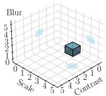  
(a) � = (2, 4, 2)

  
(b) Original image

  
(c) Contrasted

  
(d) Scaled

  
(e) Blurred

  
(f) Combined  
Figure 1: Composite perturbations combine the efects of individual perturbations. (a) A test with configuration � = (2, 4, 2), indicating contrast, scale, and blur at severity levels 2, 4 and 2, respectively. (b) Original input image. (c–e) Efects of exactly one perturbation at the specified severity level. (f) Combined efect of the composite perturbation.

Proof. For any fixed perturbation configuration $\pmb { \sigma } = ( \sigma _ { 1 } , \ldots , \sigma _ { k } )$ the outcome of a test over � samples follows a binomial distribution:

$$
X _ { \sigma } \sim \mathrm { B i n o m i a l } ( N , \mathfrak { r } _ { \sigma } ) , \quad \mathrm { a n d } \quad \hat { \mathfrak { r } } _ { \sigma } : = \frac { X _ { \sigma } } { N } .
$$

When � is suficiently large, the binomial distribution is wellapproximated by a normal distribution

$$
\hat { \mathbf { r } } _ { \sigma } \approx N \left( \mathbf { r } _ { \sigma } , \frac { \mathbf { r } _ { \sigma } ( 1 - \mathbf { r } _ { \sigma } ) } { N } \right)
$$

and we can define the standardised residual

$$
Z _ { { \sigma } } : = \frac { \hat { \mathbf { r } } _ { \sigma } - \mathbf { r } _ { \sigma } } { \sqrt { \mathbf { r } _ { \sigma } ( 1 - \mathbf { r } _ { \sigma } ) / N } } .
$$

Under the null hypothesis of independence (i.e., that $\mathbf { r } _ { \sigma }$ is accurately predicted from lower-order data), each $Z _ { \sigma }$ is approximately standard normal. Therefore, the sum:

$$
\chi ^ { 2 } : = \sum _ { \sigma \in S } Z _ { \sigma } ^ { 2 }
$$

is approximately $\chi ^ { 2 } \cdot$ -distributed with |S| degrees of freedom. To ensure the normal approximation is valid, the Berry–Esseen theorem implies that � should satisfy:

$$
N > 9 \cdot \operatorname* { m a x } \left\{ \frac { 1 - \mathrm { r } _ { \sigma } } { \mathrm { r } _ { \sigma } } , \frac { \mathrm { r } _ { \sigma } } { 1 - \mathrm { r } _ { \sigma } } \right\} .
$$

Under this condition, the $\chi ^ { 2 } \cdot$ -test provides a statistically justified method to evaluate the independence assumption. □

Once dependent and independent perturbations have been identified, the number of required higher-order tests can be significantly reduced. In the ideal case where all first-order perturbations are independent, all third-order tests—125 in our example, 58% of the total—can be estimated from first-order tests rather than executed.

If only some perturbations are independent, then higher-order tests can be checked against mutual independence ofall constituents. For example, if blur and scale, scale and contrast, and contrast and blur are all found pairwise independent, then the triplet blur-scalecontrast is likely independent as well under realistic scenarios. Thus, any higher order test that only depends on pairwise independent perturbations can be directly estimated as the product of first-order tests. A higher-order test that has some independent and some dependent perturbations can similarly be estimated by multiplying the independent first-order tests with a set of remaining dependent tests which are lower order, thus reducing the computational cost.

More generally, however, lower-order results can be used to train predictive models that account for dependencies when estimating higher-order outcomes. This approach dramatically reduces the computational cost of tomography while maintaining accuracy in user-specified test environments. We demonstrate this in §4.3, where we train a random forest on first- and second-order test results to predict third-order outcomes and beyond.

## 4 TestifAI

We describe TestifAI, a test framework for deep learning models that performs partial tomography. We begin with an overview of the framework’s architecture, followed by a description of how users interact with it (§4.1), how lower-order tests are executed eficiently (§4.2), and how higher-order tests are predicted using a learned model (§4.3).

A test session with TestifAI comprises four stages: (i) users specify a test environment for their model by selecting perturbations and their severity levels that best characterise the application domain; (ii) TestifAI automatically generates and executes all firstand second-order tests within that test environment; (iii) based on these results, TestifAI trains an auxiliary predictive model—in our case, a random forest—to approximate the model’s full tomography space; (iv) users can then query TestifAI to estimate robustness over regions of the test environment.

For illustrative purposes, we focus on 3D tomography, where the test environment consists of three perturbations. In §5.3, we further explore the generality of our approach to 4D tomography.

## 4.1 Specifying tests

Users can customise testing both before and after tomography. While TestifAI supports a wide range of perturbations and severity levels, users may choose to setup a customised test environment for their model—filtering specific perturbations, severity levels, or both. For example, the use of the zoom perturbation might be constrained by a camera’s focal range. After TestifAI estimates the full tomography space, users may interactively query specific regions to assess model robustness or refine their setup—for instance, to determine whether a given severity level meaningfully impacts model robustness or not.

4.1.1 Test Setup. Users begin with a trained model M (e.g., ResNet-  
32 [11]) and an evaluation data set D (e.g., the 10,000 test images

of CIFAR-10 [40]). Having assessed standard accuracy, they now aim to evaluate the model’s robustness.

During setup, TestifAI enables users to select � perturbations $\displaystyle p _ { 1 } , \ldots , p _ { k }$ from a predefined set, along with their associated severity levels, to define a test environment. For example, CIFAR-10-C [29] includes 15 well-defined perturbations, each with 6 severity levels. Alternatively, users may provide custom perturbation functions tailored to their application or data domain.

TestifAI defines the full tomography space as the set of all possible severity configurations across the selected perturbations:

$$
\Theta = S _ { 1 } \times \cdots \times S _ { k } ,
$$

where $S _ { j }$ is the set of selected severity levels for perturbation $\boldsymbol { \mathscr { P } } \boldsymbol { j }$ Each element $\pmb { \sigma } = ( \sigma _ { 1 } , . . . , \sigma _ { k } ) \in \Theta$ represents a single test—a complete assignment of severity levels across all � perturbations that must be either executed or predicted.

4.1.2 Querying Θ. After TestifAI learns robustness estimates across the space Θ, users can express a robustness query as a Boolean expression over perturbation severities:

$$
{ \cal Q } : : = \left. ( p _ { j } \circ \mathrm { p } \sigma _ { j } ) \vert { \cal Q } \wedge { \cal Q } \vert { \cal Q } \vee { \cal Q } , \right.
$$

where $( \boldsymbol { p } _ { j }$ op ��) is an atomic constraint defining the considered range of values for perturbation $\mathbf { \nabla } ^ { p _ { j } , \mathbf { \eta } }$ where op is a comparison operator op $\in \ \{ < , \leqslant , = , \geqslant , > \}$ and $\sigma _ { j } ~ \in ~ S _ { j }$ a severity level $( \mathrm { e . g . }$ $\mathrm { ^ { * } b l u r } > 2 ^ { \mathfrak { n } } )$ . The compound expressions $Q \land Q$ and $Q \lor Q$ denote the logical conjunction and disjunction of two subqueries, respectively. For example, $Q \ = \ ( z _ { 0 0 } \mathrm { m } \ > \ 2 ) \lor$ (brightness $= 5 \wedge$ blur = 1) selects all tests where the zoom severity exceeds 2, or where both brightness is set to 5 and blur is set to 1.

A query � represents a subset of the tomography space Θ. We denote by � the set of tests $\sigma \in \Theta$ that satisfy the query expression �. Since the robustness $\mathbf { r } _ { \sigma }$ is known—either measured or predicted—for every test, TestifAI computes the aggregate robustness of� using Equation $2 \colon \operatorname { R } ( Q ) : = \operatorname { R } ( \left[ \left[ Q \right] \right)$ .

## 4.2 Executing tests

TestifAI evaluates all first- and second-order tests and uses these results to predict robustness of third-order tests and beyond. We partition the full tomography space Θ by the number of active perturbations. We define the �-th order subset $\Theta _ { t }$ , for $t \leqslant k ,$ as:

$$
\Theta _ { t } = \left\{ \sigma = ( \sigma _ { 1 } , . . . , \sigma _ { k } ) \in \Theta \ \middle \vert \ \sigma \ \mathrm { h a s ~ e x a c t l y ~ } t \mathrm { ~ n o n - z e r o ~ } \sigma _ { i } \mathrm { - v a l u e s } \right\} .
$$

In other words, $\Theta _ { t }$ consists of all tests where exactly � perturbations are applied with non-zero severity. For example, in 3D tomography $\left( k = 3 \right)$ , the tomography space is partitioned into $\Theta _ { 0 } , \Theta _ { 1 } , \Theta _ { 2 } ,$ and $\Theta _ { 3 }$ , corresponding to zeroth-, first-, second-, and third-order tests, respectively. $\Theta _ { 0 }$ only contains the “no-perturbations at all” case, i.e., it is merely the base model accuracy.

TestifAI evaluates the robustness of all tests in the set $\Theta _ { \leqslant 2 } =$ $\Theta _ { 0 } \cup \Theta _ { 1 } \cup \Theta _ { 2 }$ by applying each perturbation configuration $\sigma \in \Theta _ { \leqslant 2 }$ to inputs from the dataset D, running the model to infer the label of each perturbed input, and recording success or failure based on label correctness (Algorithm 1). With � perturbations and � severity levels per perturbation, $| \Theta _ { 1 } | = k m$ and $| \Theta _ { 2 } | = { \textstyle \binom { k } { 2 } } m ^ { 2 }$ . So the total number of tests executed is $O ( k ^ { 2 } m ^ { 2 } )$ , eliminating the exponential $O ( m ^ { k } )$ cost of full tomography.

Algorithm 1 Constructing the training dataset for partial tomog  
raphy by selecting and evaluating tests from $\Theta _ { \leqslant 2 } .$ , the space of first  
and second-order perturbation combinations.   
1: Inputs: Trained model $\mathcal { M } ;$ dataset D; tests $\Theta _ { \le 2 } ;$ batch size �; threshold   
�; window size �   
2: Output: Training set $\mathcal { T }$   
3: $\mathcal T  \emptyset$   
4: for all $\sigma \in \Theta _ { \le 2 }$ do   
5: Partition D into batches $\mathbb { B } = \{ B _ { 1 } , B _ { 2 } , . . . , B _ { n } \}$ of size �   
6: ${ \mathfrak { h } } _ { \sigma } \gets [ 0 ] ^ { n }$ ⊲ Reset history   
7: $i \gets 1$   
8: for all � ∈ B do   
9: $\tilde { B }  \{ ( \pi _ { \sigma } ( x ) , y ) \mid ( x , y ) \in B \}$ ⊲ Apply perturbation   
10: ${ \mathcal { T } }  { \mathcal { T } } \cup \{ ( \sigma , \ 1 [ M ( { \tilde { x } } ) = y ] ) \mid ( { \tilde { x } } , y ) \in { \tilde { B } } \} \ { \ J } \subset \mathrm { C o l l } .$ tr. data   
11: $\mathfrak { h } _ { \sigma } ^ { ( i ) }  \frac { 1 } { b } \quad \sum \quad 1 \big [ \mathcal { M } ( \tilde { x } ) = y \big ]$ ⊲ Store partial result   
(�,�˜ ) ∈�˜   
12: if $i \geqslant$ � and $\operatorname* { m a x } _ { j = i - w + 1 } \left| \mathfrak { h } _ { \sigma } ^ { ( j ) } - \mathfrak { h } _ { \sigma } ^ { ( j - 1 ) } \ \right|$ < � then   
13: break   
14: end if   
15: $i \gets i + 1$   
16: end for   
17: end for

However, inferring the label of every perturbed input is often unnecessary to compute a good estimation of $\mathrm { ~ \bf ~ r ~ } _ { \sigma }$ . TestifAI employs an early-stopping strategy to avoid superfluous model inferences (see Algorithm 1). The idea is to estimate $\boldsymbol { \mathrm { r } } _ { \sigma }$ incrementally. First, TestifAI partitions the dataset into small batches of size � (ℓ. 5). It then iteratively computes and stores a per-batch robustness estimate (ℓ. 11). TestifAI will assess convergence using a window of the last � partial estimates. Computation stops when the variation in the window falls below a predefined threshold � (ℓ. 12). We empirically found that $b = 1 0 0 , \delta = 0 . 0 0 5$ and $w = 3$ gives a good, unbiased estimate of $\Gamma _ { \sigma }$ in our experiments. The time cost of each test comprises the cost of transforming data samples (ℓ. 9) and the cost of performing model inference on them (ℓ. 10). Early stopping reduces both components by limiting the number of samples processed. We discuss the computational savings and the relative contributions of transformation and inference time in §5.3.

All binary prediction outcomes observed prior to early stopping are stored in a set T (ℓ. 10), which is then used for training our predictive model.

## 4.3 Predicting tests

TestifAI learns to predict the robustness of higher-order tests in $\Theta _ { \geqslant 3 }$ based on empirical observations from the lower-order tests $\Theta _ { \leqslant 2 } .$ . Given a perturbation configuration $\sigma \in \Theta ,$ our predictive model O returns a predicted robustness score $\hat { \mathrm { r } } _ { \sigma } = O ( \sigma )$

Training. Algorithm 1 returns a training data set

$$
\mathcal { T } = \left\{ \mathbf { \Phi } \left( \sigma , \mathbf { \lambda } \mathbf { 1 } [ M ( \pi _ { \sigma } ( x ) ) = y ] \right) ~ \middle | ~ \sigma \in \Theta _ { \leqslant 2 } , ~ ( x , y ) \in \mathcal { D } _ { \sigma } ~ \right\} ,
$$

where $\mathcal { D } _ { \sigma } \subseteq \mathcal { D }$ is the subset of the inputs—possibly partial, since we employ early stopping in Algorithm 1—used to estimate the robustness of the model under perturbation configuration �. The size of the training set $\begin{array} { r } { | \mathcal { T } | = \sum _ { \sigma \in \Theta _ { \leqslant 2 } } | \mathcal { D } _ { \sigma } | } \end{array}$ is the total number of perturbed inputs evaluated across all configurations. Each element of $\mathcal { T }$ pairs a configuration � with a binary outcome indicating whether the model correctly classified a given perturbed input or not. We treat each element of T as a training example consisting of a perturbation configuration and its corresponding binary outcome. By projecting T, we construct a feature matrix $\bar { \boldsymbol { X } } _ { O } \in \bar { \mathbb { R } } ^ { | \mathcal { T } | \times k }$ containing all configurations and a label vector $\mathbf { y } _ { O } \in \{ 0 , 1 \} ^ { | \mathcal { T } | }$ containing all outcomes. These are then used to train our model.

Our model O is a random forest classifier. After tuning, we selected the following configuration:

(1) The model consists of 100 trees, balancing computational and statistical performance.

(2) Bootstrap sampling is disabled, allowing each tree to train on the full dataset.

(3) There is no restriction on the number of features considered at each split, enabling trees to explore the full feature space and capture richer interactions among perturbation types.

(4) It uses the log-loss splitting criterion, optimizing for splits that reduce the cross-entropy between predicted and true labels. This encourages probability estimates of robustness that are more reliable and easier to interpret.

This configuration was selected based on the lowest mean squared error (MSE) observed on a held-out validation set of actual $\Theta _ { 3 }$ test results. We further evaluate our model’s generalization performance on $\Theta _ { 3 }$ and $\Theta _ { 4 }$ in §5.3.

An analogous surrogate model can be trained to estimate perturbation validity (e.g., estimate KID [4] and BERTScore [82] for perturbed images and text, respectively) from low-order observations, enabling users to exclude low-quality regions of Θ (see §6).

Why random forests? Random forests are non-parametric ensemble methods that approximate structured conditional distributions without explicit structure specification—unlike Bayesian networks or factor graphs. Also, in our preliminary experiments, random forests had the best sample eficiency among other architectures (gradient-boosted trees, multilayer perceptrons, and Bayesian networks) that achieved comparable accuracy. This was an important factor since we train O on a limited number of empirical robustness measurements. Note, however, that the choice of the best architecture for O is not a focus of this work.

## 5 Evaluation

We structure our evaluation around three key research questions: (i) How accurate are TestifAI ’s robustness predictions? (§5.2); (ii) Is partial tomography an efective strategy for approximating the robustness space Θ? (§5.3); and (iii) How sample-eficient is TestifAI in estimating robustness? (§5.4).

## 5.1 Experimental setup

We implemented TestifAI in Python 3.9, using the scikit-learn library to train our random forest model, and sympy to parse and evaluate Boolean query expressions. Experiments were conducted on a high-performance GPU cluster at the Massachusetts Green High Performance Computing Center (MGHPCC), using an NVIDIA Tesla T4 GPU with CUDA 12.3.

5.1.1 Benchmarks. We evaluate TestifAI on five benchmarks: four vision and one language classification tasks. For each task, we found a publicly available pre-trained classification model and its associated data set. Table 1 summarises our benchmarks: the dataset name, size and the considered perturbations, as well as the model name and its classification accuracy.

Table 1: Summary of the benchmarks and evaluated models.
<table><tr><td>Task</td><td>Dataset</td><td>Size</td><td>Perturbations</td><td>Model</td><td>Acc.</td></tr><tr><td> ${ \boldsymbol { \varkappa } } ^ { \flat }$ </td><td>MNIST</td><td>10,000</td><td>brightness, zoom, motion- LeNet-5 blur, shear</td><td></td><td>98.4%</td></tr><tr><td>四</td><td>CIFAR-10</td><td>10,000</td><td>shot-noise, brightness, jpeg-WRN-28-10 compression, contrast</td><td></td><td>94.7%</td></tr><tr><td> $\ast \infty$ </td><td>Roboflow</td><td></td><td>1,000 translate, scale, contrast, YOLOv11 brightness</td><td></td><td>82.2%</td></tr><tr><td>中</td><td>GTSRB</td><td></td><td>12,630 darken, codec-error, gaus- CNN-SE sian-blur, exposure</td><td></td><td>97.6%</td></tr><tr><td>Q</td><td>QQP</td><td>1,000</td><td>0 synonym, typos, contrac- RoBERTa tion, punctuation</td><td></td><td>91.2%</td></tr></table>

Hand-written digit recognition $( \varkappa ^ { * } )$ is a classic computer vision classification task. We test the robustness of the LeNet-5 model [79] on perturbed grayscale images of hand-written digits from the MNIST test dataset [41]. We assess model robustness to brightness, zoom, motion blur and shear—four common digit-image corruptions [6, 38, 49, 51, 64] that mimic lighting changes, scale variations, camera motion, and geometric distortions, respectively. Perturbations were implemented using the MNIST-C library [52].

Image classification (ì) is another classic vision task. We test the robustness of WideResNet-28-10 [11, 81] on perturbed images of the CIFAR-10 test dataset [40]. We assess model robustness to shot noise, brightness, jpeg compression, and contrast [7, 30–32] that simulate sensor imperfections, illumination changes, compression artefacts, and visibility variations, respectively. Perturbations were implemented using RobustBench [11].

Object detection in self-driving Cars (Œ) is part of the Udacity challenge—the task is to detect objects in urban driving images [63]. We select 1000 images to test the robustness of the YOLOv11s model [35, 58] against scale, contrast, translation, and brightness, four common driving scene corruptions [8, 9, 68] that mimic distance variations, lighting conditions, camera movements, and illumination changes, respectively. Perturbations were implemented using DeepTest [68]. We selected five (out of the ten) severity levels, setting scale $( s _ { x } , s _ { y } )$ ∈ {(1.5, 1.5), (2.6, 2.6), (3.7, 3.7), (4.8, 4.8), (6.0, 6.0)}, contrast � ∈ {1.2, 1.6, 2.1, 2.5, 3.0}, translation $( t _ { x } , t _ { y } )$ ∈ {(20, 20), (40, 40), (60, 60), (80, 80), (100, 100)}, and brightness $\beta \in \{ 2 0 , 4 0 , 6 0 , 8 0 , 1 0 0 \}$

Trafic sign recognition (-) is an essential task for autonomous driving systems. We test the robustness of the CNN-SE model [54] on the German Trafic Sign Recognition Benchmark (GTSRB) [65]. The dataset contains 12630 test images of 43 signs. We test darkening, codec-error, gaussian blur, and exposure—four perturbations that simulate challenges in trafic sign perception: nighttime or shadowed viewing conditions, video transmission artifacts, imperfect camera focus, and overexposed imaging, respectively [1, 66, 78]. Perturbations were implemented using CURE-TSD [55].

Quora question-answering (6) is a semantic similarity task for natural language understanding [71]. We test the robustness of the ${ \mathsf { R o B E R T a } } _ { \mathrm { b a s e } }$ [34] model. For our test dataset, we choose 1000 question pairs from the Quora Question Pairs (QQP) dataset, each pair having a binary label indicating semantic equivalence. We assess model robustness to synonym replacement, typos, contractions, and punctuation [19, 61, 72, 76]—four perturbations that preserve meaning while introducing lexical, orthographic, stylistic, and structural variations, respectively. Perturbations were implemented using TextAttack [50]. Each severity level—1 through 5–directly corresponds to the number of edits applied to a sentence: at level 1 we make one edit, level 2 two edits, and so on, up to level 5.

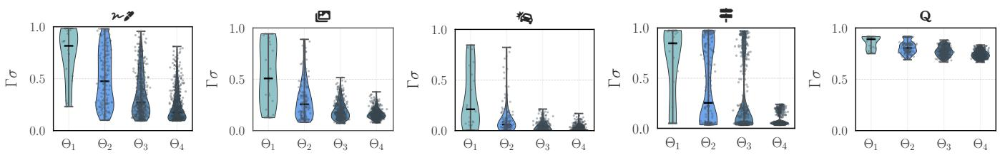  
Figure 2: Distribution of ground-truth robustness scores $\mathbf { r } _ { \sigma }$ across $\Theta _ { 1 } - \Theta _ { 4 }$ for each benchmark. Higher orders show wider, downward-shifted distributions, indicating increased accuracy degradation and robustness variability.

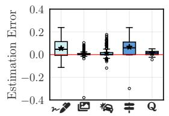  
Figure 3: $\mathbf { r } _ { \sigma }$ estimation errors for 3D tomography.

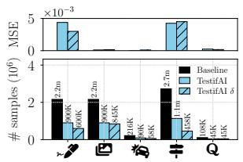  
Figure 4: Sample eficiency for 3D tomography.

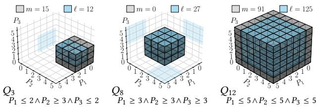  
Figure 5: 3D voxel visualisation of $Q _ { 3 } , Q _ { 8 }$ and $Q _ { 1 2 } .$

5.1.2 Ground Truth. We evaluate the accuracy of TestifAI by comparing its predictions against full model tomography. This baseline exhaustively computes the true robustness score $\mathbf { r } _ { \sigma }$ or every test � in the selected perturbation space. In other words, for each benchmark, we apply every perturbation configuration to every input in the evaluation dataset to obtain exact values. Figure 2 presents the ground-truth distributions of $\mathrm { i } \mathbf { \Pi } _ { \mathbf { \sigma } }$ . Partial tomography relies on the statistical patterns of the $\Theta _ { 1 }$ and $\Theta _ { 2 }$ distributions to predict the $\Theta _ { 3 }$ and $\Theta _ { 4 }$ ones.

## 5.2 Robustness estimation errors

We evaluate the ability of our partial tomography model—namely, a random forest—to approximate 3D tomography. For each of our five benchmarks, we consider the first three perturbations listed in Table 1, each discretised into six severity levels. This results in 216 unique tests per benchmark, corresponding to all possible combinations of three perturbations and their severity levels. We train our random forest following the setup described in §§4.2 and 4.3. The model is trained on data obtained from all first- and second-order tests $( \mathrm { i } . \mathbf { e } . , \Theta _ { \leqslant 2 } )$ , and is then used to predict robustness scores $\hat { \mathbf { r } } _ { \sigma }$ for all $\sigma \in \Theta ;$ , including the 126 third-order tests that were not seen during training.

Table 2: Summary of the number (�) of tests measured for training the partial tomography model and the number (ℓ) of tests whose robustness was inferred, for each query $Q _ { i }$
<table><tr><td>i</td><td>1</td><td>2</td><td>3</td><td>4</td><td>5</td><td>6</td><td>7</td><td>8</td><td>9</td><td>10</td><td>11</td><td>12</td></tr><tr><td>m</td><td>19</td><td>15</td><td>15</td><td>9</td><td>15</td><td>9</td><td>9</td><td>0</td><td>7</td><td>37</td><td>61</td><td>91</td></tr><tr><td>e</td><td>8</td><td>12</td><td>12</td><td>18</td><td>12</td><td>18</td><td>18</td><td>27</td><td>1</td><td>27</td><td>64</td><td>125</td></tr></table>

5.2.1 Per-test errors. We assess how well the model predicts the robustness score for each test by comparing predicted scores $\hat { \mathbf { r } } _ { \sigma }$ with their ground truth values $\mathbf { r } _ { \sigma } .$ We define the robustness estimation error as the diference $\hat { \boldsymbol { \mathrm { r } } } _ { \sigma } - \boldsymbol { \mathrm { r } } _ { \sigma } . \boldsymbol { \mathrm { A } }$ positive error indicates that the model is pessimistic (i.e., it underestimates robustness), while a negative error indicates optimism (i.e., overestimation).

Figure 3 shows a box-and-whiskers plot of robustness estimation errors across all 216 tests (Θ) for 3D tomography. For each benchmark, the box indicates the median and interquartile range of the errors, while the whiskers show their full spread. Across all five benchmarks, most errors cluster tightly around zero, indicating high estimation accuracy. For ì and 6, all prediction errors fall within the range [−0.05, +0.05]. More broadly, over 90% of errors across the 216 tests lie within [−0.1, +0.1]. Of the 216 tests, 90 were used during training, which explains why many exhibit near-zero error—these were directly learned by the model. However, the low error on the remaining 126 held-out tests demonstrates the model’s ability to generalize beyond the training set. For example, the mean prediction error for ì, Œ, and 6 is close to zero.

5.2.2 Aggregate query errors. We evaluate our model’s ability to answer robustness queries that go beyond individual tests, using a predefined set of Boolean queries $Q _ { 1 } { - } Q _ { 1 2 } .$ . These queries cover the test space Θ in complementary ways: (i) �1–�8 are exclusive—they divide Θ into mutually non-overlapping regions. Each exclusive query covers exactly 12.5% of Θ (i.e., 27 individual tests). $\mathrm { E . g . }$ $Q _ { 1 } = P _ { 1 } \leq 2 \land P _ { 2 } \leq 2 \land P _ { 3 } \leq 2$ corresponds to the region with the lowest severity of perturbations, while $Q _ { 8 } = P _ { 1 } \geq 3 \land P _ { 2 } \geq 3 \land P _ { 3 } \geq 3$ with the highest. These queries are designed to isolate specific failure modes and reveal how robustness varies across distinct areas of the perturbation space. $( i i ) Q _ { 9 }  – Q _ { 1 2 }$ are inclusive—each covers a progressively larger subset Θ, enabling fine-to-coarse analysis. For example, $Q _ { 9 }$ covers only 3.7% of the space (8 tests), while $Q _ { 1 2 }$ covers 100% of it (all 216 tests). These queries reflect realistic scenarios where users may wish to assess robustness under broader deploy ment conditions. We visualise the perturbation space covered by some queries in Figure 5, and summarise in Table 2 the number of measured and of inferred tests for $Q _ { 1 } { - } Q _ { 1 2 }$

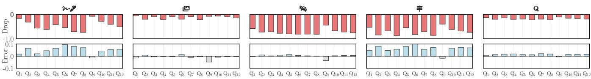  
Figure 6: Robustness estimation error (error) and predicted drop in M’s accuracy (drop) for aggregate queries $Q _ { 1 } , \ldots , Q _ { 1 2 } .$ For a query �, the error is ${ \hat { \operatorname { R } } } ( Q ) - \operatorname { R } ( Q )$ , and the drop is the predicted accuracy of M minus its original accuracy (as per Table 1).

In Figure 6, for each query $Q ,$ we report the robustness estimation error as the diference between the predicted $\hat { \mathrm { R } } ( Q )$ and the actual R(�). By evaluating twelve predefined query regions—each covering a distinct portion of the perturbation space—we assess whether our random forest trained solely on low-order tests can accurately estimate robustness degradation over increasingly com plex subspaces, without relying on high-order test data. Figure 6 shows that estimation errors remain consistently low across all queries. $Q _ { 8 }$ is noteworthy because it contains only third-order tests, all unseen during training; yet, its maximum error is just 0.109, demonstrating the model’s ability to generalize.

## 5.3 Efect of partial model tomography

Throughout the paper, we argue for using all tests in $\Theta _ { \leqslant 2 }$ to train a model that estimates robustness for $\Theta _ { \geqslant 3 } .$ . A natural question is why not sample the same number of tests uniformly at random from the entire perturbation space Θ. In this section, we compare these two training strategies and evaluate their efectiveness in accurate robustness estimation.

We design an experiment parametrised by two factors: the training set size and the strategy used to construct it. First, we vary the training set size from 10% to 100% of available tests in 10% increments. For each percentage level, we compute the corresponding number of tests (�) and select that many for training. Second, we vary how the � tests are selected: (i) ordered sampling selects tests by increasing perturbations order $( \mathrm { e . g . }$ , 1-way combinations, fol lowed by 2-way, and so on); and (ii) random sampling selects tests uniformly at random from Θ.

For each selected test $\sigma ,$ we apply its perturbation configuration to every input in the dataset, record the model’s success or failure, and use the results to construct the random forest training set, as described in Section 4.2 and Algorithm 1. We evaluate the model’s predictions on the remaining |Θ| − � tests, reporting the mean squared error (MSE) over predicted robustness scores.

Each experiment is repeated 10 times to account for sampling and training variability, and we report the mean and standard deviation.

We run this experiment in two settings: 3D tomography with $| \Theta | = 2 1 6 \mathrm { ( F i g u r e 7 ) }$ , and 4D tomography with |Θ| = 1296 (Figure 8). Figures 7 and 8 show MSE as a function of training set size � under ordered (blue) and random (gray) sampling. Each point is averaged over 10 runs, with shaded bands representing one standard deviation. The red vertical dashed line marks the point at which the ordered selection includes all second-order tests $( \mathrm { i } . \mathrm { e } . , \Theta _ { \leqslant 2 } ) ,$ , while the green line marks inclusion of all third-order tests $( \mathrm { i } . \mathbf { e } . , \Theta _ { \leqslant 3 } )$

Across both 3D and 4D settings, ordered sampling consistently outperforms random sampling, achieving lower MSE with substantially less training data. Ordered sampling converges rapidly: for most benchmarks, robust generalization is achieved with only 20–30% of the perturbation space. In contrast, random sampling exhibits slower convergence and greater variance, especially at small sample sizes. Notably, although third-order data further improves MSE, the 4D average MSE achieved using only first- and second-order data is already comparable with the 3D cases.

The results support our hypothesis that lower-order projections carry highly informative structure about the full perturbation space, and that partial model tomography provides a principled, sampleeficient alternative to random test selection.

Comparing 3D and 4D results, the 4D setting consistently achieves lower MSE. At the same sampling percentage, the 4D model has access to significantly more training data—for example, 130 tests in 4D versus only 21 in 3D at 10% sampling. This increased data density leads to sharper early reductions in MSE across all benchmarks.

When comparing benchmarks within each dimensional setting, we observe that Œ and 6 consistently yield lower MSE than ${ \boldsymbol { \varkappa } } ^ { \flat }$ and ì, despite using far fewer perturbed inputs to train the predictive model (1000 vs. 10000 images per test). This suggests that robustness estimation quality is driven more by the stability and predictability of model responses to composite perturbations—some of which may have little or no efect—than by sample count alone. Figure 6 supports this argument: estimation error remains low for $\ P _ { \otimes , }$ ì, and 6, across $Q _ { 1 } – Q _ { 1 2 } ,$ whereas ${ \boldsymbol { \varkappa } } ^ { \flat }$ and - exhibit higher and more variable errors even though their predictive model was trained with more samples. This is because the multiplicative efect of composite perturbations on accuracy becomes less predictable as perturbation complexity and severity increase.

These results suggest that when perturbation efects degrade accuracy in a consistent and predictable manner, partial tomography can learn useful patterns from relatively few examples. This also explains the efectiveness of sequential testing for benchmarks with stable responses: early tests yield predictive signals that generalize well, even in higher-dimensional settings.

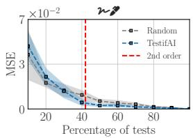

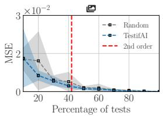

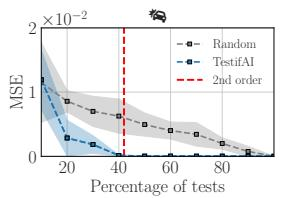

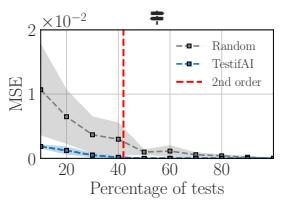

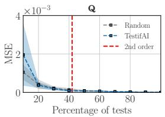

Figure 7: Eficiency of partial 3D model tomography.  
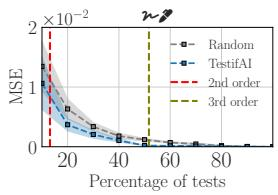

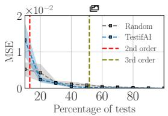

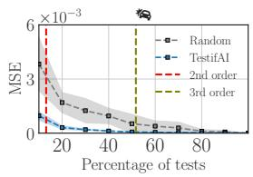

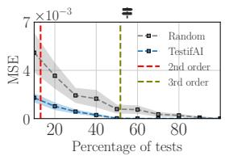

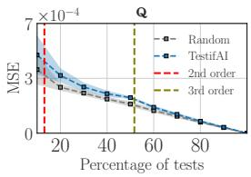  
Figure 8: Eficiency of partial 4D model tomography.

## 5.4 Partial tomography eficiency

In this experiment, we evaluate the execution eficiency of partial tomography—with and without our early stopping strategy—using the total number of inferences as a proxy metric. Since inference cost is stable for a given hardware setup, this metric provides a reliable estimate of total runtime. We focus on 3D tomography.

Full tomography yields, of course, zero robustness estimation error, as it evaluates all tests in Θ exhaustively. However, this comes at the cost of $| \Theta | \times | \mathcal { D } |$ total inferences. For example, in the case of ${ \boldsymbol { \varkappa } } ^ { \mathcal { P } }$ or ì, this requires 2,160,000 inferences. Partial model tomography requires evaluating only up to $| \Theta _ { \leqslant 2 } | \times | \mathcal { D } |$ inferences, which reduces the total number of inferences by at least 58%.

Figure 4 presents the total number of inferences required to reconstruct Θ under three configurations: (i) full 3D tomography; (ii) partial model tomography without early stopping; and (iii) partial tomography with early stopping. The �-axis shows the benchmarks; and the �-axis shows the total number ofinferences required. Above each bar, we plot the MSE between the predicted and actual aggregate robustness scores for each of our random forests: one exhaustively applies $\Theta _ { \leqslant 2 }$ configurations to all inputs; and one to a subset. Even with early stopping enabled, the MSE is small.

Without early stopping, partial tomography reduces the total number of inferences by 58% for all benchmarks. Our early stopping strategy (see Algorithm 1) further lowers the inference cost down to 72.7% for ${ \boldsymbol { \varkappa } } ^ { * , }$ 61.6% for ì, 73.15% for Œ and 83% for $\ast$ (no additional improvements were observed for 6). This has a direct efect to the total computation time: computing the full 3D tomography for 6 required approximately 47.3 hours, which was reduced significantly with partial model tomography. The transformation to-inference-time ratios are 0.09 for ì, 0.20 for Œ, 0.30 for 6, 2.3 for $\ P ,$ and 76.7 for ${ \boldsymbol { \varkappa } } ^ { * } .$ Except for - and ${ \boldsymbol { \varkappa } } ^ { * , }$ inference time dom inates. Because perturbations are model-agnostic preprocessing while inference scales with model size, we expect inference time to dominate even more for larger models.

## 6 On Validity & Quality Estimation

TestifAI assumes that domain experts specify perturbations and severity levels that reflect their deployment environment, following the practice of existing robustness benchmarks [29, 51, 55]. As such, TestifAI does not attempt to assess the semantic validity of higherorder perturbations, or, more generally, of the perturbation space Θ within a model’s application domain.

Nevertheless, it is informative to distinguish robustness failures under plausible perturbations from those caused by invalid or highly unrealistic ones. To this end, we use quality metrics as proxies for perturbation validity. Specifically, we can use the TestifAI framework to estimate the efect of higher-order perturbations on input quality, and then refine testing by augmenting user queries with constraints on these metrics. We next present a quantitative validity analysis of our five benchmarks and show how TestifAI can estimate higher-order validity from low-order observations in the same way it estimates robustness.

For our four vision tasks, we use Kernel Inception Distance (KID) [4] to measure image realism, and for the language task, we use BERTScore [82] to measure semantic preservation. These metrics quantify deviation from the distribution of unperturbed inputs and serve as proxies for perturbation validity. Although we also evaluated other quality metrics—including FID and SSIM for images and BLEU for text—we found that KID and BERTScore integrate best with partial tomography and early stopping; in particular, KID remains reliable under partial sampling of the input distribution.

We collected the true quality score $\mathsf { q } _ { \sigma }$ for every test � in the full 4D perturbation space (1296 in total). We then applied partial tomography to estimate higher-order quality scores from lowerorder ones, leveraging the fact that partial tomography is agnostic to the nature of the predicted score. We trained a random-forest regressor on $\Theta _ { \leqslant 2 } ,$ replacing robustness scores $\boldsymbol { \mathrm { r } } _ { \sigma }$ with $\mathsf { q } _ { \sigma }$ . We used the same feature representation as for robustness prediction.

Figure 9 shows quality $\left( \mathbf { q } _ { \sigma } \right)$ , predicted quality $( \widehat { \boldsymbol { \mathrm { q } } } _ { \sigma } )$ , and accuracy drop as functions of the severity sum $\sigma _ { 1 } + \cdots + \sigma _ { k }$ for $\sigma =$ $( \sigma _ { 1 } , \ldots , \sigma _ { k } )$ )—that is, the $\ell _ { 1 } \cdot$ -norm of the perturbation severity vector (a slice of the 4D perturbation space indexed by total severity).

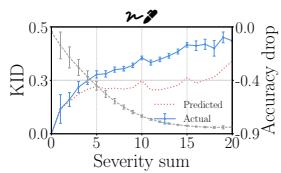

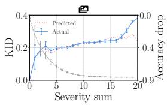

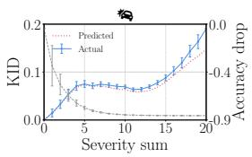

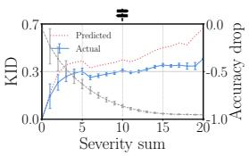

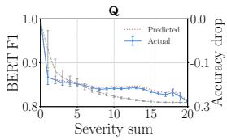  
Figure 9: Actual vs. predicted quality and accuracy drop under increasing perturbation severity. Blue solid lines show actual perceptual quality (KID for vision, BERT-F1 for NLP). Red dotted lines show predicted quality. Grey dashed lines (right axis) show accuracy drop. Error bars represent standard error across all combinations with the same severity sum.

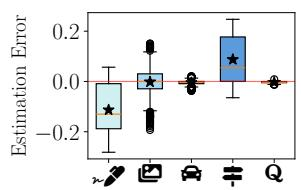

Figure 10: $\mathsf { q } _ { \sigma }$ estimation error for 4D tomography.  
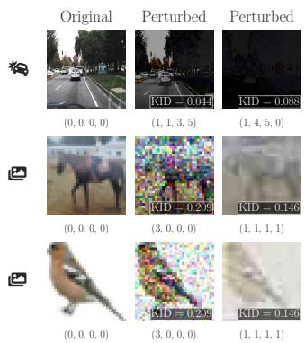  
Figure 11: Example perturbed images derived from diferent perturbation combinations.

A given severity sum can arise from either a few large perturbations or the compounding efects of many small ones. Figure 10 shows that across benchmarks the mean absolute estimation error is approximately 0.1 for ${ \boldsymbol { \varkappa } } ^ { \flat }$ and -, and near zero for ì, $\approxeq \otimes ,$ and 6, indicating that validity, like robustness, is structured and predictable from low-order observations.

A user concerned with application-level validity can integrate these scores directly into the TestifAI querying mechanism: given a threshold $\tau _ { \mathrm { q } }$ on predicted input quality, TestifAI can exclude all tests with predicted (or measured) quality above $\tau _ { \mathrm { q } }$ (or below, in the case of BERT F1). This enables queries of the form $Q \ \wedge \ \hat { \mathsf { q } } _ { \sigma } \leq \tau _ { \mathsf { q } } ,$ where � is any existing Boolean constraint (§4.1). The threshold further allows users to distinguish errors under plausible conditions $( \widehat { \boldsymbol { \mathrm { q } } } _ { \sigma } \leq \tau _ { \boldsymbol { \mathrm { q } } } )$ from those attributable to invalid inputs $( \hat { \mathbf { q } } _ { \sigma } > \tau _ { \mathbf { q } } )$

For example, the top row of Figure 11 shows two perturbed versions of the same image from Œ at severity sum 10. The fourth order perturbation (1, 1, 3, 5) with KID 0.043 is likely considered valid input, whereas the third-order one, with KID 0.088, is likely considered invalid. By inspection, KID scores up to roughly 0.06 appear generally valid for Œ. Comparing this threshold with Figure 9 indicates that similarly low KID scores can still occur even at severity sums as high as 14 for Œ.

Examples from ì in the bottom two rows of Fig. 11 show that equal KID scores can correspond to both plausible (identifiable) and invalid (unidentifiable) inputs. They also show that the compounding efects of diferent perturbations may difer from applying a single perturbation at higher severity, leading to cases where im ages with larger KID scores are more identifiable than those with lower scores near the boundary of validity. The (im)plausibility of an input perturbation, therefore, depends on the data set, the chosen perturbations and their strengths, and the application domain.

These examples illustrate how users can refine TestifAI using validity or other system-level metrics. Choosing appropriate thresh olds requires domain expertise, ranging from manual inspection to deployment-specific analysis. Importantly, high severity sums do not necessarily imply invalid inputs: multiple perturbations often co-occur in practice (e.g., combined weather and sensor efects in vision [53], or surface-form perturbations in text [27, 74]). Accordingly, TestifAI does not discard severe cases a priori; instead, it surfaces them with robustness and validity estimates, enabling users to judge whether they fall within acceptable operational bounds.

## 7 Discussion

TestifAI assumes a user-defined space Θ of semantic perturbations, each with a small discrete set of severity levels, making it queryable for partial tomography. Even when perturbations have continuous severity parameters or produce similar efects (e.g., fog and contrast), coarse binning often sufices to capture robustness trends. However, if no semantically meaningful discretization exists (e.g., gradient-based adversarial attacks [23, 70]), TestifAI does not apply; it is best used as an exploratory tool for refining a given perturbation family (e.g., weather corruptions in ImageNet-C [30] or paraphrasing in TextFlint [72]) rather than discovering them.

TestifAI assumes that regions $\Theta _ { \geqslant 3 }$ are suficiently structured that robustness measurements in $\Theta _ { \leqslant 2 }$ capture most interactions. When models exhibit higher-order efects that are not predictable from single or pairwise tests, TestifAI may misestimate robustness. Figure 8 shows that adding a modest number of $\Theta _ { 3 }$ oracle evaluations improves prediction. When practitioners suspect higher-order coupling, allocating a small $\Theta _ { 3 }$ budget can reduce misestimation. Automatically identifying such cases is future work.

TestifAI enables multi-perturbation analysis across diverse model types and modalities. Partial tomography requires a discretizable perturbation space and a system-level metamorphic test to access whether behaviour under perturbation remains acceptable. These requirements extend beyond classification tasks. E.g., §6 shows how partial tomography can apply to regression and generation: KID and BERTScore serve as quality-based oracle signals for perturbed images and text; and similar principles enable testing of code-generation models [74] using CodeBLEU [59].

## 8 Related Work

Prior work on testing deep learning models spans several directions, including training input generation (e.g., AugMix [31]) coverageguided testing (e.g., DeepXplore [56]), test prioritisation (e.g., Deep-Gini [16]), and combinatorial testing (e.g., CIT4DNN [13]). While these methods provide valuable insights into model behaviour, they neither support systematic reasoning over structured multiperturbation spaces, nor enable users to query robustness under diverse, interacting perturbations.

Benchmarks. MNIST-C [51], CIFAR-10-C and ImageNet-C [30], KITTI-C, nuScenes-C, and Waymo-C [14], and CURE-TSR [67] are benchmarks that define curated sets of meaningful perturba tions to test the robustness of computer vision models. Similarly, CheckList [61] and TextFlint [72] provide linguistic perturbations for testing natural language models. These are complementary resources to TestifAI. Users can draw perturbations from them to systematically explore and test their combinations.

Data augmentation methods. CutMix [80], AugMix [31], and PixMix [32]) aim to improve the robustness of deep learning models applying stochastic combinations of perturbations during training. These augmentations expose models to inputs afected by multi ple, simultaneously applied transformations (e.g., blur, contrast, rotation). TestifAI rather aims to systematically explore and estimate the aggregate robustness of a trained model under structured, multi-perturbation test environments.

Neuron coverage. DeepXplore [56], DeepGuage [45], DLFuzz [26] and DeepHunter [77] aim to uncover erroneous behaviours in deep learning models by generating test inputs that maximise neuron activation coverage. However, increased coverage does not necessarily correlate with a higher rate of error discovery, and often leads to the generation of less natural or semantically meaningful inputs [28, 62]. These methods typically produce new inputs by applying pixel-level perturbations to a small set of seed examples, which limits both the diversity and semantic fidelity of the result ing test data [13]. In contrast, TestifAI generates test inputs by systematically combining interpretable semantic perturbations.

Test prioritization. Input prioritization techniques aim to identify test inputs that are more likely to reveal model errors, thereby accelerating the discovery of misclassifications [25, 75]. DeepGini [16], for instance, prioritizes inputs on which the model exhibits low confidence (i.e., high uncertainty in softmax output). In contrast, TestifAI prioritises system-level metamorphic tests—structured combinations of semantic perturbations—rather than individual inputs. This enables eficient estimation of robustness across the entire perturbation space. Input-level prioritization is orthogonal to our work and could complement TestifAI’s early stopping strategy, particularly when users seek to identify worst-case robustness.

Combinatorial Interaction Testing (CIT). CIT has been applied to deep learning in several ways, difering along two axes: model access—whether white-box [10, 44] or black-box [8, 13]—and the type of interaction under test—neuron activations [10, 44], latent input features [13], or high-level semantic perturbations [8]).

DeepCT [44], for example, is a white-box method that systematically explores neuron combinations within a layer to maximise combinatorial activation coverage and, thus, uncover more faults— a test method aligned with neuron coverage methods discussed earlier. CIT4DNN [13], in contrast, is a black-box method: it learns a latent representation of the inputs, and then applies CIT on latent dimensions to generate rare or diverse inputs. Neither method guarantees that the generated test inputs can be interpreted as semantically meaningful perturbations.

Chandrasekaran et al. [8] generate two-way combinations of common image perturbations (e.g., blur, brightness, and rotation) applied to a small, curated input set to produce synthetic driving scenes for robustness testing. TestifAI extends this idea beyond pairwise testing: it uses second-order tests to approximate higherorder robustness behaviour through 3D and 4D tomography.

TestifAI departs from CIT in a fundamental way: it does not attempt to construct high-dimensional covering arrays, as done in prior work on classical software systems (e.g., ScalableCA [43]). Instead, it leverages second-order tests to train a predictive model that estimates robustness in multi-perturbation spaces.

Formal guarantees. TestifAI’s system-level metamorphic tests assess the extent to which a model is robust under some structured, semantic perturbations of a set of inputs. This difers from local robustness, where neural-network verifiers (e.g., αβ-CROWN [83]) check for all ℓ -bounded perturbations of a given input. Likewise, TestifAI’s aggregate robustness is an empirical summary over a semantic region Θ, not a global robustness certificate that requires local robustness of all possible inputs (as in fairness [37] and global robustness certification [36, 73]). These perspectives are complementary: TestifAI finds and ranks semantically meaningful regions for further analysis, while formal verification provides worst-case guarantees on selected subsets.

## 9 Conclusion

TestifAI reframes deep learning testing as a predictive modelling task, reasoning about how multiple perturbations interact, rather than a combinatorial coverage problem. It trains a surrogate model using lower-order test results—specifically, all combinations of up to two perturbations and their severity levels—to approximate robustness over higher-order tests involving three or more perturbations. Experiments on five vision and language benchmarks show that TestifAI predicts third- and fourth-order test outcomes from second-order observations with less than 7% aggregate estimation error. TestifAI is a step towards test-oriented generalization, enabling principled extrapolation of test results to unseen multiperturbation scenarios. It helps users anticipate model behaviour under complex, high-dimensional perturbations beyond what pairwise (2-way) testing can expose.

## References

[1] Ziyad N Aldoski and Csaba Koren. 2025. Trafic Sign Detection and Quality Assessment Using YOLOv8 in Daytime and Nighttime Conditions. Sensors (2025), 1027. https://doi.org/10.3390/s25041027

[2] Dzmitry Bahdanau, Kyunghyun Cho, and Yoshua Bengio. 2015. Neural Machine Translation by Jointly Learning to Align and Translate. In Proceedings ofthe International Conference on Learning Representations (ICLR). http://arxiv.org/abs/ 1409.0473

[3] Shahriar Austin Beigi and Byungkyu Brian Park. 2025. Impact of Critical Situations on Autonomous Vehicles and Strategies for Improvement. Future Transportation (2025), 1–39. https://doi.org/10.3390/futuretransp5020039

[4] Mikolaj Binkowski, Danica J. Sutherland, Michael Arbel, and Arthur Gretton. 2018. Demystifying MMD GANs. In Proceedings ofthe International Conference on Learning Representations (ICLR). OpenReview.net. https://openreview.net/ forum?id=r1lUOzWCW

[5] Andrea Bombarda and Angelo Gargantini. 2024. Design, Implementation, and Validation of a Benchmark Generator for Combinatorial Interaction Testing Tools. Journal ofSystems and Software (JSS) (2024), 111920. https://doi.org/10.1016/j. jss.2023.111920

[6] Wieland Brendel and Matthias Bethge. 2018. AI Still Fails on Robust Handwritten Digit Recognition (and How to Fix It). https://medium.com/bethgelab/aistill-fails-on-robust-handwritten-digit-recognition-and-how-to-fix-ita432d84ede18 Accessed: 2025-04-13.

[7] Dan A Calian, Florian Stimberg, Olivia Wiles, Sylvestre-Alvise Rebufi, An dras Gyorgy, Timothy Mann, and Sven Gowal. 2021. Defending Against Image Corruptions Through Adversarial Augmentations. In Proceedings of the International Conference on Learning Representations (ICLR). OpenReview.net. https://openreview.net/forum?id=jJOjjiZHy3h

[8] Jaganmohan Chandrasekaran, Yu Lei, Raghu Kacker, and D. Richard Kuhn. 2021. A Combinatorial Approach to Testing Deep Neural Network-Based Autonomous Driving Systems. In Proceedings ofthe International Conference on Software Testing, Verification and Validation Workshops (ICSTW). IEEE. https://doi.org/10.1109 ICSTW52544.2021.00022

[9] Li Chen, Penghao Wu, Kashyap Chitta, Bernhard Jaeger, Andreas Geiger, and Hongyang Li. 2024. End-to-End Autonomous Driving: Challenges and Frontiers. IEEE Transactions on Pattern Analysis and Machine Intelligence (TPAMI) (2024), 10164–10183. https://doi.org/10.1109/TPAMI.2024.3435937

[10] Yuchi Chen, Zhen Wang, Dong Wang, Cheng Fang, and Zhiqiu Chen. 2019. Vari able Strength Combinatorial Testing for Deep Neural Networks. In Proceedings ofthe International Conference on Software Testing, Verification and Validation Workshops (ICSTW). IEEE. https://doi.org/10.1109/ICSTW.2019.00066

[11] Francesco Croce and Matthias Hein. 2021. RobustBench: Benchmarking Neural Network Robustness. https://github.com/RobustBench/robustbench Accessed: [Accessed: July 2025].

[12] Yusuf Dalva, Hamza Pehlivan, Said Fahri Altındiş, and Aysegul Dundar. 2023. Benchmarking the Robustness of Instance Segmentation Models. IEEE Transactions on Neural Networks and Learning Systems (TNNLS) (2023), 17021–17035. https://doi.org/10.1109/TNNLS.2023.3310985

[13] Swaroopa Dola, Rory McDaniel, Matthew B. Dwyer, and Mary Lou Sofa. 2024. CIT4DNN: Generating Diverse and Rare Inputs for Neural Networks Using Latent Space Combinatorial Testing. In Proceedings ofthe International Conference on Software Engineering (ICSE). ACM. https://doi.org/10.1145/3597503.3639106

[14] Yinpeng Dong, Caixin Kang, Jinlai Zhang, Zijian Zhu, Yikai Wang, Xiao Yang, Hang Su, Xingxing Wei, and Jun Zhu. 2023. Benchmarking Robustness of 3D Object Detection to Common Corruptions. In Proceedings of the Computer Vision and Pattern Recognition (CVPR). IEEE. https://doi.org/10.1109/CVPR52729.2023. 00105

[15] Javid Ebrahimi, Anyi Rao, Daniel Lowd, and Dejing Dou. 2017. HotFlip: White-Box Adversarial Examples for NLP. arXiv preprint arXiv:1712.06751 (2017), 1–6. http://arxiv.org/abs/1712.06751

[16] Yang Feng, Qingkai Shi, Xinyu Gao, Jun Wan, Chunrong Fang, and Zhenyu Chen. 2020. DeepGini: Prioritizing Massive Tests to Enhance the Robustness of Deep Neural Networks. In Proceedings of the International Symposium on Software Testing and Analysis (ISSTA). ACM. https://doi.org/10.1145/3395363.3397357

[17] Xinyu Gao, Yang Feng, Yining Yin, Zixi Liu, Zhenyu Chen, and Baowen Xu. 2022. Adaptive Test Selection for Deep Neural Networks. In Proceedings ofthe International Conference on Software Engineering (ICSE). ACM. https://doi.org/ 10.1145/3510003.3510232

[18] Yuan Gao and Yiqiang Han. 2019. Automated Testing for Deep Learning Systems With Diferential Behavior Criteria. (2019), 1–8. http://arxiv.org/abs/1912.13258

[19] Yixin Gao, Yichong Liu, Mo Yu, Chao Zhang, and Philip S. Yu. 2023. Revealing the Blind Spot of Sentence Encoder Evaluation by HEROS. In Proceedings of the Workshop on Representation Learning for NLP (RepL4NLP). Association for Computational Linguistics. https://doi.org/10.18653/v1/2023.repl4nlp-1.24

[20] Andreas Geiger, Philip Lenz, Christoph Stiller, and Raquel Urtasun. 2013. Vision Meets Robotics: The KITTI Dataset. International Journal ofRobotics Research (IJRR) (2013), 1231–1237. https://doi.org/10.1177/0278364913491297

[21] Ian J. Goodfellow, Jonathon Shlens, and Christian Szegedy. 2015. Explaining and Harnessing Adversarial Examples. In Proceedings ofthe International Conference on Learning Representations (ICLR). http://arxiv.org/abs/1412.6572

[22] Anirudh Goyal and Yoshua Bengio. 2022. Inductive Biases for Deep Learning of Higher-Level Cognition. Proceedings of the Royal Society A (Proc. R. Soc. A) (2022), 20210068. https://arxiv.org/abs/2011.15091

[23] Chuan Guo, Alexandre Sablayrolles, Hervé Jégou, and Douwe Kiela. 2021. Gradient-Based Adversarial Attacks Against Text Transformers. In Proceedings of the Empirical Methods in Natural Language Processing (EMNLP). Association for Computational Linguistics. https://doi.org/10.18653/v1/2021.emnlp-main.464

[24] Eileen Guo. 2025. An AI Chatbot Told a User How to Kill Himself—But the Company Doesn’t Want to Censor It. https://www.technologyreview.com/2025/ 02/06/1111077/nomi-ai-chatbot-told-user-to-kill-himself/ Accessed: 2025-07-15.

[25] Hongjing Guo, Chuanqi Tao, Zhiqiu Huang, and Weiqin Zou. 2025. Coverage-Guided Testing for Deep Learning Models: A Comprehensive Survey. arXiv preprint arXiv:2507.00496 (2025), 1–52. https://doi.org/10.48550/arXiv.2507.00496

[26] J. Guo, Y. Jiang, Y. Zhao, Q. Chen, and J. Sun. 2018. DLFuzz: Diferential Fuzzing Testing of Deep Learning Systems. In Proceedings of the European Software Engineering Conference (ESEC). ACM. https://doi.org/10.1145/3236024.3264835

[27] Xiaoshuai Hao, Mengchuan Wei, Yifan Yang, Haimei Zhao, Hui Zhang, Yi Zhou, Qiang Wang, Weiming Li, Lingdong Kong, and Jing Zhang. 2024. Is Your HD Map Constructor Reliable Under Sensor Corruptions? Advances in Neural Information Processing Systems (NeurIPS) (2024), 22441–22482. http://papers.nips. cc/paper\_files/paper/2024/hash/281e0b9142763f2b6c944fedb8550ba9-Abstract-Datasets\_and\_Benchmarks\_Track.html

[28] F. Harel-Canada, L. Wang, M. A. Gulzar, Q. Gu, and M. Kim. 2020. Is Neuron Coverage a Meaningful Measure for Testing Deep Neural Networks?. In Proceedings of the European Software Engineering Conference (ESEC). ACM. https://doi.org/10.1145/3368089.3409754

[29] Dan Hendrycks. 2019. CIFAR-10-C and CIFAR-10-P. https://zenodo.org/records/ 2535967 Accessed: 2025-07-16.

[30] Dan Hendrycks and Thomas G. Dietterich. 2019. Benchmarking Neural Network Robustness to Common Corruptions and Perturbations. In Proceedings ofthe International Conference on Learning Representations (ICLR). OpenReview.net. https://openreview.net/forum?id=HJz6tiCqYm

[31] Dan Hendrycks, Norman Mu, Ekin D. Cubuk, Barret Zoph, Justin Gilmer, and Balaji Lakshminarayanan. 2020. AugMix: A Simple Data Processing Method to Improve Robustness and Uncertainty. In Proceedings ofthe International Conference on Learning Representations (ICLR). OpenReview.net. https://openreview. net/forum?id=S1gmrxHFvB

[32] Dan Hendrycks, Andy Zou, Mantas Mazeika, Leonard Tang, Bo Li, Dawn Song, and Jacob Steinhardt. 2022. PixMix: Dreamlike Pictures Comprehensively Improve Safety Measures. In Proceedings ofthe Conference on Computer Vision and Pattern Recognition (CVPR). IEEE. https://doi.org/10.1109/CVPR52688.2022.01628

[33] Max Jaderberg, Karen Simonyan, Andrew Zisserman, et al. 2015. Spatial Transformer Networks. Advances in Neural Information Processing Systems (NeurIPS) (2015), 2017–2025.

[34] JeremiahZ. 2024. Roberta Base QQP. https://huggingface.co/JeremiahZ/robertabase-qqp Accessed: 2025-04-08.

[35] Glenn Jocher. 2023. Ultralytics YOLOv11 Documentation. https://docs.ultralytics. com/models/yolo11 Accessed: May 11, 2025.

[36] Anan Kabaha and Dana Drachsler Cohen. 2024. Verification of Neural Networks Global Robustness. Proceedings ofthe ACM on Programming Languages (PACMPL) (2024), 1010–1039. https://doi.org/10.1145/3649847

[37] Haitham Khedr and Yasser Shoukry. 2023. Certifair: A Framework for Certified Global Fairness of Neural Networks. In Proceedings ofthe Association for the Advancement of Artificial Intelligence (AAAI). Association for Computational Linguistics. https://doi.org/10.18653/v1/2023.acl-long.773

[38] Aiym Kochkorova and Alexia Toumpa. 2025. Data Augmentation for Handwritten Digit Recognition. National High School Journal of Science (NHSJS) (2025). https://nhsjs.com/wp-content/uploads/2025/01/Data-Augmentation-for-Handwritten-Digit-Recognitions.pd

[39] R Krishnan, S Murali Krishna, and P Siva Nandhan. 2007. Combinatorial Testing: Learnings from our Experience. ACM SIGSOFT Software Engineering Notes (SEN) (2007), 1–8. https://doi.org/10.1145/1241572.1241582

[40] Alex Krizhevsky. 2009. CIFAR-10. https://www.cs.toronto.edu/\~kriz/cifar.html Accessed: 2025-07-16.

[41] Liu Ling, Wu Yanzhao, Wei Wenqi, Cao Wenqi, Sahin Semih, and Zhang Qi. 2018. The MNIST database of Handwritten Digits. https://git-disl.github.io/ GTDLBench/datasets/mnist\_datasets Accessed: 10 April 2025.

[42] Xiaoqiong Liu, Yunhe Feng, Shu Hu, Xiaohui Yuan, and Heng Fan. 2024. Benchmarking the Robustness of UAV Tracking against Common Corruptions. In Proceedings of the International Conference on Multimedia Information Processing and Retrieval (MIPR). IEEE. https://doi.org/10.1109/MIPR62202.2024.00079

[43] Chuan Luo, Shuangyu Lyu, Qiyuan Zhao, Wei Wu, Hongyu Zhang, and Chunming Hu. 2024. Beyond Pairwise Testing: Advancing 3-Wise Combinatorial Interaction Testing for Highly Configurable Systems. In Proceedings ofthe International Symposium on Software Testing and Analysis (ISSTA). ACM. https: //doi.org/10.1145/3650212.3680309

[44] Lei Ma, Felix Juefei-Xu, Minhui Xue, Bo Li, Li Li, Yang Liu, and Jianjun Zhao. 2019. DeepCT: Tomographic Combinatorial Testing for Deep Learning Systems. In Proceedings ofthe Software Analysis, Evolution and Reengineering (SANER). IEEE. https://doi.org/10.1109/SANER.2019.8668044

[45] Lei Ma, Felix Juefei-Xu, Fuyuan Zhang, Jiyuan Sun, Minhui Xue, Bo Li, Chunyang Chen, Ting Su, Li Li, Yang Liu, et al. 2018. DeepGauge: Multi-Granularity Testing Criteria for Deep Learning Systems. In Proceedings ofthe International Conference on Automated Software Engineering (ASE). ACM. https://doi.org/10.1145/3238147. 3238202

[46] Wei Ma, Mike Papadakis, Anestis Tsakmalis, Maxime Cordy, and Yves Le Traon. 2021. Test Selection for Deep Learning Systems. ACM Transactions on Software Engineering and Methodology (TOSEM) (2021), 1–22. https://dl.acm.org/doi/abs 10.1145/3417330

[47] Gabriel Resende Machado, Eugênio Silva, and Ronaldo Ribeiro Goldschmidt. 2023. Adversarial Machine Learning in Image Classification: A Survey Toward The Defender’s Perspective. ACM Computing Surveys (CSUR) (2023), 1–38. https: //doi.org/10.1145/3485133

[48] Eric Mintun, Alexander Kirillov, and Saining Xie. 2021. On Interaction Between Augmentations and Corruptions in Natural Corruption Robustness. Advances in Neural Information Processing Systems (NeurIPS) (2021), 3571–3583. https: //proceedings.neurips.cc/paper/2021/hash/1d49780520898fe37f0cd6b41c5311bf-Abstract.html

[49] Kabeh Mohsenzadegan, Vahid Tavakkoli, and Kyandoghere Kyamakya. 2021. A Deep-Learning Based Visual Sensing Concept for a Robust Classification of Document Images Under Real-World Hard Conditions. Sensors (2021), 6763. https://doi.org/10.3390/s21206763

[50] John Morris, Eli Lifland, Jin Yong Yoo, Jake Grigsby, Di Jin, and Yanjun Qi. 2020. TextAttack: A Framework for Adversarial Attacks, Data Augmentation, and Ad versarial Training in NLP. In Proceedings ofthe Empirical Methods in Natural Language Processing: System Demonstrations (EMNLP). Association for Computa tional Linguistics. https://doi.org/10.18653/v1/2020.emnlp-demos.16

[51] Norman Mu and Justin Gilmer. 2019. MNIST-C: A Robustness Benchmark for Computer Vision. (2019), 1–11. http://arxiv.org/abs/1906.02337

[52] Norman Mu and Gilmer Justin. 2019. MNIST-C. https://github.com/googleresearch/mnist-c/blob/master/corruptions.py Accessed: 10 April 2025.

[53] Valentina Muşat, Ivan Fursa, Paul Newman, Fabio Cuzzolin, and Andrew Bradley. 2021. Multi-Weather City: Adverse Weather Stacking for Autonomous Driving. In Proceedings of the International Conference on Computer Vision (ICCV). IEEE. https://doi.org/10.1109/ICCVW54120.2021.00325

[54] Neonithinar. 2021. GTSRB CNN classifier with custom Squeeze and Excitation Block. https://github.com/neonithinar/GTRSB/tree/main Accessed: 2025-04-08.

[55] OlivesGatech. 2019. CURE-TSD. https://github.com/olivesgatech/CURE-TSD GitHub repository. Accessed: 10 April 2025.

[56] Kexin Pei, Yinzhi Cao, Junfeng Yang, and Suman Jana. 2017. DeepXplore: Automated Whitebox Testing of Deep Learning Systems. In Proceedings of the Symposium on Operating Systems Principles (SOSP). ACM. https://doi.org/10. 1145/3361566

[57] Danish Pruthi, Bhuwan Dhingra, and Zachary C. Lipton. 2019. Combating Adversarial Misspellings with Robust Word Recognition. In Proceedings ofthe Association for Computational Linguistics (ACL). Association for Computational Linguistics. https://arxiv.org/abs/1905.11268

[58] PyResearch. 2021. YOLO11-How to Train for Object Detection Self Driving-Car. https://github.com/pyresearch/YOLO11-How-to-Train-for-Object-Detection-Self-Driving-Car/tree/main Accessed: April 2025.

[59] Shuo Ren, Daya Guo, Shuai Lu, Long Zhou, Shujie Liu, Duyu Tang, Neel Sundaresan, Ming Zhou, Ambrosio Blanco, and Shuai Ma. 2020. CodeBLEU: A Method for Automatic Evaluation of Code Synthesis. CoRR (2020), 1–8. https://arxiv.org/abs/2009.10297

[60] Reuters. 2024. NHTSA Opens Probe Into 2.4 Million Tesla Vehicles Over Full Self-Driving Collisions. https://www.reuters.com/business/autostransportation/nhtsa-opens-probe-into-24-mln-tesla-vehicles-over-full-selfdriving-collisions-2024-10-18 Accessed: 2025-07-14.

[61] Marco Tulio Ribeiro, Tongshuang Wu, Carlos Guestrin, and Sameer Singh. 2020. Beyond Accuracy: Behavioral Testing of NLP Models With CheckList. In Proceedings of the International Joint Conference on Artificial Intelligence (IJCAI). ijcai.org. https://doi.org/10.24963/ijcai.2021/659

[62] Vincenzo Riccio and Paolo Tonella. 2023. When and Why Test Generators for Deep Learning Produce Invalid Inputs: An Empirical Study. In Proceedings of the International Conference on Software Engineering (ICSE). IEEE. https: //doi.org/10.1109/ICSE48619.2023.00104

[63] Roboflow. 2020. Udacity Self Driving Car Dataset. https://public.roboflow.com/ object-detection/self-driving-car Accessed: 2025-04-13.

[64] Connor Shorten and Taghi M Khoshgoftaar. 2019. A Survey on Image Data Augmentation for Deep Learning. Journal ofBig Data (JBD) (2019), 1–48. https: //doi.org/10.1186/s40537-019-0197-0

[65] Johannes Stallkamp, Marc Schlipsing, Jan Salmen, and Christian Igel. 2011. The German Trafic Sign Recognition Benchmark: A Multi-Class Classification Competition. In Proceedings ofthe International Joint Conference on Neural Networks (IJCNN). IEEE. https://doi.org/10.1109/IJCNN.2011.6033395

[66] Dogancan Temel and Ghassan AlRegib. 2018. Trafic Signs in the Wild: Highlights From the IEEE Video and Image Processing Cup 2017 Student Competition [SP Competitions]. IEEE Signal Processing Magazine (SPM) (2018), 154–161. https://doi.org/10.1109/MSP.2017.2783449

[67] Dogancan Temel, Tariq Alshawi, Min-Hung Chen, and Ghassan AlRegib. 2017. CURE-TSR: Challenging Unreal and Real Environments for Trafic Sign Recogni tion. (2017), 1–10. https://doi.org/10.21227/n4xw-cg56

[68] Yuchi Tian, Kexin Pei, Suman Jana, and Baishakhi Ray. 2018. DeepTest: Automated Testing of Deep-Neural-Network-Driven Autonomous Cars. In Proceedings of the International Conference on Software Engineering (ICSE). ACM. https://doi.org/ 10.1145/3180155.3180220

[69] Said Togru, Youssef Sameh Mostafa, and Karim Lotfy. 2024. Enhancing Deep Learning Model Robustness Through Metamorphic Re-Training. arXiv preprint arXiv:2412.01958 (2024), 1–14. https://doi.org/10.48550/arXiv.2412.01958

[70] Chen Wan, Fangjun Huang, and Xianfeng Zhao. 2023. Average Gradient-Based Adversarial Attack. IEEE Transactions on Multimedia (TMM) (2023), 9572–9585. https://doi.org/10.1109/TMM.2023.3255742

[71] Alex Wang, Amanpreet Singh,Julian Michael, Felix Hill, Omer Levy, and Samuel R Bowman. 2018. GLUE: A Multi-Task Benchmark and Analysis Platform for Natural Language Understanding. In Proceedings ofthe International Conference on Learning Representations (ICLR). OpenReview.net. https://openreview.net/ forum?id=rJ4km2R5t7

[72] Xiao Wang, Qin Liu, Tao Gui, Qi Zhang, et al. 2021. TextFlint: Unified Multilingual Robustness Evaluation Toolkit for Natural Language Processing. In Proceedings ofthe Association for Computational Linguistics and International Joint Conference on Natural Language Processing: System Demonstrations (ACL-IJCNLP Demo). Association for Computational Linguistics. https://doi.org/10.18653/v1/2021.acldemo.41

[73] Zhilu Wang, Chao Huang, and Qi Zhu. 2022. Eficient Global Robustness Certifica tion of Neural Networks via Interleaving Twin-Network Encoding. In Proceedings ofthe International Joint Conference on Artificial Intelligence, (IJCAI). ijcai.org. https://doi.org/10.24963/ijcai.2023/727

[74] Zhiruo Wang, Jiaxin Xu, Ziwei Li, Junying Zheng, Graham Neubig, Yuhao Zhou, and Zejian Yang. 2023. ReCode: Robustness Evaluation of Code Generation Models. In Proceedings ofthe Association for Computational Linguistics (ACL). Association for Computational Linguistics. https://doi.org/10.18653/v1/2023.acllong.773

[75] Michael Weiss and Paolo Tonella. 2022. Simple Techniques Work Surprisingly Well for Neural Network Test Prioritization and Active Learning (Replicability Study). In Proceedings of the International Symposium on Software Testing and Analysis (ISSTA). ACM. https://doi.org/10.1145/3533767.3534375

[76] Tingyu Xia, Yue Wang, Yuan Tian, and Yi Chang. 2021. Using Prior Knowledge to Guide BERT’s Attention in Semantic Textual Matching Tasks. In Proceedings of the Web Conference 2021 (WWW). ACM / IW3C2. https://doi.org/10.1145/ 3442381.3449988

[77] Xiaofei Xie, Lei Ma, Felix Juefei-Xu, Minhui Xue, Hongxu Chen, Yang Liu, Jianjun Zhao, Bo Li, Jianxiong Yin, and Simon See. 2019. DeepHunter: A Coverage-Guided Fuzz Testing Framework for Deep Neural Networks. In Proceedings of the International Symposium on Software Testing and Analysis (ISSTA). ACM. https://doi.org/10.1145/3293882.3330579

[78] Yi Yan, Chao Deng, Junjie Ma, Youfu Wang, and Yanqi Li. 2023. A Trafic Sign Recognition Method Under Complex Illumination Conditions. IEEE Access (2023), 39185–39196. https://doi.org/10.1109/ACCESS.2023.3266825

[79] Liu Yue, Feng Lichao, Wang Xingya, and Zhang Shiyu. 2022. DeepBound ary: A Coverage Testing Method of Deep Learning Software Based on Decision Boundary Representation. In Proceedings of the International Conference on Software Quality, Reliability, and Security Companion (QRS-C). IEEE. https://doi.org/10.1109/QRS-C57518.2022.00032

[80] Sangdoo Yun, Dongyoon Han, Seong Joon Oh, Sanghyuk Chun, Junsuk Choe, and Youngjoon Yoo. 2019. CutMix: Regularization Strategy to Train Strong Classifiers with Localizable Features. In Proceedings ofthe International Conference on Computer Vision (ICCV). IEEE. https://doi.org/10.1109/ICCV.2019.00612

[81] Sergey Zagoruyko and Nikos Komodakis. 2016. Wide Residual Networks. arXiv preprint arXiv:1605.07146 (2016), 1–15. https://arxiv.org/abs/1605.07146

[82] Tianyi Zhang, Varsha Kishore, Felix Wu, Kilian Q. Weinberger, and Yoav Artzi. 2020. BERTScore: Evaluating Text Generation with BERT. In Proceedings ofthe International Conference on Learning Representations (ICLR). OpenReview.net. https://openreview.net/forum?id=SkeHuCVFDr

[83] Duo Zhou, Christopher Brix, Grani A Hanasusanto, and Huan Zhang. 2024. Scalable Neural Network Verification With Branch-And-Bound Inferred Cutting Planes. Advances in Neural Information Processing Systems (NeurIPS) (2024), 29324–29353. https://doi.org/10.48550/arXiv.2501.00200