# UMER: Unifying Embedding and Ranking via Pair-Aware Discriminative Reasoning for Universal Multimodal Retrieval

Libiao Chen1∗, Xiyang Liu1∗, Yanheng Wei, Tao Wang, Zhenyu Tang1

1 Beihang University, Beijing, China

lbchen@buaa.edu.cn, xiyangliu@buaa.edu.cn, tangzhenyu@buaa.edu.cn

## Abstract

Universal multimodal retrieval aims to support diverse instruction-aware retrieval tasks, demanding both eficient corpus-scale matching and fine-grained semantic reasoning. Recent MLLM-based embedding methods typically derive representations from hidden states, while Chain-of-Thought (CoT) reasoning is emerging as a promising strategy for embedding enhancement by encoding intermediate seman- tic evidence into the representation space. However, exist ing CoT methods typically use item-wise reasoning over queries and candidates in isolation, providing no explicit ev- idence to distinguish a positive from a semantically confus- able hard negative. Moreover, contrastive embeddings capture global similarity but struggle with meta-tasks requiring an- swer verification, category judgment or fine-grained reasoning. In this paper, we propose UMER, a Unified Multimodal Embedding and Ranking framework for universal multimodal retrieval. UMER replaces item-wise reflection with Pair- Aware Discriminative Reasoning, which compares query– candidate pairs to identify instruction-relevant matching and discrepancy evidence. UMER jointly learns contrastive embeddings for eficient global matching and discriminative ranking for explicit pairwise relevance judgment within a single MLLM. A complementary mutual distillation strat- egy further transfers reliable pairwise preferences between the embedding and ranking functions. On the MMEB-V2 bench- mark, UMER achieves state-of-the-art performance under comparable experimental settings while supporting budget- adjustable inference.

## Introduction

Universal multimodal retrieval aims to support diverse instruction-aware tasks across images, texts, videos and doc- uments within a unified framework. A dominant solution is to encode heterogeneous inputs into a shared embed- ding space, enabling eficient retrieval over large-scale mul- timodal corpora. Early multimodal representation models, such as CLIP (Radford et al. 2021), ALIGN (Jia et al. 2021) and SigLIP (Zhai et al. 2023), typically use dual encoders to align visual and textual modalities and excel at conven- tional cross-modal content retrieval. Recently, MMEB and MMEB-V2 (Jiang et al. 2024b; Meng et al. 2025) have introduced more challenging unified retrieval benchmarks. These benchmarks cover a broad range of meta-tasks, in- cluding classification, question answering, visual grounding, image-level and video-level retrieval and visual document re- trieval, imposing higher requirements on content matching and reasoning-intensive relevance judgment. Recent studies apply multimodal large language models (MLLMs) (Wang et al. 2024) to universal multimodal embedding for com-plex instruction-aware retrieval. Most MLLM-based embed- ding methods (Jiang et al. 2024a; Zhang et al. 2025; Lan et al. 2025; Gu et al. 2025) extract a global representation from a special-token hidden state and optimize it with con- trastive learning. To exploit LLM semantic understanding and reasoning, some works (Cui et al. 2025; Wang et al. 2026) introduce Chain-of-Thought (CoT) (Wei et al. 2022) into multimodal retrieval. These methods generate textual rationales and derive embeddings from the resulting hidden states, allowing representations to incorporate both the orig- inal multimodal inputs and intermediate reasoning.

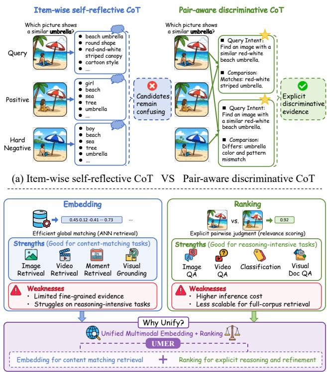  
(b) Unifying embedding and ranking for multimodal retrieval  
Figure 1: Two overlooked issues in universal multimodal re- trieval. (a) Item-wise self-reflective CoT lacks pair-aware evidence for hard-negative discrimination. (b) Diferent metatasks require diferent capabilities, with embedding and rank- ing ofering complementary strengths.

However, b examinin how CoT is currentl used in mul- timodal retrieval and what capabilities complex instruction- aware retrieval tasks require, we identify two overlooked issues, as illustrated in Fig. 1. First, existing item-wise CoT lacks pair-aware discriminative evidence for representation learning. Existing CoT-based embedding methods (Lan et al. 2026; Jiang et al. 2026; He et al. 2026) usu-ally adopt an item-wise self-reflective reasoning paradigm, where the model independently describes the query or can- didate. Although such CoT enriches item-level semantics, it does not model query–candidate interactions and can- not explain why a positive matches or a hard negative fails. This is especially problematic for hard samples, which of- ten share similar visual content, textual semantics or scene structures, but difer only in subtle attributes, relations, an- swer evidence or task intent. Moreover, CoT is typically supervised by autoregressive cross-entropy and only indi- rectly injected into the embedding token, causing a mis-match between language generation quality and embedding discriminabilit . Second, diferent meta-tasks in universal multimodal retrieval require diferent model capabilities. Specifically, these meta-tasks range from content-matchin tasks, such as ima e retrieval, video retrieval, mo- ment retrieval and visual grounding, which primarily rely on global query–candidate similarity, to reasoning-intensive tasks, such as question answering and classification, which require answer evidence or category-specific conditions. A single contrastive embedding objective is therefore insufficient to model task-specific matching evidence and fine- grained discrepancies. In contrast, interaction-based discrim- inative ranking (Lin et al. 2025; Gu et al. 2026; Li et al. 2026) explicitly models pairwise interactions and task satisfaction, complementing eficient embedding retrieval with stronger semantic judgment. As further corroborated by Fig. 4(a), the task-dependent complementarity between embedding and ranking suggests that universal multimodal retrieval should combine representation-based retrieval with explicit discrim- inative ranking.

To address these issues, we propose UMER, a Unified Multimodal Embedding and Ranking framework for univer-sal multimodal retrieval. Specifically, we design a Pair-Aware Discriminative CoT paradigm that takes positive and hard- negative query–candidate pairs as reasoning inputs, encour- aging the model to explicitly compare matching and discrep- ancy evidence and to produce a deterministic ranking judg-ment. We build a unified multi-task framework that supports both embedding contrastive learning and ranking discrimi- native learning. The embedding branch learns global match- ing in a metric space for corpus-scale retrieval, while the ranking branch models query–candidate interactions through pair-aware reasoning for complex tasks and hard samples. To co-optimize these capabilities, we introduce Complementary Mutual Distillation (CMD) between embedding and ranking.

The ranking branch refines the embedding space with dis- criminative knowledge, while the embedding branch stabi- lizes ranking with global semantic structure. At inference, UMER supports a budget-adjustable Embedding-then-CoT-Ranking pipeline. In eficiency-oriented settings, it extracts embeddings in one forward pass and performs large-scale retrieval through vector indexing. In accuracy-oriented or hard-sample settings, it additionally generates pair-aware dis- criminative CoT and relevance scores for explicit reasoning and reranking.

The main contributions are summarized as follows:

• We propose Pair-Aware Discriminative Reasoning and construct pair-aware CoT and ranking data, enabling ex- plicit modeling of matching evidence for positives and discrepancy evidence for hard negatives.

• We present UMER, a unified MLLM-based framework that jointly learns multimodal embeddings and discrimi-native ranking to address the heterogeneous requirements of universal multimodal retrieval.

• We introduce Complementary Mutual Distillation between embedding and ranking: discriminative ranking refines the embedding space, while global embedding structure stabilizes ranking.

• UMER achieves state-of-the-art performance on the MMEB-V2 benchmark under comparable experimental settings, demonstrating eficient vector retrieval and im- proved accuracy through explicit reasoning and ranking.

## Related Work

## Multimodal Embedding Models

Universal multimodal embedding has progressed from dual encoders such as CLIP, ALIGN and SigLIP (Radford et al. 2021; Jia et al. 2021; Zhai et al. 2023) to MLLM-based encoders that follow task instructions and fuse multimodal inputs. VLM2Vec (Jiang et al. 2024b) and VLM2Vec-V2 (Meng et al. 2025) convert MLLMs into embedders through contrastive training on the MMEB and MMEB-V2 bench- marks. UniME-V2 (Gu et al. 2026) further improves dis-criminability via MLLM-as-a-Judge hard-negative mining and soft-label alignment, and Qwen3-VL-Embedding (Li et al. 2026) demonstrates strong performance with large-scale contrastive training and reranker distillation. Despite these advances, most MLLM-based embedding models still rely on in-batch contrastive objectives and provide limited explicit reasoning about why a query should match one can- didate over another, especially for hard negatives with subtle semantic diferences.

## Reasoning-Enhanced Multimodal Retrieval

Reasoning-enhanced embedding models generate interme- diate rationales before extracting representations. UME-R1 (Lan et al. 2026) formulates multimodal embedding as reasoning-driven generation, where the MLLM autoregres- sively produces a rationale conditioned on the input and then derives the representation from the hidden states after reason- ing. Embed-RL (Jiang et al. 2026) further optimizes such rationales with reinforcement learning, using retrieval-oriented rewards to align the reasoning trace with downstream match- ing signals. However, explicit CoT reasoning introduces sub- stantial decoding cost, as a rationale must be generated before each embedding. To reduce this overhead, PLUME (He et al. 2026) replaces verbalized CoT with a short rollout ofcontinu-ous latent states under a progressive curriculum, while LaME (Wu et al. 2026b) performs latent reasoning through an information bottleneck with learnable reason tokens. Despite these eficiency gains, these approaches remain item-wise, enriching query and candidate representations independently rather than explicitly modeling the matching and discrepancy evidence between them.

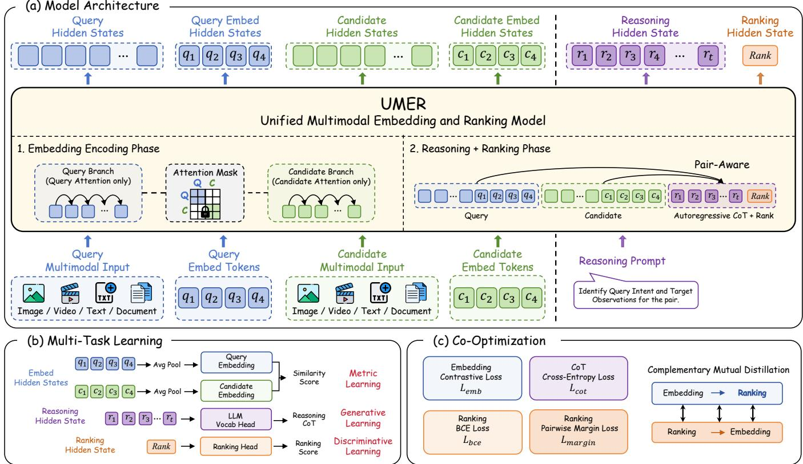  
Figure 2: Overview of UMER, a unified multimodal embedding and ranking framework. (a) Query and candidate inputs are first encoded independently through masked branch attention to extract their embeddings, and are then jointly used for pair-aware autoregressive reasoning followed by a ranking token. (b) Multi-task heads support metric embedding learning, generative CoT learning and discriminative ranking learning. (c) Unified co-optimization combines multi-task supervision and complementary mutual distillation to jointly improve embedding and ranking.

## Multimodal Reranking Models

MLLM rerankers jointly encode query–candidate pairs to improve fine-grained relevance estimation after initial re- trieval. RagVL (Chen et al. 2024) shows that MLLMs can serve as strong multimodal rerankers in retrieval-augmented generation by instruction-tuning the model to filter retrieved images. UniME-V2-Reranker (Gu et al. 2026) trains a reranking model on mined hard negatives with pairwise and list- wise optimization. Qwen3-VL-Reranker (Li et al. 2026) performs fine-grained relevance estimation with a cross- encoder architecture and is designed to complement Qwen3-

VL-Embedding in a two-stage retrieval pipeline. Existing rerankers capture fine-grained query–candidate interactions, but they are usually trained and deployed as separate second- stage modules. Consequently, ranking knowledge can reach the embedding only through discrete ofline targets such as soft labels or mined pseudo-negatives. UMER instead unifies embedding, Pair-Aware Discriminative Reasoning and rank- ing within a single MLLM, letting the two branches share the same backbone and be co-optimized end-to-end.

## Methodology

Method overview. Given an instruction-aware multimodal query q and a corpus of multimodal candidates C, universal multimodal retrieval ranks candidates in C by their relevance to the query instruction. As illustrated in Fig. 2, UMER jointly learns two complementary functions with a single shared MLLM: an independently computable embedding function for corpus-scale candidate retrieval and a pair-aware ranking function for explicit verification. The two functions share the MLLM backbone while using attention masks and task-specific tokens to preserve distinct information flows. The following subsections present the unified architecture, pair-aware CoT data construction, complementary mutual distillation and training and inference procedures.

## Unified Embedding and Ranking Architecture

Embedding encoding phase. Let Q and C denote the tokenized multimodal query and candidate, respectively. We denote a relevant candidate by $c ^ { + }$ and a semantically confus- able but irrelevant candidate by $c ^ { - }$ . We append M learnable embedding tokens to each input, $E _ { q } = \{ q _ { 1 } , . . . , q _ { M } \}$ for the query and $E _ { c } = \{ c _ { 1 } , \ldots , { \bar { c } } _ { M } \}$ for the candidate, fol- lowing recent MLLM retrievers that use dedicated tokens as explicit aggregation interfaces (Sun et al. 2026). As shown in Fig. $2 ( \mathrm { a } )$ , under branch-wise attention masks, $E _ { q }$ attends only to $Q$ and $E _ { c }$ only to $C .$ This enables packed training while preserving the independent query and candidate encod- ings required for corpus indexing and approximate nearest- neighbor search. We mean-pool and $\ell _ { 2 }$ -normalize the M embedding-token states:

$$
e _ { x } = \operatorname { N o r m } \left( { \frac { 1 } { M } } \sum _ { k = 1 } ^ { M } h _ { x _ { k } } \right) , \qquad x \in \{ q , c \} .\tag{1}
$$

where $h _ { x _ { k } }$ denotes the final hidden state of the k-th embedding token for $x = q$ (query) or $x \ = \ c$ (candidate). The M tokens provide multiple aggregation slots whose pooled state forms a single fixed-dimensional embedding. We opti- mize the independently computable representations using an in-batch contrastive objective augmented with mined hard negatives:

$$
\mathcal { L } _ { \mathrm { e m b } } = - \frac { 1 } { B } \sum _ { i = 1 } ^ { B } \log \frac { \exp ( s ^ { e } ( q _ { i } , c _ { i } ^ { + } ) ) } { \sum _ { c \in \{ c _ { i } ^ { + } \} \cup \mathcal { N } _ { i } } \exp ( s ^ { e } ( q _ { i } , c ) ) } ,\tag{2}
$$

where $s ^ { e } ( q , c ) = e _ { q } ^ { \top } e _ { c } / \tau _ { e }$ is the temperature-scaled cosine similarity, $\tau _ { e }$ is a temperature hyperparameter, B is the batch size and ${ \mathcal { N } } _ { i }$ contains in-batch candidates and mined hard negatives for $q _ { i }$ . This objective learns a shared metric space that supports independent corpus indexing, while the atten- tion masks ensure that each embedding remains independent of cross-item information unavailable at retrieval time.

Pair-aware reasoning and ranking phase. Global similarity may fail to distinguish candidates that share visual content or surface semantics but difer in instruction-critical evidence. We therefore introduce pair-aware discriminative reasoning for fine-grained relevance estimation. For each positive or hard-negative pair $( q , c ^ { a } )$ , where $a \in \{ + , - \}$ we first encode its inputs under branch-wise attention masks, then append a fixed prompt $P$ and autoregressively generate a pair-aware reasoning trace $R ^ { a } = ( r _ { 1 } ^ { a } , . . . , r _ { T _ { a } } ^ { a } ) $ with full pairwise attention. Let $X ^ { a } = [ Q ; E _ { q } ; C ^ { a } ; E _ { c } ; P ]$ denote the resulting input sequence, where $C ^ { a }$ is the tokenized candi- date, and let $g ^ { a }$ be the verified target reasoning trace. We supervise the generation of reasoning traces with

$$
\mathcal { L } _ { \mathrm { c o t } } = \sum _ { a \in \{ + , - \} } \mathrm { C E } ( g ^ { a } ; X ^ { a } ) ,\tag{3}
$$

where $\mathrm { C E } ( g ^ { a } ; X ^ { a } )$ is the standard token-level cross-entropy under the model’s autoregressive distribution. This objective trains pair-aware discriminative CoT to ground its reasoning in jointly visible query–candidate evidence, rather than inde-pendently describing each item as in item-wise self-reflective

CoT. During training, we teacher-force the target rationale; at inference, we decode it autoregressively.

The rationale-conditioned pair representation is then con- verted into a relevance judgment by a learnable [RANK] token following $R ^ { a }$ , which attends to the full pair and produces a logit $z _ { q , c ^ { a } } = w ^ { \top } h _ { [ \mathrm { R A N K } ] } + b .$ , with probability $p _ { q , c ^ { a } } = \sigma ( z _ { q , c ^ { a } } )$ . We train the positive and hard-negative pairs with binary cross-entropy,

$$
\mathcal { L } _ { \mathrm { b c e } } = - \log p _ { q , c ^ { + } } - \log \left( 1 - p _ { q , c ^ { - } } \right) ,\tag{4}
$$

and use a logistic pairwise objective to rank the positive above the hard negative:

$$
\mathcal { L } _ { \mathrm { m a r g i n } } = - \log \sigma \big ( z _ { q , c ^ { + } } - z _ { q , c ^ { - } } \big ) .\tag{5}
$$

We average each loss over valid triplets $( q , c ^ { + } , c ^ { - } )$ in the minibatch. This smooth objective encourages $z _ { q , c ^ { + } } > z _ { q , c ^ { - } }$ ${ \mathcal { L } } _ { \mathrm { c o t } }$ supervises the pair-conditioned discriminative evi- dence, $\mathcal { L } _ { \mathrm { b c e } }$ provides absolute relevance labels, and $\mathcal { L }$ margin encourages the positive logit to exceed the hard-negative logit.

## Pair-Aware Discriminative CoT Data Construction

Item-wise CoT (Lan et al. 2026; Jiang et al. 2026; He et al. 2026) can richly describe individual items while still omitting the evidence needed to distinguish a positive from a se- mantically confusable negative. We therefore construct pair- aware CoT and ranking supervision through three steps: hard- negative mining, structured CoT generation and evidence- suficiency filtering.

Hard-negative mining. Given the training set $\begin{array} { r l } { \mathcal { D } } & { { } = } \end{array}$ $\{ ( q _ { i } , c _ { i } ^ { + } ) \} _ { i = 1 } ^ { N }$ , we use a frozen of-the-shelf multimodal em- bedder f0 to obtain normalized representations for every query and candidate. For each query $q _ { i }$ , we rank non-relevant candidates $\mathcal { C } _ { i } ^ { - }$ by cosine similarity and retain the three highest-scoring candidates:

$$
\mathcal { H } _ { i } = \mathrm { T o p 3 } _ { c \in \mathcal { C } _ { i } ^ { - } } f _ { 0 } ( q _ { i } ) ^ { \top } f _ { 0 } ( c ) .\tag{6}
$$

Each query thus yields one positive pair $( q _ { i } , c _ { i } ^ { + } )$ and three hard-negative pairs $( q _ { i } , c _ { i , j } ^ { - } )$ , which serve as candidates for verified triplet construction.

Structured CoT generation. For each positive or mined hard-negative pair, we prompt Qwen3.5-9B (Qwen Team 2026) to generate structured pair-aware CoT. The CoT contains two fields: Query Intent and Target Observations. Query Intent specifies the evidence required by the instruction, whereas Target Observations identifies candidate evi- dence that supports or contradicts that intent. This structure instantiates the pair-aware reasoning paradigm in Fig. 1(a) by evaluating a shared query intent against each positive or hard-negative candidate. We omit an explicit Yes/No answer so that relevance must be inferred from the CoT evidence rather than copied from a label.

Evidence-suficiency filtering. A fluent CoT does not nec-essarily contain suficient discriminative evidence. We there- fore retain a generated CoT only if a lightweight text-only verifier (Qwen3.5-0.8B) can correctly infer the pair’s groundtruth Yes/No relevance label from the CoT alone. For each mined hard negative $c _ { i , j } ^ { - }$ , we retain the triplet $( q _ { i } , c _ { i } ^ { + } , c _ { i , j } ^ { - } )$

only if the CoTs for both the positive pair and its corre- sponding hard-negative pair pass this verification. Applying this generate-and-verify pipeline to all training queries yields verified triplets for CoT generation, discriminative ranking and distillation. More details are provided in the appendix.

## Complementary Mutual Distillation

Embedding and ranking capture complementary relevance signals: embedding organizes global semantic similarity, whereas pair-aware ranking resolves instruction-critical con- fusions. Rather than forcing the two functions to agree indis- criminately, we use selective bidirectional CMD to transfer a preference only to the other capability and only on meta-tasks where its source is more reliable. This preserves their com- plementary roles while allowing each to address the other’s blind spots.

For each verified triplet, a frozen reference model pro- duces temperature-scaled positive–negative preference dis- tributions $\bar { \pi } _ { e }$ and $\bar { \pi } _ { r }$ for embedding and ranking, respectively; $\pi _ { e }$ and $\pi _ { r }$ are the corresponding distributions from the train- able model. We assign each meta-task to an embedding- favored or ranking-favored set according to its task at- tribute: Retrieval and Grounding/MR are treated as content- matching tasks where global embedding structure is the pri- mary teacher, while Classification and QA are treated as reasoning-intensive tasks where pair-aware ranking provides the primary teacher. The gate $g _ { e \to r }$ is one only when an embedding-favored triplet is correctly ordered by the ref- erence embedding; analogously, $g _ { r  e }$ is one only when a ranking-favored triplet is correctly ordered by the reference ranker. Both gates are zero otherwise, preventing unreliable preferences from propagating.

$$
\begin{array} { r c l } { { \mathcal { L } _ { \mathrm { c m d } } } } & { { = } } & { { g _ { e \to r } \mathrm { K L } ( \mathrm { s g } [ \bar { \pi } _ { e } ] \| \pi _ { r } ) } } \\ { { } } & { { } } & { { + g _ { r \to e } \mathrm { K L } ( \mathrm { s g } [ \bar { \pi } _ { r } ] \| \pi _ { e } ) , } } \end{array}\tag{7}
$$

where $\mathrm { s g } [ \cdot ]$ stops gradients through the frozen reference, and the loss is averaged over activated triplets. The first term is exclusively embedding-to-ranking distillation, and the sec- ond is exclusively ranking-to-embedding distillation. Con- sequently, reliable embedding preferences stabilize ranking on content-matching meta-tasks, while reliable ranking pref- erences refine the embedding space on reasoning-intensive meta-tasks.

## Progressive Training and Flexible Inference

Three-stage training. We train UMER progressively to prevent early generative and ranking objectives from destabilizing the shared backbone, following curriculum learning and staged reasoning-to-embedding optimization (Bengio et al. 2009; He et al. 2026). The overall objective is

$$
\begin{array} { r c l } { \mathcal { L } _ { \mathrm { a l l } } } & { = } & { \mathcal { L } _ { \mathrm { e m b } } + \lambda _ { \mathrm { c o t } } \mathcal { L } _ { \mathrm { c o t } } + \lambda _ { \mathrm { b c e } } \mathcal { L } _ { \mathrm { b c e } } } \\ & & { + \lambda _ { \mathrm { m a r g i n } } \mathcal { L } _ { \mathrm { m a r g i n } } + \lambda _ { \mathrm { c m d } } \mathcal { L } _ { \mathrm { c m d } } , } \end{array}\tag{8}
$$

where the λ terms weight the CoT, ranking and CMD losses relative to ${ \mathcal { L } } _ { \mathrm { e m b } }$ . Stage 1 learns a stable, indexable embed- ding space using only ${ \mathcal { L } } _ { \mathrm { e m b } }$ on the full MMEB training set. Stage 2 adds $\mathcal { L } _ { \mathrm { c o t } } , \mathcal { L } _ { \mathrm { b c e } }$ and ${ \mathcal { L } } _ { \mathrm { m a r g i n } }$ on verified pair-aware triplets to learn discriminative evidence and relevance or- dering. Stage 3 freezes the Stage 2 checkpoint as the refer- ence model and adds $\mathcal { L } _ { \mathrm { c m d } }$ , transferring reliable preferences across capabilities on complementary meta-tasks.

Flexible inference. UMER supports budget-adjustable inference in three modes: UMER-E for embedding-only re- trieval, UMER-R for pair-aware ranking and UMER-H for combining both signals. We precompute candidate embed- dings with Eq. 1, build an approximate nearest-neighbor in- dex and independently encode each query to retrieve the top- $\mathbf { \nabla } . K$ candidates by $s ^ { e } ( q , c ) ;$ UMER-E uses this score di- rectly without autoregressive reasoning. For UMER-R and UMER-H, we apply the pair-aware prompt only to the top-K candidates to obtain $z _ { q , c } ,$ following the standard retrieve- then-rerank paradigm (Chen et al. 2024; Li et al. 2026). UMER-R uses $z _ { q , c }$ for reranking, whereas UMER-H uses

$$
s ^ { \mathrm { h y b } } ( q , c ) = s ^ { e } \widehat { ( q , c ) } + \alpha \widehat { z _ { q , c } } ,\tag{9}
$$

where $\hat { \cdot }$ denotes normalization within the top-K list and α controls the ranking contribution.

## Experiments and Results

## Experimental Setup

Benchmark and metrics. We evaluate UMER on MMEB-V2 (Meng et al. 2025), which comprises 78 tasks across image, video and visual-document domains, covering clas- sification, question answering, retrieval, grounding and mo- ment retrieval. We use the corrected versions of ViDoSeek- page and MMLongBench-page. For a fair comparison, our training data are drawn from the same public source datasets as VLM2Vec-V2. Following the oficial protocol, we report Hit@1 for image and video tasks and NDCG@5 for visual- document retrieval. Each meta-task score is the macro aver- age over its constituent datasets, and All is the macro average over all 78 tasks. We report detailed results for each task and diferent model sizes in the supplementary material.

Baselines. We compare with eight representative unified multimodal retrieval methods: GME (Zhang et al. 2025), VLM2Vec (Jiang et al. 2024b), VLM2Vec-V2 (Meng et al. 2025), DUME (Lan et al. 2026), Bottleneck Tokens (BToks) (Sun et al. 2026), UME-R1 (Lan et al. 2026), PLUME (He et al. 2026) and RIME (Wu et al. 2026a). All compared methods use Qwen2-VL-2B backbones.

Implementation details. UMER is initialized from Qwen2-VL-2B-Instruct. Each input receives $M = 4$ learn- able embedding tokens. Relative to the embedding ob- jective, the efective weights for CoT generation, binary ranking, pairwise ranking and bidirectional distillation are $( \lambda _ { \mathrm { c o t } } , \bar { \lambda } _ { \mathrm { b c e } } , \lambda _ { \mathrm { m a r g i n } } , \lambda _ { \mathrm { c m \bar { d } } } ) = ( 0 . 2 , 0 . 1 , 0 . 2 , 0 . 2 )$ . At infer- ence time, pair-aware reasoning is applied to the top $K = 5$ candidates retrieved by the embedding branch, with genera- tion capped at 256 new tokens. For UMER-H, the embedding and ranking scores are separately z-score normalized over these five candidates, and we set $\alpha = 2 . 0$ in Eq. 9. Addi- tional details are provided in the supplementary material.

## Main Results on MMEB-V2

Table 1 shows that UMER-H achieves the best overall score of 65.5, and obtains the best modality-level results on Im- age (70.4), Video (45.0) and VisDoc (73.6). The two scoring functions exhibit diferent task preferences: UMER-R per- forms better on I-QA, V-CLS, V-QA and VisDoc-VR, where relevance requires explicit answer or category verification, whereas UMER-E is stronger on I-RET, I-GD, VDRv1 and VDRv2, which rely more on global metric-space match- ing. This task-dependent behavior is consistent with the in- tended roles of embedding retrieval and pair-aware ranking described above. As an inference-time score fusion, UMER- H improves the overall score from 63.1 for UMER-E and 63.9 for UMER-R to 65.5.

<table><tr><td rowspan="2">Model</td><td colspan="5">Image</td><td colspan="5">Video</td><td colspan="5">VisDoc</td><td rowspan="2">All</td></tr><tr><td>CLS</td><td>QA</td><td>RET</td><td>GD</td><td>Overall</td><td>CLS</td><td>QA</td><td>RET</td><td>MRET</td><td>Overall</td><td>VDRv1</td><td>VDRv2</td><td>VR</td><td>OOD</td><td>Overall</td></tr><tr><td># of Datasets</td><td>10</td><td>10</td><td>12</td><td>4</td><td>36</td><td>5</td><td>5</td><td>5</td><td>3</td><td>18</td><td>10</td><td>4</td><td>6</td><td>4</td><td>24</td><td>78</td></tr><tr><td></td><td></td><td></td><td></td><td></td><td></td><td></td><td>Baseline Models</td><td></td><td></td><td></td><td></td><td></td><td></td><td></td><td></td><td></td></tr><tr><td>GME</td><td>54.4</td><td>29.9</td><td>66.9</td><td>55.5</td><td>51.9</td><td>34.9</td><td>42.0</td><td>25.6</td><td>32.4</td><td>33.9</td><td>86.1</td><td>54.0</td><td>82.5</td><td>43.1</td><td>72.7</td><td>54.1</td></tr><tr><td>VLM2Vec</td><td>58.7</td><td>49.3</td><td>65.0</td><td>72.9</td><td>59.7</td><td>33.4</td><td>30.5</td><td>20.6</td><td>33.0</td><td>29.0</td><td>49.8</td><td>13.5</td><td>51.8</td><td>33.5</td><td>41.6</td><td>47.0</td></tr><tr><td>VLM2Vec-V2</td><td>62.9</td><td>56.3</td><td>69.5</td><td>77.3</td><td>64.9</td><td>39.3</td><td>34.3</td><td>28.8</td><td>38.5</td><td>34.9</td><td>75.5</td><td>44.9</td><td>79.4</td><td>39.4</td><td>65.4</td><td>58.0</td></tr><tr><td>DUME</td><td>59.3</td><td>55.0</td><td>66.3</td><td>78.0</td><td>62.5</td><td>37.7</td><td>46.6</td><td>17.1</td><td>30.0</td><td>33.2</td><td>67.6</td><td>43.3</td><td>47.1</td><td>33.8</td><td>52.8</td><td>52.7</td></tr><tr><td>BToks UME-R1</td><td>64.3</td><td>59.8</td><td>68.8</td><td>77.4</td><td>66.0</td><td>43.7</td><td>47.0</td><td>33.0</td><td>33.6</td><td>39.9</td><td>71.1</td><td>38.6</td><td>81.3</td><td>38.1</td><td>62.7</td><td>59.0</td></tr><tr><td>PLUME</td><td>64.8 66.5</td><td>62.8 59.2</td><td>67.6</td><td>77.2</td><td>66.6 66.3</td><td>44.3 45.0</td><td>51.2</td><td>32.9</td><td>39.7</td><td>42.2</td><td>72.4</td><td>46.2</td><td>79.2</td><td>37.2</td><td>63.9</td><td>60.1</td></tr><tr><td>RIME</td><td>67.9</td><td>64.4</td><td>67.6 69.8</td><td>79.7 82.1</td><td>69.1</td><td>48.0</td><td>52.3 52.1</td><td>33.5 33.6</td><td>46.7 39.2</td><td>44.1 43.7</td><td>72.1 76.4</td><td>49.8</td><td>78.1 81.7</td><td>57.4</td><td>67.5</td><td>61.6 64.1</td></tr><tr><td></td><td></td><td></td><td></td><td></td><td></td><td></td><td></td><td></td><td></td><td></td><td></td><td>51.4</td><td></td><td>63.9</td><td>71.4</td><td></td></tr><tr><td></td><td></td><td></td><td></td><td></td><td></td><td></td><td></td><td>Ours</td><td></td><td></td><td></td><td></td><td></td><td></td><td></td><td></td></tr><tr><td>UMER-E UMER-R</td><td>64.4</td><td>64.9</td><td>70.2</td><td>78.4</td><td>68.0</td><td>43.0</td><td>50.6</td><td>34.7</td><td>32.8</td><td>41.1</td><td>76.1</td><td>50.1</td><td>82.8</td><td>68.3</td><td>72.2</td><td>63.1</td></tr><tr><td>UMER-H</td><td>64.9 66.1</td><td>68.4 68.9</td><td>69.7 71.7</td><td>74.1</td><td>68.5 70.4</td><td>51.4 50.6</td><td>51.6 52.8</td><td>35.3 37.7</td><td>33.3 35.0</td><td>44.0 45.0</td><td>75.1 78.0</td><td>48.3 50.5</td><td>84.6 85.0</td><td>67.9</td><td>71.8</td><td>63.9</td></tr><tr><td></td><td></td><td></td><td></td><td>80.8</td><td></td><td></td><td></td><td></td><td></td><td></td><td></td><td></td><td></td><td>68.8</td><td>73.6</td><td>65.5</td></tr></table>

Table 1: Main results on MMEB-V2. The best and second-best scores in each column are in bold and underlined, respectively.

## Ablation Studies

Pair-aware reasoning and ranking. Table 2 separates the efects of pair-aware reasoning and ranking supervision. Adding pair-aware CoT alone lifts UMER-E further to 62.9, showing that discriminative pair evidence directly benefits the embedding space, but leaves UMER-R at 45.4 because the [RANK] head is not calibrated. Adding ranking losses alone brings UMER-E from 60.7 to 62.0 and yields 65.0 in hybrid mode, confirming that pairwise labels already provide efec- tive supervision. Combining both signals restores UMER-R to 63.4 and reaches 65.4 in hybrid mode, indicating that the two forms of supervision are complementary rather than substitutable.

Complementary mutual distillation. As shown in Table 2, each one-way variant improves its intended branch, r→e lifts UMER-E from 62.4 to 62.7 with UMER-R unchanged, and e→r lifts UMER-R from 63.4 to 63.9 with UMER-E only marginally perturbed to 62.2. Applying both directions unconditionally captures only part of the benefit (62.6 / 63.6) because agreement is enforced even when the teacher is incorrect. The selective bidirectional gate improves UMER-E and UMER-R to 63.1 and 63.9, showing that the two branches can co-evolve without collapsing into identical decision functions.

## In-Depth Analysis

Hard-Negative Separation: Item-Wise vs. Pair-Aware Embeddings. Both UME-R1 and UMER-E yield independently indexable embeddings, but difer in how these rep- resentations are learned: UME-R1 relies on item-wise rea- soning, whereas UMER-E is optimized within a pair-aware reasoning and supervision framework. We compare them on the same 3,600 queries from all 36 image tasks. For each query, we define the separation margin as the similarity of its highest-scoring positive minus that of its highest-scoring non-positive. Fig. 3(a) shows that UMER-E increases the task-macro-averaged positive-to-hard-negative cosine mar- gin from 5.24 to 6.80 points. While the two models achieve comparable positive-margin coverage, Fig. 3(b) reveals a widening advantage under stricter thresholds: UMER-E re- tains 5.0 and 6.8 percentage points more queries at margins of 10 and 20, respectively. These results indicate that pair- aware embeddings separate successful matches more deci- sively from their hardest distractors.

From Capability Specialization to Complementary Transfer. Fig. 4(a) reveals a systematic capability split within the same unified Stage 2 model: embedding outperforms ranking on content-matching Retrieval and Grounding/MR, whereas ranking outperforms embedding on reasoning- intensive CLS and QA. This task-dependent reversal directly supports the motivation in Fig. 1(b): heterogeneous retrieval tasks require distinct inductive biases, and neither metric- space embedding nor pair-aware ranking is uniformly op- timal. Unification is therefore not merely an architectural convenience, but a means to retain and coordinate both ca- pabilities within one model. Building on this specialization, Fig. 4(b) examines whether CMD can convert complementary strengths into transferable supervision. On embedding- favored Retrieval and Grounding/MR, ranking gains 1.6 and 0.8 points, consistent with embedding-to-ranking transfer; on ranking-favored CLS and QA, embedding gains 0.3 and 0.5 points, supporting the reverse direction. Together with the positive gains for both functions across all groups, these targeted improvements indicate that CMD narrows capabil- ity gaps without collapsing the specialization that makes the two functions complementary.

<table><tr><td>Configuration</td><td colspan="4">Embedding mode (UMER-E)</td><td colspan="4">Ranking mode (UMER-R)</td><td colspan="4">Hybrid mode (UMER-H)</td></tr><tr><td></td><td>Image</td><td>Video</td><td>VisDoc</td><td>All</td><td>Image</td><td>Video</td><td>VisDoc</td><td>All</td><td>Image</td><td>Video</td><td>VisDoc</td><td>All</td></tr><tr><td>Embedding only</td><td>66.5</td><td>37.8</td><td>69.2</td><td>60.7</td><td></td><td></td><td>一</td><td>1</td><td>一</td><td>一</td><td></td><td></td></tr><tr><td>+ pair-aware CoT, w/o ranking losses</td><td>68.2</td><td>41.1</td><td>71.2</td><td>62.9</td><td>44.4</td><td>31.8</td><td>57.1</td><td>45.4</td><td>68.6</td><td>42.2</td><td>71.3</td><td>63.3</td></tr><tr><td>+ ranking losses, w/o CoT</td><td>68.0</td><td>40.2</td><td>69.3</td><td>62.0</td><td>68.6</td><td>43.1</td><td>69.4</td><td>63.0</td><td>70.8</td><td>45.1</td><td>71.2</td><td>65.0</td></tr><tr><td>+ pair-aware CoT and ranking losses</td><td>67.9</td><td>39.6</td><td>71.1</td><td>62.4</td><td>67.2</td><td>44.2</td><td>72.1</td><td>63.4</td><td>70.3</td><td>44.9</td><td>73.4</td><td>65.4</td></tr><tr><td>Pair-aware model, w/o CMD</td><td>67.9</td><td>39.6</td><td>71.1</td><td>62.4</td><td>67.2</td><td>44.2</td><td>72.1</td><td>63.4</td><td>70.3</td><td>44.9</td><td>73.4</td><td>65.4</td></tr><tr><td>+ ranking → embedding only</td><td>67.9</td><td>40.4</td><td>71.5</td><td>62.7</td><td>68.5</td><td>43.3</td><td>70.9</td><td>63.4</td><td>70.6</td><td>44.7</td><td>72.7</td><td>65.3</td></tr><tr><td>+ embedding → ranking only</td><td>67.8</td><td>40.4</td><td>70.1</td><td>62.2</td><td>69.2</td><td>43.9</td><td>71.1</td><td>63.9</td><td>70.8</td><td>45.1</td><td>72.6</td><td>65.5</td></tr><tr><td>+ always-on bidirectional CMD</td><td>68.0</td><td>40.2</td><td>71.1</td><td>62.6</td><td>68.5</td><td>43.6</td><td>71.0</td><td>63.6</td><td>70.7</td><td>45.3</td><td>73.0</td><td>65.5</td></tr><tr><td>+ selective bidirectional CMD (full)</td><td>68.0</td><td>41.1</td><td>72.2</td><td>63.1</td><td>68.5</td><td>44.0</td><td>71.8</td><td>63.9</td><td>70.4</td><td>45.0</td><td>73.6</td><td>65.5</td></tr></table>

Table 2: Controlled ablations of pair-aware CoT, ranking supervision and complementary mutual distillation (CMD). The best and second-best scores in each column are in bold and underlined, respectively.

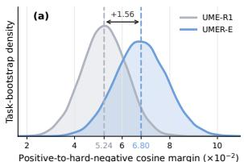

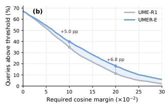  
Figure 3: Embedding separation under item-wise and pair- aware supervision on 3,600 queries from the 36 image tasks of MMEB-V2. (a) Bootstrap distribution of the macroaveraged positive–hard-negative margin. (b) Fraction of queries exceeding margin thresholds.

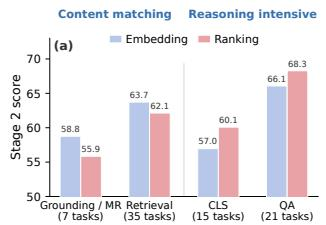

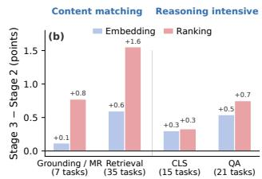  
Figure 4: Capability specialization and transfer via CMD. (a) Embedding is stronger for content matching, while ranking is stronger for reasoning-intensive relevance judgment. (b) CMD transfers these complementary strengths between the two functions.

## Accuracy–Eficiency Tradeof

Embedding eficiency. Table 3 shows that UMER-E avoids the sequential reasoning required before embedding ex- traction by UME-R1 and PLUME. It achieves the best embedding-only score of 63.1 with zero reasoning tokens, yielding query/indexing speedups of 118.6×/99.6× over UME-R1 and 3.9×/3.1× over PLUME. Since indexing cost scales with corpus size, this advantage is particularly impor-

<table><tr><td>Model</td><td>K</td><td>Score ↑</td><td>Reasoning Tokens (/query)</td><td>Query Latency (s/query) ↓</td><td>Indexing Time (s/candidate) ↓</td></tr><tr><td>UME-R1</td><td>一</td><td>60.1</td><td>352</td><td>9.963</td><td>11.755</td></tr><tr><td>PLUME</td><td></td><td>61.6</td><td>8</td><td>0.329</td><td>0.366</td></tr><tr><td>UMER-E</td><td></td><td>63.1</td><td>0</td><td>0.084</td><td>0.118</td></tr><tr><td rowspan="4">UMER-H</td><td>3</td><td>64.8</td><td>410</td><td>13.566</td><td rowspan="4">0.</td></tr><tr><td>5</td><td>65.5</td><td>665</td><td>19.880</td></tr><tr><td>10</td><td>66.0</td><td>1305</td><td>42.764</td></tr><tr><td>20</td><td>66.1</td><td>2508</td><td>81.726</td></tr></table>

Table 3: Accuracy–eficiency on MMEB-V2 using one NVIDIA A100 GPU (batch size=1). UMER-H reuses the UMER-E index; 0. denotes no extra indexing cost.

tant for large-scale retrieval.

Budget-adjustable inference. UMER-H reuses the UMER-E index and spends additional computation only on online top-K reranking. As K increases from 3 to 20, tokens and latency grow nearly linearly, whereas the score saturates from 64.8 to 66.1. The default K = 5 reaches 65.5, capturing 80% of the maximum observed gain over UMER-E at only 24% of the K = 20 latency, providing a favorable accuracy–eficiency balance.

## Conclusion

In this paper, we presented UMER, a unified multimodal embedding and ranking framework for universal multi- modal retrieval. UMER introduces Pair-Aware Discrimina- tive Reasoning to explicitly compare a query with a candi- date and identify matching or discrepancy evidence, over- coming the limited discriminative supervision of item-wise CoT. A shared MLLM jointly learns independently index-able embeddings, pair-aware CoT generation and discrimi- native ranking, while complementary mutual distillation co- optimizes global metric matching and fine-grained relevance judgment. Extensive experiments on MMEB-V2 show that UMER establishes a new state of the art under comparable experimental settings, validating the complementary value of eficient embedding retrieval and explicit reasoning-based ranking for universal multimodal retrieval.

## References

Bengio, Y.; Louradour, J.; Collobert, R.; and Weston, J. 2009. Curriculum Learning. In Proceedings of the 26th Annual International Conference on Machine Learning, 41–48.

Chen, Z.; Xu, C.; Qi, Y.; and Guo, J. 2024. MLLM Is a Strong Reranker: Advancing Multimodal Retrieval- Augmented Generation via Knowledge-Enhanced Reranking and Noise-Injected Training. arXiv:2407.21439.

Cui, X.; Cheng, J.; Chen, H.-y.; Shukla, S. N.; Awasthi, A.; Pan, X.; Ahuja, C.; Mishra, S. K.; Yang, Y.; Xiao, J.; Guo, Q.; Lim, S.-N.; Singh, A.; and Fan, X. 2025. Think Then Embed: Generative Context Improves Multimodal Embedding. arXiv:2510.05014.

Gu, T.; Yang, K.; Feng, Z.; Wang, X.; Zhang, Y.; Long, D.; Chen, Y.; Cai, W.; and Deng, J. 2025. Breaking the Modality Barrier: Universal Embedding Learning with Multimodal LLMs. arXiv preprint arXiv:2504.17432.

Gu, T.; Yang, K.; Zhang, K.; An, X.; Feng, Z.; Zhang, Y.; Cai, W.; Deng, J.; and Bing, L. 2026. UniME-V2: MLLM- as-a-Judge for Universal Multimodal Embedding Learning. In Proceedings of the AAAI Conference on Artificial Intelligence, volume 40, 21378–21386.

He, C.; Hao, X.; Yang, T.; Ma, Y.; Jia, Y.; Wu, L.; Zhao, C.; Guo, H.; and Wang, J. 2026. PLUME: La- tent Reasoning Based Universal Multimodal Embedding. arXiv:2604.02073.

Jia, C.; Yang, Y.; Xia, Y.; Chen, Y.-T.; Parekh, Z.; Pham, H.; Le, Q. V.; Sung, Y.; Li, Z.; and Duerig, T. 2021. Scaling Up Visual and Vision-Language Representation Learning With Noisy Text Supervision. In Proceedings of the 38th International Conference on Machine Learning, volume 139 of Proceedings ofMachine Learning Research, 4904–4916. PMLR.

Jiang, H.; Wang, Y.; Zhu, Y.; Lu, X.; Qin, W.; Wang, M.; Wan, P.; and Tang, Y. 2026. Embed-RL: Reinforcement Learning for Reasoning-Driven Multimodal Embeddings. arXiv:2602.13823.

Jiang, T.; Song, M.; Zhang, Z.; Huang, H.; Deng, W.; Sun, F.; Zhang, Q.; Wang, D.; and Zhuang, F. 2024a. E5-V: Univer-sal Embeddings with Multimodal Large Language Models. arXiv preprint arXiv:2407.12580.

Jiang, Z.; Meng, R.; Yang, X.; Yavuz, S.; Zhou, Y.; and Chen, W. 2024b. VLM2Vec: Training Vision-Language Models for Massive Multimodal Embedding Tasks. arXiv:2410.05160.

Lan, Z.; Niu, L.; Meng, F.; Zhou, J.; and Su, J. 2025. LLaVE: Large Language and Vision Embedding Models with Hardness-Weighted Contrastive Learning. In Findings of the Association for Computational Linguistics: EMNLP 2025, 13721–13735. Suzhou, China: Association for Com-putational Linguistics.

Lan, Z.; Niu, L.; Meng, F.; Zhou, J.; and Su, J. 2026. UME- R1: Exploring Reasoning-Driven Generative Multimodal Embeddings. Accepted by ICLR 2026, arXiv:2511.00405.

Li, M.; Zhang, Y.; Long, D.; Chen, K.; Song, S.; Bai, S.;Yang, Z.; Xie, P.; Yang, A.; Liu, D.; Zhou, J.; and Lin, J. 2026.Qwen3-VL-Embedding and Qwen3-VL-Reranker: A Unified

Framework for State-of-the-Art Multimodal Retrieval and Ranking. arXiv:2601.04720.

Lin, S.-C.; Lee, C.; Shoeybi, M.; Lin, J.; Catanzaro, B.; and Ping, W. 2025. MM-Embed: Universal Multimodal Retrieval with Multimodal LLMs. In International Conference on Learning Representations.

Meng, R.; Jiang, Z.; Liu, Y.; Su, M.; Yang, X.; Fu, Y.; Qin, C.; Chen, Z.; Xu, R.; Xiong, C.; Zhou, Y.; Chen, W.; and Yavuz, S. 2025. VLM2Vec-V2: Advancing Mul- timodal Embedding for Videos, Images, and Visual Docu- ments. arXiv:2507.04590.

Qwen Team. 2026. Qwen3.5: Towards Native Multimodal Agents. Qwen Blog.

Radford, A.; Kim, J. W.; Hallacy, C.; Ramesh, A.; Goh, G.; Agarwal, S.; Sastry, G.; Askell, A.; Mishkin, P.; Clark, J.; Krueger, G.; and Sutskever, I. 2021. Learning Transferable Visual Models from Natural Language Supervision. In Proceedings of the 38th International Conference on Machine Learning, volume 139 of Proceedings ofMachine Learning Research, 8748–8763. PMLR.

Sun, S.; Ren, J.; Liao, Z.; Mao, D.; Ren, X.; Zhang, Y.; Zhao, H.; Lin, W.; Jiang, S.; Zhang, L.; and Zheng, Y. 2026. Bottleneck Tokens for Unified Multimodal Retrieval. arXiv:2604.11095.

Wang, P.; Bai, S.; Tan, S.; Wang, S.; Fan, Z.; Bai, J.; Chen, K.; Liu, X.; Wang, J.; Ge, W.; Fan, Y.; Dang, K.; Du, M.; Ren, X.; Men, R.; Liu, D.; Zhou, C.; Zhou, J.; and Lin, J. 2024. Qwen2-VL: Enhancing Vision-Language Model’s Per-ception of the World at Any Resolution. arXiv:2409.12191.

Wang, Y.; Yu, H.; Bian, W.; Long, J.; Liang, X.; Feng, C.; and Li, H. 2026. MMEmb-R1: Reasoning-Enhanced Multimodal Embedding with Pair-Aware Selection and Adaptive Control. arXiv:2604.06156.

Wei, J.; Wang, X.; Schuurmans, D.; Bosma, M.; Ichter, B.; Xia, F.; Chi, E. H.; Le, Q. V.; and Zhou, D. 2022. Chain-of-Thought Prompting Elicits Reasoning in Large Language Models. In Advances in Neural Information Processing Systems, volume 35, 24824–24837.

Wu, P.; Mei, K.; Ma, F.; Chai, B.; Lan, Z.; Zhao, C.; Yan, S.; Chen, J.; Hu, Z.; Peng, Y.; Lin, B.; Zhou, J.; Yin, D.; Wang, T.; Rao, F.; Lv, J.; Li, H.; and Sun, X. 2026a. Beyond Chain- of-Thought: Rewrite as a Universal Interface for Generative Multimodal Embeddings. arXiv:2604.22280.

Wu, P.; Yang, B.; Ma, F.; Chai, B.; Lin, B.; Yuan, W.; Yang, F.; Gao, T.; Li, H.; and Sun, X. 2026b. LaME: Learning to Think in Latent Space for Multimodal Embedding via Information Bottleneck. arXiv:2606.13061.

Zhai, X.; Mustafa, B.; Kolesnikov, A.; and Beyer, L. 2023. Sigmoid Loss for Language Image Pre-Training. In Proceedings of the IEEE/CVF International Conference on Computer Vision, 11975–11986.

Zhang, X.; Zhang, Y.; Xie, W.; Li, M.; Dai, Z.; Long, D.; Xie, P.; Zhang, M.; Li, W.; and Zhang, M. 2025. Bridg- ing Modalities: Improving Universal Multimodal Retrieval by Multimodal Large Language Models. In Proceedings of the IEEE/CVF Conference on Computer Vision and Pattern Recognition, 9274–9285.

## Supplementary Material

## Implementation and Evaluation Details

Table 1 consolidates the complete implementation and eval- uation settings for UMER. The training mixture spans image, video, and visual-document sources, with curated positives replacing raw targets when they are available. Each training instance is paired with a retrieved hard negative for con- trastive and pairwise supervision. The pair-aware CoT tar- gets in this mixture are generated and audited ofline before training, as detailed below.

<table><tr><td>Setting</td><td>Value</td></tr><tr><td>Model and optimization</td><td></td></tr><tr><td>Initialization</td><td>Qwen2-VL-2B-Instruct.</td></tr><tr><td>Embedding tokens</td><td>Four learnable tokens per input (M = 4).</td></tr><tr><td>Embedding temperature</td><td>0.02.</td></tr><tr><td>Objective weights</td><td>λcot = 0.2, λbce = 0.1, λmargin = 0.2, and λcmd = 0.2.</td></tr><tr><td>Optimizer and schedule</td><td>AdamW; per-device batch size 64; one accumulation step; linear schedule with peak rate 5 × 10−5, 100 warmup steps and 10,000 maximum steps.</td></tr><tr><td>Adaptation</td><td>LoRA rank 16, scaling 64 and dropout 0.1 on atten- tion/MLP projections and the language-model head;</td></tr><tr><td>Precision and preprocessing</td><td>visual encoder frozen. BF16 with FlashAttention-2; maximum image pixels 2,359,296.</td></tr><tr><td>Inference</td><td></td></tr><tr><td>Candidate selection</td><td>Retrieve with the embedding branch and rerank the top K = 5 candidates.</td></tr><tr><td>Ranking generation</td><td>At most 256 newly generated tokens per candidate.</td></tr><tr><td>Hybrid fusion</td><td>Separately z-score normalize embedding and ranking scores over the five candidates.</td></tr><tr><td>Ranking-score weight</td><td>α = 2.0.</td></tr><tr><td>Evaluation and reporting</td><td></td></tr><tr><td>Benchmark</td><td>MMEB-V2: 78 datasets across image, video and visual-document modalities.</td></tr><tr><td>Benchmark versions</td><td>Corrected ViDoSeek-page and MMLongBench-page versions.</td></tr><tr><td>Metrics</td><td>Hit@1 for image and video tasks; NDCG@5 for visual-document tasks.</td></tr><tr><td>Aggregation</td><td>Unweighted macro averages over datasets, including all 78 tasks for ALL.</td></tr></table>

Table 1: Implementation and evaluation settings for UMER.

## Pair-Aware CoT Data Construction

We construct pair-aware rationales ofline in three stages. The pipeline starts with a source-specific query–positive pair, then obtains a semantically close but non-relevant candidate, and finally creates a separate rationale for each of the positive and negative pairs. This makes the supervision suitable for learning which details distinguish the labeled target from a plausible distractor, rather than simply describing a query in isolation.

Stage 1: hard-negative mining. We embed queries and source-local galleries with a frozen Qwen3-VL-Embedding- 8B model. For every query, the miner masks all annotated positives and searches the remaining candidates by cosine similarity. To avoid treating likely missing positives as neg- atives, it discards any candidate whose similarity is at least 0.75 times the similarity of the annotated positive, and ranks only the remaining candidates. We retain a pool of at most three candidates. For retrieval sources that provide an inde- pendently reviewed candidate list, the reviewed non-relevant candidate is preferred, with the embedding-mined pool used as a fallback. The final training configuration takes one ofline hard negative per query: the first candidate for the embedding branch and the first candidate with an available CoT record for pairwise reranking.

Stage 2: structured CoT generation. Qwen3.5-9B independently annotates every positive and selected hard- negative pair. It receives the query side and the target side, including any associated image or video, but not the pair label. The output is constrained to two fields: query intent, a concrete statement of the query-specific retrieval need, and target observations, a list of target-side facts relevant to that need. The prompt explicitly asks for salient overlaps as well as missing or conflicting details, while forbidding a final match/non-match decision. We sample three candi- date rationales per pair for image and retrieval sources and one for video and visual-document sources, using tempera- ture 0.7 and top-p 0.9. The generation limit is 384 tokens for image/retrieval data and 192 tokens for video/document data. During training, a canonical CoT record is retrieved by its normalized query–target pair key; a reranking example is formed only when both its positive and selected negative have such a record.

Stage 2: image/retrieval CoT generation.   
You will see a retrieval query and a target. Produce objective notes only.   
Return valid JSON with two keys: query\_intent, one con-crete sentence stating the query’s retrieval need and constraints; and target\_observations, three to eight short target-side facts relevant to those constraints. Include relevant en- tities, attributes, actions, relations, or text cues. Use neutral, non-generic wording and do not state a final match/non-match decision.

Stage 3: text-only evidence verification. A Qwen3.5- 0.8B auditor sees only the two generated fields—not the original query, target, media, source dataset, or relevance label—and returns match, not\_match, or unknown. A strict audit passes a trace only when its prediction agrees with the pair label, the schema is valid, and no final decision leaks into the rationale. Four source sidecars contain 6,632,206 canonical pair records; the released configuration uses the first schema-valid image/retrieval trace and one video/docu- ment trace per pair.

Stage 3 verifier prompt. Use only the generated notes, not the original query, target, media, labels, priors, or outside facts. Return match only for concrete support, not\_match only for concrete conflict, and unknown otherwise. An asserted decision without observations is insuficient.

## Complete MMEB-V2 Results

## Qwen2-VL-2B Results

Table 2 reports every MMEB-V2 task. UMER-H attains the best overall, image, video, and visual-document averages (65.5, 70.4, 45.0, and 73.6), surpassing RIME by 1.4 points overall; detailed task-level outcomes are listed below.
<table><tr><td></td><td></td><td></td><td></td><td></td><td></td><td></td><td></td><td></td><td></td><td></td><td></td></tr><tr><td></td><td>34.9</td><td>33.4</td><td>39.3 34.3 28.8</td><td>37.7 46.6 17.1 30.0</td><td>47.0 33.0</td><td>44.3 51.2 32.9</td><td>79.7 45.0 </td><td>82.1 48.0 52.1 33.6</td><td>43.0 50.6 34.7</td><td>74.1 51.4 51.6 33.3</td><td>80.8 50.6 52.8</td></tr><tr><td>V-CLS (5) V-QA (5) V-RET (5) V-MR (3) VD-ViDoRe-V1 (10)</td><td>42.0 25.6 32.4 86.1 54.0 82.5 43.1 58.3</td><td>30.5 20.6 33.0 49.8 13.5 335</td><td>38.5 75.5 44.9 79.4 39.4 80.8</td><td></td><td>33.6 71.1 38.6 81.3</td><td>39.7 72.4 46.2 79.2</td><td>46.7 72.1 49.8 78.1</td><td>39.2 76.4 1 63.9 81.2 80.0</td><td>32.8 76.1 50.1 82.8 68.3 80.4 79.2</td><td>3 3 75.1 48.3 78.2 54.9</td><td>37.7 35.0 78.0</td></tr><tr><td>VD-ViDoRe-V2 (4) VD-VisRAG (6) VD-0OD (4)</td><td></td><td></td><td>72.9 56.3 85.0 71.0 35.9 47.4 89.3 65.2</td><td>67.6 43.3 47.1 33.8</td><td></td><td></td><td></td><td></td><td></td><td></td><td></td></tr><tr><td>ImageNet-1K N24News HatefulMemes VOC2007 SUN397 Place365 ImageNet-A ImageNet-R ObjectNet</td><td>50.1 52.5 75.9 67.3 35.8 28.8 78.6 70.6 26.5 29.9</td><td>7.5 58.3 74.3</td><td></td><td>74.6 69.7 65.3 68.9</td><td>38.1 80.5 74.0 62.5</td><td>37.2 75.3 81.1 75.2</td><td>57.4 74.1 81.1 75.5 86.1 76.9 42.4 50.8 87.5 61.5 25.0 60.5</td><td></td><td></td><td>84.6 67.9 73.8 71.9 79.1 42.4 91.4 75.3 25.1 63.0 55.9 94.0</td><td>50.5 85.0 68.8 70.</td></tr><tr><td></td><td>18.6 29.8 11.6 13.4 16.2</td><td>73.8 35.3 50.9 84.7 21.5 48.5 32.5</td><td></td><td>71.4 41.0 41.3 90.7 46.2 23.9 56.8 46.9 86.0 59.2 39.1 46.9 38.7</td><td>85.7 74.9 38.7 46.9</td><td>80.0 79.4 42.6 50.4</td><td>49.9 89.9 59.6 49.8</td><td>68.4 90.4 80.1 45.3</td><td>53.3 74.9 76.5 42.4</td><td>57.0 5774 64.0 50.4</td><td>58.9 73.8 79.0 43.4 56.0 90.9 2 63.0 56.4 94.4 70.0 57.6 66.0</td></tr><tr><td>Country211 OK-VQA A-OKVQA DocVQA InfographicsVQA ChartQA Visual7W ScienceQA VizWiz GQA TextVQA</td><td>27.3 37.0 75.1 39.7 48.1 44.2</td><td></td><td>515 25.2 43.6 90.1</td><td></td><td>85.6 68.5 25.2 61.8 48.6</td><td>88.7 52.0 23.4 62.4 51.1</td><td>47.6 42.9 46.5 69.1 78.9</td><td>52.1 89.9 66.1 25.5 65.8</td><td>49.7 89.4 72.0 26.2 58.7</td><td>56.8 87.1 7 58.8</td><td>49.8 57.4 8 55 85.9</td></tr><tr><td>VisDial CIRR VisualNews_t2i VisualNews_i2t MSCOCO_t2i MSCOCO_i2t NIGHTS</td><td>74.7 78.3 68.1 63.1 67.0 88.8</td><td>47.7 42.3 51.2 30.7 38.6 48.3 63.3 74.3 46.8 73.1</td><td>58.8 47.4 52.9 38.2 43.3</td><td>42.0 60.2 73.9 75.9 52.0 71.2 72.5</td><td>91.9 61.6 51.2 49.2 40.1 49.8 63.9 79.5 78.4 54.0 72.7 75.8 73.9</td><td>92.2 67.7 64.9 54.1 42.7 46.8 67.3 78.6 76.6 53.7 71.7 74.2 75.1</td><td>72.6 54.6 71.3 72.7 74.1</td><td>56.4 93.4 63.6 61.7 54.8</td><td>53.0 92.9 67.2 54.3 64.5 44.8 52.5 77.5 83.6 82.4 52.9 76.0 79.1 76.0 73.0</td><td>75.2 81.2 76.5 73.4 61.8 92.3</td><td>57.9 76.6 82.1 77.3 75.0</td></tr><tr><td>WebQA FashionIQ Wiki-SS-NQ OVEN EDIS</td><td></td><td>73.7 73.4 68.5 66.3 85.9</td><td>64.9 72.2 82.7</td><td></td><td></td><td></td><td></td><td>45.7 47.7 73.1 81.3 80.7 57.0 72.4 78.2</td><td>64.0 90.1 20.0</td><td>15.5 66.1</td><td>63.7 1 71.8</td></tr><tr><td></td><td></td><td></td><td>57.5 74.5 78.2</td><td></td><td></td><td></td><td></td><td></td><td></td><td></td><td></td></tr><tr><td></td><td></td><td></td><td>75.3 71.4 68.6</td><td>74.5 68.3 67.5</td><td>69.1 68.1</td><td>68.9</td><td>69.8</td><td>76.1 70.0 67.9 90.7 19.8</td><td></td><td></td><td></td></tr><tr><td></td><td>32.9 73.9 72.3</td><td>14.0 54.2 68.3</td><td>90.6 19.5 66.9</td><td>90.2 11.5 60.0</td><td>90.5 19.1</td><td>67.2 90.0 17.1</td><td>68.0 89.1 20.3</td><td></td><td></td><td></td><td></td></tr><tr><td>MSCOCO RefCOCO RefCOCO-Matching</td><td>91.8 28.6</td><td>81.2 66.5 80.9</td><td>64.3 84.1</td><td>5.5</td><td>70.5 7. 4</td><td>62.0 66.9</td><td>68.6 68.4</td><td>68.9</td><td>70.9</td><td></td><td></td></tr><tr><td></td><td>55.9</td><td></td><td>67.1</td><td>68.1</td><td>66.4</td><td>88.0</td><td>81.8</td><td>67.5 88.9</td><td>69.1</td><td></td><td></td></tr><tr><td></td><td>73.3</td><td></td><td>87.1</td><td>85.1</td><td></td><td>69.5</td><td>66.9</td><td></td><td>88.9</td><td>61.1</td><td>68.1 92.6 69.1 90.3 81.1</td></tr><tr><td></td><td></td><td>75.7</td><td>85.8</td><td></td><td>87.2</td><td></td><td></td><td>69.0</td><td></td><td>91.0</td><td></td></tr><tr><td>Visual7W-Pointing</td><td>64.1</td><td></td><td></td><td></td><td></td><td>83.3</td><td>86.5</td><td></td><td></td><td></td><td></td></tr><tr><td></td><td></td><td></td><td></td><td>89.3</td><td></td><td></td><td></td><td></td><td>67.7</td><td></td><td></td></tr><tr><td></td><td></td><td>68.3</td><td></td><td></td><td></td><td></td><td></td><td>88.9</td><td></td><td></td><td></td></tr><tr><td></td><td></td><td></td><td>69.2</td><td></td><td>86.4</td><td>84.4</td><td>88.4</td><td></td><td></td><td>65.2</td><td></td></tr><tr><td></td><td></td><td></td><td></td><td>69.5</td><td></td><td></td><td></td><td>90.1</td><td>87.7</td><td></td><td></td></tr><tr><td></td><td>35.2</td><td></td><td></td><td></td><td>69.4</td><td>71.5</td><td>1.</td><td>48.5 41.6</td><td>85.7</td><td>88.1</td><td></td></tr><tr><td>K700</td><td></td><td>31.4</td><td></td><td></td><td></td><td></td><td>74.9</td><td>80.5 20.6 58.9</td><td></td><td>59.0</td><td></td></tr><tr><td>SmthSmthV2</td><td>29.9</td><td></td><td>38.0</td><td></td><td></td><td></td><td></td><td>47.7 66.4 49.1 40.4 70.5</td><td>72.6</td><td></td><td></td></tr><tr><td></td><td></td><td>30.9</td><td></td><td>22.7</td><td>43.1</td><td>35.8 44.1 54.4 67.2 20.1 49.9 59.9 45.4</td><td>42.2 66.5 20.1 47.4</td><td>33.8</td><td></td><td>84.2</td><td>82.5</td></tr><tr><td>HMDB51</td><td>43.4</td><td>33.8</td><td>42.8</td><td>37.7 53.4 55.7 18.9 48.8 39.2 55.2 23.2 66.7 16.9</td><td>41.0 47.1 69.3 18.0 45.4 39.9 47.9 37.0 64.8 33.0</td><td>41.7 57.8</td><td>40.0 57.3</td><td>36.4</td><td></td><td></td><td></td></tr><tr><td>UCF101</td><td>52.4</td><td></td><td>40.9</td><td>16.2</td><td></td><td>32.4</td><td></td><td></td><td>45.6</td><td>51.2</td><td>50.6</td></tr><tr><td></td><td>13.6</td><td>57.5</td><td>60.0</td><td>34.9</td><td>33.8</td><td>34.3</td><td>36.2</td><td>56.6</td><td>43.7</td><td>54.8</td><td> </td></tr><tr><td>Breakfast</td><td>37.5</td><td>13.4</td><td>14.8 33.7 30.7 20.9 34.0 52.3</td><td>11.1</td><td>56.0</td><td></td><td>56.1</td><td>28.1</td><td>42.3 62.9 20.3 48.6 39.3 51.4 42.6 70.9 33.2 37.8 59.0 29.5</td><td>56.3 69.0 25.9 49.2 40.2 57.0 47.4 64.1 33.0 40.3 56.4 29.7</td><td></td></tr><tr><td>MVBench Video-MME NExTQA EgoSchema ActivityNetQA</td><td>34.3</td><td>30.5 26.9 20.3 25.4</td><td>30.4</td><td></td><td>27.6</td><td>55.4</td><td>28.2</td><td>13.3</td><td>14.2</td><td>17.4</td><td>68.1</td></tr><tr><td>DiDeMo</td><td>39.5</td><td>49.6</td><td>28.3</td><td>0.1</td><td>14.5</td><td>29.9</td><td></td><td>55.1</td><td>40.9</td><td>45.4 15.5</td><td>25.9</td></tr><tr><td>MSR-VTT</td><td>40.8</td><td>19.4</td><td>48.1</td><td>40.3</td><td>42.2</td><td>12.7</td><td>14.5</td><td>19.4</td><td>15.5 42.0</td><td>38.9</td><td>51.7</td></tr><tr><td>MSVD</td><td>58.0 22.0 27.3</td><td>25.2</td><td>26.5</td><td>16.1</td><td>18.0</td><td>57.5</td><td></td><td>43.2</td><td></td><td></td><td>40.3</td></tr><tr><td>VATEX YouCook2</td><td>47.6 23.0</td><td>38.2</td><td>10.6</td><td>33.7</td><td>40.4</td><td>20.4 41.2</td><td>63.5</td><td></td><td>79.1</td><td>79.5</td><td>58.3</td></tr><tr><td>QVHighlight</td><td>7.9</td><td>16.2 4.1</td><td>49.4</td><td></td><td></td><td></td><td></td><td></td><td>43.5 82.8</td><td>44.6 80.4 85.8 48.1</td><td>49.4 64.3 34.9 41.9 61.3 32.5 17.8 46.3 15.3 43.4 80.5 46.0 </td></tr><tr><td>Charades-STA MomentSeeker ViDoRe_arxivqa</td><td>43.6 14.9 34.8</td><td>44.2 13.6 34.4</td><td>2003</td><td>38.7 74.5 78.3</td><td>76.5 37.2 80.9</td><td>73.9 37.9 76.2</td><td>36.2 79.0</td><td>5.4 81.5 88.8 36.6 48.9</td><td>86.7 47.2 69.2</td></table>

Table 2: Complete 78-task MMEB-V2 comparison of Qwen2-VL-2B models. Only baselines with published 2B task-level results are included. E, R and H denote embedding retrieval, pair-aware ranking and hybrid inference; image/video use Hit@1 and visual documents use NDCG@5. Best and second-best values are bold and underlined

## Qwen2-VL-7B Results

Table 3 compares Qwen2-VL-7B models with published 78-task breakdowns. With the same K = 5 hybrid configuration, UMER-H reaches 70.6 overall and 74.3/50.5/80.0 on image/video/visual-document tasks.
<table><tr><td>Task</td><td>GME-7B</td><td>VLM2Vec-7B</td><td>DUME-7B</td><td>UME-R1-7B</td><td>RIME-7B</td><td>UMER-E</td><td>UMER-R</td><td>UMER-H</td></tr><tr><td>Avg - All (78 tasks)</td><td>57.8</td><td>52.3</td><td>55.9</td><td>64.5</td><td>68.6</td><td>67.0</td><td>69.6</td><td>70.6</td></tr><tr><td>Avg - Image (36 tasks)</td><td>56.0</td><td>65.5</td><td>66.4</td><td>71.3</td><td>73.4</td><td>71.2</td><td>72.8</td><td>74.3</td></tr><tr><td>Avg - Video (18 tasks)</td><td>38.4</td><td>33.7</td><td>29.4</td><td>47.5</td><td>49.4</td><td>45.2</td><td>49.9</td><td>50.5</td></tr><tr><td>Avg - VisDoc (24 tasks)</td><td>75.2</td><td>46.4</td><td>60.3</td><td>67.1</td><td>75.6</td><td>76.8</td><td>79.6</td><td>80.0</td></tr><tr><td>I-CLS (10)</td><td>57.7 34.7</td><td>62.7</td><td>64.2</td><td>67.1 69.2</td><td>70.3 71.7</td><td>66.2</td><td>67.5</td><td>68.0 73.7</td></tr><tr><td>I-QA (10)</td><td>71.2</td><td>56.9 69.4</td><td>57.0 70.8</td><td>71.9</td><td>73.2</td><td>69.7</td><td>#1</td><td>75.6</td></tr><tr><td>I-RET (12)</td><td>59.3</td><td>82.2</td><td>81.8</td><td>84.9</td><td>86.3</td><td>72.3 84.6</td><td>80.0</td><td></td></tr><tr><td>I-GD (4)</td><td>37.4</td><td>39.1</td><td>32.9</td><td>48.6</td><td>52.6</td><td>48.0</td><td>56.5</td><td></td></tr><tr><td>V-CLS (5)</td><td>50.4</td><td>30.0</td><td>47.4</td><td>60.7</td><td>62.0</td><td>54.7</td><td>60.5</td><td></td></tr><tr><td>V-QA (5) V-RET (5)</td><td>28.4</td><td>29.0</td><td>8.6</td><td>38.2</td><td>38.4</td><td>35.6</td><td>39.0</td><td>40.5</td></tr><tr><td>V-MR (3)</td><td>37.0</td><td>38.9</td><td>28.0</td><td>39.3</td><td>41.6</td><td>40.7</td><td>39.5</td><td>42.5</td></tr><tr><td>VD-ViDoRe-V1 (10)</td><td>89.4</td><td>56.9</td><td>67.1</td><td>75.7</td><td>80.9</td><td>81.3</td><td></td><td>85.0</td></tr><tr><td>VD-ViDoRe-V2 (4)</td><td>55.6</td><td>9.4</td><td>35.2</td><td>50.5</td><td>55.6</td><td>57.8</td><td>84.4 61.8</td><td>62.1</td></tr><tr><td>VD-VisRAG (6)</td><td>85.0</td><td>59.1</td><td>82.6</td><td>83.7</td><td>85.8</td><td>85.1</td><td>87.5</td><td>87.9</td></tr><tr><td>VD-OOD (4)</td><td>44.4</td><td>38.1</td><td>34.9</td><td>37.6</td><td>66.9</td><td>72.5</td><td>73.6</td><td>73.8</td></tr><tr><td>ImageNet-1K</td><td></td><td></td><td></td><td></td><td></td><td></td><td></td><td></td></tr><tr><td>N24News</td><td>64.6</td><td>80.1</td><td>76.6</td><td>80.4</td><td>80.9</td><td>82.0</td><td>81.4</td><td>82.8</td></tr><tr><td></td><td>50.5</td><td>79.7</td><td>77.2</td><td>82.3</td><td>82.7</td><td>80.8</td><td>74.5</td><td>78.5</td></tr><tr><td>HatefulMemes</td><td>53.6</td><td>69.7</td><td>79.6</td><td>79.0</td><td>76.2</td><td>54.1</td><td>60.2</td><td>60.2</td></tr><tr><td>VOC2007</td><td>80.3</td><td>80.7</td><td>85.5</td><td>90.8</td><td>91.0</td><td>74.1</td><td>75.6</td><td>76.5</td></tr><tr><td>SUN397 Place365</td><td>69.5</td><td>77.4</td><td>74.6</td><td>80.3</td><td>80.6</td><td>77.0</td><td>79.0</td><td>79.9</td></tr><tr><td>ImageNet-A</td><td>39.1</td><td>37.4 58.1</td><td>41.9</td><td>46.8 53.9</td><td>5554</td><td>43.8</td><td>44.1</td><td>44.1</td></tr><tr><td>ImageNet-R</td><td>41.2 83.9</td><td>73.9</td><td>48.6 88.8</td><td>90.1</td><td>89.9</td><td>58.0</td><td>61.1</td><td>60.9</td></tr><tr><td></td><td>69.0</td><td>40.1</td><td>44.8</td><td>42.3</td><td>72.7</td><td>90.8 74.5</td><td>93.2 79.1</td><td>92.2 78.0</td></tr><tr><td>ObjectNet Country211</td><td>24.8</td><td>29.8</td><td>24.7</td><td>25.0</td><td>26.4</td><td>26.7</td><td></td><td></td></tr><tr><td>OK-VQA</td><td>33.2</td><td>56.8</td><td>61.6</td><td>71.7</td><td>74.1</td><td>67.6</td><td>20.0</td><td>27.</td></tr><tr><td>A-OKVQA</td><td>21.0</td><td>47.3</td><td>51.4</td><td>58.7</td><td>61.8</td><td>59.1</td><td>58.5</td><td>61.4</td></tr><tr><td>DocVQA</td><td>41.4</td><td>89.7</td><td>86.3</td><td>93.8</td><td>94.4</td><td>94.7</td><td>96.0</td><td>95.7</td></tr><tr><td>InfographicsVQA</td><td>20.3</td><td>60.0</td><td>62.3</td><td>79.2</td><td>79.1</td><td>76.6</td><td>76.7</td><td>79.2</td></tr><tr><td>ChartQA</td><td>17.8</td><td>56.9 52.7</td><td>49.8</td><td>75.1 55.2</td><td>77.4</td><td>64.2</td><td>62.1</td><td>64.9</td></tr><tr><td>Visual7W ScienceQA</td><td>22.2</td><td>38.5</td><td>52.1</td><td>53.7</td><td>54.9</td><td>64.9</td><td>67.3</td><td>69.1</td></tr><tr><td>VizWiz</td><td>28.0 39.0</td><td>39.9</td><td>45.5 44.3</td><td>51.6</td><td>59.0 55.3</td><td>50.7 56.2</td><td>62.8 60.9</td><td>58.9 60.9</td></tr><tr><td>GQA</td><td>76.9</td><td>55.1</td><td>46.9</td><td>69.3</td><td>73.6</td><td>76.1</td><td>87.9</td><td>86.5</td></tr><tr><td>TextVQA</td><td>46.8</td><td>71.6</td><td>69.9</td><td>83.5</td><td>87.0</td><td>87.0</td><td>88.8</td><td>88.8</td></tr><tr><td>VisDial</td><td>60.8</td><td>81.9</td><td>75.7</td><td>80.7</td><td>82.6</td><td>83.1</td><td>88.1</td><td>88.4</td></tr><tr><td>CIRR</td><td>54.9</td><td>51.1</td><td>51.6</td><td>55.3</td><td>60.0</td><td>54.0</td><td>60.0</td><td>59.0</td></tr><tr><td>VisualNews_t2i VisualNews_i2t</td><td>79.7</td><td>80.5 81.2</td><td>76.9</td><td>76.8 82.0</td><td>79.8 83.5</td><td>78.8</td><td>80.9</td><td>81.4</td></tr><tr><td>MSCOCO_t2i</td><td>83.6 71.2</td><td>77.2</td><td>82.3 77.1</td><td>78.3</td><td>77.8</td><td>82.1 78.5</td><td>84.1</td><td>84.5</td></tr><tr><td></td><td>57.7</td><td>73.9</td><td>71.2</td><td>71.4</td><td>72.6</td><td>73.6</td><td>80.4 76.4</td><td>81.6 76.2</td></tr><tr><td>MSCOCO_i2t NIGHTS</td><td>67.6</td><td>67.6</td><td>69.6</td><td>68.1</td><td>68.6</td><td>64.9</td><td>66.0</td><td>67.8</td></tr><tr><td>WebQA</td><td>91.4</td><td>88.3</td><td>90.3</td><td>90.9</td><td>90.7</td><td>89.8</td><td>89.3</td><td>91.4</td></tr><tr><td>FashionIQ</td><td>37.8</td><td>17.1</td><td>20.5</td><td>23.4</td><td>26.0</td><td>27.1</td><td>26.6</td><td>29.6</td></tr><tr><td>Wiki-SS-NQ OVEN</td><td>78.2</td><td>62.3</td><td>70.6</td><td>72.5 71.4</td><td>76.3 68.6</td><td>73.6</td><td>79.3</td><td>79.7</td></tr><tr><td></td><td>75.1</td><td>66.5 85.7</td><td>70.5</td><td>92.0</td><td>91.6 72.0</td><td>72.1 89.9</td><td>68.0 94.8</td><td>73.0 94.5</td></tr><tr><td>EDIS MSCOCO</td><td>96.0 31.4</td><td>75.7</td><td>92.8 72.3</td><td>72.7 91.4</td></table>

Table 3: Complete 78-task MMEB-V2 comparison of Qwen2-VL-7B models. Only baselines with published 7B task-level results are included. E, R and H denote embedding retrieval, pair-aware ranking and hybrid inference; image/video use Hit@1 and visual documents use NDCG@5. Best and second-best values are bold and underlined.

## Further Inference Analysis

## Fusion Configuration and Sensitivity

The default hybrid mode standardizes embedding and rank- ing scores within the retrieved candidate set and assigns the ranking-score weight 2.0. Table 4 varies only this weight. UMER-H remains robust across the broad displayed range of 0.5–5.0, with all scores within 0.8 points of the peak (65.5); the small decline at larger weights indicates that neither branch should dominate every query. All settings use identical candidates, normalization, and decoding, and in- troduce no retrained model.

<table><tr><td>Ranking-score weight</td><td>0.5</td><td>0.75</td><td>1</td><td>1.5</td><td>2</td><td>3</td><td>5</td></tr><tr><td>UMER-H</td><td>64.7</td><td>65.0</td><td>65.2</td><td>65.5</td><td>65.5</td><td>65.4</td><td>65.3</td></tr></table>

Table 4: Ranking-score-weight sensitivity of UMER-H at $K = 5 .$ , with candidates, decoding configuration, and nor- malization fixed.

## Embedding–Ranking Complementarity

Hybrid inference is useful only when the embedding and ranking branches contribute correct decisions on diferent queries. If the ranking branch merely replaced embedding retrieval, nearly every query would fall into either “both cor- rect” or “ranking only”; conversely, if ranking added no in- formation, the embedding-only set would be negligible. We therefore compare the top decision made by the two branches on the same 83,530 MMEB-V2 queries, without changing the retrieved candidates or evaluation labels.

For each query, Table 5 assigns the two decisions to one of four mutually exclusive outcomes: Both when both branches are correct, E only when only embedding retrieval is correct, R only when only pair-aware ranking is correct, and Neither when both are incorrect. We report percentages separately for reasoning/semantic and content-matching query families so that the overlap is not obscured by their diferent failure profiles.

<table><tr><td>Family</td><td>Both</td><td>E only</td><td>R only</td><td>Neither</td></tr><tr><td>Reasoning / semantic</td><td>48.8</td><td>9.0</td><td>12.1</td><td>30.1</td></tr><tr><td>Content matching</td><td>45.4</td><td>8.9</td><td>8.3</td><td>37.4</td></tr><tr><td>All</td><td>47.2</td><td>9.0</td><td>10.3</td><td>33.5</td></tr></table>

Table 5: Decision overlap ofembedding retrieval (E) and pairaware ranking (R) over 83,530 MMEB-V2 queries. Both, E only, R only, and Neither indicate which branch produces the correct top decision. Each cell is a within-family percentage.

Across all queries, 9.0% are correct only with embed- ding retrieval and 10.3% only with pair-aware ranking, while 47.2% are solved by both branches. The two exclusive sets are comparable in size, showing that neither branch is uniformly dominant. Ranking-only successes are more frequent for rea- soning/semantic queries (12.1% versus 9.0% embedding- only), consistent with the benefit of comparing candidate-specific evidence; content-matching queries exhibit nearly symmetric exclusive sets (8.9% and 8.3%). This analysis does not claim that fusion corrects ever exclusive error. In- stead, it establishes the complementary decision signal that hybrid inference can exploit; the controlled weight sweep in Table 4 then measures how efectively the reported fusion configuration uses that signal.

## Qualitative Results and Failure Cases

Each case fixes one query and contrasts the positive candi- date with the top-1 non-positive candidate responsible for a correction or regression. Both columns reproduce the in- dependently generated pair-aware CoT for that exact query– candidate pair; candidate ranks are shown before and after pair-aware reranking.

## Cross-Case Analysis

Cases 1–3 isolate embedding-to-ranking corrections: the rel- evant candidate is already retrieved, but embedding similar- ity overweights a broad category or topic. Pair-aware rank- ing instead promotes evidence for the exact compositional, visual, or document-level constraint. Case 4 is a complemen- tary failure case: embedding retrieval selects the requested background motorcycle, whereas pair-aware ranking favors the visually salient foreground motorcycle and loses the required relative-position constraint. The complete query– candidate–CoT triplets below permit each interpretation to be checked against the corresponding saved model output. Case 1: fine-grained composition. Why embedding is wrong: the top result retains the dog category and a compatible coat pattern, but it is a running outdoor image rather than the requested head- focused portrait. Why ranking is correct: the promoted candidate is a centred close-up in which the facial attributes and portrait com- position are visible, moving the positive from embedding rank 5 to ranking rank 1.

Case 2: conjunctive attribute constraints. Why embedding is wrong: it retrieves the visually similar underwater reference itself, preserving the scene while violating two explicit requirements— two animals of another species and no person. Why ranking is correct: the promoted image shows two ray-like animals and no human, raising the labelled positive from rank 4 to rank 1.

Case 3: visual-metaphor retrieval. Why embedding is wrong: the video slide shares the broad topic of data and consequences, but its visual evidence is a video player rather than the requested sinking-car metaphor. Why ranking is correct: the promoted slide explicitly combines the car-in-water icon with the statement about blindly following data, moving the positive from rank 3 to rank 1.

Case 4: spatial-relation ranking regression. Why ranking is wrong: embedding retrieval correctly selects the motorcycle behind the red foreground bike. Pair-aware ranking instead promotes the red motorcycle closest to the camera. Its candidate-specific CoT focuses on foreground salience and fails to preserve the query’s behind/onthe-right relation, even though the correct candidate remains in the top-2 set.

Case 1: Fine-grained image composition. The embedding top result preserves the dog category but fails the requested close-up composition; pair-aware ranking promotes the positive target.

Query. Find an everyday image of the same breed dog, specifically a Cavalier King Charles Spaniel, focusing on its head

Reference + Edit  
Top-1 Hard Negative  
Positive Candidate  
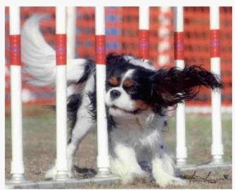

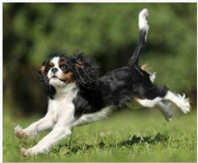

  
The reference image, embedding top-1 hard negative, and positive target are shown from left to right.

Embedding top-1 hard-negative candidate. Candidate image shown in the centre panel (embedding rank 1, pair-aware rank 3).

## Pair-aware CoT.

Query intent. Find an everyday image of a dog that is the same breed as the one in the query image, specifically focusing on its head.

Target observations.

• The target image shows a dog in mid-motion, running on grass.

• The dog has a black, white, and tan coat pattern.

• The dog’s head is visible, showing a tri-color coat pattern.

• The background is a blurred green field, indicating an outdoor setting.

• The dog’s tail is raised and appears to be in motion.

• The image is a dynamic, action shot, not a static head shot.

• The dog’s facial features are not clearly visible due to motion blur.

Positive candidate. Candidate image shown in the right panel (embedding rank 5, pair-aware rank 1).

## Pair-aware CoT.

Query intent. Find an everyday image of the same breed dog, specifically a Cavalier King Charles Spaniel, focusing on its head.

Target observations.

• The image shows a Cavalier King Charles Spaniel with long, floppy ears.

• The dog has a white and tan coat with a distinct white blaze on its face.

• The dog is positioned in front of a purple background.

• The dog’s head is centered in the frame, showing its facial features.

• The image is a close-up portrait, focusing on the dog’s head and upper body.

• The dog’s eyes are visible and appear to be dark-colored.

• The background is plain and out of focus, emphasizing the dog.

Case 2: Attribute-sensitive composed retrieval. The embedding top result is visually plausible but violates the requested composition; pair-aware ranking promotes the positive candidate.

Query. Find an everyday image showing two animals that are of a diferent species from the first one, and no human appearing.

Query  
Top-1 Hard Negative  
Positive Candidate  
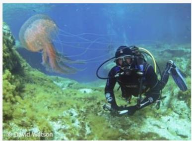

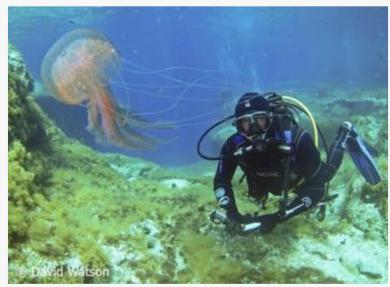

  
The query image, embedding top-1 hard negative, and positive target are shown from left to right. The embedding branch retrieves the unmodified query image itself.

Embedding top-1 hard-negative candidate. Candidate image shown in the centre panel (embedding rank 1, pair-aware rank 2).

## Pair-aware CoT.

Query intent. Find an everyday image that shows two animals of a diferent species from the first one, and no human appears.

Target observations.

• The image contains one large, orange, jellyfish-like creature.

• A human is visible underwater, wearing a scuba suit and helmet.

• The human is positioned near the bottom of the frame, facing away from the camera.

• The background consists of underwater coral and rocks.

• The image includes a watermark in the bottom-left corner.

• The lighting appears natural, suggesting an underwater setting.

• The human is not the primary subject of the image.

Positive candidate. Candidate image shown in the right panel (embedding rank 4, pair-aware rank 1).

## Pair-aware CoT.

Query intent. Find an everyday image showing two animals that are of a diferent species from the first one, and no human appearing.

Target observations.

• The image contains two large, black, ray-like marine animals swimming together.

• The animals have long, slender tails and are positioned in a natural underwater environment.

• The background consists of a coral reef and blue water.

• There are no human figures visible in the image.

• The animals are the only visible marine life in the scene.

• The image depicts a natural, wild habitat with no artifi-cial elements.

• The animals are not of the same species as the first one in the query image.

Query. The slides use a visual metaphor of a car sinking in water to illustrate the consequence of blindly following data.

## Text Query

Top-1 Hard Negative

Positive Candidate

The slides use a visual   
metaphor of a car sinking in   
water to illustrate the   
consequence of blindly   
following data.

Why Data Matters: Context of Data Reveals Answers

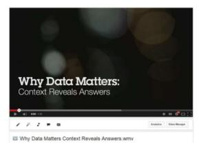  
The text query card is followed by the embedding top-1 hard-negative slide and the positive slide promoted by ranking.

Being data-driven doesn't mean

Augment decision makers with objective, trustworthy, and relevant data.

blindly following data.

## Pair-aware CoT.

Positive candidate. Document shown in the right panel (embedding rank 3, pair-aware rank 1).

Embedding top-1 hard-negative candidate. Document shown in the centre panel (embedding rank 1, pair-aware rank 2).

## Pair-aware CoT.

Query intent. The slides use a YouTube video titled ’Why Data Matters: Context of Data Reveals Answers’ to show the consequence of blindly following data.

## Target observations.

• The target text explicitly states the video title is ’Why Data Matters: Context of Data Reveals Answers’.

• The target text confirms the video is a YouTube video.

like a video player interface or video thumbnails.

• The target text does not reference any specific YouTube channel or channel name.

Query intent. The slides use a visual metaphor of a car sinking in water to illustrate the consequence of blindly following data.

## Target observations.

• The target text describes the metaphor as ’blindly following data’, which aligns with the visual of a car sinking.

• The target text explicitly states that this metaphor implies ’augment decision makers with objective, trustworthy, and relevant data’, which is not visually represented in the slide.

• The slide includes a small icon of a car sinking, but the text does not explicitly state that this is the consequence of blind data following.

• The target text does not mention the visual metaphor or the specific consequence it implies, which is the focus of the query.

Case 4: Spatial-relation ranking regression. Embedding retrieval correctly selects the motorcycle behind the red foreground bike, but pair-aware ranking promotes the motorcycle closest to the camera.

Query. Identify the motorcycle behind the red motorcycle on the right. The green outline marks the requested background motorcycle and the red outline marks the foreground distractor for visualization only.

Query Image  
Top-1 Hard Negative  
Positive Candidate  
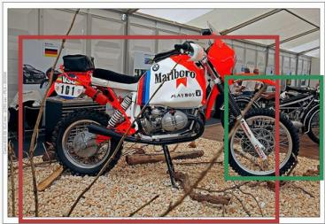

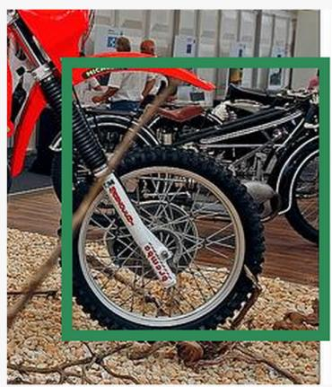  
The image context, salient foreground distractor, and requested background motorcycle are shown from left to right.

## Pair-aware CoT.

Pair-aware ranking top-1 hard-negative candidate. motorcycle closest to camera (embedding rank 2, pair-aware rank 1).

## Pair-aware CoT.

Query intent. Select the portion of the image that shows the motorcycle closest to the camera, based on its position and visual prominence in the scene.

## Target observations.

• The motorcycle is the central subject, positioned prominently in the foreground.

• It is the only motorcycle clearly visible in the image, with no other motorcycles overlapping it.

• The motorcycle’s front wheel and handlebars are clearly in focus, indicating it is the closest to the cam- era.

• The motorcycle’s red and white color scheme is distinct and contrasts with the gravel ground and surrounding objects.

• The motorcycle’s branding, including ’Marlboro’ and ’PLAYBOY’, is clearly visible on its side fairing.

• The motorcycle is angled slightly to the right, with its front wheel pointing toward the viewer.

• The motorcycle is stationary and appears to be the primary subject of the image.

Positive candidate. Cycle behind red cycle on right (embedding rank 1, pair-aware rank 2).

Query intent. Identify and extract the portion of the image that corresponds to the ’Cycle behind red cycle on right’ description, specifically focusing on the motorcycle visible in the background behind the red motorcycle in the foreground.

## Target observations.

• The target text refers to a cycle behind the red cycle on the right, indicating a motorcycle positioned to the right of the red motorcycle in the foreground.

• The target text specifies on right, matching the orientation of the red motorcycle in the image.

• The target text includes the word Cycle, a general term for a motorcycle, matching the query’s focus on a vehicle behind the red motorcycle.

• The target text does not mention any specific brand or model, which is not required by the query but is present in the image.

• The target text does not include any additional context or attributes beyond the motorcycle’s position relative to the red motorcycle.

• The target text is a direct description of the image content, matching the query’s request for a specific portion of the image.

• The target text does not include any visual cues such as branding, logos, or text overlays that are present in the image.