# Verifiable abstention makes AI leak diagnosis accountable in water distribution networks

Tianwei Mu1,2,3, Yue Wang1, Mingzhe Yuan2,4,\*, Manhong Huang5 Wenhong Wang2, Xuerui Yin1, Qing Luo3, Min Xiao3,\* Hui Yang1, Jun Li1, Dan Xue6

August 20, 2026

## Abstract

Utilities lose a substantial share of treated water to leakage, yet rarely trust artificialintelligence localizers to dispatch crews: guessing everywhere cannot justify excavation. The gap is accountability, not accuracy: no method proves when it should not act. Here we recast leak localization as decision-making under verifiable abstention. A physics-grounded executor agent falsifies hypotheses (leak, demand, sensor, valve) against a digital twin; an independent supervisor agent, with a large-language-model (LLM) auditor, checks evidence against a codeverifiable contract, then certifies a dispatch, requests evidence or abstains. Under field-grade noise, a 32% forced baseline becomes 96% decision precision on acted events. On an independently generated benchmark it acts on only 4 of 33 leaks, all correct. A 194-event register of audited real leak locations with twin-simulated pressures and flows yields five excavation dispatches, three correct, and 44% survey recovery at full district precision. Accountable abstention ofers a defensible route to autonomous water-infrastructure operation.

## Introduction

Non-revenue water, the treated water that is produced but never billed, is dominated by physical leakage and wastes a large share of urban production and billions of dollars each year [1, 2]. Rapid, reliable leak localization is therefore a central goal of smart water management [3], and datadriven localizers are increasingly capable, from graph neural networks [4] to burst-detecting sequence models [5, 6, 7], transfer learning [8] and physics-informed models [9, 10, 11], consolidated by benchmarks such as BattLeDIM [12]. Yet such systems are seldom trusted with autonomous action on real networks, and accuracy alone does not explain the gap: a wrong excavation costs thousands of dollars, and a localizer that emits a ranked guess for every event, at 30 to 40% accuracy under fieldgrade noise, cannot be trusted to dispatch a crew. The inverse problem is ill-posed, with candidate locations vastly outnumbering sensors [12]; real anomalies are not only leaks, since demand surges, sensor drift and valve mis-operation all produce leak-like deviations [13]; and no prevailing method can state when it should not act, and prove that abstention to an operator or regulator.

We argue that the deployable contribution is not another increment in localization accuracy but a change of objective, from prediction to accountable decision-making under verifiable abstention (Fig. 1). Selective classification adds a reject option [14, 15] and learning-to-defer a calibrated hand-of to a human expert [16], but deep models are often poorly calibrated [17, 18], and conformal methods certify a scalar coverage guarantee [19, 20, 21] rather than the auditable justification a regulated dispatch requires. We therefore recast leak localization as selective, evidence-backed decision-making, mirroring clinical diferential diagnosis: enumerate the competing causes, order the test that best discriminates them, and withhold treatment until the diagnosis is secure.

Large language models add an ingredient the water sector is only beginning to absorb. LLM agents interleave reasoning with tool calls [22, 23], their planning, memory and tool use now systematised [24]; they have run autonomous chemistry experiments [25], discovered mathematical constructions [26] and operated expert tool suites [27]. Agentic coding tools now run in a goal mode that separates doing from judging: one model works toward an explicit objective while an independent evaluator model, seeing only the observable output, decides whether the goal is met (Claude Code, for example [28]); transposing this pattern, execution gated by a separate model on observable evidence, from software tasks to physical dispatch is the perspective our design adopts. Environmental applications are surveyed broadly [29]; in water, domain-adapted models are emerging for utility knowledge work [30] and agentic interfaces already drive hydraulic simulation from natural language [31]. These systems supply orchestration and interpretability, not accountability: an agent that can call a simulator still cannot prove when it should not act. We therefore place language models only where language helps, planning and independent audit, while every number entering a decision comes from physics tools.

We realise this principle as an executor–supervisor agent. A deterministic, physics-grounded executor proposes competing hypotheses and tests each in a hydraulic digital twin, used as a falsification instrument rather than a forward predictor; retrieval is demoted to one evidence tool among several. The supervisor never localizes: it audits the executor’s numeric evidence against a code-verifiable goal contract and returns accept (with a signed certificate), reject (with a request for more evidence) or abstain. As a diferent model family seeing only the numbers, it adopts the judge paradigm [32, 33, 34] while guarding against self-grading collusion.

This work makes three contributions. First, it changes the objective of leak diagnosis from prediction to accountability: under verifiable abstention, “do not act” becomes a provable, auditable outcome rather than a silent failure. Second, it realises this objective as an executor–supervisor agent pair: twin-grounded falsification of competing causes, gated by a code-verifiable goal contract and an independent language-model auditor that can tighten but never loosen the gate. Third, it delivers a deployable two-tier field response: on a utility’s audited 2025 repair register, a provable pressureinformation ceiling bounds what excavation dispatch can ever achieve, and a mass-balance survey tier recovers 44% of events at 100% district precision. Validated under one measurement battery applied unchanged across four in-silico networks (EXA7, KY4, the City H municipal model and the City D district model), the third-party BattLeDIM L-Town benchmark and the audited 194-order City D register, the architecture converts a 31.7% forced localizer into 96.1% decision precision on acted events, acts at 100% precision on the four L-Town leaks it accepts, and stamps every action

## Challenge: localization is not the bottleneck, accountability is

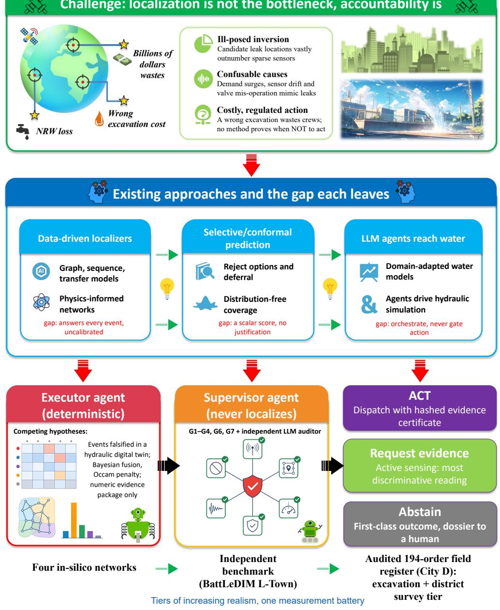  
Fig. 1 | The accountability gap in leak localization and the position of this work. Top, the challenge: the inverse problem is ill-posed (candidate locations vastly outnumber sparse sensors), leak-like deviations arise from non-leak causes (demand surges, sensor drift, valve mis-operation), and a wrong excavation is costly, so a localizer that must answer every event cannot be trusted to dispatch a crew. Middle, existing approaches and the gap each leaves: data-driven localizers force an answer on every event; selective and conformal methods abstain on a scalar score without auditable justification; emerging large-language-model agents orchestrate simulation but do not gate action. Bottom, this work: leak diagnosis recast as accountable decision-making under verifiable abstention, in which a deterministic executor agent falsifies competing hypotheses against a digital twin and an independent supervisor agent, combining a code-verifiable goal contract of six hard predicates with a language-model auditor, certifies a dispatch with a hashed evidence certificate, requests the most discriminative additional evidence, or abstains with a dossier for a human. The bottom row names the tiers of increasing realism to which the identical measurement battery is applied: four in-silico networks, the independently generated BattLeDIM L-Town benchmark, and the audited 194-order City D field register with its excavation and district-survey tiers.

with a machine-checkable certificate whose numeric evidence an independent LLM was shown to audit in a 32-package corruption stress test.

## Results

## The executor–supervisor architecture

The executor (Fig. 2) scores a mutually exhaustive hypothesis space: a leak in one of K topological zones, a zone-wide demand anomaly, a sensor fault, a valve mis-state, or no actionable anomaly. Each hypothesis is scored by whether it reproduces the observed sensor deviations in the twin, and the evidence is fused into a Bayesian posterior with an Occam penalty that stops an overflexible leak fit from masquerading as a demand anomaly (Methods, Eqs. 1–3). The supervisor then evaluates the goal contract, a conjunction of deterministic predicates on leak existence, region size, margin, alternatives, physical reproduction and safety (Methods, Eq. 4); the language-model auditor may add a rejection but never overturns a failed hard check. Acceptance emits a hashed evidence certificate; rejection requests more evidence; otherwise the system abstains, a first-class outcome never converted into a forced guess.

Diagnosis runs on a fixed spatial scafold computed ofline for every network: Leiden zones of the pressure-weighted modularity and the sensor placement inside them (Methods; all five topologies are drawn in Fig. S1). Fig. 3 shows this scafold for the benchmark and the field network, EXA7’s 15 zones carrying two sensors each and City D’s 15 districts carrying the 23 detection-coverageoptimized sensors. The zone is the operational unit of this paper: it is what a repair crew searches, and every localization and precision number that follows is scored at this granularity.

Every network is measured with one identical battery: the same pipeline and contract predicates (thresholds per tier in Methods) and the same five measurements (forced top-1 zone accuracy, coverage, decision precision on acted events, false dispatches on 50 no-leak controls, and the contract versus a scalar existence threshold at matched coverage; Table 1). The tiers difer in information content; the battery shows the system adapting its coverage to that content while defending its precision wherever it acts.

## Selective decision quality on the EXA7 benchmark

We evaluate on EXA7 (381 junctions, K = 15 zones, 30 pressure sensors; Fig. S1a) with a mixed test set of leaks $( 5 { - } 5 0 ~ \mathrm { L s ^ { - 1 } }$ ; the severity analysis below extends to $2 ~ \mathrm { L } \mathrm { s } ^ { - 1 } )$ , demand anomalies, sensor faults and valve mis-states at sensor noise $\sigma = 0 . 0 5 \mathrm { ~ m ~ } ( \mathrm { F i g . ~ 4 a } )$

Forced to answer on every event, the topology-aware retrieval localizer attains only $3 1 . 7 \pm 2 . 0 \%$ top-1 zone accuracy (five seeds), the brittle base predictor that motivates abstention. The executor raises zone accuracy to $8 1 . 7 \pm 5 . 0 \% ( 8 1 . 7 \pm 2 . 6 \%$ from twin-fit re-ranking alone, before active sensing; Methods), because a leak anywhere in a zone fits that zone’s response near-exactly. The supervisor converts this into a decision precision of ${ \bf 9 6 . 1 \ : \pm \ : 3 . 3 \% }$ at its operating point (acting on 40.5% of events pooled over seeds), with a false-dispatch rate of ${ \bf 3 . 9 \pm 3 . 3 \% }$ tightening the residual gate reaches 100% precision at $1 3 \pm 1 5 \%$ coverage. A paired McNemar test against the forced localizer, pooled over the five seeds’ severity-sweep leak set $( 2 { - } 5 0 \operatorname { L } \operatorname { s } ^ { - 1 } , \operatorname { n } = 6 0 0 )$ is decisive $\left( \chi ^ { 2 } = 1 7 1 \right.$ , 254 versus 32 discordant events, $\mathrm { { p } < 0 . 0 0 1 }$ ; Methods), and the structured contract dominates a plain existence-threshold baseline across the whole risk–coverage curve (Fig. 4a).

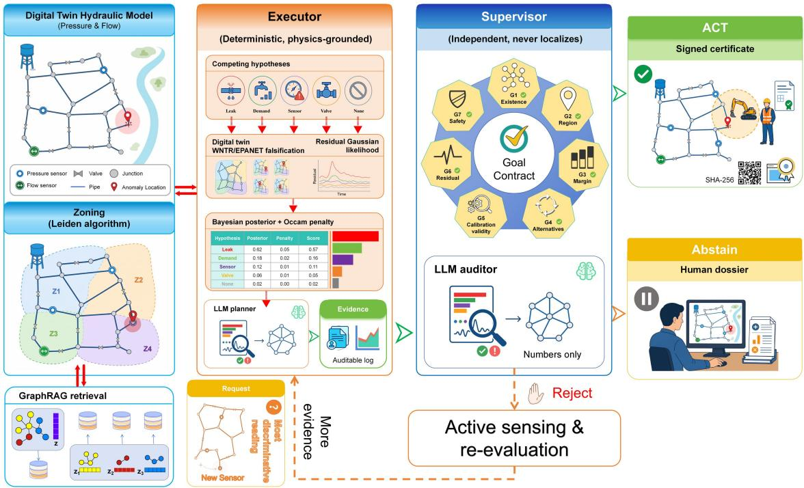  
Fig. 2 | Architecture of the executor–supervisor agent for accountable leak diagnosis. Left, the ofline inputs computed once per network: the WNTR/EPANET digital twin, the Leiden hydraulic zoning with its sensor placement, and the topology-aware retrieval library (Methods). Centre left, the executor (orange) enumerates a mutually exhaustive set of competing hypotheses (leak, demand anomaly, sensor fault, valve mis-state, or none), realises each in the twin and falsifies those that cannot reproduce the observation through their residual likelihood (Eq. 2), then fuses the survivors into a Bayesian posterior with an Occam penalty (Eq. 3); retrieval is one evidence source among several, not the answer. Centre right, the supervisor (blue) never localizes: it audits the numeric evidence package against the goal contract, whose six evaluated predicates carry a tick in the wheel (existence, region, margin, alternatives, residual, safety; Eq. 4). G5 is drawn without a tick because it is a field reserved for deployment and is not evaluated here. Language enters at exactly two points, in models of diferent families: a planner in the executor, used in the optional dual-model configuration, which only chooses which non-leak hypotheses receive extra scrutiny and so can never cause a leak to be missed; and an auditor in the supervisor, which sees the numeric summary alone and may add a rejection but never overturn a failed hard check. Every number entering a decision comes from the physics tools. Right, the three outcomes: ACT with a SHA-256-signed certificate, ABSTAIN with a dossier for a human, and, for a resolvable failure, a request for evidence that triggers active sensing and re-evaluation. Panel values illustrate the format of each step; all reported metrics come from the deterministic pipeline.

The dominance in Fig. 4a, drawn for the representative seed, has a mechanism, not just a margin. On that seed the scalar existence score saturates: even its strictest swept threshold still admits 45.5% of events, because clear-cut and mis-localized events alike push the summed leak mass toward its ceiling, and its best precision is 96% (annotated in Fig. 4a). The contract separates what the score cannot: the margin and alternative-exclusion predicates veto events whose leading leak hypothesis is closely chased by a rival explanation, and the residual predicate vetoes fits that do not physically reproduce the observation, which is why that seed’s full-contract frontier holds 100% precision out to 39% coverage (13 ± 15% across the five seeds). The operating point itself is not tuned to the test set: it is fixed a priori as the maximum-coverage end of the swept residual gate (Methods). In operational terms, per 100 alarms the forced localizer digs 100 times and is wrong 68 times, whereas the contract digs about 40 times and is wrong once or twice; on the pooled leak events where the two disagree, the executor is right in 254 of 286 cases (89%; the McNemar discordant pairs above). The same selective behaviour under the identical battery transfers to KY4, City H and City D, compared in Table 1 and analysed in ’Robustness, generalization and auditable autonomy’.

a EXA7 (381 junctions), K = 15, 30 sensors  
b City D (541 junctions), K = 15, 23 sensors  
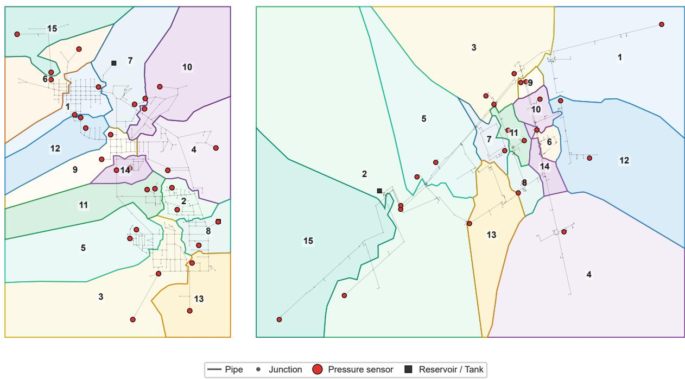  
Fig. 3 | Hydraulic zoning and sensor placement of the benchmark and field networks. Leiden partitions of the pressure-weighted modularity (Methods), drawn as space-filling territories (Voronoi cells of the node assignments, merged per zone and clipped to the frame; territory colours encode zone identity only). a, EXA7: K = 15 zones with the 30 greedy-placed sensors (red). b, City D: K = 15 districts with the 23 sensors of the detection-coverage-optimized placement. Grey lines are pipes, small dots junctions, dark squares reservoirs and tanks; numbers label zones.

## Diferential diagnosis of confounders

Because the executor tests non-leak hypotheses, it performs genuine diferential diagnosis rather than assuming a leak (Fig. 4b). Pooled over five seeds (n = 600 leak and 250 confounder events; Supplementary Table S2), demand anomalies are correctly typed in 99 of 100 cases, sensor faults are never mis-classified as leaks, and 547 of 600 leaks are typed as leaks. Typing is weakest for the discrete confounders (33/75 valve, 39/75 sensor), but the mis-typings fall almost entirely into other non-leak classes that never dispatch a crew. The class asymmetries have physical mechanisms. A sensor fault is never read as a leak because the two hypotheses live in diferent spaces: the fault form explains a few anomalous channels whose hydraulic neighbours read normal, whereas a leak must depress many sensors coherently, and the twin cannot reproduce the one from the other (Methods). A valve closure is the hardest confounder because it genuinely re-routes flow and depresses downstream pressures, yet its errors still land in other non-leak classes. Across all 250 confounders only ten ended with a leak as the top hypothesis, one demand anomaly over-fitted by the leak family and nine valve closures, and the goal contract vetoed nine of the ten. The operational quantity that matters, a confounder dispatched as a leak, is therefore 1 in 250 (0.4%)

Table 1 | The identical measurement battery applied to all five networks. Forced top-1 is the twin-fit zone accuracy when forced to answer every event, except in the City D register column, where it is the retrieval localizer’s forced top district (always defined; the twin-fit forced variant is 14% and is recorded in the released results files), except in the field-register column, where it is the retrieval localizer’s top district (the twin-fit forced variant is 14.4%); coverage and decision precision are at each leg’s operating point; no-leak controls are 50 pure-noise scenarios per network under the same acceptance gate; the last row compares the goal contract with a scalar existence threshold admitting the same number of events. Sensor noise is $\sigma = 0 . 0 5$ m for the four in-silico columns, the competition’s own noise for L-Town and σ = 0.15 m for the field register; both City D columns use the detection-coverage-optimized 23-sensor placement, and the field-register column diagnoses audited real leak locations with twin-simulated pressures (Methods). In-silico columns are pooled over n = 5 seeds (per-seed spread in Fig. 4 and Fig. S2 for EXA7 and in Supplementary Table S8 for KY4, City H and City D; threshold sensitivity in Supplementary Table S10); real-tier columns are exact counts with 95% Clopper–Pearson CIs. The four in-silico columns share one scenario generator; City D additionally carries its field register (rightmost column). The n/a entry is a data fact, not a protocol omission: L-Town ofers no labelled no-leak window from which real controls could be drawn, as at least one of its 33 labelled leaks is active on every one of the benchmark’s 723 days (up to 16 simultaneously), and in a network with continuously growing background leakage a dispatch cannot be scored as false. The field-register column reports both action tiers, excavation and the flow-balance survey (Methods).
<table><tr><td>Battery item</td><td>EXA7</td><td>KY4</td><td>City H</td><td>City D</td><td>L-Town</td><td>City D register</td></tr><tr><td>Data tier</td><td>in-silico benchmark</td><td>in-silico transfer</td><td>in-silico transfer</td><td>in-silico transfer</td><td>third-party benchmark</td><td>audited field register</td></tr><tr><td>Nodes/zones/ sensors</td><td>381/15/30</td><td>959/25/40</td><td> $9 2 0 / 2 5 / 3 8$ </td><td>541/15/23</td><td>782/25/33</td><td>541/15/23</td></tr><tr><td>Events</td><td>550 (5 seeds)</td><td>550 (5 seeds)</td><td>550 (5 seeds)</td><td>550 (5 seeds)</td><td>33 leaks</td><td>194 orders</td></tr><tr><td>Forced top-1</td><td> $8 1 . 7 \pm 5 . 0 \%$ </td><td>88.7 ± 3.0%</td><td> $6 6 . 7 \pm 5 . 3 \%$ </td><td>44.7 ± 4.3%</td><td>15%</td><td>12% 2.6%</td></tr><tr><td>Coverage</td><td>40.5%</td><td>34.4%</td><td>25.6%</td><td>20.0%</td><td>12%</td><td>excavation; 44% survey</td></tr><tr><td>Precision on acted</td><td>96.0%</td><td>96.3%</td><td>91.5%</td><td>81.8%</td><td>100% (4/4; CI 40-100%)</td><td>60% excavation (3/5); 100% district (85/85)</td></tr><tr><td>No-leak controls</td><td>0/50</td><td>0/50</td><td>0/50</td><td>2/50 (audit 0/ 50)</td><td>n/a</td><td>1/50 (audit 0/ 50)</td></tr><tr><td>Contract vs scalar</td><td>96.0% vs 93.3%</td><td>96.3% vs 95.2%</td><td>91.5% vs 84.4%</td><td>81.8% vs 73.6%</td><td>100% vs 75%</td><td>60% vs 60%</td></tr></table>

with the diferential head and rises to 50 in 250 (20.0%) when the head is removed. The 53 leaks that escape the leak type are not scattered at random either: 41 are read as zone-wide demand anomalies, hydraulically the nearest explanation (both are unaccounted withdrawals concentrated in one zone), nine as valve mis-states, three as no anomaly, and none as a sensor fault (Supplementary Table S2). Because a non-leak top hypothesis never dispatches a crew, the price of these confusions is paid in coverage, not in wrong excavations, which is the direction a dispatch system should fail in.

## Trained baselines, calibration, and component ablations

To verify that the retrieval anchor is not a strawman, we trained genuine leak localizers on the scenario library and evaluated them on the identical test leaks (Fig. 4c and Supplementary Table S3). The strongest, a cosine k-nearest-neighbour classifier, reaches $7 2 . 0 \pm 3 . 0 \%$ forced top-1, with the others below (Fig. 4c); the executor’s twin-fit attains $8 1 . 7 \pm 5 . 0 \%$ and, uniquely, converts it into a selective decision. The ordering is itself diagnostic. The nearest-neighbour classifier is the strongest learner because the pre-simulated library densely covers each zone’s signature shape; the graph network sits near the 6.7% chance rate at this training scale, a caution for data-hungry localizers in a domain where utilities cannot label thousands of real leaks. The executor’s margin

a Selective quality  
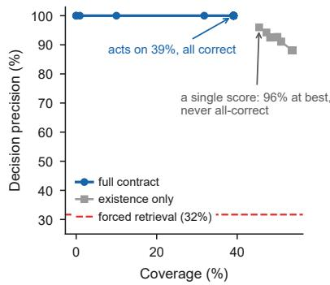

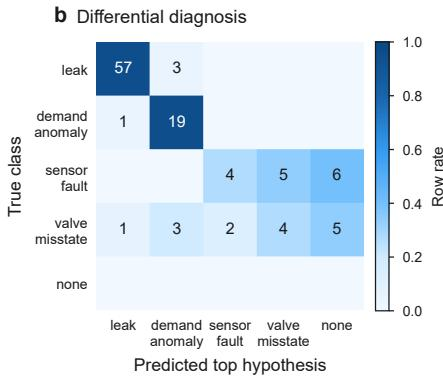

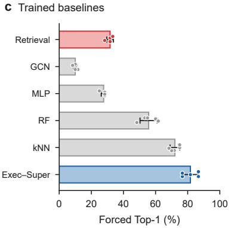

d Accuracy vs severity  
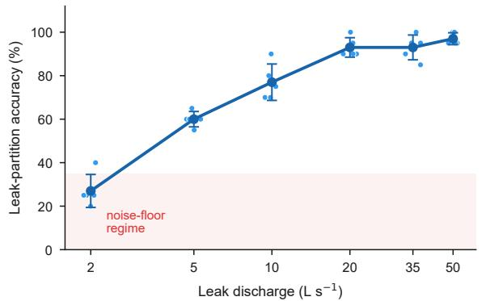

e Robustness to noise  
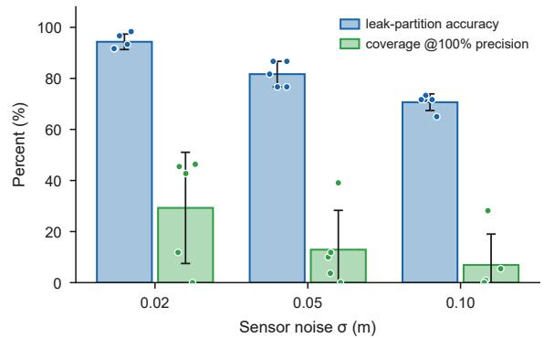  
Fig. 4 | Selective decision quality, diferential diagnosis and forced baselines on the EXA7 benchmark. a, Decision precision versus coverage at $\sigma = 0 . 0 5$ m for a representative seed $( { \bf n } = 1 1 0$ events) as the acceptance threshold is swept, for a representative seed $( { \bf n } = 1 1 0$ events): the multi-predicate goal contract (blue) dominates a single existence-threshold baseline (grey); the red dashed line is the mean forced-retrieval top-1 accuracy over the five seeds at coverage = 1. b, Confusion matrix of the executor’s top hypothesis (columns) against the true event class (rows) for a representative seed (n = 110 events); sensor faults are never mis-typed as leaks and demand anomalies are typed correctly in 19 of 20 cases; the corresponding five-seed pooled matrix, computed on the larger severity-sweep event set (600 leak and 250 confounder events), is in Supplementary Table S2. c, Forced top-1 zone accuracy of four trained localizers and the retrieval baseline (red) versus the executor twin-fit (blue), all on identical held-out test leaks (pooled McNemar, twin-fit versus retrieval on the 2–50 $\mathrm { L } \mathrm { s } ^ { - 1 }$ leak set: $\chi ^ { 2 } = 1 7 1 , \mathrm { p } <$ 0.001). d, Leak-partition accuracy versus injected discharge, rising monotonically from the noise-floor regime at 2 $\mathrm { L } \mathrm { s } ^ { - 1 }$ to 97% at 50 $\mathrm { L } \mathrm { s } ^ { - 1 }$ . e, Leak-partition accuracy and the coverage attainable at 100% decision precision at three noise levels $( \sigma = 0 . 0 2$ , 0.05 and 0.10 m). In $\textstyle \mathrm { c - e }$ , bars and points show the mean over n = 5 independent random seeds, overlaid circles are the individual seeds and error bars the s.d.; numerical values for c and d are in seeds, overlaid circles are the individual seeds and error bars the s.d.; numerical values for c and d are in

Supplementary Tables S3 and S1, and those for e are given in ’Robustness, generalization and auditable autonomy’.

of close to ten points over the best trained model comes from a diferent mechanism than pattern coverage: every candidate must reproduce the observation in the twin, so a noise-distorted signature that fools similarity is still filtered by its residual. Accuracy is strongly severity-dependent, rising monotonically from 27% at $2 ~ \mathrm { L } \mathrm { s } ^ { - 1 }$ to 97% at 50 L s−1 (Fig. 4d and Supplementary Table S1), confirming that abstained events are information-limited rather than arbitrary failures; the same gradient re-appears on the City D network (Fig. 5), where it will explain the field register.

The residual-derived confidence is reasonably calibrated (expected calibration error 0.048; four held-out test seeds, n = 440) and a split-conformal predictor over it controls risk as designed (Supplementary Table S5). Among settings that act on at least 30% of events, the goal contract reaches 97.9% decision precision (140/143 acted, 32.5% coverage; exact 95% CI 94.0–99.6%), about 1.5 points below a logistic-calibrated threshold (99.4%, 160/161 acted at 36.6% coverage) and clearly above an existence-only threshold, whose strictest setting still acts on 202 events (45.9% coverage) at 92.6% precision (n = 440). The gap to the calibrator is small and informative: the contract approaches a calibrator while needing no labels, and returns per-predicate reasons rather than a scalar. The practical reading concerns labels, not decimals. A logistic threshold must be fitted on held-out correctness labels, which no utility possesses for its real leaks, and the conformal guarantee controls average risk rather than justifying any single dispatch; the contract needs neither ingredient, and every rejection names the predicate that failed. Component ablations confirm the predicates do real work: loosening the contract to existence-and-residual drops precision from 93.6% to 81.2% on the same pooled ablation set while inflating the acted set from 391 to 548 events, and disabling the Occam penalty multiplies demand-to-leak mis-typing nine-fold (9/100 versus 1/100), which the margin and alternative-exclusion predicates then veto (Supplementary Table S4). Read together, the checks carry measurable and complementary weight: the existence threshold alone reaches 92.6% at matched coverage, margin and alternative exclusion contribute a further five points, and the Occam penalty protects the diferential head upstream of the gate, so no single predicate is decorative. A fully dual-language-model configuration (gpt-oss-120b planner, deepseek-v4-pro supervisor) reproduces the deterministic accept/abstain decisions exactly (100% agreement), contributing interpretability without altering the physics-grounded decision; because leak hypotheses are always tested exhaustively, the planner’s wording can influence only which confounders receive extra scrutiny, never whether a leak is missed (Methods).

## Independent-benchmark validation on BattLeDIM L-Town

To test transfer to data we did not generate we evaluated the public BattLeDIM L-Town dataset, a 782-node network with 33 pressure sensors (Fig. S1b), SCADA-format pressure series produced by the benchmark’s L-Town data-generating model, and 33 ground-truth pipe leaks over two years. Diagnosis is performed against the nominal network model, whose parameters difer from the datagenerating model by up to 10%, a genuine sim-to-real test; each leak’s signature is a diurnal-matched onset step (Methods).

Raw localization is hard in this regime: forced top-1 zone accuracy is only 15% (5 of 33), reflecting model mis-calibration and one gauge per ∼24 nodes. The accountable system responds exactly as intended, abstaining on 88% of events and acting on the 4 leaks it can support at 100% decision precision with zero false dispatches (4/4; exact 95% CI 40–100%; Supplementary Table S6). Every acted event is a strong abrupt leak (onset |∆p| 0.40–1.15 m) in the correct zone; the weak and incipient leaks near the noise floor are correctly deferred. The modest acted count is the honest reading: abstention transfers to an independently generated benchmark; coverage under severe model error does not.

Sweeping the acceptance threshold traces the full benchmark risk–coverage frontier (Fig. 5a; Supplementary Table S7). At matched four-event coverage the contract reaches 100% precision versus 75% for a scalar existence threshold (4/4 versus 3/4; Fig. 5b). It vetoes one high-confidence but poorly separated event (existence 0.98, margin 0.02) that the scalar rule dispatches to the wrong zone, and admits a cleanly separated lower-confidence event (existence 0.52) that is correct. Unlike the calibrated-threshold tie on EXA7, on third-party data without correctness labels the margin and alternative-exclusion predicates strictly improve precision at matched coverage. The honest cost is that one correctly localized event is abstained on, because its margin (0.04) falls below the floor. For context, the first-Pareto winners of the 18-team BattLeDIM competition reached true-positive rates of 56.5% and 65.2% on the 2019 leaks [12]; the comparison is not like-for-like, and the accountable

layer is complementary.

## A field register on the utility’s own network: City D

We next confront the system with a genuine field case. The operating utility of City D, a district network in China, provided its own EPANET model (541 junctions, 79 throttle-control valves, vendored unmodified; Fig. S1d) together with its 2025 repair register of 256 leak work orders. Each order was geocoded and merged to a model junction under an audited mapping, cross-checked across three coordinate reference systems, with a strict inclusion filter admitting 194 orders at 46 junctions (Methods). Node assignments therefore reflect audited real locations. Sensor placement, by contrast, is a simulation assumption, optimized from the pre-simulated leak library only (never from register information; Methods). No SCADA exists for these events, so each signature is twinsimulated at its audited node with field-grade noise $( \sigma = 0 . 1 5 \mathrm { ~ m } )$ ; the model’s 2016 vintage and remaining mapping limits are stated in Methods.

The field severity distribution is unforgiving. The 194 orders have a median loss rate of 0.106 L s−1 (maximum 3.9), producing a median clean signature of 0.002 m at the 23 sensors of this stif, wellpressurized network, two orders of magnitude below the 0.15 m noise floor; not one event reaches the 0.45 m actionability floor (Fig. 5c and Supplementary Table S11). Forced to answer, the retrieval localizer places the correct district first in 23 of 194 events (12%, against a 6.7% chance rate), and in 41 of 194 when a prediction is scored correct for landing in any adjacent district (21%, against $\mathrm { ~ a ~ } \sim 2 4 \%$ chance rate): forced guessing barely beats chance, and loses to it under the tolerance. The accountable system instead dispatches excavation on five events (2.6% coverage), three of them correctly (60% acted precision; exact 95% CI 15–95%), four of the five at loss rates of $0 . 7 5 ~ \mathrm { L s ^ { - 1 } }$ or more; on 50 no-leak controls the transfer preset raised one knife-edge false dispatch (2%; existence 0.51 against the 0.50 threshold on a 3σ excursion). The stricter audit preset (Methods) dismisses that control (0/50) and abstains on all 194 register events: where the evidence cannot carry an excavation, the contract refuses one. A forced localizer would have dispatched crews 194 times at 12% precision; the contract dispatches five times at 60%.

A controlled severity sweep confirms this reflects the leak sizes and hydraulics rather than a pipeline failure (Fig. 5d and Supplementary Table S12). Injected leaks clear the noise floor only near 10– $2 0 ~ \mathrm { L s ^ { - 1 } }$ and the actionability floor near $3 5 ~ \mathrm { L } \mathrm { s } ^ { - 1 }$ , where coverage reaches 33% at 78–90% acted precision, while the entire register lies below 4 $\mathrm { L } \mathrm { s } ^ { - 1 }$ . Under the standard in-silico protocol the same network supports 81.8% pooled precision at 20.0% coverage (Table 1; the per-seed mean is $8 3 . 1 \pm$ 11.0%, Supplementary Table S8), so the pipeline functions here; it is the register’s leak sizes that remove the signal. The register’s small-leak majority therefore needs a complementary modality, which the contract itself supplies next.

Pressure evidence has a hard ceiling here: even with a sensor at every one of the 541 junctions, only 5 of 194 events would clear the 1σ noise level and one the 0.45 m floor, under both the daily-mean and any-time conventions (median best signature 0.0023 m and 0.0030 m; Supplementary Table S13). The contract therefore adds a second, coarser action tier on a diferent physical quantity. By mass balance, a leak raises its district’s net inflow by the leak rate itself, an identity the twin confirms on every event (median ratio 1.000; noiseless argmax correct in 194 of 194; Methods). With district inflow metering of nightly uncertainty $0 . 1 0 \mathrm { L s } ^ { - 1 }$ averaged over each order’s real work order window (median five nights), a survey dispatch to the district with the largest observed rise, gated at a 15-district-corrected 3.4σ, recovers 85 of 194 register events (44% coverage) at 100% district precision, with zero false dispatches on 50 no-leak control campaigns (sensitivity over meter assumptions spans 29–56% coverage at 98–100% precision; Supplementary Table S13). Excavation-tier coverage stays at 2.6%; the survey tier sends an acoustic crew to the right district, the modality this register demands.

a Benchmark risk–coverage (L-Town)  
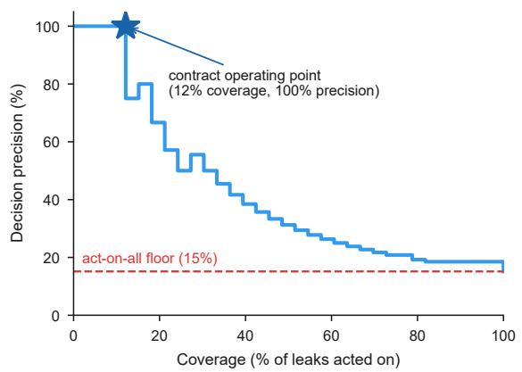

b Why the contract wins at matched coverage  
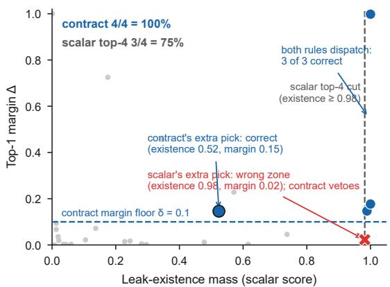

c Field leaks vs the floor (City D)  
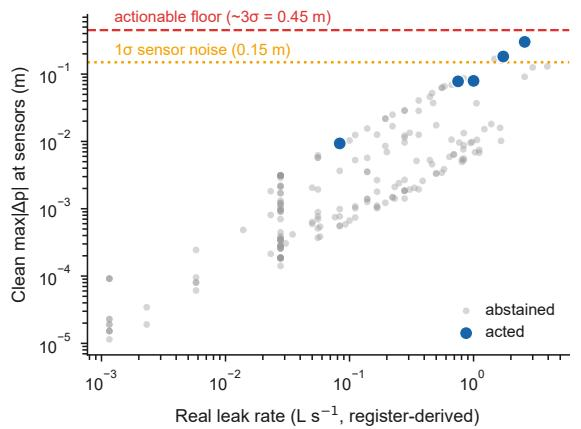

d Large leaks localize; real ones are smaller  
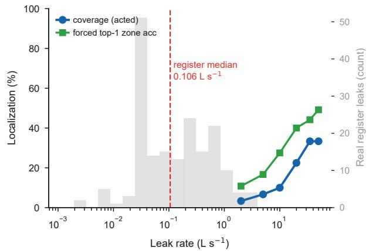  
Fig. 5 | The two external tiers: the BattLeDIM L-Town benchmark and the City D field register. a, Risk–coverage on L-Town $\left( \mathrm { n } = 3 3 \right.$ ground-truth leaks, competition SCADA diagnosed against the nominal model): the existence-threshold frontier runs from 100% precision at 9% coverage down to the 15% act-on-all floor (red dashed); the goal-contract operating point (star; 12% coverage, 100% precision) lies above the frontier at matched coverage. b, The mechanism at matched four-event coverage, shown in the existence-margin plane (all 33 leaks, grey): the scalar rule ranks by leak-existence mass alone (vertical cut) and its fourth pick, a high-existence event with margin 0.02, goes to the wrong zone (red cross); the contract’s margin floor $( \delta = 0 . 1 0 $ , dashed) vetoes that event and admits a cleanly separated lower-existence event instead (existence 0.52, margin 0.15), reaching 4/4 (100%) versus $3 / 4 ( 7 5 \% ) . \ \mathbf { c } ,$ Each of $\mathrm { n = 1 9 4 }$ audited 2025 City D work orders, plotted as register-derived leak rate against its clean peak sensor deviation (log–log): every event lies below the ≈ 3σ actionability floor (0.45 m, red dashed; maximum 0.30 m) and all but three below the 1σ noise level (0.15 m, amber dotted); the transfer-preset contract dispatches five events (blue; three correctly) and abstains on the rest (grey), while the stricter audit preset abstains on all 194; 50 no-leak controls yield one false dispatch under the transfer preset and none under the audit preset (Methods). d, Controlled severity sweep on the same network (single leaks at 120 seeded nodes, $2 { - } 5 0 \ \mathrm { L s ^ { - 1 } } )$ coverage (circles) and forced top-1 accuracy (squares) versus leak rate, with the register’s severity distribution overlaid (grey histogram, right axis; median, red dashed); the median signature clears the noise floor only near $1 0 { - } 2 0 \ \mathrm { L s ^ { - 1 } }$ , far to the right of the entire register. City D node assignments are audited real locations; pressures are twin-simulated because no SCADA exists for these events (Methods). Per-leak and per-band values are in Supplementary Tables S6, S7, S11 and S12.

## Robustness, generalization and auditable autonomy

The system degrades gracefully as noise rises (Fig. 4e): leak-partition accuracy falls from $9 4 . 3 \pm$ $3 . 0 \% ( \sigma = 0 . 0 2 \ \mathrm { m } )$ through $8 1 . 7 \pm 5 . 0 \% ( 0 . 0 5 \ \mathrm { m } )$ to $7 0 . 7 \pm 3 . 2 \% ( 0 . 1 0 \mathrm { { m } ) }$ while decision precision stays at $9 8 . 1 \pm 1 . 9 \% , 9 6 . 1 \pm 3 . 3 \% \mathrm { a n d } \ 9 1 . 3 \pm 3 . 4 \% ;$ the headline metrics are stable across seeds (Fig. S2). The mechanism of this graceful degradation is the one the contract is built for: as noise more than doubles and doubles again, the gate pays almost entirely in coverage, whose 100%-precision attainment falls from 29.3% through 12.9% to 6.9% (Fig. 4e), while acted precision moves by a few points. Noise does not push the system into wrong digs; it pushes it back toward abstention. Nor is the gate delicately tuned: across 28 one-at-a-time threshold settings, pooled precision stays within 89.9–99.1% (Supplementary Table S10), and the lower end comes from over-tightening the region bound (R\_max = 25 nodes), which strangles the acted set to 8% coverage: even a mis-set gate fails toward fewer actions, and every setting stays far above the 31.7% forced base. The behaviour also transfers across three further networks under the identical protocol. On KY4, a public Kentuckydatabase network [35] with 2.5 times EXA7’s size and half its sensor density (Fig. S1e), the twin-fit reaches $8 8 . 7 \pm 3 . 0 \%$ zone accuracy against $8 1 . 3 \pm 4 . 9 \%$ for retrieval, and the supervisor acts on 34.4 $\pm \ 1 . 7 \%$ of events at $9 6 . 4 \pm 2 . 9 \%$ precision (Supplementary Table S8); tightened to full precision, KY4 retains $1 4 . 2 \pm 1 6 . 7 \%$ coverage, the wide spread reflecting two seeds on which no residual gate reaches 100%. The City H (Fig. S1c) and City D models behave consistently under the same protocol (Table 1 and Supplementary Table S8): precision thins with the network’s information content, yet on every network the gate acts far above its forced base rate.

When the supervisor rejects an event for an unresolved zone ambiguity, it requests the most discriminative additional measurements (three hidden nodes per round) and re-ranks (Methods). On the $5 { - } 5 0 ~ \mathrm { L s ^ { - 1 } }$ headline leak set the mean zone accuracy is unchanged (81.67% before and after; per-seed changes between −5.0 and +3.3 points), and the benefit appears on the extended 2–50 $\mathrm { L } \mathrm { s } ^ { - 1 }$ ablation set that includes the weakest leaks (70.5% to 74.5%), where a random-reveal control (71.3%) isolates the discriminability criterion (Supplementary Table S4); active sensing is the designed recourse for the low-coverage regime, not a universal gain.

Finally, accountability is tested rather than asserted. An independent large-language-model supervisor (deepseek-v4-pro, a diferent family from any executor component) audits each decision’s numeric summary alone. In a corruption stress test it caught 16/16 deliberately corrupted evidence packages (exact 95% CI 79–100%), raised no false alarm on 16 genuine ones (0/16; CI 0–21%), with the catch uniform across all three corruption classes (unsupported assertion, fabricated exclusion, inflated evidence; Methods), and was perfectly stable across eight temperature-zero repeats within one audit session (Methods and Supplementary Table S9). Because each of those three corruption classes trips one of the five rules written into the auditor’s prompt, we also asked whether the model is more than a rule-checker: on four further corruption classes that pass every enumerated rule field by field yet are jointly impossible (a margin exceeding the leak-existence mass, an alternative outranking the top hypothesis, posteriors summing above one, an empty candidate region), the prompt as written catches essentially none (0 to 2 of 64, and those by the parse-failure default), exactly like a literal five-rule checker; one added clause inviting any other internal inconsistency, with nothing enumerated, lets the auditor reject 49 of the 64 by explicit judgement (all 48 of the arithmetic classes, one of the sixteen empty-region packages) with no judged false alarm on the 16 genuine packages, and the planner-family model 22 of 64 with none (Supplementary Table S15). The language model thus supplies a generalizing consistency check that a fixed rule list does not, while the pragmatic empty-region class still largely passes, which is why it may only tighten the hard predicates and never replace them. The auditing layer is non-collusive by construction, the prerequisite for delegating action on regulated infrastructure.

## Discussion

Our central claim is deliberately not “a more accurate localizer”. We take as a premise that a simulation-grounded localizer is weak under real noise, and show that the deployable question is when to act and how to prove it. The executor–supervisor agent answers it by uniting four ingredients that are individually known but, in combination, new to this domain: a physics twin used as a falsification instrument, explicit diferential diagnosis of non-leak confounders, a code-verifiable goal contract with enforced abstention, and an independent auditor that cannot be talked into agreement. What this establishes depends on whether labelled correctness data exist. On EXA7, where labels can calibrate a confidence threshold, the contract trails that calibrated threshold by about 1.5 points at matched coverage (97.9% versus 99.4%); it is not superior there. On L-Town, where no labels exist (the realistic utility condition), the contract strictly improved decision precision over a scalar threshold at matched coverage (100% versus 75%) by vetoing a high-confidence but poorly separated event. On the audited City D field register it excavated only where the evidence suficed (five orders, three correct) and recovered 44% of events through its flow-balance survey tier, where a forced localizer’s 194 dispatches would have been right 12% of the time. This positions accountable leak diagnosis within selective prediction and learning-to-defer [14, 16] while supplying the auditable justification that scalar abstention rules lack; the closest agentic system for water automates simulation but does not gate action [31]. The contract is training-free, returns perpredicate reasons and a diferential cause, and carries hard safety predicates that a learned threshold does not.

Three failure modes are instructive: an over-flexible leak hypothesis mimicked demand anomalies until the Occam penalty stopped it; a hypothesis-keying bug silently inverted the posterior, caught only because every number traces to a tool output; and, found last, an active-sensing round that rewrote the margin field of the evidence package without redistributing the hypotheses’ posteriors, so that packages were no longer self-consistent and predicate G3 no longer measured what Eq. (4) says it measures. The open-prompt auditor of Supplementary Table S15 rejected four genuine packages for exactly this arithmetic inconsistency and was right; on the corrected packages the same auditor raises no judged false alarm. We fixed the executor and regenerated every in-silico number in this paper; the EXA7 operating point moved from 97.6% precision at 37.5% coverage to the 96.1% at 40.5% reported here, and we report the change rather than the more flattering earlier value. The regeneration also exposed a KY4 leak-response library that predated a leak-injection fix and had scaled its responses by that network’s diurnal demand pattern; it was rebuilt, and every KY4 number here comes from the rebuilt library. Auditability must be enforced throughout the architecture, not bolted on, which is what safeguards on human oversight of safety-critical AI demand [36].

The architecture is domain-agnostic over networked physical-fault diagnosis wherever an oflinesimulatable twin, spatially structured signatures, confusable confounders and costly actuation coincide, as in power-system faults [37], gas pipelines [38], contamination-source identification [39], structural-health monitoring [40] and data-scarce water-quality prediction [41]; we demonstrate it on water networks and ofer the generalization as a hypothesis.

Several boundaries remain. The confounder classes are simulated from literature priors. No leg of this study uses measured utility telemetry. The strongest external test is L-Town, whose SCADA the competition organizers generated with an independent, deliberately perturbed copy of the network model, and where the layer acts at 100% precision but on only four events; the City D register contributes real field events with audited locations, but both its pressures and the district inflows underpinning the survey tier are twin-simulated because no SCADA exists for these events; the model’s demands are updated to 2025 by a documented city-wide ratio, while its topology and equipment remain of 2016 vintage. We did not run a published state-of-the-art localizer headto-head: public implementations of BattLeDIM entrants exist, but adapting one from its native detection-and-localization protocol to this selective dispatch battery was beyond the present scope, so the trained localizers of Fig. 4c serve as the forced comparison; conformal exchangeability can break under sim-to-real shift; active sensing’s benefit at this sensor density is small; the languagemodel executor contributes interpretability rather than accuracy; and the language-model auditor generalizes beyond its enumerated rules only when invited to and only partly (Supplementary Table S15), so it complements the hard predicates rather than substituting for them. A deployment with live SCADA, where the certificate trail meets a real control room, is the decisive next step.

## Methods

## Problem formulation: from localization to accountable diferential diagnosis

We represent a water distribution network as a graph $\mathcal { G } = ( \nu , \mathcal { E } )$ with $N = | \nu |$ junction nodes and $M = | \mathcal { E } |$ pipe links. Under steady-state operation the hydraulic state obeys conservation of mass at every node and the Hazen–Williams head-loss relationship along every pipe (Supplementary Eqs. S1 and S2). Any anomaly, whether a leak, a demand surge, a sensor fault or a mis-operated valve, induces a sensor-space pressure deviation relative to the no-anomaly baseline,

$$
\Delta { \bf p } ^ { \mathrm { o b s } } = \Delta { \bf p } _ { S } ^ { ( h ) } + \epsilon , \qquad \epsilon \sim \mathcal { N } ( { \bf 0 } , \sigma ^ { 2 } { \bf I } ) ,\tag{1}
$$

observed only at a sparse sensor set $s \subset \nu$ with $| S | = m \ll N$ . We do not invert Eq. (1) for a leak location, for three concrete reasons: the inversion is ill-posed, with candidate locations vastly outnumbering the m sensors; the anomaly class is itself unknown, because demand surges, sensor faults and valve mis-states produce leak-like deviations; and the implied action is a costly excavation that a forced guess of 30 to 40% accuracy cannot justify. We therefore treat the anomaly type as unknown, and replace point prediction with an auditable, safety-checked decision that may also abstain. The unit of evaluation is therefore the action, not the prediction. The remaining methods construct an executor that performs the diagnosis and an independent supervisor that gates the action.

## Hydraulic zoning and sensor placement

Two upstream constructions, reused unchanged from the benchmark configuration, reduce the ill-posed inversion of $\mathrm { E q . } \ \mathrm { ~ ( 1 ) ~ }$ to a tractable problem. First, the nodes are partitioned into $K \ll N$ hydraulically coherent zones $\{ C _ { 1 } , \ldots , C _ { K } \}$ by maximising a pressure-weighted modularity in the resolution-parameterised form of Reichardt and Bornholdt [42], $\begin{array} { r } { Q ( \gamma ) ~ = ~ \frac { 1 } { 2 W } \sum _ { i , j } \left[ w _ { i j } ~ - ~ \right. } \end{array}$ $\gamma s _ { i } s _ { j } / 2 W \ l \delta ( \pi ( i ) , \pi ( j ) )$ , which reduces to standard modularity at $\gamma ~ = ~ 1$ The edge weight $w _ { i j } = T ^ { - 1 } \bar { \sum _ { t } } ( p _ { i } ( t ) + p _ { j } ( t ) ) / 2$ averages the two endpoints’ nodal pressure over the T time steps of one baseline hydraulic run, and is defined only on the network’s own links $( i , j ) \in \mathcal { E }$ , pipes together with pumps and valves; $s _ { i } = \textstyle \sum _ { j } w _ { i j }$ is the node strength and $\begin{array} { r } { W = \frac { 1 } { 2 } \sum _ { i } s _ { i } } \end{array}$ the total weight. Restricting weights to existing links ensures that only hydraulically coupled nodes share a zone: two junctions with similar pressures but no connecting link receive no edge and are never merged. The weights are then rescaled linearly to [0, 1] with a floor of $1 0 ^ { - 3 }$ , so that networks whose pressures difer by an order of magnitude are partitioned on the same numerical footing. At each resolution the objective is optimised by the Leiden algorithm [43], which guarantees connected communities. Since γ controls granularity rather than the zone count directly, we sweep 300 values over [0.001, 5], collect the distinct partitions obtained, and retain the one whose zone count is closest to the target, $K = 1 5$ for EXA7 and City D and $K = 2 5$ for the three larger networks; the retained resolutions are $\gamma = 0 . 8 8 , 0 . 6 0 , 0 . 7 7 , 1 . 1 7$ and 1.41 for EXA7, City D, KY4, City H and L-Town. A fallback that repeatedly merges the most strongly connected pair of communities is available for target counts the sweep does not reach, and was not required for any network reported here. Localizing to a zone, rather than to an exact node, matches both the granularity at which a repair crew operates and the information recoverable from sparse, noisy sensors.

Second, the m sensors are placed by a partition-aware greedy rule [44, 45] that maximises the minimum within-zone sensitivity, $\begin{array} { r } { S _ { k } ^ { * } = \arg \operatorname* { m a x } _ { \boldsymbol { S } _ { k } } \operatorname* { m i n } _ { \boldsymbol { v } \in C _ { k } } \operatorname* { m a x } _ { s \in \mathcal { S } _ { k } } \left| \partial p _ { s } / \partial d _ { v } \right| } \end{array}$ , so that every zone carries a distinguishable pressure signature and none is unobservable. For EXA7 these constructions yield $K = 1 5$ zones and $m = 3 0$ sensors (two per zone), computed once ofline and held fixed throughout diagnosis; the resulting zone maps of the benchmark and field networks are shown in Fig. 3, and those of L-Town, City H and KY4 in Fig. S3.

## Competing hypotheses and digital-twin falsification

Given the zones and sensors of the preceding subsection, diagnosis is posed over a structured, mutually exhaustive hypothesis space H spanning one dominant anomaly per event: a leak somewhere in any zone $C _ { k } ,$ a zone-wide demand anomaly in any zone, a fault on any sensor channel, a mis-state of any monitored asset, or the null hypothesis $h _ { 0 }$ that no actionable anomaly exists (Supplementary Eq. S3 and Extended Data Fig. 1). Crucially, the space contains explicit non-leak explanations, so the diagnosis can conclude “this is not a leak” rather than being forced to localize one. Promoting the existence question to a first-class hypothesis is what makes abstention principled rather than a confidence threshold.

Each hypothesis is scored not by similarity to stored exemplars but by whether it can reproduce the observation when realised in a calibrated hydraulic digital twin. For a hypothesis h, the twin (a WNTR/EPANET solver of Supplementary Eqs. S1 and S2) injects the corresponding perturbation and returns a predicted sensor response $\pmb { \mu } _ { h }$ . A leak is realised as a constant added demand at a candidate node, a demand anomaly as a zone-wide multiplier, and a valve mis-state as a pipe closure, each time-averaged over the simulation horizon. The residual and its Gaussian log-likelihood under the field-noise model of Eq. (1) are

$$
\begin{array} { r } { { \bf r } _ { h } = \Delta { \bf p } ^ { \mathrm { o b s } } - { \pmb \mu } _ { h } , \qquad \log \mathcal { L } ( h ) = - \frac { 1 } { 2 \sigma ^ { 2 } } \| { \bf r } _ { h } \| _ { 2 } ^ { 2 } - m \log \bigl ( \sigma \sqrt { 2 \pi } \bigr ) . } \end{array}\tag{2}
$$

A hypothesis that cannot reproduce the observation accumulates a large residual and its likelihood collapses; this is the falsification mechanism that distinguishes the method from retrieval. We summarise residual quality by the per-degree-of-freedom Mahalanobis distance $\rho _ { h } = \| \mathbf { r } _ { h } \| _ { 2 } / ( \sigma \sqrt { m } )$ 7 for which $\rho _ { h } \approx 1$ indicates a hypothesis consistent with the noise floor and $\rho _ { h } \gg 3$ a physically incompatible one. The null hypothesis predicts $\pmb { \mu } _ { h _ { 0 } } = \mathbf { 0 }$ , so it is favoured only when the observation is itself within noise, the quantitative basis for “no actionable anomaly”. A sensor-fault hypothesis $h _ { \mathrm { { s e n } } } ( s )$ is handled in measurement space: it predicts the observed value on the faulty channels and zero hydraulic deviation elsewhere. Its likelihood is therefore high only when a few channels are anomalous while their hydraulic neighbours read near zero. This is the signature that separates an instrument failure from a leak, which instead depresses many sensors at once.

For the leak class, a single zone candidate is insuficient because the true leak may sit at any junction in the zone. We therefore fit each leak hypothesis by the best node–rate pair within the zone, minimising the residual over all junctions $v \in C _ { k }$ and the discharge grid Q = {2, 5, 10, 20, 35, 50} $\mathrm { L } \mathrm { s } ^ { - 1 }$ (Supplementary Eq. S4). Because the true leak node is then a candidate, the correct zone fits its own response near-exactly, which sharply reduces cross-zone confusion relative to a coarse retrieval ranking. All twin evaluations are memoized, and a per-zone response library is built once and reused across runs, so this search over all zones is tractable.

## Bayesian fusion and the executor agent

Hypotheses are combined into a posterior in log-space, accumulating the prior and the per-hypothesis likelihood while correcting for the difering flexibility of the hypothesis families,

$$
\begin{array} { r } { \log P ( h \mid \Delta \mathbf { p } ^ { \mathrm { o b s } } ) = \log P _ { 0 } ( h ) + \log \mathcal { L } ( h ) - \frac { 1 } { 2 } k _ { h } \log m \ - \ \log Z . } \end{array}\tag{3}
$$

The prior $P _ { 0 } ( h )$ distributes a base rate per family (leak 0.50, demand 0.20, sensor 0.15, valve 0.10, null 0.05) uniformly within the family. The term $\scriptstyle { \frac { 1 } { 2 } } k _ { h }$ log m is a Bayesian-information-criterion (Occam) penalty in which $k _ { h }$ counts the fitted free parameters of a hypothesis: two for a leak (node and rate), one for a demand anomaly (the multiplier), zero for a discrete valve or null hypothesis, and the number of explained channels for a sensor fault. This penalty is essential: without it, the leak family, which searches over many node–rate combinations, can spuriously out-fit a genuine zonewide demand anomaly at sparse sensors (quantified by ablation in Supplementary Table S4). The normaliser $Z$ renders Eq. (3) a softmax over H. From the posterior we read the three quantities the supervisor will gate on (Supplementary Eq. S5): the total leak-existence mass $\Pi _ { \mathrm { e x i s t } }$ (the summed leak posterior), the margin $\Delta$ of the top hypothesis $h _ { ( 1 ) }$ over the best alternative $h _ { ( 2 ) }$ of any family, and the posterior entropy. Every term entering Eq. (3) originates from a tool output and is recorded in an evidence log, so each change in the posterior is traceable to a specific computation. This is a structural property that makes the diagnosis auditable, and during development it surfaced an otherwise silent hypothesis-keying defect that had inverted the posterior on demand-anomaly cases.

The executor agent is what orchestrates these tools into the posterior of Eq. (3). It is deterministic and physics-grounded, and it never itself produces the numbers that enter the posterior, the architectural guard against fabricated metrics. In each round it first seeds the competing hypotheses: a leak hypothesis for every zone, a zone-wide demand hypothesis for each retrieved zone, a sensor-fault hypothesis over channels whose deviation exceeds four noise standard deviations, valve hypotheses on pipes incident to the leading zone, and the null hypothesis. Leak candidate nodes are the union of pre-simulated representative nodes and the highest-degree junctions of each zone.

The executor then invokes a typed tool suite: a residual-analysis tool that evaluates Eq. (2), a digital-twin tool that computes $\pmb { \mu } _ { h }$ by forward simulation, a Bayesian-update tool that applies Eq. (3), and a retrieval tool. The retrieval tool is the topology-aware Graph-RAG localizer of the prior framework, but it is deliberately demoted from “the answer” to one evidence source that proposes candidate zones. Its score is not trusted as a probability; it competes, through the twin and $\operatorname { E q } .$ (3), against the non-leak hypotheses. This demotion keeps the system safe when retrieval is weak under field noise: an uncertain retrieval channel leaves $\Pi _ { \mathrm { e x i s t } }$ low, so the supervisor abstains rather than forcing the retrieval top-one.

The executor finally writes a structured evidence package: the posterior over H, the fitted leak node and rate, each hypothesis’s residual and falsification status, the candidate region, and the per-tool evidence log. This package is the sole interface to the supervisor. For every hypothesis its schema fixes the family label, the fitted parameters, the predicted-versus-observed residual with its Mahalanobis distance, the posterior probability, and an explicit falsification status with the evidence reference that established it. By construction the package carries no free-text argument and no self-reported confidence, only quantities derived from the twin and $\operatorname { E q }$ . (3). This is what lets a downstream auditor re-derive the decision from the numbers alone, not from a persuasive narrative.

## The supervisor: goal contract, abstention, and active sensing

The supervisor never localizes. It audits the executor’s evidence package against an explicit goal contract (Extended Data Fig. 2), a conjunction of acceptance predicates that a dispatch must satisfy. Writing $h _ { ( 1 ) }$ for the top hypothesis and $\rho _ { ( 1 ) }$ for its residual Mahalanobis distance, the contract authorises an action only if every data-dependent predicate holds,

$$
\mathrm { A C T } \iff \mathrm { G 1 } \land \mathrm { G 2 } \land \mathrm { G 3 } \land \mathrm { G 4 } \land \mathrm { G 6 } \land \mathrm { G 7 } .\tag{4}
$$

The predicates are as follows. G1 (existence): $h _ { ( 1 ) } = h _ { \mathrm { l e a k } }$ and $\Pi _ { \mathrm { e x i s t } } \geq \tau _ { \mathrm { e } } ,$ , the top hypothesis is a leak and the summed leak-existence mass clears its threshold, which prevents action while the null, demand or sensor explanations remain plausible. G2 (region): $| R | \leq R _ { \mathrm { m a x } } .$ , the candidate region is small enough for a repair crew to search. G3 (margin): $\Delta \ge \delta$ , the top hypothesis leads the best alternative of any family, not merely the second-best zone, by a working margin. G4 (alternatives): $P ( h _ { ( 2 ) } ) \leq \alpha _ { : }$ , the strongest rival explanation is itself improbable. G6 (residual): $\rho _ { ( 1 ) } \le \rho _ { \mathrm { m a x } }$ , the fitted leak physically reproduces the observation, with $\rho _ { \mathrm { m a x } } = 3$ per degree of freedom throughout. G7 (safety): $\mathcal { U } = \emptyset$ , the set of unsafe implied actions is empty, blocking any recommendation that implies an out-of-bound operation. The remaining thresholds are fixed per experiment before evaluation. The EXA7 selective evaluation uses $\tau _ { \mathrm { e } } = 0 . 5 , \delta = 0 . 1 2 , \alpha = 0 . 2 0$ and $R _ { \mathrm { m a x } } = 6 0$ nodes; the residual gate is swept to trace the precision–coverage curve, whose maximumcoverage end is the reported operating point. The L-Town benchmark and the City D field-register leg use $\tau _ { \mathrm { e } } = 0 . 5 , \delta = 0 . 1 0 , \alpha = 0 . 3 0$ and $R _ { \mathrm { m a x } } = 8 0$ , reflecting their larger zones and severe model error; the City H, City D and KY4 standard in-silico legs of Table 1 and Supplementary Table S8 use the EXA7 gate unchanged $( \tau _ { \mathrm { e } } = 0 . 5 , \delta = 0 . 1 2 , \alpha = 0 . 2 0 , R _ { \mathrm { m a x } } = 6 0 )$ . The language-model audit experiments use $\tau _ { \mathrm { e } } = 0 . 7 , \delta = 0 . 1 5$ and $\alpha = 0 . 2 0$ . The numbering follows the implementation’s evaluator. Its contract structure additionally declares two boolean fields reserved for deployment, a calibration-validity flag (numbered G5) and a human-review flag; neither is evaluated in this study, which is why the decision rule of Eq. (4) is the conjunction of the six predicates above and G5 does not appear in it. Every leg here does use the calibration matched to its own network and noise level, but that is a property of how the runs were configured, not a condition the contract checks. These predicates are deterministic arithmetic over the evidence package and constitute the system’s hard guarantees: a code-level property of the decision rule, enforced on every event, not a statistical bound on error rates. On satisfaction, the supervisor emits an acceptance certificate that records the decision, the contract version and thresholds, the measured value and pass or fail of each predicate, and the accepted hypothesis and region. A cryptographic digest binds the certificate to a canonical serialisation of the evidence package, so any later tampering is detectable. This is the auditable artifact a utility or regulator requires.

When any predicate fails, the supervisor does not silently force a guess. It returns a structured request identifying the unmet predicate; for example, a low margin between two adjacent zones triggers a “separate these zones” request that the executor must address in a further round. If the contract cannot be met within the round budget, the system abstains: it emits a best-efort dossier (the surviving hypotheses and the reason each predicate failed) and defers to a human. Abstention is reported as a first-class outcome, never converted to a forced prediction. This is the formal mechanism by which an intrinsically weak base localizer becomes a high-precision decision system, acting only where the evidence supports it.

When a rejection reflects an unresolved zone ambiguity rather than a true absence of evidence, the executor seeks the most informative additional measurements. Among the surviving leak hypotheses, it scores each candidate hidden node by the spread of the hypotheses’ twin-predicted responses at that node (Supplementary Eq. S6), a digital-twin discriminability criterion that approximates the measurement of maximal expected information gain [46], and reveals the three highest-scoring nodes: the nodes at which the competing zones most disagree and therefore those whose readings are most decisive. Each revealed node’s value is drawn from the full-field response plus measurement noise, the sensor set is augmented, and the surviving leak hypotheses are re-fit and re-ranked over the augmented set (Supplementary Eq. S4). Because only the leak family is re-fit, active sensing may only move posterior mass within that family: the leak-existence mass set by Eq. (3) is held fixed and redistributed over the re-fitted leak hypotheses in proportion to their new within-family posteriors, the non-leak posteriors are unchanged, and the summary quantities of Supplementary Eq. S5 (top hypothesis, margin over the best alternative of any family) are then re-derived from the one resulting posterior, so the evidence package the supervisor and the auditor read remains self-consistent. On the benchmark, where full per-zone candidate coverage already yields strong base localization, the average benefit of this step is modest and event-dependent; it is the designed recourse for the low-coverage, high-noise regime where base localization is weak, and we report its efect without overstatement.

## Independent large-language-model audit

Because the executor is deterministic, the language model serves only as an independent supervisor auditor, a configuration that maximises rather than weakens independence. The auditor receives only the structured numeric summary: the top hypothesis and its residual, the existence mass, the margin, and the alternatives with their residuals and falsification status. It never sees the executor’s internal computation, prose, or any confidence adjective. This information asymmetry, together with hard predicates (Eq. 4) evaluated in code the auditor cannot override, makes the audit non-collusive by construction.

The auditor is a frontier open model of a diferent family from any executor component. It returns a strict-JSON accept-or-reject verdict and may only add a rejection on top of the deterministic contract, never overturn a failed hard check. It is configured to reject any internally inconsistent package, a condition verifiable from the numbers alone; the auditor’s full system prompt, the numeric evidence-summary schema it receives and the strict-JSON verdict template with its conservative parse-failure default are reproduced verbatim, together with the executor-planner’s planning

template, in Supplementary Methods S6.

We stress-test this layer by injecting deliberately corrupted packages and measuring the catch rate, the false-alarm rate on genuine packages, and the agreement across repeated temperature-zero audits. The taxonomy spans the three ways a diagnosis can be untrustworthy yet superficially confident. An unsupported assertion pairs a high-probability leak with a physically incompatible residual. A fabricated exclusion declares an alternative falsified although its residual fits the observation. Inflated evidence presents a low existence mass or a vanishing margin as decisive. Each is detectable from the numeric summary alone, and none would be caught by a threshold on a single confidence scalar. An auditor that rejects these while accepting genuine packages, reproducibly across repeats, supplies the independent second signature that turns an automated recommenda tion into an accountable one. A follow-up test separates rule-following from judgement: the same sixteen genuine packages receive four further corruptions that pass every enumerated prompt rule individually but cannot jointly hold, and three auditors are compared on identical inputs, the five prompt rules implemented literally in code, the language model with the prompt verbatim, and the language model with one added clause asking it to reject any other internal inconsistency without naming any; the paper’s auditor and, as a second opinion, the planner’s model family are both run, and every call is committed as a transcript (Supplementary Table S15). These audit experiments run at the stricter audit preset $( \tau _ { - } \mathrm { e } = 0 . 7 , \delta = 0 . 1 5 , \alpha = 0 . 2 0$ ; ’The supervisor’), not at the headline selective gates.

## Scenario generation, evaluation protocol, and baselines

To evaluate the system, we generate all four anomaly classes with one seeded WNTR/EPANET pipeline, so results are bit-reproducible. Leaks are injected at representative and randomly chosen junctions across discharge rates of 5 to 50 $\mathrm { L } \mathrm { s } ^ { - 1 }$ . Demand anomalies are zone-wide multipliers matched in magnitude to the leak bands, so that they are genuinely confusable. Sensor faults apply bias, stuck, or excess-noise corruptions to one to three channels of an otherwise normal state. Valve mis-states close pipes, and closures that disconnect the network are detected and discarded. The same field-grade noise $( \sigma = 0 . 0 5$ m unless swept) is applied to every class, and leak test nodes are drawn disjoint from the retrieval library to prevent memorisation. The identical measurement battery of Table 1 (forced top-1, coverage, acted precision, 50 no-leak controls and the matchedcoverage contract-versus-scalar comparison) is applied to every network; the in-silico control and matched-coverage cells are produced by one shared evaluation routine, released with the code, under the same per-seed operating gates as the headline runs.

The unit of analysis is the action. We report risk–coverage and precision–coverage curves [14], together with the false-dispatch rate, the four-class confusion matrix, and the expected calibration error of the residual-derived confidence. Writing A for the acted events and $\hat { z } _ { a } , z _ { a }$ for the predicted and true zones of event a, decision precision is $| \{ a \in \mathcal { A } : h _ { ( 1 ) , a } = h _ { \mathrm { l e a k } } \land \hat { z } _ { a } = z _ { a } \} | / | \mathcal { A } |$ and coverage is $| { \mathcal { A } } | / n$ . The false-dispatch rate is the complement of decision precision, so a non-leak event acted upon, or a leak sent to the wrong zone, both count as failures. Sweeping the residual gate $\rho _ { \mathrm { m a x } }$ traces the precision–coverage curve, and the calibration error aggregates, over confidence bins, the absolute gap between empirical accuracy and mean confidence. Headline quantities are reported as mean and standard deviation over five random seeds, with a noise sweep over $\sigma \in \{ 0 . 0 2 , 0 . 0 5 , 0 . 1 0 \}$ m. Significance against the forced localizer is assessed by a two-sided, continuity-corrected paired McNemar test on the leak subset pooled over the five seeds of the severity-sweep set $( 2 - 5 0 \mathrm { L s } ^ { - 1 }$ , n = 600); small-sample proportions are reported with exact 95% Clopper–Pearson confidence intervals.

As forced (coverage-one) comparators we train genuine localizers on the scenario library and evaluate them on identical test leaks: a cosine k-nearest-neighbour classifier, a random forest, a multilayer perceptron, and a graph convolutional network. As selective-prediction comparators we add a logistic-calibrated confidence threshold, fit on a held-out development seed, and a split-conformal selective predictor [19] with distribution-free risk control, reporting the calibration error on the operational mixed distribution over the four held-out test seeds $( \mathrm { n } = 4 4 0 )$ . We ablate the structured components by removing the diferential head (leak hypotheses only), by loosening the contract to existence-and-residual only, by disabling the Occam penalty, and by replacing the discriminative active-sensing choice with a random reveal of the same number of hidden nodes; ablation arms share identical scenarios per seed. Finally, we run a fully dual-language-model configuration in which a gpt-oss-120b executor planner proposes the diagnostic plan and an independent deepseek-v4-pro supervisor audits, the two being distinct model families. The planner returns strict-JSON plans through the model runtime’s JSON output constraint; all planner and auditor calls are persisted as transcripts, and because leak hypotheses are always tested exhaustively the planner’s non-leak choices cannot degrade localization. We compare this pipeline’s accept or abstain decisions against the deterministic pipeline on a mixed sample of 16 events. The leak fit (Supplementary Eq. S4) searches the full severity grid {2, 5, 10, 20, 35, 50} L s−1, so no severity is structurally unfittable.

A second, fully in-silico network verifies that the protocol itself transfers. KY4 is taken from the public Kentucky research database of water distribution system models [35] and used unmodified as distributed with the WNTR package. It is partitioned into 25 Leiden zones with 40 sensors (one per ∼24 nodes, half the EXA7 density), placed by a degree-based topological observability proxy: the highest-degree junction of every zone, with the remaining sensors filled by global node degree. This is the same rule used for the City H leg, and it replaces the sensitivity-maximising placement of the EXA7 configuration because neither utility-derived model carries a real gauge layout to reproduce. A per-zone leak-response library is built once, and the identical scenario generator, noise model (σ $= 0 . 0 5 \mathrm { ~ m } )$ , acceptance gate and metrics are applied (Supplementary Table S8).

## Real-network transfer: L-Town, the City D field leg and standard-protocol legs

Transfer is first assessed on the public BattLeDIM L-Town benchmark. The 782-node network is partitioned into 25 zones, the 33 provided pressure gauges are the sensor set, and a leak library is built from the nominal network model only. Each of the 33 ground-truth leaks is diagnosed from the provided SCADA series. Those series are not field telemetry: the competition organizers generated them from a separate copy of the network model whose roughness and diameters were perturbed, with white measurement noise added, so the benchmark supplies an independent data generator rather than measured data. The observed signature is a diurnal-matched onset step (the per-hour mean over the 24 h after onset minus the 24 h before), and the residual noise scale is 0.15 m.

The City H municipal model (920 junctions, 25 zones, 38 sensors) and the City D model are additionally evaluated under the identical standard in-silico protocol of the EXA7 run $( \sigma = 0 . 0 5 \mathrm { m }$ , five seeds; Supplementary Table S8). For City D, sensor placement is optimized by a greedy detection-coverage objective computed only over the pre-simulated leak-response library (2,250 cached responses; no register event, node or observation enters the objective), retaining 23 sensors and raising library actionable coverage (clean $| \Delta \mathrm { p } | \geq 0 . 4 5 \mathrm { m } )$ from 29.6% to 34.7%. The register evaluation is otherwise unchanged: $\sigma = 0 . 1 5$ m, 50 no-leak controls and a $\mathrm { , 2 { - } 5 0 \ L s ^ { - 1 } }$ severity sweep at 120 seeded nodes. For the survey tier, a direct simulation records each register event’s change in every district’s net inflow (summed over district-boundary links, reservoir feeds credited to the receiving district, sources external to all districts), verifying the mass-balance identity event by event (Results); the same pass computes the pressure ceiling as the maximum clean $| \Delta \mathrm { p } |$ over all 541 junctions, under both the pipeline’s daily-mean convention and a strict any-time bound (both reported, with identical floor counts). The survey observation model assumes district inflow metering with nightly uncertainty $\sigma _ { \textrm { - } }$ f (sensitivity grid $0 . 0 5 / 0 . 1 0 / 0 . 2 0 \mathrm { L s ^ { - 1 } } )$ averaged over the event’s real work-order window, capped at 14 nights, with one seeded noise realization per event; a dispatch targets the district with the largest observed rise if it clears u·σ $\underline { { \mathrm { ~ f / ~ } } } / \sqrt { \mathrm { ~ \textit ~ { ~ W ~ } ~ } }$ , with $\mathrm { u } = 3$ and the 15-district-corrected $\mathrm { u } = 3 . 4$ both reported, and 50 no-leak control campaigns (five-night windows) accompany every setting. Like the pressures, the flows are twin-simulated; no real SCADA exists for these events.

Two design alternatives were evaluated and not adopted, with full artifacts committed. A discriminability-optimized placement (greedy nearest-centroid zone-classification objective) raised the library classification proxy from 50.0% to 64.3% and the twin-fit to $4 8 . 0 \pm 1 . 8 \%$ , but left decision precision statistically unchanged $( 8 3 . 3 \pm 8 . 6 \%$ versus $8 3 . 1 \pm 1 1 . 0 \%$ while cutting library detection coverage at the 0.45 m floor from 34.7% to 30.0%, so the detection-coverage placement is retained. A CUSUM sequential detector for the survey tier, calibrated to the same campaign false-alarm rate, was beaten on district precision at every meter setting with a coverage deficit at the headline setting (40% at $9 7 \%$ precision versus the window mean’s 44% at 100% at $\sigma \mathrm { ~ \underline { ~ } f ~ } = 0 . 1 0 \mathrm { ~ L } \mathrm { s } ^ { - 1 } )$ , consistent with the window mean being the suficient statistic when the work-order window brackets a persistent leak. Finally, both control sets were analysed under the same three acceptance presets on the same evidence packages: on the standard leg the transfer gate admits two knife-edge controls (2/50; existence 0.511 and 0.610 against the 0.50 threshold) and the audit preset none $( 0 / 5 0 )$ ; on the register the transfer and audit outcomes are those reported in the Results (one knife-edge false dispatch and none, respectively; the audit preset is that of the language-model experiments, $\tau \_ \mathrm { e }$ $= 0 . 7 , \delta = 0 . 1 5 , \alpha = 0 . 2 0 )$ , and adding a ≈3σ observation floor leaves the one tied control whose observed peak equals the 0.45 m floor.

The field leg uses the City D district network (541 junctions, 475 pipes, 79 throttle-control valves), whose EPANET model was provided by the operating utility and is used unmodified, with its cryptographic checksum recorded alongside the released data. The register is the utility’s 2025 repair log of 256 leak work orders. Each order was geocoded from its street address and merged to the nearest numeric junction under an audited mapping: internet-anchored coordinates crosschecked across three candidate coordinate reference systems, per-record anchor confidence and merge distance preserved, and a strict inclusion filter (volume present, connectivity acceptable, non-proxy anchor, node stable across reference systems) that admits 194 orders at 46 junctions. The network is partitioned into 15 zones with 23 sensors (the optimized placement described above); the executor’s leak-rate hypothesis grid for this leg extends the standard $2 { - } 5 0 ~ \mathrm { L s ^ { - 1 } }$ grid down to the register’s severity range $( 0 . 0 5 / 0 . 1 / 0 . 2 5 / 0 . 5 / 1$ L s−1 added), chosen from the register’s rate quantiles alone so the hypothesis space covers the data; forced accuracy is the retrieval localizer’s top district (always defined), with a twin-fit forced variant recorded in the released results files. Each event’s signature is twin-simulated at its audited node with $\sigma = 0 . 1 5$ m noise; 50 no-leak controls and a $2 { - } 5 0 ~ \mathrm { L s ^ { - 1 } }$ severity sweep at 120 seeded nodes complete the protocol. Four limits are explicit. The model’s topology and equipment are of 2016 vintage; its nodal demands, however, are updated to the 2025 level by a documented nine-year ratio (1.168459, annualized from the city’s oficial city-wide urban tap-water sales 2016–2024, applied uniformly to all 118 demand records with the spatial pattern preserved and equipment screened unchanged), a proxy update that we verified record-by-record against the utility model and that is not a pressure or flow calibration. A demand-ratio sensitivity sweep over the workbook’s own band (0.8–1.3 on the 2016 base, with the adopted ratio as regression anchor) leaves the excavation ceiling roughly two orders of magnitude below the actionability floor at every ratio (median 0.0016–0.0025 m; at most 5 of 194 events clear 0.15 m and exactly one clears

0.45 m) and the survey-tier detection count exactly invariant (85 of 194 under the deterministic sizing rule, at every ratio), ruling out demand miscalibration as a cause of the field-leg limits (Supplementary Table S14). No SCADA exists for these events, so the observations are semisynthetic. The coordinate datum is unknown, so the mapping is cross-checked across candidate systems rather than asserted. And the work-order window is a reporting proxy, not a measured leak duration.

Throughout, every reported value is written directly to a results file by the run scripts and read back for figures and tables. No metric is hand-entered, hard-coded, or post-edited, and the study inherits no quantities from prior work, an integrity discipline that the auditable architecture is designed to enforce.

## Statistics and reproducibility

The system is implemented in Python against a WNTR 1.4 [47] / EPANET 2.2 [48] hydraulic engine. All hydraulic solves are memoized and a per-zone leak-response library is precomputed once. A complete diagnostic episode therefore requires no online optimisation beyond cached lookups and the targeted twin evaluations of Supplementary Eqs. S4 and S6. On a desktop CPU (Intel, 32 logical cores) the one-time response-library warm-up takes about 4 minutes for EXA7. A complete diagnostic episode then takes a median of 0.029 s (90th percentile 0.07 s, n = 109 cache-warm episodes), of which the active-sensing round contributes a median of 0.007 s. The system therefore operates far inside any operational decision window. A degenerate solve, such as a valve closure that disconnects part of the network, is detected by a non-physical-pressure guard and discarded rather than allowed to corrupt the evidence.

The deterministic executor and supervisor are exactly reproducible by construction. The only stochastic element of the core decision, the additive measurement noise, is governed by a fixed seed registry, so scenario generation is bit-reproducible. The language-model auditor and executor planner, served through the ollama runtime’s hosted cloud endpoints, are queried at temperature zero with pinned model tags (deepseek-v4-pro:cloud for the auditor, gpt-oss:120b-cloud for the planner) and a strict-JSON output constraint: the runtime client is local, inference is hosted, and exact repetition therefore depends on the pinned tags remaining available; an earlier auditor tag was retired by the provider during this study, which is why the committed transcripts, not the endpoints, are the reproducibility path. Every call is persisted as a transcript, so the accountability metrics can be replayed from the cached transcripts without live model access, and a parse failure defaults conservatively to rejection.

Because the executor’s numbers all originate from the twin and Eq. (3), and the supervisor’s hard predicates are deterministic code rather than learned judgement, the entire decision path, from observation to authorised dispatch or abstention, is replayable and verifiable. This is the prerequisite for delegating any automated action on regulated water infrastructure.

All statistical tests are two-sided. Uncertainty is reported as mean ± standard deviation over five independent random seeds, and small-sample proportions carry exact 95% Clopper–Pearson confidence intervals. No events were excluded from any analysis; scenario generation is governed by a fixed seed registry; blinding was not applicable because no human raters were involved. Every reported value is written to a committed results file by the run scripts and is read from there by the manuscript and figures. An automated integrity check, included in the released code, enforces that no reported metric is a hard-coded literal, and no number, table or figure is inherited from any prior work on these data. In particular, a predecessor project’s claim of 67% top-one localization on the City H data was later found to have been inflated from a real run of about 41%; none of its numbers, code paths or mappings enters this study.

During manuscript preparation the authors used general-purpose large-language-model assistants for language editing and formatting. All scientific content, analyses and numbers originate from the committed pipeline outputs. The authors reviewed and verified the entire text and take full responsibility for it. These writing aids are distinct from the language-model components inside the diagnostic system, which are objects of study rather than authoring tools.

## Data availability

The EXA7 EPANET network and the partition, sensor-placement and scenario-fingerprint inputs are vendored under data/exa7/ so the study is self-contained; the generated scenario corpora and all results JSON are committed as the provenance snapshot from which every figure value is read. The KY4 network is a public benchmark from the Kentucky research database of water distribution system models [35]. It is vendored unmodified from the pip-installed WNTR package under data/ ky4/, together with its derived zoning, sensor-placement and fingerprint inputs. The BattLeDIM L-Town benchmark (network model, SCADA pressures and leak labels) is publicly available from the BattLeDIM 2020 competition. The City H municipal network model (nominal, utility-derived) and its derived zoning, sensor and fingerprint inputs are available from the corresponding authors on reasonable request; it is used as a third in-silico benchmark. For the City D field leg, the utility’s EPANET model (nodal demands updated to 2025 under a documented nine-year workbook derived from the city’s oficial statistical-yearbook sales data; SHA-256 checksums recorded) and the audited leak-to-node mapping extracted from the utility’s 2025 repair register are likewise available from the corresponding authors on reasonable request. The raw register was provided by the operating utility for research use and is restricted. The leak-to-node mapping workbook is a derived research artifact (internet-anchored geocoding cross-checked over three candidate coordinate reference systems, with per-record confidence and an independent 39-item cross-validation); it and the register are available from the corresponding authors on reasonable request, the register subject to the utility’s confidentiality approval. Geographic anchors use OpenStreetMap data (© OpenStreetMap contributors, ODbL). No real utility SCADA pressure data are used anywhere in this study, and no quantity is inherited from any prior work on these data.

## Code availability

The full executor–supervisor system, anomaly simulators, evaluation and figure scripts and a pinned environment (requirements.txt) are openly available at https://github.com/mutianwei521/ leakagent2. The release used for this study will be archived on Zenodo with a DOI upon acceptance. A single command, python reproduce\_all.py, regenerates every physics and statistics number and figure from the included inputs; the EXA7, KY4 and L-Town legs reproduce from public inputs alone, while reproducing the City H and City D legs additionally requires the utility-derived network models available from the corresponding authors; the two language-model experiments are opt-in via –with-llm and need the pinned model tags served through an ollama runtime (this study used ollama’s hosted cloud endpoints; the committed transcripts allow replay without any model access). tests/integrity\_lint.py enforces that no metric is a hard-coded literal, and tests/ smoke\_certificate.py verifies the tamper-evident acceptance certificate.

## Acknowledgements

This research was supported by the open fund from the Key Laboratory of Eco-restoration of Regional Contaminated Environment (Shenyang University), Ministry of Education (No. KF-26- 11, to T.M.), the Guangdong Basic and Applied Basic Research Foundation (No. 2026A1515011817, to T.M.), the Liaoning Provincial Education Department Fund Project “Digital twin-driven global resilience assessment model and dynamic simulation research” (No. 202464252, to T.M.) and the National Natural Science Foundation of China (No. 62301339, to D.X.). The authors thank the operating utility of City D for the network model and the 2025 repair register behind the field leg, and the City H water utility for the anonymized 2018–2020 leak repair register that anchored the register cohort.

## Author contributions

T.M. conceived the study, designed and implemented the executor-supervisor system and its released codebase, generated the anomaly scenario corpora, performed the experiments and the formal analysis, and wrote the original draft. T.M. and D.X. acquired the funding. M.Y. and M.X. supervised the project, administered the collaboration, and secured access to the utility network models and repair registers. Y.W. and D.X. contributed to data curation and to the audited leak-to-node fieldregister mapping. W.W. and X.Y. contributed to the hydraulic modelling and validation. M.H. and Q.L. contributed to the methodology and to the environmental interpretation of the results. H.Y. and J.L. contributed to the investigation and visualization. All authors reviewed and edited the manuscript and approved the final version.

## Competing interests

The authors declare no competing interests.

## References

[1] Sousa, A. L., Brochado, A. F., Rocha, E. & Andrade-Campos, A. A state-of-the-art review of scientific, industrial, and commercial developments in water leakage management for water supply systems. Water Res. 299, 125853 (2026). https://doi.org/10.1016/j.watres.2026. 125853

[2] Li, H., Shi, W., Chang, Z., Zhang, F., Cui, J., Lu, X. & Mao, L. Optimizing district metered areas and associated pressure-reducing valves and pumping stations for efective and eficient management of water distribution networks. Water Resour. Manag. 39, 379–396 (2025). https: //doi.org/10.1007/s11269-024-03974-x

[3] Romero-Ben, L., Alves, D., Blesa, J., Cembrano, G., Puig, V. & Duviella, E. Leak detection and localization in water distribution networks: review and perspective. Annu. Rev. Control 55, 392–419 (2023). https://doi.org/10.1016/j.arcontrol.2023.03.012

[4] Li, Z., Tian, Y. & Peng, S. Detection and localization of pipeline leakage of water distribution networks based on graph convolutional networks. Comput.-Aided Civ. Infrastruct. Eng. 40, 6656–6677 (2025). https://doi.org/10.1111/mice.70173

[5] Liu, R., Zayed, T. & Xiao, R. Contrastive learning method for leak detection in water distribution networks. npj Clean Water 7, 118 (2024). https://doi.org/10.1038/ s41545-024-00406-6

[6] Jun, S. & Lansey, K. E. Convolutional neural network for burst detection in smart water distribution systems. Water Resour. Manag. 37, 3729–3743 (2023). https://doi.org/10.1007/ s11269-023-03524-x

[7] Jun, S., Jung, D. & Lansey, K. Three-dimensional convolutional neural network for leak detection and localization in smart water distribution systems. Water Res. X 25, 100264 (2024). https://doi.org/10.1016/j.wroa.2024.100264

[8] Wang, C., Liu, Z., Fei, J., Long, Z., Wang, P. & Yu, T. Evaluating the generalizability and transferability of acoustic leak detection models for water distribution networks. Water Res. 286, 124273 (2025). https://doi.org/10.1016/j.watres.2025.124273

[9] Ashraf, I., Strotherm, J., Hermes, L. & Hammer, B. Physics-informed graph neural networks for water distribution systems. Proc. AAAI Conf. Artif. Intell. 38, 21905–21913 (2024). https: //doi.org/10.1609/aaai.v38i20.30192

[10] Truong, H., Tello, A., Lazovik, A. & Degeler, V. Graph neural networks for pressure estimation in water distribution systems. Water Resour. Res. 60, e2023WR036741 (2024). https://doi. org/10.1029/2023WR036741

[11] Chen, L. et al. Real-time and accurate burst localization in water distribution networks with graph-based deep learning. J. Hydrol. 673, 135477 (2026). https://doi.org/10.1016/j. jhydrol.2026.135477

[12] Vrachimis, S. G. et al. Battle of the Leakage Detection and Isolation Methods. J. Water Resour. Plan. Manag. 148, 04022068 (2022). https://doi.org/10.1061/(ASCE)WR.1943-5452. 0001601

[13] Xu, A., Zhang, T., Zhang, X., Shao, Y., Yu, T., Chu, S. & Qian, L. Multi-scale spatio-temporal graph neural network for enhanced water demand forecasting. Water Res. 288, 124711 (2026). https://doi.org/10.1016/j.watres.2025.124711

[14] Geifman, Y. & El-Yaniv, R. Selective classification for deep neural networks. Adv. Neural Inf. Process. Syst. 30, 4878–4887 (2017). https://proceedings.neurips.cc/paper/2017/hash/ 4a8423d5e91fda00bb7e46540e2b0cf1-Abstract.html

[15] Traub, J. et al. Overcoming common flaws in the evaluation of selective classification systems. Adv. Neural Inf. Process. Syst. 37 (2024). https://doi.org/10.48550/arXiv.2407.01032

[16] Mao, A., Mohri, M. & Zhong, Y. Realizable H-consistent and Bayes-consistent loss functions for learning to defer. Adv. Neural Inf. Process. Syst. 37, 73638–73671 (2024). https://doi. org/10.52202/079017-2342

[17] Lambert, B., Forbes, F., Doyle, S., Dehaene, H. & Dojat, M. Trustworthy clinical AI solutions: a unified review of uncertainty quantification in deep learning models for medical image analysis. Artif. Intell. Med. 150, 102830 (2024). https://doi.org/10.1016/j.artmed.2024.102830

[18] Shen, M. et al. Are uncertainty quantification capabilities of evidential deep learning a mirage? Adv. Neural Inf. Process. Syst. 37 (2024). https://doi.org/10.48550/arXiv.2402.06160

[19] Angelopoulos, A. N. & Bates, S. Conformal prediction: a gentle introduction. Found. Trends Mach. Learn. 16, 494–591 (2023). https://doi.org/10.1561/2200000101

[20] Jeary, L., Kuipers, T., Hosseini, M. & Paoletti, N. Verifiably robust conformal prediction. Adv. Neural Inf. Process. Syst. 37 (2024). https://doi.org/10.48550/arXiv.2405.18942

[21] Straitouri, E., Thejaswi, S. & Gomez Rodriguez, M. Controlling counterfactual harm in decision support systems based on prediction sets. Adv. Neural Inf. Process. Syst. 37 (2024). https: //doi.org/10.48550/arXiv.2406.06671

[22] Yao, S. et al. ReAct: synergizing reasoning and acting in language models. In Proc. 11th Int. Conf. Learning Representations (ICLR) (2023). https://doi.org/10.48550/arXiv.2210. 03629

[23] Schick, T. et al. Toolformer: language models can teach themselves to use tools. Adv. Neural Inf. Process. Syst. 36 (2023). https://doi.org/10.48550/arXiv.2302.04761

[24] Wang, L. et al. A survey on large language model based autonomous agents. Front. Comput. Sci. 18, 186345 (2024). https://doi.org/10.1007/s11704-024-40231-1

[25] Boiko, D. A., MacKnight, R., Kline, B. & Gomes, G. Autonomous chemical research with large language models. Nature 624, 570–578 (2023). https://doi.org/10.1038/ s41586-023-06792-0

[26] Romera-Paredes, B. et al. Mathematical discoveries from program search with large language models. Nature 625, 468–475 (2024). https://doi.org/10.1038/s41586-023-06924-6

[27] Bran, A. M., Cox, S., Schilter, O., Baldassari, C., White, A. D. & Schwaller, P. Augmenting large language models with chemistry tools. Nat. Mach. Intell. 6, 525–535 (2024). https: //doi.org/10.1038/s42256-024-00832-8

[28] Anthropic. Claude Code: an agentic coding tool. https://claude.com/claude-code (2025).

[29] Zhu, J.-J., Jiang, J., Yang, M. & Ren, Z. J. ChatGPT and environmental research. Environ. Sci. Technol. 57, 17667–17670 (2023). https://doi.org/10.1021/acs.est.3c01818

[30] Xu, B. et al. Towards domain-adapted large language models for water and wastewater management: methods, datasets and benchmarking. npj Clean Water 8, 82 (2025). https: //doi.org/10.1038/s41545-025-00509-8

[31] Wang, J., Fu, G. & Savić, D. EPANET-Agentic: a multi-agent system for natural-languagecontrolled simulations of water distribution networks. Water Res. 293, 125433 (2026). https: //doi.org/10.1016/j.watres.2026.125433

[32] Zheng, L. et al. Judging LLM-as-a-judge with MT-Bench and Chatbot Arena. Adv. Neural Inf. Process. Syst. 36 (2023). https://doi.org/10.48550/arXiv.2306.05685

[33] Khan, A. et al. Debating with more persuasive LLMs leads to more truthful answers. Proc. 41st Int. Conf. Mach. Learn. (ICML), PMLR 235, 23662–23733 (2024). https://doi.org/ 10.48550/arXiv.2402.06782

[34] Gou, Z. et al. CRITIC: large language models can self-correct with tool-interactive critiquing. In Int. Conf. Learning Representations (ICLR) (2024). https://doi.org/10.48550/arXiv. 2305.11738

[35] Jolly, M. D., Lothes, A. D., Bryson, L. S. & Ormsbee, L. Research database of water distribution system models. J. Water Resour. Plann. Manage. 140, 410–416 (2014). https://doi.org/10. 1061/(ASCE)WR.1943-5452.0000352

[36] Bode, I. & Chandler, K. Re-thinking human–machine interaction and the governance of AI in the military domain. Nat. Mach. Intell. 8, 663–669 (2026). https://doi.org/10.1038/ s42256-026-01231-x

[37] Khandelwal, D., Anand, P., Ray, M. & Sangeetha, R. G. Fault detection in electrical power systems using attention-GRU-based fault classifier (AGFC-Net). Sci. Rep. 15, 24133 (2025). https://doi.org/10.1038/s41598-025-06493-w

[38] Al-Ammari, W. A. et al. Digital twin for leak detection and fault diagnostics in gas pipelines: a systematic review, model development, and case study. Alex. Eng. J. 123, 91–111 (2025). https://doi.org/10.1016/j.aej.2025.03.054

[39] Li, Z., Liu, H., Zhang, C. & Fu, G. Gated graph neural networks for identifying contamination sources in water distribution systems. J. Environ. Manage. 351, 119806 (2024). https://doi. org/10.1016/j.jenvman.2023.119806

[40] Amanollah, H., Karami Mohammadi, R. & Ghorbani-Tanha, A. K. Structural damage detection using voting ensemble of fine-tuned convolutional neural networks and time-frequency images. Sci. Rep. 15, 36199 (2025). https://doi.org/10.1038/s41598-025-19933-4

[41] Zheng, Y., Zhang, X., Zhou, Y., Zhang, Y., Zhang, T. & Farmani, R. Deep representation learning enables cross-basin water quality prediction under data-scarce conditions. npj Clean Water 8, 33 (2025). https://doi.org/10.1038/s41545-025-00466-2

[42] Reichardt, J. & Bornholdt, S. Statistical mechanics of community detection. Phys. Rev. E 74, 016110 (2006). https://doi.org/10.1103/PhysRevE.74.016110

[43] Traag, V. A., Waltman, L. & van Eck, N. J. From Louvain to Leiden: guaranteeing well-connected communities. Sci. Rep. 9, 5233 (2019). https://doi.org/10.1038/ s41598-019-41695-z

[44] Zhou, X., Wan, X., Liu, S., Su, K., Wang, W. & Farmani, R. An all-purpose method for optimal pressure sensor placement in water distribution networks based on graph signal analysis. Water Res. 266, 122354 (2024). https://doi.org/10.1016/j.watres.2024.122354

[45] Cheng, M. & Li, J. Optimal sensor placement for leak location in water distribution networks: a feature selection method combined with graph signal processing. Water Res. 242, 120313 (2023). https://doi.org/10.1016/j.watres.2023.120313

[46] Huang, D., Guo, Y., Acerbi, L. & Kaski, S. Amortized Bayesian experimental design for decision-making. Adv. Neural Inf. Process. Syst. 37 (2024). https://doi.org/10.48550/ arXiv.2411.02064

[47] Klise, K. A., Bynum, M., Moriarty, D. & Murray, R. A software framework for assessing the resilience of drinking water systems to disasters with an example earthquake case study. Environ. Model. Softw. 95, 420–431 (2017). https://doi.org/10.1016/j.envsoft.2017.06. 022

[48] Rossman, L. A. EPANET 2 Users Manual. Report EPA/600/R-00/057 (U.S. Environmental Protection Agency, Cincinnati, OH, 2000). https://www.epa.gov/water-research/epanet

## Extended Data

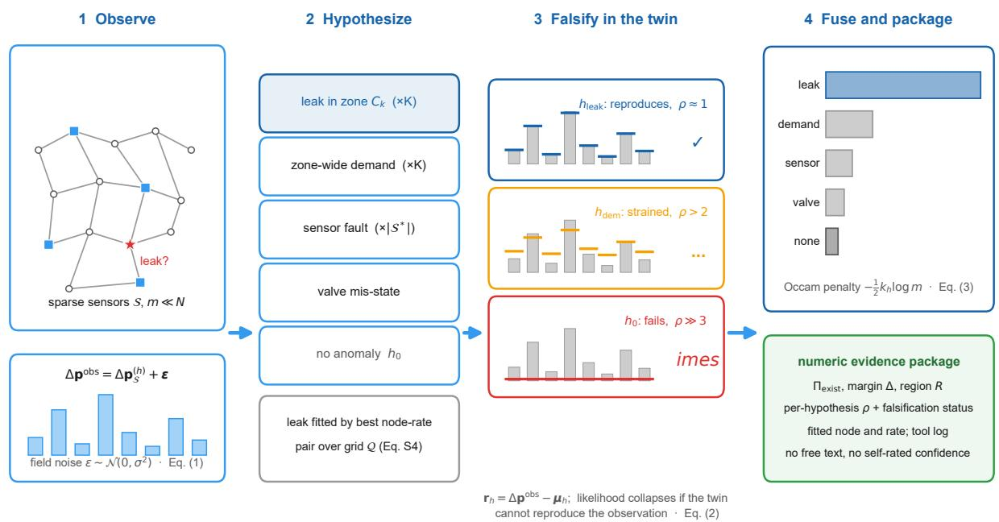

Extended Data Fig. 1 | The executor’s diagnostic pipeline (schematic). A sensor-space observation (Eq. 1; sparse sensors, field noise) is confronted with a mutually exhaustive hypothesis space: a leak in any zone (fitted by its best node-rate pair over the discharge grid, Supplementary Eq. S4), a zone-wide demand anomaly, a sensor fault, a valve mis-state, or no anomaly. Each hypothesis is realised in the hydraulic digital twin and must reproduce the observation: the residual and its per-degree-of-freedom Mahalanobis distance ρ (Eq. 2) falsify hypotheses that cannot (red), strain poor fits (amber) and retain reproducing ones (blue). Surviving evidence is fused into a posterior with an Occam penalty against over-flexible families (Eq. 3), from which the leak-existence mass, the top-1 margin and the candidate region are read into a numeric evidence package that carries no free text and no self-rated confidence. Signatures shown are illustrative, not measured values.

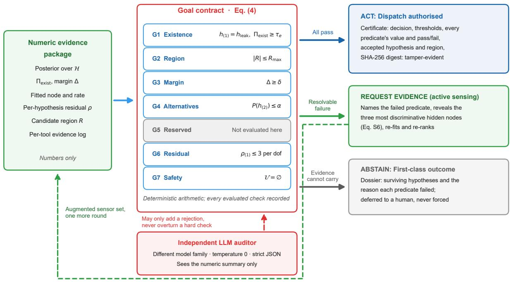

Extended Data Fig. 2 | From evidence to an accountable action (schematic). The supervisor audits the numeric evidence package (Extended Data Fig. 1) against the goal contract of Eq. (4): existence, region, margin, alternatives, residual and safety are deterministic arithmetic checks; G5 is a field reserved for deployment and is not evaluated here. All checks passing authorises a dispatch with a certificate that records every predicate’s value and pass or fail and is bound to the evidence by a SHA-256 digest; a resolvable failure triggers active sensing, which names the failed predicate, reveals the three most discriminative hidden nodes (Supplementary Eq. S6) and re-runs the executor on the augmented sensor set (dashed loop); otherwise the system abstains with a dossier and defers to a human. The independent language-model auditor, a diferent model family at temperature zero, sees only the numeric summary and may add a rejection but can never overturn a hard check.

## Supplementary Information

## Supplementary Methods

## S1. Governing hydraulics

Under steady-state operation the network obeys conservation of mass at every node,

$$
- \sum _ { j \in \mathcal { N } ( i ) } Q _ { i j } ( t ) = d _ { i } ( t ) + a _ { i } ( t ) , \quad \forall i \in \mathcal { V }\tag{S1}
$$

and the Hazen–Williams head-loss relationship along every pipe,

$$
H _ { i } ( t ) - H _ { j } ( t ) = r _ { i j } | Q _ { i j } ( t ) | ^ { n - 1 } Q _ { i j } ( t ) , \quad \forall ( i , j ) \in \mathcal { E }\tag{S2}
$$

where $Q _ { i j }$ is the pipe flow, $d _ { i }$ the nominal demand, $a _ { i }$ an anomalous additional or perturbing demand, $H _ { i }$ the hydraulic head, $r _ { i j }$ the pipe resistance, and $n = 1 . 8 5 2$ the head-loss exponent. The digital twin (WNTR/EPANET) solves Eqs. (S1)–(S2); the sensor-space deviation these induce, plus field noise, is main-text Eq. (1).

## S2. Competing-hypothesis space

Diagnosis is posed over a structured, mutually exhaustive hypothesis space spanning one dominant anomaly per event,

$$
\mathcal { H } = \{ h _ { \mathrm { l e a k } } ( k ) \} _ { k = 1 } ^ { K } \cup \{ h _ { \mathrm { d e m } } ( k ) \} _ { k = 1 } ^ { K } \cup \{ h _ { \mathrm { s e n } } ( s ) \} _ { s \in S ^ { * } } \cup \{ h _ { \mathrm { v a l } } ( a ) \} _ { a \in A ^ { * } } \cup \{ h _ { 0 } \} .\tag{S3}
$$

Here $h _ { \mathrm { l e a k } } ( k )$ is a leak somewhere in zone $C _ { k } , h _ { \mathrm { d e m } } ( k )$ a zone-wide demand anomaly in $C _ { k } , h _ { \mathrm { s e n } } ( s )$ a fault on sensor channel $s , h _ { \mathrm { v a l } } ( a )$ a mis-state of asset $^ { a , }$ and $h _ { 0 }$ the null hypothesis that no actionable anomaly exists.

## S3. Leak fit within a zone

Because the true leak may sit at any junction in a zone, each leak hypothesis is fitted by the best node–rate pair,

$$
\pmb { \mu } _ { h _ { \mathrm { l e a k } } ( k ) } = \arg \operatorname* { m i n } _ { v \in C _ { k } , q \in \mathcal { Q } } \big \| \Delta \mathbf { p } ^ { \mathrm { o b s } } - \pmb { \mu } ( v , q ) \big \| _ { 2 } ^ { 2 } ,\tag{S4}
$$

over all junctions $v \in C _ { k }$ and the discharge grid $\mathcal { Q } = \{ 2 , 5 , 1 0 , 2 0 , 3 5 , 5 0 \} \mathrm { ~ L ~ s } ^ { - 1 }$ . The residual and its Gaussian log-likelihood are main-text Eq. (2).

## S4. Posterior summary quantities

From the posterior (main-text Eq. 3) the supervisor reads three quantities,

$$
\Pi _ { \mathrm { e x i s t } } = \sum _ { k } P \big ( h _ { \mathrm { l e a k } } ( k ) \big ) , \quad \Delta = P ( h _ { ( 1 ) } ) - P ( h _ { ( 2 ) } ) , \quad \mathcal { E } _ { \mathrm { b i t s } } = - \sum _ { h } P ( h ) \log _ { 2 } P ( h ) ,\tag{S5}
$$

the total leak-existence mass $\Pi _ { \mathrm { e x i s t } }$ , the margin $\Delta$ of the top hypothesis over the best alternative of any family, and the posterior entropy.

## S5. Active-sensing discriminability

When a rejection reflects an unresolved zone ambiguity, the executor scores every hidden node by the spread of the surviving hypotheses’ twin-predicted responses and reveals the highest-scoring nodes (three per round in all reported runs), the first of which is

$$
x ^ { * } = \arg \operatorname* { m a x } _ { x \notin S } { \Big ( } \operatorname* { m a x } _ { h } \mu _ { h } ( x ) - \operatorname* { m i n } _ { h } \mu _ { h } ( x ) { \Big ) } ,\tag{S6}
$$

a digital-twin discriminability criterion that approximates the measurement of maximal expected information gain.

## S6. Language-model auditor and planner: prompts and strict-JSON templates

The auditor’s system prompt is reproduced verbatim from the implementation (agents/ llm\_client.py; this section is generated by importing the constants, so it cannot drift from the code). The auditor is queried through the ollama runtime’s hosted cloud endpoints (pinned tags deepseek-v4-pro:cloud for the auditor and gpt-oss:120b-cloud for the planner) with the format="json" constraint at temperature zero; every call is persisted as a transcript, from which the reported metrics can be replayed without model access. An earlier auditor tag (deepseek-v3.1:671bcloud) was retired by the provider on 15 July 2026 during the study; every reported audit run uses the tags above, and replay from the committed transcripts does not depend on any endpoint.

Auditor system prompt.

You are an INDEPENDENT safety supervisor for a water-distribution-network leak-diagnosis system. You receive   
ONLY a structured numeric evidence summary (never the diagnostic agent’s reasoning). Decide whether the   
evidence SUFFICIENTLY and CONSISTENTLY supports dispatching a repair crew to the claimed leak partition.   
Residual Mahalanobis-per-dof near 1.0 means a hypothesis REPRODUCES the observation; >>3 means it does NOT fit   
. Reject (reject=true) if ANY hold:   
1. top\_hypothesis.type is not ’leak’;   
2. leak\_existence\_probability < 0.7;   
3. margin\_over\_next\_best < 0.15;   
4. top\_hypothesis.fit\_residual\_mahalanobis > 3 (claimed leak does not fit);   
5. any alternative marked status=’falsified’ but with residual\_mahalanobis < 1.5 (it actually fits well ->   
inconsistent, the diagnosis is not trustworthy).   
Otherwise reject=false. Output STRICT JSON: {"reject": true|false, "reason": "<short>"}.

Auditor input. The user message contains only the structured numeric evidence summary, serialised as JSON with the fields:

top\_hypothesis: {type, partition, posterior, fit\_residual\_mahalanobis, candidate\_region\_nodes}   
leak\_existence\_probability   
margin\_over\_next\_best   
alternatives (up to 5): [{type, partition, posterior, residual\_mahalanobis, status}]   
demand\_period

Auditor output and fail-safe. The reply must be strict JSON {"reject": true|false, "reason": "<short>"}; a missing or unparsable reply defaults conservatively to {"reject": true, "reason": "auditor\_parse\_failure\_default\_safe"}.

Executor-planner system prompt (dual-language-model configuration only).

You are the orchestration head of a water-network leak-diagnosis agent. Given a numeric summary of a pressuredeviation observation, decide which NON-LEAK explanations are worth testing alongside the leak hypotheses: a DEMAND anomaly (a few-to-many sensors depressed broadly across a zone). a SENSOR fault (one or two channels anomalous while the rest read \~0), or a VALVE mis-state (large, structured, network-wide shifts). Always allow the leak hypotheses. Keep the rationale to at most 12 words. Output STRICT JSON: {"include\_demand": bool, " include\_sensor": bool, "include\_valve": bool, "rationale": "<<=12 words>"}.

## Supplementary Figures

## Supplementary Tables

Table S1 | Leak-partition accuracy as a function of leak severity on EXA7. Fraction of leaks assigned to the correct topological zone at each injected discharge rate, pooled over n = 5 random seeds at sensor noise σ = 0.05 m; n is the number of leak events in each severity band.

<table><tr><td>Leak rate  $\mathrm { ( L ~ s ^ { - 1 } ) }$  n</td><td>Leak-partition accuracy</td></tr><tr><td>2.0</td><td>100 27%</td></tr><tr><td>5.0</td><td>100 60%</td></tr><tr><td>10.0 100</td><td>77%</td></tr><tr><td>20.0</td><td>100 93%</td></tr><tr><td>35.0</td><td>100 93%</td></tr><tr><td>50.0 100</td><td>97%</td></tr></table>

Table S2 | Four-class diferential-diagnosis confusion matrix on EXA7. Event counts of the executor’s top hypothesis (columns) against the true class (rows), pooled over n = 5 random seeds at σ = 0.05 m (600 leak and 250 confounder events); diagonal entries are correct classifications.
<table><tr><td>True class (rows) / Predicted (columns)</td><td>leak</td><td>demand anomaly</td><td>sensor fault</td><td>valve misstate</td><td>none</td></tr><tr><td>leak</td><td>547</td><td>41</td><td>0</td><td>9</td><td>3</td></tr><tr><td>demand anomaly</td><td>1</td><td>99</td><td>0</td><td>0</td><td>0</td></tr><tr><td>sensor fault</td><td>0</td><td>0</td><td>39</td><td>21</td><td>15</td></tr><tr><td>valve misstate</td><td>9</td><td>6</td><td>10</td><td>33</td><td>17</td></tr><tr><td>none</td><td>0</td><td>0</td><td>0</td><td>0</td><td>0</td></tr></table>

Sensor faults are never predicted as leaks (leak column, sensor-fault row = 0); demand anomalies are typed 99/100; leaks 547/600.

Table S3 | Forced top-1 zone accuracy of trained localizers versus the executor’s twin-fit on EXA7. All methods are evaluated on the identical held-out test leaks at $\sigma = 0 . 0 5$ m; values are mean ± s.d. over n = 5 random seeds.
<table><tr><td>Method</td><td>Forced Top-1</td></tr><tr><td>GCN (3-layer, trained)</td><td> $1 0 . 0 \pm 1 . 2 \%$ </td></tr><tr><td>MLP (128,64)</td><td> $2 7 . 7 \pm 1 . 5 \%$ </td></tr><tr><td>GraphRAG retrieval</td><td> $3 1 . 7 \pm 2 . 0 \%$ </td></tr><tr><td>RandomForest (200)</td><td> $5 5 . 7 \pm 5 . 3 \%$ </td></tr><tr><td>kNN (k=5, cosine)</td><td> $7 2 . 0 \pm 3 . 0 \%$ </td></tr><tr><td>Executor-Supervisor (twin-fit)</td><td> $8 1 . 7 \pm 5 . 0 \%$ </td></tr></table>

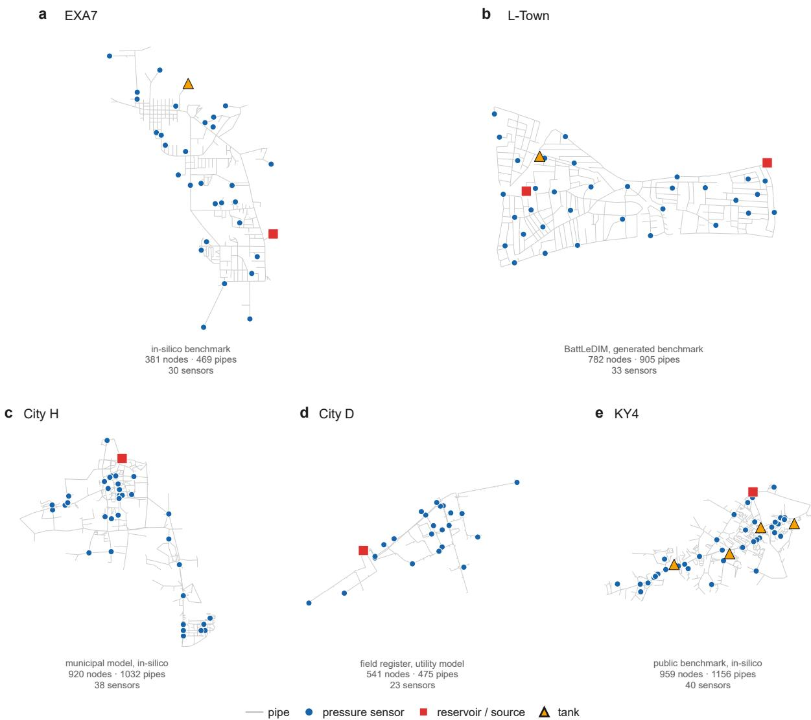  
Fig. S1 | Topologies of the five validation networks. Pipe layout drawn from the EPANET INP coordinates for (a) EXA7, the in-silico benchmark; (b) BattLeDIM L-Town, evaluated against the competition’s independently generated SCADA; (c) the City H municipal model, a third in-silico benchmark under the standard protocol; (d) City D, the utility’s own district-network model behind the field-register leg; and (e) KY4, the public Kentucky-database benchmark used as an independent second in-silico network. Pressure-sensor nodes (blue), reservoirs and sources (red squares) and tanks (amber triangles) are overlaid; node, pipe and sensor counts are printed beneath each panel. Provenance difers by tier: EXA7, KY4 and City H are evaluated fully in-silico, L-Town uses the competition’s independently generated SCADA against the nominal model, and the City D field register is twin-simulated at audited real locations because no SCADA exists for those events.

The executor–supervisor twin-fit (81.7 ± 5.0%, main text) exceeds the strongest trained baseline and, uniquely, abstains and types non-leak causes.

Table S4 | Component ablations on EXA7. Efect of removing the diferential head (a leak-only detector), loosening the goal contract, disabling the Occam/BIC penalty, and replacing the discriminative active-sensing choice with a random reveal, relative to the full system; identical scenarios per seed across arms (σ = 0.05 m, pooled over n = 5 seeds).

Mean ± s.d. with all 5 per-seed runs (σ = 0.05)  
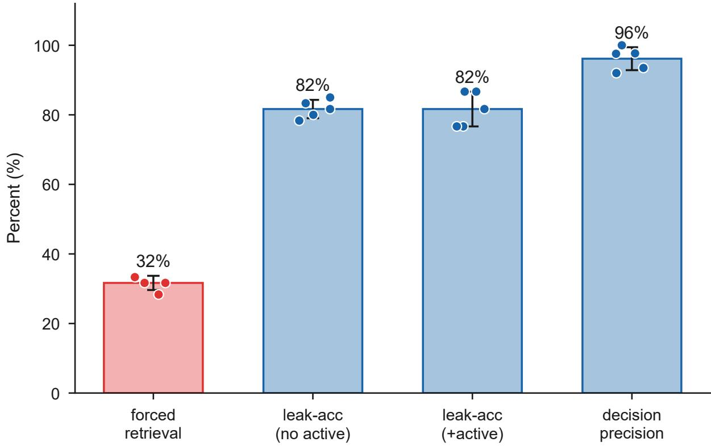  
Fig. S2 | Robustness of the headline metrics across random seeds (EXA7, σ = 0.05 m). Forced-retrieval top-1 accuracy, leak-partition accuracy without and with supervisor-directed active sensing, and decision precision at the operating point. Bars show the mean over n = 5 independent random seeds, overlaid circles are the individual seeds and error bars are the standard deviation.

a L-Town (782 junctions), K = 25, 33 sensors  
b City H (920 junctions), K = 25, 38 sensors  
c KY4 (959 junctions), K = 25, 40 sensors  
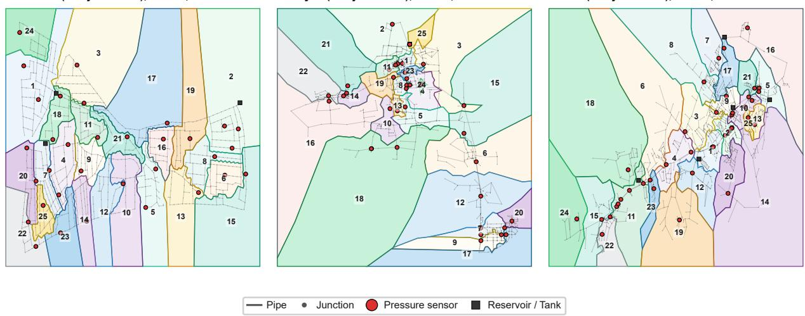  
Fig. S3 | Hydraulic zoning and sensor placement of the three networks not shown in Fig. 3 (L-Town, City H and KY4). As Fig. 3 of the main text (Leiden partitions drawn as space-filling territories; colours encode zone identity only): (a) L-Town, K = 25 zones with the 33 pressure gauges of the BattLeDIM benchmark; (b) the City H municipal model, K = 25 zones with 38 sensors; (c) KY4, K = 25 zones with 40 degree-placed sensors. Grey lines are pipes, red dots pressure sensors, dark squares reservoirs and tanks.

<table><tr><td>Configuration</td><td>Effect</td></tr><tr><td>Full contract</td><td>confounder false-dispatch 1/250</td></tr><tr><td>No differential head (leak-only)</td><td>confounder false-dispatch 50/250</td></tr><tr><td>Loosened contract (existence + residual only)</td><td>decision precision 81.2% (548 acted, 103 false dispatches)</td></tr><tr><td>No Occam/BIC penalty</td><td>demand anomalies mis-typed as leaks 9/100 (full system 1/100); confounder false-dispatch 1/250 (full 1/250); decision precision 93.0% (full 93.6%)</td></tr><tr><td>Active sensing: random reveal</td><td>leak-partition accuracy 71.3% (no active sensing 70.5%, discriminative 74.5%)</td></tr></table>

Table S5 | Split-conformal selective prediction on EXA7. Realized test risk and coverage at each target risk level, using the residual-derived confidence as the nonconformity score on the mixed test set (σ = 0.05 m); distribution-free control holds when the realized risk is at or below the target.
<table><tr><td>Target risk</td><td>Realized test risk</td><td>Coverage</td></tr><tr><td>5%</td><td>0.6%</td><td>36.6%</td></tr><tr><td>10%</td><td>5.7%</td><td>44.1%</td></tr></table>

Distribution-free risk control holds (realized risk below target at both levels).

Table S6 | Per-leak diagnostic outcomes for all 33 BattLeDIM L-Town ground-truth leaks. Competitiongenerated SCADA diagnosed against the nominal network model. For each leak: onset type, true zone(s), peak onset signature max|∆p|, leak-existence posterior, top-one margin, accept/abstain outcome, predicted zone and correctness (a tick marks a correct dispatch).
<table><tr><td>Pipe</td><td>Type</td><td>True zone(s)</td><td>max|∆p| (m)</td><td>Existence</td><td>Margin</td><td>Outcome</td><td>Pred. zone</td><td>Correct</td></tr><tr><td>p257</td><td>incipient</td><td>23</td><td>0.16</td><td>0.28</td><td>0.00</td><td>ABSTAINED</td><td>一</td><td></td></tr><tr><td>p461</td><td>incipient</td><td>19</td><td>0.02</td><td>0.04</td><td>0.00</td><td>ABSTAINED</td><td>一</td><td></td></tr><tr><td>p232</td><td>incipient</td><td>8,11</td><td>0.12</td><td>0.24</td><td>0.02</td><td>ABSTAINED</td><td>一</td><td></td></tr><tr><td>p427</td><td>incipient</td><td>16</td><td>0.05</td><td>0.06</td><td>0.00</td><td>ABSTAINED</td><td>一</td><td></td></tr><tr><td>p673</td><td>abrupt</td><td>4</td><td>1.15</td><td>1.00</td><td>1.00</td><td>ACTED</td><td>4</td><td>√</td></tr><tr><td>p810</td><td>incipient</td><td>14</td><td>1.01</td><td>0.00</td><td>1.00</td><td>ABSTAINED</td><td>一</td><td></td></tr><tr><td>p628</td><td>incipient</td><td>11</td><td>0.17</td><td>0.23</td><td>0.01</td><td>ABSTAINED</td><td>一</td><td></td></tr><tr><td>p538</td><td>abrupt</td><td>6,24</td><td>0.40</td><td>0.99</td><td>0.15</td><td>ACTED</td><td>6</td><td>√</td></tr><tr><td>p866</td><td>abrupt</td><td>1</td><td>0.40</td><td>0.52</td><td>0.15</td><td>ACTED</td><td>1</td><td>√</td></tr><tr><td>p31</td><td>incipient</td><td>0</td><td>0.16</td><td>0.01</td><td>0.00</td><td>ABSTAINED</td><td>一</td><td></td></tr><tr><td>p654</td><td>incipient</td><td>11</td><td>0.23</td><td>0.02</td><td>0.04</td><td>ABSTAINED</td><td>一</td><td></td></tr><tr><td>p183</td><td>abrupt</td><td>5</td><td>0.38</td><td>0.96</td><td>0.04</td><td>ABSTAINED</td><td>一</td><td></td></tr><tr><td>p158</td><td>abrupt</td><td>15</td><td>0.41</td><td>0.62</td><td>0.00</td><td>ABSTAINED</td><td>一</td><td></td></tr><tr><td>p369</td><td>abrupt</td><td>2</td><td>0.43</td><td>0.74</td><td>0.05</td><td>ABSTAINED</td><td>一</td><td></td></tr><tr><td>p523</td><td>abrupt</td><td>24</td><td>0.43</td><td>0.98</td><td>0.02</td><td>ABSTAINED</td><td>一</td><td></td></tr><tr><td>p827</td><td>abrupt</td><td>7</td><td>0.58</td><td>1.00</td><td>0.18</td><td>ACTED</td><td>7</td><td>√</td></tr><tr><td>p280</td><td>abrupt</td><td>0</td><td>0.32</td><td>0.57</td><td>0.23</td><td>ABSTAINED</td><td>一</td><td></td></tr><tr><td>p653</td><td>incipient</td><td>11</td><td>0.03</td><td>0.04</td><td>0.00</td><td>ABSTAINED</td><td>一</td><td></td></tr><tr><td>p710</td><td>abrupt</td><td>15</td><td>0.15</td><td>0.28</td><td>0.01</td><td>ABSTAINED</td><td></td><td></td></tr><tr><td>p514</td><td>abrupt</td><td>3</td><td>0.23</td><td>0.48</td><td>0.01</td><td>ABSTAINED</td><td>一</td><td></td></tr><tr><td>p331</td><td>abrupt</td><td>2</td><td>0.27</td><td>0.14</td><td>0.07</td><td>ABSTAINED</td><td>一</td><td></td></tr><tr><td>p193</td><td>incipient</td><td>14</td><td>0.17</td><td>0.30</td><td>0.00</td><td>ABSTAINED</td><td>一</td><td></td></tr><tr><td>p277</td><td>incipient</td><td>23</td><td>0.50</td><td>0.10</td><td>0.02</td><td>ABSTAINED</td><td>/</td><td></td></tr><tr><td>p142</td><td>abrupt</td><td>11</td><td>0.40</td><td>0.35</td><td>0.46</td><td>ABSTAINED</td><td>一</td><td></td></tr><tr><td>p680</td><td>abrupt</td><td>4</td><td>0.75</td><td>0.00</td><td>1.00</td><td>ABSTAINED</td><td>一</td><td></td></tr><tr><td>p586</td><td>incipient</td><td>22</td><td>0.29</td><td>0.01</td><td>0.09</td><td>ABSTAINED</td><td>一 一</td><td></td></tr><tr><td>p721</td><td>incipient</td><td>15</td><td>0.67</td><td>0.00</td><td>1.00</td><td>ABSTAINED</td><td>一</td><td></td></tr><tr><td>p800</td><td>incipient</td><td>1</td><td>0.34</td><td>0.01</td><td>0.07</td><td>ABSTAINED</td><td>一</td><td></td></tr><tr><td>p123</td><td>incipient</td><td>8</td><td>0.78</td><td>0.00</td><td>1.00</td><td>ABSTAINED</td><td>一</td><td></td></tr><tr><td>p455</td><td>incipient</td><td>21</td><td>0.43</td><td>0.02</td><td>0.02</td><td>ABSTAINED</td><td></td><td>一</td></tr><tr><td>p762</td><td>incipient</td><td>12</td><td>0.68</td><td>0.00</td><td>1.00</td><td>ABSTAINED</td><td></td><td></td></tr><tr><td>p426</td><td>abrupt</td><td>16</td><td>0.61</td><td>0.00</td><td>1.00</td><td>ABSTAINED</td><td></td><td></td></tr><tr><td>p879</td><td>incipient</td><td>1,14</td><td>0.56</td><td>0.17</td><td>0.72</td><td>ABSTAINED</td><td></td><td></td></tr></table>

Summary: coverage 12% (4 acted), decision precision 100%, forced top-1 zone accuracy 15%.

Table S7 | Risk–coverage frontier on BattLeDIM L-Town. Coverage and decision precision as the leakexistence acceptance threshold is swept over the 33 ground-truth leaks ranked by existence posterior; each row is one distinct operating point on the frontier.
<table><tr><td>Existence threshold</td><td>n acted</td><td>Coverage</td><td>Decision precision</td></tr><tr><td>1.01</td><td>0</td><td>0%</td><td>100%</td></tr><tr><td>1.00</td><td>2</td><td>6%</td><td>100%</td></tr><tr><td>0.99</td><td>3</td><td>9%</td><td>100%</td></tr><tr><td>0.98</td><td>4</td><td>12%</td><td>75%</td></tr><tr><td>0.96</td><td>5</td><td>15%</td><td>80%</td></tr><tr><td>0.74</td><td>6</td><td>18%</td><td>67%</td></tr><tr><td>0.62</td><td>7</td><td>21%</td><td>57%</td></tr><tr><td>0.57</td><td>8</td><td>24%</td><td>50%</td></tr><tr><td>0.52</td><td>9</td><td>27%</td><td>56%</td></tr><tr><td>0.48</td><td>10</td><td>30%</td><td>50%</td></tr><tr><td>0.35</td><td>11</td><td>33%</td><td>45%</td></tr><tr><td>0.30</td><td>12</td><td>36%</td><td>42%</td></tr><tr><td>0.28</td><td>13</td><td>39%</td><td>38%</td></tr><tr><td>0.28</td><td>14</td><td>42%</td><td>36%</td></tr><tr><td>0.24</td><td>15</td><td>45%</td><td>33%</td></tr><tr><td>0.23</td><td>16</td><td>48%</td><td>31%</td></tr><tr><td>0.17</td><td>17</td><td>52%</td><td>29%</td></tr><tr><td>0.14</td><td>18</td><td>55%</td><td>28%</td></tr><tr><td>0.10</td><td>19</td><td>58%</td><td>26%</td></tr><tr><td>0.06</td><td>20</td><td>61%</td><td>25%</td></tr><tr><td>0.04</td><td>21</td><td>64%</td><td>24%</td></tr><tr><td>0.04</td><td>22</td><td>67%</td><td>23%</td></tr><tr><td>0.02</td><td>23</td><td>70%</td><td>22%</td></tr><tr><td>0.02</td><td>24</td><td>73%</td><td>21%</td></tr><tr><td>0.01</td><td>26</td><td>79%</td><td>19%</td></tr><tr><td>0.01</td><td>27</td><td>82%</td><td>19%</td></tr><tr><td>0.00</td><td>33</td><td>100%</td><td>15%</td></tr></table>

At matched coverage (4 acted) the multi-predicate contract reaches 100% vs 75% for a scalar existence threshold (it vetoes p523).

Table S8 | Standard in-silico protocol on the three transfer networks (City H, City D and KY4). Headline metrics under the same scenario generator, noise model (σ = 0.05 m) and metrics as the EXA7 headline run; mean ± s.d. over n = 5 random seeds (110 mixed events per seed). City H: 921 nodes, 25 zones, 38 sensors. City D: 542 nodes, 15 zones, 23 sensors placed by the greedy detection-coverage program, whose objective uses only the pre-simulated leak library and raises library actionable coverage (clean $| \Delta \mathrm { p } | \geq 0 . 4 5$ m) from 29.6% to 34.7%. KY4 (public Kentucky benchmark): 959 nodes, 1156 pipes, 25 zones, 40 degree-placed sensors (one per ∼24 nodes, hal the EXA7 density).

<table><tr><td>Metric</td><td>City H</td><td>City D</td><td>KY4</td></tr><tr><td>Forced retrieval Top-1</td><td> $3 6 . 0 \pm 4 . 2 \%$ </td><td> $4 4 . 7 \pm 4 . 1 \%$ </td><td> $8 1 . 3 \pm 4 . 9 \%$ </td></tr><tr><td>Leak-partition accuracy (no active sensing)</td><td> $6 1 . 0 \pm 5 . 5 \%$ </td><td> $4 3 . 3 \pm 3 . 9 \%$ </td><td> $8 6 . 7 \pm 5 . 8 \%$ </td></tr><tr><td>Leak-partition accuracy (with active sensing)</td><td> $6 6 . 7 \pm 5 . 3 \%$ </td><td> $4 4 . 7 \pm 4 . 3 \%$ </td><td> $8 8 . 7 \pm 3 . 0 \%$ </td></tr><tr><td>Decision precision at the operating point</td><td> $9 1 . 5 \pm 3 . 8 \%$ </td><td> $8 3 . 1 \pm 1 1 . 0 \%$ </td><td> $9 6 . 4 \pm 2 . 9 \%$ </td></tr><tr><td>Coverage at the operating point</td><td> $2 5 . 6 \pm 1 . 5 \%$ </td><td> $2 0 . 0 \pm 3 . 7 \%$ </td><td> $3 4 . 4 \pm 1 . 7 \%$ </td></tr><tr><td>Coverage at 100% precision</td><td> $5 . 1 \pm 7 . 6 \%$ </td><td> $3 . 3 \pm 2 . 6 \%$ </td><td> $1 4 . 2 \pm 1 6 . 7 \%$ </td></tr></table>

Table S9 | Independent language-model audit and dual-model pipeline. Auditor catch rate on corrupted evidence packages, false-alarm rate on genuine packages and temperature-0 decision stability, together with the fully dual-model configuration, from real ollama calls; per-call transcripts are in artifacts/llm\_transcripts\_\*.jsonl.
<table><tr><td>Quantity</td><td>Value</td></tr><tr><td>Auditor model</td><td>deepseek-v4-pro:cloud</td></tr><tr><td>Catch rate on corrupted packages (n=16)</td><td>100%</td></tr><tr><td>· A, unsupported assertion</td><td>100%</td></tr><tr><td>· B, fabricated exclusion</td><td>100%</td></tr><tr><td>· C, inflated evidence</td><td>100%</td></tr><tr><td>False-alarm rate on genuine packages (n=16)</td><td>0%</td></tr><tr><td>Decision stability (temperature-0 repeats)</td><td>100%</td></tr><tr><td>Dual-model pipeline</td><td>gpt-oss:120b-cloud planner + deepseek-v4-pro:cloud auditor</td></tr><tr><td>Accept/abstain agreement with deterministic pipeline (n=16)</td><td>100%</td></tr><tr><td>Correct decisions (deterministic / dual-model)</td><td>88% / 88%</td></tr></table>

Example gpt-oss-120b planner outputs (varied, discriminative):

\- demand=False, sensor=False, valve=False: “All deviations modest; no pattern for demand, sensor, or valve.” - demand=True, sensor=False, valve=True: “Widespread large negative deviations across nearly all sensors” - demand=False, sensor=False, valve=True: “Widespread large negative drops suggest valve mis-state, not isolated faults” - demand=True, sensor=False, valve=True: “Broad pressure drop across most sensors suggests demand or valve issue.”

Table S10 | One-at-a-time sensitivity of the goal-contract thresholds on EXA7. Pooled decision precision and coverage over the extended mixed test set (n = 850 events, five seeds, σ = 0.05 m; the same pooled set as Tables S1–S2) as each acceptance threshold is varied around its operating value (existence τ\_e = 0.5, margin δ = 0.12, alternative-exclusion α = 0.20, residual gate ρ\_max = 3, region R\_max = 60 nodes) with the others held at nominal; the per-event evidence rows are generated once and the accept/abstain gate is re-evaluated analytically per setting.
<table><tr><td>Threshold</td><td>Value</td><td>Decision precision</td><td>Coverage</td><td>n acted</td></tr><tr><td>Existence τ_e</td><td>0.3</td><td>93.6%</td><td>46.0%</td><td>391</td></tr><tr><td>Existence τ_e</td><td>0.4</td><td>93.6%</td><td>46.0%</td><td>391</td></tr><tr><td>Existence τ_e</td><td>0.5 (nominal)</td><td>93.6%</td><td>46.0%</td><td>391</td></tr><tr><td>Existence τ_e</td><td>0.6</td><td>93.6%</td><td>46.0%</td><td>391</td></tr><tr><td>Existence τ_e</td><td>0.7</td><td>93.6%</td><td>46.0%</td><td>391</td></tr><tr><td>Existence τ_e</td><td>0.8</td><td>93.8%</td><td>45.9%</td><td>390</td></tr><tr><td>Existence τ_e</td><td>0.9</td><td>95.7%</td><td>44.2%</td><td>376</td></tr><tr><td>Margin δ</td><td>0.04</td><td>91.1%</td><td>47.4%</td><td>403</td></tr><tr><td>Marginδ</td><td>0.08</td><td>92.7%</td><td>46.5%</td><td>395</td></tr><tr><td>Marginδ</td><td>0.12 (nominal)</td><td>93.6%</td><td>46.0%</td><td>391</td></tr><tr><td>Marginδ</td><td>0.16</td><td>94.6%</td><td>45.5%</td><td>387</td></tr><tr><td>Margin δ</td><td>0.2</td><td>94.8%</td><td>45.4%</td><td>386</td></tr><tr><td>Marginδ</td><td>0.24</td><td>95.3%</td><td>45.1%</td><td>383</td></tr><tr><td>Alt-exclusion α</td><td>0.1</td><td>99.1%</td><td>39.6%</td><td>337</td></tr><tr><td>Alt-exclusion α</td><td>0.15</td><td>97.7%</td><td>41.6%</td><td>354</td></tr><tr><td>Alt-exclusion α</td><td>0.2 (nominal)</td><td>93.6%</td><td>46.0%</td><td>391</td></tr><tr><td>Alt-exclusion α</td><td>0.25</td><td>92.3%</td><td>48.9%</td><td>416</td></tr><tr><td>Alt-exclusion α</td><td>0.3</td><td>91.2%</td><td>50.7%</td><td>431</td></tr><tr><td>Residual ρ_max</td><td>2.0</td><td>93.8%</td><td>45.9%</td><td>390</td></tr><tr><td>Residual ρ_max</td><td>2.5</td><td>93.6%</td><td>46.0%</td><td>391</td></tr><tr><td>Residual ρ_max</td><td>3.0 (nominal)</td><td>93.6%</td><td>46.0%</td><td>391</td></tr><tr><td>Residual max  $\rho _ { _ - }$ </td><td>3.5</td><td>93.6%</td><td>46.0%</td><td>391</td></tr><tr><td>Residual ρ_max</td><td>4.0</td><td>93.6%</td><td>46.0%</td><td>391</td></tr><tr><td>Region R_max (nodes)</td><td>25</td><td>89.9%</td><td>8.1%</td><td>69</td></tr><tr><td>Region R_max (nodes)</td><td>40</td><td>93.2%</td><td>38.0%</td><td>323</td></tr><tr><td>Region R_max (nodes)</td><td>60 (nominal)</td><td>93.6%</td><td>46.0%</td><td>391</td></tr><tr><td>Region R_max (nodes)</td><td>80</td><td>93.6%</td><td>46.0%</td><td>391</td></tr><tr><td>Region R_max (nodes)</td><td>100</td><td>93.6%</td><td>46.0%</td><td>391</td></tr></table>

Across all 28 one-at-a-time settings, pooled decision precision spans 89.9–99.1% (nominal 93.6%).

Table S11 | Detectability and outcome by leak-severity band for the City D field register. Per-band summary over the 194 audited 2025 work orders (audited real-location node mapping; twin-simulated pressures, σ = 0.15 m field noise): number of events, median clean peak signature, forced top-1 zone accuracy, coverage and acted-cohort decision precision.
<table><tr><td>Leak-rate band  $\overline { { ( \mathrm { L } \mathrm { s } ^ { - 1 } ) } }$ </td><td>n</td><td>Median clean max|∆p| (m)</td><td>Forced top-1</td><td>Coverage</td><td>Decision precision</td></tr><tr><td>[0,0.05)</td><td>73</td><td>0.0003</td><td>10%</td><td>0%</td><td> $\mathrm { n / a }$  (0 acted)</td></tr><tr><td>[0.05,0.1)</td><td>22</td><td>0.0008</td><td>0%</td><td>5%</td><td>0%</td></tr><tr><td>[0.1,0.3)</td><td>42</td><td>0.0025</td><td>10%</td><td>0%</td><td>n/a (0 acted)</td></tr><tr><td>[0.3,1)</td><td>41</td><td>0.0095</td><td>20%</td><td>2%</td><td>100%</td></tr><tr><td>&gt;=1</td><td>16</td><td>0.0275</td><td>25%</td><td>19%</td><td>67%</td></tr></table>

Across the register the median clean signature is 1.9 mm and no event reaches the 0.45 m actionability floor. Under the transfer preset the contract dispatches excavation on 5 of 194 events (60% acted precision) and raises 2% false alarms on 50 no-leak controls; the stricter audit preset (existence $\geq$ 0.7) dispatches 0 of 194 and admits 0 of 50 controls. Forced top-1 accuracy is 11.9%.

<table><tr><td>Injected rate  $\overline { { ( \mathrm { L } \mathrm { s } ^ { - 1 } ) } }$ </td><td>Median clean max|∆p| (m)</td><td>Forced top-1</td><td>Coverage</td><td>Decision precision</td></tr><tr><td>2</td><td>0.023</td><td>11%</td><td>3%</td><td>0%</td></tr><tr><td>5</td><td>0.059</td><td>17%</td><td>7%</td><td>38%</td></tr><tr><td>10</td><td>0.119</td><td>28%</td><td>10%</td><td>67%</td></tr><tr><td>20</td><td>0.248</td><td>40%</td><td>22%</td><td>89%</td></tr><tr><td>35</td><td>0.454</td><td>44%</td><td>33%</td><td>78%</td></tr><tr><td>50</td><td>0.673</td><td>49%</td><td>33%</td><td>90%</td></tr></table>

On this stif, well-pressurized network the median signature clears the noise floor only near 10–20 $\mathrm { L } \mathrm { s } ^ { - 1 }$ ; the entire field register (Table S11) lies below $4 ~ \mathrm { L s ^ { - 1 } }$

Table S13 | City D register: pressure-information ceiling and the flow-balance survey tier. Ceiling: with a sensor at every one of the 541 junctions, the median best-possible clean signature over the 194 register events is 0.0023 m; 5 events clear the 0.15 m (1σ) level and 1 the 0.45 m floor, so no sensor placement can make this register pressure-actionable (the strict any-time bound gives the same floor counts). Under a district-adjacency tolerance the forced retrieval prediction lands in or adjacent to the true district in 41/194 events, against $\ i \sim 2 4 \%$ chance rate: forced guessing does not beat chance even with the tolerance. Survey tier: district net-inflow deltas are twin-computed per event with source feeds credited to the receiving district (mass-balance identity verified, median ratio 1.000; noiseless argmax correct in 194/194); nightly meter uncertainty σ\_f is averaged over each order’s real work-order window (≤14 nights); one seeded noise realization per event; the district with the largest observed rise is survey-dispatched if it clears u·σ $\mathrm { ~ f ~ } / \sqrt { \mathrm { ~ \textit ~ { ~ w ~ } ~ } }$ . 50 no-leak control campaigns per setting.
<table><tr><td> $\overline { { \sigma \mathrm { ~ \_ ~ f ~ } ( \mathrm { L } \mathrm { s } ^ { - 1 } ) } }$ </td><td>u</td><td>Survey dispatched</td><td>Coverage</td><td>District precision</td><td>Controls FA</td></tr><tr><td>0.05</td><td>3.0</td><td>109/194</td><td>56%</td><td>108/109 (99%)</td><td>0/50</td></tr><tr><td>0.05</td><td>3.4</td><td>105/194</td><td>54%</td><td>105/105 (100%)</td><td>0/50</td></tr><tr><td>0.10</td><td>3.0</td><td>92/194</td><td>47%</td><td>91/92 (99%)</td><td>0/50</td></tr><tr><td>0.10</td><td>3.4</td><td>85/194</td><td>44%</td><td>85/85 (100%)</td><td>0/50</td></tr><tr><td>0.20</td><td>3.0</td><td>66/194</td><td>34%</td><td>65/66 (98%)</td><td>0/50</td></tr><tr><td>0.20</td><td>3.4</td><td>57/194</td><td>29%</td><td>57/57 (100%)</td><td>0/50</td></tr></table>

Excavation-tier coverage stays at 2.6% under the transfer preset (zero under the audit preset); the survey tier is the principal recovery path for this register.

Table S14 | Demand-ratio sensitivity of the City D field tiers. The vendored model’s demands are the 2016 base scaled by the evidence-backed nine-year ratio 1.168459 (Methods). Sweeping the overall demand ratio across the update workbook’s own hydraulic-sensitivity band re-runs the full ceiling and flow computation of Table S13 at each level (194 events per ratio; the 1.168459 leg reproduces the committed ceiling artifact and serves as the regression anchor). The excavation ceiling stays roughly two orders of magnitude below the 0.15 m floor and the survey-tier detection count is invariant at every ratio, ruling out demand miscalibration as a cause of the field-leg limits. Detection counts use the deterministic sizing rule (true-district inflow rise $\ge \mathrm { u } { \cdot } \sigma \_ \mathrm { f } / \sqrt { \mathrm { ~ \textit ~ { ~ W ~ } ~ u ~ } } = 3 . 4 , \sigma \_ \mathrm { f } =$ $0 . 1 0 ~ \mathrm { L s ^ { - 1 } }$ , W = min(window days, 14)).
<table><tr><td>Ratio on 2016 base</td><td>Min baseline pressure (m)</td><td>Ceiling median (m)</td><td>Ceiling  $\mathrm { p 9 0 }$  (m)</td><td>≥0.15 m</td><td>≥0.45 m</td><td>Mass-balance ratio</td><td>Survey detected</td></tr><tr><td>0.8</td><td>32.59</td><td>0.0016</td><td>0.0288</td><td>3/194</td><td>1/194</td><td>1.000</td><td>85/194</td></tr><tr><td>1.0</td><td>31.31</td><td>0.0020</td><td>0.0347</td><td>4/194</td><td>1/194</td><td>1.000</td><td>85/194</td></tr><tr><td>1.1</td><td>30.59</td><td>0.0022</td><td>0.0376</td><td>5/194</td><td>1/194</td><td>1.000</td><td>85/194</td></tr><tr><td>1.168459 (adopted)</td><td>30.05</td><td>0.0023</td><td>0.0396</td><td>5/194</td><td>1/194</td><td>1.000</td><td>85/194</td></tr><tr><td>1.3</td><td>28.83</td><td>0.0025</td><td>0.0433</td><td>5/194</td><td>1/194</td><td>1.000</td><td>85/194</td></tr></table>

No ratio in the plausible band changes the excavation conclusion or the survey-tier detection count; the demand level is not the binding constraint on the field leg.

Table S15 | Does the language-model auditor generalize beyond its enumerated rules? The auditor prompt (Supplementary Methods S6) enumerates five rejection rules, and each of the three corruption classes of Table S9 trips one of them. This follow-up re-uses the same 16 clean ACCEPTED EXA7 packages (identical selection and seeds) and adds four corruption classes that pass every one of the five rules field by field but are jointly impossible: D, a margin larger than the leak-existence probability; E, an alternative listed with a higher posterior than the top hypothesis; F, posteriors summing to well over one; G, an empty candidate region. Three auditors are compared on the same packages: RULES, the five prompt rules implemented literally in code; the language model with the paper’s prompt verbatim (as-is); and the language model with the paper’s prompt plus one clause asking it to reject any other internal inconsistency, nothing enumerated (open; the added clause reads: “the summary is internally inconsistent in ANY other way: quantities that cannot jointly hold in a valid probabilistic evidence summary, or a recommendation that could not be acted on.”). The models are the paper’s auditor (deepseek-v4-pro:cloud) and, as a second opinion of a diferent family, the executor planner’s model (gpt-oss:120b-cloud); every call is committed as a transcript. Cells give rejected/total; the clean column is the false-alarm count. Stability is the temperature-zero agreement over 3 repeats on eight out-of-taxonomy packages.
<table><tr><td>Auditor</td><td>Clean (false alarms)</td><td>In- taxonomy A+B+C</td><td>D margin &gt; existence</td><td>E alternative outranks top</td><td>F poste- riors &gt; 1</td><td>G empty region</td><td>Out-of- taxonomy total</td><td>Stability</td></tr><tr><td>RULES (five prompt rules, code)</td><td>0/16</td><td>48/48</td><td>0/16</td><td>0/16</td><td>0/16</td><td>0/16</td><td>0/64</td><td>1.000 (de- terministic)</td></tr><tr><td>deepseek-v4- pro:cloud, prompt as-is</td><td>0/16</td><td>48/48</td><td>0/16</td><td>2/16 (2 fail-safe)</td><td>0/16</td><td>0/16</td><td>2/64</td><td>1.000</td></tr><tr><td>deepseek-v4- pro:cloud, prompt open</td><td>1/16 (1 fail-safe)</td><td>48/48</td><td>16/16</td><td>16/16</td><td>16/16</td><td>7/16 (6 fail-safe)</td><td>55/64</td><td>1.000</td></tr><tr><td>gpt-oss:120b-cloud, prompt as-is</td><td>0/16</td><td>48/48</td><td>0/16</td><td>0/16</td><td>0/16</td><td>0/16</td><td>0/64</td><td>1.000</td></tr><tr><td>gpt-oss:120b-cloud, prompt open</td><td>0/16</td><td>48/48</td><td>0/16</td><td>11/16</td><td>11/16</td><td>0/16</td><td>22/64</td><td>0.958</td></tr></table>

Read across the rows. With the paper’s prompt verbatim the language model behaves as a rulefollower (the prompt ends “otherwise reject=false”) and rejects essentially nothing outside the enumerated rules, exactly like the code checker. One added clause, without enumerating any new rule, changes that: deepseek-v4-pro:cloud (as-is): out-of-taxonomy 0/64 by judgement, judged false alarms on the genuine packages 0/16; deepseek-v4-pro:cloud (open): out-of-taxonomy 49/64 by judgement, judged false alarms on the genuine packages 0/16; gpt-oss:120b-cloud (as-is): out-oftaxonomy 0/64 by judgement, judged false alarms on the genuine packages 0/16; gpt-oss:120b-cloud (open): out-of-taxonomy 22/64 by judgement, judged false alarms on the genuine packages 0/16. Rejections marked fail-safe are parse failures defaulting to reject and are not counted as judgement. The stronger auditor therefore supplies a generalizing consistency check that a fixed rule list does not, catching every arithmetic impossibility with no judged false alarm, while the pragmatic emptyregion class largely passes; it may only tighten the hard predicates and never replace them. In an earlier round of this test the same open auditor rejected four genuine packages for an arithmetic inconsistency that turned out to be a real defect in the packages (Discussion); the run reported here uses the corrected packages.

Data provenance. EXA7, KY4 and City H are simulation benchmarks evaluated under one standard in-silico protocol. L-Town uses the public BattLeDIM SCADA, which the competition organizers generated from a perturbed copy of the network model rather than measured in the field, against the nominal model. The City D field leg uses the utility’s own network model and its audited 2025 repair register (real work orders, audited real-location node mapping); pressures and district inflows are twin-simulated with field noise because no SCADA exists for these events. No measured utility telemetry is used anywhere in this study: the L-Town series were generated by the competition organizers from a perturbed copy of the network model, and all other observations, including every City D pressure and district inflow, are twin-simulated. No quantity is inherited from prior work.