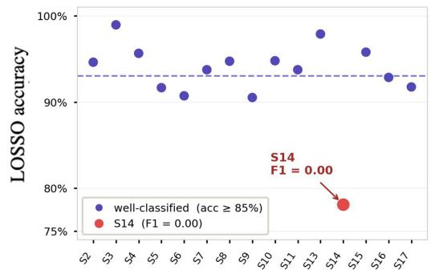
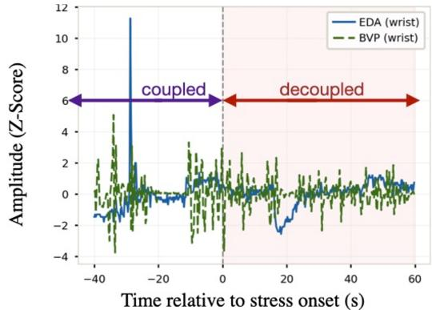
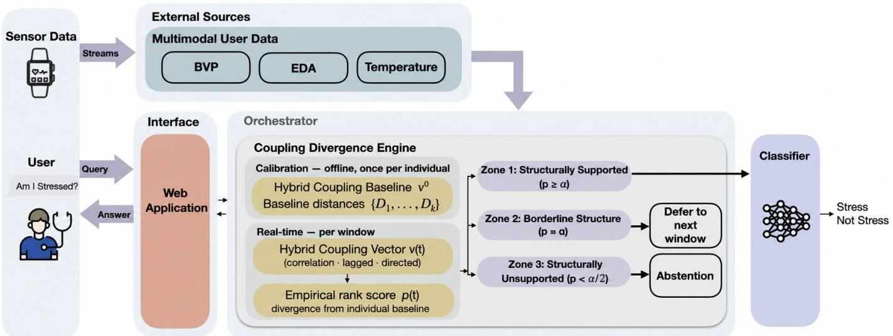
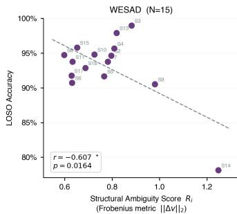
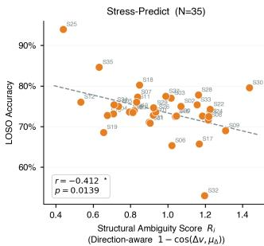

# When Clean Signals Are Not Enough: Detecting Structural Ambiguity for Safe Wearable Stress Classification

Saba A. Farahani

University of California, Irvine

Irvine, CA, USA

fazizaba@uci.edu

Hung Cao

University of California, Irvine

Irvine, CA, USA

hungcao@uci.edu

Amir M. Rahmani University of California, Irvine Irvine, CA, USA a.rahmani@uci.edu

Abstract—Wearable stress classifiers can achieve strong average performance while failing completely for a particular individual. On WESAD, a Random Forest reaches 93.0% mean accuracy yet yields F1 = 0 for Subject 14, whose cross-signal coupling weakens near stress onset. We call this structural ambiguity: individually plausible physiological channels form an inter-signal pattern that is poorly supported by the person’s non-stress reference. We introduce the Individual Conformal Coupling Monitor (ICCM), a lightweight and transparent pre-inference monitor that quantifies subject-specific coupling divergence and routes each window to classify, defer, or abstain without retraining the downstream classifier. Across WESAD (N = 15) and Stress-Predict (N = 35), full-cohort Pearson associations between ambiguity and accuracy are negative (r = −0.607, p = 0.016; $r = - 0 . 4 1 2 , p = 0 . 0 1 4 )$ . Robustness analyses temper this finding: rank correlations are not significant, and the WESAD association disappears when Subject 14 is removed. ICCM changes falsepositive counts from 29 to 27 and 94 to 92, although neither[ paired change is significant. It withholds 3 of Subject 14’s 21 stress windows but does not repair the missed-stress failure. These results position ICCM as an interpretable signal of unsupported physiology and individual failure, rather than a stand-alone safety guarantee.

Index Terms—wearable sensing, stress detection, physiological AI, structural ambiguity, coupling divergence, conformal monitoring, safe abstention, personalized calibration

Code Availability. Code is available on GitHub.

## I. INTRODUCTION

Wearable physiological classifiers for stress detection often report high mean leave-one-subject-out (LOSO) accuracy while concealing severe failures for specific individuals [1], [2]. On WESAD [1], a Random Forest achieves 93% mean accuracy yet yields $F 1 = 0 . 0 0 0$ for Subject 14, whose EDA– BVP coupling weakens near stress onset. The channels contain no missing samples, but a diagnostic screen cannot establish that they are artifact-free. We use structural ambiguity for the operational condition in which the observed inter-signal relationship is poorly supported by a subject-specific reference.

In real-world wearable health systems, such failures carry direct clinical consequences: false stress alerts can trigger unnecessary interventions, contribute to alarm fatigue, and erode patient and clinician trust in physiological monitoring—

## a. Aggregate accuracy conceals individual failure

b. S14: BVP-EDA decouple at stress onset  
  
Fig. 1. Aggregate accuracy conceals Subject 14’s missed-stress failure $( F 1 =$ 0). EDA and BVP decouple near stress onset; residual artifacts cannot be excluded.

barriers increasingly recognized as central obstacles to wearable AI adoption in healthcare [3].

Existing approaches address wearable classifier failures through improved architectures, data augmentation, or distributionally robust optimization [4]. These methods can improve average accuracy, but they do not answer a pre-inference safety question: is the current physiological coupling structure supported by this individual’s baseline? Confidence scores and output-level uncertainty estimates are computed after the classifier has processed the input and do not directly detect structurally invalid inputs before inference occurs.

  
Fig. 2. ICCM system architecture. Wearable sensor streams (BVP, EDA, TEMP) are passed to the Coupling Divergence Engine within the Orchestrator. During offline calibration, the engine computes a subject-specific hybrid coupling baseline $\mathbf { v } ^ { 0 }$ and baseline distances $\mathbf { \bar { \{ D 1 , \ldots , } } $ from resting-state windows. At inference time, each 60-second window is evaluated using a hybrid coupling vector v(t) combining Pearson correlation, max-lag cross-correlation, and Granger-style directed coupling, converted to an empirical conformal-style rank score p(t), and routed through a 3-Zone Safety Gate: Zone $1 \ ( p \geq \alpha )$ passes to the classifier, Zone 2 (p ≈ α) defers to the next window, and Zone $\dot { 3 } ( p < \alpha / 2 )$ triggers abstention. The term “safe” denotes the system objective, not a clinical guarantee.

We introduce the Individual Conformal Coupling Monitor (ICCM), which calibrates a subject-specific non-stress coupling reference and applies a three-zone gate to classify, defer, or abstain before inference. ICCM requires no model retraining and is classifier-external in implementation (Fig. 2); multiarchitecture performance remains untested.

This paper makes three contributions:

• We define structural ambiguity as insufficiently supported inter-signal coupling despite individually plausible channels.

• We introduce ICCM, a subject-specific, classifier-external three-zone routing monitor.

• We evaluate ICCM on WESAD (N = 15) and Stress-Predict (N = 35), including robustness and selectiveoutcome analyses.

## II. RELATED WORK

Wearable Stress Detection. Multimodal wearable stress detection has been widely studied using BVP, EDA, and skin temperature, with Random Forests and other models achieving high average LOSO performance on datasets such as WESAD [1], [2], [5]. ICCM instead monitors whether a window is supported by a subject-specific non-stress reference; its Stress-Predict extension also uses stress labels from LOSO training subjects.

Signal Quality and Abstention. Signal-quality methods detect hardware degradation, motion artifacts, or poor recordings [6], whereas ICCM checks inter-signal coupling. Behavior-adaptive models also show interpretable coupling changes across behavioral phases [7]. Selective prediction supports abstention under high risk [8], [9], and clinical AI uses conformal and Bayesian uncertainty for abstention [10]. ICCM provides a physiological, classifier-external routing reason, but its overlapping baseline and rank windows preclude a formal conformal-coverage guarantee here.

## III. METHOD

ICCM is a deterministic physiological filter using hybrid coupling nonconformity and empirical rank calibration. It has three components (Fig. 2).

## A. External Sources

External Sources provide Empatica E4 BVP (64 Hz), EDA (4 Hz), and TEMP (4 Hz). HR is derived from BVP by sliding 5-s peak detection; signals use 60-s windows with a 30-s step.

## B. Interface

The Interface returns the classifier output when structurally supported, or reports insufficient physiological evidence.

## C. Orchestrator

The Orchestrator performs coupling analysis and routing in two phases.

Phase 1: Calibration. The calibration phase runs once per individual on known non-stress windows. For each window wk, a hybrid coupling vector is computed over signal pairs $( x , y ) \in \{ \mathrm { E D A } \cdot$ –HR, EDA–TEMP, HR–TEMP}:

$$
\begin{array} { r } { \mathbf { v } ( w _ { k } ) = [ \rho _ { E H } , \rho _ { E T } , \rho _ { H T } , \mathbf { \Lambda } } \\ { \ell _ { E H } , \ell _ { E T } , \ell _ { H T } , \mathbf { \Lambda } } \\ { g _ { E  H } , g _ { H  E } , g _ { T  H } ] } \end{array}\tag{1}
$$

where $\rho _ { x y }$ is the absolute Pearson correlation; $\ell _ { x y }$ is the maximum absolute cross-correlation over physiological delays

$\tau ~ \in ~ [ 1 \mathrm { s } , 1 0 \mathrm { s } ]$ ; and $g _ { x  y } ~ = ~ \mathrm { m i n } ( - \log p _ { \mathrm { G C } } , 1 0 ) / 1 0$ is a Granger-style directed coupling score normalized to [0, 1]. The subject-specific baseline and calibration distances are:

$$
\mathbf { v } ^ { 0 } = { \frac { 1 } { K } } \sum _ { k = 1 } ^ { K } \mathbf { v } ( w _ { k } ) , \quad D _ { k } = \| \mathbf { v } ( w _ { k } ) - \mathbf { v } ^ { 0 } \| _ { 2 }\tag{2}
$$

The set $\mathcal { D } = \{ D _ { 1 } , \ldots , D _ { K } \}$ defines this individual’s normal coupling variation.

Phase 2: Real-time Monitoring. At each window $t ,$ the Orchestrator computes $\mathbf { v } ( t )$ and evaluates an empirical conformal-style rank score:

$$
p ( t ) = \frac { 1 + | \{ k : D _ { k } \geq D ( t ) \} | } { K + 1 } , \quad D ( t ) = \| \mathbf { v } ( t ) - \mathbf { v } ^ { 0 } \| _ { 2 }\tag{3}
$$

A low $p ( t )$ indicates that the current coupling deviates from this individual’s baseline more than most calibration windows, providing evidence of structural ambiguity. The same overlapping windows estimate $\mathbf { v } ^ { 0 }$ and D, so exchangeability and splitconformal independence are not established. At $\alpha \ : = \ : 0 . 0 5$ Zone 3 is reachable only for $K \geq 4 0 ; 6 0 - $ s windows with a 30- s step require at least 20.5 minutes of contiguous calibration. For WESAD, $K \ = \ 7 2 – 7 6$ because all labeled non-stress periods (baseline, amusement, and meditation), not rest alone, are used.

## D. Output: 3-Zone Safety Gate

The Orchestrator routes each window based on $p ( t )$ with $\alpha = 0 . 0 5 \mathrm { { : } }$

• Zone 1 $\textstyle ( p ( t ) \geq \alpha ) :$ structurally supported. Forwarded to the downstream Random Forest classifier [11].

• Zone 2 $( \alpha / 2 ~ \le ~ p ( t ) ~ < ~ \alpha ) \colon$ borderline. Window is withheld from classification; no prediction is issued.

• Zone 3 $( p ( t ) < \alpha / 2 ) \colon$ : structurally unsupported. Abstention is triggered; this routing action is not itself a clinical safety guarantee.

## E. Protocol-Aware Coupling Selection

In single-protocol datasets (WESAD), magnitude-based di vergence from individual baseline is sufficient to detect coupling collapse. We use six features (ρ and ℓ only), omitting directed coupling, which adds noise when protocol variability is low. In multi-protocol datasets (Stress-Predict), we use all nine features (ρ, ℓ, and g) with a direction-aware score:

$$
D _ { \mathrm { d i r } } ( t ) = 1 - \cos ( \Delta \mathbf { v } ( t ) , \pmb { \mu } _ { \Delta } )\tag{4}
$$

where $\Delta \mathbf { v } ( t ) = \mathbf { v } ( t ) - \mathbf { v } ^ { 0 }$ and $\pmb { \mu } _ { \Delta }$ is the population mean coupling-change direction estimated from training subjects under LOSO. Both $\pmb { \mu } _ { \Delta }$ and the empirical routing distribution use labeled stress windows from LOSO training subjects; only the test subject’s reference is label-free. The two datasetspecific configurations were selected after ablation and remain exploratory. A fixed unsupervised configuration does not transfer to Stress-Predict $( r = 0 . 4 7 4 )$ , while a fixed direction-aware configuration does not transfer to WESAD (r = 0.209).

TABLE I  
ROBUSTNESS AND SELECTIVE PERFORMANCE. COVERED METRICS CONDITION ON WINDOWS RECEIVING A PREDICTION.
<table><tr><td></td><td>WESAD</td><td>Stress-Predict</td></tr><tr><td>Subjects</td><td>15</td><td>35</td></tr><tr><td>Mean accuracy / F1</td><td>0.930 / 0.799</td><td>0.739 / 0.154</td></tr><tr><td>Pearson r (p)</td><td>-0.607 (.016)</td><td>-0.412 (.014)</td></tr><tr><td>Spearman ρ (p)</td><td>0.016 (.955)</td><td>-0.300 (.080)</td></tr><tr><td>Pearson without S14</td><td>0.185 (.526)</td><td></td></tr><tr><td>FP: model / ICCM</td><td>29 / 27</td><td>94 / 92</td></tr><tr><td>FP: random / confidence</td><td>29 / 25</td><td>87 / 71</td></tr><tr><td>FP paired p</td><td>.157</td><td>.317</td></tr><tr><td>FN: model / ICCM covered</td><td>71  / 65</td><td>572 /  542</td></tr><tr><td>Sensitivity: model / covered</td><td>.773 /  .781</td><td>.129 / .131</td></tr><tr><td>Specificity: model / covered</td><td>.974 /  .975</td><td>.951  /  .949</td></tr><tr><td>Mean abstention / coverage Subjects &gt; 2-pp accuracy drop</td><td>0.3% / 96.8% 0</td><td>2.5% / 94.4% 2</td></tr></table>

## F. Signal-Quality Diagnostic

For Subject 14, we screened finiteness, channel ranges, constant runs, BVP inter-beat intervals (0.3–2.0 s), and wristacceleration magnitude. Samples were finite and detected beat intervals were plausible. Stress-window motion was within the cohort range (80th percentile), but EDA and temperature were highly quantized and motion was not minimal. This is not a validated device-specific quality index, and residual motion/contact artifact remains an alternative explanation.

## IV. EXPERIMENTS

## A. Datasets

WESAD [1] contains multimodal Empatica E4 recordings from 15 subjects during baseline, amusement, meditation, and laboratory stress conditions. We use BVP, EDA, and TEMP for binary classification $( N = 1 5 )$

Stress-Predict [12] contains Empatica E4 recordings from 35 subjects during Stroop and Interview stress tasks. Hyperventilation segments are excluded; remaining segments are treated as binary (baseline vs. stress, N = 35).

## B. Experimental Setup

All experiments use LOSO cross-validation. ICCM calibrates on each test subject’s labeled non-stress windows. The downstream classifier is a Random Forest (200 trees) trained on 14 time-domain features from remaining subjects. We set $\alpha = 0 . 0 5$

We report Pearson and Spearman associations, Pearson correlation without Subject 14, and leave-one-subject-out influence. At matched coverage, we compare ICCM with random and confidence abstention. Confusion counts include only covered windows; abstention is not a correct prediction. Subjectpaired FP changes use a two-sided Wilcoxon signed-rank test.

## C. Results

Structural Ambiguity Detection. Full-cohort Pearson association is significant in each dataset (Table I), preserving the main result that greater coupling divergence accompanies lower subject-level accuracy. Robustness checks narrow its interpretation: neither Spearman test is significant, and removing Subject 14 changes WESAD Pearson r from −0.607 to 0.185. In influence analysis, 14 of 15 exclusions retain $p \ < \ 0 . 0 5 ;$ excluding Subject 14 is the sole exception and reverses the sign. WESAD is therefore high-leverage, while Stress-Predict provides a second negative Pearson association with only suggestive rank evidence.

  
Fig. 3. Full-cohort Pearson associations between structural ambiguity and LOSO accuracy. WESAD is high-leverage: excluding Subject 14 gives r = 0.185 $( p = 0 . 5 2 6 )$ , and Spearman $\rho = 0 . 0 1 6$ $( p = 0 . 9 5 5 )$ . Stress-Predict Spearman $\rho = - 0 . 3 0 0$ $( p = 0 . 0 8 0 )$

Safety Gate Performance. ICCM removes two false alerts in each dataset (29 to 27; 94 to 92). Neither paired change is significant, both Stress-Predict removals occur for one subject, and random and confidence baselines remove more Stress-Predict false alerts at matched coverage. Covered sensitivity changes from 0.129 to 0.131 and specificity from 0.951 to 0.949. Two Stress-Predict subjects lose more than two percentage points of covered-window accuracy. ICCM therefore supplies a distinct physiological routing reason but does not demonstrate a selective-performance advantage.

For Subject 14, ICCM withholds three of 21 true-stress windows (two abstentions and one deferral); predictions for the remaining 18 are all false negatives. ICCM detects part of the anomalous interval but does not repair the motivating missed-stress failure.

## V. DISCUSSION

The central contribution is retained: individualized coupling divergence exposes a failure that aggregate accuracy conceals and provides an interpretable signal external to classifier confidence. The expanded analysis also bounds that contribution. WESAD is driven by a high-leverage case, Stress-Predict has low mean F1, confidence thresholding removes more false alerts, and configuration selection is post hoc. Overlapping calibration windows preclude a formal coverage claim, and one Random Forest establishes classifier-independent implementation rather than architecture-independent performance.

Reliability across repeated sessions, window-length sensitivity, device-specific signal-quality indices, selective-risk curves with cluster-bootstrap uncertainty, additional classifiers, and naturalistic cohorts remain future work. ICCM should complement classifier uncertainty and clinical escalation: “safe” denotes a safety-oriented system objective, not proof that abstention or a non-stress decision is harmless.

## VI. CONCLUSION

ICCM preserves the paper’s main finding that personalized coupling divergence can reveal structurally unsupported inputs and severe individual classifier failure. Across two datasets, negative Pearson associations motivate this signal, while robustness and selective-outcome analyses prevent overinterpretation. ICCM is a transparent candidate component for safer wearable stress systems, not yet a validated stand-alone safety mechanism.

## REFERENCES

[1] P. Schmidt, A. Reiss, R. Duerichen, C. Marberger, and K. Van Laerhoven, “WESAD: A multimodal dataset for wearable stress and affect detection,” in Proceedings of the 20th ACM International Conference on Multimodal Interaction, ser. ICMI ’18. ACM, 2018, pp. 400–408.

[2] M. Gjoreski, M. Lustrek, M. Gams, and H. Gjoreski, “Monitoring stress with a wrist device using context,” Journal of Biomedical Informatics, vol. 73, pp. 159–170, 2017.

[3] S. Sendelbach and M. Funk, “Alarm fatigue: A patient safety concern,” AACN Advanced Critical Care, vol. 24, no. 4, pp. 378–386, 2013.

[4] S. Sagawa, P. W. Koh, T. B. Hashimoto, and P. Liang, “Distributionally robust neural networks for group shifts: On the importance of regularization for worst-case generalization,” in International Conference on Learning Representations, 2020.

[5] Y. S. Can, B. Arnrich, and C. Ersoy, “Stress detection in daily life scenarios using smart phones and wearable sensors: A systematic review and meta-analysis,” Journal of Biomedical Informatics, vol. 92, p. 103139, 2019.

[6] C. Orphanidou, T. Bonnici, P. Charlton, D. Clifton, D. Vallance, and L. Tarassenko, “Signal-quality indices for the electrocardiogram and photoplethysmogram: Derivation and applications to wireless monitoring,” IEEE Journal ofBiomedical and Health Informatics, vol. 19, no. 3, pp. 832–838, 2015.

[7] M. Asadi, S. Javadzadeh, R. Soroushmojdehi, S. A. Seyyed Mousavi, and T. D. Sanger, “BACE: Behavior-adaptive connectivity estimation for interpretable graphs of neural dynamics,” bioRxiv, 2025.

[8] C. K. Chow, “An optimum character recognition system using decision functions,” IRE Transactions on Electronic Computers, vol. EC-6, no. 4, pp. 247–254, 1957.

[9] Y. Geifman and R. El-Yaniv, “Selective classification for deep neural networks,” in Advances in Neural Information Processing Systems, vol. 30. Curran Associates, 2017.

[10] A. N. Angelopoulos and S. Bates, “A gentle introduction to conformal prediction and distribution-free uncertainty quantification,” Foundations and Trends in Machine Learning, vol. 16, no. 4, pp. 494–591, 2023.

[11] L. Breiman, “Random forests,” Machine Learning, vol. 45, no. 1, pp. 5–32, 2001.

[12] T. Iqbal, A. Elahi, W. Wijns, and A. Shahzad, “Stress monitoring using wearable sensors: A pilot study and stress-predict dataset,” Sensors, vol. 22, no. 21, p. 8135, 2022.