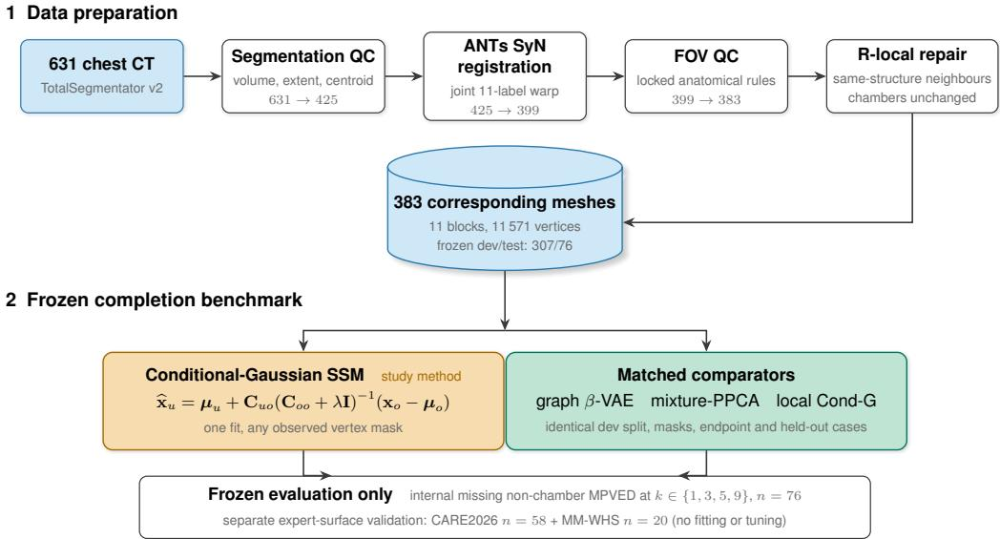
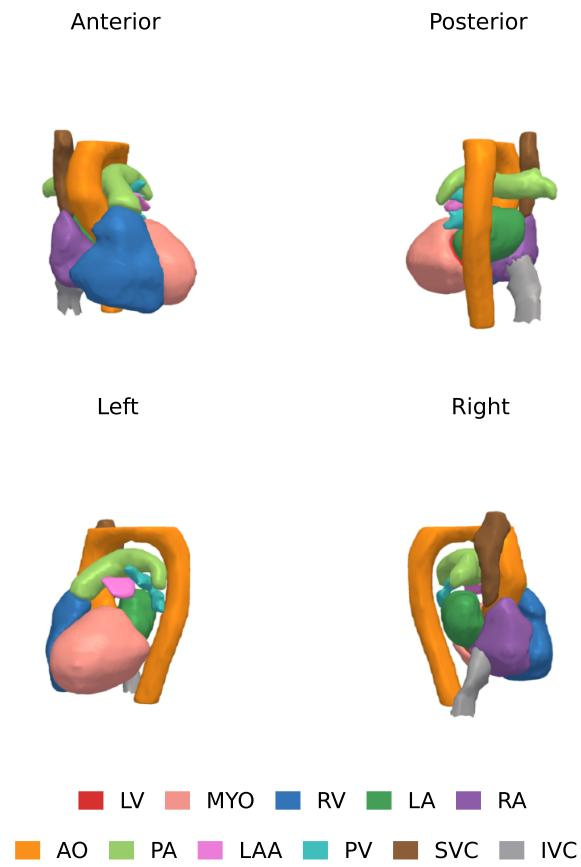
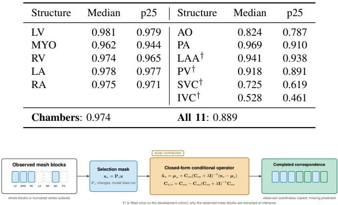
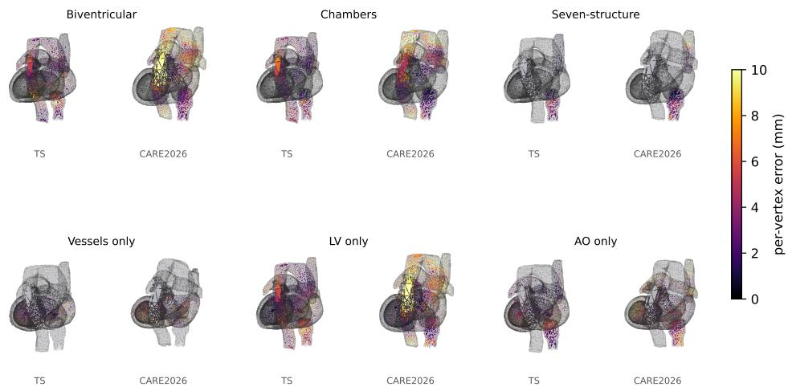

# A Strong Linear Baseline for Whole-Heart Cardiac Shape Completion on CT, with an Open Eleven-Structure Statistical Shape Model

Matej Gazda iD, Jakub Gazda iD, Juraj Gazda iD, and Peter Drotar´ iD

Abstract—Public cardiac cohorts annotate different subsets of the heart, so shapes from separate sources cannot be pooled without shared correspondence. Among released cardiac shape resources, none we identified carries the atrial appendage, pulmonary veins, and caval stumps as separate blocks in one mesh. Completion benchmarks also compare deep models against a least-squares projection onto shape modes, not the conditional estimator the same fitted model implies. We release an elevenstructure cardiac computed-tomography (CT) statistical shape model, built from 383 automatically labelled cases in 11 571- vertex correspondence, and compare completion estimators under one frozen internal split and endpoint. On a 76-case internal list held out from fitting, a closed-form conditional-Gaussian estimator reconstructed the missing non-chamber structures at 3.717 mm mean per-vertex error, averaged equally over one, three, five, and nine observed structures. A five-refit maskconditioned graph variational autoencoder reached 5.248 mm and nearest-neighbour retrieval 8.931 mm. The paired difference was 1.531 mm (95% confidence interval 1.384 to 1.711), and the ordering held in a raw-coordinate sensitivity arm. Expert manual labels exist for 58 external CT cases, but our registered reference is close enough to score only five structures. There the closed-form estimator again had lower average surface distance, 95th-percentile Hausdorff distance, and Chamfer error for both completed atria. On a second public benchmark of 20 cases the reference was close enough for three of four completed structures, and the same ordering held there. Four structures have no expert reference. The released model and its completion operator support cohort-unification research on aligned CT, not clinical use.

Index Terms—Computed tomography, conditional-Gaussian shape completion, graph neural network, statistical shape model, variational autoencoder, whole-heart cardiac anatomy.

## I. INTRODUCTION

Public cardiac datasets rarely annotate the same parts of the heart. A study that pools two cohorts can therefore be missing a chamber or a vessel that the other cohort provides, and reannotating the images is seldom an option. This paper asks how accurately the missing structures can be reconstructed from the ones that are present, and which observed structures carry the most information for doing so. Analyses that need the heart as a whole, cardiac simulation [1]–[4], morphometric shape analysis [5], and population-scale phenotyping [6], all work on the cardiac structures as 3D meshes in consistent vertex correspondence, which statistical shape models (SSMs) supply together with population-level variability [7], [8]. Throughout, whole-heart means joint coverage of the main cardiac structures rather than of every cardiac tissue: ten of our eleven structures are blood-pool or luminal surfaces and the eleventh is the left-ventricular wall.

Prior work has established ventricular and four-chamber correspondence at scale [9]–[11], and has demonstrated fourchamber reconstruction and masked completion; recent additions include sparse-view reconstruction from cine MRI [12], simulation-oriented template growth [13], and an age-specific paediatric atlas [14]. Section II reviews this literature, and Table I compares the closest released CT geometry resources. What none of them supplies is the anatomical representation, the baseline design, and the variable-label conditioning that the completion task above requires.

Three gaps follow, and they are what this paper addresses. First, the closest released resources use opening tags or cut rings where this task needs the appendage body, the pulmonary-vein bodies, and the caval stumps as full surface blocks in one shared topology. Second, completion bench marks compare deep models against a least-squares projection onto shape modes, an estimator weaker than the conditional posterior available from the same fitted model, so the reported margins say more about the choice of baseline than about the deep architecture. Third, existing reconstruction and completion models fix their input and output anatomy to a prescribed acquisition or four-chamber topology, which is the assumption that fails when cohorts are annotated differently from one another.

The fragmentation is concrete. Short-axis cine magnetic resonance imaging (MRI) benchmarks annotate the left ventricle, myocardium, and right ventricle. Other public CT and cardiac magnetic resonance (CMR) benchmarks cover at most seven structures (four chambers, myocardium, aorta, pulmonary artery) and omit the left atrial appendage, pulmonary veins, and venae cavae. TotalSegmentator v2 [15], [16] produces eleven-structure CT segmentations, but most existing cohorts have partial labels. A model that completes the missing structures from whatever subset is available would unify these datasets under one eleven-structure representation.

Cardiac mesh reconstruction methods assume a fixed input and output structure set [4], [17], and the closest completion work masks chambers during training but emits four-chamber anatomy with no corresponding appendage, pulmonary-vein, or caval blocks [18]. The task addressed here is different: one explicit eleven-block topology, conditioned on whichever named blocks a cohort provides.

This paper presents three contributions:

1) A controlled completion benchmark. Prior cardiac completion work compares against a least-squares projection onto PCA modes. We instead compare standard estimator families under one frozen development/test split, the same named-block panels, and one prespecified geometric endpoint: a regularised conditional-Gaussian posterior, a mask-conditioned graph β-VAE, a mixture of probabilistic PCAs under prespecified validity rules, a structure-local conditional-Gaussian ablation, and nearest-neighbour and population-mean floors. Two further non-linear arms outside the prespecified family, a published mesh convolution operator substituted into the same architecture and a published completion method run on our own fitted decoders, are reported descriptively as additional non-linear baselines. The individual esti mators are established; the contribution is their matched evaluation on eleven-block cardiac correspondence.

2) Mask-agnostic completion for cohort unification. One closed-form operator accepts any coordinate subset for which the regularised conditional solve is defined, without mask-specific retraining. We evaluate named-block panels at k ∈ {1, 3, 5, 9} and axial partial-vertex masks. A fixed biventricular CARE panel supplies a worked cohort-unification example. The contribution is reduced geometric error under the tested aligned-CT masks, not a validated clinical measurement.

3) An open eleven-structure correspondence resource. We release an SSM built from 383 CT cases (11 571 corresponding vertices) with its template, displacements, and code. The contribution is the open correspondence across these eleven structures together, not a new segmentation or registration method. Two external CT cohorts, CARE2026 and MM-WHS 2017 [19], provide expert labels for seven overlapping structures, of which the reference-closeness rule admits five and three respectively for native comparison; the appendage, pulmonary veins, and caval stumps carry only automatic (silverstandard) labels.

The remainder of this paper is organised as follows. Section II reviews related literature. Section III describes the data, mesh extraction, and ANTs SyN registration that produce the eleven-structure SSM. Section IV defines the conditional-Gaussian and graph β-variational-autoencoder (β-VAE) estimators and their prespecified comparators. Section V reports the evaluation protocol, frozen-split internal completion, external expert-surface and structure-wise evidence, and the geometry, support, truncation, and uncertainty audits. Section VI discusses interpretation and limitations, and Section VII con-

TABLE I  
CLOSEST MULTISTRUCTURE CT GEOMETRY RESOURCES. “PUBLIC PACKAGE” MEANS A DIRECT PUBLIC DOWNLOAD OF A REUSABLE MODEL OR MESH COHORT, ASSESSED FROM THE CITED PUBLICATIONS AND THEIR LINKED REPOSITORIES AT THE TIME OF WRITING; BOUNDARY TAGS OR CUT RINGS ARE NOT COUNTED AS SEPARATE ANATOMICAL SURFACE BODIES. NONE OF THE PRIOR RESOURCES SUPPORTS MISSING-LABEL CONDITIONING; THIS WORK CONDITIONS ON ANY OBSERVED STRUCTURE-BLOCK SUBSET.
<table><tr><td>Resource</td><td>Anatomy outside the four chamber Public package walls</td><td></td></tr><tr><td>Hoogendoorn et al. [20]</td><td>Detailed multiregion whole-heart at- Atlas and SSM reported; no las, including great vessels</td><td>reusable model package lo- cated</td></tr><tr><td>Rodero et al. [2]</td><td>AO and PA walls; PV and caval SSM parameters and 1 000 openings tagged; LAA body omit- synthetic ted</td><td>finite-element meshes</td></tr><tr><td>Strocchi et al. [3]</td><td>AO and PA walls; LAA, PV, SVC 24 patient-specific finite- and IVC at cut rings</td><td>element meshes</td></tr><tr><td>This work</td><td>AO, PA, LAA, PV, SVC and IVC Template, per-case displace- as separate surface blocks in one ment fields and reconstruc- shared topology</td><td>tion code</td></tr></table>

cludes.

## II. RELATED WORK

## A. Cardiac Statistical Shape Models

Bai et al. [9] built a 1 000-case biventricular SSM from high-resolution cardiac MRI. Qi et al. [14] recently added an age-specific biventricular atlas from 50 cardiac MRI studies in children aged 10–18 years. Ugurlu et al. [10] scaled to ≈55 000 biventricular meshes with open tooling, and Ma et al. [11] extended dynamic modelling to four chambers on ≈96 000 UK Biobank participants.

The closest public CT resources contain more anatomy than the shorthand “four-chamber model” suggests; Table I documents them resource by resource. Rodero et al. [2] and Strocchi et al. [3] release aortic and pulmonary-artery walls with their four-chamber models, but the appendage, pulmonary veins, and venae cavae enter as tags or cut rings rather than as separate surface bodies, and Hoogendoorn et al. [20] built a detailed multiregion spatio-temporal CT atlas from 138 sequences without a reusable public package. The distinction relevant here is a task-enabling choice of representation, not an anatomical count or a qualitative first: every subject uses the same face graph and vertex indices within each block, with eleven named blocks concatenated so their joint covariance can be fitted, whereas these models emit no LAA, PV, SVC, or IVC surface body. None of them can therefore be scored on the eleven-block panel without refitting its own correspondence pipeline, so our positioning against the shape-modelling literature is Table I on representation, together with the probabilistic PCA (PPCA) and structure-local conditional-Gaussian family fitted here on identical data.

## B. Whole-Heart Mesh Reconstruction

Image-domain restoration and classification are separate stages from geometry extraction: DenoMamba [21] denoises low-dose CT with fused spatial and channel state-space modules before any geometry is extracted, and shrunken-feature

COVID-19 classification from X-ray and CT [22] labels whole images without vertex correspondence or geometry prediction.

Template-deformation approaches require complete volumetric input [23]. Kong and Shadden [4] predict biharmonic control handles from CT segmentations to deform a template into seven structures; their earlier MeshDeformNet [24] predicts per-vertex template deformations with graph convolutions. Pak et al. [25] predict whole-heart meshes from CT. MeshGrow [13] combines a seven-region cardiac template deformation with stepwise aortic tracking to produce simulation-oriented cardiac and vascular meshes, including an explicit aortic-valve interface. Deng et al. [26] refine biventricular meshes from CMR via graph subdivision. On MRI, Beetz et al. [27] reconstruct biventricular point clouds from sparse cine contours without mesh topology, while Liu et al. [12] map sparse multi-view cine MRI to temporally coherent four-chamber meshes through differentiable contour rendering. Muffoletto et al. [28] use neural implicit coordinates for biventricular reconstruction with iterative optimisation at inference. These methods solve image-to-geometry reconstruction for a prescribed acquisition, rather than conditioning a correspondence model on whichever anatomical structures a cohort happens to contain.

## C. Shape Completion and Generation

PCN [29] and GRNet [30] complete spatial geometry from partial point clouds without anatomical part labels. Car diacFlow [17] uses flow matching for four-chamber 3D+t completion and generation. Cardiac Mesh Flow [31] extends flow matching to explicit four-chamber meshes in vertex corre spondence and volume-conditioned generation. Qiao et al. [32] generate 3D+t biventricular meshes from demographics. These generative models establish strong non-linear shape priors. Their conditioning variables and output topology are fixed to the structures in their four-chamber task, whereas our evaluation varies which named anatomical blocks are supplied and scores the blocks withheld from that panel.

Anatomical completion is addressed directly by Vec-Heart [18], which masks chambers during training and reconstructs four-chamber anatomy from a hybrid vector-set latent decoded to an implicit field. It is the closest tasklevel precedent, but its four-chamber implicit output cannot represent the appendage, pulmonary veins, or venae cavae as corresponding mesh blocks. No compatible eleven-block implementation or pretrained topology is publicly available for a matched retraining baseline; our non-linear comparators instead use the same eleven-block mesh, split, and observation panels as the linear estimator.

Graph convolutional autoencoders [33] model face and body meshes, and β-VAEs [34] learn disentangled latent representations. Biffi et al. [35] apply cardiac VAEs to disease classification on 3D cardiac segmentations without completion conditioning or generation.

In cranial modelling, two studies combine a linear shapemodel prior with a learned non-linear correction: Pimentel et al. [36] refine an SSM fit to a defective skull with a generative adversarial network, and Milojevic et al. [37] predict a correction to PCA coefficients with a multilayer perceptron (AutoSkull). Neither targets cardiac anatomy or conditions on an arbitrary observed-structure subset.

## III. PIPELINE: FROM CT TO SSM

## A. Data, Mesh Extraction, and Registration

This study draws on three public CT cohorts. The first, internal in role only (every fit and selection uses it), is 631 volumes from the TotalSegmentator dataset, labelled for the eleven structures of Table III by TotalSegmentator v2 [15], [16]; it carries silver (automatically generated) labels only and supplies the SSM development and frozen-split internal evaluation cases. The first external cohort is the CARE2026 challenge set [38], sixty volumes across three acquisition subsets (A, B, G), held out entirely from model fitting; seven structures (the four chambers, MYO, AO, and PA) additionally carry expert manual labels, while LAA, PV, SVC, and IVC are silver-only. Two volumes fail an affine check (Table II), leaving n=58 split 20/18/20 across A, B and G.

The second external cohort is all 20 CT training cases of MM-WHS 2017 [19], with no exclusions. It provides expert labels for the same seven overlapping structures but none for LAA, PV, SVC, or IVC, and it is held out from every fit and tuning decision, analysed separately as secondary descriptive validation (Section V-A). All three cohorts are analysed at 1 mm isotropic spacing. Before registration, every cohort passes an anatomical orientation check on structure ordering and frame handedness, so that a label map inconsistent with its affine is rejected rather than registered.

Table II summarises the three cohorts: exclusion cascades, acquisition composition, labels, and split. The internal study mix is overwhelmingly non-cardiac (336 of 383 cases are thorax–abdomen–pelvis, trauma, or staging examinations), and electrocardiographic (ECG) gating status and cardiac phase are absent everywhere; because non-gated acquisitions sample the cardiac cycle arbitrarily, phase enters as unstructured variation and is treated as a limitation below. The five fixed development folds determine every hyperparameter varied in the matched selection grids and the deep-model refit duration. The graph architecture was fixed before the partition, in an earlier sweep whose training pool included cases now in the evaluation list (development-only sensitivity below), and the frozen 76-case list, though withheld from every fit reported here, is not an independent cohort or strict confirmatory holdout (Section VI).

The end-to-end pipeline is shown in Fig. 1. The TotalSegmentator cardiac labels are predominantly luminal: each chamber (LV, RV, LA, RA) is the blood-pool cavity, and the great vessels (AO, PA), pulmonary veins (PV), cavae (SVC, IVC), and left atrial appendage (LAA) are the vessel or appendage lumen. The single exception is the myocardium (MYO), the left-ventricular wall, so the meshes below are blood-pool or luminal surfaces for ten structures and one wall object. From the 631 training volumes, cases were rejected when any core structure (LV, MYO, RV, LA, RA, AO) had non-physiological volume, when the heart bounding box spanned less than 60 mm craniocaudally, or when structure-centroid separations exceeded 100 mm, leaving 425 cases.

  
Fig. 1. End-to-end pipeline and frozen evaluation benchmark. After segmentation QC, joint-label registration, registration/FOV QC, and same-structure R-local repair, the 383 corresponding meshes are divided into a development set used for model selection and a 76-case evaluation set withheld from every fit reported here (the graph architecture predates this partition; Section V). The orange block carries the conditional-mean equation; all comparators use the same split, panels, endpoint, and evaluation cases. CARE2026 and MM-WHS provide separate expert-surface validation without fitting or tuning.

## TABLE II

THE THREE COHORTS AND THE EXCLUSIONS THAT PRODUCE THEM. THE   
RELEASED INTERNAL METADATA SUPPLIES AGE, SEX, MANUFACTURER,   
SCANNER MODEL, TUBE VOLTAGE, PATHOLOGY CLASS, AND STUDY TYPE; “N/A” ATTRIBUTES ARE ABSENT FROM THE RELEASED METADATA AND   
ARE NOT ESTIMATED, AND “NONE” MEANS NO FITTING OR TUNING. THE   
76-CASE EVALUATION LIST IS FROZEN (SPLIT FILE RELEASED WITH THE ARTIFACTS). BOTH CARE2026 EXCLUSIONS FALL IN SUBSET B; MM-WHS HAS NO EXCLUSIONS.

<table><tr><td></td><td>Internal (TotalSegmentator)</td><td>CARE2026</td><td>MM-WHS CT</td></tr><tr><td>Role</td><td>SSM fit; internal eval.</td><td>indep. validation</td><td>indep. secondary</td></tr><tr><td>Source cases</td><td>631</td><td>60 (A/B/G)</td><td>20</td></tr><tr><td>Segmentation QC</td><td>−206 (vol., extent, centr.) → 425</td><td></td><td>1</td></tr><tr><td>Affine check</td><td></td><td>-2 (non-orthon.)</td><td></td></tr><tr><td>Registration QC FOV truncation</td><td>−26 (&gt;25 mm) → 399</td><td></td><td></td></tr><tr><td>Retained</td><td>-16 383</td><td>58 (20/18/20)</td><td>20</td></tr><tr><td></td><td>307 dev. (5 folds) / 76 withheld†</td><td></td><td></td></tr><tr><td>Split/tuning Labels</td><td>silver, all 11</td><td>none silver 11, expert 7</td><td>none</td></tr><tr><td>Scanner models</td><td>11 distinct</td><td>n/a</td><td>expert 7</td></tr><tr><td>Median age</td><td>64 years</td><td>n/a</td><td>n/a n/a</td></tr><tr><td>Study mix</td><td>336 non-cardiac, 47 cardiac</td><td>n/a</td><td>n/a</td></tr><tr><td>Contrast phase</td><td>n/a</td><td>n/a</td><td>n/a</td></tr><tr><td>ECG gating, phase</td><td>n/a, likely mixed</td><td>n/a</td><td>n/a</td></tr><tr><td>Spacing analysed</td><td>1 mm isotropic</td><td>1 mm isotropic</td><td>per case → 1 mm</td></tr></table>

cases now in the 76-case evaluation list.

Per-structure surface meshes were extracted via marching cubes [39] on Gaussian-smoothed label volumes, Laplacianfiltered [40], and decimated by quadric edge-collapse to the vertex counts in Table III (proportional to each structure’s mean surface area). The template mesh is extracted from a single selected medoid case (Fig. 2); its 11 571 vertices and fixed connectivity define the correspondence used throughout. Percase correspondence is obtained purely by warping this template into each patient’s space (below), so only the template’s own extraction parameters enter the SSM correspondence. The template is the case minimising the sum of Euclidean distances to all others in a 121-dimensional shape descriptor (per-structure centroid, volume, surface area, bounding-box

## TABLE III

ELEVEN CARDIAC STRUCTURES AND TEMPLATE VERTEX COUNTS. MYO IS THE LEFT-VENTRICULAR WALL; THE OTHER TEN ARE BLOOD-POOL OR

LUMINAL SURFACES. THE MODEL THEREFORE CARRIES NO RIGHT-VENTRICULAR OR ATRIAL WALL AND DOES NOT REPRESENT TOTAL MYOCARDIAL MASS.
<table><tr><td>ID</td><td>Structure</td><td>Abbrev.</td><td>Vertices</td></tr><tr><td>1</td><td>Left ventricle</td><td>LV</td><td>1502</td></tr><tr><td>2</td><td>Myocardium</td><td>MYO</td><td>2502</td></tr><tr><td>3</td><td>Right ventricle</td><td>RV</td><td>2002</td></tr><tr><td>4</td><td>Left atrium</td><td>LA</td><td>1002</td></tr><tr><td>5</td><td>Right atrium</td><td>RA</td><td>1002</td></tr><tr><td>6</td><td>Aorta</td><td>AO</td><td>1202</td></tr><tr><td>7</td><td>Pulmonary artery</td><td>PA</td><td>802</td></tr><tr><td>8</td><td>Left atrial appendage</td><td>LAA</td><td>402</td></tr><tr><td>9</td><td>Pulmonary veins</td><td>PV</td><td>602</td></tr><tr><td>10</td><td>Superior vena cava</td><td>SVC</td><td>402</td></tr><tr><td>11</td><td>Inferior vena cava</td><td>IVC</td><td>151</td></tr><tr><td colspan="2">Total</td><td></td><td>11571</td></tr></table>

dimensions, principal component analysis (PCA) principalaxis lengths), each feature z-scored across the cohort. Vesselextent features enter with unit weight; because truncation is common in the cohort, they can pull the medoid toward a truncation-typical case and bake a short-vessel template into the correspondence, one route to the flat distal vessel caps.

Heart centroids vary by up to 870 mm across scans due to scanner-origin differences. Centre-of-mass (COM) prealignment shifts each case to match the template centroid, reducing median displacement from 275 mm to 17 mm. No isotropicscale or generalised-Procrustes normalisation is applied, so the per-vertex displacement encodes size together with shape rather than shape alone.

Symmetric diffeomorphic registration (ANTs SyN [41]) computes a deformation between each patient label image and the template (cross-correlation similarity, radius 4, iterations 160/80/40). A single joint warp is estimated on the multilabel volume and propagated to all eleven structures. The cross-correlation objective is dominated by the large chambers, so great-vessel correspondence is a by-product of the joint warp rather than separately optimised; this motivates the representation audit below. Template vertices are propagated to patient space via a coordinate-map technique: three scalar images encoding moving-space x, y, and z coordinates are warped through the SyN transform and sampled trilinearly at template vertex locations.

  
Fig. 2. The eleven-structure whole-heart template mesh (11 571 vertices) in anterior, posterior, left, and right views, each structure a colour-coded surface in fixed vertex correspondence. This single template is warped into every patient’s space to build the SSM.

Validity-mask propagation prevents undefined coordinate samples: a ones-image is warped with the same transform, and a template vertex with sampled validity below 0.5 is left at its centre-of-mass-prealigned template position. The resulting unsmoothed coordinate-map displacement is retained as the raw sensitivity representation.

The primary R-local representation repairs only detached components of an individual non-chamber surface. Within each structure, an edge is cut when its patient-space length is both greater than 15 mm and greater than 3.5 times its template length. If this disconnects the graph, the largest component is the anchor and every other component is filled by inversedistance weighting from up to 12 nearest anchor vertices in template space (all anchor vertices are used if fewer than 12 remain). A no-regression guard restores the raw structure unchanged if a candidate repair increases its longest edge. The five chamber blocks are copied bit-for-bit: detection thresholds and replacement values use neither chamber displacement nor any other structure.

Two repair settings enter the evaluation: the primary R-local rule and the raw arm, which applies no repair and measures sensitivity to omitting it. R-local changes 868 vertices in 39 cases (mean 0.0196% of vertices per case; median zero; Rightmaximum 0.467%); by structure the changed counts (fraction of all case-vertex opportunities) are AO 259 (0.0563%), PA 245 (0.0798%), LAA 98 (0.0637%), PV 141 (0.0612%), SVC 104 (0.0675%), and IVC 21 (0.0363%), and chamber counts are exactly zero by construction, so no completion-input information enters the targets.

The IVC template is trimmed at the z-minimum of the descending aorta to remove the variable abdominal segment, reducing IVC vertices from 402 to 151 and the total mesh from 11 822 to 11 571. The trim plane is fixed once in template space and not recomputed per case, so the short-stub IVC seen on external CARE2026 is consistent with the fixed template extent rather than evidence of a prediction-specific truncation.

Cases with mean chamber-vertex displacement (over LV, MYO, RV, LA, RA) exceeding 25 mm relative to the template are rejected, flagging scans the SyN cannot recover, typically PA LAA PV SVC IVCextreme rotation or partial field-of-view (FOV) anatomy. This leaves 399 of the 425 segmentation-QC survivors (93.9%); dropping a further 16 cases with FOV truncation gives the clean cohort of n=383 (90.1% of the 425 survivors; 383 of the 631 raw volumes). Shapes are represented as per-vertex displacements from the centre-of-mass-prealigned template.

Per-structure warp-overlap Dice similarity coefficient (the moving segmentation pushed through the SyN transform and compared to the template label) measures how well the diffeomorphic transform brings each patient into template correspondence, not anatomical accuracy against a manual reference. It was recorded for the CARE2026 external cohort (n=58) only. Table IV reports the per-structure distribution. The four chamber medians exceed 0.97 and MYO reaches 0.962 (mean of the five per-chamber medians 0.974; per-case pooled chamber mean 0.954); this is not comparable to the segmentation-accuracy Dice of prior whole-heart methods on CT [19], [24], which measure overlap against a reference label. Aorta, SVC, and IVC are systematically lower (medians 0.82, 0.73, 0.53) because external CT FOVs frequently truncate these vessels. This Dice certifies the forward label warp (moving→template), whereas the SSM correspondence uses the inverse (template→moving) field; the two agree closely for a well-behaved diffeomorphism, so the 0.97 figure is an upper proxy for the uncharacterised inverse-consistency residual.

Because the registration target is a TotalSegmentator silver label rather than a manual one, we separately checked agreement against the seven expert-labelled CARE2026 structures (Dice in patient space, no registration). Median overlap is high for the chambers and pulmonary artery, and low for the aorta (0.64), where the expert label covers a shorter aortic extent than the silver label, so the unshared segment is charged as disagreement; the chamber distributions have a noisy low tail (per-case minima to 0.45). This check characterises one upstream layer and neither validates point correspondence nor replaces the reference-closeness rule.

TABLE IV  
PER-STRUCTURE WARP-OVERLAP DICE (SYN-WARPED PATIENT SEGMENTATIONS VS TEMPLATE), CARE2026 $( n { = } 5 8 ) \colon$ A REGISTRATION-CONSISTENCY MEASURE, NOT ACCURACY AGAINST A MANUAL REFERENCE. STRUCTURES MARKED † (LAA, PV, SVC, IVC) ARE SILVER-ONLY. CHAMBERS IS THE MEAN OF THE FIVE PER-CHAMBER MEDIANS. P25 IS THE 25TH PERCENTILE.
<table><tr><td></td><td></td><td> $\mathtt { p 2 5 }$ </td><td></td><td></td><td> $\mathsf { p } 2 5$ </td></tr><tr><td></td><td></td><td></td><td></td><td></td><td></td></tr><tr><td></td><td></td><td></td><td></td><td></td><td></td></tr><tr><td></td><td></td><td></td><td> $\mathrm { L A A ^ { \dagger } }$ </td><td></td><td></td></tr><tr><td></td><td></td><td></td><td> $\mathrm { P V } ^ { \dagger }$ </td><td></td><td></td></tr><tr><td></td><td></td><td></td><td></td><td></td><td></td></tr><tr><td></td><td></td><td></td><td></td><td></td><td></td></tr></table>

Fig. 3. The completion operator. A selection matrix ${ \bf P } _ { o }$ extracts whichever structure blocks or partial vertex sets are observed. The covariance is fitted once; inference extracts the corresponding covariance blocks and evaluates the conditional mean. Observed coordinates are copied to the output; missing coordinates are predicted. The figure writes the operator in covariance form for readability; the implementation evaluates the low-rank coefficient-space posterior of $\mathrm { E q . ~ ( 1 ) }$ , whose ridge acts on the posterior precision rather than on $\mathbf { C } _ { o o }$

The headline external numbers are pooled over the three acquisition subsets. Subset B is the hardest domain (lowest, most variable chamber Dice) and is also where the two excluded non-orthonormal-affine cases fall, so the pooled result is mildly optimistic on the registration-consistency axis, though the silver-label faithfulness it rests on is not specific to subset B.

## IV. COMPLETION MODELS

The completion problem is the same in every model below. A case is a vector of per-vertex displacements from the template, an observed set of structures fixes some of those vertices, and the model must supply the rest; the models differ only in how the conditional distribution of the unobserved vertices is represented. The conditional-Gaussian posterior accepts any coordinate subset for which the regularised solve is defined, so the same fitted model serves the named-block panels and axial partial-vertex masks evaluated here without retraining; this interface is broader than the tested mask distributions, and we do not infer performance outside them. The models below are standard estimator families used to create a controlled completion benchmark, not claimed as new algorithms.

## A. Structure-Conditioned Graph β-VAE

Let d $\in \mathbb { R } ^ { V \times 3 }$ denote the displacement field of a registered cardiac mesh (V=11 571). Given a subset $S \subset \{ 1 , \ldots , 1 1 \}$ of observed structures, the task is to reconstruct the complete displacement $\hat { \mathbf { d } }$ for all eleven structures. The model extends CoMA (a convolutional mesh autoencoder) [33] with a maskconditioning channel: the encoder takes $[ \mathbf { d } _ { \mathrm { m a s k e d } } ; \mathbf { m } ] \in \mathbb { R } ^ { V \times 4 }$ displacements at observed vertices (zero elsewhere) plus a binary mask, and stacks Chebyshev graph convolutions [42] of order $K { = } 3$ with mesh pooling across four resolutions $( 1 1 5 7 1 ~ \to ~ 2 9 0 9 ~ \to ~ 7 4 1 ~ \to ~ 2 1 0$ vertices), widening from 16 to 128 channels, to a $d _ { z }$ -dimensional Gaussian latent. The decoder mirrors the encoder; a differentiable Laplacian output smoothing and a Laplacian-coordinate loss term act only on the deep model.

During training, each sample retains k ∼ Uniform $[ k _ { \operatorname* { m i n } } , k _ { \operatorname* { m a x } } ]$ complete structure blocks (uniformly one to ten); the rest are zeroed and the mask updated. This covers the named-block panels in the primary evaluation but not arbitrary within-structure surfaces, so the fixed axial partial-vertex masks are a separate out-of-training-distribution sensitivity. The loss combines masked-weighted reconstruction (weight 2 on completed vertices), a Kullback–Leibler (KL) term warmed up linearly to the candidate $\beta _ { \mathrm { m a x } }$ , and Laplacian, edge-length, normal-alignment, and inter-structure repulsion regularisers with fixed weights; the released configuration carries the exact values.

The matched search crosses $d _ { z } ~ \in ~ \{ 1 6 , 3 2 , 6 4 , 1 2 8 \}$ with $\beta _ { \mathrm { { m a x } } } \in \{ 1 0 ^ { - 4 } , 1 0 ^ { - 3 } , 1 0 ^ { - 2 } \}$ on five development folds and training seeds $4 2 / 4 3 ,$ , under one fixed Adam recipe with early stopping. The selected cell is refitted on all 307 development cases for the upper median of its ten best-checkpoint epoch indices plus one, with no validation-free checkpoint selection during refit. At evaluation, each refit uses the deterministic posterior mean, and coordinates from seeds 42–46 are averaged before the evaluation endpoint of Section V-A is computed.

## B. Conditional-Gaussian and Classical Shape Baselines

We complete the shape with the closed-form Bayesian posterior over PCA coefficients, which, unlike an unregularised least-squares projection, conditions on the prior over those coefficients. Writing the normalised flattened displacement as $\mathbf { x } \in \mathbb { R } ^ { 3 V }$ with development mean $\mu ,$ principal basis $\mathbf { U } ,$ retained mode variances $\mathbf { \Lambda } _ { \mathbf { \Lambda } }$ and residual variance $\sigma ^ { 2 } ,$ , and treating the coefficients as $\mathbf { z } \sim \mathcal { N } ( \mathbf { 0 } , \mathbf { \boldsymbol { \Lambda } } )$ , the posterior mean given observed coordinates $\mathbf { x } _ { o }$ is

$$
\begin{array} { r } { \hat { \mathbf { z } } = \left( \frac { 1 } { \sigma ^ { 2 } } \mathbf { U } _ { o } ^ { \top } \mathbf { U } _ { o } + \mathbf { \Lambda } \mathbf { \Lambda } ^ { - 1 } \right) ^ { - 1 } \frac { 1 } { \sigma ^ { 2 } } \mathbf { U } _ { o } ^ { \top } ( \mathbf { x } _ { o } - \pmb { \mu } _ { o } ) , } \end{array}\tag{1}
$$

and the completed shape is $\pmb { \mu } + \mathbf { U } \hat { \mathbf { z } }$ , with observed coordinates copied to the final output. The implementation adds a relative diagonal ridge $r \overline { { \mathrm { d i a g } ( \mathbf { A } ) } } \mathbf { I }$ to the posterior precision A in (1). Residual variance is the mean of the discarded eigenvalues within the centred training rank $N - 1$ , bounded below by $1 0 ^ { - 1 0 }$ for numerical safety; it is a regulariser, not a calibrated measurement-noise estimate. We call this estimator conditional Gaussian (Cond-G).

Global Cond-G searches $M \in \{ 5 0 , 1 0 0 , 1 5 0 , 2 0 0 , 2 4 0 \}$ and $r \in \{ 1 0 ^ { - 4 } , 1 0 ^ { - 3 } , 1 0 ^ { - 2 } , 1 0 ^ { - 1 } \}$ within each representation arm. Within 0.01 mm of the lowest development completion error, the rule chooses fewer modes and then the larger ridge. Both raw and R-local select M = 200 and $r = 1 0 ^ { - 4 }$

Mixture PPCA [43] is fitted in the lossless $N \_ { - }$ 1-dimensional fold-PCA coefficient space. A diagonalcovariance Gaussian mixture model (GMM) on the first 20 coefficients uses $K \in \{ 1 , 2 , 3 , 5 \}$ , seeds 0–2, and PPCA ranks $q ~ \in ~ \{ 2 0 , 4 0 , 8 0 , 1 6 0 \}$ . A cell is invalid if the GMM fails to converge, an effective component contains fewer than 30 cases, or, for $K \ > \ 1 , \ q \ > \ \lfloor n _ { \mathrm { e f f , m i n } } / 3 \rfloor$ . Invalid cells are reported and not rescued. The local Cond-G challenger selects the nearest $k _ { \mathrm { N N } } ~ \in ~ \{ 2 5 , 5 0 , 1 0 0 , 2 0 0 , \mathrm { a l l } \}$ training shapes by RMS distance over observed coordinates, fits a local posterior with $q \in \{ 2 0 , 5 0 , 1 0 0 , 2 0 0 \}$ , and rejects $q > k _ { \mathrm { N N } } - 1$ . Both local searches select the unrestricted all-neighbour, $q = 2 0 0$ limit; therefore no distinct local model is promoted to the heldout endpoint.

## V. RESULTS

## A. Experimental Setup

The primary internal endpoint uses the frozen 76-case list only after every development choice has been locked. We evaluate $k \in \{ 1 , 3 , 5 , 9 \}$ observed structures with 20 fixed panels per k (panel seed 42). Five $k ~ = ~ 9$ panels observe every non-chamber structure and contain no defined primary target; the same five are omitted for every method, leaving panel counts 20/20/20/15. For a case and panel, the endpoint is mean per-vertex Euclidean distance (MPVED) over all missing non-chamber vertices; panels are averaged within case and $k ,$ and the four k-specific case values receive equal weight in the primary aggregate. An equal-structure endpoint prevents larger meshes from dominating a secondary descriptive analysis.

Every compatible estimator is selected on the same five development folds, panels, normalisation, and four-k MPVED criterion, over the search grids of Section IV. Mixture PPCA and local Cond-G use prespecified validity rules rather than repairing invalid cells after inspection. Full grids, tie rules, and failure accounting are given with the released artifacts. The all-development mean shape and observed-coordinate nearestneighbour retrieval are descriptive floors, not selected models.

R-local is the primary representation and the raw coordinatemap field is a prespecified sensitivity arm. Hyperparameters are selected separately within raw and R-local development folds. The primary predeclared contrast is R-local $\beta \mathrm { - V A E }$ minus R-local Cond-G, equally averaged over the four k values; positive values favour Cond-G. Because the graph architecture predates the evaluation partition, its paired bootstrap interval and resampling-floor p value are descriptive conditional on this shared-pool design rather than strict confirmatory inference. Exactly seven supportive contrasts share one Holm family: the analogous raw four-k contrast, the four R-local per-k contrasts, R-local PPCA minus Cond-G at the selected $K = 1 , q = 1 6 0$ limit, and the R-local local-minus-global structural identity. The last is retained under the family map frozen before development selection resolved and is zero by construction, because selection chose the unrestricted global limit and the scorer aliases the same rank-correct prediction; retaining it is conservative for the remaining Holm-adjusted contrasts. All other comparisons are descriptive or exploratory.

Inference resamples cases, not vertices or panels. A single frozen $1 0 , 0 0 0 \times 7 6$ index matrix, released with the artifacts, carries every paired method, panel, structure, representation, and training seed together. We report two-sided percentile 95% intervals and paired-bootstrap achieved-significance levels; the sole primary contrast is unadjusted and the seven supportive p values are Holm-adjusted. A prespecified escalation would add refit seeds 47–51 in both representation arms if the absolute primary difference fell below the five-refit seed SD.

We audit uncertainty exploratively in the R-local domain on four fixed nested observation panels: LV alone; LV/MYO/RV; all five chambers; and those five blocks plus AO/PA/LAA/PV. Cond-G uses its exact conditional covariance under the selected finite-rank Gaussian model, residual variance, and ridge; for a fixed panel this covariance is homoscedastic across cases, not a learned case-adaptive confidence estimate. For the $\beta -$ VAE, five refits each provide 32 posterior draws; the primary matrix is the empirical second moment of all 160 decoded draws about the deterministic five-refit ensemble used for efficacy, with a separately labelled sensitivity recentred on the Monte Carlo mean. Coverage of 50%, 80%, and 95% threedimensional $\chi ^ { 2 }$ ellipsoids, Gaussian negative log likelihood, and the ratio of case-mean squared error to case-mean covariance trace are reported over each panel’s missing non-chamber vertices and over the common SVC/IVC intersection, with descriptive case-bootstrap intervals and no tests. $\mathrm { \Delta A ~ 1 0 ^ { - 6 } m m ^ { 2 } }$ eigenvalue floor is used only for inverses and log determinants, and its activation is reported.

A separate descriptive support audit fits the selected Cond-G PCA subspace on the 307 complete development shapes and assigns each test case its full-shape Mahalanobis distance in that subspace. The tail is fixed once as distance strictly above the R-local development 95th percentile, reusing the same case set for the raw arm; typical/tail distributions, tail-minus-typical case-bootstrap intervals, rank association, and five prespecified worst cases are reported without p-values or exclusion.

CARE2026 native prediction surfaces are compared with expert labels by area-weighted symmetric average surface distance (ASSD), the 95th-percentile Hausdorff distance (HD95), and the Chamfer root-mean-square (RMS) distance, beside the registered-reference diagnostic and a prespecified referencecloseness rule: a structure receives native metrics only where its registered reference lies within fixed distance limits of the expert surface. MM-WHS supplies a separate 20-case expert-labelled CT validation with no retuning, exhaustive seven-label panels at $k = 1 , 3 , 5 .$ , and its own case bootstrap, released with the artifacts; its intervals and contrasts are descriptive and never pooled with CARE2026 or the internal endpoint. Geometry, CARE expert-surface, and fixed axial AO/IVC truncation experiments use two fixed predictions, the deterministic Cond-G fit and the coordinate mean of the five deterministic β-VAE refits, in raw and R-local coordinates.

## B. Internal Completion on the Frozen Evaluation Split

Development selection chose Cond-G with $M = 2 0 0$ modes and relative ridge $1 0 ^ { - 4 }$ in both representations. The raw $\beta -$ VAE winner was $( d _ { z } , \beta _ { \mathrm { { m a x } } } ) ~ = ~ ( 6 4 , 1 0 ^ { - 2 } )$ , refit for 233 epochs; the R-local winner was $( 1 2 8 , 1 0 ^ { - 2 } )$ , refit for 226 epochs. The five deterministic refit predictions are averaged as coordinate fields before the evaluation endpoint of Section V-A is computed. No $K > 1$ mixture met the prespecified validity rules of Section IV-B; the only eligible winner is the singlecomponent PPCA limit at $q = 1 6 0$ . The local Cond-G search selected all development cases and $q = 2 0 0$ , exactly the global prediction, so it is retained as an identity check rather than a distinct estimator.

Table V gives all frozen-split means. In the primary Rlocal representation, four-k MPVED is 3.717 mm for Cond-G against 5.248 mm for the β-VAE, and Cond-G has the lowest value among the non-identical compatible estimators at every k; the separately selected raw arm gives the same ordering.

The primary paired β-VAE-minus-Cond-G difference is +1.531 mm (95% CI 1.384–1.711; $p < 0 . 0 0 1$ at the pairedbootstrap floor). Every empirical supportive contrast remains positive after the prespecified Holm adjustment (Table VI). Individual R-local β-VAE refits give differences of 1.791– 1.918 mm (seed SD 0.053 mm). Averaging their coordinate fields before the nonlinear Euclidean endpoint reduces the en semble difference by 0.314 mm relative to the mean individualrefit difference; the two summaries measure different quantities. The frozen seed-escalation rule does not trigger.

The graph architecture itself is a fixed input to this comparison: its Chebyshev order, channel ladder, and depth come from an earlier 11-cell sweep on a previous partition and representation, and because cases later assigned to the evaluation list could have contributed to that sweep, it is disclosed only as architecture-design evidence. Before scoring the frozen evaluation list, we therefore froze a development only R-local sensitivity at the locked $d _ { z } ~ = ~ 1 2 8 , \beta _ { \mathrm { m a x } } ~ =$ $1 0 ^ { \dot { - 2 } }$ cell: ten configurations vary Chebyshev order, width, one additional encoder/decoder block, learning rate, mask weight, and Laplacian weight over the same five folds and seeds 42/43, entering no hypothesis family and never scoring an evaluation case; the two seeds match the development selection budget of every candidate, while seeds 44–46 belong only to the all-development refit ensemble. The base and eight alternative configurations with complete finite out puts span 5.983–6.433 mm development MPVED, with paired alternative-minus-base means from −0.011 to +0.439 mm; the K = 10, width-16 configuration is invalid after two non-finite runs (122 predictions), with no value imputed and no aggregate computed. This bounded sensitivity neither establishes architectural robustness nor changes the primary refits.

A further development-only experiment addressed the operator axis. With the convolution replaced by EdgeConv [44] inside the same architecture, results proved strongly dependent on the optimisation settings: under the settings shared with the graph β-VAE the substituted operator was far behind, while under operator-specific retuning it reached 5.774 mm, below the 5.983–6.433 mm envelope of the β-VAE configurations tested here and still above the conditional-Gaussian model’s 4.055 mm on the same folds. These post-primary runs never score an evaluation case. What they establish is that the shared training settings are not neutral across architectures, recorded as a limitation of the matched-protocol design; our conclusions concern the models evaluated here, not non-linear completion methods in general.

## C. Additional Non-Linear Baselines

To test whether the deep architecture is representative rather than a weak instance of its class, two descriptive post-lock arms were evaluated on the same frozen cases, panels, and endpoint (Tables VII and VIII): SpiralNet++ [45], a published mesh convolution operator substituted into our architecture at parameter parity (14.155 M against 14.2 M), and latent optimisation following Litany et al. [46], a published completion method run on our own locked β-VAE decoders, so that pair shares weights and differs only in inference procedure. Latent optimisation outperforms our deep model by 0.204 mm [0.169, 0.243] internally and 0.368 mm [0.338, 0.403] on MM-WHS, yet trails Cond-G by 1.327 mm [1.201, 1.482] and 1.426 mm [1.272, 1.579]; on CARE2026 expert surfaces the ordering holds a third time, by 0.032 mm (LA) and 0.091 mm (RA) over the β-VAE, with AO and PA suppressed by the reference-closeness rule as for the primary methods. That a published completion method beats the $\beta \mathrm { - V A E }$ on both cohorts while losing to the closed-form estimator is the evidence that the deep arm is not a strawman of our construction: latent optimisation fixes the observed coordinates and asks what the fitted model implies for the remainder, structurally what the conditional mean does, and it still falls short.

Fig. 4 shows these aggregates on the median case of each cohort under the six displayed panels, so neither is a best case. The completed anatomy closes into a coherent wholeheart mesh at every panel, observed blocks are reproduced exactly because their coordinates are copied, and the residual concentrates on the vessel and appendage surfaces furthest from the observed chambers. The single-structure panels (LV only, AO only) carry visibly the largest residual, the geometric statement behind the k-dependence in Table V; the external case shows the same spatial pattern with a larger residual, consistent with Section V-D.

## D. External Validation

CARE2026. A completion is scored against an expert surface only where the registered reference itself lies close to that surface (the reference-closeness rule of Section V-A); otherwise the distance would measure annotation mismatch rather than completion quality. The rule passes LV, MYO, RV, LA, and RA in both representations. Under R-local, their median/p90 reference ASSD ranges from 0.830/2.201 to 1.510/2.091 mm. AO fails under its prespecified longitudinalcoverage mismatch (18.895/21.694 mm), while PA misses the strict p90 threshold by 0.026 mm (3.398/6.954 mm versus 6.928 mm). Thus neither AO nor PA receives a native accuracy summary, and the successful 1.2× PA threshold sensitivity does not change that fixed decision. The designated 50% AO region is also technically non-evaluable in 46/58 R-local cases.

Tables IX and X report the eligible R-local native metrics, pooled and by acquisition subset. With biventricular input, Cond-G has lower pooled descriptive ASSD, HD95, and Chamfer RMS means than the β-VAE for both LA and RA. The leave-one-out panel shows the same pooled ordering for the five eligible structures, but the complete A/B/G display is not uniformly ordered in every metric–subset cell: subset-A RV HD95 is 8.073 mm for the β-VAE and 8.349 mm for Cond-G. The subsets are descriptive; no subgroup robustness claim or hypothesis test is made.

TABLE V  
FROZEN 76-CASE INTERNAL EVALUATION COMPLETION MPVED (MM). EACH k ENTRY IS THE CASE MEAN OVER ITS FIXED PANELS; THE FOUR-k COLUMN EQUALLY WEIGHTS THE FOUR k VALUES, WITH A CASE-BOOTSTRAP 95% CI. PPCA IS THE SELECTED K=1, q=160 LIMIT; LOCAL COND-G REUSES THE EXACT GLOBAL PREDICTION BY CONSTRUCTION.
<table><tr><td>Representation</td><td>Method</td><td>k = 1</td><td>k = 3</td><td>k = 5</td><td>k = 9</td><td>Four-k [95% CI]</td></tr><tr><td rowspan="6">Raw</td><td>Mean shape</td><td>11.218</td><td>11.278</td><td>11.189</td><td>10.909</td><td>11.149 [10.310, 12.040]</td></tr><tr><td>Nearest neighbour</td><td>10.096</td><td>9.031</td><td>8.508</td><td>8.644</td><td>9.070 [8.621, 9.563]</td></tr><tr><td>Cond-G</td><td>5.479</td><td>3.918</td><td>3.193</td><td>3.003</td><td>3.898 [3.629, 4.206]</td></tr><tr><td>β-VAE</td><td>6.596</td><td>5.238</td><td>4.693</td><td>4.748</td><td>5.319 [4.991, 5.701]</td></tr><tr><td>PPCA (K = 1)</td><td>5.524</td><td>3.958</td><td>3.248</td><td>3.064</td><td>3.948 [3.683, 4.251]</td></tr><tr><td>Local Cond-G†</td><td>5.479</td><td>3.918</td><td>3.193</td><td>3.003</td><td>3.898 [3.629, 4.206]</td></tr><tr><td rowspan="6">R-local</td><td>Mean shape</td><td>11.157</td><td>11.215</td><td>11.130</td><td>10.858</td><td>11.090 [10.245, 11.990]</td></tr><tr><td>Nearest neighbour</td><td>9.942</td><td>8.904</td><td>8.352</td><td>8.527</td><td>8.931 [8.503, 9.405]</td></tr><tr><td>Cond-G</td><td>5.304</td><td>3.732</td><td>3.007</td><td>2.825</td><td>3.717 [3.480, 3.984]</td></tr><tr><td>β-VAE</td><td>6.522</td><td>5.172</td><td>4.621</td><td>4.677</td><td>5.248 [4.935, 5.613]</td></tr><tr><td>PPCA (K = 1)</td><td>5.348</td><td>3.767</td><td>3.061</td><td>2.882</td><td>3.764 [3.530, 4.027]</td></tr><tr><td>Local Cond-G†</td><td>5.304</td><td>3.732</td><td>3.007</td><td>2.825</td><td>3.717 [3.480, 3.984]</td></tr></table>

†Structural identity, not an independently fitted held-out result.

TABLE VI  
FROZEN PAIRED FAMILY. DIFFERENCES ARE CHALLENGER MINUS COND-G, SO POSITIVE VALUES FAVOUR COND-G. THE R-LOCAL FOUR-k PRIMARY IS UNADJUSTED; THE NEXT SEVEN ROWS ARE THE COMPLETE HOLM FAMILY (m = 7). THE FINAL ROW IS AN IDENTITY CHECK RATHER THAN EMPIRICAL EVIDENCE.
<table><tr><td>Contrast</td><td>Difference (mm)</td><td>95% CI (mm)</td><td>Multiplicity result</td></tr><tr><td>R-local β-VAE minus Cond-G, four-k primary</td><td>1.531</td><td>[1.384, 1.711]</td><td>Unadjusted p &lt; 0.001 (floor)</td></tr><tr><td>Raw β-VAE minus Cond-G, four-k</td><td>1.421</td><td>[1.264, 1.610]</td><td>PHolm &lt; 0.002</td></tr><tr><td>R-local β-VAE minus Cond-G, k = 1</td><td>1.218</td><td>[1.023, 1.439]</td><td>PHolm &lt; 0.002</td></tr><tr><td>R-local β-VAE minus Cond-G, k = 3</td><td>1.440</td><td>[1.298, 1.602]</td><td>PHolm &lt; 0.002</td></tr><tr><td>R-local β-VAE minus Cond-G, k = 5</td><td>1.613</td><td>[1.466, 1.800]</td><td>PHolm &lt; 0.002</td></tr><tr><td>R-local β-VAE minus Cond-G, k = 9</td><td>1.852</td><td>[1.689, 2.047]</td><td>PHolm &lt; 0.002</td></tr><tr><td>R-local PPCA (K = 1) minus Cond-G, four-k</td><td>0.047</td><td>[0.038, 0.056]</td><td>PHolm &lt; 0.002</td></tr><tr><td>R-local local minus global Cond-G, four-k</td><td>0.000</td><td>[0.000, 0.000]</td><td>Structural identity</td></tr></table>

  
Fig. 4. Completion across six observed-structure panels, one internal TotalSegmentator case (TS, s0365) beside one external CARE2026 case (A Case1020) each the median case of its cohort by the displayed Cond-G estimator’s mean missing-vertex error over the six panels. Observed structures are grey; the conditional-Gaussian model completes the rest, coloured by per-vertex error (mm). The estimator is the selected configuration of Table V, fitted on the 307 development cases in the R-local domain.

MM-WHS. MM-WHS supplies a second independent CT cohort (20 cases), with no exclusions, pooling, or retuning. As on CARE2026, the reference-closeness rule decides which structures receive native summaries: it admits three of the four completed structures. Under R-local, median/p90 reference ASSD is 0.628/0.687 mm for LA, 0.620/0.838 mm for RA, and 2.884/4.724 mm for PA, all within the fixed 3.464/6.928- mm limits. AO fails at 17.060/19.024 mm, and the directional decomposition identifies annotation scope rather than registration error as the cause: where MM-WHS labels the aorta, the registered reference agrees with the expert surface to 1.075 mm averaged over the 20 cases, comparable to LA and RA, while

## TABLE VII

ADDITIONAL NON-LINEAR BASELINES, R-LOCAL REPRESENTATION, MPVED (MM) WITH CASE-BOOTSTRAP 95% INTERVALS. THE INTERNAL COLUMN IS THE FROZEN 76-CASE SPLIT AT FOUR OBSERVED-STRUCTURE COUNTS; THE MM-WHS COLUMN IS EXHAUSTIVE PANELS AT k = 1, 3, 5 OVER THE SEVEN EXPERT-OVERLAP STRUCTURES, SO ONLY THE ORDERING WITHIN A COLUMN IS COMPARABLE. BOTH ARMS LIE OUTSIDE THE PRESPECIFIED HOLM FAMILY AND ARE DESCRIPTIVE; THE LATENT-OPTIMISATION SETTING IS NOT RETUNED EXTERNALLY. COND-G, THE β-VAE AND THE FLOORS REPEAT TABLE V FOR REFERENCE; THE SAME ARMS ON CARE2026 EXPERT SURFACES, A DIFFERENT ENDPOINT, ARE IN TABLE VIII.
<table><tr><td>Method</td><td>Type</td><td>Internal 76</td><td>MM-WHS (n = 20)</td></tr><tr><td>Cond-G</td><td>Closed-form linear</td><td>3.717 [3.480, 3.984]</td><td>4.823 [4.446, 5.226]</td></tr><tr><td>Latent optimisation‡</td><td>Published method</td><td>5.044 [4.746, 5.389]</td><td>6.248 [5.755, 6.777]</td></tr><tr><td>β-VAE</td><td>Feed-forward deep</td><td>5.248 [4.935, 5.613]</td><td>6.616 [6.109, 7.152]</td></tr><tr><td>SpiralNet++§</td><td>Published operator</td><td>6.710 [6.283, 7.218]</td><td>8.916 [8.105, 9.741]</td></tr><tr><td>Nearest neighbour</td><td>Retrieval floor</td><td>8.931 [8.503, 9.405]</td><td>10.907 [10.145, 11.684]</td></tr><tr><td>Mean shape</td><td>Population floor</td><td>11.090 [10.245, 11.990]</td><td>13.174 [12.045, 14.419]</td></tr></table>

‡Litany et al., run on our frozen β-VAE decoders; the autoencoder is ours, the completion algorithm is theirs. §Operator substituted into our architecture at parameter parity, not a reproduction of a published end-to-end system.

## TABLE VIII

ADDITIONAL NON-LINEAR BASELINES ON CARE2026 EXPERT SURFACES, R-LOCAL, BIVENTRICULAR PANEL, MEAN ASSD / HD95 / CHAMFER RMS (MM) OVER 58 CASES. THE ENDPOINT IS DISTANCE TO EXPERT   
MANUAL SEGMENTATIONS AND IS NOT COMPARABLE TO TABLE VII. AO AND PA ARE SUPPRESSED FOR EVERY METHOD BY THE PRESPECIFIED REFERENCE-CLOSENESS RULE. COND-G AND THE β-VAE REPEAT TABLE IX FOR REFERENCE.

<table><tr><td>Method</td><td>Type</td><td>LA</td><td>RA</td></tr><tr><td>Cond-G</td><td>Closed-form linear</td><td>3.275 / 7.846 / 4.138</td><td>3.479 / 9.007  / 4.586</td></tr><tr><td>Latent optimisation</td><td>Published method</td><td>3.902 / 8.941  / 4.822</td><td>4.243 /  10.265 / 5.413</td></tr><tr><td>β-VAE</td><td>Feed-forward deep</td><td>3.934 / 8.990 / 4.860</td><td>4.333 /  10.372 / 5.495</td></tr><tr><td>SpiralNet++</td><td>Published operator</td><td>4.299 / 9.701 / 5.266</td><td>4.605 /  10.868 / 5.779</td></tr></table>

TABLE IX

R-LOCAL CARE BIVENTRICULAR NATIVE PREDICTION-VERSUS-EXPERT SURFACE METRICS, POOLED (n = 58) AND BY ACQUISITION SUBSET (A/B/G CONTAIN 20/18/20 CASES). THE PANEL OBSERVES LV/MYO/RV; VALUES ARE MEAN ASSD / HD95 / CHAMFER RMS IN MM. AO AND PA ARE OMITTED AFTER FAILING THE REFERENCE-CLOSENESS RULE.
<table><tr><td>Population</td><td>Method</td><td>LA</td><td>RA</td></tr><tr><td>Pooled Pooled</td><td>Cond-G</td><td>3.275 / 7.846 / 4.138</td><td>3.479 / 9.007 / 4.586</td></tr><tr><td></td><td>β-VAE</td><td>3.934 / 8.990 / 4.860</td><td>4.333 / 10.372 / 5.495</td></tr><tr><td>A</td><td>Cond-G</td><td>2.634 / 6.643 / 3.353</td><td>3.035 / 8.085 / 3.989</td></tr><tr><td>A</td><td>β-VAE</td><td>3.103 / 7.553 / 3.911</td><td>3.780 / 9.373 / 4.811</td></tr><tr><td>B</td><td>Cond-G</td><td>4.010 / 9.642 / 5.032</td><td>4.028 / 10.598 / 5.351</td></tr><tr><td>B G</td><td>β-VAE</td><td>4.878 / 11.412 / 6.034</td><td>4.706 / 11.572 / 6.011</td></tr><tr><td>G</td><td>Cond-G</td><td>3.253 / 7.432 / 4.119</td><td>3.427 / 8.496 / 4.494</td></tr><tr><td></td><td>β-VAE</td><td>3.915 / 8.247 / 4.752</td><td>4.549 / 10.290 / 5.715</td></tr></table>

the opposite direction reaches 32.558 mm because the reference extends beyond the annotated ascending segment into the arch and descending aorta, and a symmetric surface distance charges that unannotated extent as error. The same mismatch fails AO on CARE2026 (18.895 mm), so AO receives no native accuracy summary in either external cohort. The rule is symmetric by design and was not modified for this structure; the favourable one-directional value is a diagnostic, not partial validation. PA passes only in the R-local representation; in the raw arm it reaches 9.999 mm and fails, so its eligibility is representation-dependent and reported as such.

TABLE X  
R-LOCAL CARE LEAVE-ONE-EXPERT-STRUCTURE-OUT COMPLETION, POOLED (n = 58) AND BY ACQUISITION SUBSET (A/B/G CONTAIN 20/18/20 CASES). VALUES ARE MEAN ASSD / HD95 / CHAMFER RMS IN MM. AO AND PA ARE OMITTED BECAUSE THEIR REFERENCES ARE TOO FAR.
<table><tr><td>Missing structure</td><td>Population</td><td>Cond-G</td><td>β-VAE</td></tr><tr><td>LV</td><td>Pooled</td><td>2.362 / 6.407 / 3.119</td><td>3.899 / 9.623 / 4.942</td></tr><tr><td></td><td>A</td><td>1.818 / 4.744 / 2.358</td><td>3.367  / 8.177  / 4.254</td></tr><tr><td></td><td>B</td><td>3.697 / 10.361 / 4.969</td><td>4.841 /  12.575 / 6.258</td></tr><tr><td></td><td>G</td><td>1.704 / 4.510 / 2.215</td><td>3.582 / 8.411 / 4.446</td></tr><tr><td>MYO</td><td>Pooled</td><td>2.056 / 5.667 / 2.729</td><td>2.943 /  7.583 / 3.769</td></tr><tr><td></td><td>A</td><td>1.695 / 4.541 / 2.212</td><td>2.526 / 6.257 / 3.171</td></tr><tr><td></td><td>B</td><td>2.947 / 8.627 / 4.036</td><td>3.847  / 10.332 / 5.046</td></tr><tr><td></td><td>G</td><td>1.616 / 4.129 / 2.068</td><td>2.547  / 6.434 /  3.219</td></tr><tr><td>RV</td><td>Pooled</td><td>2.717 / 8.098 / 3.770</td><td>3.377  /  8.555 / 4.335</td></tr><tr><td></td><td>A</td><td>2.868 / 8.349 / 3.969</td><td>3.016 /  8.073 /  3.994</td></tr><tr><td></td><td>B</td><td>3.247 / 10.314 / 4.619</td><td>4.148 / 10.495 / 5.305</td></tr><tr><td></td><td>G</td><td>2.088 / 5.852 / 2.807</td><td>3.045 / 7.290 / 3.801</td></tr><tr><td>LA</td><td>Pooled</td><td>2.417 / 6.228 / 3.192</td><td>3.393 /  7.837  /  4.207</td></tr><tr><td></td><td>A</td><td>2.169 / 5.919 / 2.871</td><td>2.577  / 6.451 / 3.266</td></tr><tr><td></td><td>B</td><td>3.023 /  7.642 /  3.919</td><td>4.445 /  10.407 / 5.495</td></tr><tr><td></td><td>G</td><td>2.120 / 5.264 / 2.860</td><td>3.262 / 6.909 / 3.989</td></tr><tr><td>RA</td><td>Pooled</td><td>2.800 / 7.434 / 3.763</td><td>3.878 / 9.530 / 4.988</td></tr><tr><td></td><td>A</td><td>2.577 / 7.013 / 3.458</td><td>3.474 / 8.729 / 4.448</td></tr><tr><td></td><td>B</td><td>3.246 / 9.006 / 4.441</td><td>4.372 /  10.762 / 5.607</td></tr><tr><td></td><td>G</td><td>2.621 / 6.439 / 3.456</td><td>3.836 / 9.224 / 4.972</td></tr></table>

For the three eligible structures, Cond-G has lower mean ASSD than the β-VAE on LA (2.854 versus 3.989 mm), RA (2.733 versus 3.435 mm), and PA (4.895 versus 5.441 mm), and the same ordering holds for HD95 (7.570/7.647/15.041 versus 9.742/9.147/16.579 mm) and Chamfer RMS (3.704/3.655/6.963 versus 4.995/4.467/7.652 mm). Singlecomponent PPCA is not separable from Cond-G at this cohort size (2.896/2.753/4.928 mm); both remain well below the nearest-neighbour (6.474/5.263/8.092 mm) and populationmean (6.673/6.628/8.064 mm) floors. The structure-local Cond-G ablation is numerically identical to Cond-G here, with a paired difference of zero, because the observed panel is exactly LV, MYO, and RV; it separates only on the internal eleven-block panels. These are descriptive means over 20 cases from a segmentation challenge’s training split: they corroborate the internal ordering on an independent cohort without supporting a confirmatory claim.

MM-WHS also transfers the internal representation-space endpoint. Against the seven-label registered correspondence target, R-local Cond-G gives 4.823 mm MPVED (95% descriptive case-bootstrap interval 4.446–5.226), the β- VAE 6.616 mm (6.109–7.152), and single-component PPCA 4.863 mm (4.487–5.265), averaged equally over k = 1, 3, 5; the nearest-neighbour and population-mean floors give 10.907 and 13.174 mm, the corresponding raw values are 5.502, 6.963, and 5.512 mm, and the paired β-VAE minus Cond-G contrast is 1.794 mm (1.623–1.961). These are representation-space transfer results, not native expert-surface accuracy.

## Evidence by structure.

Table XI, fixed before frozen-split selected-model scoring, answers three questions for every structure separately: whether its reference is an expert manual label or an automatic silver label, whether that reference is close enough to score against, and what evidence exists. The internal endpoint scores only

## TABLE XI

THE EVIDENCE BEHIND EACH STRUCTURE; STRUCTURES WITH IDENTICALSTATUS SHARE A ROW. “REFERENCE CLOSE ENOUGH” MEANS THEREGISTERED REFERENCE LIES WITHIN THE FIXED DISTANCE LIMITS OFTHE EXPERT SURFACE, SO A NATIVE COMPARISON IS MEANINGFUL; THEINTERNAL BENCHMARK SCORES ONLY STRUCTURES THAT ARECOMPLETION TARGETS THERE. “COND-G BETTER” IS THE LOWERDESCRIPTIVE MEAN ERROR AGAINST THE β-VAE AT EVERY k. AO’SREFERENCE IS TOO FAR BECAUSE THE EXPERT ANNOTATIONS COVER ASHORTER AORTIC EXTENT THAN THE WHOLE-AORTA REFERENCE, NOTBECAUSE OF MISREGISTRATION (SECTION V-D).
<table><tr><td>Structures</td><td>Internal benchmark CARE2026</td><td>check</td><td></td><td>expert MM-WHS check</td><td>expert</td></tr><tr><td></td><td>LV, MYO, RV never a completion reference target</td><td>out panel)</td><td></td><td>close expert label, but ob- enough (leave-one- served as input</td><td></td></tr><tr><td>LA, RA</td><td>never a completion reference target</td><td></td><td>enough (both panels) enough;</td><td>close reference better</td><td>close Cond-G</td></tr><tr><td>AO</td><td>Cond-G better at reference too far every k</td><td></td><td></td><td>reference too far</td><td></td></tr><tr><td>PA</td><td>Cond-G better at reference too far every k</td><td></td><td></td><td>reference</td><td>close enough under R-</td></tr><tr><td>LAA, SVC, IVC</td><td>PV, Cond-G better at no expert label every k</td><td></td><td></td><td></td><td>local; Cond-G better no expert label</td></tr></table>

missing non-chamber blocks, so LV, MYO, RV, LA, and RA receive no internal completion score. For each of the six nonchamber structures (AO, PA, LAA, PV, SVC, IVC) at each observed-structure count $k \in \{ 1 , 3 , 5 , 9 \}$ , 24 combinations in all, Cond-G has a lower descriptive mean error than the β-VAE, and the same holds in all 24 raw-representation combinations. The four k values are kept separate in the released artifacts, and no cross-k average, reliability tier, or composite rank is formed, so no summary can hide a weak structure.

CARE thus provides expert-surface evidence with a closeenough reference for five structures, MM-WHS for three of its four completed targets, and four structures have no external expert reference at all; AO fails the reference-closeness rule in both external cohorts, PA is eligible on MM-WHS only under R-local, and the subset-A RV HD95 reversal prevents a uniform per-metric claim. Fixed-topology and FOV caveats are strongest for AO extent, PA distal branching, variable PV branching, and the capped SVC/IVC stumps. These absences and qualifications are results, not values to be averaged away.

## E. Repair Ablation and Validity Audits

R-local modifies only 868 of 4,431,693 internal case–vertex opportunities, in 39/383 cases, and no chamber coordinate. Omitting it raises the four-k Cond-G mean from 3.717 to 3.898 mm and the β-VAE mean from 5.248 to 5.319 mm; Cond-G remains favoured in both arms, which preserves the selected model ordering without establishing anatomical truth. The same fixed transform intervenes more on both external cohorts: on CARE2026 it modifies 2,174 of 671,118 opportunities in all 58 cases (per-case mean 0.324%, median 0.251%, maximum 1.193%), and on MM-WHS 640 of 231,420 opportunities in all 20 cases (per-case mean 0.277%, median 0.216%, maximum 1.219%), versus a 0.0196% internal per-case mean; we treat that disparity as preprocessing-domain sensitivity, not successful external correction.

Both selected models degrade outside development support. Among the 12 cases above the frozen R-local development 95th-percentile full-shape Mahalanobis threshold, Cond-G increases from 3.335 to 5.758 mm (tail penalty 2.423 mm; 95% descriptive interval 1.693–3.193) and the β-VAE from 4.774 to 7.778 mm (3.004 mm; 1.967–4.329). Continuous distance/error Spearman correlations are 0.883 and 0.790, respectively. No direct interval or test was prespecified for the difference between penalties, so no differential robustness claim is made. The distance uses the complete target, is unavailable at inference, and is not a marker of pathology.

True triangle tests contradict a collision-free interpretation. Across 76 R-local biventricular completions, Cond-G/β- VAE/target cases with self-intersection include LA 6/17/10, RA 4/31/14, AO 8/11/17, and PA 7/9/6. Any true triangle contact with observed LV, MYO, or RV occurs in 34/63/3 cases for AO and 45/56/6 for PA; frequent LA–LV and RA– RV contacts also occur in the targets because these structures have shared anatomical interfaces. Predicted degenerate-face counts are zero, but triangle contacts are not overlap volume and zero degeneracy does not imply anatomical validity.

Finally, fixed axial AO/IVC retention at 0, 25, 50, 75, and 100% evaluates only completion after template registration; hidden-set composition changes with the cut and several raw and R-local error curves are non-monotone, so the experiment establishes neither monotonic truncation robustness nor modality-specific partial-surface registration performance.

## F. Downstream Measurement, Robustness, and Uncertainty

Three further analyses, each with its plan fixed before the numbers were seen, address what a user would take from a completed mesh, whether the fitted variation looks like cardiac phase, and what happens when an observed structure is only partly present. The plans and result files are released with the reproducibility artifacts.

Morphometric retention. From the biventricular panel we complete the remaining structures and compute per-structure enclosed volume for the seven structures with usable volumes (the trimmed IVC stub is excluded), comparing the completion against the case’s own registered mesh (Table XII). Because a completion is a deterministic function of the observed structures, the question is how much of a measurement survives, so each structure is also compared against three alternatives available without a shape model: the development-set median volume, the mean shape, and a development-only ridge regression of the missing log volume on the three observed chamber volumes. Improvement is claimed only when the paired case-bootstrap interval for the difference in absolute error excludes zero. Internally, five of seven structures beat all three alternatives; pulmonary-vein volume is not separated from any of them (−0.01 mL, [−0.31, +0.28] against the regression) and caval volume is not separated from the regression. Externally the atria retain their advantage over the regression while AO, PA, and PV are not separated from any baseline, and caval volume is worse than a constant (+2.49 mL, [+1.65, +3.35]). Atrial sphericity improves on the mean shape internally for both atria (−0.021 and −0.028) but degrades externally for LA (+0.011, [+0.004, +0.018]). Multiplicative limits of agreement run $\times [ 0 . 7 5 , 1 . 3 6 ]$ for LA and widen to ×[0.67, 1.59] for SVC, and calibration slopes fall to 0.64 (PV) and 0.73 (SVC), that is, reversion towards the mean for the smallest structures. Volume is one scalar summary of a surface and no clinical tolerance is defined here, so these are measurement-agreement results, not clinical validation.

Anatomy and phase. Phase and anatomy are not identifiable from one static scan per subject, so we do not decompose them; two model-side observations bound the concern. Within the first 20 principal-component coefficients (a fixed analysis subspace, distinct from the M=200 completion model), log ventricular and log atrial volume correlate positively (r = 0.549 [0.439, 0.630] under R-local, 0.528 [0.425, 0.610] raw; 400 model-refitting bootstrap resamples), the signature of overall chamber size rather than the reciprocal covariance expected from phasic opposition, and the leading mode tracks patient age (Spearman 0.493). Completion error varies with a leftventricular cavity-fraction proxy (−13.8 mm per unit [−26.1, −2.3]); the proxy conflates phase with dilation, hypertrophy, and segmentation quality, so the association is reported without a cause.

Partial observation of an input structure. The fixed axial AO/IVC retention curves above truncate structures that are themselves completion targets, so we added a like-for-like experiment in which one observed chamber is axially truncated at 100, 75, 50, 25, and 0% of its extent while the hidden set is held fixed, from the inferior end as primary and the superior end as sensitivity. Non-inferiority was declared in advance at a 1.531 mm margin, the paired margin by which Cond-G beats the graph β-VAE. Against a fully observed panel at 4.599 mm, truncating LV changes nothing measurable even when it is removed entirely (−0.004 mm, one-sided upper bound 0.018 mm), MYO removal costs 0.037 mm, and RV, the only arm with a visible trend, costs 0.295 mm (upper bound 0.392 mm). All six primary cells (three truncated chambers, on the internal and CARE cohorts) are non-inferior at the margin, in both cut directions and in the raw arm; the regularised condition number rises only from 2.5×102 to $4 . 3 \times 1 0 ^ { 2 }$ across the masks and a ridge sensitivity at $1 0 ^ { - 5 }$ and $1 0 ^ { - 3 }$ changes nothing, so this is insensitivity rather than the regulariser dominating. Under the tested masks and margin, the left ventricular blood pool contributes nothing measurable once its wall is observed. The truncation is applied to meshes already in correspondence, built from complete anatomy, so this is completion from partial input rather than registration of a cropped image.

## Model and uncertainty boundaries.

No K > 1 PPCA mixture met the prespecified validity rules, and the local search selects its all-neighbour global limit; neither supplies evidence for a distinct nonlinear or local advantage. The bounded graph sensitivity cannot exclude other operators, pooling hierarchies, losses, or larger cohorts, and the axial partial-vertex masks above are the only within-structure masks evaluated.

Neither uncertainty construction is calibrated on the 76 evaluation cases. Cond-G is overconservative: across the four observation panels, its nominal 50% and 95% ellipsoids actually cover 0.927–0.988 and 0.991–0.999 of the missing non-chamber vertices, with error-to-covariance-trace ratios of 0.097–0.293. The β-VAE is overconfident: its 160-draw empirical second moment covers only 0.026–0.052 and 0.124– 0.203, with ratios 4.448–10.054. The direction persists on the fixed SVC/IVC population, the alternate Monte Carlo centre is nearly identical, and no covariance eigenvalue reaches the numerical floor. These are cohort-level diagnostics under two non-equivalent constructions; they provide neither a causal explanation of miscoverage nor per-patient or clinical confidence.

TABLE XII  
MORPHOMETRIC RETENTION FROM THE BIVENTRICULAR PANEL:PER-STRUCTURE VOLUME AGREEMENT BETWEEN THE COMPLETION ANDTHE CASE’S OWN REGISTERED MESH. MAE IS MEAN ABSOLUTE ERROR;MEDAPE IS MEDIAN ABSOLUTE PERCENTAGE ERROR; ∆ IS THE PAIREDDIFFERENCE IN ABSOLUTE ERROR AGAINST THE DEVELOPMENT-ONLYREGRESSION ON THE THREE OBSERVED CHAMBER VOLUMES, WITH ITS95% CASE-BOOTSTRAP INTERVAL (NEGATIVE FAVOURS COMPLETION).VESSEL AND APPENDAGE ROWS ARE SEGMENT VOLUMES UNDER THEFIXED TEMPLATE CROP.
<table><tr><td></td><td colspan="3">Internal (n=76)</td><td>CARE2026 (n=58)</td></tr><tr><td>Structure</td><td>MAE (mL)</td><td>medAPE</td><td>∆ [95% CI]</td><td>MAE (mL), medAPE</td></tr><tr><td>LA</td><td>7.99</td><td>8.3%</td><td>-6.84 [-9.43, -4.43]</td><td>18.47, 18.5%</td></tr><tr><td>RA</td><td>9.61</td><td>8.9%</td><td>-7.29 [-10.36, -4.35]</td><td>20.89, 25.7%</td></tr><tr><td>AO</td><td>13.81</td><td>5.6%</td><td>-7.99 [-12.75, -3.33]</td><td>23.08, 13.1%</td></tr><tr><td>PA</td><td>6.74</td><td>8.5%</td><td>-4.51 [-6.35, -2.68]</td><td>13.39, 17.5%</td></tr><tr><td>LAA</td><td>0.93</td><td>10.7%</td><td>-0.49 [-0.71, -0.27]</td><td>1.41, 14.8%</td></tr><tr><td>PV</td><td>1.41</td><td>13.1%</td><td>-0.01 [-0.31, +0.28]</td><td>1.55, 13.7%</td></tr><tr><td>SVC</td><td>3.18</td><td>12.3%</td><td>-0.60 [-1.30, +0.21]</td><td>5.52, 22.6%</td></tr></table>

The two constructions nevertheless fail in opposite directions, and the direction matters more than the magnitude for any reliability claim. Crossing the audit with the frozen outof-support strata of Section V-E separates the 76 evaluation cases into 64 typical and 12 atypical; both artifacts were fixed before any result was seen. Table XIII reports nominal 95% coverage by stratum. Cond-G covers 1.000 on typical anatomy in every panel and still 0.944 to 0.999 on the atypical stratum, while its nominal 50% coverage falls from 0.978– 0.996 down to 0.651–0.949 and its error-to-trace ratio rises from 0.072–0.199 up to 0.229–0.863, toward one rather than past it: its conservatism is consumed, not idle, on the cases furthest from the development distribution. The β-VAE covers 0.128 to 0.205 on typical and 0.105 to 0.194 on atypical cases, with the panel-1 ratio rising from 9.177 to 12.163, so it is overconfident everywhere and most overconfident where the anatomy is unusual. Root-mean-square error roughly doubles across the strata for both models, from 5.609 to 11.105 mm for Cond-G and 6.206 to 10.638 mm for the β-VAE on panel 1, and the same directions hold on the anatomy-fixed SVC/IVC population. This exploratory, post-hoc stratification rests on 12 atypical cases and does not make either construction calibrated. What it supports is narrower and still useful: the target-derived Mahalanobis distance acts as a retrospective reliability flag for where the reported regions are least trustworthy, and the linear estimator fails in the conservative direction while the deep ensemble fails in the overconfident one.

TABLE XIII  
NOMINAL 95% ELLIPSOID COVERAGE BY OUT-OF-SUPPORT STRATUM, R-LOCAL, 76 EVALUATION CASES (64 TYPICAL, 12 ATYPICAL). STRATA COME FROM THE FROZEN DEVELOPMENT 95TH-PERCENTILE MAHALANOBIS THRESHOLD. EXPLORATORY AND POST-HOC; BRACKETS ARE DESCRIPTIVE CASE-BOOTSTRAP INTERVALS.
<table><tr><td></td><td colspan="2">Cond-G</td><td colspan="2">β-VAE</td></tr><tr><td>Observed panel</td><td>typical</td><td>atypical</td><td>typical</td><td>atypical</td></tr><tr><td>LV</td><td>1.000</td><td>0.946 [0.868, 0.998]</td><td>0.128</td><td>0.105 [0.071, 0.138]</td></tr><tr><td>LV, MYO, RV</td><td>1.000</td><td>0.944 [0.878, 0.991]</td><td>0.129</td><td>0.140 [0.104, 0.174]</td></tr><tr><td>Five chambers</td><td>1.000</td><td>0.974 [0.953, 0.993]</td><td>0.141</td><td>0.139 [0.103, 0.175]</td></tr><tr><td>Nine structures</td><td>1.000</td><td>0.999 [0.996, 1.000]</td><td>0.205</td><td>0.194 [0.110, 0.281]</td></tr></table>

## VI. DISCUSSION

The main finding is deliberately narrow: in this registered CT displacement space, with matched development selection and a frozen 76-case evaluation split drawn from the same source pool as development (not an independent cohort), Cond G improves the four-k non-chamber MPVED over the selected graph β-VAE by 1.531 mm. The raw-coordinate sensitivity, each individual k, five refits, and the eligible CARE native summaries support the same overall ordering but answer different questions and are not pooled. The much smaller 0.047- mm internal difference from the eligible single-component PPCA limit shows that much of the advantage is shared by regularised single-component Gaussian conditioning rather than unique to one implementation. The result positions Cond G against matched alternatives rather than the wider literature (Section V-A).

One plausible explanation is that centre-of-mass alignment, joint SyN registration, and a fixed template absorb enough pose and correspondence variation that a regularised Gaussian conditional mean is a strong estimator at this cohort size; this is a hypothesis about the constructed representation, not evidence that cardiac anatomy is Gaussian. The invalid multi-component cells, the global limit selected by the local search, and the bounded architecture sensitivity cannot distinguish insufficient sample size from model misspecification, nor exclude a better nonlinear model, registration strategy, or loss.

The external cohorts sharpen rather than erase the boundary. CARE provides eligible native expert-surface evidence for five structures and shows lower pooled Cond-G metrics in the registered biventricular and leave-one-out settings, but one subset–metric cell reverses and AO/PA fail the referencecloseness rule. MM-WHS preserves the descriptive registered target ordering without retuning and admits LA, RA, and PA natively, where Cond-G is again lower on all three metrics; AO fails there as on CARE, and PA is eligible only under R-local. MM-WHS corroborates the internal ordering while showing that measurability is decided per structure and representation rather than per dataset; at 20 cases it is corroboration, not confirmatory validation.

The raw/R-local comparison carries its own caution: R-local is sparse internally and its omission does not reverse model ordering, but the higher intervention prevalence on MM-WHS reveals domain sensitivity. Separating silver-target MPVED, warp-overlap diagnostics, registered-reference measurability, and native expert distances prevents one favourable layer from certifying another.

The concrete downstream use demonstrated here is cohort unification: the fixed biventricular CARE panel completes structures that an external cohort never labelled, putting cases with different label inventories into one eleven-block correspondence space where per-structure morphometry can be computed on a common vertex set. The example is deliberate and bounded.

Finally, coordinate accuracy is not geometric or clinical validity. Self-intersections and cross-structure triangle contacts remain, ostial distortion and volumetric overlap between completed and observed structures are not quantified, measurement agreement degrades for the smallest blocks (pulmonary-vein volume is not separated from a constant, and external caval volume is worse than one), uncertainty ellipsoids are miscalibrated in opposite directions, and the axial truncation curves do not establish robustness. The released meshes and completion operator are research resources for controlled correspondencespace experiments; this study does not validate individual anatomical measurements, abnormality detection, clinical decisions, haemodynamic or electrophysiological simulation, or completion from unregistered clinical images.

## A. Limitations

First, the internal 307/76 partition is a frozen evaluation split drawn from the same source pool used to develop the representation and model families, not an independent cohort. The reported fits are isolated from those 76 outcomes, but the graph architecture predates the partition and was selected in a sweep whose training pool included cases now in the evaluation set, so the paired bootstrap summaries are descriptive conditional on this design rather than strict confirmatory inference; only the development-only bounded sensitivity is clean of that issue. CARE and MM-WHS are independent but small (n = 58 and n = 20) and their analyses are descriptive. We are not aware of a larger public CT cohort carrying expert labels for all eleven structures, so the external benchmarks answer the independence half of validation, not the scale half.

Second, the internal endpoint is error to a TotalSegmentatorderived, SyN-registered silver target, not error to anatomical truth. CARE supplies expert surfaces for seven structures but the reference-closeness rule of Section V-D admits five, MM-WHS admits three (one only under R-local), and LAA, PV, SVC, and IVC have no external expert surface (Table XI). The fixed-topology and FOV caveats of Section V-D apply, warp-overlap Dice is insensitive to tangential vertex sliding, and single-template propagation may introduce template bias.

Third, the cohort is CT-only, a convenience sample with unknown health, scanner, ancestry, and geographic composition, and ungated: a single static scan cannot separate withincycle motion from inter-subject variation, so the released mean and modes are not a normative healthy reference, sameinstant input and target do not remove phase mixture from the population distribution, and cross-phase conditioning (such as predicting an end-systolic atrium from an end-diastolic ventricle) is outside the evaluated distribution and untested.

The proxy analyses of Section V-F (concordant chamber covariance, an age-linked leading mode) are consistent with sizedriven variation but measure geometry, not timing, and cannot exclude a phase contribution; the cavity-fraction association is reported without an identified cause.

Fourth, the model comparison is finite and contains no published external system, because none emits the eleven blocks the endpoint scores (Section II). The graph search matches latent width and KL weight, the development-only sensitivity varies nearby architecture choices and one alternative operator, and that experiment showed a shared training protocol is not neutral across architectures: the comparison is controlled rather than architecture-optimal, and a matched protocol is no guarantee of fairness. The pooling hierarchy, alternative objectives, extensive per-architecture optimisation, and substantially larger datasets remain untested, and invalid $K \ > \ 1$ mixture cells are missing evidence, not evidence that multimodal models fail. Health status and diagnosis are unavailable in all three cohorts, so no pathology stratum can be formed; the target-derived Mahalanobis tail is the feasible substitute, measures degradation away from development sup port rather than on disease, and cannot serve at inference.

Fifth, the outputs remain point completions. Neither tested uncertainty construction is calibrated and no conformal or external calibration layer is evaluated: a layer fitted on the 307 development cases would be invalid because those cases already determined the fits and the selected configurations, and CARE2026 and MM-WHS are too small at 58 and 20 cases to spare an independent calibration partition. The stratified coverage of Section V-F locates where the stated regions fail but does not repair them: it is marginal over cases rather than patient-conditional, rests on 12 atypical cases, quantifies only each construction’s geometric spread about its own prediction, and excludes silver-label, registration, and expert-annotation error and cohort shift. Nonzero self-intersections and contacts, variable topology, open surfaces, and non-monotone truncation behaviour preclude collision-free, watertight, simulation-ready, or clinical-use claims.

## VII. CONCLUSIONS

In the frozen 76-case internal evaluation split, matched Cond-G completion outperforms the selected graph β-VAE by 1.531 mm across four observed- structure counts; the raw sensitivity and eligible CARE native results retain the overall descriptive ordering. Evidence is nevertheless incomplete by structure: CARE admits five native targets, MM-WHS three of four, AO fails the reference-closeness rule in both external cohorts, and four structures lack external expert surfaces. Sparse representation repair, support, geometry, truncation, and uncertainty audits expose additional domain and validity limits. We therefore release the 383-case eleven-structure CT correspondence resource and the Cond-G baseline as research tools for correspondence-space experiments on aligned CT, not for clinical use.

## REPRODUCIBILITY STATEMENT

The public repository at https://github.com/ BraveDistribution/openheart-ssm provides the elevenstructure template mesh, the core CT-to-correspondence pipeline, and model code under the MIT licence. A versioned reproducibility archive accompanying this article provides the exact analysis scripts, frozen split and bootstrap files, manifests, and machine-readable result tables. The per-case R-local displacement fields and reconstructed meshes will be deposited in a versioned public archive at publication. All source image data are public and de-identified; no new data were collected and no image data are redistributed. The reported results were produced with TotalSegmentator 2.13.0 (silver labels), ANTsPy 0.6.3 (registration), and a CUDA 12.8 build of PyTorch (graph models).

## ACKNOWLEDGEMENTS

This work is funded by the EU NextGenerationEU through the Recovery and Resilience Plan for Slovakia under the project No. 09I03-03-V04-00394. The authors acknowledge the Technical University of Kosice for providing high-ˇ performance computing (HPC) resources on the Perun cluster.

## REFERENCES

[1] M. Salvador, M. Strocchi, F. Regazzoni, C. M. Augustin, L. Dede,\` S. A. Niederer, and A. Quarteroni, “Whole-heart electromechanical simulations using Latent Neural ODEs,” npj Digital Medicine, vol. 7, no. 1, p. 90, 2024.

[2] C. Rodero, M. Strocchi, M. Marciniak, S. Longobardi, J. Whitaker, M. D. O’Neill, K. Gillette, C. Augustin, G. Plank, E. J. Vigmond, P. Lamata, and S. A. Niederer, “Linking statistical shape models and simulated function in the healthy adult human heart,” PLoS Computational Biology, vol. 17, no. 4, p. e1008851, 2021.

[3] M. Strocchi, C. M. Augustin, M. A. F. Gsell, E. Karabelas, A. Neic, K. Gillette, O. Razeghi, A. J. Prassl, E. J. Vigmond, J. M. Behar, J. Gould, B. Sidhu, C. A. Rinaldi, M. J. Bishop, G. Plank, and S. A. Niederer, “A publicly available virtual cohort of four-chamber heart meshes for cardiac electro-mechanics simulations,” PLoS ONE, vol. 15, no. 6, p. e0235145, 2020.

[4] F. Kong and S. C. Shadden, “Learning whole heart mesh generation from patient images for computational simulations,” IEEE Transactions on Medical Imaging, vol. 42, no. 12, pp. 3822–3834, 2023.

[5] J. L. Bruse, M. A. Zuluaga, A. Khushnood, K. McLeod, H. N. Ntsinjana, T.-Y. Hsia, M. Sermesant, X. Pennec, A. M. Taylor, and S. Schievano, “Detecting clinically meaningful shape clusters in medical image data: Metrics analysis for hierarchical clustering applied to healthy and pathological aortic arches,” IEEE Transactions on Biomedical Engineering, vol. 64, no. 10, pp. 2373–2383, 2017.

[6] R. Attar, M. P. nez, A. Gooya, X. Alba, L. Zhang, M. H. de Vila, A. M.\` Lee, N. Aung, E. Lukaschuk, M. M. Sanghvi, K. Fung, J. M. Paiva, S. K. Piechnik, S. Neubauer, S. E. Petersen, and A. F. Frangi, “Quantitative CMR population imaging on 20,000 subjects of the UK Biobank imaging study: LV/RV quantification pipeline and its evaluation,” Medical Image Analysis, vol. 56, pp. 26–42, 2019.

[7] T. F. Cootes, C. J. Taylor, D. H. Cooper, and J. Graham, “Active shape models – their training and application,” Computer Vision and Image Understanding, vol. 61, no. 1, pp. 38–59, 1995.

[8] T. Heimann and H.-P. Meinzer, “Statistical shape models for 3D medical image segmentation: A review,” Medical Image Analysis, vol. 13, no. 4, pp. 543–563, 2009.

[9] W. Bai, W. Shi, A. de Marvao, T. J. W. Dawes, D. P. O’Regan, S. A. Cook, and D. Rueckert, “A bi-ventricular cardiac atlas built from 1000+ high resolution MR images of healthy subjects and an analysis of shape and motion,” Medical Image Analysis, vol. 26, no. 1, pp. 133–145, 2015.

[10] D. Ugurlu, S. Qian, E. Fairweather, C. Mauger, B. Ruijsink, L. D. Toso, Y. Deng, M. Strocchi, R. Razavi, A. Young, P. Lamata, S. Niederer, and M. Bishop, “Cardiac digital twins at scale from MRI: Open tools and representative models from ∼55,000 UK Biobank participants,” PLoS ONE, vol. 20, no. 7, p. e0327158, 2025.

[11] Q. Ma, Q. Meng, Y. Wu, S. Wang, M. Qiao, S. Niederer, D. P. O’Regan, P. M. Matthews, and W. Bai, “Learning a dynamic four-chamber shape model of the human heart for 95,695 UK Biobank participants,” arXiv preprint arXiv:2603.28711, 2026.

[12] X. Liu, D. Cang, X. Yuan, M. Y. Y. Chan, C.-H. Sia, and L. Li, “Personalized 4D whole-heart mesh reconstruction from cine MRI via multi-scale temporal modeling and differentiable contour rendering,” arXiv preprint arXiv:2607.01952, 2026.

[13] N. S. Cepero, A. Narayanan, F. Kong, and S. C. Shadden, “MeshGrow: Integrated framework for simulation-ready cardiac and vascular mesh construction from medical imaging,” JRSM Cardiovascular Disease, vol. 15, 2026.

[14] A. Qi, C. Kim, N. Young, X. Yu, B. T. Crabb, E. L. Schuchardt, S. Hegde, C. Mauger, A. A. Young, J. H. Omens, A. D. McCulloch, and H. K. Narayan, “A pediatric cardiac shape atlas: Insights into the structure of young healthy hearts,” in Functional Imaging and Modeling of the Heart (FIMH 2025), ser. Lecture Notes in Computer Science, vol. 15673. Springer, 2025, pp. 150–160.

[15] J. Wasserthal, H.-C. Breit, M. T. Meyer, M. Pradella, D. Hinck, A. W. Sauter, T. Heye, D. T. Boll, J. Cyriac, S. Yang, M. Bach, and M. Segeroth, “TotalSegmentator: Robust segmentation of 104 anatomic structures in CT images,” Radiology: Artificial Intelligence, vol. 5, no. 5, p. e230024, 2023.

[16] D. Hinck, M. Segeroth, J. Miazza, D. Berdajs, J. Bremerich, J. Wasserthal, and M. Pradella, “Automatic segmentation of cardiovascular structures on chest CT data sets: An update of the TotalSegmentator,” European Journal of Radiology, vol. 185, p. 112006, 2025.

[17] Q. Ma, Q. Meng, M. Qiao, P. M. Matthews, D. P. O’Regan, and W. Bai, “CardiacFlow: 3D+t four-chamber cardiac shape completion and generation via flow matching,” in Medical Image Computing and Computer-Assisted Intervention (MICCAI), 2025, arXiv:2509.05754.

[18] Y. Chen and P. Fua, “VecHeart: Holistic four-chamber cardiac anatomy modeling via hybrid VecSets,” arXiv preprint arXiv:2604.19403, 2026.

[19] X. Zhuang, L. Li, C. Payer, D. Stern, M. Urschlerˇ et al., “Evaluation of algorithms for Multi-Modal Whole Heart Segmentation: An open-access grand challenge,” Medical Image Analysis, vol. 58, p. 101537, 2019.

[20] C. Hoogendoorn, N. Duchateau, D. Sanchez-Quintana, T. Whitmarsh,´ F. M. Sukno, M. D. Craene, K. Lekadir, and A. F. Frangi, “A high resolution atlas and statistical model of the human heart from multislice CT,” IEEE Transactions on Medical Imaging, vol. 32, no. 1, pp. 28–44, 2013.

[21] S¸ . Ozt¨ urk, O. C. Duran, and T. C¸ ukur, “DenoMamba: A fused state-¨ space model for low-dose CT denoising,” IEEE Journal of Biomedical and Health Informatics, vol. 30, no. 6, pp. 5353–5366, 2026.

[22] S¸ . Ozt¨ urk, U.¨ Ozkaya, and M. Barstu¨ gan, “Classification of coronavirus˘ (COVID-19) from X-ray and CT images using shrunken features,” International Journal of Imaging Systems and Technology, vol. 31, no. 1, pp. 5–15, 2021.

[23] F. Lin, A. Zakeri, Y. Xue, M. MacRaild, H. Dou, Z. Zhou, Z. Zou, A. Sarrami-Foroushani, J. Duan, and A. F. Frangi, “From pixels to polygons: A survey of deep learning approaches for medical image-tomesh reconstruction,” arXiv preprint arXiv:2505.03599, 2025.

[24] F. Kong, N. Wilson, and S. Shadden, “A deep-learning approach for direct whole-heart mesh reconstruction,” Medical Image Analysis, vol. 74, p. 102222, 2021.

[25] D. H. Pak, M. Liu, T. Kim, L. Liang, A. Caballero, J. Onofrey, S. S. Ahn, Y. Xu, R. McKay, W. Sun, R. Gleason, and J. S. Duncan, “Patientspecific heart geometry modeling for solid biomechanics using deep learning,” IEEE Transactions on Medical Imaging, vol. 42, no. 12, pp. 3915–3927, 2023.

[26] Y. Deng, Y. Xu, L. Qian, C. Mauger, A. Nasopoulou, S. Williams, M. Williams, S. Niederer, D. Newby, A. McCulloch, J. Omens, K. Pushprajah, and A. Young, “MorphiNet: A graph subdivision network for adaptive bi-ventricle surface reconstruction,” IEEE Transactions on Medical Imaging, 2026, arXiv:2412.10985.

[27] M. Beetz, A. Banerjee, J. Ossenberg-Engels, and V. Grau, “Multi-class point cloud completion networks for 3D cardiac anatomy reconstruction from cine magnetic resonance images,” Medical Image Analysis, vol. 90, p. 102975, 2023.

[28] M. Muffoletto, U. Hermida, C. A. Mauger, A. Suinesiaputra, Y. Xu, R. Burns, L. Pankewitz, A. D. McCulloch, S. E. Petersen, D. Rueckert, and A. A. Young, “Neural implicit heart coordinates: 3D cardiac shape reconstruction from sparse segmentations,” Medical Image Analysis, vol. 111, p. 104052, 2026.

[29] W. Yuan, T. Khot, D. Held, C. Mertz, and M. Hebert, “PCN: Point completion network,” in Proc. International Conference on 3D Vision (3DV), 2018, pp. 728–737.

[30] H. Xie, H. Yao, S. Zhou, J. Mao, S. Zhang, and W. Sun, “GRNet: Gridding residual network for dense point cloud completion,” in Proc. European Conference on Computer Vision (ECCV), 2020, pp. 365–381.

[31] Q. Ma, Q. Meng, M. Qiao, P. M. Matthews, D. P. O’Regan, and W. Bai, “Cardiac mesh flow: One-step generation of 3D+t cardiac four-chamber meshes via flow matching,” arXiv preprint arXiv:2605.01884, 2026.

[32] M. Qiao, K. A. McGurk, S. Wang, P. M. Matthews, D. P. O’Regan, and W. Bai, “A personalized time-resolved 3D mesh generative model for unveiling normal heart dynamics,” Nature Machine Intelligence, 2025.

[33] A. Ranjan, T. Bolkart, S. Sanyal, and M. J. Black, “Generating 3D faces using convolutional mesh autoencoders,” in European Conference on Computer Vision (ECCV), 2018, pp. 704–720.

[34] I. Higgins, L. Matthey, A. Pal, C. Burgess, X. Glorot, M. Botvinick, S. Mohamed, and A. Lerchner, “β-VAE: Learning basic visual concepts with a constrained variational framework,” in International Conference on Learning Representations (ICLR), 2017.

[35] C. Biffi, O. Oktay, G. Tarroni, W. Bai, A. de Marvao, G. Doumou, M. Rajchl, R. Bedair, S. Prasad, S. A. Cook, D. P. O’Regan, and D. Rueckert, “Learning interpretable anatomical features through deep generative models: Application to cardiac remodeling,” in Medical Image Computing and Computer Assisted Intervention – MICCAI 2018. Springer, 2018, pp. 464–471.

[36] P. Pimentel, A. Szengel, M. Ehlke, H. Lamecker, S. Zachow, L. Estacio, C. Doenitz, and H. Ramm, “Automated Virtual Reconstruction of Large Skull Defects using Statistical Shape Models and Generative Adversarial Networks,” in Towards the Automatization of Cranial Implant Design in Cranioplasty, ser. Lecture Notes in Computer Science. Springer, 2020, pp. 16–27.

[37] A. Milojevic, D. Peter, N. B. Huber, L. Azevedo, A. Latyshev, I. Sailer, M. Gross, B. Thomaszewski, B. Solenthaler, and B. Gozc¨ u, “AutoSkull:¨ Learning-Based Skull Estimation for Automated Pipelines,” in Medical Image Computing and Computer Assisted Intervention – MICCAI 2024, ser. Lecture Notes in Computer Science. Springer, 2024, pp. 109–118.

[38] ZMIC Lab, “CARE 2026 Whole Heart Segmentation Challenge (Track WHS++),” MICCAI 2026 Satellite Event. zmic.org.cn/care\_2026/track\_wholeheart/, 2026.

[39] W. E. Lorensen and H. E. Cline, “Marching cubes: A high resolution 3D surface construction algorithm,” ACM SIGGRAPH Computer Graphics, vol. 21, no. 4, pp. 163–169, 1987.

[40] G. Taubin, “A signal processing approach to fair surface design,” ACM SIGGRAPH Computer Graphics, pp. 351–358, 1995.

[41] B. B. Avants, C. L. Epstein, M. Grossman, and J. C. Gee, “Symmetric diffeomorphic image registration with cross-correlation: Evaluating automated labeling of elderly and neurodegenerative brain,” Medical Image Analysis, vol. 12, no. 1, pp. 26–41, 2008.

[42] M. Defferrard, X. Bresson, and P. Vandergheynst, “Convolutional neural networks on graphs with fast localized spectral filtering,” in Advances in Neural Information Processing Systems (NeurIPS), 2016, pp. 3844– 3852.

[43] M. E. Tipping and C. M. Bishop, “Mixtures of probabilistic principal component analysers,” Neural Computation, vol. 11, no. 2, pp. 443–482, 1999.

[44] Y. Wang, Y. Sun, Z. Liu, S. E. Sarma, M. M. Bronstein, and J. M. Solomon, “Dynamic graph CNN for learning on point clouds,” ACM Transactions on Graphics, vol. 38, no. 5, 2019.

[45] S. Gong, L. Chen, M. Bronstein, and S. Zafeiriou, “SpiralNet++: A fast and highly efficient mesh convolution operator,” in Proc. IEEE/CVF International Conference on Computer Vision Workshops (ICCVW), 2019.

[46] O. Litany, A. Bronstein, M. Bronstein, and A. Makadia, “Deformable shape completion with graph convolutional autoencoders,” in Proc. IEEE/CVF Conference on Computer Vision and Pattern Recognition (CVPR), 2018.

  
Matej Gazda received the B.Sc. and M.Sc. degrees in computer modelling from the Technical University of Kosice, Slovakia, in 2017 and 2019, respectively,ˇ and the Ph.D. degree in informatics from the same university in 2023. He is currently with the Depart ment of Mathematics and Theoretical Informatics, Faculty of Electrical Engineering and Informatics, Technical University of Kosice. His research inter-ˇ ests include the application of artificial intelligence to medical imaging.

Jakub Gazda is a physician and researcher with the Faculty of Medicine, Pavol Jozef Saf ˇ arik University´ and L. Pasteur University Hospital, Kosice, Slovakia.ˇ His research interests are in hepatology and gastroen terology, including the epidemiology and prognosis of primary biliary cholangitis.

Juraj Gazda received the Ph.D. degree from the Technical University of Kosice, Slovakia, in 2010.ˇ He is currently a Professor with the Department of Computers and Informatics, Technical University of Kosice. His research interests include 5G/6Gˇ networks, artificial intelligence, machine learning, and agent-based modelling of complex networks.

Peter Drotar´ received the M.Sc. and Ph.D. degrees in electronics from the Technical University of Kosice, Slovakia, in 2007 and 2010, respectively.ˇ He is currently an Associate Professor with the Department of Computers and Informatics, Technical University of Kosice, where he leads the Intelligentˇ Information Systems Laboratory. His research in terests include machine learning, medical imaging, biomedical signal processing, handwriting analysis, and feature selection. He is a Member of IEEE and EurAI.