# ADAPT: A Difusion-based Adaptive Physics-aware Indoor Environmental World Model for Transferable HVAC Control

Xu Yang Department of Automation   
Tsinghua University, Beijing, China   
yangxu24@mails.tsinghua.edu.cn

Dianyu Zhong Department of Automation Tsinghua University, Beijing, China

Kailai Sun∗ SMART, Singapore Massachusetts Institute of Technology Cambridge, MA, USA skl24@mit.edu

Qianchuan Zhao Department of Automation Tsinghua University, Beijing, China zhaoqc@tsinghua.edu.cn

## Abstract

Buildings account for about one-third of global energy consump- tion and CO2 emissions. The optimization of indoor climate sys- tems plays a critical role in urban climate mitigation, aligning with UN Sustainable Development Goals 11 and 13. However, building thermal dynamics are delayed and partially observable, while seasonal weather, solar radiation, and internal heat gains induce substantial diferences across operating conditions. Existing meth-ods struggle to accurately predict indoor thermal dynamics and generalize robustly across diferent conditions. To address these challenges, we propose ADAPT, a novel physics-aware conditional difusion indoor environmental world model (IEWM) for accurate and robust indoor climate control. ADAPT leverages the expres- sive generative capability of difusion models to predict a thermal baseline that explicitly captures latent thermal inertia. We further incorporate a multi-zone physical heat-balance regularization to constrain transferable thermal dynamics, enabling physically con- sistent thermal baseline generation without requiring manually calibrated thermal parameters. The learned IEWM is subsequently integrated into a downstream reinforcement learning controller for delayed credit assignment. Experiments on SemiBuildingSim and Sinergym environments demonstrate that introducing IEWM into indoor climate systems improves downstream control perfor mance, reducing HVAC energy consumption by 7.3% and occupant discomfort by 30.2% compared with the strongest baseline. More im- portantly, under cross-season and cross-climate out-of-distribution transfer, ADAPTmaintains robust control performance with only marginal degradation relative to IID, substantially outperforming sequential and data-driven world models. This interdisciplinary study ofers an energy-eficient, transferable AI solution for con- trol science, building science, and energy sustainability. The code: https://github.com/xuyangthu88/ADAPT.

## Keywords

World models, difusion models, HVAC control, physics-informed machine learning, building energy, reinforcement learning

## 1 Introduction

The United Nations reports that 55% of the world’s population lived in urban areas in 2018, and this share is projected to reach 68% by 2050 [8, 11]. Cities concentrate energy use, emissions, infrastructure, and human exposure to climate risk [28, 40]. Buildings are a major part of this challenge. The UNEP and GlobalABC 2025 report further states that buildings consumed 32% of global energy and contributed 34% of global CO2 emissions [5, 50]. Building energy eficiency is important for climate action and urban sustainability [4, 7].

Heating, ventilation, and air-conditioning (HVAC) systems contribute the largest share of building operational energy consump- tion [39]. At the same time, climate change is making heating and cooling demand increasingly dynamic, raising the requirements for closed-loop eficient HVAC control [51]. Recent studies sug- gest that accurately capturing weather-driven building thermal dynamics requires finer-grained temporal modeling, as evolving climate patterns introduce larger fluctuations to building thermal loads in many regions [46, 66, 67]. On the other hand, the HVAC system plays a key role as an interface between climate mitigation and human well-being. Indoor thermal comfort, as defined in ASHRAE Standard 55, is a basic condition for health, produc- tivity, and occupant satisfaction [15, 47]. These global demands make occupant-centric HVAC control important at the intersec- tion of energy systems and occupancy [48]. To support building decarbonization, intelligent HVAC control should capture critical weather-driven thermal dynamics and remain robust under chang- ing weather and seasonal conditions, for energy eficiency and occupant comfort [21, 24, 55].

A practical challenge in HVAC control is the delayed and partially observed (PO) thermal response of buildings. Due to thermal inertia, heat is continuously stored and released by walls, floors, furniture, air volumes, and HVAC equipment, causing the efect of a control action to emerge only after multiple control intervals [53]. Meanwhile, occupancy, outdoor weather, and solar radiation jointly drive indoor thermal dynamics, while heat storage is not directly measured by sensors, rendering the latent thermal state only par- tially observable.

Model Predictive Control (MPC) has long been the classic framework for HVAC control [1, 14, 27]. However, MPC is sensitive to model mismatch, disturbance forecasts, and solver overhead in real deployments. More recently, Deep Reinforcement Learning (DRL)

has emerged as a promising alternative by directly learning control policies from interaction data [32, 44, 52, 55, 56]. Nevertheless, most DRL methods remain fundamentally reactive and struggle to assign credit under delayed response systems [41]. Although recur rent architectures and Transformer-based policies partially mitigate delayed thermal responses and the PO problem by exploiting his- torical observations [36], they still implicitly infer latent thermal dynamics from past trajectories, resulting in limited generalization across diferent conditions.

These limitations naturally motivate learning an explicit predictive model ofindoor thermal dynamics. Recently, world models have demonstrated remarkable success in long-horizon decision mak- ing by providing predictive representations for planning and value estimation in robotics and embodied AI [6, 13, 18, 19, 23, 58, 64]. Bringing this to HVAC control is appealing, as world model explicitly models delayed thermal dynamics and provides informative future trajectories for downstream controllers.

However, HVAC systems pose domain-specific challenges when applying world models in these systems. First, HVAC systems are partially observable and undergo substantial thermal distribution shifts across seasons, weather conditions, and climate regions, mak ing accurate prediction considerably challenging. However, there is lack of world models that explicitly model indoor thermal dynamics for HVAC control. Second, sequential and vanilla data-driven world models tend to exploit specific statistical correlations of the train- ing dataset rather than physically invariant thermal mechanisms. As weather, solar radiation, and climate shift out of the training distribution, their predictions become inaccurate and physically implausible, directly degrading downstream control performance.

To address the above challenges, we propose ADAPT (A Difusionbased Adaptive Physics-aware indoor environmental world model for Transferable HVAC control), a physics-aware conditional diffusion IEWM for robust HVAC control. Specifically, we introduce a generative conditional difusion model to capture the distribu tion of future thermal baselines. To improve out-of-distribution generalization, we further introduce a physics-aware regularization that encourages generated baselines to satisfy fundamental thermal dynamics while preserving the ability of difusion models. The regularization is based on a diferentiable multi-zone physical heat-balance equation that models inter-zone exchange, outdoor envelope exchange, solar radiation and internal heat gains. The IEWM is general and transferable, without requiring knowledge of the building geometry or hand-calibrated parameters. The predicted thermal baselines are used to support delayed credit assignment in downstream RL control. Our contributions are summarized as follows:

• We introduce ADAPT, a physics-aware conditional difusion IEWM for HVAC control. The IEWM predicts the thermal base- line that captures delayed indoor thermal dynamics and support downstream RL credit assignment.

• We develop a physics-aware regularization based on a multizone heat-balance equation, encouraging difusion-generated trajectories to satisfy fundamental thermal dynamics without requiring building-specific thermal parameters.

• We demonstrate that ADAPT consistently improves in-distribution control performance on SemiBuildingSim and Sinergym, reducing HVAC energy consumption by 7.3% and occupant discomfort by 30.2% compared with the strongest baseline.

• Extensive transfer experiments across seasons (summer↔winter) and climate regions (Stockholm↔Arizona) demonstrate that ADAPTachieves substantially stronger robustness than baselines under OOD scenarios, leading to more generalized downstream HVAC control.

## 2 Related Work

## 2.1 Reinforcement Learning and Transfer for HVAC Control

RL has become a leading data-driven alternative to model predictive control for HVAC operation, learning policies directly from interaction data without a hand-calibrated dynamics model [24, 32, 44, 54– 56]. EnergyPlus-driven benchmarks such as Sinergym have further consolidated reproducible evaluation across zone temperature con- trol and demand response [9]. Yet HVAC control remains structurally hard for model-free RL: hidden thermal storage introduces delayed action efects under partial observability, and standard temporal-diference learning routes credit through this delay only implicitly. Recent surveys emphasize this gap and the resulting brittleness across seasons and buildings [35, 38]. Transfer-oriented HVAC research has approached the problem by policy transfer across buildings [62] and online fine-tuning under distribution shift [12], but both still require target-domain interaction and ofer limited guarantees when weather and internal loads move outside the training domain [2]. ADAPT takes a complementary route: rather than adapting the policy after deployment, it learns a gener-ative indoor environmental world model whose predicted thermal baseline transfers across seasons and climate regions and is fed to a branch-wise action-value network [49], so the controller receives an explicit forecast of delayed thermal drift instead of an implicit latent state.

## 2.2 World Models for Decision Making

Learned dynamics have long been used for sample-eficient policy optimization and value expansion through PETS, MBPO, MBVE, and their extensions [16, 18, 26, 58, 63], and Dreamer, TD-MPC, and TD-MPC2 establish scalable latent world models for long-horizon planning [6, 19, 20, 22, 23]. Most of these methods target generic control domains where the observed state is largely suficient and action-sequence search is the dominant challenge. HVAC control difers on both axes: observation is only a partial view of hidden thermal state, and the deployment distribution shifts across sea- sons and climate zones, so the world model is stressed more by prediction than by planning. ADAPT reflects this distinction by using a generative indoor environmental world model to forecast the future indoor trajectory under an imagined control assumption, and by providing the resulting thermal baseline to a downstream RL controller for baseline-conditioned action evaluation and delayed credit assignment.

## 2.3 Difusion Models for Time Series and Control

Difusion models generate data by reversing a noise process [17, 37, 45] and have been extended to probabilistic time-series forecasting and imputation [30, 42]. In sequential decision making, Difuser recasts planning as trajectory denoising and difusion policies generate control sequences [10, 25]; in energy, recent work applies difusion to probabilistic building load forecasting [29, 57]. These works establish difusion as a powerful tool for uncertain temporal prediction, but they do not target the two properties HVAC control needs most: physically consistent multi-step indoor trajectories under distribution shift, and a control interface that turns those trajectories into decision-relevant thermal baselines. ADAPTcloses this gap with a conditional difusion IEWM whose multi-step roll outs are constrained by a learnable heat-balance regularizer, so generated trajectories remain on physically plausible manifolds across seasons, weather, and climate regions rather than reproduc- ing source-domain correlations.

## 3 Method

We propose the ADAPT framework. The key idea is to learn a trans- ferable indoor environmental world model (IEWM) that captures delayed indoor thermal dynamics, enabling HVAC controllers to make eficient decisions across various seasons and climate regions.

## 3.1 Problem Formulation

We model the optimal HVAC control problem as a Partially Observable Markov Decision Process (POMDP), defined by the tuple $\boldsymbol { \mathcal { M } } = ( S , O , \mathcal { A } , P , R , \gamma )$ . In building environment, the true under- lying physical state S includes unmeasurable thermal storage in structural mass (e.g., concrete walls and windows). However, at time step $t ,$ the agent only receives partial sensory observations $o _ { t } \in O \colon$ (1)

$$
o _ { t } = [ \mathbf { T } _ { t } , \mathbf { H } _ { t } , \mathbf { O } _ { t } ^ { o c c } , \mathbf { T } _ { t } ^ { o u t } , \mathbf { S } _ { t } , \mathbf { Z } _ { t } ] ,\tag{1}
$$

where $\mathbf { T } _ { t } \in \mathbb { R } ^ { N }$ is the vector of zone temperatures, $H _ { t }$ is relative humidity, $O _ { t } ^ { o c c }$ denotes measured or estimated occupancy pattern, $T _ { t } ^ { o u t }$ denotes outdoor temperature, $S _ { t }$ denotes solar radiation inten- sity, and $Z _ { t }$ collects auxiliary sensor variables.

The controller maps observations to a multidimensional discrete action vector $a _ { t } \in { \mathcal { A } } ,$ , representing discretized HVAC control de-mands such as fan modes or temperature setpoints. The underlying thermal state evolves according to the thermodynamic transition $\textstyle P ( s _ { t + 1 } | s _ { t } , a _ { t } )$ . Due to the thermal inertia of building structures, the efect of an action at time � may only become clearly visible after several control intervals. The objective is to optimize a policy � that maximizes the discounted return: max $\begin{array} { r } { { \bf \tilde { \sigma } } _ { \pi } \mathbb { E } _ { \pi } \left[ \sum _ { t = 0 } ^ { \infty } \gamma ^ { t } r _ { t } \right] } \end{array}$

## 3.2 Generative IEWM Modeling

HVAC systems are partially observable and exhibit substantial dis- tribution shifts across seasons, weather conditions, and climate regions, posing a greater challenge to world-model prediction than action-planning. To capture the resulting uncertainty and complex thermal dynamics, we formulate indoor environmental modeling as a conditional trajectory generation problem and learn a conditional difusion IEWM, which models the distribution of a future thermal baseline conditioned on historical trajectories.

Specifically, the conditioning context consists of historical trajectories together with a held-action protocol that specifies the future control sequence, and is defined as

$$
{ \bf c } _ { t } = \big ( o _ { t - N : t } , a _ { t - N : t - 1 } , a _ { t : t + H - 1 } = a _ { t - 1 } \big ) ,\tag{2}
$$

By assuming held-action, the prediction trajectory $\hat { y _ { t } }$ serves as a counterfactual baseline that captures the building’s latent thermal inertia when the previous action $a _ { t - 1 }$ is maintained. This baseline provides a reference for evaluating the long-term impact of the cur- rent control action, thereby improving delayed credit assignment in reinforcement learning. The IEWM predicts a future thermal baseline under the conditioning context:

$$
\hat { \mathbf { y } } _ { t } = \hat { o } _ { t + 1 : t + H } \sim p _ { \theta } ( \mathbf { y } _ { t } \mid \mathbf { c } _ { t } ) ,\tag{3}
$$

To align the training objective, we enforce a held-action protocol $( a _ { t : t + H - 1 } = a _ { t - 1 } )$ during ofline data collection, utilizing the ground truth $O _ { t + 1 : t + H }$ to provide supervision.

Given the conditioning context $\mathbf { c } _ { t } ,$ the IEWM models the condi- tional distribution of future indoor thermal baseline using a denois- ing difusion probabilistic model (DDPM). The difusion process consists of a forward noising process and a learned reverse denois- ing process.

Forward noising process. Given a normalized future trajec-tory $\mathbf { y } _ { t } ^ { 0 } ,$ , the forward difusion process gradually perturbs it with Gaussian noise. Following DDPM, the noisy trajectory at difusion step � is sampled directly from

$$
q ( \mathbf { y } _ { t } ^ { k } \mid \mathbf { y } _ { t } ^ { 0 } ) = N ( \sqrt { \bar { \alpha } _ { k } } \mathbf { y } _ { t } ^ { 0 } , ( 1 - \bar { \alpha } _ { k } ) \mathbf { I } ) ,\tag{4}
$$

where $\bar { \alpha } _ { k }$ is a predefined variance schedule.

Reverse denoising process. The reverse process reconstructs clean trajectories conditioned on the HVAC context $\mathbf { c } _ { t } .$ . Following the state difusion formulation ofGlobeDif[61], the reverse Markov chain is defined as

$$
\ p _ { \theta } ( \hat { \mathbf { y } } _ { t } ^ { 0 : K } \mid \mathbf { c } _ { t } ) = p ( \hat { \mathbf { y } } _ { t } ^ { K } ) \prod _ { k = 1 } ^ { K } p _ { \theta } ( \hat { \mathbf { y } } _ { t } ^ { k - 1 } \mid \hat { \mathbf { y } } _ { t } ^ { k } , \mathbf { c } _ { t } ) ,\tag{5}
$$

where the terminal distribution is $\hat { p } ( \hat { \mathbf { y } } _ { t } ^ { K } ) = N ( \mathbf { 0 } , \mathbf { I } )$ . Each reverse transition is parameterized as

$$
\small { p _ { \theta } ( \hat { \mathbf { y } } _ { t } ^ { k - 1 } \mid \hat { \mathbf { y } } _ { t } ^ { k } , \mathbf { c } _ { t } ) } = N ( \hat { \mu } _ { \theta } ( \hat { \mathbf { y } } _ { t } ^ { k } , k , \mathbf { c } _ { t } ) , \beta _ { k } \mathbf { I } ) ,\tag{6}
$$

where the denoising network predicts the injected noise. The reverse mean is computed as

$$
\hat { \pmb { \mu } } _ { \theta } = \frac { 1 } { \sqrt { \alpha _ { k } } } \left( \hat { \mathbf { y } } _ { t } ^ { k } - \frac { \beta _ { k } } { \sqrt { 1 - \bar { \alpha } _ { k } } } \hat { \epsilon } _ { \theta } ( \hat { \mathbf { y } } _ { t } ^ { k } , k , \mathbf { c } _ { t } ) \right) .\tag{7}
$$

The denoising network $\hat { \epsilon } _ { \theta }$ takes as input the noisy trajectory, the difusion step, and the conditioning context, enabling trajectory generation consistent with the historical observations, weather conditions, and actions.

Training objective. For each training sample, we randomly select a difusion step, inject Gaussian noise according to Eq. 4, and optimize the denoising network to predict the injected noise:

$$
\mathcal { L } _ { \mathrm { d i f f } } = \mathbb { E } \left[ \left. \epsilon - \hat { \epsilon } _ { \boldsymbol { \theta } } ( \sqrt { \bar { \alpha } _ { k } } \mathbf { y } _ { t } ^ { 0 } + \sqrt { 1 - \bar { \alpha } _ { k } } \epsilon , k , \mathbf { c } _ { t } ) \right. _ { 1 } \right] .\tag{8}
$$

Inference. During inference, the model starts from Gaussian noise and iteratively performs reverse denoising conditioned on $\mathbf { c } _ { t } \mathbf { : }$

$$
\hat { \mathbf { y } } _ { t } ^ { k - 1 } = \hat { \pmb { \mu } } _ { \boldsymbol { \theta } } ( \hat { \mathbf { y } } _ { t } ^ { k } , k , \mathbf { c } _ { t } ) + \sqrt { \beta _ { k } } \epsilon _ { k } , \qquad \epsilon _ { k } \sim N ( \mathbf { 0 } , \mathbf { I } ) .\tag{9}
$$

The final sample $\hat { \mathbf { y } } _ { t } ^ { 0 }$ is taken as the predicted thermal baseline, denoted by $\hat { \mathbf { y } } _ { t }$ , which is used for evaluating delayed action efects.

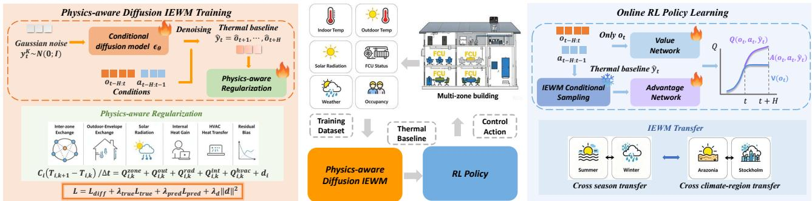  
Fi ure 1: Overall framework of ADAPT. The trainin rocess of ADAPT is divided into two hases. Phase I: Ph sics-aware Difusion IEWM Training. Phase II: Online RL Policy Learning. IEWM is frozen during phase II.

## 3.3 Physics-aware Thermal Regularization

The conditional difusion IEWM can efectively model ofline trajectories. However, vanilla data-driven learning may exploit domain-specific statistical correlations rather than invariant thermal dy- namics. Such overfitting often generalizes poorly across seasons and climate regions. To improve out-of-distribution robustness, we introduce a physics-aware regularization based on a diferentiable multi-zone physical heat-balance equation, which encourages generated trajectories to satisfy fundamental thermal dynamics while preserving the flexibility of the difusion model.

For each zone �, the predicted temperature is encouraged to satisfy the following heat-balance equation:

$$
C _ { i } \frac { \hat { T } _ { i , k + 1 } - \hat { T } _ { i , k } } { \Delta t } = \hat { Q } _ { i , k } ^ { z o n e } + \hat { Q } _ { i , k } ^ { o u t } + \hat { Q } _ { i , k } ^ { r a d } + \hat { Q } _ { i , k } ^ { i n t } + \hat { Q } _ { i , k } ^ { h v a c } + d _ { i } .\tag{10}
$$

Rather than serving as an exact physical constraint, Eq. (10) acts as a soft structural prior that regularizes difusion predictions. All physical coeficients are jointly learnt with the difusion model, allowing the regularizer to adapt to diferent buildings while main- taining physically meaningful heat-transfer mechanisms.

The heat-balance equation consists of five interpretable com- ponents. The inter-zone term models conductive heat exchange among neighboring zones using a symmetric nonnegative coupling matrix:

$$
\hat { Q } _ { i , k } ^ { z o n e } = \sum _ { j = 1 } ^ { N } g _ { i j } ( \hat { T } _ { j , k } - \hat { T } _ { i , k } ) , \qquad g _ { i j } = g _ { j i } \geq 0 .\tag{11}
$$

The outdoor-envelope term captures heat transfer between in- door and outdoor environments:

$$
\begin{array} { r } { \hat { Q } _ { i , k } ^ { o u t } = k _ { i } ( T _ { k } ^ { o u t } - \hat { T } _ { i , k } ) , \qquad k _ { i } \geq 0 . } \end{array}\tag{12}
$$

The radiation term models weather-dependent heat gains:

$$
\begin{array} { r } { \hat { Q } _ { i , k } ^ { r a d } = \pmb { s } _ { i } ^ { \top } { \bf r } _ { k } , \qquad { \bf s } _ { i } \geq 0 , } \end{array}\tag{13}
$$

The internal-gain term represents heat generated by occupants:

$$
\hat { Q } _ { i , k } ^ { i n t } = \gamma _ { i } \hat { o } _ { i , k } ^ { i n t } , \qquad \gamma _ { i } \geq 0 .\tag{14}
$$

Finally, the HVAC term models action-dependent heat exchange induced by the air-conditioning system, where ${ \hat { u } } _ { i , k } ^ { h v a c } = \phi ( a _ { i , k } )$ is learned:

$$
\begin{array} { r } { \hat { Q } _ { i , k } ^ { h v a c } = \eta _ { i } \hat { u } _ { i , k } ^ { h v a c } ( T _ { i , k } ^ { s u p } - \hat { T } _ { i , k } ) , \qquad \eta _ { i } \geq 0 . } \end{array}\tag{15}
$$

A residual bias term $d _ { i }$ captures varying unmodeled disturbances. We further penalize its magnitude to discourage the model from explaining missing physics through an unconstrained bias. Collec tively, these structured components encourage the difusion IEWM to capture transferable thermal dynamics instead of relying on specific data, thereby improving robustness in domain transfer.

Joint Training with Data and Physics. We jointly optimize the conditional difusion IEWM and the physics-aware regularization through two complementary thermal residual objectives with distinct roles. The first residual is evaluated on ground-truth trajectories to identify the physical coeficients of the heat-balance model, independent of the difusion model. Based on these learned coeficients, the second residual is evaluated on difusion-generated trajectories to regularize the conditional difusion IEWM, encouraging generated predictions to satisfy physical thermal dynamics.

For an observed trajectory, we define the ground-truth thermal residual as

$$
\mathcal { R } _ { i , k } = C _ { i } \frac { T _ { i , k + 1 } - T _ { i , k } } { \Lambda t } { - ( Q _ { i , k } ^ { z o n e } + Q _ { i , k } ^ { o u t } + Q _ { i , k } ^ { r a d } + Q _ { i , k } ^ { i n t } + Q _ { i , k } ^ { h v a c } + d _ { i } ) } .\tag{16}
$$

The corresponding parameter-identification loss is

$$
\mathcal { L } _ { \mathrm { t r u e } } = \frac { 1 } { H N } \sum _ { k = t } ^ { t + H - 1 } \sum _ { i = 1 } ^ { N } \rho ( \mathcal { R } _ { i , k } ( \mathbf { y } _ { t } ) ) ,\tag{17}
$$

where $\rho ( \cdot )$ denotes the Huber loss. Using the identified physical coeficients, we further define the thermal residual for difusion- generated trajectories:

$$
\hat { \mathcal { R } } _ { i , k } = C _ { i } \frac { \hat { T } _ { i , k + 1 } - \hat { T } _ { i , k } } { \Lambda t } - ( \hat { Q } _ { i , k } ^ { z o n e } + \hat { Q } _ { i , k } ^ { o u t } + \hat { Q } _ { i , k } ^ { r a d } + \hat { Q } _ { i , k } ^ { i n t } + \hat { Q } _ { i , k } ^ { h v a c } + d _ { i } ) .\tag{18}
$$

The corresponding prediction regularization loss is

$$
\mathcal { L } _ { \mathrm { p r e d } } = \frac { 1 } { H N } \sum _ { k = t } ^ { t + H - 1 } \sum _ { i = 1 } ^ { N } \rho ( \hat { \mathcal { R } } _ { i , k } ( \hat { \mathbf { y } } _ { t } ) ) .\tag{19}
$$

This objective directly regularizes the conditional difusion IEWM. It encourages generated trajectories to satisfy the learned multizone heat-balance dynamics, thereby reducing physically implausible predictions and discouraging season-specific statistical overfitting under distribution shifts.

The overall training objective is

$$
\begin{array} { r } { \mathcal { L } = \mathcal { L } _ { \mathrm { d i f f } } + \lambda _ { \mathrm { t r u e } } \mathcal { L } _ { \mathrm { t r u e } } + \lambda _ { \mathrm { p r e d } } \mathcal { L } _ { \mathrm { p r e d } } + \lambda _ { d } \| \mathbf { d } \| _ { 2 } ^ { 2 } . } \end{array}\tag{20}
$$

where ${ \mathcal { L } } _ { \mathrm { d i f f } }$ is the standard difusion denoising objective, $\mathcal { L } _ { \mathrm { t r u e } }$ identifies the parameters of the heat-balance model from observed trajectories, $\mathcal { L } _ { \mathrm { p r e d } }$ regularizes the conditional difusion IEWM with physical dynamics. The bias penalty further discourages the regularizer from explaining missing physical efects through the unconstrained residual term, resulting in the IEWM that is both physically consistent and robust to out-of-distribution operating conditions.

## 3.4 Difusion IEWM for RL learning

To leverage the proposed IEWM for downstream HVAC control, we integrate it into an online RL framework. After ofline training, the IEWM is frozen and queried twice at each decision step. Before action selection, it predicts a thermal baseline, estimating how the indoor environment would evolve if the previous HVAC action were maintained. This baseline provides an explicit forecast of delayed thermal dynamics for action evaluation. After an action is selected, the same IEWM predicts a committed-action rollout by repeatedly applying the selected action, providing imagined future transitions for delayed credit assignment. The former im- proves action evaluation, whereas the latter improves temporal credit assignment.

For multidimensional HVAC control, we follow the branch-wise action-value architecture in [49], where each branch independently selects one actuator value $\boldsymbol { a } _ { t , d }$ . The thermal baseline $\hat { y } _ { t }$ is incorpo- rated into the branch-wise action-value function as

$$
Q _ { d } ( o _ { t } , a _ { t , d } , \hat { \mathbf { y } } _ { t } ; \Phi ) = V _ { \psi } ( o _ { t } ) + A _ { \eta _ { d } } ( o _ { t } , a _ { t , d } , \hat { \mathbf { y } } _ { t } ) - \operatorname* { m a x } _ { a ^ { \prime } \in \mathcal { A } _ { d } } A _ { \eta _ { d } } ( o _ { t } , a ^ { \prime } , \hat { \mathbf { y } } _ { t } ) ,\tag{21}
$$

The thermal baseline is injected only into the advantage stream, enabling action preferences to be evaluated with explicit knowledge of future thermal dynamics while keeping state-value estimation based solely on current observation.

After executing the selected action, the environment provides the real one-step transition $\left( \boldsymbol { x } _ { t + 1 } , \boldsymbol { r } _ { t } \right)$ . Starting from this, the IEWM predicts the future trajectory assuming the selected action is continuously executed

$$
\hat { \mathbf { y } } _ { t } ^ { \prime } = [ \hat { o } _ { t + 2 } ^ { ( a _ { t } ) } , \dots , \hat { o } _ { t + H + 1 } ^ { ( a _ { t } ) } ] \sim p _ { \theta } ( \mathbf { y } \mid o _ { t - L + 1 : t + 1 } , a _ { t - L + 1 : t } , \tilde { a } _ { t + 1 : t + H } = a _ { t } ) .\tag{22}
$$

This committed rollout estimates the delayed thermal efect of executing the chosen action. Future rewards are evaluated using the environment reward function without learning an additional reward model. For horizon $h ,$ the expanded return is

$$
G _ { t } ^ { ( h ) } ( a _ { t } ) = r _ { t } + \sum _ { k = 1 } ^ { h - 1 } \gamma ^ { k } \hat { r } _ { t + k } ^ { ( a _ { t } ) } + \gamma ^ { h } V _ { \bar { \psi } } ( \tilde { x } _ { t + h } ^ { ( a _ { t } ) } ) ,\tag{23}
$$

where $\hat { r } _ { t + k } ^ { ( a _ { t } ) }$ denotes the imagined future reward computed from the committed rollout, and $V _ { \bar { \psi } }$ is the value function of the target network. To balance short and long-term delayed efects, the multi- step returns are aggregated into a TD-� target:

$$
\tau _ { t } ^ { \lambda } = ( 1 - \lambda ) \sum _ { h = 1 } ^ { H - 1 } \lambda ^ { h - 1 } G _ { t } ^ { ( h ) } ( a _ { t } ) + \lambda ^ { H - 1 } G _ { t } ^ { ( H ) } ( a _ { t } ) .\tag{24}
$$

This target propagates delayed comfort and energy feedback through the IEWM prediction, enabling more efective credit assignment under long thermal inertia.

The branch-wise Q-network is optimized by Eq. 25. Full pseudocode is provided in Algorithm A. 7

$$
\mathcal { L } _ { \mathrm { R L } } ^ { \mathrm { ' } } ( \Phi ) = \mathbb { E } _ { \mathcal { D } _ { \mathrm { r l } } } \left. \frac { 1 } { D } \sum _ { d = 1 } ^ { D } \left( \tau _ { t } ^ { \lambda } - Q _ { d } ( o _ { t } , a _ { t , d } , \hat { \mathbf { y } } _ { t } ; \Phi ) \right) ^ { 2 } \right. .\tag{25}
$$

## 4 Experiments and Results

Our empirical evaluation is designed to answer three research questions (RQs):

• RQ1: World-model benefit. To what extent does IEWM im-prove HVAC control performance compared to existing HVAC control methods?

• RQ2: Physics-aware modeling. How efectively does the pro-posed physics-aware regularization improve prediction perfor-mance and thermal physical consistency over vanilla data-driven IEWMs?

• RQ3: Transferable world model for control. How efectively does the proposed physics-aware IEWM improve the HVAC control transferability under seasonal and climate-region transfer?

## 4.1 Experimental Setup and Evaluation Metrics

Environments. We introduce SemiBuildingSim, a high-fidelity HVAC simulation benchmark derived from a real 7-zone commer- cial ofice building in Hebei, China [59, 65]. The simulator is calibrated using over 9,000 time-aligned operational records, including weather, occupancy, and HVAC control logs, thereby capturing realistic occupant-driven disturbances, and long-horizon thermal inertia. We evaluate seasonal transfer by training and testing across the building’s summer and winter operating conditions. The control interval is 5 minutes.

To further evaluate cross-climate robustness, we employ Siner- gym [9], an EnergyPlus-based open-source benchmark, using the 2ZoneDataCenterHVAC environment. We perform climate-region transfer between Stockholm, Sweden, characterized by a cold continental climate, and Arizona, USA, characterized by a hot desert climate, creating a challenging out-of-distribution evaluation across diferent climatic conditions. The control interval is 15 minutes.

Prediction metrics. We report mean absolute error (MAE), root mean squared error (RMSE), coeficient of variation of the RMSE (CVRMSE) for key temperature and humidity dimensions, and occupancy exact-match rate (Occ EMR) when applicable. Room temperature and return-temperature CVRMSE are the primary evaluation metrics, as they are the key thermal variables governed by the multi-zone RC heat-balance equations and directly reflect both physical consistency and control-oriented prediction quality.

HVAC control Metrics. HVAC control is a multi-objective optimization problem that requires balancing thermal regulation, energy eficiency, and control stability. Accordingly, we adopt evaluation metrics that are tailored to the objectives of each benchmark. Thermal performance is benchmark-dependent: for SemiBuildingSim, we report occupant-centric comfort metrics, whereas for the Sinergym, we report the average temperature violation.

• Occupant-centric thermal comfort: We evaluate thermal comfort using the Predicted Percentage of Dissatisfied (PPD) and the absolute Predicted Mean Vote (|PMV|) according to ASHRAE Standard 55. Comfort metrics are computed primarily during occupied periods.

• Energy consumption: We report the total HVAC electricity consumption (kWh), which quantifies the energy eficiency and operational cost of the control policy.

• Actuator action fluctuation: We evaluate control smoothness using $\begin{array} { r } { \mathrm { A F } = \frac { 1 } { T } \sum _ { t = 1 } ^ { T } \sum _ { d = 1 } ^ { D } ( a _ { t , d } - a _ { t - 1 , d } ) ^ { 2 } } \end{array}$ , where lower values in- dicate smoother actions, reducing unnecessary high-frequency control oscillations and improving operational stability.

• Average temperature violation: Defined as the time-averaged absolute temperature violation outside the prescribed target tem perature range, where zero indicates that the indoor temperature always remains within the acceptable bounds.

## 4.2 Main Results

Answer for RQ1: To answer RQ1, we first evaluate ADAPT on SemiBuildingSim against MPC [22], model-free RL (A2C [33], DQN [34], PPO [43], BDQ [49]), history-aware RL (TransformerRL [36]), and model-based RL (MBVE [16], MBPO [26], DreamerV3 [20]). All controllers are trained and evaluated under the in-distribution (ID) setting. As shown in Tab. 4, ADAPT achieves the best balance be- tween energy eficiency, occupant comfort, and control smoothness, which demonstrates that introducing the difusion IEWM provides a clear benefit for HVAC control.

Table 1: Performance comparisons on SemiBuildingSim Summer (mean ± std over three seeds, ID). Lower is better.
<table><tr><td>Algorithm</td><td></td><td></td><td>Energy (kWh) ↓ Abs PMV ↓ PPD (%) ↓ Action Fluctuation ↓</td></tr><tr><td>MPC</td><td> $1 8 2 . 3 4 \pm 1 . 5 9$ </td><td> $0 . 6 0 \pm 0 . 0 4$   $1 7 . 4 5 \pm 1 . 1 9$ </td><td> $1 6 . 5 7 \pm 0 . 9 3$ </td></tr><tr><td>A2C</td><td> $1 5 7 . 8 1 \pm 7 . 5 9$ </td><td> $0 . 5 0 \pm 0 . 0 6$   $1 4 . 0 5 \pm 1 . 5 6$ </td><td> $1 2 . 8 9 \pm 3 . 3 5$ </td></tr><tr><td>PPO</td><td> $1 5 4 . 8 3 \pm 3 . 1 0$ </td><td> $0 . 4 1 \pm 0 . 0 1$   $1 2 . 3 7 \pm 0 . 3 3$ </td><td> $9 . 7 5 \pm 0 . 8 5$ </td></tr><tr><td>DQN</td><td> $1 5 5 . 7 7 \pm 2 . 0 3$ </td><td> $0 . 4 9 \pm 0 . 0 6$   $1 3 . 1 9 \pm 1 . 8 8$ </td><td> $9 . 8 6 \pm 1 . 5 2$ </td></tr><tr><td>BDQ</td><td> $1 5 4 . 5 7 \pm 5 . 2 3$ </td><td> $0 . 3 7 \pm 0 . 0 1$   $1 0 . 8 8 \pm 0 . 7 8$ </td><td> $1 0 . 2 0 \pm 1 . 1 7$ </td></tr><tr><td>TransformerRL</td><td> $1 4 9 . 3 4 \pm 2 . 9 3$ </td><td> $0 . 3 7 \pm 0 . 0 3$   $1 0 . 0 5 \pm 0 . 5 0$ </td><td> $9 . 4 2 \pm 1 . 0 5$ </td></tr><tr><td>MBVE</td><td> $1 5 0 . 7 3 \pm 5 . 8 8$ </td><td> $0 . 3 6 \pm 0 . 0 1$   $1 0 . 2 7 \pm 0 . 1 4$ </td><td> $9 . 6 1 \pm 1 . 8 6$ </td></tr><tr><td>MBPO</td><td> $1 5 0 . 9 9 \pm 3 . 1 2$ </td><td> $0 . 3 8 \pm 0 . 0 4$   $1 0 . 4 7 \pm 0 . 4 9$ </td><td> $1 2 . 4 7 \pm 1 . 8 5$ </td></tr><tr><td>DreamerV3</td><td> $1 4 9 . 4 3 \pm 1 . 0 2$ </td><td> $0 . 3 6 \pm 0 . 0 1$   $9 . 8 8 \pm 1 . 5 3 $ </td><td> $8 . 3 7 \pm 0 . 1 5$ </td></tr><tr><td>ADAPT (Ours)</td><td> $1 3 8 . 4 9 \pm 1 . 7 1 $ </td><td> ${ \bf 0 . 2 2 \pm 0 . 0 1 }$   ${ \bf 7 . 0 1 \pm 0 . 0 5 }$ </td><td> ${ \bf 6 . 7 3 \pm 0 . 3 1 }$ </td></tr></table>

The improvement stems from the thermal baseline predicted by the IEWM, which summarizes the future evolution of the in door thermal dynamics while maintaining the current action. By explicitly modeling delayed thermal responses and building ther- mal inertia, the controller can optimize against anticipated thermal dynamics rather than relying solely on instantaneous observations, thereby avoiding unnecessary heating and cooling actions.

To further understand this benefit, Fig. 2 compares the training curves of diferent methods. ADAPT converges substantially faster and reaches a higher return, indicating that the predicted thermal baseline significantly improves RL sample eficiency.

The Sinergym results (Fig. 3) further demonstrate that the benefits of the IEWM generalize beyond SemiBuildingSim. ADAPT simultaneously reduces temperature violation while increasing energy savings. The improvement is particularly pronounced during the summer months in Stockholm, when longer daylight hours and stronger solar heat gains produce larger and more dynamic cooling loads. By predicting a thermal baseline that captures delayed indoor thermal dynamics, the IEWM enables proactive cooling decisions, suppressing unnecessary HVAC actuation while maintaining tem-peratures within the desired operating range. Additional results are shown in C.

Answer for RQ2: To answer RQ2, we compare four IEWM designs: the full ADAPT (Ours), w/o Phys., which removes the proposed physics-aware regularization, MambaFormer [60], and a VAE-based [31] world model. Table 2 shows that the proposed physics-aware IEWM consistently achieves the best multi-step prediction performance under seasonal transfer. The improvement

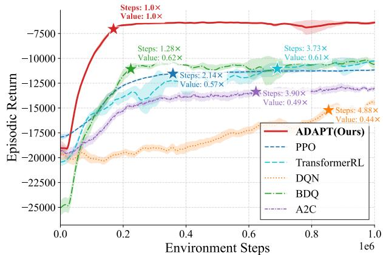

Figure 2: Training curves on SemiBuildingSim Summer. Stars mark the first point where each method reaches 95% of its final episodic return. The labels report relative convergence steps (lower is better) and relative covergence return (higher is better), both normalized to ADAPT (Ours) = 1.0×.  
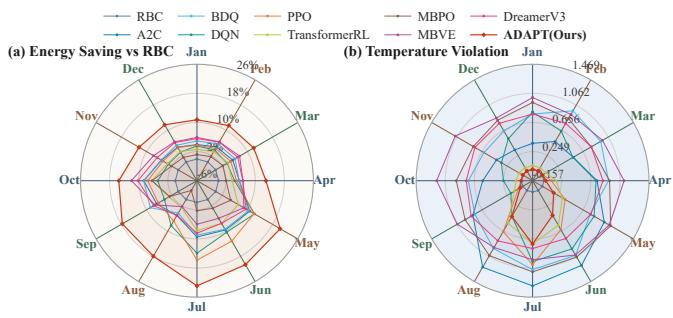  
Figure 3: Comparison of ADAPT with baselines in Sinergym Stockholm environment (ID). (a) energy savings relative to rule-based controller (RBC), (b) temperature violation. is particularly pronounced for room temperature and return tem-perature, while the purely data-driven difusion model and other sequence modeling baselines degrade substantially under OOD conditions.

Table 2: OOD prediction performance under seasonal transfer on SemiBuildingSim. Except Occ EMR, lower is better.
<table><tr><td>Category</td><td>Metric</td><td colspan="3">ADAPT (Ours) w/o Phys. MambaFormer VAE</td><td></td></tr><tr><td colspan="6">Summer → Winter (OOD)</td></tr><tr><td rowspan="3">Overall</td><td>MAE (↓)</td><td>0.035</td><td>0.040</td><td>0.119</td><td>0.131</td></tr><tr><td> $\mathrm { R M S E } \left( \downarrow \right)$ </td><td>0.074</td><td>0.083</td><td>0.207</td><td>0.222</td></tr><tr><td>Occ EMR (%) (↑)</td><td>98.475</td><td>98.086</td><td>77.021</td><td>82.855</td></tr><tr><td rowspan="2">CVRMSE (%)</td><td>Return Temp</td><td>4.633</td><td>8.069</td><td>9.517</td><td>13.367</td></tr><tr><td>Room Temp</td><td>11.560</td><td>16.134</td><td>43.210</td><td>44.983</td></tr><tr><td colspan="6">Winter → Summer (OOD)</td></tr><tr><td rowspan="3">Overall</td><td>MAE (↓)</td><td>0.049</td><td>0.059</td><td>0.181</td><td>0.204</td></tr><tr><td>RMSE (↓)</td><td>0.086</td><td>0.105</td><td>0.310</td><td>0.348</td></tr><tr><td>Occ EMR (%) (↑)</td><td>77.486</td><td>74.892</td><td>76.977</td><td>75.538</td></tr><tr><td rowspan="2">CVRMSE (%)</td><td>Return Temp</td><td>6.531</td><td>9.237</td><td>18.105</td><td>21.279</td></tr><tr><td>Room Temp</td><td>6.847</td><td>9.560</td><td>34.031</td><td>38.174</td></tr></table>

The gains are most evident on room temperature and return temperature because these variables are directly governed by the multi-zone RC heat-balance equations and therefore provide the most stringent test of physical consistency. By explicitly regularizing the denoising process with thermal dynamics, the proposed physics-aware objective prevents the difusion model from exploiting season-specific statistical correlations and instead encourages predictions that remain consistent with the underlying heat-transfer process. Consequently, the learned world model main tains substantially better thermal-state prediction when weather conditions and building operating regimes change.

Figure 4 further demonstrates that the benefits of the proposed physics-aware IEWM generalize across climate regions. Under Stockholm and Arizona bi-transfer, ADAPT consistently achieves the best overall prediction performance across all reported met- rics, whereas purely data-driven world models exhibit substantially larger degradation after climate transfer. These results demonstrate that incorporating physics-aware thermal constraints significantly improves the cross-region robustness and generalization ability of the learned indoor environment world model.

Table 3: Ablation study on the physics loss weight $\lambda _ { \mathrm { p r e d } }$ and the bias penalty $\lambda _ { d } .$ Lower is better.
<table><tr><td>Ablation</td><td>Value</td><td colspan="5">MAE ↓ RMSE ↓ CVRMSE (%) ↓ Return Temp ↓ Room Temp ↓</td></tr><tr><td rowspan="5"> $\lambda _ { \mathrm { p r e d } }$ </td><td>0</td><td>0.059</td><td>0.105</td><td>13.671</td><td>9.237</td><td>9.560</td></tr><tr><td>0.2 (Ours)</td><td>0.049</td><td>0.086</td><td>10.513</td><td>6.531</td><td>6.847</td></tr><tr><td>0.5</td><td>0.052</td><td>0.093</td><td>11.368</td><td>7.029</td><td>6.988</td></tr><tr><td>0.8</td><td>0.056</td><td>0.101</td><td>12.501</td><td>6.314</td><td>8.321</td></tr><tr><td>1.0</td><td>0.062</td><td>0.106</td><td>13.475</td><td>6.298</td><td>9.313</td></tr><tr><td rowspan="4"> $\lambda _ { d }$ </td><td>0</td><td>0.061</td><td>0.108</td><td>13.783</td><td>6.670</td><td>9.557</td></tr><tr><td>0.1 (Ours)</td><td>0.049</td><td>0.086</td><td>10.513</td><td>6.531</td><td>6.847</td></tr><tr><td>0.3</td><td>0.051</td><td>0.088</td><td>10.868</td><td>6.143</td><td>6.935</td></tr><tr><td>0.5</td><td>0.054</td><td>0.096</td><td>11.622</td><td>6.193</td><td>7.177</td></tr></table>

Answer for RQ3: To answer RQ3, we evaluate the downstream control performance of the IEWMs introduced in RQ2. To isolate the contribution of world-model design, all compared methods use the same RL controller described in Section 3.4, while only the underlying IEWM is varied.

Figure 5 shows that under seasonal transfer, ADAPTconsistently achieves the best trade-of between energy eficiency, occupant comfort, and control smoothness. The same trend is observed un- der climate-region transfer (Fig. 6). Across both transfer directions between Stockholm and Arizona, ADAPT consistently delivers higher energy savings with lower temperature violation than se-quential and purely data-driven world models. The consistent ad- vantage across diferent transfer scenarios demonstrates that im- proved world-model transferability leads to more robust and reliable downstream RL control. Additional results are shown in C.2.

The transferability originates from the proposed physics-aware regularization. By modeling climate-invariant thermal dynamics in-stead of environment-specific statistical correlations, ADAPT main- tains accurate thermal prediction under OOD scenarios. Conse- quently, the downstream controller receives reliable future thermal baseline even in unseen environments, leading to more robust pol icy optimization and consistently stronger transfer performance.

Ablation on Physics-Loss Weights. Tables 3 investigates the influence of the two physics-aware regularization weights under the SemiBuildingSim Winter→Summer transfer. Removing either term consistently deteriorates OOD prediction performance, demonstrating that both physical consistency and residual-bias regularization are essential for learning transferable thermal dynamics. Con- versely, excessively large weights also reduce prediction accuracy, indicating that overly strong physical constraints may compromise the expressive capacity of the difusion model. We therefore use $\lambda _ { \mathrm { p r e d } } = 0 . 2$ and $\lambda _ { d } = 0 . \mathrm { : }$ 1 throughout the paper.

## 5 Discussion

As global urbanization and climate change reshape building energy demand, efective modeling and control of indoor thermal dynam- ics is important for building decarbonization, occupant comfort, and peak-load management, advancing the UN’s SDGs 11 and 13. Our key contribution lies in introducing physics-aware generative indoor environmental world models as a transferable predictive foundation for HVAC control. Instead of learning a reactive controller tied to one season and one climate region, our framework utilizes world model to predict a thermal baseline that transfers across seasons and climate zones, supporting energy-eficient building operation, comfort improvement, and cross-region deployment for energy system and building science .

A central challenge in HVAC control is the combination of de- layed thermal dynamics, partial observability, and substantial ther- mal distribution shifts across seasons, weather conditions, and climate regions. Since the efect of an HVAC action emerges grad-ually, efective control requires a world model that explicitly pre- dicts future indoor thermal evolution for action evaluation and delayed credit assignment. We address this by introducing a physicsaware generative world model to guide RL learning. Besides, unlike existing deterministic and vanilla data-driven world models that primarily learn specific statistical correlations, our physics-aware difusion IEWM learns transferable thermal dynamics through gen- erative trajectory modeling regularized by a multi-zone physical heat-balance equation. Consequently, the proposed IEWM learns from one operating condition and is transferable across seasons, weather conditions, and climate regions.

In summary, our framework can ofer building operators, HVAC engineers, and energy scientists a powerful generative tool for predicting delayed indoor thermal responses, transferring HVAC control across seasons and climate regions, and jointly improving energy consumption and occupant comfort across ofices, residential buildings, and high-density AI infrastructure such as data-center cooling. This work established a decarbonized, physically consis- tent, and transferable HVAC control process aligned with SDGs 11 and 13, advancing the development of AI for building science, energy systems, and climate mitigation.

## 5.1 Limitations and Ethical Considerations

While the proposed physics-aware regularization significantly im-proves the transferability of the IEWM, it currently constrains only indoor temperature dynamics through the multi-zone heat-balance equation. More complex processes, such as humidity, are not explic itly modeled. Incorporating richer thermo-hygrometric dynamics into the world model is an important direction for future work.

All experiments are conducted using publicly available build- ing simulators and weather data. No private, household-level, or personally identifiable information is collected, used, or inferred during model development or evaluation.

## 6 Conclusion

This paper presents ADAPT, a physics-aware difusion IEWM for robust HVAC control under seasonal and climate-region transfer.

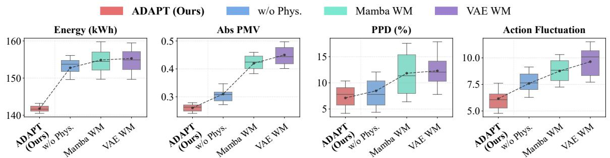

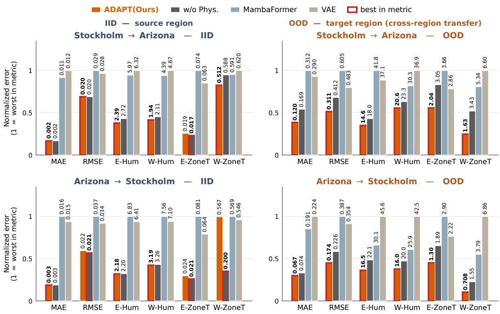

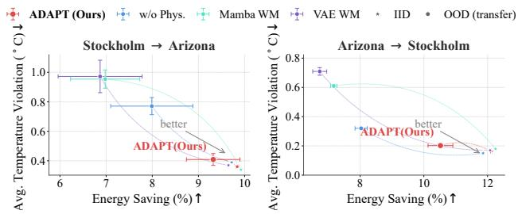  
Figure 4: Cross-region transfer prediction performance on Sinergym 2ZoneDataCenter (Stockholm ↔ Arizona). CVRMSE are annotated above each bar. Red outlines indicate the best value per metric (lower is better).  
Figure 5: Comparison of diferent IEWMs downstream control performance on SemibuildingSim Winter → Summer transfer. Lower is better.  
Figure 6: Comparison of diferent IEWMs downstream control performance on Sinergym cross climate-region transfer.

Experiments demonstrate that ADAPT consistently improves world-model prediction, downstream control performance, and transfer robustness over existing baselines. By integrating physics-aware thermal dynamics into generative world modeling, ADAPT provides a practical and transferable foundation for energy-eficient building control. We hope this work promotes further research on physics- guided world models for AI-driven building energy management, contributing to more sustainable and intelligent buildings.

## 7 GenAI Disclosure

The authors declare that AI tools were used only for language polishing and grammar checking. All scientific contributions, in-cluding ideas, experiments, and analyses, are the authors’ own. All intellectual content, data analysis, interpretations, and conclusions were conceived, written, and verified by the authors.

## References

[1] Abdul Afram and Farrokh Janabi-Sharifi. 2014. Theory and applications of HVAC control systems–A review of model predictive control (MPC). Building and environment 72 (2014) 343–355

[2] Khalil Al Sayed, Abhinandana Boodi, Roozbeh Sadeghian Broujeny, and Karim Beddiar. 2024. Reinforcement learning for HVAC control in intelligent buildings: A technical and conceptual review. Journal of Building Engineering 95 (2024), 110085.

[3] American Society of Heating, Refrigerating and Air-Conditioning En-gineers. 2023. ANSI/ASHRAE Standard 55-2023: Thermal Environ- mental Conditions for Human Occupancy. ASHRAE, Atlanta, GA. https://www.ashrae.org/technical-resources/bookstore/standard-55-thermal- environmental-conditions-for-human-occupancy

[4] Yu Qian Ang, Zachary Michael Berzolla, Samuel Letellier-Duchesne, and Christoph F Reinhart. 2023. Carbon reduction technology pathways for existing buildings in eight cities. Nature communications 14, 1 (2023), 1689.

[5] Hassam Ayaz, Mohammed Faizal, and Abdelmalek Bouazza. 2024. Energy, economic, and carbon emission analysis of a residential building with an energy pile s stem. Renewable Ener 220 (2024), 119712.

[6] Adrien Bardes, Quentin Garrido, Jean Ponce, Xinlei Chen, Michael Rabbat, Yann LeCun, Mido Assran, and Nicolas Ballas. [n. d.]. Revisiting Feature Prediction for Learning Visual Representations from Video. Transactions on Machine Learning Research ([n. d.]).

[7] Chenhang Bian, Ka Lung Cheung, Xi Chen, and Chi Chung Lee. 2025. Integrating microclimate modelling with building energy simulation and solar photovoltaic potential estimation: The parametric analysis and optimization of urban design. Applied Energy 380 (2025), 125062.

[8] John Bongaarts. 2020. United Nations Department of Economic and Social Afairs, Population Division World Family Planning 2020: Highlights, United Nations Publications, 2020. 46 p. Popul Dev Rev 46, 4 (2020), 857–858.

[9] Alejandro Campoy-Nieves, Antonio Manjavacas, Javier Jiménez-Raboso, Miguel Molina-Solana, and Juan Gómez-Romero. 2025. Sinergym–A virtual testbed for building energy optimization with Reinforcement Learning. Energy and Buildings 327 (2025), 115075.

[10] Cheng Chi, Zhenjia Xu, Siyuan Feng, Eric Cousineau, Yilun Du, Benjamin Burchfiel, Russ Tedrake, and Shuran Song. 2025. Difusion policy: Visuomotor policy learning via action difusion. The International Journal of Robotics Research 44, 10-11 (2025), 1684–1704.

[11] Conference of the Parties serving as the meeting of the Parties to the Paris Agreement (CMA). 2023. Outcome of the First Global Stocktake. UNFCCC Decision 1/CMA.5. FCCC/PA/CMA/2023/L.17.

[12] Davide Coraci, Silvio Brandi, Tianzhen Hong, and Alfonso Capozzoli. 2023. Online transfer learning strategy for enhancing the scalability and deployment of deep reinforcement learning control in smart buildings. Applied Energy 333 (2023), 120598.

[13] Jingtao Ding, Yunke Zhang, Yu Shang, Yuheng Zhang, Zefang Zong, Jie Feng, Yuan Yuan, Hongyuan Su, Nian Li, Nicholas Sukiennik, et al. 2025. Understanding world or redictin future? a com rehensive surve of world models. Com ut. Surve s 58, 3 (2025), 1–38.

[14] Ján Drgoňa, Javier Arroyo, Iago Cupeiro Figueroa, David Blum, Krzysztof Arendt, Donghun Kim, Enric Perarnau Ollé, Juraj Oravec, Michael Wetter, Draguna L Vrabie, et al. 2020. All you need to know about model predictive control for buildin s. Annual reviews in control 50 (2020), 190–232.

[15] Poul O Fanger. 1970. Thermal comfort. Analysis and applications in environmental engineering. (1970).

[16] Vladimir Feinberg, Alvin Wan, Ion Stoica, Michael I Jordan, Joseph E Gonzalez, and Sergey Levine. 2018. Model-based value estimation for eficient model-free reinforcement learning. arXiv preprint arXiv:1803.00101 (2018).

[17] Hongfan Gao, Wangmeng Shen, Xiangfei Qiu, Ronghui Xu, Bin Yang, and Jilin Hu. 2025. SSD-TS: Ex lorin the otential of linear state s ace models for difusion models in time series imputation. In Proceedings of the 31st ACM SIGKDD Conference on Knowledge Discovery and Data Mining V. 2. 649–660.

[18] Ignat Georgiev, Varun Giridhar, Nicklas Hansen, and Animesh Garg. [n. d.]. PWM: Policy Learning with Multi-Task World Models. In The Thirteenth International Conference on Learning Representations.

[19] Danijar Hafner, Jurgis Pasukonis, Jimmy Ba, and Timothy Lillicrap. 2023. Mastering diverse domains through world models. arXiv preprint arXiv:2301.04104 (2023).

[20] Danijar Hafner, Jurgis Pasukonis, Jimmy Ba, and Timothy Lillicrap. 2025. Mastering diverse control tasks through world models. Nature 640, 8059 (2025), 647–653.

[21] Ahmed M Hanafi, Mohamed Ahmed Moawed, and Osama Ezzat Abdellatif. 2024. Advancing sustainable energy management: a comprehensive review of artificial intelligence techniques in building. Engineering Research Journal (Shoubra) 53, 2 (2024), 26–46.

[22] Nicklas Hansen, Hao Su, and Xiaolong Wang. [n. d.]. TD-MPC2: Scalable, Robust World Models for Continuous Control. In The Twelfth International Conference

on Learning Representations.

[23] N Hansen, X Wang, and H Su. 2022. Temporal Diference Learning for Model Predictive Control. In International Conference on Machine Learnin , PMLR.

[24] Thi Ngoc Yen Huynh, Anh Tuan Nguyen, Yonghan Ahn, Bee Lan Oo, and Benson TH Lim. 2025. Multi objectives reinforcement learning for smart buildings: A systematic review of algorithms, applications and future perspectives. Energy and Buildings 345 (2025), 116045.

[25] Michael Janner, Yilun Du, Joshua Tenenbaum, and Sergey Levine. 2022. Planning with Difusion for Flexible Behavior Synthesis. In International Conference on Machine Learning. PMLR, 9902–9915.

[26] Michael Janner, Justin Fu, Marvin Zhang, and Sergey Levine. 2019. When to trust your model: Model-based policy optimization. In Advances in neural information processing systems, Vol. 32.

[27] Michaela Killian and Martin Kozek. 2016. Ten questions concerning model predictive control for energy eficient buildings. Building and Environment 105 (2016), 403–412.

[28] Hoesung Lee, Katherine Calvin, Dipak Dasgupta, Gerhard Krinner, Aditi Mukherji, Peter Thorne, Christopher Trisos, José Romero, Paulina Aldunce, Ko Barrett, et al. 2023. Climate change 2023: synthesis report. Contribution ofworking groups I, II and III to the sixth assessment report ofthe intergovernmental panel on climate change.

[29] Rui Liang, Yang Deng, and Dan Wang. 2024. Probabilistic Building Load Forecasting via Conditional Difusion Model. In Proceedings ofthe 15th ACM International Conference on Future and Sustainable Energy Systems. 490–491.

[30] Yuansan Liu, Sudanthi Wijewickrema, Dongting Hu, Christofer Bester, Stephen O’Lear , and James Baile . 2025. Stochastic difusion: A difusion based model for stochastic time series forecasting. In Proceedings ofthe 31st ACM SIGKDD Conference on Knowled e Discover and Data Minin V. 2. 1939–1950.

[31] Jie Lu, Chaobo Zhang, Bozheng Li, Yang Zhao, Ruchi Choudhary, and Max Lan tr . 2025. Self-attention variational autoencoder-based method for incom- plete model parameter imputation of digital twin building energy systems. Energy and Buildings 328 (2025), 115162.

[32] Antonio Manjavacas, Alejandro Campoy-Nieves, Javier Jiménez-Raboso, Miguel Molina-Solana, and Juan Gómez-Romero. 2024. An experimental evaluation of Deep Reinforcement Learning algorithms for HVAC control. arXiv e-prints (2024), arXiv–2401.

[33] Volodymyr Mnih, Adria Puigdomenech Badia, Mehdi Mirza, Alex Graves, Timothy Lillicrap, Tim Harley, David Silver, and Koray Kavukcuoglu. 2016. Asynchronous methods for deep reinforcement learning. In International conference on machine learning. PmLR, 1928–1937.

[34] Volodymyr Mnih, Koray Kavukcuoglu, David Silver, Andrei A Rusu, Joel Veness, Marc G Bellemare, Alex Graves, Martin Riedmiller, Andreas K Fidjeland, Georg Ostrovski, et al. 2015. Human-level control through deep reinforcement learning. nature 518 7540 (2015) 529–533.

[35] Zoltan Nagy, Gregor Henze, Sourav Dey, Javier Arroyo, Lieve Helsen, Xiangyu Zhang, Bingqing Chen, Kadir Amasyali, Kuldeep Kurte, Ahmed Zamzam, et al. 2023. Ten questions concerning reinforcement learning for building energy management. Building and Environment 241 (2023), 110435.

[36] Tianwei Ni, Michel Ma, Benjamin Eysenbach, and Pierre-Luc Bacon. 2023. When do transformers shine in rl? decoupling memory from credit assignment. Advances in Neural Information Processing Systems 36 (2023), 50429–50452.

[37] Alexander Quinn Nichol and Prafulla Dhariwal. 2021. Improved denoising difusion probabilistic models. In International conference on machine learning. PMLR, 8162–8171.

[38] Kingsley Nweye, Bo Liu, Peter Stone, and Zoltan Nagy. 2022. Real-world challenges for multi-agent reinforcement learning in grid-interactive buildings. Energy and AI 10 (2022), 100202.

[39] Luis Pérez-Lombard, José Ortiz, and Christine Pout. 2008. A review on buildings ener consum tion information. Ener and buildin s 40, 3 (2008), 394–398.

[40] UN Environment Programme. 2022. "2022 GLOBAL STATUS REPORT FOR BUILDINGS AND CONSTRUCTION". https://globalabc.org.

[41] Aditya Ramesh, Kenny John Young, Louis Kirsch, and Jürgen Schmidhuber. [n. d.]. Sequence Compression Speeds Up Credit Assignment in Reinforcement Learning. In Forty-first International Conference on Machine Learning.

[42] Kashif Rasul, Calvin Seward, Ingmar Schuster, and Roland Vollgraf. 2021. Autoregressive denoising difusion models for multivariate probabilistic time series forecasting. In International conference on machine learning. PMLR, 8857–8868.

[43] John Schulman, Filip Wolski, Prafulla Dhariwal, Alec Radford, and Oleg Klimov. 2017. Proximal policy optimization algorithms. arXiv preprint arXiv:1707.06347 (2017).

[44] Alberto Silvestri, Davide Coraci, Silvio Brandi, Alfonso Capozzoli, and Arno Schlueter. 2025. Practical deployment of reinforcement learning for building controls using an imitation learning approach. Energy and Buildings 335 (2025), 115511.

[45] Yang Song, Jascha Sohl-Dickstein, Diederik P Kingma, Abhishek Kumar, Stefano Ermon, and Ben Poole. 2021. Score-Based Generative Modeling through Stochastic Diferential Equations. In International Conference on Learning Representations.

[46] Iain Stafell, Stefan Pfenninger, and Nathan Johnson. 2023. A global model of hourly space heating and cooling demand at multiple spatial scales. Nature Energy 8, 12 (2023), 1328–1344.

[47] Kailai Sun, Irfan Qaisar, Muhammad Arslan Khan, Tian Xing, and Qianchuan Zhao. 2023. Building occupancy number prediction: A Transformer approach. Building and environment 244 (2023), 110807.

[48] Kailai Sun, Qianchuan Zhao, and Jianhong Zou. 2020. A review of building occupancy measurement systems. Energy and Buildings 216 (2020), 109965.

[49] Arash Tavakoli, Fabio Pardo, and Petar Kormushev. 2018. Action branching architectures for deep reinforcement learning. In Proceedings of the aaai conference on artificial intelligence, Vol. 32.

[50] United Nations Environment Programme and Global Alliance for Buildings and Construction. 2025. Global Status Report for Buildings and Construction 2024/2025. Technical Report. United Nations Environment Programme. https://www.unep.org/resources/report/global-status-reportbuildin s-and-construction-20242025

[51] Rik van Heerden, Oreane Y Edelenbosch, Vassilis Daioglou, Thomas Le Gallic, Luiz Bernardo Baptista, Alice Di Bella, Francesco Pietro Colelli, Johannes Em merling, Panagiotis Fragkos, Robin Hasse, et al. 2025. Demand-side strategies enable rapid and deep cuts in buildings and transport emissions to 2050. Nature Energy 10, 3 (2025), 380–394.

[52] José R Vázquez-Canteli and Zoltán Nagy. 2019. Reinforcement learning for demand response: A review of algorithms and modeling techniques. Applied energy 235 (2019), 1072–1089.

[53] Stijn Verbeke and Amaryllis Audenaert. 2018. Thermal inertia in buildings: A review of impacts across climate and building use. Renewable and sustainable energy reviews 82 (2018), 2300–2318.

[54] Jingwei Wang, Qianyue Hao, Wenzhen Huang, Xiaochen Fan, Zhentao Tang, Bin Wang, Jianye Hao, and Yong Li. 2024. Dyps: Dynamic parameter sharing in multi-agent reinforcement learning for spatio-temporal resource allocation. In Proceedings ofthe 30th ACM SIGKDD conference on knowledge discovery and data mining. 3128–3139.

[55] Liangxu Wang and Tianzhen Hong. 2020. Reinforcement learning for building controls: The opportunities and challenges. Applied Energy 269 (2020), 115036. doi:10.1016/j.apenergy.2020.115036

[56] Xiangwei Wang, Peng Wang, Renke Huang, Xiuli Zhu, Javier Arroyo, and Ning Li. 2025. Safe deep reinforcement learning for building energy management. Applied Energy 377 (2025), 124328.

[57] Zhixian Wang, Qingsong Wen, Chaoli Zhang, Liang Sun, and Yi Wang. 2024. DiffLoad: Uncertainty quantification in electrical load forecasting with the difusion model. IEEE Transactions on Power Systems 40, 2 (2024), 1777–1789.

[58] Jialong Wu, Shaofeng Yin, Ningya Feng, and Mingsheng Long. [n. d.]. RLVR-World: Training World Models with Reinforcement Learning. In The Thirty-ninth Annual Conference on Neural Information Processing Systems.

[59] Tian Xing, Hu Yan, Kailai Sun, Yifan Wang, Xuetao Wang, and Qianchuan Zhao. 2022. Honeycomb: An open-source distributed system for smart buildings. Patterns 3, 11 (2022).

[60] Xiongxiao Xu, Yueqing Liang, Baixiang Huang, Zhiling Lan, and Kai Shu. 2024. Integrating mamba and transformer for long-short range time series forecasting. arXiv preprint arXiv:2404.14757 2, 7 (2024).

[61] Yiqin Yang, Xu Yang, Yuhua Jiang, Ni Mu, Hao Hu, Runpeng Xie, Ziyou Zhang, Siyuan Li, Yuan-Hua Ni, Qianchuan Zhao, et al. 2026. GlobeDif: State Difusion Process for Partial Observability in Multi-Agent Systems. arXiv preprint arXiv:2602.15776 (2026).

[62] Xinbo Zhao, Yingxue Zhang, Xin Zhang, Yu Yang, Yiqun Xie, Yanhua Li, and Jun Luo. 2024. Urban-focused multi-task ofline reinforcement learning with contrastive data sharing. In Proceedings ofthe 30th ACM SIGKDD Conference on Knowledge Discovery and Data Mining. 4512–4523.

[63] Yi Zhao, Aidan Scannell, Yuxin Hou, Tian u Cui, Le Chen, Dieter Büchler, Arno Solin, Juho Kannala, and Joni Pajarinen. 2025. Generalist World Model Pre-Trainin for Eficient Reinforcement Learnin . In ICLR 2025 Workshop on World Models: Understanding, Modelling and Scaling.

[64] Zhida Zhao, Talas Fu, Yifan Wan , Lijun Wan , and Huchuan Lu. 2026. From forecasting to planning: Policy world model for collaborative state-action prediction. Advances in Neural Information Processing Systems 38 (2026), 134585–134611.

[65] Dianyu Zhong, Tian Xing, Kailai Sun, Ziyou Zhang, Qianchuan Zhao, and Jian Kang. 2025. Topology-aware hypergraph reinforcement learning for indoor occupant-centric HVAC control. Energy and Buildings (2025), 116219.

[66] Mengting Zhu, Mengqi Zhao, Rongqi Zhu, Jiyong Eom, Yuyu Zhou, Sha Yu, Fengqiao Mei, and Yang Ou. 2026. Warming-driven shifts in global building energy use reshape climate mitigation planning. Nature Communications (2026).

[67] Xingchen Zou, Weilin Ruan, Siru Zhong, Yuehong Hu, and Yuxuan Liang. 2025. Fine-grained Urban Heat Island Efect Forecasting: A Context-aware Thermody namic Modeling Framework. In Proceedings of the 31st ACM SIGKDD Conference on Knowledge Discovery and Data Mining V. 2. 4226–4237.

## A Training and Inference Algorithm

Algorithm 1 summarizes the two-stage training and online-use procedure of ADAPT. Phase I trains the physics-aware difusion IEWM by jointly minimizing the difusion denoising loss (Eq. 8), the true-trajectory thermal residual (Eq. 17), the predicted-trajectory thermal residual $( \operatorname { E q . 1 9 } ) .$ , and the residual-bias regularizer (Eq. 20). Phase II freezes the world model and runs baseline-conditioned RL: at each step, the frozen IEWM produces (i) the held-action thermal baseline $\hat { \mathbf { y } } _ { t }$ that conditions the branch-wise action-value network (Eq. 21) and drives greedy action selection $\left( \mathrm { E q . \ ? ? } \right)$ , and (ii) the action-committed rollout $\hat { \mathbf { y } } _ { t } ^ { \prime }$ that supplies delayed states for the held-action TD-� target (Eqs. 23–24). The policy parameters Φ are updated by minimizing LRL (Eq. 25), followed by a soft update of the target network.

Algorithm 1 Training and online use of ADAPT   
Require: Ofline trajectories ${ \mathcal { D } } _ { \mathrm { o f f } } ,$ , RL re la bufer ${ \mathcal { D } } _ { \mathrm { r l } } ,$ horizon   
$H ,$ difusion steps $K ,$ reward evaluator �, target update rate �   
Phase I: Physics-aware difusion IEWM training   
1: for each IEWM update do   
2: Sample $\left( o _ { t - N : t + H } , a _ { t - N : t - 1 } \right) \sim \mathcal { D } _ { \mathrm { o f f } }$   
3: Set $\tilde { a } _ { t + h } \gets a _ { t - 1 }$ for $h = 0 , \ldots , H - 1$ and build $\mathbf { c } _ { t }$ by Eq. 2   
4: Set the clean target $\mathbf { y } _ { t } ^ { 0 } \gets [ o _ { t + 1 } , . . . , o _ { t + H } ]$   
5: Sample � ∼ Uniform $\left\{ 1 , \ldots , K \right\} )$ and $\epsilon \sim { \cal N } ( 0 , \mathbf { I } )$   
6: Construct $\mathbf { y } _ { t } ^ { k } \gets \sqrt { \bar { \alpha } _ { k } } \mathbf { y } _ { t } ^ { 0 } + \sqrt { 1 - \bar { \alpha } _ { k } } \epsilon$ by Eq. 4   
7: Predict $\hat { \epsilon } _ { \theta } ( \mathbf { y } _ { t } ^ { k } , k , \mathbf { c } _ { t } )$ and compute ${ \mathcal { L } } _ { \mathrm { d i f f } }$ by Eq. 8   
8: Generate $\hat { \mathbf { y } } _ { t }$ and extract $\hat { \mathbf { T } } _ { t + 1 : t + H }$   
9: Compute $\mathcal { L } _ { \mathrm { t r u e } }$ and $\mathcal { L } _ { \mathrm { p r e d } }$ by Eqs. 17 and 19   
10: Update $\theta$ and thermal coeficients by minimizing $\operatorname { E q . }$ 20   
11: end for   
12: Freeze �   
Phase II: Online RL Policy Learning   
13: for each environment step � do   
14: Generate $\hat { \mathbf { y } } _ { t }$ from Eq. 9   
15: for each branch $d = 1 , \ldots , D$ do   
16: Select $a _ { t , d }$ with $Q _ { d } ( o _ { t } , a , \hat { \mathbf { y } } _ { t } ; \Phi )$ from Eqs. 21   
17: end for   
18: Execute $a _ { t } ;$ observe $o _ { t + 1 }$ and $r _ { t }$   
19: Generate committed rollout $\hat { \mathbf { y } } _ { t } ^ { \prime }$ using $\operatorname { E q } .$ 22   
20: Store $\left( o _ { t - L : t } , a _ { t - L : t } , r _ { t } , o _ { t + 1 } , \hat { \mathbf { y } } _ { t } , \hat { \mathbf { y } } _ { t } ^ { \prime } \right)$ in $\mathcal { D } _ { \mathrm { r l } }$   
21: if it is time to update Φ then   
22: Sample a minibatch from $\mathcal { D } _ { \mathrm { r l } }$   
23: Compute $\hat { r } _ { t + k } ^ { ( a _ { t } ) }$ for $k = 1 , \ldots , H - 1$   
24: Compute $G _ { t } ^ { ( h ) } ( a _ { t } )$ and $\boldsymbol y _ { t } ^ { \lambda }$ by Eqs. 23 and 24   
25: Update Φ by minimizing ${ \mathcal { L } } _ { \mathrm { R L } } ( \Phi )$ in Eq. 25   
26: Soft-update target parameters $\bar { \Phi }  \kappa \Phi + ( 1 - \kappa ) \bar { \Phi }$   
27: end if   
28: end for

## B Experimental and Environmental Details

## B.1 SemiBuildingSim Environment

B.1.1 Environment Construction and Case Study Modeling. To com-prehensively evaluate the proposed control strategies, we utilize SemiBuildingSim, a high-fidelity simulator designed to replicate the complex thermal and energy dynamics of a real-world building. The simulation environment is grounded in historical data collected from a seven-zone ofice building in Hebei Province, China [59]. The building operates primarily during standard working hours (9:00- 19:00 on weekdays), with reduced occupancy around lunchtime. An average of 12.4 people occupied the ofice (August 7 to August 22), with typical weekday usage and no regular weekend activity.

As shown in Fig. 7, the building comprises several individual rooms and a hall. One fan coil unit (FCU) is installed in each thermal zone. FCUs 1–4 each serve an individual cellular ofice, whereas FCUs 5–7 serve zones that allow inter-zone heat exchange. The FCUs receive chilled or heated water from a central refrigeration station comprising a heat pump and a circulating water pump. The pump distributes water to all FCUs through a closed-loop pipe net-work, while the heat pump provides the thermal source for cooling and heating. An overview of the HVAC system configuration and representative devices is shown in Fig. 8.

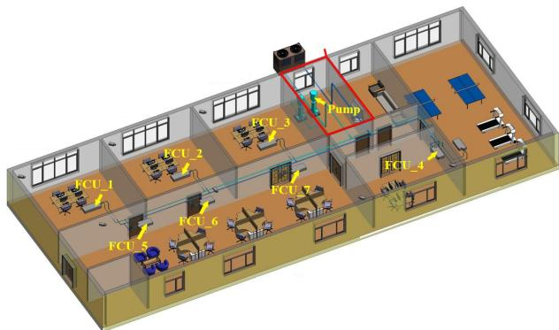  
Figure 7: Layout of the ofice building. Source from [65].

The simulator comprises three rigorously coupled components: indoor zone models, parameterized HVAC equipment models, and a dynamic cooling water pipe network [59]. The indoor thermal dynamics are captured using a lumped capacitance approach that accounts for building envelope conduction (via the OTTV method), solar radiation, instantaneous occupancy loads, inter-zone heat transfer, and the sensible cooling/heating capacities delivered by the terminal HVAC units. The hydraulic pipe network utilizes a directed graph topology, solving the complete set of nonlinear hydraulic equations at each time step using the Newton-Raphson method to ensure mass continuity and system pressure-flow balance.

To support simulator calibration and monitor indoor thermal conditions, a comprehensive sensing infrastructure is deployed. At the zone level, each thermal zone is equipped with indoor air temperature sensors (Fig. 8(f)), and occupancy is inferred from ceiling-mounted video cameras (Fig. 8(c, g)). At the terminal side, each FCU is instrumented with a water flow meter, supply and return water temperature sensors, and pressure sensors (Fig. 8(b)).

In the central plant, the variable frequency drive (VFD) circulating water pumps (1 Hz control resolution) are equipped with pressure and temperature sensors (Fig. 8(d)), and their electrical power is measured via electrical meters (Fig. 8(e)). All sensors operated continuously during HVAC runtime.

B.1.2 Observation and Action Spaces. The environment operates as a partially observable Markov decision process (POMDP), where the agent receives states and issues control commands at a fixed discrete timestep of $\Delta t = 5$ minutes.

Observation Space: The state vector s� captures the current thermodynamic and operational context of the building. This in- cludes the indoor air temperatures of the 7 zones $T _ { \mathrm { i n } , i } ,$ the instanta- neous occupant counts $n _ { \mathrm { p } , i } ,$ , outdoor weather conditions, and the current operational states of the HVAC system components.

Action Space: The control variables actuate the terminal distribution systems across the building. The action space is formulated as a MultiDiscrete space, allowing for the independent control of the 7 FCUs installed in the respective thermal zones. For each FCU, the controller selects from 4 discrete fan operational modes (e.g., of, low, medium, high). Consequently, the joint action at time step � is defined as $\mathbf { a } _ { t } \in \{ 0 , 1 , 2 , 3 \} ^ { 7 }$

B.1.3 Performance Metrics and Reward Function. To comprehen sively assess the proposed building control strategies, we adopt a dual-objective evaluation framework that quantifies both occu-pant thermal comfort and HVAC energy use. These metrics define the reinforcement learning (RL) reward signal and are used for continuous controller performance evaluation.

Thermal Discomfort and Energy Metrics. Thermal comfort is evaluated using the Predicted Mean Vote (PMV) and Predicted Percentage of Dissatisfied (PPD) indices [15]. For the specific ofice conditions, the calculations assume an air velocity of $v = 0 . 1 5 \mathrm { m } / s ,$ relative humidity of $\mathrm { R H } = 4 0 \%$ , clothing insulation of $I _ { c l } = 0 . 6 3 \mathrm { c l o } _ { \mathrm { i } }$ and a metabolic rate of $M = 1 . 1$ met. Due to the well-insulated en- velope, the mean radiant temperature $T _ { r }$ is approximated to equal the zone air temperature $T _ { a } .$

A PMV value of 0 indicates neutral thermal sensation, with an acceptable range of [−0.5, +0.5] corresponding to a PPD below 10% [3]. The system-level discomfort at time step � is computed as the occupancy-weighted mean PPD across all active zones:

$$
\mathrm { P P D } _ { \operatorname* { m e a n } , t } = \left\{ \begin{array} { l l } { \displaystyle \frac { 1 } { N _ { t } } \sum _ { i = 1 } ^ { J } n _ { i , t } \cdot \mathrm { P P D } _ { i , t } , } & { N _ { t } > 0 , } \\ { 0 , } & { N _ { t } = 0 , } \end{array} \right.\tag{26}
$$

where $J = 7$ is the number of zones, $n _ { i , t }$ is the occupancy count in zone �, and $\begin{array} { r } { N _ { t } = \sum _ { i = 1 } ^ { J } n _ { i , t } } \end{array}$ is the total number of occupants.

Energ consum tion is measured as the total HVAC electrical power $P _ { t }$ (in kWh) at each time step �, returned by the simulator. Cumulative energy over an episode is computed as $\begin{array} { r } { E = \sum _ { t } \boldsymbol { P _ { t } } \cdot \Delta \boldsymbol { t } } \end{array}$

Composite Reward Function. The objective of the RL agent is to maximize the expected cumulative reward. At each time step �, the composite reward $r _ { t }$ is formulated to balance thermal comfort, energy conservation, and system operational stability:

$$
r _ { t } = - r _ { \mathrm { c o m f o r t } } - \alpha \cdot r _ { \mathrm { e n e r g y } } - \beta \cdot R _ { \mathrm { s m o o t h } , t }\tag{27}
$$

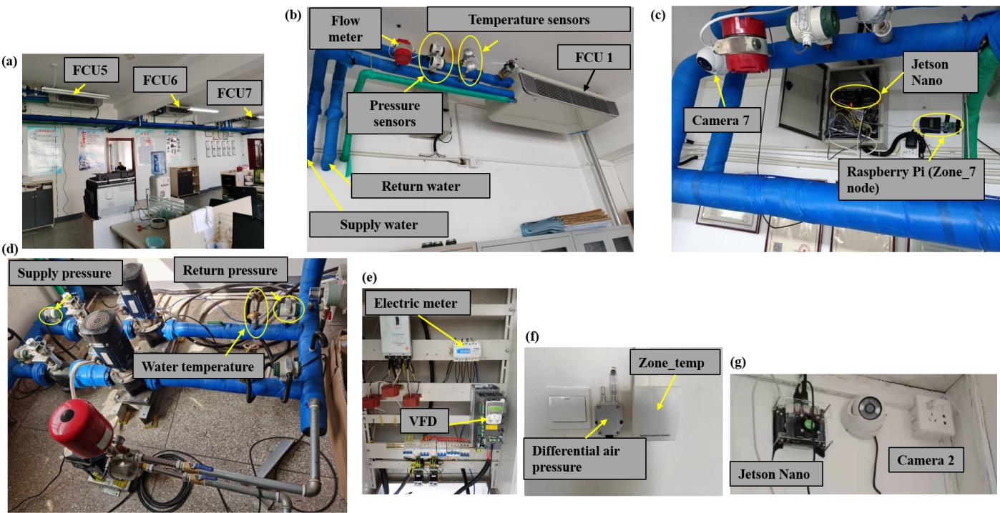  
Figure 8: HVAC system configuration. (a) FCUs of zones 5 to 7. (b) Sensors of FCU 1. (c) Video sampling of zone 7. (d) Sensors of water pumps. (e) Electrical cabinet. (f) Temperature sensor. (g) Video camera of zone 2. Source from [65].

where �comfort penalizes thermal discomfort based on the calculated $\mathrm { P P D } _ { \mathrm { m e a n } , t }$ , and �ener penalizes the total electrical power consump- tion $P _ { t }$

To optimize control performance and ensure physically plau-sible control, we introduce a smoothness penalty �smooth,�. This term explicitly discourages high-frequency oscillation and abrupt switching between FCU modes, thereby reducing mechanical wear and extending equipment longevity. The weighting coeficients are empirically established: the energy penalty coeficient is set to $\alpha = 2 0$ . For the smoothness regularization, the coeficient is $\beta = 5$ when employing a Log smoothness reward, and $\beta = 3$ when utilizing a linear smoothness reward.

## B.2 Sinergym 2ZoneDataCenter Environment

B.2.1 Environment Construction. To benchmark our proposed control strategy against baselines, we utilize the 2ZoneDataCenter environment provided by the open-source Sinergym framework [? ]. Sinergym serves as a Python-based virtual testbed that integrates deep reinforcement learning algorithms with the high-fidelity En- ergyPlus building simulation engine.

The selected building model represents a single-story data center with a total surface area of 491.3 m2. The facility is divided into two asymmetrical thermal zones: the West Zone and the East Zone. Unlike typical commercial buildings, the primary internal heat load in this environment is generated continuously by the hosted server racks (ITE objects), and the building has no windows or internal mass. To manage this intense thermal output, each zone is equipped with an HVAC system consisting of an air economizer, direct and indirect evaporative coolers, a single-speed direct expansion (DX) cooling coil, a chilled water coil, and a Variable Air Volume (VAV) system without reheat air terminal units.

B.2.2 Observation and Action Spaces. The environment is formulated as a discrete-time Markov Decision Process (MDP), where the agent interacts with the EnergyPlus backend via Sinergym’s Gymnasium interface.

Observation Space: The state vector s� encompasses both ex-ogenous disturbances and the internal thermodynamic state of the data center. Key observations include outdoor weather variables (e.g., outdoor air temperature, relative humidity, solar radiation), the current indoor air temperatures of the West and East zones, and the instantaneous power consumption of the HVAC components and IT equipment.

Action Space: The control variables manipulate the thermal setpoints of the HVAC system to regulate the cooling capacity delivered to the servers. The action space dictates the continuous cooling and heating temperature setpoints for both the West and East zones. By dynamically adjusting these setpoints, the controller coordinates the mechanical cooling and economizers.

B.2.3 Reward Function and Comfort Constraints. In data center operations, maintaining a strict thermal environment is critical for equipment reliability, while minimizing energy consumption is essential for operational sustainability. Following Sinergym’s oficial linear reward architecture, we define a dual-objective reward function that balances energy eficiency and thermal safety.

For our specific case study, the operational comfort temperature range for the server zones is strictly defined as $\left[ T _ { \mathrm { l o w } } , T _ { \mathrm { h i g h } } \right] =$ $\big [ 2 0 ^ { \circ } \mathrm { C } , 2 6 ^ { \circ } \mathrm { C } \big ]$ . The temperature deviation penalty $\Delta T _ { i , t }$ at time step � is calculated as the magnitude of the violation from this safe operating band for each zone:

$$
\Delta T _ { i , t } = \operatorname* { m a x } ( 0 , T _ { i , t } - 2 6 ) + \operatorname* { m a x } ( 0 , 2 0 - T _ { i , t } ) ,\tag{28}
$$

where $T _ { i , t }$ is the indoor air temperature of zone � ∈ {West, East}.

The step reward $r _ { t }$ computes a weighted sum of the energy penalty and the temperature violation penalty. To ensure both ob- jectives are scaled appropriately, the terms are normalized relative to their maximum operational limits:

$$
r _ { t } = - \alpha \cdot \omega \cdot \left( \frac { E _ { t } } { E _ { \operatorname* { m a x } } } \right) - \beta \cdot \left( 1 - \omega \right) \cdot \left( \frac { \sum _ { i } \Delta T _ { i , t } } { T _ { \operatorname* { m a x } } } \right) ,\tag{29}
$$

where $E _ { t }$ is the total electrical power consumption of the HVAC system at time step �, and $E _ { \mathrm { m a x } }$ and $T _ { \mathrm { m a x } }$ are normalization constants established by the environment’s empirical bounds. The weighting coeficient $\omega \in \left[ 0 , 1 \right]$ dictates the trade-of between energy con- servation and thermal compliance. By imposing a hard penalty on temperatures outside the $2 0 ^ { \circ } \mathrm { C }$ to 26◦C threshold, the agent is incen- tivized to leverage free cooling dynamically without jeopardizing server integrity. We set $\omega = 0 . 5 , \alpha = 1 , \beta = 5 \times 1 0 ^ { - 3 }$

## C Additional Experiments

## C.1 Sinergym ID Control Comparison

We provide additional ID control results on two representative scenarios: the Winter setting of SemiBuildingSim and the Arizona setting of Sinergym. Tab. ?? and Fig. 9 show that ADAPT consis tently achieves higher energy savings while maintaining occupant comfort within the desired temperature range. These results further demonstrate that the proposed physics-aware difusion IEWM accu-rately captures building thermal dynamics under diferent seasons and climate conditions, providing reliable thermal baselines that consistently improve downstream HVAC control.

Table 4: Performance comparisons on SemiBuildingSim Sum mer (mean ± std over three seeds, ID). Lower is better.
<table><tr><td>Algorithm</td><td>Energy (kWh) ↓ Abs PMV ↓ PPD (%) ↓ Action Fluctuation ↓</td><td></td><td></td></tr><tr><td>MPC</td><td>251.00 ± 9.79</td><td> $0 . 5 6 \pm 0 . 0 6$   $1 6 . 2 0 \pm 1 . 0 8$ </td><td> $9 . 9 4 \pm 1 . 1 3$ </td></tr><tr><td>A2C</td><td>247.28 ± 3.21</td><td>0.48 ± 0.03  $1 3 . 0 5 \pm 1 . 4 6$ </td><td> $6 . 0 2 \pm 1 . 0 3$ </td></tr><tr><td>PPO</td><td>236.52 ± 2.90</td><td>0.46 ± 0.04  $1 2 . 6 2 \pm 0 . 7 5$ </td><td> $4 . 9 4 \pm 1 . 4 6$ </td></tr><tr><td>DQN</td><td>248.41 ± 3.89</td><td>0.50 ± 0.05  $1 3 . 0 2 \pm 0 . 7 7$ </td><td> $6 . 5 9 \pm 0 . 5 5$ </td></tr><tr><td>BDQ</td><td>241.87 ± 2.73</td><td>0.45 ± 0.05 11.40 ± 1.28</td><td> $5 . 4 0 \pm 0 . 4 6$ </td></tr><tr><td>TransformerRL</td><td> $2 3 3 . 9 7 \pm 4 . 3 6$ </td><td>0.42 ± 0.03  $1 1 . 7 2 \pm 1 . 6 2$ </td><td> $4 . 6 6 \pm 0 . 6 5$ </td></tr><tr><td>MBVE</td><td>236.25 ± 3.03</td><td>0.42 ± 0.02 11.10 ± 0.18</td><td> $5 . 0 8 \pm 0 . 7 1$ </td></tr><tr><td>MBPO</td><td>234.66 ± 2.49</td><td>0.41 ± 0.01 11.34 ± 0.12</td><td> $4 . 2 3 \pm 0 . 7 7$ </td></tr><tr><td>DreamerV3</td><td> $2 2 8 . 8 4 \pm 2 . 4 3$ </td><td>0.40 ± 0.02 1  $0 . 6 5 \pm 0 . 3 5$ </td><td> $5 . 2 9 \pm 0 . 8 8$ </td></tr><tr><td></td><td></td><td>ADAPT (Ours) 219.48 ± 1.50 0.28 ± 0.01 7.56 ± 0.05</td><td> ${ \bf 3 . 6 2 \pm 0 . 4 8 }$ </td></tr></table>

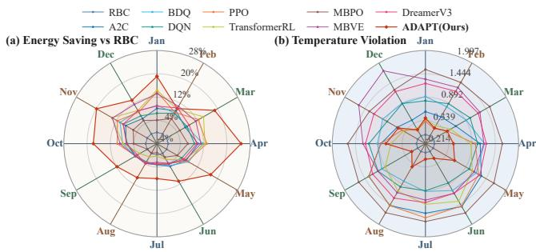  
Figure 9: Comparison of ADAPT with baseline controllers in Sinergym under the ID control setting for the Arizona environment. Subfigure (a) reports energy saving relative to RBC, and subfigure (b) reports temperature violation. Higher energy saving and lower temperature violation indicate better overall control performance.

## C.2 SemibuildSim OOD Control Comparison

Figure 10 shows that under Summer→Winter seasonal transfer, ADAPTconsistently achieves the best balance between HVAC en- ergy eficiency and occupant comfort. The proposed physics-aware difusion IEWM accurately captures transferable building thermal dynamics across seasons, enabling robust downstream control with lower energy consumption while maintaining indoor temperatures within the desired comfort range.

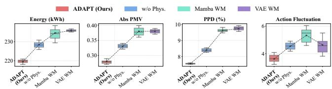  
Figure 10: Comparison of diferent IEWMs downstream control performance on SemibuildingSim Winter → Summer transfer. Lower is better.

## D Implementation Details

## D.1 Implementation of World Models

This section describes the implementation details of the world models used in our experiments. The proposed method is ADAPT , the two neural world-model baselines are the MambaFormer and the VAE. All models are implemented in PyTorch and optimized with Adam.

Datasetcollection and input layout. We construct transition datasets with a held-action protocol. Each training sample contains a history window as the conditioning variable and a flattened future observation sequence as the prediction target,

$$
c _ { t } = [ { \bf 0 } _ { t - N + 1 : t } , { \bf a } _ { t - N + 1 : t - 1 } , a _ { t : t + H - 1 } = a _ { t - 1 } ] , \qquad { \bf y } = { \bf 0 } _ { t + 1 : t + H } .\tag{30}
$$

The previous action $a _ { t - 1 }$ is held fixed over the forecast horizon, matching the dataset generation procedure used by all world models. In SemiBuildingSim, the control interval is 5 minutes, the context length is $N = 6 ,$ and the forecast horizon is $H = 3 .$ In Sinergym, the control interval is 15 minutes, the context length is $N = 4 ,$ , and the forecast horizon is $H = 2$

Normalization and training protocol. Continuous inputs and tar-gets are normalized before training. Unless otherwise specified, models use a random seed of 3407, test split 0.2, batch size 64, learn- ing rate $1 0 ^ { - 4 }$ , weight decay $1 0 ^ { - 5 }$ , maximum 200 epochs, gradient clipping with norm 1.0, and early stopping on validation RMSE with patience 12.

ADAPT difusion world model. ADAPT formulates world-model prediction as conditional denoising. A Temporal U-Net denoiser $f _ { \theta }$ is trained inside a Gaussian difusion model with 20 denoising steps, dimension multiplier (8), hidden dimension 256, exponential moving average decay 0.995, and gradient accumulation every 2 mini-batches. The model uses an L1 denoising loss.

Given the conditioning vector $c _ { t } .$ , the reverse process iteratively samples

$$
\hat { \mathbf { y } } \sim p _ { \theta } ( \mathbf { y } \mid \mathbf { c } ) ,\tag{31}
$$

and the resulting denormalized sequence is evaluated as the multi- step world-model forecast. At evaluation time we use the EMA denoiser and enable clipped denoising for stable conditional sam- ples.

Thermal physics regularization. ADAPT augments the denoising objective with a diferentiable multi-zone RC residual. For room $i ,$ the residual is based on

$$
C _ { i } \frac { d T _ { i } } { d t } = - [ K \mathbf { T } ] _ { i } + k _ { i } ^ { \mathrm { o u t } } T _ { \mathrm { o u t } } + b _ { i } ^ { \mathrm { h v a c } } u _ { i } + b _ { i } ^ { \mathrm { o c c } } O _ { i } + d _ { i } ,\tag{32}
$$

where $K = L + \mathrm { d i a g } ( k ^ { \mathrm { o u t } } )$ and � is a learned symmetric graph Laplacian. The $\mathrm { H V A C }$ driver uses the held FCU fan mode and supply- water temperature,

$$
u _ { i } = - \phi _ { i } ( \mathrm { f a n } _ { i } ) ( T _ { i } - T _ { i } ^ { \mathrm { s u p } } ) ,\tag{33}
$$

where $\phi _ { i } ( \cdot )$ is a learned monotone map over the discrete fan modes. The physical penalty combines a Huber penalty on the predicted trajectory residual, a Huber penalty on the true trajectory residual for RC parameter calibration, and a small bias regularizer:

$$
\begin{array} { r } { \mathcal { L } _ { \mathrm { p h y s } } = \lambda _ { \mathrm { p r e d } } \rho _ { \beta } ( r _ { \mathrm { p r e d } } ) + \lambda _ { \mathrm { t r u e } } \rho _ { \beta } ( r _ { \mathrm { t r u e } } ) + \lambda _ { \mathrm { d } } \| d \| _ { 2 } ^ { 2 } . } \end{array}\tag{34}
$$

Table 5: Physical-loss hyper-parameters of ADAPT.
<table><tr><td>Parameter</td><td>Value</td></tr><tr><td>Predicted RC residual weight  $\lambda _ { \mathrm { p r e d } }$ </td><td>0.2</td></tr><tr><td>True RC residual weight  $\lambda _ { \mathrm { t r u e } }$ </td><td>0.5</td></tr><tr><td>Bias penalty weight  $\lambda _ { \mathrm { b i a s } }$ </td><td> $1 \times 1 0 ^ { - 1 }$ </td></tr><tr><td>Time step ∆t</td><td>1.0</td></tr><tr><td>Huber threshold β</td><td>0.25</td></tr></table>

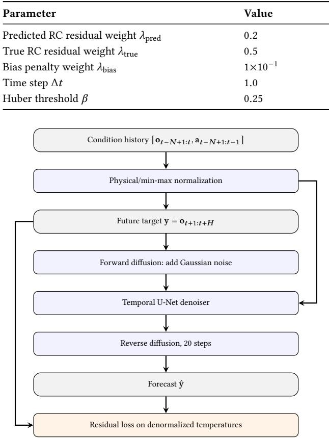  
Figure 11: ADAPT architecture for conditional difusion world-model prediction.

## Tab. 5 reports the physical-loss parameters used by ADAPT .

Evaluation metrics. For continuous state variables, we report Mean Absolute Error (MAE), Root Mean Squared Error (RMSE), coeficient of variation of RMSE (CVRMSE), and $R ^ { 2 }$ where applicable. For SemiBuildingSim occupancy-related targets, we additionally report Occupancy Exact Match Rate (OCC EMR) after converting the normalized predictions back to the original scale.

ADAPT architecture. Figure 11 illustrates the ADAPT training and sampling pipeline. The conditioning history is repeated across the difusion horizon, the Temporal U-Net denoises the future target vector, and the heat-balance equation regularizes the denormalized temperature trajectory during training.

## D.2 MPC Implementation Details

We use a sampling-based model predictive control (MPC) approach for online decision making. At each environment step, the controller plans over a finite horizon using the learned indoor environment world model (IEWM), evaluates imagined trajectories using a combi-nation of a reward evaluator and a learned terminal value function, and executes only the first action of the best-scoring sequence. The procedure is repeated after the next observation is received.

Planning objective. Let $o _ { t }$ denote the current observation and let $\mathbf { a } _ { t : t + H - 1 } = \left( a _ { t } , \dots , a _ { t + H - 1 } \right)$ be a candidate action sequence of horizon �. The IEWM is used to recursively predict future states. We specifically utilize its single-step forward prediction,

$$
\hat { o } _ { t + k + 1 } = f _ { \boldsymbol { \theta } } ( \hat { o } _ { t + k } , a _ { t + k } ) , \qquad \hat { o } _ { t } = o _ { t } ,\tag{35}
$$

where all planning rollouts are performed in the prediction space of the IEWM. To account for the long-term return beyond the fi- nite planning horizon, we bootstrap using a learned terminal value function $V _ { \psi } ( \cdot )$ . The quality of a candidate sequence is computed by accumulating discounted rewards and adding the temporal difer- ence (TD) value estimate at the terminal state,

$$
J ( \mathbf { a } _ { t : t + H - 1 } ) = \sum _ { k = 0 } ^ { H - 1 } \gamma ^ { k } g ( \hat { o } _ { t + k } , a _ { t + k } ) + \gamma ^ { H } V _ { \psi } ( \hat { o } _ { t + H } ) ,\tag{36}
$$

where $g ( \cdot )$ is the reward evaluator.

Iterative action-sequence planning. Following the trajectory optimization scheme used in TD-MPC2 [22], we employ an iterative sampling procedure. At each planning iteration �, the MPC maintains a factorized Gaussian proposal distribution over action sequences:

$$
q ^ { ( j ) } ( \mathbf { a } ) = \prod _ { k = 0 } ^ { H - 1 } N ( a _ { t + k } ; \mu _ { k } ^ { ( j ) } , ( \sigma _ { k } ^ { ( j ) } ) ^ { 2 } I ) .\tag{37}
$$

For the initial iteration $( j = 1 )$ , the mean sequence $\mu ^ { ( 1 ) }$ is initialized to the center of the valid action space. At each iteration, we sample � candidate action sequences from this proposal distribution.

Each sampled sequence is rolled out with the IEWM and scored by Eq. (36). We then select the top � sequences to update the distribution parameters $\mu ^ { ( j + 1 ) }$ and $\bar { \sigma ^ { ( j + 1 ) } }$ for the next iteration using the Cross-Entropy Method (CEM). After � planning iterations, the controller selects the highest-scoring sequence from the final elite set,

$$
\mathbf { a } _ { t : t + H - 1 } ^ { \star } = \arg \operatorname* { m a x } _ { \mathbf { a } _ { t : t + H - 1 } ^ { ( i ) } } J ( \mathbf { a } _ { t : t + H - 1 } ^ { ( i ) } ) ,\tag{38}
$$

and executes only its first action $a _ { t } ^ { \star }$ . This receding-horizon procedure replans after every real environment transition.

Hyperparameters. We use the MPC hyperparameters detailed in Tab. 6.

Table 6: MPC hyperparameters.
<table><tr><td>Hyperparameter</td><td>Value</td></tr><tr><td>Planning horizon H</td><td>6</td></tr><tr><td>Number of candidate sequences N</td><td>16</td></tr><tr><td>Number of elite samples K</td><td>4</td></tr><tr><td>Planning iterations M</td><td>3</td></tr><tr><td>Discount factor γ</td><td>0.98</td></tr></table>

## D.3 Online RL Policy Learning

All methods are trained for a total of 106 timesteps. For the discrete action space, DQN utilizes a Discrete representation, while all other algorithms employ a MultiDiscrete action space, modeled as factorized categorical distributions over action branches. To ensure a fair comparison, model-based extensions (MBVE, MBPO) are implemented using the same PPO backbone. Detailed hyper-parameters for our proposed DECARB, the model-free baselines, and the model-based baselines are summarized in Tab. 7, Tab. 8, and Tab. 9, respectively.

## D.4 Computational Cost

All experiments are conducted on an NVIDIA A100 GPU. The ofline training of the indoor environmental world model requires about 12 hours. Subsequently, the downstream online RL training takes an average of 10 hours in SemiBuildingSim and 16 hours in the Sinergym environment. During inference, one time step difusion costs about 150ms, ensuring the real-time control of HVAC systems.

Table 7: Hyper-parameters for the proposed ADAPT $( H _ { f o r e } , H , T$ on SemiBuildingSim).
<table><tr><td>Hyper-parameter</td><td>Value</td><td>Hyper-parameter</td><td>Value</td></tr><tr><td>Optimizer</td><td>Adam</td><td>Learning rate</td><td> $2 \times 1 0 ^ { - 3 }$ </td></tr><tr><td>Discount factor y</td><td>0.99</td><td>Replay buffer size</td><td> $5 \times 1 0 ^ { 5 }$ </td></tr><tr><td>Batch size</td><td>64</td><td>Exploration ε</td><td> $1 . 0  0 . 0 4$ </td></tr><tr><td>Target update interval</td><td>1000 steps</td><td>TD(λ) parameter</td><td>0.8</td></tr><tr><td>Bootstrap horizon H</td><td>3</td><td>Forecaster horizon  $H _ { \mathrm { f o r e } }$ </td><td>3</td></tr><tr><td>Network architecture</td><td>(512,512)</td><td>Forecaster History step T</td><td>6</td></tr></table>

Table 8: Hyper-parameters for Model-Free Baselines.

<table><tr><td>Parameter</td><td>DQN</td><td>BDQ</td><td>A2C</td><td>PPO</td><td>TransformerRL</td></tr><tr><td>Learning rate</td><td> $2 \times 1 0 ^ { - 3 }$ </td><td> $2 \times 1 0 ^ { - 3 }$ </td><td> $8 \times 1 0 ^ { - 4 }$ </td><td> $1 0 ^ { - 3 }$ </td><td> $1 0 ^ { - 3 }$ </td></tr><tr><td>Discount factor y</td><td>0.99</td><td>0.99</td><td>0.98</td><td>0.98</td><td>0.98</td></tr><tr><td>Batch size</td><td>64</td><td>64</td><td>40</td><td>1200</td><td>1200</td></tr><tr><td>Network hidden dim</td><td>256</td><td>512</td><td>256</td><td>256</td><td>256</td></tr><tr><td>GAE λ</td><td>一</td><td>一</td><td>0.9</td><td>0.8</td><td>0.8</td></tr><tr><td>PPO Clip ε</td><td>一</td><td>一</td><td>一</td><td>0.2</td><td>0.2</td></tr><tr><td>Entropy coef.</td><td>一</td><td></td><td>0</td><td>0.01</td><td>0.01</td></tr></table>

Table 9: Hyper-parameters for Model-Based Baselines (MBVE and MBPO built on the PPO backbone).
<table><tr><td>Parameter</td><td>MBVE</td><td>MBPO</td><td>DreamerV3</td></tr><tr><td>Rollout / Imagination horizon</td><td>8</td><td>8</td><td>8</td></tr><tr><td>Transitions / Starts per iter.</td><td>256</td><td>1024</td><td>256</td></tr><tr><td>Blend / Return λ</td><td>1.0</td><td>一</td><td>0.95</td></tr><tr><td>Warmup (iters)</td><td>3</td><td>3</td><td>3</td></tr></table>