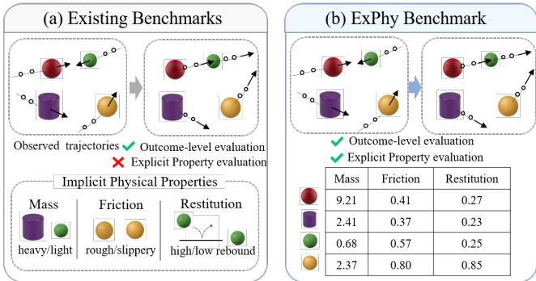
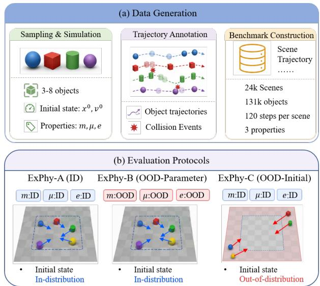
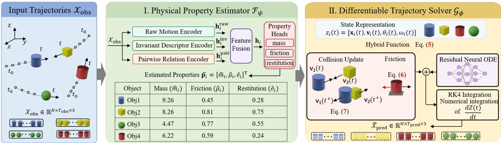
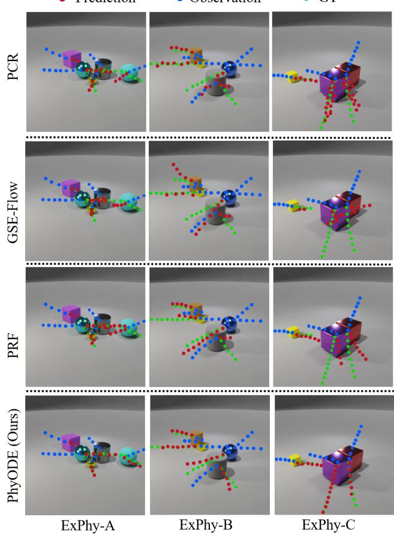
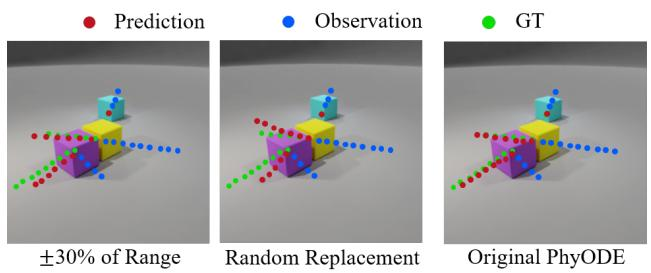

# ExPhy: A Benchmark for Explicit Physical Property Learning in Multi-Object Trajectory Forecasting

Rui Wang1, Yeteng Wu1, Xianlin Zhang2, Mengshi Qi∗1

1State Key Laboratory of Networking and Switching Technology, Beijing University of Posts and Telecommunications

2School of Digital Media & Design Art, Beijing University of Posts and Telecommunications

Beijing, China

wr@bupt.edu.cn, wuyeteng@bupt.edu.cn, zxlin@bupt.edu.cn, qms@bupt.edu.cn

## Abstract

Understanding object dynamics requires not only predicting future trajectories but also examining whether a model captures the physical properties that govern motion. However, existing benchmarks rarely expose object-level physical properties as explicit evaluation targets alongside trajectory fore-casting. To address this gap, we introduce ExPhy, a multi- object trajectory forecasting benchmark containing 24,000 simulated physical scenes with explicit object-level labels for mass, friction, and restitution. ExPhy provides observed and future trajectories together with an in-distribution (ID) split and two out-of-distribution (OOD) splits over physical parameters (OOD-Parameter) and initial states (OOD-Initial) for jointly evaluating trajectory forecasting and physical prop-erty estimation. We further instantiate PhyODE, a physics- guided model with an explicit property interface that estimates physical properties from observed trajectories and uses them for diferentiable future rollout. On the long-horizon OOD- Initial setting, PhyODE reduces ADE and FDE by 33.1% and 31.0%, respectively, compared with the strongest base- line. Zero-shot evaluation on ComPhy further assesses cross- benchmark transfer. Property-level analyses reveal that accu- rate trajectory forecasting does not necessarily imply accurate recovery of the underlying physical properties. Code and data are available at https://github.com/Zest86/ExPhy.

## Introduction

Understanding object dynamics is a central problem in physical reasoning, as predicting future motion from observed trajectories requires accounting for the physical properties that shape how objects move and interact (Battaglia et al. 2016; Watters et al. 2017). Humans exhibit intuitive physi-cal reasoning from early development, such as anticipating motion, collision outcomes, and material responses (Davis 2008; Spelke and Kinzler 2007; Wu 2024). In dynamic multiobject interactions, properties such as mass, friction, and restitution govern inertial response, tangential contact behav- ior, and collision rebound, respectively. Existing evaluations of object-centric physical dynamics commonly focus on future outcomes or predicted trajectories, while estimation of the underlying object-level properties is often assessed sep-arately or not at all. This distinction matters because low trajectory error does not necessarily imply accurate physical property estimation. It therefore motivates evaluating tra- jectory forecasting alongside explicit object-level property learning.

  
Figure 1: Comparison between existing benchmarks and the proposed ExPhy benchmark. (a) Existing benchmarks primarily supervise future outcomes, while object-level physi-cal properties are often represented implicitly or indirectly and are unavailable as dedicated evaluation targets. (b) ExPhy provides explicit continuous-valued labels for mass, friction, and restitution, enabling joint evaluation of trajectory fore-casting and physical property estimation.

Despite recent progress in physical reasoning and dynam- ics prediction, existing benchmarks still largely emphasize future-outcome prediction or task-specific reasoning, includ- ing future-state prediction, physical question answering, and event plausibility judgment (Yi et al. 2020; Wang et al. 2023; Bear et al. 2021; Chen et al. 2025). As illustrated in Fig. 1 and summarized in Table 1, object-level physical factors are often represented implicitly or indirectly, rather than exposed as dedicated object-level evaluation targets. To address this gap, we introduce ExPhy, a benchmark for joint trajectory and physical-property evaluation in multi-object trajectory forecasting. ExPhy comprises 24k simulated dynamic scenes with observed and future trajectories and explicit objectlevel labels for mass, friction, and restitution. Together with dedicated in-distribution (ID) and out-of-distribution (OOD) splits, it enables unified evaluation of trajectory forecasting, physical property estimation, and generalization under con- trolled distribution shifts.

With ExPhy, we distinguish two complementary ques- tions: whether a model forecasts future trajectories accu-rately and whether its estimated physical properties agree with the underlying simulator parameters. Existing trajectory forecasting models typically learn future states directly from observed trajectories through graph interactions, Transformers, or latent dynamics models (Li et al. 2020; Han et al. 2022; Huang et al. 2022; Liu et al. 2023; Wen, Wang, and Metaxas 2022; Fang, Hsu, and Lee 2025; Fu et al. 2025). Although efective under ADE/FDE, their internal variables need not correspond to physically meaningful properties. To instantiate the ExPhy evaluation, we develop PhyODE, a physics-guided hybrid model that estimates object-level physical properties from observed trajectories and uses them for diferentiable future rollout. Property labels are used as training supervision but are never provided as inference in- puts. We evaluate PhyODE under ID and OOD settings, con- duct zero-shot transfer to ComPhy, and analyze object-level property estimation. Together, these experiments expose the distinction between accurate trajectory forecasting and accurate physical property estimation.

Table 1: Comparison of representative physical reasoning benchmarks. ◦ denotes property-dependent evaluation without direct property targets. Obj. denotes direct object-level property evaluation; Cont. denotes continuous parameter re- gression; Traj. denotes trajectory-level forecasting; and OOD denotes a controlled distribution-shift protocol.
<table><tr><td rowspan="2">Dataset</td><td colspan="2">Phys. Prop. Eval.</td><td rowspan="2">Traj. Eval.</td><td rowspan="2">OOD Eval.</td></tr><tr><td>Obj-level</td><td>1 Cont.</td></tr><tr><td>CLEVRER[ICLR20]</td><td>X</td><td>X</td><td>X</td><td>×</td></tr><tr><td>Super-CLEVR[CVPR23]</td><td>×</td><td>×</td><td>×</td><td>√</td></tr><tr><td>Physion++ [NeurIPS23]</td><td>0</td><td>×</td><td>×</td><td>×</td></tr><tr><td>ComPhy [TPAMI25]</td><td>√</td><td>X</td><td>×</td><td>×</td></tr><tr><td>PhysBench [ICLR25]</td><td>√</td><td>×</td><td>×</td><td>×</td></tr><tr><td>PhysInOne [CVPR26]</td><td>√</td><td>√</td><td>×</td><td>×</td></tr><tr><td>ExPhy (Ours)</td><td>√</td><td>√</td><td>√</td><td>√</td></tr></table>

The main contributions are summarized as follows:

(1) We introduce ExPhy, a benchmark comprising 24k multi-object scenes with explicit object-level labels for mass, friction, and restitution, together with ID, OOD-Parameter, and OOD-Initial evaluation protocols.

(2) We develop PhyODE, a physics-guided hybrid model with an explicit property interface that estimates object-level physical properties from observed trajectories and uses them for diferentiable future rollout.

(3) Extensive experiments demonstrate competitive ID/OOD and cross-benchmark forecasting, and reveal that trajectory accuracy and physical property accuracy are related but distinct evaluation dimensions.

## Related Work

Physical Reasoning Benchmarks. Existing benchmarks evaluate complementary aspects of physical understanding. CLEVRER (Yi et al. 2020) focuses on causal and futureevent reasoning, while Super-CLEVR (Li et al. 2023b) introduces controlled domain shifts for compositional visual rea- soning. Physion and Physion++ (Bear et al. 2021; Tung et al. 2023) primarily evaluate future-contact or outcome prediction, which require inferring latent mechanical properties. ComPhy (Chen et al. 2025) directly evaluates object-level mass and charge through categorical targets, whereas Phys- Bench (Chow et al. 2025) assesses broader physical prop- erties through multiple-choice questions. PhysInOne (Zhou et al. 2026b) further supports continuous parameter estimation and physics-based resimulation. Overall, prior bench- marks address property reasoning, future prediction, and distribution shifts, but largely through separate protocols. ExPhy instead unifies direct continuous object-level property evaluation, future trajectory forecasting, and controlled extrapolation over physical parameters and initial states.

Trajectory and Dynamics Forecasting. Trajectory fore-casting methods predict future motion using recurrent net- works (Alahi et al. 2016; Qi et al. 2020), Transformers (Zhang, Ding, and Tian 2024; Zhou, Dong, and Du 2025), interaction models, or generative frameworks (Fu et al. 2025; Fang, Hsu, and Lee 2025). Despite strong ADE/FDE performance, their representations need not correspond to physically meaningful object properties. Physics-informed methods introduce analytical dynamics, diferentiable simu- lators, or structural constraints (Tang et al. 2023; Le Cleac’h et al. 2023; Xu, Chen, and Xu 2024), while Neural ODE approaches (Huang, Sun, and Wang 2020; Wen, Wang, and Metaxas 2022; Luo et al. 2023; Yuan et al. 2024) model continuous-time evolution. However, these models often use entangled latent states without direct supervision or evalua- tion of named physical properties.

Physical Property Learning. Related studies infer hidden physical properties from visual observations or interactions. Latent dynamics approaches (Battaglia et al. 2016; Watters et al. 2017; Zhu et al. 2024) encode physical information without requiring interpretable variables. Direct estimators predict quantities such as mass, material, or interaction pa- rameters, but may rely on appearance cues (Wu et al. 2015; Standley et al. 2017), semantic priors (Zhai et al. 2024), multi-view observations (Li et al. 2023a), or foundation models (Zhan et al. 2026). Property estimation is also commonly evaluated separately from future trajectory forecasting. Phy-ODE instead estimates mass, friction, and restitution from observed trajectories and integrates them into diferentiable rollout, enabling trajectory and property evaluation within a single model.

## ExPhy benchmark

We introduce ExPhy, a benchmark for jointly evaluating multi-object trajectory forecasting and explicit physical property estimation. ExPhy provides observed and future trajectories together with object-level mass, friction, and restitution annotations, as well as controlled distribution shifts over physical parameters and initial states.

Problem Formulation. Each ExPhy instance contains the observed trajectories of N interacting objects. For each object $i \in \{ 1 , \ldots , N \}$ , let $\mathbf { x } _ { i } ^ { t } = [ x _ { i } ^ { t } , y _ { i } ^ { t } , z _ { i } ^ { t } ] ^ { \top } \in \mathbb { R } ^ { 3 }$ denote its 3D position at time step t, and let $\mathbf { X } _ { i , \mathrm { o b s } } = ( \mathbf { x } _ { i } ^ { 1 } , \ldots , \mathbf { x } _ { i } ^ { T _ { \mathrm { o b s } } } )$ denote its observed trajectory. We collect all object trajectories as $\mathcal { X } _ { \mathrm { o b s } } = ( \bar { \mathbf { X } } _ { 1 , \mathrm { o b s } } , \bar { \mathbf { \xi } } _ { \cdot \cdot \cdot } , \mathbf { X } _ { N , \mathrm { o b s } } ) \in \mathbb { R } ^ { N \times T _ { \mathrm { o b s } } \times 3 }$

  
Figure 2: Overview of the ExPhy benchmark. (a) Benchmark construction and annotation pipeline. (b) ID, OOD-Parameter, and OOD-Initial evaluation protocols. Blue and red denote ID and OOD variables, respectively; the blue dashed box and red-shaded outer region mark their location ranges, while arrows depict initial velocities.

Given ${ \mathcal { X } } _ { \mathrm { o b s } } ,$ the primary task is to predict the future tra- jectories $\widehat { \mathcal { X } } _ { \mathrm { p r e d } } ~ \in ~ \mathbb { R } ^ { N \times T _ { \mathrm { p r e d } } \times 3 }$ over the following $T _ { \mathrm { p r e d } }$ steps. ExPhy additionally provides an explicit property vector $\mathbf { p } _ { i } { \bf \dot { \sigma } } = [ m _ { i } , \dot { \mu } _ { i } , e _ { i } ] ^ { \top }$ for each object, corresponding to mass, friction, and restitution. These labels are not provided as in- ference inputs, but support property-supervised training and property-level evaluation.

## Dataset Construction

ExPhy is constructed using the PyBullet physics en- gine (Coumans and Bai 2016) to generate controllable multiobject rigid-body interactions. Each scene contains 3–8 objects with diverse geometric shapes, including cubes, cylinders, and spheres. Their initial states and physical properties are sampled from predefined distributions to produce diverse motion patterns and collision events. ExPhy contains 24k dynamic scenes. ExPhy-A comprises 20k scenes, split into 16k/2k/2k training, validation, and test sets, while ExPhy- B and ExPhy-C each contain 2k held-out OOD test scenes. Object trajectories and object-level mass, friction, and restitution labels are recorded directly from the simulator. Fig- ure 2 illustrates the construction and evaluation protocols, and Table 2 summarizes the sampling ranges.

## Explicit Physical Property Labels

For each object i, ExPhy provides an explicit physical prop-erty vector $\mathbf { \bar { p } } _ { i } = [ m _ { i } , \bar { \mu _ { i } } , e _ { i } ] ^ { \top }$ , comprising mass, friction, and restitution. These labels correspond to the simulator mass, lateral friction coeficient, and restitution parameters, which afect inertial response, tangential contact behavior, and collision rebound, respectively. The property labels are recorded directly from the simulation configuration and re- main constant for each object throughout a scene. Because these properties are not directly observable from a single 3D position, their estimation relies on temporal motion and inter- object interaction cues. The explicit annotations support supervised property learning and direct object-level property evaluation. The sampling ranges across ExPhy-A/B/C are summarized in Table 2.

Table 2: Sampling ranges and supports for the ExPhy splits. For friction and restitution, one of the two listed intervals is selected uniformly at random before sampling within it. ExPhy-B shifts the physical-property distributions, whereas ExPhy-C shifts the initial-state distributions. “Same” denotes the corresponding ExPhy-A setting.
<table><tr><td>Variable</td><td>ExPhy-A</td><td>ExPhy-B</td><td>ExPhy-C</td></tr><tr><td colspan="4">Physical properties</td></tr><tr><td>Mass m</td><td>[0.1, 10]</td><td>[10.01, 15]</td><td>Same</td></tr><tr><td>Friction  $\mu$ </td><td>[0.35, 0.60] [0.70, 0.95]</td><td>[0.25, 0.34] [0.96, 1.00]</td><td>Same</td></tr><tr><td>Restitution e</td><td>[0.15, 0.40] [0.55, 0.85]</td><td>[0.05, 0.14] [0.86, 0.95]</td><td>Same</td></tr><tr><td colspan="4">Initial state</td></tr><tr><td>Location  $\mathbf { x } _ { i , x y } ^ { 1 }$ </td><td> $[ - 7 , 7 ] ^ { 2 }$ </td><td>Same</td><td> $[ - 1 0 , 1 0 ] ^ { 2 } \setminus [ - 7 , 7 ] _ { - } ^ { 2 }$ </td></tr><tr><td>Velocity  $\mathbf { v } _ { i , x y } ^ { 1 }$ </td><td> $[ - 3 , 3 ] ^ { 2 }$ </td><td>Same</td><td> $\left( [ - 5 , - 3 ] \cup [ 3 , 5 ] \right) ^ { 2 }$ </td></tr></table>

## Evaluation Protocols

To evaluate generalization beyond the training distribution, ExPhy provides three complementary splits. ExPhy-A (In-Distribution) follows the same physical-property and spatial distributions across training, validation, and test sets, and measures standard interpolation performance. ExPhy-B (OOD-Parameter) evaluates extrapolation to unseen physical properties by sampling mass, friction, and restitution outside the training ranges while retaining the same spa- tial distribution. ExPhy-C (OOD-Initial) evaluates extrap- olation to unseen initial states by shifting both the initial- location and initial-velocity distributions while preserving the ExPhy-A physical-property ranges. All models are trained on ExPhy-A and directly evaluated on ExPhy-B/C without fine-tuning. We further define three observation-prediction horizons: Short (10–10), Mid (20–40), and Long (30–60), covering increasingly challenging forecasting durations.

## Methodology

## Overview

As shown in Figure 3, PhyODE is a physics-guided hy- brid model that couples an explicit property estimator with a diferentiable trajectory solver. Given $\mathcal { X } _ { \mathrm { o b s } } , \mathcal { F } _ { \psi }$ estimates object-level mass, friction, and restitution, which condition $\mathcal { G } _ { \phi }$ to combine physics-based dynamics with a residual Neu- ral ODE and produce $\hat { \mathcal { X } } _ { \mathrm { p r e d } }$ . The model is trained end-to- end with trajectory and property supervision, while inference uses only the observed trajectories without ground-truth property labels.

  
Figure 3: Overview of PhyODE. The physical property estimator $\mathcal { F } _ { \psi }$ combines raw motion, invariant trajectory, and pairwise relation features to estimate object-level mass, friction, and restitution. Conditioned on these properties, the diferentiable trajectory solver $\mathcal { G } _ { \phi }$ combines frictional dissipation and discrete collision updates with a residual Neural ODE, and uses RK4 integration to forecast future trajectories.

## Explicit Physical Property Estimator $\mathcal { F } _ { \psi }$

Given the observed scene trajectories $\mathcal { X } _ { \mathrm { o b s } } = \{ \mathbf { X } _ { i , \mathrm { o b s } } \} _ { i = 1 } ^ { N } \in$ $\mathbb { R } ^ { N \times T _ { \mathrm { o b s } } \times 3 }$ , the estimator extracts complementary cues through three encoding branches. The raw motion encoder captures coordinate-level temporal evolution from positions and their first- and second-order diferences:

$$
\begin{array} { r } { \mathbf { h } _ { i } ^ { \mathrm { r a w } } = f _ { \mathrm { r a w } } \left( \left[ \mathbf { X } _ { i , \mathrm { o b s } } ; \Delta \mathbf { X } _ { i , \mathrm { o b s } } ; \Delta ^ { 2 } \mathbf { X } _ { i , \mathrm { o b s } } \right] \right) , } \end{array}\tag{1}
$$

where $\Delta \mathbf { X } _ { i , \mathrm { o b s } }$ and $\Delta ^ { 2 } \mathbf { X } _ { i , \mathrm { o b s } }$ represent the finite-diference velocities and accelerations, respectively.

Complementarily, the invariant descriptor encoder sum- marizes trajectory geometry independently of absolute coordinates:

$$
\mathbf { h } _ { i } ^ { \mathrm { i n v } } = f _ { \mathrm { i n v } } \left( \Phi _ { \mathrm { i n v } } ( \mathbf { X } _ { i , \mathrm { o b s } } ) \right) ,\tag{2}
$$

where $\Phi _ { \mathrm { i n v } }$ concatenates relative temporal changes and motion-magnitude statistics, with the complete descriptor definition provided in the supplementary material.

The pairwise relation encoder captures interaction- dependent physical cues. For each object pair $( i , j )$ , relation features are constructed from relative positions, relative ve- locities, and pairwise distances, and then aggregated using learned attention weights:

$$
{ \bf r } _ { i j } = \Phi _ { \mathrm { p a i r } } \left( { \bf X } _ { i , \mathrm { o b s } } , { \bf X } _ { j , \mathrm { o b s } } \right) , \quad { \bf h } _ { i } ^ { \mathrm { p a i r } } = \sum _ { j \ne i } \alpha _ { i j } f _ { \mathrm { p a i r } } \bigl ( { \bf r } _ { i j } \bigr ) .\tag{3}
$$

This aggregation is permutation equivariant with respect to object ordering and allows the estimator to identify physical cues revealed through inter-object interactions.

The three branch representations are fused into an objectlevel latent feature:

$$
\mathbf h _ { i } = f _ { \mathrm { f u s i o n } } \left( \left[ \mathbf h _ { i } ^ { \mathrm { r a w } } ; \mathbf h _ { i } ^ { \mathrm { i n v } } ; \mathbf h _ { i } ^ { \mathrm { p a i r } } \right] \right) .\tag{4}
$$

The fused feature is decoded by three property-specific re- gression heads to produce $\hat { \bf p } _ { i } = [ \hat { m } _ { i } , \hat { \mu } _ { i } , \hat { e } _ { i } ] ^ { \top } \stackrel { } { = } \hat { \mathcal F } _ { \psi } ( \mathcal X _ { \mathrm { o b s } } ) _ { i }$ We use a Softplus output for positive mass prediction and sigmoid outputs to constrain friction and restitution to [0, 1].

Physics-Based Hybrid Trajectory Solver $\mathcal { G } _ { \phi }$

Hybrid dynamics formulation. Given the estimated object-level physical properties $\hat { { \bf p } } _ { i } ~ = ~ [ \hat { m } _ { i } , \hat { \mu } _ { i } , \hat { e } _ { i } ] ^ { \top }$ , the trajectory solver rolls out future object states in continuous time. We use ${ \bf x } _ { i } ( t )$ to denote the continuous- time counterpart of the discretely observed coordinates $\mathbf { x } _ { i } ^ { t }$ . For each object i, we define an eight-dimensional state $\mathbf { z } _ { i } ( t ) ~ = ~ [ \bar { \mathbf { x } } _ { i } ( t ) , \mathbf { v } _ { i } ( t ) , \theta _ { i } ( t ) , \omega _ { i } ( t ) ]$ , where $\begin{array} { r l } { \mathbf { x } _ { i } ( t ) } & { { } = } \end{array}$ $[ x _ { i } ( t ) , y _ { i } ( t ) , z _ { i } ( t ) ]$ contains the 3D coordinates, $\mathbf { v } _ { i } ( t ) \ =$ $[ v _ { i , x } ( t ) , v _ { i , y } ( t ) , v _ { i , z } ( t ) ]$ denotes the corresponding velocity, and $\theta _ { i } ( t )$ and $\omega _ { i } ( t )$ represent scalar planar orientation and angular velocity, respectively.

Let ${ \bf Z } ( t ) = [ { \bf z } _ { 1 } ( t ) , \ldots , { \bf z } _ { N } ( t ) ]$ and $\hat { \mathbf { P } } = [ \hat { \mathbf { p } } _ { 1 } , \hdots , \hat { \mathbf { p } } _ { N } ]$ The hybrid dynamics combine a property-conditioned physics branch with a learnable residual vector field:

$$
\frac { d \mathbf { Z } ( t ) } { d t } = f _ { \mathrm { D P E } } \big ( \mathbf { Z } ( t ) , \hat { \mathbf { P } } \big ) + \lambda _ { \mathrm { r e s } } f _ { \phi } ^ { \mathrm { r e s } } \big ( \mathbf { Z } ( t ) , t \big ) .\tag{5}
$$

Here, $f _ { \mathrm { D P E } }$ models the continuous dynamics under kinetic friction, while $f _ { \phi } ^ { \mathrm { r e s } }$ provides learned corrections to the trans- lational and angular derivatives. The DPE additionally han- dles collision detection and impulse-based state updates dur- ing rollout.

Physics-based dynamics and numerical rollout. During each collision-free interval, the continuous component of the DPE advances the translational and angular states according to

$$
\begin{array} { r l } & { \frac { d \mathbf { x } _ { i } ( t ) } { d t } = \mathbf { v } _ { i } ( t ) , \quad \frac { d \mathbf { v } _ { i } ( t ) } { d t } = - \hat { \mu } _ { i } g \frac { \mathbf { v } _ { i , \parallel } ( t ) } { \lVert \mathbf { v } _ { i , \parallel } ( t ) \rVert _ { 2 } + \epsilon } , } \\ & { \frac { d \theta _ { i } ( t ) } { d t } = \omega _ { i } ( t ) , \quad \frac { d \omega _ { i } ( t ) } { d t } = 0 , } \end{array}\tag{6}
$$

where g is the gravitational acceleration, $\mathbf { v } _ { i , \parallel } ( t )$ is the veloc- ity tangent to the supporting surface, and ϵ ensures numerical stability. This defines the continuous DPE step, followed by impulse-based collision updates to the linear and angular velocities.

After continuous integration, the DPE applies an impulse- based update to each detected collision. Superscripts − and + denote the states immediately before and after the impulse update, respectively. For an approaching pair $( i , j )$ , let $\mathbf { n } _ { i j }$ and $\mathbf { t } _ { i j }$ denote the contact normal and tangent, and define the corresponding relative velocities as $v _ { i j } ^ { n } = ( \mathbf { v } _ { i } ^ { - } - \mathbf { v } _ { j } ^ { - } ) ^ { \top } \mathbf { n } _ { i j }$ and $v _ { i j } ^ { t } = ( \mathbf { v } _ { i } ^ { - } - \mathbf { v } _ { j } ^ { - } ) ^ { \top } \mathbf { t } _ { i j }$ . The normal and tangential im- pulse components are $J _ { i j } ^ { n } = - ( 1 + \hat { e } _ { i j } ) v _ { i j } ^ { n } / ( \hat { m } _ { i } ^ { - 1 } + \hat { m } _ { j } ^ { - 1 } )$ and $J _ { i j } ^ { t } = - \hat { \mu } _ { i j } | J _ { i j } ^ { n } | \mathrm { s i g n } ( v _ { i j } ^ { t } )$ , respectively. Defining the to- tal impulse as ${ \bf J } _ { i j } = J _ { i j } ^ { n } { \bf n } _ { i j } + J _ { i j } ^ { t } { \bf t } _ { i j }$ , the linear and angular velocities are updated by

$$
\begin{array} { r l r } & { \mathbf { v } _ { i } ^ { + } = \mathbf { v } _ { i } ^ { - } + \hat { m } _ { i } ^ { - 1 } \mathbf { J } _ { i j } , } & { \mathbf { v } _ { j } ^ { + } = \mathbf { v } _ { j } ^ { - } - \hat { m } _ { j } ^ { - 1 } \mathbf { J } _ { i j } , } \\ & { \boldsymbol { \omega } _ { i } ^ { + } = \boldsymbol { \omega } _ { i } ^ { - } + \frac { J _ { i j } ^ { t } r _ { i } } { I _ { i } } , } & { \boldsymbol { \omega } _ { j } ^ { + } = \boldsymbol { \omega } _ { j } ^ { - } - \frac { J _ { i j } ^ { t } r _ { j } } { I _ { j } } . } \end{array}\tag{7}
$$

Here, the DPE uses the symmetric pairwise coeficients $\hat { e } _ { i j } =$ $( \hat { e } _ { i } { + } \hat { e } _ { j } ) / 2$ and $\hat { \mu } _ { i j } = ( \hat { \mu } _ { i } { + } \hat { \mu } _ { j } ) / 2$ . The efective planar object scale $r _ { i }$ is obtained from the observed state and defines the corresponding efective moment of inertia $\begin{array} { r } { I _ { i } = \frac { 1 } { 2 } \hat { m } _ { i } r _ { i } ^ { 2 } } \end{array}$ . The instantaneous impulse update changes the linear and angular velocities while leaving $\mathbf { x } _ { i }$ and $\theta _ { i }$ unchanged.

Let $\mathbf { Z } _ { k } = \mathbf { Z } ( t _ { 0 } + k \Delta t )$ denote the rollout state at the k-th prediction step. At each step, the DPE computes the property- conditioned friction and collision responses from the current state. These physics-based dynamics are combined with the residual vector field and integrated using RK4:

$$
\begin{array} { r } { { \bf Z } _ { k + 1 } = \mathrm { R K } 4 \left( { \bf Z } _ { k } , f _ { \mathrm { D P E } } + \lambda _ { \mathrm { r e s } } f _ { \phi } ^ { \mathrm { r e s } } , \Delta t \right) . } \end{array}\tag{8}
$$

After $T _ { \mathrm { p r e d } }$ steps, the predicted trajectories are

$$
\begin{array} { r } { \hat { \mathcal { X } } _ { \mathrm { p r e d } } = \left[ \Pi _ { \mathbf { x } } ( \mathbf { Z } _ { 1 } ) , \ldots , \Pi _ { \mathbf { x } } ( \mathbf { Z } _ { T _ { \mathrm { p r e d } } } ) \right] \in \mathbb { R } ^ { N \times T _ { \mathrm { p r e d } } \times 3 } , } \end{array}\tag{9}
$$

where $\Pi _ { \mathbf { x } } ( \mathbf { Z } _ { k } ) \in \mathbb { R } ^ { N \times 3 }$ extracts the 3D coordinates of all objects at prediction step k.

## Training Objective

PhyODE is trained end-to-end using both trajectory supervision and physical-property supervision. The trajectory loss is defined over all objects and future time steps:

$$
\mathcal { L } _ { \mathrm { t r a j } } = \frac { 1 } { N T _ { \mathrm { p r e d } } } \sum _ { i = 1 } ^ { N } \sum _ { t = 1 } ^ { T _ { \mathrm { p r e d } } } \left. \hat { \mathbf { x } } _ { i } ^ { t } - \mathbf { x } _ { i } ^ { t } \right. _ { 2 } ^ { 2 } ,\tag{10}
$$

where N denotes the number of objects in the scene.

For physical-property supervision, prediction errors are normalized using fixed property-specific scales $r _ { p } ,$ shared across training and evaluation. The property loss is then given by

$$
\mathcal { L } _ { \mathrm { p r o p } } = \frac { 1 } { 3 N } \sum _ { i = 1 } ^ { N } \sum _ { p \in \{ m , \mu , e \} } \mathrm { S m o o t h L 1 } \left( \frac { \hat { p } _ { i } - p _ { i } } { r _ { p } } \right)\tag{11}
$$

The overall training objective is

$$
\mathcal { L } _ { \mathrm { t o t a l } } = \mathcal { L } _ { \mathrm { t r a j } } + \lambda _ { \mathrm { p r o p } } \mathcal { L } _ { \mathrm { p r o p } } ,\tag{12}
$$

where $\lambda _ { \mathrm { p r o p } }$ balances trajectory forecasting and physical property estimation.

## Experiments

## Settings

Datasets. We evaluate all methods on the three ExPhy splits. ExPhy-A contains 20k in-distribution scenes, divided into 16k/2k/2k training, validation, and test sets. ExPhy-B and ExPhy-C each contain 2k held-out test scenes. ExPhy-B (OOD-Parameter) shifts the object-level physical-property distributions, whereas ExPhy-C (OOD-Initial) shifts both initial locations and velocities. All models are trained on the ExPhy-A training set, with checkpoints selected on its validation set, evaluated on the ExPhy-A test set and ExPhy- B/C without fine-tuning. We additionally evaluate cross- benchmark transfer on ComPhy (Chen et al. 2025), an inde-pendently constructed video reasoning benchmark centered on hidden mass and charge. We repurpose its object trajectories for forecasting and evaluate the ExPhy-trained models without fine-tuning.

Compared Methods. We compare PhyODE with rep- resentative baselines for trajectory forecasting and physical property estimation. For trajectory forecasting, physical reasoning baselines include VRDP (Ding et al. 2021), PHYCINE (Tang et al. 2023), and PCR (Chen et al. 2025), whose visual frontends are replaced with trajectory encoders. Geometric dynamics baselines include PAINET (Yang et al. 2026) and GSE-Flow (Wu et al. 2026), while generalpurpose forecasting baselines include MoFlow (Fu et al. 2025), Neuralized MRF (Fang, Hsu, and Lee 2025), and PRF (Zhou et al. 2026a). All methods use the same observed trajectories and prediction horizons. For property estimation, Mean and Uniform Random are input-free baselines. Mean uses the empirical ExPhy-A training means, while Uniform Random independently samples mass from U[0.1, 10] and friction and restitution from U[0, 1] for each test object. Temporal MLP, Transformer, and Object-GNN are supervised property predictors trained on ExPhy-A labels. Ground-truth properties are never provided at inference.

Metrics. We evaluate trajectory forecasting using Average Displacement Error (ADE) and Final Displacement Error (FDE), which measure the average prediction error over all future steps and the error at the final step, respectively. Physical property estimation is evaluated using normalized mean absolute error (NMAE) for mass, friction, and restitution. We divide the corresponding MAEs by the fixed scales $( r _ { m } , r _ { \mu } , r _ { e } ) = ( 9 . 9 , 1 , 1 )$ , where $r _ { m }$ is the ExPhy-A mass span and $r _ { \mu } , r _ { e }$ are the spans of the admissible coeficient domains [0, 1]. The same scales are used for all splits, and the average NMAE is the unweighted mean across the three properties. Lower is better for all metrics.

Implementation Details. All models are implemented in PyTorch and trained and evaluated on a single NVIDIA RTX 3090 GPU. Unless otherwise specified, baseline models fol- low their original implementations and are trained under the same observation-prediction horizons. We train PhyODE with AdamW using a learning rate of $1 \times 1 0 ^ { - 4 }$ , weight de- cay of $1 \times 1 0 ^ { - 5 }$ , batch size 64, and 50 epochs.

Table 3: Quantitative comparison of trajectory forecasting error (ADE/FDE ↓) on ExPhy-A, ExPhy-B and ExPhy-C. Lower is better. The prediction horizons are explicitly defined based on observation-prediction steps $( T _ { \mathrm { o b s } } – T _ { \mathrm { p r e d } } ) \colon$ Short (10-10), Mid (20- 40), and Long (30-60). † indicates trajectory-only adaptations of physical reasoning baselines, where visual/perceptual frontends are replaced with trajectory encoders while preserving their original reasoning mechanisms. The baselines are grouped according to their primary inductive biases. Bold and underlined indicate the best and second-best results, respectively.
<table><tr><td rowspan="2">Methods</td><td colspan="3">ExPhy-A (In-Distribution)</td><td colspan="3">ExPhy-B (OOD-Parameter)</td><td colspan="3">ExPhy-C (OOD-Initial)</td></tr><tr><td>Short</td><td>Mid</td><td>Long</td><td>Short</td><td>Mid</td><td>Long</td><td>Short</td><td>Mid</td><td>Long</td></tr><tr><td colspan="10">Physical reasoning baselines</td></tr><tr><td>VRDP† [NeurIPS21]</td><td>0.04/0.08</td><td>0.28/0.58</td><td>0.41/0.83</td><td>0.04/0.08</td><td>0.29/0.61</td><td>0.45/0.92</td><td>0.12/0.23</td><td>0.93/1.93</td><td>2.13/4.23</td></tr><tr><td>PHYCINE† [CVPR23]</td><td>0.04/0.08</td><td>0.34/0.66</td><td>0.46/0.90</td><td>0.04/0.08</td><td>0.36/0.70</td><td>0.51/1.01</td><td>0.12/0.21</td><td>1.12/2.15</td><td>1.95/3.86</td></tr><tr><td>PCR† [TPAMI25]</td><td>0.05/0.10</td><td>0.28/0.57</td><td>0.48/0.94</td><td>0.05/0.10</td><td>0.28/0.58</td><td>0.52/1.04</td><td>0.14/0.28</td><td>0.67/1.47</td><td>1.58/3.27</td></tr><tr><td colspan="10">Geometric dynamics baselines</td></tr><tr><td>PAINET [ICLR26]</td><td>0.05/0.10</td><td>0.27/0.57</td><td>0.40/0.81</td><td>0.06/0.11</td><td>0.29/0.60</td><td>0.43/0.90</td><td>1.32/1.33</td><td>2.16/3.65</td><td>2.46/5.14</td></tr><tr><td>GSE-FloW [ICML26]</td><td>0.13/0.24</td><td>0.28/0.59</td><td>0.52/0.99</td><td>0.12/0.24</td><td>0.29/0.64</td><td>0.53/1.07</td><td>0.47/0.89</td><td>1.17/2.07</td><td>2.66/4.60</td></tr><tr><td colspan="10">General-purpose trajectory forecasting baselines</td></tr><tr><td>MoFlow [CVPR25]</td><td>0.07/0.11</td><td>0.27/0.53</td><td>0.40/0.76</td><td>0.07/0.11</td><td>0.28/0.56</td><td>0.41/0.81</td><td>0.44/0.58</td><td>1.04/1.97</td><td>1.85/3.47</td></tr><tr><td>Neuralized MRF [ICLR25]</td><td>0.09/0.18</td><td>0.68/1.33</td><td>0.90/1.73</td><td>0.10/0.20</td><td>0.73/1.47</td><td>1.07/2.02</td><td>0.51/1.01</td><td>2.61/5.40</td><td>4.07/7.98</td></tr><tr><td>PRF [CVPR26]</td><td>0.04/0.09</td><td>0.29/0.60</td><td>0.42/0.85</td><td>0.05/0.10</td><td>0.30/0.63</td><td>0.49/1.02</td><td>0.12/0.25</td><td>0.91/1.98</td><td>1.45/2.90</td></tr><tr><td colspan="10">Physics-guided dynamics</td></tr><tr><td>PHYODE</td><td>0.03/0.07</td><td>0.26/0.51</td><td>0.36/0.75</td><td>0.04/0.07</td><td>0.25/0.51</td><td>0.40/0.85</td><td>0.07/0.13</td><td>0.48/1.08</td><td>0.97/2.00</td></tr></table>

Table 4: Zero-shot transfer results on ComPhy. All mod- els are trained on ExPhy-A and directly evaluated on Com- Phy without fine-tuning. We report ADE/FDE (↓). † indicates trajectory-only adaptations of physical reasoning baselines. Best and second-best results are shown in bold and underlined, respectively.
<table><tr><td rowspan="2">Methods</td><td colspan="3">ComPhy [TPAMI25]</td></tr><tr><td>Short</td><td>Mid</td><td>Long</td></tr><tr><td colspan="4">Physical reasoning baselines</td></tr><tr><td>VRDP† [NeurIPS21]</td><td>0.13/0.23</td><td>0.51/0.92</td><td>0.79/1.32</td></tr><tr><td>PHYCINE† [CVPR23]</td><td>0.13/0.24</td><td>0.56/0.99</td><td>0.84/1.41</td></tr><tr><td>PCR† [TPAMI25]</td><td>0.19/0.34</td><td>0.77/1.41</td><td>1.15/2.00</td></tr><tr><td colspan="4">Geometric dynamics baselines</td></tr><tr><td>PAINET [ICLR26]</td><td>0.27/0.36</td><td>1.70/3.52</td><td>1.56/2.78</td></tr><tr><td>GSE-FloW [ICML26]</td><td>0.21/0.32</td><td>0.82/1.18</td><td>1.42/1.95</td></tr><tr><td colspan="4">General-purpose trajectory forecasting baselines</td></tr><tr><td>MoFlow [CVPR25]</td><td>0.24/0.37</td><td>0.89/1.50</td><td>1.20/1.93</td></tr><tr><td>Neuralized MRF [ICLR25]</td><td>0.13/0.20</td><td>0.56/0.93</td><td>0.63/1.00</td></tr><tr><td>PRF [CVPR26]</td><td>0.24/0.44</td><td>1.48/2.70</td><td>3.09/5.52</td></tr><tr><td colspan="4">Physics-guided dynamics</td></tr><tr><td>PHYODE</td><td>0.12/0.20</td><td>0.37/0.65</td><td>0.51/0.82</td></tr></table>

## Quantitative Results

Trajectory forecasting. Table 3 reports ADE/FDE on ExPhy-A/B/C across three horizons. PhyODE achieves com- petitive ID and OOD performance, including the best Long- horizon result of 0.36/0.75 on ExPhy-A and the best ADE on ExPhy-B. Its advantage is most pronounced on ExPhy- C, reducing Long-horizon ADE/FDE from the second-best 1.45/2.90 to 0.97/2.00. Since ExPhy-C shifts both initial lo- cations and velocities while preserving the property ranges,

Table 5: Object-level property estimation under the Long setting $( T _ { \mathrm { o b s } } = 3 0 )$ . Entries report NMAE on ExPhy-A/ExPhy- B (ID/OOD-Parameter). All learned models are trained on ExPhy-A and evaluated zero-shot on ExPhy-B. “Prop. only”, “Traj. only”, and “Full” use $\mathcal { L } _ { \mathrm { p r o p } } , \mathcal { L } _ { \mathrm { t r a j } }$ , and their joint objective, respectively. Lower is better; bold denotes the best results, including ties.
<table><tr><td>Method</td><td>Mass ↓ A/B</td><td>Fric. ↓ A/B</td><td>Rest. ↓ A/B</td><td>Avg. ↓ A/B</td></tr><tr><td colspan="5">Non-learned baselines</td></tr><tr><td>Mean Random</td><td>0.25/0.77 0.33/0.75</td><td>0.17/0.34 0.31/0.39</td><td>0.22/0.41 0.30/0.41</td><td>0.21/0.51 0.31/0.52</td></tr><tr><td>Supervised property predictors</td><td></td><td></td><td></td><td></td></tr><tr><td colspan="5"></td></tr><tr><td>Temporal MLP</td><td>0.24/0.77</td><td>0.13/0.28</td><td>0.17/0.33</td><td>0.18/0.46</td></tr><tr><td>Transformer Object-GNN</td><td>0.25/0.77</td><td>0.11/0.24</td><td>0.14/0.27</td><td>0.17/0.43</td></tr><tr><td></td><td>0.22/0.79</td><td>0.09/0.21</td><td>0.13/0.27</td><td>0.15/0.42</td></tr><tr><td colspan="5">PíYODE variants</td></tr><tr><td>PHYODE (Prop. only)</td><td>0.22/0.78</td><td>0.09/0.21</td><td>0.13/0.27</td><td>0.15/0.42</td></tr><tr><td>PHYODE (Traj. only)</td><td>0.30/0.99</td><td>0.63/0.63</td><td>0.26/0.41</td><td>0.40/0.68</td></tr><tr><td>PHYODE (Full)</td><td>0.25/0.75</td><td>0.17/0.34</td><td>0.22/0.40</td><td>0.21/0.50</td></tr></table>

the pronounced gains suggest that the structured dynamics design of PhyODE is efective for long-horizon extrapola- tion to unseen initial states.

Cross-benchmark transfer. Table 4 reports zero-shot forecasting results on ComPhy, where all models are trained only on ExPhy-A and evaluated without fine-tuning. Phy- ODE achieves the best performance across all horizons, with ADE/FDE of 0.12/0.20, 0.37/0.65, and 0.51/0.82 from Short to Long. Its gains over Neuralized MRF become more pro- nounced at the Mid and Long horizons. These results provide external validation that dynamics learned from ExPhy remain useful beyond its native scene distribution, while the sus- tained Mid- and Long-horizon advantages suggest that the structured dynamics design remains efective under cross- benchmark transfer.

Physical property estimation. On ExPhy-A, dedicated property predictors outperform the non-learned baselines, with Object-GNN and PhyODE (Prop. only) achieving the best average NMAE of 0.15. On ExPhy-B, errors increase across all methods, especially for mass, while friction and restitution generalize more reliably; the same two models re- main the strongest overall with an average NMAE of 0.42. Among the PhyODE variants, property-only supervision achieves 0.15/0.42 on ExPhy-A/B, trajectory-only supervision degrades to 0.40/0.68, and joint training improves the results to 0.21/0.50 but remains less accurate than direct property supervision. Together with the forecasting results, these findings show that low trajectory error does not neces-sarily imply accurate physical property estimation.

  
Figure 4: Visualization of long-horizon trajectory forecasting on ExPhy-A, ExPhy-B, and ExPhy-C. Rows show represen- tative methods from diferent model families, and columns correspond to ID/OOD splits. Red, blue, and green dots de- note predicted, observed, and ground-truth trajectories, respectively.

  
Figure 5: Qualitative property interventions under the Long setting. Red, blue, and green denote predicted, observed, and ground-truth trajectories, respectively.

Table 6: Component ablation of PhyODE under the Long horizon setting $( T _ { \mathrm { o b s } } – T _ { \mathrm { p r e d } } = 3 0 – 6 0 )$ . We report trajectory forecasting errors as ADE/FDE (↓) on both ID and OOD splits. Best results are shown in bold.
<table><tr><td rowspan="2">Variant</td><td>ExPhy-A</td><td>ExPhy-B</td><td>ExPhy-C</td></tr><tr><td>ADE/FDE↓</td><td>ADE/FDE↓</td><td>ADE/FDE↓</td></tr><tr><td>w/o explicit physics</td><td>0.42/0.86</td><td>0.48/0.99</td><td>1.80/3.41</td></tr><tr><td>w/o Neural ODE</td><td>0.38/0.79</td><td>0.41/0.86</td><td>1.12/2.30</td></tr><tr><td>PHYODE</td><td>0.36/0.75</td><td>0.40/0.85</td><td>0.97/2.00</td></tr></table>

## Qualitative Results

Figure 4 compares long-horizon forecasts on ExPhy-A/B/C, while Figure 5 qualitatively examines inference-time prop- erty interventions. PhyODE produces stable predictions un- der both ID and OOD settings. Compared with the original rollout, fixed perturbations of ±30% of each property range and random property replacement produce visible trajectory changes, providing qualitative evidence that the estimated properties actively influence trajectory rollout.

## Ablation Study

Table 6 evaluates the main rollout components of PhyODE. Removing explicit physics causes the largest degradation, es- pecially on ExPhy-C, indicating the importance of property- conditioned physical rollout under OOD initial states. Re- moving the Neural ODE component also degrades long- horizon forecasting, suggesting that the learnable residual dynamics complement the structured physical module.

## Conclusion

In this paper, we presented ExPhy, a benchmark for joint trajectory and physical-property evaluation in multi-object trajectory forecasting. ExPhy contains 24,000 dynamic scenes with trajectories, object-level mass, friction, restitution an-notations, and controlled ID/OOD protocols. We also intro- duced PhyODE, a physics-guided hybrid model that explic- itly estimates these properties and uses them for diferen- tiable rollout. Experiments on ExPhy and zero-shot transfer to ComPhy show that low trajectory error does not necessarily imply accurate physical property estimation.

## References

Alahi, A.; Goel, K.; Ramanathan, V.; Robicquet, A.; Fei-Fei, L.; and Savarese, S. 2016. Social LSTM: Human trajectory prediction in crowded spaces. In CVPR.

Battaglia, P.; Pascanu, R.; Lai, M.; Rezende, D. J.; et al. 2016. Interaction networks for learning about objects, relations and physics. In NeurIPS.

Bear, D. M.; Wang, E.; Mrowca, D.; Binder, F. J.; Tung, H.- Y. F.; Pramod, R.; Holdaway, C.; Tao, S.; Smith, K.; Sun, F.-Y.; et al. 2021. Physion: Evaluating physical prediction from vision in humans and machines. In NeurIPS.

Chen, Z.; Dong, S.; Yi, K.; Li, Y.; Ding, M.; Torralba, A.; Tenenbaum, J. B.; and Gan, C. 2025. Compositional physical reasoning of objects and events from videos. IEEE Transactions on Pattern Analysis and Machine Intelligence, 47(9): 7689–7703.

Chow, W.; Mao, J.; Li, B.; Seita, D.; Guizilini, V.; and Wang, Y. 2025. PhysBench: Benchmarking and Enhancing Vi- sion Language Models for Physical World Understanding. In ICLR.

Coumans, E.; and Bai, Y. 2016. Pybullet, a python module for physics simulation for games, robotics and machine learning.

Davis, E. 2008. Physical reasoning. Foundations ofArtificial Intelligence, 3: 597–620.

Ding, M.; Chen, Z.; Du, T.; and Luo, P. 2021. Dynamic Visual Reasoning by Learning Diferentiable Physics Models from Video and Language. In NeurIPS.

Fang, Z.; Hsu, D.; and Lee, G. H. 2025. Neuralized Markov Random Field for Interaction-Aware Stochastic Human Tra- jectory Prediction. In ICLR.

Fu, Y.; Yan, Q.; Wang, L.; Li, K.; and Liao, R. 2025. MoFlow: One-Step Flow Matching for Human Trajectory Forecasting via Implicit Maximum Likelihood Estimation based Distil- lation. In CVPR.

Han, J.; Huang, W.; Ma, H.; Li, J.; Tenenbaum, J.; and Gan, C. 2022. Learning physical dynamics with subequivariant graph neural networks. In NeurIPS.

Huang, W.; Han, J.; Rong, Y.; Xu, T.; Sun, F.; and Huang, J. 2022. Equivariant graph mechanics networks with con- straints. In ICLR.

Huang, Z.; Sun, Y.; and Wang, W. 2020. Learning con- tinuous system dynamics from irregularly-sampled partial observations. In NeurIPS.

Le Cleac’h, S.; Yu, H.-X.; Guo, M.; Howell, T.; Gao, R.; Wu, J.; Manchester, Z.; and Schwager, M. 2023. Diferen- tiable Physics Simulation of Dynamics-Augmented Neural Objects. IEEE Robotics andAutomation Letters, 8(5): 2780– 2787.

Li, X.; Qiao, Y.-L.; Chen, P. Y.; Jatavallabhula, K. M.; Lin, M.; Jiang, C.; and Gan, C. 2023a. PAC-NeRF: Physics augmented continuum neural radiance fields for geometry- agnostic system identification. In ICLR.

Li, Y.; Lin, T.; Yi, K.; Bear, D.; Yamins, D.; Wu, J.; Tenen- baum, J.; and Torralba, A. 2020. Visual grounding of learned physical models. In ICML.

Li, Z.; Wang, X.; Stengel-Eskin, E.; Kortylewski, A.; Ma, W.; Van Durme, B.; and Yuille, A. L. 2023b. Super-CLEVR: A virtual benchmark to diagnose domain robustness in visual reasoning. In CVPR.

Liu, Y.; Cheng, J.; Zhao, H.; Xu, T.; Zhao, P.; Tsung, F.; Li, J.; and Rong, Y. 2023. SEGNO: Generalizing equivariant graph neural networks with physical inductive biases. In ICLR.

Luo, X.; Yuan, J.; Huang, Z.; Jiang, H.; Qin, Y.; Ju, W.; Zhang, M.; and Sun, Y. 2023. HOPE: High-order graph ode for modeling interacting dynamics. In ICML.

Qi, M.; Qin, J.; Wu, Y.; and Yang, Y. 2020. Imitative Non-Autoregressive Modeling for Trajectory Forecasting and Im-putation. In CVPR.

Spelke, E. S.; and Kinzler, K. D. 2007. Core knowledge. Am. Psychol., 10(1): 89–96.

Standley, T.; Sener, O.; Chen, D.; and Savarese, S. 2017. image2mass: Estimating the mass of an object from its image. In CoRL.

Tang, Q.; Zhu, X.; Lei, Z.; and Zhang, Z. 2023. Intrinsic Physical Concepts Discovery With Object-Centric Predictive Models. In CVPR.

Tung, H.-Y.; Ding, M.; Chen, Z.; Bear, D. M.; Gan, C.; Tenen- baum, J. B.; Yamins, D. L. K.; Fan, J.; and Smith, K. A. 2023.

Physion++: Evaluating Physical Scene Understanding that Requires Online Inference of Diferent Physical Properties. In NeurIPS.

Wang, X.; Ma, W.; Li, Z.; Kortylewski, A.; and Yuille, A. 2023. 3D-Aware Visual Question Answering about Parts, Poses and Occlusions. In NeurIPS.

Watters, N.; Zoran, D.; Weber, T.; Battaglia, P.; Pascanu, R.; and Tacchetti, A. 2017. Visual interaction networks: Learning a physics simulator from video. In NeurIPS.

Wen, S.; Wang, H.; and Metaxas, D. 2022. Social ODE: Multi-agent trajectory forecasting with neural ordinary differential equations. In ECCV.

Wu, J. 2024. Physical scene understanding. AI Magazine, 45(1): 156–164.

Wu, J.; Liu, Y.; Yu, R.; and Sun, J. 2026. Flow for Fu- ture: Geometric SE (3)-Equivariant Flow Matching for 3D Trajectory Prediction. In ICML.

Wu, J.; Yildirim, I.; Lim, J. J.; Freeman, B.; and Tenenbaum, J. 2015. Galileo: Perceiving physical object properties by integrating a physics engine with deep learning. In NeurIPS.

Xu, H.; Chen, T.; and Xu, F. 2024. Learning Physical Dy- namics for Object-centric Visual Prediction. arXiv preprint arXiv:2403.10079.

Yang, K.; Huang, Y.; Tao, J.; Wang, W.; and Wu, Q. 2026. PAINET: A Principled Eficient Transformer for 3D Dynam- ics Modeling. In ICLR.

Yi, K.; Gan, C.; Li, Y.; Kohli, P.; Wu, J.; Torralba, A.; and Tenenbaum, J. B. 2020. CLEVRER: CoLlision Events for Video REpresentation and Reasoning. In ICLR.

Yuan, J.; Sun, G.; Xiao, Z.; Zhou, H.; Luo, X.; Luo, J.; Zhao, Y.; Ju, W.; and Zhang, M. 2024. EGODE: An event-attended graph ODE framework for modeling rigid dynamics. In NeurIPS.

Zhai, A. J.; Shen, Y.; Chen, E. Y.; Wang, G. X.; Wang, X.; Wang, S.; Guan, K.; and Wang, S. 2024. Physical property understanding from language-embedded feature fields. In CVPR.

Zhan, G.; Ma, X.; Xie, W.; and Zisserman, A. 2026. Infer- ring Dynamic Physical Properties from Video Foundation Models. In CVPR Workshops.

Zhang, Z.; Ding, Z.; and Tian, R. 2024. Decouple ego-view motions for predicting pedestrian trajectory and intention. IEEE Transactions on Image Processing, 33: 4716–4727.

Zhou, H.; Qi, L.; Li, X.; Zhang, J.; Liu, Y.; Yang, X.; Fan, M.; and Luo, F. 2026a. Recover to Predict: Progressive Retro- spective Learning for Variable-Length Trajectory Prediction. In CVPR.

Zhou, J.; Dong, Y.; and Du, B. 2025. Siam TITP: Incorporat- ing Temporal Information and Trajectory Prediction Siamese Network for Satellite Video Object Tracking. IEEE Trans-actions on Image Processing, 34: 4120–4133.

Zhou, S.; Wang, H.; Cheng, H.; Li, J.; Wang, D.; Jiang, J.;Jin, Y.; Huang, J.; Mao, S.; Liu, S.; Yang, Y.; Song, H.; Wei,S.; Zhang, Z.; Huang, P.; Liu, S.; Hao, Z.; Li, H.; Li, Y.;Zhou, W.; Zhao, Z.; He, Z.; Wen, H.; Huang, S.; Yun, P.;Cheng, B.; Fu, P. K.; Lai, W. K.; Chen, J.; Wang, K.; Sun,Z.; Li, Z.; Hu, H.; Zhang, D.; Yuen, C. H.; Wang, B.; Wang,Z.; Zou, C.; and Yang, B. 2026b. PhysInOne: Visual PhysicsLearning and Reasoning in One Suite. In CVPR.

Zhu, X.; Deng, H.; Yuan, H.; Wang, Y.; and Yang, X. 2024. Latent Intuitive Physics: Learning to Transfer Hidden Physics from A 3D Video. In ICLR.