# Learning When to Think: Adaptive Reasoning for Test-Time Compute Allocation

Gijs Kassenaar, Zhao Yang∗, Vincent François-Lavet

Vrije Universiteit Amsterdam g.kassenaar@student.vu.nl, z.yang3@vu.nl, vincent.francoislavet@vu.nl

## Abstract

Reasoning language models trained with reinforcement learn- ing typically operate under a fixed token budget rather than an explicitly adaptive one, which can lead to over-computation on easy problems and insuficient computation on dificult ones. We study whether a model can learn to allocate its own reason- ing efort by choosing, as the first token of its response, one of three modes: NoThink (answer as quickly as possible), Short (brief reasoning), or Long (extended reasoning). The choice is learned inside Group Relative Policy Optimization (GRPO) with no separate router, through a shaped reward that makes each mode worthwhile at a diferent response length, together with hard per-mode token caps that keep the modes distinct. On a 1.5B distilled model trained on MATH, the three modes emerge without collapsing to a single choice, and the brief modes end up more accurate than Long, which shows that the router sorts problems by dificulty rather than at random. Av- eraged over three seeds, the resulting policy stays close to the base model’s accuracy on the held-out MATH500 (0.782 vs. 0.796) while cutting the mean response length from 4,796 to 2,811 tokens (a 41% reduction). Interestingly, it also transfers to other benchmarks without retraining, with the largest sav- ings where problems are easier, with for instance 76% token reduction on GSM8K and at higher accuracy than the base- lines at similar response length. In short, we build a reasoning model that adaptively chooses how much to reason for each problem.

## Introduction

Large language models (LLMs) have achieved remarkable performance on complex reasoning tasks, driven largely by Chain-of-Thought (CoT) prompting (Wei et al. 2022). By breaking problems into intermediate steps, models such as DeepSeek-R1 (Guo et al. 2025) reach state-of-the-art results across mathematical and coding benchmarks. This capability, however, comes at a substantial computational cost: extended reasoning chains consume large numbers of tokens, increas- ing both inference latency and training cost. The burden falls hardest on smaller models, which often exhibit “ver- bosity compensation,” generating unnecessarily long expla- nations to compensate for limited capacity (Chen et al. 2024; Zhang, Das, and Zhang 2024). Empirically, incorrect an-swers tend to be markedly longer than correct ones, indicat- ing that current models frequently spend reasoning tokens ineficiently (Agentica Team 2025).

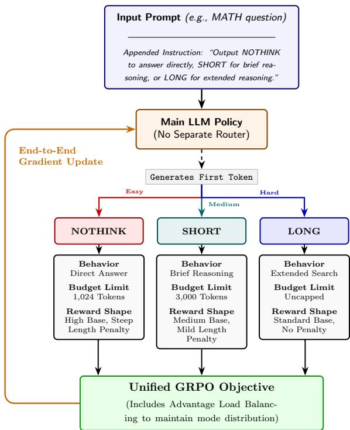  
Figure 1: Three-mode self-routing GRPO. The model emits a routing token (NoThink/Short/Long) as the first token of its response and then reasons under that mode’s shaped reward and hard token cap; the routing token is part of the main policy and is trained end-to-end by GRPO, with no separate router.

Reinforcement Learning with Verifiable Rewards (RLVR) has become the dominant paradigm for fine-tuning reason- ing models (Shao et al. 2024). Standard algorithms such as PPO (Schulman et al. 2017) and GRPO (Shao et al. 2024) operate with a single maximum response length applied uni- formly across all training samples. This couples two compet- ing ineficiencies: early in training, the model wastes com- pute generating long, incorrect traces; later, the same fixed ceiling can prevent the extended chains needed to solve gen- uinely hard problems. Recent analysis further suggests that

RLVR functions primarily as an elicitation mechanism, im- proving pass@k for small k but remaining bounded by the base model’s latent capability for large k (Yue et al. 2025).

A principled response to the length problem is temporal discounting: scaling reward by a per-token factor penalizes long rollouts directly, and discount-based variants of GRPO have been shown to shorten reasoning while preserving ac- curacy (Parthasarathi et al. 2025; Ayoub et al. 2025; Zhang and Zuo 2025; Yang et al. 2026). Discounting, however, is non-adaptive: it imposes a fixed length penalty regardless of a prompt’s dificulty or the response length its solution actually requires. An easy question and a hard question are pressured to be equally brief, even though the optimal reasoning budget difers. The natural next step is to let the model decide, per prompt, how much reasoning a problem warrants, applying brevity pressure only where it is justified.

We study this question directly. We ask a 1.5B distilled reasoning model to emit, as the very first token ofits response, one of three discrete routing decisions—NoThink, Short, or Long—and then to reason accordingly. The routing token is part of the main policy and receives gradient through the standard GRPO objective, there is no separate router network. The central dificulty is routing collapse: because the routing decision is a single self-reinforcing discrete token, a mode with even a small reward edge is sampled more, reinforced more, and quickly drives the alternatives out of the policy.

Our method overcomes collapse with two mechanisms working together. First, hard per-mode token caps make the modes distinct by construction, so the routing label can- not decouple from behavior. Second, a simple balance term added directly to the advantage, similar to the load-balancing penalties used to discourage expert collapse in Mixture-of- Experts routing (Fedus, Zoph, and Shazeer 2022), keeps the policy from settling on a single mode. A forced-rollout warmup stabilizes the early dynamics.

Our contributions are twofold. First, we show that a 1.5B reasoning model can be taught to route problems by dificulty, choosing among three reasoning modes as its first generated token, end-to-end inside GRPO, with no separate router and no supervised warm-up. Second, we show that this routing cuts the reasoning-token budget substantially while placing the policy on or above the accuracy–length Pareto frontier traced by the single-mode baselines — both in-distribution on MATH and on held-out benchmarks. As part of the anal- ysis, a negative result on the Countdown task explains when dificulty routing is and is not learnable.

## Related Work

## Reinforcement Learning for Reasoning

RL fine-tuning of LLMs (Yang et al. 2026) began with Proximal Policy Optimization (PPO), which uses a clipped surro-gate objective for stable updates (Schulman et al. 2017). To remove the memory overhead of PPO’s value network, Group Relative Policy Optimization (GRPO) computes advantages relative to a group of sampled responses (Shao et al. 2024). While eficient, GRPO carries optimization biases that recent work has sought to correct. Liu et al. (2025) identify a “length bias” arising from dividing each response’s loss by its token length, which systematically favors longer incorrect answers and drives “length explosion.” Their Dr. GRPO removes the two terms they hold responsible: the per-response length normalization in the loss and the within-group standard- deviation scaling of the advantage, yielding updates that no longer reward verbosity. DAPO (Yu et al. 2025) contributes two ingredients we adopt: a token-level loss aggregation that prevents long traces from being under-weighted, and the ob- servation that the KL penalty toward the reference policy is unnecessary—and indeed counterproductive—once the pol- icy is allowed to move far from its initialization during long- horizon reasoning RL.

## Discounting in GRPO

Because GRPO uses no value function, it normally carries no temporal discount, but a discount is a principled way to penalize length and several recent methods add one. They difer in where the discount appears , which changes the resulting group advantages substantially. The discounted- reasoning method (Ayoub et al. 2025) multiplies the se-quence reward by $\gamma ^ { K }$ , with K the reasoning-token count, before group normalization; this couples advantage magni- tude to absolute rollout length, so groups of long rollouts and groups of short rollouts are scaled diferently. GRPO- LEAD (Zhang and Zuo 2025) also shapes the reward before normalization, but standardizes length within the group via a z-score and adds dificulty-aware weighting, which makes the relative advantages comparable across groups regard- less of nominal length. GRPO-λ (Parthasarathi et al. 2025) instead applies its decay after normalization, tracing credit backward over token positions so that later tokens, which are often most important for answer, receive larger-magnitude updates while the sign is inherited from the group outcome. Our reward surface builds on the pre-normalization $\gamma ^ { K }$ for- mulation, but rather than applying one global discount we attach a separate base reward and discount to each reason- ing mode, turning a uniform length penalty into a per-mode incentive.

## Adaptive Reasoning-Mode Selection

A related line of work shortens reasoning by skipping or ab- breviating it according to problem dificulty, and the methods difer in how much training machinery they require. Adapt- Think (Zhang et al. 2025) and AutoThink (Tu et al. 2025) stay within pure RL—the former choosing between a full- reasoning and a no-reasoning mode via a constrained objective with importance sampling for cold start, the latter using a multi-stage curriculum—each roughly halving response length on DeepSeek-R1-Distill-Qwen-1.5B while preserving or improving accuracy. ARM (Wu et al. 2025) and Thinkless (Fang, Ma, and Wang 2025) instead pre-install the modes with a supervised stage before RL: ARM supervised-fine- tunes on data annotated in four formats (direct answer, short and long chain-of-thought, and code), and Thinkless distills a reasoning expert and an instruction expert into two control tokens, then runs RL with a decoupled objective so the lone control token is not swamped by the response tokens.

A dificulty shared by all of these methods is routing col- lapse: because the mode decision is a single discrete, self- reinforcing choice, a mode with even a small reward ad- vantage is sampled more, reinforced more, and drives the alternatives out of the policy. The all-one-mode states are stable under policy gradient while the mixed split is not, an efect that is stronger on a small distilled model with low output entropy and a strong prior to reason at length. The methods above stabilize the choice with importance sampling (AdaptThink), curriculum staging (AutoThink), or a supervised stage that pre-installs the modes (ARM, Thinkless). Ours is the leanest of these—no supervised or distillation stage, three modes learned end-to-end with RL—relying in- stead on a forced warmup, hard per-mode caps, and a balance penalty on the advantage to keep all modes alive.

## Preliminaries

## The GRPO Objective

GRPO optimizes a policy by sampling a group of G outputs $\{ o _ { 1 } , \ldots , o _ { G } \}$ for each prompt q from the current policy $\pi _ { \theta _ { \mathrm { o l d } } } .$ It replaces the critic with a group-relative advantage $A _ { i } ,$ obtained by normalizing rewards $r _ { i }$ within the group:

$$
A _ { i } = { \frac { r _ { i } - \operatorname* { m e a n } ( r _ { 1 } , \dots , r _ { G } ) } { \operatorname { s t d } ( r _ { 1 } , \dots , r _ { G } ) + \epsilon } } .\tag{1}
$$

The policy maximizes a clipped surrogate objective with a KL penalty,

$$
J _ { \mathrm { G R P O } } ( \theta ) = \mathbb { E } \Bigg [ \frac { 1 } { G } \sum _ { i = 1 } ^ { G } \frac { 1 } { N _ { i } } \sum _ { t = 1 } ^ { N _ { i } } \Big ( m _ { i , t } - \beta D _ { \mathrm { K L } } \Big ) \Bigg ] ,\tag{2}
$$

where $m _ { i , t } = \mathrm { m i n } \big ( \rho _ { i , t } A _ { i } , \ \mathrm { c l i p } ( \rho _ { i , t } , 1 - \epsilon , 1 + \epsilon ) A _ { i } \big )$ is the clipped surrogate term, $D _ { \mathrm { K L } } ~ = ~ D _ { \mathrm { K L } } ( \pi _ { \theta } \parallel \pi _ { \mathrm { r e f } } )$ , and $\rho _ { i , t } = \pi _ { \theta } ( o _ { i , t } \mid q , o _ { i , < t } ) / \pi _ { \theta _ { \mathrm { o l d } } } ( o _ { i , t } \mid q , o _ { i , < t } )$ is the token- level importance ratio, with ϵ the clipping threshold and $\beta$ the penalty strength toward a reference policy $\pi _ { \mathrm { r e f } }$

We set $\beta = 0$ throughout, removing the KL penalty en- tirely. The KL term keeps the policy close to the reference model: while this stabilizes ordinary RLHF, it limits the ex- ploration needed to find new reasoning strategies, and in long-horizon reasoning RL it becomes unnecessary and can be harmful (Yu et al. 2025). This matters more for routing, which requires the policy to explore new behaviors such as answering quickly or stopping its reasoning early, behaviors the distilled base model rarely produces; a term that anchors the policy to that base model would work against this explo- ration.

## Loss Aggregation

The advantage $A _ { i }$ is a sequence-level quantity, but the loss is summed over tokens, and how token losses are reduced to a scalar afects length dynamics. The default DeepSeek formulation (Shao et al. 2024) uses sequencemean, token-mean (SMTM) aggregation—averaging tokens within each sequence, then averaging across the group (the nested $\begin{array} { r } { \frac { 1 } { G } \sum _ { i } \frac { 1 ^ { \bullet } } { N _ { i } } \sum _ { t } } \end{array}$ in Eq. (2)). The inner $\frac { 1 } { N _ { i } }$ weights every sequence equally regardless of length, but as a side efect each token in a long sequence contributes a smaller gradi- ent than a token in a short one. We instead use token-mean aggregation (Yu et al. 2025), which normalizes by the total token count $\sum _ { i } N _ { i }$

$$
{ \cal L } _ { \mathrm { T M } } = \frac { 1 } { \sum _ { i = 1 } ^ { G } N _ { i } } \sum _ { i = 1 } ^ { G } \sum _ { t = 1 } ^ { N _ { i } } \ell _ { i , t } ,\tag{3}
$$

so every token carries the same weight regardless of its se- quence. This matters for routing, where the modes delib- erately produce responses of very diferent lengths: under SMTM the long-mode tokens would receive weaker gradi- ents than the brief-mode tokens, biasing learning away from the mode that handles the hardest problems.

## The Normalization-Amplification Problem

The discounted-reasoning formulation (Ayoub et al. 2025) multiplies the sequence reward by a per-token factor before normalization,

$$
R _ { i } = \gamma ^ { K _ { i } } r _ { i } ,\tag{4}
$$

with $K _ { i }$ the reasoning-token count and $\gamma \in ( 0 , 1 )$ , decaying reward as reasoning grows. This interacts badly with GRPO’s standard-deviation normalization. In vanilla GRPO a group with no reward variance e.g. all rollouts correct, produces all-zero advantages and no learning signal. The $\gamma ^ { \dot { K } }$ discount creates tiny reward diferences within such a group (longer correct responses score slightly lower), and the division by std in Eq. (1) amplifies these into full-magnitude advantages, comparable to those from a genuinely mixed group— diverting training toward small length optimizations instead of solving harder problems. We avoid this by removing the standard-deviation normalization entirely and keeping only mean-centering, so the advantage is simply $\hat { A } _ { i } = R _ { i } - \mu _ { g } ,$ proportional to the actual reward diferences; the small dif- ferences in an all-correct group then stay small.

## Method

Discounting applies the same penalty to every prompt. Our goal is to let the model allocate reasoning efort per prompt: skip reasoning when a problem is trivial, reason briefly when it is easy, and reason at length when it is hard. We realize this by having the model emit a discrete routing token as the first word of its response and conditioning both reward and a hard token budget on that choice. We first explored this idea with a two-mode (Short/Long) router on the Countdown task; it collapsed to a single mode because Countdown’s uni- form dificulty gives the router no accuracy gap to learn from (see the supplementary appendix). That negative result moti-vates the design below: hard per-mode token caps that make the modes behaviorally distinct, and evaluation on MATH, whose wide spread of dificulty gives routing something to learn.

## Three Modes with Hard Token Caps

We define three modes:

• NoThink: the model answers as quickly as possible, using little reasoning. It is not forced to skip reasoning and may still think briefly, but it is pushed toward a short answer; intended for the easiest problems.

• Short: the model reasons briefly within a hard token cap, intended for easy problems that benefit from a short trace.

• Long: the model reasons at length without a cap, intended for hard problems that need extended search.

The routing instruction appended to every prompt at runtime is: “Output NoThink to answer directly, Shortfor briefreasoning, or Long for extended reasoning.” The routing token sits in the response head and receives gradient like any other token; no data preprocessing is required.

The per-mode reward and its discount γ, defined in the next subsection, are the primary mechanism that separates the modes: they make each mode the reward-optimal choice over a diferent range of response lengths. The hard per- mode caps play two supporting roles. First, they keep the policy from collapsing onto a single mode: because a capped brief mode is scored wrong as soon as its answer runs past the cap, it genuinely fails on problems that need more to- kens, so Long always retains a reason to exist and the brief modes cannot quietly absorb hard problems. Second, they save compute during training, since rollouts in the capped modes generate far fewer tokens than uncapped reasoning. Concretely, a response whose final answer token falls be- yond its mode’s cap is scored incorrect regardless of content; the cap is enforced during generation. Default caps are 1,024 tokens for NoThink and 3,000 for Short; Long is uncapped.

## Reward Surface

Each mode has a base reward b and a per-token discount $\gamma$ on the number of tokens $L _ { i }$ generated after the routing token:

$$
r _ { i } = \left\{ \begin{array} { l l } { b _ { \mathrm { N T } } \gamma _ { \mathrm { N T } } ^ { L _ { i } } } & { \mathrm { c o r r e c t , N o T _ { H I N K } } } \\ { b _ { \mathrm { S } } \gamma _ { \mathrm { S } } ^ { L _ { i } } } & { \mathrm { c o r r e c t , S _ { H O R T } } } \\ { b _ { \mathrm { L } } } & { \mathrm { c o r r e c t , L o N } } \\ { 0 . 0 } & { \mathrm { i n c o r r e c t , v a l i d r o u t i n g } } \\ { - 0 . 5 } & { \mathrm { r o u t i n g ~ t o k e n ~ a b s e n t } . } \end{array} \right.\tag{5}
$$

The discounts $\gamma _ { \mathrm { N T } }$ and $\gamma _ { \mathsf { S } }$ are set so that each mode is the reward-optimal choice over the length range it is designed for, with the crossover between adjacent modes falling at or below the cap of the briefer one. With bases $b _ { \mathrm { N T } } = 1 . 3 , b _ { \mathrm { S } } = 1 . 2 $ $b _ { \mathrm { L } } = 1 . 0 $ , the NoThink/Short crossover falls at $L \approx 8 0 0$ and the Short/Long crossover at $L \approx 3 0 0 0$ , the Short cap. Table 3 lists the resulting rewards and Figure 9 plots the curves, the two crossovers marking where the optimal mode changes.

## Advantage Estimation and the Balance Term

We use GRPO mean-centering across the group but dis- able standard-deviation normalization, for the reason given in Section : the bases in Eq. (7) are intentionally heteroge-neous across modes, and normalizing by within-group std would amplify the small reward diferences that arise when all rollouts are correct.

Mean-centering cancels any signal injected at the reward level when a group is unmixed (all rollouts pick the same mode), which is the regime in which collapse occurs. To keep pressure toward a balanced split, we add a simple correction directly to the advantage, after centering:

Table 1: Correct-answer reward by mode at selected response lengths $L ,$ under default bases and caps. Crossovers occur where two modes tie (bold).
<table><tr><td> $L$ </td><td>NoTHINK</td><td>SHORT</td><td>LONG</td></tr><tr><td>0</td><td>1.30</td><td>1.20</td><td>1.00</td></tr><tr><td>256</td><td>1.25</td><td>1.18</td><td>1.00</td></tr><tr><td>800</td><td>1.14</td><td>1.14</td><td>1.00</td></tr><tr><td>3000</td><td>0.80</td><td>1.00</td><td>1.00</td></tr><tr><td>8192</td><td>0.35</td><td>0.73</td><td>1.00</td></tr></table>

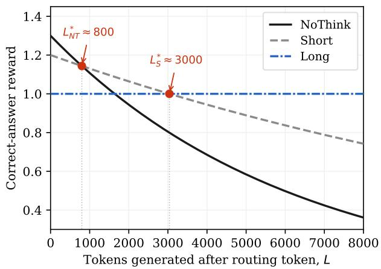  
Figure 2: Correct-answer reward for each mode as a function of the number of tokens L generated after the routing token, under the bases and caps of Table 4. NoThink $( 1 . 3 \bar { \gamma } _ { \mathrm { N T } } ^ { L } )$ and Short $( 1 . 2 \gamma _ { \mathrm { S } } ^ { L } )$ decay with length while Long is flat at 1.0. The discounts place the crossovers at $L _ { \mathrm { N T } } ^ { * }$ ≈ 800 (NoThink/Short) and $L _ { \mathrm { S } } ^ { \ast } \approx 3 0 0 0$ (Short/Long), at or below the mode caps. Each mode is reward-optimal in its own length band.

$$
\hat { A } _ { i } \gets A _ { i } + \beta _ { \mathrm { b a l } } \big ( p ^ { \star } - f _ { \mathrm { m o d e } ( i ) } \big ) ,\tag{6}
$$

where $f _ { \mathrm { m o d e } }$ is the fraction of free rollouts choosing that mode, $p ^ { \star } = 1 / 3$ is the target share, and $\beta _ { \mathrm { b a l } }$ is the balance co- eficient. A mode that is over-represented (its fraction above $p ^ { \star } )$ has its advantage reduced, while an under-represented mode has its advantage raised. To keep the balance term from distorting the accuracy signal, we apply it asymmetrically by outcome: a negative correction (for an over-represented mode) is applied only to incorrect rollouts, and a positive correction (for an under-represented mode) only to correct rollouts. Balancing therefore never penalizes a correct an- swer or rewards an incorrect one; it redistributes routing mass only in the direction that is consistent with the reward. Because this correction is folded into the advantage, it enters the policy-gradient loss directly rather than as a separate aux- iliary load-balancing loss (Fedus, Zoph, and Shazeer 2022). Because the balance term is added after mean-centering, it remains efective in zero reward variance or routing variance groups.

Algorithm 1 Three-Mode Self-Routing GRPO (one step)   
Input: prompts {q}, policy πθ, step s, caps CNT, CS   
Parameter: bases b, discounts $\gamma , \beta _ { \mathrm { b a l } } , p ^ { \star }$   
1: Append routing instruction to each q   
2: if $s \leq$ warmup\_steps then   
3: Force 1 rollout per mode; remaining free; promote   
token   
4: else   
5: Sample G free rollouts per prompt   
6: end if   
7: Detect mode from first response token; apply caps   
8: Compute rewards by Eq. (7)   
9: Mean-center advantages (no std-normalization)   
10: Add balance term, Eq. (9), over free rollouts   
11: Update $\pi _ { \theta }$ with the GRPO objective, Eq. (2)

## Warmup

The base model never emits a routing token unprompted, because the chat template prefills <think> and the model proceeds directly to reasoning. For the first warmup\_steps training steps we therefore force two rollout per group into each of NoThink, Short, and Long, generating the remain- ing rollouts freely, and we promote the forced routing token into the response head so that gradient flows through the routing position from the first step.Together with the penalty given to all rollouts that have no routing token, causes the model to quickly learn to route. After warmup, all rollouts are generated freely. Algorithm 1 summarizes one training step. Hyper-parameters used can be found in the supplementary appendix.

## Experimental Setup

Datasets and base model. We train on the MATH- lighteval split of competition mathematics problems with verifiable final answers (Hendr cks et al. 2021) and validate on the held-out MATH-500 set (Lightman et al. 2024) at temperature 0.6. A response is correct if its final answer matches the reference, giving a binary reward (r = 1 correct, $r ~ = ~ 0$ otherwise) on which the routing shaping of Eq. (7) is applied. For out-of-distribution evaluation we use GSM8K (Cobbe et al. 2021) (1,319 grade-school word problems, avg@5) and AIME 2024 and 2025 (30 competition problems each, avg@16). The preliminary binary-routing study uses the Countdown task (Sun, Fulop, and Li 2025); see the supplementary appendix.

We use DeepSeek-R1-Distill-Qwen-1.5B (Guo et al. 2025), a 1.5B-parameter reasoning model distilled from DeepSeek-R1 on roughly 800K high-quality traces.

Training. We run GRPO with group size $G = 8$ for 90 steps from a cold start, with a 16,384-token context cap, on 4 NVIDIA H100 GPUs; hyperparameters are in Table 4. We train three seeds of the router and of each single-mode baseline, reporting mean ± std over seeds throughout.

Single-mode baselines. To separate adaptive routing from any single mode, we train three ablations in which every rollout is forced to one mode (NoThink-, Short-, or Longonly), with the same data and hyperparameters but no routing token, balance term, or free rollouts; each learns a fixed reasoning budget against which the router is compared on the accuracy versus length plane (Figure 6).

Evaluation. We report MATH-500 validation accuracy, the free-rollout mode distribution and routing entropy, per- mode accuracy, and mean response length. Validation gener- ation is uncapped, measuring production behavior under free generation.

## Experimental Results

Through the experiments we would like to answer three ques- tions: (1) Stability: can three reasoning modes be learned endto-end inside GRPO without collapsing to a single mode? (2) Meaningfulness: does the learned routing sort problems by dificulty, rather than partitioning them arbitrarily? (3) Efficiency: what accuracy and token cost does routing deliver compared to fixed reasoning budgets, and does it transfer be- ond the training distribution? The three subsections below address these questions in turn.

## Three Modes Emerge and Persist

Figure 3 traces the free-rollout mode distribution over train- ing. During the forced warmup free rollouts are almost entirely unknown, with the first routing tokens appearing around step 20. Once routing is free the model at first com- mits heavily to Long, then the brief modes grow as the balance term takes efect, and by step 90 the split settles near 20/32/47% (NoThink/Short/Long), with routing entropy close to the theoretical maximum (H ≈ 1.04 vs. ln $3 \approx 1 . 1 0 )$ . All three modes persist to the end of train- ing across all seeds, with Long remaining the plurality and no collapse into any single mode.

## Routing Reflects Problem Dificulty

Two independent pieces of evidence show the routing is semantically meaningful rather than an arbitrary partition. The first is the inversion of per-mode accuracy over train- ing (Figure 4). Early on, the forced rollouts reproduce the base model’s prior ordering Long > Short > NoThink, reflecting a model that reasons at length by default. Around step 50 this ordering inverts: NoThink and Short rise above Long and stay there across all seeds, ending well above it at the final checkpoint. Easy problems are being assigned to the brief modes while hard problems concentrate in Long, whose lower accuracy reflects genuine dificulty rather than mode inferiority. Consistently, the Long mean length grows markedly over training while NoThink and Short stay well within their caps.

The second is agreement with an external dificulty signal the model never saw in training: the MATH-500 dificulty levels from 1 (easiest) to 5 (hardest). Figure 5 shows the free-validation routing split per level, and the trend is monotone: NoThink carries most of the easiest level but little of the hardest, Long does the reverse, and Short is most used at intermediate dificulty, where a brief trace is most useful. Per- level accurac falls steadil with level, confirmin the labels track real dificulty. The router therefore allocates reasoning budget in proportion to dificulty, using the cheap modes on easy levels for large token savings and reserving Long for the hard ones.

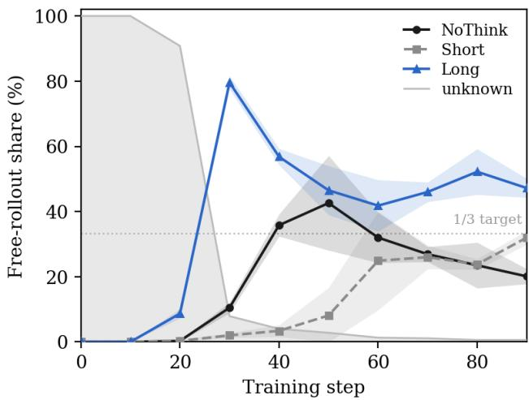  
Figure 3: Free-rollout mode shares over training, mean over three seeds (the forced warmup runs to step 45). After warmup all three modes persist without collapsing to any single mode, with Long remaining the plurality.

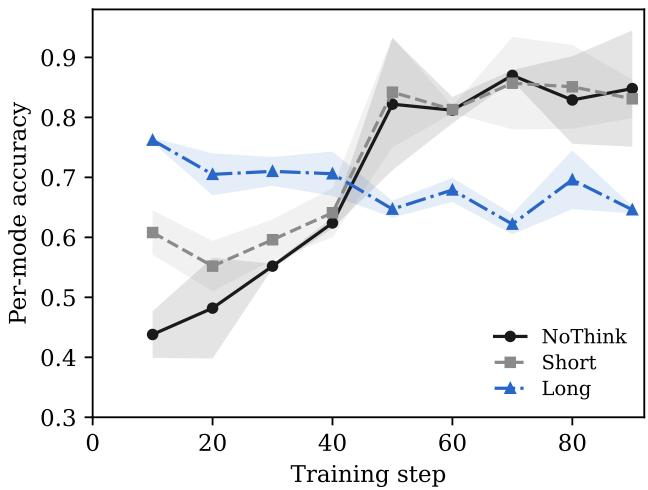  
Figure 4: Per-mode accuracy over training (mean, with std bands, over three seeds). The forced base-model ordering (Long > Short > NoThink) inverts around step 50, evidence that the router assigns problems by dificulty: brief modes get easier problems and Long concentrates the hard ones.

## Token Eficiency, In and Out of Distribution

We evaluate eficiency in two regimes. In-distribution refers to MATH-500: held out from training but drawn from the same competition-mathematics distribution as the MATH- lighteval training split. Out-of-distribution refers to GSM8K and AIME, datasets the model never trained on that sit at opposite ends of the dificulty range, far easier and far harder than the training data respectively; they test whether the rout- ing itself transfers.

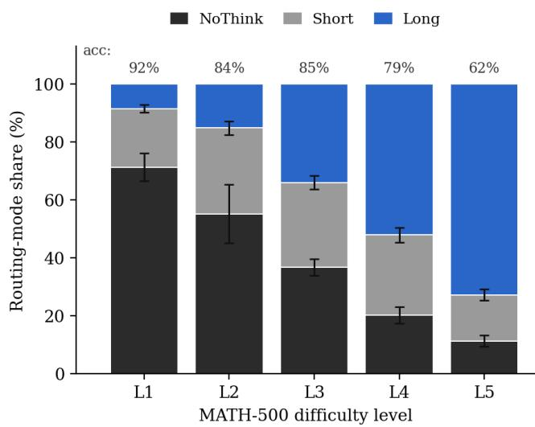  
Figure 5: Free-validation routing split (NoThink / Short / Long) by MATH-500 dificulty level, with per-level accuracy above each bar. Mass shifts from NoThink on easy levels to Long on hard ones, with Short most used at intermediate dificulty.

Table 2 reports MATH validation accuracy over training. Accuracy does not rise above the base model: it dips while routing is being established and recovers to 0.783 by step 90, close to the untrained model’s 0.807. The gain is in eficiency: on MATH-500 the router reaches this accuracy at 2,811 tokens on average, 41% fewer than the base (Figure 6). The reduction is established early, when the brief modes absorb the easy problems, and is then partly ofset as Long responses lengthen toward the context limit. At the final checkpoint the per-mode validation accuracies reproduce the training order- ing, so the brief modes are reliably selected for problems the model can solve briefly.

Figure 6 places all methods on the accuracy versus length plane. The single-mode baselines trace a Pareto frontier of fixed reasoning budgets, and free routing lies strictly above it: it reaches an accuracy that the frontier only attains with 27% more tokens, while also sitting slightly higher than the frontier at its own length. In other words, the saving holds not only against the base model but against the frontier traced by the three single-mode baselines, consistent with the router al- locating length per problem. Notably, Long-only itself dom- inates the untrained base, so training helps even under full reasoning.

To test transfer beyond the training distribution, we eval- uate all methods on GSM8K (Cobbe et al. 2021) (avg@5) and AIME 2024 and 2025 (avg@16, since the small 30- problem sets are too noisy for a single pass), under the same temperature, prompt, and answer extraction (Figure 7). Two findings stand out. First, the token savings track dificulty. On

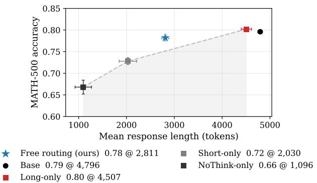  
Figure 6: Accuracy versus response length on MATH-500 (mean over three seeds; error bars: std on both axes). The dashed line traces the Pareto frontier of the single-mode baselines (shaded: on or below the frontier). Free routing (ours) lands strictly above it. Up and to the left is better.

Table 2: MATH validation accuracy over training (free routing), mean ± std over three seeds, at the checkpoints where all three seeds were evaluated. Step 0 is the untrained base under the routing prompt: accuracy dips while routing is be- ing established, then recovers.
<table><tr><td>Step</td><td>0</td><td>30</td><td>60</td><td>90</td></tr><tr><td>Accuracy</td><td>0.807</td><td>0.727</td><td>0.764</td><td>0.783</td></tr><tr><td></td><td>±0.003</td><td>±0.012</td><td>±0.016</td><td>±0.015</td></tr><tr><td>∆ vs. step 0</td><td></td><td>-0.080</td><td>-0.043</td><td>-0.024</td></tr></table>

GSM8K, dominated by easy problems, free routing again lies strictly above the frontier: it slightly exceeds the accuracy of the brief fixed modes at comparable length, using 44% fewer tokens than the frontier requires to reach its accuracy and 76% fewer than the base. On AIME, where nearly all problems require extended reasoning, the router correctly declines to cut budget: it matches the frontier’s accuracy at compara- ble length, still 12% shorter than the base. The router thus saves the most where problems are heterogeneous enough for adaptive allocation to matter, and preserves budget where they are not. Second, full-reasoning training helps even at fixed length: Long-only matches or slightly exceeds the base on all three benchmarks at fewer tokens, and free routing then trades a little of that accuracy for a large reduction in length.

## Discussion and Conclusion

We presented three-mode self-routing for GRPO, in which a reasoning model chooses whether to answer quickly, rea- son briefly, or reason at length by emitting a single routing token. On a small distilled model the reward alone cannot enforce this choice: nothing prevents the policy from emit- ting a brief-mode token and then reasoning at length, so the label decouples from behavior and one mode takes over, exactly the failure of the two-mode Countdown precursor (in the supplementary appendix). Hard per-mode caps lock the label to behavior and create the genuine accuracy gap the router learns from, while the per-mode discounted re- ward, balance penalty, and forced warmup keep all three modes alive; together they overcome the collapse that de- feats reward-shaping-only designs.

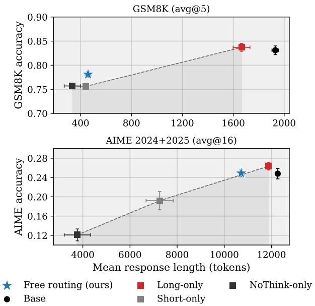  
Figure 7: Out-of-distribution accuracy versus response length on GSM8K (top) and AIME 2024+2025 (bottom); er-ror bars: std on both axes. Dashed line and shading as in Fig- ure 6. The above-frontier behavior seen in-distribution trans- fers zero-shot: free routing exceeds the frontier on GSM8K and matches it on AIME, where nearly all problems demand long reasoning.

The resulting policy routes problems by dificulty, holding validation accuracy near the base model while cutting mean response lengthsubstantially on every benchmark. Routing is best understood as a token-eficiency mechanism, not an ac- curacy mechanism: in the length/accuracy plane it does not only trade accuracy for tokens but pushes the whole trade-of outward. On two of the three datasets — MATH-500 (Fig- ure 6) and GSM8K (Figure 7) — free routing sits clearly above the Pareto front traced by the single-mode baselines, delivering more accuracy per token than any fixed mode. On the third, AIME (Figure 7), whose problems genuinely re-quire extended reasoning, the router sends nearly everything to Long and the policy lands on the Pareto front.

Limitations and future work. The results cover three seeds of one 1.5B model on one mathematical training distri- bution. The mode caps are task-specific and must be matched to the target task’s length distribution, and uncapped valida- tion makes brief-mode accuracy marginally optimistic rela- tive to the trained objective. The most important next step is therefore breadth: establishing the mechanism on a wider range of mathematical benchmarks and then beyond math- ematics, wherever problems difer in how much reasoning they require such as code generation, agentic and tool-use settings, etc.

## References

Agentica Team. 2025. DeepScaleR: Surpassing O1-Preview with a 1.5B Model by Scaling RL. https://agentica.org/ deepscaler. Accessed: 2026-06-17.

Ayoub, A.; Asadi, K.; Schuurmans, D.; Szepesvári, C.; and Bouyarmane, K. 2025. Learning to Reason Eficiently with Discounted Reinforcement Learning. arXiv:2510.23486.

Chen, X.; Xu, J.; Liang, T.; He, Z.; Pang, J.; Yu, D.; Song, L.; Liu, Q.; Zhou, M.; Zhang, Z.; et al. 2024. Do not think that much for 2+ 3=? on the overthinking of o1-like llms. arXiv preprint arXiv:2412.21187.

Cobbe, K.; Kosaraju, V.; Bavarian, M.; Chen, M.; Jun, H.; Kaiser, L.; Plappert, M.; Tworek, J.; Hilton, J.; Nakano, R.; Hesse, C.; and Schulman, J. 2021. Training Verifiers to Solve Math Word Problems. arXiv preprint arXiv:2110.14168.

Fang, G.; Ma, X.; and Wang, X. 2025. Thinkless: LLM Learns When to Think. arXiv preprint arXiv:2505.13379.

Fedus, W.; Zoph, B.; and Shazeer, N. 2022. Switch Trans- formers: Scaling to Trillion Parameter Models with Simple and Eficient Sparsity. Journal of Machine Learning Research, 23(120): 1–39.

Guo, D.; Yang, D.; Zhang, H.; Song, J.; Zhang, R.; Xu, R.; Zhu, Q.; Ma, S.; Wang, P.; Bi, X.; et al. 2025. DeepSeek-R1: Incentivizing Reasoning Capability in LLMs via Reinforce- ment Learning. arXiv preprint arXiv:2501.12948.

Hendrycks, D.; Burns, C.; Kadavath, S.; Arora, A.; Basart, S.; Tang, E.; Song, D.; and Steinhardt, J. 2021. Measuring Mathematical Problem Solving with the MATH Dataset. In Proceedings of the Neural Information Processing Systems Track on Datasets and Benchmarks.

Lightman, H.; Kosaraju, V.; Burda, Y.; Edwards, H.; Baker, B.; Lee, T.; Leike, J.; Schulman, J.; Sutskever, I.; and Cobbe, K. 2024. Let’s verify step by step. In International Con- ference on Learning Representations, volume 2024, 39578– 39601.

Liu, Z.; Chen, C.; Li, W.; Qi, P.; Pang, T.; Du, C.; Lee, W. S.; and Lin, M. 2025. Understanding R1-Zero-Like Training: A Critical Perspective. arXiv:2503.20783.

Parthasarathi, P.; Reymond, M.; Chen, B.; Cui, Y.; and Chan- dar, S. 2025. GRPO-λ: Credit Assignment Improves LLM Reasoning. arXiv:2510.00194.

Schulman, J.; Wolski, F.; Dhariwal, P.; Radford, A.; and Klimov, O. 2017. Proximal Policy Optimization Algorithms. arXiv:1707.06347.

Shao, Z.; Wang, P.; Zhu, Q.; Xu, R.; Song, J.; Bi, X.; Zhang, H.; Zhang, M.; Li, Y. K.; Wu, Y.; and Guo, D. 2024. DeepSeekMath: Pushing the Limits of Mathematical Rea- soning in Open Language Models. arXiv:2402.03300.

Sun, C.; Fulop, D.; and Li, X. 2025. Countdown to Bril- liance: Evolving Math Reasoning through Train and Test Time Compute. Stanford CS224R Final Report. Uses the Jiayi-Pan Countdown-Tasks-3to4 dataset.

Tu, S.; Lin, J.; Zhang, Q.; Tian, X.; Li, L.; Lan, X.; and Zhao, D. 2025. Learning When to Think: Shaping Adaptive Reasoning in R1-Style Models via Multi-Stage RL. arXiv preprint arXiv:2505.10832.

Wei, J.; Wang, X.; Schuurmans, D.; Bosma, M.; Ichter, B.; Xia, F.; Chi, E.; Le, Q.; and Zhou, D. 2022. Chain-of-Thought Prompting Elicits Reasoning in Large Language Models. Advances in Neural Information Processing Systems, 35: 24824–24837.

Wu, S.; Xie, J.; Zhang, Y.; Chen, A.; Zhang, K.; Su, Y.; and Xiao, Y. 2025. ARM: Adaptive Reasoning Model. arXiv:2505.20258.

Yang, Z.; Jiang, Y.; Chen, T.-C.; Yang, L.; Wong, A.; Gao, C.; Kooi, J. E.; Li, Z.; Shi, J.; Qiu, K.; Huang, Q.; Zu, X.; Yang, S.; Zhang, H.; Wong, N.; Ilievski, F.; Yu, S.; Plaat, A.; Ren, Z.; Hoogendoorn, M.; and François-Lavet, V. 2026. Modularized Reinforcement Learning on LLMs: From MDP Creation to Exploration and Learning. arXiv:2606.21943.

Yu, Q.; Zhang, Z.; Zhu, R.; Yuan, Y.; Zuo, X.; Yue, Y.; Fan, T.; Liu, G.; Liu, L.; Liu, X.; et al. 2025. DAPO: An Open-Source LLM Reinforcement Learning System at Scale. arXiv:2503.14476.

Yue, Y.; Chen, Z.; Lu, R.; Zhao, A.; Wang, Z.; Yue, Y.; Song, S.; and Huang, G. 2025. Does Reinforcement Learning Really Incentivize Reasoning Capacity in LLMs Beyond the Base Model? arXiv:2504.13837.

Zhang, J.; Lin, N.; Hou, L.; Feng, L.; and Li, J. 2025. Adapt- Think: Reasoning Models Can Learn When to Think. arXiv preprint arXiv:2505.13417.

Zhang, J.; and Zuo, C. 2025. GRPO-LEAD: A Dificulty- Aware Reinforcement Learning Approach for Concise Math- ematical Reasoning in Language Models. arXiv:2504.09696.

Zhang, Y.; Das, S. S. S.; and Zhang, R. 2024. Verbosity Is Not Veracity: Demystify Verbosity Compensation Behavior of Large Language Models. arXiv preprint arXiv:2411.07858.

## Appendix

This appendix (i) documents the Countdown negative result that motivated the hard per-mode caps (App. A); (ii) de-rives the reward surface, advantage estimator, balance term, and rollout protocol (App. B); (iii) lists the full hyperparameters and training schedule (App. C); and (iv) reports per-benchmark and per-mode results (App. D). All numbers are the mean over three seeds; ± values and error bars are standard deviations across seeds.

## A Binary Self-Routing on Countdown (Negative Result)

A binary self-routing attempt on Countdown, whose collapse motivated the hard per-mode caps, preceded the MATH re- sults. Countdown asks the model to combine given numbers with the four operators (each used once) to reach a target; instances have two dificulty levels and a binary verifiable re- ward. We use DeepSeek-R1-Distill-Qwen-1.5B throughout.

We first attempted self-routing with two modes, Short and Long: a correct Short response earned a premium $b _ { S } > b _ { L }$ eroded by a per-token discount, while a correct Long earned a flat $b _ { L } .$ , defining a crossover length below which Short pays and above which Long pays (Fig. 8).

This failed, for a reason in the task rather than the con- stants. For routing to be learnable the modes must difer in value on some problems — there must be prompts a longer budget solves and a shorter one does not. On Countdown that set is essentially empty: correct solutions are short at both levels (≈ 300 tokens), and unsolved instances are not rescued by more tokens (the model exhausts useful search, not length). Forcing the modes apart with a hard cap left their per-level accuracy nearly identical.

Empirically the binary router collapsed within 30–50 steps in every configuration; the direction was set by the constants (no premium → Long; too large a premium → Short), and neither a larger balance coeficient nor intermediate premi- ums held the split. The routing label stayed decoupled from behavior: even when Short dominated its mean length sat near 1,000 tokens — the same as Long— so the crossover never took efect. This is exactly why the three-mode method adds hard per-mode caps: a capped brief mode is scored wrong once its answer runs past the cap, so the label cannot decouple from behavior and Long always retains a reason to exist. It also motivated moving to MATH, whose dificulty spread gives routing something to learn.

## B Method Details

## Reward surface and crossover placement

Let L be the number of tokens generated after the routing token. Each mode m has a base $b _ { m }$ and per-token discount $\gamma _ { m } \in ( 0 , 1 ] $ ; a correct answer scores $b _ { m } \gamma _ { m } ^ { L }$

$$
r _ { i } = \left\{ \begin{array} { l l } { b _ { N T } \gamma _ { N T } ^ { L _ { i } } } & { \mathrm { c o r r e c t , N o T _ { H I N K } , } } \\ { b _ { S } \gamma _ { S } ^ { L _ { i } } } & { \mathrm { c o r r e c t , S _ { H O R T } , } } \\ { b _ { L } \gamma _ { L } ^ { L _ { i } } } & { \mathrm { c o r r e c t , L o N g } \left( \gamma _ { L } = 1 \right) , } \\ { 0 } & { \mathrm { i n c o r r e c t , v a l i d r o u t i n g , } } \\ { - 0 . 5 } & { \mathrm { r o u t i n g ~ t o k e n ~ a b s e n t / i n v a l i d . } } \end{array} \right.\tag{7}
$$

Binary Countdown router: the crossover never bites (schematic)  
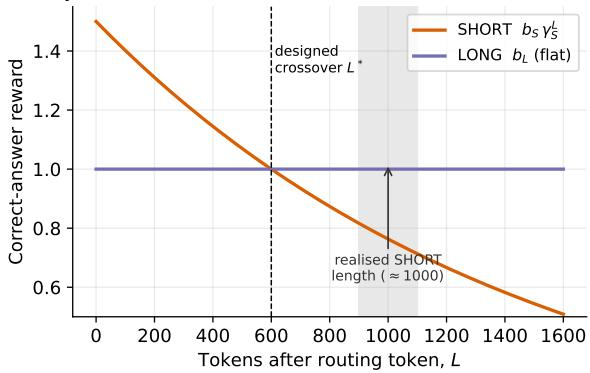  
Figure 8: Schematic two-mode Countdown reward surface. The realised Short length (≈1,000, grey band) sat well past the designed crossover $L ^ { * }$ , so Short and Long produced near-identical traces and the crossover never biased routing.

Table 3: Correct-answer reward by mode at selected lengths L. Crossovers (bold) mark where the optimal mode changes.
<table><tr><td> $L$ </td><td>NoTHINK</td><td>SHORT</td><td>LONG</td></tr><tr><td>0</td><td>1.30</td><td>1.20</td><td>1.00</td></tr><tr><td>256</td><td>1.25</td><td>1.18</td><td>1.00</td></tr><tr><td>800</td><td>1.14</td><td>1.14</td><td>1.00</td></tr><tr><td>3000</td><td>0.80</td><td>1.00</td><td>1.00</td></tr><tr><td>8192</td><td>0.35</td><td>0.73</td><td>1.00</td></tr></table>

The convention is $\gamma ^ { L }$ , not $e ^ { - \alpha L }$ . To place the crossover be- tween adjacent modes at the cap of the briefer one, solve $b _ { S } \gamma _ { S } ^ { C _ { S } } = b _ { L }$ and $b _ { N T } \gamma _ { N T } ^ { C _ { N T } } = \bar { b _ { S } } \gamma _ { S } ^ { C _ { N T } }$

$$
\begin{array} { r } { \gamma _ { S } = \left( \frac { b _ { L } } { b _ { S } } \right) ^ { 1 / C _ { S } } , \quad \gamma _ { N T } = \gamma _ { S } \left( \frac { b _ { S } } { b _ { N T } } \right) ^ { 1 / C _ { N T } } . } \end{array}\tag{8}
$$

With $b _ { N T } / b _ { S } / b _ { L } \ = \ 1 . 3 / 1 . 2 / 1 . 0$ and caps $C _ { N T } / C _ { S } ~ =$ 1024/3000 this gives γNT ≈ 0.99984, γS ≈ 0.99994 and crossovers $L _ { N T } ^ { * } \approx 8 0 0$ $L _ { S } ^ { * } \approx 3 0 0 0$ (Fig. 9, Table 3). Each mode is thus reward-optimal over exactly one length band.

## Advantage estimation

We use GRPO mean-centering without std-normalization, $\hat { A } _ { i } = R _ { i } - \mu _ { g }$ . The bases in Eq. (7) are heterogeneous across modes; dividing by the within-group std would am- plify the tiny reward diferences that arise when all roll- outs in a group are correct into full-magnitude advantages (a normalization-amplification pathology, since longer correct traces score slightly lower). Invalid-routing rollouts take the constant −0.5 penalty. Their inclusion in the group mean is a deliberate choice: the downward drag they exert gives every forced routing token a positive advantage during warmup, which is what bootstraps routing-word emission; once rout- ing exists the caps and balance term carry the signal.

## Balance term

Mean-centering cancels any reward-level signal in an un- mixed group (all rollouts pick the same mode) — precisely

Phase-1 reward surface (run gammas); each mode wins one band  
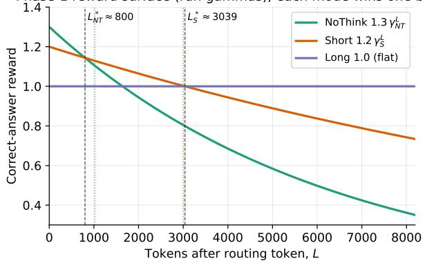  
Figure 9: Reward surface with the run gammas. Dashed ver- ticals mark the analytic crossovers; dotted verticals the per- mode caps.

the collapse regime. We therefore add a correction to the advantage, after centering:

$$
\hat { A } _ { i }  \hat { A } _ { i } + \beta _ { \mathrm { b a l } } \big ( p ^ { \star } - f _ { \mathrm { m o d e } ( i ) } \big ) ,\tag{9}
$$

where $f _ { \mathrm { m o d e } }$ is the fraction of free rollouts choosing that mode and $p ^ { \star } = 1 / 3$ . Over-represented modes are nudged down, under-represented up. The fractions and nudge cover free rollouts only (forced rollouts are balanced by construction and would dilute the signal during warmup). Two gates keep the term consistent with the reward: an encourage (positive) nudge is applied only to correct rollouts and a discourage (negative) nudge only to incorrect ones, so balancing never rewards a wrong answer nor penalizes a right one; and a wrong Long attempt is exempted, since Long handles the hardest problems and discouraging it there would push hard problems away from it. $\beta _ { \mathrm { b a l } }$ is annealed to 0 once routing is established, to verify the split is calibrated to dificulty rather than held at $1 / 3$ by the term.

## Rollout protocol and warmup

The base model never emits a routing token unprompted (the chat template prefills <think>), so generation runs in phases. During warmup $( \lfloor n / 4 \rfloor$ rollouts per mode areforced — the routing question and that mode’s token are appended after the assistant prefix so vLLM generates in-mode — and the rest are free; after warmup all n are free. After a forced generation the routing token sits at the prompt tail; we promote it into the response head so it receives gradient like any generated token (with $P$ the prompt, Q the routing question, t the routing token):

$$
[ P \mid Q \mid t ] \parallel \mathrm { g e n }  [ P \mid Q ] \parallel [ t \mid \mathrm { g e n } ] .
$$

Together with the −0.5 penalty on rollouts that emit no routing token, this teaches the model to emit the routing word itself; the first free routing tokens appear around step 20.

## Mode detection and per-mode caps

The mode is read from the leading tokens of each response, token-id first (exact match, reliable for the promoted forced tokens) with a prefix-regex fallback for free spelling variants; matching is a prefix match with no trailing word boundary, so continuations such as “LongI need. . . ” are not misread. Per- mode caps are applied before reward and training: a response whose answer falls beyond its mode’s cap is masked and scored wrong, creating the capability gap the router learns from. The cap counts tokens after the routing token (matching L), and forced labels are trusted rather than re-detected. Validation is uncapped, measuring production behavior — which makes brief-mode validation accuracy marginally op- timistic relative to the capped objective.

## C Experimental Details and Hyperparameters

Datasets, model, evaluation. We train on the MATH- lighteval split and validate on held-out MATH-500; a re- sponse is correct if its extracted final answer matches the reference (binary reward), on which Eq. (7) is applied. Outof-distribution evaluation uses GSM8K (1,319 problems, avg@5) and AIME 2024+2025 (30 each, avg@16), under the same temperature (0.6), prompt, and extraction. The base model is DeepSeek-R1-Distill-Qwen-1.5B. We train three seeds of the router and of each single-mode baseline; the latter force every rollout into one mode with the same data and hyperparameters but no routing token, balance term, or free rollouts.

Hyperparameters and schedule. Table 4 lists the settings used. Training runs in two configurations: phase 1 (steps $0  6 0 )$ uses the shaped bases/gammas with the balance coeficient annealed to 0 over steps 60 → 85; phase 2 (60 → 90) flattens the reward (all bases 1.0, all $\gamma = 1 . 0 )$ , so mode separation is then maintained by the hard caps and the balance term alone — a test that the split does not depend on the reward gradient once routing exists.

## D Supplementary Results

Per-benchmark accuracy and length. Table 5 reports fi- nal accuracy and mean length for the router, the three single- mode baselines, and the untrained base. The router stays within one to two points of the base and the Long-only ceil- ing while cutting length sharply, and the saving scales with benchmark easiness (Table 6): 4.2× on GSM8K, 1.7× on MATH-500, and 1.1× on AIME, whose problems genuinely require extended reasoning. The mechanism is visible in the realised length (Fig. 10): the router’s mean length collapses onto the NoThink-only anchor on the easy GSM8K and onto the Long-only anchor on the hard AIME, with MATH-500 in between — i.e. it sends nearly all of GSM8K to NoThink and nearly all of AIME to Long, dificulty-adaptive out of distribution. Accuracy dips while routing is established and recovers by step $9 0 ( \mathrm { 0 . 8 0 \dot { 7 } } \mathrm {  0 . 7 2 7 } \mathrm {  0 . \dot { 7 } 6 4 } \mathrm {  0 . 7 8 3 }$ at steps $0 / 3 0 / 6 0 / 9 0 ) $ ; routing is a token-eficiency mechanism, not an accuracy one.

Training dynamics. Figure 11 traces the quantities behind the stability and meaningfulness claims. By step 90 the free split settles near $2 0 / 3 2 \bar { / 4 } 7 \%$ (NoThink/Short/Long) with routing entropy $H \approx 1$ .04 against the maximum ln 3 ≈ 1.10;

Table 4: Hyperparameters for three-mode self-routing GRPO. Phase 2 flattens the reward; caps and balance keep the modes distinct.
<table><tr><td>Parameter Bases  $b _ { N T } / b _ { S } / b _ { L } ~ ( \mathrm { p h a s e } ~ 1 )$ </td><td>Value</td></tr><tr><td>Discounts  $\gamma _ { N T } / \gamma _ { S } / \gamma _ { L }$  Caps  $C _ { N T } / C _ { S } / \mathrm { c o n t e x t }$  Wrong / absent-routing penalty Std-normalization Balance coef. / target Balance anneal (start/end) Group size G Warmup steps Train batch (prompts)</td><td> $1 . 3 / 1 . 2 / 1 . 0$   $0 . 9 9 9 8 \dot { 4 } / 0 . 9 9 9 9 4 / 1 . 0$   $1 0 2 4 / 3 0 0 0 / 1 6 3 8 \dot { 4 }$   $0 . 0 / - 0 . 5$   $\mathrm { d i s a b l e d }$   $1 . 0 / 1 / 3$   $6 0 / 8 5 \stackrel { \cdot } {  } 0$  8 45 128 32/8</td></tr></table>

all three modes persist across seeds, Long remaining the plu- rality and lengthening toward the context limit while the brief modes stay within their caps. Finally, though the model never sees the MATH-500 dificulty levels in training, the free- validation routing split is monotone in them and sharpens over training (Fig. 12) — independent evidence that routing tracks real dificulty.

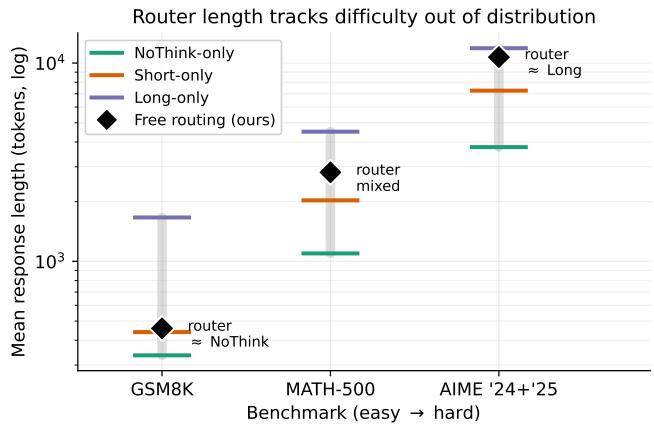  
Figure 10: Router mean response length per benchmark (black diamond, ±std) against the three single-mode anchors (coloured ticks), benchmarks ordered easy→hard (log scale). The router hugs the NoThink anchor on GSM8K and the Long anchor on AIME — realised length is a proxy for the routing split, which the released logs do not record per OOD benchmark.

Table 5: Final accuracy and mean response length (tokens), mean ± std over three seeds. MATH-500 in-distribution; GSM8K/AIME out-of-distribution. Base is the untrained model under the routing prompt.
<table><tr><td rowspan="2"></td><td colspan="4">Accuracy</td><td colspan="3">Mean length (tokens)</td></tr><tr><td>MATH-500</td><td>GSM8K</td><td>AIME&#x27;24</td><td>AIME&#x27;25</td><td></td><td></td><td>MATH-500 GSM8K AIME (comb.)</td></tr><tr><td>Base (no routing)</td><td> $0 . 7 9 6 { \scriptstyle \pm . 0 0 2 }$ </td><td> $0 . 8 3 1 { \scriptstyle \pm . 0 0 6 }$ </td><td> $0 . 2 6 5 { \scriptstyle \pm . 0 0 8 }$ </td><td> $0 . 2 3 1 { \scriptstyle \pm . 0 1 3 }$ </td><td> $4 7 4 3 { \pm } 3 8$ </td><td> $1 9 3 0 { \pm } 1 8$ </td><td> $1 2 2 6 6 { \pm } 2 6$ </td></tr><tr><td>NoTHINK-only</td><td> $0 . 6 6 8 { \scriptstyle \pm . 0 1 3 }$ </td><td> $0 . 7 5 7 { \scriptstyle \pm . 0 0 1 }$ </td><td> $0 . 1 3 7 { \scriptstyle \pm . 0 1 0 }$ </td><td> $0 . 1 0 5 { \scriptstyle \pm . 0 1 8 }$ </td><td> $1 0 9 6 { \pm } 1 4 1$ </td><td> $3 3 6 \pm 5 2$ </td><td> $3 7 6 8 { \pm } 4 5 3$ </td></tr><tr><td>SHORT-only</td><td> $0 . 7 2 7 { \scriptstyle \pm . 0 0 7 }$ </td><td> $0 . 7 5 6 { \scriptstyle \pm . 0 0 4 }$ </td><td> $0 . 2 1 8 { \scriptstyle \pm . 0 1 3 }$ </td><td> $0 . 1 6 6 { \scriptstyle \pm . 0 2 8 }$ </td><td> $2 0 3 0 { \scriptstyle \pm 1 4 9 }$ </td><td> $4 4 0 { \pm } 1 3$ </td><td> $7 2 5 9 { \pm } 4 7 0$ </td></tr><tr><td>LoNG-only</td><td> $0 . 8 0 2 { \scriptstyle \pm . 0 0 4 }$ </td><td> $0 . 8 3 7 { \scriptstyle \pm . 0 0 7 }$ </td><td> $0 . 2 9 7 { \scriptstyle \pm . 0 0 7 }$ </td><td> $0 . 2 3 0 { \scriptstyle \pm . 0 1 1 }$ </td><td> $4 5 0 7 \pm 8 8$ </td><td> $1 6 6 5 { \pm } 5 4$ </td><td> $1 1 8 8 1 { \scriptstyle \pm 5 6 }$ </td></tr><tr><td>Free routing (ours)</td><td> $0 . 7 8 2 { \scriptstyle \pm . 0 0 6 }$ </td><td> $0 . 7 8 1 { \scriptstyle \pm . 0 0 5 }$ </td><td> $0 . 2 7 6 { \scriptstyle \pm . 0 1 0 }$ </td><td> $0 . 2 2 2 { \scriptstyle \pm . 0 0 5 }$ </td><td> $2 8 1 0 { \pm } 5 9$ </td><td> $4 5 9 \pm 1 8$ </td><td> $1 0 7 1 6 { \pm } 7 4$ </td></tr></table>

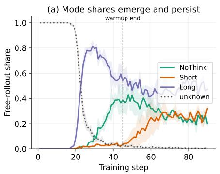

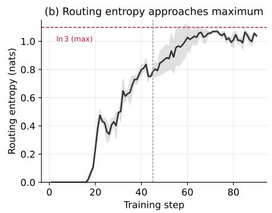

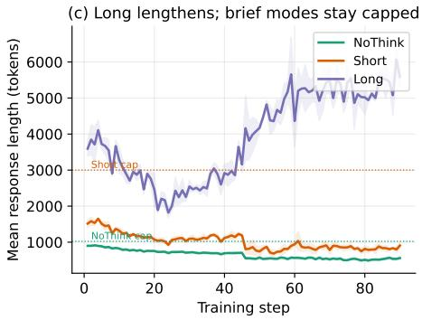  
Figure 11: Free-rollout training dynamics (mean over three seeds, std bands). (a) Mode shares emerge after warmup and persist. (b) Routing entropy approaches ln 3. (c) Long lengthens while the brief modes stay capped.

Table 6: Token reduction of free routing vs. the base model.
<table><tr><td></td><td>Base</td><td>Router</td><td>Reduction</td></tr><tr><td>GSM8K</td><td>1930</td><td>459</td><td>76% (4.2×)</td></tr><tr><td>MATH-500</td><td>4743</td><td>2810</td><td>41% (1.7×)</td></tr><tr><td>AIME</td><td>12266</td><td>10716</td><td>13% (1.1×)</td></tr></table>

Routing split by problem difficulty over training (easy NoThink, hard Long)  
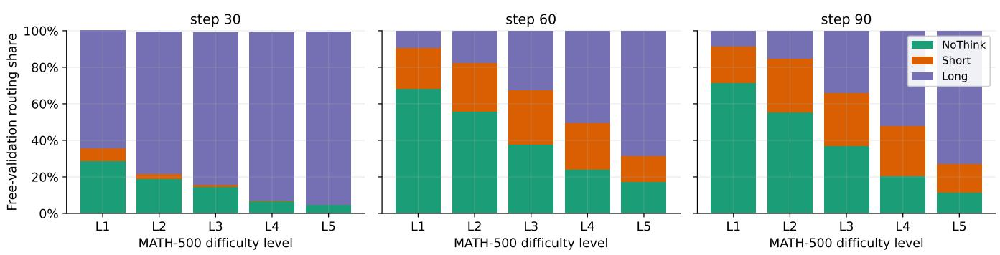  
Fi ure 12: Free-validation routin share b MATH-500 dificult level at three check oints. The eas →NoThink, hard→Long gradient emerges over training.