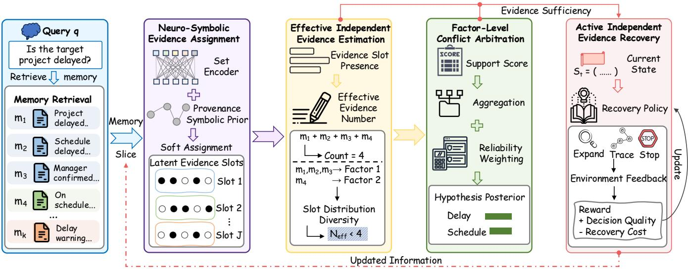
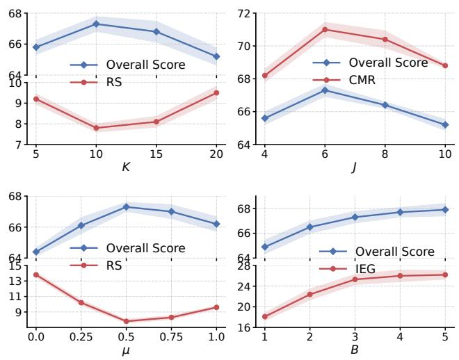

# Beyond Memory Majority: Latent-Source Reasoning for Multi-Agent Memory Arbitration

Chenchen Lin1, Wenhao Yuan1, Xuehe Wang2,3,4, Edith Cheuk Han Ngai1∗

1 Department of Electrical and Computer Engineering, The University of Hong Kong

2 School of Artificial Intelligence, Sun Yat-sen University

3 Southern Marine Science and Engineering Guangdong Laboratory (Zhuhai)

4 Key Laboratory of Intelligent Assessment Technology for Sustainable Tourism, Ministry of Culture and Tourism, Sun Yat-sen University

## Abstract

Long-term multi-agent systems continuously accumulate the memories produced by diferent agents. Existing memory methods typically treat retrieved memories as independent ev- idence and combine them through voting or weighting. How- ever, this independence assumption often fails in multi-agent settings: memories written by diferent agents may inherit the same upstream source or shared bias, causing correlated evi- dence to be repeatedly counted and creating a false majority. We term this failure mode Memory Correlation Bias. To address the issue, we propose the Correlation-Aware Memory Arbitration (CAMA) framework that jointly decouples retrieved memories and recovers missing independent evidence. We model the retrieved memories as query-conditioned evi- dence groups and combine neural dependency inference with provenance-based symbolic priors to estimate the efective number of independent evidence sources, thereby prevent- ing correlated memories from forming a false majority. Since critical independent evidence may be absent from the ini- tial retrieval set, CAMA further learns a sequential recovery policy that actively retrieves alternative evidence or traces up- stream sources before making the final decision, aiming to recover suficient independent evidence for reliable arbitra- tion while minimizing retrieval cost. Experiments on multiple benchmarks demonstrate the superiority of our method over the state-of-the-art baseline methods, suppressing false ma- jorities induced by correlated memories.

## Introduction

Large Language Models (LLMs) are increasingly deployed as long-term multi-agent systems, where multiple agents col- laborate over extended horizons and continuously write their observations, summaries, and reasoning results into shared persistent memory (Rezazadeh et al. 2025; Zhang et al. 2025a). For query answering, such systems retrieve rele-vant memories and aggregate them into final decisions by treating retrieved entries as independent evidence and com- bining them through voting or weighting (Yang et al. 2026; Ai et al. 2026). However, this independence assumption often fails in multi-agent settings: memories written by diferent agents may originate from the same upstream source or in- herit shared biases, causing a single underlying evidential factor to be represented by multiple entries and repeatedly counted (Kohli 2026). We term this failure mode Memory Correlation Bias, where correlated memories inflate the perceived support for a hypothesis and lead to a false majority. This problem is particularly harmful in long-term multi-agent systems: once a false majority determines the arbitration out-come, the erroneous conclusion is written back into shared memory as new evidence, further amplifying correlated sig- nals and causing persistent, self-reinforcing errors in subse- quent decisions (Zhang et al. 2025a).

In long-term agent systems, existing methods primarily ag- gregate retrieved memories through majority voting (Yang et al. 2026), confidence or relevance weighting (Ai et al. 2026), and retrieval-augmented reasoning (Kang et al. 2025; Yu et al. 2026). While improving robustness over singlememory reasoning, these approaches generally assume that retrieved memories provide independent evidence, such that more concordant entries indicate stronger support. In prac- tice, however, whether two memories are redundant is queryspecific: memories from the same source may provide com-plementary evidence for one query while reinforcing the same factor for another, and such dependency cannot be captured solely by static attributes such as agent identity, semantic similarity, or provenance (Liu et al. 2026). Recent studies have explored memory management (Tan et al. 2025), provenance tracking, and reliability-aware aggregation (Yang et al. 2026); however, query-conditioned redundancy among correlated memories and its impact on evi- dence aggregation remain largely unexplored. Further, the retrieved memory set is itself a biased subset of the memory store, as similarity-based retrieval tends to over-select corre- lated memories while under-selecting independent evidence that could resolve the false majority (Salama et al. 2025). Thus, critical independent evidence may be absent from the initial retrieval set, making it impossible for arbitration meth- ods confined to the retrieved memories to recover the correct decision. These observations reveal that reliable memory ar- bitration should account for the efective independence of evidence sources rather than their raw frequency, raising a key question: How can a long-term multi-agent system arbitrate conflicting memories by their efectively independent evidence rather than their apparent count?

To overcome these limitations, we propose Correlation-Aware Memory Arbitration (CAMA), a framework that mod-els query-conditioned evidential dependencies and recovers missing independent evidence before making a decision. To model correlated evidence, we represent retrieved memo- ries as query-conditioned latent evidence slots and combine neural dependency inference with provenance-based sym- bolic priors to estimate the efective number of independent evidence sources, preventing correlated memories from re- peatedly counting the same factor toward a false majority. Then, CAMA aggregates hypothesis support at the level of latent evidence factors rather than individual entries, attribut- ing decisions to reliable and efectively independent sources. Given that critical independent evidence may be absent from the initial retrieval, we learn a sequential recovery policy that actively expands the retrieval space or traces memory depen- dencies to acquire additional independent evidence while minimizing recovery cost. Our key contributions are sum- marized as follows:

• We identify the overlooked problem of Memory Correlation Bias in long-term multi-agent systems, where cor-related memories are repeatedly counted as independent evidence and form a false majority.

• We introduce CAMA, a novel framework that decou-ples correlated memories into efectively independent ev- idence sources, arbitrates conflicts at the evidence-factor level, and actively recovers missing independent evidence under a retrieval budget.

• We conduct extensive experiments on multiple bench-marks, demonstrating that CAMA outperforms state-of- the-art baselines and efectively suppresses false majorities induced by correlated memories.

## Related Work

## Memory in Long-Term Multi-Agent Systems

Persistent memory has become a central component for adapting LLM-based multi-agent systems to long-horizon collaboration (Huang et al. 2026). Existing work studies how agents write, organize, and retrieve shared memories over extended interactions, showing that persistent memory improves continuity, coordination, and downstream task per- formance (Huang et al. 2026; Zhang et al. 2025b). Sub-sequent methods improve memory utility through memory management and updating (Yu et al. 2026; Xu et al. 2025), retrieval-augmented memory reasoning (Xu et al. 2026; Du et al. 2025), and provenance tracking or auditing of stored evidence (Souza et al. 2025; Wang et al. 2026). To reach a final decision, such systems typically aggregate retrieved memo- ries, combining concordant entries or agent outputs through voting and confidence- or relevance-based weighting (Lu et al. 2026; Liang, Wang, and Wang 2025). These works demonstrate the importance of accumulating and exploiting historical memory, especially when relevant evidence is dis- tributed across many agents and interactions.

Despite the advances, most methods treat retrieved mem- ories as independent evidence, equating greater agreement with stronger support. In multi-agent settings, redundancy is query-specific: memories from the same source may be complementary for one query but reinforce the same fac- tor for another, a dependency that static attributes such as agent identity, semantic similarity, or provenance cannot cap- ture (Liu et al. 2026; Kohli 2026). Thus, correlated memories may be repeatedly counted, inflating support for a hypothesis.

## Evidence Aggregation and Recovery

A parallel line of work seeks to improve evidence aggrega- tion beyond naive counting. To reduce unreliable signals, existing methods use consistency-based aggregation over multiple candidates (Taubenfeld et al. 2025), source reliability estimation, and confidence-aware weighting (Hwang et al. 2025; Razghandi, Hosseini, and Baghshah 2025). Other studies examine correlations and conflicts across evidence sources (Kim et al. 2025; Ge et al. 2025), while neuro-symbolic methods incorporate structural priors into evidence reasoning (Peer and Stabinger 2025; Yang et al. 2025). Redundancy is also mitigated through semantic or provenance- based filtering (Chang et al. 2025; Peng et al. 2025). When the initial evidence is insuficient, iterative and retrieval- augmented reasoning methods recover additional evidence through further queries (Lin et al. 2025; Tran et al. 2025). Together, these methods improve aggregation by modeling reliability, dependency, redundancy, and evidence coverage.

Despite this progress, existing aggregation methods either assume independent evidence or rely on static dependency structures, failing to capture query-conditioned memory cor- relations. Redundancy reduction mainly relies on similarity or provenance rather than the efective number of indepen- dent sources, while recovery methods may introduce corre- lated memories without resolving dependencies. Thus, they cannot jointly decouple correlations and recover missing independent evidence, leaving false majorities unresolved.

## Methodology

## Problem Formulation

As illustrated in Figure 1, we consider a multi-agent system $\mathcal { A } = \{ A _ { 1 } , . . . , A _ { N } \}$ with a memory store $\begin{array} { r } { \mathcal { M } = \bigcup _ { j = 1 } ^ { N } \mathcal { M } _ { j } } \end{array}$ where Mj contains the observations, summaries, intermedi-ate reasoning results, and execution traces generated by $A _ { j } .$ Given a query $q ,$ a retrieval module returns an initial mem- ory slice $\mathcal { C } _ { q } ^ { ( 0 ) } = \mathrm { R e t r i e v e } ( q , \mathcal { M } ; K )$ , where $| { \mathcal { M } } | \gg K$ During evidence recovery, CAMA iteratively updates the memory slice and denotes the state after t recovery steps as $\mathcal { C } _ { q } ^ { ( t ) }$ . Based on the current slice, we maintain a candidate hypothesis set $\mathcal { H } _ { q } ^ { ( t ) } = \{ h _ { 1 } ^ { ( t ) } , \ldots , h _ { L _ { t } } ^ { ( t ) } \}$ , where newly recov- ered memories may introduce additional hypotheses. The candidate extraction process is orthogonal to CAMA, which focuses on evidence modeling and memory arbitration.

Unlike conventional aggregation methods that treat re- trieved memories as inde endent evidence CAMA models memory dependence through query-conditioned evidential redundancy. Specifically, two memories $m _ { i }$ and $m _ { j }$ are con-sidered dependent under query $q$ if they share the same latent evidential factor or provide overlapping support for the same underlying evidence, denoted as $\mathrm { D e p } ( m _ { i } , m _ { j } | q )$ . Such de- pendence is query-specific and cannot be fully characterized by static attributes such as agent identity, semantic simi- larity, or provenance, since diferent memories may either provide distinct evidence from the same source or propa- gate the same evidence across diferent agents. Therefore, CAMA focuses on inferring the efective evidential relation- ships among memories relevant to the current decision rather than maintaining a global dependency structure.

  
Figure 1: An overview of our proposed CAMA. The diagram illustrates the overall workflow of memory arbitration, where retrieved memories are progressively processed through evidence decoupling, conflict arbitration, and evidence recovery.

Given a recovery budget B, CAMA determines the fi-nal hypothesis $\hat { h }$ through a sequence of evolving memory states $\{ \mathcal { C } _ { q } ^ { ( t ) } \} _ { t = 0 } ^ { T } ,$ where $T \leq B$ . The objective is to perform evidence-aware arbitration by avoiding redundant counting of correlated memories and recovering missing independent evidence when the initial retrieval is insuficient.

## Query-Conditioned Evidence Decoupling

Evidence decoupling aims to identify efectively indepen- dent evidence sources underlying the current memory slice rather than counting retrieved entries. CAMA models these sources as latent query-conditioned evidence slots and in- fers soft memory-to-slot assignments via a neuro-symbolic module that integrates provenance-based priors with a set en- coder. Provenance serves as supporting evidence rather than a hard dependency label, enabling query-dependent redun- dancy modeling (Garcez et al. 2015; Hitzler et al. 2022).

Neuro-Symbolic Evidence Assignment Given the current memory slice $\mathcal { C } _ { q } ^ { ( t ) }$ , the assignment module infers soft assign- ments between memories and latent evidence slots. Let J denote the maximum number of latent evidence slots, with inactive slots automatically ignored, and let $G _ { \mathrm { p r o v } } ^ { ( t ) }$ denote the temporary provenance graph constructed from the current slice when provenance metadata is available. For $K _ { t } = | \mathcal { C } _ { q } ^ { ( t ) } |$ memories, a set-based self-attention encoder jointly models the query, memory interactions, and provenance structure to produce the assignment matrix

$$
Z ^ { ( t ) } = f _ { \Theta } ( q , \mathcal { C } _ { q } ^ { ( t ) } , G _ { \mathrm { p r o v } } ^ { ( t ) } ) \in \Delta ^ { K _ { t } \times J } ,\tag{1}
$$

where $\Delta ^ { K _ { t } \times J }$ denotes the space of row-wise probability distributions, and each row $\mathbf { z } _ { i } ^ { ( \bar { t } ) } = ( z _ { i 1 } ^ { ( t ) } , \dots , z _ { i J } ^ { ( t ) } )$ represents the soft assignment distribution of memory $m _ { i }$ over the la- tent evidence slots. Unlike one-to-one memory clustering, the soft assignment allows each memory to reflect multiple evidential factors and captures partial dependence among memories. Since redundancy depends on both the query and the memory context, the assignment of each memory is inferred jointly from the entire slice rather than independently from individual memory content, further providing a query-conditioned overlap measure $r _ { i j } ^ { ( t ) } = \langle \mathbf { z } _ { i } ^ { ( t ) } , \mathbf { \bar { z } } _ { j } ^ { ( t ) } \rangle$ ⟩, where a larger value indicates that two memories share similar la- tent evidence factors under the current query. Provenance information is incorporated as a symbolic prior to guide ev- idence assignment rather than enforcing hard dependency constraints. Specifically, provenance relations in $G _ { \mathrm { p r o v } } ^ { ( t ) }$ are injected into the self-attention mechanism as biases:

$$
a _ { i j } = { \frac { \mathbf { q } _ { i } ^ { \top } \mathbf { k } _ { j } } { \sqrt { d } } } + \mu b _ { i j } ,\tag{2}
$$

where $\mathbf { q } _ { i } , \mathbf { k } _ { j } \in \mathbb { R } ^ { d }$ denote the query and key representations of memories $m _ { i }$ and $m _ { j } , b _ { i j }$ encodes the observed prove- nance relation, and $\mu$ controls the strength of the symbolic prior. This prior encourages interactions among structurally related memories, while the final assignments remain deter- mined by the query-conditioned neural representations. The confidence of the inferred assignments is quantified by the normalized entropy of each slot distribution:

$$
\kappa _ { i } ^ { ( t ) } = 1 + \frac { 1 } { \log { J } } \sum _ { j = 1 } ^ { J } z _ { i j } ^ { ( t ) } \log z _ { i j } ^ { ( t ) } ,\tag{3}
$$

measuring confidence of the inferred evidence assignment, with larger values indicating lower assignment uncertainty.

Efective Independent Evidence Estimation The soft as-signments characterize how retrieved memories contribute to latent evidence slots. However, the number of memory en- tries does not necessarily reflect the amount of independent evidence, as multiple memories may originate from the same underlying evidential factor. To estimate the presence of each evidence slot, we use the strongest assignment among the re- trieved memories $e _ { j } ^ { ( t ) } = \operatorname* { m a x } _ { 1 \leq i \leq K _ { t } } z _ { i j } ^ { ( t ) }$ , where $e _ { i } ^ { ( t ) } \in [ 0 , 1 ]$ measures the extent to which evidence slot j is represented in $\mathcal { C } _ { q } ^ { ( t ) }$ . This max-based definition prevents correlated mem- ories from increasing evidence mass through repeated rep- resentations of the same factor. Based on the slot-presence values, the efective number of independent evidence sources is quantified using a Hill diversity measure. Specifically, the slot presence is first normalized as $\begin{array} { r } { p _ { j } ^ { ( t ) } = \frac { e _ { j } ^ { ( t ) } } { \sum _ { l = 1 } ^ { J } e _ { l } ^ { ( t ) } } } \end{array}$ , where $\mathbf { \boldsymbol { p } } _ { i } ^ { ( t ) }$ denotes the relative presence of evidence slot $j .$ . The efective evidence number is then defined as

$$
N _ { \mathrm { e f f } } ^ { ( t ) } = \mathrm { e x p } \left( \frac { \log \sum _ { j = 1 } ^ { J } ( p _ { j } ^ { ( t ) } ) ^ { \alpha } } { 1 - \alpha } \right) .\tag{4}
$$

where α denotes the diversity order. A larger $N _ { \mathrm { e f f } } ^ { ( t ) }$ indi- cates that the retrieved memories cover a more diverse set of latent evidence factors, whereas a smaller value reflects evidence concentration on fewer factors. By operating on slot-level presence rather than memory frequency, this mea- sure captures efective independent evidence and is used for subsequent arbitration and evidence recovery.

## Factor-Level Conflict Arbitration

The inferred latent evidence structure provides a basis for hypothesis-level arbitration, where competing hypotheses are evaluated based on evidence factors rather than individual memory entries. For each memory $m _ { i }$ and candidate hy- pothesis $h \in \mathcal { H } _ { q } ^ { ( t ) }$ , a candidate-conditioned scorer produces a support score $s _ { i } ^ { ( t ) } ( h ) = s _ { \Theta } ( \mathbf { u } _ { i } ^ { ( t ) } , h )$ , where $\mathbf { u } _ { i } ^ { ( t ) }$ denotes the query- and set-conditioned representation of memory $m _ { i } . \mathbf { B } \mathbf { y }$ taking the candidate hypothesis as an input, the same scorer can evaluate newly introduced hypotheses during subsequent evidence recovery steps without modifying the output space. The support associated with evidence slot $j$ is then aggre-gated over the memories assigned to that slot:

$$
\beta _ { j } ^ { ( t ) } ( h ) = \frac { \sum _ { i = 1 } ^ { K _ { t } } z _ { i j } ^ { ( t ) } s _ { i } ^ { ( t ) } ( h ) } { \sum _ { i = 1 } ^ { K _ { t } } z _ { i j } ^ { ( t ) } + \epsilon } ,\tag{5}
$$

where the normalization ensures that an evidence source does not gain additional influence simply because it has generated more memory descendants. $\beta _ { j } ^ { ( t ) } ( h )$ measures the support of evidence slot $j$ for hypothesis $h .$ . To further ac- count for variations in source reliability, memory-level prior attributes are aggregated within each evidence slot to esti- mate a reliability weight. For each memory $m _ { i } .$ , we define $\mathbf { a } _ { \mathrm { p r i o r } } ( m _ { i } ) = [ \stackrel { \cdot } { o _ { i } } , r _ { i } , \stackrel { \cdot } { \chi _ { i } } ] \in \mathbb { R } ^ { d _ { a } }$ , where $o _ { i } \in [ 0 , 1 ]$ indicates whether $m _ { i }$ originates from a direct observation, ${ \bar { r } } _ { i } \in [ 0 , 1 ]$ denotes the historical reliability of its generating agent, and $\chi _ { i }$ is a one-hot encoding of the upstream source type. The slot-level reliability weights are computed as

$$
\rho _ { j } ^ { ( t ) } = \sigma \left( \mathbf { w } _ { \rho } ^ { \top } ( \frac { \sum _ { i } z _ { i j } ^ { ( t ) } \mathbf { a } _ { \mathrm { p r i o r } } ( m _ { i } ) } { \sum _ { i } z _ { i j } ^ { ( t ) } + \epsilon } ) + b _ { \rho } \right) ,\tag{6}
$$

where $\mathbf { w } _ { \rho }$ and $b _ { \rho }$ are learnable parameters, and $\sigma ( \cdot )$ denotes the sigmoid function. The normalized aggregation prevents the estimated reliability from being biased by memory multi- plicity. When source metadata is unavailable, we use a learn- able default reliability weight $\rho _ { i } ^ { ( t ) } = \sigma ( b _ { \mathrm { m i s s } } )$ . The evidence contribution of each latent factor is then aggregated into the arbitration logit $\begin{array} { r } { \ell ^ { ( t ) } ( h ) = \sum _ { j = 1 } ^ { J } \rho _ { j } ^ { ( t ) } e _ { j } ^ { ( t ) } \bar { \beta _ { j } ^ { ( t ) } } ( \bar { h } ) } \end{array}$ , where $\rho _ { j } ^ { ( t ) }$ and $e _ { i } ^ { ( t ) }$ regulate the contribution of each evidence factor based on its trustworthiness and availability. The arbitration posterior is obtained by temperature-scaled normalization:

$$
P ^ { ( t ) } ( h \mid q , \mathcal { C } _ { q } ^ { ( t ) } ) = \frac { \exp ( \ell ^ { ( t ) } ( h ) / \tau _ { p } ) } { \sum _ { h ^ { \prime } \in \mathcal { H } _ { q } ^ { ( t ) } } \exp ( \ell ^ { ( t ) } ( h ^ { \prime } ) / \tau _ { p } ) } ,\tag{7}
$$

where $\tau _ { p } > 0$ is calibrated on validation data. Reusing $e _ { j } ^ { ( t ) }$ in both evidence estimation and arbitration ensures that each evidential factor contributes according to its presence and reliability rather than memory frequency. The evidence suf- ficiency is jointly assessed by $N _ { \mathrm { e f f } } ^ { ( t ) }$ and the arbitration pos- terior, which capture evidence diversity and hypothesis sep- aration, to determine whether further recovery is required.

## Active Independent-Evidence Recovery

The arbitration process relies on the evidence available in the current memory slice. When the retrieved memories pro- vide insuficient independent evidence or contain unresolved dependencies, additional evidence recovery is required. We formulate recovery as a finite-horizon sequential decision process over the memory store, where the policy selects among evidence expansion, dependency tracing, and termi- nation actions. At recovery step t, the state is defined as

$$
S _ { t } = ( \mathcal { C } _ { q } ^ { ( t ) } , G _ { \mathrm { p r o v } } ^ { ( t ) } , Z ^ { ( t ) } , N _ { \mathrm { e f f } } ^ { ( t ) } , \kappa ^ { ( t ) } , P ^ { ( t ) } , t ) ,\tag{8}
$$

which summarizes the current memory slice, inferred ev- idence structure, evidence suficiency, assignment confi dence, and arbitration uncertainty. The policy selects an ac- tion from $A _ { t } \in \{ \mathrm { E x p a N D } ( q ^ { \prime } )$ , Tr $\mathbf { A C E } ( m _ { i } )$ , Stop}:

• Expand(q′): This action recovers independent evidence that may be missing from the current retrieval view. Specifically, the policy generates a bounded set of al- ternative query reformulations from the current state and selects one to retrieve additional memories, updated as $\mathcal { C } _ { q } ^ { ( t + 1 ) } = \mathcal { C } _ { q } ^ { ( t ) }$ ∪ Retrieve $\left( q ^ { \prime } , \mathcal { M } ; K _ { \mathrm { a d d } } \right)$

• Trace(m ): This action follows a recorded derivation edge from memory $m _ { i }$ to its parent memory $m _ { p }$ . The recovered parent and provenance relation are added to the current slice and local provenance graph, i.e., $\mathcal { C } _ { q } ^ { ( t + 1 ) } =$ ${ \mathcal C } _ { \boldsymbol { q } } ^ { ( t ) } \cup \{ m _ { p } \}$ and $G _ { \mathrm { p r o v } } ^ { ( t + 1 ) } = G _ { \mathrm { p r o v } } ^ { ( t ) } \cup \{ m _ { i }  m _ { p } \}$ . If memories share the recovered parent, their correspond- ing edges are added simultaneously. The set-conditioned assignments are then recomputed over the updated slice and graph. Trace can reveal that memories previously treated as independent originate from the same upstream evidence, reducing $N _ { \mathrm { e f f } } ^ { ( t ) }$ and improving arbitration.

• Stop: This action terminates recovery and returns the current arbitration decision $\hat { h } = \arg \operatorname* { m a x } _ { h \in \mathcal { H } _ { q } ^ { ( t ) } } P ^ { ( t ) } ( h \mid$ ${ \bf \Lambda } _ { q , \mathcal { C } _ { q } ^ { ( t ) } } )$ . The termination decision is guided by both the learned policy and an interpretable suficiency criterion $N _ { \mathrm { e f f } } ^ { ( t ) } \ \ge \ \tau _ { N }$ and $H ( P ^ { ( t ) } ) \leq \tau _ { H }$ . The first condition re- quires suficient independent evidence, while the second requires a concentrated arbitration posterior. The thresh- olds are calibrated on validation data, and all policies terminate when the recovery budget B is exhausted.

When provenance information is unavailable, the recov- ery process uses only Expand and Stop. Query reformulation can still retrieve complementary evidence, while Trace requires explicit provenance signals.

## Evidence-Guided Recovery Optimization

Given the state representation, the policy $\pi _ { \omega } ( A _ { t } \mid S _ { t } )$ is optimized to balance evidence acquisition and recovery cost under a budget. The policy determines whether to acquire additional evidence, investigate potential dependencies, or terminate with the current arbitration result. We optimize the policy with a terminal-oriented reward: nonterminal recovery actions incur only memory-access costs, i.e., $R _ { t } = - \lambda _ { s }$ for $A _ { t } \in \{ \mathrm { E x p a N D } , \mathrm { \dot { T } R A C E } \}$ , while stopping receives:

$$
R _ { t } = \left\{ \begin{array} { l l } { + 1 , } & { \hat { h } = h ^ { * } , } \\ { - 1 , } & { \hat { h } \neq h ^ { * } , } \end{array} \right. \quad A _ { t } = \mathrm { S r o p } ,\tag{9}
$$

where $h ^ { * }$ denotes the ground-truth conclusion during train- ing. The terminal-oriented reward evaluates the final arbi- tration outcome while accounting for memory access costs during recovery. Since the efect of a recovery action may emerge after subsequent evidence updates, its utility is learned through long-term returns. To make value estima- tion evidence-aware, the current state is summarized using correlation-aware statistics:

$$
\mathbf { d } _ { t } = \left[ N _ { \mathrm { e f f } } ^ { ( t ) } , \overline { { \kappa } } ^ { ( t ) } , H ( P ^ { ( t ) } ) , p _ { ( 1 ) } ^ { ( t ) } , p _ { ( 1 ) } ^ { ( t ) } - p _ { ( 2 ) } ^ { ( t ) } , t / B \right] ,\tag{10}
$$

where $p _ { ( 1 ) }$ and $p _ { ( 2 ) }$ denote the two largest hypothesis proba- bilities, and $\begin{array} { r } { \overline { { \kappa } } ^ { ( t ) } = \frac { 1 } { K _ { t } } \sum _ { i = 1 } ^ { K _ { t } } \kappa _ { i } ^ { ( t ) } } \end{array}$ . The value function $V _ { \nu } ( \mathbf { d } _ { t } )$ estimates the expected arbitration quality from efective evi- dence quantity, assignment confidence, and posterior uncer- tainty. The actor uses the contextual state representation to select recovery actions. Given return $\begin{array} { r } { G _ { t } = \sum _ { k \geq 0 } \gamma ^ { k } R _ { t + k } } \end{array}$ and advantage estimate $\widehat { A } _ { t } = G _ { t } - V _ { \nu } ( \mathbf { d } _ { t } )$ , the policy and value function are optimized with an actor–critic objective:

$$
\mathcal { L } _ { \mathrm { A } } = - \mathbb { E } _ { t } \left[ \log \pi _ { \omega } ( A _ { t } \mid S _ { t } ) \operatorname { s g } ( \widehat { A } _ { t } ) \right] ,
$$

$$
\mathcal { L } _ { \mathrm { V } } = \mathbb { E } _ { t } \left[ \left( V _ { \nu } ( \mathbf { d } _ { t } ) - \mathrm { s g } ( G _ { t } ) \right) ^ { 2 } \right] ,\tag{11}
$$

$$
\mathcal { L } _ { \mathrm { R L } } = \mathcal { L } _ { \mathrm { A } } + c _ { v } \mathcal { L } _ { \mathrm { V } } - c _ { e } \mathbb { E } _ { t } [ H ( \pi _ { \omega } ( \cdot \mid S _ { t } ) ) ] ,\tag{12}
$$

(13)

where $\operatorname { s g } ( \cdot )$ denotes stop-gradient. The evidence representa- tion underlying state construction and arbitration is jointly optimized with the recovery policy to support reliable deci- sions. Specifically, the shared encoder and prediction heads are trained with the arbitration objective and, when prove-nance information is available, an auxiliary dependence- aware contrastive objective. For the final slice of a training episode, the arbitration loss is defined as

$$
\mathcal { L } _ { \mathrm { t a s k } } = - \log P ^ { ( T ) } ( h ^ { \ast } \mid q , \mathcal { C } _ { q } ^ { ( T ) } ) ,\tag{14}
$$

where $h ^ { * }$ denotes the ground-truth conclusion. To leverage provenance information, a weakly supervised contrastive ob- jective is introduced over evidence assignments. For each anchor memory i, $\mathcal { P } ( i )$ and $\mathcal { N } ( i )$ denote memories with observed provenance relations and distinct source origins, respectively. Since provenance provides partial dependency cues, it is used as weak supervision rather than a hard assign- ment constraint. The dependence loss is defined as:

$$
\mathcal { L } _ { \mathrm { d } } = - \mathbb { E } _ { i \sim B } \mathbb { E } _ { j \sim \mathcal { P } ( i ) } \log \frac { \exp ( r _ { i j } ^ { ( T ) } / \tau _ { d } ) } { \sum _ { k \in \mathcal { P } ( i ) \cup \mathcal { N } ( i ) } \exp ( r _ { i k } ^ { ( T ) } / \tau _ { d } ) } .\tag{15}
$$

where $r _ { i j } ^ { ( T ) } = \langle \mathbf { z } _ { i } ^ { ( T ) } , \mathbf { z } _ { j } ^ { ( T ) } \rangle$ measures the overlap between the source assignment distributions of memories i and $j ,$ and $\tau _ { d }$ is the temperature parameter. Provenance-based contrastive supervision regularizes evidence assignments without rely- ing on semantic similarity as a proxy for dependency. The overall training objective is

$$
\begin{array} { r } { \mathcal { L } = \mathcal { L } _ { \mathrm { R L } } + \lambda _ { \mathrm { t a s k } } \mathcal { L } _ { \mathrm { t a s k } } + \lambda _ { \mathrm { d } } \mathcal { L } _ { \mathrm { d } } . } \end{array}\tag{16}
$$

## Experiments

## Experimental Setup

Datasets We evaluate CAMA on three long-term memory benchmarks: MemoryAgentBench (Hu, Wang, and McAuley 2026) evaluates LLM agent memory capabilities through incremental multi-turn interactions, including se- lective forgetting under conflicting memory updates. Long-MemEval (Wu et al. 2025) evaluates long-term memory retrieval and reasoning in conversational agents under ex- tended interaction histories. LoCoMo (Maharana et al. 2024) focuses on long-term conversational memory reasoning over multi-session dialogues with evolving user states and his- torical interactions. To evaluate memory correlation bias, we construct correlation-aware variants from the original instances by augmenting memory pools with correlated en- tries from shared evidence sources and complementary en- tries providing distinct query-relevant evidence. Correlated entries are generated through controlled derivations (e.g., paraphrasing and summarization), with provenance links recorded while preserving the original ground-truth answers.

Baselines We compare CAMA with state-of-the-art baselines. Vanilla RAG (Lewis et al. 2020) directly conditions generation on retrieved memories while treating all retrieved entries as independent evidence. Majority Voting (Wang et al. 2023) aggregates memories based on consensus, representing conventional evidence aggregation strategies that assume each memory contributes an indepen- dent vote. We further evaluate long-term memory systems, including Mem0 (Chhikara et al. 2025), which extracts, con-solidates, and updates salient memories for scalable memory management, and HippoRAG (Gutiérrez et al. 2024), which employs graph-based memory organization to support long- range retrieval. For multi-agent scenarios, we compare with MAD (Liang et al. 2024), which improves reasoning through iterative interactions among multiple agents, and MADAM-RAG (Wang et al. 2025), which addresses conflicting evidence through multi-agent retrieval and aggregation.

<table><tr><td rowspan="2">Backbone</td><td rowspan="2">Methods</td><td colspan="3">MemoryAgentBench</td><td colspan="4">LongMemEval</td><td colspan="4">LOCOMO</td></tr><tr><td>FC-SH</td><td>FC-MH</td><td>Overall</td><td>EM</td><td>F1</td><td>BERT</td><td>Judge</td><td>EM</td><td>F1</td><td>BERT</td><td>Judge</td></tr><tr><td rowspan="7">DeepSeek-V4-Flash</td><td>VANILLA RAG</td><td>68.4</td><td>34.2</td><td>51.3</td><td>34.1</td><td>45.7</td><td>84.2</td><td>51.6</td><td>29.7</td><td>40.3</td><td>83.5</td><td>47.2</td></tr><tr><td>MAJORITY VOTING</td><td>70.1</td><td>33.5</td><td>51.8</td><td>33.6</td><td>45.1</td><td>84.0</td><td>50.9</td><td>28.9</td><td>39.6</td><td>83.2</td><td>46.1</td></tr><tr><td>HIPPORAG</td><td>72.6</td><td>42.8</td><td>57.7</td><td>38.5</td><td>49.8</td><td>85.3</td><td>56.4</td><td>33.4</td><td>44.1</td><td>84.6</td><td>51.8</td></tr><tr><td>MEM0</td><td>73.9</td><td>44.5</td><td>59.2</td><td>40.2</td><td>51.6</td><td>85.7</td><td>58.1</td><td>35.8</td><td>46.7</td><td>85.2</td><td>54.3</td></tr><tr><td>MAD</td><td>74.7</td><td>46.9</td><td>60.8</td><td>41.7</td><td>52.9</td><td>86.1</td><td>60.5</td><td>36.9</td><td>47.8</td><td>85.5</td><td>56.2</td></tr><tr><td>MADAM-RAG</td><td>75.2</td><td>48.8</td><td>63.4</td><td>44.1</td><td>54.3</td><td>86.8</td><td>62.4</td><td>37.6</td><td>49.5</td><td>85.7</td><td>59.4</td></tr><tr><td>CAMA (Ours)</td><td>78.9</td><td>55.7</td><td>67.3</td><td>49.8</td><td>59.1</td><td>87.9</td><td>69.2</td><td>43.6</td><td>53.8</td><td>87.1</td><td>64.7</td></tr><tr><td rowspan="7">Qwen3.6-27B</td><td>VANILLA RAG</td><td>65.2</td><td>31.4</td><td>48.3</td><td>31.5</td><td>42.9</td><td>83.4</td><td>48.7</td><td>27.3</td><td>37.8</td><td>82.7</td><td>44.5</td></tr><tr><td>MAJORITY VOTING</td><td>66.8</td><td>30.7</td><td>48.8</td><td>30.9</td><td>42.3</td><td>83.1</td><td>47.9</td><td>26.5</td><td>37.1</td><td>82.4</td><td>43.6</td></tr><tr><td>HIPPoRAG</td><td>69.5</td><td>39.6</td><td>54.6</td><td>35.6</td><td>46.8</td><td>84.5</td><td>53.2</td><td>30.9</td><td>41.4</td><td>83.8</td><td>49.1</td></tr><tr><td>MEM0</td><td>71.0</td><td>41.3</td><td>56.2</td><td>37.4</td><td>48.7</td><td>84.9</td><td>55.3</td><td>33.2</td><td>43.9</td><td>84.4</td><td>51.7</td></tr><tr><td>MAD</td><td>71.9</td><td>43.8</td><td>57.9</td><td>38.9</td><td>50.1</td><td>85.3</td><td>57.6</td><td>34.5</td><td>45.2</td><td>84.7</td><td>53.8</td></tr><tr><td>MADAM-RAG</td><td>73.6</td><td>46.7</td><td>60.2</td><td>41.6</td><td>52.6 56.9</td><td>85.9</td><td>61.2</td><td>36.8</td><td>47.5</td><td>85.3</td><td>57.1</td></tr><tr><td>CAMA (Ours)</td><td>76.5</td><td>53.2</td><td>64.9</td><td>47.4</td><td></td><td>87.2</td><td>67.0</td><td>41.5</td><td>51.6</td><td>86.5</td><td>62.4</td></tr></table>

Table 1: Overall performance comparison on three benchmark datasets. Best results are marked by bold.
<table><tr><td rowspan="2">Methods</td><td colspan="4">MemoryAgentBench</td><td colspan="4">LongMemEval</td><td colspan="4">LOCOMO</td></tr><tr><td>CMR↑</td><td>RS↓</td><td>IEG↑</td><td>ERR↑</td><td>CMR ↑</td><td>RS↓</td><td>IEG↑</td><td>ERR↑</td><td>CMR↑</td><td>RS↓</td><td>IEG↑</td><td>ERR↑</td></tr><tr><td>VANILLA RAG</td><td>38.7</td><td>41.2</td><td>5.8</td><td>5.3</td><td>36.9</td><td>43.5</td><td>5.1</td><td>4.6</td><td>33.4</td><td>45.8</td><td>4.4</td><td>3.9</td></tr><tr><td>MAJORITY VOTING</td><td>33.5</td><td>44.8</td><td>4.7</td><td>4.9</td><td>31.8</td><td>46.9</td><td>4.2</td><td>4.2</td><td>28.7</td><td>49.3</td><td>3.5</td><td>3.5</td></tr><tr><td>HIPPORAG</td><td>46.8</td><td>27.4</td><td>11.6</td><td>9.8</td><td>44.2</td><td>29.1</td><td>10.5</td><td>8.9</td><td>40.5</td><td>31.6</td><td>9.1</td><td>7.7</td></tr><tr><td>MEM0</td><td>49.6</td><td>24.1</td><td>13.7</td><td>11.2</td><td>47.1</td><td>25.8</td><td>12.6</td><td>10.3</td><td>43.4</td><td>28.2</td><td>11.0</td><td>9.0</td></tr><tr><td>MAD</td><td>54.3</td><td>19.2</td><td>15.9</td><td>12.6</td><td>51.8</td><td>20.7</td><td>14.5</td><td>11.4</td><td>47.6</td><td>22.9</td><td>12.8</td><td>10.1</td></tr><tr><td>MADAM-RAG</td><td>60.7</td><td>15.3</td><td>19.4</td><td>14.1</td><td>58.2</td><td>16.6</td><td>18.1</td><td>12.9</td><td>53.9</td><td>18.5</td><td>16.2</td><td>11.5</td></tr><tr><td>CAMA (Ours)</td><td>71.2</td><td>7.8</td><td>25.1</td><td>36.2</td><td>67.4</td><td>9.1</td><td>22.6</td><td>33.1</td><td>62.1</td><td>10.3</td><td>20.2</td><td>29.4</td></tr></table>

Table 2: Evaluation of memory correlation bias mitigation under DeepSeek-V4-Flash.

Evaluation Metrics We adopt two complementary categories of metrics for evaluation. For Task-Level Performance, we follow the standard evaluation protocols of each benchmark. Specifically, on MemoryAgentBench, we re- port the performance on Fact Consolidation tasks, including Single-Hop Fact Consolidation (FC-SH), Multi-Hop Fact Consolidation (FC-MH), and the overall score. On Long-MemEval and LoCoMo, we report Exact Match (EM), F1, BERTScore, and judge-based evaluation scores. For Memory Correlation Bias, we evaluate evidence arbitration under correlation-aware settings using four metrics: (i) Correct Minority Recovery (CMR), which measures the proportion of cases where the model recovers the correct answer when supporting evidence is outnumbered by correlated memories; (ii) Replication Sensitivity (RS), which measures the impact of increasing redundant memories from the same evidence source on model decisions; (iii) Independent Evidence Gain (IEG), which quantifies the benefit of incorporating additional independent evidence; and (iv) Evidence Resolution Rate (ERR), which measures the proportion of evidenceinsuficient instances that are correctly resolved.

Implementation Details We conduct our experiments with DeepSeek-V4-Flash (DeepSeek 2026) and Qwen3.6- 27B (Qwen Team 2026) as the backbone LLMs. All baseline methods and CAMA use the same backbone models, mem- ory pools, and retrieval settings for fair comparison. The evidence assignment module is trained on the training split and frozen during evaluation, while the recovery policy is optimized during training and fixed during inference. We set the number of retrieved memories to $K = 1 0 .$ , the number of latent evidence slots to J = 6, and the recovery budget to B = 3, respectively. For evidence estimation, we set the Hill diversity order to α = 2 and the provenance prior strength to µ = 0.5. For recovery policy optimization, we use a discount factor of γ = 0.95, a value coeficient of $c _ { v } = 0 . 5$ , and an entropy coeficient of $c _ { e } = 0 . 0 1$ by default.

## Experimental Results

Overall Performance Table 1 shows that CAMA consistently achieves superior performance across diferent bench- marks and backbones, demonstrating its efectiveness in long-term memory reasoning. Compared with retrieval- based methods that directly aggregate retrieved memories and memory management approaches that focus on mem-ory organization, CAMA explicitly models latent evidence dependencies to avoid redundant memory amplification and identify reliable evidence. While multi-agent approaches im- prove reasoning through interaction and aggregation, CAMA further addresses memory correlation and missing evidence recovery, leading to more robust memory utilization.

<table><tr><td rowspan="2">Methods</td><td colspan="6">MemoryAgentBench</td><td colspan="8">LongMemEval</td></tr><tr><td>FC-SH</td><td>FC-MH</td><td>Overall</td><td>CMR</td><td>RS</td><td>IEG</td><td>ERR</td><td>EM</td><td>F1</td><td>BERT</td><td>Judge</td><td>CMR</td><td>RS IEG</td><td>ERR</td></tr><tr><td>w/o Evi. Decoupling</td><td>71.5</td><td>45.3</td><td>58.4</td><td>48.2</td><td>32.7</td><td>14.6 28.9</td><td>42.1</td><td>51.8</td><td>86.2</td><td>59.7</td><td>46.5</td><td>34.1</td><td>13.8</td><td>26.4</td></tr><tr><td>w/o Prov. Príor</td><td>76.8</td><td>51.9</td><td>64.4</td><td>63.4</td><td>13.8</td><td>21.7</td><td>34.2 47.3</td><td>56.6</td><td>87.4</td><td>65.8</td><td>61.2</td><td>14.6</td><td>20.3</td><td>31.8</td></tr><tr><td>w/o Expand</td><td>76.2</td><td>51.4</td><td>63.8</td><td>66.7</td><td>9.5</td><td>17.2</td><td>15.3</td><td>46.1</td><td>55.7 87.3</td><td>64.9</td><td>63.8</td><td>10.2</td><td>15.8</td><td>13.6</td></tr><tr><td>w/o Trace</td><td>75.4</td><td>49.6</td><td>62.5</td><td>64.8</td><td>15.2</td><td>19.4</td><td>27.1</td><td>46.8 56.2</td><td>87.4</td><td>65.7</td><td>62.5</td><td>16.3</td><td>18.1</td><td>25.2</td></tr><tr><td>w/o Policy</td><td>77.1</td><td>52.3</td><td>64.7</td><td>65.9</td><td>11.4</td><td>16.8</td><td>22.7</td><td>47.6 57.0</td><td>87.5</td><td>66.4</td><td>64.1</td><td>12.5</td><td>15.2</td><td>20.8</td></tr><tr><td>CAMA</td><td>78.9</td><td>55.7</td><td>67.3</td><td>71.2</td><td>7.8</td><td>25.1</td><td>36.2</td><td>49.8</td><td>59.1</td><td>87.9</td><td>69.2</td><td>67.4</td><td>9.1 22.6</td><td>33.1</td></tr></table>

Table 3: Ablation study on the MemoryAgentBench and LongMemEval benchmarks under DeepSeek-V4-Flash.

  
Figure 2: Hyperparameter sensitivity analysis on MemoryA- gentBench with DeepSeek-V4-Flash.

Table 2 further evaluates CAMA under correlation-aware settings. The consistent improvements across correlation metrics demonstrate that CAMA efectively identifies cor- related memories and mitigates memory correlation bias. These gains stem from evidence-level decoupling and prove- nance modeling, which reduce redundant evidence interfer- ence, together with evidence recovery mechanisms that ac- quire missing evidence when needed.

Ablation Analysis Table 3 evaluates the contribution of each component in CAMA. Removing any component con- sistently degrades performance, confirming the necessity of evidence decoupling and adaptive recovery. Specifically, re- moving evidence decoupling or provenance modeling weak- ens correlation bias mitigation by failing to identify source- level dependencies among memories, while removing re- covery components reduces the ability to acquire missing independent evidence. These results demonstrate that each component provides complementary benefits for reliable ar- bitration under correlated memory conditions.

<table><tr><td>Methods</td><td>Avg. Latency</td><td>LLM Calls</td><td>Token Cost (k)</td><td>Context Len (k)</td><td>∆ Acc.I kToken</td></tr><tr><td>VANILLA RAG</td><td>1.8</td><td>1.0</td><td>3.2</td><td>3.1</td><td></td></tr><tr><td>MAJORITY VOTING</td><td>4.6</td><td>5.0</td><td>12.8</td><td>3.1</td><td>0.04</td></tr><tr><td>HIPPORAG</td><td>3.2</td><td>2.0</td><td>5.9</td><td>4.4</td><td>1.08</td></tr><tr><td>MAD</td><td>9.8</td><td>8.4</td><td>24.3</td><td>9.6</td><td>0.39</td></tr><tr><td>MADAM-RAG</td><td>11.4</td><td>10.6</td><td>28.9</td><td>11.2</td><td>0.42</td></tr><tr><td>CAMA(Ours)</td><td>6.7</td><td>4.2</td><td>14.6</td><td>6.8</td><td>1.10</td></tr></table>

Table 4: Eficiency analysis on the MemoryAgentBench benchmark under DeepSeek-V4-Flash.

Hyperparameter Sensitivity We analyze the sensitivity of CAMA to key hyperparameters, including the number of retrieved memories K, latent evidence slots J, provenance prior strength µ, and budget B. As shown in Figure 2, CAMA remains robust across diferent settings. Increasing K im-proves evidence coverage but introduces redundancy when over-retrieved, validating the need for correlation-aware esti- mation. The choice of J balances evidence factor separation and fragmentation, while a moderate µ balances provenance guidance and assignment flexibility. Increasing B improves evidence recovery with diminishing returns. These results demonstrate that CAMA is robust to hyperparameter varia- tion rather than depending on a narrowly tuned configuration.

Eficiency Analysis We evaluate the eficiency from diferent perspectives. ∆ Acc./kToken measures the accuracy im-provement over Vanilla RAG normalized by the consumed thousands of tokens. Table 4 reports the eficiency compari- son of CAMA. Although CAMA introduces additional costs for evidence modeling and adaptive recovery, it achieves a fa- vorable accuracy–eficiency trade-of. By selectively activat- ing recovery only when the retrieved evidence is insuficient, CAMA avoids unnecessary computation while maintaining efective evidence acquisition. The improved accuracy gain per token further indicates that the additional computation is primarily used for identifying independent evidence rather than repeatedly aggregating correlated memories. These re- sults demonstrate the eficiency of CAMA in achieving reli- able arbitration under correlated memory conditions.

## Conclusion

In this paper, we identify Memory Correlation Bias as a critical challenge in long-term multi-agent systems, where cor- related memories may create false majorities and lead to per-sistent reasoning errors. We propose CAMA, a correlation- aware memory arbitration framework that evaluates evidence at the level of latent independent factors and selectively recovers missing evidence when current memories are in- suficient. By combining neuro-symbolic evidence model- ing, factor-level arbitration, and adaptive recovery, CAMA enables more reliable decisions under correlated memory conditions. Extensive experiments show that CAMA consis- tently outperforms existing approaches with favorable efi- ciency. Our work demonstrates that efective memory rea- soning requires not only accumulating more memories, but also understanding their underlying dependencies.

## References

Ai, R.; Pan, Y.; Simchi-Levi, D.; Tambe, M.; and Xu, H. 2026. Beyond Majority Voting: LLM Aggregation by Leveraging Higher-Order Information. In Forty-third International Conference on Machine Learning.

Chang, C.-Y.; Jiang, Z.; Rakesh, V.; Pan, M.; Yeh, C.-C. M.; Wang, G.; Hu, M.; Xu, Z.; Zheng, Y.; Das, M.; and Zou, N. 2025. MAIN-RAG: Multi-Agent Filtering Retrieval- Augmented Generation. In Che, W.; Nabende, J.; Shutova, E.; and Pilehvar, M. T., eds., Proceedings of the 63rd Annual Meeting of the Association for Computational Linguistics (Volume 1: Long Papers), 2607–2622. Vienna, Austria: Association for Computational Linguistics. ISBN 979-8- 89176-251-0.

Chhikara, P.; Khant, D.; Aryan, S.; Singh, T.; and Yadav, D. 2025. Mem0: Building production-ready ai agents with scal- able long-term memory. arXiv preprint arXiv:2504.19413.

DeepSeek. 2026. DeepSeek V4 Preview Release.

Du, X.; Li, L.; Zhang, D.; and Song, L. 2025. MemR 3: Memory Retrieval via Reflective Reasoning for LLM Agents. arXiv preprint arXiv:2512.20237.

Garcez, A. S. d.; Besold, T. R.; De Raedt, L.; Földiak, P.; Hitzler, P.; Icard, T.; Kühnberger, K.-U.; Lamb, L. C.; Mi- ikkulainen, R.; and Silver, D. L. 2015. Neural-Symbolic Learning and Reasoning: Contributions and Challenges. In AAAI Spring Symposia, 18–21.

Ge, Z.; Wu, Y.; Chin, D. W. K.; Lee, R. K.-W.; and Cao, R. 2025. Resolving conflicting evidence in automated fact- checking: a study on retrieval-augmented LLMs. In Proceedings of the Thirty-Fourth International Joint Conference on Artificial Intelligence, 9656–9664.

Gutiérrez, B. J.; Shu, Y.; Gu, Y.; Yasunaga, M.; and Su, Y. 2024. Hipporag: Neurobiologically inspired long-term memory for large language models. Advances in neural information processing systems, 37: 59532–59569.

Hitzler, P.; Sarker, M.; Besold, T.; Garcez, A.; Bader, S.; Bowman, H.; Domingos, P.; Hitzler, P.; Kühnberger, K.; Lamb, L.; et al. 2022. Neural-symbolic learning and rea- soning: A survey and interpretation. Frontiers in artificial intelligence and applications, 342: 1–51.

Hu, Y.; Wang, Y.; and McAuley, J. 2026. Evaluating Memory in LLM Agents via Incremental Multi-Turn Interactions. In

The Fourteenth International Conference on Learning Representations.

Huang, W.; Wang, Z.; Lin, H.; Wang, S.; Xu, B.; Li, Q.; Zhu, B.; Yang, L.; and Qin, C. 2026. AMA: Adaptive Memory via Multi-Agent Collaboration. In Liakata, M.; Moreira, V. P.; Zhang, J.; and Jurgens, D., eds., Findings ofthe Association for Computational Linguistics: ACL 2026, 3099–3120. San Diego, California, United States: Association for Computa- tional Linguistics. ISBN 979-8-89176-395-1.

Hwang, J.; Park, J.; Park, H.; Kim, D.; Park, S.; and Ok, J. 2025. Retrieval-Augmented Generation with Estimation of Source Reliability. In Christodoulopoulos, C.; Chakraborty, T.; Rose, C.; and Peng, V., eds., Proceedings ofthe 2025 Conference on Empirical Methods in Natural Language Processing, 34279–34303. Suzhou, China: Association for Computational Linguistics. ISBN 979-8-89176-332-6.

Kang, J.; Ji, M.; Zhao, Z.; and Bai, T. 2025. Memory os of ai agent. In Proceedings ofthe 2025 Conference on Empirical Methods in Natural Language Processing, 25972–25981.

Kim, E. M.; Garg, A.; Peng, K.; and Garg, N. 2025. Cor- related Errors in Large Language Models. In International Conference on Machine Learning, 30038–30066. PMLR.

Kohli, G. 2026. Nine Judges, Two Efective Votes: Correlated Errors Undermine LLM Evaluation Panels. arXiv preprint arXiv:2605.29800.

Lewis, P.; Perez, E.; Piktus, A.; Petroni, F.; Karpukhin, V.; Go al, N.; Küttler, H.; Lewis, M.; Yih, W.-t.; Rocktäschel, T.; et al. 2020. Retrieval-augmented generation for knowledge- intensive nlp tasks. Advances in neural information processing systems, 33: 9459–9474.

Liang, L.; Wang, H.; and Wang, K. 2025. Cognitive-inspired xLSTM for multi-agent information retrieval. Scientific Reports, 15(1): 36121.

Liang, T.; He, Z.; Jiao, W.; Wang, X.; Wang, Y.; Wang, R.; Yang, Y.; Shi, S.; and Tu, Z. 2024. Encouraging divergent thinking in large language models through multi-agent de- bate. In Proceedings of the 2024 conference on empirical methods in natural language processing, 17889–17904.

Lin, C.; Jiang, Z.; Zheng, L.; Zhao, Q.; Zhang, Y.; Song, Q.; and Zhou, W. 2025. RJE: A Retrieval-Judgment-Exploration Framework for Eficient Knowledge Graph Question Answering with LLMs. In Proceedings of the 2025 Conference on Empirical Methods in Natural Language Processing, 17288– 17305.

Liu, J.; Du, S.; Du, W.; Guo, M.; and Conitzer, V. 2026. The Consensus Trap: Rescuing Multi-Agent LLMs from Ad- versarial Majorities via Token-Level Collaboration. arXiv preprint arXiv:2604.17139.

Lu, Y.; Cheng, W.; Zhang, Z.; and Tang, H. 2026. Mma: Mul- timodal memory agent. arXiv preprint arXiv:2602.16493.

Maharana, A.; Lee, D.-H.; Tulyakov, S.; Bansal, M.; Bar- bieri, F.; and Fang, Y. 2024. Evaluating very long-term conversational memory of llm agents. In Proceedings ofthe 62nd Annual Meeting of the Association for Computational Linguistics (Volume 1: Long Papers), 13851–13870.

Peer, D.; and Stabinger, S. 2025. ATA: A Neuro-Symbolic Approach to Implement Autonomous and Trustworthy Agents. arXiv preprint arXiv:2510.16381.

Peng, H.; Jiang, J.; Dong, Z.; Zhao, W. X.; and Fang, L. 2025. CAFE: Retrieval Head-based Coarse-to-Fine Infor- mation Seeking to Enhance Multi-Document QA Capability. In Proceedings of the 2025 Conference on Empirical Methods in Natural Language Processing, 12966–12978.

Qwen Team. 2026. Qwen3.6-27B: Flagship-Level Coding in a 27B Dense Model.

Razghandi, A.; Hosseini, S. M. H.; and Baghshah, M. S. 2025. Cer: Confidence enhanced reasoning in llms. In Proceedings of the 63rd Annual Meeting of the Association for Computational Linguistics (Volume 1: Long Papers), 7918– 7938.

Rezazadeh, A.; Li, Z.; Lou, A.; Zhao, Y.; Wei, W.; and Bao, Y. 2025. Collaborative memory: Multi-user memory sharing in llm agents with dynamic access control. arXiv preprint arXiv:2505.18279.

Salama, R.; Cai, J.; Yuan, M.; Currey, A.; Sunkara, M.; Zhang, Y.; and Benajiba, Y. 2025. Meminsight: Autonomous memory augmentation for llm agents. In Proceedings of the 2025 Conference on Empirical Methods in Natural Language Processing, 33124–33140.

Souza, R.; Gueroudji, A.; DeWitt, S.; Rosendo, D.; Ghosal, T.; Ross, R.; Balaprakash, P.; and Da Silva, R. F. 2025. PROV-AGENT: Unified provenance for tracking AI agent in- teractions in agentic workflows. In 2025 IEEE International Conference on eScience (eScience), 467–473. IEEE.

Tan, Z.; Yan, J.; Hsu, I.-H.; Han, R.; Wang, Z.; Le, L.; Song, Y.; Chen, Y.; Palangi, H.; Lee, G.; et al. 2025. In prospect and retrospect: Reflective memory management for long- term personalized dialogue agents. In Proceedings of the 63rd Annual Meeting of the Association for Computational Linguistics (Volume 1: Long Papers), 8416–8439.

Taubenfeld, A.; Shefer, T.; Ofek, E.; Feder, A.; Goldstein, A.; Gekhman, Z.; and Yona, G. 2025. Confidence improves self-consistency in llms. In Findings of the Association for Computational Linguistics: ACL 2025, 20090–20111.

Tran, H.; Yao, Z.; Yang, Z.; Wang, J.; Zhang, Y.; Han, S.; Ouyang, F.; and Yu, H. 2025. RARE: Retrieval-Augmented Reasoning Enhancement for Large Language Models. In Che, W.; Nabende, J.; Shutova, E.; and Pilehvar, M. T., eds., Proceedings of the 63rd Annual Meeting of the Associationfor Computational Linguistics (Volume 1: Long Papers), 18305–18330. Vienna, Austria: Association for Computa- tional Linguistics. ISBN 979-8-89176-251-0.

Wang, H.; Prasad, A.; Stengel-Eskin, E.; and Bansal, M. 2025. Retrieval-augmented generation with conflicting evi- dence. arXiv preprint arXiv:2504.13079.

Wang, X.; Wei, J.; Schuurmans, D.; Le, Q. V.; Chi, E. H.; Narang, S.; Chowdhery, A.; and Zhou, D. 2023. Self- Consistency Improves Chain of Thought Reasoning in Lan- guage Models. In The Eleventh International Conference on Learning Representations.

Wang, Y.; Zhang, J.; Cai, T.; Liu, Z.; Sun, Q.; Sun, Z.; Wu, Z.; Dong, M.; Zheng, M.; Yin, X.; et al. 2026. From Agent Traces

to Trust: A Survey of Evidence Tracing and Execution Prove- nance in LLM Agents. arXiv preprint arXiv:2606.04990.

Wu, D.; Wang, H.; Yu, W.; Zhang, Y.; Chang, K.-W.; and Yu, D. 2025. LongMemEval: Benchmarking Chat Assis- tants on Long-Term Interactive Memory. In The Thirteenth International Conference on Learning Representations.

Xu, W.; Liang, Z.; Mei, K.; Gao, H.; Tan, J.; and Zhang, Y. 2025. A-mem: Agentic memory for llm agents. Advances in Neural Information Processing Systems, 38: 17577–17604.

Xu, X.; Xu, B.; Xueyun, T.; Huang, Z.; Chen, R.; Yunfan, L.; and Shen, H. 2026. Chain-of-Memory: Lightweight Mem- ory Construction with Dynamic Evolution for LLM Agents. In Liakata, M.; Moreira, V. P.; Zhang, J.; and Jurgens, D., eds., Proceedings of the 64th Annual Meeting of the Association for Computational Linguistics (Volume 1: Long Papers), 11618–11631. San Diego, California, United States: Asso- ciation for Computational Linguistics. ISBN 979-8-89176- 390-6.

Yang, W.; Li, S.; Ping, H.; Zhang, P.; Bogdan, P.; and Thoma- son, J. 2026. Auditing multi-agent llm reasoning trees out performs majority vote and llm-as-judge. arXiv preprint arXiv:2602.09341.

Yang, X.-W.; Shao, J.-J.; Guo, L.-Z.; Zhang, B.-W.; Zhou, Z.; Jia, L.-H.; Dai, W.-Z.; and Li, Y.-F. 2025. Neuro-symbolic artificial intelligence: towards improving the reasoning abil- ities of large language models. In Proceedings ofthe Thirty-Fourth International Joint Conference on Artificial Intelligence, 10770–10778.

Yu, Y.; Yao, L.; Xie, Y.; Tan, Q.; Feng, J.; Li, Y.; and Wu, L. 2026. Agentic Memory: Learning Unified Long-Term and Short-Term Memory Management for Large Language Model Agents. In Liakata, M.; Moreira, V. P.; Zhang, J.; and Jurgens, D., eds., Proceedings of the 64th Annual Meeting ofthe Associationfor Computational Linguistics (Volume 1: Long Papers), 21457–21483. San Diego, California, United States: Association for Computational Linguistics. ISBN 979-8-89176-390-6.

Zhang, G.; Fu, M.; Wang, K.; Wan, F.; Yu, M.; and Yan, S. 2025a. G-memory: Tracing hierarchical memory for multi- agent systems. Advances in Neural Information Processing Systems, 38: 12988–13018.

Zhang, Z.; Dai, Q.; Bo, X.; Ma, C.; Li, R.; Chen, X.; Zhu, J.; Dong, Z.; and Wen, J.-R. 2025b. A survey on the memory mechanism of large language model-based agents. ACM Transactions on Information Systems, 43(6): 1–47.

## Algorithm

## Inference Procedure and Complexity

Algorithm 1 summarizes the inference procedure. At each recovery step, CAMA updates the candidate hypotheses, ev- idence assignments, and arbitration posterior based on the current memory slice and provenance structure. The proce- dure terminates when the recovery budget is exhausted, the evidence-suficiency criterion is satisfied, or the learned pol- icy selects Stop. After each nonterminal recovery action, the updated memory slice and provenance structure are used to recompute the latent evidence factors and arbitration results. The final output contains the selected hypothesis together with its factor-level attribution.

For a current slice ofsize $K _ { t } .$ , the set encoder incurs $O ( K _ { t } ^ { 2 } )$ complexity due to self-attention. With a recovery budget ${ \dot { B } } ,$ the total encoding cost is $O ( \textstyle \sum _ { t = 0 } ^ { B } K _ { t } ^ { 2 } )$ , which depends on the query-local memory slice rather than the full memory store. Additional retrieval cost is introduced only by Ex- pand, while Trace follows existing provenance links. When the initial retrieval already provides suficient evidence and confident arbitration, the process terminates after a single- pass factor-level arbitration.

## Correlation-Aware Evaluation Metrics

To quantify memory correlation bias, we define four correlation-aware metrics based on the constructed evalu- ation instances. Let D denote the set of evaluation cases. Each case contains a set of retrieved memories $\mathcal { M } ,$ , where memories may originate from either the same underlying evidence source (correlated memories) or distinct sources (independent evidence). We denote the model prediction before and after applying CAMA as y and $y ^ { * }$ , respectively, and use I(·) as the indicator function.

## Query-conditioned Evidence Decoupling

The objective of evidence decoupling is to identify latent evidential factors underlying retrieved memories, rather than directly treating each memory entry as an independent evi- dence source. In CAMA, multiple memories may correspond to the same latent factor when they originate from shared ob- servations, propagated summaries, or correlated reasoning processes. Given the retrieved memory slice $\mathcal { C } _ { q } ^ { ( t ) }$ , CAMA in- fers a soft assignment matrix $Z ^ { ( t ) }$ between memories and la- tent evidence factors. Each row of $Z ^ { ( t ) }$ represents the contri- bution distribution of a memory over diferent factors, while each column corresponds to a query-dependent evidential factor. These factors represent evidence units that support or contradict candidate hypotheses. Therefore, multiple memo- ries assigned to the same factor are treated as redundant ev- idence, whereas memories associated with diferent factors provide potentially independent support. The dependency among memories is modeled in a query-conditioned manner through the overlap of their latent factor assignments:

$$
r _ { i j } ^ { ( t ) } = \left. \mathbf { z } _ { i } ^ { ( t ) } , \mathbf { z } _ { j } ^ { ( t ) } \right. ,\tag{17}
$$

where larger values indicate stronger evidential redundancy under the current query. Unlike static dependency based on memory metadata or agent identity, this formulation captures query-dependent evidence relationships. When provenance information is available, CAMA incorporates it as an aux- iliary structural prior to guide evidence assignment without enforcing hard dependency constraints. The resulting factor- level representation is then used for efective independent evidence estimation and subsequent arbitration.

Algorithm 1: Correlation-Aware Memory Arbitration   
Require: Query q, memory store $\mathcal { M } ,$ retrieval sizes   
$K , K _ { \mathrm { a d d } }$ , budget B, thresholds $\tau _ { N } , \tau _ { H }$   
Ensure: Conclusion hˆ and factor-level attribution   
1: $\mathcal { C } _ { q } ^ { ( 0 ) } \gets \mathrm { R e t r i e v e } ( q , \mathcal { M } ; K )$   
2: $G _ { \mathrm { p r o v } } ^ { ( 0 ) }  \mathrm { L o c a l P r o v } ( \mathcal { C } _ { q } ^ { ( 0 ) } )$   
3: for $t = 0 , \ldots , B$ do   
4: Infer $\mathcal { H } _ { q } ^ { ( t ) } , Z ^ { ( t ) }$ and compute $e ^ { ( t ) } , N _ { \mathrm { e f f } } ^ { ( t ) } , \kappa ^ { ( t ) } , \beta ^ { ( t ) }$   
$\rho ^ { ( t ) }$ , and $P ^ { ( t ) }$   
5: suficie $\mathrm { n t } ^ { ( t ) } \gets ( N _ { \mathrm { e f f } } ^ { ( t ) } \geq \tau _ { N } ) \wedge ( \mathrm { H } ( P ^ { ( t ) } ) \leq \tau _ { H } )$   
6: $\mathbf { i f } \ t = B$ then   
7: break   
8: end if   
9: Generate expansion queries ${ \mathcal Q } ^ { ( t ) }$ from $S _ { t }$   
10: $\mathcal { A } ^ { ( t ) } \gets \{ \dot { \mathrm { E x p a N D } } ( q ^ { \prime } ) : q ^ { \prime } \in \mathcal { Q } ^ { ( t ) } \} \cup \{ \mathrm { T R a c E } ( m _ { i } )$   
$m _ { i }$ has a traceable parent}   
11: if suficien $\mathrm { \Delta t } ^ { ( t ) }$ then   
12: ${ \mathcal { A } } ^ { ( t ) } \gets { \mathcal { A } } ^ { ( t ) } \cup \{ \mathrm { S r o p } \}$   
13: end if   
14: $A _ { t } \sim \pi _ { \omega } ( \cdot \mid S _ { t } , { \mathcal { A } } ^ { ( t ) } )$   
15: $\mathbf { i f } \ A _ { t } = :$ Stop then   
16: break   
17: else if $A _ { t } = \mathrm { E x p a N D } ( q ^ { \prime } )$ then   
18: $\Delta \mathcal { C } ^ { ( t ) } \gets \mathrm { R e t r i e v e } ( q ^ { \prime } , \mathcal { M } ; K _ { \mathrm { a d d } } )$   
19: ${ \mathcal C } _ { q } ^ { ( t + 1 ) } \gets { \mathcal C } _ { q } ^ { ( t ) } \cup \Delta { \mathcal C } ^ { ( t ) }$   
20: $\hat { G _ { \mathrm { p r o v } } ^ { ( t + 1 ) } } \gets \hat { G _ { \mathrm { p r o v } } ^ { ( t ) } } \cup \mathrm { L o c a l P r o v } ( \Delta \mathcal { C } ^ { ( t ) } , \mathcal { C } _ { q } ^ { ( t + 1 ) } )$   
21: else if $A _ { t } = \mathrm { T R A C E } ( m _ { i } )$ then   
22: Recover the parent $m _ { p }$ and its derivation edges $\mathcal { E } _ { p } ^ { ( t ) }$   
23: ${ \mathcal C } _ { q } ^ { ( t + 1 ) } \gets { \mathcal C } _ { q } ^ { ( t ) } \cup \{ m _ { p } \}$   
24: $G _ { \mathrm { p r o v } } ^ { ( t + 1 ) } \gets G _ { \mathrm { p r o v } } ^ { ( t ) } \cup \bar { \mathcal { E } } _ { p } ^ { ( t ) }$   
25: end if   
26: end for   
27: $\hat { h } \gets \arg \operatorname* { m a x } _ { h \in \mathcal { H } _ { q } ^ { ( t ) } } P ^ { ( t ) } ( h )$   
28: Construct factor-level attribution from the final evidence   
state   
29: return $\hat { h }$ and factor-level attribution

## Active Independent-Evidence Recovery

The initial retrieval view may be insuficient for reliable ar- bitration because it only provides a partial observation of the underlying evidence structure. Specifically, the current memory slice may either over-represent existing evidence factors due to hidden correlations or fail to cover critical independent evidence factors required for decision making. Therefore, CAMA performs active evidence recovery to it- eratively refine the retrieved evidence structure before final arbitration. At each recovery step, CAMA updates the current memory slice and re-estimates the latent evidence structure, including evidence diversity, assignment confidence, and ar- bitration uncertainty. The recovery policy selects an action according to whether the current evidence state requires ad- ditional evidence acquisition, dependency investigation, or termination. The recovery actions correspond to diferent types of evidence refinement. Expand discovers missing in- dependent evidence factors by exploring alternative retrieval views. Trace identifies hidden dependencies among existing memories by following provenance relations. Stop termi- nates recovery when the current evidence structure provides suficient independent support and the arbitration result is re- liable. After each recovery action, the updated memory slice is used to re-estimate the evidence structure and perform subsequent arbitration.

## Detailed Dataset Descriptions

We evaluate CAMA on three representative long-term mem- ory benchmarks, covering diferent aspects of memory- augmented LLM agents, ranging from dynamic memory management under evolving interactions to long-horizon re- trieval and reasoning over historical conversations.

MemoryAgentBench (Hu, Wang, and McAuley 2026) is designed to evaluate the memory capabilities of LLM-based agents through incremental multi-turn interactions. Diferent from conventional retrieval benchmarks that mainly mea- sure whether relevant information can be retrieved from a static memory pool, MemoryAgentBench focuses on the dy- namic maintenance of agent memories over time. It evaluates whether agents can efectively update, retrieve, and manage memories as new interactions accumulate, including sce- narios involving conflicting memory updates and selective forgetting. Such settings naturally introduce situations where historical memories may become outdated, redundant, or in- consistent, making MemoryAgentBench suitable for evalu- ating whether an agent can identify reliable evidence among potentially correlated memories.

LongMemEval (Wu et al. 2025) evaluates long-term memory retrieval and reasoning capabilities of conversa- tional agents under extended interaction histories. The bench- mark contains lon multi-session conversations where rele- vant information is distributed across historical interactions and requires agents to retrieve, integrate, and reason over long-term user memories. Compared with short-context dia- logue benchmarks, LongMemEval emphasizes the ability to utilize accumulated user information under evolving conver- sational contexts. Since repeated interactions may produce multiple memory entries describing similar user states or historical events, LongMemEval provides a challenging set- ting for studying whether memory methods can distinguish independent evidence from correlated memory traces.

LoCoMo (Maharana et al. 2024) focuses on long-term conversational memory reasoning over multi-session dia- logues with evolving user states and historical interactions. The benchmark requires agents to answer queries by reason- ing over information accumulated across multiple conversa- tion sessions, including historical facts, temporal events, and user-related information. Due to the longitudinal nature of conversations, the benchmark contains naturally occurring memory dependencies where multiple records may origi- nate from the same underlying event or user state. There- fore, LoCoMo serves as an efective testbed for evaluating correlation-aware memory arbitration in long-term conver- sational agents.

To specifically evaluate memory correlation bias, we fur- ther construct correlation-aware variants from the original benchmark instances. For each instance, we augment the memory pool with additional correlated memories derived from shared evidence sources as well as independent memo- ries from distinct sources. Correlated memories are generated through controlled derivations, including paraphrasing and summarization, while preserving their original semantics and recording provenance relations between derived entries and their source memories. The original ground-truth answers remain unchanged, ensuring that the evaluation focuses on whether an agent can correctly identify independent evidence rather than relying on the quantity of retrieved memories. These correlation-aware variants provide a controlled eval- uation environment for measuring the ability of CAMA to mitigate false majorities induced by correlated memories.

Correlation-aware Benchmark Construction Existing long-term memory benchmarks primarily evaluate retrieval and reasoning capabilities, but they do not explicitly mea- sure the impact of correlated memories on evidence aggre- gation. To evaluate memory correlation bias, we construct correlation-aware variants from the original benchmark in- stances while preserving their original task objectives and ground-truth answers.

Given an original memory pool $\mathcal { C } _ { q } ,$ we augment it with two types of additional memories: (1) correlated memories derived from existing evidence sources, and (2) independent memories providing distinct query-relevant evidential factors.

For correlated memories, we generate additional mem- ory entries by applying controlled transformations to ex- isting memories, including paraphrasing and summariza- tion. These transformations preserve the underlying evidence while introducing surface-level diversity, simulating realis- tic scenarios where multiple agents or memory-writing pro- cesses record overlapping information from the same source. The provenance relationship between each generated mem- ory and its original source is explicitly recorded.

For independent memories, we introduce additional en- tries that provide complementary, non-overlapping evidence relevant to the query. These entries are drawn from distinct sources and treated as independent with respect to the current query because they correspond to diferent underlying evi- dential factors. The constructed memory pool can therefore be represented as:

$$
\widetilde { \mathscr C } _ { q } = \mathscr C _ { q } \cup \mathscr C _ { q } ^ { \mathrm { c o r r } } \cup \mathscr C _ { q } ^ { \mathrm { i n d } } ,
$$

where $\mathcal { C } _ { q } ^ { \mathrm { c o r r } }$ denotes correlated memory entries generated from shared evidence sources, and ${ \mathcal { C } } _ { q } ^ { \mathrm { i n d } }$ denotes entries pro- viding distinct query-relevant evidential factors.

Importantly, the construction process does not modify the original queries or ground-truth answers. Instead, it pre- serves the target answer while perturbing the composition and multiplicity of the available evidence. This controlled construction enables us to evaluate how memory aggrega- tion methods respond to correlated evidence and changes in evidence-source diversity. The recorded provenance informa- tion further provides CAMA with structural priors for mod- eling potential shared-source dependencies and performing correlation-aware arbitration.

## Comparison Baselines

We compare CAMA with representative baselines covering conventional retrieval-based aggregation, long-term memory management, and multi-agent reasoning approaches.

• Vanilla RAG (Lewis et al. 2020) represents a standard retrieval-augmented generation pipeline, where retrieved memories are directly provided as additional context for generation. It treats all retrieved memory entries as inde- pendent information sources without explicitly modeling their dependencies or reliability, serving as a fundamen- tal baseline for evaluating the impact of correlation-aware evidence arbitration.

• Majority Voting (Wang et al. 2023) represents consensus-based evidence aggregation strategies. It ag- gregates retrieved memories by selecting the hypothesis supported by the majority of memory entries, implicitly assuming that each memory provides an independent vote. Although efective when evidence sources are inde- pendent, such strategies may sufer from false majorities when multiple memories originate from the same under- lying evidence source.

• Mem0 (Chhikara et al. 2025) is a long-term memory management framework that extracts salient information from interactions and maintains a compact memory store through memory addition, updating, and consolidation. Unlike direct retrieval methods, Mem0 focuses on scal- able memory organization and adaptive memory mainte- nance for long-running LLM agents. We include Mem0 to evaluate whether existing memory management strategies can mitigate correlation issues through memory consoli- dation.

• HippoRAG (Gutiérrez et al. 2024) is a graph-based retrieval framework that organizes memories into intercon- nected structures inspired by human long-term memory. By constructing knowledge graphs over retrieved infor- mation, HippoRAG improves long-range retrieval and multi-hop reasoning over extensive memory collections. It serves as a representative baseline that exploits struc- tural relationships among memories but does not explic- itly perform evidence-level correlation arbitration.

• MAD (Liang et al. 2024) is a multi-agent debate frame-work that improves reasoning through iterative interac- tions among multiple agents. Diferent agents indepen- dently generate and refine solutions through rounds of discussion, allowing the system to leverage diverse rea- soning trajectories. We include MAD to evaluate whether general multi-agent collaboration can resolve correlated or conflicting memories through agent interactions.

• MADAM-RAG (Wang et al. 2025) extends retrieval-augmented generation to multi-agent settings by intro- ducing multiple agents for evidence retrieval and aggre- gation under conflicting information. It explicitly consid- ers disagreement among retrieved evidence and improves decision-making through multi-agent retrieval and coor- dination. Compared with MAD, MADAM-RAG focuses more directly on retrieval-level conflict resolution, mak- ing it a strong baseline for evaluating memory arbitration in multi-agent environments.

Overall, these baselines cover diferent assumptions for evidence utilization: direct aggregation without dependency modeling (Vanilla RAG and Majority Voting), memory organization and retrieval optimization (Mem0 and HippoRAG), and multi-agent collaboration for reasoning and conflict handling (MAD and MADAM-RAG). In contrast, CAMA explicitly models memory correlations at the evidence-factor level and performs active recovery of miss- ing independent evidence before arbitration.

## Metric Descriptions

## Task-Level Performance

We evaluate the overall task-solving capability of CAMA fol- lowing the standard evaluation protocols of each benchmark. For MemoryAgentBench, we focus on the Fact Consolidation tasks, including Single-Hop Fact Consolidation (FC-SH), Multi-Hop Fact Consolidation (FC-MH), and the over-all score. These metrics evaluate whether an agent can cor- rectly consolidate factual information from evolving multi- turn interactions. For LongMemEval and LoCoMo, we re-port Exact Match (EM), F1 score, BERTScore, and judgebased evaluation scores following their original evaluation protocols. These metrics evaluate answer correctness, se- mantic similarity, and overall response quality in long-term conversational memory reasoning.

## Memory Correlation Bias Evaluation

To evaluate whether an agent can efectively arbitrate evi- dence under correlated memories, we construct correlation- aware evaluation settings and introduce four complementary metrics. Let $\mathcal { C } _ { q } ^ { ( t ) }$ denote the memory slice after t recovery steps, and let $P ^ { ( t ) } ( h | q , \mathcal { C } _ { q } ^ { ( t ) } )$ denote the arbitration posterior over candidate hypotheses.

Correct Minority Recovery (CMR). CMR evaluates whether the model can recover the correct answer when the number of correlated memory entries supporting an incor- rect hypothesis exceeds the number of independent memories supporting the correct hypothesis. Specifically, it measures the proportion of such minority-support cases where the final prediction remains correct:

$$
\mathrm { C M R } = \frac { 1 } { | \mathcal { D } _ { \mathrm { m i n o r } } | } \sum _ { q \in \mathcal { D } _ { \mathrm { m i n o r } } } \mathbb { I } \left[ \hat { h } _ { q } ^ { ( T ) } = h _ { q } ^ { * } \right] \times 1 0 0 \% ,\tag{18}
$$

where ${ \mathcal { D } } _ { \mathrm { m i n o r } }$ denotes the subset of instances with minor- ity correct evidence and $\hat { h } _ { q } ^ { ( T ) }$ denotes the final prediction after arbitration.

Replication Sensitivity (RS). RS measures the sensitivity of model decisions to the replication of correlated memories from the same evidence source. Given an original memory slice $\mathcal { C } _ { q }$ and its correlation-augmented version $\widetilde { \mathcal { C } } _ { q } .$ , RS is de- fined as:

$$
\mathrm { R S } = \frac { 1 } { | \mathcal { D } | } \sum _ { q \in \mathcal { D } } \mathbb { I } \left[ \hat { h } ( \mathcal { C } _ { q } ) \neq \hat { h } ( \widetilde { \mathcal { C } } _ { q } ) \right] \times 1 0 0 \% ,\tag{19}
$$

where a lower RS indicates that the model is less afected by redundant memory replication.

Independent Evidence Gain (IEG). IEG measures the benefit of introducing additional independent evidence from distinct sources. For each instance, let $\mathcal { C } _ { q }$ and $\mathcal { C } _ { q } ^ { i n d }$ denote the original and independent-evidence-augmented memory slices, respectively. IEG is defined as the performance im- provement after adding independent evidence:

$$
\mathrm { I E G } = 1 0 0 \% \times \frac { 1 } { | \mathcal { D } | } \sum _ { q \in \mathcal { D } } \left( \mathbb { I } [ \hat { h } ( \mathcal { C } _ { q } ^ { i n d } ) = h _ { q } ^ { * } ] - \mathbb { I } [ \hat { h } ( \mathcal { C } _ { q } ) = h _ { q } ^ { * } ] \right) .\tag{20}
$$

A larger IEG indicates that the model can efectively utilize complementary evidence from independent sources.

Evidence Resolution Rate (ERR). ERR evaluates end-to-end decision correctness on instances whose initial retrieved memory slices contain insuficient independent evidence for reliable arbitration. For each evaluated method, it measures the proportion of such instances that are correctly resolved by the method’s final prediction:

$$
\mathrm { E R R } \left( \% \right) = \frac { 1 0 0 } { \left| \mathcal { D } _ { \mathrm { r e c } } \right| } \sum _ { q \in \mathcal { D } _ { \mathrm { r e c } } } \mathbb { I } \left[ \hat { h } _ { q } ^ { \mathrm { f i n a l } } = h _ { q } ^ { * } \right] ,\tag{21}
$$

where $\mathcal { D } _ { \mathrm { r e c } }$ denotes a model-independent subset of instances whose initial memory slices are designated as evidence- insuficient according to the benchmark-construction meta- data. Specifically, at least one query-relevant independent ev- idence factor is absent from the initial retrieved memory slice. $\hat { h } _ { q } ^ { \mathrm { f i n a l } }$ denotes the final prediction produced by the evaluated method under its native inference procedure. For CAMA, it is obtained after adaptive evidence recovery, whereas meth- ods without an explicit recovery mechanism produce their predictions directly from the initial memory slice. A higher ERR indicates that the evaluated method more reliably re- solves cases with insuficient initial evidence.

## Details of the Ablation Study

To investigate the contribution of each component in CAMA, we construct five ablation variants by removing individual modules while keeping the remaining compo- nents unchanged. These variants evaluate the importance of correlation-aware evidence modeling, provenance-guided dependency inference, active evidence recovery, and adap- tive recovery control.

• w/o Evidence Decoupling. This variant removes the latent evidence factor modeling module and directly per- forms arbitration over retrieved memory entries. Specif- ically, the memory-to-factor assignment matrix $Z ^ { ( \bar { t } ) }$ and the subsequent efective independent evidence estimation are removed. Instead, the model aggregates evidence at the memory-entry level and treats each retrieved memory as an independent evidence source. This variant evalu- ates the importance of explicitly modeling latent evidence factors and mitigating redundant evidence accumulation caused by correlated memories.

• w/o Provenance Prior. This variant removes the provenance-based structural prior from the evidence as- signment process. The latent evidence factors are inferred solely from query-conditioned memory representations without incorporating provenance relations among mem- ories. All subsequent evidence estimation, recovery, and arbitration components remain unchanged. This variant evaluates the contribution of provenance information in identifying hidden dependencies among memories and improving correlation-aware evidence modeling.

• w/o Expand. This variant removes the Expand action from the active recovery process. The recovery policy is restricted to selecting between Trace and Stop, pre- venting the model from acquiring additional memories from alternative retrieval views. As a result, the model can still analyze existing memory dependencies but can- not recover missing independent evidence absent from the initial retrieval set. This variant evaluates the impor- tance of active evidence acquisition for improving evi- dence coverage.

• w/o Trace. This variant removes the Trace action from the recovery process. The model can still retrieve addi- tional evidence through Expand and terminate recovery through Stop, but it cannot follow provenance relations to investigate potential upstream dependencies among re- trieved memories. This variant evaluates the importance of dependency-aware tracing for identifying correlated evidence and preventing false majorities caused by shared sources.

• w/o Policy. This variant replaces the learned recovery policy with a heuristic action selection strategy. Instead of selecting recovery actions based on the learned pol- icy $\pi _ { \omega } ( A _ { t } | S _ { t } )$ , the model follows a fixed recovery rule while retaining the same evidence decoupling module and recovery action space. This variant evaluates whether adaptive policy learning is necessary for balancing evi- dence improvement and recovery cost during sequential evidence refinement.

## Additional Experimental Results Memory Correlation Bias Mitigation

Table 5 evaluates the robustness against memory correla- tion bias under correlation-aware settin s. CAMA consis- tently achieves the best performance across all benchmarks and metrics, demonstrating its efectiveness in preventing correlated memories from dominating arbitration. Existing aggregation-based methods, including Vanilla RAG and Majority Voting, sufer from low CMR and high RS, show- ing that treating memories as independent evidence sources can amplify redundant information and induce false majorities. Memory organization methods (HippoRAG and Mem0)

<table><tr><td rowspan="2">Methods</td><td colspan="4">MemoryAgentBench</td><td colspan="4">LongMemEval</td><td colspan="4">LOCOMO</td></tr><tr><td>CMR↑</td><td>RS↓</td><td>IEG↑</td><td>ERR↑</td><td>CMR ↑</td><td>RS↓</td><td>IEG↑</td><td>ERR↑</td><td>CMR↑</td><td>RS↓</td><td>IEG↑</td><td>ERR↑</td></tr><tr><td>VANILLA RAG</td><td>36.2</td><td>43.1</td><td>5.1</td><td>4.7</td><td>34.5</td><td>45.4</td><td>4.6</td><td>4.1</td><td>31.1</td><td>47.5</td><td>4.0</td><td>3.5</td></tr><tr><td>MAJORITY VOTING</td><td>31.4</td><td>46.5</td><td>4.1</td><td>4.3</td><td>29.8</td><td>48.6</td><td>3.7</td><td>3.8</td><td>26.8</td><td>51.0</td><td>3.1</td><td>3.1</td></tr><tr><td>HIPPoRAG</td><td>43.9</td><td>29.1</td><td>10.4</td><td>8.7</td><td>41.5</td><td>30.8</td><td>9.5</td><td>7.9</td><td>38.0</td><td>33.4</td><td>8.2</td><td>6.9</td></tr><tr><td>MEM0</td><td>46.7</td><td>25.7</td><td>12.3</td><td>10.1</td><td>44.4</td><td>27.4</td><td>11.4</td><td>9.3</td><td>40.8</td><td>29.8</td><td>9.9</td><td>8.2</td></tr><tr><td>MAD</td><td>51.2</td><td>20.6</td><td>14.5</td><td>11.5</td><td>48.9</td><td>22.1</td><td>13.2</td><td>10.4</td><td>44.8</td><td>24.4</td><td>11.7</td><td>9.2</td></tr><tr><td>MADAM-RAG</td><td>57.5</td><td>16.7</td><td>17.7</td><td>13.0</td><td>55.0</td><td>18.1</td><td>16.5</td><td>11.8</td><td>50.8</td><td>20.1</td><td>14.8</td><td>10.5</td></tr><tr><td>CAMA (Ours)</td><td>68.1</td><td>8.6</td><td>23.4</td><td>34.0</td><td>64.3</td><td>10.0</td><td>21.1</td><td>31.0</td><td>59.0</td><td>11.2</td><td>18.8</td><td>27.5</td></tr></table>

Table 5: Evaluation of memory correlation bias mitigation under Qwen3.6-27B.
<table><tr><td rowspan="2">Methods</td><td colspan="7">MemoryAgentBench</td><td colspan="8">LongMemEval</td></tr><tr><td>FC-SH</td><td>FC-MH</td><td>Overall</td><td>CMR</td><td>RS</td><td>IEG</td><td>ERR</td><td>EM</td><td>F1</td><td>BERT</td><td>Judge</td><td>CMR</td><td>RS</td><td>IEG</td><td>ERR</td></tr><tr><td>w/o Evi. Decoupling</td><td>69.3</td><td>43.5</td><td>56.4</td><td>46.0</td><td>34.1</td><td>13.2</td><td>27.0</td><td>40.3</td><td>50.1</td><td>85.6</td><td>57.8</td><td>44.7</td><td>35.4</td><td>12.5</td><td>24.8</td></tr><tr><td>w/o Prov. Prior</td><td>74.6</td><td>49.8</td><td>62.2</td><td>60.8</td><td>14.9</td><td>20.2</td><td>32.1</td><td>45.7</td><td>55.0</td><td>86.8</td><td>63.9</td><td>58.6</td><td>15.7</td><td>18.9</td><td>29.8</td></tr><tr><td>w/o Expand</td><td>74.1</td><td>49.3</td><td>61.7</td><td>63.8</td><td>10.6</td><td>15.9</td><td>14.2</td><td>44.6</td><td>54.1</td><td>86.7</td><td>63.0</td><td>60.9</td><td>11.3</td><td>14.7</td><td>12.5</td></tr><tr><td>w/o Trace</td><td>73.4</td><td>47.6</td><td>60.5</td><td>61.9</td><td>16.2</td><td>18.0</td><td>25.4</td><td>45.2</td><td>54.7</td><td>86.8</td><td>63.8</td><td>59.7</td><td>17.4</td><td>17.0</td><td>23.7</td></tr><tr><td>w/o Policy</td><td>75.0</td><td>50.5</td><td>62.8</td><td>63.1</td><td>12.4</td><td>15.6</td><td>21.2</td><td>46.1</td><td>55.6</td><td>86.9</td><td>64.5</td><td>61.4</td><td>13.6</td><td>14.2</td><td>19.6</td></tr><tr><td>CAMA</td><td>76.5</td><td>53.2</td><td>64.9</td><td>68.1</td><td>8.6</td><td>23.4</td><td>34.0</td><td>47.4</td><td>56.9</td><td>87.2</td><td>67.0</td><td>64.3</td><td>10.0</td><td>21.1</td><td>31.0</td></tr></table>

Table 6: Ablation study on the MemoryAgentBench and LongMemEval benchmarks under Qwen3.6-27B.

and multi-agent approaches (MAD and MADAM-RAG) im-prove robustness through structured retrieval or collaborative reasoning, but remain limited as they do not explicitly model evidential dependencies.

In contrast, CAMA substantially improves CMR while re- ducing RS across all datasets, validating the efectiveness of query-conditioned evidence decoupling and factor-level ar- bitration. The improvements in IEG and ERR demonstrate that active recovery enables the model to discover missing in- dependent evidence and refine the evidence structure before decision-making. These results confirm that reliable memory arbitration requires modeling evidence independence rather than simply aggregating more memory entries.

## Ablation Study

Table 6 investigates the contribution of each component in CAMA. Removing any individual component consistently degrades both task performance and correlation-aware met- rics, demonstrating that the proposed modules are comple- mentary for reliable memory arbitration.

Removing evidence decoupling causes the largest perfor- mance drop, especially on CMR and RS, indicating that di- rectly aggregating memory entries fails to distinguish cor- related memories from independent evidence and is prone to false majorities. The degradation of w/o Prov. Prior further shows the importance of provenance-guided dependency modeling, as neural inference alone is insuficient to fully capture hidden correlations among memories. The recovery- related ablations also reveal the complementary roles of dif- ferent actions. Without Expand, the model cannot acquire missing independent evidence, leading to substantial de- creases in IEG and ERR. Without Trace, the model becomes less efective at identifying hidden dependencies among re- trieved memories, resulting in increased RS. Finally, replac- ing the learned recovery policy with a heuristic strategy (w/o Policy) consistently reduces performance, confirming the necessity of adaptive action selection for balancing evidence recovery and arbitration reliability.

<table><tr><td>Methods</td><td>Avg. Latency</td><td>LLM Calls</td><td>Token Cost (k)</td><td>Context Len (k)</td><td>∆ Acc.I kToken</td></tr><tr><td>VANILLA RAG</td><td>1.5</td><td>1.0</td><td>3.2</td><td>3.1</td><td></td></tr><tr><td>MAJORITY VOTING</td><td>3.9</td><td>5.0</td><td>12.8</td><td>3.1</td><td>0.04</td></tr><tr><td>HIPPORAG</td><td>2.8</td><td>2.0</td><td>5.9</td><td>4.4</td><td>1.07</td></tr><tr><td>MAD</td><td>8.3</td><td>8.4</td><td>24.3</td><td>9.6</td><td>0.40</td></tr><tr><td>MADAM-RAG</td><td>9.7</td><td>10.6</td><td>28.9</td><td>11.2</td><td>0.41</td></tr><tr><td>CAMA(Ours)</td><td>5.8</td><td>4.2</td><td>14.6</td><td>6.8</td><td>1.14</td></tr></table>

Table 7: Eficiency analysis on the MemoryAgentBench benchmark under Qwen3.6-27B.

## Eficiency Analysis

Table 7 evaluates the computational eficiency of diferent methods on MemoryAgentBench. CAMA introduces ad- ditional costs for evidence decoupling and adaptive recov- ery, but achieves a favorable accuracy–eficiency trade-of. Compared with multi-agent approaches such as MAD and MADAM-RAG, CAMA requires fewer LLM calls and lower token consumption, while achieving higher accuracy im- provement per token. This demonstrates that CAMA im- proves memory arbitration through structured evidence mod- eling rather than repeated agent interactions or excessive context expansion.

Compared with lightweight retrieval-based methods, CAMA incurs moderate additional latency due to evidence analysis and recovery. However, the substantially higher ∆ Acc./kToken indicates that the introduced computation is efectively converted into reliable arbitration gains. The con- trolled context length and token consumption further show that CAMA selectively acquires useful independent evidence instead of indiscriminately expanding the memory context.

## Prompt Used

## Candidate Hypothesis Extraction

You are a memory reasoning assistant that identifies plausible hypotheses from retrieved memories.

Given a user query and a set of retrieved memories, extract a set of candidate hypotheses that represent possible conclusions supported or contradicted by the available evidence.

## Task Input:

{user query and current memory slice $\mathcal { C } _ { q } ^ { ( t ) } \}$

## Retrieved Memories:

{memory entries retrieved from the long-term memory store}

## Extraction Requirements:

• Generate multiple plausible hypotheses when evidence is ambiguous.

• Each hypothesis should represent a distinct possible conclusion.

• Include hypotheses supported by diferent subsets of memories.

• Do not rank hypotheses or select the final answer.

• Do not introduce information that is not supported by the provided memories.

## Output Format:

Return a list of candidate hypotheses:

$$
\mathcal { H } _ { q } ^ { ( t ) } = \{ h _ { 1 } ^ { ( t ) } , \ldots , h _ { L _ { t } } ^ { ( t ) } \} .
$$

## Memory Evidence Scoring

You are an evidence evaluator that estimates how strongly a memory supports a candidate hypothesis.

Given a query, a memory entry, and a candidate hy- pothesis, evaluate whether the memory provides sup- porting or contradicting evidence for the hypothesis.

## Task Input:

{user query, memory entry, candidate hypothesis}

## Evaluation Criteria:

• Determine whether the memory is relevant to the hypothesis.

• Evaluate whether the memory supports or contradicts the hypothesis.

• Consider the directness and evidential strength of

the memory content.

• Ignore source reliability and evidence quantity, which are modeled separately.

## Output Format:

Return an evidence support score:

$$
s _ { i } ( h ) \in [ - 1 , 1 ] ,
$$

## where:

• 1: strongly supports the hypothesis;

• 0: provides no useful evidence;

• −1: contradicts the hypothesis.

## Evidence Expansion Query Generation

You are a retrieval planner that generates alternative queries to discover missing evidence.

Given the current query and retrieved memories, gen- erate alternative retrieval queries that may retrieve complementary independent evidence.

## Task Input:

{current query, current memory slice $\mathcal { C } _ { q } ^ { ( t ) }$ , current arbitration state}

## Current Evidence Status:

{identified evidence factors, uncertainty, and current hypotheses}

## Generation Requirements:

• Generate queries targeting missing or underrep- resented evidence.

• Avoid retrieving paraphrases of already available memories.

• Explore alternative perspectives related to the cur-rent decision.

• Produce a bounded number of candidate queries.

## Output Format:

Return alternative retrieval queries:

$$
\{ q _ { 1 } ^ { \prime } , q _ { 2 } ^ { \prime } , \ldots , q _ { R } ^ { \prime } \} .
$$