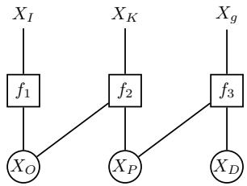
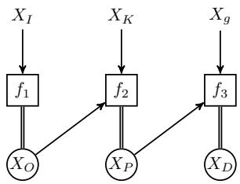
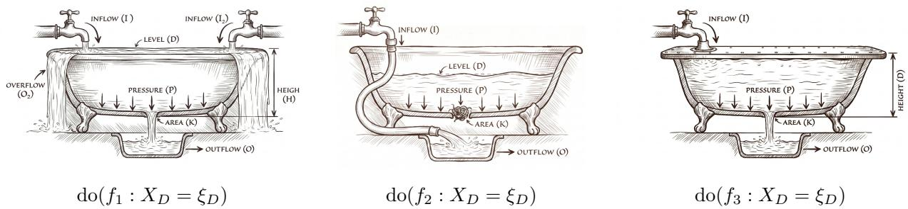
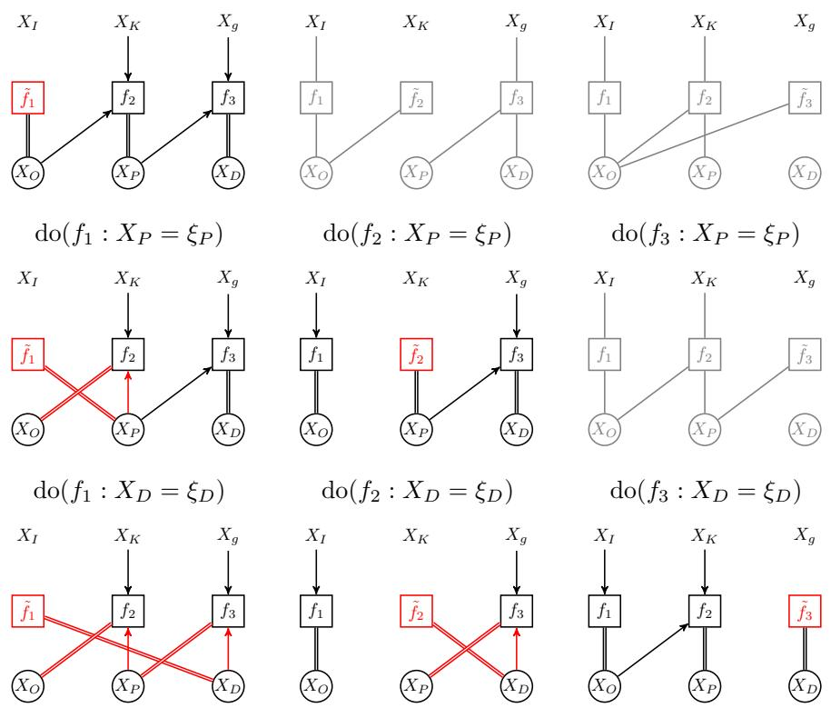
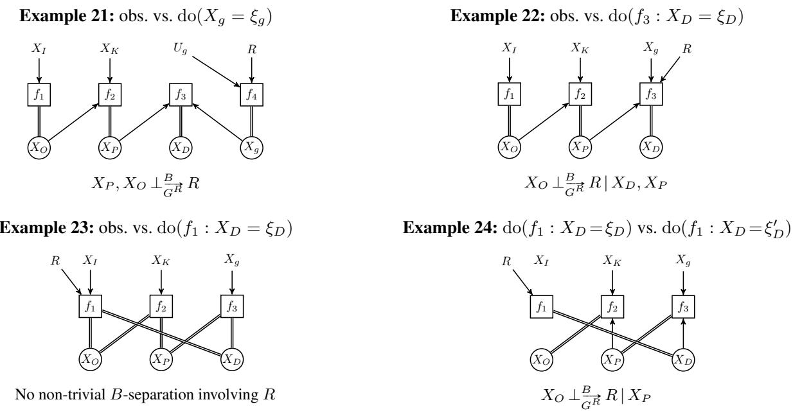
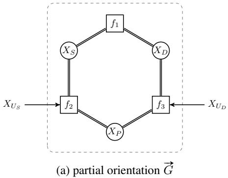
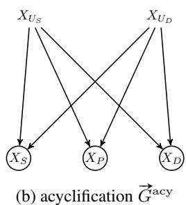

# Causal Reasoning with Bipartite Graphical Causal Models

Joris M. Mooij1

1Korteweg-De Vries Institute for Mathematics, University of Amsterdam, Amsterdam, the Netherlands

## Abstract

Causal Bayesian networks (CBNs) and structural causal models (SCMs) are the dominant frameworks for graphical causal reasoning, but they cannot adequately represent all real-world causal systems. In particular, systems at equilibrium— where feedback mechanisms create cyclic causal dependencies—can exhibit causal semantics that are fundamentally incompatible with these frameworks: different interventions that enforce the same variable value may have different effects, rendering the standard “perfect intervention” do(X =x) ambiguous. We propose bipartite graphical causal models (BGCMs), in which the structure of a system of equations is encoded by a bipartite graph with variable and equation nodes. In this framework, a hard intervention do(fj : Xv = ξv) specifies which equation is replaced, which variable is targeted, and at what value—resolving the ambiguity of the standard notion. We demonstrate, through a detailed case study of a physical system, that this representation naturally corresponds to distinct real-world interventions. We formulate a Markov property in terms of a new graphical separation criterion (B-separation) that exploits the functional determinism inherent in the equations, and we extend it to settings with non-random inputs. We show how this gives rise to a do-calculus for reasoning about domain invariances. BGCMs strictly generalize CBNs and SCMs while retaining the ability to perform graphical causal reasoning.

## 1 INTRODUCTION

In many scientific disciplines—physics, engineering, economics, biology—complex systems are naturally described by systems of equations relating endogenous and exogenous variables. Each equation represents an independent mechanism or physical law; the exogenous variables represent external inputs or noise. Causal Bayesian networks (CBNs) [Pearl, 2009] and structural causal models (SCMs) [Pearl, 2009, Bongers et al., 2021] can represent many such systems, but not all. In particular, systems at equilibrium—where feedback mechanisms create cyclic causal dependencies—can exhibit causal semantics that are fundamentally incompatible with these frameworks.

A canonical example, due to Iwasaki and Simon [1994], is a bathtub at equilibrium: the equilibrium relations between inflow, outflow, pressure, and depth form a system of equations whose causal interpretation depends on which equation is changed by an intervention. Different interventions that set the same variable to the same value can have different effects on other variables, rendering the standard notion of a “perfect intervention” do(X = x) ambiguous [Blom et al., 2021]. Neither CBNs nor SCMs can express this distinction, since they associate each variable with a unique structural equation or Markov kernel.

The key observation underlying our approach is that the structure of a system of equations is naturally encoded by a bipartite graph, with two types of nodes—variable nodes and equation nodes—connected by an edge whenever a variable appears in an equation. By retaining both variable and equation nodes as first-class citizens, the bipartite graph preserves information that is lost when projecting onto a directed graph over variables alone. Building on Simon’s causal ordering algorithm [Simon, 1953], which derives a partial causal ordering of variables by analyzing the bipartite graph, we develop a full-fledged causal modeling framework. This approach is closely related to how engineers already reason about causality, for example in the equationbased modeling language Modelica, where systems are specified as sets of “acausal” equations and causality is derived automatically through symbolic analysis [Bunus and Fritzson, 2002].

In particular, the bipartite representation makes it possible to represent a hard intervention as do $( f _ { j } : X _ { v } = \xi _ { v } ) -$ specifying which equation $f _ { j }$ is replaced, which variable $X _ { v }$ is targeted, and at what value $\xi _ { v }$ . While this intervention notion was already proposed by Blom et al. [2021], it appeared ad hoc, and it remained unclear to what extent it provides a proper and natural mathematical abstraction of real-world interventions.

## The contributions of this paper are:

1. We formally define bipartite graphical causal models (BGCMs) and show how they strictly extend CBNs, acyclic SCMs, simple SCMs, and general SCMs.

2. We demonstrate, through a complete analysis of all hard interventions on the bathtub system, that the BGCM intervention notion do $( f _ { j } : X _ { v } = \xi _ { v } )$ provides a natural and physically meaningful representation of real-world interventions—each corresponding to a distinct physical procedure with distinct causal effects.

3. We formulate a Markov property for BGCMs using a graphical separation criterion (B-separation) that generalizes d-separation to partially oriented bipartite graphs. By encoding both the causal structure and the conditional independence structure in a single partially oriented bipartite graph—rather than in separate graphs as in Blom et al. [2021]—we make the connection between causal and Markov semantics transparent. Because B-separation exploits the functional determinism induced by the equations, the resulting Markov property is strictly stronger than the one obtainable from the Markov ordering graph of Blom et al. [2021] via d-separation.

4. We establish an extended Markov property for the case where some exogenous variables are treated as nonrandom inputs, phrased in terms of transitional conditional independence [Forré, 2021].

5. We develop a do-calculus for BGCMs by exploiting this connection: the Markov property yields domain invariances—relationships between observational and interventional distributions—that go beyond Pearl’s three rules [Pearl, 2009].

## 2 BACKGROUND

## 2.1 MODELING CYCLIC CAUSAL RELATIONS

Feedback mechanisms in dynamical systems may induce cyclic causal relationships at equilibrium. Fast dynamical interactions can lead to effectively “instantaneous” causal cycles. Examples arise across many disciplines: coupled oscillators in physics, supply–demand–price feedback loops in economics, gene regulatory networks in biology, and climate feedback mechanisms. In many such applications, the ability to model causal cycles is essential, and acyclic models are insufficient.

We briefly review some existing causal modeling frameworks and their relationships. A causal Bayesian network (CBN) consists of a directed acyclic graph (DAG) together with a collection of Markov kernels, one for each variable given its parents in the DAG [Pearl, 2009]. An acyclic structural causal model (acyclic SCM) consists of a set of structural equations of the form $X _ { i } : = f _ { i } ( \mathrm { { p a } } ( X _ { i } ) , U _ { i } )$ , where $\operatorname { p a } ( X _ { i } )$ denotes the parents of $X _ { i }$ and $U _ { i }$ is an exogenous noise variable, together with an acyclic causal graph [Pearl, 2009]. An SCM extends this to allow cyclic causal graphs, with each equation having a unique “dependent variable” [Bongers et al., 2021]. While general SCMs can be complicated to work with, the subclass of simple SCMs allows for (sufficiently weak) cycles and retains most of the convenient mathematical properties of acyclic SCMs [Bongers et al., 2021].

These frameworks form a hierarchy of increasing generality:

$$
\begin{array} { r l } { \mathrm { C B N s } \subset \mathrm { a c y c l i c ~ S C M s } \subset \mathrm { s i m p l e ~ S C M s } } & { } \\ { \qquad \subset \mathrm { S C M s } \subset \mathrm { B G C M s } \subset \mathrm { C C M s } , } \end{array}
$$

where BGCMs are bipartite graphical causal models (introduced in this paper) and CCMs are causal constraint models [Blom et al., 2020]. BGCMs occupy a position in this hierarchy that balances model flexibility with the ability to perform causal reasoning.

Simon [1953] introduced the causal ordering algorithm, which derives a causal interpretation of a system of equations from its structural properties. The key idea is that given a system of equations with designated exogenous variables, one can determine a partial ordering on the endogenous variables by analyzing which subsets of equations can be solved for which subsets of variables, and in what order. The original version of the algorithm as proposed by Simon [1953] required solving NP-hard subproblems. Later, Nayak [1995] proposed a computationally efficient version based on perfect matchings.

Blom et al. [2021] expanded upon Simon’s approach to causality by using his algorithm to construct two different graphs out of a set of equations: the causal ordering graph (a directed cluster graph that represents causal effects of certain interventions) and the Markov ordering graph (a directed graph on variable nodes, obtained by declustering and marginalizing out equation nodes, from which conditional independences can be read off via d-separation).

## 3 BIPARTITE GRAPHICAL CAUSAL MODELS

## 3.1 SYSTEMS OF EQUATIONS AND BIPARTITE GRAPHS

We consider a system of equations involving a set of variables $X _ { V } ~ = ~ ( X _ { v } ) _ { v \in V }$ taking values in standard Borel spaces $( { \mathcal { X } } _ { v } ) _ { v \in V }$ , and partitioned into endogenous variables $X _ { V \backslash U }$ and exogenous variables $X _ { U }$ , for some $U \subseteq V$ . The equations $\{ f _ { j } \} _ { j \in F }$ are of the form $0 = \phi _ { j } ( X _ { \mathrm { n b } ( f _ { j } ) } )$ , where $\phi _ { j }$ is a measurable function and nb $( f _ { j } ) \subseteq V$ denotes the set of variables appearing in equation $f _ { j }$

  
Figure 1: The bathtub system (rendered by Google Gemini).

Definition 1 (Bipartite graph of a system of equations). The bipartite graph of a system of equations is the undirected bipartite graph $G = ( V , F , E )$ , where V is the set of variable nodes, $F$ is the set of equation nodes, and $E \subseteq V \times F$ contains an $e d g e \left( \boldsymbol { v } , \boldsymbol { f } \right)$ if and only if variable $X _ { v }$ appears in equation $f .$

We illustrate this with a running example, a simplification of the bathtub system in [Iwasaki and Simon, 1994].

Example 2 (Bathtub at equilibrium). Consider a bathtub with constant inflow ofwater at equilibrium (Figure 1). The endogenous variables are: $X _ { O }$ (water outflow through the drain), $X _ { D }$ (water depth), and $X _ { P }$ (pressure at the drain). The exogenous variables are: $X _ { I }$ (water inflowfromfaucet), $X _ { K }$ (drain area), and $X _ { g }$ (gravitational acceleration). The equilibrium is described by three independent mechanisms:

$$
f _ { 1 } : { \mathrm { ~  ~ 0 ~ } } = X _ { I } - X _ { O }\tag{1}
$$

$$
f _ { 2 } : 0 = X _ { K } { \sqrt { X _ { P } } } - X _ { O }\tag{2}
$$

$$
f _ { 3 } : \quad 0 = X _ { g } X _ { D } - X _ { P }\tag{3}
$$

Equation (1) states that at equilibrium, outflow equals inflow. Equation (2) is Torricelli’s law: outflow is proportional to the drain area and the square root of the pressure. Equation (3) is Stevin’s law: pressure is proportional to depth and gravitational acceleration.

The bipartite graph of this system has variable nodes $\{ X _ { O } , X _ { P } , X _ { D } , X _ { I } , X _ { K } , X _ { g } \}$ and equation nodes $\{ f _ { 1 } , f _ { 2 } , f _ { 3 } \}$ , with edges connecting each equation to the variables appearing in it. We use squares for equation nodes, circles for endogenous nodes, while exogenous variables $\{ X _ { I } , X _ { K } , X _ { g } \}$ are shown without circles:

## 3.2 CAUSAL ORDERING AND PARTIAL ORIENTATION

Given a bipartite graph $G = ( V , F , E )$ and a set $U \subseteq V$ of exogenous variables, Simon’s causal ordering algorithm produces a partial orientation of G that encodes the causal structure.

The algorithm first finds a perfect matching M of the subgraph $G _ { ( V \backslash U ) \cup F } ,$ , i.e., a subset of edges such that each endogenous variable node and each equation node is incident to exactly one edge in $M . ^ { 1 }$ This matching associates each equation with a unique endogenous variable, which can be thought of as the variable that the equation “solves for.” Nayak [1995] showed that the perfect matching can be found efficiently using the Hopcroft-Karp algorithm [Hopcroft and Karp, 1973].

We then define an equivalence relation on the nodes of G that identifies nodes belonging to the same cluster.

Definition 3 (Equivalence relation and clusters). Given a bipartite graph $G = ( V , F , E )$ , subset $U \subseteq V ,$ , and perfect matching M of ${ \mathrm { : } } G _ { ( V \backslash U ) \cup F } ,$ define ∼ as the equivalence relation on $V \cup F$ generated by the following: $a \sim b$ if $a - b \in M$ , or if a and b lie on a closed M-alternating walk $( i . e .$ , a walk that alternates between matched and unmatched edges and returns to its starting node). The equivalence class ofa node a is denoted [a], and we refer to this as $a ~ \ " { c l u s t e r } ^ { \prime  }$

Lemma 4 (Dulmage and Mendelsohn, 1958). The equivalence relation ∼ depends only on the bipartite graph G and the set of exogenous variables U, not on the choice of perfect matching M.

Note that each exogenous node forms a singleton cluster. Using this equivalence relation, we define the partial orientation of the bipartite graph.

Definition 5 (Partial orientation). The partial orientation $\vec { G }$ $o f G$ is obtained by orienting each edge $v - f \in E$ (with $v \in V , f \in F )$ as follows:

$$
v - f \mapsto { \left\{ \begin{array} { l l } { v \to f } & { i f v \not \subset f , } \\ { v = f } & { i f v \sim f . } \end{array} \right. }
$$

The mapping $G \mapsto { \vec { G } }$ is equivalent to Simon’s causal ordering algorithm [Simon, 1953]. Directed edges $v  f$ indicate that variable v is an input to equation f from a different (earlier) cluster. Double-undirected edges $v = f$ indicate that $v$ and $f$ belong to the same cluster. Note that since matched pairs always satisfy $v \sim f ,$ , matched edges are always oriented as $v = f . ^ { 2 }$

Example 6 (Bathtub: causal ordering). For the bathtub system (Example 2), the (unique) perfect matching associates $f _ { 1 }$ with $X _ { O } , f _ { 2 }$ with $X _ { P } ,$ and $f _ { 3 }$ with $X _ { D } .$ . The partially oriented graph is:

This encodes the causal ordering: first solve $f _ { 1 }$ for $X _ { O }$ in terms of $X _ { I } ,$ yielding $X _ { O } ~ = ~ X _ { I } ;$ then solve $f _ { 2 }$ for $X _ { P }$ in terms of $X _ { O }$ and $X _ { K } ,$ , yielding $\begin{array} { r l } { X _ { P } } & { { } = } \end{array}$ $X _ { I } ^ { 2 } / X _ { K } ^ { 2 }$ ; finally solve $f _ { 3 }$ for $X _ { D }$ in terms of $X _ { P }$ and $X _ { g } ,$ yielding $X _ { D } = X _ { I } ^ { 2 } / ( X _ { K } ^ { 2 } X _ { g } )$ . The clusters are $\{ \bar { X } _ { I } \} , \{ X _ { K } \} , \{ X _ { g } \} , \{ f _ { 1 } , X _ { O } \} , \{ f _ { 2 } , \bar { X } _ { P } \} , \{ f _ { 3 } , X _ { D } \}$

We now formally define what we mean by “causal order-$\operatorname { i n g } ^ { \prime \prime }$ . We define a walk in $\vec { G }$ as an alternating sequence of nodes and edges $n _ { 0 } , e _ { 1 } , n _ { 1 } , e _ { 2 } , . . . , e _ { k } , n _ { k }$ where each edge $e _ { i }$ connects $n _ { i - 1 }$ and $n _ { i } ; k = 0$ corresponds with a trivial walk. A path is a walk in which no node repeats.

Definition 7 (Anterior). A node a is anterior to a node b in $\vec { G }$ ifthere is a walkfrom a to b consisting only of→ and $=$ edges. That $i s ,$ a walk oftheform $n _ { 0 } , e _ { 1 } , n _ { 1 } , e _ { 2 } , . . . , e _ { k } , n _ { k }$ where $\begin{array} { r } { n _ { 0 } = a , n _ { k } = b , } \end{array}$ and each edge $e _ { i }$ is either $n _ { i - 1 } \to$ $n _ { i } o r n _ { i - 1 } = n _ { i }$ . We write ant#»(B)for the set ofall nodes anterior to some node in $B \subseteq { \bar { V } } \cup F$

Mathematically, the relation “is anterior $\mathrm { t o } ^ { \prime \prime }$ is a partial order on the clusters (it is reflexive and transitive; it is antisymmetric because any two mutually anterior nodes lie in the same cluster). Simon’s insight was that this mathematical relationship captures what we perceive as causes and their effects: we consider a a cause of b precisely if $a \in \mathrm { a n t } _ { \vec { G } } ( b )$

## 3.3 SOLUTIONS, DISTRIBUTIONS, AND MARKOV KERNELS

By solving the system of equations according to the causal ordering, we obtain solution functions that express all endogenous variables in terms of the exogenous variables. When a cluster contains more than one equation, the equations in the cluster must be solved simultaneously for the variables in that cluster.

Definition 8 (Solution function). A solution function $f o r$ a system of equations with exogenous variables $X _ { U }$ and endogenous variables $X _ { V \backslash U }$ is afunction Φ $: \mathcal { X } _ { U }  \mathcal { X } _ { V }$ such that $\Phi _ { U } ( x _ { U } ) = x _ { U }$ , and $\Phi ( x _ { U } )$ satisfies all equations for every $x _ { U } \in \mathcal { X } _ { U }$

If we assume that all exogenous variables are mutually independent random variables with distributions $X _ { u } \sim \mathbb { P } ( X _ { u } )$ for $u \in U$ , then the joint distribution $\mathbb { P } ( X _ { V } )$ of all variables is obtained as the pushforward of the product distribution $\otimes _ { u \in U } \mathbb { P } ( X _ { u } )$ through the solution function Φ. This corresponds to the distribution of $X _ { V }$ under the sampling scheme

$$
X _ { u } \sim \mathbb { P } ( X _ { u } ) { \mathrm { ~ f o r ~ } } u \in U , \qquad X _ { V } = \Phi ( X _ { U } ) .
$$

More generally, we can treat some exogenous variables as random and others as non-random. This yields a Markov kernel rather than a distribution. If one only assigns independent distributions to exogenous variables in subset $U \backslash J$ with $J \subseteq U$ , one obtains the Markov kernel $\mathbb { P } ( X _ { V } \Vert X _ { J } )$ corresponding to the sampling scheme

$$
X _ { u } \sim \mathbb { P } ( X _ { u } ) { \mathrm { ~ f o r ~ } } u \in U \setminus J , \qquad X _ { V } = \Phi ( X _ { J } , X _ { U \setminus J } )
$$

where the input variables $X _ { J }$ are left unconstrained and we make no assumptions about their distribution. For instance, treating $X _ { I }$ as a non-random input and $X _ { K } , X _ { g }$ as random yields the Markov kernel $\mathbb { P } ( X _ { K } , X _ { g } , X _ { O } , \mathbf { \bar { } } { X _ { P } } , X _ { D } \parallel X _ { I } )$ , which specifies the joint distribution of $X _ { K } , X _ { g } , X _ { O } , X _ { P } , X _ { D }$ for every possible value $x _ { I }$

Definition 9 (Unique solvability of a cluster). A cluster [c] in the partially oriented graph $\dot { \vec { G } }$ is called uniquely solvable if the equations in $F \cap [ c ]$ can be solvedfor the variables $V \cap [ c ]$ in terms of pa #»([c]), and the local solution function $\Phi ^ { [ c ] } : \mathcal { X } _ { \mathrm { p a } _ { \vec { G } } ( [ c ] ) } \to \mathcal { X } _ { [ c ] \cap V }$ is unique.

If all local unique solvability assumptions are met, this guarantees existence and uniqueness of a global solution function. We collect our assumptions so far:

Assumption 10. For a system of equations

$$
0 = \phi _ { j } \mathopen { } \mathclose \bgroup \left( X _ { \mathrm { n b } ( f _ { j } ) } \aftergroup \egroup \right) , \quad j \in F
$$

with corresponding bipartite graph $G = ( V , F , E )$ , exogenous variables $U \subseteq V$ , standard Borel spaces $( { \mathcal { X } } _ { v } ) _ { v \in V } .$

1. The functions $\phi _ { j } : \mathcal { X } _ { \mathrm { n b } ( f _ { j } ) }  \mathbb { R }$ are measurable.

2. The subgraph $G _ { ( V \backslash U ) \cup F }$ has a perfect matching.

3. The exogenous variables are variation independent: their joint value space is a Cartesian product $\prod _ { u \in U } \mathcal { X } _ { u } .$

4. The system is clusterwise uniquely solvable: each endogenous cluster [v] (for $v \in V \setminus U )$ is uniquely solvable.

Proposition 11. Under Assumption 10, there exists a unique solutionfunction Φ : $\mathcal { X } _ { U } \to \mathcal { X } _ { V }$

Proof. The local solution functions $\big ( \Phi ^ { [ v ] } \big ) _ { v \in V \backslash U }$ combine into a system of equations

$$
X _ { v } = \Phi _ { v } ^ { [ v ] } ( X _ { \mathrm { p a } _ { \vec { G } } ( [ v ] ) } ) \qquad v \in V
$$

that has an acyclic structure. Recursive substitution of the local solution functions of each cluster along the causal ordering then yields the global solution function. □

This unique (global) solution function then induces a unique joint distribution $\mathbb { P } ( X _ { V } )$ and unique Markov kernels $\mathbb { P } ( X _ { V } \Vert X _ { J } )$ for $J \subseteq U$

## 4 MARKOV PROPERTY

In this section, we formulate a Markov property for bipartite graphical causal models that relates the conditional independence structure of the joint distribution to the graphical structure of the partially oriented bipartite graph.

## 4.1 B-SEPARATION

We define a graphical separation criterion for partially oriented bipartite graphs, called B-separation (for “bipartite”), an analog of classical d-separation that is appropriate for our setting. It combines ideas from the segment-based formulation of σ-separation [Forré and Mooij, 2017] to deal with cycles (clusters with more than a single variable), and from D-separation [Geiger et al., 1990] to take into account deterministic relations (each endogenous cluster is a deterministic function of its parents).

Definition 12 (Segments, exits, collider/non-collider segments). A walk s on $\vec { G }$ can be partitioned into segments: consecutive maximal subwalks $s _ { 1 } , \ldots , s _ { m }$ of the form $s _ { i , 1 } = \ldots = s _ { i , k _ { i } }$ (possibly $k _ { i } = 1 ) , i . e .$ , with all edges double-undirected $( = ) .$ . We call a boundary node of a segment an exit ifits bounding edge points out ofthe segment or it is an end node ofthe walk. That is, $s _ { i , 1 }$ is an exit ifthe edge on s to the left ofit is $\dots  s _ { i , 1 }$ or ifit is thefirst node of s $~ ( i = 1 ) ,$ , and $s _ { i , k _ { i } }$ is an exit ifthe edge on s to the right of it is $s _ { i , k _ { i } } \to . . . . o r$ if it is the last node of $s ( i = m )$ . A segment with no exit is a collider segment; a segment with one or two exits is a non-collider segment.

The following notion tracks deterministic relations that are imposed by the structure of the bipartite graph.

Definition 13 (Functionally determined). Let $C \subseteq V$ be a subset ofvariable nodes in ${ \vec { G } } .$ . Define $C _ { 0 } : = C$ and

$$
C _ { n + 1 } : = C _ { n } \cup \{ v \in V \setminus U : \mathrm { p a } _ { \vec { G } } ( [ v ] ) \subseteq C _ { n } \} .
$$

We define $\textstyle { \mathrm { f d e t } } _ { \vec { G } } ( C ) : = \bigcup _ { n \geq 0 } C _ { n }$ and refer to those as the variable nodes that are functionally determined by C.

Note that exogenous variable nodes are only functionally determined by C if they are in C.

With these definitions in place, we define:

Definition 14 (B-blocking). For $C \subseteq V$ , the walk is called B-blocked by C ifit contains:

1. a collider segment that does not intersect ant $_ { \vec { G } } ( C )$ , or

2. a non-collider segment with an exit in $\mathrm { f d e t } _ { \vec { G } } ( C )$

Otherwise, the walk is called B-open given C.

Definition 15 (B-separation). Let A, $B , C \subseteq V$ be sets of variable nodes. We say that A and B are B-separated given C in ${ \vec { G } } ,$ written

$$
A \underset { \vec { G } } { \overset { B } {  } } B | C , 
$$

ifevery walkfrom a node in A to a node in B is B-blocked by C in $\vec { G } . ^ { : }$

To build intuition, it is helpful to see how B-separation adapts d-separation to the two features that distinguish partially oriented bipartite graphs from DAGs: clusters and determinism.

Clusters. The variables and equations of a cluster are solved jointly, so segments along a walk behave as a single indivisible unit. A walk can enter or leave a segment only through an exit, and conditioning therefore interacts with a segment only through its exits. This is the bipartite-graph counterpart of collapsing a strongly connected component in σ-separation [Forré and Mooij, 2017]: whether a segment blocks or transmits dependence is decided by the segment as a whole rather than node by node. As in d-separation, a non-collider segment (a chain, a fork, or an endpoint of the walk) transmits dependence unless it is “pinned down” by the conditioning set, whereas a collider segment (a common effect, entered by arrows from both sides) blocks association unless it is “activated” by the conditioning set.

Determinism. Since each endogenous cluster is a deterministic function of its parents, conditioning on C fixes not only $X _ { C }$ but every variable that is functionally determined by it, i.e., Xfdet #»(C). This is what “pinned down” means here: a non-collider segment is already blocked once one of its exits lies in $\operatorname { f d e t } _ { \vec { G } } ( C )$ , even if that exit is not itself in C. Activation of colliders, on the other hand, is governed ${ \mathrm { b y ~ a n t } } _ { \vec { G } } ( C )$ : a collider segment transmits dependence only if the common effect, or one of its descendants, actually belongs to the conditioning set C. It is precisely this extra blocking granted by fde ${ \mathrm { ; } } { \vec { G } } ^ { ( C ) }$ that makes B-separation stronger than criteria that ignore determinism. This intuition is made precise in Appendix C.

## 4.2 GLOBAL MARKOV PROPERTY

Theorem 16 (Global Markov property). Suppose that Assumption 10 holds. When assigning independent distributions to all exogenous variables, the resulting joint distribution $\mathbb { P } ( X _ { V } )$ satisfies: for all A, B, $C \subseteq V ,$

$$
\begin{array} { r } { A \underset { \vec { G } } { \perp } B \vert C \implies X _ { A } \underset { \mathbb { P } ( X _ { V } ) } { \parallel } X _ { B } \vert X _ { C } . } \end{array}
$$

The Markov property “propagates” the independence of the exogenous variables through the equations along the partial ordering, yielding conditional independences among endogenous variables.

Example 17 (Bathtub: Markov property). In the partially oriented bathtub graph (Example $\delta ) ,$ every path from $X _ { D }$ to $X _ { O }$ must pass through $X _ { P }$ (via the equation nodes). One can verify that $\tilde { X _ { D } } \perp _ { \vec { G } } ^ { B } X _ { O } | X _ { P }$ , which implies the conditional independence:

$$
X _ { D } \bot \bot X _ { O } | X _ { P } .
$$

This means the joint distribution factorizes as

$$
\mathbb { P } ( X _ { D } , X _ { O } , X _ { P } ) = \mathbb { P } ( X _ { D } \mid X _ { P } ) \otimes \mathbb { P } ( X _ { O } , X _ { P } ) .
$$

## 4.3 EXTENDED GLOBAL MARKOV PROPERTY

A more general version of the Markov property allows treating some exogenous variables as non-random, using an extended notion of conditional independence [Forré, 2021].

Theorem 18 (Extended Global Markov property). Suppose Assumption 10 holds. Treat exogenous variables $J \subseteq U$ as non-random, and assign independent distributions to exogenous variables in $U \backslash J ,$ yielding Markov kernel $\mathbb { P } ( X _ { V } \Vert X _ { J } )$ . Then for all $A , B , C \subseteq V$ such that $J \subseteq$ $B \cup C { : } ^ { 4 }$

$$
\mathring { A } \underset { \vec { G } } { \overset { B } {  } } B \vert C \implies X _ { A } \underset { \mathbb { P } ( X _ { V } \parallel X _ { J } ) } { \overset { \parallel } { \operatorname { \otimes } } } X _ { B } \vert X _ { C } .
$$

Concretely, the conditional independence $X _ { A } \perp \perp _ { \mathbb { P } ( X _ { V } \parallel X _ { J } ) } X _ { B } \mid X _ { C }$ for a Markov kernel

$\mathbb { P } ( X _ { V } \Vert X _ { J } )$ means that there exists a Markov kernel $Q ( X _ { A } \parallel X _ { C } )$ (not depending on $X _ { B } )$ such that

$$
\mathbb { P } ( X _ { A } , X _ { B } , X _ { C } \| X _ { J } ) = Q ( X _ { A } \| X _ { C } ) \otimes \mathbb { P } ( X _ { B } , X _ { C } \| X _ { J } ) .
$$

This is the notion of transitional conditional independence introduced by Forré [2021]; it is asymmetric (the roles of A and B are not interchangeable).5

Example 19 (Bathtub: extended Markov property). In the bathtub model, treating $X _ { I }$ as non-random yields the Markov kernel $\mathbb { P } ( X _ { K } , X _ { g } , X _ { O } , X _ { P } , X _ { D } \mid \mid X _ { I } )$ . Since $X _ { D } \bot _ { \vec { G } } ^ { B } X _ { I } | X _ { P }$ , the extended Markov property implies $X _ { D } \perp \perp \mathsf { \bar { X } } _ { I } | X _ { P } ,$ , which means there exists a Markov kernel $\mathbb { P } ( X _ { D } \parallel X _ { P } )$ such that:

$$
\mathbb { P } ( X _ { D } , X _ { P } \parallel X _ { I } ) = \mathbb { P } ( X _ { D } \mid X _ { P } ) \otimes \mathbb { P } ( X _ { P } \parallel X _ { I } ) .
$$

## 5 INTERVENTIONS IN BIPARTITE GRAPHICAL CAUSAL MODELS

Causality is fundamentally about change: how does a system react to externally imposed modifications? In the BGCM framework, there are two types of elementary interventions:

1. Changing the distribution of an exogenous variable: replacing $\mathbb { P } ( X _ { u } )$ by another distribution $\tilde { \mathbb { P } } ( X _ { u } )$

2. Replacing an equation: substituting equation $f _ { j }$ by a different equation $\tilde { f } _ { j }$

A particularly important class of the second type is the hard intervention do $f _ { j } : X _ { v } = \xi _ { v } \big )$ , which replaces equation $f _ { j }$ by the equation $0 = X _ { v } - \xi _ { v } , ^ { 6 }$ thereby fixing variable $X _ { v }$ to value $\xi _ { v }$ via the intervened mechanism $f _ { j }$ . This notion naturally corresponds to concrete physical procedures: different choices of $f _ { j }$ lead to genuinely different real-world implementations, even when targeting the same variable $X _ { v }$ at the same value $\xi _ { v }$ (see Example 20 and Appendix E for detailed examples).

## 5.1 AMBIGUITY OF PERFECT INTERVENTIONS

A key insight of the BGCM framework is that the standard notion $\mathrm { d o } ( X _ { v } = \xi _ { v } )$ for a “perfect intervention” can be ambiguous: different equations can be replaced to achieve $X _ { v } = \xi _ { v }$ , leading to different causal effects on other variables [Blom et al., 2021].

Example 20 (Bathtub: ambiguous interventions). Consider setting the water depth to a fixed value $\xi _ { D }$ in the bathtub model. There are at least three distinct interventions that achieve this (see Figure 2). The partially oriented bipartite graphsfor these and all other hard interventions are shown in Figure 3 in Appendix F.

  
Figure 2: Three different interventions on the bathtub that all set the water depth to a fixed value (Example 20).

(i) do $( f _ { 1 } : X _ { D } = \xi _ { D } ) .$ : Replace the equilibrium condition (1) by $0 = X _ { D } - \xi _ { D }$ . Physically, this may correspond to cutting the bathtub at height $\xi _ { D }$ and ensuring it overflows. The causal ordering reverses: $f _ { 1 }$ determines $X _ { D } ,$ , then $f _ { 3 }$ determines XP from $X _ { D }$ and $X _ { g } ,$ andfinally $f _ { 2 }$ determines $X _ { O }$ from $X _ { P }$ and $X _ { K } .$ . The solution is $X _ { O } = X _ { K } \sqrt { X _ { g } \xi _ { D } } ,$ $X _ { P } = X _ { g } \xi _ { D } , X _ { D } = \xi _ { D }$

(ii) do $( f _ { 2 } : X _ { D } = \xi _ { D } ) .$ : Replace Torricelli’s law (2) by $0 = X _ { D } - \xi _ { D } .$ . Physically, this could involve disabling the drain and rerouting the inflow to the outflow once the water has reached height $\xi _ { D } .$ . The causal ordering changes: $f _ { 1 }$ determines $X _ { O } , \tilde { f } _ { 2 }$ determines $X _ { D } ,$ and $f _ { 3 }$ now determines $X _ { P }$ from $X _ { D }$ . The solution is $X _ { O } = X _ { I } , X _ { P } = X _ { g } \xi _ { D } ,$ $X _ { D } = \xi _ { D } .$

(iii) do $( f _ { 3 } : X _ { D } = \xi _ { D } ) .$ : Replace Stevin’s law (3) by $0 =$ $X _ { D } - \xi _ { D } . \ P h y s i c a l l y ,$ , this can be achieved by sealing the bathtub at height $\xi _ { D }$ and ensuring it is completely filled. The causal ordering is preserved: $f _ { 1 }$ still determines $X _ { O } ,$ $f _ { 2 }$ still determines $X _ { P } ,$ and ${ \tilde { f } } _ { 3 }$ determines $X _ { D }$ . The solution $i s X _ { O } = X _ { I } , X _ { P } = X _ { I } ^ { 2 } / X _ { K } ^ { 2 } , X _ { D } = \xi _ { D } .$

These three interventions all set $X _ { D } = \xi _ { D }$ but have different effects on $X _ { O }$ and $X _ { P } .$ . Therefore, the notion $\mathrm { d o } ( X _ { D } = \xi _ { D } )$ is ambiguous and must be refined to do $\left( f _ { j } : X _ { D } = \xi _ { D } \right)$

## 5.2 HARD INTERVENTIONS FOR THE BATHTUB

Table 1 summarizes all possible hard interventions for the bathtub model. In Appendix E we propose possible physical implementations of all feasible hard interventions. That analysis shows that this is more than a purely mathematical exercise. Not every combination of target equation and target variable yields a uniquely solvable system (signaled by the corresponding intervened graph having no perfect matching); indeed, some interventions (marked with ∅) generically lead to systems with no solution. In those cases it would be futile to attempt to implement such interventions.

Table 2 shows the solution functions for all well-defined hard interventions, illustrating how different interventions lead to different causal effects.

Table 1: Feasibility of hard interventions do $\ L ( f _ { j } : X _ { v } =$ $\xi _ { v } )$ for the bathtub. Checkmarks indicate uniquely solvable systems; ∅ indicates the system is not uniquely solvable.
<table><tr><td> $\mathrm { d o } ( f _ { j } : X _ { v } = \xi _ { v } )$ </td><td></td><td> $f _ { 1 }$ </td><td> $f _ { 2 }$ </td><td> $f _ { 3 }$ </td></tr><tr><td> $X _ { O } = \xi _ { O }$ </td><td></td><td>√</td><td>0</td><td>Q</td></tr><tr><td> $X _ { P } = \xi _ { P }$ </td><td></td><td>V</td><td>√</td><td>∅</td></tr><tr><td> $X _ { D } = \xi _ { D }$ </td><td></td><td>V</td><td>V</td><td>√</td></tr></table>

## 5.3 INTERVENTIONS CHANGE THE CAUSAL STRUCTURE

The bathtub system cannot be modeled as a CBN or an SCM, because $\mathrm { d o } ( X _ { D } = \xi _ { D } )$ does not have a unique meaning. In a CBN or SCM, a perfect intervention do $\left( { { X } _ { v } } \mathrm { ~ = ~ } { { \xi } _ { v } } \right)$ replaces a unique structural equation (the one with $X _ { v }$ as its dependent variable), but in the bathtub there is no such unique association.

An important caveat is that hard interventions can change the bipartite graph and its partial orientation, and hence the conditional independence structure. For example, the intervention do ${ \bf \nabla } \cdot ( f _ { 1 } : X _ { D } = \xi _ { D } )$ on the bathtub reverses the causal ordering entirely: instead of $X _ { O }  X _ { P }  X _ { D }$ the ordering becomes $X _ { D }  X _ { P }  X _ { O }$ (in terms of the directed part of the partially oriented graph), as can be seen in Figure 3. This is another phenomenon that has no counterpart in standard CBN or SCM frameworks.

## 6 DOMAIN INVARIANCES

A central application of causal models is reasoning about what changes—and what remains invariant—across different experimental conditions or “domains.” In CBNs, Pearl’s three rules of the do-calculus [Pearl, 2009] formalize such invariances for observational versus interventional distributions. We now develop an analogous theory for BGCMs.

Table 2: Solution functions for all hard interventions on the bathtub model.
<table><tr><td></td><td> $X _ { O }$ </td><td> $X _ { P }$ </td><td> $X _ { D }$ </td></tr><tr><td>observational</td><td> $X _ { I }$ </td><td> $\frac { X _ { I } ^ { 2 } } { X _ { K } ^ { 2 } }$ </td><td> $\frac { X _ { I } ^ { 2 } } { X _ { K } ^ { 2 } X _ { g } }$ </td></tr><tr><td> $\mathrm { d o } ( X _ { I } = \xi _ { I } )$ </td><td> $\xi _ { I }$ </td><td> $\frac { \xi _ { I } ^ { 2 } } { X _ { \kappa } ^ { 2 } }$ </td><td>ξ2  $\frac { 9 . 1 } { X _ { K } ^ { 2 } X _ { g } }$ </td></tr><tr><td> $\mathrm { d o } ( X _ { K } = \xi _ { K } )$ </td><td> $X _ { I }$ </td><td> $X _ { ~ I } ^ { 2 }$   $\frac { \texttt { i } } { \texttt { f } ^ { 2 } }$ </td><td>x 2  $\overline { { \xi _ { K } ^ { 2 } X _ { g } } }$ </td></tr><tr><td> $\operatorname { d o } ( X _ { g } = \xi _ { g } )$ </td><td> $X _ { I }$ </td><td> $\xi _ { K } ^ { 2 }$   $X _ { I } ^ { 2 }$   $\hat { x _ { K } ^ { 2 } }$ </td><td>x 7  $\overline { { \boldsymbol { X } _ { K } ^ { 2 } \boldsymbol { \xi } _ { g } } }$ </td></tr><tr><td> $\mathrm { d o } ( f _ { 1 } : X _ { O } = \xi _ { O } )$ </td><td> $\xi _ { O }$ </td><td> $\frac { \xi _ { O } ^ { 2 } } { X _ { K } ^ { 2 } }$ </td><td> $\frac { \xi _ { O } ^ { 2 } } { X _ { K } ^ { 2 } X _ { g } }$ </td></tr><tr><td> $\mathrm { d o } ( f _ { 1 } : X _ { P } = \xi _ { P } )$ </td><td></td><td></td><td></td></tr><tr><td></td><td> $\sqrt { \xi _ { P } } X _ { K }$ </td><td> $\xi _ { P }$ </td><td> $\frac { \xi _ { P } } { X _ { g } }$ </td></tr><tr><td> $\mathrm { d o } ( f _ { 1 } : X _ { D } = \xi _ { D } )$ </td><td> $X _ { K } \sqrt { X _ { g } \xi _ { D } }$ </td><td> $X _ { g } \xi _ { D }$ </td><td> $\xi _ { D }$ </td></tr><tr><td> $\mathrm { d o } ( f _ { 2 } : X _ { P } = \xi _ { P } )$ </td><td> $X _ { I }$ </td><td> $\xi _ { P }$ </td><td> $\frac { \xi _ { P } } { X _ { g } }$ </td></tr><tr><td> $\mathrm { d o } ( f _ { 2 } : X _ { D } = \xi _ { D } )$ </td><td> $X _ { I }$ </td><td> $X _ { g } \xi _ { D }$ </td><td> $\xi _ { D }$ </td></tr><tr><td> $\mathrm { d o } ( f _ { 3 } : X _ { D } = \xi _ { D } )$ </td><td> $X _ { I }$ </td><td>x2  $\frac { \ d s } { \ d X _ { K } ^ { 2 } }$ </td><td> $\xi _ { D }$ </td></tr></table>

## 6.1 THE GENERAL RECIPE

To relate the distributions in two domains $( \mathrm { e . g . }$ , an observational domain and an interventional domain), we employ the following procedure:

1. Construct the joint model: Introduce an exogenous domain indicator input variable R and write the equations of both domains as a single system, where the equations that differ between domains depend on R.

2. Construct the bipartite graph $G ^ { R } { \mathfrak { s } }$ Build the bipartite graph of the joint model, which includes R as an exogenous variable node connected to the equations in which R occurs.

3. Run causal ordering: Compute the partial orientation $\overrightarrow { G ^ { R } } \mathrm { o f } G ^ { R }$

4. Check solvability: Verify that Assumption 10 holds for the joint model.

5. Apply the Markov property: Use Theorem 18 on $\overrightarrow { G ^ { R } }$ to derive conditional independences involving $R ,$ which translate into invariances across domains.

Except for the solvability check (step 4), this is a purely graphical procedure. When applying the conditional invariances (Examples 22 and 24), one must carefully handle the null sets arising from conditioning on continuous variables. Tracking the null sets rigorously requires additional bookkeeping that we do not spell out here [see Forré and Mooij, 2025].

## 6.2 BATHTUB EXAMPLES

Example 21 (Observational vs. do $X _ { g } = \xi _ { g } ) )$ . Consider comparing the observational setting (domain A) with the setting where gravitational acceleration is fixed to $\xi _ { g } ~ ( d o \cdot$ main B), for instance by “moving the bathtubs to Mars.” We introduce an exogenous variable $U _ { g }$ and write the joint model:

$$
\begin{array} { r l } & { f _ { 1 } : \quad 0 = X _ { I } - X _ { O } , } \\ & { f _ { 2 } : \quad 0 = X _ { K } \sqrt { X _ { P } } - X _ { O } , } \\ & { f _ { 3 } : \quad 0 = X _ { g } X _ { D } - X _ { P } , } \\ & { f _ { 4 } : \quad 0 = X _ { g } - \left\{ \begin{array} { l l } { U _ { g } } & { i f R = A , } \\ { \xi _ { g } } & { i f R = B . } \end{array} \right. } \end{array}
$$

The bipartite graph $G ^ { R }$ has an additional equation node $f _ { 4 }$ connected to $X _ { g } , U _ { g } ,$ and R. In the partial orientation $\overrightarrow { G ^ { R } }$ (see Figure 4), the variables $X _ { P }$ and $X _ { O }$ are B-separated from R (unconditionally). By the Markov property:

$$
\begin{array} { r l } & { X _ { P } , X _ { O } \underset { G ^ { R } } { \overset { B } {  } } R \implies X _ { P } , X _ { O } \underset { + } { \mathrm { i d } } R } \\ & { ~ \implies \mathbb { P } _ { A } ( X _ { P } , X _ { O } ) = \mathbb { P } _ { B } ( X _ { P } , X _ { O } ) . } \end{array}
$$

Equivalently, $\mathbb { P } ( X _ { P } , X _ { O } ) = \mathbb { P } ( X _ { P } , X _ { O } \| \mathrm { d o } ( X _ { g } = \xi _ { g } ) )$ Hence, the joint distribution ofpressure and outflow at equilibrium is invariant under changes in gravitational acceleration.

Example 22 (Observational vs. do $( f _ { 3 } : X _ { D } = \xi _ { D } ) )$ . Now compare the observational setting with the intervention $\mathrm { d o } ( f _ { 3 } : X _ { D } = \xi _ { D } )$ (sealing the bathtub). The joint model replaces $f _ { 3 }$ by a domain-dependent equation:

$$
\begin{array} { r l } { f _ { 1 } : } & { 0 = X _ { I } - X _ { O } , } \\ { f _ { 2 } : } & { 0 = X _ { K } \sqrt { X _ { P } } - X _ { O } , } \\ { f _ { 3 } : } & { 0 = \left\{ X _ { g } X _ { D } - X _ { P } \quad i f R = A , \right. } \\ { \left. X _ { D } - \xi _ { D } \quad } & { i f R = B . \right. } \end{array}
$$

In the partial orientation $\overrightarrow { G ^ { R } }$ (Figure $^ { 4 ) , }$ , we have $\begin{array} { r } { X _ { O } \bot _ { \overrightarrow { G ^ { R } } } ^ { B } R \vert X _ { D } , X _ { P } } \end{array}$ . By the Markov property:

$$
\begin{array} { r l } & { \mathbb { P } _ { A } ( X _ { O } | X _ { D } = \xi _ { D } , X _ { P } ) } \\ & { \quad = \mathbb { P } _ { B } ( X _ { O } \| \mathrm { d o } ( f _ { 3 } : X _ { D } = \xi _ { D } ) | X _ { P } ) . } \end{array}
$$

This means that the conditional distribution ofoutflow given pressure is the same whether we observe depth $\xi _ { D }$ or intervene to set it to $\xi _ { D }$ by sealing the bathtub.

Example 23 (Observational vs. d $\ d \ L ( f _ { 1 } : \ d \ L { X } _ { D } = \xi _ { D } ) )$ Comparing the observational setting with the intervention $\mathrm { d o } ( \dot { f } _ { 1 } : X _ { D } = \xi _ { D } )$ (cutting the bathtub and letting it overflow) yields a joint model where $f _ { 1 }$ is domain-dependent:

$$
\begin{array} { r } { f _ { 1 } : \quad 0 = \left\{ \begin{array} { l l } { X _ { I } - X _ { O } } & { i f R = A , } \\ { X _ { D } - \xi _ { D } } & { i f R = B , } \end{array} \right. } \end{array}
$$

$$
f _ { 2 } : 0 = X _ { K } \sqrt { X _ { P } } - X _ { O } ,
$$

$$
f _ { 3 } : 0 = X _ { g } X _ { D } - X _ { P } .
$$

In the partial orientation $\overrightarrow { G ^ { R } }$ ofthis joint model (Figure 4), all endogenous variables and equations belong to a single cluster (all edges are double-undirected). The Markov property does not yield non-trivial conditional independences involving R. Thus, we cannot use it to relate the observational and interventional distributions in this case—which is consistent with thefact that this interventionfundamentally changes the entire causal structure ofthe system.

Example 24 $( \mathrm { d o } ( f _ { 1 } : X _ { D } = \xi _ { D } )$ vs. $\mathrm { d o } ( f _ { 1 } : X _ { D } = \xi _ { D } ^ { \prime } ) )$ While we cannot relate the observational distribution to do $\left( f _ { 1 } : X _ { D } = \xi _ { D } \right)$ , we can relate two interventional distributions with different parameter values. Consider the joint model where both domains have the same structuralform but different intervention values:

$$
\begin{array} { r l } { f _ { 1 } : } & { 0 = \left\{ \begin{array} { l l } { X _ { D } - \xi _ { D } } & { i f R = A , } \\ { X _ { D } - \xi _ { D } ^ { \prime } } & { i f R = B , } \end{array} \right. } \\ { f _ { 2 } : } & { 0 = X _ { K } \sqrt { X _ { P } } - X _ { O } , } \\ { f _ { 3 } : } & { 0 = X _ { g } X _ { D } - X _ { P } . } \end{array}
$$

Note that in both domains, the causal ordering is the same (reversed compared to the observational setting): $X _ { D } $ $X _ { P }  X _ { O }$ . In the partial orientation $\overrightarrow { G ^ { R } } \left( F i g u r e \ 4 \right) ;$ , we have $X _ { \cal O } \bot _ { \cal G ^ { \cal R } } ^ { \cal B } { \cal R } | \bar { X _ { \cal P } }$ . By the Markov property:

$$
\begin{array} { r l } & { \mathbb { P } _ { A } ( X _ { O } \left\| \mathrm { d o } ( f _ { 1 } : X _ { D } = \xi _ { D } ) \right\| X _ { P } ) } \\ & { \quad = \mathbb { P } _ { B } ( X _ { O } \left\| \mathrm { d o } ( f _ { 1 } : X _ { D } = \xi _ { D } ^ { \prime } ) \right\| X _ { P } ) . } \end{array}
$$

Hence, overflowing bathtubs yield the same conditional distribution of outflow given pressure, regardless of their height. This conclusion might not be intuitively obvious but can easily be derived using our (mostly) graphical causal reasoning calculus.

## 7 DISCUSSION AND RELATED WORK

The BGCM framework extends several existing causal modeling frameworks. Every CBN, acyclic SCM, simple SCM, and general SCM can be represented as a BGCM. Conversely, the bathtub example demonstrates that BGCMs can represent systems whose causal semantics are not captured by any of these frameworks.

Our approach builds on Simon’s causal ordering algorithm [Simon, 1953], the σ-separation criterion for cyclic SCMs [Forré and Mooij, 2017], the D-separation criterion [Geiger et al., 1990] and the framework of Blom et al. [2021]. The latter framework uses two distinct graphs that serve complementary purposes: Blom et al. [2021] show that their Markov ordering graph does not correctly represent causal effects of interventions, while their causal ordering graph does not directly encode conditional independences.

The notion that perfect interventions do $( X = x )$ can be ambiguous was identified by Blom et al. [2021], who proposed the refined notion do $( f _ { j } : X _ { v } = \xi _ { v } )$ to resolve the ambiguity. This refinement is essential for systems like the bathtub, where the same target variable value can be achieved through different mechanisms with different causal consequences. By performing a complete analysis of the causal semantics of the bathtub system under such interventions, we lend further credibility to their claim that this refined notion is a natural representation of “elementary” interventions.

A key contribution of the present paper is that the partially oriented bipartite graph $\vec { G }$ encodes both the causal structure and the conditional independence structure in a single object: the cluster structure and edge directions encode the causal ordering, while B-separation encodes conditional independences. This is more convenient, as it avoids the need to construct and switch between multiple graphs, and it retains the equation nodes so that the intervention structure remains directly visible. Furthermore, our B-separation Markov property is more powerful than the Markov properties derived by Blom et al. [2021]: by also exploiting the functional determinism among the variables, further conditional independences are obtained.7 Finally, our extended Markov property, which handles Markov kernels with non-random inputs through transitional conditional independence [Forré, 2021], has no counterpart in that work. We believe that these features may also facilitate future extensions and applications.

The BGCM framework is closely related to how engineers reason about causality [Frisk et al., 2012, Bunus and Fritzson, 2002, Krysander and Nyberg, 2002]. In modeling languages such as Modelica, systems are specified as sets of “acausal” equations, and causality is derived automatically through symbolic analysis—precisely the kind of analysis formalized by Simon’s causal ordering algorithm and the BGCM framework.

When the bipartite graph does not admit a perfect matching, the Dulmage-Mendelsohn decomposition [Dulmage and Mendelsohn, 1958] provides a useful generalization that can represent overcomplete subsystems (more equations than variables) and incomplete subsystems (more variables than equations). Blom et al. [2021] demonstrate how marginal Markov properties for the complete and overcomplete subsystems can still be derived in this general setting.

To our knowledge, there is little other work using bipartite graphs for causal inference. Zigler and Papadogeorgou [2021] introduce a framework for estimating causal effects under interference when the treated units are distinct from the observed units. Sharifian et al. [2025] prove that every valid graph in the observational equivalence class of linear Gaussian cyclic SCMs corresponds to a perfect matching.

## 8 CONCLUSION

We have proposed bipartite graphical causal models (BGCMs) as a causal modeling framework that uses bipartite graphs with equation nodes and variable nodes. This framework offers several advantages. First, it reduces the ambiguity inherent in specifying interventions by requiring that hard interventions explicitly reference the equation being replaced. Second, Simon’s causal ordering algorithm provides a principled method for deriving the partial orientation of the bipartite graph, which encodes the causal structure. Third, the B-separation criterion and the resulting Markov property propagate conditional independences along the partial ordering. Fourth, the Markov property facilitates causal reasoning about domain invariances, providing a generalization of Pearl’s do-calculus to BGCMs.

BGCMs naturally model equilibrium systems such as the bathtub, and can be applied to a wide range of other systems, including equilibrated economic markets (e.g., supply– demand systems, see Appendix H), electronic circuits, and biochemical reaction networks [Blom and Mooij, 2023]. Directions for future work include dynamical extensions incorporating (stochastic) differential equations, and the development of structure learning algorithms for BGCMs.

## Acknowledgements

I thank Claude Code (Opus 4.6–4.8) for assistance in the writing process, and Kathy Molenaar for useful discussions.

## References

Tineke Blom and Joris M. Mooij. Causality and independence in perfectly adapted dynamical systems. Journal ofCausal Inference, 11:20210005, 2023. URL https://www.degruyter.com/document/ doi/10.1515/jci-2021-0005/html.

Tineke Blom, Stephan Bongers, and Joris M. Mooij. Beyond structural causal models: Causal constraints models. In Ryan P. Adams and Vibhav Gogate, editors, Proceedings ofthe 35th Uncertainty in Artificial Intelligence Conference (UAI-19), volume 115 of Proceedings ofMachine Learning Research, pages 585–594. PMLR, 7 2020. URL https://proceedings.mlr.press/ v115/blom20a.html.

Tineke Blom, Mirthe M. van Diepen, and Joris M. Mooij. Conditional independences and causal relations implied by sets of equations. Journal of Machine Learning Research, 22(178):1–62, 2021. URL http://jmlr. org/papers/v22/20-863.html.

Stephan Bongers, Patrick Forré, Jonas Peters, and Joris M. Mooij. Foundations of structural causal models with

cycles and latent variables. Annals of Statistics, 49(5): 2885–2915, 2021. doi: 10.1214/21-AOS2064.

P. Bunus and P. Fritzson. Methods for structural analysis and debugging of modelica models. In 2nd International Modelica Conference Proceedings, pages 157–165, 2002.

A. Philip Dawid. Conditional independence in statistical theory. Journal of the Royal Statistical Society: Series B (Methodological), 41(1):1–15, 1979.

A. L. Dulmage and N. S. Mendelsohn. Coverings of bipartite graphs. Canadian Journal of Mathematics, 10:517–534, 1958.

Patrick Forré. Transitional conditional independence. arXiv.org preprint, arXiv:2104.11547 [math.ST], April 2021. URL https://arxiv.org/abs/2104. 11547.

Patrick Forré and Joris M. Mooij. Markov properties for graphical models with cycles and latent variables. arXiv.org preprint, arXiv:1710.08775 [math.ST], October 2017. URL https://arxiv.org/abs/1710. 08775.

Patrick Forré and Joris M. Mooij. A mathematical introduction to causality, 2025. URL https://staff.fnwi. uva.nl/j.m.mooij/articles/causality\_ lecture\_notes\_2025.pdf. Lecture Notes.

Erik Frisk, Anibal Bregon, Jan Aslund, Mattias Krysander, Belarmino Pulido, and Gautam Biswas. Diagnosability analysis considering causal interpretations for differential constraints. IEEE Transactions on Systems, Man, and Cybernetics - Part A: Systems and Humans, 42(5):1216– 1229, 2012. doi: 10.1109/TSMCA.2012.2189877.

Dan Geiger, Thomas Verma, and Judea Pearl. Identifying independence in Bayesian networks. Networks, 20(5): 507–534, 1990.

John E. Hopcroft and Richard M. Karp. An $n ^ { 5 / 2 }$ algorithm for maximum matchings in bipartite graphs. SIAM Journal on Computing, 2:225–231, 1973. doi: 10.1137/0202019.

Yumi Iwasaki and Herbert A Simon. Causality and model abstraction. Artificial intelligence, 67:143–194, 1994.

Alexander S. Kechris. Classical Descriptive Set Theory, volume 156 of Graduate Texts in Mathematics. Springer-Verlag, New York, 1995.

Mattias Krysander and Mattias Nyberg. Structural analysis for fault diagnosis of dae systems utilizing mss sets. IFAC Proceedings Volumes, 35(1):143–148, 2002. ISSN 1474-6670. doi: 10.3182/20020721-6-ES-1901.00755. URL https://www.sciencedirect.com/ science/article/pii/S147466701539176X. 15th IFAC World Congress.

S.L. Lauritzen. Graphical Models, volume 17 of Oxford Statistical Science Series. Clarendon Press, Oxford, 1996.

S.L. Lauritzen, A.P. Dawid, B.N. Larsen, and H.-G. Leimer. Independence properties of directed Markov fields. Networks, 20(5):491–505, 1990.

P. Nayak. Automated modeling of physical systems. Springer-Verlag, Berlin, 1995.

Judea Pearl. Causality: Models, Reasoning and Inference. Cambridge University Press, 2009.

Ehsan Sharifian, Saber Salehkaleybar, and Negar Kiyavash. Near-optimal experiment design in linear non-Gaussian cyclic models. In D. Belgrave, C. Zhang, H. Lin, R. Pascanu, P. Koniusz, M. Ghassemi, and N. Chen, editors, Advances in Neural Information Processing Systems (NeuRIPS 2025), volume 38, pages 63520–63538. Curran Associates, Inc., 2025.

Herbert A. Simon. Causal ordering and identifiability. In Studies in Econometric Methods, pages 49–74. John Wiley & Sons, 1953.

Peter Spirtes. Directed cyclic graphical representations of feedback models. In Proceedings ofthe Eleventh Conference on Uncertainty in Artificial Intelligence (UAI-95), pages 499–506, 8 1995.

Thomas Verma and Judea Pearl. Causal networks: Semantics and expressiveness. In Proceedings ofthe Fourth Conference on Uncertainty in Artificial Intelligence (UAI), pages 352–359, 1988.

Corwin M. Zigler and Georgia Papadogeorgou. Bipartite causal inference with interference. Statistical Science, 36 (1):109–123, 2021. doi: 10.1214/19-STS749.

# Causal Reasoning with Bipartite Graphical Causal Models (Supplementary Material)

## Joris M. Mooij1

1Korteweg-De Vries Institute for Mathematics, University of Amsterdam, Amsterdam, the Netherlands

This Supplementary Material contains proofs of the main results and additional details.

## A MEASURABILITY OF SOLUTION FUNCTIONS

We use the following standard measurable-graph fact to justify that the uniquely defined solution functions appearing in the main text are measurable.

Lemma 25 (Measurability of uniquely defined solution maps). Let X and Y be standard Borel spaces, let Z be a measurable space, let $z _ { 0 } \in \mathcal { Z }$ be such that $\{ z _ { 0 } \}$ is measurable, and let $\begin{array} { r } { H : \mathcal { X } \times \mathcal { Y }  \mathcal { Z } } \end{array}$ be measurable. Suppose thatfor every $x \in \mathcal { X }$ there exists a unique $y = : \psi ( x ) \in \mathcal { Y }$ such that $H ( x , y ) = z _ { 0 }$ . Then $\psi : \mathcal { X } \to \mathcal { Y }$ is measurable.

Proof. The graph of ψ is

$$
\Gamma _ { \psi } = \{ ( x , y ) \in \mathcal { X } \times \mathcal { Y } : H ( x , y ) = z _ { 0 } \} .
$$

This set is measurable because it is the inverse image of $\{ z _ { 0 } \}$ under the measurable map $( x , y ) \mapsto H ( x , y )$ . Hence, by [Kechris, 1995, 14.12], ψ is measurable. □

Corollary 26 (Measurability of cluster solution functions). Under Assumption 10, suppose an endogenous cluster [c] is uniquely solvable in the sense ofDefinition 9. Then its local solutionfunction

$$
\Phi ^ { [ c ] } : \mathcal { X } _ { \mathrm { p a } _ { \vec { G } } ( [ c ] ) }  \mathcal { X } _ { [ c ] \cap V }
$$

is measurable.

Proof. Write $\mathcal { X } : = \mathcal { X } _ { \mathrm { p a } _ { \overrightarrow { G } } ( [ c ] ) }$ and $\mathcal { V } : = \mathcal { X } _ { \lceil c \rceil \cap V }$ . For each equation $f _ { j } \in F \cap [ c ]$ , the variables occurring in $f _ { j }$ are contained in $( [ c ] \cap V ) \cup \mathrm { p a } _ { \vec { G } } ( [ c ] )$ . Hence the measurable equation map $\phi _ { j }$ induces a measurable function of $\mathcal { X } \times \mathcal { \bar { Y } }  \mathbb { R }$ . Collect these equations into the measurable map

$$
H : \mathcal { X } \times \mathcal { Y }  \mathbb { R } ^ { F \cap [ c ] } : ( x , y ) \mapsto ( \phi _ { j } ( x , y ) ) _ { j \in F \cap [ c ] } .
$$

Unique solvability says that for every parent value $x \in \mathcal { X }$ there is a unique $y = \Phi ^ { [ c ] } ( x )$ such that $H ( x , y ) = 0$ . Lemma 25 therefore implies that $\Phi ^ { [ c ] }$ is measurable. □

Since the graph has finitely many clusters, recursive substitution of the measurable local solution functions along the causal ordering shows that the global solution function $\Phi : \mathcal { X } _ { U }  \mathcal { X } _ { V }$ of Proposition 11 is measurable as well.

# B PRELIMINARIES ON d-SEPARATION AND D-SEPARATION

We recall the standard notion of d-separation, introduced by Verma and Pearl [1988] (see also Lauritzen, 1996, Pearl, 2009), and, for graphs with deterministic relations, that of D-separation [Geiger et al., 1990].

Definition 27 (d-blocking). A walk $v _ { 1 } \dots v _ { k }$ on a DAG G is d-blocked by $C \subseteq V$ , if it contains:

• a collider $v _ { i - 1 } \right. v _ { i } \left. v _ { i + 1 }$ with $v _ { i } \notin$ ancG(C), or

• a non-collider (possibly endpoint) $v _ { i } \in C .$

Otherwise, the walk is called d-open given C.

Definition 28. Let $A , B , C \subseteq V$ be sets ofvariable nodes in a DAG G. We say that A and B are d-separated given C in $G ,$ written

$$
A { \underset { G } { \overset { d } { \bot } } } B \vert C ,
$$

ifevery walkfrom a node in A to a node in B is d-blocked by C in $G . ^ { 1 }$

Definition 29 (Functionally determined in an acyclic SCM). Let $C \subseteq V$ be a subset of nodes in an acyclic SCM with graph G, with exogenous nodes U and endogenous nodes $V \setminus U .$ . Define $C _ { 0 } : = C$ and

$$
C _ { n + 1 } : = C _ { n } \cup \{ v \in V \setminus U : \mathrm { p a } _ { G } ( v ) \subseteq C _ { n } \} .
$$

We define $\textstyle { \mathrm { f d e t } } _ { G } ( C ) : = \bigcup _ { n \geq 0 } C _ { n }$ and refer to those as the nodes that are functionally determined by C.

The following definition is inspired by [Geiger et al., 1990].

Definition 30 (D-separation). Let A, $B , C \subseteq V$ be sets of nodes in an acyclic SCM with graph G (exogenous nodes U, endogenous $V \setminus U )$ . We say that A and B are D-separated given C in G, written $A \perp _ { G } ^ { D } { \bar { B } } | { \bar { C } } , i f A \perp _ { G } ^ { d ^ { - } } B | \mathrm { f d e t } _ { G } ( C )$ (formulation (2) ofLemma 31).

This formulation of D-separation (which corresponds with formulation (2) in the following lemma) is equivalent to two other formulations:

Lemma 31. Let A, B, C be sets of nodes in an acyclic SCM with graph G, with exogenous nodes U and endogenous nodes $V \backslash U$ . Let $\mathrm { f d e t } _ { G } ( C )$ be the nodes in the DAG that arefunctionally determined by C (as in Definition 29). Thefollowing threeformulations ofD-separation are equivalent:

1. all walks between a node in A and a node in B contain

(a) a collider not in ancG(C)

(b) a non-endpoint non-collider in $\mathrm { f d e t } _ { G } ( C )$

(c) an end node in fdetG(C)

2. all walks between a node in A and a node in B contain

(a) a collider not in ancG(fdetG(C))

(b) a non-endpoint non-collider in fdetG(C)

(c) an end node in fdetG(C)

( ⇐⇒ A, B are d-separated given fdetG(C))

3. all walks between a node in A and a node in B contain

(a) a collider not in ancG(C)

(b) a non-endpoint non-collider in C

(c) an end node in fdetG(C)

(d) a fork in fde ${ \mathrm { ; } } _ { G } ( C )$

Proof. Write $\bar { C } : = \operatorname* { f d e t } _ { G } ( C )$ . From Definition 29 we have $C \subseteq { \bar { C } }$ and

$$
n \in \bar { C } \setminus C \implies n \in V \setminus U \mathrm { ~ a n d ~ p a } _ { G } ( n ) \subseteq \bar { C } ;\tag{4}
$$

in particular $\operatorname { a n c } _ { G } ( C ) \subseteq \operatorname { a n c } _ { G } ( { \bar { C } } )$ . On a walk π we call an internal node a collider if both incident edges point into it, a fork if both point out of it, and a chain if one points in and one out; the two end nodes are treated separately. A parent-neighbor of a node n on π is a neighbor p on π with $p  n$ in $G ;$ thus a collider has two parent-neighbors, a chain has one, and a fork has none. Call π j-active if it is not blocked according to formulation $( j )$ . We prove that the three notions of “active” coincide on every walk $\pi$ between A and $B ;$ the equivalence of the three “all walks are blocked” statements is then immediate.

$( 1 ) \Leftrightarrow ( 2 )$ . The two criteria differ only in the collider clause, and anc $_ { G } ( C ) \subseteq \operatorname { a n c } _ { G } ( { \bar { C } } )$ , so a collider outside $\mathrm { a n c } _ { G } ( \bar { C } )$ is also outside anc $_ { ; G } ( C )$ ; as the other clauses coincide, every walk blocked under (2) is blocked under (1), i.e., every 1-active walk is 2-active.

Conversely, let π be 2-active: every collider lies in $\mathrm { a n c } _ { G } ( \bar { C } )$ , and no node of $\bar { C }$ occurs on π as a non-collider or as an end node. Let k be a collider of $\pi ;$ we show $k \in \operatorname { a n c } _ { G } ( C )$ . If $k \in \bar { C }$ then in fact $k \in C \colon$ otherwise (4) gives $\mathrm { p a } _ { G } ( k ) \subseteq \bar { C }$ so the two parent-neighbors of k would be nodes of C¯ occurring as non-colliders or end nodes, contradicting 2-activity; hence $k \in C \subseteq$ ancG(C). If $k \notin \bar { C } .$ pick a shortest directed path $k \to n _ { 1 } \to \cdots \to n _ { t }$ with $n _ { t } \in \bar { C }$ (one exists since $k \in \operatorname { a n c } _ { G } ( \bar { C } ) )$ , so that $n _ { 1 } , . . . , n _ { t - 1 } \notin \bar { C }$ . Were $n _ { t } \in \bar { C } \setminus C$ , then (4) would place its predecessor on the $\mathrm { p a t h } { - n _ { t - 1 } }$ , or $k$ if $t = 1 { \mathrm { - i n } } \operatorname { p a } _ { G } ( n _ { t } ) \subseteq { \bar { C } } .$ , contradicting the choice of that predecessor outside C¯. Hence $n _ { t } \in C$ and $k \in \operatorname { a n c } _ { G } ( C )$ . So every collider of π lies in $\operatorname { a n c } _ { G } ( C )$ and π is 1-active.

$( 1 ) \Leftrightarrow ( 3 )$ . The collider clause and the end-node clause are identical in the two formulations. If π is 1-active it has no internal non-collider in $\bar { C } ;$ in particular it has no internal non-collider in C and no fork in $\bar { C } ,$ so π is 3-active.

Conversely, let π be 3-active. To show it is 1-active it suffices to rule out internal non-colliders in $\bar { C } .$ Forks in $\bar { C }$ are excluded by 3-activity, and chains in $C$ are excluded as well, so the only remaining possibility is a chain node $m \in { \bar { C } } \backslash C ;$ suppose one occurs. Define $q _ { 0 } : = m$ and let $q _ { i + 1 }$ be the parent-neighbor of $q _ { i }$ , continuing as long as $q _ { i }$ is a chain in ${ \bar { C } } \setminus C$ (which by (4) guarantees a parent-neighbor in $\bar { C } )$ . Each $q _ { i }$ lies in $\bar { C } ,$ , and $q _ { i + 1 } \to q _ { i } \to \cdots \to q _ { 0 }$ is a directed path in the DAG G, so the $q _ { i }$ are distinct and the process stops, at some $q _ { k } \in \bar { C }$ . Since $q _ { k }$ has an edge pointing out of it (toward $q _ { k - 1 } )$ , it is not a collider. $\operatorname { I f } q _ { k }$ is an end node, then an end node lies in $\bar { C } ; \mathrm { i f } q _ { k }$ is a fork, then a fork lies in $\bar { C } ;$ and if $q _ { k }$ is a chain, then—the process having stopped— $- q _ { k } \in C ,$ , so an internal non-collider lies in C. Each case contradicts 3-activity. Hence no chain node of π lies in ${ \bar { C } } \setminus C ,$ so π has no internal non-collider in $\bar { C }$ and is 1-active.

Thus the three notions of “active” (equivalently, of “blocked”) coincide on every walk, and the three formulations of D-separation are equivalent. By definition, formulation (2) is d-separation of A and B given $\bar { C } .$ □

Geiger et al. [1990] defined D-separation (restricted to disjoint $A , B , C )$ with formulation (3), and showed that it is equivalent to formulation (1). What Lemma 31 adds is the equivalence with formulation (2): D-separation given C coincides with ordinary d-separation given the enlarged conditioning set $\bar { C } = \mathrm { f d e t } _ { G } ( C ) . ^ { 2 }$ This reduction is useful because it lets us fall back on the theory of d-separation, which is considerably wider in scope than that of D-separation: it extends to cyclic systems through σ-separation [Forré and Mooij, 2017] and underpins a broad range of Markov-property, completeness, and algorithmic results that have no direct D-separation counterpart

## C PROOF OF THE MARKOV PROPERTY

Our strategy to prove the Markov property for BGCMs (Theorem 16) will be as follows.

We will first ignore deterministic relations and prove a weaker Markov property using a separation notion that we call bseparation (lowercase b for “bipartite”). This separation notion is designed to correspond to d-separation on the acyclification, a directed acyclic graph constructed from the partially ordered bipartite graph. This mimics the acyclification strategy for cyclic SCMs [Spirtes, 1995, Forré and Mooij, 2017, Bongers et al., 2021]. However, we do not make the clusters (corresponding to strongly connected components in SCMs) fully connected, because we typically work with the augmented graph that contains all nodes, including exogenous random variable nodes, and there is no reason to assume a latent noise source feeds into a cycle. From the equivalence of b-separation on the partially oriented bipartite graph and d-separation on its acyclification (Lemma 38), we then prove a b-separation Markov property (Theorem 39) by reduction to the standard Markov property for acyclic SCMs.

We then strengthen the Markov property by taking into account determinism, analogous to how D-separation [Geiger et al., 1990] strengthens d-separation in Bayesian networks. The key intuition is: once every parent of a cluster is fixed by the conditioning information, all variables in the cluster are fixed too. This leads directly to the notion of B-separation. Similarly to how D-separation is related to d-separation, B-separation can be expressed in terms of b-separation (Lemma 41). This observation allows us to obtain Theorem 16 as a Corollary of Theorem 39.

## C.1 b-SEPARATION MARKOV PROPERTY

We repeatedly make use of the following elementary consequences of the definitions:

• Directed edges in $\vec { G }$ always point from variable to equation;

• Parents of a cluster are variables;

• For a walk between two variable nodes, all segment exits will be variable nodes;

• The end nodes of the walk are always exits of their segments.

We will also use that clusters are connected by double-undirected edges.

Lemma $\underline { { 3 2 } }$ (Double-edge connectivity of clusters). Let $a , b \in V \cup F . I f a \sim b ,$ then there exists a possibly trivial walk from a to b in $\vec { G }$ that uses only == edges and whose nodes all lie in $[ a ] = [ b ]$

Proof. It suffices to prove the claim for each generating relation in Definition 3, since walks can then be concatenated along a finite chain of such relations. If $a - b$ is a matched edge, then $a \sim b .$ , so this edge is oriented as $a = b$ in $\vec { G }$ by Definition 5. If a and b lie on a common closed M-alternating walk, take the subwalk of that closed walk from a to b. Every edge on this subwalk has both endpoints on the same closed M-alternating walk, hence its endpoints are equivalent; by Definition 5, each such edge is therefore oriented as ==. The resulting walk stays inside the common equivalence class.

We first define the appropriate acyclification.

Definition 33. For a partially oriented bipartite graph $\vec { G }$ with variable nodes V and equation nodes $F ,$ we define its acyclification as the directed acyclic graph $\vec { G } ^ { \mathrm { a c y } } = ( V , E ^ { \mathrm { a c y } } )$ with nodes V and with a directed edge $v  v ^ { \prime } f o r v , v ^ { \prime } \in V$ ifand only $i f v \in \operatorname { p a } _ { \vec { G } } ( [ v ^ { \prime } ] )$

First we show that “anterior in $\vec { G } ^ { , , }$ (at the node level) corresponds to “ancestral in $\vec { G } ^ { \mathrm { a c y } , \bullet }$ (at the cluster level).

Lemma 34. For nodes a, $b \in V .$

$$
a \in \mathrm { a n t } _ { \vec { G } } ( b ) \iff [ a ] \cap \mathrm { a n c } _ { \vec { G } ^ { \mathrm { a c y } } } ( b ) \neq \emptyset .
$$

Proof. Let π be an anterior walk in ${ \vec { G } } .$ , that is, a walk of the form

$$
s _ { 1 , 1 } = \cdot \cdot \cdot = s _ { 1 , k _ { 1 } } \to s _ { 2 , 1 } = \cdot \cdot \cdot = s _ { 2 , k _ { 2 } } \to \cdot \cdot \cdot \to s _ { m , 1 } = \cdot \cdot \cdot = s _ { m , k _ { m } }
$$

which we partitioned into maximal subwalks $s _ { i }$ of equivalent nodes, each $s _ { i }$ being of the form $s _ { i , 1 } = \ldots = s _ { i , k _ { i } }$ (with possibly $k _ { i } = 1 )$ . We project it onto a directed walk in $\vec { G } ^ { \mathrm { a c y } }$ by picking from each segment $s _ { i }$ the outgoing node $s _ { i , k _ { i } }$

$$
s _ { 1 , k _ { 1 } } \to s _ { 2 , k _ { 2 } } \to \cdot \cdot \cdot \to s _ { m , k _ { m } } .
$$

Hence, if $s _ { 1 , 1 }$ is anterior to $s _ { m , k _ { m } }$ in ${ \vec { G } } ,$ , then $s _ { 1 , k _ { 1 } }$ is an ancestor of $s _ { m , k _ { m } }$ in $\vec { G } ^ { \mathrm { a c y } }$ . Since $s _ { 1 , k _ { 1 } } \in [ s _ { 1 , 1 } ]$ , the claim follows. Vice versa, let $\pi ^ { \mathrm { a c y } }$ be a directed walk in $\vec { G } ^ { \mathrm { a c y } }$

$$
v _ { 1 } \to \cdots \to v _ { m } .
$$

By definition, each edge in $\pi ^ { \mathrm { a c y } }$ connects variables in different clusters of $\vec { G }$ . The edge $\textit { v } _ { i } ~  ~ \textit { v } _ { i + 1 }$ in $\vec { G } ^ { \mathrm { a c y } }$ (with $v _ { i } \in \mathrm { { p a } } _ { \vec { G } } ( [ v _ { i + 1 } ] ) )$ can be lifted to a walk in $\vec { G }$ as follows. Choose an equation $f _ { i } \in F \cap [ v _ { i + 1 } ]$ with $v _ { i } \  \ f _ { i }$ in ${ \vec { G } } ,$ and connect $f _ { i }$ to $v _ { i + 1 }$ by a ==-walk within $[ v _ { i + 1 } ]$ using Lemma 32, resulting in the lift $v _ { i } \to f _ { i } = \cdot \cdot \cdot = v _ { i + 1 }$ in $\vec { G }$ Concatenating these lifts yields an anterior walk in $\vec { G }$ from $v _ { 1 }$ to $v _ { m }$ . By concatenating this with the double-edge walk from Lemma 32, we may obtain an anterior walk in $\vec { G }$ from any node in $[ v _ { 1 } ]$ to $v _ { m }$ . Hence, if a node in [a] is ancestral to b in $\vec { G } ^ { \mathrm { a c y } }$ , then a itself is anterior to b in $\vec { G }$ □

The following notion is related to the segment-based version of σ-separation [Forré and Mooij, 2017], but strengthens it by adding another way in which non-collider segments can block (the third rule).

Definition 35 (b-blocking). For $C \subseteq V$ , the walk is called b-blocked by C ifit contains:

1. a collider segment that does not intersect an $_ { \vec { G } } ( C )$ , or

2. a non-collider segment that has an exit in C, or

3. a non-collider segment with two distinct exits whose cluster has all its ${ \vec { G } } { \cdot } p a r e n t s i n C$ .

Otherwise, the walk is called b-open given C.

Note: Since the two end nodes qualify as exits, an end node in C always b-blocks the walk.

Definition 36 (b-separation). Let $A , B , C \subseteq V$ be sets of variable nodes. We say that A and B are b-separated given $C$ in ${ \vec { G } } ,$ written

$$
A \underset { \vec { G } } { \overset { b } { \bot } } B \vert C ,
$$

ifevery walkfrom a node in A to a node in B is b-blocked by C in $\vec { G } .$

The three rules in which b-separation blocks a walk mirror, segment by segment, the way d-separation blocks the corresponding structure in the acyclification $\vec { G } ^ { \mathrm { a c y } }$ (Lemma 38): a collider segment projects to a collider whose center is a common child; a non-collider segment with a single exit v (a chain, an endpoint, or a one-node fork $\left. v \right. )$ projects to a chain/fork centered at $v ,$ , blocked iff $v \in C ;$ and a non-collider segment with two distinct exits a $\neq b$ projects to a fork $a \left. p \right. b$ through a common parent $p ,$ blocked iff $a \in C$ or $b \in C$ or every such p lies in $C . ^ { 4 }$

We added the third rule to make b-separation via walks coincide with b-separation via paths.

Lemma 37 (b-separation via walks or paths). For all A, $B , C \subseteq V ,$ , every walkfrom A to B is b-blocked by C ifand only if every path from A to B is b-blocked by C.

Proof. Since paths are walks, “all walks b-blocked” implies “all paths b-blocked”.

Conversely, suppose there exists a b-open walk from A to B, and among all such walks with the same end nodes choose one, say π, of minimal length. We show that π has no repeated node, and hence is a b-open path.

First note that no segment of π contains the same node twice. Indeed, if a segment contains two occurrences of a node y, deleting the closed ==-subwalk between these two occurrences gives a strictly shorter walk with the same end nodes. Only this segment is changed; its bounding directed edges, exits, and cluster remain the same. Hence rules 2 and 3 of Definition 35 have the same truth value before and after the deletion. If the segment is a collider, then, since π is b-open, it meets ant ${ \vec { G } } ^ { ( C ) }$ But all nodes in a segment are connected by $- \mathrm { \mathbf { w a l k s } } ,$ so if one node of the segment is anterior to $C ,$ then every node of the segment is anterior to C. Thus the shortened collider segment is still activated. The shortened walk is therefore b-open, contradicting the minimality of π.

Now suppose, for contradiction, that π nevertheless visits some node twice.

Write $\pi = n _ { 0 } , e _ { 1 } , \ldots , e _ { k } , n _ { k }$ , let $x = n _ { \mu } = n _ { \nu }$ with $\mu ~ < ~ \nu$ and let $\pi ^ { \prime }$ be obtained by deleting $e _ { \mu + 1 } , \ldots , n _ { \nu } ,$ i.e., $\pi ^ { \prime } = n _ { 0 } , \ldots , n _ { \mu } , e _ { \nu + 1 } , n _ { \nu + 1 } , \ldots , n _ { k }$ . This is a valid walk, since $e _ { \nu + 1 }$ joins $n _ { \nu } = n _ { \mu } \mathrm { t o } n _ { \nu + 1 }$ , and its end nodes $n _ { 0 } , n _ { k }$ are unchanged. The two occurrences of x lie in distinct segments of π, since no segment of π contains a repeated node.

Let $s ^ { \prime }$ be the segment of π containing the occurrence $n _ { \mu } .$ , and $s ^ { \prime \prime }$ the segment containing $n _ { \nu } ;$ both lie in [x]. In $\pi ^ { \prime }$ the part of $s ^ { \prime }$ from its left boundary to $n _ { \mu }$ and the part of $s ^ { \prime \prime }$ from $n _ { \nu }$ to its right boundary merge into a single segment $t \subseteq [ x ]$ whose left bounding edge is that of $s ^ { \prime }$ (if applicable) and whose right bounding edge is that of $s ^ { \prime \prime }$ (if applicable). Hence t has a left exit iff $s ^ { \prime }$ does, and a right exit iff $s ^ { \prime \prime }$ does. Every other segment of $\pi ^ { \prime }$ coincides with a segment of π (same nodes, bounding edges, exits, and type), so $\pi ^ { \prime }$ can fail to be b-open only at t. We show t does not b-block.

Rule 1 (collider). Suppose t is a collider, i.e., $s ^ { \prime }$ has no left exit and $s ^ { \prime \prime }$ has no right exit. If $s ^ { \prime }$ is itself a collider then, being a segment of the b-open π, it meets an ${ } _ { \vec { G } } ( C ) ;$ ; as $s ^ { \prime } \subseteq [ x ] = [ t ]$ , so does t. The same holds if $s ^ { \prime \prime }$ is a collider. Otherwise $s ^ { \prime }$ has a right exit $\rho ^ { \prime }$ and $s ^ { \prime \prime }$ a left exit $\lambda ^ { \prime \prime }$ , both variables of [x] whose exit edges point into strict descendant clusters. Hence the deleted sub-walk leaves [x] downward at $\rho ^ { \prime }$ and re-enters it from below at $\lambda ^ { \prime \prime }$ , so along it some descending edge (one traversed from its variable into a child cluster) is immediately followed—across a single segment—by an ascending edge; the first such segment $s ^ { \dagger }$ is a collider, and every directed edge before it descends, so $[ x ]$ is anterior to $s ^ { \dagger }$ . As π is b-open, $s ^ { \dagger }$ meets ant $_ { \vec { G } } ( C )$ ; since [x] is anterior to $s ^ { \dagger }$ , so does [x].

Rule 2. Every exit of t is a left exit of $s ^ { \prime }$ or a right exit of $s ^ { \prime \prime }$ , hence an exit of a segment of the b-open π, hence not in $C .$

Rule 3. Suppose t has two distinct exits and $\operatorname { p a } _ { \vec { G } } ( [ x ] ) \subseteq C ;$ we derive a contradiction. Then $s ^ { \prime }$ has a left exit $\ell$ and $s ^ { \prime \prime }$ a right exit r with $\ell \neq r .$ . Consider the right bounding edge of $s ^ { \prime } .$

• If it points out of $s ^ { \prime } ,$ its endpoint $\rho ^ { \prime }$ is a right exit of $s ^ { \prime } . \mathrm { I f } \rho ^ { \prime } \ne \ell ,$ , then $s ^ { \prime }$ has two distinct exits and $\operatorname { p a } _ { \vec { G } } ( [ x ] ) \subseteq C$ , so $s ^ { \prime }$ already b-blocks $\pi { - } \mathrm { a }$ contradiction. If $\dot { \rho } ^ { \prime } = \ell _ { ; }$ , then $s ^ { \prime } = \{ \ell \}$ is a single node, because no segment of π contains a repeated node; hence $\ell = x$ . Now x also lies on $s ^ { \prime \prime }$ , while $s ^ { \prime \prime }$ has right exit $r \neq x$ . If the left bounding edge of $s ^ { \prime \prime }$ pointed out of $s ^ { \prime \prime }$ , its left exit would be distinct from r (otherwise $s ^ { \prime \prime }$ would repeat $r ,$ or would be the single node $r ,$ both impossible since it also contains $x \neq r )$ , so $s ^ { \prime \prime }$ would have two distinct exits and would already b-block π. Thus the left boundary of $s ^ { \prime \prime }$ is an equation entered by an edge $q $ · with $q \in \mathrm { p a } _ { \vec { G } } ( [ x ] ) \subseteq C $ ; then $q$ is a right exit lying in C of the segment preceding $s ^ { \prime \prime } .$ , which therefore b-blocks $\pi { - } \mathrm { a }$ contradiction.

• If it points into $s ^ { \prime } ,$ the right boundary of $s ^ { \prime }$ is an equation entered by an edge $\cdot  q ^ { \prime }$ with $q ^ { \prime } \in \mathrm { p a } _ { \vec { G } } ( [ x ] ) \subseteq C ;$ then $q ^ { \prime }$ is a left exit lying in $C$ of the segment following $s ^ { \prime } ,$ which b-blocks $\pi { - } \mathrm { a }$ contradiction.

Hence t does not b-block, so $\pi ^ { \prime }$ is b-open. This contradicts the minimality of $\pi .$ . Therefore the minimal b-open walk π has no repeated node, i.e., it is a b-open path from A to B. □

The following lemma shows that we have correctly designed b-separation such that it is equivalent to d-separation in the acyclification.

Lemma 38. For all A, $B , C \subseteq V .$

$$
\begin{array} { r } { A \underset { \vec { G } } { \overset { b } {  } } B \vert C \Longleftrightarrow A \underset { \vec { G } ^ { \mathrm { a c y } } } { \overset { d } {  } } B \vert C . } \end{array}
$$

Proof. $\stackrel { 6 6 } { \Rightarrow } { : }$ b-separation implies d-separation in the acyclification. By contrapositive: given a path $\pi ^ { \mathrm { a c y } } = v _ { 0 } , v _ { 1 } , \dots , v _ { k }$ in $\vec { G } ^ { \mathrm { a c y } }$ from $v _ { 0 } \in A$ to $v _ { k } \in B$ that is d-open given $C ,$ , we construct a walk π in $\vec { G }$ between $v _ { 0 }$ and $v _ { k }$ that is b-open given C. By definition, each edge in $\pi ^ { \mathrm { a c y } }$ connects variables in different clusters of $\vec { G }$ . It can be lifted to a walk in $\vec { G }$ by lifting each directed edge in the same way as in the proof of Lemma $3 4$ :

$$
\begin{array} { r l } { v _ { i } \to v _ { i + 1 } \mathrm { ~ o n ~ } \pi ^ { \mathrm { ~ a c y ~ } } } & { { } { \mathrm { ~ i s ~ l i f t e d ~ t o ~ } } \quad v _ { i } \to f _ { i } = \cdots = v _ { i + 1 } \mathrm { ~ i n ~ } \vec { G } } \\ { v _ { i }  v _ { i + 1 } \mathrm { ~ o n ~ } \pi ^ { \mathrm { ~ a c y ~ } } } & { { } { \mathrm { ~ i s ~ l i f t e d ~ t o ~ } } \quad v _ { i } = \cdots = f _ { i }  v _ { i + 1 } \mathrm { ~ i n ~ } \vec { G } . } \end{array}
$$

Concatenating these lifts yields a walk π in $\vec { G }$ between $v _ { 0 }$ and $v _ { k }$ .

We show that π is b-open given C by checking each possibility in which it could be blocked (cf. Definition 35).

• A collider segment stems from the concatenated lifts $v _ { i - 1 } \to f _ { i - 1 } = \cdots = v _ { i } = \cdots = f _ { i }  v _ { i + 1 }$ of some collider $v _ { i - 1 } \right. v _ { i } \left. v _ { i + 1 }$ on $\pi ^ { \mathrm { a c y } }$ . Since $\pi ^ { \mathrm { a c y } }$ is d-open given $C , v _ { i } \in \operatorname { a n c } _ { \vec { G } ^ { \mathrm { a c y } } } ( C )$ , hence $v _ { i } \in$ ant $_ { \vec { G } } ( C )$ (by Lemma 34). All nodes in the segment are anterior to $v _ { i } ,$ and by transitivity, each node in the segment lies in $\operatorname { a n t } _ { \vec { G } } ( C )$ . Thus the segment does not b-block.

• A non-collider segment stems from a non-collider $v _ { i }$ on $\pi ^ { \mathrm { a c y } }$ (a chain, a fork, or an end node). The lift preserves outgoing edges on variable nodes, and it preserves end points. So $v _ { i }$ must be an exit of the segment. The lifting procedure cannot generate a segment with two distinct exits. Since $\pi ^ { \mathrm { a c y } }$ is d-open given $C$ and $v _ { i }$ is a non-collider on $\pi ^ { \mathrm { a c y } }$ , we have $v _ { i } \not \in C$ . Thus the segment does not b-block.

Hence, π is b-open given C.

$^ { 6 6 } { \Leftarrow } \Leftarrow \ '$ : d-separation in the acyclification implies b-separation. By contrapositive: given a walk $\pi = r _ { 0 } , r _ { 1 } , . . . , r _ { n }$ in $\vec { G }$ from $r _ { 0 } \in A$ to $r _ { n } \in B$ that is b-open given $C ,$ we construct a walk $\pi ^ { \mathrm { a c y } }$ in $\vec { G } ^ { \mathrm { a c y } }$ between $r _ { 0 }$ and $r _ { n }$ that is d-open given C. The walk π consists of segments $s _ { 1 } , \ldots , s _ { m }$ separated by directed edges; each such directed edge is of the form $v  f$ or $f  v$ with $v \in V , f \in F$ , and $v \in \operatorname { p a } _ { \vec { G } } ( [ f ] )$ . We project each segment $s _ { i }$ to a piece (node $v _ { i }$ or a walk $a _ { i } \left. p _ { i } \right. b _ { i } )$ , according to its type:

• A collider segment $s _ { i }$ is b-open, so it intersects $\operatorname { a n t } _ { \vec { G } } ( C ) ;$ ; we pick a node $v _ { i } \in [ s _ { i } ] \cap V \cap \operatorname { a n c } _ { \vec { G } ^ { \mathrm { a c y } } } ( C )$ (which exists by Lemma 34) and project $s _ { i } \mathrm { ~ t o ~ } v _ { i } . \mathrm { ~ O n ~ } \pi ^ { \mathrm { a c y } } , v _ { i }$ will become a collider $\right. v _ { i } \left.$ , which is d-open given $C$ as $v _ { i } \in \operatorname { a n c } _ { \vec { G } ^ { \mathrm { a c y } } } ( C )$

• $\mathbf { A }$ non-collider segment with a single exit $v _ { i }$ (a chain, a one-node fork, or an end node $r _ { 0 }$ resp. $r _ { n } ) \mathrm { : }$ since π is b-open, $v _ { i } \not \in C ;$ we project $s _ { i } \operatorname { t o } v _ { i } . \operatorname { A s } v _ { i }$ either carries an outgoing edge leaving its cluster or is an end node, it is a non-collider (chain, fork, or endpoint) on $\pi ^ { \mathrm { a c y } }$ , and d-open since $v _ { i } \notin C$

• A non-collider segment with two distinct exits $a _ { i } \neq b _ { i } :$ since π is b-open, $a _ { i } , b _ { i } \notin C$ and there must be a parent $p _ { i } \in \operatorname { p a } _ { \vec { G } } ( [ s _ { i , 1 } ] ) \setminus C ;$ we project $s _ { i }$ to the fork $a _ { i } \left. p _ { i } \right. b _ { i }$ . As both $a _ { i } , b _ { i }$ either carry an outgoing edge leaving their cluster or form an end node, they are non-colliders on $\pi ^ { \mathrm { a c y } }$ , and both are d-open given $C$ because $a _ { i } , b _ { i } \notin C$ Additionally, $p _ { i }$ does not d-block given $C$ on $\pi ^ { \mathrm { a c y } }$ as $p _ { i } \notin C .$

The consecutive pieces are joined together to form a walk, preserving the directed edges that separated the segments on π. By construction, two consecutive variable nodes on this sequence must lie in different clusters, and one must be parent of the other in $\vec { G } ^ { \mathrm { a c y } }$ . The resulting walk $\pi ^ { \mathrm { a c y } }$ is d-open given C by construction. □

We can now prove the global Markov property for partially oriented bipartite graphs via reduction to the Markov property for acyclic SCMs.

Theorem 39. Suppose Assumption 10 holds. When assigning independent distributions to all exogenous variables, the resulting joint distribution $\mathbb { P } ( X _ { V } )$ satisfies: for all $A , B , C \subseteq V$

$$
\begin{array} { r } { A \underset { \vec { G } } { \perp } B \vert C \implies X _ { A } \underset { \mathbb { P } ( X _ { V } ) } { \parallel } X _ { B } \vert X _ { C } . } \end{array}
$$

Proof. The clusters of $\vec { G }$ are partially ordered by the directed edges between them. For each endogenous cluster $[ v ]$ with $v \in V \setminus U$ , clusterwise unique solvability (Assumption 10) provides a cluster solution function $\bar { \Phi } ^ { [ v ] }$ that expresses the endogenous variables $X _ { ( V \backslash U ) \cap [ v ] }$ as a function of the parent variables $X _ { \mathrm { p a } _ { G } ( [ v ] ) }$ . Write $\Phi _ { w } ^ { [ v ] }$ for the component of $\Phi ^ { [ v ] }$ corresponding to variable $w \in ( \dot { V } \setminus U ) \cap [ v ]$

Replace the original system of equations by the acyclic system: for each endogenous variable $v \in ( V \setminus U )$ , the structural equation is

$$
X _ { v } = \Phi _ { v } ^ { [ v ] } ( X _ { \mathrm { p a } _ { \vec { G } } ( [ v ] ) } ) .
$$

Each exogenous variable $X _ { u } \ ( u \in U )$ retains its original independent distribution. By construction, the solutions of the rewritten system coincide with the solutions of the original system (Proposition 11): in both cases, variables are determined by recursively substituting cluster solution functions along the partial ordering of the clusters. The rewritten system is an acyclic SCM: the structural equation for each variable v depends only on variables in strictly earlier clusters.

Now by Lemma 38, the assumption

$$
A { \frac { \underset {  } { b } } { \underset {  } {  } } } B | C 
$$

implies:

$$
A \underset { \vec { G } \mathrm { a c y } } { \overset { d } { \operatorname { \bot } } } B \vert C .
$$

The graph of the rewritten acyclic SCM is a subgraph of the acyclification DAG $\vec { G } ^ { \mathrm { a c y } }$ (it can be a strict subgraph if one or more functional dependences cancel out). By the standard directed global Markov property for acyclic SCMs with independent exogenous variables [Lauritzen et al., 1990, see also Lauritzen, 1996, Pearl, 2009]:

$$
X _ { A } { \atop \mathbb { P } ( X _ { V } ) } X _ { B } | X _ { C } .
$$

## C.2 ACCOUNTING FOR DETERMINISM

We now strengthen the Markov property for partially oriented bipartite graphs by taking into account determinism, analogous to how D-separation [Geiger et al., 1990] strengthens d-separation in Bayesian networks.

We will write $S \preceq T \operatorname { i f f } X _ { S }$ is a measurable function of $X _ { T }$ .

Lemma 40. Let $A , B , S , T \subseteq V$ with $S \preceq T$ . Then:

$$
\begin{array} { r } { X _ { A } \underset { \mathbb { P } ( X _ { V } ) } { \parallel } X _ { B } \mid X _ { S \cup T } \iff X _ { A } \underset { \mathbb { P } ( X _ { V } ) } { \parallel } X _ { B } \mid X _ { T } . } \end{array}
$$

Proof. This follows from the elementary axioms for conditional independence [Dawid, 1979].

Although B-blocking is stated with an $\operatorname { \partial } _ { , \vec { G } } ( C )$ in its collider rule (Definition 14), B-separation in fact coincides with bseparation given the enlarged conditioning set $\mathrm { f d e t } _ { \vec { G } } ( C )$ . This equivalence is the graphical device behind the strengthening.

Lemma 41. For all $C \subseteq V ,$ , a walk is B-blocked by C ifand only ifit is b-blocked by fdet ${ \mathrm { ; } } { \vec { G } } ^ { ( C ) }$ . Hence,for all A, $B , C \subseteq V { \mathrm { : } }$

$$
\begin{array} { r } { A \underset { \vec { G } } { \overset { B } {  } } B | C \Longleftrightarrow A \underset { \vec { G } } { \overset { b } {  } } B | \mathrm { f d e t } _ { \vec { G } } ( C ) . } \end{array}
$$

Proof. We show the per-walk equivalence; the separation statement follows by quantifying over all walks (equivalently, all paths). Running Definition 35 at $\mathrm { f d e t } _ { \vec { G } } ( C )$ , rule 3 is subsumed by rule 2: a two-distinct-exit segment with $\operatorname { p a } _ { \vec { G } } ( [ s _ { i , 1 } ] ) \subseteq$ $\mathrm { f d e t } _ { \vec { G } } ( C )$ has its whole cluster—hence both exits—in $\mathrm { f d e t } _ { \vec { G } } ( C )$ . So b-blocking by $\mathrm { f d e t } _ { \vec { G } } ( C )$ reduces to: a collider segment not meeting ant ${ \vec { G } } ^ { ( \mathrm { f d e t } } { \vec { G } } ^ { ( C ) ) }$ , or a non-collider segment with an exit in fde $_ { \vec { G } } ( C )$ . This differs from B-blocking by $C$ only in the collider condition, which uses $\operatorname { a n t } _ { \vec { G } } ( \operatorname { f d e t } _ { \vec { G } } ( C ) )$ rather than ant ${ \vec { G } } ^ { ( C ) }$

Since $\mathrm { a n t } _ { \vec { G } } ( C ) \subseteq \mathrm { a n t } _ { \vec { G } } ( \mathrm { f d e t } _ { \vec { G } } ( C ) )$ , every walk b-blocked by $\mathrm { f d e t } _ { \vec { G } } ( C )$ is B-blocked by C. Conversely, let π be B-blocked by $C ;$ we show it is b-blocked by $\mathrm { f d e t } _ { \vec { G } } ( C )$ . As the two criteria share the non-collider rule, we may assume the block comes from a collider segment $s ^ { c }$ , in a cluster $[ c ^ { * } ]$ , that does not meet an $ { \mathrm { , } } _ { \vec { G } } ( C ) . { \mathrm { I f } } \left[ c ^ { * } \right]$ also fails to meet ant ${ \vec { \cdot } } _ { \vec { G } } ( \operatorname { f d e t } _ { \vec { G } } ( C ) )$ , then $s ^ { c }$ blocks π under b-blocking by $\mathrm { f d e t } _ { \vec { G } } ( C )$ as well. Otherwise $[ c ^ { * } ]$ meets an ${ \vec { \cal G } } ^ { ( \mathrm { f d e t } } { \vec { \cal G } } ^ { ( C ) ) }$ but not $\operatorname { a n t } _ { \vec { G } } ( C )$ , and we claim $\mathrm { p a } _ { \vec { G } } ( [ c ^ { * } ] ) \subseteq \mathrm { f d e t } _ { \vec { G } } ( C )$

By Lemma 34, meeting ant ${ \vec { \cal G } } ^ { ( S ) }$ is equivalent to $[ c ^ { * } ]$ meeting an $\operatorname { c } _ { \vec { G } ^ { \mathrm { a c y } } } ( S )$ ; and in the acyclification an ${ } \quad \ { \prime } _ { \overrightarrow { G } ^ { \mathrm { a c y } } } ( \mathrm { f d e t } _ { \overrightarrow { G } } ( C ) ) =$ $\operatorname { a n c } _ { \vec { G } ^ { \mathrm { a c y } } } ( C ) \cup \operatorname { f d e t } _ { \vec { G } } ( C ) . ( \overleftarrow { \operatorname { F o r } } \cdot \underline  { \} } ^ { , } )$ : along a directed path from an ancestor v to a determined node w, either the path meets $C , \operatorname { s o } v \in \operatorname { a n c } _ { \vec { G } \operatorname { a c y } } ( C )$ , or, reading it back from $w ,$ each node is a parent of a determined node outside $C$ and hence itself determined, so $v \in \mathrm { f d e t } _ { \vec { G } } ( C ) . )$ Thus $[ c ^ { * } ]$ meets $\mathrm { f d e t } _ { \vec { G } } ( C )$ : pick $y \in [ c ^ { * } ] \cap \mathrm { f d e t } _ { \vec { G } } ( C ) . \mathrm { A s } [ c ^ { * } ]$ avoids ant ${ } _ { \vec { G } } ( C ) \supseteq C$ , we have $y \not \in C ,$ , so y is endogenous with $\mathrm { p a } _ { \vec { G } } ( [ c ^ { * } ] ) = \mathrm { p a } _ { \vec { G } } ( [ y ] ) \subseteq \mathrm { f d e t } _ { \vec { G } } ( C )$ , proving the claim.

The two walk-neighbors of $s ^ { c }$ are variables of $\mathrm { p a } _ { \vec { G } } ( [ c ^ { * } ] ) \subseteq \mathrm { f d e t } _ { \vec { G } } ( C )$ —they point into the boundary equations of $s ^ { c } - 2 \mathrm { n d }$ each is an exit of the adjacent non-collider segment. Hence both neighbors are b-blocked by $\mathrm { f d e t } _ { \vec { G } } ( C )$ , so π is b-blocked by $\mathrm { f d e t } _ { \vec { G } } ( C )$ □

Combined with the acyclification, this yields a clean correspondence between B-separation and D-separation that mirrors Lemma 38, now accounting for determinism.

Lemma 42 (B-separation equals D-separation in the acyclification). For all $A , B , C \subseteq V$

$$
\begin{array} { r } { A \underset { \vec { G } } { \overset { B } { \right. } } B \left| C \Longleftrightarrow A \underset { \vec { G } ^ { \mathrm { a c y } } } { \overset { D } {  } } B \left| C . } \end{\right.array} \end{array}
$$

Proof. For every $v \in V$ the acyclification satisfies $\mathrm { \ p a } _ { \vec { G } ^ { \mathrm { a c y } } } ( v ) = \mathrm { \ p a } _ { \vec { G } } ( [ v ] )$ , so the closure recursions of Definitions 13

and 29 coincide; hence fdet ${ } _ { \vec { G } ^ { \mathrm { a c y } } } ( C ) = \mathrm { f d e t } _ { \vec { G } } ( C )$ for all $C \subseteq V$ . Therefore

$$
\begin{array} { r l r l } & { \quad _ { A \frac { 1 } { \vec { G } } } B | C \Longleftrightarrow A \underset { \vec { G } ^ { \mathrm { L } } } { \textstyle \frac { b } { \vec { G } } } B | \mathrm { f d e t } _ { \vec { G } } ( C ) \qquad } & & { \mathrm { ( L e m m a ~ 4 1 ) } } \\ & { \qquad \Longleftrightarrow A \underset { \vec { G } ^ { \mathrm { a c y } } } { \textstyle \frac { \vec { L } } { \vec { G } ^ { \mathrm { a c y } } } } B | \mathrm { f d e t } _ { \vec { G } } ( C ) \qquad } & & { \mathrm { ( L e m m a ~ 3 8 ) } } \\ & { \qquad \Longleftrightarrow A \underset { \vec { G } ^ { \mathrm { a c y } } } { \textstyle \frac { \vec { L } } { \vec { G } ^ { \mathrm { a c y } } } } B | \mathrm { f d e t } _ { \vec { G } ^ { \mathrm { a c y } } } ( C ) \qquad } & & { \mathrm { ( f d e t } _ { \vec { G } ^ { \mathrm { a c y } } } ( C ) = \mathrm { f d e t } _ { \vec { G } } ( C ) ) } \\ & { \qquad \Longleftrightarrow A \underset { \vec { G } ^ { \mathrm { a c y } } } { \textstyle \frac { D } { \vec { G } ^ { \mathrm { a c y } } } } B | C \qquad } & & { \mathrm { ( D e f n i t i o n ~ 3 0 ) } . } \end{array}
$$

Theorem 16 now follows from Theorem 39.

Theorem 16 (Global Markov property). Suppose that Assumption 10 holds. When assigning independent distributions to all exogenous variables, the resulting joint distribution $\mathbb { P } ( X _ { V } )$ satisfies: for all $A , B , C \subseteq V$

$$
\begin{array} { r } { A \underset { \overrightarrow { G } } { \perp } B \vert C \implies X _ { A } \underset { \mathbb { P } ( X _ { V } ) } { \parallel } X _ { B } \vert X _ { C } . } \end{array}
$$

Proof. By Lemma 41, the hypothesis $A \bot _ { \vec { G } } ^ { B } B \vert C$ is equivalent to

$$
{ \cal A } \mathop { \frac { b } { \vec { G } } } { \cal B } | \mathrm { f d e t } _ { \vec { G } } ( C ) .
$$

By Theorem 39,

$$
X _ { A } \operatorname { \lrcorner } \operatorname { \lrcorner } \operatorname { \lrcorner } X _ { B } \mid X _ { \mathrm { f d e t } \vec { \operatorname { \_ } } } ( C ) \cdot
$$

The clusterwise solvability condition gives, for each endogenous cluster $[ c ] \colon$

$$
[ c ] \cap V \preceq \mathrm { p a } _ { \vec { G } } ( [ c ] )
$$

From the definitions, it follows that fde ${ \mathrm { , } } _ { \vec { G } } ( C ) \preceq C .$ . By Lemma 40, it then suffices to condition only on $C { : }$

$$
X _ { A } { \atop \mathbb { P } ( X _ { V } ) } X _ { B } | X _ { C } .
$$

Similarly to b-separation, also B-separation may equivalently be defined via walks or via paths.

Lemma 43 (B-separation via walks or paths). For all $A , B , C \subseteq V ,$ , every walk from a node in A to a node in B is B-blocked by C if and only if every path from a node in A to a node in B is B-blocked by $C .$

Proof. By Lemma 41 (per-walk form), a walk is B-blocked by C iff it is b-blocked by $\operatorname { f d e t } _ { \vec { G } } ( C )$ ; applied to walks and to paths separately, this gives that B-separation given $C ,$ defined via walks or via paths, equals b-separation given $\mathrm { f d e t } _ { \vec { G } } ( C )$ defined via walks resp. paths. The latter two coincide by Lemma 37. □

Because fdet ${ \mathrm { ; } } { \vec { G } } ^ { ( C ) }$ can be strictly larger than $C ,$ B-separation is genuinely stronger than b-separation: $A \bot { \frac { b } { G } } B \vert C$ implies $A \bot _ { \vec { G } } ^ { B } B \vert C$ (comparing the two criteria at the same C: the collider rule is common to both, while each non-collider case of b-blocking—an exit in $C .$ , or two distinct exits whose cluster satisfies $\operatorname { p a } _ { \vec { G } } ( [ c ] ) \subseteq C \cdot$ —puts an exit in $\mathrm { f d e t } _ { \vec { G } } ( C )$ and hence B-blocks), but not conversely, as Example 44 shows.

Example 44 (B-separation is strictly stronger than b-separation). Consider the observational bathtub graph ${ \vec { G } } o f$ Example 6 and condition on $C = \{ X _ { I } \}$ . Since $\mathrm { { p a } } _ { \vec { G } } ( [ X _ { O } ] ) = \{ X _ { I } \}$ , the outflow is functionally determined by C, so fde $ _ { \vec { G } } ( \{ X _ { I } \} ) =$ $\{ X _ { I } , X _ { O } \}$ ; the variables $X _ { P }$ and $X _ { D }$ are not determined, as their clusters also require $X _ { K }$ , resp. $X _ { g } .$

Take $A = \{ X _ { O } \}$ and $B = \{ X _ { D } \}$ . The walk $X _ { O }  f _ { 2 } = X _ { P }  f _ { 3 } = X _ { D }$ splits into the segments $\{ X _ { O } \} , \{ f _ { 2 } , X _ { P } \}$ , and $\{ f _ { 3 } , X _ { D } \}$ , with single exits $X _ { O } , X _ { P } ,$ , and $X _ { D }$ respectively. None of these exits lies in $C = \{ X _ { I } \}$ , hence this walk is b-open and $X _ { O } \not \vdash { \overset { b } { \vec { G } } } X _ { D } | X _ { I }$ . Under B-separation the outcome differs: every walk out of $X _ { O }$ begins with the endpoint segment $\{ X _ { O } \}$ whose exit $X _ { O }$ lies in fde ${ } ; { \vec { G } } ^ { \left( \left\{ X _ { I } \right\} \right) }$ , so $X _ { O } \bot _ { \vec { G } } ^ { B } X _ { D } | X _ { I }$

The B-separation verdict is the correct one: conditioning on $X _ { I }$ forces $X _ { O } = X _ { I }$ (Example 6), so $X _ { O }$ is constant given $X _ { I }$ and hence trivially independent of $X _ { D }$ . Thus B-separation detects a conditional independence arisingfrom determinism that b-separation misses.

## D PROOF OF THE EXTENDED GLOBAL MARKOV PROPERTY

We prove Theorem 18, which extends the Global Markov Property (Theorem 16) from joint distributions to Markov kernels with non-random input variables. Our strategy will be similar to that of Appendix C, but rather than applying the standard global Markov property for acyclic SCMs, we make use of the global Markov property for causal Bayesian networks with input variables established by Forré [2021].

Forré [2021, Theorem 6.3] proves the global Markov property for CBNs with input variables using transitional conditional independence [Forré, 2021, Definition 3.1]. This is an asymmetric notion of conditional independence for Markov kernels: $X _ { A } \bot \bot _ { \mathbb { P } ( \cdot \parallel X _ { J } ) } X _ { B } \mid X _ { C }$ means that there exists a Markov kernel $Q ( X _ { A } \parallel X _ { C } )$ (not depending on $X _ { B } )$ such that

$$
\mathbb { P } ( X _ { A } , X _ { B } , X _ { C } \parallel X _ { J } ) = Q ( X _ { A } \parallel X _ { C } ) \otimes \mathbb { P } ( X _ { B } , X _ { C } \parallel X _ { J } ) .
$$

The proof of Forré [2021] proceeds by induction over the topological ordering of the conditional DAG (CDAG)—which marks the variables in $J \subseteq U \subseteq V$ as input variables—chaining the (asymmetric) separoid rules for transitional conditional independence and d-separation in CDAGs, an (asymmetric) extension of d-separation in DAGs. A crucial feature of Forré’s approach is that it does not rely on symmetry of conditional independence (which fails for Markov kernels in general), but instead uses left and right versions of the separoid rules separately.

Theorem 45. Suppose Assumption 10 holds. Treat exogenous variables $J \subseteq U$ as non-random and assign independent distributions to the remaining exogenous variables in $U \backslash J ,$ yielding the Markov kernel $\mathbb { P } ( X _ { V } \Vert X _ { J } )$ . Then for all $A , B , C \subseteq V { \mathrm { : } }$

$$
\begin{array} { r } { A \underset { \vec { G } } { \overset { b } {  } } B \cup J | C \implies X _ { A } \underset { \mathbb { P } ( X _ { V } \parallel X _ { J } ) } { \overset { \parallel } { \operatorname { \phi } } } X _ { B } | X _ { C } . } \end{array}
$$

Proof. As in the proof of Theorem 39, solutions of the system satisfy the acyclic system of equations

$$
X _ { v } = \Phi _ { v } ^ { [ v ] } ( X _ { \operatorname { p a } _ { G } ( [ v ] ) } ) , \qquad v \in V \setminus U .
$$

Treat $J \subseteq U$ as non-random and put independent distributions on the remaining exogenous variables $W : = U \setminus J .$ . For each endogenous cluster $[ v ] ( v \in V \setminus U )$ , let the deterministic Markov kernel $\mathcal { X } _ { \mathrm { p a } _ { \vec { G } } ( [ v ] ) }  \mathcal { P } ( \mathcal { X } _ { v } )$ be the one corresponding to the cluster solution function $\Phi _ { v } ^ { [ v ] }$ , and for each $w \in W$ let $\mathbb { P } ( X _ { w } )$ be its distribution. Together with the non-stochastic inputs $X _ { J }$ , these Markov kernels define a causal Bayesian network M in the sense of Forré [2021, Definition 6.1], with:

• non-stochastic input variables: $X _ { J }$

• stochastic variables: $X _ { V \backslash J }$

• graph: the acyclification $\vec { G } ^ { \mathrm { a c y } }$ , viewed as a conditional DAG ${ \vec { G } } ^ { \mathrm { a c y } } ( V \setminus J | \operatorname { d o } ( J ) )$ .

This is a valid conditional DAG: $\vec { G } ^ { \mathrm { a c y } }$ is acyclic, and no edge points into any $j \in J ,$ since each such $j$ is an exogenous singleton cluster with $\operatorname { p a } _ { \vec { G } } ( [ j ] ) = \varnothing$ . The joint Markov kernel of M is precisely $\mathbb { P } ( X _ { V } \Vert X _ { J } )$

Let $A , B , C \subseteq V$ be such that

$$
A \underset { \vec { G } } { \overset { b } {  } } B \cup J | C .
$$

By Lemma 38,

$$
A \underset { \vec { G } ^ { \mathrm { a c y } } } { \overset { d } { \bot } } B \cup J | C .
$$

Since $\vec { G } ^ { \mathrm { a c y } }$ is acyclic, d-separation coincides with σ-separation [Forré, 2021, Definition $5 . 9$ and Remark 5.10]. Reading the acyclification as the conditional DAG ${ \vec { G } } ^ { \mathrm { a c y } } ( V \setminus J | \operatorname { d o } ( { \dot { J } } ) )$ ), whose σ-separation criterion implicitly includes the input nodes J on the right, this is exactly

$$
A \underset { \vec { G } ^ { \mathrm { a c y } } ( V \setminus J \mid \mathrm { d o } ( J ) ) } { \underbrace { \overset { \sigma } { \perp } } } B | C .
$$

By the global Markov property of Forré [2021, Theorem 6.3] applied to $\mathcal { M } ,$ , this implies the transitional conditional independence

$$
X _ { A } \operatorname { \mathrm { ~ } } _ { \mathbb { P } ( X _ { V } \mid \mid X _ { J } ) } X _ { B } \mid X _ { C } .
$$

Corollary 46. Suppose Assumption 10 holds. Treat exogenous variables $J \subseteq U$ as non-random, and assign independent distributions to exogenous variables in $U \backslash J ,$ , yielding Markov kernel $\mathbb { P } ( X _ { V } \Vert X _ { J } )$ . Thenfor all $A , B , C \subseteq V$ such that $J \subseteq B \cup C .$

$$
M _ { \frac { | } { \vec { G } } } ^ { \ b } B | C \implies X _ { A _ { \frac { | | } { \mathbb { P } ( X _ { V } \parallel X _ { J } ) } } } X _ { B } | X _ { C } .
$$

Proof. When $J \subseteq B \cup C$ we have $J \backslash B \subseteq C$ , so every walk from A to a node of $J \backslash B$ ends in C and is therefore b-blocked by $C ;$ hence $A \bot _ { \vec { G } } ^ { b } B \vert C$ implies $A \perp _ { \vec { G } } ^ { b } B \cup J | C .$ , and Theorem 45 yields $X _ { A } \perp \perp _ { \mathbb { P } ( X _ { V } \parallel X _ { J } ) } X _ { B } | X _ { C }$ □

## D.1 ACCOUNTING FOR DETERMINISM

Just as we strengthened the global Markov property for partially oriented bipartite graphs by accounting for determinism, we can do the same for the extended version. Definition 13 still applies, and does not need to distinguish exogenous input nodes J from exogenous random nodes $U \backslash J !$ exogenous variable nodes are only functionally determined by C if they are in C.

Lemma 47. Let $A , B , S , T \subseteq V$ with $S \preceq T .$ . Then:

$$
X _ { A } \underset { \mathbb { P } ( X _ { V } \parallel X _ { J } ) } { \parallel } X _ { B } \mid X _ { S \cup T } \iff X _ { A } \underset { \mathbb { P } ( X _ { V } \parallel X _ { J } ) } { \parallel } X _ { B } \mid X _ { T } .
$$

Proof. This is the transitional-conditional-independence analog of Lemma 40; because transitional conditional independence is asymmetric, we cannot use the symmetric argument and instead invoke Forré’s Equivalent Exchange rule. By hypothesis $X _ { S }$ is a measurable function of $X _ { T }$ . Then $X _ { S \cup T }$ is a measurable function of $X _ { T } ;$ ; conversely $X _ { T }$ is a coordinate projection of $X _ { S \cup T }$ . Since all model variables are measurable functions of the exogenous variables $X _ { U }$ , both $X _ { S \cup T }$ and $X _ { T }$ are deterministic transitional random variables; as each is a measurable function of the other, they are equivalent [Forré, 2021, Notation 2.19 and Remark 2.20]. The Equivalent Exchange rule for transitional conditional independence [Forré, 2021, Corollary 3.14], which allows the conditioning variable to be replaced by an equivalent one, then yields both implications:

$$
X _ { A } \underset { \mathbb { P } ( X _ { V } \parallel X _ { J } ) } { \parallel } X _ { B } \mid X _ { S \cup T } \iff X _ { A } \underset { \mathbb { P } ( X _ { V } \parallel X _ { J } ) } { \parallel } X _ { B } \mid X _ { T } .
$$

We obtain Theorem 18 from Corollary 46.

Theorem 18 (Extended Global Markov property). Suppose Assumption 10 holds. Treat exogenous variables $J \subseteq U$ as non-random, and assign independent distributions to exogenous variables in $U \backslash J ,$ , yielding Markov kernel $\mathbb { P } ( X _ { V } \Vert X _ { J } )$ Thenfor all $A , B , C \subseteq V$ such that $J \subseteq B \cup C . ^ { 5 }$

$$
\mathring { A } \underset { \vec { G } } { \overset { B } {  } } B \vert C \implies X _ { A } \underset { \mathbb { P } ( X _ { V } \parallel X _ { J } ) } { \overset { \parallel } { \operatorname { \otimes } } } X _ { B } \vert X _ { C } .
$$

Proof. By Lemma 41, the hypothesis $A \bot _ { \vec { G } } ^ { B } B \vert C$ is equivalent to

$$
{ \cal A } \mathop { \frac { b } { \vec { G } } } { \cal B } | \mathrm { f d e t } _ { \vec { G } } ( C ) .
$$

By Corollary 46 (whose hypothesis $J \subseteq B \cup \mathrm { f d e t } _ { \vec { G } } ( C )$ holds because $J \subseteq B \cup C \subseteq B \cup \mathrm { f d e t } _ { \vec { G } } ( C ) )$ ,

$$
X _ { A } \operatorname { \mathrm { ~ } } _ { \mathbb { P } ( X _ { V } \mid \mid X _ { J } ) } X _ { B } \mid X _ { \mathrm { f d e t } \vec { \alpha } } ( C ) \cdot
$$

The clusterwise solvability condition gives, for each endogenous cluster [c]:

$$
[ c ] \cap V \preceq \mathrm { p a } _ { \vec { G } } ( [ c ] ) .
$$

From the definitions, it follows that fdet ${ \vec { \cal G } } ^ { ( C ) } \preceq C$ . By Lemma 47, it then suffices to condition only on $C { : }$

$$
X _ { A } \operatorname { \mathrm { ~ } } _ { \mathbb { P } ( X _ { V } \mid \mid X _ { J } ) } X _ { B } \mid X _ { C } .
$$

## E PHYSICAL IMPLEMENTATIONS OF HARD INTERVENTIONS

The formal notation do $( f _ { j } : X _ { v } = \xi _ { v } )$ has a natural physical interpretation: it specifies which mechanism $f _ { j }$ in the system is replaced in order to enforce $X _ { v } = \xi _ { v }$ . Different choices of $f _ { j }$ correspond to genuinely different physical procedures for achieving the same target value. We illustrate this for four of the hard interventions on the bathtub model. Combined with the ones in Example 20, this gives a complete “physical implementation” of the causal semantics of the bathtub system under the hard interventions we consider elementary in our framework.

do $\left( f _ { 1 } : X _ { O } = \xi _ { O } \right)$ . Equation $f _ { 1 }$ (the equilibrium condition $X _ { I } = X _ { O } )$ is replaced by $\tilde { f } _ { 1 } : X _ { O } = \xi _ { O }$ . The causal ordering is preserved: $\ddot { f } _ { 1 }$ determines $X _ { O } , f _ { 2 }$ determines $X _ { P } ,$ , and $f _ { 3 }$ determines $X _ { D } . \mathrm { A }$ physical implementation is to divert the original inflow away from the tub and install a new faucet with inflow rate $X _ { I _ { 2 } } = \xi _ { O }$

do $( f _ { 1 } : X _ { P } = \xi _ { P } )$ . Equation $f _ { 1 }$ is replaced by $\tilde { f } _ { 1 } : X _ { P } = \xi _ { P }$ . The causal ordering changes: $\tilde { f } _ { 1 }$ now determines $X _ { P }$ (instead of $X _ { O } )$ , and consequently $f _ { 2 }$ must solve for $X _ { O }$ given $X _ { P } . \mathrm { \ A }$ physical implementation requires diverting the original inflow, installing a sufficiently large new inflow, and connecting a pressure relief valve to the bottom of the tub that activates when $X _ { P } > \xi _ { P }$

do $\left( f _ { 2 } : X _ { P } = \xi _ { P } \right)$ . Here, Torricelli’s law $f _ { 2 }$ is replaced by $\tilde { f } _ { 2 } : X _ { P } = \xi _ { P }$ , while the equilibrium condition $f _ { 1 }$ remains intact. This requires a more involved physical procedure: clog the drain, reroute the original inflow directly to the outflow through a pipe (bypassing the tub and drain), install an additional sufficiently large inflow, and connect a pressure relief valve that activates when $X _ { P } > \xi _ { P }$ . Note that this intervention targets the same variable $( { \cal X } _ { P } = \xi _ { P } )$ as do( $f _ { 1 } : X _ { P } = \xi _ { P } )$ but through a different mechanism: the equilibrium condition $f _ { 1 }$ is preserved, so $X _ { O } \ = \ X _ { I }$ still holds, whereas in do $( f _ { 1 } : X _ { P } = \xi _ { P } )$ we get $X _ { O } = X _ { K } \sqrt { \xi _ { P } }$

do $( f _ { 2 } : X _ { D } = \xi _ { D } )$ . Torricelli’s law $f _ { 2 }$ is replaced by $\tilde { f } _ { 2 } : X _ { D } = \xi _ { D }$ . This changes the causal ordering: $f _ { 3 }$ now determines $X _ { P }$ from $X _ { D }$ (rather than $X _ { D }$ from $X _ { P } )$ . The physical implementation is similar to the previous case—clog the drain, reroute inflow to outflow, install an additional inflow—but instead of a pressure valve, the bathtub is cut at height $\xi _ { D }$

These examples illustrate a key advantage of the BGCM framework: the notion do $\mathbf { \zeta } ^ { \prime } f _ { j } : X _ { v } = \xi _ { v } \mathbf { \zeta } )$ makes the physical implementation explicit by specifying which mechanism is targeted, resolving the ambiguity inherent in the standard notion $\mathrm { d o } ( X _ { v } = \xi _ { v } )$ . Furthermore, we have shown explicitly that each such hard intervention that leads to a solvable system can indeed be realized as a real-world intervention.

## F PARTIALLY ORIENTED BIPARTITE GRAPHS UNDER INTERVENTIONS

Figure 3 shows the partially oriented bipartite graphs for the observational bathtub model, all six well-defined hard interventions (cf. Table 1), and the three infeasible hard interventions. Edges that change relative to the observational case are drawn in red; intervened equation nodes are also shown in red. The systems that (generically) do not have solutions are drawn in gray.

do(f1 : XO = ξO)

do(f2 : XO = ξO)

do(f3 : XO = ξO)

Observational

  
Figure 3: Partially oriented bipartite graphs for the bathtub model under all hard interventions (cf. Table 1). The observational graph is shown top-right for reference. Intervened equation nodes are shown in red; edges whose orientation changes relative to the observational case are drawn in red. Note how replacing different equations can lead to fundamentally different causal orderings: e.g., do $( f _ { 1 } : X _ { D } = \xi _ { D } )$ reverses the causal flow entirely. For three hard interventions, the intervened bipartite graph cannot be oriented (no perfect matching exists), so the undirected intervened bipartite graph is displayed instead.

## G PARTIALLY ORIENTED BIPARTITE GRAPHS FOR THE DOMAIN INVARIANCE EXAMPLES

Figure 4 shows the partially oriented bipartite graphs $\overrightarrow { G ^ { R } }$ of the joint models constructed for each of the four domain invariance examples in Section 6. In each case, the exogenous domain indicator variable R is connected to the equation(s) that differ between domains. The graphical structure of $\overrightarrow { G ^ { R } }$ determines which B-separation statements hold, and hence which domain invariances can be derived from the Markov property.

## H A WORKED EXAMPLE WITH A GENUINE CYCLE: SUPPLY AND DEMAND

The bathtub of Example 6, although a feedback system at equilibrium, has a partial orientation whose endogenous clusters each consist of one equation and one variable $( \{ f _ { 1 } , X _ { O } \} , \{ f _ { 2 } , X _ { P } \} , \{ f _ { 3 } , X _ { D } \} )$ ; its causal ordering is therefore acyclic. To illustrate the part of the framework that deals with genuine cycles—multi-node clusters, whose segments are treated in B-separation as single indivisible units (Definition 14)—we work out a classic simultaneous supply–demand system, in which all three mechanisms must be solved jointly.

Consider a competitive market at equilibrium with endogenous variables $X _ { S }$ (quantity supplied), $X _ { D }$ (quantity demanded), and $X _ { P }$ (price), and exogenous supply/demand shifts $X _ { U _ { S } } , X _ { U _ { D } }$ . With supply slope $\beta$ and demand slope α satisfying $\beta > 0 > \alpha$ , the equilibrium is described by three mechanisms:

  
Figure 4: Partially oriented bipartite graphs of the joint models for the four domain invariance examples (Section 6). In each graph, the exogenous domain indicator R is connected to the equation(s) that differ between domains. The B-separation statement below each graph summarizes the graphical criterion from which the corresponding domain invariance is derived via the Markov property. In Example 23, all endogenous nodes and equation nodes form a single cluster, so no non-trivial B-separation involving R exists.

$$
\begin{array} { r l } { f _ { 1 } : } & { 0 = X _ { S } - X _ { D } } \\ { f _ { 2 } : } & { 0 = \beta X _ { P } + X _ { U _ { S } } - X _ { S } } \\ { f _ { 3 } : } & { 0 = \alpha X _ { P } + X _ { U _ { D } } - X _ { D } } \end{array}
$$

(market clears)

(demand)

A single endogenous cluster. The endogenous subgraph (variables $\{ X _ { S } , X _ { P } , X _ { D } \}$ , equations $\{ f _ { 1 } , f _ { 2 } , f _ { 3 } \} )$ admits the perfect matching $M = \{ f _ { 1 } - X _ { S } , f _ { 2 } - X _ { P } , f _ { 3 } - X _ { D } \}$ . The closed M-alternating walk

$$
X _ { S } - f _ { 1 } - X _ { D } - f _ { 3 } - X _ { P } - f _ { 2 } - X _ { S }
$$

(alternating the matched edges $f _ { 1 } - X _ { S } , f _ { 3 } - X _ { D } , f _ { 2 } - X _ { P }$ with the unmatched edges $f _ { 1 } - X _ { D } , f _ { 3 } - X _ { P } ,$ $f _ { 2 } \mathrm { ~  ~ { ~ - ~ } ~ } X _ { S } )$ visits all six nodes of the endogenous subgraph. By Definition 3 they therefore form a single cluster $\left\{ f _ { 1 } , f _ { 2 } , f _ { 3 } , X _ { S } , X _ { P } , X _ { D } \right\}$ , and by Lemma 4 this is independent of the chosen matching. The cluster has parents $\mathrm { p a } _ { \vec { G } } ( [ f _ { 1 } ] ) = \{ X _ { U _ { S } } , X _ { U _ { D } } \}$ . In the partial orientation ${ \vec { G } } ,$ all six intra-cluster edges are double-undirected, while the two exogenous shifts point in (Figure 5a). Unlike the bathtub, the causal ordering here is not acyclic: the entire endogenous system is a single feedback cluster, solved simultaneously.

Unique solvability and solution. Because $\beta > 0 > \alpha$ , the cluster is uniquely solvable (Assumption 10). Substituting the supply and demand relations into the market-clearing condition $X _ { S } = X _ { D }$ gives $\beta X _ { P } + X _ { U _ { S } } = \alpha X _ { P } + X _ { U _ { D } }$ , hence

$$
X _ { P } = \frac { X _ { U _ { D } } - X _ { U _ { S } } } { \beta - \alpha } , \qquad X _ { S } = X _ { D } = \frac { \beta X _ { U _ { D } } - \alpha X _ { U _ { S } } } { \beta - \alpha } .
$$

Reading off (in)dependences. Assign independent distributions to the shifts $X _ { U _ { S } } , X _ { U _ { D } }$ , so that $\mathbb { P } ( X _ { V } )$ is well defined and the Markov property (Theorem 16) applies. Consider the walk

$$
X _ { U _ { S } } \right. f _ { 2 } = X _ { P } = f _ { 3 } \left. X _ { U _ { D } } .
$$

Its middle segment $f _ { 2 } = X _ { P } = f _ { 3 }$ lies entirely inside the cluster and is a collider segment: both bounding edges point inward. For $C = \emptyset$ we have an $\operatorname { t } _ { \vec { G } } ( \emptyset ) = \emptyset$ , so this collider segment is disjoint from an ${ \mathfrak { d } } ( \emptyset )$ and blocks (rule 1 of

  
Figure 5: The supply–demand system and its acyclification. (a) The partial orientation $\vec { G } \colon$ the three endogenous variables and three equations form a single feedback cluster (dashed box) with the exogenous shifts $X _ { U _ { S } } , X _ { U _ { D } }$ as its parents; all intra-cluster edges are double-undirected. (b) The acyclification $\vec { G } ^ { \mathrm { a c y } }$ , the DAG on the variable nodes with an edge $v  v ^ { \prime }$ whenever $v \in \mathrm { p a } _ { \vec { G } } ( [ v ^ { \prime } ] )$ ; the two shifts become common parents of all three endogenous variables, which are mutually nonadjacent. B-separation in $\vec { G }$ coincides with D-separation in $\vec { G } ^ { \mathrm { a c y } }$ (Lemma 42), so the two encode the same conditional independences; but only ${ \vec { G } } ,$ , which retains the equation nodes, can model interventions.

Definition 14). Since $X _ { U _ { S } }$ and $X _ { U _ { D } }$ attach to the cluster only through the inward edges $X _ { U _ { S } }  f _ { 2 }$ and $X _ { U _ { D } }  f _ { 3 }$ , every path between them crosses such a within-cluster collider segment, so

$$
\begin{array} { r } { \begin{array} { c c c c } { X _ { U s } \overset { B } { \underset { G } {  } } X _ { U _ { D } } | \emptyset } & { \implies } & { X _ { U s } \overset { \mathbb { \textstyle \textrm { B } } } { \underset { \mathbb { P } } {  } } X _ { U _ { D } } , } \end{array} } \end{array}
$$

recovering the assumed independence of the two shifts.

Conditioning on the equilibrium price reverses the verdict. As $X _ { P }$ lies in the cluster, the whole cluster is anterior to $X _ { P } ,$ , so the collider segment now meets ant $\vec { G } ^ { ( \{ X _ { P } \} ) }$ and no longer blocks. Moreover fde ${ \vec { \cdot } } _ { \vec { G } } ( \{ X _ { P } \} ) = \{ X _ { P } \}$ : determining the cluster would require both exogenous parents, and neither is in $\{ X _ { P } \}$ , so no further node is functionally determined. Hence the endpoints $X _ { U _ { S } } , X _ { U _ { D } }$ are not in fde ${ \bf \Gamma } _ { \vec { G } } ( \{ X _ { P } \} )$ ), rule 2 does not block either, and the walk is B-open:

$$
X _ { U s } \not \vdash \underbrace { \not { p } } _ { \vec { G } } ^ { B } X _ { U _ { D } } | X _ { P } .
$$

This matches the algebra: $X _ { P } = ( X _ { U _ { D } } - X _ { U _ { S } } ) / ( \beta - \alpha )$ , so conditioning on the price imposes the constraint $X _ { U _ { D } } - X _ { U _ { S } } =$ $( \beta - \alpha ) X _ { P }$ and generically renders the two shifts dependent. It is the familiar phenomenon of conditioning on a common effect—except that here the common effect is an entire feedback cluster rather than a single variable, which is exactly what rule 1 of B-separation is designed to capture.

Determinism (rule 2) in a cycle. Rule 2 blocks a non-collider segment as soon as one of its exits isfunctionally determined by the conditioning set. In a single multi-variable cluster this is all-or-nothing: every endogenous variable has the same parents $\{ X _ { U _ { S } } , X _ { U _ { D } } \}$ , so none is determined until both shifts are conditioned on. Thus fdet ${ } _ { \vec { G } } ( \{ X _ { U _ { S } } \} ) = \{ X _ { U _ { S } } \}$ , whereas

$$
\mathrm { f d e t } _ { \vec { G } } ( \{ X _ { U _ { S } } , X _ { U _ { D } } \} ) = \{ X _ { U _ { S } } , X _ { U _ { D } } , X _ { S } , X _ { P } , X _ { D } \}
$$

is the entire set of variable nodes. In the latter case the endpoint segment of every path already has an exit in $\operatorname { f d e t } _ { \vec { G } } ( C )$ so rule 2 blocks it; hence, for example, $X _ { S } \perp _ { \vec { G } } ^ { B } X _ { P } | X _ { U _ { S } } , X _ { U _ { D } }$ . Whereas conditioning on the endogenous price created dependence between the shifts (rule 1), conditioning on both exogenous shifts removes all dependence among the endogenous quantities: fixing both shifts pins down the equilibrium, so every endogenous quantity is constant and hence conditionally independent of the rest. Needing all of a cluster’s parents before any of its variables is determined is not special to cycles; it is a general property of fdet $\vec { G }$ that already appears at single-variable clusters whose equation has several parents. In the bathtub, for instance, the cluster $\{ f _ { 2 } , X _ { P } \}$ has parents $\{ X _ { O } , X _ { K } \}$ , so pressure is determined only once both outflow and drain area are fixed—conditioning on $X _ { O }$ alone leaves $X _ { P }$ undetermined.

The same facts by D-separation. By Lemma 42, B-separation in $\vec { G }$ coincides with D-separation in the acyclification $\vec { G } ^ { \mathrm { a c y } }$ (Figure 5b), so the three verdicts above can be read off there as well. In $\vec { G } ^ { \mathrm { a c y } }$ the shifts $X _ { U _ { S } } , X _ { U _ { D } }$ are common parents of $X _ { S } , X _ { P } , X _ { D }$ , which are otherwise nonadjacent: (i) unconditionally the shifts are d-separated, their only connections passing through the unconditioned colliders $X _ { S } , X _ { P } , X _ { D } ;$ (ii) conditioning on $X _ { P }$ opens that collider, making the shifts d-connected; and (iii) conditioning on both shifts blocks each path between $X _ { S }$ and $X _ { P }$ path at its fork $( X _ { U _ { S } }$ or $X _ { U _ { D } } )$ giving d-separation. The within-cluster collider segment of $\vec { G }$ thus becomes an ordinary collider at a common child in $\vec { G } ^ { \mathrm { a c y } }$ and conditioning on a cluster variable becomes conditioning on that child. In this example $D .$ -separation reduces to ordinary $d \cdot$ -separation, since conditioning on the parents that determine a variable already blocks the forks through them.