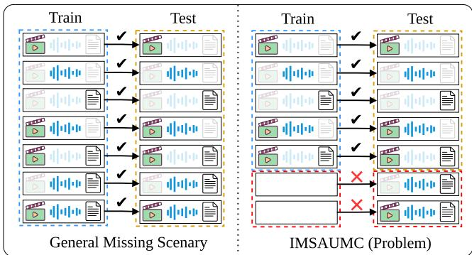
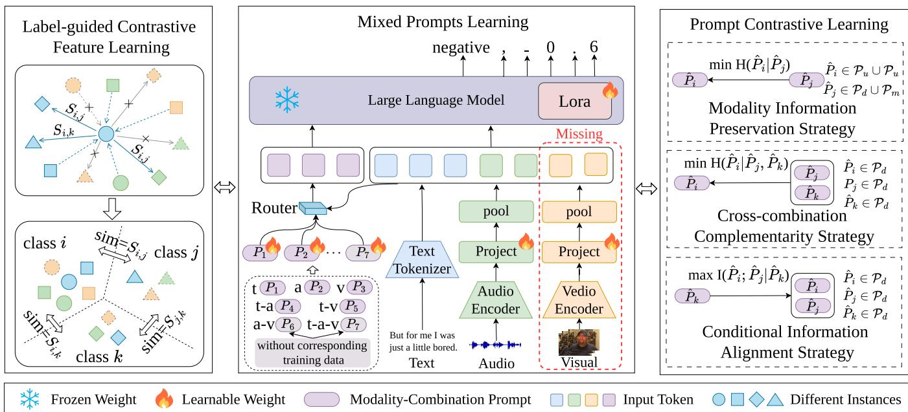
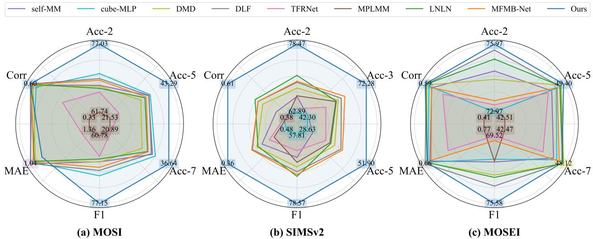
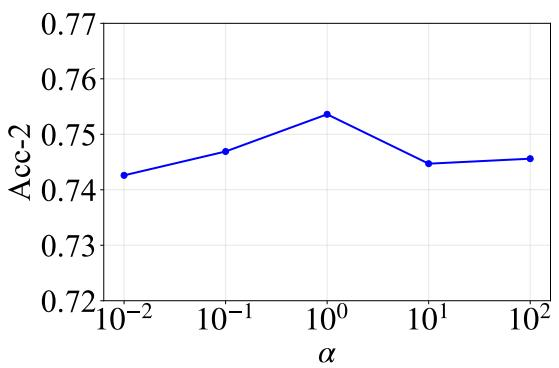
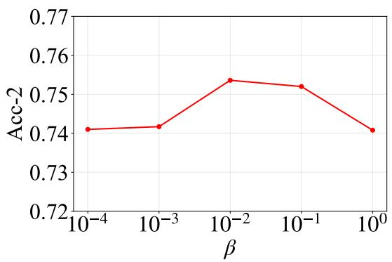
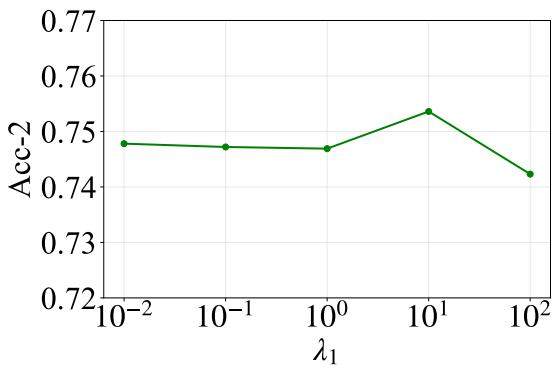
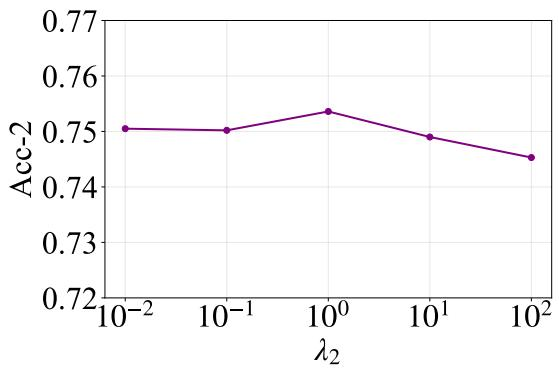
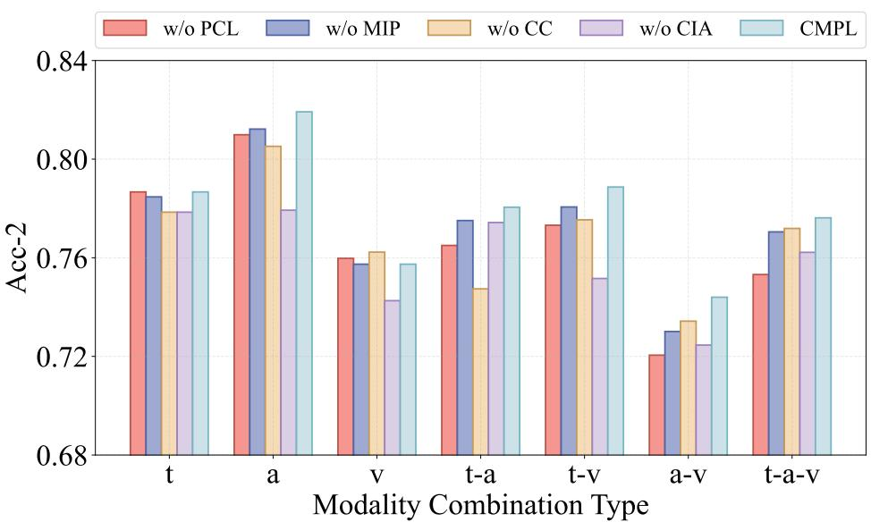

# Contrastive Mixed Prompt Learning for Incomplete Multimodal Sentiment Analysis with Unseen Modality Combination

Kaixin Xu1, NaiJin Liu2, Yulin Kang3, Tangyue Jin4, Zixuan Yu5, Wenxi Zhao5, Yibei Liu5, Qianle Zhang6, Yangyang Wu1∗, Mengying Zhu1, Meng Xi1

1School of Software Technology, Zhejiang University 2Beijing WuZi University

3Ant Group 4China University of Geosciences

5University of Electronic Science and Technology of China 6South China University of Technology

## Abstract

Incomplete multimodal sentiment analysis has garnered significant attention in recent years. Existing approaches typically assume that data is missing at random or are designed specifically for certain missing patterns, ignoring the modality combination inconsistency between training and testing phases. However, in real-world scenarios, the testing phase often encounters modal combinations that were not present during the training phase, which leads to insuficient generalization capabilities and unstable performance. In this paper, we introduce the problem of Incomplete Multimodal Sentiment Analysis with Unseen Modality Combinations (IMSAUMC), aiming to enhance model generalization for unseen modality combinations. To address this challenge, we propose the model named Contrastive Mixed Prompt Learning (CMPL) for IMSAUMC. It introduces a label-guided contrastive feature learning mechanism to learn robust and discriminative cross-modal representations. Additionally, we design modality-combination prompts with a soft router to facilitate better learning of various modality combinations. Furthermore, we introduce three prompt contrastive learning strategies, which enable efective learning of prompts corresponding to unseen modality combinations, thereby significantly strengthening the model’s generalization capabilities in diverse testing scenarios. Extensive experiments on three widely used datasets demonstrate that CMPL achieves more than a 5% improvement in accuracy compared to state-of-the-art approaches.

## Introduction

Multimodal Sentiment Analysis (MSA) has emerged as a pivotal research area in recent years. By jointly modeling textual utterances, acoustic characteristics, and visual expressions, MSA systems aim to infer human afective states with significantly enhanced robustness compared to unimodal approaches. Many works (Hu and Flaxman 2018; Zhu et al. 2022; Huang et al. 2024; Liu et al. 2024; Wang et al. 2025) have achieved promising results by exploiting cross-modal complementarity.

However, real-world deployment scenarios frequently violate the full-modality assumption. Practical challenges such as sensor failures, background noise, occlusions, and privacy constraints often lead to missing modalities during inference. Consequently, substantial research eforts have been directed toward MSA with missing modality (Pham et al. 2019; Ma et al. 2021; Huan et al. 2023; Li et al. 2024a,b).

  
Figure 1: The diference between the general MSA with missing modality task and the IMSAUMC task. In the general MSA with missing modality task, all possible modality combinations are available during both the training and testing phases. However, in our IMSAUMC task, only partial modality combinations are present during training, while unseen modality combinations may appear during testing.

Although these approaches demonstrate resilience against random modality absence, they fundamentally assume that all modality combinations have been observed during training. In real-world data, however, missing patterns are often structured rather than random. For example, a camera failure causes the absence of visual features; a subsequent audio failure then results in missing the visual-audio modality combination entirely. Consequently, the dataset may contain only a subset of possible combinations, and the test set is likely to encounter unseen ones. For another example, users on social media may decline to upload certain modalities (e.g., audio) due to privacy concerns, yielding datasets with only partial combinations. In such scenarios, we aim to train models using only the available partial combinations, while still ensuring strong generalization when more complete modality combinations appear at inference time.

For a dataset with n modalities, 2n − 1 possible combinations exist. As illustrated above, the dataset may not cover all missing patterns, and the test set may encounter unseen modality combinations, especially as n grows. Consequently, existing methods often struggle to handle such scenarios effectively, and approaches capable of generalizing to unseen modality combinations are critically needed.

We introduce the task of Incomplete Multimodal Sentiment Analysis with Unseen Modality Combinations (IMSAUMC), which handles missing modalities and unseen modality combinations during testing, as shown in Figure 1. While previous work in MSA with missing modalities has achieved notable progress, two key challenges remain: First, many works employ contrastive learning to obtain modalityinvariant representations. However, most fail to account for the intrinsic data structure, potentially separating semantically similar samples, which leads to suboptimal representations (CH1). Second, in scenarios involving unseen modality combinations, existing methods often overlook the relations between diferent modality combinations. As a result struggle to efectively handle test-time data whose modality combinations were not encountered during the training phase (CH2).

To address these challenges, we propose Contrastive Mixed Prompt Learning (CMPL) for multimodal sentiment analysis with unseen modality combinations. Specifically, for CH1, we introduce label-guided contrastive feature learning, which incorporates label similarity constraints to pull representations of same-labeled samples closer while maintaining distances proportional to label dissimilarity for others. For CH2, we design mixed modality-combination prompts with a soft routing mechanism that dynamically selects prompts to comprehensively model inter-combinatorial relations. Moreover, we develop three prompt contrastive learning strategies to further enhance generalization to unseen combinations: a modality information preservation strategy, a crosscombination complementarity strategy, and a conditional information alignment strategy. The main contributions are summarized as follows:

• We propose CMPL, a novel model for the IMSAUMC task that improves generalization to unseen modality combinations. To the best of our knowledge, this is the first work addressing this problem.

• We propose a label-guided contrastive feature learning mechanism, which enforces representation consistency for samples with identical labels while constraining the distance between dissimilar samples proportionally to their label diferences. This preserves the structural relationships within sample representations.

• We introduce a mixed prompts learning mechanism coupled with three prompt contrastive learning strategies. These comprehensively model inter-combinatorial relationships and enhance the model’s generalization to unseen modality combinations.

• Extensive experiments on CMU-MOSI, CMU-MOSEI, and SIMS-V2 datasets demonstrate the efectiveness of our method over state-of-the-art approaches.

## Related Work

## Multimodal Sentiment Analysis

Multimodal Sentiment Analysis (MSA) aims to infer sentiment by integrating heterogeneous data from multiple modalities, such as text, visual, and acoustic signals. MSA methods (Truong and Lauw 2019; Yu et al. 2021; Mai et al. 2022;

Sun et al. 2022; Li, Wang, and Cui 2023) leverage crossmodal complementarity to improve robustness and accuracy over unimodal approaches. For instance, Yu et al. proposed self-MM (Yu et al. 2021), jointly training a multimodal main task with unimodal subtasks as pseudo-label supervision to learn inter-modal consistency and cross-modal diferences. Sun et al. presented Cube-MLP (Sun et al. 2022), which mixes features along three axes via MLP units. Li, Wang, and Cui introduced DMD (Li, Wang, and Cui 2023), decoupling homogeneous and heterogeneous features with adaptive cross-modal distillation to enhance modality discriminability. Wang et al. proposed DLF (Wang et al. 2025), a disentangled language-focused framework that reduces crossmodal redundancy for improved MSA performance.

However, real-world data often sufers from missing modalities. Many methods (Yuan et al. 2021; Zeng, Liu, and Zhou 2022; Yuan et al. 2023; Xu, Jiang, and Liang 2024; Zhang, Wang, and Yu 2024) have been developed to address MSA with missing modality. For example, TFR-Net (Yuan et al. 2021) employs a feature reconstruction module to generate missing modality content. LNLN (Zhang, Wang, and Yu 2024) improves robustness by guaranteeing highquality dominant modality representation. HME (Zhuang et al. 2025) leverages cross-sample semantic enrichment and uncertainty-aware fusion, eliminating explicit modality reconstruction while enhancing robustness and generalization. MFMB-Net (Tao et al. 2025) jointly performs global–local dual-stream fusion and collaborative feature reconstruction to robustly handle missing modalities. However, these methods overlook inconsistent distributions of modality combinations in missing-modality scenarios, where the test set may contain unseen modality combinations that were not present during training. In contrast, our approach focuses on leveraging known modality combination information to enhance generalization to unseen combinations.

## Prompt Learning

Prompt learning has emerged as a powerful paradigm for adapting pre-trained models such as large language models (LLM) to downstream tasks (Gao, Fisch, and Chen 2021; Heinzerling and Inui 2021; Liang, Zhao, and Schütze 2022; Zhu et al. 2023). Tsimpoukelli et al. concatenated visual embeddings as prefix prompts to enable frozen language models to generate appropriate captions (Tsimpoukelli et al. 2021). Lee et al. designed missing-aware prompts for different missing-modality cases to enhance robustness (Lee et al. 2023). Khattak et al. designed branch-aware multimodal prompts to enhance alignment between language and visual modalities (Khattak et al. 2023). MPLMM (Guo, Jin, and Zhao 2024) generates missing modality features and strengthens intra- and inter-modality learning by designing generative, missing-signal, and missing-type prompts. These methods ignore the relations between modality combinations, limiting generalization to unseen combinations. In contrast, our approach thoroughly explores inter-modal relationships and designs three prompt contrastive learning strategies to address unseen modality combinations.

  
Figure 2: The framework of our CMPL, which consists of three components: the labeled-guided contrastive feature learning module, the mixed prompts learning mechanism, and prompt contrastive learning strategies. Taking the absence of audio-visua and text-audio-visual modality combinations in training data, as well as the missing vision modality in input, as an example.

## Methodology

## Problem Formulation

Given a multimodal dataset $\mathbf { X } = \{ \mathbf { X } ^ { t } , \mathbf { X } ^ { a } , \mathbf { X } ^ { v } \}$ with three modalities (text, audio, visual), each $\mathbf { X } ^ { k } = \{ \mathbf { x } _ { 1 } ^ { k } , \cdot \cdot \cdot , \mathbf { x } _ { N } ^ { k } \} \in$ $\mathbb { R } ^ { N \times l _ { k } \times d _ { k } }$ denotes the feature matrix of modality k, where N is the number of samples, and $l _ { k } , d _ { k }$ are the sequence length and embedding dimension, with $k \in \{ t , a , v \}$ . The sentiment labels are $\mathbf { Y } \in \mathbb { R } ^ { N }$ . For missing modalities, we define mask matrices Mt, Ma, Mv where $\mathbf { M } _ { i } ^ { k } = 0$ indicates the i-th sample is missing in modality k and $\mathbf { M } _ { i } ^ { k } = 1$ indicates its presence. The textual features are obtained from text embeddings of a LLM, while audio and visual features are extracted using pre-trained toolkits. For these three modalities, excluding the all-absent case, there are $T = 7$ possible modality combinations, denoted as $\boldsymbol { \mathcal { S } } \ = \ \{ S _ { 1 } , \dot { S } _ { 2 } , \cdot \cdot \cdot , S _ { T } \} \ =$ $\{ \{ t \} , \{ a \} , \{ v \} , \{ t , a \} , \{ t , v \} , \{ a , v \} , \{ \dot { t , a , v } \} \}$ For example, S represents the text-audio combination with visual modality missing, with available data $\mathbf { x } = \{ \mathbf { x } ^ { t } , \mathbf { x } ^ { a } \}$ . More detailed information can be found in Appendix A.

Definition. The objective of IMSAUMC is to train a model for sentiment analysis under the condition that the training data only contains a subset of the modality combinations in S, while the test data includes all possible modality combinations (i.e., S). The model must generalize to unseen modality combinations during testing.

## Overall Framework

Figure 2 shows the framework of our CMPL. First, during the representation learning stage, we extract sequentia embeddings for the audio and visual modalities using pretrained tools and reduce the sequence length via adaptive average pooling. For the textual modality, we leverage text embeddings from the LLM to obtain contextually correlated embeddings. Then, guided by label similarity, we apply contrastive learning across modality embeddings to learn robust representations while preserving semantic structure. Additionally, we equip each modality combination with a prompt. The multimodal embeddings are then fed into a router to generate a mixed prompt. Furthermore, three prompt contrastive learning strategies are employed to exploit relations between modality combinations, improving generalization to unseen modality combinations. Finally, we train CMPL with the following objective function:

$$
\mathcal { L } _ { \mathtt { C M P L } } = \mathcal { L } _ { t a s k } + \alpha \cdot \mathcal { L } _ { l c f l } + \beta \cdot \mathcal { L } _ { p c l } ,\tag{1}
$$

where $\mathcal { L } _ { t a s k } , \mathcal { L } _ { l c f l }$ , and $\mathcal { L } _ { p c l }$ are task-specific loss, labelguided contrastive loss, and prompt contrastive loss, respectively. Here, $\mathcal { L } _ { t a s k }$ is used to guide the model’s predictions, and we employ the traditional autoregressive cross-entropy loss from LLMs for this purpose. The parameters α and $\beta$ are the balanced factors on $\mathcal { L } _ { l c f l }$ and $\mathcal { L } _ { p c l }$ , respectively.

## Label-guided Contrastive Feature Learning

Contrastive learning, as an efective representation learning method, has been widely applied in multimodal domains. Existing methods typically maximize the similarity of representations across multiple modalities while minimizing the similarity between diferent samples directly. However, these approaches often overlook the structural relationships between samples, potentially separating representations of similarly labeled samples and leading to suboptimal representations.

To address these challenges, we propose the label-guided contrastive feature learning (LCFL) module. This mechanism aims to pull together latent representations of diferent modalities from the same class while preserving similarity between samples of related classes. By incorporating classaware semantic relationships, this mechanism enables the learned representations to incorporate richer and more robust semantic information, enhancing the model’s understanding of multimodal representations.

Specifically, for audio and vision modalities, we first project the available embeddings into the LLM’s text embedding space and use an adaptive pooling to reduce the sequence (Yao et al. 2024) as follows:

$$
\bar { \mathbf { X } } ^ { a } = \mathrm { P o o l } ( \sigma ( \mathbf { X } ^ { a } \cdot \mathbf { W } _ { 1 } ^ { a } ) \cdot \mathbf { W } _ { 2 } ^ { a } ) ,\tag{2}
$$

where σ is the activation function. Wa and Wa are trainable parameters. The formulation for $\bar { \mathbf { X } } ^ { \dot { v } }$ follows analogously. $\mathbf { \bar { X } } ^ { a } \in \mathbb { R } ^ { N \times l \times d }$ and $\bar { \mathbf { X } } ^ { v } \in \mathbb { R } ^ { N \times l \times d }$ are the audio and visual embeddings after projection and adaptive pooling, respectively. Then, we project the embeddings of all modalities into the contrastive learning space (Chen et al. 2020) as follows:

$$
\mathbf { H } ^ { k } = \sigma ( \mathbf { X } ^ { k } \cdot \mathbf { W } _ { 1 } ^ { k } ) \cdot \mathbf { W } _ { 2 } ^ { k } ,\tag{3}
$$

where $k \in \{ t , a , v \} . \mathbf { H } ^ { k } \in \mathbb { R } ^ { N \times l \times d _ { c } }$ is the representation of modality k after projection. For representation $\mathbf { H } _ { i } ^ { w }$ , we treat the instances have the same label as positive pairs, denoted as $\mathbf { H } _ { j } ^ { u } | _ { \mathbf { Y } _ { j } = \mathbf { Y } _ { i } , \ u \neq w | j \neq i }$ , while considering others as negative pairs, denoted as $\mathbf { H } _ { j } ^ { u } | _ { \mathbf { Y } _ { j } \neq \mathbf { Y } _ { i } }$ , where $u , w \in \{ t , a , v \}$ . We use the cosine distance to evaluate the similarity between $\mathbf { H } _ { i } ^ { w }$ and $\mathbf { H } _ { j } ^ { u } \colon d ( \mathbf { H } _ { i } ^ { w } , \mathbf { H } _ { j } ^ { u } ) = \langle \mathbf { H } _ { i } ^ { w } , \mathbf { H } _ { j } ^ { u } \rangle / \| \mathbf { H } _ { i } ^ { w } \| \dot { \mathbf { \xi } } \| \mathbf { H } _ { j } ^ { u } \|$ , where $\langle \cdot , \cdot \rangle$ is the dot product operator.

To efectively enhance the model’s comprehension of multimodal embeddings and explore cross-modal relationships, we design a LCFL loss function $\mathcal { L } _ { l c f l }$ . Our method maximizes similarity between positive pairs while maintaining the similarity of negative pairs according to their label relations. This approach efectively mitigates the adverse efects of incorrectly pushing apart embeddings sharing similar labels. Given text and audio modality as an example, the contrastive loss $\mathcal { L } ^ { ( t , a ) }$ between Ht and $\mathbf { H } ^ { a }$ can be defined as:

$$
\mathcal { L } ^ { ( t , a ) } = - \frac { 1 } { 2 N } \sum _ { w = t , a } \sum _ { i = 1 } ^ { N } \mathbf { M } _ { i } ^ { w } \log \frac { \mathcal { T } _ { i } ^ { w } } { \mathcal { T } _ { i } ^ { w } + \mathcal { N } _ { i } ^ { w } } ,\tag{4}
$$

where $\begin{array} { r } { \mathcal { N } _ { i } ^ { w } = \sum _ { j = 1 } ^ { N } \sum _ { u = t , a } \mathbf { M } _ { j } ^ { u } \cdot \mathbb { I } _ { [ S _ { i , j } \neq 1 ] } \cdot e ^ { \vert d ( \mathbf { H } _ { i } ^ { w } , \mathbf { H } _ { j } ^ { u } ) - S _ { i , j } \vert / \tau } } \end{array}$ and $\begin{array} { r } { \mathcal { T } _ { i } ^ { w } = \sum _ { j = 1 } ^ { N ^ { * } } \sum _ { u = t , a } \mathbf { M } _ { j } ^ { u } \cdot \mathbb { I } _ { [ S _ { i , j } = 1 ] } \cdot e ^ { d ( \mathbf { H } _ { i } ^ { w } , \mathbf { H } _ { j } ^ { u } ) / \tau } - e ^ { 1 / \tau } } \end{array}$ τ is the temperature parameter that adjusts the softness. N represents the number of instances. $\mathbb { I } _ { [ S _ { i , j } = 1 ] }$ is the indicator function that equals 1 if $S _ { i , j } ~ = ~ 1 . ~ \stackrel {  } { S } _ { i , j }$ is the similarity between labels of i-th and j-th instance. Here, we employ a simple approach to measure inter-label similarity:

$$
S _ { i , j } = 1 - \frac { \left| \mathbf { Y } _ { j } - \mathbf { Y } _ { i } \right| } { \operatorname* { m a x } \{ \mathbf { Y } \} - \operatorname* { m i n } \{ \mathbf { Y } \} } ,\tag{5}
$$

where max{Y} and min{Y} represent the maximum and minimum values of the labels, respectively.

Similarly, we can compute $\mathcal { L } ^ { ( \bar { t } , { v } ) }$ and $\mathcal { L } ^ { ( v , a ) }$ . Then, the objective function $\mathcal { L } _ { l c f l }$ can be calculated as follows:

$$
\mathcal { L } _ { l c f l } = \mathcal { L } ^ { ( t , a ) } + \mathcal { L } ^ { ( t , v ) } + \mathcal { L } ^ { ( v , a ) } .\tag{6}
$$

By minimizing $\mathcal { L } _ { l c f l }$ , the representations of instances with consistent labels are pulled closer, while the similarity between others aligns with their label similarity. This captures

more structured representations and efectively enhances multimodal learning in incomplete combinations, efectively facilitating learning for unseen modality combinations.

## Mixed Prompts Learning

Most LLM fine-tuning methods employ LoRA for adaptation. However, in the IMSAUMC task, using LoRA alone to simultaneously train multiple modality combinations fails to distinguish between them. To address this, we design a mixed prompts learning mechanism to enhance the model’s understanding of diverse modality combinations.

Specifically, we design modality-combination prompts, $i . e . , ^ { \mathbf { \lambda } } \mathcal { P } = \{ \check { \mathbf { P } } ^ { 1 } , \mathbf { P } ^ { 2 } , \cdots , \mathbf { P } ^ { T } \}$ , where $\mathbf { P } ^ { i } \in \mathbb { R } ^ { l _ { p } \times \dot { d } _ { p } }$ is the prompt embedding for the i-th modality combination, with $l _ { p }$ and $d _ { p }$ being its sequence length and dimension. Traditional methods concatenate each modality-combination prompt with its corresponding input and feed them into the LLM, learning the prompts from available data. However, in IMSAUMC tasks, the training set does not cover all modality combinations appearing in the test set. Consequently, prompts for unseen combinations lack training data and cannot be learned. Recognizing that diferent modality combinations are not independent but exhibit correlations, we propose a $S o f t$ Routing-inspired mixed prompts guidance mechanism. Given multimodal data ${ \bf X } _ { j } \doteq [ { \bf X } _ { j } ^ { \dot { t } } , \breve { { \bf X } } _ { j } ^ { a } ] \in \mathbb { R } ^ { N \times 2 l \times d }$ where $[ \cdots ]$ denotes sequence concatenation, this mechanism feeds $\mathbf { X } _ { j }$ into a router that automatically selects and weights prompts according to the input representation:

$$
G ( \mathbf { X } _ { j } ) = \operatorname { S o f t m a x } ( \mathbf { X } _ { j } \cdot \mathbf { W } _ { g } ) ,\tag{7}
$$

where $\mathbf { W } _ { g } \in \mathbb { R } ^ { d \times T }$ is the router’s parameter and $G ( \mathbf { X } _ { j } )$ represents the soft assignment weights. Subsequently, we obtain the final mixed prompt via dynamic blending:

$$
\bar { \mathbf { P } } _ { j } = et { } { ' } \sum _ { i = 1 } G ( \mathbf { X } _ { j } ) _ { i } \cdot \mathbf { P } ^ { i } ,\tag{8}
$$

where $\bar { \mathbf { P } } _ { j }$ is the mixed prompt for the j-th instance.

Finally, the mixed prompt $\bar { \mathbf { P } } _ { j }$ and multimodal input $\mathbf { X } _ { j }$ are jointly fed into the LLM to produce the output:

$$
\begin{array} { r } { \bar { \mathbf Y } _ { j } = \mathrm { L L M } ( \bar { \mathbf P } _ { j } , \mathbf X _ { j } ; \theta ) , } \end{array}\tag{9}
$$

where θ represents the LLM’s parameters and $\bar { \mathbf { Y } } _ { j }$ is the generated text with sentiment class and sentiment score. Following standard LLM training, we adopt next-token prediction loss. Thus, the task loss $\mathcal { L } _ { t a s k }$ is:

$$
\mathcal { L } _ { t a s k } = { \sum } _ { i = 1 } ^ { N } { \sum } _ { j = 1 } ^ { K } - \log P ( L _ { i , j } | \bar { \mathbf { P } } _ { i } , \mathbf { X } _ { i } , \boldsymbol { \theta } ) ,\tag{10}
$$

where K is the number of label tokens and $L _ { i , j }$ is the j-th label token of the Y¯ generated by the i-th instance.

## Prompt Contrastive Learning

In the IMSAUMC task, a key challenge lies in efectively leveraging knowledge from existing modality combinations to enhance the learning of unseen modality combinations. Recognizing that diferent modality combinations are not isolated but inherently interrelated, we design three prompt contrastive learning strategies to enable mutual learning among prompts: (1) modality information preservation strategy; (2) cross-combination complementarity strategy; (3) conditional information alignment strategy. The core idea is to consider the relationships between various modality combinations to minimize the conditional entropy or maximize the conditional mutual information.

To compute conditional entropy and mutual information, we first project the modality-combination prompt embeddings, then average them along the sequence dimension, and finally apply the softmax function, which allows the prompt representation to be interpreted as a probability distribution, enabling entropy and mutual information estimation:

$$
\begin{array} { r } { \hat { \mathbf { P } } ^ { i } = \operatorname { S o f t m a x } \big ( \operatorname { A v g } ( \sigma ( \mathbf { P } ^ { i } \cdot \mathbf { W } _ { 1 } ^ { i } ) \cdot \mathbf { W } _ { 2 } ^ { i } ) \big ) , } \end{array}\tag{11}
$$

where $\hat { \mathbf { P } } ^ { i } \in \mathbb { R } ^ { l _ { p } ^ { \prime } \times D }$ are the normalized prompt embeddings of i-th modality combination. For convenience, we denote the set of unimodal prompts as $\mathcal { P } _ { u } = \{ \hat { \mathbf { P } } ^ { 1 } , \hat { \mathbf { P } } ^ { 2 } , \hat { \mathbf { P } } ^ { 3 } \}$ }, the set of dual modality prompts as $\mathcal { P } _ { d } = \{ \hat { \mathbf { P } } ^ { 4 } , \hat { \mathbf { P } } ^ { 5 } , \hat { \mathbf { P } } ^ { 6 } \}$ , and the set of full modality prompts as $\mathcal { P } _ { f } = \{ \hat { \mathbf { P } } ^ { 7 } \}$

Modality Information Preservation. For a multimodal prompt, it inherently contains the information present in each of its unimodal components. Therefore, it can be argued that when given a multimodal prompt, it should retain the submodality-combination prompts it encompasses as much as possible. To achieve this, we minimize the conditional entropy $H ( \hat { \mathbf { P } } ^ { i } \mid \hat { \mathbf { P } } ^ { j } )$ between such sub-modality-combination ${ \hat { \mathbf { P } } } ^ { i }$ and multi-modality-combination prompt ${ \hat { \mathbf { P } } } ^ { j }$ . Since each element of ${ \hat { \mathbf { P } } } ^ { i }$ and ${ \hat { \mathbf { P } } } ^ { j }$ can be treated as probability distribution of two variables $z _ { i }$ and $z _ { j }$ over D classes (Ji, Henriques, and Vedaldi 2019; Huang, Gong, and Zhu 2020; Lin et al. 2021), where D is the dimensionality of ${ \hat { \mathbf { P } } } ^ { i }$ and ${ \hat { \mathbf { P } } } ^ { j }$ . The joint probability distribution $P ^ { ( m , n ) } \in \dot { \mathbb { R } } ^ { D \times D }$ can be defined as:

$$
P _ { i , j } ^ { ( m , n ) } = \frac { 1 } { l } \sum _ { k = 1 } ^ { l } \hat { { \bf P } } _ { k , i } ^ { m } \hat { { \bf P } } _ { k , j } ^ { n } .
$$

Let $P _ { d } ^ { ( m , n ) }$ and $P _ { d ^ { \prime } } ^ { ( m , n ) }$ denote the margin probability distributions $P ^ { ( m , n ) } ( z _ { m } = d )$ and $P ^ { ( m , n ) } ( z _ { n } = d ^ { \prime } )$ , which can be obtained by summing the d-th rows and d′-th columns of $P .$ . We can define the loss function between the m-th prompt and the n-th prompt $\mathcal { L } ^ { ( m , n ) }$ as follows:

$$
\mathcal { L } ^ { ( m , n ) } = H ( \hat { \mathbf { P } } ^ { m } \mid \hat { \mathbf { P } } ^ { n } ) = - \sum _ { d = 1 } ^ { D } \sum _ { d ^ { \prime } = 1 } ^ { D } P _ { d , d ^ { \prime } } ^ { ( m , n ) } \ln \frac { P _ { d , d ^ { \prime } } ^ { ( m , n ) } } { P _ { d ^ { \prime } } ^ { ( m , n ) } } .
$$

The loss function $\mathcal { L } _ { m i p }$ can be defined as follows:

$$
\mathcal { L } _ { m i p } = \sum _ { m = 1 , 2 } \mathcal { L } ^ { ( m , 4 ) } { + } \sum _ { m = 1 , 3 } \mathcal { L } ^ { ( m , 5 ) } { + } \sum _ { m = 2 , 3 } \mathcal { L } ^ { ( m , 6 ) } { + } \sum _ { m = 1 } ^ { 6 } \mathcal { L } ^ { ( m , 7 ) } .
$$

Cross-Combination Complementarity. For two prompts that share a common modality—such as ${ \hat { \mathbf { P } } } ^ { 4 }$ (text-audio combination) and $\hat { \mathbf { P } } ^ { 5 }$ (text-visual combination), their shared textual in formation acts as a bridge connecting the other two modali ties, i.e., audio and visual. Therefore, when given such prompts $\hat { \mathbf { P } } ^ { 4 }$ and ${ \hat { \mathbf { P } } } ^ { 5 }$ , the uncertainty of the visual and audio prompt ${ \hat { \mathbf { P } } } ^ { 6 }$ should also decrease. Hence, we minimize the conditional entropy

$H ( \hat { \mathbf { P } } ^ { 6 } | \hat { \mathbf { P } } ^ { 4 } , \hat { \mathbf { P } } ^ { 5 } )$ . More generally, we aim to minimize the conditional entropy $H ( \hat { \mathbf { P } } ^ { l } | \hat { \mathbf { P } } ^ { m } , \hat { \mathbf { P } } ^ { n } )$ , where $\hat { \mathbf { P } } ^ { l } , \hat { \mathbf { P } } ^ { m } , \hat { \mathbf { P } } ^ { n } \in \mathcal { P } _ { d }$ and $l ,$ $m ,$ and n are mutually distinct. Similarly, we firstly define the joint probability distribution $P ^ { ( l , m , n ) } \in \mathbb { R } ^ { D \times D \times D }$ of $z _ { l } , z _ { m }$ , and $z _ { n }$ as follows:

$$
P _ { i , j , k } ^ { ( l , m , n ) } = \frac { 1 } { l } \sum _ { t = 1 } ^ { l } \hat { { \bf P } } _ { t , i } ^ { l } \hat { { \bf P } } _ { t , j } ^ { m } \hat { { \bf P } } _ { t , k } ^ { n } .
$$

The loss function between the l-th, m-th, and n-th prompts can be defined as:

$$
\mathcal { L } ^ { ( l , m , n ) } - \sum _ { d _ { 1 } = 1 } ^ { D } \sum _ { d _ { 2 } = 1 } ^ { D } \sum _ { d _ { 3 } = 1 } ^ { D } P _ { d _ { 1 } , d _ { 2 } , d _ { 3 } } ^ { ( l , m , n ) } \ln \frac { P _ { d _ { 1 } , d _ { 2 } , d _ { 3 } } ^ { ( l , m , n ) } } { P _ { d _ { 2 } , d _ { 3 } } ^ { ( l , m , n ) } } ,
$$

where $P _ { d _ { 2 } , d _ { 3 } } ^ { ( l , m , n ) }$ is the marginal probability distribution by summing the first dimension of $P ^ { ( l , m , n ) }$ . The total loss function $\mathcal { L } _ { c c }$ can be defined as follows:

$$
\mathcal { L } _ { c c } = \mathcal { L } ^ { ( 3 , 4 , 5 ) } + \mathcal { L } ^ { ( 4 , 5 , 3 ) } + \mathcal { L } ^ { ( 5 , 3 , 4 ) } .\tag{12}
$$

Conditional Information Alignment. Given a multimodal combined prompt such as ${ \hat { \mathbf { P } } } ^ { 6 }$ containing audio and visual information, for the prompt ${ \hat { \mathbf { P } } } ^ { 4 }$ containing audio and text and the prompt ${ \hat { \mathbf { P } } } ^ { 5 }$ containing visual and text, their shared text modality should remain consistent and aligned. Therefore, we maximize the conditional mutual information $\overline { { I ( \hat { \mathbf { P } } ^ { 4 } ; \hat { \mathbf { P } } ^ { 5 } | \hat { \mathbf { P } } ^ { 6 } ) } }$ . More generally, we aim to maximize $I ( \hat { \mathbf { P } } _ { l } ; \hat { \mathbf { P } } ^ { m } | \hat { \mathbf { P } } ^ { n } )$ , where $\hat { \mathbf { P } } ^ { l } , \hat { \mathbf { P } } ^ { m } , \hat { \mathbf { P } } ^ { n } \in \mathcal { P } _ { d }$ and $l , m ,$ , and n are mutually distinct. The loss function between l-th, m-th and n-th prompts can be defined as:

$$
\hat { \mathcal { L } } ^ { ( l , m , n ) } = - \sum _ { d _ { 1 } = 1 } ^ { D } \sum _ { d _ { 2 } = 1 } ^ { D } \sum _ { d _ { 3 } = 1 } ^ { D } P _ { d _ { 1 } , d _ { 2 } , d _ { 3 } } ^ { ( l , m , n ) } \ln \frac { P _ { d _ { 1 } , d _ { 2 } , d _ { 3 } } ^ { ( l , m , n ) } P _ { d _ { 3 } } ^ { ( l , m , n ) } } { P _ { d _ { 1 } , d _ { 3 } } ^ { ( l , m , n ) } P _ { d _ { 2 } , d _ { 3 } } ^ { ( l , m , n ) } } .
$$

The total loss function $\mathcal { L } _ { c i a }$ can be defined as follows:

$$
\mathcal { L } _ { c i a } = \hat { \mathcal { L } } ^ { ( 3 , 4 , 5 ) } + \hat { \mathcal { L } } ^ { ( 4 , 5 , 3 ) } + \hat { \mathcal { L } } ^ { ( 5 , 3 , 4 ) } .\tag{13}
$$

Finally, the total prompt contrastive learning loss function $\mathcal { L } _ { p c l }$ can be defined as:

$$
\mathcal { L } _ { p c l } = \mathcal { L } _ { m i p } + \lambda _ { 1 } \cdot \mathcal { L } _ { c c } + \lambda _ { 2 } \cdot \mathcal { L } _ { c i a } ,\tag{14}
$$

where $\lambda _ { 1 }$ and $\lambda _ { 2 }$ are trade-of parameters.

## Experiments

## Experiment Setting

Datasets. We conducted experiments on three widely used datasets, including CMU-MOSI (Zadeh et al. 2016), CMU-MOSEI (Zadeh et al. 2018), and SIMS-V2 (Yu et al. 2020). The CMU-MOSI dataset contains a total of 2,199 video clips, each manually annotated with sentiment scores ranging from strongly negative to strongly positive (-3 to 3). The CMU-MOSEI dataset consists of 22,856 video clips, covering a broader range of topics compared to CMU-MOSI, with sentiment labels also annotated on the same scale (-3 to 3). SIMS-V2 is a Chinese multimodal sentiment analysis dataset containing 4,403 video clips, where sentiment values are labeled from -1 to 1.

Metrics. Due to diferences in labels across datasets, we employ diferent evaluation metrics for diferent datasets. For CMU-MOSI and CMU-MOSEI, we adopt binary accuracy (Acc-2), five-category accuracy (Acc-5), seven-category accuracy (Acc-7), F1 score, mean absolute error (MAE), and Pearson correlation (Corr) as evaluation metrics. For SIMS-V2, we use Acc-2, three-category accuracy (Acc-3), Acc-5, F1, MAE, and Corr. Here, Acc-2 and F1 follow the non-positive/positive standard.

<table><tr><td rowspan="2">Dataset</td><td rowspan="2">Method</td><td colspan="2">Task 1</td><td colspan="2">Task 2</td><td colspan="2">Task 3</td><td colspan="2">Task 4</td><td colspan="2">Task 5</td><td colspan="2">Task 6</td></tr><tr><td>Acc-2</td><td>F1</td><td>Acc-2</td><td>F1</td><td>Acc-2</td><td>F1</td><td>Acc-2</td><td>F1</td><td>Acc-2</td><td>F1</td><td>Acc-2</td><td>F1</td></tr><tr><td rowspan="3">CMU-MOSI</td><td rowspan="3">Self-MM CubeMLP DMD DLF TFR-Net</td><td rowspan="3">65.70 69.41 67.68 67.27 60.06</td><td rowspan="3">64.81</td><td>67.22 69.97</td><td>66.63</td><td>65.55</td><td>65.00</td><td>68.70</td><td>67.33</td><td>66.82</td><td>66.23</td><td>64.43</td><td>63.17</td></tr><tr><td>69.44</td><td>69.88</td><td>69.61 69.46</td><td>69.71</td><td>68.50</td><td>68.61</td><td>70.17</td><td></td><td>70.27 66.77</td><td>66.42</td></tr><tr><td>67.06 66.81</td><td>69.92 69.51 69.38</td><td>69.91</td><td>68.80</td><td>69.50 67.97</td><td>67.53 69.77</td><td>67.05 69.89</td><td>69.87 70.02</td><td>69.96 69.66</td><td>67.83 67.94 65.85 65.58</td></tr><tr><td rowspan="5"></td><td rowspan="4">MPLMM MFMB-Net LNLN CMPL</td><td>55.03</td><td>57.77 48.38</td><td>47.51 53.71</td><td>42.94 46.35</td><td>50.31 59.20</td><td>42.17 55.02</td><td>55.44 58.64</td><td>49.83 55.80</td><td>53.86 56.40</td><td>50.73 50.50</td><td>49.95 65.55</td><td>44.55 64.53</td></tr><tr><td>67.04</td><td>66.01</td><td>68.57</td><td>68.31</td><td>69.14</td><td>68.72</td><td>69.28</td><td>68.12</td><td>68.03</td><td>67.43</td><td>67.96</td><td>67.79</td></tr><tr><td>66.06</td><td>65.17</td><td>66.57</td><td>65.64</td><td>67.79</td><td>67.32</td><td>68.45</td><td>68.14</td><td></td><td></td><td>67.04 67.02</td><td></td></tr><tr><td>75.36</td><td>75.43</td><td>75.56</td><td>75.55</td><td>75.15</td><td>75.21</td><td>76.88</td><td>76.80</td><td>67.63 76.67</td><td>76.79</td><td>73.63</td><td>66.46 73.63</td></tr><tr><td rowspan="5">Self-MM</td><td>66.28</td><td>64.83</td><td>66.34</td><td>64.11</td><td>63.73</td><td>62.65</td><td>66.92</td><td>64.41</td><td></td><td>64.22</td><td>62.77 64.18</td><td>62.89</td></tr><tr><td>CubeMLP</td><td>67.57</td><td>67.13 66.02</td><td></td><td>65.60</td><td>65.25</td><td>60.05</td><td>65.12</td><td>59.95</td><td>64.57</td><td>59.40 63.06</td><td>57.91</td></tr><tr><td>DMD</td><td>67.47</td><td>66.52</td><td>67.60</td><td>66.94</td><td>68.60</td><td>68.39</td><td>67.89</td><td>66.77</td><td>68.67</td><td>68.25 71.24</td><td>70.73</td></tr><tr><td>DLF</td><td>68.31</td><td>67.16 70.31</td><td>69.83</td><td></td><td>71.02</td><td>70.79</td><td>70.86</td><td>70.48</td><td>68.47</td><td>67.43 70.18</td><td>69.84</td></tr><tr><td>TFR-Net MPLMM</td><td>65.96 65.42</td><td>65.05</td><td>65.18 67.89</td><td>61.77</td><td>61.61</td><td>64.80</td><td>64.24</td><td>64.22</td><td>60.44</td><td>60.80</td><td>55.45</td></tr><tr><td rowspan="8"></td><td>MFMB-Net</td><td>62.67 70.74</td><td>61.29 70.75</td><td>68.12 67.96</td><td>67.67</td><td>62.99 71.12</td><td>59.64 70.98</td><td>64.02 69.70</td><td>63.34 69.08</td><td>65.89 66.96</td><td>63.80 66.85</td><td>61.77 70.80</td><td>60.75 70.46</td></tr><tr><td>LNLN</td><td>71.02</td><td>70.30</td><td>70.63</td><td>70.44</td><td>71.50</td><td>70.59</td><td>71.47</td><td>70.90</td><td>71.47</td><td>70.94</td><td>70.86</td><td></td></tr><tr><td>CMPL</td><td>77.95</td><td>78.00</td><td>76.92</td><td>77.02</td><td>78.34</td><td>78.36</td><td>77.69</td><td>77.75</td><td>78.21</td><td>78.20</td><td>76.72</td><td>70.40 76.70</td></tr><tr><td>Self-MM</td><td>74.50</td><td>72.69</td><td></td><td>73.02</td><td>74.02</td><td>72.21</td><td>74.42</td><td>72.60</td><td>75.06</td><td></td><td></td><td></td></tr><tr><td>CubeMLP DMD</td><td>74.63</td><td>73.02</td><td>74.53 71.01</td><td>64.43</td><td>70.88</td><td>65.10</td><td>74.38</td><td>72.86</td><td>66.39</td><td>72.79 61.60</td><td>73.78 67.19</td><td>70.83</td></tr><tr><td></td><td>75.73</td><td>74.36</td><td>75.35</td><td>74.47</td><td>74.51</td><td>73.70</td><td>75.60</td><td>73.77</td><td>75.08</td><td>73.38</td><td>74.24</td><td>62.74</td></tr><tr><td>DLF</td><td>75.72</td><td>74.14</td><td>75.50</td><td>74.22</td><td>75.42</td><td>73.90</td><td>74.98</td><td>73.64</td><td>75.30</td><td>73.95</td><td>74.99</td><td>73.59</td></tr><tr><td>TFR-Net</td><td>71.44</td><td>68.50</td><td>73.43</td><td>71.55</td><td>71.71</td><td>66.74</td><td>73.09</td><td>71.15</td><td>70.06</td><td>67.15</td><td>68.35</td><td>73.96 60.86</td></tr><tr><td>MPLMM MFMB-Net</td><td>72.17</td><td>71.23</td><td>70.78</td><td>70.11</td><td>70.06</td><td>69.36</td><td>73.17</td><td>71.76</td><td>69.99</td><td></td><td></td><td>70.39</td></tr><tr><td rowspan="5">CMU-MOSEI</td><td>LNLN CMPL</td><td>74.09</td><td>70.57</td><td>72.94</td><td>68.79</td><td>74.20</td><td>71.94</td><td>73.78</td><td>70.34</td><td>74.11</td><td>69.99 71.25</td><td>71.42 72.36</td><td>68.76</td></tr><tr><td></td><td>75.43</td><td>74.19</td><td>75.20</td><td>73.98</td><td>75.19</td><td>73.51</td><td>75.22</td><td>73.27</td><td>75.35</td><td></td><td>73.46</td><td></td></tr><tr><td></td><td>77.39</td><td>76.59</td><td>77.41</td><td>76.88</td><td>77.27</td><td>76.79</td><td>76.28</td><td>75.86</td><td>76.94</td><td>76.29</td><td>74.72 75.94</td><td>73.14</td></tr><tr><td></td><td></td><td></td><td></td><td></td><td></td><td></td><td></td><td></td><td></td><td></td><td></td><td>74.92</td></tr><tr><td></td><td></td><td></td><td></td><td></td><td></td><td></td><td></td><td></td><td></td><td></td><td></td><td></td></tr></table>

Table 1: The performance of diferent methods on various datasets under six tasks. The best and second-best results are marked in bold and underlined, respectively.

<table><tr><td>Task No.</td><td>Training</td><td>Test</td></tr><tr><td>Task 1</td><td> $\{ S _ { 1 } , S _ { 2 } , S _ { 3 } , S _ { 4 } , S _ { 5 } \}$ </td><td>S</td></tr><tr><td>Task 2</td><td> $\{ S _ { 1 } , S _ { 2 } , S _ { 3 } , S _ { 4 } , S _ { 6 } \}$ </td><td>S</td></tr><tr><td>Task 3</td><td> $\{ S _ { 1 } , S _ { 2 } , S _ { 3 } , S _ { 5 } , S _ { 6 } \}$ </td><td>S</td></tr><tr><td>Task 4</td><td> $\{ S _ { 1 } , S _ { 2 } , S _ { 3 } , S _ { 4 } \}$ </td><td>S</td></tr><tr><td>Task 5</td><td> $\{ S _ { 1 } , S _ { 2 } , S _ { 3 } , S _ { 5 } \}$ </td><td>S</td></tr><tr><td>Task 6</td><td> $\{ S _ { 1 } , S _ { 2 } , S _ { 3 } , S _ { 6 } \}$ </td><td>S</td></tr><tr><td>Task 7</td><td>S</td><td>S</td></tr></table>

Table 2: The cases of modality combinations in the training and test sets across the seven tasks.

Baselines. In our experiments, we compare with six state-ofthe-art methods, including modality-complete methods: Self-MM, Cube-MLP, DMD, and DLF; and modality-missing methods: TFR-Net, MPLMM, MFMB-Net and LNLN. For methods that require complete modalities during training, we fill in missing modalities with zero. For all methods, we keep the parameters recommended in their original papers or released codes.

Implementation Details. We conduct experiments on the Ubuntu 20.04 system with an Intel(R) Xeon(R) Gold 6326 CPU @ 2.90GHz and a single NVIDIA A40. We adopt Qwen1.5-1.8b (Bai et al. 2023) as the backbone. For the training process, we use the Adam optimizer with a learning rate of $1 \times \mathrm { \bar { 1 0 } ^ { - 4 } }$ . For reliability, we perform three independent runs for each experiment and report the average results. More details can be found in Appendix B.

## Main Results

In the experiment, we design seven experimental scenarios, $i . e . .$ seven diferent tasks, as shown in Table 2, where $S _ { i }$ represents the i-th modality combination and $\mathcal { S } = \{ S _ { 1 } , S _ { 2 } , \cdots , S _ { 7 } \}$ . For all scenarios, the testing phase has all modality combinations (i.e., S).

Table 1 presents the results ofseven methods across three datasets under seven diferent scenarios. From Table 1, it can be observed that our method achieves the best performance in almost all scenarios. Compared to the second-best method, LNLN, our approach improves accuracy by an average of 5.57%. Notably, on the CMU-MOSI dataset, our method outperforms LNLN by an average of 13.26% in F1-score. In particular, under the Task 6 scenario, the F1-score improvement reaches 16.24%. This is because our method, CMPL, leverages label-guided contrastive feature learning to efectively capture multimodal consistency and the semantic structure of instances, employing three prompt contrastive learning strategies to enhance the model’s ability to learn from each modality combination and generalize to unseen modality combinations.

Furthermore, to further validate the efectiveness of our method, we conduct experiments under the scenario where both the training and test sets contain all seven modality combinations $( i . e . , S _ { 7 } ) .$ , as shown in Figure 3. The results demonstrate that our approach still outperforms others in most cases, highlighting its superiority and robustness. More results can be found in Appendix C.

  
Figure 3: The performance of seven methods across six evaluation metrics on three datasets under Task 7. The center of the radar chart represents the worst results, and the outermost vertices correspond to the best results.

<table><tr><td>Models</td><td>|Acc-2</td><td>F1</td><td>MAE</td><td>Corr</td><td> $T _ { t r a i n }$ </td><td> $T _ { t e s t }$ </td></tr><tr><td>Qwen1.5-1.8B</td><td>75.36</td><td>75.43</td><td>1.068</td><td>0.579</td><td>6.1m</td><td>6.0s</td></tr><tr><td>Llama3.2-3B</td><td>75.71</td><td>75.51</td><td>1.096</td><td>0.581</td><td>9.0m</td><td>8.4s</td></tr><tr><td>Llama-2-7B</td><td>76.60</td><td>76.53</td><td>1.087</td><td>0.574</td><td>25.8m</td><td>15.1s</td></tr><tr><td>Qwen3-8B</td><td>77.90</td><td>78.03</td><td>0.989</td><td>0.63618.6m16.8s</td><td></td><td></td></tr></table>

Table 3: The performance with diferent LLMs on the CMU-MOSI dataset under Task 4, where the units for training time and testing time are minutes (m) and seconds (s), respectively.

## Comparable Results with Diferent LLMs

To further validate the efectively of CMPL, we conduct experiments using diferent LLMs of varying scales (i.e., Qwen1.5-1.8B, Llama3.2-3B (Dubey et al. 2024), Llama-2-7B (Touvron et al. 2023), and Qwen3-8B (Yang et al. 2025)) as the backbone under the Task 1 on the CMU-MOSI dataset. The performance and time of training and testing are presented in Table 3.

As shown, models with larger parameter sizes generally achieve higher performance than smaller ones. For instance, Qwen3-8B achieves a 9.84% improvement in Corr compared to Qwen1.5-1.8B, which can be attributed to its greater learning capacity and ability to capture more nuanced knowledge. However, for computational resources, Qwen3-8B requires over three times the training time of Qwen1.5-1.8B. Given that Qwen1.5-1.8B ofers a favorable balance between resource eficiency and performance, it serves as a practical and cost-efective choice for common deployment.

## Ablation Study

To validate the efectiveness of each module in our method, we conduct experiments on the CMU-MOSI and SIMS-V2 datasets under the Task 4 scenario. We systematically remove each module and observe the model’s performance changes. The ablation results are presented in Table 4.

<table><tr><td>Datasets</td><td>Methods</td><td>Acc-2</td><td>F1</td><td>MAE</td><td>Corr</td></tr><tr><td>CMU-MOSI</td><td>w/o LCFL w/o MPL w/o PCL CMPL</td><td>75.25 74.90 75.96 76.88</td><td>75.02 74.69 75.85 76.80</td><td>1.107 1.089 1.100 1.079</td><td>0.574 0.574 0.586 0.590</td></tr><tr><td>SIMS-V2</td><td>w/o LCFL w/o MPL w/o PCL CMPL</td><td>76.27 77.24 76.47 77.69</td><td>76.31 77.11 76.49 77.75</td><td>0.375 0.365 0.374 0.363</td><td>0.569 0.574 0.574 0.593</td></tr></table>

Table 4: The ablation study on both CMU-MOSI and SIMS-V2 datasets under the Task 4.

The ablation results demonstrate that removing any module leads to performance degradation, while the model achieves its optimal performance when all modules are intact. Specifically, on CMU-MOSI dataset, removing the LCFL module results in a 2.79% decrease in Corr, while removing the PCL module causes a 2.94% increase in MAE on SIMS-V2 dataset. What’s more, the removal of the MPL module causes both a 2.64% drop in Acc-2 and a substantial 2.83% in F1 on CMU-MOSI dataset. These results confirm that each module plays a critical role, validating the contributions of each module to the model’s efectiveness. More additional ablation results can be found in Appendix C.

## Conclusion

In this paper, we propose a novel model named CMPL to address the task of incomplete multimodal sentiment analysis with the unseen modality combination. We introduce a label-guided contrastivefeature learning mechanism to maintain multimodal consistency while preserving the structural relationships among data. Furthermore, we develop a mixed prompts learning mechanism incorporating the prompt contrastive learning strategies, which efectively enhances the model’s comprehension of diverse modal combinations and improves its generalization capability to unseen modal combinations. Extensive experiments validate the efectiveness of our approach.

## References

Bai, J.; Bai, S.; Chu, Y.; Cui, Z.; Dang, K.; Deng, X.; Fan, Y.; Ge, W.; Han, Y.; Huang, F.; et al. 2023. Qwen technical report. arXiv preprint arXiv:2309.16609.

Chen, T.; Kornblith, S.; Norouzi, M.; and Hinton, G. 2020. A simple framework for contrastive learning of visual representations. In International Conference on Machine Learning, 1597–1607. PmLR.

Dubey, A.; Jauhri, A.; Pandey, A.; Kadian, A.; Al-Dahle, A.; Letman, A.; Mathur, A.; Schelten, A.; Yang, A.; Fan, A.; et al. 2024. The llama 3 herd of models. arXiv e-prints, arXiv–2407.

Gao, T.; Fisch, A.; and Chen, D. 2021. Making pre-trained language models better few-shot learners. In Proceedings of the 59th Annual Meeting of the Association for Computational Linguistics and the 11th International Joint Conference on Natural Language Processing (Volume 1: Long Papers), 3816–3830.

Guo, Z.; Jin, T.; and Zhao, Z. 2024. Multimodal prompt learning with missing modalities for sentiment analysis and emotion recognition. In Proceedings ofthe 62nd Annual Meeting ofthe Association for Computational Linguistics (Volume 1: Long Papers), 1726–1736.

Heinzerling, B.; and Inui, K. 2021. Language models as knowledge bases: On entity representations, storage capacity, and paraphrased queries. In Proceedings of the 16th Conference of the European Chapter of the Association for Computational Linguistics: Main Volume, 1772–1791.

Hu, A.; and Flaxman, S. 2018. Multimodal sentiment analysis to explore the structure of emotions. In proceedings ofthe 24th ACM SIGKDD international conference on Knowledge Discovery & Data Mining, 350–358.

Huan, R.; Zhong, G.; Chen, P.; and Liang, R. 2023. Unimf: A unified multimodal framework for multimodal sentiment analysis in missing modalities and unaligned multimodal sequences. IEEE Transactions on Multimedia, 26: 5753–5768.

Huang, J.; Gong, S.; and Zhu, X. 2020. Deep semantic clustering by partition confidence maximisation. In Proceedings of the IEEE/CVF Conference on Computer Vision and Pattern Recogni tion, 8849–8858.

Huang, J.; Zhou, J.; Tang, Z.; Lin, J.; and Chen, C. Y.-C. 2024. TMBL: Transformer-based multimodal binding learning model for multimodal sentiment analysis. Knowledge-Based Systems, 285: 111346.

Ji, X.; Henriques, J. F.; and Vedaldi, A. 2019. Invariant information clustering for unsupervised image classification and segmentation. In Proceedings ofthe IEEE/CVF International Conference on Computer Vision, 9865–9874.

Khattak, M. U.; Rasheed, H.; Maaz, M.; Khan, S.; and Khan, F. S. 2023. Maple: Multi-modal prompt learning. In Proceedings ofthe IEEE/CVF Conference on Computer Vision and Pattern Recognition, 19113–19122.

Lee, Y.-L.; Tsai, Y.-H.; Chiu, W.-C.; and Lee, C.-Y. 2023. Multimodal prompting with missing modalities for visual recognition. In Proceedings ofthe IEEE/CVF Conference on Computer Vision and Pattern Recognition, 14943–14952.

Li, M.; Yang, D.; Lei, Y.; Wang, S.; Wang, S.; Su, L.; Yang, K.; Wang, Y.; Sun, M.; and Zhang, L. 2024a. A unified self-distillation framework for multimodal sentiment analysis with uncertain missing modalities. In Proceedings ofthe AAAI conference on artificial intelligence, volume 38, 10074–10082.

Li, M.; Yang, D.; Liu, Y.; Wang, S.; Chen, J.; Wang, S.; Wei, J.; Jiang, Y.; Xu, Q.; Hou, X.; et al. 2024b. Toward robust incomplete multimodal sentiment analysis via hierarchical representation

learning. Advances in Neural Information Processing Systems, 37: 28515–28536.

Li, Y.; Wang, Y.; and Cui, Z. 2023. Decoupled multimodal distilling for emotion recognition. In Proceedings ofthe IEEE/CVF Conference on Computer Vision and Pattern Recognition, 6631–6640.

Liang, S.; Zhao, M.; and Schütze, H. 2022. Modular and parametereficient multimodal fusion with prompting. In Findings of the Associationfor Computational Linguistics: ACL 2022, 2976–2985.

Lin, Y.; Gou, Y.; Liu, Z.; Li, B.; Lv, J.; and Peng, X. 2021. Completer: Incomplete multi-view clustering via contrastive prediction. In Proceedings of the IEEE/CVF Conference on Computer Vision and Pattern Recognition, 11174–11183.

Liu, Z.; Braytee, A.; Anaissi, A.; Zhang, G.; Qin, L.; and Akram, J. 2024. Ensemble pretrained models for multimodal sentiment analysis using textual and video data fusion. In Companion Proceedings ofthe ACM Web Conference 2024, 1841–1848.

Ma, M.; Ren, J.; Zhao, L.; Tulyakov, S.; Wu, C.; and Peng, X. 2021. Smil: Multimodal learning with severely missing modality. In Proceedings of the AAAI Conference on Artificial Intelligence, volume 35, 2302–2310.

Mai, S.; Zeng, Y.; Zheng, S.; and Hu, H. 2022. Hybrid contrastive learning of tri-modal representation for multimodal sentiment analysis. IEEE Transactions onAfective Computing, 14(3): 2276–2289.

Pham, H.; Liang, P. P.; Manzini, T.; Morency, L.-P.; and Póczos, B. 2019. Found in translation: Learning robust joint representations by cyclic translations between modalities. In Proceedings of the AAAI Conference on Artificial Intelligence, volume 33, 6892–6899.

MLP: An MLP-based model for multimodal sentiment analysis and depression estimation. In Proceedings of the 30th ACM international Conference on Multimedia, 3722–3729.

Tao, C.; Li, J.; Zang, T.; and Gao, P. 2025. A multi-focus-driven multi-branch network for robust multimodal sentiment analysis. In Proceedings of the AAAI Conference on Artificial Intelligence, volume 39, 1547–1555.

Touvron, H.; Martin, L.; Stone, K.; Albert, P.; Almahairi, A.; Babaei, Y.; Bashlykov, N.; Batra, S.; Bhargava, P.; Bhosale, S.; et al. 2023. Llama 2: Open foundation and fine-tuned chat models. arXiv preprint arXiv:2307.09288.

Truong, Q.-T.; and Lauw, H. W. 2019. Vistanet: Visual aspect attention network for multimodal sentiment analysis. In Proceedings of the AAAI Conference on Artificial Intelligence, volume 33, 305–312.

Tsimpoukelli, M.; Menick, J. L.; Cabi, S.; Eslami, S.; Vinyals, O.; and Hill, F. 2021. Multimodal few-shot learning with frozen language models. Advances in Neural Information Processing Systems, 34: 200–212.

Wang, P.; Zhou, Q.; Wu, Y.; Chen, T.; and Hu, J. 2025. DLF: Disentangled-language-focused multimodal sentiment analysis. In Proceedings ofthe AAAI Conference on Artificial Intelligence, volume 39, 21180–21188.

Xu, W.; Jiang, H.; and Liang, X. 2024. Leveraging knowledge of modality experts for incomplete multimodal learning. In Proceedings of the 32nd ACM International Conference on Multimedia, 438–446.

Yang, A.; Li, A.; Yang, B.; Zhang, B.; Hui, B.; Zheng, B.; Yu, B.; Gao, C.; Huang, C.; Lv, C.; et al. 2025. Qwen3 technical report. arXiv preprint arXiv:2505.09388.

Yao, L.; Li, L.; Ren, S.; Wang, L.; Liu, Y.; Sun, X.; and Hou, L. 2024. Deco: Decoupling token compression from semantic abstraction in multimodal large language models. arXiv preprint arXiv:2405.20985.

Yu, W.; Xu, H.; Meng, F.; Zhu, Y.; Ma, Y.; Wu, J.; Zou, J.; and Yang, K. 2020. Ch-sims: A chinese multimodal sentiment analysis dataset with fine-grained annotation of modality. In Proceedings of the 58th Annual Meeting of the Association for Computational Linguistics, 3718–3727.

Yu, W.; Xu, H.; Yuan, Z.; and Wu, J. 2021. Learning modalityspecific representations with self-supervised multi-task learning for multimodal sentiment analysis. In Proceedings of the AAAI Conference on Artificial Intelligence, volume 35, 10790–10797.

Yuan, Z.; Li, W.; Xu, H.; and Yu, W. 2021. Transformer-based feature reconstruction network for robust multimodal sentiment analysis. In Proceedings of the 29th ACM international conference on multimedia, 4400–4407.

Yuan, Z.; Liu, Y.; Xu, H.; and Gao, K. 2023. Noise imitation based adversarial training for robust multimodal sentiment analysis. IEEE Transactions on Multimedia, 26: 529–539.

Zadeh, A.; Zellers, R.; Pincus, E.; and Morency, L.-P. 2016. Multimodal sentiment intensity analysis in videos: Facial gestures and verbal messages. IEEE Intelligent Systems, 31(6): 82–88.

Zadeh, A. B.; Liang, P. P.; Poria, S.; Cambria, E.; and Morency, L.-P. 2018. Multimodal language analysis in the wild: Cmu-mosei dataset and interpretable dynamic fusion graph. In Proceedings of the 56th Annual Meeting of the Association for Computational Linguistics (Volume 1: Long Papers), 2236–2246.

Zeng, J.; Liu, T.; and Zhou, J. 2022. Tag-assisted multimodal sentiment analysis under uncertain missing modalities. In Proceedings ofthe 45th International ACM SIGIR Conference on Research and Development in Information Retrieval, 1545–1554.

Zhang, H.; Wang, W.; and Yu, T. 2024. Towards robust multimodal sentiment analysis with incomplete data. Advances in Neural Information Processing Systems, 37: 55943–55974.

Zhu, T.; Li, L.; Yang, J.; Zhao, S.; Liu, H.; and Qian, J. 2022. Multimodal sentiment analysis with image-text interaction network. IEEE Transactions on Multimedia, 25: 3375–3385.

Zhu, Y.; Wang, Y.; Qiang, J.; and Wu, X. 2023. Prompt-learning for short text classification. IEEE Transactions on Knowledge and Data Engineering, 36(10): 5328–5339.

Zhuang, Y.; Minhao, L.; Bai, W.; Zhang, Y.; Li, W.; Deng, J.; and Ren, F. 2025. Hyper-Modality Enhancement for Multimodal Sentiment Analysis with Missing Modalities. In The Thirty-ninth Annual Conference on Neural Information Processing Systems.

<table><tr><td> $\mathbf { N o } .$ </td><td>{Available, Missing}</td><td>Available Data</td></tr><tr><td> $S _ { 1 }$ </td><td>{(t), (a, v)}</td><td> $\mathbf { x } = \{ \mathbf { x } ^ { t } \}$ </td></tr><tr><td> $S _ { 2 }$ </td><td>{(a), (t, v)}</td><td> $\mathbf { x } = \{ \mathbf { x } ^ { a } \}$ </td></tr><tr><td> $S _ { 3 }$ </td><td>{(v), (t, a)}</td><td> $\mathbf { x } = \{ \mathbf { x } ^ { v } \}$ </td></tr><tr><td> $S _ { 4 }$ </td><td>{(t, a), (v)}</td><td> $\mathbf { x } = \{ \mathbf { x } ^ { t } , \mathbf { x } ^ { a } \}$ </td></tr><tr><td> $S _ { 5 }$ </td><td>{(t, v), (a)}</td><td> $\mathbf { x } = \{ \mathbf { x } ^ { t } , \mathbf { x } ^ { v } \}$ </td></tr><tr><td> $S _ { 6 }$ </td><td>{(a, v), (t)}</td><td> $\mathbf { x } = \left\{ \mathbf { x } ^ { a } , \mathbf { x } ^ { v } \right\}$ </td></tr><tr><td> $S _ { 7 }$ </td><td>{(t, a, v), O}</td><td> $\mathbf { x } = \{ \mathbf { x } ^ { t } , \mathbf { x } ^ { a } , \mathbf { x } ^ { v } \}$ </td></tr></table>

Table 5: The seven modality combination cases.
<table><tr><td>Parameters</td><td>CMU-MOSI SIMS-V2</td><td></td><td>CMU-MOSEI</td></tr><tr><td>Learning Rate</td><td>1e-4</td><td>1e-4</td><td>1e-4</td></tr><tr><td>Batch Size</td><td>64</td><td>64</td><td>64</td></tr><tr><td> $\alpha , \beta$ </td><td>1, 1e-2</td><td>1, 1e-1</td><td>1, 1e-2</td></tr><tr><td> $\lambda _ { 1 } , \lambda _ { 2 }$ </td><td>10,1</td><td>1e-1, 1</td><td>10,1</td></tr><tr><td>Pool Size</td><td>32</td><td>32</td><td>32</td></tr><tr><td>Optimizer</td><td>Adam</td><td>Adam</td><td>Adam</td></tr></table>

Table 6: Experimental parameters of three datasets.

## A Task Description

In the IMSAUMC task, given three modalities, excluding the case where all modalities are absent, there are a total of $2 ^ { 3 } - 1 = 7$ modality combinations. The corresponding available and missing states of the modalities, as well as the available data, are shown in Table 5.

## B Implementation Details

Some parameters involved in the experiment are shown in Table 6. Table 7 displays the initial text of prompts in three datasets, where “<content>” will be replaced according to diferent modality combinations. For instance, when the input is an audio-vision modality combination, “<content>” will be replaced with “audio and vision content”, and similarly for other cases.

## Parameter Analysis

We conduct a parameter analysis on the CMU-MOSI dataset for the key hyperparameters used in CMPL. Specifically, we examine the parameter α, which controls the LCFL loss when the PCL strategy is disabled. We then analyze the parameters $\beta , \lambda _ { 1 } ,$ and $\lambda _ { 2 } ,$ which regulate the MIP, CC, and CIA components in the PCL strategy. The parameter analysis results are presented in Figure 4.

The results show that all four parameters lead to certain performance variations when ranging from 1e − 2 to 1e2. However, the overall performance of the model is not highly sensitive to these changes. The model achieves its best performance when α = 1, β = 1e − 2, λ1 = 10, and $\lambda _ { 2 } = 1$

## Further Ablation Study

To further validate the contribution of each strategy within PCL, we conducted additional ablation studies by individually removing the MIP, CC, and CIA strategies. While the ablation results have already been presented in the main text in graphical form, we provide the detailed numerical results in Table 8. As shown, removing any single strategy leads to a performance drop, which further demonstrates the efectiveness of each component in our PCL framework.

<table><tr><td>Dataset</td><td>Initial Text of Prompt</td></tr><tr><td>CMU-MOSI</td><td>Please predict the sentiment intensity of the &lt;content&gt;with in the range [- 3.0, +3.0].</td></tr><tr><td>SIMS-V2</td><td>Please predict the sentiment intensity of the &lt;content&gt;with in the range [- 1.0, +1.0].</td></tr><tr><td>CMU-MOSEI</td><td>Please predict the sentiment intensity of the &lt;content&gt;with in the range [- 3.0, +3.0].</td></tr></table>

Table 7: The initial text of the modality combination prompts for three datasets.
<table><tr><td>Datasets</td><td>Methods</td><td>Acc-2</td><td>F1</td><td>MAE</td><td>Corr</td></tr><tr><td>CMU-MOSI</td><td>w/o MIP w/o CC w/o CIA CMPL</td><td>76.02 76.68 76.32 76.88</td><td>72.47 76.53 76.42 76.80</td><td>1.181 1.088 1.108 1.079</td><td>0.549 0.577 0.571 0.590</td></tr><tr><td>SIMS-V2</td><td>w/o MIP w/o CC w/o CIA CMPL</td><td>76.89 77.53 76.72 77.69</td><td>76.77 77.52 76.83 77.75</td><td>0.370 0.365 0.364 0.363</td><td>0.580 0.587 0.590 0.593</td></tr></table>

Table 8: Further ablation study on both CMU-MOSI and SIMS-V2 datasets under the Task 4.

To further validate the efectiveness of PCL on the IMSAUMC task, we additionally present its performance for each modality combination in the test set under Task 4 on the SIMS-V2 dataset. The results are shown in Figure 5, where “t”, “a”, and “v” denote text, audio, and visual modality, while “t-a” indicates the text-audio modality combination and similarly for others. Here, “w/o MIP”, “w/o CC”, “w/o CIA” indicate the absence of each strategy in PCL. As observed, in the absence of any prompt learning strategies, the model performs poorly on unseen modality combinations, with an average accuracy drop of approximately 3.12% compared to CMPL. The incorporation of the PCL module demonstrates additional performance gains in audio-vision (a-v), and text-audio-vision (t-a-v) modality combinations. Furthermore, when the MIP, CC, and CIA strategies are successively removed from the CMPL model, the performance decreases by about 1.32%, 0.94%, and 2.26% on unseen modality combinations, respectively, which indicates that each strategy plays a critical role in improving the model’s generalization. The model achieves optimal performance when all three strategies are incorporated. These results demonstrate the efectiveness and necessity of each strategy in PCL.

## Detailed Experimental Results

Table 9 to Table 16 present detailed experimental results ofthe seven methods across seven tasks on three datasets, evaluated by six metrics. As shown in the results, our model consistently achieves superior performance over baseline methods in most scenarios, clearly validating the efectiveness and superiority of our approach.

  
(a) Parameter Analysis of α

  
(b) Parameter Analysis of β

  
(c) Parameter Analysis of λ1

  
(d) Parameter Analysis of λ2  
Figure 4: Parameter analysis on the CMU-MOSI dataset.

  
Figure 5: The model performance for various modality combinations on SIMS-V2 dataset under Task 4.

<table><tr><td>Dataset</td><td>Metrics</td><td>self-MM</td><td>cube-MLP</td><td>DMD</td><td>DLF</td><td>TFRNet</td><td>MPLMM</td><td>MFMB-Net</td><td>LNLN</td><td>Ours</td></tr><tr><td rowspan="6">CMU-MOSI</td><td>Acc-2</td><td>65.70</td><td>69.41</td><td>67.68</td><td>67.27</td><td>60.06</td><td>55.03</td><td>67.04</td><td>66.06</td><td>75.36</td></tr><tr><td>Acc-5</td><td>33.82</td><td>35.03</td><td>33.63</td><td>31.58</td><td>21.14</td><td>18.71</td><td>32.19</td><td>29.30</td><td>40.82</td></tr><tr><td>Acc-7</td><td>29.74</td><td>30.95</td><td>29.88</td><td>28.96</td><td>20.07</td><td>18.61</td><td>27.68</td><td>27.11</td><td>34.50</td></tr><tr><td>F1</td><td>64.81</td><td>69.44</td><td>67.06</td><td>66.81</td><td>57.77</td><td>48.38</td><td>66.01</td><td>65.17</td><td>75.43</td></tr><tr><td>MAE</td><td>1.088</td><td>1.078</td><td>1.086</td><td>1.078</td><td>1.297</td><td>1.378</td><td>1.127</td><td>1.118</td><td>1.068</td></tr><tr><td>Corr</td><td>0.572</td><td>0.569</td><td>0.587</td><td>0.579</td><td>0.378</td><td>0.294</td><td>0.568</td><td>0.586</td><td>0.579</td></tr><tr><td rowspan="6">SIMS-V2</td><td>Acc-2</td><td>66.28</td><td>67.57</td><td>67.47</td><td>68.31</td><td>65.96</td><td>62.67</td><td>70.74</td><td>71.02</td><td>77.95</td></tr><tr><td>Acc-3</td><td>48.32</td><td>59.83</td><td>54.06</td><td>55.67</td><td>52.74</td><td>55.80</td><td>59.27</td><td>59.06</td><td>71.44</td></tr><tr><td>Acc-5</td><td>33.11</td><td>40.78</td><td>36.94</td><td>38.49</td><td>35.82</td><td>36.69</td><td>40.44</td><td>40.72</td><td>50.45</td></tr><tr><td>F1</td><td>64.83</td><td>67.13</td><td>66.52</td><td>67.16</td><td>65.42</td><td>61.29</td><td>70.75</td><td>70.30</td><td>78.00</td></tr><tr><td>MAE</td><td>0.437</td><td>0.433</td><td>0.420</td><td>0.420</td><td>0.427</td><td>0.486</td><td>0.410</td><td>0.415</td><td>0.358</td></tr><tr><td>Corr</td><td>0.429</td><td>0.449</td><td>0.461</td><td>0.478</td><td>0.444</td><td>0.288</td><td>0.499</td><td>0.506</td><td>0.611</td></tr><tr><td rowspan="5">CMU-MOSEI</td><td>Acc-2</td><td>74.50</td><td>74.63</td><td>75.73</td><td>75.72</td><td>71.44</td><td>72.17</td><td>74.09</td><td>75.43</td><td>77.39</td></tr><tr><td>Acc-5</td><td>48.94</td><td>46.96</td><td>49.11</td><td>48.33</td><td>44.86</td><td>42.28</td><td>49.59</td><td>48.55</td><td>49.68</td></tr><tr><td>Acc-7</td><td>47.84</td><td>45.90</td><td>48.22</td><td>47.33</td><td>43.54</td><td>42.13</td><td>48.48</td><td>47.63</td><td>48.30</td></tr><tr><td>F1</td><td>72.69</td><td>73.02</td><td>74.36</td><td>74.14</td><td>68.50</td><td>71.23</td><td>70.57</td><td>74.19</td><td>76.59</td></tr><tr><td>MAE</td><td>0.664</td><td>0.696</td><td>0.659</td><td>0.663</td><td>0.741</td><td>0.773</td><td>0.664</td><td>0.662</td><td>0.660</td></tr><tr><td></td><td>Corr</td><td>0.578</td><td>0.551</td><td>0.593</td><td>0.591</td><td>0.544</td><td>0.407</td><td>0.581</td><td>0.595</td><td>0.593</td></tr></table>

Table 9: The performance of diferent methods on three datasets under Task 1. The best and second-best results are marked in bold and underlined, respectively.

<table><tr><td>Dataset</td><td>Metrics</td><td>self-MM</td><td>cube-MLP</td><td>DMD</td><td>DLF</td><td>TFRNet</td><td>MPLMM</td><td>MFMB-Net</td><td>LNLN</td><td>Ours</td></tr><tr><td rowspan="6">CMU-MOSI</td><td>Acc-2</td><td>67.22</td><td>69.97</td><td>69.92</td><td>69.51</td><td>47.51</td><td>53.71</td><td>68.57</td><td>66.57</td><td>75.56</td></tr><tr><td>Acc-5</td><td>34.11</td><td>32.80</td><td>33.72</td><td>34.01</td><td>17.83</td><td>21.52</td><td>33.73</td><td>27.01</td><td>42.32</td></tr><tr><td>Acc-7</td><td>30.32</td><td>29.49</td><td>28.72</td><td>29.59</td><td>17.78</td><td>20.89</td><td>29.32</td><td>25.22</td><td>35.23</td></tr><tr><td>F1</td><td>66.63</td><td>69.88</td><td>69.91</td><td>69.38</td><td>42.94</td><td>46.35</td><td>68.31</td><td>65.64</td><td>75.55</td></tr><tr><td>MAE</td><td>1.062</td><td>1.078</td><td>1.075</td><td>1.085</td><td>1.480</td><td>1.340</td><td>1.070</td><td>1.194</td><td>1.121</td></tr><tr><td>Corr</td><td>0.574</td><td>0.583</td><td>0.589</td><td>0.593</td><td>0.139</td><td>0.326</td><td>0.596</td><td>0.551</td><td>0.586</td></tr><tr><td rowspan="6">SIMS-V2</td><td>Acc-2</td><td>66.34</td><td>66.02</td><td>67.60</td><td>70.31</td><td>65.05</td><td>68.12</td><td>67.96</td><td>70.63</td><td>76.92</td></tr><tr><td>Acc-3</td><td>42.65</td><td>54.64</td><td>50.23</td><td>58.80</td><td>45.26</td><td>61.38</td><td>57.62</td><td>58.41</td><td>72.11</td></tr><tr><td>Acc-5</td><td>30.11</td><td>37.11</td><td>34.78</td><td>39.88</td><td>30.53</td><td>40.14</td><td>39.57</td><td>39.33</td><td>51.84</td></tr><tr><td>F1</td><td>64.11</td><td>65.60</td><td>66.94</td><td>69.83</td><td>65.18</td><td>67.89</td><td>67.67</td><td>70.44</td><td>77.02</td></tr><tr><td>MAE</td><td>0.435</td><td>0.447</td><td>0.419</td><td>0.419</td><td>0.450</td><td>0.446</td><td>0.415</td><td>0.414</td><td>0.376</td></tr><tr><td>Corr</td><td>0.421</td><td>0.404</td><td>0.459</td><td>0.511</td><td>0.399</td><td>0.419</td><td>0.495</td><td>0.519</td><td>0.592</td></tr><tr><td rowspan="5">CMU-MOSEI</td><td>Acc-2</td><td>74.53</td><td>71.01</td><td>75.35</td><td>75.50</td><td>73.43</td><td>70.78</td><td>72.94</td><td>75.20</td><td>77.41</td></tr><tr><td>Acc-5</td><td>48.84</td><td>44.13</td><td>49.05</td><td>48.20</td><td>46.92</td><td>41.59</td><td>47.62</td><td>49.06</td><td>48.82</td></tr><tr><td>Acc-7</td><td>47.82</td><td>43.62</td><td>48.16</td><td>47.33</td><td>46.07</td><td>41.59</td><td>46.93</td><td>48.02</td><td>47.66</td></tr><tr><td>F1</td><td>73.02</td><td>64.43</td><td>74.47</td><td>74.22</td><td>71.55</td><td>70.11</td><td>68.79</td><td>73.98</td><td>76.88</td></tr><tr><td>MAE</td><td>0.667</td><td>0.751</td><td>0.663</td><td>0.664</td><td>0.694</td><td>0.790</td><td>0.681</td><td>0.664</td><td>0.667</td></tr><tr><td></td><td>Corr</td><td>0.579</td><td>0.536</td><td>0.586</td><td>0.591</td><td>0.551</td><td>0.394</td><td>0.554</td><td>0.595</td><td>0.587</td></tr><tr><td rowspan="6">CMU-MOSI</td><td>Acc-2</td><td>65.55</td><td>69.61</td><td>69.46</td><td>68.80</td><td>50.31</td><td>59.20</td><td>69.14</td><td>67.79</td><td>75.15</td></tr><tr><td>Acc-5</td><td>35.37</td><td>34.70</td><td>29.64</td><td>34.21</td><td>17.35</td><td>22.35</td><td>32.59</td><td>33.14</td><td>40.82</td></tr><tr><td>Acc-7</td><td>31.78</td><td>30.91</td><td>26.78</td><td>29.93</td><td>17.20</td><td>21.77</td><td>29.07</td><td>30.03</td><td>33.09</td></tr><tr><td>F1</td><td>65.00</td><td>69.71</td><td>69.50</td><td>67.97</td><td>42.17</td><td>55.02</td><td>68.72</td><td>67.32</td><td>75.21</td></tr><tr><td>MAE</td><td>1.071</td><td>1.106</td><td>1.096</td><td>1.084</td><td>1.425</td><td>1.325</td><td>1.082</td><td>1.066</td><td>1.165</td></tr><tr><td>Corr</td><td>0.556</td><td>0.542</td><td>0.579</td><td>0.591</td><td>0.340</td><td>0.319</td><td>0.571</td><td>0.578</td><td>0.575</td></tr><tr><td rowspan="6">SIMS-V2</td><td>Acc-2</td><td>63.73</td><td>65.25</td><td>68.60</td><td>71.02</td><td>61.77</td><td>62.99</td><td>71.12</td><td>71.50</td><td>78.34</td></tr><tr><td>Acc-3</td><td>48.48</td><td>44.13</td><td>52.90</td><td>58.61</td><td>45.36</td><td>37.56</td><td>60.47</td><td>61.12</td><td>72.40</td></tr><tr><td>Acc-5</td><td>33.33</td><td>30.72</td><td>36.52</td><td>39.46</td><td>31.08</td><td>25.73</td><td>40.57</td><td>41.01</td><td>51.71</td></tr><tr><td>F1</td><td>62.65</td><td>60.05</td><td>68.39</td><td>70.79</td><td>61.61</td><td>59.64</td><td>70.98</td><td>70.59</td><td>78.36</td></tr><tr><td>MAE</td><td>0.432</td><td>0.452</td><td>0.416</td><td>0.413</td><td>0.490</td><td>0.477</td><td>0.403</td><td>0.418</td><td>0.366</td></tr><tr><td>Corr</td><td>0.427</td><td>0.448</td><td>0.479</td><td>0.514</td><td>0.251</td><td>0.286</td><td>0.514</td><td>0.513</td><td>0.610</td></tr><tr><td rowspan="5">CMU-MOSEI</td><td>Acc-2</td><td>74.02</td><td>70.88</td><td>74.51</td><td>75.42</td><td>71.71</td><td>70.06</td><td>74.20</td><td>75.19</td><td>77.27</td></tr><tr><td>Acc-5</td><td>48.44</td><td>45.17</td><td>48.39</td><td>48.74</td><td>45.01</td><td>41.55</td><td>48.92</td><td>48.79</td><td>49.15</td></tr><tr><td>Acc-7</td><td>47.45</td><td>44.46</td><td>47.71</td><td>47.76</td><td>44.47</td><td>41.53</td><td>48.01</td><td>47.79</td><td>47.75</td></tr><tr><td>F1</td><td>72.21</td><td>65.10</td><td>73.70</td><td>73.90</td><td>66.74</td><td>69.36</td><td>71.94</td><td>73.51</td><td>76.79</td></tr><tr><td>MAE</td><td>0.672</td><td>0.733</td><td>0.665</td><td>0.660</td><td>0.729</td><td>0.784</td><td>0.671</td><td>0.666</td><td>0.660</td></tr><tr><td></td><td>Corr</td><td>0.568</td><td>0.572</td><td>0.587</td><td>0.595</td><td>0.511</td><td>0.382</td><td>0.568</td><td>0.592</td><td>0.600</td></tr></table>

Table 10: The performance of diferent methods on three datasets under Task 2. The best and second-best results are marked in bold and underlined, respectively.

Table 11: The performance of diferent methods on three datasets under Task 3. The best and second-best results are marked in bold and underlined, respectively.

<table><tr><td>Dataset</td><td>Metrics</td><td>self-MM</td><td>cube-MLP</td><td>DMD</td><td>DLF</td><td>TFRNet</td><td>MPLMM</td><td>MFMB-Net</td><td>LNLN</td><td>Ours</td></tr><tr><td rowspan="6">CMU-MOSI</td><td>Acc-2</td><td>68.70</td><td>68.50</td><td>67.53</td><td>69.77</td><td>55.44</td><td>58.64</td><td>69.28</td><td>68.45</td><td>76.88</td></tr><tr><td>Acc-5</td><td>33.58</td><td>33.04</td><td>31.68</td><td>35.47</td><td>18.95</td><td>23.08</td><td>34.03</td><td>35.03</td><td>42.03</td></tr><tr><td>Acc-7</td><td>29.98</td><td>29.50</td><td>28.47</td><td>30.56</td><td>17.64</td><td>22.30</td><td>30.21</td><td>31.05</td><td>34.55</td></tr><tr><td>F1</td><td>67.33</td><td>68.61</td><td>67.05</td><td>69.89</td><td>49.83</td><td>55.80</td><td>68.12</td><td>68.14</td><td>76.80</td></tr><tr><td>MAE</td><td>1.062</td><td>1.099</td><td>1.093</td><td>1.059</td><td>1.446</td><td>1.329</td><td>1.085</td><td>1.042</td><td>1.079</td></tr><tr><td>Corr</td><td>0.584</td><td>0.547</td><td>0.573</td><td>0.592</td><td>0.326</td><td>0.332</td><td>0.566</td><td>0.592</td><td>0.590</td></tr><tr><td rowspan="6">SIMS-V2</td><td>Acc-2</td><td>66.92</td><td>65.12</td><td>67.89</td><td>70.86</td><td>64.80</td><td>64.02</td><td>69.70</td><td>71.47</td><td>77.69</td></tr><tr><td>Acc-3</td><td>48.55</td><td>44.20</td><td>57.35</td><td>59.57</td><td>52.64</td><td>55.06</td><td>57.62</td><td>60.67</td><td>70.54</td></tr><tr><td>Acc-5</td><td>32.98</td><td>30.01</td><td>39.52</td><td>39.68</td><td>35.56</td><td>35.78</td><td>38.53</td><td>40.30</td><td>50.42</td></tr><tr><td>F1</td><td>64.41</td><td>59.95</td><td>66.77</td><td>70.48</td><td>64.24</td><td>63.34</td><td>69.08</td><td>70.90</td><td>77.75</td></tr><tr><td>MAE</td><td>0.441</td><td>0.467</td><td>0.424</td><td>0.421</td><td>0.456</td><td>0.477</td><td>0.416</td><td>0.419</td><td>0.363</td></tr><tr><td>Corr</td><td>0.423</td><td>0.432</td><td>0.457</td><td>0.498</td><td>0.382</td><td>0.319</td><td>0.487</td><td>0.504</td><td>0.593</td></tr><tr><td rowspan="5">CMU-MOSEI</td><td>Acc-2</td><td>74.42</td><td>74.38</td><td>75.60</td><td>74.98</td><td>73.09</td><td>73.17</td><td>73.78</td><td>75.22</td><td>76.28</td></tr><tr><td>Acc-5</td><td>47.98</td><td>46.51</td><td>47.23</td><td>48.62</td><td>45.66</td><td>41.21</td><td>47.85</td><td>47.63</td><td>49.68</td></tr><tr><td>Acc-7</td><td>47.14</td><td>45.57</td><td>46.61</td><td>47.68</td><td>45.12</td><td>41.16</td><td>46.96</td><td>46.59</td><td>47.94</td></tr><tr><td>F1</td><td>72.60</td><td>72.86</td><td>73.77</td><td>73.64</td><td>71.15</td><td>71.76</td><td>70.34</td><td>73.27</td><td>75.86</td></tr><tr><td>MAE</td><td>0.675</td><td>0.693</td><td>0.669</td><td>0.668</td><td>0.716</td><td>0.785</td><td>0.677</td><td>0.674</td><td>0.671</td></tr><tr><td></td><td>Corr</td><td>0.570</td><td>0.549</td><td>0.585</td><td>0.580</td><td>0.511</td><td>0.395</td><td>0.571</td><td>0.594</td><td>0.592</td></tr></table>

Table 12: The performance of diferent methods on three datasets under Task 4. The best and second-best results are marked in bold and underlined, respectively.

Table 13: The performance of diferent methods on three datasets under Task 5. The best and second-best results are marked in bold and underlined, respectively.
<table><tr><td>Dataset</td><td>Metrics</td><td>self-MM</td><td>cube-MLP</td><td>DMD</td><td>DLF</td><td>TFRNet</td><td>MPLMM</td><td>MFMB-Net</td><td>LNLN</td><td>Ours</td></tr><tr><td rowspan="6">CMU-MOSI</td><td>Acc-2</td><td>66.82</td><td>70.17</td><td>69.87</td><td>70.02</td><td>53.86</td><td>56.40</td><td>68.03</td><td>67.63</td><td>76.67</td></tr><tr><td>Acc-5</td><td>34.50</td><td>33.77</td><td>32.51</td><td>32.31</td><td>20.12</td><td>20.02</td><td>32.19</td><td>30.22</td><td>41.98</td></tr><tr><td>Acc-7</td><td>30.90</td><td>29.69</td><td>28.48</td><td>28.67</td><td>19.29</td><td>19.78</td><td>28.52</td><td>27.70</td><td>35.28</td></tr><tr><td>F1</td><td>66.23</td><td>70.27</td><td>69.96</td><td>69.66</td><td>50.73</td><td>50.50</td><td>67.43</td><td>67.04</td><td>76.79</td></tr><tr><td>MAE</td><td>1.072</td><td>1.078</td><td>1.076</td><td>1.065</td><td>1.420</td><td>1.341</td><td>1.104</td><td>1.111</td><td>1.120</td></tr><tr><td>Corr</td><td>0.568</td><td>0.573</td><td>0.587</td><td>0.589</td><td>0.337</td><td>0.311</td><td>0.556</td><td>0.579</td><td>0.597</td></tr><tr><td rowspan="6">SIMS-V2</td><td>Acc-2</td><td>64.22</td><td>64.57</td><td>68.67</td><td>68.47</td><td>64.22</td><td>65.89</td><td>66.96</td><td>71.47</td><td>78.21</td></tr><tr><td>Acc-3</td><td>43.00</td><td>57.03</td><td>50.29</td><td>56.58</td><td>47.13</td><td>50.87</td><td>55.78</td><td>53.64</td><td>71.15</td></tr><tr><td>Acc-5</td><td>30.50</td><td>38.39</td><td>35.11</td><td>39.88</td><td>32.59</td><td>32.95</td><td>38.08</td><td>36.91</td><td>49.90</td></tr><tr><td>F1</td><td>62.77</td><td>59.40</td><td>68.25</td><td>67.43</td><td>60.44</td><td>63.80</td><td>66.85</td><td>70.94</td><td>78.20</td></tr><tr><td>MAE</td><td>0.428</td><td>0.471</td><td>0.416</td><td>0.412</td><td>0.464</td><td>0.477</td><td>0.430</td><td>0.414</td><td>0.361</td></tr><tr><td>Corr</td><td>0.438</td><td>0.412</td><td>0.475</td><td>0.481</td><td>0.370</td><td>0.324</td><td>0.455</td><td>0.501</td><td>0.612</td></tr><tr><td rowspan="5">CMU-MOSEI</td><td>Acc-2</td><td>75.06</td><td>66.39</td><td>75.08</td><td>75.30</td><td>70.06</td><td>69.99</td><td>74.11</td><td>75.35</td><td>76.94</td></tr><tr><td>Acc-5</td><td>48.82</td><td>45.48</td><td>48.03</td><td>48.42</td><td>46.10</td><td>41.56</td><td>48.52</td><td>48.37</td><td>49.40</td></tr><tr><td>Acc-7</td><td>47.73</td><td>44.80</td><td>47.25</td><td>47.47</td><td>45.40</td><td>41.42</td><td>47.46</td><td>47.34</td><td>48.07</td></tr><tr><td>F1</td><td>72.79</td><td>61.60</td><td>73.38</td><td>73.95</td><td>67.15</td><td>69.99</td><td>71.25</td><td>73.46</td><td>76.29</td></tr><tr><td>MAE</td><td>0.670</td><td>0.731</td><td>0.671</td><td>0.667</td><td>0.712</td><td>0.779</td><td>0.674</td><td>0.670</td><td>0.658</td></tr><tr><td></td><td>Corr</td><td>0.568</td><td>0.571</td><td>0.579</td><td>0.579</td><td>0.515</td><td>0.399</td><td>0.562</td><td>0.593</td><td>0.592</td></tr></table>

Table 14: The performance of diferent methods on three datasets under Task 5. The best and second-best results are marked in bold and underlined, respectively.

<table><tr><td>Dataset</td><td>Metrics</td><td>self-MM</td><td>cube-MLP</td><td>DMD</td><td>DLF</td><td>TFRNet</td><td>MPLMM</td><td>MFMB-Net</td><td>LNLN</td><td>Ours</td></tr><tr><td rowspan="6">CMU-MOSI</td><td>Acc-2</td><td>64.43</td><td>66.77</td><td>67.83</td><td>65.85</td><td>49.95</td><td>65.55</td><td>67.96</td><td>67.02</td><td>73.63</td></tr><tr><td>Acc-5</td><td>31.58</td><td>27.36</td><td>27.45</td><td>26.04</td><td>17.54</td><td>20.80</td><td>30.66</td><td>31.83</td><td>38.87</td></tr><tr><td>Acc-7</td><td>28.67</td><td>25.12</td><td>25.80</td><td>24.30</td><td>17.49</td><td>20.26</td><td>27.33</td><td>29.49</td><td>31.78</td></tr><tr><td>F1</td><td>63.17</td><td>66.42</td><td>67.94</td><td>65.58</td><td>44.55</td><td>64.53</td><td>67.79</td><td>66.46</td><td>73.63</td></tr><tr><td>MAE</td><td>1.137</td><td>1.191</td><td>1.170</td><td>1.171</td><td>1.460</td><td>1.342</td><td>1.126</td><td>1.104</td><td>1.182</td></tr><tr><td>Corr</td><td>0.531</td><td>0.498</td><td>0.508</td><td>0.548</td><td>0.107</td><td>0.350</td><td>0.553</td><td>0.566</td><td>0.552</td></tr><tr><td rowspan="6">SIMS-V2</td><td>Acc-2</td><td>64.18</td><td>63.06</td><td>71.24</td><td>70.18</td><td>60.80</td><td>61.77</td><td>70.80</td><td>70.86</td><td>76.72</td></tr><tr><td>Acc-3</td><td>48.39</td><td>41.20</td><td>57.99</td><td>59.16</td><td>46.32</td><td>55.74</td><td>59.33</td><td>60.38</td><td>69.70</td></tr><tr><td>Acc-5</td><td>33.33</td><td>29.17</td><td>40.39</td><td>41.39</td><td>30.14</td><td>36.04</td><td>40.47</td><td>39.56</td><td>49.68</td></tr><tr><td>F1</td><td>62.89</td><td>57.91</td><td>70.73</td><td>69.84</td><td>55.45</td><td>60.75</td><td>70.46</td><td>70.40</td><td>76.70</td></tr><tr><td>MAE</td><td>0.434</td><td>0.475</td><td>0.407</td><td>0.405</td><td>0.515</td><td>0.480</td><td>0.408</td><td>0.421</td><td>0.384</td></tr><tr><td>Corr</td><td>0.424</td><td>0.361</td><td>0.501</td><td>0.501</td><td>0.282</td><td>0.353</td><td>0.500</td><td>0.510</td><td>0.571</td></tr><tr><td rowspan="6">CMU-MOSEI</td><td>Acc-2</td><td>73.78</td><td>67.19</td><td>74.24</td><td>74.99</td><td>68.35</td><td>71.42</td><td>72.36</td><td>74.72</td><td>75.94</td></tr><tr><td>Acc-5</td><td>46.89</td><td>44.05</td><td>47.88</td><td>47.30</td><td>43.49</td><td>41.59</td><td>47.97</td><td>47.89</td><td>46.58</td></tr><tr><td>Acc-7</td><td>46.22</td><td>43.46</td><td>47.14</td><td>46.44</td><td>42.81</td><td>41.48</td><td>47.17</td><td>46.87</td><td>45.42</td></tr><tr><td>F1</td><td>70.83</td><td>62.74</td><td>73.59</td><td>73.96</td><td>60.86</td><td>70.39</td><td>68.76</td><td>73.14</td><td>74.92</td></tr><tr><td>MAE</td><td>0.684</td><td>0.751</td><td>0.674</td><td>0.682</td><td>0.781</td><td>0.773</td><td>0.680</td><td>0.678</td><td>0.710</td></tr><tr><td>Corr</td><td>0.547</td><td>0.528</td><td>0.575</td><td>0.567</td><td>0.477</td><td>0.390</td><td>0.552</td><td>0.583</td><td>0.534</td></tr><tr><td rowspan="6">CMU-MOSI</td><td>Acc-2</td><td>67.73</td><td>70.38</td><td>67.53</td><td>69.26</td><td>66.21</td><td>61.74</td><td>68.89</td><td>67.07</td><td>77.03</td></tr><tr><td>Acc-5</td><td>35.86</td><td>36.44</td><td>32.95</td><td>36.00</td><td>24.73</td><td>21.53</td><td>34.92</td><td>34.45</td><td>43.29</td></tr><tr><td>Acc-7</td><td>32.27</td><td>33.04</td><td>29.50</td><td>31.97</td><td>21.28</td><td>20.89</td><td>31.10</td><td>30.95</td><td>36.64</td></tr><tr><td>F1</td><td>67.06</td><td>70.43</td><td>67.12</td><td>69.13</td><td>65.74</td><td>60.78</td><td>68.39</td><td>66.37</td><td>77.15</td></tr><tr><td>MAE</td><td>1.036</td><td>1.051</td><td>1.065</td><td>1.038</td><td>1.326</td><td>1.365</td><td>1.053</td><td>1.058</td><td>1.101</td></tr><tr><td>Corr</td><td>0.595</td><td>0.576</td><td>0.590</td><td>0.602</td><td>0.454</td><td>0.331</td><td>0.597</td><td>0.600</td><td>0.602</td></tr><tr><td rowspan="6">SIMS-V2</td><td>Acc-2</td><td>66.44</td><td>62.89</td><td>68.38</td><td>69.70</td><td>63.60</td><td>66.60</td><td>69.93</td><td>71.28</td><td>78.47</td></tr><tr><td>Acc-3</td><td>42.91</td><td>42.30</td><td>57.99</td><td>59.57</td><td>51.71</td><td>56.77</td><td>61.40</td><td>57.06</td><td>72.28</td></tr><tr><td>Acc-5</td><td>30.72</td><td>28.63</td><td>39.43</td><td>41.91</td><td>35.94</td><td>37.52</td><td>42.51</td><td>37.91</td><td>51.90</td></tr><tr><td>F1</td><td>64.43</td><td>57.81</td><td>67.36</td><td>68.79</td><td>62.34</td><td>65.93</td><td>69.69</td><td>70.23</td><td>78.57</td></tr><tr><td>MAE</td><td>0.431</td><td>0.480</td><td>0.421</td><td>0.412</td><td>0.446</td><td>0.455</td><td>0.411</td><td>0.423</td><td>0.364</td></tr><tr><td>Corr</td><td>0.424</td><td>0.398</td><td>0.475</td><td>0.493</td><td>0.391</td><td>0.385</td><td>0.493</td><td>0.505</td><td>0.608</td></tr><tr><td rowspan="5">CMU-MOSEI</td><td>Acc-2</td><td>74.78</td><td>72.97</td><td>74.41</td><td>75.71</td><td>73.28</td><td>73.03</td><td>73.47</td><td>75.31</td><td>75.97</td></tr><tr><td>Acc-5</td><td>48.01</td><td>48.53</td><td>49.13</td><td>48.95</td><td>47.60</td><td>42.51</td><td>48.65</td><td>49.00</td><td>49.40</td></tr><tr><td>Acc-7</td><td>47.15</td><td>47.46</td><td>48.12</td><td>48.00</td><td>46.14</td><td>42.47</td><td>47.69</td><td>48.05</td><td>47.96</td></tr><tr><td>F1</td><td>71.86</td><td>71.61</td><td>73.03</td><td>74.01</td><td>69.52</td><td>71.79</td><td>69.95</td><td>73.24</td><td>75.58</td></tr><tr><td>MAE</td><td>0.668</td><td>0.664</td><td>0.662</td><td>0.659</td><td>0.704</td><td>0.775</td><td>0.670</td><td>0.663</td><td>0.662</td></tr><tr><td></td><td>Corr</td><td>0.574</td><td>0.583</td><td>0.590</td><td>0.592</td><td>0.541</td><td>0.415</td><td>0.575</td><td>0.593</td><td>0.595</td></tr></table>

Table 15: The performance of diferent methods on three datasets under Task 6. The best and second-best results are marked in bold and underlined, respectively.

Table 16: The performance of diferent methods on three datasets under Task 7. The best and second-best results are marked in bold and underlined, respectively.