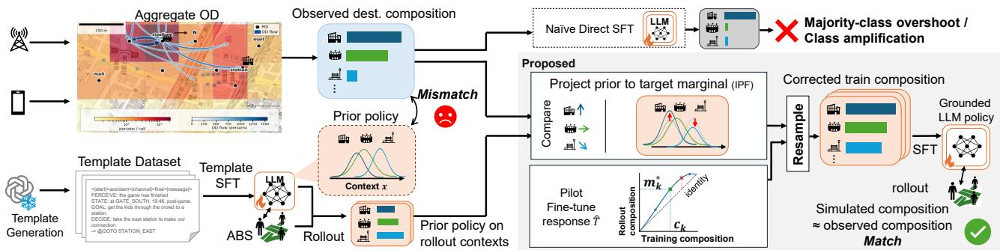
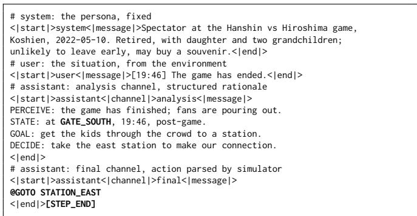
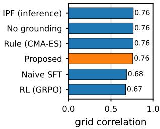
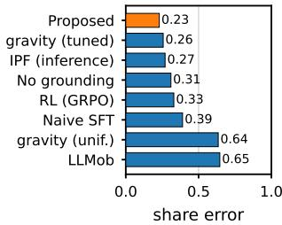

# Distilling Aggregate Mobility Statistics into a Language Model Policy for Post-Event Crowd Simulation

Tatsuya Amano1,2, Hirozumi Yamaguchi1,2

1The University of Osaka, Suita, Japan

2RIKEN Center for Computational Science, Kobe, Japan

## Abstract

Pedestrian simulators need a behaviour rule for every agent, but privacy usually limits the data for setting one to aggregate statistics, namely zone-level device counts and origin-to-destination (OD) flows, with no individual trajectories. Such aggregates underdetermine individual behaviour, because many diferent sets of decisions reproduce the same counts. We fine-tune a language model crowd agent so that the simulated population matches the observed destination composition, the fraction of the departing crowd heading to each point of interest. We read this target from the OD flow and reweight the model’s own destination distribution onto it by iterative proportional fitting. Because fine-tuning inflates the dominant destination class, we fit the low-rank adapter to trajectories resampled to a corrected training composition that reaches the target after this inflation. On mobile network counts from two baseball games the fine-tuned agent runs without inference-time correction, cutting the destination-share error by 25%, while the grid correlation remains similar across policies.

## CCS Concepts

• Information systems → Geographic information systems; • Computing methodologies → Multi-agent systems; Artificial intelligence.

## Keywords

pedestrian simulation, language model agents, iterative proportional fitting, supervised fine-tuning, aggregate mobility data

## 1 Introduction

When tens of thousands of people leave a large event such as a sports match within a short time window, the way that crowd disperses determines the safety of the surrounding area, the load on nearby stations, and the revenue of nearby businesses. Urban and transport planners therefore need to anticipate this dispersal and explore how changes in facilities or transport provision would alter the outcome [13]. Multi-agent pedestrian simulation [7] can model each person’s decisions at fine spatial resolution and is realised in widely adopted simulators such as SUMO [10].

To run these simulators realistically, planners need to set each agent’s behaviour so that the simulated crowd matches what is observed in reality. Individual trajectory data from sources such as GPS traces or call detail records would provide direct supervision, but privacy constraints mean that such records are rarely released. What is typically available instead is spatially and temporally aggregated statistics, namely device counts on a fixed spatial grid and origin-to-destination (OD) flow matrices between zones over time. Recovering individual behaviour from these aggregates is ill-posed, since many diferent combinations of decisions produce the same counts. Any solution must ensure both that each agent’s movements are individually plausible and that the population as a whole remains statistically consistent with the observed aggregates.

Existing approaches achieve statistical consistency with the observed aggregates, for example by tuning simulator parameters with a derivative-free optimiser [5], by using a gravity model to match zone-level flows [8], or by fitting a synthetic population to known marginals with IPF [1]. Yet they ofer only a static zone-tozone mapping, with no model of individual behaviour that could transfer to a new scenario. A reusable policy, a decision rule that reads an agent’s current situation and returns an action such as heading to a station, stopping at a nearby shop, or leaving by another exit, would let each decision depend on context such as time, weather, and group makeup.

Recent work has turned to large language models (LLMs) as behavioural policies in agent simulation, showing that LLM agents reproduce believable daily routines [4, 11] and generate individually plausible mobility patterns [6, 9, 14]. At each decision point the simulator presents the agent’s situation as a text prompt, and the LLM reads it and returns one executable action. Because the decision is conditioned on free-text context, the model can respond to factors beyond what aggregate counts capture, such as a rainy evening or a family with small children seeking a less crowded exit. Yet the pretrained model’s destination composition, the fraction of the departing crowd heading to each point of interest, inevitably diverges from the observed data, leaving statistical consistency unaddressed.

In this paper we close this gap by fitting the LLM policy to the destination composition observed in the OD flow. A direct approach would train on trajectories whose class proportions match the target, but the dominant class gets amplified. A model aimed at a 74% station share, for instance, deploys above 94% in simulation. We avoid this overshoot by separating what the policy should produce in simulation from what it sees during training. Information projection, solved by IPF, first tilts the pretrained destination distribution onto the target while preserving the model’s context-conditioned preferences within each class. We then estimate, from a few pilot training runs, how much the adaptation inflates each class, and invert this response to obtain a corrected training composition that reaches the target after inflation. A final supervised fine-tuning (SFT) pass on trajectories resampled to this corrected composition absorbs the aggregate constraint into the model weights, so the policy runs in the simulator without inference-time correction.

We evaluate on mobile network-based OD counts from two professional baseball games at one of the largest stadiums in Japan. After calibration to the cell counts, the grid correlation between simulated and observed occupancy is similar across very diferent behavioural priors, so this metric alone leaves them indistinguish able. The destination composition separates them. The fine-tuned policy cuts the destination-share error by about a quarter relative to the untuned model, and by a further 15% over an inference-time correction, all in free-running simulation.

## 2 Overview and Problem Setting

We simulate the post-event crowd as a population of agents in an agent-based pedestrian simulator (ABS). We start from a base agent that follows a fixed decision schema, fit it to the observed aggregate statistics and run the fine-tuned population to generate the post-event dispersal (Fig. 1).

## 2.1 Agent-based simulator with an LLM policy

Each agent is one simulated pedestrian, carrying a persona and a position in the street network. A single language model serves as the decision policy shared by the whole crowd, reading an agent’s persona and current situation as text and returning that agent’s next action.

At each arrival or wait event, an agent reads its local situation and responds in the OpenAI Harmony multi-channel format (Figure 2). The analysis channel contains a short, structured rationale with four labelled lines, PERCEIVE, STATE, GOAL, and DECIDE, while the final channel contains exactly one executable action. This design makes the model organise the relevant situation, goal, and intended decision, and then commit to a single simulator action. The simulator parses only the final action. The rationale is discarded before the next decision, where a fresh rationale is generated from the updated simulator state; it therefore acts as an ephemeral reasoning scafold rather than part of the simulator state.

We teach this interaction schema once by supervised fine-tuning and add 18 dedicated action, PoI, and delimiter tokens so the executable structure is emitted reliably. We synthesize the formattraining examples by pairing a situation with an action sampled from the base policy for a given persona, and a stronger model writes the surrounding rationale. We call the resulting formattrained policy $\pi _ { 0 }$ . This schema makes the behaviour readable and steerable; fitting $\pi _ { 0 }$ to the observed aggregate statistics is a separate step.

The agent and the simulator form a closed loop. We run the population in the SUMO pedestrian simulator [10] over the venue street network and advance everyone in continuous time. Whenever an agent reaches a PoI or finishes a wait, the simulator hands it the current situation, including any injected event. The agent then generates a rationale and returns a final-channel action, and the simulator executes only that action. Running the whole population forward through this loop, generating each agent’s trajectory step by step, is a single rollout, i.e., a free-running simulation with no external correction. The rollout yields the simulated behavioural-class composition that we compare against the observed composition defined below.

Implementation details of the format pass and the aggregatefitting pass are given in Section 4.

## 2.2 Problem setting

The study area is a grid of 125 m cells and a set $\mathcal { P }$ of points of interest (PoIs) such as train stations, shopping complexes, and venue exits. For each ten-minute bin $t ,$ the operator reports a cell count �(�, �), the number of devices in cell $c ,$ and an origin-to-destination (OD) flow $F ( c  c ^ { \prime } , t )$ between cells. Individual paths remain private.

We use these two statistics in two ways. The cell count � says where the crowd is at each moment; reproducing it is the standard macro check, the grid correlation between the simulated and observed counts. The OD flow � says where the crowd is going. Aggregated over the departure window it gives the destination composition $m ^ { \star }$ , whose entry $m ^ { \star } ( p )$ is the share of the departing crowd bound for PoI ${ \boldsymbol { p } } ,$ and this composition is the target the policy is fitted to.

We model the crowd as � agents drawn from a profile distribution $\rho$ over age band, group makeup, and residence type. At each step an agent with profile � reads its local situation � and selects one of three actions, going to a PoI, waiting, or leaving the area. A policy $\pi _ { \boldsymbol { \theta } } ( \boldsymbol { a } \mid \boldsymbol { z } , \boldsymbol { s } )$ generates these choices, and we seek weights � such that the simulated population matches $m ^ { \star }$

## 3 Proposed Method

Given the format-trained $\pi _ { 0 } ,$ , we fit it to the observed composition $m ^ { \star }$ through a second, separate fine-tuning pass. We distinguish three compositions in this procedure. The observed composition $m ^ { \star }$ is read from the OD flow. The training composition is the class makeup of the fine-tuning set. The simulation composition is what the fine-tuned policy produces when run in the simulator. The goal is to find a training composition whose simulation composition lands on $m ^ { \star }$ . The fitting has two steps. First, an information projection computes the action distribution closest to $\pi _ { 0 }$ that meets the observed composition; we call it $q ^ { \star }$ , the distribution we want the policy to produce. Second, because supervised fine-tuning shifts the simulation composition away from the training composition, what we train on difers from $q ^ { \star }$ . We estimate this shift with a transfer map and resample the data to a corrected training composition �˜ whose deployment matches $m ^ { \star }$

We now make the two steps precise. Let $x = ( z , s )$ collect the agent profile and its local situation into a single context variable. A rollout of $\dot { \pi } _ { 0 }$ yields its destination distribution $\pi _ { 0 } ( \boldsymbol { a } \mid \boldsymbol { x } )$ , the model’s prior over where the crowd goes before any tuning, together with the empirical set of contexts � it visits. For the information projection we hold this context distribution fixed and neglect the shift in context occupancy that the tuning induces in the closed loop. Over this distribution we solve

$$
\begin{array} { r l } { q ^ { \star } = \arg \underset { q } { \operatorname* { m i n } } } & { \mathbb { E } _ { x } \left[ D _ { \mathrm { K L } } \big ( q ( \cdot \mid x ) \| \pi _ { 0 } ( \cdot \mid x ) \big ) \right] } \\ { \mathrm { s . t . } } & { \mathbb { E } _ { x , a \sim q } [ \phi _ { k } ( a ) ] = m _ { k } ^ { \star } \quad \forall k , } \end{array}\tag{1}
$$

where $\phi _ { k } ( a )$ marks each action’s membership in destination class � (heading to a station, to the adjacent mall, or to another exit) and $m _ { k } ^ { \star }$ is that class’s share in $m ^ { \star }$ . The solution takes the exponential-tilt form

$$
q ^ { \star } ( a \mid x ) = \frac { \pi _ { 0 } ( a \mid x ) \exp \bigl ( \sum _ { k } \lambda _ { k } \phi _ { k } ( a ) \bigr ) } { Z _ { \lambda } ( x ) } ,\tag{2}
$$

  
Figure 1: Proposed Method Overview.

  
Figure 2: One decision step in the Harmony format. Bold marks the added tokens; # lines are annotations.

where the multipliers $\lambda _ { k }$ satisfy the constraints of Eq. (1). This is the information projection of $\pi _ { 0 }$ onto the constraint set [2], found by IPF [3] in milliseconds. Because the features $\phi _ { k }$ are class indicators, the projection acts as a class-level ofset. It preserves the support of �0 and the relative probabilities within each class, adjusting only the population-level class masses to match the data.

The second step turns $q ^ { \star }$ , the target we want deployed, into the composition the model actually trains on. The two difer because fine-tuning amplifies whichever destination class dominates the training set. A model trained on a set composed as $q ^ { \star }$ deploys to more concentrated shares and overshoots the target. We therefore calibrate the resampling composition with an empirical transfer map � that sends a training composition to the simulation composition the fine-tuned model produces. We fit � as a per-class afine relation from a few pilot fine-tunes at difering compositions; on our data it is close to linear, for example a station share � in the data deploys to about 0.94 � + 0.26. Because � is per-class and monotone, we invert it in closed form to obtain the corrected composition �˜ with �(�˜) ≈ �★; matching the observed 74% station share, for instance, asks for a training share near 51%, since training at 74% would deploy above 94%.

We realise �˜ by resampling, with no rewriting of text, keeping every trajectory of the rarer classes and subsampling the dominant class without replacement. A low-rank adapter trained on this set yields the fine-tuned policy $\pi _ { \theta } ,$ which brings the simulation composition toward $m ^ { \star }$ in free-running rollout.

## 4 Experimental Setup

We use mobile network-based OD data for two professional baseball games at Hanshin Koshien (10 and 11 May 2022, oficial attendances 31,560 and 30,917). We cross-validate over the two game days, calibrating on each in turn and evaluating on the other, then averaging. The observed destination composition falls into three destination classes, a station, the adjacent commercial complex, and other exits, with mean shares 0.744, 0.064, and 0.192 across the two days.

Both SFT passes use gpt-oss-20b with LoRA (rank 64, �=128), learning rate $2 \times 1 0 ^ { - 4 }$ , efective batch size 16, and a 4096-token packed context on a single NVIDIA H100 NVL GPU. The format pass trains the embeddings of the 18 added tokens on 1,756 synthetic decision examples whose rationales are written by gpt-5-mini for five epochs. The aggregate-fitting pass resamples narrated trajectories to the corrected composition �˜ and trains on 1,663 examples for three epochs.

We evaluate each policy by a free-running rollout. We simulate 500 agents from a uniform distribution over personas across ten random seeds and read each agent’s class from the cells its trajectory visits. An agent counts as mall if it enters the commercial-complex cells before leaving the area, as station if it reaches a station without entering those cells, and as other otherwise.

All metrics are computed over the post-game window (20:00– 22:10). The grid correlation is the Pearson correlation between the simulated and observed per-cell occupancy shares on the 125 m grid (268 cells), where each ten-minute bin is separately normalised to a spatial distribution and all cell-bin pairs active in both simulation and observation are pooled, so the metric captures the shape of the crowd’s spatial spread rather than its absolute size. The destination-share error is the summed absolute diference between the simulated and observed shares of the three destination classes, where each agent is classified by the first destination mesh its trajectory enters.

We compare Proposed against four LLM-based variants (no grounding, naive SFT, IPF at inference, and GRPO [12]), a rule simulator tuned by CMA-ES [5], an LLM prompting agent (LLMob [14]), and a classical gravity model [15].

## 5 Results

After calibration to the cell counts, the grid correlation is similar across all behavioural priors, landing near 0.75 for the rule, the uniform policy, and the LLM alike (Fig. 3a). The destination composition separates them (Fig. 3b). The fine-tuned policy achieves the lowest destination-share error and is the only policy with a visible mall share, lifting it from 0.02 to 0.09 against an observed 0.06.

  
(a) Grid correlation.

  
(b) Destination-share error.  
Figure 3: Grid correlation is insensitive across calibrated policies, whereas destination-share error separates them.

Training directly at the observed composition confirms the need for the corrected training composition. Naive SFT amplifies the dominant class and performs worse than the untuned baseline. GRPO, trained with a cell-occupancy residual reward, also has higher destination-share error than the fine-tuned policy and falls below the grid-correlation band reached by the other calibrated policies.

We also tested whether the policy responds to an unseen weather prompt. The policy is calibrated on the dry game day alone, and the light-rain day’s OD flow serves only as held-out ground truth. We run the calibrated population on the rainy day once with a rain sentence appended to the situation prompt (It has suddenly started raining.) at the post-event onset and once without. On the real rainy day the crowd shelters more at the commercial complex and disperses more slowly, and conditioning the policy on rain tracks this shift. Late-window sheltering at the mall rises from 3 to 59 agents, and the cosine similarity of the mall-occupancy curve with the observed rainy day rises from 0.59 to 0.74. A policy that samples the fixed observed composition produces the same behaviour regardless of weather.

## 6 Conclusion

We presented a method for fitting an LLM crowd policy to aggregate mobility statistics when individual trajectories are unavailable. The key idea is to project the prior policy toward the OD-derived destination composition and fine-tune on a corrected training composition that accounts for the amplification caused by SFT. On post-game crowd data, the calibrated policy reduced the destination-share error and ran in free-running simulation without inference-time correction. The results also show that grid-count correlation alone can hide important behavioural diferences between policies.

A limitation of this work is that it targeted a post-game egress scenario with a small set of POIs and limited context variation, and the zero-shot weather response was demonstrated under a single condition. As destinations and context combinations grow, the pilot cost scales combinatorially, calling for amortised transfer estimates or hierarchical class structures. Future work should clarify the efective range of LLM-driven crowd simulation across diverse venues and events, leveraging the growing availability of open urban mobility datasets.

## Acknowledgments

This work was supported by JST PRESTO Grant JPMJPR2361.

## References

[1] Kevin Chapuis, Patrick Taillandier, and Alexis Drogoul. 2022. Generation of Synthetic Populations in Social Simulations: A Review of Methods and Practices. Journal ofArtificial Societies and Social Simulation 25, 2 (2022), 6.

[2] Imre Csiszár. 1975. I-Divergence Geometry of Probability Distributions and Minimization Problems. The Annals ofProbability 3, 1 (1975), 146–158.

[3] W. Edwards Deming and Frederick F. Stephan. 1940. On a Least Squares Adjustment of a Sampled Frequency Table When the Expected Marginal Totals are Known. The Annals ofMathematical Statistics 11, 4 (1940), 427–444.

[4] Chen Gao, Xiaochong Lan, Nian Li, Yuan Yuan, Jingtao Ding, Zhilun Zhou, Fengli Xu, and Yong Li. 2024. Large language models empowered agent-based modeling and simulation: a survey and perspectives. Humanities and Social Sciences Communications 11, 1 (2024), 1–24.

[5] Nikolaus Hansen and Andreas Ostermeier. 2001. Completely Derandomized Self-Adaptation in Evolution Strategies. Evolutionary Computation 9, 2 (2001), 159–195.

[6] Minwoo Jeong, Jeeyun Chang, and Yoonjin Yoon. 2025. Speak to Simulate: An LLM-Guided Agentic Framework for Trafic Simulation in SUMO. In Proc. ofthe 8th ACM SIGSPATIAL International Workshop on Geospatial Simulation. 45–48.

[7] Saba Khan and Zhigang Deng. 2024. Agent-based crowd simulation: an in-depth survey of determining factors for heterogeneous behavior. The Visual Computer 40, 7 (2024), 4993–5004.

[8] Maxime Lenormand, Aleix Bassolas, and José J. Ramasco. 2016. Systematic comparison of trip distribution laws and models. Journal of Transport Geography 51 (2016), 158–169.

[9] Qi Liu, Can Li, and Wanjing Ma. 2026. GATSim: Urban mobility simulation with generative agents. Transportation Research Part C: Emerging Technologies 186 (2026), 105576.

[10] Pablo Alvarez Lopez, Michael Behrisch, Laura Bieker-Walz, Jakob Erdmann, Yun-Pang Flötteröd, Robert Hilbrich, Leonhard Lücken, Johannes Rummel, Peter Wagner, and Evamarie Wießner. 2018. Microscopic Trafic Simulation using SUMO. In Proc. ofthe 21st IEEE International Conference on Intelligent Transportation Systems (ITSC). 2575–2582.

[11] Joon Sung Park, Joseph C. O’Brien, Carrie J. Cai, Meredith Ringel Morris, Percy Liang, and Michael S. Bernstein. 2023. Generative Agents: Interactive Simulacra of Human Behavior. In Proc. of the 36th Annual ACM Symposium on User Interface Software and Technology.

[12] Zhihong Shao, Peiyi Wang, Qihao Zhu, et al. 2024. DeepSeekMath: Pushing the Limits of Mathematical Reasoning in Open Language Models. arXiv preprint arXiv:2402.03300 (2024).

[13] Fukuharu Tanaka, Tatsuya Amano, Akira Uchiyama, Akihito Hiromori, Yusuke Nakamura, and Hirozumi Yamaguchi. 2024. Policy Optimization for Pedestrian Trafic Management by Surrogation of Simulation Models. In 2024 IEEE 21st International Conference on Mobile Ad-Hoc and Smart Systems (MASS). 203–211.

[14] Jiawei Wang, Renhe Jiang, Chuang Yang, Zengqing Wu, Makoto Onizuka, Ryosuke Shibasaki, and Chuan Xiao. 2024. Large Language Models as Urban Residents: An LLM Agent Framework for Personal Mobility Generation. In Advances in Neural Information Processing Systems 37. 124547–124574.

[15] Alan G. Wilson. 1971. A Family of Spatial Interaction Models, and Associated Developments. Environment and Planning A 3, 1 (1971), 1–32.