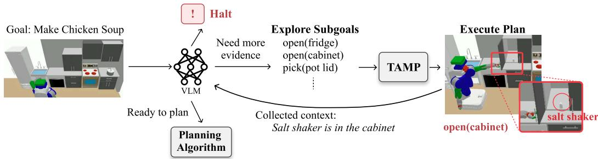
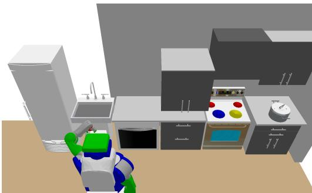
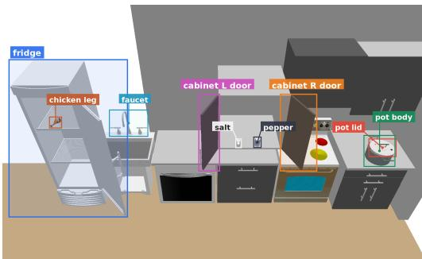

# Evidence-Gated Task and Motion Planning with Vision-Language Models

Tsunehiko Tanaka1, Matthew Stephenson2, Alistair Macvicar2, Edgar Simo-Serra1 1Waseda University, 2Flinders University

Abstract: Robots executing long-horizon manipulation tasks from naturallanguage instructions must reason about both semantic task structure and geometric feasibility. However, under partial observability, the availability of goalrelevant objects may be uncertain. In such cases, approaches that combine Vision-Language Models (VLMs) with Task and Motion Planning (TAMP) may generate subgoals that rely on the VLM’s prior knowledge without observational support, leading to execution failures or unintended outcomes. We propose Evidence Acquisition and Feasibility Gating (EAFG), a framework that acquires visual evidence through VLM-generated exploratory subgoals and TAMP-based execution. EAFG then applies a feasibility gate to decide whether to proceed with task planning, acquire further evidence, or halt. Our experiments show that, in cooking tasks with ambiguous object use, EAFG improves recipe completion by discovering task-relevant objects before planning. For instructions requiring an absent object, EAFG promotes appropriate halt decisions and reduces repeated attempts to manipulate that object.

Keywords: Task and Motion Planning, Combination of learning and planning in robotics, Vision Language Models

## 1 Introduction

Robots operating in everyday environments must be able to execute complex, long-horizon manipulation tasks from natural-language instructions. For example, an instruction such as “make soup” must be expanded into a sequence of manipulation actions involving multiple objects, including available ingredients and heating appliances. Such tasks require the robot to interpret the seman tic meaning of the language instruction while satisfying geometric and kinematic constraints, such as grasp feasibility, placement stability, and collision-free reachability. Task and Motion Planning (TAMP) has therefore been widely used as a core technique for long-horizon manipulation planning, as it can generate action sequences that account for the geometric and kinematic aspects of the problem [1, 2]. On the other hand, Vision-Language Models (VLMs) can integrate visual and linguistic information to infer commonsense procedures and semantically meaningful intermediate goals from natural-language objectives. Consequently, a hierarchical integration in which a VLM generates high-level subgoals and TAMP refines each subgoal into a geometrically feasible action sequence is a promising approach to natural-language long-horizon robot manipulation [3, 4]. However, the success of such systems depends on whether the information used to form subgoals is actually supported by observations of the environment.

A key limitation arises when the initial observation is only partial [5, 6]. Goal-relevant objects may be hidden inside closed storage spaces, or they may not exist in the environment at all. In such cases, a VLM may rely on prior knowledge or commonsense assumptions to infer where those objects are likely to be and to generate plausible recipe steps. TAMP does not by itself provide a mechanism for actively verifying unobserved objects before planning. As a result, existing methods that combine VLMs and TAMP typically assume a fully observable object-oriented state [3, 4]. Plans generated under partial observability may ignore unobserved objects or attempt to use objects that are not present. Such plans can be inefficient and lead to unintended outcomes that fail to satisfy the instruction. Long-horizon manipulation planning thus requires an explicit mechanism for determining, before task planning, whether the available observations provide sufficient evidence for achieving the goal.

In this work, we propose Evidence Acquisition and Feasibility Gating (EAFG), a framework that actively gathers information and determines feasibility based on the acquired evidence. EAFG first generates subgoals for resolving missing or uncertain information, such as opening the doors of closed storage spaces. Each subgoal is solved by TAMP, executed by the robot, and used to collect observation images. The VLM then evaluates whether the acquired observations provide sufficient information for planning toward the goal. If sufficient evidence has been collected, the system generates a task plan conditioned on this information. This enables planning to be grounded in verified observations as well as in the VLM’s prior knowledge. If the VLM determines that the evidence required for goal achievement is insufficient, EAFG halts execution. In this way, EAFG reduces repeated planning or execution attempts involving nonexistent objects and prevents unintended outcomes. To evaluate these properties, we construct three cooking scenarios: goals with explicitly specified objects, underspecified goals, and goals involving missing objects. Our results show that EAFG outperforms a VLM-TAMP baseline in completing underspecified goals using objects actually present in the environment and in handling infeasible missing-object tasks by halting after evidence acquisition.

The contributions of this work are threefold:

• We introduce a pre-planning evidence-acquisition mechanism that prompts a VLM to plan information-gathering subgoals, revealing hidden regions and verifying goal-relevant objects.

• We propose a feasibility-gating mechanism that evaluates whether acquired evidence supports feasible task planning, requesting additional observations or halting when goal requirements remain unsupported.

• We design three cooking scenarios spanning explicit, underspecified, and missing-object goals, and empirically show that EAFG improves grounded completion and infeasibility detection.

## 2 Related Work

Task and Motion Planning combines discrete symbolic reasoning with continuous motion planning to solve long-horizon manipulation tasks under geometric, kinematic, collision, grasping, and placement constraints [7, 2, 8, 9]. PDDLStream [2] extends PDDL with streams that interface with black-box procedures such as inverse-kinematics solvers, grasp and placement samplers, collision checkers, and motion planners. It coordinates finite PDDL search with stream evaluations to generate and verify the continuous parameters required by candidate manipulation plans.

Large language models and vision-language models bridge open-ended language and robotic execution by providing commonsense semantics, object grounding, and spatial reasoning [10, 11, 12, 13]. In planner-based systems, they translate perceptual or linguistic context into planner-facing structures such as formal goals, symbolic representations, task constraints, and learned predicates [14, 15, 4, 16, 17]. VLM-TAMP [3], for example, generates semantically meaningful, horizon-reducing subgoals from language and visual context and refines them with TAMP into geometrically feasible manipulation actions. However, these methods generally generate or constrain plans from the currently represented scene rather than first acquiring observational evidence to decide whether task planning should proceed.

  
Figure 1: Overview of Evidence Acquisition and Feasibility Gating (EAFG). The system executes evidence-acquisition subgoals to verify goal-relevant objects and conditions, updates the evidence state from the resulting observations, and uses feasibility gating to decide whether to continue exploration, halt, or proceed to task planning.

Prior work on planning under partial observability and object search handles hidden objects and uncertain states with POMDPs, belief-space planning, and information-gathering actions, including revealing occlusions or inspecting containers in manipulation [18, 19, 5, 20]. LLM-based preexecution plan verification detects logical or procedural flaws in proposed robot plans [21], but does not actively gather evidence about hidden or absent objects. In contrast, our method enables the robot to act autonomously to gather evidence and, based on that evidence, decide whether to plan, acquire additional evidence, or halt.

Overall, prior work provides geometric feasibility through TAMP, semantic task decomposition through foundation models, or information gathering through partial-observability planning. Our contribution is to place evidence acquisition before task planning and to use acquired observations as an explicit feasibility gate for grounded planning or halting.

## 3 Evidence Acquisition and Feasibility Gating

We propose Evidence Acquisition and Feasibility Gating (EAFG), which uses a VLM to actively acquire observational evidence for verifying goal-relevant objects and environmental conditions before task planning. EAFG generates evidence-acquisition subgoals that resolve missing or uncertain information, and uses the acquired evidence to determine whether planning for the goal should proceed. If the required evidence cannot be obtained after exploring the goal-relevant regions, EAFG halts execution to avoid generating a plan based on unsupported assumptions.

## 3.1 Overview

Figure 1 summarizes the overall EAFG pipeline. EAFG takes a natural-language goal $\mathcal G ^ { e n g }$ as input and generates a plan for acquiring the environmental information needed to determine whether the goal can be achieved. The VLM first proposes a sequence of evidence-acquisition subgoals

$$
\mathcal { G } _ { 0 } ^ { \mathrm { E A } } = \left( g _ { 0 , 1 } ^ { \mathrm { E A } } , \dots , g _ { 0 , K _ { 0 } } ^ { \mathrm { E A } } \right) ,
$$

where each $g _ { 0 , k } ^ { \mathrm { E A } }$ denotes an exploratory subgoal, such as opening doors or cabinets and temporarily lifting occluding objects. These subgoals are used to inspect parts of the environment that may contain goal-relevant objects, rather than to directly perform the target task. Each generated evidenceacquisition subgoal is passed to a TAMP, which attempts to instantiate it as a geometrically and kinematically feasible action sequence. The robot then executes the resulting action sequences. After each subgoal execution, the resulting observation image is stored as visual evidence for subsequent VLM inference.

After each evidence-acquisition iteration, the VLM receives the execution history and observation collage, updates the evidence state, and outputs a gate status: ready to plan, need more evidence, or halt. The first status triggers evidence-conditioned task planning, the second triggers another evidence-acquisition iteration, and the third stops execution when the required evidence remains unsupported.

## 3.2 Evidence Acquisition

Evidence Acquisition is designed to collect the environmental information required to determine whether the natural-language goal can be achieved. It proceeds as an iterative loop, indexed by $t =$ $0 , 1 , . . . ,$ in which the robot executes exploratory subgoals and the VLM updates its understanding of the environment from the resulting observations.

At iteration t, the VLM generates evidence-acquisition subgoals $\mathcal { G } _ { t } ^ { \mathrm { E A } }$ from the language goal, current observations, and accumulated evidence state to inspect potentially relevant regions before any task-directed subgoals are produced. To prevent premature task execution, its output is restricted to a predefined set of safe evidence-acquisition actions, excluding irreversible or main-task actions such as cooking, sprinkling, or heating, thereby ensuring that the robot only gathers information until task feasibility has been assessed.

$\mathcal { G } _ { t } ^ { \mathrm { E A } }$ are passed to the TAMP module, which attempts to instantiate each subgoal as a geometrically and kinematically feasible low-level action sequence. The robot executes the subgoals in order, and after each executed subgoal, the resulting observation image is recorded. After the execution of $\mathcal { G } _ { t } ^ { \mathrm { E A } }$ , the recorded observations are arranged in temporal order as an image collage $I _ { t }$ and provided to the VLM, allowing it to access the visual evidence acquired across multiple subgoal executions. If the TAMP module fails to find a feasible action sequence, the system skips execution and proceeds to the next evidence-acquisition iteration.

We represent the information maintained during Evidence Acquisition as an evidence state:

$$
E _ { t } = ( H _ { t } , O _ { t } , F _ { t } ) ,
$$

where $H _ { t }$ is the executed-subgoal history, $O _ { t }$ is a textual summary of observed facts, and $F _ { t }$ is a set of retained findings relevant to later inference. The VLM regenerates $O _ { t + 1 }$ and $F _ { t + 1 }$ from $E _ { t }$ and the new observation collage $I _ { t } ,$ , allowing outdated or contradicted descriptions to be removed rather than blindly appended.

The VLM updates the evidence state from $E _ { t }$ $E _ { t + 1 }$ based on the observation collage $I _ { t } .$ The updated evidence state is then passed either to the next evidence-acquisition iteration or to the planning algorithm for generating task subgoals $\mathcal { G } ^ { \mathrm { t a s k } }$ . In this update, the VLM regenerates the textual components of the evidence state, namely $O _ { t + 1 }$ and $F _ { t + 1 }$ . This allows outdated, redundant, or contradicted descriptions to be removed from the evidence state. EAFG incrementally refines its understanding of the environment during exploration, while avoiding the generation of $\mathcal { G } ^ { \mathrm { t a s k } }$ that depend on unsupported assumptions.

## 3.3 Feasibility Gating

Feasibility Gating determines whether the evidence acquired through Evidence Acquisition is sufficient for planning toward the natural-language goal. At each iteration t, the VLM receives the goal $\mathcal G ^ { e n g }$ , the current evidence state $E _ { t } .$ , and the observation collage $I _ { t }$ as input, and outputs a feasibility status $s _ { t } \colon$

$$
s _ { t } \in \{ { \tt r e a d y } _ { - } { \tt t o } _ { - } { \tt p l a n } , { \tt n e e d } \_ { \tt m o r e } _ { - } { \tt e v i d e n c e } , { \tt h a l t } \} .
$$

If the VLM determines that the acquired evidence is sufficient to plan for achieving $\mathcal G ^ { e n g }$ , it outputs $s _ { t } = { \tt r e a d y \_ t o \_ p l a n }$ . In this case, the system exits the evidence-acquisition loop and proceeds to the evidence-conditioned planning.

If the VLM determines that the current evidence is still insufficient but that unexplored regions relevant to verifying the required objects or conditions remain, it outputs $s _ { t } = \mathtt { n e e d }$ more evidence. In the same inference step, the VLM generates an additional sequence of evidence-acquisition subgoals $\mathcal { G } _ { t + 1 } ^ { \mathrm { E A } }$ , to obtain the missing information. The system then returns to the evidence-acquisition loop, executes subgoals feasible under the TAMP module, and updates the evidence state using the newly acquired observations.

The status $s _ { t } =$ halt is selected when Evidence Acquisition cannot verify the objects or conditions needed for $\mathcal G ^ { e n g }$ , and further exploratory subgoals are unlikely to help. For example, if a required object remains unobserved after inspecting its plausible source locations, the system halts rather than generating task subgoals that implicitly assume the missing object exists. This design reduces failures from repeated planning or execution attempts with infeasible subgoals, such as picking an unobserved object. It also prevents the robot from satisfying the instruction with substitute object or conditions absent from the original goal.

## 3.4 Evidence-Conditioned Planning

Evidence-Conditioned Planning aims to ensure that task-subgoal generation is grounded in the information verified through Evidence Acquisition. The planner receives the accumulated evidence state $E _ { T }$ in addition to the natural-language goal $\mathcal { G } ^ { \mathrm { e n g } }$ , where $T$ denotes the evidence-acquisition iteration at which Feasibility Gating outputs ready to plan. The evidence state is provided as explicit textual context that summarizes the executed exploratory subgoals, the verified observations, and the findings retained for subsequent inference. The task-subgoal sequence is generated as

$$
\mathcal { G } ^ { \mathrm { t a s k } } = \Pi \left( \mathcal { G } ^ { \mathrm { e n g } } , E _ { T } \right) ,
$$

where Π denotes a task-subgoal generation module. Each generated task subgoal $g _ { m } ^ { \mathrm { t a s k } }$ specifies a goal-directed manipulation objective, such as picking a verified ingredient, placing it into a pot, or heating the pot. Because $E _ { T }$ is represented in natural language, EAFG can be integrated with existing VLM- or LLM-guided TAMP frameworks that accept textual context as part of their planning input. In such cases, the evidence state can be directly appended to the planner prompt, allowing the task planner to generate subgoals based on the verified observations collected during Evidence Acquisition.

## 4 Experiments

## 4.1 Kitchen Environment and Robot Embodiment

We use a kitchen environment for making chicken soup. The task requires long-horizon planning over object search beyond the initially visible area, access to storage spaces, placement of ingredients and seasonings, and the use of water and a stove. The environment consists of five movable objects, eight support surfaces such as counters, stove burners, a sink, and a pot, two storage spaces enclosed by doors or a drawer, and six articulated objects such as doors and knobs. Objects are added to the PDDL problem only after they appear in the robot’s observation images. This environment was used in VLM-TAMP [3] as a benchmark for evaluating long-horizon task planning and geometric feasibility.

In our experiments, all doors are initially closed. The chicken leg is on the top refrigerator shelf, and the salt and pepper shakers are on the cabinet’s left and right sides, respectively, from the robot’s viewpoint. The robot is restricted to using only its left arm, so object rearrangement, storagespace access, and articulated-object manipulation must be performed within a limited reachable workspace. The robot can manipulate movable objects through pick-and-place actions and operate articulated joints by pulling, pushing, and rotating its wrist. As a result, successful execution requires jointly handling unobserved regions, closed storage spaces, and geometric constraints during cooking-related manipulation.

## 4.2 Experimental Settings, Research Questions, and Evaluation Metrics

We evaluate EAFG in three kitchen-task settings, each designed to correspond to a distinct research question, as summarized in Table 1. These settings differ in whether the goal-relevant objects are explicitly specified in the instruction and whether those objects are actually present in the environment. This design allows us to evaluate three aspects of EAFG: completing a feasible recipe when the required objects are explicitly specified, acquiring missing information under an underspecified goal, and halting when an explicitly required object is absent.

  
(a) Initial kitchen state.

  
(b) Object layout in the kitchen.  
Figure 2: Kitchen environment used in the experiments. (a) Initial state of the kitchen. (b) Layout of objects in the kitchen.

Table 1: Experimental settings, research questions, and evaluation metrics. CR and SR denote completion rate and success rate, respectively.
<table><tr><td>Setting</td><td>Goal</td><td></td><td>Research Question</td><td>Metrics</td></tr><tr><td>S1: Explicit- and-present</td><td>make chicken soup with salt and pepper</td><td></td><td>RQ1: Can EAFG complete each recipe step and the full recipe when explicitly specified objects are present?</td><td>Step CR, Recipe CR</td></tr><tr><td>S2: Underspecified</td><td>make chicken soup</td><td></td><td>RQ2: Can EAFG acquire the required information through exploration and complete the same recipe under an underspecified goal?</td><td>Step CR, Recipe CR</td></tr><tr><td>S3: Explicit- but-missing</td><td>make chicken soup with salt, pepper, and carrot</td><td></td><td>RQ3: Can EAFG halt when a specified object is absent while reducing repeated planning attempts involving the missing object?</td><td>Halt SR, Missing-object Attempt Count</td></tr></table>

S1 evaluates RQ1: whether the system can complete a feasible task when all explicitly specified goal-relevant objects are available. In this setting, the instruction specifies salt and pepper, and both objects are present in the environment. We measure Step CR for five recipe steps: using chicken, using salt, using pepper, adding water, and putting the pot on the stove and turning on the stove knob. Recipe CR is counted only when all five steps are completed in a single trial.

S2 evaluates RQ2: whether the system can acquire missing task-relevant information and complete the same recipe under an underspecified instruction. In this setting, the instruction asks the robot to make chicken soup but does not explicitly mention salt or pepper. We use the same Step CR and Recipe CR as in S1 to evaluate whether the system can recover the information needed for the recipe through exploration rather than relying only on unsupported assumptions.

S3 evaluates RQ3: whether the system can recognize that a goal is infeasible when an explicitly required object is absent and avoid repeated attempts to act on that missing object. In this setting, the instruction specifies carrot, but carrot is absent from the environment, so the goal cannot be achieved as specified. Halt SR is counted when the system halts after inspecting the predefined carrot-source regions used for scoring: the fridge and cabinet. These labels are used only for scoring and are not provided in the prompt. Missing-object Attempt Count measures the number of times a subgoal containing carrot is handled by the TAMP module, such as pick(carrot) or in(carrot, pot body).

Table 2: S1: Explicit-and-present (RQ1) results for the instruction make chicken soup with salt and pepper, comparing runs with and without EAFG across VLMs. Each condition uses 20 runs. Step CR and Recipe CR are reported as rates in [0, 1].
<table><tr><td rowspan="2">EAFG</td><td rowspan="2">VLM</td><td colspan="5">Step CR</td><td rowspan="2">Recipe CR</td></tr><tr><td>Chicken</td><td>Water</td><td>Pepper</td><td>Salt</td><td>Stove</td></tr><tr><td rowspan="2">√</td><td>GPT-5.5</td><td>0.95</td><td>0.80</td><td>0.75</td><td>0.80</td><td>0.20</td><td>0.20</td></tr><tr><td>GPT-5.5</td><td>1.00</td><td>0.55</td><td>1.00</td><td>1.00</td><td>0.65</td><td>0.45</td></tr><tr><td rowspan="2"></td><td>Gemini-3.5-Flash</td><td>0.95</td><td>0.80</td><td>0.90</td><td>0.95</td><td>0.15</td><td>0.15</td></tr><tr><td>Gemini-3.5-Flash</td><td>1.00</td><td>0.85</td><td>1.00</td><td>1.00</td><td>0.10</td><td>0.10</td></tr></table>

## 4.3 Implementation Details

We use gpt-5.5-2026-04-23 and gemini-3.5-flash as VLMs, setting the temperature to 0.2 for both models and evaluating them independently. During Evidence Acquisition, we allow only reversible exploratory operations, such as opening doors, temporarily moving occluding objects, and inspecting the inside of containers, while disallowing operations that directly advance the target task, such as placing ingredients into the pot or heating. The observation images obtained after executing each subgoal in $\mathcal { G } _ { t } ^ { \mathrm { E A } }$ are arranged in execution order from top to bottom to form an image collage, and each image is annotated with the corresponding subgoal name before being provided to the VLM. For TAMP, we use PDDLStream [2] in diverse planning mode and consider up to 12 plan skeletons. If planning fails for a subgoal, we replan up to three times while gradually increasing the set of observed objects included in planning, and regard the subgoal as successful if an executable action sequence is obtained in any of these trials. In Feasibility Gating, we allow up to five Evidence Acquisition iterations, and generate the task subgoals $\mathcal { G } ^ { \mathrm { t a s k } }$ using VLM-TAMP only when ready to plan is output.

## 4.4 Results

We evaluate the effect of EAFG by comparing VLM-TAMP [3] with and without EAFG across three settings. EAFG provides the largest benefit in S2, where the goal is underspecified: Recipe CR increases from 0.05 to 0.40 for GPT-5.5 and from 0.00 to 0.20 for Gemini-3.5-Flash because EAFG discovers the unmentioned but task-relevant salt and pepper and incorporates them into the task plan. In S3, EAFG improves infeasible-goal handling by increasing Halt SR and reducing unnecessary execution attempts toward a missing carrot. In S1, where the instruction is explicit and all required objects are present, EAFG remains competitive with the baseline and improves Recipe CR for GPT-5.5.

S1: Explicit-and-present. Table 2 reports the results for S1, where the instruction explicitly specifies salt and pepper and all required objects are present. For GPT-5.5, EAFG increases Recipe CR from 0.20 to 0.45 and improves the step completion rates for pepper and salt to 1.00. Although the water step completion rate decreases from 0.80 to 0.55, EAFG improves full-recipe completion while making the explicitly specified seasoning steps more reliable. For Gemini-3.5-Flash, Recipe CR changes from 0.15 to 0.10, with the step completion rates for pepper and salt reaching 1.00 and the water step completion rate remaining high at 0.85. These results indicate that EAFG remains competitive with the baseline when the required objects are explicitly given and available, while improving completion of the object-use steps that depend directly on the specified ingredients.

S2: Underspecified. The underspecified setting in Table 3 shows that EAFG substantially improves full-recipe completion when task-relevant objects are not explicitly mentioned in the instruction. Without EAFG, full-recipe completion is rare or absent, with Recipe CR at 0.05 for GPT-5.5 and 0.00 for Gemini-3.5-Flash. With EAFG, Recipe CR increases to 0.40 for GPT-5.5 and 0.20 for Gemini-3.5-Flash. This improvement comes from Evidence Acquisition discovering salt and pepper, whose step completion rates rise from 0.10 to 1.00 and from 0.30 to 1.00 for GPT-5.5, and from 0.05 to 0.95 and from 0.05 to 0.85 for Gemini-3.5-Flash, respectively. EAFG therefore contributes not only to finding underspecified objects but also to converting the acquired evidence into full recipe completion.

Table 3: S2: Underspecified (RQ2) results for the instruction make chicken soup, comparing runs with and without EAFG across VLMs. Each condition uses 20 runs. Step CR and Recipe CR are reported as rates in [0, 1].
<table><tr><td rowspan="2">EAFG</td><td rowspan="2">VLM</td><td colspan="5">Step CR</td><td rowspan="2">Recipe CR</td></tr><tr><td>Chicken</td><td>Water</td><td>Pepper</td><td>Salt</td><td>Stove</td></tr><tr><td rowspan="2">√</td><td>GPT-5.5</td><td>1.00</td><td>0.95</td><td>0.30</td><td>0.10</td><td>0.40</td><td>0.05</td></tr><tr><td>GPT-5.5</td><td>1.00</td><td>0.75</td><td>1.00</td><td>1.00</td><td>0.55</td><td>0.40</td></tr><tr><td rowspan="2"></td><td>Gemini-3.5-Flash</td><td>0.90</td><td>0.90</td><td>0.05</td><td>0.05</td><td>0.30</td><td>0.00</td></tr><tr><td>Gemini-3.5-Flash</td><td>0.95</td><td>0.85</td><td>0.85</td><td>0.95</td><td>0.20</td><td>0.20</td></tr></table>

Table 4: S3: Explicit-but-missing (RQ3) results for the instruction make chicken soup with salt, pepper, and carrot, where carrot is absent from the environment. Each condition uses 20 runs. Halt SR is reported as a rate in [0, 1] and Missing-object Attempt Count is the mean number of execution attempts involving the absent object.
<table><tr><td>EAFG</td><td>VLM</td><td>Halt SR</td><td>Missing-object Attempt Count</td></tr><tr><td rowspan="3">√</td><td>GPT-5.5</td><td>0.45</td><td>4.00</td></tr><tr><td>GPT-5.5</td><td>0.90</td><td>0.55</td></tr><tr><td>Gemini-3.5-Flash</td><td>0.40</td><td>2.40</td></tr><tr><td rowspan="2">√</td><td>Gemini-3.5-Flash</td><td>1.00</td><td></td></tr><tr><td></td><td></td><td>0.00</td></tr></table>

S3: Explicit-but-missing. For the missing-object setting, Table 4 summarizes the results when a carrot is explicitly required but absent from the environment. For GPT-5.5, EAFG increases Halt SR from 0.45 to 0.90 and reduces Missing-object Attempt Count from 4.00 to 0.55. For Gemini-3.5- Flash, EAFG increases Halt SR from 0.40 to 1.00 and reduces Missing-object Attempt Count from 2.40 to 0.00. This indicates that EAFG not only identifies infeasible goals more reliably but also avoids repeated TAMP calls involving the absent object. These results show that EAFG supports both infeasible-goal detection and efficient avoidance of actions toward a missing object.

## 5 Limitations

EAFG relies on the TAMP module to instantiate each evidence-acquisition subgoal as a geometrically and kinematically feasible low-level action sequence. However, EAFG does not explicitly handle recovery from manipulation failures that occur during Evidence Acquisition. Therefore, when TAMP fails, the system may be unable to acquire that task-relevant evidence in the environment, causing Feasibility Gating to assess feasibility based on insufficient information. Despite this limitation, EAFG is compatible with a wide range of methods that combine VLMs with structured planners, and its robustness is expected to improve over time as the underlying planning and feedback mechanisms advance.

## 6 Conclusion

We proposed EAFG, a framework that actively acquires visual evidence before task planning and uses a feasibility gate to decide whether to plan, explore further, or halt. Experiments show that EAFG improves grounded task completion under partial observability by discovering task-relevant hidden objects before planning. EAFG also promotes appropriate halting when required objects cannot be confirmed, reducing unnecessary execution attempts toward absent objects.

## References

[1] S. Srivastava, E. Fang, L. Riano, R. Chitnis, S. Russell, and P. Abbeel. Combined task and motion planning through an extensible planner-independent interface layer. In 2014 IEEE International Conference on Robotics and Automation (ICRA), pages 639–646, 2014.

[2] C. R. Garrett, T. Lozano-Perez, and L. P. Kaelbling. Pddlstream: Integrating symbolic planners and blackbox samplers via optimistic adaptive planning. In Proceedings of the international conference on automated planning and scheduling, volume 30, pages 440–448, 2020.

[3] Z. Yang, C. Garrett, D. Fox, T. Lozano-Perez, and L. P. Kaelbling. Guiding long-horizon task´ and motion planning with vision language models. In 2025 IEEE International Conference on Robotics and Automation (ICRA), pages 16847–16853. IEEE, 2025.

[4] N. Kumar, W. Shen, F. Ramos, D. Fox, T. Lozano-Perez, L. P. Kaelbling, and C. R. Garrett.´ Open-world task and motion planning via vision-language model generated constraints. IEEE Robotics and Automation Letters, 11(3):3366–3373, 2026. doi:10.1109/LRA.2026.3656799.

[5] C. R. Garrett, C. Paxton, T. Lozano-Perez, L. P. Kaelbling, and D. Fox. Online replanning in ´ belief space for partially observable task and motion problems. In 2020 IEEE International Conference on Robotics and Automation (ICRA), pages 5678–5684, 2020.

[6] C. Phiquepal and M. Toussaint. Combined task and motion planning under partial observability: An optimization-based approach. In 2019 International Conference on Robotics and Automation (ICRA), pages 9000–9006, 2019.

[7] C. R. Garrett, R. Chitnis, R. Holladay, B. Kim, T. Silver, L. P. Kaelbling, and T. Lozano-Perez.´ Integrated task and motion planning. Annual review of control, robotics, and autonomous systems, 4(1):265–293, 2021.

[8] L. P. Kaelbling and T. Lozano-Perez. Hierarchical task and motion planning in the now. In´ 2011 IEEE international conference on robotics and automation, pages 1470–1477, 2011.

[9] M. Toussaint. Logic-geometric programming: an optimization-based approach to combined task and motion planning. In Proceedings of the 24th International Conference on Artificial Intelligence, pages 1930–1936, 2015.

[10] b. ichter, A. Brohan, Y. Chebotar, C. Finn, K. Hausman, A. Herzog, D. Ho, J. Ibarz, A. Irpan, E. Jang, R. Julian, D. Kalashnikov, S. Levine, Y. Lu, C. Parada, K. Rao, P. Sermanet, A. T. Toshev, V. Vanhoucke, F. Xia, T. Xiao, P. Xu, M. Yan, N. Brown, M. Ahn, O. Cortes, N. Sievers, C. Tan, S. Xu, D. Reyes, J. Rettinghouse, J. Quiambao, P. Pastor, L. Luu, K.-H. Lee, Y. Kuang, S. Jesmonth, N. J. Joshi, K. Jeffrey, R. J. Ruano, J. Hsu, K. Gopalakrishnan, B. David, A. Zeng, and C. K. Fu. Do as i can, not as i say: Grounding language in robotic affordances. In Proceedings of The 6th Conference on Robot Learning, pages 287–318, 2023.

[11] J. Liang, W. Huang, F. Xia, P. Xu, K. Hausman, B. Ichter, P. Florence, and A. Zeng. Code as policies: Language model programs for embodied control. In 2023 IEEE International conference on robotics and automation (ICRA), pages 9493–9500, 2023.

[12] I. Singh, V. Blukis, A. Mousavian, A. Goyal, D. Xu, J. Tremblay, D. Fox, J. Thomason, and A. Garg. Progprompt: Generating situated robot task plans using large language models. In 2023 IEEE International Conference on Robotics and Automation (ICRA), pages 11523– 11530, 2023.

[13] W. Huang, C. Wang, R. Zhang, Y. Li, J. Wu, and L. Fei-Fei. Voxposer: Composable 3d value maps for robotic manipulation with language models. In 7th Annual Conference on Robot Learning, 2023. URL https://openreview.net/forum?id=9\_8LF30mOC.

[14] B. Liu, Y. Jiang, X. Zhang, Q. Liu, S. Zhang, J. Biswas, and P. Stone. Llm+p: Empowering large language models with optimal planning proficiency. arXiv preprint arXiv:2304.11477, 2023.

[15] Y. Chen, J. Arkin, C. Dawson, Y. Zhang, N. Roy, and C. Fan. Autotamp: Autoregressive task and motion planning with llms as translators and checkers. In 2024 IEEE International Conference on Robotics and Automation (ICRA), pages 6695–6702, 2024.

[16] W. Guo, Z. Kingston, and L. E. Kavraki. Castl: Constraints as specifications through llm translation for long-horizon task and motion planning. In 2025 IEEE International Conference on Robotics and Automation (ICRA), pages 11957–11964, 2025.

[17] A. Athalye, N. Kumar, T. Silver, Y. Liang, J. Wang, T. Lozano-Perez, and L. P. Kaelbling. From´ pixels to predicates: Learning symbolic world models via pretrained vlms. IEEE Robotics and Automation Letters (RA-L), 11:4002–4009, 2026.

[18] J. K. Li, D. Hsu, and W. S. Lee. Act to see and see to act: Pomdp planning for objects search in clutter. In 2016 IEEE/RSJ International Conference on Intelligent Robots and Systems (IROS), pages 5701–5707, 2016.

[19] Y. Xiao, S. Katt, A. ten Pas, S. Chen, and C. Amato. Online planning for target object search in clutter under partial observability. In 2019 International Conference on Robotics and Automation (ICRA), pages 8241–8247, 2019.

[20] A. Curtis, G. Matheos, N. Gothoskar, V. Mansinghka, J. Tenenbaum, T. Lozano-Perez, and L. P.´ Kaelbling. Partially observable task and motion planning with uncertainty and risk awareness, 2024.

[21] D. S. Grigorev, A. K. Kovalev, and A. I. Panov. Verifyllm: Llm-based pre-execution task plan verification for robots. In 2025 IEEE/RSJ International Conference on Intelligent Robots and Systems (IROS), pages 18489–18496, 2025.