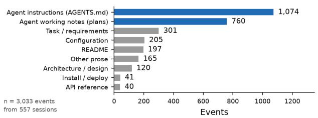
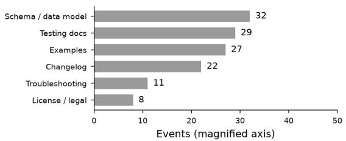
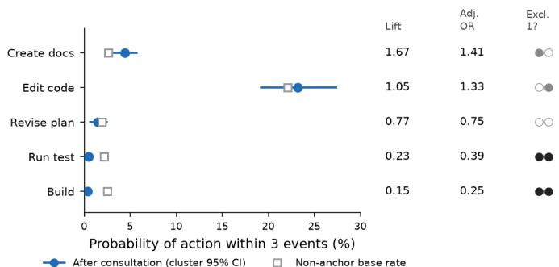
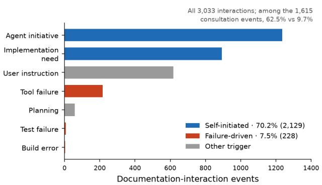
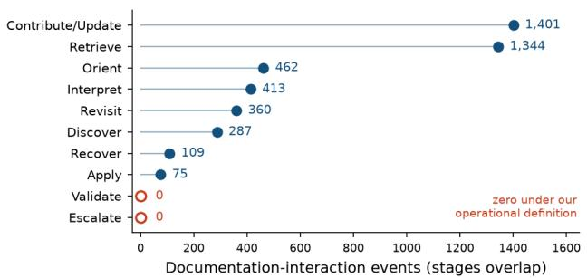
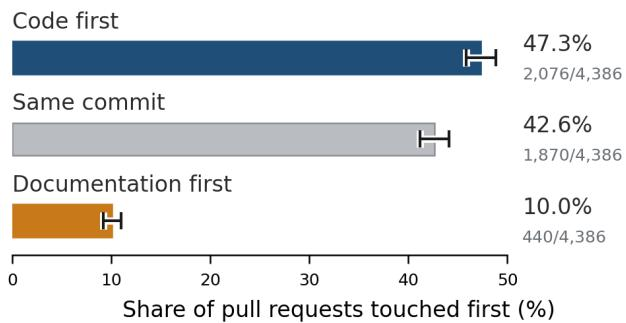

# From Agent Behaviour to Agent-Friendly Documentation

An Empirical Study of How Coding Agents Discover, Read, and Write Technical Documentation

Zhijun Gao   
Peking University   
Beijing, China   
gaozhijun@pku.edu.cn

## Abstract

Technical documentation is written for human developers, but an increasing share of software changes is now authored by au tonomous coding agents. Which documents these agents consult, when they consult them, and what follows remain unknown. We conduct a behaviour-grounded study of agents’ interactions with documentation, combining two complementary public datasets: 557 real agentic coding sessions from SWE-chat [5], from which we extract 94,813 development events, including 3,033 documentation interactions; and 33,097 agentic pull requests from AIDev [30], for which we classify 690,260 file-level change records. Four findings challenge assumptions underlying current documentation practice. First, agents’ documentation work is dominated by agent-facing artefacts: agent instruction files and agent working notes account for 60.5% of all documentation interactions, whereas classical tech nical documentation accounts for 10.6% and API references for 1.3%. Second, the association between consultation and code editing remains unresolved: the adjacent transition probability is 0.002 and the unadjusted three-event lift is 1.05, whereas a stage-adjusted model places the association above unity (OR 1.33 [1.09, 1.62]). Conversely, documentation creation is elevated in the unadjusted analysis (lift 1.67), but its adjusted interval includes unity. Third, no explicit documentation-based validation sequence was observed, and consultation is associated with less immediate testing (lift 0.23, cluster CI 0.08–0.45; adjusted OR 0.39 [0.25, 0.60]). Fourth, documentation consultation is self-initiated (70.2%) far more often than it is failure-driven (7.5%), and documentation trails code rather than leading it: among multi-commit pull requests that change both, code is touched first 4.7× more often than documentation. From these traces, we derive a descriptive model of agent–documentation interaction that takes the form of a two-lobed cycle rather than a linear journey, and we show that two widely assumed properties of “agent-friendly” documentation — actionability and verifiability — lack consistent behavioural support in this corpus. We release our extraction pipeline, coding scheme, and event-level data.

## Keywords

coding agents, software documentation, empirical software engineering, agentic software development, trace analysis

## 1 Introduction

Software documentation research has traditionally focused on a single audience: the human developer. Documentation quality frame works, staleness metrics, and readability guidelines all presuppose a reader who forms intentions, gets confused, and asks colleagues. That presupposition no longer always holds. A substantial and

Jing Chen   
Peking University   
Beijing, China   
2601210608@stu.pku.edu.cn

growing fraction of code changes in open source is authored by autonomous coding agents that read repositories, execute commands, and open pull requests without a human in the loop at each step.

Ifagents are now a significant class ofdocumentation consumers, documentation design should be informed by what agents actually do. At present, such evidence is lacking because their behaviour has not been measured. Emerging guidance on “agent-friendly” documentation — write clear headings, provide runnable examples, publish an llms.txt — rests on intuition about how agents ought to behave rather than observation of how they do.

This paper takes the opposite route. Rather than proposing documentation qualities and asking whether agents benefit, we observe agent behaviour in real development sessions and derive documentation implications from these observations. We ask three research questions:

RQ1 What do agents do with documentation? Which document types, at which stages of a task, through which behaviours?

RQ2 What precedes and follows documentation interaction? Which events trigger consultation, and which development actions are more or less likely after it?

RQ3 Is the code–documentation loop bidirectional? Do agents consume and produce documentation, and in which order relative to code?

Our answers depart from the field’s working assumptions in four ways, and the departures are large rather than marginal.

The dominant documentation genre is new. We expected agents to consult API references, architecture documents, and troubleshooting guides. Instead 60.5% of observed documentation interaction targets artefacts that exist because of agents: instruction files such as AGENTS.md and CLAUDE.md (35.4%), and agent working notes — plans, thoughts/ directories, brainstorms, verification logs (25.1%). API reference documentation, the focus of most documentation tooling, accounts for 1.3% of interaction; troubleshooting documentation accounts for 0.4%.

The link from reading to coding is unresolved. The commonly assumed pattern — read the docs, then write the code — is almost absent at the adjacent-transition level: �(edit code | read doc) = 0.002. At a three-event horizon, the unadjusted lift is 1.05 over the session base rate, whereas the stage-adjusted estimate is above unity (OR 1.33 [1.09, 1.62]). Documentation reads are instead most often followed by reasoning (0.245) or further documentation reads (0.270).

Explicit documentation-based validation is not observed. We observe no instances in which documentation is explicitly used as an oracle against which code is checked. Moreover, reading documentation is associated with less immediate testing (lift 0.23) and building (lift 0.15).

Documentation is nearly as often an output as an input. Production (1,401 events) occurs at 0.87× the rate of consultation (1,615 events), and 41.5% of agentic pull requests change documen tation. However, the direction is asymmetric in time: code precedes documentation 4.7× more often than the reverse.

We contribute: (i) a behaviour-grounded characterisation of agent documentation interaction across two datasets and two units of analysis; (ii) a released extraction pipeline, evaluated against the dataset’s own tool-call counts, that recovers documentation events from four heterogeneous agent transcript formats (the documenttype classifier itself is not human-validated); (iii) an empirically derived interaction model that replaces the assumed linear journey with a two-lobed cycle; and (iv) documentation design implications, each tied to a specific measurement, together with an explicit list of commonly asserted implications that our data do not support.

## 2 Related Work

Five strands of literature converge in this paper, each resting on an assumption that our data challenge: the documentation consulted by an agent or developer is written for humans, concerns code, and was produced by someone else. The first four strands expose this tension; the fifth establishes methodological precedent.

## 2.1 Coding agents and LLM-based software-engineering agents

The field’s evaluation apparatus defines an agent’s task as issue resolution. SWE-bench scores an agent according to whether its patch makes tests pass [23], and the architectures built to succeed on it are described by their action spaces over files and shells [60, 69, 73]. Surveys map agent capabilities by task type but do not include documentation as a category [31, 61]. Because no benchmark rewards documentation work, evidence must come from observational data. Agentless pipelines can match agentic ones without an exploratory reading loop [66]; our finding that reads lead predominantly to further reading and reasoning (Section 4) therefore describes what agents do, rather than what they necessarily need to do.

Two lines of observational work provide the closest precedents. Trajectory studies compare successful and failed runs at the level of action sequences [35, 37], motivating our transition analysis, although neither codes documentation as an artefact class. Artefact studies mine agent-authored pull requests: adoption rates [46], activity over time [43], PR-description characteristics [63], refactoring [21], logging [39], and failure causes [13]. The logging study provides a useful template: it asks whether agents handle a nonfunctional concern in the same way as humans. We ask the corresponding question about documentation and measure a previously unreported quantity: agents produce documentation at 0.87 times the rate at which they consult it (Section 4). Agent help-seeking has been benchmarked as escalation to a human rather than consultation of an artefact [57]; our distinction between self-initiated and failure-driven interactions has no prior baseline.

## 2.2 Software documentation research before LLMs

Research conducted before LLMs provides the clearest point of comparison. Observed human developers rely more heavily on code and colleagues than on documentation [26, 34, 48], consult selectively around staleness [29], frame needs as task-shaped questions [51, 52], and search the web for external information [49, 67]. Comprehension consumes most of developers’ time [68], without documentation serving as its primary input. Against that baseline, documentation interaction occurred in more than half of our sampled sessions (56.7%) and was predominantly self-initiated (70.2%) — the kind of behaviour that documentation-engineering research has long sought to encourage among human developers [16, 17, 74].

The sharper contrast concerns which documentation is consulted. This literature centres on API references: what makes APIs hard to learn [47], how API documentation fails [58], how much exists on the web [41], how to navigate it by task [56]. Quality taxonomies are built from these artefact types [2, 3], whereas README taxonomies focus on human-facing sections [44]. Our distribution reverses this emphasis: API references account for 1.3% of agents’ documentation interactions and troubleshooting documentation for 0.4%, whereas 60.5% involve agent-facing documents (Section 4). The assumption that improving API reference quality improves the consulting reader’s outcomes may hold for humans, but API references accounted for only 2.3% of observable repository-local consultations in our data. Research on onboarding barriers [53] and on documentation creation [11] provide human comparison points for our production-versus-consumption analysis.

## 2.3 Code–documentation co-evolution

The AIDev component builds on a mature co-change literature that documents persistent problems: comments are updated with code less often than they should be [14, 15], inconsistency is common and defect-associated [22, 54, 64], comments break silently under refactoring [45], and documentation links decay [19]. We apply methods from the co-change mining tradition [77] to agentic PRs at the file level. Two observations follow. First, the 41.5% documentation-change rate is high relative to rates reported in this literature for human comment maintenance. Second, where order is observable, documentation trails code, reproducing the asymmetry that automated comment-update work presupposes [40]. When this literature considers documentation being checked against code, the checking is performed by a static analyser [75]; it does not assume that an agent will perform the check, consistent with our observation of no such events (Section 4).

## 2.4 LLMs, documentation, and agent context files

Retrieval research treats documentation as model input: retrieval improves code generation [62, 76], as does repository-level retrieval [70, 71]. This literature most directly encodes the assumption that our findings challenge: documentation is valuable as a retrievable API reference injected on the model’s behalf. The agents in our data instead open instruction files they were told to follow and notes they wrote themselves; these interactions are self-initiated rather than externally retrieved.

The emerging 2025–2026 literature on context files addresses these artefacts, but its conclusions remain unsettled. Descriptive studies characterise AGENTS.md and CLAUDE.md as artefacts [8, 9, 38]. Related work reports repository-content base rates [20] and examines plan artefacts [1], the closest existing analogue to our working-notes category. Evidence of efectiveness is mixed: reported eficiency gains [33], mixed task-level results [18, 25], and a finding that random rules help as much as curated ones [72]. Maintenance research reports staleness [55] and documents unbounded growth [7]; managing context through agent actions has emerged as a technique [32]. None of this work measures how often agents consult these files relative to everything else they read. Our 35.4% instruction-file and 25.1% working-notes figures provide that denominator, and the conflicting efectiveness findings motivate reporting these figures descriptively.

## 2.5 Method precedent

Process mining of software event logs is established [42, 59], as is sequence mining of developers’ IDE interaction streams [4, 12, 24]. Human validation of our coding scheme, which we identify as the necessary next step (Section 7), would follow established reliability apparatus — Cohen’s kappa [10] with conventional bands [28], or Krippendorf’s alpha [27], reported following established guidance [36, 50]. We report no such statistic here. Our primary intervals are cluster bootstraps; Wilson intervals [65] appear only as independence-assuming references; we rely on their behaviour for small and zero counts [6].

## 3 Study Design

## 3.1 Datasets

We use two public datasets with complementary units of analysis. Neither can answer our questions alone: SWE-chat records development processes but not merge outcomes, whereas AIDev records artefacts but retains no tool-use trajectories.

SWE-chat [5] contains real agentic coding sessions contributed by developers using several command-line agent tools. Each session includes a complete transcript with user messages, agent messages, tool calls, tool results, and code changes. The release provides 5,850 sessions with transcripts (10.4 GB); we sample 559 (Section 3.2). This dataset is our source of process evidence: it answers RQ1 and RQ2 and provides within-session evidence for RQ3.

AIDev [30] contains pull requests opened by coding agents on public GitHub repositories, with commits, file-level difs, reviews, and timelines. The full corpus contains 932,791 PRs across 116,211 repositories; we use the authors’ curated subset of 33,596 PRs from 2,807 repositories with more than 100 stars, together with its filelevel commit-details table. All AIDev figures below are derived from that subset, so we report the filtering steps explicitly. The commit-details table yields 711,923 file×commit rows after dropping 5,132 null-filename rows (0.72%); excluding vendored paths removes 16,531 more (2.32%), leaving 690,260 rows across 278,192 unique paths, of which 29,597 are documentation paths. At the PR level, 33,097 of 33,596 PRs retain at least one named non-vendored file (98.5%); the 499 excluded are 16 with no file-level rows, 475 with only null filenames, and 8 with only vendored files. This dataset provides our artefact evidence and answers RQ3 at scale.

The datasets describe related but distinct populations. We therefore use them as complementary sources rather than as crossvalidation and never pool their units of analysis.

## 3.2 Sampling

From SWE-chat we draw a sample stratified by agent and session length across four length strata (turn count ≤ 3, 4–8, 9–18, > 18), so that neither trivial nor pathological sessions dominate. We oversample minority agents to permit agent-specific estimation and exclude transcripts larger than 25 MB (corpus maximum: 61.8 MB). The sample is 559 sessions, 557 of which yielded parseable events. Because allocation is non-proportional, agent-level statistics are reported separately and are never pooled.

## 3.3 Documentation identification

We operationalise “documentation” using a two-tier classifier of repository-relative file paths.

Tier 1 is deterministic. Filename and path rules assign one of 15 document types and two orthogonal flags. The machine\_readable flag identifies OpenAPI,JSON Schema, and Protobufartefacts, which serve as both API documentation and executable specifications. The vendored flag identifies third-party paths, which an agent may read but the repository does not own. Non-documentation files receive a kind in {source, config, test, data, build, other}, so a single function supports both documentation identification and co-change analysis.

Tier 2 resolves ambiguous paths. Tier 1 placed 54% of documentation events in a residual category. Because this category was too large to leave unresolved, we classified its 527 distinct paths with a language model: 500 were labelled, covering 98.4% of ambiguous events, and 27 were assigned using a keyword fallback rule. This tier revealed agent\_working\_note as a large, distinct category absent from our initial scheme.

Two decisions deserve emphasis. First, we do not code interaction purpose, although it appeared in our initial scheme. Purpose cannot be recovered from tool-call logs, and inferring intent from a file read would be unfalsifiable; we report trigger, interaction type, and outcome instead. Second, vendored paths are flagged rather than dropped: reading node\_modules/pkg/README.md is a genuine documentation interaction even though the repository does not own it.

## 3.4 Event extraction

SWE-chat uses four incompatible transcript formats, which we identified by inspecting their structures. Of the 559 sampled sessions, 406 use line-delimited JSON with content-block tool calls, 100 use a single JSON document with a parts array, 43 use a {type, payload} event log, and 10 use a messages array. Two sessions yielded no events and were excluded, leaving an analytic sample of 557. A separate extractor for each format emits a common schema based on a 20-symbol alphabet spanning documentation and nondocumentation actions, so documentation events remain embedded in their original trajectory context.

Two extraction details materially afect the results and can bias this class of study if left unreported. First, agents that route file operations through the shell express edits as apply\_patch heredocuments whose target paths appear only inside the command text; without parsing these paths, one agent family would have reg istered zero documentation events. Second, tool output arrives as a string in some formats and a list or dictionary in others. Supporting these additional types recovered nine sessions and 4,358 events, including 77 documentation events. Our extracted tool-event counts matched SWE-chat’s own tool\_call\_count exactly in five of six spot-checked sessions.

## 3.5 Coding scheme and derived measures

Each documentation event is coded along four dimensions: document type (15 rule categories plus the two additions in Section 4); interaction type (Discover, Search, Read, Edit, Create); trigger, using a four-event lookback; and outcome, using success and failure signals in tool output. Development stage follows a trajectory heuristic: orientation before the first write, implementation from the first write, verification after a passing test or build, debugging after a failure signal, and delivery after the last write when version-control activity dominates. Every event retains its evidence string, so labels are auditable.

For RQ2 we report lift over a base rate rather than raw conditional probability, because an action that is common throughout a session will also appear frequently after consultation. We compare the probability of an action within three events of a documentation consultation (Read, Search, or Discover; � = 1,615 anchors) with the corresponding probability estimated from every non-anchor event in the same sessions $( n = 9 3 , 1 9 8 ;$ this baseline includes documentation edits, which are not consultation anchors).

Observation scope. Our instrument observes repository-local, file-based documentation interactions: tool calls whose target resolves to a repository path, plus rare explicit documentation retrieval calls. It does not observe API websites read through a browser, knowledge already in the model’s weights, or in-source docstrings. Context files loaded by the runtime at session start are visible only when the agent later reads or edits them explicitly, so instructionfile counts are lower bounds on exposure. All claims concern this observable slice.

Operationalisation of the interaction-cycle stages. The can didate stages in Table 10 constitute a second, coarser coding of the same events. They are not mutually exclusive, so counts do not sum to 3,033. Each is an observable pattern:

• Orient: events in the orientation stage (before the first write).

• Discover: events classified as Search or Discover (282 + 5).

• Retrieve: Read (1,328) plus documentation-tool calls (16), which represent retrievals but not file reads — hence 1,344.

• Interpret: reads or searches followed immediately by rea soning.

• Revisit: a read immediately followed by another read.

• Apply: reads followed by an edit or read of the documented artefact.

• Recover: failure episodes whose first recovery action is reading documentation (109).

• Contribute/Update: interaction type Edit or Create (1,401).

• Validate: reads followed by a test or build run.

• Escalate: reads followed by a request to the user — distinct from the nine Ask user recovery actions in Table 4, which follow a failure.

## 3.6 Statistical treatment

Because the sample is deliberately non-proportional, we report headline proportions under three weighting schemes — pooled events, session-equal, and sessions reweighted to the corpus agent distribution (Table 8). The third corrects agent-level oversampling only: the sample is stratified by agent and session length, and the population margin for the length strata is not recoverable from the released index, so we present no joint-stratum estimate.

Because events nest within sessions and pull requests within repositories, observations are not independent Bernoulli trials — the largest AIDev repository alone contributes 8,911 pull requests. We therefore obtain our primary uncertainty estimates using a cluster bootstrap (2,000 resamples), resampling whole sessions for SWE-chat and whole repositories for AIDev. We compute percentile intervals using fixed seeds (13 for lift, 11 for transitions, 7 for proportions), and each resample recomputes the pooled proportion from summed within-cluster counts. For the RQ2 action windows we additionally fit a logistic GEE (exchangeable working correlation, clustered by session) adjusting for development stage, within-session position, log session length, and agent family, because consultation is not evenly distributed across trajectory phases; we report the adjusted association alongside the unadjusted lift, not in place of it. Table 6 compares the cluster intervals with Wilson intervals, which assume independence; clustering widens every interval, by up to 14× on the AIDev side. Wilson intervals remain in the peranalysis tables as an independence-assuming reference, but are not our primary estimate.

We apply no correction for the number of strata examined and therefore do not interpret small diferences between adjacent strata.

## 4 Results

Our 557 sessions contain 94,813 events, of which 3,033 (3.2%) are documentation interactions. Such interactions are common but not universal: 316 sessions (56.7%, cluster 95% CI 52.6–60.5%) contain at least one. Figure 1 summarises the principal results.

## 4.1 RQ1: Documentation Types, Task Stages, and Interaction Behaviours

4.1.1 Task stages. Documentation interaction is distributed across the whole trajectory rather than concentrated at task start. By development stage, 54.4% of documentation events occur during debugging, 27.2% during implementation, 15.2% during orientation, 3.0% during verification, and 0.1% at delivery.

The stage heuristic is sticky: once a failure signal appears, the session remains in debugging until a test or build passes, inflating that share. We therefore advance only the robust negative claim: documentation consultation is not confined to the orientation phase. A model that treats documentation solely as a task-start activity is therefore inconsistent with our observations. The distribution across stages should not be interpreted as a precise allocation.

4.1.2 Document types. Table 1 presents the full distribution, which is the paper’s central empirical result. Two categories of agentfacing documents dominate. Agent instruction files — including AGENTS.md, CLAUDE.md, SKILL.md, and rule files for Cursor and Copilot — account for 1,074 events (35.4%). Agent working notes —

a

Agent-facing documents are 60.5% of all documentation-interaction events

  
Agent-facing: instructions + working notes (60.5% of events)

  
Other repository documentation (39.5%)

b  
Verification is suppressed after consultation; the documentation-side coupling is unresolved  
C  

Documentation interaction is predominantly self-initiated  
  
= both unadjusted and adjusted intervals exclude 1;  = unadjusted only;  = adjusted only

d  
Documents are read and written; no validation sequence was observed  

e  
Code is touched first 4.7× as often as documentation AlDev pull requests changing both code and documentatior  
  
Figure 1: Agents’ documentation interactions across 557 SWE-chat sessions (panels $\mathbf { a - d } , n = 3 , 0 3 3$ documentation events) and 33,097 AIDev agentic pull requests (panel e). (a) Agent-facing documents — instruction files and agent working notes — account for 60.5% of interactions, whereas API references account for 1.3%; the right-hand column uses a magnified axis. (b) Testing and building are less frequent within three events of a consultation and remain so after adjustment; the two authoring outcomes difer between the unadjusted lift and the stage-adjusted odds ratio, so those associations remain unresolved. Intervals are session-level cluster-bootstrap estimates. (c) Interaction is predominantly self-initiated (70.2% of all 3,033 interactions; 62.5% of the 1,615 consultation events) rather than failure-driven (7.5%; 9.7%); the axis counts all interactions. (d) Of ten candidate stages, Validate and Escalate have zero events under our operational definitions (open markers); stages overlap and do not sum to 3,033. (e) Among pull requests that change both code and documentation, code is touched first 4.7× more often, although 42.6% first touch both in a single commit, for which no order is observable; panel e uses a diferent dataset and unit of analysis (pull requests), and its error bars are Wilson intervals — the repository cluster-bootstrap equivalents are in Table 6.

plans, thoughts/ directories, brainstorms, and review logs that the

Table 1: Documentation-interaction events by document type (� = 3,033 events across 557 sessions). Agent-facing categories are marked †. Together, the two agent-facing categories account for 60.5% of interactions; the nine categories constituting classical technical documentation (API reference, troubleshooting, architecture, schema, installation, examples, testing, contributing, and changelog) account for 10.6%.
<table><tr><td>Document type</td><td>Events</td><td>Share</td></tr><tr><td>Agent instructions†</td><td>1,074</td><td>35.4%</td></tr><tr><td>Agent working notes†</td><td>760</td><td>25.1%</td></tr><tr><td>Task / requirements</td><td>301</td><td>9.9%</td></tr><tr><td>Configuration</td><td>205</td><td>6.8%</td></tr><tr><td>README</td><td>197</td><td>6.5%</td></tr><tr><td>Other prose (residual)</td><td>165</td><td>5.4%</td></tr><tr><td>Architecture / ADR</td><td>120</td><td>4.0%</td></tr><tr><td>Install / deploy</td><td>41</td><td>1.4%</td></tr><tr><td>API reference</td><td>40</td><td>1.3%</td></tr><tr><td>Schema</td><td>32</td><td>1.1%</td></tr><tr><td>Testing docs</td><td>29</td><td>1.0%</td></tr><tr><td>Examples</td><td>27</td><td>0.9%</td></tr><tr><td>Changelog</td><td>22</td><td>0.7%</td></tr><tr><td>Troubleshooting</td><td>11</td><td>0.4%</td></tr><tr><td>License / legal</td><td>8</td><td>0.3%</td></tr><tr><td>Contributing</td><td>1</td><td>0.0%</td></tr><tr><td>Agent-facing subtotal†</td><td>1,834</td><td>60.5%</td></tr><tr><td>Classical technical documentation</td><td>323</td><td>10.6%</td></tr></table>

Our primary contrast is therefore between agent-facing artefacts (60.5% of events, session-cluster 95% CI 53.9–66.5%; 55.1% under agent reweighting) and all other repository documentation (39.5%; 44.9% under agent reweighting). As a secondary contrast, the nine genres at the traditional core of documentation research account for 323 events (10.6%). This boundary is contestable: adding README, configuration, and requirements documentation raises the share to 33.8%. We therefore make no claim beyond the extreme categories: API references account for 40 events (1.3%), and troubleshooting documentation — expected to be the debugging resource — accounts for 11 (0.4%).

The agent\_working\_note category did not exist in our initial scheme. It emerged from Tier-2 classification of unresolved paths, which were dominated by agent-authored planning and reasoning documents. Whether these files count as technical documentation is a definitional choice that we make explicit: we include them as durable prose artefacts about the software that are committed to the repository and readable by the next actor, but we always report them separately so readers drawing the boundary diferently can recompute every share (excluding them, agent instruction files alone are 1,074 of 2,273 events, 47.2%).

Because working notes might be mostly written whereas API references are mostly read, Table 7 splits each document type into consultation (Read, Search, Discover) and production (Edit, Create). Agent-facing dominance holds on both sides: 57.4% of consultation and 63.7% of production, compared with 2.3% of consultation for API references. Configuration files are the most asymmetric type (195 consultations, 10 productions).

4.1.3 Interaction behaviours. We observe five interaction types: Read (1,328 events), Edit (1,007), Create (394), Search (282), and Discover (5). Of the remaining 17 events, 12 are failed tool calls and 5 do not fit any interaction type. These events carry document-type and trigger labels and contribute to those distributions but not to interaction-type statistics. Production (Edit + Create = 1,401) occurs at 0.87× the rate of consultation (Read + Search + Discover = 1,615).

Three interaction types from our initial scheme are not attested: Compare (reading two documents against each other), Followreference (navigating a link between documents), and Verify (checking code against documentation). These may occur inside model reasoning, which our instrument cannot see, but they do not appear as tool-call behaviour, so we remove them rather than report them as rare.

The most common recurrent transitions are as follows (session cluster-bootstrap 95% CIs; 2,000 resamples).

$$
P ( { \mathrm { r e a d d o c } } \mid { \mathrm { r e a d d o c } } ) = 0 . 2 7 0
$$

[0.232, 0.307],

$$
P ( { \mathrm { r e a s o n i n g ~ } } | { \mathrm { ~ r e a d ~ d o c } } ) = 0 . 2 4 5
$$

[0.205, 0.295],

$$
P ( { \mathrm { e d i t ~ d o c ~ } } | { \mathrm { ~ r e a d ~ d o c } } ) = 0 . 1 0 7
$$

[0.081, 0.132],

$$
P ( { \mathrm { e d i t ~ d o c } } \mid { \mathrm { e d i t ~ d o c } } ) = 0 . 3 5 0
$$

[0.288, 0.404].

The first estimate indicates that documentation reads occur in runs rather than in isolation.

At the adjacent-transition level, the commonly assumed pattern read documentation, then write code — is nearly absent:

$$
P ( { \mathrm { e d i t ~ c o d e ~ } } | { \mathrm { ~ r e a d ~ d o c } } ) = 0 . 0 0 2 \quad \left[ 0 . 0 0 0 , 0 . 0 0 5 \right] .
$$

This estimate represents three occurrences among 1,328 documentation reads. A read is much more likely to be followed by reasoning or further reading than by an immediate code edit.

## 4.2 RQ2: Antecedents and Subsequent Actions

4.2.1 Triggers. Table 2 presents the trigger distribution for all 3,033 documentation interactions. In aggregate, 2,129 events (70.2%, session-cluster 95% CI 66.7–73.3%) are self-initiated — the agent’s own initiative (1,236) or an implementation need from its current work (893). Failure-driven interaction accounts for 228 events (7.5%, CI 6.0–9.3%): tool failure (217), test failure (7), build error (4). User instructions account for 618 events (20.4%). When the analysis is restricted to consultation (� = 1,615), the pattern persists: 62.5% are self-initiated (1,010) versus 9.7% failure-driven (156).

Self-initiated interactions outnumber failure-driven interactions by 9.3× (6.5× for consultation alone). Thus, rather than consulting documentation primarily when something goes wrong, agents consult it during routine task progress.

4.2.2 Actionsfollowing consultation. Table 3 reports the probability of each action within three events of a documentation consultation (Read, Search, or Discover; � = 1,615 anchors), compared with the rate at non-anchor events in the same sessions (� = 93,198).

Two verification actions are less frequent within the next three events and both survive adjustment: running a test (lift 0.23, cluster CI 0.08–0.45; adjusted OR 0.39 [0.25, 0.60]) and building (0.15, CI 0.02–0.33; OR 0.25 [0.14, 0.44]). The unadjusted and adjusted estimates difer for both authoring outcomes. Documentation creation is elevated in the unadjusted analysis (lift 1.67, CI 1.14–2.31), but its adjusted interval includes unity (OR 1.41 [0.98, 2.02]). Conversely, code editing is indistinguishable from the baseline in the unadjusted analysis (lift 1.05, CI 0.86–1.27), yet elevated after controlling for stage (OR 1.33 [1.09, 1.62]). Because consultation concentrates in particular trajectory phases, this discrepancy is consistent with the stage confounding flagged as a threat. We therefore treat the lower frequency of test and build activity as the finding, and any consultation-to-authoring or consultation-to-code coupling as unresolved by these data.

Table 2: RQ2: what triggers documentation interaction (� = 3,033 interactions; consultation events alone are � = 1,615, for which the self-initiated share is 62.5%). Self-initiated triggers outnumber failure-driven ones by 9.3×.
<table><tr><td>Trigger</td><td>Events</td><td>Share</td></tr><tr><td>Agent initiative</td><td>1,236</td><td>40.8%</td></tr><tr><td>Implementation need</td><td>893</td><td>29.4%</td></tr><tr><td>User instruction</td><td>618</td><td>20.4%</td></tr><tr><td>Tool failure</td><td>217</td><td>7.2%</td></tr><tr><td>Planning</td><td>58</td><td>1.9%</td></tr><tr><td>Test failure</td><td>7</td><td>0.2%</td></tr><tr><td>Build error</td><td>4</td><td>0.1%</td></tr><tr><td>Self-initiated</td><td>2,129</td><td>70.2%</td></tr><tr><td>Externally instructed</td><td>618</td><td>20.4%</td></tr><tr><td>Failure-driven</td><td>228</td><td>7.5%</td></tr></table>

These results provide no consistent support for the simple mech anism in which documentation consultation is followed by implementation and verification. The code-editing association depends on adjustment, and test and build activity are lower after consultation. No positive downstream-action association is robust across both analyses.

4.2.3 Failure recovery. We identify 2,034 failure episodes (a failing test, a failed build, or a tool error) and classify the agent’s first subsequent action. Table 4 reports frequency and resolution rate.

Reading documentation is the first recovery move in 109 of 2,034 episodes (5.4%). Agents far more often read code (631), retry the same action (404), take no recovery action within the horizon (318), or edit directly (312). �(read doc | tool error) = 0.020.

Documentation-based recovery has the highest point estimate of the resolution rate (7/11 = 63.6%), but its 95% interval is 35.4– 84.8% and overlaps every other strategy. We therefore report this as suggestive and explicitly not a finding: 11 episodes with an observable outcome cannot support a ranking of recovery strategies. Establishing whether documentation-based recovery is genuinely more efective is therefore an important motivation for a larger sample (Section 7).

## 4.3 RQ3: Documentation Consumption, Production, and Code–Document Order

Together, the two datasets show that agents consume and produce documentation.

Within sessions. Of the 316 sessions with documentation activity, 184 (58.2%) both read and wrote; 102 (32.3%) only read; 28 (8.9%) only wrote; and 2 (0.6%) contained only unclassified events, so no read/write status could be assigned.

Across pull requests. Table 5 presents the artefact-level results for the curated AIDev subset [30]. Of the 33,097 pull requests, 13,750 change documentation (41.5%, repository-cluster 95% CI 35.8– 45.4%). Code–documentation co-change occurs in 32.0% (CI 24.4– 38.9%) of all PRs, which is 37.0% of the 28,574 code-touching PRs; a further 9.6% (CI 6.1–14.5%) change documentation only. These PRs are heavily clustered — the ten largest repositories account for 44.7% — so the intervals are roughly an order of magnitude wider than the Wilson equivalents (Table 6).

Direction. Among the 4,386 multi-commit pull requests where ordering is observable, code is touched first in 47.3%, both are first touched in the same commit in 42.6%, and documentation is touched first in 10.0%. When the two change in diferent commits, code comes first in 82.5% of orderable cases (2,076/2,516; repositorycluster CI 78.7–86.0%): documentation follows code far more often than it leads.

Merge rates are not distinguishable. Among closed PRs, 81.1% of those touching documentation were merged, compared with 75.0% of code-only PRs. Under repository clustering, the intervals overlap substantially (71.3–85.6% and 64.9–81.1%), so we draw no conclusion; assuming independence would make the diference appear more decisive than the clustered analysis supports.

Agents edit their own instructions. Among the most-changed individual documentation files in AIDev are AGENTS.md (692 PRs), CLAUDE.md (362), and copilot-instructions.md (287). Agents modify files that shape agent behaviour, closing a second loop — from agent output back to agent input — that existing documentation models do not capture.

## 4.4 Robustness and Variation

Because we oversample minority agents (Section 3), pooled statistics overweight long sessions and minority agents relative to their corpus prevalence. Table 8 reports each headline proportion under pooled-event, session-equal, and agent-reweighted estimation. The agent-facing share of all interaction moves from 60.5% to 54.7% and 55.1%; self-initiated from 70.2% to 63.2% and 61.9%. Split by side, agent-facing consultation moves from 57.4% to 50.5% and 50.1% — at the 50% boundary, so under either correction agent-facing documents account for about half of consultation rather than a clear majority — while production rises from 63.7% to 67.1% and 66.3%. The broad pattern is stable, but whether agent-facing documents constitute a majority of consultation events depends on the weighting. The weighting corrects only the agent margin, not the joint agent-by-length strata (Section 7).

Restricting the RQ2 anchors to reads alone (� = 1,328) does not change any conclusion: code-edit lift increases from 1.05 to 1.10, documentation-creation lift from 1.67 to 1.83, test-running lift from 0.23 to 0.24, and build lift from 0.15 to 0.18.

4.4.1 Variation across agents. Table 9 reports session-level documentation rates per agent. The rates difer substantially, from 62.6% (Claude Code, 238/380) to 37.2% (Codex, 16/43); one agent has a rate of 0/11.

We caution against interpreting these as behavioural diferences. One agent routes nearly all file work through shell commands, so

Table 3: Actions within three events of a documentation consultation $( n _ { c } = 1 , 6 1 5$ anchors) compared with the non-anchor base rate $( n _ { b } = 9 3 , 1 9 8 )$ , with session cluster-bootstrap intervals (2,000 resamples, percentile method) for the risk diference $\Delta p$ and the lift ratio, and an adjusted association from a logistic GEE with exchangeable working correlation clustered by session and adjusted for development stage, within-session position, session length, and agent family. Unadjusted and adjusted estimates difer for the two authoring outcomes: documentation creation is elevated before adjustment, but its adjusted interval includes 1; code editing is indistinguishable from the baseline before adjustment, but is elevated after controlling for stage. Only the lower frequencies of testing and building are robust to both analyses. We therefore treat these reductions as the finding and the authoring associations as unresolved.
<table><tr><td>Action</td><td>After consult.</td><td>Base</td><td>∆p [95% CI]</td><td>Lift [95% CI]</td><td>Adj. OR [95% CI]</td></tr><tr><td>Create documentation</td><td>0.044</td><td>0.026</td><td>+0.0176 [+0.0040, +0.0320]</td><td>1.67 [1.14, 2.31]</td><td>1.41 [0.98, 2.02]</td></tr><tr><td>Edit code</td><td>0.232</td><td>0.221</td><td>+0.0113 [-0.0325, +0.0587]</td><td>1.05 [0.86, 1.27]</td><td>1.33 [1.09, 1.62]</td></tr><tr><td>Revise plan</td><td>0.015</td><td>0.019</td><td>-0.0044 [-0.0124, +0.0042]</td><td>0.77 [0.35, 1.24]</td><td>0.75 [0.43, 1.30]</td></tr><tr><td>Run test</td><td>0.005</td><td>0.022</td><td>-0.0169 [-0.0250, -0.0094]</td><td>0.23 [0.08, 0.45]</td><td>0.39 [0.25, 0.60]</td></tr><tr><td>Build</td><td>0.004</td><td>0.025</td><td>-0.0214 [-0.0292, -0.0143]</td><td>0.15 [0.02, 0.33]</td><td>0.25 [0.14, 0.44]</td></tr></table>

Table 4: Failure recovery: the first action after each of ${ \bf 2 , 0 3 4 }$ failure episodes and the fraction of episodes subsequently resolved. Resolution can be computed only for episodes followed by an observable test or build outcome, so the resolution denominators are smaller than the frequency counts. Documentation-based recovery has the highest point estimate but the widest interval; it overlaps every other strategy, so we draw no conclusion about the relative ranking.

<table><tr><td>First recovery action</td><td>n (%)</td><td>Resolved</td><td>95% CI</td></tr><tr><td>Read code</td><td>631 (31.0)</td><td>39/159</td><td>[.18, .32]</td></tr><tr><td>Retry directly</td><td>404 (19.9)</td><td>48/192</td><td>[.19, .32]</td></tr><tr><td>No action within horizon</td><td>318 (15.6)</td><td>5/67</td><td>[.03, .16]</td></tr><tr><td>Edit directly</td><td>312 (15.3)</td><td>45/160</td><td>[.22, .36]</td></tr><tr><td>Search code</td><td>251 (12.3)</td><td>17/73</td><td>[.15, .34]</td></tr><tr><td>Read documentation</td><td>109 (5.4)</td><td>7/11</td><td>[.35, .85]</td></tr><tr><td>Ask user</td><td>9 (0.4)</td><td></td><td></td></tr></table>

Table 5: Artefact-level results for RQ3 (AIDev pull requests): (a) documentation involvement among all analysable agentic PRs; (b) the artefact touched first, restricted to multi-commit PRs that change both artefact types and for which order is observable; and (c) merge rate by documentation involvement, reported as an association rather than a causal efect. All intervals are Wilson 95% CIs.
<table><tr><td></td><td>k/n</td><td>Prop. [95% CI]</td></tr><tr><td colspan="3">(a) Documentation involvement</td></tr><tr><td>Code only</td><td>17,988/33,097</td><td>.543 [.538, .549]</td></tr><tr><td>Code + documentation</td><td>10,586/33,097</td><td>.320 [.315, .325]</td></tr><tr><td>Documentation only</td><td>3,164/33,097</td><td>.096 [.092, .099]</td></tr><tr><td>Neither (build/config/data)</td><td>1,359/33,097</td><td>.041 [.039, .043]</td></tr><tr><td colspan="3">(b) First artefact touched</td></tr><tr><td>Code first</td><td>2,076/4,386</td><td>.473 [.459, .488]</td></tr><tr><td>Same commit</td><td>1,870/4,386</td><td>.426 [.412, .441]</td></tr><tr><td>Documentation first</td><td>440/4,386</td><td>.100 [.092, .110]</td></tr><tr><td colspan="3">(c) Merge rate</td></tr><tr><td>Touches documentation</td><td>10,303/12,707</td><td>.811 [.804, .818]</td></tr><tr><td>Code only</td><td>12,614/16,815</td><td>.750 [.744, .757]</td></tr></table>

its interactions are visible only if the extractor parses paths from command text. Before these paths were parsed, the agent registered zero events. Cross-agent comparison is confounded with extraction coverage.

## 5 A Trace-Derived Descriptive Model of Agent Documentation Interaction

Our study began with a hypothesised linear journey, adapted from accounts of human developer information seeking:

$$
\begin{array} { r l } & { \mathrm { D i s c o v e r } \to \mathrm { R e t r i e v e } \to \mathrm { I n t e r p r e t } \to } \\ & { \quad \quad \mathrm { A p p l y } \to \mathrm { V a l i d a t e } \to \mathrm { U p d a t e } } \end{array}
$$

Table 10 summarises the evidence for each candidate stage. The data do not support the linear model for three reasons.

Two stages are unattested. No events match Validate or Escalate under our operational definitions: consultation followed by a test or build run, or by a request to the user. These are zeros for the defined patterns, not evidence that no validation of any form occurs (Section 7).

Apply is weakly attested. Only 75 events show documentation reading followed by action on the documented artefact, and the lift analysis (Table 3) estimates an unadjusted lift of 1.05 for subsequent code editing, although the adjusted odds ratio is above unity. The link that the linear model treats as its central step is therefore the one our data leave least settled.

The terminal stage is the largest. Contribute/Update, which appears last in the linear model, is the single largest category, with 1,401 events — more than Retrieve (1,344).

## 5.1 A trace-derived descriptive model: the two-lobed cycle

The transition structure shows two loosely coupled activity lobes.

The consultation lobe (Orient → Discover → Retrieve → Interpret) is internally recurrent: its strongest transition is Retrieve back to itself at 0.270 (CI 0.232–0.307) and its strongest outgoing transition is to reasoning at 0.245 (CI 0.205–0.295). Agents therefore circulate within this lobe and move into reasoning more often than into immediate action.

The production lobe (Contribute/Update) contains more documentation events than any other stage. The unadjusted analysis suggests an association from consultation into this lobe: documentation creation is elevated after consultation (lift 1.67). Its stageadjusted interval, however, includes unity (Table 3).

Table 6: Cluster-bootstrap intervals (2,000 resamples) for the headline proportions, resampling sessions for SWE-chat statistics and repositories for AIDev statistics, alongside Wilson intervals that assume independent trials. The ratio column gives clusterinterval width divided by Wilson-interval width. Clustering widens every interval, especially for AIDev, where the largest repository contributes 8,911 pull requests and the ten largest contribute 44.7%. We report cluster intervals as the primary uncertainty estimates.
<table><tr><td>Statistic</td><td> $k / n$ </td><td></td><td>Prop. Cluster-bootstrap 95% CI</td><td>Wilson 95% CI Width ratio</td><td></td></tr><tr><td>Sessions as clusters (SWE-chat)</td><td></td><td></td><td></td><td></td><td></td></tr><tr><td>Agent-facing, all interactions</td><td>1,834/3,033</td><td>0.605</td><td>[0.539, 0.665]</td><td>[0.587, 0.622]</td><td>3.6</td></tr><tr><td>consultation events</td><td>927/1,615</td><td>0.574</td><td>[0.508, 0.634]</td><td>[0.550, 0.598]</td><td>2.6</td></tr><tr><td>production events</td><td>893/1,401</td><td>0.637</td><td>[0.553, 0.713]</td><td>[0.612, 0.662]</td><td>3.2</td></tr><tr><td>Self-initiated, all interactions</td><td>2,129/3,033</td><td>0.702</td><td>[0.667, 0.733]</td><td>[0.685, 0.718]</td><td>2.0</td></tr><tr><td>Failure-driven, all interactions</td><td>228/3,033</td><td>0.075</td><td>[0.060, 0.093]</td><td>[0.066, 0.085]</td><td>1.8</td></tr><tr><td>Sessions with doc event</td><td>316/557</td><td>0.567</td><td>[0.526, 0.605]</td><td>[0.526, 0.608]</td><td>1.0</td></tr><tr><td>Doc-first recovery</td><td>109/2,034</td><td>0.054</td><td>[0.038, 0.073]</td><td>[0.045, 0.064]</td><td>1.8</td></tr><tr><td>Repositories as clusters (AIDev)</td><td></td><td></td><td></td><td></td><td></td></tr><tr><td>Documentation changed (PRs)</td><td>13,750/33,097</td><td>0.415</td><td>[0.358, 0.454]</td><td>[0.410, 0.421]</td><td>9.1</td></tr><tr><td>Code-doc co-change (PRs)</td><td>10,586/33,097</td><td>0.320</td><td>[0.243, 0.389]</td><td>[0.315, 0.325]</td><td>14.4</td></tr><tr><td>Code first, different commits</td><td>2,076/2,516</td><td>0.825</td><td>[0.787, 0.860]</td><td>[0.810, 0.839]</td><td>2.5</td></tr><tr><td>Merge rate, doc-touching</td><td>10,303/12,707</td><td>0.811</td><td>[0.713, 0.856]</td><td>[0.804, 0.818]</td><td>10.5</td></tr><tr><td>Merge rate, code-only</td><td>12,614/16,815</td><td>0.750</td><td>[0.649, 0.811]</td><td>[0.744, 0.757]</td><td>12.4</td></tr></table>

Table 7: Consultation (Read, Search, Discover; $n _ { c } = 1 , 6 1 5 )$ versus production (Edit, Create; $n _ { p } = 1 , 4 0 1 )$ events by document type. Agent-facing categories are marked †; they account for 57.4% of consultation and 63.7% of production. Configuration files are consulted far more than they are produced; agent working notes are consulted and produced in nearly equal measure. “Other low-frequency” pools troubleshooting, license/legal, and contributing, so the columns sum to $n _ { c }$ and $n _ { p } .$
<table><tr><td>Document type</td><td>Cons.</td><td>%</td><td>Prod.</td><td>%</td></tr><tr><td>Agent instructions†</td><td>545</td><td>33.7</td><td>526</td><td>37.5</td></tr><tr><td>Agent working notes†</td><td>382</td><td>23.7</td><td>367</td><td>26.2</td></tr><tr><td>Task / requirements</td><td>129</td><td>8.0</td><td>170</td><td>12.1</td></tr><tr><td>Configuration</td><td>195</td><td>12.1</td><td>10</td><td>0.7</td></tr><tr><td>README</td><td>89</td><td>5.5</td><td>107</td><td>7.6</td></tr><tr><td>Other prose</td><td>72</td><td>4.5</td><td>93</td><td>6.6</td></tr><tr><td>Architecture / ADR</td><td>69</td><td>4.3</td><td>51</td><td>3.6</td></tr><tr><td>Install / deploy</td><td>24</td><td>1.5</td><td>17</td><td>1.2</td></tr><tr><td>API reference</td><td>37</td><td>2.3</td><td>3</td><td>0.2</td></tr><tr><td>Schema</td><td>16</td><td>1.0</td><td>16</td><td>1.1</td></tr><tr><td>Testing docs</td><td>19</td><td>1.2</td><td>10</td><td>0.7</td></tr><tr><td>Examples</td><td>17</td><td>1.1</td><td>10</td><td>0.7</td></tr><tr><td>Changelog</td><td>11</td><td>0.7</td><td>11</td><td>0.8</td></tr><tr><td>Other low-frequency</td><td>10</td><td>0.6</td><td>10</td><td>0.7</td></tr><tr><td>Total</td><td>1,615</td><td>100.0</td><td>1,401</td><td>100.0</td></tr><tr><td>Agent-facing†</td><td>927</td><td>57.4</td><td>893</td><td>63.7</td></tr></table>

Neither connection is consistent across specifications. The unadjusted estimates are 1.67 for consultation → documentation and 1.05 for consultation → code; the corresponding adjusted ORs are 1.41 and 1.33. The documentation interval excludes unity only before adjustment, whereas the code interval excludes unity only after adjustment. Failure feeds into the consultation lobe only rarely (5.4% of failure episodes), and no observed edge runs from either lobe into validation in the recorded tool-call traces.

Table 8: Sensitivity of headline proportions to weighting. The event-weighted estimate pools all events (long sessions weigh more); the session-equal estimate averages per-session shares; and the agent-weighted estimate reweights sessions to the corpus agent distribution (83.8% Claude Code, 4,852/5,790 labelled sessions; 61 of the $^ { 5 , 8 5 1 }$ released sessions are excluded from the reweighting — 52 carry no agent label and 9 belong to agents with fewer than 20 sessions), correcting our deliberate oversampling of minority agents. Because the sample was also stratified by session length, this corrects agent-level oversampling only and is not a full joint-stratum estimate. All three statistics describe the stratified sample; the broad pattern is stable across all three weightings.
<table><tr><td>Statistic</td><td>Event</td><td>Sess.-eq.</td><td>Agent-wt.</td></tr><tr><td>Agent-facing, all interactions</td><td>60.5%</td><td>54.7%</td><td>55.1%</td></tr><tr><td>consultation events only</td><td>57.4%</td><td>50.5%</td><td>50.1%</td></tr><tr><td>production events only</td><td>63.7%</td><td>67.1%</td><td>66.3%</td></tr><tr><td>Self-initiated, all interactions</td><td>70.2%</td><td>63.2%</td><td>61.9%</td></tr><tr><td>Sessions w/ doc event</td><td></td><td>56.7%</td><td>59.8%</td></tr></table>

Our revised account is therefore not a pipeline from an information need to validated implementation. Instead, agents’ interaction with documentation is a recurrent consultation process that produces reasoning and further documentation and is only loosely coupled to a largely independent code-modification process.

## 5.2 Why the diference from human developers matters

The human information-seeking literature often describes developers who consult documentation, apply what they learn, and check the result — the loop our linear model encoded. In our traces, agents perform the first step, but the checking step is not observed, and documentation authorship follows consultation at a measurable rate.

Table 9: Fraction of sessions containing at least one documentation interaction, by agent. Sampling was deliberately non-proportional, so these per-agent estimates must not be pooled. The zero estimate for one agent is based on 11 sessions and does not constitute evidence of absence.
<table><tr><td>Agent</td><td>With docs</td><td>Sessions</td><td>Rate [95% CI]</td></tr><tr><td>Gemini CLI</td><td>9</td><td>12</td><td>.750 [.468, .911]</td></tr><tr><td>Agent</td><td>8</td><td>12</td><td>.667 [.391, .862]</td></tr><tr><td>Claude Code</td><td>238</td><td>380</td><td>.626 [.577, .673]</td></tr><tr><td>OpenCode</td><td>45</td><td>99</td><td>.455 [.360, .552]</td></tr><tr><td>Codex</td><td>16</td><td>43</td><td>.372 [.244, .521]</td></tr><tr><td>Cursor</td><td>0</td><td>11</td><td>.000 [.000, .259]</td></tr></table>

Table 10: Evidence for each candidate stage of the documentation-interaction cycle (� = 3,033 documentation events). Two stages in the initial scheme are entirely unattested.
<table><tr><td>Candidate stage</td><td>Events</td><td>Status</td></tr><tr><td>Contribute/Update</td><td>1,401</td><td>strongly attested</td></tr><tr><td>Retrieve</td><td>1,344</td><td>strongly attested</td></tr><tr><td>Orient</td><td>462</td><td>attested</td></tr><tr><td>Interpret</td><td>413</td><td>attested</td></tr><tr><td>Revisit</td><td>360</td><td>attested</td></tr><tr><td>Discover</td><td>287</td><td>attested</td></tr><tr><td>Recover</td><td>109</td><td>attested, weak</td></tr><tr><td>Apply</td><td>75</td><td>weak</td></tr><tr><td>Validate</td><td>0</td><td>not attested</td></tr><tr><td>Escalate</td><td>0</td><td>not attested</td></tr></table>

Two mechanisms plausibly explain this; distinguishing between them requires future work. Agents may externalise reasoning to files because their context windows are bounded, making documentation a form of working memory rather than a reference; the prominence of plans and thoughts/ directories is consistent with this possibility. Alternatively, they may not validate against prose because a cheaper oracle, the test suite, is invoked directly. In either case, we did not observe prose functioning as a specification.

## 6 Implications for Documentation Design

We state implications only where a specific measurement supports them, and we separately list the implications commonly asserted in this area that our data do not support. The second list matters as much as the first: this study provides initial behavioural evidence on several of these questions but does not support some widely repeated advice.

## 6.1 Supported implications

Agent instruction files are the most frequently used documentation surface. They are the most frequently used document type (1,074 events, 35.4%) and are among the most frequently changed files in agentic pull requests. API references, by contrast, receive 40 events (1.3%). Instruction files receive roughly 27× as many interactions as API references. For projects allocating finite documentation resources to support agentic contributors, this diference suggests prioritising the correctness and clarity of instruction files.

Local retrievability warrants particular attention. Documentation reads are frequently followed by further reads (transition probability 0.270), whereas Follow-reference is entirely unattested. This pattern motivates studying self-contained documents with locally retrievable structure, rather than assuming that agents navigate richly cross-linked documentation. It does not, however, establish that link hygiene has no behavioural consequences.

Agent-authored documents create a new maintenance surface. Documentation creation has an unadjusted lift of 1.67 after consultation, although the stage-adjusted interval includes unity. Agent working notes account for 25.1% of all documentation interactions. We measured their volume and modification, not their maintenance cost, staleness, or inconsistency. Plans, thoughts/ directories, and verification logs accumulate in repositories as durable artefacts. Repository hygiene tooling, code review checklists, and documentation quality metrics currently have no category for them.

Executable documentation ofers a testable route to specification. No explicit documentation-based validation sequence was observed, and consultation is associated with less immediate testing (lift 0.23, cluster CI 0.08–0.45). Making such a check observable plausibly requires artefacts an agent can execute — runnable examples, doctests, schema contracts — rather than prose that an agent must be trusted to honour. This proposal is a hypothesis for intervention studies, not a finding of the present study.

Documentation rarely appeared as the first recovery resource. It was the first recovery action in 109 of 2,034 failure episodes (5.4%, cluster CI 3.8–7.3%), and troubleshooting documents specifically account for 11 events across the entire corpus. Whatever value troubleshooting guides have for human developers, they are not a prominent part of the agent recovery behaviour observed here.

## 6.2 Implications our data do not support

Actionability. The claim that documentation should be written so agents can act on it directly presumes a read → act coupling. The adjacent transition probability is 0.002, and the unadjusted lift is 1.05, whereas the adjusted OR is 1.33 [1.09, 1.62]. Actionability may still be desirable, but these analyses provide no consistent behavioural evidence for the coupling, and our observational design cannot show that improving actionability changes behaviour.

Verifiability. The claim that documentation should be written so agents can verify their work against it describes no observed behaviour: zero validation events. Verifiability therefore cannot be justified solely by appealing to the behaviour observed in this corpus.

Documentation as failure recovery. The framing of documentation as the primary resource to which agents turn when stuck is supported by neither the trigger distribution (7.5% failure-driven) nor the recovery analysis (5.4% of episodes).

Ranking recovery strategies. We explicitly decline to conclude that documentation-based recovery is more efective, despite it having the highest point estimate (63.6%). With observable outcomes for only 11 episodes, the interval spans 35.4–84.8% and overlaps every alternative.

## 6.3 For dataset and tool builders

Two measurement observations generalise beyond this study. First, agents that route file operations through shell commands hide their file access inside command strings. Any corpus analysis based only on tool names will systematically undercount such agents, and cross-agent comparisons will reflect extraction coverage rather than behaviour. Second, agent-facing documentation is invisible to file-type taxonomies built before 2024. Any documentation classifier without agent\_instruction and agent\_working\_note categories will place the majority of agent documentation interactions in a residual bucket, as ours did before we added them.

## 7 Threats to Validity

## 7.1 Construct validity

Documentation is identified by file path. Docstrings, inline comments, and prose embedded in source files are invisible to our instrument. This systematically undercounts documentation work, and the undercount is non-uniform: languages and projects that favour in-source documentation are underrepresented. Our absolute rates are therefore lower bounds. The comparative findings — agent-facing versus project documentation, read versus write — are afected only if in-source documentation is distributed very diferently across those categories than path-identified documentation, which we cannot rule out.

Purpose is not measured. Our initial scheme included a purpose dimension. We removed it because purpose is not recoverable from tool-call logs: a file read is compatible with many intents, and assigning one would be unfalsifiable. We report trigger, interaction type, and outcome instead. Thus, by design, we do not analyse agents’ reasons for reading particular documents.

Tier-2 labels are unvalidated. The agent\_working\_note category — 25.1% of documentation events, and one of our headline findings — rests on language-model classification of 500 ambiguous paths (98.4% ofambiguous events), with 27 paths falling back to keyword rules. No human validation of these labels has been performed. The necessary next step is dual human coding of a 200–300-event subsample, with inter-rater reliability measured using Cohen’s � or Krippendorf’s �. Until then, the precise share of this category should be treated as provisional. The qualitative finding that agentauthored working documents constitute a large and previously uncategorised class is more robust than its exact magnitude, since it is visible in the raw paths.

## 7.2 Internal validity

Stage assignment is a sticky heuristic. Once a failure signal appears, a session remains in the debugging stage until a test or build passes. This inflates the debugging share. We advance only the negative claim (documentation is not confined to orientation) and do not interpret the stage distribution as a precise allocation.

Outcome detection uses regular expressions over tool output. Our success/failure signal is missing when output contains no recognisable indicator, and missing is not the same as failure. Resolution rates are computed only for the 662 of 2,034 episodes with an observable outcome. If episodes without observable outcomes difer systematically from observable ones, the resolution rates would be biased by a selection efect we cannot quantify.

Transition probabilities are first-order. A near-zero adjacent transition from documentation read to code edit does not preclude longer-range influence. The three-event-horizon lift analysis is our mitigation; its unadjusted estimate shows no association (lift 1.05), although the adjusted model does (OR 1.33 [1.09, 1.62]). Influence at longer ranges, or influence mediated through reasoning that we cannot observe, would not be detected by either analysis.

Trigger assignment uses a fixed lookback. Triggers are assigned using a four-event window. A documentation read prompted by an event outside that window would most likely be misattributed to agent initiative, which is our largest category and therefore the one most exposed to this error.

## 7.3 Extraction fidelity

We validated extraction against the dataset’s independently computed tool\_call\_count; the counts matched exactly in five of six spot-checked sessions. The extractor handles four transcript formats. We identified and fixed two defects during the study: failure to parse shell-embedded paths, which caused one agent family to appear to have no documentation events, and failure to handle nonstring tool output, which excluded nine sessions. Both defects were detected through implausible results rather than dedicated tests. Residual undercounting likely remains for shell-centric agents, so we report per-agent rates as lower bounds of varying tightness rather than as directly comparable estimates.

## 7.4 External validity

SWE-chat is opt-in telemetry. The sessions were contributed by developers using agent CLIs, and 87% of the corpus comes from a single agent family. Developers who opt into sharing may be systematically more experienced, more open-source oriented, or working on more shareable tasks than the population of agent users.

AIDev comprises public repositories that adopted agents early. It over-represents projects receptive to agentic contribution.

Neither dataset necessarily generalises to private codebases. Documentation practices, review norms, and agent configurations may all difer in private settings.

The two datasets do not represent the same population. We use them as complementary evidence about processes and artefacts, respectively; we never pool their units, and agreement between them corroborates a pattern but does not constitute cross-validation of a measurement.

The corpus is a snapshot of a fast-moving practice. Agentfacing documentation conventions are approximately two years old and changing. The specific 60.5% share characterises this snapshot, not a stable constant; the finding we expect to persist is the existence and prominence of the category, not its exact magnitude.

## 7.5 Statistical validity

Primary uncertainty estimates are cluster-bootstrap intervals with 2,000 resamples — sessions resampled for SWE-chat statistics, repositories for AIDev — computed by the percentile method at fixed seeds, with each resample recomputing the pooled proportion from summed within-cluster counts. Wilson intervals accompany them as independence-assuming references only. Transition and lift intervals use the same session-level procedure. We apply no multiplecomparison correction across the strata examined (agent, language, task type, star bucket, outcome), so small diferences between adjacent strata should not be overinterpreted; we base no claim on such a diference. Where a cell is small, we state this limitation and avoid drawing a conclusion, as in the recovery-strategy ranking (� = 11).

## 8 Conclusion

We measured how coding agents interact with technical documentation across 557 real agentic sessions and 33,097 agentic pull requests. The dominant finding is that agentic development has produced a genre that documentation research has not yet studied: agent instruction files and agent working notes, which together account for 60.5% of observed documentation interaction and are written by agents nearly as often as they are read. The documentation types that current tooling and quality frameworks target — API refer ences and troubleshooting documentation — account for 1.3% and 0.4% of interactions, respectively.

Three assumed mechanisms are not consistently supported by the data. The association between consultation and subsequent code editing remains unresolved: unadjusted estimates show no elevation, whereas stage-adjusted estimates do. Documentation is rarely the first failure-recovery resource: it is the first recovery move in 5.4% of 2,034 failure episodes. Finally, no explicit documentationbased validation sequence was observed, which means verifiability — a property routinely described as desirable for agent-facing documentation — corresponds to no behaviour recorded by our instrument and must therefore be designed for rather than assumed.

The practical implication is a reallocation of efort: improving agent instruction files has the potential to reach agents far more often than equivalent work on API reference prose. The research implication is that documentation now has two audiences with measurably diferent behaviours, and the newer audience writes almost as much as it reads.

## Data and Materials Availability

Both datasets are public. SWE-chat is gated but freely available subject to acceptance of its ODC-BY terms; we used the snapshot of 19 August 2026, comprising 5,851 sessions. Of these, 5,790 carry an agent label from one of the six families with at least 20 sessions and form the base for agent reweighting; the remaining 61 comprise 52 sessions with no agent label and 9 from smaller families. AIDev is openly downloadable; we used its curated subset.

The replication package contains the four format-specific extractors and the 20-symbol event alphabet; the Tier-1 path rules and Tier-2 labels for all 527 ambiguous paths; the event-level table of 3,033 coded interactions with evidence spans; the clusterbootstrap and GEE scripts with fixed seeds; and the figure- and table-generation code, which generates every table directly from the analysis outputs so no tabulated value is transcribed by hand.

## References

[1] Muhammad Auwal Abubakar, Seyedmoein Mohsenimofidi, Jai Lal Lulla, Jie M. Zhang, Christoph Treude, Sebastian Baltes, and Matthias Galster. 2026. An

Exploratory Study of Agent Plans for Agentic AI Coding Tools in Open-Source Software. arXiv:2608.04661 [cs.SE]

[2] Emad Aghajani, Csaba Nagy, Mario Linares-Vásquez, Laura Moreno, Gabriele Bavota, Michele Lanza, and David C. Shepherd. 2020. Software documentation: the practitioners’ perspective. In Proceedings of the ACM/IEEE 42nd International Conference on Software Engineering. ACM, 590–601. https://doi.org/10.1145/ 3377811.3380405

[3] Emad Aghajani, Csaba Nagy, Olga Lucero Vega-Marquez, Mario Linares-Vasquez, Laura Moreno, Gabriele Bavota, and Michele Lanza. 2019. Software Documenta tion Issues Unveiled. In 2019 IEEE/ACM 41st International Conference on Software Engineering (ICSE). IEEE, 1199–1210. https://doi.org/10.1109/icse.2019.00122

[4] Usman Ashraf, Christoph Mayr-Dorn, and Alexander Egyed. 2019. Mining Cross-Task Artifact Dependencies from Developer Interactions. In 2019 IEEE 26th International Conference on Software Analysis, Evolution and Reengineering (SANER). IEEE, 186–196. https://doi.org/10.1109/saner.2019.8667990

[5] Joachim Baumann, Vishakh Padmakumar, Xiang Li, John Yang, Diyi Yang, and Sanmi Koyejo. 2026. SWE-chat: Coding Agent Interactions From Real Users in the Wild. arXiv:2604.20779 [cs.AI]

[6] Lawrence D. Brown, T. Tony Cai, and Anirban DasGupta. 2001. Interval Estimation for a Binomial Proportion. Statist. Sci. 16, 2 (2001). https://doi.org/10.1214/ ss/1009213286

[7] Kushal Chakrabarti. 2026. Why Does CLAUDE.md Keep Growing? Catastrophic Remembering in Agentic Coding. arXiv:2608.11095 [cs.AI]

[8] Worawalan Chatlatanagulchai, Hao Li, Yutaro Kashiwa, Brittany Reid, Kundjanasith Thonglek, Pattara Leelaprute, Arnon Rungsawang, Bundit Manaskasemsak, Bram Adams, Ahmed E. Hassan, and Hajimu Iida. 2025. Agent READMEs: An Empirical Study of Context Files for Agentic Coding. arXiv:2511.12884 [cs.SE]

[9] Worawalan Chatlatanagulchai, Kundjanasith Thonglek, Brittany Reid, Yutaro Kashiwa, Pattara Leelaprute, Arnon Rungsawang, Bundit Manaskasemsak, and Hajimu Iida. 2025. On the Use of Agentic Coding Manifests: An Empirical Study of Claude Code. Proceedings ofthe 26th International Conference on Product-Focused Software Process Improvement 2025 (2025). https://doi.org/10.1007/978- 3-032-12089-2\_40 arXiv:2509.14744 [cs.SE] PROFES 2025.

[10] Jacob Cohen. 1960. A Coeficient of Agreement for Nominal Scales. Educational and Psychological Measurement 20, 1 (1960), 37–46. https://doi.org/10.1177/ 001316446002000104

[11] Barthélémy Dagenais and Martin P. Robillard. 2010. Creating and evolving developer documentation: understanding the decisions of open source contributors. In Proceedings ofthe eighteenth ACM SIGSOFT international symposium on Foundations of software engineering. ACM, 127–136. https://doi.org/10.1145/ 1882291.1882312

[12] Kostadin Damevski, David C. Shepherd, Johannes Schneider, and Lori Pollock. 2017. Mining Sequences of Developer Interactions in Visual Studio for Usage Smells. IEEE Transactions on Software Engineering 43, 4 (2017), 359–371. https: //doi.org/10.1109/tse.2016.2592905

[13] Ramtin Ehsani, Sakshi Pathak, Shriya Rawal, Abdullah Al Mujahid, Mia Mohammad Imran, and Preetha Chatterjee. 2026. Where Do AI Coding Agents Fail? An Empirical Study of Failed Agentic Pull Requests in GitHub. arXiv:2601.15195 [cs.SE] MSR 2026 (accepted).

[14] Beat Fluri, Michael Wursch, and Harald C. Gall. 2007. Do Code and Comments Co-Evolve? On the Relation between Source Code and Comment Changes. In 14th Working Conference on Reverse Engineering (WCRE 2007). IEEE, 70–79. https: //doi.org/10.1109/wcre.2007.21

[15] Beat Fluri, Michael Würsch, Emanuel Giger, and Harald C. Gall. 2009. Analyzing the co-evolution of comments and source code. Software Quality Journal 17, 4 (2009), 367–394. https://doi.org/10.1007/s11219-009-9075-x

[16] Andrew Forward and Timothy C. Lethbridge. 2002. The relevance of software documentation, tools and technologies: a survey. In Proceedings ofthe 2002 ACM symposium on Document engineering. ACM, 26–33. https://doi.org/10.1145/ 585058.585065

[17] Golara Garousi, Vahid Garousi-Yusifoğlu, Guenther Ruhe, Junji Zhi, Mahmoud Moussavi, and Brian Smith. 2015. Usage and usefulness of technical software documentation: An industrial case study. Information and Software Technology 57 (2015), 664–682. https://doi.org/10.1016/j.infsof.2014.08.003

[18] Thibaud Gloaguen, Niels Mündler, Mark Müller, Veselin Raychev, and Martin Vechev. 2026. Evaluating AGENTS.md: Are Repository-Level Context Files Helpful for Coding Agents? arXiv:2602.11988 [cs.SE]

[19] Hideaki Hata, Christoph Treude, Raula Gaikovina Kula, and Takashi Ishio. 2019. 9.6 Million Links in Source Code Comments: Purpose, Evolution, and Decay. In 2019 IEEE/ACM 41st International Conference on Software Engineering (ICSE). IEEE, 1211–1221. https://doi.org/10.1109/icse.2019.00123

[20] Andre Hora, João Eduardo Montandon, and Diego Elias Costa. 2026. What’s Inside a GitHub Repository? An Empirical Study on the Contents of 10K Projects. arXiv:2605.16701 [cs.SE]

[21] Kosei Horikawa, Hao Li, Yutaro Kashiwa, Bram Adams, Hajimu Iida, and Ahmed E. Hassan. 2025. Agentic Refactoring: An Empirical Study of AI Coding Agents. arXiv:2511.04824 [cs.SE]

[22] Walid M. Ibrahim, Nicolas Bettenburg, Bram Adams, and Ahmed E. Hassan. 2012. On the relationship between comment update practices and Software Bugs. Journal ofSystems and Software 85, 10 (2012), 2293–2304. https://doi.org/10. 1016/j.jss.2011.09.019

[23] Carlos E. Jimenez, John Yang, Alexander Wettig, Shunyu Yao, Kexin Pei, Ofir Press, and Karthik Narasimhan. 2023. SWE-bench: Can Language Models Resolve Real-World GitHub Issues? arXiv:2310.06770 [cs.CL]

[24] Mik Kersten and Gail C. Murphy. 2006. Using task context to improve programmer productivity. In Proceedings ofthe 14th ACM SIGSOFT international symposium on Foundations of software engineering. ACM, 1–11. https://doi.org/ 10.1145/1181775.1181777

[25] Prakhar Khatri. 2026. Do Context Files Help Coding Agents? A Two-Agent Ablation Study on Real Repositories. arXiv:2607.27250 [cs.SE]

[26] Amy J. Ko, Robert DeLine, and Gina Venolia. 2007. Information Needs in Collocated Software Development Teams. In 29th International Conference on Software Engineering (ICSE’07). IEEE, 344–353. https://doi.org/10.1109/icse.2007.45

[27] K. Krippendorf. 2004. Reliability in Content Analysis: Some Common Misconceptions and Recommendations. Human Communication Research 30, 3 (2004), 411–433. https://doi.org/10.1093/hcr/30.3.411

[28] J. Richard Landis and Gary G. Koch. 1977. The Measurement of Observer Agreement for Categorical Data. Biometrics 33, 1 (1977), 159. https://doi.org/10.2307/ 2529310

[29] T.C. Lethbridge, J. Singer, and A. Forward. 2003. How software engineers use documentation: the state of the practice. IEEE Software 20, 6 (2003), 35–39. https://doi.org/10.1109/ms.2003.1241364

[30] Hao Li, Haoxiang Zhang, and Ahmed E. Hassan. 2026. AIDev: Studying AI Coding Agents on GitHub. https://doi.org/10.1145/3793302.3797249 arXiv:2602.09185 [cs.SE]

[31] Junwei Liu, Kaixin Wang, Yixuan Chen, Xin Peng, Zhenpeng Chen, Lingming Zhang, and Yiling Lou. 2024. Large Language Model-Based Agents for Software Engineering: A Survey. arXiv:2409.02977 [cs.SE] ACM TOSEM (accepted).

[32] Shukai Liu, Jian Yang, Bo Jiang, Yizhi Li, Jinyang Guo, Xianglong Liu, and Bryan Dai. 2025. Context as a Tool: Context Management for Long-Horizon SWE-Agents. arXiv:2512.22087 [cs.CL]

[33] Jai Lal Lulla, Seyedmoein Mohsenimofidi, Matthias Galster, Jie M. Zhang, Sebastian Baltes, and Christoph Treude. 2026. On the Impact of AGENTS.md Files on the Eficiency of AI Coding Agents. arXiv:2601.20404 [cs.SE]

[34] Walid Maalej, Rebecca Tiarks, Tobias Roehm, and Rainer Koschke. 2014. On the Comprehension of Program Comprehension. ACM Transactions on Software Engineering and Methodology 23, 4 (2014), 1–37. https://doi.org/10.1145/2622669

[35] Oorja Majgaonkar, Zhiwei Fei, Xiang Li, Federica Sarro, and He Ye. 2025. Understanding Code Agent Behaviour: An Empirical Study of Success and Failure Trajectories. arXiv:2511.00197 [cs.SE]

[36] Nora McDonald, Sarita Schoenebeck, and Andrea Forte. 2019. Reliability and Inter-rater Reliability in Qualitative Research: Norms and Guidelines for CSCW and HCI Practice. Proceedings ofthe ACM on Human-Computer Interaction 3, CSCW (2019), 1–23. https://doi.org/10.1145/3359174

[37] Tural Mehtiyev and Wesley Assunção. 2026. Beyond Resolution Rates: Behavioral Drivers of Coding Agent Success and Failure. arXiv:2604.02547 [cs.SE]

[38] Seyedmoein Mohsenimofidi, Matthias Galster, Christoph Treude, and Sebastian Baltes. 2025. Context Engineering for AI Agents in Open-Source Software. arXiv:2510.21413 [cs.SE]

[39] Youssef Esseddiq Ouatiti, Mohammed Sayagh, Hao Li, and Ahmed E. Hassan. 2026. Do AI Coding Agents Log Like Humans? An Empirical Study. arXiv:2604.09409 [cs.SE]

[40] Sheena Panthaplackel, Pengyu Nie, Milos Gligoric, Junyi Jessy Li, and Raymond Mooney. 2020. Learning to Update Natural Language Comments Based on Code Changes. In Proceedings ofthe 58th Annual Meeting ofthe Association for Computational Linguistics. Association for Computational Linguistics, 1853–1868. https://doi.org/10.18653/v1/2020.acl-main.168

[41] Chris Parnin and Christoph Treude. 2011. Measuring API documentation on the web. In Proceedings ofthe 2nd International Workshop on Web 2.0 for Software Engineering. ACM, 25–30. https://doi.org/10.1145/1984701.1984706

[42] Wouter Poncin, Alexander Serebrenik, and Mark van den Brand. 2011. Process Mining Software Repositories. In 2011 15th European Conference on Software Maintenance and Reengineering. IEEE, 5–14. https://doi.org/10.1109/csmr.2011.5

[43] Razvan Mihai Popescu, David Gros, Andrei Botocan, Rahul Pandita, Prem Devanbu, and Maliheh Izadi. 2026. Investigating Autonomous Agent Contributions in the Wild: Activity Patterns and Code Change over Time. https: //doi.org/10.1145/3793302.3793354 arXiv:2604.00917 [cs.SE]

[44] Gede Artha Azriadi Prana, Christoph Treude, Ferdian Thung, Thushari Atapattu, and David Lo. 2018. Categorizing the Content of GitHub README Files. Empirical Software Engineering 24, 3 (2018), 1296–1327. https://doi.org/10.1007/s10664- 018-9660-3

[45] Inderjot Kaur Ratol and Martin P. Robillard. 2017. Detecting fragile comments. In 2017 32nd IEEE/ACM International Conference on Automated Software Engineering (ASE). IEEE, 112–122. https://doi.org/10.1109/ase.2017.8115624

[46] Romain Robbes, Théo Matricon, Thomas Degueule, Andre Hora, and Stefano Zacchiroli. 2026. Agentic Much? Adoption of Coding Agents on GitHub. arXiv:2601.18341 [cs.SE]

[47] Martin P. Robillard. 2009. What Makes APIs Hard to Learn? Answers from Developers. IEEE Software 26, 6 (2009), 27–34. https://doi.org/10.1109/ms.2009. 193

[48] Tobias Roehm, Rebecca Tiarks, Rainer Koschke, and Walid Maalej. 2012. How do professional developers comprehend software?. In 2012 34th International Conference on Software Engineering (ICSE). IEEE, 255–265. https://doi.org/10. 1109/icse.2012.6227188

[49] Caitlin Sadowski, Kathryn T. Stolee, and Sebastian Elbaum. 2015. How developers search for code: a case study. In Proceedings ofthe 2015 10th Joint Meeting on Foundations ofSoftware Engineering. ACM, 191–201. https://doi.org/10.1145/ 2786805.2786855

[50] C.B. Seaman. 1999. Qualitative methods in empirical studies of software engineering. IEEE Transactions on Software Engineering 25, 4 (1999), 557–572. https://doi.org/10.1109/32.799955

[51] J. Sillito, G.C. Murphy, and K. De Volder. 2008. Asking and Answering Questions during a Programming Change Task. IEEE Transactions on Software Engineering 34, 4 (2008), 434–451. https://doi.org/10.1109/tse.2008.26

[52] Jonathan Sillito, Gail C. Murphy, and Kris De Volder. 2006. Questions programmers ask during software evolution tasks. In Proceedings ofthe 14th ACM SIGSOFT international symposium on Foundations ofsoftware engineering. ACM, 23–34. https://doi.org/10.1145/1181775.1181779

[53] Igor Steinmacher, Tayana Conte, Marco Aurélio Gerosa, and David Redmiles. 2015. Social Barriers Faced by Newcomers Placing Their First Contribution in Open Source Software Projects. In Proceedings ofthe 18th ACM Conference on Computer Supported Cooperative Work &amp; Social Computing. ACM, 1379–1392. https://doi.org/10.1145/2675133.2675215

[54] Lin Tan, Ding Yuan, Gopal Krishna, and Yuanyuan Zhou. 2007. /\*icomment: bugs or bad comments?\*/. In Proceedings of twenty-first ACM SIGOPS symposium on Operating systems principles. ACM, 145–158. https://doi.org/10.1145/1294261. 1294276

[55] Christoph Treude and Sebastian Baltes. 2026. Context Rot in AI-Assisted Software Development: Repurposing Documentation Consistency for AI Configuration Artifacts. arXiv:2606.09090 [cs.SE]

[56] Christoph Treude, Martin P. Robillard, and Barthelemy Dagenais. 2015. Extracting Development Tasks to Navigate Software Documentation. IEEE Transactions on Software Engineering 41, 6 (2015), 565–581. https://doi.org/10.1109/tse.2014. 2387172

[57] Tu Trinh, Mohamed Elfeki, Guangze Luo, Kelvin Luu, Nathan Hunt, Ernesto Hernandez, Nandan Marwaha, Yannis Yiming He, Charles Wang, Fernando Carabedo, Alessa Castillo, and Bing Liu. 2026. HiL-Bench (Human-in-Loop Benchmark): Do Agents Know When to Ask for Help? arXiv:2604.09408 [cs.AI]

[58] Gias Uddin and Martin P. Robillard. 2015. How API Documentation Fails. IEEE Software 32, 4 (2015), 68–75. https://doi.org/10.1109/ms.2014.80

[59] Wil van der Aalst, Arya Adriansyah, Ana Karla Alves de Medeiros, Franco Arcieri, Thomas Baier, Tobias Blickle, Jagadeesh Chandra Bose, Peter van den Brand, Ronald Brandtjen, Joos Buijs, Andrea Burattin, Josep Carmona, Malu Castellanos, Jan Claes, Jonathan Cook, Nicola Costantini, Francisco Curbera, Ernesto Damiani, Massimiliano de Leoni, Pavlos Delias, Boudewijn F. van Dongen, Marlon Dumas, Schahram Dustdar, Dirk Fahland, Diogo R. Ferreira, Walid Gaaloul, Frank van Gefen, Sukriti Goel, Christian Günther, Antonella Guzzo, Paul Harmon, Arthur ter Hofstede, John Hoogland, Jon Espen Ingvaldsen, Koki Kato, Rudolf Kuhn, Akhil Kumar, Marcello La Rosa, Fabrizio Maggi, Donato Malerba, Ronny S. Mans, Alberto Manuel, Martin McCreesh, Paola Mello, Jan Mendling, Marco Montali, Hamid R. Motahari-Nezhad, Michael zur Muehlen, Jorge Munoz-Gama, Luigi Pontieri, Joel Ribeiro, Anne Rozinat, Hugo Seguel Pérez, Ricardo Seguel Pérez, Marcos Sepúlveda, Jim Sinur, Pnina Sofer, Minseok Song, Alessandro Sperduti, Giovanni Stilo, Casper Stoel, Keith Swenson, Maurizio Talamo, Wei Tan, Chris Turner, Jan Vanthienen, George Varvaressos, Eric Verbeek, Marc Verdonk, Roberto Vigo, Jianmin Wang, Barbara Weber, Matthias Weidlich, Ton Weijters, Lijie Wen, Michael Westergaard, and Moe Wynn. 2012. Process Mining Manifesto. In Lecture Notes in Business Information Processing. Springer Berlin Heidelberg, 169–194. https://doi.org/10.1007/978-3-642-28108-2\_19

[60] Xingyao Wang, Boxuan Li, Yufan Song, Frank F. Xu, Xiangru Tang, Mingchen Zhuge, Jiayi Pan, Yueqi Song, Bowen Li, Jaskirat Singh, Hoang H. Tran, Fuqiang Li, Ren Ma, Mingzhang Zheng, Bill Qian, Yanjun Shao, Niklas Muennighof, Yizhe Zhang, Binyuan Hui, Junyang Lin, Robert Brennan, Hao Peng, Heng Ji, and Graham Neubig. 2024. OpenHands: An Open Platform for AI Software Developers as Generalist Agents. arXiv:2407.16741 [cs.SE] ICLR 2025.

[61] Yanlin Wang, Wanjun Zhong, Yanxian Huang, Ensheng Shi, Min Yang, Jiachi Chen, Hui Li, Yuchi Ma, Qianxiang Wang, and Zibin Zheng. 2024. Agents in Software Engineering: Survey, Landscape, and Vision. arXiv:2409.09030 [cs.SE]

[62] Zora Zhiruo Wang, Akari Asai, Xinyan Velocity Yu, Frank F. Xu, Yiqing Xie, Graham Neubig, and Daniel Fried. 2024. CodeRAG-Bench: Can Retrieval Augment Code Generation? arXiv:2406.14497 [cs.SE]

[63] Kan Watanabe, Rikuto Tsuchida, Takahiro Monno, Bin Huang, Kazuma Yamasaki, Youmei Fan, Kazumasa Shimari, and Kenichi Matsumoto. 2026. How AI Coding Agents Communicate: A Study of Pull Request Description Characteristics and Human Review Responses. arXiv:2602.17084 [cs.AI]

[64] Fengcai Wen, Csaba Nagy, Gabriele Bavota, and Michele Lanza. 2019. A Large-Scale Empirical Study on Code-Comment Inconsistencies. In 2019 IEEE/ACM 27th International Conference on Program Comprehension (ICPC). IEEE, 53–64. https://doi.org/10.1109/icpc.2019.00019

[65] Edwin B. Wilson. 1927. Probable Inference, the Law of Succession, and Statistical Inference. J. Amer. Statist. Assoc. 22, 158 (1927), 209–212. https://doi.org/10.1080/ 01621459.1927.10502953

[66] Chunqiu Steven Xia, Yinlin Deng, Soren Dunn, and Lingming Zhang. 2025. Demystifying LLM-Based Software Engineering Agents. Proceedings ofthe ACM on Software Engineering 2, FSE (2025), 801–824. https://doi.org/10.1145/3715754

[67] Xin Xia, Lingfeng Bao, David Lo, Pavneet Singh Kochhar, Ahmed E. Hassan, and Zhenchang Xing. 2017. What do developers search for on the web? Empirical Software Engineering 22, 6 (2017), 3149–3185. https://doi.org/10.1007/s10664- 017-9514-4

[68] Xin Xia, Lingfeng Bao, David Lo, Zhenchang Xing, Ahmed E. Hassan, and Shanping Li. 2018. Measuring Program Comprehension: A Large-Scale Field Study with Professionals. IEEE Transactions on Software Engineering 44, 10 (2018), 951–976. https://doi.org/10.1109/tse.2017.2734091

[69] John Yang, Carlos E. Jimenez, Alexander Wettig, Kilian Lieret, Shunyu Yao, Karthik Narasimhan, and Ofir Press. 2024. SWE-agent: Agent-Computer Interfaces Enable Automated Software Engineering. arXiv:2405.15793 [cs.SE]

[70] Fengji Zhang, Bei Chen, Yue Zhang, Jacky Keung, Jin Liu, Daoguang Zan, Yi Mao, Jian-Guang Lou, and Weizhu Chen. 2023. RepoCoder:

Repository-Level Code Completion Through Iterative Retrieval and Generation. arXiv:2303.12570 [cs.CL] EMNLP 2023.

[71] Sheng Zhang, Yifan Ding, Shuquan Lian, Shun Song, and Hui Li. 2025. CodeRAG: Finding Relevant and Necessary Knowledge for Retrieval-Augmented Repository-Level Code Completion. arXiv:2509.16112 [cs.CL]

[72] Xing Zhang, Guanghui Wang, Yanwei Cui, Wei Qiu, Ziyuan Li, Bing Zhu, and Peiyang He. 2026. Guardrails Beat Guidance: A Large-Scale Study of Rules, Skills, and Persistent Configuration for Coding Agents. arXiv:2604.11088 [cs.AI]

[73] Yuntong Zhang, Haifeng Ruan, Zhiyu Fan, and Abhik Roychoudhury. 2024. AutoCodeRover: Autonomous Program Improvement. arXiv:2404.05427 [cs.SE] ISSTA 2024.

[74] Junji Zhi, Vahid Garousi-Yusifoğlu, Bo Sun, Golara Garousi, Shawn Shahnewaz, and Guenther Ruhe. 2015. Cost, benefits and quality of software development documentation: A systematic mapping. Journal of Systems and Software 99 (2015), 175–198. https://doi.org/10.1016/j.jss.2014.09.042

[75] Hao Zhong and Zhendong Su. 2013. Detecting API documentation errors. In Proceedings ofthe 2013 ACM SIGPLAN international conference on Object oriented programming systems languages &amp; applications. ACM, 803–816. https: //doi.org/10.1145/2509136.2509523

[76] Shuyan Zhou, Uri Alon, Frank F. Xu, Zhiruo Wang, Zhengbao Jiang, and Graham Neubig. 2022. DocPrompting: Generating Code by Retrieving the Docs. arXiv:2207.05987 [cs.CL] ICLR 2023.

[77] T. Zimmermann, A. Zeller, P. Weissgerber, and S. Diehl. 2005. Mining version histories to guide software changes. IEEE Transactions on Software Engineering 31, 6 (2005), 429–445. https://doi.org/10.1109/tse.2005.72