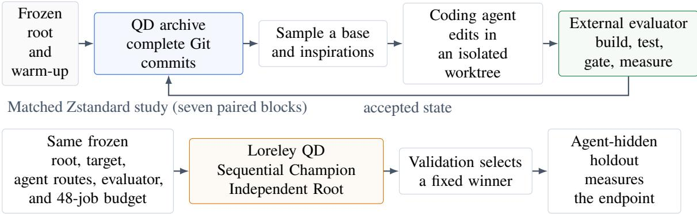
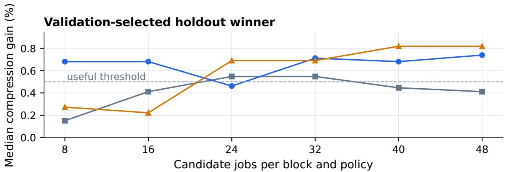
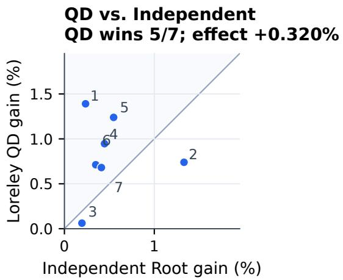
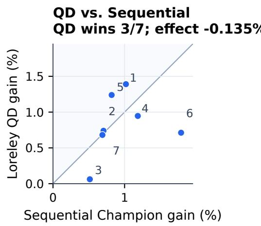

# LORELEY: Repository-Scale Program Evolution with Quality-Diversity Search

Mohan Chen

voiletech42@gmail.com

ORCID: 0009-0002-4540-3703

August 2026

## Abstract

Sequential agent search accumulates changes from its current champion but discards alternative branches; independent proposals preserve breadth but restart from the root. LORELEY instead retains complete repository states in a Quality-Diversity (QD) archive and samples them as parents or supplies them as context for later edits. Candidates are Git commits produced in isolated worktrees and judged by a project-supplied evaluator.

We compare configured Loreley QD, sequential champion editing, and independent root proposals in a matched Zstandard experiment: seven paired blocks and 48 physical candidate jobs per policy and block (1,008 total), with root-only initialization and each policy’s native concurrency. Validation selected a winner at each budget checkpoint; an agent-hidden holdout measured the fixed candidate. At 48 jobs, QD was 0.135% below Sequential Champion (95% BCa interval for the paired efect: −0.556% to +0.161%) and 0.320% above Independent Root (−0.082% to +0.686%). Neither contrast established a QD advantage; Sequential had the highest observed 48-job mean and median.

Archive retention and later sampling did occur. Four of seven final QD winners had a non-incumbent state in their primary-parent ancestry under a retrospective one-incumbent rule applied only to the observed QD stream. Including inspiration edges raised the count to six, without showing that supplied context caused an edit. Three earlier capability campaigns produced generation-4, multi-file improvements in two Python libraries and a separate Zstandard revision. Loreley engaged the intended stepping-stone mechanism, but the controlled experiment did not show an endpoint benefit at 48 jobs.

## 1 Introduction

Most performance patches in mature software are not standalone programs. They are repository changes that interact with existing types, tests, build rules, and public interfaces. A patch can be syntactically valid and still fail to build, change an output, exceed a resource limit, or disappear under repeated measurement. Useful repository states are therefore sparse among the states an editor could produce.

Coding agents can propose coherent changes across files, but the policy that chooses their next editing context still matters. Sequential Champion search accumulates edits and concentrates its budget on the best state seen so far. Independent Root search explores several proposals in parallel but cannot accumulate improvements across generations. QD ofers a third option: retain several states according to objective trade-ofs and repository descriptors, including states that are not the current champion.

The premise has two testable levels. First, the policy must retain valid non-incumbents and later sample some as parents or supply them as inspirations. Second, that continued availability must improve the selected endpoint over strong simpler policies at a specified budget. The first is an engagement condition for the intended steppingstone mechanism, not evidence that the retained states were useful. A descriptor can separate repositories without separating useful future edit contexts, and a short search may favor immediate exploitation by a sequential policy.

LORELEY implements a persistent QD loop over Git repositories. Each candidate is a commit. A targetspecific evaluator is the only authority on correctness and objective values. Repository embeddings assign valid candidates to a MAP-Elites grid [12]; each cell stores a bounded Pareto front. Islands may maintain separate archives and supply retained commits as inspirations. The evaluator can call a local build, a container, a hardware testbed, or a remote service, so the search core is not tied to Python or to a particular performance harness. Figure 1 summarizes this loop and the matched evaluation used in the paper.

This paper makes three contributions:

• A repository-evolution runtime that combines codingagent variation, isolated Git worktrees, external evaluation, persistent scheduling, and QD retention over complete commits.

  
Figure 1: Paper overview. Loreley loops complete Git repository states through QD selection, an isolated coding-agent worktree, and external evaluation (top). The matched Zstandard study compares three context-selection policies under a common 48-job budget; validation fixes each winner before an agent-hidden holdout measures it (bottom).

• A matched experiment comparing Loreley QD with Sequential Champion and Independent Root under equal attempted candidate jobs. At 48 jobs on Zstandard, the experiment does not establish a QD advantage over either control.

• An empirical separation of policy engagement from endpoint eficacy. Lineage and archive records show retention and later sampling of non-incumbents, while checkpoint and held-out results show no resulting advantage at the tested horizon. Three earlier campaigns provide capability cases rather than additional policy comparisons.

The matched study compares the configured QD search policy with two simpler alternatives; it does not isolate the learned descriptor, Pareto retention, or inspiration sampling individually. We therefore report the negative primary comparison and the policy-engagement evidence separately.

## 2 Repository-Level QD Search

We distinguish a mechanism-engagement condition from an eficacy proposition. Engagement means that the configured archive keeps several viable repository states available and that later jobs sample some states that a oneincumbent rule would not retain when applied to the same observed QD candidate stream. Eficacy means that this availability improves a held-out endpoint under a defined budget. Parent and inspiration records test engagement within the QD stream; only a matched policy comparison tests comparative benefit. Neither establishes the usefulness of an individual descriptor cell or retained state.

Let $R _ { 0 }$ be a fixed root repository and let � denote a Git commit descended from it. A project evaluator � maps � to either a failure or a successful record

$$
E ( c ) = { \big ( } \mathbf { f } ( c ) , a ( c ) , { \mathcal { A } } ( c ) { \big ) } ,\tag{1}
$$

where f is an ordered objective vector, � is an optional evaluator-defined candidate identity, and A contains reports and artifacts. Correctness, edit-scope, resource, and precision checks are part of �; a fast but invalid commit has no objective vector.

Loreley also computes a behavior descriptor b(�) from the complete eligible repository state. After dimensionality reduction, b(�) selects one cell in a MAP-Elites grid. Within that cell, objective directions are normalized so that larger is better. Let � be the configured objective tolerance. After sorting candidates by commit hash, Loreley skips a later vector x when a retained representative y satisfies $| x _ { j } - y _ { j } | \le \epsilon$ for every objective �. Among the remaining representatives, x �-dominates y when $x _ { j } \geq y _ { j } - \epsilon$ for every � and $x _ { k } > y _ { k } + \epsilon$ for at least one �. Only non-dominated representatives remain. When they exceed the configured cell capacity, crowding distance preserves boundary trade-ofs and isolated interior points [4]. Cell selection and member selection are separate so that a cell with a larger Pareto front does not receive more sampling probability by accident. Specifically, Loreley samples uniformly from occupied cells and then uniformly from the retained members of the selected cell, after applying batch exclusions.

The search budget counts physical jobs. A job selects a local base commit and zero or more inspiration commits, invokes the agents, creates a candidate commit, and evaluates it. Inspirations are sampled without replacement from occupied cells within an expanding Chebyshev radius, with a bounded fallback to other occupied cells.

1. Evaluate the fixed root and run � root-based warm-up edits. Record every outcome; add each valid, artifactunique warm-up ofspring to descriptor history.

2. Fit the learned projection when history reaches �. Project the eligible warm-up states and admit their objective vectors to per-cell Pareto fronts.

3. Freeze the current archive as the sampling snapshot for the next batch. Sample an occupied cell, then a retained member as the base.

4. Sample distinct nearby retained states as inspiration context, expanding the cell radius and then using a bounded global fallback.

5. Let the planning and coding agents edit the base in an isolated worktree. Commit the resulting source and evaluate it externally.

6. Charge the job budget regardless of outcome. For a valid, artifact-unique result, update descriptor history and attempt Pareto admission in its cell.

7. At each refit interval, align the new projection and atomically rebuild the archive from the records retained immediately before refit. Repeat from step 3 until the physical-job budget is exhausted.

Figure 2: End-to-end Loreley QD policy pseudocode. The formal Zstandard treatment instantiates $w = 4 ,$ one island, four-job scheduling batches, and no migration; $\mathsf { A p - }$ pendix A gives the remaining settings.

On a migration step, a non-duplicate elite from another island replaces the last ordinary inspiration slot. Inspiration supplies evidence from another lineage; it does not change the Git parent of the new commit. Parent edges therefore record source ancestry, while inspiration edges record information supplied to the agent.

Figure 2 gives the end-to-end policy. Warm-up and ordinary jobs use the same agent and evaluator; warmup difers only in that every base is $R _ { 0 }$ and no unstable archive coordinate is sampled. A scheduling batch is drawn from one archive snapshot. Within that batch, base commits and complete base–inspiration recipes are excluded when alternatives exist. Candidates that finish during the batch can afect only a later batch.

## 3 System Design

Figure 1 shows the lifecycle implemented by LORELEY. The system separates target-independent search infrastructure from the target evaluator. The search infrastructure owns scheduling, agent sessions, worktrees, commits, embeddings, archive state, lineage, and worker coordination. The evaluator owns the permitted source scope, build and test commands, workloads, objective definitions, measurement precision, and acceptance gates.

## 3.1 Agent variation over Git commits

The scheduler samples a base from one island and may attach retained commits as inspirations. A planning agent receives the frozen campaign goal and constraints; bounded base-commit history, metrics, evaluation evidence, and key files; and, for each inspiration, a baserelative trajectory and the same bounded evidence fields. The inspiration is supplied as context, not checked out as the worktree. A coding agent then edits the complete base repository in an isolated Git worktree. Successful work produces exactly one result commit. The worker verifies the worktree and commit before invoking the evaluator; agent text is not treated as evidence of correctness or effect.

Every job records the base, inspirations, island, model routes, agent summaries, usage, timing, and terminal reason. Failed candidates remain in the ledger but do not enter the ordinary QD archive. Valid candidates that are dominated in their behavior cell also remain reproducible even though they are not sampled by default.

## 3.2 Repository-state behavior descriptors

Loreley embeds the eligible files at $R _ { 0 }$ and incrementally updates the repository vector for descendant commits. File embeddings are cached by (experiment, Git blob SHA). A commit vector is the uniform mean over all eligible file vectors; files excluded by the fixed campaign ignore rules do not participate. The full vector is stored before projection.

Each island maintains its own PCA history, projection epoch, and grid. During warm-up, candidates populate the PCA history but are not placed under an unstable coordinate system. A later PCA refit reprojects retained candidates and rebuilds the afected archive atomically. This descriptor is a search coordinate, not a claim that embedding distance measures semantic novelty perfectly.

## 3.3 Pareto cells and islands

An evaluator may return several objectives with explicit names and directions. Every objective in the campaign contract must be present and finite before archive admission. Each cell retains a bounded non-dominated set. Multiple islands have independent projection and archive state; scheduling proceeds in round-robin order under one global job cap. At a configurable cadence, a job may receive a non-duplicate elite from another island as an inspiration. The base remains local, and the resulting commit remains in the target island.

This design can preserve branches with diferent descriptors or objective trade-ofs. Section 5 reports which retained branches were later sampled and whether the configured policy improved held-out quality.

## 3.4 Evaluation and persistent execution

The evaluator controls source scope, build and test commands, workloads, objective definitions, precision, and acceptance gates. Loreley stores each job, commit, metric, embedding, and archive update in PostgreSQL; Redis and Dramatiq dispatch isolated worker processes. A commit SHA records ancestry, a tree SHA records exact tracked source, and an optional evaluator identity can deduplicate measurements of equivalent compiled artifacts. These identities support correct execution and lineage analysis, but they are not a separate method claim. Evaluator-equivalent source states share measurements, and only the first processed representative enters descriptor history and the active archive; source-distinct duplicates are not retained as independent future parents.

Search, model, and evaluator concurrency are configured independently. This allows parallel candidate generation while a benchmark remains serial, or several calibrated measurement lanes while the policy preserves its own dependency structure. Failed jobs remain in the run record and consume their budget slot; only valid candidates can enter the archive.

## 4 Experimental Design

The evaluation has two parts. First, a controlled Zstandard study compares Loreley’s QD policy with two simpler policies under matched candidate budgets. Second, three earlier campaigns show what the configured system produced on two Python libraries and a separate Zstandard revision. The earlier campaigns are capability cases, not additional policy replicates.

## 4.1 Matched Zstandard policy experiment

We ran seven paired blocks on one Linux ARM64 host. Each block contained three configured policies, initialized only from the same frozen root and given 48 attempted physical candidate jobs. The target revision, task instructions, planning and coding routes, and training evaluator were common. The online parent and context rules were not: those rules define the policies being compared. Only the postsearch training rank and validation winner rule were common. Candidate jobs, rather than successful candidates, dollars, tokens, or elapsed time, are the primary matching axis.

The frozen root was c604f825. Agents could edit Zstandard C sources but could not access the validation or holdout corpora. Planning used gpt-5.6-sol; coding used gpt-5.6-luna. Loreley QD additionally used 1,536-dimensional text-embedding-3-small code embeddings, reduced to three whitened PCA coordinates. Coordinates were clipped at three standard deviations, mapped to [0, 1]3, and refit after every four artifactunique states. Each refit aligned the new projection and rebuilt the archive from the records retained immediately before refit. The QD arm had one island, no migration, and frozen depth gates requiring at least 32 post-warm-up jobs, six archive-parent rounds, generation four, and six distinct archive parents. Every completed formal QD arm passed these gates; no analyzed block was excluded or rerun because of a depth-gate failure. Appendix A and the machine-readable treatment record give the task contract, warm-up seeding, sampler radii and fallback, batch snapshot semantics, prompt-context fields, seeds, and principal generation settings.

The host had 128 logical CPUs and 245 GiB RAM. Training, validation, and holdout used disjoint generated corpora fixed before formal search. The evaluator performed a clean release build and upstream checks, then cross-decoded root and candidate outputs and measured single-thread compression and decompression at levels 1, 3, and 5 on pinned CPU lanes. Each evaluation began with 12 alternating root/candidate rounds, one-second warm-ups, and at least three seconds per level; it extended to 16 rounds only when the predeclared precision gate failed. The estimator symmetrically trimmed three log efects per tail. Hard gates covered source scope, tests, release build, round trip, cross-decode, compressed size, RSS, per-cell throughput, and interval precision.

Within each block we rotated arm start order to reduce calendar-time confounding. All seven planned blocks enter the analysis, and none was excluded after score inspection.

We recorded checkpoints at 8, 16, 24, 32, 40, and 48 jobs. Within each block–policy–checkpoint group, feasible evaluator identities were ranked by training compression lower confidence bound, and up to ten unique finalists were measured on validation. The root was always eligible with selector score 1.0. A non-root candidate was eligible only if it passed evaluation, had compression lower bound strictly above 1.0, decompression geomean at least 0.995, and worst-cell speedup at least 0.98. The highest selector score won; exact ties preferred the root, then fewer changed lines, then commit and evaluator identity. The holdout measured that fixed winner and never changed selection.

The finalist width was fixed after search completion and before validation or holdout outcomes were observed. A post-hoc replay at the originally planned width of five changes several selected outputs but not the qualitative primary conclusion (Appendix C).

Table 1: Online policies in the matched experiment. Warm-up and failed jobs count toward the 48-job budget. The comparison retains each policy’s native adaptivity and concurrency.
<table><tr><td>Policy</td><td>Parent</td><td>Retained online state</td><td>Context and schedule</td></tr><tr><td>Loreley QD</td><td>Archive member after four root warm-ups</td><td>Three-objective fronts in  $4 ^ { 3 }$  cells</td><td>Base plus two inspirations; four-job batches</td></tr><tr><td>Sequential Champion</td><td>Current training-LCB champion</td><td>One incumbent</td><td>Incumbent history; serial</td></tr><tr><td>Independent Root</td><td>Frozen root</td><td>None</td><td>Root context; four-job batches</td></tr></table>

The primary endpoint is the 48-job holdout compression-throughput ratio. This axis follows the frozen online training rank and target-specific validation rule; decompression and worst-cell performance enter as gates rather than the primary score. Each block gives a paired log diference between QD and one control. If $d _ { b }$ is the paired log-ratio diference in block �, the reported percent efect is $\begin{array} { r } { 1 0 0 \{ \exp ( 7 ^ { - 1 } \sum _ { b } d _ { b } ) \ : - \ : 1 \} } \end{array}$ . We also report a 20,000-resample paired BCa 95% interval, an exact sign-flip test over all $2 ^ { 7 } \ = \ 1 2 8$ sign assignments, and Holm correction over the two target-local contrasts. The sign-flip interpretation assumes symmetry/exchangeability of the paired block diferences; the blocks are separate searches on the same target and host, not a sample of repositories. The six checkpoint curves are descriptive because the primary inference was fixed at 48 jobs. At each checkpoint validation reselects from the candidates available at that time, so holdout winner quality need not be monotone in job count.

## 4.2 Earlier capability campaigns

We also report three earlier campaigns as capability cases. They used frozen repository revisions, external evaluators, and human-written seeds that represented diferent optimization hypotheses. Seeds were used because the system did not yet have a reliable way to generate a diverse initial set; they were evaluated normally and counted toward the job budget. All three reported candidates are generation-4 descendants rather than selected seeds. These campaigns do not compare search policies or estimate the efect of seeding. The abbreviated upstream/root pairs were bff75ed/97aff4f, 6568072/4fb992f, and 82d322c/5b3fe47, respectively; the experiment roots add only campaign-control files.

The Python evaluators used deterministic compile, match, or rendering workloads inside controlled runtimes and enforced upstream tests, output equivalence, public API, edit-scope, packaging, and allocation gates. The earlier Zstandard campaign built a release CLI and used paired single-thread compression and decompression measurements at levels 1, 3, and 5, together with cross-decode, size, RSS, scope, and precision gates. Agents could not access validation or holdout inputs. Ratios above one favor the candidate; aggregates are geometric means unless stated otherwise.

The paper evidence bundle contains the frozen reports, candidate-selection qualifications, measurement records, and resource accounting for all three cases. Appendix B gives the four-split Zstandard record because its validation and holdout roles difer; the main results retain one row per repository.

## 5 Results

## 5.1 Matched policy comparison

The controlled study scheduled 1,008 jobs and produced 948 successful candidates. Table 3 shows the final validation-selected holdout winner in each block. Sequential Champion has the largest endpoint mean and median; Loreley QD is intermediate; Independent Root is lowest. A predefined “useful” compression gain of at least 0.5% occurred in seven of seven Sequential blocks, six of seven QD blocks, and two of seven Independent blocks.

The paired QD efect was +0.320% relative to Independent Root (95% BCa interval [−0.082, +0.686]%; Holm � = .375) and −0.135% relative to Sequential Champion ([−0.556, +0.161]%; Holm $p = . 5 4 7 )$ . A positive efect favors QD. Neither paired interval excludes zero. The experiment therefore does not establish that QD improves final held-out performance over either control. It also does not establish equivalence: the intervals still allow a modest efect in either direction. The observed ordering is specific to Zstandard, the two GPT routes, root-only initialization, and a 48-job horizon.

The small number of pairs is visible in simple sensitivities. Removing one block at a time moves the QD–Sequential point efect from −0.226% to +0.020%, while QD–Independent remains positive from +0.182% to +0.472%. These ranges do not replace the frozen analysis; they show why the result should not be read as a stable ranking across tasks. An exploratory Sequential– Independent contrast, outside the frozen primary family, is +0.456% with exact sign-flip $p = . 1 2 5$

Table 2: Earlier capability campaigns. Successful outcomes are shown in parentheses. “Post-hoc” marks the replacement made after the registered Pathspec candidate failed its allocation gate.
<table><tr><td>Target</td><td>Jobs</td><td>Candidate</td><td>Generation</td><td>Selection</td></tr><tr><td> $\mathtt { m a r k d o w n - i t - p y }$ </td><td>64 (54)</td><td>b10adb6</td><td>4</td><td>Frozen before validation</td></tr><tr><td>python-pathspec</td><td>64 (45)</td><td>9d977f0</td><td>4</td><td>Post-hoc</td></tr><tr><td>Zstandard</td><td>220 (211)</td><td>fe39bee8</td><td>4</td><td>Expanded-validation winner</td></tr></table>

Table 3: Matched Zstandard result at 48 candidate jobs per block and arm. Values are compression-throughput gains over the root for seven validation-selected holdout winners.
<table><tr><td>Policy</td><td>Mean (%)</td><td>Median (%)</td><td>Range (%)</td><td>≥ 0.5%</td></tr><tr><td>Independent Root</td><td>+0.502</td><td>+0.412</td><td> $+ 0 . 1 9 5 \mathrm { t o } + 1 . 3 3 1$ </td><td>2/7</td></tr><tr><td>Loreley QD</td><td>+0.824</td><td>+0.739</td><td> $+ 0 . 0 6 2 \mathrm { t o } + 1 . 3 9 0$ </td><td>6/7</td></tr><tr><td>Sequential Champion</td><td>+0.960</td><td>+0.819</td><td> $+ 0 . 5 1 4 \mathrm { t o } + 1 . 7 8 9$ </td><td>7/7</td></tr></table>

Compression was the primary endpoint. A posthoc check using the same fixed winners and their combined compression/decompression throughput gives QD efects of −0.531% relative to Sequential (BCa 95% interval [−2.407, +0.163]%) and +0.367% relative to Independent ([+0.128, +0.552]%); unadjusted exact �- values are .719 and .047. Decompression alone gives −0.926% ([−4.187, +0.324]%, $p = . 7 0 3 )$ and +0.413% ([+0.084, +0.700]%, $p \ = \ . 0 7 8 )$ , respectively. The Sequential intervals are widened by its unusually large decompression gain in Block 6. These analyses were not part of the primary test family and received no multiplicity correction; the nominal $p = . 0 4 7$ is therefore not confirmatory. Per-block values appear in Appendix E.

Figure 3 shows how the selected winners changed with budget and exposes the seven endpoint pairs. At 8 and 16 jobs, QD has the largest median. Sequential overtakes it at 40 and 48 jobs. These are descriptive checkpoints, not six independent tests, and the curve is not a cumulativebest curve: validation reselects among up to ten finalists at each checkpoint. The endpoint scatter makes the runto-run result concrete. QD exceeds Independent Root in five blocks and Sequential Champion in three.

## 5.2 Archive activity and lineage retention

The configured QD policy engaged its archive in all seven blocks, and every final QD winner was a descendant rather than the root. We label a candidate non-incumbent at admission when its training compression lower bound is strictly below the maximum of the root score 1.0 and all earlier QD candidate scores; exact ties are not labeled non-incumbent. This is a one-incumbent rule applied retrospectively to the same observed QD stream. It is not a counterfactual claim about which candidates the separately run Sequential arm would have generated.

Four winners had at least one such state in their primary-parent ancestry. Two more had one only in the larger graph obtained by recursively following parent and inspiration edges, giving six of seven for that dependency definition. Across the 67 nodes in those combined graphs, 49 were non-incumbents at admission and later appeared on an outgoing edge: 13 only as parents, 18 only as inspirations, and 18 in both roles. An inspiration edge means that the commit was resupplied as context; it does not show that the agent used its contents or that it caused the resulting edit.

The four primary-parent lineages contained 15 nonincumbent ancestors. The selected final descendants occurred 3–42 logical-job ordinals after those ancestors were admitted. In three of the four lineages, at least one final descendant exceeded the incumbent score recorded when its ancestor entered the stream; this held for seven of the 15 ancestors. The remaining cases did not. This is within-policy evidence of delayed branch survival, not an estimate of causal benefit or of the best descendant each branch could produce.

Summaries from the seven frozen QD databases give a wider view. A block used a median of 20 distinct primary parents (range 15–23), with median entropy-efective support of 17.1 parents. The median parent-revisit lag across blocks was 5.5 jobs, and the deepest candidate in a block reached generation 5 to 9. Final archives occupied 9 to 12 of 64 cells. These diagnostics show that QD maintained and revisited several editable contexts; they do not identify whether the learned cells chose useful contexts, or whether 48 jobs were long enough for delayed branches to pay of.

  
Figure 3: Matched Zstandard policy comparison. Top: median holdout gain of the validation-selected winner at each common budget; checkpoint values are descriptive. Bottom: the seven paired 48-job endpoints, with block numbers and an equal-performance diagonal. Primary inference uses only the final paired contrasts in Table 3.

Archive retention and later sampling were therefore observed, satisfying the policy-engagement condition. The eficacy proposition did not receive corresponding support at 48 jobs. Selected candidate examples are reported in Appendix D; they do not replace the paired policy statistic.

## 5.3 Earlier capability campaigns

Across the three capability cases, 348 terminal jobs yielded 310 successful outcomes and 38 failures. Table 4 reports one candidate per repository. Efects refer to different workloads and are not pooled.

The Markdown winner improved all 28 validation documents, and the Pathspec winner improved all five reference workloads. All three candidates passed the targetspecific correctness, scope, packaging or build, resource, and allocation or throughput gates described above. The Zstandard selection-set interval is not adjusted for selecting among the expanded-validation Top 10; Appendix B distinguishes the split roles.

For markdown-it-py, the best seed measured +3.23% on training before four generations accumulated five-file fast paths in inline HTML matching, rendering, token attributes, escaping, dispatch, and normalization. The fixed winner measured +6.99% on training and +6.75% on a separate 28-document validation set. For Pathspec, the reported lineage began with a −0.22% seed and advanced through four generations to +25.36% on training. Its generation-3 parent remained available while 20 other jobs completed before being sampled again for the final step. The registered training winner failed a fixed absolute allocation gate at the reference shape; the reported candidate was selected afterward, so its later replication does not remove the post-hoc selection status.

Table 4: Earlier capability-case results, reported as throughput gain (%). Brackets are 95% fixed-candidate measurement intervals where available; they do not estimate cross-repository generalization. H and F denote the original holdout and fresh sealed corpus.
<table><tr><td>Target</td><td>Candidate</td><td>Selection measurement</td><td>Additional fixed-candidate measurement</td></tr><tr><td>markdown-it-py</td><td>b10adb6</td><td>+6.750 [+6.310, +7.170]</td><td></td></tr><tr><td>python-pathspec</td><td>9d977f0</td><td>+25.140</td><td>+24.690 [+23.330, +26.060]</td></tr><tr><td>Zstandard</td><td>fe39bee8</td><td>+1.234 [+1.156, +1.312]</td><td>H: +1.173 [+1.102, +1.245]; F: +0.891 [+0.522, +1.261]</td></tr></table>

## 5.4 Earlier Zstandard split results

Expanded validation selected training-rank-10 candidate fe39bee8, an evolved generation-4 commit rather than a manual seed. Its compression throughput gain was +1.234% on that selection set, +1.173% on the original holdout, and +0.891% on a newly generated sealed corpus. The patch combines a zero-literal fast path, a compression hot-path change, and an eight-byte histogram update unroll across three files. Compressed size was unchanged on every measured split and peak RSS rose by 0.031 MiB.

Appendix B reports all four split measurements and their protocol status. In brief, the candidate’s originalholdout score was unknown when expanded validation selected it, although that corpus had already been opened for the initial Top-3 winner. The fresh corpus was sealed before measurement, but its deterministic recipe was chosen after candidate fixation. These are complementary fixed-candidate checks, not an untouched study-level confirmation or a selection-adjusted estimate.

## 6 Discussion

The matched study separates two questions that are easy to conflate. Loreley did retain and later sample alternative repository states. That engagement did not produce a better held-out endpoint than Sequential Champion at 48 jobs. The following observations constrain, but do not settle, why.

## 6.1 Sequential search at short budgets

The three capability-case winners were all fourthgeneration commits, but multi-generation editing is not unique to QD. Sequential Champion produced a generation-5 best example in the matched study, while final QD winner depth had median three and range one to seven. Sequential search can therefore accumulate substantial changes without maintaining several live branches. Loreley’s extra mechanism is the continued availability of several trajectories; that creates an opportunity cost unless a retained alternative later yields a better edit.

## 6.2 The 48-job horizon

QD can, in principle, retain stepping stones whose immediate objective value would not keep them in a singleincumbent search. A runtime analysis proves such an advantage for MAP-Elites on two particular combinatorial problem classes [17]; it does not imply the same advantage for repository optimization. Search horizon is nevertheless a material open variable here. SATLUTION reports 70 solver revisions, each evaluated on 400 SAT instances, or about 28,000 solver-instance executions [21]. This provides scale context, but the units are not normalized: a Loreley job proposes one repository candidate and performs repeated multi-cell measurements, while a SAT-LUTION execution runs one solver on one instance. We therefore do not treat the counts as a compute, cost, or sample-eficiency ratio.

The matched experiment supplies seven separate search replicates but only 48 candidate jobs per policy and block. Its checkpoint curve does not show a late QD advantage: Sequential Champion catches QD by the final two checkpoints. Still, the QD mechanism is designed precisely for branches whose payof arrives after more than one edit, and the lineages show that such branches were retained and sampled again. The present data cannot distinguish an insuficient horizon from an inefective descriptor, archive, or sampling rule. More budget may expose a later advantage, add no benefit, or amplify the same representation limits. Within the measured horizon, Sequential has the highest observed 48-job mean and median.

## 6.3 Archive and descriptor behavior

Table 5 reports the final archive snapshots. An occupied unit is an island-cell pair, because the Python islands had independent PCA models and archives. Final coverage was between 14.1% and 17.2%, but the denominators and projections difer, so these percentages are not a crosstask performance ranking.

Table 5: Final QD archives. The matched-study row is the median of seven separate QD blocks; its range is given in the text.
<table><tr><td>Target</td><td>Cells</td><td>Entries</td><td>Occupied</td><td>Coverage</td></tr><tr><td>markdown-it</td><td>128</td><td>36</td><td>18</td><td>14.1%</td></tr><tr><td>pathspec</td><td>128</td><td>28</td><td>19</td><td>14.8%</td></tr><tr><td>Earlier</td><td>64</td><td>13</td><td>11</td><td>17.2%</td></tr><tr><td>Zstandard Matched Zstandard</td><td>64</td><td>14</td><td>10</td><td>15.6%</td></tr></table>

The earlier Zstandard campaign used seven warm-up states, refit PCA after every eight new states, clipped whitened coordinates at three standard deviations, allowed eight Pareto members per cell, and used objective epsilon 0.003. Its final 13 entries occupied nine singleton cells and two cells with two members; the capacity and crowding rule were not stressed in the final snapshot. This sparse front can also reflect the objective epsilon, correlations among the three objectives, and the sampled candidates; the campaign did not isolate those factors from the descriptor. The PCA history contained 167 artifact-unique repository-state representatives; evaluator-equivalent proposals were filtered before history insertion. Under the final projection, all 167 representatives occupied 13 cells, while the retained archive occupied 11. The first three whitened components explained 71.0% of centered variance.

The unprojected repository vectors were close: median pairwise cosine distance was $3 . 2 2 \times 1 0 ^ { - 6 }$ and the maximum was $8 . 3 2 \times 1 0 ^ { - 6 }$ . This follows from uniformly averaging file embeddings when a patch changes only a small part of the repository. The small raw scale does not by itself make the centered diferences noise or show that the candidate distribution is globally low-dimensional. In this campaign the centered spectrum had participation ratio 5.31 and entropy efective rank 7.80. The observed coordinates are best read as geometry of source proposals shaped by changed files and lineages; the experiment did not test whether they correspond to distinct mechanisms or runtime behavior. Of 51 candidates admitted during the run, 22 (43.1%) would occupy a diferent cell under the final PCA than under their admission projection. This is cumulative admission-to-final churn, not churn at every refit. Change-weighted or dif-restricted descriptors are direct alternatives for a controlled comparison. We do not report a post-hoc scalar QD score because the three objectives had no preregistered common normalization.

In the matched study, final QD archives contained 11–17 entries and occupied 9–12 cells. That was enough to support many parents, but not enough to beat Sequential at the primary endpoint. Coverage alone is therefore not evidence that the descriptor separates candidates by future mutation value.

## 6.4 Short measurements screened a narrow frontier

Zstandard used four- and eight-round training measurements to screen a wide frontier. Among the training Top 10, compression lower bounds spanned only 0.276 percentage points, and the median distance from a point estimate to its lower bound was 0.541 percentage points. Fixed eight-round validation reduced that median distance to 0.129 percentage points, yet the validation winner had ranked tenth on training.

A calibrated four-lane root/root experiment measured maximum aggregate log bias of 0.000314, or about 0.031%. Paired execution controlled common host effects, but the finalist intervals still overlapped. The training measurements were useful for rejecting large regressions and finding a positive band; they did not provide a stable fine ordering inside the selected Top 10.

## 6.5 Time, model usage, and failures

Table 6 keeps jobs, successful outcomes, time records, and dollar semantics separate. The Python amounts are request-level estimates from the campaign proxy; the earlier Zstandard amount is a model-catalog estimate. The formal study’s ledger attributes generation and embedding costs to each arm. None of these values is a provider invoice, and local compute is unpriced.

The matched study cost \$517.89 in attributable generation and embedding records. Equal jobs did not mean equal spend: QD used more usage events but a lower recorded generation cost, while policy dependency and batching produced very diferent worker-wave times. These are secondary resource outcomes, not alternative denominators for the frozen primary comparison. Across the matched study 60 jobs failed; across the capability cases 38 failed. A failed or no-op job still consumed its physicaljob slot, preserving the comparison between policies as actually run.

## 7 Related Work

Genetic improvement has long used search to modify existing software for runtime, memory, energy, repair, and functionality objectives [15]. Within QD, MAP-Elites discretizes a behavior space [12]; MOME places a Pareto front in each cell [16]; and AURORA periodically relearns an unsupervised descriptor [3]. Loreley’s per-cell fronts and learned coordinates build on these components. Its method contribution is their use in a persistent codingagent runtime whose search states are buildable Git repositories, not any one archive component in isolation.

Table 6: Recorded resources. Time semantics difer: capability cases record elapsed or active runner time; matchedstudy rows record cumulative worker-wave time and overlap in the experiment calendar. Dollar values are estimates or ledger attributions, not provider invoices.
<table><tr><td>Target or arm</td><td>Jobs</td><td>Success</td><td>Time (h)</td><td>USD</td><td>Basis</td></tr><tr><td>markdown-it capability</td><td>64</td><td>54</td><td>4.35</td><td>$2.08</td><td>Proxy</td></tr><tr><td>Pathspec capability</td><td>64</td><td>45</td><td>3.91</td><td>$2.49</td><td>Proxy</td></tr><tr><td>Earlier Zstandard capability</td><td>220</td><td>211</td><td>5.31</td><td>$60.25</td><td>Catalog</td></tr><tr><td>Matched Independent Root</td><td>336</td><td>316</td><td>92.25</td><td>$185.30</td><td>Attributed</td></tr><tr><td>Matched Loreley QD</td><td>336</td><td>313</td><td>32.00</td><td>$140.05</td><td>Attributed</td></tr><tr><td>Matched Sequential Champion</td><td>336</td><td>319</td><td>85.68</td><td>$192.54</td><td>Attributed</td></tr></table>

ELM combined an LLM program mutator with MAP-Elites [11]. FunSearch joined language-model sampling, executable evaluation, and a program database [18]; AlphaEvolve broadened the editable program and evaluator set [13]. Open-source CodeEvolve adds island-based CVT-MAP-Elites, inspirations, and refinement on algorithmic tasks [2]. QDEvo likewise combines LLM variation, multiobjective QD, and pretrained code embeddings, but searches algorithmic heuristics rather than executable repositories [10].

RHO’s HELIX optimizer is a direct repository-level antecedent [5]. It treats a multi-file policy repository as the evolutionary artifact, uses a tool-enabled coding agent in isolated worktrees, scores with a user-supplied environment, and retains several repositories on a per-instance coverage frontier. Loreley instead discretizes learned whole-repository descriptors and keeps a bounded multiobjective Pareto front in each cell. The present paper also compares its configured policy with sequential and independent repository search, showing that observed branch retention did not imply a 48-job endpoint advantage.

CktEvo is the closest repository-level MAP-Elites comparison [19]. It evolves multi-file Verilog repositories with hand-designed RTL descriptors, island migration, a synthesis/formal evaluator, and one scalar area-delay elite per bin. Loreley’s evaluator is target-supplied and its cells retain multiobjective fronts. Our claim is therefore not priority for repository-level evolution, agent mutation, learned QD descriptors, or per-cell Pareto retention; it is the configured repository-search method and its matched mechanism-versus-endpoint study.

Other systems evolve or coordinate repository states. EvoGit records agent collaboration as a Git phylogeny [7]; SATLUTION evolves C/C++ SAT solvers [21]; ABCEvo and HORIZON target hardware tool and project repositories [20, 22]; and GEAR maintains complete machinelearning research states [9]. Vesper studies harness isolation and evaluator exploits [8].

Controlled studies of AI-research search policies reach a related empirical question. Heuresis holds a research framework fixed while comparing greedy, MAP-Elites, Islands, Go-Explore, and divergent strategies across quality, diversity, and novelty [1]. FML-bench separates search strategy from execution infrastructure across 18 machine-learning tasks; its simple greedy hill climber nearly matches the best tree-search agent, and diversity alone is not associated with final performance [23]. Loreley studies the same tension between concentrated and broader search in buildable multi-file software repositories, with Git commits as persistent states and heldout paired-block endpoints. Simple independent or sequential baselines can also match more elaborate codeevolution methods on some tasks [6], and EvoTrace shows that several edit mechanisms can produce score gains [14]. These findings motivate the strong policy controls and restrained attribution used here.

## 8 Limitations and Next Experiments

The matched comparison covers one repository, one pair of GPT routes, one Linux ARM64 host, and seven blocks. Its confidence intervals are substantially more informative than a single run but remain compatible with modest efects in either direction. The 48-job horizon is especially important: QD retained delayed branches, yet the experiment may have ended before such branches could compound. That explanation is plausible, not established. The same data are also compatible with a descriptor or archive that preserves alternatives without improving their expected payof.

The paired analysis estimates variation across repeated searches on one fixed task. It does not estimate crossrepository variation. Candidate timing intervals, validation selection uncertainty, repeated-search variation, and cross-task generalization are diferent layers; the blocklevel BCa interval addresses only the third.

The experiment compares one configured Loreley QD policy with two configured controls. It does not identify the separate efects of the learned descriptor, Pareto retention, inspiration sampling, or concurrency. Archive coverage and parent entropy show that the archive was sampled; they do not show that cell distance predicts mutation utility. A component study should compare the current repository-mean embedding with dif-restricted, structural, and random coordinates under the same longerhorizon policy protocol.

The descriptor is non-stationary. A PCA refit rebuilds the archive from currently retained records; candidates discarded under an earlier projection are not reconsidered when coordinates change. Archive membership is therefore path-dependent on the projection schedule. We did not perform a full-history or fixed-basis replay for the formal blocks, so the parent and dependency diagnostics are conditional on the implemented retained-only rebuild rule.

Root-only initialization removes manual seed quality from the matched study. The three capability cases did use human-written seeds because no reliable automatic procedure was available for generating diverse starting hypotheses. Their reported candidates were evolved descendants rather than direct seed selections, but those cases do not estimate the efect of initialization.

The capability cases retain their original selection qualifications. markdown-it-py was frozen before separate validation. Pathspec is a post-hoc replacement followed by fixed-candidate replication. The earlier Zstandard candidate was selected on expanded validation; its own original holdout score was unseen at selection although the corpus had been opened for another candidate, and the fresh-corpus recipe was chosen after candidate fixation. These cases establish capability, not a shared inferential claim.

The workloads measure throughput on two Python libraries and one C compressor; they do not measure maintainability, upstream acceptance, production trafic, or broader software-engineering objectives. The next decisive experiment is a longer matched curve on Zstandard together with a second repository using the same three policies. Such a study would test whether QD’s retained branches eventually repay their early opportunity cost or whether Sequential remains the better policy in this regime.

## 9 Artifacts and Reproducibility

Loreley is released under Apache-2.0 at https: //github.com/NeapolitanIcecream/loreley. The repository contains the system source, casestudy reports, published candidate patches, and machine-readable evidence. For the matched study, zstd\_formal\_records.json contains the finalist groups, validation measurements, fixed-winner holdout measurements, and parent/inspiration graphs needed for the paper’s results. zstd\_formal\_treatment.json records the task, agent, warm-up, descriptor, archive, sampler, and batch settings described in Appendix A. The validator replays the winner rule and the validationto-holdout mapping, then recomputes the primary and secondary contrasts, sensitivity analyses, and public lineage counts from full-precision records. A separate package gate verifies an explicit set of paper-critical files and derives raw-record requirements from the included evidence JSON, so the distributed review package must contain every cited capability result and the earlier Zstandard preregistration at the recorded hash.

The public record omits prompts, private paths, hidden corpus contents, and candidate source from the formal study. Database-only archive diagnostics are reported as descriptive aggregates and are not claimed to be externally reconstructable. The paper/evidence/ README states these boundaries and gives the commands used to regenerate figures and validate the released records.

## 10 Conclusion

Loreley applies QD search to complete repository states. The archive kept non-incumbent commits available; later jobs sampled some as parents or resupplied them as inspiration context. Three capability campaigns also show that the system can produce cumulative, multi-file improvements.

The controlled result is narrower. On one Zstandard revision and a 48-job horizon, Loreley QD did not beat Sequential Champion, and its positive point estimate over Independent Root remained uncertain. Archive retention and later sampling were observed, but the experiment did not establish an endpoint benefit. Longer horizons, a second repository, and component controls are needed to determine whether diferent descriptors or retention policies can turn that activity into an advantage over a strong sequential baseline.

## Declarations

Funding. This work received no external funding.

Generative AI and tool use. Generative AI systems had two roles in this work. The model routes used as experimental components are reported in the methods and released artifacts. Separately, OpenAI Codex assisted with software development, experiment planning and orchestration, literature research, evidence analysis, figure preparation, and drafting and revising the manuscript. ChatGPT and Claude Opus 5 were used for manuscript review. The author made the final decisions on the study design, analysis, interpretation, claims, and wording; reviewed the resulting artifacts and manuscript; and accepts full responsibility for the content. All figures were generated programmatically from released records; no generative-image model was used.

License. © 2026 Mohan Chen. This work is licensed under the Creative Commons Attribution 4.0 International License.

## A Formal Zstandard treatment

The settings below instantiate Figure 2 in the matched experiment. They are treatment definitions, not settings chosen after observing the endpoints. The two controls share the target, agents, evaluator, and postsearch winner rule but use the online policies in Table 1. The task and ignore texts are hashbound in zstd\_formal\_treatment.json; their literal contents are released in tools/method\_efficacy\_ experiment/zstd\_target.py.

## Target contract.

Root c604f825; edit Zstandard lib C/H sources; preserve upstream tests, round trip and cross-decode, percell size within 0.1%, peak RSS within 16 MiB, portability, and the no-special-casing rule. Training uses levels 1, 3, and 5.

## Agent runtime.

Kilo 7.4.16 over OpenAI Responses, max variant; planning gpt-5.6-sol (3,600 s), coding gpt-5.6-luna (5,400 s), whole job 18,000 s, and response-chunk inactivity 900 s. No direct temperature or top-� override was recorded.

## Agent context.

Frozen goal, constraints, acceptance criteria, worker contract, and sampler facts; bounded base history, change and evaluation summaries, up to four metrics, evaluator evidence, and eight key files. Each inspiration adds the same bounded evidence and a base-relative trajectory. Inspirations are text context; only the base is checked out.

## Warm-up and batching.

Four budgeted root-only warm-up jobs. Valid artifactunique ofspring enter descriptor history; the first fit projects and considers all eligible warm-up ofspring for admission. Ordinary jobs are scheduled four at a time from one frozen archive snapshot. Same-batch completions become visible only to later batches.

## Descriptor.

Uniform mean of eligible-file text-embedding-3- small vectors (1,536 dimensions); three-dimensional whitened PCA with random state 0; coordinates clipped at ±3 standard deviations and mapped to [0, 1]; minimum fit and warm-up of four, history capacity 4,096, and refit every four artifact-unique states. Refit aligns the projection and rebuilds from records retained immediately before refit.

## Archive.

One island, no migration; 43 = 64 cells; objectives are compression LCB, decompression LCB, and worst-cell speedup; Pareto capacity 8 and epsilon 0.003. Commithash order selects representatives of epsilon-equivalent vectors; epsilon-dominance removes dominated representatives before crowding-distance overflow. Sampling is uniform first over occupied cells and then over retained members.

## Inspirations.

Two distinct retained states per ordinary job; expanding Chebyshev radius 1–3, then a global fallback sample of at most eight; at most 32 resampling attempts; complete base–inspiration recipes have a 64-job cooldown.

## Repetition.

48 physicaljobs per block and at most four unfinished QD jobs. The QD base-sampler seed is 20260821. Block � uses arm\_seed + 100000(b-1); each one-job control campaign additionally adds job\_ordinal-1. All other configured treatment settings are fixed across blocks.

## B Capability-case split records

Table 7 reports the earlier Zstandard candidate on every measured split. The expanded-validation interval is not adjusted for selecting the candidate among the training Top 10 on that split. The original-holdout score was unknown at selection, although its corpus had been opened earlier for the initial Top-3 winner. The fresh recipe was chosen after candidate fixation and sealed before measurement. These distinctions afect the inferential role of each row, not the fixed-candidate measurements themselves.

The initial Top-3 protocol selected manual seed 7b9aef38, whose sealed holdout compression efect was +1.019% (95% interval +0.962 to +1.076%). That registered result remains part of the protocol history. The later Top-10 validation selected fe39bee8; reporting this fixed candidate on each split makes the candidate-level record consistent across the paper while preserving the original Top-3 conclusion.

Table 7: Candidate fe39bee8 on every measured Zstandard split. Values are throughput gains over the root (%) with 95% fixed-candidate measurement intervals. Worst cell is the minimum gain over levels 1, 3, and 5 in both directions.
<table><tr><td>Split</td><td>Compression</td><td>Decompression</td><td>Combined</td><td>Worst Rounds</td><td></td></tr><tr><td>Training (rank 10)</td><td>+1.145</td><td>+0.002</td><td>+0.572</td><td>-0.357</td><td>4</td></tr><tr><td>Expanded</td><td>[+0.708, +1.584] +1.234</td><td>[-0.301,+0.306] +0.151</td><td>[+0.231,+0.914]</td><td>+0.131</td><td>8</td></tr><tr><td>validation</td><td>[+1.156,+1.312]</td><td>[-0.008,+0.311]</td><td>+0.691 [+0.592, +0.790]</td><td></td><td></td></tr><tr><td>Fresh corpus</td><td>+0.891</td><td>-0.170</td><td>+0.359</td><td>-0.182</td><td>12</td></tr><tr><td></td><td>[+0.522, +1.261]</td><td>[-0.529,+0.191]</td><td>[+0.004, +0.716]</td><td></td><td></td></tr><tr><td rowspan="3">Original holdout</td><td>+1.173</td><td>+0.017</td><td>+0.594</td><td>-0.146</td><td>12</td></tr><tr><td></td><td></td><td></td><td></td><td></td></tr><tr><td>[+1.102, +1.245]</td><td>[-0.150, +0.185]</td><td>[+0.486, +0.701]</td><td></td><td></td></tr></table>

## C Finalist-width sensitivity

The primary analysis selected from up to ten evaluatorunique finalists per checkpoint. Replaying selection at the originally planned width of five changed eight of 21 endpoint outputs: six groups selected a diferent candidate and two used the root fallback because no Top-5 finalist passed validation. Five newly selected candidates required fixed-candidate holdout measurement after the formal holdout had been opened, so this is a post-hoc sensitivity, not a replacement analysis. The replay gives QD–Sequential −0.135% (BCa 95% interval [−0.553, +0.160]%, exact � = .563) and QD– Independent +0.223% ([−0.504, +0.657]%, � = .516). Both Holm-adjusted �-values are 1.0; the qualitative primary conclusion is unchanged.

## D Selected formal-study candidates

The best validation-selected endpoint from each policy illustrates the kinds of edits produced, but these examples are not a replacement for the paired statistic. Independent Root found a generation-1 candidate with a +1.331% compression gain by fusing sequencecode construction with histogram accumulation; decompression changed by −0.035%. The best QD example reached +1.390% at generation 4 along a primaryparent lineage containing retained non-champions, combining a two-word match counter with zero-literal and sequence-recording fast paths; decompression changed by −0.171%. Sequential Champion reached +1.789% at generation 5 by accumulating compile-time specialization and a peeled decompression sequence loop. Its decompression and combined-throughput gains were +7.902% and +4.801%.

## E Secondary endpoint records

Table 8: Secondary holdout gains (%) for the same validation-selected 48-job winners as Table 3. These endpoints were not used to select candidates or expand the primary test family.
<table><tr><td colspan="3">Decompression</td></tr><tr><td>Block Independent</td><td></td><td>QD Sequential</td></tr><tr><td>1</td><td>+0.005 -0.171</td><td>+0.582</td></tr><tr><td>2</td><td>-0.035+0.737</td><td>-0.293</td></tr><tr><td>3 4</td><td>-0.083 3-0.226</td><td>-0.544 -0.466</td></tr><tr><td>5</td><td>-0.036+0.253 -0.784-0.017</td><td>-0.055</td></tr><tr><td>6</td><td>-0.678+0.259</td><td>+7.902</td></tr><tr><td>7</td><td>-0.216+0.219</td><td>+0.741</td></tr><tr><td></td><td></td><td></td></tr><tr><td></td><td>Combined throughput</td><td></td></tr><tr><td>Block Independent</td><td></td><td>QD Sequential</td></tr><tr><td>1</td><td>+0.120+0.607</td><td>+0.800</td></tr><tr><td>2</td><td>+0.645 +0.738</td><td>+0.205</td></tr><tr><td>3</td><td>+0.056-0.082</td><td>-0.016</td></tr><tr><td>4</td><td></td><td>+0.356</td></tr><tr><td>5</td><td>+0.205 +0.599</td><td></td></tr><tr><td></td><td>-0.120+0.609</td><td>+0.381</td></tr><tr><td></td><td></td><td></td></tr><tr><td>6</td><td>-0.166+0.485</td><td>+4.801</td></tr><tr><td></td><td></td><td></td></tr><tr><td></td><td></td><td></td></tr><tr><td></td><td></td><td></td></tr><tr><td></td><td></td><td></td></tr><tr><td></td><td></td><td></td></tr><tr><td></td><td></td><td></td></tr><tr><td></td><td></td><td></td></tr><tr><td></td><td></td><td></td></tr><tr><td>7</td><td></td><td></td></tr><tr><td></td><td></td><td>+0.715</td></tr><tr><td></td><td>+0.097 +0.450</td><td></td></tr><tr><td></td><td></td><td></td></tr><tr><td></td><td></td><td></td></tr><tr><td></td><td></td><td></td></tr><tr><td></td><td></td><td></td></tr><tr><td></td><td></td><td></td></tr><tr><td></td><td></td><td></td></tr><tr><td></td><td></td><td></td></tr><tr><td></td><td></td><td></td></tr><tr><td></td><td></td><td></td></tr><tr><td></td><td></td><td></td></tr><tr><td></td><td></td><td></td></tr><tr><td></td><td></td><td></td></tr></table>

## References

[1] Antonis Antoniades, Deepak Nathani, Ritam Saha, Alfonso Amayuelas, Ivan Bercovich, Zhaotian Weng, Vignesh Baskaran, Kunal Bhatia, and William Yang Wang. Heuresis: Search strategies for autonomous AI research agents across quality, diversity and novelty. arXiv preprint arXiv:2606.25198, 2026. URL https://arxiv. org/abs/2606.25198.

[2] Henrique Assumpção, Diego Ferreira, Leandro Campos, and Fabricio Murai. CodeEvolve: An open source evolutionary coding agent for algorithmic discovery and optimization. arXiv preprint arXiv:2510.14150, 2025. URL https://arxiv. org/abs/2510.14150.

[3] Antoine Cully. Autonomous skill discovery with quality-diversity and unsupervised descriptors. In Proceedings ofthe Genetic and Evolutionary Computation Conference, pages 81–89, 2019. doi: 10. 1145/3321707.3321804.

[4] Kalyanmoy Deb, Amrit Pratap, Sameer Agarwal, and T. Meyarivan. A fast and elitist multiobjective genetic algorithm: NSGA-II. IEEE Transactions on Evolutionary Computation, 6(2):182–197, 2002. doi: 10.1109/4235.996017.

[5] Karim Elmaaroufi, Justin Svegliato, Sarunas Kalade, Graham Schelle, Sanjit A. Seshia, and Matei Zaharia. RHO: Your coding agent is secretly a roboticist. arXiv preprint arXiv:2606.16458, 2026. URL https://arxiv.org/abs/2606.16458.

[6] Yonatan Gideoni, Sebastian Risi, and Yarin Gal. Simple baselines are competitive with code evolution. arXiv preprint arXiv:2602.16805, 2026. URL https://arxiv.org/abs/2602.16805.

[7] Beichen Huang, Ran Cheng, and Kay Chen Tan. EvoGit: Decentralized code evolution via gitbased multi-agent collaboration. arXiv preprint arXiv:2506.02049, 2025. URL https://arxiv. org/abs/2506.02049.

[8] Yoichi Ishibashi, Taro Yano, and Masafumi Oyamada. Efective harness engineering for algorithm discovery with coding agents. arXiv preprint arXiv:2605.15221, 2026. URL https://arxiv. org/abs/2605.15221.

[9] Ahmadreza Jeddi, Minh Ngoc Le, Hakki C. Karaimer, Konstantinos G. Derpanis, and Babak Taati. GEAR: Genetic AutoResearch for agentic code evolution. arXiv preprint arXiv:2605.13874, 2026. URL https://arxiv.org/abs/2605. 13874.

[10] Nam Do Khanh, Nhat Nguyen Tran Minh, Dat Pham Vu Tuan, Long Doan, and Binh Huynh Thi Thanh. QDEvo: A multi-objective quality-diversity

framework for automated heuristic design. arXiv preprint arXiv:2607.11916, 2026. URL https: //arxiv.org/abs/2607.11916.

[11] Joel Lehman, Jonathan Gordon, Shawn Jain, Kamal Ndousse, Cathy Yeh, and Kenneth O. Stanley. Evolution through large models. arXiv preprint arXiv:2206.08896, 2022. URL https://arxiv. org/abs/2206.08896.

[12] Jean-Baptiste Mouret and Jef Clune. Illuminating search spaces by mapping elites. arXiv preprint arXiv:1504.04909, 2015. URL https://arxiv. org/abs/1504.04909.

[13] Alexander Novikov, Ngân Vũ, Marvin Eisenberger, Emilien Dupont, Po-Sen Huang, Adam Zsolt Wagner, Sergey Shirobokov, Borislav Kozlovskii, Francisco J. R. Ruiz, Abbas Mehrabian, M. Pawan Kumar, Abigail See, Swarat Chaudhuri, George Holland, Alex Davies, Sebastian Nowozin, Pushmeet Kohli, and Matej Balog. AlphaEvolve: A coding agent for scientific and algorithmic discovery. arXiv preprint arXiv:2506.13131, 2025. URL https: //arxiv.org/abs/2506.13131.

[14] Nico Pelleriti, Sree Harsha Nelaturu, Zhanke Zhou, Zongze Li, Max Zimmer, Bo Han, and Sebastian Pokutta. What do evolutionary coding agents evolve? arXiv preprint arXiv:2605.20086, 2026. URL https://arxiv.org/abs/2605.20086.

[15] Justyna Petke, Saemundur O. Haraldsson, Mark Harman, William B. Langdon, David R. White, and John R. Woodward. Genetic improvement of software: A comprehensive survey. IEEE Transactions on Evolutionary Computation, 22(3):415–432, 2018. doi: 10.1109/TEVC.2017.2693219.

[16] Thomas Pierrot, Guillaume Richard, Karim Beguir, and Antoine Cully. Multi-objective quality diversity optimization. In Proceedings ofthe Genetic and Evolutionary Computation Conference, 2022. doi: 10.1145/3512290.3528823.

[17] Chao Qian, Ke Xue, and Ren-Jian Wang. Qualitydiversity algorithms can provably be helpful for optimization. arXiv preprint arXiv:2401.10539, 2024. URL https://arxiv.org/abs/2401.10539.

[18] Bernardino Romera-Paredes, Mohammadamin Barekatain, Alexander Novikov, Matej Balog, M. Pawan Kumar, Emilien Dupont, Francisco J. R. Ruiz, Jordan S. Ellenberg, Pengming Wang, Omar Fawzi, Pushmeet Kohli, and Alhussein Fawzi. Mathematical discoveries from program search with large language models. Nature, 625:468–475, 2024. doi: 10.1038/s41586-023-06924-6.

[19] Zhengyuan Shi, Jingxin Wang, Tairan Cheng, Changran Xu, Weikang Qian, and Qiang Xu. CktEvo: Repository-level RTL code benchmark for design evolution. arXiv preprint arXiv:2603.08718,

2026. URL https://arxiv.org/abs/2603. 08718.

[20] Cunxi Yu and Haoxing Ren. Autonomous evolution of EDA tools: Multi-agent self-evolved ABC. arXiv preprint arXiv:2604.15082, 2026. URL https:// arxiv.org/abs/2604.15082.

[21] Cunxi Yu, Rongjian Liang, Chia-Tung Ho, and Haoxing Ren. Autonomous code evolution meets NP-completeness. arXiv preprint arXiv:2509.07367, 2025. URL https://arxiv.org/abs/2509.07367.

[22] Cunxi Yu, Chenhui Deng, Nathaniel Pinckney, and Brucek Khailany. Agentic hardware design as

repository-level code evolution. arXiv preprint arXiv:2606.28279, 2026. URL https://arxiv. org/abs/2606.28279.

[23] Qiran Zou, Hou Hei Lam, Wenhao Zhao, Tingting Chen, Yiming Tang, Samson Yu, Yingtao Zhu, Srinivas Anumasa, Zufeng Zhang, Tianyi Zhang, Chang Liu, Zhengyao Jiang, Anirudh Goyal, and Dianbo Liu. FML-bench: A controlled study of AI research agent strategies from the perspective of search dynamics. arXiv preprint arXiv:2605.17373, 2026. URL https://arxiv.org/abs/2605. 17373.