# Learning Early-to-Final Solution Consistency for MILP Acceleration

Guanlin Li1, 2∗, Chengrui Gao1, 2∗, Chenguang Wang1, 2, Haopu Shang1, 2, Zherong Zhang1, 2, Ke Xue1, 2, Jixiang Lu3, Weiyong Yang3, Chao Qian1, 2†

1State Key Laboratory of Novel SoftwareTechnology, Nanjing University

2School of Artificial Intelligence,Nanjing University

3State Key Laboratory of Technology and Equipment for Defense Against Power System Operational Risks, Nari Technology Co., Ltd.

## Abstract

Mixed-Integer Linear Programming (MILP) is a fundamental problem class in operations research and combinatorial optimization, with broad applications to industrial decisionmaking. Owing to their NP-hardness, however, modern solvers may struggle to find high-quality solutions for challenging MILP instances within practical time limits. Recent learningbased approaches seek to accelerate MILP solving by directly predicting high-quality solutions from static instancelevel features, such as variable-constraint bipartite graphs. Yet accurate solution prediction from instance features alone is dificult, and these methods largely overlook the information revealed during the solver’s search process. In this paper, we find that solutions produced at the early search stage of MILP solvers, which are computationally cheap to obtain, are often structurally close to the solutions found after full-budget search. Motivated by this observation, we propose a new solver-informed paradigm that shifts the learning target from variable assignment to early-to-final consistency: for each variable, we predict whether its early-stage assignment should persist in full-budget solutions. The predicted consistency naturally guides downstream search, for instance by fixing the assignments deemed consistent. At inference time, we further ensemble consistency predictions across multiple early-stage solutions to improve robustness. Experiments across four MILP benchmarks show our method improves prediction-guided search across diverse downstream pipelines. With Gurobi, our proposed method reduces the primal gap by 56.9% on average and closes it completely on combinatorial auction instances. Besides, we transferred the Gurobi-trained model zero-shot to SCIP without adaptation, achieving a 36.4% average gap reduction across benchmarks. Code is available at: https://github.com/lamda-bbo/EnCore.

## 1 Introduction

Mixed-Integer Linear Programming (MILP) is a fundamental modeling language for combinatorial optimization and decision making, with broad applications in scheduling (Floudas and Lin 2005), routing (Laporte 1992), network design (Crainic 2000) and production planning (Nam and Logendran 1992). Prevailing MILP solvers employ branch-andbound (Land and Doig 1960) frameworks to systematically explore the combinatorial search space while guaranteeing optimality. Built upon this, the MILP community has developed a variety of sophisticated techniques (Padberg and Rinaldi 1991; Achterberg 2009) over the past decades, including presolve, cutting planes, primal heuristics, and branching strategies, which further reduce the search space and accelerate the solving process. However, solving MILP remains computationally expensive for modern solvers due to their inherent NP-hardness (Karp 1972).

In real-world applications, most MILP instances are derived from similar problem classes with varying parameters, exhibiting shared structural patterns that can be naturally exploited by machine learning methods. As investigated by Bengio, Lodi, and Prouvost (2021), learning models can capture these patterns from instance characteristics and historical solving experiences, and infer efective optimization strategies. Such learned knowledge can be integrated into MILP solvers to accelerate the optimization process (Gasse et al. 2019; Li et al. 2023; Nair et al. 2020). Existing learningbased methods for MILP can be broadly classified into three types: (1) learning solver decisions, where machine learning models are employed to guide individual solver component, such as branching, node selection, and cutting plane selection (Khalil et al. 2016; Gasse et al. 2019; Gupta et al. 2020; Ferber et al. 2020; Tang, Agrawal, and Faenza 2020; Ling, Wang, and Wang 2024; Strang et al. 2026); (2) learning solver configurations, where models automatically tune algorithmic parameters or select suitable configurations for diferent instances (Hutter et al. 2009; Li et al. 2023); and (3) learning solution predictions, where models directly predict complete or partial solutions to provide high-quality initial solutions or reduce the search space (Nair et al. 2020).

Among the solution prediction methods, recent advances have focused on two directions: improving learning-guided search mechanisms and enhancing prediction capacity. On the search side, early studies such as neural diving (Nair et al. 2020) fixed high-confidence variable assignments predicted by neural models, producing reduced MILP instances for eficient downstream optimization. Building upon this idea, Han et al. (2023) replaced hard variable fixing with a trust-region search strategy, reducing the risk of being trapped by inaccurate assignment. More recently, Liu et al. (2025) proposed to alternate prediction with trust-region correction, further improving robustness against prediction errors. On the prediction side, Wang, Li, and Wang (2026) represented MILPs as geometric feature sequences and used multi-scale attention to overcome expressiveness limitations of graph-based models. Meanwhile, Li et al. (2026) introduced a flow-matching generator that jointly models integer and continuous variables to enhance solution generation quality, while Pu et al. (2026) exploited variable interactions through inter-variable contrastive learning and an intra-constraint competitive graph network. However, these methods still follow the conventional paradigm of predicting a complete solution directly from the MILP formulation. Under this paradigm, the model is required to determine all variable assignments, leading to a prediction task that approaches the complexity of solving the original MILP.

In this paper, we begin by analyzing how primal solutions evolve during the search of modern MILP solvers. Across all evaluated benchmarks, we observe that the solution quality improves rapidly in the early stage of the search and then progresses much more slowly with only local corrections, indicating that early incumbents are highly informative about the final, full-budget assignments. On workload apportionment, for instance, an early incumbent already agrees with the final solution on 95.63% of the binary variables (as shown in $\mathrm { F i g \mathrm { - } }$ ure 2). Given such an informative starting point, the optimal solution need not be reconstructed from scratch. Conditioned on what the solver has already produced, the learning task reduces to deciding which of its assignments to trust.

Based on this insight, we propose a new solver-informed paradigm that reformulates solution prediction as an early-tofinal consistency estimation problem. Given an MILP graph $G ,$ an early solution $X ^ { E S }$ , and a reference solution $X ^ { * }$ obtained from a full-budget run, conventional solution prediction learns $P ( X ^ { * } \mid G )$ and thus requires the model to infer all variable assignments from static instance features alone. In contrast, we estimate $P ( x _ { i } ^ { * } = x _ { i } ^ { E S } \mid G , X ^ { E S } )$ , namely the probability that each early assignment persists in the final solution. This target can substantially ease the learning task. Conditioned on the rich anchor $X ^ { \pmb { \breve { E } } S }$ , the model only needs to identify a relatively small fraction of assignments that have yet to stabilize. Theoretically, we prove that conditioning on the early solution can strictly increases the best achievable accuracy of predicting the full-budget solution, under a mild posterior-crossing condition, and that this information gain provably persists under finite-sample model selection. Moreover, since the predicted consistent assignments are drawn from a feasible early solution, fixing them preserves feasibility and concentrates the subsequent search on assignments that the solver has left unresolved.

We evaluate our method on multiple MILP benchmarks with Gurobi (Gurobi Optimization, LLC 2026) as the target solver and integrate it into existing prediction-based search frameworks. Experimental results show that our proposed refiner consistently reduces the primal gap in most evaluated settings. Specifically, it reduces the primal gap of Predict-and-Search (Han et al. 2023) by 56.9% on average and closes the gap on combinatorial auction instances. Furthermore, without retraining, the model trained with Gurobigenerated data can be directly transferred to SCIP (Achterberg 2009). These results demonstrate that the proposed early-to-final consistency prediction paradigm is clearly effective and showcases transferability across diferent solvers.

## 2 Preliminaries

## Mixed Integer Linear Programming

A mixed-integer linear program (MILP) is an optimization problem with a linear objective and linear constraints, where a subset of decision variables is restricted to integer values. We formulate a MILP instance as

$$
\begin{array} { r l } { \underset { x \in \mathbf { R } ^ { n } } { \operatorname* { m i n } } } & { c ^ { \top } x } \\ { \mathrm { s . t . } } & { \mathbf { A } x \leq b , } \\ & { l \leq x \leq u , } \\ & { x _ { i } \in \mathbf { Z } \forall i \in \mathcal { T } , } \end{array}\tag{1}
$$

where $\pmb { x } = ( x _ { 1 } , \dots , x _ { n } )$ is the vector of decision variables, $c \in \mathbf { R } ^ { n }$ is the objective coeficient vector, $\mathbf { A } \in \mathbf { R } ^ { m \times n }$ is the constraint matrix, and $\pmb { b } \in \mathbf { R } ^ { m }$ is the right-hand-side vector. The bounds l $, \pmb { u } \in ( \mathbf { R } \cup \{ \pm \infty \} ) ^ { n }$ defines the variable domains, and ${ \mathcal { T } } \subseteq \{ 1 , \ldots { \dot { \mathbf { \sigma } } } , n \}$ is the index set of variables required to take integer values. An important special case is that of binary variables, for which $x _ { i } \in \{ 0 , 1 \}$ . General integer variables can be transformed into binary variables using standard preprocessing techniques.

## Graph Representations for MILP

Learning-based MILP methods commonly encode an instance as a bipartite graph (Salvagnin 2016; Gasse et al. 2019). For the MILP formulated in Eq. (1), the associated graph is defined as $G = ( \nu , \mathcal { C } , \mathcal { E } )$ , where $\mathcal { V } = \{ v _ { 1 } , \ldots , v _ { n } \}$ and ${ \mathcal { C } } = \{ q _ { 1 } , \ldots , q _ { m } \}$ denote the sets of variable nodes and constraint nodes, corresponding to decision variables and constraints, respectively. An edge $( v _ { i } , q _ { j } ) \in \mathcal { E }$ is introduced when the coeficient ${ \bf A } _ { j i }$ is non-zero.

Each node is initialized with features describing its role in the MILP (Han et al. 2023). A variable node $v _ { i }$ contains the objective coeficient $c _ { i } ,$ the lower and upper bounds $l _ { i }$ and $u _ { i } .$ and an indicator of whether $x _ { i }$ is continuous or integer. $\mathbf { A }$ constraint node $q _ { j }$ contains the right-hand-side value $b _ { j }$ and an encoding of its constraint sense, such as $\leq , = , \mathrm { o r } \geq$ In addition, each edge carries the matrix coeficient $A _ { j i }$ as its edge feature. Collectively, these node and edge attributes provide a description of the local algebraic structure of the MILP instance, which serves as the input representation for graph neural networks (GNN).

## Solution Predictions for MILP

Solution prediction methods learn a mapping from an MILP instance to variable assignments, which can be exploited to reduce the search space for acceleration. Most existing predictors take the static bipartite graph G as input and employ a graph convolutional network (GCN) or a related messagepassing GNN to compute variable embeddings, from which the final predictions are decoded.

Let $h _ { i } ^ { ( \bar { \ell } ) }$ be the embedding of variable node $v _ { i }$ at layer $\ell ,$ and let $g _ { j } ^ { ( \ell ) }$ be the embedding of constraint node $q _ { j }$ . A common bipartite message-passing layer first aggregates messages from variables to constraints and then sends messages

back to variables:

$$
\begin{array} { r c l } { { g _ { j } ^ { ( \ell + 1 ) } } } & { { = } } & { { \phi _ { C } ^ { ( \ell ) } \left( g _ { j } ^ { ( \ell ) } , \sum _ { i : ( v _ { i } , q _ { j } ) \in \mathcal { E } } \psi _ { C } ^ { ( \ell ) } ( h _ { i } ^ { ( \ell ) } , A _ { j i } ) \right) , } } \\ { { h _ { i } ^ { ( \ell + 1 ) } } } & { { = } } & { { \phi _ { V } ^ { ( \ell ) } \left( h _ { i } ^ { ( \ell ) } , \sum _ { j : ( v _ { i } , q _ { j } ) \in \mathcal { E } } \psi _ { V } ^ { ( \ell ) } ( g _ { j } ^ { ( \ell + 1 ) } , A _ { j i } ) \right) , } } \end{array}
$$

where $\psi _ { C } ^ { ( \ell ) }$ and $\psi _ { V } ^ { ( \ell ) }$ are message functions, and $\phi _ { C } ^ { ( \ell ) }$ and $\phi _ { V } ^ { ( \ell ) }$ are node-update functions. These functions are usually implemented as multilayer perceptrons with nonlinear activations. Each update depends on both neighboring node embeddings and the corresponding edge weight $A _ { j i }$

After L message-passing layers, the predictor applies a variable-level readout to each final variable embedding. For binary integer variables, a common formulation trains a predictor $f _ { \theta }$ on the graph G to estimate a target solution $X ^ { * }$

$$
\hat { p } _ { i } = \sigma \Big ( r _ { \theta } ( h _ { i } ^ { ( L ) } ) \Big ) = f _ { \theta } ( G ) _ { i } \approx P ( x _ { i } ^ { * } = 1 \mid G ) ,
$$

where $r _ { \theta }$ is a learnable readout function and σ is the sigmoid function. The output $\hat { p } _ { i }$ is the predicted probability that variable i takes value one in the reference solution. The predictions can then be used to construct a partial assignment, define a neighborhood around a candidate solution, or fix variables before invoking the solver on a reduced MILP.

## 3 Method

## Motivation

We begin with an observation about the dynamics of modern MILP solvers: the primal and dual gaps typically decrease sharply at the beginning of the solve, after which progress becomes much slower and is spread over a long period of search. Figure 1 illustrates this behavior with the evolution of the primal gap on example instances; the same qualitative pattern holds across solvers and problem classes (App. A). This behavior suggests a two-stage view of MILP solving. In thefast descent stage, the solver rapidly discovers useful early solutions and tightens bounds through presolve, heuristics, cutting planes, and early branch-and-bound decisions. In the long exploration stage, the solver spends most of its time searching for further improvements, proving bounds, and resolving dificult variables.

This two-stage view motivates a new prediction target for learning-based MILP solving. In contrast to the prevailing paradigm, which constructs a full solution directly from the static MILP graph, we propose an Early-to-final solution Consistency prediction paradigm, termed EnCore. Specifically, given an early solution $\mathbf { \bar { \chi } } ^ { E S }$ collected after the fastdescent stage, we estimate the probability that the early assignment of each variable persists in the full-budget solution $X ^ { * }$ . This target distinguishes assignments that have likely stabilized from those that merit further exploration, thereby directing both learning and search efort toward the decisions that remain open after the fast descent.

The proposed paradigm rests on the premise that the early solution is informative of the final one. We now examine this premise empirically. Figure 2 compares each early solution $X ^ { E S }$ with the full-budget solution $X ^ { * }$ by counting the flipped integer variables. Across benchmark classes, the early solutions exhibit agreement with the final ones, and the discrepancies tend to concentrate on a limited subset of variables rather than spreading arbitrarily across the instance. These observations indicate that the early solution carries rich information about the final solution, making it a valuable reference worth exploiting.

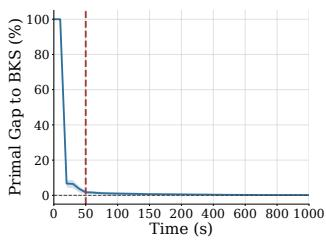  
(a) Gurobi Results

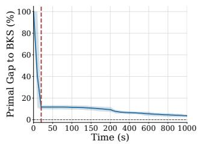  
(b) SCIP Results

Figure 1: Evolution of the primal gap over the solving process with Gurobi (left) and SCIP (right) on set covering instances. The time axis is scaled to highlight the early phase 0−200 s. Results on other problem classes are provided in App. A.  
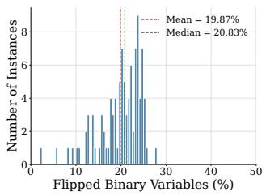  
(a) Gurobi on CA

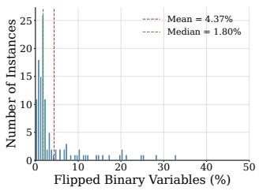

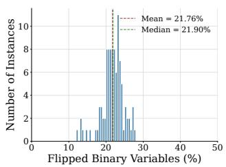

(b) Gurobi on WA  
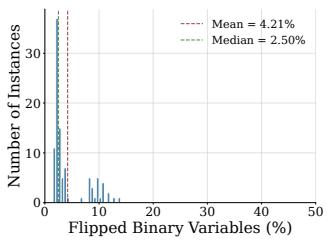  
(c) SCIP on CA  
(d) SCIP on WA  
Figure 2: Distributions of flipped integer variables between early and full-budget solutions. ‘CA’ and ‘WA’ stand for combinatorial auction and workload apportionment, respectively.

## Consistency Prediction

Given the MILP graph G and the collected early solution $X ^ { E S }$ , we design a consistency predictor that estimates, for each integer variable, the probability that its early assignment agrees with the full-budget solution $X ^ { * }$ . The predictor must fuse two heterogeneous sources of information: the structural description of the instance, encoded in the bipartite variable–constraint graph, and the variable assignments in the early solution. We achieve this fusion at the input level, where each integer-variable node is augmented with its early assignment $x _ { i } ^ { E \breve { S } }$ as an additional feature. Through rounds of variable-to-constraint and constraint-to-variable message passing, the network can thus assess each assignment jointly with the constraints it appears in and the assignments of neighboring variables, which provides the evidence needed to judge whether the assignment will persist. The backbone is a bipartite graph neural network with half-convolutions, a standard architecture for MILP representation learning (Han et al. 2023; Liu et al. 2025). A variable-level readout then produces the consistency probability $\hat { p } _ { i }$ for each integer variable. Architectural details are provided in Appendix B.

To train the predictor, we fundamentally reshape the learning target, rather than imitating the complete solutions $X ^ { * }$ Since the early solution already encodes substantial information about the final one, the remaining task is not to predict every variable value from scratch, but to assess which early assignments are likely to persist in the final solution. We therefore define the binary consistency label $y _ { i } = \mathbf { 1 } [ x _ { i } ^ { * } = x _ { i } ^ { E S } ]$ for each integer variable i, and train the predictor $f _ { \theta }$ so that

$$
\hat { p } _ { i } = f _ { \theta } ( G , X ^ { E S } ) _ { i } \approx P ( x _ { i } ^ { * } = x _ { i } ^ { E S } \mid G , X ^ { E S } ) .
$$

For each training instance $G ,$ we collect an early solution $X ^ { E S }$ and pair it with the full-budget solution $X ^ { * }$ . The collection procedure is described later in this section. The predictor is then trained on the early-to-final consistency labels with the binary cross-entropy loss,

$$
\mathcal { L } ( \boldsymbol { \theta } ) = - \sum _ { i \in \mathcal { I } } \left[ y _ { i } \log \hat { p } _ { i } + \left( 1 - y _ { i } \right) \log ( 1 - \hat { p } _ { i } ) \right] .
$$

This consistency target reshapes the learning task: rather than constructing the full solution from the static graph alone, the model refines an informative reference solution by assessing the stability of each assignment, which is a more focused and better-conditioned problem. Moreover, the conditioning solution $X ^ { E S }$ provides a rich source of instance-specific information that purely graph-based predictors cannot access.

Early Solution Collection. We collect early solutions at the transition from fast descent to long exploration. During the solving process, we monitor feasible-solution improvement events and estimate the local dual-gap decay rate over a sliding window, i.e., the gap reduction within the window divided by the elapsed time. The run is terminated once this rate first falls below a threshold, indicating that rapid bound improvement has mostly ended, and the last explored solution is taken as the early solution $X ^ { E S }$ . In practice, we additionally impose a minimum probing time to avoid stopping before a meaningful dual bound, and a maximum time to restrict the runtime cost. Details are included in App. C.

Inference-Time Augmentation. The early solution available for conditioning is not unique. Depending on when the collection run terminates, the solver may return slightly different solutions, and a variable predicted stable under one of them may still be predicted fluctuating under another. To mitigate this sensitivity, we employ the last few improving solutions for inference-time augmentation. Let $\{ X _ { 1 } , \dotsc , \bar { X } _ { K } \}$ denote the last K improving solutions found during the collection run, with $\bar { X _ { K } } = \breve { X } ^ { E S }$ . The trained predictor processes each $X _ { k }$ as the conditioning solution. Since a consistency score is always expressed relative to the value taken in its own conditioning solution, the resulting predictions must be aligned to the common reference $X ^ { E \boxtimes }$ . To this end, we flip the sign of each logit whose corresponding variable takes a diferent value in $\bar { X _ { k } }$ than in $X ^ { E S }$ , as a high consistency score for such a variable argues against the reference value. The aligned logits are then averaged,

$$
\bar { p } _ { i } = \sigma \left( \frac { 1 } { K } \sum _ { k = 1 } ^ { K } \tau _ { k , i } \hat { p } _ { k , i } \right) ,
$$

where $\tau _ { k , i } = + 1 \mathrm { i f } x _ { k , i } = x _ { i } ^ { E S }$ and −1 otherwise. The ensembled probability ${ \bar { p } } _ { i }$ replaces $\hat { p } _ { i }$ as the consistency score of $x _ { i } ^ { E S }$ used by the downstream search methods.

## Combine EnCore with Search Methods

Our consistency predictor is independent of the downstream search strategy. In most learning-based MILP accelerators, the method must select a subset of variables whose predicted values are trusted, and the search space is then reduced accordingly. The central question is therefore which assignments can be trusted. Existing methods trust an assignment when the model is confident in its own prediction, so both the value and its evidence come from the model alone. In contrast, our early-to-final consistency design trusts values that the solver has already realized in a feasible early solution, and scores them by predicting whether they persist after the full solving process. Specifically, we rank variables by their consistency score ${ \bar { p } } _ { i }$ and select the top-ranked ones. Each selected variable i is constrained to its early value $x _ { i } ^ { E S }$ , while the remaining variables are left to the downstream search mechanism. This consistency-based design ofers two main advantages: (1) Feasibility. The fixed values are drawn from a feasible solution, so fixing them never destroys feasibility, which model-generated assignments cannot guarantee. (2) Alignment with the search process. The consistency signals originate from the solver’s own search trajectory, and thus naturally guide the model toward the variables that the solver has yet to resolve.

## 4 Theoretical Analysis

Our method depends on the premise that conditioning on the early solution $\dot { X } ^ { E S }$ makes predicting the full-budget solution $X ^ { \ast }$ fundamentally easier than predicting from the instance graph alone. In this section, we formalize it by answering two questions: (1) Can the early solution improve the best achievable prediction accuracy, and under what condition is the gain strict (Theorem 1)? (2) Does this gain survive when the predictor must be selected from finite training instances (Theorem $2 ) ?$ Complete proofs are in Appendix F.

Let D be the distribution over triples $( \grave { G } , X ^ { E S } , X ^ { * } )$ , and let $J$ be a uniformly weighted variable index within an instance, so that $\mathrm { P r } ( \overleftarrow { x } _ { J } = x _ { J } ^ { * } )$ is the expected per-instance variable accuracy, $\mathrm { i . e . }$ , the population variable-level evaluation criterion used in our analysis. A message-passing predictor at variable J considers only the instance features in its receptive MILP graph ${ \mathcal { R } } _ { J } ,$ while EnCore additionally attaches early assignments $X _ { \mathcal { R } _ { J } } ^ { E S }$ to construct the augmented input $\mathcal { U } _ { J } = ( \mathcal { R } _ { J } , X _ { \mathcal { R } _ { J } } ^ { E S } )$

A solution predictor h maps $\mathcal { R } _ { J }$ to a prediction of $x _ { J } ^ { * }$ matching the conventional paradigm. A consistency predictor a observes $\mathcal { U } _ { J }$ and decides whether to retain the early value, inducing

$$
h _ { a } ( \mathcal { U } _ { J } ) = \left\{ \begin{array} { l l } { x _ { J } ^ { E S } , } & { a ( \mathcal { U } _ { J } ) = 1 , } \\ { 1 - x _ { J } ^ { E S } , } & { a ( \mathcal { U } _ { J } ) = 0 . } \end{array} \right.
$$

Given $x _ { J } ^ { E S }$ , consistency decisions and final assignments determine each other (see Appendix F), so the two paradigms can be compared as predictors of $x _ { J } ^ { * }$

Information gain of the early solution. Define the best population accuracies attainable from each input,

$$
\begin{array} { r } { A _ { \mathrm { s o l } } ^ { * } : = \underset { h } { \operatorname* { s u p } } \operatorname* { P r } \bigl ( h ( \mathscr { R } _ { J } ) = x _ { J } ^ { * } \bigr ) , } \\ { A _ { \mathrm { c o n } } ^ { * } : = \underset { a } { \operatorname* { s u p } } \operatorname* { P r } \bigl ( h _ { a } ( \mathscr { U } _ { J } ) = x _ { J } ^ { * } \bigr ) . } \end{array}
$$

If D were known, these would be achieved by the Bayesoptimal rules on each input (Devroye, Györfi, and Lugosi 1996). Their comparison isolates the informational value of the early solution from any modeling concern.

Theorem 1. For any fixed early-solution collection procedure, $A _ { \mathrm { c o n } } ^ { * } \geq A _ { \mathrm { s o l } } ^ { * } .$ . Let $\eta _ { J } : = \operatorname* { P r } ( x _ { J } ^ { * } = 1 \mid \mathcal { U } _ { J } )$ . The inequality is strict if

$$
\operatorname* { P r } \left( { \operatorname* { P r } _ { a n d \ P r } } ( \eta _ { J } < \frac { 1 } { 2 } \mid \mathcal { R } _ { J } ) > 0 \right) > 0 .
$$

Proofsketch. Every solution predictor h defines $a _ { h } ( \mathcal { U } _ { J } ) =$ ${ \bf 1 } \{ h ( \mathcal { R } _ { J } ) = x _ { J } ^ { E S } \}$ , for which $h _ { a _ { h } } ( { \mathcal { U } } _ { J } ) = h ( { \mathcal { R } } _ { J } )$ . Hence the augmented input can reproduce every solution predictor. For strictness, conditional Jensen’s inequality (Kallenberg 2021) shows that refining the input strictly increases Bayes accuracy under the stated condition. □

The inequality itself is unsurprising since additional input can never hurt a Bayes-optimal predictor. The substantive content is about the strictness condition, which we call posterior crossing: for a non-negligible set of instance inputs, diferent early assignments compatible with the same instance structure favor diferent final values. In this regime, no predictor on instance features alone, however expressive, can resolve the ambiguity, while the early solution can. Figure 2 provides complementary empirical motivation by showing that early-to-final discrepancies are often concentrated on a small fraction of variables.

A sparse-correction reading of the gain. Let $a ^ { * }$ be the Bayes rule on the augmented input, $\breve { p } = \mathrm { P r } ( x _ { J } ^ { E S } \neq x _ { J } ^ { * } )$ represents the early-solution error rate, $\rho = \mathrm { P r } ( a ^ { * } ( \mathcal { U } _ { J } ) = \bar { 0 } )$ denotes its flipping rate, and $q$ is the precision on flipped variables, where $q > 1 / 2$ due to the Bayes optimality. Then we have

$$
\begin{array} { r l } & { \quad 1 - A _ { \mathrm { c o n } } ^ { * } = p - \rho ( 2 q - 1 ) , } \\ & { A _ { \mathrm { c o n } } ^ { * } - A _ { \mathrm { s o l } } ^ { * } = 1 - A _ { \mathrm { s o l } } ^ { * } - p + \rho ( 2 q - 1 ) . } \end{array}
$$

The gain is positive exactly when $p < 1 - A _ { \mathrm { s o l } } ^ { \ast } + \rho ( 2 q - 1 )$ This identity captures the residual nature of EnCore: corrections with $\dot { q } > \bar { 1 } / 2$ remove more errors than they introduce, and when early-to-final discrepancies are sparse, learning can focus on a targeted subset of unstable assignments. The condition can also hold when $1 - p < A _ { \mathrm { s o l } } ^ { \ast }$ (see Appendix F), showing that the early solution is valuable not only as a feasible candidate but also as an informative conditioning signal.

Finite-sample guarantee. Theorem 1 optimizes over all rules and thus characterizes only the information available in principle. However, the predictor is selected from finite data in practice, and one may worry whether the population gain can survive estimation errors. Following the standard finite-class empirical-risk-minimization analysis based on Bernstein’s inequality and a union bound (Boucheron, Lugosi, and Massart 2013), we fix a finite class $\mathcal { A } = \{ a _ { 1 } , \ldots , \bar { a } _ { N } \}$ of consistency rules before observing m independent training instances, and let $\widehat { a }$ minimize the average proportion of variable errors; only instances need be independent, matching how MILP training data are collected. The class advantage decomposes as $\Delta _ { \mathcal { A } } = \Delta _ { \mathrm { B } } - \alpha _ { \mathcal { A } }$ where $\Delta _ { \mathrm { B } } : = A _ { \mathrm { c o n } } ^ { * } - A _ { \mathrm { s o l } } ^ { * }$ is the gain from Theorem 1 and $\begin{array} { r } { \alpha _ { \mathcal { A } } : = A _ { \mathrm { c o n } } ^ { * } - \operatorname* { m a x } _ { a \in \mathcal { A } } \operatorname { A c c } ( h _ { a } ) } \end{array}$ is the approximation gap, with $\operatorname { A c c } ( \tilde { h } ) = \operatorname* { P r } ( h _ { J } = x _ { J } ^ { * } )$ . Motivated by the sparse discrepancies in Figure 2, we assume the expected per-instance flip rate satisfies ma $\mathfrak { c } _ { a \in \mathcal { A } } \mathbb { E } [ s _ { a } ] \le \bar { s } .$

Theorem 2. Let $\widehat { h } _ { E S } \ : = \ : h _ { \widehat { a } }$ , and let $\widehat { h } _ { \mathrm { s o l } }$ be any possibly data-dependent solution predictor. For every $\delta \in ( 0 , 1 )$ , with probability at least $1 - \bar { \delta } ,$

$$
\begin{array} { r l r } & { } & { \mathrm { A c c } ( \widehat { h } _ { E S } ) - \mathrm { A c c } ( \widehat { h } _ { \mathrm { s o l } } ) \geq \Delta _ { \mathrm { B } } - \alpha _ { \mathcal { A } } - \varepsilon _ { m } ( \delta ) , } \\ & { } & { \varepsilon _ { m } ( \delta ) = 2 \sqrt { \displaystyle \frac { 2 \bar { s } } { m } \ln \frac { 2 N } { \delta } } + \frac { 8 } { 3 m } \ln \frac { 2 N } { \delta } . } \end{array}
$$

Proofsketch. Use the rule that always keeps the early solution as a common reference. A candidate difers from it only on variables it flips, so its instance-level loss diference has variance at most s¯. Bernstein’s inequality with a union bound over the N rules (Boucheron, Lugosi, and Massart 2013) then controls all empirical loss diferences simultaneously. Empirical risk minimization converts this into the penalty $\varepsilon _ { m } ( \delta )$ , while Bayes optimality lower-bounds the risk of every instance-input solution predictor. □

Thus the learned consistency predictor provably outperforms any solution predictor, even one trained with unlimited data, whenever $\bar { \Delta _ { \mathrm { B } } } > \alpha _ { \mathcal { A } } + \varepsilon _ { m } ( \delta )$ . The dominant term of $\varepsilon _ { m } ( \delta )$ scales as $\sqrt { \bar { s } / m }$ rather than ${ \sqrt { 1 / m } } ;$ sparse correction rules are cheaper to select reliably. A numerical illustration in Appendix F shows that under representative parameters, fewer than 200 training instances sufice, which is similar to the typical sizes of training datasets.

In summary, Theorem 1 establishes that the early solution provides a strict population-level information gain under a stated posterior-crossing condition, and the sparse-correction identity explains where the gain comes from: repairing a small, better-than-chance set of unstable assignments. Theorem 2 shows that this gain persists under finite-sample model selection, with a sample cost discounted by the very sparsity that motivates our design. Together, they justify shifting the learning target from full solution prediction to early-to-final consistency estimation.

<table><tr><td></td><td colspan="2">CA ↑ (BKS 98627.99)</td><td colspan="2">SC↓ (BKS 123.37)</td><td colspan="2">WA ↓ (BKS 706.86)</td><td colspan="2">IP↓ (BKS 11.72)</td></tr><tr><td>Method</td><td>Obj</td><td>Gap</td><td>Obj</td><td>Gap</td><td>Obj</td><td>Gap</td><td>Obj</td><td>Gap</td></tr><tr><td>Gurobi (3600s)</td><td>98448.84</td><td>179.15</td><td>123.37</td><td>0.00</td><td>706.86</td><td>0.00</td><td>11.72</td><td>0.00</td></tr><tr><td>Gurobi (1000s)</td><td>97311.69</td><td>1316.30</td><td>123.64</td><td>0.27</td><td>707.36</td><td>0.50</td><td>13.77</td><td>2.05</td></tr><tr><td>ND</td><td>94340.63</td><td>4287.36</td><td>123.62</td><td>0.25</td><td>707.10</td><td>0.24</td><td>14.15</td><td>2.43</td></tr><tr><td>PS</td><td>97906.20</td><td>721.79</td><td>123.60</td><td>0.23</td><td>707.09</td><td>0.23</td><td>12.08</td><td>0.36</td></tr><tr><td>Apollo</td><td>98083.79</td><td>544.20</td><td>123.56</td><td>0.19</td><td>707.06</td><td>0.20</td><td>11.97</td><td>0.25</td></tr><tr><td>EnCore-ND</td><td>97847.92</td><td>780.70</td><td>123.58</td><td>0.21</td><td>707.03</td><td>0.17</td><td>13.47</td><td>1.75</td></tr><tr><td>EnCore-PS</td><td>98627.99</td><td>0.00</td><td>123.50</td><td>0.13</td><td>706.98</td><td>0.12</td><td>11.95</td><td>0.23</td></tr><tr><td>EnCore-Apollo</td><td>98491.40</td><td>136.59</td><td>123.57</td><td>0.20</td><td>707.03</td><td>0.17</td><td>11.82</td><td>0.10</td></tr><tr><td>Best Gap Reduction</td><td>721.79</td><td>100.0%</td><td>0.10</td><td>43.5%</td><td>0.11</td><td>47.8%</td><td>0.15</td><td>60.0%</td></tr></table>

Table 1: Main results with Gurobi. Obj is the final feasible objective and Gap is the absolute gap to the in-study BKS. Arrows indicate the preferred objective direction; bold marks the best learning-based result or a positive gap reduction.  
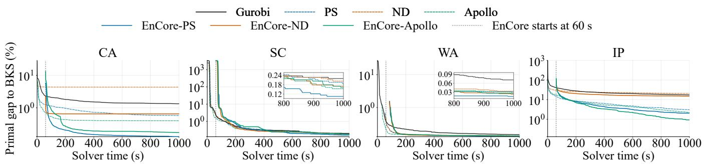  
Figure 3: Average primal gap to the BKS versus time under a 1,000-second time limit. EnCore starts after the early solution collection. Each curve is shown only after all test instances have obtained a feasible solution

## 5 Experiments

## Experimental Setup

Benchmarks. Following Liu et al. (2025), we evaluate En-Core on Combinatorial Auctions (CA) (Leyton-Brown, Pearson, and Shoham 2000), Set Covering (SC) (Balas and Ho 1980), Workload Apportionment (WA), and Item Placement (IP) (Gasse et al. 2022). These benchmarks cover MILPs with diverse scales and structures. For zero-shot transfer, we additionally evaluate on the eleven-instance MIPLIB IIS benchmark considered by Liu et al. (2025), following the IIS setting introduced by Wang et al. (2024). The benchmark is a structurally related subset of MIPLIB centered on binary setcovering formulations, while exhibiting substantial variation in problem size, constraint structure, and sparsity. Dataset sources and instance statistics are reported in App. D.

Baselines and variants. We compare against the native MILP solver and three prediction-guided search pipelines: Neural Diving (ND) (Nair et al. 2020), Predict-and-Search (PS) (Han et al. 2023), and Apollo-MILP (Apollo) (Liu et al. 2025). For each learning-based pipeline, we replace its original solution predictor with our consistency predictor while keeping other configurations; the resulting methods are denoted as EnCore-ND, EnCore-PS, and EnCore-Apollo. This design isolates the contribution of the proposed consistency prediction mechanism from downstream solver policies.

Evaluation protocol. All methods use a 1,000-second endto-end budget that includes early-solution collection, inference, and downstream solving. For a fair comparison, En-Core does not use the collected early solutions to warm-start the final search. For EnCore-Apollo, early solutions are collected once and reused across correction rounds. We report the final feasible objective, its absolute gap to the best-known solution (BKS), and the gap reduction relative to the corresponding solution predictor baseline. The BKS is the best mean final objective among all evaluated methods, including the 3,600-second Gurobi reference.

## Main Results

Table 1 reports the final objectives under Gurobi. Substituting EnCore for the original solution predictor reduces the final gap in 11 of the 12 settings (4 benchmarks × 3 search mechanisms), by 38.7%, 56.9%, and 36.2% on average for ND, PS, and Apollo, respectively. The sole exception is Apollo on SC, where the gap grows marginally from 0.19 to 0.20. On CA, EnCore-PS finds the best solution among all compared methods, improving on the 3,600-second Gurobi incumbent by 179.15 within a 1,000-second budget, and EnCore-Apollo also exceeds this reference (+42.56). On SC, WA, and IP, where the baselines have already been close to the BKS, EnCore still removes 43.5%, 47.8%, and 60.0% of the best baseline gap. Remarkably, EnCore remains efective even under weak easy-to-final consistency. On CA, where 19% of the variables flip between the early and final solutions, the consistency predictor still captures the learnable patterns underlying these flips, allowing EnCore to achieve a 100% average gap reduction.

Figure 3 traces the primal gap over time. Although the best EnCore variant on each benchmark begins predictionguided search only after the 60-second collection stage, it catches up with its corresponding baseline at 71, 241, 164, and 93 seconds of end-to-end runtime on CA, SC, WA, and IP, respectively, and remains ahead thereafter. EnCore-PS overtakes all competitors early on CA and attains the lowest gap on SC and WA, with the late-stage separation shown in the insets. On IP, EnCore-Apollo exhibits the strongest latestage anytime performance and widens its lead over time.

Zero-shot cross-solver transfer to SCIP. We directly apply the Gurobi-trained checkpoint to SCIP-generated trajectories without retraining or model selection. As shown in Table 2, EnCore-ND consistently improves all four benchmarks, reducing the absolute gap by 53.6%, 22.0%, 33.1%, and 50.7% on CA, SC, WA, and IP, respectively. Moreover, EnCore-PS also improves performance on CA, WA, and IP. These results show that the learned consistency representation remains informative under a solver shift.

<table><tr><td>Method</td><td>CA↑</td><td>SC↓</td><td>WA↓</td><td>IP↓</td></tr><tr><td>SCIP(1000s)</td><td>94701.91</td><td>127.99</td><td>709.06</td><td>23.49</td></tr><tr><td>ND</td><td>94342.12</td><td>125.14</td><td>707.33</td><td>18.19</td></tr><tr><td>PS</td><td>97097.46</td><td>125.03</td><td>708.49</td><td>17.02</td></tr><tr><td>Apollo</td><td>97335.92</td><td>124.97</td><td>708.43</td><td>16.21</td></tr><tr><td>EnCore-ND</td><td>96641.43</td><td>124.75</td><td>707.24</td><td>14.91</td></tr><tr><td>EnCore-PS</td><td>97707.64</td><td>125.04</td><td>708.22</td><td>16.13</td></tr><tr><td>EnCore-Apollo</td><td>97293.51</td><td>125.38</td><td>707.91</td><td>17.39</td></tr><tr><td>Best Gap Reduction</td><td>53.6%</td><td>22.0%</td><td>33.1%</td><td>50.7%</td></tr></table>

Table 2: Zero-shot transfer from Gurobi to SCIP under a 1,000-second total budget. Bold marks the best result. The BKS is presented in Table 1.

Zero-shot cross-family transfer to MIPLIB IIS. We train our EnCore models on the mixed SC, CA, WA, and IP instances, and evaluate them on the eleven unseen MIPLIB instances used by Liu et al. (2025) under the same 1,000- second budget. The clearest advantage of EnCore is about feasibility. With ND, the original predictor finds feasible solutions on only 3 of 11 instances, while EnCore-ND succeeds on all 11. With PS and Apollo, where the baselines already achieve full feasibility, EnCore still yields consistent improvements in mean objectives. These results demonstrate that our proposed EnCore exhibits greater reliability and robustness than existing methods when faced with substantial distribution shifts. Details are provided in Appendix D.

## Ablation Study

Table 3 presents a cumulative ablation of the Predict-and-Search pipeline. Adding early solutions as input features alone improves most benchmarks. However, the consistency target contributes substantially larger gains than the extra features themselves, indicating that reformulating the prediction objective is empirically efective. Finally, introducing earlysolution ensembling further improves CA, SC, and WA, delivering a smaller but complementary robustness benefit.

<table><tr><td>Variant</td><td>CA↑</td><td>SC↓</td><td>WA↓</td><td>IP↓</td></tr><tr><td>Predict-and-Search</td><td>97906.20123.60</td><td></td><td>707.0912.08</td><td></td></tr><tr><td>+ early solution as feature</td><td>98318.22123.55707.0412.17</td><td></td><td></td><td></td></tr><tr><td>+ consistency prediction target 98616.65 123.53 706.99 11.90</td><td></td><td></td><td></td><td></td></tr><tr><td>+ early-solution ensemble</td><td></td><td></td><td>98627.99123.50706.9811.95</td><td></td></tr></table>

Table 3: Ablation study of key components under the Predictand-Search pipeline. Average objective values are reported.

Trade-ofAnalysis ofEarly-Solution Collection Figure 4 varies the collection budget $T _ { \mathrm { m a x } }$ under the fixed 1,000- second total budget. Across all benchmarks, performance peaks at a small $T _ { \mathrm { m a x } } { \mathrm { . } }$ a short collection stage sufices to obtain informative early solutions, whereas larger $T _ { \mathrm { m a x } }$ leads to diminishing improvements in early-solution quality while consuming more time budget for downstream search.

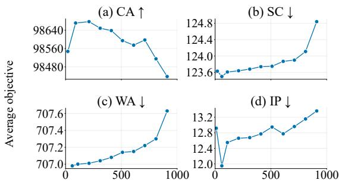  
Early Solution collection-time cap $T _ { \mathrm { m a x } }$ (s)  
Figure 4: Average final objective of EnCore-PS under diferent maximum early-solution collection times.

## 6 Conclusion

In this paper, we presented EnCore, a solver-informed paradigm that accelerates MILP solving via early-to-final solution consistency prediction. Instead of constructing complete solutions from the static MILP formulation alone, En-Core conditions on feasible solutions collected during the early search stage and identifies the assignments likely to persist under a full solving budget. The resulting consistency scores integrate seamlessly with diverse prediction-guided search frameworks, and ensembling multiple early solutions further enhances robustness. Theoretically, we showed that conditioning on early solutions yields a strict gain in achievable prediction accuracy, and that this gain survives finite-sample model selection at a cost discounted by correction sparsity. Empirically, EnCore consistently improves prediction-guided solving across four benchmarks and generalizes zero-shot to unseen solvers and problem families. Future work will explore jointly learning consistency prediction and downstream search policies.

## References

Achterberg, T. 2009. SCIP: Solving Constraint Integer Programs. Mathematical Programming Computation, 1(1): 1– 41.

Balas, E.; and Ho, A. 1980. Set Covering Algorithms Using Cutting Planes, Heuristics, and Subgradient Optimization: A Computational Study, volume 12, 37–60. Springer Berlin Heidelberg.

Bengio, Y.; Lodi, A.; and Prouvost, A. 2021. Machine Learning for Combinatorial Optimization: A Methodological Tour d’Horizon. European Journal of Operational Research, 290(2): 405–421.

Boucheron, S.; Lugosi, G.; and Massart, P. 2013. Concentration Inequalities: A Nonasymptotic Theory of Independence. Oxford: Oxford University Press.

Crainic, T. G. 2000. Service network design in freight transportation. European Journal of Operational Research, 122(2): 272–288.

Devroye, L.; Györfi, L.; and Lugosi, G. 1996. A Probabilistic Theory of Pattern Recognition, volume 31 of Stochastic Modelling and Applied Probability. New York: Springer.

Ferber, A.; Wilder, B.; Dilkina, B.; and Tambe, M. 2020. MIPaaL: Mixed Integer Program as a Layer. In Proceedings ofthe AAAI Conference on Artificial Intelligence, volume 34, 1504–1511. New York, NY, USA.

Floudas, C. A.; and Lin, X. 2005. Mixed Integer Linear Programming in Process Scheduling: Modeling, Algorithms, and Applications. Annals of Operations Research, 139(1): 131–162.

Gasse, M.; Bowly, S.; Cappart, Q.; Charfreitag, J.; Charlin, L.; Chételat, D.; Chmiela, A.; Dumouchelle, J.; Gleixner, A. M.; Kazachkov, A. M.; Khalil, E. B.; Lichocki, P.; Lodi, A.; Lubin, M.; Maddison, C. J.; Morris, C.; Papageorgiou, D. J.; Parjadis, A.; Pokutta, S.; Prouvost, A.; Scavuzzo, L.; Zarpellon, G.; et al. 2022. The Machine Learning for Combinatorial Optimization Competition (ML4CO): Results and Insights. In Proceedings ofthe NeurIPS 2021 Competitions and Demonstrations Track, volume 176 of Proceedings of Machine Learning Research, 220–231.

Gasse, M.; Chételat, D.; Ferroni, N.; Charlin, L.; and Lodi, A. 2019. Exact Combinatorial Optimization with Graph Convolutional Neural Networks. In Advances in Neural Information Processing Systems 32, volume 32. Vancouver, BC, Canada.

Gleixner, A.; Hendel, G.; Gamrath, G.; Achterberg, T.; Bastubbe, M.; Berthold, T.; Christophel, P. M.; Jarck, K.; Koch, T.; Linderoth, J.; Lübbecke, M.; Mittelmann, H. D.; Ozyurt, D.; Ralphs, T. K.; Salvagnin, D.; and Shinano, Y. 2021. MIPLIB 2017: Data-Driven Compilation of the 6th Mixed-Integer Programming Library. Mathematical Programming Computation, 13(3): 443–490.

Gupta, P.; Gasse, M.; Khalil, E. B.; Mudigonda, P.; Lodi, A.; and Bengio, Y. 2020. Hybrid Models for Learning to Branch. In Advances in Neural Information Processing Systems 33, volume 33, 18087–18097. Virtual.

Gurobi Optimization, LLC. 2026. Gurobi Optimizer Reference Manual.

Han, Q.; Yang, L.; Chen, Q.; Zhou, X.; Zhang, D.; Wang, A.; Sun, R.; and Luo, X. 2023. A GNN-Guided Predict-and-Search Framework for Mixed-Integer Linear Programming. In The 11th International Conference on Learning Representations. Kigali, Rwanda.

Hutter, F.; Hoos, H. H.; Leyton-Brown, K.; and Stützle, T. 2009. ParamILS: An Automatic Algorithm Configuration Framework. Journal ofArtificial Intelligence Research, 36: 267–306.

Kallenberg, O. 2021. Foundations of Modern Probability. Cham: Springer, 3 edition.

Karp, R. M. 1972. Reducibility among combinatorial problems. In Proceedings ofthe Symposium on the Complexity of Computer Computations, 85–103. Yorktown Heights, New York, USA.

Khalil, E. B.; Le Bodic, P.; Song, L.; Nemhauser, G.; and Dilkina, B. 2016. Learning to Branch in Mixed Integer Programming. In Proceedings ofthe Thirtieth AAAI Conference on Artificial Intelligence, volume 30, 724–731. Phoenix, AZ, USA.

Land, A. H.; and Doig, A. G. 1960. An Automatic Method of Solving Discrete Programming Problems. Econometrica, 28(3): 497–520.

Laporte, G. 1992. The vehicle routing problem: An overview of exact and approximate algorithms. European Journal of Operational Research, 59(3): 345–358.

Leyton-Brown, K.; Pearson, M.; and Shoham, Y. 2000. Towards a Universal Test Suite for Combinatorial Auction Algorithms. In Proceedings of the 2nd ACM Conference on Electronic Commerce, 66–76. Minneapolis, MN, USA.

Li, H.; Yuan, H.; Zhang, H.; Lin, J.; Ge, D.; Wang, M.; and Ye, Y. 2026. FMIP: Joint Continuous-Integer Flow for Mixed-Integer Linear Programming. In The 14th International Conference on Learning Representations. Rio de Janeiro, Brazil.

Li, S.; Ouyang, W.; Paulus, M. B.; and Wu, C. 2023. Learning to Configure Separators in Branch-and-Cut. In Advances in Neural Information Processing Systems, volume 36, 60021– 60034. New Orleans, LA, USA.

Ling, H.; Wang, Z.; and Wang, J. 2024. Learning to Stop Cut Generation for Eficient Mixed-Integer Linear Programming. In Proceedings of the AAAI Conference on Artificial Intelligence, volume 38, 20759–20767. Vancouver, BC, Canada.

Liu, H.; Wang, J.; Geng, Z.; Li, X.; Zong, Y.; Zhu, F.; Hao, J.; and Wu, F. 2025. Apollo-MILP: An Alternating Prediction-Correction Neural Solving Framework for Mixed-Integer Linear Programming. In The 13th International Conference on Learning Representations. Singapore.

Nair, V.; Bartunov, S.; Gimeno, F.; von Glehn, I.; Lichocki, P.; Lobov, I.; O’Donoghue, B.; Sonnerat, N.; Tjandraatmadja, C.; Wang, P.; Addanki, R.; Hapuarachchi, T.; Keck, T.; Keeling, J.; Kohli, P.; Ktena, I.; Li, Y.; Vinyals, O.; and Zwols, Y. 2020. Solving Mixed Integer Programs Using Neural Networks. arXiv:2012.13349.

Nam, S.; and Logendran, R. 1992. Aggregate production planning — A survey of models and methodologies. European Journal ofOperational Research, 61(3): 255–272.

Padberg, M.; and Rinaldi, G. 1991. A Branch-and-Cut Algorithm for the Resolution of Large-Scale Symmetric Traveling Salesman Problems. SIAM Review, 33(1): 60–100.

Pu, T.; Li, J.; Gao, Y.; Liu, S.; Geng, Z.; Liu, H.; Chen, C.; and Fan, C. 2026. CoCo-MILP: Inter-Variable Contrastive and Intra-Constraint Competitive MILP Solution Prediction. In Proceedings of the AAAI Conference on Artificial Intelligence, 24882–24890. Singapore.

Salvagnin, D. 2016. Detecting Semantic Groups in MIP Models. In Integration ofAIand OR Techniques in Constraint Programming, 329–341.

Strang, P.; Alès, Z.; Bissuel, C.; Juan, O.; Kedad-Sidhoum, S.; and Rachelson, E. 2026. Planning in Branch-and-Bound: Model-Based Reinforcement Learning for Exact Combinatorial Optimization. In Proceedings ofthe AAAI Conference on Artificial Intelligence, volume 40, 25627–25635.

Tang, Y.; Agrawal, S.; and Faenza, Y. 2020. Reinforcement Learning for Integer Programming: Learning to Cut. In Proceedings of the 37th International Conference on Machine Learning, volume 119, 9367–9376. Vienna, Austria.

Wang, H. P.; Liu, J.; Chen, X.; Wang, X.; Li, P.; and Yin, W. 2024. DIG-MILP: A Deep Instance Generator for Mixed-Integer Linear Programming with Feasibility Guarantee. Transactions on Machine Learning Research.

Wang, R.; Li, X.; and Wang, M. 2026. MILPnet: A Multi-Scale Architecture with Geometric Feature Sequence Representations for Advancing MILP Problems. In The 14th International Conference on Learning Representations.

## A Solver Behavior

Figures 5 and 7 show the primal gap versus solving time for Gurobi and SCIP on the four benchmarks. Figures 6 and 8 show the distributions of integer variables flipped between the early and full-budget solutions. Figure 9 reports the same analyses on MIPLIB.

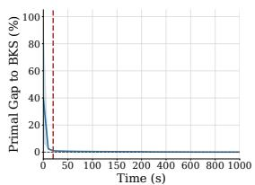  
(a) CA

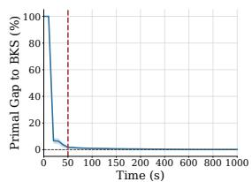  
(b) SC

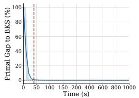  
(c) WA

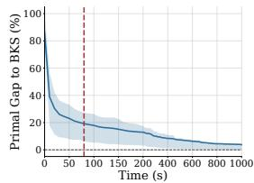  
(d) IP

Figure 5: Primal gap versus solving time for Gurobi.  
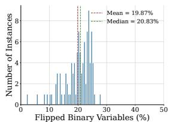  
(a) CA

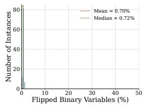  
(b) SC

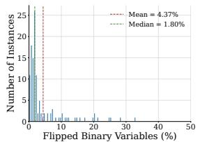  
(c) WA

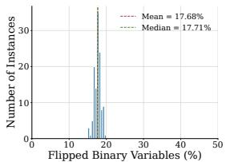  
(d) IP

Figure 6: Early-to-final flip distributions for Gurobi; red and green dashed lines denote the mean and median.  
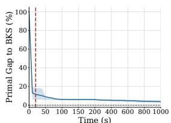  
(a) CA

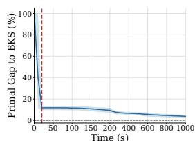

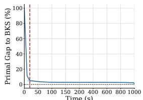  
(c) WA

(b) SC  
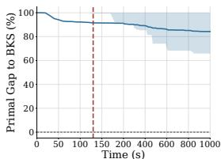  
(d) IP  
Figure 7: Primal gap versus solving time for SCIP.

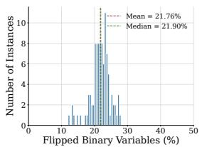  
(a) CA

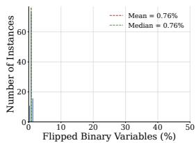

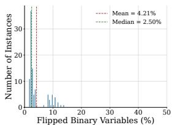  
(c) WA

(b) SC  
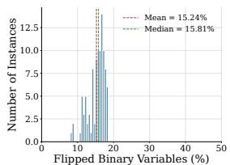  
(d) IP

Figure 8: Early-to-final flip distributions for ${ \mathrm { S C I P } } ;$ red and green dashed lines denote the mean and median.  
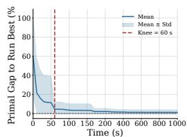  
(a) Primal gap over time.

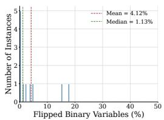  
(b) Aggregate flip distribution.

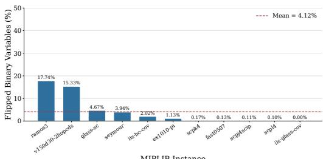  
(c) Per-instance flip percentages.  
Figure 9: Solver behavior on the MIPLIB IIS dataset with Gurobi.

## B Model Structure

Graph Representation. We follow the MILP representation of Han et al. (2023), adding only one dimension to each variable node to encode its early-solution value. Detailed feature definitions are provided in Table 4.

Network architecture. We strictly follow the network architecture proposed by Han et al. (2023), modifying only the variable encoder to accommodate the additional earlysolution feature. Each variable node is represented by 19 input features, consisting of the original 18 features and the early-solution value introduced by our method. Constraint nodes and edges have 4 and 1 input features, respectively. All node representations are embedded into a 64-dimensional latent space.

For an input feature vector of dimension d, the node encoder is defined as

$$
\mathrm { E n c } _ { d } ( x ) = \mathrm { R e L U } ( W _ { 2 } \mathrm { R e L U } ( W _ { 1 } \mathrm { L N } ( x ) ) ) ,
$$

where $W _ { 1 } \colon \mathbb { R } ^ { d } \to \mathbb { R } ^ { 6 4 } { \mathrm { ~ a n d ~ } } W _ { 2 } \colon \mathbb { R } ^ { 6 4 } \to \mathbb { R } ^ { 6 4 }$ . Accordingly, the variable and constraint encoders use $\operatorname { E n c } _ { 1 9 }$ and Enc4,

<table><tr><td>Index Feature</td><td></td><td>Description</td></tr><tr><td colspan="3">Variable-node features</td></tr><tr><td>0</td><td>Objective</td><td>Normalized objective coefficient.</td></tr><tr><td>1</td><td>Variable coefficient</td><td>Average variable coefficient across all constraints.</td></tr><tr><td>2</td><td>Variable degree</td><td>Degree of the variable node in the bipartite graph.</td></tr><tr><td>3</td><td>Maximum coefficient</td><td>Maximum variable coefficient across all constraints.</td></tr><tr><td>4</td><td>Minimum coefficient</td><td>Minimum variable coefficient across all constraints.</td></tr><tr><td>5</td><td>Variable type</td><td>Indicator of whether the variable is integer.</td></tr><tr><td>6-17</td><td>Position embedding Early-solution</td><td>Binary encoding of the variable&#x27;s order among all variables. Value of the variable in the early</td></tr><tr><td>18</td><td>value</td><td>solution collected as described in Appendix C.</td></tr><tr><td colspan="3">Constraint-node features</td></tr><tr><td>0</td><td>Constraint coefficient</td><td>Average of the nonzero coefficients in the constraint.</td></tr><tr><td>1</td><td>Constraint degree</td><td>Degree of the constraint node in the bipartite graph.</td></tr><tr><td>2</td><td>Bias</td><td>Normalized right-hand side of the</td></tr><tr><td>3</td><td>Sense</td><td>constraint. Sense of the constraint.</td></tr><tr><td colspan="3">Edge features</td></tr><tr><td>0</td><td>Coefficient</td><td>Coefficient connecting the constraint and variable nodes.</td></tr></table>

Table 4: Graph features for input.

respectively, while the scalar edge feature is normalized by LayerNorm(1).

The model performs two rounds of bidirectional message passing between variable and constraint nodes:

$$
V  C  V  C  V .
$$

For a directed edge j → $j  i ,$ the message is computed as

$$
m _ { i j } = W _ { M } \mathrm { \ R e L U } [ \mathrm { L N } ( W _ { L } h _ { i } + W _ { E } e _ { i j } + W _ { R } h _ { j } ) ] \mathrm { ~ } ,
$$

where $h _ { i }$ and $h _ { j }$ denote the target and source node representations, and $e _ { i j }$ is the encoded edge feature. Incoming messages are summed and normalized:

$$
\bar { m } _ { i } = \mathrm { L N } \left( \sum _ { j \in \mathcal { N } ( i ) } m _ { i j } \right) .
$$

The target node representation is then updated by

$$
h _ { i } ^ { \prime } = W _ { U , 2 } { \mathrm { ~ R e L U } } ( W _ { U , 1 } [ h _ { i } \parallel { \bar { m } } _ { i } ] ) ,
$$

where ∥ denotes concatenation, $W _ { U , 1 } \colon \mathbb { R } ^ { 1 2 8 } \to \mathbb { R } ^ { 6 4 }$ , and $W _ { U , 2 } \colon \ddot { \mathbb { R } } ^ { 6 4 } \to \mathbb { R } ^ { 6 4 }$

Finally, each variable representation is mapped to a scalar logit:

$$
\ell _ { v } = w _ { \mathrm { o u t } } ^ { \top } \mathrm { R e L U } ( W _ { \mathrm { o u t } } h _ { v } ) ,
$$

where the final output layer has no bias. The predicted probability $\sigma ( \ell _ { v } )$ indicates whether the early-solution value of variable v is consistent with its value in the full-budget reference solution.

## C Early Solution Collection Details

We first quantify the progress of the dual bound using the average dual-gap decay rate, and then describe the earlysolution collection procedure in Algorithm 1. Specifically, for the k-th monitoring interval, the decay rate is defined as

$$
r _ { k } = \frac { | D _ { k _ { a } } - D _ { k _ { b } } | } { t _ { k _ { b } } - t _ { k _ { a } } } ,\tag{2}
$$

where $k _ { a }$ and $k _ { b }$ denote the observations at the beginning and end of the interval, respectively; $D _ { k _ { a } }$ and $D _ { k _ { b } }$ are the corresponding dual gaps; and $t _ { k _ { a } }$ and $t _ { k _ { b } }$ are their wall-clock times. Thus, $r _ { k }$ measures the average absolute reduction in the dual gap per unit time during the k-th monitoring interval.

Algorithm 1: Early Solution Collection   
Require: MILP instance $G ,$ minimum probing time $T _ { \mathrm { m i n } } ,$   
maximum probing time $T _ { \mathrm { m a x } } .$ , window size $w ,$ decay   
threshold ϵ   
Ensure: Early solution $X ^ { E S }$ and probing time $t _ { \mathrm { p r o b e } }$   
1: Initialize an empty callback record list $\mathcal { R } .$   
2: Start a probing solver run on $G .$   
3: while the solver is running do   
4: if a MIPSOL callback occurs at time $t _ { k }$ then   
5: Record the explored solution $X _ { k }$ and relative dual   
gap $D _ { k }$   
6: Append $\left( t _ { k } , X _ { k } , D _ { k } \right)$ to $\mathcal { R } .$   
7: if $| \bar { \mathcal { R } } | \geq$ w then   
8: Let $k _ { a }$ and $k _ { b }$ be the first and last records in the   
latest w-record window.   
9: Compute $r _ { k }$ by Eq. (2).   
10: if $t _ { k } \ge T _ { \operatorname* { m i n } }$ and $r _ { k } < .$ ϵ then   
11: Stop the probing run.   
12: end $\bar { \mathbf { t } }$   
13: end if   
14: end if   
15: if the elapsed probing time reaches $T _ { \mathrm { m a x } }$ then   
16: Stop the probing run.   
17: end if   
18: end while   
19: Set $X ^ { E S }$ to the last explored solution during probing.   
20: Set $t _ { \mathrm { p r o b e } }$ to the elapsed probing time.   
21: return $X ^ { E S }$ and $t _ { \mathrm { p r o b e } } .$

## D Experimental Details

## Benchmark Details

We evaluate on the four benchmark families used by Apollo-MILP (Liu et al. 2025). Combinatorial Auctions (CA) instances follow the CATS generator (Leyton-Brown, Pearson, and Shoham 2000), Set Covering (SC) follows the classical construction of Balas and Ho (1980), and Workload Apportionment (WA) and Item Placement (IP) come from ML4CO (Gasse et al. 2022). CA is a maximization problem, whereas SC, WA, and IP are minimization problems. Table 5 reports average instance sizes. We use 240 training, 60 validation, and 100 testing instances, following the settings in Han et al.

<table><tr><td></td><td>CA SC</td><td>IP</td><td>WA</td></tr><tr><td>Constraint Number</td><td>2590.33 3000</td><td>195</td><td>64306</td></tr><tr><td>Variable Number</td><td>1500 5000 1083 61000</td><td></td><td></td></tr><tr><td>Binary Variables Number</td><td>1500 5000</td><td>01050</td><td>1000</td></tr><tr><td>Continuous Variables Number</td><td>0 0</td><td></td><td>33 60000</td></tr><tr><td>Integer Variables Number</td><td>0</td><td>0 0</td><td>0</td></tr></table>

Table 5: Statistical information of the benchmark instances.

(2023) and Liu et al. (2025). We train all models with 500 epochs and a learning rate of 0.001.

## Protocols for Combining EnCore with Downstream Search Methods

This section details how EnCore is integrated with the three downstream methods evaluated in Section 5. Following the evaluation protocol proposed by Han et al. (2023) and Liu et al. (2025), every run is given a total wall-clock budget of 1000s, and all overhead introduced by EnCore—including the time spent collecting the early solution—is counted against this budget. Let $t _ { E S }$ denote the time used to obtain the early solution $x ^ { E S }$ on a given instance.

Predict-and-Search and Neural Diving. Both methods consume the predictor output once, before the final solve, so the integration requires no change to their search procedures. Given an instance, we run the solver on the original MILP for $t _ { E S }$ seconds and record the early solution $\mathbf { \bar { \Phi } } _ { x } ^ { E S }$ together with the associated solving-process features. The consistency predictor then assigns each binary variable a score ${ \bar { p } } _ { i }$ , the estimated probability that $x _ { i } ^ { E S }$ agrees with the reference solution. Since both methods specify their fixing budgets separately for the two binary values, selection is value-conditioned: we rank the variables with $x _ { i } ^ { E S } = 0$ by ${ \bar { p } } _ { i }$ and retain the top $k _ { 0 } ,$ and independently retain the top $k _ { 1 }$ among those with $x _ { i } ^ { \bar { E } S } = 1$ . On CA under Predict-and-Search, for example, the setting $( k _ { 0 } , k _ { 1 } , \Delta ) = ( 6 0 0 , 0 , 2 0 )$ selects the 600 zero-valued variables with the highest consistency scores and no one-valued ones, and the resulting partial assignment $\{ x _ { i } = 0 \}$ defines the center of a search neighborhood of radius $\Delta = 2 0$ . Neural Diving consumes the selection in the same way except that the assignments are imposed as hard fixings and the reduced MILP is solved. In both cases the solver is restarted from scratch with a budget of $1 0 0 0 - t _ { E S }$ seconds, so that the end-to-end wall-clock time matches that of the baselines.

Apollo-MILP. Apollo-MILP performs four prediction– correction rounds with per-round budgets of 100s, 100s, 200s, and 600s. Extending the protocol above directly would require collecting a fresh early solution at the start of every round, which is too costly: the collection phase alone would consume a non-negligible fraction of the 100s rounds. We instead adopt the following assumption. Since Apollo-MILP realizes its fixing step by imposing bound constraints on the selected variables rather than by restructuring the problem, we assume that the early search behavior of the bounded problem stays close to that of the original instance, so that the early values realized on the original instance remain informative anchors throughout the iterative process. Under this assumption, we collect the early solution only once, on the original instance and in exactly the same way as above, and reuse xES and its consistency scores in the prediction step of every round. Each round applies the same value-conditioned selection, restricted to the variables not yet fixed in earlier rounds. To keep the total budget unchanged, the collection cost $t _ { E S }$ is charged to the final round, whose budget becomes $6 0 0 - t _ { E S }$ seconds, while the first three rounds are left untouched; the overall wall-clock time thus remains 1000s.

## Evaluation Protocol

Hardware. All experiments are conducted on a Linux server (Ubuntu 20.04.6 LTS) equipped with an Intel Xeon Platinum 8124M CPU (72 logical cores, 3.50GHz), 256GB of RAM, and an NVIDIA GeForce RTX 3090 GPU (24GB). Neural network training and inference run on the GPU, while all solver calls run on the CPU. The solver configuration (e.g., thread count) is kept identical across all methods on each benchmark.

Metrics. We report the final feasible objective and its absolute primal gap

$$
\mathrm { g a p } _ { \mathrm { a b s } } = | z - z _ { \mathrm { B K S } } | ,\tag{3}
$$

where z is the mean final objective of a method and z is the best-known solution (BKS) on the corresponding benchmark. The BKS is defined as the best mean final objective observed among all evaluated methods, including a 3,600- second Gurobi run: Gurobi provides this reference on SC, WA, and IP, while EnCore-PS provides it on CA. The BKS is thus an in-study best-observed reference rather than an independently certified optimum. To quantify the benefit of our method over a downstream baseline, we additionally report the relative gap reduction

$$
\mathrm { I m p r o v e m e n t } = \frac { \mathrm { g a p } _ { \mathrm { b a s e } } - \mathrm { g a p } _ { \mathrm { o u r s } } } { \mathrm { g a p } _ { \mathrm { b a s e } } } \times 1 0 0 \%\tag{4}
$$

## Zero-Shot MIPLIB IIS Transfer Protocol

The IIS setting traces to Wang et al. (2024), which formed a two-instance dataset from MIPLIB: $\mathrm { i } \mathrm { i } \mathsf { s \mathrm { - } g l a s s \mathrm { - } c o v }$ was used for training and iis-hc-cov for testing. Apollo-MILP later expanded this setting into an eleven-instance subset of MIPLIB 2017 (Gleixner et al. 2021; Liu et al. 2025). Specifically, it selected instances according to similarities measured with 100 human-designed structural features, then discarded instances whose presolving exceeded 300 seconds or whose inference exceeded GPU memory. Apollo-MILP used eight of the resulting instances for training and three— ramos3, scpj4scip, and scpl4—for testing. In contrast, we use all eleven instances exclusively as a zero-shot test set. The instances range from 214 to 200,000 variables and from 32,805 to 2,000,000 nonzero coeficients.

In this experiment, both predictors are trained on the union of the CA, SC, WA, and IP training sets. They are validated on the union of the corresponding validation sets, and checkpoint selection uses only this combined validation set. The selected checkpoints are frozen before evaluation on IIS. No MIPLIB instance is used for training, validation, fine-tuning, or checkpoint selection.

Table 6 gives the overall performance while Table 7 gives the instance-level results. The PS improvement is mainly attributable to ramos3 and $\mathtt { e x 1 0 1 0 - p i }$ , partially ofset by scpk4. Apollo+Ours improves ex1 $0 1 0 { - } \mathrm { p i }$ , degrades on ramos3, and ties on the remaining instances.

<table><tr><td>Predictor</td><td>Downstream</td><td>Mean Obj ↓</td><td>Feas.</td></tr><tr><td rowspan="2">Origin EnČore</td><td>Neural Diving</td><td>243.00†</td><td>3/11</td></tr><tr><td>Neural Diving</td><td>173.45</td><td>11/11</td></tr><tr><td rowspan="2">Origin EnČore</td><td>Predict-and-Search</td><td>172.00</td><td>11/11</td></tr><tr><td>Predict-and-Search</td><td>171.73</td><td>11/11</td></tr><tr><td rowspan="2">Origin EnČore</td><td>Apollo-MILP</td><td>172.91</td><td>11/11</td></tr><tr><td>Apollo-MILP</td><td>172.82</td><td>11/11</td></tr></table>

Table 6: Zero-shot cross-family transfer to the MIPLIB IIS subset. Mean Obj is the mean of the per-instance final objectives. Feas. reports the number of instances with a finite feasible objective. † means computed only over its three feasible instances.

<table><tr><td></td><td colspan="2">ND</td><td colspan="2">PS</td><td colspan="2">Apollo-MILP</td></tr><tr><td>Instance</td><td>GCN</td><td>Ours</td><td>GCN</td><td>Ours</td><td>GCN</td><td>Ours</td></tr><tr><td>ex1010-pi</td><td></td><td>242.00</td><td>237.00</td><td>236.00</td><td>241.00</td><td>238.00</td></tr><tr><td>fast0507</td><td>一</td><td>174.00</td><td>174.00</td><td>174.00</td><td>174.00</td><td>174.00</td></tr><tr><td>glass-sc</td><td></td><td>23.00</td><td>23.00</td><td>23.00</td><td>23.00</td><td>23.00</td></tr><tr><td>iis-glass-cov</td><td></td><td>21.00</td><td>21.00</td><td>21.00</td><td>21.00</td><td>21.00</td></tr><tr><td>iis-hc-cov</td><td></td><td>17.00</td><td>17.00</td><td>17.00</td><td>17.00</td><td>17.00</td></tr><tr><td>ramos3</td><td></td><td>235.00</td><td>229.00</td><td>226.00</td><td>231.00</td><td>233.00</td></tr><tr><td>scpj4scip</td><td>132.00</td><td>132.00</td><td>132.00</td><td>132.00</td><td>132.00</td><td>132.00</td></tr><tr><td>scpk4</td><td>328.00</td><td>330.00</td><td>326.00</td><td>327.00</td><td>330.00</td><td>330.00</td></tr><tr><td>scpl4</td><td>269.00</td><td>269.00</td><td>269.00</td><td>269.00</td><td>269.00</td><td>269.00</td></tr><tr><td>seymour</td><td></td><td>423.00</td><td>423.00</td><td>423.00</td><td>423.00</td><td>423.00</td></tr><tr><td>v150d30-2hopcds</td><td>一</td><td>42.00</td><td>41.00</td><td>41.00</td><td>41.00</td><td>41.00</td></tr></table>

Table 7: Final objectives on the eleven MIPLIB IIS instances. All instances are minimization problems. Bold marks the lowest objective in each row; a dash indicates that no finite feasible solution was found.

## E Hyperparameter Settings

## Early Solution Collection

For early-solution collection, we set the sliding-window size to $w = 5 .$ , the dual-gap decay threshold to $\epsilon = 0 . 0 1 \% / \mathrm { s } .$ the minimum probing time to $T _ { \mathrm { m i n } } = 2 0$ seconds, and the maximum probing time to $T _ { \mathrm { m a x } } = 6 0$ seconds. We use an ensemble size of $\bar { K } = 3$ for SC, CA and WA and use $K = 2$ for IP.

## Neighborhood Search Parameters

We report the hyper-parameters we used in our study. En-Core and baselines use the same hyper-parameters. Table 8 shows the hyperparameters of Predict-and-Search and

EnCore-PS, and the Neural Diving and EnCore-ND uses the same $( k _ { 0 } , k _ { 1 } )$ . Table 9 shows the Apollo hyperparameters for baseline Apollo-MILP and EnCore-apollo.
<table><tr><td>Benchmark</td><td>CA</td><td>SC</td><td>IP</td><td>WA</td></tr><tr><td>PS+Gurobi (600, 0, 20)</td><td></td><td></td><td>(2000, 0, 100) (400, 5, 10) (0, 500, 10)</td><td></td></tr><tr><td>PS+SCIP</td><td></td><td></td><td>(400, 0, 20) (2000, 0, 100) (400, 5, 1) (0, 600, 5)</td><td></td></tr></table>

Table 8: The partial solution size parameters $( k _ { 0 } , k _ { 1 } )$ and neighborhood parameter $\Delta .$

<table><tr><td>CA</td><td>SC</td><td>IP</td><td>WA</td></tr><tr><td>Iteration 1 (400, 0, 60)</td><td>(1000, 0,200)</td><td>(100,20,50)</td><td>(20, 200, 100)</td></tr><tr><td>Iteration 2 (200, 0, 30)</td><td>(500,0, 100)</td><td>(40, 15, 20)</td><td>(10, 100, 50)</td></tr><tr><td>Iteration 3 (100, 0, 15)</td><td>(250,0, 50)</td><td>(20, 15, 10)</td><td>(10, 5, 5)</td></tr><tr><td>Iteration 4 (50, 0, 10)</td><td>(10, 0, 5)</td><td>(5, 50, 30)</td><td>(1, 10, 5)</td></tr></table>

Table 9: Hyperparameters $( k _ { 0 } ^ { ( i ) } , k _ { 1 } ^ { ( i ) } , \Delta ^ { ( i ) } )$ for Apollo-MILP.

## F Details and Proofs for the Theoretical Analysis

## Population Setting and Notation

Let D be the probability distribution over all triples consisting of an MILP graph, the early solution produced by the fixed collection procedure, and the full-budget solution. Draw

$$
Z = \left( G , X ^ { E S } , X ^ { * } \right) \sim \mathcal { D } .
$$

Let $B ( G )$ be the set of binary-variable indices in $G .$ Assume $| B ( G ) | \geq 1$ almost surely. To represent the per-instance variable average compactly, conditional on $\bar { Z , }$ choose J from $B ( G )$ , giving every index probability $1 / | B ( G ) |$ . We use J for this random index in population quantities and r for a deterministic summation index.

Fix the message-passing depth L. For $r \in B ( G )$ , let $\mathcal { R } _ { r }$ denote the part of the static graph and its features within L message-passing steps of variable $r ,$ and let $X _ { \mathcal { R } _ { r } } ^ { E S }$ denote the early assignments attached to the variable nodes in this local input.

For any assignment predictor $h ,$ define

$$
\begin{array} { l } { \ell _ { h } ( Z ) : = \displaystyle \frac { 1 } { | \mathcal { B } ( G ) | } \sum _ { r \in \mathcal { B } ( G ) } \mathbf { 1 } \{ h _ { r } \neq x _ { r } ^ { * } \} , } \\ { R ( h ) : = \mathrm { E } [ \ell _ { h } ( Z ) ] = \mathrm { P r } ( h _ { J } \neq x _ { J } ^ { * } ) , } \\ { \mathrm { A c c } ( h ) : = 1 - R ( h ) . } \end{array}
$$

Here a direct prediction $h _ { r }$ is a function of $\mathcal { R } _ { r } ,$ whereas an induced consistency prediction may also use $X _ { \mathcal { R } _ { r } } ^ { E S }$ . The corresponding posteriors are

$$
\begin{array} { r l } & { \eta _ { G } : = \mathrm { P r } ( x _ { J } ^ { * } = 1 \mid \mathcal { R } _ { J } ) , } \\ & { \eta _ { E S } : = \mathrm { P r } ( x _ { J } ^ { * } = 1 \mid \mathcal { R } _ { J } , X _ { \mathcal { R } _ { J } } ^ { E S } ) . } \end{array}
$$

Their Bayes errors are

$$
\begin{array} { r } { b _ { G } : = \mathrm { E } [ \operatorname* { m i n } \{ \eta _ { G } , 1 - \eta _ { G } \} ] , \quad } \\ { b _ { E S } : = \mathrm { E } [ \operatorname* { m i n } \{ \eta _ { E S } , 1 - \eta _ { E S } \} ] . } \end{array}
$$

Thus $A _ { \mathrm { s o l } } ^ { * } = 1 { - } b _ { G }$ is the best population accuracy attainable from the static local input, and $\bar { 1 } - b _ { E S }$ is the best assignment accuracy attainable when the early assignments are also observed.

## Consistency–Assignment Equivalence

Lemma 1 (label–assignment equivalence). For $r \_ { \mathrm { ~ \scriptsize ~ \in ~ } }$ $B ( G )$ , let $y _ { r } = \mathbf { 1 } \{ x _ { r } ^ { E S } = x _ { r } ^ { * } \}$ . Given a binary consistency prediction ${ \widehat { y } } _ { r } ,$ retain $x _ { r } ^ { E S }$ when $\widehat { y } _ { r } = 1$ and use its binary complement otherwise. The induced assignment $\widehat { x } _ { r }$ satisfies

$$
\mathbf { 1 } \{ { \widehat { x } } _ { r } \neq x _ { r } ^ { * } \} = \mathbf { 1 } \{ { \widehat { y } } _ { r } \neq y _ { r } \} .
$$

Equivalently, for a consistency rule $^ { a , }$ define

$$
h _ { a } ( G , X ^ { E S } ) _ { r } : = x _ { r } ^ { E S } \oplus ( 1 - a ( G , X ^ { E S } ) _ { r } ) .
$$

Then

$$
\ell _ { h _ { a } } ( Z ) = \frac { 1 } { | \boldsymbol { \mathcal { B } } ( G ) | } \sum _ { r \in \boldsymbol { \mathcal { B } } ( G ) } \mathbf { 1 } \{ a ( G , X ^ { E S } ) _ { r } \neq y _ { r } \} .\tag{5}
$$

Proof. For binary values, $x _ { r } ^ { * } = x _ { r } ^ { E S } \oplus ( 1 - y _ { r } )$ . XOR by the same value preserves equality, so $\tilde { h _ { a } } ( G , \bar { X } ^ { \bar { E } S } ) _ { r } \ne$ $\hat { x _ { r } ^ { * } }$ exactly when $a ( \dot { G } , X ^ { E S } ) _ { r } \dot { \ne } y _ { r }$ . Averaging over $B ( G )$ proves Eq. (5). □

The induced assignment $h _ { a }$ is used only to compare variable-level prediction errors. In the downstream search method, assignments predicted inconsistent are left free rather than forcibly complemented, so these identities characterize the variable-level prediction task, while the downstream objective and runtime efects are evaluated empirically.

Conversely, every direct solution predictor h defines a consistency rule

$$
a _ { h } ( G , X ^ { E S } ) _ { r } : = \mathbf { 1 } \{ h ( \mathcal { R } _ { r } ) = x _ { r } ^ { E S } \} .
$$

The induced predictor satisfies $h _ { a _ { h } } ( G , X ^ { E S } ) _ { r } \ = \ h ( \mathcal { R } _ { r } )$ Thus consistency prediction with the augmented input can reproduce every direct predictor based on the static local input.

$$
\begin{array} { c } { { \mathrm { \bf \dot { \ L e t } } Y _ { J } = { \bf 1 } \{ x _ { J } ^ { E S } = x _ { J } ^ { * } \} \mathrm { a n d } } } \\ { { \xi _ { J } : = \mathrm { P r } ( Y _ { J } = 1 \mid \mathcal { R } _ { J } , X _ { \mathcal { R } _ { J } } ^ { E S } ) . } } \end{array}
$$

For a fixed variable $r , \xi _ { r }$ denotes the corresponding conditional posterior evaluated at $r _ { \ast }$ Since $x _ { J } ^ { E S }$ is observed in the augmented local input,

$$
\xi _ { J } = x _ { J } ^ { E S } \eta _ { E S } + ( 1 - x _ { J } ^ { E S } ) ( 1 - \eta _ { E S } ) .
$$

Consequently,

$$
\operatorname* { m i n } \{ \xi _ { J } , 1 - \xi _ { J } \} = \operatorname* { m i n } \{ \eta _ { E S } , 1 - \eta _ { E S } \} ,
$$

so the Bayes consistency error equals $b _ { E S }$ . Under variablelevel 0–1 prediction loss, the optimal rule predicts 1 when $\xi _ { J } \ge 1 / 2$ and 0 otherwise. By Lemma 1, its induced assignment accuracy is $A _ { \mathrm { c o n } } ^ { * } = \mathbf { \bar { l } } - b _ { E S }$ . Because the label transformation is bijective after $x _ { J } ^ { E S }$ is observed, this is also the Bayes accuracy of a direct assignment predictor using the same augmented input. Theorem 1 therefore compares the information in the augmented input with that in the static input, rather than attributing a Bayes advantage to the consistency relabeling itself.

## Proof of Theorem 1

The population accuracy diference can be written as

$$
A _ { \mathrm { c o n } } ^ { * } - A _ { \mathrm { s o l } } ^ { * } = b _ { G } - b _ { E S } \geq 0 .\tag{6}
$$

The inequality is strict if there exists an event $\mathcal { E } \in \sigma ( \mathcal { R } _ { J } )$ with $\mathrm { P r } ( { \\\\mathcal { E } } ) > 0$ such that, almost surely on $\mathcal { E } .$

$$
\begin{array} { r } { \operatorname* { P r } ( \eta _ { E S } < \frac { 1 } { 2 } \mid \mathcal { R } _ { J } ) > 0 , } \\ { \operatorname* { P r } ( \eta _ { E S } > \frac { 1 } { 2 } \mid \mathcal { R } _ { J } ) > 0 . } \end{array}
$$

In words, the same static local input can be paired with early assignments that make either final value more likely.

## Proof of Theorem 1. The tower property gives

$$
\eta _ { G } = \operatorname { E } [ \eta _ { E S } \mid \mathcal { R } _ { J } ] .\tag{7}
$$

Using min $\{ t , 1 - t \} = { \textstyle { \frac { 1 } { 2 } } } - | t - { \textstyle { \frac { 1 } { 2 } } } |$ , the Bayes accuracy gap is

$$
\begin{array} { r } { A _ { \mathrm { c o n } } ^ { * } - A _ { \mathrm { s o l } } ^ { * } = \mathrm { E } [ | \eta _ { E S } - \frac { 1 } { 2 } | ] } \\ { - \mathrm { E } [ | \eta _ { G } - \frac { 1 } { 2 } | ] . } \end{array}
$$

Conditional Jensen’s inequality and Eq. (7) imply

$$
\begin{array} { r } { \operatorname { E } [ | \eta _ { E S } - \frac { 1 } { 2 } | \ | \ \mathcal { R } _ { J } ] \geq | \eta _ { G } - \frac { 1 } { 2 } | . } \end{array}
$$

Taking expectations proves Eq. (6). If the refined posterior lies on both sides of $1 \bar { / 2 }$ with positive conditional probability, the conditional absolute-value inequality is strict. The stated positive-probability condition therefore gives $A _ { \mathrm { c o n } } ^ { * } > A _ { \mathrm { s o l } } ^ { * } .$ □

Scope of the comparison. The two optima compared in Theorem 1 range over functions of the same receptive field: $A _ { \mathrm { s o l } } ^ { * }$ is the Bayes accuracy given the static local input $\mathcal { R } _ { J }$ and $A _ { \mathrm { c o n } } ^ { * }$ is the Bayes accuracy given the augmented local input $( \mathcal { R } _ { J } , X _ { \mathcal { R } _ { J } } ^ { E S } )$ , at the same fixed depth L. Statements in the main text about “any solution predictor”, or about what “no predictor on instance features alone” can achieve, therefore quantify over predictors whose decision at a variable is a measurable function of its static local input, however large that function class is; they do not compare against predictors with a strictly larger input scope. In particular, if $X ^ { \ast }$ were almost surely determined by the full graph G—for example, a unique optimal solution returned by a deterministic solver—then the whole-graph posterior would be {0, 1}- valued, posterior crossing could not occur at the whole-graph level, and a whole-graph predictor would attain perfect accuracy in principle, leaving no information-theoretic gain for the early solution. The strict-gain content of Theorem 1 is thus per locality level: for every fixed message-passing depth, augmenting the local input strictly improves the best achievable accuracy whenever posterior crossing occurs at that depth. This is the operative comparison for the models considered in this line of work, including ours and the baselines, which are all message-passing GNNs whose receptive field is fixed by the architecture and is typically far smaller than the benchmark graphs. Moreover, on practical benchmarks $X ^ { * }$ retains genuine randomness given G: instances frequently admit multiple optimal or near-optimal solutions, and the incumbent returned under a time budget depends on tie-breaking, thread timing, and budget truncation rather than on G alone. Under such residual randomness the whole-graph posterior is not {0, 1}-valued either, so posterior crossing— and hence a strict gain from the early solution—can occur at any input scope, including the full graph.

## Sparse-Correction Identity

The Bayes consistency rule is

$$
a ^ { * } ( G , X ^ { E S } ) _ { r } : = \mathbf { 1 } \{ \xi _ { r } \geq \frac { 1 } { 2 } \} .
$$

Define the event

$$
\begin{array} { r } { \mathcal { C } ^ { * } : = \{ \xi _ { J } < \frac 1 2 \} = \{ a ^ { * } ( G , X ^ { E S } ) _ { J } = 0 \} , } \end{array}
$$

and define

$$
p : = \operatorname* { P r } ( Y _ { J } = 0 ) , \qquad \rho : = \operatorname* { P r } ( \mathcal { C } ^ { * } ) .
$$

If $\dot { \rho } > 0$ , also define

$$
q : = \operatorname* { P r } ( Y _ { J } = 0 \mid { \mathcal { C } } ^ { * } ) .
$$

Then $q > 1 / 2$ , and $a ^ { * }$ satisfies

$$
\begin{array} { c } { { b _ { E S } = R ( h _ { a ^ { * } } ) = p - \rho ( 2 q - 1 ) , } } \\ { { { \Delta } _ { \mathrm { B } } : = A _ { \mathrm { c o n } } ^ { * } - A _ { \mathrm { s o l } } ^ { * } = b _ { G } - p + \rho ( 2 q - 1 ) . } } \end{array}\tag{8}
$$

Thus $\Delta _ { \mathrm { B } } > 0$ exactly when

$$
p < b _ { G } + \rho ( 2 q - 1 ) .\tag{9}
$$

For $p \geq b _ { G }$ and $\rho > 0$ , this is equivalent to

$$
q > \frac { 1 } { 2 } + \frac { p - b _ { G } } { 2 \rho } .
$$

If $\rho = 0 ,$ then $b _ { E S } = p$ and $\Delta _ { \mathrm { B } } = b _ { G } - p .$

Derivation. For any consistency rule $^ { a , }$ retaining an assignment has error $1 - Y _ { J }$ , whereas using its binary complement has error $Y _ { J }$ . Hence

$$
R ( h _ { a } ) = p + \operatorname { E } [ ( 2 Y _ { J } - 1 ) ( 1 - a ( G , X ^ { E S } ) _ { J } ) ] .\tag{10}
$$

On $\mathcal { C } ^ { * }$ , the conditional probability of $Y _ { J } = 0$ is q. Substituting $a ^ { * }$ into Eq. (10) gives

$$
R ( h _ { a ^ { * } } ) = p + \rho ( 1 - q ) - \rho q = p - \rho ( 2 q - 1 ) .
$$

Moreover,

$$
\begin{array} { r } { q = 1 - \operatorname { E } [ \xi _ { J } \mid \mathcal { C } ^ { * } ] > \frac { 1 } { 2 } . } \end{array}
$$

The rule $a ^ { * }$ is the pointwise Bayes classifier for $Y _ { J } ,$ , so Lemma 1 gives $R ( h _ { a ^ { * } } ) = b _ { E S }$ . Subtracting this risk from $b _ { G }$ proves Eq. (8); the remaining statements follow by rearrangement. If $\rho = 0 , a ^ { * }$ retains the early solution almost surely, and its error is p. □

## Finite-Sample Analysis

The population result ranges over all possible rules. For the finite-sample result, fix before observing the training instances a finite class A of $N : = | { \mathcal { A } } | \geq { \bar { 1 } }$ consistency rules whose variable-level decisions use the augmented local inputs defined above. Let $Z _ { 1 } , \ldots , Z _ { m }$ be i.i.d. training instances from D. Suppose training and test instances follow D. Define

$$
\begin{array} { r l } & { A _ { \mathcal { A } } ^ { * } : = \underset { a \in \mathcal { A } } { \operatorname* { m a x } } \mathrm { A c c } ( h _ { a } ) , } \\ & { \Delta _ { \mathcal { A } } : = A _ { \mathcal { A } } ^ { * } - A _ { \mathrm { s o l } } ^ { * } = b _ { G } - \underset { a \in \mathcal { A } } { \operatorname* { m i n } } R ( h _ { a } ) . } \end{array}
$$

Recall $\Delta _ { \mathrm { B } } : = A _ { \mathrm { c o n } } ^ { * } - A _ { \mathrm { s o l } } ^ { * }$ , and define the finite-class approximation gap

$$
\alpha _ { A } : = A _ { \mathrm { c o n } } ^ { * } - A _ { A } ^ { * } .
$$

Then $\Delta _ { \mathcal { A } } = \Delta _ { \mathrm { B } } - \alpha _ { \mathcal { A } }$ , separating the population information gain from the approximation cost of the finite class. For an instance $Z ,$ let $s _ { a } ( Z )$ be the proportion of binary variables that rule a would flip. Assume every candidate flips at most a proportion $\bar { s } \in [ 0 , 1 ]$ on average:

$$
\begin{array} { c } { \displaystyle { s _ { a } ( Z ) : = \frac { 1 } { | \mathcal { B } ( G ) | } \sum _ { r \in \mathcal { B } ( G ) } ( 1 - a ( G , X ^ { E S } ) _ { r } ) , } } \\ { \displaystyle { \operatorname* { m a x } _ { a \in \mathcal { A } } \mathrm { E } [ s _ { a } ( Z ) ] \leq \bar { s } . } } \end{array}
$$

Thus $\Delta _ { \mathcal { A } }$ is the population accuracy diference between the best rule available in $\mathcal { A }$ and the best predictor based only on the static local input. It can be nonpositive if the finite class does not contain a suficiently accurate consistency rule.

For a predictor that depends on the realized training sample and any training randomness, $R ( h )$ and $\operatorname { A c c } ( h )$ below denote conditional population quantities evaluated on a fresh test triple independent of that training information.

Let $\widehat { a _ { \mathrm { k e e p } } } ( G , X ^ { E S } ) _ { r } \equiv 1$ . Then $h _ { a _ { \mathrm { k e e p } } } ( G , X ^ { E S } ) = X ^ { E S }$ and $R ( h _ { a _ { \mathrm { k e e p } } } ) = p .$ . Define the loss change relative to this baseline by

$$
\begin{array} { c } { { \displaystyle { D _ { a } ( Z ) : = \ell _ { h _ { a } } ( Z ) - \ell _ { h _ { a } _ { \mathrm { k e e p } } } ( Z ) , } } } \\ { { \displaystyle { \widehat { D } _ { a } : = \frac { 1 } { m } \sum _ { k = 1 } ^ { m } D _ { a } ( Z _ { k } ) . } } } \end{array}
$$

Lemma 2 (uniform concentration). Following the finiteclass Bernstein–union-bound argument (Boucheron, Lugosi, and Massart 2013), we apply concentration to instance-level loss diferences relative to the always-retain rule. For every $\delta \in ( 0 , 1 )$ , with probability at least $\dot { 1 } - \delta .$

$$
\begin{array} { c } { { \displaystyle \operatorname* { s u p } _ { a \in \mathcal { A } } \left. \widehat { D } _ { a } - \mathrm { E } [ D _ { a } ] \right. \leq \beta _ { E S } , } } \\ { { \displaystyle \beta _ { E S } : = \sqrt { \frac { 2 \bar { s } } { m } \ln \frac { 2 N } { \delta } } + \frac { 4 } { 3 m } \ln \frac { 2 N } { \delta } } . }  \end{array}
$$

Proof. A rule difers from the always-retain baseline only on assignments that it marks inconsistent, so

$$
\begin{array} { c } { { | D _ { a } ( Z ) | \leq s _ { a } ( Z ) \leq 1 , } } \\ { { \mathrm { V a r } ( D _ { a } ( Z ) ) \leq \mathrm { E } [ D _ { a } ( Z ) ^ { 2 } ] \leq \mathrm { E } [ s _ { a } ( Z ) ] \leq \bar { s } . } } \end{array}
$$

Thus, when candidate corrections modify only a small proportion of early assignments, their loss diferences have lower variance; this is the finite-class sparse-correction efect captured by s¯. Also, $| D _ { a } ( Z ) - \mathrm { E } [ D _ { a } ^ { \bullet } ] | \leq 2$ . (The sharper bound $| D _ { a } ( Z ) - \operatorname { E } [ D _ { a } ] | \leq s _ { a } ( Z ) + { \bar { s } } \leq 1 + { \bar { s } }$ is available, since $| D _ { a } ( Z ) | \le \bar { s } _ { a } ( \bar { Z } )$ and $| \mathrm { E } [ { \cal D } _ { a } ] | \leq \bar { s } ;$ we retain the simpler constant $^ { 2 , }$ which only inflates the second-order term and keeps the penalty identical to the main-text statement.) To make the additive constant explicit, start from the two-sided Bernstein inequality in exponential form (Boucheron, Lugosi, and Massart 2013, Theorem 2.10): for a variance proxy $\bar { \sigma } ^ { 2 }$ and centered range c,

$$
\mathrm { P r } \Big ( | \widehat { D } _ { a } - \mathrm { E } [ D _ { a } ] | \geq \epsilon \Big ) \leq 2 \exp \left( - \frac { m \epsilon ^ { 2 } } { 2 \sigma ^ { 2 } + 2 c \epsilon / 3 } \right) .
$$

Bounding the right-hand side by $2 e ^ { - t }$ gives the quadratic condition $m \epsilon ^ { 2 } \ge 2 \sigma ^ { 2 } t + 2 c t \epsilon / 3 .$ whose positive root satisfies

$$
\epsilon = \frac { c t } { 3 m } + \sqrt { \frac { 2 \sigma ^ { 2 } t } { m } + \frac { c ^ { 2 } t ^ { 2 } } { 9 m ^ { 2 } } } \le \sqrt { \frac { 2 \sigma ^ { 2 } t } { m } } + \frac { 2 c t } { 3 m } ,
$$

where the inequality uses ${ \sqrt { a + b } } \leq { \sqrt { a } } + { \sqrt { b } } .$ . Substituting the variance proxy $\overline { { \sigma ^ { 2 } } } = \bar { s }$ and the range $c = 2$ shows that the deviation $\sqrt { 2 \bar { s } t / m } + 4 t / ( 3 m )$ is suficient; the additive form is conservative relative to the exponential form because of this square-root relaxation. That is, for every fixed a and $t > 0 ,$

$$
\operatorname* { P r } \left( | { \widehat { D } } _ { a } - \operatorname { E } [ D _ { a } ] | > { \sqrt { \frac { 2 { \bar { s } } t } { m } } } + { \frac { 4 t } { 3 m } } \right) \leq 2 e ^ { - t } .
$$

Setting $t = \ln ( 2 N / \delta )$ and applying a union bound over A proves the claim. □

Theorem 2 (restated). Let ba minimize the empirical 0–1 risk over A, and write $\widehat { h } _ { E S } : = h _ { \widehat { a } }$ . Let $\widehat { h } _ { \mathrm { s o l } }$ be any possibly data-dependent direct predictor determined without access to the fresh test triple and whose test-time decisions use only the static local inputs. Define

$$
\varepsilon _ { m } ( \delta ) : = 2 \sqrt { \frac { 2 \bar { s } } { m } } \ln \frac { 2 N } { \delta } + \frac { 8 } { 3 m } \ln \frac { 2 N } { \delta } .
$$

With probability at least $1 - \delta ,$

$$
\operatorname { A c c } ( \widehat { h } _ { E S } ) - \operatorname { A c c } ( \widehat { h } _ { \mathrm { s o l } } ) \geq \Delta _ { A } - \varepsilon _ { m } ( \delta ) = \Delta _ { \mathrm { B } } - \alpha _ { \mathcal { A } } - \varepsilon _ { m } ( \delta ) .
$$

On the same event,

$$
R ( \widehat { h } _ { E S } ) - \operatorname* { m i n } _ { a \in \mathcal { A } } R ( h _ { a } ) \leq \varepsilon _ { m } ( \delta ) .
$$

Proof. Subtracting the same empirical loss of $a _ { \mathrm { k e e p } }$ from every candidate preserves the empirical minimizer. On the event in Lemma 2, choose

$$
a _ { \mathcal { A } } ^ { * } \in \arg \operatorname* { m i n } _ { a \in \mathcal { A } } R ( h _ { a } ) .
$$

Then

$$
\begin{array} { l } { \displaystyle \mathrm { E } [ D _ { \widehat { a } } ] \leq \widehat { D } _ { \widehat { a } } + \beta _ { E S } \leq \widehat { D } _ { a _ { \mathcal { A } } ^ { * } } + \beta _ { E S } } \\ { \displaystyle \leq \mathrm { E } [ D _ { a _ { \mathcal { A } } ^ { * } } ] + 2 \beta _ { E S } . } \end{array}
$$

Because $R ( h _ { a } ) = p + \mathrm { E } [ D _ { a } ]$ , it follows that

$$
\begin{array} { l } { { R ( \widehat { h } _ { E S } ) \leq R ( h _ { a _ { \cal A } ^ { * } } ) + 2 \beta _ { E S } } } \\ { { \phantom { = } = 1 - { \cal A } _ { \cal A } ^ { * } + 2 \beta _ { E S } \phantom { ^ { * } } } } \\ { { \phantom { = } = b _ { G } - \Delta _ { \cal A } + 2 \beta _ { E S } . } } \end{array}\tag{11}
$$

Condition on the realized training sample. Any resulting direct predictor whose test decision uses only the static local input has, by Bayes optimality,

$$
R ( \widehat { h } _ { \mathrm { s o l } } ) \geq b _ { G } .\tag{12}
$$

Combining Eqs. (11) and (12) gives

$$
\begin{array} { r l } & { \operatorname { A c c } ( \widehat { h } _ { E S } ) - \operatorname { A c c } ( \widehat { h } _ { \mathrm { s o l } } ) = R ( \widehat { h } _ { \mathrm { s o l } } ) - R ( \widehat { h } _ { E S } ) } \\ & { \qquad \geq \Delta _ { \mathcal { A } } - 2 \beta _ { E S } . } \end{array}
$$

Since $\varepsilon _ { m } ( \delta ) = 2 \beta _ { E S }$ , the theorem follows. □

A suficient sample size. If $\Delta _ { \mathcal { A } } > 0$ and

$$
m > \operatorname* { m a x } \left\{ \frac { 3 2 \bar { s } \ln ( 2 N / \delta ) } { \Delta _ { \cal A } ^ { 2 } } , \frac { 1 6 \ln ( 2 N / \delta ) } { 3 \Delta _ { \cal A } } \right\} ,\tag{13}
$$

then $\varepsilon _ { m } ( \delta ) < \Delta _ { \mathcal { A } }$ . Consequently, with probability at least $1 - \delta , \mathrm { A c c } ( \widehat { h } _ { E S } ) > \mathrm { A c c } ( \widehat { h } _ { \mathrm { s o l } } )$

Proof. Let $\Lambda : = \ln ( 2 N / \delta )$ . The two bounds in Eq. (13) imply

$$
2 \sqrt { \frac { 2 \bar { s } \Lambda } { m } } < \frac { \Delta _ { \cal A } } { 2 } , \qquad \frac { 8 \Lambda } { 3 m } < \frac { \Delta _ { \cal A } } { 2 } .
$$

Adding the inequalities gives $\varepsilon _ { m } ( \delta ) < \Delta _ { \mathcal { A } } ;$ Theorem 2 then yields the claim. □

## Illustrative Calculations

Population gain. The sparse-correction condition can hold even when the early solution itself is less accurate than direct prediction. For example, take

$$
p = 0 . 2 1 , \qquad A _ { \mathrm { s o l } } ^ { * } = 0 . 8 2 , \qquad \rho = 0 . 1 2 , \qquad q = 0 . 7 0 .
$$

These numerical values are purely illustrative. The righthand side of Eq. (9) is

$$
1 - A _ { \mathrm { s o l } } ^ { * } + \rho ( 2 q - 1 ) = 0 . 1 8 + 0 . 1 2 ( 0 . 4 0 ) = 0 . 2 2 8 .
$$

Thus $p = 0 . 2 1 < 0 . 2 2 8$ . The early solution alone has accuracy 0.79, which is below the direct-prediction accuracy 0.82, whereas identifying the inconsistent assignments gives

$$
A _ { \mathrm { c o n } } ^ { * } = 1 - [ 0 . 2 1 - 0 . 1 2 ( 0 . 4 0 ) ] = 0 . 8 3 8 .
$$

The early-solution input therefore raises the accuracy from 0.82 to 0.838, an improvement of 1.8 percentage points.

Finite-sample bound. For a numerical evaluation of the bound, consider a fixed class of $N = 4$ correction rules constructed to satisfy $\mathrm { E } [ s _ { a } ] \leq 0 . 0 1 8 0$ . The value $\bar { s } = 0 . 0 1 8 0$ uses the 1.80% median WA early-to-final diference in Figure 2 as an illustrative correction-budget scale, with $\operatorname { E } [ s _ { a } ] \leq$ s¯ retained as the stated rule-class assumption. Set the confidence level to $1 - \delta = 0 . 9$ and take a deliberately conservative illustrative class advantage $\Delta _ { \mathcal { A } } = 0 . 1 2$ . Here

$$
\ln { \frac { 2 N } { \delta } } = \ln 8 0 \approx 4 . 3 8 2 .
$$

The two terms on the right-hand side of Eq. (13) are

$$
\begin{array} { r } { \frac { 3 2 \bar { s } \ln ( 2 N / \delta ) } { \Delta _ { \mathcal { A } } ^ { 2 } } \approx 1 7 5 . 3 , } \\ { \frac { 1 6 \ln ( 2 N / \delta ) } { 3 \Delta _ { \mathcal { A } } } \approx 1 9 4 . 8 . } \end{array}
$$

Thus the convenient suficient condition in Eq. (13) would require $m = 1 9 5$ . It is conservative because it separately bounds each of the two terms in $\varepsilon _ { m }$ by $\Delta _ { \mathcal { A } } / 2$ . Directly solving $\varepsilon _ { m } ( 0 . 1 ) < 0 . 1 2$ , namely

$$
2 \sqrt { \frac { 2 ( 0 . 0 1 8 0 ) } { m } \ln { 8 0 } } + \frac { 8 } { 3 m } \ln { 8 0 } < 0 . 1 2 ,
$$

gives $m > 1 8 8 . 1 9$ , so the smallest integer sample size satisfying the exact inequality is $m = 1 8 9$

Consistency requirement on the parameters. The illustrative values above are not jointly free. A rule that flips a proportion $s _ { a } ( Z )$ of assignments changes the induced assignment on at most that fraction of variables, so its accuracy exceeds the always-retain accuracy by at most the expected flip rate: $\operatorname { A c c } ( h _ { a } ) \leq ( 1 - p ) + \operatorname { E } [ { \bar { s } } _ { a } ] \leq ( 1 - p ) + { \bar { s } } .$ Consequently,

$$
\Delta _ { \cal A } = A _ { \cal A } ^ { * } - A _ { \mathrm { s o l } } ^ { * } \leq b _ { G } - p + \bar { s } ,
$$

and the choice $\bar { s } = 0 . 0 1 8 0 , \Delta _ { \mathcal { A } } = 0 . 1 2$ implicitly requires $b _ { G } - p \geq 0 . 1 0 2 \colon$ the Bayes error of static local prediction must exceed the early-solution error rate by roughly ten percentage points or more. On WA, where the 1.80% median early-to-final diference suggests $p \approx 0 . 0 1 8$ , this amounts to $\begin{array} { r } { \dot { b } _ { G } \gtrsim 0 . 1 2 ; } \end{array}$ that is, even the best predictor using only the static local input must mislabel at least about 12% of the binary variables. This is a substantive assumption about the dificulty of static prediction on the benchmark, not a consequence of the theorems, and we state it so that the example is read as a self-consistent operating point rather than a measured one. Smaller, still positive class advantages remain valid and simply rescale the suficient sample size, which grows like $\Delta _ { A } ^ { - 2 }$ in Eq. (13).

Each MILP instance is one independent observation, so labels within an instance may be arbitrarily dependent. Accordingly, the penalty depends on m, the number ofinstances, rather than the total number of variable labels. The result assumes a fixed finite rule class selected by empirical variablelevel 0–1 prediction loss. Its formal scope is finite-rule model selection, providing an abstraction that isolates instance-level estimation and the sparse-correction variance efect. In practice the predictor is a GNN trained by stochastic optimization with validation-based checkpoint selection, a procedure better described as comparing a small, data-dependent set of candidates—the checkpoints and configurations actually evaluated—than as exact empirical risk minimization over a class fixed in advance. Theorem 2 should therefore be read as an idealized account of that selection stage: it isolates the instance-level estimation cost and explains why sparse correction classes are cheap to select among, but it is not a uniform-convergence guarantee for the full GNN function class. Statements in the main text about the gain persisting under finite-sample model selection refer to this abstraction layer.

Relation to the deployed algorithm. Two design choices of the deployed system fall outside the formal statements above and are worth flagging explicitly. First, the analysis scores rules by variable-level 0–1 accuracy—equivalently, thresholding the posterior at $1 / 2$ over all binary variables— whereas the deployed method ranks variables by the predicted consistency probability and fixes only the top-ranked ones under a budget chosen by the downstream method. The theorems thus quantify the information available in the scores; how the scores are consumed by a ranking-based fixing rule is evaluated empirically. Second, the posteriors in this appendix condition on a single early solution, whereas at inference time the system averages, per variable, the logits computed from the last K improving solutions after aligning them to the reference solution $X ^ { E \widetilde { S } }$ . Because conditioning on the tuple of the last K solutions only enlarges the input, Theorem 1 applies verbatim to the ensembled variant, while the specific alignment-and-averaging estimator is a practical variance-reduction heuristic whose efect is evaluated empirically.