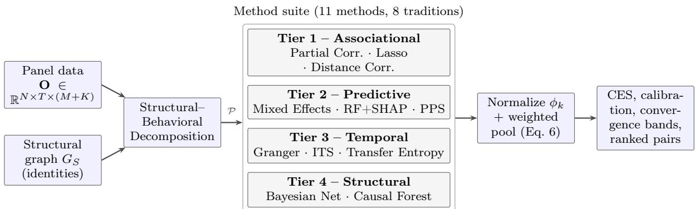
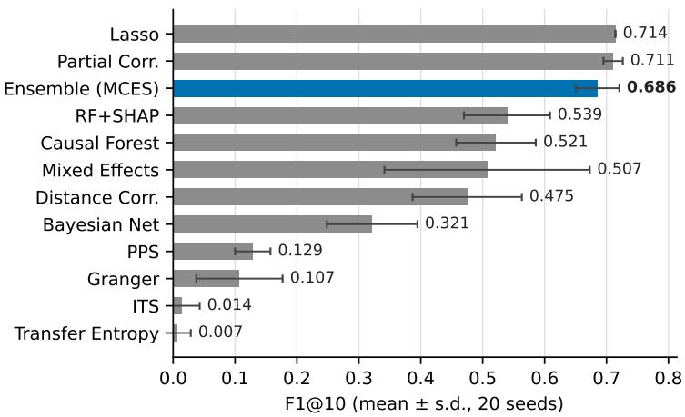
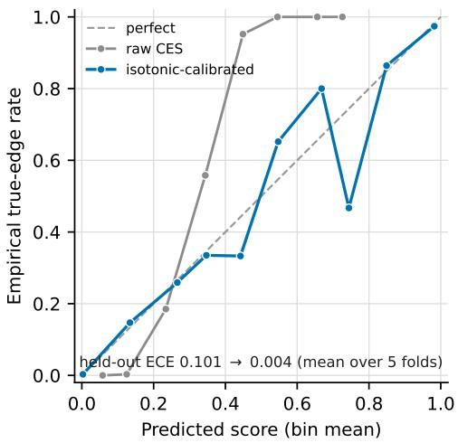
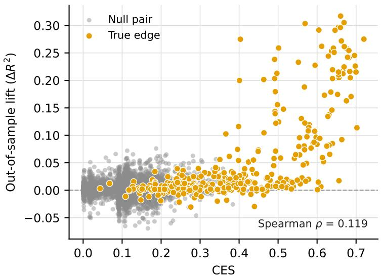

# Multi-Method Causal Evidence Synthesis: Ranking Candidate Drivers by Convergent Cross-Method Evidence from Observational Data

Manish Gupta Tricon Infotech manishg@triconinfotech.com

Dipanjan De Tricon Infotech dipanjan.de@triconinfotech.com

August 2026

## Abstract

Causal inference from observational data is ubiquitous across science and industry, yet practitioners overwhelmingly rely on a single analytical method, typically regression or SHAP-based feature importance, and treat its output as causal truth. Recent automated tools select an optimal method for a given dataset [Wang et al., 2025, PyWhy Contributors, 2024, Nguyen et al., 2023], but comparatively little work synthesizes evidence from methods spanning diferent mathematical traditions applied to the same raw data. We present Multi-Method Causal Evidence Synthesis (MCES), a framework whose goal is to rank which candidate drivers in an observational system are most likely relevant to a set of outcome variables, and with what strength of evidence. MCES runs eleven analytical methods across eight distinct mathematical traditions on observational panel data and pools their outputs into a Convergent Evidence Score (CES) that ranks driver–outcome relationships. CES quantifies the convergence of evidence across analytical lenses: the degree to which methods with diferent assumptions point toward the same driver–outcome relationship. It does not claim causal identification in the interventionist sense; it supports hypothesis prioritization, not a universally transferable probability of causation. We additionally fit a scenariospecific empirical calibration of CES against known ground truth and are explicit that its transportability to new domains is not established. The framework first applies Structural– Behavioral Decomposition to remove definitional (algebraic) relationships from the analysis space (but only where identity components are themselves candidate drivers, the setting in which such false positives actually arise), then runs all methods, normalizes outputs to [0, 1], and computes a weighted composite in the form of a linear opinion pool [Stone, 1961, Genest and Zidek, 1986]. We distinguish MCES from method selection, same-method ensembles, cross-algorithm prediction ensembles (Super Learner), and literature-level synthesis. Using synthetic data with embedded ground truth, the real Sachs protein-signaling benchmark, a suite of standard Bayesian-network structure benchmarks, and two additional synthetic domains (healthcare, manufacturing), we show that MCES reliably ranks the true edges near the top: on the primary synthetic scenario the highest-scoring pairs are all true edges (Precision@5 = 1.0, Precision@10 = 0.96), while showing a low empirical rate of null pairs reaching Moderate-or-higher convergence on the evaluated scenarios; per-method significance gates are Benjamini–Hochberg adjusted across the driver–outcome grid by default. Our central methodological point is not that the pool beats any individual method on a fixed accuracy metric (indeed, on some scenarios a single well-chosen method scores higher) but that no single method is uniformly best across the evaluated scenarios, so MCES ofers a method-agnostic default that avoids committing in advance to a single analytical tradition. We report this even-handedly.

Keywords: causal inference, causal triangulation, evidence synthesis, ensemble methods, observational data, causal hypothesis prioritization, cross-method convergence, causal evidence score

## 1 Introduction

## 1.1 The Ubiquity of the Problem

Organizations across industries routinely face a fundamental question: “Why did this metric change, and what caused it?” Whether a manufacturer detects rising defect rates after changing suppliers, a school district sees test scores fall after a curriculum change, or a SaaS company sees falling retention after a product update, the diagnostic challenge is the same. Observational data is abundant; causal understanding is scarce.

Table 1 illustrates the universality of this problem across domains.

Table 1: The causal diagnostic problem across domains.
<table><tr><td>Domain</td><td>Drivers (X)</td><td>Outcomes (Y)</td><td>Units</td><td>Time</td></tr><tr><td>Enterprise Software</td><td>Product perf., training, usability, staffing</td><td>Revenue, throughput, efficiency</td><td>Sites</td><td>Weeks</td></tr><tr><td>Healthcare</td><td>Treatments, protocols, staffing, equipment</td><td>Mortality, readmission, satisfaction</td><td>Hospitals</td><td>Months</td></tr><tr><td>Manufacturing</td><td>Machine settings, materials, operator skill</td><td>Defect rate, yield, throughput</td><td>Lines</td><td>Shifts</td></tr><tr><td>Education</td><td>Teaching methods, class size, technology</td><td>Test scores, graduation rate</td><td>Schools</td><td>Semesters</td></tr><tr><td>SaaS / Product</td><td>Features, UX changes, pricing, onboarding</td><td>Retention, NPS, revenue, churn</td><td>Cohorts</td><td>Months</td></tr></table>

Decisions are frequently made on weak correlational evidence, and the consequences of misattribution (acting on the wrong candidate relationship, or missing the true one) are substantial and often invisible.

## 1.2 Common Analytical Practice

Analysts approach the driver-outcome question with three broad families of method, each answering a diferent question.

Descriptive and associational analysis. Correlation, linear regression, and standard reporting. These identify where an outcome moved and which variables co-move with it, but not why: association is not causation, and the direction of any relationship is left open.

Predictive modeling. Gradient-boosted models with feature-importance or SHAP attributions [Lundberg and Lee, 2017]. These capture non-linear structure and rank features by contribution to a prediction, but importance for a prediction is not evidence of causation of the outcome, and the two are routinely conflated in practice.

Causal inference and efect estimation. Methods that target an identified causal estimand (diference-in-diferences, instrumental variables, structural causal models, and tools such as DoWhy and EconML). These can support causal claims under stated assumptions, but are typically applied one method at a time, often require a manually specified causal graph or design, and produce output that requires expert interpretation.

Each family has genuine strengths and characteristic blind spots. In practice an analysis usually commits to one method, and thereby to that method’s assumptions and failure modes, even though the appropriate choice is rarely known in advance.

## 1.3 The Single-Method Trap

Current practice selects one analytical method and treats its output as ground truth. This fails because each method has diferent assumptions, captures diferent types of relationships, and has diferent failure modes. Table 2 illustrates these complementary blind spots.

Table 2: Complementary blind spots of component analytical methods.
<table><tr><td>Method</td><td>Captures</td><td>Misses</td></tr><tr><td>Regression</td><td>Linear associations</td><td>Non-linear effects, causal direction</td></tr><tr><td>SHAP</td><td>Non-linear importance</td><td>Causal direction, temporal dynamics</td></tr><tr><td>Granger Causality</td><td>Temporal predictability</td><td>Non-linear relationships</td></tr><tr><td>Bayesian Networks</td><td>DAG structure</td><td>Hidden confounders</td></tr><tr><td>Causal Forest</td><td>Heterogeneous effects</td><td>Median binarization (impl. choice)</td></tr></table>

A concrete example illustrates the danger: when average price and volume are included among the candidate features, SHAP can rank the pair (Average Price, Revenue) highly. This is trivially true because Revenue = Price × Volume by definition, it is an algebraic identity, not a causal discovery. The pathology arises specifically when an outcome’s algebraic components are also present in the feature set; Section 3.2 formalizes this condition, and Section 7.5 shows that removing such identity pairs raises top-of-list precision from 0.3333 to 1.0 in a controlled setting.

## 1.4 From Triangulation to Quantification

The concept of using multiple methods to strengthen causal inference, causal triangulation, has been recommended in the methodological literature for over a decade [Lawlor et al., 2016, Munafò and Davey Smith, 2018, Hammerton and Munafò, 2021]. Related lines of work vary an analysis over many defensible choices: specification-curve analysis [Simonsohn et al., 2020] and multiverse analysis [Steegen et al., 2016] report the distribution of one estimand across specifications, and evidence factors [Rosenbaum, 2017] combine quasi-independent tests of a single hypothesis. These difer from our setting in two ways: they typically concern one estimand or one hypothesis, and they are not organized to rank many candidate relationships by cross-method agreement. In the triangulation literature specifically, the recommendation has remained largely qualitative (“use multiple methods and see if they agree”), without a concrete rule for which heterogeneous evidence measures to combine, how to normalize outputs that target diferent quantities, or how to form a composite ranking.

Recent work has advanced along adjacent but distinct lines:

• Bhattacharya et al. [2026] formalize robust weighted triangulation of causal efects under model uncertainty, combining identified efect functionals from multiple candidate causal models, each with its own identifying assumptions, weighted by data-driven measures of model validity, with error bounds and valid inference. This is the closest formal treatment of weighted triangulation, and the contrast sharpens our scope: they combine estimates of a single common estimand (the causal efect) across competing models, whereas MCES pools non-commensurable evidence measures that target diferent quantities and uses them to rank many candidate driver–outcome relationships rather than to estimate one efect.

• Shi et al. [2025] quantified triangulation at the literature level, extracting evidence from published papers using LLMs.

• Causal-Copilot [Wang et al., 2025] and CausalTune [PyWhy Contributors, 2024] select the best method for a dataset.

• A 2025–2026 line of work ensembles multiple causal-discovery algorithms into a single structural estimate: voting-theoretic aggregation with recovery conditions [Vo et al., 2026], linear-opinion-pooled discovery experts with LLM reweighting [Li et al., 2026], and structure-learning ensembles for prioritized health hypotheses [Adhikari et al., 2025]. These pool within the causal-discovery family to recover a graph; Section 2 details how our setting difers in both members and task.

These difer from the synthesis we pursue here: selection discards evidence from all nonselected methods; synthesis aggregates evidence from all of them. We are careful to distinguish this from cross-algorithm prediction ensembles such as Super Learner [van der Laan et al., 2007], which optimize a single predictive loss for one estimand via cross-validated weights; MCES instead pools evidence across methods that target diferent estimands (association, temporal predictability, graphical dependence, treatment efect), with weights that encode epistemic priors rather than minimizing a shared loss (Section 2).

## 1.5 Contributions

We make the following contributions:

1. MCES Framework, a quantitative framework that combines heterogeneous evidence measures which do not estimate a common causal estimand (association, temporal predictability, graphical dependence, treatment efect), for the purpose of ranking many candidate driver–outcome relationships by cross-method agreement. The pooling rule itself is classical, and ensembling within the causal-discovery family is now established [Vo et al., 2026, Li et al., 2026]; the combination we claim as novel is narrower and specific: noncommensurable evidence from causal and non-causal traditions, pooled to rank a declared driver–outcome grid rather than to recover a graph. We distinguish this from method selection, same-method and cross-algorithm structural ensembles, and specification/multiverse analyses in Section 2.

2. Structural-Behavioral Decomposition, formal separation of definitional (algebraic) from behavioral (causal) relationships as a pre-processing step for causal analysis.

3. Convergent Evidence Score (CES), a weighted composite score in [0, 1] that quantifies convergence of evidence across analytical traditions. We name the score for what it measures, convergence of evidence bearing on a causal hypothesis, not for a causal guarantee it does not provide. MCES uses uniform weights by default; optional tiered weights encode an application-specific evidential preference and are studied by sensitivity analysis.

4. Theoretical analysis, a variance-based characterization of how lower cross-method score correlation can improve the stability of the pooled score under stated assumptions.

5. Empirical evaluation, experiments on synthetic ground truth, the real Sachs benchmark, and two additional synthetic domains, characterizing when the ensemble helps (robustness to scenario shift, non-linear detection) and when it does not (it is not uniformly the single best predictor), together with calibration and false-positive analyses.

6. Calibration and multiple-testing controls, scenario-specific isotonic calibration of CES, and default Benjamini–Hochberg adjustment of the applicable per-method significance tests across the driver–outcome grid.

7. Reference implementation, a Python package with three synthetic domains and a realdata benchmark loader (available from the authors on request).

## 2 Related Work

## 2.1 Causal Triangulation

Methodological triangulation originates with Denzin [1970] in social science. Lawlor et al. [2016] formalized it for aetiological epidemiology, proposing that multiple analytical approaches with diferent assumptions should be applied to the same research question. Munafò and Davey Smith [2018] elevated this to a general principle in Nature: “Robust research needs many lines of evidence.” Hammerton and Munafò [2021] extended the framework with practical guidance in Psychological Medicine.

All of these remain qualitative: they recommend using multiple methods but do not specify how to combine their outputs into a quantitative measure. MCES operationalizes this decade-old recommendation.

## 2.2 Component Analytical Methods

Each of the eleven methods in MCES has a rich individual literature. Table 3 summarizes the foundational work and domain applications.

Table 3: Foundational literature for MCES component methods.
<table><tr><td>Method</td><td>Key Papers</td><td>Limitation</td></tr><tr><td>Partial Correlation</td><td>Pearson [1895]</td><td>Cannot determine direction</td></tr><tr><td>Lasso Regression</td><td>Tibshirani [1996]</td><td>Assumes linearity</td></tr><tr><td>Distance Correlation</td><td>Székely et al. [2007]</td><td>Unsigned; no direction</td></tr><tr><td>Predictive Power Score</td><td>Wetschoreck et al. [2020]</td><td>Univariate; no confounder control</td></tr><tr><td>Mixed-Effects Models</td><td>Laird and Ware [1982]</td><td>Assumes linearity</td></tr><tr><td>Random Forest + SHAP</td><td>Breiman [2001], Lundberg and Lee [2017]</td><td>Importance ≠ causation</td></tr><tr><td>Granger Causality Interrupted Time Series</td><td>Granger [1969] Box and Tiao [1975],</td><td>Assumes linearity, stationarity Requires known intervention</td></tr><tr><td></td><td>Lopez Bernal et al. [2017]</td><td></td></tr><tr><td>Transfer Entropy Bayesian Networks</td><td>Schreiber [2000] Pearl [2000], Spirtes</td><td>Requires long time series Assumes causal sufficiency</td></tr><tr><td>Causal Forests</td><td>et al. [2000] Wager and Athey</td><td>Median binarization (impl.</td></tr></table>

Each method has been individually applied to problems in many fields. To our knowledge, no published work pools methods from all of these traditions into a single evidence score computed on raw data for the purpose of ranking candidate relationships.

## 2.3 Ensemble Causal Discovery (Same-Method)

Existing ensemble approaches largely aggregate instances of the same algorithm across data partitions:

• The FGES/TETRAD line of work [Ramsey et al., 2017] bootstraps a causal-discovery algorithm and votes on edge presence.

• Guo et al. [2021] propose scalable two-phase causality ensembles combining an algorithm across data partitions.

• E-CIT [Guan and Kuang, 2025] partitions data, runs a base conditional independence test on each subset, and aggregates the resulting statistics.

• Stability selection [Meinshausen and Bühlmann, 2010] subsamples the data and retains variables selected with high frequency by a single base selector.

Distinction: these combine instances of the same algorithm (or selector) class across different data splits, so they share that algorithm’s structural assumptions and failure modes.

Cross-algorithm structural ensembles (2025–2026). A recent and fast-moving line of work aggregates multiple diferent causal-discovery algorithms into one structural estimate, and it must be distinguished carefully from what we do. Vo et al. [2026] give a voting-theoretic framework for ensembling structural predictions, with conditions under which the aggregate recovers the true graph. Li et al. [2026] pool causal-discovery experts via linear opinion pooling, the same aggregation rule we use, with an LLM reweighting experts near decision boundaries; Peng et al. [2026] similarly resolve most edges by algorithmic consensus and arbitrate the rest with a trust-calibrated LLM. Adhikari et al. [2025] combine an ensemble of structure-learning algorithms with heterogeneous efect estimation to produce robust prioritized causal hypotheses in healthcare. Quantitative ensembling within the causal-discovery family is therefore established, including with theoretical guarantees, and we claim no novelty for the pooling rule itself.

The distinction that remains, and that defines this paper’s contribution, is twofold. First, the members: every expert in those ensembles is a causal-discovery algorithm estimating the same object, a graph, whereas MCES deliberately pools evidence measures that estimate diferent objects, association, predictive importance, temporal predictability, graphical dependence, and treatment contrast, including methods that are explicitly not causal. Second, the task: those works recover graph structure, whereas MCES ranks a predefined driver–outcome candidate grid for hypothesis prioritization, with empirical false-positive control in place of recovery guarantees. To our knowledge, this specific combination, non-commensurable cross-tradition evidence pooled to rank a declared candidate grid, has not been studied, though we do not claim that no applied study has ever informally compared methods.

## 2.4 Automated Causal Inference (Method Selection)

Recent tools automate causal analysis by selecting the optimal method:

• Causal-Copilot [Wang et al., 2025]: an LLM-powered autonomous agent integrating 20+ methods. It analyzes data characteristics to select the appropriate algorithm, configure hyperparameters, and interpret results. It does not synthesize across methods.

• CausalTune [PyWhy Contributors, 2024]: AutoML for causal estimators using energy scoring to select the best estimator. It does not combine all estimators.

• OpportunityFinder [Nguyen et al., 2023]: a code-less framework for panel data that dynamically selects algorithms based on data scale.

The critical distinction is between selection and synthesis. Selection picks the single best method for the data and discards evidence from all other methods. Synthesis runs all methods and combines their evidence. Selection preserves the blind spots of the chosen method; synthesis mitigates them through complementarity.

## 2.5 Evidence Synthesis from Literature

Shi et al. [2025] present the “Evidence Triangulator” in Nature Communications, which uses LLMs to extract causal evidence from published papers and computes Convergency of Evidence (CoE) and Level of Convergency (LoC) scores. This is the closest existing work to our concept. However, it operates at the meta-analysis level, it requires published studies as input, not raw data. Our CES operates on raw observational data: we run the methods ourselves rather than extracting results from literature.

## 2.6 Outcome Decomposition

DuPont Analysis (1920s), KPI trees, and multiplicative decomposition are standard tools for algebraic outcome breakdown, and practitioner treatments of “why did the KPI change” decomposition are common. These are used for attribution within an identity; they are not combined

with statistical causal discovery to screen out identity edges before analysis. Our Structural– Behavioral Decomposition serves that specific screening role.

## 2.7 Summary: What Exists vs. Our Gap

Table 4 summarizes the landscape.

Table 4: The 4-way distinction: existing paradigms vs. MCES.
<table><tr><td>Paradigm</td><td>Examples</td><td>What It Does</td><td>Limitation</td></tr><tr><td>Method Selection</td><td>CausalTune, Causal-Copilot</td><td>Picks best ONE method</td><td>Discards all other evidence</td></tr><tr><td>Same-Method Ensemble</td><td>TETRAD, E-CIT</td><td>Same algorithm on data splits</td><td>Shared assumptions &amp; failure modes</td></tr><tr><td>Structural Ensemble</td><td>Vo et al. [2026], Li et al. [2026]</td><td>Pools causal-discovery algorithms into one graph</td><td>Members share the graph-recovery task and causal-family</td></tr><tr><td>Literature Synthesis</td><td>Shi et al. (2025)</td><td>LLM extracts from papers 11 methods, 8</td><td>assumptions Requires existing studies</td></tr><tr><td>Cross-Tradition (MCES) This paper</td><td></td><td>traditions, incl. non-causal; ranks a declared grid</td><td>No recovery guarantee; empirical FP control only</td></tr></table>

## 3 Problem Formulation

## 3.1 General Setup

Consider N observational units (hospitals, factories, schools) indexed by $i = 1 , \ldots , N$ , observed over T time periods indexed by $t = 1 , \dots , T$ . Let $\mathbf { X } = \{ x _ { 1 } , \dots , x _ { M } \}$ denote M potential driver variables, and $\mathbf { Y } = \{ y _ { 1 } , \dots , y _ { K } \}$ denote K outcome variables. At each observation point (i, t), we observe the vector:

$$
{ \bf O } _ { i , t } = \left( { \bf X } _ { i , t } , \ { \bf Y } _ { i , t } \right) \in \mathbb { R } ^ { M + K } .\tag{1}
$$

The goal is to rank the candidate driver–outcome pairs $\{ ( x _ { j } , y _ { k } ) : j \in [ M ] , k \in [ K ] \}$ by the strength of convergent evidence for a genuine relationship, and to evaluate that ranking against the set S of true pairs where ground truth is available.

## 3.2 Structural-Behavioral Decomposition

Let $V = \mathbf { X } \cup \mathbf { Y }$ be all measured variables.

Definition 1 (Structural Relationship). A variable $v \in V$ stands in a structural relationship to variables $u _ { 1 } , \ldots , u _ { m } \in V$ if $v = f ( u _ { 1 } , \dots , u _ { m } )$ holds by definition or by an accounting or measurement identity, independent of any behavioral mechanism. We use “structural” in this accounting-identity sense, not in the structural-equation-model sense; the targets of the decomposition are derived-variable identities that are not intervention candidates. Each such identity contributes edges $( u _ { i } , v )$ to the structural graph $G _ { S } \subseteq V \times V$

Definition 2 (Behavioral Relationship). A relationship $y = g ( x _ { 1 } , \dots , x _ { m } ; \varepsilon )$ is behavioral if it represents a mechanism that is invariant under intervention on the $x _ { i } ~ / P e a r l ,$ 2000] rather than an algebraic re-expression. We denote the behavioral graph $G _ { B }$

Examples of structural relationships:

$$
{ \mathrm { R e v e n u e } } = { \mathrm { A v e r a g e ~ P r i c e } } \times { \mathrm { V o l u m e } } ,\tag{2}
$$

$$
\mathrm { Y i e l d } = 1 - \mathrm { D e f e c t ~ R a t e } ,\tag{3}
$$

$$
{ \mathrm { R O E } } = { \mathrm { M a r g i n } } \times { \mathrm { T u r n o v e r } } \times { \mathrm { L e v e r a g e } } .\tag{4}
$$

$G _ { S }$ is known a priori from domain knowledge; $G _ { B }$ represents the behavioral relationships whose candidate edges we seek to prioritize. The candidate set after decomposition is

$$
{ \mathcal { P } } = ( \mathbf { X } \times \mathbf { Y } ) \setminus \{ ( u , v ) : ( u , v ) \in G _ { S } { \mathrm { ~ o r ~ } } ( v , u ) \in G _ { S } \} .\tag{5}
$$

Crucially, this screening changes the analysis only when an outcome’s identity components $u _ { i }$ are themselves candidate drivers $( \mathrm { i . e . } \ u _ { i } \ \in \mathbf { X } )$ . If the components are not in the feature set, for instance when only the derived outcome is measured, there are no identity pairs to remove and decomposition is a no-op. This is not a limitation so much as a precise statement of scope: the false-positive class that decomposition prevents exists exactly when components and their algebraic combination are both ofered to the methods as (driver, outcome) candidates. Section 7.5 constructs and measures precisely this case. Identity components remain in the graph as ordinary variables; only the tautological component→composite edges are removed.

## 3.3 The Multi-Method Ensemble

Define a method suite $\mathcal { M } = \{ m _ { 1 } , \ldots , m _ { 1 1 } \}$ spanning eight distinct mathematical traditions, classical and regularized statistics, energy statistics, panel econometrics, machine learning (including non-parametric single-feature prediction), time-series analysis, information theory, probabilistic graphical models, and causal machine learning. For each method $m _ { k }$ and each candidate pair $( x _ { j } , y _ { l } )$ :

1. $m _ { k }$ produces raw evidence $e _ { k } ( x _ { j } , y _ { l } )$ in a method-specific form (correlation coeficient, regression coeficient, SHAP value, p-value, entropy, graph edge, treatment efect).

2. Normalize: $\tilde { e } _ { k } ( x _ { j } , y _ { l } ) = \phi _ { k } \bigl ( e _ { k } ( x _ { j } , y _ { l } ) \bigr ) \in [ 0 , 1 ]$ , where $\phi _ { k }$ is a method-specific normalization function.

3. Weight: each method receives a nonnegative synthesis weight $w _ { k }$ . MCES uses uniform weights by default; alternative weights may encode application-specific evidential preferences and are evaluated by sensitivity analysis (Section 7.3).

The Convergent Evidence Score is:

$$
\mathrm { C E S } ( x _ { j } , y _ { l } ) = \frac { \sum _ { k = 1 } ^ { 1 1 } w _ { k } \cdot \tilde { e } _ { k } ( x _ { j } , y _ { l } ) } { \sum _ { k = 1 } ^ { 1 1 } w _ { k } } .\tag{6}
$$

## 3.4 Desiderata

The framework must satisfy eight requirements:

1. Adjust for measured covariates, while acknowledging that unmeasured confounding remains unresolved.

2. Capture linear and non-linear relationships.

3. Distinguish temporal precedence from contemporaneous correlation.

4. Account for unit-level heterogeneity (diferent baselines per unit).

5. Separate structural from behavioral relationships.

6. Be validatable against known ground truth.

7. Be domain-agnostic.

8. Scale to reasonable dimensionality (tens of drivers, handful of outcomes).

## 4 The MCES Framework

This section details each step of the MCES pipeline. Figure 1 and Algorithm 1 provide an overview.

  
Figure 1: The MCES pipeline. Definitional (identity) pairs are removed first; the surviving behavioral candidates are scored by eleven methods from eight mathematical traditions, normalized, and pooled into the Convergent Evidence Score.

Algorithm 1 Multi-Method Causal Evidence Synthesis (MCES)   
Require: Observational panel data $\mathbf { O } \in \mathbb { R } ^ { N \times T \times ( M + K ) }$ , structural graph $G _ { S }$   
Ensure: CES matrix $\mathbf { C } \in [ 0 , 1 ] ^ { M \times K }$   
1: $\mathcal { P }  \{ ( x _ { j } , y _ { k } ) \} \setminus G _ { S }$ ▷ Remove structural pairs   
2: for each method $m _ { k } \in \mathcal { M }$ do   
3: for each pair $( x _ { j } , y _ { l } ) \in \mathcal { P }$ do   
4: $e _ { k } ( x _ { j } , y _ { l } ) \gets m _ { k } ( \mathbf { O } , x _ { j } , y _ { l } )$ ▷ Run method   
5: $\tilde { e } _ { k } ( x _ { j } , y _ { l } ) \gets \phi _ { k } ( e _ { k } )$ ▷ Normalize to [0, 1]   
6: end for   
7: end for   
8: for each pair $( x _ { j } , y _ { l } ) \in \mathcal { P }$ do   
9: $\begin{array} { r } { \mathrm { C E S } ( x _ { j } , y _ { l } ) \dot {  } \sum _ { k } w _ { k } \tilde { e } _ { k } / \sum _ { k } w _ { k } } \end{array}$ ▷ Weighted synthesis   
10: end for   
11: return C

## 4.1 Step 1: Structural-Behavioral Decomposition

Given domain knowledge, we identify all structural (definitional) relationships among outcome variables and remove them from the analysis space. This step requires a domain expert to enumerate algebraic identities. The process is:

1. Enumerate all outcome variables and their definitions.

2. For each outcome pair $( y _ { k } , y _ { l } ) \colon$ if $y _ { k } = f ( y _ { l } , . . . )$ by definition, add edge $( y \imath , y \imath )$ to $G _ { S }$

3. Remove all pairs involving $G _ { S }$ edges from the candidate set $\mathcal { P } .$

Without this step, methods will “discover” that Revenue ∼ Average Price (trivially true by multiplication) and inflate false positives.

## 4.2 Step 2: The Method Suite

MCES runs eleven methods spanning the mathematical traditions listed above. We detail each method’s formulation, unique contribution, and normalization; the implementation defaults

(lags, cross-validation folds, discretization bins, tree counts) are those used in all experiments and are documented in the reference implementation.

## 4.2.1 Method 1: Partial Correlation

Tradition: Classical statistics.

We control for all other measured drivers simultaneously via the precision matrix $\mathbf { P } = \mathbf { R } ^ { - 1 } ,$ where R is the correlation matrix of $( \mathbf { X } , y _ { l } )$ (regularized as $\mathbf { R } + 1 0 ^ { - 6 } \mathbf { I }$ if near-singular). The partial correlation between $x _ { j }$ and yl given the rest is

$$
r ( x _ { j } , y _ { l } \mid \mathrm { r e s t } ) = \frac { - P _ { j l } } { \sqrt { P _ { j j } P _ { l l } } } ,\tag{7}
$$

with significance from a t-test on $n - p$ degrees of freedom.

Unique contribution: Simplest and most interpretable baseline, measuring conditional linear association after adjustment for the other included variables (not control for unmeasured confounders).

Normalization: $\tilde { e } _ { 1 } = | r | \cdot \mathbb { I } [ p < 0 . 0 5 ]$ (absolute, hard-gated).

## 4.2.2 Method 2: Lasso Regression

Tradition: Regularized regression.

$$
{ \hat { \boldsymbol { \beta } } } = \underset { \boldsymbol { \beta } } { \arg \operatorname* { m i n } } \left\{ \frac { 1 } { 2 n } \| \mathbf { y } - \mathbf { X } { \boldsymbol { \beta } } \| _ { 2 } ^ { 2 } + \lambda \| { \boldsymbol { \beta } } \| _ { 1 } \right\} .\tag{8}
$$

with λ chosen by 5-fold cross-validation on standardized drivers.

Unique contribution: Automatic elimination of irrelevant variables via the $\ell _ { 1 }$ penalty.

Normalization: $\tilde { e } _ { 2 } = | \hat { \beta } _ { j } | / \operatorname* { m a x } _ { j ^ { \prime } } | \hat { \beta } _ { j ^ { \prime } } |$ over drivers of the same outcome; 0 for eliminated features.   
This is a within-outcome relative scale (see Section 4.3).

## 4.2.3 Method 3: Distance Correlation

Tradition: Energy statistics.

Distance correlation [Székely et al., 2007] measures dependence of arbitrary form. With A and B the double-centered pairwise-distance matrices of the samples of xj and $y _ { l }$

$$
\mathrm { d } \mathrm { C o r } ( x _ { j } , y _ { l } ) = \frac { \mathrm { d } \mathrm { C o v } ( x _ { j } , y _ { l } ) } { \sqrt { \mathrm { d V a r } ( x _ { j } ) \mathrm { d V a r } ( y _ { l } ) } } , \qquad \mathrm { d } \mathrm { C o v } ^ { 2 } = \frac { 1 } { n ^ { 2 } } \sum _ { a , b } A _ { a b } B _ { a b } ,\tag{9}
$$

and $\mathrm { d C o r } = 0 \ i f$ and only $i f \ x _ { j }$ and yl are independent, unlike Pearson-family measures, which can be zero under symmetric (e.g. U-shaped) dependence. Significance is assessed by a permutation test on dCov.

Unique contribution: A Tier-1 associational measure that does not assume a specific functional form and can detect non-monotone dependence, subject to finite-sample power; it is the pool’s designated detector of symmetric non-linear dependence, complementing the monotone-oriented classical measures.

Normalization: $\tilde { e } _ { 3 } = \mathrm { d C o r } \cdot \mathbb { I } [ p _ { \mathrm { p e r m } } < 0 . 0 5 ]$ (dCor is already in [0, 1]). Distance correlation is unsigned by construction, and the non-monotone dependence it is designed to catch has no well-defined sign; we therefore treat its directional contribution as undefined and record a Pearson-sign annotation only as an interpretive hint valid under monotonicity, not as directional evidence.

## 4.2.4 Method 4: Mixed-Efects Regression

Tradition: Panel econometrics.

$$
y _ { i t } = \mathbf { X } _ { i t } ^ { \top } \beta + b _ { i } + \varepsilon _ { i t } , \quad b _ { i } \sim \mathcal { N } ( 0 , \sigma _ { b } ^ { 2 } ) ,\tag{10}
$$

fitted by REML with a random intercept $b _ { i }$ per unit (shared slopes $\beta )$ ; an OLS fallback is used if the mixed model fails to converge.

Unique contribution: Handles repeated measures from the same unit with unit-specific baselines.   
Normalization: $\tilde { e } _ { 4 } = \big ( | \hat { \beta } _ { j } | / \operatorname* { m a x } _ { j ^ { \prime } } | \hat { \beta } _ { j ^ { \prime } } | \big ) \cdot \mathbb { I } [ p _ { j } < 0 . 0 5 ]$ (within-outcome relative, hard-gated).

## 4.2.5 Method 5: Random Forest + SHAP

Tradition: Machine learning with explainability.

A Random Forest f is fitted to predict $y _ { l }$ from X. SHAP values [Lundberg and Lee, 2017] decompose each prediction:

$$
f ( \mathbf { x } _ { i } ) = \phi _ { 0 } + \sum _ { j = 1 } ^ { M } \phi _ { j } ( \mathbf { x } _ { i } ) ,\tag{11}
$$

where $\phi _ { j } ( \mathbf { x } _ { i } )$ is the Shapley value of feature $j$ for observation i.

Unique contribution: Captures non-linear relationships and feature interactions with no linearity assumption.

Normalization: $\tilde { e } _ { 5 } = \overline { { | \phi _ { j } | } } / \operatorname* { m a x } _ { j ^ { \prime } } \overline { { | \phi _ { j ^ { \prime } } | } }$ (within-outcome relative). The magnitude is a mean absolute SHAP value and is inherently unsigned; where we report a direction we use the sign of the mean signed contribution $\overline { { \phi _ { j } } }$ , which is meaningful only for approximately monotone efects and is not defined for interaction-dominated or non-monotone importance.

## 4.2.6 Method 6: Predictive Power Score

Tradition: Machine learning (non-parametric single-feature prediction).

The Predictive Power Score [Wetschoreck et al., 2020] asks how well the single driver $x _ { j }$ predicts $y _ { l }$ out-of-sample. A shallow decision tree is fitted to predict $y _ { l }$ from $x _ { j }$ alone and evaluated by K-fold cross-validation against a naive median baseline:

$$
\mathrm { P P S } ( x _ { j }  y _ { l } ) = \operatorname* { m a x } ( 0 , 1 - \frac { \mathrm { M A E } _ { \mathrm { t r e e } } } { \mathrm { M A E } _ { \mathrm { m e d i a n } } } ) .\tag{12}
$$

Unlike the symmetric association measures, PPS is asymmetric: $\mathrm { P P S } ( x \to y )$ generally difers from $\mathrm { P P S } ( y \to x )$ (predicting $y = | x |$ from x is easy; recovering x from y is not). We stress that this is predictive asymmetry, not causal direction: it reflects the deterministic structure of the map, and a confounded or reverse-causal pair can be equally asymmetric, so we do not treat PPS asymmetry as evidence of which variable causes which.

Unique contribution: Out-of-fold single-feature predictive skill at negligible cost; complements the multivariate methods, which can dilute a strong marginal predictor.

Normalization: $\tilde { e } _ { 6 } = \mathrm { P P S } \in [ 0 , 1 ]$ (already baseline-normalized; scores at or below the naive baseline are exactly 0).

## 4.2.7 Method 7: Granger Causality

Tradition: Time series econometrics.

Variable $x _ { j }$ Granger-causes $y _ { l }$ if past values of $x _ { j }$ improve the prediction of $y _ { l }$ beyond $y _ { l } \mathrm { \ ' s }$ own history:

$$
y _ { l , t } = \sum _ { \tau = 1 } ^ { p } \alpha _ { \tau } y _ { l , t - \tau } + \sum _ { \tau = 1 } ^ { p } \gamma _ { \tau } x _ { j , t - \tau } + \varepsilon _ { t } .\tag{13}
$$

An F-test assesses whether the $\gamma _ { \tau }$ coeficients are jointly significant. We run the test per unit over lags $1 , \ldots , 3$ and pool the per-unit p-values across units by Fisher’s method, $\chi ^ { 2 } = - 2 \textstyle \sum _ { i }$ ln $p _ { i }$ Taking the best lag per unit inflates significance through selection, so we treat the resulting p-value as a screening statistic rather than a calibrated test; a joint test over all lags, or a multiplicity correction, would be more conservative and is preferable when a calibrated $p \textmd { - }$ value is needed. Fisher pooling additionally assumes independence across units, which common shocks can violate; this is a known conservative-to-anticonservative trade-of we flag in the limitations. Unique contribution: Tests whether a driver’s past values provide incremental predictive information about the outcome beyond the outcome’s own past (predictive precedence, not proven causation).

Normalization: $\tilde { e } _ { 7 } = ( 1 - p _ { \mathrm { p o o l } } ) \cdot \mathbb { I } [ p _ { \mathrm { p o o l } } < 0 . 0 5 ]$ . Because $1 - p$ conflates efect size with sample size, we interpret ${ \tilde { e } } _ { 7 }$ as evidence that a temporal efect is nonzero rather than its magnitude.

## 4.2.8 Method 8: Interrupted Time Series

Tradition: Quasi-experimental design.

Classical ITS regresses an outcome on time, a post-intervention indicator $D _ { t } = \mathbb { I } [ t \geq t _ { 0 } ]$ , and their interaction. Because in our setting the “treatment” is a continuous driver rather than a single system-wide event, we use a driver-moderated ITS: with $\tilde { x } _ { j }$ the standardized driver,

$$
y _ { t } = \beta _ { 0 } + \beta _ { 1 } t + \beta _ { 2 } D _ { t } + \beta _ { 3 } ( t - t _ { 0 } ) D _ { t } + \beta _ { 4 } \tilde { x } _ { j , t } + \beta _ { 5 } ( \tilde { x } _ { j , t } \cdot D _ { t } ) + \varepsilon _ { t } ,\tag{14}
$$

and score the interaction $\beta _ { 5 }$ : the change in the driver’s association with the outcome after the break.

Unique contribution: Leverages known structural breaks $\left( \mathrm { e . g . } \right.$ . software deployments, policy changes).

Normalization: $\tilde { e } _ { 8 } = \big ( | \hat { \beta } _ { 5 } | / \operatorname* { m a x } _ { j ^ { \prime } } | \hat { \beta } _ { 5 } ^ { ( j ^ { \prime } ) } | \big ) \cdot \mathbb { I } [ p _ { \beta _ { 5 } } < 0 . 0 5 ]$ (within-outcome relative, hard-gated).

Note: A genuine interrupted time series requires a substantively justified breakpoint. When a break point $t _ { 0 }$ is declared $\left( \mathrm { e . g . } \right.$ . a deployment week) this method is a true ITS. When none is declared, the mid-window default $t _ { 0 } = \lfloor T / 2 \rfloor$ makes it not an intervention analysis but a structural-change diagnostic (a test for a shift in the driver–outcome relationship across the observation window), and we interpret and label it as such. Absent a real breakpoint we do not read its output as an intervention efect; the true break should be supplied when known.

## 4.2.9 Method 9: Transfer Entropy

Tradition: Information theory.

The transfer entropy from $x _ { j }$ to yl measures directed information flow:

$$
\mathrm { T E } _ { x _ { j } \to y _ { l } } = \sum { p \big ( y _ { t + 1 } , y _ { t } ^ { ( \kappa ) } , x _ { t } ^ { ( \kappa ) } \big ) \log \frac { p \big ( y _ { t + 1 } \mid y _ { t } ^ { ( \kappa ) } , x _ { t } ^ { ( \kappa ) } \big ) } { p \big ( y _ { t + 1 } \mid y _ { t } ^ { ( \kappa ) } \big ) } } ,\tag{15}
$$

where superscript (κ) denotes history length (we use $\kappa = 1 )$ . We estimate the entropies with a plug-in estimator over 5 quantile bins and obtain $p _ { \mathrm { p e r m } }$ from 50 within-unit temporal permutations of $x _ { j }$

Unique contribution: Captures non-linear directed information flow. Barnett et al. [2009] proved equivalence with Granger causality only for Gaussian variables; for non-Gaussian data, transfer entropy detects relationships Granger misses. (Conversely, on near-Gaussian data the two are redundant, a caveat for weighting, addressed in Section 7.8.)

Normalization: $\tilde { e } _ { 9 } = ( \mathrm { T E } / \operatorname* { m a x } _ { j ^ { \prime } } \mathrm { T E } ^ { ( j ^ { \prime } ) } ) { \cdot } \mathbb { I } [ p _ { \mathrm { p e r m } } < 0 . 0 5 ]$ . The plug-in estimator is biased upward in small samples; the permutation gate mitigates this by testing against a shufled null. The permutation p-value uses the finite-sample form $( b + 1 ) / ( B + 1 )$ , so with $B = 5 0$ its resolution is coarse (minimum attainable $p \approx 0 . 0 2 )$ ; transfer entropy’s gate is therefore blunter than the analytic gates of other methods, and increasing B is a straightforward refinement at additional compute cost.

## 4.2.10 Method 10: Bayesian Network Structure Learning

Tradition: Probabilistic graphical models.

Using BIC-scored hill-climbing [Pearl, 2000, Spirtes et al., 2000] over data discretized into 6 bins, with drivers pre-selected to a top-20 multi-signal shortlist for tractability (the union of the top-k drivers by maximum absolute correlation with any outcome, drivers with nonzero lasso coeficients, and the top-k by mutual information, truncated to 20 by a combined normalized score) and max in-degree 3, we learn a high-scoring DAG $\hat { G } \mathbf { ; }$

$$
{ \hat { G } } = \underset { G \in { \mathcal { G } } } { \arg \operatorname* { m a x } } \mathrm { B I C } ( \mathbf { O } \mid G ) .\tag{16}
$$

Unique contribution: Provides a candidate graphical representation of adjacency and short directed paths (subject to Markov-equivalence non-identifiability, below).

Normalization: $\tilde { e } _ { 1 0 } = 1$ if a direct edge $x _ { j }  y _ { l }$ exists in $\hat { G } ; 0 . 5$ if a directed path of length 2 exists; 0 otherwise. Hill-climbing returns a single member of a Markov equivalence class, so edge orientation is only partially identified; the score should be read as adjacency-plus-orientationunder-the-learned-DAG, not as identified direction. Drivers outside the pre-selected shortlist are recorded as not evaluated rather than as zero evidence (Section 4.4).

## 4.2.11 Method 11: Causal Forest

Tradition: Causal machine learning.

Using the framework of Wager and Athey [2018], we estimate heterogeneous treatment efects:

$$
\hat { \tau } ( x ) = \mathbb { E } [ Y ( 1 ) - Y ( 0 ) \mid X = x ] ,\tag{17}
$$

where $Y ( 1 )$ and $Y ( 0 )$ are potential outcomes under treatment and control.

We binarize each continuous driver at its median to form the treatment and use the remaining pre-selected drivers as controls; the reported statistic is the average treatment efect $\hat { \tau } = \mathbb { E } [ \hat { \tau } ( x ) ]$ (an econML CausalForestDML, with a t-test fallback).

Unique contribution: CausalForestDML permits heterogeneous response surfaces across units, although the CES contribution we pool is the estimated average high-versus-low treatment contrast τˆ rather than a direct measure of heterogeneity.

Normalization: $\tilde { e } _ { 1 1 } = ( | \hat { \tau } | / \operatorname* { m a x } _ { j ^ { \prime } } | \hat { \tau } ^ { ( j ^ { \prime } ) } | )$ · I[95% CI excludes 0]. Two cautions apply. Median binarization discards dose information, so τˆ is a coarse high-vs-low contrast (drivers outside the top-25 shortlist are recorded as not evaluated). More importantly, treating each driver in turn as the treatment while using all remaining drivers as controls can, without a stated causal graph, condition on mediators, colliders, or post-treatment variables and thereby bias $\hat { \tau } ;$ we therefore read $\tilde { e } _ { 1 1 }$ as one heterogeneity-sensitive evidence signal among many, not as an identified average treatment efect. Supplying a causal graph to choose valid adjustment sets is the principled fix and is left to future work.

## 4.3 Step 3: Evidence Normalization

Each method produces outputs in diferent scales and types: correlation coeficients in $[ - 1 , 1 ]$ regression coeficients in R, SHAP values in R, p-values in $[ 0 , 1 ]$ , entropy values in $\mathbb { R } ^ { + }$ , binary graph edges, and treatment efects in R. These are fundamentally diferent analytical quantities and evidence measures, SHAP measures predictive attribution, Granger measures temporal predictability, Bayesian networks measure graphical dependence, and causal forests measure treatment efects. Normalization maps each to [0, 1], but this numerical commensurability does not imply semantic equivalence.

The normalized score ${ \tilde { e } } _ { k } ( x _ { j } , y _ { l } )$ should therefore be interpreted as: “how strongly does method $m _ { k }$ , through its particular analytical lens, indicate that driver $x _ { j }$ is relevant to outcome $y _ { l } ? ^ { \mathfrak { n } }$ CES then measures convergence of evidence across these lenses, not the magnitude of any particular causal efect.

Two properties of our $\phi _ { k }$ deserve emphasis because they qualify how CES may be read:

• Within-outcome relative scaling. Six of the eleven methods (lasso, mixed efects, RF+SHAP, ITS, transfer entropy, causal forest) divide by the maximum statistic across drivers of the same outcome; distance correlation and PPS are natively [0, 1]-scaled and are the exceptions among the associational/predictive tiers. Consequently $\tilde { e } _ { k }$ ranks drivers reliably within an outcome but is not comparable in absolute terms across outcomes: an outcome whose strongest driver is weak still awards $\tilde { e } _ { k } \approx 1$ to that driver. CES rankings and all our metrics are computed per-outcome-aware (Precision@K over the pooled grid still holds because true edges score high within their own outcome), but practitioners should treat raw CES as an ordinal, within-outcome quantity unless calibrated (Section 7.7).

• Significance and selection gates. Several methods apply a significance or confidenceinterval gate (an indicator $\mathbb { I } [ p < 0 . 0 5 ]$ , or “CI excludes $0 ^ { \circ } ,$ or edge-present). Methods without inferential p-values instead use their method-specific criteria: sparse selection (lasso), relative importance (SHAP), out-of-fold predictive performance (PPS), or graph presence (Bayesian network). Where a gate applies it enforces “zero evidence when not significant” but introduces a discontinuity at the threshold; the smoothness of the linear pool (Section 5) therefore holds above such gates, not through them. For methods that produce inferential p-values, MCES applies Benjamini–Hochberg adjustment [Benjamini and Hochberg, 1995] across the driver–outcome grid by default (Section 7.9).

Each $\phi _ { k }$ is bounded in [0, 1] and non-decreasing in its underlying statistic; the gated methods return zero when their significance or selection criterion is not met.

## 4.4 Step 4: Weighted Synthesis (CES Computation)

Under the default, every method receives the same weight. For the optional tiered scheme, methods are grouped into four analytical tiers (Table 5) that encode a contestable evidential preference for temporal and structural methods; this grouping afects only the optional scheme and, as Section 7.3 shows, has no measurable efect on accuracy.

Table 5: Analytical groupings and optional tiered weights. The default is uniform; the tiered column is one alternative studied in the weight sensitivity analysis.
<table><tr><td>Tier</td><td>Methods</td><td>What They Provide</td><td> $w _ { k }$ </td></tr><tr><td>1: Associational</td><td>Partial Corr., Lasso, Distance Corr.</td><td>Associations, no direction</td><td>0.06</td></tr><tr><td>2: Predictive</td><td>Mixed Effects, RF+SHAP, PPS</td><td>Importance, structure</td><td>0.05-0.08</td></tr><tr><td>3: Temporal</td><td>Granger, ITS, Transfer Entropy</td><td>Direction and timing</td><td>0.13-0.14</td></tr><tr><td>4: Structural and treatment-effect</td><td>Bayesian Net, Causal Forest</td><td>Causal structure, effects</td><td>0.10-0.11</td></tr></table>

The optional tiered weight vector (summing to 1.0, in method order) is:

$$
\mathbf { w } = ( 0 . 0 6 , \ 0 . 0 6 , \ 0 . 0 6 , \ 0 . 0 7 , \ 0 . 0 8 , \ 0 . 0 5 , \ 0 . 1 4 , \ 0 . 1 4 , \ 0 . 1 3 , \ 0 . 1 1 , \ 0 . 1 0 ) .\tag{18}
$$

Uniform weights are the default; tiered weights are optional. We recommend uniform weights $( w _ { k } = 1 / 1 1 )$ as the primary default, and we report all headline results under a weighting to which, as Section 7.3 shows, the CES ranking is nearly invariant (mean pairwise Spearman 0.9449 across schemes). The tiered vector in Equation 18 encodes a contestable epistemic prior, that temporal and treatment-efect methods deserve more credence than purely associational ones. We are explicit that this prior is not established: temporal precedence, in particular, is not stronger identification than a credible treatment-efect design, so we do not order Tier 3 above Tier 4 on identification grounds, and Section 7.3 shows the tiering yields no measurable accuracy gain over uniform. When all eleven methods evaluate a pair, the optional tiered vector has the interpretive property that Moderate-or-higher CES requires positive Tier 3 or Tier 4 evidence. This property is not guaranteed after renormalization in degraded modes. The framework therefore relies only on the explicit Tier $3 / 4$ gate for Strong convergence (Section 4.5), which applies under every weighting scheme. Practitioners should use the uniform default; the tiered scheme is ofered only for the sensitivity analysis.

The CES is computed via Equation 6. By construction, $\mathrm { C E S } \in [ 0 , 1 ]$

Missing methods: renormalization at the method level, zero-fill at the pair level. Two kinds of missingness are handled diferently, and the distinction matters for comparability. When a method is inapplicable to the dataset as a whole (e.g. ITS with no declared break on cross-sectional data), its weight is removed and the remaining weights renormalize, so degraded modes remain well-defined. When an applicable method skips an individual pair (e.g. a driver outside the BN or causal-forest pre-selection shortlist), that pair receives zero evidence from that method over the unchanged denominator, a deliberately conservative choice: not being shortlisted lowers CES rather than inflating it by shrinking the denominator, and because the denominator is fixed given the active method set, CES is the same function on every pair; perpair denominators never vary. Since shortlist membership is itself signal-dependent, this zero-fill is the safe direction for the missing-not-at-random concern. An ablation confirms the design is not load-bearing on the primary scenario, where all eleven methods are active: recomputing CES under the alternative convention yields identical rankings (Spearman $1 . 0 0 0 \pm 0 . 0 0 0$ across 20 seeds, F1@10 $0 . 6 8 6 \pm 0 . 0 3 5$ vs. $0 . 6 8 6 \pm 0 . 0 3 5 )$ . We track the count of evaluating methods separately from the count contributing positive evidence.

A weight-vector property, backed by an explicit gate. Under the default uniform weights with all eleven methods evaluating a pair, the six Tier 1–2 (associational and predictive) methods carry mass $6 / 1 1 = 0 . 5 4 5 < 0 . 7$ , so $\mathrm { C E S } > 0 . 7$ cannot be reached on associational and predictive evidence alone. The optional tiered weights (Equation 18) strengthen this: because their Tier 1–2 mass is only $0 . 3 8 < 0 . 4 .$ , under tiered weights even Moderate convergence $\mathrm { ( C E S \ge 0 . 4 ) }$ would require a Tier 3/4 method, the sole thing tiering buys over uniform (Section 7.3). We note plainly that this is a property by construction, not a finding: the tier constants are design parameters we chose, and a Tier 1–2 mass below the Moderate threshold is a direct consequence of that choice. We do not, however, rely on the weight vector for this guarantee, because renormalization in degraded modes can break it (Section 4.5 gives the cross-sectional counterexample, where seven methods apply and Tier 1–2 mass reaches $5 / 7 = 0 . 7 1 4 > 0 . 7 )$ The Tier $3 / 4$ requirement for Strong convergence is therefore enforced as an explicit rule in the classifier (Section 4.5), which holds in every mode.

Applicability conditions and degraded modes. Not every dataset supports every method, and the renormalization above makes degradation graceful rather than fatal. Cross-sectional data (no time dimension) disables the three temporal methods, as on the Sachs benchmark. A single-unit time series $( N = 1 )$ , the common case of one organization observed daily, disables the panel-dependent mixed-efects method; the remaining ten methods, including all temporal ones, still apply, and weights renormalize over the active pool. The reference implementation detects these conditions and skips inapplicable methods automatically. Because the explicit Strong-convergence gate (Section 4.5) requires an applicable Tier $3 / 4$ method regardless of the renormalized weights, the directional requirement is preserved in every degraded mode, including cross-sectional data, where the weight-vector argument alone would fail $( 5 / 7 = 0 . 7 1 4 > 0 . 7 )$

## 4.5 Step 5: Convergence Classification

We bin each driver-outcome pair into three convergence levels. We use “convergence” rather than “confidence” deliberately: the bands describe how strongly the heterogeneous methods agree, not a probability of causation (Section 4.3 notes that raw CES is ordinal and within-outcome relative).

• Strong Convergence: $\mathrm { C E S } > 0 . 7$ and at least one applicable Tier 3 or Tier 4 method contributes positive evidence.

• Moderate Convergence $( 0 . 4 \leq \mathrm { C E S } \leq 0 . 7 )$ : Some methods agree, mixed signals across tiers.

• Weak Convergence $\mathrm { ( C E S < 0 . 4 ) }$ : Weak or inconsistent evidence.

The 0.4 and 0.7 cutofs are interpretive design thresholds, not calibrated probabilities or universally validated decision boundaries; their suitability should be evaluated for each target application. We enforce the Tier $3 / 4$ requirement for Strong convergence as an explicit rule in the classifier, not as a consequence of the weight vector. When all eleven methods evaluate a pair under uniform weights, the requirement also follows automatically because the Tier 1–2 mass is $6 / 1 1 = 0 . 5 4 5 < 0 . 7 ;$ but under renormalization in degraded modes (e.g. cross-sectional data, where only seven methods apply and Tier 1–2 mass can reach $5 / 7 = 0 . 7 1 4 > 0 . 7 )$ the weight-vector argument alone would not hold, so the explicit gate is what preserves the intended interpretation across all modes. We also compute an inter-method agreement metric as the fraction of applicable methods producing moderate-or-higher evidence:

$$
\mathrm { A g r e e m e n t } ( x _ { j } , y _ { l } ) = \frac { 1 } { | \mathcal { M } _ { \mathrm { e v a l } } ( x _ { j } , y _ { l } ) | } \sum _ { k \in \mathcal { M } _ { \mathrm { e v a l } } ( x _ { j } , y _ { l } ) } \mathbb { I } [ \widetilde { e } _ { k } ( x _ { j } , y _ { l } ) > 0 . 5 ] ,\tag{19}
$$

where $\mathcal { M } _ { \mathrm { e v a l } }$ is the set of methods that evaluated the pair (so a driver dropped by a pre-selection step does not deflate the denominator).

## 4.6 Scope note: decision rules are out of scope

CES scores and ranks the evidence for driver-outcome relationships. Turning that ranking into an action ordering requires external decision criteria (intervention feasibility, cost, risk, expected utility) that are domain-specific and not part of the methodological contribution we validate here. We therefore do not fold such criteria into CES; combining evidence convergence with a validated decision rule is deferred to future work (Section 9.5).

## 5 Theoretical Justification

## 5.1 MCES as a Committee of Diverse Experts

We frame MCES using the lens of ensemble learning theory and the “wisdom of crowds” literature. Each method $m _ { k }$ acts as an imperfect expert with its own biases (systematic errors from violated assumptions) and variance (sensitivity to noise). The key insight is not that these experts are independent (they share the same data) but that they are diverse: their errors arise from diferent mathematical assumptions.

Definition 3 (Assumption Diversity). Two methods $m _ { j }$ and $m _ { k }$ are assumption-diverse if their failure modes are driven by diferent violated conditions. For example, Granger causality fails when relationships are non-linear (stationarity/linearity assumption), while SHAP fails when associations are non-causal (no causal identification assumption). A non-linear causal relationship will cause Granger to miss what SHAP detects; a spurious temporal correlation will cause Granger to flag what Causal Forest rejects.

This diversity is the source of MCES’s strength. When methods from diferent traditions agree, the agreement is informative precisely because the methods fail in diferent ways.

## 5.2 Why Pooling Could Help: A Score-Stability Argument

The argument in this subsection is a conditional, theoretical one: it states when pooling reduces the variance of the score, given low cross-method correlations. Section 7.8 measures the proposition’s own correlation quantity directly, across repeated draws of the data-generating process for fixed pairs, and finds it low $( \bar { \rho } \approx 0 . 1 3 )$ ; the step the theory does not supply, and the experiments do not automatically deliver, is from reduced score variance to improved ranking accuracy.

We analyze the estimator MCES actually uses, the weighted pool of Equation 6, rather than a unanimity vote. Fix an outcome $y _ { l }$ and a candidate driver $x _ { j }$ . Let $\begin{array} { r } { S = \sum _ { k } w _ { k } \tilde { e } _ { k } } \end{array}$ with $\textstyle \sum _ { k } w _ { k } = 1$ be the (renormalized) CES score, and treat each $\tilde { e } _ { k } \in [ 0 , 1 ]$ as a random variable over resamples of the data-generating process. Write $\mu _ { k } = \mathbb { E } [ \tilde { e } _ { k } ] , \sigma _ { k } ^ { 2 } = \mathrm { V a r } ( \tilde { e } _ { k } )$ , and let $\rho _ { j k }$ be the correlation between $\tilde { e } _ { j }$ and $\tilde { e } _ { k }$ . Then

$$
\mathbb { E } [ S ] = \sum _ { k } w _ { k } \mu _ { k } , \qquad \mathrm { V a r } ( S ) = \sum _ { k } w _ { k } ^ { 2 } \sigma _ { k } ^ { 2 } + \sum _ { j \neq k } w _ { j } w _ { k } \rho _ { j k } \sigma _ { j } \sigma _ { k } .\tag{20}
$$

The mean of the pool is the weighted mean of the individual signals; the variance, however, depends on the cross-method correlations $\rho _ { j k }$ . This is the crux of the diversity argument, stated for the real estimator:

Proposition 1 (Diversity reduces score variance). Var(S) is non-decreasing in every $\rho _ { j k }$ . With equal weights $w _ { k } = 1 / K$ and comparable per-method variances $\sigma _ { k } ^ { 2 } \approx \sigma ^ { 2 }$

$$
\operatorname { V a r } ( S ) \approx \frac { \sigma ^ { 2 } } { K } \big ( 1 + ( K - 1 ) \hat { \rho } \big ) ,\tag{21}
$$

where $\bar { \rho }$ is the mean pairwise correlation. As $\bar { \rho }  1$ (redundant methods) the variance tends to $\sigma ^ { 2 }$ , no better than one method; as $\bar { \rho }  0$ (assumption-diverse methods) it tends to $\sigma ^ { 2 } / K$

Proof. $\partial \mathrm { V a r } ( S ) / \partial \rho _ { j k } = 2 w _ { j } w _ { k } \sigma _ { j } \sigma _ { k } \geq 0$ gives monotonicity; substituting $w _ { k } = 1 / K , \sigma _ { k } = \sigma _ { \mathrm { . } }$ and $\rho _ { j k } = \bar { \rho } \left( j \neq k \right)$ into Equation 20 gives the stated form. □

Corollary 1 (Sharper separation of causal from null pairs). Suppose true pairs have mean pooled score $\mu _ { 1 }$ and null pairs $\mu _ { 0 } < \mu _ { 1 }$ , with per-class pooled standard deviations $s _ { 1 } , s _ { 0 }$ that decrease as $\bar { \rho }$ decreases (Proposition 1). Then the standardized separation $( \mu _ { 1 } - \mu _ { 0 } ) / \sqrt { \textstyle \frac { 1 } { 2 } ( s _ { 1 } ^ { 2 } + s _ { 0 } ^ { 2 } ) }$ increases as diversity increases, so, when the class-conditional score distributions otherwise remain comparable, class separation and the achievable precision/recall trade-of improve. The means $\mu _ { 0 } , \mu _ { 1 }$ are set by the methods’ individual power and are unchanged by pooling; diversity buys its advantage through variance, not through inflating the signal.

This is a claim about ranking stability and separation, not a guarantee that CES dominates every individual method on every dataset. Whether the ensemble’s lower-variance score actually out-ranks the single best method depends on how much signal $( \mu _ { 1 } - \mu _ { 0 } )$ the diverse-but-weaker methods contribute versus the noise they add, an empirical question we examine directly, including cases where the ensemble does not win, in Section 7. Section 7.8 provides a descriptive measure of how diferently the methods rank candidate pairs; it does not directly estimate the resample-level correlations used in Proposition 1, and it discusses when redundancy (e.g. Granger and transfer entropy on Gaussian temporal data) would erode the benefit.

## 5.3 What CES Measures (and Does Not Measure)

It is essential to state precisely what CES quantifies:

• CES measures: the degree to which multiple analytical methods with diferent mathematical assumptions converge on the same driver-outcome relationship. High CES means that multiple methods spanning diferent analytical traditions point toward the same pair.

• CES does not measure: causal identification in the interventionist sense [Pearl, 2000]. CES does not establish that do $( x _ { j } = x ^ { \prime } )$ would change $y _ { l }$ . Definitive causal claims require controlled experiments or instruments that MCES does not assume.

• CES approximates: the strength of convergent evidence for causal relevance, a pragmatic assessment that a driver-outcome relationship is worth prioritizing for investigation, not a probability that intervening on the driver would change the outcome.

This positioning is analogous to how meta-analysis provides “strength of evidence” rather than definitive proof: agreement across independent analyses increases confidence, but cannot eliminate all sources of bias.

## 5.4 When MCES Fails: Shared Failure Modes

Assumption diversity protects against method-specific blind spots, but does not protect against shared failure modes. We identify three scenarios where all methods can agree incorrectly:

1. Hidden confounder. An unmeasured variable $Z$ that causes both $x _ { j }$ and $y _ { l }$ will induce a spurious association that all methods detect. Partial correlation controls for measured confounders; it cannot control for unmeasured ones. This is a fundamental limitation of all observational methods, not specific to MCES.

2. Feedback loops. When $x _ { j }$ causes yl and $y _ { l }$ simultaneously causes $x _ { j }$ (contemporaneous feedback), methods may incorrectly estimate direction. Granger causality and transfer entropy can partially detect bidirectional flow, but contemporaneous feedback remains challenging.

3. Collider bias. Conditioning on a common efect of $x _ { j }$ and $y _ { l }$ can create a spurious association. If the conditioning variable is included in the analysis, all methods may report a false relationship.

These failure modes are not unique to MCES, they afect every observational causal method. MCES reduces method-specific errors through assumption diversity but cannot eliminate datalevel bias: if the data itself is confounded, all methods will reflect that confounding. MCES’s advantage is that for the more common scenario where individual methods fail due to their specific assumptions (linearity, stationarity, parametric form), diversity can reduce sensitivity to those method-specific failure modes and improve the stability of the pooled score. MCES should therefore be viewed as prioritizing hypotheses for intervention rather than replacing experimental causal identification.

## 5.5 Comparison to Meta-Analysis and Ensemble Learning

Meta-analysis combines results from diferent studies of the same question. MCES combines methods on the same data for the same question. Both leverage the principle that agreement across diverse analyses increases confidence.

The connection to ensemble learning is also instructive. Random forests aggregate decision trees that are diverse due to feature subsampling; boosting aggregates weak learners that focus on diferent error regions. MCES aggregates analytical methods that are diverse due to fundamentally diferent mathematical assumptions. The mechanism is analogous: diversity of errors can reduce sensitivity to method-specific failure modes and improve the stability of the pooled score, even when components share the same underlying data.

Formally, CES (Equation 6) is an instance of linear opinion pooling, a well-studied aggregation rule [Stone, 1961, Genest and Zidek, 1986]: K experts provide assessments $p _ { 1 } , \ldots , p _ { K }$ combined via $\begin{array} { r } { p \ = \ \sum _ { k } w _ { k } p _ { k } , \ \sum _ { k } w _ { k } \ = \ 1 } \end{array}$ Linear pooling uniquely satisfies the unanimitypreservation and marginalization properties among a broad class of rules. Two caveats apply to our use of it. First, the $\tilde { e } _ { k }$ are normalized evidence scores, not probabilities, so the pool inherits their ordinal, within-outcome character (Section 4.3); the isotonic mapping of Section 7.7 has an empirical probability interpretation only within the calibration distribution, and its validity for a new target domain requires separate evaluation. Second, while the pool is smooth in the $\tilde { e } _ { k }$ , each $\tilde { e } _ { k }$ itself contains a hard significance gate, so CES is not globally continuous in the underlying statistics, the smoothness holds above the gates. This difers from Super Learner [van der Laan et al., 2007], which learns weights by cross-validated minimization of a single predictive loss for one estimand; our weights are fixed epistemic priors over methods targeting diferent estimands, and Section 7.3 shows the ranking is insensitive to them.

## 6 Experimental Setup

All numbers reported in this section are produced by our reference implementation; the exact scripts that generate every table are deterministic given the reported seeds, and are available from the authors on request. Method results are cached so the full suite is reproducible.

## 6.1 Synthetic Ground Truth Design

We generate observational panel data with known embedded causal relationships. A scenario fixes N units, T periods, a set of true causal edges (driver, outcome, sign, strength, lag, functional form), and a data-generating process (DGP). Five DGPs are implemented so that recovery is not tested under a single functional form: linear, non-linear (quadratic/√/log/threshold), confounded (hidden common causes), time-lagged, and mixed. Ground-truth edge strengths lie in [0.15, 0.6]; unit-specific intercepts and Gaussian noise are added. The primary scenario (primary\_panel) has $N = 2 3 , T = 2 0$ , 95 numeric candidate drivers, 6 outcomes, and 18 true edges. We additionally use nonlinear $( N = 5 0 , T = 3 0 )$ and confounded $( N = 3 0 , T = 2 0 )$ scenarios, and two further domains described below.

## 6.2 Benchmarks and Additional Domains

To reduce the circularity of validating only on self-designed synthetic data, we add an external real-data benchmark, a suite of named structure-learning benchmarks, and two independentlyspecified synthetic domains:

• Sachs protein-signaling dataset [Sachs et al., 2005], real flow-cytometry measurements of 11 phosphoproteins (853 observational cells), with the widely-used consensus network as ground truth. It is cross-sectional, so only the seven non-temporal, non-panel methods apply; under the driver/outcome orientation we use, 16 of the 17 consensus edges are scoreable. This is the one non-synthetic dataset in our evaluation, and its DGP was certainly not designed with our methods in mind.

• Bayesian-network structure benchmarks, six standard bnlearn networks [Scutari, 2010] spanning distinct domains and 20 to 76 nodes: Child (20, congenital heart disease), Insurance (27, actuarial risk), Alarm (37, ICU monitoring), Hailfinder (56, severeweather forecasting), Hepar2 (70, hepatology), and Win95pts (76, fault diagnosis), each with an exact published DAG. We forward-sample 1,000 observations, ordinal-encode the discrete states, and (as with Sachs) assign each node a single driver/outcome role by net edge direction, so the scoreable ground truth is the set of forward edges. These test edge recovery across a ladder of network sizes and across six unrelated domains, with structure ground truth entirely external to our framework. The data are sampled rather than fieldcollected; the structure is the real, published, citable object.

• Healthcare (40 hospitals × 24 months, mixed DGP with hidden confounders, 10 true edges) and Manufacturing (30 lines × 40 shifts, non-linear DGP, 9 true edges), synthetic domains with their own driver/outcome catalogs and structural identities (adjusted\_mortality; yield = 1− defect\_rate). These test whether the framework and its conclusions transfer to diferently-structured problems; we label them clearly as synthetic case studies, not field deployments.

We deliberately do not claim driver-ranking results on IHDP, LaLonde, Twins, or ACIC: those are single-treatment efect-estimation benchmarks (one designated treatment with a known ATE), not structure-recovery tasks, so using them to score a ranked edge list would misrepresent both them and our method. Our IHDP loader is additionally a synthetic reconstruction. Extending MCES to efect-estimation baselines is left to future work.

## 6.3 Evaluation Metrics

Precision@K and Recall@K over the pooled driver–outcome grid; F1@K; Spearman’s ρ between CES and true edge strengths; expected calibration error (ECE) of CES against the empirical true-positive rate; and false-positive rate among null (non-causal) pairs. The primary scenario (primary\_panel) is averaged over 20 seeds; the controlled decomposition scenario (E4) uses 3 seeds and the nonlinear scenario a single seed, as noted per result. All averaged results are reported as mean ± standard deviation.

Resampling policy and panel dependence. The panel-aware methods respect the unit/time structure: mixed efects uses unit-level random intercepts, Granger and interrupted time series run per unit or per series, and transfer entropy permutes within units. The remaining associational and predictive methods (partial correlation, lasso, distance correlation, PPS, and RF+SHAP) pool observations across units and time and treat rows as exchangeable: their internal resampling (the partial-correlation t-test degrees of freedom, lasso and PPS K-fold cross-validation, and the distance-correlation permutation null) does not adjust for within-unit or temporal dependence. Under such dependence the efective sample size is smaller than the nominal row count, so these methods’ p-values and cross-validated scores are best read as screening statistics rather than calibrated tests. Group-aware resampling (grouped/blocked cross-validation, within-unit permutation, cluster-robust inference) would tighten this and is left to future work.

## 6.4 Experiments

We run: E1 ensemble vs. each individual method and leave-one-out ablation (primary\_panel); E2 weight-scheme sensitivity (five schemes); E3 a sample-size sweep over panel length and panel width around the primary setting; E4 Structural–Behavioral Decomposition impact (controlled identity scenario); E5 non-linear detection (nonlinear); calibration (E6), method-diversity (E7), and false-positive/FDR control with a CES-threshold sensitivity sweep (E8); E9 out-of-sample predictive lift, a ground-truth-free consistency check; E10 structure recovery on the bnlearn network benchmarks; plus the Sachs benchmark and the two additional domains.

## 7 Results

## 7.1 E1: Does the Framework Identify the True Drivers?

The framework’s job is to place genuinely causal driver–outcome pairs at the top of the CES ranking. It does: on primary\_panel the ensemble attains Precision@5 = 1.0 and Precision@ $\mathbf { 1 0 } ~ = ~ 0 . 9 6$ (mean over 20 seeds), the highest-scoring pairs are true edges, which is the outcome a practitioner cares about. This is the primary result.

A natural question is whether one could instead just pick a single method. Table 6 and Figure 2 report F1@10 for the ensemble and each method, and the answer is nuanced and worth stating plainly. We are also explicit about how this claim evolved: we initially expected the pooled score to outperform the best individual method on accuracy, and it does not; the robustness framing reported below is what the experiments actually support, not what we set out to show. On this particular scenario a single method can match or edge out the pool on F1 (ensemble $0 . 6 8 6 \pm 0 . 0 3 5$ vs. best individual 0.714; diference −0.029). But this is not an argument for method selection, because which method is best is not knowable in advance and changes across scenarios (Sections 7.6, 8): the temporal methods that lead on lagged data are near-useless on this contemporaneous scenario, and vice versa. The ensemble’s role is to be a method-agnostic default that avoids committing in advance to a single analytical tradition. We do not claim it is mathematically guaranteed to be optimal; we claim it removes the need for a prior method choice that, as the cross-scenario results show, is easy to get wrong. Leave-one-out ablation confirms the pool is genuinely distributed: removing any single method changes F1@10 by at most 0.032, the signature of a diversified estimator rather than one load-bearing method.

Table 6: E1, F1@10 on primary\_panel $\mathrm { ( m e a n \pm s . d }$ . over 20 seeds). The ensemble is competitive with, but does not strictly dominate, the best individual method; its value is robustness across scenarios (Section 7.6, 8).
<table><tr><td>Method F1@10</td></tr><tr><td>Ensemble (MCES)  ${ \bf 0 . 6 8 6 \pm 0 . 0 3 5 }$ </td></tr><tr><td>Partial Corr.  $0 . 7 1 1 \pm 0 . 0 1 6$ </td></tr><tr><td>Lasso  $0 . 7 1 4 \pm 0 . 0 0 0$  Distance Corr.  $0 . 4 7 5 \pm 0 . 0 8 8$ </td></tr><tr><td>PPS  $0 . 1 2 9 \pm 0 . 0 2 9$ </td></tr><tr><td>RF+SHAP  $0 . 5 3 9 \pm 0 . 0 7 0$ </td></tr><tr><td>Mixed Effects  $0 . 5 0 7 \pm 0 . 1 6 6$ </td></tr><tr><td>Granger  $0 . 1 0 7 \pm 0 . 0 7 0$ </td></tr><tr><td>ITS  $0 . 0 1 4 \pm 0 . 0 2 9$ </td></tr><tr><td>Transfer Entropy  $0 . 0 0 7 \pm 0 . 0 2 1$ </td></tr><tr><td>Bayesian Net  $0 . 3 2 1 \pm 0 . 0 7 3$ </td></tr><tr><td></td></tr><tr><td>Causal Forest  $0 . 5 2 1 \pm 0 . 0 6 4$ </td></tr></table>

## 7.2 External Baselines: Structure Learning and Learned Weights

The comparisons above are internal: the pool against its own members. Two external baselines test whether a diferent tool, or a smarter combination rule, dominates the pooled score (Table 7).

NOTEARS. We fit linear NOTEARS [Zheng et al., 2018], a continuous-optimization structure learner, on the pooled standardized panel of each scenario and rank the driver–outcome block of its weighted adjacency matrix by $| W _ { j k } |$ , granting it the same orientation restriction the MCES methods receive and scoring it with the same metrics. The pattern mirrors, at the level of an external state-of-the-art tool, exactly what Section 7.1 found internally: NOTEARS wins where its linearity assumption holds, edging the pool on the linear primary scenario (0.70 vs. 0.69±0.04) and leading clearly on the (linear, hidden-confounder) confounded scenario (0.82 vs. 0.73), and it fails hard where the assumption breaks, collapsing to 0.42 against the pool’s 0.74 on nonlinear and trailing on healthcare (0.80 vs. 1.00) and manufacturing (0.63 vs. 0.74). On the real Sachs data both reach Precision@5 = 1.0 (NOTEARS is stronger deeper in the list, 0.80 vs. 0.70 at Precision@10). No tool dominates; the strongest external baseline we tried is, like the strongest internal member, scenario-dependent in exactly the way the method-agnostic-default argument predicts. NOTEARS also inherits the panel-dependence caveat of Section 6: it treats pooled rows as exchangeable.

  
Figure 2: E1, F1@10 of the ensemble (blue) against each individual method (gray) on primary\_panel. Error bars are s.d. over 20 seeds. The pool sits at the top of the range without depending on any single member.

Learned weights. We train a logistic-regression combiner on the eleven normalized method scores under the same rotating folds as the calibration experiment, a supervised upper reference that sees ground-truth labels the fixed-weight pool never uses. It attains Precision@10 = 1.0 on every held-out seed, for held-out F1@10 0.71 ± 0.00 against the fixed-weight 0.69 ± 0.04 on identical seeds. The gain from supervision is thus about +0.03 F1, consistent with the weightinsensitivity of Section 7.3: learning the weights buys little beyond uniform pooling on this task, and doing so requires labeled causal ground truth that real deployments do not have.

Simple aggregation rules. A skeptic may ask whether the weighted-pool formulation itself matters, or whether any agreement rule over the same eleven scores would do. We test three: a vote count of methods with nonzero gated evidence (0.68), the mean rank across methods (0.69), and the median normalized score (0.70), all within one standard deviation of CES (0.69) on the primary scenario (Table 7). We report this plainly: on this scenario, the specific synthesis formula is not the source of the performance, the multi-lens agreement is, and the weighted pool’s advantages are operational rather than accuracy-based (interpretable weights, applicability-aware renormalization, and the convergence-band semantics of Section 4.5).

## 7.3 E2: Robustness to Weights

Table 8 varies the weighting across five schemes (uniform, tiered, tier-heavy, associational-heavy, causal-only). The mean pairwise Spearman correlation between CES rankings is 0.9449 (minimum 0.814): the rankings remain broadly similar across schemes, although F1@10 does change under the extreme schemes and declines under the causal-only weighting. The best-performing scheme is in fact the associational-heavy one, and causal-only is worst; this is informative about what the score is doing on this scenario, where efects are contemporaneous: CES’s strength here comes primarily from robust relevance detection across lenses, not from privileged causal identification, consistent with the interpretation of Section 4.3. The tiered scheme provides no measurable accuracy advantage over uniform weighting. Its only distinct property is that, when all eleven methods are active, Moderate-or-higher CES requires Tier 3 or Tier 4 evidence; because renormalization can remove that guarantee, uniform weighting remains the default and the Strong-convergence directional requirement is enforced explicitly (Section 4.5). We state the invariance plainly rather than present it as a benefit of tiering.

Table 7: External baselines, F1@10. The baseline in the scenario rows is NOTEARS-linear [Zheng et al., 2018], fit per scenario on the pooled panel; in the final row it is a supervised logistic combination of the eleven method scores (rotating folds; superscript a: trained on ground-truth labels, an upper reference available only when labels exist).
<table><tr><td>Scenario</td><td>MCES F1@101</td><td>Baseline F1@10</td></tr><tr><td>Primary panel (20 seeds)</td><td> $0 . 6 9 \pm 0 . 0 4$ </td><td> $0 . 7 0 \pm 0 . 0 4$ </td></tr><tr><td>Non-linear</td><td> $0 . 7 4 \pm 0 . 0 0$ </td><td> $0 . 4 2 \pm 0 . 0 0$ </td></tr><tr><td>Confounded</td><td> $0 . 7 3 \pm 0 . 0 0$ </td><td> $0 . 8 2 \pm 0 . 0 0$ </td></tr><tr><td>Healthcare</td><td> $1 . 0 0 \pm 0 . 0 0$ </td><td> $0 . 8 0 \pm 0 . 0 0$ </td></tr><tr><td>Manufacturing</td><td> $0 . 7 4 \pm 0 . 0 0$ </td><td> $0 . 6 3 \pm 0 . 0 0$ </td></tr><tr><td>Stacked logistic (rotating folds)</td><td> $0 . 6 9 \pm 0 . 0 4$ </td><td> $0 . 7 1 \pm 0 . 0 0 ^ { \mathrm { a } }$ </td></tr><tr><td>Vote count (methods &gt; 0)</td><td> $0 . 6 9 \pm 0 . 0 4$ </td><td> $0 . 6 8 \pm 0 . 0 4$ </td></tr><tr><td>Mean rank across methods</td><td> $0 . 6 9 \pm 0 . 0 4$ </td><td> $0 . 6 9 \pm 0 . 0 4$ </td></tr><tr><td>Median normalized score</td><td> $0 . 6 9 \pm 0 . 0 4$ </td><td> $0 . 7 0 \pm 0 . 0 3$ </td></tr></table>

Table 8: E2, F1@10 by weight scheme on primary\_panel, with mean pairwise rank correlation between schemes.
<table><tr><td>Weight scheme</td><td>F1@10</td></tr><tr><td>uniform</td><td> $0 . 6 8 6 \pm 0 . 0 3 5$ </td></tr><tr><td>tiered</td><td> $0 . 6 4 6 \pm 0 . 0 4 2$ </td></tr><tr><td>tier heavy</td><td> $0 . 6 2 9 \pm 0 . 0 5 8$ </td></tr><tr><td>associational heavy</td><td> $0 . 7 0 7 \pm 0 . 0 2 1$ </td></tr><tr><td>causal only</td><td> $0 . 5 6 4 \pm 0 . 0 8 1$ </td></tr><tr><td>Mean pairwise rank corr.</td><td> $\rho = 0 . 9 4 5$  (min 0.814)</td></tr></table>

## 7.4 E3: Sample-Size Sensitivity

Several limitations stated in this paper attribute method weakness to sample size; E3 measures that dependence directly rather than asserting it. We sweep panel length $( T \in \{ 5 , 1 0 , 2 0 , 4 0 \}$ at $N = 2 3 )$ and panel width $( N \in \{ 6 , 1 2 , 2 3 , 4 6 \}$ at $T = 2 0 )$ on the primary scenario, three seeds per cell (Table 9). The results corrected our own expectation: we anticipated that short time series would be the binding constraint, and they are not, on this scenario. All eleven methods remain nominally active in every cell (the applicability gates do not trigger), so degradation is a matter of statistical power, not method dropout. Panel length costs comparatively little: F1@10 falls only from $0 . 6 9 \pm 0 . 0 3$ at $T = 4 0$ to $0 . 6 0 { \pm } 0 . 0 7$ at $T = 5$ , and the metric saturates by $T = 2 0 .$ Panel width is the binding constraint: at $N = 6$ the ensemble attains only $\mathrm { F 1 @ 1 0 = 0 . 3 3 \pm 0 . 1 2 }$ (with high seed-to-seed variance), while at $N = 4 6$ it reaches $0 . 7 1 \pm 0 . 0 0$ with Precision@10 $= 1 . 0 0$ across all seeds. This is consistent with the scenario’s structure: the true efects are contemporaneous and linear with unit-specific intercepts, so cross-sectional replication is the scarce resource, and adding periods beyond $T \approx 2 0$ adds little. On temporally-lagged data the roles would plausibly reverse; we measured this scenario, and the claim is scoped to it.

Table 9: E3, sample-size sweep on primary\_panel $\mathrm { ( m e a n \pm s . d }$ . over 3 seeds). Top block: panel length $T$ at $N = 2 3 ;$ ; bottom block: panel width N at $T = 2 0$ . “Methods” is the mean number of methods that ran; all eleven remain active in every cell, so the degradation is statistical power, not applicability.
<table><tr><td>N</td><td> $T$ </td><td> $\mathrm { O b s . }$ </td><td>Methods</td><td> $\mathbf { P @ 1 0 }$ </td><td>F1@10</td></tr><tr><td>23</td><td>5</td><td>115</td><td>11.0</td><td> $0 . 8 3 \pm 0 . 0 9$ </td><td> $0 . 6 0 \pm 0 . 0 7$ </td></tr><tr><td>23</td><td>10</td><td>230</td><td>11.0</td><td> $0 . 8 7 \pm 0 . 0 5$ </td><td> $0 . 6 2 \pm 0 . 0 3$ </td></tr><tr><td>23</td><td>20</td><td>460</td><td>11.0</td><td> $0 . 9 7 \pm 0 . 0 5$ </td><td> $0 . 6 9 \pm 0 . 0 3$ </td></tr><tr><td>23</td><td>40</td><td>920</td><td>11.0</td><td> $0 . 9 7 \pm 0 . 0 5$ </td><td> $0 . 6 9 \pm 0 . 0 3$ </td></tr><tr><td>6</td><td>20</td><td>120</td><td>11.0</td><td> $0 . 4 7 \pm 0 . 1 7$ </td><td> $0 . 3 3 \pm 0 . 1 2$ </td></tr><tr><td>12</td><td>20</td><td>240</td><td>11.0</td><td> $0 . 8 3 \pm 0 . 1 2$ </td><td> $0 . 6 0 \pm 0 . 0 9$ </td></tr><tr><td>23</td><td>20</td><td>460</td><td>11.0</td><td> $0 . 9 7 \pm 0 . 0 5$ </td><td> $0 . 6 9 \pm 0 . 0 3$ </td></tr><tr><td>46</td><td>20</td><td>920</td><td>11.0</td><td> $1 . 0 0 \pm 0 . 0 0$ </td><td> $0 . 7 1 \pm 0 . 0 0$ </td></tr></table>

## 7.5 E4: Structural–Behavioral Decomposition

We construct the exact setting Section 3.2 identifies as the danger zone: identity components price and volume are candidate drivers, the outcome revenue=price×volume is a pure algebraic identity with no behavioral cause, and all genuine causal structure lives in a separate outcome. Table 10 shows the efect. Without decomposition, the two identity pairs occupy the top of the ranking and top-of-list precision (Precision@3) is only 0.3333; removing the identity edges raises it to 1.0, with zero identity pairs surviving in the top 5. We state the scope of this gain precisely: Precision@5 is unchanged (0.600 with and without), so the efect is specifically the removal of the two tautological pairs from the top ranks, not a general accuracy improvement, which is exactly what the mechanism predicts. This isolates the contribution: decomposition matters precisely, and only, when components and their algebraic composite are both candidates, consistent with the scope stated in Section 3.2, and a no-op otherwise (as it is on primary\_panel, where identity components are not drivers).

Table 10: E4, Structural–Behavioral Decomposition on a controlled identity scenario (mean over 3 seeds).
<table><tr><td></td><td>Without SBD</td><td>With SBD</td></tr><tr><td>Precision@3</td><td>0.333</td><td>1.000</td></tr><tr><td>Precision@5</td><td>0.600</td><td>0.600</td></tr><tr><td>Identity pairs in top 5</td><td>2.0</td><td>0.0</td></tr></table>

## 7.6 E5: Non-Linear Detection and Why Diversity Helps

The nonlinear scenario is a single-run diagnostic (one seed), reported without a standard deviation. On it (Table 11), monotone non-linear edges $\left( \boldsymbol { \mathbf { \rho } } _ { \sqrt { } } , \mathrm { l o g } \right)$ are recovered by most methods, including partial correlation, while the symmetric forms (quadratic, threshold) are missed broadly, so the per-method recalls cluster and the ensemble’s recall (0.667) matches the strongest individual methods rather than exceeding them. Transfer entropy and ITS contribute least here (near-zero recall), consistent with their sensitivity to sample size and to the absence of a declared break. The honest reading reinforces the robustness thesis without overstating it: the pool attains the best available recall without the analyst having to know in advance which method that is, but it does not manufacture detection power that no member possesses. Distance correlation is the member designed for symmetric dependence, and its inclusion is the pool’s main defense here; where even it lacks power at this sample size, symmetric non-linearities remain hard for the entire pool.

Table 11: E5, recall of non-linear edges $\left( \mathrm { t o p } { - } n _ { \mathrm { t r u e } } \right)$ on the nonlinear scenario.
<table><tr><td colspan="2">Method Recall of non-linear edges</td></tr><tr><td>Ensemble (MCES)</td><td>0.667</td></tr><tr><td>Partial Corr.</td><td>0.667</td></tr><tr><td>Lasso</td><td>0.667</td></tr><tr><td>Distance Corr.</td><td>0.667</td></tr><tr><td>PPS</td><td>0.444</td></tr><tr><td>RF+SHAP</td><td>0.667</td></tr><tr><td>Mixed Effects</td><td>0.444</td></tr><tr><td>Granger</td><td>0.556</td></tr><tr><td>ITS</td><td>0.111</td></tr><tr><td>Transfer Entropy</td><td>0.000</td></tr><tr><td>Bayesian Net</td><td>0.556</td></tr><tr><td>Causal Forest</td><td>0.444</td></tr></table>

## 7.7 Calibration

Raw CES is an ordinal, within-outcome score (Section 4.3); we ask how far it is from a probability, and evaluate this on held-out data with rotating splits rather than a single hand-chosen partition. We fit an isotonic regression $\widehat { c } : \mathrm { C E S } \mapsto \widehat { \mathbb { P } }$ (true edge) under 5-fold cross-validation over the twenty primary\_panel seeds: each fold trains on the other sixteen seeds plus the nonlinear and confounded scenarios and evaluates on its four held-out seeds (pooled base rate of true edges 0.032). We lead with the Brier score, because at a base rate this low the expected calibration error is a weak metric (a calibrator that outputs the base rate everywhere scores well on ECE by construction). Across folds, calibration improves the held-out Brier score from $0 . 0 2 5 \pm 0 . 0 0 1$ to $0 . 0 1 1 \pm 0 . 0 0 1$ ; held-out ECE moves from $0 . 1 0 1 \pm 0 . 0 0 2$ to $0 . 0 0 4 \pm 0 . 0 0 0$ . Figure 3 shows the reliability curves over the pooled held-out predictions of all folds. We stress that this is a within-distribution result: the map is scenario-specific, and its transportability to a genuinely new target domain is not established and would require separate evaluation there.

## 7.8 Method Diversity

The variance argument of Section 5.2 predicts a benefit only if the methods are actually diverse. As a descriptive indication, on primary\_panel the mean pairwise correlation of per-pair normalized scores is 0.209 (max 0.914), which shows the methods rank candidate pairs quite diferently. The variance proposition, however, concerns correlation across repeated draws of the data-generating process for a fixed pair, a diferent quantity, and the twenty independent seeds of the primary scenario are exactly such repeated draws. Measuring the proposition’s own quantity, for each of the 570 candidate pairs we correlate every method pair’s scores across the twenty seeds and average: the fixed-pair mean cross-method correlation is $\bar { \rho } = 0 . 1 3$ , even lower than the cross-pair diagnostic. The low-correlation premise of Proposition 1 therefore holds on this scenario by direct measurement, not assumption; what remains unestablished is the further step from reduced score variance to improved ranking accuracy, which the E1 results show is not automatic. Notably, the Granger–transfer-entropy correlation is only 0.075 here: although Barnett et al. [2009] show the two coincide for Gaussian data, on this predominantly contemporaneous scenario both temporal methods are near-inactive, so their empirical scores do not co-move. The redundancy that theory warns about is thus data-dependent (it would appear on temporally-rich, near-Gaussian data), which is precisely why we recommend measuring ρ¯ per dataset rather than assuming a fixed redundancy structure.

  
Figure 3: Held-out reliability diagram: raw CES (gray) and isotonic-calibrated CES (blue) against the empirical true-edge rate, over the pooled held-out predictions of all rotating folds (no fold’s calibrator sees its own test seeds). The dashed line is perfect calibration; the calibrated curve lies closer to it.

## 7.9 Empirical False-Positive Behavior and Threshold Sensitivity

We report false-positive control at two levels and make Benjamini–Hochberg (BH) gating the primary per-method setting rather than an option. Among null (non-causal) pairs on primary\_panel, the mean per-method false-positive rate (nonzero evidence on a null pair) is $0 . 2 7 7 \pm 0 . 3 3 8$ unadjusted; applying BH gating across the driver–outcome grid reduces it to $0 . 2 3 9 \pm 0 . 3 3 5$ , and we recommend BH as the default because the unadjusted per-method gates do not account for the size of the grid. The more consequential quantity is at the ensemble level: the fraction of null pairs reaching Moderate-or-higher convergence $\mathrm { ( C E S \ge 0 . 4 ) }$ is $0 . 0 0 0 \pm 0 . 0 0 1$ because requiring cross-tradition agreement is itself a stringent filter, a pair that passes one method’s gate by chance rarely passes several.

Because the 0.4 cutof is an interpretive design choice (Section 4.5), a fair concern is that this headline rate might hold only at the chosen threshold. Table 12 therefore sweeps the threshold and reports, at each candidate value, both the null-pair rate (false positives) and the true-pair rate (retention). The threshold constants were fixed before this sweep was run; the sweep is the audit, not the selection procedure. The false-positive property is not an artifact of where the Moderate band sits: even at the loosest threshold examined $\mathrm { ( C E S \ge 0 . 3 ) }$ the null-pair rate is only $0 . 0 0 5 1 \pm 0 . 0 0 3 3$ . Nor is it specific to the primary panel: the same computation on the nonlinear, confounded, healthcare, and manufacturing scenarios yields a null-pair rate of 0.000 at the Moderate threshold in every case, so “on the evaluated scenarios” is a measured statement. The retention column shows the cost side of the same tradeof, and we state it plainly: only $0 . 5 0 { \pm } 0 . 0 5$ of true pairs reach the default Moderate threshold $( 0 . 6 9 \pm 0 . 0 9 \mathrm { a t 0 . 3 } )$ , and the Strong band $\mathrm { ( C E S \ge 0 . 7 ) }$ is reached by almost no pairs, true or null, on this scenario. The bands are conservative by construction: crossing them is strong evidence, but failing to cross them is weak evidence of absence. We describe this as strong empirical false-positive control on the evaluated scenarios; we do not prove a formal false-discovery bound, and do not claim one.

All-null negative control. Relative-max normalization is most vulnerable when an outcome has no true driver, since some pair is always the per-outcome maximum; we construct that worst case directly. Three panels identical in shape to the primary scenario (same driver generator, N = 23, T = 20) have six outcomes of pure unit-level AR(1) noise, so all 570 candidate pairs are null. The vulnerability is real and bounded: $0 . 0 0 4 7 \pm 0 . 0 0 2 2$ of null pairs reach Moderate, roughly sixteen times the rate on the primary panel (where genuine drivers occupy the maximum slots) yet still below half a percent, and the top-ranked pair of a fully null outcome averages CES $0 . 4 0 \pm 0 . 0 9$ , sitting at the Moderate boundary; the Strong band is never reached. The practical guidance follows directly: a single Moderate pair atop an otherwise quiet outcome is exactly the pattern this control produces from noise, and should be treated as a prompt for the E9 lift diagnostic rather than as a finding.

Table 12: E8, CES-threshold sensitivity on primary\_panel (mean ± s.d. over 20 seeds): fraction of null pairs and of true pairs at or above each candidate threshold.
<table><tr><td>CES threshold Null pairs ≥ t True pairs ≥ t</td><td></td><td></td></tr><tr><td>≥ 0.3</td><td> $0 . 0 0 5 1 \pm 0 . 0 0 3 3$ </td><td> $0 . 6 9 \pm 0 . 0 9$ </td></tr><tr><td>≥ 0.35</td><td> $0 . 0 0 1 2 \pm 0 . 0 0 1 2$ </td><td> $0 . 6 0 \pm 0 . 0 6$ </td></tr><tr><td>≥ 0.4 (default)</td><td> $0 . 0 0 0 3 \pm 0 . 0 0 0 6$ </td><td> $0 . 5 0 \pm 0 . 0 5$ </td></tr><tr><td>≥ 0.45</td><td> $0 . 0 0 0 2 \pm 0 . 0 0 0 5$ </td><td> $0 . 4 1 \pm 0 . 0 6$ </td></tr><tr><td>≥ 0.5</td><td> $0 . 0 0 0 0 \pm 0 . 0 0 0 0$ </td><td> $0 . 3 3 \pm 0 . 0 7$ </td></tr><tr><td>≥ 0.6</td><td> $0 . 0 0 0 0 \pm 0 . 0 0 0 0$ </td><td> $0 . 1 9 \pm 0 . 0 4$ </td></tr><tr><td>≥ 0.7</td><td> $0 . 0 0 0 0 \pm 0 . 0 0 0 0$ </td><td> $0 . 0 1 \pm 0 . 0 3$ </td></tr></table>

## 7.10 E9: Out-of-Sample Predictive Lift

Validation against ground truth is impossible on real deployments, so we add a consistency check that requires none: if CES tracks genuine causal relevance, then high-CES drivers should carry incremental out-of-sample predictive value for their outcome beyond the outcome’s own history, and null pairs should not. For every behavioral (driver, outcome) pair we fit a pooled autoregression $y _ { t } \sim y _ { t - 1 }$ (units demeaned with training-period means) and measure the change in out-of-sample $R ^ { 2 }$ , on a chronological hold-out, from adding $( x _ { t } , x _ { t - 1 } )$ . The design is nested: the CES used here is computed from method runs on only the chronological training window (the first ${ \sim } 7 0 \%$ of periods), so no component of the score sees the held-out periods on which lift is evaluated. On primary\_panel, the group-level contrast is clear: pairs with $\mathrm { C E S } \geq 0 . 4$ show a mean lift of $0 . 1 0 0 \pm 0 . 0 9 6$ , while null pairs with $\mathrm { C E S < 0 . 1 }$ show $- 0 . 0 0 0 \pm 0 . 0 0 9$ (Figure 4). The pairwise signal is much weaker: the rank correlation between CES and lift across all pairs is only 0.119, so CES separates the high-evidence group from the null group but does not finely order pairs by their predictive lift. The check is deliberately one-directional: predictive lift does not certify causation (a strong confounder also predicts), but its absence for a high-CES pair is a red flag. Because it needs no ground truth, this diagnostic can be computed on real data, subject to the same temporal-split and data-quality assumptions, and we recommend it as a standard companion to CES.

## 8 Domain Applications

We report the primary scenario and two additional synthetic domains. We describe these as case studies on synthetic data with known ground truth, not field results; the value is in showing the framework and its robustness conclusion transfer across problem structures.

  
Figure 4: E9, out-of-sample predictive lift vs. CES on primary\_panel (all behavioral pairs, 20 seeds). High-CES pairs concentrate at positive lift; null pairs at zero.

## 8.1 Application A: Multi-Site System Rollout (Primary Panel)

The primary\_panel scenario is a synthetic multi-site operations panel: 23 units observed over 20 periods during a phased rollout of a new operational system, with six outcome KPIs and 95 numeric candidate drivers (of 99 cataloged; four are categorical site attributes) spanning system performance, feature adoption, training, workflow, support, and stafing. A structural identity of the form Revenue = Average Transaction Value × Units × Days is declared; because its components are outcomes rather than candidate drivers here, decomposition removes them from outcome–outcome consideration but does not alter the driver–outcome ranking (Section 7.5). Results are those of E1–E3 above: the ensemble ranks the true behavioral drivers at the top (Precision@10 in the high range) while remaining robust to weighting.

## 8.2 Applications B & C: Healthcare and Manufacturing (Synthetic)

Table 13 summarizes both. They reinforce the paper’s central, deliberately unflattering point: the ensemble is not uniformly the single best method. In healthcare it matches the best individual method (both F1@10 1.000); in manufacturing, where several true edges are symmetric non-linearities, a single method is clearly ahead (0.737 vs. 0.842). The ensemble is never the worst and never collapses, but it does not strictly dominate in either domain. The value proposition is therefore explicitly not “the ensemble wins”; it is that the identity of the winning method changes across healthcare, manufacturing, and the primary scenario, so the pool avoids requiring the analyst to commit to a fixed method before the data-generating regime is known. RF+SHAP is consistently strong; temporal methods matter only where lags or breaks exist.

Table 13: Domain applications (synthetic, full ensemble). F1@10 with the best individual method for comparison.
<table><tr><td>Domain</td><td># true edges</td><td>Ensemble F1@10</td><td>Best individual F1@10</td></tr><tr><td>Healthcare (synthetic)</td><td>10</td><td>1.000</td><td>1.000</td></tr><tr><td>Manufacturing (synthetic)</td><td>9</td><td>0.737</td><td>0.842</td></tr></table>

## 8.3 Sachs Real-Data Benchmark

On the real Sachs flow-cytometry data (seven applicable methods, cross-sectional), MCES attains Precision@5 = 1.0 against the consensus network, with its top-ranked pairs (in CES order) being canonical signaling edges: PKC→P38, Erk→Akt, PKC→Jnk, PIP3→PIP2, and Raf→Mek. Precision falls of deeper in the list (Precision@10 = 0.70), as expected: the temporal and panel methods cannot run on cross-sectional data, so only seven of the eleven methods contribute, and the biological network is dense with feedback that observational scoring cannot orient. Still, obtaining top-5 precision of 1.0 on data generated by a process entirely outside our control is meaningful external corroboration.

## 8.4 Bayesian-Network Structure Benchmarks

To test recovery beyond a single network, we run the seven cross-sectional methods on 6 standard bnlearn benchmarks spanning 20 to 76 nodes across six unrelated domains, each with an exact published DAG (Table 15). Three observations hold across the suite. First, top-of-list precision is strong given the declared partition (which on these benchmarks is derived from the gold DAG; the audit below removes it): Precision@5 is 1.0 on five of the six networks (including the 70-node Hepar2 and 76-node Win95pts), dropping only on the densely-connected 56-node Hailfinder (0.6), so on most networks the highest-CES pairs are genuine edges regardless of scale, the property a practitioner relies on. Second, full-edge-set recovery (F1@K, 0.40 to 0.75) does not track raw node count: the 76-node Win95pts is recovered better than the 56-node Hailfinder, and the smallest network (Child) is recovered best. We do not have a structural account of Hailfinder’s dificulty, and we note that simple graph statistics do not supply one: Win95pts has a higher average degree (1.47 vs. 1.18) and a higher mean parent count among non-root nodes (2.67 vs. 1.69) yet is recovered better, so neither density nor parent sharing explains the gap. Distributional properties of the sampled data (many-state variables, skewed conditional distributions at 1,000 samples) are a plausible cause we have not isolated. Third, and consistent with the rest of the paper, the ensemble neither wins big nor collapses: it leads the best individual method on Hepar2, ties it on Child, and trails it by at most about 0.11 F1 elsewhere, remaining a method-agnostic default without the analyst having to know which method will lead on a given network or domain. These are sampled-data benchmarks, but their structure is external, published, and was not designed with our methods in mind, so together with Sachs they broaden the benchmark evaluation across externally defined structures and domains.

Orientation audit: the declared partition is load-bearing. The results above are for the task MCES actually targets, ranking a declared driver–outcome grid, but on these benchmarks the declaration itself was derived from the published DAG (each node’s role is assigned by its net edge direction, the same convention as Sachs). That is a form of ground-truth assistance a practitioner doing general discovery would not have, so we audit it: Table 14 repeats the evaluation with no role assignment, every node is both candidate driver and candidate outcome, all ordered pairs compete, and a reverse-oriented edge counts as an error. Performance drops sharply: Precision@5 falls to 0.2–0.6 and ensemble F1@K to 0.25–0.35, with the best individual method similarly reduced. The conclusion is one we state plainly rather than bury: the declared partition carries substantial information, and MCES does not recover edge orientation on its own, as most of its members are direction-symmetric. In the intended use case the partition is genuine domain knowledge (analysts know which variables are interventions and which are KPIs), and the restricted results above measure exactly that setting; the unrestricted results measure general discovery, a task MCES does not claim, and on which specialized structure learners with orientation rules are the appropriate tools. Reverse-direction penalization (Section 9.5) is the natural extension.

Table 14: E10b, orientation audit: the same networks with no gold-DAG role assignment (all ordered pairs; reverse orientations are errors). Compare Table 15: removing the declared partition sharply reduces performance for the ensemble and the best individual method alike.
<table><tr><td>Network</td><td>Nodes</td><td>Pairs</td><td>P@5</td><td>Ens. F1@K</td><td>Best ind. F1@K</td></tr><tr><td>Child</td><td>20</td><td>380</td><td>0.20</td><td>0.32</td><td>0.40</td></tr><tr><td>Insurance</td><td>27</td><td>702</td><td>0.20</td><td>0.25</td><td>0.33</td></tr><tr><td>Alarm</td><td>37</td><td>1332</td><td>0.20</td><td>0.35</td><td>0.35</td></tr><tr><td>Hailfinder</td><td>56</td><td>3080</td><td>0.60</td><td>0.30</td><td>0.35</td></tr><tr><td>Hepar2</td><td>70</td><td>4830</td><td>0.40</td><td>0.28</td><td>0.31</td></tr><tr><td>Win95pts</td><td>76</td><td>5700</td><td>0.60</td><td>0.34</td><td>0.31</td></tr></table>

Table 15: Bayesian-network structure benchmarks (bnlearn). K is the number of scoreable forward edges under the driver/outcome orientation. The ensemble tracks the best individual method at each scale.
<table><tr><td>Network</td><td>Nodes</td><td>Scoreable</td><td>P@5</td><td>Ens. F1@K</td><td>Best ind. F1@K</td></tr><tr><td>Child</td><td>20</td><td>12/25</td><td>1.00</td><td>0.75</td><td>0.75</td></tr><tr><td>Insurance</td><td>27</td><td>28/52</td><td>1.00</td><td>0.68</td><td>0.79</td></tr><tr><td>Alarm</td><td>37</td><td>28/46</td><td>1.00</td><td>0.71</td><td>0.79</td></tr><tr><td>Hailfinder</td><td>56</td><td>40/66</td><td>0.60</td><td>0.40</td><td>0.47</td></tr><tr><td>Hepar2</td><td>70</td><td>95/123</td><td>1.00</td><td>0.49</td><td>0.47</td></tr><tr><td>Win95pts</td><td>76</td><td>82/112</td><td>1.00</td><td>0.63</td><td>0.65</td></tr></table>

## 9 Discussion

## 9.1 Contributions

1. A quantitative operationalization of causal triangulation from raw observational data, turning a qualitative recommendation into a computable convergence score that pools methods across distinct mathematical traditions.

2. Structural–Behavioral Decomposition, with a precise statement of when it matters (identity components must be candidate drivers) and a controlled demonstration that it then raises top-of-list precision from 0.3333 to 1.0.

3. A characterization of when synthesis helps. Rather than claim uniform dominance, we show the ensemble’s value is that it is a method-agnostic default: no single method is best across scenarios, so pooling avoids an easily-wrong prior method choice, backed by a variance argument (Section 5.2) and a diversity measurement (Section 7.8). We frame this as avoided commitment rather than proven optimality.

4. Scenario-specific calibration and multiple-testing controls: an isotonic calibration of CES to an empirical true-edge rate on held-out synthetic data (whose transportability to new domains we do not claim), and Benjamini–Hochberg gating across the driver–outcome grid that reduces the per-method false-positive rate.

5. A reference implementation with three synthetic domains and a real-data benchmark loader (available from the authors on request).

## 9.2 Limitations

We state these plainly; several qualify claims made above.

1. The ensemble is not uniformly the best method. On some scenarios a single method, or an external structure learner (Section 7.2), edges it out on F1; the case for MCES is robustness across scenarios and false-positive control, not universal dominance. This framing is itself a revision: accuracy improvement was the original design goal, and the evidence did not support it.

2. Weighting is near-irrelevant to accuracy. We default to uniform weights; the tiered alternative yields no measurable F1 gain (Section 7.3) and is ofered only for its interpretability property.

3. Within-outcome relative normalization. Raw CES is ordinal and comparable primarily within an outcome. Cross-outcome probability interpretation requires calibration and validation for the target distribution (Section 7.7).

4. Shared data, correlated errors. All methods see the same data; the variance benefit depends on measured diversity (ρ¯ ≈ 0.209 here) and would shrink on data where methods become redundant (e.g. Granger and transfer entropy on Gaussian temporal series).

5. Hidden confounding, feedback, colliders bias every observational method and are not removed by pooling (Section 5.4). MCES prioritizes hypotheses; it does not replace experiments.

6. Decomposition requires domain knowledge to enumerate identities, and is a no-op when components are not candidate drivers.

7. The declared driver/outcome partition is load-bearing. MCES ranks a declared grid; it does not recover edge orientation. The E10b audit (Section 8.4) shows that removing the partition on the network benchmarks drops Precision@5 from 1.0 to 0.2–0.6: where the partition is not genuine domain knowledge, MCES’s headline precision does not apply.

8. Applicability limits: cross-sectional data disables the temporal and panel methods (as on Sachs, leaving seven); small N/T reduces power (quantified at the ensemble level by the E3 sweep, Section 7.4, where panel width was the binding constraint on the primary scenario); ITS needs a break point.

9. Panel dependence in the non-panel methods: partial correlation, lasso, distance correlation, PPS, and RF+SHAP pool observations across units and time, so their inferential outputs are not adjusted for within-unit or temporal dependence (Section 6) and should be read as screening statistics; group-aware resampling is future work.

10. Heuristic convergence thresholds: the 0.4 and 0.7 band cutofs are interpretive design choices. Section 7.9 now audits them with a threshold sweep on the evaluated scenarios (the false-positive property is stable across candidate cutofs), but the cutofs remain conventions, not estimated quantities, and their interpretation does not transfer to new domains without the same audit.

11. Multiple testing across the grid is controlled by Benjamini–Hochberg gating by default (Section 7.9); we report unadjusted per-method rates only as a comparison. We control the empirical false-positive rate on the evaluated scenarios but prove no formal false-discovery bound.

12. Computational cost: eleven methods over M × K pairs is expensive (minutes on our scenarios; the causal forest and transfer entropy dominate).

## 9.3 When NOT to Use MCES

• When you can run a controlled experiment, do that instead.

• When N < 10 units, panel methods lose power; at N = 1 MCES runs in the degraded single-unit mode (Section 4.4) with correspondingly narrower evidence coverage and fewer applicable methods.

• When T < 5 periods, insuficient for time-series methods.

• When the relationship is obviously structural, no statistics needed.

• When only cross-sectional data exists (no panel structure), Granger, Transfer Entropy, and ITS are inapplicable.

## 9.4 Comparison to Alternative Approaches

Table 16: When to use alternative approaches instead of MCES.
<table><tr><td>Approach</td><td>When to Use Instead of MCES</td></tr><tr><td>A/B test</td><td>When randomization is possible</td></tr><tr><td>Single well-specified causal model</td><td>Strong theory + large N + one specific question</td></tr><tr><td>CausalTune / method selection</td><td>Computational budget is limited, need one fast answer</td></tr><tr><td>Causal-Copilot</td><td>Need guided exploration, not rigorous synthesis</td></tr></table>

## 9.5 Future Work

1. Learned weights and redundancy pruning: learn weights from labeled causal datasets and jointly down-weight redundant pairs (e.g. Granger/transfer entropy on near-Gaussian data), which our diversity analysis flags.

2. Efect-estimation benchmarks: extend the evaluation to oficial semi-synthetic benchmark datasets such as IHDP and ACIC, using treatment-efect metrics appropriate to their single-treatment setting (our current loaders for these are synthetic and are excluded from claims).

3. Reverse-direction penalization: run the directional methods in both orientations and penalize pairs with stronger reverse evidence, relaxing the a-priori driver/outcome split.

4. Method expansion: propensity-score matching, instrumental variables, and diferencein-diferences via DoWhy.

5. LLM integration: use LLMs to propose the structural decomposition and to narrate CES results, following Causal-Copilot [Wang et al., 2025].

## 10 Conclusion

Observational causal inference is among the most ubiquitous challenges across science and industry. Practitioners overwhelmingly rely on single analytical methods, each with well-documented blind spots. Recent advances in automated causal inference have focused on selecting the optimal method for a dataset or aggregating instances of the same algorithm, but neither addresses the fundamental limitation of method-specific failure modes.

MCES operationalizes the qualitative recommendation to “use multiple methods and see if they agree” [Munafò and Davey Smith, 2018]. By running eleven methods across eight distinct mathematical traditions and pooling their non-commensurable outputs into a Convergent Evidence Score, it produces a reproducible ranking of candidate driver–outcome relationships by cross-method agreement. Structural–Behavioral Decomposition prevents a specific class of false positives, algebraic-identity edges, exactly in the setting where identity components are candidate drivers.

Empirically, on synthetic ground truth, the real Sachs benchmark, six external Bayesiannetwork structure benchmarks, and two additional synthetic domains, MCES places true edges at the top of its ranking (Precision@5 = 1.0 on the primary scenario) while showing a low empirical rate of null pairs reaching Moderate-or-higher convergence on the evaluated scenarios. The evaluation is deliberately even-handed: the pool does not uniformly dominate individual methods (on some scenarios a single method scores higher), and its value is that it is a methodagnostic default, since no individual method is uniformly best across the evaluated scenarios, so pooling avoids committing in advance to a single analytical tradition when the right choice is unknown.

The central takeaway is modest by design. MCES summarizes whether heterogeneous analytical approaches converge on the same candidate relationship. It is intended to prioritize hypotheses when method choice is uncertain, not to replace experimental identification or a well-specified causal design, and its evidence score is not a transferable probability of causation. A reference implementation is available from the authors on request.

## References

Shishir Adhikari, Guido Muscioni, Mark Shapiro, Plamen Petrov, and Elena Zheleva. Heterogeneous causal discovery of repeated undesirable health outcomes. arXiv preprint arXiv:2503.11477, 2025.

Lionel Barnett, Adam B. Barrett, and Anil K. Seth. Granger causality and transfer entropy are equivalent for Gaussian variables. Physical Review Letters, 103(23):238701, 2009. doi: 10.1103/PhysRevLett.103.238701.

Yoav Benjamini and Yosef Hochberg. Controlling the false discovery rate: A practical and powerful approach to multiple testing. Journal of the Royal Statistical Society: Series B (Methodological), 57(1):289–300, 1995. doi: 10.1111/j.2517-6161.1995.tb02031.x.

Rohit Bhattacharya, Ina Ocelli, and Ted Westling. Robust weighted triangulation of causal efects under model uncertainty, 2026. arXiv preprint arXiv:2603.01119.

George E. P. Box and George C. Tiao. Intervention analysis with applications to economic and environmental problems. Journal of the American Statistical Association, 70(349):70–79, 1975.

Leo Breiman. Random forests. Machine Learning, 45(1):5–32, 2001.

Norman K. Denzin. The Research Act: A Theoretical Introduction to Sociological Methods. Aldine, 1970.

Christian Genest and James V. Zidek. Combining probability distributions: A critique and an annotated bibliography. Statistical Science, 1(1):114–135, 1986. doi: 10.1214/ss/1177013825.

Clive W. J. Granger. Investigating causal relations by econometric models and cross-spectral methods. Econometrica, 37(3):424–438, 1969.

Zhengkang Guan and Kun Kuang. Eficient ensemble conditional independence test framework for causal discovery. arXiv preprint arXiv:2509.21021, 2025.

Pei Guo, Yiyi Huang, and Jianwu Wang. Scalable and flexible two-phase ensemble algorithms for causality discovery. Big Data Research, 26:100252, 2021. doi: 10.1016/j.bdr.2021.100252.

Gemma Hammerton and Marcus R. Munafò. Causal inference with observational data: the need for triangulation of evidence. Psychological Medicine, 51(4):563–578, 2021. doi: 10. 1017/S0033291720005127.

Nan M. Laird and James H. Ware. Random-efects models for longitudinal data. Biometrics, 38(4):963–974, 1982.

Debbie A. Lawlor, Kate Tilling, and George Davey Smith. Triangulation in aetiological epidemiology. International Journal of Epidemiology, 45(6):1866–1886, 2016. doi: 10.1093/ije/ dyw314.

Xinyu Li, Yuanyuan Wang, Haoxuan Li, Chuan Zhou, Erdun Gao, Bo Han, Tongliang Liu, Kun Zhang, Howard Bondell, and Mingming Gong. Causal ensemble agent: Hierarchical causal discovery with LLM-guided expert reweighting. arXiv preprint arXiv:2606.10607, 2026.

James Lopez Bernal, Steven Cummins, and Antonio Gasparrini. Interrupted time series regression for the evaluation of public health interventions: a tutorial. International Journal of Epidemiology, 46(1):348–355, 2017. doi: 10.1093/ije/dyw098.

Scott M. Lundberg and Su-In Lee. A unified approach to interpreting model predictions. In Advances in Neural Information Processing Systems (NeurIPS), volume 30, 2017.

Nicolai Meinshausen and Peter Bühlmann. Stability selection. Journal of the Royal Statistical Society: Series B (Statistical Methodology), 72(4):417–473, 2010. doi: 10.1111/j.1467-9868. 2010.00740.x.

Marcus R. Munafò and George Davey Smith. Robust research needs many lines of evidence. Nature, 553:399–401, 2018. doi: 10.1038/d41586-018-01023-3.

Huy Nguyen, Prince Grover, and Devashish Khatwani. OpportunityFinder: A framework for automated causal inference. arXiv preprint arXiv:2309.13103, 2023.

Judea Pearl. Causality: Models, Reasoning, and Inference. Cambridge University Press, 2000.

Karl Pearson. Note on regression and inheritance in the case of two parents. Proceedings of the Royal Society of London, 58:240–242, 1895.

Bo Peng, Kaiwen Wu, Sirui Chen, Zhiheng Wang, Yu Qiao, and Chaochao Lu. CauTion: Knowing when to trust LLMs for ensemble causal discovery. arXiv preprint arXiv:2606.03602, 2026.

PyWhy Contributors. CausalTune: AutoML for causal estimators, 2024. URL https://github. com/py-why/causaltune. Automated estimator selection via energy scoring.

Joseph Ramsey, Madelyn Glymour, Ruben Sanchez-Romero, and Clark Glymour. A million variables and more: the Fast Greedy Equivalence Search algorithm for learning highdimensional graphical causal models, with an application to functional magnetic resonance images. International Journal of Data Science and Analytics, 3(2):121–129, 2017. doi: 10.1007/s41060-016-0032-z.

Paul R. Rosenbaum. Observation and Experiment: An Introduction to Causal Inference. Harvard University Press, 2017.

Karen Sachs, Omar Perez, Dana Pe’er, Douglas A. Laufenburger, and Garry P. Nolan. Causal protein-signaling networks derived from multiparameter single-cell data. Science, 308(5721): 523–529, 2005. doi: 10.1126/science.1105809.

Thomas Schreiber. Measuring information transfer. Physical Review Letters, 85(2):461–464, 2000.

Marco Scutari. Learning bayesian networks with the bnlearn R package. Journal of Statistical Software, 35(3):1–22, 2010. doi: 10.18637/jss.v035.i03.

Xuanyu Shi, Wenjing Zhao, Ting Chen, Chao Yang, and Jian Du. Evidence triangulator: using large language models to extract and synthesize causal evidence across study designs. Nature Communications, 16(1):7355, 2025. doi: 10.1038/s41467-025-62783-x.

Uri Simonsohn, Joseph P. Simmons, and Leif D. Nelson. Specification curve analysis. Nature Human Behaviour, 4:1208–1214, 2020. doi: 10.1038/s41562-020-0912-z.

Peter Spirtes, Clark Glymour, and Richard Scheines. Causation, Prediction, and Search. MIT Press, 2nd edition, 2000.

Sara Steegen, Francis Tuerlinckx, Andrew Gelman, and Wolf Vanpaemel. Increasing transparency through a multiverse analysis. Perspectives on Psychological Science, 11(5):702–712, 2016. doi: 10.1177/1745691616658637.

Mervyn Stone. The opinion pool. The Annals of Mathematical Statistics, 32(4):1339–1342, 1961. doi: 10.1214/aoms/1177704873.

Gábor J. Székely, Maria L. Rizzo, and Nail K. Bakirov. Measuring and testing dependence by correlation of distances. The Annals of Statistics, 35(6):2769–2794, 2007. doi: 10.1214/ 009053607000000505.

Robert Tibshirani. Regression shrinkage and selection via the Lasso. Journal of the Royal Statistical Society: Series B, 58(1):267–288, 1996.

Mark J. van der Laan, Eric C. Polley, and Alan E. Hubbard. Super learner. Statistical Applications in Genetics and Molecular Biology, 6(1), 2007. doi: 10.2202/1544-6115.1309. Article 25.

Vy Vo, Haoxuan Li, and Mingming Gong. Causal discovery in the wild: A voting-theoretic ensemble approach. In International Conference on Learning Representations (ICLR), 2026.

Stefan Wager and Susan Athey. Estimation and inference of heterogeneous treatment efects using random forests. Journal of the American Statistical Association, 113(523):1228–1242, 2018. doi: 10.1080/01621459.2017.1319839.

Xinyue Wang, Kun Zhou, Wenyi Wu, Har Simrat Singh, Fang Nan, Songyao Jin, Aryan Philip, Saloni Patnaik, Hou Zhu, Shivam Singh, Parjanya Prashant, Qian Shen, and Biwei Huang. Causal-copilot: An autonomous causal analysis agent. arXiv preprint arXiv:2504.13263, 2025.

Florian Wetschoreck, Tobias Krabel, and Surya Krishnamurthy. ppscore: Predictive power score, a data-type-agnostic score for predictive relationships. 8080 Labs, https://github. com/8080labs/ppscore, 2020. Software and accompanying methodology description.

Xun Zheng, Bryan Aragam, Pradeep Ravikumar, and Eric P. Xing. DAGs with NO TEARS: Continuous optimization for structure learning. In Advances in Neural Information Processing Systems 31, 2018.

## A Method Comparison Matrix

Table 17 provides the full comparison of all eleven MCES methods.

Table 17: Complete method comparison: what each method captures, misses, and assumes. The final column lists the optional tiered weight; the default weighting is uniform.
<table><tr><td>Method</td><td>Captures</td><td>Misses</td><td>Key Assumption</td><td>Optional tiered  $w _ { k }$ </td></tr><tr><td>Partial Corr.</td><td>Conditional linear assoc. after</td><td>Non-linear, direction</td><td>Linearity</td><td>0.06</td></tr><tr><td>Lasso</td><td>adjustment Sparse selection</td><td>Non-linear, temporal</td><td>Linearity, sparsity</td><td>0.06</td></tr><tr><td>Distance Corr.</td><td>Arbitrary-form dependence</td><td>Direction, confounders</td><td>Exchangeability (perm. test)</td><td>0.06</td></tr><tr><td>Mixed Effects</td><td>Unit baselines, panel</td><td>Non-linear, direction</td><td>Linearity</td><td>0.07</td></tr><tr><td>RF + SHAP</td><td>Non-linear, interactions</td><td>Direction, temporal</td><td>Predictive validity,</td><td>0.08</td></tr><tr><td>PPS</td><td>Univariate OOS skill, asymmetry</td><td>Confounders, temporal</td><td>exchangeability Representative folds, exchangeability</td><td>0.05</td></tr><tr><td>Granger</td><td>Temporal predictability</td><td>Non-linear</td><td>Stationarity</td><td>0.14</td></tr><tr><td>ITS</td><td>Intervention impact</td><td>Cross-sectional</td><td>Known intervention</td><td>0.14</td></tr><tr><td>Transfer</td><td>Non-linear</td><td>Small-sample</td><td>Sufficient time</td><td>0.13</td></tr><tr><td>Entropy Bayesian Net</td><td>direction Adjacency, short</td><td>sensitive Hidden</td><td>series Causal sufficiency</td><td>0.11</td></tr><tr><td>Causal Forest</td><td>paths Heterogeneous</td><td>confounders, orientation Continuous dose-response</td><td>Unconfoundedness,</td><td></td></tr></table>

## B Synthetic Data Generation

The synthetic generator creates panel data $\mathbf { O } \in \mathbb { R } ^ { N \times T \times ( M + K ) }$ with embedded structure via one of five data-generating processes, matching the implementation:

1. Drivers. Numeric drivers are drawn per unit from truncated normals within catalog ranges, with $\mathrm { A R } ( 1 )$ temporal dynamics $\left( \rho = 0 . 8 5 \right)$ for non-static categories.

2. True causal relationships (linear). For each true edge, $y _ { l } ~ + = s _ { j } d _ { j } z ( x _ { j } )$ , where $z ( \cdot )$ standardizes the driver, $s _ { j } \in [ 0 . 1 5 , 0 . 6 ]$ is the strength, and $d _ { j } \in \{ + 1 , - 1 \}$ the sign.

3. Non-linear efects. Before scaling, the standardized driver may be passed through one of four transforms: $z ^ { 2 }$ −1 (quadratic), sgn $( z ) \sqrt { | z | }$ (sqrt), sgn(z) log(1+|z|) (log), or $\mathbb { I } [ z > 0 ] - \frac { 1 } { 2 }$ (threshold).

4. Time lags. Efects may be applied at lag $\tau \in \{ 1 , 2 , 3 \}$ within each unit.

5. Confounders. Hidden variables injected into a subset of drivers and outcomes, creating spurious associations.

6. Structural identities. For the decomposition experiment, an outcome is generated as the exact product of two component drivers (Section 7.5).

7. Noise. $\varepsilon _ { i , t } \sim \mathcal { N } ( 0 , \sigma ^ { 2 } )$ with scenario-specific $\sigma$ (typically 0.2–0.35).

The ground-truth edge set is known by construction, enabling exact Precision@K, Recall@K, F1@K, Spearman $\rho ,$ and calibration.