SYDNEY  AUSTRALIA

# ON THE APPLICABILITY OF SAFETY NETS: A SAFETY-BY-DESIGN SOLUTION FOR CERTIFYING NEURAL NETWORKS

Johann Maximilian Christensen1, Thomas Stefani2, Elena Hoemann1, Frank Köster1 & Sven Hallerbach1

1Institute for AI Safety and Security, German Aerospace Center (DLR), Sankt Augustin, Germany 2Institute for AI Safety and Security, German Aerospace Center (DLR), Ulm, Germany

## Abstract

The integration of Artificial Intelligence (AI) in safety-critical aviation systems presents significant challenges for certification and deployment. Aviation, often regarded as the safest form of transportation, relies on numerous safety-critical systems, from flight control to collision avoidance. For future safety-critical AI-based systems, EASA requires a Safety-by-Design approach, which can be achieved by using Safety Nets that combine neural network compression with lookup tables to ensure 100 % correct runtime behavior across the discretized operational design domain. Although Safety Nets have been studied, no comprehensive study of their performance characteristics and system design trade-offs has been conducted, leaving critical questions unanswered. This work presents the first systematic analysis of the trade-off between neural network and lookup table size in Safety Nets for next-generation collision-avoidance systems. By systematically comparing neural networks with diverse architectures—including varying activation functions (ReLU, LeakyReLU, GELU), hiddenlayer configurations, and encoding strategies—this study identifies optimal design parameters that minimize overall storage and memory requirements while maintaining certification compliance. Results demonstrate that architectures with 3 to 5 hidden layers, each with approximately 50 to 100 nodes, combined with one-hot encoding, achieve the best balance. In these configurations, neural networks accurately represent at least 97 % of the data, while compact lookup tables handle the remaining errors. The resulting Safety Nets reduce the system size by almost three orders of magnitude for HCAS and more than one order of magnitude for VCAS, fitting within the memory budget of current avionics hardware while guaranteeing 100 % correct outputs across the entire discretized input space, as required by EASA guidelines. This work provides the first-ever open-source implementation of Safety Nets for HCAS and VCAS with replicable results, demonstrating a practical pathway toward certifiable AI-based systems in aviation and establishing Safety Nets as a viable Safety-by-Design solution for safety-critical applications.

Keywords: AI Engineering, Safety-by-Design, Artificial Intelligence, Neural Networks, AI Certification

## 1. Introduction

Artificial Intelligence (AI) has seen increasing adoption across many domains, including aviation. The estimated annual growth rate for AI-based applications in aviation of 35 % together with the shortage of approximately 700 000 pilots projected through 2043, will inevitably lead to increased use of safety-critical AI-based automation in the cockpit to reduce pilot workload [1, 2]. One system expected to reduce pilots’ workload is the future Airborne Collision Avoidance System X (ACAS X), intended to be a drop-in replacement for its predecessor, the Traffic Collision Avoidance System II (TCAS II), which often generates false-positive alerts, unnecessarily increasing workload [3, 4, 5, 6, 7]. Implementing ACAS X, however, faces a significant obstacle as the newly designed system cannot run on current avionics hardware. The raw dynamic-programming output of the underlying Markov decision processes (MDP) requires hundreds of gigabytes of memory; even the horizontal ACAS Xu logic table, downsampled by a factor of approximately 180, still exceeds 2 GB, and at least 4 GiB of memory would be required to embed the system [8, 9]. Current avionics hardware, in contrast, offers memory on the order of hundreds of megabytes—the latest variants of the GE Aerospace Flight Management Computer provide 512 MB of RAM [10]—roughly one order of magnitude less than the already heavily reduced table and roughly three orders of magnitude less than the raw MDP output. The full-specification state spaces of ACAS Xa and ACAS Xu, defined over the complete operational envelopes of ED-256/DO-385 and ED-275/DO-386 [4, 5, 6, 7], are larger still by up to four orders of magnitude than the proof-of-concept HCAS and VCAS tables compressed in this work (cf. Section 8 and Table 6). Thus, research has focused on compressing data using neural networks, leading to an AI-based system for a safety-critical aviation application [11]. Whenever AI-based systems are used in safety-critical applications, a Safety-by-Design development approach must be employed to ensure successful subsequent certification [12]. Deploying any AI-based system in a safety-critical application in aviation requires the development process to be compliant with EASA’s guidelines, which are intended to mitigate erroneous outputs [13, 14, 15]. For ACAS X, an incorrect advisory issued to the pilots could lead to catastrophic emergencies. Thus, a correct learned representation of the MDP is paramount. Moreover, for ACAS X, specifically the simplified open-source HCAS and VCAS [16], there exist different approaches to ensure a correct representation. These range from closed-loop verification properties [17] to reachability analyses [16, 18] to tools that inherently guarantee safety, such as Safety Nets [9, 11]. Only the latter fully adheres to a Safety-by-Design approach, as it incorporates built-in protection against erroneous outputs, exceeding EASA’s requirements. Safety Nets combine the compression capabilities of neural networks with the flawless representation of lookup tables: neural networks store the bulk of the data, while the lookup table stores only input vectors for which the neural network is known to produce incorrect outputs. Because Safety Nets provide an additional layer of protection against errors arising from misrepresented data via lookup tables, a better-performing neural network requires smaller lookup tables. Conversely, even the poorest performing neural network can be made safe at the cost of a larger lookup table. Thus, a balance must be achieved to minimize the overall system size in terms of storage and memory requirements while ensuring acceptable execution times, thereby enabling deployment of the combined system on current avionics hardware. This paper explores the applicability of Safety Nets as a Safety-by-Design solution for certifiable neural networks while ensuring compatibility with the W-shaped development process required by EASA. While prior works [9, 11] already conducted preliminary studies on the performance of Safety Nets for HCAS and VCAS, this work provides a more systematic analysis of the actual performance of Safety Nets. To achieve this, various neural network architectures are investigated, in contrast to prior work, which largely reused the general neural network architecture proposed in [19]. Recent work reports that LeakyReLU often outperforms ReLU on general classification and regression benchmarks [20, 21, 22]. Finally, even minor deviations in the number and size of the hidden layers can drastically improve the performance of neural networks. However, while a better-performing neural network is an improvement nonetheless, this is not strictly required to follow a Safety-by-Design approach when utilizing Safety Nets.

The paper is structured as follows: Section 2 gives an overview of the state-of-the-art in terms of AI-based applications in aviation and how to develop them in a safety-by-design manner. Next, the overarching use case for the paper is presented in Section 3, followed by a high-level overview of how an AI-based system for this use case would be developed in accordance with EASA’s concept paper [13]. Afterward, focusing on the development of Safety Nets, a performance study is presented, investigating trade-offs between different hyperparameters, followed by the presentation of the final Safety Net in Section 6. Next, in Section 7, the concept of Safety Nets is matched with objectives from the EASA concept paper, highlighting how Safety Nets can streamline the certification process. Finally, in Section 8, the results of the paper are discussed and, in Section 9, conclusions are drawn.

## 2. State of the Art

The development of AI-based systems for safety-critical applications sits at the intersection of three active research areas: advances in neural network design, the application of AI to aviation, and the certification of AI-based systems in regulated environments. Each is reviewed in turn, with a particular focus on the ACAS X use case and the Safety Net methodology that forms the core of this work.

## 2.1 Artificial Intelligence in Aviation

The potential of AI-based systems in aviation has been recognized across a broad range of operational domains, ranging from operational decision support to perceptual tasks. Perceptual applications include autonomous visual landing guidance [23, 24], runway detection from image data [25, 26], and foreign object debris detection on runway surfaces [27, 28], while decision-support applications include air-traffic management [29, 30].

A recurring challenge across all of these applications is the mismatch between the iterative, data-driven development process typical of machine learning and the document-centric, phase-gated development assurance processes prescribed by aviation standards such as DO-178C and ARP4754A [31, 32]. A broad survey of AI systems in aviation identifies this regulatory incompatibility as a central obstacle to deployment [33], while a systematic literature review of certification approaches for safety-critical Machine Learning (ML) systems concludes that no single method is sufficient across all criticality levels, with formal verification, runtime monitoring, and architectural constraints each addressing only a subset of certification objectives [34]. A more agile, DevOps-oriented development paradigm has therefore been proposed as a complement to the V-model, accommodating the iterative nature of ML development while remaining compatible with certification requirements [14, 15, 35, 36, 37].

Compatibility of ML-based systems with conventional development assurance processes has been demonstrated up to DAL C for select applications, including runway sign classification [38] and lowcriticality airborne systems more generally [39, 40]. At higher criticality levels, however, standard verification and validation methods are insufficient, and dedicated AI-specific assurance frameworks are required [41]. Dataset management and Operational Design Domain (ODD) compliance have also been identified as prerequisites for assurance, with recent work addressing how datasets can be constructed to remain compliant with a system’s ODD [42] and how unintended model behaviors can be detected prior to deployment [43].

## 2.2 Certification of AI-Based Systems

In response to the challenges outlined above, both EASA and the FAA have issued initial guidance documents detailing their requirements for the future certification of AI-based systems in aviation [13, 44]. EASA’s concept paper introduces the W-shaped development process—an augmentation of the classical V-model with dedicated phases for AI/ML model training, learning assurance, and model verification—and defines a set of learning assurance and implementation objectives that applicants must satisfy [13]. These objectives place particular emphasis on the representativeness of the trained model, requiring quantifiable generalization bounds, requirements-based verification against a formal specification, and evidence that model behavior is stable and robust across the entire ODD, including edge cases and corner cases [13].

Satisfying these objectives through statistical testing alone is insufficient, as no finite test set can certify correctness across a complete, potentially large input space [13]. This problem has motivated research into formal verification methods for neural networks. Reluplex [18] was the first satisfiabilitymodulo-theories (SMT)-based solver specifically designed for verifying deep neural networks, and was applied directly to early ACAS Xu neural networks to prove a set of ten avoidance meta-properties. Reluplex demonstrated that formal verification of neural networks is tractable for small networks, but its computational cost scales exponentially with network size, limiting its practical applicability to the verification of bounded local regions rather than global policy agreement. Reachability-based approaches have since been developed as more scalable alternatives: star-set reachability analysis has been applied to verify that neural network compression preserves the advisory structure of ACAS Xu lookup tables [45], and a subsequent comparative evaluation of multiple verification methods for air-to-air collision avoidance concluded that no existing tool offers both completeness and scalability simultaneously, with each method producing a different coverage-runtime trade-off [17]. Taken together, these results indicate that formal verification methods can provide strong guarantees for selected meta-properties but have not been applied to the problem of full policy agreement across a complete, discretized input space—the requirement that drives the Safety Net approach.

## 2.3 Neural Network Design and Activation Functions

For the specific problem of compressing discrete, tabular functions derived from Markov decision processes, fully connected feedforward networks have been the architecture of choice [8, 9, 19]. A critical design choice for such networks is the activation function, which governs the nonlinear transformation applied at each hidden node and thereby shapes the network’s representational capacity and training dynamics.

The Rectified Linear Unit (ReLU) has been widely adopted as the default activation function due to its computational simplicity and its ability to mitigate vanishing gradients during training [46]. However, ReLU suffers from the dying ReLU problem, in which neurons with consistently negative pre-activations produce zero gradients and cease to contribute to learning. LeakyReLU was introduced to address this by assigning a small, fixed slope to negative inputs, and has been shown empirically to outperform ReLU on a variety of classification and regression benchmarks [20, 21, 22]. The Gaussian Error Linear Unit (GELU), which weights inputs by their cumulative Gaussian probability [47], has become the de facto activation function in large-scale transformer-based language and vision models [48], where its smooth nonlinearity improves optimization over complex, high-dimensional loss landscapes. Despite these general trends, the relative performance of activation functions is task-dependent, and their interaction with the discrete, bounded structure of MDP-derived policy tables has not previously been studied in the context of Safety Nets. Prior work on neural network compression for ACAS X evaluated only the ReLU activation function [8, 9, 19], leaving the question of whether alternative activations yield smaller combined system sizes entirely open.

## 2.4 Neural Network Compression for ACAS X

Neural network-based compression of ACAS X was first proposed to replace the multi-gigabyte MDP lookup tables with an ensemble of small fully connected networks [19], and subsequently extended to deeper architectures [8]. Early reachability-based safety guarantees for these networks proved closedloop avoidance properties for the open-source HCAS and VCAS implementations that also serve as the use case for the present work [16]. Architectural challenges arising from the integration of such neural network-based systems into real avionics platforms are discussed in current research [49], and related compression approaches have been explored for small uncrewed aircraft collision avoidance [50]. A broader pathway toward real-world deployment, encompassing System Engineering, DevOps, and hardware integration aspects, has been investigated in subsequent work [37, 51].

## 2.5 Safety Nets

Safety Nets were introduced as a hybrid architecture that combines the compression efficiency of neural networks with the provable correctness of lookup tables, applied to the horizontal conflict resolution component of ACAS Xu [9]. The input state space is partitioned into a set of multi-dimensional boxes whose boundaries are defined by the lookup table (LUT) parameter values; for each box, a formal verification tool checks whether the neural network’s reachable advisories are consistent with those of the LUT. Boxes for which this property cannot be confirmed are added to the safety net, which stores the corresponding LUT entries. At inference time, a check module consults the safety net first; if the current input falls within a stored box, the LUT entry is returned, otherwise the neural network is queried. The combined system is thereby guaranteed to agree with the formal LUT specification across the entire operational domain. Verification was performed using the abstract interpretation tool DeepPoly [52] as a first pass, with the SMT solvers Reluplex and Planet invoked as a fallback on the boxes DeepPoly left undecided; the procedure was restricted to τ = 0s and constant ownship and intruder speeds of $4 3 8 \uparrow \uparrow \mathsf { s } ^ { - 1 }$ and $4 1 4 \hbar \mathsf { s } ^ { - 1 }$ , partitioning the reduced state space into 304 000 three-dimensional boxes. Only the ReLU activation function was evaluated, and the study compared regression against classification targets as well as regular against decreasing layer architectures, selecting the two configurations that best balanced accuracy with memory footprint. Crucially, the implementation details required to reproduce these results were not disclosed.

The certification implications of this hybrid architecture were subsequently formalized [53], where the hybrid architecture is situated within the assurance case framework developed by the EUROCAE WG-114/SAE G-34 joint working group. That work structures the full certification argumentation for the

ACAS Xu hybrid controller using Goal Structuring Notation, mapping evidence artifacts from the ML development process—including formal verification of generalization and performance measurements— to the learning assurance objectives of the forthcoming AS6983 standard. The certification strategy rests on the same core argument as the Safety Net construction itself. Because the LUT constitutes the formal specification, exact agreement between the hybrid controller’s outputs and the LUT decisions constitutes exhaustive requirements-based verification, and any residual disagreement is explicitly captured and corrected by the safety net. However, no implementation artifacts were released, and the performance study was not extended beyond the architectures and activation functions already evaluated. For context, the prior Safety Net study reported a horizontal-only hybrid system whose footprint was dominated by the neural network rather than the LUT. The best configurations occupied roughly 122 MB (regular width, 50 nodes per layer) to 218 MB (decreasing width) of network parameters, against Safety Net extracts of only 162 kB and 39 kB, respectively, with neural-network– LUT agreement rates of 95.4 % and 95.8 % [9]. This inverts the balance observed for VCAS in the present work, where the lookup table dominates; the difference stems from their use of large regression networks and a coarser box partition, whereas the present work evaluates a finer, exhaustively swept discrete grid across all τ values and both systems. Note, however, that the box-based partition of prior studies [9] certifies agreement over continuous regions of the input space, whereas the exhaustive sweep employed in this work certifies agreement point-wise on the discretized grid; the implications of this distinction for runtime operation are discussed in Section 6.

The present work builds on this foundation by providing the first systematic analysis of how neural network architecture—including activation function, depth, width, and output encoding—influences the combined size of the Safety Net, and by releasing the first publicly reproducible Safety Net implementation for both HCAS and VCAS. Rather than treating the neural network architecture as fixed and focusing exclusively on the certification argumentation, this work treats the architecture itself as a design variable, with the goal of identifying configurations that minimize total system size while satisfying EASA’s requirements by construction.

## 3. The ACAS X Use Case

ACAS X, compared to TCAS II, not only generates vertical Resolution Advisories (RAs) with ACAS Xa but also horizontal RAs with ACAS Xu. While ACAS Xa is meant as a drop-in replacement for TCAS II, ACAS Xu, with its additional horizontal advisories, is designed for Unmanned Aircraft Systems (UAS) [4, 5, 6, 7]. Both, however, use a complex MDP to generate a Q-value for every possible advisory, given the current states of the ownship and intruder, and then select the resolution advisory with the highest associated value. The Q-value thus represents a state-action score, quantifying the desirability of issuing a particular advisory from a given state; the advisory with the highest Q-value is selected as the optimal action for that state. In safety-critical situations, an incorrect advisory could command the pilot to maneuver toward rather than away from the intruder, potentially resulting in a near mid-air collision (NMAC) [4, 5, 16].

To reduce the overall system size, particularly of the threat resolution module, which provides horizontal and vertical RAs, a neural network-based compression, called HCAS and VCAS for horizontal and vertical collision avoidance, respectively, was proposed [16]. Both systems are open-source, proofof-concept implementations inspired by early prototypes of ACAS Xa and ACAS Xu, and serve as the use case for this work [16]. The general encounter geometries for HCAS and VCAS are shown in Figures 1a and 1b, respectively.

## 3.1 Horizontal Collision Avoidance System (HCAS)

HCAS issues horizontal turning advisories to the ownship to avoid an NMAC with an intruder aircraft. As shown in Figure 1a, the range describes the encounter to the intruder ρ, the bearing angle θ of the intruder relative to the ownship heading, the relative heading angle of the intruder $\psi ,$ the ownship speed $\nu _ { \mathrm { o w n } } ,$ the intruder speed $\nu _ { \mathrm { i n t } } .$ , the time to the closest point of approach τ, and the previous advisory ${ \cal S } _ { \mathrm { a d v } }$ . The complete parameter ranges used in this work are listed in Table 1 and correspond to the open-source implementation1 [16]. Note that ownship and intruder speeds are held constant, as the original implementation fixes both to ${ 2 0 0 \uparrow \uparrow \mathsf { s } ^ { - 1 } }$ . The five possible advisories are Clear of Conflict (COC), Weak Left (WL), Weak Right (WR), Strong Left (SL), and Strong Right (SR), corresponding to $s _ { \mathrm { a d v } } \in \{ 0 , 1 , 2 , 3 , 4 \}$

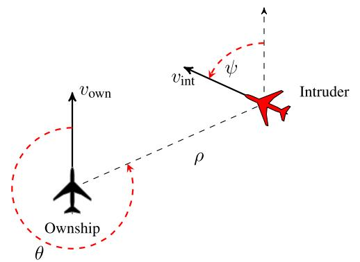

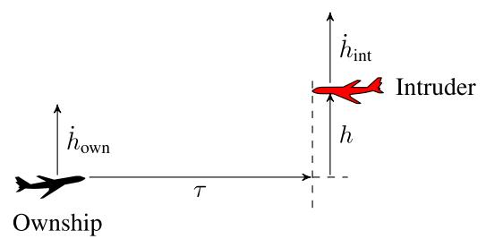  
(a) Geometry of the horizontal collision avoidance scenario for HCAS, from [16]. The black ownship is trying to avoid the (malicious) red intruder by diverting to the left or right.  
(b) Geometry of the vertical collision avoidance scenario for VCAS, from [16]. The black ownship is trying to avoid the (malicious) red intruder by diverting through climbing or descending.  
Figure 1 – Overview of the general geometry of both HCAS (Figure 1a) and VCAS (Figure 1b).

Because the two continuous angular variables θ and ψ, as well as τ, would yield an intractably large monolithic input space, HCAS is decomposed into an ensemble of 40 individual neural networks. Each network corresponds to one combination of the discretized time to closest point of approach $\tau \in \{ 0 \mathrm { s } , 5 \mathrm { s } , 1 0 \mathrm { s } , 1 5 \mathrm { s } , 2 0 \mathrm { s } , 3 0 \mathrm { s } , 4 0 \mathrm { s } , 6 0 \mathrm { s } \}$ and one of the five possible previous advisories ${ \cal S } _ { \mathrm { a d v } }$ , resulting in $8 \times 5 = 4 0$ subsystems [16, 19]. Thus, each subsystem takes only three $\operatorname* { i n p u t s } { - \rho } , \theta _ { ; }$ and ψ—and outputs a Q-value for each of the five possible advisories. The input space of each HCAS subsystem thus contains $N _ { \mathrm { H C A S } } = N _ { \rho } \times N _ { \theta } \times N _ { \psi } = 3 2 \times 4 1 \times 4 1 = 5 3 7 9 2$ discrete training points, corresponding to the discretized values of $\rho , \theta$ , and ψ listed in Table 5.

## 3.2 Vertical Collision Avoidance System (VCAS)

VCAS issues vertical rate advisories to the ownship to avoid an NMAC with an intruder aircraft. As shown in Figure 1b, the encounter is described by the relative altitude of the intruder with respect to the ownship h, the ownship vertical rate $\dot { h } _ { \mathrm { o w n } }$ , the intruder vertical rate $\dot { h } _ { \mathrm { i n t } }$ , the time to the closest point of approach τ, and the previous advisory ${ \cal S } _ { \mathrm { a d v } }$ . The complete parameter ranges used in this work are listed in Table 2 and correspond to the open-source implementation2 [16]. The nine possible advisories are Clear of Conflict (COC), Do Not Climb (DNC), Do Not Descend (DND), Descend at least 1500 ft min−1 (DES1500), Climb at least 1500 ft min−1 (CL1500), Strengthen Descent to at least $1 5 0 0 \mathrm { f t } \mathrm { m i n } ^ { - 1 }$ (SDES1500), Strengthen Climb to at least 1500 ft min−1 (SCL1500), Strengthen Descent to at least 2500 ft min−1 (SDES2500), and Strengthen Climb to at least $2 5 0 0 \mathrm { f t } \operatorname* { m i n } ^ { - 1 }$ (SCL2500), corresponding to $s _ { \mathrm { a d v } } \in \{ 0 , 1 , 2 , \ldots , 8 \}$ [8].

Similar to HCAS, VCAS is decomposed into an ensemble of nine individual neural networks, one for each possible previous advisory $s _ { \mathrm { a d v } } [ 1 6 , 1 9 ]$ . Each subsystem takes the four remaining state variables— $- h , \dot { h } _ { \mathrm { o w n } } , \dot { h } _ { \mathrm { i n t } }$ , and τ—as inputs and outputs a Q-value for each of the nine possible advisories. The input space of each VCAS subsystem thus contains $N _ { \mathrm { { V C A S } } } = N _ { h } \times N _ { \dot { h } _ { \mathrm { o w n } } } \times N _ { \dot { h } _ { \mathrm { { i n t } } } } \times N _ { \tau } = 6 5 \times 3 9 \times$ $3 9 \times 4 1 = 4 0 5 3 4 6 5$ discrete training points, corresponding to the discretized values of $h , \dot { h } _ { \mathrm { o w n } } , \dot { h } _ { \mathrm { i n t } }$ , and τ listed in Table 4, approximately two orders of magnitude more than each HCAS subsystem.

## 3.3 Advisory Selection

For both HCAS and VCAS, the advisory issued at runtime is determined by selecting the action with the highest Q-value for the current state, i.e.,

$$
s _ { \mathrm { a d v } } ^ { * } = \arg \operatorname* { m a x } _ { a } { Q ( s , a ) } ,\tag{1}
$$

where s is the current state and a ranges over all admissible advisories given the previous advisory s [19]. Inadmissible transitions—issuing a climb advisory immediately following a strong descent advisory—are excluded to ensure advisory consistency and reduce pilot workload [4, 16]. In the neural network-based implementation, the network replaces the original lookup table: given the current state, the network outputs estimated Q-values for all advisories, and the one with the highest estimated value is selected [8, 19]. Provided the neural network accurately represents the underlying MDP, the resulting advisory sequence is equivalent to that of the original table.

## 4. Development Process

As previously mentioned, EASA, aware of the trend towards AI-based applications in aviation, issued a concept paper detailing the steps required for future deployment of AI-based applications [13]3. In their concept paper, EASA proposes the W-shaped development process. Compared to the normally used V-model, it is augmented by dedicated steps concerning the model training and learning process verification. However, previous research indicates that this is not enough to develop an AI-based system safely. Instead, a more agile DevOps-based approach appears to be favorable [55, 56, 57, 58]. Thus, the extended W-shaped process, see Figure 2, has been proposed [14]. This process forms the basis of the development process for the AI/ML constituent in this work.

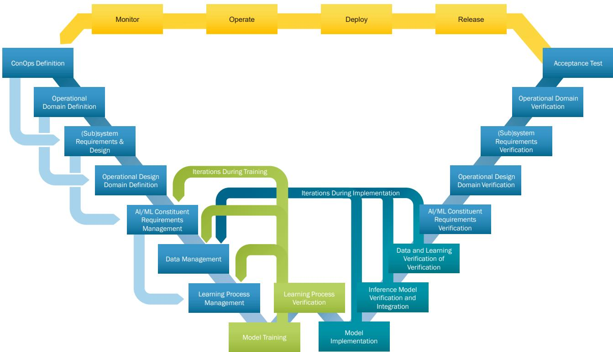  
Figure 2 – The extended W-shaped process [14], an extension of EASA’s W-shaped process [13].

Accordingly, the first step is to define a Concept of Operations (ConOps) for the use case [59]. This has already been done by prior works [15, 59]. For this work, the established ConOps is adopted directly: the system—HCAS and VCAS—is designed to provide pilots with last-resort measures to prevent mid-air collisions by issuing both vertical and horizontal resolution advisories. The system is designed to operate in European Class C airspace, where both the ownship and all possible intruders are equipped with an Automatic Dependent Surveillance-Broadcast (ADS-B) system. No coordination between the ownship and the intruder is assumed, and the pilot must first assess whether the issued

## A SAFETY-BY-DESIGN SOLUTION FOR CERTIFYING NEURAL NETWORKS

advisory can be executed safely before doing so. This ConOps aligns directly with the operational assumptions underlying ACAS Xa and ACAS Xu as defined in the applicable standards [4, 5, 6, 7]. Next, the Operational Domain (OD) and ODD have to be defined. Again, this has already been conducted by prior works to different levels of detail [15, 59, 60]. While the MLEAP report [60] explores an OD and ODD for ACAS Xu/HCAS, both aligned with the ML input parameters of the ML inference—the parameters listed in Table 1—other works produced an OD and ODD more in line with concepts from automotive [15]. This OD and ODD combination includes actual environmental and time-of-day constraints, such as weather conditions, but also the pilot’s reaction time. Nevertheless, for the context of this work, these ODDs are considered equivalent in their relevant aspects [61], and the MLEAP approach will be adopted. This approach has the additional advantage of directly enabling the derivation of the OD and ODD from the underlying standards for ACAS Xa and ACAS Xu [4, 5, 6, 7], which explicitly state the required parameter ranges.

The parameter ranges for both HCAS and VCAS, listed in Tables 1 and 2, can be derived from these standards. For both systems, the maximum aircraft ground speed is bounded at 600 kn [5, 7]. For VCAS, vertical rate ranges of $[ - 1 0 0 \mathrm { f t s ^ { - 1 } } , 1 0 0 \mathrm { f t s ^ { - 1 } } ]$ for both ownship and intruder listed in Table 2 are instead derived from the bounds of the open-source VerticalCAS implementation [16], which are consistent with the aircraft performance limits referenced in the applicable standards [4, 5, 6, 7]. For HCAS, in higher altitude airspace with aircraft speeds up to 600 kn, the expected relative closing speed is no greater than 566 kn for intruders approaching from the side and no greater than 400 kn for intruders approaching from the rear [4, 6]. Furthermore, the discrete values of τ, the time to closest point of approach (CPA), used to partition the 40-network HCAS ensemble can be derived from Table 2-23 in §2.2.4.6.4.2.3.1.10 of DO-386 [7], where τ was calculated at projection times $\tau \in \{ 1 0 \mathrm { s } , 2 0 \mathrm { s } , 3 0 \mathrm { s } , 4 0 \mathrm { s } , 6 0 \mathrm { s } \}$ for initial ranges $r _ { 0 } \in \left[ 3 \mathrm { N M } , 3 0 \mathrm { N M } \right]$ and closing speeds $\nu _ { 0 } \in [ - 1 2 0 0 \mathrm { k n } , 1 2 0 0 \mathrm { k n } ]$ [7]. Here, the parameter ranges listed in Tables 1 and 2 represent a subset of the full operational parameter ranges defined in the standards, reflecting the proof-of-concept nature of HCAS and VCAS as open-source approximations of ACAS Xa and ACAS Xu [16]. A detailed comparison of the use-case parameter ranges and resolution advisory sets against the full ACAS Xa/Xu specifications is provided in Table 6, which quantifies the dimensions that are reduced, collapsed, or omitted relative to ED-256/DO-385 and ED-275/DO-386.

Table 1 – Parameter ranges for the HCAS use case. The ranges are slightly different than the original HCAS implementation [16] but match the corresponding GitHub release at https://github.com/ sisl/HorizontalCAS.
<table><tr><td>Variable</td><td>Description</td><td>Range</td></tr><tr><td> $\rho$ </td><td>Range to intruder</td><td>[0 ft, 56 000 ft]</td></tr><tr><td> $\theta$ </td><td>Bearing angle</td><td> $[ - 1 8 0 ^ { \circ } , 1 8 0 ^ { \circ } ]$ </td></tr><tr><td> $\psi$ </td><td>Relative heading</td><td> $[ - 1 8 0 ^ { \circ } , 1 8 0 ^ { \circ } ]$ </td></tr><tr><td> $\nu _ { \mathrm { o w n } }$ </td><td>Ownship speed</td><td> ${ 2 0 0 \uparrow \uparrow \mathsf { s } ^ { - 1 } }$ </td></tr><tr><td> $\nu _ { \mathrm { i n t } }$ </td><td>Intruder speed</td><td> ${ 2 0 0 \uparrow \uparrow \mathsf { s } ^ { - 1 } }$ </td></tr><tr><td> $\tau$ </td><td>Time to CPA</td><td> $[ 0 \mathsf { s } , 6 0 \mathsf { s } ]$ </td></tr><tr><td> ${ \cal S } _ { \mathrm { a d v } }$ </td><td>Previous advisory</td><td> $\{ 0 , 1 , 2 , 3 , 4 \}$ </td></tr></table>

The requirements for the AI/ML constituent are also derived directly from standards [6, 7]. The primary functional requirement for the AI/ML constituent is that its output must agree with the lookup table advisory for every possible state in the discretized input space, faithfully replicating the underlying MDP policy [9, 11]. This is a strictly stronger requirement than a conventional accuracy target: it demands not merely high aggregate agreement, but a verifiably correct output for every valid input vector. Satisfying this requirement through statistical testing alone is insufficient [13], as no finite test set can certify correctness across the complete input space. Formal verification methods such as reachability analysis [17, 18] can provide stronger guarantees for bounded regions, but have been applied to HCAS and VCAS only for selected meta-properties rather than full policy agreement, and their computational cost scales unfavorably with input space size. A Safety-by-Design approach is therefore required, wherein correctness is built into the system architecture rather than verified a posteriori. Safety Nets fulfill this role by construction: because the lookup table stores the correct advisory for every input vector where the neural network is known to fail, the combined system is provably correct over the entire discrete input space. This construction simultaneously satisfies a set of EASA learning assurance and implementation objectives through exhaustive verification against the ground truth, as enumerated in Table 7.

Table 2 – Parameter ranges for the VCAS use case. The ranges are slightly different than the original VCAS implementation [16] but match the corresponding GitHub release at https: $/ / { \mathfrak { g } } .$ ithub.com/ sisl/VerticalCAS.
<table><tr><td>Variable</td><td>Description</td><td>Range</td></tr><tr><td> $h$ </td><td>Relative altitude</td><td>[–8000 ft, 8000 ft]</td></tr><tr><td> $\dot { h } _ { \mathrm { o w n } }$ </td><td>Ownship vert. rate</td><td> $[ - 1 0 0 \mathsf { f t s } ^ { - 1 } , 1 0 0 \mathsf { f t s } ^ { - 1 } ]$ </td></tr><tr><td> $h _ { \mathrm { i n t } }$ </td><td>Intruder vert. rate</td><td> $[ - 1 0 0 \mathsf { f t s } ^ { - 1 } , 1 0 0 \mathsf { f t s } ^ { - 1 } ]$ </td></tr><tr><td> $\tau$ </td><td>Time to CPA</td><td>[0 s, 40 s]</td></tr><tr><td> ${ \cal S } _ { \mathrm { a d v } }$ </td><td>Previous advisory</td><td>{0, 1, 2, 3, 4, 5, 6, 7, 8}</td></tr></table>

For data management, the training data are derived directly from the MDP lookup tables provided with the open-source implementations of HCAS and VCAS [16]. These lookup tables constitute the formal ground truth against which both training and verification are performed. Because the objective is to represent the complete, finite input space correctly—rather than to generalize from a sample to unseen data—the entire dataset serves simultaneously as the training, validation, and testing set. This departs from the standard machine learning paradigm of disjoint data splits, but is fully consistent with prior work in this domain [8, 9]: the problem is not generalization, but minimally lossy compression of a known, discrete function. From a learning assurance perspective, this design choice is intentional. By evaluating the neural network against the ground truth at every discrete point in the ODD, the Safety Net construction process fulfills the verification objectives of [13] listed in Table 7 without requiring a separate post-training verification campaign.

## 5. Performance Study

The hyperparameter study and Safety Net construction described in this and the following section instantiate the Data Management, Learning Process Management, and Model Training phases of the extended W-shaped process (Figure 2); the exhaustive verification sweep that produces each lookup table corresponds to its Learning Process Verification and Inference Model Verification and Integration phases. HCAS and VCAS both use a neural network to store an estimated Q-value based on the current state. Depending on the estimated value, ACAS Xa/Xu, and by extension HCAS and VCAS, issue a resolution advisory to the pilots to avoid a near mid-air collision. In the original implementation of HCAS and VCAS, each system was represented not by a single neural network but by an ensemble of neural networks to increase the accuracy while keeping the overall system as small as possible [19]. Moreover, the neural networks were trained to learn all Q-values for each state across all possible RAs, even those that would not be selected. If instead one-hot encoding is used, where the highest Q-value is set to one, and all other outputs are zero, thereby effectively turning the regression problem into a classification problem, performance generally improves as expected [62, 63]. Since both HCAS and VCAS issue only the advisory with the highest Q-value (cf. Section 3), discarding the Q-values themselves does not alter the functional behavior of the system at the discrete grid points. For the training of the neural networks in this work, Mean Squared Error Loss was used when attempting to learn the full Q-value vector—equal to previous research [16]—while Cross Entropy Loss was used for the one-hot encoded output vector, as is standard with classification problems.

Because the Safety Net’s overall size is determined jointly by the neural network architecture and the resulting LUT, a systematic hyperparameter study is required to identify the design that minimizes the total memory requirements. A smaller LUT—achieved by a higher neural network retrieval rate, defined as the fraction of input vectors the network classifies correctly so that no LUT lookup is required (equivalently, 100 % minus the percentage of the input space stored in the LUT)—directly reduces system size, provided the network itself does not grow disproportionately large. Preliminary studies identified that the ranges between 2 and 5 for the number of hidden layers and 50 to 150 for the number of nodes per hidden layer were the most promising to maximize the retrieval rate. The three activation functions, ReLU, LeakyReLU, and GELU, were chosen based on current recommendations from prior research [20, 21, 22]. This leads to the following ranges for the hyperparameters: for the activation function ReLU, LeakyReLU, and GELU; for the number of hidden layers 2, 3, 5, and 7; for the number of nodes per hidden layer 25, 50, 100, 150, and 200; and for the encoding either target encoding—representing the full correct Q-value vector—or one-hot encoding. Furthermore, for every combination of activation function, number of hidden layers, nodes per hidden layer, and encoding, training was conducted five times per neural network to reduce random influences. Training for each neural network was performed for up to 10 000 epochs, with early stopping after 1000 consecutive epochs without improvement—also called patience—where one epoch is a complete pass through the training dataset. Given the nature of the problem—exact memorization of a finite, known function rather than generalization to unseen samples—which requires a correct representation of the entire problem space, the entire dataset was used for training, validation, and testing; there is no held-out distribution to overfit to. The early-stopping improvement criterion is therefore evaluated as the training loss—equivalently, the agreement rate against the complete discrete ground truth—while the patience guards only against wasted computation once convergence stalls, not against a loss of generalization. Thus, the trained system has learned from and been tested on every possible scenario, ensuring accurate outputs across real-world applications. This is consistent with prior work, which likewise trains and evaluates on the full dataset and notes that here overfitting is in fact encouraged [8, 9]. After successfully training the neural network, the corresponding lookup table was created.

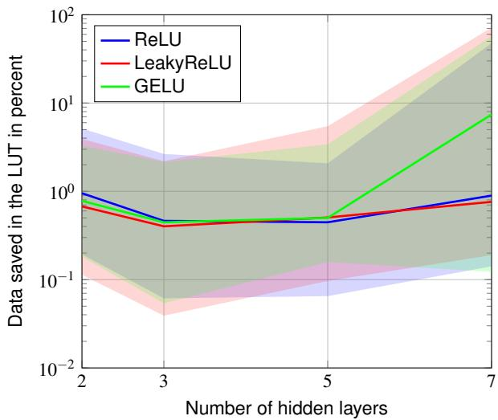  
(a) Median percentage of data saved in the LUT relative to the number of hidden layers. The LUT’s size is minimal at approximately 3–5 hidden layers, worsening with additional hidden layers.

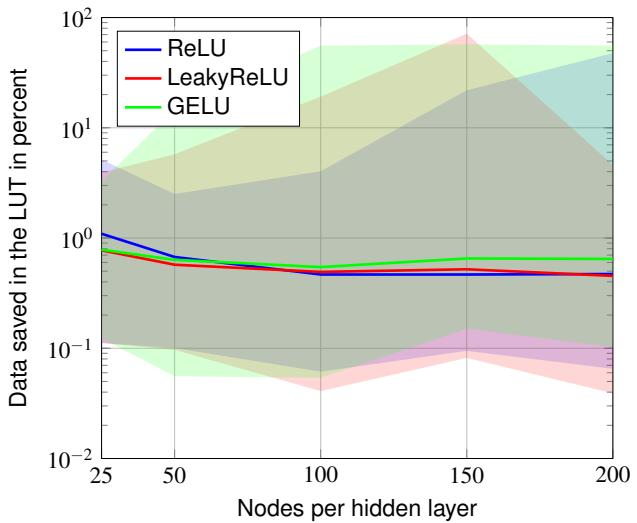  
(b) Median percentage of data saved in the LUT relative to the number of nodes per hidden layer. After 50 to 100 nodes per layer, the number of nodes appears to have little effect on the median, while the variance increases substantially.  
Figure 3 – Logarithmic plots displaying the impact of the number of hidden layers and nodes per hidden layer of the fully connected neural network on the retrieval rate for the three activation functions ReLU, LeakyReLU, and GELU. For the encoding, one-hot was used. The data are aggregated across all 40 HCAS subsystems. Lower percentages of data saved in the LUT correspond to smaller system sizes.

The results of the parameter studies are shown in Figure 3 for HCAS and Figure 4 for VCAS, with the percentage of the input space stored in the LUT plotted against the number of hidden layers and the number of nodes per hidden layer, separated by activation function, using one-hot encoding throughout. A comparison between one-hot and target encoding is shown in Figure 5. In all plots, the median is shown with shading indicating the full range across the five training runs per configuration. Because the neural network’s memory footprint depends only on its architecture and not on the learned weight values, any reduction in the percentage of inputs stored in the LUT translates directly to a smaller combined system. The median percentage of inputs stored in the LUT for VCAS is consistently one to two orders of magnitude lower than for HCAS. Two structural differences between the two systems explain this gap. First, each VCAS subsystem contains 4 053 465 training points, whereas each HCAS subsystem contains only 53 792, giving the VCAS subsystem almost two orders of magnitude more information per epoch, matching the performance advantage of VCAS. Second, the HCAS input space includes two angular variables—the bearing angle θ and the relative heading ψ—each spanning −180° to 180°. The periodicity of these variables likely introduces discontinuities at the wrap-around boundary that fully connected networks with standard weight initialization struggle to represent faithfully, resulting in systematically more absolute errors in HCAS subsystems and therefore a larger LUT [64, 65]. A natural remedy, left to future work, is to encode the periodic angular inputs θ and ψ by their sine and cosine components, removing the artificial discontinuity at the ±180° wrap-around boundary that fully connected networks with standard initialization represent poorly [64, 65]; this would be expected to reduce the HCAS LUT even further. VCAS inputs, by contrast, are all bounded continuous quantities (relative altitude, vertical rates, time to CPA) whose policy structure is largely monotonic, presenting a considerably more tractable regression surface. First, ReLU persistently yields a lower median LUT percentage than LeakyReLU or GELU, despite prior literature suggesting the opposite for general classification tasks [20, 21, 22]. This is attributable to the discrete, bounded nature of the input space: ReLU’s hard zeroing produces sparser, more piecewise-constant activation patterns [66] that align well with the step-like decision boundaries of the underlying MDP policy, whereas the non-zero negative slope of LeakyReLU likely introduces unnecessary gradient signal in inactive regions. GELU’s smooth nonlinearity, beneficial for large-scale language and vision tasks, similarly offers no advantage here and incurs higher variance across runs [47, 48]. Second, increasing the number of nodes per hidden layer beyond 50 to 100 yields diminishing returns on the median LUT percentage while substantially increasing variance across training runs. This indicates that the policy’s representational complexity is saturated at moderate widths; additional capacity is not exploited consistently, suggesting multiple equivalent local minima in the loss landscape at higher widths. Third, the optimal number of hidden layers lies between 3 and 5. Shallower networks lack the depth to capture the piecewise geometry of the MDP policy, while networks deeper than 5 layers show a deteriorating median, likely because the optimization landscape becomes harder to navigate.

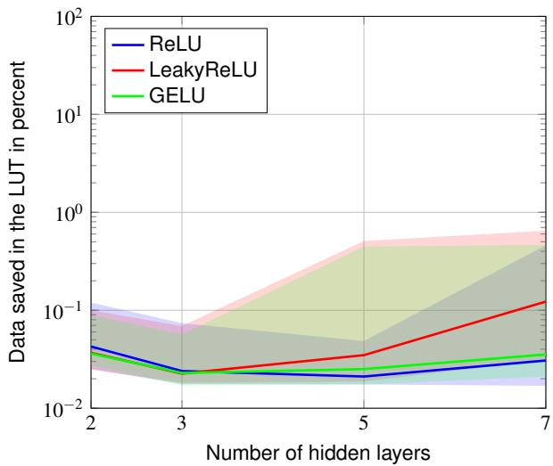  
(a) Median percentage of data saved in the LUT relative to the number of hidden layers. The LUT’s size is minimal at 3–5 hidden layers, depending on the activation function, worsening with additional hidden layers.

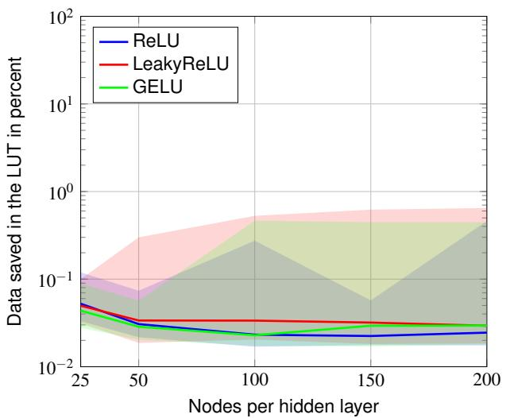  
(b) Median percentage of data saved in the LUT relative to the number of nodes per hidden layer. After 50 to 100 nodes per layer, the number of nodes appears to have little effect on the median, while the variance increases substantially.  
Figure 4 – Logarithmic plots displaying the impact of the number of hidden layers and nodes per hidden layer of the fully connected neural network on the retrieval rate for the three activation functions ReLU, LeakyReLU, and GELU. For the encoding, one-hot was used. The data are aggregated across all 9 VCAS subsystems. Lower percentages of data saved in the LUT correspond to smaller system sizes.

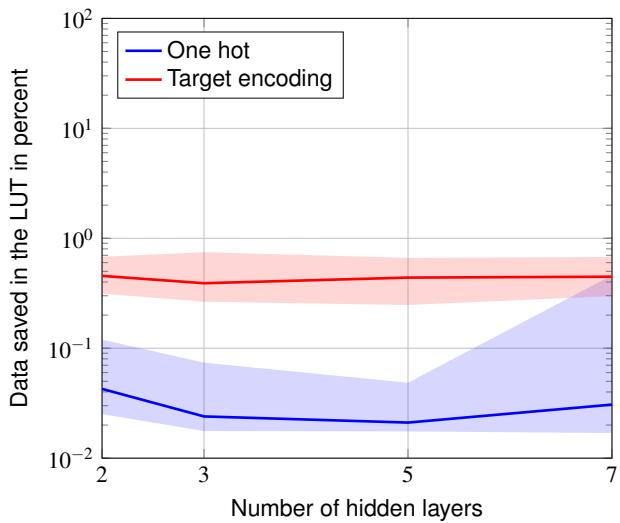  
(a) Median percentage of data saved in the LUT relative to the number of hidden layers.

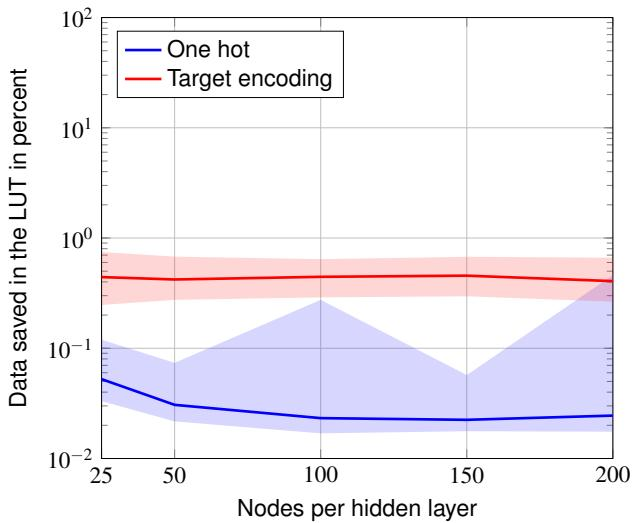  
(b) Median percentage of data saved in the LUT relative to the number of nodes per hidden layer.  
Figure 5 – Logarithmic plots displaying the impact of the encoding—target encoding or one-hot—on the retrieval rate of the fully connected neural networks. Here, with a ReLU activation function and compartmentalized into a number of hidden layers and nodes per hidden layer. Lower percentages of data saved in the LUT correspond to smaller system sizes. For smaller neural networks, one-hot consistently outperforms target encoding on the median retrieval rate by at least one order of magnitude. The data are aggregated across all 9 VCAS subsystems.

Based on the above, a Safety Net was created for both HCAS and VCAS using the best-performing configurations identified in the study. The open-source implementations, together with reproducibility scripts, are released alongside this paper.

## 6. Safety Net

Given the results of Section 5, followed by a joint hyperparameter sensitivity analysis, shown in Figure 6 for VCAS, the final Safety Nets for both HCAS and VCAS were assembled using the best-performing configurations identified in the study. For both systems, ReLU was selected as the activation function, despite prior literature suggesting a preference for LeakyReLU in general classification tasks [20, 21, 22]. As discussed in Section 5, this choice is well-motivated by the discrete, bounded nature of the MDP policy underlying both HCAS and VCAS, for which ReLU’s piecewise-constant activation patterns are particularly well-suited. One-hot encoding was adopted for both systems, as it consistently outperformed the target encoding by at least one order of magnitude on the median LUT percentage, particularly for smaller network architectures. For HCAS, an ensemble of networks with 3 hidden layers and 100 nodes per hidden layer was selected, while for VCAS, 5 hidden layers and 100 nodes per hidden layer were selected, both with training performed for up to 10 000 epochs and early stopping after 1000 consecutive epochs without improvement. Consequently, this configuration falls right into the identified optimal range of 3 to 5 hidden layers and approximately 50 to 100 nodes per layer, beyond which the median LUT percentage does not improve while variance increases substantially and the neural network’s own memory footprint grows, increasing the combined system size. In total, on a workstation equipped with an NVIDIA GeForce RTX 4090 GPU and a 13th-generation Intel Core i9-13900K CPU with 64 GiB of RAM, the training took around 77 h for HCAS and 269 h for VCAS. The resulting aggregate system sizes are summarized in Table 3. The average neural network coverage across all 40 HCAS subsystems of 99.65 % exceeds the median

A SAFETY-BY-DESIGN SOLUTION FOR CERTIFYING NEURAL NETWORKS

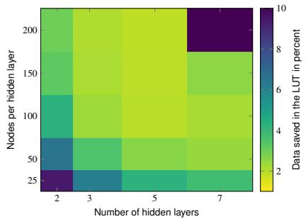  
(a) Median percentage of data saved in the LUT for the ReLU activation function.

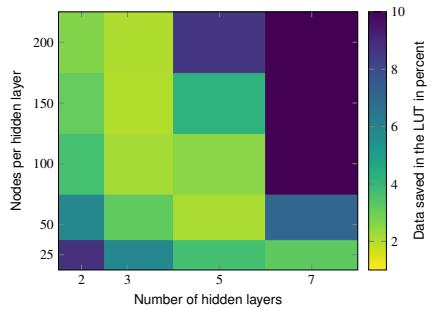  
(b) Median percentage of data saved in the LUT for the LeakyReLU activation function.

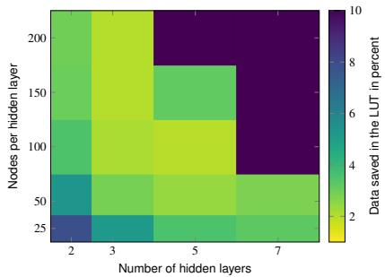  
(c) Median percentage of data saved in the LUT for the GELU activation function.

Figure 6 – Heatmaps displaying the impact of the number of hidden layers and nodes per hidden layer, split into the three activation functions—ReLU, LeakyReLU, and GELU. Compared to LeakyReLU and GELU, ReLU appears to be more forgiving in choosing the right combination of hidden layers and nodes per hidden layer. The data are aggregated across all 9 VCAS subsystems.  
Table 3 – Aggregate sizes of the final Safety Nets for HCAS and VCAS, based on a scipy.spatial k-d tree implementation of the LUT. All 40 HCAS and 9 VCAS subsystems are included.
<table><tr><td>System</td><td>Neural network total</td><td>LUT total</td><td>Combined</td><td>Avg. neural network coverage</td></tr><tr><td>HCAS</td><td>3.22 MiB</td><td>1.54 MiB</td><td>4.76 MiB</td><td>99.65%</td></tr><tr><td>VCAS</td><td>1.44 MiB</td><td>221.40 MiB</td><td>222.83 MiB</td><td>97.77%</td></tr></table>

results of Section 5, as the final ensemble retains the best-performing of the five training runs for each subsystem, whereas Figure 3 reports medians across runs aggregated over all subsystems. Compared to a purely lookup table-based implementation of ACAS X, which requires at least 4 GiB of memory, the combined Safety Nets occupy 4.76 MiB for HCAS and 222.83 MiB for VCAS—a reduction of almost three orders of magnitude and slightly more than one order of magnitude, respectively. Thus, both systems would fit within the memory budget of current avionics hardware, rendering deployment feasible. The LUT sizes reported here use a scipy.spatial k-d tree implementation [67, 68], which reduces the LUT footprint by roughly a factor of three relative to a naïve Python dictionary (from 5.27 MiB to 1.54 MiB for HCAS and from 677.40 MiB to 221.40 MiB for VCAS).

Beyond storage, runtime performance is critical for deployment on avionics hardware. The ACAS X surveillance-and-resolution cycle operates at approximately 1 Hz, i.e., one advisory update per second, as specified in the ED-256/DO-385 and ED-275/DO-386, for ACAS Xa and ACAS Xu, respectively [4, 5, 6, 7]; the inference time of the AI/ML constituent must therefore remain well below 1 s. The combined Safety Nets were benchmarked on the same workstation as was used for training the Safety Net, averaging over 5000 samples per subsystem. On the GPU, HCAS achieves a mean inference time of $( 3 3 . 2 \pm 1 . 5 ) $ µs per sample and VCAS (57.3 ± 12.7) µs per sample. On the CPU alone, both systems are even faster, at $( 2 0 . 2 \pm 4 . 3 ) $ µs for HCAS and $( 4 6 . 4 \pm 1 3 . 0 ) $ µs for VCAS, owing to the modest network sizes that avoid host-device transfer overhead. These sub-millisecond inference times sit roughly four orders of magnitude below the 1 s update budget, confirming ample runtime feasibility of the approach.

In line with the Safety Net concept [11], inference is defined only at the discrete input vectors enumerated in the manifest (cf. Tables 4 and 5): continuous runtime states are mapped to the closest available discrete input vector before the check module is consulted. The 100 % correctness guarantee therefore applies to the discretized ODD, while this quantization determines the behavior between grid points. This constitutes a deliberate deviation from the original table-based implementations, which interpolate the Q-values between grid vertices [8, 19], and from the box-based verification [9], which proves agreement over continuous regions; extending the point-wise guarantee to interval-based coverage of the continuous input space is left to future work.

The trained neural networks, lookup tables, and manifest files for both HCAS and VCAS are released alongside this paper [69]4 together with the code needed to reproduce the results5, constituting the first publicly available Safety Net implementation for these systems, and directly addressing a gap identified in prior work [9, 11], where implementation details were not disclosed, precluding replicable results.

## 7. Certification Impact

This work is the first to systematically map Safety Nets to the learning assurance objectives of EASA’s concept paper [13]; Table 7 enumerates the objectives addressed by the framework. Here, three objectives are of particular significance. Objective LM-04 requires quantifiable generalization bounds, and its anticipated MOC explicitly acknowledges that statistical learning theory bounds are typically too loose for large neural networks [13]. The Safety Net replaces this probabilistic argument with a deterministic one: by exhaustively evaluating the neural network against the MDP lookup tables across the entire discretized input space and storing all deviations, the generalization gap is identically zero by construction—a strictly stronger claim. Objectives LM-10 and IMP-11, requiring requirementsbased verification of the trained and inference models, respectively, follow directly: the exhaustive sweep constitutes verification against the formal specification for every valid input vector, satisfying the coverage requirements that DO-178C-aligned methods demand but that no finite test set can provide [13, 31]. The remaining objectives listed in Table 7—including LM-09, LM-12 through LM-14, LM-16, IMP-09, IMP-10, and IMP-12—are addressed as structural by-products of the same sweep. The mapping above refers to the published Issue 02 [13]. Under the Proposed Issue 03 [54], the three objectives of particular significance carry over without weakening the argument. Objective LM-10 maps near-verbatim to Objective SU-LM-11, and Objective IMP-11 is covered by Objectives SU-IMP-06 and SU-IMP-07. Objective LM-04 is split into an a priori and an a posteriori component, Objectives S-LM-06 and SU-LM-14, respectively. This split is advantageous for Safety Nets: while statistical learning theory bounds remain too loose to satisfy the a priori objective for large neural networks—the same limitation acknowledged for LM-04 in Issue 02—the deterministic, zero-error bound established by the exhaustive sweep satisfies the a posteriori objective SU-LM-14 by construction, as it directly verifies the generalization capability over the entire discretized input space rather than estimating it. The remaining objectives carry over analogously: Objectives LM-09, LM-12, LM-13, and LM-14 map to Objectives SU-LM-10, SU-LM-12, SU-LM-13, and SU-LM-14; Objectives IMP-09 and IMP-10 are merged into Objective SU-IMP-07, and the completeness of Objectives LM-16 and IMP-12 move to Objectives SUR-DA-14 and SURK-DA-15. A full re-mapping of Table 7 to the Proposed Issue 03 convention is left to future work, pending the finalization of that document.

## 8. Discussion

Compared to indications from prior literature [20, 21, 22], ReLU showed a clear and consistent superiority over LeakyReLU and GELU. Given that the findings were derived for complex and smooth loss landscapes, it indicates that the discrete, bounded, piecewise-constant MDP policy underlying both HCAS and VCAS is missing these features. ReLU’s hard zeroing produces sparser activation patterns [66] that align more closely with the sharp advisory boundaries of the target function. In contrast, the non-zero negative slope of LeakyReLU introduces a gradient signal in regions where the policy is constant, and GELU’s smooth nonlinearity offers no structural advantage here while incurring higher variance across runs. The diminishing returns beyond 50 to 100 nodes per hidden layer are consistent with this interpretation: the representational complexity of the target function is bounded by the finite cardinality of the input space, and additional capacity is not exploited systematically beyond a moderate width, as evidenced by the substantially increased variance across training runs at higher widths. The one-hot advantage observed in Section 5 stands in apparent contrast to the prior Safety Net study, which found regression targets to outperform a classification formulation [9]. Differences in architecture and encoding most plausibly explain the discrepancy: the prior study evaluated classification for only a single configuration—the wide, decreasing-width decreasing256 architecture designed for regression—whereas this paper sweeps narrow, uniform-width networks in which one-hot targets with cross-entropy loss align directly with the arg-max decision rule. The two findings are therefore consistent with activation- and encoding-effects being strongly architecture- and task-dependent, reinforcing the need for the systematic sweep conducted here.

The hyperparameter study conducted in this work aggregates results across all subsystems of a given system, thereby obscuring subsystem-level variation and ignoring cross-coupling effects between hyperparameters at the individual subsystem level. Moreover, a different split of HCAS and VCAS into alternative subsystems might be favorable for better compression. A per-subsystem architecture search would likely yield a smaller combined system, with the greatest gains expected for VCAS, where subsystem-level variation in policy complexity is more pronounced, given the approximately two orders of magnitude difference in input space size relative to HCAS. Similarly, the uniform layer width used throughout was not varied; decreasing-width architectures [19], which could better match the effective dimensionality of the decision boundary as a function of depth, remain unexplored, as do architectures different from fully-connected neural networks. The LUT still accounts for 99.4 % of the combined VCAS system size—the primary reason the stated reduction relative to the monolithic 4 GiB MDP lookup table reaches almost three orders of magnitude for HCAS but only around 1.25 orders of magnitude for VCAS. However, a binary encoding, storing each entry as its float32 input coordinates together with a single-byte advisory index, would require only 17 B per entry for VCAS and 13 B for HCAS—compared to the average footprint of approximately 280 B per stored input vector for VCAS and 210 B for HCAS in the k-d tree—reducing the LUT footprint by more than one order of magnitude without any loss of information. Because the LUT dominates the combined VCAS system size, this serialization change alone would shrink the combined VCAS Safety Net from 222.83 MiB to an estimated 20 MiB, pushing the reduction relative to the monolithic 4 GiB MDP lookup table beyond two orders of magnitude for both systems. Further headroom remains through packed grid indices instead of $\mathtt { f } \mathtt { l } \mathtt { o a t } 3 2$ coordinates and through established compression techniques such as pruning, quantization, and Huffman coding [70, 71], the latter also suggested for the hybrid architecture in [9]; these optimizations, however, are left to future work, as the present implementation prioritizes the auditable manifest format over minimal footprint. Finally, the open-source HCAS and VCAS implementations are proof-of-concept approximations of ACAS Xa and ACAS Xu that do not cover the full operational specifications of ED-256/DO-385 and ED-275/DO-386 [4, 5, 6, 7]; the reported system sizes should therefore not be interpreted as representative of a production deployment. In fact, the gap is substantial along several axes, as summarized in Table 6. HCAS fixes both ownship and intruder speed to a single value of ${ 2 0 0 \uparrow \uparrow \mathsf { s } ^ { - 1 } }$ , collapsing two state dimensions that the standards define over the full 0 kn to 600 kn envelope, and truncates range at 56 000 ft against the 14 NM (≈ 85 000 ft) head-on surveillance requirement [7]. VCAS clips vertical rates at $\pm 1 0 0 \uparrow \uparrow \mathsf { s } ^ { - 1 }$ $\mathsf { \pm 6 0 0 0 \hbar m i n ^ { - 1 } } )$ against the $\pm 1 0 0 0 0 \mathrm { f t } \mathrm { m i n } ^ { - 1 }$ design maximum [6], and both systems collapse the previous-advisory state to a single index rather than the full sense/strength/crossing/coordination structure of the standardized resolution advisory encodings. Discretizing the full operational envelopes at strides comparable to the open-source tables yields on the order of $1 . 2 { \cdot } 1 0 ^ { 9 }$ states for ACAS Xu and $1 . 3 { \cdot } 1 0 ^ { 8 }$ for ACAS Xa per subsystem partition—roughly four and one and a half orders of magnitude larger, respectively, than the 53 792 and 4 053 465 points of a single HCAS or VCAS subsystem. Because the LUT footprint of a Safety Net scales with the number of misrepresented input vectors, and the neural network’s footprint scales with the representational complexity of a far richer policy, a production-scale Safety Net would be considerably larger than the figures in Table 3; the present results should be read as a methodological demonstration on a faithful but reduced surrogate, not as a size estimate for certified ACAS X.

Furthermore, the results bear directly on the certification argument. Because the Safety Net guarantees 100 % agreement with the lookup table ground truth across the entire discretized input space by construction, the architectural choices studied here—activation function, depth, width, and encoding— do not affect whether the EASA verification objectives are met, but only the cost at which they are met. A higher neural network retrieval rate shrinks the lookup table, and therefore the combined system size, but even the poorest-performing configuration remains certifiable, as the lookup table absorbs every residual error. In this sense, the hyperparameter study optimizes the deployability of a system that is correct by design, rather than trading accuracy against safety: the learning assurance and implementation objectives enumerated in Table 7—in particular, the requirements-based verification objectives LM-10 and IMP-11 and the generalization objective LM-04—are satisfied identically across all evaluated architectures.

## 9. Conclusion

This work presents the first open-source and reproducible set of Safety Nets together with a systematic analysis of Safety Nets as a Safety-by-Design solution for certifiable neural networks in aviation, systematically varying activation function, depth, width, and output encoding across all 40 HCAS and 9 VCAS subsystems. Contrary to the general preference in recent literature [20, 21, 22], ReLU matches or outperforms LeakyReLU and GELU across both systems—attributable to the piecewise-constant structure of the underlying MDP policy, for which ReLU’s sparse activation patterns are particularly well-suited. The optimal architecture lies in the range of 3 to 5 hidden layers with approximately 50 to 100 nodes per layer; beyond this, variance increases, and the neural network’s memory footprint grows without a corresponding reduction in LUT size, increasing the combined system size. Furthermore, one-hot encoding consistently outperforms target encoding by at least one order of magnitude on the median LUT percentage, particularly for smaller architectures. The resulting Safety Nets achieve average neural network coverages of 99.65 % and 97.77 % for HCAS and VCAS, with combined system sizes of 4.76 MiB and 222.83 MiB, respectively—reductions of almost three and slightly more than one order of magnitude relative to the monolithic 4 GiB MDP lookup table. The Safety Net framework satisfies a set of EASA learning assurance and implementation objectives by construction, replacing probabilistic generalization arguments with a deterministic, zero-error bound over the complete discretized input space and thereby fulfilling requirements-based verification objectives LM-10 and IMP-11 without a separate post-training verification campaign, as detailed in Table 7. Crucially, these objectives are satisfied by construction regardless of the chosen architecture, so the hyperparameter optimization presented here serves to minimize deployment cost on avionics hardware rather than to trade accuracy against certifiability. Finally, the trained neural networks, lookup tables, manifest files, and training scripts for both HCAS and VCAS are released alongside this paper, constituting the first publicly available and reproducible Safety Net implementation.

## 10. Contact Author Email Address

johann.christensen@dlr.de

## 11. Copyright Statement

The authors confirm that they, and/or their company or organization, hold copyright on all of the original material included in this paper. The authors also confirm that they have obtained permission, from the copyright holder of any third party material included in this paper, to publish it as part of their paper. The authors confirm that they give permission, or have obtained permission from the copyright holder of this paper, for the publication and distribution of this paper as part of the ICAS proceedings or as individual off-prints from the proceedings.

## References

[1] Precedence Research. Artificial intelligence in aviation market size, share, and trends 2024 to 2034. resreport 1748, Precedence Research, 05 2022.

[2] Boeing. 2024 pilot and technician outlook. techreport, The Boeing Company, 2024.

[3] European Organization for Civil Aviation Equipment (EUROCAE). Minimum operational performance standards for traffic alert and collision avoidance system ii (tcas ii). techreport ED-143, European Organization for Civil Aviation Equipment (EUROCAE), Malakoff, France, 09 2008.

[4] European Organization for Civil Aviation Equipment (EUROCAE). Minimum operational performance standards for airborne collision avoidance system x (acas x) (acas xa with acas xo). techreport ED-256, European Organization for Civil Aviation Equipment (EUROCAE), Saint-Denis, France, 10 2018.

[5] European Organization for Civil Aviation Equipment (EUROCAE). Minimum operational performance standard (mops) for acas xu. techreport ED-275, European Organization for Civil Aviation Equipment (EUROCAE), Saint-Denis, France, 12 2020.

[6] RTCA, Inc. Minimum operational performance standards for airborne collision avoidance system x (acas x) (acas xa and acas xo). techreport DO-385, GlobalSpec, Washington, DC, USA, 10 2018.

[7] RTCA, Inc. Minimum operational performance standards for airborne collision avoidance system xu (acas xu). techreport DO-386, GlobalSpec, Washington, DC, USA, 12 2020.

[8] Kyle D. Julian, Mykel J. Kochenderfer, and Michael P. Owen. Deep neural network compression for aircraft collision avoidance systems. Journal of Guidance, Control, and Dynamics, 42(3):598–608, 03 2019.

[9] Mathieu Damour, Florence De Grancey, Christophe Gabreau, Adrien Gauffriau, Jean-Brice Ginestet, Alexandre Hervieu, Thomas Huraux, Claire Pagetti, Ludovic Ponsolle, and Arthur Clavière. Towards certification of a reduced footprint acas-xu system: A hybrid ml-based solution. In Computer Safety, Reliability, and Security, pages 34–48, Cham, Switzerland, 2021. Springer International Publishing.

[10] General Electric Company. Ge aviation provides a range of flight management computer (fmc) solutions to support multiple aircraft platforms., 05 2018.

[11] Johann Maximilian Christensen, Wanja Zaeske, Janick Beck, Sven Friedrich, Thomas Stefani, Akshay Anilkumar Girija, Elena Hoemann, Umut Durak, Frank Köster, Thomas Krüger, and Sven Hallerbach. Towards certifiable ai in aviation: A framework for neural network assurance using advanced visualization and safety nets. In 2024 AIAA DATC/IEEE 43rd Digital Avionics Systems Conference (DASC), pages 1–9, San Diego, CA, USA, 09 2024. IEEE.

[12] Elena Hoemann, Akshay Anilkumar Girija, Johann Maximilian Christensen, Yannick Kees, Florian Krone, Thomas Liebert, Ryan Mut, Gerald Sauter, Thomas Stefani, Frank Köster, and Sven Hallerbach. Towards a domain-agnostic safety-by-design ai engineering pipeline. In Roberto Posenato and Irene Vanderfeesten, editors, Advanced Information Systems Engineering Workshops, volume 586 of Lecture Notes in Business Information Processing, pages 267–273, Cham, Switzerland, 06 2026. Springer Nature Switzerland.

[13] European Union Aviation Safety Agency (EASA). Easa concept paper: Guidance for level 1 & 2 machine learning applications. techreport, European Union Aviation Safety Agency (EASA), Postfach 10 12 53, 50452 Cologne, Germany, 04 2024.

[14] Johann Maximilian Christensen, Thomas Stefani, Akshay Anilkumar Girija, Elena Hoemann, Andrea Vogt, Viktor Werbilo, Umut Durak, Frank Köster, Thomas Krüger, and Sven Hallerbach. Formulating an engineering framework for future ai certification in aviation. Aerospace, 12(6):1–27, 05 2025.

[15] Friedrich Werner, Johann Maximilian Christensen, Thomas Stefani, Frank Köster, Elena Hoemann, and Sven Hallerbach. Formulating a learning assurance-based framework for ai-based systems in aviation. Aerospace, 13(2):1–30, 02 2026.

[16] Kyle D. Julian and Mykel J. Kochenderfer. Guaranteeing safety for neural network-based aircraft collision avoidance systems. In 2019 IEEE/AIAA 38th Digital Avionics Systems Conference (DASC), pages 1–10, San Diego, CA, USA, 09 2019. IEEE.

[17] Diego Manzanas Lopez, Taylor T. Johnson, Stanley Bak, Hoang-Dung Tran, and Kerianne L. Hobbs. Evaluation of neural network verification methods for air-to-air collision avoidance. Journal of Air Transportation, 31(1):1–17, 01 2023.

[18] Guy Katz, Clark Barrett, David L. Dill, Kyle Julian, and Mykel J. Kochenderfer. Reluplex: An efficient SMT solver for verifying deep neural networks. In Rupak Majumdar and Viktor Kuncak, editors,ˇ Computer Aided Verification, pages 97–117, Heidelberg, Germany, 2017. Springer.

[19] Kyle D. Julian, Jessica Lopez, Jeffrey S. Brush, Michael P. Owen, and Mykel J. Kochenderfer. Policy compression for aircraft collision avoidance systems. In 2016 IEEE/AIAA 35th Digital Avionics Systems Conference (DASC), pages 1–10, Sacramento, CA, USA, 09 2016. IEEE.

[20] Arun Kumar Dubey and Vanita Jain. Comparative study of convolution neural network’s relu and leaky-relu activation functions. In Sukumar Mishra, Yog Raj Sood, and Anuradha Tomar, editors, Applications of Computing, Automation and Wireless Systems in Electrical Engineering, pages 873–880, Singapore, 06 2019. Springer Singapore.

[21] Andrew L. Maas, Awni Y. Hannun, and Andrew Y. Ng. Rectifier nonlinearities improve neural network acoustic models. In ICML Workshop on Deep Learning for Audio, Speech and Language Processing, Atlanta, GA, USA, 06 2013.

[22] Bing Xu, Naiyan Wang, Tianqi Chen, and Mu Li. Empirical evaluation of rectified activations in convolutional network. arXiv, 05 2015.

[23] EASA and Daedalean. Concepts of design assurance for neural networks (codann). resreport, European Union Aviation Safety Agency (EASA), 03 2020.

[24] EASA and Daedalean. Concepts of design assurance for neural networks (codann) ii with appendix b. resreport, European Union Aviation Safety Agency (EASA), 01 2024.

[25] Mélanie Ducoffe, Maxime Carrere, Léo Féliers, Adrien Gauffriau, Vincent Mussot, Claire Pagetti, and

Thierry Sammour. LARD - landing approach runway detection - dataset for vision based landing. working paper or preprint, 04 2023.

[26] Vincent Mussot, Claire Pagetti, Mélanie Ducoffe, Yassine Bougacha, Jean-Brice Ginestet, Jacques Girard, Thierry Sammour, Franck Mamalet, Sofiane Kraiem, and Augustin Fuchs. Lard 2.0: Enhanced datasets and benchmarking for autonomous landing systems. 13th European Congress on Embedded Real Time Software and Systems (ERTS), 02 2026.

[27] Ellena Papadopoulos and Felipe Gonzalez. Uav and ai application for runway foreign object debris (fod) detection. In 2021 IEEE Aerospace Conference (50100), pages 1–8, Big Sky, MT, USA, 03 2021. IEEE.

[28] Jajang Taupik, Tossin Alamsyah, Asri Wulandari, Edmund Ucok Armin, and Alfin Hikmaturokhman. Airport runway foreign object debris (fod) detection based on yolox architecture. In 2023 International Conference on Computer Science, Information Technology and Engineering (ICCoSITE), pages 40–43, Jakarta, Indonesia, 02 2023. IEEE.

[29] Thomas Stefani, Mohsan Jameel, Ingrid Gerdes, Robert Hunger, Carmen Bruder, Elena Hoemann, Johann Maximilian Christensen, Akshay Anilkumar Girija, Frank Köster, Thomas Krüger, and Sven Hallerbach. Towards an operational design domain for safe human-ai teaming in the field of ai-based air traffic controller operations. In 2024 AIAA DATC/IEEE 43rd Digital Avionics Systems Conference (DASC), pages 1–10, San Diego, CA, USA, 09 2024. IEEE.

[30] Charles Berro, Fotini Deligiannaki, Thomas Stefani, Johann Maximilian Christensen, Ingrid Gerdes, Frank Köster, Sven Hallerbach, and Arne Raulf. Leveraging large language models as an interface to conflict resolution for human-ai alignment in air traffic control. In 2025 AIAA DATC/IEEE 44th Digital Avionics Systems Conference (DASC), pages 1–10, Montreal, QC, Canada, 09 2025. IEEE.

[31] RTCA, Inc. Software considerations in airborne systems and equipment certification. techreport DO-178C, GlobalSpec, Washington, DC, USA, 01 2012.

[32] SAE International. Guidelines for development of civil aircraft and systems (ARP4754A). Technical Report ARP4754A, SAE International, 12 2010.

[33] Ramgopal Kashyap. Artificial Intelligence Systems in Aviation, pages 1–26. IGI Global, 02 2019.

[34] Florian Tambon, Gabriel Laberge, Le An, Amin Nikanjam, Paulina Stevia Nouwou Mindom, Yann Pequignot, Foutse Khomh, Giulio Antoniol, Ettore Merlo, and François Laviolette. How to certify machine learning based safety-critical systems? a systematic literature review. Automated Software Engineering, 29(2), 04 2022.

[35] Tobias App, Nikolas Voth, Gerald Sauter, Thomas Stefani, Akshay Anilkumar Girija, and Thomas Krüger. An agile framework for developing ai applications in safety critical systems. In Deutscher Luft- und Raumfahrtkongress (DLRK) 2024, pages 1–9, Hamburg, Germany, 10 2024. Deutsche Gesellschaft für Luft- und Raumfahrt - Lilienthal-Oberth e.V.

[36] Thomas Stefani, Johann Maximilian Christensen, Akshay Anilkumar Girija, Siddhartha Gupta, Umut Durak, Frank Köster, Thomas Krüger, and Sven Hallerbach. Automated scenario generation from operational design domain model for testing ai-based systems in aviation. CEAS Aeronautical Journal, 16(1):197–212, 11 2024.

[37] Thomas Stefani, Johann Maximilian Christensen, Elena Hoemann, Akshay Anilkumar Girija, Frank Köster, Thomas Krüger, and Sven Hallerbach. Applying model-based system engineering and devops on the implementation of an ai-based collision avoidance system. In 34th Congress of the International Councilof the Aeronautical Sciences (ICAS), pages 1–12, Florence, Italy, 09 2024. CEAS.

[38] Konstantin Dmitriev, Johann Schumann, Islam Bostanov, Mostafa Abdelhamid, and Florian Holzapfel. Runway sign classifier: A dal c certifiable machine learning system. In 2023 IEEE/AIAA 42nd Digital Avionics Systems Conference (DASC), pages 1–8. IEEE, 10 2023.

[39] Konstantin Dmitriev, Johann Schumann, and Florian Holzapfel. Toward certification of machine-learning systems for low criticality airborne applications. In 2021 IEEE/AIAA 40th Digital Avionics Systems Conference (DASC), pages 1–7. IEEE, 10 2021.

[40] Chandrasekar Sridhar, Vyakhya Gupta, Prakhar Jain, and Karthik Vaidhyanathan. Approach towards semi-automated certification of low criticality ml-enabled airborne applications. In 2025 IEEE/ACM 4th International Conference on AI Engineering – Software Engineering for AI (CAIN), pages 107–112, Ottawa, Canada, 04 2025.

[41] Wanja Zaeske, Clemens-Alexander Brust, Andreas Lund, and Umut Durak. Towards enabling level 3a ai in avionic platforms. In Software Engineering 2023 Workshops. Gesellschaft für Informatik eV, 2023.

[42] Cyril Cappi, Noémie Cohen, Mélanie Ducoffe, Christophe Gabreau, Laurent Gardes, Adrien Gauffriau, Jean-Brice Ginestet, Franck Mamalet, Vincent Mussot, Claire Pagetti, and David Vigouroux. How to design a dataset compliant with an ml-based system odd? In 12th European Congress on Embedded Real Time Software and Systems (ERTS), pages 1–10, Toulouse, France, 06 2024.

[43] Henry Späth and Zamira Daw. Towards detecting unintended behaviors in machine learning algorithms. In 2024 AIAA DATC/IEEE 43rd Digital Avionics Systems Conference (DASC), pages 1–10, San Diego, CA, USA, 09 2024. IEEE.

[44] Federal Aviation Administration. Roadmap for artificial intelligence safety assurance. Technical report, Federal Aviation Administration, 07 2024.

[45] Diego Manzanas Lopez, Taylor Johnson, Hoang-Dung Tran, Stanley Bak, Xin Chen, and Kerianne L. Hobbs. Verification of neural network compression of ACAS xu lookup tables with star set reachability. In AIAA Scitech 2021 Forum, pages 1–26, Virtual, 01 2021. American Institute of Aeronautics and Astronautics.

[46] Shijun Zhang, Jianfeng Lu, and Hongkai Zhao. Deep network approximation: Beyond relu to diverse activation functions. Journal of Machine Learning Research, 25(35):1–39, 2024.

[47] Dan Hendrycks and Kevin Gimpel. Gaussian error linear units (gelus), 06 2016.

[48] Jacob Devlin, Ming-Wei Chang, Kenton Lee, and Kristina Toutanova. BERT: Pre-training of deep bidirectional transformers for language understanding. In Jill Burstein, Christy Doran, and Thamar Solorio, editors, Proceedings of the 2019 Conference of the North American Chapter of the Association for Computational Linguistics: Human Language Technologies, Volume 1 (Long and Short Papers), pages 4171–4186, Minneapolis, Minnesota, 06 2019. Association for Computational Linguistics.

[49] Vincent Janson, Alexander Ahlbrecht, and Umut Durak. Architectural challenges in developing an ai-based collision avoidance system. In 2023 IEEE/AIAA 42nd Digital Avionics Systems Conference (DASC), Barcelona, Spain, 10 2023. IEEE.

[50] Ahmed Irfan, Kyle D. Julian, Haoze Wu, Clark Barrett, Mykel J. Kochenderfer, Baoluo Meng, and James Lopez. Towards verification of neural networks for small unmanned aircraft collision avoidance. In 2020 AIAA/IEEE 39th Digital Avionics Systems Conference (DASC), pages 1–10, San Antonio, TX, USA, 10 2020. IEEE.

[51] Johann Maximilian Christensen, Akshay Anilkumar Girija, Thomas Stefani, Umut Durak, Elena Hoemann, Frank Köster, Thomas Krüger, and Sven Hallerbach. Advancing the ai-based realization of acas x towards real-world application. In 2024 IEEE 36th International Conference on Tools with Artificial Intelligence (ICTAI), pages 57–64, Herdon, VA, USA, 10 2024. IEEE.

[52] Gagandeep Singh, Timon Gehr, Markus Püschel, and Martin Vechev. An abstract domain for certifying neural networks. Proceedings of the ACM on Programming Languages, 3(POPL):1–30, 01 2019.

[53] Christophe Gabreau, Adrien Gauffriau, Florence De Grancey, Jean-Brice Ginestet, and Claire Pagetti. Toward the certification of safety-related systems using ml techniques: the acas-xu experience. In 11th European Congress on Embedded Real Time Software and Systems (ERTS 2022), pages 1–11, Toulouse, France, 06 2022.

[54] European Union Aviation Safety Agency (EASA). Easa concept paper: Guidance for safety-related artificial intelligence applications. techreport, European Union Aviation Safety Agency (EASA), Postfach 10 12 53, 50452 Cologne, Germany, 06 2026.

[55] Kent Beck, Mike Beedle, Arie van Bennekum, Alistair Cockburn, Ward Cunningham, Martin Fowler, James Grenning, Jim Highsmith, Andrew Hunt, Ron Jeffries, Jon Kern, Brian Marick, Robert C. Martin, Steve Mellor, Ken Schwaber, Jeff Sutherland, and Dave Thomas. Manifesto for agile software development, 2001.

[56] Lucy Ellen Lwakatare, Ivica Crnkovic, and Jan Bosch. Devops for ai – challenges in development of ai-enabled applications. In 2020 International Conference on Software, Telecommunications and Computer Networks (SoftCOM), pages 1–6, Split, Croatia, 09 2020. IEEE.

[57] Chris Hubbs and Jason Myren. Automating airborne software certification compliance using cert devops. In 2023 IEEE/AIAA 42nd Digital Avionics Systems Conference (DASC). IEEE, 10 2023.

[58] M. Raja Babu, Kolukula Rohini Priya, Maddipati Naga Harshitha, Maddipati Anil Sri Krishna, and Shaik Fayaz. Devops transformation for enhanced airline booking system. In 2024 3rd International Conference on Applied Artificial Intelligence and Computing (ICAAIC), pages 1152–1155, Salem, India, 06 2024. IEEE.

[59] Thomas Stefani, Akshay Anilkumar Girija, Ryan Mut, Sven Hallerbach, and Thomas Krüger. From the concept of operations towards an operational design domain for safe ai in aviation. In DLRK2023, pages 1–8, Stuttgart, Germany, 09 2023. Deutsche Gesellschaft für Luft- und Raumfahrt - Lilienthal-Oberth e.V.

[60] MLEAP Consortium. Easa research – machine learning application approval (mleap) final report. techreport 1, European Union Aviation Safety Agency (EASA), 05 2024.

[61] Johann Christensen, Elena Hoemann, Frank Köster, and Sven Hallerbach. Defining operational conditions for safety-critical ai-based systems from data. arXiv, 01 2026.

[62] Christopher M. Bishop. Pattern Recognition and Machine Learning (Information Science and Statistics). Springer, 2006.

[63] Pavel Golik, Patrick Doetsch, and Hermann Ney. Cross-entropy vs. squared error training: a theoretical and experimental comparison. In Interspeech 2013, pages 1756–1760. ISCA, 08 2013.

[64] Nasim Rahaman, Aristide Baratin, Devansh Arpit, Felix Draxler, Min Lin, Fred Hamprecht, Yoshua Bengio, and Aaron Courville. On the spectral bias of neural networks. In Kamalika Chaudhuri and Ruslan Salakhutdinov, editors, Proceedings of the 36th International Conference on Machine Learning, volume 97 of Proceedings ofMachine Learning Research, pages 5301–5310, Long Beach, CA, USA, 06 2019. PMLR.

[65] Vincent Sitzmann, Julien Martel, Alexander Bergman, David Lindell, and Gordon Wetzstein. Implicit neural representations with periodic activation functions. In H. Larochelle, M. Ranzato, R. Hadsell, M.F. Balcan, and H. Lin, editors, Advances in Neural Information Processing Systems, volume 33, pages 7462–7473, Virtual, 12 2020. Curran Associates, Inc.

[66] Guido Montúfar, Razvan Pascanu, Kyunghyun Cho, and Yoshua Bengio. On the number of linear regions of deep neural networks. In Z. Ghahramani, M. Welling, C. Cortes, N. Lawrence, and K. Weinberger, editors, Advances in Neural Information Processing Systems, volume 27, Montreal, Canada, 12 2014. Curran Associates, Inc.

[67] Jon Louis Bentley. Multidimensional binary search trees used for associative searching. Communications of the ACM, 18(9):509–517, 09 1975.

[68] Pauli Virtanen, Ralf Gommers, Travis E. Oliphant, Matt Haberland, Tyler Reddy, David Cournapeau, Evgeni Burovski, Pearu Peterson, Warren Weckesser, Jonathan Bright, Stéfan J. van der Walt, Matthew Brett, Joshua Wilson, K. Jarrod Millman, Nikolay Mayorov, Andrew R. J. Nelson, Eric Jones, Robert Kern, Eric Larson, C J Carey, ˙Ilhan Polat, Yu Feng, Eric W. Moore, Jake VanderPlas, Denis Laxalde, Josef Perktold, Robert Cimrman, Ian Henriksen, E. A. Quintero, Charles R. Harris, Anne M. Archibald, Antônio H. Ribeiro, Fabian Pedregosa, Paul van Mulbregt, Aditya Vijaykumar, Alessandro Pietro Bardelli, Alex Rothberg, Andreas Hilboll, Andreas Kloeckner, Anthony Scopatz, Antony Lee, Ariel Rokem, C. Nathan Woods, Chad Fulton, Charles Masson, Christian Häggström, Clark Fitzgerald, David A. Nicholson, David R. Hagen, Dmitrii V. Pasechnik, Emanuele Olivetti, Eric Martin, Eric Wieser, Fabrice Silva, Felix Lenders, Florian Wilhelm, G. Young, Gavin A. Price, Gert-Ludwig Ingold, Gregory E. Allen, Gregory R. Lee, Hervé Audren, Irvin Probst, Jörg P. Dietrich, Jacob Silterra, James T Webber, Janko Slavic, Joel Nothman, Johannesˇ Buchner, Johannes Kulick, Johannes L. Schönberger, José Vinícius de Miranda Cardoso, Joscha Reimer, Joseph Harrington, Juan Luis Cano Rodríguez, Juan Nunez-Iglesias, Justin Kuczynski, Kevin Tritz, Martin Thoma, Matthew Newville, Matthias Kümmerer, Maximilian Bolingbroke, Michael Tartre, Mikhail Pak, Nathaniel J. Smith, Nikolai Nowaczyk, Nikolay Shebanov, Oleksandr Pavlyk, Per A. Brodtkorb, Perry Lee, Robert T. McGibbon, Roman Feldbauer, Sam Lewis, Sam Tygier, Scott Sievert, Sebastiano Vigna, Stefan Peterson, Surhud More, Tadeusz Pudlik, Takuya Oshima, Thomas J. Pingel, Thomas P. Robitaille, Thomas Spura, Thouis R. Jones, Tim Cera, Tim Leslie, Tiziano Zito, Tom Krauss, Utkarsh Upadhyay, Yaroslav O. Halchenko, and Yoshiki Vázquez-Baeza. Scipy 1.0: fundamental algorithms for scientific computing in python. Nature Methods, 17(3):261–272, 02 2020.

[69] Johann Maximilian Christensen, Thomas Stefani, Elena Hoemann, Frank Köster, and Sven Hallerbach. Open-source safety nets for hcas and vcas, 06 2026.

[70] Song Han, Huizi Mao, and William J. Dally. Deep compression: Compressing deep neural networks with pruning, trained quantization and huffman coding. In Yoshua Bengio and Yann LeCun, editors, 4th International Conference on Learning Representations (ICLR), San Juan, Puerto Rico, 05 2016.

[71] Amir Gholami, Sehoon Kim, Zhen Dong, Zhewei Yao, Michael W. Mahoney, and Kurt Keutzer. A Survey of Quantization Methods for Efficient Neural Network Inference, pages 291–326. Chapman and Hall/CRC, 01 2022.

## A. Safety Net Manifests

1   
2 "version": "1.0.0",   
3 "description": "SafetyNet for vertical collision avoidance in aircraft.   
Provides 9 advisories: COC, DNC, DND, DES1500, CL1500, SDES1500, SCL1500,   
SDES2500, SCL2500.",   
4 "function": "Vertical Collision Avoidance System",   
5 "datatype": "float32",   
6 "inputs": [   
7   
8 "id": "h",   
9 "name": "Relative altitude",   
10 "description": "Relative altitude between ownship and intruder",   
11 "unit": "ft",   
12 "ranges": [   
13 { "minimum": -8000.0, "maximum": -4000.0, "stride": 1000.0 },   
14   
15   
16 },   
17   
18 ],   
19 "numberOutputs": 9,   
20 "networks": [   
21   
22 "file": "vcas\_01.pt",   
23 "networkFormat": "torch",   
24 "if": {   
25 "s\_adv": { "minimum": 1.0, "maximum": 1.0 }   
26   
27 },   
28   
29 ],   
30 "luts": [   
31   
32 "file": "vcas\_01\_lut.json",   
33 "lutFormat": "snet",   
34 "if": {   
35 "s\_adv": { "minimum": 1.0, "maximum": 1.0 }   
36 }   
37 },   
38   
39 ]   
40  
Figure 7 – General structure of the Safety Net manifest for VCAS.

2 "version": "1.0.0",   
3 "description": "SafetyNet for horizontal collision avoidance in aircraft.   
Provides 5 advisories: COC, WL, WR, SL, SR.",   
4 "function": "Horizontal Collision Avoidance System",   
5 "datatype": "float32",   
6 "inputs": [   
7   
8 "id": "rho",   
9 "name": "Range",   
10 "description": "Range to intruder",   
11 "unit": "ft",   
12 "ranges": [   
13 { "minimum": 0.0, "maximum": 100.0, "stride": 25.0 },   
14   
15   
16 },   
17   
18 ],   
19 "numberOutputs": 5,   
20 "networks": [   
21   
22 "file": "hcas\_pra0\_tau00.pt",   
23 "networkFormat": "torch",   
24 "if": {   
25 "s\_adv": { "minimum": 0.0, "maximum": 0.0 },   
26 "tau": { "minimum": 0.0, "maximum": 0.0 }   
27   
28 },   
29   
30 ],   
31 "luts": [   
32   
33 "file": "hcas\_pra0\_tau00\_lut.json",   
34 "lutFormat": "snet",   
35 "if": {   
36 "s\_adv": { "minimum": 0.0, "maximum": 0.0 },   
37 "tau": { "minimum": 0.0, "maximum": 0.0 }   
38   
39 },   
40   
41   
42  
Figure 8 – General structure of the Safety Net manifest for HCAS.

## A SAFETY-BY-DESIGN SOLUTION FOR CERTIFYING NEURAL NETWORKS

## B. Full Training Configuration for HCAS and VCAS

Table 4 – Discretized input space of the VCAS SafetyNet.
<table><tr><td>Variable</td><td>Description</td><td>Range</td><td>Stride</td><td>Comment</td></tr><tr><td rowspan="6"> $h$ </td><td rowspan="6">Relative altitude</td><td>[–8000 ft, -4000 ft]</td><td>1000 ft</td><td></td></tr><tr><td>[-3000 ft, -1250 ft]</td><td>250 ft</td><td></td></tr><tr><td>[-1000 ft, -800 ft]</td><td>100 ft</td><td></td></tr><tr><td>[-700 ft, -150 ft]</td><td>50 ft</td><td></td></tr><tr><td>[−100 ft, 100 ft] [150 ft, 700 ft]</td><td>25ft 50 ft</td><td></td></tr><tr><td>[800 ft, 1000 ft]</td><td>100 ft</td><td></td></tr><tr><td rowspan="6"> $\dot { h } _ { \mathrm { o w n } }$ </td><td></td><td>[1250 ft, 3000 ft]</td><td>250 ft</td><td></td></tr><tr><td>Ownship vertical rate</td><td>[4000 ft, 8000 ft]  $[ - 1 0 0 \uparrow \uparrow s ^ { - 1 } , - 6 0 \uparrow \uparrow s ^ { - 1 } ]$ </td><td>1000 ft</td><td></td></tr><tr><td></td><td> $[ - 5 0 \uparrow \uparrow \mathsf { s } ^ { - 1 } , - 3 5 \mathsf { f } \uparrow \mathsf { s } ^ { - 1 } ]$ </td><td> $1 0 \hbar \mathsf { s } ^ { - 1 }$   $5 \hbar \mathsf { s } ^ { - 1 }$ </td><td></td></tr><tr><td></td><td> $[ - 3 0 \mathsf { f t s } ^ { - 1 } , 3 0 \mathsf { f t s } ^ { - 1 } ]$ </td><td> $3 \hbar \mathsf { s } ^ { - 1 }$ </td><td></td></tr><tr><td> $[ 3 5 \mathsf { f t } \mathsf { s } ^ { - 1 } , 5 0 \mathsf { f t } \mathsf { s } ^ { - 1 } ]$ </td><td></td><td> $5 \hbar \mathsf { s } ^ { - 1 }$ </td><td></td></tr><tr><td>Intruder vertical rate</td><td> $[ 6 0 \mathsf { f t s } ^ { - 1 } , 1 0 0 \mathsf { f t s } ^ { - 1 } ]$ </td><td> $1 0 \hbar \mathsf { s } ^ { - 1 }$ </td><td></td></tr><tr><td rowspan="6"></td><td rowspan="6"></td><td></td><td></td><td></td></tr><tr><td> $[ - 1 0 0 \uparrow \uparrow s ^ { - 1 } , - 6 0 \uparrow \uparrow s ^ { - 1 } ]$ </td><td> $1 0 \hbar \mathsf { s } ^ { - 1 }$ </td><td></td></tr><tr><td> $[ - 5 0 \uparrow \uparrow \mathsf { s } ^ { - 1 } , - 3 5 \mathsf { f } \uparrow \mathsf { s } ^ { - 1 } ]$ </td><td> $5 \hbar \mathsf { s } ^ { - 1 }$ </td><td></td></tr><tr><td> $[ - 3 0 \mathsf { f t s } ^ { - 1 } , 3 0 \mathsf { f t s } ^ { - 1 } ]$ </td><td> $3 \hbar \mathsf { s } ^ { - 1 }$ </td><td></td></tr><tr><td> $[ 3 5 \mathsf { f t } \mathsf { s } ^ { - 1 } , 5 0 \mathsf { f t } \mathsf { s } ^ { - 1 } ]$ </td><td> $5 \hbar \mathsf { s } ^ { - 1 }$ </td><td></td></tr><tr><td> $[ 6 0 \mathsf { f t s } ^ { - 1 } , 1 0 0 \mathsf { f t s } ^ { - 1 } ]$ </td><td> $1 0 \hbar \mathsf { s } ^ { - 1 }$ </td><td></td></tr><tr><td> $\tau$ </td><td>Time to CPA</td><td> $[ 0 \mathsf { s } , 4 0 \mathsf { s } ]$ </td><td>1 s</td><td></td></tr><tr><td> ${ \cal S } _ { \mathrm { a d v } }$ </td><td>Previous advisory</td><td>[0, 8]</td><td>1</td><td></td></tr></table>

Table 5 – Discretized input space of the HCAS SafetyNet.
<table><tr><td>Variable</td><td>Description</td><td>Range</td><td>Stride</td><td>Comment</td></tr><tr><td> $\rho$ </td><td>Range to intruder</td><td>[0 ft, 100 ft] [150 ft, 200 ft] [300 ft, 500 ft] [510 ft, 510 ft] [750 ft, 1000 ft] [1500 ft, 2000 ft] [3000 ft, 5000 ft] [7000 ft, 13 000 ft] [15 000 ft, 21 000 ft]</td><td>25 ft 50 ft 100 ft 1 ft 250 ft 500 ft 1000 ft 2000 ft 2000 ft</td><td>single point</td></tr><tr><td></td><td></td><td>[25 000 ft, 40 000 ft] [48 000 ft, 56 000 ft]</td><td>5000 ft 8000 ft</td><td></td></tr><tr><td>θ</td><td>Bearing angle</td><td></td><td></td><td></td></tr><tr><td>Ψ</td><td>Relative heading</td><td>[−π, π]</td><td> $\pi / 2 0$ </td><td></td></tr><tr><td> $\nu _ { \mathrm { o w n } }$ </td><td>Ownship speed</td><td> $[ - \pi , \pi ]$   $[ 2 0 0 \uparrow \uparrow s ^ { - 1 } , 2 0 0 \uparrow \uparrow s ^ { - 1 } ]$ </td><td> $\pi / 2 0$   $1 \uparrow \uparrow \mathsf { s } ^ { - 1 }$ </td><td>fixed</td></tr><tr><td> $\nu _ { \mathrm { i n t } }$   $\tau$ </td><td>Intruder speed Time to CPA</td><td> $[ 2 0 0 \uparrow \uparrow s ^ { - 1 } , 2 0 0 \uparrow \uparrow s ^ { - 1 } ]$ </td><td> $1 \uparrow \uparrow \mathsf { s } ^ { - 1 }$ </td><td>fixed</td></tr><tr><td></td><td></td><td>[0 s, 15 s] [20 s, 40 s]</td><td>5s 10s</td><td></td></tr></table>

## C. Specification Coverage of HCAS and VCAS

Table 6: Parameter and resolution advisory (RA) coverage of the open-source HCAS/VCAS use case [16] relative to the full ACAS Xu/Xa specifications [4, 5, 6, 7]. Speed envelopes and the 14 NM surveillance range are taken from DO-386 §2.2.1.3 and §2.2.2.1.1; the ±10 000 ft min−1 vertical-rate design maximum from DO-385 §2.2.4.6; and the RA strength and horizontal turn encodings from the DO-385 Strength-Bits table and the DO-386 horizontal sense (Turn Left/Right and target-track-angle) fields, respectively.
<table><tr><td>Variable</td><td>HCAS/VCAS</td><td>DO-385/DO-386</td><td>Covered</td></tr><tr><td colspan="4">ACAS Xu/HCAS</td></tr><tr><td>Range  $\rho$ </td><td>[0 ft, 56 000 ft]</td><td>up to 14 NM (≈ 85 000 ft) head-on; ≥ 1000 ft min. track</td><td>partial</td></tr><tr><td>Bearing θ</td><td>[-180°,180</td><td>[-180°,180]</td><td>full</td></tr><tr><td>Rel. heading y</td><td>[-180°,180°]</td><td>[-180°,180]</td><td>full</td></tr><tr><td>Ownship speed  $\nu _ { \mathrm { o w n } }$ </td><td> $2 0 0 \uparrow \uparrow \mathsf { s } ^ { - 1 }$  (fixed)</td><td>0 kn to 600 kn  $( \approx 0 \dag \dag \mathsf { s } ^ { - 1 }$  to  $1 0 1 3 \mathsf { f t } \mathsf { s } ^ { - 1 } )$ </td><td>none</td></tr><tr><td>Intruder speed  $\nu _ { \mathrm { i n t } }$ </td><td> $2 0 0 \uparrow \uparrow \mathsf { s } ^ { - 1 }$  (fixed)</td><td>0 kn to 600 kn</td><td>none</td></tr><tr><td>Closing speed</td><td> $\approx 4 0 0 \uparrow \uparrow \mathsf { s } ^ { - 1 } \mathrm { ( i m p l i e d ) }$ </td><td>up to 1200 kn head-on  $( \approx 2 0 2 5 \mathfrak { f t s } ^ { - 1 } )$ </td><td>partial</td></tr><tr><td>Time to CPA τ</td><td> $\{ 0 , 5 , 1 0 , 1 5 , 2 0 , 3 0 , 4 0 , 6 0 \} s$ </td><td>continuous, comparable horizon</td><td>sampled</td></tr><tr><td>Prev. advisory  ${ \cal S } _ { \mathrm { a d v } }$ </td><td>{0,. . . ,4} (index)</td><td>turn sense + 6-bit target track angle + reversals + coordination</td><td>partial</td></tr><tr><td>Vertical dimension</td><td>none</td><td>blended vertical + horizontal RAs</td><td>none</td></tr><tr><td>RA set</td><td>COC, WL, WR, SL, SR</td><td>Turn Left/Right toward target track angle, reversals, RWC bands</td><td>proxy</td></tr><tr><td colspan="4">ACAS Xa/VCAS</td></tr><tr><td>Rel. altitude h</td><td>[–8000 ft, 8000 ft]</td><td>±10 000 ft surveillance; ±3000 ft core RA region</td><td>partial</td></tr><tr><td>Ownship vert. rate  $\dot { h } _ { \mathrm { o w n } }$ </td><td> $\pm 1 0 0 \uparrow \uparrow \mathsf { s } ^ { - 1 }$  (±6000 ft min−1)</td><td> $\pm 1 0 0 0 0 \mathrm { f t } \mathrm { m i n } ^ { - 1 }$   $( \pm 1 6 7 \hbar \mathsf { s } ^ { - 1 } )$  design max</td><td>partial</td></tr><tr><td>Intruder vert. rate  $\dot { h } _ { \mathrm { i n t } }$ </td><td> $\pm 1 0 0 \uparrow \uparrow \mathsf { s } ^ { - 1 }$ </td><td> $\pm 1 0 0 0 0 \mathrm { f t } \mathrm { m i n } ^ { - 1 }$ </td><td>partial</td></tr><tr><td>Time to CPA τ</td><td>[0 s, 40 s]</td><td>comparable horizon (to ≈ 60 s)</td><td>partial</td></tr><tr><td>Prev. advisory  ${ \cal S } _ { \mathrm { { a d v } } }$ </td><td> $\{ 0 , \ldots , 8 \}$  (index)</td><td>sense + strength + crossing + coordination state</td><td>partial</td></tr><tr><td>RA set</td><td>COC, DNC, DND, DES1500, CL1500, SDES1500, SCL1500, SDES2500, SCL2500</td><td>full Strength-Bits set: Monitor VS, Level-Off, ±1500, Increase-Rate, Maintain-Rate  $( > 1 5 0 0 \mathrm { f t } \mathsf { m i n } ^ { - 1 } )$  , Reversals, MTLO (approx. 14 codes)</td><td>partial</td></tr><tr><td colspan="3">Approx. discretized state count (per subsystem partition)</td><td>Difference</td></tr><tr><td>HCAS/ACAS Xu</td><td>53 792</td><td>approx.  $1 . 2 { \cdot } 1 0 ^ { 9 }$  (full-envelope grid)</td><td>approx. 4 orders of magnitude</td></tr><tr><td>VCAS/ACAS Xa</td><td>4 053 465</td><td>approx. 1.3.10⁸ (full-envelope grid)</td><td>approx. 1.5 orders of magnitude</td></tr></table>

## A SAFETY-BY-DESIGN SOLUTION FOR CERTIFYING NEURAL NETWORKS

## D. EASA Objectives Addressed by Safety Nets

Table 7: Objectives from the EASA concept paper fulfilled or partially addressed by the Safety Net framework [11].
<table><tr><td>Objective LM-04</td><td>Excerpt</td><td>Rationale</td></tr><tr><td></td><td>“The applicant should provide quantifiable generalization bounds." Comment: the anticipated MOC notes that bounds from statistical learning theory are often too loose for large neural networks without unreasonable amounts of training data.</td><td>By exhaustively evaluating the neural network against the formal ground truth (e.g., the Markov decision process tables) across the entire discretized input space, the Safety Net guarantees a generaliza- tion gap of exactly zero for all valid, dis- cretized input vectors. This is a determin- istic, non-probabilistic bound—stronger than any statistical learning theory-based bound—and satisfies the objective by con- struction whenever the input space can be meaningfully discretized.</td></tr><tr><td>LM-09</td><td>“The applicant should perform an evalu- ation of the performance of the trained model based on the test data set and doc- ument the result of the model verification."</td><td>The Safety Net construction process eval- uates the trained model on the complete discretized input space rather than on a sampled test set. Every deviation from the ground truth is detected and recorded. The resulting performance figure is not estimated but exact, providing stronger evidence than a finite test set could sup- ply, and all deviations are explicitly docu-</td></tr><tr><td>LM-10</td><td>"The applicant should perform requirements-based verification of the trained model behavior."</td><td>mented in the sparse lookup table. Each entry in the Safety Net represents a point at which the neural network's output was verified against the formal specifica- tion (ground truth). The full sweep consti- tutes exhaustive requirements-based ver- ification: every input vector is checked against the decision rule, coverage of all requirements by test cases is guaranteed, and all discrepancies are explicitly stored and corrected.</td></tr><tr><td>LM-12</td><td>“The applicant should perform and docu- ment the verification of the stability of the trained model, covering the whole Al/ML constituent ODD." Comment: the anticipated MOC requires coverage of nominal cases as well as singular points, edge cases, and corner cases.</td><td>The exhaustive sweep of the Safety Net construction inherently covers all of these, since every point in the discretized ODD is evaluated. No separate, targeted stability test suite is needed; stability evidence is a by-product of building the Safety Net.</td></tr><tr><td>Objective LM-13</td><td>Excerpt “The applicant should perform and docu- ment the verification of the robustness of</td><td>Rationale Exhaustive coverage of the discretized in-</td></tr><tr><td></td><td>the trained model in adverse conditions." Comment: the anticipated MOC lists sin- gular points, edge and corner cases within the ODD, and out-of-distribution test cases as required evidence.</td><td>put space subsumes all in-ODD corner and edge cases. Because the training data comprise the complete discretized ODD, no distributional shift between train- ing and operation can occur within the ODD; out-of-distribution inputs can only arise from states outside the ODD bounds, which are deterministically detectable through range checks against the mani- fest's input specification and must be mit- igated at the (sub)system level. While formal methods are cited as a promising MOC, the Safety Net approach is function- ally equivalent to exhaustive formal model checking over the discretized domain. Since the Safety Net has already verified</td></tr><tr><td>LM-14</td><td>“The applicant should verify the antici- pated generalization bounds using the test data set."</td><td>the model's output for every discretized input point (satisfying LM-04 with a zero- error bound), LM-14 is satisfied automat- ically: the entire discretized input space serves as the verification dataset, and the absence of any uncorrected deviation in the sparse lookup table confirms the zero generalization gap.</td></tr><tr><td>LM-16</td><td>“The applicant should confirm that the trained model verification activities are complete." Comment: the anticipated MOC requires coverage of all pairs of ODD parameters and coverage of the whole Al/ML con- stituent ODD for stability.</td><td>The discretized input count and the paral- lel sweep time can be calculated exactly, providing a traceable, quantitative com- pleteness argument. The systematic man- ifest format and business logic checks fur- ther document that all neural networks and lookup tables cover the required in- put space without gaps or overlaps (objec- tives G-004, G-007, G-008 of the manifest schema [11]).</td></tr><tr><td>IMP-09</td><td>“The applicant should perform and docu- ment the verification of the stability of the inference model." Comment: the anticipated MOC requires coverage of nominal cases, singular points, edge cases, and corner cases throughout the ODD.</td><td>Equivalent to LM-12 but applied to the in- ference model: full discretized ODD cover- age during the Safety Net sweep implicitly covers all stability cases.</td></tr><tr><td>IMP-10</td><td>"The applicant should perform and doc- ument the verification of the robustness of the inference model in adverse condi- all in-ODD edge and corner cases. tions."</td><td>Equivalent to LM-13 at the inference model level. The exhaustive sweep covers</td></tr></table>

Continued on next page

Table 7: Objectives from the EASA concept paper fulfilled or partially addressed by the Safety Net framework [11]. (Continued)
<table><tr><td>Objective</td><td>Excerpt</td><td>Rationale</td></tr><tr><td>IMP-11</td><td>&quot;The applicant should perform requirements-based the inference model behavior when exhaustive requirements-based verifica- integrated into the Al/ML constituent.&quot; Comment: the anticipated MOC re- manifest&#x27;s condition system (wildcards, quires that verification cases cover all ranges, strides) ensures that every al- requirements allocated to the Al/ML lowed input vector is covered by exactly constituent.</td><td>The complete discretized input sweep verificationof against the formal ground truth constitutes tion of the integrated inference model. The one network or lookup table, providing a formal coverage argument at the con- stituent level.</td></tr><tr><td>IMP-12</td><td>&quot;The applicant should confirm that the Al/ML constituent verification activities are complete.&quot;</td><td>Analogous to LM-16 at the implementa- tion level. The quantitative completeness argument (total input count, sweep time, zero residual errors after Safety Net appli- cation) provides traceable evidence. The JSON manifest and its associated busi- ness logic checks (cf. Table Il in [11]) cre- ate an auditable record that all constituent requirements have been verified and all discrepancies corrected.</td></tr></table>