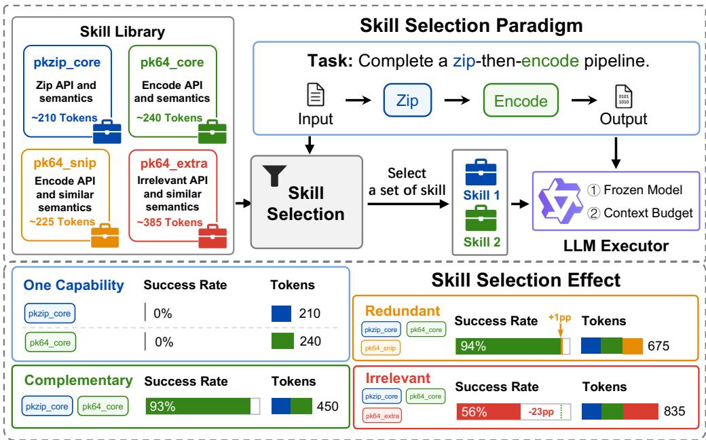
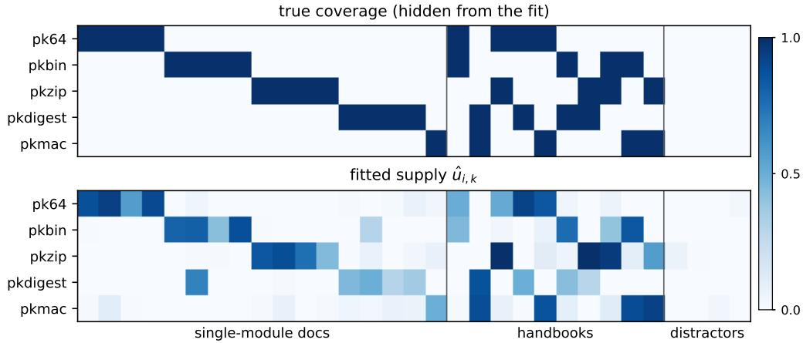
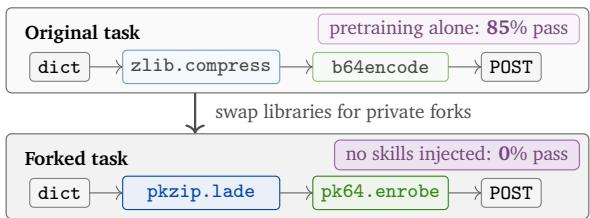
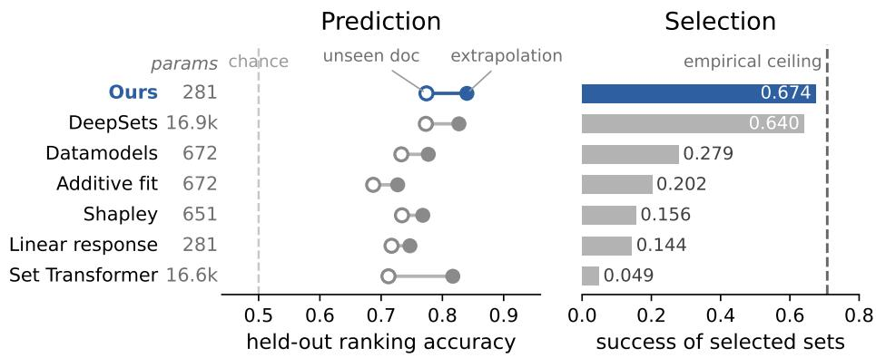
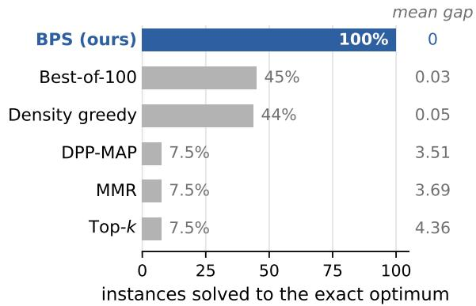
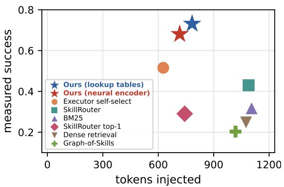

# Optimal Skill Selection for LLM Agents with Provable Bicriteria Guarantees

Yu Chen1,★, Ruishuo Chen1,★, Xun Wang1, Zhuoran Li1, and Longbo Huang1 #

1Institute for Interdisciplinary Information Sciences, Tsinghua University

\# Correspondence: longbohuang@tsinghua.edu.cn

★ Equal contribution, listed in random order.

Abstract. Loading reusable skill documents into a bounded context window is now the primary way large language model (LLM) agents acquire task-specific capabilities, which makes skill selection a first-order determinant of task performance and token cost. Yet current agents score skills independently by semantic relevance and assemble the set by top-� or greedy packing, with no quality guarantee or cost awareness on the selected set. As a result, redundant or poorly chosen skills waste scarce context tokens and can even degrade performance. We give the first model of how the selected skill set shapes execution outcomes and cast skill selection as an optimization problem: choose a skill set under a hard token budget to maximize a monotone submodular benefit minus context penalty. For this problem, we develop Best Prefix Selection (BPS), a polynomial-time algorithm, and prove, to our knowledge, the first performance guarantee for skill selection: a bicriteria (1 − 1/�, 1) approximation whose benefit coeficient is optimal in polynomial time. On a contamination-controlled BigCodeBench variant, BPS outperforms all the baselines, reaching 0.73 measured task success versus 0.20–0.52 for released skill routers, text retrievers, and the executor’s own selection, on 28% fewer tokens than the strongest released router.

## 1. Introduction

Large language model (LLM) agents increasingly rely on reusable skill documents to acquire task-specific capabilities beyond their parametric knowledge (Yang et al., 2026), and public skill registries already list tens of thousands of installable skills (Cho et al., 2026; Gao et al., 2026). Modern production agents such as Codex (OpenAI, 2026) and Claude Code (Anthropic, 2025) deploy skills through a two-stage mechanism of selection and execution: the LLM reviews each installed skill’s metadata (name and description) and selects skills according to the query, then loads only the selected skill documents into its context window to solve the task.

However, both stages are limited by the model’s finite context window: the context cost of selection scales with the size of the installed skill library, whereas execution consumes additional context for the selected skill documents and task input. As skill libraries grow to hundreds or thousands of entries (Cho et al., 2026; Zheng et al., 2026b), the metadata alone can exceed the available context budget, making exhaustive LLM-based selection infeasible (Gan & Sun, 2025). Furthermore, poor skill selection has measurable consequences for downstream execution: empirical evidence shows that selecting the wrong skills cuts pass rates by up to 21% as libraries grow (Song & Wei, 2026), and selected skills can even push success below the no-skill baseline on 13 of 87 benchmark tasks despite curation (Li et al., 2026b).

These limitations of modern agent architectures have driven growing interest in dedicated skill-selection mechanisms, ranging from per-skill retrieval and routing to set-aware packing and context construction (Gan & Sun, 2025; Fore et al., 2024; Zheng et al., 2026b,a; Li et al., 2026c). However, without a principled formulation to guide selection, these methods largely follow a common heuristic template: each skill is scored independently by semantic relevance or a learned preference, and the selected set is then assembled using rules such as top-� (Qu et al., 2024; Li et al., 2026a), truncation (Liu et al., 2026), or greedy packing (Zheng et al., 2026a), ignoring the context cost that loading the selected skill documents imposes at execution time, and leaving capability overlap and complementarity among the selected skills unmodeled.

  
Figure 1 | Top: The common skill-selection paradigm for coding agents: given a task, the system selects skills from a library and provides them to a frozen LLM executor. Bottom: Efective skill selection depends on capability composition rather than individual relevance. The LLM executor benefits from skill sets that cover the required capabilities, while redundant and irrelevant skills consume context budget with little or negative utility.

Yet these capability relationships are critical to efective skill selection. Fig. 1 illustrates a common skill-selection paradigm for coding agents (OpenAI, 2026; Anthropic, 2025): given a task, the system selects skills from a library and provides them to a frozen LLM executor. Following this paradigm, we evaluate Qwen3-32B (Yang et al., 2025) on tasks whose required private APIs and semantics are accessible only through the selected skills, making execution performance directly dependent on selection quality. We find that skills covering only one capability achieve zero success, whereas complementary skills covering both reach a 93% success rate. After both capabilities are covered, adding a redundant pk64\_snip skill consumes 225 additional tokens but improves the success rate by only 1 percentage point, while adding a semantically related but task-irrelevant pk64\_extra skill reduces it by 23 percentage points. Together, these results establish skill selection as a budgeted set-level decision rather than a ranking of individual skills.

Motivated by these observations, we conduct a principled study on how to formalize and optimize the skill selection stage: given a task query and a bounded token budget, deciding which skill documents to inject into the execution context so that the scarce budget is allocated to the capabilities required by the task (Section 3). Our model takes a capability view of how skills improve performance: each skill document supplies task-relevant capabilities, and the query demands some of them. A concave response aggregates supplies of skill set � within each capability dimension, capturing diminishing returns from repeatedly covering the same capability, while separate dimensions reward covering all demanded capabilities. The resulting gross benefit �(�) is monotone submodular. To model the performance degradation caused by overlong contexts, the selected skill set is in turn charged a linear context penalty proportional to its token length ℓ(�), and the total length must not exceed the available budget �. Skill selection therefore becomes maximizing this structured objective subject to the hard token budget with the form:

$$
\operatorname* { m a x } _ { S : \ell ( S ) \leq B } F ( S ) : = G ( S ) - \kappa \ell ( S ) .\tag{1}
$$

This problem, formalized in Section 3, is an instance of regularized submodular maximization under a knapsack constraint.

Solving this optimization with a provable guarantee, however, faces fundamental barriers. Without the penalty, the problem contains monotone submodular knapsack maximization, which admits no approximation better than 1 − 1/� unless P = NP (Feige, 1998). With the penalty, the objective may be negative, ruling out constant multiplicative approximation and motivating a bicriteria guarantee (Nikolakaki et al., 2021; Harshaw et al., 2019). Existing results for solving regularized submodular maximization with a hard budget constraint obtain weaker approximation coeficients (Gong et al., 2024; Guo et al., 2026; Zhang & Luo, 2026) or incur an additive precision-dependent loss (Perrault et al., 2021).

Our result attains the best possible coeficient 1 − 1/� on the submodular benefit while preserving the full penalty, achieving a bicriteria (1 − 1/�, 1)-approximation guarantee for the skill selection problem (1) via a novel budget-aligned interpolation argument that converts a fractional point on a density chain into one of its recorded integral prefixes, exploiting the aligned form of the constraint and the penalty. To our knowledge, this work provides the first structured model of how the selected skill set shapes execution outcomes and the first skill-selection algorithm with a provable performance guarantee. We summarize our main contributions as follows.

• New Formulation. We formalize skill selection as a regularized submodular maximization problem under a token budget constraint in Section 3. The structured objective makes redundancy, complementarity, and context cost explicit, and its parameters can be fitted from execution outcomes, with fitting error provably transferring to bounded selection regret. We validate the model on real executions in Section 5.2.

• Optimal Bicriteria Guarantee. We develop Best Prefix Selection (BPS, Algorithm 1), a polynomial-time algorithm for the skill selection problem, and prove the tight (1−1/�, 1) bicriteria guarantee (Theorem 1), achieving optimality for the benefit approximation coeficient. In the analysis, we propose budget-aligned interpolation, a novel technique exploiting the fact that the budget constraint and the context penalty share the same length coordinate, which yields the tight benefit coeficient 1 − 1/� (Section 4.3).

• Real-world Experiments. We construct a contamination-controlled benchmark whose tasks are gated to be unsolvable unless the injected skills supply every capability they require. On it, objective (1) fitted from pass/fail records alone predicts unseen skill sets accurately and recovers their hidden capability coverage; BPS attains its exact optimum on every selection instance; and the sets it selects beat every deployed selector we could run by 0.22–0.53 in measured task success, on 28% fewer tokens than the strongest released router (Sections 3.3 and 5).

## 2. Related Work

## 2.1. Skill Selection for LLM Agents

Skill retrieval and routing (Cho et al., 2026; Zheng et al., 2026b; Su et al., 2026; Xiao et al., 2026; Wang et al., 2026) narrow a large skill library to a candidate pool for downstream selection, following a pipeline inherited from tool use (Qin et al., 2024; Qu et al., 2024). SkillsInjector (Li et al., 2026c) learns how many skills to inject and renders them jointly; SkillSelect-Serve (Zheng et al., 2026a) greedily packs itemwise scores under token and deployment constraints; Graph-of-Skills (Liu et al., 2026) expands dependency-aware bundles under a context cap yet leaves its budgeted objective unsolved; GoSkills (Zeng et al., 2026) and SkillComposer (Zhao et al., 2026) assemble bounded skill groups and autoregressive subsets. To our knowledge, none of these heuristics states a provable guarantee for the injected set. Guarantee-bearing neighbors decide diferent objects: PACMS (Ghulyani et al., 2026) applies facility-location coverage to accumulated session content under a token knapsack, and the knapsack composer of (Yuan et al., 2025) admits agentic components online with a competitive ratio. In contrast, we formulate skill selection for a fixed executor as regularized submodular maximization under a hard knapsack token budget, explicitly modeling set-level redundancy and complementarity.

## 2.2. Regularized Submodular Maximization

Submodular maximization under a knapsack budget is a classical template for placing content and services on constrained resources (Golrezaei et al., 2012; Poularakis et al., 2019). Skill selection re-instantiates it with the context window as the constraint. For the pure benefit objective, density greedy with size-three seed enumeration attains the tight $1 - 1 / e$ (Sviridenko, 2004), and refined analyses shrink the enumerated seeds to size two (Kulik et al., 2021; Feldman et al., 2023). ParetoGreedy (Vombatkere & Terzi, 2026) extends this template toward benefit-cost trade-ofs by recording every prefix of each greedy chain, and proves instance-dependent guarantees on the Pareto frontier, but no guarantee for the regularized objective $G - \kappa \ell$ at a fixed �. Maximizing this regularized objective, however, changes the problem’s character: it can be negative, which rules out any constant multiplicative approximation (Nikolakaki et al., 2021). Distorted greedy (Harshaw et al., 2019) achieves a $( 1 - 1 / e , 1 )$ ) bicriteria guarantee only under a cardinality constraint. Under the hard knapsack constraint, guarantees for the regularized objective come from two sparsely connected lines. Specializing the knapsack Ψ-greedy of (Perrault et al., 2021) to our aligned objective gives $( 1 - 1 / e , 1 )$ up to an additive ��, paid with $O ( B / \epsilon )$ budget levels. The budgeted-profit works reach $( 1 / 4 , 1 )$ (Gong et al., 2024) and $( ( 1 - 1 / e ) / 2 , 1 / 2 )$ in near-linear time (Guo et al., 2026), and $( 1 / 8 - \epsilon , 1 )$ in one streaming pass (Zhang & Luo, 2026). Our result attains $( 1 - 1 / e , 1 )$ exactly, with none of these compromises, and the benefit coeficient $1 - 1 / e$ is optimal for polynomial-time algorithms (Section 4).

## 3. Model and Optimization Problem

In this section, we formalize the two-stage skill-interaction model in modern LLM agents. Let $\mathcal { L } = \{ s _ { 1 } , \cdots , s _ { L } \}$ denote the skill library, where $s _ { i }$ is the �-th skill document. Given a query �, the selection stage chooses a subset of skills, indexed by $S \subseteq [ L ]$ , for a downstream executor �, held fixed throughout. With the documents of the selected skills injected into its context window, � executes the query � and produces an observable outcome $Y _ { E } ( q , S )$ . We define the execution efect of skill set � as

$$
F _ { E } ^ { \star } ( q , S ) : = \mathbb { E } \left[ Y _ { E } ( q , S ) - Y _ { E } ( q , \emptyset ) \right] .\tag{2}
$$

$F _ { E } ^ { \star } ( q , S )$ measures the performance improvement from injecting skill set � into �’s context window, relative to running � without any skills.

A natural formulation of the selection stage is to choose the skill index set � that maximizes the execution efect $F _ { E } ^ { \star } ( q , S )$ . However, the execution efect $F _ { E } ^ { \star } ( q , S )$ is a black-box function of the frozen executor $E ,$ the query $q ,$ and the skill set �. Therefore, we need a structured model to approximate the execution efect $F _ { E } ^ { \star } ( q , S )$

In the following sections, we model the execution efect $F _ { E } ^ { \star } ( q , S )$ in three steps. Section 3.1 distills empirical observations into a structured objective, a monotone submodular capability benefit minus a linear degradation penalty; Section 3.2 casts the selection stage as maximizing this objective under a hard token budget and locates its computational hardness; and Section 3.3 shows that all latent parameters are learnable from execution records, with fitting error provably transferring to selection regret (Proposition 1). We validate the fitted objective on real executions in Section 5.2.

## 3.1. Key Observations and Structured Objective

The structured model is motivated by three recurring observations. (i) Context value is query-dependent and set-level: for the fixed executor �, the positive performance contribution of injecting a skill is not an intrinsic per-skill score. It depends in part on whether the capabilities conveyed by the skill document match those required by query � (Didolkar et al., 2024; An et al., 2023; Xu et al., 2024) and complement those already supplied by the selected set � (Gupta et al., 2023). (ii) More injected context is not uniformly beneficial: irrelevant content can distract execution (Shi et al., 2023), redundant items may add little marginal coverage (Gupta et al., 2023; Kumari et al., 2024), and longer inputs can reduce performance in some settings even when the relevant evidence is retrieved correctly (Liu et al., 2024). (iii) For a fixed executor and agent-framework configuration, the selected skill documents must fit within the residual context budget (Ye et al., 2023; Kumari et al., 2024; Qu et al., 2024).

Guided by these observations, we build the structured model around a latent capability space. Observations (i) and (ii) shape the benefit side, while observations (ii) and (iii) shape the cost side. The following two paragraphs formalize the two sides in turn.

Structured Capability Benefit Following observations (i) and (ii), we model the positive contribution of skills through a latent capability space with � dimensions. For each skill $s _ { i } \in \mathcal { L }$ , we assume there exists a latent capability supply vector $\pmb { u } _ { i } = ( u _ { i , 1 } , \cdot \cdot \cdot , u _ { i , d } ) \in \mathbb { R } _ { + } ^ { d }$ , where $u _ { i , k }$ quantifies how much capability skill $s _ { i }$ supplies in the �-th dimension, e.g., operating git or analyzing logs.

To model the complementarity and redundancy among skills, we introduce a nondecreasing concave function $h _ { k }$ with $h _ { k } ( 0 ) = 0$ that captures diminishing returns within the same capability dimension: for a skill set �, we use $\begin{array} { r } { h _ { k } \left( \sum _ { i \in S } u _ { i , k } \right) } \end{array}$ to represent the capability coverage of � in the �-th dimension, so that supplies in the same dimension overlap redundantly while supplies in diferent dimensions remain complementary.

For query $q ,$ we assume there exists a latent capability demand vector $\pmb { w } ^ { q } = ( w _ { 1 } ^ { q } , \cdot \cdot \cdot , w _ { d } ^ { q } ) \in \mathbb { R } _ { + } ^ { d }$ that encodes the query’s demand for each capability dimension. We then model the gross benefit of injecting skill set � into executor � as a monotone submodular function

$$
G _ { E } ( q , S ) : = \sum _ { k = 1 } ^ { d } \eta _ { k } ^ { E } w _ { k } ^ { q } \cdot h _ { k } \left( \lambda _ { k } ^ { E } \sum _ { i \in S } u _ { i , k } \right) ,\tag{3}
$$

where $\eta _ { k } ^ { E } \ge 0$ and $\lambda _ { k } ^ { E } \ge 0$ are executor-specific parameters that calibrate �’s sensitivity to the �-th capability dimension. $\vec { G _ { E } ^ { \mathbf { \Lambda } } \mathbf { S } }$ form aligns with the standard model of weighted coverage with diminishing returns in document summarization and data selection (Lin & Bilmes, 2011; Kirchhof & Bilmes, 2014), with capability dimensions playing the role of features. Intuitively, $G _ { E }$ lives on the scale of a log success probability, since success rates across demanded dimensions multiply, so its steepest gains fall on demanded dimensions that remain uncovered.

Degradation Penalty and Hard Context Budget Following observation (ii), injected documents impose a cost that grows with context length. Assume each skill document � has a token length $\ell _ { i } ,$ the number of context-window tokens it occupies once injected, and write $\ell ( S ) : = \textstyle \sum _ { i \in S } \ell _ { i }$ for the total token length of skill set �. We model the performance degradation caused by injecting � as a linear penalty

$$
c _ { E } ( S ) : = \kappa _ { E } \cdot \ell ( S ) ,\tag{4}
$$

where $\kappa _ { E } \geq 0$ is the frozen executor’s first-order per-token context sensitivity. This per-token charge is consistent with measurements in the skill setting: compressing skill-document bodies improves execution quality (Gao et al., 2026), and focused skills outperform larger, exhaustive ones (Li et al., 2026b).

Moreover, observation (iii) imposes a hard feasibility limit on skill selection. We take the budget � to be the residual token budget available to skill documents in the agent framework. The hard budget defines the feasible family

$$
{ \mathcal { F } } _ { B } = \left\{ S \subseteq [ L ] : \ell ( S ) \leq B \right\} .\tag{5}
$$

## 3.2. Optimization Problem in Skill Selection

Given the structured model above, we formalize the selection stage as a constrained optimization problem. The structured selection objective combines the capability benefit with the degradation penalty,

$$
F _ { E } ( q , S ) : = G _ { E } ( q , S ) - c _ { E } ( S ) ,\tag{6}
$$

and the selection problem maximizes it over the feasible family:

$$
\operatorname* { m a x } _ { S \in { \mathcal { F } } _ { B } } F _ { E } ( q , S ) .\tag{7}
$$

Problem (7) is computationally hard: setting $\kappa _ { E } = 0$ and specializing the responses $h _ { k }$ to truncated sums recovers budgeted maximum coverage (Khuller et al., 1999), an NP-hard slice of monotone submodular knapsack maximization (Sviridenko, 2004). Moreover, the penalty makes $F _ { E }$ non-monotone and possibly negative, ruling out any constant multiplicative approximation in polynomial time (Nikolakaki et al., 2021). Section 4 therefore develops an algorithm with a bicriteria guarantee that treats the benefit and the penalty asymmetrically.

## 3.3. Model Validity and Learnable Parameterization

The structured objective (6) is built on latent quantities. Among its primitives, only the token length $\ell _ { i }$ for each skill document $s _ { i }$ is observable. The capability supplies $\mathbf { } u _ { i } ,$ the query demand $\pmb { w } ^ { q }$ , and the executor calibration parameters $\eta _ { k } ^ { E } , \lambda _ { k } ^ { E } , \kappa _ { E }$ admit no direct measurement. Two questions therefore decide whether the model is usable in practice: whether these latent quantities can be estimated from data, and whether an accurately estimated objective leads to a well-chosen skill set.

For the first question, the key observation is that the selection objective never requires the latent factors individually. In (3), the demand $\boldsymbol { w } _ { k } ^ { q }$ enters only through the product $\eta _ { k } ^ { E } w _ { k } ^ { q } .$ , and the supply $u _ { i , k }$ only through $\lambda _ { k } ^ { E } u _ { i , k }$ . Defining the efective demand and efective supply

$$
\widetilde { w } _ { k } ^ { q } : = \eta _ { k } ^ { E } w _ { k } ^ { q } , \quad \widetilde { u } _ { i , k } : = \lambda _ { k } ^ { E } u _ { i , k } , \quad \forall k \in [ d ] ,\tag{8}
$$

the gross benefit (3) rewrites exactly as $\begin{array} { r } { G _ { E } ( q , S ) = \sum _ { k = 1 } ^ { d } \widetilde { w } _ { k } ^ { q } h _ { k } \big ( \sum _ { i \in S } \widetilde { u } _ { i , k } \big ) } \end{array}$ . We therefore estimate the efective quantities directly with two capability encoders: a demand encoder $\widehat { \psi } _ { E } : q \mapsto \widehat { \pmb { w } } ^ { q }$ and a supply encoder $\widehat { \phi } _ { E } : s _ { i } \mapsto \widehat { u } _ { i }$ , where $\widehat { \pmb { w } } ^ { q }$ and $\widehat { \pmb { u } } _ { i }$ are estimates of the efective demand $\widetilde { \pmb { w } } ^ { q }$ and efective supply $\widetilde { \pmb { u } } _ { i } ,$ , respectively. Each encoder is instantiated as a text encoder with a nonnegative output layer, so that the fitted objective inherits the monotone submodularity established in Section 3.1. The context sensitivity is calibrated as $\widehat { \kappa } _ { E }$ jointly with the encoders on execution records $( q , S , Y _ { E } ( q , S ) )$ of the frozen executor. Inspired by (Iyer & Bilmes, 2015), we fix the saturating form $h _ { k } ( x ) = 1 - e ^ { - x }$ , which is nondecreasing, concave, and bounded, thereby assigning diminishing marginal value once a capability dimension is suficiently covered.

For the second question, we give a conditional answer: whenever the fitted objective is uniformly accurate, any near-optimal selection under the fitted objective is provably near-optimal for the true execution efect. Let ${ \widehat { F } } _ { E } ( q , S )$ denote the fitted objective, obtained by instantiating (6) with the encoder outputs and the calibrated $\widehat { \kappa } _ { E } \colon$

$$
\widehat { F } _ { E } ( q , S ) : = \left. \widehat { \psi } _ { E } ( q ) , h \left( \sum _ { i \in S } \widehat { \phi } _ { E } ( s _ { i } ) \right) \right. - \widehat { \kappa } _ { E } \cdot \ell ( S ) ,\tag{9}
$$

where $h ( \cdot )$ applies $\left\{ h _ { k } \right\}$ componentwise. At decision time, the selection layer solves the fitted selection problem, which is the deployable counterpart of (7) and is defined by

$$
\operatorname* { m a x } _ { S \in { \mathcal { F } } _ { B } } { \widehat { F } } _ { E } ( q , S ) .\tag{10}
$$

Solving (10) is worthwhile, however, only insofar as the fitted objective tracks the true execution efect. We formalize this accuracy requirement as a uniform error bound over the feasible family.

Assumption 1 (Uniform fitting error). For the fixed instance $( q , E , B )$ , there exists $\varepsilon \ge 0$ such that $\left| F _ { E } ^ { \star } ( q , S ) - \right.$ $\widehat { F } _ { E } ( q , S ) \vert \leq \varepsilon$ for all $S \in { \mathcal { F } } _ { B }$

The fitting error � aggregates two sources: structural mismatch of the objective model in Section 3.1, and estimation error of the encoders and the calibrated $\widehat { \kappa } _ { E }$

In Section 5.2 we fit (9) on execution records of a frozen Qwen3-32B and evaluate it on skill combinations held out from the fit. It predicts their success to within one percentage point, and orders them by success more accurately than every value model we compare against, including neural set regressors with 60× as many parameters. Its fitted supplies also recover the true skill-capability coverage matrix, hidden from the fit: over the 155 (skill, capability) pairs, $\widehat { u } _ { i , k }$ ranks a covered pair above an uncovered one 99.6% of the time (AUC 0.996, Fig. 2). Assumption 1 is therefore attainable on a real executor from pass/fail outcomes alone, with 281 parameters and nothing assumed beyond the structured form (3).

The next proposition bounds the end-to-end selection regret for any rule that approximately solves (10).

Proposition 1 (Error transfer). Under Assumption $^ { 1 , }$ every $\widehat { S } \in \mathcal { F } _ { B }$ with $\widehat { F } _ { E } ( q , \widehat { S } ) \geq \operatorname* { m a x } _ { S \in \mathcal { F } _ { B } } \widehat { F } _ { E } ( q , S ) - \delta$ satisfies

$$
\operatorname* { m a x } _ { T \in \mathcal { F } _ { B } } F _ { E } ^ { \star } ( q , T ) - F _ { E } ^ { \star } ( q , \widehat { S } ) \leq 2 \varepsilon + \delta .\tag{11}
$$

  
Figure 2 | Parameter recovery. Top: the true skill-capability coverage matrix, hidden from the fit. Bottom: the fitted supply $\widehat { u } _ { i , k } ,$ learned from pass/fail outcomes alone; its latent dimensions carry no names, so they are matched to the capabilities by the best permutation. Columns are the 31 skills, rows the 5 capabilities. Both panels use the scale on the right, white $= 0$ to dark ${ \mathrm { b l u e } } = 1 ;$ the bottom panel plots $\widehat { u } _ { i , k }$ divided by its largest entry.

Proof. Let $T ^ { \star }$ maximize $F _ { E } ^ { \star } ( q , \cdot )$ over $\mathcal { F } _ { B }$ . Then we have $\begin{array} { r } { F _ { E } ^ { \star } ( q , T ^ { \star } ) - F _ { E } ^ { \star } ( q , \widehat S ) \leq \widehat { F } _ { E } ( q , T ^ { \star } ) - \widehat { F } _ { E } ( q , \widehat S ) + 2 \varepsilon \leq \delta + 2 \varepsilon } \end{array}$

Proposition 1 decomposes the selection regret into its two sources: the fitting error � of the learned model, whose origins we discussed above, and the optimization error � of solving the fitted selection problem (10), which will be further bounded in Theorem 1.

## 4. Skill Selection with Provable Guarantees

We now present the selection algorithm and its per-instance guarantee for the fitted selection problem (10). Throughout this section we fix the query $q ,$ the frozen executor $E ,$ and the budget �, and suppress them from the notation, writing ${ \widehat { G } } ( S )$ for the fitted capability benefit, b� for the calibrated context sensitivity, and $\widehat { F } ( S ) = \widehat { G } ( S ) - \widehat { \kappa } \ell ( S )$ for the fitted objective defined in (9). Our analysis uses only that $\widehat { G }$ is normalized $( { \widehat { G } } ( \emptyset ) = 0 )$ , nondecreasing, and submodular, that all lengths $\ell _ { i }$ are positive, and that $\widehat { \kappa } \geq 0$

The objective $\widehat { F } = \widehat { G } - \widehat { \kappa } \ell$ raises three dificulties at once. First, although $\widehat { G }$ is monotone, $\widehat F$ can be non-monotone and negative, so a selection rule must be allowed to stop early or output the empty set. In particular, the classical greedy analysis for monotone submodular maximization no longer applies to ${ \widehat { F } } .$ Second, skills have heterogeneous lengths under a single knapsack constraint, so locally dense choices can block valuable combinations. Third, the executor accepts only integral skill sets, so fractional reasoning must eventually land on an integral candidate.

In this section, we show that these dificulties call for a new analysis of approximate greedy algorithms. We present our algorithm, Best Prefix Selection (BPS), and prove, to our knowledge, the first per-instance bicriteria approximation guarantee for the fitted selection problem (10) (Theorem 1).

## 4.1. The BPS Algorithm

We state Best Prefix Selection (BPS) in Algorithm 1, a partial-enumeration density-greedy procedure with seed size two. In Lines 2–4, the algorithm enumerates all feasible seeds of size at most two. Then it grows a density-greedy chain from each seed by iteratively adding the skill with the highest marginal benefit per token (Lines 5–9), and records every feasible prefix encountered along each chain. Finally, it returns the single best recorded prefix, the one maximizing the fitted objective $\widehat F$ (Line 11).

Algorithm 1 implements the standard partial-enumeration density greedy for monotone submodular knapsack (Khuller et al., 1999; Sviridenko, 2004; Kulik et al., 2021). Under a monotone benefit, the endpoint of each chain dominates all its prefixes, so the known $1 - 1 / e$ analyses compare only chain endpoints. Under the non-monotone fitted objective ${ \widehat { F } } ,$ however, the endpoint need not be the best candidate, since the optimum can sit strictly inside a chain. Inspired by (Vombatkere & Terzi, 2026), we record every prefix and select the best one over the full collection by ${ \widehat { F } } ;$ this best-prefix selection step gives BPS its name.

Algorithm 1 Best Prefix Selection (BPS)   
Require: skill library L, budget $B ,$ fitted benefit oracle ${ \widehat { G } } ,$ fitted context sensitivity $\widehat { \kappa } .$   
Ensure: selected skill set � .   
1: Discard every skill � with $\ell _ { i } > B ;$ initialize the prefix pool ${ \mathcal { P } } \gets \emptyset .$   
2: for each seed $A \subseteq [ L ]$ with $| A | \le 2$ and $\ell ( A ) \leq B$ do   
3: $S \gets A$   
4: Add prefix � to $\mathcal { P } .$ // each seed opens a prefix chain   
5: while some � ∉ � fits, $\mathrm { i . e . , } \ell ( S ) + \ell _ { i } \leq B$ do   
6: �★ ← argmax�∉� ℓ(�)+ℓ ≤� $\left( \widehat { G } ( \{ i \} \cup S ) { - } \widehat { G } ( S ) \right) / \ell _ { i }$   
7: � ← � ∪ {�★}.   
8: Add prefix � to $\mathcal { P } .$ // record every prefix in chain   
9: end while   
10: end for   
11: $S _ { \mathtt { B P S } }  \operatorname { a r g m a x } _ { S \in \mathcal { P } } \widehat { F } ( S )$ // choose the best prefix   
12: return �BPS

## 4.2. Main Result: Bicriteria Approximation Guarantee

Throughout, let $\alpha = 1 - 1 / e$ . The theoretical guarantee for Algorithm 1 is given below.

Theorem 1 (Bicriteria $( 1 - 1 / e , 1 )$ -approximation guarantee). Let $\widehat { G }$ be normalized $( { \widehat { G } } ( \emptyset ) = 0 )$ , nondecreasing, and submodular, let $\ell _ { i } > 0 f o r a l l i \in [ L ]$ , and let $\widehat { \kappa } \geq 0$ . The BPS output $S _ { B P S }$ of Algorithm 1 satisfies $S _ { B P S } \in { \mathcal { F } } _ { B }$ and

$$
\widehat { F } ( S _ { B P S } ) \geq \alpha \widehat { G } ( T ) - \widehat { \kappa } \ell ( T ) \quad \forall T \in \mathcal { F } _ { B } .\tag{12}
$$

The guarantee (12) is a bicriteria approximation: the two coeficients are $\alpha = 1 - 1 / e$ on the benefit and 1 on the penalty, meaning that BPS recovers at least a $( 1 - 1 / e )$ fraction of any feasible set’s capability benefit while incurring its full context-length penalty.

Tightness The benefit coeficient $\alpha = 1 - 1 / e$ in (12) cannot be improved under standard complexity assumptions (any $( 1 - 1 / e + \epsilon )$ -approximation is NP-hard (Feige, 1998)). Theorem 1 provides a tight polynomialtime bicriteria guarantee for maximizing a monotone submodular benefit minus a linear penalty under a knapsack constraint.

Comparison to prior work The guarantees closest to our setting address the same regularized objective under the same knapsack constraint, and each concedes what Theorem 1 does not: weaker approximation coeficients (Gong et al., 2024; Guo et al., 2026; Zhang & Luo, 2026), an additive precision-dependent loss (Perrault et al., 2021), or a fractional output (Feldman, 2021). ParetoGreedy (Vombatkere & Terzi, 2026), whose candidate generation BPS shares, proves instance-dependent guarantees on the Pareto frontier, but none for the regularized objective at a fixed b�. Theorem 1 is, to our knowledge, the first to combine all four properties: a regularized objective, a knapsack constraint with heterogeneous item sizes, an integral output, and zero additive loss.

Selection regret Let $S ^ { \star } = \operatorname { a r g m a x } _ { T \in { \mathcal { F } } _ { B } } F _ { E } ^ { \star } ( q , T )$ denote the skill set maximizing the true execution efect. Taking $T = S ^ { \star }$ in (12) gives $\widehat { F } ( S _ { \mathrm { B P S } } ) \geq \widehat { F } ( \bar { S } ^ { \star } ) - \textstyle \frac { 1 } { e } \widehat { G } ( S ^ { \star } )$ , so the suboptimality of the BPS output is at most a $1 / e$ fraction of the optimum’s benefit $\widehat { G } ( S ^ { \star } )$ . Combining Theorem 1 with the error transfer of Proposition 1 yields an end-to-end bound on the true execution efect.

Corollary 1 (Selection regret of BPS). Under Assumption 1, the BPS output $S _ { B P S }$ satisfies $F _ { E } ^ { \star } ( q , S ^ { \star } ) - F _ { E } ^ { \star } ( q , S _ { B P S } ) \leq$ $\begin{array} { r } { \frac { 1 } { e } \widehat { G } ( S ^ { \star } ) + 2 \varepsilon } \end{array}$

Time Complexity Algorithm 1 runs in $O ( d L ^ { 4 } )$ time, where � is the capability dimension and � the library size: $O ( L ^ { 2 } )$ seeds each grow a chain of at most � density steps, and each step scans �(�) candidates at $O ( d )$ cost per marginal evaluation. In practice � is the size of the shortlist left by a high-recall retrieval stage (Cho et al., 2026; Zheng et al., 2026b; Gan & Sun, 2025), not of the whole registry.

## 4.3. Proof of Theorem 1

For an arbitrary feasible set �, the proof proceeds in three steps: (i) Construct a seed � from $T \mathbf { \hat { s } }$ two highestmarginal items and define a residual benefit function �. (ii) Lower-bound the trajectory function (18) of the density chain grown from � by a piecewise-exponential bounding function �, adapting the refined analysis of (Kulik et al., 2021), and establish $\widehat { G } ( J ) + V ( \bar { r } ) \geq \alpha \widehat { G } ( T )$ ). (iii) Convert this fractional bound into an actual recorded integral prefix via budget-aligned interpolation, and conclude via the ${ \widehat { F } } .$ maximization of Algorithm 1.

## 4.3.1 Seed construction and residual function

We first write ${ \widehat { G } } ( i \mid S ) = { \widehat { G } } ( S \cup \{ i \} ) - { \widehat { G } } ( S )$ for the marginal benefit. We order the items of � greedily by nonincreasing marginal benefit with an arbitrary fixed tie-breaking rule:

$$
\begin{array} { r l } & { t _ { j } \in \underset { i \in T \backslash \{ t _ { 1 } , \cdots , t _ { j - 1 } \} } { \mathrm { a r g m a x } } \quad \widehat { G } \left( i \mid \{ t _ { 1 } , \cdots , t _ { j - 1 } \} \right) , } \\ & { m _ { j } : = \widehat { G } \left( t _ { j } \mid \{ t _ { 1 } , \cdots , t _ { j - 1 } \} \right) , \quad \forall j \in [ | T | ] . } \end{array}\tag{13}
$$

If $\left| T \right| \leq 2$ , then Algorithm 1 enumerates � itself as a seed, and we have $\widehat { F } ( T ) = \widehat { G } ( T ) - \widehat { \kappa } \ell ( T ) \geq \alpha \widehat { G } ( T ) - \widehat { \kappa } \ell ( T )$ We set the feasible seed set � with $\ell ( J ) \leq B$ as

$$
J : = \{ t _ { 1 } , t _ { 2 } \} .\tag{14}
$$

Then Algorithm 1 enumerates it in Line 2 and records it in Line 4, so $J \in { \mathcal { P } } . \operatorname { I f } | T | = 3 \colon { \widehat { G } } ( J ) = m _ { 1 } + m _ { 2 } \geq$ $\textstyle { \frac { 2 } { 3 } } ( m _ { 1 } + \overleftarrow { m } _ { 2 } + m _ { 3 } ) = { \frac { 2 } { 3 } } { \widehat { G } } ( T ) \geq \alpha { \widehat { G } } ( T )$ ) and $\ell ( J ) \leq \ell ( T )$ give $\widehat { F } ( J ) \geq \alpha \widehat { G } ( T ) - \widehat { \kappa } \ell ( T )$

In the following, we assume $| T | \geq 4$ . Our goal is to prove that on the chain grown from $J ,$ some recorded prefix $S _ { T }$ satisfies $\widehat { F } ( S _ { T } ) \geq \alpha \widehat { G } ( T ) - \widehat { \kappa } \ell ( T )$

Inspired by the analysis in (Sviridenko, 2004), we define the residual function

$$
f ( U ) : = \widehat { G } ( J \cup U ) - \widehat { G } ( J ) , \quad \forall U \subseteq [ L ] .\tag{15}
$$

By the properties of ${ \widehat { G } } , f$ is normalized $( f ( \emptyset ) = 0 )$ , nonnegative, nondecreasing, and submodular. Let $P = T \setminus J$ denote the comparator residual. For every $\nu \in P _ { : }$ , we have $f ( \{ \nu \} ) = \widehat { G } ( \{ \nu \} \cup J ) - \widehat { G } ( J ) = \widehat { G } ( \nu \mid J ) \leq \widehat { G } ( \nu \mid \{ t _ { 1 } \} ) \leq$ $m _ { 2 } ,$ , where the first inequality uses submodularity and the second uses the greedy ordering (13). Therefore, we have

$$
{ \widehat { G } } ( J ) = { \widehat { G } } { \big ( } \{ t _ { 1 } , t _ { 2 } \} { \big ) } - { \widehat { G } } { \big ( } \{ t _ { 1 } \} { \big ) } + { \widehat { G } } { \big ( } \{ t _ { 1 } \} { \big ) } = m _ { 1 } + m _ { 2 } \geq 2 m _ { 2 } \geq 2 f { \big ( } \{ \nu \} { \big ) } , \quad \forall \nu \in P .\tag{16}
$$

We choose $\upsilon ^ { \star } \in P$ as the item with maximum token length, i.e., $\nu ^ { \star } = \arg \operatorname* { m a x } _ { \nu \in P } \ell ( \{ \nu \} )$ . Set

$$
r = \ell ( P \setminus \{ \nu ^ { \star } \} ) .\tag{17}
$$

Then we can show that the density chain starting with seed � must have total token length larger than �.

## 4.3.2 Bounding-function domination

Run the density chain of Algorithm 1 from seed $J ,$ and let $A _ { 0 } = \emptyset \subsetneq A _ { 1 } \subsetneq \cdots \subsetneq A _ { m }$ be its accepted additions, so the actual recorded prefixes are $J \cup A _ { j }$ . Write $a _ { j } = A _ { j } \ \backslash \ A _ { j - 1 }$ for the �-th accepted item. Following (Kulik et al., 2021), we define the piecewise-afine residual-benefit trajectory � by $V ( 0 ) = 0$ and, for $\ell ( A _ { j - 1 } ) \leq u \leq \ell ( A _ { j } )$ ,

$$
V ( u ) : = f ( A _ { j - 1 } ) + \left( u - \ell ( A _ { j - 1 } ) \right) { \frac { f ( a _ { j } \mid A _ { j - 1 } ) } { \ell ( \{ a _ { j } \} ) } } .\tag{18}
$$

The function $V : [ 0 , \ell ( A _ { m } ) ] \to \mathbb { R } _ { \ge 0 }$ traces the residual benefit accumulated by the density chain as a function of the total added length $u = \ell ( A _ { j } )$ beyond the seed �. At each breakpoint $u = \ell ( A _ { j } )$ , the trajectory evaluates to $V ( \ell ( A _ { j } ) ) = f ( A _ { j } )$ , the exact residual benefit of the �-th recorded prefix. Between consecutive breakpoints, � interpolates linearly. Then we have the following lemmas.

Lemma 1 (Trajectory coverage). $V ( r )$ is well-defined; that is, $\ell ( A _ { m } ) \geq r .$

Proof. If $P \subseteq A _ { m }$ , then $\ell ( A _ { m } ) \geq \ell ( P ) > r$ by definition in (17). Otherwise pick $\nu \in P \setminus A _ { m } .$ . When the chain stops, adding � is infeasible. Then $\ell ( A _ { m } ) + \ell ( \{ \nu \} ) > B - \ell ( J )$ . Since $\ell ( \{ \nu \} ) \leq \ell ( \{ \nu ^ { \star } \} )$ and $\ell ( T ) \leq B _ { \cdot }$ , we have $\ell ( A _ { m } ) > B - \ell ( J ) - \ell ( \{ \nu \} ) \geq \ell ( T ) - \ell ( J ) - \ell ( \{ \nu ^ { \star } \} ) = r .$ □

Lemma 2 (Residual feasibility before �). Consider an accepted segment whose left endpoint $u _ { 0 } = \ell ( A _ { j - 1 } )$ satisfies $u _ { 0 } < r$ . Then every item $\nu \in P \setminus A _ { j - 1 }$ is feasible at that point.

Proof. By maximality of $\ell ( \{ \nu ^ { \star } \} )$ , we have $\ell ( A _ { j - 1 } \cup \{ \nu \} ) = u _ { 0 } + \ell ( \{ \nu \} ) < r + \ell ( \{ \nu ^ { \star } \} ) = \ell ( P ) = \ell ( T ) - \ell ( J ) \leq B - \ell ( J )$ Therefore, � is feasible at the selection on ��. □

Lemma 2 is where removing the longest residual item pays of.

We adapt the bounding-function technique of (Kulik et al., 2021). Partition � into two nonempty blocks $\{ \nu ^ { \star } \}$ and $R = P \setminus \{ \nu ^ { \star } \}$ , and order them as $( X _ { 1 } , X _ { 2 } )$ so that

$$
{ \frac { f ( X _ { 1 } ) } { \ell ( X _ { 1 } ) } } \geq { \frac { f ( X _ { 2 } ) } { \ell ( X _ { 2 } ) } } .\tag{19}
$$

Set $d _ { j } = \ell ( X _ { j } )$ for $j = 1 , 2 ,$ , and define the block densities

$$
\rho _ { 1 } = { \frac { f ( X _ { 1 } ) } { d _ { 1 } } } , \quad \rho _ { 2 } = { \frac { f ( X _ { 2 } \mid X _ { 1 } ) } { d _ { 2 } } } ,\tag{20}
$$

where $f ( X _ { 2 } \mid X _ { 1 } ) = f ( X _ { 1 } \cup X _ { 2 } ) - f ( X _ { 1 } )$ . Submodularity and (19) give $\rho _ { 1 } \geq \rho _ { 2 }$ . Write

$$
D = \ell ( P ) = d _ { 1 } + d _ { 2 } .\tag{21}
$$

If $\rho _ { 2 } > 0 _ { : }$ , let $D _ { 1 } = d _ { 1 }$ ln $\frac { \rho _ { 1 } } { \rho _ { 2 } }$ . If $\rho _ { 2 } = 0$ , set $D _ { 1 } = + \infty$ . Define a continuous function $\varphi : [ 0 , \infty ) \to { \mathbb R } _ { \geq 0 }$ by

$$
\varphi ( u ) = \left\{ \begin{array} { l l } { f ( X _ { 1 } ) \left( 1 - \exp ( - u / d _ { 1 } ) \right) , } & { 0 \leq u < D _ { 1 } , } \\ { f ( P ) - \rho _ { 2 } D \exp \left( - \displaystyle \frac { u - D _ { 1 } } { D } \right) , } & { u \geq D _ { 1 } . } \end{array} \right.\tag{22}
$$

The bounding function $\varphi$ is constructed so that: on the first branch, it tracks exponential saturation toward $f ( X _ { 1 } )$ at rate $1 / d _ { 1 } ;$ on the second branch, it tracks saturation toward $f ( P )$ at rate $1 / D$ . The transition at $D _ { 1 }$ is precisely where the two exponentials meet. The next two lemmas separate the argument into a dynamic half, showing that the trajectory of the density chain never falls below $\varphi$ before $r ,$ and a static half, showing that the seed and $\varphi ( r )$ together already account for an � fraction of ${ \widehat { G } } ( T )$ . And the proofs are computational and deferred to Appendix A.

Lemma 3 (Trajectory bound). $V ( u ) \geq \varphi ( u ) , \forall u \in [ 0 , r ] .$

Lemma 4 (Static bound at �). $\widehat { G } ( J ) + \varphi ( r ) \geq \alpha \widehat { G } ( T )$

## 4.3.3 Budget-aligned interpolation

Lemmas 3 and 4 give

$$
\widehat { G } ( J ) + V ( r ) \geq \widehat { G } ( J ) + \varphi ( r ) \geq \alpha \widehat { G } ( T ) .\tag{23}
$$

Choose consecutive recorded prefixes $A _ { j - 1 } , A _ { j }$ whose segment contains �. There exists $\lambda \in [ 0 , 1 ]$ with $V ( r ) = ( 1 -$ �) $f ( A _ { j - 1 } ) + \lambda f ( A _ { j } )$ , and $r = ( 1 - \lambda ) \ell ( \dot { A _ { j - 1 } } ) + \dot { \lambda } \ell ( A _ { j } )$ . Because the penalty $\widehat { \kappa } \ell ( \cdot )$ is the same linear function of the same length coordinate, the two interpolations combine: $( 1 - \lambda ) \widehat { F } \big ( J \cup A _ { j - 1 } \big ) + \lambda \widehat { F } \big ( J \cup A _ { j } \big ) = \widehat { G } ( J ) + V ( r ) - \widehat { \kappa } \big ( \ell ( J ) + r \big )$ Since $\ell ( J ) + r = \ell ( T ) - \ell ( \{ \nu ^ { \star } \} ) \leq \ell ( T )$ , (23) gives $( 1 - \lambda ) \widehat { F } ( J \cup A _ { j - 1 } ) + \lambda \widehat { F } ( J \cup A _ { j } ) \geq \alpha \widehat { G } ( T ) - \widehat { \kappa } ( \ell ( T ) - \ell ( \{ \upsilon ^ { \star } \} ) ) \geq$ $\alpha \widehat { G } ( T ) - \widehat { \kappa } \ell ( T )$ . A convex combination of two numbers is at most their maximum, so at least one of the two recorded prefixes satisfies

$$
\widehat { F } \left( J \cup A _ { s } \right) \geq \alpha \widehat { G } ( T ) - \widehat { \kappa } \ell ( T ) , \quad s \in \{ j - 1 , j \} .\tag{24}
$$

Therefore, in every case, some recorded candidate $S _ { T } \in \mathcal { S }$ satisfies ${ \widehat { F } } ( S _ { T } ) \geq \alpha { \widehat { G } } ( T ) - { \widehat { \kappa } } \ell ( T )$ . Since $S _ { \mathrm { B P S } }$ maximizes $\widehat F$ over $\mathcal { P }$ (Line 11 of Algorithm 1), ${ \widehat { F } } ( S _ { \mathrm { B P S } } ) \geq { \widehat { F } } ( S _ { T } )$ . The seed and witness prefix depend on �, but every seed of size at most two is enumerated and one selection maximizes $\widehat F$ over all recorded candidates, so the single output $S _ { \mathrm { B P S } }$ satisfies (12) for every $T \in { \mathcal { F } } _ { B }$ . This statement finishes the proof of Theorem 1. ■

## 5. Evaluation

Corollary 1 bounds the selection regret of BPS by a fitting term and an optimization term, and we measure both on real executions of a frozen executor. Section 5.2 measures the first, how closely the fitted objective tracks those executions, and Section 5.3 the second, how far the sets BPS returns fall short of the exact optimum of that objective, which Theorem 1 bounds only in the worst case. Section 5.4 then executes the selected sets and reports the task success they achieve.

## 5.1. Testbed: A Contamination-Controlled Skill Benchmark

Public code benchmarks cannot measure skill selection, because a capable executor already solves them with no skill at all: Qwen3-32B, the frozen executor throughout, passes 85% of runs on the original BigCodeBench (Zhuo et al., 2025) tasks from pretraining alone. We therefore build our own, and everything below rests on 63,596 executions of it against real test suites.

  
Figure 3 | Forking a BigCodeBench task. Standard libraries are swapped for private forks with new names and altered constants: pkzip.lade plays the role of zlib.compress but XORs the payload and prepends a private header, and pk64.enrobe base64-encodes under a remapped alphabet.

Private modules We fork the benchmark, replacing its standard libraries with sixteen private modules over � = 5 capability families. Each module’s call surface is unguessable from the task prose and documented only in the skill library (Fig. 3).

Task admission A task is admitted only if the private-module solution passes its tests while both the standard library solution and every one-capability hybrid of the two fail, so that only tasks needing all of their capabilities survive. Fewer than one in three of the tasks we forked cleared this gate, and those that did form the testbed.

Skill library We wrote 47 skill documents, of which � = 31 form the library: single-module skills ranging from a short snippet to a full tutorial, two-module handbooks, and distractors covering only look-alike functions no task calls for.

## 5.2. Validity of the Structured Objective

We instantiate the fitted objective (9) on the testbed and evaluate it on two counts, its prediction of held-out executions and the quality of the sets it selects; its recovery of the true coverage matrix was reported in Section 3.3.

  
Figure 4 | Value-model comparison. Left: pairwise ranking accuracy on held-out set pairs, under the extrapolation (filled dots) and unseen-doc (open dots) protocols. Right: measured success of the sets each model selects; the dashed line is the empirical ceiling, the best set per instance in hindsight.

Instantiation and fitting We set $d = 5 ,$ one dimension per module family, and fix $h _ { k } ( x ) = 1 - e ^ { - x }$ a priori, as in Section 3.3. The task set and the library are both fixed, so the encoders reduce to lookup tables that assume nothing beyond the structured form (3): one supply vector b�� per skill, one demand vector $\widehat { \pmb { w } } ^ { q }$ per task, and one ofset per task, 281 parameters in total. These are trained jointly by gradient descent, minimizing the log loss of the measured pass/fail outcomes against the predicted success probability exp ${ \widehat { F } } _ { E } \ ( 9 )$

Baselines We compare against the value models in common use, all fit on the same execution records. Additive fit gives each skill an independent per-task value and sums it over the set; Shapley scores (Ghorbani & Zou, 2019) do the same with values estimated from measured marginal contributions. Datamodels (Ilyas et al., 2022) regresses the measured rate on the set indicator. DeepSets (Zaheer et al., 2017) and Set Transformer (Lee et al., 2019) are black-box neural set regressors. Linear response is an ablation of our own model, keeping the capability structure but dropping the concave saturation.

Prediction Each model scores pairs of sets whose measured success rates difer by a clear margin, and Fig. 4 (left) reports how often it orders the pair correctly. Two protocols probe unseen set compositions. Under extrapolation, a model trains only on sets of at most two skills and must predict sets of three or more; under unseen doc, it sees a skill only on its own, never in combination, and must predict the sets that pair it with others. The structured objective is the most accurate under both, and its predicted rates fall within one percentage point of the measured ones.

Selection Prediction accuracy matters only insofar as it changes which set is chosen, so we also let each model choose. Each is refit from a small sample of each test task and returns the set it scores highest, which is then executed (Fig. 4, right). The structured objective reaches 95% of the empirical ceiling, and every interpretable alternative gives up at least 0.37 in absolute success. Only DeepSets remains competitive, at 60× the parameters and with an advantage that never separates from zero; being a black box, it also exposes no structure for BPS to exploit and can be maximized only by brute force.

## 5.3. Optimization Quality

To isolate the optimization term $\delta ,$ we freeze the objective at the fit of Section 5.2 and vary only the rule that maximizes it, so that the comparison measures search quality alone. The 80 instances of the fitted selection problem (10) span held-out tasks, token budget levels $B ,$ and settings of the token soft-penalty coeficient.

Baselines Five rules receive the same fitted objective but do not maximize it. Three score every skill in isolation, by the benefit (9) assigns the singleton {� }, and never evaluate the set they assemble or charge for the tokens it costs: top-� relevance fills the budget in that order, while MMR (Carbonell & Goldstein, 1998)

  
Figure 5 | The 80 selection instances. Left: optimization quality. Every rule is given the same fitted objective; bars are the share of instances on which a rule attains the exact optimum, found by exhaustive search over every feasible set, and the right-hand column is its mean shortfall in objective value. Right: end-to-end selection. Each rule is placed by the tokens it injects and the measured success of the sets it chooses; up and to the left is better. Both of our points run BPS and difer only in how the objective’s encoders are instantiated.

and DPP-MAP (Kulesza & Taskar, 2012) discount that score by similarity to the fitted supplies already selected. Two do score whole sets but search them heuristically: density greedy adds the skill with the best value per token until the budget closes, and best-of-100 random keeps the highest-scoring of 100 random budget-feasible sets.

Solution quality BPS attains the exact optimum of (10) on all 80 instances, so the optimization error � of Proposition 1 vanishes throughout (Fig. 5, left). The three rules that score skills one at a time reach the optimum on fewer than a tenth of them, with a mean shortfall nearly two orders of magnitude larger than that of any rule scoring whole sets; the two set-scoring heuristics come closer, but still reach it on only 45% and 44%.

## 5.4. End-to-End Selection Quality

The end-to-end test executes every rule’s chosen set on the frozen executor over the same 80 instances, and measures success on executions the fit never saw.

Baselines We compare against the skill selection systems in use today. BM25 and a dense bi-encoder, the two retrievers that the skill-retrieval literature defaults to (Su et al., 2026), rank the documents by their text against the task prompt and fill the budget in that order. SkillRouter (Zheng et al., 2026b) is a released retrieve-and-rerank router, which we run both at its own top-1 operating point and, more generously, in its reranked order up to our full budget; Graph-of-Skills (Liu et al., 2026) difuses over an ofline skill graph and hydrates under a context cap. Both run from their authors’ released implementations on our library. Finally we let the executor select for itself under the progressive disclosure that deployed systems use, shown every skill’s name, cost and one-line description with the bodies hidden.

Measured execution No deployed system we could run matches BPS in measured success (Fig. 5, right). The released routers and retrievers reach 0.20–0.43, between 0.30 and 0.53 below it, and BPS attains its own result on 28% fewer tokens than the strongest of them; the strongest deployed selector, the executor picking for itself, still gives up 0.22. These systems rarely select distractors. What they select instead are the skills whose text matches the task, and those need not be the skills that cover the capabilities it exercises.

A neural capability encoder The encoders of Section 5.2 instantiate the structured objective on the bench mark’s fixed task set and library; deployment beyond them requires encoding tasks and skills from their text. We therefore replace the lookup tables with a neural encoder that projects frozen text-embedding-v4 (Zhang et al., 2025) embeddings of the task prompt and of each skill document into 64 latent capability dimensions, warmed up on annotated examples of covering skill sets and then trained online on pass/fail feedback from the frozen executor; BPS still performs the selection. Its sets reach 0.68 measured success on 716 injected tokens (red star in Fig. 5): 0.05 below the lookup-table instantiation, and 0.17–0.48 above every deployed system, injecting fewer tokens than all of them except the executor’s own selection.

## 6. Conclusion

This paper casts skill selection for LLM agents as regularized submodular maximization under a hard token budget: a submodular capability benefit makes complementarity and redundancy explicit, and a linear penalty charges every injected token. Our polynomial-time selection rule BPS carries a bicriteria (1 − 1/�, 1) guarantee, proved via budget-aligned interpolation and tight in the benefit coeficient. On a contamination-controlled benchmark with real executions, the fitted objective was the most accurate value model, and BPS outperformed every deployed skill selector in measured success while injecting fewer tokens than any released system. Future work includes online selection over streaming queries and degradation models beyond a linear per-token charge.

## References

An, S. et al. Skill-Based Few-Shot Selection for In-Context Learning. In Proc. 2023 Conf. Empirical Methods Natural Lang. Process. (EMNLP), pp. 13472–13492, 2023.

Anthropic. Equipping agents for the real world with agent skills. Anthropic Engineering Blog, 2025. URL https://www.anthropic.com/engineering/ equipping-agents-for-the-real-world-with-agent-skills. Accessed 2026-07-23.

Carbonell, J. and Goldstein, J. The use of MMR, diversity-based reranking for reordering documents and producing summaries. In Proc. 21st Annu. Int. ACM SIGIR Conf. Res. Develop. Inf. Retrieval, pp. 335–336, 1998.

Cho, H., Kang, R., and Kim, Y. SkillRet: A large-scale benchmark for skill retrieval in LLM agents. arXiv preprint arXiv:2605.05726, 2026.

Didolkar, A. et al. Metacognitive Capabilities of LLMs: An Exploration in Mathematical Problem Solving. In Adv. Neural Inf. Process. Syst. 37 (NeurIPS 2024), pp. 19783–19812, 2024.

Feige, U. A threshold of ln n for approximating set cover. J. ACM, 45(4):634–652, 1998.

Feldman, M. Guess free maximization of submodular and linear sums. Algorithmica, 83(3):853–878, 2021.

Feldman, M., Nutov, Z., and Shoham, E. Practical budgeted submodular maximization. Algorithmica, 85(5): 1332–1371, 2023.

Fore, M., Singh, S., and Stamoulis, D. GeckOpt: LLM system eficiency via intent-based tool selection. In Proc. Great Lakes Symp. VLSI (GLSVLSI), pp. 353–354, 2024.

Gan, T. and Sun, Q. RAG-MCP: Mitigating prompt bloat in LLM tool selection via retrieval-augmented generation. arXiv preprint arXiv:2505.03275, 2025.

Gao, Y., Li, Z., Yuan, Y., Ji, Z., Ma, P., and Wang, S. SkillReducer: Optimizing LLM agent skills for token eficiency. arXiv preprint arXiv:2603.29919, 2026.

Ghorbani, A. and Zou, J. Data Shapley: Equitable valuation of data for machine learning. In Proc. 36th Int. Conf. Mach. Learn. (ICML), pp. 2242–2251, 2019.

Ghulyani, M., Singh, A., Bharadwaj, K., Nath, A., and Goswami, S. PACMS: Submodular context selection as a pluggable engine for LLM agents. arXiv preprint arXiv:2606.20047, 2026.

Golrezaei, N., Shanmugam, K., Dimakis, A. G., Molisch, A. F., and Caire, G. FemtoCaching: Wireless video content delivery through distributed caching helpers. In Proc. IEEE INFOCOM, pp. 1107–1115, 2012.

Gong, S., Nong, Q., Wang, Y., and Du, D. Budget-constrained profit maximization without non-negative objective assumption in social networks. J. Glob. Optim., 90(4):1007–1030, 2024.

Guo, Q., Feng, C., Shi, J., Tang, J., Zhou, X., and Wang, S. Eficient algorithms for budgeted profit maximization with theoretical guarantees. IEEE Trans. Knowl. Data Eng., 38(4):2234–2248, 2026.

Gupta, S., Gardner, M., and Singh, S. Coverage-based example selection for in-context learning. In Findings Assoc. Comput. Linguistics: EMNLP 2023, 2023.

Harshaw, C., Feldman, M., Ward, J., and Karbasi, A. Submodular maximization beyond non-negativity: Guarantees, fast algorithms, and applications. In Proc. 36th Int. Conf. Mach. Learn. (ICML), pp. 2634–2643, 2019.

Ilyas, A., Park, S. M., Engstrom, L., Leclerc, G., and Madry, A. Datamodels: Understanding predictions with data and data with predictions. In Proc. 39th Int. Conf. Mach. Learn. (ICML), pp. 9525–9587, 2022.

Iyer, R. and Bilmes, J. Submodular Point Processes with Applications to Machine learning. In Proc. 18th Int. Conf. Artif. Intell. Statist. (AISTATS), pp. 388–397, 2015.

Khuller, S., Moss, A., and Naor, J. The budgeted maximum coverage problem. Inf. Process. Lett., 70(1):39–45, 1999.

Kirchhof, K. and Bilmes, J. Submodularity for data selection in machine translation. In Proc. 2014 Conf. Empirical Methods Natural Lang. Process. (EMNLP), pp. 131–141, 2014.

Kulesza, A. and Taskar, B. Determinantal point processes for machine learning. Found. Trends Mach. Learn., 5 (2–3):123–286, 2012.

Kulik, A., Schwartz, R., and Shachnai, H. A refined analysis of submodular greedy. Oper. Res. Lett., 49(4): 507–514, 2021.

Kumari, L., Wang, S., Das, A., Zhou, T., and Bilmes, J. An end-to-end submodular framework for data-eficient in-context learning. In Findings Assoc. Comput. Linguistics: NAACL 2024, pp. 3293–3308, 2024.

Lee, J., Lee, Y., Kim, J., Kosiorek, A. R., Choi, S., and Teh, Y. W. Set transformer: A framework for attentionbased permutation-invariant neural networks. In Proc. 36th Int. Conf. Mach. Learn. (ICML), pp. 3744–3753, 2019.

Li, H. et al. Organizing, orchestrating, and benchmarking agent skills at ecosystem scale. arXiv preprint arXiv:2603.02176, 2026a.

Li, X. et al. SkillsBench: Benchmarking how well agent skills work across diverse tasks. arXiv preprint arXiv:2602.12670, 2026b.

Li, Y. et al. SkillsInjector: Dynamic skill context construction for LLM agents. arXiv preprint arXiv:2605.29794, 2026c.

Lin, H. and Bilmes, J. A class of submodular functions for document summarization. In Proc. 49th Annu. Meeting Assoc. Comput. Linguistics (ACL), pp. 510–520, 2011.

Liu, D. et al. Graph-of-Skills: Dependency-aware structural retrieval for massive agent skills. arXiv preprint arXiv:2604.05333, 2026.

Liu, N. F. et al. Lost in the middle: How language models use long contexts. Trans. Assoc. Comput. Linguistics, 12:157–173, 2024.

Nikolakaki, S. M., Ene, A., and Terzi, E. An eficient framework for balancing submodularity and cost. In Proc. 27th ACM SIGKDD Conf. Knowl. Discov. Data Min., pp. 1256–1266, 2021.

OpenAI. Build skills. Codex Documentation, 2026. URL https://developers.openai.com/codex/ skills/. Accessed 2026-07-26.

Perrault, P., Healey, J., Wen, Z., and Valko, M. On the approximation relationship between optimizing ratio of submodular (RS) and diference of submodular (DS) functions. arXiv preprint arXiv:2101.01631, 2021.

Poularakis, K., Llorca, J., Tulino, A. M., Taylor, I., and Tassiulas, L. Joint service placement and request routing in multi-cell mobile edge computing networks. In Proc. IEEE INFOCOM, pp. 10–18, 2019.

Qin, Y. et al. ToolLLM: Facilitating large language models to master 16000+ real-world APIs. In Proc. 12th Int. Conf. Learn. Represent. (ICLR), 2024.

Qu, C. et al. Towards completeness-oriented tool retrieval for large language models. In Proc. ACM Int. Conf. Inf. Knowl. Manage. (CIKM), pp. 1930–1940, 2024.

Shi, F. et al. Large language models can be easily distracted by irrelevant context. In Proc. 40th Int. Conf. Mach. Learn. (ICML), pp. 31210–31227, 2023.

Song, H. and Wei, S. More skills, worse agents? skill shadowing degrades performance when expanding skill libraries. arXiv preprint arXiv:2605.24050, 2026.

Su, W. et al. Skill retrieval augmentation for agentic AI. arXiv preprint arXiv:2604.24594, 2026.

Sviridenko, M. A note on maximizing a submodular set function subject to a knapsack constraint. Oper. Res. Lett., 32(1):41–43, 2004.

Vombatkere, K. and Terzi, E. Computing approximate pareto frontiers for submodular utility and cost tradeofs. arXiv preprint arXiv:2602.15964, 2026.

Wang, Z., Wen, W., Ji, Q., Qiao, R., and Sun, X. Skill is not document: A query-conditional benchmark and two-stage retriever for LLM agent skill routing. arXiv preprint arXiv:2606.03565, 2026.

Xiao, J. et al. SkillSight: Calibrating generic content bias for skill retrieval. arXiv preprint arXiv:2607.18785, 2026.

Xu, Z., Wang, H., Bespalov, D., Wu, X., Stone, P., and Qi, Y. LaRS: Latent Reasoning Skills for Chain-of-Thought Reasoning. In Findings Assoc. Comput. Linguistics: EMNLP 2024, pp. 3624–3643, 2024.

Yang, A. et al. Qwen3 technical report. arXiv preprint arXiv:2505.09388, 2025.

Yang, C. et al. A survey of agent skills: Toward procedural infrastructure for LLM agents. Preprints.org preprint, 2026. doi: 10.20944/preprints202605.1276.v1.

Ye, J., Wu, Z., Feng, J., Yu, T., and Kong, L. Compositional exemplars for in-context learning. In Proc. 40th Int. Conf. Mach. Learn. (ICML), pp. 39818–39833, 2023.

Yuan, M. et al. Automated composition of agents: A knapsack approach for agentic component selection. arXiv preprint arXiv:2510.16499, 2025.

Zaheer, M., Kottur, S., Ravanbakhsh, S., Póczos, B., Salakhutdinov, R., and Smola, A. J. Deep sets. In Adv. Neural Inf. Process. Syst. (NeurIPS), pp. 3391–3401, 2017.

Zeng, K. et al. Group of skills: Group-structured skill retrieval for agent skill libraries. arXiv preprint arXiv:2605.06978, 2026.

Zhang, H. and Luo, W. A streaming algorithm for non-monotone regularized submodular maximization. Oper. Res. Lett., 67:107456, 2026.

Zhang, Y. et al. Qwen3 embedding: Advancing text embedding and reranking through foundation models. arXiv preprint arXiv:2506.05176, 2025.

Zhao, X. et al. Generative skill composition for LLM agents. arXiv preprint arXiv:2606.32025, 2026.

Zheng, J. et al. SkillSelect-Serve: QoS-aware budgeted skill service recommendation for LLM agents. arXiv preprint arXiv:2607.00011, 2026a.

Zheng, Y. et al. SkillRouter: Skill routing for LLM agents at scale. arXiv preprint arXiv:2603.22455, 2026b.

Zhuo, T. Y. et al. BigCodeBench: Benchmarking code generation with diverse function calls and complex instructions. In Proc. 13th Int. Conf. Learn. Represent. (ICLR), 2025.

## Appendix

A Missing Proof in Section 4.3 18   
A.1 Proof of Lemma 3 . 19   
A.2 Proof of Lemma 4 . 20

## A. Missing Proof in Section 4.3

Throughout the appendices we use the notation of Section 4.3: the seed $J = \left\{ t _ { 1 } , t _ { 2 } \right\}$ of $( 1 4 )$ , the residual function � of (15), the comparator residual $P = T \setminus J$ with $| T | \geq 4 ,$ the longest residual item $\upsilon ^ { \star }$ , the remainder $R = P \setminus \{ \nu ^ { \star } \}$ , the lengths $p : = \ell ( \{ \nu ^ { \star } \} )$ and $r = \ell ( R )$ of (17), the block order $( X _ { 1 } , X _ { 2 } )$ of (19) with $d _ { j } = \ell ( X _ { j } )$ and densities $\rho _ { 1 } = f ( X _ { 1 } ) / d _ { 1 } , \rho _ { 2 } = f ( X _ { 2 } \mid X _ { 1 } ) / d _ { 2 }$ , the total residual length $D = \ell ( P ) = d _ { 1 } + d _ { 2 }$ of (21), the crossover point $D _ { 1 } ,$ , the bounding function � of (22), the trajectory � of (18), and $\alpha = 1 - 1 / e$ . Since $\left| T \right| \geq 4$ we have $\left| P \right| \geq 2 ,$ , so both blocks $\{ \nu ^ { \star } \}$ and � are nonempty; all item lengths are positive, hence

$$
p > 0 , \qquad r > 0 , \qquad d _ { 1 } > 0 , \qquad d _ { 2 } > 0 , \qquad D = p + r .\tag{25}
$$

Recall from Section 4.3 that $f$ is normalized $( f ( \emptyset ) = 0 )$ , nonnegative, nondecreasing, and submodular, and that submodularity with (19) gives $\rho _ { 1 } \geq \rho _ { 2 } \geq 0$

We first record two auxiliary lemmas whose proofs are elementary computations; both are used repeatedly below.

Lemma 5 (Residual marginals and the trajectory).

(i) For every $U \subseteq [ L ]$ and $\nu \in [ L ] , f ( \nu \mid U ) = { \widehat { G } } ( \nu \mid J \cup U ) \geq 0 .$

(ii) � is continuous, piecewise afine, and nondecreasing on $[ 0 , \ell ( A _ { m } ) ] .$ ; it satisfies $V ( \ell ( A _ { j } ) ) = f ( A _ { j } )$ for every $j ,$ and it is defined on all $o f \left[ 0 , r \right]$

(iii) Consider the chain step that selects $a _ { j . }$ from the state $J \cup A _ { j - 1 }$ , and let $\sigma _ { j } = f ( a _ { j } \mid A _ { j - 1 } ) / \ell _ { a _ { i } }$ denote its density. Then $f ( \nu \mid A _ { j - 1 } ) / \ell ( \{ \nu \} ) \leq \sigma _ { j } f o r$ every item � ∉ $J \cup A _ { j - 1 }$ that is feasible at that step.

Proof. (i) Expanding definition (15) twice,

$$
f ( v \mid U ) = f ( U \cup \{ v \} ) - f ( U ) = \left( { \widehat { G } } ( J \cup U \cup \{ v \} ) - { \widehat { G } } ( J ) \right) - \left( { \widehat { G } } ( J \cup U ) - { \widehat { G } } ( J ) \right) = { \widehat { G } } ( v \mid J \cup U ) ,
$$

which is nonnegative because $\widehat { G }$ is nondecreasing.

(ii) By construction (18), � is afine on each segment $[ \ell ( A _ { j - 1 } ) , \ell ( A _ { j } ) ]$ with slope $\sigma _ { j } = f ( a _ { j } \mid A _ { j - 1 } ) / \ell _ { a _ { j } }$ , and its value at the right endpoint of segment � telescopes to $V ( \ell ( A _ { j } ) ) = f ( A _ { j - 1 } ) + f ( a _ { j } \mid A _ { j - 1 } ) = f ( A _ { j } )$ , which equals the value used at the left endpoint of segment $j + 1$ ; hence � is continuous. Each slope satisfies $\sigma _ { j } \geq 0$ by (i) and $\ell _ { a _ { j } } > 0 _ { : }$ , so � is nondecreasing. Finally, $\ell ( A _ { m } ) \geq r$ by Lemma 1, so $[ 0 , r ]$ lies in the domain of $V .$

(iii) Line 6 of Algorithm 1 selects, among all items � ∉ $J \cup A _ { j - 1 }$ that are feasible at the current state $S = J \cup A _ { j - 1 }$ one maximizing $\widehat { G } ( i \mid S ) / \ell _ { i }$ . By $( \mathrm { i } ) , { \widehat { G } } ( \nu \mid J \cup A _ { j - 1 } ) = f ( \nu \mid A _ { j - 1 } )$ for every such $\nu ,$ so maximizing the density with respect to $\widehat { G }$ is the same as maximizing it with respect to $f ;$ in particular the selected item $a _ { j }$ satisfies $f ( \nu \mid A _ { j - 1 } ) / \ell ( \{ \nu \} ) \leq f ( a _ { j } \mid A _ { j - 1 } ) / \ell _ { a _ { j } } = \sigma _ { j }$ for every feasible �. □

Lemma 6 (Properties of the bounding function). The function � of (22) satisfies:

(i) $\varphi ( 0 ) = 0 ;$ this holds on the first branch when $D _ { 1 } > 0$ and on the second branch when $D _ { 1 } = 0$

(ii) $H f 0 < D _ { 1 } < + \infty ,$ the two branches agree at $u = D _ { 1 }$ , so � is continuous on $[ 0 , \infty )$

(iii) On the first branch (0, �1), $\varphi ^ { \prime } ( u ) = \bigl ( f ( X _ { 1 } ) - \varphi ( u ) \bigr ) / d _ { 1 ; }$ ; on the second branch $( D _ { 1 } , \infty ) , \varphi ^ { \prime } ( u ) = \left( f ( P ) - \right.$ $\varphi ( u ) ) / D .$

Proof. We use throughout the chain-rule decomposition

$$
f ( P ) = f ( X _ { 1 } ) + f ( X _ { 2 } \mid X _ { 1 } ) = f ( X _ { 1 } ) + \rho _ { 2 } d _ { 2 } = \rho _ { 1 } d _ { 1 } + \rho _ { 2 } d _ { 2 } .\tag{26}
$$

(i) If $D _ { 1 } > 0$ , the first branch gives $\varphi ( 0 ) = f ( X _ { 1 } ) ( 1 - e ^ { 0 } ) = 0$ . If $D _ { 1 } = 0 .$ , then by definition of $D _ { 1 }$ we have $\rho _ { 2 } > 0$ and $d _ { 1 } \ln ( \rho _ { 1 } / \rho _ { 2 } ) = 0 \qquad $ , hence $\rho _ { 1 } = \rho _ { 2 } ;$ the second branch then gives, using $( 2 6 ) , \varphi ( 0 ) = f ( P ) - \rho _ { 2 } D e ^ { 0 } =$ $\rho _ { 1 } d _ { 1 } + \rho _ { 2 } d _ { 2 } - \rho _ { 2 } ( d _ { 1 } + d _ { 2 } ) = 0$

(ii) Let $0 < D _ { 1 } < + \infty$ , so $\rho _ { 2 } > 0$ and $e ^ { - D _ { 1 } / d _ { 1 } } = \rho _ { 2 } / \rho _ { 1 }$ . The left limit at $D _ { 1 }$ along the first branch is

$$
f ( X _ { 1 } ) \big ( 1 - e ^ { - D _ { 1 } / d _ { 1 } } \big ) = f ( X _ { 1 } ) \Big ( 1 - \frac { \rho _ { 2 } } { \rho _ { 1 } } \Big ) = f ( X _ { 1 } ) - \rho _ { 2 } d _ { 1 } ,
$$

where the last step uses $f ( X _ { 1 } ) = \rho _ { 1 } d _ { 1 }$ . The value at $D _ { 1 }$ on the second branch is $f ( P ) - \rho _ { 2 } D e ^ { 0 } = f ( P ) - \rho _ { 2 } ( d _ { 1 } + d _ { 2 } )$ which equals $f ( X _ { 1 } ) - \rho _ { 2 } d _ { 1 }$ by (26). The two branches agree, and each branch is continuous, so � is continuous.

(iii) On $( 0 , D _ { 1 } )$ , diferentiating $\varphi ( u ) \ = \ f ( X _ { 1 } ) ( 1 - e ^ { - u / d _ { 1 } } )$ gives $\begin{array} { r } { \varphi ^ { \prime } ( u ) ~ = ~ \frac { f ( X _ { 1 } ) } { d _ { 1 } } e ^ { - u / d _ { 1 } } } \end{array}$ , while $f ( X _ { 1 } ) - \varphi ( u ) \ =$ $f ( X _ { 1 } ) e ^ { - u / d _ { 1 } }$ ; dividing by $d _ { 1 }$ matches. On $( D _ { 1 } , \infty )$ , diferentiating $\begin{array} { r } { \varphi ( u ) = f ( P ) - \rho _ { 2 } D \exp \left( - \frac { u - D _ { 1 } } { D } \right) } \end{array}$ gives $\varphi ^ { \prime } ( u ) =$ $\rho _ { 2 } \exp \bigl ( - \frac { u - D _ { 1 } } { D } \bigr )$ , while $\begin{array} { r } { f ( P ) - \varphi ( u ) = \rho _ { 2 } D \exp \left( - \frac { u - D _ { 1 } } { D } \right) } \end{array}$ ; dividing by � matches. □

## A.1. Proof of Lemma 3

Proof. The proof has three steps: a density lower bound valid on every segment that starts before � (Step 1), a diferential inequality for the diference $W = V - \varphi$ on each branch (Step 2), and a piecewise integratingfactor argument that propagates $W \geq 0$ across the finitely many breakpoints (Step 3). Step 4 checks that all placements of $D _ { 1 }$ relative to [0, �] are covered.

Step 1 (density lower bound). Fix an accepted segment starting at $A _ { j - 1 }$ with left endpoint $u _ { 0 } = \ell ( A _ { j - 1 } ) < r ,$ and let $\sigma _ { j } = f ( a _ { j } \mid A _ { j - 1 } ) / \ell _ { a _ { j } }$ be the density of the item selected by Algorithm 1 on that segment. Let $Q \subseteq P$ be any set such that every member of $Q \setminus A _ { j - 1 }$ is feasible at this step; by Lemma 2, this holds for every $Q \subseteq P$ , since �0 $< r$ . We claim

$$
f ( Q ) ~ \leq ~ f ( A _ { j - 1 } \cup Q ) ~ \leq ~ f ( A _ { j - 1 } ) + \sum _ { \upsilon \in Q \backslash A _ { j - 1 } } f ( \upsilon \mid A _ { j - 1 } ) ~ \leq ~ f ( A _ { j - 1 } ) + \sigma _ { j } \ell ( Q ) .\tag{27}
$$

The first inequality is monotonicity of $f .$ For the second, enumerate $Q \setminus A _ { j - 1 } = \{ \nu _ { 1 } , . . . , \nu _ { s } \}$ in an arbitrary order and telescope:

$$
f ( A _ { j - 1 } \cup Q ) - f ( A _ { j - 1 } ) = \sum _ { k = 1 } ^ { s } f { \big ( } \nu _ { k } \mid A _ { j - 1 } \cup \{ \nu _ { 1 } , \ldots , \nu _ { k - 1 } \} { \big ) } \leq \sum _ { k = 1 } ^ { s } f ( \nu _ { k } \mid A _ { j - 1 } ) ,
$$

where each summand is bounded via submodularity of � (conditioning on a superset of $A _ { j - 1 }$ can only decrease the marginal). For the third inequality, every $\nu \in Q \backslash A _ { j - 1 }$ is feasible at this step, so Lemma 5(iii) gives $f ( \nu \mid A _ { j - 1 } ) \leq \sigma _ { j } \ell ( \{ \nu \} )$ ; summing over $Q \setminus A _ { j - 1 }$ and using $\sigma _ { j } \geq 0$ together with $\ell ( Q \backslash A _ { j - 1 } ) \leq \ell ( Q )$ (lengths are positive) yields the claim. Rearranging (27) and using $\ell ( Q ) > 0$

$$
\sigma _ { j } \geq \frac { f ( Q ) - f ( A _ { j - 1 } ) } { \ell ( Q ) } \geq \frac { f ( Q ) - V ( u ) } { \ell ( Q ) } \qquad \mathrm { f o r ~ e v e r y ~ } u \in [ \ell ( A _ { j - 1 } ) , \ell ( A _ { j } ) ] ,\tag{28}
$$

where the second inequality holds because � is nondecreasing (Lemma 5(ii)) with $V ( \ell ( A _ { j - 1 } ) ) = f ( A _ { j - 1 } )$ , so $V ( u ) \geq f ( A _ { j - 1 } )$ on the whole segment. Since $X _ { 1 } \subseteq P$ and $P \subseteq P$ , inequality (28) is available both for $Q = X _ { 1 }$ and for $Q = P$ on every segment starting before �.

Step 2 (diferential inequality on each branch). Consider the diference $W ( u ) : = V ( u ) - \varphi ( u )$ on $[ 0 , r ]$ . Both � and � are continuous (Lemma 5(ii) and Lemma 6(ii)), so � is continuous. Partition $[ 0 , \operatorname* { m i n } ( r , D _ { 1 } ) ]$ (and, when $D _ { 1 } < r ,$ also $[ D _ { 1 } , r ] )$ by the finitely many trajectory breakpoints $\ell ( A _ { 0 } ) < \ell ( A _ { 1 } ) < \cdot \cdot$ · falling in the respective interval. On the interior of each cell of this partition, � is afine with $V ^ { \prime } ( u ) = \sigma _ { j }$ for the segment index � containing the cell, and � is diferentiable (Lemma 6(iii)).

First branch. Let � lie in the interior of a cell of $[ 0 , \operatorname* { m i n } ( r , D _ { 1 } ) ]$ . The segment containing � has left endpoint �0 $\leq u < r ,$ so (28) applies with $Q = X _ { 1 }$ , and Lemma 6(iii) gives the ODE for �. Subtracting,

$$
W ^ { \prime } ( u ) = V ^ { \prime } ( u ) - \varphi ^ { \prime } ( u ) ~ \geq ~ \frac { f ( X _ { 1 } ) - V ( u ) } { d _ { 1 } } - \frac { f ( X _ { 1 } ) - \varphi ( u ) } { d _ { 1 } } ~ = ~ - \frac { W ( u ) } { d _ { 1 } } .\tag{29}
$$

Second branch. Let $D _ { 1 } < r$ and let � lie in the interior of a cell of $[ D _ { 1 } , r ]$ . Again the segment containing � has left endpoint $u _ { 0 } < r _ { : }$ , so (28) applies with $Q = P ;$ , and the same subtraction gives

$$
W ^ { \prime } ( u ) ~ \ge ~ \frac { f ( P ) - V ( u ) } { D } - \frac { f ( P ) - \varphi ( u ) } { D } ~ = ~ - \frac { W ( u ) } { D } .\tag{30}
$$

Step 3 (integrating factor and propagation across breakpoints). Fix a branch and write $\ell _ { Q }$ for its rate constant $( \ell _ { Q } = d _ { 1 }$ on the first branch, $\ell _ { Q } = D$ on the second). On the interior of each cell,

$$
\frac { \mathrm { d } } { \mathrm { d } u } \Bigl ( e ^ { u / \ell _ { Q } } W ( u ) \Bigr ) = e ^ { u / \ell _ { Q } } \Bigl ( W ^ { \prime } ( u ) + \frac { W ( u ) } { \ell _ { Q } } \Bigr ) \ \geq \ 0\tag{31}
$$

by (29) or (30). Hence $e ^ { u / \ell _ { Q } } { \cal W } ( u )$ is nondecreasing on the interior of each cell; since it is continuous on the whole branch interval and the partition has finitely many cells, it is nondecreasing on the entire branch interval. Therefore, if $W \geq 0$ at the left endpoint of the branch interval, then $e ^ { u / \ell _ { Q } } \boldsymbol { W } ( u ) \geq 0 .$ , hence $W ( u ) \geq 0$ , throughout that interval.

It remains to check the left-endpoint values. On $[ 0 , \operatorname* { m i n } ( r , D _ { 1 } ) ]$ the left endpoint is $u = 0 ,$ , where $W ( 0 ) =$ $V ( 0 ) - \varphi ( 0 ) = 0 - 0 = 0$ by (18) and Lemma 6(i). On $[ D _ { 1 } , r ]$ (when $0 < D _ { 1 } < r )$ the left endpoint is $u = D _ { 1 }$ where the first-branch conclusion and continuity of � give $W ( D _ { 1 } ) \geq 0$ . When $D _ { 1 } = 0$ , the left endpoint of the second-branch interval is $u = 0$ , and Lemma 6(i) again gives $W ( 0 ) = 0$

Step 4. If $D _ { 1 } \geq r$ (including $D _ { 1 } = + \infty$ , which occurs when $\rho _ { 2 } = 0 )$ , then $[ 0 , r ] \subseteq [ 0 , \operatorname* { m i n } ( r , D _ { 1 } ) ]$ and the firstbranch argument alone gives $W \geq 0$ on [0, �]. If $D _ { 1 } = 0$ , then only the second branch is active on $[ 0 , r ]$ , with initial value $W ( 0 ) = 0 . \mathrm { I f } 0 < D _ { 1 } < r ,$ the first-branch argument gives $W \geq 0$ on $\left[ 0 , D _ { 1 } \right]$ and the second-branch argument extends it to $[ D _ { 1 } , r ]$ . In every case $V ( u ) \geq \varphi ( u )$ for all $u \in [ 0 , r ]$ , which is the claim of Lemma 3. □

## A.2. Proof of Lemma 4

We use the following standard inequality; we include its one-line proof for completeness.

Lemma 7 (Log-sum inequality). For positive reals $a _ { 1 } , a _ { 2 } , b _ { 1 } , b _ { 2 }$

$$
a _ { 1 } \ln \frac { b _ { 1 } } { a _ { 1 } } + a _ { 2 } \ln \frac { b _ { 2 } } { a _ { 2 } } \ \leq \ ( a _ { 1 } + a _ { 2 } ) \ln \frac { b _ { 1 } + b _ { 2 } } { a _ { 1 } + a _ { 2 } } .\tag{32}
$$

Proof. Apply Jensen’s inequality to the concave function ln with weights $\lambda _ { i } = a _ { i } / { \left( a _ { 1 } + a _ { 2 } \right) }$ and points $u _ { i } = b _ { i } / a _ { i }$

$$
\frac { a _ { 1 } } { a _ { 1 } + a _ { 2 } } \ln \frac { b _ { 1 } } { a _ { 1 } } + \frac { a _ { 2 } } { a _ { 1 } + a _ { 2 } } \ln \frac { b _ { 2 } } { a _ { 2 } } ~ \le ~ \ln \Bigl ( \frac { a _ { 1 } } { a _ { 1 } + a _ { 2 } } \cdot \frac { b _ { 1 } } { a _ { 1 } } + \frac { a _ { 2 } } { a _ { 1 } + a _ { 2 } } \cdot \frac { b _ { 2 } } { a _ { 2 } } \Bigr ) = \ln \frac { b _ { 1 } + b _ { 2 } } { a _ { 1 } + a _ { 2 } } .
$$

Multiplying both sides by $a _ { 1 } + a _ { 2 } > 0$ gives (32).

Proof of Lemma 4. Abbreviate $C : = { \widehat { G } } ( J )$ and $H : = { \widehat { G } } ( T )$ for the duration of this proof. Since $J \cup P = T$ , definition (15) gives

$$
f ( P ) = { \widehat { G } } ( T ) - { \widehat { G } } ( J ) = H - C .\tag{33}
$$

Step 0 (reduction and common identities). If $f ( P ) = 0 .$ , then $H = C$ by (33), and since $\varphi \geq 0$ (both branches of (22) are nonnegative: the first is a nonnegative multiple of $1 - e ^ { - u / d _ { 1 } } \geq 0$ , and the second is bounded below by its value at $u = D _ { 1 }$ , which equals the first-branch value $f ( X _ { 1 } ) ( 1 - e ^ { { - D _ { 1 } } / { d _ { 1 } } } ) \geq 0$ by Lemma 6(ii)),

$$
C + \varphi ( r ) \geq C = H \geq \alpha H .
$$

Assume from now on that $f ( P ) > 0$ . Then $\rho _ { 1 } > 0 ;$ otherwise $f ( X _ { 1 } ) = 0$ , and the block order (19) forces $\begin{array} { r } { f ( X _ { 2 } ) \leq \frac { d _ { 2 } } { d \mathfrak { n } } f ( X _ { 1 } ) = 0 } \end{array}$ , whence by submodularity $f ( X _ { 2 } \mid X _ { 1 } ) \leq f ( X _ { 2 } ) = 0$ and $f ( P ) = f ( X _ { 1 } ) + f ( X _ { 2 } \mid X _ { 1 } ) \leq 0 $ , a contradiction.

Define (�, �) according to the block order:

$$
( x , z ) = \left\{ \begin{array} { l l } { ( f ( \{ \nu ^ { \star } \} ) , f ( R \mid \{ \nu ^ { \star } \} ) ) , } & { X _ { 1 } = \{ \nu ^ { \star } \} , } \\ { \big ( f ( \nu ^ { \star } \mid R ) , f ( R ) \big ) , } & { X _ { 1 } = R . } \end{array} \right.\tag{34}
$$

In both orders the chain rule gives $x + z = f ( P )$ , so by (33),

$$
H = C + x + z .\tag{35}
$$

In both orders we also have

$$
C \geq 2 x .\tag{36}
$$

Indeed, if $X _ { 1 } = \{ \nu ^ { \star } \}$ then $x = f ( \{ \upsilon ^ { \star } \} )$ ) and (16) applies directly with $\nu = \nu ^ { \star } ;$ if $X _ { 1 } = R$ then submodularity gives $x = f ( \nu ^ { \star } \mid R ) \leq f ( \{ \nu ^ { \star } \} )$ , and (16) gives $C \geq 2 f ( \{ \nu ^ { \star } \} ) \geq 2 x$

Finally, recall the block data in the two orders. If $X _ { 1 } = \{ \nu ^ { \star } \} \colon d _ { 1 } = p , d _ { 2 } = r , \rho _ { 1 } = x / p , \rho _ { 2 } = z / r . \mathrm { ~ I f ~ } X _ { 1 } = R \mathrm { . }$ $d _ { 1 } = r , d _ { 2 } = p , \rho _ { 1 } = z / r , \rho _ { 2 } = x / p$ . In both orders, whenever $x , z > 0$

$$
d _ { 1 } \ln \rho _ { 1 } + d _ { 2 } \ln \rho _ { 2 } \ = \ p \ln { \frac { x } { p } } + r \ln { \frac { z } { r } } ,\tag{37}
$$

because the two summands on the left are exactly the two summands on the right, possibly in the opposite order.

We now distinguish the same three structural cases as the refined analysis of (Kulik et al., 2021); Step 4 verifies that they are exhaustive.

Step 1 (Case $\boldsymbol { 1 } \colon \boldsymbol { r } \geq D _ { 1 } )$ . Since $r < \infty$ , the case condition forces $D _ { 1 } < \infty$ , hence $\rho _ { 2 } > 0$ by the definition of $D _ { 1 }$ and with $\rho _ { 1 } \geq \rho _ { 2 }$ both block values are positive; reading of the block data above, this means

$$
x > 0 \quad { \mathrm { a n d } } \quad z > 0
$$

in both orders, so every logarithm below has a strictly positive argument. Because $r \geq D _ { 1 }$ , the second branch of (22) evaluates $\varphi ( r )$ , and by (33) and (35),

$$
C + \varphi ( r ) = C + f ( P ) - \rho _ { 2 } D \exp \Bigl ( - \frac { r - D _ { 1 } } { D } \Bigr ) = H - \rho _ { 2 } D \exp \Bigl ( - \frac { r - D _ { 1 } } { D } \Bigr ) .\tag{38}
$$

It therefore sufices to bound the exponential tail by $H / e$

First, combining (36) with (35),

$$
H - z = C + x \geq 2 x + x = 3 x .\tag{39}
$$

Next we bound the weighted-log expression (37). Using $x \le ( H - z ) / 3$ from (39) and the monotonicity of ln, then splitting of ln 3, then applying Lemma 7 with $( a _ { 1 } , a _ { 2 } ) = ( p , r )$ and $( b _ { 1 } , b _ { 2 } ) = ( H - z , z )$ (all four are positive, $p + r = D _ { ; }$ , and $\left( H - z \right) + z = H )$ , and finally using ln $3 > 1$ with $p > 0$

$$
\begin{array} { r l } & { \displaystyle { p \ln \frac { x } { p } + r \ln \frac { z } { r } \le p \ln \frac { H - z } { 3 p } + r \ln \frac { z } { r } } } \\ & { \qquad \displaystyle { = - p \ln 3 + p \ln \frac { H - z } { p } + r \ln \frac { z } { r } } } \\ & { \qquad \displaystyle { \le - p \ln 3 + D \ln \frac { H } { D } } } \\ & { \qquad \displaystyle { \le - p + D \ln \frac { H } { D } } . } \end{array}\tag{40}
$$

Now rewrite the exponential tail. Using $\boldsymbol { r } = \boldsymbol { D } - \boldsymbol { p }$

$$
\rho _ { 2 } D \exp \Bigl ( - \frac { r - D _ { 1 } } { D } \Bigr ) = D \exp \Bigl ( \ln \rho _ { 2 } - \frac { D - p - D _ { 1 } } { D } \Bigr ) = D \exp \Bigl ( - 1 + \frac { p + D _ { 1 } } { D } + \ln \rho _ { 2 } \Bigr ) ,
$$

and since $D _ { 1 } = d _ { 1 } \ln ( \rho _ { 1 } / \rho _ { 2 } )$ and $D = d _ { 1 } + d _ { 2 }$

$$
\frac { D _ { 1 } } { D } + \ln \rho _ { 2 } = \frac { d _ { 1 } \ln \rho _ { 1 } - d _ { 1 } \ln \rho _ { 2 } + D \ln \rho _ { 2 } } { D } = \frac { d _ { 1 } \ln \rho _ { 1 } + d _ { 2 } \ln \rho _ { 2 } } { D } ,
$$

so that, by (37),

$$
\rho _ { 2 } D \exp \Bigl ( - \frac { r - D _ { 1 } } { D } \Bigr ) = D \exp \Bigl ( - 1 + \frac { p + p \ln \frac { x } { p } + r \ln \frac { z } { r } } { D } \Bigr ) .\tag{41}
$$

Substituting the bound (40) into (41) and using the monotonicity of exp,

$$
\rho _ { 2 } D \exp \Bigl ( - \frac { r - D _ { 1 } } { D } \Bigr ) \ \le \ D \exp \Bigl ( - 1 + \frac { D \ln ( H / D ) } { D } \Bigr ) = D \cdot \frac { 1 } { e } \cdot \frac { H } { D } = \frac { H } { e } .\tag{42}
$$

Combining (38) and (42),

$$
C + \varphi ( r ) \ \geq \ H - \frac { H } { e } \ = \ \alpha H .
$$

The boundary subcases are included: $r = D _ { 1 }$ uses the second branch of (22), which is defined for all $u \geq D _ { 1 }$ and $D _ { 1 } = 0$ poses no dificulty since only the case condition $r \geq D _ { 1 }$ was used.

Step 2 (Case $2 : r < D _ { 1 }$ and $X _ { 1 } = \{ \nu ^ { \star } \} )$ . Here $x = f ( \{ \nu ^ { \star } \} ) , z = f ( R \mid \{ \nu ^ { \star } \} ) , d _ { 1 } = p ,$ and we write

$$
\delta : = \frac { r } { p } > 0 .\tag{43}
$$

Note $x = \rho _ { 1 } p > 0$ because $\rho _ { 1 } > 0 \ ( \mathrm { S t e p } \ 0 )$ . Since $r < D _ { 1 }$ , the first branch of (22) evaluates $\varphi ( r )$

$$
\varphi ( r ) = x \big ( 1 - e ^ { - r / p } \big ) = x \big ( 1 - e ^ { - \delta } \big ) .\tag{44}
$$

Suppose first $\relax z > 0$ . Then $\rho _ { 2 } = z / r > 0$ and the case condition $\begin{array} { r } { r < D _ { 1 } = p \ln { \frac { x / p } { z / r } } } \end{array}$ can be divided by $p > 0$ to read

$$
\delta \ : < \ : \ln \Bigl ( \frac { x } { p } \cdot \frac { r } { z } \Bigr ) \ : = \ : \ln \Bigl ( \frac { x } { z } \delta \Bigr ) .
$$

Exponentiating gives $e ^ { \delta } < { \textstyle \frac { x } { z } } \delta _ { ; }$ , i.e.,

$$
x \ > \ z \ { \frac { e ^ { \delta } } { \delta } } .\tag{45}
$$

We now chain the estimates; each line is justified below:

$$
\begin{array} { r l } & { C + \varphi ( r ) = C + x \big ( 1 - e ^ { - \delta } \big ) } \\ & { \qquad = \frac { 2 } { 3 } ( C + x ) + \left[ \frac { 1 } { 3 } ( C + x ) - x e ^ { - \delta } \right] } \\ & { \qquad \quad \geq \frac { 2 } { 3 } ( C + x ) + x \big ( 1 - e ^ { - \delta } \big ) } \\ & { \qquad \quad > \frac { 2 } { 3 } ( C + x ) + z \frac { e ^ { \delta } - 1 } { \delta } } \\ & { \qquad \quad \geq \frac { 2 } { 3 } ( C + x ) + z } \\ & { \qquad \quad \geq \frac { 2 } { 3 } ( C + x + z ) = \frac { 2 } { 3 } H > \alpha H . } \end{array}\tag{46}
$$

Line 2 only splits $C + x = \textstyle { \frac { 2 } { 3 } } ( C + x ) + \textstyle { \frac { 1 } { 3 } } ( C + x )$ and regroups. Line 3 uses $( 3 6 ) \colon C \geq 2 x$ implies ${ \frac { 1 } { 3 } } ( C + x ) \geq x ,$ so the bracket is at least $x - x e ^ { - \delta }$ . Line 4 uses (45) together with $1 - e ^ { - \delta } = e ^ { - \delta } ( e ^ { \delta } - 1 ) > 0 \mathrm { : }$

$$
x \big ( 1 - e ^ { - \delta } \big ) ~ > ~ z \frac { e ^ { \delta } } { \delta } e ^ { - \delta } \big ( e ^ { \delta } - 1 \big ) ~ = ~ z \frac { e ^ { \delta } - 1 } { \delta } .
$$

Line $5$ uses the elementary inequality $e ^ { \delta } \geq 1 + \delta ,$ which gives $( e ^ { \delta } - 1 ) / \delta \ge 1$ , and $\relax z > 0$ . Line 6 uses $z \ge \frac { 2 } { 3 } z$ , and the final equality is (35). The last strict comparison uses $e < 3 ; \alpha = 1 - 1 / e < 1 - 1 / 3 = 2 / 3$

If instead $z = 0$ , no logarithm involving � is ever formed: lines 1–3 of (46) are unchanged and give

$$
\begin{array} { r } { C + \varphi ( r ) \ \geq \ \frac 2 3 ( C + x ) + x \big ( 1 - e ^ { - \delta } \big ) \ \geq \ \frac 2 3 ( C + x ) \ = \ \frac 2 3 H \ > \ \alpha H , } \end{array}
$$

using $x ( 1 - e ^ { - \delta } ) \geq 0$ and $H = C + x + 0$ from (35).

Step 3 (Case $3 \colon r < D _ { 1 }$ and $X _ { 1 } = R )$ . Here $z = f ( R ) , x = f ( \nu ^ { \star } \mid R )$ , and $d _ { 1 } = \ell ( R ) = r$ . Since $r < D _ { 1 } ,$ , the first branch of (22) evaluates $\varphi ( r )$ , and because the branch rate constant is $d _ { 1 } = r ,$

$$
\varphi ( r ) = f ( X _ { 1 } ) \big ( 1 - e ^ { - r / d _ { 1 } } \big ) = z \big ( 1 - e ^ { - 1 } \big ) = \alpha z .\tag{47}
$$

From (36), $C \geq 2 x$ , hence $3 C \geq 2 C + 2 x .$ , i.e.,

$$
C \ \geq \ { \frac { 2 } { 3 } } ( C + x ) \ \geq \ \alpha ( C + x ) ,\tag{48}
$$

where the second inequality again uses $\textstyle { \frac { 2 } { 3 } } > \alpha$ (from $e < 3 )$ and $C + x \ge 0$ . Adding (47) and (48) and using (35),

$$
C + \varphi ( r ) \ \geq \ \alpha ( C + x ) + \alpha z \ = \ \alpha ( C + x + z ) \ = \ \alpha H .
$$

Step 4. The reduction $f ( P ) = 0$ was handled in Step 0, so assume $f ( P ) > 0$ . If $D _ { 1 } \leq r -$ which includes $D _ { 1 } = 0$ since $r > 0$ by $( 2 5 ) - { \mathsf { w e } }$ are in Case 1. $\mathrm { I f } r < D _ { 1 } - \cdot$ which includes $D _ { 1 } = + \infty , \mathrm { i . e . , } \rho _ { 2 } = 0 - \mathrm { w e }$ are in Case 2 or Case 3 according to whether the block order puts $\{ \upsilon ^ { \star } \}$ or � first; these two options are exhaustive because $( X _ { 1 } , X _ { 2 } )$ is a permutation of $\left( \{ \nu ^ { \star } \} , R \right)$ . In every case $\widehat { G } ( J ) + \varphi ( r ) \geq \alpha \widehat { G } ( T )$ , which is the claim of Lemma 4. □