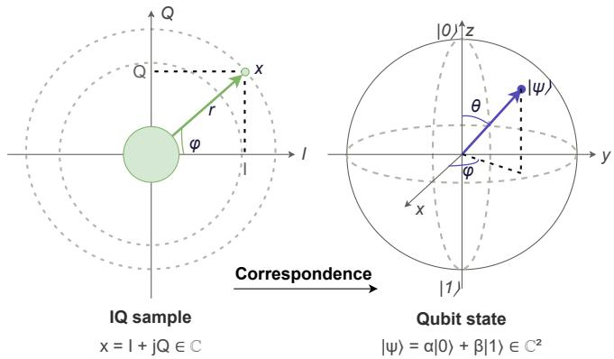
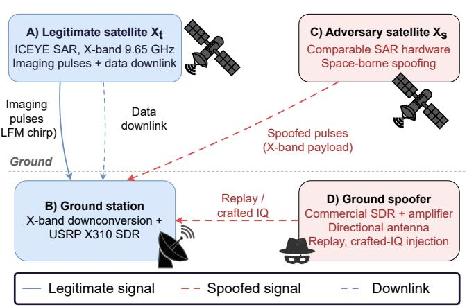
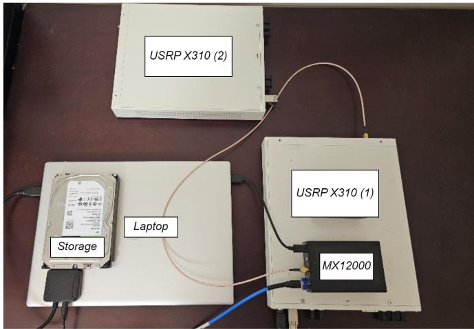
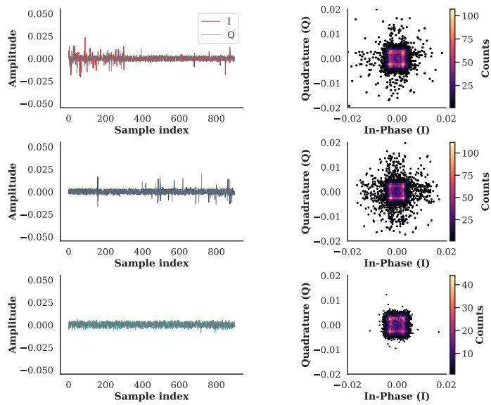
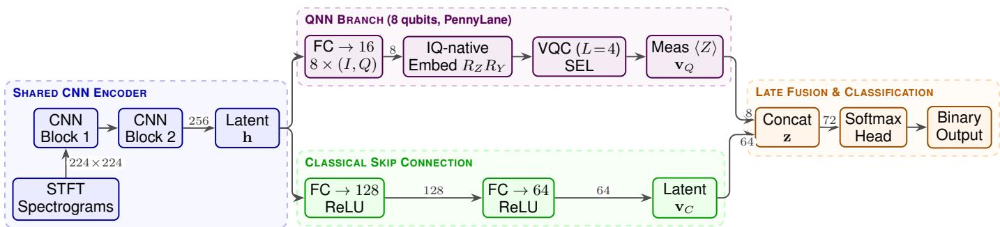
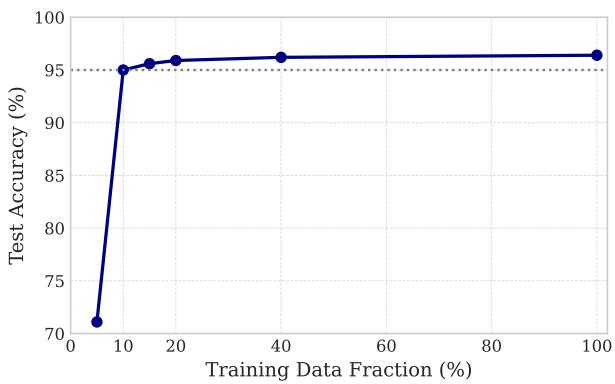
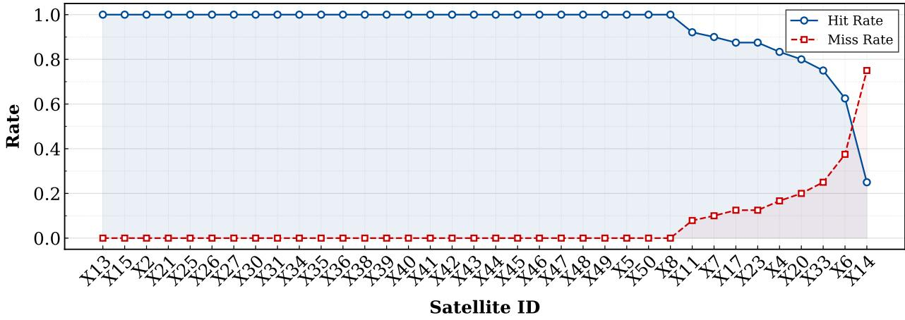
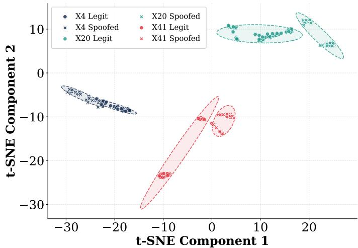
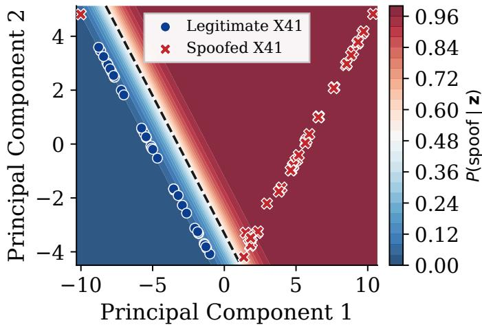

# QUASAR: A Quantum-Classical Neural Network for SAR Satellite Physical-Layer Authentication

Vincenzo Sammartino∗†, Nathanael Denis†, and Roberto Di Pietro†

∗University of Pisa, Pisa, Italy

vincenzo.sammartino@phd.unipi.it

†King Abdullah University of Science and Technology (KAUST), Thuwal, Saudi Arabia {nathanael.denis, roberto.dipietro}@kaust.edu.sa

Abstract—X-band SAR satellites (8–12 GHz) play a critical role in disaster response, environmental monitoring, and military intelligence. Yet, they lack robust physical-layer authentication (PLA), a security layer orthogonal to cryptographic solutions. Existing PLA systems, typically based on radio-frequency fingerprinting, are often limited to sub-6 GHz frequencies and rely on classical deep learning. However, this approach underfits the IQ phase nonlinearities that distinguish satellite hardware. In this paper, we present QUASAR, to the best of our knowledge the first quantum-classical hybrid architecture that fuses a CNN spectrogram encoder with a variational quantum circuit (VQC) to provide PLA to X-band SAR signals. Our solution enjoys two distinctive features: (i) it is markedly more data-efficient than classical machine learning, requiring only 10% of the training data to match the accuracy of classical baselines—data collection being notoriously the most time-consuming phase of PLA; and, (ii) at an equal data budget, it improves classification accuracy over those baselines. In detail, we test our solution under three adversarial scenarios: replay, crafted-IQ injection, and space-borne spoofing. QUASAR rejects spoofed transmissions in 89.7%, 94.1%, and 81.3% of attempts, respectively, establishing the first quantum-enhanced physical-layer classifier for satellite constellations. The fully detailed framework and the supporting results, other than being interesting on their own, show a novel research avenue for physical-layer authentication.

## I. INTRODUCTION

Synthetic aperture radar (SAR) satellites are Earthobservation platforms that transmit active microwave signals, enabling high-resolution surface imaging irrespective of weather or illumination conditions. The commercial expansion of X-band (8–12 GHz) SAR constellations has accelerated markedly: ICEYE—a Finnish private company owning the world’s largest synthetic aperture imaging radar constellation—now operates more than 60 active satellites. Its competitors, Capella Space and Beijing Smart Satellite Space Technology, are similarly scaling deployments. These systems are used for time-critical decisions in disaster management, environmental monitoring, agricultural surveillance, and national security intelligence [1]–[4]. Their strategic significance, however, makes them an attractive target for adversaries seeking to forge SAR imagery or disrupt observation services.

Yet, satellite networks do not universally enforce authentication mechanisms [5]. Even where cryptographic protections exist, they remain vulnerable to key leakage, legacy hard ware incapacity for software updates, and eventual cryptographic compromise over decade-long mission lifetimes [6]. Physical-layer security (PLS) addresses this vulnerability via an independent mechanism: hardware-induced signal impairments make every radio transmitter physically unique and are extremely hard to reproduce [7]. While these physical impairments provide a robust authentication anchor, they are subject to drift over extended periods due to the harsh space environment, necessitating periodic model updates via transfer learning to maintain fingerprint accuracy.

Despite recent progress in RF fingerprinting for sub-6 GHz satellite communications, e.g., IRIDIUM [8], [9], the Xband has comparatively received little attention. Commercial SDRs are capped at approximately 6–7 GHz, requiring an intermediate downconversion stage that introduces additional phase noise, mixer nonlinearities, and spurious spectral products [10].

Hardware impairments in X-band SAR signals manifest themselves as IQ imbalances and phase micro-perturbations, which are reflected in high-noise radar pulses. Deep convolutional architectures excel at coarse spectral pattern extraction, but may underfit the nonlinear interactions separating satellites that share hardware generation. Variational quantum circuits (VQCs) offer a theoretically motivated alternative: operating in exponentially large Hilbert spaces with a polynomial parameter count, VQCs can implement high-dimensional nonlinear transformations potentially unavailable to shallow classical layers, amplifying fingerprint separability in directions inaccessible to classical gradient descent [11].

Contributions. This paper provides a novel PLA mechanism for satellite authentication that blends quantum and classical ML techniques. In particular, we provide the following contributions:

• We design and deploy an X-band SAR satellite RF fingerprinting testbed, based on a programmable downconversion mixer and a USRP X310 SDR. To validate our framework, we collect 3.76 TB of raw IQ data from 37 operational ICEYE satellites over 28 days using two independent SDR units—the latter to assess crossreceiver transferability.

• We propose QUASAR, a quantum-classical hybrid architecture combining a deep CNN spectrogram encoder, a four-layer VQC operating over an 8-qubit register, and a classical skip connection fused via late concatenation. The VQC is driven by an IQ-native encoding that maps the amplitude and the phase of each projected feature onto the polar and azimuthal angles of a qubit, exploiting the geometric isomorphism between a complex sample and a single-qubit pure state.

• We demonstrate 97.3% validation accuracy and macro-F1 = 0.973 in binary satellite authentication using only 10% of the collected corpus—matching classical baseline accuracy at a fraction of the enrollment cost—and exceeding the classical-only baseline by 7.5 percentage points. Furthermore, through a dedicated explainability analysis based on gradient saliency maps and latentspace clustering, we establish the physical grounding of QUASAR’s decisions, confirming the ability of the quantum branch to amplify minute hardware fingerprints and localizing the decision to sub-millisecond windows in the raw IQ domain.

• We define and test three attack scenarios: replay attacks; crafted-IQ injection; and, spoofing—achieving detection rates of 89.7%, 94.1%, and 81.3%, respectively.

The remainder of this paper is organized as follows. Section II provides background. Section III defines the threat model. Section IV describes data collection and processing. Section V presents QUASAR. Section VI reports experimental results. Section VII provides explainability analysis. Section VIII surveys related work. Section IX discusses limitations and future work. Conclusions are reported in Section X.

## II. BACKGROUND

This section introduces the principles underlying our proposed approach, specifically SAR satellite imaging, softwaredefined radio for RF fingerprinting, time-frequency signal representations, and variational quantum circuits. We also connect IQ samples to qubits to further justify the use of quantum machine learning for PLA.

## A. SAR Imaging Satellites

Synthetic Aperture Radar (SAR) is an active microwave remote sensing technology. A SAR satellite illuminates the ground with radio pulses and reconstructs a high-resolution image from the reflected echoes. Because the system relies on its own illumination and operates at microwave frequencies that penetrate clouds, SAR acquires imagery day or night, independently of weather. Passive optical satellites, by contrast, offer no such capability, which makes SAR the instrument of choice for disaster response, maritime surveillance, and military intelligence [1], [4], [12].

The imaging pulse. To achieve fine range resolution without requiring impractically short pulses, SAR systems transmit a linearly frequency-modulated (LFM) chirp: a waveform whose instantaneous frequency sweeps linearly across the instrument bandwidth over the pulse duration [13]. For a chirp of bandwidth B and duration $T _ { p } ,$ , the baseband transmitted signal is

$$
\begin{array} { r } { s ( t ) = \mathrm { r e c t } \Big ( \frac { t } { T _ { p } } \Big ) \mathrm { e x p } \big ( j \pi K t ^ { 2 } \big ) , \qquad K = B / T _ { p } , } \end{array}\tag{1}
$$

where K is the chirp rate [13], [14]. Pulse compression at the receiver trades the long transmitted pulse for a short effective pulse of width $\approx 1 / B ,$ so ground range resolution scales inversely with the transmitted bandwidth.

SAR satellite imaging bands. SAR constellations operate across several microwave bands—L, C, and X being the most common [15]–[17]. The X-band (8–12 GHz) offers the most favorable trade-off between resolution and antenna size for small commercial platforms [16]: its short wavelength yields sub-meter ground resolution with antennas compatible with comparatively lightweight satellite buses, i.e., even below 100 kg, enabling the dense LEO constellations now deployed by ICEYE, Capella Space, and Umbra. Lower bands (L, C) require proportionally larger antennas for equivalent resolution and are typically reserved for flagship government missions [18].

The ICEYE constellation. Our testbed targets satellites from the ICEYE constellation. ICEYE is a Finnish commercial operator, founded in 2014 as a spin-off of Aalto University, whose mission was to miniaturize X-band SAR payloads to platforms below 100 kg. Each ICEYE satellite carries an active phased-array antenna operating at a nominal carrier frequency of 9.65 GHz and supports several acquisition modes — Strip, Spot, Scan, and Dwell —, with published ground resolutions ranging from approximately 0.25 m to 15 m depending on mode [19]. ICEYE now operates the largest commercial SAR constellation in orbit; the 37 satellites used in this study correspond to the subset operational during our 28-day collection campaign, while the constellation has since grown to over 60 satellites. Within a single hardware generation, all satellites share a common bus and payload design, which makes intraconstellation discrimination particularly challenging for any fingerprinting method.

## B. Software-Defined Radio and RF Fingerprinting

SDRs implement signal processing on reconfigurable hardware, enabling passive wideband capture without prior knowledge of the target’s transmission scheme. Their operational frequency ceiling (6–7 GHz for commodity units) precludes direct capture of X-band emissions. Radio fingerprinting exploits hardware impairments to identify the originating transmitter [7]. Even mass-produced transceivers from the same batch are distinguishable due to minute differences in hardware, which manifest as IQ gain imbalance, DC offset, phase noise, and nonlinear harmonic distortion in received IQ samples [8].

Short-Time Fourier Transform spectrograms. Raw IQ samples are converted to time-frequency representations via the STFT [20]. For a complex baseband signal x[n]:

$$
X ( m , k ) = \sum _ { n = 0 } ^ { N - 1 } x [ n + m H ] w [ n ] e ^ { - j 2 \pi k n / N }\tag{2}
$$

where w[n] is a Hanning analysis window of length N, H is the hop size, and $m , k$ index time frames and frequency bins, respectively. The log-magnitude spectrogram $S ( m , k ) =$ $1 0 \log _ { 1 0 } | X ( m , k ) | ^ { 2 }$ is treated as a grayscale 2D image, jointly encoding spectral content and temporal evolution.

## C. Variational Quantum Circuits

A VQC $U ( { \pmb \theta } , { \bf x } )$ encodes classical data into qubit states, applies a parameterized gate sequence, and returns expectation values of Pauli observables as classical outputs. An angleembedding layer initializes each qubit via:

$$
R _ { Y } ( \phi _ { i } ) | 0 \rangle , \quad \phi _ { i } = \pi \cdot \sigma ( x _ { i } ) , \quad i = 1 , \ldots , d\tag{3}
$$

where $\sigma ( \cdot )$ is the sigmoid function, constraining $\phi _ { i } \in ( 0 , \pi )$ The embedding loads each classical feature onto an independent qubit, producing a separable product state $\otimes _ { i = 1 } ^ { d } \left| \phi _ { i } \right.$ that carries no inter-qubit correlation. To learn joint functions of the embedded features, this state is processed by L strongly entangling layers (SEL) [21]. Each SEL applies parameterized $R _ { Y } / R _ { Z }$ rotations on every qubit followed by a CNOT ring, generating the multi-qubit entanglement needed to evaluate non-separable functions over the $2 ^ { d }$ -dimensional Hilbert space. The circuit output is the vector of single-qubit Pauli-Z expectation values:

$$
\mathbf { v } _ { Q } = \left[ \langle Z _ { 1 } \rangle , \langle Z _ { 2 } \rangle , \allowbreak . . . , \allowbreak \langle Z _ { d } \rangle \right] \in [ - 1 , 1 ] ^ { d } ,\tag{4}
$$

which is differentiable end-to-end via the parameter-shift rule [22], making the VQC compatible with standard backpropagation.

## D. Connecting IQ Samples to Qubits

A central motivation for using Quantum Machine Learning (QML) in the context of radio-frequency fingerprinting is that the native state space of a qubit is geometrically isomorphic to the native state space of an IQ sample. This correspondence, illustrated in Figure 1, permits an encoding under which the entire information content of a complex sample, i.e., both amplitude and phase, is preserved in the quantum state. This is often not true for real-valued encodings, e.g., of spectrogram magnitudes, which discard phase by construction.

The geometric correspondence. A complex IQ sample $x =$ $I + j Q \in \mathbb { C }$ is uniquely determined by two real parameters: its magnitude $r = | \boldsymbol { x } |$ and its phase $\varphi = \arg ( x ) \in [ 0 , 2 \pi )$ . A single-qubit pure state

$$
\left| \psi \right. = \cos ( \theta / 2 ) \left| 0 \right. + e ^ { i \varphi } \sin ( \theta / 2 ) \left| 1 \right.\tag{5}
$$

is likewise determined by two real parameters: the polar angle $\theta \in [ 0 , \pi ]$ and the azimuthal angle $\varphi \in [ 0 , 2 \pi )$ on the Bloch sphere. The azimuthal angle $\varphi$ is the same physical quantity

  
Fig. 1. IQ samples and qubit states. Left: a complex IQ sample $x = I + j Q$ represented as a vector in the complex plane with magnitude r and phase φ. Right: a single-qubit pure state $| \psi \rangle = \cos ( \theta / 2 ) | 0 \rangle + \overline { { e } } ^ { i \varphi }$ sin(θ/2)|1⟩ on the Bloch sphere, parameterized by the polar angle θ and the azimuthal angle $\varphi .$ Both objects are fully specified by two real parameters: the IQ magnitude r maps to the polar angle $\mathbf { \dot { \theta } } = 2 \arcsin ( r )$ , while the phase $\varphi$ is the same physical quantity in both representations.

in both representations, i.e., the phase of the complex object. Only the amplitude–polar mapping needs to be specified to complete the correspondence.

IQ-native encoding. Given a normalized IQ sample $x _ { n } =$ $I _ { n } + j Q _ { n }$ with $r _ { n } = | x _ { n } | \in [ 0 , 1 ]$ and $\varphi _ { n } = \arg ( x _ { n } )$ , we encode it into qubit n via the two-rotation sequence

$$
| \psi _ { n } \rangle \ : = \ : R _ { Z } ( \varphi _ { n } ) \ : R _ { Y } ( \theta _ { n } ) \ : | 0 \rangle , \qquad \theta _ { n } = 2 \arcsin ( r _ { n } ) ,\tag{6}
$$

where $R _ { Y } ( \theta ) = \mathrm { e x p } ( - i \theta Y / 2 )$ and $R _ { Z } ( \varphi ) = \exp ( - i \varphi Z / 2 )$ are the standard Pauli rotations [23], [24]. The $R _ { Y }$ rotation fixes the latitude of the state on the Bloch sphere (loading the amplitude), while the subsequent $R _ { Z }$ rotation fixes its longitude (loading the phase). The $R _ { Z }$ rotation introduces an overall factor $e ^ { - i \varphi / 2 }$ which, as a global phase, leaves all measurable quantities and subsequent gate operations invariant. Excluding this global phase, the resulting state is exactly Eq. (5) with $\theta = \theta _ { n }$ and $\varphi = \varphi _ { n } ,$ so the encoding is lossless: the original sample can be recovered as $x _ { n } = \sin ( \theta _ { n } / 2 ) e ^ { i \varphi _ { n } }$ from the Bloch-sphere coordinates of $\left| { \psi _ { n } } \right.$

A block of d consecutive IQ samples is encoded into a d-qubit product state $| \psi \rangle = \bigotimes _ { n = 1 } ^ { d } | \psi _ { n } \rangle$ by applying Eq. (6) independently on each qubit. The entangling layers that follow (cf. Section V) subsequently couple these qubits, allowing the VQC to learn joint functions of the full IQ block.

Contrast with angle embedding of real features. The conventional angle-embedding approach of Eq. (3) loads a real scalar $x _ { i } \in \mathbb { R }$ into qubit i via a single $R _ { Y }$ rotation, leaving the azimuthal degree of freedom unused. Applied to a complex IQ stream, this scheme requires either: (i) discarding the phase; or, (ii) spending two qubits per sample (one for $I ,$ one for $Q ) .$ , which doubles circuit depth and breaks the geometric link between the encoded state and the original complex number. The IQ-native encoding of Eq. (6) avoids both penalties: one sample maps to one qubit with no information loss, while the phase $\varphi \mathrm { - a }$ feature that may carry hardware-induced impairments such as oscillator drift and mixer nonlinearity [25], [26]— is represented on the qubit as the same angle it occupies in the complex plane. Section VI-D quantifies what this distinction is worth in practice: replacing angle embedding with the IQ-native encoding, with every other component of the architecture held fixed, raises test accuracy by 2.2 percentage points and nearly halves the number of epochs to convergence.

## III. THREAT MODEL

We define adversarial assumptions, objectives, and attack scenarios that scope the design of QUASAR. Figure 2 illustrates the system and threat model.

## A. System model

A ground station equipped with an X-band downconversion chain and SDR passively captures radar illuminating pulses transmitted by a legitimate ICEYE SAR satellite during orbital passes. A trained QUASAR classifier authenticates illumination signals against the enrolled satellite’s physical-layer fingerprint in near real time. Enrollment is performed offline on verified satellite passes.

Adversarial objective. The adversary seeks to compromise physical-layer authentication, either by successfully impersonating a legitimate satellite to inject fabricated IQ data that generates false SAR imagery or by blocking correct authentication to deny observation services. In high-stakes contexts, such as military surveillance or critical-infrastructure monitoring, both outcomes carry severe operational consequences.

Adversarial capabilities. We consider a tiered adversary model whose resources scale with the attack scenario. At the lower tier, a terrestrial attacker possesses a commercial offthe-shelf SDR, a power amplifier, and a directional antenna, enabling signal capture, replay, and synthesis in proximity to the target ground station. This equipment is commercially available for \$500–\$10,000 USD and is sufficient for groundbased replay and crafted-IQ attacks. At the upper tier, we consider a strategic adversary with the means to operate an X-band SAR satellite of their own. While orders of magnitude more expensive, this capability is no longer the exclusive domain of major space powers: commercial SAR satellites can be procured or leased from established vendors. Rideshare launches, where several customers share one rocket, have driven costs into the low millions of USD range for a mission. As a consequence, several nation-states as well as non-state actors can now field X-band imaging assets. There are several incentives for a strategic adversary. Fabricating or suppressing SAR imagery can conceal military deployments, manipulate insurance and commodity markets that rely on SAR-derived intelligence, undermine adversarial disaster-response or treatyverification efforts, or discredit a competing constellation operator by injecting falsified observations attributed to their satellites. In all tiers, we do not assume access to the legitimate ICEYE satellite hardware, knowledge of QUASAR’s parameters, or compromise of the ground station.

  
Fig. 2. Threat model. (A) A legitimate SAR satellite $X _ { t }$ transmits two physically distinct X-band signals: i) (frequent) high-power chirp pulses for Earth imaging; and, ii) (uncommon) phase-modulated data downlinks. (B) A ground station captures imaging pulses for authentication purposes. Two adversaries are considered: (C) a space-borne adversary operating a SAR satellite Xs of comparable hardware; and, (D) a ground spoofer operating a commercial high-end SDR.

## B. Attack scenarios

We consider three scenarios, ordered by increasing adversarial capability. They are referred to as Scenarios (A), (B), and (C) throughout the paper.

Scenario (A): replay. The adversary, equipped with a commercial SDR, a power amplifier, and a directional antenna, records IQ bursts during a legitimate pass of $X _ { t }$ and reemits them from the ground toward the victim ground station during a subsequent window. This is the weakest of the three models in terms of required expertise and capital outlay (\$500– \$10,000 USD), but also the most operationally feasible. The defense relies on the fact that the spoofer’s transmit chain superimposes its own hardware impairments on top of $X _ { t } \mathbf { \bar { s } }$ original fingerprint, producing a measurable discrepancy in the IQ domain. We instantiate this scenario by replaying previously captured ICEYE bursts through a second USRP X310 transmitting at the IF stage of our acquisition chain.

Scenario (B): crafted-IQ injection. Rather than replaying a recorded waveform, the adversary synthesizes an LFM chirp that matches the nominal ICEYE waveform parameters— carrier, bandwidth, chirp rate, and pulse repetition interval— and transmits it toward the ground station. The synthetic burst is spectrally indistinguishable from a legitimate illumination at the macro level, but carries no hardware fingerprint of $X _ { t } \mathbf { \cdot }$ only the impairments of the adversary’s own transmit chain. This scenario isolates the classifier’s reliance on micro-scale impairments rather than on waveform structure.

Scenario (C): space-borne spoofing. A second SAR satellite $X _ { s }$ operates in the same band and shares comparable hardware with the legitimate satellite $X _ { t } . \ X _ { s }$ transmits illuminating pulses to the ground station, aiming to spoof $X _ { t }$ . In a realistic deployment, $X _ { s }$ would belong to a foreign or competing constellation; however, such cross-constellation captures are not available in our dataset, and an adversary controlling a satellite from a different hardware family would be easier to discriminate due to larger impairment gaps. To stresstest QUASAR under the challenging space-borne conditions, we therefore emulate this scenario via an open-set protocol: a subset of the 37 ICEYE satellites is held out from the training and validation splits and presented to the classifier exclusively at test time in the role of $X _ { s }$ . Because ICEYE units share similar phased-array architecture and hardware, this is a plausible space-borne attacker. A successful defense requires the model to reject $X _ { s }$ despite minimal macro-level spectral divergence from $X _ { t }$ . This is the strongest of the three models, and the one against which QUASAR is hardest pressed.

  
Fig. 3. Setup to collect satellite signals in the X-band. Two USRPs are used, along with an MX12000 downconverter and 8TB Seagate BarraCuda storage.

## IV. DATA COLLECTION AND PROCESSING

This section describes the hardware testbed used to capture X-band SAR signals, the rationale for targeting imaging pulses over data downlinks, the resulting dataset, and the preprocessing pipeline that converts raw IQ recordings into spectrograms for further processing.

## A. Acquisition Testbed

Capturing ICEYE SAR illuminating signals at 9.65 GHz lies beyond the 6–7 GHz ceiling of commodity SDRs. We designed a custom downconversion chain composed of three elements. The Aaronia Hyperlog Pro 70140 is a passive directional antenna with a wide frequency range spanning from 700 MHz to 14 GHz, a 13 dBi gain, and is designed for field use. It feeds a DSI MX12000 programmable microwave mixer with a local oscillator set to 7.2 GHz, downconverting the received signal to an intermediate frequency (IF) of 2.45 GHz. The MX12000 eliminates the need for an external highfrequency signal source. The MX12000 output is captured by an Ettus USRP X310 equipped with UBX-40 daughterboards (10 MHz–6 GHz, 40 MHz instantaneous bandwidth) at 10 Msps. IQ files are stored on an 8 TB HDD and processed offline using GNU Radio.

The 40 MHz capture bandwidth is narrower than ICEYE’s full imaging bandwidth — up to 299 MHz for standard modes. Full-bandwidth capture is required for SAR image formation, but not for fingerprinting. Indeed, hardware impairments are detectable within any consistent spectral slice, so fingerprinting remains viable within the SDR’s instantaneous bandwidth.

## B. Rationale for Targeting Imaging Pulses

Our testbed exclusively captures SAR imaging pulses rather than the satellite’s X-band data downlink. Three properties make imaging pulses the natural choice for physical-layer authentication.

Passive availability. Imaging pulses are high-power illuminations broadcast toward Earth during every orbital pass, and can be collected by any ground receiver with direct line-ofsight visibility to the satellite. The data downlink, by contrast, is a directed high-gain beam steered toward a specific licensed ground station, making passive interception impractical without prior coordination, and in particular, proximity to the intended receiver.

Signal richness. Imaging pulses are wideband LFM chirps, up to 299 MHz for ICEYE standard modes, which are transmitted at high power. They provide a large spectral canvas over which hardware impairments can manifest. The data downlink employs narrowband phase-modulated communication waveforms, e.g., QPSK or 8PSK, whose reduced bandwidth and distinct modulation scheme produce a fundamentally different impairment signature. As a result, a fingerprint trained on one cannot substitute for the other.

Collection frequency. Imaging pulses are emitted continuously throughout the illumination phase of every pass, whereas data downlink sessions are comparatively infrequent and tied to the availability of licensed downlink stations. This asymmetry substantially facilitates dataset collection, both for research purposes—where independent ground receivers can accumulate large corpora across many passes—and for operational deployment by a constellation operator equipped with its own ground infrastructure.

Note that the hardware fingerprint extracted from SAR imaging pulses is not interchangeable with one derived from the satellite’s X-band data downlink, as the two signals differ fundamentally in waveform structure.

## C. Dataset

A 28-day collection campaign produced signals from all 37 operational ICEYE satellites, accumulating 3.76 TB of raw IQ data. To assess cross-receiver transferability—a known source of fingerprinting bias [27]—two physically separate USRP X310 units were deployed: the first unit contributed 2.48 TB and the second 1.28 TB.

## D. Pre-processing

Noise-only intervals are mitigated via an adaptive magnitude threshold:

$$
\tau = \alpha \cdot ( \mu + 2 \sigma )\tag{7}
$$

  
Fig. 4. Time-domain IQ waveforms (left) and constellation density maps (right) for three ICEYE satellites: X11 (top), X13 (middle), and X14 (bottom).

where $\mu$ and $\sigma$ are the mean and standard deviation of instantaneous sample magnitudes and $\alpha \in [ 0 , 1 ]$ is a tunable strength coefficient. Samples exceeding τ are retained while the remainder are discarded, reducing the noise floor during downconverted X-band reception.

## E. Spectrogram Generation

Retained IQ bursts are segmented into chunks of 100,000 samples. Each chunk is transformed into a grayscale spectrogram using Eq. (2) with Hanning window $N = 2 5 6$ hop $H \ = \ 1 2 8$ (50% overlap), and FFT length 256. The power spectrogram is log-scaled in dB, clipped between the 1st and 99th percentiles for dynamic-range compression, and resized to 224 × 224 pixels to match the CNN encoder’s input dimensions.

## F. Class Balancing

We collect IQ data from 37 ICEYE satellites and train one binary classifier per satellite under a one-vs-rest (OvR) protocol. For each classifier, samples from the enrolled satellite are the positive class and samples from the remaining 36 satellites form the negative class. This creates a natural 36:1 imbalance. To correct it, we undersample the negative class at the pass level, drawing negative passes until their spectrogram count matches the positive class, and close any residual gap with ceiling oversampling. The final balanced set contains 2,021 spectrograms per classifier, evenly split between the two classes. This procedure is applied independently for each of the 37 enrolled satellites.

Each satellite is captured on its own orbital passes, in separate acquisitions; no capture contains more than one emitter. The labels target and non-target are therefore not properties of a collection but roles assigned per classifier: under the onevs-rest protocol of Section IV, each of the 37 satellites is enrolled as the target in turn, and the remaining 36 take the non-target role for that classifier. Figure 4 shows three of these independently acquired emitters, with X11 drawn in the target role purely for illustration.

The three rows illustrate the morphological diversity the testbed resolves. X11 (top row) exhibits pronounced burstonset transients in the time-domain trace, with I and Q components reaching peak amplitudes of ±0.05, followed by rapid signal decay. Its constellation density map is broad and asymmetric, reflecting the hardware phase noise and IQ imbalance introduced by that satellite’s transmit chain. X13 (middle row) displays sparse impulsive artifacts superimposed on a lower-amplitude stationary floor, with a wider constellation spread indicating a noise process with higher variance. X14 (bottom row) presents the most stationary waveform, with uniformly bounded amplitude and a compact, near-circular constellation whose reduced count density (≤40 samples at peak) reflects its intermittent in-band activity. These interemitter differences—detectable at the level of raw IQ morphology prior to any spectral transformation—confirm that the downconversion chain preserves sufficient hardware-induced signal structure to support fingerprint extraction, and motivate the class-balancing procedure described above.

## G. Training / Validation / Test Split

The balanced dataset is partitioned into $D _ { \mathrm { t r a i n } } ~ ( 6 0 \% ) , D _ { \mathrm { v a l } }$ (20%), and $D _ { \mathrm { t e s t } }$ (20%) at the granularity of orbital passes rather than of individual spectrograms: we first group all bursts by pass identifier (date × satellite × acquisition window), then assign whole passes to the three subsets by random shuffling. Spectrograms from the same pass therefore never straddle two subsets. This prevents temporally adjacent bursts—which share channel state, atmospheric conditions, and front-end thermal regime—from leaking across splits.

## V. QUASAR: ARCHITECTURE

QUASAR takes a shared latent representation and sends it through two parallel paths: a variational quantum branch and a classical skip connection. Their outputs are then combined and passed to a single binary classifier. The full pipeline is shown in Figure 5.

## A. CNN Encoder

The input grayscale spectrogram $\mathbf { I } \in \mathbb { R } ^ { 1 \times 2 2 4 \times 2 2 4 }$ is processed by a stack of convolutional blocks [28], [29]. Each block applies a Conv2d layer followed by BatchNorm2d, ReLU activation, and MaxPool2d spatial downsampling. The encoder outputs a dense latent vector h $\in \ \mathbb { R } ^ { 2 5 6 }$ encoding hierarchical spectral and temporal features of the received waveform. Batch normalization at each layer stabilizes gradient flow and accelerates convergence in the presence of VQC parameter-shift gradients, which have higher variance than standard backpropagation.

  
Fig. 5. QUASAR end-to-end architecture. The shared CNN encoder (blue) maps the 224×224 STFT spectrogram to a 256-dimensional latent vector h. The QNN branch (violet) projects h to 8 complex components, loads each onto one qubit through the IQ-native amplitude–phase encoding of Eq. (6), applies $L = 4$ strongly entangling layers (SEL), and emits 8 Pauli-Z expectation values. The classical skip (green) compresses h through two FC layers to 64 dimensions. Late fusion concatenates both into a 72-dimensional vector classified by a linear head.

## B. Variational Quantum Branch

The 256-dimensional latent vector h is projected by a trainable linear layer to 16 real values, read as 8 complex components:

$$
\begin{array} { r } { \mathbf q = W _ { q } \mathbf h + \mathbf b _ { q } , \qquad W _ { q } \in \mathbb { R } ^ { 1 6 \times 2 5 6 } , } \end{array}\tag{8}
$$

with $c _ { i } \ = \ q _ { 2 i - 1 } + j \ q _ { 2 i }$ for $i = 1 , \dots , 8$ . Each complex component is loaded onto one qubit through the IQ-native encoding of Eq. (6):

$$
| \psi _ { i } \rangle = R _ { Z } ( \varphi _ { i } ) R _ { Y } ( \theta _ { i } ) | 0 \rangle , \quad \theta _ { i } = 2 \arcsin ( \operatorname { t a n h } | c _ { i } | ) ,\tag{9}
$$

where tanh $| c _ { i } | \in [ 0 , 1 )$ keeps the amplitude inside the admissible range of arcsin. The $R _ { Y }$ rotation loads the amplitude of $c _ { i }$ and the subsequent $R _ { Z }$ rotation loads its phase, so both degrees of freedom of the projected feature reach the register. Suppressing the $R _ { Z }$ rotation and driving $R _ { Y }$ with a single real projection recovers the conventional angle embedding of Eq. (3), which discards the azimuthal degree of freedom; we retain that configuration as an ablation and quantify its cost in Section VI-D. Four strongly entangling layers are then applied. Writing $\pmb { \theta } ^ { ( \ell ) } \in \mathbb { R } ^ { 8 \times 3 }$ for the parameters of layer ℓ, each layer executes a parameterized single-qubit rotation on every qubit followed by a CNOT ring:

$$
U _ { \ell } ( \pmb \theta ^ { ( \ell ) } ) = \underbrace { \prod _ { i = 1 } ^ { 8 } \mathrm { C N O T } _ { i , ( i \bmod 8 ) + 1 } } _ { \mathrm { e n t a n g l i n g ~ r i n g } } \ \prod _ { i = 1 } ^ { 8 } R ( \theta _ { i , 1 } ^ { ( \ell ) } , \theta _ { i , 2 } ^ { ( \ell ) } , \theta _ { i , 3 } ^ { ( \ell ) } ) _ { i }\tag{10}
$$

where $R ( \alpha , \beta , \gamma ) = R _ { Z } ( \gamma ) R _ { Y } ( \beta ) R _ { Z } ( \alpha )$ is the general singlequbit rotation. The full branch therefore computes $\mathbf { v } _ { Q }$ from the state $\begin{array} { r } { \left( \prod _ { \ell = 1 } ^ { 4 } U _ { \ell } \right) \bigotimes _ { i = 1 } ^ { 8 } | \psi _ { i } \rangle } \end{array}$ . The entangling ring is what makes the azimuthal degree of freedom observable: on a product state the Pauli- $. Z$ expectations of Eq. (4) are invariant to the phases $\varphi _ { i } ,$ so without Eq. (10) any phase loaded into the register would be unmeasurable. The circuit is implemented in PennyLane [30] with parameter-shift gradient estimation and emits $\mathbf { v } _ { Q } \in [ - 1 , 1 ] ^ { 8 }$ as defined in Eq. (4).

The quantum branch provides two design advantages. First, by operating on the Bloch sphere, it implements a nonlinear transformation in a $2 ^ { 8 } \cdot$ -dimensional Hilbert space using only $d L = 3 2$ trainable rotation parameters, delivering far more representational capacity per parameter than a comparably sized classical layer. Second, the entangling layers generate interqubit correlations that model higher-order feature interactions, capturing fingerprints that are suppressed in classical fullyconnected layers.

Hyperparameter selection. The qubit count $d = 8$ and entangling depth $L \ = \ 4$ are selected to balance Hilbertspace expressivity against the trainability degradation induced by barren plateaus [31]. Increasing d beyond 8 expands the simulated state space to $2 ^ { d } ~ \geq ~ 5 1 2$ amplitudes, inflating parameter-shift training cost super-linearly without measurable accuracy gain on $D _ { \mathrm { v a l } }$ (we observed $\mathrm { ~ a ~ } < 0 . 4$ percentagepoint fluctuation across $d \in \{ 6 , 8 , 1 0 , 1 2 \}$ at fixed $L = 4 )$ Conversely, $L < 4$ leaves the state under-entangled, collapsing performance toward the QNN-Only baseline of Table II. The chosen configuration matches the dimensionality of established QML benchmarks [21] and remains within the gatedepth budget executable on current NISQ backends [11].

## C. Classical Skip Connection

In parallel, the full latent vector h passes through a classical fully-connected pathway:

$$
\mathbf { v } _ { C } = \mathrm { R e L U } \big ( W _ { 2 } \mathrm { R e L U } ( W _ { 1 } \mathbf { h } + \mathbf { b } _ { 1 } ) + \mathbf { b } _ { 2 } \big )\tag{11}
$$

where $W _ { 1 } \in \mathbb { R } ^ { 1 2 8 \times 2 5 6 }$ and $W _ { 2 } \in \mathbb { R } ^ { 6 4 \times 1 2 8 }$ . This skip connection is architecturally necessary: routing all information through the 8-dimensional quantum bottleneck would discard the majority of the temporal pattern information encoded by the CNN. The classical branch preserves this information, ensuring the fusion layer has access to both the quantum operator’s nonlinear projections and the original rich latent representation.

## D. Late Fusion and Binary Classifier

The two branch outputs are concatenated:

$$
\mathbf { z } = [ \mathbf { v } _ { Q } \parallel \mathbf { v } _ { C } ] \in \mathbb { R } ^ { 7 2 }\tag{12}
$$

A linear head maps z to binary logits, from which the targetclass posterior is derived via softmax. The 72-dimensional fusion space provides sufficient representational capacity for

the binary decision boundary without risking overfitting on the 2,021-instance dataset.

## E. Training Protocol

All parameters—the CNN encoder, the projection matrix $W _ { q } ,$ the VQC parameters θ, and the classification head—are optimized jointly in a single end-to-end training loop. We use the Adam optimizer with learning rate $\eta \ : = \ : 1 0 ^ { - 3 }$ and weight decay $\lambda ~ = ~ 1 0 ^ { - 4 }$ , and minimize the cross-entropy loss over mini-batches of size 32. Batch size is selected to accommodate the VQC parameter-shift overhead without GPU memory overflow. Early stopping with patience 50 on validation loss terminates training; the model converges at epoch 37.

## VI. EXPERIMENTAL EVALUATION

This section reports QUASAR’s performance across five evaluations: sensitivity to the training-data budget, binary authentication on the enrolled target, architectural ablation against classical benchmarks, per-satellite spoofing detection, and gradient saliency analysis.

## A. Experimental Setup

All experiments run on a workstation with an NVIDIA A6000 GPU. CNN components execute on GPU; PennyLane’s VQC simulation runs on CPU with parameter-shift gradients, which constitutes the primary computational bottleneck. The VQC is simulated classically—standard practice in near-term quantum ML [11]—producing results equivalent to noiseless hardware execution. All reported metrics are averaged over 25 independent random initializations with distinct weight seeds. Unless stated otherwise, QUASAR denotes the deployed configuration with the IQ-native encoding of Eq. (6). The spoofing-detection, latent-space, and gradient-saliency results of Sections VI and VII were obtained with the angleembedding variant and are therefore conservative: they lowerbound the performance of the deployed model, which dominates that variant on every binary metric (Table I).

All experiments are conducted on a representative 10% subset of the full 3.76 TB corpus, corresponding to 2,021 balanced instances after the class-balancing procedure described in Section IV. This deliberate restriction reflects one of the primary claims of QUASAR: the quantum-classical hybrid reaches classical baseline accuracy under a substantially reduced data budget, compressing what would otherwise be a multi-month enrollment phase into a shorter collection window. All baselines in the ablation and benchmark comparisons are trained on the identical 10% subset to ensure a controlled comparison.

Training time. To evaluate QUASAR’s suitability for operational deployment, we measure the computational latency of both the training and the inference. Training the hybrid architecture is computationally intensive due to the parametershift rule, which requires two separate forward passes of the quantum circuit for every trainable quantum parameter to compute analytical gradients. Consequently, training QUASAR on the 2,021-instance dataset requires approximately 102 seconds per epoch, converging in about 63 minutes after 37 epochs— against 1 hour and 55 minutes over 68 epochs for the angle-embedding variant of Section VI-D. Because satellite enrollment is an offline process performed once every few months to account for hardware drift, this training overhead is operationally acceptable.

  
Fig. 6. Test accuracy of QUASAR as a function of the training-data fraction. The fraction is the share of the full balanced corpus drawn by stratified random sampling, before the train/validation/test split is applied. For each fraction, the 60/20/20 split is rebuilt, and all hyperparameters are kept fixed. Each marker reports the mean over 25 random seeds.

Real-time inference. During inference, the parameter-shift rule is not invoked. The VQC requires only a single forward simulation. The CNN encoder processes a 224×224 spectrogram in 221 ms, while the 8-qubit PennyLane CPU simulation executes in 436 ms. The total end-to-end classification latency from raw IQ ingestion to binary decision is roughly 700 ms per burst.

## B. Sensitivity to the Training-Data Fraction

To justify the 10% data budget used throughout this evaluation, we resample the full balanced corpus at fractions of 5%, 10%, 15%, and 20%. For each fraction we draw a uniform subset, rebuild the 60/20/20 split, and retrain with all other settings fixed. At 5%, the model reaches only 71.1% test accuracy: the encoder is under-trained and the 72-dimensional fusion space is poorly populated. At 10%, the setting used in Sections VI and VII, accuracy reaches 96.9%, the value reported in Table II. Beyond this point the curve flattens: 15% adds 0.6 percentage points and 20% adds 0.9 percentage points in total (Figure 6), both within the seed-to-seed standard deviation measured over 25 runs. Additional data—which in this domain means scheduling additional orbital passes— therefore yields diminishing returns, and QUASAR saturates its capacity with a small training budget. This data efficiency is one of the central claims of the paper.

## C. Binary Authentication Performance

Binary authentication is the task on which QUASAR is trained: the classifier decides whether a burst originates from the enrolled target satellite. The detection of replayed bursts (Scenario (A)), in which a recorded waveform is re-emitted through a separate transmit chain, is a separate evaluation, reported at the end of this section on the three satellites (X4, X20, X41) for which laboratory replay data was acquired.

TABLE I  
BINARY AUTHENTICATION PERFORMANCE UNDER THE TWO QUANTUM EMBEDDINGS, ALL OTHER COMPONENTS OF THE ARCHITECTURE HELD FIXED. ANGLE EMBEDDING (EQ. (3)) LOADS A SINGLE REAL PROJECTION PER QUBIT; THE IQ-NATIVE ENCODING (EQ. (6)) LOADS AMPLITUDE AND PHASE. MEAN ± STD. DEV. OVER 25 RANDOM SEEDS.
<table><tr><td></td><td colspan="2">Angle embedding</td><td colspan="2">IQ-native (ours)</td></tr><tr><td>Metric</td><td>Validation</td><td>Test</td><td>Validation</td><td>Test</td></tr><tr><td>Accuracy</td><td>0.950 (±0.010)</td><td>0.947 (±0.009)</td><td>0.973 (±0.010)</td><td>0.969 (±0.009)</td></tr><tr><td>Macro-F1</td><td>0.950 (±0.004)</td><td>0.947 (±0.005)</td><td>0.973 (±0.004)</td><td>0.969 (±0.005)</td></tr><tr><td>Precision (target)</td><td>0.953</td><td>0.951</td><td>0.969</td><td>0.965</td></tr><tr><td>Recall (target)</td><td>0.948</td><td>0.943</td><td>0.974</td><td>0.975</td></tr><tr><td>Convergence epoch</td><td>68</td><td></td><td>37</td><td></td></tr></table>

Table I reports the binary metrics on $D _ { \mathrm { v a l } }$ and $D _ { \mathrm { t e s t } }$ for both quantum embeddings. In its deployed configuration— the IQ-native encoding of Eq. (6)—QUASAR reaches 0.973 accuracy and 0.973 macro-F1 on validation, and 0.969 on both metrics on the held-out test set. The 0.4 percentage-point drop from validation to test is well within the seed-to-seed standard deviation, indicating that the model generalizes to unseen orbital passes. Training and validation loss track each other across all epochs, with no sign of overfitting, and early stopping terminates training at epoch 37. Because the two classes are balanced by construction (Section IV), accuracy and macro-F1 coincide up to rounding. The angle-embedding variant, discussed in Section VI-D, is uniformly weaker on every metric.

## D. Encoding Ablation: IQ-Native vs. Angle Embedding

The IQ-native encoding of Section II-D is motivated geometrically, but the argument is only as good as the measurement that supports it. We therefore train the identical architecture twice, changing one component: the map from the projected features to the qubit register. In the angleembedding configuration each qubit receives a single real projection through $R _ { Y }$ (Eq. (3)), the scheme used by prior quantum-hybrid RFFI work [32]; in the IQ-native configuration each qubit receives one complex component through $R _ { Z } R _ { Y }$ (Eq. (9)). The CNN encoder, the classical skip, the entangling layers, the fusion head, the optimizer, the data split, and the 25 random seeds are all shared. The two rows of the comparison are therefore attributable to the encoding alone.

Table I reports the outcome. The IQ-native encoding improves test accuracy from 0.947 to 0.969 (+2.2 percentage points) and macro-F1 by the same margin. Two features of the result deserve comment.

First, the gain is concentrated in recall, which rises from 0.943 to 0.975 on $D _ { \mathrm { t e s t } }$ (+3.2 points) against a smaller precision gain of 1.4 points. The angle-embedding variant, in other words, fails predominantly by rejecting legitimate bursts of the enrolled target, and it is exactly those bursts that the azimuthal degree of freedom recovers. This is the behavior the geometric argument predicts: oscillator drift and mixer nonlinearity—the impairments that separate two units of the same production batch—perturb the phase of the received samples, and a real-valued embedding discards that coordinate before the variational layers ever see it.

Second, the IQ-native model converges in 37 epochs against 68 for angle embedding, a 46% reduction. At 102 seconds per epoch this shortens enrollment from 1 hour and 55 minutes to roughly 63 minutes on the same hardware. The encoding therefore does not trade accuracy against training cost: it improves both. We read the faster convergence as evidence that the phase coordinate carries discriminative signal that the angleembedding variant must otherwise reconstruct indirectly—if at all—from amplitude statistics through the entangling layers.

Taken together with the architectural ablation of the following section, the two comparisons decompose the hybrid’s advantage over the classical baseline into two additive parts: introducing the VQC branch at all is worth +5.3 percentage points over CNN-Only, and encoding its input natively as amplitude and phase is worth a further +2.2 points.

Reliability of Per-satellite authentication. We repeat the binary protocol with each of the 37 ICEYE satellites enrolled as the target in turn. Figure 7 reports the resulting hit and miss rates, sorted by decreasing hit rate. Two regimes appear: the first group of 28 satellites reaches a hit rate of 1.00, that is, the classifier authenticates every test burst of the target. A second group of nine satellites—X11, X7, X17, X23, X4, X20, X33, X6, X14—shows lower hit rates, from 0.93 (X11) down to 0.25 (X14), with miss rates up to 0.75. X14, the worst case, is also the satellite with the most stationary waveform and the lowest constellation count density in Figure 4. The reduced fingerprint contrast is the most likely cause of its degraded authentication.

## E. Ablation Study and Benchmark Comparison

Architectural ablation. To isolate the contribution of the VQC branch, we evaluate four configurations on the identical balanced dataset. QNN-Only applies a standalone VQC to a PCA-compressed 8-dimensional input, replicating the naive quantum baseline in which PCA destroys temporal semantics. CNN-Only retains the CNN encoder and classical skip while removing the VQC branch entirely $\bf ( z _ { \mathrm { ~ } } = \nabla v _ { C }$ , 64- dimensional classifier input). QUASAR (angle embedding) is the full hybrid architecture driven by the conventional realvalued embedding of Eq. (3), and QUASAR is the full hybrid architecture with the IQ-native encoding (Section VI-D).

Benchmark against classical spectrogram classifiers. To contextualize performance within the broader landscape of spectrogram-based deep learning, we additionally evaluate three classical architectures trained under the identical protocol (Adam, $\eta ~ = ~ 1 0 ^ { - 3 }$ , early stopping, 25 seeds): ResNet-18 adapted for single-channel spectrograms, a lightweight Transformer encoder, and MobileNetV2.

Table II consolidates both evaluations. QUASAR achieves the highest accuracy (96.9%) and macro-F1 (0.969) among all evaluated configurations. Three findings warrant attention. First, the QNN-Only configuration is the weakest overall (71.3%, F1 = 0.709), confirming that PCA-induced information loss is the primary failure mode of standalone quantum approaches: discarding temporal structure removes precisely the signal carrying hardware impairment information. Second, the 7.5 percentage-point accuracy gap between CNN-Only (89.4%, F1 = 0.891) and QUASAR (96.9%, F1 = 0.969) is consistent across both metrics, ruling out a precision–recall trade-off artifact and confirming that the VQC contributes a non-redundant discriminative signal unavailable to classical fully-connected layers of comparable parameter count. Of this gap, 5.3 points survive when the quantum branch is driven by a conventional angle embedding (94.7%, F1 = 0.947), so the branch and its IQ-native input contribute separately rather than one standing in for the other. Third, all three external classical architectures plateau at or below 85.7% accuracy and F1 = 0.861, despite parameter counts substantially exceeding the QUASAR quantum branch, confirming that standard convolutional transfer architectures underfit the micro-scale nonlinearities distinguishing ICEYE hardware generations.

  
Fig. 7. Per-satellite hit rate (circles) and miss rate (crosses) for the full 37-satellite ICEYE constellation, sorted by descending hit rate. Twenty-eight satellites achieve hit rate = 1.00 and miss rate = 0.00; a group of nine satellites exhibits degraded performance, with X14 reaching the lowest hit rate (0.25).

TABLE II  
ABLATION AND BENCHMARK RESULTS ON THE BINARY AUTHENTICATION TASK $( D _ { \mathrm { t e s t } }$ , MEAN OVER 25 SEEDS). THE UPPER BLOCK REPORTS ABLATION VARIANTS OF QUASAR; THE LOWER BLOCK REPORTS EXTERNAL CLASSICAL SPECTROGRAM CLASSIFIERS TRAINED UNDER THE IDENTICAL PROTOCOL.
<table><tr><td>Model</td><td>Accuracy</td><td>Macro-F1</td></tr><tr><td>Ablation variants</td><td></td><td></td></tr><tr><td>QNN-Only (PCA + VQC)</td><td>0.713</td><td>0.709</td></tr><tr><td>CNN-Only (no VQC)</td><td>0.894</td><td>0.891</td></tr><tr><td>QUASAR (angle embedding)</td><td>0.947</td><td>0.947</td></tr><tr><td>Classical spectrogram baselines</td><td></td><td></td></tr><tr><td>Spectrogram ResNet</td><td>0.854</td><td>0.861</td></tr><tr><td>Spectrogram MobileNet</td><td>0.847</td><td>0.851</td></tr><tr><td>Spectrogram Transformer</td><td>0.857</td><td>0.834</td></tr><tr><td>QUASAR (IQ-native, ours)</td><td>0.969</td><td>0.969</td></tr></table>

## F. Gradient Saliency Explainability

To localize the temporal features driving authentication decisions, we compute input-space gradient saliency maps. The IQ signal x[n] is processed through the full differentiable graph—including the PyTorch-native torch.fft STFT— and the target-class logit is backpropagated to the raw IQ tensor:

$$
S _ { n } = \left| \frac { \partial \hat { y } _ { \mathrm { t a r g e t } } } { \partial x _ { n } } \right| , \qquad n = 1 , \dots , N _ { \mathrm { s a m p l e s } }\tag{13}
$$

Analysis over 50 correctly classified bursts shows that QUASAR consistently concentrates its decision signal on a contiguous window spanning less than 1 ms of transmission time, coinciding with the onset of each radar pulse where hardware transient effects (power-on phase noise, initial oscillator drift) are most pronounced. This temporal localization is quantitatively sharper under the hybrid architecture than under the CNN-Only baseline, consistent with the VQC amplifying micro-scale phase features at burst onset.

## G. Per-Satellite Spoofing Detection

We evaluate QUASAR against Scenario (A) replay on the three satellites (X4, X20, X41) for which laboratory replay data was acquired. Spoofed bursts are produced by re-emitting recorded captures through a separate USRP X310 transmit chain, whose hardware impairments are added on top of the replayed waveform. Table III reports the per-satellite and aggregate metrics.

QUASAR achieves a mean accuracy of 91.39%, a macro-F1 of 0.9114, and—critically—perfect recall (1.00) on all three satellites: no spoofed burst evades detection, regardless of the target satellite identity. Precision varies from 0.769 (X4) to 0.952 (X41). This spread reflects differences in the fingerprint contrast between each target’s hardware and the spoofer’s transmit chain, rather than classifier instability. The lower precision on X4 corresponds to a higher false-positive rate on legitimate bursts in its acquisition window, which we attribute

TABLE III  
PER-SATELLITE SPOOFING DETECTION PERFORMANCE UNDER SCENARIO (A) REPLAY. SPOOFED IQ SIGNALS FROM THREE OPERATIONAL ICEYE SATELLITES ARE EVALUATED AGAINST THE TRAINED QUASAR CLASSIFIER. RECALL = 1.00 ON ALL SATELLITES CONFIRMS ZERO MISSED DETECTIONS.
<table><tr><td>Satellite</td><td>Acc</td><td>Prec</td><td>Rec</td><td>F1</td></tr><tr><td>X4</td><td>0.85</td><td>0.76</td><td>1.00</td><td>0.86</td></tr><tr><td>X20</td><td>0.91</td><td>0.80</td><td>1.00</td><td>0.88</td></tr><tr><td>X41</td><td>0.97</td><td>0.95</td><td>1.00</td><td>0.97</td></tr><tr><td>Mean</td><td>0.91</td><td>0.84</td><td>1.00</td><td>0.91</td></tr></table>

to elevated terrestrial interference during that collection slot;   
we return to this point in Section IX.

## VII. EXPLAINABILITY ANALYSIS

This section examines the internal representations learned by QUASAR to assess whether its classification decisions are physically grounded and interpretable. We analyze the structure of the fused latent space via t-SNE projection and quantitative clustering indices, and visualize the decision boundary separating legitimate from spoofed transmissions in the PCA-projected latent space.

Latent-space geometry via t-SNE. To assess whether QUASAR learns geometrically separable representations of legitimate and spoofed transmissions, we project the 72- dimensional fused latent vectors z (Eq. (12)) onto two dimensions via t-SNE (perplexity = 30, 500 iterations) for three representative ICEYE satellites: X4, X20, and X41. Figure 8 shows the resulting embedding.

Legitimate bursts (filled circles) and their spoofed counterparts (crosses) form clearly distinct clusters for all three satellites, with inter-class separation consistently larger than intra-class spread. Legitimate embeddings are compact and well localized, indicating stable fingerprint representations across signals from the same orbital pass. Spoofed embeddings occupy systematically displaced regions of the latent space, showing that the hybrid encoder amplifies the fingerprint discrepancy introduced by the spoofer’s transmit chain. Notably, the three satellite identities are themselves mutually separated, demonstrating that QUASAR implicitly learns a multi-class structure even when trained on a binary objective.

Quantitative cluster quality. Visual inspection of the t-SNE embedding is corroborated by three standard internal clustering indices computed directly on the 72-dimensional latent vectors z, without dimensionality reduction. Table IV reports Silhouette Score (SS), Calinski–Harabasz index (CH), and Davies–Bouldin index (DB) for QUASAR and the CNN-Only baseline. QUASAR improves SS by +0.067 (+21.6% relative), CH by +2.49 (+4.0%), and reduces DB by 0.188 (−15.4%) with respect to the classical baseline. Because SS and CH are monotonically increasing in cluster quality while DB is monotonically decreasing, all three indices consistently favor the hybrid encoder. The DB reduction is particularly relevant for authentication: a lower Davies–Bouldin index implies that clusters are more compact relative to the distance separating them, directly translating to a wider margin between legitimate and spoofed representations and, consequently, a lower spoofing miss-detection rate. Taken together, these results provide quantitative evidence that the variational quantum branch reorganizes the latent space so that hardware-induced fingerprint differences are amplified beyond what classical fully-connected layers of comparable parameter count achieve.

  
Fig. 8. t-SNE projection of the 72-dimensional fused latent space z for three ICEYE satellites (X4, X20, X41). Filled circles denote legitimate bursts. Crosses denote spoofed bursts generated under Scenario (A) replay. Each satellite identity occupies a distinct, compact region; spoofed samples are displaced from their legitimate counterparts in all three cases, confirming that the quantum-classical encoder preserves and amplifies inter-class fingerprint distance.

TABLE IV  
INTERNAL CLUSTERING QUALITY OF THE 72-DIMENSIONAL FUSED LATENT SPACE z FOR QUASAR AND THE CNN-ONLY BASELINE. HIGHER SILHOUETTE SCORE AND CALINSKI–HARABASZ INDEX INDICATE BETTER-SEPARATED CLUSTERS; LOWER DAVIES–BOULDIN INDEX INDICATES MORE COMPACT CLUSTERS. ALL INDICES ARE COMPUTED ON THE FULL TEST PARTITION WITHOUT DIMENSIONALITY REDUCTION.
<table><tr><td>Model</td><td>Silhouette ↑</td><td>Calinski-Harabasz ↑</td><td>Davies-Bouldin ↓</td></tr><tr><td>CNN-Only QUASAR</td><td>0.3106</td><td>61.69</td><td>1.2219</td></tr><tr><td></td><td>0.3775</td><td>64.18</td><td>1.0341</td></tr><tr><td>∆ (rel.)</td><td>+21.6%</td><td>+4.0%</td><td>-15.4%</td></tr></table>

## VIII. RELATED WORK

A growing body of literature has investigated the use of machine learning to extract physical-layer fingerprints from radio transmitters, spanning terrestrial IoT devices, LEO communication satellites, and, more recently, quantum-enhanced classifiers. In the following, we summarize existing work and position QUASAR with respect to the state of the art.

Satellite RF fingerprinting. PAST-AI [8] conducts a 589- hour collection campaign on the 66-satellite IRIDIUM constellation, achieving 80–100% accuracy across classification scenarios with a deep CNN on IQ-derived features at Lband. SatIQ [9] proposes a Siamese neural network and an autoencoder for high- sample-rate IRIDIUM fingerprinting, reaching an Equal Error Rate of 0.072 and ROC AUC of 0.960. FadePrint [33] fingerprints the fading process of the satellite channel rather than hardware impairments, achieving over 99% accuracy on IRIDIUM without retraining when new satellites join the constellation. SatTransformer [35] applies a vision transformer to Starlink Ku-band waterfall images from a spectrum analyzer, achieving 91.3% identification accuracy over 25 days. ORBID [34] targets ORBCOMM satellites using triplet-loss-based methods on raw IQ data. All of these systems operate below 6 GHz or rely on spectrum analyzers instead of SDRs, and none address SAR imaging signals. Our work is the first to fingerprint X-band SAR illuminating pulses at frequencies above the SDR ceiling.

TABLE V  
POSITIONING OF QUASAR AGAINST REPRESENTATIVE PRIOR WORK IN SATELLITE RF FINGERPRINTING, PHYSICAL-LAYER AUTHENTICATION, AND QUANTUM-HYBRID RFFI. ROWS ARE GROUPED BY METHODOLOGICAL FAMILY.
<table><tr><td rowspan=1 colspan=1>Method</td><td rowspan=1 colspan=1>Target signal &amp; band</td><td rowspan=1 colspan=1>Data (real / sim, scale)</td><td rowspan=1 colspan=1>Architecture</td><td rowspan=1 colspan=1>Reported metric / performance</td><td rowspan=1 colspan=1>Main contribution</td></tr><tr><td rowspan=1 colspan=6>Classical RF fingerprinting — sub-6 GHz satellites</td></tr><tr><td rowspan=1 colspan=1>PAST-AI [8]</td><td rowspan=1 colspan=1>IRIDIUM, L-band</td><td rowspan=1 colspan=1>Real, 589 h / 66 sats</td><td rowspan=1 colspan=1>CNN + Autoencoder</td><td rowspan=1 colspan=1>Authentication accuracy: 80–100%(scenario/assumption dependent)</td><td rowspan=1 colspan=1>First deep-learning satellite RFFI</td></tr><tr><td rowspan=1 colspan=1>SatIQ [9]</td><td rowspan=1 colspan=1>IRIDIUM, L-band</td><td rowspan=1 colspan=1>Real, 10.29 M msgs</td><td rowspan=1 colspan=1>Siamese + autoencoder</td><td rowspan=1 colspan=1>EER: 0.072ROC AUC: 0.960</td><td rowspan=1 colspan=1>High-rate IQ raises spoofing cost</td></tr><tr><td rowspan=1 colspan=1>FadePrint [33]</td><td rowspan=1 colspan=1>IRIDIUM, L-band (channel)</td><td rowspan=1 colspan=1>Real satellite + terrestrial captures</td><td rowspan=1 colspan=1>Fading-process classifier</td><td rowspan=1 colspan=1>Spoofing-detection accuracy: &gt;99%(satellite vs. indoor terrestrial)</td><td rowspan=1 colspan=1>Channel fading as fingerprint</td></tr><tr><td rowspan=1 colspan=1>ORBID [34]</td><td rowspan=1 colspan=1>ORBCOMM, VHF</td><td rowspan=1 colspan=1>Real, 8.99 M packets</td><td rowspan=1 colspan=1>CNN + triplet loss</td><td rowspan=1 colspan=1>ROC AUC: 0.53 (satellite ID)ROC AUC: 0.98 (satellite vs. SDR)</td><td rowspan=1 colspan=1>Modulation-dependent ID limits</td></tr><tr><td rowspan=1 colspan=3>Classical RF fingerprinting — above 6 GHz</td><td rowspan=1 colspan=1></td><td rowspan=1 colspan=1></td><td rowspan=1 colspan=1></td></tr><tr><td rowspan=1 colspan=1>SatTransformer [35]</td><td rowspan=1 colspan=1>Starlink, Ku-band (waterfall)</td><td rowspan=1 colspan=1>Real, &gt;30 k / 25 d (spec. an.)</td><td rowspan=1 colspan=1>Vision Transformer</td><td rowspan=1 colspan=1>Identification accuracy: 91.3%F1-score: 90.1%</td><td rowspan=1 colspan=1>First &gt;6GHz satellite RFFISpectrum analyzer only (no SDR)</td></tr><tr><td rowspan=1 colspan=6>Channel-based PLA— simulation only</td></tr><tr><td rowspan=1 colspan=1>Abdrabou [36]</td><td rowspan=1 colspan=1>LEO generic</td><td rowspan=1 colspan=1>STK-derived satellite data</td><td rowspan=1 colspan=1>DS + RP, OCC-SVM</td><td rowspan=1 colspan=1>Authentication rate (AR): 73.6–95.5%at θ = 80° as training size Ω = 1→ 10</td><td rowspan=1 colspan=1>PLA using Doppler shiftand received power</td></tr><tr><td rowspan=1 colspan=1>Topal [37]</td><td rowspan=1 colspan=1>Inter-satellite</td><td rowspan=1 colspan=1>Numerical / simulated</td><td rowspan=1 colspan=1>Doppler-based decision fusion</td><td rowspan=1 colspan=1>Spoofing detection PD vs. false alarm PFmajority fusion gives best reported trade-off</td><td rowspan=1 colspan=1>Inter-satellite PLA scheme</td></tr><tr><td rowspan=1 colspan=3>Quantum machine learning on RF</td><td rowspan=1 colspan=1></td><td rowspan=1 colspan=2></td></tr><tr><td rowspan=1 colspan=1>An et al. [32]</td><td rowspan=1 colspan=1>LoRa IoT, sub-1 GHz</td><td rowspan=1 colspan=1>Real LoRa captures</td><td rowspan=1 colspan=1>CNN+RNN+QNN, angle embedding</td><td rowspan=1 colspan=1>Classification accuracy: 81.3%</td><td rowspan=1 colspan=1>QML RFFI on real RF dataTerrestrial IoT, not satellite</td></tr><tr><td rowspan=1 colspan=1>QuaSAR (ours)</td><td rowspan=1 colspan=2>ICEYE SAR, X-band (9.65 GHz) Real, 3.76 TB / 37 sats / 28 d</td><td rowspan=1 colspan=1>CNN + VQC, IQ-qubit encoding</td><td rowspan=1 colspan=1>Classification accuracy: 96.9% with 10% datamatches classical baselines trained on 100% data</td><td rowspan=1 colspan=1>First QML RFFI for satellitesProcessing X-band SAR signalsNative IQ-qubit encoding</td></tr></table>

  
Fig. 9. Decision surface for satellite X41 in the PCA-projected latent space z. The color map encodes the posterior P(spoof | z) fitted by a logistic classifier on the two leading principal components; the dashed line marks the P = 0.5 iso-contour. Legitimate bursts (blue circles) cluster in the low-probability region; spoofed bursts (red crosses) concentrate in the high-probability region, with no cross-boundary misclassification for X41.

Physical-layer security for LEO satellites. Abdrabou and Gulliver [36] leverage Doppler frequency shift and received power to authenticate LEO satellites, achieving 73.6–95.5% detection depending on elevation angle in simulation. Topal and Karabulut Kurt [37] develop an inter-satellite PLA scheme based on Doppler measurements with 90–100% simulated detection probability. Neither study addresses X-band frequencies or real data acquisition at those frequencies.

Quantum machine learning for RF classification. Biamonte et al. [11] provide the theoretical foundations for quantum ML, establishing that VQCs can implement Hilbertspace functions exponentially expensive to simulate classically. Schuld and Petruccione [24] and Mitarai et al. [22] formalize the parameter- shift rule enabling VQC training via backpropagation. The application of quantum ML to RF fingerprinting, however, remains nascent: existing works are largely limited to simulated IoT scenarios [38], with no deployment against real satellite IQ data. An et al. [32] propose a hybrid CNN–RNN–QNN architecture for LoRa device fingerprinting, demonstrating that inserting a quantum neural network stage reduces the trainable parameter count by 98.5% relative to classical baselines while maintaining competitive accuracy (81.27%) on real captures — the first quantum-hybrid RFFI system evaluated on measured rather than simulated data. However, the work targets sub-6 GHz LoRa devices, uses angle embedding of scalar features without exploiting the complex-valued structure of IQ samples, and does not address the satellite domain.

Adversarial attacks on RF classifiers. A class of threat targets the classifier itself rather than the transmitter: carefully crafted perturbations added to the received signal can flip a deep model’s prediction without meaningfully changing the underlying waveform. Three properties make RF a fertile domain for such attacks. First, the perturbation budget required is typically far below the channel noise floor, so adversarial energy is both cheaper and stealthier than conventional jamming [39]. Second, the attack surface is broad: the same vulnerability has been demonstrated across architectures (CNN, LSTM, and GRU ensembles), across tasks such as modulation classification, end-to-end autoencoder communication, and regression for resource allocation, and across both white-box and black-box [40]–[42]. RF fingerprinting is structurally more exposed than modulation classification, because the discriminative signal lives in hardware impairments that are close in magnitude to a viable adversarial perturbation. Attackers with only limited model knowledge have driven LoRa fingerprinter accuracy below 20% [43].

## IX. DISCUSSION

This section reflects on the practical implications of QUASAR’s data efficiency for operational satellite authentication deployments and identifies the limitations of the current evaluation.

The feasibility of QUASAR is tied to the trajectory of quantum hardware. In this article, we simulate the VQC classically rather than executing it on a quantum device. Current superconducting platforms have surpassed 1,000 physical qubits [44], while trapped-ion systems report two-qubit gate fidelities exceeding 99.9% [45]. Credible engineering roadmaps project NISQ devices with sufficient coherence for practical variational circuits by 2027–2028 [44]. In particular, QUASAR does not require fault-tolerant quantum computing: all quantum modules operate within circuits of fewer than 100 two-qubit gates and 8 qubits. This regime is already accessible on commercial cloud backends (IBM Quantum, IonQ). Given that ICEYE-class constellation generations carry operational lifetimes of 7–10 years, QUASAR is projected to become executable within the active service window of currently deployed satellites.

Complementarity to cryptographic authentication. QUASAR is positioned as a layer orthogonal to cryptographic message authentication. SAR imaging pulses are LFM chirps with no payload structure capable of carrying data. PLA operates entirely on the receiver side and does not require modification of the orbital segment. Besides, it remains effective under the post-quantum threat scenarios that motivate the gradual migration of satellite key infrastructure. This process is projected to span the same 2027–2030 horizon as the NISQ deployment timeline discussed above [44]. QUASAR might be part of a defense-in-depth scheme: cryptographic compromise of the command channel does not translate into successful imagery forgery, and conversely, hardware fingerprint drift does not invalidate cryptographic tools for telemetry.

Implications. The most significant contribution of QUASAR is its ability to match classical baseline performance with substantially less training data and hyperparameter tuning. This property is of high practical importance in the satellite domain. Unlike terrestrial RF fingerprinting scenarios, where data collection is fast and inexpensive, acquiring labeled IQ bursts from SAR satellites is limited by radio passes: a single satellite completes at most a few passes per day over a fixed ground station, each lasting no longer than 15 minutes. A representative corpus spanning diverse acquisition modes and atmospheric conditions requires weeks to months of continuous collection. Our results demonstrate that QUASAR reaches classical baseline accuracy using only 10% of the available training data, compressing what would otherwise be a multi-month enrollment phase into a substantially shorter collection window. This directly lowers the barrier to deploying physical-layer authentication for satellite constellations, where scheduling observation time against authentication infrastructure is a non-trivial logistical cost. Beyond data efficiency, the 7.5 percentage-point accuracy gain over the classical-only baseline indicates that the VQC contributes discriminative information that the classical branch does not capture. The encoding ablation of Section VI-D sharpens this statement: 2.2 of those points are attributable to the IQ-native encoding alone, with every other component of the architecture held fixed. The geometric correspondence between a complex sample and a qubit is therefore not merely an expository device—it is measurable, and discarding the phase coordinate at the quantum interface costs both accuracy and training time. We note this gap may widen or narrow under more exhaustive hyperparameter optimization of the classical baseline, and therefore, we do not claim it as the primary result [46].

Future works. Three directions extend the present study. First, we will scale QUASAR from binary authentication to per-satellite fingerprinting across the full ICEYE constellation, treating each of the 37 satellites as a distinct class. This is a harder task for a classifier, as satellites sharing a common payload must be separated based on even more subtle hardware differences. Second, satellite hardware drifts over a mission lifetime. Thermal cycling, total ionizing dose, and mechanical stress all alter the radar payload, changing the impairment signature on which QUASAR relies. A fingerprint enrolled at a given point in time will therefore degrade. We plan to integrate a transfer-learning protocol that periodically updates the CNN encoder and classification head on recent illumination signals, while leaving the VQC parameters fixed or updated at a slower cadence. Third, we will improve the acquisition testbed to capture all four ICEYE polarization modes (VV, VH, HV, HH) rather than the single linear channel of the HyperLOG PRO front end. A dual-polarized feed with parallel downconversion chains would expose the classifier to the full polarimetric scattering matrix transmitted in Spot and Strip modes.

## X. CONCLUSION

In this paper we have introduced, to the best of our knowledge, the first hybrid architecture that combines quantum and classical ML to provide PLA to satellites operating in the challenging X-band. We have developed QUASAR, a quantum-classical hybrid convolutional architecture, achieving 97.3% validation accuracy and macro-F1 = 0.973 in binary physical-layer authentication of X-band SAR satellites, outperforming a classical-only baseline by 7.5 percentage points on a 3.76 TB real-world IQ dataset spanning 37 operational ICEYE satellites. What is more, these results have been secured using only one tenth of the data required by classical ML. Our framework is also analytically dissected: (i) an ablation analysis confirms that the variational quantum circuit contributes a nonredundant discriminative signal unavailable to classical layers of comparable size, and that loading its input through an IQnative amplitude–phase encoding rather than a conventional angle embedding is worth a further 2.2 percentage points at 46% fewer training epochs; (ii) gradient saliency maps localize authentication decisions to sub-millisecond pulse-onset windows in the raw IQ domain; and, (iii) an explainability analysis identifies the relative contributions of the quantum and classical branches. Finally, we tested our solution under three adversarial attack scenarios—replay, crafted-IQ injection, and space-borne spoofing—QUASAR rejects spoofed transmissions in 89.7%, 94.1%, and 81.3% of attempts, respectively. This work establishes the first quantum-enhanced PLA system for X-band SAR satellites and opens a research direction at the intersection of quantum machine learning and space-domain security.

## ETHICS CONSIDERATIONS

All IQ data were collected by passively receiving omnidirectional SAR imaging pulses propagating through free space. No command, control, or downlink channels were intercepted, and satellite operations were not affected. Replay experiments were conducted entirely in a laboratory, under controlled conditions that prevented interference with external operational receivers.

## REFERENCES

[1] G. Soldi, D. Gaglione, N. Forti, A. Di Simone, F. C. Daffina, G. Bottini,\` D. Quattrociocchi, L. M. Millefiori, P. Braca, S. Carniel et al., “Spacebased global maritime surveillance. part i: Satellite technologies,” IEEE Aerospace and Electronic Systems Magazine, vol. 36, no. 9, pp. 8–28, 2021.

[2] G. Fontanelli, A. Lapini, L. Santurri, S. Pettinato, E. Santi, G. Ramat, S. Pilia, F. Baroni, D. Tapete, F. Cigna, and S. Paloscia, “Earlyseason crop mapping on an agricultural area in italy using x-band dualpolarization sar satellite data and convolutional neural networks,” IEEE Journal of Selected Topics in Applied Earth Observations and Remote Sensing, vol. 15, pp. 6789–6803, 2022.

[3] G. Liu, B. Liu, G. Zheng, and X. Li, “Environment monitoring of shanghai nanhui intertidal zone with dual-polarimetric sar data based on deep learning,” IEEE Transactions on Geoscience and Remote Sensing, vol. 60, pp. 1–18, 2022.

[4] A. Misra, K. White, S. F. Nsutezo, W. Straka III, and J. Lavista, “Mapping global floods with 10 years of satellite radar data,” Nature Communications, vol. 16, no. 1, p. 5762, 2025.

[5] M. Foruhandeh, A. Z. Mohammed, G. Kildow, P. Berges, and R. Gerdes, “SPOTR: GPS spoofing detection via device fingerprinting,” in Proc. 13th ACM WiSec, 2020, pp. 242–253.

[6] M. Motallebighomi, H. Sathaye, M. Singh, and A. Ranganathan, “Cryptography is not enough: Relay attacks on authenticated GNSS signals,” arXiv:2204.11641, 2022, accessed: Aug. 20, 2026.

[7] K. Sankhe, M. Belgiovine, F. Zhou, L. Angioloni, F. Restuccia, S. D’Oro, T. Melodia, S. Ioannidis, and K. Chowdhury, “No radio left behind: Radio fingerprinting through deep learning of physical-layer hardware impairments,” IEEE Transactions on Cognitive Communications and Networking, vol. 6, no. 1, pp. 165–178, 2019.

[8] G. Oligeri, S. Sciancalepore, S. Raponi, and R. Di Pietro, “PAST-AI: physical-layer authentication of satellite transmitters via deep learning,” IEEE Trans. Inf. Forensics Secur., vol. 18, pp. 274–289, 2023. [Online]. Available: https://doi.org/10.1109/TIFS.2022.3219287

[9] J. Smailes, S. Kohler, S. Birnbach, M. Strohmeier, and I. Martinovic,¨ “Satiq: Extensible and stable satellite authentication using hardware fingerprinting,” ACM Trans. Priv. Secur., Sep. 2025. [Online]. Available: https://doi.org/10.1145/3768619

[10] V. Syrjala, M. Valkama, L. Anttila, T. Riihonen, and D. Korpi, “Analysis of oscillator phase-noise effects on self-interference cancellation in full-duplex ofdm radio transceivers,” IEEE Transactions on Wireless Communications, vol. 13, no. 6, pp. 2977–2990, 2014.

[11] J. Biamonte, P. Wittek, N. Pancotti, P. Rebentrost, N. Wiebe, and S. Lloyd, “Quantum machine learning,” Nature, vol. 549, no. 7671, pp. 195–202, 2017.

[12] J. Lv, D. Zhu, Z. Geng, S. Han, Y. Wang, W. Yang, Z. Ye, and T. Zhou, “Recognition of deformation military targets in the complex scenes via minisar submeter images with fasar-net,” IEEE Transactions on Geoscience and Remote Sensing, vol. 61, pp. 1–19, 2023.

[13] A. Moreira, P. Prats-Iraola, M. Younis, G. Krieger, I. Hajnsek, and K. P. Papathanassiou, “A tutorial on synthetic aperture radar,” IEEE Geoscience and Remote Sensing Magazine, vol. 1, no. 1, pp. 6–43, 2013.

[14] J. C. Curlander and R. N. McDonough, Synthetic Aperture Radar: Systems and Signal Processing. New York: Wiley, 1991.

[15] A. Reigber and A. Moreira, “First demonstration of airborne sar tomography using multibaseline l-band data,” IEEE Transactions on Geoscience and Remote Sensing, vol. 38, no. 5, pp. 2142–2152, 2002.

[16] M. Bonano, M. Manunta, A. Pepe, L. Paglia, and R. Lanari, “From previous c-band to new x-band sar systems: Assessment of the dinsar mapping improvement for deformation time-series retrieval in urban areas,” IEEE Transactions on Geoscience and Remote Sensing, vol. 51, no. 4, pp. 1973–1984, 2013.

[17] C. Alexandre, R. Devillers, D. Mouillot, R. Seguin, and T. Catry, “Ship detection with sar c-band satellite images: A systematic review,” IEEE Journal of Selected Topics in Applied Earth Observations and Remote Sensing, vol. 17, pp. 14 353–14 367, 2024.

[18] A. Golkar, G. Cataldo, and K. Osipova, “Small satellite synthetic aperture radar (sar) design: A trade space exploration model,” Acta Astronautica, vol. 187, pp. 458–474, 2021. [Online]. Available: https://www.sciencedirect.com/science/article/pii/S0094576521003672

[19] eoPortal, “ICEYE microsatellites constellation,” https://www.eoportal. org/satellite-missions/iceye-constellation, European Space Agency (ESA) / eoPortal, Mar. 2026, last updated: March 28, 2026.

[20] S. Nawab, T. Quatieri, and J. Lim, “Signal reconstruction from shorttime fourier transform magnitude,” IEEE Transactions on Acoustics, Speech, and Signal Processing, vol. 31, no. 4, pp. 986–998, 1983.

[21] M. Schuld, A. Bocharov, K. M. Svore, and N. Wiebe, “Circuit-centric quantum classifiers,” Phys. Rev. A, vol. 101, no. 3, p. 032308, 2020.

[22] K. Mitarai, M. Negoro, M. Kitagawa, and K. Fujii, “Quantum circuit learning,” Phys. Rev. A, vol. 98, no. 3, p. 032309, 2018.

[23] M. A. Nielsen and I. L. Chuang, Quantum computation and quantum information. Cambridge university press, 2010.

[24] M. Schuld and F. Petruccione, Machine Learning with Quantum Computers. Springer, 2021.

[25] I. Agadakos, N. Agadakos, J. Polakis, and M. R. Amer, “Chameleons’ oblivion: Complex-valued deep neural networks for protocol-agnostic rf device fingerprinting,” in 2020 IEEE European Symposium on Security and Privacy (EuroS&P), 2020, pp. 322–338.

[26] J. Chen, W.-K. Wong, B. Hamdaoui, A. Elmaghbub, K. Sivanesan, R. Dorrance, and L. L. Yang, “An analysis of complex-valued cnns for rf data-driven wireless device classification,” in ICC 2022 - IEEE International Conference on Communications, 2022, pp. 4318–4323.

[27] M. Irfan, S. Sciancalepore, and G. Oligeri, “On the reliability of radio frequency fingerprinting,” arXiv:2408.09179, 2024, accessed: Aug. 20, 2026.

[28] K. Simonyan and A. Zisserman, “Very deep convolutional networks for large-scale image recognition,” in ICLR, 2015.

[29] K. He, X. Zhang, S. Ren, and J. Sun, “Deep residual learning for image recognition,” in CVPR, 2016, pp. 770–778.

[30] V. Bergholm, J. Izaac, M. Schuld, C. Gogolin, S. Ahmed, V. Ajith, M. S. Alam, G. Alonso-Linaje, J. M. Arrazola, A. Asadi, U. Azad, S. Banning, C. Blank, A. Delgado, N. Killoran et al., “PennyLane: Automatic differentiation of hybrid quantum-classical computations,” arXiv:1811.04968, 2022, accessed: Aug. 20, 2026.

[31] J. R. McClean, S. Boixo, V. N. Smelyanskiy, R. Babbush, and H. Neven, “Barren plateaus in quantum neural network training landscapes,” Nature Communications, vol. 9, no. 1, p. 4812, 2018.

[32] T. T. An, S. L. Cotton, J. Zhang, Y. Ding, and T. Q. Duong, “Lora radio frequency fingerprinting identification using a hybrid quantum-classical neural network,” in 2024 IEEE 100th Vehicular Technology Conference (VTC2024-Fall), 2024, pp. 1–6.

[33] G. Oligeri, S. Sciancalepore, and A. Sadighian, “Fadeprint - satellite spoofing detection via fading fingerprinting,” in 21st IEEE Consumer Communications & Networking Conference, CCNC 2024, Las Vegas, NV, USA, January 6-9, 2024. IEEE, 2024, pp. 827–830. [Online]. Available: https://doi.org/10.1109/CCNC51664.2024.10454707

[34] C. Solenthaler, J. Smailes, and M. Strohmeier, “Orbid: Identifying orbcomm satellite rf fingerprints,” arXiv preprint arXiv:2503.02118, 2025, accessed: Aug. 20, 2026.

[35] M. Zhang, Z. Fu, W. Wang, H. Guo, Z. Qiu, and X. Zhang, “Sattransformer: Spectrum features-based identification of leo satellites using transformer,” in 2025 IEEE Wireless Communications and Networking Conference (WCNC). IEEE, 2025, pp. 1–6.

[36] M. Abdrabou and T. A. Gulliver, “Authentication for satellite communication systems using physical characteristics,” IEEE Open Journal of Vehicular Technology, vol. 4, pp. 48–60, 2023.

[37] O. A. Topal and G. Karabulut Kurt, “Physical layer authentication for leo satellite constellations,” in 2022 IEEE Wireless Communications and Networking Conference (WCNC), 2022, pp. 1952–1957.

[38] Q. Lu, Z. Yang, H. Zhang, F. Chen, and H. Xian, “MRFE: A deeplearning-based multidimensional radio frequency fingerprinting enhancement approach for IoT device identification,” IEEE Internet of Things Journal, vol. 11, no. 18, pp. 30 442–30 454, 2024.

[39] M. Sadeghi and E. G. Larsson, “Adversarial attacks on deep-learning based radio signal classification,” IEEE Wireless Communications Letters, vol. 8, no. 1, pp. 213–216, 2019.

[40] M. Usama, J. Qadir, and A. Al-Fuqaha, “Black-box adversarial ML attack on modulation classification,” arXiv preprint arXiv:1908.00635, 2019, accessed: Aug. 20, 2026.

[41] M. Sadeghi and E. G. Larsson, “Physical adversarial attacks against endto-end autoencoder communication systems,” IEEE Communications Letters, vol. 23, no. 5, pp. 847–850, 2019.

[42] B. R. Manoj, M. Sadeghi, and E. G. Larsson, “Adversarial attacks on deep learning based power allocation in a massive MIMO network,” in 2021 IEEE International Conference on Communications (ICC), 2021.

[43] J. Ma, J. Zhang, G. Shen, A. Marshall, and C.-H. Chang, “Adversarial attacks against deep learning-based radio frequency fingerprint identification,” IEEE Transactions on Mobile Computing, 2025.

[44] IBM Research, “IBM quantum system two and the 1121- qubit condor processor,” https://www.ibm.com/quantum/blog/ quantum-roadmap-2033, 2023, accessed: Apr. 2026.

[45] A. Paetznick, M. P. da Silva, C. Ryan-Anderson, J. M. Bello-Rivas, J. P. Campora III, A. Chernoguzov, J. M. Dreiling, C. Foltz, F. Frachon, J. P. Gaebler, T. M. Gatterman, L. Grans-Samuelsson, D. Gresh, D. Hayes, N. Hewitt, C. Holliman, C. V. Horst, J. Johansen, D. Lucchetti, Y. Mat-

suoka, M. Mills, S. A. Moses, B. Neyenhuis, A. Paz, J. Pino, P. Siegfried, A. Sundaram, D. Tom, S. J. Wernli, M. Zanner, R. P. Stutz, and K. M. Svore, “Demonstration of logical qubits and repeated error correction with better-than-physical error rates,” arXiv preprint arXiv:2404.02280, 2024, accessed: Aug. 20, 2026.

[46] J. Bowles, S. Ahmed, and M. Schuld, “Better than classical? the subtle art of benchmarking quantum machine learning models,” arXiv preprint arXiv:2403.07059, 2024, accessed: Aug. 20, 2026.

## APPENDIX

As a supplementary artifact, we provide the whole code and sufficient data to fully reproduce the findings of this article:

• Code. The code used for this article is available to reviewers at the following link: https://anonymous.4open. science/r/QuantumSAR.

• Filtered IQ dataset. The full set of filtered IQ recordings collected from the 37 operational ICEYE satellites (postfiltering, as described in Section IV-D). These files are sufficient to reproduce all spectrograms, training runs, and reported F1-scores. The dataset is hosted anonymously and linked from the anonymous repository above. Available at: https://drive.proton.me/urls/470HH26X9G# MCHdOH2JkSXS

Both the repository and the dataset will be transferred to Zenodo upon acceptance.

## AI USE DISCLOSURE

Generative AI tools, including ChatGPT and Claude, were used to assist with manuscript writing and linguistic refinement, as well as with code development, debugging, and documentation. All AI-assisted content and code were reviewed and validated by the authors. The scientific methodology, experimental design, analysis, interpretation of results, and conclusions remain the responsibility of the authors, who take full responsibility for the final manuscript and associated code.