# Rethinking Patch Based Multivariate Time Series Forecasting with Semantic Structured Partitioning

Jiazhe Wanga,1, Zhiquan Huangb,1, Linjing Xuea, Ming Liua, Meiwen Lia and Ruijuan Zhengb,∗

aSchool ofSoftware, Henan University ofScience and Technology, Luoyang, 471000, Henan, China

bSchool of Information Engineering, Henan University of Science and Technology, Luoyang, 471023, Henan, China

A R T I C L E I N F O

Keywords: Multivariate time series forecasting Semantic structured partitioning Transfer entropy graph Importance aware routing

## A BS T RA C T

Multivariate time series forecasting (MTSF) is a fundamental task in many real world applications. Existing patch based forecasting methods generally fall into three categories: fixed partitioning, multi-scale partitioning, and extendable partitioning. Fixed partitioning often breaks meaningful temporal boundaries, multi-scale partitioning may introduce redundant representations across scales, and extendable partitioning improves flexibility but still lacks an explicit mechanism for organizing semantic structure and modeling interactions among heterogeneous temporal patterns. To address these limitations, we propose SCPaT, a Transformer based framework built on semantic structured partitioning. SCPaT first decomposes input sequences into semantically consistent units through adaptive semantic unit generation, then constructs a dynamic semantic graph to model directed dependencies among these units and organize them into higher order semantic blocks. Based on these structured representations, an importance aware routing mechanism adaptively dispatches different semantic blocks to different experts for customized modeling. Extensive experiments on 12 real world datasets demonstrate the effectiveness of SCPaT.

## 1. Introduction

Multivariate time series forecasting (MTSF) plays an important role in various domains (Qiu et al., 2024), including electricity load forecasting (Gasparin et al., 2022), weather forecasting (Karevan and Suykens, 2020), and traffic flow forecasting (Lippi et al., 2013). Recent advances in deep learning have led to a wide range of forecasting architectures for MTSF (Huang et al., 2025). Among them, patch based modeling has emerged as an effective paradigm for capturing complex temporal dependencies (Cao et al., 2025). By partitioning long sequences into temporal patches, these methods reduce modeling complexity while preserving fine grained local patterns (Zhang and Yan, 2023a). However, the effectiveness of these models hinges critically on how the input sequence is partitioned, a design choice that, as we will show, has profound implications for semantic preservation. Consequently, the design of patch partitioning strategies has become a key consideration in patch based Multivariate time series forecasting .

Existing patch partitioning strategies can be broadly categorized into three types: fixed partitioning (Nie et al., 2023), multi-scale partitioning (Wu et al., 2022), and extendable partitioning (Huang et al., 2024). Among these strategies, fixed partitioning is the most widely adopted in patch based forecasting. It divides a time series into equal length segments and treats each segment as an input unit, thereby reducing the effective sequence length and simplifying the modeling process. As illustrated in Figure 1(a), this design is computationally efficient and performs well on time series with regular and predictable patterns. However, because it relies on uniform segmentation, fixed partitioning often fails to align with meaningful temporal boundaries in nonstationary sequences, particularly in the presence of trend shifts or abrupt events (Kazemi et al., 2020). This limitation restricts its ability to represent complex temporal dynamics and motivates the development of more flexible partitioning strategies.

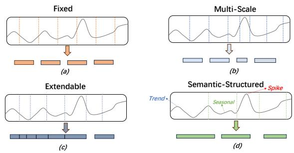  
Figure 1: Comparison of four patch based schemes: fixed partitioning, multi-scale partitioning, extendable partitioning, and the proposed semantic structured partitioning.

To overcome the limited flexibility of fixed partitioning, researchers have proposed multi-scale partitioning. This strategy partitions the time series at multiple levels of granularity, so that scale specific representations can be modeled separately and then integrated. As shown in Figure 1(b), this strategy provides a richer characterization of temporal dynamics by capturing both local short term fluctuations and global long term trends (Ye and Ma, 2023). However, when similar temporal patterns are captured at multiple granularities, the corresponding representations may overlap substantially across scales, thereby introducing redundancy during cross scale integration (Hu et al., 2025; Liu et al., 2025b). Such redundancy may in turn encourage the model to learn superfluous features. This problem becomes more pronounced in datasets with complex and overlapping dependencies, where heterogeneous dynamic patterns are more difficult to disentangle. These limitations motivate the development of more adaptive partitioning mechanisms.

Extendable partitioning further increases flexibility by allowing the length of each temporal segment to vary according to data characteristics (Zhang et al., 2025; Liu et al., 2025a). By adapting segment granularity to local dynamics, this strategy better preserves temporal boundary information and captures local semantic patterns. As illustrated in Figure 1(c), such adaptive partitioning provides greater flexibility for modeling the diversity and complexity of temporal variations. Nevertheless, existing extendable partitioning methods typically determine segmentation granularity using heuristic rules, which limits their ability to handle complex higher order dependencies. In scenarios characterized by strong nonlinear dependencies or multiple coexisting temporal patterns, these methods often struggle to model interactions among heterogeneous patterns, which results in suboptimal forecasting performance. These observations suggest that improving partition flexibility alone is insufficient for modeling the semantic structure underlying complex temporal dynamics.

Despite the advances achieved by existing methods, a critical research gap remains fundamentally unaddressed: none of the current partitioning strategies explicitly accounts for the intrinsic semantic coherence of temporal segments, nor do they model the higher order structural interactions among heterogeneous temporal patterns. In essence, all these approaches treat patch generation as a geometric preprocessing step rather than as an integral semantic modeling task. This deficiency is particularly detrimental when trends, periodicities, and abrupt fluctuations coexist in the same time series, as the model lacks a principled and feasible mechanism to disentangle these diverse components and establish structured relationships among them. Therefore, we argue that the core challenge of patch-based forecasting lies not in pursuing greater partition flexibility, but in constructing a representation system that embeds semantic structure.

Based on the above analysis, we propose SCPaT, a Transformer based framework for MTSF that models dynamic semantic structure through semantic structured partitioning. Specifically, SCPaT extracts fundamental temporal components from raw time series and organizes them into hierarchical semantic blocks, which provide multilevel semantic abstractions for forecasting. These semantic blocks are then incorporated into the attention mechanism through an importance aware routing module, which enables the model to emphasize informative representations and capture dependencies across different semantic types. Extensive experiments on multiple benchmarks show that SCPaT achieves state of the art results in both long term and short term forecasting tasks. The main contributions of this work are summarized as follows:

• Systematic Analysis. We present a systematic analysis of three representative patch partitioning strategies for time series forecasting and show that their limitations reflect the lack of an explicit semantic structured partitioning mechanism.

• Innovative Framework. We propose SCPaT, a Transformer based framework that integrates hierarchical semantic blocks and an importance aware routing mechanism into attention, enabling more effective modeling of key dependencies in MTSF.

• Extensive Evaluations. Extensive experiments on long term and short term forecasting benchmarks demonstrate that SCPaT achieves state of the art performance across a wide range of datasets.

## 2. Related Work

## 2.1. Transformer based Time Series Forecasting

Transformer-based models have become widely used in MTSF due to their strong parallel modeling capability and ability to capture long-range dependencies (Qiu et al., 2026; Liu et al., 2022). Representative methods have improved forecasting performance from different perspectives. For instance, iTransformer (Liu et al., 2024) enhances crossvariable dependency modeling by reorganizing tokens along the variable dimension. Pathformer (Chen et al., 2024) captures both local and global temporal contexts using multiscale patch partitioning with an adaptive path strategy. Fredformer (Piao et al., 2024) mitigates high-frequency bias through frequency debiasing. However, these methods are still limited in their ability to explicitly characterize heterogeneous dynamics within patches and capture interactions across different temporal patterns (Yang et al., 2025). This limitation becomes particularly evident when trends, periodicity, and abrupt fluctuations coexist in the same time series. Such scenarios require mechanisms that can distinguish local semantic differences and model complex dependencies more effectively.

## 2.2. Patch Based Time Series Forecasting

Patch based methods have become an important direction in time series forecasting, with early studies primarily relying on fixed partitioning strategies (Wu et al., 2025; Chen et al., 2024). PatchTST (Nie et al., 2023), for example, segments time series into equal length patches to improve representation efficiency. However, fixed partitioning often fails to preserve meaningful temporal boundaries, which may lead to the loss of salient local patterns and semantic inconsistency within patches. To address this issue, subsequent studies have explored multi-scale partitioning strategies. For instance, TimesNet (Wu et al., 2022) models temporal patterns across different scales, while FEDformer (Zhou et al., 2022) integrates local and global trends under a frequency domain decomposition framework. Extendable partitioning has further emerged as a flexible alternative, with HDMixer (Huang et al., 2024) introducing length adaptive patches that dynamically adjust segment boundaries, improving semantic integrity and modeling flexibility. Despite these advances, existing patch based methods remain limited in their ability to explicitly capture fine grained semantic variation and higher order temporal dependencies. All of them formulate patch generation as a geometric partitioning problem, whereas our SCPaT redefines it from a semantic structure perspective.

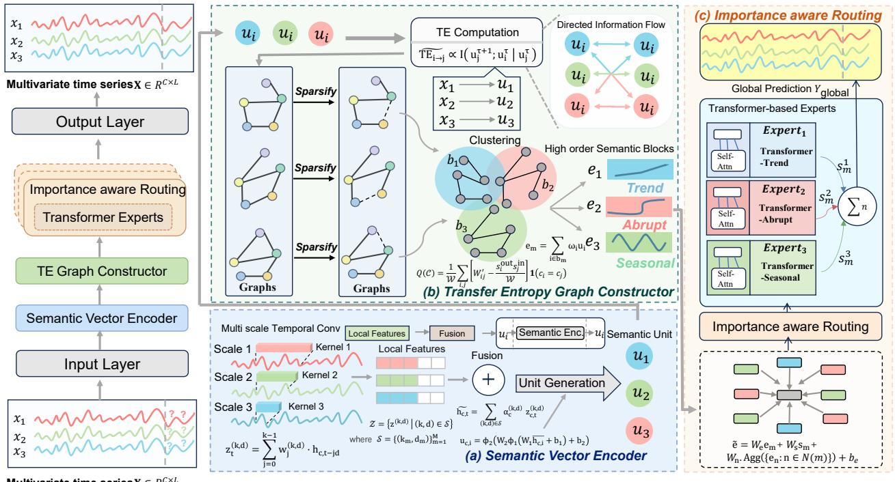  
Figure 2: SCPaT architecture consists of: (a) Semantic Vector Encoder, which encodes time series into semantic units; (b) Transfer Entropy Graph Constructor, quantifies directed dependencies and constructs a dynamic semantic graph; and (c) Importance aware Routing, allocates customized processing strategies to different semantic blocks for effective modeling.

## 3. Proposed Methodology

## 3.1. Preliminaries

In multivariate time series forecasting, the input is denoted by ${ \bf X } = \{ { \bf x } _ { 1 } , { \bf x } _ { 2 } , \ldots , { \bf x } _ { C } \} \in \mathbb { R } ^ { C \times L }$ , where � is the number of variables and � is the length of the historical lookback window. Here, $\mathbf { x } _ { c } ~ \in ~ \mathbb { R } ^ { L }$ denotes the historical observations of the �-th variable. The goal is to learn a forecasting function $f _ { \Theta } ( \cdot )$ that maps the historical sequence to future values $\hat { \textbf { Y } } \in \mathbb { R } ^ { C \times H }$ , where � is the prediction length. Formally, $\hat { \mathbf { Y } } = f _ { \Theta } ( \mathbf { X } )$ . We partition the historical sequence of each variable into $N = \lfloor L / s \rfloor$ non overlapping temporal patches, where � denotes the patch size. These patches are then embedded into a hidden space of dimension $d _ { h } ,$ yielding patch level representations. Based on these representations, we further construct semantic units, semantic graphs, and block wise routed experts to model structured dependencies for forecasting.

## 3.2. Semantic Vector Encoder

The semantic vector encoder maps the input sequence $\mathbf { X } \in \mathbb { R } ^ { C \times L }$ into a set of local semantic representations. It extracts temporal patterns at multiple scales, adaptively fuses the resulting features, and organizes the fused sequence into semantic units.

## 3.2.1. Multi scale Temporal Convolution

To capture local temporal variations at different resolutions, we apply multi scale temporal convolutions to the projected feature sequence. For the �-th variable, let $\mathbf { h } _ { c } = \{ \mathbf { h } _ { c , t } \} _ { t = 1 } ^ { L }$ denote its projected feature sequence, where $\mathbf { h } _ { c , t } \in \mathbb { R } ^ { d _ { h } }$ is the hidden representation at time step �. For a temporal branch with kernel size � and dilation factor �, the output at time step � is defined as:

$$
\mathbf { z } _ { c , t } ^ { ( k , d ) } = \sum _ { j = 0 } ^ { k - 1 } w _ { j } ^ { ( k , d ) } \mathbf { h } _ { c , t - j d } ,\tag{1}
$$

where $\mathbf { z } _ { c , t } ^ { ( k , d ) } \in \mathbb { R } ^ { d _ { h } }$ denotes the feature extracted at scale $( k , d ) , w _ { i } ^ { ( k , d ) }$ is the �-th kernel coefficient, and zero padding is applied when $t - j d < 1$

The corresponding branch output in compact form is:

$$
\mathbf { Z } _ { c } ^ { ( k , d ) } = \mathbf { W } ^ { ( k , d ) } * \mathbf { H } _ { c } ,\tag{2}
$$

where ∗ denotes temporal convolution, $\mathbf { H } _ { c } = [ \mathbf { h } _ { c , 1 } , \dots , \mathbf { h } _ { c , L } ]$ and $\mathbf { W } ^ { ( k , d ) }$ is the convolution kernel associated with scale $( k , d )$ . The effective receptive field of this branch is defined as $r ^ { ( k , d ) } = 1 + ( k - 1 ) d$ , which is determined by the kernel size � and dilation factor �.

To capture temporal patterns at multiple granularities, we introduce a set of temporal branches $\bar { S } \bar { = } \{ ( \bar { k } _ { m } , d _ { m } ) \} _ { m = 1 } ^ { M } ,$ where � is the number of branches. The resulting multi scale feature set is defined as:

$$
\mathcal { Z } _ { c } = \left\{ \mathbf { Z } _ { c } ^ { ( k , d ) } \mid ( k , d ) \in S \right\} .\tag{3}
$$

## 3.2.2. Adaptive Multi scale Fusion

To integrate temporal patterns captured at different scales, we perform adaptive multi scale fusion over the branch set . The fused hidden vector at time step � is defined as:

$$
\tilde { \mathbf { h } } _ { c , t } = \sum _ { ( k , d ) \in S } \alpha _ { c } ^ { ( k , d ) } \mathbf { z } _ { c , t } ^ { ( k , d ) } ,\tag{4}
$$

where $\tilde { \textbf { h } } _ { c , t } ~ \in ~ \mathbb { R } ^ { d _ { h } }$ denotes the fused representation of variable � at time step �, and $\alpha _ { c } ^ { ( k , d ) }$ denotes the fusion weight assigned to branch $( k , d )$

The fusion weights are obtained by normalizing learnable branch scores:

$$
\alpha _ { c } ^ { ( k , d ) } = \frac { \exp \big ( \gamma _ { c } ^ { ( k , d ) } \big ) } { \sum _ { ( k ^ { \prime } , d ^ { \prime } ) \in S } \exp \big ( \gamma _ { c } ^ { ( k ^ { \prime } , d ^ { \prime } ) } \big ) } ,\tag{5}
$$

where $\gamma _ { c } ^ { ( k , d ) }$ is the trainable score associated with scale pair $( k , d )$ for variable �. This formulation allows the encoder to adaptively emphasize more informative temporal scales for each variable. For convenience, we denote the fused sequence of variable � by $\tilde { \mathbf { H } } _ { c } = [ \tilde { \mathbf { h } } _ { c , 1 } , \tilde { \mathbf { h } } _ { c , 2 } , \dots , \tilde { \mathbf { h } } _ { c , L } ]$

## 3.2.3. Semantic Unit Generation

Based on the fused sequence $\tilde { \mathbf { H } } _ { c }$ , we partition each variable into non overlapping semantic units and encode each unit into a compact representation. Specifically, a unit starting at position � with length $l _ { i }$ spans $[ i , i + l _ { i } - 1 ]$ , and the next unit starts at position $i + l _ { i }$

To adapt the partition to local temporal variation, the unit length is selected from a candidate set $\mathcal { L } = \{ 1 , \dots , L _ { \mathrm { m a x } } \}$ where $L _ { \mathrm { m a x } }$ is the maximum unit length. For a candidate segment $\widetilde { \bf H } _ { c } [ i : i + l ^ { \prime } - 1 ]$ , we compute a scalar activation at each time step as $\begin{array} { r } { { \boldsymbol { a } } _ { c , t } ~ = ~ { \frac { 1 } { d _ { h } } } \sum _ { r = 1 } ^ { d _ { h } } { \tilde { \boldsymbol { h } } } _ { c , t , r } } \end{array}$ , where $\tilde { h } _ { c , t , r }$ denotes the �-th dimension of $\tilde { \mathbf { h } } _ { c , t } .$ . The local variance of the candidate segment is then defined as:

$$
\mathrm { V a r } \left( \tilde { \mathbf { H } } _ { c } [ i : i + l ^ { \prime } - 1 ] \right) = \frac { 1 } { l ^ { \prime } } \sum _ { t = i } ^ { i + l ^ { \prime } - 1 } \left( a _ { c , t } - \bar { a } _ { c , i , l ^ { \prime } } \right) ^ { 2 } ,\tag{6}
$$

where $\begin{array} { r } { \bar { a } _ { c , i , l ^ { \prime } } = \frac { 1 } { l ^ { \prime } } \sum _ { t = i } ^ { i + l ^ { \prime } - 1 } a _ { c , i } } \end{array}$ is the segment mean.

Let $\mathcal { L } _ { i } ^ { \delta } = \{ l ^ { \prime } \in \mathcal { L } \ | \ \mathrm { V a r } ( \tilde { \mathbf { H } } _ { c } [ i : i + l ^ { \prime } - 1 ] ) > \delta \}$ denote the admissible length set at position �. The unit length is then

determined as:

$$
l _ { i } = \left\{ \begin{array} { l l } { \operatorname* { m i n } \mathcal { L } _ { i } ^ { \delta } , } & { \mathrm { i f } \ : \mathcal { L } _ { i } ^ { \delta } \neq \varnothing , } \\ { L _ { \mathrm { m a x } } , } & { \mathrm { o t h e r w i s e } . } \end{array} \right.\tag{7}
$$

where � is a threshold controlling the sensitivity to local variation. This rule assigns longer units to locally stable regions and shorter units to rapidly changing regions. The variance criterion determines adaptive structural boundaries, while the semantic content is encoded by the learned multi scale representation.

Because the segment length $l _ { i }$ varies across units, we first map each segment to a fixed dimensional summary vector via mean pooling, i.e., $\begin{array} { r } { \bar { \bf h } _ { c , i } ~ = ~ \frac { 1 } { l _ { i } } \sum _ { t = i } ^ { i + l _ { i } - 1 } \tilde { \bf h } _ { c , t } . } \end{array}$ The semantic unit representation is then computed as:

$$
\mathbf { u } _ { c , i } = \phi _ { 2 } \big ( \mathbf { W } _ { 2 } \phi _ { 1 } \big ( \mathbf { W } _ { 1 } \bar { \mathbf { h } } _ { c , i } + \mathbf { b } _ { 1 } \big ) + \mathbf { b } _ { 2 } \big ) ,\tag{8}
$$

where $\mathbf { W } _ { 1 }$ and $\mathbf { W } _ { 2 }$ are learnable projection matrices, and ${ \bf b } _ { 1 }$ and $\mathbf { b } _ { 2 }$ are learnable bias vectors.

Since the number of semantic units $N _ { c }$ may vary across variables, establishing correspondences among units from different variables is essential for the subsequent Transfer Entropy modeling. For each timestamp �, we take the semantic unit that covers � from each variable as the aligned unit set at that time step. This yields a sequence of aligned unit tuples across the temporal axis, enabling consistent dependency modeling among variables in the TE graph construction. For variable $c ,$ this procedure yields a unit sequence $\begin{array} { r c l } { \mathcal { V } _ { c } } & { = } & { \{ \mathbf { u } _ { c , 1 } , \mathbf { u } _ { c , 2 } , \dots , \mathbf { u } _ { c , N _ { c } } \} } \end{array}$ , where $N _ { c }$ is the number of extracted units. All units are then re indexed into a unified set $\boldsymbol { \mathcal { V } } = \{ \mathbf { u } _ { n } \} _ { n = 1 } ^ { N _ { u } }$ , where $\begin{array} { r } { N _ { u } = \sum _ { c = 1 } ^ { C } N _ { c } } \end{array}$ . Each unit ${ \bf u } _ { n }$ is associated with its variable identity and temporal span for subsequent dependency modeling.

## 3.3. Transfer Entropy Graph Constructor

The transfer entropy graph constructor quantifies directed information flow among semantic units to build a dynamic semantic graph, which subsequently supports the formation of higher order semantic blocks. This design captures nonlinear and asymmetric dependency structures beyond simple correlation based relations.

## 3.3.1. Transfer Entropy Computation.

Traditional correlation based measures are often insufficient for modeling directed nonlinear dependencies, as they are typically symmetric and do not capture conditional information flow. We therefore introduce a differentiable transfer entropy inspired surrogate for directed conditional dependence between semantic units.

Specifically, for two semantic units $\mathbf { u } _ { i }$ and $\mathbf { u } _ { j }$ , we use the following conditional dependence target:

$$
\widetilde { T E } _ { i  j } \propto I ( \mathbf { u } _ { j } ^ { \tau + 1 } ; \mathbf { u } _ { i } ^ { \tau } \mid \mathbf { u } _ { j } ^ { \tau } ) ,\tag{9}
$$

where $I ( \cdot ; \cdot | \cdot )$ denotes conditional mutual information, and � indexes valid aligned unit transitions. This target captures the additional predictive information provided by ${ \bf { u } } _ { i } ^ { \tau }$ beyond the self history ${ \bf { u } } _ { j } ^ { \tau }$

To obtain a practical differentiable surrogate, we use � for the aligned unit level step within a sample and � for the sample index in the mini batch. For each ordered pair $( i , j )$ let $\Omega _ { i j }$ denote the set of valid aligned transitions $( b , \tau )$ in the current mini batch for which $\mathbf { u } _ { i } ^ { ( b , \tau ) } , \mathbf { u } _ { i } ^ { ( b , \tau ) }$ , and $\mathbf u _ { i } ^ { ( b , \tau + 1 ) }$ all exist, and let $M _ { i j } = | \Omega _ { i j } |$ . We then define the directed dependency surrogate as:

$$
\widehat { T E } _ { i  j } = \frac { 1 } { M _ { i j } } \sum _ { ( b , \tau ) \in \Omega _ { i j } } \psi ( \mathbf { u } _ { j } ^ { ( b , \tau + 1 ) } , \mathbf { u } _ { i } ^ { ( b , \tau ) } , \mathbf { u } _ { j } ^ { ( b , \tau ) } ) ,\tag{10}
$$

where $\psi ( \cdot )$ is a learnable sample level scoring function.

In practice, $\psi ( \cdot )$ is instantiated as a 3-layer MLP with hidden dimensions $[ 3 d _ { h } , d _ { h } , 1 ]$ , where the input is the concatenation of $\mathbf u _ { i } ^ { ( b , \tau + 1 ) } , \ \mathbf u _ { i } ^ { ( b , \tau ) }$ , and $\mathbf { u } _ { i } ^ { ( b , \tau ) }$ , and the output is a scalar dependency score. This network contains approximately $3 d _ { h } ^ { 2 } + d _ { h }$ parameters, accounting for less than 1% of the total model and incurring negligible inference overhead. For each valid transition $( b , \tau ) \in \Omega _ { i j }$ , we form a triplet representation $\mathbf { q } _ { i j } ^ { ( b , \tau ) }$ by concatenating $\mathbf u _ { j } ^ { ( b , \tau + 1 ) } , \ \mathbf u _ { i } ^ { ( b , \tau ) }$ , and $\mathbf { u } _ { i } ^ { ( b , \tau ) }$ , and compute its score using ML $\mathbf { \nabla } _ { \cdot } \mathbf { P } _ { \psi } ( \mathbf { q } _ { i j } ^ { ( b , \tau ) } )$ , where ML $\mathrm { \Delta } \mathrm { P } _ { \psi }$ outputs a scalar and is shared across all ordered pairs $( i , j )$

To characterize the stability of the estimated dependency, we further compute its sample standard deviation over the same valid transition set:

$$
\widehat { \sigma } _ { i  j } = \sqrt { \frac { 1 } { M _ { i j } - 1 } \sum _ { ( b , \tau ) \in \Omega _ { i j } } ( \mathrm { M L P } _ { \psi } ( \mathbf { q } _ { i j } ^ { ( b , \tau ) } ) - \widehat { T E } _ { i  j } ) ^ { 2 } } ,\tag{11}
$$

where larger $\widehat { \sigma } _ { i \to j }$ indicates less stable directed dependency.

The scoring network $\mathrm { M L P } _ { \psi }$ is trained jointly with the forecasting backbone in an end to end manner and is used only to produce relative dependency scores for graph construction, rather than to perform explicit density estimation.

## 3.3.2. Graph Construction with Sparsification

Based on the estimated directed dependency values, we construct a dynamic semantic graph $G = ( V , E , W )$ , where � is the semantic unit set, � denotes the directed edge set, and $W \in \mathbb { R } ^ { | V | \times | V | }$ is the weighted adjacency matrix. The edge weight from node � to node � is defined as:

$$
W _ { i j } = \operatorname* { m a x } \Bigl ( 0 , \widehat { T E } _ { i \to j } - \eta \widehat \sigma _ { i \to j } \Bigr ) ,\tag{12}
$$

where � is a significance coefficient used to suppress weak or unstable dependencies. Since the weighted adjacency matrix can become dense as the number of semantic units grows, we further sparsify the graph to improve robustness and efficiency. Sparsification is applied after computing all pairwise TE scores. Although this does not reduce the pairwise computation complexity, it reduces the cost of subsequent graph-based operations. Specifically, for each node, we retain only the $\mathrm { T o p } { \cdot } K _ { g }$ outgoing edges with the largest weights, where $K _ { g } ~ = ~ \lceil \stackrel { \cup } { \alpha } \cdot N \rceil$ and � is the total number of semantic units:

$$
W _ { i j } ^ { \prime } = { \left\{ \begin{array} { l l } { W _ { i j } , } & { j \in { \mathrm { T o p K } } _ { g } ^ { i } ( W _ { i \cdot } ) , } \\ { 0 , } & { { \mathrm { o t h e r w i s e } } , } \end{array} \right. }\tag{13}
$$

where $W _ { i } .$ denotes the �-th row of $W$ . This step reduces graph density and suppresses noisy or marginal interactions. For subsequent aggregation, we normalize the sparse adjacency matrix by row:

$$
\bar { W } _ { i j } = \frac { W _ { i j } ^ { \prime } } { \sum _ { j ^ { \prime } } W _ { i j ^ { \prime } } ^ { \prime } + \epsilon } ,\tag{14}
$$

where � is a small positive constant for numerical stability.

## 3.3.3. Graph Clusteringfor Higher order Semantic Blocks

After obtaining the sparse semantic graph, we perform graph clustering to identify higher order semantic blocks. Let $c : V  \{ 1 , 2 , \ldots , K _ { b } \}$ denote the cluster assignment function, where $K _ { b }$ is the number of semantic blocks. The optimal partition is obtained by maximizing directed weighted modularity, i.e., $C ^ { * } = { \arg \operatorname* { m a x } _ { C } Q ( C ) }$ , with

$$
Q ( C ) = \frac { 1 } { \mathcal { W } } \sum _ { i , j } \left[ W _ { i j } ^ { \prime } - \frac { s _ { i } ^ { \mathrm { o u t } } s _ { j } ^ { \mathrm { i n } } } { \mathcal { W } } \right] \mathbf { 1 } ( c _ { i } = c _ { j } ) ,\tag{15}
$$

where $\begin{array} { r } { s _ { i } ^ { \mathrm { { o u t } } } ~ = ~ \sum _ { j } W _ { i j } ^ { \prime } , ~ s _ { j } ^ { \mathrm { { i n } } } ~ = ~ \sum _ { i } W _ { i j } ^ { \prime } , ~ { \mathcal { W } } ~ = ~ \sum _ { i , j } W _ { i j } ^ { \prime } , } \end{array}$ and �(⋅) is the indicator function. In practice, clustering is performed online on the current sparse graph during each forward pass. The resulting assignments are treated as discrete structural decisions and are not backpropagated through.This decoupling does not affect global optimization since the clustering step contains no learnable parameters and receives no gradient signals, with all trainable parameters updated solely through the routing outputs, thereby avoiding non-smoothness in the loss landscape.

Each cluster defines a semantic block, denoted by $b _ { m } =$ $\{ \mathbf { u } _ { i } \mid c _ { i } = m \}$ for $m = 1 , 2 , \ldots , K _ { b }$ . To obtain a block level representation, we aggregate the units within each block using attention weights:

$$
\omega _ { i } = \frac { \exp \bigl ( \phi _ { w } ( \mathbf { u } _ { i } ) \bigr ) } { \sum _ { j \in b _ { m } } \exp \bigl ( \phi _ { w } ( \mathbf { u } _ { j } ) \bigr ) } , \qquad i \in b _ { m } ,\tag{16}
$$

where $\phi _ { w } ( \cdot )$ is a lightweight scoring function. The corresponding block embedding is defined as $\begin{array} { r } { \mathbf { e } _ { m } = \sum _ { i \in b _ { m } } \omega _ { i } \mathbf { u } _ { i } } \end{array}$

In addition, we define a block statistic vector $\mathbf { s } _ { m } \in \mathbb { R } ^ { d _ { s } }$ to summarize coarse structural properties of block �, including its normalized size, average incoming strength, average outgoing strength, and average temporal span. These low dimensional statistics provide auxiliary cues for routing beyond the content embedding $\mathbf { e } _ { m }$

To capture inter block context, we construct a block neighborhood graph induced by the sparse unit graph. Two blocks � and � are considered neighbors if there exists at least one edge in $W ^ { \prime }$ linking a unit in $b _ { m }$ to a unit in $b _ { n } .$ The neighborhood of block � is denoted by $\mathcal { N } ( m )$ , and neighboring block embeddings are summarized by mean aggregation:

$$
\ A \mathrm { g g } \big ( \{ \mathbf { e } _ { n } : n \in \mathcal { N } ( m ) \} \big ) = \frac { 1 } { | \mathcal { N } ( m ) | } \sum _ { n \in \mathcal { N } ( m ) } \mathbf { e } _ { n } ,\tag{17}
$$

where the aggregation is defined as the zero vector if $\mathcal { N } ( m ) = \emptyset$ . This design enables the higher order semantic structure to adapt to changing representations while maintaining stable and efficient optimization.

## 3.4. Importance Aware Routing

Semantic blocks in MTSF can exhibit diverse temporal characteristics. Slowly varying blocks tend to depend more on long range patterns, whereas rapidly varying blocks rely more on local structure. To accommodate this heterogeneity, we introduce an importance aware routing mechanism that routes semantic blocks to different experts.

## 3.4.1. Expert Network

Given the �-th semantic block, we first construct its routing representation by jointly incorporating block content, block level statistics, and neighborhood context:

$$
\tilde { \mathbf { e } } _ { m } = \mathbf { W } _ { e } \mathbf { e } _ { m } + \mathbf { W } _ { s } \mathbf { s } _ { m } + \mathbf { W } _ { n } \operatorname { A g g } \bigl ( \{ \mathbf { e } _ { n } : n \in \mathcal { N } ( m ) \} \bigr ) + \mathbf { b } _ { e } ,\tag{18}
$$

where $\mathbf { W } _ { e } , \mathbf { W } _ { s } ,$ , and $\mathbf { W } _ { n }$ are projection matrices, and ${ \bf b } _ { e }$ is a bias term. We further introduce a semantic bias vector:

$$
\mathbf { V } _ { m } = \mathbf { V } _ { 0 } + \beta \cdot \operatorname { t a n h } \bigl ( \mathbf { W } _ { v } \tilde { \mathbf { e } } _ { m } + \mathbf { b } _ { v } \bigr ) ,\tag{19}
$$

where $\mathbf { V } _ { 0 }$ is a globally learnable base bias, $\beta$ is a scaling coefficient, and $\mathbf { W } _ { v }$ and ${ \bf b } _ { v }$ are learnable parameters.

We use � experts, denoted by $\{ \mathrm { E x p e r t } _ { k } \} _ { k = 1 } ^ { R } .$ , each parameterized independently. For computation, each semantic block $b _ { m }$ is represented by its ordered unit sequence ${ \mathbf { U } } _ { m } =$ $[ \mathbf { u } _ { m , 1 } , \mathbf { u } _ { m , 2 } , \ldots , \mathbf { u } _ { m , | b _ { m } | } ] ,$ , where the units are sorted by their temporal positions within the block. The �-th expert applies a block encoder $f _ { k } ( \cdot )$ to this ordered sequence and produces an expert specific block representation:

$$
\mathbf { y } _ { m } ^ { ( k ) } = \mathrm { E x p e r t } _ { k } ( b _ { m } ; \mathbf { V } _ { m } ) = f _ { k } ( \mathbf { U } _ { m } ) + \mathbf { U } _ { k } \mathbf { V } _ { m } ,\tag{20}
$$

where $f _ { k } ( \cdot )$ may be instantiated as a lightweight Transformer encoder or another sequence encoder, $\mathbf { U } _ { k }$ is a learnable projection matrix, and $\mathbf { V } _ { m }$ is the semantic bias vector associated with block �.

## 3.4.2. Routing Mechanism

The router computes expert assignment scores from the routing embedding of each semantic block. Specifically, the pre softmax routing score is $\tilde { \mathbf { s } } _ { m } = \mathbf { M L P } _ { r } ( \tilde { \mathbf { e } } _ { m } )$ , where $\widetilde { \mathbf { s } } _ { m } =$ $\bigl [ \tilde { s } _ { m } ^ { ( 1 ) } , \ldots , \tilde { s } _ { m } ^ { ( R ) } \bigr ]$ denotes the score vector over all experts. The normalized routing probability of expert � is then given by:

$$
s _ { m } ^ { ( k ) } = \frac { \exp ( \tilde { s } _ { m } ^ { ( k ) } ) } { \sum _ { k ^ { \prime } = 1 } ^ { R } \exp ( \tilde { s } _ { m } ^ { ( k ^ { \prime } ) } ) } .\tag{21}
$$

Instead of using a fixed Top-� routing rule, we adopt Top-� routing so that the number of active experts adapts to the concentration of the routing distribution. When the distribution is concentrated, fewer experts are selected; when it is more diffuse, more experts are retained. Specifically, the experts are first sorted in descending order according to $\{ s _ { m } ^ { ( k ) } \} _ { k = 1 } ^ { R }$ , and we select the smallest expert set $\tau _ { m }$ such that $\begin{array} { r } { \sum _ { k \in \mathcal { T } _ { m } } s _ { m } ^ { ( k ) } \geq P . } \end{array}$ , where $P \in ( 0 , 1 ]$

Based on the selected set, the sparsified routing weight is defined as:

$$
\hat { s } _ { m } ^ { ( k ) } = \left\{ \begin{array} { l l } { \frac { s _ { m } ^ { ( k ) } } { \sum _ { k ^ { \prime } \in \mathcal { T } _ { m } } s _ { m } ^ { ( k ^ { \prime } ) } } , } & { k \in \mathcal { T } _ { m } , } \\ { 0 , } & { \mathrm { o t h e r w i s e } , } \end{array} \right.\tag{22}
$$

where $\hat { s } _ { m } ^ { ( k ) }$ denotes the normalized responsibility of expert � for semantic block � after Top-� selection. Finally, the outputs of the selected experts are aggregated to obtain the block level representation:

$$
\mathbf { y } _ { m } = \sum _ { k = 1 } ^ { R } \hat { s } _ { m } ^ { ( k ) } \mathbf { y } _ { m } ^ { ( k ) } .\tag{23}
$$

After processing all semantic blocks, the final forecasting result is generated by �̂ = Readout $\left( \left\{ \mathbf { y } _ { m } \right\} _ { m = 1 } ^ { K _ { b } } \right)$ , where Readout(⋅) denotes the regression head for final prediction.

## 3.5. Computational Complexity Analysis

The overall complexity of SCPaT is governed by three main components. For an input with � variables and sequence length $L ,$ let $N _ { c }$ denote the number of semantic units per variable, and let $d _ { h }$ be the hidden dimension. The Semantic Vector Encoder performs multi-scale convolutions with complexity $\mathcal { O } ( C \cdot L \cdot d _ { h } )$ . The Transfer Entropy Graph Constructor computes pairwise dependency surrogates among semantic units, which scales as $\mathcal { O } ( C ^ { 2 }$ $N _ { c } ^ { 2 } \cdot d _ { h } )$ . To manage the cost of subsequent operations, we apply static sparsification (Eq. (13)) to retain only the top-$K _ { g }$ edges per node, reducing the complexity of the routing and aggregation steps from $\mathcal { O } ( C ^ { 2 } N _ { c } ^ { 2 } )$ to $\mathcal { O } ( K _ { g } C N _ { c } )$ . The routing module operates on $K _ { b }$ semantic blocks with � experts, contributing $\mathcal { O } ( K _ { b } \cdot R \cdot d _ { h } ^ { 2 } )$ . In our typical settings $( K _ { g } ~ = ~ \alpha C N _ { c }$ with $\alpha ~ = ~ 0 . 1 )$ , the TE computation adds approximately 15%.

## 4. Experiment

## 4.1. Experimental Setup

## 4.1.1. Datasets

We conducted experiments on 12 widely used benchmark datasets. For long-term forecasting, we considered four ETT datasets, ETTh1, ETTh2, ETTm1, and ETTm2 (Zhou et al., 2021), which record electricity transformer temperature and load at hourly and minute-level resolutions. We also included Weather (Wu et al., 2021), which contains 21 meteorological variables, Traffic, which records road occupancy rates on California freeways, Electricity, which tracks hourly electricity consumption for 321 households, and Solar, which contains solar power production records from photovoltaic plants. For short-term forecasting, we adopted four standard benchmarks from the PEMS collection, namely PEMS03, PEMS04, PEMS07, and PEMS08 (Zheng et al., 2020). These datasets consist of traffic flow measurements collected by road sensors. Table 1 provides detailed statistics for all datasets.

Summary of the 12 datasets used in our forecasting experiments, including the prediction horizons, data dimensionality, sampling frequency, and total number of time points.
<table><tr><td>Task Type</td><td>Dataset</td><td>Prediction Horizons</td><td>Time Point</td><td>Dimension</td><td>Frequency</td></tr><tr><td rowspan="7">Long-term Forecasting</td><td>ETTh1</td><td>{96,192,336,720}</td><td>17420</td><td>7</td><td>Hourly</td></tr><tr><td>ETTh2</td><td>{96,192,336,720}</td><td>17420</td><td>7</td><td>Hourly</td></tr><tr><td>ETTm1</td><td>{96,192,336,720}</td><td>69680</td><td>7</td><td>15 min</td></tr><tr><td>ETTm2</td><td>{96,192,336,720}</td><td>69680</td><td>7</td><td>15 min</td></tr><tr><td>Weather</td><td>{96,192,336,720}</td><td>52603</td><td>21</td><td>10 min</td></tr><tr><td>Traffic</td><td>{96,192,336,720}</td><td>17451</td><td>862</td><td>Hourly</td></tr><tr><td>Electricity Solar</td><td>{96,192,336,720} {96,192,336,720}</td><td>26211 52179</td><td>321</td><td>Hourly 10 min</td></tr><tr><td rowspan="4">Short-term Forecasting</td><td></td><td></td><td></td><td>137</td><td></td></tr><tr><td>PEMS03 PEMS04</td><td>{12,24,48} {12,24,48}</td><td>26208</td><td>358</td><td>5 min</td></tr><tr><td>PEMS07</td><td>{12,24,48}</td><td>16992 28224</td><td>307 883</td><td>5 min</td></tr><tr><td>PEMS08</td><td>{12,24,48}</td><td>17856</td><td>170</td><td>5 min 5 min</td></tr></table>

## 4.1.2. Baselines.

We compare the proposed method with nine representative baselines covering the main patch modeling strategies introduced above. These baselines include five Transformerbased models, PatchTST (Nie et al., 2023), iTransformer (Liu et al., 2024), DUET (Qiu et al., 2025), MSPatch (Cao et al., 2025), and Crossformer (Zhang and Yan, 2023b); one CNN-based model, TimesNet (Wu et al., 2022); one GNN-based model, MSGNet (Cai et al., 2024); one MLP-based model, HDMixer (Huang et al., 2024); and LSTM(Hochreiter and Schmidhuber, 1997). This selection allows us to evaluate the proposed method across different patch partitioning strategies and backbone architectures.

## 4.1.3. Implementation Details.

All baseline models and the proposed SCPaT are implemented in PyTorch 2.1.2 and evaluated under a unified experimental protocol on a single NVIDIA RTX 4090D GPU with 24 GB memory. For fair comparison, we retrained all baselines on our dataset splits using their optimal hyperparameters as reported in the original papers, and performed grid search when unavailable. We follow the standard long-term forecasting setting and evaluate predictive performance at four representative forecasting horizons, � ∈ {96, 192, 336, 720}. For SCPaT, we perform a grid search (Pedregosa et al., 2011) over the semantic bias parameters to select the best configuration. Mean squared error (MSE) and mean absolute error (MAE) are reported as the evaluation metrics (Hyndman and Koehler, 2006).

## 4.2. Main Results

## 4.2.1. Long-term Forecasting.

Table 2 reports the long-term forecasting results of all compared methods. SCPaT achieves the best or second-best performance on the majority of datasets and forecasting horizons, demonstrating strong robustness across diverse long-term forecasting scenarios. Compared with representative methods based on fixed partitioning, multi-scale partitioning, and extendable partitioning, namely PatchTST, TimesNet, and HDMixer, SCPaT consistently yields lower prediction errors. These results support our central claim that semantic structured partitioning provides a more effective way to model complex temporal dynamics by preserving semantic consistency and capturing higher-order dependencies among heterogeneous temporal patterns. On the four ETT benchmarks, SCPaT reduces the average MSE by 4.6%, 7.1%, and 4.1% relative to PatchTST, TimesNet, and HDMixer, respectively. Moreover, compared with Crossformer, SCPaT also achieves consistently lower prediction errors across the long-term forecasting benchmarks.

## 4.2.2. Short-term Forecasting.

Table 3 presents the short-term forecasting results of all compared methods. SCPaT achieves the best or secondbest performance on most datasets and forecasting horizons, indicating that the proposed framework generalizes well beyond the long-term forecasting setting. Although semantic structured partitioning is primarily introduced to address semantic inconsistency in long-horizon prediction, it also appears beneficial for short-term forecasting, where accurate modeling of local trend, periodic, and abrupt patterns remains important. These results suggest that organizing local segments into semantically meaningful units and emphasizing informative dependencies can also improve shortterm prediction. Therefore, SCPaT consistently achieves lower prediction errors across the four PEMS benchmarks and attains the best overall performance.

Table 2  
Multivariate long-term forecasting results over four prediction horizons, � ∈ {96, 192, 336, 720}, with the input length fixed at $L = 9 6$ . The best and second-best results are marked in bold red and blue underline, respectively.
<table><tr><td rowspan=2 colspan=13>Models    SCPaT      MSPatch     DUET    Transformer   MSGNet     HDMixer    PatchTST    TimesNet   CrossFormer    LSTM(Ours)        (2025)       (2025)       (2024)       (2024)       (2024)       (2023)       (2023)       (2023)       (1997)Metric</td></tr><tr><td rowspan=1 colspan=1>MSE MAE</td><td rowspan=1 colspan=1>MSE MAE</td><td rowspan=1 colspan=1>MSE MAE</td><td rowspan=1 colspan=1>MSE MAE</td><td rowspan=1 colspan=1>MSE MAE</td><td rowspan=1 colspan=2>MSE MAE</td><td rowspan=1 colspan=1>MSE MAE</td><td rowspan=1 colspan=1>MSE MAE</td><td rowspan=1 colspan=1>MSE MAE</td><td rowspan=1 colspan=1>MSE MAE</td></tr><tr><td rowspan=3 colspan=1>ET41</td><td rowspan=1 colspan=1>96</td><td rowspan=1 colspan=1>0.370 0.392</td><td rowspan=1 colspan=1>0.372 0.395</td><td rowspan=1 colspan=1>0.3840.402</td><td rowspan=1 colspan=1>0.3860.405</td><td rowspan=1 colspan=1>0.3900.411</td><td rowspan=1 colspan=2>0.3860.401</td><td rowspan=1 colspan=1>0.4140.419</td><td rowspan=1 colspan=1>0.3840.402</td><td rowspan=1 colspan=1>0.4230.448</td><td rowspan=1 colspan=1>1.0440.773</td></tr><tr><td rowspan=1 colspan=1>192</td><td rowspan=1 colspan=1>0.4180.422</td><td rowspan=1 colspan=1>0.4280.426</td><td rowspan=1 colspan=1>0.4370.429</td><td rowspan=1 colspan=1>0.4410.436</td><td rowspan=1 colspan=1>0.4420.442</td><td rowspan=1 colspan=2>0.4410.430</td><td rowspan=1 colspan=1>0.4600.445</td><td rowspan=1 colspan=1>0.4460.439</td><td rowspan=1 colspan=1>0.4710.474</td><td rowspan=1 colspan=1>1.2170.832</td></tr><tr><td rowspan=1 colspan=1>336</td><td rowspan=1 colspan=1>0.4520.440</td><td rowspan=1 colspan=1>0.4840.452</td><td rowspan=1 colspan=1>0.4770.453</td><td rowspan=1 colspan=1>0.4650.445</td><td rowspan=1 colspan=1>0.4870.458</td><td rowspan=1 colspan=2>0.4580.443</td><td rowspan=1 colspan=1>0.5010.466</td><td rowspan=1 colspan=1>0.4910.469</td><td rowspan=1 colspan=1>0.5700.546</td><td rowspan=1 colspan=1>1.2590.841</td></tr><tr><td rowspan=1 colspan=1></td><td rowspan=1 colspan=1>720</td><td rowspan=1 colspan=1>0.449 0.458</td><td rowspan=1 colspan=1>0.4800.473</td><td rowspan=1 colspan=1>0.4860.475</td><td rowspan=1 colspan=1>0.5030.491</td><td rowspan=1 colspan=1>0.4940.488</td><td rowspan=1 colspan=2>0.5120.484</td><td rowspan=1 colspan=1>0.5000.488</td><td rowspan=1 colspan=1>0.5210.500</td><td rowspan=1 colspan=1>0.6530.621</td><td rowspan=1 colspan=1>1.2710.838</td></tr><tr><td rowspan=4 colspan=1>ET2</td><td rowspan=1 colspan=1>96</td><td rowspan=1 colspan=1>0.288 0.338</td><td rowspan=1 colspan=1>0.2920.344</td><td rowspan=1 colspan=1>0.2980.351</td><td rowspan=1 colspan=1>0.2970.349</td><td rowspan=1 colspan=1>0.3280.371</td><td rowspan=1 colspan=2>0.2930.338</td><td rowspan=1 colspan=1>0.3020.348</td><td rowspan=1 colspan=1>0.3400.374</td><td rowspan=1 colspan=1>0.7450.584</td><td rowspan=1 colspan=1>2.5221.278</td></tr><tr><td rowspan=1 colspan=1>192</td><td rowspan=1 colspan=1>0.373 0.396</td><td rowspan=1 colspan=1>0.3830.402</td><td rowspan=1 colspan=1>0.3740.394</td><td rowspan=1 colspan=1>0.3800.400</td><td rowspan=1 colspan=1>0.4020.414</td><td rowspan=1 colspan=2>0.3790.396</td><td rowspan=1 colspan=1>0.3880.400</td><td rowspan=1 colspan=1>0.4020.414</td><td rowspan=1 colspan=1>0.8770.656</td><td rowspan=1 colspan=1>3.3121.384</td></tr><tr><td rowspan=1 colspan=1>336</td><td rowspan=1 colspan=1>0.4080.427</td><td rowspan=1 colspan=1>0.4170.431</td><td rowspan=1 colspan=1>0.4170.431</td><td rowspan=1 colspan=1>0.4280.432</td><td rowspan=1 colspan=1>0.4350.443</td><td rowspan=1 colspan=2>0.4260.444</td><td rowspan=1 colspan=1>0.4260.433</td><td rowspan=1 colspan=1>0.4520.452</td><td rowspan=1 colspan=1>1.0430.731</td><td rowspan=1 colspan=1>3.2911.388</td></tr><tr><td rowspan=1 colspan=1>720</td><td rowspan=1 colspan=1>0.4300.444</td><td rowspan=1 colspan=1>0.4220.446</td><td rowspan=1 colspan=1>0.4270.442</td><td rowspan=1 colspan=1>0.4300.445</td><td rowspan=1 colspan=1>0.4410.444</td><td rowspan=1 colspan=2>0.4290.447</td><td rowspan=1 colspan=1>0.4310.446</td><td rowspan=1 colspan=1>0.4620.468</td><td rowspan=1 colspan=1>1.1040.763</td><td rowspan=1 colspan=1>3.2571.357</td></tr><tr><td rowspan=1 colspan=1></td><td rowspan=1 colspan=1>96</td><td rowspan=1 colspan=1>0.320 0.360</td><td rowspan=1 colspan=1>0.3240.363</td><td rowspan=1 colspan=1>0.3290.361</td><td rowspan=1 colspan=1>0.3340.368</td><td rowspan=1 colspan=1>0.3230.366</td><td rowspan=1 colspan=2>0.3400.368</td><td rowspan=1 colspan=1>0.3290.367</td><td rowspan=1 colspan=1>0.3380.375</td><td rowspan=1 colspan=1>0.4040.426</td><td rowspan=1 colspan=1>0.8630.664</td></tr><tr><td rowspan=1 colspan=1>m</td><td rowspan=1 colspan=1>192</td><td rowspan=1 colspan=1>0.362 0.383</td><td rowspan=1 colspan=1>0.3670.385</td><td rowspan=1 colspan=1>0.3640.385</td><td rowspan=1 colspan=1>0.3770.391</td><td rowspan=1 colspan=1>0.3760.397</td><td rowspan=1 colspan=2>0.3820.386</td><td rowspan=1 colspan=1>0.3670.385</td><td rowspan=1 colspan=1>0.3740.387</td><td rowspan=1 colspan=1>0.4500.451</td><td rowspan=1 colspan=1>1.1130.776</td></tr><tr><td rowspan=2 colspan=1>ETm1</td><td rowspan=2 colspan=1>336720</td><td rowspan=1 colspan=1>0.389 0.402</td><td rowspan=1 colspan=1>0.3900.404</td><td rowspan=1 colspan=1>0.3960.408</td><td rowspan=1 colspan=1>0.4260.420</td><td rowspan=1 colspan=1>0.4170.422</td><td rowspan=1 colspan=2>0.4030.411</td><td rowspan=1 colspan=1>0.3990.410</td><td rowspan=1 colspan=1>0.4100.411</td><td rowspan=1 colspan=1>0.5320.515</td><td rowspan=1 colspan=1>1.2670.832</td></tr><tr><td rowspan=1 colspan=1>0.4560.436</td><td rowspan=1 colspan=1>0.454 0.437</td><td rowspan=1 colspan=1>0.4690.437</td><td rowspan=1 colspan=1>0.4910.459</td><td rowspan=1 colspan=1>0.4810.458</td><td rowspan=1 colspan=2>0.4730.439</td><td rowspan=1 colspan=1>0.4540.439</td><td rowspan=1 colspan=1>0.4780.450</td><td rowspan=1 colspan=1>0.6660.589</td><td rowspan=1 colspan=1>1.3240.858</td></tr><tr><td rowspan=3 colspan=1>ETm2</td><td rowspan=1 colspan=1>96</td><td rowspan=1 colspan=1>0.173 0.258</td><td rowspan=1 colspan=1>0.1750.260</td><td rowspan=1 colspan=1>0.1790.262</td><td rowspan=1 colspan=1>0.1800.264</td><td rowspan=1 colspan=1>0.1810.262</td><td rowspan=1 colspan=2>0.1830.266</td><td rowspan=1 colspan=1>0.181 0.259</td><td rowspan=1 colspan=1>0.1870.267</td><td rowspan=1 colspan=1>0.2870.366</td><td rowspan=1 colspan=1>2.0411.073</td></tr><tr><td rowspan=1 colspan=1>192</td><td rowspan=1 colspan=1>0.238 0.300</td><td rowspan=1 colspan=1>0.2390.302</td><td rowspan=1 colspan=1>0.2400.300</td><td rowspan=1 colspan=1>0.2500.309</td><td rowspan=1 colspan=1>0.2470.307</td><td rowspan=1 colspan=2>0.2470.307</td><td rowspan=1 colspan=1>0.2410.302</td><td rowspan=1 colspan=1>0.2490.309</td><td rowspan=1 colspan=1>0.4140.492</td><td rowspan=1 colspan=1>2.2491.112</td></tr><tr><td rowspan=1 colspan=1>336</td><td rowspan=1 colspan=1>0.297 0.339</td><td rowspan=1 colspan=1>0.297 0.340</td><td rowspan=1 colspan=1>0.3020.341</td><td rowspan=1 colspan=1>0.3110.348</td><td rowspan=1 colspan=1>0.3120.346</td><td rowspan=1 colspan=1>0.305</td><td rowspan=1 colspan=1>0.345</td><td rowspan=1 colspan=1>0.3050.343</td><td rowspan=1 colspan=1>0.3210.351</td><td rowspan=1 colspan=1>0.5970.543</td><td rowspan=1 colspan=1>2.5681.238</td></tr><tr><td rowspan=1 colspan=1></td><td rowspan=1 colspan=1>720</td><td rowspan=1 colspan=1>0.394 0.394</td><td rowspan=1 colspan=1>0.396 0.397</td><td rowspan=1 colspan=1>0.3990.397</td><td rowspan=1 colspan=1>0.4120.407</td><td rowspan=1 colspan=1>0.4140.403</td><td rowspan=1 colspan=1>0.406</td><td rowspan=1 colspan=1>0.400</td><td rowspan=1 colspan=1>0.4020.406</td><td rowspan=1 colspan=1>0.4080.403</td><td rowspan=1 colspan=1>1.7301.042</td><td rowspan=1 colspan=1>2.7201.287</td></tr><tr><td rowspan=2 colspan=1></td><td rowspan=2 colspan=1>96192</td><td rowspan=1 colspan=1>0.163 0.208</td><td rowspan=1 colspan=1>0.165 0.209</td><td rowspan=1 colspan=1>0.1670.209</td><td rowspan=1 colspan=1>0.1740.214</td><td rowspan=1 colspan=1>0.1690.212</td><td rowspan=1 colspan=1>0.174</td><td rowspan=1 colspan=1>0.223</td><td rowspan=1 colspan=1>0.1770.218</td><td rowspan=1 colspan=1>0.1720.220</td><td rowspan=1 colspan=1>0.1710.230</td><td rowspan=1 colspan=1>0.3690.406</td></tr><tr><td rowspan=1 colspan=1>0.209 0.250</td><td rowspan=1 colspan=1>0.211 0.252</td><td rowspan=1 colspan=1>0.2120.254</td><td rowspan=1 colspan=1>0.2210.254</td><td rowspan=1 colspan=1>0.2180.255</td><td rowspan=1 colspan=1>0.225</td><td rowspan=1 colspan=1>0.264</td><td rowspan=1 colspan=1>0.2250.259</td><td rowspan=1 colspan=1>0.2190.261</td><td rowspan=1 colspan=1>0.2260.277</td><td rowspan=1 colspan=1>0.4160.435</td></tr><tr><td rowspan=2 colspan=1></td><td rowspan=2 colspan=1>336720</td><td rowspan=2 colspan=1>0.266 0.2920.345 0.349</td><td rowspan=2 colspan=1>0.2680.2940.342 0.345</td><td rowspan=1 colspan=1>0.2690.297</td><td rowspan=1 colspan=1>0.2780.296</td><td rowspan=1 colspan=1>0.2720.299</td><td rowspan=1 colspan=2>0.2770.301</td><td rowspan=1 colspan=1>0.2780.297</td><td rowspan=1 colspan=1>0.2800.306</td><td rowspan=1 colspan=1>0.2720.335</td><td rowspan=1 colspan=1>0.4550.454</td></tr><tr><td rowspan=1 colspan=1>0.3480.347</td><td rowspan=1 colspan=1>0.3580.349</td><td rowspan=1 colspan=1>0.3500.348</td><td rowspan=1 colspan=2>0.3490.347</td><td rowspan=1 colspan=1>0.3540.348</td><td rowspan=1 colspan=1>0.3650.359</td><td rowspan=1 colspan=1>0.3980.418</td><td rowspan=1 colspan=1>0.5350.520</td></tr><tr><td rowspan=4 colspan=1>Traftie</td><td rowspan=2 colspan=1>96192</td><td rowspan=2 colspan=1>0.393 0.2470.4250.259</td><td rowspan=2 colspan=1>0.4600.2950.4660.300</td><td rowspan=2 colspan=1>0.3950.2560.4200.266</td><td rowspan=2 colspan=1>0.3950.2680.4170.276</td><td rowspan=1 colspan=1>0.6050.344</td><td rowspan=1 colspan=2>0.5290.353</td><td rowspan=1 colspan=1>0.5440.359</td><td rowspan=1 colspan=1>0.5930.321</td><td rowspan=1 colspan=1>0.5220.290</td><td rowspan=1 colspan=1>0.8430.453</td></tr><tr><td rowspan=1 colspan=1>0.6130.359</td><td rowspan=1 colspan=2>0.5350.361</td><td rowspan=1 colspan=1>0.5400.354</td><td rowspan=1 colspan=1>0.6170.336</td><td rowspan=1 colspan=1>0.5300.293</td><td rowspan=1 colspan=1>0.8470.453</td></tr><tr><td rowspan=1 colspan=1>336</td><td rowspan=1 colspan=1>0.454 0.270</td><td rowspan=1 colspan=1>0.4840.306</td><td rowspan=1 colspan=1>0.4580.272</td><td rowspan=1 colspan=1>0.4610.283</td><td rowspan=1 colspan=1>0.6420.376</td><td rowspan=1 colspan=2>0.5410.361</td><td rowspan=1 colspan=1>0.5510.358</td><td rowspan=1 colspan=1>0.6290.336</td><td rowspan=1 colspan=1>0.5580.305</td><td rowspan=1 colspan=1>0.8530.455</td></tr><tr><td rowspan=1 colspan=1>720</td><td rowspan=1 colspan=1>0.4890.291</td><td rowspan=1 colspan=1>0.5100.323</td><td rowspan=1 colspan=1>0.4990.288</td><td rowspan=1 colspan=1>0.4970.302</td><td rowspan=1 colspan=1>0.7020.401</td><td rowspan=1 colspan=2>0.5910.389</td><td rowspan=1 colspan=1>0.5860.375</td><td rowspan=1 colspan=1>0.6400.350</td><td rowspan=1 colspan=1>0.5890.328</td><td rowspan=1 colspan=1>1.5000.805</td></tr><tr><td rowspan=4 colspan=1>Electcity</td><td rowspan=4 colspan=1>96192336720</td><td rowspan=4 colspan=1>0.139 0.2330.155 0.2480.168 0.2630.200 0.293</td><td rowspan=3 colspan=1>0.1580.2570.1710.2680.1840.283</td><td rowspan=3 colspan=1>0.1480.2360.1640.2490.1780.265</td><td rowspan=2 colspan=1>0.1490.2400.1620.253</td><td rowspan=1 colspan=1>0.1650.274</td><td rowspan=1 colspan=2>0.1630.275</td><td rowspan=1 colspan=1>0.1950.285</td><td rowspan=1 colspan=1>0.1680.272</td><td rowspan=1 colspan=1>0.2190.314</td><td rowspan=1 colspan=1>0.3750.437</td></tr><tr><td rowspan=1 colspan=1>0.1840.292</td><td rowspan=1 colspan=2>0.1860.281</td><td rowspan=1 colspan=1>0.1950.285</td><td rowspan=1 colspan=1>0.1840.289</td><td rowspan=1 colspan=1>0.2310.322</td><td rowspan=1 colspan=1>0.4420.473</td></tr><tr><td rowspan=1 colspan=1>0.1780.269</td><td rowspan=1 colspan=1>0.1950.302</td><td rowspan=1 colspan=2>0.1990.295</td><td rowspan=1 colspan=1>0.2150.305</td><td rowspan=1 colspan=1>0.1980.300</td><td rowspan=1 colspan=1>0.2460.337</td><td rowspan=1 colspan=1>0.4390.473</td></tr><tr><td rowspan=1 colspan=1>0.2230.308</td><td rowspan=1 colspan=1>0.2060.303</td><td rowspan=1 colspan=1>0.2250.317</td><td rowspan=1 colspan=1>0.2310.332</td><td rowspan=1 colspan=2>0.2310.321</td><td rowspan=1 colspan=1>0.2560.337</td><td rowspan=1 colspan=1>0.2200.320</td><td rowspan=1 colspan=1>0.2800.363</td><td rowspan=1 colspan=1>0.9800.814</td></tr><tr><td rowspan=4 colspan=1>Solar</td><td rowspan=2 colspan=1>96192</td><td rowspan=1 colspan=1>0.202 0.234</td><td rowspan=1 colspan=1>0.2040.237</td><td rowspan=1 colspan=1>0.2050.217</td><td rowspan=1 colspan=1>0.2030.237</td><td rowspan=1 colspan=1>0.2080.243</td><td rowspan=1 colspan=2>0.2070.244</td><td rowspan=1 colspan=1>0.2340.286</td><td rowspan=1 colspan=1>0.2500.292</td><td rowspan=1 colspan=1>0.3100.331</td><td rowspan=1 colspan=1>0.6630.697</td></tr><tr><td rowspan=1 colspan=1>0.228 0.258</td><td rowspan=1 colspan=1>0.2310.260</td><td rowspan=1 colspan=1>0.2310.239</td><td rowspan=1 colspan=1>0.2330.261</td><td rowspan=1 colspan=1>0.2580.281</td><td rowspan=1 colspan=2>0.2450.273</td><td rowspan=1 colspan=1>0.2670.310</td><td rowspan=1 colspan=1>0.2960.318</td><td rowspan=1 colspan=1>0.7340.725</td><td rowspan=1 colspan=1>0.6860.743</td></tr><tr><td rowspan=2 colspan=1>336720</td><td rowspan=2 colspan=1>0.239 0.2700.2500.278</td><td rowspan=2 colspan=1>0.2400.2730.2500.275</td><td rowspan=1 colspan=1>0.2430.242</td><td rowspan=1 colspan=1>0.2480.273</td><td rowspan=1 colspan=1>0.2930.311</td><td rowspan=1 colspan=2>0.2630.285</td><td rowspan=1 colspan=1>0.2900.315</td><td rowspan=1 colspan=1>0.3190.330</td><td rowspan=2 colspan=1>0.7500.7350.7690.765</td><td rowspan=2 colspan=1>0.7130.7850.7750.812</td></tr><tr><td rowspan=1 colspan=1>0.2550.256</td><td rowspan=1 colspan=1>0.2600.280</td><td rowspan=1 colspan=1>0.2900.315</td><td rowspan=1 colspan=2>0.2880.299</td><td rowspan=1 colspan=1>0.2890.317</td><td rowspan=1 colspan=1>0.3380.337</td></tr><tr><td rowspan=1 colspan=2>1st Count</td><td rowspan=1 colspan=1>28   24</td><td rowspan=1 colspan=1>5    1</td><td rowspan=1 colspan=1>0    7</td><td rowspan=1 colspan=1>1   0</td><td rowspan=1 colspan=1>0   0</td><td rowspan=1 colspan=2>0   1</td><td rowspan=1 colspan=1>1     0</td><td rowspan=1 colspan=1>0   0</td><td rowspan=1 colspan=1>0   0</td><td rowspan=1 colspan=1>0   0</td></tr></table>

## 4.3. Model Analysis

## 4.3.1. Routing Analysis.

We analyze the routing behavior of the Importance Aware Router by averaging the expert assignment probabilities over all semantic blocks extracted from the test set, as reported in Table 4. Expert 1 captures trend-dominated blocks, Expert 2 specializes in periodic patterns, and Expert 3 handles high-frequency fluctuations. The results reveal a clear dataset-dependent allocation pattern. For ETTh1 and ETTm1, the routing weights are more evenly distributed across the three experts (0.62/0.21/0.17 and 0.51/0.25/0.24, respectively), suggesting that these datasets require complementary modeling of multiple dependency patterns. In contrast, for Weather, the routing probability is concentrated on Expert 1 (0.81), while Expert 2 and Expert 3 receive much smaller weights. This difference indicates that the router adapts its allocation strategy to dataset characteristics, providing empirical support for the effectiveness of the proposed routing mechanism.

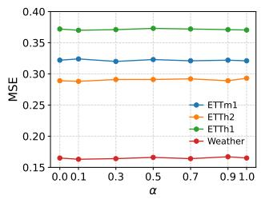

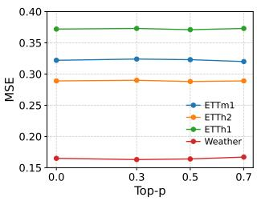  
Figure 3: Sensitivity analysis of the hyperparameters � and Top-P on ETTm1, ETTh1, ETTh2, and Weather, with both the input length and prediction horizon fixed at 96.

## 4.3.2. Hyperparameter Sensitivity

We further analyze the sensitivity of SCPaT to the static sparsification ratio � and the routing threshold Top-P, as shown in Figure 3. SCPaT remains stable across a broad range of hyperparameter values. For �, the optimal value varies across datasets: ETTh1 and ETTh2 perform best at $\alpha = 0 . 1$ , ETTm1 at $\alpha = 0 . 3 ,$ , and Weather at $\alpha = 0 . 1$ . This suggests that datasets with stronger local fluctuations or denser interactions benefit from larger �, whereas datasets with more regular structures prefer relatively sparser graphs. A similar trend is observed for Top-P. ETTh1 performs best at $\mathrm { T o p - P } = 0 . 5$ , Weather at $\mathrm { T o p - P } = 0 . 3$ , and ETTm1 around $\mathrm { T o p - P } = \ 0 . 7$ . When Top-P is too small, routing becomes overly selective; when it is too large, expert activation becomes overly uniform, weakening expert specialization. These results suggest that SCPaT performs best under moderate sparsity in both graph construction and expert routing.

Table 3  
Multivariate short-term forecasting results over three prediction horizons, $H \in \{ 1 2 , 2 4 , 4 8 \}$ , with the input length fixed at $L = 9 6 ,$ The best and second-best results are marked in bold red and blue underline, respectively.
<table><tr><td colspan="2">Models</td><td colspan="2">SCPaT (Ours)</td><td colspan="2">MSPatch (2025)</td><td colspan="2">DUET (2025)</td><td colspan="2">iTransformer (2024)</td><td colspan="2">MSGNet (2024)</td><td colspan="2">HDMixer (2024)</td><td colspan="2">TimesNet (2023)</td><td colspan="2">PatchTST (2023)</td><td colspan="2">CrossFormer (2023)</td></tr><tr><td colspan="2">Metric</td><td colspan="2">MSE</td><td colspan="2">MSE</td><td colspan="2">MSE MAE</td><td colspan="2">MSE MAE</td><td colspan="2">MSE MAE</td><td colspan="2">MSE MAE</td><td colspan="2">MSE MAE</td><td colspan="2">MSE MAE</td><td colspan="2">MSE MAE</td></tr><tr><td rowspan="2">PEMS03</td><td>12</td><td>0.066</td><td>0.169</td><td>0.074</td><td>0.179</td><td>0.071</td><td>0.176</td><td>0.071</td><td>0.174</td><td>0.083</td><td>0.197</td><td>0.076</td><td>0.184</td><td>0.085</td><td>0.192</td><td>0.099</td><td></td><td>0.216</td><td>0.090</td><td>0.203</td></tr><tr><td>24</td><td>0.086</td><td>0.195</td><td>0.097</td><td>0.200</td><td>0.089</td><td>0.197</td><td>0.093</td><td>0.201</td><td>0.097</td><td>0.217</td><td>0.095</td><td></td><td>0.210</td><td>0.118</td><td>0.223</td><td>0.142</td><td>0.259</td><td>0.121</td><td>0.240</td></tr><tr><td rowspan="3"></td><td>48</td><td>0.122</td><td>0.235</td><td>0.131</td><td>0.244</td><td>0.118</td><td>0.229</td><td>0.125</td><td>0.236</td><td>0.135</td><td>0.241</td><td>0.122</td><td>0.245</td><td></td><td>0.155</td><td>0.260</td><td>0.211</td><td>0.319</td><td>0.202</td><td>0.317</td></tr><tr><td>12</td><td>0.073</td><td>0.176</td><td>0.075</td><td>0.185</td><td>0.076</td><td></td><td>0.179</td><td>0.078</td><td>0.183</td><td>0.082</td><td>0.187</td><td>0.084</td><td>0.188</td><td>0.087</td><td>0.195</td><td>0.105</td><td>0.224</td><td>0.098</td><td>0.218</td></tr><tr><td>24</td><td>0.091</td><td>0.199</td><td>0.093</td><td>0.201</td><td>0.097</td><td>0.203</td><td>0.095</td><td>0.205</td><td>0.128</td><td>0.241</td><td>0.097</td><td>0.210</td><td></td><td>0.103</td><td>0.215</td><td>0.153</td><td>0.257</td><td>0.131</td><td>0.256</td></tr><tr><td rowspan="3"></td><td>48</td><td>0.124</td><td>0.237</td><td>0.134</td><td>0.244</td><td>0.119</td><td>0.239</td><td>0.126</td><td>0.240</td><td>0.192</td><td>0.315</td><td>0.134</td><td></td><td>0.253</td><td>0.136</td><td>0.250</td><td>0.229</td><td>0.339</td><td>0.205</td><td>0.326</td></tr><tr><td></td><td>0.058</td><td>0.153</td><td>0.066</td><td>0.162</td><td>0.059</td><td>0.166</td><td></td><td>0.165</td><td></td><td></td><td></td><td>0.074</td><td>0.182</td><td>0.082</td><td>0.181</td><td>0.095</td><td>0.207</td><td>0.094</td><td>0.200</td></tr><tr><td>12 24</td><td>0.074</td><td>0.174</td><td>0.083</td><td>0.189</td><td>0.079</td><td>0.183</td><td>0.067 0.088</td><td>0.190</td><td>0.087 0.135</td><td>0.191 0.241</td><td>0.089</td><td>0.197</td><td></td><td>0.101</td><td>0.204</td><td>0.150</td><td>0.262</td><td>0.139</td><td>0.247</td></tr><tr><td rowspan="3"></td><td>48</td><td>0.102</td><td>0.207</td><td>0.112</td><td>0.217</td><td></td><td>0.106</td><td>0.211</td><td>0.110</td><td>0.215</td><td>0.297</td><td>0.351</td><td>0.124</td><td>0.217</td><td>0.134</td><td>0.238</td><td>0.253</td><td>0.340</td><td>0.311</td><td>0.369</td></tr><tr><td></td><td>0.070</td><td>0.173</td><td>0.079</td><td>0.175</td><td>0.077</td><td>0.177</td><td></td><td></td><td>0.182</td><td>0.159</td><td>0.208</td><td>0.098</td><td>0.193</td><td>0.112</td><td>0.212</td><td>0.168</td><td>0.232</td><td>0.165</td><td>0.214</td></tr><tr><td>12 24</td><td>0.085</td><td>0.187</td><td>0.094</td><td>0.211</td><td>0.098</td><td>0.201</td><td>0.079 0.115</td><td>0.219</td><td>0.210</td><td>0.251</td><td>0.108</td><td>0.223</td><td></td><td>0.141</td><td>0.238</td><td>0.224</td><td>0.281</td><td>0.215</td><td>0.260</td></tr><tr><td colspan="2">48</td><td>0.112</td><td>0.220</td><td>0.150</td><td>0.232</td><td>0.139</td><td>0.227</td><td>0.186</td><td>0.235</td><td>0.311</td><td>0.358</td><td>0.167</td><td></td><td>0.247</td><td>0.198</td><td>0.283</td><td>0.321</td><td>0.354</td><td>0.315</td><td>0.335</td></tr><tr><td colspan="2">1st Count</td><td>9</td><td>11</td><td>0</td><td>0</td><td>3</td><td>1</td><td>0</td><td>0</td><td></td><td>0</td><td>0</td><td>0</td><td>0</td><td>0</td><td>0</td><td>0</td><td>0</td><td>0</td><td>0</td></tr></table>

Table 4  
Average routing probability distribution across experts, with both the input length and prediction horizon fixed at 96.
<table><tr><td>Dataset</td><td>Expert 1</td><td>Expert 2</td><td>Expert 3</td></tr><tr><td>ETTh1</td><td>0.62</td><td>0.21</td><td>0.17</td></tr><tr><td>ETTm1</td><td>0.51</td><td>0.25</td><td>0.24</td></tr><tr><td>Weather</td><td>0.81</td><td>0.11</td><td>0.08</td></tr></table>

## 4.3.3. Robustness to Irregular and Noisy Data.

We evaluate the robustness of the model under incomplete observation scenarios by introducing missing values through zero padding. Specifically, according to different missing rates ranging from 0% to 30%, some input data points are randomly masked, the masked entries are filled with 0, and the remaining observations are kept unchanged. The results are shown in Table 5. Under different missing rates, SCPaT consistently achieves lower forecasting errors compared with baseline methods. As the missing rate increases, the performance of all models gradually degrades, but SCPaT, relying on its semantic structured modeling mechanism, can capture the dependencies among the remaining observations, alleviate the impact of missing information, and thus maintain relatively stable performance.

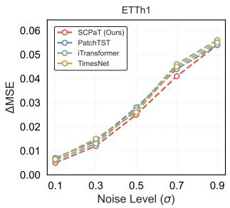

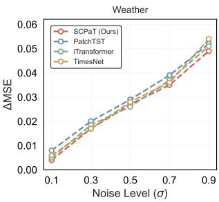  
Figure 4: Performance degradation under different Gaussian noise levels on ETTh1 and Weather with both the input length and prediction horizon fixed at 96.

To further evaluate robustness against input perturbations, we add zero-mean Gaussian noise to the test sequences with standard deviation $\sigma \in \{ 0 . 1 , 0 . 3 , 0 . 5 , 0 . 7 , 0 . 9 \}$ Figure 4 compares the performance degradation of SCPaT, PatchTST, iTransformer, and TimesNet under increasing noise levels. As � increases, the MSE of all models rises. SCPaT consistently exhibits the slowest performance decay across all noise levels, confirming the robustness of semantic partitioning against high frequency input perturbations.

## 4.3.4. Look-back Window.

Generally, increasing the input sequence length can provide richer historical context for forecasting. However, most existing models do not consistently benefit from longer input sequences, and their performance often fluctuates across different look-back windows (Shao et al., 2024). As shown in Figure 5, longer input sequences do not always lead to better results and may introduce more redundant or noisy information. In contrast, SCPaT maintains consistently strong and stable performance across different lookback window settings, suggesting that it can better balance local dynamics and long-term dependencies.

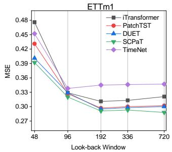

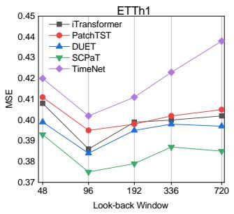

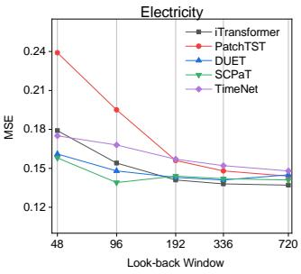

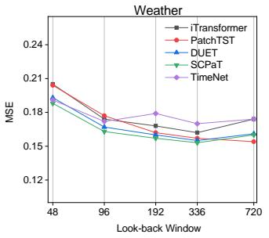  
Figure 5: Performance comparison under different look-back window lengths on ETTm1, ETTh1, Electricity, and Weather, with � ∈ {48, 96, 192, 336, 720} and the prediction horizon fixed at 96.

Table 5  
Robustness analysis on the ETTm2 and ETTh1 datasets under different missing rates, with the input length fixed at $L = 9 6$ and the prediction horizon fixed at $H = 9 6 .$ . The best results are highlighted in bold.
<table><tr><td rowspan="3">Missing Rate</td><td colspan="6">ETTm2</td><td colspan="6">ETTh1</td></tr><tr><td colspan="2">SCPaT (Ours)</td><td colspan="2">Transformer</td><td colspan="2">PatchTST</td><td colspan="2">SCPaT (Ours)</td><td colspan="2">Transformer</td><td colspan="2">PatchTST</td></tr><tr><td>MSE</td><td>MAE</td><td>MSE</td><td>MAE</td><td>MSE</td><td>MAE</td><td>MSE</td><td>MAE</td><td>MSE</td><td>MAE</td><td>MSE</td><td>MAE</td></tr><tr><td>0.00</td><td>0.173</td><td>0.258</td><td>0.180</td><td>0.264</td><td>0.181</td><td>0.259</td><td>0.370</td><td>0.392</td><td>0.386</td><td>0.405</td><td>0.414</td><td>0.419</td></tr><tr><td>0.05</td><td>0.213</td><td>0.297</td><td>0.249</td><td>0.441</td><td>0.252</td><td>0.327</td><td>0.379</td><td>0.401</td><td>0.404</td><td>0.413</td><td>0.436</td><td>0.428</td></tr><tr><td>0.10</td><td>0.248</td><td>0.326</td><td>0.295</td><td>0.472</td><td>0.328</td><td>0.376</td><td>0.390</td><td>0.412</td><td>0.433</td><td>0.424</td><td>0.455</td><td>0.441</td></tr><tr><td>0.15</td><td>0.287</td><td>0.354</td><td>0.379</td><td>0.559</td><td>0.411</td><td>0.423</td><td>0.404</td><td>0.424</td><td>0.462</td><td>0.432</td><td>0.467</td><td>0.460</td></tr><tr><td>0.20</td><td>0.332</td><td>0.385</td><td>0.433</td><td>0.567</td><td>0.502</td><td>0.471</td><td>0.419</td><td>0.438</td><td>0.478</td><td>0.448</td><td>0.482</td><td>0.483</td></tr><tr><td>0.25</td><td>0.388</td><td>0.419</td><td>0.506</td><td>0.574</td><td>0.601</td><td>0.520</td><td>0.437</td><td>0.454</td><td>0.487</td><td>0.473</td><td>0.498</td><td>0.503</td></tr><tr><td>0.30</td><td>0.452</td><td>0.456</td><td>0.596</td><td>0.580</td><td>0.709</td><td>0.569</td><td>0.459</td><td>0.471</td><td>0.500</td><td>0.498</td><td>0.511</td><td>0.527</td></tr></table>

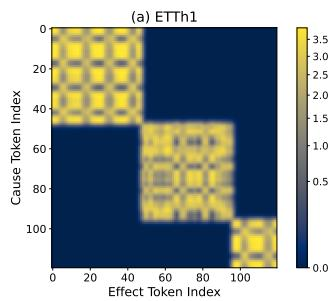

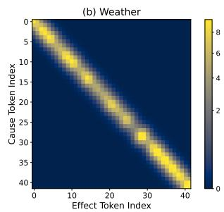  
Figure 6: Heatmaps of the learned directed adjacency matrix $A _ { \mathsf { f i n a l } }$ on the ETTh1 and Weather datasets.

## 4.4. Case Study and Visualization

## 4.4.1. Adjacency Matrix Interpretation.

To further understand how SCPaT captures structural dependencies, we visualize the final adjacency matrix $A _ { \mathrm { f i n a l } }$ learned by the semantic graph constructor, with the input length fixed at $L ~ = ~ 9 6$ and the prediction horizon fixed at $H ~ = ~ 9 6$ , as shown in Figure 6. The matrix encodes the directed dependency strength between semantic patches after static sparsification and importance aware routing, where each entry represents the information propagation strength from a source patch to a target patch. On ETTh1, the adjacency matrix exhibits a clear block-wise structure, with strong interactions both within variable-specific segments and across certain groups of patches. This pattern suggests that SCPaT can jointly capture intra-variable temporal continuity and structured inter-variable coupling. In contrast, on Weather, the adjacency matrix is dominated by a near-diagonal pattern, with only limited activation away from the diagonal. This suggests that most tokens depend primarily on temporally aligned counterparts rather than complex cross-token interactions, which is consistent with the more regular and periodic nature of meteorological data.

## 4.4.2. Visualization of Forecasting Results.

Figure 7 provides a qualitative comparison between SC-PaT and several representative baselines. SCPaT produces predictions that are more closely aligned with the ground truth across the three examples. It more faithfully captures the periodic structure and amplitude variation of the target sequence, while also tracking local trend changes more accurately. In oscillatory regions, SCPaT better preserves the phase and waveform shape of the ground truth, whereas the baseline methods show more noticeable deviations, particularly near turning points and local extrema. These results indicate that SCPaT can simultaneously capture global temporal regularities and local dynamics, which is consistent with its stronger quantitative forecasting performance.

## 4.5. Ablation Study

To assess the effectiveness of the core components in SCPaT, we conduct ablation studies on three representative datasets, namely ETTm2, Weather, and Traffic, which represent settings with low, medium, and high dimensionality, respectively. The considered variants are W/O SV Encoder, which removes the semantic vector encoder module; W/O IAR, which removes the importance aware routing mechanism; and W/O TE Graph, which removes the transfer entropy graph construction module. Table 6 reports the ablation results. The full SCPaT consistently achieves the best performance across all datasets and prediction horizons, while removing any individual component degrades forecasting performance. In particular, removing semantic vector encoder or importance aware routing leads to larger performance drops in most settings, indicating their importance for capturing semantic variation within patches and emphasizing informative temporal patterns. The degradation without the TE Graph further highlights the role of modeling directed dependencies among semantic units.

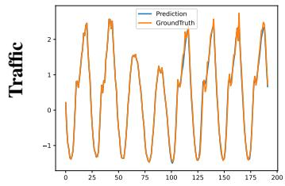

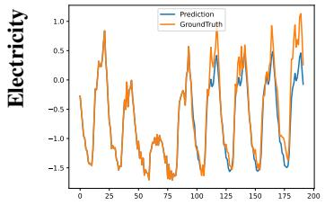

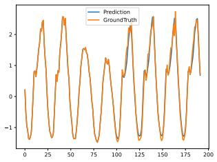

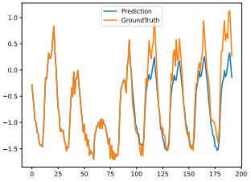

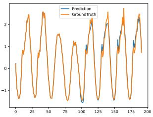

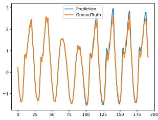

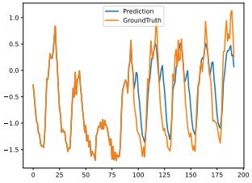

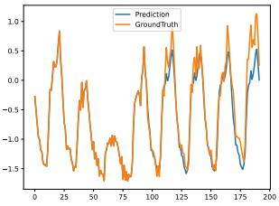

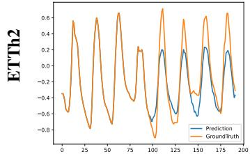  
(a) SCPaT

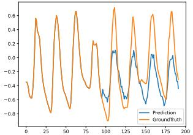  
(b) PatchTST

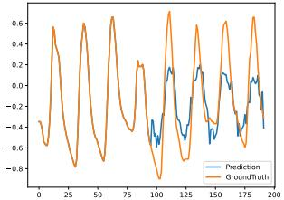  
(c) TimesNet

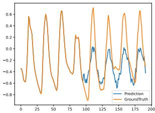  
(d) iTransformer  
Figure 7: Visualization of prediction results on Electricity, Traffic, and ETTh2 under the Lookback-96-Horizon-96 setting.

Table 6  
Ablation results of the SCPaT components on ETTm2, Weather, and Traffic over prediction horizons $H \in \{ 9 6 , 1 9 2 , 3 3 6 , 7 2 0 \}$ with the input length fixed at � = 96. The best and second-best results are marked in bold red and blue underline, respectively.
<table><tr><td colspan="2">Dataset</td><td colspan="4">ETTm2</td><td colspan="4">Weather</td><td colspan="4">Traffic</td></tr><tr><td colspan="2">Prediction Length</td><td>96</td><td>192</td><td>336</td><td>720</td><td>96</td><td>192</td><td>336</td><td>720</td><td>96</td><td>192</td><td>336</td><td>720</td></tr><tr><td rowspan="2">SCPaT</td><td>MSE MAE</td><td>0.173 0.258</td><td>0.238 0.300</td><td>0.297 0.339</td><td>0.394 0.394</td><td>0.163 0.208</td><td>0.209 0.250</td><td>0.266 0.292</td><td>0.345 0.349</td><td>0.393 0.247</td><td>0.425 0.259</td><td>0.454 0.270</td><td>0.489 0.291</td></tr><tr><td>MSE</td><td>0.196</td><td>0.259</td><td>0.317</td><td>0.412</td><td>0.204</td><td>0.248</td><td>0.302</td><td>0.373</td><td>0.414</td><td>0.448</td><td>0.478</td><td>0.510</td></tr><tr><td rowspan="2">w/o SV Encoder</td><td>MAE</td><td>0.278</td><td>0.318</td><td>0.354</td><td>0.408</td><td>0.254</td><td>0.287</td><td>0.323</td><td>0.367</td><td>0.274</td><td>0.281</td><td>0.294</td><td>0.316</td></tr><tr><td>MSE</td><td>0.178</td><td>0.245</td><td>0.302</td><td>0.400</td><td>0.167</td><td>0.216</td><td>0.273</td><td>0.353</td><td>0.397</td><td>0.431</td><td>0.459</td><td>0.495</td></tr><tr><td rowspan="2">w/o IAR</td><td>MAE</td><td>0.264</td><td>0.309</td><td>0.347</td><td>0.402</td><td>0.214</td><td>0.257</td><td>0.299</td><td>0.354</td><td>0.253</td><td>0.267</td><td>0.274</td><td>0.297</td></tr><tr><td>MSE</td><td>0.180</td><td>0.247</td><td>0.309</td><td>0.407</td><td>0.171</td><td>0.214</td><td>0.277</td><td>0.356</td><td></td><td>0.436</td><td>0.466</td><td></td></tr><tr><td rowspan="2">w/o TE Graph</td><td></td><td></td><td>0.311</td><td>0.343</td><td>0.413</td><td>0.221</td><td>0.262</td><td>0.301</td><td>0.355</td><td>0.401</td><td></td><td></td><td>0.498</td></tr><tr><td>MAE</td><td>0.270</td><td></td><td></td><td></td><td></td><td></td><td></td><td></td><td>0.249</td><td>0.264</td><td>0.277</td><td>0.301</td></tr></table>

## 4.6. Model Efficiency

We compare SCPaT with representative baselines in terms of forecasting performance, training time, and memory consumption under the official model configurations. Figure 8 illustrates the trade off between efficiency and performance on the ETTm2 and Weather datasets, with the input length fixed at $L ~ = ~ 9 6$ and the prediction horizon fixed at $H ~ = ~ 9 6$ . The horizontal axis denotes training time, the vertical axis denotes MSE, and the bubble size indicates peak GPU memory usage during training. SCPaT achieves competitive MSE with moderate training time and memory consumption, suggesting that it remains efficient while preserving strong predictive performance.

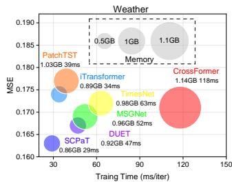

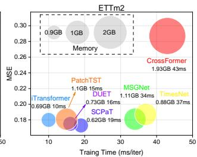  
Figure 8: Model efficiency comparison of different methods on ETTm2 and Weather.

## 5. Conclusion

This paper revisits patch based MTSF from the perspective of semantic structure. Rather than relying solely on fixed, multi-scale, or extendable partitioning schemes, we argue that effective forecasting also requires explicitly modeling the semantic consistency of local segments and the higher order dependencies among them. Based on this view, we propose SCPaT, which integrates semantic structured partitioning, transfer entropy based dependency modeling, and importance aware routing into a unified framework. Extensive experiments show that SCPaT achieves strong and consistent improvements across diverse forecasting settings. More importantly, the results suggest that incorporating semantic structure into patch based modeling provides a promising direction for handling heterogeneous temporal patterns and complex multivariate dependencies. We believe future work can further explore more efficient graph construction strategies and scalable structured modeling to broaden its applicability.

## Generative AI disclosure

The authors used artificial intelligence tools (e.g., Chat-GPT) solely for language polishing and grammar correction. All research concepts, methodology, and visual elements were developed independently without AI assistance. The authors take full responsibility for the scholarly content and academic integrity of the work.

## Acknowledgments

This work was supported in part by the Key Research Project Plan for Basic Research Special Fund of Higher Education Institutions in Henan Province under Grant No.25ZX009, and by the Henan Provincial Natural Science Foundation under Grant No.262300422534.

## References

Cai, W., Liang, Y., Liu, X., Feng, J., Wu, Y., 2024. Msgnet: Learning multiscale inter-series correlations for multivariate time series forecasting, in: Proceedings of the AAAI conference on artificial intelligence.

Cao, Y., Tian, Z., Guo, W., Liu, X., 2025. Mspatch: A multi-scale patch mixing framework for multivariate time series forecasting. Expert Systems with Applications .

Chen, P., Zhang, Y., Cheng, Y., Shu, Y., Wang, Y., Wen, Q., Yang, B., Guo, C., 2024. Pathformer: Multi-scale transformers with adaptive pathways for time series forecasting. arXiv preprint arXiv:2402.05956 .

Gasparin, A., Lukovic, S., Alippi, C., 2022. Deep learning for time series forecasting: The electric load case. CAAI Transactions on Intelligence Technology .

Hochreiter, S., Schmidhuber, J., 1997. Long short-term memory. Neural Computation .

Hu, Y., Liu, P., Zhu, P., Cheng, D., Dai, T., 2025. Adaptive multi-scale decomposition framework for time series forecasting, in: Proceedings of the AAAI Conference on Artificial Intelligence.

Huang, Q., Shen, L., Zhang, R., Cheng, J., Ding, S., Zhou, Z., Wang, Y., 2024. Hdmixer: Hierarchical dependency with extendable patch for multivariate time series forecasting, in: Proceedings of the AAAI conference on artificial intelligence.

Huang, Z., Zheng, R., Zhu, J., Liu, L., Li, M., Liu, M., 2025. Endexformer: Hierarchical endogenous-exogenous synergy for multivariate time series forecasting, in: ECAI.

Hyndman, R.J., Koehler, A.B., 2006. Another look at measures of forecast accuracy. International journal of forecasting .

Karevan, Z., Suykens, J.A., 2020. Transductive lstm for time-series prediction: An application to weather forecasting. Neural Networks .

Kazemi, M.H., Shiri, J., Marti, P., Majnooni-Heris, A., 2020. Assessing temporal data partitioning scenarios for estimating reference evapotranspiration with machine learning techniques in arid regions. Journal of Hydrology .

Lippi, M., Bertini, M., Frasconi, P., 2013. Short-term traffic flow forecasting: An experimental comparison of time-series analysis and supervised learning. IEEE Transactions on Intelligent Transportation Systems .

Liu, H., Yang, C., Zhu, X., et al., 2025a. Semantic-enhanced time-series forecasting via large language models. arXiv preprint arXiv:2508.07697

Liu, Y., Hu, T., Zhang, H., Wu, H., Wang, S., Ma, L., Long, M., 2024. itransformer: Inverted transformers are effective for time series forecasting, in: International Conference on Learning Representations.

Liu, Y., Wu, H., Wang, J., Long, M., 2022. Non-stationary transformers: Exploring the stationarity in time series forecasting. Advances in neural information processing systems .

Liu, Z., Duan, P., Wang, B., Tang, X., Chu, Q., Zhang, C., Huang, Y., Zhang, B., 2025b. Disms-ts: Eliminating redundant multi-scale features for time series classification, in: Proceedings of the ACM International Conference on Multimedia.

Nie, Y., Nguyen, N.H., Sinthong, P., Kalagnanam, J., 2023. A time series is worth 64 words: Long-term forecasting with transformers, in: International Conference on Learning Representations.

Pedregosa, F., Varoquaux, G., Gramfort, A., Michel, V., Thirion, B., Grisel, O., Blondel, M., Prettenhofer, P., Weiss, R., Dubourg, V., et al., 2011. Scikit-learn: Machine learning in python. the Journal of machine Learning research .

Piao, X., Chen, Z., Murayama, T., Matsubara, Y., Sakurai, Y., 2024. Fredformer: Frequency debiased transformer for time series forecasting, in: Proceedings of the 30th ACM SIGKDD conference on knowledge discovery and data mining.

Qiu, X., Hu, J., Zhou, L., Wu, X., Du, J., Zhang, B., Guo, C., Zhou, A., Jensen, C.S., Sheng, Z., Yang, B., 2024. TFB: Towards comprehensive and fair benchmarking of time series forecasting methods, in: Proc. VLDB Endow., pp. 2363–2377.

Qiu, X., Wu, X., Lin, Y., Guo, C., Hu, J., Yang, B., 2025. Duet: Dual clustering enhanced multivariate time series forecasting, in: ACM SIGKDD Conference on Knowledge Discovery and Data Mining.

Qiu, X., Zhu, Y., Li, Z., Wu, X., Yang, B., Hu, J., 2026. Dag: A dual correlation network for time series forecasting with exogenous variables, in: ICML.

Shao, Z., Wang, F., Xu, Y., Wei, W., Yu, C., Zhang, Z., Yao, D., Sun, T., Jin, G., Cao, X., et al., 2024. Exploring progress in multivariate time series

forecasting: Comprehensive benchmarking and heterogeneity analysis. IEEE Transactions on Knowledge and Data Engineering .

Wu, H., Hu, T., Liu, Y., Zhou, H., Wang, J., Long, M., 2022. Timesnet: Temporal 2d-variation modeling for general time series analysis. arXiv preprint arXiv:2210.02186 .

Wu, H., Xu, J., Wang, J., Long, M., 2021. Autoformer: Decomposition transformers with auto-correlation for long-term series forecasting. Advances in neural information processing systems .

Wu, X., Qiu, X., Li, Z., Wang, Y., Hu, J., Guo, C., Xiong, H., Yang, B., 2025. CATCH: Channel-aware multivariate time series anomaly detection via frequency patching, in: ICLR.

Yang, Y., Ding, W., Gu, Y., Zhang, H., Wei, W., Gao, H., 2025. Beyond data heterogeneity: A multivariate time series forecasting for energy systems through enhanced channel fusion in frequency domain. Information Fusion .

Ye, C., Ma, Q., 2023. Multi-granularity framework for unsupervised representation learning of time series. arXiv preprint arXiv:2312.07248

Zhang, X., Wang, J., Bai, Y., Zhang, L., Lin, Y., 2025. Tf4tf: Multisemantic modeling within the time–frequency domain for long-term time-series forecasting. Neurocomputing .

Zhang, Y., Yan, J., 2023a. Crossformer: Transformer utilizing crossdimension dependency for multivariate time series forecasting, in: International conference on learning representations.

Zhang, Y., Yan, J., 2023b. Crossformer: Transformer utilizing crossdimension dependency for multivariate time series forecasting, in: International Conference on Learning Representations.

Zheng, C., Fan, X., Wang, C., Qi, J., 2020. Gman: A graph multi-attention network for traffic prediction, in: Proceedings of the AAAI conference on artificial intelligence.

Zhou, H., Zhang, S., Peng, J., Zhang, S., Li, J., Xiong, H., Zhang, W., 2021. Informer: Beyond efficient transformer for long sequence timeseries forecasting, in: Proceedings of the AAAI conference on artificial intelligence.

Zhou, T., Ma, Z., Wen, Q., Wang, X., Sun, L., Jin, R., 2022. Fedformer: Frequency enhanced decomposed transformer for long-term series forecasting, in: International conference on machine learning.