# Rethinking the Evaluation and Optimization of LLM-Based Social Simulation∗

Pei Wang Xu Chen Ji-Rong Wen

Gaoling School of Artificial Intelligence, Renmin University of China wang pei@ruc.edu.cn xu.chen@ruc.edu.cn jrwen@ruc.edu.cn

## Abstract

LLM-based social simulation is a promising complement to traditional social science methods such as surveys and behavioral experiments. A core question in this area is how to evaluate the fidelity of LLM-simulated human behavior and, in turn, how to optimize LLMs toward it. Prevailing practice evaluates by accuracy, checking whether the model selects the single response observed from a human, and accordingly trains the LLM to reproduce this one hard label. However, human behavior is inherently subjective: the same person in the same situation may reasonably act in diferent ways, so an observed response is only one draw from an underlying response distribution, which renders accuracy-based evaluation unreliable and hard-label training misleading. To address these problems, in this paper, we first introduce the subjectivity coeficient, an entropy-based quantity that distinguishes objective tasks such as coding from subjective tasks such as social simulation, and then use it to systematically analyze how accuracy-based evaluation and hard-label training fail as subjectivity grows. Based on the subjectivity coeficient, we further propose Subjectivity-Adaptive soft-Label Training (SALT): it pools observed outputs from semantically nearby inputs into soft distributional labels, with an aggregation radius adapted to the estimated subjectivity of each input; in the near-objective limit the neighborhood shrinks, so SALT naturally falls back to standard single-label training. Moreover, since existing datasets record only single observed responses and thus cannot support distributional evaluation, we construct SubjSim, a benchmark of 19,300 contexts covering 193 annotators and 100 subjective questions. Since real-world data typically provide only a single observation per input, our experiments train models from single observed outputs while evaluating them against the full response distributions, thereby verifying the feasibility of our method in realistic settings. Extensive results on SubjSim demonstrate the advantages of our method.

## 1 Introduction

LLM-based social simulation holds great potential for social science research, ofering a low-cost, controllable, and scalable way to study problems such as opinion dynamics, political polarization, market behavior, and policy interventions (Lu et al., 2025; Wang et al., 2025b; Gao et al., 2024; Hua et al., 2023; Park et al., 2023; Sasahara et al., 2021; Bail et al., 2018). The core question in this area is how to evaluate the fidelity of LLM-simulated behavior (Dillion et al., 2023; Dominguez-Olmedo et al., 2024; Hu et al., 2026; Wang et al., 2025a; Samuel et al., 2025), and then, under the established criterion, how to train the model toward it. Most existing work approaches this question by directly following the practice of objective domains such as coding and math: collect one response for each person on each question, fine-tune the model to reproduce that response as the correct label, and check with accuracy-style metrics whether the model picks the same answer.

For objective tasks this recipe is perfectly sound: there is a well-defined correct answer, so a single label fully specifies the target, reproducing the label is exactly the desired behavior, and accuracy faithfully measures success. However, social simulation breaks this premise. Human behavior is stochastic rather than deterministic (Fleeson, 2001; Camerer, 1997; Slovic, 1995; Zaller, 1992; Ratclif,

1978; McFadden, 1974; Luce et al., 1959): the same person may act diferently across comparable occasions, and people with similar profiles may choose diferent actions. An observed response is therefore only one draw from an underlying response distribution. A single label no longer specifies the target. During training, reproducing it collapses the model onto one action; at test time, whether the model hits that answer depends partly on chance rather than on how faithful the simulation is.

To study the above problems systematically, we first define the subjectivity coeficient, an entropy-based measure of the inherent randomness of human responses in a given decision context; under this definition, objective tasks (e.g., coding) have a near-zero subjectivity coeficient, while subjective tasks (e.g., social simulation) have a much higher one. Based on the subjectivity coeficient, we then formally show that the common recipe of accuracy evaluation plus single-label training breaks down as subjectivity grows. For evaluation, the recorded answer is itself only one random draw from the response distribution, so whether the model matches it reveals little about fidelity; for training, fitting the single label pulls the model away from the true response distribution. Finally, we propose Subjectivity-Adaptive soft-Label Training (SALT). For each context, SALT collects the answers observed at semantically similar contexts that share the same options and turns them into a soft label, and the neighborhood size automatically adapts to how subjective the context is estimated to be. When a context is nearly objective, the neighborhood shrinks and SALT falls back to standard single-label training, so hard-label supervision is recovered as the low-subjectivity special case.

Evaluating distributional fidelity requires reference human response distributions, but existing social simulation datasets typically record only a single response for each context. We therefore construct SubjSim, a benchmark in which 193 annotators answer 100 subjective survey questions, yielding 19,300 annotator-question pairs. Each pair carries an elicited response-propensity distribution obtained through probability-ball allocation. During training, models never see these distributions and receive only one derived hard action per pair; at test time, the full distributions are used to measure more accurately how faithfully the model reproduces human behavior. With Qwen3-8B as the backbone, SALT reduces aggregate KL divergence over standard supervised fine-tuning (SFT) by 77.6%, JSD by 45.9%, TVD by 31.2%, and MMD by 52.7%, with the largest gains in mid- and high-subjectivity settings, where one observed response reveals the least about the full distribution.

In summary, this paper makes contributions at three levels. (i) At the problem level, we identify why the prevailing accuracy-based evaluation and training practice is unreasonable for social simulation, and rigorously analyze this failure by introducing the subjectivity coeficient. (ii) At the method level, we propose SALT, which aggregates observations from semantically similar contexts into soft distributional labels with a subjectivity-adaptive radius. (iii) At the data level, we construct SubjSim, a benchmark of 19,300 annotator-question pairs with human-annotated response distributions, and extensive experiments on it validate the efectiveness of SALT.

## 2 Preliminaries

## 2.1 Formulation of Social Simulation

We describe each individual in the target population by a persona vector u, which encodes demographic features, personality traits, prior beliefs, or other personal attributes. A decision context is the tuple $x : = ( u , s )$ , where s is a situational description; we write X for the space of all decision contexts. At context x, the individual chooses from a candidate action set $\mathcal { A } ( \boldsymbol { x } ) = \{ a ^ { ( 1 ) } , \ldots , a ^ { ( K ) } \}$ where each action is a natural-language description and $K = | { \mathcal { A } } ( x ) |$ may vary across contexts. For example, u may describe a 26-year-old graduate student living in a big city, s may ask which factor matters most when choosing a job, and the corresponding action set is $\boldsymbol { \mathcal { A } } ( \boldsymbol { x } )$ {“salary”, “stability”, “personal interest”, “work–life balance”}. In another example, u may describe a retired teacher living in a small town, s may ask how the individual mainly gets news, and $\begin{array} { r } { \mathbf { \mathcal { A } } ( \mathbf { \mathcal { x } } ) = \left\{ \begin{array} { r l r l } \end{array} \right. } \end{array}$ “social media”, “television”, “news apps”}. Social simulation aims to use an LLM to mimic how these individuals respond and behave.

## 2.2 The Ideal Optimization Target

Defining the ideal optimization target requires first understanding the nature of human behavior. Many social science theories have shown that human behavior is not deterministic but contains an inherent random component. Random utility theory (Luce et al., 1959; McFadden, 1974), stochastic evidence-accumulation models (Ratclif, 1978), and preference construction research (Slovic, 1995) all model a person’s choice as a draw from a probability distribution rather than as a fixed answer. This randomness is easy to see in daily life: the same person may pick a diferent dish from the same menu on diferent days, answer the same survey question diferently when asked twice (Zaller, 1992), cooperate in one round of an economic game and defect in the next (Camerer, 1997), or be talkative at one gathering and quiet at another (Fleeson, 2001). This stochasticity is part of the target itself rather than label noise. Ideally, the model should therefore capture the uncertainty of human behavior: for each context, it should reproduce not only which action is most likely, but the full probability mass assigned to all plausible actions. Formally, the target is the latent response-propensity distribution $\Breve { \phi } ^ { * } ( \cdot \mid x ) \in \mathbf { \bar { \Delta } } ( A ( x ) )$ , namely the action distribution that would be observed if the same context could be measured repeatedly under comparable conditions, where $\begin{array} { r } { \Delta ( A ( x ) ) = \{ ( q _ { 1 } , \dots , q _ { K } ) : q _ { k } \geq 0 , \sum _ { k } q _ { k } = 1 \} } \end{array}$ is the probability simplex over the available actions and we write $p _ { k } : = \phi ^ { * } ( k \mid$ x) for brevity. On the model side, an LLM with parameters θ induces an action-level distribution $\dot { \phi _ { \theta } } ( \cdot \mid x ) \in \Delta ( \mathcal { A } ( x ) )$ ), obtained by normalizing the generation probabilities of the K candidate actions, with $\phi _ { \theta } ( k \mid x )$ written analogously. The ideal goal of social simulation is to learn a model whose induced action distribution is close to $\phi ^ { * }$ across contexts:

$$
\begin{array} { r } { \hat { \theta } = \arg \operatorname* { m i n } _ { \theta } \mathbb { E } _ { x } [ D ( \phi ^ { * } ( \cdot  { | } x ) , \phi _ { \theta } ( \cdot  { | } x ) ) ] , } \end{array}\tag{1}
$$

where D measures mismatch on the action simplex and can be instantiated as various distance functions, $\mathrm { e . g . }$ , total variation $\begin{array} { r } { D _ { \mathrm { T V } } ( P , Q ) : = \frac { 1 } { 2 } \sum _ { k = 1 } ^ { K } | P _ { k } - Q _ { k } | . } \end{array}$ , cross entropy $D _ { \mathrm { C E } } ( P , Q ) : =$ $- \sum _ { k } P _ { k }$ log $Q _ { k }$ , or KL divergence $D _ { \mathrm { K L } } ( P \Vert Q )$

## 2.3 The Current Accuracy-Based Practice

In practice, $\phi ^ { * }$ is not observable: each context is recorded only once, yielding a dataset $\mathcal { D } =$ $\{ ( \hat { x ^ { i } } , a ( x ^ { i } ) ) \}$ in which $a ( x ) \in \mathcal { A } ( x )$ is the single observed action, either one stochastic draw from $\phi ^ { * } ( \cdot \mid x )$ or a single-action proxy derived from it. Let $j ( x )$ denote the index of $a ( x )$ and $\delta _ { a ( x ) }$ the one-hot distribution that puts all mass on $a ( x )$ . Prevailing practice trains and evaluates against this single observation. On the training side, the model is trained to maximize the probability it assigns to the observed action:

$$
\tilde { \theta } = \arg \operatorname* { m a x } _ { \theta } \mathbb { E } _ { x } [ \log \phi _ { \theta } ( j ( x ) \mid x ) ] = \arg \operatorname* { m i n } _ { \theta } \mathbb { E } _ { x } \big [ D _ { \mathrm { C E } } \big ( \delta _ { a ( x ) } , ~ \phi _ { \theta } ( \cdot \mid x ) \big ) \big ] ,\tag{2}
$$

which is exactly objective (1) with the unobservable target $\phi ^ { * } ( \cdot \mid x )$ replaced by the one-hot vector $\delta _ { a ( x ) }$ and $D$ taken as the cross entropy. On the evaluation side, accuracy checks whether the model’s top-probability action coincides with the same single observation:

$$
\operatorname { A c c } ( \theta ) = \mathbb { E } _ { x } [ { \mathbf 1 } [ \operatorname { a r g m a x } _ { k } \phi _ { \theta } ( k \mid x ) = j ( x ) ] ] ,\tag{3}
$$

replacing the divergence in (1) by a 0–1 comparison between the model’s mode and the single draw. A natural question arises: how much do (2) and (3) actually capture of the ideal objective $( 1 ) \dot { ? }$ In the next section, we answer this question by rigorously analyzing the gap between them.

## 3 Misalignment Analysis of the Accuracy-Based Practice

## 3.1 Evaluation Metric Analysis

Ideally, an evaluation metric should be consistent with true model quality: a model that scores better under the metric should also be closer to the true response distribution under the ideal objective (1). We now check whether accuracy (3) has this property.

Consider ranking two models $\theta _ { 1 }$ and $\theta _ { 2 }$ by accuracy at a context x with observed index $j = j ( x )$ , and let $k _ { 1 }$ and $k _ { 2 }$ denote the two models’ top actions. There are three cases.

(i) $k _ { 1 } = k _ { 2 } \colon$ the two models receive the same score. However, the true error $D _ { \mathrm { T V } } ( \phi _ { \theta _ { i } } , \phi ^ { * } )$ depends on all $K$ probability values rather than the top action alone, and the hidden gap can be nearly maximal. Suppose $\theta _ { 1 }$ matches the target exactly, $\phi _ { \theta _ { 1 } } = \phi ^ { * }$ , while $\theta _ { 2 }$ puts all its mass on the shared top action $k _ { 1 }$ , which is then the mode of $\phi ^ { * }$ with $p _ { k _ { 1 } } = p _ { \mathrm { m a x } }$ . Their true errors are

$$
D _ { \mathrm { T V } } ( \phi _ { \theta _ { 1 } } , \phi ^ { * } ) = 0 , \qquad D _ { \mathrm { T V } } ( \phi _ { \theta _ { 2 } } , \phi ^ { * } ) = \frac { 1 } { 2 } \Bigl [ ( 1 - p _ { \mathrm { m a x } } ) + \sum _ { k \neq k _ { 1 } } p _ { k } \Bigr ] = 1 - p _ { \mathrm { m a x } } ,\tag{4}
$$

which difer by $1 - p _ { \mathrm { m a x } }$ and reach $1 - 1 / K$ under uniform behavior, yet accuracy scores the two models identically.

(ii) $k _ { 1 } \neq k _ { 2 }$ and neither equals $j \colon$ both models score zero, and accuracy again cannot tell them apart. $\mathbf { A } s$ in case (i), consider a pair of models where one is perfect and the other is a point-mass model. The observed action $j$ is one random draw from $\phi ^ { * }$ and may well miss the most probable action, so even the perfect model $\phi _ { \theta _ { 1 } } = \phi ^ { * }$ , whose top action $k _ { 1 }$ is the most probable one, can fall into this case, while $\theta _ { 2 }$ puts all its mass on another unobserved action, $\phi _ { \theta _ { 2 } } = \delta _ { k _ { 2 } }$ . Their true errors are

$$
D _ { \mathrm { T V } } ( \phi _ { \theta _ { 1 } } , \phi ^ { * } ) = 0 , \qquad D _ { \mathrm { T V } } ( \phi _ { \theta _ { 2 } } , \phi ^ { * } ) = { \frac { 1 } { 2 } } \Bigl [ ( 1 - p _ { k _ { 2 } } ) + \sum _ { k \neq k _ { 2 } } p _ { k } \Bigr ] = 1 - p _ { k _ { 2 } } ,\tag{5}
$$

so a perfect model and a model with error $1 - p _ { k _ { 2 } }$ receive the same zero score.

(iii) $\boldsymbol { k } _ { 1 } \neq \boldsymbol { k } _ { 2 }$ and exactly one equals $j ,$ say $k _ { 1 } = j \colon$ : accuracy ranks $\theta _ { 1 }$ higher, and this is the only case where it expresses a preference. However, the preference can be exactly backward. Suppose $\theta _ { 2 }$ is the perfect model, $\phi _ { \theta _ { 2 } } = \phi ^ { * }$ , with its top action $k _ { 2 }$ the most probable one, while $\theta _ { 1 }$ puts all its mass on the draw $j \neq k _ { 2 }$ . Their true errors are

$$
D _ { \mathrm { T V } } ( \phi _ { \theta _ { 1 } } , \phi ^ { * } ) = \frac { 1 } { 2 } \Bigl [ ( 1 - p _ { j } ) + \sum _ { k \neq j } p _ { k } \Bigr ] = 1 - p _ { j } ~ > ~ 0 = D _ { \mathrm { T V } } ( \phi _ { \theta _ { 2 } } , \phi ^ { * } ) ,\tag{6}
$$

so whenever the single draw misses the most probable action, accuracy prefers a strictly worse model over the perfect one, and the reversed gap $1 - p _ { j }$ grows as behavior becomes more difuse.

In summary, the above counterexamples show that accuracy is not a reliable measure of behavioral fidelity: models with the same score can difer substantially in true quality, and in the worst case accuracy even prefers a strictly worse model over the perfect one. A better accuracy score therefore does not imply a model closer to the true response distribution.

## 3.2 Training Objective Analysis

We next examine the training objective (2). Its empirical signal at each training context is the one-hot target $\delta _ { a ( x ) }$ : the objective is monotonically increasing in the probability assigned to the observed action, so its optimum drives $\phi _ { \theta } ( j \mid x )  1$ on the training context, with no gradient signal that rewards distributing mass across multiple actions.

Proposition 1 (Single-observation training concentrates on one-hot labels). Consider afinite training set in which each context $x ^ { i }$ is observed once with hard label $j ^ { i } .$ . Ifthe closure ofthe model-induced action distributions contains the probability simplex independently at each training context (an idealizedfull-capacity condition), then any empirical-risk minimizer $\tilde { \theta }$ ofobjective (2) in this closure assigns $\dot { \phi _ { \tilde { \theta } } } ( k \mid \dot { x } ^ { i } ) \stackrel { \cdot } { = } \mathbf { 1 } [ k = j ^ { i } ]$ ]for every training context $x ^ { i }$ . In other words, the closer a model is trained toward the minimum loss, the closer its predicted distribution comes to putting probability one on the single observed answer at each training context.

The proof is given in Section C.1. Under this point-mass solution, the total-variation error at a training context is:

$$
D _ { \mathrm { T V } } \big ( \phi _ { \tilde { \theta } } , \phi ^ { * } \big ) = \frac { 1 } { 2 } \sum _ { k } \bigl | \mathbf 1 [ k = j ] - p _ { k } \bigr | = 1 - p _ { j } ,\tag{7}
$$

which equals the total probability mass that $\phi ^ { * }$ assigns to actions other than the one observed. Note that the observed answer $j$ is just one random draw: it tends to be a likely option but is not always the most likely one, so the error $1 - p _ { j }$ is at least $1 - p _ { \mathrm { m a x } }$ . Even in the most favorable case where the draw hits the most likely option, difuse behavior forces every probability, including the largest, to be small, so the error grows with subjectivity and reaches $( K \bar { - } \bar { 1 } ) / K$ at the uniform distribution.

The analysis above indicates, qualitatively, that the error of the single-label optimum is ultimately governed by how difuse the response distribution is. To describe this relation quantitatively, we introduce a scalar that summarizes the dispersion of the entire distribution.

Definition 1 (Subjectivity coeficient). The subjectivity coeficient of a decision context x is the negentropy of the target distribution:

$$
\kappa ( x ) : = \sum _ { k = 1 } ^ { K } p _ { k } \log p _ { k } \ \in \ [ - \log K , \ 0 ] ,\tag{8}
$$

where $p _ { k } = \phi ^ { * } ( k \mid x )$

The coeficient equals zero when $\phi ^ { * }$ is a point mass (fully deterministic behavior) and − log K when it is uniform (maximum ambiguity). Throughout, we mainly work with the normalized subjectivity coeficient

$$
s ( x ) : = - \frac { \kappa ( x ) } { \log K } = \frac { H ( \phi ^ { * } ( { \cdot } \mid x ) ) } { \log K } \in [ 0 , 1 ] ,\tag{9}
$$

where H is the Shannon entropy, so larger $s ( x )$ means more subjective behavior. Crucially, s is a property of the decision context x, not of any model: it characterizes how inherently subjective a given scenario is. Under this view, objective tasks such as coding and math occupy the near-zero-s regime, subjective simulation tasks span the full range, and diferent task types difer only in their degree of subjectivity along this common axis. Entropy is the standard measure of how uncertain a distribution ${ \mathrm { i s } } ,$ and it takes all $K$ probabilities into account rather than a single one. We now show that the training error grows with s through an explicit lower bound.

Proposition 2 (Subjectivity lower-bounds the error of single-label training). Let $p _ { \operatorname* { m a x } } = \operatorname* { m a x } _ { k } p _ { k }$ $s = s ( x )$ , and $K \geq 3 .$ . Any point-mass model incurs training error

$$
D _ { \mathrm { T V } } ( \phi _ { \theta } , \phi ^ { * } ) \ \geq \ 1 - p _ { \operatorname* { m a x } } \ \geq \ \frac { s \log K - \log 2 } { \log ( K - 1 ) } ,\tag{10}
$$

where the first inequalityfollowsfrom Equation (7) since $p _ { j } \leq p _ { \mathrm { m a x } } ,$ , and the secondfollowsfrom Fano’s inequality (Appendix C.2). Hence the more subjective the context, $i . e .$ , the larger s, the larger the unavoidable error ofany point-mass model; the lower bound is approximately sfor large $K ,$ , so the unavoidable error is at least roughly the normalized subjectivity ofthe context. At the uniform distribution, where $s = 1$ , the exact error $1 - p _ { \operatorname* { m a x } } e q u a l s \ : 1 - 1 / K$

The essential cause behind the failures on both the evaluation and the training side is the same: one observed answer per context carries too little information about a difuse response distribution. Ideally, if each context were annotated many times, the empirical answer frequencies would recover the true distribution and both problems would disappear. This is unrealistic, however: reliable model ranking alone would require $\dot { \Omega } ( K ^ { 2 s } )$ repeated observations per context (Appendix C.3), while real data provide exactly one. A classical alternative is to directly merge the observed answers of similar contexts, as in local smoothing (Nadaraya, 1964; Watson, 1964). Merging, however, involves a trade-of: pooling more neighbors supplies more distributional information, but neighbors are only similar rather than identical, so pooling also mixes in answers from diferent distributions and biases the target. In the next section, we analyze this trade-of theoretically and derive an algorithm with a context-adaptive merging radius.

## 4 Subjectivity-Adaptive Soft-Label Training (SALT)

SALT replaces each one-hot target with a soft label aggregated from semantically similar contexts, and chooses the neighborhood size to balance the trade-of above. Concretely, given $\begin{array} { r } { \dot { \mathcal { D } } = \{ ( x ^ { i } , a ( x ^ { i } ) ) \} _ { i = 1 } ^ { n } , } \end{array}$ SALT outputs a soft label $\hat { \phi } ( \cdot \mid x )$ for each context. Because actions are comparable only within a shared candidate set, we first partition contexts into action-space groups:

$$
\mathcal { G } _ { g } \ = \ \bigl \{ x \in \mathcal { X } : \mathcal { A } ( x ) = \mathcal { A } _ { g } \bigr \} , \qquad g = 1 , \ldots , G ,\tag{11}
$$

where $\boldsymbol { \mathcal { A } } ( \boldsymbol { x } )$ is the candidate action set of context x defined in Section 2.1 and $A _ { g }$ is the shared candidate set of group $^ { g ; }$ in survey data, for instance, all contexts answering the same question with the same options form one group. Within each group, contexts are embedded with a pretrained encoder and compared by $\ell _ { 2 }$ distance $d .$ The neighborhood of $x \in \mathcal G _ { g }$ is

$$
\mathcal { N } ( x ) \ : = \ : \big \{ x ^ { \prime } \in \mathcal { G } _ { g } : d ( x ^ { \prime } , x ) \leq r ( x ) \big \} ,\tag{12}
$$

where the radius $r ( x )$ is adaptive; how to choose it is the key design question, addressed below. Since all neighbors share $A _ { g }$ , their hard actions define a local empirical distribution:

$$
\hat { \phi } ( k \mid x ) : = \frac { 1 } { | \mathcal { N } ( x ) | } \sum _ { x ^ { \prime } \in \mathcal { N } ( x ) } \mathbf { 1 } [ a ( x ^ { \prime } ) = a ^ { ( k ) } ] , \qquad k = 1 , \ldots , K ,\tag{13}
$$

and the model is trained to match this distributional target:

$$
{ \mathcal L } _ { \theta } ^ { \mathrm { a g g } } = \sum _ { x \in \mathcal D } D _ { \mathrm { K L } } \Big ( \hat { \phi } ( \cdot \mid x ) \big \| \phi _ { \theta } ( \cdot \mid x ) \Big ) ,\tag{14}
$$

where $\phi _ { \theta } ( \cdot \mid x ) \in \Delta ( \mathcal { A } ( x ) )$ is obtained by normalizing generation probabilities across candidates. Note that this difers from prior grouping-based methods (Huang et al., 2026; Cao et al., 2025), which partition samples into disjoint groups $( \mathrm { e . g . }$ ., by demographic attributes) and let all samples in a group share one target distribution, whereas SALT centers a neighborhood at each context, so every context receives its own soft label.

The key remaining question is how to determine the radius $r ( x )$ . To answer it, we bound the error of aggregation within one action-space group $\mathcal { G } _ { g } .$ , writing $d _ { \mathcal { X } }$ for the intrinsic dimension of its context space, $n _ { g } = | \mathcal { G } _ { g } |$ for the number of contexts in the group, and K for the number of actions. The dimension enters through the volume of a neighborhood: a ball of radius r in a $d _ { \mathcal { X } }$ -dimensional space holds a fraction $\asymp r ^ { d _ { \mathcal { X } } }$ of the contexts, so $| \mathbf { \bar { \mathcal { N } } } ( x ) | \asymp n _ { q } \cdot r ^ { d _ { \mathcal { X } } }$ The bound rests on a smoothness assumption that formalizes the intuition behind SALT, namely that semantically nearby contexts induce similar response distributions; it is stated as an L-Lipschitz condition in the embedding distance d (Assumption 1 in Appendix C.4). The statistical part of the bound depends on how many actions carry substantial probability, captured by the efective action count.

Definition 2 (Efective number of actions). For a context $x ,$ the efective number of actions is

$$
K _ { \mathrm { e f f } } ^ { * } ( x ) : = \Big ( \sum _ { k = 1 } ^ { K } \sqrt { \phi ^ { * } ( k \mid x ) } \Big ) ^ { 2 } \ \in \ [ 1 , K ] ,\tag{15}
$$

which attains its lower endpoint when $\phi ^ { * } ( \cdot \mid x )$ is a point mass and its upper endpoint when $\phi ^ { * } ( \cdot \mid x )$ is uniform. Itfurther satisfies $K _ { \mathrm { e f f } } ^ { * } ( x ) \ge K ^ { s ( x ) }$ , so it increases with the subjectivity ofthe context; this bound and the remaining properties used below are established in Remark 1.

Combining the decomposition with statistical and bias bounds yields the main tradeof.

Theorem 1 (Aggregation–Estimation Tradeof). Suppose $\phi ^ { * }$ is L-Lipschitz in the embedding distance d (Appendix $C . 4 )$ . With $| { \mathcal { N } } ( x ) | \asymp n _ { g } \cdot r ^ { d _ { \mathcal { X } } }$ , where $\asymp ( \lesssim )$ denotes equality (inequality) up to constant factors, let $\varepsilon _ { \mathrm { o p t } } : = \mathbb { E } [ D _ { \mathrm { T V } } ( \phi _ { \theta } ( \cdot  { | } x ) , \hat { \phi } ( \cdot  { | } x ) ) ]$ ]. The expected error satisfies

$$
\begin{array} { r } { \mathbb { E } [ D _ { \mathrm { T V } } ( \phi _ { \theta } ( \cdot  { | } x ) , \phi ^ { * } ( \cdot  { | } x ) ) ] \lesssim \underbrace { \varepsilon _ { \mathrm { o p t } } } _ { o p t . e r r o r } + \underbrace { L \cdot r } _ { b i a s } + \underbrace { \sqrt { \frac { K _ { \mathrm { e f f } } ^ { * } ( x ) } { n _ { g } \cdot r ^ { d \chi } } } } _ { s t a t . e r r o r } . } \end{array}\tag{16}
$$

The bias increases in r while the statistical error decreases in r (since $\vert \mathcal { N } ( x ) \vert$ grows with $r ^ { d _ { \mathcal { X } } } )$ . When the aggregation loss is optimized so that $\varepsilon _ { \mathrm { o p t } }$ is negligible, balancing the remaining two terms gives the bias–variance optimized radius and the corresponding optimized upper bound:

$$
r ^ { * } \asymp \Big ( \frac { K _ { \mathrm { e f f } } ^ { * } ( x ) } { n _ { g } L ^ { 2 } } \Big ) ^ { 1 / ( d x + 2 ) } , \qquad \mathbb { E } [ D _ { \mathrm { T V } } ] \lesssim \varepsilon _ { \mathrm { o p t } } + \Big ( \frac { L ^ { d x } \cdot K _ { \mathrm { e f f } } ^ { * } ( x ) } { n _ { g } } \Big ) ^ { 1 / ( d x + 2 ) } .\tag{17}
$$

In the worst case $( K _ { \mathrm { e f f } } ^ { * } ( x ) = K )$ , the bias–statistical term becomes $( L ^ { d x } K / n _ { g } ) ^ { 1 / ( d x + 2 ) }$

The proof is given in Section C.6. The result has two implications. First, with negligible optimization error, oracle aggregation improves as $n _ { g }$ grows, whereas a local point-mass fit still incurs error at least $1 - p _ { \mathrm { m a x } }$ on the context (Equation $( 1 0 ) )$ . Second, $r ^ { * }$ increases with $K _ { \mathrm { e f f } } ^ { * } ( x )$ : the more subjective a context, the larger its neighborhood should be.

Practical implementation of the oracle radius. Theorem 1 gives an oracle radius $r ^ { * } \asymp$ $( K _ { \mathrm { e f f } } ^ { * } ( x ) / ( n _ { g } \bar { L } ^ { 2 } ) ) ^ { 1 / ( d _ { \mathcal { X } } + 2 ) }$ . Since $K _ { \mathrm { e f f } } ^ { * } ( x )$ is defined through $\phi ^ { * } ( \cdot \mid x )$ , it is unobserved in training. In practice we evaluate the same expression at the model’s current distribution, which gives the model-based estimate $\begin{array} { r } { \hat { K } _ { \mathrm { e f f } } ( x ) : = \left( \sum _ { k } \sqrt { \phi _ { \theta } ( k \mid x ) } \right) ^ { 2 } } \end{array}$ . This is reasonable for two reasons. The aggregation loss (Equation (14)) is itself a distribution-matching objective, so it drives $\phi _ { \theta } ( \cdot \mid x )$ toward $\phi ^ { * } ( \cdot \mid x )$ , and the expression is continuous in the distribution, so the estimate returns to the true count as the optimization error vanishes. Exact recovery is moreover not required, because $r ( x )$ depends on the count only through the power $1 / ( d _ { \mathcal { X } } + 2 )$ , so a multiplicative error in the count is damped into a much smaller relative change in the radius. Remark 2 makes both precise. The Lipschitz constant $L$ and other constants are absorbed into a tunable hyperparameter $\bar { C } ,$ , giving

$$
r ( x ) = C \cdot \left( \frac { \hat { K } _ { \mathrm { e f f } } ( x ) } { n _ { g } } \right) ^ { 1 / ( d _ { \mathcal { X } } + 2 ) } .\tag{18}
$$

The estimate is refreshed periodically during training. This substitution preserves the oracle bound’s monotone dependence on action dispersion, and we evaluate it through fixed- $K _ { \mathrm { e f f } } .$ , fixed-neighborhood, and radius-scale ablations. The theory thus does not merely justify aggregation; it specifies when to aggregate more: contexts with difuse predicted behavior require larger neighborhoods to reduce statistical error, while concentrated contexts should remain close to their observed hard label to avoid unnecessary smoothing. In the zero-subjectivity limit, $\hat { K } _ { \mathrm { e f f } } ( x )  1$ 1 and the radius contracts toward its minimum, so the soft label concentrates on the observed action and SALT approaches standard hard-label training. Hard-label supervision is therefore recovered as the low-subjectivity special case of SALT. More details and the complete algorithm can be found in Appendix D.

## 5 Experiments

## 5.1 SubjSim Benchmark

Evaluating distributional fidelity requires the true response distributions as ground truth, which existing single-response datasets cannot provide. We therefore construct SubjSim, where 193 annotators first answer 30 demographic questions that define their persona vectors and then annotate 100 subjective survey questions, yielding 19,300 persona-question contexts. For each context, the annotator allocates probability balls across the candidate options (Van Lenthe, 1993; Delavande et al., 2010), producing a response-propensity distribution that is used only for evaluation. All training methods, including SALT’s aggregation, see just one answer per context: the option receiving the largest share of that annotator’s balls, with ties resolved in favor of the lowest-indexed option. The questions are organized into eight topic domains: economy, politics, technology, social issues, culture, health, environment, and education. Their subjectivity coeficients cover the full range from near-deterministic to near-uniform, enabling evaluation across low, mid, and high subjectivity regimes (see Figure 12; construction details in Appendix G).

## 5.2 Experimental Setup

We train on the samples of about 85% of the respondents and test on those of the remaining ones, which gives 16,500 training pairs and 2,800 test pairs. All experiments use Qwen3-8B (Yang et al., 2025) as the backbone. We compare SALT with the untrained zero-shot backbone, SFT, DPO, PPO, and DSA (Huang et al., 2026). DPO constructs preference pairs and PPO derives reward signals from the hard labels described in Section 5.1, so that all methods observe identical training information. DSA is the most recent distribution-level baseline, which fine-tunes the LLM to match the response distributions of demographic groups and to align distribution shifts across groups. At test time, models output distributions over candidate options via generation-probability normalization. We report KL, JSD, TVD, and linear-kernel MMD computed on the full test set; see Appendix D for further experimental settings.

## 5.3 Main Results

The main results are shown in Table 1. The pretrained backbone performs poorly, and neither DPO nor PPO improves over it; DPO in fact degrades KL substantially. We attribute this to the construction of the preference signal from a single hard action: the observed action serves as the positive and the remaining options as negatives, yet under subjective behavior these options may themselves carry substantial probability, so responses the respondent might well choose are suppressed as negatives, making the resulting signal even noisier than fitting the label directly. SFT is the strongest baseline, suggesting that directly fitting the observed labels already captures a substantial part of the underlying behavioral structure. DSA ranks between the preference-based methods and SFT, clearly outperforming the former, which confirms the benefit of distribution-alignment training. However, DSA groups respondents by only a few discrete background attributes, and all individuals within a group share a single target distribution; the supervision is therefore noisy at the individual level, leaving DSA behind SFT. SALT controls this noise with its adaptive radius, pooling only suficiently similar contexts while still collecting enough answers for a reliable distribution estimate. It performs best on all four metrics in every domain, and over the full test set it reduces KL over SFT by 77.6%, JSD by 45.9%, TVD by 31.2%, and MMD by 52.7%. A paired bootstrap over test contexts confirms that all of these improvements are statistically significant (Appendix F).

Table 1: Main results on SubjSim. All metrics are divergences (lower is better). Best values are in bold on a blue background; second-best values are underlined on a sand background.
<table><tr><td></td><td colspan="4">Economy</td><td colspan="4">Political</td><td colspan="4">Technology</td></tr><tr><td>Method</td><td>KL↓</td><td>JSD↓</td><td>TVD↓</td><td>MMD↓</td><td>KL↓</td><td>JSD↓</td><td>TVD↓</td><td>MMD↓</td><td>KL↓</td><td>JSD↓</td><td>TVD↓</td><td>MMD↓</td></tr><tr><td>Pretrained</td><td>4.6285</td><td>0.2851</td><td>0.5735</td><td>0.6346</td><td>4.1453</td><td>0.3044</td><td>0.6206</td><td>0.6586</td><td>4.2015</td><td>0.2547</td><td>0.5335</td><td>0.5502</td></tr><tr><td>SFT</td><td>1.3543</td><td>0.1542</td><td>0.3951</td><td>0.3283</td><td>1.2865</td><td>0.1568</td><td>0.4145</td><td>0.3167</td><td>1.3409</td><td>0.1537</td><td>0.3956</td><td>0.3215</td></tr><tr><td>DPO</td><td>6.9962</td><td>0.2752</td><td>0.5573</td><td>0.6049</td><td>7.2926</td><td>0.2834</td><td>0.5816</td><td>0.5861</td><td>6.9174</td><td>0.2580</td><td>0.5305</td><td>0.5450</td></tr><tr><td>PPO</td><td>4.0161</td><td>0.2672</td><td>0.5495</td><td>0.5863</td><td>4.4698</td><td>0.2726</td><td>0.5724</td><td>0.5684</td><td>4.2959</td><td>0.2502</td><td>0.5251</td><td>0.5310</td></tr><tr><td>DSA</td><td>3.2032</td><td>0.2332</td><td>0.4920</td><td>0.4337</td><td>3.4679</td><td>0.2442</td><td>0.5161</td><td>0.4436</td><td>3.4744</td><td>0.2337</td><td>0.4888</td><td>0.4275</td></tr><tr><td>SALT (Ours)</td><td>0.3129</td><td>0.0892</td><td>0.2839</td><td>0.1640</td><td>0.2535</td><td>0.0724</td><td>0.2473</td><td>0.1247</td><td>0.2817</td><td>0.0815</td><td>0.2736</td><td>0.1466</td></tr></table>

<table><tr><td></td><td colspan="4">Social</td><td colspan="4">Culture</td><td colspan="4">Health</td></tr><tr><td>Method</td><td>KL↓</td><td>JSD↓</td><td>TVD↓</td><td>MMD↓</td><td>KL↓</td><td>JSD↓</td><td>TVD↓</td><td>MMD↓</td><td>KL↓</td><td>JSD↓</td><td>TVD↓</td><td>MMD↓</td></tr><tr><td>Pretrained</td><td>4.2286</td><td>0.2720</td><td>0.5562</td><td>0.6079</td><td>3.0456</td><td>0.2445</td><td>0.5175</td><td>0.5646</td><td>4.7412</td><td>0.2822</td><td>0.5737</td><td>0.6467</td></tr><tr><td>SFT</td><td>1.3259</td><td>0.1588</td><td>0.3977</td><td>0.3354</td><td>0.8578</td><td>0.1209</td><td>0.3459</td><td>0.2739</td><td>1.5169</td><td>0.1566</td><td>0.3886</td><td>0.3286</td></tr><tr><td>DPO</td><td>6.8092</td><td>0.2608</td><td>0.5289</td><td>0.5629</td><td>5.6298</td><td>0.2385</td><td>0.5050</td><td>0.5398</td><td>6.5058</td><td>0.2501</td><td>0.5152</td><td>0.5366</td></tr><tr><td>PPO</td><td>4.2388</td><td>0.2524</td><td>0.5210</td><td>0.5471</td><td>3.5294</td><td>0.2278</td><td>0.4909</td><td>0.5180</td><td>4.4975</td><td>0.2409</td><td>0.5059</td><td>0.5215</td></tr><tr><td>DSA</td><td>3.2049</td><td>0.2334</td><td>0.4963</td><td>0.4537</td><td>4.1157</td><td>0.2623</td><td>0.5259</td><td>0.5762</td><td>3.8155</td><td>0.2433</td><td>0.4889</td><td>0.4561</td></tr><tr><td>SALT (Ours)</td><td>0.3168</td><td>0.0905</td><td>0.2863</td><td>0.1656</td><td>0.2593</td><td>0.0746</td><td>0.2652</td><td>0.1548</td><td>0.2995</td><td>0.0859</td><td>0.2793</td><td>0.1601</td></tr></table>

<table><tr><td></td><td colspan="4">Environment</td><td colspan="4">Education</td><td colspan="4">ALL</td></tr><tr><td>Method</td><td>KL↓</td><td>JSD↓</td><td>TVD↓</td><td>MMD↓</td><td>KL↓</td><td>JSD↓</td><td>TVD↓</td><td>MMD↓</td><td>KL↓</td><td>JSD↓</td><td>TVD↓</td><td>MMD↓</td></tr><tr><td>Pretrained</td><td>5.3499</td><td>0.3091</td><td>0.6199</td><td>0.6506</td><td>6.1097</td><td>0.3662</td><td>0.6842</td><td>0.8295</td><td>4.2801</td><td>0.2851</td><td>0.5745</td><td>0.6350</td></tr><tr><td>SFT</td><td>0.8800</td><td>0.1373</td><td>0.3837</td><td>0.2685</td><td>2.0897</td><td>0.2324</td><td>0.5246</td><td>0.4818</td><td>1.2871</td><td>0.1524</td><td>0.3953</td><td>0.3194</td></tr><tr><td>DPO</td><td>7.2403</td><td>0.3099</td><td>0.6163</td><td>0.6573</td><td>8.4950</td><td>0.3276</td><td>0.6291</td><td>0.7074</td><td>6.8819</td><td>0.2690</td><td>0.5497</td><td>0.5774</td></tr><tr><td>PPO</td><td>3.5411</td><td>0.2914</td><td>0.6035</td><td>0.6206</td><td>5.1310</td><td>0.3337</td><td>0.6447</td><td>0.7245</td><td>4.1393</td><td>0.2588</td><td>0.5403</td><td>0.5578</td></tr><tr><td>DSA</td><td>3.0895</td><td>0.2116</td><td>0.4613</td><td>0.3496</td><td>2.7515</td><td>0.2260</td><td>0.4870</td><td>0.4152</td><td>3.3904</td><td>0.2343</td><td>0.4937</td><td>0.4418</td></tr><tr><td>SALT (Ours)</td><td>0.2983</td><td>0.0870</td><td>0.2705</td><td>0.1407</td><td>0.3866</td><td>0.1095</td><td>0.3229</td><td>0.1947</td><td>0.2880</td><td>0.0825</td><td>0.2720</td><td>0.1510</td></tr></table>

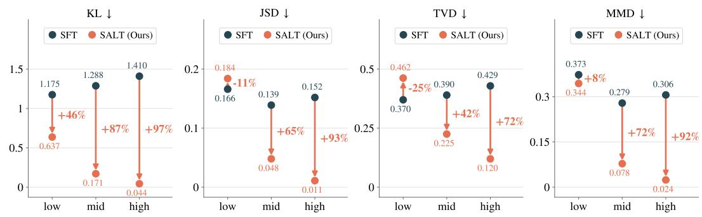  
Figure 1: Subjectivity-stratified comparison between SFT and SALT on SubjSim, over low-, mid-, and high-subjectivity questions. All metrics are divergences (lower is better), and percentages give SALT’s relative change over SFT.

## 5.4 Performance Comparison across Subjectivity Levels

A core design of SALT is that the aggregation is calibrated by the estimated subjectivity of each context, and we now examine experimentally whether this design indeed leads to better performance. We compute the normalized subjectivity coeficient s(x) in (9) directly from the annotated response propensity distributions. We then partition the questions into low, mid, and high strata at the 1/3 and 2/3 quantiles of s(x) and compare SFT and SALT within each stratum (Figure 1). The results match the analysis in Section 3. SFT is competitive in near-deterministic contexts but degrades steadily as targets become difuse, whereas SALT’s advantage grows with subjectivity; in the mid and high strata SALT outperforms SFT on all metrics, and in the high stratum it reduces KL by 96.9%. In the lowest-subjectivity regime the comparison is mixed, with SALT improving KL and MMD but falling behind SFT on JSD and TVD. This is what we would expect, because such questions have a clear majority answer, so there is little for aggregation to add and pooling neighbors can only blur a target that is already sharp.

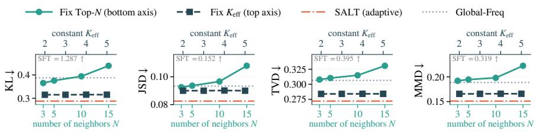

Figure 2: Ablation over neighbor selection. Top-N varies N (teal, bottom axis); fixed $K _ { \mathrm { e f f } }$ substitutes a constant for $\hat { K } _ { \mathrm { e f f } } ( x )$ (navy, top axis). Both share the y axis and reference lines; SFT lies far above the plotted range and is reported as text.  
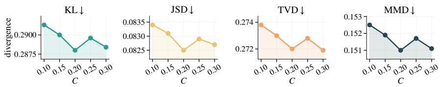  
Figure 3: Sensitivity of SALT to the radius scale C (divergences, lower is better).

## 5.5 Ablation Studies

The core design of SALT is the context-adaptive merging radius, so we ask whether such adaptivity is really necessary. We build three baselines that difer from SALT only in how neighbors are selected: Top-N gives every context the same number of nearest neighbors; fixed $K _ { \mathrm { e f f } }$ replaces $\hat { K } _ { \mathrm { e f f } } ( x )$ in the radius formula by one shared constant, so every context gets the same radius; Global-Freq drops similarity altogether and treats everyone who answered the same question as a neighbor.

From the results shown in Figure 2, we draw three conclusions. First, every variant improves substantially over SFT, which shows that aggregation is already useful on its own because it replaces a single observed answer with a distributional target. Second, how neighbors are selected matters: Top-N degrades as N grows and dissimilar contexts enter the neighborhood, fixed $K _ { \mathrm { e f f } }$ stops improving and stays worse than SALT on every metric, and the adaptive $\hat { K } _ { \mathrm { e f f } } ( x )$ is best on all four. Third, Global-Freq is clearly worse than SALT, so similarity is necessary: pooling everyone who answered the same question mixes dissimilar respondents and biases the soft label.

## 5.6 Parameter Analysis

The main hyperparameter of SALT is the radius scale C in (18). The theory in Section 4 fixes only how the radius should scale with $\hat { K } _ { \mathrm { e f f } } ( x )$ and $n _ { g } ;$ the remaining constants, including the Lipschitz constant L, are absorbed into C, which is therefore chosen empirically. Figure 3 reports performance for $C \in \{ 0 . 1 0 , 0 . 1 5 , 0 . 2 0 , 0 . 2 5 , 0 . 3 0 \}$ . All metrics improve monotonically as C increases from 0.10 to 0.20: a larger radius admits more genuinely similar neighbors, so the aggregated soft labels become more reliable. Beyond 0.20 the improvement stops and fluctuates slightly, as a wider radius include less similar contexts and mild oversmoothing ofsets the gains; the trade-of is best around $C = 0 . 2 0$ which we use as the default. Importantly, the variation across the whole range is small—about 0.003 in KL and at most 0.002 in the other metrics—so SALT does not rely on a finely tuned radius constant.

## 6 Conclusion

In this paper, we studied how to evaluate and train LLMs for social simulation when human behavior is subjective. We introduced the subjectivity coeficient, which places objective and subjective tasks on a common axis and explains why accuracy-based evaluation and hard-label training become unreliable as subjectivity grows. We then proposed SALT, which turns each observed response into a soft distributional label aggregated over a subjectivity-adaptive neighborhood, and built SubjSim, whose annotators provide full response distributions for 19,300 persona-question contexts, making distributional evaluation possible. SALT improves distributional alignment over all baselines, with the largest gains in high-subjectivity regimes. Future work includes extending this framework to sequential, multi-agent, and open-ended settings.

## Ethics Statement

SubjSim involves human annotation. All 193 annotators participated voluntarily; before starting the annotation task, they were informed of the purpose of the study, the type of data collected, and their right to withdraw at any time. Annotation compensation was calculated so that the resulting hourly rate is guaranteed to exceed the highest applicable local hourly wage standard. To protect privacy, no directly identifying information (such as names or contact details) was collected, all responses were recorded under anonymized identifiers, and the released data contain only demographic attribute values and annotated response distributions with no link back to individuals. The survey questions themselves were screened for cultural suitability for the annotator population during dataset construction, and questions flagged as unsuitable were removed (Appendix G). The representativeness limits of our annotator pool are discussed in Appendix G.3.

## AI Use Statement

We used large language models only as writing and figure assistants in the preparation of this paper: ChatGPT was used to check grammar and correct typos in the manuscript, and Codex was used to assist in producing the figures. No LLM was used to generate research ideas, analyses, results, or claims. Separately, and as part of the research methodology itself rather than paper preparation, DeepSeek-chat was used to translate and pre-screen survey questions during the construction of SubjSim, as documented in Appendix G.

## Reproducibility Statement

We have taken several measures to make our results reproducible. All theoretical results are stated with their assumptions in Sections 3 and 4, and complete proofs are given in Sections C.1 to C.6. The full SALT procedure is specified in Algorithm 1, with implementation details, the theory-toimplementation mapping (Table 2), and all training hyperparameters (Table 3) in Section D. The construction of SubjSim, including source surveys, screening and translation pipeline, the exact screening prompt, annotation protocol, and annotator demographics, is documented in Section G. Evaluation is deterministic, and the backbone model (Qwen3-8B), context encoder (Qwen3-embedding-8b), and training stack (LLaMA-Factory, DeepSpeed ZeRO-2 on 8×H20) are publicly available. We will release the SubjSim dataset, the annotation platform specification, and the training and evaluation code upon publication.

## References

Lora Aroyo and Chris Welty. Truth is a lie: Crowd truth and the seven myths of human annotation. AI Magazine, 36(1):15–24, 2015.

Christopher A Bail, Lisa P Argyle, Taylor W Brown, John P Bumpus, Haohan Chen, MB Fallin Hunzaker, Jaemin Lee, Marcus Mann, Friedolin Merhout, and Alexander Volfovsky. Exposure to opposing views on social media can increase political polarization. Proceedings ofthe National Academy ofSciences, 115(37):9216–9221, 2018.

Colin F Camerer. Progress in behavioral game theory. Journal of economic perspectives, 11(4): 167–188, 1997.

Yong Cao, Haijiang Liu, Arnav Arora, Isabelle Augenstein, Paul Rottger, and Daniel Hershcovich.¨ Specializing large language models to simulate survey response distributions for global populations. In Proceedings of the 2025 Conference of the Nations of the Americas Chapter of the Association for Computational Linguistics: Human Language Technologies (Volume 1: Long Papers), pp. 3141–3154, 2025.

Adeline Delavande, Xavier Gine, and David McKenzie. Eliciting probabilistic expectations with ´ visual aids in developing countries. World Bank Policy Research Working Paper, 5458:815–842, 2010.

Danica Dillion, Niket Tandon, Yuling Gu, and Kurt Gray. Can ai language models replace human participants? Trends in Cognitive Sciences, 27(7):597–600, 2023.

Ricardo Dominguez-Olmedo, Moritz Hardt, and Celestine Mendler-D¨unner. Questioning the survey responses of large language models. Advances in Neural Information Processing Systems, 37: 45850–45878, 2024.

William Fleeson. Toward a structure-and process-integrated view of personality: Traits as density distributions of states. Journal ofpersonality and social psychology, 80(6):1011, 2001.

Dawei Gao et al. Agentscope: A flexible yet robust multi-agent platform. arXiv preprint arXiv:2402.14034, 2024.

Tiancheng Hu, Joachim Baumann, Lorenzo Lupo, Nigel Collier, Dirk Hovy, and Paul Rottger.¨ Simbench: Benchmarking the ability of large language models to simulate human behaviors, 2026. URL https://arxiv.org/abs/2510.17516.

Wenyue Hua, Lizhou Fan, Lingyao Li, Kai Mei, Jinyang Ji, Yingqiang Ge, Libby Hemphill Liu, and Yongfeng Zhang. War and peace (waragent): Large language model-based multi-agent simulation of world wars. arXiv preprint arXiv:2311.17227, 2023.

Ji Huang, Mengfei LI, and Shuai Shao. Distribution shift alignment helps LLMs simulate survey response distributions. In Findings ofthe Associationfor Computational Linguistics: ACL 2026, pp. 9395–9409, San Diego, California, United States, July 2026. Association for Computational Linguistics. ISBN 979-8-89176-395-1. doi: 10.18653/v1/2026.findings-acl.457. URL https: //aclanthology.org/2026.findings-acl.457/.

Aixin Liu, Bei Feng, Bing Xue, Bingxuan Wang, Bochao Wu, Chengda Lu, Chenggang Zhao, Chengqi Deng, Chenyu Zhang, Chong Ruan, Damai Dai, Daya Guo, Dejian Yang, Deli Chen, Dongjie Ji, Erhang Li, Fangyun Lin, Fucong Dai, Fuli Luo, Guangbo Hao, Guanting Chen, Guowei Li, H. Zhang, Han Bao, Hanwei Xu, Haocheng Wang, Haowei Zhang, Honghui Ding, Huajian Xin, Huazuo Gao, Hui Li, Hui Qu, J. L. Cai, Jian Liang, Jianzhong Guo, Jiaqi Ni, Jiashi Li, Jiawei Wang, Jin Chen, Jingchang Chen, Jingyang Yuan, Junjie Qiu, Junlong Li, Junxiao Song, Kai Dong, Kai Hu, Kaige Gao, Kang Guan, Kexin Huang, Kuai Yu, Lean Wang, Lecong Zhang, Lei Xu, Leyi Xia, Liang Zhao, Lihua Wang, Liyue Zhang, Meng Li, Miaojun Xu, Mingchuan Zhang, Minghua Zhang, Minghui Tang, Mingming Li, Ning Tian, Panpan Huang, Peiyi Wang, Peng Zhang, Qiancheng Wang, Qihao Zhu, Qinyu Chen, Qiushi Du, R. J. Chen, R. L. Jin, Ruiqi Ge, Ruisong Zhang, Ruizhe Pan, Runji Wang, Runxin Xu, Ruoyu Zhang, Ruyi Chen, S. S. Li, Shanghao Lu, Shangyan Zhou, Shanhuang Chen, Shaoqing Wu, Shengfeng Ye, Shengfeng Ye, Shirong Ma, Shiyu Wang, Shuang Zhou, Shuiping Yu, Shunfeng Zhou, Shuting Pan, T. Wang, Tao Yun, Tian Pei, Tianyu Sun, W. L. Xiao, Wangding Zeng, Wanqi Zhao, Wei An, Wen Liu, Wenfeng Liang, Wenjun Gao, Wenqin Yu, Wentao Zhang, X. Q. Li, Xiangyue Jin, Xianzu Wang, Xiao Bi, Xiaodong Liu, Xiaohan Wang, Xiaojin Shen, Xiaokang Chen, Xiaokang Zhang, Xiaosha Nie, Xiaowen Sun, Xiaoxiang Wang, Xin Cheng, Xin Liu, Xin Xie, Xingchao Liu, Xingkai Yu, Xinnan Song, Xinlei Shan, Xinyi Zhou, Xinyu Yang, Xinyuan Li, Xuecheng Cheng, Xuemei Lin, X. Li, X. Wang, Y. Liu, Y. Wei, Y. Zhu, Y. Zhang, Y. Xu, Y. Xu, Y. Huang, Y. Li, Y. Zhao, Y. Sun, Y. Li, Y. Wang, Y. Yu, Y. Zheng, Y. Zhang, Y. Shi, Y. Xiong, Y. He, Y. Tang, Y. Piao, Y. Wang, Y. Tan, Y. Ma, Y. Liu, Y. Guo, Y. Wu, Y. Ou, Y. Zhu, Y. Wang, Y. Gong, Y. Zou, Y. He, Y. Zha, Y. Xiong, Y. Ma, Y. Yan, Y. Luo, Y. You, Y. Liu, Y. Zhou, Z. F. Xu, Z. Z. Ren, Zhili Ren, Zhen Sha, Zhe Fu, Zhean Xu, Zhen Huang, Zhen Zhang, Zhenda Xie, Zhengyan Zhang, Zhewen Hao, Zhicheng Gou, Zhicheng Ma, Zhigang Yan, Zhihong Shao, Zhipeng Xu, Zhiyu Wu, Zhongyu Zhang, Zhuoshu Li, Zihui Gu, Zijia Zhu, Zijun Liu, Zilin Li, Ziwei Xie, Ziyang Song, Ziyi Gao, and Zizheng Pan. Deepseek-v3 technical report, 2024. URL https://arxiv.org/abs/2412.19437.

Yuxuan Lu, Jing Huang, Yan Han, Bennet Bei, Yaochen Xie, Dakuo Wang, Jessie Wang, and Qi He. Beyond believability: Accurate human behavior simulation with fine-tuned llms. arXiv preprint arXiv:2503.20749, 2025.

R Duncan Luce et al. Individual choice behavior, volume 4. Wiley New York, 1959.

Daniel McFadden. Conditional logit analysis of qualitative choice behavior. In Paul Zarembka (ed.), Frontiers in Econometrics, pp. 105–142. Academic Press, 1974.

Elizbar A Nadaraya. On estimating regression. Theory of Probability and its Applications, 9(1): 141–142, 1964.

Joon Sung Park, Joseph C O’Brien, Carrie J Cai, Meredith Ringel Morris, Percy Liang, and Michael S Bernstein. Generative agents: Interactive simulacra of human behavior. In Proceedings ofthe 36th ACM Symposium on User Interface Software and Technology, 2023.

Barbara Plank. The “problem” of human label variation: On ground truth in data, modeling and evaluation. In Proceedings of the 2022 Conference on Empirical Methods in Natural Language Processing (EMNLP), pp. 10671–10682, 2022.

Rafael Rafailov, Archit Sharma, Eric Mitchell, Stefano Ermon, Christopher D Manning, and Chelsea Finn. Direct preference optimization: Your language model is secretly a reward model. In Advances in Neural Information Processing Systems, 2023.

Roger Ratclif. A theory of memory retrieval. Psychological review, 85(2):59, 1978.

Vinay Samuel, Henry Peng Zou, Yue Zhou, Shreyas Chaudhari, Ashwin Kalyan, Tanmay Rajpurohit, Ameet Deshpande, Karthik Narasimhan, and Vishvak Murahari. Personagym: Evaluating persona agents and llms, 2025. URL https://arxiv.org/abs/2407.18416.

Kazutoshi Sasahara, Wen Chen, Hao Peng, Giovanni Luca Ciampaglia, Alessandro Flammini, and Filippo Menczer. Social influence and unfollowing accelerate the emergence of echo chambers. Journal of Computational Social Science, 4(1):381–402, 2021.

John Schulman, Filip Wolski, Prafulla Dhariwal, Alec Radford, and Oleg Klimov. Proximal policy optimization algorithms. arXiv preprint arXiv:1707.06347, 2017.

Bernard W Silverman. Density estimationfor statistics and data analysis. Routledge, 2018.

Paul Slovic. The construction of preference. American psychologist, 50(5):364, 1995.

Alexandra N. Uma, Tommaso Fornaciari, Dirk Hovy, Silviu Paun, Barbara Plank, and Massimo Poesio. Learning from disagreement: A survey. Journal ofArtificial Intelligence Research, 72: 1385–1470, 2021.

Jelle Van Lenthe. Eli: An interactive elicitation technique for subjective probability distributions. Organizational Behavior and Human Decision Processes, 55(3):379–413, 1993.

Jia Wang, Ziyu Zhao, Tingjuntao Ni, and Zhongyu Wei. Sociobench: Modeling human behavior in sociological surveys with large language models, 2025a. URL https://arxiv.org/abs/2510. 11131.

Lei Wang, Jingsen Zhang, Hao Yang, Zhi-Yuan Chen, Jiakai Tang, Zeyu Zhang, Xu Chen, Yankai Lin, Hao Sun, Ruihua Song, et al. User behavior simulation with large language model-based agents. ACM Transactions on Information Systems, 43(2):1–37, 2025b.

Geofrey S Watson. Smooth regression analysis. Sankhya: The Indian Journal of Statistics, Series A, 26(4):359–372, 1964.

An Yang, Anfeng Li, Baosong Yang, Beichen Zhang, Binyuan Hui, Bo Zheng, Bowen Yu, Chang Gao, Chengen Huang, Chenxu Lv, Chujie Zheng, Dayiheng Liu, Fan Zhou, Fei Huang, Feng Hu, Hao Ge, Haoran Wei, Huan Lin, Jialong Tang, Jian Yang, Jianhong Tu, Jianwei Zhang, Jianxin Yang, Jiaxi Yang, Jingren Zhou, Jingren Zhou, Junyang Lin, Kai Dang, Keqin Bao, Kexin Yang, Le Yu, Mei Li, Mingfeng Xue, Ming Li, Pei Zhang, Peng Wang, Qin Zhu, Rui Men, Ruize Gao, Shixuan Liu, Shuang Luo, Tianhao Li, Tianyi Tang, Wenbiao Yin, Xingzhang Ren, Xinyu Wang, Xinyu Zhang, Xuancheng Ren, Yang Fan, Yang Su, Yichang Zhang, Yinger Zhang, Yu Wan, Yuqiong Liu, Zeyu Wang, Zhenru Cui, Zhen Zhang, Zihan Zhou, and Zhipeng Qiu. Qwen3 technical report, 2025. URL https://arxiv.org/abs/2505.09388.

John Zaller. The nature and origins ofmass opinion. Cambridge university press, 1992.

Yanzhao Zhang, Mingxin Li, Dingkun Long, Xin Zhang, Huan Lin, Baosong Yang, Pengjun Xie, An Yang, Dayiheng Liu, Junyang Lin, Fei Huang, and Jingren Zhou. Qwen3 embedding: Advancing text embedding and reranking through foundation models, 2025. URL https: //arxiv.org/abs/2506.05176.

## Appendix

A Limitations 14   
B Related Work and Positioning 14   
C Theoretical Proofs 15   
C.1 Proof of Proposition 1 (Single-Observation SFT Concentrates on Empirical One-Hot   
Labels) 15   
C.2 Proof of the Fano Step in Proposition 2 . 15   
C.3 Proof of Proposition 3 (Local Lower Bound under Near-Uniform Behavior) 15   
C.4 Supporting Lemmas for Context Aggregation 16   
C.5 Proof of Lemma 2 (Statistical and Bias Bounds) 17   
C.6 Proof of Theorem 1 (Aggregation–Estimation Tradeof) 18   
D SALT Implementation Details 18   
E Per-Domain Results 21   
F Statistical Significance 21   
G SubjSim Dataset Details 30   
G.1 Question Pool and Filtering . 30   
G.2 Question and Demographic Attribute Examples . 31   
G.3 Annotator Demographics 32   
G.4 Probability Ball Allocation Protocol 33

## A Limitations

SubjSim uses elicited response propensities rather than direct repeated-choice frequencies. The annotator-level split tests unseen personas within known questions rather than transfer to entirely new decision contexts. SALT also depends on behavioral smoothness in the representation space, so poor embeddings or discontinuous response patterns can make aggregation harmful.

## B Related Work and Positioning

LLM agents for social simulation. Recent work uses LLM agents to simulate individuals, groups, and social systems, ranging from interactive generative agents to opinion dynamics, polarization, market behavior, and historical or policy simulations (Park et al., 2023; Gao et al., 2024; Hua et al., 2023; Sasahara et al., 2021; Bail et al., 2018). This line of work establishes that LLMs can produce plausible social behavior and can be embedded in multi-agent environments. Our focus is diferent: we ask what behavioral target such agents should be trained and evaluated against. Rather than treating simulation quality as matching a single observed response, we formulate the target as recovering the full distribution over plausible actions for a persona-context pair.

Single-action imitation and preference optimization. The dominant way to adapt LLM agents is supervised imitation of observed actions, often evaluated by point-prediction accuracy. Preference optimization methods such as DPO and PPO provide a stronger alignment toolkit by learning from chosen/rejected comparisons (Rafailov et al., 2023; Schulman et al., 2017). However, when the data provide only one realized action per context, both supervised and preference objectives still receive hard, mode-like supervision. They therefore learn which action was observed, or which action should be preferred to alternatives, rather than the entire behavioral frequency structure. This is the same hard-supervision gap that motivates our misalignment analysis, though our formal result focuses on the single-observation SFT objective.

Distributional evaluation and distribution alignment. A separate line of work changes the evaluation target: instead of reporting only accuracy, it compares model outputs to response distributions using KL, JSD, TVD, Wasserstein distance, or related survey-response divergences. DSA is closest to our work in target space: it also aims to match survey response distributions, but it does so through distribution-shift alignment rather than context-level hard-label aggregation (Huang et al., 2026). Our setting difers in the supervision assumption. DSA and related distributional alignment methods rely on distributional supervision that is available or can be constructed at the population/question level. SALT targets the stricter single-observation regime: it does not train on the persona-specific probability-ball distribution, but constructs distributional supervision by pooling hard observations from semantically similar contexts, following the repeated-measurement intuition in the main analysis.

Human label variation. NLP research on annotation has similarly argued that disagreement among annotators carries signal rather than noise, advocating soft labels, annotator-aware models, and evaluation against label distributions instead of a single gold label (Aroyo & Welty, 2015; Plank, 2022; Uma et al., 2021). These works concern classification-style NLP annotations and model variation at the label or annotator level. Our setting difers in both object and ground truth: the estimation target is a persona-conditional behavioral distribution for social simulation, and SubjSim measures it directly through probability-ball allocation rather than approximating it from a handful of discrete annotations.

Context aggregation and nonparametric estimation. SALT is related to nonparametric smoothing and kernel regression, where local neighborhoods are used to estimate a conditional response function (Nadaraya, 1964; Watson, 1964; Silverman, 2018). The key diference is the object being smoothed and the constraint imposed by social-simulation data. We aggregate over contexts that share an action space and are close in persona-context embedding space, producing a soft label over discrete actions from otherwise hard observations. The adaptive radius is not a generic hyperparameter search: it is derived from the subjectivity-controlled bias–variance tradeof, so more difuse behavioral distributions receive broader aggregation while nearly deterministic contexts remain local.

## C Theoretical Proofs

C.1 Proof of Proposition 1 (Single-Observation SFT Concentrates on Empirical One-Hot Labels)

Proof. For each training context $x ^ { i }$ , the empirical SFT contribution $\mathrm { i s } - \log \phi _ { \theta } ( j ^ { i } \mid x ^ { i } ) .$ at the action level. Over the action-distribution simplex, this term is minimized by maximizing $\phi _ { \theta } ( j ^ { i } \mid x ^ { i } )$ , whose largest possible value is 1. Because the statement is made in the closure of the model-induced action distributions, this boundary point is included and can be selected independently for every training context, yielding $\phi _ { \theta } ( k \mid \dot { x } ^ { i } ) ^ { \hat { } } = \mathbf { 1 } [ k = j ^ { i } ]$ for all i. Since − log p is uniquely minimized at $p = 1$ , every empirical-risk minimizer must saturate the per-context term at every training context, so any minimizer $\tilde { \theta }$ in this closure satisfies $\phi _ { \tilde { \theta } } ( k \mid x ^ { i } ) = \mathbf { 1 } [ k = j ^ { i } ]$ for all i. For finite softmax parameterizations, the same boundary point may be approached only in the limit: any sequence with empirical risk approaching the infimum must have $\dot { \phi _ { \theta } } ( j ^ { i } \mid x ^ { i } ) \stackrel { . . } {  } \mathbf { \bar { 1 } }$ and hence $\phi _ { \theta } ( k \mid \bar { x ^ { i } } ) $ 0 for every $k \neq j ^ { i }$ . This is an empirical-risk statement for finite single-observation data; with repeated observations from the same context, the population cross-entropy optimum would instead match the conditional label distribution. □

## C.2 Proof of the Fano Step in Proposition 2

Proof. Write $e : = 1 - p _ { \mathrm { m a x } }$ and $H : = H ( \phi ^ { * } ( \cdot \mid x ) ) = - \kappa .$ . Fano’s inequality for the error of the optimal single guess (the mode) states $H \leq h ( e ) + e \log ( K - 1 )$ , where $h ( \cdot )$ is the binary entropy function. Since $h ( e ) \leq \log 2 ,$ , we obtain $H \leq \log 2 + e \log ( K - 1 )$ , and rearranging gives

$$
1 - p _ { \mathrm { m a x } } = e \ \geq \ \frac { H - \log 2 } { \log ( K - 1 ) } = \frac { - \kappa - \log 2 } { \log ( K - 1 ) } = \frac { s \log K - \log 2 } { \log ( K - 1 ) }\tag{19}
$$

for $K \ \geq \ 3$ , where the last step uses $s ~ = ~ - \kappa / \log K$ from Equation (9). Combining with $D _ { \mathrm { T V } } ( \phi _ { \theta } , \phi ^ { * } ) \geq 1 - p _ { \mathrm { m a x } }$ from Equation (7) yields Equation (10). The bound is vacuous when s log $K < \log 2 , \operatorname { i . e . }$ , for weakly subjective contexts, which is consistent with the analysis: the failure of the accuracy-based pipeline concentrate in the high-subjectivity regime. For $K = 2$ , Fano’s inequality reduces to $H \leq h ( e )$ , giving $e \geq h ^ { - 1 } ( H )$ instead; the conclusion that the error grows with subjectivity is unchanged. □

## C.3 Proof of Proposition 3 (Local Lower Bound under Near-Uniform Behavior)

Proposition 3 (Local lower bound under near-uniform behavior). Fix a K-action context and consider true distributions in a near-uniform neighborhood ofradius $O ( 1 / K )$ , so that $e ^ { - 2 \kappa } = \Theta ( K ^ { 2 } )$ . There exist two alternatives $P , Q$ in this neighborhood and twofixed point-mass models whose $D _ { \mathrm { T V } }$ -error ranking is reversed under $P$ and Q, while $D _ { \mathrm { { K L } } } ( P \Vert Q ) \dot { = } O \dot { ( } 1 / K ^ { 2 } )$ . Consequently, for any fixed $\eta > 0$ , any procedure that identifies the correct ranking from n $i . i . d .$ observations with error probability at most $\begin{array} { r l r } { \mathrm { ~ } } & { { } } & { \frac { 1 } { 2 } - \eta } \end{array}$ in this local problem requires $n { \stackrel {  } { = } } \Omega ( K ^ { 2 } ) = \Omega ( e ^ { - 2 \kappa } )$ samples.

Proof. We give an explicit two-point construction. Let u be the uniform distribution on K actions and choose $\bar { \varepsilon } = c K ^ { - \hat { 3 } / 2 }$ for a suficiently small constant $c > 0$ . Define

$$
P _ { 1 } = \frac { 1 } { K } + \varepsilon , ~ P _ { 2 } = \frac { 1 } { K } - \varepsilon , ~ P _ { k } = \frac { 1 } { K } ~ ( k \ge 3 ) ,\tag{20}
$$

$$
Q _ { 1 } = \frac { 1 } { K } - \varepsilon , \qquad Q _ { 2 } = \frac { 1 } { K } + \varepsilon , \qquad Q _ { k } = \frac { 1 } { K } \quad ( k \geq 3 ) .\tag{21}
$$

For large enough K, both distributions are valid and lie in an $O ( 1 / K )$ neighborhood ofu. Their entropy satisfies ${ \cal H } ( \tilde { P ) } = { \cal H } ( Q ) = \log K - { \cal O } ( K \varepsilon ^ { 2 } ) = \log K - \dot { \cal O } ( \dot { 1 } / \dot { K } ^ { 2 } ) , \stackrel { \sim } { \mathrm { s o } } \kappa = - \log K + O ( 1 / \dot { K } ^ { \frac { \sim 2 } { 2 } } )$ and therefore $\displaystyle { \dot { e } } ^ { - 2 \kappa } = { \dot { \Theta } } ( K ^ { 2 } )$

Consider two point-mass models, $\theta _ { 1 }$ assigning all mass to action 1 and $\theta _ { 2 }$ assigning all mass to action 2. For any distribution R, the total variation error of the point mass at action j is

$$
D _ { \mathrm { T V } } ( \delta _ { j } , R ) = 1 - R _ { j } .\tag{22}
$$

Hence, under $P , D _ { \mathrm { T V } } ( \delta _ { 1 } , P ) = 1 - P _ { 1 } < 1 - P _ { 2 } = D _ { \mathrm { T V } } ( \delta _ { 2 } , P )$ , so $\theta _ { 1 }$ is better than $\theta _ { 2 }$ . Under Q the inequality is reversed. Any procedure that identifies the correct ranking in this local problem therefore distinguishes whether the samples came from $P$ or $Q$

It remains to bound the statistical distance between the two hypotheses. Let $a = 1 / K$ and $t = \varepsilon / a = c / \sqrt { K }$ . The per-sample KL divergence is

$$
D _ { \mathrm { K L } } ( P \Vert Q ) = ( a + \varepsilon ) \log { \frac { a + \varepsilon } { a - \varepsilon } } + ( a - \varepsilon ) \log { \frac { a - \varepsilon } { a + \varepsilon } }\tag{23}
$$

$$
= 2 \varepsilon \log { \frac { 1 + t } { 1 - t } } .\tag{24}
$$

Since $t < 1 / 2$ for large enough $K , \log ( ( 1 + t ) / ( 1 - t ) ) \leq C t$ for a universal constant $C ,$ , and thus

$$
D _ { \mathrm { K L } } ( P \| Q ) \leq 2 C \frac { \varepsilon ^ { 2 } } { a } = O ( K \varepsilon ^ { 2 } ) = O ( 1 / K ^ { 2 } ) .\tag{25}
$$

Let $P ^ { n }$ and $Q ^ { n }$ denote the n-sample product distributions. By tensorization and Pinsker’s inequality,

$$
D _ { \mathrm { T V } } ( P ^ { n } , Q ^ { n } ) \leq \sqrt { \frac { D _ { \mathrm { K L } } ( P ^ { n } \| Q ^ { n } ) } { 2 } } = \sqrt { \frac { n D _ { \mathrm { K L } } ( P \| Q ) } { 2 } } \leq C ^ { \prime } \sqrt { \frac { n } { K ^ { 2 } } } .\tag{26}
$$

Le Cam’s lemma gives minimax error at least $\scriptstyle { \frac { 1 } { 2 } } ( 1 - D _ { \mathrm { T V } } ( P ^ { n } , Q ^ { n } ) )$ . Therefore, if a ranking procedure achieves error probability at most $\begin{array} { r l r } {  { } } & { { } } & { \frac { 1 } { 2 } - \eta } \end{array}$ for fixed $\eta > 0$ , then $D _ { \mathrm { T V } } ( P ^ { n } , Q ^ { n } ) \geq 2 \eta$ , which requires $n \geq c _ { \eta } K ^ { 2 }$ . Since $e ^ { - 2 \kappa } = \Theta ( K ^ { 2 } )$ in this construction, the required sample size is $\Omega ( e ^ { - 2 \kappa } )$ ). □

## C.4 Supporting Lemmas for Context Aggregation

We first record the properties of the efective action count that motivate Definition 2.

Remark 1 (Properties of the efective action count). Definition 2 attaches the efective action count to a context through $\phi ^ { * } ( \cdot \mid x )$ . The statements below apply it to other distributions as well, so throughout the appendix we write

$$
K _ { \mathrm { e f f } } ( \phi ) : = \Big ( \sum _ { k = 1 } ^ { K } \sqrt { \phi ( k ) } \Big ) ^ { 2 } , \qquad \phi \in \Delta ( { \cal A } ) ,\tag{27}
$$

for the same expression evaluated at an arbitrary distribution, so that $K _ { \mathrm { e f f } } ^ { * } ( x ) = K _ { \mathrm { e f f } } ( \phi ^ { * } ( \cdot \mid x ) )$ and the model-based estimate ofEquation (18) is $\hat { K } _ { \mathrm { e f f } } ( x ) = K _ { \mathrm { e f f } } ( \phi _ { \theta } ( { \cdot } \mid x ) )$ .

The range $1 \leq K _ { \mathrm { e f f } } ( \phi ) \leq K$ , with the two endpoints attained at a point mass and at the uniform distribution, is verified inside the proofin Section C.5. Beyond the range, $K _ { \mathrm { e f f } }$ is exactly the Renyi´ perplexity of order $1 / 2$ , that is $\dot { K _ { \mathrm { e f f } } } ( \dot { \phi } ) = e ^ { H _ { 1 / 2 } ( \phi ) }$ where $H _ { 1 / 2 }$ is the Renyi entropy of that order.´ Since Renyi entropies are non-increasing in their order,´ $H _ { 1 / 2 } ( \phi ) \geq H ( \phi )$ for the Shannon entropy H, and therefore

$$
K _ { \mathrm { e f f } } ( \phi ^ { * } ( \cdot \mid x ) ) ~ \geq ~ e ^ { H ( \phi ^ { * } ( \cdot \mid x ) ) } ~ = ~ K ^ { s ( x ) } ,\tag{28}
$$

with $s ( x )$ the normalized subjectivity ofEquation (9). The efective action count is thus lower-bounded by K raised to the normalized subjectivity, so the two grow together as behavior becomes more difuse. This is why $K _ { \mathrm { e f f } }$ , rather than any other dispersion summary, is a natural efective-action measurefor the statistical term of Lemma $\dot { 2 } \dot { s }$ the quantity that controls the statistical error is governed by the same notion ofsubjectivity that drives the rest ofthe analysis.

Finally, $K _ { \mathrm { e f f } }$ is continuous on the simplex: for any $\phi , \psi \in \Delta ( \mathcal { A } )$ , using $| { \sqrt { a } } - { \sqrt { b } } | \leq { \sqrt { | a - b | } }$ termwise and then Cauchy–Schwarz,

$$
\Big | \sqrt { K _ { \mathrm { e f f } } ( \phi ) } - \sqrt { K _ { \mathrm { e f f } } ( \psi ) } \Big | \leq \sum _ { k = 1 } ^ { K } \sqrt { | \phi ( k ) - \psi ( k ) | } \leq \sqrt { K \sum _ { k = 1 } ^ { K } | \phi ( k ) - \psi ( k ) | } = \sqrt { 2 K \cdot D _ { \mathrm { T V } } ( \phi , \psi ) } .\tag{29}
$$

Two distributions that are close in total variation therefore have comparable efective action counts.

The analysis rests on the following smoothness assumption.

Assumption 1 (L-Lipschitz behavioral distribution). There exists $L > 0$ such that for all $x , x ^ { \prime } \in { \mathcal { X } } .$ $D _ { \mathrm { T V } } ( \hat { \phi ^ { * } } ( \cdot \mid x ) , \phi ^ { * } ( \cdot \mid x ^ { \prime } ) ) \le L \cdot d ( x , x ^ { \prime } ) .$

This assumption should be read as behavioral smoothness in the chosen representation space. It requires that, within a fixed action-space group, nearby persona-context embeddings induce similar response distributions; the ablations over fixed neighborhoods, global frequency labels, and radius scale test whether this approximation is useful in SubjSim.

Lemma 1 (Three-term decomposition). For any context x, let $\begin{array}{c} \begin{array} { r } { \bar { \phi } ( \cdot  { | \mathbf { \phi } { x } | } \end{array} ; = \frac { 1 } { | \mathcal { N } ( x ) | } \sum _ { x ^ { \prime } \in \mathcal { N } ( x ) } \phi ^ { * } ( \cdot  { | \mathbf { \phi } { x ^ { \prime } } ) } } \end{array}$ denote the population mean of $\boldsymbol { \phi ^ { * } }$ within the neighborhood ofx. Then:

$$
\begin{array} { r l } & { D _ { \mathrm { T V } } ( \phi _ { \theta } ( \cdot \ | \ x ) , \ \phi ^ { * } ( \cdot \ | \ x ) ) } \\ & { \quad \leq \underbrace { D _ { \mathrm { T V } } ( \phi _ { \theta } ( \cdot \ | \ x ) , \ \hat { \phi } ( \cdot \ | \ x ) ) } _ { \varepsilon _ { \mathrm { o p t } } } + \underbrace { D _ { \mathrm { T V } } ( \hat { \phi } ( \cdot \ | \ x ) , \ \bar { \phi } ( \cdot \ | \ x ) ) } _ { \varepsilon _ { \mathrm { s t a t } } } + \underbrace { D _ { \mathrm { T V } } ( \bar { \phi } ( \cdot \ | \ x ) , \ \phi ^ { * } ( \cdot \ | \ x ) ) } _ { \varepsilon _ { \mathrm { b i a s } } } . } \end{array}\tag{30}
$$

Lemma 2 (Statistical and bias bounds). Under Assumption 1, with neighborhood radius r:

$$
\mathbb { E } [ \varepsilon _ { \mathrm { s t a t } } ] \leq \frac { 1 } { 2 } \sqrt { \frac { K _ { \mathrm { e f f } } } { | \mathcal { N } ( x ) | } } , \qquad \varepsilon _ { \mathrm { b i a s } } \leq L \cdot r ,\tag{31}
$$

where $K _ { \mathrm { e f f } } = K _ { \mathrm { e f f } } ( \bar { \phi } ( \cdot \mid x ) )$ is the efective action count ofthe neighborhood-averaged population distribution ϕ¯ ofLemma 1. Under Assumption $\boldsymbol { l } , \bar { \phi } ( \cdot \vert \boldsymbol { x } )$ lies within Lr in total variation of $\cdot \phi ^ { * } ( \cdot \mid x )$ so by (29) it difers from $K _ { \mathrm { e f f } } ^ { * } ( x )$ of Definition 2 only through the same smoothness that already controls the bias term; the main statements are written with $K _ { \mathrm { e f f } } ^ { * } ( x )$ for readability. As a worst case one may substitute $K _ { \mathrm { e f f } } = K$

Corollary 1 (Aggregation eliminates the structural error of standard training). In the singleobservation regime, standard $S F T \ f t s$ one hard label per context and therefore incurs the pointmass error $D _ { \mathrm { T V } } ^ { ^ { \vee } } ( \phi _ { \theta } ^ { \mathrm { S F T } } , \phi ^ { * } ) \ \geq \ 1 \ - \ p _ { \operatorname* { m a x } }$ at that context. Context-aggregation achieves error $\varepsilon _ { \mathrm { o p t } } + ( L ^ { d x } K _ { \mathrm { e f f } } ^ { * } ( x ) / n _ { g } ) ^ { 1 / ( d x + 2 ) }$ up to constants; when optimization error is negligible, this upper bound tends to zero as $n _ { g } \to \infty .$

Remark 2 (Estimating the efective action count from the model). The theorem is statedfor the oracle efective action count ofthe local population distribution. The practical rule in Equation (18) replaces it with $\hat { K } _ { \mathrm { e f f } } ( x )$ computedfrom the current model output. If $\hat { K } _ { \mathrm { e f f } } ( x ) \in [ K _ { \mathrm { e f f } } ^ { * } ( x ) / c , ~ c \cdot K _ { \mathrm { e f f } } ^ { * } ( x ) ] f o r$ some constant $c \geq 1$ , then, since $r ( x )$ scales as $K _ { \mathrm { e f f } } ^ { 1 / ( d x + 2 ) }$ , the resulting radius is within a factor $c ^ { 1 / ( d _ { \mathcal { X } } + 2 ) }$ of the oracle radius, and the optimized upper bound changes only by constants. The exponent makes this tolerance generous in practice: with $d _ { \mathcal { X } } = 2 8 _ { \mathrm { \scriptsize { : } } }$ , even $c = \dot { 2 } g \dot { i } \nu e s 2 ^ { 1 / 3 0 } \approx 1 . 0 2$ Without this approximation, the model-based rule should be read as an oracle-motivated heuristic rather than a direct consequence ofTheorem 1.

The approximation is what the training objective is designed to deliver. Applying the continuity bound (29) with $\phi = \phi _ { \theta } ( \cdot \mid x )$ and $\psi = \bar { \phi } ( \cdot \mid x )$ , the gap between the model-based count and the oracle count is controlled by exactly the quantity the aggregation loss in Equation (14) minimizes. In the ideal case where the optimization error $\varepsilon _ { \mathrm { o p t } }$ and the statistical error of the soft label both vanish, $\phi _ { \theta } ( \cdot \mid x )  \bar { \phi } ( \cdot \mid x )$ and hence $\hat { K } _ { \mathrm { e f f } } ( x ) \to K _ { \mathrm { e f f } } ( \bar { \phi } ( \cdot \mid x ) )$ , so the practical radius returns to the oracle radius.

## C.5 Proof of Lemma 2 (Statistical and Bias Bounds)

Proof. Statistical bound. Write $n _ { x } = | \mathcal { N } ( x ) |$ and, for $x ^ { \prime } \in \mathcal { N } ( x ) , p _ { x ^ { \prime } , k } = \phi ^ { * } ( k \mid x ^ { \prime } )$ . Each coordinate $\hat { \phi } _ { k }$ is an average of independent Bernoulli variables with possibly diferent means $p _ { x ^ { \prime } , k }$ Let $\begin{array} { r } { \bar { \phi } _ { k } = n _ { x } ^ { - 1 } \sum _ { x ^ { \prime } \in \mathcal { N } ( x ) } p _ { x ^ { \prime } , k } } \end{array}$ . Then

$$
\mathrm { V a r } ( \hat { \phi } _ { k } ) = \frac { 1 } { n _ { x } ^ { 2 } } \sum _ { x ^ { \prime } \in \mathcal { N } ( x ) } p _ { x ^ { \prime } , k } ( 1 - p _ { x ^ { \prime } , k } ) \leq \frac { \bar { \phi } _ { k } } { n _ { x } } .\tag{32}
$$

By linearity of expectation and Jensen’s inequality $( \mathbb { E } [ | X | ] \leq { \sqrt { \mathbb { E } [ X ^ { 2 } ] } } )$

$$
\mathbb { E } [ \varepsilon _ { \mathrm { s t a t } } ] = \frac { 1 } { 2 } \sum _ { k = 1 } ^ { K } \mathbb { E } \Big [ | \hat { \phi } _ { k } - \bar { \phi } _ { k } | \Big ] \ \leq \ \frac { 1 } { 2 } \sum _ { k = 1 } ^ { K } \sqrt { \mathrm { V a r } ( \hat { \phi } _ { k } ) }\tag{33}
$$

$$
\leq \frac { 1 } { 2 } \sum _ { k = 1 } ^ { K } \sqrt { \frac { \bar { \phi } _ { k } } { n _ { x } } } \ = \ \frac { 1 } { 2 \sqrt { n _ { x } } } \sum _ { k = 1 } ^ { K } \sqrt { \bar { \phi } _ { k } } .\tag{34}
$$

By (27), $\begin{array} { r } { \sum _ { k } \sqrt { \bar { \phi } _ { k } } = \sqrt { K _ { \mathrm { e f f } } ( \bar { \phi } ( \cdot \mid x ) ) } } \end{array}$ , so $\begin{array} { r } { \mathbb { E } [ \varepsilon _ { \mathrm { s t a t } } ] \leq \frac { 1 } { 2 } \sqrt { K _ { \mathrm { e f f } } / n _ { x } } } \end{array}$ . Note that by Cauchy–Schwarz, $\begin{array} { r } { \sum _ { k } \sqrt { \bar { \phi } _ { k } } \le \sqrt { K \sum _ { k } \bar { \phi } _ { k } } = \sqrt { K } } \end{array}$ (since $\begin{array} { r } { \sum _ { k } \bar { \phi } _ { k } = 1 ) } \end{array}$ , so $K _ { \mathrm { e f f } } \le K$ always holds. When $\bar { \phi } ( \cdot \mid x )$ is a point mass, $\textstyle \sum _ { k } \sqrt { \bar { \phi } _ { k } } = 1$ so $K _ { \mathrm { e f f } } = 1 ;$ ; when $\bar { \phi } ( \cdot \mid x )$ is uniform, $\textstyle \sum _ { k } { \sqrt { 1 / K } } = { \sqrt { K } }$ so $K _ { \mathrm { e f f } } = K$ Bias bound. For the overlapping neighborhood used by SALT, every $x ^ { \prime } \in \mathcal { N } ( x )$ satisfies $d ( x ^ { \prime } , x ) \leq r$ By convexity of $D _ { \mathrm { T V } }$ and Assumption 1:

$$
\varepsilon _ { \mathrm { b i a s } } = D _ { \mathrm { T V } } ( \bar { \phi } ( \cdot  { | } x ) , \phi ^ { * } ( \cdot  { | } x ) )\tag{35}
$$

$$
\leq \frac { 1 } { | \mathcal { N } ( x ) | } \sum _ { x ^ { \prime } \in \mathcal { N } ( x ) } D _ { \mathrm { T V } } ( \phi ^ { * } ( \cdot \mid x ^ { \prime } ) , \phi ^ { * } ( \cdot \mid x ) )\tag{36}
$$

$$
\leq \frac { 1 } { | \mathcal { N } ( x ) | } \sum _ { x ^ { \prime } \in \mathcal { N } ( x ) } L \cdot d ( x ^ { \prime } , x ) \leq L r .\tag{37}
$$

## C.6 Proof of Theorem 1 (Aggregation–Estimation Tradeoff)

Proof. Substituting $| \mathcal { N } ( x ) | \asymp n _ { g } r ^ { d _ { \mathcal { X } } }$ into Lemma 2 and combining via Lemma 1 gives

$$
\mathbb { E } [ D _ { \mathrm { T V } } ] \lesssim \varepsilon _ { \mathrm { o p t } } + L r + \sqrt { \frac { K _ { \mathrm { e f f } } } { n _ { g } r ^ { d _ { \chi } } } } .\tag{38}
$$

The optimization term is independent of the neighborhood radius in this tradeof. The bias term increases in r and the statistical term decreases in r. To find the optimal $r ,$ we diferentiate with respect to r and set the result to zero:

$$
L = \frac { d _ { \mathcal { X } } } { 2 } \cdot \frac { 1 } { r } \cdot \sqrt { \frac { K _ { \mathrm { e f f } } } { n _ { g } r ^ { d _ { \mathcal { X } } } } } ,\tag{39}
$$

which gives $L ^ { 2 } r ^ { d _ { X } + 2 } \asymp K _ { \mathrm { e f f } } / n _ { g }$ , yielding

$$
r ^ { * } \asymp \left( \frac { K _ { \mathrm { e f f } } } { n _ { g } L ^ { 2 } } \right) ^ { 1 / ( d _ { \mathcal { X } } + 2 ) } .\tag{40}
$$

Substituting $r ^ { * }$ back: the bias term is $L r ^ { * } = L \cdot ( K _ { \mathrm { e f f } } / ( n _ { g } L ^ { 2 } ) ) ^ { 1 / ( d _ { X } + 2 ) } = ( L ^ { d _ { X } } K _ { \mathrm { e f f } } / n _ { g } ) ^ { 1 / ( d _ { X } + 2 ) }$ and the statistical term is of the same order, giving the optimized upper bound in (17). □

## D SALT Implementation Details

On SubjSim, SALT groups contexts by survey question, embeds each context with Qwen3-embedding-8b, retrieves adaptive-radius neighbors within the group, and trains on the resulting soft labels. The remainder of this section specifies each of these steps.

Context embeddings. We use Qwen3-embedding-8b (Zhang et al., 2025) as the context encoder, which produces 4096-dimensional vectors for Chinese text. Embeddings are precomputed once before training and cached on disk; they are not updated during training. All contexts within the same action-space group share the same situational description s. As a result, the embeddings primarily capture persona similarity within each group rather than situational variation.

Neighborhood Construction Pairwise distances between context embeddings are computed using the Euclidean $( \ell _ { 2 } )$ distance. The full distance matrix is precomputed once at training startup using SciPy on CPU and cached for reuse. We estimate the intrinsic dimension $d _ { \mathcal { X } }$ of the persona embedding space via PCA with a variance threshold of 0.90, yielding $d _ { X } = 2 8 .$ . The adaptive radius $r ( x )$ is then computed per context according to Equation 18, with scale factor $C = 0 . 2$

Soft-label refresh schedule. Soft labels are refreshed every 30 training steps using the current model checkpoint. Per-epoch refresh adapts slowly in early training, whereas per-step refresh is computationally prohibitive and unstable. The 30-step interval balances label responsiveness with training eficiency.

Algorithm 1 Context-Aggregation Training with Adaptive Radius   
Require: Dataset D; pretrained context encoder; radius function $\rho ;$ refresh interval $T ;$ number of   
epochs $E$   
Ensure: Trained model $\phi _ { \theta }$   
1: Action-space partitioning: group all contexts by action space: $\mathcal { G } _ { g } = \{ x : \boldsymbol { A } ( \boldsymbol { x } ) = \boldsymbol { A } _ { g } \}$   
2: Embed all contexts using the pretrained encoder   
3: Initialize $\phi _ { \theta }$ from a pretrained LLM   
4: for epoch $= 1 , \ldots , E$ do   
5: for each optimizer step do   
6: if the step index is a multiple of T then   
7: for each context x do   
8: Compute adaptive radius $r ( x ) \gets \rho ( \phi _ { \theta } , x )$   
9: Retrieve neighborhood $\mathcal { N } ( \boldsymbol { x } ) ^ { \prime }  \{ \boldsymbol { x } ^ { \prime } \in \mathcal { G } _ { g } : d ( \boldsymbol { x } ^ { \prime } , \boldsymbol { x } ) \leq r ( \boldsymbol { x } ) \}$   
10: Construct soft label $\begin{array} { r } { \hat { \phi } ( k \mid x ) \gets | \mathcal { N } ( x ) | ^ { - \bar { 1 } } \sum _ { x ^ { \prime } \in \mathcal { N } ( x ) } \mathbf { 1 } [ a ( x ^ { \prime } ) = a ^ { ( k ) } ] } \end{array}$   
11: end for   
12: end if   
13: Update $\theta$ on the current batch by minimizing $D _ { \mathrm { K L } } ( \hat { \phi } ( \cdot \mid x ) \| \phi _ { \theta } ( \cdot \mid x ) )$   
14: end for   
15: end for  
Table 2: Mapping between theoretical concepts, notation, and their SubjSim implementation.

<table><tr><td>Concept</td><td>Notation</td><td>SubjSim realization</td><td>Protocol role</td></tr><tr><td>Decision context</td><td> $\boldsymbol { x } = \left( \boldsymbol { u } , \boldsymbol { s } \right)$ </td><td>Annotator persona paired with a survey question; each persona has 30</td><td>Input to training and evaluation.</td></tr><tr><td>Action space</td><td> $\boldsymbol { \mathcal { A } } ( \boldsymbol { x } )$ </td><td>demographic attributes. Candidate response options for the survey question.</td><td>Common support for distributional evaluation within each question.</td></tr><tr><td>Latent response- propensity target</td><td> $\phi ^ { * } ( \cdot \mid x )$ </td><td>Probability-ball empirical distribution  $\hat { \phi } _ { u } ^ { \mathrm { b a l l } } ( \cdot \mid x )$  , used as an elicited distributional proxy rather</td><td>Hidden during training; used only as the evaluation target.</td></tr><tr><td>Hard observation</td><td> $a ( x )$ </td><td>than a repeated-choice frequency. Modal response under  $\hat { \phi } _ { u } ^ { \mathrm { b a l l } } ( \cdot \mid x )$ </td><td>Hard-label proxy for SFT, DPO, PPO, and SALT targets.</td></tr><tr><td>Action-space group</td><td> $\mathcal { G } _ { g }$ </td><td>Persona-question contexts from the same survey question.</td><td>Restricts aggregation to comparable candidate options.</td></tr><tr><td>SALT neighborhood</td><td> $\mathcal { N } ( x )$ </td><td>Nearest contexts within the adaptive embedding radius, using Qwen3-embedding-8b embeddings.</td><td>Defines which hard observations SALT pools.</td></tr><tr><td>Effective action count (oracle)</td><td> $K _ { \mathrm { e f f } } ^ { * } ( x )$ </td><td>Effective action count of the true response distribution at the context; never observed.</td><td>Appears in the bound of Theorem 1 and in the oracle radius.</td></tr><tr><td>Effective action count (model-based)</td><td> $\hat { K } _ { \mathrm { e f f } } ( x )$ </td><td>The same functional applied to the model&#x27;s own distribution.  $K _ { \mathrm { e f f } } ( \phi _ { \theta } ( \cdot \mid x ) )$ </td><td>Sets the adaptive radius without using the hidden target.</td></tr><tr><td>Global baseline</td><td> $\mathrm { G l o b a l – F r e q }$ </td><td>Question-level frequency of hard labels.</td><td>Ablation that removes persona conditioning.</td></tr></table>

Training hyperparameters. Table 3 reports the main training and method-specific hyperparameters for each method. All methods are trained on 8 GPUs; SALT uses per-device batch size 1 with 16 gradient-accumulation steps. Both the DPO and PPO policies are initialized from the SFT checkpoint. SALT uses a maximum sequence length of 1024 for evaluation (ca eval max length).

Reward Model Construction (PPO). The reward model is initialized from the SFT checkpoint. For each context, the action with the highest probability in the annotator’s empirical distribution, i.e., the hard label defined in Section 5.1, is treated as the chosen response. Each remaining candidate is paired individually as a rejected response, yielding K − 1 preference pairs per context.

Table 3: Main training and method-specific hyperparameters for all methods.
<table><tr><td rowspan="2">Group</td><td rowspan="2">Parameter</td><td colspan="5">Policy models</td><td rowspan="2">PPO aux.</td></tr><tr><td>SALT</td><td>SFT</td><td>DPO</td><td>PPO</td><td>DSA</td></tr><tr><td rowspan="5">General</td><td>Epochs</td><td>4</td><td>5</td><td>4</td><td>4</td><td>4</td><td>4</td></tr><tr><td>Global batch size</td><td>128</td><td>128</td><td>96</td><td>128</td><td>128</td><td>128</td></tr><tr><td>Learning rate</td><td>5e-6</td><td>5e-6</td><td>5e-7</td><td>1e-6</td><td>5e-6</td><td>1e-5</td></tr><tr><td>LR schedule</td><td>Cosine</td><td>Cosine 0.1</td><td>Cosine</td><td>Cosine</td><td>Cosine</td><td>Cosine</td></tr><tr><td>Warmup ratio Optimizer</td><td>0.1 AdamW</td><td>AdamW</td><td>0.1 AdamW</td><td>0.1 AdamW</td><td>0.1 AdamW</td><td>0.1 AdamW</td></tr><tr><td rowspan="5">DPO</td><td>β</td><td></td><td>1024</td><td>1024 0.07</td><td>1024</td><td>1024</td><td>1024</td></tr><tr><td>Loss type</td><td></td><td></td><td>Sigmoid</td><td></td><td></td><td></td></tr><tr><td>Label smoothing</td><td></td><td></td><td>0.0</td><td></td><td></td><td></td></tr><tr><td>FTX coefficient</td><td></td><td></td><td>0.0</td><td></td><td></td><td></td></tr><tr><td>€clip</td><td></td><td></td><td></td><td>0.2</td><td></td><td></td></tr><tr><td rowspan="5">PPO</td><td>Target KL</td><td></td><td></td><td></td><td></td><td></td><td></td></tr><tr><td>Initial KL coeff.</td><td></td><td></td><td></td><td>6.0</td><td></td><td></td></tr><tr><td></td><td></td><td></td><td></td><td>0.05</td><td></td><td></td></tr><tr><td>Sampling temperature</td><td></td><td></td><td></td><td>0.7</td><td></td><td></td></tr><tr><td>Top-p</td><td></td><td></td><td></td><td>0.9</td><td></td><td></td></tr><tr><td rowspan="3">SALT</td><td>Scale factor C</td><td>0.2</td><td></td><td></td><td></td><td></td><td></td></tr><tr><td>PCA variance threshold</td><td>0.90</td><td></td><td></td><td></td><td></td><td></td></tr><tr><td>Softmax temperature</td><td>1.0</td><td></td><td></td><td></td><td></td><td></td></tr></table>

Computational Cost. SALT and SFT are trained on eight NVIDIA H20 GPUs using DeepSpeed ZeRO-2. Context embeddings for all 16,500 training samples are precomputed in 40 seconds. Each training epoch takes approximately 35 minutes for SALT and 31 minutes for SFT.

## E Per-Domain Results

Figures 1 to 3 in the main text aggregate over the whole test set. This section repeats the same three analyses within each of the eight topic domains of SubjSim, so that the subjectivity trend, the neighbor-selection ablation, and the radius-scale sensitivity can each be checked domain by domain.

## F Statistical Significance

Evaluation is deterministic (Section 5.2), so the only source of uncertainty in the reported metrics is the finiteness of the test set. We therefore quantify it with a paired bootstrap over test contexts: we resample the 2,800 test contexts with replacement 1,000 times, apply the same resampled index set to every method, and recompute each metric on every replicate. Table 4 reports the point estimates with 95% percentile intervals. The intervals of SALT and every baseline are disjoint on every metric; testing the paired diferences directly, the 95% interval of SALT minus each comparator excludes zero on all four metrics, including the strongest ablation variant (fixed $K _ { \mathrm { e f f } } \colon$ KL diference −0.0273, CI [−0.0307, −0.0237]). SALT’s improvements are therefore statistically significant rather than an artifact of the test split.

Table 4: Point estimates and 95% paired-bootstrap confidence intervals on the full test set (1,000 resamples over contexts). All metrics are divergences (lower is better).
<table><tr><td>Method</td><td colspan="2">KL</td><td colspan="2">JSD</td><td colspan="2">TVD</td><td colspan="2">MMD</td></tr><tr><td>Pretrained</td><td>4.2801</td><td>[4.1628, 4.3949]</td><td>0.2851</td><td>[0.2785, 0.2912]</td><td>0.5745</td><td>[0.5646, 0.5833</td><td>0.6350</td><td>[0.6161, 0.6524]</td></tr><tr><td>SFT</td><td>1.2871</td><td>[1.2281, 1.3439]</td><td>0.1524</td><td>[0.1474,0.1573</td><td>0.3953</td><td>[0.3869, 0.4034]</td><td>0.3194</td><td>[0.3060, 0.3324]</td></tr><tr><td>DPO</td><td>6.8819</td><td>[6.7226, 7.0539</td><td>0.2690</td><td>[0.2625, 0.2752</td><td>0.5497</td><td>[0.5396, 0.5590</td><td>0.5774</td><td>[0.5595, 0.5935</td></tr><tr><td>PPO</td><td>4.1393</td><td>[4.0256, 4.2464</td><td>0.2588</td><td>[0.2524,0.2647</td><td>0.5403</td><td>[0.5302, 0.5490</td><td>0.5578</td><td>[0.5407, 0.5743</td></tr><tr><td>DSA</td><td>3.3904</td><td>[3.2932, 3.4851]</td><td>0.2343</td><td>[0.2284, 0.2403]</td><td>0.4937</td><td>[0.4857, 0.5019]</td><td>0.4418</td><td>[0.4281,0.4567]</td></tr><tr><td>SALT (Ours)</td><td>0.2880</td><td>[0.2749, 0.3009]</td><td>0.0825</td><td>[0.0788, 0.0863]</td><td>0.2720</td><td>[0.2653,0.2787]</td><td>0.1510</td><td>[0.1440, 0.1582]</td></tr><tr><td>Top-N (N=3)</td><td>0.3653</td><td>[0.3497, 0.3809]</td><td>0.0925</td><td>[0.0886, 0.0964]</td><td>0.3078</td><td>[0.3011,0.3144]</td><td>0.1921</td><td>[0.1833, 0.2014]</td></tr><tr><td>Fixed  $K _ { \mathrm { e f f } } \ ( K { = } 2 )$ </td><td>0.3152</td><td>[0.3017, 0.3290]</td><td>0.0900</td><td>[0.0861, 0.0939</td><td>0.2839</td><td>[0.2769, 0.2909]</td><td>0.1656</td><td>[0.1586, 0.1734</td></tr><tr><td>Global-Freq</td><td>0.3879</td><td>[0.3713, 0.4036]</td><td>0.0933</td><td>[0.0894, 0.0970]</td><td>0.3065</td><td>[0.2993,0.3130]</td><td>0.1886</td><td>[0.1798,0.1973]</td></tr></table>

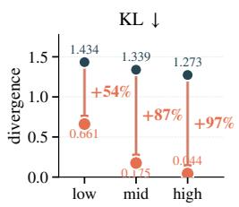

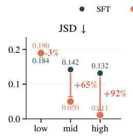

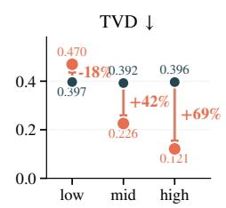

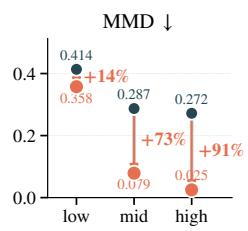  
(a) Subjectivity-stratified comparison between SFT and SALT

Fix Top-N (bottom axis) Fix $K _ { \mathrm { e f f } }$ (top axis) SALT (adaptive)  
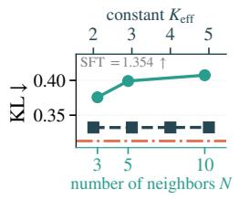

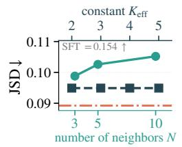

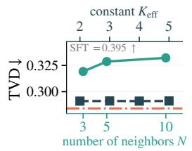

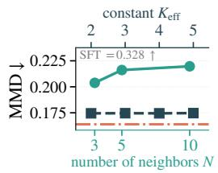

(b) Ablation over neighbor selection  
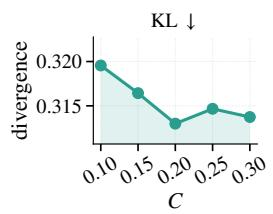

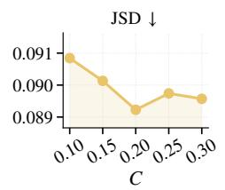

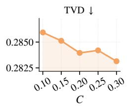  
(c) Sensitivity to the radius scale C

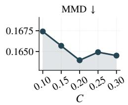  
Figure 4: Per-domain results on the Economy domain, mirroring Figure 1, Figure 2, and Figure 3 of the main text. All metrics are divergences (lower is better).

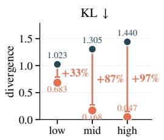

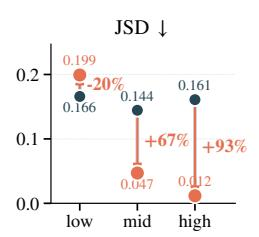

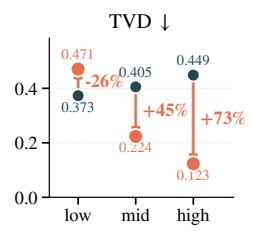  
(a) Subjectivity-stratified comparison between SFT and SALT

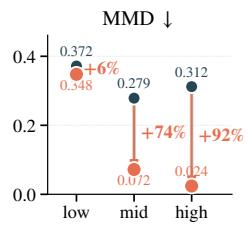

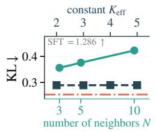

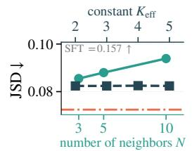

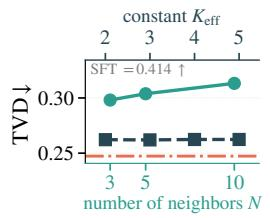  
(b) Ablation over neighbor selection

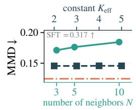

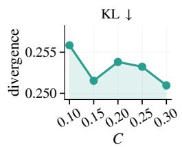

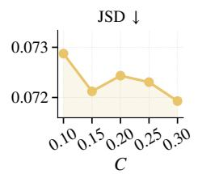

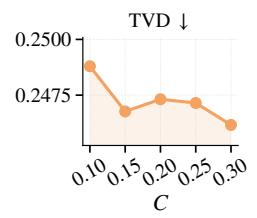  
(c) Sensitivity to the radius scale C

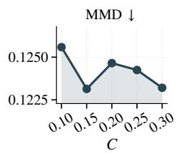  
Figure 5: Per-domain results on the Political domain, mirroring Figure 1, Figure 2, and Figure 3 of the main text. All metrics are divergences (lower is better).

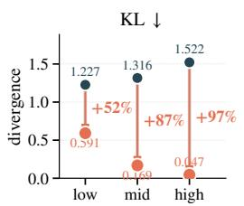

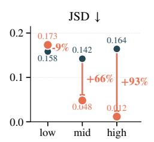

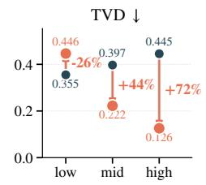  
(a) Subjectivity-stratified comparison between SFT and SALT

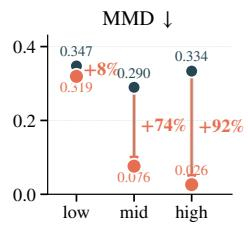

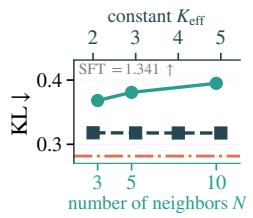

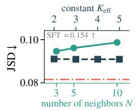

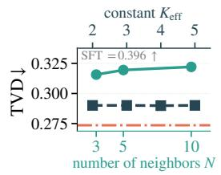  
(b) Ablation over neighbor selection

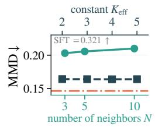

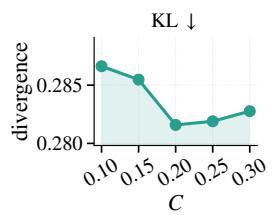

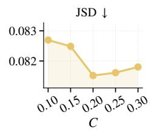

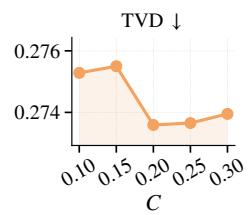  
(c) Sensitivity to the radius scale C

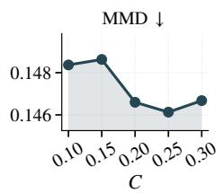  
Figure 6: Per-domain results on the Technology domain, mirroring Figure 1, Figure 2, and Figure 3 of the main text. All metrics are divergences (lower is better).

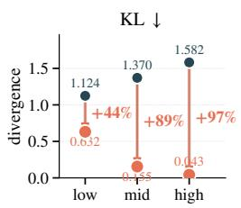

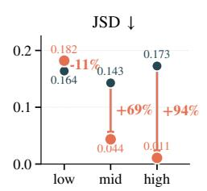

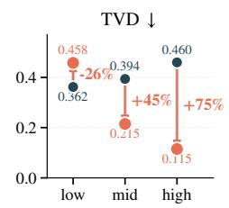  
(a) Subjectivity-stratified comparison between SFT and SALT

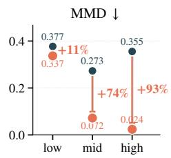

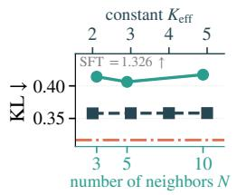

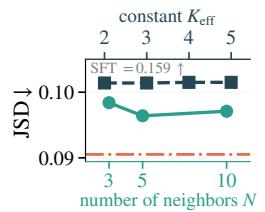

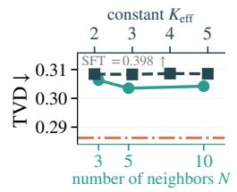  
(b) Ablation over neighbor selection

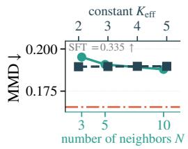

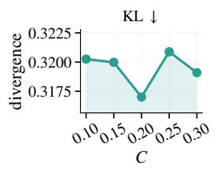

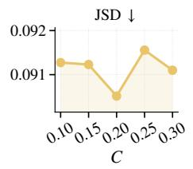  
(c) Sensitivity to the radius scale C

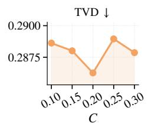

  
Figure 7: Per-domain results on the Social domain, mirroring Figure 1, Figure 2, and Figure 3 of the main text. All metrics are divergences (lower is better).

  
(a) Subjectivity-stratified comparison between SFT and SALT

  
(b) Ablation over neighbor selection

  
(c) Sensitivity to the radius scale C

  
Figure 8: Per-domain results on the Culture domain, mirroring Figure 1, Figure 2, and Figure 3 of the main text. All metrics are divergences (lower is better).

  
(a) Subjectivity-stratified comparison between SFT and SALT

  
(b) Ablation over neighbor selection

  
(c) Sensitivity to the radius scale C

  
Figure 9: Per-domain results on the Health domain, mirroring Figure 1, Figure 2, and Figure 3 of the main text. All metrics are divergences (lower is better).

  
(a) Subjectivity-stratified comparison between SFT and SALT

  
(b) Ablation over neighbor selection

  
(c) Sensitivity to the radius scale C

Figure 10: Per-domain results on the Environment domain, mirroring Figure 1, Figure 2, and Figure 3 of the main text. All metrics are divergences (lower is better).

  
(a) Subjectivity-stratified comparison between SFT and SALT

  
(b) Ablation over neighbor selection

  
(c) Sensitivity to the radius scale C

Figure 11: Per-domain results on the Education domain, mirroring Figure 1, Figure 2, and Figure 3 of the main text. All metrics are divergences (lower is better).

(b) Option count  

  
Figure 12: Overview of the SubjSim dataset. (a) Topics. (b) Option count K. (c) Subjectivity coeficient.

## G SubjSim Dataset Details

Why elicited propensities. Exact repeated measurement of the same person is not a viable route to the distributional ground truth, since repetition can change memory, reflection, fatigue, and demand efects. SubjSim therefore operationalizes the target via elicited subjective response propensities: respondents allocate plausibility across the same action space, so the hidden distributional target is available for evaluation while training methods receive only a single hard action.

## G.1 Question Pool and Filtering

Source Surveys. Questions are drawn from seven internationally standardized social survey programs: the American Trends Panel (ATP), General Social Survey (GSS), World Values Survey (WVS), American National Election Studies (ANES), Chinese General Social Survey (CGSS), European Social Survey (ESS), and International Social Survey Programme (ISSP). These programs were selected for their broad topical coverage, institutional authority, and diversity of question types. The initial candidate pool contains 5,964 items in total.

Translation. All non-Chinese items are translated into Chinese using DeepSeek-chat (Liu et al., 2024). CGSS items are retained in their original Chinese form.

Automated Screening. Each candidate item is evaluated by DeepSeek-chat (Liu et al., 2024) along three dimensions:

• Cultural suitability: whether the item is appropriate for Chinese respondents, considering cultural sensitivity, social norms, privacy boundaries, linguistic conventions, and regional variation.

• Option ordinality: whether the response options follow a logical order (ordinal) or are unordered categories (nominal). Only nominal items are retained, as ordinal scales introduce additional measurement assumptions that complicate distributional evaluation with metrics such as TVD and JSD.

• Question objectivity: whether the item has a factually verifiable answer (objective) or depends on personal attitudes, feelings, or preferences (subjective).

The system prompt used for automated screening is as follows:

## Screening Prompt

You are a professional survey design expert. Please perform a three-dimensional annotation analysis on the given survey question. Annotation Dimensions

1. Cultural Suitability

• Determine whether the question is appropriate for Chinese respondents.

• Consider: cultural sensitivity, social norms, privacy boundaries, linguistic conventions, and regional variation.

Table 5: Source distribution of the 100 subjective questions in SubjSim.
<table><tr><td>Source</td><td>Count</td><td>Proportion</td></tr><tr><td>ATP</td><td>35</td><td>35.0%</td></tr><tr><td>GSS</td><td>19</td><td>19.0%</td></tr><tr><td>WVS</td><td>14</td><td>14.0%</td></tr><tr><td>CGSS</td><td>9</td><td>9.0%</td></tr><tr><td>ANES</td><td>9</td><td>9.0%</td></tr><tr><td>ESS</td><td>9</td><td>9.0%</td></tr><tr><td>ISSP</td><td>5</td><td>5.0%</td></tr><tr><td>Total</td><td>100</td><td>100%</td></tr></table>

• Output: suitable / caution / unsuitable, with a brief explanation.   
2. Option Ordinality   
• Determine whether the response options have a logical order.   
• Ordinal: options exhibit a clear gradient, ranking, or sequence   
(e.g., very dissatisfied → very satisfied; 18--25 → 26--35 → 36+).   
• Nominal: options are parallel with no inherent order (e.g.,   
red/blue/green; football/basketball/swimming).   
• Output: ordinal / nominal, with justification.   
3. Question Objectivity   
• Determine whether the question is objective or subjective.   
• Objective: the answer is factually verifiable and does not depend on   
personal feelings or opinions (e.g., age, household size, education   
level, occupation, home ownership, weekly exercise frequency).   
• Subjective: the answer depends on personal attitudes, feelings,   
evaluations, or preferences (e.g., satisfaction, sense of identity,   
importance ratings, willingness, brand preference).   
• Output: objective / subjective, with justification.

After automated screening, 109 items are labeled as suitable, nominal, and subjective. These items proceed to manual review. The remaining 1,012 suitable objective items serve as the pool for demographic attribute dimensions.

Manual Review and Localization. We manually review the 109 subjective items, remove duplicates, verify subjectivity, and adapt phrasing to the Chinese cultural context. This yields the final 100 questions.

Demographic Attribute Dimensions. From the 1,012 objective items, we manually select those most relevant to the 100 subjective questions, yielding 30 demographic attribute dimensions.

## G.2 Question and Demographic Attribute Examples

Table 6: Examples of Demographic Attributes and Subjective Questions
<table><tr><td>Domain</td><td>Question</td><td>Response Options</td></tr><tr><td colspan="3">Demographic Attributes</td></tr><tr><td rowspan="3">Demographic</td><td>What is your current academic year?</td><td>1. Freshman/Sophomore; 2. Junior/Senior; 3. Master&#x27;s; 4. PhD; 5. Not a student</td></tr><tr><td>Are you an only child?</td><td>1. Yes; 2. No</td></tr><tr><td>What is your current employment status?</td><td>1. Full-time; 2. Part-time; 3. Self-employed; 4. Retired; 5. Homemaker; 6. Student; 7. Un- employed; 8. Other</td></tr><tr><td colspan="3">Subjective Questions</td></tr><tr><td rowspan="2">Political System</td><td>Over the next 30 years, which social trend concerns you the most?</td><td>1. AI replacing jobs; 2. Social stratification; 3. Misinformation; 4. Weakening family struc- tures</td></tr><tr><td>Among occupational groups, which do you trust the most?</td><td>1. Healthcare/education; 2. Law enforcement; 3. Business; 4. Non-profits</td></tr><tr><td rowspan="2">Education</td><td>Who should ensure young people acquire skills for good jobs?</td><td>1. Government; 2. Employers; 3. Education system; 4. Individuals</td></tr><tr><td>Which quality is most important for children to learn?</td><td>1. Socially adept; 2. Obedient; 3. Hard work; 4. Helpful; 5. Independent thinking</td></tr><tr><td rowspan="2">Social Relations</td><td>What do you most often do in free time?</td><td>1. Social entertainment; 2. Leisure; 3. Self- improvement; 4. Exercise</td></tr><tr><td>Which is more important: considerate or 1. Considerate; 2. Proper proper behavior?</td><td></td></tr><tr><td rowspan="2">Health Well-being</td><td>What is your view on vaccination?</td><td>1. Mandatory; 2. Personal choice; 3. Cautious; 4. Not mandatory</td></tr><tr><td>What is the biggest problem with the healthcare system?</td><td>1. Over-prescription; 2. High cost; 3. Drug safety; 4. Uneven resources</td></tr><tr><td rowspan="2">Economy Labor</td><td>Do you prefer full-time employment?</td><td>1. Yes; 2. No</td></tr><tr><td>What is the biggest challenge if changing jobs?</td><td>1. Salary/benefits; 2. Skill competitiveness; 3. Few opportunities; 4. Not difficult</td></tr><tr><td rowspan="2">Values Culture</td><td>Do you believe in life after death?</td><td>1. Yes; 2. No</td></tr><tr><td>Which value should society prioritize?</td><td>1. Equal opportunity; 2. Individual freedom; 3. Social order; 4. Tradition</td></tr><tr><td rowspan="2">Technology &amp; Society</td><td>What is your view on genetically modified foods?</td><td>1. Healthier; 2. More harmful; 3. No difference</td></tr><tr><td>Who should protect personal information on- line?</td><td>1. Companies; 2. Individuals; 3. Public institu- tions</td></tr><tr><td rowspan="2">Environment &amp; Energy</td><td>Which position do you lean toward on climate change?</td><td>1. Existential crisis; 2. Politicized; 3. Long- term issue; 4. Natural cycles</td></tr><tr><td>Regarding energy, what are you most con- cerned about?</td><td>1. Prices; 2. Outages; 3. Fossil fuel reliance; 4. Natural disasters</td></tr></table>

## G.3 Annotator Demographics

We recruited 193 annotators via a university online forum, including both students and non-students. Figure 13 summarizes their distributions across age, gender, academic status, and field of study. The pool skews toward young, university-educated individuals, with a roughly balanced gender ratio and a mix of STEM and Humanities backgrounds. This limits claims about population-level representativeness, but it is less central to the benchmark’s main target: evaluating distributional alignment for individual behavioral tendencies.

(d) Field of study  
(c) Academic status  

  
Figure 13: Demographic distributions of annotators across gender, age, academic status, and field of study.

## G.4 Probability Ball Allocation Protocol

In the probability-ball protocol, annotators distribute a fixed number of balls across all available options and must allocate all balls before submission. The fraction assigned to each option represents the annotator’s subjective probability for that option. This avoids known issues with Likert-scale ratings such as scale bias and cross-item incomparability.

The number of balls scales with K to balance resolution and cognitive load: 10 balls for K = 2, 12 for K = 3 and $K = 4 ,$ , 15 for $K = 5$ , and 20 otherwise.

We implemented a web-based annotation platform where annotators adjust ball counts per option via sliders or +/− buttons. The remaining ball count is displayed in real time, and submission is blocked until all balls are allocated. Figure 14 shows a screenshot of the interface.

  
Figure 14: Screenshot of the annotation interface. The platform was deployed in Chinese for native Chinese-speaking annotators; the interface shown here is an English translation for presentation purposes.