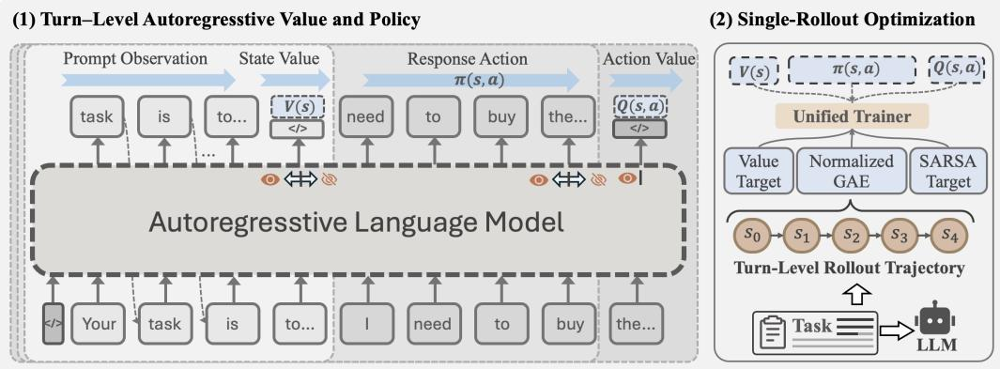
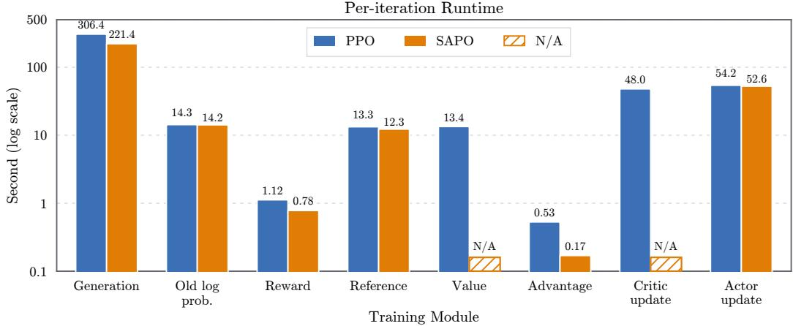

# SAPO: Single-Rollout Autoregressive Policy Optimization for Agentic Reinforcement Learning

Dayang Liang1∗ Lang Feng2∗ Bo An2 Yunlong Liu1†

1Xiamen University, China

2Nanyang Technological University, Singapore

dyliang@stu.xmu.edu.cn, lang005@e.ntu.edu.sg, ylliu@xmu.edu.cn,

## Abstract

Agentic reinforcement learning (RL) has become a critical stage in the post-training of large language models. Existing critic-free, group-relative methods estimate policy advantages from multiple rollouts, avoiding the substantial memory overhead of conventional proximal policy optimization (PPO) and achieving strong performance on long-horizon interactive tasks. Despite their success, recent studies revealed three limitations: (1) Lack explicit value generalization and effective temporal credit assignment; (2) Suffer from potential advantage collapse in longhorizon complex tasks; (3) Require a costly trade-off between sampling budget and policy performance. In this work, we propose Single-rollout Autoregressive Policy Optimization (SAPO), a low-memory and compute-efficient framework in which the policy and value functions share a single autoregressive backbone. SAPO exploits the autoregressive structure of LLMs to produce policy and value predictions at distinct causal boundaries with shared parameters, while independently optimizing the PPO objectives and auxiliary on-policy SARSA objectives. To robustly estimate the contribution of each turn, we further introduce a trajectory-level generalized advantage estimator that combines λ-returns with batch normalization. Experiments across ALFWorld and WebShop with Qwen2.5-1.5B/7B show that SAPO trains stably and outperforms PPO and GRPO by mean +15.1 and +12.1 percentage points, respectively, while eliminating the memory cost of a separate critic model and reducing per-iteration runtime by 33.2% over PPO. (Going On)

## 1 Introduction

Recent advances in agentic reinforcement learning (RL) have transformed large language models from passive text generators into agents capable of long-horizon interaction such as reasoning, tool use, web search, and code execution tasks. Large-scale RL post-training has produced substantial improvements in mathematical reasoning and coding [17, 5, 7], while interactive systems such as Search-R1 demonstrate that policies can learn to acquire external information through multi-turn actions [8]. These successes suggest that learning directly from environmental feedback is becoming a critical pathway toward increasingly autonomous and general-purpose language agents.

Most agentic RL approaches build on proximal policy optimization (PPO) or its critic-free, grouprelative variants. Conventional PPO provides token- or turn-level credit assignment through a learned value function and generalized advantage estimation (GAE), but typically requires a policy-scale critic with substantial memory and computation budgets [13, 21]. GRPO avoids this critic by normalizing rewards across multiple sampled for the same task [17]. Nevertheless, recent studies expose three limitations. First, when all rollouts in a group receive identical or nearly identical rewards—an increasingly common event under sparse feedback and long-horizon failures—the normalized advantages vanish, causing zero-gradient or advantage-collapse regions [29]. Second, assigning a trajectory-level group advantage uniformly to all generated tokens provides weak temporal credit assignment and cannot generalize value estimates across states, prompts, or policy iterations; learned critics can identify low-value repetitive or erroneous prefixes that group-relative estimators miss [30, 31, 7]. Third, group-relative estimation entails an unfavorable compute–quality trade-off: small groups yield noisy baselines, whereas larger groups improve stability only by multiplying rollout cost and imposing synchronization barriers in long, variable-length agent trajectories [3, 6].

Several work attempts to mitigate these problems. DAPO improves group-relative learning through dynamic sampling, asymmetric clipping, and token-level policy losses, but remains dependent on multiple rollouts and group statistics [29]. ReMax and RLOO eliminate the critic using greedy or leave-one-out baselines, while VinePPO estimates intermediate values through Monte Carlo continuations; these methods reduce training-state memory but retain coarse credit assignment or introduce additional generation cost [12, 2, 9]. Conversely, Open-Reasoner-Zero, VC-PPO, and VAPO restore explicit value models and demonstrate that a well-trained critic can substantially improve long-horizon reasoning, particularly through critic pretraining and improved GAE [7, 30, 31]. However, these methods maintain a separate, often policy-scale value network. Hydra-PPO partially shares a frozen backbone, but still requires role-specific adapters and heads, and its fully shared variant reveals potential policy–value interference [15]. POISE reuses actor hidden states through a lightweight probe but requires cross-rollout estimation [3], whereas SAO enables asynchronous single-rollout training while relying on a separately pretrained critic with more frequent value updates [6]. Thus, efficient single-rollout learning with explicit temporal value estimation remains unresolved.

To address this, we propose Single-Rollout Autoregressive Policy Optimization (SAPO), a lightweight RL framework that preserves value-based learning without maintaining a separate critic or relying on multiple rollouts. SAPO builds on a simple observation: the information flow required by actor–critic learning naturally follows the causal order of language generation. A value estimate should summarize the state before an action is taken, whereas evaluating that action may additionally condition on what has been generated. This alignment allows policy generation and value estimation to be expressed at appropriate positions within one autoregressive stream, with causal masking enforcing their distinct conditioning contexts. Consequently, the same backbone can generate actions and learn generalized value estimates while reusing its parameters and intermediate computation. SAPO thus reconciles two competing goals in existing approaches: it retains the explicit value generalization and temporal credit assignment of actor–critic algorithms, yet approaches the memory and computational efficiency sought by critic-free, group-relative optimization. Its central contribution is therefore not weight sharing alone, but a correspondence between autoregressive modeling and actor–critic learning that enables efficient value-based optimization within a single causal model.

We evaluate SAPO on ALFWorld and WebShop using Qwen2.5-1.5B and Qwen2.5-7B backbone models. SAPO trains stably from one rollout per prompt and improves task success over conventional PPO and GRPO by +15.1 and +12.1 percentage points, respectively. It simultaneously eliminates the memory footprint of a separate critic and reduces per-iteration runtime by 33.2% relative to PPO. Our contributions are threefold.

• We introduce a single-rollout autoregressive actor–critic architecture that jointly represents and trains policy and value functions through causal-boundary readouts.

• We develop a trajectory-level advantage estimator that combines λ-returns with batch normalization, enabling explicit turn-level credit assignment without group-relative sampling.

• We demonstrate on long-horizon agentic tasks that this unified framework achieves a favorable combination of performance, training stability, memory efficiency, and runtime efficiency.

## 2 Related Work

Agentic RL extends reinforcement learning with verifiable rewards from single-turn response optimization to multi-turn decision making, enabling LLM agents to learn from the consequences of actions taken in external environments. A prominent line of work builds on critic-free, group-relative optimization. GRPO [17] replaces a learned value baseline with within-prompt outcome comparison, a formulation used by DeepSeek-R1 [5] and refined by DAPO [29] with dynamic sampling and asymmetric clipping, GSPO [33] with sequence-level importance ratios, and GVPO [32] through variance-aware gradient weighting. This paradigm has been extended to interactive settings: Search-R1 [8] and DeepResearcher [34] optimize iterative retrieval, ToRL [11] and WebSailor [10] train tool use and web navigation, and RAGEN [25] characterizes optimization instabilities in multi-turn training. Long-horizon tasks have also motivated more structured credit mechanisms. ARChER [35] and HiPER [14] decompose planning and execution across temporal scales, AgentGym-RL [26] progressively increases the interaction horizon, and IGPO [23] derives dense intrinsic rewards from information gain during search.

Efficiency-oriented LLM RL has developed along critic-free advantage estimation, parameter sharing between policy and value functions, and systems-level execution. ReMax [12] and RLOO [2] replace learned values with greedy or leave-one-out baselines, while GRPO [17] normalizes rewards within each prompt group. Eliminating the value network reduces parameters and optimizer state, but these estimators require additional decoded trajectories and provide no value generalization across states. VinePPO [9] obtains intermediate value estimates from branched Monte Carlo continuations, likewise exchanging critic training for increased rollout computation. Parameter-sharing approaches retain explicit value learning while reducing model duplication. Hydra-PPO [15] places policy and value adapters over a frozen backbone; J-Hydra [15] further shares the trainable adapter, with potential interference between the two objectives. POISE [3] predicts returns from actor hidden states using a lightweight probe, but relies on cross-rollout construction to decouple value estimation from the evaluated trajectory. SAO [6] addresses rollout underutilization through asynchronous singlerollout collection, while retaining a separately pretrained critic with more frequent value updates. HybridFlow [18] instead improves distributed execution through model placement, resharding, and scheduling, independently of the advantage estimator. SAPO is distinguished by jointly representing the policy, state value, and action value in one causal autoregressive model, thereby eliminating both group sampling and the separate critic backbone while retaining explicit temporal credit assignment.

## 3 Preliminaries

Multi-Turn Agentic RL. We consider RL for LLM-based agents that interact with an environment over multiple turns, where the interaction process is formulated as a finite-horizon Markov Decision Process (MDP). Given a task instance $x \in p ( X )$ , at each turn $t = 1 , 2 , \dots , T$ , an agent policy $\pi _ { \theta }$ observes a state $s _ { t } \in S$ and generates a textual action $\mathbf { \boldsymbol { a } } _ { t } \in \mathcal { A }$ , and then transitions to the next state $\boldsymbol { s } _ { t + 1 } \in \boldsymbol { S }$ while yielding a scalar reward $\boldsymbol { r } _ { t } \in \mathbb { R }$ . The interaction unfolds as a trajectory $\tau =$ $\left\{ { \left( s _ { 1 } , { { a } _ { 1 } } , { { r } _ { 1 } } \right) } , { \left( { { s } _ { 2 } } , { { a } _ { 2 } } , { { r } _ { 2 } } \right) } , . . . , { \left( { { s } _ { T } } , { { a } _ { T } } , { { r } _ { T } } \right) } \right\}$ , where T denotes the trajectory length in interaction turns. In practical tasks such as ALFWorld, the agent generates a response as its action for each observation. This response is structured within <think></think> and <action></action> tags, where the former contains the reasoning process, while the latter specifies the actual action executed in the environment. Notably, for most task settings, reward signals are sparse and delayed, e.g., the environment provides an outcome reward $R ( \tau )$ only after the trajectory terminates.

## 3.1 Group-relative Policy Optimization

Recent agentic RL methods for LLMs commonly adopt a group-relative policy optimization paradigm. Given a task instance $^ { \mathbf { \delta x } , }$ the old policy $\pi _ { \theta _ { \mathrm { o l d } } }$ samples a group of N candidate trajectories $\mathcal { G } _ { x } =$ $\{ \tau _ { 1 } , \tau _ { 2 } , \dots , \tau _ { N } \}$ , where each trajectory corresponds to one complete rollout. Each trajectory $\tau _ { i }$ receives a scalar reward $R ( \tau _ { i } )$ that reflects the overall quality or success of the generated outcome. Instead of learning an advantage function $A ( s _ { t } , a _ { t } )$ with critic networks in PPO [16], group-based RL computes the advantage using only statistics within the sampled group:

$$
A ( \pmb { \tau } _ { i } ) = \mathtt { G r o u p N o r m a l i z a t i o n } \left( \{ R ( \pmb { \tau } _ { i } ) \} _ { i = 1 } ^ { N } \right) .
$$

In GRPO [17], the advantage is evaluated by normalizing each trajectory reward with the mean and variance of group rewards $\mathsf { \bar { ( } } \{ R ( \tau _ { i } ) \} _ { i = 1 } ^ { N } \}$ . This sampling-based estimator reduces the memory and computational overhead introduced by the critic architecture in conventional PPO.

## 3.2 Proximal Policy Optimization

Proximal Policy Optimization (PPO) is an actor-critic RL algorithm previously used for LLM posttraining. Given prompts sampled from a dataset, the policy generates response trajectories and receives rewards from task-specific environments or learned reward models. PPO updates the policy by maximizing a clipped surrogate objective,

$$
\mathcal { L } _ { \mathrm { P P O } } = \mathbb { E } _ { t } \Big [ \operatorname* { m i n } \Big ( \rho _ { t } \hat { A } _ { t } , \mathrm { c l i p } ( \rho _ { t } , 1 - \epsilon , 1 + \epsilon ) \hat { A } _ { t } \Big ) \Big ] ,
$$

where $\rho _ { t } \ = \ \pi _ { \theta } ( a _ { t } \ | \ s _ { t } ) / \pi _ { \theta _ { \mathrm { o l d } } } ( a _ { t } \ | \ s _ { t } )$ is the likelihood ratio and ${ \hat { A } } _ { t }$ is an advantage estimate. The clipping operation constrains abrupt policy changes and improves optimization stability. A learned critic $\dot { V _ { \phi } } ( s _ { t } )$ predicts expected returns, enabling advantage estimation—commonly through generalized advantage estimation—and propagating delayed rewards to earlier decisions. In LLMs, states correspond to token prefixes or interaction histories, while actions are generated tokens. Although effective for long-horizon credit assignment, PPO typically requires separate policy, critic, reference, and rollout models, resulting in substantial memory and computational overhead.

## 4 Method

SAPO is a single-rollout actor–critic method in which one causal language model represents the policy, the state value, and the action value. As shown in Figure 1, the design follows the temporal structure of an agent turn: the model first summarizes the current interaction state, then generates a textual action, and finally evaluates that action before observing its environmental consequence. This order matches the conditioning structure required by actor–critic learning and allows all three quantities to be extracted from one autoregressive sequence.

  
Figure 1: Framework of SAPO.

We begin with introducing a two-token value basis that reads bounded scalar values from the language model logits at two causal boundaries (Section 4.1). Second, we construct turn-level advantages and value targets by traversing each sampled trajectory backward (Section 4.2). Third, we jointly optimize the token-level policy objective and the turn-level value objectives in one actor update (Section 4.3). Algorithm 1 summarizes the complete procedure.

## 4.1 Autoregressive Actor–Critic Representation

Causal factorization of an agent turn. At turn t, let $\boldsymbol { c } _ { t } ^ { s }$ denote the tokenized context representing state $\mathbf { } s _ { t } ,$ and let $\pmb { a } _ { t } = ( a _ { t , 1 } , \dots , a _ { t , M _ { t } } )$ be the generated response. We write $\mathbf { \Delta } c _ { t } ^ { s a } = [ \mathbf { \bar { { c } } } _ { t } ^ { s } ; \bar { \mathbf { { a } } _ { t } } ]$ for their concatenation. A valid state value may depend on $\boldsymbol { c } _ { t } ^ { s }$ but not on the yet-unseen action, whereas an action value may additionally depend on the complete $\mathbf { } \mathbf { a } _ { t }$ but not on the subsequent reward or observation. These dependencies occur naturally at the two boundaries of causal decoding: immediately before the first response token and immediately after the last response token. SAPO reads $V ( s _ { t } )$ and $Q ( s _ { t } , \pmb { a } _ { t } )$ at these respective boundaries while generating $\mathbf { } \mathbf { a } _ { t }$ between them. The causal mask enforces the desired information separation without separate encoders or manually detached context representations.

A shared two-token value basis. Let $\boldsymbol { z } _ { \theta } ( \boldsymbol { c } ) \in \mathbb { R } ^ { | \mathcal { W } | }$ be the next-token logits produced by the causal language model after context c, where W is its vocabulary. We reserve two existing vocabulary entries, $w ^ { \ + }$ and $w ^ { - }$ , exclusively as a value basis. For any causal context, their relative evidence defines a normalized scalar readout:

$$
p _ { \theta } ( c ) = \mathrm { c l i p } \left( \left( \frac { z _ { \theta , w ^ { + } } ( c ) - z _ { \theta , w ^ { - } } ( c ) } { \tau _ { v } } \right) , - 1 , 1 \right)\tag{1}
$$

where $\tau _ { v } \ > 0$ is a value temperature. For tasks whose discounted returns lie in $[ - R _ { \mathrm { m a x } } , R _ { \mathrm { m a x } } ]$ SAPO parameterizes:

$$
V _ { \theta } ( s _ { t } ) = R _ { \mathrm { m a x } } p _ { \theta } ( \boldsymbol { c } _ { t } ^ { s } ) , \qquad Q _ { \theta } ( \boldsymbol { s } _ { t } , \boldsymbol { a } _ { t } ) = R _ { \mathrm { m a x } } p _ { \theta } ( \boldsymbol { c } _ { t } ^ { s a } ) .\tag{2}
$$

The logit difference makes the readout invariant to a common shift of the two logits, while the clipping supplies a learning range matched to the return scale. Importantly, $w ^ { + }$ and $w ^ { - }$ are readouts rather than generated reasoning tokens: neither token is sampled, appended to the context, or revealed to the environment.

Separation from the action distribution. The reserved entries must not become artificial actions. We therefore define the policy vocabulary as $\mathcal { W } _ { \mathrm { a c t } } = \mathcal { W } \setminus \{ w ^ { + } , w ^ { - } \}$ and normalize action probabilities only over this set:

$$
\pi _ { \boldsymbol { \theta } } ( a \mid c ) = \frac { \exp z _ { \boldsymbol { \theta } , a } ( c ) } { \sum _ { w \in \mathcal { W } _ { \mathrm { a c t } } } \exp z _ { \boldsymbol { \theta } , w } ( c ) } , \qquad a \in \mathcal { W } _ { \mathrm { a c t } } .\tag{3}
$$

The same restriction is applied during rollout, policy-log-probability evaluation, and entropy computation. Thus, policy learning never rewards or suppresses the value basis through the action softmax, while the raw logits of the two reserved entries remain available to the value objectives. Policy and value learning share the transformer and language-model head, but retain distinct semantics and supervision.

Single-stream evaluation. For every sampled response, PPO already evaluates the actor on $\left[ c _ { t } ^ { s } ; a _ { t } \right]$ to obtain old token log probabilities. SAPO extends this actor evaluation by gathering the two reserved logits at the final state-context position and the final valid action position. The former yields $V _ { \theta _ { \mathrm { o l d } } } \left( s _ { t } \right)$ and the latter yields $Q _ { \theta _ { \mathrm { o l d } } } ( \pmb { s } _ { t } , \pmb { a } _ { t } ) ;$ no second model or repeated encoding of the state–action prefix is required. During optimization, the same actor forward simultaneously produces current policy log probabilities, state values, and action values. Hence, the precise computational benefit of SAPO is the removal of the independent critic forward/backward path and its training state, rather than an assumption that value estimates are obtained without any actor evaluation.

## 4.2 Single-Rollout Trajectory Advantage Estimation

Group-relative algorithms estimate advantages by comparing several trajectories sampled for the same task. SAPO instead samples one trajectory per task and transfers delayed feedback across its interaction turns using the learned state value. All targets are computed from rewards observed in the environment and values produced by the frozen rollout policy $\pi _ { \theta _ { \mathrm { o l d } } } \mathrm { ; }$ current value predictions are never used to construct their own targets.

Trajectory-wise generalized advantage estimation. For a trajectory $\boldsymbol { \tau } = \{ ( s _ { t } , a _ { t } , r _ { t } , d _ { t } ) \} _ { t = 1 } ^ { T }$ , let $d _ { t }$ indicate termination after turn t and let $V _ { t } ^ { \mathrm { o l d } } = V _ { \theta _ { \mathrm { o l d } } } ( s _ { t } )$ . We compute the temporal-difference residual and the generalized advantage recursively as:

$$
\delta _ { t } = r _ { t } + \gamma ( 1 - d _ { t } ) V _ { t + 1 } ^ { \mathrm { o l d } } - V _ { t } ^ { \mathrm { o l d } } ,\tag{4}
$$

$$
A _ { t } ^ { \mathrm { G A E } } = \delta _ { t } + \gamma \lambda ( 1 - d _ { t } ) A _ { t + 1 } ^ { \mathrm { G A E } } ,\tag{5}
$$

with $A _ { T + 1 } ^ { \mathrm { G A E } } = 0$ . A trajectory truncated at the environment horizon is treated as a finite-horizon terminal trajectory, so its final bootstrap value is zero. This recursion gives different turns different

learning signals even when the environment supplies only a terminal outcome, while λ controls the usual bias–variance trade-off.

The same backward pass provides complementary targets for the two causal value boundaries. The state value is trained toward the λ-return, whereas the action value is trained toward a on-policy SARSA target:

$$
y _ { t } ^ { V } = V _ { t } ^ { \mathrm { o l d } } + A _ { t } ^ { \mathrm { G A E } } , \qquad y _ { t } ^ { Q } = r _ { t } + \gamma ( 1 - d _ { t } ) Q _ { t + 1 } ^ { \mathrm { o l d } } .\tag{6}
$$

The first target propagates long-range outcome information to the pre-action state boundary. The second grounds the post-action boundary in the immediate consequence of the selected response. We deliberately construct the policy advantage from GAE rather than from the difference between simultaneously learned $Q$ and $V$ estimates: this prevents early action-value miscalibration from directly perturbing the policy while still using the $Q$ objective to train an action-conditioned value representation.

Batch-normalized turn advantages. Before assigning advantages to response tokens, we normalize them over the valid turns in the current training batch. If an environment exposes an invalid-action indicator ${ m } _ { t } ^ { \mathrm { i n v } }$ , we first form $\widetilde { A } _ { t } = A _ { t } ^ { \mathrm { G A E } } - c _ { \mathrm { i n v } } m _ { t } ^ { \mathrm { i n v } }$ ; otherwise $c _ { \mathrm { i n v } } = 0$ . With batch statistics $\mu _ { B }$ and $\sigma _ { B } ,$ the policy advantage is

$$
\widehat { A } _ { t } = \frac { \widetilde { A } _ { t } - \mu _ { B } } { \sigma _ { B } + \epsilon _ { \mathrm { a d v } } } .\tag{7}
$$

Only after this turn-level normalization do we broadcast $\widehat { A } _ { t }$ to all valid tokens in $\mathbf { } \mathbf { a } _ { t }$ . Normalizing before broadcasting prevents long responses from receiving disproportionate weight in the advantage statistics. Unlike group normalization, Equation 7 compares learning signals across independent turns and tasks; it therefore does not require multiple synchronized rollouts of the same prompt.

## 4.3 Joint Policy and Value Optimization

Token-level policy objective. Although the environment acts at the turn level, each textual action contains multiple autoregressive decisions. Let $\ell _ { t , j } ^ { \mathrm { o l d } }$ and $\ell _ { t , j } ( \theta )$ be the old and current log probabilities of token $a _ { t , j }$ under the restricted action distribution in Equation 3. The importance ratio is

$$
\rho _ { t , j } ( \theta ) = \exp \bigl ( \ell _ { t , j } ( \theta ) - \ell _ { t , j } ^ { \mathrm { o l d } } \bigr ) .\tag{8}
$$

Every valid response token in turn t shares $\widehat { A } _ { t } ,$ yielding the clipped policy loss

$$
\mathcal { L } _ { \mathrm { p o l } } ( \theta ) = - \mathbb { E } _ { t , j } \left[ \operatorname* { m i n } \left( \rho _ { t , j } ( \theta ) \widehat { A } _ { t } , \operatorname { c l i p } ( \rho _ { t , j } ( \theta ) , 1 - \epsilon , 1 + \epsilon ) \widehat { A } _ { t } \right) \right] ,\tag{9}
$$

where the expectation includes only valid action tokens. This preserves PPO’s token-level trust-region surrogate while replacing both the separate critic and group-relative advantage estimator.

Clipped value objectives. We optimize the value readouts in their normalized probability space. Define $p _ { t } ^ { V } = V _ { \theta } ( \pmb { s } _ { t } ) / R _ { \mathrm { m a x } }$ and $p _ { t } ^ { Q } = Q _ { \theta } ( s _ { t } , { a } _ { t } ) / R _ { \operatorname* { m a x } } ,$ , with frozen rollout-time predictions $p _ { t } ^ { \bar { V } , \mathrm { o l d } }$ and $p _ { t } ^ { Q , \mathrm { o l d } }$ . Accordingly, the normalized targets are $\bar { y } _ { t } ^ { V } = y _ { t } ^ { V } / R _ { \mathrm { m a x } }$ and $\bar { y } _ { t } ^ { Q } = y _ { t } ^ { Q } / R _ { \mathrm { m a x } }$ with normalized range $[ - 1 , \bar { 1 } ]$ . For $X \in \{ V , Q \}$ , let

$$
p _ { t } ^ { X , \mathrm { c l i p } } = p _ { t } ^ { X , \mathrm { o l d } } + \mathrm { c l i p } \Big ( p _ { t } ^ { X } - p _ { t } ^ { X , \mathrm { o l d } } , - \epsilon _ { X } , \epsilon _ { X } \Big ) .\tag{10}
$$

We use the PPO-style clipped regression loss

$$
\mathcal { L } _ { X } ( \theta ) = \frac { 1 } { 2 } \mathbb { E } _ { t } \left[ \operatorname* { m a x } \left( ( p _ { t } ^ { X } - \bar { y } _ { t } ^ { X } ) ^ { 2 } , ( p _ { t } ^ { X , \mathrm { c l i p } } - \bar { y } _ { t } ^ { X } ) ^ { 2 } \right) \right] , \qquad X \in \{ V , Q \} .\tag{11}
$$

Both losses are averaged over valid turns, not over response tokens. This gives each environment decision equal weight regardless of response length.

Unified objective. The final loss combines policy optimization, the two causal value objectives, reference-policy regularization, and entropy regularization:

$$
\begin{array} { r } { \mathcal { L } _ { S A P O } ( \theta ) = \mathcal { L } _ { \mathrm { p o l } } + c _ { V } \mathcal { L } _ { V } + c _ { Q } \mathcal { L } _ { Q } + \beta \mathcal { L } _ { \mathrm { K L } } - c _ { H } \mathcal { H } ( \pi _ { \theta } ) . } \end{array}\tag{12}
$$

The policy, state-value, and action-value terms use separate masks but update the same transformer and language-model head in one backward pass. Coefficients $c _ { V }$ and $c _ { Q }$ control interference between generation and value learning, while the KL and entropy terms regularize policy drift and exploration. This objective retains distinct supervision for the three roles without allocating role-specific model parameters.

Algorithm 1 Single-Rollout Autoregressive Policy Optimization   
Require: Policy $\pi _ { \theta } ,$ reference policy $\pi _ { \mathrm { r e f } } .$ , task batch $B , \gamma , \lambda$   
1: for each training iteration do   
2: Set $\theta _ { \mathrm { o l d } }  \theta$ and sample one trajectory per task with $\pi _ { \theta _ { \mathrm { o l d } } }$   
3: Evaluate sampled state–action sequences with the old actor to obtain token log probabilities,   
$V ^ { \mathrm { o l d } }$ , and $Q ^ { \mathrm { o i d } }$   
4: Traverse each trajectory backward using Equations $_ { 4 - 6 }$   
5: Normalize turn-level policy advantages using Equation 7 and broadcast them to valid action   
tokens   
6: Run one joint actor forward on the sampled sequences to obtain current policy, V , and Q   
predictions   
7: Update θ by minimizing Equation 12   
8: end for

In implementation, trajectory identifiers and turn indices are retained until after the backward target computation, ensuring that batching, duplication, or shuffling cannot break temporal adjacency. Reward is used only as a target after environment execution and is never included in the action-value input. Together with the causal boundary construction, this preserves the semantics of both state and action values throughout single-stream training.
<table><tr><td rowspan="2">Type</td><td rowspan="2">Method</td><td colspan="7">ALFWorld</td><td colspan="2">WebShop</td></tr><tr><td>Pick</td><td>Look</td><td>Clean</td><td>Heat</td><td>Cool</td><td>Pick2</td><td>All</td><td>Score</td><td>Succ.</td></tr><tr><td colspan="2">Closed-Source Model</td><td></td><td></td><td></td><td></td><td></td><td></td><td></td><td></td><td></td></tr><tr><td>Prompting</td><td>GPT-40</td><td>75.3</td><td>60.8</td><td>31.2</td><td>56.7</td><td>21.6</td><td>49.8</td><td>48.0</td><td>31.8</td><td>23.7</td></tr><tr><td>Prompting</td><td>Gemini-2.5-Pro</td><td>92.8</td><td>63.3</td><td>62.1</td><td>69.0</td><td>26.6</td><td>58.7</td><td>60.3</td><td>42.5</td><td>35.9</td></tr><tr><td colspan="2">Qwen2.5-1.5B-Instruct</td><td></td><td></td><td></td><td></td><td></td><td></td><td></td><td></td><td></td></tr><tr><td>Prompting</td><td>ReAct</td><td>17.4</td><td>20.5</td><td>15.7</td><td>6.2</td><td>7.7</td><td>2.0</td><td>12.8</td><td>40.1</td><td>11.3</td></tr><tr><td>Prompting</td><td>Reflexion</td><td>35.3</td><td>22.2</td><td>21.7</td><td>13.6</td><td>19.4</td><td>3.7</td><td>21.8</td><td>55.8</td><td>21.9</td></tr><tr><td>RL Training</td><td>RLOO</td><td> $8 8 . 3 _ { \pm 3 . 0 }$ </td><td> $5 2 . 8 _ { \pm 8 . 6 }$ </td><td> $7 1 . 0 _ { \pm 5 . 9 }$ </td><td> $6 2 . 8 _ { \pm 8 . 7 }$ </td><td> $6 6 . 4 _ { \pm 5 . 5 }$ </td><td> $5 6 . 9 _ { \pm 4 . 7 }$ </td><td> $6 9 . 7 _ { \pm 2 . 5 }$ </td><td> $7 3 . 9 _ { \pm 5 . 6 }$ </td><td> $5 2 . 1 _ { \pm 6 . 7 }$ </td></tr><tr><td>RL Training</td><td>EMPG</td><td> $8 5 . 5$ </td><td> $3 3 . 5$ </td><td>78.9</td><td>76.2</td><td> $7 4 . 7$ </td><td>89.1</td><td> $7 3 . 7$ </td><td> $8 0 . 4$ </td><td>60.8</td></tr><tr><td>RL Training</td><td> $\mathrm { G i G P O _ { w / s t d } }$ </td><td> $9 4 . 4 _ { \pm 5 . 9 }$ </td><td> $6 7 . 5 _ { \pm 4 . 6 }$ </td><td> $9 4 . 8 _ { \pm 3 . 8 }$ </td><td> $9 4 . 4 _ { \pm 7 . 8 }$ </td><td> $7 9 . 8 _ { \pm 4 . 7 }$ </td><td> $7 6 . 4 _ { \pm 5 . 4 }$ </td><td> $8 6 . 7 _ { \pm 1 . 7 }$ </td><td> $8 3 . 1 _ { \pm 1 . 6 }$ </td><td> $6 5 . 0 _ { \pm 3 . 2 }$ </td></tr><tr><td>RL Training</td><td> $\mathrm { G i G P O _ { w / o s t d } }$ </td><td> $\mathbf { 9 6 . 0 _ { \pm 1 . 4 } }$ </td><td> $7 6 . 5 _ { \pm 3 . 9 }$ </td><td> $9 1 . 8 _ { \pm 5 . 5 }$ </td><td> $9 1 . 3 _ { \pm 6 . 3 }$ </td><td> $7 1 . 7 _ { \pm 8 . 4 }$ </td><td> $7 9 . 5 _ { \pm 7 . 7 }$ </td><td> $8 6 . 1 _ { \pm 4 . 7 }$ </td><td> ${ \mathbf { 8 3 . 5 _ { \pm 1 . 8 } } }$ </td><td> ${ \bf 6 7 . 4 } _ { \pm 4 . 5 }$ </td></tr><tr><td>RL Training</td><td>PPO (with critic)</td><td> $6 4 . 8 _ { \pm 3 . 5 }$ </td><td> $4 0 . 5 _ { \pm 6 . 9 }$ </td><td> $5 7 . 1 _ { \pm 4 . 9 }$ </td><td> $6 0 . 6 _ { \pm 6 . 6 }$ </td><td> $4 6 . 4 _ { \pm 4 . 0 }$ </td><td> $4 7 . 4 _ { \pm 1 . 9 }$ </td><td> $5 4 . 4 _ { \pm 3 . 1 }$ </td><td> $7 3 . 8 _ { \pm 3 . 0 }$ </td><td> $5 1 . 5 _ { \pm 2 . 9 }$ </td></tr><tr><td>RL Training</td><td>GRPO</td><td> $8 5 . 3 _ { \pm 1 . 5 }$ </td><td> $5 3 . 7 _ { \pm 8 . 0 }$ </td><td> $8 4 . 5 _ { \pm 6 . 8 }$ </td><td> $7 8 . 2 { \scriptstyle \pm 7 . 9 }$ </td><td> $5 9 . 7 _ { \pm 5 . 0 }$ </td><td> $5 3 . 5 _ { \pm 5 . 6 }$ </td><td> $7 2 . 8 _ { \pm 3 . 6 }$ </td><td> $7 5 . 8 _ { \pm 3 . 5 }$ </td><td> $5 6 . 8 _ { \pm 3 . 8 }$ </td></tr><tr><td>RL Training</td><td>SAPO</td><td> $9 2 . 0 _ { \pm 2 . 9 }$ </td><td> $7 6 . 9 _ { \pm 6 . 3 }$ </td><td> $\mathbf { 1 0 0 . 0 _ { \pm 0 . 0 } }$ </td><td> $\mathbf { 1 0 0 . 0 _ { \pm 0 . 0 } }$ </td><td> $\mathbf { 8 2 . 8 _ { \pm 4 . 7 } }$ </td><td> $8 2 . 4 _ { \pm 5 . 0 }$ </td><td> ${ \bf 9 0 . 1 _ { \pm 2 . 3 } }$ </td><td> $8 2 . 2 _ { 1 . 4 }$ </td><td> $6 3 . 7 _ { 1 . 6 }$ </td></tr><tr><td colspan="2">Qwen2.5-7B-Instruct</td><td></td><td></td><td></td><td></td><td></td><td></td><td></td><td></td><td></td></tr><tr><td>Prompting</td><td>ReAct</td><td>48.5</td><td> $3 5 . 4$ </td><td>34.3</td><td>13.2</td><td>18.2</td><td>17.6</td><td>31.2</td><td>46.2</td><td>19.5</td></tr><tr><td>Prompting</td><td>Reflexion</td><td>62.0</td><td>41.6</td><td>44.9</td><td>30.9</td><td>36.3</td><td>23.8</td><td>42.7</td><td>58.1</td><td>28.8</td></tr><tr><td>RL Training</td><td>RLOO</td><td> $8 7 . 6 _ { \pm 4 . 3 }$ </td><td> $7 8 . 2 _ { \pm 8 . 3 }$ </td><td> $8 7 . 3 _ { \pm 5 . 8 }$ </td><td> $8 1 . 3 _ { \pm 7 . 6 }$ </td><td> $7 1 . 9 _ { \pm 5 . 2 }$ </td><td> $4 8 . 9 _ { \pm 8 . 4 }$ </td><td> $7 5 . 5 _ { \pm 4 . 6 }$ </td><td> $8 0 . 3 _ { \pm 3 . 2 }$ </td><td> $6 5 . 7 _ { \pm 4 . 0 }$ </td></tr><tr><td>RL Training</td><td>EMPG</td><td> $9 2 . 9$ </td><td> $7 5 . 2$ </td><td>74.8</td><td>86.3</td><td>73.7</td><td>65.3</td><td>78.5</td><td>81.0</td><td>69.3</td></tr><tr><td>RL Training</td><td> $\mathrm { G i G P O _ { w / s t d } }$ </td><td> $9 7 . 7 _ { \pm 1 . 6 }$ </td><td> $8 2 . 7 _ { \pm 7 . 9 }$ </td><td> $9 8 . 8 _ { \pm 1 . 6 }$ </td><td> $8 3 . 7 _ { \pm 7 . 2 }$ </td><td> $\mathbf { 8 9 . 3 _ { \pm 8 . 2 } }$ </td><td> $7 9 . 2 _ { \pm 6 . 6 }$ </td><td> $9 0 . 8 _ { \pm 1 . 3 }$ </td><td> $8 4 . 4 _ { \pm 2 . 9 }$ </td><td> $7 2 . 8 _ { \pm 3 . 2 }$ </td></tr><tr><td>RL Training</td><td> $\mathrm { G i G P O _ { w / o s t d } }$ </td><td> $9 1 . 8 _ { \pm 5 . 4 }$ </td><td> $\mathbf { 8 8 . 6 _ { \pm 6 . 3 } }$ </td><td> $9 5 . 9 _ { \pm 3 . 2 }$ </td><td> $9 0 . 2 _ { \pm 2 . 6 }$ </td><td> $8 6 . 5 _ { \pm 5 . 5 }$ </td><td> $8 5 . 2 _ { \pm 7 . 5 }$ </td><td> $9 0 . 2 _ { \pm 2 . 3 }$ </td><td> $8 6 . 2 _ { \pm 2 . 6 }$ </td><td> $7 5 . 2 _ { \pm 3 . 8 }$ </td></tr><tr><td>RL Training</td><td>PPO (with critic)</td><td> $9 2 . 3 _ { \pm 4 . 0 }$ </td><td> $6 4 . 0 _ { \pm 8 . 4 }$ </td><td> $9 2 . 5 _ { \pm 2 . 4 }$ </td><td> $8 9 . 5 _ { \pm 7 . 0 }$ </td><td> $8 0 . 3 _ { \pm 2 . 0 }$ </td><td> $6 8 . 8 _ { \pm 8 . 3 }$ </td><td> $8 0 . 4 _ { \pm 2 . 7 }$ </td><td> $8 1 . 4 _ { \pm 3 . 1 }$ </td><td> $6 8 . 7 _ { \pm 5 . 1 }$ </td></tr><tr><td>RL Training</td><td>GRPO</td><td> $9 0 . 8 _ { \pm 5 . 1 }$ </td><td> $6 6 . 1 _ { \pm 6 . 7 }$ </td><td> $8 9 . 3 _ { \pm 5 . 4 }$ </td><td> $7 4 . 7 _ { \pm 6 . 9 }$ </td><td> $7 2 . 5 _ { \pm 5 . 4 }$ </td><td> $6 4 . 7 _ { \pm 7 . 3 }$ </td><td> $7 7 . 6 _ { \pm 5 . 2 }$ </td><td> $7 9 . 3 _ { \pm 2 . 8 }$ </td><td> $6 6 . 1 _ { \pm 3 . 7 }$ </td></tr><tr><td>RL Training</td><td>SAPO</td><td> $\mathbf { 9 9 . 0 _ { \pm 1 . 4 } }$ </td><td> $8 2 . 3 _ { \pm 2 . 1 }$ </td><td> $\mathbf { 1 0 0 . 0 _ { \pm 0 . 0 } }$ </td><td> $\mathbf { 9 7 . 9 _ { \pm 4 . 7 } }$ </td><td> $7 9 . 7 _ { \pm 3 . 9 }$ </td><td> $\mathbf { 9 1 . 7 _ { \pm 1 . 6 } }$ </td><td> $\mathbf { 9 4 . 0 _ { \pm 1 . 7 } }$ </td><td> ${ \bf 8 8 . 6 _ { \pm 1 . 8 } }$ </td><td> $\mathbf { 8 } 2 . 4 _ { \pm 2 . 0 }$ </td></tr></table>

Table 1: Evaluation results on ALFWorld and WebShop. For each RL training method, we report the mean and standard deviation over three random seeds. The ALFWorld contains six categories: Pick & Place (Pick), Examine in Light (Look), Clean & Place (Clean), Heat & Place (Heat), Cool & Place (Cool), and Pick Two & Place (Pick2). Most entries in this table are reported by Feng et al. [4]. Notably, the baseline $\mathrm { G i G P O _ { w / o \ s t d } }$ replaces the group-relative normalization std with one.

## 5 Experiments

We evaluate SAPO across a range of multi-turn environments. Specifically, our experiments aim to answer four research questions: (1) How does SAPO perform compared with the core PPO and GRPO baselines? (2) How sensitive is SAPO to its components, and how much does each component

contribute? (3) How does SAPO compare with a comparable PPO baseline in terms of resource overhead? (4) Can SAPO effectively maintain stable performance over continuous training iterations over long-horizon tasks?

## 5.1 Experimental Setup

Benchmarks and Baselines. We train and evaluate SAPO on two challenging multi-turn ALFWorld [20] and WebShop [27] benchmarks. ALFWorld is an embodied household environment for evaluating long-horizon textual reasoning and decision-making. In each episode, the agent receives a concrete task instruction sampled from 3,827 tasks from six categories. WebShop is an interactive webshopping environment containing nearly 1.1 million products and 12,000 user instructions. We compare SAPO against three categories of competitive baselines: (1) Proprietary models: GPT-4o [1] and Gemini-2.5-Pro [22]; (2) training-free prompting agents: ReAct [28] and Reflexion [19]; and (3) RL-based methods: PPO [16], RLOO [2], GRPO [17], EMPG [24] and GiGPO[4].

Implementation details. We employ Qwen2.5-1.5B-Instruct and Qwen2.5-7B-Instruct as the base models for training experiments. To ensure fair comparisons, the hyperparameter settings of SAPO follow the existing RL framework [4] in each benchmark. Specifically, we use a learning rate of $1 \times 1 0 ^ { - 6 }$ , and a KL-penalty coefficient of 0.01. The maximum number of interaction turns is set to 50 for ALFWorld and 15 for WebShop, and we train for 150 steps overall. All our experiments were run on 4 NVIDIA H200s and 8 NVIDIA A40s. The technical supplement provides additional implementation details.

## 5.2 Experiment Results

As shown in Table 1, across ALFWorld and WebShop with Qwen2.5-1.5B/7B, SAPO consistently outperforms standard PPO and GRPO at both model scales, while matching or exceeding recent improved variants overall, with particularly clear gains at Qwen2.5-7B. For example, with Qwen2.5- 1.5B, SAPO achieves 90.1% aggregate success on ALFWorld, improving over PPO and GRPO by 35.7 and 17.3 percentage points, respectively, and reaches perfect performance on the Clean and Heat categories. On WebShop, it improves PPO by 8.4 points in score and 12.2 points in success rate. The highlighted advantage persists at 7B, i.e., SAPO obtains 94.0% ALFWorld success and an 88.6 WebShop score with 82.4% success, outperforming both PPO and GRPO as well as the recent variants on all three aggregate metrics. Although SAPO is not uniformly best on every individual category, its aggregate performance is consistently best.

Overall, the results indicate that SAPO’s gains are not confined to a specific model capacity or environment. By integrating value estimation and policy optimization within a single-rollout autoregressive process, SAPO retains effective temporal credit assignment without a separate critic or group-based sampling. Its strong performance using sparse outcome rewards further suggests that the architectural alignment between autoregressive modeling and actor–critic learning can reduce dependence on task-specific dense reward engineering.

  
Figure 2: Per-iteration runtime breakdown of PPO and SAPO on ALFWorld using Qwen2.5-1.5B. The vertical axis is shown on a logarithmic scale to accommodate the large variation in module runtimes. N/A indicates that SAPO does not require the corresponding value-model or critic-update module. Overall, SAPO reduces the measured per-iteration runtime from 451.2 s to 301.4 s, corresponding to a 33.2% reduction compared with PPO.

## 5.3 Per-iteration Runtime Comparison

Figure 2 compares the per-iteration runtime breakdown of PPO and SAPO on ALFWorld using Qwen2.5-1.5B. SAPO reduces the total measured runtime from 451.2 s to 301.4 s, yielding a 33.2% reduction over PPO. The largest absolute saving comes from trajectory generation, whose runtime decreases from 306.4 s to 221.4 s. More importantly, SAPO eliminates the separate value inference and critic optimization stages, which together account for 61.4 s per iteration in PPO. In contrast, the remaining actor-side costs are comparable: old-policy log-probability computation takes 14.3 s versus 14.2 s, reference-model evaluation takes 13.3 s versus 12.3 s, and actor updates take 54.2 s versus 52.6 s for PPO and SAPO, respectively. These results indicate that integrating value estimation into the shared autoregressive model introduces little additional actor-side overhead. Overall, SAPO improves runtime efficiency structurally by removing the independent critic pathway while retaining explicit value learning and temporal credit assignment.

## 6 Conclusion

We introduced SAPO, a single-rollout autoregressive actor–critic framework for RL of LLM agents. SAPO exploits causal boundaries within one language model to represent the policy, state value, and action value without a separate critic network or group-relative sampling. The unified objective jointly optimizes policy and value learning through a shared backbone while preserving their distinct conditioning and supervision. Experiments on ALFWorld and WebShop with Qwen2.5-1.5B and 7B demonstrate stable training and task performance, outperforming PPO and GRPO while using only one rollout per task. SAPO also removes the memory cost of a policy-scale critic and reduces measured per-iteration runtime by 33.2% relative to PPO. These results show that explicit value learning need not require duplicated models or costly sampling, offering a path toward efficien long-horizon agentic RL.

## References

[1] Josh Achiam, Steven Adler, Sandhini Agarwal, Lama Ahmad, Ilge Akkaya, Florencia Leoni Aleman, Diogo Almeida, Janko Altenschmidt, Sam Altman, Shyamal Anadkat, et al. Gpt-4 technical report, 2023.

[2] Arash Ahmadian, Chris Cremer, Matthias Gallé, Marzieh Fadaee, Julia Kreutzer, Olivier Pietquin, Ahmet Üstün, and Sara Hooker. Back to basics: Revisiting REINFORCE-style optimization for learning from human feedback in LLMs. In Proceedings ofthe 62nd Annual Meeting of the Association for Computational Linguistics (Volume 1: Long Papers), pages 12248–12267, Bangkok, Thailand, 2024. Association for Computational Linguistics.

[3] Yunho Choi, Jongwon Lim, Woojin Ahn, Minjae Oh, Jeonghoon Shim, and Yohan Jo. Your language model is its own critic: Reinforcement learning with value estimation from actor’s internal states, 2026.

[4] Lang Feng, Zhenghai Xue, Tingcong Liu, and Bo An. Group-in-group policy optimization for llm agent training, 2026.

[5] Daya Guo, Dejian Yang, Haowei Zhang, Junxiao Song, Peiyi Wang, Qihao Zhu, Runxin Xu, Ruoyu Zhang, Shirong Ma, Xiao Bi, Xiaokang Zhang, Xingkai Yu, Yu Wu, Z. F. Wu, Zhibin Gou, Zhihong Shao, Zhuoshu Li, Ziyi Gao, et al. DeepSeek-R1 incentivizes reasoning in LLMs through reinforcement learning. Nature, 645:633–638, 2025.

[6] Zhenyu Hou, Yujiang Li, Jie Tang, and Yuxiao Dong. Single-rollout asynchronous optimization for agentic reinforcement learning, 2026.

[7] Jingcheng Hu, Yinmin Zhang, Qi Han, Daxin Jiang, Xiangyu Zhang, and Heung-Yeung Shum. Open-Reasoner-Zero: An open source approach to scaling up reinforcement learning on the

base model. In Advances in Neural Information Processing Systems, volume 38, pages 162239– 162262. Curran Associates, Inc., 2025.

[8] Bowen Jin, Hansi Zeng, Zhenrui Yue, Jinsung Yoon, Sercan Arik, Dong Wang, Hamed Zamani, and Jiawei Han. Search-R1: Training LLMs to reason and leverage search engines with reinforcement learning, 2025.

[9] Amirhossein Kazemnejad, Milad Aghajohari, Eva Portelance, Alessandro Sordoni, Siva Reddy, Aaron Courville, and Nicolas Le Roux. VinePPO: Unlocking RL potential for LLM reasoning through refined credit assignment, 2024.

[10] Kuan Li, Zhongwang Zhang, Huifeng Yin, Liwen Zhang, Litu Ou, Jialong Wu, Wenbiao Yin, Baixuan Li, Zhengwei Tao, Xinyu Wang, et al. Websailor: Navigating super-human reasoning for web agent, 2025.

[11] Xuefeng Li, Haoyang Zou, and Pengfei Liu. ToRL: Scaling tool-integrated reinforcement learning, 2025.

[12] Ziniu Li, Tian Xu, Yushun Zhang, Zhihang Lin, Yang Yu, Ruoyu Sun, and Zhi-Quan Luo. ReMax: A simple, effective, and efficient reinforcement learning method for aligning large language models. In Proceedings of the 41st International Conference on Machine Learning, volume 235 of Proceedings ofMachine Learning Research, pages 29128–29163. PMLR, 2024.

[13] Long Ouyang, Jeffrey Wu, Xu Jiang, Diogo Almeida, Carroll Wainwright, Pamela Mishkin, Chong Zhang, Sandhini Agarwal, Katarina Slama, Alex Ray, John Schulman, Jacob Hilton, Fraser Kelton, Luke Miller, Maddie Simens, Amanda Askell, Peter Welinder, Paul F. Christiano, Jan Leike, and Ryan Lowe. Training language models to follow instructions with human feedback. In Advances in Neural Information Processing Systems, volume 35, pages 27730– 27744. Curran Associates, Inc., 2022.

[14] Jiangweizhi Peng, Yuanxin Liu, Ruida Zhou, Charles Fleming, Zhaoran Wang, Alfredo Garcia, and Mingyi Hong. HiPER: Hierarchical plan–execute reinforcement learning for multi-turn LLM agents. In Forty-third International Conference on Machine Learning, 2026.

[15] Michael Santacroce, Yadong Lu, Han Yu, Yuanzhi Li, and Yelong Shen. Efficient RLHF: Reducing the memory usage of PPO, 2023.

[16] John Schulman, Filip Wolski, Prafulla Dhariwal, Alec Radford, and Oleg Klimov. Proximal policy optimization algorithms, 2017.

[17] Zhihong Shao, Peiyi Wang, Qihao Zhu, Runxin Xu, Junxiao Song, Xiao Bi, Haowei Zhang, Mingchuan Zhang, Y. K. Li, Y. Wu, and Daya Guo. DeepSeekMath: Pushing the limits of mathematical reasoning in open language models, 2024.

[18] Guangming Sheng, Chi Zhang, Zilingfeng Ye, Xibin Wu, Wang Zhang, Ru Zhang, Yanghua Peng, Haibin Lin, and Chuan Wu. Hybridflow: A flexible and efficient RLHF framework. In Proceedings ofthe Twentieth European Conference on Computer Systems, pages 1279–1297, 2025.

[19] Noah Shinn, Federico Cassano, Ashwin Gopinath, Karthik Narasimhan, and Shunyu Yao. Reflexion: Language agents with verbal reinforcement learning, 2023.

[20] Mohit Shridhar, Xingdi Yuan, Marc-Alexandre Côté, Yonatan Bisk, Adam Trischler, and Matthew Hausknecht. Alfworld: Aligning text and embodied environments for interactive learning, 2020.

[21] Nisan Stiennon, Long Ouyang, Jeffrey Wu, Daniel Ziegler, Ryan Lowe, Chelsea Voss, Alec Radford, Dario Amodei, and Paul F. Christiano. Learning to summarize with human feedback. In Advances in Neural Information Processing Systems, volume 33, pages 3008–3021. Curran Associates, Inc., 2020.

[22] Gemini Team, Rohan Anil, Sebastian Borgeaud, Jean-Baptiste Alayrac, Jiahui Yu, Radu Soricut, Johan Schalkwyk, Andrew M Dai, Anja Hauth, Katie Millican, et al. Gemini: a family of highly capable multimodal models, 2023.

[23] Guoqing Wang, Sunhao Dai, Guangze Ye, Zeyu Gan, Wei Yao, Yong Deng, Xiaofeng Wu, and Zhenzhe Ying. Information gain-based policy optimization: A simple and effective approach for multi-turn search agents. In The Fourteenth International Conference on Learning Representations, 2026.

[24] Jiawei Wang, Jiacai Liu, Yuqian Fu, Yingru Li, Xintao Wang, Yuan Lin, Yu Yue, Lin Zhang, Yang Wang, and WANG KE. Harnessing uncertainty: Entropy-modulated policy gradients for long-horizon LLM agents. In Forty-third International Conference on Machine Learning, 2026.

[25] Zihan Wang, Kangrui Wang, Qineng Wang, Pingyue Zhang, Linjie Li, Zhengyuan Yang, Xing Jin, Kefan Yu, Minh Nhat Nguyen, Licheng Liu, et al. RAGEN: Understanding self-evolution in LLM agents via multi-turn reinforcement learning, 2025.

[26] Zhiheng Xi, Jixuan Huang, Chenyang Liao, Baodai Huang, Jiaqi Liu, Honglin Guo, Yajie Yang, Rui Zheng, Junjie Ye, Jiazheng Zhang, et al. AgentGym-RL: An open-source framework to train LLM agents for long-horizon decision making via multi-turn reinforcement learning. In The Fourteenth International Conference on Learning Representations, 2026.

[27] Shunyu Yao, Howard Chen, John Yang, and Karthik Narasimhan. Webshop: Towards scalable real-world web interaction with grounded language agents, 2022.

[28] Shunyu Yao, Jeffrey Zhao, Dian Yu, Nan Du, Izhak Shafran, Karthik Narasimhan, and Yuan Cao. React: Synergizing reasoning and acting in language models, 2022.

[29] Qiying Yu, Zheng Zhang, Ruofei Zhu, Yufeng Yuan, Xiaochen Zuo, Yu Yue, Weinan Dai, Tiantian Fan, Gaohong Liu, Lingjun Liu, Xin Liu, Haibin Lin, Zhiqi Lin, Bole Ma, Guangming Sheng, Yuxuan Tong, Chi Zhang, Mofan Zhang, Wang Zhang, Hang Zhu, Jinhua Zhu, Jiaze Chen, Jiangjie Chen, Chengyi Wang, Hongli Yu, Yuxuan Song, Xiangpeng Wei, Hao Zhou, Jingjing Liu, Wei-Ying Ma, Ya-Qin Zhang, Lin Yan, Mu Qiao, Yonghui Wu, and Mingxuan Wang. DAPO: An open-source LLM reinforcement learning system at scale, 2025.

[30] Yufeng Yuan, Yu Yue, Ruofei Zhu, Tiantian Fan, and Lin Yan. What’s behind PPO’s collapse in long-CoT? value optimization holds the secret, 2025.

[31] Yu Yue, Yufeng Yuan, Qiying Yu, Xiaochen Zuo, Ruofei Zhu, Wenyuan Xu, Jiaze Chen, Chengyi Wang, Tiantian Fan, Zhengyin Du, Xiangpeng Wei, Xiangyu Yu, Gaohong Liu, Juncai Liu, Lingjun Liu, Haibin Lin, Zhiqi Lin, Bole Ma, Chi Zhang, Mofan Zhang, Wang Zhang, Hang Zhu, Ru Zhang, Xin Liu, Mingxuan Wang, Yonghui Wu, and Lin Yan. VAPO: Efficient and reliable reinforcement learning for advanced reasoning tasks, 2025.

[32] Kaichen Zhang, Yuzhong Hong, Junwei Bao, Hongfei Jiang, Yang Song, Hong Dingqian, and Hui Xiong. GVPO: Group variance policy optimization for large language model post-training, 2025.

[33] Chujie Zheng, Shixuan Liu, Mingze Li, Xiong-Hui Chen, Bowen Yu, Chang Gao, Kai Dang, Yuqiong Liu, Rui Men, An Yang, et al. Group sequence policy optimization, 2025.

[34] Yuxiang Zheng, Dayuan Fu, Xiangkun Hu, Xiaojie Cai, Lyumanshan Ye, Pengrui Lu, and Pengfei Liu. Deepresearcher: Scaling deep research via reinforcement learning in real-world environments. In Proceedings of the 2025 Conference on Empirical Methods in Natural Language Processing, pages 414–431, 2025.

[35] Yifei Zhou, Andrea Zanette, Jiayi Pan, Sergey Levine, and Aviral Kumar. ARChER: Training language model agents via hierarchical multi-turn reinforcement learning, 2024.