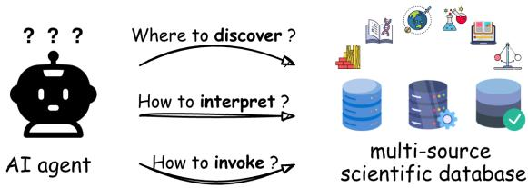
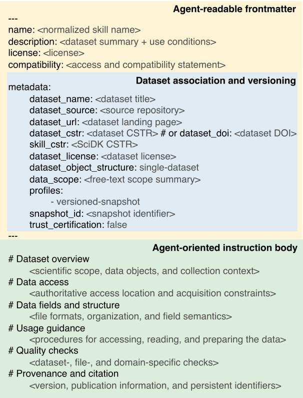
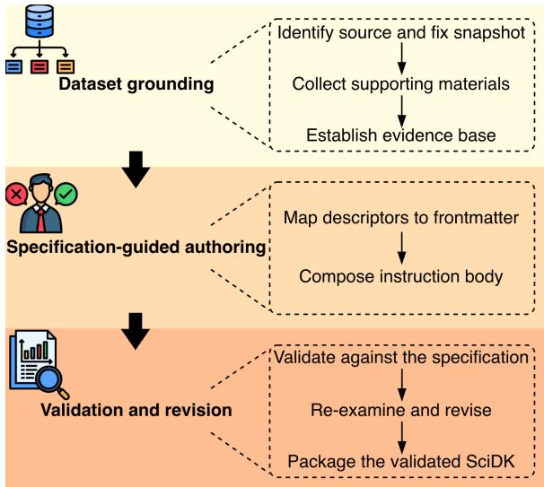
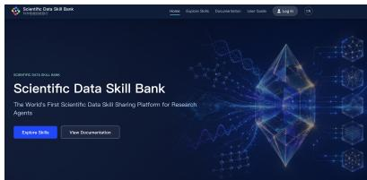
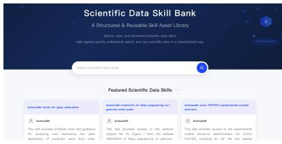
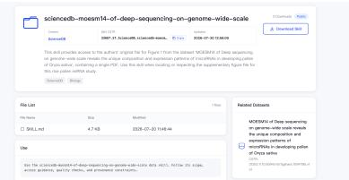
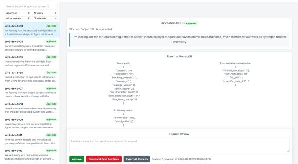

# Scientific Data Skills: Enabling Agent-Ready Scientific Data Services at Scale

Xiaohan Huang\*, Qingqing Long\*, Xiaolei Du, Siyu Pu, Jiawen Xu, Haotian Chen, Chenyang Zhao, Jinbiao Liu, Xuezhi Wang, Hao Wang, Hengshu Zhu†, Yuanchun Zhou† Computer Network Information Center, Chinese Academy of Sciences University of the Chinese Academy of Sciences Beijing, China

## Abstract

Scientific data are increasingly used by AI agents, yet existing dataset representations provide limited support for autonomous discovery, interpretation, and invocation. This limitation stems from the fragmentation of scientific data across heterogeneous repositories and from dataset representations designed primarily for human use. To address this limi tation, we introduce the Scientific Data Skill (SciDSK), an agent-ready representation that packages dataset-specific knowledge and operational guidance as a reusable agent skill. A SciDSK integrates dataset descriptions, scientific context, file organization, usage procedures, quality checks, and provenance information while retaining the underlying data in its original repository. We define a structured SciDSK specification and develop a systematic construction pipeline that grounds each SciDSK in authoritative dataset records and associated supporting materials. We further establish the Scientific Data Skill Bank, a unified platform that publishes SciDSK resources across six scientific disciplines and supports package access, persistent identification, and traceability to source datasets. We evaluate SciDSK through a retrieval benchmark for dataset discovery and controlled cases for dataset interpretation. The results show that SciDSK improves agent-driven dataset discovery and provides more precise and actionable support for dataset interpretation. These findings support the value of organizing datasetspecific knowledge in an agent-ready representation.

## 1 Introduction

AI agents have gained increasing capabilities to plan tasks (Hu et al., 2025; Feng et al., 2026; Luo et al., 2025), use external tools (Doshi et al., 2026), and execute multi-step workflows (Zhang et al.,

2025), supported by recent advances in large language models (LLMs) (Singh et al., 2025; Xu et al., 2026; Zhu et al., 2025; Yan et al., 2024). Recent AI for Science (AI4S) advances have increasingly incorporated such agents into scientific reasoning, experimentation, and data analysis (Wölflein et al., 2025; Xiang et al., 2026; Long et al., 2026b). In scientific research, such agents could accelerate data-intensive discovery (Huang et al., 2026a; Hou et al., 2026; Qin et al., 2025; Huang et al., 2026b). They can also assist researchers in identifying relevant datasets, understanding their contents, and incorporating them into computational analyses (Viswanathan et al., 2023; Long et al., 2026a; Gao et al., 2025; Hong et al., 2025). Realizing this potential requires scientific data representations tailored to agent-driven workflows. Initiatives such as the FAIR principles have improved scientific data findability, accessibility, interoperability, and reusability (Wilkinson et al., 2016; Jacobsen et al., 2020). Yet scientific data resources remain distributed across heterogeneous repositories, and their accompanying documentation is organized primarily for human use (Chapman et al., 2020; Batista et al., 2022; Pushkarna et al., 2022). Emerging AI-ready data approaches improve machine readability and programmatic access while supporting data-readiness assessment in machine-learning workflows (Akhtar et al., 2024; Hiniduma et al., 2025). However, these approaches provide limited support for the dataset-specific context and operational guidance required by AI agents.

Scientific data therefore remain difficult for agents to discover, interpret, and invoke, as summarized in Figure 1. First, agents must navigate a fragmented and heterogeneous data landscape to discover relevant scientific datasets. Scientific data are distributed across domain-specific repositories, institutional platforms, supplementary materials, and independent data services (Chapman et al., 2020). Repositories and platforms expose heterogeneous metadata schemas, search interfaces, and access mechanisms. Agents must therefore identify candidate sources and adapt their retrieval strategies to each infrastructure. This repository-specific process impedes systematic dis covery across sources (Medina-Smith et al., 2021; Viswanathan et al., 2023). Second, agents must infer dataset structure and file-level semantics from incomplete descriptions. Dataset-level meta data commonly summarizes a dataset’s scientific scope, provenance, and general content (Huang et al., 2025; Hafner et al., 2025). However, such metadata often omits file organization, the scien tific roles of individual files, and the relationships among them (Batista et al., 2022). File formats alone cannot resolve these semantics, because sim ilar formats may encode different measurements or processing stages (Walter et al., 2026). Conse quently, agents may select inappropriate files, mis interpret their contents, or propagate unsupported assumptions into downstream analyses. Third, agents must translate dataset knowledge into task-specific procedures for scientific use. Finding and interpreting a dataset do not establish whether it is suitable for an intended scientific task or how it should be prepared and applied (Liu et al., 2024). Using a dataset may require task specific file selection, preprocessing, computational procedures, and usage constraints (Brewer et al., 2026). Without explicit operational guid ance, agents must reconstruct these requirements from the available documentation (Wilkinson et al., 2016). This additional inference can introduce errors and compromise analytical reliability and reproducibility (Chen et al., 2025). These challenges reflect a broader mismatch between existing scientific data resources and the requirements of agent-driven workflows. This mismatch motivates a central question: how can scientific datasets be represented so that agents can reliably discover, interpret, and invoke them?

  
Figure 1: Key challenges in enabling AI agents to discover, interpret, and invoke scientific data.

Our key insight is that agent skills provide a modular mechanism for equipping AI agents with taskspecific knowledge and operational guidance (Xu and Yan, 2026). Through progressive disclosure, AI agents identify relevant skills from concise descriptions, load detailed instructions only when needed, and follow those instructions to perform a task. Building on this mechanism, we introduce the Scientific Data Skill (SciDSK), which represents a scientific dataset by organizing its associated knowledge and usage procedures as a reusable agent skill. A SciDSK organizes dataset descriptions, scientific context, file organization, operational guidance, usage constraints, and provenance within a unified skill package. Once installed, a SciDSK makes its associated dataset discoverable to agents through the skill description, without requiring an initial query to the source repository. After the SciDSK is selected, its detailed instructions explain the dataset’s scientific scope, file roles, and structural relationships, thereby supporting filelevel interpretation. They also specify procedures for accessing, preparing, and validating the data, together with the relevant usage constraints and provenance information. Through this common skill interface, agents can discover, interpret, and invoke scientific datasets while accessing the underlying data from their source repositories.

We further establish and maintain the Scientific Data Skill Bank as an online platform for publishing and accessing a curated collection of SciDSK resources. Resources in the current collection are manually selected and reviewed before publication against platform-defined criteria for source authenticity, representation fidelity, skill safety, and agent compatibility. Each published SciDSK is assigned a CSTR (Zhou et al., 2026) and records its source dataset’s identifier and provenance metadata, allowing the two resources to be independently identified, cited, and traced. The main contributions of this work are summarized as follows.

(1) We introduce SciDSK, a reusable agent skill that represents dataset-specific knowledge and usage procedures, together with a common specification and systematic construction pipeline.

(2) We establish and maintain the Scientific Data Skill Bank, which publishes a curated collection of SciDSK resources linked to their source datasets and assigned individual CSTRs.

(3) We conduct empirical evaluations of SciDSK across dataset discovery and interpretation. The results indicate that SciDSK-based workflows can improve dataset discovery and support more pre-

Table 1: Comparison of SciDK with existing dataset- and agent-oriented concepts.
<table><tr><td></td><td>Dataset Metadata</td><td>Dataset Card</td><td>Agent Skill</td><td>Tool/MCP</td><td>SciDSK(Ours)</td></tr><tr><td>Dataset description</td><td>√</td><td>√</td><td>X</td><td>X</td><td>√</td></tr><tr><td>Scientific context</td><td>Partial</td><td>√</td><td>Partial</td><td>X</td><td>√</td></tr><tr><td>Task knowledge</td><td>X</td><td>Partial</td><td>√</td><td>X</td><td>√</td></tr><tr><td>Operational guidance</td><td>X</td><td>Partial</td><td>√</td><td>√</td><td>√</td></tr><tr><td>Agent discovery</td><td>Partial</td><td>Partial</td><td>√</td><td>X</td><td>√</td></tr><tr><td>Dataset invocation</td><td>X</td><td>X</td><td>Partial</td><td>√</td><td>√</td></tr></table>

cise interpretation.

## 2 Related Work

In this section, we review two lines of research related to Scientific Data Skills. We first examine efforts to improve the AI readiness of scientific data through AI-readable representations, dataset documentation, and data-readiness frameworks. We then discuss agent skills as reusable representations of knowledge and operational guidance, with particular attention to their limited support for scientific datasets.

## 2.1 Scientific Data Representations Toward AI Readiness

Scientific data representations have evolved from repository-oriented metadata toward richer descriptions (Akhtar et al., 2024; Assante et al., 2016). The FAIR principles, persistent identifiers, metadata standards, and FAIR Digital Objects improve dataset discovery, attribution, exchange, and reuse across data infrastructures (Wilkinson et al., 2016; Batista et al., 2022; De Smedt et al., 2020). Dataset documentation frameworks further describe collection processes, intended uses, limitations, and ethical considerations. Formats such as RO-Crate (Soiland-Reyes et al., 2022) and Croissant (Akhtar et al., 2024) provide structured representations of research objects, data resources, record structures, field semantics, provenance, and computational access. Recent AIreadiness frameworks extend this scope to data quality, governance, sustainability, and task suitability (Hiniduma et al., 2025; Clark et al., 2024; Majithia et al., 2026). Together, these efforts make scientific datasets more discoverable, interpretable, and accessible to computational systems. However, existing representations primarily support data publication, assessment, exchange, or modeldevelopment pipelines (Soiland-Reyes et al., 2022; Akhtar et al., 2024; Brewer et al., 2026). These descriptions are largely declarative, specifying what a dataset contains, how it was produced, and how its records can be accessed. They do not generally organize the dataset-specific knowledge required for autonomous use, including when the dataset should be selected, how its scientific concepts correspond to particular files and fields, which preparation procedures should be applied, and how the resulting data should be validated. Such knowledge often remains distributed across metadata records, documentation pages, loaders, and example workflows. Consequently, a dataset may be FAIR, extensively documented, and programmatically accessible without being directly usable by a generalpurpose AI agent. Bridging this gap requires an agent-ready representation that integrates dataset identity, scientific context, structural semantics, operational guidance, usage constraints, and validation procedures.

## 2.2 Agent Skills for Scientific Data

Agent Skills provide a modular mechanism for extending AI agents with specialized knowledge, instructions, and reusable resources. A skill typically exposes a concise description for discovery and provides detailed guidance that is loaded only when relevant. This progressive disclosure allows agents to select appropriate capabilities without incorporating all instructions into their working context (Anthropic, 2026; OpenAI, 2026). Existing skills support a wide range of tasks, including software development, document processing, data analysis, and domain-specific workflows. These examples demonstrate that procedural knowledge can be packaged independently of agent models and reused across tasks and runtime environments (Li et al., 2026, 2025a; Xu and Yan, 2026). However, existing agent skills are predominantly organized around tasks, tools, or general workflows rather than individual scientific datasets. When scientific data are involved, datasets are commonly treated as external inputs retrieved through search interfaces,

APIs, or tool calls (Hong et al., 2026; Li et al., 2025b; Gao et al., 2025). The knowledge required to use a particular dataset, including its scientific scope, file organization, field semantics, applicable tasks, preparation procedures, and quality checks, is rarely encoded in a dedicated skill. Existing skill conventions also do not explicitly define associations with datasets, snapshot-level versioning, or provenance links between a skill and its underlying data resource. Consequently, agents may possess general data-analysis capabilities while lacking the dataset-specific knowledge needed to apply those capabilities reliably to individual datasets. Extending the Agent Skill paradigm to scientific data therefore requires a structured representation that connects each skill to a specific dataset and organizes the knowledge needed for its discovery, interpretation, and invocation.

## 3 Scientific Data Skill

In this section, we present the conceptual foundation, representation specification, and construction pipeline of SciDSK. We first explain how SciDSK extends the agent skill paradigm and relates to existing data representations and executable interfaces. We then define its representation structure, dataset association and versioning scheme, and validation requirements. Finally, we describe the pipeline for constructing SciDSK resources from scientific datasets and their supporting materials.

## 3.1 Overview of Scientific Data Skills

A SciDSK is an agent-ready representation of a scientific dataset that supports its discovery, interpretation, and invocation by AI agents. It organizes dataset descriptions, file organization, operational guidance, and provenance information within a unified skill package. A SciDSK remains separate from its associated dataset and maintains an explicit link to the source dataset in its original repository. From Agent Skill to Scientific Data Skill. Agent skills package specialized knowledge, instructions, and resources as reusable capabilities for AI agents. Following this paradigm, we extend the concept of skills from task-oriented agent capabilities to scientific data resources. A SciDSK represents the dataset-specific knowledge and operational guidance required for agents to effectively interact with an associated dataset. Rather than encapsulating datasets themselves, SciDSK provides an agentready representation that enables agents to discover, interpret, and invoke the associated dataset.

  
Figure 2: Schematic structure of a Scientific Data Skill.

SciDSK in Relation to Existing Concepts. Table 1 compares SciDSK with dataset metadata, dataset cards, agent skills, and tool interfaces. Dataset metadata and dataset cards describe dataset characteristics, provenance, and intended uses. Building on these representations, SciDSK organizes the scientific context, file-level information, and operational guidance needed to support dataset discovery, interpretation, and invocation. Tools and MCPbased interfaces expose executable operations to AI agents. The dataset-specific context and procedures provided by SciDSK help agents determine when and how to apply these operations. In this way, SciDSK bridges descriptive data representations and executable interfaces for agent-driven use of scientific datasets.

## 3.2 Scientific Data Skill Specification

The SciDSK specification defines how the information needed for dataset discovery, interpretation, and invocation is organized within a skill package. Following existing agent skill conventions, each SciDSK uses a SKILL.md file as its core representation and may include additional resources when needed. Within SKILL.md, YAML frontmatter exposes agent-readable descriptors for discovering the associated dataset and recording its identity and provenance. The Markdown body provides the scientific context and operational instructions needed to interpret and invoke the dataset. Figure 2 illustrates this two-part structure.

Agent-readable frontmatter. The YAML frontmatter contains agent-readable descriptors for dataset discovery, association, versioning, and provenance tracking. Its top-level fields follow existing agent skill conventions and include name, description, license, and compatibility. The nested metadata block adds dataset-specific descriptors, including dataset identity, source and access location, persistent identifiers, license, data scope, object structure, and snapshot information. The description field summarizes the associated dataset and indicates when the SciDSK should be selected, thereby serving as its primary routing signal. Together, these descriptors allow agents to assess the relevance of the associated dataset and identify its source and represented version.

Agent-ready instruction body. The Markdown body is loaded after a SciDSK has been selected and provides the information needed to work with the associated dataset. It comprises six components: dataset overview, data access, data fields and structure, usage guidance, quality checks, and provenance and citation. The dataset overview, data fields and structure components describe the scientific context, file organization, data formats, and field semantics needed for interpretation. The data access, usage guidance, and quality checks components specify documented procedures for obtaining, reading, preparing, and checking the data. The provenance and citation component records persistent identifiers, version information, and publication details for traceability. Together, these components support agents in interpreting and invoking the dataset with their available tools.

Dataset association and versioning. Each SciDSK represents a single scientific dataset, while the underlying data remain in their original repository. The association is recorded through the dataset source, landing-page URL, and persistent identifier. Separate identifier fields distinguish the dataset from its corresponding SciDSK and make their relationship traceable. The versioned-snapshot profile indicates that the SciDSK describes a specific dataset snapshot identified by snapshot\_id. Detailed version and publication information in the instruction body further identifies the dataset state to which the instructions apply. Together, these records maintain an explicit relationship between the SciDSK and the represented dataset snapshot.

  
Figure 3: Construction pipeline of a Scientific Data Skill.

Validation requirements. Before publication, each SciDSK undergoes checks for structural conformance, consistency with its source materials, and package integrity. Structural checks cover the YAML frontmatter, required instruction components, and package organization. Sourceconsistency checks compare dataset identifiers, access information, licensing information, file structure, and version records with the associated dataset materials. Package-integrity checks confirm that the distributed SciDSK can be parsed and installed according to the skill conventions. These checks assess the conformance and traceability of the SciDSK representation.

## 3.3 Skill Construction Pipeline

The SciDSK construction pipeline provides a structured process for representing a scientific dataset, as shown in Figure 3. Starting from a scientific dataset and its supporting materials, the pipeline establishes a traceable evidence base, organizes the information needed for dataset discovery, interpretation, and invocation according to the SciDSK specification, and checks the resulting representation through iterative revision. The pipeline comprises three stages: dataset grounding, specification-guided authoring, and validation and revision.

Dataset grounding. Dataset grounding defines the dataset and establishes the evidence base from which a SciDSK is constructed. The process first identifies the authoritative dataset source and the specific dataset snapshot to be represented. Available supporting materials are then collected, including dataset metadata, landing pages, documentation, file inventories, data dictionaries, associated publications, access conditions, licenses, and version records. Information from these materials is normalized while its source attribution is preserved. Missing or inconsistent information is recorded for subsequent review. The resulting evidence base constrains the dataset-specific facts and usage knowledge that can be included in the SciDSK.

  
(a) Platform Homepage.

  
(b) Skill Discovery Page.

  
(c) Data Skill Detail Information.  
Figure 4: The online Scientific Data Skill Bank, which can be visited at https://scidsk.cn/.

Specification-guided authoring. Specificationguided authoring organizes the grounded evidence according to the SciDSK specification. Dataset identity, access, licensing, versioning, and provenance information are mapped to the agentreadable frontmatter. Scientific scope, data organization, field semantics, access procedures, usage guidance, and quality checks are organized within the corresponding components of the agentready instruction body. Operational guidance is derived from the documented characteristics and constraints of the dataset. Unsupported information is omitted, while required information that cannot be established from the available evidence is marked as unavailable.

Validation and revision. The authored SciDSK is checked against the structural and content requirements of the SciDSK specification. These checks cover the conformance of SKILL.md and its optional resources, their consistency with the grounded evidence, and the internal consistency between the frontmatter and instruction body. When missing, contradictory, or unsupported information is identified, the source materials are re-examined and the authored content is revised accordingly. The review and revision cycle continues until the identified issues have been addressed and the specification requirements are satisfied. The finalized SKILL.md and any necessary supplementary resources are then organized into a SciDSK package

associated with the corresponding dataset snapshot.   
Package integrity is checked before publication.

## 4 Scientific Data Skill Bank

In this section, we present the Scientific Data Skill Bank, an online platform for publishing, discovering, and accessing a curated collection of SciDSK resources. We first describe the platform interfaces and its initial cross-disciplinary resource collection. We then outline the platform-defined review process applied before resource publication. Finally, we explain how the platform supports resource discovery, package access, and traceability through persistent identifiers and explicit dataset associations.

## 4.1 Platform Overview

The Scientific Data Skill Bank1 is an online platform for publishing, discovering, and accessing a curated collection of SciDSK resources. The collection spans six disciplines: physics, chemistry, earth sciences, biology, materials science, and computer science and technology. As shown in Figure 4, the platform provides three main interfaces for exploring the collection. The homepage introduces the platform and provides an entry point to its published resources (Figure 4a). The resource discovery interface supports keyword search and browsing by discipline and presents featured SciDSK resources (Figure 4b). The detail page presents the content of an individual SciDSK, its association with the source dataset, its usage guidance, and a downloadable skill package (Figure 4c). Together, these interfaces allow users to browse, inspect, and download published SciDSK resources.

## 4.2 Pre-publication Resource Review

Before publication, each SciDSK is reviewed against its source materials and the proposed specification. The platform defines four review dimensions: source authenticity, representation fidelity, skill safety, and agent compatibility. Under source authenticity, the dataset identifier, source repository, license, and version information are compared with the records provided by the identified data source. Representation fidelity is assessed by comparing the dataset description, file organization, access instructions, usage guidance, and provenance information with the available dataset records and supporting materials. Skill safety review examines the package structure and included resources for evident risks, such as instructions that request unintended operations. Agent compatibility review is limited to conformance with the expected agent skill structure and the parseability of the frontmatter and instruction body. Only resources that meet the platform-defined publication criteria are included in the Scientific Data Skill Bank. This review supports an internal publication decision.

## 4.3 Resource Discovery, Access, and Traceability

The platform supports resource discovery through keyword search, browsing by discipline, and featured entries. Search and browsing results lead to detail pages where users can inspect the scientific scope, source dataset association, and usage information of individual SciDSK resources. These pages allow users to assess resource relevance before accessing the corresponding package.

Each published SciDSK can be downloaded as a compressed skill package. The underlying dataset is not distributed through the platform and remains accessible from its original repository. Its access location and relevant instructions are recorded in the corresponding SciDSK.

Each published SciDSK is assigned an independent CSTR (Zhou et al., 2026). Its frontmatter also records the CSTR of the associated dataset, or its DOI when a CSTR is unavailable, together with the snapshot identifier, source repository, and landing page. These identifiers and source records connect the published SciDSK to the specific dataset snapshot described by its instructions. The SciDSK and its associated dataset can therefore be independently identified and cited through their respective persistent identifiers.

## 5 Evaluation Benchmark Construction

In this section, we describe the construction of the tasks used to evaluate SciDSK in dataset discovery and interpretation. We first present the retrieval benchmark for dataset discovery, including target dataset selection, query construction, and candidate corpus organization. We then introduce the controlled cases for dataset interpretation and define their task requirements.

We construct a retrieval benchmark using 72 datasets selected from six scientific disciplines. For each target dataset, we construct two queries expressing research needs at different levels of specificity while excluding explicit identifying information. This process yields 24 development queries and 120 initial test queries. We further develop a human annotation platform to review all queries for naturalness, factual consistency, and target relevance. Figure 5 shows the annotation interface. After manual review, we exclude 16 ambiguous test queries, resulting in a final test set of 104 queries with one verified relevant dataset each. The retrieval corpus covers the same six disciplines and is approximately four times the size of the public SciDSK collection. For each candidate dataset, the corpus contains both a conventional dataset record and its corresponding SciDSK representation. This one-to-one correspondence ensures that the compared methods retrieve and rank the same underlying dataset identities.

## 5.1 Dataset Discovery Benchmark

  
Figure 5: Human annotation interface for reviewing discovery benchmark queries.

## 5.2 Dataset Interpretation Cases

We construct cases to assess whether SciDSK provides more precise and actionable support for dataset interpretation and select four representative cases for evaluation. The selected cases cover CT image sequences, GIS rasters and sidecar files, image-based scientific tables, and cross-file associations between event labels and textual content. Each case pairs a target dataset with a realistic request requiring the agent to explain the data content, identify file roles and organization, specify prerequisite checks, and distinguish evidence-supported information from the provided materials. Dataset discovery and downstream analysis are excluded to isolate dataset interpretation. Each case includes six atomic assessment criteria derived from the frozen source record and file tree.

Table 2: Overall discovery performance on the test sets. All values are percentages, and the best result is shown in bold.
<table><tr><td>Method</td><td>Hit@1</td><td>Recall@5</td><td>MRR</td><td>nDCG@5</td></tr><tr><td>BM25-Raw</td><td>47.12</td><td>69.23</td><td>57.59</td><td>59.12</td></tr><tr><td>Agent-Raw</td><td>71.15</td><td>90.38</td><td>79.04</td><td>81.90</td></tr><tr><td>Agent-SciDSK-Text</td><td>70.19</td><td>90.38</td><td>79.01</td><td>81.92</td></tr><tr><td>Agent-SciDSK</td><td>80.77</td><td>94.23</td><td>86.41</td><td>88.40</td></tr></table>

Table 3: Results on the four dataset interpretation cases.
<table><tr><td>Evidence condition</td><td>Coverage (%)</td><td>Satisfied criteria</td></tr><tr><td>ScienceDB page</td><td>91.67</td><td>22/24</td></tr><tr><td>Scientific Data Skill</td><td>95.83</td><td>23/24</td></tr></table>

## 6 Experiment

In this section, we evaluate SciDSK in dataset discovery and interpretation. We first describe the experimental environment and agent configuration. We then introduce the compared retrieval methods and evaluation metrics for dataset discovery. Finally, we present the evidence conditions and evaluation procedure for dataset interpretation.

## 6.1 Experimental Setup

Basic Settings All agent-based evaluations were conducted in a real agent environment as the harness and qwen3.6-plus (Yang et al., 2025) as the underlying language model. The model’s thinking mode was disabled, automatic tool selection was enabled, and the temperature was set to 0. All other inference parameters remained at their default values. Each model request had a timeout of 120 seconds, with up to three retries upon failure. We used the July 2026 snapshot of the Scientific Data Skill Bank. To maintain a controlled action space, we implemented task-specific tools based on the Model Context Protocol and exposed them through a strict allowlist. The native Shell, general file-system, browser, and Web-search capabilities of the agent harness were disabled. Session state was not retained across experimental runs.

Dataset Discovery Evaluation Protocols We compare four methods spanning lexical retrieval, agent-based document retrieval, and end-to-end SciDSK discovery. BM25-Raw indexes conventional dataset records containing metadata and filetree information. BM25-SciDSK indexes complete SKILL.md documents as ordinary searchable text without registering them through the Agent Skill mechanism. Agent-SciDSK-Text uses the same document representation but allows the agent to iteratively search, inspect candidates, and produce a final ranking. Agent-SciDSK first selects the two most relevant disciplines and then searches the registered SciDSK resources within the selected disciplines. The search index uses the conventional metadata representation associated with each registered SciDSK. Both agent-based methods use the same search budget and final-ranking protocol. Each method produces a top-five ranking for every test query. The two agent-based methods are allowed at most four searches and ten candidate inspections per query and must construct their final rankings from previously retrieved candidates. Both BM25 methods use $k _ { 1 } = 1 . 5$ and $b = 0 . 7 5$ with ties resolved by dataset identifier. We report Hit@1, Recall@5, mean reciprocal rank (MRR), and normalized discounted cumulative gain at rank five (nDCG@5). The metric definitions are provided in Appendix A.

Dataset Interpretation Evaluation Protocols We compare three evidence conditions under the same agent framework. Agent-Page accesses a frozen snapshot of the corresponding ScienceDB landing page. Agent-Raw receives the conventional metadata and file tree directly. Agent-SciDSK accesses the complete SKILL.md through the native Agent Skill mechanism. All conditions use the same model, request, prompt template, and runtime constraints, with external information sources disabled. Each evidence condition is evaluated against 24 atomic criteria, comprising six criteria for each of the four cases. Predefined termmatching rules determine whether each criterion is satisfied. A single evaluator, blinded to the evidence condition, reviews every response for factual accuracy, unsupported inference, uncertainty handling, and potential matching errors. The deterministic scores are retained for quantitative comparison, while discrepancies identified during review are reported separately. We report the number of satisfied criteria out of 24, together with protocol compliance, tool calls, token usage, and runtime. The complete assessment criteria are provided in Appendix B.

Table 4: Comparison on the CT skull reconstruction case.
<table><tr><td>Evidence condition</td><td>TIFF sequence interpretation</td><td>Reported file-count handling</td><td>Pre-use checks</td><td>Coverage</td></tr><tr><td>Dataset information page</td><td>Incorrectly described the visible sequence as “200+ slices&quot;</td><td>Noted that the visible file tree may be incomplete</td><td>Provided general checks for the image sequence and parameters</td><td>5/6</td></tr><tr><td>Scientific Data Skill</td><td>Correctly identified 196 consecutive slices</td><td>Distinguished the reported total from the visible portion while preserving uncertainty</td><td>Specified continuity, non-empty-file, readability, parameter-file, and directory-completeness checks</td><td>6/6</td></tr><tr><td></td><td colspan="4">Table 5: Comparison on the Weibo rumor-event mapping case.</td></tr><tr><td>Evidence condition</td><td>File organization Identified events.txt as</td><td>Cross-file relationship</td><td>Validation checks Suggested general</td><td>Coverage</td></tr><tr><td>Dataset information page</td><td>the label file and posts.zip as containing event-organized JSON content</td><td>Linked event identifiers to event-named JSON files but left corpus-wide completeness unresolved</td><td>coverage and schema checks without explicit count and label-domain validation</td><td>5/6</td></tr><tr><td>Scientific Data Skill</td><td>Identified 4,664 labeled events and clearly distinguished the roles of the two files</td><td>Specified a one-to-one mapping between event records and event-named JSON files</td><td>Required count validation, binary-label checks, archive extraction, orphan detection, and sampled content verification</td><td>6/6</td></tr></table>

## 6.2 Dataset Discovery

In this experiment, we answer the question: Does the end-to-end SciDSK workflow improve scientific dataset discovery over retrieval based on conventional records or static SciDSK documents? As shown in Table 2, Agent-SciDSK achieves the best performance across all reported metrics. The comparison between BM25-Raw and Agent-Raw isolates the effect of agent-based retrieval over the same conventional dataset records. The substantial improvement of Agent-Raw demonstrates the value of iterative query formulation and candidate inspection over direct lexical retrieval. The comparison between Agent-Raw and Agent-SciDSK-Text then changes the document representation while retaining the same agent-based retrieval protocol. Their nearly identical performance indicates that treating complete SciDSK documents as ordinary searchable text provides little additional benefit over conventional records. The comparison between Agent-SciDSK-Text and Agent-SciDSK examines the effect of using SciDSK as registered and routable agent skills. Agent-SciDSK consistently improves all four retrieval metrics. This result attributes the main performance gain to the end-to-end use of SciDSK within the agent workflow.

## 6.3 Dataset Interpretation

In this experiment, we answer the question: Does SciDSK provide more precise and actionable support for dataset interpretation? As shown in Table 3, Agent-SciDSK achieves higher overall coverage, satisfying 23 of the 24 assessment criteria compared with 22 under the ScienceDB page condition. The CT reconstruction case in Table 4 demonstrates the difference in quantitative interpretation and pre-use guidance. The ScienceDB page condition incorrectly describes the visible TIFF sequence as containing more than 200 slices. Agent-SciDSK correctly identifies 196 consecutive slices and distinguishes them from the reported datasetlevel total of 1,576 files. It also specifies checks for sequence continuity, file readability, parameter files, and directory completeness. The Weibo event-mapping case in Table 5 demonstrates the difference in cross-file interpretation. Both conditions identify the roles of events.txt and posts.zip, but Agent-SciDSK more explicitly describes the correspondence between event records and eventnamed JSON files. It further specifies checks for record and JSON-file counts, binary labels, archive extraction, orphaned identifiers, and sampled content consistency. The ScienceDB page condition provides only general consistency checks without fully specifying these corpus-wide validations.

## 7 Conclusion

We presented SciDSK, an agent-ready representation that organizes the information needed for AI agents to discover and interpret a specific scientific dataset. We also developed its representation specification, construction pipeline, and publication platform. The retrieval experiment shows that the end-to-end SciDSK workflow improves dataset discovery, although the contributions of routing, registration, and skill content cannot be separated. The controlled cases further provide preliminary evidence of more precise file-level interpretation and task-dependent reductions in exploratory work.

## Acknowledgements

We appreciate the contributions of the following individuals for their support of platform development: Chengzan Li, Jia Liu, Zeyu Zhang, Jidong Li, and Shu Wang.

## References

Mubashara Akhtar, Omar Benjelloun, Costanza Conforti, Luca Foschini, Pieter Gijsbers, Joan Giner-Miguelez, Sujata Goswami, Nitisha Jain, Michalis Karamousadakis, Satyapriya Krishna, and 1 others. 2024. Croissant: A metadata format for ml-ready datasets. Advances in Neural Information Processing Systems, 37:82133–82148.

Anthropic. 2026. Extend claude with skills. https: //code.claude.com/docs/en/skills. Accessed: 2026-08-06.

Massimiliano Assante, Leonardo Candela, Donatella Castelli, and Alice Tani. 2016. Are scientific data repositories coping with research data publishing? Data Science Journal, 15:6–6.

Dominique Batista, Alejandra Gonzalez-Beltran, Susanna-Assunta Sansone, and Philippe Rocca-Serra. 2022. Machine actionable metadata models. Scientific Data, 9(1):592.

Wesley Brewer, Patrick Widener, Valentine Anantharaj, Feiyi Wang, Tom Beck, Arjun Shankar, and Sarp Oral. 2026. Data readiness pipeline patterns for scientific ai at scale: Insights from climate, fusion, life sciences, and materials. AI Magazine, 47(1):e70056.

Adriane Chapman, Elena Simperl, Laura Koesten, George Konstantinidis, Luis-Daniel Ibáñez, Emilia Kacprzak, and Paul Groth. 2020. Dataset search: a survey. The VLDB Journal, 29(1):251–272.

Ziru Chen, Shijie Chen, Yuting Ning, Qianheng Zhang, Boshi Wang, Botao Yu, Yifei Li, Zeyi Liao, Chen Wei, Zitong Lu, and 1 others. 2025. Scienceagentbench: Toward rigorous assessment of language agents for data-driven scientific discovery. In International Conference on Learning Representations, volume 2025, pages 96934–96990.

Timothy Clark, Harry Caufield, Jillian A Parker, Sadnan Al Manir, Edilberto Amorim, James Eddy, Nayoon Gim, Brian Gow, Wesley Goar, Melissa Haendel, and 1 others. 2024. Ai-readiness for biomedical data: Bridge2ai recommendations. BioRxiv.

Koenraad De Smedt, Dimitris Koureas, and Peter Wittenburg. 2020. Fair digital objects for science: From data pieces to actionable knowledge units. Publications, 8(2):21.

Aarya Doshi, Yining Hong, Congying Xu, Eunsuk Kang, Alexandros Kapravelos, and Christian Kästner. 2026. Towards verifiably safe tool use for llm agents. In Proceedings ofthe IEEE/ACM 48th International Conference on Software Engineering, pages 201–205.

KJ Kevin Feng, Kevin Pu, Matt Latzke, Tal August, Pao Siangliulue, Jonathan Bragg, Daniel S Weld, Amy X Zhang, and Joseph Chee Chang. 2026. Cocoa: Coplanning and co-execution with ai agents. In Proceedings ofthe 2026 CHI Conference on Human Factors in Computing Systems, pages 1–23.

Shanghua Gao, Richard Zhu, Pengwei Sui, Zhenglun Kong, Sufian Aldogom, Yepeng Huang, Ayush Noori, Reza Shamji, Krishna Parvataneni, Theodoros Tsiligkaridis, and 1 others. 2025. Democratizing ai scientists using tooluniverse. arXiv preprint arXiv:2509.23426.

Alenka Hafner, Victoria DeLeo, Cecilia H Deng, Christine G Elsik, Damarius S Fleming, Peter W Harrison, Theodore S Kalbfleisch, Bruna Petry, Boas Pucker, Elsa H Quezada-Rodríguez, and 1 others. 2025. Data reuse in agricultural genomics research: challenges and recommendations. GigaScience, 14:giae106.

Kaveen Hiniduma, Suren Byna, and Jean Luca Bez. 2025. Data readiness for ai: A 360-degree survey. ACM Computing Surveys, 57(9):1–39.

David Boram Hong, Aaron Imani, and Iftekhar Ahmed. 2026. From anatomy to smells: An empirical study of skill. md in agent skills. arXiv preprint arXiv:2607.01456.

Sirui Hong, Yizhang Lin, Bang Liu, Bangbang Liu, Binhao Wu, Ceyao Zhang, Danyang Li, Jiaqi Chen, Jiayi Zhang, Jinlin Wang, Li Zhang, Lingyao Zhang, Min Yang, Mingchen Zhuge, Taicheng Guo, Tuo Zhou, Wei Tao, Robert Tang, Xiangtao Lu, and 9 others.

2025. Data interpreter: An LLM agent for data science. In Findings of the Association for Computational Linguistics: ACL 2025, pages 19796–19821, Vienna, Austria. Association for Computational Linguistics.

Yufei Hou, Jiajia Wang, Ke Xiang, Qingqing Long, Yuanchun Zhou, and Zhen Meng. 2026. Bioflowbench: A comprehensive benchmark for evaluating bioinformatics tool-use capabilities of llms and agents. In Proceedings of the 32nd ACM SIGKDD Conference on Knowledge Discovery and Data Mining V. 2, pages 9059–9070.

Mengkang Hu, Pu Zhao, Can Xu, Qingfeng Sun, Jian-Guang Lou, Qingwei Lin, Ping Luo, and Saravan Rajmohan. 2025. Agentgen: Enhancing planning abilities for large language model based agent via environment and task generation. In Proceedings of the 31st ACM SIGKDD Conference on Knowledge Discovery and Data Mining V. 1, pages 496–507.

Kexin Huang, Serena Zhang, Hanchen Wang, Yuanhao Qu, Yingzhou Lu, Ryan Li, Yusuf Roohani, Lin Qiu, Shiyi Cao, Gavin Li, and 1 others. 2026a. Autonomous biomedical research with an artificial intelligence agent. Science, page eadz4351.

Xiaohan Huang, Meng Xiao, Chuan Qin, Qingqing Long, Jinmiao Chen, Yuanchun Zhou, and Hengshu Zhu. 2026b. Scihorizon-gene: Benchmarking llm for life sciences inference from gene knowledge to functional understanding. In Proceedings of the 32nd ACM SIGKDD Conference on Knowledge Discovery and Data Mining V. 2, pages 9137–9148.

Yu-Ning Huang, Viorel Munteanu, Michael I Love, Cynthia Flaire Ronkowski, Dhrithi Deshpande, Annie Wong-Beringer, Russell Corbett-Detig, Mihai Dimian, Jason H Moore, Lana X Garmire, and 1 others. 2025. Perceptual and technical barriers in sharing and formatting metadata accompanying omics studies. Cell Genomics, 5(5).

Annika Jacobsen, Ricardo de Miranda Azevedo, Nick Juty, Dominique Batista, Simon Coles, Ronald Cornet, Mélanie Courtot, Mercè Crosas, Michel Dumontier, Chris T Evelo, and 1 others. 2020. Fair principles: interpretations and implementation considerations.

Fangzhou Li, Pagkratios Tagkopoulos, and Ilias Tagkopoulos. 2025a. Skillflow: Scalable and efficient agent skill retrieval system. arXiv preprint arXiv:2504.06188.

Keyu Li, Mohan Jiang, Dayuan Fu, Yunze Wu, Xiangkun Hu, Dequan Wang, and Pengfei Liu. 2025b. Datasetresearch: Benchmarking agent systems for demand-driven dataset discovery. arXiv preprint arXiv:2508.06960.

Xiangyi Li, Yimin Liu, Wenbo Chen, Bingran You, Zonglin Di, Yifeng He, Shenghan Zheng, Kyoung Whan Choe, Jiankai Sun, Shuyi Wang, and 1 others. 2026. Skillsbench: Benchmarking how well

agent skills work across diverse tasks. arXiv preprint arXiv:2602.12670.

Haoyang Liu, Shuyu Chen, Ye Zhang, and Haohan Wang. 2024. Genotex: an llm agent benchmark for automated gene expression data analysis. arXiv preprint arXiv:2406.15341.

Qingqing Long, Haotian Chen, Chenyang Zhao, Xiaolei Du, Xuezhi Wang, Pengyao Wang, Chengzan Li, Yuanchun Zhou, and Hengshu Zhu. 2026a. Sciencedb ai: An llm-driven agentic recommender system for large-scale scientific data sharing services. In Proceedings ofthe 32nd ACM SIGKDD Conference on Knowledge Discovery and Data Mining V.2, KDD ’26, page 7715–7726, New York, NY, USA.

Qingqing Long, Shuai Liu, Ning Cao, Zhicheng Ren, Xiao Luo, Wei Ju, Chen Fang, Zhihong Zhu, Hengshu Zhu, and Yuanchun Zhou. 2026b. A survey of large language models for traffic forecasting: Methods and applications. IEEE Transactions on Big Data.

Junyu Luo, Weizhi Zhang, Ye Yuan, Yusheng Zhao, Junwei Yang, Yiyang Gu, Bohan Wu, Binqi Chen, Ziyue Qiao, Qingqing Long, and 1 others. 2025. Large language model agent: A survey on methodology, applications and challenges. arXiv preprint arXiv:2503.21460.

Neil Majithia, Thomas Carey-Wilson, Elena Simperl, and Nigel Shadbolt. 2026. An actionable framework for ai-ready data. Ai Magazine, 47(1):e70054.

Andrea Medina-Smith, Chandler A Becker, Raymond L Plante, Laura M Bartolo, Alden Dima, James A Warren, and Robert J Hanisch. 2021. A controlled vocabulary and metadata schema for materials science data discovery. Data Science Journal, 20(1):18–18.

OpenAI. 2026. Build skills. https://learn.chatgpt. com/docs/build-skills. Accessed: 2026-08-06.

Mahima Pushkarna, Andrew Zaldivar, and Oddur Kjartansson. 2022. Data cards: Purposeful and transparent dataset documentation for responsible ai. In Proceedings ofthe 2022 ACM conference onfairness, accountability, and transparency, pages 1776–1826.

Chuan Qin, Xin Chen, Chengrui Wang, Pengmin Wu, Xi Chen, Yihang Cheng, Jingyi Zhao, Meng Xiao, Xiangchao Dong, Qingqing Long, and 1 others. 2025. Scihorizon: Benchmarking ai-for-science readiness from scientific data to large language models. In Proceedings of the 31st ACM SIGKDD Conference on Knowledge Discovery and Data Mining V. 2, pages 5754–5765.

Aaditya Singh, Adam Fry, Adam Perelman, Adam Tart, Adi Ganesh, Ahmed El-Kishky, Aidan McLaughlin, Aiden Low, AJ Ostrow, Akhila Ananthram, and 1 others. 2025. Openai gpt-5 system card. arXiv preprint arXiv:2601.03267.

Stian Soiland-Reyes, Peter Sefton, Mercè Crosas, Leyla Jael Castro, Frederik Coppens, José M Fernández, Daniel Garijo, Björn Grüning, Marco La Rosa, Simone Leo, and 1 others. 2022. Packaging research artefacts with ro-crate. Data Science, 5(2):97–138.

Vijay Viswanathan, Luyu Gao, Tongshuang Wu, Pengfei Liu, and Graham Neubig. 2023. Datafinder: Scientific dataset recommendation from natural language descriptions. In Proceedings ofthe 61st Annual Meeting ofthe Associationfor Computational Linguistics (Volume 1: Long Papers), pages 10288–10303.

Jasmin Walter, Carsten Kuenne, Noah Knoppik, Philipp Goymann, and Mario Looso. 2026. Fred enables standardized fair metadata generation and management for omics research. Scientific Reports, 16(1):23202.

Mark D Wilkinson, Michel Dumontier, IJsbrand Jan Aalbersberg, Gabrielle Appleton, Myles Axton, Arie Baak, Niklas Blomberg, Jan-Willem Boiten, Luiz Bonino da Silva Santos, Philip E Bourne, and 1 others. 2016. The fair guiding principles for scientific data management and stewardship. Scientific data, 3(1):160018.

Georg Wölflein, Dyke Ferber, Daniel Truhn, Ognjen Arandjelovic, and Jakob Nikolas Kather. 2025. LLM agents making agent tools. In Proceedings of the 63rd Annual Meeting of the Association for Computational Linguistics (Volume 1: Long Papers), pages 26092–26130, Vienna, Austria. Association for Computational Linguistics.

Dawei Xiang, Kexin Chu, Wenyan Xu, Wenhui Zhang, and Wei Zhang. 2026. LLM-as-scheduler: Agentic workflow dynamic scheduling. In Proceedings ofthe 64th Annual Meeting ofthe Associationfor Computational Linguistics (Volume 1: Long Papers), pages 12752–12763, San Diego, California, United States. Association for Computational Linguistics.

Anyi Xu, Bangcai Lin, Bing Xue, Bingxuan Wang, Bingzheng Xu, Bochao Wu, Bowei Zhang, Chaofan Lin, Chen Dong, Chenchen Ling, and 1 others. 2026. Deepseek-v4: Towards highly efficient million-token context intelligence. arXiv preprint arXiv:2606.19348.

Renjun Xu and Yang Yan. 2026. Agent skills for large language models: Architecture, acquisition, security, and the path forward. arXiv preprint arXiv:2602.12430.

Yuchen Yan, Peiyan Zhang, Zheng Fang, and Qingqing Long. 2024. Inductive graph alignment prompt: Bridging the gap between graph pre-training and inductive fine-tuning from spectral perspective. In Proceedings of the ACM Web Conference 2024, pages 4328–4339.

An Yang, Anfeng Li, Baosong Yang, Beichen Zhang, Binyuan Hui, Bo Zheng, Bowen Yu, Chang Gao, Chengen Huang, Chenxu Lv, and 1 others. 2025. Qwen3 technical report. arXiv preprint arXiv:2505.09388.

Weiliang Zhang, Xiaohan Huang, Ziyue Qiao, Qingqing Long, Zhen Meng, Yuanchun Zhou, Yi Du, and Meng Xiao. 2025. Comprehend, divide, and conquer: Feature subspace exploration via multi-agent hierarchical reinforcement learning. ACM Transactions on Knowledge Discoveryfrom Data.

Yuanchun Zhou, Shu Wang, Jia Liu, Xiaolei Xia, Lijuan Wang, and Xuefeng Lv. 2026. Construction achievements and innovative application exploration of the cstr identification platform. In China’s e-Science Blue Book 2025, pages 179–195. Springer.

Zhihong Zhu, Yunyan Zhang, Xianwei Zhuang, Fan Zhang, Zhongwei Wan, Yuyan Chen, Qingqing Long, Yefeng Zheng, and Xian Wu. 2025. Can we trust ai doctors? a survey of medical hallucination in large language and large vision-language models. In Findings ofthe Associationfor Computational Linguistics: ACL 2025, pages 6748–6769.

## A Metrics

Let N denote the number of queries and $r _ { i }$ the rank of the target dataset for query i. We set $r _ { i } = \infty$ if the target is absent from the returned list.

Hit@1. Hit@1 measures the proportion of queries for which the target dataset is ranked first:

$$
\mathrm { H i t @ 1 } = \frac { 1 } { N } \sum _ { i = 1 } ^ { N } \mathbb { I } ( r _ { i } = 1 ) .
$$

Recall@5. Recall@5 measures whether the target dataset appears among the top five results:

$$
\mathrm { R e c a l l @ 5 } = \frac { 1 } { N } \sum _ { i = 1 } ^ { N } \mathbb { I } ( r _ { i } \le 5 ) .
$$

Mean Reciprocal Rank. MRR rewards methods that rank the target dataset earlier. Ranks beyond the submitted top-five list receive a score of zero:

$$
\mathrm { M R R } = \frac { 1 } { N } \sum _ { i = 1 } ^ { N } \frac { \mathbb { I } ( r _ { i } \leq 5 ) } { r _ { i } } .
$$

nDCG@5. With one relevant dataset per query, nDCG@5 is defined as:

$$
\mathrm { n D C G @ 5 } = \frac { 1 } { N } \sum _ { i = 1 } ^ { N } \frac { \mathbb { I } ( r _ { i } \le 5 ) } { \log _ { 2 } ( r _ { i } + 1 ) } .
$$

It measures ranking quality with a logarithmic discount for lower positions.

Agent diagnostics. Search coverage is the proportion of queries for which the target dataset appears in the results returned by the search tools. Discipline-routing Recall@2 is the proportion for which the target dataset’s discipline is included among the two selected disciplines. Submission rate is the proportion of queries that produce a nonempty ranked list. Protocol violation rate is the proportion of queries containing an invalid dataset identifier or another violation of the output protocol. Tool calls, token usage, and runtime are reported as per-query averages.

## B Interpretation Assessment Criteria

Each interpretation case is evaluated against six case-specific atomic criteria. The criteria represent factual claims or usage guidance that should be present in a complete interpretation. Predefined phrase-matching rules produce preliminary criterion-level scores, and rubric coverage is calculated as the proportion of matched criteria. A single evaluator subsequently reviews every response without access to its evidence-condition label. The review assesses factual accuracy, unsupported inference, uncertainty handling, and potential errors in the deterministic matching results. The reported quantitative coverage retains the deterministic scores, while discrepancies identified through blinded review are reported separately in the results.

CT skull reconstruction. The assessment examined whether the response: (i) identified the dataset as skull micro-CT data; (ii) identified the TIFF stack and params.ini as relevant inputs; (iii) recognized that the visible sequence from 0000 to 0195 contains 196 slices; (iv) distinguished the reported 1,576 files from the visible TIFF sequence; (v) recommended checks for sequence continuity, readability, file integrity, and acquisition parameters; and (vi) stated that voxel spacing, calibration, and the complete file inventory could not be established from the available evidence.

Township-level population density. The assessment examined whether the response: (i) identified the temporal, geographic, and township-level scope of the data; (ii) identified the two GeoTIFF files as primary data; (iii) recognized the TFW, AUX.XML, and OVR files as sidecars; (iv) recommended preserving the association between each raster and its sidecars; (v) proposed checks for georeferencing, CRS, readability, file counts, and consistency; and (vi) avoided assuming nationwide completeness, spatial resolution, NoData values, or an unsupported distinction between the two rasters.

Dialogue evaluation tables. The assessment examined whether the response: (i) recognized that the dataset contains seven table images rather than a raw dialogue corpus; (ii) identified Table1–5 and Table A1–A2; (iii) distinguished examples and statistics from the two task leaderboards; (iv) explained that structured values require image inspection, OCR, or manual transcription; (v) recommended checking all seven files and validating the extracted values; and (vi) avoided inferring machine-readable records or values not visible in the images.

Weibo rumor-event mapping. The assessment examined whether the response: (i) identified the 4,664 labeled rumor and non-rumor events; (ii) identified events.txt as containing event identifiers, binary labels, and post identifiers; (iii) identified posts.zip as containing event-organized JSON posts; (iv) explained the mapping between event identifiers and the corresponding post files; (v) recommended checks for label validity, archive extraction, record counts, and referential completeness; and (vi) avoided assuming exact delimiters or JSON fields without inspecting the files.