# TESTNAV: Pareto-Guided Search for Compositional Robustness Testing

Arooj Arif1 , Tobias Hartung1 , Elena Botoeva2 and Alexandros Koliousis1

1Northeastern University London

2University of Kent

arooj.arif, tobias.hartung @nulondon.ac.uk, e.botoeva@kent.ac.uk, alexandros.koliousis@nulondon.ac.uk

## Abstract

Deep learning models remain vulnerable to realworld input perturbations, especially when multiple corruptions co-occur in the same input (e.g., brightness shifts and motion blur). Compositional testing reveals these interaction effects but introduces two challenges: combinatorial growth of the perturbation space as dimensions and severity levels increase, and uneven diagnostic value—many combinations yield unrealistically degraded inputs with limited practical relevance.

We present TESTNAV,1 a Pareto-guided robustness testing framework for efficiently exploring discrete, compositional perturbation spaces when only a limited number of perturbation configurations can be evaluated. TESTNAV prioritises severe yet realistic failures by formulating robustness testing as bi-objective optimisation: maximise performance degradation while preserving input fidelity measured by modality-specific metrics (e.g., SSIM and KID for vision; chrF and BERT-F1 for language and code). It uses NSGA-II to approximate the bi-objective Pareto front. Across four benchmarks spanning vision, natural language, and code generation, TESTNAV recovers Pareto fronts up to 2.15 faster than search-based baselines, using 35.8%– 89.3% of the discrete perturbation space defined by four perturbation dimensions with six levels each.

## 1 Introduction

Modern deep learning models achieve strong task performance yet remain vulnerable to semantics-preserving input perturbations that induce model failures [Szegedy et al., 2014; Goodfellow et al., 2015]. Robustness testing typically evaluates perturbations in isolation [Hendrycks and Dietterich, 2019; Mu and Gilmer, 2019]. In practice, however, real-world degradations often arise from interacting factors (e.g., brightness shifts, motion blur, and noise), which rarely occur alone in deployment settings such as autonomous driving [Mus¸at et al., 2021; Hao et al., 2024] and medical imaging [Chuah et al., 2024].

Compositional robustness testing—that is, evaluating inputs under combinations of multiple perturbations—reveals interaction effects that remain undetected under singleperturbation evaluation [Mintun et al., 2021; Hendrycks et al., 2020; Arif et al., 2026]. However, systematically exploring multi-perturbation configuration spaces poses two key challenges:

(i) The perturbation space grows combinatorially: with n perturbation types and ℓ discrete levels per type, the number of configurations scales as $\ell ^ { n }$ . For example, four perturbation types with six levels each yield $6 ^ { 4 } = 1$ ,296 perturbation configurations. Exhaustive testing is computationally expensive and scales poorly as the number of perturbation types or test inputs grows.

(ii) Configurations are not equally informative: some produce heavily degraded inputs with low input fidelity— meaning the perturbed input no longer resembles the original—whereas others preserve input fidelity yet induce model failures. Input fidelity does not degrade monotonically with the number of perturbations, rendering fixed-order heuristics ineffective.

What makes a failure informative? The most informative failures are those where a perturbed input remains semantically faithful to the original yet still causes the model to fail, exposing genuine robustness weaknesses rather than expected sensitivity to obvious input corruption. Finding such failures requires balancing two complementary objectives: model performance degradation, which measures how much model performance drops under a given perturbation configuration, and input fidelity, which measures how closely perturbed inputs resemble the originals under appropriate similarity metrics.

For robustness testing, we are interested in the Paretofront of perturbation configurations with respect to these two objectives. The Pareto front ${ \mathcal { P } } ^ { * }$ consists of all Pareto-optimal configurations—those where improving one objective necessarily worsens the other [Miettinen, 1999]. Pareto-optimal configurations are the natural candidates for robustness testing: they maximise model performance degradation while preserving input fidelity, and are therefore most likely to reveal meaningful robustness failures.

We introduce TESTNAV, a framework for compositional robustness testing that formalises this idea as a bi-objective optimization problem–balancing failure severity against input fidelity–and uses NSGA-II [Deb et al., 2002], a multiobjective evolutionary algorithm, to efficiently approximate the Pareto front. Our contributions are:

(1) We formalise compositional robustness testing as a budget-constrained bi-objective search problem over perturbation configurations, with model-performance degradation and input fidelity as competing objectives. We instantiate this formulation in TESTNAV, an NSGA-IIbased framework, which maintains a diverse set of nondominated solutions along the degradation–fidelity tradeoff.

(2) We conduct an empirical study across four benchmarks— Tiny-ImageNet, QQP, HumanEval, and MBPP— spanning vision, language, and code. We exhaustively evaluate all $6 ^ { 4 }$ configurations per dataset to construct ground-truth Pareto fronts, measuring fidelity via SSIM and KID (images) and chrF and BERTScore (language/code). Under identical budgets, TESTNAV recovers these fronts up to 2.15 faster than search-based baselines. Tiny-ImageNet experiments further show that neural-coverage metrics do not reliably identify the Pareto-optimal failure region.

## 2 Related Work

Deep learning robustness testing evaluates model behaviour under controlled input perturbations intended to preserve task semantics while shifting the input distribution. Testing methods differ in what they choose to vary: (i) inputlevel methods generate, rank, or assess individual test inputs using activation coverage, uncertainty, or distributional novelty; they provide baseline search signals in our study (§2.1); (ii) perturbation-level benchmarks evaluate predefined corruption or transformation families, typically one family at a time; they provide the perturbations used in our evaluation (§2.2); (iii) configuration-level methods evaluate combinations of perturbations, inducing a discrete space of perturbation configurations; they motivate the multi-perturbation space searched by TESTNAV (§2.3).

TESTNAV builds on the configuration-level view and uses multi-objective optimisation as the algorithmic basis for Pareto-guided search (§2.4).

## 2.1 Input-level testing

Coverage-guided methods use activation behaviour as a proxy for test adequacy. DeepXplore [Pei et al., 2017] formulates DNN testing as an optimisation problem, generating inputs that maximise neuron activation coverage (NAC) across multiple models. It was among the first to formulate test generation as guided search, but its coverage criterion is structural and does not measure whether generated inputs remain close to the originals. DeepGauge [Ma et al., 2018] extends this idea to multi-granularity activation criteria, including strong neuron activation coverage (SNAC), k-multisection neuron coverage (KMNC), and top-k neuron coverage (TKNC). This family of methods guides testing in input space rather than perturbation-configuration space.

Input-prioritisation methods instead rank candidate inputs by fault-revealing signals. DeepGini [Feng et al., 2020a] prioritises inputs on which the model has low confidence, using prediction uncertainty as a proxy for fault-revealing potential. Surprise Adequacy [Kim et al., 2019] ranks inputs by how distributionally unusual they are relative to training data, using likelihood-based surprise adequacy (LSA) or distancebased surprise adequacy (DSA). These methods help select individual test inputs, but do not explicitly balance performance degradation against input fidelity at the perturbationconfiguration level.

## 2.2 Perturbation-level robustness benchmarks

For vision, ImageNet-C [Hendrycks and Dietterich, 2019] benchmarks robustness under 19 fixed corruption types applied independently at five severity levels. It provides a rigorous single-perturbation baseline but cannot capture interactions between co-occurring corruptions. For natural language, TextAttack [Morris et al., 2020] provides a unified framework for word-level adversarial transformations on NLP models, covering substitution, insertion, and deletion. CheckList [Ribeiro et al., 2020] defines capability tests across linguistic categories such as negation, vocabulary, and robustness to typos, with each capability tested largely in isolation. For code, ReCode [Wang et al., 2023] evaluates code generation models under individual perturbation families such as butterfingers, character case, whitespace, and newline perturbations, measuring pass@k per family independently. These benchmarks provide the perturbation families used in our evaluation, but they evaluate families independently rather than searching over compositional perturbation configurations under a budget.

## 2.3 Configuration-level compositional testing

Chandrasekaran et al. [Chandrasekaran et al., 2021] showed that combinations of perturbations can expose failures that are not observable under isolated testing. CIT4DNN [Dola et al., 2024] addresses the resulting combinatorial space through combinatorial interaction testing in a compressed latent space. TestifAI [Arif et al., 2026] constructs multiperturbation spaces and estimates higher-order robustness behaviour from lower-order perturbation evaluations, motivating the configuration space we study. With n perturbation types and ℓ discrete levels, however, the space contains ℓn configurations. For large models, evaluating each configuration requires inference over the full evaluation set, making exhaustive evaluation costly. What remains open is how to explore this space under a limited evaluation budget while prioritising failures that are both severe and high-fidelity.

## 2.4 Multi-objective optimisation

Multi-objective optimisation is common in search-based software engineering, where testing is formulated as a trade-off between objectives such as coverage, diversity, and fault detection [Miettinen, 1999; Fraser and Arcuri, 2013; Panichella et al., 2015]. In AI testing, DeepXplore [Pei et al., 2017] and DLFuzz [Guo et al., 2018] combine multiple objectives, including neuron coverage and behavioural divergence, to generate failure-inducing inputs. Most existing AI testing methods apply multi-objective optimisation to individual test inputs, rather than perturbation configurations.

Algorithm 1: TESTNAV: NSGA-II search over   
compositional perturbation configurations   
1 $E  \emptyset$ ▷ unique evaluated configurations   
2 $b \gets 0$   
3 $P  \mu$ uniform samples from Θ   
4 foreach $\pmb \theta \in \mathcal Ḋ P Ḍ$ do   
5 $\delta ( \pmb \theta ) , \rho ( \pmb \theta ) \gets $ EVALUATE(θ)   
6 ${ \vec { E } }  { \vec { E } } \cup \{ \pmb { \theta } \}$   
7 $b \gets b + 1$ ▷ budget counter   
8 while $b < B$ do   
9 m ← min $\mathsf { \Omega } _ { 1 } ( \mu , B - b )$ ▷ remaining budget   
10 Q ← VARIATION ${ \mathsf { \Omega } } _ { [ ( P , \Theta , m ) }$   
11 foreach $\pmb \theta \in Q$ do   
12 if $b = B$ then   
13 break   
14 if θ ∈/ E then   
15 $\dot { \delta } ( \pmb { \theta } ) , \rho ( \pmb { \theta } ) \gets \mathrm { E v a L U A T E } ( \pmb { \theta } )$   
16 ${ \vec { E } }  { \vec { E } } \cup \{ \pmb { \theta } \}$   
17 $b \gets b + 1$   
18 $\mathcal { F } $ rank $P \cup Q$ by Pareto dominance   
19 $P $ select µ configs from F by rank and distance   
20 R ← sort E by rank, then distance   
21 return R

A common alternative is to scalarise multiple objectives into a single fitness score and apply single-objective search. However, scalarisation fixes the degradation–fidelity tradeoff, biasing search toward one region of the surface. NSGA-II [Deb et al., 2002] avoids this by ranking configurations through non-dominated sorting and preserving diversity with crowding-distance selection. TESTNAV uses NSGA-II to search the multi-perturbation configuration space, optimising performance degradation and input fidelity.

## 3 TESTNAV Framework

TESTNAV identifies perturbation configurations that expose severe model failures while preserving input fidelity. Given a model, a clean test set, discrete perturbation space, taskperformance metric, fidelity metric, and evaluation budget, TESTNAV searches for high-quality degradation–fidelity trade-offs using NSGA-II, a multi-objective evolutionary algorithm. The result is a prioritised set of configurations for practitioner inspection. We define the perturbation configuration space (§3.1), the degradation and fidelity objectives (§3.2), and the NSGA-II search procedure (§3.3).

## 3.1 Perturbation Configuration Space

We view perturbations as controlled transformations intended to preserve task semantics while shifting the input distribution. Let be the clean test set and let $\{ T _ { 1 } , \ldots , T _ { n } \}$ be n perturbation types, such as blur, noise, or whitespace corruption. Each perturbation type $T _ { i }$ is applied at a discrete level $\theta _ { i } \in \{ 0 , \ldots , \ell - 1 \}$ , where $\theta _ { i } { = } 0$ denotes no perturbation. A perturbation configuration $\pmb \theta = ( \theta _ { 1 } , \ldots , \theta _ { n } )$ specifies one level per perturbation type. The resulting configuration space is the discrete lattice

$$
\Theta = \{ 0 , \ldots , \ell - 1 \} ^ { n } .
$$

Applying configuration θ to an input x composes the selected perturbations:

$$
\pi _ { \pmb \theta } ( x ) = T _ { n } ^ { \theta _ { n } } \circ \cdots \circ T _ { 1 } ^ { \theta _ { 1 } } ( x ) ,
$$

where $T _ { i } ^ { \theta _ { i } }$ denotes perturbation type $T _ { i }$ applied at level $\theta _ { i } .$ The perturbed test set $\mathcal { T } _ { \theta }$ for a configuration θ is

$$
{ \mathcal { T } } _ { \theta } = \{ \pi _ { \theta } ( x ) : x \in { \mathcal { D } } \} .
$$

In our experiments, $n { = } 4$ and $\ell { = } 6 .$ , yielding $| \Theta | = 1 , 2 9 6$ perturbation configurations.

## 3.2 Objectives

Each configuration θ is evaluated using two objectives. The first is performance degradation: how much task performance drops when the test set is perturbed. Let ψ be a taskperformance metric, such as accuracy or Robust Pass, e.g., $\mathsf { R P } _ { 5 }$ @1 [Wang et al., 2023]. We define the performance degradation objective δ on θ as

$$
\begin{array} { r } { \delta ( \pmb { \theta } ) = \operatorname* { m a x } \big ( \psi ( \mathcal { D } ) - \psi ( \mathcal { T } _ { \pmb { \theta } } ) , 0 \big ) . } \end{array}\tag{1}
$$

A higher δ means greater performance degradation.

The second objective is input fidelity: how closely the perturbed inputs resemble the originals. Let ϕ be a modalityspecific fidelity score derived from a similarity or distance metric. We define inputfidelity objective ρ on θ as

$$
\begin{array} { r } { \rho ( \pmb { \theta } ) = \phi ( \mathcal { T } _ { \pmb { \theta } } , \mathcal { D } ) . } \end{array}\tag{2}
$$

A higher ρ means higher input fidelity.

In our experiments, we instantiate ϕ using SSIM and KID for images, and chrF and BERT-F1 for text and code. Because KID is a distance metric, we invert it before normalisation so that higher ρ consistently indicates higher fidelity. Both δ and ρ are normalised to [0, 1] in the experiments.

## 3.3 NSGA-II Search

Algorithm 1 summarises the procedure. TESTNAV begins by sampling an initial population $P$ of $\mu$ configurations uniformly without replacement from Θ and evaluating each on δ and ρ (lines 3–6). EVALUATE(θ) (line 5) constructs the perturbed test set θ, computes the performance drop $\delta ( \pmb \theta )$ using Eq. 1, and computes the fidelity score $\rho ( \pmb \theta )$ using Eq. 2.

TESTNAV then repeats four steps until the proposal budget B is exhausted. It generates new candidates $Q$ (line 10), evaluates any previously unseen candidates in $Q$ (lines 14–16), ranks configurations $P \cup Q$ by Pareto dominance (line 18), and selects the next population P by Pareto rank and crowding distance (line 19).

VARIATION $( P , \Theta , m )$ takes the current population $P ,$ uses Θ to enforce valid severity levels, and produces up to m new candidates Q (line 10). It applies simulated binary crossover (SBX) and polynomial mutation to parents sampled from $P .$ Because severity levels are integers, fractional values produced by these operators are rounded to the nearest valid level in Θ using a rounding repair step [Blank and Deb, 2020].

TESTNAV ranks $P \cup Q$ using Pareto dominance (line 18). A configuration θ dominates $\scriptstyle { \bar { \theta ^ { \prime } } }$ if it is at least as good on both δ and $\rho ,$ and strictly better on at least one. Over the full configuration space, the ground-truth Pareto front ${ \mathcal { P } } ^ { * }$ contains all configurations in Θ that are dominated by no other configuration in Θ. TESTNAV does not observe ${ \dot { \mathcal { P } } } ^ { * }$ during search; it approximates it by applying non-dominated sorting to the current candidate set $\hat { P \cup Q }$ , partitioning candidates into successive fronts. Crowding distance estimates how isolated a configuration is in the $( \bar { \boldsymbol { \delta } } , \boldsymbol { \rho } )$ objective space; larger values indicate less crowded regions of the trade-off surface. The next population is filled from the best-ranked fronts first. When a front does not $\mathrm { \ f t { \ell , } }$ crowding-distance selection retains candidates with larger crowding distance, preserving diversity across the degradation–fidelity trade-off (line 19).

The loop continues until the proposal budget B is exhausted. At the end, TESTNAV returns R, the evaluated perturbation configurations ranked by Pareto rank and crowding distance. This gives practitioners a prioritised list of severe, high-fidelity configurations for robustness inspection.

Hyperparameter selection. NSGA-II requires three search parameters, which we tune by grid search: (i) the crossover index $\eta _ { c }$ controls how far offspring spread from their parents under SBX crossover: lower values promote broader exploration, while higher values favour local refinement. We search over $\eta _ { c } \in \{ 1 , 5 , 1 0 , 1 5 \} ;$ (ii) the mutation index $\eta _ { m }$ controls the step size of polynomial mutation, with lower values producing larger steps. We search over $\eta _ { m } \in \{ 1 , 5 , 1 0 , 1 5 \}$ ; (iii) the population size $\mu$ determines how many configurations are maintained per generation; larger populations preserve more Pareto-front diversity but consume more budget per generation. We search over $\mu \in \{ 2 0 , 5 0 , 8 0 ,$ , 110 .

This grid contains 64 settings, each evaluated on all four benchmarks under two fidelity metrics per benchmark: SSIM and KID for images, and chrF and BERT-F1 for text and code. With 10 random seeds, this yields 5,120 runs. We select the setting that maximises the number of benchmark–metric settings reaching Recall@ ${ | \mathcal { P } ^ { * } \ge 0 . 9 9 9 }$ , breaking ties by worstcase recall. This selects $\eta _ { c } { = } 1 , \eta _ { m } { = } 5 .$ , and $\mu { = } 1 1 0$

## 4 Evaluation

We address three research questions: (i) whether TEST-NAV recovers ${ \mathcal { P } } ^ { * }$ more efficiently than non-Pareto baselines (§4.2); (ii) whether single-objective search can recover ${ \mathcal { P } } ^ { * }$ (§4.3); and (iii) whether input-level test metrics can proxy the degradation–fidelity trade-off (§4.4).

## 4.1 Experimental Setup

Benchmarks. Table 1 summarises the four benchmarks, each defining four perturbation dimensions with six severity levels (0–5), where level 0 denotes no perturbation:

(i) Image classification (ƒ). We evaluate CaiT-S36 [Touvron et al., 2021] on 10,000 Tiny-ImageNet validation images [Deng et al., 2024] using four ImageNet-C corruptions: speckle noise, glass blur, brightness, and pixelate [Hendrycks and Dietterich, 2019; Rusak and Mitzkus, 2019]. Levels 1–5 follow the standard ImageNet-C severity scale.

(ii) Paraphrase detection (6). We evaluate RoBERTabase on 1,000 Quora Question Pairs (QQP), where each pair is labelled for semantic equivalence [Wang et al., 2019]. We use TextAttack [Morris et al., 2020] to apply synonym replacement, typos, contractions, and punctuation perturbations. Levels 1–5 correspond to applying one to five edits.

(iii) Code generation. We evaluate CodeGen-2B-mono on HumanEval $( \pmb { \diamond } \pmb { / \nu } )$ and MBPP () [Chen et al., 2021; Austin et al., 2021; Nijkamp et al., 2022]. Following ReCode [Wang et al., 2023], we use butterfingers, character-case, whitespace, and newline perturbations, but apply them compositionally. The same six severity levels are used for both datasets.2

Task performance and fidelity metrics. For each configuration θ, we compute task performance $\psi ( { \mathcal { T } } _ { \theta } )$ and input fidelity $\phi ( \mathcal { T } _ { \theta } , \mathcal { D } )$ at the configuration level. Task performance is accuracy for ƒ and 6, and Robust Pass $\mathrm { R P _ { 5 } } @ 1$ for $\blacktriangleleft$ and  [Wang et al., 2023].

For input fidelity, we use SSIM and KID for ƒ, and chrF and BERT-F1 for 6, Ð, and . SSIM is computed per perturbed image against its clean original, then averaged over the test set. KID is computed once per configuration between the clean and perturbed image distributions with subset size 1,000; we negate it before normalisation so that higher values indicate greater fidelity. chrF is computed over the full set of perturbed and clean inputs. BERT-F1 is computed using RoBERTabase for $\mathbf { Q }$ and CodeBERTbase [Feng et al., 2020b] for Ð and . All fidelity scores are normalised to [0, 1], with higher values indicating greater input fidelity.3

Ground-truth Pareto front. ${ \mathcal { P } } ^ { * }$ was computed exhaustively by evaluating all Θ =1,296 configurations and retaining those not dominated under $( \delta , \boldsymbol \rho )$ [Deb et $a l . .$ , 2002]. It serves as the fixed ground truth against which all methods are evaluated. Figure 1 shows the resulting fronts for each benchmark and fidelity metric. The fronts contain configurations with one to four active perturbations, showing that Paretooptimal failures are not limited to single perturbations.

Search metrics. We set the evaluation budget to $B = 5 \times | \Theta | = 6 , 4 8 0$ configuration proposals. A proposal evaluates a configuration on the full perturbed test set unless the configuration has already been seen, in which case cached δ and ρ values are reused. We set B larger than Θ only to observe full search traces, including convergence behaviour and repeated proposals; efficiency is measured by the number of unique configurations required to recover ${ \mathcal { P } } ^ { * }$ and by the recall trajectory defined below. We also track u, the number of unique configurations evaluated so far; $u \leqslant B$ because search may revisit configurations.

We measure recovery of the ground-truth Pareto front using Recall@ ∗. Let $E _ { u } \subseteq \Theta$ be the set of the first u unique configurations evaluated by a method. Then

$$
\mathrm { R e c a l l @ } \mathcal { P } ^ { * } ( u ) = \frac { | E _ { u } \cap \mathcal { P } ^ { * } | } { | \mathcal { P } ^ { * } | } .
$$

2For levels 1–5, butterfingers is applied with probability $p \in$ $\{ 0 . 0 5 , 0 . 1 , 0 . 1 5 , 0 . 2 , 0 . 2 5 \}$ , and character-case with $p \in \{ 0 . 1 , 0 . 2$ 0.35, 0.5, 0.7}; whitespace characters are added and deleted with $( p _ { \mathrm { a d d } } , p _ { \mathrm { d e l } } ) \stackrel {  } { \in } \{ ( 0 . 1 , 0 . 0 5 ) , ( 0 . 1 5 , 0 . 0 7 ) , ( 0 . 2 , 0 . 1 ) , ( 0 . 2 5 , 0 . 1 2 )$ ， $( 0 . 3 , 0 . 1 5 ) \dot { ] }$ ; and newline insertion adds n ∈ {1, 2, 3, 4, 5} lines.

3We use the TorchMetrics library for SSIM, KID, and BERT-F1 [Detlefsen et al., 2022], and SACREBLEU for chrF [Post, 2018].

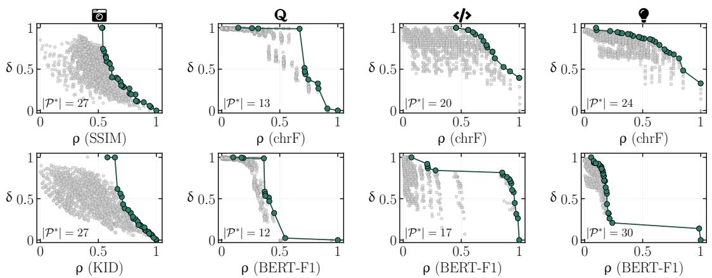

<table><tr><td></td><td>Dataset D</td><td>Size</td><td>Model</td><td>Perturbations</td><td>Fidelity φ</td><td>Task  $\psi$ </td><td>Clean ψ(D)</td></tr><tr><td>日</td><td>Tiny-ImageNet</td><td>10,000</td><td>CaiT-S36</td><td>speckle noise, glass blur, brightness, pixelate</td><td>KID, SSIM</td><td>Accuracy</td><td>86.7%</td></tr><tr><td>Q</td><td>QQP</td><td>1,000</td><td>RoBERTa-base</td><td>synonym, typo, contraction, punctuation</td><td>BERT-F1, chrF</td><td>Accuracy</td><td>91.2%</td></tr><tr><td>&lt;&gt;</td><td>HumanEval</td><td>164</td><td>CodeGen-2B-mono</td><td>butterfingers, char case, whitespace, newline</td><td>BERT-F1, chrF</td><td>RP5@1</td><td>23.2%</td></tr><tr><td>●</td><td>MBPP</td><td>974</td><td>CodeGen-2B-mono</td><td>butterfingers, char case, whitespace, newline</td><td>BERT-F1, chrF</td><td>RP5@1</td><td>31.9%</td></tr></table>

Table 1: Benchmarks, datasets and models, perturbations, fidelity metrics ϕ, task-performance metrics ψ, and clean-set performance ψ(D).

Figure 1: ${ \mathcal { P } } ^ { * }$ across benchmarks and fidelity metrics. Each panel shows the full configuration space (grey) and Pareto front (teal); $\lvert \mathcal { P } ^ { * } \rvert$ gives the front size per benchmark–metric pair. Pareto fronts contain configurations with one to four active perturbation dimensions. Counts by order 1–4 are: ƒ SSIM 27 (9,12,4,2); KID 27 (4,7,14,2); 6 chrF 13 (2,7,2,2); BERT-F1 12 (2,7,1,2); $\gamma \flat$ chrF 20 (2,3,12,3); BERT-F1 17 (3,9,5,0);  chrF 24 (1,5,13,5); BERT-F1 30 (7,12,5,6). See Appendix for details.
<table><tr><td></td><td colspan="2">日</td><td colspan="2">Q</td><td colspan="2">&lt;小&gt;</td><td colspan="2">?</td></tr><tr><td>Method</td><td>SSIM</td><td>KID</td><td>chrF</td><td>BERT-F1</td><td>chrF</td><td>BERT-F1</td><td>chrF</td><td>BERT-F1</td></tr><tr><td>TESTNAV</td><td>0.704</td><td>0.686</td><td>0.646</td><td>0.651</td><td>0.729</td><td>0.730</td><td>0.697</td><td>0.690</td></tr><tr><td>Greedy Search</td><td>0.557</td><td>0.464</td><td>0.638</td><td>0.782</td><td>0.742</td><td>0.783</td><td>0.681</td><td>0.751</td></tr><tr><td>Genetic Algorithm</td><td>0.540</td><td>0.552</td><td>0.693</td><td>0.707</td><td>0.753</td><td>0.767</td><td>0.640</td><td>0.631</td></tr><tr><td>Random Search</td><td>0.510</td><td>0.503</td><td>0.526</td><td>0.514</td><td>0.502</td><td>0.522</td><td>0.514</td><td>0.490</td></tr></table>

Table 2: AUC-Recall@ ${ \mathcal { P } } ^ { * }$ for TESTNAV and search baselines across all benchmarks and fidelity metrics. Bold indicates the best score and underline indicates the second-best score per column.

A value of 1 means that all Pareto-optimal configurations have been found. Steeper recall curves indicate earlier discovery of ${ \mathcal { P } } ^ { * }$

AUC-Recall summarises the full recall trajectory over $u =$ $1 , \ldots , | \Theta |$ unique configurations. Let $r _ { i } = \mathrm { R e c a l l @ } { \mathcal { P } } ^ { * } ( i )$ Then

$$
\mathrm { A U C - R e c a l l @ } \mathcal { P } ^ { * } = \frac { 1 } { | \Theta | } \sum _ { i = 1 } ^ { | \Theta | - 1 } \frac { r _ { i } + r _ { i + 1 } } { 2 } .
$$

Higher AUC-Recall indicates earlier discovery of ${ \mathcal { P } } ^ { * }$ under the same evaluation budget.

Execution protocol. All methods are evaluated under the same proposal budget B and run with 10 independent seeds on a GPU cluster at the Massachusetts Green High Performance Computing Center (MGHPCC).

## 4.2 Does TESTNAV recover ${ \mathcal { P } } ^ { * }$ more efficiently than non-Pareto baselines?

TESTNAV uses Pareto-guided bi-objective selection over performance degradation and input fidelity. We compare it against three baselines: objective-free random search, local scalar search, and scalar genetic search. For the scalar baselines, we use $s ( \pmb \theta ) \mathrm { = } \operatorname* { m i n } ( \delta ( \pmb \theta ) , \rho ( \pmb \theta ) )$ , so a configuration receives a high score only when both degradation and fidelity are high. The baselines are: (i) Random Search evaluates configurations in Θ in a uniformly random order, visiting each configuration exactly once; (ii) Greedy Search starts from a random configuration and repeatedly moves to the highest-scoring neighbour under s, where neighbours differ by 1 in one severity dimension, restarting when no neighbour improves; (iii) Genetic Algorithm uses the same population size, crossover, mutation, and duplicate-elimination settings as TESTNAV, but optimises the scalar score s rather than selecting by Pareto rank and crowding distance.

Figure 2 reports Recall@ ${ \mathcal { P } } ^ { * }$ over 10 seeds. The top-row xaxis shows unique configurations visited and the bottom-row x-axis shows the corresponding consumed evaluation budget; shaded regions show 1 standard deviation. Table 2 summarises the corresponding AUC-Recall values.

Pareto search helps on broad fronts. Using SSIM for vision and chrF for language/code, TESTNAV achieves the highest AUC-Recall on ƒ and , while Genetic Algorithm is highest on 6 and $\pmb { \mathscr { s } } / { \pmb { \mathscr { s } } }$ (Table 2). TESTNAV fully recovers ${ \bar { \mathcal { P } } } ^ { * }$ up to 2.15 earlier than baselines that also achieve Recall@ ${ \mathcal { P } } ^ { * } { = } 1$ , evaluating 35.8%–89.3% of Θ. TESTNAV achieves AUC 0.704 on ƒ, which is 38% above Random Search (0.510) and 26% above Greedy Search (0.557). These gains suggest that, when the Pareto front is broad, diversitypreserving selection helps recover degradation–fidelity tradeoffs that scalar search misses.

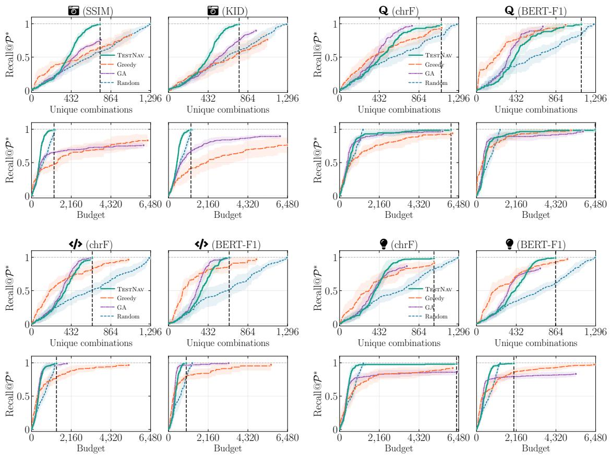  
Figure 2: Recall ${ \widehat { \underline { { a \ v } } } } { \mathcal { P } } ^ { * }$ across benchmarks and fidelity metrics. For each benchmark, the top row uses unique configurations as the x-axis, and the bottom row uses evaluation budget. Shaded bands show ±1 standard deviation over 10 seeds. The vertical line indicates the number of unique perturbation combinations (top) and total budget (bottom) required by TESTNAV to discover all Pareto-optimal configurations ${ \mathcal { P } } ^ { * }$ endpoint markers (■) show the highest Recall@P∗ achieved by each method..

Greedy search is competitive on compact fronts. With KID-derived fidelity for vision and BERT-F1 for language/code, Greedy Search achieves higher AUC than TEST-NAV on 6, Ð, and  (Table 2). Figure 1 suggests why: under these metrics, ${ \mathcal { P } } ^ { * }$ is small and concentrated in the (δ, ρ) space, so the scalar score $s ( \pmb \theta )$ can recover much of ${ \mathcal { P } } ^ { * }$ without exploring broadly. When ${ \mathcal { P } } ^ { * }$ is larger or more spread out, as under SSIM and chrF, scalar search is less effective, as it tends to concentrate on one region of the trade-off surface. TESTNAV mitigates this collapse through crowding-distance selection, which encourages the population to spread across the degradation–fidelity surface.

## 4.3 Can single-objective search recover $\mathcal { P } ^ { * } ?$

Figure 3 compares TESTNAV against two single-objective ablations using identical evolutionary operators: δ only maximises degradation without an input fidelity objective; ρ only maximises input fidelity without a degradation objective.

Single-objective search recovers less of the front. Both single-objective ablations recover substantially less of ${ \mathcal { P } } ^ { * }$ The δ-only condition favours high-degradation configurations, often at the cost of input fidelity; its AUC ranges from 0.185 to 0.384, up to 0.545 below TESTNAV. The ρ-only condition favours high-fidelity configurations, but lacks a signal for model failure; its AUC ranges from 0.612 to 0.771, within 0.085 of TESTNAV. Both show wider variance bands than TESTNAV, suggesting lower stability across seeds. TEST-NAV maintains spread across the degradation–fidelity surface through crowding-distance selection. Together, these results show that both objectives are necessary for Pareto-front recovery and stability.

## 4.4 Can input-level metrics proxy the trade-off?

Figure 4 evaluates seven input-level baselines introduced in §2.1 on ƒ: NAC, SNAC, KMNC, TKNC, DeepGini, LSA, and DSA. Each metric is used as the sole search objective; the ground truth is the corresponding bi-objective Pareto front.

Input-level signals are insufficient. No input-level metric matches TESTNAV in final Recall@ ∗. Under SSIM, TESTNAV reaches 0.993, with KMNC next best, at 0.900 (9% lower); TKNC (0.496) and LSA (0.581) are weakest. Under KID-derived fidelity, TESTNAV again reaches 0.993,

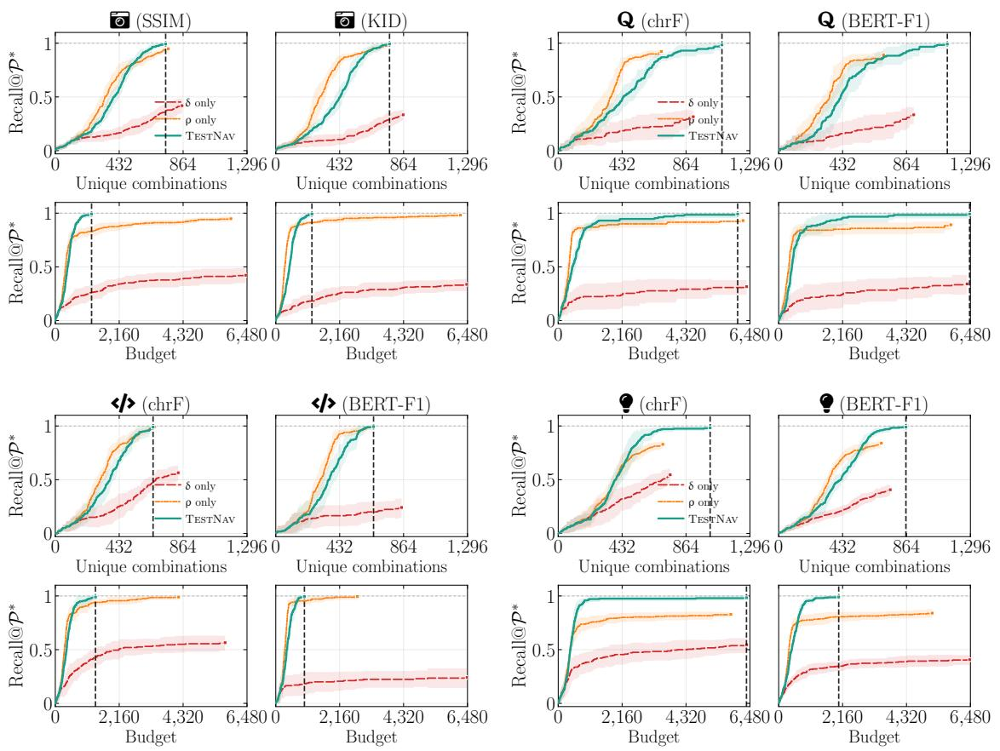  
Figure 3: Multi-objective versus single-objective search across benchmarks and fidelity metrics. Curves show Recall@P∗ over unique configurations in the top row and evaluation budget in the bottom row; bands show ±1 standard deviation over 10 seeds.

## 5 Conclusion

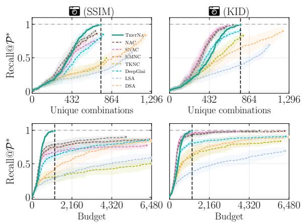  
Figure 4: Input-level metrics versus TESTNAV on ƒ. Curves show Recall@P∗ over unique configurations (top) and evaluation budget (bottom), using SSIM (left) and KID-derived fidelity (right).

matched by KMNC (0.993). Input-level metrics measure activation coverage, prediction uncertainty, or distributional novelty on individual inputs, but not where a perturbation configuration lies on the (δ, ρ) surface. Thus, maximising them can prioritise novel or activation-diverse configurations without identifying severe, high-fidelity failures.

TESTNAV is a Pareto-guided search framework for compositional robustness testing, formulated as a bi-objective problem over performance degradation δ and input fidelity ρ. Rather than maximising failures alone, TESTNAV targets configurations where models fail on inputs that still resemble the originals, highlighting candidate robustness weaknesses.

The benefit of Pareto-guided search depends on the geometry of the Pareto front. Across vision, natural language, and code-generation benchmarks, TESTNAV recovers ${ \mathcal { P } } ^ { * }$ more efficiently than non-Pareto baselines when the front is broad. Removing either objective reduces Pareto-front recovery, and input-level coverage and prioritisation signals cannot substitute for bi-objective configuration search.

The geometry of ${ \mathcal { P } } ^ { * }$ depends on the choice of performance and fidelity metrics, which are modality- and task-dependent. Because TESTNAV treats these metrics as interchangeable components, the framework generalises to any setting where performance degradation and input fidelity can be defined.

Limitations and future work. TESTNAV operates over discrete, predefined perturbation families and severity levels. We plan to extend TESTNAV to continuous perturbation spaces. Whether extreme Pareto points are useful depends on the testing goal; future work should help practitioners target regions of ${ \bar { \mathcal { P } } } ^ { * }$ and choose suitable search algorithms.

## References

[Arif et al., 2026] Arooj Arif, Tobias Hartung, Elena Botoeva, and Alexandros Koliousis. TestifAI: Tomographybased testing for deep learning systems. In ICSE, 2026.

[Austin et al., 2021] Jacob Austin, Augustus Odena, Maxwell Nye, et al. Program synthesis with large language models. arXiv:2108.07732, 2021.

[Blank and Deb, 2020] Julian Blank and Kalyanmoy Deb. pymoo: Multi-objective optimization in Python. IEEE Access, 8:89497–89509, 2020.

[Chandrasekaran et al., 2021] Ramakrishna Chandrasekaran, Bhavesh Khatri, Varun Garg, Rahul Sharma, Hisham Ahmed, and Karthik Murali. Combinatorial perturbation testing for assessing the robustness of autonomous driving systems. In ICST Workshops, 2021.

[Chen et al., 2021] Mark Chen, Jerry Tworek, Heewoo Jun, et al. Evaluating large language models trained on code. arXiv:2107.03374, 2021.

[Chuah et al., 2024] Joshua Chuah, Pingkun Yan, Ge Wang, and Juergen Hahn. Towards the generation of medical imaging classifiers robust to common perturbations. BioMedInformatics, 4(2):889–910, 2024.

[Deb et al., 2002] Kalyanmoy Deb, Amrit Pratap, Sameer Agarwal, and T. Meyarivan. A fast and elitist multiobjective genetic algorithm: NSGA-II. IEEE Transactions on Evolutionary Computation, 6(2):182–197, 2002.

[Deng et al., 2024] Jia Deng, Wei Dong, Richard Socher, et al. Tiny ImageNet (Stanford CS231N), 2024. https: //cstr.cn/32010.11.sjtu.scidata.000000 19.

[Detlefsen et al., 2022] Nicki Skafte Detlefsen, Jiri Borovec, Justus Schock, Ananya Harsh Jha, Teddy Koker, Luca Di Liello, Daniel Stancl, Changsheng Quan, Maxim Grechkin, and William Falcon. TorchMetrics: Measuring reproducibility in PyTorch. Journal of Open Source Software, 7(70):4101, 2022.

[Dola et al., 2024] Swaroopa Dola, Rory McDaniel, Matthew B. Dwyer, and Mary Lou Soffa. CIT4DNN: Generating diverse and rare inputs for neural networks using latent space combinatorial testing. In ICSE, 2024.

[Feng et al., 2020a] Yang Feng, Qingkai Shi, Xinyu Gao, Jun Wan, Chunrong Fang, and Zhenyu Chen. DeepGini: Prioritizing massive tests to enhance the robustness of deep neural networks. In ISSTA, 2020.

[Feng et al., 2020b] Zhangyin Feng, Daya Guo, Duyu Tang, Nan Duan, Xiaocheng Feng, Ming Gong, Linjun Shen, Bing Qin, Ting Liu, Daxin Jiang, and Ming Zhou. Code-BERT: A pre-trained model for programming and natural languages. In EMNLP Findings, 2020.

[Fraser and Arcuri, 2013] Gordon Fraser and Andrea Arcuri. Whole test suite generation. IEEE Transactions on Software Engineering, 39(2):276–291, 2013.

[Goodfellow et al., 2015] Ian J. Goodfellow, Jonathon Shlens, and Christian Szegedy. Explaining and harnessing adversarial examples. In ICLR, 2015.

[Guo et al., 2018] Jianmin Guo, Yu Jiang, Yue Zhao, Quan Chen, and Jiaguang Sun. DLFuzz: Differential fuzzing testing of deep learning systems. In ESEC/FSE, pages 739–743, 2018.

[Hao et al., 2024] Xiaoshuai Hao, Mengchuan Wei, Yifan Yang, et al. Is your HD map constructor reliable under sensor corruptions? Advances in Neural Information Processing Systems, 37:22441–22482, 2024.

[Hendrycks and Dietterich, 2019] Dan Hendrycks and Thomas Dietterich. Benchmarking neural network robustness to common corruptions and perturbations. In ICLR, 2019.

[Hendrycks et al., 2020] Dan Hendrycks, Norman Mu, Ekin D. Cubuk, Barret Zoph, Justin Gilmer, and Balaji Lakshminarayanan. AugMix: A simple data processing method to improve robustness and uncertainty. In ICLR, 2020.

[Kim et al., 2019] Jinhan Kim, Robert Feldt, and Shin Yoo. Guiding deep learning system testing using surprise adequacy. In ICSE, pages 1039–1049, 2019.

[Ma et al., 2018] Lei Ma, Felix Juefei-Xu, Fuyuan Zhang, Jiyuan Sun, Minhui Xue, Bo Li, et al. DeepGauge: Multigranularity testing criteria for deep learning systems. In ASE, pages 120–131, 2018.

[Miettinen, 1999] Kaisa Miettinen. Nonlinear Multiobjective Optimization. Kluwer Academic Publishers, 1999.

[Mintun et al., 2021] Eric Mintun, Alexander Kirillov, and Saining Xie. On interaction between augmentations and corruptions in natural corruption robustness. In NeurIPS, 2021.

[Morris et al., 2020] John Morris, Eli Lifland, Jin Yong Yoo, Jake Grigsby, Di Jin, and Yanjun Qi. TextAttack: A framework for adversarial attacks, data augmentation, and adversarial training in NLP. In EMNLP, 2020.

[Mu and Gilmer, 2019] Norman Mu and Justin Gilmer. MNIST-C: A robustness benchmark for computer vision. In ICML UDL Workshop, 2019.

[Mus¸at et al., 2021] Valentina Mus¸at, Ivan Fursa, Paul Newman, Fabio Cuzzolin, and Andrew Bradley. Multi-weather city: Adverse weather stacking for autonomous driving. In ICCV Workshops, pages 2906–2915, 2021.

[Nijkamp et al., 2022] Erik Nijkamp, Bo Pang, Hiroaki Hayashi, Lifu Tu, Huan Wang, Yingbo Zhou, Silvio Savarese, and Caiming Xiong. CodeGen: An open large language model for code with multi-turn program synthesis. arXiv:2203.13474, 2022.

[Panichella et al., 2015] Annibale Panichella, Fitsum Meshesha Kifetew, and Paolo Tonella. Reformulating branch coverage as a many-objective optimization problem. In ICST, pages 1–10, 2015.

[Pei et al., 2017] Kexin Pei, Yinzhi Cao, Junfeng Yang, and Suman Jana. DeepXplore: Automated whitebox testing of deep learning systems. In SOSP, 2017.

[Post, 2018] Matt Post. A call for clarity in reporting BLEU scores. In WMT, 2018.

[Ribeiro et al., 2020] Marco Tulio Ribeiro, Tongshuang Wu, Carlos Guestrin, and Sameer Singh. Beyond accuracy: Behavioral testing of NLP models with CheckList. In ACL, pages 4902–4912, 2020.

[Rusak and Mitzkus, 2019] Evgenia Rusak and Benjamin Mitzkus. imagecorruptions: Python package to corrupt images for robustness benchmarking, 2019. https:// github.com/bethgelab/imagecorruptions.

[Szegedy et al., 2014] Christian Szegedy, Wojciech Zaremba, Ilya Sutskever, Joan Bruna, Dumitru Erhan, Ian Goodfellow, and Rob Fergus. Intriguing properties of neural networks. In ICLR, 2014.

[Touvron et al., 2021] Hugo Touvron, Matthieu Cord, Alexandre Sablayrolles, Gabriel Synnaeve, and Herve´ Jegou. Going deeper with image transformers. In ´ ICCV, pages 32–42, 2021.

[Wang et al., 2019] Alex Wang, Amanpreet Singh, Julian Michael, Felix Hill, Omer Levy, and Samuel R. Bowman. GLUE: A multi-task benchmark and analysis platform for natural language understanding. In ICLR, 2019.

[Wang et al., 2023] Shiqi Wang, Zheng Li, Haifeng Qian, Chenghao Yang, et al. ReCode: Robustness evaluation of code generation models. In ACL, 2023.

## Appendix

The main paper reports recall curves and AUC scores but cannot show, due to space constraints, the detailed structure of the ground-truth Pareto fronts ${ \mathcal { P } } ^ { * }$ across benchmarks and metric choices. This appendix provides that evidence.

Recall that each perturbation configuration is a vector $\pmb { \theta } = ( \theta _ { 1 } , \theta _ { 2 } , \theta _ { 3 } , \theta _ { 4 } )$ , where $\theta _ { i } \in \{ 0 , \ldots , 5 \}$ gives the severity of perturbation type $T _ { i }$ and $\theta _ { i } { = } 0$ means that $T _ { i }$ is inactive. The perturbation order of a configuration is the number of active perturbations, $| \{ i : \theta _ { i } > 0 \} |$ . We use $\Theta _ { k }$ to denote the subset of the multi-perturbation space containing configurations with exactly k active perturbations. For example, $\pmb { \theta } \mathrm { = } ( 0 , 5 , 0 , 0 )$ is a $\Theta _ { 1 }$ configuration: it applies $T _ { 2 }$ at severity 5, with $\bar { T } _ { 1 } , T _ { 3 } ,$ , and $T _ { 4 }$ inactive. In contrast, $\pmb { \theta } \mathrm { = } ( 1 , 5 , 1 , 1 )$ is a $\Theta _ { 4 }$ configuration, applying all four perturbation types at severities 1, 5, 1, and 1. Thus, higher-order configurations correspond to compositions of more perturbation types.

Two questions motivate the appendix: (i) Do configurations in ${ \mathcal { P } } ^ { * }$ include high-fidelity failures rather than only trivially corrupted inputs? (ii) Does the choice of fidelity metric ρ matter in practice?

Figures 5 and 6 visualise one fixed Tiny-ImageNet example from our image-classification benchmark $\textcircled{1}$ under the Paretooptimal configurations found using (δ, ρSSIM) and $( \delta , \mathsf { \rho } _ { \mathrm { { K I D } } } )$ , respectively. For this benchmark, $T _ { 1 }$ is speckle noise, $T _ { 2 }$ is glass blur, $T _ { 3 }$ is brightness, and $T _ { 4 }$ is pixelate. Each image is labelled with the configuration θ and its corresponding configurationlevel scores $\delta ( \pmb \theta )$ and $\rho ( \pmb \theta )$ . The examples allow visual inspection of the perturbations, while $\delta ( \pmb \theta )$ reports the performance degradation induced by that configuration over the test set.

Table 3 summarises the Pareto-front composition for ƒ under the two fidelity metrics. SSIM and KID yield fronts of the same size $( | \mathcal { P } ^ { * } | = 2 7 )$ but different order distributions: SSIM places more configurations in Θ and $\Theta _ { 2 }$ , whereas KID places more in $\Theta _ { 3 }$ . Thus, the fidelity metric affects which degradation–fidelity trade-offs are Pareto-optimal.

Figures 7, and 8 address the second question using 4D voxel plots. Each plot shows where ${ \mathcal { P } } ^ { * }$ lies in the ful $6 ^ { 4 } { = } 1 { , } 2 9 6 { - }$ configuration space, with voxels coloured by perturbation order. For non-vision benchmarks, the perturbation types $T _ { 1 } , \ldots , T _ { 4 }$ follow Table 1; the same four-dimensional configuration notation is used. Together, the plots show that Pareto-optimal config urations include both low-order and higher-order perturbation combinations across modalities and fidelity metrics.

<table><tr><td>Metric pair</td><td> ${ \mathcal { P } } ^ { * }$ </td><td> $\Theta _ { 1 }$ </td><td> $\Theta _ { 2 }$ </td><td> $\Theta _ { 3 }$ </td><td> $\Theta _ { 4 }$ </td></tr><tr><td>(δ, ρSSIm)</td><td>27</td><td>9</td><td>12</td><td>4</td><td>2</td></tr><tr><td>(δ, ρκID)</td><td>27</td><td>4</td><td>7</td><td>14</td><td>2</td></tr></table>

Table 3: Pareto-front composition per metric pair for ƒ.

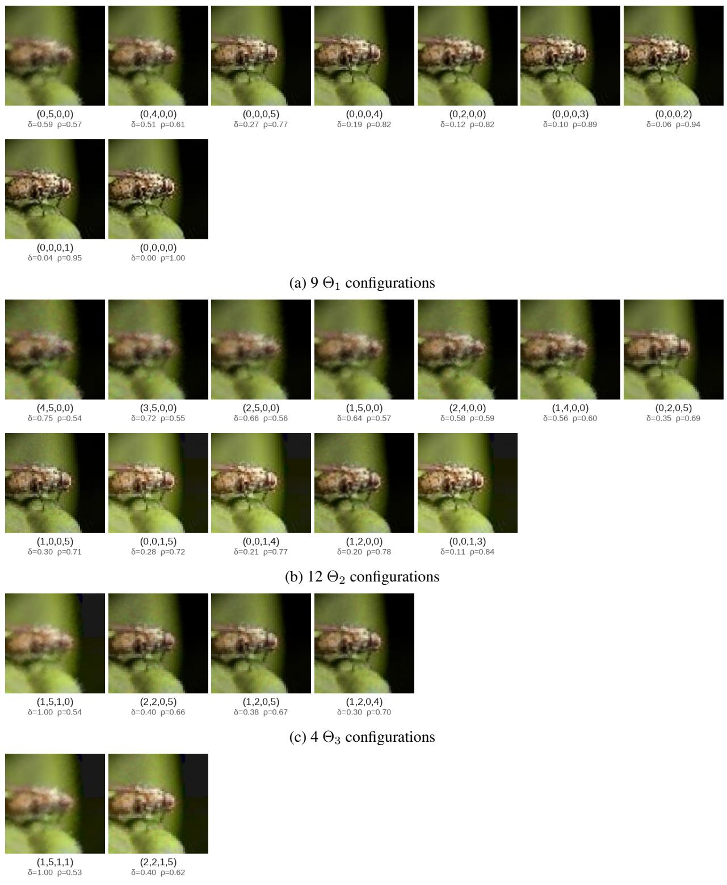  
(d) $2 \Theta _ { 4 }$ configurations  
Figure 5: (δ, ρSSIM) Pareto-optimal configurations for one Tiny-ImageNet example, grouped by active perturbation count. Each image is labelled with its perturbation configuration θ and the corresponding configuration-level scores δ(θ) and $\tilde { \rho ( \pmb \theta ) }$ .

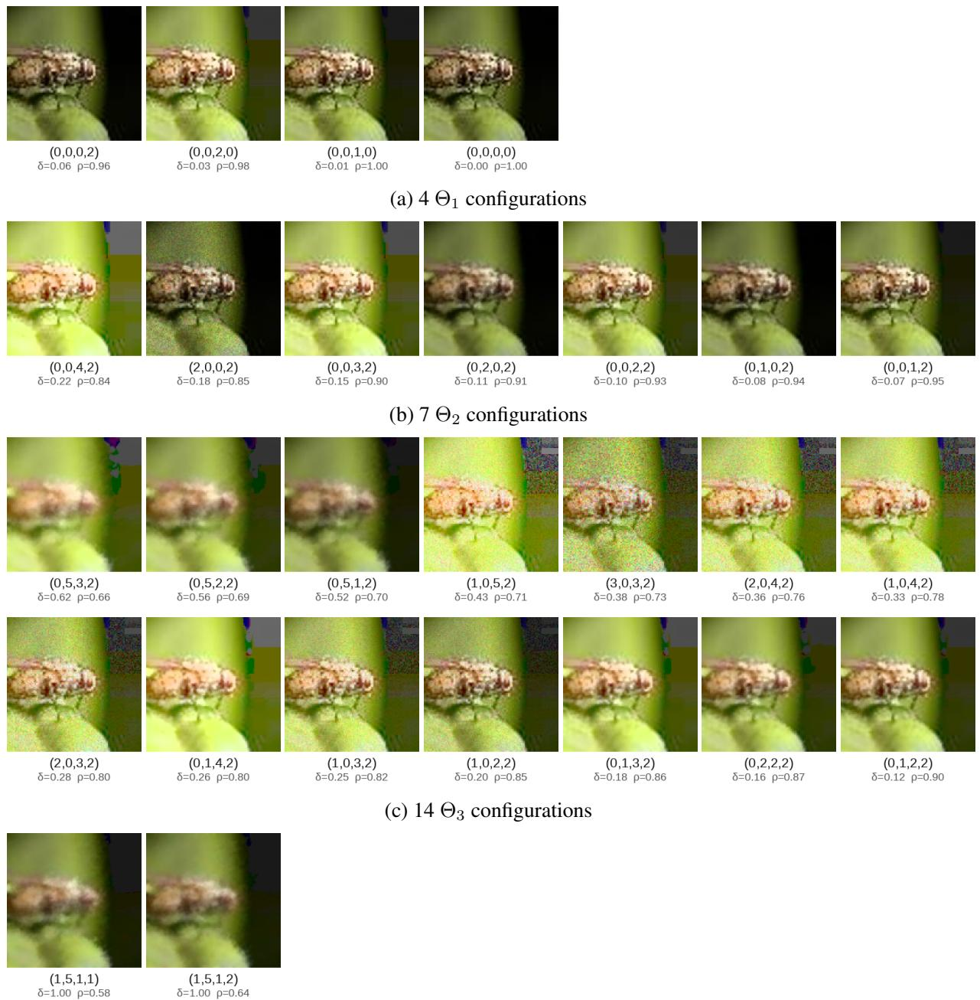  
(d) $2 \Theta _ { 4 }$ configurations

Figure 6: $( \delta , \mathsf { \rho } _ { \mathrm { { K I D } } } )$ Pareto-optimal configurations for one Tiny-ImageNet example, grouped by active perturbation count. Each image is labelled with its perturbation configuration θ and the corresponding configuration-level scores δ(θ) and $\hat { \rho ( \pmb \theta ) }$ ).

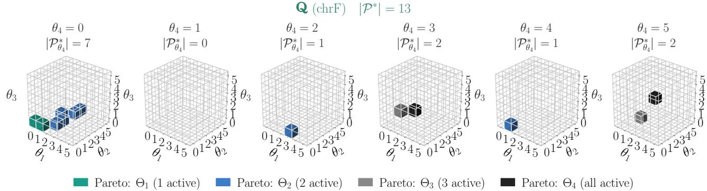  
(a) Paraphrase detection (6)

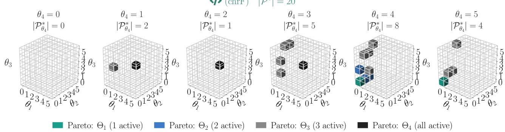  
(b) Code generation (HumanEval) (Ð)

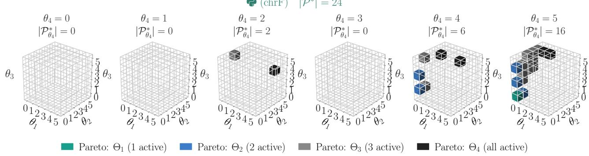  
(c) Code generation (MBPP) ()  
Figure 7: 4D voxel visualisations of P∗ for non-vision benchmarks using chrF as the fidelity metric.

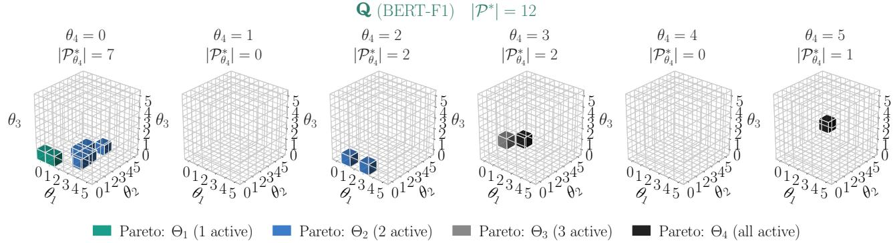  
(a) Paraphrase detection (6)

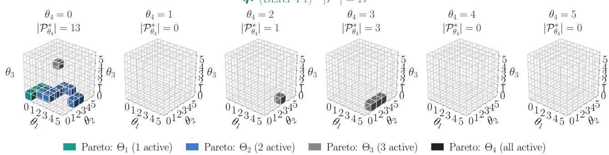  
(b) Code generation (HumanEval) (Ð)

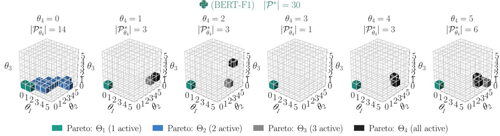  
(c) Code generation (MBPP) ()  
Figure 8: 4D voxel visualisations of P∗ for non-vision benchmarks using BERT-F1 as the fidelity metric.