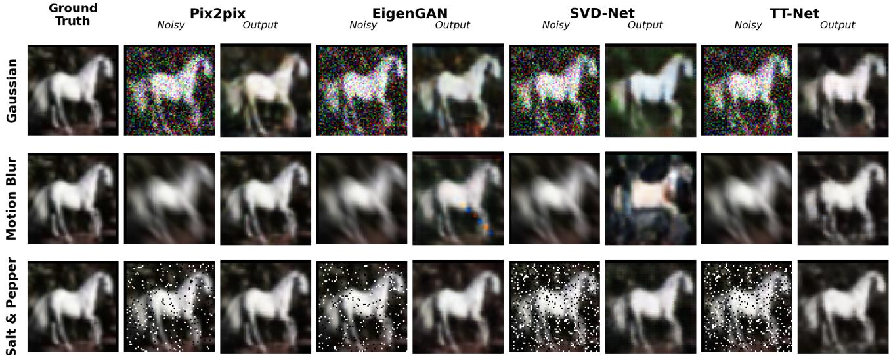
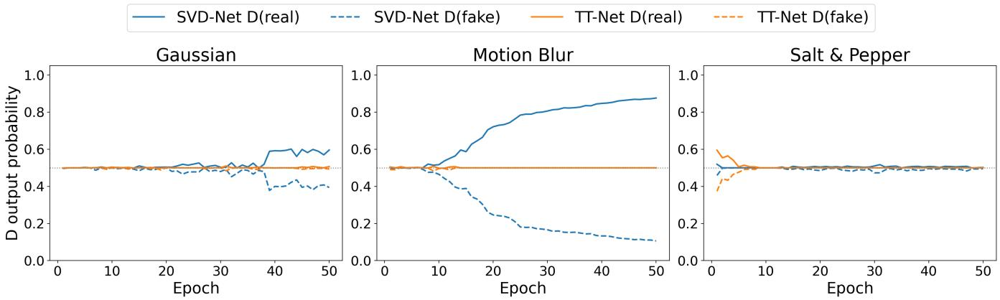
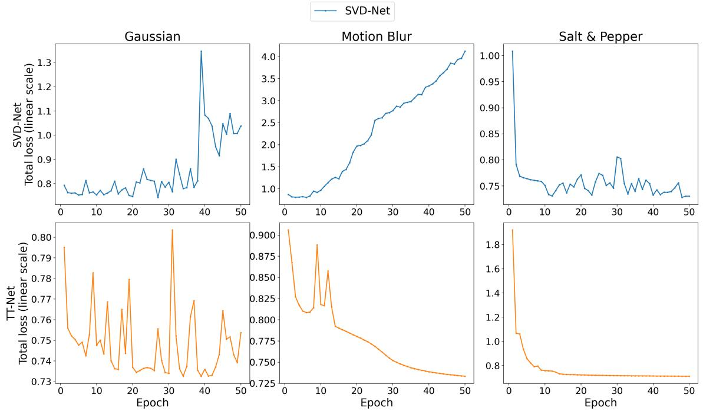
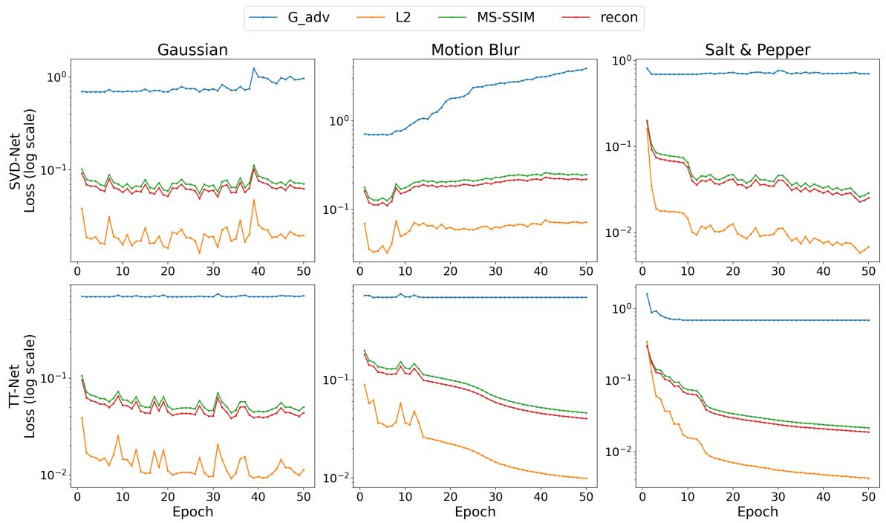
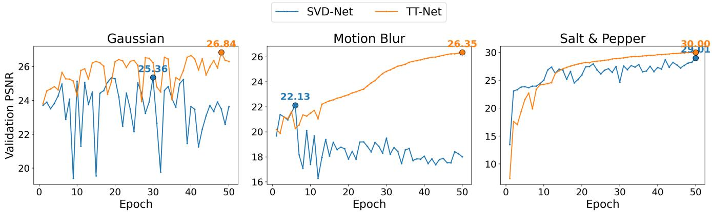
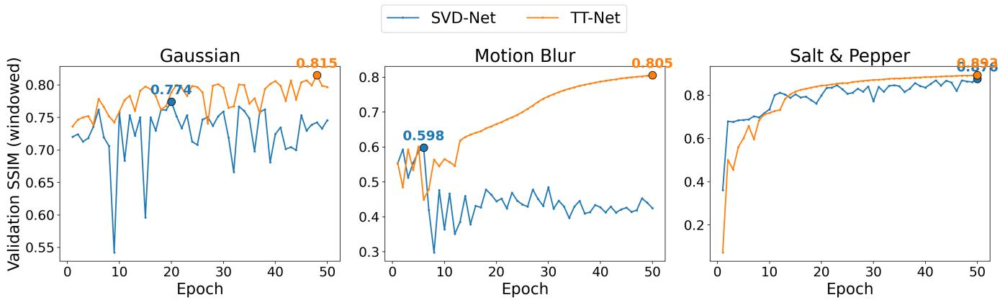
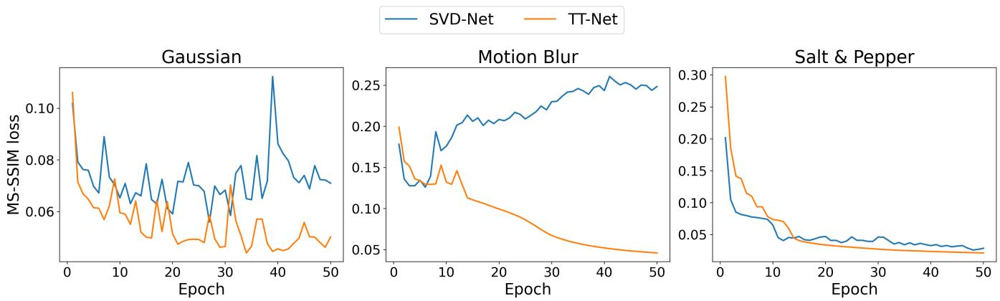

# TT-net: Quantum Inspired Tensor Network Denoising in Conditional GANs

Michal A. Sterzel∗, Marko J. Ranciˇ c´†

University of Luxembourg, FSTM, Department of Computer Science Campus Belval, 6 Av. de la Fonte, L-4364 Esch-Belval,

Esch-sur-Alzette, Luxembourg

∗michal.sterzel@gmail.com †marko.rancic@uni.lu

## Abstract

Developed as a workhorse for classical simulations of quantum algorithms and quantum many-body systems, Tensor Network methods have entered the scientific mainstream in quantum physics. Among various types of tensor networks, Tensor Trains (commonly know as Matrix Product States in the quantum computing community) have already found applications in machine learning. These methods often rely on a powerful linear algebra tool called the Singular Value Decomposition (SVD). Several conditional GAN architectures for image denoising incorporate SVD as a single-cut decomposition step applied to generator feature maps. In this work we introduce TT-Net, which replaces the per-channel SVD denoising block with a two-cut tensor-train decomposition capable of accessing cross-channel information directly, a capability absent from contemporary alternatives. In a controlled comparison differing only in this decomposition mechanism, TT-Net outperforms SVD-Net on PSNR and SSIM across all three noise types tested (Gaussian, motion blur, and salt-and-pepper), supporting the hypothesis that cross-channel access improves denoising quality. Training-dynamics analysis further shows that TT-Net’s adversarial loss term consistently saturates to a stagnant state across all three noise types, more so than SVD-Net’s, while reconstruction quality continues to improve regardless, raising an open question about the adversarial component’s contribution that this work identifies but does not resolve. Furthermore, for Gaussian noise our method outperforms both the EigenGAN and the state of the art Pix2pix method which does not assume any linear algebra decompositions and does not retain any linear algebra information. Our manuscript shows how quantum inspired tools can be used as practical real world feature filters for deep learning applications.

## 1 Introduction

Quantum computing is a novel computational paradigm deemed to bring the next disruption in the world of computing. As hardware matures the hunt for a ”killer application” is at full swing. The desire to simulate larger and larger quantum circuit has given birth to the fields of Tensor Networks, with most commonly used subtype of these networks being called Tensor Trains, commonly referred to as Matrix Product States in quantum physics literature [1].

The task of recovering a clean image from a degraded version known as image denoising is a long-standing problem in image processing, with applications ranging from medical imaging and remote sensing to consumer photography, in each case improving the reliability of downstream data analysis. Generative adversarial networks (GANs) [2] have been widely adopted for this task in their conditional form, where a generator is trained to transform a degraded image to its clean counterpart while a discriminator provides adversarial feedback, typically achieving better preservation of fine detail than classical denoising methods that rely on fixed assumptions about noise or image structure.

Within this space, several architectures incorporate Singular Value Decomposition (SVD) as a component of the generator, using it in different roles: adjusting a generated feature map’s singular values toward a target’s, as in EigenGAN [3], or applying it as a per-channel filtering mechanism, as in SVD-Net [4]. In every such case, however, SVD is applied as a single decomposition step: the feature map is unfolded into one matrix and decomposed once. Since a convolutional feature map is naturally a three-axis object (channels, height, and width) a single SVD cut can only ever separate one such grouping of axes (e.g. channels from combined spatial dimensions) from the rest, and whichever axes are merged in that unfolding can no longer be examined separately.

This raises a natural question: does generalizing a single SVD cut into a sequence of cuts, known as tensor-train decomposition, change what a denoising mechanism of this kind can capture or discard? Tensor decomposition methods have previously been applied inside neural architectures, including GANs [5, 6], but exclusively to compress learned weight matrices, never to filter feature-map activations on a per-sample basis, and never in a denoising context (Section 2).

This paper introduces TT-Net a method inspired in Matrix Product States, replacing SVD-Net’s per-channel SVD denoising block [4] with a two-cut tensor-train decomposition, inserted at the same locations in the generator and evaluated under identical training conditions, isolating the decomposition mechanism as the sole variable of interest. Our contributions are: (1) a tensor-train denoising block that, unlike SVD-Net, allows the decomposition to access cross-channel structure directly; (2) an adaptive per-cut thresholding scheme that preserves a comparable overall retained-energy target to SVD-Net, enabling a fair, like-for-like comparison; and (3) an experimental comparison of TT-Net against SVD-Net, EigenGAN, and a non-SVD Pix2pix baseline across three distinct noise types.

## 2 Related Work

Several conditional GAN architectures for image denoising incorporate SVD in different roles. EigenGAN [3] applies SVD within the generator’s decoder, adjusting the singular values of a generated feature map toward those of the target image and including their difference as an explicit loss term, making its use of SVD supervised and target-aware. SVD-Net [4], the direct predecessor of this work, instead applies SVD purely as a filtering mechanism: after each encoder downsampling stage, every feature-map channel is decomposed independently via SVD, and only the singular values needed to retain a fixed fraction of that channel’s energy are kept, with no comparison to a target and no dedicated loss term.

Tensor decomposition methods have separately been applied to compress the parameters of generative and general neural network architectures. Cao et al. [5] replace fully-connected layers of a GAN with Tucker-decomposition-based tensor layers, achieving substantial parameter compression with limited effect on sample quality. Novikov et al. [6] similarly represent fully-connected layer weight matrices in tensor-train format, reporting compression factors of several orders of magnitude. Both approaches decompose learned weight matrices once, with the resulting cores trained end-to-end. Neither applies a tensor decomposition to feature-map activations on a per-sample basis, and neither is evaluated in a denoising context.

<table><tr><td>Insertion point</td><td>Channels</td><td>Height</td><td>Width</td></tr><tr><td>After 1st encoder stage</td><td>64</td><td>32</td><td>32</td></tr><tr><td>After 2nd encoder stage</td><td>128</td><td>16</td><td>16</td></tr><tr><td>After 3rd encoder stage</td><td>256</td><td>8</td><td>8</td></tr></table>

Table 1: Feature map shape at each TT-Net / SVD-Net insertion point.

This leaves a gap: no existing work replaces a single-cut, SVDbased activation filter of the kind used in SVD-Net with a multicut tensor-train decomposition applied in the same architectural role. TT-Net, introduced next, addresses this gap directly.

## 3 Method

## 3.1 SVD-Net Recap

SVD-Net’s denoising block decomposes each channel of a feature map independently: for a feature map of shape channels × height × width, SVD is applied separately to each channel’s own height × width matrix, retaining enough singular values to preserve a fixed fraction $\theta = 0 . 9$ of that channel’s energy before reconstruction. Because no two channels ever appear in the same matrix, this mechanism cannot compare channels to one another or exploit any relationship between them, regardless of the threshold chosen.

## 3.2 TT-Net Architecture

TT-Net replaces SVD-Net’s per-channel SVD with a two-cut tensortrain decomposition, inserted at the same three locations in the generator (after each of the three encoder downsampling stages) (Table 1) and reconstructing a filtered feature map that is passed forward exactly as SVD-Net’s would be.

For a single image’s feature map $\boldsymbol { \mathcal { X } } \in \mathbb { R } ^ { C \times H \times W }$ , the first cut reshapes X into $\bar { M _ { 1 } } ~ \in ~ \mathbb { R } ^ { C \times ( H \hat { W } ) }$ , keeping channel as its own axis while merging height and width. SVD is applied directly to $M _ { 1 } = U _ { 1 } \Sigma _ { 1 } V _ { 1 } ^ { \bar { T } }$ , so that all channels of a given image are rows of the same matrix and are compared against one another during decomposition, a capability absent from SVD-Net. The top χ1 components by retained energy (Section 3.3) form Core $\mathbf { \tau } _ { \mathrm { l } } = U _ { 1 } [ : , 1 : \chi _ { 1 } ]$ The corresponding remainder $R _ { 1 } = \Sigma _ { 1 } [ 1 { : } \chi _ { 1 } , 1 { : } \chi _ { 1 } ] V _ { 1 } ^ { T } [ 1 { : } \chi _ { 1 } , : ]$ is carried forward rather than reconstructed immediately, while any components beyond $\chi _ { 1 }$ are discarded entirely.

R1 is reshaped so that channel merges with height, giving $M _ { 2 } \in$ $\mathbb { R } ^ { ( \chi _ { 1 } H ) \times W }$ , and a second SVD $M _ { 2 } \ = \ U _ { 2 } \Sigma _ { 2 } V _ { 2 } ^ { \bar { T } }$ yields an adaptively chosen $\chi _ { 2 } ,$ , giving Core2 $\in \mathbb { R } ^ { \chi _ { 1 } \times H \times \chi _ { 2 } }$ (reshaped from $U _ { 2 } [ :$ $1 { : } \chi _ { 2 } ] )$ and $\tilde { \mathrm { C o r e } _ { 3 } } = \check { \Sigma } _ { 2 } \bigl [ 1 { : } \chi _ { 2 } , 1 { : } \chi _ { 2 } \bigr ] V _ { 2 } ^ { T } \bigl [ 1 { : } \chi _ { 2 } , : \bigr ] \in \dot { \mathbb { R } } ^ { \chi _ { 2 } \times W }$ . The filtered feature map is reconstructed by contracting all three cores:

$$
\widetilde { \mathcal { X } } [ i , j , k ] = \sum _ { a = 1 } ^ { \chi _ { 1 } } \sum _ { b = 1 } ^ { \chi _ { 2 } } \mathrm { C o r e } _ { 1 } [ i , a ] \mathrm { C o r e } _ { 2 } [ a , j , b ] \mathrm { C o r e } _ { 3 } [ b , k ] .
$$

All other components of the architecture such as the generator/discriminator structure, loss functions, optimizer, and training procedures are identical to SVD-Net, isolating the decomposition mechanism as the sole variable under study.

## 3.3 Adaptive Threshold for Fair Comparison

Both models select their retained rank adaptively per image, as the smallest $\chi$ for which cumulative squared-singular-value energy reaches a threshold θ, rather than fixing χ in advance. Because TT-Net’s second cut operates on the remainder passed forward from the first, its two thresholds compound multiplicatively rather than additively: setting $\theta _ { 1 } = \theta _ { 2 } = 0 . 9$ would yield an overall retained energy closer to $0 . 9 ^ { 2 } = 0 . 8 1$ , not 0.9. To keep the comparison to SVD-Net’s single $\theta = 0 . 9$ target fair, TT-Net’s thresholds are instead set to $\theta _ { 1 } = \theta _ { 2 } = \sqrt { 0 . 9 } \approx 0 . 9 4 8 7$ , so that $\theta _ { 1 } \times \theta _ { 2 } \approx 0 . 9 .$ . Since $\chi$ is chosen as the smallest sufficient value and singular values are discrete, actual retained energy typically exceeds the nominal threshold.

<table><tr><td>Model</td><td>lr (G, D)</td><td> $\beta _ { 1 }$ </td><td> $\beta _ { 2 }$ </td><td>Optimizer</td></tr><tr><td>Pix2pix</td><td> $2 \times 1 0 ^ { - 4 }$ </td><td>0.5</td><td>0.999</td><td>Adam</td></tr><tr><td>EigenGAN</td><td> $2 \times 1 0 ^ { - 3 }$ </td><td>0.5</td><td>0.999</td><td>Adam</td></tr><tr><td>SVD-Net</td><td> $1 \times 1 0 ^ { - 4 }$ </td><td>0.9</td><td>0.999</td><td>Adam</td></tr><tr><td>TT-Net</td><td> $1 \times 1 0 ^ { - 4 }$ </td><td>0.9</td><td>0.999</td><td>Adam</td></tr></table>

Table 2: Optimized hyperparameters used for each model, with a uniform batch size of 32 applied across all four.

## 3.4 Cross-Channel Information Gained

The two cuts extract structurally different information. The first cut’s dominant direction (largest singular value) corresponds to the strongest pattern of agreement across channels, while smallersingular-value directions capture channel-specific, residual variation. Retaining only the dominant directions keeps what channels share while discarding what is unique to individual channels, information a per-channel decomposition cannot access at all. The second cut, operating on what the first retained with width as its only free axis, instead captures horizontal spatial regularities (e.g. smooth gradients, repeated textures, edges) shared jointly across the retained channel directions and height positions. Whether discarding what is excluded at either cut removes noise rather than genuine detail is the empirical question addressed in Section 5.

## 4 Experimental Setup

All experiments use the CIFAR-10 dataset, resized to $6 4 \times 6 4$ pixels and split into 40,000 training, 10,000 validation, and 10,000 test images. Three synthetic noise types are applied to the datasets to generate noisy-clean pairs for supervised training, applied identically across all four models: additive Gaussian noise with standard deviation 0.5, motion blur with an 11-pixel directional kernel at $4 5 ^ { \circ }$ , and salt-and-pepper noise affecting 20% of pixels.

All models are trained for 50 epochs. Evaluation uses Peak Signal-to-Noise Ratio (PSNR) and Structural Similarity Index (SSIM) [7] on the held-out test set, computed identically across all four models. SSIM is computed using the standard windowed formulation (11x11 Gaussian window, sigma=1.5), consistent with the original definition, computed identically across all four models.

## 4.1 Optimized Hyperparameters

Table 2 lists the hyperparameters used across training for all models. A single hyperparameter was intentionally unified across all four models despite this per-model tuning: batch size, fixed at 32 for every model and every noise type. Keeping batch size fixed at 32, while preserving each model’s literature-recommended learning rate and momentum, isolates batch size as the only hyperparameter standardized across the entire comparison.

Each model’s optimizer settings follow the configuration reported in its own originating paper: Pix2pix and EigenGAN’s values come directly from Isola et al. [8] and Kas et al. [3] respectively, and SVD-Net’s from Zhong and Li [4]. TT-Net has no independent originating paper of its own to draw from, since it is introduced in this work; rather than selecting a new, untested configuration, TT-Net instead adopts SVD-Net’s exact optimizer settings unchanged. This choice follows directly from TT-Net’s design as a direct architectural extension of SVD-Net (Section 3), differing only in its denoising block: using SVD-Net’s own recommended configuration keeps that comparison a single-variable ablation, isolating the decomposition mechanism as the only difference between the two models, rather than introducing an additional, independently-tuned hyperparameter difference alongside it.

<table><tr><td></td><td colspan="2">Gaussian</td><td colspan="2">Motion Blur</td><td colspan="2">Salt &amp; Pepper</td></tr><tr><td>Model</td><td>PSNR</td><td>SSIM</td><td>PSNR</td><td>SSIM</td><td>PSNR</td><td>SSIM</td></tr><tr><td>Pix2pix</td><td>25.52</td><td>0.7466</td><td>36.18</td><td>0.9643</td><td>41.79</td><td>0.9881</td></tr><tr><td>EigenGAN</td><td>25.18</td><td>0.7545</td><td>26.71</td><td>0.8398</td><td>34.24</td><td>0.9513</td></tr><tr><td>SVD-Net</td><td>23.60</td><td>0.7455</td><td>18.02†</td><td>0.4260†</td><td>28.98</td><td>0.8761</td></tr><tr><td>TT-Net</td><td>26.28</td><td>0.7968</td><td>26.34</td><td>0.8058</td><td>29.97</td><td>0.8926</td></tr></table>

Table 3: Test-set PSNR and SSIM (standard windowed formulation) across noise types, using each model’s optimized hyperparameters (Section 4.1) with a uniform batch size of 32. Bold indicates the best value across allfour models. TT-Net achieves the best PSNR and SSIM of any model on Gaussian noise. †SVD-Net’s motion-blur result reflects a late-training discriminator collapse rather than a converged model (Section 5.3).

## 4.2 Implementation details

Beyond the stated hyperparameters the four models also differ architecturally in discriminator design and reconstruction loss. SVD-Net and TT-Net share an unconditional discriminator trained with cross-entropy loss, and a generator with a reconstruction loss blending MSE and MS-SSIM (δ = 0.84). Concretely, for a generated image Yˆ and its clean target Y , the two reconstruction terms are the pixel-wise mean squared error

$$
\mathcal { L } _ { L 2 } = \| \hat { Y } - Y \| _ { 2 } ^ { 2 } ,
$$

and the multi-scale structural similarity loss

$$
\mathcal { L } _ { \mathrm { M S - S S I M } } = 1 - \mathbf { M S - S S I M } ( \hat { Y } , Y ) ,
$$

which are combined into the reconstruction loss

$$
\mathcal { L } _ { \mathrm { r e c o n } } = \delta \cdot \mathcal { L } _ { \mathrm { M S - S S I M } } + \left( 1 - \delta \right) \cdot \mathcal { L } _ { L 2 } , \quad \delta = 0 . 8 4 .
$$

The generator’s adversarial loss term, $\mathcal { L } _ { G _ { a d v } }$ , is the standard nonsaturating GAN generator loss. The full generator objective is then

$$
{ \mathcal { L } } _ { G } = { \mathcal { L } } _ { G _ { a d v } } + { \mathcal { L } } _ { \mathrm { r e c o n } } .
$$

Pix2pix and EigenGAN instead share a conditional PatchGAN discriminator with label-smoothed binary cross-entropy and an L1- based reconstruction loss generator component, following their own original architectures. One deviation from the original SVD-Net architecture is disclosed for transparency: an additional downscaling stage was introduced in the encoder to reduce computation and fit within available GPU job-time constraints. This modification is inherited unchanged by TT-Net, preserving the validity of the SVD-Net vs. TT-Net comparison, though it does mean SVD-Net/TT-Net use a shallower encoder bottleneck than Pix2pix/EigenGAN, a further reason the latter two are treated as contextual baselines rather than controlled comparison points.

## 5 Results

## 5.1 Quantitative Results

Table 3 lists all PSNR and SSIM values achieved on the test image set for all four models across the three noise types. Within the controlled comparison (Section 4), TT-Net outperforms a common single channel alternative SVD-Net on every metric and every noise type: by 2.68 dB PSNR and 0.0513 SSIM on Gaussian noise, by 8.32 dB PSNR and 0.3798 SSIM on motion blur, and by 0.99 dB PSNR and 0.0165 SSIM on salt-and-pepper noise. This consistent advantage supports the hypothesis introduced in Section 1: allowing the denoising mechanism to access cross-channel structure, rather than treating every channel in isolation, corresponds to a measurable improvement in reconstruction quality across all three noise conditions tested.

The motion-blur gap is by far the largest of the three; however, it should be interpreted with care: as discussed in Section 5.3, SVD-Net’s motion-blur training exhibits a sustained discriminator-driven collapse partway through training that TT-Net’s run does not, meaning part of this specific gap likely reflects a training-stability difference rather than the denoising mechanism alone. The Gaussian and salt-and-pepper gaps, where no comparable instability was observed in either run, are the more direct evidence of the mechanism’s effect.

Pix2pix and EigenGAN, included as context from a different architecture family achieve higher absolute scores on motion blur and salt-and-pepper than either SVD-Net or TT-Net, plausibly reflecting their deeper four-stage encoder bottleneck in addition to any effect of their denoising mechanism (or lack thereof). Since architecture, discriminator design, and hyperparameters all differ simultaneously between these two models and the SVD-Net/TT-Net pair, this comparison does not isolate the contribution of SVD in the same controlled way and is not the focus of this paper’s analysis.

Beyond the SVD-Net comparison, TT-Net also achieves the best PSNR and SSIM of any of the four models on Gaussian noise (Table 3), outperforming Pix2pix by 0.76 dB PSNR and 0.0502 SSIM, and EigenGAN by 1.10 dB PSNR and 0.0423 SSIM. This is notable because Pix2pix and EigenGAN’s deeper four-stage encoder (Section 4.2) generally advantages them on the other two noise types; TT-Net’s lead here cannot be attributed to that architectural advantage on account of SVD-Net performing worse than either Pix2pix and EigenGAN, and more directly reflects the cross-channel decomposition mechanism itself.

## 5.2 Qualitative Results

Figure 1 shows representative test-set examples for one CIFAR-10 image per noise type, with all four models’ noisy inputs and outputs shown alongside the shared ground truth. Only the noise realization differs between them, since noise is generated independently per run.

Visual differences between SVD-Net and TT-Net are easily visible for the Gaussian noise. TT-Net’s output preserves the ground truth’s natural coloring, whereas SVD-Net’s output is noticeably saturated with a green tint. On motion blur the gap is stark and immediate: SVD-Net’s output shows a clearly corrupted patch inconsistent with the underlying image structure, a direct visual symptom of the discriminator collapse discussed in Section 5.3, while TT-Net’s output remains a coherent, if blurry, reconstruction. On salt-and-pepper noise, outputs from the two models are visually similar, consistent with the smaller quantitative gap in Table 3.

Pix2pix and EigenGAN’s outputs appear visually sharper on motion blur and salt-and-pepper, consistent with their higher quantitative scores on those noise types, though as discussed in Section 4 this cannot be attributed to their denoising mechanism alone given the architectural and hyperparameter differences involved.

  
Figure 1: Representative test-set outputs across all four models and three noise types. Ground truth is shown once per row since it is identical across models. Each model’s own noisy input and output are shown alongside it.

## 5.3 Training Stability

SVD-Net’s motion-blur run exhibits a training failure distinct from every other run in this study. Training proceeds normally for the first six epochs, reaching a peak of PSNR 22.13 / SSIM 0.5984 at epoch 6, with D(real) and D(fake) close to the balanced point of 0.5. From epoch 7 onward, D(real) climbs steadily and almost monotonically to 0.876 by epoch 50, while D(fake) falls to 0.106 over the same span (Figure 2). PSNR and SSIM collapse alongside this shift and never recover, ending at PSNR 18.02 / SSIM 0.4260 (Figure 5, Figure 6). This is consistent with a discriminator that overpowers the generator partway through training, rather than a stable convergence to a lower-quality result.

Every other run in this study, for both SVD-Net and TT-Net, instead converges toward the opposite extreme: D(real) and D(fake) settle to almost exactly 0.500 within the first few epochs, indicating a discriminator no longer able to distinguish real from generated images. This is not unique to TT-Net: SVD-Net shows a smallermagnitude version of this pattern on Gaussian and salt-and-pepper noise, settling near 0.500 within the first 2-5 epochs, followed on Gaussian by a gradual drift from epoch 21 and a sharper shift at epoch 39, after which D(real) settles near 0.59-0.60 for the remainder of training, a smaller-scale version of the motion-blur failure. TT-Net shows the initial saturation pattern on all three noise types, settling fully within the first two epochs for Gaussian, by epoch 10 for salt-and-pepper, and by epoch 14 for motion blur (Figure 2).

TT-Net’s adversarial loss term $( G _ { a d v } )$ declines rapidly early in training before settling to a stable minimum for the remainder of training across all three noise types (Figure 4). For motion blur and salt-and-pepper, this minimum is essentially constant for the rest of training, while on Gaussian it instead fluctuates without a clear trend around a similar level. This is in clear contrast to SVD-Net’s $G _ { a d v } ,$ which continues to move measurably throughout training, most visibly on Gaussian and motion blur (Figure 4). The reconstructionbased loss terms (L2, MS-SSIM) do not saturate in the same way for either model, continuing to change throughout training (Figure 4, Figure 7). On Gaussian both models noticeably fluctuate across epochs, however TT-Net has a decreasing trend as opposed to SVD-Net. On motion blur and salt-and-pepper, TT-Net’s MS-SSIM loss changes smoothly with visibly less epoch-to-epoch fluctuation than SVD-Net’s. Specifically on motion blur, TT-Net’s MS-SSIM loss decreases smoothly and monotonically for the remainder of training, while SVD-Net’s fluctuates without a clear trend around a substantially worse, largely unimproving level, consistent with the discriminator-driven collapse described above.

In every case where a run settles toward this 0.5/0.5 equilibrium, PSNR and SSIM continue to improve for the remainder of training rather than stalling, with the best validation result reached at or near the final epoch (Figure 5, Figure 6). This is visible in the total generator loss as well: despite $G _ { a d v }$ itself having flattened, TT-Net’s total loss keeps declining throughout training, driven almost entirely by the still-improving reconstruction term rather than by adversarial feedback (Figure 3). This suggests that once training reaches this state, continued improvement is driven by the reconstruction loss operating through each model’s denoising mechanism rather than by adversarial feedback, since a discriminator outputting a constant 0.5 regardless of input provides no informative gradient to the generator. However, confirming that this is specifically attributable to the implementation of the cross-channel mechanism in TT-Net as described in Section 3 would require training TT-Net with the adversarial loss removed entirely, which we identify as a direction for future work in Section 6.

## 6 Conclusion and Future Work

This paper introduced TT-Net, which replaces SVD-Net’s perchannel SVD denoising block with a two-cut tensor-train decomposition capable of accessing cross-channel structure, and compared it directly against SVD-Net in a controlled setting differing only in this mechanism. TT-Net outperformed SVD-Net in every metric and every noise type tested (Gaussian, motion blur, salt-and-pepper), supporting the hypothesis that allowing a denoising mechanism to compare channels against each other, rather than treating each in isolation, corresponds to a measurable improvement in reconstruction quality. TT-Net also achieved the best overall PSNR and SSIM of all four models tested on Gaussian noise, ahead of Pix2pix and Eigen-GAN despite their deeper encoder.

Training-dynamics analysis further showed that TT-Net’s adversarial loss term consistently reaches a stagnant state across all three noise types, more completely and consistently than SVD-Net’s, while reconstruction quality continues to improve throughout training regardless. This raises the question of whether the adversarial component contributes meaningfully to TT-Net’s performance at all, a question this work identifies but does not resolve.

Several limitations bound these conclusions. The motion-blur comparison is confounded by a distinct training failure in SVD-Net’s run, unrelated to the denoising mechanism itself. Reported test metrics use each model’s final-epoch checkpoint rather than its best validation checkpoint.

Future work includes directly testing whether TT-Net’s adversarial loss term is necessary at all, by training with it removed entirely and comparing results to those reported here. Extending the comparison to additional datasets, and analyzing whether TT-Net’s perblock retained rank correlates with denoising difficulty across noise types are additional natural extensions of this work.

## A Supporting Training Curves

Figures 2–7 provide the underlying training curves referenced in Section 5.3, for SVD-Net and TT-Net across all three noise types.

## References

[1] Roman Or´ us. A practical introduction to tensor networks: Ma-´ trix product states and projected entangled pair states. volume 349, pages 117–158, 2014. doi: 10.1016/j.aop.2014.06.013.

[2] Ian J. Goodfellow, Jean Pouget-Abadie, Mehdi Mirza, Bing Xu, David Warde-Farley, Sherjil Ozair, Aaron Courville, and Yoshua Bengio. Generative adversarial networks. In Advances in Neural Information Processing Systems, pages 2672–2680, 2014.

[3] M. Kas, A. Chahi, I. Kajo, and Y. Ruichek. Eigengan: An svd subspace-based learning for image generation using conditional gan. Knowledge-Based Systems, 293:111691, jun 2024. ISSN 0950-7051. doi: 10.1016/j.knosys.2024.111691.

[4] Wei Zhong and Ruiwen Li. Svd-net: structure-preserving gan with embedded svd for fingerprint image enhancement. Signal, Image and Video Processing, 19:1128, 2025. doi: 10.1007/ s11760-025-04742-z.

[5] Xingwei Cao, Xuyang Zhao, and Qibin Zhao. Tensorizing generative adversarial nets. arXiv preprint arXiv:1710.10772, 2018.

[6] Alexander Novikov, Dmitrii Podoprikhin, Anton Osokin, and Dmitry P. Vetrov. Tensorizing neural networks. In Advances in Neural Information Processing Systems (NeurIPS), pages 442– 450, 2015.

[7] Alain Hore and Djemel Ziou. Image quality metrics: Psnr vs.´ ssim. In 2010 20th International Conference on Pattern Recognition, pages 2366–2369, 2010. doi: 10.1109/ICPR.2010.579.

[8] Phillip Isola, Jun-Yan Zhu, Tinghui Zhou, and Alexei A. Efros. Image-to-image translation with conditional adversarial networks. In Proceedings of the IEEE Conference on Computer Vision and Pattern Recognition (CVPR), pages 1125–1134, 2017.

  
Figure 2: Discriminator output probabilities D(real)/D(fake) over training, SVD-Net vs. TT-Net, by noise type.

  
Figure 3: Total generator loss $( \mathcal { L } _ { G } = \mathcal { L } _ { G _ { a d v } } + \mathcal { L } _ { \mathrm { r e c o n } }$ , Section 4.2) over training, SVD-Net (top) vs. TT-Net (bottom), by noise type, linear scale.

  
Figure 4: Generator loss components $( G _ { a d v } , \mathrm { L } 2$ , MS-SSIM, recon) over training, SVD-Net (top) vs. TT-Net (bottom), by noise type. See Section 4.2 for the loss definitions, ${ \mathcal { L } } _ { \mathrm { r e c o n } } = \delta \cdot { \mathcal { L } } _ { \mathrm { M S - S S I M } } + ( 1 - \delta ) \cdot { \mathcal { L } } _ { L 2 } , \delta = 0 . 8 4$

  
Figure 5: Validation PSNR over training, SVD-Net vs. TT-Net, by noise type.

  
Figure 6: Validation SSIM (windowed) over training, SVD-Net vs. TT-Net, by noise type.

  
Figure 7: MS-SSIM loss component over training, SVD-Net vs. TT-Net, by noise type.